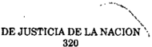

TOMO 320

Volumen 1

1997

DE JUSTICIA DE LA NACION

320

## FALLOS DE LA CORTE SUPREMA DE JUSTICIA DE LA NACION

1

DE JUSTICIA DE LA NACION

320

3

## R E P U B L I C A A R G E N T I N A

FALLOS

DE  LA

C O R T E

S U P R E M A

DE

## J USTICIA DE LA N ACION

PUBLICACION A CARGO DE LA SECRETARIA DE JURISPRUDENCIA DEL TRIBUNAL

TOMO 320 - VOLUMEN 1

FEBRERO - MAYO

LA LEY S.A.E. e I.

Tucumán 1471 (1050) Buenos Aires 1997

## HOJA COMPLEMENTARIA

Hoja incorporada a los efectos de permitir la búsqueda por página dentro del Volumen.

DE JUSTICIA DE LA NACION

320

5

## A C U E R D O S   D E   L A   C O R T E   S U P R E M A

## AÑO 1997

## FEBRERO - MAYO

## PERITOS CALIGRAFOS.

-N o 1-

En Buenos Aires, a los 6 días del mes de febrero del año mil novecientos noventa y siete, reunidos en la Sala de Acuerdos del Tribunal, los señores Ministros que suscriben la presente,

## Consideraron:

Que mediante resolución N  269/ 94, esta Corte llamó a concurso abierto de anteo cedentes y oposición a fin de cubrir dos (2) cargos en el cuerpo de calígrafos oficiales de la Justicia Nacional.

Que efectuada la prueba de oposición prevista en el punto c) del artículo 5  de la o mencionada resolución, la comisión asesora eleva el dictamen con el orden de mérito alcanzado; adjuntando asimismo, las impugnaciones que a fs. 83/90, 91/93 y 100/101, formulan tres postulantes al referido dictamen.

Que dichos planteos deben ser desestimados, toda vez que en las respectivas presentaciones, los recurrentes se limitan a efectuar una serie de afirmaciones que en modo alguno resultan suficientes para descalificar el dictamen que suscribió la comisión asesora -que es irrecurrible cuando no media manifiesta arbitrariedad o apartamiento de las normas reglamentarias fijadas (res. 391/85, 1003/88, 959/91, entre otras)y en el caso, los argumentos expuestos por la citada comisión se encuentran debidamente fundados, por lo que este Tribunal no advierte motivos que justifiquen su intervención.

## Por ello,

## Acordaron:

1 o ) Desestimar los planteos interpuestos a fs. 83/90, 91/93 y 100/101 por los motivos expuestos.

2 o ) Efectuar las siguientes designaciones en el Cuerpo de Peritos Calígrafos de la Justicia Nacional: Perito Calígrafo a la señora Beatriz Laura Bevacqua (D.N.I.

N o 12.713.615) y al señor Guillermo A. Anzorena (D.N.I. N  14.223.887) quienes ocuo pan los primeros lugares en el orden de mérito.

Todo lo cual dispusieron y mandaron, ordenando que se comunicase y se registrase en el libro correspondiente, por ante mí, que doy fe. - JULIO S. NAZARENO ( Presidente ) - EDUARDO MOLINÉ O'CONNOR - AUGUSTO CÉSAR BELLUSCIO - GUILLERMO A. F. LÓPEZ - GUSTAVO A. BOSSERT - ADOLFO ROBERTO VÁZQUEZ. Javier M. Leal de Ibarra (Secretario).

## MINISTERIO PUBLICO. ESCALAFON.

## -N o 2-

En Buenos Aires, a los 14 días del mes de febrero del año mil novecientos noventa y siete, reunidos en la Sala de Acuerdos del Tribunal, los señores Ministros que suscriben la presente,

## Consideraron:

Que por resolución N  29/96 el Sr. Procurador General de la Nación solicita el o avocamiento de esta Corte para conocer y decidir respecto de la aplicación de la acordada N o 2/95, en la que se dispuso que las vacantes producidas en la Procuración General de la Nación y sus dependencias, con excepción de los titulares de las fiscalías, defensorías y asesorías que integran el Ministerio Público, serán cubiertas por el Sr. Procurador General y haciéndose saber a las cámaras nacionales y federales que, a los fines del futuro reordenamiento de los escalafones (ac. 240:107), deberán coordinar con el Sr. Procurador General de la Nación el sistema a adoptar.

Que por la mencionada resolución N  29/96 se manifiesta la necesidad de dilucidar o si  cabe  mantener o, por el contrario, debe separarse el escalafón entre el personal judicial y el del Ministerio Público, en razón de las diversas inteligencias respecto de la interpretación dada a la acordada N  2/95. Es así que se señala que diversas cámaras o federales de apelación formalizaron per se la separación escalafonaria, y otras interpretaron que debía mantenerse la unidad del régimen.

Que es así que la Cámara Federal de Apelaciones de Mar del Plata (resolución N o 66/95); la Cámara Federal de Apelaciones de San Martín (acordada N  189/95); la o Cámara Federal de Apelaciones de Paraná (resolución N  15/ 96); la Cámara Federal o de Apelaciones de La Plata (acordada N  17/96), dispusieron la separación de los escao lafones judiciales, de los agentes dependientes del Ministerio Público, y sobre cuya situación se requiere pronunciamiento de esta Corte para cumplir con el adecuado reordenamiento del sistema escalafonario.

Que se ha producido, así, un disímil tratamiento según el criterio sustentado por los tribunales nacionales y federales para mantener el escalafonamiento único o para efectuar la separación.

Que, como lo destaca en su resolución el Sr. Procurador General, entre la acordada de esta Corte N  2/95 y la actualidad, media la sanción de la ley presupuestaria o vigente (ley 24.624) en la que se asignan al Poder Judicial y al Ministerio Público jurisdicciones presupuestarias independientes.

Que a su vez, por acordada C.S. N  40/95, se aprobó un nuevo escalafón de magiso trados y funcionarios del Poder Judicial -con las categorías que se detallan en su Anexo I y la tabla de equivalencias que se incorporaron a la aludida acordada- en la que se excluyen los cargos del Ministerio Público, atento -según los considerandos de dicho acto- a lo dispuesto por el art. 120 de la Constitución Nacional, modificando y ordenando los alcances del anexo I del escalafón para la Justicia Nacional. En razón, precisamente, de invocarse la norma constitucional que estableció la independencia del Ministerio Público, con autonomía funcional y autarquía financiera, subordinándose su vigencia a la ley reglamentaria de éste, a la sazón aún no sancionada.

Que va de suyo que, por virtud del art. 29 de la ley 24.624, al crearse jurisdicciones presupuestarias distintas, se ha tornado incompatible la existencia misma de un escalafonamiento único para dos unidades funcionales autónomas. Podrá haber identidad en su estructuración orgánica, pero los vasos intercomunicantes, en su inescindible pertenencia al ejercicio de la función jurisdiccional por sí, no es razón suficiente para desvirtuar lo que expresamente la norma fundamental ha establecido y en el ordenamiento presupuestario se ve reflejado.

Que, además, debe tenerse en debida consideración que la acordada N  2/95 de o fecha anterior a la vigencia de la ley general de presupuesto para el año 1996, que estableció por primera vez las jurisdicciones independientes, dispuso que las vacantes que se produzcan en la Procuración General de la Nación y sus dependencias -salvo las excepciones en ella previstas- quedaban en competencia exclusiva del Sr. Procurador General.

Que no cabe duda, entonces, que la propia Corte reconoció aún antes de mediar la vigencia de la ley de presupuesto aludida, que por virtud de la disposición constitucional hubo un enervamiento de su propia potestad con respecto al Ministerio Público.

Que la acordada ulterior C.S. 40/95 que, si bien dejó sujeto en cuanto a la vigencia, un nuevo escalafón para la Justicia Nacional -magistrados y funcionarios- a la entrada en vigor de la ley reglamentaria del Ministerio Público, de cuya nomenclatura se excluyeron los cargos del Ministerio Público, importando actos implícitos de un reconocimiento de esta situación de separación de escalafones que parece de meridiana claridad.

Que ahora bien, también fue dispuesto y mandado por la acordada C.S. N  2/95 o que las cámaras nacionales y federales, a los fines de futuros reordenamientos de escalafones, debieran coordinar con el Sr. Procurador General, el sistema a adoptar.

Que en lo que atañe a esta prescripción, no se le ha dado debido cumplimiento, prevaleciendo el criterio de las cámaras nacionales y federales de disponer per se separación de escalafones sin contar con la coordinación del Sr. Procurador General, con arreglo a la acordada mencionada en el precedente párrafo.

Que dadas las situaciones consumadas, es menester, para lo inmediato, corregir sin dilación alguna situación como la expresada, resguardando así la adecuada independencia funcional del Ministerio Público, consagrada en el texto constitucional.

Que, en consecuencia, esta Corte debe reasumir para regular esta materia, sus poderes de superintendencia, avocándose al conocimiento de las cuestiones deducidas por el Sr. Procurador General (acordadas N  79/92 y 36/94), y declarar que es procedeno te la separación de los escalafones respectivos.

Que ello no es óbice para entender que en el lapso de transición por una parte, y los vasos intercomunicantes permanentes por la otra, en el ejercicio de jurisdicciones independientes, no deben excluirse si no que, por el contrario, habrá que afianzarse la necesidad de colaboración y cooperación para armonizar las condiciones de funcionamiento y eficacia, por las necesarias implicancias de acciones recíprocas, en relación con equiparaciones y reconocimientos escalafonarios, salariales, gremiales y situaciones previsionales preexistentes que deben ser atendidas en común, sin perjuicio que la autoridad en cada jurisdicción actúe ejecutando las competencias propias, con absoluta independencia.

Por ello,

Acordaron:

- 1. Declárase que, conforme lo precedentemente expresado, son independientes el escalafón del Poder Judicial del correspondiente al Ministerio Público.
- 2. Instrúyese al Sr. Administrador General para que coordine, mediante la propuesta de integración de una comisión en conjunto entre el Poder Judicial y el Ministerio  Público,  todas  las  acciones  tendientes  al  reordenamiento escalafonario, salarial, gremial y previsional de ambas jurisdicciones.

Todo lo cual dispusieron y mandaron, ordenando se comunicase y registrase en el libro correspondiente, por ante mí, que doy fe. - JULIO S. NAZARENO - EDUARDO MOLINÉ O'CONNOR - CARLOS S. FAYT - AUGUSTO CÉSAR BELLUSCIO - ENRIQUE SANTIAGO PETRACCHI - ANTONIO BOGGIANO - GUILLERMO A. F. LÓPEZ - ADOLFO ROBERTO VÁZQUEZ ( en disidencia ) -Nicolás Alfredo Reyes (Administrador General).

VOTO DEL SEÑOR MINISTRO DR. ADOLFO ROBERTO VÁZQUEZ

## Consideraron:

Que por resolución N  29/96 el Sr. Procurador General de la Nación solicita el o avocamiento de esta Corte para conocer y decidir respecto de la aplicación de la acordada N o 2/95, en la que se dispuso que las vacantes producidas en la Procuración General de la Nación y sus dependencias, con excepción de los titulares de las fiscalías, defensorías y asesorías que integran el Ministerio Público, serán cubiertas por el Sr. Procurador General, haciéndose saber además, a las cámaras nacionales y federales que, a los

fines del futuro reordenamiento de los escalafones (ac. 240:107) deberán coordinar con el Sr. Procurador General de la Nación el sistema a adoptar.

Que por la mencionada resolución N  29/96 se manifiesta la necesidad de dilucidar o si cabe mantener o por el contrario, debe separarse el escalafón entre el personal judicial y el del Ministerio Público, en razón de las diversas inteligencias respecto de la interpretación dada a la acordada N  2/95. Es así que se señala que las distintas cámao ras  federales  de  apelaciones,  en  algunos  casos  formalizaron per  se la  separación escalafonaria y en otros interpretaron que debía mantenerse la unidad del régimen.

Que es así que la Cámara Federal de Apelaciones de Mar del Plata (resolución N o 66/95); la Cámara Federal de Apelaciones de San Martín (acordada N  189/95); la Cáo mara Federal de Apelaciones de Paraná (resolución N  15/ 96); la Cámara Federal de o Apelaciones de La Plata (acordada 17/96), dispusieron la separación de los escalafones judiciales, de los agentes dependientes del Ministerio Público y sobre cuya situación se requiere pronunciamiento de esta Corte para cumplir con el adecuado reordenamiento del sistema escalafonario.

Que se ha producido de tal modo, un disímil tratamiento según el criterio sustentado por los tribunales nacionales y federales para mantener el escalafonamiento único o para efectuar la separación.

Que resulta necesario puntualizar en primer lugar, que en cuanto a la ubicación del Ministerio Público Fiscal dentro de la estructura institucional, un somero reconto de los antecedentes legislativos habidos al respecto, permite advertir que desde siempre ha formado parte del Poder Judicial. En tal sentido puede recordarse que la Constitución Nacional en su versión originaria de 1853 disponía en su artículo 91 que 'la Corte Suprema de Justicia de la Nación se compondría de nueve jueces y dos fiscales'. La reforma de 1860, que modificó la disposición (que pasó a ser el artículo 94), dejó librado al criterio del Poder Legislativo la determinación del número de integrantes del Tribunal en cuanto se limitó a señalar: 'el Poder Judicial de la Nación será ejercido por una Corte Suprema de Justicia y los demás tribunales inferiores que el congreso establezca en el territorio de la Nación'. Fue entonces cuando la ley 27 del año 1962, determinó que 'la justicia nacional se ejercerá por medio de una Corte Suprema de Justicia, compuesta de cinco ministros y un procurador general'. La Constitución Nacional de 1949 en su artículo 89 reprodujo el 94. La ley 13.998 de 1950, dictada a propósito de la reforma antes mencionada, estableció en el artículo 21 que 'la Corte Suprema de Justicia de la Nación estará compuesta de cinco jueces y un procurador general'. La reforma de 1957, que reimplantó la Constitución Nacional de 1853-60 con algunas modificaciones dejó intacto el ya transcripto artículo 94. El decreto-ley 1285/ 58 ratificado por la ley 14.467, reprodujo literalmente el art. 21 de la ley 13.998. La ley 15.271 de 1960 modificó el artículo 21 de la ley 13.998. La ley 15.271 de 1960, modificó el  artículo  21  cit.  estatuyendo  que  la  Corte  Suprema  de  Justicia  de  la  Nación  está compuesta por cinco jueces y un procurador general. Para finalmente concluir el historial con la ley 23.774 de 1990 que sustituyó con su artículo 1  al 21 del decreto 1285/58 o al disponer: 'la Corte Suprema estará compuesta por nueve jueces. Ante ella actuarán el procurador general de la Nación y los procuradores fiscales de la Corte Suprema de Justicia de la Nación'.

Que no empece a lo que se viene sosteniendo la circunstancia de que en oportunidad de producirse la última reforma al texto constitucional, el art. 3  de la ley 24.309 o

denominada de Declaración de la Necesidad de Reformar Parcialmente la Constitución Nacional, con el enunciado 'Temas que son habilitados por el Congreso Nacional para su debate por la Convención Constituyente, previó en el apartado G): al Ministerio Público Fiscal como órgano extrapoder (por habilitación de un artículo a incorporarse en la segunda parte del nuevo capítulo). Ello es así porque el art. 120, que es el resultado de dicha enmienda, no ha plasmado expresa o implícitamente ese contenido, en virtud de que sólo dispone 'El Ministerio Público Fiscal es un órgano independiente con autonomía funcional y autarquía financiera, que tiene por función promover la actuación de la justicia en defensa de la legalidad de los intereses generales de la sociedad, en coordinación con las demás autoridades de la República. Está integrado por un procurador general de la Nación y los demás miembros que la ley establezca. Sus miembros gozan de inmunidades funcionales e intangibilidad de remuneraciones'.

Como puede advertirse de la redacción de la norma en estudio, de ella no surge que se trate de un órgano extrapoder. Lo que por otra parte resultaría de imposible práctica si se tiene en cuenta que desde la más tradicional concepción sostenida por Montesquieu, hasta la actualidad se acepta que el poder es uno y reside en la soberanía del pueblo quien lo organiza y distribuye a los fines de su ejercicio en la clásica trilogía: ejecutivo, legislativo y judicial.

Vale decir entonces que la inteligencia con que debe interpretarse el mentado artículo 120, consiste en sostener que el Ministerio Público es un órgano independiente y que dicha independencia se asegura a través de la autonomía funcional y la autarquía financiera, como lo expresa el texto de la Constitución Nacional. Por autonomía funcional debe entenderse al igual que ocurre con los jueces, respecto de los cuales se interpreta sin hesitación doctrinaria, que aquella es la síntesis de todas las prerrogativas con que cuentan los magistrados y funcionarios del Poder Judicial en aras de preservar no solo la independencia del órgano, sino la personal de quienes lo conforman. Vale decir estar exentos de subordinación jerárquica, ser imparciales en las decisiones, inamovibles en sus cargos, gozar de las inmunidades que la Constitución tiene previstas y de la intangibilidad de la remuneración. El segundo elemento, es decir la autarquía financiera, que está dada efectivamente a partir de la creación de partidas presupuestarias separadas, en virtud del art. 29 de la ley 24.624 denominada de Presupuesto General de la Administración Nacional, no pretende sino reforzar dicha independencia.

Ahora bien puntualmente referido al tema que se plantea, esto es a la posibilidad de que se constituyan escalafones separados entre los miembros del Ministerio Público y  los  del  resto  del  Poder  Judicial,  cabe  puntualizar  que  la  Acordada  2/95  del  23  de febrero de 1995 dispuso que las vacantes que se produjeran en la Procuración General de la Nación y sus dependencias con excepción de los titulares de las fiscalías, defensorías y asesorías que integran ese Ministerio Público serían cubiertas por el Sr. Procurador General de la Nación. A su turno, la Acordada 40/95 del 28 de setiembre de 1995 elaboró un nuevo escalafón para la Justicia Nacional -magistrados y funcionarios-, de cuya nomenclatura se excluyeron los cargos del Ministerio Público. Esta última fue supeditada a la entrada en vigencia de la ley reglamentaria del funcionamiento del Ministerio Público, que es conveniente recordar cuenta con sanción de la H. Cámara de Senadores de la Nación y se encuentra a estudio de la H. Cámara de Diputados de la Nación, previendo en su artículo 65 que 'los funcionarios y el personal auxiliar del Ministerio Público se regirán por la presente ley, las normas pertinentes del decreto-ley 1285/58 y

las  reglamentaciones que dicten el Procurador General de la Nación y el Defensor General de la Nación, estableciéndose asimismo en el inc. b) del artículo citado que 'todo traspaso de funcionarios o empleados desde el Ministerio Público al Poder Judicial de la Nación, o a la inversa, no afectará los derechos adquiridos durante su permanencia en uno u otro régimen, que comprenderán el reconocimiento de su jerarquía, antigüedad y los beneficios derivados de la permanencia en el cargo o categoría y otros análogos, a fin de garantizar el ascenso indistinto en ambas carreras, atendiendo a los títulos y eficiencia de los funcionarios y empleados y a su antigüedad'.

Que en consecuencia esta Corte debe reasumir para regular esta materia, sus poderes de superintendencia, avocándose al conocimiento de las cuestiones deducidas por el Sr. Procurador General y declarando la posibilidad de que proceda la separación de los escalafones respectivos, -como de hecho existe en las distintas instancias y dependencias de los diferentes fueros del Poder Judicial- desde luego supeditando el tema a lo que disponga la ley reglamentaria y posibilitando los ascensos y pases entre el personal del Ministerio Público y el resto del Poder Judicial y viceversa.

Por ello,

Acordaron:

- 1. Declárase que de conformidad con lo precedentemente expresado, el escalafón del Ministerio Público podrá ser independiente con respecto al resto del Poder Judicial si así se dispone en la ley reglamentaria. Ello sin perjuicio de la reciprocidad que ambos guarden entre sí a los fines pertinentes.
- 2.  Instrúyase al Sr. Administrador General para que oportunamente coordine, mediante la propuesta de integración de una comisión en conjunto con el Poder Judicial  y  el  Ministerio  Público,  todas  las  acciones  tendientes  al  reordenamiento escalafonario, salarial, gremial y previsional de ambas jurisdicciones.

Todo lo cual dispusieron y mandaron ordenando que se comunicase y registrase en el libro correspondiente, por ante mí que doy fe.- ADOLFO ROBERTO VÁZQUEZ Nicolás Alfredo Reyes (Administrador General).

## PERITOS. CIENCIAS AMBIENTALES.

## -N o 4-

En Buenos Aires, a los 27 días del mes de febrero del año mil novecientos noventa y siete, reunidos en la Sala de Acuerdos del Tribunal, los señores Ministros que suscriben la presente,

## Consideraron:

La solicitud formulada en el expediente de Secretaría Nro. 602/96 y la opinión favorable del titular de la Secretaría de Juicios Originarios en las mencionadas actuaciones.

## Por ello,

## Acordaron:

Incluir en la nómina de especialidades que forma parte de la acordada N  25/85 a o los Peritos en Ciencias Ambientales.

Todo lo cual dispusieron y mandaron, ordenando que se comunicase y registrase en el libro correspondiente, por ante mí, que doy fe.- JULIO S. NAZARENO - EDUARDO MOLINÉ O'CONNOR - AUGUSTO CÉSAR BELLUSCIO - ENRIQUE SANTIAGO PETRACCHI - ANTONIO BOGGIANO - ADOLFO ROBERTO VÁZQUEZ. Javier M. Leal de Ibarra (Secretario)

## DIAS INHABILES.

## -N o 5-

En Buenos Aires, a los 7 días del mes de marzo del año mil novecientos noventa y siete, reunidos en la Sala de Acuerdos del Tribunal, los señores Ministros que suscriben la presente,

## Consideraron:

Que la forma irregular en que han funcionado los Tribunales Nacionales y Federales del país, en razón de la medida de fuerza resuelta por la Unión de Empleados de la Justicia de la Nación el día 19 de febrero del corriente año, requiere tomar medidas que eviten perjuicio a los litigantes.

Por ello,

## Acordaron:

Declarar el día 19 de febrero de 1997, a partir de las 10 horas, inhábil para los Tribunales Nacionales y Federales del país, sin perjuicio de la validez de los actos procesales cumplidos que no hubiesen sido actuados en rebeldía.

Todo lo cual dispusieron y mandaron, ordenando que se comunicase y registrase en el libro correspondiente, por ante mí, que doy fe. - JULIO S. NAZARENO - EDUARDO MOLINÉ O'CONNOR - CARLOS S. FAYT - ENRIQUE SANTIAGO PETRACCHI - ANTONIO BOGGIANO - ADOLFO ROBERTO VÁZQUEZ.

## DE JUSTICIA DE LA NACION 320

## DIAS INHABILES.

-N o 6-

En Buenos Aires, a los 17 días del mes de marzo del año mil novecientos noventa y siete, reunidos en la Sala de Acuerdos del Tribunal, los señores Ministros que suscriben la presente,

## Consideraron:

Que la forma irregular en que han funcionado los Tribunales Nacionales y Federales del país, en razón de la medida de fuerza resuelta por la Unión de Empleados de la Justicia de la Nación el día 14 de marzo del corriente año, requiere tomar medidas que eviten perjuicio a los litigantes.

Por ello,

Acordaron:

Declarar el día 14 de marzo de 1997, inhábil para los Tribunales Nacionales y Federales del país, sin perjuicio de la validez de los actos procesales cumplidos que no hubiesen sido actuados en rebeldía.

Todo lo cual dispusieron y mandaron, ordenando que se comunicase y registrase en el libro correspondiente, por ante mí, que doy fe.- JULIO S. NAZARENO - EDUARDO MOLINÉ O'CONNOR - CARLOS S. FAYT - AUGUSTO CÉSAR BELLUSCIO - GUSTAVO A. BOSSERT ADOLFO ROBERTO VÁZQUEZ.

## PERITOS. TRADUCTORES DE LENGUAJE DE SEÑAS.

-N o 7-

En Buenos Aires, a los 18 días del mes de marzo del año mil novecientos noventa y siete, reunidos en la Sala de Acuerdos del Tribunal, los señores Ministros que suscriben la presente,

## Consideraron:

La solicitud formulada en el expediente de Secretaría Nro. 538/96 y la opinión favorable del titular de la Secretaría de Juicios Originarios en las mencionadas actuaciones.

Por ello,

Acordaron:

Incluir en la nómina de especialidades que forma parte de la acordada N  25/85 a o los traductores de lenguaje de señas.

Todo lo cual dispusieron y mandaron, ordenando que se comunicase y registrase en el libro correspondiente, por ante mí, que doy fe. - JULIO S. NAZARENO - CARLOS S. FAYT - AUGUSTO CÉSAR BELLUSCIO - ENRIQUE SANTIAGO PETRACCHI - ADOLFO ROBERTO VÁZQUEZ Javier M. Leal de Ibarra (Secretario).

## EDICTOS.

## -N o 8-

En Buenos Aires, a los 21 días del mes de marzo del año mil novecientos noventa y siete, reunidos en la Sala de Acuerdos del Tribunal, los señores Ministros que suscriben la presente

## Consideraron:

Que el art. 130 del Reglamento para la Justicia Nacional (acordada del 17 de diciembre de 1952) impone a los juzgados la obligación de elevar trimestralmente a esta Corte y a la cámara de apelaciones respectiva, la nómina de las designaciones de diarios, periódicos, o revistas efectuadas por el juez para la publicación de edictos.

Que ello significa una innecesaria duplicidad de información, que no encuentra justificativo atento el ejercicio de las facultades de superintendencia delegadas en las cámaras.

Por ello,

## Acordaron:

Sustitúyese el art. 130 del Reglamento para la Justicia Nacional (acordada del 17 de diciembre de 1952) por el siguiente:

'Artículo 130. Los juzgados llevarán un registro público en el que se asentarán las designaciones de diarios, periódicos, o revistas efectuadas por el juez para la publicación de edictos sin que haya mediado propuesta de parte o prescindiendo de ella. En este registro se indicará, además, el nombre de la causa, su naturaleza y monto. Trimestralmente se elevará a la respectiva cámara de apelaciones una nómina de esas designaciones con las menciones expresadas'.

Todo lo cual dispusieron y mandaron, ordenando se comunicase y registrase en el libro correspondiente, por ante mí, que doy fe.- JULIO S. NAZARENO - EDUARDO MOLINÉ O'CONNOR - CARLOS S. FAYT - AUGUSTO CÉSAR BELLUSCIO - ENRIQUE SANTIAGO PETRACCHI - GUILLERMO A. F. LÓPEZ - GUSTAVO A. BOSSERT - ADOLFO ROBERTO VÁZQUEZ -Nicolás Alfredo Reyes (Secretario).

## DE JUSTICIA DE LA NACION 320

## FERIADO JUDICIAL.

-N o 9-

En Buenos Aires, a los 8 días del mes de abril del año mil novecientos noventa y siete, reunidos en la Sala de Acuerdos del Tribunal, los señores Ministros que suscriben la presente,

## Acordaron:

1 o ) Disponer en el corriente año feriado judicial para los tribunales nacionales de la Capital desde el día 21 de julio al 1  de agosto, ambos inclusive. o

2 o ) Hacer saber a las Cámaras Federales de Apelaciones que con arreglo a lo previsto en la Acordada N  53/73 -respecto de la coincidencia de la feria en ella establecida o con las vacaciones escolares- y a lo dispuesto en la presente, deberán determinar para sus respectivas jurisdicciones un feriado judicial de diez días hábiles (acápite 2  de la o acordada N  30/84). o

Todo lo cual dispusieron y mandaron, ordenando que se comunicase y registrase en el libro correspondiente, por ante mí, que doy fe. - JULIO S. NAZARENO - EDUARDO MOLINÉ O'CONNOR - CARLOS S. FAYT - AUGUSTO CÉSAR BELLUSCIO - ENRIQUE SANTIAGO PETRACCHI - GUILLERMO A. F. LÓPEZ - GUSTAVO A. BOSSERT Nicolás Alfredo Reyes (Administrador General).

TRIBUNAL ORAL EN LO CRIMINAL FEDERAL DE SANTIAGO DEL ESTERO.

## -N O 10-

En Buenos Aires, a los 15 días del mes de abril del año mil novecientos noventa y siete, reunidos en la Sala de Acuerdos del Tribunal, los señores ministros que suscriben la presente,

## Consideraron:

Que la ley 24.121 crea un Tribunal Oral en lo Criminal Federal con asiento en la ciudad de Santiago del Estero.

Que el Poder Ejecutivo Nacional ha procedido a la designación de los magistrados que se harán cargo de aquél.

Que es propósito de esta Corte Suprema proveer lo necesario para proceder a la oportuna habilitación del citado tribunal oral.

Por ello,

Acordaron:

1 o ) Disponer que la habilitación del Tribunal Oral Criminal Federal con asiento en la ciudad de Santiago del Estero quede supeditada a la habilitación de los ministerios públicos que habrán de actuar ante el tribunal oral mencionado, fecha en que la Cámara Federal de Apelaciones de Tucumán recibirá el juramento de ley a los señores magistrados designados a tal efecto.

2 o ) Poner en conocimiento del señor Procurador General de la Nación y del señor Defensor General de la Nación, la presente acordada.

Todo lo cual dispusieron y mandaron, ordenando que se comunicase y registrase en el libro correspondiente, por ante mí, que doy fe. - JULIO S. NAZARENO - EDUARDO MOLINÉ O'CONNOR - CARLOS S. FAYT - AUGUSTO CÉSAR BELLUSCIO - ENRIQUE SANTIAGO PETRACCHI - GUSTAVO A. BOSSERT - ADOLFO ROBERTO VÁZQUEZ Nicolás Alfredo Reyes (Administrador General).

## JUZGADO FEDERAL DE PRIMERA INSTANCIA DE RECONQUISTA.

-N o 11-

En Buenos Aires, a los 15 días del mes de abril del año mil novecientos noventa y siete, reunidos en la Sala de Acuerdos del Tribunal, los señores Ministros que suscriben la presente,

## Consideraron:

Que la ley 24.164 dispuso la creación de un Juzgado Federal de Primera Instancia con asiento en la ciudad de Reconquista.

Que el Poder Ejecutivo Nacional, mediante el decreto N  320/95 de fecha dieciséis o de agosto de mil novecientos noventa y cinco, efectuó la designación del magistrado que habrá de hacerse cargo del juzgado creado.

Que corresponde a esta Corte Suprema de Justicia de la Nación, dar respuesta a las exigencias de servicio que recaen sobre la jurisdicción.

Por ello,

Acordaron:

## ACUERDOS DE LA CORTE SUPREMA 320

Disponer la habilitación del Juzgado Federal de Primera Instancia con asiento en la ciudad de Reconquista, en la fecha que la Cámara Federal de Apelaciones de Resistencia reciba el juramento de ley al doctor Eduardo Luis María Fariz.

Todo lo cual dispusieron y mandaron, ordenando que se comunicase y registrase en el libro correspondiente, por ante mí, que doy fe. - JULIO S. NAZARENO - EDUARDO MOLINÉ O'CONNOR - CARLOS S. FAYT - AUGUSTO CÉSAR BELLUSCIO - ADOLFO ROBERTO VÁZQUEZ Nicolás Alfredo Reyes (Administrador General).

## DR. JULIO OYHANARTE. SU FALLECIMIENTO.

-N o 12-

En Buenos Aires, a los 29 días del mes de abril del año mil novecientos noventa y siete, reunidos en la Sala de Acuerdos del Tribunal, los señores Ministros que suscriben la presente,

Consideraron:

Que en el día de la fecha ha ocurrido el sensible fallecimiento del Dr. Julio Oyhanarte, ex Ministro de la Corte Suprema de Justicia de la Nación.

Que es deber del Tribunal asociarse al duelo que provoca la desaparición del distinguido ex magistrado.

Por ello,

Acordaron:

- 1 o ) Dirigir nota de condolencia a la familia del extinto.
- 2 o ) Incluir el nombre del Dr. Julio Oyhanarte en las tablas de honor del Tribunal.
- 3 o ) Izar en el Palacio de Justicia y en los demás edificios de los tribunales federales la bandera a media asta en el día de la fecha.

Todo lo cual dispusieron y mandaron, ordenando que se comunicase y registrase en el libro correspondiente, por ante mí, que doy fe. - EDUARDO MOLINÉ O'CONNOR CARLOS S. FAYT - AUGUSTO CÉSAR BELLUSCIO - ANTONIO BOGGIANO - GUILLERMO A. F. LÓPEZ - GUSTAVO A. BOSSERT - ADOLFO ROBERTO VÁZQUEZ Nicolás Alfredo Reyes (Administrador General).

## CUERPO MEDICO FORENSE. ARANCEL DE INFORMES PERICIALES.

## -N o 13-

En Buenos Aires, a los 19 días del mes de mayo del año mil novecientos noventa y siete, los señores Ministros que suscriben la presente,

## Consideraron:

Que por acordada 29/95 esta Corte aranceló distintos servicios que presta el Poder Judicial de la Nación.

Que el Tribunal advierte que es aconsejable arancelar los informes periciales realizados por el Cuerpo Médico Forense, en juicios contradictorios, con excepción de los producidos en causas penales; en los supuestos de pobreza e interés público previsto en el art. 63, inc. c) del decreto-ley 1285/58; en los arts. 78 y subsiguientes y 628 del Código Procesal Civil y Comercial.

Por ello,

Acordaron:

- 1 o ) Arancelar, a partir del 4 de agosto de 1997 la realización de dictámenes periciales en juicios contradictorios producidos por el Cuerpo Médico Forense en la suma de trescientos catorce pesos ($ 314).
- 2 o ) El depósito correspondiente deberá efectuarse -con carácter previo- por la parte que lo solicitare, en la cuenta N  3488-3 del Banco de la Ciudad de Buenos Aires o -Sucursal Tribunales-, debiendo agregar la constancia de pago expedida por la institución bancaria.
- El Cuerpo Médico Forense no recibirá las solicitudes de dictámenes periciales que no adjunten la boleta de depósito pertinente.

3 o ) El arancel determinado deberá ser cargado a las costas del respectivo proceso.

- 4 o ) Cuando la realización del dictamen pericial sea indispensable para el resultado del  proceso y sea consecuencia de una medida decretada de oficio por el juez de la causa, se ajustará a las siguientes normas:
- I) Efectuada la tarea pericial, el Cuerpo Médico Forense adjuntará al dictamen la constancia del arancel correspondiente, debiendo remitir copia a la Dirección General Pericial que se encargará del seguimiento y control y dará intervención a la Dirección de Administración Financiera.

II) Una vez que se encuentre firme la decisión sobre las costas, las partes deberán depositar la suma fijada en la cuenta habilitada a tal efecto. Si al vencimiento del plazo estipulado no se depositare el importe, el magistrado actuante intimará a las partes, por el término de cinco (5) días, bajo apercibimiento de ejecución.

5 o ) De producirse el vencimiento del plazo referido en el artículo anterior y sin que se depositare la suma intimada, deberá confeccionarse por secretaría el correspondiente  certificado  de  deuda  que  constituirá  título  habilitante  para  su  ejecución,  el  cual deberá ser girado a la Secretaría a cargo del Dr. Javier M. Leal de Ibarra, con los datos completos del deudor, a los fines de su remisión a la Procuración General de la Nación para promover la acción ejecutiva pertinente.

6 o ) Los tribunales deberán comunicar a la Dirección General Pericial las sentencias definitivas recaídas en aquellas causas en las cuales la intervención del Cuerpo Médico Forense se hubiese decretado de oficio.

7 o ) En los casos en que el juzgado nacional de rogatorias de la capital dé curso a solicitudes de peritajes efectuadas por tribunales provinciales de jurisdicción no federal, deberá solicitar que el requerimiento contenga los datos de individualización del responsable en afrontar el costo del arancel pertinente. Idéntico procedimiento se aplicará en aquellos casos en que se presten servicios arancelados a título de colaboración.

Todo lo cual dispusieron y mandaron, ordenando que se comunicase y se registrase en el libro correspondiente, por ante mí, que doy fe. - EDUARDO MOLINÉ O'CONNOR AUGUSTO CÉSAR BELLUSCIO - ENRIQUE SANTIAGO PETRACCHI - ANTONIO BOGGIANO GUILLERMO A. F. LÓPEZ - ADOLFO ROBERTO VÁZQUEZ Javier M. Leal de Ibarra (Secretario).

## ESTADISTICAS JUDICIALES.

## -N o 14-

En Buenos Aires, a los 19 días del mes de mayo del año mil novecientos noventa y siete, reunidos en la Sala de Acuerdos del Tribunal, los señores Ministros que suscriben la presente

## Consideraron:

Que por proveído de fecha 7 de setiembre de 1993, dictado en expte. N  1594/91 de o Superintendencia, se dispone que las consultas relativas a estadísticas judiciales que realicen entidades cuya actividad se relacione con el Poder Judicial y que no sean personas jurídicas de derecho público, deben ser consultadas a esta Corte en cada caso.

Que un nuevo análisis de la cuestión aconseja variar dicho criterio, correspondiendo delegar en el Sr. Presidente el otorgamiento o denegación de la autorización pertinente.

Que, en razón de tratarse de un servicio administrativo prestado por el Poder Judicial de la Nación, corresponde disponer el arancelamiento de dichas consultas.

Por ello,

## Acordaron:

- 1. Disponer que la Dirección de Estadísticas brindará información relativa a estadísticas judiciales a los otros Poderes del Estado nacional, provincial o municipal y a las demás personas públicas estatales de esos ámbitos.
- 2.  Las  consultas que efectúen otras personas o entidades serán autorizadas en cada caso por el Sr. Presidente, y deberán abonar un arancel de cinco pesos ($ 5) cada una.

Todo lo cual dispusieron y mandaron, ordenando se comunicase y registrase en el libro correspondiente, por ante mí, que doy fe. - JULIO S. NAZARENO - EDUARDO MOLINÉ O'CONNOR - AUGUSTO CÉSAR BELLUSCIO - ANTONIO BOGGIANO - GUILLERMO A. F. LÓPEZ ADOLFO ROBERTO VÁZQUEZ Nicolás Alfredo Reyes (Administrador General).

DE JUSTICIA DE LA NACION

320

21

## R E S O L U C I O N E S   D E   L A   C O R T E   S U P R E M A

## AÑO 1997

## FEBRERO - MAYO

## POLICIA JUDICIAL FEDERAL

-N o 837-

Buenos Aires, 15 de abril de 1997.

## Considerando:

Que la Policía Federal Argentina ha presentado el proyecto de organización y normas reglamentarias del funcionamiento de Policía Judicial Federal, en el ámbito de esa institución, conforme le fuera encomendado por el Tribunal en su resolución nro. 2639/96.

Que los términos de la propuesta sometida a consideración de esta Corte resultan apropiados para satisfacer los propósitos tenidos en cuenta en oportunidad del dictado de la citada resolución.

Que la puesta en funcionamiento de los servicios y estructuras proyectados impone un control permanente por parte de este Tribunal, para lo cual resulta imprescindible que la Policía Federal Argentina proporcione periódicamente la información acerca del efectivo cumplimiento del compromiso asumido.

Que, asimismo, es indispensable que la citada repartición -dentro del marco de la función legal atribuida por el artículo 80 de la ley 24.121- sea la encargada de formular las propuestas destinadas al mejoramiento del sistema aprobado por la presente, en base a las necesidades que evidencie el desarrollo de las nuevas actividades a encarar.

Por ello,

Se resuelve:

1 o ) Aprobar el proyecto de organización de la Policía Judicial, presentado por la Policía Federal Argentina, el que se incorpora como parte integrante de la presente resolución.

2 o ) La Policía Federal Argentina será la encargada de:

a) hacer saber al Tribunal la fecha a partir de la cual se pondrá en funcionamiento la nueva estructura aprobada por el artículo anterior, las designaciones recaídas así como toda novedad de importancia acerca del desarrollo de la actividad encarada.

- b) presentar anualmente un informe de las actividades realizadas, y
- c) formular las propuestas de mejoramiento del sistema aprobado por la presente.
- 3 o ) Regístrese, ofíciese a la Policía Federal Argentina y comuníquese en la forma de estilo a las Cámaras Nacionales de Apelaciones con competencia penal. - JULIO S. NAZARENO - AUGUSTO CÉSAR BELLUSCIO - ENRIQUE SANTIAGO PETRACCHI - GUILLERMO A. F. LÓPEZ - ADOLFO ROBERTO VÁZQUEZ.

## POLICIA JUDICIAL FEDERAL

MISIÓN Y JURISDICCIÓN, DEPENDENCIA, COMPETENCIAS Y ATRIBUCIONES DE LOS FUNCIONARIOS DE LA POLICÍA JUDICIAL

## Misión y jurisdicción

Artículo 1  - Es misión de la Policía Judicial Federal actuar en todo el territorio de o la  República, dentro de la jurisdicción del Gobierno de la Nación, en auxilio de los magistrados federales para el cumplimiento de las diligencias o actos procesales que éstos dispongan con motivo de las investigaciones que se sustancien bajo su competencia y desempeñar con medios técnicos y efectivos propios los servicios especializados de prevención especial e investigación de los delitos de ese fuero.

Igual misión tendrá en el ámbito de la Ciudad Autónoma de Buenos Aires, respecto de la prevención especial e investigaciones de los delitos cometidos en el ámbito de la jurisdicción local.

Artículo 2  - La Policía Judicial Federal será desempeñada por la Policía Federal o Argentina, en todo el territorio nacional, con excepción de las causas e investigaciones que la Justicia Federal o Nacional asignen a las Fuerzas de Seguridad dentro de los límites de competencia legalmente atribuidas a las mismas.

## Dependencia

Artículo 3  - Los servicios operativos y técnicos de la Policía Federal Argentina o que posean responsabilidad primaria en el cumplimiento de la misión asignada por el artículo 1 , dependerán orgánica y administrativamente de la Jefatura de la Instituo ción.

Los responsables jerárquicos de dichos servicios actuarán bajo la supervisión funcional de los jueces con competencia directa en la investigación de las causas en que intervenga la Justicia Federal y Nacional, de conformidad a las disposiciones del Código Procesal Penal de la Nación.

En las investigaciones de supuestos hechos criminales que se realicen por iniciativa de la propia Institución, con motivo de información suministrada por el público en general, por los medios masivos de comunicación o por denuncias recibidas, estos servicios especializados dependerán funcionalmente de la Jefatura de la Policía Federal Argentina, a través de los respectivos mandos jerárquicos. Esta actividad tendrá por única finalidad reunir elementos indubitables o de semiplena prueba que permitan probar la comisión de un delito, momento a partir del cual deberá darse inmediata intervención al juez competente que corresponda.

Competencias y atribuciones de los funcionarios de la Policía Federal Argentina que desempeñen las funciones de Policía Judicial Federal.

Artículo 4  -Sin perjuicio de las competencias y atribuciones que le asigna el o artículo 184 del Código Procesal Penal de la Nación, los funcionarios de la Policía Judicial Federal, deberán cumplir las funciones que impone el artículo 183 del mismo código.

## Para ello, podrán:

a) Iniciar investigaciones previas con la finalidad de reunir elementos que permitan conocer con certeza la comisión de un delito.

- b) Proseguir actuando, una vez elevadas las actuaciones judiciales al juez competente, para la búsqueda de elementos probatorios que permitan individualizar y detener a los autores, partícipes y encubridores del delito.
- c) Iniciar actuaciones judiciales complementarias, cuando se establezca la existencia de nuevos hechos probatorios, de lo que se deberá dar inmediato aviso al juez competente.

## Organización de la Policía Judicial Federal.

Artículo 5  - La Policía Judicial Federal, se organiza en: o

- a) Un Director de Policía Judicial.
- b) Un Secretario de Sumarios y Asuntos Judiciales, y,
- c) Una Oficina de Policía Judicial Federal en cada dependencia preventora de la Policía Federal.

## Designaciones

Artículo 6  - La Jefatura de la Policía Federal Argentina, designará al Director o General de Asuntos Judiciales para que desempeñe las funciones legalmente atribuidas al Director de la Policía Judicial Federal.

Artículo 7  - Créese en el ámbito de la Dirección General de Asuntos Judiciales de o la Policía Federal el Departamento Secretaría de Sumarios y Asuntos Judiciales.

Artículo 8  - La Policía Federal Argentina, designará como Jefe de las Oficinas de o Policía Judicial Federal que se creen en cada una de las dependencias preventoras con asiento en la Ciudad Autónoma de Buenos Aires y en las distintas Delegaciones del interior del país, un Oficial Principal o Inspector, quien desempeñará el rol de asistente jurídico de la prevención.

La Prevención Sumarial estará a cargo del Jefe de la Dependencia preventora que será desempeñado por un Comisario o un Subcomisario, quien asumirá el rol de instructor jurídico de la prevención. La Oficina Judicial Federal quedará bajo su exclusiva dependencia y responsabilidad.

Del Jefe de estas oficinas dependerá el personal policial asignado al cumplimiento de las funciones atribuidas a los oficiales y auxiliares de la investigación.

Funciones de los funcionarios de la Policía Judicial Federal

## Del Director de la Policía Judicial Federal.

Artículo  9   -  Sin  perjuicio  de  las  atribuciones  y  obligaciones  que  legal  y o reglamentariamente le corresponden, son funciones del Director de la Policía Judicial Federal, las siguientes:

- a) Coordinar la labor de los funcionarios que se desempeñen en las Oficinas de Policía Judicial Federal y las relaciones entre ellos y los magistrados y representantes del Ministerio Público Fiscal;

b) Coordinar la prestación de los servicios técnicos y operativos de la Policía Federal,  para  el  correcto  ejercicio  de  las  funciones  de  la  Policía  Judicial  Federal  en  las investigaciones que se practiquen;

- c) Conocer acerca de la totalidad de causas judiciales iniciadas por las Oficinas de Policía Judicial Federal y conforme a la naturaleza o trascendencia del delito cometido, requerir con conocimiento del magistrado interventor, la correspondiente participación o cooperación de las dependencias especializadas de delitos de la Superintendencia de Investigaciones o de cualquier otra área técnica u operativa específica de la Policía Federal Argentina.
- d) Conocer acerca de los hechos que por trascendidos, denuncias anónimas o formalmente recibidas o, que por su difusión masiva en los medios de comunicación, puedan indicar la comisión de un hecho criminal, autorizando la realización de investigaciones previas en las Oficinas de Policía Judicial Federal o en las áreas especializadas de delito.
- e) Supervisar el desarrollo de las investigaciones previas y disponer se de debido conocimiento de las mismas al juez competente, en caso de obtenerse resultados positivos.
- f) Coordinar con la intervención del Secretario Letrado de la Corte Suprema de Justicia de la Nación, la posibilidad de acceder a los pedidos de personal, equipos y medios técnicos o de seguridad y defensa que los jueces interventores efectúen a la

Policía Federal Argentina, con motivo de las investigaciones que se realizan bajo su competencia y por el tiempo que estrictamente demanden las mismas, atendiendo en la medida de lo posible a principios de urgencia, trascendencia y prioridad.

- g) Dictar, previo conocimiento de la Jefatura de la Policía Federal Argentina, disposiciones y directivas a cumplir por los Jefes de las Oficinas de Policía Judicial Federal y el personal de oficiales y auxiliares de la investigación subordinados, conforme a las indicaciones o sugerencias que reciba de la Corte Suprema de Justicia de la Nación, acorde a las facultades conferidas por el artículo 91 de la Ley 24.121.

Del Secretario de Sumarios y Asuntos Judiciales.

Artículo  10  -  Sin  perjuicio  de  las  obligaciones  y  atribuciones  que  legal  y reglamentariamente le corresponden, son funciones del Secretario de Sumarios y Asuntos Judiciales, las siguientes:

- a) Coadyuvar con el Director de Policía Judicial Federal, en el cumplimiento de las misiones y funciones que le corresponden, sustituyéndolo excepcionalmente en casos de ausencia temporal por enfermedad o licencia;
- b) Llevar a conocimiento del Director de Policía Judicial de las causas judiciales que se instruyen en el ámbito de la Policía Federal Argentina, aconsejando respecto de aquellas en las que deben adoptarse medidas extraordinarias o requerir el aporte de personal especializado de algún área de delito o en técnicas o ciencias que permitan el esclarecimiento del hecho que se investiga;
- c) Llevar registro de todos los pedidos de recursos humanos y material que soliciten los jueces interventores;
- d) Supervisar el ingreso, registro e informe a oficios o requerimientos de los Jueces Nacionales y Federales;
- e) Poner en conocimiento del Director de Policía Judicial Federal de aquellos hechos públicos que sustenten la realización de investigaciones previas, aconsejando, conforme a la entidad de los elementos disponibles, la conveniencia o no de iniciar una investigación de este tipo;
- f) Llevar registro de las investigaciones previas autorizadas por el Director;
- g) Proyectar normas y directivas a cumplir por los Jefes de las Oficinas de Policía Judicial Federal y el personal de oficiales y auxiliares de la Investigación subordinados.

## De los Jefes de las Oficinas de Policía Judicial Federal.

Artículo 11 - Sin perjuicio de las obligaciones y atribuciones que legal y reglamentariamente le corresponden, son funciones del Jefe de la Oficina de Policía Judicial Federal, las siguientes:

- a) Informar al Juez competente y al Representante del Ministerio Público Fiscal, de todos los hechos delictivos cometidos en el ámbito de su actuación.
- b) Informar al Director de Policía Judicial Federal, por intermedio del Secretario de Sumarios y Asuntos Judiciales, de todas las causas que se instruyan por hechos criminales, sugiriendo en cada caso la necesidad de disponer la intervención o cooperación de algún área técnica o especializada de delitos. En casos de urgencia podrá solicitarla directamente haciendo conocer esta decisión al Director de Policía Judicial Federal. En los demás casos deberá informar que actúa con personal propio y en mérito a ello la cantidad y calidad profesional o técnica de los mismos.
- c)  Practicar por sí o con el personal de oficiales y auxiliares, todos los actos de investigación que les ordene el juez de instrucción o sus secretarios, y en su caso, el representante del Ministerio Público Fiscal, de conformidad con las normas del Código Procesal Penal. En casos de urgencia podrá adoptar las medidas cautelares imprescindibles con arreglo a lo establecido en dicho código.
- d) Poner en conocimiento del Jefe de la Dependencia del cumplimiento de los actos o diligencias dispuestos por el Juez competente o representante fiscal.
- e) Con conocimiento del Jefe de Dependencia, requerir autorización del Director de Policía Judicial Federal, para iniciar investigaciones previas.
- f) Practicar por sí o con el personal de oficiales y auxiliares subordinados, todos los actos de averiguación que en el marco de las investigaciones previas autorizadas por el Director de Policía Judicial Federal, le ordene el Jefe de la dependencia, con la finalidad de reunir elementos probatorios que permitan tener certeza sobre la comisión de un hecho criminal. Ocurrido ello, actuará conforme lo dispuesto en el inciso a) de este artículo.
- g) Conforme los alcances del inciso anterior podrá:
- 1. Practicar averiguaciones en el supuesto lugar de los hechos que se investiga;
- 2. Recabar información de personas y recibirles una mera exposición con lo que afirman saber o conocer;
- 3. Recabar opiniones técnicas, científicas y profesionales que sirvan para clarificar el supuesto hecho investigado.
- 4. Practicar toda otra diligencia que aconseje la experiencia profesional para el debido conocimiento de los hechos a investigar.
- 5. Como constancia de todo lo actuado deberá instruirse expediente policial interno, donde se deje documentado debidamente las averiguaciones practicadas, las exposiciones recibidas y los informes requeridos.
- 6. En la certeza que se ha cometido un delito, deberá dar inmediata cuenta al Juez competente, instruyéndose actuaciones judiciales que se iniciarán tomando como base de iniciación el expediente interno policial.

h) Controlar la debida observancia de las normas relativas a los derechos y garantías de testigos, víctimas e imputados y de toda otra persona involucrada en la investigación.

- i) Brindar, con arreglo a la ley, atención e información a los letrados que concurran al lugar donde desempeñan sus funciones.

## De los Oficiales y Auxiliares de la Investigación.

Artículo 12 - Las funciones de los Oficiales y Auxiliares de la Investigación, serán desempeñadas por los oficiales, suboficiales y personal técnico de las dependencias policiales subordinados a los Jefes de las Oficinas de Policía Judicial Federal, conforme los alcances establecidos por el Código Procesal Penal de la Nación (Libro II, Título I, Capítulo II).

## Buenos Aires, 10 de Febrero de 1997.

Al señor Presidente de la Corte Suprema de Justicia de la Nación, Doctor Dn. Julio Salvador Nazareno. S/D.

## Señor Presidente.

Tengo el agrado de dirigirme a Ud., en cumplimiento de lo dispuesto por la Resolución N  2639/96 de esa Excelentísima Corte Suprema de Justicia de la Nación, con el o objeto de remitirle el proyecto de organización y normas reglamentarias que habrían de regular el funcionamiento de la Policía Judicial Federal en el ámbito de esta Policía Federal Argentina, con los alcances de las leyes 24.050 y 24.121 (artículo 80).

Conforme a los términos de las normas citadas y al espíritu rector de la Resolución que motiva esta presentación, se adjunta a la presente el trabajo encomendado que en lo básico establece lo siguiente:

- 1. Misión y Jurisdicción de la Policía Judicial Federal, en el ámbito federal y local.

## 2. Dependencia.

- 3. Competencias y Atribuciones de los funcionarios de la Policía Federal Argentina que desempeñen las funciones de Policía Judicial.
- 4. Organización de la Policía Judicial Federal.
- 5. Designaciones.
- 6. Funciones a cumplir por los Funcionarios de la Policía Judicial: Del Director; del Secretario de Sumarios y Asuntos Judiciales; de los Jefes de las Oficinas de Policía Judicial y de los Oficiales y Auxiliares de la Investigación.

En dicho trabajo se han observado los principios fundamentales que se detallan en los párrafos que siguen.

Los servicios y estructura de la Policía Federal Argentina, a cuyo cargo esté el desempeño de las funciones de Policía Judicial, continuarán dependiendo en forma orgánica y administrativa de Jefatura de la Policía Federal Argentina a través de la Subjefatura. En los actos procesales los funcionarios policiales actuarán bajo la supervisión de los jueces competentes según las disposiciones del Código Procesal Penal.

El ámbito de actuación será en todo el territorio nacional, reconociendo como única excepción las causas asignadas a otras fuerzas dentro de la competencia legalmente atribuida a éstas.

Se mantienen las Funciones y Atribuciones que el Código Procesal Penal (Ley N o 23.984), enumera en el Libro II De la Instrucción, Título I, Capítulo II, arts. 183 y sgtes. para la Policía Judicial.

Se respeta en la organización, las disposiciones de la Ley N  24.050 (Ley de Como petencia Penal del Poder Judicial, modificatorio del Decreto Ley 1285/58), regulatorias de la Composición y Funciones de la Policía Judicial, estableciendo entre otras que:

- a) La Policía Judicial estaría a cargo de un Director e integrado por los Asistentes Jurídicos de la Prevención y por los Oficiales y Auxiliares de la Investigación.
- b) Los Asistentes Jurídicos de la Prevención se desempeñarían en las dependencias de la Policía Federal y demás organismos donde se labren sumarios de prevención.
- c) Los Oficiales y Auxiliares de la investigación, actuarían bajo la directa e inmediata dependencia de los Asistentes Jurídicos de la Prevención.

Por ello, la presente propuesta, conlleva una adecuación de las actuales estructuras policiales a las modalidades que surgen de las normas arriba citadas.

En síntesis, el área cuya función resulta más estrechamente vinculada con el tema que nos ocupa es la Dirección General de Asuntos Judiciales, cuyo Jefe desempeñaría las funciones de Director de la Policía Judicial, mientras que el Jefe del Departamento Apoyo Judicial, pasaría a cumplir las que le corresponden al Secretario de Sumarios y Asuntos Judiciales.

Además, sin alterar las disposiciones de la Ley Orgánica de la Policía Federal, los instructores de los sumarios de prevención continuarán siendo los Jefes de Dependencias con capacidad para instruir sumarios, los que contarán con una Oficina de Policía Judicial, en cuyo ámbito se cumplirán todas las funciones que asigna la ley 24.050 al Asesor Jurídico de la Prevención y que guardarán una suerte de relación funcional con el Director de la Policía Judicial Federal.

Estas Oficinas Judiciales, funcionarán en todas las dependencias preventoras de la Policía Federal Argentina, tanto en la Ciudad de Buenos Aires como en el interior del país.

Cabe señalar que la puesta en funcionamiento de todos estos servicios y estructuras de Policía Judicial, permitirán por sí solas, ir perfeccionando de manera gradual y paulatina todas las actividades propias de la investigación del delito, al generarse un marco de actuación profesional basada y sustentada en el mejoramiento de estos roles con motivo de la optimización de la capacitación, el incremento de los niveles de la especialización y las nuevas y mayores experiencias que permitirá aquilatar el cumplimiento íntegro de esta función.

Para ello se tuvo en cuenta la preocupación de la Corte Suprema de Justicia de la Nación en poner énfasis en el perfeccionamiento de las actividades relacionadas con la investigación del delito, circunstancia que ese alto tribunal privilegió en la Resolución nro. 2639/96 y que de manera taxativa se puntualiza en el párrafo 6  de la mencionada o resolución.

Saludo a Ud. muy atentamente.

Comisario General ADRIÁN JUAN PELACCHI Jefe de la Policía Federal

## HOJA COMPLEMENTARIA

Hoja incorporada a los efectos de permitir la búsqueda por página dentro del Volumen.

DE JUSTICIA DE LA NACION

320

## FALLOS DE LA CORTE SUPREMA

## FEBRERO

## GRECO HNOS. S.A.

HONORARIOS: Regulación.

El incidente de revisión regulado por el art. 38 de la Ley Concursal tiene asignada una solución específica por el art. 31, inc. c), del Arancel para Abogados (Ley 21.839), que excluye la prevista en forma genérica para los incidentes.

HONORARIOS: Regulación.

La reducción establecida por el art. 33 de la ley 21.839 no debe ser proyectada expansivamente a situaciones disímiles contempladas en forma específica por otra disposición, sino que su aplicación debe ser restrictiva.

HONORARIOS: Regulación.

El art. 33 de la ley 21.839 contempla aquellos supuestos en que coinciden la base regulatoria en el proceso principal y en el incidente, lo que no acontece en el incidente de revisión, pues el art. 31, inc. c), se refiere al 'monto del crédito con prescindencia del que pudiera tener el proceso principal'.

RECURSO EXTRAORDINARIO: Requisitos propios. Cuestiones no federales. Sentencias arbitrarias. Procedencia del recurso. Defectos en la fundamentación normativa.

Corresponde dejar sin efecto la resolución que reguló los honorarios de los letrados que patrocinaron al acreedor triunfante en el incidente de revisión, si la decisión se ha sustentado con argumentos sólo aparentes, con serio menoscabo de las garantías aseguradas por los arts. 14 bis y 17 de la Constitución Nacional.

## LEY: Vigencia.

Si no se discute que los recurrentes cumplieron la totalidad de su labor profesional con anterioridad a la entrada en vigor de la ley 24.522, su aplicación al caso llevaría a alterar derechos adquiridos al amparo de una legislación anterior y a atribuir a esa ley un alcance retroactivo que no resulta conciliable con la protec-

31

ción de la garantía constitucional de la propiedad consagrada en el art. 17 de la Constitución Nacional.

## LEY: Vigencia.

No corresponde aplicar la norma arancelaria que entró en vigencia con posterioridad a la aceptación y ejecución de la tarea encomendada, pues no cabe privar al profesional del derecho patrimonial adquirido al amparo de una legislación anterior, sin que obste a ello la circunstancia de hallarse pendiente la determinación de sus honorarios, en tanto la regulación judicial sólo agrega un reconocimiento -y cuantificación- de un derecho preexistente a la retribución del trabajo profesional.

## RETROACTIVIDAD DE LA LEY.

Si bien en nuestro ordenamiento las leyes pueden tener efecto retroactivo, lo es bajo condición obvia e inexcusable de que tal retroactividad no afecte garantías constitucionales.

CONSTITUCION NACIONAL: Derechos y garantías. Derecho de propiedad.

Ni el legislador ni el juez podrían, en virtud de una ley nueva o de su interpretación, arrebatar o alterar un derecho patrimonial adquirido al amparo de la legislación anterior, pues en este caso el principio de no retroactividad deja de ser una norma infraconstitucional para confundirse con la garantía de la inviolabilidad de la propiedad reconocida por la Ley Suprema.

## RECURSO EXTRAORDINARIO: Principios generales.

Es inadmisible (art. 280 del Código Procesal Civil y Comercial de la Nación) el recurso extraordinario deducido contra el pronunciamiento que reguló los honorarios del síndico concursal de la actora y de su letrado patrocinante (Disidencia de los Dres. Julio S. Nazareno, Carlos S. Fayt y Gustavo A. Bossert).

## FALLO DE LA CORTE SUPREMA

Buenos Aires, 6 de febrero de 1997.

Vistos los autos: 'Recurso de hecho deducido por Jorge Alcides Chiaia y Javier Félix Alurralde en la causa Greco Hnos. S.A. s/ quie-

bra s/ incidente de rendición de cuentas por Furlotti S.A.', para decidir sobre su procedencia.

## Considerando:

1 o ) Que contra la sentencia de la Sala B de la Cámara Nacional de Apelaciones en lo Comercial que reguló los honorarios del síndico concursal de la actora y de su letrado patrocinante por los trabajos realizados en autos, ambos interpusieron recurso extraordinario federal cuyo rechazo motivó la presente queja.

2 o ) Que toda vez que las cuestiones debatidas en el sub lite guardan sustancial analogía con las resueltas por esta Corte en la causa 'Alfredo M. Sanfilippo c/ Aurelio Flores' del 15 de septiembre de 1987 (Fallos: 310:1833) a cuyos fundamentos corresponde remitir en razón de brevedad, resulta procedente el recurso interpuesto.

No obsta a ello, lo dispuesto en el art. 287 de la ley 24.522 pues, al hallarse fuera de cuestión que los recurrentes cumplieron la totalidad de su labor profesional con anterioridad a la entrada en vigor de dicha norma, su aplicación al caso llevaría a alterar derechos adquiridos al amparo de una legislación anterior y, en consecuencia, a atribuir a esa ley un alcance retroactivo que no resulta conciliable con la protección de la garantía constitucional de la propiedad consagrada en el art. 17 de la Constitución Nacional (Fallos: 305:899).

3 o ) Que en este orden de ideas, tiene dicho esta Corte que no corresponde aplicar la norma arancelaria que entró en vigencia con posterioridad a la aceptación y ejecución de la tarea encomendada, pues no cabe privar al profesional del derecho patrimonial adquirido al amparo de una legislación anterior (Fallos: 268:561), sin que obste a ello la circunstancia de hallarse pendiente la determinación de sus honorarios, toda vez que la regulación judicial sólo agrega un reconocimiento -y cuantificación- de un derecho preexistente a la retribución del trabajo profesional (conf. arg. Fallos: 296:723 y 314:481).

4 o ) Que, por lo demás, tal conclusión no se vería alterada, ni aun en el supuesto de que se estimara que la norma aplicada es retroactiva, toda vez que si bien en nuestro ordenamiento las leyes pueden tener ese efecto, lo es bajo condición obvia e inexcusable de que tal retroactividad no afecte garantías constitucionales (Fallos: 314:1477). Ni el

legislador ni el juez podrían, en virtud de una ley nueva o de su interpretación, arrebatar o alterar un derecho patrimonial adquirido al amparo de la legislación anterior, pues en este caso el principio de no retroactividad deja de ser una norma infraconstitucional para confundirse con la garantía de la inviolabilidad de la propiedad reconocida por la Ley Suprema (Fallos: 317:218).

Por ello, se hace lugar a la queja y al recurso extraordinario deducidos y se deja sin efecto el pronunciamiento recurrido, con costas. Reintégrense los depósitos de fs. 1 y 72. Vuelvan los autos al tribunal de origen a fin de que, por quien corresponda, se dicte nuevo pronunciamiento con arreglo a lo resuelto. Notifíquese y remítase.

JULIO S. NAZARENO ( en disidencia ) - EDUARDO MOLINÉ O'CONNOR - CARLOS S. FAYT ( en disidencia )  - AUGUSTO CÉSAR BELLUSCIO - ENRIQUE SANTIAGO PETRACCHI - ANTONIO BOGGIANO - GUILLERMO A. F. LÓPEZ GUSTAVO A. BOSSERT ( en disidencia ).

DISIDENCIA DEL SEÑOR PRESIDENTE DOCTOR DON JULIO S. NAZARENO Y DE LOS SEÑORES MINISTROS DOCTORES DON CARLOS S. FAYT Y DON GUSTAVO A. BOSSERT

## Considerando:

Que el recurso extraordinario, cuya denegación origina esta presentación directa, es inadmisible (art. 280 del Código Procesal Civil y Comercial de la Nación).

Por ello, se desestima la queja. Decláranse perdidos los depósitos de fs. 1 y 72. Notifíquese y, oportunamente, archívese, previa devolución de los autos principales.

JULIO S. NAZARENO - CARLOS S. FAYT - GUSTAVO A. BOSSERT.

## DE JUSTICIA DE LA NACION

320

## MIGUEL ENRIQUE GIRCOWSKI V. CONSORCIO DE PROPIETARIOS EDIFICIO LAPRIDA 1256/64/70

RECURSO EXTRAORDINARIO: Requisitos formales. Interposición del recurso. Término.

El plazo de interposición del recurso extraordinario no se suspende ni interrumpe por la deducción de otros recursos declarados improcedentes.

## FALLO DE LA CORTE SUPREMA

Buenos Aires, 6 de febrero de 1997.

Vistos los autos: 'Recurso de hecho deducido por la demandada en la causa Gircowski, Miguel Enrique c/ Consorcio de Propietarios Edificio Laprida 1256/64/70', para decidir sobre su procedencia.

## Considerando:

Que el recurso extraordinario cuya denegación origina la presente queja, es extemporáneo en cuanto a los agravios dirigidos al pronunciamiento de primera instancia, habida cuenta de que el plazo de su interposición no se suspende ni se interrumpe por la deducción de otros recursos declarados improcedentes (Fallos: 307:1739, 1746 y 2061) e inadmisible con respecto a las críticas formuladas a la sentencia de la alzada (art. 280 del Código Procesal Civil y Comercial de la Nación).

Por ello, se desestima la queja y se da por perdido el depósito. Notifíquese y archívese, previa devolución de los autos principales.

EDUARDO MOLINÉ O'CONNOR - CARLOS S. FAYT - AUGUSTO CÉSAR BELLUSCIO - ENRIQUE SANTIAGO PETRACCHI - GUSTAVO A. BOSSERT ADOLFO ROBERTO VÁZQUEZ.

## FALLOS DE LA CORTE SUPREMA

320

## LUIS HUMBERTO MODERNELL GOUR V. LUIS MARCELO GOMEZ ROBLES Y OTROS

RECURSO EXTRAORDINARIO: Requisitos propios. Cuestiones no federales. Interpretación de normas y actos comunes.

Si bien la sentencia que entendió que se habría operado la rescisión automática del seguro por falta de pago del premio, y que el asegurado no había demostrado la rehabilitación de la cobertura, remite al estudio de cuestiones de hecho, prueba y de derecho común, ajenas -en principio- al recurso extraordinario, éste procede si lo decidido se aparta de las constancias de la causa y no constituye derivación razonada del derecho vigente, pues omitió el examen de cuestiones conducentes para la solución del litigio, todo lo cual redunda en menoscabo de garantías constitucionales.

RECURSO EXTRAORDINARIO: Requisitos propios. Cuestiones no federales. Sentencias arbitrarias. Procedencia del recurso. Excesos u omisiones en el pronunciamiento.

Es descalificable el pronunciamiento que omitió expedirse respecto de la eficacia y validez de los pagos que la demandada efectuó ante el productor de seguros, planteo relevante y prioritario desde que, de resultar oponibles a la aseguradora, no cabría exigir la rehabilitación de una cobertura que -de no haber mediado incumplimiento- nunca se habría suspendido.

RECURSO EXTRAORDINARIO: Requisitos propios. Cuestiones no federales. Sentencias arbitrarias. Procedencia del recurso. Defectos en la consideración de extremos conducentes.

Es descalificable el pronunciamiento que, al considerar que se habría operado en el caso la rescisión automática del seguro por falta de pago del premio y que el asegurado no había demostrado la rehabilitación de la cobertura, se atuvo a la  literalidad  de  las  cláusulas  contractuales  y  a  los  registros  contables  de  la citada en garantía -que no daban cuenta de los pagos efectuados ante el agente-, sin ponderar la virtualidad de los actos cumplidos ante quien -al margen de sus atribuciones específicas- obraba en nombre del asegurador frente a los terceros, creando de ese modo una apariencia jurídica relevante a la luz del principio de la buena fe contractual.

## FALLO DE LA CORTE SUPREMA

Buenos Aires, 6 de febrero de 1997.

Vistos los autos: 'Recurso de hecho deducido por la demandada en la causa Modernell Gour, Luis Humberto c/ Gómez Robles, Luis Marcelo y otros', para decidir sobre su procedencia.

## Considerando:

- 1 o ) Que contra la sentencia de la Sala D de la Cámara Nacional de Apelaciones en lo Civil que, en lo pertinente, eximió de responsabilidad en el siniestro a 'Compañía de Seguros Unión Comerciantes S.A.', la  demandada interpuso el recurso extraordinario cuya denegación motiva la presente queja.
- 2 o ) Que la alzada consideró -sobre la base de la cláusula pertinente de la póliza- que se habría operado en el caso la rescisión automática del seguro por la falta de pago del premio, y que el asegurado no había demostrado -como estaba a su cargo- la rehabilitación de la cobertura.
- 3 o ) Que aun cuando las cuestiones traídas a conocimiento de esta Corte son de hecho, prueba y de derecho común, ajenas -en principioa su competencia extraordinaria, en el caso corresponde habilitar la instancia del art. 14 de la ley 48, ya que la sentencia impugnada se aparta de las constancias de la causa y no constituye derivación razonada del derecho vigente, pues omitió el examen de cuestiones conducentes para la solución del litigio, todo lo cual redunda en menoscabo de las garantías constitucionales invocadas.
- 4 o ) Que, en efecto, la alzada omitió expedirse respecto de la eficacia y validez de los pagos que la demandada efectuó ante el productor de seguros (recibos de fs. 48/51), planteo relevante y prioritario desde que, de resultar oponibles a la aseguradora, no cabría exigir la rehabilitación de una cobertura que -de no haber mediado incumplimientonunca se habría suspendido.
- 5 o )  Que, en este sentido, del peritaje contable surge que las cobranzas eran realizadas por los productores y que eran rendidas posteriormente a la compañía , obrando dos planillas de 'liquidación de cobranzas' a nombre del agente vinculado con la demandada -Miguel Angel Paratore- de donde surge su intervención en la percepción de las cuotas (fs. 143, punto d). Por su parte, el referido productor admitió que el demandado le abonaba puntualmente la prima en cuotas mensuales y que -ulteriormente- presentaba ante la compañía las liquidaciones correspondientes; reconoció además la autenticidad de los recibos agregados por la parte -que guardan correspondencia con las cuotas del primer y segundo cuatrimestre del año en cuestión- aclarando por último que el desfase originado por el proceso inflacionario

provocó el atraso tanto en la entrega de las pólizas como en los pagos que el agente efectuaba a la compañía aseguradora (fs. 161/ 161 vta.).

- 6 o ) Que tales cuestiones fueron soslayadas por la alzada, que se atuvo a la literalidad de las cláusulas contractuales y a los registros contables de la citada en garantía -que no daban cuenta de los pagos efectuados ante el agente-, sin ponderar la virtualidad de los actos cumplidos ante quien -al margen de sus atribuciones específicas- obraba en nombre del asegurador frente a los terceros, creando de ese modo una apariencia jurídica relevante a la luz del principio de la buena fe contractual.
- 7 o ) Que, en tales condiciones, corresponde admitir el recurso extraordinario e invalidar el fallo, pues media relación directa e inmediata entre lo resuelto y las garantías constitucionales que se dicen vulneradas (art. 15, ley 48).

Por ello, se hace lugar a la queja, se declara procedente el recurso extraordinario y se deja sin efecto la sentencia, con el alcance indicado. Con costas. Vuelvan los autos al tribunal de origen a fin de que, por medio de quien corresponda, proceda a dictar una nueva sentencia con arreglo a lo expresado. Agréguese la queja al principal. Reintégrese el depósito. Notifíquese y remítase.

EDUARDO MOLINÉ O'CONNOR - CARLOS S. FAYT - AUGUSTO CÉSAR BELLUSCIO - ANTONIO BOGGIANO - GUILLERMO A. F. LÓPEZ - GUSTAVO A. BOSSERT - ADOLFO ROBERTO VÁZQUEZ.

PERGAMINO COOPERATIVA DE SEGUROS LIMITADA V. CARLOS GABRIEL MACCHIA Y OTROS

RECURSO EXTRAORDINARIO: Requisitos propios. Cuestiones no federales. Interpretación de normas locales de procedimientos. Casos varios.

Si bien lo atinente a la caducidad de la instancia es materia procesal ajena a la vía del art. 14, de la ley 48, ello admite excepción cuando el a quo , sobre la base de una interpretación inadecuada de los arts. 483 y 313, inc. 3 , del Código Proo cesal Civil y Comercial de la Nación -que los desvirtúa y los vuelve inoperantes- frustra el derecho del actor a obtener una sentencia que se pronuncie sobre el fondo de la pretensión, con grave lesión del derecho de defensa en juicio.

RECURSO EXTRAORDINARIO: Requisitos propios. Cuestiones no federales. Sentencias arbitrarias. Procedencia del recurso. Defectos en la fundamentación normativa.

Frente a la claridad del art. 483 del Código Procesal Civil y Comercial de la Nación, y a los términos del art. 313, inc. 3 , del mismo, los argumentos dados o por la alzada -que entendió que ello no inhibía a la actora de formular las peticiones correspondientes para provocar el avance del proceso- resultan el fruto de una reflexión autocontradictoria, dogmática y -especialmente- contraria a los fines que el legislador tuvo en miras al modificar el Código Procesal Civil y Comercial de la Nación, con el dictado de la ley 22.434.

## CADUCIDAD DE LA INSTANCIA.

En la etapa a la que se refiere el art. 483 del Código Procesal Civil y Comercial de la Nación, la parte queda eximida de su carga procesal de impulso y, por lo tanto, su inactividad no puede ser presumida como abandono de la instancia, pues ello importaría responsabilizar a la actora por una actividad que deben cumplir los funcionarios judiciales en virtud de su obligación legal de actuar oficiosamente.

## CADUCIDAD DE LA INSTANCIA.

Por ser la caducidad de instancia un modo anormal de terminación del proceso y  cuyo  fundamento reside en la presunción de abandono del proceso, debe interpretarse con carácter restrictivo, de ahí que la aplicación que de ella se realice debe adecuarse a esas características sin llevar con excesivo ritualismo el criterio que la preside más allá de su ámbito propio.

RECURSO EXTRAORDINARIO: Principios generales.

Es inadmisible (art. 280 del Código Procesal Civil y Comercial de la Nación) el recurso extraordinario deducido contra el pronunciamiento que confirmó la resolución de la instancia anterior que había declarado la caducidad de la instancia (Disidencia del Dr. Julio S. Nazareno).

## FALLO DE LA CORTE SUPREMA

Buenos Aires, 6 de febrero de 1997.

Vistos los autos: 'Recurso de hecho deducido por la actora en la causa Pergamino Cooperativa de Seguros Limitada c/ Macchia, Carlos Gabriel y otros', para decidir sobre su procedencia.

## Considerando:

- 1 o ) Que contra el pronunciamiento de la Sala A de la Cámara Nacional de Apelaciones en lo Comercial, que confirmó la resolución de la instancia anterior que había declarado la caducidad de la instancia, la actora interpuso el recurso extraordinario de fs. 340/348 que al ser desestimado motivó la presente queja.
- 2 o ) Que, en primer lugar, cabe señalar que el caso en examen es de aquellos en los que puede ocasionar un agravio de imposible reparación ulterior, pues la situación podría encuadrarse en lo dispuesto por el art. 3987 del Código Civil, con lo cual el recurrente perdería la posibilidad de reiterar eficazmente su reclamo en las instancias ordinarias (confr. Fallos: 306:851; 307:146 y 310:1782).
- 3 o ) Que en lo referente al fondo del asunto, si bien es cierto que lo atinente a la caducidad de la instancia es materia procesal ajena a la vía del art. 14 de la ley 48, tal doctrina admite excepción cuando el a quo , sobre la base de una interpretación inadecuada de los arts. 483 y 313, inc. 3  del Código Procesal Civil y Comercial de la Nación -que o los desvirtúa y los vuelve inoperantes- frustra el derecho del actor a obtener una sentencia que se pronuncie sobre el fondo de la pretensión, con grave lesión del derecho de defensa en juicio (confr. Fallos: 310:1091 y 1761).
- 4 o ) Que, en efecto, pese a que el art. 483 del código citado, por el principio de economía procesal, establece el deber del secretario -que deberá ejercer de oficio- de poner el expediente a despacho una vez agotada la etapa de conclusión de la causa, previa agregación de los alegatos, a fin de que el juez dicte el llamado de autos para sentencia, la cámara consideró que ello no inhibía a la parte actora de formular las peticiones correspondientes para provocar el avance del proceso, sin que pueda ampararse en una omisión actuarial para borrar los efectos de su desinterés o descuido.
- 5 o ) Que frente a la claridad de la norma legal citada y a los términos del art. 313, inc. 3  del código citado, los argumentos dados por la o alzada resultan el fruto de una reflexión autocontradictoria, dogmática y -especialmente- contraria a los fines que el legislador tuvo en miras al modificar el Código Procesal Civil y Comercial de la Nación, con el dictado de la ley 22.434. Ello es así toda vez que, en la etapa en

que se encuentra la presente causa la parte queda eximida de su carga procesal de impulso y, por lo tanto, su inactividad no puede ser presumida  como  abandono  de  la  instancia,  pues  ello  importaría responzabilizar a la actora por una actividad que deben cumplir los funcionarios judiciales en virtud de su obligación legal de actuar oficiosamente.

- 6 o ) Que, por otro lado, esta Corte ha resuelto en reiteradas oportunidades que por ser la caducidad de instancia un modo anormal de terminación del proceso y cuyo fundamento reside en la presunción de abandono del proceso, debe interpretarse con carácter restrictivo, de ahí que la aplicación que de ella se realice debe adecuarse a esas características sin llevar con excesivo ritualismo el criterio que la preside más allá de su ámbito propio (confr. Fallos: 304:660; 308:2219; 310:1009 y 311:665).
- 7 o ) Que, en tales condiciones, debe descalificarse el fallo impugnado como acto judicial válido según conocida jurisprudencia de este Tribunal sobre arbitrariedad de sentencias, en la medida en que no constituye derivación razonada del derecho vigente con arreglo a las circunstancias de la causa.

Por ello, se declara procedente el recurso extraordinario y se deja sin efecto la sentencia. Con costas. Vuelvan los autos al tribunal de origen a fin de que por medio de quien corresponda, proceda a dictar nuevo fallo con arreglo a lo expresado. Agréguese la queja al principal. Reintégrese el depósito. Notifíquese y remítase.

JULIO S. NAZARENO ( en disidencia ) - EDUARDO MOLINÉ O'CONNOR - CARLOS  S.  FAYT  -  AUGUSTO  CÉSAR  BELLUSCIO  -  ANTONIO  BOGGIANO  GUILLERMO A. F. LÓPEZ - ADOLFO ROBERTO VÁZQUEZ.

DISIDENCIA DEL SEÑOR PRESIDENTE DOCTOR DON JULIO S. NAZARENO

## Considerando:

Que el recurso extraordinario, cuya denegación origina esta queja, es inadmisible (art. 280 del Código Procesal Civil y Comercial de la Nación).

Por ello, se desestima la queja. Declárase perdido el depósito de fs. 38. Notifíquese y, oportunamente, archívese, previa devolución de los autos principales.

JULIO S. NAZARENO.

ELISA ALFIERI Y OTRO V. MUNICIPALIDAD DE 3 DE FEBRERO Y OTRO

JURISDICCION Y COMPETENCIA: Competencia federal. Por la materia. Causas regidas por normas federales.

Según lo dispuesto por el art. 38 de la ley 23.661, los agentes del seguro de salud y su órgano de control y dirección estarán sometidos exclusivamente a la jurisdicción federal, lo que incluye no sólo a las obras sociales nacionales, sino también a las de otras jurisdicciones que se adhieran al sistema conforme lo dispuesto en el art. 2 , segunda parte. o

DICTAMEN DEL PROCURADOR FISCAL

## Suprema Corte:

Me remito a las consideraciones y opinión expresadas en el dictamen que emití en el día de la fecha, en los autos principales 'Alfieri, Elisa y otro c/ Municipalidad de Tres de Febrero y otros s/ daños y perjuicios', Comp. N  141.XXIX. Buenos Aires, 27 de mayo de 1996. o Felipe Daniel Obarrio .

DICTAMEN DEL PROCURADOR FISCAL

-I-

El Juez Federal de Primera Instancia N  1 de San Martín, Provino cia de Buenos Aires, declaró su incompetencia para entender en la

presente causa desde que no se funda en normas de naturaleza federal y las personas demandadas no encuadran dentro del beneficio del artículo 38 de la ley 23.661.

Remitidas las actuaciones a la justicia provincial, una de las partes opuso excepción de incompetencia, la que fue rechazada por considerarse que sobre la cuestión ya mediaba cosa juzgada; empero, tal decisión fue revocada por el superior, suscitándose, entonces, un conflicto  negativo  entre  este  último  tribunal  y  el  juzgado  federal  previniente, que corresponde sea dirimido por V.E., al no existir un tribunal superior común a ambos órganos en disputa y conforme a lo dispuesto en el artículo 24, inciso 7  del decreto-ley 1285/58, texto según o ley 21.708.

-II-

Corresponde poner de resalto, en primer término, que V.E. ha dicho de modo reiterado que la competencia federal por razón de la materia es por principio improrrogable, por lo que las partes están sujetas, de modo indefectible, a los tribunales a quienes la ley les ha asignado el ejercicio de la jurisdicción excepcional.

Ha señalado también, en numerosos fallos, que las obras sociales en juicio tienen derecho a tal jurisdicción en tanto y en cuanto se hallan en juego las prestaciones médico asistenciales, reguladas por las leyes 23.660 y 23.661 (confr. Fallos: 311:2735).

Por otro lado, ha reconocido la competencia de los tribunales nacionales en lo civil cuando en la misma acción se demanda, además, por daños y perjuicios, derivados de la responsabilidad civil por 'mala praxis', a los profesionales médicos, destacando que ello es así por virtud de lo dispuesto en los artículos 43, inc. 'c' y 43 bis, inc. 'c' in fine del decreto-ley 1285/58, que asigna tal competencia (confr. Fallos: 312:1881).

Se desprende, en consecuencia, de los fallos aludidos, que se han conciliado en tales circunstancias los principios que atienden a la distribución de las causas por la naturaleza de las personas involucradas en el conflicto judicial y la materia normativa que se discute en el pleito.

Surge de la ley 23.661, en su artículo 38, que los agentes del seguro de salud y su órgano de control y dirección estarán sometidos exclusivamente a la jurisdicción federal y ello, a mi modo de ver, no sólo está dirigido a las obras sociales nacionales, sino que también incluye a las de otras jurisdicciones que se adhieran al sistema conforme lo dispuesto en su artículo 2 , segunda parte. Corroboran esta conclusión o las disposiciones contenidas en los artículos 8 , 9 , 37 y 48 de la ley o o citada, que someten la actuación de los agentes del seguro adheridos al sistema, a una adecuación de sus normas a las de carácter nacional, así como a la conducción, control y supervisión del órgano creado por el referido texto legal.

Va de suyo que por vía de los convenios de adhesión no puede modificarse el contenido sustancial de la ley, ni adherirse, en rigor, fuera del pleno respeto a ese marco normativo esencial, motivo por el que no media una razón suficiente para habilitar el análisis de las disposiciones convencionales a los fines de determinar si pudiera no traerse al fuero federal a las obras sociales de orden local, sin perjuicio de atender a las especiales razones sostenidas por el Alto Tribunal en el citado precedente 'Harzlin', esto es cuando media una demanda por 'mala praxis' contra un profesional.

De otro lado, cabe puntualizar que, de ningún modo, puede admitirse el argumento de que la legislación que nos ocupa ha invadido y violentado la esfera supraordenada de la Constitución Nacional, ampliando la jurisdicción material asignada por la norma básica, en tanto el artículo 116 reza claramente que será competencia de los tribunales federales, todas aquellas causas que versen sobre puntos regidos por las leyes de la Nación y ésta es una de ellas, como lo tiene declarado V.E. in re Fallos: 312:985.

-IV-

En síntesis, la actora demanda al agente del seguro por incumplimiento de su deber referido a la prestación médico asistencial a que estaba obligado y cedió a un tercero, por tanto, el reclamo se halla regido antes que por disposiciones locales, por preceptos nacionales

contenidos en las leyes 23.660, 23.661 y por las normas que dispuso la autoridad de aplicación, con referencia a aspectos técnicos y administrativos sobre la base de las mismas normas generales del sistema, que regulan lo atinente a los beneficiarios, actividad financiera, patrimonial, planes y programas, etc. (ver art. 49, incisos a, b, c y h).

Procede concluir, en consecuencia, que la presente demanda resulta de competencia federal, por razón de la persona y de la materia, más allá de que se hallen en juego, también, normas de naturaleza común, en lo que respecta a la actividad profesional de uno de los demandados, desde que en autos no puede aplicarse la citada doctrina de 'Harzlin', al no tratarse de jueces nacionales sino locales los que, eventualmente, conocerán del juicio civil.

Por todo ello, opino que habrá de declararse la competencia del Juzgado Federal de Primera Instancia N  1 de la localidad de San o Martín para continuar entendiendo en la causa. Buenos Aires, 27 de mayo de 1996. Felipe Daniel Obarrio .

## FALLO DE LA CORTE SUPREMA

Buenos Aires, 6 de febrero de 1997.

## Autos y Vistos:

De conformidad con lo dictaminado por el señor Procurador Fiscal, declárase que el Juzgado Federal de Primera Instancia N  1 de San o Martín resulta competente para conocer en las actuaciones, las que se le remitirán. Hágase saber al Juzgado de Primera Instancia en lo Civil y Comercial N  4 del Departamento Judicial de San Martín, Provincia o de Buenos Aires.

CARLOS S. FAYT - ANTONIO BOGGIANO - GUILLERMO A. F. LÓPEZ - GUSTAVO A. BOSSERT - ADOLFO ROBERTO VÁZQUEZ.

## HUGO MANUEL RODRIGUEZ V. AGUAS ARGENTINAS S.A.

JURISDICCION Y COMPETENCIA: Cuestiones de competencia. Generalidades.

A los fines de resolver cuestiones de competencia, se ha de tener en cuenta en primer lugar la exposición de los hechos que el actor hace en su demanda y después, sólo en la medida en que se adecue a ellos, el derecho que invoca como fundamento de su pretensión.

JURISDICCION Y COMPETENCIA: Competencia federal. Por la materia. Causas regidas por normas federales.

Es de competencia federal el amparo promovido por el usuario contra el concesionario del servicio público de aguas para que, ante la amenaza de cortar el suministro en su domicilio -con fundamento en la falta de pago de una deuda que se encuentra en discusión-, se le ordene que se abstenga de hacerlo o, en su caso, restablezca el servicio, ya que la pretensión, regida por el decreto 999/92, exige  precisar  el  sentido  y  los  alcances  de  normas  de  evidente  carácter interjurisdiccional.

JURISDICCION Y COMPETENCIA: Competencia federal. Por la materia. Causas regidas por normas federales.

Corresponde a la Justicia Nacional en lo Civil y Comercial Federal conocer en la acción incoada por el usuario directamente contra el concesionario, a raíz de una desinteligencia puramente comercial entre ambas partes, ya que el caso no puede considerarse entre las causas contenciosoadministrativas a las que se refiere el art. 45, inc. a), de la ley 13.998.

DICTAMEN DEL PROCURADOR GENERAL

Suprema Corte:

-I-

El señor Hugo Manuel Rodríguez, 'en mérito de lo prescripto en los arts. 321, inc. 2do., y 498 del Código Procesal, y subsidiariamente en las normas de la ley 16.986', promovió 'acción de amparo' contra Aguas Argentinas S.A. para que, ante la amenaza de cortar el suministro de agua a su domicilio -con fundamento en la falta de pago de

una deuda que se encuentra en discusión- se le ordene que se abstenga de hacerlo o, en su caso, restablezca el servicio de inmediato.

-II-

Tanto la titular del Juzgado Nacional en lo Civil N  48, como el o señor Juez a cargo del Juzgado Nacional en lo Civil y Comercial Federal N  1 declararon su incompetencia a fs. 45 y 49, respectivamente. o

Devueltos los autos a la jueza que previno, los remitió a la Cámara Nacional de Apelaciones en lo Civil, que resolvió enviarlos, a su vez, a la Cámara Nacional de Apelaciones en lo Contencioso Administrativo Federal (fs. 61) para el sorteo del juzgado que habría de intervenir.

Por último, la Jueza a cargo del Juzgado Nacional de Primera Instancia en lo Contencioso Administrativo Federal N  8 también decidió o declararse incompetente a fs. 67.

-III-

En tales condiciones, quedó trabado un conflicto de competencia que corresponde a la Corte dirimir en los términos del art. 24, inc. 7 o del decreto-ley 1285/58.

-IV-

Cabe señalar que, a los fines de resolver cuestiones de competencia, se ha de tener en cuenta en primer lugar la exposición de los hechos que el actor hace en su demanda y después, sólo en la medida en que se adecue a ellos, el derecho que invoca como fundamento de su pretensión (confr. Fallos: 303:1453, 1465; 306:1056 y 308:2230, entre otros).

A la luz de tal doctrina, observo en primer término que la pretensión del actor se halla regida por el decreto 999/92 que, entre sus objetivos, fija el de 'proteger adecuadamente los derechos, obligaciones y atribuciones de los Usuarios, del Concedente, del Concesionario y del Ente Regulador' (art. 3, inc. d).

Asimismo, establece que el servicio público de que se trata será prestado 'obligatoriamente en condiciones que aseguren su continuidad, regularidad, calidad y generalidad de manera tal que se asegure su eficiente prestación a los Usuarios...' (art. 6) y faculta al concesionario para proceder al corte de dicho servicio en determinadas condiciones (art. 52).

Es por ello que, a mi modo de ver, en el sub examine la pretensión esgrimida por el actor exige precisar el sentido y los alcances de tales normas de evidente carácter interjurisdiccional, ya que el decreto bajo análisis ha venido a ratificar el convenio celebrado el 10 de febrero de 1992 entre la Secretaría de Obras Públicas y Comunicaciones, la Empresa Obras Sanitarias de la Nación, el Gobierno de la Provincia de Buenos Aires y la Municipalidad de la Ciudad de Buenos Aires (art. 2 o ),  circunstancia  que  determina  la  competencia  federal ratione materiae .

-V-

Admitida entonces la jurisdicción federal, debe determinarse, entre los tribunales de la Capital Federal que se han declarado incompetentes, a cuál de ellos corresponde el conocimiento de cuestiones como la planteada en autos, que gira alrededor de una amenaza de corte del servicio por parte de Aguas Argentinas S.A., frente a la negativa del actor a pagar un mayor importe que la primera le facturó sobre la base de adjudicarle, a su propiedad, mayor superficie que la reconocida por éste.

Dicho extremo autoriza a descartar la competencia del fuero en lo Contencioso Administrativo Federal de la Capital, toda vez que se trata de una acción incoada por el usuario directamente contra el concesionario,  a  raíz  de  una  desinteligencia  puramente  comercial  entre ambas partes del contrato.

Así lo pienso, pues, si bien el texto del art. 69 del decreto 999/92 es el siguiente: 'Fuero Contencioso Administrativo. En todos los juicios en que sea parte el Ente Regulador (se refiere al Ente Regulador creado por la ley 23.696) serán competentes los tribunales federales que correspondan según la materia y territorio' (el subrayado me pertenece), ello es así porque, de acuerdo con el art. 68, las decisiones de dicho ente 'dictadas dentro de los límites de su competencia gozan de los

caracteres propios de los actos administrativos...' y son recurribles por las vías previstas en la Ley Nacional de Procedimientos Administrativos.

En el sub lite no hay intervención alguna del mencionado Ente Regulador, de tal forma que tampoco aparecen cuestionados actos emanados de la administración nacional o de entes públicos estatales.

Por ende, de acuerdo con lo resuelto en una causa donde mediaban similares circunstancias, la presente no puede considerarse comprendida prima facie entre las contencioso administrativas a las que se refiere el art. 45, inc. a) de la ley 13.998 y, como se trata de una cuestión  de  naturaleza  federal  por  la  materia,  suscitada  directamente -según quedó expuesto- en el marco de relaciones jurídicas contractuales entre particulares, corresponde que sea la Justicia Nacional de Primera Instancia en lo Civil y Comercial Federal la que siga conociendo en el juicio (confr. dictamen del Procurador General en Fallos: 315:1883).

-VI-

Creo oportuno agregar que, desde mi punto de vista, no obsta a dicha conclusión lo expresado por este Ministerio Público al dictaminar en un amparo que guarda analogía con el presente, dirigido a impedir el corte del suministro de energía eléctrica por EDESUR S.A. a varios barrios de la Provincia de Buenos Aires, donde se dijo que la ley 24.065, de eminente carácter federal, contempla expresamente que el Ente Nacional Regulador de la Electricidad 'deberá controlar que la actividad del sector eléctrico se ajuste a los mismos' (confr. art. 85 in fine ) y que no podía quedar fuera de análisis, a los efectos de la solución de ese conflicto, que sus resoluciones son recurribles, así como impugnables las multas que imponga, ante la Cámara Nacional de Apelaciones en lo Contencioso Administrativo Federal (confr. arts. 76 y 81) (ver dictamen de la Procuradora Fiscal, doctora María Graciela Reiriz del 21 de septiembre de 1993, in re Comp. N  268.XXV. 'Municio palidad de Berazategui c/ Edesur S. A. s/ acción de amparo', fallada de conformidad por V.E. el 9 de diciembre del mismo año).

Ello, por cuanto se trataba allí de un conflicto trabado entre el Juzgado Federal de La Plata y el Juez de Paz Letrado de Berazategui,

de tal forma que dichos fundamentos fueron expresados al sólo efecto de sostener la competencia de la justicia federal, mas no la de alguno de sus fueros en particular, como sucede aquí.

## -VII-

Opino, por tanto, que corresponde declarar que la Justicia Nacional de Primera Instancia en lo Civil y Comercial Federal es competente para entender en autos. Buenos Aires, 10 de julio de 1996. Angel Nicolás Agüero Iturbe .

## FALLO DE LA CORTE SUPREMA

Buenos Aires, 6 de febrero de 1997.

## Autos y Vistos:

De conformidad con lo dictaminado por el señor Procurador General, declárase que el Juzgado Nacional de Primera Instancia en lo Civil y Comercial Federal N  1 resulta competente para conocer en las o actuaciones, las que se le remitirán. Hágase saber al Juzgado Nacional de Primera Instancia en lo Civil N  48, a la Cámara Nacional de o Apelaciones en lo Civil y al Juzgado Nacional de Primera Instancia en lo Contencioso Administrativo Federal N  8. o

EDUARDO MOLINÉ O'CONNOR - CARLOS S. FAYT - ANTONIO BOGGIANO GUILLERMO A. F. LÓPEZ - GUSTAVO A. BOSSERT - ADOLFO ROBERTO VÁZQUEZ ( por su voto ).

VOTO DEL SEÑOR MINISTRO DOCTOR DON ADOLFO ROBERTO VÁZQUEZ

## Considerando:

1 o ) Que el actor promovió acción de amparo para que, ante la amenaza de que la demandada cortara el suministro de agua a su domici-

lio con fundamento en la falta de pago de una factura discutida, se le ordene que se abstenga de hacerlo o, eventualmente, restablezca el servicio de inmediato.

- 2 o ) Que por resolución N  155/92 (del 28 de diciembre de 1992) la o Secretaría de Obras Públicas y Comunicaciones -acogiendo el dictamen de preadjudicación producido por la Comisión Técnica de Privatización- decidió la adjudicación, dentro de las previsiones del plan de privatizaciones estatuido por la ley 23.696, su decreto reglamentario 1105/ 89 (del 20 de octubre de 1989) y el decreto 2074/90 (del 3 de octubre de 1990) -que, en su art. 3  dispuso la concesión de los servio cios de distribución y comercialización prestados por Obras Sanitarias de la Nación-, de la concesión del servicio de agua potable y desagües cloacales en favor del consorcio Aguas Argentinas Sociedad Anónima, luego aprobada por el Poder Ejecutivo Nacional mediante el decreto 787/93 (art. 1 ). o
- 3 o ) Que tanto el acto adjudicador cuanto su aprobatorio concretaron un supuesto de 'privatización por delegación de cometidos', que importa una transferencia desde el sector público al privado del ejercicio de la competencia que la administración tiene respecto de determinada actividad a fin de que ella sea desarrollada en las condiciones de explotación preestablecidas, las que incluyen el objeto, el plazo, las atribuciones, etc.
- 4 o ) Que el decreto 999/92 (del 18 de junio de 1992), regulatorio de los servicios públicos de provisión de agua potable y desagües cloacales, ratificó el acta de constitución del Ente Tripartito de Obras y Servicios Sanitarios,  conformado  de  acuerdo  al  Anexo  I,  acápite  III  de  la ley 23.696, por convenio celebrado el 10 de febrero de 1992 entre el Estado Nacional (Obras Sanitarias de la Nación), la Municipalidad de la Ciudad de Buenos Aires y la Provincia de Buenos Aires.

Que el ámbito de aplicación de la prestación del servicio está conformado por la Capital Federal y los diversos partidos de la Provincia de Buenos Aires allí enumerados.

- 5 o ) Que según el capítulo 4 ('Normas de servicio - Condiciones de prestación') del Anexo I del contrato de concesión, 'el abastecimiento de agua potable y desagües cloacales debe ser prestado en condiciones que garanticen su continuidad, regularidad, calidad y generalidad, de manera tal que se asegure su eficiente prestación a los Usuarios y la

protección del medio ambiente, en los términos del Marco Regulatorio, de este Contrato y las reglamentaciones técnicas vigentes...' (art. 4.1).

- 6 o ) Que de los considerandos precedentes, donde se destacó el carácter interjurisdiccional del servicio público y el indudable carácter federal de la normativa que lo regula, no puede sino concluirse, fatalmente, que el conocimiento de esta causa compete a la justicia federal por razón de la materia.
- 7 o ) Que, ello así, habida cuenta que no se halla controvertido un comportamiento que involucre una cuestión contenciosoadministrativa en los términos del art. 45, inciso a, de la ley 13.988, corresponde a la Justicia Nacional en lo Civil y Comercial Federal (Juzgado N  1) la o competencia para conocer en estas actuaciones.

Hágase saber al Juzgado Nacional de Primera Instancia en lo Civil N  48, a la Cámara Nacional de Apelaciones en lo Civil y al Juzgado o Nacional de Primera Instancia en lo Contencioso Administrativo Federal N  8. o

ADOLFO ROBERTO VÁZQUEZ.

## ABDON ZENON HANRIQUEZ V. MINISTERIO DEL INTERIOR

RECURSO EXTRAORDINARIO: Requisitos propios. Cuestión federal. Cuestiones federales simples. Interpretación de la Constitución Nacional.

Los agravios fundados en que la ley 24.043 viola el principio de igualdad, son aptos para habilitar la instancia extraordinaria pues en ellos se ha cuestionado la inteligencia otorgada por el a quo al art. 16 de la Constitución y la decisión ha sido contraria a las pretensiones del recurrente (art. 14, inc. 3 , ley 48), o

CONSTITUCION NACIONAL: Derechos y garantías. Igualdad.

La garantía constitucional de la igualdad ante la ley no obsta a que el legislador contemple en forma distinta situaciones que considere diferentes, con tal que la discriminación no sea arbitraria ni importe ilegítima persecución o indebido privilegio de personas o de grupos de personas, aunque su fundamento sea opinable.

## GOBIERNO DE FACTO.

Elementales razones de seguridad y continuidad jurídica, y la validez que ostentan las decisiones de los jueces que se desempeñaron entre 1976 y 1983 -con autoridad y efectividad equivalentes a las de los magistrados actuantes durante los  períodos  de iure -  conducen al rechazo de los planteos concernientes a la ausencia de administración de justicia durante ese período.

CONSTITUCION NACIONAL: Constitucionalidad e inconstitucionalidad. Leyes nacionales.

Corresponde rechazar el planteo de inconstitucionalidad de la ley 24.043, ya que no resulta 'arbitraria' ni tampoco constituye 'un indebido privilegio' la decisión del Congreso de contemplar en forma diferente la situación de aquellas personas mencionadas en el art. 1  de dicha ley, respecto de las cuales se afirmó o en el correspondiente debate parlamentario que 'habían sufrido una detención ilegal'  en  tanto  ni  siquiera  'habían  sido  acusadas  ante  la  justicia',  de  la  de aquéllas que habían estado sometidas a un proceso judicial.

## GOBIERNO DE FACTO.

Elementales razones de seguridad y continuidad jurídica, la implícita ratificación brindada por las autoridades constitucionales a los actos de los jueces que se desempeñaron entre 1976 y 1983, y la preservación de la transición de la más profunda crisis institucional sufrida en el país al normal funcionamiento de las instituciones republicanas, por la que la Corte debía velar, imponían que se desecharan los planteos fundados en la ausencia de administración de justicia durante ese período (Voto de los Dres. Augusto César Belluscio, Enrique Santiago Petracchi y Gustavo A. Bossert).

## FALLO DE LA CORTE SUPREMA

Buenos Aires, 11 de febrero de 1997.

Vistos los autos: 'Hanríquez, Abdón Zenón c/ Ministerio del Interior -art 3  ley 24.043-'. o

## Considerando:

1 o ) Que el Ministerio del Interior dictó la resolución 951/95 mediante la cual otorgó a Abdón Zenón Hanríquez una indemnización, con base en lo dispuesto por la ley N  24.043, reglamentada por el o decreto 1023/92, correspondiente a los ocho días de detención que el

nombrado había sufrido por disposición de las autoridades militares. En cambio, no tuvo en cuenta los períodos en que Hanríquez había estado detenido por decisión de la justicia federal, entre 1976 y 1979, a raíz de un proceso que se le siguió por violación de la ley 20.840, en el cual finalmente fue absuelto. Contra dicha resolución Hanríquez interpuso el recurso previsto en el art. 3  de la ley 24.043. o

- 2 o ) Que la Cámara Nacional de Apelaciones en lo Contencioso Administrativo Federal (Sala II) confirmó la decisión administrativa por considerar que la ley 24.043 no incluía entre sus beneficiarios a quienes, como el actor, habían sido detenidos por orden judicial y, además, rechazó los planteos de inconstitucionalidad formulados por el apelante respecto de la citada ley. Contra dicho pronunciamiento Hanríquez interpuso recurso extraordinario que fue concedido (fs. 93/93 vta.).
- 3 o ) Que el recurrente sostiene, tal como lo había hecho en la instancia anterior, que la ley 24.043 '...inconstitucionalmente, dejó fuera a varios importantes grupos de damnificados por la represión ilegal. En primer lugar no tuvo en cuenta a las víctimas de las desapariciones forzadas. Esta omisión fue recientemente subsanada por una ley que las alcanza. Otra gran omisión la constituye la importante cantidad de personas que fueron juzgadas por tribunales federales, integradas por jueces designados por la dictadura y que para serlo debieron jurar su sumisión al llamado 'proceso'...' (fs. 63).

A los fines de fundar su planteo de que la ley 24.043 viola el principio de igualdad del art. 16 de la Constitución, agrega: '...Las autoridades militares asumieron la suma del poder del estado. Es indiscutible que a partir de entonces y hasta el 10 de diciembre de 1983, las autoridades judiciales, y en particular los juzgados federales en lo criminal y correccional no fueron independientes frente al omnímodo poder militar cuando se trataba de delitos 'subversivos'...' (fs. 68 vta.).

- 4 o ) Que los agravios reseñados son aptos para habilitar la instancia extraordinaria pues en ellos se ha cuestionado la inteligencia otorgada por el a quo al art. 16 de la Constitución y la decisión ha sido contraria a las pretensiones del recurrente (art. 14, inc. 3 , ley 48). o
- 5 o ) Que en una muy conocida jurisprudencia el Tribunal ha establecido que la garantía constitucional de la igualdad ante la ley no obsta a que el legislador contemple en forma distinta situaciones que considere diferentes, con tal que la discriminación no sea arbitraria ni

importe ilegítima persecución o indebido privilegio de personas o de grupos de personas, aunque su fundamento sea opinable (Fallos: 315:839, cons. 8  y sus citas; entre muchos otros). o

6 o ) Que elementales razones de seguridad y continuidad jurídica, la validez que ostentan las decisiones de los jueces que se desempeñaron entre 1976 y 1983 -con autoridad y efectividad equivalentes a las de los magistrados actuantes durante los períodos de iure (doc. de Fallos: 313: 1621)- conducen al rechazo de los planteos concernientes a la ausencia de administración de justicia durante ese período.

7 o ) Que, en consecuencia, no resulta 'arbitraria' ni tampoco constituye 'un indebido privilegio' la decisión del Congreso de contemplar en forma diferente la situación de aquellas personas mencionadas en el art. 1  de la ley 24.043, respecto de las cuales se afirmó en el correso pondiente debate parlamentario que habían 'sufrido una detención ilegal' en tanto ni siquiera 'habían sido acusadas ante la justicia' (conf. Diario de Sesiones del Senado, sesión del 30 de octubre de 1991, págs. 3387, columna izquierda y 3388, columna izquierda), de la de aquéllas que -como el apelante- habían estado sometidas a un proceso judicial.

Tal conclusión debe llevar a rechazar el planteo de inconstitucionalidad de la ley 24.043 efectuado por el recurrente.

Por ello, se declara formalmente admisible el recurso interpuesto y  se  confirma  el  pronunciamiento  de  fs.  53/54  vta.  Con  costas. Notifíquese y devuélvase.

JULIO S. NAZARENO - EDUARDO MOLINÉ O'CONNOR - AUGUSTO CÉSAR BELLUSCIO ( según mi voto ) - ENRIQUE SANTIAGO PETRACCHI ( según mi voto )  - ANTONIO BOGGIANO - GUILLERMO A. F. LÓPEZ - GUSTAVO A. BOSSERT ( según mi voto ) - ADOLFO ROBERTO VÁZQUEZ.

VOTO DE LOS SEÑORES MINISTROS DOCTORES DON AUGUSTO CÉSAR BELLUSCIO, DON ENRIQUE SANTIAGO PETRACCHI Y DON GUSTAVO A. BOSSERT

## Considerando:

1 o ) Que el Ministerio del Interior dictó la resolución 951/95 mediante la cual otorgó a Abdon Zenón Hanríquez una indemnización,

con base en lo dispuesto por la ley N  24.043, reglamentada por el o decreto 1023/92, correspondiente a los ocho días de detención que el nombrado había sufrido por disposición de las autoridades militares. En cambio, no tuvo en cuenta los períodos en que Hanríquez había estado detenido por decisión de la justicia federal, entre 1976 y 1979, a raíz de un proceso que se le siguió por violación de la ley 20.840, en el cual finalmente fue absuelto. Contra dicha resolución Hanríquez interpuso el recurso previsto en el art. 3  de la ley 24.043. o

- 2 o ) Que la Cámara Nacional de Apelaciones en lo Contencioso Administrativo Federal (Sala II) confirmó la decisión administrativa por considerar que la ley 24.043 no incluía entre sus beneficiarios a quienes, como el actor, habían sido detenidos por orden judicial y, además, rechazó los planteos de inconstitucionalidad formulados por el apelante respecto de la citada ley. Contra dicho pronunciamiento Hanríquez interpuso recurso extraordinario que fue concedido (fs. 93/93 vta.).
- 3 o ) Que el recurrente sostiene, tal como lo había hecho en la instancia anterior, que la ley 24.043 '...inconstitucionalmente, dejó fuera a varios importantes grupos de damnificados por la represión ilegal. En primer lugar no tuvo en cuenta a las víctimas de las desapariciones forzadas. Esta omisión fue recientemente subsanada por una ley que las alcanza. Otra gran omisión la constituye la importante cantidad de personas que fueron juzgadas por tribunales federales, integradas por jueces designados por la dictadura y que para serlo debieron jurar su sumisión al llamado 'proceso'...' (fs. 63).

A los fines de fundar su planteo de que la ley 24.043 viola el principio de igualdad del art. 16 de la Constitución, agrega: '...Las autoridades militares asumieron la suma del poder del estado. Es indiscutible que a partir de entonces y hasta el 10 de diciembre de 1983, las autoridades judiciales, y en particular los juzgados federales en lo criminal y correccional no fueron independientes frente al omnímodo poder militar cuando se trataba de delitos 'subversivos'...' (fs. 68 vta.).

- 4 o ) Que los agravios reseñados son aptos para habilitar la instancia extraordinaria pues en ellos se ha cuestionado la inteligencia otorgada por el a quo al art. 16 de la Constitución y la decisión ha sido contraria a las pretensiones del recurrente (art. 14, inc. 3 , ley 48). o
- 5 o ) Que en una muy conocida jurisprudencia el Tribunal ha establecido que la garantía constitucional de la igualdad ante la ley no

obsta a que el legislador contemple en forma distinta situaciones que considere diferentes, con tal que la discriminación no sea arbitraria ni importe ilegítima persecución o indebido privilegio de personas o de grupos de personas, aunque su fundamento sea opinable (Fallos: 315:839, cons. 8  y sus citas; entre muchos otros). o

6 o ) Que, por otra parte, la Corte también ha sostenido que elementales razones de seguridad y continuidad jurídica, la implícita ratificación brindada por las autoridades constitucionales a los actos de los jueces que se desempeñaron entre 1976 y 1983, y la preservación de la transición de la más profunda crisis institucional sufrida en el país al normal funcionamiento de las instituciones republicanas, por la que esta Corte debía velar, imponían que se desecharan los planteos fundados en la ausencia de administración de justicia durante ese período (casos 'Hagelin', Fallos: 311:175, cons. 7  y sus citas, y 'Kestelboim', o Fallos: 312:2352, cons. 6 ; entre otros). o

7 o ) Que, en consecuencia, no resulta 'arbitraria' ni tampoco constituye 'un indebido privilegio' la decisión del Congreso de contemplar en forma diferente la situación de aquellas personas mencionadas en el art. 1  de la ley 24.043, respecto de las cuales se afirmó en el correso pondiente debate parlamentario que habían 'sufrido una detención ilegal' en tanto ni siquiera 'habían sido acusadas ante la justicia' (conf. Diario de Sesiones del Senado, sesión del 30 de octubre de 1991, págs. 3387, columna izquierda y 3388, columna izquierda), de la de aquéllas que -como el apelante- habían estado sometidas, al menos, a un proceso judicial.

Tal conclusión debe llevar a rechazar el planteo de inconstitucionalidad de la ley 24.043 efectuado por el recurrente.

Por ello, se declara formalmente admisible el recurso interpuesto y  se  confirma  el  pronunciamiento  de  fs.  53/54  vta.  Con  costas. Notifíquese y devuélvase.

AUGUSTO CÉSAR BELLUSCIO - ENRIQUE SANTIAGO PETRACCHI - GUSTAVO A. BOSSERT.

## MUNICIPALIDAD DE LA CIUDAD DE BUENOS AIRES V. HOSPITAL ALEMAN

RECURSO EXTRAORDINARIO: Requisitos propios. Sentencia definitiva. Resoluciones anteriores a la sentencia definitiva. Juicios de apremio y ejecutivo.

Aun cuando la apelación se dirige contra lo resuelto en un juicio de ejecución fiscal,  cabe  admitir excepcionalmente la procedencia de la vía extraordinaria cuando resulta manifiesta la inexistencia de deuda exigible, en razón de que lo contrario importaría privilegiar un excesivo rigor formal con grave menoscabo de garantías constitucionales.

RECURSO EXTRAORDINARIO: Requisitos propios. Cuestiones no federales. Sentencias arbitrarias. Procedencia del recurso. Defectos en la consideración de extremos conducentes.

Es arbitraria la decisión que denegó la exención de un tributo respecto de tres años, con fundamento en que la demandada no había realizado el trámite administrativo tendiente al reconocimiento de su calidad de institución de beneficencia o solidaridad social, cuando por reiteradas disposiciones de la municipalidad, anteriores y posteriores a ese período, se le había asignado un tratamiento fiscal que sólo pudo sustentarse en la consideración de las tareas asistenciales desarrolladas por la entidad, y sin que se haya invocado una modificación de las circunstancias justificantes de la exención.

IMPUESTO: Interpretación de normas impositivas.

Las  disposiciones  que  estatuyen  beneficios  de  carácter  fiscal  no  deben interpretarse con el alcance más restringido que su texto admita, sino en forma tal que el propósito de la ley se cumpla, lo que equivale a admitir que las exenciones tributarias pueden resultar del indudable propósito de la norma y de su necesaria implicancia.

## FALLO DE LA CORTE SUPREMA

Buenos Aires, 11 de febrero de 1997.

Vistos los autos: 'Recurso de hecho deducido por la Asociación Civil Hospital Alemán en la causa Municipalidad de la Ciudad de Buenos Aires c/ Hospital Alemán', para decidir sobre su procedencia.

Considerando:

- 1 o )  Que la Cámara Nacional de Apelaciones en lo Civil, Sala J, confirmó la sentencia de la anterior instancia en cuanto -en lo que al caso interesa- mandó llevar adelante la ejecución fiscal promovida por la Municipalidad de la Ciudad de Buenos Aires a fin de obtener el cobro del tributo por 'alumbrado, barrido y limpieza, contribución territorial, pavimentos y aceras' correspondiente a los años 1987, 1988 y 1990.
- 2 o ) Que el a quo consideró que para resultar comprendida en la exención prevista en el art. 26 de la ordenanza 40.731, la demandada debió haber acreditado el cumplimiento de los fines de su creación ante la autoridad administrativa. Juzgó que, al no haber realizado ese trámite, era inadmisible el planteo formulado en este juicio por vía de la excepción articulada. Afirmó que la entidad demandada estuvo exenta del gravamen desde al año 1955 hasta el año 1985, así como en los años 1989, 1991 y 1992, pero que no ocurrió lo mismo en los períodos de 1987, 1988 y 1990, de lo que infirió que dicha entidad 'no resulta beneficiada en forma expresa y no cabe sostener que lo estuviera por encontrarse incluida en una desgravación genérica en la medida en que no demostró ajustarse a los requisitos que la tornasen aplicable a su respecto' (fs. 63 de los autos principales).
- 3 o ) Que contra dicho pronunciamiento la demandada -con fundamento en la doctrina sobre arbitrariedad de sentencias e invocando la afectación del derecho de propiedad (art. 17 de la Constitución Nacional)- dedujo el recurso extraordinario, cuya denegación mediante el auto de fs. 153 motivó la queja en examen.
- 4 o ) Que aun cuando la apelación se dirige contra lo resuelto en un juicio de ejecución fiscal, el recurso deducido resulta admisible pues es aplicable la doctrina de esta Corte que ha admitido excepcionalmente la procedencia de la vía extraordinaria cuando resulta manifiesta la inexistencia de deuda exigible, en razón de que lo contrario importaría privilegiar un excesivo rigor formal con grave menoscabo de garantías constitucionales (confr. Fallos: 318:1151, considerando 5  y sus o citas). Sin perjuicio de ello, la limitación establecida por el art. 553, cuarto párrafo, del Código Procesal Civil y Comercial de la Nación, obsta a la eficaz reparación del gravamen en un juicio ordinario posterior, debido a la interpretación que el a quo ha asignado a las normas

invocadas por la demandada y habida cuenta de lo dispuesto por el art. 27, in fine , de la ordenanza 40.731 de la Municipalidad de la Ciudad de Buenos Aires.

- 5 o ) Que, en lo atinente a la cuestión de fondo, el art. 26, inc. 2 , de o la citada ordenanza dispone que están exentas de tributos las instituciones de beneficencia o solidaridad social, siempre que acrediten el cumplimiento de los fines de su creación.
- 6 o ) Que en el caso no está controvertido que la entidad demandada ha sido declarada exenta del tributo desde el año 1955 mediante diversos decretos y ordenanzas que así lo han establecido de modo expreso e inequívoco. Inclusive tal beneficio ha sido admitido explícitamente mediante el decreto 50, de fecha 27 de diciembre de 1988, así como -con posterioridad a los períodos que se encuentran en discusión- por la ordenanza 44.847 (art. 1 , punto 1). Es evidente que las o exenciones así concedidas suponen un reconocimiento -por parte de la actora- de la actividad en beneficio de la comunidad desarrollada por la demandada, tal como resulta de la nómina de las restantes entidades a las que la municipalidad ha otorgado esas dispensas mediante las normas precedentemente citadas.
- 7 o ) Que, al ser ello así, no resulta razonable que respecto de los años 1987, 1988 y 1990 se niegue la exención del tributo por la sola circunstancia de que la demandada no haya realizado un trámite administrativo tendiente al reconocimiento de su calidad de institución de beneficencia o solidaridad social, cuando -como se señaló- por reiteradas disposiciones de la municipalidad, anteriores y posteriores a ese período, se asignó a aquélla un tratamiento fiscal que sólo pudo tener fundamento en la consideración de las tareas asistenciales desarrolladas por la entidad, y sin que se haya invocado que por ese entonces  se  hubiese  producido  una  modificación  de  las  circunstancias justificantes de la exención.
- 8 o ) Que, por lo demás, cabe señalar que -según jurisprudencia de esta Corte- las disposiciones que estatuyen beneficios de carácter fiscal no deben interpretarse con el alcance más restringido que su texto admita, sino en forma tal que el propósito de la ley se cumpla, lo que equivale a admitir que las exenciones tributarias pueden resultar del indudable propósito de la norma y de su necesaria implicancia (Fallos: 316:1115, considerando 8  y sus citas). o

9 o )  Que por lo tanto, el pronunciamiento apelado resulta descalificable como acto judicial de acuerdo con la conocida doctrina elaborada por esta Corte respecto de las sentencias arbitrarias, toda vez que lo decidido por el a quo importa una afectación directa e inmediata del derecho constitucional que se dice conculcado.

Por ello, se declara admisible la queja, procedente el recurso extraordinario y se revoca el pronunciamiento apelado en cuanto fue materia de agravios, con costas. Reintégrese el depósito de fs. 133, agréguese la queja a los autos principales, notifíquese y devuélvase al tribunal de origen a fin de que, por quien corresponda, dicte un nuevo fallo con arreglo a lo expresado.

EDUARDO MOLINÉ O'CONNOR - CARLOS S. FAYT - AUGUSTO CÉSAR BELLUSCIO - ANTONIO BOGGIANO - GUILLERMO A. F. LÓPEZ - GUSTAVO A. BOSSERT - ADOLFO ROBERTO VÁZQUEZ.

## MARIA ELVIRA PIÑEIRO

RECURSO EXTRAORDINARIO: Requisitos propios. Cuestión federal. Cuestiones federales simples. Interpretación de las leyes federales. Leyes federales en general.

Existe cuestión federal si se encuentra en juego la interpretación, alcance y aplicación de una ley federal -24.463- y la decisión de la alzada ha sido contraria a la pretensión que el apelante fundó en dicha norma (art. 14, inc. 3 , ley 48). o

## ASTREINTES.

Uno de los caracteres esenciales de las astreintes es su provisionalidad, como también la ausencia de cosa juzgada derivada de la resolución que las impuso (art. 666 bis del Código Civil), de modo que al no haber decisión con carácter de definitiva sobre el punto en cuestión, aparece inequívocamente aplicable la nueva legislación que veda la imposición de dichas sanciones.

LEY: Interpretación y aplicación.

La primera fuente de exégesis de la ley es su letra y cuando ésta no exige esfuerzo de interpretación debe ser aplicada directamente, con prescindencia de consi-

deraciones que excedan las circunstancias del caso expresamente contempladas por la norma, ya que de otro modo podría arribarse a una interpretación que, sin declarar la inconstitucionalidad de la disposición legal, equivaliese a prescindir de su texto.

## ADMINISTRACION NACIONAL DE LA SEGURIDAD SOCIAL.

La ley 24.463 debe ser interpretada en el sentido amplio que resulta de su finalidad y comprensivo de la diversidad de procesos y jurisdicciones en que deba actuar la Administración Nacional de la Seguridad Social, por lo que corresponde revocar el fallo que, declarando inaplicable al caso el art. 23 de la mencionada ley, fijó sanciones conminatorias al ente administrativo.

## FALLO DE LA CORTE SUPREMA

Buenos Aires, 11 de febrero de 1997.

Vistos los autos: 'Recurso de hecho deducido por la Administración Nacional de la Seguridad Social en la causa Piñeiro, María Elvira s/ sucesión ab intestato ', para decidir sobre su procedencia.

## Considerando:

- 1 o ) Que contra el pronunciamiento de la Sala C de la Cámara Nacional de Apelaciones en lo Civil que confirmó el fallo de primera instancia que había fijado sanciones conminatorias a la Administración Nacional de la Seguridad Social y declaró inaplicable al caso el artículo 23 de la ley 24.463 en virtud de que esta norma se hallaba incluida en el título I, capítulo II, de dicho estatuto, que sólo reformaba el procedimiento judicial de la seguridad social, el organismo previsional dedujo el recurso extraordinario cuya desestimación dio origen a la presente queja.
- 2 o ) Que los agravios de la apelante suscitan cuestión federal para su tratamiento por la vía intentada, toda vez que se encuentra en juego la interpretación, alcance y aplicación de una ley federal -24.463- y la decisión de la alzada ha sido contraria a la pretensión que el apelante fundó en dicha norma (artículo 14, inciso 3 , de la ley 48). o

- 3 o ) Que no obstante las derivaciones procesales que el tribunal de la causa ha destacado para justificar la procedencia de las sanciones conminatorias respecto del ente administrativo, resulta decisivo al tiempo de resolver el presente caso según la legislación vigente, ponderar que uno de los caracteres esenciales de las astreintes es su provisionalidad, como también la ausencia de cosa juzgada derivada de la resolución que las impuso (artículo 666 bis del Código Civil), de modo que al no haber decisión con carácter de definitiva sobre el punto en cuestión, aparece inequívocamente aplicable la nueva legislación que veda la imposición de dichas sanciones.
- 4 o ) Que la interpretación realizada por la alzada para declarar la inaplicabilidad al sub examine del artículo 23 de la ley 24.463, carece de razonabilidad suficiente frente a los términos en que dicha prescripción fue redactada por el legislador, habida cuenta de que en dicha norma se estableció que en 'ningún caso' los jueces podrán aplicar sanciones pecuniarias, compulsivas o conminatorias a los organismos respectivos, ni a los funcionarios competentes, salvo en los casos de amparo por mora.
- 5 o ) Que, por otra parte, por mandato de la ley también se dispuso que quedaran sin efecto las medidas de ese tipo que se hubiesen adoptado o trabado, con el agregado de que las autoridades administrativas competentes debían tramitar en forma inmediata la interrupción o el levantamiento de las que hubieran sido dispuestas con anterioridad a la sanción de la ley 24.463.
- 6 o ) Que esta Corte ha fallado que la primera fuente de exégesis de la ley es su letra y cuando ésta no exige esfuerzo de interpretación debe ser aplicada directamente, con prescindencia de consideraciones que excedan las circunstancias del caso expresamente contempladas por la norma (Fallos: 311:1042), ya que de otro modo podría arribarse a una interpretación que, sin declarar la inconstitucionalidad de la disposición legal, equivaliese a prescindir de su texto (Fallos: 313:1007).
- 7 o ) Que, en tales condiciones, la referida ley debe ser interpretada en el sentido amplio que resulta de su finalidad y comprensivo de la diversidad de procesos y jurisdicciones en que deba actuar la demandada, por lo que corresponde admitir la procedencia del remedio intentado y, por no ser necesaria mayor sustanciación, revocar el fallo en el tema debatido.

Por ello, se declara procedente el recurso extraordinario y se revoca la sentencia apelada. Agréguese la queja al principal. Notifíquese y devuélvase.

JULIO S. NAZARENO - EDUARDO MOLINÉ O'CONNOR - CARLOS S. FAYT AUGUSTO CÉSAR BELLUSCIO - ENRIQUE SANTIAGO PETRACCHI - ANTONIO BOGGIANO - GUILLERMO A. F. LÓPEZ - ADOLFO ROBERTO VÁZQUEZ.

JOVITA DEL CARMEN SEPULVEDA Y OTRO V. OSCAR NESTOR ARROJO

RECURSO EXTRAORDINARIO: Principios generales.

Es inadmisible (art. 280 del Código Procesal Civil y Comercial de la Nación) el recurso extraordinario deducido contra el pronunciamiento que rechazó los agravios  deducidos  contra  la  sentencia  que  había  establecido  los  montos indemnizatorios.

RECURSO EXTRAORDINARIO: Requisitos propios. Cuestiones no federales. Interpretación de normas locales de procedimientos. Doble instancia y recursos.

Si bien la valoración del memorial a fin de determinar si reúne las exigencias necesarias para mantener un recurso de apelación es facultad privativa de los tribunales de la causa, por ser un tema de hecho y de derecho procesal, cuya apreciación es propia de aquéllos, y ajena -por su naturaleza- a la vía del art. 14 de la ley 48, cabe hacer excepción a ese criterio cuando el examen de dichos requisitos se efectúa con injustificado rigor formal que afecta la garantía de la defensa en juicio (Disidencia de los Dres. Eduardo Moliné O'Connor y Guillermo A. F. López).

## EXPRESION DE AGRAVIOS.

Si, más allá del carácter no vinculante de las fórmulas desarrolladas para los cálculos indemnizatorios, el apelante cuestionó con alguna referencia objetiva el importe asignado en concepto de valor vida y criticó por insuficiente la reparación del daño moral -en tanto no se correspondía con la intensidad de las aflicciones de las damnificadas- debe considerarse que sus agravios -al margen de su atendibilidad- estuvieron dotados de la claridad y concreción mínimas que exigen el art. 265 del Código Procesal Civil y Comercial de la Nación (Disidencia de los Dres. Eduardo Moliné O'Connor y Guillermo A. F. López).

RECURSO EXTRAORDINARIO: Requisitos propios. Cuestiones no federales. Sentencias arbitrarias. Procedencia del recurso. Exceso ritual manifiesto.

Es descalificable el pronunciamiento que, con marcado dogmatismo, efectuó un tratamiento del recurso que importó un excesivo rigor formal, a la vez que omitió ponderar los agravios vinculados con el daño moral, a los que declaró también desiertos sin señalar específicamente 'las motivaciones esenciales del pronunciamiento recurrido que no han sido eficazmente rebatidas' (art. 266 del Código Procesal Civil y Comercial de la Nación) (Disidencia de los Dres. Eduardo Moliné O'Connor y Guillermo A. F. López).

## FALLO DE LA CORTE SUPREMA

Buenos Aires, 11 de febrero de 1997.

Vistos los autos: 'Recurso de hecho deducido por la actora en la causa Sepúlveda, Jovita del Carmen y otro c/ Arrojo, Oscar Néstor', para decidir sobre su procedencia.

## Considerando:

Que el recurso extraordinario cuya denegación origina la presente queja, es inadmisible (art. 280 del Código Procesal Civil y Comercial de la Nación).

Por ello,  se  desestima  esta  presentación  directa.  Notifíquese  y archívese, previa devolución de los autos principales.

JULIO S. NAZARENO - EDUARDO MOLINÉ O'CONNOR ( en disidencia ) - CARLOS  S.  FAYT  -  AUGUSTO  CÉSAR  BELLUSCIO  -  ENRIQUE  SANTIAGO PETRACCHI - ANTONIO BOGGIANO - GUILLERMO A. F. LÓPEZ ( en disidencia ) - GUSTAVO A. BOSSERT - ADOLFO ROBERTO VÁZQUEZ.

DISIDENCIA DEL SEÑOR VICEPRESIDENTE DOCTOR DON EDUARDO MOLINÉ O'CONNOR Y DEL SEÑOR MINISTRO DOCTOR DON GUILLERMO A. F. LÓPEZ

## Considerando:

1 o ) Que contra la sentencia de la Sala E de la Cámara Nacional de Apelaciones en lo Comercial que, al declarar desiertos los agravios de

la actora, confirmó la sentencia de primera instancia en lo atinente a los montos indemnizatorios, las demandantes interpusieron el recurso extraordinario cuya denegación motiva la presente queja.

- 2 o ) Que las actoras se habían agraviado del monto concedido en concepto de 'valor vida' por la muerte de su progenitor -$ 50.000 para ambas- y desarrollaron, como fundamento de su crítica, una fórmula que ponderaba los ingresos anuales del occiso y su expectativa de vida útil. Asimismo, recurrieron la decisión por el monto del 'daño moral' acordado para ambas en la suma de $ 20.000, destacando la edad de las demandantes al momento del hecho -6 y 9 años respectivamentey la circunstancia de que eran ya huérfanas de madre, lo que de por sí evidenciaba la magnitud de los padecimientos y angustias espirituales sufridos con motivo del ilícito.
- 3 o ) Que si bien es cierto que la valoración del memorial a fin de determinar si reúne las exigencias necesarias para mantener un recurso de apelación es facultad privativa de los tribunales de la causa, por ser un tema de hecho y de derecho procesal, cuya apreciación es propia de aquéllos, y ajena -por su naturaleza- a la vía del art. 14 de la  ley  48,  cabe  hacer  excepción a ese criterio cuando el examen de dichos requisitos se efectúa con injustificado rigor formal que afecta la garantía de la defensa en juicio (Fallos: 302:1091; 310:264; 314:1250).
- 4 o ) Que, en efecto, mas allá del carácter no vinculante de las fórmulas desarrolladas para los cálculos indemnizatorios, lo cierto es que el apelante cuestionó con alguna referencia objetiva el importe asignado en concepto de valor vida y criticó por insuficiente la reparación del daño moral -en tanto no se correspondía con la intensidad de las aflicciones de las damnificadas- de modo que sus agravios -al margen de su atendibilidad- estuvieron dotados de la claridad y concreción mínimas que exigen el art. 265 del Código Procesal Civil y Comercial de la Nación (Fallos: 310:264).
- 5 o ) Que, frente a ello, lo resuelto con marcado dogmatismo por el a quo importó un excesivo rigor formal en el tratamiento del recurso, a la vez que omitió ponderar los agravios vinculados con el daño moral, a los que declaró también desiertos sin señalar específicamente 'las motivaciones esenciales del pronunciamiento recurrido que no han sido eficazmente rebatidas' (art. 266 del Código Procesal Civil y Comercial de la Nación).

6 o ) Que, en tales condiciones, las garantías constitucionales que se invocan como vulneradas guardan relación directa e inmediata con lo resuelto (art. 15 de la ley 48), por lo que corresponde descalificar la sentencia como acto jurisdiccional y mandar que se dicte una nueva con arreglo a lo expresado en los considerandos precedentes.

Por ello, se declara procedente el recurso extraordinario y se deja sin efecto la sentencia en cuanto fue materia de agravios. Con costas. Vuelvan los autos al tribunal de origen a fin de que, por medio de quien corresponda, proceda a dictar un nuevo fallo. Agréguese la queja al principal. Notifíquese y remítase.

EDUARDO MOLINÉ O'CONNOR - GUILLERMO A. F. LÓPEZ.

## MARIA DEL ROSARIO CARREGA

## SUPERINTENDENCIA.

El ejercicio de la potestad disciplinaria es, en principio, propio de los tribunales inferiores, por lo que la avocación de la Corte Suprema sólo procede en supuestos de excepción, en que tal potestad haya sido ejercitada en forma arbitraria por las cámaras o cuando existan razones de superintendencia general que justifiquen ese proceder.

## SUPERINTENDENCIA.

No cabe atribuir a la prosecretaria administrativa encargada de la mesa de entradas responsabilidad alguna en la desaparición de un expediente, que tuvo su razón fundamental en la falta de seguridad de las dependencias, ya que la sustracción se produjo en horas inhábiles, cuando ya se había retirado el personal y antes de que los empleados ingresaran nuevamente en la mañana, sin que se registraran señales de violencia.

## SUPERINTENDENCIA.

Corresponde hacer lugar a la avocación si el tribunal, al imponer la medida disciplinaria, omitió tratar las razones dadas por la funcionaria en su descargo, que no fueron desvirtuadas y bastan para excluir la existencia del proceder irregular que se le atribuyó.

## SUPERINTENDENCIA.

Corresponde dejar sin efecto la sanción impuesta a un empleado por faltar a la verdad, si tal falta habría obedecido al intento de salvar la responsabilidad que el tribunal declaró inexistente.

## SUPERINTENDENCIA.

No corresponde hacer lugar a la avocación solicitada si, al imponer la sanción, la cámara tuvo presentes los elementos de juicio reunidos, que son coincidentes en el sentido de que la afectada reveló grave ligereza en el manejo de la oficina a su cargo y negligencia al no adoptar las medidas necesarias para la custodia del expediente sustraído (Disidencia de los Dres. Augusto César Belluscio, Enrique Santiago Petracchi y Gustavo A. Bossert).

## SUPERINTENDENCIA.

Corresponde descartar la existencia de vicios de procedimiento si la interesada -a pesar de sus dichos- tuvo la oportunidad de ser oída con anterioridad al dictado de la sanción (Disidencia de los Dres. Augusto César Belluscio, Enrique Santiago Petracchi y Gustavo A. Bossert).

## SUPERINTENDENCIA.

Corresponde rechazar el pedido de avocación si los argumentos expresados por el  agente  resultan  insuficientes  para  modificar las conclusiones a las cuales llegó la cámara al imponerle la sanción (Disidencia de los Dres. Augusto César Belluscio, Enrique Santiago Petracchi y Gustavo A. Bossert).

## RESOLUCION DE LA CORTE SUPREMA

Buenos Aires, 11 de febrero de 1997.

Visto los expedientes de la Secretaría de Superintendencia Judicial S-1425/95 y 220/96 caratulados 'Trámite personal - Avocación Carrega María del Rosario' y 'Trámite personal - Avocación - Gómez Retamosa Fabián s/ sanción (desaparición de exp.)', respectivamente, y

## Considerando:

1 o ) Que la prosecretaria administrativa María del Rosario Cárrega, encargada de la Mesa General de Entradas de la Cámara Nacional de

Apelaciones en lo Comercial, solicitó la avocación de esta Corte para que se deje sin efecto la resolución de la mencionada cámara, por la cual se le aplicó la medida disciplinaria de suspensión por cinco días en el sumario administrativo 331/95, al haber incurrido en una conducta impropia en el trámite del expediente 'Di Paolo s/ incidente de determinación de la propiedad de bien inmueble (reconstrucción)'.

- 2 o ) Que, asimismo, se presentó a fs. 1/4 del expediente 220/96 el agente Fabián Gómez Retamosa y solicitó la avocación del Tribunal a fin de que sea dejada sin efecto la sanción de tres días de suspensión impuesta por la misma cámara el 11 de septiembre de 1995. Ante esa medida el mencionado agente dedujo recurso de reconsideración, que fue desestimado el 23 de febrero del corriente año.
- 3 o ) Que es doctrina reiterada de esta Corte que el ejercicio de la potestad disciplinaria es, en principio, propio de los tribunales inferiores, por lo que la avocación del Tribunal sólo procede en supuestos de excepción, en que tal potestad haya sido ejercitada en forma arbitraria por las cámaras, o cuando existan razones de superintendencia general que justifiquen ese proceder (Fallos: 313:1498; 315:2099; 318:564, 963).
- 4 o ) Que, en el caso, el a quo sancionó a la prosecretaria administrativa encargada de la Mesa de Entradas de la Cámara Comercial, por encontrar que no había obrado con la debida diligencia en la custodia de un expediente que fue sustraído de esas dependencias. Sostuvo el tribunal que la funcionaria debió haber remitido la causa en forma inmediata a la sala correspondiente, o -en su defecto- haberla reservado bajo llave, en razón de que el expediente había sido ya reconstruido, de modo que su guarda requería la máxima atención.
- 5 o ) Que la sustracción de la causa se produjo en horas inhábiles, cuando ya se había retirado la totalidad del personal que se desempeña en la oficina y antes de que los empleados ingresaran nuevamente en la mañana. Según surge del sumario instruido por el a quo , no se habría registrado señales de violencia en esas dependencias, cuya llave no pudo ser hallada el día siguiente al de la desaparición del expediente.
- 6 o ) Que las deficientes condiciones de seguridad de la mencionada oficina eran conocidas por todo el personal que allí cumplía sus tareas y habían sido comunicadas al Secretario General de la cámara por la

prosecretaria sancionada y por otra funcionaria de la misma dependencia, sin que se hubiese adoptado medida alguna tendiente a solucionar tal irregularidad.

7 o ) Que, en tales condiciones, y dado que la sustracción del expediente se produjo cuando éste se encontraba guardado en una oficina del tribunal, en horas inhábiles, no cabe atribuir a la prosecretaria administrativa responsabilidad alguna en el suceso investigado, ya que no se condujo en forma reprochable en el cumplimiento de sus tareas específicas. Según las constancias del sumario tramitado, la desaparición de la causa tuvo su razón fundamental en la falta de seguridad de las dependencias donde funciona la Mesa de Entradas de la cámara, que posibilitó el acceso de personas extrañas fuera del horario de atención al público -pues no pudo determinarse que existiera participación del personal en la comisión del ilícito-, circunstancia que la recurrente no estaba en condiciones de evitar.

- 8 o )  Que cabe añadir que existían denuncias -hasta entonces no atendidas- que hacían saber al tribunal que aún los armarios cerrados con llave habían sido violados en horas inhábiles, de modo que la guarda de los expedientes en la oficina de referencia era de tal precariedad que resta toda virtualidad al argumento de la cámara relativo a la exigencia de reservar la causa bajo llave -máxime cuando no se disponía de un mobiliario apto para tales fines-, actitud que -por otra parte- no hubiese sido útil para preservar a todos los otros expedientes que quedaban hasta el día siguiente en esa dependencia.

9 o ) Que, con respecto al restante hecho que se imputa a la recurrente -que carece de relación con el objeto del presente sumario- el tribunal no se hizo cargo de las razones dadas por la prosecretaria administrativa en su descargo, que no fueron desvirtuadas en modo alguno y que bastan para excluir la existencia del proceder irregular que se le atribuye. En efecto, expresó la Sra. Cárrega en su defensa que las personas que observó en la Mesa de Entradas en horas inhábiles pertenecían al tribunal y que ella ya había sido separada de la conducción de la oficina, por lo que no se encontraba habilitada para indagar los motivos de su presencia; añadió que al día siguiente comunicó los hechos a su superior y que, a su pedido, lo hizo por escrito en el segundo día hábil después de lo sucedido. Tales razones -que no merecieron consideración por parte del a quo - revelan la inexistencia de conducta alguna susceptible de reproche.

10) Que, por las razones expuestas, y la doctrina de este Tribunal citada supra ,  corresponde  admitir  la  avocación  planteada  por  la prosecretaria administrativa María del Rosario Cárrega, en tanto no existe mérito para la aplicación de la sanción impuesta por el a quo . Tal conclusión torna inoficiosa la consideración de los restantes argumentos expuestos por la recurrente.

- 11) Que, con respecto al agente Gómez Retamosa, la sanción obedece a que rectificó su declaración inicial como consecuencia de un nuevo interrogatorio formulado por el tribunal, aunque el tribunal admite que el nombrado carece de participación en el hecho investigado.
- 12) Que de la lectura de las declaraciones efectuadas por el recurrente no se evidencia que éste haya faltado a la verdad en forma deliberada y con una finalidad como pasible de sanción (Fallos: 318:963), e impone la admisión del recurso intentado. Se ratifica tal conclusión si se advierte que el propio tribunal declaró que el agente no tenía responsabilidad en la comisión del ilícito investigado, circunstancia que deja sin sustento la sanción, pues -desde la perspectiva del a quo - la falta de verdad habría obedecido al intento de salvar la responsabilidad que declaró inexistente (v. pregunta formulada por el tribunal en fs. 184 del sumario, constancia a la cual remite la resolución recurrida).

Por ello,

Se resuelve:

- 1 o ) hacer lugar al pedido de avocación formulado por la prosecretaria administrativa María del Rosario Cárrega y dejar sin efecto la sanción aplicada por el a quo .
- 2 o ) hacer lugar al pedido de avocación interpuesto por el agente Fabián Gómez Retamosa y dejar sin efecto la sanción impuesta por el tribunal a quo .

Regístrese, hágase saber y archívese.

JULIO S. NAZARENO - EDUARDO MOLINÉ O'CONNOR - CARLOS S. FAYT AUGUSTO CÉSAR BELLUSCIO ( en disidencia ) - ENRIQUE SANTIAGO PETRACCHI ( en disidencia ) - ANTONIO BOGGIANO - GUILLERMO A. F. LÓPEZ - GUSTAVO A. BOSSERT ( en disidencia ) - ADOLFO ROBERTO VÁZQUEZ.

DISIDENCIA DE LOS SEÑORES MINISTROS, DOCTORES AUGUSTO CÉSAR BELLUSCIO, ENRIQUE SANTIAGO PETRACCHI Y GUSTAVO A. BOSSERT

## Considerando:

- 1 o ) Que la prosecretaria administrativa María del Rosario Cárrega, encargada de la Mesa General de Entradas de la Cámara Nacional de Apelaciones en lo Comercial, solicitó la avocación de esta Corte para que se deje sin efecto la resolución de la mencionada cámara por la cual se le aplicó la medida disciplinaria de suspensión por cinco días en el sumario administrativo 331/95, al haber incurrido en una conducta impropia en el trámite del expediente 'Di Paolo s/ incidente de determinación de la propiedad de bien inmueble (reconstrucción)'.
- 2 o ) Que, asimismo, se presentó a fs. 1/4 del expediente 220/96 el agente Fabián Gómez Retamosa y solicitó la avocación del Tribunal a fin de que sea dejada sin efecto la sanción de tres días de suspensión impuesta por la misma cámara el 11 de septiembre de 1995. Ante esa medida el mencionado agente dedujo recurso de reconsideración, que fue desestimado el 23 de febrero del corriente año.
- 3 o ) Que la avocación procede en casos excepcionales, cuando media una  manifiesta  extralimitación  en  el  uso  de  las  facultades  de superintendencia por parte de los tribunales respectivos, o cuando razones de orden general lo hacen conveniente (Fallos: 303:413; 304:1231 y 306:1620, entre otros), lo que no sucede con los pedidos formulados por los mencionados agentes.
- 4 o ) Que ello es así respecto de la sanción que se aplicó a la nombrada Cárrega, en la que la cámara tuvo presentes los elementos de juicio reunidos en el expediente, particularmente las declaraciones aportadas por sus compañeros de tareas (fs. 52/60, 61/77, 78/82, 83/87, 88/91, 120/124 y otros), que son coincidentes en el sentido de que la afectada reveló grave ligereza en el manejo de la oficina a su cargo y negligencia al no adoptar las medidas necesarias para la custodia del expediente ut supra mencionado, en especial si se tiene en cuenta que la peticionaria manifestó que se les daba 'trámite inmediato' a los exptes., de 'Di Paolo', ya que actuaciones relacionadas con ellos habían desaparecido con anterioridad (ver fs. 31 del pedido de avocación).
- 5 o ) Que, sentado ello, cabe observar que los vicios de procedimiento mencionados por la peticionante en su descargo no alcanzan a ener-

var las conclusiones del dictamen de los jueces sumariantes de fs. 14/19, que suscitó la decisión sancionatoria dispuesta mediante acordada de fecha 29 de noviembre ppdo. (fs. 20). Ello por cuanto -a pesar de sus dichos- la interesada tuvo la oportunidad de ser oída con anterioridad al dictado de la medida sancionatoria.

- 6 o ) Que, por su parte, el agente Gómez Retamosa adujo en su presentación que las divergencias existentes al pronunciarse sobre el mismo hecho, en sus declaraciones del 31 de marzo de 1995 (fs. 106/111) y 4 de abril de 1995 (fs. 181/196), respectivamente, ante la Cámara Nacional de Apelaciones en lo Comercial, se debieron a errores en los que incurrió como consecuencia de la situación de nerviosismo en la que se encontraba en el momento de declarar ante el mencionado cuerpo colegiado, v. fs. 2/4 del expediente N  220/96, caratulado 'Trámite Persoo nal -avocación- Gómez Retamosa Fabián s/sanción (desaparición de exp.)'.
- 7 o ) Que, como consecuencia de ello, en el momento de resolver, la cámara sostuvo que Gómez Retamosa modificó su testimonio inicial al afirmar que había regresado al tribunal y que las explicaciones suministradas por él fueron insuficientes para justificar tal rectificación, toda vez que ella no se produjo en forma espontánea, sino por efecto de una nueva indagación del tribunal.
- 8 o ) Que, por consiguiente, los argumentos expresados por ese agente resultan insuficientes para modificar las conclusiones a las cuales llegó la cámara al imponerle la sanción en cuestión y al rechazar el pedido de reconsideración por él formulado, razón por la cual no corresponde hacer lugar a la avocación planteada.

Por ello,

Se resuelve:

- 1 o ) No hacer lugar al pedido de avocación formulado por María del Rosario Cárrega, prosecretaria administrativa de la Cámara Nacional de Apelaciones en lo Comercial.
- 2 o )  Rechazar  la  avocación  interpuesta  por  el  ayudante  Fabián Gómez Retamosa de la citada cámara.

## 3 o ) Regístrese, hágase saber y fecho, archívese.

AUGUSTO CÉSAR BELLUSCIO - ENRIQUE SANTIAGO PETRACCHI - GUSTAVO A. BOSSERT.

## GABRIELA CHEDID

EMPLEADOS PUBLICOS: Nombramiento y cesación. Estabilidad.

El empleo público guarda diferencias fundamentales con el contrato de trabajo -entre las que se destaca la estabilidad consagrada por el art. 14 bis de la Constitución Nacional-, que justifican, en principio, la adopción de regímenes jurídicos distintos.

## EMPLEADOS PUBLICOS: Principios generales.

Las relaciones de derecho entre el Estado y el empleado público, no nacen de un contrato de locación de servicios, sino de un acto de imperio o de mando, en virtud del cual se inviste al agente que acepte su designación, de la función pública, reglamentada por leyes, decretos y resoluciones del superior.

EMPLEADOS PUBLICOS: Principios generales.

La relación de función o de empleo público es de naturaleza contractual, pero no configura un contrato de derecho privado.

## EMPLEADOS JUDICIALES.

Sin perjuicio de que los agentes del Poder Judicial, por principio, están excluidos del estatuto del personal civil de la Administración Pública Nacional, en lo referente al régimen de licencias resulta de aplicación lo dispuesto por la acordada N o 34/77  y,  supletoriamente, conforme a la remisión del art. 36 de esa norma, el Régimen de Licencias, Justificaciones y Franquicias para el Personal Civil de la Administración Pública, aprobado por decreto 3419/79.

## EMPLEADOS JUDICIALES.

Si bien el art. 20 del Régimen de Licencias para la Justicia Nacional no contempla  una  solución  explícita  al  caso  de  alumbramiento  sin  vida,  sí  lo  hace  el

art. 10, inc. g), último párrafo, del decreto 3419/79, al admitir la justificación de las inasistencias por vía de las enfermedades de corto o largo tratamiento, suministrando a la agente un amparo suficiente que, incluso, no se halla alcanzado por las limitaciones de los plazos previstos por el supuesto de licencia por maternidad.

## CONSTITUCION NACIONAL: Principios generales.

La Constitución Nacional, en tanto estructura coherente, no debe interpretarse de tal modo que queden frente a frente sus disposiciones destruyéndose recíprocamente.

## CONSTITUCION NACIONAL: Principios generales.

En la interpretación de la Constitución Nacional debe procurarse su armonía, cada una de sus partes ha de entenderse a la luz de las disposiciones de todas las demás, de tal modo de respetar la unidad sistemática de la Carta Fundamental.

## LEY: Interpretación y aplicación.

Las palabras utilizadas en la ley deben ser entendidas con los significados que habitualmente se les atribuya en la comunidad en la que dicha ley ha de regir, y ello es así excepto que los legisladores hayan decidido apartarse de tales significados corrientes, y además hayan señalado, de modo inequívoco, esta decisión (Disidencia del Dr. Enrique Santiago Petracchi).

## LEY: Interpretación y aplicación.

No es probable que los miembros del Congreso busquen alguna significación obscura o abstrusa de las palabras empleadas en las leyes, sino más bien que se las acepte en el sentido más obvio al entendimiento común, en la colectividad que han de regir (Disidencia del Dr. Enrique Santiago Petracchi).

## EMPLEADOS JUDICIALES.

Puede otorgarse 'Licencia por parto' -en los términos del art. 20 de la acordada N o 34/77- a una empleada judicial que en la semana número treinta y tres de su embarazo dio a luz a un hijo que nació muerto, porque la experiencia indica que habitualmente la palabra 'parto' es utilizada para describir situaciones de hecho como la examinada en el caso (Disidencia del Dr. Enrique Santiago Petracchi).

## EMPLEADOS JUDICIALES.

El art. 36 de la acordada N  34/77 sólo funciona cuando se advierte una laguna o normativa en esta acordada, lo que no ocurre en el caso en que se otorga 'Licen-

cia por parto' -en los términos del art. 20 de aquélla- a una empleada judicial que en la semana número treinta y tres de su embarazo dio a luz un hijo que nació muerto (Disidencia del Dr. Enrique Santiago Petracchi).

## RESOLUCION DE LA CORTE SUPREMA

Buenos Aires, 14 de febrero de 1997.

Vista la Resolución N  26 de la Cámara Federal de la Seguridad o Social, y

## Considerando:

- 1 o ) Que con fecha 20 de marzo de 1996 la Cámara Federal de la Seguridad Social concedió licencia por maternidad a la señora Gabriela Chedid, a partir del doce de marzo y por el término de noventa días (fs. 8).
- 2 o ) Que posteriormente la mencionada agente acreditó, mediante certificado médico, haber tenido parto natural de feto muerto a las treinta y tres semanas de gestación (fs. 9). En virtud de ello la habilitada del fuero efectuó la consulta respecto de si era procedente la licencia por maternidad, cuando se presenta la circunstancia recién descripta, obrando a fs. 2 la respuesta oportunamente comunicada.
- 3 o ) Que por resolución N  26/96 el presidente de la cámara solicitó o la revisión de este criterio.
- 4 o ) Que el empleo público guarda diferencias fundamentales con el contrato de trabajo, que justifican en principio la adopción de regímenes jurídicos distintos. Entre ellas, se destaca la estabilidad consagrada a favor del primero por el art. 14 bis de nuestro texto constitucional.
- 5 o ) Que conforme al criterio sustentado por este Tribunal, todo lo referente a la relación de función o empleo público es materia ajena al derecho privado -laboral o no laboral-, rigiéndose por normas de derecho administrativo (Fallos: 187:127; 190:437; 241:149; 307:848, 1523, 1936; 308:488, 1291, 2636; 310:295; 311:621; 312:418, 450. Sentencias C.351-XXIII, D.137-XXII, C.449-XXXI, L.260-XXII).

- 6 o ) Que las relaciones de derecho entre el Estado y el empleado público, no nacen de un contrato de locación de servicios, sino de un acto de imperio o de mando, en virtud del cual se inviste al agente que acepte su designación, de la función pública, reglamentada por leyes, decretos y resoluciones del Superior (Fallos: 220:404, 405). En tal sentido puede afirmarse que la relación de función o de empleo público es de naturaleza contractual, pero no configura un contrato de derecho privado.
- 7 o ) Que conteste con ello es la competencia atribuida en la materia -por ser el Estado parte en el pleito y bajo la órbita del derecho público- a los tribunales del fuero contencioso-administrativo federal, sin que ello implique incurrir en el riesgo de desproteger a la agente, cuya integridad psicofísica se halla considerada en el cuerpo legal aplicable.
- 8 o )  Que sin perjuicio de que los agentes del Poder Judicial, por principio, están excluidos del estatuto del personal civil de la Administración Pública Nacional, en lo referente al régimen de licencias resulta de aplicación lo dispuesto por la acordada N  34/77 (Fallos 299:240), o y supletoriamente -conforme a la remisión del art. 36 de esa normael Régimen de Licencias, Justificaciones y Franquicias para el Personal Civil de la Administración Pública, aprobado por decreto 3419/79.
- 9 o ) Que en tal sentido, si bien el artículo 20 del Régimen de Licencias para la Justicia Nacional no contempla una solución explícita al caso de alumbramiento sin vida, sí lo hace el artículo 10, inciso g, último párrafo, del decreto 3419/79, al admitir la justificación de las inasistencias por la vía de las enfermedades de corto o largo tratamiento, suministrando a la agente un amparo suficiente que, incluso, no se halla alcanzado por las limitaciones de los plazos previstos por el supuesto de licencia por maternidad.
- 10) Que, en cuanto a la aplicación que debe darse a la atribución conferida al Congreso Nacional por el inciso 23 del artículo 75 de la Constitución Nacional, frente a la facultad otorgada por artículo 113 del texto constitucional, este Tribunal ha manifestado reiteradamente que nuestro ordenamiento fundamental, en tanto estructura coherente, no debe interpretarse de tal modo que queden frente a frente sus disposiciones destruyéndose recíprocamente. Antes bien, debe procurarse su armonía; cada una de sus partes ha de entenderse a la luz de las disposiciones de todas las demás, de tal modo de respetar la unidad

sistemática de la Carta Fundamental (Fallos 167:121; 171:360; 181:343; 199:483; 240:318; 242:353; 246:345; 251:86; 253:133; 255:253; 258:267; 264:294; 272:99 y 231; 276:265; 280:311; 289:200; 360:596 y 301:771, entre otros).

11) Que acorde con lo expuesto ut supra , la Secretaría de Superintendencia Judicial dictó la providencia de fecha 16 de abril pasado.

Por ello,

Se resuelve:

1 o ) No hacer lugar a lo solicitado.

- 2 o ) Hacer saber a la Cámara Federal de la Seguridad Social que deberá adecuar la licencia conferida por resolución N  16 de ese tribuo nal, con arreglo a la presente.

Regístrese, hágase saber y archívese.

JULIO S. NAZARENO - EDUARDO MOLINÉ O'CONNOR - AUGUSTO CÉSAR BELLUSCIO - ENRIQUE SANTIAGO PETRACCHI ( en disidencia ) - GUSTAVO A. BOSSERT - ADOLFO ROBERTO VÁZQUEZ.

DISIDENCIA DEL DOCTOR ENRIQUE SANTIAGO PETRACCHI

Buenos Aires, 14 de febrero de 1997.

Vista la resolución N  26/96 emitida por el presidente de la Cámao ra Federal de la Seguridad Social, y

Considerando:

1 o ) Que la señora G. Ch. trabaja en la mesa general de entradas de la Cámara Federal de la Seguridad Social.

El 12 de marzo de 1996 la nombrada agente tuvo, según el certificado médico archivado en el expediente en examen, un '[...] parto natural a las 33 semanas de feto muerto [...] (fs. 15).

- 2 o ) Que el 20 de marzo de 1996 el presidente de la Cámara Federal de la Seguridad Social le otorgó licencia especial por parto -en los términos del artículo 20 de la acordada de esta Corte N  34/77 (en o adelante, 'la acordada')- a partir del 12 de marzo de 1996 (1) .
- 3 o ) Que el 2 de abril de 1996 la señora Ileana Castilla, prosecretaria jefe habilitada de la Cámara Federal de la Seguridad Social, planteó a esta Corte el siguiente problema:
- ¿Es posible que se otorgue licencia especial por parto, en las palabras del artículo 20 de la acordada, a una empleada del Poder Judicial de la Nación que en el octavo mes de su embarazo dio a luz a un hijo que nació muerto?
- 4 o ) Que el 16 de abril de 1996 esta consulta fue respondida de modo negativo por la Secretaría de Superintendencia Judicial de esta Corte (en adelante, 'la secretaría de la Corte').

Y ello es así porque, a su juicio, el problema formulado en el considerando precedente no debía ser resuelto con base en el artículo 20 de la acordada (2) ; sino que debía ser decidido con fundamento en una norma emitida por el Poder Ejecutivo Nacional: el inciso 'g' in fine del artículo 10  del decreto N  3413/79. Este inciso prevé el régimen de o o 'licencias por maternidad' para el personal civil de la Administración Pública nacional (3) .

(1) La acordada N o 34/77 prevé el 'Reglamento para la Justicia Nacional'. Y se encuentra publicada en Fallos 299:240 - año 1977.

(2) El texto del artículo 20 de la acordada 33/77 de esta Corte se transcribe infra en el segundo párrafo del considerando 7 . o

(3) Conf. fs. 2 del expediente administrativo sub examine . El inciso 'g' in fine del artículo 10  del decreto 3413/79 establece: '[...] En el o supuesto de parto diferido se ajustará la fecha inicial de la licencia, justificándose los días previos a la iniciación real de la misma, con arreglo a lo previsto en el art. 10, inc. a) 'afecciones o lesiones de corto tratamiento' o c) 'afecciones o lesiones de largo tratamiento'. La disposición precedente será también

de aplicación en los casos de partos con fetos muertos'.

A su vez, el inciso 'a' del artículo 10 de dicho decreto establece: '[...] Afecciones o lesiones de corto tratamiento: Para la atención de afecciones o lesiones de corto tratamiento, que inhabiliten para el desempeño del trabajo, incluidas operaciones quirúrgicas menores, se concederá hasta cuarenta y cinco (45) días corridos de licencia por año calendario, en forma continua o discontinua con percepción íntegra de haberes. Vencido este plazo, cualquier otra licencia que

Aseveró, finalmente, que dicha norma del poder ejecutivo es pertinente en el caso de autos pues así lo establece el artículo 36 de la acordada (4) .

- 5 o ) Que el 19 de abril de 1996 el presidente de la Cámara Federal de la Seguridad Social solicitó a la secretaría de la Corte que revise la decisión esbozada en el considerando anterior.

Fundó esta petición en cuatro razones, a saber:

a) dicho artículo 20 prevé, a su criterio, el '[...] derecho al goce de la licencia especial por maternidad de la dependiente que da a luz un hijo, aún cuando éste falleciere antes del alumbramiento, en atención a la protección de la integridad psicofísica de la trabajadora [...]';

b) la doctrina especializada en derecho laboral mantiene que existe el derecho al '[...] pago de la licencia post-parto completa en el supuesto de alumbramiento sin vida, siempre que el período de gestación haya sido de ciento ochenta días como mínimo [...]';

- c) '[...] los entes de gestión de asignaciones familiares han resuelto que corresponde el cobro de la asignación por fallecimiento en caso de producirse el parto de una criatura muerta (Res. CASFEC 3359/77) [...]';
- d) las normas aplicables en este expediente deben interpretarse según el principio establecido en el inciso 23 del artículo 75 de la Cons-

sea necesario acordar en el curso del año por las causales enunciadas, será sin goce de haberes [...]'.

Por su parte, el inciso 'c' del artículo 10 del decreto en estudio prevé: '[...] Afecciones o lesiones de largo tratamiento: Para la atención de afecciones o lesiones de largo tratamiento que inhabiliten para el desempeño del trabajo y para los casos de intervenciones quirúrgicas no comprendidas en el inciso a) 'afecciones o lesiones de corto tratamiento' hasta dos (2) años con goce íntegro de haberes, un (1) año con el cincuenta por ciento (50 %) y un (1) año sin goce de haberes, vencido el cual quedará extinguida la relación de empleo. Para el otorgamiento de esta licencia no será necesario agotar previamente los cuarenta y cinco (45) días a que se refiere el inc. a) 'afecciones o lesiones de corto tratamiento'.

(4) El texto del artículo 36 de la acordada, se transcribe infra en el segundo párrafo de la nota de pie de página N  10. o

titución Nacional, cuyo propósito es el de proteger el embarazo y la maternidad (5) .

Cabe señalar, por último, que G. CH. ha reiniciado sus funciones habituales, a raíz de que el día 9 de junio de 1996 venció la mencionada 'licencia por parto' (6) .

- 6 o ) Que es oportuno formular nuevamente el problema planteado en autos:
- ¿Es posible que se otorgue 'licencia especial por parto', en las palabras del artículo 20 de la acordada de esta Corte N  34/77, a una o empleada del Poder Judicial de la Nación que en la semana N  33 de o su embarazo dio a luz a un hijo que nació muerto?
- 7 o ) Que la citada acordada establece el Reglamento para la Justicia Nacional. Su artículo 20 se titula 'Maternidad' y prevé, inter alia , lo siguiente:

'Los agentes del sexo femenino tendrán derecho a una licencia especial de noventa días por parto, debiendo acreditar -con la suficiente antelación-  mediante  certificado  médico,  la  fecha  prevista  para aquél [...]' (7) .

- 8 o ) Que la cuestión presentada en este expediente puede ser resuelta, por las razones que se desarrollarán, si se dilucida el significado de la palabra 'parto', en los términos del transcripto artículo 20.

(5) El inciso 23 del artículo 75 de la Constitución Nacional prevé que corresponde al Congreso de la Nación: 'Legislar y promover medidas de acción positiva que garanticen la igualdad real de oportunidades y de trato, y el pleno goce y ejercicio de los derechos reconocidos por esta Constitución y por los tratados internacionales vigentes sobre derechos humanos, en particular respecto de los niños, las mujeres, los ancianos y las personas con discapacidad. Dictar un régimen de seguridad social especial e integral en protección del niño en situación de desamparo, desde el embarazo hasta la finalización del período de enseñanza elemental, y de la madre durante el embarazo y el tiempo de la lactancia'.

(6) Conf. fs. 16 vta.. La licencia por parto otorgada a G. CH. fue de 90 días.

(7) Conf. Fallos 299:240, página 243 -año 1977-.

9 o ) Que un consolidado principio de interpretación establece que las palabras utilizadas en la ley deben ser entendidas con los significados que habitualmente se les atribuya en la comunidad en la que dicha ley ha de regir. Y ello es así excepto que los legisladores hayan decidido apartarse de tales significados corrientes; y además hayan señalado, de modo inequívoco, esta decisión (8) .

Esta tesis se funda en que -tal como expresó esta Corte en el precedente 'Alejandro Bianchi'- '[...] no es probable que [los miembros del Congreso] hayan buscado alguna significación obscura o abstrusa de las palabras empleadas [en las leyes], sino más bien que se las haya aceptado en el sentido más obvio al entendimiento común' en la colectividad que han de regir; conf. W.W. Willoughby, 'The constitutional law of the United States' , tomo 1 , pág. 54' o (9) .

10) Que el principio esbozado en el considerando precedente también es aplicable para precisar el sentido de las acordadas de esta Corte. Y esto es así pues no se advierte razón alguna que justifique emplear un principio de interpretación diferente del indicado.

11) Que, ahora bien, es claro que la palabra 'parto' ha sido empleada en el artículo 20 de la acordada con su significado habitual; pues, ni la historia ni el lenguaje de esta norma, permite concluir que esta Corte haya utilizado dicho término con un sentido distinto del señalado.

12) Que, entonces, el interrogante central que plantea el sub lite es éste:

(8) Conf. caso 'Alejandro Bianchi', Fallos: 248:111, consid. 6 ; caso 'Puloil', Fao llos: 258:75, consid. 8 ; 283: 111, consid. 5 ; voto de los jueces Fayt y Petracchi, o o consid. 11 , o in re 'Maggi, Esteban Félix s/ presunto contrabando de importación', resuelto el 9 de diciembre de 1993; ver, en similar sentido, el fallo de la corte norteamericana in re 'John Angus Smith, Petitione v. United States' , publicada el 1 de junio de 1993 en The United States Law Week , Supreme Court Opinions , pag. 1 y sgtes. ; ver, además, Eskridge William N. Jr. y Frickery Philip P., ' Cases and materials on Legislation, statutes and the creation of public policy' , pag. 569/571, American Casebook series, West Publishing Co ., St. Paul, Minn., 1988; ver, por último, Hospers, John, 'Introducción al análisis filosófico', Alianza Editorial, Madrid 1982, pág. 17/19.

(9) El precedente 'Alejandro Bianchi' se encuentra publicado en Fallos 248:111 -año 1960-.

¿Se configura 'parto', a la luz del significado que una persona media suele atribuirle esta palabra, cuando una mujer expele en el octavo mes de su embarazo a un hijo que fallece antes de nacer?

La respuesta a este interrogante es, sin duda, afirmativa, porque la experiencia indica que habitualmente la palabra 'parto' es utilizada para describir situaciones de hecho como la examinada en autos. El lenguaje usado por el médico que intervino en este caso es una prueba más de la validez de este aserto (ver supra consid. 2 ). o

Por las razones expuestas, es fácil concluir que puede otorgarse 'Licencia por parto' -en los términos del artículo 20 de la acordada N o 34/77 de esta Corte- en el caso sub examine .

13) Que, por lo demás, el artículo 36 de la acordada -sobre cuya base la secretaría de esta Corte fundó su decisión- es impertinente en autos, pues esta cláusula en principio sólo funciona cuando se advierte una laguna normativa en dicha acordada (10) .  Y  esta  hipótesis no se configura en este expediente por las razones desarrolladas.

Es relevante señalar, finalmente, que no corresponde que esta Corte se pronuncie en autos sobre si debe concedérsele a G. CH. 'asignación por fallecimiento' (11) , porque este punto no fue presentado por la señora habilitada del fuero (12) .

Por ello,

Se resuelve:

1 o ) Hacer lugar a lo solicitado por el presidente de la Cámara Federal de la Seguridad Social en su 'Resolución de Presidencia N  26/96', o con el alcance precisado supra en los considerandos 12 y 13.

(10) El citado artículo 36 de la acordada 34/77 fue empleado por la secretaría de esta corte para justificar por qué no es pertinente en autos el artículo 20 de dicha acordada. Sino el inciso 'g' del artículo 10 del decreto del Poder Ejecutivo Nacional N  3413/79. o

El citado artículo 36 prevé lo siguiente: 'En subsidio y en cuanto no se opongan al presente reglamento, serán aplicables las disposiciones del régimen de licencias  de  los  empleados  de  la  Administración  Pública  Nacional',  Fallos 299:240, in fine de pág. 246 -año 1977-.

(11) Este punto fue abordado por el Presidente de la Cámara Federal de la Seguridad Social (ver supra apartado 'C' del considerando 5 ). o

(12) Ver supra segundo párrafo del consid. 3 . o

2 o ) Dejar sin efecto la nota 95/96 emitida por el titular de la Secretaría de Superintendencia Judicial de esta Corte Suprema.

Regístrese, hágase saber y archívese.

ENRIQUE SANTIAGO PETRACCHI.

ADRIANA GARCIA DE JUSIM Y OTRO V. ALEJANDRO RONCHI Y OTRO

RECURSO EXTRAORDINARIO: Requisitos propios. Cuestiones no federales. Interpretación de normas y actos comunes.

El examen de la responsabilidad civil es materia típica del derecho común, y la conclusión de hacer extensiva la responsabilidad por un hecho de mala praxis médica a la obra social, se halla dentro del marco de apreciación propia de los jueces en lo atinente a la inteligencia asignada a las normas no federales aplicadas.

RECURSO EXTRAORDINARIO: Requisitos propios. Cuestiones no federales. Sentencias arbitrarias. Improcedencia del recurso.

Corresponde confirmar la sentencia que hizo extensiva la responsabilidad por un hecho de mala praxis médica a la obra social, ya que la discrepancia entre el criterio  utilizado  por  el a quo para  admitir  la  demanda y el que el apelante estima más adecuado para extraer conclusiones del modo en que se configuraba la relación jurídica entre el instituto y el sanatorio demandado, no basta para descalificar lo decidido.

RECURSO EXTRAORDINARIO: Requisitos propios. Cuestiones no federales. Interpretación de normas y actos comunes.

Si bien los agravios deducidos contra la sentencia que hizo extensiva la responsabilidad por un hecho de mala praxis médica a la obra social, remiten al examen de cuestiones fácticas y de derecho común, ajenas al recurso extraordinario, ello no obsta para la apertura del recurso cuando lo decidido -sobre la base de afirmaciones dogmáticas sin sustento normativo ni fáctico- importe un tratamiento inadecuado del planteo propuesto y redunda en menoscabo de derechos constitucionales (Disidencia de los Dres. Eduardo Moliné O'Connor y Carlos S. Fayt).

## OBRAS SOCIALES.

Si bien en la actividad de las obras sociales ha de verse una proyección de los principios de la seguridad social, lo cual obliga a apreciar los conflictos originados por su funcionamiento con un criterio enderezado a la prestación médica integral, no cabe proyectar estos principios fuera de su ámbito específico, que reconoce como premisa una prestación con medios propios o de terceros contratados por el ente, lo que consagra una responsabilidad a su cargo que deriva de tener la dirección del sistema y su contralor (Disidencia de los Dres. Eduardo Moliné O'Connor y Carlos S. Fayt).

## OBRAS SOCIALES.

La posibilidad de contralor y vigilancia por parte de la obra social no puede tener lugar en un sistema por definición abierto, donde se acuerda al beneficiario  la  posibilidad  de  elegir  -sin  restricciones-  al  galeno  o  al  establecimiento médico de su confianza, obligándose el ente sólo al reintegro -en la medida estipulada- de las sumas desembolsadas por el afiliado (Disidencia de los Dres. Eduardo Moliné O'Connor y Carlos S. Fayt).

## OBRAS SOCIALES.

La elección de un sistema abierto trae aparejada la imposibilidad de supervisar la  calidad  y  eficacia  de  un  servicio  potencialmente  a  cargo  de  una  opción  no acotada sino por el libre arbitrio del usuario (Disidencia de los Dres. Eduardo Moliné O'Connor y Carlos S. Fayt).

## FALLO DE LA CORTE SUPREMA

Buenos Aires, 18 de febrero de 1997.

Vistos los autos: 'Recurso de hecho deducido por la Fiscalía de Estado de la Provincia de Buenos Aires en la causa García de Jusim, Adriana y otro c/ Ronchi, Alejandro y otro s/ ordinario'.

## Considerando:

1 o ) Que contra la sentencia de la Sala J de la Cámara Nacional de Apelaciones en lo Civil que -al confirmar la de primera instanciahizo extensiva la responsabilidad por un hecho de mala praxis médica al Instituto de Obra Médico Asistencial, la Fiscalía de Estado de la

Provincia de Buenos Aires dedujo el recurso extraordinario que -denegado por el a quo - fue concedido a fs. 1182.

- 2 o ) Que aunque el Tribunal estimó que en los argumentos del remedio federal existían involucradas cuestiones de orden federal susceptibles de ser tratadas en la instancia del art. 14 de la ley 48, tal consideración no exime de constatar si aquellos planteos resultan suficientes -en relación con las pruebas y fundamentos dados en la sentencia federal- para hacer admisible la tacha de arbitrariedad imputada por la apelante a la sentencia de alzada.
- 3 o ) Que, en efecto, el examen de la responsabilidad civil es materia típica del derecho común y la conclusión del a quo respecto a la condena de los obligados al pago se hallaba dentro del marco de apreciación propia de los jueces en lo atinente a la inteligencia asignada a las normas no federales aplicadas en la causa, sin que la recurrente haya demostrado que los argumentos utilizados en el fallo apelado resulten, más allá de su acierto o error, arbitrarios en la consideración de los extremos conducentes de la causa.
- 4 o ) Que, por consiguiente, la discrepancia entre el criterio utilizado por el tribunal de alzada para admitir la demanda en los términos indicados y el que la apelante estima más adecuado para extraer conclusiones del modo en que se configuraba la relación jurídica entre aquel instituto y el sanatorio demandado, no basta para fundar la descalificación del fallo por las causales invocadas.
- 5 o ) Que la apertura prima facie del recurso no obsta a que el Tribunal pueda decidir en el sentido indicado, habida cuenta de que la valoración de las circunstancias del caso que resultan del proceso principal justifican mantener la solución de la alzada que no evidencia motivos que, a la luz de la doctrina de esta Corte en materia de arbitrariedad, justifiquen privar de eficacia a la sentencia como acto jurisdiccional.

Por ello, se confirma la sentencia de fs. 912/927 en cuanto fue materia de recurso. Con costas. Notifíquese y devuélvase.

- JULIO S. NAZARENO - EDUARDO MOLINÉ O'CONNOR ( en disidencia ) - CARLOS S. FAYT ( en disidencia ) - AUGUSTO CÉSAR BELLUSCIO - GUILLERMO A. F. LÓPEZ - GUSTAVO A. BOSSERT - ADOLFO ROBERTO VÁZQUEZ.

DISIDENCIA DEL SEÑOR VICEPRESIDENTE DOCTOR DON EDUARDO MOLINÉ O'CONNOR Y DEL SEÑOR MINISTRO DOCTOR DON CARLOS S. FAYT

## Considerando:

1 o ) Que contra el pronunciamiento de la Sala J de la Cámara Nacional de Apelaciones en lo Civil que, al confirmar la sentencia de primera instancia, hizo extensiva la responsabilidad por un hecho de mala praxis médica al Instituto de Obra Médico Asistencial, la Fiscalía de Estado de la Provincia de Buenos Aires interpuso el recurso extraordinario cuya denegación motiva esta queja.

2 o ) Que los agravios de la apelante suscitan cuestión federal para habilitar la vía intentada, ya que si bien remiten al examen de cuestiones fácticas y de derecho común, ajenas -como regla y por su naturaleza- a la instancia extraordinaria, ello no constituye óbice para la apertura del recurso cuando lo decidido -sobre la base de afirmaciones dogmáticas sin sustento normativo ni fáctico- importe un tratamiento inadecuado del planteo propuesto y redunda en menoscabo de los derechos constitucionales invocados (Fallos: 310:1638; 319:672).

3 o ) Que, en efecto, el a quo expresó que no excusaba la responsabilidad atribuida a I.O.M.A. la circunstancia de tratarse de un sistema abierto puesto que aun cuando el paciente pueda optar entre varios médicos, 'en realidad la organización no le compete y no cuenta con los elementos de control necesarios para conocer el nivel de los servicios ofrecidos'. Sostuvo, además, que la obra social asumía una obligación accesoria y tácita de seguridad por la eficacia del servicio de salud, y que si bien el sistema abierto favorecería en principio a los beneficiarios -por su mayor margen de opción-, a la vez generaría una mayor desprotección, 'cuando la obra social percibiría de todos sus afiliados una suma de dinero siempre igual pero sin asumir todos los deberes a que está obligada por la prestación del servicio de salud' (fs. 1125/1125 vta.).

4 o ) Que, al resolver de este modo, la alzada no tuvo en cuenta que la responsabilidad del ente demandado no puede desvincularse de la modalidad operativa elegida para la ejecución de sus prestaciones. Así, la actividad de I.O.M.A. reconoce como 'premisa fundamental la libre elección del médico por parte de los usuarios, reafirmando el sistema

de obra social abierta y arancelada' (conf. art. 1  ley 6982, texto ordeo nado según decreto 179/87 -A.D.L.A. XLVII-B-2102-), libertad cuya existencia no fue controvertida por los demandantes, quienes -en el caso- en uso de la misma acudieron al profesional y al sanatorio de su exclusiva elección (fs. 227, punto V.).

- 5 o ) Que si bien se ha expresado que en la actividad de las obras sociales ha de verse una 'proyección de los principios de la seguridad social, a la que el art. 14 nuevo de la Constitución Nacional confiere carácter integral', lo cual obliga a apreciar los conflictos originados por su funcionamiento con un criterio que no desatienda sus fines propios, enderezados a la prestación médica integral y óptima (Fallos: 306:178 y 308:344), no cabe proyectar mecánicamente estos principios fuera de su ámbito específico, que reconoce como premisa una prestación con medios propios o de terceros contratados por el ente asistencial, circunstancia que consagra una responsabilidad a su cargo que deriva de tener 'la dirección del sistema y su contralor' (Fallos: 306:178 pág. 183).

6 o )  Que tal posibilidad de contralor y vigilancia no puede tener lugar en un sistema por definición abierto, donde se acuerda al beneficiario la posibilidad de elegir -sin restricciones- al galeno o al establecimiento médico de su confianza, obligándose el ente sólo al reintegro -en la medida estipulada- de las sumas desembolsadas por el afiliado. Ello es así pues, en tal caso, la modalidad de cumplimiento de la cobertura asistencial defiere a la plena libertad del paciente la selección del prestador -beneficiándose aquél por la confianza en el profesional de su preferencia- en el amplísimo espectro que ofrecen las federaciones o colegios médicos (en la especie, la Federación Médica de la Provincia de Buenos Aires y la Asociación de Clínicas y Sanatorios Privados de la Provincia de Buenos Aires), lo cual trae aparejado la imposibilidad de supervisar la calidad y eficacia de un servicio potencialmente a cargo de una opción no acotada sino por el libre arbitrio del usuario.

7 o ) Que, en tales condiciones, postular -como lo hizo el a quo - la existencia  de  una  'obligación  de  garantía'  por  la  conducta  de  los prestadores, de 'un deber de control y vigilancia' por parte de la obra social, o de una 'obligación tácita de seguridad' accesoria de la obligación principal a cargo de aquélla -todos factores de imputación que reconocen como presupuesto la restricción en la esfera de libertad del afiliado-, constituye una mera afirmación dogmática de quienes sus-

criben el fallo, descalificable en los términos de la doctrina de la arbitrariedad de sentencia.

Por ello, se declara procedente el recurso extraordinario y se deja sin efecto la sentencia apelada, con el alcance señalado. Con costas. Vuelvan los autos al tribunal de origen a fin de que, por medio de quien corresponda, proceda a dictar un nuevo pronunciamiento ajustándose a lo expresado. Notifíquese y remítase.

EDUARDO MOLINÉ O'CONNOR - CARLOS S. FAYT.

## CARLOS HUMBERTO CADOPI V. PROVINCIA DE BUENOS AIRES

## PROVINCIAS.

Las provincias pueden dictar leyes y estatutos que juzguen conducentes a su bienestar y prosperidad, leyes de policía interior, de orden administrativo, de estímulo económico, en las que pueden encontrar traducción la variedad de sus intereses y condiciones locales, y también leyes adjetivas que instrumenten las fundamentales dictadas por la Nación, manteniéndose siempre en el límite de los poderes no delegados (arts. 121, 122 y 125 de la Constitución Nacional).

## PROVINCIAS.

Entre las facultades y poderes no delegados de las provincias se encuentra la de reglamentar el ejercicio de las actividades profesionales dentro de sus jurisdicciones,  en  la  medida  en  que  con  dicha  reglamentación  no  se  alteren sustancialmente los requisitos que al efecto exige la norma nacional, pues ésta es  suprema respecto a la norma que dictase la provincia, conforme a lo que dispone la Constitución en su art. 31.

## PROFESIONES LIBERALES.

Si bien es facultad del Gobierno Nacional determinar los requisitos con sujeción a los cuales han de expedirse títulos habilitantes para la práctica de las profesiones liberales por parte de sus universidades cuyos planes de estudio puede dictar el Congreso Nacional (art. 67, inc. 16 de la Constitución), es atribución de las provincias reglamentarlas en tanto y en cuanto la reglamentación no enerve el valor del título respectivo ni invada el régimen de la capacidad civil.

## PROFESIONES LIBERALES.

Si el título habilita para ejercer la profesión, puede concebirse que las autoridades facultadas para reglamentar dicho ejercicio determinen, dentro de lo razonable, los modos de él según las circunstancias y establezcan requisitos complementarios destinados a asegurar la rectitud y responsabilidad con que la profesión ha de ser ejercida.

## PROFESIONES LIBERALES.

La facultad atribuida al Congreso Nacional para dictar normas generales relativas a las profesiones cuyo ejercicio es consecuencia de los títulos habilitantes otorgados por las universidades nacionales no es exclusiva ni excluyente de las potestades de reglamentación y policías locales, en tanto no enerven el valor del título.

## PROFESIONES LIBERALES.

No cabe considerar alterado un derecho por la reglamentación de su ejercicio, ya que el requisito que establece la necesaria matriculación, no contraría a la Constitución Nacional, pues, mediante dicha exigencia, la provincia ejerce el poder de policía que corresponde reconocerle.

## PROFESIONES LIBERALES.

No parece evidente que la necesidad de matriculación en jurisdicción provincial implique necesariamente una barrera que traiga aparejado el desconocimiento de la aptitud profesional que el título otorga.

## PROVINCIAS.

Al Gobierno de la Nación le está vedado impedir o estorbar a las provincias en el ejercicio de aquellos poderes de gobierno que no han delegado o reservado porque por esa vía podría llegar a anularlos por completo.

## PROFESIONES LIBERALES.

La aplicación inmediata del llamado 'Pacto Federal para el Empleo, la Producción y el Crecimiento', se encuentra subordinada a dos condiciones previas: una es la atinente a la aprobación del pacto por la legislatura provincial, extremo que se cumplió mediante la sanción de la ley 11.463 de la Provincia de Buenos Aires, y la restante está relacionada con la adecuación de las normas nacionales al régimen legal provincial, supuesto que no se ha visto satisfecho si la provincia ha fundado su postura en la defensa de sus facultades respecto de la necesidad de la matriculación de los ingenieros agrónomos para ejercer su actividad en el ámbito territorial local.

## DE JUSTICIA DE LA NACION 320

## DICTAMEN DEL PROCURADOR GENERAL

## Suprema Corte:

-I-

Carlos Humberto Cadopi dedujo 'acción declarativa' contra la Provincia de Buenos Aires, a fin de obtener que se declare la aplicación en ese Estado provincial del decreto 2293/92 del Poder Ejecutivo Nacional, en cuanto prevé que un profesional debidamente matriculado en el colegio, asociación o registro que corresponda a su domicilio real, puede ejercer su actividad u oficio en otra jurisdicción.

Refirió que su profesión es la de Ingeniero Agrónomo y que la desarrolla en distintas jurisdicciones dentro del ámbito nacional. Empero, en la Provincia de Buenos Aires, donde realiza trabajos con agroquímicos, se le exige la inscripción en la Dirección de Sanidad Vegetal del Ministerio de Producción (ley local N  10.669) y, para hacer efectio va esa inscripción, es requisito ineludible estar inscripto, a su vez, en el Colegio Profesional de Ingenieros de la Provincia de Buenos Aires.

Aclaró que se encuentra inscripto en el registro nacional (Consejo Profesional de Ingeniería Agronómica) y que, al querer realizar el mencionado trámite por invocación del citado decreto N  2293/92, las o autoridades pertinentes se negaron a inscribirlo, en franco desconocimiento de aquél y le requirieron la matriculación en el colegio provincial.

Sostuvo -en síntesis- que el decreto 2293/92 se halla inserto en el marco de la desregulación, que integra los procesos de Reforma del Estado y de la Economía en general, implementados mediante la sanción de las leyes 23.696 y 23.697 y definitivamente impulsados por el decreto 2284/91, citado en los considerandos de aquél.

Afirmó también que el decreto 2293/92 debe ser aplicado en las provincias en virtud del art. 7  de la Constitución Nacional ya que, si o la matriculación es un acto público y habilita el ejercicio profesional, la obtenida en una provincia debe ser reconocida en las demás con la debida acreditación de tal acto por el profesional.

Finalmente, dijo que de ninguna manera se hallan afectadas las autonomías provinciales por cuanto el ejercicio de la denominada poli-

cía de las profesiones sigue siendo facultad local exclusiva, pues del propio articulado del decreto 2293/92 puede extraerse lo siguiente: a) la matriculación corresponde a la del lugar del domicilio real del profesional, con lo que se evita el real o ficto éxodo de profesionales a otras provincias (art. 1 ); b) los profesionales deben sujetarse al cumplimiento o de las normas de la jurisdicción en la que actúan (art. 2 ); c) se pueden o aplicar sanciones por parte de las autoridades de la jurisdicción en la que actuare el profesional, extraña a la de su matriculación, mediante comunicación a la de origen (art. 2 ); d) los actos que emanen de un o profesional y que tengan validez en otra jurisdicción deben ser intervenidos por el colegio o asociación de origen (arts. 3  y 4 ). o o

Fundó su derecho en los arts. 7 , 67, inc. 16, 100 y 101 de la Conso titución Nacional (texto anterior a la Reforma de 1994); en el decretoley 14.983/57; en las leyes 14.467 y 23.068 y en el decreto 2284/91.

-II-

A fs. 45/46, el actor denunció como hecho nuevo la suscripción del denominado 'Pacto Federal para el Empleo, la Producción y el Crecimiento' por la mayoría de las provincias -entre las que se encuentra la de Buenos Aires- y el Estado Nacional.

Adujo que las partes se comprometieron a adoptar determinadas políticas uniformes, que debían entrar en vigor cuando el pacto fuera aprobado por las respectivas legislaturas provinciales, como lo hizo la Provincia de Buenos Aires a través de la ley 11.463, del 18 de noviembre de 1993.

Agregó que, de acuerdo en el art. 11 de dicho pacto 'resultará de aplicación en las jurisdicciones de las provincias que adhieran, como así también en el ámbito federal, el Decreto del Poder Ejecutivo Nacional 2293/92, que en definitiva es el núcleo de las presentes actuaciones'.

-III-

A fs. 58, la misma parte denunció como otro hecho nuevo que, como surge del art. 33 de la ley 24.307, la Nación ratificó el 'Pacto Federal para el Empleo, la Producción y el Crecimiento', por lo cual, ni aquélla, ni la demandada pueden negarse a su aplicación.

La Provincia de Buenos Aires contestó el traslado de la demanda a fs. 61/65.

Dijo -en lo sustancial- que la normativa aplicable en su ámbito, respecto al ejercicio de la profesión de ingeniero agrónomo, es la que dimana de las leyes 10.416 y 10.698 y que el decreto 2293/92 no tiene validez y regiría únicamente en su jurisdicción si fuera ratificado por una ley de la legislatura provincial, de acuerdo con los arts. 1 , 22, 32, o 33 y 34 de la Constitución local.

Afirmó que no resulta vulnerado el art. 7  de la Constitución Nao cional, pues esa norma no se refiere a recaudos que hacen al efectivo ejercicio de un profesional con diploma de validez nacional y, en el caso, de lo que se trata es del ejercicio del poder de policía de las profesiones, expresamente reservado por las provincias.

También es inexacto, a su entender, el fundamento del decreto 2293/92 referido al excesivo costo de la colegiación obligatoria, por cuanto la tasa de inscripción o subsistencia es muy baja con relación a los servicios que recibe el colegiado.

-V-

A fs. 83/84, la demandada contestó el traslado que le fuera conferido del hecho nuevo denunciado por el accionante.

Aseveró que la ratificación legislativa del Pacto Federal no termina en absoluto la cuestión de autos, ya que es sólo genérica y dejó sentado que hace falta una posterior labor legislativa provincial para definir la interpretación y aplicación del pacto en jurisdicción provincial. Más aún, teniendo en cuenta lo genérico de dicho pacto y la diversidad e importancia de los temas a que se refiere.

-VI-

Luego de la declaración de la causa como de puro derecho a fs. 87, y de haberse presentado como tercero el Colegio de Ingenieros de la Provincia de Buenos Aires a fs. 93/106, V.E. me confirió vista a fs. 132.

## -VII-

V.E. sigue siendo competente para entender en el sub lite , en virtud de lo dictaminado a fs. 32/33.

## -VIII-

Cabe señalar que, como expresé al dictaminar en una causa análoga, el artículo primero, punto 11 del Pacto Federal expresamente invocado por el accionante, establece que las políticas acordadas se concretarán por los Poderes Ejecutivos provinciales, entre otros, en los siguientes actos de gobierno: Adoptar las modalidades, procedimientos y acciones establecidos por distintos artículos de las leyes 23.696 y 23.697. ' los que adecuados al ordenamiento provincial , serán de aplicación directa en las Provincias. Idéntico procedimiento se adoptará, en lo que resulte de aplicación provincial, con lo decretos del Poder Ejecutivo nacional... 2293/92' (el subrayado me pertenece).

Todo ello significa, a mi modo de ver, que si bien se habla de una aplicación 'inmediata', ella se encuentra subordinada a dos condiciones previas: a la aprobación del Pacto por las legislaturas provinciales y a la 'adecuación' de dichas normas nacionales al ordenamiento provincial. En el caso, se ha cumplido solamente la primera de ellas, toda vez que, como quedó expuesto, la Provincia de Buenos Aires, quien se opuso expresamente al progreso de la acción, no ha derogado aún las normas locales que exigen la matriculación de los ingenieros agrónomos en sede provincial para poder ejercer su profesión en ese ámbito (conf. dictamen del 31 de agosto de 1995, in re A.102, L. XXV, 'Antonini Modet, Martiniano E. c/ Buenos Aires, Provincia de - Dirección Provincial del Registro de la Propiedad - Ministerio de Economía de la Provincia s/ acción declarativa').

-IX-

Pienso que lo hasta aquí expuesto es suficiente para rechazar la presente acción declarativa. Máxime, cuando el Congreso Nacional, por ley 24.307, ratificó el Pacto Federal que la Nación suscribió con distintas provincias con el objeto de implementar la aplicación, entre otras normas, del decreto 2293/92, de tal forma que mal podría enten-

derse, desde mi punto de vista, que aquél disponga, en cuanto a la mediatez o inmediatez de la aplicación de dicho decreto, algo distinto que éste.

En efecto, tiene reiteradamente dicho la Corte que la inconsecuencia o falta de previsión jamás se supone en el legislador, y por esto se reconoce como regla inconcusa que la interpretación de las leyes debe hacerse siempre evitando darles un sentido que ponga en pugna sus disposiciones, destruyendo las unas por las otras, y adoptando como verdadero el que las concilie y deje a todos con valor y efecto (conf. doctrina de Fallos: 303:1041 y 304:794, entre muchos otros).

-X-

Opino, por tanto, que debe ser rechazada la presente acción declarativa, sin que ello implique abrir juicio alguno respecto de la eventual legitimación que podría tener el accionante para reclamar, a quien corresponda, el cumplimiento de lo dispuesto por el Pacto Federal supra citado. Buenos Aires, 3 de octubre de 1995. Angel Nicolás Agüero Iturbe .

## FALLO DE LA CORTE SUPREMA

Buenos Aires, 18 de febrero de 1997.

Vistos los autos: 'Cadopi, Carlos Humberto c/ Buenos Aires, Provincia de s/ acción declarativa', de los que

Resulta:

I) A fs. 15/29 se presenta el ingeniero agrónomo Carlos Humberto Cadopi e inicia una acción declarativa contra la Provincia de Buenos Aires solicitando la aplicación en ese Estado del decreto 2293/92 del Poder Ejecutivo Nacional.

Dice que en el ejercicio de su profesión realiza trabajos con elementos agroquímicos dentro del territorio de la demandada, la que exige para el desarrollo de su actividad la inscripción respectiva en la

Dirección de Sanidad Vegetal del Ministerio de la Producción, según lo estipula la ley 10.699. Agrega que para hacer efectivo ese requisito es menester ineludible estar, a su vez, inscripto en el Colegio Profesional de Ingenieros de la Provincia de Buenos Aires, y que al pretender realizar los trámites necesarios, invocando para ello su condición de matriculado en el orden nacional y lo dispuesto por el decreto arriba mencionado, las autoridades provinciales le negaron su petición exigiendo expresamente su inscripción en el colegio provincial.

Expresa que con la sanción de las leyes 23.696 y 23.697 se inició un proceso de transformación de la economía a partir de la declaración de emergencia de todo el sector público y de la economía en general, uno de cuyos objetivos es la desregulación, para cuyo impulso se dictó el decreto 2284/91 cuyo art. 12 deja sin efecto 'las limitaciones al ejercicio de las profesiones universitarias o no universitarias, incluyendo las limitaciones cuantitativas de cualquier índole, que se manifiesten a través de prohibiciones u otras formas de restricciones de la entrada a la actividad de profesionales legalmente habilitados para el ejercicio de su profesión'.

A su vez el decreto nacional 2293/92 dispone en su art. 1  que todo o profesional que posea título con validez nacional, podrá ejercer su actividad u oficio en todo el territorio de la Nación, con una única inscripción en el colegio, asociación o registro que corresponda al de su domicilio real, a lo que se agregan otras normas complementarias.

Reitera los alcances de la reforma del Estado y de la economía en general para enmarcar en su ámbito al decreto 2284/91 y las medidas desregulatorias dispuestas con relación al ejercicio de actividades profesionales.

En otro orden de ideas, sostiene que el decreto 2293/92 debe ser aplicado a las provincias y cita en su apoyo el art. 7 de la Constitución Nacional. Dice que la matriculación en general, se efectúa por medio de los distintos colegios o asociaciones a los que el Estado les delega funciones y que en la órbita de estas actividades delegadas, estas personas públicas no estatales dictan actos de carácter público.

Explica el contenido y fundamentos del art. 7 de la Constitución Nacional, cita la opinión de autores nacionales y recuerda fallos de la Corte Suprema en los que se efectúa una correcta interpretación de sus alcances.

Afirma, por último, que si bien no desconoce el ejercicio del poder de policía de las provincias en todo aquello no delegado a la Nación, se deben establecer límites precisos para corroborar que las disposiciones del decreto 2293/92 no atentan contra las autonomías provinciales. En ese sentido, expone que las provincias pueden reglamentar el ejercicio de las profesiones liberales.

II) A fs. 45/46 el actor denunció como hecho nuevo la suscripción del denominado 'Pacto Federal para el Empleo, la Producción y el Crecimiento' entre la Provincia de Buenos Aires y el Estado Nacional. Señala que en su consecuencia las partes se comprometieron a adoptar determinadas políticas uniformes, que debían entrar en vigencia cuando aquél fuera aprobado por la legislatura provincial, lo que aconteció por medio de la ley 11.463 del 18 de noviembre de 1993. De conformidad a su art. 11 -agrega- 'resultará de aplicación en las jurisdicciones de las provincias que adhieran, como así también en el ámbito federal, el decreto del Poder Ejecutivo Nacional 2293/92, que en definitiva es el núcleo de las presentes actuaciones'. A fs. 58 denuncia como otro hecho nuevo la ratificación del Pacto Federal por el gobierno nacional según surge del art. 33 de la ley 24.307. Por consiguiente, la demandada no puede negarse a su aplicación.

III) A fs. 61/65 contesta la Provincia de Buenos Aires. Sostiene que el decreto 2293/92 no tiene validez por cuanto en su ámbito rigen la profesión de ingeniero agrónomo las leyes 10.416 y 10.698 y que sólo adquiriría fuerza legal en el territorio provincial de ser ratificado por la legislatura (arts. 1 , 22, 32, 33 y 34 de la Constitución de la Provino cia de Buenos Aires).

Niega que su comportamiento vulnere el art. 7 de la Ley Fundamental de la Nación pues esa norma se refiere a los recaudos que hacen al ejercicio profesional con un título de validez nacional y, en el caso, lo que está en discusión es el ejercicio del poder de policía en la materia. Niega la trascendencia económica de los costos de la colegiación obligatoria. A fs. 83/84 contesta el hecho nuevo denunciado sosteniendo que la ratificación del Pacto Federal no resuelve la cuestión toda vez que tiene un contenido genérico y es necesaria una posterior actividad legislativa para definir su interpretación y aplicación acorde con la diversidad e importancia de los temas a que se refiere.

IV) A fs. 93/106 se presenta como tercero el Colegio de Ingenieros de la Provincia de Buenos Aires.

Se refiere, en primer lugar, a los alcances de la pretensión del ingeniero Cadopi. Dice que para ejercer su profesión en el territorio de la provincia debe matricularse en el Colegio respectivo, según lo establece la ley 10.698 dictada por la legislatura en el ejercicio de facultades constitucionales.

No obstante ello, el citado profesional se niega a cumplir con esa exigencia fundándose en el decreto 2293/92 dictado por el Poder Ejecutivo Nacional en un inadmisible e inconstitucional avance sobre las autonomías provinciales y al que pretende vincular con su antecedente el decreto 2284/ 91, reglamentario, a su vez, de las leyes 23.696, 23.697 y 23.928, cuyo alcance -omite señalarlo el actor- se reduce al ámbito de la Capital Federal y sólo se extiende a las provincias que se adhieran a sus preceptos. Señala la importancia de los colegios profesionales a los cuales las provincias han delegado el manejo de las matrículas, y sostiene que la obligación de matricularse no implica en modo alguno desconocer los conocimientos y experiencias adquiridos pues no afecta la validez ni eficacia del título. En ese sentido recuerda jurisprudencia de la Corte Suprema. En un diverso pero afín orden de ideas, tras reiterar las facultades provinciales en la materia impugna la constitucionalidad del decreto 2293/92.

## Considerando:

1 o ) Que este juicio es de la competencia originaria de la Corte Suprema (arts. 116 y 117 de la Constitución Nacional).

2 o ) Que este Tribunal ha decidido en forma constante que las provincias pueden dictar leyes y estatutos que juzguen conducentes a su bienestar y prosperidad (Fallos: 7:373; 174:105, 289:238), leyes de policía interior, de orden administrativo, de estímulo económico, en la que pueden encontrar traducción la variedad de sus intereses y condiciones locales, y también leyes adjetivas que instrumenten las fundamentales dictadas por la Nación, manteniéndose siempre en el límite de los poderes no delegados (arts. 121, 122 y 125 de la Constitución Nacional).

Dentro de dichas facultades y poderes no delegados se encuentra la de reglamentar el ejercicio de las actividades profesionales dentro de sus jurisdicciones, en la medida en que con dicha reglamentación no se alteren sustancialmente los requisitos que al efecto exige la nor-

ma nacional, pues ésta es suprema respecto a la norma que dictase la provincia, conforme a lo que dispone la Constitución en su artículo 31.

En dicho orden de ideas se ha decidido que si bien 'es facultad del Gobierno Nacional determinar los requisitos con sujeción a los cuales han de expedirse títulos habilitantes para la práctica de las profesiones liberales por parte de sus universidades cuyos planes de estudio puede dictar el Congreso Nacional (art. 67, inc. 16 de la Constitución)... es atribución de las provincias reglamentarla en tanto y en cuanto la reglamentación no enerve el valor del título respectivo ni invada el régimen de la capacidad civil... que si el título habilita para ejercer la profesión, puede concebirse que las autoridades facultadas para reglamentar dicho ejercicio determinen, dentro de lo razonable, los modos de él según las circunstancias y establezcan requisitos complementarios destinados a asegurar la rectitud y responsabilidad con que la profesión ha de ser ejercida' (Fallos: 207:159 y antecedentes allí citados).

3 o ) Que en época más reciente la Corte, al tener oportunidad de expedirse con relación a la obligación de matriculación en el Colegio Público de Abogados, sostuvo que 'en cuanto al argumento del recurrente referente al carácter que tienen los títulos universitarios entre nosotros, no se compadece con la doctrina establecida en el sentido que la facultad atribuida al Congreso Nacional para dictar normas generales relativas a las profesiones cuyo ejercicio es consecuencia de los títulos habilitantes otorgados por las universidades nacionales, por el art. 67, inc. 16, de la Constitución Nacional no es exclusiva ni excluyente de las potestades de reglamentación y policía locales, en tanto no enerven el valor del título, extremo que no se da en el caso'. (Fallos: 308:987, considerando 7  y sus citas). o

Como consecuencia de ello puede concluirse que no cabe considerar alterado un derecho por la reglamentación de su ejercicio (Fallos: 117:432), ya que aquel requisito, en cuanto establece la necesaria matriculación, no contraría a la Constitución Nacional, pues, mediante dicha exigencia, la provincia ejerce el poder de policía que corresponde reconocerle (Fallos: 65:58; 156:290; 237:398).

A ello sólo corresponde agregar otra circunstancia, con particular atinencia respecto a los efectos que cabe atribuir a la legislación basada en los poderes de policía, marco en el cual cabe encuadrar al decreto del Poder Ejecutivo Nacional.

En efecto, al dictarse el decreto 2293/92 se hace referencia al ámbito de esa facultad señalando que no autoriza a imponer a los títulos o diplomas nacionales requisitos de carácter sustantivo (considerandos 9 y 10).

Si bien ello es así y ha sido admitido por la Corte en los precedentes que se citan, no parece evidente que la necesidad de matriculación en jurisdicción provincial implique necesariamente una barrera que traiga aparejado el desconocimiento de la aptitud profesional que el título otorga.

Es dable recordar que al Gobierno de la Nación -adviértase que en el caso se trata sólo del Poder Ejecutivo Nacional- le está vedado 'impedir o estorbar a las provincias en el ejercicio de aquéllos poderes de gobierno que no han delegado o reservado porque por esa vía podría llegar a anularlos por completo' (Fallos: 147:239; 239:343).

4 o )  Que no se advierte que mediante la suscripción del llamado 'Pacto Federal para el Empleo, la Producción y el Crecimiento' aprobado por la provincia demandada mediante la ley 11.463, cuya aplicación por los estados provinciales que se hayan adherido está prevista en su art. 11, la demandada haya resignado aquellas facultades. En efecto, tal como lo recuerda el señor Procurador General en su dictamen, el art. 1 , punto 11, establece que las políticas acordadas se cono cretarán mediante los siguientes actos de gobierno: Adoptar las modalidades, procedimientos y acciones establecidos por distintos artículos de las leyes 23.696 y 23.697, 'los que adecuados al ordenamiento provincial, serán de aplicación directa en las provincias. Idéntico procedimiento se adoptará, en lo que resulte de aplicación provincial, con los decretos del Poder Ejecutivo Nacional... 2293/92' (ver ADLA -1993-D- pág. 4241).

5 o ) Que, como se destaca en el referido dictamen, la aplicación inmediata de lo acordado se encuentra subordinada a dos condiciones previas: una es la atinente a la aprobación del pacto por la legislatura provincial extremo que se cumplió mediante la sanción de la ley provincial 11.463 y la restante está relacionada con la adecuación de las normas nacionales al régimen legal provincial. Es evidente que este supuesto no se ha visto satisfecho por cuanto la demandada ha fundado su postura en la defensa de sus facultades respecto de la necesidad

de la matriculación de los ingenieros agrónomos para ejercer su actividad en el ámbito territorial local.

Por ello y lo dictaminado por el señor Procurador General, se rechaza la demanda. Las costas se imponen en el orden causado por tratarse de una cuestión novedosa tanto respecto de las partes principales como del tercero (art. 68, 2do. párrafo, del Código Procesal Civil y Comercial de la Nación).

Teniendo en cuenta la labor desarrollada en el principal y de conformidad con lo dispuesto por los arts. 6 , incs. b, c, y d; 9 , 37 y 38 de la o o ley 21.839, se regulan los honorarios de los doctores Armando Norberto Canosa, María Teresa Philipp y David Andrés Halperín, en conjunto, por la dirección letrada del actor en la suma de catorce mil pesos ($ 14.000) y los de los doctores Ricardo G. R. Della Motta y Guillermo Oscar Nano, en conjunto, por la dirección letrada y representación del Colegio de Ingenieros de la Provincia de Buenos Aires en la de veintiocho mil pesos ($ 28.000).

Asimismo, por la  tarea  cumplida  en  el  incidente  resuelto  a fs. 122/123, se fijan los honorarios de los doctores Ricardo G. R. Della Motta y Guillermo Oscar Nano, en conjunto, en la suma de dos mil pesos ($ 2.000). Notifíquese y, oportunamente, archívese.

JULIO S. NAZARENO - EDUARDO MOLINÉ O'CONNOR - AUGUSTO CÉSAR BELLUSCIO - GUILLERMO A. F. LÓPEZ - ADOLFO ROBERTO VÁZQUEZ.

TALLERES METALURGICOS BARARI SOCIEDAD ANONIMA V. AGUA Y ENERGIA ELECTRICA SOCIEDAD DEL ESTADO (CORDOBA)

CONSTITUCION NACIONAL: Control de constitucionalidad. Interés para impugnar la constitucionalidad.

Para fundar cualquier agravio constitucional es necesaria la clara demostración de que la norma impugnada contraría la Ley Fundamental e importa de manera concreta la privación de las garantías establecidas en los arts. 17 y 18 de su texto.

## CONTRATO DE OBRAS PUBLICAS.

No corresponde aplicar las pautas establecidas para otro precedente si los aumentos concedidos al gremio metalúrgico lo fueron en el marco de las negociaciones de un convenio colectivo y no por imposición estatal.

## DECRETO.

Aunque auxiliares importantes en la comprensión de la ratio legis , la función interpretativa de los decretos se relaciona con la manifestación concreta de la voluntad legislativa que es el texto de la norma.

## LEY: Interpretación y aplicación.

No corresponde efectuar una aplicación extensiva de una norma que crea un privilegio, a fin de no convertir una situación especial en una regla general.

## FALLO DE LA CORTE SUPREMA

Buenos Aires, 18 de febrero de 1997.

Vistos los autos: 'Talleres Metalúrgicos Barari Sociedad Anónima c/ Agua y Energía Eléctrica Sociedad del Estado (Córdoba) s/ cobro de australes', de los que

## Resulta:

I) A fs. 94/107 se presenta Talleres Metalúrgicos Barari S.A. e inicia demanda contra Agua y Energía Eléctrica Sociedad del Estado por cobro de A 189.772,85 ó lo que en definitiva resulte de la prueba en concepto de reintegro de mayores costos por incrementos salariales.

Dice que el 22 de noviembre de 1985 suscribió un contrato de locación de obra con la empresa demandada individualizado como N  691 o que en copia acompaña. De conformidad a su cláusula primera, el objeto de la contratación era la ejecución y entrega por parte de la actora del diseño, la ingeniería y los demás trabajos necesarios para la puesta en servicio de una grúa puente de 35 toneladas para la Central Hidroeléctrica Piedras Moras, ubicada en la Provincia de Córdoba. El convenio se regía en su interpretación y alcance por lo estipulado en la

cláusula segunda, y en la cláusula cuarta se disponía que los importes básicos de la cláusula tercera se reajustarán por las fórmulas que menciona. A su vez, la cláusula quinta trataba el reajuste de los montos básicos y las modalidades de pago para la cual se consideraría lo que disponía la ley 21.392.

Expresa que cumplió con las exigencias contractuales y que ese comportamiento no fue seguido por la demandada, señalando que el conflicto que motivó la litis se planteó a raíz de los decretos 666 y 1155 del año 1986 dictados por el Poder Ejecutivo Nacional relativos al régimen de incrementos salariales en el sector privado comprendidos en los convenios colectivos de trabajo para los períodos 1  de abril al 30 de o junio de 1986 y julio-diciembre 1986, que establecían limitaciones para el reconocimiento de mayores costos en los casos de traslado a los precios. Recuerda, a los fines de una adecuada comprensión del litigio, que el contrato celebrado preveía que los importes básicos fijados en la cláusula tercera se debían reajustar según las fórmulas allí contenidas y que reproduce. Los decretos 665, 666 y 1185 del año 1986 y otros posteriores admitieron un reconocimiento limitado de los mayores costos e impusieron la absorción por parte de los empleadores de los incrementos salariales superiores a los admitidos y a ellos se ciñó la demandada para desconocer los aumentos de los costos.

Entiende que la política del poder administrador al respecto fue incoherente pues por sus decretos 1936/86 y 2118/86 dispuso que esas restricciones no eran aplicables a los contratos de obra pública o en el caso de obras licitadas o contratadas por las empresas y sociedades del Estado que contienen en sus pliegos de licitación o contratos con sistemas de ajustes de precios en función de variación de costos. Agrega que esos decretos fueron dictados con la finalidad de aprobar convenios colectivos del gremio de la construcción en los que se habían acordado incrementos salariales superiores a los topes fijados en el decreto 1155/86. Empero -afirma- el Poder Ejecutivo no adoptó igual temperamento, no obstante haberlo solicitado las organizaciones empresarias, con el gremio metalúrgico. De lo expuesto, extrae la conclusión de que el propio Poder Ejecutivo ha reconocido la inaplicabilidad de su legislación limitativa en materia de ajustes salariales a hipótesis como las señaladas.

Explica que a partir de la liquidación del mes de mayo de 1986 Agua y Energía emitió certificados por un monto menor a los estima-

dos por el actor y que, en todos los casos, hizo la pertinente reserva de derechos. En marzo de 1987 -continúa- la demandada le hizo saber mediante la orden de servicio N  053 que accedía a sus reclamos en o cuanto comprendían los mayores costos por salarios incluidos en el ámbito del gremio de la construcción, sobre la base de lo dispuesto en los decretos 1936 y 2118 del año 1986, pero que no extendía ese reconocimiento para los correspondientes al gremio metalúrgico fundándose para ello en un dictamen de la Gerencia de Asuntos Jurídicos que evidencia, a su juicio, la política contradictoria del poder administrador que no extendía el beneficio al sector metalúrgico pese a la existencia de un sistema de ajustes de precios basado en el reconocimiento de los mayores costos. Hace mérito de otras alternativas originadas en las distintas posturas de las partes y sostiene que la conducta de Agua y Energía se apartó de las cláusulas contractuales.

Cita para fundar su derecho los arts. 505, 1197 y 1198 del Código Civil, cuyos principios han sido ignorados por la demandada toda vez que el contrato que los vinculó preveía el ajuste de precios en función de las variaciones de costos y ha pretendido ampararse en normas dictadas por el poder administrador que no resultan aplicables. Entiende así que ha mediado lesión a su derecho constitucional de propiedad.

En ese sentido dice que los decretos en que se fundó la demandada son de una jerarquía normativa inferior a las previsiones contractuales, como lo reconocen los considerandos de los decretos 1936 y 2118 de 1986. En efecto, al referirse a la prohibición de trasladar a los precios los incrementos que pudieran resultar del llamado 'sinceramiento' salarial, se admitió que las normas de las leyes 12.910, 15.285 y 21.250 que reconocen los mayores costos tornaban inaplicables esas disposiciones las que tampoco resultaban procedentes en los casos de empresas o sociedades de Estado que, aun de no regirse por esas leyes, admitían contractualmente los mayores costos. Estos principios tienen asegura- un alcance doctrinario que abarca no sólo al gremio de la construcción sino también al metalúrgico.

Existen, a juicio de la actora, otros impedimentos para admitir el comportamiento de Agua y Energía. Ellos se refieren a la naturaleza de las prestaciones que se le requirieron, respecto de las cuales no rige la ley 20.680 y los decretos que la reglamentan, y a la circunstancia de que los incrementos salariales que debió abonar no resultaron de su

voluntad unilateral y fueron compulsivos para ella. Se refiere a los principios que deben regir los contratos de obra pública y plantea la acción de in rem verso , que entiende justificada en el enriquecimiento de la demandada y consecuente empobrecimiento de su parte, sin causa que lo justifique. Precisa el monto reclamado.

II) A fs. 147/154 contesta la demanda Agua y Energía Eléctrica. Efectúa una negativa de carácter general y rechaza los argumentos en los que la actora funda su reclamo.

Dice que su postura importa la pretensión de que se le aplique una legislación improcedente, que ella misma reconoce que fue dictada como excepción y para un aspecto específico -más aún, para una rama gremial en particular- dentro de un contrato que vinculó a las partes. Ello aparece confirmado por las propias manifestaciones de la actora, que reconoce que el Poder Ejecutivo no dictó norma alguna para la actividad metalúrgica y, a la vez, admite que Agua y Energía liquidó los mayores costos provenientes de los incrementos salariales para la industria de la construcción. Ello bastaría para plantear la falta de legitimación de la demandada pero, no obstante, pasa a contestar la demanda.

En primer lugar -afirma- no se entiende cómo se solicitan los mayores costos que resultaran de los aumentos salariales para el gremio de la construcción cuando la propia actora accedió a pagarlos, por lo que sólo correspondería tratar la aplicación extensiva de la legislación de excepción como pretende.

A tal fin, señala que el primer argumento esgrimido está vinculado con la inaplicabilidad de los decretos 1936 y 2118 del año 1986 y que es desvirtuado por la propia actora por cuanto no se entiende cómo un decreto gubernamental pueda tener jerarquía inferior a las cláusulas contractuales. En cuanto a las leyes invocadas relativas al régimen de mayores costos, pueden no regir para el caso de las sociedades del Estado, y así acontece respecto de la demandada en razón de lo dispuesto  por  el  art.  6   de  la  ley  20.705.  Por  otro  lado,  si  bien  los o considerandos de un decreto pueden servir de pautas interpretativas, es la parte dispositiva la que tiene virtualidad legal y los decretos en cuestión se refieren exclusivamente a la industria de la construcción sin que puedan extenderse a otros supuestos habida cuenta de su carácter de excepción y, como tal, de interpretación restrictiva. Va de

suyo -añade- que el legislador quiso favorecer a una rama de la industria y no a otras, supuesto en el cual habría dictado disposiciones semejantes. Asimismo, los considerandos invocados indican que la excepción de trasladar a los costos mejoras salariales superiores a las autorizadas fue producto de una negociación entre las entidades vinculadas con la construcción y el Gobierno Nacional, de lo que se desprende que hubo concesiones recíprocas (considerando 8 de ambas normas).

En cuanto al segundo planteo por el cual se pretende vincular los decretos de aumentos salariales con las leyes 20.680 y 21.307 y la resolución N  46/83 de la Secretaría de Comercio, no merece mejor suerte o toda vez que esas disposiciones no guardan relación con lo que es materia de estos autos.

Tampoco resulta aceptable la invocada imposibilidad de contratar mano de obra con las retribuciones de convenio por cuanto si la actora debió afrontar ese costo se debió, en todo caso, a su propia torpeza por cuanto los pliegos de licitación de la obra ponían al oferente en conocimiento de toda la información necesaria a tal fin.

En otro orden de ideas, afirma que el contrato que la vinculó con la actora es un contrato de obra pública regido por el derecho privado, que excluye principios del derecho administrativo y que implicó para aquella la asunción de un riesgo o álea normal.

Agrega que, por su parte, cumplió con las normas impuestas por los decretos 1936/86 y 2118/86 que con carácter de orden público restringieron las cláusulas contractuales de reajustes de precios. Lo contrario, o sea acceder a las pretensiones de la actora, habría significado violar la política salarial del gobierno. Si bien se convino en el contrato que serían reflejadas en las fórmulas de reajuste de mayores costos del contrato las variaciones salariales, ese acuerdo debió ceder frente a las disposiciones legales dictadas que tuvieron como regla imperante la prohibición del traslado a los precios, cuya sola excepción la constituyó el caso de la industria de la construcción y a las que debió someterse la actora.

Por último, rechaza la procedencia de la acción de in rem verso . Reitera la asunción de riesgo que supuso para la actora pagar salarios superiores a los de convenio y, en todo caso -destaca- la gravitación

reconocida de esos aumentos es, según la propia actora, del 5,88 %, que no alcanza a alterar el equilibrio económico del contrato.

III) A fs. 166 se presenta como tercero -citada por petición de la demandada- la Provincia de Córdoba y opone excepción de incompetencia.

IV) A fs. 176/78 contesta la citación y la considera improcedente. Dice que tal como lo planteó el Ministerio Fiscal, la naturaleza administrativa de la cuestión exigía la habilitación de la instancia, lo que no se ha cumplido. A todo evento, se adhiere a las defensas de la demandada.

Considerando:

- 1 o ) Que este juicio es de la competencia originaria de la Corte Suprema (ver fs. 191).
- 2 o ) Que a fs. 96 la parte actora afirma que 'el conflicto que motiva la presente acción se retrotrae al año 1986 y reconoce su origen en la normativa emanada del Poder Ejecutivo Nacional relativa al régimen de los incrementos salariales en el sector privado comprendidos en los convenios colectivos de trabajo para los períodos 1  de abril al 30 de o junio de 1986 y julio-diciembre de 1986'.

Ese régimen -agrega- fue estatuido por los decretos Nros. 666 y 1155, ambos del año 1986, que establecían 'limitaciones para el reconocimiento de mayores costos en los casos de traslado a los precios de incrementos salariales superiores a los topes máximos fijados' por ellos. Esas normas, afirma la demandante, entraron en colisión con las normas contractuales referentes a fórmulas de reajuste por mayores costos. En su alegato, precisa el objeto de la litis y dice que lo que se impugna fue la aplicación  de  los  decretos  N   666/86,  1155/86  y o subsecuentes, a la relación entre las partes, por violatorios de disposiciones legales y contractuales, introduciéndose como elemento relevante para la decisión del caso los decretos 1936/86 y 2118/86 para demostrar la política arbitraria, desigual y autocontradictoria del Poder Ejecutivo en la emergencia.

Destaca que el poder administrador no fue consecuente con esta política al dictar los decretos 1936/86 y 2118/86 por los que dispuso

'que la prohibición para trasladar a los precios...no era aplicable a contratos de obra pública, en el caso de obras licitadas o contratadas por las empresas y sociedades del Estado que contienen en sus pliegos de licitación o contratos sistemas de ajustes de precios en función de variación de costos'.

Aclara que esas normas obedecieron a la 'finalidad de aprobar convenios colectivos de trabajo celebrados por las entidades empresarias con el gremio de la construcción' y que el 'Poder Ejecutivo no adoptó igual temperamento, no obstante haberlo solicitado las organizaciones empresarias, con el gremio metalúrgico, pues ha omitido hasta el presente dictar un norma similar' (fs. 97 vta./98). Esta actitud indica la  inaplicabilidad  de  las  limitaciones  contenidas  en  los  decretos 666/1155 a supuestos como el sub examine y los considerandos de los Nros. 1936 y 2118 constituyen el más pleno y acabado reconocimiento de tal afirmación. A fs. 99 vta. admite que los reclamos que realizó con relación a los salarios del gremio de la construcción fueron reconocidos por la demandada (en igual sentido, ver fs. 100) 'pero que se descartó la posibilidad de extender ese reconocimiento a los salarios del gremio metalúrgico' (fs. 100).

3 o ) Que a los fines de dilucidar este litigio es necesario, previamente, destacar la falta de coherencia de la postura asumida por la actora toda vez que, por un lado y como argumento primario, parece cuestionar la validez constitucional de los decretos 665, 666 y 1185, todos del año 1986, y por otro pretende la aplicación extensiva de la franquicia contenida en los decretos 1936 y 2118 cuya razón de ser descansa en lo dispuesto en aquéllos (ver vistos de ambos decretos).

En cuanto a la primera de esas cuestiones, cabe señalar que tanto la genérica manifestación vertida a fs. 104 vta. como la cita a un precedente de esta Corte (ver esa misma foja) resultan insuficientes para fundar cualquier agravio constitucional. En efecto, conocida jurisprudencia ha establecido que a ese fin es necesaria la clara demostración de que la norma impugnada contraría la Ley Fundamental e importa de manera concreta la privación de las garantías establecidas en los arts. 17 y 18 de su texto (Fallos: 317:1076, y causa C.504.XIX 'Caja Complementaria de Previsión para la Actividad Docente c/ La Rioja, Provincia de s/ ejecución fiscal' del 6 de febrero de 1996 y sus citas).

Cabe agregar a mayor abundamiento y con referencia al precedente invocado de Fallos: 304:856 citado por la actora en el cual se declaró

la inconstitucionalidad del decreto 703/77, que los aumentos concedidos al gremio metalúrgico lo fueron en el marco de las negociaciones de un convenio colectivo y no por imposición estatal lo que diferencia este caso de aquel antecedente (ver en particular, considerando 4 o in fine de esa sentencia donde se destacó la gravitación de una y otra circunstancia en el reconocimiento de los mayores costos).

4 o ) Que, por otra parte, tampoco merece mejor suerte la pretensión de considerar si existía obligación por parte de la demandada de extender el reconocimiento de los mayores costos a los salarios del gremio metalúrgico, es decir, si lo dispuesto por vía de excepción en los decretos 1936/86 y 2118/86 podría serle aplicable a su caso.

Que la admisión de la postura de la actora que atribuye a los considerandos de los decretos 1936 y 2118 el reconocimiento de la inaplicabilidad de tales restricciones para extraer de ellos su derecho, importaría reconocerles una fuerza vinculante de la que carecen. Es sabido que, aunque auxiliares importantes en la comprensión de la ratio legis , su función interpretativa se relaciona con la manifestación concreta de la voluntad legislativa que es el texto de la norma, y en el caso ésta se refiere exclusivamente a los salarios del gremio de la construcción, ámbito específico sobre el que actúan los fundamentos genéricos de aquéllos.

En otros términos, la demandante procura que una norma que crea un privilegio tenga una aplicación extensiva que convertiría una situación especial en una regla general (Fallos: 302:1116, 306:467).

5 o ) Que de la lectura de los decretos recordados se desprende que el  reconocimiento  allí  contenido  apunta,  en  el  marco  de  cohesión interpretativa que muestran su parte dispositiva y los considerandos que la preceden, a tener en cuenta la voluntad de las entidades empresarias del sector de la construcción de financiar de manera parcial los incrementos salariales que redundarían en detrimento económico para el Estado Nacional sin que se haya demostrado -ni siquiera invocadoigual manifestación de voluntad por parte del sector metalúrgico.

Lo expuesto indica que, en todo caso, la actora debió haber dirigido su pretensión contra el Estado Nacional con fundamento en la doctrina de la responsabilidad estatal por los daños causados por sus actos legislativos, y no contra la empresa demandada cuyo comportamiento

en el reconocimiento de los reajustes consecuencia de las mejoras salariales concedidas al sector de la construcción y el rechazo de la extensión de tal criterio al metalúrgico encontró sustento en el cumplimiento de las normas legales citadas a lo largo de esta sentencia (ver en  particular  dictamen  de  la  Gerencia  de  Asuntos  Jurídicos  a fs. 258/59).

6 o ) Que, en atención a las conclusiones precedentes no resulta necesario considerar los restantes presupuestos de la demanda relacionados con la naturaleza de la prestación debida (ver fs. 103) y la afectación de la ecuación económico-financiera del contrato como tampoco encuentra asidero la invocación del enriquecimiento sin justa causa que se introduce a fs. 105 toda vez que de manera alguna ha sido objeto de comprobación. En efecto, el cuestionario propuesto al perito contador se refirió a la gravitación del costo de la mano de obra pero no a la comprobación de las cargas originadas en los mayores costos salariales extremo que resultaba decisivo a ese fin (ver fs. 510, punto 7).

Por ello, se decide: Rechazar la demanda. Con costas (art. 68, Código Procesal Civil y Comercial de la Nación).

Teniendo en cuenta la labor desarrollada en el principal y de conformidad con lo dispuesto por los arts. 6 , incs. a, b, c y d; 7 , 9 , 22, 37 o o o y 38 de la ley 21.839, se regulan los honorarios de la doctora Dolores E. Padovan en la suma de cinco mil doscientos pesos ($ 5.200); los del doctor Héctor Horacio Balsells en la de doce mil novecientos pesos ($ 12.900); los del doctor Oscar Víctor Desimoni en la de doce mil seiscientos pesos ($ 12.600); los del doctor Francisco Carmelo Gerardo en la de cinco mil cuatrocientos pesos ($ 5.400); los del doctor Alberto Marcelo Gandulfo en la de seis mil quinientos pesos ($ 6.500); los del doctor Hugo Daniel Boetto en la de dos mil seiscientos pesos ($ 2.600); los del doctor Juan Manuel Juárez Torres en la de mil doscientos pesos ($ 1.200); los del doctor Ricardo Yofre en la de siete mil cuatrocientos pesos ($ 7.400); los del doctor Emilio H. Albarenga en la de cinco mil novecientos pesos ($ 5.900) y los del doctor Tomás Hutchinson en la de diez mil trescientos pesos ($ 10.300).

Asimismo, por la tarea cumplida en el incidente resuelto a fs.622, se fija la retribución de los doctores Héctor Horacio Balsells y Dolores E. Padovan, en conjunto, en la suma de mil doscientos cuarenta pesos ($ 1.240) (arts. 33, 39 y concs. de la ley citada).

Finalmente, se regulan los honorarios del perito ingeniero mecánico Daniel Eduardo Martin en la suma de cuatro mil quinientos pesos ($ 4.500). Notifíquese y, oportunamente, archívese.

EDUARDO MOLINÉ O'CONNOR - CARLOS S. FAYT - AUGUSTO CÉSAR BELLUSCIO - ENRIQUE SANTIAGO PETRACCHI - GUSTAVO A. BOSSERT ADOLFO ROBERTO VÁZQUEZ.

## ALDO ANSALDI Y OTRO

JURISDICCION Y COMPETENCIA: Competencia federal. Causas penales. Casos varios.

Si, ante la denuncia de diversas anomalías detectadas en una línea telefónica, que produjeron la interrupción momentánea del suministro, se ha visto afectado el servicio público interjurisdiccional de telecomunicaciones, debe seguir investigando el juzgado federal, sin perjuicio de lo que resulte de una posterior investigación.

DICTAMEN DEL PROCURADOR GENERAL

## Suprema Corte:

Entre los titulares del Juzgado de Instrucción y Correccional de la IV Circunscripción de la Provincia del Neuquén, y el Juzgado en lo Criminal y Correccional Federal de Zapala, se ha suscitado la presente contienda negativa de competencia en la causa instruida con motivo de la denuncia promovida, por Bernadette Marie Louise Solange, ante la posible comisión del delito de hurto de línea telefónica.

El magistrado local declinó su competencia en favor de la justicia federal al entender que de existir delito, éste habría sido cometido en la caja múltiple de la línea telefónica de la denunciante, con la consiguiente interferencia en el servicio de comunicaciones (fs. 39).

Por su parte, el juez nacional, con base en que la conducta a investigar es producto de un accionar propio de la denunciante ello es, haber efectuado una reparación casera del cable telefónico, no aceptó la competencia atribuida (fs. 42).

Con la insistencia de la justicia local a fs. 45, quedó trabada esta contienda.

Según mi parecer, asiste razón al magistrado federal, pues no se advierte, en el presente, circunstancia alguna que justifica el fuero de excepción.

Pienso que ello es así pues, más allá que la presunta conexión haya sido efectuada en la caja múltiple de la línea telefónica por terceros o la propia usuaria de la línea (ver fs. 3), no existen en autos constancias de que haya resultado interrumpida la prestación del servicio público interjurisdiccional de comunicaciones (Fallos: 314:1185 entre otros).

Por lo expuesto, opino que corresponde declarar la competencia de la justicia provincial para conocer de la causa. Buenos Aires, 20 de noviembre de 1996. Angel Nicolás Agüero Iturbe .

## FALLO DE LA CORTE SUPREMA

Buenos Aires, 18 de febrero de 1997.

## Autos y Vistos; Considerando:

1 o ) Que la presente contienda negativa de competencia se trabó entre el Juzgado de Instrucción y Correccional de la IV Circunscripción de la Provincia del Neuquén y el Juzgado en lo Criminal y Correccional Federal de Zapala, en la causa instruida con motivo de la denuncia formulada por Bernadette Marie Louise Solange Van de Moortele de Raemdonck Van Megrode, en la que dio cuenta de las distintas anomalías detectadas en su línea telefónica que produjeron la interrupción momentánea del suministro.

2 o ) Que la justicia local, en el entendimiento que de existir delito, éste habría sido cometido en la caja múltiple de la línea telefónica de la denunciante, con la consiguiente interferencia en el servicio de co-

municaciones, declinó su competencia en favor de la justicia federal -fs. 39-. Esta no aceptó la competencia atribuida pues sostuvo que la conducta a investigar fue el producto de un accionar propio de la denunciante, es decir haber efectuado una reparación casera del cable telefónico, según consta en el acta de inspección -fs. 3 vta.-.

Con la insistencia de la justicia local quedó trabada esta contienda -fs. 45-.

3 o ) Que del informe obrante a fs. 19 de este incidente surge que, verificada la línea telefónica de la denunciante, se constató que en una caja múltiple a 1200 metros del terminal del cliente se observa manipuleo en los terminales, sugiriendo un posible robo de línea. Luego, no puede descartarse la posibilidad -dadas las características de las irregularidades denunciadas y del mencionado informe- de que al menos, momentáneamente, el usuario viera interrumpido el uso del servicio que le presta la empresa de teléfonos. En ese sentido y toda vez que se ha  visto  afectado  el  servicio  público  interjurisdiccional  de  telecomunicaciones, debe seguir investigando el juzgado federal, sin perjuicio de lo que resulte de una posterior investigación (Fallos: 314:1185 entre muchos otros).

Por ello y oído el señor Procurador General, se declara que deberá continuar entendiendo en estas actuaciones el Juzgado en lo Criminal y Correccional Federal de Zapala, al que se le remitirá. Hágase saber al Juzgado de Instrucción y Correccional de la IV Circunscripción de la Provincia del Neuquén.

JULIO S. NAZARENO - EDUARDO MOLINÉ O'CONNOR - AUGUSTO CÉSAR BELLUSCIO - ENRIQUE SANTIAGO PETRACCHI - GUSTAVO A. BOSSERT ADOLFO ROBERTO VÁZQUEZ.

CÍA. SWIFT DE LA PLATA V. PODER EJECUTIVO NACIONAL

DAÑOS Y PERJUICIOS: Responsabilidad del Estado. Casos varios.

Debe rechazarse el agravio fundado en que la preocupación de los administradores estatales por mantener la fuente de trabajo del personal haya sido el motivo

determinante de los problemas económicos de la empresa mientras estuvo administrada por el Estado, si se probó que existió una situación de crisis en la industria de la carne que afectó especialmente a los establecimientos de mayor magnitud, a la que la actora no fue ajena.

## DAÑOS Y PERJUICIOS: Responsabilidad del Estado. Casos varios.

Si se ha probado que los administradores estatales de la empresa en quiebra rindieron cuentas trimestralmente al juez del concurso de los resultados de la explotación -conforme a lo que establece el inc. c) del art. 2 , de la ley 18.832o las que no motivaron objeciones y fueron aprobadas judicialmente, no corresponde atribuir responsabilidad al Estado.

## DAÑOS Y PERJUICIOS: Responsabilidad del Estado. Casos varios.

No es dable concluir que se haya dejado de cumplir con el art. 2 , inc. b), de la o ley 18.832, por el hecho de que los recursos hayan sido recibidos por la empresa después de las fechas previstas, y tampoco sería razonable atribuir culpa al Estado porque aquellos recursos no hayan sido suficientes 'para superar la situación de impotencia financiera', toda vez que aquél tomó la administración de una empresa que se hallaba en cesación de pagos.

## DAÑOS Y PERJUICIOS: Responsabilidad del Estado. Generalidades.

Si durante el lapso en que la empresa estuvo administrada por el Estado, no medió ninguna solicitud de la actora por la cual haya exigido la liquidación de los bienes, su conducta no satisface el mínimo de diligencia que es dable exigir para que los agravios vinculados con ese aspecto de la conducta del Estado puedan prosperar.

## DAÑOS Y PERJUICIOS: Responsabilidad del Estado. Generalidades.

Según las normas constitucionales que garantizan la inviolabilidad de la propiedad (arts. 14 y 17 de la Ley Fundamental), cuando un derecho patrimonial cede por razón de un interés público frente al Estado, o sufre daño por su actividad, ese daño debe ser indemnizado tanto si la actividad que lo produce es ilícita o ilegítima cuanto si no lo es.

## DAÑOS Y PERJUICIOS: Responsabilidad del Estado. Generalidades.

Cuando la actividad lícita de la autoridad administrativa, aunque inspirada en propósitos de interés colectivo, se constituye en causa eficiente de un perjuicio para los particulares -cuyo derecho se sacrifica por ese interés general- esos daños deben ser atendidos en el campo de la responsabilidad del Estado por su obrar lícito.

## DE JUSTICIA DE LA NACION

## DAÑOS Y PERJUICIOS: Responsabilidad del Estado. Generalidades.

La realización de las obras requeridas para el correcto cumplimiento de las funciones estatales atinentes al poder de policía, para el resguardo de la vida, la salud, la tranquilidad y aun el bienestar de los habitantes, si bien es ciertamente lícita, no impide la responsabilidad del Estado siempre que con aquellas obras se prive a un tercero de su propiedad o se la lesione en sus atributos esenciales.

## DAÑOS Y PERJUICIOS: Responsabilidad del Estado. Generalidades.

Para la procedencia de la pretensión resarcitoria en el caso de la responsabilidad del Estado por su obrar lícito, deben concurrir ineludiblemente ciertos requisitos,  tales  como  la  existencia  de  un  daño  actual  y  cierto,  la  relación  de causalidad directa e inmediata entre el accionar del Estado y el perjuicio, y la posibilidad de imputar jurídicamente esos daños a la demandada.

## DAÑOS Y PERJUICIOS: Responsabilidad del Estado. Generalidades.

No puede atribuirse responsabilidad al Estado si la causa generadora de su obrar lícito considerado dañoso no es atribuible sino a hechos que son imputables al particular que reclama la reparación.

## DAÑOS Y PERJUICIOS: Responsabilidad del Estado. Casos varios.

No puede atribuirse responsabilidad al Estado si el desapoderamiento de los bienes de la actora se produjo como consecuencia de su situación de quiebra, que fue judicialmente declarada, considerándose en sede judicial que las causas determinantes de su estado deficitario provenían sustancialmente de su propio proceder.

## DAÑOS Y PERJUICIOS: Responsabilidad del Estado. Casos varios.

No puede considerarse que las sociedades que son declaradas en quiebra tengan un derecho sustentado en las previsiones de los arts. 14 y 17 de la Constitución Nacional, que determine que su situación económica al momento de ser desapoderada de sus bienes como consecuencia de la falencia no deba sufrir detrimento alguno al concluir la administración realizada por las personas designadas por la autoridad estatal con competencia para ello.

## CONSTITUCION NACIONAL: Constitucionalidad e inconstitucionalidad. Leyes nacionales.

La ley 18.832 no transgrede principios constitucionales por no haber contemplado en su texto el resarcimiento de los perjuicios que su aplicación podría ocasionar al fallido. Ello es así pues si esos perjuicios constituyesen efectivamente un menoscabo al derecho de propiedad, serían resarcibles sin necesidad de que una norma infraconstitucional reconociese la procedencia de la reparación.

HONORARIOS: Regulación.

Corresponde dejar sin efecto la reducción del monto de los honorarios establecida para el caso en que fuera el Estado quien debiera afrontar el pago, ya que tal reducción no halla sustento en el ordenamiento legal.

## HONORARIOS: Regulación.

Corresponde dejar sin efecto la regulación si los términos del fallo apelado impiden establecer cuáles han sido para la cámara los honorarios que verdaderamente corresponden a las tareas cumplidas por los profesionales, razón por la cual deberá expedirse nuevamente sobre el punto (Disidencias parciales del Dr. Julio S. Nazareno y del Dr. Carlos S. Fayt).

## DAÑOS Y PERJUICIOS: Responsabilidad del Estado. Generalidades.

La responsabilidad estatal sólo resulta de la violación del orden jurídico, sea legal o constitucional y sólo existe violación de la garantía de la propiedad cuando se incurre en la conducta vedada por el art. 17 de la Constitución Nacional. Las demás afectaciones que pueda sufrir este derecho -como cualquier otro- no son más que una consecuencia de la vida en sociedad que impone, entre otros, el deber de solidaridad (Disidencia parcial del Dr. Carlos S. Fayt).

RECURSO ORDINARIO DE APELACION: Tercera instancia. Juicios en que la Nación es parte.

El cuestionamiento de la validez de la ley 18.832 que la actora ensaya en su memorial de agravios ante la Corte, resulta manifiestamente inadmisible puesto que al contestar la expresión de agravios de su contraria respecto de la sentencia del juez de grado -que había rechazado dicha tacha- reconoció expresamente la seriedad y solidez de los fundamentos del juez en favor de la validez constitucional de ese estatuto y afirmó aceptar la decisión judicial sobre la cuestión (Disidencia parcial del Dr. Carlos S. Fayt).

## FALLO DE LA CORTE SUPREMA

Buenos Aires, 27 de febrero de 1997.

Vistos los autos: 'Cía. Swift de La Plata c/ Estado Nacional Argentino (P.E.N.) s/ daños y perjuicios'.

Considerando:

- 1 o ) Que la Sala I de la Cámara Nacional de Apelaciones en lo Civil y Comercial Federal, al revocar la sentencia de la anterior instancia, rechazó -con costas- las demandas deducidas contra el Estado Nacional por Compañía Swift de La Plata Sociedad Anónima Frigorífica y por Deltec Argentina Sociedad Anónima Financiera y Mandataria.
- 2 o ) Que contra tal pronunciamiento las actoras interpusieron sendos recursos ordinarios de apelación, que fueron concedidos a fs. 851, y que son formalmente procedentes -salvo en lo que concierne al tema de honorarios, según lo resuelto en este aspecto a fs. 865/868 y 888/888 vta.-, toda vez que han sido deducidos contra una sentencia definitiva, recaída en una causa en que la Nación es parte, y el valor cuestionado supera el mínimo establecido por el art. 24, inciso 6 , del decretoo ley 1285/58, modificado por la ley 21.708, y resolución de esta Corte N o 1458/89. El memorial de expresión de agravios de Deltec fue agregado a fs. 917/ 940 vta., el de Swift a fs. 941/965, y sus contestaciones obran a fs. 1036/1077 y 975/1014, respectivamente. Asimismo dedujeron recursos ordinarios de apelación los peritos César Raúl Verrier (fs. 837), Jorge Raúl Alcíbar (fs. 838) y Juan Carlos Amigo (fs. 847), cuyos memoriales obran a fs. 902/ 903, 898/901 y 904/908. Tales recursos son igualmente admisibles pues satisfacen los requisitos precedentemente mencionados.
- 3 o ) Que la demanda promovida por Swift tuvo por objeto que se condene al Estado Nacional a pagarle una indemnización por los daños y perjuicios que le habrían sido ocasionados por la intervención y administración estatal de su complejo industrial y comercial, que se extendió desde el 10 de noviembre de 1971 hasta el 6 de agosto de 1977.
- 4 o ) Que el juez de primera instancia hizo lugar a la indemnización pretendida por Swift respecto de los siguientes rubros: a) la disminución del capital de trabajo de la empresa al cesar la administración estatal, el 6 de agosto de 1977, en relación al existente cuando ella comenzó, el 10 de noviembre de 1971; b) los intereses que la fallida deberá pagar en exceso a los acreedores verificados, calculándose los réditos al 6% anual, sobre el monto del pasivo verificado, sin perjuicio del incremento que podría originarse al concluirse nuevos incidentes de verificación; y c) la alteración en perjuicio de la actora de la relación entre su activo y su pasivo existente al momento de la 'ocupación' de la empresa por el Estado Nacional, respecto a la que se establezca, en definitiva, al momento de la cancelación total del pasivo.

5 o )  Que la cámara, para rechazar la demanda, consideró que la disminución del 'capital de trabajo' resulta insuficiente para demostrar la existencia del daño; que no correspondía resarcir a la actora por el incremento de los intereses de su pasivo puesto que el Estado actuó dentro de sus facultades legales al continuar como administrador de la empresa y cumplió con las obligaciones que le imponía la ley; que no se ha probado que haya existido una mala administración, ni tampoco se demostró que la crisis de la industria frigorífica -que llevó a la actora a la quiebra- no haya influido en el resultado de la gestión estatal; que fueron aprobadas las rendiciones de cuentas de los administradores; que la actora consintió lo actuado pues no reclamó la liquidación de la empresa -que fue solicitada por dos acreedores- ni formuló reserva por daños y perjuicios. Asimismo ponderó que es el juez de la quiebra quien decide si la empresa debe liquidarse o continuar con su actividad.

6 o ) Que Cía. Swift de La Plata se agravia, en su memorial, de que no se haya considerado debidamente que su demanda se fundó básicamente en la disminución patrimonial sufrida por ella durante la gestión estatal en su empresa, como consecuencia de la demora en que se incurrió para liquidar el activo y cancelar el pasivo, y que su posición en el pleito consistió en atribuir responsabilidad al Estado incluso en el caso de que se considerase que su accionar hubiera sido lícito. Al respecto señala que el Estado dispuso continuar la actividad de la empresa 'Swift', manteniéndola durante seis años, para satisfacer intereses y fines propios: el interés público y la paz social, conforme a lo que se desprende de la invocación que hizo de la ley 18.832 y según resulta del decreto 5163/71. Añade que reiteradamente los administradores estatales dejaron en claro que su actuación subordinaba el interés concursal a los intereses públicos y de paz social que habían determinado la intervención oficial.

Se agravia asimismo de que la sentencia no haya reconocido que el Estado Nacional incurrió en culpa por prolongar irrazonablemente su actuación sin liquidar la empresa. Por otra parte, aduce que la carga que la ley 18.832 impone al Estado de adelantar las sumas necesarias para continuar la actividad de la empresa que es sometida a ese régimen fue cumplida con tardanza, lo que afectó la actividad comercial de la empresa, el nivel de sus exportaciones, y la hizo trabajar por debajo de su capacidad instalada normal. Entiende que ello configuró una situación de culpa o negligencia estatal, al igual que el hecho de haber

subordinado el interés de la empresa al mantenimiento de la plena ocupación del personal.

Afirma que se encuentra probada la existencia de los daños invocados y que es objetivamente imputable al Estado todo lo que ocurrió en la empresa mientras estuvo administrada por aquél. Niega que lo actuado en el juicio de quiebra haya constituido 'consentimiento' o 'renuncia' de parte de la fallida que le impidan reclamar los daños originados en la actuación del Estado. Asimismo niega que pueda resultar eximente de la responsabilidad estatal la situación de crisis por la que atravesaba la industria de la carne, porque si el Estado, con pleno conocimiento de ella, decidió continuar con la actividad por razones de interés público y paz social, tomó a su cargo el riesgo empresario, agravado por aquella situación. Con respecto a la ley 18.832, señala que la tacha de inconstitucionalidad formulada por su parte no se refiere genéricamente a ella 'sino únicamente a una interpretación irrazonable de la misma que exima al Estado de pagar los daños que cause al aplicarla' (fs. 964 vta.).

7 o ) Que a los efectos de apreciar adecuadamente las cuestiones planteadas, procede señalar que mediante sentencia del 8 de noviembre de 1971, el juez de primera instancia en lo comercial de la Capital Federal que entendía en la convocatoria de acreedores solicitada por la Compañía Swift de La Plata S.A. Frigorífica, denegó la homologación del concordato y declaró en quiebra a dicha sociedad. Tal decisión fue confirmada por la cámara de apelaciones de ese fuero el 6 de junio de 1972. Contra tal decisión la fallida dedujo recurso extraordinario y, ante su denegación, ocurrió en queja ante esta Corte. La presentación directa fue desestimada el 4 de septiembre de 1973 (Fallos: 286:257, considerando 3 ). El mismo día que el juez de grado declaró en quiebra o a la sociedad aquí actora, el Poder Ejecutivo Nacional -mediante el decreto 5163/71- dispuso 'la continuación de la actividad industrial y comercial  de  la  empresa  Frigorífico  Swift  de  La  Plata,  Sociedad Anónima' (art. 1 ) y designó al 'administrador y liquidador' de dicha o empresa, quien, 'a sus efectos, tendrá todas las facultades y obligaciones que le otorgan las leyes 11.719 y 18.832 y las que decida acordarle el señor juez de la quiebra' (art. 2 ). o

Dicho decreto se fundó en la citada ley 18.832, la que estableció que se procedería de la forma prevista en el primer párrafo del art. 195 de la ley 11.719 'cuando el Poder Ejecutivo Nacional, por razones de interés público y con el fin de asegurar la paz social, dispusiere la

continuación del funcionamiento de determinadas sociedades que fueren declaradas en quiebra'. Asimismo, para adoptar la medida a la que se hizo referencia, el Poder Ejecutivo tuvo en cuenta -como surge de la motivación del decreto- la sentencia de quiebra anteriormente mencionada, así como la importancia de la empresa Swift en el orden económico y social, cuya suspensión de funcionamiento afectaría las exportaciones de carne y haría cesar las fuentes de trabajo de esa industria. La administración estatal de la empresa Swift se extendió hasta el mes de agosto de 1977 (confr. fs. 217/218 y 219/222), cuando se hizo cargo de ella la sociedad que la adquirió -como empresa en marcha- por una licitación judicial que se inició como consecuencia de haber hecho lugar la cámara de apelaciones del fuero comercial -el 20 de febrero de 1976- al pedido de liquidación de los bienes de la fallida formulado por uno de los acreedores (confr. fs. 194/198 y 208/211).

8 o ) Que, en lo concerniente a la posición asumida en esta causa por la Compañía Swift -y a fin de precisar ciertos aspectos fácticos del pleito- procede señalar que su apoderado, en el escrito de fs. 536/544, manifestó que 'el fundamento de la demanda no reside en que el Estado Nacional haya administrado mal la empresa, sino en que al disponer la continuación de su actividad deben correr a su exclusiva cuenta los resultados, debiendo indemnizar a mi mandante de la diferencia que pudiera existir al cabo de su actuación entre el valor económico líquido representado por el capital de trabajo al 9 de noviembre de 1971 y al 16 de agosto de 1977' (fs. 538). En el mismo escrito -destinado a impugnar el peritaje que corre a fs. 518/524 vta.- expresó: 'si el perito se hubiese tomado la molestia de leer la demanda, habría advertido que en la misma no se alegó... que la deficiente administración del Estado o factores económicos adversos hubiesen provocado la pérdida reclamada en la demanda sino que se afirmó que fue su sola intervención y su negativa a liquidar el patrimonio de la fallida para pagar a sus acreedores, lo que originó tal pérdida' (fs. 538/538 vta.). Agregó a ello que admitir que el perito incluya otros temas en su dictamen 'implicaría contrariar el objeto de esta litis y los argumentos de las partes expuestos en la demanda y su contestación' (confr. fs. 539). Sostuvo también que a los efectos de la indemnización demandada 'era irrelevante determinar si el resultado desfavorable de la administración estatal era imputable o no a culpa o negligencia de los funcionarios que habían actuado en su representación' (confr. fs. 539).

9 o ) Que cabe señalar que el peritaje que mereció esas observaciones de la actora -fs. 504/524- estableció, entre otras circunstancias,

que se verificó un rezago de los precios del sector frigorífico con respecto al nivel general de los precios al por mayor en el período posterior a la quiebra (años 1971 a 1977). Además -con cita de un informe de la Junta Nacional de Carnes- se expresa en el peritaje: 'Analizados los resultados a moneda constante de un grupo de empresas, considerado representativo de la industria frigorífica especialmente dedicada a la exportación, entre las cuales se encuentra la Compañía Swift de La Plata S.A., se advierte un leve deterioro de la situación económica en 1970 con relación a 1969, en el que también era deficitaria, para iniciarse un período de dos años donde se produce una disminución en el monto de los quebrantos. En 1973 se observa un brusco incremento de las pérdidas, alcanzando su máximo guarismo en el año 1974'. Se expresa en el informe que 'esta situación comienza a revertirse al año siguiente, y en 1976 por primera vez durante el período bajo análisis, el conjunto de los resultados adquiere signo positivo, cayendo nuevamente en 1977 donde alcanza un monto negativo equivalente al presentado en 1973'. También se señala allí que 'la tendencia de las variaciones de las exportaciones efectuadas por Swift durante el mismo período, han sido similares a las de toda la industria'. Como conclusión se afirma que 'durante el período analizado la industria frigorífica estuvo en crisis la que se agudizó en los años 1973/1974' (confr. fs. 520/520 vta.). Por otra parte, con cita de publicaciones especializadas, se sostiene en el peritaje que todas las empresas de la industria frigorífica 'están trabajando con un costo mayor que el normal al tener que procesar una cantidad menor de carnes, en sus establecimientos, con costos fijos adecuados a una producción mayor' (fs. 521). Asimismo se hace referencia a la creciente importancia de los numerosos frigoríficos medianos -a los que resultaba más fácil dotarlos de las nuevas tecnologías y de los nuevos procesos de producción- en desmedro de las grandes fábricas exportadoras. Cabe añadir a ello que al ampliar su informe el perito expresó que 'la situación deficitaria de la empresa (Swift) no se originó en la supuesta subordinación de los propósitos de lucro y eficiencia empresaria a la preservación de la fuente de trabajo sino a la ampliamente fundamentada variación estructural de la industria frigorífica' (fs. 562).

10) Que no obstante lo expresado por la Compañía Swift en el citado escrito de fs. 536/544, lo cierto es que las conclusiones del informe al que se hizo referencia -respecto de las cuales otro perito manifestó que no había razones para no compartirlas (fs. 364 vta.)- son relevantes para desvirtuar uno de los hechos en los que se apoya la pretensión de dicha parte. En efecto, según ese peritaje debe descartarse que la

preocupación de los administradores estatales por mantener la fuente de trabajo del personal de Swift haya sido el motivo determinante de los problemas económicos de la empresa mientras estuvo administrada por el Estado: existió una situación de crisis en la industria de la carne que afectó especialmente a los establecimientos de mayor magnitud, y Swift no fue ajeno a dicha situación en ese lapso. En todo caso, la existencia de costos fijos previstos para un mayor volumen de producción es una consecuencia que puede atribuirse, en términos generales, a la crisis por la que atravesó aquel sector industrial y que, por lo tanto, no puede erigirse en una circunstancia que demuestre que el obrar del Estado haya sido negligente.

11) Que, por otra parte, se ha probado en la causa que los administradores estatales de la empresa 'Swift' rindieron cuentas trimestralmente al juez del concurso de los resultados de la explotación -conforme a lo que establece el inciso c del art. 2  de la ley 18.832o las que no motivaron objeciones y fueron aprobadas judicialmente (confr. fs. 522 vta.).

12) Que la aducida 'tardanza' en el aporte de fondos públicos para permitir un funcionamiento más eficiente de la empresa no es idónea para tachar de negligente o culposa a la actividad estatal. Ello es así porque en modo alguno puede considerarse que tal circunstancia haya implicado una transgresión a lo establecido en el inciso b del art. 2  de o la ley 18.832. Debe observarse que esa norma dispone que el 'Estado Nacional adelantará las sumas que sean necesarias para la continuación de la actividad de la empresa'. En el caso de autos, la empresa 'Swift' no dejó de funcionar mientras fue administrada por el Estado -la sociedad que la adquirió en el año 1977 la recibió en marcha- y sus resultados, así como la evolución de sus exportaciones de carne, fueron similares a los del conjunto de la industria frigorífica (confr. fs. 520/520 vta.). Asimismo se ha probado que el Estado Nacional aportó fondos cuantiosos a la empresa (confr. fs. 505/508). En tales condiciones no es dable concluir que se haya dejado de cumplir con la disposición legal antes citada, por el hecho de que los recursos hayan sido recibidos por la empresa después de las fechas previstas. A ello cabe añadir que tampoco sería razonable -en las condiciones indicadasatribuir culpa al Estado porque aquellos recursos no hayan sido suficientes  'para  superar  la  situación  de  impotencia  financiera' (fs. 562 vta.), toda vez que aquél tomó la administración de una empresa que se hallaba en cesación de pagos.

13) Que, por otra parte, debe advertirse que la ley 18.832 no establece que la administración estatal de las empresas en quiebra que ella autoriza deba limitarse a un plazo determinado. Tampoco se considera que haya resultado irrazonablemente extenso el período por el cual se mantuvo esa administración en el caso de autos, máxime si se considera que en ese lapso no medió ninguna solicitud de la actora por la cual haya exigido la liquidación de los bienes. Como se señaló en el considerando 7 , la licitación judicial y posterior venta de la empresa o se realizó como consecuencia de que la cámara del fuero comercial hizo lugar al pedido formulado por un acreedor. Además, la señalada omisión en que incurrió la actora hace que su conducta no satisfaga el mínimo de diligencia que es dable exigir para que los agravios vinculados con ese aspecto de la conducta del Estado puedan prosperar (confr. Fallos: 304:651).

14) Que la Compañía Swift no ha cuestionado en esta instancia la validez constitucional de la ley 18.832, en cuanto ésta autoriza al Poder Ejecutivo a disponer la continuación de determinadas empresas declaradas en quiebra y a designar su administrador. El único planteo que esa sociedad formula al respecto se vincula con la pretensión de que no sea eximido el Estado de pagar los daños que cause al aplicarla, pero no implica un cuestionamiento de la licitud de los actos que hayan sido realizados con fundamento en sus disposiciones.

15) Que, sentado lo que antecede, corresponde considerar la pretensión de la actora fundada en la responsabilidad que asigna al Estado Nacional por sus actos lícitos, sobre la base de entender que al haber dispuesto él la continuidad de la empresa por razones de interés general, deben correr por su exclusiva cuenta los resultados de su gestión.

Con respecto a tal planteo es conveniente recordar, con arreglo a jurisprudencia de esta Corte -Fallos: 312:1656, entre otros- que según las normas constitucionales que garantizan la inviolabilidad de la propiedad (arts. 14 y 17 de la Ley Fundamental), cuando un derecho patrimonial cede por razón de un interés público frente al Estado, o sufre daño por su actividad, ese daño debe ser indemnizado tanto si la actividad que lo produce es ilícita o ilegítima cuanto si no lo es. Asimismo ha sostenido esta Corte que cuando la actividad lícita de la autoridad administrativa, aunque inspirada en propósitos de interés colectivo, se constituye en causa eficiente de un perjuicio para los par-

ticulares -cuyo derecho se sacrifica por ese interés general- esos daños deben ser atendidos en el campo de la responsabilidad del Estado por su obrar lícito (Fallos: 301:403; 305:321; 306:1409). Se trata, en suma, de una doctrina que el Tribunal ha desarrollado en diversos precedentes en los cuales se sostuvo, básicamente, que la 'realización de las obras requeridas para el correcto cumplimiento de las funciones estatales atinentes al poder de policía, para el resguardo de la vida, la salud, la tranquilidad y aun el bienestar de los habitantes, si bien es ciertamente lícita, no impide la responsabilidad del Estado siempre que con aquellas obras se prive a un tercero de su propiedad o se la lesione en sus atributos esenciales' (Fallos: 195:66; 211:46; 258:345; 274:432). Empero, corresponde poner de relieve que para la procedencia  de  la  pretensión  resarcitoria  en  tal  supuesto  deben  concurrir ineludiblemente ciertos requisitos, tales como la existencia de un daño actual y cierto, la relación de causalidad directa e inmediata entre el accionar del Estado y el perjuicio, y la posibilidad de imputar jurídicamente esos daños a la demandada (Fallos 312:1656).

16) Que en el marco de tales principios, y en orden a los requisitos cuya concurrencia es exigible, cabe poner de relieve que no puede atribuirse responsabilidad al Estado si la causa generadora de su obrar lícito considerado dañoso no es atribuible sino a hechos que son imputables al particular que reclama la reparación.

17) Que, desde esta perspectiva, resulta decisivo el hecho de que el desapoderamiento de los bienes de la actora se produjo como consecuencia de su situación de quiebra, que fue judicialmente declarada.

Sobre este punto cabe señalar que la cámara nacional de apelaciones en lo comercial, al confirmar la resolución del juez de primera instancia que denegó la homologación del concordato y declaró en quiebra a la Compañía Swift de La Plata, consideró que las causas determinantes de su estado deficitario provenían sustancialmente de su propio proceder. En tal orden de ideas expresó ese tribunal que 'el estado deficitario se venía arrastrando de varios años y se agrava un año antes de la presentación... por factores internos de la compañía, sin que ésta hubiera podido arbitrar los medios de subsanar la situación'. También consideró que el proceder de la convocataria había controvertido el propósito y el espíritu de la ley 11.719 y, además, no se compadeció con la lealtad y buena fe requeridas para ser merecedora del beneficio del concordato preventivo, aun cuando no hubiese incurrido en dolo o fraude.

Por lo tanto, no resulta posible desvincular en el sub examine los daños cuya reparación se pretende de la propia conducta de quien reclama tal resarcimiento.

18) Que en un orden de ideas afín al precedentemente expuesto, cabe concluir que la actora demanda al Estado por no haber hecho éste, cuando asumió la administración de la empresa después de declarada la quiebra, lo mismo que ella -habiendo estado habilitada para hacerlo con anterioridad- tampoco había realizado: la venta de los bienes y la cancelación del pasivo. Esta conclusión comprende también a los bienes que la actora denomina 'periféricos', pues no obstante lo alegado respecto de éstos, lo cierto es que la apelante no se desprendió de ellos. Debe advertirse que si posteriormente la administración dejó de estar en manos de la Cía. Swift de La Plata S.A., tal circunstancia no se debió a una causa imputable al Estado, sino a la situación de quiebra de esa sociedad.

19) Que, por otra parte, no puede dejar de considerarse que si la administración estatal de los bienes de la fallida hubiera concluido con una situación económica más favorable que la existente al momento de la quiebra, el beneficio resultante habría aprovechado a la firma actora. Ello obsta a que, ante un resultado adverso, los perjuicios deban ser soportados por el Estado Nacional. De lo contrario se incurriría en el contrasentido de evitar todo riesgo y de admitir un objetivo claramente utópico, incoherente desde el punto de visto lógico e impracticable desde el económico; en suma, un mundo idílico en el cual todo son ventajas y nadie se perjudica (confr. Fallos: 316:397).

Es cierto que, en principio, el riesgo es inescindible de la gestión empresaria y, por lo tanto, podría deducirse de esa premisa -en una evaluación superficial del tema- que al haber sido excluida la actora de la administración de la empresa no correspondería que se viese afectada por el resultado ulterior de sus negocios. Sin embargo, tal línea argumental -que sustenta los agravios de la recurrente- es equivocada porque no puede predicarse esa inferencia cuando el titular de la empresa ha sido desapoderado de los bienes por causas que no le son imputables sino a él mismo, como ha ocurrido en el sub lite .

20) Que no puede considerarse que las sociedades que son declaradas en quiebra tengan un derecho sustentado en las previsiones de los arts. 14 y 17 de la Constitución Nacional, que determine que su situación económica al momento de ser desapoderada de sus bienes como

consecuencia de la falencia no deba sufrir detrimento alguno al concluir la administración realizada por las personas designadas por la autoridad estatal con competencia para ello. Obviamente, distinta sería la conclusión en el caso de que la administración se hubiese efectuado en forma irregular, mas en ese supuesto -que no es el de autosla reparación obedecería a principios distintos a los que rigen la responsabilidad del Estado por su accionar lícito. En definitiva, el criterio precedentemente expuesto es análogo al que ha seguido esta Corte respecto de la responsabilidad que cabe atribuir al Estado en los supuestos de intervenciones cautelares de entidades financieras (confr. doctrina de Fallos: 310:2239).

21) Que de lo expuesto en los anteriores considerandos se deriva asimismo que la ley 18.832 no transgrede principios constitucionales por no haber contemplado en su texto el resarcimiento de los perjuicios que su aplicación podría ocasionar al fallido. Ello es así pues si esos perjuicios constituyesen efectivamente un menoscabo al derecho de propiedad garantizado por los arts. 14 y 17 de la Ley Fundamental, serían resarcibles -según la jurisprudencia citada en el considerando 15- sin necesidad de que una norma infraconstitucional reconociese la procedencia de la reparación. Por lo tanto, el hecho de que la ley 18.832 no contemple expresamente tal posibilidad no puede suscitar problema constitucional alguno.

22) Que las razones que anteceden conducen a desestimar, en su totalidad, los agravios formulados por la Compañía Swift.

23) Que la demanda promovida por el apoderado de Deltec Argentina Sociedad Anónima -acumulada en esta causa- tiene por objeto que se condene al Estado Nacional 'a pagar la indemnización pertinente por los daños y perjuicios ocasionados en el patrimonio de mi representada con motivo y como consecuencia directa de la actitud asumida por el Estado Nacional en la quiebra de la Compañía Swift de La Plata Sociedad Anónima Frigorífica'.

El fundamento central de la pretensión de Deltec radica en la arbitrariedad que le imputa a la demandada por no haber liquidado inmediatamente los bienes de la Compañía Swift. Sostiene que si el Estado hubiese procedido de esa forma, con el producto se habría podido cancelar la totalidad del pasivo -quedando un apreciable remanente de dinero para la fallida- y no se habría producido la injustificada quiebra de Deltec, ni la posterior venta de los bienes de ésta.

24) Que la mencionada firma, al expresar sus agravios contra la sentencia del a quo , manifiesta que en virtud de la naturaleza jurídica de la acción iniciada por su parte, nada tenía que probar respecto de la licitud o ilicitud del obrar del Estado, ni tampoco tenía la obligación de probar su ineficiencia o ilegitimidad. Asimismo expresó que 'nunca hemos imputado negligencia en la administración de los bienes incautados' (fs. 930 vta.).

25) Que, según se deduce de lo precedentemente relatado, la pretensión de Deltec se funda, en lo esencial, en atribuir responsabilidad al Estado Nacional por hechos análogos a los que sustentan la demanda que ha formulado la Compañía Swift de La Plata S.A. Ello sin perjuicio de los distintos rubros indemnizatorios perseguidos por una y otra sociedad, en función de los daños aducidos por cada una de ellas.

26) Que es conveniente señalar respecto de la situación de Deltec que esta Corte, mediante el pronunciamiento del 4 de septiembre de 1973 publicado en Fallos: 286:257, dispuso que el desapoderamiento de los bienes de la Cía. Swift de La Plata Sociedad Anónima Frigorífica debía 'comprender los bienes de las Compañías y Sociedades integrantes  del  llamado  'grupo  Deltec'  y  en  especial  los  de  Deltec International Limited y Deltec Argentina S.A.F. y M.'. También se estableció allí que 'la ejecución colectiva debe hacerse efectiva sobre todos los aludidos bienes sin excusión previa de los de la Cía. Swift de La Plata S.A. Frigorífica'. Asimismo mediante dicho fallo el Tribunal revocó la sentencia de la Cámara Nacional de Apelaciones en lo Comercial de la Capital 'en cuanto no hizo extensivo a Deltec International Limited y a Deltec Argentina S.A.F.M. la responsabilidad por la quiebra decretada a Cía. Swift de La Plata S.A.F.'.

Sobre la base de dicho pronunciamiento el juez de primera instancia del fuero comercial, el 6 de septiembre de 1973, resolvió declarar en estado de quiebra a Deltec Argentina S.A.F. y M., decisión que fue confirmada por la cámara y, posteriormente, el 14 de febrero de 1980, por esta Corte (Fallos: 302:83). En esta resolución el Tribunal, al examinar agravios de la mencionada firma vinculados con la inteligencia de la anterior sentencia de Fallos: 286:257, expresó que en ésta Deltec International Limited y Deltec Argentina S.A.F. y M. -mencionadas en el ordinal I del cons. 4  punto a- aparecían 'colocadas en el mismo o pie de igualdad con la empresa declarada en quiebra con antelación'. Sostuvo asimismo la Corte en esa oportunidad que el anterior pronunciamiento 'decidió que los bienes de Deltec International Limited y de

Deltec Argentina S.A.F. y M. quedaron comprendidos en el desapoderamiento de los bienes de la quebrada Cía. Swift de La Plata, y que la ejecución colectiva debía hacerse efectiva sobre todos los aludidos bienes (los de los integrantes del grupo Deltec individualizados o a individualizar) sin excusión previa de los de la Cía. Swift nombrada' (confr. considerando 12).

27) Que, en tales condiciones, las razones expuestas para desechar la existencia de responsabilidad del Estado respecto de la Compañía Swift de La Plata, dan adecuada respuesta también a los agravios formulados por Deltec Argentina Sociedad Anónima.

Sin perjuicio de ello, cabe señalar que la ausencia del beneficio de excusión obsta a que Deltec Argentina S.A. pueda agraviarse fundadamente aduciendo la demora en la liquidación de los bienes de la Cía. Swift como la causa de los daños sufridos en su patrimonio. Al respecto, cabe poner de relieve que al no haberse probado que la administración llevada a cabo por los funcionarios del Estado haya sido ilícita o irregular, la causa eficiente de los daños invocados por aquella firma no puede desvincularse de los pronunciamientos judiciales citados en el considerando que antecede, sobre los que no se ha fundado la pretensión articulada en el caso en examen.

28) Que, por último, procede señalar que el cuestionamiento de la validez de la ley 18.832 que Deltec ensaya en su memorial de agravios ante esta Corte (fs. 921/922), resulta manifiestamente inadmisible puesto que al contestar la expresión de agravios de su contraria respecto de la sentencia del juez de grado -que había rechazado la tacha de inconstitucionalidad de aquella ley- dicha parte reconoció expresamente 'la seriedad y solidez de los fundamentos del Sr. juez en favor de la validez constitucional de ese estatuto' y afirmó que 'hemos aceptado la decisión judicial sobre la cuestión' (confr. fs. 754).

29) Que en lo referente a los recursos deducidos por los peritos Alcíbar, Verrier y Amigo, cabe señalar que el a quo , a efectos de regular sus honorarios, consideró que 'el perito de oficio puede perseguir el cobro de sus honorarios de cualquiera de las partes sin mengua del derecho de quien los abone para obtener el reintegro del obligado al pago'. Ponderó asimismo que 'las demandantes han sido declaradas en quiebra con lo cual el derecho de reintegro que asiste a la demandada en la hipótesis de que tenga que solventar los emolumentos de los peritos aparece como de improbable realización' (confr. fs. 822/822 vta.). Con sustento en tales consideraciones, y a fin de evitar una situación

que consideró de 'manifiesta iniquidad', reguló los honorarios sobre dos bases distintas: una la aplicó para el supuesto de que los emolumentos sean cobrados a las actoras -en cuyo caso tomó en cuenta los montos demandados por ellas- y la otra para el caso de que fuesen cobrados a la demandada, pues entendió que con relación a ésta el juicio era 'de monto indeterminado'. De tal manera, fijó la retribución de César Verrier en las cantidades de 9.000.000.000 para el primer supuesto y 1.000.000.000 para el segundo; la de Juan Carlos Amigo en las sumas de 13.750.000.000 y 1.000.000.000, y la de Jorge Alcíbar en 16.980.000.000 y 1.650.000.000; en todos los casos a los fines ya expresados.

30) Que cabe considerar que, en la especie, el a quo reguló los honorarios de los profesionales en el monto que consideró adecuado conforme a la entidad económica del juicio y pautas aplicables, y estableció, además, una reducción de ese monto para el caso que sea el Estado quien deba afrontar el pago. Tal reducción no halla sustento en el ordenamiento legal, por lo que corresponde dejarla sin efecto y, teniendo en cuenta la labor desarrollada, que tales honorarios no fueron apelados por el Estado Nacional, y de conformidad con lo dispuesto por el art. 3  del decreto-ley 16.638/57, confirmar los honorarios regulados. o

Por ello, se confirma el pronunciamiento en cuanto rechazó las demandas interpuestas por las actoras, con costas; se deja sin efecto la regulación de honorarios de los peritos Verrier, Alcíbar y Amigo prevista para el caso de que el demandado deba afrontar su pago; y se confirman los honorarios de tales peritos regulados en las mayores sumas que surgen del punto 3, párrafo 2 , de la parte dispositiva del o fallo (fs. 824). Notifíquese y devuélvase.

JULIO S. NAZARENO ( disidencia parcial ) - CARLOS S. FAYT ( disidencia parcial ) - AUGUSTO CÉSAR BELLUSCIO - ANTONIO BOGGIANO - GUILLERMO A. F. LÓPEZ - GUSTAVO A. BOSSERT - ADOLFO ROBERTO VÁZQUEZ.

DISIDENCIA PARCIAL DEL SEÑOR PRESIDENTE DOCTOR DON JULIO S. NAZARENO

## Considerando:

Que los considerandos 1  al 28 constituyen la opinión concurrente o del juez que suscribe este voto con la de los que integran la mayoría.

29) Que en lo referente a los recursos deducidos por los peritos Alcíbar, Verrier y Amigo, cabe señalar que el a quo , a efectos de regular sus honorarios, consideró que 'el perito de oficio puede perseguir el cobro de sus honorarios de cualquiera de las partes sin mengua del derecho de quien los abone para obtener el reintegro del obligado al pago'. Ponderó asimismo que 'las demandantes han sido declaradas en quiebra con lo cual el derecho de reintegro que asiste a la demandada en la hipótesis de que tenga que solventar los emolumentos de los peritos aparece como de improbable realización' (confr. fs. 822/822 vta.). Con sustento en tales consideraciones, y a fin de evitar una situación que consideró de 'manifiesta iniquidad', reguló los honorarios sobre dos bases distintas: una la aplicó para el supuesto de que los emolumentos sean cobrados a las actoras -en cuyo caso tomó en cuenta los montos demandados por ellas- y la otra para el caso de que fuesen cobrados a la demandada, pues entendió que con relación a ésta el juicio era 'de monto indeterminado'. De tal manera, fijó la retribución de César Verrier en las cantidades de 9.000.000.000 para el primer supuesto y 1.000.000.000 para el segundo; la de Juan Carlos Amigo en las sumas de 13.750.000.000 y 1.000.000.000, y la de Jorge Alcíbar en 16.980.000.000 y 1.650.000.000; en todos los casos a los fines ya expresados.

30) Que la distinción efectuada por el tribunal a quo para regular los honorarios de los nombrados peritos descalifica ese aspecto del pronunciamiento apelado como acto judicial válido -con arreglo a conocida jurisprudencia de esta Corte- pues el criterio que la cámara empleó a tal efecto no constituye una derivación razonada del derecho vigente con aplicación a las circunstancias de la causa.

31) Que debe advertirse que la consecuencia de tal conclusión no puede consistir sino en dejar sin efecto, en su totalidad, la regulación de los honorarios de los peritos efectuada por el a quo . En efecto, al fundarse el argumento central de los agravios expuestos ante esta Corte por los peritos Verrier, Alcíbar y Amigo en la descalificación de la distinción a la que antes se hizo referencia, su admisión implica la nulidad de las regulaciones que el a quo efectuó sobre dicha base. Ello es así pues -además de lo señalado precedentemente- los términos del fallo apelado impiden establecer cuáles han sido para la cámara los honorarios que verdaderamente corresponden a las tareas cumplidas por los mencionados profesionales, razón por la cual deberá expedirse nuevamente sobre el punto, sin que el presente pronunciamiento importe un juicio acerca de los parámetros aplicables al respecto.

Por ello, se confirma el pronunciamiento apelado en cuanto rechazó las demandas interpuestas por las actoras, con costas, y se lo deja sin efecto en lo atinente a la regulación de los honorarios de los peritos Verrier, Alcíbar y Amigo, con el alcance indicado en el considerando 31. Respecto de este punto el tribunal a quo , por quien corresponda, deberá dictar una nueva resolución. Notifíquese y devuélvase.

JULIO S. NAZARENO.

DISIDENCIA PARCIAL DEL SEÑOR MINISTRO DOCTOR DON CARLOS S. FAYT

## Considerando:

1 o ) Que la Sala I de la Cámara Nacional de Apelaciones en lo Civil y Comercial Federal, al revocar la sentencia de la anterior instancia, rechazó -con costas- las demandas deducidas contra el Estado Nacional por Compañía Swift de La Plata Sociedad Anónima Frigorífica y por Deltec Argentina Sociedad Anónima Financiera y Mandataria.

2 o ) Que contra tal pronunciamiento las actoras interpusieron sendos recursos ordinarios de apelación, que fueron concedidos a fs. 851, y que son formalmente procedentes -salvo en lo que concierne al tema de honorarios, según lo resuelto en este aspecto a fs. 865/868 y 888/888 vta.-, toda vez que han sido deducidos contra una sentencia definitiva, recaída en una causa en que la Nación es parte, y el valor cuestionado supera el mínimo establecido por el art. 24, inciso 6 , del decretoo ley 1285/58, modificado por la ley 21.708, y resolución de esta Corte N o 1458/89. El memorial de expresión de agravios de Deltec fue agregado a fs. 917/ 940 vta., el de Swift a fs. 941/965, y sus contestaciones obran a fs. 1036/1077 y 975/1014, respectivamente. Asimismo dedujeron recursos ordinarios de apelación los peritos César Raúl Verrier (fs. 837), Jorge Raúl Alcíbar (fs. 838) y Juan Carlos Amigo (fs. 847), cuyos memoriales obran a fs. 902/ 903, 898/901 y 904/908. Tales recursos son igualmente admisibles pues satisfacen los requisitos precedentemente mencionados.

3 o ) Que la demanda promovida por Swift tuvo por objeto que se condene al Estado Nacional a pagarle una indemnización por los da-

ños y perjuicios que le habrían sido ocasionados por la intervención y administración estatal de su complejo industrial y comercial, que se extendió desde el 10 de noviembre de 1971 hasta el 6 de agosto de 1977.

- 4 o ) Que el juez de primera instancia hizo lugar a la indemnización pretendida por Swift respecto de los siguientes rubros: a) la disminución del capital de trabajo de la empresa al cesar la administración estatal, el 6 de agosto de 1977, en relación al existente cuando ella comenzó, el 10 de noviembre de 1971; b) los intereses que la fallida deberá pagar en exceso a los acreedores verificados, calculándose los réditos al 6% anual, sobre el monto del pasivo verificado, sin perjuicio del incremento que podría originarse al concluirse nuevos incidentes de verificación; y c) la alteración en perjuicio de la actora de la relación entre su activo y su pasivo existente al momento de la 'ocupación' de la empresa por el Estado Nacional, respecto a la que se establezca, en definitiva, al momento de la cancelación total del pasivo.
- 5 o )  Que la cámara, para rechazar la demanda, consideró que la disminución del 'capital de trabajo' resulta insuficiente para demostrar la existencia del daño; que no correspondía resarcir a la actora por el incremento de los intereses de su pasivo puesto que el Estado actuó dentro de sus facultades legales al continuar como administrador de la empresa y cumplió con las obligaciones que le imponía la ley; que no se ha probado que haya existido una mala administración, ni tampoco se demostró que la crisis de la industria frigorífica -que llevó a la actora a la quiebra- no haya influido en el resultado de la gestión estatal; que fueron aprobadas las rendiciones de cuentas de los administradores; que la actora consintió lo actuado pues no reclamó la liquidación de la empresa -que fue solicitada por dos acreedores- ni formuló reserva por daños y perjuicios. Asimismo ponderó que es el juez de la quiebra quien decide si la empresa debe liquidarse o continuar con su actividad.
- 6 o ) Que Cía. Swift de La Plata se agravia, en su memorial, de que no se haya considerado debidamente que su demanda se fundó básicamente en la disminución patrimonial sufrida por ella durante la gestión estatal en su empresa, como consecuencia de la demora en que se incurrió para liquidar el activo y cancelar el pasivo, y que su posición en el pleito consistió en atribuir responsabilidad al Estado incluso en el caso de que se considerase que su accionar hubiera sido lícito. Al

respecto señala que el Estado dispuso continuar la actividad de la empresa 'Swift', manteniéndola durante seis años, para satisfacer intereses y fines propios: el interés público y la paz social, conforme a lo que se desprende de la invocación que hizo de la ley 18.832 y según resulta del decreto 5163/71. Añade que reiteradamente los administradores estatales dejaron en claro que su actuación subordinaba el interés concursal a los intereses públicos y de paz social que habían determinado la intervención oficial.

Se agravia asimismo de que la sentencia no haya reconocido que el Estado Nacional incurrió en culpa por prolongar irrazonablemente su actuación sin liquidar la empresa. Por otra parte, aduce que la carga que la ley 18.832 impone al Estado de adelantar las sumas necesarias para continuar la actividad de la empresa que es sometida a ese régimen fue cumplida con tardanza, lo que afectó la actividad comercial de la empresa, el nivel de sus exportaciones, y la hizo trabajar por debajo de su capacidad instalada normal. Entiende que ello configuró una situación de culpa o negligencia estatal, al igual que el hecho de haber subordinado el interés de la empresa al mantenimiento de la plena ocupación del personal.

Afirma que se encuentra probada la existencia de los daños invocados y que es objetivamente imputable al Estado todo lo que ocurrió en la empresa mientras estuvo administrada por aquél. Niega que lo actuado en el juicio de quiebra haya constituido 'consentimiento' o 'renuncia' de parte de la fallida que le impidan reclamar los daños originados en la actuación del Estado. Asimismo niega que pueda resultar eximente de la responsabilidad estatal la situación de crisis por la que atravesaba la industria de la carne, porque si el Estado, con pleno conocimiento de ella, decidió continuar con la actividad por razones de interés público y paz social, tomó a su cargo el riesgo empresario, agravado por aquella situación. Con respecto a la ley 18.832, señala que la tacha de inconstitucionalidad formulada por su parte no se refiere genéricamente a ella 'sino únicamente a una interpretación irrazonable de la misma que exima al Estado de pagar los daños que cause al aplicarla' (fs. 964 vta.).

7 o ) Que a los efectos de apreciar adecuadamente las cuestiones planteadas, procede señalar que mediante sentencia del 8 de noviembre de 1971, el juez de primera instancia en lo comercial de la Capital Federal que entendía en la convocatoria de acreedores solicitada por la

Compañía Swift de La Plata S.A. Frigorífica, denegó la homologación del concordato y declaró en quiebra a dicha sociedad. Tal decisión fue confirmada por la cámara de apelaciones de ese fuero el 6 de junio de 1972. Contra tal decisión la fallida dedujo recurso extraordinario y, ante su denegación, ocurrió en queja ante esta Corte. La presentación directa fue desestimada el 4 de septiembre de 1973 (Fallos: 286:257, considerando 3 ). El mismo día que el juez de grado declaró en quiebra o a la sociedad aquí actora, el Poder Ejecutivo Nacional -mediante el decreto 5163/71- dispuso 'la continuación de la actividad industrial y comercial  de  la  empresa  Frigorífico  Swift  de  La  Plata,  Sociedad Anónima' (art. 1 ) y designó al 'administrador y liquidador' de dicha o empresa, quien, 'a sus efectos, tendrá todas las facultades y obligaciones que le otorgan las leyes 11.719 y 18.832 y las que decida acordarle el señor juez de la quiebra' (art. 2 ). o

Dicho decreto se fundó en la citada ley 18.832, la que estableció que se procedería de la forma prevista en el primer párrafo del art. 195 de la ley 11.719 'cuando el Poder Ejecutivo Nacional, por razones de interés público y con el fin de asegurar la paz social, dispusiere la continuación del funcionamiento de determinadas sociedades que fueren declaradas en quiebra'. Asimismo, para adoptar la medida a la que se hizo referencia, el Poder Ejecutivo tuvo en cuenta -como surge de la motivación del decreto- la sentencia de quiebra anteriormente mencionada, así como la importancia de la empresa Swift en el orden económico y social, cuya suspensión de funcionamiento afectaría las exportaciones de carne y haría cesar las fuentes de trabajo de esa industria. La administración estatal de la empresa Swift se extendió hasta el mes de agosto de 1977 (confr. fs. 217/218 y 219/222), cuando se hizo cargo de ella la sociedad que la adquirió -como empresa en marcha- por una licitación judicial que se inició como consecuencia de haber hecho lugar la cámara de apelaciones del fuero comercial -el 20 de febrero de 1976- al pedido de liquidación de los bienes de la fallida formulado por uno de los acreedores (confr. fs. 194/198 y 208/211).

8 o ) Que, en lo concerniente a la posición asumida en esta causa por la Compañía Swift -y a fin de precisar ciertos aspectos fácticos del pleito- procede señalar que su apoderado, en el escrito de fs. 536/544, manifestó que 'el fundamento de la demanda no reside en que el Estado Nacional haya administrado mal la empresa, sino en que al disponer la continuación de su actividad deben correr a su exclusiva cuenta los resultados, debiendo indemnizar a mi mandante de la diferencia

que pudiera existir al cabo de su actuación entre el valor económico líquido representado por el capital de trabajo al 9 de noviembre de 1971 y al 16 de agosto de 1977' (fs. 538). En el mismo escrito -destinado a impugnar el peritaje que corre a fs. 518/524 vta.- expresó: 'si el perito se hubiese tomado la molestia de leer la demanda, habría advertido que en la misma no se alegó... que la deficiente administración del Estado o factores económicos adversos hubiesen provocado la pérdida reclamada en la demanda sino que se afirmó que fue su sola intervención y su negativa a liquidar el patrimonio de la fallida para pagar a sus acreedores, lo que originó tal pérdida' (fs. 538/538 vta.). Agregó a ello que admitir que el perito incluya otros temas en su dictamen 'implicaría contrariar el objeto de esta litis y los argumentos de las partes expuestos en la demanda y su contestación' (confr. fs. 539). Sostuvo también que a los efectos de la indemnización demandada 'era irrelevante determinar si el resultado desfavorable de la administración estatal era imputable o no a culpa o negligencia de los funcionarios que habían actuado en su representación' (confr. fs. 539).

9 o ) Que cabe señalar que el peritaje que mereció esas observaciones de la actora -fs. 504/524- estableció, entre otras circunstancias, que se verificó un rezago de los precios del sector frigorífico con respecto al nivel general de los precios al por mayor en el período posterior a la quiebra (años 1971 a 1977). Además -con cita de un informe de la Junta Nacional de Carnes- se expresa en el peritaje: 'Analizados los resultados a moneda constante de un grupo de empresas, considerado representativo de la industria frigorífica especialmente dedicada a la exportación, entre las cuales se encuentra la Compañía Swift de La Plata S.A., se advierte un leve deterioro de la situación económica en 1970 con relación a 1969, en el que también era deficitaria, para iniciarse un período de dos años donde se produce una disminución en el monto de los quebrantos. En 1973 se observa un brusco incremento de las pérdidas, alcanzando su máximo guarismo en el año 1974'. Se expresa en el informe que 'esta situación comienza a revertirse al año siguiente, y en 1976 por primera vez durante el período bajo análisis, el conjunto de los resultados adquiere signo positivo, cayendo nuevamente en 1977 donde alcanza un monto negativo equivalente al presentado en 1973'. También se señala allí que 'la tendencia de las variaciones de las exportaciones efectuadas por Swift durante el mismo período, han sido similares a la de toda la industria'. Como conclusión se afirma que 'durante el período analizado la industria frigorífica estuvo en crisis  la  que  se  agudizó  en  los  años  1973/1974'  (confr.

fs. 520/520 vta.). Por otra parte, con cita de publicaciones especializadas, se sostiene en el peritaje que todas las empresas de la industria frigorífica 'están trabajando con un costo mayor que el normal al tener que procesar una cantidad menor de carnes, en sus establecimientos, con costos fijos adecuados a una producción mayor' (fs. 521). Asimismo se hace referencia a la creciente importancia de los numerosos frigoríficos medianos -a los que resultaba más fácil dotarlos de las nuevas tecnologías y de los nuevos procesos de producción- en desmedro de las grandes fábricas exportadoras. Cabe añadir a ello que al ampliar su informe el perito expresó que 'la situación deficitaria de la empresa (Swift) no se originó en la supuesta subordinación de los propósitos de lucro y eficiencia empresaria a la preservación de la fuente de trabajo sino a la ampliamente fundamentada variación estructural de la industria frigorífica' (fs. 562).

10) Que no obstante lo expresado por la Compañía Swift en el citado escrito de fs. 536/544, lo cierto es que las conclusiones del informe al que se hizo referencia -respecto de las cuales otro perito manifestó que no había razones para no compartirlas (fs. 364 vta.)- son relevantes para desvirtuar uno de los hechos en los que se apoya la pretensión de dicha parte. En efecto, según ese peritaje debe descartarse que la preocupación de los administradores estatales por mantener la fuente de trabajo del personal de Swift haya sido el motivo determinante de los problemas económicos de la empresa mientras estuvo administrada por el Estado: existió una situación de crisis en la industria de la carne que afectó especialmente a los establecimientos de mayor magnitud, y Swift no fue ajeno a dicha situación en ese lapso. En todo caso, la existencia de costos fijos previstos para un mayor volumen de producción es una consecuencia que puede atribuirse, en términos generales, a la crisis por la que atravesó aquel sector industrial y que, por lo tanto, no puede erigirse en una circunstancia que demuestre que el obrar del Estado haya sido negligente.

11) Que, por otra parte, se ha probado en la causa que los administradores estatales de la empresa 'Swift' rindieron cuentas trimestralmente al juez del concurso de los resultados de la explotación -conforme a lo que establece el inciso c del art. 2  de la ley 18.832- las que o no motivaron objeciones y fueron aprobadas judicialmente (confr. fs. 522 vta.).

12) Que la aducida 'tardanza' en el aporte de fondos públicos para permitir un funcionamiento más eficiente de la empresa no es idónea

para tachar de negligente o culposa a la actividad estatal. Ello es así porque en modo alguno puede considerarse que tal circunstancia haya implicado una transgresión a lo establecido en el inciso b del art. 2  de o la ley 18.832. Debe observarse que esa norma dispone que el 'Estado Nacional adelantará las sumas que sean necesarias para la continuación de la actividad de la empresa'. En el caso de autos, la empresa 'Swift' no dejó de funcionar mientras fue administrada por el Estado -la sociedad que la adquirió en el año 1977 la recibió en marcha- y sus resultados, así como la evolución de sus exportaciones de carne, fueron similares a los del conjunto de la industria frigorífica (confr. fs. 520/520 vta.). Asimismo se ha probado que el Estado Nacional aportó fondos cuantiosos a la empresa (confr. fs. 505/508). En tales condiciones no es dable concluir que se haya dejado de cumplir con la disposición legal antes citada, por el hecho de que los recursos hayan sido recibidos por la empresa después de las fechas previstas. A ello cabe añadir que tampoco sería razonable -en las condiciones indicadasatribuir culpa al Estado porque aquellos recursos no hayan sido suficientes 'para superar la situación de impotencia financiera' (fs. 562 vta.), toda vez que aquél tomó la administración de una empresa que se hallaba en cesación de pagos.

13) Que, por otra parte, debe advertirse que la ley 18.832 no establece que la administración estatal de las empresas en quiebra que ella autoriza deba limitarse a un plazo determinado. Tampoco se considera que haya resultado irrazonablemente extenso el período por el cual se mantuvo esa administración en el caso de autos, máxime si se considera que en ese lapso no medió ninguna solicitud de la actora por la cual haya exigido la liquidación de los bienes. Como se señaló en el considerando 7 , la licitación judicial y posterior venta de la empresa o se realizó como consecuencia de que la cámara del fuero comercial hizo lugar al pedido formulado por un acreedor. Además, la señalada omisión en que incurrió la actora hace que su conducta no satisfaga el mínimo de diligencia que es dable exigir para que los agravios vinculados con ese aspecto de la conducta del Estado puedan prosperar (confr. Fallos: 304:651).

14) Que la Compañía Swift no ha cuestionado en esta instancia la validez constitucional de la ley 18.832, en cuanto ésta autoriza al Poder Ejecutivo a disponer la continuación de determinadas empresas declaradas en quiebra y a designar su administrador. El único planteo que esa sociedad formula al respecto se vincula con la pretensión de

que no sea eximido el Estado de pagar los daños que cause al aplicarla, pero no implica un cuestionamiento de la licitud de los actos que hayan sido realizados con fundamento en sus disposiciones.

15) Que, con respecto a la pretensión fundada en la responsabilidad que asigna al Estado Nacional por sus actos lícitos los agravios deben correr la misma suerte pues resultan de aplicación las consideraciones expuestas por el Tribunal en Fallos: 316:1335, disidencia del juez Fayt, a las que corresponde remitir en lo pertinente para evitar repeticiones innecesarias.

16) Que la demanda promovida por el apoderado de Deltec Argentina Sociedad Anónima -acumulada en esta causa- tiene por objeto que se condene al Estado Nacional 'a pagar la indemnización pertinente por los daños y perjuicios ocasionados en el patrimonio de mi representada con motivo y como consecuencia directa de la actitud asumida por el Estado Nacional en la quiebra de la Compañía Swift de La Plata Sociedad Anónima Frigorífica'.

El fundamento central de la pretensión de Deltec radica en la arbitrariedad que le imputa a la demandada por no haber liquidado inmediatamente los bienes de la Compañía Swift. Sostiene que si el Estado hubiese procedido de esa forma, con el producto se habría podido cancelar la totalidad del pasivo -quedando un apreciable remanente de dinero para la fallida- y no se habría producido la injustificada quiebra de Deltec, ni la posterior venta de los bienes de ésta.

17) Que la mencionada firma, al expresar sus agravios contra la sentencia del a quo , manifiesta que en virtud de la naturaleza jurídica de la acción iniciada por su parte, nada tenía que probar respecto de la licitud o ilicitud del obrar del Estado, ni tampoco tenía la obligación de probar su ineficiencia o ilegitimidad. Asimismo expresó que 'nunca hemos imputado negligencia en la administración de los bienes incautados' (fs. 930 vta.).

18) Que, según se deduce de lo precedentemente relatado, la pretensión de Deltec se funda, en lo esencial, en atribuir responsabilidad al Estado Nacional por hechos análogos a los que sustentan la demanda que ha formulado la Compañía Swift de La Plata S.A. Ello sin perjuicio de los distintos rubros indemnizatorios perseguidos por una y otra sociedad, en función de los daños aducidos por cada una de ellas.

19) Que es conveniente señalar respecto de la situación de Deltec que esta Corte, mediante el pronunciamiento del 4 de septiembre de 1973 publicado en Fallos: 286:257, dispuso que el desapoderamiento de los bienes de la Cía. Swift de La Plata Sociedad Anónima Frigorífica debía 'comprender los bienes de las Compañías y Sociedades integrantes  del  llamado  'grupo  Deltec'  y  en  especial,  los  de  Deltec International Limited y Deltec Argentina S.A.F. y M.'. También se estableció allí que 'la ejecución colectiva debe hacerse efectiva sobre todos los aludidos bienes sin excusión previa de los de la Cía. Swift de La Plata S.A. Frigorífica'. Asimismo mediante dicho fallo el Tribunal revocó la sentencia de la Cámara Nacional de Apelaciones en lo Comercial de la Capital 'en cuanto no hizo extensivo a Deltec International Limited y a Deltec Argentina S.A.F.M. la responsabilidad por la quiebra decretada a Cía. Swift de La Plata S.A.F.'.

Sobre la base de dicho pronunciamiento el juez de primera instancia del fuero comercial, el 6 de septiembre de 1973, resolvió declarar en estado de quiebra a Deltec Argentina S.A.F. y M., decisión que fue confirmada por la cámara y, posteriormente, el 14 de febrero de 1980, por esta Corte (Fallos: 302:83). En esta resolución el Tribunal, al examinar agravios de la mencionada firma vinculados con la inteligencia de la anterior sentencia de Fallos: 286:257, expresó que en ésta Deltec International Limited y Deltec Argentina S.A.F. y M. -mencionadas en el ordinal I del cons. 4  punto a- aparecían 'colocadas en el mismo o pie de igualdad con la empresa declarada en quiebra con antelación'. Sostuvo asimismo la Corte en esa oportunidad que el anterior pronunciamiento 'decidió que los bienes de Deltec International Limited y de Deltec Argentina S.A.F. y M. quedaron comprendidos en el desapoderamiento de los bienes de la quebrada Cía. Swift de La Plata, y que la ejecución colectiva debía hacerse efectiva sobre todos los aludidos bienes (los de los integrantes del grupo Deltec individualizados o a individualizar) sin excusión previa de los de la Cía. Swift nombrada' (confr. considerando 12).

20) Que, en tales condiciones, las razones expuestas para desechar la existencia de responsabilidad del Estado respecto de la Compañía Swift de La Plata dan adecuada respuesta también a los agravios formulados por Deltec Argentina Sociedad Anónima.

21) Que, por último, procede señalar que el cuestionamiento de la validez de la ley 18.832 que Deltec ensaya en su memorial de agravios

ante esta Corte (fs. 921/922), resulta manifiestamente inadmisible puesto que al contestar la expresión de agravios de su contraria respecto de la sentencia del juez de grado -que había rechazado la tacha de inconstitucionalidad de aquella ley- dicha parte reconoció expresamente 'la seriedad y solidez de los fundamentos del Sr. juez en favor de la validez constitucional de ese estatuto' y afirmó que 'hemos aceptado la decisión judicial sobre la cuestión' (confr. fs. 754).

22) Que en lo referente a los recursos deducidos por los peritos Alcíbar, Verrier y Amigo, cabe señalar que el a quo , a efectos de regular sus honorarios, consideró que 'el perito de oficio puede perseguir el cobro de sus honorarios de cualquiera de las partes sin mengua del derecho de quien los abone para obtener el reintegro del obligado al pago'. Ponderó asimismo que 'las demandantes han sido declaradas en quiebra con lo cual el derecho de reintegro que asiste a la demandada en la hipótesis de que tenga que solventar los emolumentos de los peritos aparece como de improbable realización' (confr. fs. 822/822 vta.). Con sustento en tales consideraciones, y a fin de evitar una situación que consideró de 'manifiesta iniquidad', reguló los honorarios sobre dos bases distintas: una la aplicó para el supuesto de que los emolumentos sean cobrados a las actoras -en cuyo caso tomó en cuenta los montos demandados por ellas- y la otra para el caso de que fuesen cobrados a la demandada, pues entendió que con relación a ésta el juicio era 'de monto indeterminado'. De tal manera, fijó la retribución de César Verrier en las cantidades de 9.000.000.000 para el primer supuesto y 1.000.000.000 para el segundo; la de Juan Carlos Amigo en las sumas de 13.750.000.000 y 1.000.000.000, y la de Jorge Alcíbar en 16.980.000.000 y 1.650.000.000; en todos los casos a los fines ya expresados.

23) Que la distinción efectuada por el tribunal a quo para regular los honorarios de los nombrados peritos descalifica ese aspecto del pronunciamiento apelado como acto judicial válido -con arreglo a conocida jurisprudencia de esta Corte- pues el criterio que la cámara empleó a tal efecto no constituye una derivación razonada del derecho vigente con aplicación a las circunstancias de la causa.

24) Que debe advertirse que la consecuencia de tal conclusión no puede consistir sino en dejar sin efecto, en su totalidad, la regulación de los honorarios de los peritos efectuada por el a quo . En efecto, al fundarse el argumento central de los agravios expuestos ante esta Corte por los peritos Verrier, Alcíbar y Amigo en la descalificación de la dis-

tinción a la que antes se hizo referencia, su admisión implica la nulidad de las regulaciones que el a quo efectuó sobre dicha base. Ello es así pues -además de lo señalado precedentemente- los términos del fallo apelado impiden establecer cuáles han sido para la cámara los honorarios que verdaderamente corresponden a las tareas cumplidas por los mencionados profesionales, razón por la cual deberá expedirse nuevamente sobre el punto, sin que el presente pronunciamiento importe un juicio acerca de los parámetros aplicables al respecto.

Por ello, se confirma el pronunciamiento apelado en cuanto rechazó las demandas interpuestas por las actoras, con costas, y se lo deja sin efecto en lo atinente a la regulación de los honorarios de los peritos Verrier, Alcíbar y Amigo, con el alcance indicado en el considerando 24. Respecto de este punto el tribunal a quo , por quien corresponda, deberá dictar una nueva resolución. Notifíquese y devuélvase.

CARLOS S. FAYT.

AGUSTIN JUAN DURAÑONA Y VEDIA Y OTROS V. NACION ARGENTINA

RECURSO EXTRAORDINARIO: Resolución. Límites del pronunciamiento.

La jurisdicción de la Corte se limita a una cuestión de interpretación, inteligencia o exégesis de normas si el a quo no  le  otorgó  a  la  invocada arbitrariedad autonomía recursiva propia.

RECURSO EXTRAORDINARIO: Requisitos propios. Cuestiones no federales. Interpretación de normas y actos comunes.

El recurso extraordinario es inadmisible si la norma cuestionada -art. 13 de la ley 24.432- es una norma de derecho común en tanto es complementaria del Código Civil (conf. art. 15 de dicha ley) y su constitucionalidad no fue impugnada por los recurrentes.

RECURSO EXTRAORDINARIO: Principios generales.

El recurso extraordinario contra el pronunciamiento que redujo los honorarios profesionales regulados en primera instancia es inadmisible (art. 280 del Código Procesal Civil y Comercial de la Nación) (Voto del Dr. Antonio Boggiano).

## LEY: Vigencia.

La Constitución Nacional no impone una versión reglamentaria en materia de validez intertemporal de leyes, por lo que el legislador o el juez, en sus respectivas esferas, podrán establecer o resolver que la ley nueva destruya o modifique un mero interés, una simple facultad o un derecho en expectativa ya existente (Disidencia de los Dres. Eduardo Moliné O'Connor, Augusto César Belluscio y Guillermo A. F. López).

## CONSTITUCION NACIONAL: Derechos y garantías. Derecho de propiedad.

Ni el legislador ni el juez podrían, en virtud de una ley nueva o de su interpretación, arrebatar o alterar un derecho patrimonial adquirido al amparo de la legislación anterior, pues en este caso el principio de la no retroactividad deja de ser una norma infraconstitucional para confundirse con la garantía de la inviolabilidad de la propiedad reconocida por la Ley Suprema (Disidencia de los Dres. Eduardo Moliné O'Connor, Augusto César Belluscio y Guillermo A. F. López).

## CONSTITUCION NACIONAL: Derechos y garantías. Derecho de propiedad.

Para que exista derecho adquirido y, por tanto, se encuentre vedada la aplicación de la nueva ley, es necesario que su titular haya cumplido -bajo la vigencia de la norma derogada o modificada- todas las condiciones sustanciales y los requisitos formales previstos en esa ley para ser titular del derecho de que se trata, aun cuando falte la declaración formal de una sentencia o acto administrativo  (Disidencia  de  los  Dres.  Eduardo  Moliné  O'Connor,  Augusto  César Belluscio y Guillermo A. F. López).

## CONSTITUCION NACIONAL: Derechos y garantías. Derecho de propiedad.

Si los letrados cumplieron la totalidad de su gestión profesional en la primera instancia con anterioridad a la entrada en vigor de la ley 24.432, la decisión que con fundamento en las nuevas pautas legales redujo los emolumentos regulados implicó atribuir a dicha norma -que forma parte del Código Civil y que no establece plazo de vigencia temporal- un alcance retroactivo que no resulta conciliable con la protección de la garantía constitucional de la propiedad (Disidencia de los Dres. Eduardo Moliné O'Connor, Augusto César Belluscio y Guillermo A. F. López).

## LEY: Vigencia.

No corresponde aplicar la ley arancelaria que entró en vigencia con posterioridad a la aceptación y ejecución de la tarea encomendada ya que no cabe privar al profesional del derecho patrimonial adquirido al amparo de una legislación anterior, sin que obste a ello la circunstancia de hallarse pendiente la determinación de sus honorarios, en tanto la regulación judicial sólo agrega un recono-

cimiento -y cuantificación- de un derecho preexistente a la retribución del trabajo profesional (Disidencia de los Dres. Eduardo Moliné O'Connor, Augusto César Belluscio y Guillermo A. F. López).

## FALLO DE LA CORTE SUPREMA

Buenos Aires, 27 de febrero de 1997.

Vistos los autos: 'Durañona y Vedia, Agustín Juan y otros c/ Estado Nacional s/ juicios de conocimientos'.

Considerando:

1 o ) Que la Cámara Nacional de Apelaciones en lo Contencioso Administrativo Federal (Sala III) redujo los honorarios profesionales regulados en primera instancia ($ 1.256.600) a la dirección letrada y representación de la parte actora a la suma de $100.000 por aplicación del art. 13 de la ley 24.432.

El citado artículo establece que los jueces deberán regular los honorarios profesionales sin atender a los montos o porcentajes mínimos establecidos en los regímenes arancelarios nacionales o locales, cuando las características de las tareas realizadas indicaren razonablemente que la aplicación lisa y llana de esos aranceles ocasionaría una evidente e injustificada desproporción entre la importancia del trabajo efectivamente cumplido y la retribución percibida. Contra dicho pronunciamiento los doctores Durañona y Vedia, Silvano y Piccirilli -beneficiarios de la mencionada regulación- interpusieron recurso extraordinario.

2 o ) Que los apelantes formularon los siguientes agravios:

A) La Cámara violó el art. 18 de la Constitución Nacional al aplicar sorpresivamente el art. 13 de la ley 24.432, sin dar ninguna oportunidad a los interesados para exponer los fundamentos jurídicos y las razones de hecho que determinaban su inaplicabilidad al caso.

- B) La cámara incurrió en arbitrariedad al no dar razón alguna para aplicar el citado art. 13. En opinión de los apelantes, la compleji-

dad de las tareas profesionales por ellos realizada no justificaba la aplicación de la norma en cuestión.

- C) El a quo otorgó a la ley 24.432 un efecto retroactivo no previsto en esa ley.
- D) Dicha interpretación tuvo como consecuencia la violación de los derechos adquiridos por los apelantes bajo la vigencia de la ley 21.839. Para fundar esta posición, los recurrentes citaron numerosos precedentes de la Corte que habían elaborado el concepto de 'derecho adquirido'.

El a quo concedió el recurso extraordinario: 'Por existir cuestión federal,  al  controvertirse  la  aplicación  retroactiva  de  la  reforma  al art. 77 del C.P. Civil por el art. 9 de la ley 24.432 y haber sido lo resuelto adverso a las pretensiones del recurrente...; y en tanto las cuestiones impugnadas mediante la tacha de arbitrariedad versan en realidad sobre la inteligencia de dichas normas..., o guardan con ellas una conexión tan íntima que impide su consideración disociada...' (fs. 758/758 vta.).

- 3 o ) Que, conforme a los términos de la resolución transcripta, resulta claro que la jurisdicción de la Corte está limitada en el caso a una cuestión de interpretación, inteligencia o exégesis de normas, en tanto el a  quo no  le  otorgó  a  la  invocada  arbitrariedad  autonomía recursiva propia.
- 4 o ) Que, desde esta perspectiva, cabe señalar que la norma en cuestión es, en realidad, el art. 13 de la ley 24.432 y no el art. 9 como por error material se menciona en el auto de concesión (confr. fallo de cámara fs. 680/680 vta. y recurso extraordinario fs. 706/729).
- 5 o ) Que si se advierte que el citado artículo 13 es una norma de derecho común -en tanto que es complementaria del Código Civil (conf. art. 15 de la ley 24.432)- y que su constitucionalidad no ha sido impugnada por los apelantes, cabe resolver que el recurso extraordinario es ajeno a la jurisdicción del Tribunal.

Por ello, se declara inadmisible el recurso interpuesto. Con costas. Notifíquese y devuélvase.

JULIO S. NAZARENO - EDUARDO MOLINÉ O'CONNOR ( en disidencia ) - CARLOS S. FAYT - AUGUSTO CÉSAR BELLUSCIO ( en disidencia )  - ENRIQUE SANTIAGO PETRACCHI - ANTONIO BOGGIANO ( su voto ) - GUILLERMO A. F. LÓPEZ ( en disidencia ) - ADOLFO ROBERTO VÁZQUEZ.

## VOTO DEL SEÑOR MINISTRO DOCTOR DON ANTONIO BOGGIANO

## Considerando:

Que el recurso extraordinario es inadmisible (art. 280 del Código Procesal Civil y Comercial de la Nación).

Por ello, se declara inadmisible el recurso extraordinario. Notifíquese y devuélvase.

ANTONIO BOGGIANO.

DISIDENCIA DEL SEÑOR VICEPRESIDENTE DOCTOR DON EDUARDO MOLINÉ O'CONNOR Y DE LOS SEÑORES MINISTROS DOCTORES DON AUGUSTO CÉSAR BELLUSCIO Y DON GUILLERMO A. F. LÓPEZ

## Considerando:

- 1 o ) Que la Sala III de la Cámara Nacional de Apelaciones en lo Contencioso Administrativo Federal redujo los honorarios de los letrados apoderados de la parte actora a la suma de $ 100.000 -en la instancia anterior habían sido fijados en $ 1.256.000- con fundamentos en el art. 13 de la ley 24.432. Contra ese pronunciamiento los letrados interpusieron el recurso extraordinario de fs. 706/729 que fue concedido a fs. 758.

2 o ) Que los agravios de los apelantes suscitan cuestión federal para su tratamiento en la vía intentada, ya que si bien es cierto que las cuestiones atinentes a los honorarios regulados en las instancias anteriores, como al alcance temporal que debe darse a una norma de derecho común, son ajenas, como principio, a la instancia del art. 14 de la ley 48, ello no es óbice para descalificar lo resuelto cuando el fallo impugnado no constituye una derivación razonada del derecho vigente de conformidad con las constancias de la causa y ello se traduce en un evidente menoscabo de los derechos a la justa retribución y de la propiedad consagrados en los artículos 14 bis y 17 de la Constitución Nacional (Fallos: 304:1050, entre otros).

- 3 o ) Que este Tribunal ha resuelto en reiteradas oportunidades que la  Constitución Nacional no impone una versión reglamentaria en materia de validez intertemporal de leyes, por lo que el legislador o el juez, en sus respectivas esferas, podrán establecer o resolver que la ley nueva destruya o modifique un mero interés, una simple facultad o un derecho en expectativa ya existente. Pero también destacó, con particular énfasis, que ni el legislador ni el juez podrían, en virtud de una ley nueva o de su interpretación, arrebatar o alterar un derecho patrimonial adquirido al amparo de la legislación anterior, pues en este caso el principio de la no retroactividad deja de ser una norma infraconstitucional para confundirse con la garantía de la inviolabilidad de la propiedad reconocida por la Ley Suprema (Fallos: 178:431; 238:496 y 317:218).
- 4 o ) Que, además, esta Corte ha señalado que para que exista derecho adquirido y, por tanto, se encuentre vedada la aplicación de la nueva ley, es necesario que su titular haya cumplido -bajo la vigencia de la norma derogada o modificada- todas las condiciones sustanciales y los requisitos formales previstos en esa ley para ser titular del derecho de que se trata, aun cuando falte la declaración formal de una sentencia o acto administrativo (confr. Fallos: 298:472; 304:871 y 314:481).
- 5 o ) Que en el sub lite no está cuestionado que los letrados de la actora cumplieron la totalidad de su gestión profesional en la primera instancia con anterioridad a la entrada en vigor de la ley 24.432, por lo que la decisión del a quo que, con fundamento en las nuevas pautas legales, redujo los emolumentos que les habían sido regulados, implicó atribuir a la norma aplicada -que forma parte del Código Civil y que no establece plazo de vigencia temporal- un alcance retroactivo que no resulta conciliable con la protección de la garantía constitucional que se dice afectada.
- 6 o ) Que, en efecto, en el sub judice los trabajos profesionales de los letrados -en representación de 305 actores y por derecho propio- fueron realizados con anterioridad a la vigencia de la ley cuestionada, por lo que a partir de ahí nació una situación jurídica concreta e individual en cabeza de los recurrentes que, como tal, se hace inalterable y no puede ser suprimida, o modificada, por ley posterior sin agravio al derecho de propiedad consagrado en el art. 17 de la Constitución Nacional (confr. Fallos: 306:1799).

7 o ) Que, en este orden de ideas, también tiene dicho la Corte que no corresponde aplicar la ley arancelaria que entró en vigencia con posterioridad a la aceptación y ejecución de la tarea encomendada, pues no cabe privar al profesional del derecho patrimonial adquirido al amparo de una legislación anterior (Fallos: 268:561), sin que obste a ello la circunstancia de hallarse pendiente la determinación de sus honorarios, toda vez que la regulación judicial sólo agrega un reconocimiento -y cuantificación- de un derecho preexistente a la retribución del trabajo profesional (confr. arg. Fallos: 296:723 y 314:481).

8 o ) Que, en tales condiciones, y sin que lo expuesto importe aceptar la regulación practicada en primera instancia, corresponde hacer lugar a los agravios del recurrente, pues los alcances que la cámara le ha dado a la ley 24.432 ponen de manifiesto que media relación directa e inmediata entre lo decidido y las garantías constitucionales que se dicen vulneradas (art. 15, de la ley 48).

Por ello, se declara procedente el recurso extraordinario y se deja sin efecto la regulación efectuada. Costas por su orden en atención a que la aplicación de la ley cuestionada por los recurrentes fue dispuesta de oficio por el tribunal. Vuelvan los autos al tribunal de origen a fin de que por medio de quien corresponda, proceda a dictar nuevo fallo, con arreglo a lo expresado. Notifíquese y remítase.

EDUARDO MOLINÉ O'CONNOR - AUGUSTO CÉSAR BELLUSCIO - GUILLERMO A. F. LÓPEZ.

## RICARDO ALBERTO GUASTI V. MINISTERIO DEL INTERIOR - POLICIA FEDERAL ARGENTINA

RECURSO EXTRAORDINARIO: Requisitos propios. Cuestión federal. Cuestiones federales complejas. Inconstitucionalidad de normas y actos nacionales.

Procede el recurso extraordinario contra la sentencia que declaró la nulidad de la resolución de la Junta de Calificaciones de la Policía Federal que dispuso el pase a retiro del actor, su reincorporación al servicio activo, y el pago de tres meses de salario en concepto de indemnización por daño moral, en tanto se ha puesto en tela de juicio la validez de un acto de autoridad nacional y la decisión ha sido contraria a las pretensiones del recurrente.

## POLICIA FEDERAL.

La apreciación de la Junta de Calificaciones de la Policía Federal respecto de la aptitud para ascender, conservar el grado o pasar a situación de retiro del personal policial, comporta el ejercicio de una actividad discrecional que no es susceptible, en principio, de justificar el control judicial.

## POLICIA FEDERAL.

El  estado  policial  presupone  el  sometimiento  de  su  personal  a  normas  que estructuran la institución de manera especial dentro del esquema de la administración pública, sobre la base de la disciplina y la subordinación jerárquica.

## POLICIA FEDERAL.

El estado policial implica la sujeción al régimen de ascensos y retiros por el cual se confiere a los órganos específicos la capacidad de apreciar en cada caso la concreta aptitud, con suficiente autonomía funcional derivada, en última instancia, del principio cardinal de división de poderes.

RECURSO EXTRAORDINARIO: Requisitos propios. Cuestiones no federales. Sentencias arbitrarias. Procedencia del recurso. Excesos u omisiones en el pronunciamiento.

Procede el recurso extraordinario si la cámara no efectuó un examen de legalidad de los actos que dieron origen al pleito, sino de acierto de una medida que no aparece como manifiestamente arbitraria, sustituyendo el criterio de un órgano establecido por la ley con un fin específico por lo que, al no ajustarse a derecho la sentencia recurrida, corresponde revocarla.

## FALLO DE LA CORTE SUPREMA

Buenos Aires, 27 de febrero de 1997.

Vistos los autos: 'Guasti, Ricardo Alberto c/ Mrio. del Interior Policía Federal Argentina s/ retiro militar y fuerzas de seguridad'.

## Considerando:

1 o ) Que la Sala II de la Cámara Nacional de Apelaciones en lo Contencioso Administrativo Federal (fs. 136/145), al confirmar la sentencia de primera instancia (fs. 103/107), declaró la nulidad de la resolu-

ción de la Junta de Calificaciones N  1 de la Policía Federal del año o 1992 y de los actos administrativos dictados en su consecuencia por los que se dispuso el pase a retiro obligatorio del actor, se ordenó su reincorporación al servicio activo y el pago de tres meses de haberes del grado de subcomisario en concepto de indemnización por daño moral. Contra dicho pronunciamiento la demandada interpuso el recurso extraordinario que fue concedido a fs. 167/168.

- 2 o ) Que para así decidir, por mayoría, el a quo consideró que la Junta de Calificaciones había incurrido en arbitrariedad, porque en razón de los antecedentes profesionales del actor no se justificaba dictaminar que era 'inepto para el servicio efectivo'. Entendió, asimismo, que dicha valoración afectó el honor y los sentimientos del demandante.
- 3 o ) Que la apelación federal es formalmente procedente porque se ha puesto en tela de juicio la validez de un acto de autoridad nacional y la decisión ha sido contraria a las pretensiones de la recurrente (Fallos: 308: 176 y su cita; 311:1945, entre otros).
- 4 o )  Que, tal como lo ha sostenido reiteradamente esta Corte, la apreciación de la Junta de Calificaciones de la Policía Federal respecto de la aptitud para ascender, conservar el grado o pasar a situación de retiro del personal policial, comporta el ejercicio de una actividad discrecional que no es susceptible, en principio, de justificar el control judicial (Fallos: 250: 393 y sus citas; 261: 12; 267: 325; 303:559, entre otros). Ello es así, pues el estado policial presupone el sometimiento de su personal a las normas que estructuran la institución de manera especial dentro del esquema de la administración pública, sobre la base de la disciplina y la subordinación jerárquica. Dicho estado implica la sujeción al régimen de ascensos y retiros por el cual se confiere a los órganos específicos la capacidad de apreciar en cada caso la concreta aptitud, con suficiente autonomía funcional, derivada, en última instancia, del principio cardinal de división de poderes. Tal doctrina mantiene indudable vigor en supuestos -como el sub examine - donde no media ruptura de vínculo por conservar el actor el estado policial con los derechos y deberes que fija, a los retirados, la ley orgánica respectiva.
- 5 o ) Que, a juicio del Tribunal, no se advierte la arbitrariedad que predica el fallo impugnado, toda vez que la Junta de Calificaciones fundó su evaluación en circunstancias objetivas, susceptibles de susci-

tar la desconfianza de los superiores del oficial en lo atinente al correcto desempeño de sus funciones. En efecto, el mencionado organismo ponderó que el actor había incurrido en actitudes negativas, que si bien no merecieron sanciones disciplinarias, determinaron su relevo como segundo jefe de delegación (conf. fs. 63, 99 y prueba reservada).

- 6 o ) Que, en las condiciones señaladas, cabe concluir que la cámara no efectuó un examen de legalidad de los actos que dieron origen al pleito, sino de acierto de una medida que no aparece como manifiestamente arbitraria, sustituyendo el criterio de un órgano establecido por la ley con un fin específico. De lo expuesto se sigue que la sentencia recurrida no se ajusta a derecho, por lo que corresponde revocarla. En atención al resultado a que se arriba, resulta innecesario tratar el agravio concerniente al daño moral.

Por ello, se declara procedente el recurso extraordinario y se revoca la sentencia apelada. Con costas (art. 68 del Código Procesal Civil y Comercial de la Nación). Vuelvan los autos al tribunal de origen a fin de que, por quien corresponda, se dicte un nuevo fallo con arreglo al presente. Notifíquese y remítase.

JULIO S. NAZARENO - EDUARDO MOLINÉ O'CONNOR - AUGUSTO CÉSAR BELLUSCIO - ANTONIO BOGGIANO - GUILLERMO A. F. LÓPEZ - GUSTAVO A. BOSSERT - ADOLFO ROBERTO VÁZQUEZ.

## INFRAIN GONZALEZ Y OTRO

CONSTITUCION NACIONAL: Derechos y garantías. Defensa en juicio. Procedimiento y sentencia.

En materia criminal, en la que se encuentran en juego los derechos esenciales de la libertad y el honor, deben extremarse los recaudos que garanticen plenamente el ejercicio del derecho de defensa.

CONSTITUCION NACIONAL: Derechos y garantías. Defensa en juicio. Principios generales.

La garantía de la defensa en juicio exige que quien sufre un proceso penal ha de ser provisto de adecuado asesoramiento legal.

320

## NULIDAD PROCESAL.

Debe declararse nula la sentencia dictada sin audiencia efectiva de la defensa.

CONSTITUCION NACIONAL: Derechos y garantías. Defensa en juicio. Procedimiento y sentencia.

Debe dejarse sin efecto la sentencia que, al declarar desierto el recurso de casación, omitió considerar la necesidad de que los imputados contaran en la instancia con la debida asistencia legal, colocándolos de esa manera en una situación de indefensión.

## FALLO DE LA CORTE SUPREMA

Buenos Aires, 27 de febrero de 1997.

Vistos los autos: 'González, Infraín; Catrilao, Alejandro Sabino s/ robo en poblado y en banda en grado de tentativa'.

## Considerando:

1 o ) Que contra la sentencia de la Cámara en lo Criminal de la Circunscripción Judicial del Noroeste del Chubut que condenó a Isaías Gerez y César Benito Gerez como autores penalmente responsables del delito de robo en poblado y en banda a la pena de tres años de prisión en suspenso, se dedujo recurso de casación que fue parcialmente concedido y declarado desierto por el Superior Tribunal de Justicia, sobre la base de que la defensa oficial de los imputados no lo había mantenido dentro del término del emplazamiento, decisión que motivó la interposición del recurso extraordinario que fue concedido a fs. 268/269.

2 o ) Que esta Corte tiene dicho que en materia criminal, en la que se encuentran en juego los derechos esenciales de la libertad y el honor, deben extremarse los recaudos que garanticen plenamente el ejercicio del derecho de defensa. Su tutela ha sido preocupación del Tribunal desde sus orígenes, en los que señaló que el ejercicio de esa garantía debe ser cierto, de modo tal que quien sufre un proceso penal ha de ser provisto de un adecuado asesoramiento legal, que asegure, la rea-

lidad sustancial de la defensa en juicio (Fallos: 5:459; 237:158 y 255:91 entre muchos otros).

- 3 o ) Que el superior tribunal provincial, al declarar desierto el recurso de casación, omitió considerar la necesidad de que los imputados contaran en la instancia con la debida asistencia legal colocándolos de esa manera en una situación de indefensión. En efecto, el plazo para mantener el recurso venció durante la licencia anual de su defensor oficial, sin que se diese intervención al subrogante legal, circunstancia que conlleva un insostenible menoscabo al derecho de defensa en juicio que trae aparejada la nulidad de la sentencia dictada sin audiencia efectiva de la defensa (Fallos: 189:34 y doctrina de Fallos: 304:1886), ya que la protección de aquella garantía no es función exclusiva de esta Corte sino que debió ser resguardada por aquel tribunal salvando la asistencia técnica.

Por ello, se declara procedente el recurso extraordinario y la nulidad del fallo de fs. 257/257 vta. debiéndose dictar nuevo pronunciamiento después de que se dé efectiva intervención a la defensa de los encartados. Hágase saber y devuélvase.

JULIO S. NAZARENO - EDUARDO MOLINÉ O'CONNOR - CARLOS S. FAYT AUGUSTO CÉSAR BELLUSCIO - ANTONIO BOGGIANO - GUILLERMO A. F. LÓPEZ - GUSTAVO A. BOSSERT - ADOLFO ROBERTO VÁZQUEZ.

PYPSA S.A. V. PROVINCIA DE BUENOS AIRES (INSTITUTO DE LA VIVIENDA)

RECURSO EXTRAORDINARIO: Principios generales.

Es inadmisible (art. 280 del Código Procesal Civil y Comercial de la Nación) el recurso extraordinario deducido contra el pronunciamiento que rechazó la demanda contenciosoadministrativa promovida contra una provincia por el cobro de las sumas correspondientes a gastos improductivos devengados durante la ejecución de un contrato de obra pública.

RECURSO EXTRAORDINARIO: Principios generales.

La desestimación de un recurso extraordinario mediante la aplicación del art. 280 del  Código Procesal Civil y Comercial de la Nación no importa confirmar ni

afirmar la justicia o el acierto de la decisión recurrida. En rigor, la conclusión que cabe extraer de un pronunciamiento fundado en la citada norma, es que el recurso deducido no ha superado el examen de la Corte Suprema encaminado a seleccionar los casos en los que entenderá, según las pautas establecidas en ese precepto de dicho código (Voto del Dr. Antonio Boggiano).

RECURSO EXTRAORDINARIO: Requisitos propios. Cuestiones no federales. Interpretación de normas y actos locales en general.

Si bien el pronunciamiento que rechazó la demanda contenciosoadministrativa promovida contra una provincia por el derecho al cobro de los gastos improductivos devengados durante la ejecución de un contrato de obra pública, remite al examen de cuestiones de hecho, derecho común y público local, materia propia del tribunal de la causa y ajena por su naturaleza a la vía del art. 14 de la ley 48, ello no es óbice para apartarse de tal principio, cuando para asignar un determinado alcance a las cláusulas de un contrato, los jueces han prescindido de la consideración de elementos conducentes y han sustentado sus afirmaciones sobre la base de consideraciones parciales de los hechos y del derecho aplicable (Disidencia del Dr. Eduardo Moliné O'Connor).

## INTERPRETACION DE LOS CONTRATOS.

Los contratos deben celebrarse, interpretarse y ejecutarse de buena fe y de acuerdo con lo que verosímilmente las partes entendieron o pudieron entender, obrando con cuidado y previsión, principios aplicables al ámbito de los contratos administrativos (Disidencia del Dr. Eduardo Moliné O'Connor).

## INTERPRETACION DE LOS CONTRATOS.

Es dable exigir a las partes un comportamiento coherente ajeno a los cambios de conducta perjudiciales, desestimando toda actuación que implique un obrar incompatible con la confianza que -merced a sus actos anteriores- se ha suscitado en el otro contratante (Disidencia del Dr. Eduardo Moliné O'Connor).

## INTERPRETACION DE LOS CONTRATOS.

La actitud observada por los contratantes con posterioridad a la vigencia del convenio constituye un valioso elemento interpretativo (Disidencia del Dr. Eduardo Moliné O'Connor).

RECURSO EXTRAORDINARIO: Requisitos propios. Cuestiones no federales. Sentencias arbitrarias. Procedencia del recurso. Contradicción.

Corresponde dejar sin efecto la sentencia que rechazó la demanda contra una provincia por el cobro de los gastos improductivos devengados durante la ejecu-

ción de un contrato de obra pública, si el a quo omitió considerar la relevante conducta asumida por la propia administración con posterioridad a la celebración del convenio, ya que aun cuando hizo mérito de la renuncia formulada por la contratista, ordenó un nuevo pago con clara imputación a aquel concepto, por lo que, al oponer como defensa la renuncia de su contraria, se puso en abierta contradicción con la conducta asumida en las actuaciones administrativas (Disidencia del Dr. Eduardo Moliné O'Connor).

## FALLO DE LA CORTE SUPREMA

Buenos Aires, 27 de febrero de 1997.

Vistos los autos: 'Pypsa S.A. c/ Provincia de Buenos Aires (Inst. de la Vivienda) s/ demanda contenciosoadministrativa'.

Considerando:

Que el recurso extraordinario es inadmisible (art. 280 del Código Procesal Civil y Comercial de la Nación).

Por ello, se desestima el recurso planteado. Con costas. Notifíquese y devuélvase.

JULIO S. NAZARENO - EDUARDO MOLINÉ O'CONNOR ( en disidencia ) - CARLOS S. FAYT - AUGUSTO CÉSAR BELLUSCIO - ANTONIO BOGGIANO ( su voto ) -GUILLERMO A. F. LÓPEZ - GUSTAVO A. BOSSERT - ADOLFO ROBERTO VÁZQUEZ.

VOTO DEL SEÑOR MINISTRO DOCTOR DON ANTONIO BOGGIANO

## Considerando:

Que el recurso extraordinario es inadmisible (art. 280 del Código Procesal Civil y Comercial de la Nación).

Que no obstante tal conclusión, es conveniente que esta Corte ponga de relieve -a fin de evitar interpretaciones erróneas acerca del al-

cance de sus fallos- que la desestimación de un recurso extraordinario mediante la aplicación de dicha norma no importa confirmar ni afirmar la justicia o el acierto de la decisión recurrida. En rigor, la conclusión que cabe extraer de un pronunciamiento fundado en el citado artículo 280, es que el recurso deducido no ha superado el examen de este Tribunal encaminado a seleccionar los casos en los que entenderá, según las pautas establecidas en ese precepto del Código Procesal Civil y Comercial de la Nación.

Por ello, se declara improcedente el recurso extraordinario. Con costas (art. 68 del Código Procesal Civil y Comercial de la Nación). Notifíquese y remítase.

ANTONIO BOGGIANO.

DISIDENCIA DEL SEÑOR VICEPRESIDENTE DOCTOR DON EDUARDO MOLINÉ O'CONNOR

## Considerando:

1 o ) Que la Suprema Corte de Justicia de la Provincia de Buenos Aires, por mayoría, rechazó la demanda contenciosoadministrativa promovida contra esa misma provincia -Instituto de la Vivienda- por el reconocimiento del derecho al cobro de la totalidad de las sumas correspondientes a los gastos improductivos devengados durante la ejecución del contrato de obra pública destinado a la 'Construcción de 198 viviendas en San Nicolás'. Contra dicho pronunciamiento, la actora interpuso el recurso extraordinario de fs. 114/125 vta., que fue concedido a fs. 133/133 vta.

2 o ) Que, para resolver del modo indicado, entendió el a quo que la renuncia formulada por la demandante en el convenio suscripto el 4 de julio de 1986 -aprobado por resolución N  979 del 28 de agosto de o 1986- imponía la desestimación de los reclamos de esa parte. Sostuvo que lo que correspondía pagar por gastos improductivos se incorporó al concepto de 'precios', a cuyo 'régimen de variaciones' se refiere el art. 1 de la ley 10.200, ordenamiento en cuya virtud se celebró el aludido convenio. Afirmó también que la invocada renuncia está prevista

en el art. 9  de esa misma ley y que en sus términos debe incluirse a los o gastos improductivos. Por otra parte, hizo referencia a otras disposiciones de la ley 10.200 que, a su juicio, no obstaban a la interpretación efectuada. Concluyó así, que el acuerdo del 30 de diciembre de 1984 resultó absorbido por el aprobado por resolución N  979 (fs. 109/110). o

- 3 o ) Que las críticas del apelante suscitan materia federal bastante para su tratamiento en esta instancia excepcional, pues aun cuando aquéllas conducen al examen de cuestiones de hecho, derecho común y público local, materia propia del tribunal de la causa y ajena por su naturaleza a la vía del art. 14 de la ley 48, ello no es óbice para apartarse de tal principio, cuando, como sucede en autos, para asignar un determinado alcance a las cláusulas de un contrato, los jueces han prescindido de la consideración de elementos conducentes y han sustentado sus afirmaciones sobre la base de consideraciones parciales de los hechos y del derecho aplicable.
- 4 o ) Que reiteradamente ha expresado este Tribunal que los contratos deben celebrarse, interpretarse y ejecutarse de buena fe y de acuerdo con lo que verosímilmente las partes entendieron o pudieron entender, obrando con cuidado y previsión, principios aplicables al ámbito de los contratos administrativos (Fallos: 305:1011; 314:491; 315:1299, sus citas y muchos otros). Por ello, se ha sostenido también, que es dable exigir a las partes un comportamiento coherente ajeno a los cambios de conducta perjudiciales, desestimando toda actuación que implique un obrar incompatible con la confianza que -merced a sus actos anteriores- se ha suscitado en el otro contratante (Fallos: 311:971), y, en tal orden de ideas, que la actitud observada por los contratantes con posterioridad a la vigencia del convenio constituye un valioso elemento interpretativo (Fallos: 300:273; 315:2140).
- 5 o ) Que, al analizar el caso a la luz de los principios recordados, resulta que el a quo omitió considerar la relevante conducta asumida por la propia administración con posterioridad a la celebración del convenio del 4 de julio de 1986, aprobado por la resolución N  979 del 28 o de agosto de 1986 (fs. 134 y 135 del 'Trámite de reconstrucción de expedientes administrativos').

En efecto, aun frente al contenido del segundo párrafo de la cláusula 2) del aludido convenio, según el cual: 'Por este acto la Contratista renuncia irrevocablemente a cualquier otro reclamo y/o acción judicial existente a la fecha que se relacionen con la materia y lapso com-

prendidos en los alcances de la citada Ley 10.200' (fs. 134 cit.), circunstancia que -a criterio del tribunal cuyo fallo se recurre- obstaría a todo reclamo de la actora vinculado con los gastos improductivos admitidos en el acuerdo del 30 de diciembre de 1984, fue el Instituto de la Vivienda quien -con fecha 20 de agosto de 1986 y 9 de diciembre de 1987- dispuso el pago a la empresa de sumas imputables a dicho concepto.

Así, por medio de la resolución N  940 del 20 de agosto de 1986, se o reconoció en favor de la 'contratista de la obra 'construcción de 198 viviendas en San Nicolás' el pago de la suma de australes doscientos cuarenta y dos mil trescientos doce con 17/00 ( 242.312,17.-), actualizada al 31/7/86, correspondiente a la liquidación de la revalorización monetaria de los gastos improductivos reconocidos oportunamente de conformidad con el despacho obrante a fs. 109, por los motivos expuestos en los considerandos de la presente' (fs. 83/84 de las actuaciones mencionadas, el subrayado pertenece al Tribunal). Por el otro lado, mediante la resolución N  2407, del 9 de diciembre de 1987, aun cuano do en ella se hizo mérito de la renuncia formulada en el convenio del 4 de julio de 1986, bien que solamente para desestimar la pretensión de un reajuste que tomase en cuenta 'la nueva metodología de cálculo de las variaciones de precios (aplicadas como resultado del convenio suscripto con este Instituto bajo el régimen de la Ley N  10.200)', se o ordenó un nuevo pago a la contratista 'correspondiente a la reliquidación de la suma abonada por imperio de la Resolución N  940/86' o (fs. 131/132 de las actuaciones citadas).

6 o ) Que, en esas condiciones, si por hipótesis cabe aceptar que, al momento en que fue suscripto el convenio basado en la ley 10.200, podían generar ciertas dudas los alcances que correspondía atribuir a la renuncia allí formulada por la contratista respecto a sus reclamos vinculados con los gastos improductivos reconocidos con anterioridad por el Instituto de la Vivienda -extremo en cuyo análisis no ingresa esta Corte-, lo cierto es que con posterioridad, una vez que aquél ordenó que se efectuaran pagos con clara imputación a aquel concepto, resulta inadmisible la defensa de esta parte basada en el carácter 'total' de la renuncia de su contraria. Nótese que de haberle atribuido siempre tal significado, la administración no hubiese reconocido nuevos pagos, bastándole con remitir a la 'suma única', reconocida en la resolución N  979 '...en concepto de distorsiones no compensadas en o las liquidaciones de las variaciones de precios practicadas en el período diciembre de 1982 a abril de 1986...' (fs. 135, expte. cit.).

7 o ) Que, desde esta perspectiva corresponde puntualizar que si a los pagos ordenados mediante las resoluciones nros. 940 y 2407 les fuera desconocido el significado que aquí se les asigna, esto es, un implícito mas inequívoco reconocimiento del derecho de la contratista a la percepción de sumas imputables a los gastos improductivos reconocidos por el Instituto de la Vivienda -derecho no alcanzado por la renuncia formulada en el convenio del 4 de julio de 1986-, el evidente beneficio que para la empresa resultaba de aquéllos, sólo podría haber encontrado su causa en una liberalidad que comprometería seriamente la actuación de los funcionarios involucrados en la adopción de tales decisiones; sin embargo, ningún reproche ha sido siquiera insinuado en el sub examine en este sentido.

8 o ) Que, por lo expuesto, corresponde concluir que el criterio adoptado por el a quo resulta inadmisible toda vez que la demandada, al oponer como defensa la renuncia de su contraria, se ha puesto en abierta contradicción con la conducta asumida en las actuaciones administrativas, comportamiento que no puede ser convalidado (Fallos: 312:592); sin que sea necesario, en estas condiciones, el tratamiento de los restantes agravios de la recurrente atento el alcance y proyección de lo decidido.

Por ello, se hace lugar al recurso extraordinario y se deja sin efecto el pronunciamiento de fs. 96/111 vta. Con costas. Vuelvan los autos al tribunal de origen para que, por quien corresponda, se dicte un nuevo pronunciamiento con arreglo al presente. Notifíquese y remítase.

EDUARDO MOLINÉ O'CONNOR.

S.A.D.E. S.A.C.C.I.F.I.M. V. MINISTERIO DE ECONOMIA Y DE OBRAS Y SERVICIOS PUBLICOS - DIRECCION NACIONAL DE CONSTRUCCIONES PORTUARIAS Y VIAS NAVEGABLES

RECURSO EXTRAORDINARIO: Requisitos propios. Sentencia definitiva. Resoluciones posteriores a la sentencia.

Si bien las resoluciones posteriores a la sentencia y tendientes a hacerla efectiva no resultan, en principio, susceptibles de revisión en la instancia del art. 14 de la ley 48, ello no es óbice para invalidar lo resuelto cuando, con menoscabo de

los derechos de propiedad y de defensa en juicio, la cámara se ha apartado de la realidad económica del caso y se ha desentendido de las consecuencias patrimoniales de su fallo.

RECURSO EXTRAORDINARIO: Requisitos propios. Cuestiones no federales. Sentencias arbitrarias. Procedencia del recurso. Falta de fundamentación suficiente.

Es descalificable el pronunciamiento que rechazó la impugnación efectuada por el Estado Nacional a la liquidación practicada por la actora si la cámara desechó dogmáticamente las objeciones formuladas y prescindió de la realidad económica del pleito.

RECURSO EXTRAORDINARIO: Requisitos propios. Cuestiones no federales. Sentencias arbitrarias. Procedencia del recurso. Defectos en la consideración de extremos conducentes.

Es descalificable el pronunciamiento que rechazó las impugnaciones efectuadas contra la liquidación que efectuó un cómputo acumulativo de intereses, aplicando en forma exponencial tasas que incluyen la actualización del capital para los efectos inflacionarios.

INTERESES: Generalidades.

La obligación del deudor no puede exceder el crédito actualizado con un interés que no trascienda los límites de la moral y las buenas costumbres (arg. arts. 953 y 1071 del Código Civil).

## FALLO DE LA CORTE SUPREMA

Buenos Aires, 27 de febrero de 1997.

Vistos los autos: 'S.A.D.E. S.A.C.C.I.F.I.M. c/ Estado Nacional (M.O.S.P. - Dirección Nacional de Construcciones Portuarias y Vías Navegables) s/ contrato de obra pública'.

Considerando:

1 o ) Que contra la sentencia de la Sala II de la Cámara Nacional de Apelaciones en lo Contencioso Administrativo Federal que, al confirmar la de primera instancia, rechazó la impugnación formulada por el

Estado Nacional a la liquidación practicada por la firma actora, éste interpuso el recurso extraordinario (fs. 426/441) que fue concedido (fs. 482).

- 2 o ) Que para así decidir (fs. 359/362) el a quo consideró que la demandada no objetó en la oportunidad procesal correspondiente la liquidación efectuada, que no existen defectos o errores en su cálculo, que la aplicación al caso de las resoluciones 600/92 y 1404/92 del Ministerio de Economía y Obras y Servicios Públicos supone la utilización de pautas inexistentes al consolidarse la relación jurídica que vinculó a las partes y que la admisión de su pretensión implica modificar la autoridad de cosa juzgada que adquirió la sentencia dictada en autos.
- 3 o ) Que los agravios del apelante suscitan cuestión federal para su consideración en la vía intentada, pues si bien las resoluciones posteriores a la sentencia y tendientes a hacerla efectiva no resultan, en principio, susceptibles de revisión en la instancia del art. 14 de la ley 48, ello no es óbice para invalidar lo resuelto cuando, con menoscabo de los derechos de propiedad y de defensa en juicio, la cámara se ha apartado de la realidad económica del caso y se ha desentendido de las consecuencias patrimoniales de su fallo.
- 4 o ) Que en efecto, 'SADE S.A.C.C.I.F.I.M.' reclamó el pago de una suma de pesos derivada del incumplimiento del acuerdo oportunamente celebrado entre las partes y por el cual la demandada reconoció la existencia de una deuda motivada en la ejecución del contrato de obra pública 'Dragado Canal Acceso al Puerto de Mar del Plata y Profundización del Canal de Acceso al Puerto Quequén' que abonaría en diez cuotas. El Estado Nacional se allanó a la pretensión y el magistrado de primera instancia hizo lugar a la demanda, condenó a pagar la suma estipulada 'con más los intereses ordinarios y punitorios previstos en el decreto 1621/86' y estableció que en la liquidación a practicarse deberían computarse los 'pagos ya efectuados por la demandada con posterioridad a la promoción de la acción' (fs. 95/96).
- 5 o ) Que aprobadas las liquidaciones presentadas por la actora sin observación alguna de parte de la contraria (fs. 152 y 202), el juez de la causa entendió que el dictado de la resolución ministerial 1404/92 podía 'incidir en el marco normativo dentro del cual se debe determinar finalmente el monto de la deuda que aquí se pretende ejecutar' y por ello confirió traslado a las partes 'a fin de que manifiesten lo que con-

sideren pertinente al respecto' (fs. 222). La actora resistió su aplicación sosteniendo que afectaba los efectos de la cosa juzgada y planteó, subsidiariamente, su inconstitucionalidad. La demandada, por su parte, solicitó la rectificación de la liquidación practicada porque -dijo- no se ajustó a lo dispuesto en el decreto 1621/86, arribó a un resultado absurdo y desconoció las previsiones de la resolución 1404/92.

6 o )  Que  la  cámara,  para  decidir  como  lo  hizo,  rechazó  dogmáticamente las objeciones formuladas por ésta pues, según argumentó, 'no apuntan en forma idónea a señalar defectos o errores de cálculo' (fs. 361 in fine y vta.) cuando, por el contrario, del informe del Ministerio de Economía y de Obras y Servicios Públicos que la apelante agregó en autos (fs. 242/266) y del propio escrito de impugnación (fs. 274/286) surge, circunstanciadamente, el vicio que se le atribuye, esto es, que se efectuó un cómputo acumulativo de intereses, aplicando en forma exponencial tasas que incluyen la actualización del capital para los efectos inflacionarios.

7 o ) Que, además, al reconocer que la liquidación practicada por la actora debía aprobarse por la suma de $ 8.207.462,40 -importe que sólo corresponde a los intereses devengados por la mora en el pago de cada una de las cuotas pactadas en el citado compromiso- prescindió de la realidad económica del pleito pues el monto total del crédito reconocido en favor de la actora es, a valores actuales, del orden de los $ 600.000.

8 o ) Que, en consecuencia, al concluir el criterio consagrado por la alzada -para el cómputo de los referidos intereses por los breves períodos  en  discusión-  en  un  resultado  que  quiebra  toda  norma  de razonabilidad, la solución impugnada no puede ser mantenida so color de un supuesto respeto al principio de la cosa juzgada establecido en la sentencia, pues conduce a una consecuencia patrimonial que equivale a un despojo del deudor, cuya obligación no puede exceder el crédito actualizado con un interés que no trascienda los límites de la moral y las buenas costumbres (arg. arts. 953 y 1071 del Código Civil; doc. Fallos: 317:53, considerando 11 y su cita).

9 o ) Que, en tales condiciones, las garantías constitucionales que se invocan como vulneradas guardan relación directa e inmediata con lo resuelto (art. 15 de la ley 48), por lo que corresponde descalificar la sentencia como acto jurisdiccional.

Por ello, se declara procedente el recurso extraordinario y se deja sin efecto la sentencia apelada. Con costas (art. 68 del Código Procesal Civil y Comercial de la Nación). Vuelvan los autos al tribunal de origen a fin de que, por medio de quien corresponda, proceda a dictar un nuevo fallo con arreglo a lo expresado. Notifíquese y remítase.

JULIO S. NAZARENO - EDUARDO MOLINÉ O'CONNOR - CARLOS S. FAYT AUGUSTO CÉSAR BELLUSCIO - ANTONIO BOGGIANO - GUILLERMO A. F. LÓPEZ - ADOLFO ROBERTO VÁZQUEZ.

## TELEFONICA DE ARGENTINA S.A. V. MUNICIPALIDAD DE GENERAL PICO

RECURSO EXTRAORDINARIO: Requisitos propios. Cuestión federal. Cuestiones federales simples. Interpretación de las leyes federales. Leyes federales en general.

Es formalmente admisible el recurso extraordinario cuando se halla en tela de juicio la interpretación y aplicación de normas federales y la decisión del a quo ha sido contraria al derecho que en ellas fundó la apelante (art. 14, inc. 3 , ley o 48).

IMPUESTO: Interpretación de normas impositivas.

Si la actora, que planteó la no exigibilidad de tributos municipales por la ocupación o el uso de espacios públicos, es una empresa privada y no un ente estatal, las disposiciones de la ley 22.016 no les resultan aplicables.

IMPUESTO: Interpretación de normas impositivas.

Al no resultar aplicable la ley 22.016 respecto de la empresa actora, no puede entenderse que lo dispuesto en ella implique que la empresa se encuentre privada de las prerrogativas que establece la ley 19.798.

## TELEFONOS.

Las comunicaciones telefónicas interestatales están sujetas a la jurisdicción nacional, pues ellas constituyen el ejercicio del comercio, forman parte del sistema de correos y tienden a promover la prosperidad, adelanto y bienestar general del país.

## TELEFONOS.

Corresponde reconocer la existencia de las necesarias atribuciones nacionales para la reglamentación de los servicios que excedan el ámbito local, e incluso, de aquellos aspectos de las actividades interiores de las provincias susceptibles de menoscabar u obstruir el servicio de telecomunicaciones.

CONSTITUCION NACIONAL: Constitucionalidad e inconstitucionalidad. Ordenanzas municipales.

El gravamen municipal que se origina en la ocupación o uso del espacio aéreo de esa jurisdicción, se encuentra en franca oposición con lo dispuesto por el art. 39 de la ley 19.798, en cuanto establece que estará exento de todo gravamen el uso del suelo, subsuelo y espacio aéreo del dominio público nacional, provincial o municipal, a los fines de la prestación del servicio público de telecomunicaciones.

CONSTITUCION NACIONAL: Constitucionalidad e inconstitucionalidad. Ordenanzas municipales.

El tributo municipal que se origina en la ocupación o uso del espacio aéreo de esa jurisdicción, constituye un inequívoco avance sobre la reglamentación que el gobierno nacional ha hecho en una materia delegada por las provincias a la Nación, importa el desconocimiento del ámbito de protección que la ley federal otorga a dicho servicio público, y lesiona el principio de supremacía legal del art. 31 de la Constitución Nacional.

DICTAMEN DEL PROCURADOR GENERAL

## Suprema Corte:

Toda vez que esta causa es sustancialmente análoga a la que dictamino en la fecha -T.197 'Telefónica de Argentina S.A. c/ Municipalidad de Santa Rosa p/ acción meramente declarativa' (*)- me remito a los considerandos y fundamentos allí expuestos, que doy aquí por reproducidos.

Por tanto, opino que corresponde hacer lugar al recurso extraordinario interpuesto en estos autos y revocar la sentencia apelada. Buenos Aires, 3 de febrero de 1997. Angel Nicolás Agüero Iturbe .

(*) Dicho dictamen dice así:

## FALLOS DE LA CORTE SUPREMA

## DICTAMEN DEL PROCURADOR GENERAL

## Suprema Corte:

-I-

En estos autos, la actora, Telefónica de Argentina S.A. dedujo una acción meramente declarativa a fin de que la justicia federal determine la existencia y alcance de la relación jurídica que la pretende tener como sujeto imponible al pago de la 'tasa por ocupación y/o uso del espacio aéreo, subsuelo o superficie', exigida por la Municipalidad de la ciudad de Santa Rosa, Provincia de La Pampa, respecto de la cual estima que resulta inconstitucional, con arreglo a normas fundamentales, legales y principios jurisprudenciales que reseña.

Tras la tramitación de la causa y el dictado de la sentencia de primera instancia, que rechazó la acción incoada, la Cámara Federal de Bahía Blanca dictó el fallo que luce a fs. 168/173, que confirmó lo resuelto por el juez de primer grado.

A criterio de este tribunal, por lo pronto no cabía que el expediente se sustanciara ante ese fuero de excepción, pero al no haber planteo de parte en ese sentido y dado lo avanzado del juicio, sería un dispendio jurisdiccional retrotraer este aspecto del litigio. Ello sentado, expresó que el poder tributario federal se encuentra conformado por la delegación que las provincias efectuaran, y si bien, en la materia de que se trata, no hay duda acerca de la competencia nacional sobre el servicio telefónico (conforme lo que surge del art. 67 de la Constitución Nacional y lo receptado por la ley 19.798) y que para las autoridades locales se encuentra vedado interferir sobre el referido servicio, nada de todo ello obsta a que sigan existiendo atribuciones en cabeza de éstas, cuyo ejercicio es legítimo en cuanto no se interpongan con aquél. Agregó el a quo , que la circunstancia de que la actora explote la telefonía no la exime de cumplir con las obligaciones nacidas de las facultades que los poderes locales no delegaron al central; en virtud de esto último fue que se dictó la ley 22.016, que vino a derogar toda disposición nacional de índole tributaria que estableciera exenciones de imposiciones provinciales y municipales. A este respecto, puntualizó el juzgador que una demostración de que tales obligaciones subsisten surgen del decreto 62/90, por el que el Poder Ejecutivo Nacional se compromete a

gestionar exenciones tributarias locales, las que, de otro lado, se admiten como costos de la prestación del servicio telefónico a cargarse en las respectivas facturaciones.

La Corte Suprema de Justicia de la Nación -añadió- reconoce que no existe ningún precepto que acuerde a quienes realicen actividades de interés nacional inmunidad fiscal provincial o municipal. Al ser así, cabe destacar que en el sub judice no se da un supuesto de doble imposición, ni, mucho menos, una actitud hostil del municipio que importe interferir en un ámbito donde no debiera.

-II-

Contra esta decisión la parte actora interpone el recurso extraordinario de fs. 176/203, concedido a fs. 232.

Sus principales agravios son:

1 o ) No ha sido correctamente analizado por el a quo el planteo de la accionante acerca de la fundamental aplicación de la ley 19.798 -LNT, especialmente sus arts. 39 y sgtes.-, así como sus críticas a la tesis del juez de primera instancia respecto de la virtual derogación de dicho texto legal por parte de la ley 22.016, circunstancia que el tribunal sólo ponderó de manera tangencial, mientras se limitó a discurrir de modo teórico sobre aspectos constitucionales que, por su generalidad, desatienden las particularidades de la litis.

Explica que de la enumeración taxativa de la ley 22.016 se desprende que su aplicación se refiere a todos aquellos entes en los que participa en forma directa el Estado Nacional, y que para nada contempla a los particulares, extremo que se ve puntualmente corroborado en la nota del Poder Ejecutivo que acompaña al proyecto, al referirse al caso del art. 50 de la ley de sellos y por el contenido de los decretos reglamentarios 261/80 y 145/81. Por lo tanto -afirma- 'vemos que la Ley 22.016 no es aplicable a los sujetos que, como Telefónica, no se encuentran comprendidos en el art. 1 , caso contrario no podría explio carse la situación de particulares prestadores del servicio público, como la CAT (Compañía Argentina Telefónica), la CET (Compañía Entrerriana de Teléfonos) y las cooperativas telefónicas que no se vieron afectadas por esta ley'.

A continuación trata el tema de la vigencia de la Ley Nacional de Telecomunicaciones. Tras criticar las confusiones que en esta materia adolece el fallo apelado, destaca que la Constitución Nacional, en lo más importante, sobre la base del principio de separación de los poderes y de la convivencia de los gobiernos locales y el central, que impone una tan necesaria como indispensable armonización, ha decidido que el servicio de telecomunicaciones se encuentre en manos del gobierno nacional, puesto que está vinculado con el comercio y forma parte del sistema de postas y correos a que hace referencia el art. 67, inc. 13 (debiéndose recordar aquí, claro está, que todas las referencias normativas son de la Constitución anterior a la reforma de 1994). Y la supremacía de la Constitución -agrega- se manifiesta en la incompatibilidad de las normas locales que de cualquier modo impidan o dificulten el desarrollo de actividades reguladas por ley nacional.

La jurisprudencia de la Corte -continúa- ha dicho que la protección que las cláusulas constitucionales acuerdan al comercio interjurisdiccional, es la necesaria para evitar las medidas a través de las cuales pudiera condicionarse su curso, discriminarse en su contra, sometérselo a regulaciones que lo obstruyan o encarezcan, o entorpecer una determinada política del gobierno nacional.

Posteriormente, al efectuar el análisis de la ley, se concentra en su art. 39, poniendo de resalto que dispone que el uso diferencial del suelo, subsuelo y espacio aéreo del dominio público nacional, provincial o municipal, con carácter temporario o permanente, previa autorización de los respectivos titulares de la jurisdicción territorial para la ubicación de las instalaciones y redes, y que ese uso está exento de todo gravamen. Y que, en asonancia con éste, el posterior, el art. 40, autoriza a utilizar los bienes del dominio privado, nacional, provincial o municipal, sin compensación alguna.

Por todo ello -afirma- es inequívoca la voluntad de preservar a las redes de telecomunicaciones de toda carga por el uso de los espacios aéreos, terrestres y subterráneos que conforman el dominio público y privado municipal.

A criterio de la recurrente, el fallo cuestionado incurre en un razonamiento circular que lo torna contradictorio al sostener, por un lado, la competencia federal en la materia de que se trata y, por el otro, al aceptar la injerencia tributaria del municipio perturbando el amplio ejercicio del servicio telefónico.

Como lo ha puesto bien en claro la Corte Suprema -dice- la proliferación de gravámenes locales establecidos sobre empresas prestadoras de servicios públicos afectan sustancialmente su prestación pues al multiplicarse la carga se incrementan los costos de explotación cuya relación con las tarifas resulta directa, interfiriendo en consecuencia las municipalidades en su fijación no obstante ser ésta una facultad exclusiva y excluyente del Gobierno Nacional (Fallos: 278:210; 280:176).

-III-

Ante todo, corresponde declarar que el recurso extraordinario deducido en estos autos es procedente, toda vez que se debe interpretar y aplicar para la solución del conflicto normas de naturaleza federal, que en la inteligencia asignada por el juzgador fueron consideradas contrarias al derecho en que pretende fundarse la apelante (conf. art. 14, inc. 3 , de la ley 48). o

En cuanto al fondo de la cuestión que se suscita, cabe recordar, en primer término, que la Corte Suprema, en numerosos precedentes, reconoció la facultad de las provincias -y en consonancia, de los municipios- de legislar sobre impuestos de índole local (Fallos: 178:308, entre muchos), salvo, obviamente, cuando tal atribución chocase de modo expreso con prohibiciones específicas que surgen de la propia Constitución Nacional o de las atribuciones del Congreso de la Nación delegadas por los propios estados provinciales.

Es del caso señalar que, precisamente, en la materia que nos ocupa, la ley de comunicaciones N  19.798, en su art. 39, prohíbe que se o impongan a la prestataria de ese servicio público contribuciones nacionales, provinciales o municipales que tomen en cuenta el uso del suelo o del espacio aéreo.

Y esta prohibición, por ende, a tenor de su manifiesta claridad, obsta de modo terminante a la pretensión de la comuna demandada de pretender gravar el referido uso del espacio aéreo a la actual prestataria del servicio público de comunicaciones, la que se encuentra amparada por el aludido precepto de la ley en cita.

Ahora bien: ¿podría, en cambio, ser un óbice a esta clara regulación el dictado de la ley 22.016, como lo pretende aducir la parte demandada?.

## No. En absoluto.

En efecto, esta última normativa ya tuvo oportunidad de ser analizada por la Corte Suprema de Justicia de la Nación -ver Fallos: 310:1567- y a su respecto el Alto Tribunal estableció que únicamente se dirigía a los sujetos mencionados en el art. 1 , es decir, a las empreo sas estatales o con participación estatal mayoritaria.

Porque, en rigor, esa ley pretendió sustraer a dichas entidades del Estado de los privilegios de exención impositiva que solían recibir a partir de las propias leyes de su constitución por su calidad de tales. Pero muy distinto es el supuesto previsto en la ley 19.798, donde no se trata de un privilegio de este tipo que atienda a la condición estatal de la empresa, sino de una concepción legal tendiente a resguardar a la prestataria -estatal o particular- de este trascendente servicio público, con el fin de que no se vea comprometida o perturbada por una proliferación de tributos que, valga destacarlo, no responden ni siquiera a la prestación de algún servicio, sino al uso de lo que es naturalmente indispensable para su funcionamiento.

Por consiguiente, al no verse incluida la actora en las prescripciones de la ley 22.016 nada impide que obren en su favor las especiales prerrogativas que en materia tributaria se refieren al uso del espacio aéreo en el contexto de la ley de comunicaciones, prerrogativas que, como lo señala la recurrente, no han sido tampoco derogadas al momento de producirse la privatización del servicio, no obstante que sí de manera expresa dejáronse sin efecto algunas de las normas de dicha ley 19.798 (ver Ley 23.696 y decretos 731/89, 59/90, 62/90 y 1185/90).

En tales condiciones, el gravamen municipal que se ataca es ilegítimo al colisionar con las reglamentaciones dispuestas en la materia por el gobierno nacional en el marco de una problemática delegada por las provincias (específicamente el art. 39 de la ley tantas veces citada).

Por último, resulta indispensable poner de relieve que, en virtud del principio 'iura curia novit' , es del caso hacer mención al reciente dictado del Decreto 92/97, del 30 de enero del corriente año, publicado en el Boletín Oficial del 31 del siguiente día, en cuyo art. 8  se mantieo ne la exclusión de todas aquellas tasas que encubran verdaderos impuestos por tratarse de objetos imponibles que no comprenden servicios efectivamente prestados, extremo que resulta ser analógicamente

compatible con la aludida prohibición del art. 39 de la ley de marras, cuya aplicación este nuevo decreto obliga con el fin de mantener la igualdad de costos, que de lo contrario -se dice- engrosarían aun más, de manera perniciosa, las tarifas públicas.

En razón de todo lo expuesto, opino que corresponde declarar admisible este recurso extraordinario y revocar la sentencia apelada. Buenos Aires, 3 de febrero de 1997. Angel Nicolás Agüero Iturbe .

## FALLO DE LA CORTE SUPREMA

Buenos Aires, 27 de febrero de 1997.

Vistos los autos: 'Telefónica de Argentina S.A. c/ Municipalidad de General Pico s/ acción meramente declarativa'.

Considerando:

1 o ) Que contra la sentencia de la Cámara Federal de Apelaciones de Bahía Blanca (fs. 179/183) que, al confirmar la de primera instancia, rechazó la acción meramente declarativa deducida por Telefónica de Argentina S.A. a fin de obtener un pronunciamiento contrario a la exigibilidad del pago de tributos por la ocupación o el uso de espacios públicos municipales, la actora interpuso el recurso extraordinario que fue concedido a fs. 223/223 vta.

2 o ) Que, para así decidir, el tribunal a quo juzgó, por mayoría, que si bien el art. 67 de la Constitución Nacional -texto anterior a la reforma del año 1994- establece la competencia federal sobre el servicio telefónico, ello no obsta a que las empresas licenciatarias deban cumplir las obligaciones nacidas de facultades provinciales no delegadas al poder central. En tal sentido, afirma que la ley 22.016 fijó un claro límite a esa competencia federal; y que el decreto 62/90 (relativo a la privatización del servicio público de telecomunicaciones), en tanto dispone que el Poder Ejecutivo Nacional se obliga a gestionar exenciones tributarias locales en favor de las sociedades licenciatarias de dicho proceso, demuestra que tales exenciones no existen; criterio -agregóque resulta confirmado por el decreto en la medida en que considera a

dichos tributos como costos de la prestación del servicio telefónico y, por ende, autoriza su traslado a los efectos del cálculo de las tarifas (confr. fs. 181 vta.).

- 3 o ) Que la recurrente funda sus agravios, por una parte, en la circunstancia de que su actividad se encuentra regulada por la ley nacional 19.798 -dictada, según afirma, en virtud de las facultades emanadas del art. 67, incisos 12 y 13 de la Constitución Nacional- la que, por consiguiente, no puede resultar enervada por las autoridades locales; y, por otra, en que la ley 22.016 circunscribe la supresión de los beneficios impositivos a los entes públicos, por lo que la exención establecida en los arts. 39, 40 y concordantes de la ley 19.798 mantiene plena vigencia respecto de ella.
- 4 o ) Que el recurso extraordinario es formalmente admisible pues se halla en tela de juicio la interpretación y aplicación de normas federales y la decisión del a quo ha sido contraria al derecho que en ellas fundó la apelante (art. 14, inc. 3 , ley 48). o
- 5 o ) Que corresponde, en primer término, examinar el alcance que cabe otorgar a la ley 22.016, cuyo art. 1  derogó 'todas las disposicioo nes de leyes nacionales, ya sea generales, especiales o estatutarias, en cuanto eximen o permitan capitalizar el pago de tributos nacionales, provinciales y municipales (impuestos, tasas y contribuciones)' a los entes estatales -o con participación del Estado- mencionados en dicha norma.

El texto citado fija una política impositiva clara, dirigida a un conjunto específico de sujetos: establece en relación a ellos la derogación de las exenciones tributarias de que gozaban hasta entonces.

En tal sentido, debe ponerse de relieve que esta Corte, en los casos mencionados en la sentencia apelada -Fallos: 310:1567 y causa 'Municipalidad de La Plata c/ E.N.Tel.' (Fallos: 315:1169)- en los que estableció una interpretación amplia respecto de los alcances de la referida derogación, descartando que pudiera limitársela únicamente a las franquicias de las que gozaban las empresas o sociedades del Estado por su calidad de tales, lo hizo en supuestos en los cuales los que pretendían sustraerse del ámbito de tal derogación eran los sujetos mencionados en el art. 1  de la citada ley 22.016, es decir, aquéllos a o quienes se dirigía la norma. En efecto, en el primero de los casos cita-

dos se trataba de una sociedad anónima con participación estatal mayoritaria -Hidroeléctrica Norpatagónica- y, en el último, de una empresa del Estado -E.N.Tel-. Y, en análogo sentido, debe añadirse que los precedentes citados en el considerando 5  de la sentencia mencioo nada en primer término -Fallos: 305:1381 y 306:1883- corresponden a causas en las que la demandante era una empresa contratista de la, en aquel momento, sociedad del Estado Yacimientos Petrolíferos Fiscales; empresa aquélla que se encontraba asimismo comprendida en el marco de la ley 22.016 en virtud de lo establecido en su art. 2 . o

Pero resulta claro que otra es la situación en examen, ya que, al tratarse la actora de una empresa privada y no de un ente estatal, las disposiciones de la citada ley 22.016 no resultan aplicables a ella. Esta conclusión encuentra fundamento, además de lo indicado en el ya aludido texto de la ley -arts. 1  y 2 - en la nota que acompañó al respectio o vo  proyecto,  en  la  que  se  menciona  como  una  de  las  finalidades procuradas la de 'impedir que las empresas o entes del Estado Nacional puedan exhibir un cuadro más favorable que el que realmente corresponde, lo que puede inducir a error en apreciaciones sobre rentabilidad y eficacia y conducir finalmente a decisiones equivocadas', aspecto 'especialmente grave cuando se trata de empresas que compiten con otras del sector privado, sin ser estrictamente 'establecimientos de utilidad pública'' (conf. párrafo sexto).

- 6 o ) Que, sentado lo que antecede, cabe concluir que, al no resultar aplicable la ley 22.016 respecto de la empresa actora, no puede entenderse que lo dispuesto en ella implique que dicha empresa se encuentre privada de las prerrogativas que establece la ley 19.798, sobre las que sustenta su posición en este pleito.

7 o ) Que, en segundo lugar, en lo referente al proceso de privatización del servicio de telecomunicaciones que se llevó a cabo en el marco de la ley 23.696 denominada de 'reforma del Estado', cabe destacar que el decreto 731/89 -reglamentario de la ley citada en punto a la privatización  de  E.N.Tel.-  tanto  en  su  primitiva  redacción  cuanto  al modificarse ésta por medio del decreto 59/90, dispone en su art. 5  -en o virtud de las atribuciones conferidas al Poder Ejecutivo por el art. 10 de dicha ley- la exclusión en el aludido proceso de privatización de diversas disposiciones de la ley nacional de telecomunicaciones 19.798, sin  que  resulten  mencionadas  entre  ellas  las  contenidas  en  sus arts. 39 y concordantes.

En análogo sentido, el decreto 62/90 por el que se llama a concurso público internacional a fin de proceder a la privatización a la que se hizo referencia, establece que las normas aplicables a dicho concurso son, entre otras, la ley 19.798, 'en la medida en que tales disposiciones no hayan sido excluidas por aplicación de la ley 23.696' (letra 'b') y el decreto 731/89 (letra 'd'), el cual, de acuerdo con lo expresado en el párrafo precedente, concreta el principio referido en la citada letra 'b'.

Igualmente, el decreto 1185/90 -por el que se crea el organismo nacional encargado de todo lo atinente a la regulación administrativa y técnica, control, fiscalización y verificación en materia de telecomunicaciones (conf. art. 4 , modificado por el decreto 2160/93)- encomieno da a esa repartición el ejercicio tanto de las atribuciones de autoridad de aplicación de la ley 19.798 -obviamente con el alcance antes indicado- como de las funciones que emanan del pliego de bases y condiciones del decreto 62/90 (art. 6 , inc. u, modificado por el decreto 2728/90). o

8 o ) Que, asimismo, es menester señalar que, de acuerdo con doctrina de esta Corte, las comunicaciones telefónicas interestatales están sujetas a la jurisdicción nacional, pues ellas constituyen el ejercicio del comercio, forman parte del sistema de correos y tienden a promover  la  prosperidad,  adelanto  y  bienestar  general  del  país  (Fallos: 188:247; 213:467; 257:159 y sus citas; 299:149 y sus citas; 304:1186, sus citas y muchos otros).

Sobre tales bases, este Tribunal ha establecido la existencia de las necesarias atribuciones nacionales para la reglamentación de los servicios que excedan el ámbito local (Fallos: 257:159, consid. 2 , sus citas o y muchos otros) e, incluso, de aquellos 'aspectos de las actividades interiores' de las provincias susceptibles de menoscabar u obstruir el servicio en estudio (Fallos: 299:149, consid. 7 , sus citas y muchos otros), o atribuciones éstas que, en lo que a la dilucidación del sub lite interesa, han sido asumidas tanto por la ley nacional de telecomunicaciones 19.798 como por las diversas disposiciones nacidas como consecuencia de la ley de 'reforma del Estado' 23.696.

9 o ) Que a la luz de las precedentes consideraciones, resulta indudable que el gravamen municipal impugnado por la recurrente y que se origina en 'la ocupación o uso del espacio aéreo de jurisdicción municipal' (art. 13 de la ordenanza tarifaria, t.o. en 1985, modificada por la ordenanza 37/88; confr. fs 54 y 62), se encuentra en franca oposición con lo dispuesto por el art. 39 de la ley 19.798, toda vez que esta norma

establece  que  estará  'exento  de  todo  gravamen'  el  uso  del  suelo, subsuelo y espacio aéreo del dominio público nacional, provincial o municipal, a los fines de la prestación del servicio público de telecomunicaciones. Al ser ello así, el tributo local constituye un inequívoco avance sobre la reglamentación que el gobierno nacional ha hecho en una materia delegada por las provincias a la Nación (incisos 13, 14, 18 y 32 del art. 75 de la Constitución Nacional), importa el desconocimiento del ámbito de protección que la ley federal otorga a dicho servicio público, y en definitiva lesiona palmariamente el principio de supremacía legal del art. 31 de la Constitución Nacional (doctrina de Fallos: 137:212).

10) Que, sentado lo anterior, y a mayor abundamiento, deviene evidente que las escuetas razones esgrimidas por el a quo a fs. 181 in fine y 181 vta. en favor de la pertinencia de la tasa en examen, con apoyo en los arts. 16.3 y 16.4 del pliego de bases y condiciones (referentes al 'tratamiento impositivo') anejo al citado decreto 62/90, carecen de entidad para alterar la conclusión precedentemente enunciada.

En efecto, en relación al primero de los arts. citados, es indudable que la 'gestión' asumida por el Poder Ejecutivo Nacional ante las provincias relativa a obtener que las empresas licenciatarias sean eximidas del pago, en lo que aquí interesa, de las tasas municipales, tiene un alcance tan preciso como restringido, a saber: lograr la exclusión de los gravámenes que 'pudieran corresponder por las transferencias a ellas (las sociedades licenciatarias) de activos, derechos y obligaciones previstos en el pliego'. En tal sentido, y como se desprende de la propia sentencia del a quo , aun cuando éste no parece extraer de ello las debidas consecuencias, no se trata sino de obtener las exenciones impositivas que puedan originarse a raíz de 'la transferencia de la empresa' (fs. 181) y que, por lo demás, guardan directa vinculación con la invitación a las provincias a que hace referencia el art. 13, inciso 1 o del texto del mencionado decreto, en el sentido de 'eximir del impuesto a los sellos a los actos, contratos y operaciones...relacionados con la transferencia de activos de la Empresa Nacional de Telecomunicaciones que se celebren o cumplan dentro de sus respectivas jurisdicciones a favor de las sociedades licenciatarias...'.

Por otra parte, el art. 16.4. del referido pliego de bases y condiciones establece -en lo que aquí importa- que las 'tasas... municipales a que puedan resultar sujetas las sociedades licenciatarias... serán con-

sideradas como costos a los efectos del cálculo de las tarifas'. Si bien es cierto que esa cláusula revela, en principio, la posibilidad de que la empresa actora pueda ser gravada con tasas municipales, resulta evidente que no puede suponerse que ello implique aceptar la aplicación de tributos expresamente vedados por la ley federal que regula el servicio público, sino tan sólo la de aquellos que válidamente puedan establecer los municipios, sin exceder el ámbito de sus atribuciones.

Por ello, y oído el señor Procurador General, se declara formalmente admisible el recurso extraordinario y se revoca la sentencia. Costas por su orden en atención a que el precedente 'Municipalidad de La Plata c/ E.N.Tel' pudo inducir razonablemente a la demandada a mantener su posición en este pleito. Vuelvan los autos al tribunal de origen a fin de que por medio de quien corresponda, proceda a dictar nuevo fallo con arreglo a lo expresado. Notifíquese y remítase.

EDUARDO MOLINÉ O'CONNOR - AUGUSTO CÉSAR BELLUSCIO - ANTONIO BOGGIANO - GUILLERMO A. F. LÓPEZ - ADOLFO ROBERTO VÁZQUEZ.

ALBERTO BILEZKER V. MUNICIPALIDAD DE LA CIUDAD DE BUENOS AIRES

RECURSO DE QUEJA: Depósito previo.

Las exenciones que pudiesen resultar de normas locales no son aplicables respecto de la obligación de constituir el depósito establecido en el art. 286 del Código Procesal Civil y Comercial de la Nación.

## FALLO DE LA CORTE SUPREMA

Buenos Aires, 27 de febrero de 1997.

Vistos los autos: 'Recurso de hecho deducido por la actora en la causa Bilezker, Alberto c/ Municipalidad de la Ciudad de Buenos Aires', para decidir sobre su procedencia.

## Considerando:

Que el recurso extraordinario, cuya denegación origina la queja, es inadmisible (art. 280 del Código Procesal Civil y Comercial de la Nación).

Por otra parte, cabe destacar que las exenciones que pudiesen resultar de normas locales no son aplicables respecto de la obligación de constituir el depósito establecido en el art. 286 del Código Procesal Civil y Comercial de la Nación (confr. Fallos: 301:871; 315:572, entre muchos otros), motivo por el cual el planteo formulado a fs. 39/40 -sustentado en lo dispuesto por los arts. 12, inc. 6 , y 14 del estatuto o organizativo de la ciudad de Buenos Aires- resulta inatendible.

Por ello,  se  desestima  la  queja.  Atento  al  resultado  alcanzado, intímese al recurrente a que dentro del término de cinco días, efectúe el depósito previsto en el art. 286 del código mencionado -de conformidad con lo establecido en la acordada 28/91- en el Banco de la Ciudad de Buenos Aires, a la orden de esta Corte, bajo apercibimiento de ejecución. Notifíquese y oportunamente, archívese.

EDUARDO MOLINÉ O'CONNOR - AUGUSTO CÉSAR BELLUSCIO - ENRIQUE SANTIAGO PETRACCHI - ANTONIO BOGGIANO - GUILLERMO A. F. LÓPEZ.

## CURI HERMANOS S.A. V. DIRECCION GENERAL IMPOSITIVA

RECURSO EXTRAORDINARIO: Requisitos propios. Sentencia definitiva. Resoluciones anteriores a la sentencia definitiva. Varias.

Resulta formalmente procedente el recurso extraordinario deducido contra el pronunciamiento que hizo lugar al amparo de una empresa, tendiente a obtener que la DGI  la tuviese por acogida al régimen de facilidades de pago instrumentado por el decreto 2413/91, toda vez que se trata de una sentencia que, aunque dictada en un juicio de amparo, ocasiona un gravamen que no podría ser ulteriormente reparado.

ACCION DE AMPARO: Actos u omisiones de autoridades públicas. Requisitos. Ilegalidad o arbitrariedad manifiestas.

Si  el  acto  cuestionado  se  encuentra  directamente fundado en el texto de las normas contenidas en el decreto 2413/91 (arts. 8 y 14), a cuyo régimen el demandante intentó acogerse, ello impide considerar que la DGI. haya incurrido en arbitrariedad o ilegitimidad manifiesta como es menester para que resulte procedente el amparo.

RECURSO EXTRAORDINARIO: Requisitos propios. Cuestiones no federales. Sentencias arbitrarias. Procedencia del recurso. Excesos u omisiones en el pronunciamiento.

Corresponde dejar sin efecto el pronunciamiento que hizo lugar al amparo de una empresa tendiente a obtener que la DGI la tuviese por acogida a un régimen de facilidades de pago, por entender que el organismo recaudador -al contestar en forma extemporánea el pedido de la actora para acogerse a dicho régimen- impidió que ésta pudiera acceder a sus beneficios, ya que el encuadre de la presentación como una consulta -que no suspende el transcurso de los plazos- no mereció ninguna objeción.

## FALLO DE LA CORTE SUPREMA

Buenos Aires,27 de febrero de 1997.

Vistos los autos: 'Recurso de hecho deducido por la demandada en la causa Curi Hermanos S.A. c/ Dirección General Impositiva', para decidir sobre su procedencia.

## Considerando:

1 o ) Que la Cámara Federal de Apelaciones de Tucumán -al confirmar la decisión de la instancia anterior- hizo lugar al amparo promovido por Curi Hermanos S.A., tendiente a obtener que la Dirección General Impositiva la tuviese por acogida al régimen de facilidades de pago instrumentado por el decreto 2413/91.

Para así resolver, sostuvo que el organismo recaudador -al contestar en forma extemporánea el pedido de la actora para acogerse a dicho régimen- impidió que ésta pudiera acceder a sus beneficios. En orden a la procedencia del reclamo, entendió que lo resuelto por el juez de primera instancia resultaba justo y equitativo; señaló, asimismo, que el ente recaudador incurrió en el caso en un excesivo rigor formal,

al no contemplar la situación particular de la actora frente al nuevo plan de facilidades de pago instrumentado por el decreto 2413/91.

- 2 o ) Que contra tal pronunciamiento el Fisco Nacional dedujo el recurso extraordinario, cuya denegación mediante el auto de fs. 209/209 vta. de los autos principales dio origen a la queja en examen.
- 3 o ) Que el aludido remedio federal resulta formalmente procedente, toda vez que se trata de una sentencia que, aunque dictada en un juicio de amparo, ocasiona un gravamen que no podría ser ulteriormente reparado. Por otra parte, existe en el caso cuestión federal suficiente para habilitar la instancia extraordinaria, en los términos de la doctrina elaborada por esta Corte en torno de las sentencias arbitrarias.
- 4 o ) Que a los fines de una adecuada comprensión del caso es conveniente efectuar un resumen de sus antecedentes. La actora, una empresa que se encontraba sometida a diversos regímenes de facilidades de pago, solicitó a la Dirección General Impositiva que le permitiera unificar la deuda resultante de aquéllos, dentro de los términos instaurados por el decreto 2413/91. Dicha solicitud -formalizada mediante una nota presentada con anterioridad a la fecha del respectivo vencimiento- fue contestada por el ente recaudador después de fenecido dicho plazo. En esa resolución, la autoridad administrativa le comunicó que de acuerdo a lo previsto en el art. 8  de dicho régimen, en el caso o de facilidades de pago de hasta 33 cuotas mensuales correspondientes a acogimientos al decreto 292/91, resultaba factible optar por ingresar el saldo pendiente hasta en 51 cuotas; en cambio, en lo que respecta a la pretensión de someterse al método de actualización previsto por el art. 14 -inc. a- del decreto 2413/91, se le informó que tal pretensión no podía prosperar en tanto -a tenor de lo que dispone el último párrafo de ese mismo artículo- la mencionada posibilidad 'alcanzan exclusivamente a las obligaciones fiscales respecto de las cuales no se hubiere efectuado en su oportunidad acogimiento a las normas del decreto 292/91', supuesto que no concurría en el caso.
- 5 o ) Que no se observa que la aludida respuesta del organismo recaudador adolezca de arbitrariedad o ilegitimidad manifiesta como es menester para que resulte procedente el amparo (confr. art. 43 de la Constitución Nacional y doctrina de Fallos: 250;772; 262:475; 269:87; 275:320; 283: 370; 291:198, entre otros).

- 6 o ) Que, en efecto, no puede dejar de ponderarse que el acto cuestionado se encuentra directamente fundado en el texto de las normas contenidas en el decreto a cuyo régimen el demandante intentó acogerse -arts. 8  y 14-, lo que impide considerar que la Dirección Geneo ral Impositiva haya incurrido en los vicios antes mencionados al pronunciarse del modo como lo hizo.
- 7 o ) Que, por lo demás, ninguna objeción mereció la circunstancia de que el organismo recaudador hubiese encuadrado la presentación de la actora como una 'consulta' (confr. fs. 90), la que -como tal-, no suspende el transcurso de los plazos ni justifica el incumplimiento de las obligaciones a cargo de los consultantes (art. 12, último párrafo, del decreto 1397/79).
- 8 o ) Que, en ese contexto, la decisión de la cámara de considerar satisfechos los requisitos exigibles ante la mera presentación de la nota de marras, con el fundamento de que la situación de la actora era diferente a la de otros deudores morosos y requería 'un análisis y un tratamiento especial', importó un inequívoco apartamiento del marco normativo aplicable, desprovisto de toda justificación válida, en tanto el tribunal a quo no se pronunció respecto de la inconstitucionalidad de las condiciones fijadas por el decreto 2413/91 para la procedencia de los beneficios allí contemplados (confr. doctrina de Fallos: 300:558; 301:595 y 308:2664, entre otros).
- 9 o ) Que, en tales condiciones, la decisión apelada resulta descalificable como acto judicial, de acuerdo con la conocida doctrina elaborada por esta Corte respecto de las sentencias arbitrarias, pues lo resuelto no constituye derivación razonada del derecho vigente con referencia a las circunstancias concretas de la causa (Fallos: 310:799; 311:762; 312:682, 888 y 951, entre muchos otros).

Por ello, se hace lugar a la queja, se declara admisible el recurso extraordinario, y se deja sin efecto la sentencia apelada, debiendo volver los autos al tribunal de origen a fin de que, por quien corresponda, dicte un nuevo pronunciamiento. Con costas. Notifíquese y devuélvase.

- JULIO S. NAZARENO - EDUARDO MOLINÉ O'CONNOR - AUGUSTO CÉSAR BELLUSCIO - ANTONIO BOGGIANO - GUILLERMO A. F. LÓPEZ - ADOLFO ROBERTO VÁZQUEZ.

## DE JUSTICIA DE LA NACION 320

## JUAN JOSE GAGGERO

RECURSO EXTRAORDINARIO: Requisitos propios. Sentencia definitiva. Resoluciones anteriores a la sentencia definitiva. Varias.

Si los agravios relativos a la afectación de los derechos a la intimidad, dignidad y difusión de la imagen no son susceptibles de oportuna reparación ulterior, ello determina que la resolución que denegó el recurso de casación y dejó firme el pronunciamiento del tribunal oral que había autorizado la filmación de una audiencia de debate y su reproducción por televisión contra la voluntad del imputado, sea equiparable a definitiva en los términos del art. 14 de la ley 48.

RECURSO EXTRAORDINARIO: Requisitos propios. Cuestiones no federales. Sentencias arbitrarias. Procedencia del recurso. Defectos en la consideración de extremos conducentes.

La omisión de tratar los agravios 'actuales' fundados en disposiciones constitucionales, adoptada sobre la base de considerar que el pronunciamiento que denegó el  recurso  de  casación  y  dejó  firme  el  pronunciamiento  del  tribunal  oral  que había autorizado la filmación de una audiencia de debate y su reproducción por televisión contra la voluntad del imputado, no tiene carácter definitivo, carece de sustento válido y corresponde su descalificación como acto jurisdiccional por aplicación de la doctrina de la Corte sobre arbitrariedad de sentencias.

RECURSO EXTRAORDINARIO: Requisitos formales. Introducción de la cuestión federal. Oportunidad. Generalidades.

Si el apelante no expuso -al atacar por primera vez el auto emitido por el tribunal oral que autorizó la filmación de una audiencia de debate y su reproducción por televisión contra la voluntad del imputado-, ningún agravio fundado en el art. 19 de la Constitución Nacional, ni brindó motivo alguno que justifique por qué no lo hizo en ese momento del proceso, debe rechazarse el planteo por ser el fruto de una reflexión tardía (Voto del Dr. Enrique Santiago Petracchi).

## FALLO DE LA CORTE SUPREMA

Buenos Aires, 27 de febrero de 1997.

Vistos los autos: 'Recurso de hecho deducido por la defensa de Juan José Gaggero en la causa Gaggero, Juan José s/ recurso de queja en causa N o 558', para decidir sobre su procedencia.

## Considerando:

1 o ) Que contra la resolución de la Sala I de la Cámara Nacional de Casación Penal que, al denegar el recurso de casación, dejó firme el pronunciamiento del Tribunal Oral en lo Criminal N  8 que había auo torizado la filmación de la audiencia de debate y su reproducción por un canal de televisión contra la voluntad del imputado, la defensa interpuso recurso extraordinario cuya denegación dio origen a la presente queja.

- 2 o ) Que para resolver como lo hizo, el a quo entendió que la decisión impugnada no constituía una sentencia definitiva ni era equiparable a tal, y que el agravio sobre la filmación se encontraba detraído del ámbito de actuación de ese tribunal por la propia conducta discrecional del recurrente que había impugnado el punto después de que la filmación se hubo llevado a cabo, sin haber cuestionado la prosecución del juicio. Sostuvo que el único agravio 'actual' remanente sería la posible proyección del film y que tampoco era definitivo porque estaba sustentado en una norma de derecho civil (art. 1071 bis del Código Civil), por lo cual debía plantearse en esa sede (fs. 50/52).
- 3 o ) Que el apelante se agravia de lo resuelto acerca del carácter definitivo de la sentencia, ya que la frustración de este recurso conduce a la emisión de la filmación contra su expresa voluntad sin que el a quo haya tratado las cuestiones federales propuestas como debió haberlo hecho en virtud del control de constitucionalidad difuso que le compete. Refuta la referencia a su conducta discrecional pues el tribunal oral había resuelto no hacer lugar a la suspensión de la audiencia expresamente solicitada, lo cual oportunamente fue motivo de casación y porque de todos modos el tribunal oral estaba en condiciones de hacer uso lícito de la coerción para someter a su pupilo a la realización del juicio. Finalmente, sostiene que lo cuestionado es una resolución judicial que facilita la comisión de un ilícito civil (art. 1071 bis) y no la conducta del particular que realizó la filmación, y que en autos se presenta una situación de gravedad institucional (fs. 18/28 de esta queja).
- 4 o ) Que en primer término cabe señalar que no es aplicable al caso la doctrina del precedente registrado en Fallos: 315:1943 en que el a quo apoyó su criterio pues los agravios no se dirigen contra la deci-

sión de la empresa de emitir lo filmado sino a obtener la revocación de la autorización concedida por el tribunal oral. A ello se suma que no se ha tenido en cuenta que esa licencia, por la naturaleza de la actividad, implica una habilitación para su posterior difusión cuya censura sin causa que lo justifique estaría teñida de una fuerte presunción de inconstitucionalidad (arts. 14 y 32 de la Ley Fundamental).

5 o ) Que, además, no guarda relación con el asunto sometido a la decisión del a quo la responsabilidad civil en que el medio de comunicación hipotéticamente pudiese incurrir, porque el hecho de que la filmación se haya llevado a cabo con autorización judicial no sólo dota de licitud a ese acto en sí mismo sino también a su posterior emisión, con prescindencia del reproche que eventualmente pueda generar la infidelidad de su contenido o el abuso del derecho ejercido en tales condiciones.

6 o ) Que lo expuesto pone de manifiesto que los agravios relativos a la afectación de los derechos a la intimidad, dignidad y difusión de la imagen no son susceptibles de oportuna reparación ulterior, lo que determina que la resolución impugnada sea equiparable a definitiva en los términos del art. 14 de la ley 48.

7 o ) Que al ser ello así, la omisión de tratar los agravios 'actuales' fundados en disposiciones constitucionales, adoptada sobre la base de considerar que el pronunciamiento no tiene carácter definitivo, carece de sustento válido y corresponde su descalificación como acto jurisdiccional por aplicación de la doctrina de esta Corte sobre arbitrariedad de sentencias, lo cual torna inoficioso el tratamiento de los demás planteos del recurrente, sin que lo expuesto implique abrir juicio sobre el fondo del asunto.

Por ello, se hace lugar a la queja, se declara procedente el recurso extraordinario y se deja sin efecto la sentencia apelada. Hágase saber, agréguese al principal y devuélvase a la Cámara Nacional de Casación Penal para que, por quien corresponda, se dicte nuevo pronunciamiento de acuerdo con lo aquí resuelto.

JULIO S. NAZARENO - EDUARDO MOLINÉ O'CONNOR - CARLOS S. FAYT AUGUSTO CÉSAR BELLUSCIO - ENRIQUE SANTIAGO PETRACCHI ( según mi voto )  - ANTONIO BOGGIANO - GUILLERMO A. F. LÓPEZ - GUSTAVO A. BOSSERT - ADOLFO ROBERTO VÁZQUEZ.

VOTO DEL SEÑOR MINISTRO DOCTOR DON ENRIQUE SANTIAGO PETRACCHI

## Considerando:

- 1 o ) Que el señor Gaggero fue procesado con base en que presuntamente había cometido, a criterio del juez de instrucción, el delito de 'lesiones  graves'  en  los  términos  del  artículo  90  del  Código  Penal (fs. 119).
- 2 o ) Que posteriormente -y esto es lo relevante en el sub lite -, el presidente del Tribunal Oral en lo Criminal N  8 de la Capital Federal o dictó el siguiente auto:
- '[...] Hágase saber a las partes que se ha permitido a las autoridades de canal 13 de televisión la filmación del debate, para su reproducción en el programa que se emite bajo el nombre de 'Justicia para todos' [...]' (fs. 480).

Entonces Gaggero interpuso una serie de recursos con el fin de invalidar la medida mencionada en el párrafo anterior; pero la Cámara Nacional de Casación Penal rechazó dicha impugnación (1) .

(1) A continuación se resume la secuencia de impugnaciones articulada en autos por el señor Gaggero.

El 30 de mayo de 1995 impugnó, mediante recurso de reposición, el auto del presidente del tribunal oral que había autorizado la filmación del debate oral y su posterior difusión por TV (cuyo texto ha sido transcripto supra ). Sostuvo que dicho auto era nulo por violar diversas garantías previstas en la Constitución Nacional; y pidió que se suspendiera el debate oral hasta tanto se sustanciara este recurso (fs. 482/486). El tribunal oral (en adelante, 'el T.O.') rechazó ambas pretensiones (fs. 498/504 vta.).

El 7 de junio de 1995 Gaggero nuevamente peticionó al T.O. que suspendiera el inicio del debate oral hasta que quedara firme la decisión esbozada en el párrafo anterior (fs. 506). Sin embargo ese mismo día el T.O. rechazó esta solicitud (fs. 507/507 vta).

Luego se celebró el debate oral (cuyo acta se registra a fs. 534/539 vta.). Y el 20 de junio de 1995 el T.O. dictó sentencia en la que condenó a Gaggero a la pena de tres años de prisión, de ejecución condicional, por ser autor del delito de lesiones graves (fs. 547/575).

El 22 de junio de 1995 Gaggero interpuso recurso de casación contra el pronunciamiento del T.O. que había sido emitido el 7 de junio de 1995 -al que se alude en el tercer párrafo de esta nota de pie de página-. En dicho recurso requirió que la Cámara Nacional de Casación Penal '[...] impida se difunda por televisión lo acaecido en la audiencia [...]'; también peticionó que se anu-

3 o ) Que el a quo fundó tal rechazo en los siguientes motivos:

a) es tardío el asunto sobre si es válida o no la autorización dada por el tribunal oral (en adelante, 'T.O.') para grabar la audiencia. Y ello es así porque el recurrente recién cuestionó ante la cámara dicho asunto después de que esa grabación se había producido; sin haber impugnado, ante esa instancia, la decisión del T.O. que había ordenado proseguir el juicio a pesar de que no se había resuelto el punto.

Es prematuro, en cambio, el planteo centrado en las consecuencias que esa filmación pudo haber originado en el resultado del caso sub examine , pues este agravio sólo puede ser abordado por la cámara en el marco del recurso de casación que se interponga contra la sentencia definitiva que se dicte en autos.

b) es incompetente para prohibir que sean difundidos los videos de la citada audiencia oral. Tal prohibición sólo puede ser ordenada, en caso de que correspondiese, por la justicia civil; dado que el fundamento alegado por Gaggero, cuando la solicitó, es que la difusión violará el artículo 1071 bis del Código Civil (2) . Fundó esta tesis en el precedente de esta Corte in re 'Servini de Cubría' (3) .

lara tanto el debate oral como la sentencia '[...] por las insólitas y perjudiciales condiciones del ambiente generado por la intrusión y respaldo de labores incompatibles con el sosiego de la tarea forense [...]' (fs. 540). El T.O. denegó el recurso de casación; pues entendió que lo vinculado a los límites a la oralidad y a la publicidad del debate, resultan, al menos de modo autónomo, irrecurribles (fs. 576/576 vta.).

Gaggero entonces interpuso recurso de queja, contra la sentencia del T.O. señalada en el párrafo precedente, ante la Cámara Nacional de Casación Penal (fs. 579/586 vta.). Dicha queja fue desestimada por la cámara con base en las razones que se desarrollan infra en el considerando 3  de esta sentencia. o

El citado artículo 1071 bis del Código Civil prevé lo siguiente:

(2)

'El que arbitrariamente se entrometiere en la vida ajena, publicando retratos, difundiendo correspondencia, mortificando a otros en sus costumbres o sentimientos, o perturbando de cualquier modo su intimidad, y el hecho no fuere un delito penal, será obligado a cesar en tales actividades, si antes no hubiera cesado, y a pagar una indemnización que fijará equitativamente el juez, de acuerdo con las circunstancias; además, podrá éste, a pedido del agraviado, ordenar la publicación de la sentencia en un diario o periódico del lugar, si esta medida fuese procedente para una adecuada reparación'.

(3) El caso 'Servini de Cubría' se encuentra registrado en Fallos 315:1943 -año 1992-.

- 4 o ) Que contra este pronunciamiento Gaggero interpuso el recurso extraordinario, cuya denegación dio origen al recurso de queja en examen.
- 5 o ) Que, en primer término, el apelante afirma que la grabación y difusión por TV de la audiencia oral -en cuyo ámbito se dilucida su responsabilidad penal por cierto hecho-, viola el artículo 19 de la Constitución Nacional. Ello es así, argumenta, pues él se opuso a dicha grabación y difusión, con base en que ningún habitante puede ser '[...] obligado a hacer lo que no manda la ley [...]', en los términos de la citada norma constitucional.
- 6 o ) Que una larga línea de precedentes sostiene que, en principio, esta Corte sólo puede abordar una cuestión federal en un pleito dado si, entre otros requisitos, ha sido formulada en tiempo oportuno. En consecuencia, dicha cuestión debe ser planteada en la primera oportunidad que brinde el procedimiento, con el fin de permitir que los jueces ordinarios estén en condiciones de examinarla y resolverla (4) .

El apelante no expuso -al atacar por primera vez el auto emitido por el presidente del tribunal oral-, ningún agravio fundado en el artículo 19 de la Constitución Nacional (ver fs. 482/486). Tampoco brindó motivo alguno que justifique por qué no lo hizo en ese momento del proceso.

Es claro, entonces, que el planteo en examen es el fruto de una reflexión tardía; y por ello debe ser rechazado.

- 7 o ) Que la recurrente sostiene, en segundo lugar, que el a quo tiene competencia para prohibir la difusión por TV de la mencionada audiencia oral. Pues el auto que autorizó dicha difusión fue emitido por un tribunal oral que tiene la misma jurisdicción que la de la Cámara;

(4) Caso 'García', Fallos 210:718, primer párrafo de pág. 720 -año 1948-; caso 'José Marconetti', Fallos 265:194 -año 1966-; caso 'García de Gomez', Fallos 269:384 -año 1967-; caso 'San Martin', Fallos 302:468 -año 1980-.

Es ilustrativo señalar que el requisito que consiste en la introducción oportuna de la cuestión federal por regla también lo exige la Corte Suprema de los Estados Unidos (ver, por ejemplo, el inciso 'h' de la regla 14 de las Rules of the Supreme Court of the United States , versión cuya vigencia comenzó el 1  de o enero de 1990; publicado en West's Supreme Court Reporter , Vol. 110, número 4 o , 15 de diciembre de 1989, primer párrafo de la página 12).

es decir, la penal. En consecuencia -asevera- son dogmáticos los argumentos dados por el a quo para justificar su incompetencia en este tema; y por ello esta decisión es 'arbitraria', en los términos de la jurisprudencia del Tribunal.

8 o ) Que el a quo se declaró incompetente para resolver la cuestión en examen (5) ; pero basó esta tesis en argumentos sólo aparentes.

En efecto, no expresó por qué motivo el hecho de que Gaggero haya fundado su solicitud en una norma de derecho civil, impide que la cámara emita la mencionada prohibición. Tampoco indicó por qué el precedente de esta Corte in re 'Servini de Cubría' da sustento a su posición.

Entonces corresponde descalificar el fallo apelado en el punto en que se declaró incompetente para abordar la aludida petición del señor Gaggero; sin que esto implique abrir juicio sobre el fondo de este caso.

En consecuencia este expediente debe ser remitido al a quo para que aborde, de un modo no arbitrario, el asunto indicado en este considerando.

- 9 o )  Que, por último, debe señalarse lo siguiente. La cuestión de fondo que se ventila en el sub lite consiste en resolver este problema:
- ¿Es posible que el Poder Judicial de la Nación prohiba que sean televisados videos que contienen escenas de un debate oral -en el que se determinó la responsabilidad penal de una persona que presuntamente había cometido el delito de 'lesiones graves', en los términos del artículo 90 del Código Penal-; si tal prohibición ha sido solicitada con fundamento en que esa difusión violará el 'derecho a la intimidad' de dicha persona, en las palabras del artículo 1071 bis del Código Civil (6) ?

Y es claro que la resolución de este asunto no impide que sean difundidos por TV los mencionados videos, mientras no se emita la

(5) Ver supra apartado 'b' del considerando 3 . o

(6) El texto del artículo 1071 bis del Código Civil ha sido transcripto supra .

aludida prohibición -en la hipótesis de que ésta sea constitucional y legalmente válida-.

Por ello, se hace lugar a la queja, se declara formalmente admisible el recurso extraordinario y se deja sin efecto la sentencia apelada sólo en el punto señalado supra en el consid. 8 . Hágase saber, agréguese o la queja al principal y devuélvase a la Cámara Nacional de Casación Penal para que, por quien corresponda, se dicte nuevo pronunciamiento de acuerdo con lo aquí resuelto.

ENRIQUE SANTIAGO PETRACCHI.

## ERNESTO ALFREDO ITURRIAGA V. BANCO CENTRAL DE LA REPUBLICA ARGENTINA

RECURSO EXTRAORDINARIO: Requisitos propios. Cuestión federal. Cuestiones federales simples. Interpretación de las leyes federales. Leyes federales en general.

Existe cuestión federal bastante si se halla en tela de juicio el alcance de una norma federal -art. 22 de la ley 23.982- y la decisión impugnada ha sido contraria al derecho que el recurrente fundó en ella.

## CONSOLIDACION.

Si bien el art. 22 de la ley 23.982 no formula distinciones, no abarca a las obligaciones emergentes de sanciones impuestas por los jueces en ejercicio de las facultades que les acuerda el art. 37 del Código Procesal Civil y Comercial de la Nación, ya que, de lo contrario, el instituto creado como vía legal de compulsión para que el deudor procure al acreedor aquello a que está obligado, quedaría desnaturalizado y se neutralizarían sus efectos.

## ASTREINTES.

Las astreintes suponen una sentencia condenatoria que impone un mandato que el acreedor no satisface deliberadamente, y procuran vencer la resistencia del renuente mediante una presión psicológica que lo mueva a cumplir, de ahí que los jueces han de graduarlas con la intensidad necesaria para doblegar la porfía del obligado.

## CONSOLIDACION.

Dado el fin perseguido por las astreintes, y en atención a la naturaleza del instituto, no resulta admisible que el art. 22 de la ley 23.982 incluya la obligación impuesta como consecuencia de la conducta renuente entre las que el propio deudor puede, mediante la comunicación de que no tiene asignada la partida presupuestaria correspondiente, dilatar su cumplimiento.

## ASTREINTES.

Las astreintes son medidas compulsivas que importan el ejercicio del poder público estatal a cargo de los jueces y constituyen un medio para lograr el cumplimiento de las decisiones judiciales (Voto de los Dres. Eduardo Moliné O'Connor y Guillermo A. F. López.

## ASTREINTES.

Las astreintes se diferencian nítidamente de las obligaciones impuestas por la condena cuya satisfacción procuran (Voto de los Dres. Eduardo Moliné O'Connor y Guillermo A. F. López).

## CONSOLIDACION.

Suprimir los efectos de las astreintes por la oblicua vía de aplicar la ley 23.982, importaría privar a los jueces de uno de los instrumentos legalmente conferidos para ejercer su 'imperium'. Ese resultado no se compadece con la finalidad de dicha ley que, ante la emergencia económica, dispone la consolidación del pasivo estatal y organiza un procedimiento para su oportuna cancelación (Voto de los Dres. Eduardo Moliné O'Connor y Guillermo A. F. López).

## CONSOLIDACION.

El art. 22 de la ley 23.982, que tiene por objeto evitar la afectación imprevista de fondos contemplados para ser aplicados a otros fines, preservando la regularidad del funcionamiento del servicio, no autoriza a introducir excepciones en materia de multas procesales impuestas por los jueces en ejercicio de las facultades conferidas por el art. 37 del Código Procesal Civil y Comercial de la Nación (Disidencia de los Dres. Julio S. Nazareno, Carlos S. Fayt y Adolfo Roberto Vázquez).

## CONSOLIDACION.

No puede ser atendido el planteo frente a la consolidación de las sanciones conminatorias, si su causa es posterior al 1  de abril de 1991 (Disidencia del o Dr. Gustavo A. Bossert).

## CONSOLIDACION.

Así como no neutraliza el efecto de las astreintes el hecho de que puedan ser disminuidas o dejadas sin efecto una vez satisfecho su objetivo, tampoco lo inhibe la circunstancia de que, obtenido su propósito, su percepción se someta al régimen previsto en el art. 22 de la ley 23.982 (Disidencia del Dr. Gustavo A. Bossert).

## FALLO DE LA CORTE SUPREMA

Buenos Aires, 27 de febrero de 1997.

Vistos los autos: 'Recurso de hecho deducido por la demandada en la causa Iturriaga, Ernesto Alfredo c/ Banco Central de la República Argentina', para decidir sobre su procedencia.

## Considerando:

- 1 o )  Que contra el pronunciamiento de la Sala III de la Cámara Nacional de Apelaciones en lo Contencioso Administrativo Federal que -al desestimar, por mayoría, la apelación deducida por el Banco Central de la República Argentina- consideró que las sanciones conminatorias impuestas por el a quo no se encuentran comprendidas por el artículo 22 de la ley 23.982, el interesado interpuso, a fs. 559/563, el recurso extraordinario cuya denegación -fs. 568- dio lugar a la presente queja.
- 2 o ) Que, en cuanto interesa, el apelante se agravia de lo resuelto con fundamento en que la sanción cuyo pago le es exigido constituye una obligación de 'causa o título' posterior al 1  de abril de 1991, la o que -al no contar en el presupuesto de la entidad con la partida necesaria para atender a su cancelación- sólo es susceptible de ejecución en los términos establecidos por el precepto citado. Tal objeción suscita cuestión federal suficiente para habilitar la instancia del artículo 14 de la ley 48, toda vez que en el caso se halla en tela de juicio el alcance de una norma que reviste esa índole, y la decisión impugnada ha sido contraria al derecho que el recurrente fundó en ella.
- 3 o ) Que la norma cuestionada, que dispone la comunicación al Congreso de la Nación de todos los reconocimientos administrativos o judiciales firmes de obligaciones de causa o título posterior a la fecha de corte que carezcan de crédito presupuestario para su cancelación en la

ley de presupuesto del año siguiente al del reconocimiento, y que establece el mecanismo al que debe someterse el acreedor para hacer efectiva su acreencia, si bien no formula distinciones, no abarca a las emergentes de sanciones impuestas por los jueces en ejercicio de las facultades que les acuerda el artículo 37 del Código Procesal Civil y Comercial de la Nación, ya que, de lo contrario, el instituto creado como vía legal de compulsión para que el deudor procure al acreedor aquello a que está obligado, quedaría desnaturalizado y se neutralizarían sus efectos.

4 o )  Que ello es así, pues las 'astreintes' suponen una sentencia condenatoria que impone un mandato que el acreedor no satisface deliberadamente, y procuran vencer la resistencia del renuente mediante una presión psicológica que lo mueva a cumplir; de ahí que los jueces han de graduarlas con la intensidad necesaria para doblegar la porfía del obligado.

En tales condiciones -dado el fin perseguido por el instituto y, en atención a su naturaleza- no resulta admisible que la norma en examen incluya la obligación impuesta como consecuencia de aquella conducta intencionada entre las que el propio deudor puede, mediante la comunicación de que no tiene asignada la partida presupuestaria correspondiente, dilatar su cumplimiento.

Por ello, se confirma la sentencia apelada. Con costas al recurrente vencido. Notifíquese y, oportunamente, remítase.

JULIO S. NAZARENO ( en disidencia ) - EDUARDO MOLINÉ O'CONNOR ( según mi voto ) - CARLOS S. FAYT ( en disidencia ) - AUGUSTO CÉSAR BELLUSCIO ENRIQUE SANTIAGO PETRACCHI - ANTONIO BOGGIANO - GUILLERMO A. F. LÓPEZ ( su voto ) - GUSTAVO A. BOSSERT ( en disidencia ) - ADOLFO ROBERTO VÁZQUEZ ( en disidencia ).

VOTO DEL SEÑOR VICEPRESIDENTE DOCTOR DON EDUARDO MOLINÉ O'CONNOR Y DEL SEÑOR MINISTRO DOCTOR DON GUILLERMO A. F. LÓPEZ

## Considerando:

Que los considerandos 1  a 3  constituyen la opinión concurrente o o de los jueces que suscriben este voto con la de los doctores Belluscio, Petracchi y Boggiano.

4 o ) Que ello es así, pues las 'astreintes' son medidas compulsivas que importan el ejercicio del poder público estatal a cargo de los jueces y constituyen un medio para lograr el cumplimiento de las decisiones judiciales. En tal sentido, se diferencian nítidamente de las obligaciones impuestas por la condena cuya satisfacción procuran. Las astreintes suponen una sentencia condenatoria que el acreedor no satisface deliberadamente y se dirigen a vencer la resistencia del renuente mediante una presión psicológica -no exenta de consecuencias económicasque lo mueva a cumplir; de ahí que los jueces han de graduarlas con la intensidad necesaria para doblegar la porfía del obligado. Suprimir tales efectos por la oblicua vía de aplicar la ley 23.982, importaría privar a los jueces de uno de los instrumentos legalmente conferidos para ejercer su imperium . Ese resultado no se compadece con la finalidad de la ley citada que, ante la emergencia económica, dispone la consolidación del pasivo estatal y organiza un procedimiento para su oportuna cancelación.

En tales condiciones -dado el fin perseguido por el instituto y, en atención a su naturaleza- no resulta admisible que la norma en examen incluya la obligación impuesta como consecuencia de aquella conducta intencionada entre las que el propio deudor puede, mediante la comunicación de que no tiene asignada la partida presupuestaria correspondiente, dilatar su cumplimiento.

Por ello, se confirma la sentencia apelada. Con costas al recurrente vencido. Notifíquese y, oportunamente, remítase.

EDUARDO MOLINÉ O'CONNOR - GUILLERMO A. F. LÓPEZ.

DISIDENCIA DEL SEÑOR PRESIDENTE DOCTOR DON JULIO S. NAZARENO Y DE LOS SEÑORES MINISTROS DOCTORES DON CARLOS S. FAYT Y DON ADOLFO ROBERTO VÁZQUEZ

Considerando:

1 o ) Que la Sala III de la Cámara Nacional de Apelaciones en lo Contencioso Administrativo Federal, al rechazar por mayoría el re-

curso de apelación deducido por el Banco Central de la República Argentina, confirmó la resolución que lo emplazó a depositar la cantidad de 11.143 pesos, correspondiente a las 'astreintes' impuestas a raíz de la demora en dar cumplimiento a la sentencia, bajo apercibimiento de ejecución inmediata. Contra dicho pronunciamiento, el interesado dedujo el recurso extraordinario cuya denegación dio lugar a esta queja.

2 o ) Que, en cuanto interesa, el apelante se agravia de lo resuelto con fundamento en que las multas procesales cuyo pago le es exigido constituyen obligaciones de 'causa o título' posterior al día 1  de abril o de 1991, las que no cuentan, en el presupuesto de la entidad, con la partida necesaria para atender a su cancelación. Sostiene que, en tales condiciones, la cantidad reclamada sólo es susceptible de ejecución en los términos establecidos por el art. 22 de la ley 23.982. Tales objeciones suscitan cuestión federal suficiente para habilitar la instancia del art. 14 de la ley 48, toda vez que en el caso se halla en tela de juicio el alcance de una norma que reviste esa índole, y la decisión impugnada ha sido contraria al derecho que el recurrente fundó en dicho precepto.

3 o ) Que la norma citada dispone que, cuando se trata de obligaciones de causa posterior al 1  de abril de 1991 que carezcan de previsión o presupuestaria para su cancelación, el acreedor sólo podrá solicitar la ejecución judicial de su crédito a partir de la clausura del período de sesiones ordinarias del Congreso en que debería haberse tratado la ley de presupuesto que contuviera la partida respectiva, sin formular distinciones basadas en la naturaleza del título que origina la acreencia en cuestión. La disposición, que tiene por objeto evitar la afectación imprevista de fondos contemplados para ser aplicados a otros fines, preservando la regularidad del funcionamiento del servicio, no autoriza a introducir excepciones en materia de multas procesales impuestas por los jueces en ejercicio de las facultades conferidas por el art. 37 del Código Procesal Civil y Comercial de la Nación.

Por ello, se deja sin efecto el fallo apelado. Vuelvan los autos al tribunal de origen a fin de que, por medio de quien corresponda, se dicte un nuevo fallo con arreglo a lo dispuesto. Con costas. Notifíquese y remítase.

JULIO S. NAZARENO - CARLOS S. FAYT - ADOLFO ROBERTO VÁZQUEZ.

DISIDENCIA DEL SEÑOR MINISTRO DOCTOR DON GUSTAVO A. BOSSERT

## Considerando:

- 1 o ) Que contra la resolución de la Sala III de la Cámara Nacional de Apelaciones en lo Contencioso Administrativo Federal que, al confirmar el pronunciamiento de primera instancia mediante el que se intimaba al demandado a depositar una suma en concepto de 'astreintes', dispuso que éstas no se encontraban comprendidas por el art. 22 de la ley 23.982, aquél interpuso el recurso extraordinario cuya denegación dio lugar a la presente queja.
- 2 o ) Que el apelante se agravia pues considera que las sanciones conminatorias cuyo cobro se persigue, cualquiera que sea la interpretación que se dé, no son de ejecución inmediata toda vez que se hallan comprendidas en el régimen establecido por la ley 23.982, ya sea que se las consolide por provenir de una causa anterior a la fecha de corte establecida por esa ley, o por sujetarse a lo dispuesto por su art. 22 si se entendiese que su causa o título es posterior.
- 3 o ) Que los agravios del recurrente suscitan cuestión federal suficiente para habilitar la instancia del artículo 14 de la ley 48, toda vez que en el caso se halla en tela de juicio el alcance de una norma que reviste esa índole, y la decisión impugnada ha sido contraria al derecho que el apelante fundó en ella.
- 4 o )  Que el planteo referente a la consolidación de las sanciones conminatorias no puede ser atendido, ya que su causa es posterior al 1 o de  abril  de  1991 como lo ha reconocido el mismo demandado en primera y segunda instancias (fs. 527/528 y 549, respectivamente), pues las astreintes tienen su causa directa en la falta de cumplimiento del pronunciamiento de fs. 422, del 9 de abril de 1991 (confr. Fallos: 316:1775).
- 5 o ) Que el art. 22 de la ley 23.982 dispone que cuando se trate de obligaciones de causa posterior a la mencionada fecha de corte que carezcan de previsión presupuestaria para su cancelación, el acreedor sólo podrá solicitar la ejecución judicial de su crédito a partir de la clausura del período de sesiones ordinarias del Congreso en que debería haberse tratado la ley de presupuesto que contuviera la partida respectiva.

La aplicación de esta disposición, que prevé una ejecución diferida, desnaturalizaría el instituto de las 'astreintes' y neutralizaría sus efectos, de manera que los jueces ya no podrían contar con este valioso instrumento para el efectivo cumplimiento de sus mandatos. Esta Corte ha señalado, en este sentido, que las sanciones conminatorias tienen como fundamento el imperio de los jueces y como finalidad el acatamiento de sus decisiones (M.113 XXII 'Molina, Oscar José c/ Pryor e Hijos S.R.L.', del 22 de noviembre de 1988 -Fallos: 311:2384-).

6 o ) Que sin perjuicio de lo expuesto, en el caso concurre una circunstancia que no puede dejar de ser atendida, pues el mandato judicial cuyo cumplimiento perseguía la imposición de las 'astreintes' ya ha sido acatado (fs. 506/507). Este hecho indica que la sujeción del cobro de la deuda por astreintes al procedimiento diferido que contempla el citado art. 22 no puede enervar la eficacia del instituto, toda vez que su finalidad -el cumplimiento de la resolución judicial- ya ha sido alcanzada. Así como no neutraliza el efecto de las 'astreintes' el hecho de que puedan ser disminuidas o dejadas sin efecto una vez satisfecho su objetivo, tampoco lo inhibe la circunstancia de que, obtenido su propósito, su percepción se someta al régimen previsto en el mencionado artículo de la ley 23.982.

Por ello, se deja sin efecto el pronunciamiento apelado. Vuelvan los autos al tribunal de origen a fin de que, por medio de quien corresponda, se dicte un nuevo fallo con arreglo a lo dispuesto. Con costas. Notifíquese y remítase.

GUSTAVO A. BOSSERT.

## JUAN BAUTISTA ALBERDI S.A. V. FORD MOTOR ARGENTINA S.A.

RECURSO EXTRAORDINARIO: Requisitos propios. Cuestiones no federales. Interpretación de normas locales de procedimientos. Doble instancia y recursos.

Si bien, como regla, las decisiones que declaran la improcedencia de los recursos planteados por ante los tribunales locales no justifican el otorgamiento de la apelación extraordinaria -en virtud del carácter fáctico y procesal de las cuestiones que suscitan- cabe hacer excepción a ese principio cuando la decisión

frustra la vía utilizada por el justiciable sin fundamentación idónea suficiente, lo que se traduce en una violación de la garantía del debido proceso.

RECURSO EXTRAORDINARIO: Requisitos propios. Cuestiones no federales. Sentencias arbitrarias. Procedencia del recurso. Defectos en la consideración de extremos conducentes.

Es descalificable el pronunciamiento que rechazó el reclamo por cobro de comisiones impagas, que había sido invocado desde el escrito de demanda sobre la base de un incumplimiento contractual y no en función de un presunto enriquecimiento sin causa, argumento que, a contrario de lo sostenido por el a quo , sólo fue introducido en el memorial de apelación a mayor abundamiento.

## FALLO DE LA CORTE SUPREMA

Buenos Aires, 27 de febrero de 1997.

Vistos los autos: 'Recurso de hecho deducido por Roberto Oscar Núñez (síndico de Juan Bautista Alberdi S.A s/ quiebra) en la causa Juan Bautista Alberdi S.A. c/ Ford Motor Argentina S.A.', para decidir sobre su procedencia.

Considerando:

- 1 o ) Que contra el pronunciamiento de la Suprema Corte de Justicia de la Provincia de Buenos Aires que, al denegar el recurso local de inaplicabilidad de ley, confirmó lo resuelto en la instancia anterior en cuanto se denegó la demanda por resarcimiento de los daños y perjuicios derivados de la rescisión unilateral de un contrato de concesión para la venta de automotores, la sindicatura del concurso de la ex concesionaria actora interpuso el recurso extraordinario, cuyo rechazo origina la presente queja.
- 2 o ) Que, para así decidir, el a quo consideró que la recurrente no había demostrado la configuración del absurdo que invocaba respecto de la sentencia apelada.
- 3 o )  Que la peticionaria atribuye arbitrariedad al fallo con argumentos que, en lo sustancial, no permiten apartarse de la jurispruden-

cia de esta Corte según la cual las resoluciones de los tribunales de la causa que versan sobre la procedencia de los recursos locales, no autorizan el recurso extraordinario federal cuando -como en el caso ocurre- lo decidido cuenta con suficiente fundamentación de orden local que descarta la invocada arbitrariedad (confr. M.434.XX. 'Municipalidad de General Rodríguez c/ Frigorífico General Rodríguez S.A.', fallo del 12 de noviembre de 1985; Fallos: 308:1577; entre otros).

- 4 o ) Que, ello es así, toda vez que los jueces de la causa (tanto el de primer grado como los de la cámara provincial) consideraron que la rescisión del contrato por parte de la demandada era justificada, ya que se había demostrado en el pleito que la concesionaria comercializó por su cuenta unidades enviadas para ser entregadas únicamente a clientes adjudicatarios del Plan Ovalo, con el consiguiente desprestigio de Ford Motors Argentina S.A., habida cuenta de que los legítimos adquirentes sufrían postergaciones considerables en la entrega de las unidades y, a este fundamento, la actora sólo opuso en su oportunidad una mera discrepancia con el criterio de ponderación de la prueba exhibido por los jueces de la causa.
- 5 o )  Que  no  resulta  ocioso  destacar,  con  este  alcance,  que  la  ex concesionaria escoge determinados testimonios que presuntamente la favorecerían, pero nada relevante dice respecto a una auditoría y a un informe pericial citados en ambas instancias y que habrían confirmado la realización de las operaciones irregulares.
- 6 o ) Que, en cambio, no aparece adecuadamente fundada la resolución del a quo en cuanto, al hacer lugar a un recurso similar deducido por la demandada, dejó sin efecto el fallo de la cámara que había admitido el reclamo de la ex concesionaria por el cobro de 'comisiones impagas por operaciones realizadas y no liquidadas'.
- 7 o ) Que ello es así, porque la corte provincial no ha efectuado una correcta interpretación de las peticiones de las partes, toda vez que el ítem fue reclamado desde el escrito de demanda sobre la base de un incumplimiento contractual y no en función de un presunto enriquecimiento sin causa de la demandada (ver fs. 41/42), argumento éste que, a contrario de lo sostenido por el a quo , sólo fue introducido en el memorial de apelación a mayor abundamiento (ver fs. 1332).
- 8 o )  Que corrobora lo expuesto, que la propia actora, a la que la cámara le admitió el reclamo sobre la base del enriquecimiento sin

causa, destacó, como uno de los agravios expuestos a la consideración de la corte provincial, que éste no era el fundamento de lo solicitado (ver fs. 1393/1394).

9 o ) Que se sigue de ello que si bien, como regla, las decisiones que declaran la improcedencia de los recursos planteados por ante los tribunales locales no justifican el otorgamiento de la apelación extraordinaria -en virtud del carácter fáctico y procesal de las cuestiones que suscitan- cabe hacer excepción a ese principio cuando -como en el caso ocurre- la decisión frustra la vía utilizada por el justiciable sin fundamentación idónea suficiente, lo que se traduce en una violación de la garantía del debido proceso consagrada en el art. 18 de la Constitución Nacional.

10) Que, en tales condiciones y a este respecto, corresponde declarar procedente el recurso extraordinario e invalidar lo decidido, pues media relación directa e inmediata entre lo resuelto y las garantías constitucionales que se dicen vulneradas (art. 15, ley 48).

Por ello, se hace lugar a la queja en los términos expuestos, se declara parcialmente admisible el recurso extraordinario y se deja sin efecto la sentencia con el alcance indicado. Con costas. Vuelvan los autos al tribunal de origen a fin de que, por medio de quien corresponda, proceda a dictar un nuevo fallo con arreglo a lo expresado. Agréguese la queja al principal. Notifíquese y remítase.

EDUARDO MOLINÉ O'CONNOR - CARLOS S. FAYT - AUGUSTO CÉSAR BELLUSCIO - ENRIQUE SANTIAGO PETRACCHI - ANTONIO BOGGIANO GUILLERMO A. F. LÓPEZ - ADOLFO ROBERTO VÁZQUEZ.

ANGELA ESTHER PASSANO V. CAJA NACIONAL DE PREVISION DE LA INDUSTRIA, COMERCIO Y ACTIVIDADES CIVILES

RECURSO EXTRAORDINARIO: Requisitos propios. Cuestión federal. Cuestiones federales simples. Interpretación de las leyes federales. Leyes federales en general.

Es formalmente admisible el recurso extraordinario si se ha cuestionado la validez de una ley nacional bajo la pretensión de ser contraria a lo dispuesto por

los arts. 14 bis y 16 de la Constitución Nacional y la decisión ha sido adversa a los derechos que la recurrente fundó en dichas cláusulas (art. 14, inc. 3 , de la o ley 48).

## JUBILACION Y PENSION.

El parentesco de la apelante -tía- respecto del de cujus no se encuentra incluido en la enumeración taxativa de causahabientes con derecho a pensión que realiza la ley 18.037, sin que modifique ese carácter excluyente el hecho de que la recurrente haya estado a cargo, convivido durante determinado lapso o dependido económicamente del causante.

## JUBILACION Y PENSION.

La carencia de aptitud para el otorgamiento de la prestación está dada por la falta de derecho a la pensión y no por las circunstancias fácticas de la relación de la recurrente con el causante.

## CONSTITUCION NACIONAL: Derechos y garantías. Igualdad.

La garantía de igualdad del art. 16 de la Constitución Nacional no obsta a que el legislador contemple en forma distinta situaciones que considera diferentes, con tal que la discriminación no sea arbitraria ni importe una ilegítima persecución o indebido privilegio de personas o grupos de personas, con la consecuencia de que se excluya a unos de lo que se concede a otros en iguales circunstancias.

## CONSTITUCION NACIONAL: Derechos y garantías. Igualdad.

No constituye violación a la garantía de la igualdad la denegatoria de la pensión si la relación de parentesco de la actora no es asimilable a la de ninguno de los causahabientes con derecho a pensión del art. 38 de la ley 18.037.

## CONSTITUCION NACIONAL: Derechos y garantías. Protección integral de la familia.

Si bien dentro del marco del art. 14 bis de la Constitución Nacional y de los criterios legislativos imperantes en el ámbito de la seguridad social, la protección constitucional de la familia no se limita a la surgida del matrimonio, la regulación de esa protección ha limitado el amparo de la pensión a determinados parientes próximos del causante, sin que el hecho de que se haya excluido a otros más lejanos pueda ser entendido como violatorio de dichas garantías.

## CONSTITUCION NACIONAL: Derechos y garantías. Generalidades.

Los derechos consagrados por la Constitución Nacional no son absolutos y su ejercicio está sometido a una razonable reglamentación.

## FALLOS DE LA CORTE SUPREMA

## DICTAMEN DEL PROCURADOR GENERAL

## Suprema Corte:

En las presentes actuaciones la actora recurrió la decisión de la Gerente General de Prestaciones de la Administración Nacional de la Seguridad Social -que obra a fojas 24 del expediente administrativo 3239510-, por la que se le denegó la solicitud de pensión interpuesta en su condición de tía discapacitada a cargo del causante, con fundamento en que no se encontraría comprendida en la nómina de causahabientes con derecho a pensión establecida en el artículo 38 de la ley 18.037 (t.o. 1976).

La Sala I de la Cámara Nacional de Apelaciones de la Seguridad Social, al conocer de la apelación interpuesta, confirmó la resolución recurrida, al compartir el fundamento dado por el organismo administrativo  en  el  sentido  de  que  la  enumeración  del  artículo  38  de  la ley 18.037 es taxativa y no prevé en su redacción que la condición de beneficiario se reconozca a los tíos del causante. Omitió tratar la inconstitucionalidad de dicho precepto legal planteada a fojas 30 vta.

Contra esta decisión la actora interpuso el recurso extraordinario de fojas 47/49, el que fue denegado por el a quo por  tratarse de la interpretación y aplicación de normas previsionales de derecho común, rechazo que dio origen a la presente queja.

En lo sustancial la apelante solicita la apertura de la instancia extraordinaria y se declare la inconstitucionalidad del artículo 38 inciso 5 de la ley 18.037 ya que dicha norma importaría una flagrante violación del artículo 16 de la Constitución Nacional, pues excluye a parientes consanguíneos (en el caso tíos) del beneficio de pensión. Si bien reconoce la naturaleza taxativa de la enumeración del citado artículo 38, sostiene que del espíritu del artículo se desprende que su objeto es otorgar una cobertura a personas discapacitadas, sin recursos propios y a cargo del causante, características todas ellas que reuniría la actora.

A mi modo de ver, el recurso extraordinario interpuesto es formalmente procedente pues si bien la Cámara de la Seguridad Social no se ha pronunciado expresamente sobre la materia constitucional articu-

lada, tal omisión debe estimarse como un pronunciamiento implícitamente contrario al derecho federal invocado por la recurrente (v. sobre el particular precedentes de Fallos: 274:498; 263:529 y 304:1632).

Analizando el fondo de la cuestión, pienso que los agravios del apelante sobre los temas que precisa no son aptos para conmover lo decidido.

Por una parte, pues el tribunal de alzada en ejercicio de facultades propias, se limitó a examinar si en el sub lite se configuraba el grado de parentesco previsto por la ley, para poder acceder al beneficio de pensión solicitado, destacando que, en la enumeración taxativa de la norma, no se reconoce a los tíos como posibles beneficiarios, circunstancia admitida por la propia recurrente a fojas 48.

Por otra parte, no considero que la circunstancia de que el mencionado artículo otorgue el beneficio en cuestión a los hermanos y hermanas discapacitados o reconozca el derecho de acrecer al cónyuge supérstite, sin contemplar la situación de otros parientes colaterales -en el caso los tíos- atente contra el derecho de igualdad consagrado por la Constitución Nacional.

En efecto, tal como ha establecido reiteradamente V.E., no resulta vulnerada la garantía de la igualdad porque el legislador trate de modo diferente situaciones que considera diversas, siempre que el distingo no importe una discriminación arbitraria ni traduzca una ilegítima persecución o un indebido privilegio de personas o grupos de personas, aunque su fundamento sea opinable (v. sobre el particular Fallos: 303:1580, 2012; 304:390; 305:823; 306:1844; 307:582, 1121).

En el sub lite , creo del caso poner de resalto que la referida diferencia que efectúa el ordenamiento legal vigente no aparece como irrazonable, pues guarda relación con el parentesco más cercano que asiste a aquéllos a quienes reconoce el derecho, respecto de otros familiares, que, si bien pueden encontrarse en estado de necesidad económica, están en un orden familiar sucesivo más lejano. Dicho criterio se vincula con el principio de solidaridad familiar, ínsito en cuestiones como la presente de naturaleza alimentaria, pero limitado a los grados parentales que determina la ley.

Finalmente, observo que el artículo 53 de la ley 24.241, se refiere a la conviviente o el conviviente que hubiere cohabitado en aparente

matrimonio con el causante (v. penúltimo párrafo), requisito éste que no concurre en el caso.

No dejo de advertir, ni la calidad de los derechos en juego, ni, valga decirlo, las evidentes necesidades de quien los solicita -que, en su caso, las podrá invocar a los fines de la gestión de una pensión graciablepero considero que no es posible admitir la tesitura que expone la actora sin trasponer límites de razonabilidad a los que deben limitarse los jueces  en  la  tarea  de  determinar  los  alcances  de  las  expresiones lingüísticas contenidas en la ley, desde que su delicada tarea se ciñe a la interpretación y aplicación de los alcances de las leyes y no consiste en crear contenidos normativos no previstos por el legislador (v. Fallos: 311:2564).

Por ello, soy de opinión que corresponde declarar formalmente admisible el recurso extraordinario interpuesto y confirmar la sentencia de fojas 44/45. Buenos Aires, 5 de agosto de 1996. Angel Nicolás Agüero Iturbe .

## FALLO DE LA CORTE SUPREMA

Buenos Aires, 27 de febrero de 1997.

Vistos los autos: 'Recurso de hecho deducido por la actora en la causa Passano, Angela Esther c/ Caja Nacional de Previsión de la Industria, Comercio y Actividades Civiles', para decidir sobre su procedencia.

## Considerando:

1 o ) Que contra el pronunciamiento de la Sala I de la Cámara Nacional de Apelaciones de la Seguridad Social que confirmó la resolución administrativa que había denegado la pensión en razón de que la peticionaria no estaba incluida en la enumeración de derechohabientes que establece el artículo 38 de la ley 18.037, la actora dedujo el recurso extraordinario cuya desestimación dio origen a la presente queja.

2 o ) Que los agravios de la apelante suscitan cuestión federal para su examen por la vía intentada, toda vez que se ha cuestionado la

validez de una ley nacional bajo la pretensión de ser contraria a lo dispuesto por los arts. 14 bis y 16 de la Constitución Nacional y la decisión ha sido adversa a los derechos que la recurrente fundó en dichas cláusulas (art. 14, inc. 3 , de la ley 48). o

- 3 o ) Que el parentesco de la apelante -tía- respecto del de cujus no se encuentra incluido en la enumeración taxativa de causahabientes con derecho a pensión que realiza la ley 18.037, sin que modifique ese carácter excluyente el hecho de que la recurrente haya estado a cargo, convivido durante determinado lapso o dependido económicamente del causante, ya que la carencia de aptitud para el otorgamiento de la prestación está dada por la falta de derecho a la pensión y no por las circunstancias fácticas de la relación de la recurrente con el causante.
- 4 o ) Que la garantía de igualdad del artículo 16 de la Constitución Nacional no obsta a que el legislador contemple en forma distinta situaciones que considera diferentes, con tal de que la discriminación no sea arbitraria ni importe una ilegítima persecución o indebido privilegio de personas o grupos de personas, con la consecuencia de que se excluya a unos de lo que se concede a otros en iguales circunstancias (Fallos: 285:155; 286:166 y 187; 288:224; 294:119; 295: 455 entre otros), situación fáctica que no se verifica en el sub examine desde que la relación de parentesco de la actora no es asimilable a la de ninguno de los causahabientes con derecho a pensión del artículo 38 de la ley 18.037.
- 5 o ) Que si bien es cierto que dentro del marco del artículo 14 bis de la Constitución Nacional y de los criterios legislativos imperantes en el ámbito de la seguridad social, la protección constitucional de la familia no se limita a la surgida del matrimonio (Fallos: 313:751), no lo es menos que la regulación de esa protección ha limitado el amparo de la pensión a determinados parientes próximos del causante, sin que el hecho de que se haya excluido a otros más lejanos pueda ser entendido como violatorio de dichas garantías, máxime cuando los derechos consagrados por la Constitución Nacional no son absolutos y su ejercicio está sometido a una razonable reglamentación.
- 6 o ) Que, en tales condiciones, corresponde declarar procedente el recurso extraordinario, desestimar el planteo de inconstitucionalidad del artículo 38 de la ley 18.037 y confirmar el fallo recurrido.

Por ello y por los fundamentos concordantes del dictamen del Señor Procurador General, se declara procedente el recurso extraordina-

rio y se confirma la sentencia apelada. Agréguese la queja al principal. Notifíquese y devuélvase.

JULIO S. NAZARENO - EDUARDO MOLINÉ O'CONNOR - CARLOS S. FAYT AUGUSTO CÉSAR BELLUSCIO - ENRIQUE SANTIAGO PETRACCHI - ANTONIO BOGGIANO - GUILLERMO A. F. LÓPEZ - GUSTAVO A. BOSSERT - ADOLFO ROBERTO VÁZQUEZ.

## ROBERTO RICARDO RONCALES V. FUERZA AEREA ARGENTINA

RECURSO EXTRAORDINARIO: Requisitos propios. Cuestiones no federales. Sentencias arbitrarias. Procedencia del recurso. Excesos u omisiones en el pronunciamiento.

Corresponde dejar sin efecto la sentencia que falló sobre el fondo del asunto cuando éste no había sido resuelto en primera instancia y cuando, en todo caso, no se había deducido ningún recurso que habilitara la competencia apelada de la cámara, cuya jurisdicción tuvo su única y excluyente razón de ser en su condición de órgano superior del juez que había prevenido en la causa y con el limitado ámbito de conocimiento dado por la resolución de la cuestión de competencia planteada.

RECURSO EXTRAORDINARIO: Requisitos propios. Cuestiones no federales. Sentencias arbitrarias. Procedencia del recurso. Excesos u omisiones en el pronunciamiento.

Corresponde dejar sin efecto la sentencia que, sin advertir la inexistencia de contienda negativa de competencia alguna a dirimir, ingresó en el examen de la cuestión de fondo declarando su competencia para conocer de las actuaciones y rechazando la demanda cuando no se había deducido ningún recurso contra el fallo de primera instancia que autorizara su revisión (Voto del Dr. Guillermo A. F. López).

JURISDICCION Y COMPETENCIA: Cuestiones de competencia. Generalidades.

La regla del art. 352 del Código Procesal Civil y Comercial de la Nación, en cuanto prescribe que 'una vez firme la resolución que desestima la excepción de incompetencia, las partes no podrán argüir la incompetencia en lo sucesivo 'ni' tampoco podrá ser declarada de oficio' no rige en la justicia del trabajo, ya que en virtud del carácter de excepción que reviste la competencia laboral, los órganos respectivos están habilitados para declarar su incompetencia en cualquier estado del proceso (Voto del Dr. Adolfo Roberto Vázquez).

## DE JUSTICIA DE LA NACION 320

## DICTAMEN DEL PROCURADOR GENERAL

## Suprema Corte:

-I-

Surge de las actuaciones que un juez nacional del trabajo, al hacer lugar a la excepción de incompetencia deducida por razón de la materia, se declaró incompetente para conocer de la demanda incoada por el señor Roberto Ricardo Roncales, a fin de obtener el pago de una indemnización por el despido sin causa que dice haber sufrido como empleado de la Agregación Aeronáutica de la Embajada Argentina de los Estados Unidos de Norteamérica (ver copia de fs. 1/2).

Toda vez que, como surge de la copia glosada a fs. 3, la Jueza Nacional de Primera Instancia en lo Contencioso Administrativo Federal interviniente también declaró su incompetencia, las actuaciones fueron remitidas a la Cámara Nacional de Apelaciones del Trabajo.

Los integrantes de este último tribunal consideraron que los contratos que rigieron la relación del actor con la administración no revelan la voluntad de ésta de incluirlo dentro del marco de la Ley de Contrato de Trabajo. Empero, por remisión al dictamen del Procurador General del Trabajo, cuya copia no se agregó en autos, concluyeron que 'corresponde desestimar la acción impetrada, sin perjuicio de los derechos que el actor, como contratante, podría hacer valer contra el accionado en base a la reglamentación típica del empleo público'.

Resolvieron, por tanto, declarar la incompetencia del tribunal y revocar parcialmente el fallo del juez del trabajo rechazando la demanda (ver copia de fs. 5/6).

-II-

Contra tal decisión, el actor dedujo el recurso extraordinario cuya denegatoria motiva la presente queja.

Sostuvo allí -en lo esencial- que la causa fue elevada para resolver el conflicto de competencia negativo trabado entre dos jueces de pri-

mera instancia, tema que limitaba la jurisdicción de la cámara, y que ésta, al resolver el fondo del asunto, incurrió en autocontradicción pues se  había  declarado  incompetente  y  en  un  exceso  de  jurisdicción, violatorio del derecho de defensa, al impedirle criticar la resolución que ahora aparece como final de la causa y al privarlo de una instancia judicial.

-III-

Creo necesario señalar, ante todo, que, si bien no fueron remitidos los autos principales, las constancias agregadas a este recurso directo permiten, desde mi punto de vista, resolver la cuestión planteada.

Aclarado lo anterior, pienso que asiste razón al quejoso, toda vez que, en efecto, el expediente principal fue elevado a la Cámara de Apelaciones del Trabajo, en su calidad de tribunal de alzada del juez que previno, para que resolviera, en los términos del art. 24, inc. 7  del o decreto-ley 1285/58, sólo el conflicto de competencia supra reseñado.

Por ello, al haber decidido también rechazar la demanda, aunque más no sea en el plano del derecho laboral, entiendo que el a quo incurrió en un exceso de jurisdicción y privó al actor de la posibilidad de ejercer su derecho de defensa ante una instancia procesalmente prevista, vicios que, en mi concepto, resultan suficientes para descalificar el pronunciamiento como acto judicial válido (confr., en análogo sentido, el precedente de Fallos: 304:560).

-V-

Opino, por tanto, que corresponde hacer lugar a la presente queja, dejar sin efecto la resolución obrante en copia a fs. 5/6 en cuanto fue materia de recurso extraordinario y devolver las actuaciones al tribunal de procedencia para que, por la sala que corresponda, dicte una nueva dentro de los límites de su jurisdicción. Buenos Aires, 26 de septiembre de 1995. Angel Nicolás Agüero Iturbe .

## FALLO DE LA CORTE SUPREMA

Buenos Aires, 27 de febrero de 1997.

Vistos los autos: 'Recurso de hecho deducido por la actora en la causa Roncales, Roberto Ricardo c/ Fuerza Aérea Argentina', para decidir sobre su procedencia.

## Considerando:

- 1 o ) Que, en oportunidad de dictar sentencia definitiva en estas actuaciones, el Juzgado Nacional de Primera Instancia N  75 del Trabao jo hizo lugar a la excepción de incompetencia que había deducido el demandado, para lo cual sostuvo que la relación jurídica que había vinculado a las partes estaba regulada por el derecho público y, por ende, que era ajena al ámbito del contrato de trabajo regulado por la ley 20.744 ( fs. 130/131).
- 2 o ) Que desplazada la radicación de la causa a la Justicia Nacional en lo Contencioso Administrativo Federal, el juzgado N  9 de ese fuero o rechazó la competencia asignada, pues sostuvo que la resolución declinatoria tomada en el fuero laboral era inadmisible por tardía, en la medida en que la excepción de incompetencia había sido desestimada con anterioridad y dicho pronunciamiento se encontraba firme (fs. 49/51), máxime cuando la ley 18.345 impedía adoptar -en el momento de dictar sentencia- una decisión en el sentido indicado (fs. 140).
- 3 o ) Que ante el conflicto negativo de competencia que se suscitó, tomó intervención la Sala VIII de la Cámara Nacional de Apelaciones del Trabajo. Este tribunal declaró su competencia para entender en las actuaciones y, revocando el fallo de primera instancia, rechazó la demanda promovida.

Contra dicho pronunciamiento, la parte actora dedujo el recurso extraordinario cuya denegación origina la presente queja.

- 4 o ) Que los agravios del recurrente suscitan una cuestión federal que justifica la apertura de la instancia extraordinaria, pues no obstante que remiten a la consideración de cuestiones de derecho procesal que, por su naturaleza, son regularmente extrañas a la vía del art. 14 de la ley 48, ello no es óbice para invalidar lo resuelto cuando, con menoscabo de la garantía constitucional de defensa en juicio, la

cámara pronunció la sentencia en un inequívoco apartamiento de la competencia que le atribuían las normas legales en juego.

- 5 o ) Que ello es así pues, ante el conflicto negativo de competencia que se planteó, la jurisdicción del tribunal a quo tuvo su única y excluyente razón de ser -en los términos del art. 24, inc. 7 , del decreto-ley o 1285/58- en su condición de órgano superior del juez que había prevenido en la causa, y con el limitado ámbito de conocimiento dado por la resolución de la cuestión de competencia planteada.
- 6 o ) Que, en las condiciones expresadas, al fallar -además- sobre el fondo del asunto cuando éste no había sido resuelto en primera instancia y cuando, en todo caso, no se había deducido ningún recurso que habilitara la competencia apelada de la cámara, el tribunal a quo ha dictado una sentencia que afecta en forma directa e inmediata las garantías constitucionales que se invocan como vulneradas, por lo que debe ser descalificada con arreglo a la doctrina de esta Corte en materia de arbitrariedad (Fallos: 304:560 y 315:1283).

Por ello y oído el señor Procurador General, se hace lugar a la queja, se declara procedente el recurso extraordinario y se deja sin efecto la sentencia en cuanto rechazó la demanda promovida. Con costas (art. 68 del Código Procesal Civil y Comercial de la Nación). Por encontrarse resuelta la cuestión de competencia con el pronunciamiento de fs. 155/156, punto 1 , vuelvan los autos a la cámara a fin de que se o ordene su radicación ante el Juzgado Nacional de Primera Instancia del  Trabajo  que  corresponda.  Agréguese  la  queja  al  principal. Notifíquese y devuélvase.

JULIO S. NAZARENO - EDUARDO MOLINÉ O'CONNOR - CARLOS S. FAYT AUGUSTO CÉSAR BELLUSCIO - ENRIQUE SANTIAGO PETRACCHI - ANTONIO BOGGIANO - GUILLERMO A. F. LÓPEZ ( por  su  voto )  -  GUSTAVO  A. BOSSERT - ADOLFO ROBERTO VÁZQUEZ ( por su voto ).

VOTO DEL SEÑOR MINISTRO DOCTOR DON GUILLERMO A. F. LÓPEZ

## Considerando.

1 o ) Que de las constancias de los autos principales (a cuya foliatura se hará referencia en lo sucesivo) se desprende que el Juzgado Nacio-

nal de Primera Instancia del Trabajo N  44 rechazó la excepción de o incompetencia opuesta por la demandada sin perjuicio de lo que correspondiera resolver en su oportunidad con respecto a la naturaleza de la relación que vinculó a las partes (fs. 47/51).

- 2 o ) Que, radicadas las actuaciones ante el juzgado del mismo fuero N o 75 (en virtud de lo establecido por el Acta N  2152 del 17 de mayo de o 1994 de la cámara a quo ), el nuevo juez interviniente, en oportunidad de dictar la sentencia definitiva, concluyó que entre los litigantes no existió un contrato de trabajo sino una relación de empleo público, tras lo cual resolvió hacer lugar a la excepción de incompetencia y remitir las actuaciones a la justicia en lo contenciosoadministrativo federal (fs. 130/131).
- 3 o ) Que el Juzgado Nacional de Primera Instancia en lo Contencioso Administrativo Federal rechazó la competencia atribuida pues sostuvo, con apoyo en el dictamen fiscal precedente, que la resolución declinatoria adoptada en sede laboral resultaba inadmisible por tardía en tanto el punto ya había sido resuelto por el pronunciamiento que desestimó la excepción opuesta que se encontraba firme (fs. 140).
- 4 o ) Que, en esas condiciones, los autos fueron elevados a la Sala VIII de la Cámara Nacional de Apelaciones del Trabajo, tribunal que declaró su competencia no sólo para dirimir la controversia suscitada, como lo expresó en el considerando del fallo sino, además, para conocer de las presentes actuaciones, como lo señaló en la parte resolutiva. Asimismo, al revocar la sentencia dictada en primera instancia, decidió el rechazo de la demanda (fs. 155/156). Contra tal pronunciamiento, el actor dedujo el recurso extraordinario cuya denegación dio origen a esta queja.
- 5 o ) Que existe cuestión federal bastante que habilita el examen de los agravios por la vía elegida pues, no obstante que remiten a la consideración de temas de índole procesal que, por su naturaleza, son regularmente ajenas al recurso del art. 14 de la ley 48, ello no es óbice para invalidar lo resuelto cuando, con menoscabo de la garantía constitucional de defensa en juicio, la cámara incurrió en su decisión en un inequívoco exceso de la competencia que le atribuían las normas aplicables.
- 6 o ) Que ello es así pues, como se desprende del sucinto relato de antecedentes efectuado en los considerandos anteriores, al momento

en que el a quo tomó intervención en el caso, no existía contienda negativa de competencia alguna a dirimir en los términos del art. 24, inc. 7 , del decreto-ley 1285/58 ya que el punto había quedado definitio vamente zanjado mediante la primera resolución dictada en origen que desestimó la excepción de incompetencia opuesta por la demandada que no había sido apelada. Pese a ello, sin advertir la referida inexistencia de conflicto, el tribunal ingresó en el examen de la cuestión de fondo para concluir, en primer término, declarando su competencia para conocer de las actuaciones y, en segundo lugar, rechazando la demanda, cuando no se había deducido ningún recurso contra el fallo de primera instancia que autorizara su revisión.

En tales condiciones corresponde descalificar la sentencia apelada, con base en la doctrina elaborada por esta Corte en materia de arbitrariedad, ya que media en el caso el nexo directo e inmediato entre lo debatido y resuelto y las garantías constitucionales que se dicen vulneradas (art. 15 de la ley 48). En consecuencia, por razones de economía procesal, las actuaciones deberán radicarse ante el juzgado de primera instancia del trabajo que corresponda para la resolución de la cuestión de fondo planteada.

Por ello y oído el señor Procurador General de la Nación, se hace lugar a la queja, se declara procedente el recurso extraordinario y se deja sin efecto la sentencia apelada. Vuelvan los autos a la cámara de origen a fin de que ordene su radicación ante el juzgado de primera instancia que corresponda. Agréguese la queja al principal. Notifíquese y remítase.

GUILLERMO A. F. LÓPEZ.

VOTO DEL SEÑOR MINISTRO DOCTOR DON ADOLFO ROBERTO VÁZQUEZ

## Considerando:

1 o ) Que el suscripto coincide con el voto de la mayoría en cuanto a que, partiendo de la base de la existencia de un conflicto negativo de competencia válidamente trabado (aspecto que era el único que la

Cámara Nacional de Apelaciones del Trabajo debía resolver), señala acertadamente el exceso de jurisdicción del tribunal a quo al decidir el rechazo de la demanda.

2 o ) Que a lo expuesto únicamente cabe añadir la razón por la cual se estima que el referido conflicto, iniciado con la declaración de incompetencia del juez en lo laboral en oportunidad de encontrarse los autos para sentencia, debe reputarse válidamente trabado en el sub lite , no obstante que, con anterioridad, dicho magistrado se había pronunciado en sentido diverso al rechazar una excepción de incompetencia opuesta por la demandada.

3 o ) Que, en ese orden de ideas, debe ser señalado que la resolución de incompetencia del juez en lo laboral que dio lugar al conflicto con el juez federal en lo contenciosoadministrativo, no fue tardía ni improcedente, ni se encontraba alcanzada por preclusión alguna, por cuanto la regla del art. 352 del Código Procesal Civil y Comercial de la Nación, en cuanto prescribe que 'una vez firme la resolución que desestima la excepción de incompetencia, las partes no podrán argüir la incompetencia en lo sucesivo' ni 'tampoco podrá ser declarada de oficio', no rige en la justicia del trabajo, pues en virtud del carácter de excepción que reviste la competencia laboral, los órganos respectivos están habilitados para declarar su incompetencia en cualquier estado del proceso.

Por ello, y oído el señor Procurador General, se hace lugar a la queja, se declara procedente el recurso extraordinario y se deja sin efecto la sentencia en cuanto rechazó la demanda promovida. Con costas (art. 68 del Código Procesal Civil y Comercial de la Nación). Por encontrarse resuelta la cuestión de competencia con el pronunciamiento de fs. 155/156, punto 1 , vuelvan los autos a la cámara a fin de que se o ordene su radicación ante el Juzgado Nacional de Primera Instancia del Trabajo que corresponda. Agréguese la queja al principal. Notifíquese y devuélvase.

ADOLFO ROBERTO VÁZQUEZ.

## FALLOS DE LA CORTE SUPREMA 320

## SEVEL ARGENTINA S.A. V. DIRECCION GENERAL IMPOSITIVA

RECURSO ORDINARIO DE APELACION: Tercera instancia. Generalidades.

La expresión 'sin sus accesorios', referida al monto establecido por el art. 24, inc. 6 , ap. a), del decreto-ley 1285/58, determina que los intereses devengados o no pueden ser tenidos en consideración para establecer, a aquel efecto, el monto disputado.

## INTERESES: Generalidades.

Las características que presentan los intereses contemplados en el art. 42 de la ley  11.683  en  modo alguno privan a aquéllos de la naturaleza de obligación accesoria de la principal -consistente en el pago del tributo- cuyo origen tiene lugar, precisamente, ante la falta de cumplimiento oportuno de esta última (art. 42, primer párrafo, de la ley 11.683).

## FALLO DE LA CORTE SUPREMA

Buenos Aires, 27 de febrero de 1997.

Vistos los autos: 'Recurso de hecho deducido por la demandada en la causa Sevel Argentina S.A. c/ Dirección General Impositiva', para decidir sobre su procedencia.

Considerando:

1 o ) Que contra la sentencia de la Sala V de la Cámara Nacional de Apelaciones en lo Contencioso Administrativo Federal que, al revocar lo decidido por el Tribunal Fiscal de la Nación, dejó sin efecto la resolución administrativa impugnada por la actora, la Dirección General Impositiva dedujo el recurso ordinario de apelación cuya denegación dio origen a la queja en examen.

2 o ) Que el auto denegatorio -confr. copia obrante a fs. 79- se fundó en que el capital reclamado no supera el monto establecido por el art. 24,

inc. 6 , apartado a del decreto-ley 1285/58, según el ajuste establecido o por la acordada 1360/91 de esta Corte.

- 3 o ) Que surge claramente de la liquidación efectuada por el propio representante del Fisco Nacional en el escrito de interposición del recurso (confr. fs. 77/78) y reiterada en la queja (confr. fs. 87 vta./88) que el monto del impuesto que se halla en disputa, con su actualización monetaria -y computando inclusive el importe de la multa aplicadaresulta inferior al mínimo legal a que se ha hecho referencia. Sin embargo, aduce el representante del organismo recaudador que el recurso ordinario de apelación ha sido mal denegado por el a quo pues -según sostiene- en materia fiscal los intereses resarcitorios (art. 42 de la ley 11.683) deben ser considerados parte integrante del monto global demandado.
- 4 o ) Que según lo establecido por la norma del decreto-ley 1285/58 anteriormente citada, para la procedencia del recurso deducido es necesario -entre otros requisitos- que el valor disputado en último término, sin sus accesorios, sea superior a la suma de $ 726.523,32 (confr. resolución 1360/91, publicada en Fallos: 314:989).
- 5 o ) Que reiteradamente esta Corte ha indicado que la expresión 'sin sus accesorios' determina que los intereses devengados no pueden ser tenidos en consideración para establecer, a aquel efecto, el monto disputado (confr. Fallos: 300:1282; causas M.492.XXVIII. 'Municipalidad  de  Córdoba  c/  Yacimientos  Petrolíferos  Fiscales'; P.574.XXIV. 'Polledo; Carmen Amorín Uribelarrea de c/ Banco Central de la República Argentina' y C.1620.XXXI. 'Cannon S.A.I.C. c/ D.G.I.', resueltas el 10 de agosto de 1995, el 19 de marzo de 1996 y el 10 de octubre de 1996, respectivamente, entre otros).
- 6 o ) Que las características que presentan los intereses contemplados en el art. 42 de la ley 11.683 -destacadas en el voto mayoritario de Fallos: 308:283-  en modo alguno privan a aquéllos de la naturaleza de obligación accesoria de la principal -consistente en el pago del tributo- cuyo origen tiene lugar, precisamente, ante la falta de cumplimiento oportuno de esta última (art. 42, primer párrafo, de la ley 11.683). Al ser ello así, los argumentos de la recurrente resultan inatendibles pues sólo podrían encontrar sustento, en definitiva, en una interpretación que suponga prescindir del texto legal -en cuanto excluye inequívocamente a los accesorios para fijar el valor en disputa- criterio hermenéutico que ha sido repetidamente descalificado por este Tribunal.

Por ello, se desestima la queja planteada. Hágase saber al recurrente que no corresponde el pago del depósito. Notifíquese y archívese.

JULIO S. NAZARENO - EDUARDO MOLINÉ O'CONNOR - AUGUSTO CÉSAR BELLUSCIO - ANTONIO BOGGIANO - GUILLERMO A. F. LÓPEZ - GUSTAVO A. BOSSERT - ADOLFO ROBERTO VÁZQUEZ.

## MIGUEL INDALECIO URIZAR

RECURSO EXTRAORDINARIO: Requisitos propios. Sentencia definitiva. Resoluciones anteriores a la sentencia definitiva. Medidas precautorias.

El recurso extraordinario deducido contra el pronunciamiento que confirmó el auto de procesamiento y declaró mal concedido el recurso en lo referente a la prisión preventiva decretada, no se dirige contra una sentencia definitiva o equiparable a tal.

RECURSO EXTRAORDINARIO: Requisitos propios. Sentencia definitiva. Resoluciones anteriores a la sentencia definitiva. Medidas precautorias.

Si  bien  las  resoluciones  que  tienen  como  consecuencia que el imputado siga sometido a proceso, no revisten el carácter de sentencia definitiva en los términos del art. 14 de la ley 48, corresponde hacer excepción a esa regla si la prisión preventiva restringe la libertad del imputado con anterioridad al fallo final de la causa y ocasiona un perjuicio que podría resultar de imposible reparación posterior (Disidencia del Dr. Eduardo Moliné O'Connor).

CONSTITUCION NACIONAL: Derechos y garantías. Defensa en juicio. Procedimiento y sentencia.

El principal efecto de la prisión preventiva consiste en la restricción coactiva de la libertad ambulatoria de una persona, y esa restricción de naturaleza cautelar se aplica sobre una persona que, por imperio del art. 18 de la Constitución Nacional, goza del estado de inocencia hasta tanto una sentencia final y dictada con autoridad de cosa juzgada no lo destruya declarando su responsabilidad penal (Disidencia del Dr. Eduardo Moliné O'Connor).

CONSTITUCION NACIONAL: Derechos y garantías. Defensa en juicio. Procedimiento y sentencia.

Las restricciones a los derechos individuales impuestas durante el proceso antes de la sentencia definitiva deben ser de interpretación restrictiva, cuidando

de no desnaturalizar el principio de inocencia (Disidencia del Dr. Eduardo Moliné O'Connor).

RECURSO EXTRAORDINARIO: Requisitos propios. Sentencia definitiva. Resoluciones anteriores a la sentencia definitiva. Medidas precautorias.

Para la admisibilidad del recurso extraordinario deducido contra el pronunciamiento que denegó la excarcelación, no es suficiente la existencia de un agravio susceptible de reparación posterior, sino que se debe hallar involucrada en el caso alguna cuestión de naturaleza federal, o el agravio se debe fundar en la arbitrariedad de la sentencia (Disidencia del Dr. Eduardo Moliné O'Connor).

RECURSO EXTRAORDINARIO: Requisitos propios. Cuestiones no federales. Sentencias arbitrarias. Procedencia del recurso. Falta de fundamentación suficiente.

Es arbitrario el pronunciamiento si las razones alegadas por la cámara para no tratar la apelación de la prisión preventiva no constituyen derivación razonada del derecho vigente en relación a las constancias de la causa, puesto que, al tratarse de un procesado que se encuentra en libertad, la referencia a que la eventual cesación de la prisión preventiva es susceptible de ser tratada por vía incidental, priva a aquél del beneficio de la exención de prisión, dado que el procesado se halla obligado a presentarse en detención (Disidencia del Dr. Eduardo Moliné O'Connor).

## FALLO DE LA CORTE SUPREMA

Buenos Aires, 27 de febrero de 1997.

Vistos los autos: 'Recurso de hecho deducido por la defensa de Miguel Indalecio Urizar en la causa Urizar, Miguel Indalecio s/ estafas reiteradas -Causa N  68.283-', para decidir sobre su procedencia. o

Considerando:

Que el recurso extraordinario, cuya denegación motiva la presente queja, no se dirige contra una sentencia definitiva o equiparable a tal (art. 14 de la ley 48).

Por ello, se desestima la queja. Intímese a la parte recurrente a que, dentro del quinto día, efectúe el depósito que dispone el art. 286

del Código Procesal Civil y Comercial de la Nación, en el Banco de la Ciudad de Buenos Aires, a la orden de esta Corte y bajo apercibimiento de ejecución. Hágase saber y archívese.

JULIO S. NAZARENO - EDUARDO MOLINÉ O'CONNOR ( en disidencia ) - AUGUSTO CÉSAR BELLUSCIO - ENRIQUE SANTIAGO PETRACCHI - ANTONIO BOGGIANO - GUILLERMO A. F. LÓPEZ - GUSTAVO A. BOSSERT - ADOLFO ROBERTO VÁZQUEZ.

DISIDENCIA DEL SEÑOR VICEPRESIDENTE DOCTOR DON EDUARDO MOLINÉ O'CONNOR

## Considerando:

1 o ) Que el recurso extraordinario cuya denegación dio origen a esta queja se interpuso contra la decisión de la Sala IV de la Cámara Nacional de Apelaciones en lo Criminal y Correccional que confirmó el auto de procesamiento y declaró mal concedido el recurso en lo referente a la prisión preventiva decretada en relación a Miguel Indalecio Urizar.

2 o ) Que el magistrado de primera instancia, -en lo que al caso interesa- decretó la prisión preventiva de Urizar por estimar que 'de acuerdo al criterio del firmante Urizar de momento no aparece como eventual beneficiario de una condena de ejecución condicional... sin perjuicio de observarse que la pena mínima es inferior a los tres años previstos en el artículo 26 del Código Penal, la lógica evaluación de los acontecimientos, y las constancias surgientes del sumario, imponen decidir como se lo hará, recordándose aquí que el aludido artículo 26 no es de aplicación obligatoria al Juez o Jueces llamados a sentenciar, sino facultativa'.

La cámara no trató la impugnación de la prisión preventiva 'por no tratarse de una hipótesis recurrible expresamente establecida por la ley (art. 432 del C.P.P.) y puesto que su eventual cesación es susceptible de ser tratada por vía incidental correspondiente, deberá declararse mal concedido el recurso...'.

3 o ) Que el apelante se agravia con base en la doctrina de esta Corte sobre arbitrariedad. Respecto de prisión preventiva aduce que 'aquella ligera y dogmática valoración de la prueba y la equívoca aplicación de las reglas del concurso de delitos, ha devenido en causa impidiente de la libertad caucionada impetrada'.

- 4 o ) Que si bien las resoluciones que tienen como consecuencia que el imputado siga sometido a proceso, no revisten el carácter de sentencia definitiva en los términos del art. 14 de la ley 48 (conf. doctrina de Fallos: 313: 1491), en el caso corresponde hacer excepción a esa regla puesto que la prisión preventiva, restringe la libertad del imputado con anterioridad al fallo final de la causa y ocasiona un perjuicio que podría resultar de imposible reparación posterior.

5 o ) Que el principal efecto de decisiones como la mencionada en el considerando anterior consiste en la restricción coactiva de la libertad ambulatoria de una persona, y que esa restricción de naturaleza cautelar se aplica sobre una persona que, por imperio del art. 18 de la Constitución Nacional, goza del estado de inocencia hasta tanto una sentencia final y dictada con autoridad de cosa juzgada no lo destruya declarando su responsabilidad penal. Ello impone que las restricciones a los derechos individuales impuestas durante el proceso antes de la sentencia definitiva sean de interpretación y aplicación restrictiva, cuidando de no desnaturalizar la garantía antes citada (Fallos: 316:942).

6 o ) Que la regla que excluye las apelaciones extraordinarias contra autos que decretan la prisión cautelar del imputado en juicio penal reposa en la circunstancia de que ello no impide, por sí solo, la obtención de la tutela jurisdiccional de la libertad ambulatoria mientras no se destruya el estado de inocencia del sospechoso de haber cometido un delito. Por lo general, esa tutela puede ser obtenida por medio de la articulación de la excarcelación y, en su caso, mediante la interposición del recurso extraordinario contra la sentencia que la deniega y que definitivamente coarta la posibilidad de tutela inmediata de la libertad. Al respecto la Corte no ha considerado suficiente la existencia de un agravio insusceptible de reparación posterior, sino que, además, ha exigido que lo sometido a su conocimiento constituya alguna de las cuestiones que habilita el art. 14 de la ley 48, pues la sola circunstancia de que el agravio sea irreparable no resulta suficiente para habilitar la instancia extraordinaria. Para ello se requiere que se halle involucrada en el caso alguna cuestión de naturaleza federal, o el agra-

vio se funde en la arbitrariedad de la sentencia (Fallos: 307:549, entre otros y la jurisprudencia citada en el considerando anterior).

- 7 o ) Que el último de los supuestos mencionados se da en el caso sometido a estudio del Tribunal, pues las razones alegadas por la cámara para no tratar la apelación de la medida cautelar no constituyen derivación razonada del derecho vigente en relación a las constancias de la causa puesto que -al tratarse de un procesado que se halla en libertad- la referencia a que la eventual cesación de la prisión preventiva es susceptible de ser tratada por vía incidental, priva a aquél del beneficio de la exención de prisión, dado que el procesado se halla obligado a presentarse en detención.

8 o ) Que al ser ello así, si se parte del indiscutido principio que en el sistema penal argentino la determinación acerca de la procedencia de la pena de ejecución condicional presupone un juicio de culpabilidad que debe realizarse en la etapa de juicio en el cual rige el contradictorio con efectivo ejercicio de la garantía constitucional de la defensa en juicio (confr. Fallos: 316:1934), resulta evidente que la negativa del tribunal anterior en grado de tratar los planteos de la defensa -basados en la falta de fundamentación suficiente de la medida cautelar decretada en primera instancia- constituye un defecto grave que autoriza su descalificación como acto jurisdiccional válido.

En razón de los fundamentos expuestos, cabe concluir que la prisión preventiva ordenada al dictarse el auto de procesamiento, resulta violatoria del art. 18 de la Constitución Nacional, lo que determina su descalificación.

Por ello, se hace lugar a la queja, se declara procedente el recurso extraordinario y se deja sin efecto la resolución apelada, con el único alcance indicado. Hágase saber, acumúlese al principal y devuélvase a su origen para que, por quien corresponda, se dicte nuevo pronunciamiento de conformidad con lo aquí ordenado.

EDUARDO MOLINÉ O'CONNOR.

## DE JUSTICIA DE LA NACION

320

## IBM ARGENTINA SOCIEDAD ANONIMA V. PROVINCIA DE SAN JUAN (SECRETARIA DE HACIENDA Y FINANZAS)

JURISDICCION Y COMPETENCIA: Competencia federal. Competencia originaria de la Corte Suprema. Causas en que es parte una provincia. Causas civiles. Distinta vecindad.

La competencia prevista en el art. 117 de la Constitución Nacional y reglamentada por el art. 24, inc. 1 , del decreto 1285/58 procede en los juicios en que una o provincia es parte si, a la distinta vecindad de la contraria, se une el carácter de causa civil de la materia en debate.

JURISDICCION Y COMPETENCIA: Competencia federal. Competencia originaria de la Corte Suprema. Causas en que es parte una provincia. Causas civiles. Causas regidas por el derecho común.

Debe atribuirse el carácter de causa civil a los casos en los que su decisión hace sustancialmente aplicables disposiciones del derecho común, entendido como tal  el  que  se  relaciona  con  el  régimen  de  legislación  enunciado  en  el  art.  75, inc. 12 de la Constitución Nacional.

JURISDICCION Y COMPETENCIA: Competencia federal. Competencia originaria de la Corte Suprema. Causas en que es parte una provincia. Causas civiles. Causas que versan sobre normas locales y actos de las autoridades provinciales regidas por aquéllas.

No es causa civil aquella en que, a pesar de demandarse restituciones, compensaciones o indemnizaciones de carácter civil, la cuestión exige el examen y revisión de actos administrativos, legislativos o judiciales de las provincias en los que estas actuaron en el ejercicio de facultades propias reservadas por los arts. 121 y siguientes de la Constitución Nacional.

JURISDICCION Y COMPETENCIA: Competencia federal. Competencia originaria de la Corte Suprema. Causas en que es parte una provincia. Causas civiles. Causas que versan sobre normas locales y actos de las autoridades provinciales regidas por aquéllas.

El respeto del sistema federal exige que se reserve a los jueces locales el conocimiento y decisión de las causas que versan sobre aspectos propios del derecho público local, como así también el de aquéllas en las que las relaciones jurídicas que le sirven de antecedente nacieron como consecuencia del ejercicio de funciones específicas del poder local, regidas, en cuanto tales, por sus normas de carácter administrativo.

JURISDICCION Y COMPETENCIA: Competencia federal. Competencia originaria de la Corte Suprema. Causas en que es parte una provincia. Causas civiles. Causas que versan sobre normas locales y actos de las autoridades provinciales regidas por aquéllas.

Resulta ajena a la competencia originaria de la Corte la causa en la que se reclama una deuda originada en el servicio de provisión, instalación y mantenimiento de máquinas de procesamiento de datos si la provincia demandada actuó como autoridad de derecho público y se trató de un contrato de naturaleza administrativa.

DICTAMEN DEL PROCURADOR GENERAL

Suprema Corte:

-I-

I.B.M. Argentina Sociedad Anónima, empresa que invoca tener su domicilio en la Capital Federal, promueve la presente demanda ordinaria contra la Provincia de San Juan, -Secretaría de Hacienda y Finanzas- a fin de obtener el cobro de facturas originadas en un contrato de provisión, instalación y mantenimiento de máquinas de procesamiento de datos, obrante a fs. 7/14, solicitanto, asimismo, la restitución de dichos equipos y los programas. Funda su pretensión en los términos del convenio celebrado y en los artículos 509, 1197, 1204, 1579, 1604, inc. 7, 1610 y 1615 del Código Civil y 216 y concordantes del Código de Comercio.

En este contexto, V.E. me corre vista por la competencia a fs. 65 vta.

-II-

La competencia originaria de la Corte conferida por el artículo 117 de la Constitución Nacional y reglamentada por los artículos 1  de la o ley 48 y 24, inciso 1  del decreto-ley 1285/58, procede en los casos en o que una provincia es parte si, a la distinta vecindad de la otra parte, se une el carácter civil de la materia en debate (Fallos: 269:270; 272:17; 294:217; 310:1074, considerando 2; 313:548; 315: 1892, entre muchos otros).

Se ha atribuido tal carácter a los casos que requieren para su solución la aplicación, de modo sustancial, de normas de derecho común (Fallos: 311:1588, 1597; 313:548; 314:810), quedando excluidos los supuestos en los que se precisa para resolverlos el examen o revisión, en sentido estricto de actos administrativos o legislativos de carácter local, es decir la aplicación de normas de derecho público provincial (Fallos: 310:1074; 311:1791).

En el sub lite , un examen de los términos de la demanda -a la que corresponde atender de modo principal para determinar la competencia según el artículo 4  del Código Procesal Civil y Comercial de la o Nación- permite concluir, prima facie y  dentro  del  limitado  marco cognoscitivo propio de la cuestión a dictaminar, que cabría atribuir carácter de causa civil a la pretensión de autos, toda vez que, en primer lugar, la sociedad actora imputa responsabilidad a la provincia demandada por el incumplimiento del contrato, fundándose para ello en normas de derecho común y, en segundo término, de la simple lectura del instrumento obrante a fs. 7/8 no se advierte que surjan elementos que permitan considerarlo como un contrato de carácter administrativo, ni por su objeto, ni por la existencia de cláusulas exorbitantes a favor del Estado local (confr. Comp. N  591.XXIV. 'O.C.A. S.A. c/ o Ente Provincial de Turismo de la Provincia de Río Negro s/ sumario', sentencia de 24 de mayo de 1993).

En consecuencia, de tener por acreditada V.E. la distinta vecindad de la sociedad actora con las constancias obrantes en el expediente (fs. 7, 9 y 17/32), opino que la causa debe tramitar en esta instancia. Buenos Aires, 28 de junio de 1996. Angel Nicolás Agüero Iturbe .

## FALLO DE LA CORTE SUPREMA

Buenos Aires, 27 de febrero de 1997.

Autos y Vistos; Considerando:

1 o ) Que a fs. 59/65 IBM Argentina Sociedad Anónima demanda a la Provincia de San Juan por el cobro de la suma de 241.440 dólares que, según sostiene, el Estado provincial le adeuda 'en concepto de

uso y goce del equipamiento durante el periodo 1-6-95 al 30-9-95'; por la de 482.880 dólares devengada 'en concepto de multa contractual del 200 % del último cargo diario por cada día o fracción de demora en la restitución del equipamiento'; y por la de 12.393,33 dólares 'en concepto de notas de débito emitidas e intereses devengados como consecuencia de pagos fuera de término'. Todo ello con más sus intereses.

Reclama asimismo la 'restitución de los equipos y programas que se encuentran detallados como Anexo I' de la demanda, y hace reserva de ampliar su pretensión por los importes que se devenguen en el futuro en concepto de multa y por el uso y goce de la provisión, instalación y mantenimiento de máquinas de procesamiento de datos.

- 2 o ) Que a fs. 84/85 se presenta la Provincia de San Juan y denuncia que ha arribado a un acuerdo con la actora, el que fue aprobado por decreto del Poder Ejecutivo provincial N  904 del año 1996. Como cono secuencia de ello solicita su homologación en el caso de que el Tribunal admita la radicación de estas actuaciones por vía de su instancia originaria.
- 3 o ) Que es necesario dilucidar en primer término lo concerniente a la competencia puesto que, en supuestos como el del sub lite en los que el juez debe examinar la concurrencia de los requisitos exigidos por la ley para la validez de la transacción, a fin de homologarla o no (artículo 308, Código Procesal Civil y Comercial de la Nación), dicho pronunciamiento se torna un presupuesto ineludible ya que no podría expedirse sobre el fondo del asunto por la vía de su competencia originaria si carece de jurisdicción (arg. causa Competencia N  386.XXI 'S.U.P.E c/ o Provincia de Santa Cruz s/ acción de reivindicación', sentencia del 24 de noviembre de 1987).
- 4 o ) Que la Corte ha sostenido reiteradamente que la competencia prevista en el artículo 117 de la Constitución Nacional y reglamentada por el artículo 24, inciso 1  del decreto 1285/58, procede en los juio cios en que una Provincia es parte si, a la distinta vecindad de la contraria se une el carácter de causa civil de la materia en debate (Fallos: 269:270; 272:17; 294:217; 310:1074 y 313:548, entre muchos otros). A tal efecto se le ha atribuido tal carácter a los casos en los que su decisión hace sustancialmente aplicables disposiciones del derecho común, entendido como tal el que se relaciona con el régimen de legislación

enunciado en el artículo 75 inciso 12 de la Constitución Nacional (Fallos: 310:1074; 311:1588, 1597 y 1791; 313:548; 314:810).

5 o ) Que sobre la base de esos conceptos se ha sostenido que no es causa civil aquella en que, a pesar de demandarse restituciones, compensaciones o indemnizaciones de carácter civil, la cuestión exige el examen y revisión de actos administrativos, legislativos o judiciales de las provincias en los que estas actuaron en el ejercicio de facultades propias reservadas por los artículos 121 y siguientes de la Constitución Nacional, ya que para resolver la cuestión tendrían que examinarse los antecedentes del caso a la luz de la ley local y sus reglamentaciones, interpretándolas en su espíritu y en los efectos que la soberanía local ha querido darles, todo lo cual no es del resorte de este Tribunal por vía de su competencia originaria (Fallos: 311:1597; 312:65, 606, 622; 313:548; 314:810).

- 6 o ) Que el respeto del sistema federal exige que se reserve a los jueces locales el conocimiento y decisión de las causas que versan sobre aspectos propios del derecho público local; como así también el de aquellas en las que las relaciones jurídicas que le sirven de antecedente nacieron como consecuencia del ejercicio de funciones específicas del poder local, regidas, en cuanto tales, por sus normas de carácter administrativo. Las autonomías provinciales así lo determinan sin perjuicio de que esta Corte conozca en la causa por la vía prevista por el artículo 14 de la ley 48 (confr. causa D.286.XX 'DYCASA -Dragados y Construcciones Argentinas S.A.I.C.I. c/ Santa Cruz, Provincia de s/ cobro de intereses y actualizaciones', sentencia del 10 de febrero de 1987; Fallos: 314:94).

7 o ) Que tal es la situación que se presenta en el sub lite . En efecto, resulta claro que en el caso la Provincia de San Juan actuó como autoridad de derecho público con el propósito de contratar el servicio de provisión, instalación y mantenimiento de máquinas de procesamiento de datos ofrecido por la actora, a fin de rodear a sus funciones específicas de la agilidad que los tiempos exigen. En dicho carácter, y en el ámbito del derecho público que la rige, condicionó la prestación de los servicios ofrecidos por IBM Argentina Sociedad Anónima 'a la oportuna emisión de los actos administrativos que, conforme las normas sobre contrataciones públicas aplicables al cliente o al contrato, autoricen la contratación bajo las modalidades' contenidas en el convenio (ver cláusulas adicionales contenidas en el instrumento suscripto el

27 de agosto de 1993, que en fotocopia obra agregado a fs. 9/12 y 13/14).

8 o ) Que tales circunstancias y antecedentes, y la vinculación existente entre el servicio y las funciones y fines propios del Estado provincial, puestas de resalto por la Secretaría de la Función Pública, dependiente del Ministerio de Coordinación y Planeamiento del Gobierno de la Provincia en oportunidad de levantarse el acta de requerimiento que en fotocopia obra agregada a fs. 34/35, permiten concluir que se está en presencia de un contrato de naturaleza administrativa (arg. Fallos: 293:412; 295:543; 306:328; 314:94; N.71.XXII 'Navone Spalding Sociedad de Hecho c/ Catamarca, Provincia de s/ cobro de australes', Fallos: 312:282, pronunciamiento del 7 de marzo de 1989 y el pertinente dictamen del señor Procurador General); el que, más allá de la nominación que se le pudiese asignar en el estrecho marco de conocimiento que ofrece en esta instancia procesal la cuestión examinada, excluye la competencia originaria de esta Corte, la que por provenir de una norma constitucional de carácter excepcional no es susceptible de ser ampliada, modificada, ni restringida (Fallos: 302:63; 305:1067; 306:105 y sus citas).

Por ello y oído el Procurador General se resuelve: Declarar que la presente causa es ajena a la competencia originaria de esta Corte. Notifíquese.

EDUARDO MOLINÉ O'CONNOR - CARLOS S. FAYT - AUGUSTO CÉSAR BELLUSCIO - ENRIQUE SANTIAGO PETRACCHI - GUSTAVO A. BOSSERT ADOLFO ROBERTO VÁZQUEZ.

MAR DE OSTENDE V. PROVINCIA DE BUENOS AIRES

## PROVINCIAS.

En ejercicio de sus facultades propias, las provincias están autorizadas a dictar normas de policía sobre urbanismo y planeamiento tendientes a la mejor distribución de las ciudades y pueblos de manera de satisfacer el interés general que a ellas incumbe proteger.

## PROVINCIAS.

Si bien el ejercicio de las facultades provinciales no puede restringir o vulnerar los derechos y garantías que la misma Constitución consagra, la propiedad no es un derecho absoluto ni, por consiguiente, insusceptible de reglamentación razonable.

## PROVINCIAS.

Las restricciones exigidas por las normas provinciales para destinar ciertos sectores a reservas afectadas al uso público no importan -en tanto se cumpla con el fin perseguido- violentar el derecho de propiedad ni ha de ser menester que la provincia indemnice al propietario interesado.

## CONSTITUCION NACIONAL: Derechos y garantías. Derecho de propiedad.

Elegido el procedimiento del loteo -que trae consigo las consecuencias previsibles de una futura urbanización- no es irrazonable, ni afecta las garantías constitucionales, que se reserve una parte de la superficie para destinarla a obras o servicios de pública utilidad.

## URBANISMO.

Lo atinente a las facultades reguladoras del desarrollo urbano es tema propio de los poderes específicos del Estado y no puede ser objeto de consideración por los jueces el mero acierto o conveniencia de las disposiciones por ellos adoptadas, siempre que las medidas de que se trate no resulten arbitrarias o irrazonables y aparezcan justificadas por principios de prevención urbanística.

## CONSTITUCION NACIONAL: Constitucionalidad e inconstitucionalidad. Leyes provinciales.

Si las fracciones en debate integraban una superficie mayor que constituyó el inmueble adquirido originariamente por la actora, la afectación de una parte que,  unida  a  las  extensiones  reservadas  para  uso  público  en  anteriores subdivisiones, no resulta superior al 30% del total del dominio, no resulta irrazonable y desvirtúa la tacha de inconstitucionalidad del art. 58 de la ley 8912 y el decreto 9196/50 que fue su antecedente.

## LEY: Principios generales.

La responsabilidad del poder administrador que omite imponer a algunos el cumplimiento de una ley que los comprende no puede tener como resultado liberar del debido cumplimiento a quienes les fue requerido.

## DICTAMEN DEL PROCURADOR GENERAL

Suprema Corte:

-I-

A fs. 120/132, Mar de Ostende S.R.L. dedujo demanda ordinaria contra la Provincia de Buenos Aires a fin de obtener:

- a) la declaración de inconstitucionalidad del art. 58 de la ley provincial 8912, de cualquier disposición que importe su aplicación o reglamentación, de cualquier otra norma que reproduzca o contenga dispositivos similares y del decreto 9196/50 que, aunque no está vigente en la actualidad, subsiste interés respecto de los efectos que produjo;

b) que se condene a dicha Provincia al levantamiento de todas las medidas restrictivas que impiden el normal ejercicio, uso, goce y libre disposición de sus inmuebles y a dejar sin efecto todas las disposiciones legales y reglamentarias o administrativas que le imposibiliten u obstaculicen el normal ejercicio de su derecho de propiedad, como así también la remoción de todo óbice a la subdivisión, fraccionamiento, edificación y venta en lotes o parcelas de dichos inmuebles; y

- c) la reparación de los daños originados en la privación del uso y goce  normal  de  dichos  inmuebles  durante  todos  los  períodos  no prescriptos.

Subsidiariamente, demandó el resarcimiento de los daños consistentes en la pérdida total del valor de los inmuebles, derivada de las limitaciones y restricciones absolutas e irrazonables impuestas a su derecho de propiedad.

Extendió  dicha  demanda  principal  al  Municipio  Urbano  de Pinamar, de la citada Provincia, a fin de obtener:

a) se lo condene a autorizarla en forma expresa a urbanizar, edificar, fraccionar, subdividir y comercializar en lotes o parcelas de su propiedad, a otorgar los correspondientes permisos administrativos, mediante la extensión a sus inmuebles de las normas edilicias y urba-

nísticas  vigentes  para  las  zonas  adyacentes  y  linderas,  a  fijar  la zonificación, reglamentación edilicia y urbanística y a incluir dichos inmuebles dentro de las previsiones del Código de Planeamiento Urbano y Ordenamiento Territorial del Municipio y b)  que  ambas  demandadas procedan a aprobar los planos de mensura, subdivisión, urbanización, fraccionamiento y edificación que se elaboren de conformidad con las normas edilicias y urbanísticas actualmente vigentes para la zonificación RH2 y C3 del citado Código.

-II-

Cabe señalar, ante todo, que, de las pretensiones supra reseñadas, sólo  pueden  ser  objeto  de  mi  opinión  las  referidas  a  la  inconstitucionalidad del art. 58 de la ley provincial 8912 y de los efectos que pudieren subsistir para la actora del derogado decreto, también local, 9196/50.

Ello es así, ya que las restantes peticiones de dicha parte llevan, sin excepción, al análisis de temas de hecho y prueba y derecho común y público local, ajenas a mi dictamen, que debe circunscribirse a las cuestiones federales.

-III-

Aclarado lo anterior, debo poner de resalto que, según tiene declarado la Corte, de acuerdo con lo dispuesto por el art. 105 de la Constitución Nacional, las provincias 'se dan sus propias instituciones y se rigen por ellas'; de manera que, sobre la base de tal facultad, que integra el poder no delegado del Gobierno Federal (art. 104), es indudable que pueden dictar normas de policía sobre urbanismo y planeamiento, tendientes a la mejor distribución de las ciudades y pueblos, de manera de satisfacer el interés general que a ellas incumbe proteger.

Y, si bien el ejercicio de tales facultades no puede restringir o vulnerar los derechos y garantías que la misma Constitución consagra, también ha dicho reiteradamente el Tribunal que la propiedad no es un derecho absoluto ni, por consiguiente, insusceptible de reglamentación razonable, en los términos admitidos por la jurisprudencia so-

bre la base de la regla general del art. 14 (confr. doctrina de Fallos: 277:313, cons. 8  y 9  y sus citas). o o

Más aún, las cuestiones de dicha índole deben plantearse en el marco de las facultades de la autoridad administrativa para dictar las normas reguladoras del desarrollo urbano, aspecto bajo el cual, ninguna duda cabe que han de reconocerse a aquella autoridad facultades para arbitrar las medidas conducentes al uso de la propiedad con miras al bien común, y he aquí lo importante: sin que competa a la justicia revisar el acierto o error, la conveniencia o inconveniencia de las medidas adoptadas, en tanto ellas no resulten arbitrarias o carentes de razonabilidad y aparezcan, como en el caso, inspiradas en un sano principio de defensa y prevención sanitaria y urbanística (confr. Fallos: 305:321 y sus citas).

-IV-

A mi modo de ver, la facultad referida en el capítulo precedente fue indudablemente ejercitada por la legislatura de la Provincia de Buenos Aires y por el Municipio Urbano de Pinamar a través de los actos de que se agravia la actora.

La primera lo hizo al dictar el cuestionado art. 58 de la ley provincial N  8912, en cuanto dispone que, 'Al crear o ampliar núcleos urbao nos que limiten con el Océano Atlántico, deberá limitarse una franja de 100 metros (cien metros) de ancho, medida desde la línea de pié de médano, o de acantilado, lindera y paralela a las mismas, destinada a usos complementarios de playa que se cederá al Fisco de la Provincia, fijada, arbolada, parquizada y con espacio para estacionamiento de vehículos'.

Y el segundo, al dictar, en cumplimiento de las disposiciones contenidas en los arts. 3, inc. 6, y 5 de la mencionada ley, el Código de Planeamiento Urbano y Ordenamiento Territorial, que zonificó las fracciones  de  la  actora  excluyéndolas  del  plan  de  ordenamiento  y englobándolas en la zona de playa marítima.

Vale decir que, en los términos de los precedentes jurisprudenciales aludidos, sólo podrían acogerse los planteos de la actora en el supuesto de mediar irrazonabilidad o arbitrariedad de las normas atacadas,

extremos que, a mi modo de ver, no se ha demostrado que se configuren en la especie.

-V-

Desde mi punto de vista, la demandante no ha logrado demostrar la irrazonabilidad o la arbitrariedad de las normas que impugna, pues ha circunscripto su prueba a la opinión de expertos en torno a los beneficios que acarrearía para el progreso de la zona su propio proyecto de subdivisión y consiguiente urbanización.

Empero, determinar cuál es más beneficioso para la comunidad, entre los muchos proyectos u opciones que quizá pudieren elaborarse o adoptarse con similar éxito -y, entre ellos, si lo es el proyecto de la actora o el propuesto por el legislador provincial- remite al análisis de un tema de política urbanística que, como antes quedó expuesto, no toca decidir al poder judicial, pues no le corresponde sustituir al legislador, sino aplicar la norma tal como éste la concibió, ya que está vedado a los tribunales el juicio sobre el mero acierto o conveniencia de disposiciones adoptadas por los otros poderes en ejercicio de sus propias facultades (confr. Fallos: 300:642 y 700, entre otros).

-VI-

Dichos fundamentos también son aplicables, a mi modo de ver, al cuestionamiento dirigido contra el decreto 9196/50 o sus eventuales efectos con relación a esta litis, en cuanto exigía la cesión de una avenida costanera de 100 metros de ancho en toda subdivisión urbana y que, según relata la actora, motivó el rechazo, por la Dirección de Geodesia de la Provincia de Buenos Aires, de un proyecto de subdivisión presentado por aquélla.

Al respecto, como todo fundamento, la actora se limitó a expresar (ver fs. 123 vta., tercer párrafo) que 'En los hechos el Decreto 9196/50 no había constituido hasta entonces un obstáculo cierto, real y efectivo para practicar la subdivisión de las fracciones reservadas por la actora para urbanización' pues en 1962 se autorizó la subdivisión de una fracción, de la cual algunos lotes 'avanzarían sobre la zona que hubiese sido afectada a la avenida costanera de 100 metros de ancho, prevista por el Decreto 9196/50'.

En efecto, sabido es, con relación a planteos basados en la garantía de la igualdad, que la desigualdad debe resultar del texto mismo de la ley aplicada, y no de la interpretación que le haya dado la autoridad de aplicación. Como, asimismo, que 'si la norma es constitucional, aquél a quien se le aplica no puede oponerse a ella en razón de que, en los hechos, sólo a él le fue aplicada. El modo de hacer efectiva la responsabilidad del poder administrador que omite imponer a algunos el cumplimiento de una ley que los comprenda no puede ser, evidentemente, liberar del debido cumplimiento a quienes le fue requerido' (conf. dictamen del Procurador General en Fallos: 293:617 y sus citas).

## -VII-

Con referencia a la fracción de su propiedad que en su momento estuvo obligada la actora a ceder al Fisco de la Provincia en los términos del citado decreto 9196/50, actualmente sustituida por la exigencia del art. 58 de la ley 8912, es aplicable la doctrina elaborada por el Tribunal cuando resolvió un tema análogo, de acuerdo a cuyos términos, 'debe tenerse especialmente en cuenta que la venta fraccionada del inmueble fue decidida voluntariamente por la actora persiguiendo -ello es obvio- una finalidad lucrativa, de lo cual se concluye que no puede interpretarse de ningún modo que el supuesto se asimile a la confiscación de bienes, como aquélla pretende. Nada hubiera obstado a que la enajenación se realizara en bloque; pero, elegido el procedimiento del loteo -que trae consigo las consecuencias previsibles de una futura urbanización-, no es irrazonable, ni afecta las garantías constitucionales, que se reserve una parte de la superficie para destinarla a obras o servicios de pública utilidad' confr. Fallos: 277:313, cons. 11).

## -VIII-

Cabe destacar que en el precedente citado en último término se concluyó que la proporción que se reservó (uno y medio por ciento de la superficie del loteo), dada su extensión, no tenía carácter confiscatorio.

No obstante, se dijo con posterioridad, al resolver un tema análogo, que la realización de obras para el correcto cumplimiento de las funciones atinentes al poder de policía no obsta a la responsabilidad

del Estado si con aquéllas se priva a un tercero de su propiedad o se la lesiona en sus atributos esenciales (Fallos: 253:316), pero distinta conclusión cabe cuando se trata -como acontece en la presente causa- de meras restricciones administrativas, en las que la propiedad no sufre una reducción de su carácter absoluto -en tanto sólo consisten en la fijación de límites al ejercicio normal u ordinario del derecho de propiedad-  por  lo  cual  no  dan  lugar,  en  principio,  a  un  derecho indemnizatorio (confr. fallo dictado por V.E. el 23 de diciembre de 1986, in re 'Juillerat, Milton E. c/ Municipalidad de la Ciudad de Buenos Aires).

La actora sostuvo desde el inicio de estas actuaciones que su propiedad fue englobada en el Ordenamiento del Municipio de Pinamar en la zona correspondiente a la playa marítima y que 'Esto implica de hecho, una real y efectiva desposesión por la creación de una completa y total indisponibilidad material y jurídica', 'por desconocer por completo todo uso y goce normal e impedir en forma permanente y absoluta la disposición material y jurídica' (confr., entre otros, fs. 126, penúltimo párrafo y fs. 129, tercer párrafo del escrito de demanda).

Me excuso de emitir opinión en este sentido, como asimismo -en el supuesto de considerarse que asiste razón a dicha parte- respecto de la consiguiente admisibilidad de la pretensión subsidiaria al pago de una indemnización y su quantum , porque son todas cuestiones ajenas al dictamen, por depender del examen de los hechos y pruebas de la causa.

A fs. 911/912, con posterioridad al llamado de autos para sentencia y cuando la causa estaba en vista para dictamen del suscripto, la actora arrimó al expediente una copia de la Ordenanza N  1410, del 21 de o abril de 1994, en virtud de la cual la Municipalidad de Pinamar, en el marco normativo del art. 58 de la ley 8912 -modificado por la 10.128declaró como 'Zona de Usos Complementarios al de Playa' a las fracciones de la demandante.

Pienso que no debo emitir opinión al respecto, por lo ya dicho y porque, además, no podría integrarse a esta litis pues, su eventual

impugnación judicial deberá efectuarse, en todo caso, luego de haberse agotado la instancia administrativa local.

Opino, por tanto, que corresponde rechazar el planteo de inconstitucionalidad deducido por la actora, con la salvedad expuesta en el capítulo IX y sin que ello implique abrir juicio acerca de la procedencia o improcedencia de las pretensiones de dicha parte que sólo a V.E. toca decidir. Buenos Aires, 8 de julio de 1994. Oscar Luján Fappiano .

## FALLO DE LA CORTE SUPREMA

Buenos Aires, 27 de febrero de 1997.

Vistos los autos: 'Mar de Ostende c/ Buenos Aires, Provincia de s/ ordinario', de los que

## Resulta:

I) A fs. 120/133 se presenta la sociedad Mar de Ostende S.R.L. e inicia  demanda ordinaria contra la Provincia de Buenos Aires y el Municipio Urbano de Pinamar.

Expone que el fundamento de su pretensión lo constituye la declaración de inconstitucionalidad del art. 58 de la ley 8912, como la de cualquier disposición que importe su aplicación o reglamentación y de cualquier norma que en adelante reproduzca o contenga idénticas o similares disposiciones a las de la norma legal citada, sea por sustitución, reglamentación, ampliación o modificación de ella y también del decreto 9196 del año 1950 que fue su antecedente. Aclara que, pese a que este decreto no está hoy vigente, su interés en la declaración subsiste respecto de los efectos que produce sobre sus bienes.

Reclama también el levantamiento de todas las medidas restrictivas que impiden el normal ejercicio, uso, goce y libre disposición de su derecho de propiedad, los daños originados por la privación del uso de

los inmuebles de los cuales es propietaria, y subsidiariamente, y para el caso de que no prospere su petición principal, el perjuicio ocasionado por las normas impugnadas cuya vigencia ocasiona la pérdida de valor de su propiedad.

En cuanto al Municipio de Pinamar se lo demanda para que autorice a la actora a urbanizar, edificar, fraccionar, subdividir, vender y comercializar en lotes y parcelas los inmuebles que indicará más adelante. Con alcance conjunto, complementa su reclamo la exigencia de que ambos demandados aprueben los planos de mensura, subdivisión, urbanización, fraccionamiento y edificación que se elaboren de conformidad a las normas edilicias y urbanísticas vigentes.

Expone que es una sociedad comercial cuyo objeto es la explotación, fraccionamiento y venta en lotes de tierras que componían el Balneario Ostende, con frente al océano Atlántico, ubicado en el hoy Municipio Urbano de Pinamar. Dice que adquirió por escritura pública N o 22, del 15 de junio de 1945, diversos terrenos situados en ese balneario y que después de realizados los primeros trabajos de fijación y forestación procedió a subdividir parte de ellos en lotes urbanos, confeccionándose así los planos aprobados nos. 39.11.49, 39.41.47 y 39.63.50, reservándose para ampliación de urbanización tres fracciones individualizadas como 1a., 2a. y 3a., cuyas medidas y linderos resultan de la respectiva escritura.

En el año 1973, se mensuraron y subdividieron las 3 fracciones citadas para lo cual solicitó la fijación de la línea de ribera toda vez que, según títulos, tienen como límite sudeste el océano Atlántico. La línea respectiva fue aprobada y determinada por disposición 21/74 de la Dirección de Geodesia y con fecha 8 de marzo de 1974 se aprobó el plano respectivo bajo el número 39.95.73 que mensura las fracciones reduciendo su superficie originaria y fijándola en 153.766,78 m . En 2 ese mismo año se presentó un proyecto de subdivisión según los antecedentes que figuran en el expte. 2405.18.687/74, cuyos alcances no abarcaban la totalidad de las parcelas sino sólo aquéllas ubicadas detrás de la línea de pie de médano, o sea desde esa línea hacia tierra adentro, el cual fue rechazado por disposición 209/75 de la Dirección de Geodesia. El fundamento de la negativa se basó en el decreto provincial 9196/50 que disponía que en todos los fraccionamientos sobre la costa atlántica se dejara librada al uso público la ribera externa (zona de avance del mar en las más altas mareas, según definición del

Código Civil) y en forma paralela y contigua a ésta debía abrirse una avenida costanera de 100 m de ancho.

Sostiene que en los hechos el decreto citado no había constituido hasta entonces un obstáculo para el fraccionamiento de las fracciones reservadas para urbanización. En el año 1962, por plano N  39.39.62 o se autorizó la subdivisión de parte de la fracción N  2 y, por otra parte, o se practicó por plano 39.18.60 la reestructuración de la ya aprobada por plano 39.11.49 sin observaciones por parte de las autoridades respectivas. Al respecto, reproduce el informe de la Dirección de Geodesia del 15 de setiembre de 1975, donde se señalan los efectos de la aplicación del decreto 9196/50 que significarían afectar al trazado de la costanera allí prevista la totalidad del dominio de Mar de Ostende.

En el año 1977 -prosigue- se sancionó y promulgó la ley 8912 cuyo artículo 58 dispone que 'al crear o ampliar núcleos urbanos que limiten con el océano Atlántico, deberá delimitarse una franja de 100 metros de ancho, medida desde la línea de pie de médano o de acantilado, lindero y paralela a las mismas, destinada a usos complementarios al de  playa  que  se  cederá  al  Fisco  de  la  Provincia,  fijada,  arbolada, parquizada y con espacios para estacionamiento de vehículos'.

Sostiene que esa norma importa una restricción absoluta de su dominio equivalente a la desposesión.

Agrega que con posterioridad, el Municipio Urbano de Pinamar dictó su Código de Planeamiento Urbano estableciendo normas reguladoras en materia edilicia y urbanística a consecuencia de las cuales las parcelas de su propiedad fueron excluidas del plan de ordenamiento, por lo que quedan carentes de regulación y englobadas en la zona de playa marítima, con lo que se completó el despojo de su derecho de propiedad.

En el año 1980 -expresa- la Dirección de Geodesia elaboró de oficio el plano N  124.16.80 por entender que existía una demasía en el o título de la actora según se apreciaba en la confrontación de antiguos planos la que se ubicaba en forma colindante al mar. Esa decisión del mencionado organismo fue objeto de impugnación por parte de la actora por medio de recursos administrativos y, finalmente, mediante una demanda contenciosoadministrativa iniciada ante la Suprema Corte de la Provincia de Buenos Aires. Esa cuestión litigiosa no guarda rela-

ción con lo aquí debatido y la presunta demasía es ajena a la fracción afectada.

Más adelante hace referencia a los inmuebles motivo de la controversia. Dice que constituyen parte integrante del balneario hoy denominado Ostende o Mar de Ostende, lindero y adyacente al norte con el balneario de Pinamar y al sur con el de Valeria del Mar, y están ubicados a 100 m de la avenida Biarritz, asfaltada, que constituye la ruta de unión entre dichos balnearios. Asimismo, señala que a una distancia de unos 2000 m de la costa se encuentra la ruta interbalnearia provincial N  11 y que los inmuebles están a unos 100 m del asfalto y de la o iluminación a gas de mercurio y su ubicación es arriba del pie de médano, sobre terrenos fijados y forestados, que tienen frente al mar, lejos de la línea de ribera y no se ven alcanzados por la mal determinada demasía. Destaca los trabajos de forestación realizados y las importantes características turísticas de la zona.

Se refiere luego a las reglas de urbanización y zonificación y sostiene que su propiedad puede ser objeto de parcelamiento sin apartarse de aquéllas. Reitera los alcances de la demanda y funda en derecho su pretensión considerando la evidente y grave lesión a su derecho de propiedad.

II) A fs. 141/147 la Provincia de Buenos Aires opone las excepciones de incompetencia y prescripción, esta última con relación al reclamo subsidiario de daños.

III) A fs. 149/163 contesta la Municipalidad de Pinamar. Plantea también las defensas de incompetencia y prescripción y pide el rechazo de la demanda. Se basa para ello en el derecho estatal a fijar límites y restricciones al derecho de propiedad individual y en las facultades provinciales y municipales para defender la constitucionalidad de las normas impugnadas. Por otro lado, sostienen que el título que acompaña el actor contiene una superficie mayor a la de sus antecedentes, por lo que invoca el principio del art. 3270 del Código Civil. Así surge de los trámites administrativos llevados a cabo para determinar el correcto tracto sucesivo, del que surgiría que las fracciones en litigio exceden el legítimo título de Fernando Robette determinado por el plano levantado por el ingeniero Weber en el año 1926. Tal anomalía surge de la confrontación de ese plano con el elaborado por el mismo profesional en 1928, que fue considerado para transmitir el dominio

que hasta entonces ostentaba el mencionado Robette y de la que se desprenden diferencias en el vértice sudeste. De tal manera, las fracciones excederían los límites del dominio original, lo que demuestra la carencia de un correcto tracto sucesivo.

IV) A fs. 164/177 se presenta la Provincia de Buenos Aires. En primer lugar, realiza una negativa general de los hechos expuestos en la demanda y pasa luego a refutar los argumentos de la actora. En lo atinente a la alegada inconstitucionalidad del art. 58 de la ley 8912, la rechaza fundada en un antecedente jurisprudencial de esta Corte que considera aplicable al caso y toda vez que no aparece violado el derecho de propiedad habida cuenta de las razonables restricciones que acepta la ley.

Dice que el balneario Mar de Ostende tiene su origen en la compra de una fracción de campo hecho al señor Manuel Guerrero en el año 1913 por los señores Agustín Poli y Fernando Robette con el propósito de destinarla a la creación de un centro balneario. Al confeccionarse el plano oficial del pueblo, los adquirentes circunscribieron la parte comercialmente utilizable a los límites enmarcados en las avenidas de circunvalación N  1, 2, 3 y 4 y comenzaron la construcción de sus ramo blas en un frente de dos kilómetros en su límite este y que coinciden físicamente con la actual Avenida Costanera. Al proceder así desecharon el sobrante de su título sobre el mar considerado como playa en el plano que el ingeniero Weber levantó en 1928. Las ramblas -agregafueron trazadas sobre la línea de ribera y las variaciones sufridas desde entonces en las características del terreno son consecuencia del aporte aluvional y forman parte del patrimonio provincial.

Dice que la zona pretendida por la actora está destinada al uso público desde 1913 y es absolutamente inutilizable para la construcción, sufriendo las consecuencias topográficas ocasionadas por los movimientos de arena, y que admitir el dominio invocado importaría sustraer la playa al balneario Ostende.

Sostiene que el plano en virtud del cual se pretende el dominio debe ser replanteado. Los antecesores en el dominio, señores Poli y Robette efectuaron una transacción en virtud de la cual el límite sudeste de la propiedad fue, según un plano de 1926 considerado a ese fin, la línea CDH que llegaba al mar, por lo que los posteriores límites que constan en la venta a la actora basados en otro plano del ingeniero

Weber -esta vez del año 1928- exceden el título legítimo y el correcto tracto sucesivo.

Reitera las consecuencias que en orden a las restricciones a su dominio deben soportar los propietarios que deciden fraccionar su propiedad y considera que las cargas legales que les son impuestas son verdaderas cargas públicas que no dan lugar a indemnización. Por todo ello, sostiene la validez constitucional del art. 58 de la ley 8912. Asimismo, rechaza el cuestionamiento del decreto 9196/50, la petición de inconstitucionalidad genérica y vuelve a reivindicar las facultades estatales. Niega derecho al resarcimiento que se pretende. Se refiere, por último, a la evolución del régimen de subdivisión de tierras a partir de la ley 3487 por medio del cual el Estado estableció su política sobre la materia.

## Considerando:

- 1 o ) Que este juicio es de la competencia originaria de la Corte Suprema (arts. 116 y 117 de la Constitución Nacional).
- 2 o ) Que a fs. 297 se rechaza la excepción de incompetencia opuesta por la Provincia de Buenos Aires.
- 3 o ) Que la parte actora plantea como punto central de su pretensión la declaración de inconstitucionalidad del art. 58 de la ley 8912 y también del decreto 9196/50 que fue su antecedente, y aclara que, aun cuando no esté vigente, su interés en la impugnación subsiste respecto de los efectos que produce con relación a sus bienes. Para ello, dice que el  tribunal deberá expedirse acerca de si la exigencia contenida en esas normas resulta exorbitante en relación a la superficie del inmueble de la actora explotable con fines de fraccionamiento. Pero antes del estudio de este punto parece oportuna una remisión a los antecedentes dominiales vinculados a los inmuebles en litigio.

Por escritura N  698 del año 1913, Fernando Robette y Agustín o Poli compraron a Manuel Justo Guerrero una fracción de campo de 556 ha, 47 a, 54 ca, ubicada en el partido de General Madariaga, lindera al este, según expresa el título, con el Océano Atlántico (ver anexo 21 y anexo 31/32 del peritaje del agrimensor Zaffaroni a fs. 578 y 588/ 589). Ese inmueble, definido como una fracción de campo, fue nuevamente vendido a la Empresa Balneario Ostende según dominio N  63 o

de 1923, donde consta el mismo límite este (fs. 578 y anexos 33/34 de fs. 590/591).

En el año 1928, Fernando Robette adquirió nuevamente parte de la propiedad definida como lote 'A' del plano levantado por el ingeniero Weber en 1926 y agregado al folio 317 de los autos del concurso de su anterior condómino, el señor Poli. La superficie del bien era de 389 ha, 37 a, 30 ca y, según lo ilustra el croquis agregado como anexo 22, (fs. 579) tenía como límite este al océano Atlántico pero, esta vez y conforme a aquel plano, se definía tal lindero según los puntos C, D, H (ver croquis citado). La minuta de dominio que figura como anexo 35 a fs. 592/593 menciona para definir al bien 'las medidas lineales, linderos y demás circunstancias que conforman el presente asiento de dominio se adjuntan fotocopias de la escritura de disolución y adjudicación de bienes de la sociedad Empresa Balneario Ostende' y lleva como número de inscripción el folio 63 de 1928. Los anexos 38/47 de fs. 595/604 reproducen los términos de la escritura traslativa de dominio en la cual, a más de indicarse como lindero este al océano Atlántico, se precisan como límites los puntos C, D, H, del plano agregado al concurso de Poli.

Pocos días después de esta venta, ocurrida el 15 de agosto de 1928 e inscripta el 22 de setiembre de ese año, Robette vende a Augusto Huguier o Augusto Julio Huguier dos fracciones, una de las cuales se vincula ya específicamente con la zona en litigio. Se trata de las denominadas fracciones I, II y III, cuya superficie indicada como 'o lo que más o en menos resulte dentro de los límites indicados' se determina en 309.000 m . Aquí, aunque el corresponde se remite al dominio 63/28 2 que fue su antecedente y cuyos linderos se precisaron anteriormente, los límites hacia el océano atlántico están dados por los puntos e, g, i, q (ver croquis en anexo 25, fs. 582) y al NO por la línea exterior de las ramblas Sur y Norte (fs. 608/610, anexo 51/53).

A partir de este dominio, la Provincia de Buenos Aires sostiene que estos linderos, consecuencia de la nueva medición del ingeniero Weber, exceden la superficie anterior evidenciando una demasía que demuestra un incorrecto tracto sucesivo. Esas fracciones fueron luego vendidas por Huguier a Emilia Melnick de Bercún y por ésta, conjuntamente con otras, a la actual demandante con fecha 15 de junio de 1945 (anexo 25, fs. 582, anexos 66/68, fs. 623/625). A fs. 722, el agrimensor indica el bien adquirido por Mar de Ostende S.R.L como com-

puesto por manzanas y lotes, las fracciones I, II y III, el hemiciclo y otros lotes que se detallan en los anexos 27/30 con una superficie total de 796.407,44 m  (fs. 584/587). 2

El agrimensor Zaffaroni concluye su estudio de los títulos mencionando que 'en la escritura 182 del 22 de setiembre de 1928 el límite del lote 'A' con el océano Atlántico es la línea identificada como CDH y en las transmisiones ulteriores vuelve a ser el océano Atlántico'. De allí extrae una demasía de 160.022,81 m . Coincide así, aunque con 2 conclusiones diversas en cuanto a su extensión, con la postura de la provincia codemandada cuando cuestiona el exceso que estas fracciones configuran respecto de su título original.

En los años posteriores a la adquisición de su propiedad, Mar de Ostende proyectó sucesivos fraccionamientos hasta llegar al ahora impugnado. Obtuvo así la aprobación de los planos 39.11.49, 39.41.47 y 39.63.50 referentes a distintos lotes 'reservando para ampliación de urbanización' (de acuerdo a sus propios dichos en la demanda, ver fs. 122 vta.) las fracciones primera, segunda y tercera.

Según expresa a fs. 123, en el año 1973 procedió a mensurar y subdividir las tres fracciones citadas, para lo cual solicitó la determinación de la línea de ribera -toda vez que, según su título, dichas fracciones tenían como límite sudeste el océano Atlántico-, la que fue fijada y aprobada por disposición 21/74 de la Dirección de Geodesia. Con fecha 8 de marzo de 1974 se aprobó el plano de mensura que lleva el N o 39.95.73  adjudicándose  a  las  tres  fracciones  la  superficie  de 153.766,78 m , sensiblemente inferior a la que surgía de los títulos. En 2 ese mismo año se proyectó el fraccionamiento y subdivisión, que no se refería a la totalidad de la superficie de las citadas parcelas sino tan sólo a aquélla ubicada detrás de la línea de pie de médano, o sea, desde esa  línea  hacia  tierra  adentro,  sector  que  se  encontraba  fijado  y forestado.

Ese proyecto de subdivisión, como el plano 39.95.73, fue rechazado por las autoridades pertinentes sobre la base de lo dispuesto por el decreto 9196/50, el cual, y hasta entonces, no había sido obstáculo para las subdivisiones anteriores. Cabe señalar asimismo, que la Provincia de Buenos Aires dispuso un replanteo de los terrenos en razón del cual se elaboró de oficio el plano 124.16.80 que estableció la existencia de una demasía de 5 ha, 49 a, 11 ca. Tal decisión fue impugnada por las vías administrativas y obligó a iniciar una demanda contenciosoad-

ministrativa ante la Suprema Corte de la provincia y en el ínterin se dictó la ley provincial 8912, cuyo artículo 58 se reprodujo precedentemente. Cabe señalar que las actuaciones administrativas agregadas aportan algunos datos destacables. Por ejemplo, en la solicitud de aprobación efectuada por la actora el 19 de abril de 1974 respecto del proyecto de subdivisión de las parcelas en litigio se destaca que los lotes tienen 'frente a calle existente de 26 metros de ancho' (fs. 8), lo que reiteran los vecinos que firman la nota de fs. 23. Esa calle de 26 m es definida como vía costanera de tránsito en el informe de Geodesia obrante a fs. 53 del expediente 2405.18687/74, donde se ubican físicamente los terrenos en el plano y fotografías de fs. 28/29 del expedientes iniciado a raíz de la presentación de la Junta Vecinal de Ostende. Ello indica suficientemente la ubicación de las parcelas desde la calle costanera hacia el mar y en un lugar afectado a servicios auxiliares de balneario (fs. 131/132 expte. 2336/2593/77).

En el marco de estos antecedentes debe estudiarse la inconstitucionalidad planteada, no sin antes advertir que en lo atinente a los lotes objeto de subdivisión no interesa la existencia de demasías, toda vez que aquéllos se encontrarían ubicados dentro del sector delimitado con las letras CDH, que no ha sido impugnado, en tanto exceso del título, por la demandada (ver plano de fs. 119). Es importante, empero, destacar que los planos del ingeniero Weber que son objeto de controversia respecto de su límite este ubican unánimemente estas fracciones después de las ramblas y hacia el mar.

4 o ) Que ya antes de la sanción del decreto 9196/50, la Provincia de Buenos Aires había mostrado el interés estatal en controlar y racionalizar la urbanización de playas y riberas, como lo indica la ley 4739 promulgada el 4 de enero de 1939 que, con las excepciones allí enumeradas, 'prohibía la edificación destinada a vivienda, entre la avenida costanera y el mar o ríos navegables'. Tal interés se inscribe en el ejercicio de las facultades propias de las provincias que las autorizan a dictar normas de policía sobre urbanismo y planeamiento tendientes a la mejor distribución de las ciudades y pueblos de manera de satisfacer el interés general que a ellas incumbe proteger (Fallos: 277:313, considerando 8 ). o

Esa orientación legislativa, vigente ya al momento en que Mar de Ostende adquirió su propiedad y que ésta no pudo ignorar (art. 20 del Código Civil) se continuó con la sanción del decreto 9196/50 y culminó,

en lo que aquí interesa, con el dictado de la ley 8912 cuyo art. 58 es atacado de inconstitucionalidad.

5 o ) Que en el precedente mencionado de Fallos: 277 y como lo recuerda el dictamen de fs. 916/920 del entonces Procurador General, se señaló que si bien el ejercicio de tales facultades no puede restringir o vulnerar los derechos y garantías que la misma Constitución consagra,  la  propiedad  no  es  un  derecho  absoluto  ni,  por  consiguiente, insusceptible de reglamentación razonable en los términos admitidos por la jurisprudencia sobre la base de la regla general del art. 14 (considerando 9). De tal manera, las restricciones exigidas por las normas provinciales para destinar ciertos sectores a reservas afectadas al uso público no importan -en tanto se cumpla con el fin perseguido- violentar el derecho de propiedad ni ha de ser menester que la provincia indemnice al propietario interesado (considerando 10).

Tales principios desarrollados en un caso donde, al igual que en el presente, se perseguía la venta fraccionada de un inmueble, son aplicables al sub lite , en especial los que el Tribunal privilegia en situaciones semejantes. En efecto, en el considerando 11 se estimó que ese tipo de venta había sido 'decidida voluntariamente por la actora persiguiendo -ello es obvio- una finalidad lucrativa, de lo cual se concluye que no puede interpretarse de ningún modo que el supuesto se asimile a la confiscación de bienes como se pretende. Nada hubiera obstado a que la enajenación se realizare en bloque; pero, elegido el procedimiento del loteo -que trae consigo las consecuencias previsibles de una futura urbanización- no es irrazonable, ni afecta las garantías constitucionales, que se reserve una parte de la superficie para destinarla a obras o servicios de pública utilidad'.

6 o ) Que lo expuesto evidencia que es en el marco de las facultades reguladoras del desarrollo urbano que debe buscarse el sentido de las atribuciones conferidas a la administración por medio de la actividad legislativa de que dan cuenta las normas impugnadas y su precedente, la ley 4739. Tales temas son propios de los poderes específicos del Estado y no puede ser objeto de consideración por los jueces el mero acierto o conveniencia de las disposiciones por ellos adoptadas (Fallos: 300:642 y 700, entre otros). Desde luego, siempre que las medidas de que se trate no resulten arbitrarias o irrazonables y aparezcan justificadas por principios de prevención urbanística (Fallos: 305:321 y sus citas).

Bajo tales premisas, corresponde el estudio de la declaración de inconstitucionalidad que se persigue, para lo cual es necesario acreditar si las disposiciones contenidas en el decreto 9196/50 citado para denegar la inscripción del plano 39.95.73 y el ulterior fraccionamiento y la norma del art. 58 de la ley 8912, resultan confiscatorias y degradan irrazonablemente el derecho de propiedad de la actora impidiendo el fraccionamiento previsto.

7 o ) Que ya se dijo que la actora realizó progresivos fraccionamientos parciales de su propiedad para lo cual se elaboraron los planos 39.41.47, 39.11.49 y 39.63.50. El primero, del año 1947, fue anulado por el 39.11.49 según se desprende de fs. 309 del expediente administrativo agregado. En este último, se indicaba como superficie de la propiedad integralmente considerada la de 796.406 m , de la cual se subdividían 2 308.913 m 2 asignándose como reserva 94.000 m . Posteriormente, en 2 el año 1950 una nueva subdivisión concretada en el plano 39.63.50 abarcó 214.060 m , reservándose al fisco 25.000 m . En esta oportuni2 2 dad, se destacó la existencia de un remanente de 275.060 m , lo cual 2 indica que la superficie de 796.406 m  era un todo comprensivo de lo 2 subdividido y lo reservado para ulteriores fraccionamientos, como lo eran las fracciones ahora en disputa, a las que después de la mensura considerada en el plano 39.95.73 se les asignó una superficie de 153.766,78 m  lo que redujo la extensión originaria del inmueble a 2 639.600 m . 2

8 o ) Que a los fines perseguidos resulta útil el estudio de los antecedentes descriptos por el ingeniero Gallingani, sobre todo en cuanto a la aptitud que asigna a las fracciones a los fines de su fraccionamiento y ulterior urbanización (ver fs. 339/343).

El sector -dice a fs. 339 vta.- abarca toda la zona frente al océano Atlántico comprendida entre Pinamar y Valeria del Mar y está constituido por tres fracciones denominadas primera, segunda y tercera. La primera fracción ocupa el sector comprendido entre la línea de ribera aprobada por la disposición N  21 de la Dirección de Geodesia y una o futura avenida actualmente sin trazar que se denomina Rambla Sud. 'El nivel del terreno comprendido entre esta línea de ribera y la calle Rambla Sud' -afirma- 'luego de una porción de ligera pendiente hacia el océano está ocupada por un médano muy pronunciado y que se puede considerar, al menos en un 80% suficientemente afirmado con vegetación principalmente constituida por tamarindos' (fs. 340). En

otro orden de ideas dice que para poder presentar una propuesta de subdivisión se ha descartado el sector comprendido entre la línea de ribera y la línea de pie de médano de modo que la forma adoptada de loteo interesa una superficie reducida de las parcelas.

Para ello se consideró el plano 39.95.73 cuyo objeto -dice- fue principalmente 'sanear el título excluyendo la superficie ocupado por la playa' y del que surgiría la existencia de una segunda fracción en parte ya loteada y que, en su restante extensión, no presenta otra utilidad que la de servir como balneario. La tercera fracción tiene características similares a la primera.

Como ya se ha destacado, el ingeniero Gallingani menciona la reducción de superficie producida por la mensura de Pagani (plano 39.95.73) y señala una ulterior merma 'cuando se toma como cota mínima la línea definida como pie de médano', que fija la superficie loteable en 75.469 m . Con relación a este punto observa que 'toda 2 propuesta de loteo impone descontar de la superficie útil disponible la que obligatoriamente debe destinarse a apertura de calles y otros usos que determinan las normas urbanísticas', aunque señala que la topografía medanosa y los riesgos de desmoronamiento de arena aconsejan limitar el espacio público a calles peatonales por lo que, en sus cálculos, la superficie a restar de la parte loteable ha sido limitada a 8.359 m  'en lugar del 25% que se considera comúnmente aceptable' 2 (fs. 340 vta./341). En consecuencia, fija la superficie susceptible de ser fraccionada y urbanizada en 75.469 m . 2

De lo expuesto surge que el inmueble originario fue objeto de sucesivos fraccionamientos, el último de los cuales involucró los terrenos en pugna, los que, en razón de la mensura que dio lugar al plano 39.93.75, sufrieron una reducción en su superficie de la cual sólo es apta para subdivisiones y fraccionamientos la de 75.469 m , que sería, 2 en suma, aquélla en la cual operarían las restricciones impuestas por las normas impugnadas.

Sobre tales bases es que cabe apreciar si la aplicación del decreto 9196/50 y el art. 58 de la ley 8912 resulta frustratoria del derecho de propiedad de la actora, para lo cual es necesario aventar su afirmación en el sentido de que invalidarían la plenitud de su dominio. Pero para la prevalencia de la verdad jurídica objetiva es necesario partir de la premisa irrefutable de que las fracciones en debate deben ser concebi-

das como parte integrante de una superficie mayor que constituyó el inmueble adquirido originariamente por Mar de Ostende. En esa inteligencia, la afectación de los 75.649 m , unida a las extensiones reser2 vadas para uso público en las anteriores subdivisiones, no resulta superior al 30% del total del dominio y cercana a la estimada por el ingeniero Gallingani como usual en este tipo de aprovechamientos. De tal manera, la aplicación de las normas impugnadas no resulta irrazonable, lo que desvirtúa la tacha de inconstitucionalidad.

9 o ) Que, por lo demás, esta Corte comparte la opinión del señor Procurador General en el sentido de que la actora, que debió acreditar la arbitrariedad de la legislación cuestionada, sólo limitó su prueba a la opinión de expertos que se refirieron a los eventuales beneficios que significaría para la zona la subdivisión y urbanización de los terrenos, materia que es ajena a la intervención del Tribunal. Tampoco resultan atendibles los  argumentos tendientes a demostrar que el decreto 9196/50 no había sido obstáculo para practicar anteriores subdivisiones como la efectuada en 1962 (ver fs. 123 vta., 3er párrafo) toda vez que la responsabilidad del poder administrador que omite imponer a algunos el cumplimiento de una ley que los comprende no puede tener como resultado liberar del debido cumplimiento a quienes les fue requerido (ver punto VI del dictamen de fs. 916/920). Ello, sin perjuicio de señalar la errática política administrativa seguida sobre el punto, de la que dan cuenta los antecedentes administrativos agregados.

10) Que la solución a la que se arriba hace innecesario la consideración de las demás cuestiones planteadas como así también la defensa de prescripción opuesta respecto de la acción subsidiaria de daños.

Por ello, se decide: Rechazar la demanda. Costas por su orden atento las particularidades de la causa (art. 68, párrafo segundo, del Código Procesal Civil y Comercial de la Nación).

Teniendo en cuenta la labor desarrollada en el principal y de conformidad con lo dispuesto por los arts. 6 , incs. a, b, c, y d; 7 , 9 , 11, 37 o o o y 38 de la ley 21.839, se regulan los honorarios de los doctores Eduardo Carlos Biedma y Faustino J. Legón, en conjunto, en la suma de trescientos cincuenta y un mil pesos ($ 351.000); los de los doctores Luisa Margarita Petcoff y Cristian Diego Macchi Semería, en conjunto, en la de trescientos ochenta y cinco mil setecientos pesos ($ 385.700); los del doctor Ricardo Szelagowski en la de trescientos pesos ($ 300);

los del doctor Diego J. May Zubiría en la de ciento setenta y un mil setecientos pesos ($ 171.700); los de los doctores Ricardo Pablo Reca y Marcelo Guillermo Szejnfeld, en conjunto, en la de trescientos pesos ($ 300); los del doctor Pablo Gabriel Tonelli en la de cuarenta y dos mil ochocientos pesos ($ 42.800); y los del doctor Carlos E. Oricchio en la de cuarenta y dos mil ochocientos pesos ($ 42.800).

En razón de lo establecido por los arts. 33, 39 y concs. de la ley citada, se fijan los honorarios del doctor Faustino J. Legón en la suma de veintiocho mil pesos ($ 28.000), por el incidente resuelto a fs. 297, y los de los doctores Luisa Margarita Petcoff y Cristian Diego Macchi Semería, en conjunto, en la de veintiocho mil pesos ($ 28.000), por el incidente resuelto a fs. 443 y 453.

Asimismo, se regulan los honorarios de los señores peritos: agrimensor Juan Angel Eduardo Zaffaroni en la suma de cincuenta y nueve mil pesos ($ 59.000) y los del ingeniero civil Juan Gallingani en la de cuarenta y seis mil pesos ($ 46.000) (arts. 6 , 77, 80, 88 y concs. del o decreto ley 7887/ 55, modificado por la ley 21.165). Notifíquese y, oportunamente, archívese.

JULIO  S.  NAZARENO  ( en  disidencia  parcial )  -  EDUARDO  MOLINÉ O'CONNOR - CARLOS S. FAYT ( en disidencia parcial ) - AUGUSTO CÉSAR BELLUSCIO ( en disidencia parcial ) - ENRIQUE SANTIAGO PETRACCHI ( en disidencia parcial )  -  ANTONIO BOGGIANO ( en disidencia parcial )  -GUILLERMO A. F. LÓPEZ - GUSTAVO A. BOSSERT - ADOLFO ROBERTO VÁZQUEZ ( en disidencia parcial ).

DISIDENCIA PARCIAL DEL SEÑOR PRESIDENTE DOCTOR DON JULIO S. NAZARENO Y DE LOS SEÑORES MINISTROS DOCTORES DON AUGUSTO CÉSAR BELLUSCIO, DON ENRIQUE SANTIAGO PETRACCHI Y DON ANTONIO BOGGIANO

Por ello, se decide: Rechazar la demanda. Con costas (art. 68 del Código Procesal Civil y Comercial de la Nación).

Teniendo en cuenta la labor desarrollada en el principal y de conformidad con lo dispuesto por los arts. 6 , incs. a, b, c, y d; 7 , 9 , 11, 37 o o o y 38 de la ley 21.839, se regulan los honorarios de los doctores Eduardo Carlos Biedma y Faustino J. Legón, en conjunto, en la suma de

trescientos cincuenta y un mil pesos ($ 351.000); los de los doctores Luisa Margarita Petcoff y Cristian Diego Macchi Semería, en conjunto, en la de trescientos ochenta y cinco mil setecientos pesos ($ 385.700); los del doctor Ricardo Szelagowski en la de trescientos pesos ($ 300); los del doctor Diego J. May Zubiría en la de ciento setenta y un mil setecientos pesos ($ 171.700); los de los doctores Ricardo Pablo Reca y Marcelo Guillermo Szejnfeld, en conjunto, en la de trescientos pesos ($ 300); los del doctor Pablo Gabriel Tonelli en la de cuarenta y dos mil ochocientos pesos ($ 42.800); y los del doctor Carlos E. Oricchio en la de cuarenta y dos mil ochocientos pesos ($ 42.800).

En razón de lo establecido por los arts. 33, 39 y concs. de la ley citada, se fijan los honorarios del doctor Faustino J. Legón en la suma de veintiocho mil pesos ($ 28.000), por el incidente resuelto a fs. 297, y los de los doctores Luisa Margarita Petcoff y Cristian Diego Macchi Semería, en conjunto, en la de veintiocho mil pesos ($ 28.000), por el incidente resuelto a fs. 443 y 453.

Asimismo, se regulan los honorarios de los señores peritos: agrimensor Juan Angel Eduardo Zaffaroni en la suma de cincuenta y nueve mil pesos ($ 59.000) y los del ingeniero civil Juan Gallingani en la de cuarenta y seis mil pesos ($ 46.000) (arts. 6 , 77, 80, 88 y concs. del o decreto ley 7887/ 55, modificado por la ley 21.165). Notifíquese y, oportunamente, archívese.

JULIO S. NAZARENO - AUGUSTO CÉSAR BELLUSCIO - ENRIQUE SANTIAGO PETRACCHI - ANTONIO BOGGIANO.

DISIDENCIA PARCIAL DE LOS SEÑORES MINISTROS DOCTORES DON CARLOS S. FAYT Y DON ADOLFO ROBERTO VÁZQUEZ

Por ello, se decide: Rechazar la demanda. Costas por su orden atento las particularidades de la causa (art. 68, párrafo segundo, del Código Procesal Civil y Comercial de la Nación).

Teniendo en cuenta la labor desarrollada en el principal y de conformidad con lo dispuesto por los arts. 6 , incs. b, c, d y f; 9 , 11, 37 y 38 o o de la ley 21.839, se regulan los honorarios de los doctores Eduardo Carlos Biedma y Faustino J. Legón, en conjunto, en la suma de seten-

ta mil cien pesos ($ 70.100); los de los doctores Luisa Margarita Petcoff y Cristian Diego Macchi Semería, en conjunto, en la de setenta y siete mil cien pesos ($ 77.100); los del doctor Ricardo Szelagowski en la de cien pesos ($ 100); los del doctor Diego J. May Zubiría en la de treinta y cuatro mil trescientos pesos ($ 34.300); los de los doctores Ricardo Pablo Reca y Marcelo Guillermo Szejnfeld, en conjunto, en la de cien pesos ($ 100); los del doctor Pablo Gabriel Tonelli en la de ocho mil seiscientos pesos ($ 8.600); y los del doctor Carlos E. Oricchio en la de ocho mil seiscientos pesos ($ 8.600).

En razón de lo establecido por los arts. 33, 39 y concs. de la ley citada, se fijan los honorarios del doctor Faustino J. Legón en la suma de cinco mil quinientos pesos ($ 5.500), por el incidente resuelto a fs. 297, y los de los doctores Luisa Margarita Petcoff y Cristian Diego Macchi Semería, en conjunto, en la de cinco mil quinientos pesos ($ 5.500), por el incidente resuelto a fs. 443 y 453.

Asimismo, se regulan los honorarios de los señores peritos: agrimensor Juan Angel Eduardo Zaffaroni en la suma de once mil ochocientos pesos ($ 11.800) y los del ingeniero civil Juan Gallingani en la nueve mil doscientos pesos ($ 9.200). Notifíquese y, oportunamente, archívese.

CARLOS S. FAYT - ADOLFO ROBERTO VÁZQUEZ.

## ADRIAN JOSE BARCELO V. PATRICIA M. BONDONE

JURISDICCION Y COMPETENCIA: Conflictos entre jueces.

Los conflictos entre jueces de distinta jurisdicción deben resolverse por aplicación de las normas nacionales de procedimientos.

JURISDICCION Y COMPETENCIA: Competencia ordinaria. Por el territorio. Lugar del domicilio de las partes.

Razones vinculadas a la posibilidad de una mayor inmediación, en orden a lo dispuesto por el art. 246 del Código Civil (t.o. leyes 23.264, art. 3 , y 23.515, o

art. 2 ), tornan aconsejable que sea el juez del domicilio en que el menor reside o con su madre, el competente para conocer en lo relativo a su tenencia y régimen de visitas.

JURISDICCION Y COMPETENCIA: Competencia ordinaria. Por el territorio. Lugar del domicilio de las partes.

A falta de un precepto legal que contemple concretamente el pedido de alimentos para sus hijos extramatrimoniales -obligación a cargo del padre-, es de aplicación el art. 5 , inc. 3 , primera parte, del Código Procesal Civil y Comercial de o o la Nación, siendo competente, atento la naturaleza y origen de la obligación, el juez del lugar donde se encuentra la menor y se domicilia la madre.

JURISDICCION Y COMPETENCIA: Competencia ordinaria. Por la materia. Cuestiones civiles y comerciales. Alimentos.

El  art.  228,  inc.  2 ,  del  Código  Civil  (texto  según  ley  23.515)  permite  a  los o alimentarios optar para el ejercicio de su demanda, entre otras, por la jurisdicción de la residencia habitual del acreedor de la prestación o la del lugar de cumplimiento de la obligación.

DICTAMEN DEL PROCURADOR GENERAL

Suprema Corte:

-I-

El Juez a cargo del Juzgado de 1ra. Instancia y 1ra. Nominación Civil, Comercial y de Conciliación de la ciudad de Bell Ville (Pcia. de Córdoba), resolvió  en  autos  'Bondone,  Patricia  María  de  Fátima - Cuestión de competencia por vía inhibitoria respecto del Sr. Juez de 1ra. Instancia Civil y Comercial N  7 de San Isidro (Pcia. Bs. As.), que o entiende en los autos: 'Barceló, Adrián José c/ Bondone, Patricia María - Régimen de visitas -(causa N  28.898)', admitir el planteo inhibio torio deducido por la actora, declarándose competente para entender en los autos citados en último término y requirió al Juez de San Isidro se inhiba de seguir entendiendo en los mismos, remitiéndolos al Juzgado a su cargo. Fundamentó su decisión en que por ante dicho Juzgado se encuentran en trámite los autos 'Bondone, Patricia María Fátima

c/ Adrián Barceló - Régimen de visitas y Alimentos' en los que el señor Adrián Barceló, ha comparecido, tomado participación y contestado la demanda, sin interponer declinatoria de jurisdicción. Indicó que el demandado, sólo hizo reserva de plantear inhibitoria, solicitando la fijación de un régimen provisorio de visitas y una morigeración en la cuantía de la cuota alimentaria peticionada por la actora. Sostuvo asimismo, que trabada la litis, proveyó la fijación del régimen de visitas a favor del padre, quedando consentida la tenencia de los menores en poder de la madre en esa ciudad de Bell Ville y que posteriormente, mediante Auto Interlocutorio de fecha 7 de diciembre de 1995, se resolvió fijar los alimentos provisorios que debe pasar el padre a sus hijos menores durante la tramitación del pleito (v. fs. 176/177). Puntualizó especialmente que no se trata en el caso de alimentos entre cónyuges, sino de una obligación alimentaria del padre para con los hijos (art. 265 a 267 y concordantes del Código Civil), ya que los progenitores no están casados y, por lo tanto, no existió, jurídicamente, un 'domicilio conyugal' anterior que pudiese estimarse como atributivo de competencia respecto de esta acción. Interpretó que, por tratarse de una acción personal, tiene competencia en las cuestiones planteadas el Juez con jurisdicción en el lugar en que ellas deben cumplirse, o sea en la ciudad de Bell Ville -Provincia de Córdoba-, por ser el lugar de residencia de los hijos menores (art. 5 , inc. 3 , en relación con el o o art. 6 , inc. 3 , párr. 2 , ambos del Código Procesal Civil y Comercial de o o o la Nación). Por último, entendió que también puede darse un caso de competencia 'por conexión', que aconseja que el caso de los alimentos y el régimen de visitas deban ser atendidos por el mismo magistrado (v. fs. 140/143).

Por su parte, el Juez de San Isidro resolvió mantener su competencia, sobre la base por una parte, que el Juez titular del Juzgado Criminal y Correccional N  12 de esa misma ciudad, había fijado con o anterioridad un régimen provisorio de visitas en sede penal a cumplirse en esa jurisdicción, donde convivieron los litigantes antes de separarse. Interpretó, en ese marco, de aplicación analógica al caso, a partir del art. 6 inc. 3  del Código Procesal Civil y Comercial de la Nación, o la jurisprudencia sentada por la Corte, que sostiene que el último domicilio conyugal de las partes, determina la competencia por razón de territorio respecto de las acciones emergentes del matrimonio promovida por un cónyuge contra otro, entre las que cabe considerar comprendidos los reclamos, como el presente, de tenencia y régimen de visitas.

Debo indicar en primer término, que tiene reiteradamente dicho V.E., que los conflictos entre jueces de distinta jurisdicción, deben resolverse por aplicación de las normas nacionales de procedimientos (confr. Fallos: 308: 2029; 310:1122, 2010, 2944; 312:477, 542, 1373, entre muchos otros).

En cuanto al fondo del asunto, V.E. ha sostenido que razones vinculadas a la posibilidad de una mayor inmediación, en orden a lo dispuesto por el art. 246 del Código Civil (t.o. leyes 23.264 - art. 3  y o 23.515 art. 2 ) tornan aconsejable que sea el juez del domicilio en que o el menor reside con su madre, el competente para conocer en lo relativo a su tenencia y régimen de visitas (Fallos: 315:16).

Por otra parte, habida cuenta que la acción iniciada en Bell Ville comprende la prestación de alimentos para los hijos menores, advierto que el Alto Tribunal tiene resuelto que a falta de un precepto legal que contemple concretamente la situación planteada -pedido de alimentos por la actora para hijos extramatrimoniales, obligación a cargo del padre- es de aplicación el art. 5 , inc. 3 , primera parte, del Código o o Procesal, siendo competente -atentos la naturaleza y origen de la obligación- el juez del lugar donde se encuentra la menor y se domicilia la madre (v. Fallos: 301: 1027 y en el mismo sentido, Fallos: 307:452).

Creo necesario destacar además, en orden a una supuesta interpretación analógica de las normas aplicables al 'domicilio conyugal' como atributivo de competencia, que V. E. ha resuelto en autos 'Volker, Pedro Alberto s/ inhibitoria' (Fallos: 311:590, que comparte los fundamentos y conclusiones del dictamen de esta Procuración), que 'El régimen legal que sirvió de sustento a la doctrina jurisprudencial según la cual el último domicilio conyugal determina la competencia en razón del territorio respecto de la acción por alimentos, ha quedado derogada por la ley 23.515 que introdujo el nuevo texto del art. 228, inc. 2 , o del Código Civil'. Este artículo permite a los alimentarios optar para el ejercicio de su demanda, entre otras, por la jurisdicción de la residencia habitual del acreedor de la prestación o la del lugar de cumplimiento de la obligación.

Finalmente, considero importante advertir: a) Que la inhibitoria fue planteada en tiempo propio, en sede local, por la madre del menor (v. fs. 113 y fs. 134/137); b) Que de los antecedentes del proceso, no surge con certeza que la madre haya modificado su domicilio para al-

terar la radicación del juicio principal, desde que cuando se inició en San Isidro el proceso por régimen de visitas en sede civil (v. fs. 100), ya se domiciliaba en Bell Ville (Córdoba) y había, pedido mucho tiempo atrás -el 30 de diciembre de 1994-, un régimen de visitas por nuevo domicilio al Juez de Menores de esa jurisdicción (v. fs. 145), c) La denuncia en sede penal con fundamento en lo establecido por la Ley 24.270 y la fijación en esa sede de un régimen provisorio de visitas, pierden relevancia en el sub lite ni bien se advierte que, a posteriori , el Juez de Bell Ville fijó por su parte un régimen provisorio de visitas y que el demandado se presentó en esa jurisdicción sin llegar a efectivizar en definitiva  petición  alguna  sobre  la  competencia  de  ese  magistrado (v. fs. 162 vta.), d) Que además este último régimen de visitas, fue notificado, aceptado y cumplido por las partes, como se advierte en las constancias de autos de fs. 164 y 172/175.

Por todo ello, soy de opinión que corresponde dirimir la contienda disponiendo que compete al señor Juez de 1ra. Instancia y 1ra. Nominación Civil, Comercial y de Conciliación de ciudad de Bell Ville (Provincia de Córdoba), continuar entendiendo en este juicio. Buenos Aires, 14 de Noviembre de 1996. Angel Nicolás Agüero Iturbe .

## FALLO DE LA CORTE SUPREMA

Buenos Aires, 27 de febrero de 1997.

## Autos y Vistos:

De conformidad con lo dictaminado por el señor Procurador General y jurisprudencia del Tribunal que cita, declárase que el Juzgado de Primera Instancia de la Primera Nominación Civil, Comercial y de Conciliación de Bell Ville, Provincia de Córdoba, resulta competente para conocer en las actuaciones las que se le remitirán. Hágase saber al Juzgado de Primera Instancia en lo Civil y Comercial N  7 del Deo partamento Judicial de San Isidro, Provincia de Buenos Aires.

EDUARDO MOLINÉ O'CONNOR - CARLOS S. FAYT - AUGUSTO CÉSAR BELLUSCIO - ENRIQUE SANTIAGO PETRACCHI - ADOLFO ROBERTO VÁZQUEZ.

## FALLOS DE LA CORTE SUPREMA 320

## JORGE MEDICI GARROT

## SUPERINTENDENCIA.

La avocación de la Corte Suprema, sólo procede en circunstancias excepcionales, cuando existe una manifiesta extralimitación en el ejercicio de atribuciones delegadas a otros tribunales o cuando razones de superintendencia general lo tornen conveniente.

## SUPERINTENDENCIA.

No corresponde que, por vía de avocación, la Corte deje sin efecto la sanción de apercibimiento impuesta por la Cámara Comercial a un secretario del fuero, si no se advierte una manifiesta extralimitación del tribunal en el ejercicio de sus atribuciones, ni lo tornan conveniente razones de superintendencia judicial.

## SUPERINTENDENCIA.

Corresponde dejar sin efecto el apercibimiento impuesto por la Cámara Comercial a un secretario del fuero por haber solicitado se le firme la constancia de una solicitud de pase que había efectuado, pues la Cámara no puede razonablemente considerar como falta imputable un pedido que es práctica usual en el ámbito judicial, por lo que no encontrándose configurada la falta imputada pérdida de confianza- la sanción impuesta resulta arbitraria (Disidencia de los Dres. Julio S. Nazareno y Eduardo Moliné O'Connor).

## RESOLUCION DE LA CORTE SUPREMA

Buenos Aires 27 de febrero de 1997.

Visto el expediente S-827/96, caratulado 'Juzgado Nacional de Primera Instancia en lo Comercial N  18 -avocación- Medici Garrot, Joro ge s/ exp. S.1187/95 Cámara Comercial'; y

## Considerando:

- 1 o ) Que el secretario del Juzgado Nacional de Primera Instancia en lo Comercial N  18, Jorge L. Medici Garrot, solicitó la avocación del o Tribunal a fin de que deje sin efecto la sanción de apercibimiento que

le impuso la cámara del fuero (punto III  del acuerdo del 29 de mayo o del corriente año, a fs. 17 del expediente 1187/95, de la Cámara Nacional de Apelaciones en lo Comercial, que en fotocopia corre por cuerda).

- 2 o ) Que ese funcionario fue sancionado por el titular del juzgado en el que cumple sus tareas con tres días de suspensión, por haber requerido que se le diera recibo escrito del oficio que había presentado ante ese tribunal, solicitando un pase a otro órgano del Poder Judicial. Al fundar su decisión, el juez de grado sostuvo que mediante tal actitud se había evidenciado una pérdida objetiva de confianza 'inapropiada a la relación jerárquica funcional entre magistrado y secretario de un mismo juzgado'.
- 3 o ) Que, después de concedida la apelación por parte del juez, la cámara resolvió modificar la sanción que había sido impuesta y aplicar un apercibimiento al secretario, con fundamento en la pérdida objetiva de confianza que se hallaba configurada, pues con ese accionar, el funcionario 'parece haber presupuesto que el magistrado no daría curso adecuado a la presentación que efectuara'.
- 4 o )  Que, tal como lo ha sostenido este Tribunal en innumerable cantidad de casos, la avocación de la Corte Suprema de Justicia de la Nación sólo procede en circunstancias excepcionales, cuando existe una manifiesta extralimitación en el ejercicio de atribuciones delegadas a otros tribunales o cuando razones de superintendencia general lo tornen conveniente, supuestos que no se dan en el presente caso.

Por ello,

Se resuelve:

No hacer lugar a la avocación solicitada por el secretario del Juzgado Nacional de Primera Instancia en lo Comercial N  18, Jorge L. o Medici Garrot.

Regístrese, hágase saber y archívese.

JULIO S. NAZARENO ( en disidencia )  - EDUARDO MOLINÉ O'CONNOR ( en disidencia ) - CARLOS S. FAYT - AUGUSTO CÉSAR BELLUSCIO - ENRIQUE SANTIAGO PETRACCHI - ANTONIO BOGGIANO - GUSTAVO A. BOSSERT.

DISIDENCIA DE LOS SEÑORES PRESIDENTE Y VICEPRESIDENTE DEL TRIBUNAL, DRES. NAZARENO Y MOLINÉ O'CONNOR,

## Considerando:

- 1 o ) Que el secretario del Juzgado Nacional de Primera Instancia en lo Comercial N  18, Jorge L. Médici Garrot, solicitó la avocación del o Tribunal a fin de que deje sin efecto la sanción de apercibimiento que le fue impuesta por la cámara del fuero (punto III del acuerdo de fecha 29 de mayo del corriente -fs. 17 del expediente 1187/95, de la Cámara Nacional de Apelaciones en lo Comercial, que en fotocopia corre por cuerda-).
- 2 o ) Que el nombrado presentó al titular del juzgado donde se desempeñaba un pedido de pase, para que éste lo elevara a la cámara (fs. 3/7 del expte. que corre por cuerda) y solicitó al otro secretario del juzgado que le firmara una copia como constancia de esa presentación. Consultado que fue el juez al respecto, a más de negarse a que tal solicitud fuera satisfecha procedió a aplicar una sanción de tres días de suspensión, en tanto esa actitud por parte del secretario evidenciaba una pérdida objetiva de confianza, 'inapropiada a la relación jerárquica funcional entre magistrado y secretario de un mismo Juzgado' (fs. 1/2 del expte. que corre por cuerda).

Concedida que fue la apelación por parte del juez, la cámara resolvió modificar dicha sanción y aplicar la de apercibimiento, medida que dio origen a la solicitud de avocación en examen (fs. 8/11 del expte. citado).

- 3 o ) Que la avocación de la Corte Suprema sólo procede cuando existe una manifiesta extralimitación en el ejercicio de sus atribuciones por los tribunales de alzada o cuando razones de superintendencia general lo tornan conveniente (Fallos 303:413; 304:1231 y 306:1620), supuestos que se dan en el presente caso.
- 4 o ) Que ello es así, dado que Medici sólo solicitó que se le firmara una copia como constancia de su presentación, práctica usual en el ámbito judicial, de acuerdo a lo dispuesto en la acordada 51/89 (conf. art. 163, inc. 7 , de la ley 1893).Nada obsta a que tal uso pueda emo plearse en otros escritos dirigidos a expedientes de superintendencia (conf. dictamen del fiscal de cámara a fs. 12/3 del expte. citado).

De esta manera, no puede razonablemente la cámara considerar como falta imputable, el hecho de que el secretario actuó con prudencia y diligencia al solicitar que le firmaran la copia de su presentación.

5 o ) Que, en consecuencia, y no encontrándose configurada la falta imputada ('pérdida de confianza'), la sanción impuesta resulta arbitraria, en tanto no tiene justificación alguna que la sustente.

Por ello,

Se resuelve:

Hacer lugar a la avocación solicitada por el secretario del Juzgado Nacional de Primera Instancia en lo Comercial N  18, Jorge L. Medici o Garrot, y en consecuencia, dejar sin efecto la sanción de apercibimiento que le impuso la cámara del fuero mediante acuerdo de fecha 29 de mayo de 1996.

Regístrese, hágase saber y archívese.

JULIO S. NAZARENO - EDUARDO MOLINÉ O'CONNOR.

## EDUARDO CARDENAS

## SUPERINTENDENCIA.

Si bien por vía de superintendencia no procede la revisión de decisiones adoptadas en cuestiones jurisdiccionales, cuando se trata de procurar una mejor administración de justicia, la Corte se encuentra autorizada a disponer las medidas que contribuyan a tal fin.

## SUPERINTENDENCIA.

Corresponde autorizar a un magistrado, para el futuro, la videofilmación de las audiencias de prueba sin dejar constancia escrita de las declaraciones, siempre que lo consientan las partes, ya que la oposición de la cámara, que dispuso su transcripción por escrito, resulta desvirtuada por los fundamentos del juez, referidos a la fidelidad del registro, la inmediación y la celeridad, y también a la disminución de la promoción de incidentes y la seguridad que deriva de la doble grabación simultánea.

## SUPERINTENDENCIA.

Más allá del acierto o error que pudiera existir en las resoluciones de naturaleza jurisdiccional,  no  resultan  susceptibles  de  ser  revisadas  por  vía  de superintendencia de la Corte (Disidencia de los Dres. Julio S. Nazareno, Eduardo Moliné O'Connor y Carlos S. Fayt).

## SUPERINTENDENCIA.

Los pronunciamientos de naturaleza jurisdiccional sólo pueden ser examinados en la causa concreta en la que la cuestión se debate, y como consecuencia de los recursos legales pertinentes (Disidencia de los Dres. Julio S. Nazareno, Eduardo Moliné O'Connor y Carlos S. Fayt).

## RESOLUCION DE LA CORTE SUPREMA

Buenos Aires, 28 de febrero de 1997.

Visto el expediente caratulado 'Cárdenas Eduardo (juez) s/filmación en cámara gessell-autorización' y

## Considerando:

Que el titular del Juzgado Nacional de Primera Instancia en lo Civil N  9, Eduardo J. Cárdenas, solicita la intervención del Tribunal o en la cuestión suscitada en el expediente 'Bianco Liliana Rosa c/ Iglesias Alfredo Andrés s/ alimentos', para que deje sin efecto lo resuelto por la Sala L de la cámara y se autorice, para el futuro, la videofilmación de las audiencias de prueba sin dejar constancia escrita de las declaraciones, siempre que lo consientan las partes.

Que según expresa, desde mayo de 1993 utiliza la videofilmadora para registrar las audiencias de posiciones y de testigos; pero en la causa citada en el párrafo anterior, la sala se opuso al procedimiento y dispuso la transcripción escrita de aquéllas.

Que las ventajas del sistema adoptado se traducen no solo en la fidelidad del registro, la inmediación y la celeridad, sino también en la disminución de la promoción de incidentes y la seguridad que deriva de la doble grabación simultánea.

Que si bien es cierto que por vía de superintendencia no procede la revisión de decisiones adoptadas en cuestiones jurisdiccionales (conf. Fallos: 278:155; 263:351; 301:759, entre otras), cuando se trata de procurar una mejor administración de justicia la Corte se encuentra autorizada a disponer las medidas que contribuyan a tal fin.

Que la resolución adoptada por la cámara se funda en argumentos que han sido desvirtuados por el magistrado, razón que resulta suficiente como para acceder a su petición.

Por lo expuesto,

Se resuelve:

- 1 o ) Hacer lugar al requerimiento formulado por el titular del Juzgado Nacional de Primera Instancia en lo Civil N  9, y, consecuenteo mente, dejar sin efecto lo ordenado por la Sala L de la Cámara Nacional de Apelaciones en lo Civil respecto de la transcripción escrita de las declaraciones testimoniales en el expediente que origina el reclamo.
- 2 o )  Autorizar  al  magistrado  a  utilizar  el  procedimiento  de videofilmación para registrar las audiencias de prueba, sin necesidad de dejar constancia por escrito, con el consentimiento previo de las partes.

Regístrese, hágase saber y archívese.

JULIO SALVADOR NAZARENO ( en disidencia ) - EDUARDO MOLINÉ O'CONNOR ( en disidencia )  - CARLOS S. FAYT ( en disidencia )  - AUGUSTO CÉSAR BELLUSCIO - ENRIQUE SANTIAGO PETRACCHI - GUILLERMO A. F. LÓPEZ GUSTAVO A. BOSSERT - ADOLFO ROBERTO VÁZQUEZ.

DISIDENCIA DE LOS SEÑORES MINISTROS, DOCTORES JULIO S. NAZARENO, EDUARDO MOLINÉ O'CONNOR Y CARLOS S. FAYT

## Considerando:

1 o ) Que el titular del Juzgado Nacional de Primera Instancia en lo Civil N  9, Eduardo J. Cárdenas, solicita la intervención del Tribunal o

en la cuestión suscitada en el expediente 'Blanco, Liliana Rosa c/ Iglesias Alfredo Andrés s/ alimentos', para que deje sin efecto lo resuelto por la Sala L de la Cámara Civil y se autorice, para el futuro, la videofilmación de las audiencias de prueba sin dejar constancia escrita de las declaraciones, siempre que lo consientan las partes.

- 2 o )  Que, según lo sostiene ese magistrado, desde mayo de 1993 utiliza la videofilmadora para registrar las audiencias de posiciones y de testigos; pero en la causa citada en el párrafo anterior, el tribunal de alzada se opuso al procedimiento y dispuso la transcripción escrita de aquéllas.
- 3 o ) Que la decisión cuestionada es de eminente naturaleza jurisdiccional. Por lo tanto, y más allá del acierto o error que pudiera existir en aquella resolución, ella no resulta susceptible de ser revisada por vía de avocación y en ejercicio de las facultades de superintendencia de esta Corte, pues los pronunciamientos de esa naturaleza sólo pueden ser examinados en la causa concreta en que la cuestión se debate, y como consecuencia de los recursos legales pertinentes (conf. doctrina de Fallos: 263:651; 278:155; 300:1011; 301:759; 304:1635; Expte. 409/94 Superintendencia Judicial, 'Tribunal Oral N  7 s/ avocación' del 18 de o mayo de 1994; entre otros).
- 4 o ) Que, no obstante lo expresado en el considerando anterior y con el objeto de orientar el sentido de la debida administración de justicia, cabe efectuar algunas consideraciones vinculadas con el tema que se pretende someter a consideración de esta Corte.
- 5 o ) Que, al momento del dictado de la resolución 787/90 en el Expte. N o 722/90 -Superintendencia-, mediante la que se autorizó la filmación de las audiencias celebradas en el Juzgado Civil N  9, se tuvieron o en mira una serie de elementos cuya gravitación indujo al Tribunal a dar una respuesta favorable al requerimiento que se efectuaba. Así, en resguardo del derecho a la intimidad de las partes, se estableció que antes de utilizar los medios de filmación debía mediar conformidad de la familia y de sus abogados, previa comunicación del propósito perseguido. Otra de las razones que justificaron el desarrollo de la experiencia, es que esta se enmarcaba en el curso de capacitación para magistrados y empleados de los juzgados con competencia exclusiva en asuntos de familia que se habría de desarrollar en la Asociación de Magistrados y Funcionarios de la Justicia Nacional, que se declaró de interés en el punto resolutivo 4 . o

6 o ) Que de la última circunstancia aludida, se desprende con absoluta claridad la precariedad de la autorización conferida en aquél momento. Carácter que se verifica si se observa que en esa resolución se le hizo saber a la Cámara de Apelaciones en lo Civil, que a la finalización del citado programa de formación debería recabar un informe sobre sus resultados y conclusiones.

Por ello,

Se resuelve:

No hacer lugar a la avocación solicitada por el Dr. Eduardo José Cárdenas, titular del Juzgado de Primera Instancia en lo Civil N  9, en o los términos de la doctrina citada en el considerando 3  de la presente. o

Regístrese, hágase saber y archívese.

JULIO S. NAZARENO - EDUARDO MOLINÉ O'CONNOR - CARLOS S. FAYT.

## HOJA COMPLEMENTARIA

Hoja incorporada a los efectos de permitir la búsqueda por página dentro del Volumen.

## MARZO

## JORGE ANTONIO ABIB v. HONORABLE CAMARA DE DIPUTADOS DE LA PROVINCIA DE CORRIENTES

RECURSO EXTRAORDINARIO: Requisitos propios. Cuestiones no federales. Interpretación de normas y actos locales en general.

La sentencia del superior tribunal que juzgó que la decisión de la legislatura de excluir a un diputado electo de su cargo por estar sujeto"a un auto de procesamiento firme es legítima ya que efectúa una interpretación posible de los arts. 53 y 68 de la Constitución de la Provincia de Corrientes sobre la base de circunstancias comprobadas de la causa, sin que exista cuestión federal que autorice a la Corte a intervenir en el procedimiento de elección ~e los legisladores que el arto 122 de la Constitución Nacional confía a las autonomías provinciales.

## FALLO DE LA CORTE SUPREMA

Buenos Aires, 4 de marzo de 1997.

Vistos los autos: "Abib,Jorge Antonio el Honorable Cámara de Diputados de la Provincia de Corrientes si acción de amparo".

## Considerando:

- 1 Q) Que el Superior Tribunal de Justicia de Corrientes rechazó la acción de amparo promovida por el actor en su condición de diputado electo por el Partido Justicialista y dirjgida, en primer lugar, a impedir que la Cámara de Diputados de la provincia considerase --en la sesión especial preparatoriasu idoneidad para incorporarse como miembro de dicho cuerpo y,luego, a que se decretase la nulidad de la decisión que dispuso su exclusión. Contra este pronunciamiento, el interesado interpuso el recurso extraordinario (fs. 258/284) que fue concedido (fs. 336/339).

2Q ) Que para así decidir el a quo consideró legítima la resolución de la cámara que admitió la impugnación del diploma del actor en los

términos del arto 53 de la constitución provincial. Expresó que era un "hecho objetivo e irrefutable" que "a la fecha del examen de la habilidad del candidato, éste se hallaba sujeto a un auto de procesamiento firme". Asimismo, desechó por extemporáneo el planteo de inconstitucionalidad del arto 68 del texto fundamental y juzgó que la ponderación del hecho nuevo denunciado por el actor -la sentencia absolutoria de la cámara del crimen que lojuzgaba por uso de documento público adulterado y de documento privado falso en concurso realconstituía cuestión ajena a su conocimiento "por tratarse de competencia exclusiva y excluyente de la Cámara de Diputados de la Provincia".

- 3º) Que el recurrente sostiene que la decisión impugnada no constituye derivación razonada del derecho vigente con aplicación a las circunstancias particulares de la causa, que es autocontradictoria, que carece de fundamentación normativa pues es sólo aparente la desarrollada por los jueces y,finalmente, que prescinde de prueba decisiva debidamente incorporada.
- 4º) Que se encuentra fuera de discusión que en la sesión especial preparatoria del 29 de noviembre de 1995 la Cámara de Diputados consideró que el señor Jorge Antonio Abib no reunía las condiciones requeridas por el arto 53 de la constitución provincial pues, según las constancias debidamente certificadas que tuvo a la vista, se había decretado su procesamiento y prisión preventiva, pronunciamiento este último que se encontraba firme. En consecuencia dispuso su exclusión y aprobó los títulos de su reemplazante, es decir, del candidato que seguía en el orden de la lista oportunamente oficializada que, tras prestar el juramento de ley,inició su mandato ellO de diciembre de 1995.

5º) Que tampoco se controvierte que días antes, el 7 de diciembre, el actor invocó la existencia de un hecho nuevo y acompañó una certificación expedida por la Cámara Criminal de Goya, que daba cuenta de que mediante el pronunciamiento dictado el 5 de diciembre se resolvió "absolver de culpa y cargo al procesado Jorge Antonio Abib" y "fijar audiencia para la lectura íntegra del fallo para el día 13 de diciembre de 1995 a las 12.00".

6º) Que no obstante los claros términos que surgen de la parte dispositiva del fallo apelado, en cuanto desestima el recurso local "por no ser las cuestiones traídas a conocimiento de este Tribunal revisables en sede judicial", su íntegra lectura, y en especial de los considerandos 4º y 5º, revela que el a qua decidió el aspecto sustancial de la

contienda y concluyó -sin que se haya demostrado arbitrariedad en ello-- que el proceder de la Cámara de Diputados se ajustó a las normas de la constitución local.

- 7º) Que en efecto, es preciso señalar por una parte, que el arto 53 de la constitución provincial, en lo que aquí importa, establece que no pueden ser diputados ".. .Ios procesados, con auto de prisión preventiva firme ..." y, por otra, que su arto68 dice que cada "... Cámara esjuez exclusivo de las elecciones y requisitos personales de sus miembros, no pudiendo en tal caso y cuando proceda como cuerpo elector, reconsiderar sus resoluciones".
- 8º) Que en este marco, no es irrazonable admitir que la cámara encargada de juzgar la validez de los títulos de los electos, se reúna al efecto con una prudente anticipación a la fecha en que los nuevos legisladores iniciarán sus mandatos, de modo tal de permitir una evaluación responsable de los antecedentes y,eventualmente, de resolver las impugnaciones que se formulen. Ello es, exactamente, lo que ha acontecido en la especie, sin que pueda verse en esto desviación o incumplimiento palmario de las disposiciones constitucionales aplicables.
- 9º) Que en armonía con lo expuesto, convocada la sesión especial y objetados los títulos del actor, la cámara encontró, a la luz de la documentación presentada, que el señor Abib estaba incurso en la inhabilidad contemplada por el citado arto 53, pues pesaba sobre él un auto de prisión preventiva firme. Esta circunstancia, en tomo a la cual no hay disputa, confiere fundamento suficiente al proceder cuestionado que no es sino la aplicación lisa y llana del recordado precepto constitucional.
- 10) Que, por último, el mantenimiento de la exclusión no obstante la posterior modificación de la situación procesal del actor -en tanto y en cuanto, según la certificación ya referida, obtuvo un pronunciamiento absolutorio que no se encuentra firmehalla sustento bastante en el arto68 que prohíbe al cuerpo "reconsiderar sus resoluciones".

11) Que, en síntesis, el Superior Tribunal de Justicia de Corrientes ha juzgado que la decisión de la legislatura de excluir al señor Abib del cargo para el que resultó electo es legítima. Al hacerlo, ha efectuado una interpretación posible de las disposiciones constitucionales locales, sobre la base de las circunstancias comprobadas de la causa, sin

que le corresponda a este Tribunal expedirse acerca del momento en el que se habría integrado la sentencia que produjo la absolución del candidato. No hay,pues, cuestión federal alguna que autorice a esta Corte a intervenir en el procedimiento de elección de los legisladores que el arto 122 de la Constitución Nacional confia a las autonomías provinciales.

Por ello, se declara inadmisible el recurso extraordinario de fs. 258/284. Con costas (art. 68 del Código Procesal Civíl y Comercial de la Nación). Notifiquese y, oportunamente, devuélvase.

JULIO S. NAZARENO -EDUARDO MOLINÉ O'CONNOR (por su voto) ..;... CARLOS S. FAYT -AUGUSTO CÉSAR BELLUSCIO -ENRIQUE SANTIAGO PETRACCHI -ANTONIO BOGGIANO GUILLERMO A. F. LÓPEZ -GUSTAVO A. BOSSERT -ADOLFO ROBERTO V ÁZQUEZ.

VOTO DEL SEÑOR VICEPRESIDENTE DOCTOR DON EDUARDO MOLlNÉ O'CONNOR

## Considerando:

1 2) Que el Superior Tribunal de Justicia de Corrientes rechazó la acción de amparo promovida por el actor en su condíción de diputado electo por el Partido Justicialista y dirigida, en primer lugar, a impedir que la Cámara de Diputados de la provincia considerase -en la sesión especial preparatoriasu idoneidad para incorporarse como miembro de dicho cuerpo y,luego, a que se decretase la nulidad de la decisión que dispuso su exclusión. Contra este pronunciamiento, el interesado interpuso el recurso extraordinario (fs. 258/284) que fue concedido (fs.336/339).

22) Que para así decidir el a qua consideró legitima la resolución de la cámara que admitió la impugnación del diploma del actor en los términos del arto 53 de la constitución provincial. Expresó que era un "hecho objetivo e irrefutable" que "a la fecha del examen de la habili. dad del candidato, éste se hallaba sujeto a un auto de procesamiento firme".Asimismo, desechó por extemporáneo el planteo de inconstitucionalidad del arto 68 del texto fundamental y juzgó que la ponderación del hecho nuevo denunciado por el actor -la sentencia absolutoria

de la cámara del crimen que lojuzgaba por uso de documento público adulterado y de documento privado falso en concurso realconstituía cuestión ajena a su conocimiento "portratarse de competencia exclusiva y excluyente de la Cámara de Diputados de la Provincia".

- 3º) Que el recurrente sostiene que la decisión impugnada no constituye derivación razonada del derecho vigente con aplicación a las circunstancias particulares de la causa, que es autocontradictoria, que carece de fundamentación normativa pues es sólo aparente la desarrollada por losjueces y, finalmente, que prescinde de prueba decisiva debidamente incorporada.
- 4º) Que se encuentra fuera de discusión que en la sesión especial preparatoria del 29 de noviembre de 1995 la Cámara de Diputados consideró que el señor Jorge Antonio Abib no reunía las condiciones requeridas por el arto 53 de la constitución provincial pues, según las constancias debidamente certificadas que tuvo a la vista, se había decretado su procesamiento y prisión preventiva, pronunciamiento este último que se encontraba firme. En consecuencia dispuso su exclusión y aprobó los títulos de su reemplazante, es decir, del candidato que seguía en el orden de la lista oportunamente oficializada que, tras prestar el juramento de ley,inició su mandato ellO de diciembre de 1995.
- 5º) Que tampoco se controvierte que días antes, el 7 de diciembre, el actor invocó la existencia de un hecho nuevo y acompañó una certificación expedida por la Cámara Criminal de Gaya, que daba cuenta de que mediante el pronunciamiento dictado el 5 de diciembre se resolvió "absolver de culpa y cargo al procesado Jorge Antonio Abib" y "fijar audiencia para la lectura integra del fallo para el día 13 de diciembre de 1995 a las 12.00".
- 6º) Que no obstante los claros términos que surgen de la parte dispositiva del fallo apelado, en cuanto desestima el recurso local "por no ser las cuestiones traídas a conocimiento de este Tribunal revisables en sede judicial", su íntegra lectura, y en especial de los considerandos 4º y 5º, revela que el a qua decidió el aspecto sustancial de la contienda y concluyó -sin que se haya demostrado arbitrariedad en elloque el proceder de la Cámara de Diputados se ajustó a las normas de la constitución local.

7º) Que, en efecto, es preciso señalar, que el arto 53 de la constitución provincial, en lo que importa, establece que no pueden ser diputa-

- dos ".. .los procesados, con auto de prisión preventiva firme ... " y, por otra, que su arto 68 dice que cada" ... Cámara es juez exclusivo de las elecciones y requisitos personales de sus miembros, no pudiendo en tal caso y cuando proceda como cuerpo elector, reconsiderar sus resoluciones".
- 8") Que en este marco no es irrazonable admitir que la cámara, encargada de juzgar la validez de los títulos de los electos, se reúna al efecto con una prudente anticipación a la fecha en que los nuevos legisladores iniciarán sus mandatos, de modo de permitir una evaluación responsable de los antecedentes y, eventualmente, de resolver las impugnaciones que se formulen. Ello es, exactamente, lo que ha acontecido en la especie, sin que pueda verse en esto desviación o incumplimiento palmario de las disposiciones constitucionales aplicables.
- 9")Que en armonía conlo expuesto, convocada la sesión especial y objetados los títulos del actor, la cámara encontró, a la luz de la documentación presentada, que el señor Abib estaba incurso en la inhabilidad contemplada por el citado arto 53, pues pesaba sobre él un auto de prisión preventiva firme. Esta circunstancia, en torno a la cual no hay disputa, confiere fundamento suficiente al proceder cuestionado que no es sino la aplicación lisa y llana del recordado precepto constitucional.
- .10) Que, por último, el mantenimiento de la exclusión no obstante la posterior modificación de la situación procesal del actor, halla sustento en que el hecho que se invoca -la absolución del candidato en la causa en que fue procesadose integró con la redacción de la sentencia, ocurrida con posterioridad a la fecha prevista como límite final para componer la Cámara de Diputados con los nuevos legisladores electos.
- 11) Que, en síntesis, el Superior Tribunal de Justicia de Corrientes ha juzgado que la decisión de la legislatura de excluir al señor Abib del cargo para el que resultó electo es legitima. Al hacerlo, ha efectuado una interpretación posible de las disposiciones constitucionales locales, sobre la base de las circunstancias comprobadas de la causa. No hay, pues, cuestión federal alguna que autorice a esta Corte a intervenir en el procedimiento de elección de los legisladores que el arto 122 de la Constitución Nacional confía a las autonomías provinciales.

Por ello, se declara inadmisible el recurso extraordinario de fs. 258/284. Con costas (art. 68 del Código Procesal Civil y Comercial de la Nación). Notifíquese y, oportunamente, devuélvase.

EDUARDOOLINÉ O'CONNOR. M

## ALICIA RITA SALAVATIERRA v. INSTITUTO ITALO ARGENTINO DE SEGUROS S.A.

RECURSO EXTRAORDINARIO: Resolución. Costas.

Corresponde distribuir las costas por su orden, si el recurso extraordinario es de fecha anterior a la del precedente que sustenta el pronunciamiento, lo que ocurre en el caso en que el precedente implicó el cambio del criterio anteriormente admitido.

## FALLO DE LA CORTE SUPREMA

Buenos Aires, 4 de marzo de 1997.

Autos y Vistos; Considerando:

- 1 º) Que la parte actora interpone recurso de aclaratoria con relación a la resolución dictada a fs. 234/236, dado que, según afirma, se omitió imponer las costas a la demandada.
- 2º) Que en mérito a que en la resolución referida se ha incurrido en la omisión apuntada corresponde admitir el recurso interpuesto, ya que se configura la situación prevista en el arto 166, inciso 2º, del Código Procesal Civil y Comercial de la Nación.
- 3º) Que, según la jurisprudencia de este Tribunal corresponde distribuir las costas por su orden, si el recurso extraordinario es de fecha anterior a la del precedente que sustenta el pronunciamiento (Fallos: 310:450), situación que se configura en el caso de autos, en que

266

dicho precedente implicó el cambio del criterio anteriormente admitido.

- Por ello, se resuelve: Admitir el recurso interpuesto y distribuir las costas por su orden. Notifiquese y devuélvase.

EDUARDOMOLINÉO'CONNORAUGUSTOCÉSARBELLUSCIOENRIQUE SANTIAGO PETRACCHI GUSTAVO A. BOSSERT ADOLFOROBERTO VÁZQUEZ.

VIENTO NORTE DE HEREDEROS DE BRUNO CORSI S.R.L. v. PROVINCIA DE SANTA FE

DAÑOS Y PERJUICIOS: Responsabilidad del Estado. Generalidades.

Quien contrae la obligación de prestar un servicio público lo debe realizar en condiciones adecuadas para llenar el fin para el que ha sido establecido, y es responsable de los perjuicios causados por su incumplimiento o su ejecución irregular; esta idea objetiva de la falta de servicio encuentra fundamento en la aplicación por vía subsidiaria del arto 1112 del Código CiviL

DAÑOS Y PERJUICIOS: Responsabilidad del Estado. Obras públicas.

Corresponde rechazar la demanda de daños y perjuicios contra una provincia a raíz de los daños originados por la realización de una obra pública destinada a mejorar el estado de la ruta, si no resulta manifiesto que la demandada hubiera abandonado el cuidado del tramo de la ruta en cuestión y es evidente que al momento de otorgársele el permiso para prestar servicios de transporte de pasajeros la actora podía prever la existencia de trastornos en la circulación de la misma.

## FALLODE LA CORTE SUPREMA

Buenos Aires, 4 de marzo de 1997.

Vistos los autos: "Viento Norte de herederos de Bruno Corsi S.R.L. e! Santa Fe, Provincia de sI ordinario", de los que

## Resulta:

l) A fs. 33/35 vta. se presenta la firma Viento Norte de herederos de Bruno Corsi S.R.L. e inicia demanda contra la Provincia de Santa Fe.

Afirma que el 28 de junio de 1989 el Ministerio de Obras y Servicios Públicos de la Nación le otorgó un permiso para prestar servicios de transporte de pasajeros entre las ciudades de Quimili, Provincia de Santiago del Estero, y Buenos Aires.

Explica que a partir del mes de diciembre de 1989 la ruta Nº 98 se volvió intransitable por el estado calamitoso de un tramo de cuatro kilómetros, en especial por la existencia de alcantarillas en construcción que motivaban desvíos por bañados o zonas de barro.

Dice que a causa de esta situación cada vehículo debía recorrer seiscientos diez kilómetros adicionales por día, lo que provocaba un costo suplementario -por consumo de neumáticos, lubricantes, filtros, etc.y una disminución en la cantidad de pasajeros transportados. Además, el mayor uso de los vehículos causaba un desgaste superior y reparaciones integrales constantes.

Sostiene que la demandada es responsable pues por su culpa o negligencia no realizó debidamente los trabajos pertinentes sobre un tramo de ruta de su territorio. Reclama la reparación de los perjuicios sufridos entre diciembre de 1989 y setiembre de 1990 inclusive -fecha en que aproximadamente se regularizó el servicioque estima en la suma de u$s 18.600 con sus intereses. Para el caso en que se determine un valor en australes, pide una compensación por la desvalorización monetaria y plantea la inconstitucionalidad de la ley 23.928.

lI) A fs. 42/43 la actora amplía la demanda hasta diciembre de 1990 por la suma de u$s 22.380. Afirma que a partir de fines de ese año o principios del siguiente el tránsito era posible, aunque para no fijar un límite preciso afirma que en la actualidad no puede realizarse el recorrido oficial en los días de lluvia, es decir que nunca se regularizó el servicio en forma total como había sostenido erróneamente con anterioridad.

lIl) Afs. 59/61 vta.la Provincia de Santa Fe contesta la demanda y niega los hechos allí expuestos.

Dice que ante el reclamo efectuado por la actora en abril de 1990, su parte le respondió que por dificultades presentadas con la empresa contratista la Dirección Provincial de Vialidad se haría cargo del mantenimiento de la ruta Nº 98, en especial de los cuatro kilómetros que carecian de carpeta asfáltica, asegurándole la circulación en dicho tramo; asimismo le reconoció las dificultades de transitabilidad en ese sector, especialmente después de las lluvias.

Niega que esos inconvenientes hayan tenido la duración de un año comoaduce la actora. Asevera que la empresa encargada de la repavimentación había reanudado los trabajos en noviembre de 1989 y los continuó hasta marzo de 1990, fecha en que los paralizó por motivos económicos. Una vez conocido este incumplimiento, la provincia se hizo cargo del mantenimiento inmediatamente y aseguró la continuidad del tránsito en forma permanente.

Invoca como sustento de sus afirmaciones los decretos provinciales 1617 y 2812/89.

## Considerando:

- 1º) Que este juicio es de la competencia origínaria de la Corte Suprema (arts. 116 y 117 de la Constitución Nacional).
- 2º) Que de las manifestaciones vertidas en la demanda surge que a la provincia se le imputa responsabilidad extracontractual por falta de servicio (confr.fs. 35/35 vta., apartado d). En tal sentido, este Tribunal ha resuelto reiteradamente que quien contrae la obligación de prestar un servicio público lo debe realizar en condiciones adecuadas para llenar el fin para el que ha sido establecido, y es responsable de los perjuicios causados por su incumplimiento o su ejecución irregular. Esta idea objetiva de la falta de servicio encuentra fundamento en la aplicación por vía subsidiaria del arto 1112 del Código Civíl (confr. Fallos: 315:2865 y sus citas; 316:2136).

De ahí que es necesario examinar si en el sub lite la demandada ha incurrido en negligencia o cumplimiento irregular de su función, así como los demás requisitos ineludibles para que proceda la pretensión, esto es, la existencia de daño cierto, la relación de causalidad entre la conducta de la provincia y el perjuicio, y la posibilidad de imputar jurídicamente esos daños a la demandada (Fallos: 315:2865).

3º) Que mediante la resolución Nº 431 de la Secretaría de Transporte y Obras Públicas de la Nación, se otorgó a la actora un permiso para prestar servicios de transporte público de pasajeros entre las ciudades de Quimili y Buenos Aires. Para ello debía utilizar -entre otros caminosla ruta nacional Nº 98 Yla provincial Nº 2, en ¡m recorrido que unía las localidades de Añatuya, Bandera (Provincia de Santiago del Estero), Tostado (Provincia de Santa Fe), etc. Se autorizó una frecuencia de dos servicios semanales de ida y vuelta y el empleo de dos vehículos (confr.fs. 17/27).

4º) Que si bien las partes y los testigos aluden a la ruta nacional Nº 98, de los informes producidos por la Dirección Provincial de Vialidad surge que el camino afectado sería en realidad la ruta provincial Nº 2 (confr.fs. 89 vta., 92 y 286 vta.), que unía la ciudad santafesina de Tostado y el punto conocido como "Mojón de Hierro" (en el límite con Santiago del Estero).

Aprincipios del año 1988 se inició en esa ruta una obra de repavimentación que fue encomendada a una empresa contratista (fs. 89 vta. Y 92).

La obra se paralizó aproximadamente en el mes de mayo de 1989 (confr. fs. 92; otros informes indican que ello habría ocurrido en los meses de marzo, abril ojulio del mismo año, ver fs. 89 vta., 91, 286 vta. y 289).

Hasta la fecha de la suspensión la empresa contratista realizó los trabajos que se mencionan a fs. 286 vta. A los efectos de la resolución de este juicio, interesa destacar que en el tramo mencionado en la demanda -es decir, el comprendido entre los kilómetros 16 y 20se levantó la carpeta existente y se calzaron las banquinas para permitir el tránsito mientras se realizaban los trabajos (fs. 286 vta.).

Posteriormente se reactivó la obra entre noviembre de 1989 y marzo de 1990 "con motivo de tratativas llevadas a cabo por el contratista con la repartición, para continuar a ritmo lento de acuerdo a las posibilidades presupuestarias compatibles con mínimas inversiones" (fs. 91 y 92).

Luego la obra estuvo "prácticamente paralizada" hasta junio ojulio de 1991 (fs. 286 vta. y 289). En este segundo lapso de suspensión también se hicieron tratativas entre la Dirección Provincial de Viali-

dad y la contratista para "reiniciar los trabajos con inversiones mínimas" (fs. 91 y 92).

Finalmente, los trabajos fueron concluidos en marzo de 1993 y -como se puntualiza en un informe emitido en junio de ese añoel tramo antes mencionado "hoy se encuentra ... incorporado a la red de tránsito permanente" (confr.fs. 289). Las declaraciones de los testigos Casa, Antinori, Fiare y Jurado, como así también las manifestaciones de fs. 113 vta., corroboran lo expresado en aquel informe acerca de la época de finalización de las tareas (fs. 171/173).

5º) Que la actora invocó un daño derivado de la alegada imposibilidad de transitar por el tramo de cuatro kilómetros antes mencionado, la que se habría producido a partir del mes de diciembre de 1989. Según sus dichos, esta situación perduró hasta fines de 1990, mientras que a partir de 1991 la ruta sólohabría quedado intransitable los días de lluvia.

La prueba producida demuestra que el camino permaneció intransitable -al menos en esos díasdurante el lapso por el que se reclama (confr.informes de fs. 89 vta., 92, 106, 111 vta., 113vta., 286 vta.y 289; peritaje técnico de fs. 125/126; declaraciones testificales de fs. 223/225 y manifestaciones de la demandada a fs. 297). También se ha probado que los vehículos de la actora debieron alterar su recorrido normal desviándose por el itinerario descripto en 19. demanda (confr. declaraciones de fs. 223/225).

Sin embargo, no se ha demostrado que ello obedeciera a una actitud negligente o a un cumplimiento irregular del servicio de parte de la provincia demandada.

6º) Que, en efecto, a la época en que se habría manifestado la imposibilidad de tránsito -es decir, en diciembre de 1989-la ejecución de la obra en cuestión ya se había reanudado.

Como ya se indicó en el considerando 4º, el ritmo de la obra entre noviembre de 1989 y marzo de 1990 se ajustó a "las posibilidades presupuestarias", lo cual reconocía sustento normativo en las previsiones de los decretos provinciales 1617 y 2812/89.

En ellos el Poder Ejecutivo de la provincia resolvió facultar a los ministerios de Obras, Servicios Públicos y Vivienda y de Hacienda y

Finanzas a dictar pautas "para reformular los contratos de obras públicas adaptándolos a las reales condiciones económico-financieras para garantizar el equilibrio de las prestaciones del contrato, previendo a tal fin y en su justo limite: a) La reducción de los ritmos de ejecución a la disponibilidad de las partidas presupuestarias correspondientes, con las consiguientes ampliaciones de plazos de ejecución y el reconocimiento de los gastos improductivos que de ellos resulten ... " (art. 1º del decreto 1617/89, modificado por el arto 1º del decreto 2812/89).

- 72 ) Como también se indicó en el considerando 42 , esta reactivación de la obra continuó hasta marzo de 1990, oportunidad en que "el pico hiperinflacionario producido a principios de año y la falta de pago de los certificados de obra ejecutada en diciembre de 1989 condujeron a una nueva paralización ... "(confr. fs. 91).

Conviene señalar que esta suspensión no era un hecho aislado, pues, según el informe de fs. 286 vta./287, a esa época "la obra se encontraba paralizada ya que por razones económicas se vieron afectadas la mayor parte de los trabajos en la Provincia".

Por otra parte, durante el lapso de suspensión, la jefatura zonal de la Dirección Provincial de Vialidad aportó mínimas soluciones con personal y equipos propios (confr. fs. 89 vta., 92 y 94). Además, según el informe de fs. 286 vta./287, "en ningún momento se dejó totalmente abandonado el tramo de ruta" en cuestión.

Es oportuno señalar, asimismo, que en este segundo lapso de paralización de la obra (desde marzo de 1990 hasta mediados de 1991), la tarea efectuada por la Dirección Provincial de Vialidad parece haber dado resultados, ya que la misma actora sostuvo al demandar que en setiembre de 1990 se había regularizado el servicio (confr.fs. 35), para luego afirmar a partir de diciembre de 1990 "de una u otra manera y salvo los días de lluvia la transitabilidad era posible" (ver fs. 42).

- 8º) Que de lo expuesto precedentemente surge que los daños alegados tuvieron su origen en la realización de una obra pública destinada precisamente a mejorar el estado de la ruta que debía recorrer la propia actora, circunstancia que inevitablemente debía ocasionar dificultades transitorias a todos los usuarios de ese camino.

Las circunstancias expuestas detalladamente en los considerandos anteriores no autorizan a inferir un cumplimiento irregular del

servicio por parte de la administración provincial. Ello es así porque, a pesar de las razones presupuestarias aludidas -causadas por la grave situación económica que atravesaba el paísque afectaron la ejecución de la obra, no resulta manifiesto de las constancias de la causa que la demandada hubiera abandonado el cuidado del tramo de la ruta en cuestión.

Por lo demás, toda vez que la obra se inició a principios de 1988, es evidente que a la fecha en que se le otorgó el permiso referido (28 de junio de 1989) la actora podía prever la existencia de trastornos en la circulación por la ruta afectada.

Por ello, se rechaza la demanda. Con costas (art. 68 del Código Procesal Civil y Comercial de la Nación).

Teniendo en cuenta la labor desarrollada en el principal y de conformidad con lo dispuesto por los arts. 6º, incs. a, b, e y d; 7º, 9º, 37 Y38 de la ley 21.839, se regulan los honorarios del doctor Roberto Antonio Rangogni, por la dirección letrada y representación de la parte actora, en la suma de tres mil pesos ($ 3.000).

Asimismo, considerando la tarea cumplida a fs. 125/126 por el perito ingeniero Armando Croux,se fijan sus emolumentos en la suma de setecientos cincuenta pesos ($ 750) (decreto ley 7887/55, modificado por la ley 21.165, en lo aplicable). Notifíquese y, oportunamente, archívese.

JULIO S. NAZARENO -EDUARDO MOLINÉ O'CONNOR -AUGUSTO CÉSAR BELLUSCIO -ENRIQUE SANTIAGO PETRACCHI -ANTONIO BOGGIANO -GUSTAVO A. BOSSERT (en disidencia parcial) -AnOLFO ROBERTO V ÁZQUEZ (en disidencia parcial).

DISIDENCIA PARCIAL DE LOS SEÑORES MINISTROS DOCTORES DON GUSTAVO A. BOSSERT Y DoN AnOLFO ROBERTO VÁZQUEZ

## Considerando:

1 º) Que este juicio es de la competencia originaria de la Corte Suprema (arts. 116 y 117 de la Constitución Nacional).

2º) Que de las manifestaciones vertidas en la demanda surge que a la provincia se le imputa responsabilidad extracontractual por falta de servicio (confr.fs. 35/35 vta., apartado d). En tal sentido, este Tribunal ha resuelto reiteradamente que quien contrae la obligación de prestar un servicio público lo debe realizar en condiciones adecuadas para llenar el fin para el que ha sido establecido, y es responsable de los perjuicios causados por su incumplimiento o su ejecución irregular. Esta idea objetiva de la falta de servicio encuentra fundamento en la aplicación por via subsidiaria del art.1H2 del Código Civil (confr.Fallos: 315: 2865 y sus citas; 316:2136).

De ahí que es necesario examinar si en el sub lite la demandada ha incurrido en negligencia o cumplimiento irregular de su función, así comolos demás requisitos ineludibles para que proceda la pretensión, esto es, la existencia de daño cierto, la relación de causalidad entre la conducta de la provincia y el peIjuicio, y la posibilidad de imputar jurídicamente esos daños a la demandada (Fallos: 315:2865).

3º) Que mediante la resolución Nº 431 de la Secretaría de Transporte y Obras Públicas de la Nación, se otorgó a la actora un permiso para prestar servicios de transporte público de pasajeros entre las ciudades de Quimili y Buenos Aires. Para ello debia utilizar -entre otros caminosla ruta nacional NQ98 Yla provincial NQ2, en un recorrido que unía las localidades de Añatuya, Bandera (Provincia de Santiago del Estero), Tostado (Provincia de Santa Fe), etc. Se autorizó una frecuencia de dos servicios semanales de ida y vuelta y el empleo de dos vehículos (confr.fs. 17/27).

4º) Que si bien las partes y los testigos aluden a la ruta nacional Nº 98, de los informes producidos por la Dirección Provincial de Vialidad surge que el camino afectado sería en realidad la ruta provincial Nº 2 (confr.fs. 89 vta., 92 y 286 vta.), que unía la ciudad santafesina de Tostado y el punto conocido como"Mojón de Hierro" (en el límite con Santiago del Estero).

Aprincipios del año 1988 se inició en esa ruta una obra de repavimentación que fue encomendada a una empresa contratista (fs. 89 vta. y92).

La obra se paralizó aproximadamente en el mes de mayo de 1989 (confr.fs. 92;otros informes indican que ellohabría ocurrido en los meses de marzo, abril ojulio del mismo año, ver fs. 89 vta., 91, 286 vta. y 289).

Hasta la fecha de la suspensión la empresa contratista realizó los trabajos que se mencionan a fs. 286 vta. A los efectos de la resolución de este juicio, interesa destacar que en el tramo mencionado en la demanda -es decir, el comprendido entre los kilómetros 16 y 20se levantó la carpeta existente y se calzaron las banquinas para permitir el tránsito mientras se realizaban los trabajos (fs. 286 vta.).

Posteriormente se reactivó la obra entre noviembre de 1989 y marzo de 1990 "con motivo de tratativas llevadas a cabo por el contratista con la repartición, para continuar a ritmo lento de acuerdo a las posibilidades presupuestarias compatibles con mínimas inversiones" (fs. 91 y 92).

Luego la obra estuvo "prácticamente paralizada" hasta junio ojulio de 1991 (fs. 286 vta. Y289). En este segundo lapso de suspensión también se hicieron tratativas entre la Dirección Provincial de Vialidad y la contratista para "reiniciar los trabajos con inversiones mínimas" (fu. 91 Y92).

Finalmente, los trabajos fueron concluidos en marzo de 1993 y -como se puntualiza en un informe emitido en junio de ese añoel tramo antes mencionado "hoy se encuentra .. .incorporado a la red de tránsito permanente" (confr. fs. 289). Las declaraciones de los testigos Casa, Antinori, Fiore y Jurado, como así también las manifestaciones de fs. 113 vta., corroboran lo expresado en aquel informe acerca de la época de finalización de las tareas (fs. 171/173).

5º) Que la actora invocó un daño derivado de la alegada imposibilidad de transitar por el tramo de cuatro kilómetros antes mencionado, la que se habría producido a partir del mes de diciembre de 1989. Según sus dichos, esta situación perduró hasta fines de 1990, mientras que a partir de 1991 la ruta sólo habria quedado intransitable los días de lluvia.

La prueba producida demuestra que el camino permaneció intransitable -al menos en esos díasdurante el lapso por el que se reclama (confr. informes de fs. 89 vta., 92, 106, 111 vta., 113 vta., 286 vta. y 289; peritaje técnico de fs. 125/126; declaraciones testificales de fs. 223/225 y manifestaciones de la demandada a fs. 297). También se ha probado que los vehículos de la actora debieron alterar su recorrido normal desviándose por el itinerario descripto en la demanda (confr. declaraciones de fs. 223/225).

Sin embargo, no se ha demostrado que ello obedeciera a una actitud negligente o a un cumplimiento irregular del servicio de parte de la Provincia demandada.

6º) Que, en efecto, a la época en que se habría manifestado la imposibilidad de tránsito -es decir, en diciembre de 1989-la ejecución de la obra en cuestión ya se había reanudado.

Comoya se indicó en el considerando 4º, el ritmo de la obra entre noviembre de 1989 y marzo de 1990 se ajustó a "las posibilidades presupuestarias", lo cual reconocía sustento normativo en las previsiones de los decretos provinciales 1617 y 2812/89.

En ellos el Poder Ejecutivo de la provincia resolvió facultar a los ministerios de Obras, Servicios Públicos y Vivienda y de Hacienda y Finanzas a dictar pautas "para reformular los contratos de obras públicas adaptándolos a las reales condiciones económico-financieras para garantizar el equilibrio de las prestaciones del contrato, previendo a tal fin y en su justo límite: a) La reducción de los ritmos de ejecución a la disponibilidad de las partidas presupuestarias correspondientes, con las consiguientes amjJliaciones de plazos de ejecución y el reconocimiento de los gastos improductivos que de ellos resulten ... " (art. 1º del decreto 1617/89, modificado por el arto 1º del decreto 2812/89).

7º) Como también se indicó en el considerando 4º, esta reactivación de la obra continuó hasta marzo de 1990, oportunidad en que "el pico hiperinflacionario producido a principios de año y la falta de pago de los certificados de obra ejecutada en diciembre de 1989 condujeron a una nueva paralización ... " (confr.fs. 91).

Conviene señalar que esta suspensión no era un hecho aislado, pues, según el informe de fs. 286 vta.l287, a esa época "la obra se encontraba paralizada ya que por razones económicas se vieron afectadas la mayor parte de los trabajos en la Provincia".

Por otra parte, durante el lapso de suspensión, la jefatura zonal de la Dirección Provincial de Vialidad aportó mínimas soluciones con personal y equipos propios (confr. fs. 89 vta., 92 y 94). Además, según el informe de fs. 286 vta.l287, "en ningún momento se dejó totalmente abandonado el tramo de ruta" en cuestión.

Es oportuno señalar, asimismo, que en este segundo lapso de paralización de la obra (desde marzo de 1990 hasta mediados de 1991), la tarea efectuada por la Dirección Provincial de Vialidad parece ha-

ber dado resultados, ya que la misma actora sostuvo al demandar que en setiembre de 1990 se había regularizado el servicio (confr. fs. 35), para luego afIrmar a partir de diciembre de 1990 "de una u otra manera y salvo los días de lluvia la transitabilidad era posible" (ver fs. 42).

- 8.) Que de lo expuesto precedentemente surge que los daños alegados tuvieron su origen en la realización de una obra pública destinada precisamente a mejorar el estado de la ruta que debía recorrer la propia actora, circunstancia que inevitablemente debía ocasionar difIcultades transitorias a todos los usuarios de ese camino.

Las circunstancias expuestas detalladamente en los considerandos anteriores no autorizan a inferir un cumplimiento irregular del servicio por parte de la administración provincial. Ello es así porque, a pesar de las razones presupuestarias aludidas --&lt;:ausadas por la grave situación económica que atravesaba el paísque afectaron la ejecución de la obra, no resulta manifIesto de las constancias de la causa que la demandada hubiera abandonado el cuidado del tramo de la ruta en cuestión.

Por lo demás, toda vez que la obra se inició a principios de 1988, es evidente que a la fecha en que se le otorgó el permiso referido (28 de junio de 1989) la actora podía prever la existencia de trastornos en la circulación por la ruta afectada.

Por ello, se rechaza la demanda, con costas en el orden causado pues la actora pudo considerarse asistida con derecho a litigar (art. 68, segunda parte, del Código Procesal Civil y Comercial de la Nación).

Teniendo en cuenta la labor desarrollada en el principal y de conformidad con lo dispuesto por los arts. 6.,incs. a, b, cyd; 7, 9, 37 y 38 de la ley 21.839, se regulan los honorarios del doctor Roberto Antonio Rangogni, por la dirección letrada y representación de la parte actora, en la suma de tres mil pesos ($ 3.000).

Asimismo, considerando la tarea cumplida a fs. 125/126 por el perito ingeniero Armando Croux, se fijan sus emolumentos en la suma de setecientos cincuenta pesos ($ 750) (decreto ley 7887/55, modifIcado por la ley 21.165, en lo aplicable). Notifiquese y; oportunamente, archívese.

GUSTAVO A. BOSSERT '-ADOLFO ROBERTO VÁZQUEZ.

## DE JUSTICIA DE LA NACION 320

## ANGEL ARIEL VILLEGAS y OTROS

RECURSO EXTRAORDINARIO: Requisitos propios. Sentencia definitiva. Resoluciones anteriores a la sentencia definitiva. Medidas precautorias.

El pronunciamiento que declaró la nulidad del acta de allanamiento y como consecuencia revocó el auto de procesamiento y prisión preventiva dictados respecto de los procesados, disponiendo su libertad, no se dirige contra una sentencia definitiva o equiparable a tal .en los términos del arto 14 de la ley 48 y arto 6 9 de la ley 4055.

RECURSO EXTRAORDINARIO: Requisitos propios. Sentencia definitiva. Resoluciones anteriores a la sentencia definitiva. Medidas precautorias.

Cuando la decisión de los tribunales de la causa es la de disponer la libertad sin pronunciarse sobre la falta de mérito o el procesamiento, no hay impedimento para la continuación del proceso ni para que, en su caso, se satisfaga la pretensión punitiva -independientemente de 13mayor omenor gravedad del delitomediante una eventual sentencia condenatoria.

RECURSO EXTRAORDINARIO: Requisitos propios. Sentencia definitiva. Concepto y generalidades.

Abrir la vía para que un tribunal, cuya función fundamental es la de asegurar la supremacía de la Constitución y las garantías concedidas por ella a los habitantes de la Nación, aprecie la mayor o menor gravedad del delito sin que estén en juego las mencionadas garantías, podría implicar que quedase librada a su arbitrio la libertad de las personas en cualquier tipo de actuaciones penales sin sujeción a las reglas del proceso, que en esta materia guardan estrecha relaCión con la presunción de inocencia de quien no ha sido condenado (art. 18 de la Constitución Nacional).

RECURSO EXTRAORDINARIO: Requisitos propios. Sentencia definitiva. Concepto y generalidades.

El requisito legal de que la Corte Suprema sólo actúe para revisar sentencias definitivas no es una formalidad vacua ni un ritualismo estéril, pues fuera de que lo contrario implicaría imposibilitar el funcionamiento del Tribunal por la multiplicación de las causas que se someterían a su decisión, permitirle inmiscuirse en los procesos en trámite significaría conferirle una misión que no le cabe en el régimen republicano.

## SISTEMA REPUBLICANO.

En el régimen republicano no se trata -como en las monarquías absolutasde que el poder judicial sea ejercido por un tribunal superior de poderes

absolutos y de que los demás tribunales lo hagan por delegación de lajurisdicción, que se verían obligados a devolver en cualquier circunstancia y etapa del proceso, sino por el contrario, la Corte Suprema y los tribunales inferiores a que alude el arto 116 de la Constitución ejercen cada uno de ellos plenamente sus atribuciones dentro del marco establecido por la Ley Fundamental y por las dictadas por el Congreso en su consecuencia, sin estar sometidos a la revisión constante de sus menores actos.

## TRAFICO DE ESTUPEFACIENTES.

Los hechos vinculados con el tráfico de estupefacientes no constituyen una categoríajurídica distinta que fundamente el apartamiento de las reglas procesales.

## TRAFICO DE ESTUPEFACIENTES.

La Convención de las Naciones Unidas contra el Tráfico Ilícito de Estupefacientes -cuya interpretación no entra en juego en la causa, de modo de plantearse cuestión federalno significa que para ejercer la pretensión punitiva respecto de ese tipo de delitos deba hacerse tabla rasa con el derecho de defensa en juicio.

CONSTITUCION NACIONAL: Derechos y garantías. Defensa en juicio. Procedimiento y sentencia.

El derecho penal liberal, cuya esencia básica está plasmada en el arto 18 de la Constitución Nacional, sienta el principio de inocencia en tanto no se demuestre 10 contrario, y ello es válido por aberrante que pueda ser el hecho que motiva el proceso, pues de serlo, ello sólo puede ser determinado en la sentencia motivando la condigna condena, mas no la privación de la garantía de la defensa ni la alteración de los principios fundamentales del orden procesal.

## PODER JUDICIAL.

Es misión de los jueces resolver con sana reflexión las cuestiones que les son sometidas, aplicando concienzudamente el derecho vigente y ejerciendo su ciencia con independencia de presiones de cualquier índole, aunque se trate de las meramente psicológicas que ejercen los criterios imperantes en el medio social.

RECURSO EXTRAORDINARIO: Requisitos propios. Sentencia definitiva. Concepto y generalidades.

La importancia del derecho afectado no puede convertir a cualquier acto procesal en sentencia definitiva. La libertad, aun mal decretada, no es de imposible reparación ulterior puesto que es perfectamente reparable por la eventual sentencia condenatoria.

## RECURSO EXTRAORDINARIO: Requisitos propios. Tribunal superior.

La Cámara Nacional de Casación Penal constituye un tribunal intermedio, facultado para conocer previamente en todas las cuestiones de naturaleza federal que intenten someterse a la revisión final de la Corte Suprema, por lo que corresponde desestimar los recursos extraordinarios dirigidos contra nulidades procesales resueltas por las cámaras, al no encontrarse satisfecho el requisito de que el pronunciamiento impugnado provenga del superior tribunal de la causa (Votodel Dr. Enrique Santiago Petracchi).

## RECURSO DE QUEJA: Fundamentación.

Tanto la falta de crítica del auto denegatorio, en cuanto en él se declara incumplido el recaudo del superior tribunal, comola efectiva comprobación de tal incumplimiento en el caso, constituyen motivos suficientes para el rechazo de la queja, si en el caso no se dan los extremos requeridos para la utilización del llamado recurso per saltum, admisible comomedio regulador de la instancia extraordinaria de la Corte (Voto del Dr. Enrique Santiago Petracchi).

## PERSALTUM.

El procedimiento excepcional del per saltum sólo es admisible en causas de competencia federal en las que, con manifiesta evidencia, el recurrente demuestre que entrañan cuestiones de gravedad institucional -entendidas éstas en el sentido más fuerte que le reconocen los precedentes de la Corte Supremay en las que, con igual grado de intensidad, se acredite que el recurso extraordinario constituye el único medio eficaz para la protección del derecho federal comprometido, lo que no puede predicarse del supuesto error en que la sentencia apelada pudiese haber incurrido en la apreciación de normas de derecho procesal (Votodel Dr. Enrique Santiago Petracchi).

## CORTE SUPREMA.

No puede juzgarse que la gravedad de los delitos -tenencia de estupefacientes con fines de comercializaciónjustifique, por sí misma, el impacto a la seguridad jurídica que lleva consigo la revisión por la Corte de sentencias dictadas por tribunales de instancias anteriores con fundamento en disposiciones de índole procesal (Votodel Dr. Enrique Santiago Petracchi).

## RECURSO EXTRAORDINARIO: Gravedad institucional.

No puede afirmarse que la nulidad de un acta de allanamiento -en la que se secuestraron entre otros efectos más de 200 gramos de cocaínaCOll-

mueve gravemente a las "instituciones" porque determina la libertad de aquéllos a quienes les fue secuestrada la droga, pues de ser ello así, poca consistencia tendrían dichas instituciones, y menos aún la tendría la doctrina de la gravedad institucional, pues la Corte se vería compelida a sustituir de modo casi regular, por medio del per saltum, a los tribunales ordinarios (Voto del Dr. Enrique Santiago Petracchi).

RECURSO EXTRAORDINARIO: Requisitos propios. Relación directa. Sentencias con fundamentos no federales o federales consentidos.

Si en el caso no se advierte, y tampoco ha sido invocarla por el recurrente, la existencia de relación inmediata entre la norma procesal en que el a qua apoyó su decisión y las disposiciones de la Convención, no puede sostenerse con apoyo en el arto 6" de la Convención de Naciones Unidas contra el Tráfico Ilícito de Estupefacientes y Sustancias Sicotrópicas, que todo acto procesal que disponga la libertad de personas procesadas en causas por estupefacientes, comprometa en forma inmediata las obligaciones asumidas en el citado convenio (Votodel Dr. Enrique Santiago Petracchi).

CONSTITUCION NACIONAL: Derechos y garantías. Defensa en juicio. Ley anterior y jueces naturales.

La omisión del fiscal de cámara de emplear las vías procesales pertinentes para remediar la situación que a su juicio lo agravia no puede fundar la intervención de la Corte sin vulnerar, en perjuicio del procesado, la garantía del juez imparcial contenida en nuestra Carta Magna (art. 18) (Votodel Dr. Enrique Santiago Petracchi).

RECURSO EXTRAORDINARIO: Requisitos propios. Sentencia definitiva. Concepto y generalidades.

No cabe hacer excepción al requisito de sentencia definitiva en el caso en que la naturaleza de los delitos que se imputan a los procesados -tenencia de estupefacientes con fines de comercialización-, dadas las particulares circunstancias de la causa no alcanza, por sí, para configurar un supuesto de gravedad institucional que autorice a trasponer los límites procesales que circunscriben la jurisdicción apelada del Tribunal, máxime si no se demuestra que lo resuelto guarde relación directa e inmediata con la Convención de -las Naciones Unidas contra el Tráfico de Estupefacientes (Votodel Dr. Antonio Boggiano).

## TRAFICO DE ESTUPEFACIENTES.

La Convención de Naciones Unidas contra el Tráfico de Estupefacientes no contiene disposición alguna que modifique los lineamientos básicos del ordenam'iento adjetivo interno (Votodel Dr. Antonio Boggiano).

RECURSO EXTRAORDINARIO: Requisitos propios. Sentencia definitiva. Resoluciones anteriores a la sentencia definitiva. Medidas precautorias.

Es equiparable a sentencia definitiva el pronunciamiento que declaró la nulidad del acta de allanamiento y como consecuencia revocó el auto de procesamiento y prisión preventiva dictado respecto de los procesados, ya que los efectos de la resolución cuestionada y la importancia del derecho que afecta, determinan que el agravio sea de imposible reparación poste. rior, razón por la cual también ha de obviarse la circunstancia de que la resolución impugnada no proviene del tribunal superior de la causa (Disidencia de los Dres. Julio S. Nazareno, Eduardo Moliné O'Connor, Guillermo A. F. López y Adolfo Roberto Vázquez).

RECURSO EXTRAORDINARIO: Requisitos propios. Sentencia definitiva. Resoluciones anteriores a la sentencia definitiva. Medidas precautorias.

Es equiparable a sentencia definitiva el pronunciamiento que, al revocar el auto de procesamiento y prisión preventiva respecto de los procesados, determina la posibilidad de que el perjuicio no admita reparación posterior ante la perspectiva de que medien circunstancias que impidan el dictarlo de una sentencia condenatoria (Disidencia de los Dres. Julio S. Nazareno, Eduardo Moliné O'Connor, Guillermo A.F.López y Adolfo Roberto Vázquez).

RECURSO EXTRAORDINARIO: Requisitos propios. Cuestiones no federales. Sentencias arbitrarias. Procedencia del recurso. Defectos en la fundamentación normativa.

Es descalificable el pronunciamiento que efectuó una interpretación irrazonable del sistema de nulidades previsto por el Código Procesal Penal, anomalía que ha impedido la búsqueda de la verdad que resulta esencial para un adecuado servicio de justicia (Disidencia de los Dres. Julio S. Nazareno, Eduardo MoUnéO'Connor, Guillermo A. F. López y Adolfo Roberto Vázquez).

## JUICIO CRIMINAL.

En el procedimiento penal tiene excepcional relevancia y debe ser siempre tutelado el interés público que reclama la determinación de la verdad en el juicio, ya que aquél no es sino el medio para alcanzar los valores más altos: la verdad y la justicia (Disidencia de los Dres. Julio S. Nazareno, Eduardo Moliné O'Connor, Guillermo A. F. López y Adolfo Roberto Vázquez).

## JUICIO CRIMINAL.

Los jueces tienen el deber de resguardar, dentro del marco constitucional estricto la razón de justicia que exige que el delito comprobado no rinda beneficios (Disidencia de los Dres. Julio S. Nazareno, Eduardo Moliné O'Connor, Guillermo A. F. López y Adolfo Roberto Vázquez).

\

CONSTITUCION NACIONAL: Derechos y garantías. Defensa en juicio. Procedi. miento y sentencia.

La idea de justicia impone que el derecho de la sociedad a defenderse contra el delito sea conjugado con el del individuo sometido a proceso, en forma que ninguno de ellos sea sacrificado en aras del otro, y tan delicado equilibrio se malogra cuando se abusa de la facultad de anular actos procesales en casos en que resulta innecesaria tal anulación para preservar la garantía de la defensa en juicio, lo que puede tornar estéril, en la práctica, la persecución penal de graves delitos (Disidencia de los Dres. Julio S. . Nazareno, Eduardo Moliné O'Connor, Guillermo A. F. López y Adolfo Roberto Vázquez).

## JUICIO CRIMINAL.

Atento a la jerarquía que tiene el proceso penal como consecuencia del in~ terés público que sus normas tutelan, el legislador prevé en el código de rito un sistema de nulidades taxativo que impide declarar inválidos los actos procesales que exhiben meros defectos formales, a excepción de que se trate de violación a garantías constitucionales (Disidencia de los Dres. Julio S. Nazareno, Eduardo Moliné O'Conoor, Guillermo A. F. López y Adolfo Roberto Vázquez).

RECURSO EXTRAORDINARIO: Requisitos propios. Cuestiones no federales. Sentencias arbitrarias. Procedencia del recurso. Defectos en la fundamentación normativa.

Es descalificable el pronunciamiento que, al efectuar una interpretación extensiva al arto 140 del Código Procesal, frustró la correcta investigación de un grave delito de acción pública. Ello es así puesto que la firma imprescindible a que hace alusión el mencionado arto 140 es la del "funcionario actuante" que, en el caso, ha sido el funcionario policial a quien el magistrado delegó la realización de la diligencia (Disidencia de los Dres. Julio S. Nazareno, Eduardo Moliné O'Connor, Guillermo A. F. López y Adolfo Roberto Vázquez).

RECURSO EXTRAORDINARIO ..Requisitos propios. Cuestiones no federales. Sentencias arbitrarias. Procedencia del recurso. Exceso ritual manifiesto.

Resulta de un excesivo rigor formal que, como consecuencia de la nulidad del acta de secuestro, se descarte -a los efectos de la apelación del auto de procesamientoel valor de la restante prueba indiciaria recogida en el curso del proceso, omitiendo fundamentar, sobre la base de circunstancias comprobadas de la causa, cuál era el nexo directo e inmediato entre la supuesta actuación irregular y las otras diligencias independientes en cuyo transcurso también se había acreditado la comisión del delito prima facie atribuido a los procesados (Disidencia de los Dres. Julio S. Nazareno, Eduardo Moliné O'Connor, Guillermo A. F. López y Adolfo Roberto Vázquez).

## TRAFICO DE ESTUPEFACIENTES.

Al investigarse en el caso un delito vinculado con el tráfico de estupefacien~ tes, la nulidad del acta de secuestro y la revocación del auto de procesamiento, afecta los compromisos asumidos por la Nación al suscribir diversos tratados internacionales, entre ellos la Convención de las Naciones Unidas contra el Tráfico Ilícito de Estupefacientes y Sustancias Sicotrópicas (Disidencia de los Ores. Julio S. Nazareno, Eduardo Moliné O'Connor, Guillermo A. F. López y Adolfo Roberto Vázquez).

## TRATADOS INTERNACIONALES.

La buena fe en el cumplimiento de los tratados (art. 26 de la Convención de Viena) impone a los órganos del Estado argentino velar porque los compromisos internacionales no resulten afectados a causa de óbices rituales que impedirían, en un sentido estricto, la inteIVenci6n de la Corte debido a la naturaleza procesal de la cuestión, puesto que ello equivaldría al incumplimiento del tratado internacional en los términos del arto 27 del citado convenio (Disidencia de los Dres. Julio S. Nazareno, Eduardo Moliné O'Connor, Guillermo A. F. López y Adolfo Roberto Vázquez).

DICTAMEN DEL PROCURADOR GENERAL

Suprema Corte:

Mantengo la queja interpuesta a fojas 31/44. Buenos Aires, 5 de septiembre de 1996. Angel Nicolás Agüero [turbe.

## FALLODE LACORTE SUPREMA

Buenos Aires, 5 de marzo de 1997.

Vistos los autos: "Recurso de hecho deducido por Horacio H.Arranz, Fiscal por ante la Cámara Federal de Apelaciones de Comodoro Rivadavia en la causa Villegas, Angel Ariel y otros s/ infracción ley 23.737 -causa Nº 9160-", para decidir sobre su procedencia.

Considerando:

1 º) Que contra la resolución de la Cámara Federal de Apelaciones de Comodoro Rivadavia que declaró la nulidad del acta de fs. 152/154

y, en consecuencia, declaró que por el momento no existía mérito para el procesamiento ni tampoco el sobreseimiento de los nombrados y dispuso su inmediata libertad, el Fiscal de Cámara dedujo recurso extraordinario, cuya denegación motivó esta presentación directa, mantenida sin expresión de fundamentos por el señor Procurador General.

- 2 Q ) Que el recurso extraordinario no se dirige contra una sentencia definitiva o equiparable a tal en los términos del arto 14 de la ley 48 y arto 6 Q de la ley 4055.
- 3Q ) Que, como se dijo en el voto disidente de los jueces Belluscio y Bossert en Fallos:318:2611,considerando 3 Q , "si bien esta Corte, en numerosos precedentes, ha asignado carácter de sentencia definitiva a la que deniega la excarcelación solicitada por el procesado (Fallos: 303:321; 304:1794;306:1778;307:549y 1132;308:1631;314:791,entre otros),elloes así porque en caso de que la decisión afecte garantías constitucionales éstas requieren tutela imnediata, pues una ulterior sentencia absolutoria nopodría suprimir lospeIjuicios ocasionados por la prisión sufrida durante el proceso".
- 4Q ) Que nada de ello ocurre en el caso contrario, esto es, cuando la decisión de los tribunales de la causa es la de disponer la libertad sin pronunciarse sobre la falta de mérito o el procesamiento, pues entonces no hay impedimento para la continuación del proceso ni para que, en su caso, se satisfaga la pretensión punitiva mediante una eventual sentencia condenatoria.
- 5Q ) Que, como se dijo también en el voto antes citado, considerando 5 Q , "ello es así independientemente de la mayor o menor gravedad del delito que da lugar al proceso, pues abrir la vía para que un tribunal cuya función fundamental es la de asegurar la supremacia de la Constitución y las garantías concedidas por ella a los habitantes de la Nación aprecie aquella gravedad sin que estén en juego las mencionadas garantías podría implicar que quedase librada a su arbitrio la libertad de las personas en cualquier tipo de actuaciones penales sin sujeción a las reglas del proceso, que en esta materia guardan estrecha relación con la presunción de inocencia de quien no ha sido condenado, resultante de lo establecido en el arto 18 de la Constitución N aciana!". ..-..
- 6Q ) Que el requisito legal de que la Corte Suprema sólo actúe para revisar sentencias definitivas no es una formalidad vacua ni un ritua-

lismo estéril. Fuera de que lo contrario implicaría imposibilitar el funcionamiento del Tribunal por la multiplicación de las causas que se someterían a su decisión, y trastornar el orden de los procesos estableciendo una tercera o, aun, una cuarta instancia que los prolongaría indefinidamente, permitirle inmiscuirse en los procesos en trámite significaría conferirle una misión que no le cabe en el régimen republicano. En efecto, en éste no se trata --comoen las monarquías absolutasde que el poder judicial sea ejercido por un tribunal superior de poderes absolutos y de que los demás tribunales lo hagan por delegación de la jurisdicción, que se verían obligados a devolver en cualquier circunstancia y etapa del proceso. Por el contrario, la Corte Suprema y los tribunales inferiores a que alude el arto 116 de la Constitución ejercen cada uno de ellos plenamente sus atribuciones dentro del marco establecido por la Ley Fundamental y por las dictadas por el Congreso en su consecuencia, sin estar sometidos a la revisión constante de sus menores actos.

7 Q ) Que la circunstancia de tratarse de una causa relacionada con el tráfico de estupefacientes no justifica apartarse de los principios constitucionales. En primer lugar, porque hechos de esa índole no constituyen una categoría jurídica distinta que fundamente el apartamiento de las reglas procesales. En segundo término, porque la Convención de las Naciones Unidas contra el Tráfico Ilícito de Estupefacientes --cuya interpretación de ningún modo entra en juego en la causa, de modo de plantearse cuestión federalno significa que para ejercer la pretensión punitiva respecto de ese tipo de delitos deba hacerse tabla rasa con el derecho de defensa enjuicio. El derecho penal liberal, cuya esencia básica está plasmada en el arto 18 de la Constitución Nacional, sienta el principio de inocencia en tanto no se demuestre lo contrario, y ello es válido por aberrante que pueda ser el hecho que motiva el proceso, pues, de serlo, ello sólo puede ser determinado en la sentencia motivando la condigna condena, mas no la privación de la garantía de la defensa ni la alteración de los principios fundamentales del orden procesal.

8 Q ) Que es misión de los jueces resolver con sana reflexión las cuestiones que les son sometidas, aplicando concienzudamente el derecho vigente y ejerciendo su ciencia con independencia de presiones de cualquier índole, aunque se trate de las meramente psicológicas que ejercen los criterios imperantes en el medio social. La importancia del derecho afectado no puede convertir a cualquier acto procesal en sentencia definitiva. Es obvio que la libertad, aun mal decretada, no es de

imposible reparación ulterior puesto que es perfectamente reparable por la eventual sentencia condenatoria.

Por ello, se rechaza la queja. Notifíquese y, oportunamente, archívese, previa devolución de los autos principales.

JULIO S. NAZARENO (en disidencia) -EDUARDO MOLINÉ O'CONNOR (en disidencia) -CARLOS S. FAYT AUGUSTO CÉSAR BELLUSCIO -ENRIQUE SANTIAGO PETRACCHI (por su voto) -ANTONIO BOGGIANO (por su voto) -GUILLERMO A. F. LóPEZ (en disilkncia) -GUSTAVO A. BOSSERT -ADOLFO ROBERTO V ÁZQUE2 (en disidencia).

VOTO DEL SEÑOR MINISTRO DOCTOR DON ENRIQUE SANTIAGO PETRACCHI

## Considerando:

1°)Que la Cámara Nacional de Apelaciones de Comodoro Rivadavia anuló el acta de allanamiento obrante a fs. 152/154 de los autos principales y, en consecuencia, revocó el procesamiento y la prisión preventiva de tres de los imputados, a la vez que dispuso su inmediata libertad. Contra esa decisión el fiscal de cámara dedujo el recurso extraordinario cuya denegación dio origen a la presente queja, mantenida en la instancia por el señor Procurador General.

2°) Que para resolver comolo hizo, el a quo tuvo en cuenta que, si bien la diligencia procesal había sido ordenada en el expediente y encomendada a la policía, la posterior presencia del juez durante su realización, disponiendo allanamientos, detenciones y secuestros, determinó que la anterior delegación quedase sin efecto. Sostuvo al respecto que, al concurrir el magistrado no podía dudarse de que era él y no la policía el "funcionario actuante" al que se refiere el arto 140 del Código Procesal Penal de la Nación, y que su falta de firma en el acta causa la nulidad por expresa disposición de la ley.Destacó que ello era aSÍ, porque cuando el juez actúa en la instrucción lo hace en ejercicio de funciones propias y exclusivas, sin que exista motivo alguno para que continúe la instrucción policial.

3°) Que el recurrente impetra la invalidez de la sentencia sobre la base de considerar que se halla afectada de un exceso de rigor formal,

y apoyada sólo en afirmaciones dogmáticas que no le prestan sustento bastante para ser considerada como un acto judicial válido. Sostiene, en consecuencia, que se han lesionado su~ garantías constitucionales al debido proceso legal adjetivo y a que todas las sentencias sean fundadas y constituyan una derivación razonada del derecho vigente. A los efectos de acreditar el carácter definitivo de la resolución recurrida cita un fallo de la Cámara Nacional de Casación Penal, en el que se consideró incluida entre las resoluciones equiparables a definitivas, a los fines del arto 457 del Código Procesal Penal, a aquella que declara la nulidad de un acta de requisa y de una orden de allanamiento e invoca otros precedentes de esta Corte, emitidos durante la vigencia del anterior Código Procesal.

4º) Que, al denegar el remedio federal interpuesto, el a quo entendió que la cuestión planteada era un problema de carácter procesal, pues tal es la naturaleza atribuible a lo concerniente a quién debía ser considerado (en el caso) como el "funcionario actuante" a los efectos del arto 140 del Código Procesal Penal. A lo que agregó, que de haber estimado el señor agente fiscal que la decisión impugnada tenía la calidad de equiparable a definitiva en los términos del arto 457 del código de rito, debió haber recurrido a la casación y, por tal motivo, esa cámara no era el superior tribunal de la causa a los efectos del arto 14 de la ley 48.

5º) Que en su presentación directa, el representante del ministerio público admite que la sentencia impugnada por vía de la apelación federal es equiparable a definitiva a los efectos del arto 457 del Código Procesal Penal, pero no explica las razones por las cuales prescindió del recurso de casación y estimó como superior tribunal a la cámara federal.

6º) Que esta Corte ha considerado a la Cámara Nacional de Casación Penal como un tribunal intermedio, facultado para conocer previamente en todas las cuestiones de naturaleza federal que intenten someterse a su revisión final. Por tal motivo ha desestimado recursos extraordinarios dirigidos contra nulidades procesales resueltas por las cámaras, al entender que no se encontraba satisfecho en esos casos el requisito de que el pronunciamiento impugnado proviniese del superior tribunal de la causa (confr.,entre otros, DA80. XXVIII "Dirección General Impositiva sI orden de allanamiento", del 4 de mayo de 1995; M.756JOrrX"Mazzieri, Carlos A.y Cía. S.C.A.,TECMA San Luis S.A.y MATEXS.A. sI infracción ley 23.771",del 30 de mayo de 1995y M.1880.

XXXII"Muzzo,Miguel Angel y otros si ley 23.771", del 10 de diciembre de 1996).

7º) Que tanto la falta de crítica del auto denegatorio, en cuanto en él se declara incumplido el recaudo antes señalado, como la efectiva comprobación de tal incumplimiento en el caso, constituyen, con arreglo a los precedentes citados, motivos suficientes para el rechazo de esta presentación directa, pues en autos no se dan los extremos requeridos para la utilización del llamado recurso per saltum, que estimé admisible en anteriores oportunidades como medio regulador de la instancia extraordinaria de la Corte (confr. Fallos: 316:2035, disidencia del juez Petracchi, considerando 5º).

8º) Que en el caso "Dromi" (Fallos: 313:863) esta Corte reiteró una conocida jurisprudencia, según la cual la existencia de gravedad institucional podía justificar su intervención superando los ápices procesales frustratorios del control constitucional confiado a ella (considerando 6º y sus citas). En esa oportunidad se resolvió que, con el fin de evitar demoras de consecuencias irreparables, era formalmente admisible un recurso extraordinario interpuesto ante ella contra la decisión de un juez de primera instancia (considerando 11).

9º) Que en la recordada ocasión también se sostuvo que ese procedimiento excepcional sólo era admisible en causas de competencia federal en las que, c'on manifiesta evidencia, el recurrente hubiese demostrado que entrañaban cuestiones de gravedad institucional -entendidas éstas en el sentido más fuerte que le habían reconocido los precedentes del Tribunaly en las que, con igual grado de intensidad, hubiese sido acreditado que el recurso extraordinario constituía el único medio eficaz para la protección del derecho federal comprometido (considerando 10).

10) Que, por cierto, tan excepcional y grave carácter no puede predicarse del supuesto error en que la sentencia apelada pudiese haber incurrido en la apreciación de normas de derecho procesal (confr. doctrina de Fallos: 247: 512). Ello por cuanto, si bien es cierto que (aun) la repetición de interpretaciones legales tal vez erradas u objetables, es preocupante y puede constituir un peligro, no corresponde a esta Corte aventar tal posibilidad sino, en su caso, descalificar oportunamente resoluciones de tal carácter, pero por las vías legales que habiliten su competencia apelada (confr. Fallos: 318:541, disidencia de los jueces Fayt y Petracchi, considerando 5º).

11) Que tampoco puede juzgarse que la gravedad de los delitos atribuidos a los procesados -tenencia de estupefacientes con fines de comercializaciónjustifique, por sí misma, el impacto a la seguridad jurídica que lleva consigo la revisión por la Corte de sentencias dictadas por tribunales de instancias anteriores con fundamento en disposiciones de índole procesal. Así lo entendió esta Corte -con la abstención del suscriptoal resolver en una causa instruida por motín agravado por derramamiento de sangre, en concurso ideal con el de rebelión agravada por la condición de militares de sus autores (conu'. Fallos: 316:2713, considerando 6º).

12) Que a la misma conclusión se arriba si pretende afirmarse que la nulidad de un acta de allanamiento -en la que se secuestraron entre otros efectos más de 200 gramos de cocaínaconmueve gravemente a las "instituciones" porque determina la libertad de aquéllos a quienes les fue secuestrada la droga. De ser ello así, poca consistencia tendrían dichas instituciones, y menos aún la tendría la doctrína de la gravedad institucional, pues esta Corte se vería compelida a sustituir de modo casi regular, por medio del per saltum, a los tribunales ordinarios (de la disidencia del juez Petracchi en la causa "Escobar"antes citada, considerando 4º).

13) Que si bien en mi disidencia parcial en Fallos: 317:1690, consideré configurado un supuesto de gravedad institucional, con arreglo a la doctrina del precedente "Dromi", no es posible trasladar ese criterio a estas actuaciones, por su diverso contenido fáctico yjurídico. En efecto, en aquel caso estimé prima faeie afectados de manera inmediata los compromisos internacionales asumidos por el país, al aprobar,mediante la ley 24.072, la Convención de Naciones Unidas contra el Tráfico Ilícito de Estupefacientes y Sustancias Sicotrópicas (suscripta en Viena el 19 de diciembre de 1988), ya que del debate parlamentario de la ley 24.390 surgía con claridad que el legislador había fundado la excepción prevista en el artículo 10 de aquélla, en la necesidad de armonizar las disposiciones del derecho interno con el convenio internacional ya citado.

14) Que por el contrario en el sub lite no se advierte, y tampoco ha sido siquiera invocada por el recurrente, la existencia de relación inmediata entre la norma procesal en que el a qua apoyó su decisión y las disposiciones de la convención sobre estupefacientes. De tal manera, no puede sostenerse, con apoyo en el artículo 6º de ese instrumento internacional, que todo acto procesal que disponga la libertad de per-

sonas procesadas en causas por estupefacientes, comprometa en forma inmediata las obligaciones asumidas en el citado convenio.

- Afirmar lo contrario importaría tanto como aceptar que es válido imponer a los jueces, y aun a esta Corte, una interpretación determinada de los hechos sometidos a su conocimiento en una "causa" o "controversia", 10 cual constituiría una manifiesta invasión en las prerrogativas exclusivas del Poder Judicial (confr. mutatis mutandi considerando 32, primer párrafo in fine, de la disidencia del juez Petracchi en Fallos: 310:1162)
- 15) Que de lo expuesto se desprende que no hay razón en estos obrados que permita al Tribunal prescindir de los requisitos que regulan su competencia apelada. Obviamente, la omisión del señor fiscal de cámara de emplear las vías procesales pertinentes para remediar la situación que a su juicio lo agravia no podría fundar, en las particulares circunstancias del caso, la intervención de esta Corte sin vulnerar, en perjuicio del procesado, la garantía del juez imparcial contenida en nuestra Carta Magna (articulo 18).

Por ello, oido el señor Procurador General, se desestima la queja. Hágase saber y archivese, previa devolución de los autos principales.

ENRIQUE SANTIAGO PETRACCHI.

VOTO DEL SENOR MINISTRO DOCTOR DON ANTONIO BOGGIANO

Considerando:

- 1 º) Que la Cámara Federal de Apelaciones de Comodoro Rivadavia declaró la nulidad del acta de allanamiento obrante a fs. 152/154 de los autos principales y, en consecuencia, revocó el procesamiento y la prisión preventiva de los imputados y dispuso su inmediata libertad. Contra dicho pronunciamiento el fiscal de cámara interpuso el recurso extraordinario cuya denegación originó la presente queja, mantenida en la instancia por el señor Procurador General.

2º) Que la resolución impugnada no constituye sentencia definitiva en los términos del arto 14 de la ley 48.

3º) Que el requisito legal de que la Corte Suprema sólo actúe para revisar sentencias definitivas no es una formalidad vacua ni un ritualismo estéril. Fuera de que lo contrario implicaría imposibilitar el funcionamiento del Tribunal por la multiplicación de las causas que se someterían a su decisión, y trastornar el orden de los procesos estableciendo una tercera o, aun, una cuarta instancia que los prolongaría indefinidamente, permitirle inmiscuirse en los procesos en trámite significarla conferirle una misión que no le cabe en el régimen republicano. En efecto, en éste no se trata -como en las monarquías absolutasde que el poder judicial sea ejercido por un tribunal superior de poderes absolutos y de que los demás tribunales lo hagan por delegación de la jurisdicción, que se verían obligados a devolver en cualquier circunstancia y etapa del proceso. Por el contrario, la Corte Suprema y los tribunales inferiores a que alude el arto 116 de la Constitución ejercen .cada uno de ellos plenamente sus atribuciones dentro del marco establecido por la Ley Fundamental y por las dictadas por el Congreso en su consecuencia, sin estar sometidos a la revisión constante de sus menores actos.

- 4º) Que en la especie no se observan razones -como las que tuvo en cuenta el Tribunal in re: Fallos: 317:1690que permitan hacer excepción al mencionado principio.

5º) Que ello es así, por un doble orden de razones. En primer lugar, porque la naturaleza de los delitos que se imputan a los procesados -tenencia de estupefacientes con fines de comercialización-, dadas las particulares circunstancias de la causa no alcanzan, por sí, para configurar un supuesto de gravedad institucional que autorice a trasponer los límites procesales que circunscriben la jurisdicción apelada del Tribunal. En segundo lugar, en razón de que el recurrente no justifica que lo resuelto guarde relación directa e inmediata con la Convención de Naciones Unidas contra elTráfico de Estupefacientes. Máxime,cuando dicho pacto internacional no contiene disposición alguna que modifique los lineamientos básicos del ordenamiento adjetivo interno.

6º) Que es misión de los jueces resolver con sana reflexión las cuestiones que les son sometidas, aplicando concienzudalnente el derecho vigente y ejerciendo su ciencia con independencia de presiones de cualquier índole, aunque se trate de las meramente psicológicas que ejercen los criterios imperantes en el medio social. La importancia del derecho afectado no puede convertir a cualquier acto procesal en sentencia definitiva.

Por ello, oído el señor Procurador General, se desestima la queja. Notifíquese y, oportunamente, archívese, previa devolución de los autos principales.

## ANTONIO BOGGlANO.

DISIDENCIA DEL SENOR PRESIDENTE DOCTOR DON JULIO S. NAZARENO, DEL SEÑOR VICEPRESIDENTE DOCTOR DON EDUARDO MOLINÉ O'CONNOR y DE LOS SEÑORES MINISTROS DOCTORES DON GUILLERMO A. F. L6PEZ y DON AnOLFO ROBERTO VÁZQUEZ

## Considerando:

1 Q) Que contra la decisión de la Cámara Federal de Apelaciones de Comodoro Rivadavia que declaró la nulidad del acta de fs. 152/154 y como consecuencia revocó el auto de procesamiento y prisión preventiva de fs. 516/527 dictado respecto de los procesados Angel Ariel Villegas, Pedro Sergio Villegas y Margarita Graciana DiTulio, disponiendo la libertad de los nombrados, dedujo el Fiscal de Cámara recurso extraordinario, cuya denegación motivó esta presentación directa, sostenida por el señor Procurador General.

## 2Q ) Que de las constancias del proceso surge:

a) que a raíz de investigarse la actividad de una organización supuestamente dedicada al tráfico de estupefacientes, el juez federal decretó varios allanamientos -entre ellos en la vivienda de la calle Figueroa Alcorla N° 540 donde residía Angel Ariel Villegas"con el objeto de verificaren los domicilios citados, la existencia de objetos relacionados con la tenencia o comercialización de sustancias estupefacientes y cualquier otro elemento que permita sospechar la infracción a la ley 23.737, los cuales en caso afirmativo se incautarán, debiendo ser inventariados, guardados bajo custodia y puestos a disposición del juzgado. Del mismo modo y en caso de encontrarse enla morada personas que puedan resultar sospechosas de criminalidad por su vinculación con los hechos que se investigan o se presuma que oculten cosas relacionadas con los delitos en cuestión se practicará su requisa personal previo invitárselos a exhibir el objeto que se trate. En el caso

\

que se configuren los extremos previstos por el arto 284 del código ritual, deberá procederse a la detención de los sospechosos y a su presentación ante este Tribunal" (fs. 81/83);

b) que el magistrado dispuso que "las diligencias de allanamiento ordenadas deberán ser diligenciadas por el Jefe de la Sección Drogas Peligrosas de la Unidad Regional de Policía, Subcomisario Osvaldo César Herrera ... " (fs. 81/ 83);

- c) que según surge del acta de fs. 152/154, el 15 de diciembre de 1995 a la 1,30, el subcomisario Herrera, junto con otros funcionarios policiales, de la Prefectura Naval Argentina y de la Aeronáutica Nacional, interceptaron un vehículo Renault 12 en el que viajaban los procesados e incautaron 102,7 gramos de clorhidrato de cocaína y otros efectos -entre ellos un revólver calibre 38 oculto debajo del asiento del acompañantetodo lo cual fue realizado en presencia de cuatro testigos;
- d) que una vez incautados los efectos, llegó al lugar el magistrado federal quien dispuso el traslado de los intervinientes hasta el domicilio de Figueroa Alcorta NQ 540 donde se debía dar cumplimiento a la orden de allanamiento, lugar en el que se secuestró la cantidad de 143,7 gramos de clorhidrato de cocaína. El magistrado se retiró a las 3.30 con lo cual el funcionario policial "procede a dar por finalizada la presente diligencia, la cual es leída en alta voz por el actuario siendo ratificada por las personas intervinientes, quienes proceden a rubricar cada una de sus fojas, como así los respectivos sobres lacrados donde fueron introducidos los secuestros pertinentes por ante los funcionarios actuantes que certifican" (fs. 152/154);
- e) que como resultado de otros allanamientos se secuestró diversa cantidad de la citada droga;
- f) que en primera instancia se decretó el procesamiento y prisión preventiva de los procesados en relación con el delito de tenencia de estupefacientes con fines de comercialización (fs. 516/527);

g) que los defensores al apelar el auto de procesamiento cuestionaron la validez del acta de secuestro de fs. 152/154.

- 3 Q ) Que el tribunal a qua anuló el acta de fs. 152/154 por la omisión de la firma del juez. Al respecto expresó que "apersonado el juez al

lugar donde se realizan las diligencias, automáticamente se produce el avocamiento y desplazamiento de la autoridad policial que queda sujeta a sus órdenes, toda vez que la investigación y dirección del proceso están a cargo del juez, que debe proceder directa e inmediatamente en la investigación de los hechos cometidos dentro de su sede encontrándose impedido de delegar sus funciones pues es el director de la investigación y una vez que se ha avocado a la causa, es quien debe dar las órdenes precisas a los órganos policiales y sus auxiliares, en búsqueda de la verdad material (art. 196 del CPPN)".

Consideró que "por efecto de la nulidad del acta de referencia, queda sin sustento suficiente el auto de procesamiento y prisión preventiva decretados por el resolutorio apelado en perjuicio de Margarita Graciana Di Tulio, Pedro Sergio Villegas y Angel Ariel Villegas, toda vez que quedan como elementos de prueba cargasa las conversaciones telefónicas de fs. 28/72, 34, 41, 42/43, 52, 55, 57, 60/61, 67, 265/267 Y 258/267, que en ausencia de la constatación de la tenencia de la droga que guarda relación con las mismas, el resultado final de la prueba es insuficiente para el dictado de las medidas caucionales atinentes a las personas de los imputados, en el auto apelado".

- 4º) Que, con sustento en la doctrina de esta Corte sobre arbitrariedad, el recurrente sostiene que la decisión del a qua resulta violatoria del debido proceso, al haber decretado una nulidad no prevista en el código procesal, "sanción ésta que devino como consecuencia de afirmaciones dogmáticas carentes de sustentación normativa respecto de las exigencias procesales para la confección de las actas judiciales que documentan procedimientos ordenados por el Juez de Instrucción".
- 5º) Que en el caso de autos existe cuestión federal que habilita la instancia extraordinaria, por la arbitrariedad de la sentencia y por encontrarse en juego los compromisos internacionales asumidos por el país al aprobar, mediante la ley 24.072, la Convención de las Naciones Unidas contra el Tráfico Ilícito de Estupefacientes y Sustancias Sicotrópicas, suscripta en Viena el 19 de diciembre de 1988, supuesto este último que suscita cuestión federal de trascendencia.
- A ello cabe agregar que dicho pronunciamiento es equiparable a sentencia definitiva a los fines de la apelación prevista por el arto 14 de la ley 48 ya que, los efectos de la resolución cuestionada y la importancia del derecho que afecta, determinan que el agravio sea de imposible reparación posterior, razón por la cual también ha de obviarse la cir-

cunstancia de que la resolución impugnada no proviene del tribunal superior de la causa.

Cabe puntualizar, al respecto, que existe la posibilidad de que en el caso el perjuicio no admita reparación posterior ante la perspectiva de que medien circunstancias que impidan el dictado de una sentencia condenatoria, SItuación que ya se ha configurado -al presente-en relación a uno de los procesados. Así, en el supuesto de autos la nulidad decretada impidió que la causa pudiera continuar hasta el juicio de responsabilidad con respecto a Pedro Villegas, dado que el tribunal a qua en resolución posterior lo sobreseyó definitivamente sobre la base de que "si cae la validez del acta de secuestro, tal comosucedió en el caso que aquí nos ocupa, en virtud de la resolución de este tribunal. .. que la declaró nula, cae toda la prueba del ilícito atribuido y por lo tanto no existe cuerpo del delito, procediendo, en consecuencia, el sobreseimiento del nombrado ... con la aclaración de que el proceso no afecta el buen nombre y honor de los que hubiere gozado el imputado..."(véase la presentación directa v'801 Villegas,AngelAriel y otros).

6º) Que asiste razón al recurrente al alegar que el tribunal anterior en grado ha efectuado una interpretación irrazonable del sistema de nulidades previsto por el Código Procesal Penal, anomalía que ha impedido la búsqueda de la verdad que resulta esencial para un adecuado servicio dejusticia (Fallos: 307 :622,308:1790, entre varios otros).

Cabe recordar que en el procedimiento penal tiene excepcional relevancia y debe ser siempre tutelado "'el interés público que reclama la determinación de la verdad en el juicio', ya que aquél no es sino el medio para alcanzar los valores más altos: la verdad y la justicia (C.S.de EE. Uu., "Stone vs. Powell",428 U.S.465,1976, en pág. 488 yla cita de D. H. Oaks en nota 30, pág. 491", citados en Fallos: 313:1305).

Asimismo esta Corte en las causas "José Tibold" (Fallos: 254:320, considerando 13) y "Fiscal contra Fernández" (Fallos: 313:1305) ha establecido que los jueces tienen el deber de resguardar, dentro del marco constitucional estricto "la razón de justicia que exige que el delito comprobado no rinda beneficios".

7º) Que la idea de justicia impone que el derecho de la sociedad a defenderse contra el delito sea conjugado con el del individuo sometido a proceso, en forma que ninguno de ellos sea sacrificado en aras del otro y tan delicado equilibrio se malogra cuando se abusa de la facul-

tad de anular actos procesales en casos en que resulta innecesaria tal anulación para preservar la garantía de la defensa en juicio, lo que puede tornar en la práctica, estéril la persecución penal de graves delitos (doctrina de la causa "Tripodoro", Fallos: 315:677).

80) Que atento a la jerarquía que tiene el proceso penal como consecuencia del interés público que sus normas tutelan, el legislador prevé en el código de rito un sistema de nulidades taxativo que impide declarar inválidos los actos procesales que exhiben meros defectos formales, a excepciónde que se trate de violación a garantías constitucionales, (art. 166: "Los actos procesales serán nulos sólo cuando no se hubieren observado las disposiciones expresamente prescriptas bajo pena de nulidad").

En el supuesto de autos, el tribunal a quo ha efectuado una interpretación extensiva del arto 140 del códigoprocesal que ha frustrado la correcta investigación de un grave delito de acción pública. Ello es así puesto que la firma imprescindible a que hace alusión el arto 140 del código ritual es la del "funcionario actuante", que en el caso ha sido el funcionario policial a quien el magistrado delegó la realización de la diligencia (el arto 140 del código citado dispone que "el acta será nula si falta la indicación de la fecha, o la firma del funcionario actuante, o la del secretario o testigos de actuación ...").

90) Que resulta inadmisible el argumento del a quo referente a que la actividad de la policía cesa cuando llega el juez al lugar donde se realiza una diligencia procesal. En el caso el magistrado había encomendado a un funcionario policial la realización de los allanamientos, por cuya razón la presencia del juez -que llegó al lugar mientras se estaba desarrollando el actosólo consistió en "fiscalizar" la diligencia, cuya realización -{;omose dijohabía delegado en aquél y en ningún momento revocó lo resuelto.

Con sujeción al criterio expuesto, cabe agregar que aun en el supuesto de que los jueces de cámara hubiesen entendido que se trataba de una omisión, la supuesta nulidad debió subsanarse debido a que los defensores .que alegaron la sanción no asumieron la demostración de cuál sería la afectación a la garantía de la defensa, ni se advierte la utilidad de la invalidación pretendida o decretada (Fallos: 306:149, 307:1131, entre otros).

10) Que, asimismo resulta de un excesivo rigor famIal que como consecuencia de la nulidad del acta de secuestro se descarte -a los

efectos de la apelación del auto de procesamientoel valor de la restante prueba indiciaria recogida en el curso del proceso, omitiendo fundamentar, sobre la base de circunstancias comprobadas de la causa, cuál era el nexo directo e inmediato entre la supuesta actuación irregular y las otras diligencias independientes en cuyo transcurso también se había acreditado la comisión del delito prima facie atribuido a los procesados (ver la prueba valorada por el magistrado de instrucción).

11) Que la cuestión reviste significativa gravedad puesto que al investigarse en el caso un delito vinculado con el tráfico de estupefacientes, la nulidad del acta de secuestro y la revocación del auto de procesamiento ha afectado los compromisos asumidos por la Nación al suscribir diversos tratados internacionales, entre ellos la Convención de las Naciones Unidas contra el Tráfico Ilícito de Estupefacientes y Sustancias Sicotrópicas, suscripto en Viena el 19 de diciembre de 1988 y aprobada por la República Argentina mediante la ley 24.072.

En ese sentido corresponde destacar que la buena fe en el cumplimiento de los tratados (art. 26 de la Convención de Viena) impone a los órganos del Estado argentino velar porque los compromisos internacionales no resulten afectados a causa de óbices rituales que impedirían en un sentido estricto la intervención de esta Corte debido a la naturaleza procesal de la cuestión debatida, puesto que ello equivaldría al incumplimiento del tratado internacional en los términos del arto 27 del citado convenio. Ello resulta acorde con las exigencias de cooperación, armonización e integración internacionales que la República Argentina reconoce y previene la eventual responsabilidad del Estado por los actos de sus órganos internos, cuestión a la que no es ajena la jurisdicción de esta Corte en cuanto pueda constitucionalmente evitarla (conf Fallos: 316:1669).

Así, entre los aspectos principales del tratado corresponde mencionar la recomendación efectuada a los Estados Partes en el arto 6º: "Las Partes se esforzarán por asegurarse de que cualesquiera facultades legales discrecionales, conforme a su derecho interno, relativas al enjuiciamiento de personas por los delitos tipificados de conformidad con lo dispuesto en el presente artículo, se ejerzan para dar la máxima eficacia a las medidas de detección y represión respecto de esos delitos teniendo debidamente en cuenta la necesidad de ejercer un efecto disuasivo en lo referente a la comisión de esos delitos".

En tales condiciones, la sanción de nulidad decretada por el a quo guarda relación directa e inmediata con la lesión a garantías constitucionales y normas del tratado internacional mencionado, lo quejustifica la descalificación de la sentencia como acto jurisdiccional.

Por ello, se hace lugar a la queja, se declara procedente el recurso extraordinario y se revoca la resolución apelada: H,í"gasesaber, agréguese la queja'31 principal y vuelva al tribunal de origen para que por quien corrésponda se diete nuevo pronunciamiento' con arreglo a derecho.

JULIO S. NAZARENO EDUARDO MOLINÉ O'CONNOR GUILLERMO A. F. LóPEZ AoOLFORoBERTO VÁZQUEZ.

CAMARA NACIONAL DE APELACIONES EN LO CRIMINAL y CORRECCIONAL

## SUPERINTENDENCIA.

Las vacaciones constituyen del debido derecho a reposo del trabajador, necesario para su salud física y mental por lo que el cumplimiento de las tareas es requisito necesario para generar el derecho a éllas.

## RESOLUCION DE LA CORTE SUPREMA

Buenos Aires, 6 de marzo de 1997.

Visto el expediente Nº 15.764/96, caratulado "Cámara Nacional de Apelaciones en lo Criminal y Correccional si liquidaciones de licencias", y

## Considerando:

Que la Cámara Nacional de Apelaciones en lo Criminal y Correccional remite al Tribunal el contenido de lo resuelto en el acuerdo de superintendencia del 27 de agosto pasado, con relación al pedido de

transferencia de ferias judiciales no gozadas, efectuado por la secretaria Pamela Bisserier, con fundamento en que no pudo gozar dichas vacaciones por encontrarse pendiente de resolución la avocación que contra la sanción de cesantia le impuso la cámara -ver fs. 23-.

Que el tribunal de segunda instancia opinó que durante el trámite de la citada avocación, que duró dos años y cuatro meses, no existió, a su criterio, "eldesgaste laboral relacionado a la función, como tampoco periodos de enfermedad acreditados que justifiquen la necesidad del restablecimiento de la peticionante por medio de la transferencia de las ferias transcurridas ... ".

Que las vacaciones constituyen el debido derecho a reposo del trabajador necesario para su salud física y mental. En consecuencia, el cumplimiento de las tareas es requisito necesario para generar el derecho a ellas. (conf doctr. prov. 5/3/87 expte. 8-116/87; res. 1658/90 en expte. 8-2869/90; res. 383/89, expte. 845/89, resol. 30/96 en expte. 8AJ 274/93, entre otros).

Que, consecuentemente, asiste razón a la cámara. cuando decide que en el caso no se encuentran reunidas las condiciones que. deben originar el goce de las ferias judiciales pues, aunque la secretaria haya estado suspendida en razón de una cesantía que en definitiva resu~tó revocada, sólo le corresponde el pago de los haberes dejados de percibir, en tanto excedan la sanción que se le impuso.

Por ello,

Se resuelve:

Devolver las actuaciones a la Cámara Nacional de Apelaciones en lo Criminal y Correccional, haciéndole saber que este Tribunal comparte lo decidido en el acuerdo comunicado, respecto de las feriasjudiciales que pretende transferir la secretaria Pamela Bisserier.

Registrese, hágase saber y archivese.

JULIO 8. NAZARENO -EDUARDO MOLINÉ O'CONNOR -AUGUSTO CÉSAR BELLUSCIO -GUILLERMO A. F. LÓPEZ -GUSTAVO A. BOSSERT.

## ALFREDO RECTOR RIZZO ROMANO y OTROS v. CORTE SUPREMA DE JUSTICIA DE LA NACION

RECUSACION

## Las recusaciones de los jueces 2 RECUSACION. relatjyas 1t;f!'t"dcio de,Aus fun-~ «-~f'~~~;;:~,, "-~~.~

Corresponde desestimar las recusaciones formuladas si la impugnación constitucional no involucra el interés personal de los jueces que suscribieron la resolución 245/95 de la Corte ni encuadra estrictamente en ninguno de los supuestos previstos en el arto 17 del Código Procesal Civil y Comercial de la Nación.

RECURSO EXTRAORDINARIO: Requisitos propios. Sentencia definitiva. Resoluciones anteriores a la senten.cia definitiva. Medidas precautorias.

La sentencia posterior a la estimación de gastos para el ejercicio financiero del Poder Judicial causa un gravamen de imposible reparación ulterior si su cumplimiento implica atender el pago de erogaciones no previstas en su oportunidad, lo que acarrea el desvío de los recursos asignados en detrimento de las necesidades básicas del servicio de justicia, con particular gravedad ante la crítica situación por la que atraviesa el Poder Judicial de la Nación.

## MEDIDAS CAUTELARES.

Si la acción por la cual se formuló la pretensión principal tiende a agotarse en la declaración del derecho (art. 322 del Código Procesal Civil y Comercial de la Nación) no resultaba razonable implantar una medida precautoria cuya finalidad consistía, en todo caso, en asegurar la ejecución de una sentencia de condena, máxime si no existen motivos por los cuales el mantenimiento de la situación existente con anterioridad al dictado de la medida pudiera tornar ineficaz la decisión a dictarse sobre el fondo del asunto.

.&gt;

## MEDIDAS CAUTELARES.

El propósito de las medidas cautelares consiste en asegurar la eficacia práctica del pronunciamiento a dictarse, mas no el de lograr un resultado que sólo podría obtenerse con la admisión de la demanda.

## MEDIDAS CAUTELARES.

El otorgamiento de una medida cautelar ante el pedido de un grupo de magistrados y funcionarios jubilados que volvieron a la actividad ingresando en el Poder Judicial para que no se compute la reducción prevista por la resolución 245/95 de la Corte, contraría expresas disposiciones legales vigentes al tiempo del pronunciamiento del Tribunal (art. 19 de la ley 24.624 -B.O. del 29 de diciembre de 1995incluido como arto66 de la ley 11.672, complementaria permanente del presupuesto, text.o ordenado mediante decreto 792/96 -B.O. del 22 de julio de 1996).

## FALLO DE LA CORTE SUPREMA

Buenos Aires, 11 de marzo de 1997.

Vistos los autos: "Recurso de hecho deducido por la demandada en la causa Rizzo Romano,Alfredo Héctor y otros d Estado Nacional (Corte Suprema de Justicia de la Nación)", para decidir sobre su procedencia.

## Considerando:

1 º) Que la Cámara Nacional de Apelaciones en lo Civil y Comercial Federal, Sala I1,revocó el pronunciamiento de primera instancia e hizo lugar a la medida cautelar solicitada por los actores disponiendo que los haberes de éstos fueran liquidados sin computar la reducción prevista por la resolución 245/95 dictada por esta Corte y que, además, se les pagaran las sumas que hubiesen sido retenidas en cumplimiento de dicha norma (fs. 136/138).

Contra tal sentencia el Estado Nacional dedujo el recurso extraordinario federal que denegado (fs. 239/239 vta.) motivó la presente queja.

2º) Que ante el planteo efectuado por los demandantes en los términos del arto 17 del Código Procesal Civil y Comercial de la Nación (fs. 70 del principal) cabe señalar que las recusaciones de los jueces de esta Corte relativas al ejercicio de sus funciones legales resultan manifiestamente improcedentes (doctrina de Fallos: 240:421; 287:464; 310: 338 y 2011, entre muchos otros, reiterada en Fallos: 314: 415; 315:2113 y 318:2106, y concorde con la seguida en Fallos: 313:957). Este princi-

pio cobra mayor vigor en el sub lite, toda vez que la sentencia recurrida importa la afectación de los recursos del Poder Judicial, lo que -{Jnlas presentes circunstanciasagrava la situación de escasez de medios por la que atraviesa el sector y, por ende, compromete el adecuado servicio de justicia por cuyo resguardo este Tribunal tiene el deber indelegable de velar en razón de ser cabeza de aquel poder (Fallos: 286:17 y 235; 288:342).

En atención a ello, y a que la impugnación constitucional deducida en la causa no involucra el interés personal de los jueces que suscribieran la resolución 245/95 ni encuadra estrictamente en ninguno de los supuestos previstos en el arto 17 del Código Procesal Civil y Comercial de la Nación, corresponde apartarse del criterio adoptado en este aspecto in re A.621.XXIV"Argüel1oVarela, Jorge Marcelo cl Estado Nacional (C.8.J.N.) sI amparo" y desestimar las recusaciones formuladas.

3º) Que por resolución 245/95, este Tribunal dispuso que a las personas jubiladas que habían vuelto a la actividad mediante su ingreso al Poder Judicial de la Nación en carácter de magistrados o funcionarios y renunciado a la remuneración de su nuevo cargo para continuar percibiendo su haber jubilatorio -{J110 en los términos del arto 2º de la ley 21.120no les fueran computados los rubros sueldo básico, suplemento remunerativo acordada 71/93, compensación jerárquica y compensación funcional, y sólo se les liquidara la permanencia en la categoría y la bonificación por antigüedad exclusivamente a partir del momento de su reingreso.

4º) Que los actores, un grupo de magistrados y funcionarios comprendidos en la situación descripta en el considerando anterior, promovieron la demanda de autos -en los términos del arto 322 del Código Procesal Civil y Comercial de la Nacióncon el objeto de que se declarara la inconstitucionalidad de la resolución 245/95 y de que sus haberes fueran liquidados sin la reducción prevista en dicha norma, ello, sin perjuicio del cobro de sus jubilaciones. Asimismo, solicitaron una medida cautelar tendiente a suspender los efectos de la resolución impugnada para, de ese modo, mantener incólumes las retribuciones que venían percibiendo por su actividad, las cuales oscilaban -según los casosentre los $ 10.300 Y$ 6.600 para los magistrados y $ 6.300 Y $ 1.500 para los funcionarios.

5º) Que para admitir la procedencia de la medida cautelar, la cámara sostuvo que la verosimilitud del derecho estaba acreditada por-

que la reducción de los haberes de los actores importaba prima facie una "alteración de las condiciones esenciales en torno a las que se planteó oportunamente su relación con el Estado Nacional a través del Poder Judicial de la Nación" (fs. 137 vta.); además,juzgó que el peligro en la demora se presentaba en el caso ante "la reducción importante sufrida por los actores en sus remuneraciones por su desempeño por ante el Poder Judicial de la Nación circunstancia que no se ve desvirtuada por el hecho de que los actores reciban un haber, sino por la circunstancia de que sus ingresos y su correspondiente nivel de vida se han visto significativamente reducidos" (fs. 13S).

6º) Que contrariamente a lo expuesto por el a qua en la resolución denegatoria del remedio federal (fs. 239/239 vta.), el fallo recurrido es equiparable a una sentencia definitiva pues -más allá de que recae sobre cuestiones que exceden el interés de los particularescausa un gravamen de imposible reparación ulterior (Fallos: 307:1994y 30S:144, entre otros).

En efecto, la resolución 245/95 fue dictada el 15 de marzo de 1995, por lo que fue tenida en cuenta al tiempo de ser elaborado el proyecto de presupuesto del Poder Judicial de la Nación para el ejercicio financiero del año 1996 (conf.acordada 33/95, del1S de agosto de 1995).Al ser la sentencia apelada posterior a esa estimación de gastos (fs. 136), resulta evidente que su cumplimiento implica atender el pago de erogaciones no previstas en su oportunidad, lo que acarrea el desvío de los recursos asignados en detrimento de las necesidades básicas del servicio de justicia. Ello se traduce en un trastorno presupuestario que se proyecta en los períodos sucesivos y que reviste particular gravedad en razón de las limitaciones que en esta materia impone la crítica situación por la que atraviesa el Poder Judicial de la Nación (ver, acordada 33/95, del1S de agosto de 1995, considerandos II, III, párrafo quinto, y X y acordada 49/96, del 20 de agosto de 1996, considerando ID.

7º) Que al tener por comprobada la verosimilitud del derecho por la mera modificación del criterio según el cual se les venían liquidando los haberes a los actores, el a qua ha confundido al presupuesto de hecho sobre el que se funda la demanda con la constatación sumaria del derecho que la tornaría procedente; en tal sentido omitió considerar la presunción de legitimidad de que goza la resolución 245/95 la que -al no quedar desvirtuada por la sola impugnación constitucional deducidaobstaba a que el extremo referido se tuviera por acreditado

(Fallos: 195:383;210:48 y 314:210, en particular, ver voto de los jueces Fayt, Nazareno y Moliné O'Connor, considerando 6 Q ).

- 8Q ) Que, por otra parte, la cámara se desentendió de los efectos que la medida precautoria produciria, aspecto éste de insoslayable consideración tanto por la particular situación del sujeto que debía cumplirla como por la envergadura de los intereses comprometidos (confr. considerando 6 Q ).A ello se le agrega que incurrió en una valoración parcial y aislada de las circunstancias de la causa, aljuzgar que el peligro en la demora se configuraba por "la reducción importante sufrida por los actores en sus remuneraciones" (fs. 137 vta., in fine), porque no tuvo en cuenta, por lo pronto,\_que aquéllos percibían sus haberes previsionales los cuales, por el carácter sustitutivo de la retribución en actividad que se les reconoce (Fallos: 292:447, 300:84 y 305: 868, entre otros), impedían concluir en la existencia de una situación de emergencia digna de tutela juridica inmediata.
- 9 Q ) Que por 10 demás, el juzgador tampoco advirtió que, dada la naturaleza de la acción mediante la cual se había formulado la pretensión principal-acción que tiende a agotarse en la declaración del derecho (art. 322 del Código Procesal Civil y Comercial de la Nación)no resultaba razonable ímplantar una medida precautoria cuya finalidad consistía, en todo caso, en asegurar la ejecución de una sentencia de condena, máxime, si no existen motivos por los cuales el mantenimiento de la situación existente con anterioridad al dictado de la medida pudiera tornar ineficaz la decisión a dictarse sobre el fondo del asunto (Fallos: 307:1804, voto de la mayoría).

En suma, el a qua debió tener presente que el propósito de las medidas cautelares consiste en asegurar la eficacia práctica del pronunciamiento a dictarse, mas no el de lograr un resultado que sólo podría obtenerse con la admisión de la demanda.

10)Que en atención a los errores y omisiones apuntados -inconcebibles dentro de una racional administración dejusticiacorresponde dejar sin efecto la medida cautelar dictada, pues el pronunciamiento recurrido se funda sólo en la voluntad de los jueces que lo suscriben, y tiene relación directa e inmediata con la afectación de las garantías constitucionales invocadas, en los términos y alcances del arto 15 de la ley 48.

Sin perjuicio de la conclusión a la que se arriba, el Tribunal estima conveniente señalar, además, que el otorgamiento de medidas cautela-

res tales como la dictada en autos contraría expresas disposiciones legales vigentes al tiempo de este pronunciamiento (conf.arto 19 de la ley 24.624 -B.O. del 29 de diciembre de 1995incluido como arto 66 de la ley 11.672, complementaria permanente de presupuesto, texto ordenado mediante decreto 792/96 -B.O. del 22 de julio de 1996-).

Por ello, se resuelve: 1 º) desestimar las recusaciones formuladas por los actores; 2º) hacer lugar a la queja, declarar procedente el recurso extraordinario y dejar sin efecto la resolución apelada con el alcance indicado. Con costas (art. 68, primera parte, del Código Procesal Civil y Comercial de la Nación).Vuelvan los autos al tribunal de origen a efectos de continuar el trámite del proceso. Agréguese el recurso de hecho al expediente principal. Comuníquese a la Subsecretaría de Administración de este Tribunal el cese de la medida cautelar a los fines correspondientes. Notifíquese y; oportunamente, remítase. :;a~;

JULIO S. NAZARENO -CARLOS S. FAYT AUGUSTO CÉSAR BELLUSCIOANTONIO BOGGIANO -GUILLERMO A. F. LÓPEZ -GUSTAVO A. BOSSERT.

CARLOS MIGUEL KUNKEL v. CAJA NACIONAL DE PREVISION .PARA EL PERSONAL DEL ESTADO y SERVICIOS PUBLICaS

RECURSO EXTRAORDINARIO: Requisitos propios. Cuestión federal. Cuestiones federales simples. Interpretación de las leyes federales. Leyes federale.&lt;; en general.

Existe cuestión federal para su tratamiento por el recurso extraordinario, si se encuentra en juego la interpretación, alcance y aplicación de una ley nacional -23.278~ y la decisión de la alzada ha sido contraria a la preten~ sión que el apelante fundó en dicha norma.

## JUBlLACION y PENSION

Las causas a las que hubiese obedecido la renuncia del actor o el hecho de que hubiera sido detenido por el Poder Ejecutivo Nacional, no resultan eficaces para modificar el carácter interino con el que había sido designado en el cargo de profesor adjunto, que es la circunstancia que impide el reconocimiento de los servicios invocados al amparo de la ley 23.278.

## LEY: Interpretaci6n y aplicación.

Atento a que la primera fuente de exégesis de la leyes su letra, cuando ésta no exige esfuerzo de interpretación debe ser aplicada directamente y con prescindencia de consideraciones que excedan las circunstancias del caso expresamente contempladas por la norma, a fin de no arribar a una interpretación que, sin declarar la inconstitucionalidad de la disposición legal, equivalga a prescindir de su texto.

## CONSTITUCION NACIONAL: Derechos y garantías. Igu.aldad.

- La circunstancia de que el arto 3º de la ley 23.278 sólo dé protección a aquellas personas que gozaban de un cargo o empleo público con estabilidad, no aparece comoviolatoria del arto 16 de la Constitución Nacional, ya que la garantía de la igualdad no obsta a que el legislador contemple en forma distinta situaciones que considera diferentes, con tal de que la discriminación
- no sea arbitraria ni importe ilegítima persecución o indebido privilegio de personas o de grupos de personas, aunque su fundamento sea opinable.

RECURSO EXTRAORDINARIO: Requisitos formales. Introducción de la cuestión federal. Oportunidad. Generalidades.

Es tardío el planteo de inconstitucionalidad que no fue oportunamente deducido ante el tribunal de la causa.

## JUBILACION y PENSION.

Es válido condicionar la obtención de beneficios previsionales a los que no se tenía derecho.

RECURSO EXTRAORDINARIO: Requisitos propios. Cuestión federal. Generalidades.

En la tarea de interpretar y aplicar disposiciones de carácter federal, la Corte Suprema no se encuentra limitada por los argumentos de las partes ni por los aportados por la cámara, sino que le incumbe realizar una declaratoria sobre el punto disputado según la interpretación que ella rectamente le otorga (Disidencia del Dr. Eduardo Moliné ü'Connor).

## JUBlLACION y PENSION.

El arto 3º de la ley 23.278 no requiere que el solicitante hubiese gozado de estabilidad en el cargo que desempeñaba en el momento que se produjo el cese por motivos gremiales o políticos, sino que el cargo mismo no fuese de índole provisoria o temporaria (Disidencia del Dr.Eduardo Molinéü'Connor).

## JUBILACION y PENSION

Nocorresponde excluir de los beneficiosde la ley 23.278 a quien ocupóel cargo de profesor universitario, cuyo desempeño le fue asignado en forma interina, pues se trató de un empleo docente regular y no de índole temporaria, ya que las razones por las que el cargo fue cubierto en forma interina no se relacionan con las características del empleo ni con su naturaleza, sino con la falta de adopción de los procedimientos reglados para cubrir las vacantes con profeso~ res titulares (Disidencia del Dr. Eduardo Moliné O'Connor).

## JUBlLACION y PENSION

No corresponde excluir de los beneficios de la ley 23.278 a quienes se vieron privados de su libertad, ya que el especial régimen que la norma establece encuentra su fundamento en la existencia de causas anormales para la cesación en el desempeüo de empleos públicos, vinculadas con la persecución de personas por razones políticas o gremiales que, en los casos más graves, se tradujo en el sometimiento a prisión sin proceso (Disidencia del Dr. Eduardo Moliné ü'Connor).

## DICTAMEN DEL PROCURADOR GENERAL

Suprema Corte:

-1-

La Sala 1 de la ex Cámara Nacional de Apelaciones de la Seguridad Social, confirmó lo resuelto por los organismos previsionales en cuanto desestimaron la solicitud del actor en estas actuaciones, tendiente a que se le reconozca el derecho a computar servicios fictos en los términos de la ley 23.278, que otorga ese beneficio a las personas que por motivos políticos o gremiales fueron dejadas cesantes, declarados prescindibles oforzados a renunciar a sus cargos públicos o privados, ose vieron obligadas a exiliarse, desde la fecha de vigencia de la ley 16.001 y hasta el 9 de diciembre de 1983.

El tribuna! a quo consideró razonable el criterio de las autoridades administrativas según el cual no correspondia hacer lugar a! reconocimiento pedido, pues el acto que originó el cese en el servicio se produjo con relación a un cargo -Profesor Adjunto interino con dedicación semi exclusivaque por su naturaleza no gozaba de estabilidad, condición expresamente impuesta por el segundo párrafo, del articulo 3 Q , dela norma citada.

Contra lo resuelto, interpuso el actor -por medio de apoderadorecurso extraordinario que al denegarse, motivó la presente queja, en la que discrepa con el análisis que el sentenciador realizó de la norma aplicable, pues considera que el apego a su literalidad traduce una mengua al espíritu que la anima y por tal razón, su aplicación en tales condiciones, sin atender a las circunstancias particulares del caso, comportó vulnerar las garantías y principios constitucionales que cita, hecho que, a su juicio, permite tachar de arbitraria a la sentencia.

-II-

Procede advertir, por lo pronto, que ni siquiera el recurrente ha intentado sugerir que el sentenciador hubiera efectuado una interpretación equivocada de los términos legales, ya que su planteo radica en sostener que la literalidad de la ley no debe impedir una inteligencia más amplia que incluya su propio supuesto, no contemplado de modo expreso por el legislador.

- En este sentido, entonces, valga poner de resalto que los jueces de la causa, en el marco de su potestad excluyente, determinaron los alcances de las normas no federales en juego con arreglo a una interpretación no sólo posible sino, en rigor, plenamente ajustada a la literalidad de sus términos, lo cual, por principio, excluye la tacha de arbitrariedad que el quejoso intenta endilgarle al pronunciamiento apelado.

Asimismo, dista de incurrir en esa tacha el fallo del tribunal a qua por el hecho de no aceptar el criterio del actor, consistente en sostener que sólo la inteligencia por él propuesta de los preceptos aludidos los pone a salvo a éstos de ofender la Constitución Nacional, aspecto sobre el que se basa la razón de ser de sus agravios.

En efecto, V E. ha reconocido, de modo reiterado, la amplitud de facultades del legislador para organizar los regimenes jubilatorios y establecer las condiciones con sujeción a las cuales se concederán los beneficios derivados de aquéllos (Fallos: 258:375, entre otros). Asimismo, es también constante su doctrina respecto de que la garantía de la igualdad no obsta a que el legislador contemple en forma distinta situaciones que considera diferentes, con tal que la discriminación no sea arbitraria ni importe ilegitima persecución o indebido privilegio de personas ogrupos de personas, aunque su fundamento sea opinable (Fallos: 299:146; 300:1049; 301:1185; 302:192, 457, etc.).

Sobre la base de tales principios, la intención del quejoso de invocar la eventual inconstitucionalidad de la ley 23.278 si no se la interpreta como que incluye también a los cargos interinos, carece de entidad, toda vez que se trata, respecto de la materia en juego, de situaciones diferentes frente a las que el requisito de la estabilidad, a su vez, se torna, prima facie, razonable, desde que es el que afianza la suposición de que el beneficiario, de no haber interferido los hechos de fuerza a los que la ley alude, habría normalmente acumulado esos años en su régimenjubilatorio, extremo que, en cambio, no se daría con relación a los cargos interinos, los que fatalmente deberían caducar en las fechas previstas.

Por lo demás, procede poner de relieve que el recurrente tampoco ha intentado demostrar en el sub lite que su cargo hubiese continuado siendo ejercido por él interinamente, durante el lapso que contempla el texto legal, de no haber mediado las circunstancias de fuerza a las que el mislno texto se refiere.

No resulta ocioso, por fin, recordar otro de los reiterados asertos de ese Alto Tribunal en esta materia, esto es, que si bien es plausible la intención de mitigar el rigorismo de la ley cuando lo consienta una razonable interpretación del derecho aplicable (Fallos: 269:425, 505,611, etc.), no cabe decir lo mismo cuando tal propósito sólo puede cumplirse al precio de apartarse del texto claro y terminante de la norma.

En razón de lo expuesto, opino que corresponde desestimar el presente recurso de hecho. Buenos Aires, 16 de abril de 1996. Angel Nico[ásAgüero [turbe.

## FALLO DE LACORTE SUPREMA

Buenos Aires, 18 de marzo de 1997.

Vistos los autos: "Recurso de hecho deducido por la actora en la causa Kutikel, Carlos Miguel d Caja Nacional de Previsión para el Personal del Estado y Servicios Públicos", para decidir sobre su procedencia.

## Considerando:

- 1Q)Que contra el pronunciamiento de la Sala 1de la Cámara Nacional de Apelaciones de la Seguridad Social que confirmó la resolución administrativa que había denegado el reconocimiento de servicios solicitado por el interesado al amparo de la ley 23.278, en virtud de que el cargo ocupado por el actor en el año 1974 carecía de estabilidad, el actor dedujo el recurso extraordinario cuya desestimación dio origen a la presente queja.
- 2 Q ) Que los agravios del apelante s&gt;:scitan cuestión federal para su tratamiento por la via intentada, toda vez que se encuentra en juego la interpretación, alcance y aplicación de una ley nacional-23.278y la decisión de la alzada ha sido contraria a la pretensión que el apelante fundó en dicha norma (art. 14, inciso 3 Q , de la ley 48).
- 3 Q ) Que el recurrente fue designado por el decano normalizador de la Facultad Regional Resistencia de la Universidad TecnológicaNacional-resolución administrativa NQ105/74 del 3 dejunio de 1974- como profesor adjunto interino con dedicación semi-exclusiva en el Departamento de Cultura General, a partir del 1Qde junio de 1974, Ysu renuncia a ese cargo le fue aceptada a partir del ¡o de septiembre de 1974 por resolución administrativa NQ52/74 (fs. 7, 8 y 9).
- 4 Q )Que las causas a las que hubiese obedecido la renuncia del actor en el año 1974 o el hecho de que hubiera sido detenido por el Poder Ejecutivo Nacional en el año 1975, no resultan eficaces para modificar el carácter interino con el que había sido designado en el referido cargo de profesor adjunto que, en lo esencial, es la circunstancia que impide el reconocimiento de los servicios invocados al amparo de la ley 23.278.
- 5 Q )Que ello es así puesto que el segundo párrafo del arto 3 Q de dicho cuerpo normativo establece expresamente que no procederá el reconocimiento de períodos de inactividad si el acto que originó la cesación en el servicio se hubiera producido con relación a cargos o empleos públicos que, por su naturaleza, no gozaran de estabilidad o estuvieran condicionados a requisitos no cumplidos a la fecha de ese acto para el goce de la estabilidad.
- 6 Q )Que atento a que la primera fuente de exégesis de la leyes su letra, cuando ésta no exige esfuerzo de interpretación debe ser

aplicada directamente y con prescindencia de consideraciones que excedan las circunstancias del caso expresamente contempladas por la norma (Fallos 311:1042), ya que de otro modo podría arribarse a una interpretación que, sin declarar la in constitucionalidad de la disposición legal, equivaliese a prescindir de su texto (Fallos: 313:1007).

7º) Que, en tal sentido, la interpretación propuesta por el actor carece de razonabilidad frente a los claros términos de la norma que ponen de manifiesto la voluntad del legislador de limitar el ejercicio de ese derecho a aquellas personas que gozaran de estabilidad en sus cargos, quienes, de no haber mediado los hechos de fuerza a los que alude la ley,hubieran normalmente acumulado dichos años de trabajo en sus respectivos regímenes previsionales, extremos que no son verificables con relación a los cargos interinos cuya naturaleza da cuetffa de que caducan en determinada fecha.

8º) Que la circunstancia de que la norma aludida sólo dé proteccióna aquellas personas que gozaban de un cargo oempleo público con estabilidad no aparece comoviolatoria del arto 16 de la Constitución Nacional, ya que la garantía de igualdad no obsta a que el legislador contemple en forma distinta situaciones que considera diferentes, con tal de que la discriminación no sea arbitraria ni importe ilegítima persecución o indebido privilegio de personas o de grupos de personas, aunque su fundamento sea opinable (Fallos: 299:146; 300:1049; 301:1185;302:457,entre otros).

92 ) Que, por lo demás, tanto el planteo de inconstitucionalidad del arto 3º de la ley 23.278, comola invocación de tratados internacionales resultan ineficaces para la apertura de la vía intentada, habida cuenta de que aparecen comofruto de una reflexión tardía del apelante en la medida en que no fueron oportunamente deducidos ante el tribunal de la causa; más allá de que, como lo ha sostenido esta Corte en reiteradas oportunidades, es válido condicionar la obtención de beneficios previsionales a los que no se tenía derecho (Fallos: 259:15 considerando 62 ; 294:119; 307:1662 y 2044; 315:482).

10) Que, en tales condiciones, corresponde hacer lugar al recurso extraordinario y confirmarla sentencia apelada, pues la situación del apelante no se encuentra contemplada en la ley y no se advierte lesión alguna derivada de la solución admitida.

Por ello, y lo dictaminado por el señor Procurador General, se declara admisible el recurso extraordinario y se confirma la sentencia apelada. Agréguese la queja al principal. Notifíquese y devuélvase.

JULIO S. NAZARENO -EDUARDO MOLINÉ O'CONNOR (en disidencia) -AUGUSTO CÉSAR BELLUSCIO -ENRIQUE SANTIAGO PETRACCHI -GUILLERMO A. F. LÓPEZ -GUSTAVO A. BOSSERT -ADOLFO ROBERTO V ÁZQUEZ.

DISIDENCIA DEL SEÑOR VICEPRESIDENTE DOCTOR DON EDUARDO MoLINÉ O'CONNOR

o., Considerando:

- 1º) Que contra la sentencia de la Sala 1 de la Cámara Nacional de Apelaciones de la Seguridad Social que confirmó la resolución administrativa que había denegado el beneficio conferido por la ley 23.278, en razón de que el cargo ocupado por el actor en el año 1974 carecía de estabilidad, dedujo éste el recurso extraordinario cuya denegación motivó la presente queja.
- 2º) Que los agravios del apelante suscitan cuestión federal para su tratamiento por la vía intentada, toda vez que se encuentra enjuego la interpretación, alcance y aplicación de una ley federal y la decisión del a quo ha sido contraria a la pretensión que el apelante fundó en dicha norma (art. 14 de la ley 48).
- 3º) Que el recurrente fue designado por el decano normalizador de la Facultad Regional Resistencia de la Universidad Tecnológica Nacional-resolución administrativaNº 105/74 del 3 dejunio de 1974- como profesor adjunto interino con dedicación semi exclusiva, en el Departamento Cultura General de esa universidad. Según lo alegado por el recurrente, se vio forzado a renunciar a ese cargo el 31 de agosto de 1974 en razón de su militancia política, la que constituyó -un año despuésmotivo de su detención a disposición del Poder Ejecutivo Nacional. Denegadas tres solicitudes para salir del país, el 14 de octubre de 1982 se sustituyó el arresto por el régimen de libertad vigilada, hasta

que el demandante recobró en forma efectiva su libertad ella de agosto de 1983.

- 4º) Que, en las condiciones descriptas, el a quo desestimó el pedido de que se computara a los efectos previsionales el período de inactividad que medió entre el cese en el empleo y el 9 de diciembre de 1983. Adoptó tal decisión con fundamento en que el actor había sido designado en un cargo que carecía de estabilidad, pues era "interino" y en que -sin perjuicio de no alcanzar a comprender el tribunal ''la relación entre la renuncia al cargo y la detención" a que fue sometido después"el reconocimiento ficto de servicios dispuesto por el legislador no apunta a las personas privadas de su libertad sino a quienes por circunstancias políticas o gremiales debieron cesar en el servicio en cargos estables".
- 5º) Que es doctrina reiterada de esta Corte que, en la tarea de interpretar y aplicar disposiciones de carácter federal, el Tribunal no se encuentra limitado por los argumentos de las partes ni por los aportados por la cámara, sino que le incumbe realizar una declaratoria sobre el punto disputado según la interpretación que él rectamente le otorga (Fallos: 308:647; 311:2688; 312:2254, entre otros).
- 6º) Que el arto 3º de la ley 23.278 establece que no procederá el reconocimiento de períodos de inactividad si el acto que originó la cesación se hubiese producido con relación a cargos" ... que por su naturaleza no gozaban de estabilidad ... ". Cabe advertir que dicha norma no requiere que el solicitante hubiese gozado de estabilidad en el cargo que desempeñaba en el momento en que se produjo el cese por motivos gremiales o políticos, sino que el cargo mismo no fuese de índole provisoria o temporaria. Así, el marco de referencia normativo excluye del beneficio a quienes cesaron en el desempeño de un cargo de esa índole, es decir que -por su naturaleza~ no hubiese sido incorporado a la organización permanente de empleo.
- 7º) Que, en el sub lite, el demandante ocupó el cargo de profesor universitario, cuyo desempeño le fue asignado en forma interina. Dicho cargo -conforme a los términos de la resolución obrante en fs. 8 de las actuaciones administrativaspertenecía a los planes de estudios vigentes, pues en ella se deja constancia de que "el Departamento de Cultura General no cuenta con el personal docente para cubrir materias de segundo año", lo que ratifica que se trató de un empleo docente regular y no de índole temporaria.

8.) Que las razones por las que el cargo de referencia fue cubierto mediante una designación "interina" no se relacionan ni con las características del empleoni con su naturaleza, sino con la falta de adopción de los procedimientos reglados para cubrir esas vacantes con profesores titulares, situación que -en muchos casos- se prolongó varios años y que no es oponible frente a quienes pretenden obtener el amparo de la ley que otorga el beneficio.

9.) Que, por otra parte, no cabe admitir la interpretación del a qua en el sentido de que la ley 23.278 no se dirige a proteger a quienes se vieron privados de su libertad, sino a quienes por circunstancias políticas o gremiales debieron cesar en el servicio de cargos estatales. Tal interpretación priva a la norma de su verdadero sentido, ya que el especial régimen que ella establece encuentra su fundamento en la existencia de causas anormales para la cesación en el desempeño de empleos públicos, vinculadas con la persecución de personas por razones políticas o gremiales que, en los casos más graves, se tradujo en el sometimiento a prisión sin proceso. En tal sentido, la alegación del actor, que permaneció detenido a disposición del Poder Ejecutivo Nacional durante aproximadamente siete años, sin haber sido sometido a juicio ni habérsele concedido la autorización para salir del país que solicitó en varias oportunidades, y al que finalmente se le impuso el régimen de libertad vigilada durante un año, no puede erigirse en obstáculo para obtener el amparo de la ley. Esas circunstancias constituyen, precisamente} un claro elemento indicativo de que el recurrente se vio inmerso en la irregular situación cuyos efectos la norma intenta reparar, por lo que ell"azonamiento del a qua se t.raduce, en este aspecto, en un severo agravio a los derechos constitucionales que el apelante dice vulnerados.

Por ello, y oído el Procurador General, se declara procedente la queja, se hace lugar al recurso extraordinario deducido y se deja sin efecto el fallo. Con costas. Agréguese la queja al principal. Vuelvan los autos al tribunal de origen a fin de que, por quien corresponda, se dicte nuevo pronunciamiento con arreglo a lo resuelto. Notifíquese.

EDUARDO MOLINÉ O'CONNOR.

## lRMA DELIA COCUCCl "" PARACHU v. JaSE ISMAEL SARRICHlO y OTROS

JURISDICCION y COMPETENCIA: Competencia federal. Por las personas. Nación.

Si entre los demanda'dos se encuentra el Registro Nacional de Armas (Ministerio de Defensa), por la responsabilidad que le corresponde en su carácter de organismo para autorizar y fiscalizar las instalaciones de tiro, la acción resarcitoria por la muerte ocurrida a raíz de la explosión de un polígono de tiro, debe ser encuadrada entre las causas contenciosoadministrativas aludidas por el arto 45, inc. a), de la ley 13.998.

;,.

DICTAMEN DEL PROCURADOR GENERAL

Suprema Corte:

-1-

Doña Irma Delia Cocucci de Parachu dedujo acción resarcitoria por la muerte de su hijo Mario Norberto Parachu a raíz de la explosión del polígono de tiro "Shooting Baires", acaecido el 29 de marzo de 1994, contra Metrogas SA., contra la Municipalidad de la Ciudad de Buenos Aires, contra el Registro Nacional de Armas en su condición de organismo habilitante, contra Titanic S.A. en su condición de propietaria del inmueble y contra Edesur S.A.

-II-

Afs. 344 y 359, declararon su incompetencia, respectivamente, la Cámara Nacional de Apelaciones en lo Civil y Comercial Federal -Sala 2- y el titular del Juzgado Nacional de Primera Instancia en lo Contencioso Administrativo Federal NQ1.

-III-

En tales condiciones, quedó trabada una cuestión de competencia que debe la Corte dirimir en los términos del arto 24, inc. 7 Q del decreto-ley 1285/58.

Según tiene declarado V.E., cuando la demanda se dirige contra el Estado Nacional, por violación de los deberes de policía que le competen respecto de las empresas aseguradoras y que ejerce por medio de la Superintendencia de Seguros de la Nación, se halla en juego la función administrativa propia del órgano estatal y, por ende, la responsabilidad extracontractual del Estado, materia que excede el marco de aplicación de la ley 20.091 y consecuentemente la competencia atribuida por su arto 85, primera parte al fuero en lo comercial. Ello autoriza a encuadrar la acción entre las causas contenciosoadministrativas aludidas por el arto 45, inc. a), de la ley 13.998 (confr. sentencia del 19de marzo ppdo. in re Comp.616, L.xXXI, "Fernández Raigoso y Compañía el Superintendencia de Seguros de la Nación si sumario", entre otras).

Ami modo de ver, dicha doctrina es plenamente aplicable por analogía en el sub lite si se tiene en cuenta que, entre las personas demandada se encuentra el Registro Nacional de Armas Ministerio de Defensa-, "por la responsabilidad que le corresponde en su carácter de organismo para autorizar y fiscalizar la instalación y funcionamiento de las instalaciones de tiro ..." (ver fs. 316, segundo párrafo).

-V-

Lo expuesto en el capítulo anterior es suficiente, pues, para concluir que debe seguir entendiendo en la causa el Juzgado Nacional de Primera Instancia en lo Contencioso Administrativo Federal Nº l. Buenos Aires, 23 de diciembre de 1996. Angel Nicolás Agüero Iturbe.

## FALLO DE LA CORTE SUPREMA

Buenos Aires, 18 de marzo de 1997.

Autos y Vistos:

De conformidad con lo dictaminado por el señor Procurador General, declárase que el Juzgado Nacional de Primera Instancia en lo Con-

tencioso Administrativo Federal Nº 1 resulta competente para seguir conociendo en la causa, la que se le remitirá. Hágase saber al Juzgado Nacional de Primera Instancia en lo Civil y Comercial Federal Nº 2 Ya la Sala Nº 2 de la Cámara Nacional de Apelaciones en lo Civil y Comercial Federal.

EDUARDO MOLINÉ O'CONNOR -CARLOS S. FAYT -AUOUSTO CÉSAR BELLUSCIO -ENRIQUE SANTIAGO PETRACCHI -ADOLFO ROBERTO V ÁZQUEZ.

FABIO DOMINGO NUÑEZ

.

JURISDICCION y COMPETENCIA: Competencia federal. Por la materia. Causas excluidas de la competencia federal.

Si la acción de amparo tiene por objeto cuestionar la validez de actos reaIiia~ dos por la Junta Ejecutiva Provincial resulta competente la justicia local, más allá de que se encuentre o no configurada una infracción a la ley 23.592 al haber sido excluido el recurrente de la lista de candidato a concejal atento a su condición de homosexuaL

DICTAMEN DEL PROCURADOR GENERAL

Suprema Corte:

La presente contienda de competencia, finalmente suscitada entre el señor Juez a cargo del Juzgado en lo Criminal y Correccional Nº 2 de Lomas de Zamora, Provincia de Buenos Aires y la Cámara Federal de Apelaciones en lo Criminal y Correccional de La Plata, se refiere al conocimiento de la causa instruida con motivo de la acción de amparo promovida, por Fabio Domingo Núñez, contra la resolución de la Junta Ejecutiva Provincial del Partido Frente Grande que lo excluyó de la lista de candidato a concejal, atento a su condición de homosexual.

De la lectura del expediente surge que el magistrado provincial declinó su competencia, en favor de la justicia de excepción, por entender que el hecho recurrido configura una de las hipótesis previstas en la ley 23.592 de naturaleza federal (fs. 26).

Por su parte la justicia nacional, tras considerar que la naturaleza del bien jurídico protegido "igualdad" es federal, aceptó la competencia atribuida lo que motivó la apelación del señor Fiscal y la decisión de la alzada, a fs. 37, que en forma contraria a lo opinado por su inferior sostuvo que la ley 23.592 "per se" no es de naturaleza federal y que el derecho a la igualdad no es privativo del fuero de excepción (fs. 37).

Remitidas que fueron en consecuencia las actuaciones a la justicia local, ésta insistió en su postura (fs. 41) con lo que quedó formalmente planteada esta contienda.

Al resultar de los términos de la presentación de fs. 1 bis/9, que la acción de amparo intentada por Núñez tendría por objeto cuestionar la validez de actos realizados por la Junta Ejecutiva Provincial, considero que por aplicación, a contrario sensu, de la doctrina de V. E. que asigna competencia a la justicia federal para conocer acerca de las demandas de amparo que tienen por objeto examinar la validez de actos emanados del gobierno nacional (Fallos: 276:89 y sentencia del 10de octubre de 1996 in re "Cané, Bernardo si denuncia infr.ley 24.051" Comp. 41 LXXXII) entiendo que corresponde a la justicia local conocer del remedio intentado, más allá de que se encuentre o no configurada una infracción a la ley 23.592. Buenos Aires, 14 de febrero de 1997. Angel Nicolás Agüero lturbe.

## FALLO DE LA CORTE SUPREMA

Buenos Aires, 18 de marzo de 1997.

## Autos y Vistos:

Por los fundamentos y conclusiones del dictamen del señor Procurador General, a los que cabe remitirse en razón de brevedad, se declara que deberá entender en la causa en la que se originó este incidente

el Juzgado en lo Criminal y Correccional Nº 2 del Departamento Judicial de Lomas de Zamora, Provincia de Buenos Aires, al que se le remitirá. Hágase saber al Juzgado Federal Nº 1 con asiento en la mencionada localidad, por intermedio de la Cámara Federal de Apelaciones de La Plata.

EDUARDO MOLINÉ O'CONNOR -AUGUSTO CÉSAR BELLUSCIO -ENRIQUE SANTIAGO PETRACCHI -GUSTAVO A. BOSSERT -ADOLFO ROBERTO VÁZQUEZ.

EDUARDO MOREIRA v. CAJA NACIONAL DE PREVISION DE LA INDUSTRIA, COMERCIO y ACTIVIDADES CIVILES

## PERICIA CALIGRAFICA.

Si las grafías puestas en el acto de audiencia nojustifican la existencia de una media firma habitual en el letrado de la demandada, debe negarse au. tenticidad a las insertas en los recursos, ya que resultan claras y suflden. tes las afirmaciones del perito -apreciadas en función de las previsiones del arto477 del Código Procesal Civil y Comercial de la Naciónen cuanto señalan que el acto de escribir y -con mayor razón aúnel de firmar, son manifestaciones de voluntad en las que el realizador asienta en forma regular características de desarrollo personal, identificatorias y formadoras de su patrimonio gráfico.

## PERICIA CALIGRAFICA.

Las iniciales o "medias firmas"son prácticamente en todos los casos simplificaciones de la firma normal, aun cuando no lo fueran constantes.

## PERICIA CALIGRAFICA.

Resulta inadmisible el planteo de nulidad del informe pericial formulado sobre la base de una supuesta extralimitación del perito, si éste sólo se ha expedido con relación a los puntos que le fueron propuestos y respecto de las grafías sobre cuya autenticidad fue interrogado el letrado de la demandada.

## ESCRITO.

Es condición esencial de los escritos judiciales que contengan la firma de las partes o sus representantes (arts. 1012 del Código Civil y 46 del Reglamento para la Justicia Nacional, al que remite el arto 118 del Código Procesal Civil y Comercial de la Nación), por lo que carece de valor la puesta por terceros sin haberse recurrido al específico procedimiento previsto en el art. 119 del código ritual.

## FALLODE LACORTE SUPREMA

Buenos Aires, 25 de marzo de 1997.

## Autos y Vistos; Considerando:

- 1 º) Que contra la sentencia de la Sala 1de la Cámara Nacional de Apelaciones de la Seguridad Social que declaró la inconstitucionalidad de diversos artículos de las leyes 18.037 y 21.864, la demandada dedujo el recurso extraordinario que, denegado, dio origen a esta presentación directa.
- 2º) Que por haber sido rechazado el remedio federal sin sustanciación, se dispuso en esta queja -de conformidad con lo dispuesto por el arto 34, inc. 5 del Código Procesal Civil y Comercial de la Nacióncorrer el traslado previsto por el arto 257 de dicho ordenamiento, que fue contestado por la parte interesada a fs. 48/51 y 54/61.
- 3º) Que en dicha oportunidad la actora solicitó el desglose de los escritos de interposición del recurso extraordinario y de la queja porque, según adujo, les faltaba la firma del profesional ya que las grafías insertas en ellos no constituían la forma habitual en que el letrado apoderado de la ANSeS escribía su nombre o hacía constar su intervención, sin perjuicio de pedir en forma subsidiaria la nulidad de dichos instrumentos y de promover incidente de redargución de falsedad, por considerar que la observación de distintas causas permitía advertir la existencia de diferentes grafías atribuidas al mismo letrado. .
- 4º) Que después de abierta la causa a prueba se llevó a cabo una audiencia con el objeto de formar cuerpo de para efectuar el cotejo

correspondiente, en el curso de la cual se requirió al doctor Alcides Roberto Acuña que manifestara si reconocia como propias las firmas dubitadas, oportunidad en que el citado profesional no se expidió de modo categórico con el alcance a que se refiere el arto 1014 del Código Civil, bien que agregó que en su condición de apoderado de la demandada suscribia innumerables presentaciones, lo cual había determinado que las grafías se deformaran, razón por la que sólo podía expresar que si los escritos habían sido presentados por la ANSeS tenían para él una presunción de autenticidad (fs. 121/126).

5Q ) Que el perito calígrafo designado determinó que las firmas atribuidas al mencionado profesional no le pertenecian. Para arribar a dicha conclusión destacó que en ninguno de los trazados realizados por el doctor Acuña en la audiencia se observaban características comunes con los signos dudosos, ni se repetían los esquemas que podían apreciarse en los que eran motivo de la pericia, ya que sus ejecuciones evolucionaban dentro de procesos o sistemas distintos (fs. 141/144).

6Q ) Que son ineficaces los cuestionamientos al peritaje formulados por la demandada basados en la falta de aptitud del cuerpo de escritura para efectuar el cotejo, por la variabilidad de las grafías realizadas. Ello es así puesto que son tardías las reflexiones respecto del modo con que fueron obtenidos los elementos indubitables, aparte de que, además, carecen de sustento frente a las motivaciones dadas por el experto acerca de la idoneidad del material utilizado, máxime cuando el impugnante no concurrió a la audiencia respectiva pese a hallarse debidamente notificado.

7º) Que, por otra parte, resultan claras y suficientes las afirmaciones del perito -apreciadas en función de las previsiones del arto 477 del Código Procesal Civil y Comercial de la Naciónen cuanto señalan que el acto de escribir y-con mayor razón aún-el de firmar, son manifestaciones de voluntad en las que el realizador asienta en forma regular características de desarrollo personal, identificatorias y formadoras de su patrimonio gráfico, como también acerca de que las iniciales o "medias firmas" son prácticamente en todos los casos simplificaciones de la firma normal, aun cuando no lo fueran constantes. De ahí que no cabe sino concluir con el experto que las grafías puestas en el acto de la audiencia no dan pauta adecuada para justificar la existencia de una media firma habitual en el doctor Acuña y resultan convincentes sus conclusiones cuando niega autenticidad a las insertas en los recursos de la demandada.

- 8º) Que también resulta inadmisible el planteo de nulidad del informe pericial formulado sobre la base de una supuesta extralimitación del perito, ya que éste sólo se ha expedido con relación a los puntos que le fueron propuestos y respecto de las grafías sobre cuya autenticidad fue interrogado el doctor Acuña, por lo que no se aprecia razón de mérito que justifique invalidar el referido dictamen.
- 9º) Que, de igual modo, son infundadas las alegaciones de la demandada vinculadas con la oportunidad en que los planteas fueron introducidos en la causa, ya que la notificación del recurso efectuada en la forma referida ha sido la primera ocasión en que la actora tomó conocimiento de los recursos que cuestionó.
- 10) Que dispuesta como medida para mejor proveer otra pericia caligráfica sobre la base de un nuevo cuerpo de escritura, el segundo experto desiguado señaló que las discordancias entre las grafías auténticas y las cuestionadas, en lo relacionado con el trazo inicial, punto de ataque, inclinación general, presiones, ritmo ejecutivo, curvatura y trazo de escape, permiten concluir que las firmas cuestionadas no pertenecen al doctor Alcides Acuña (fs.209/210).
- 11) Que las consideraciones que la demandada efectúa respecto del segundo peritaje son ineficaces para desvirtuarlo, toda vez que no controvierten los análisis que dan sustento a las conclusiones del informe y sólo se fundan en una supuesta insúficiencia de los cuerpos de escritura para conocer el patrimonio escritural auténtico. Sobre esta cuestión cabe señalar que el perito expresó en su dictamen que se habían identificado suficientes elementos gráficos para caracterizar el material indubitado. Además, al realizarse la primera audiencia, el doctor Acuña declaró que en su actividad profesional privada acostumbraba firmar con firma entera y que no recordaba o no podía precisar otras causas o actuaciones que hubiese suscripto con grafías o firmas abreviadas (fs. 121 y 126),lo que permite descartar la utílídad de requerir otros elementos.
- 12) Que, en consecuencia, cabe tener por acreditado en la causa que las firmas insertas en el recurso extraordinario de fs. 53/55 de los autos principales y en el recurso directo de fs. 8/9, no corresponden al doctor Acuña.
- 13) Que, dado que es condición esencial de los escritos judiciales que contengan la firma de las partes o sus representantes (arts. 1012

del Código Civil y 46 del Reglamento para la Justicia Nacional, al que remite el arto 118 del Código Procesal Civil y Comercial de la Nación), carece de valor la puesta por terceros sin haberse recurrido al específico procedimiento previsto en el arto 119 del código ritual y resultan privados de eficacia jurídica los actos que fueron agregados como suscriptas por el doctor Acuña, sin que exista'posibilidad de convalidación posterior (doctrina de Fallos: 246:279 y 307:859).

Por ello se resuelve: a) Tener por no presentados los escritos correspondientes a fs. 8/9 de la queja y a fs. 53/55 del expediente principal; b) Desglosar el escrito de fs. 53/55 del expediente principal, el que será agregado a esta queja a los fines indicados en el punto d; c) Dejar sin efecto a partir de la fecha la acumulación dispuesta a fs. 30, sin peIjuicio de la validez de los actos cumplidos para las restantes causas detalladas en el listado de fs. 10/29;d) Oportunamente remitir la causa al Juzgado Nacional en lo Criminal y Correccional Federal interviniente a los efectos a que hubiere lugar. Notifiquese y devuélvanse las actuaciones.

JULIO S. NAZARENO -EDUARDO MOLINÉ O'CONNOR -CARLOS S. FAYT AUGUSTO CÉSAR BELLUSCIO -ENRIQUE SANTIAGO PETRACCHIGUILLERMO A. F. LÓPEZ -GUSTAVO A. BOSSERT -ADOLFO ROBERTO VÁZQUEZ.

MARIA ISABEL TOJO DE VILLALBA V. V.A. TUELLS y CIA. S.A.

RECURSO EXTRAORDINARIO: Principios generales.

Es inadmisible (art. 280 del CódigoProcesal Civil y Comercial de la Nación) el recurso extraordinario deducido contra la sentencia que, al modificar la de primera instancia, sustituyó el inmueble objeto de la condena a escriturar.

RECURSO EXTRAORDINARIO: Requisitos propios. Cuestiones no federales. Interpretación de normas y actos comunes.

Aun cuando los agravios deducidos contra la sentencia que sustituyó el inmueble objeto de la condena a escriturar, remiten al examen de cuestiones de hecho, prueba y derecho común, ajenas -en principioal recurso ex. traordinario, en el caso corresponde habilitarlo, ya que el pronunciamiento apelado no cumple con el requisito de debida fundamentación exigible a las

decisiones judiciales, y sólo satisface en forma aparente la exigencia de constituir una derivación razonada de las normas vigentes con particular aplicación a las circunstancias de la causa (Disidencia de los Dres. Eduardo Moliné O'Connor y Guillermo A. F. López)

RECURSO EXTRAORDINARIO: Requisitos propios. Cuestiones no federales. Sentencias arbitrarias. Procedencia del recurso. Defectos en la consideración de extremos conducentes.

Es descalificable el pronunciamiento que dispuso sustituir el inmueble objeto de la condena a escriturar, pues el a qua omitió ponderar que el incumplimiento de la exigencia del doble ejemplar (art. 1021 del Código Civil) afectaba la validez del instrumento privado y que, al margen de su ineficacia probatoria, el acto jurídico en cuestión -convenio novatorio del boleto de compraventano podía ser invocado por la vendedora toda vez que, al no haber sido registrado oportunamente, no le confería derecho alguno frente al adquirente, sin perjuicio de no resultar oponible frente a terceros (Disidencia de los Dres. Eduardo Moliné O'Connor y Guillermo A. F. López).

## FALLO DE LA CORTE SUPREMA

Buenos Aires, 25 de marzo de 1997.

Vistos los autos: "Recurso de hecho deducido por la actora en la causa Tojo de Villalba, María Isabel el V A. Tuells y Cía. S.A.", para decidir sobre su procedencia.

Considerando:

Que el recurso extraordinario cuya denegación origina la presente queja, es inadmisible (art. 280 del Código Procesal Civil y Comercial de la Nación).

Por ello, se desestima esta presentación directa y se da por perdido el depósito. Notifíquese y archívese, previa devolución de los autos principales.

JULIO S. NAZARENO EnuAimo MOLINÉ O'CONNOR (en disidencia) CARLOS S. FAYT AUGUSTO CÉSAR BELLUSCIO -ENRIQUE SANTIAGO PETRACCHI -GUILLERMO A. F. LÓPEZ (en disidencia) -GUSTAVO A. BOSSERT ADOLFO ROBERTO VÁZQUE2.

DISIDENCIA DEL SEÑOR VICEPRESIDENTE DOCTOR DON EDUARDO MOLINÉ O'CONNOR y DEL SEÑOR MINISTRO DOCTOR DON GUILLERMO A. F. LÓPEZ

## Considerando:

1º) Que contra la sentencia de la Sala L de la Cámara Nacional de Apelaciones en lo Civil que, al modificar la de primera instancia, sustituyó el inmueble objeto de la condena a escriturar, la actora interpuso el recurso extraordinario cuya denegación motiva la presente queja.

)

2º) Que, a juicio de la alzada, el convenio instrumentado a fs. 60 -por el que se modificaba el boleto originario, sustituyendo la compra de la unidad Nº 39, piso 6º, "B",por la Nº 27, piso 4º, "B"del mismo edificiotendria eficacia probatoria entre las partes a pesar de no haberse instrumentado en doble ejemplar y haberse omitido la inscripción registral contemplada en el arto 12 de la ley 19.724, ya que la actora no habría negado la firma inserta en el documento, y la falta de inscripción impediría a la propietaria exigir el cumplimiento de las obligaciones o la resolución "pero no obstaculiza ni invalida la voluntad de las partes interesadas en sustituir una obligación por otra, creando así una obligación distinta" (fs. 496 vta.), concluyendo que habría mediado una novación por cambio de objeto principal.

3º) Que aun cuando los agravios de la recurrente remiten al examen de cuestiones de hecho, prueba y derecho común, ajenas -en principioa su competencia extraordinaria, en el caso corresponde habilitar la instancia del arto 14 de la ley 48, ya que la sentencia apelada no cumple con el requisito de debida fundamentación exigible a las decisiones judiciales, y sólo .satisface en forma aparente la exigencia de constituir una derivación razonada de las normas vigentes con particular aplicación a las circunstancias de la causa (confr.Fallos: 318:871; 0.179, XXVII,"Olivencia, José Antonio cl Escandarani, Mario", del 30 de abril de 1996) lo que redunda en menoscabo de la garantía de la defensa en juicio.

4º) Que ello es así pues el a qua omitió ponderar que el incumplimiento de la exigencia del doble ejemplar (art. 1021 del Código Civil) afectaba la validez del instrumento privado de fs.60y que, al margen de su ineficacia probatoria, el actojurídico en cuestión -convenio novatario

del boleto de compraventano podía ser invocado por la vendedora toda vez que, al no haber sido registrado oportunamente, no le confería derecho alguno frente al adquirente (conf.arto 12,2" parte, ley 19.724), sin perjuicio de no resultar oponible frente a terceros.

- 5Q ) Que, por consiguiente, corresponde admitir el recurso extraordinario e invalidar el fallo, pues media relación directa e inmediata entre lo resuelto y las garantías constitucionales que se dicen vulneradas (art. 15 de la ley 48).

Por ello, se declara procedente el recurso extraordinario y se deja sin efecto la sentencia con el alcance indicado. Con costas. Vuelvan los autos al tribunal de origen a fin de que, por medio de quien corresponda, proceda a dictar nueva sentencia con arreglo a lo expresado. Agréguese la queja al principal. Reintégrese el depósito. Notifíquese y remítase.

EDUARDO MOLINÉ O'CONNOR -GUILLERMO A. F. LóPEZ.

PEDRO FERNANDO VALLEDOR V. INPS -CAJA NACIONAL DE PREVISION DE LA INDUSTRIA, COMERCIO v ACTIVIDADES CIVILES

## PERICIA.

Cabe reconocer validez a las conclusiones del experto para la decisión de aspectos que requieren apreciaciones específicas de su saber técnico, de las que sólo cabría apartarse ante la evidencia de errores manifiestos o insuficiencia de conocimientos científicos.

## ESCRITO.

Es condición esencial de los escritos judiciales que contengan la firma de las partes o sus representantes (art. 1012 del Código Civil y 46 del Reglamento para la Justicia Naciana1, al que remite el arto 118 del Código Procesal Civil y Comercial de la Nación), por lo que carece de valor la puesta por terceros sin haberse recurrido al específico procedimiento previsto en el arto 119 del código rituaL

## FALLODE LA CORTE SUPREMA

Buenos Aires, 25 de marzo de 1997.

Vistos los autos: "Recurso de hecho deducido por la demandada en la causa Valledor, Pedro Fernando el INPS Caja Nacional de Previsión de la Industria, Comercio y Actividades Civiles", para decidir sobre su procedencia.

## Considerando:

- 1 º) Que contra la sentencia de la Sala 1 de la Cámara Nacional de Apelaciones de la Seguridad Social que ordenó la aplicación del sistema de movilidad previsto en los arts. 49, 53 Y55 de la ley 18.037, la demandada dedujo el recurso extraordinario que, denegado, dio origen a esta presentación directa.
- 2º) Que, llegados los autos principales al Tribunal, el beneficiario de la jubilación promovió incidente de redargución de falsedad de las firmas insertas por el letrado apoderado de ANSeS en el recurso extraordinario de fs. 72/74 y en la queja de fs. 9110,y solicitó que se declarara la inexistencia de dichas presentaciones ante la falta de ese recaudo esencial.
- 3º) Que el doctor Jorge América Hermida reclamó -en su carácter de apoderado de la recurrenteel desglose del escrito donde se había promovido el incidente ya que en él se habían hecho alusiones a presentaciones del peticionario que no habían sido efectuadas en la causa. En subsidio, ratificó la autenticidad de las firmas impuguadas.
- 4º) Que después de abierta la causa a prueba se llevó a cabo una audiencia con el objeto de formar cuerpo de escritura para efectuar el cotejo correspondiente, en el curso de la cual el doctor Hermida cumplió con lo requerido por el experto -a pesar de que, según indicó, podía haber hecho uso de la facultad conferida por el arto 18 de la Constitución Nacionaly afirmó que suscribía a veces más de 500 escritos en un mismo día, que su media firma había sufrido evoluciones e involuciones y que la solemnidad del acto impedía que las firmas se realizaran con la naturalidad, automatización y velocidad con que se habían ejecutado los escritos atacados.

5º) Que el perito calígrafo designado de oficio dictaminó -una vez examinado el cuerpo de escritura efectuado por el doctor Hermida en el acta de fs. 183/189- en el sentido de que las comprobaciones técnicas efectuadas ponían en evidencia discrepancias importantes entre el material indubitado y el impugnado, razón por la cual consideró que no se establecía la intervención del mencionado letrado en la confección de las firmas cuestionadas.

6º) Que el perito también respondió a fs. 210/212 una impugnación de la recurrente y se expidió concretamente a fs. 215/217 respecto de un pedido de explicaciones acerca de si la realización de una apreciable cantidad diaria de firmas abreviadas era o no un factor que pudiera incidir, en lo inmediato, en las características de fondo de aquéllas.

7º) Que resulta inadmisible el planteo de nulidad del informe pericial formulado sobre la base de una supuesta extralimitación del peri,' to y por la falta de firma del dictamen, ya que el experto sólo se ha expedido con relación a los puntos que le fueron propuestos y respecto de las grafías cuya autenticidad ratificó el doctor Hermida, por lo que no se aprecia razón de mérito que justifique invalidar el referido dictamen que, además, había sido firmado por aquél (ver fs. 197 vta.) y ratificado en las posteriores presentaciones de fs, 215/217 y 234,

8º) Que el doctor Hermida -en su carácter de apoderado de la recurrenteha insistido en las debilidades del peritaje porque no se habría considerado la cantidad de escritos que debía suscríbir diariamente, las diferentes fechas de sus presentaciones y el lapso transcurrido entre dichas rúbricas y las efectuadas en el acta de fs. 183/189.

9º) Que el Tribunal ha señalado que cabe reconocer validez a las conclusiones del experto para la decisión de aspectos que requieren apreciaciones específicas de su saber técnico, de las que sólo cabría apartarse ante la evidencia de errores manifiestos o insuficiencia de conocimientos científicos (causa F.431.XXI"Franklin Consultora S.A. y otra el Nación Argentina, Provincia de Buenos Aires y otras s/ cobro de australes" del 23 de abril de 1996).

10) Que tal criterío resulta plenamente aplicable al sub examine porque las observaciones formuladas resultan insuficientes para desvirtuar la eficacia probatoria del dictamen, toda vez que el experto ha puesto de manifiesto las características propias del trazado de la fir-

ma del doctor Hermida y las ha contrapuesto con precisión a las que surgen de las firmas dubitadas.

- 11)Que, en particular, no bastan los argumentos referentes allapso transcurrido entre las firmas cuestionadas y las efectuadas en el acta de fs. 183/189, puesto que no existen suficientes elementos de prueba que permitan considerar que el automatismo impuesto por el letrado a sus rúbricas hubiese modificado los rasgos de fondo y provocado las disimilitudes indicadas en el dictamen de fs. 190/194.
- 12) Que las consideraciones del experto acerca.de "la individualidad de cada uno de los diseños elipsoidales" correspondientes a las firmas indubitadas respecto a las formas diferentes de las rúbricas cuestionadas, no han podido ser refutadas de un modo incuestionable por la recurrente, que solamente ha puesto de manifiesto su discrepancia al respecto, sin lograr poner en evidencia el apartamiento por aquél de los principios de su especialidad.
- 13) Que también resultan claras y suficientes las afirmaciones del perito -apreciadas en función de las previsiones del arto 477 del Código Procesal Civil y Comercial de la Naciónque afirmó que no había considerado la posible diferencia temporal entre las rúbricas del doctor Hermida en razón de que las actuaciones de las que aquéllas forman parte no excedían los márgenes considerados normales para la introducción y fijación de variantes y porque el firmante se encontraba en un período de madurez gráfica en el cual podía pasar un largo período sin ninguna variación gráfica.
- 14) Que, de todos modos, las posibilidades de investigación del experto referentes a las variantes de las firmas del doctor Hermida han sido considerablemente restringidas por la conducta adoptada por dicholetrado, toda vez que en la audiencia de que da cuenta el acta de fs. 183/189 limitó, por su propia decisión, las firmas indubitadas allí realizadas a "la forma de los ejemplares abreviados que se encuentran a fs. 6 vta. y 10 vta.".
- 15) Que, por ser ello así, resultan carentes de sustento los reproches atinentes a la falta de estudio por el perito de otras firmas indubitadas que revestirían características distintas a las efectuadas en dicha acta, habida cuenta de que el firmante debió haber ejecutado en aquel momento el espectro de variantes de firma que hubiera permitido la comprobación de tal afirmación por el perito calígrafo.

16) Que tampoco aparece suficiente la invocación por la apelante respecto a la afectación emocional que habría sufrido el doctor Hermida por la solemnidad del acto de fs. 183/189, toda vez que las características personales del letrado -que reconoce que firmaba a veces 500 escritos en un solo díay su condición profesional ponen en evidencia que tal excusa carece de toda razonabilidad para justificar las disimilitudes descubiertas por el perito, que exceden, además, las meras diferencias que pueden darse en la historia gráfica de una persona.

17) Que, a la luz de los principios expresados y de la prueba producida, cabe tener por acreditado en la causa que las firmas insertas en el recurso extraordinario de fs. 72/74 de los autos principales y en el recurso directo de fs. 9/10, no corresponden al doctor Hermida.

18) Que, en consecuencia, dado que es condición esencial de los escritos judiciales que contengan la firma de las partes o sus representantes (art. 1012 del Código Civil y 46 del Reglamento para la Justicia Nacional, al que remite el arto 118 del Código Procesal Civil y Comercial de la Nación), carece de valor la puesta por terceros sin haberse recurrido al específico procedimiento previsto en el arto 119 del código ritual y resultan privados de eficaciajuridica los actos respectivos, sin que exista posibilidad de convalidación posterior (doctrina de Fallos: 246:279 y 307:859).

Por ello se resuelve: a) Tener por no presentados los escritos correspondientes a fs. 9/10 de la queja y a fs. 72/ 74 del expediente principal; b) Desglosar el escrito de fs. 72/74 del expediente principal, el que será agregado a esta queja a los fines indicados en el punto d; c) Exclúyase la presente causa de la acumulación dispuesta en la causa M. 868 "Moreira, Eduardo c/ Caja Nacional de Previsión de la Industria, Comercio y Actividades Civiles s/ reajuste movilidad"; d) Oportunamente remitir la queja a la Cámara de Apelaciones en lo Criminal y Correccional Federal a los efectos que hubiere lugar. Notifíquese y devuélvanse las actuaciones.

JULIO S. NAZARENO -EDUARDO MOLINÉ O'CONNOR -CARLOS S. FAYTAUGUSTO CÉSAR BELLUSCIO -ENRIQUE SANTIAGO PETRACCHI -GUILLERMO A. F. LóPEZ -GUSTAVO A. BOSSERT -ADOLFO ROBERTO V ÁZQUEZ.

## DE JUSTICIA DE LA NACION 320

## AlCE S.A. DE AHORROS PARA FINES DETERMINADOS v. PROVINCIA DEL NEUQUEN y OTRA

## INSPECCIüN GENERAL DE JUSTICIA.

Loatinente a la autorización y control de las sociedades dedicadas a actividades vinculadas con el requerimiento de dinero con fines de capitalización, de ahorro o para facilitar el acceso a ciertos bienes es materia que atañe al estado federal y se encuentra especialmente reglamentada por normas de ese carácter, que la someten a la autoridad de la Inspección General de Justicia de la Nación en todo el territorio de la República.

## INSPECCIüN GENERAL DE JUSTICIA.

La función fiscalizadora reconocida a la Inspección General de Justicia de la Nación no menoscaba ni se superpone con las de alcance registral ni con el control de legalidad que sobre las sociedades ejerce la autoridad local, aquélla recae sobre cierta clase de actividades especialmente reglamentadas, con abstracción del sujeto que las realiza y de cualquier exigencia que, cuando se trata de sociedades comerciales, éstas deben reunir según el derecho común aplicable.

CONSTITUCION NACIONAL: Constitucionalidad e inconstitucionalidad. Resoluciones administrativas.

Corresponde declarar la inconstitucionalidad de la resolución 26/91 de la Subsecretaría de Industria, Comercio y Turismo de la Provincia del Neuquén, en tanto sus disposiciones -al exigir el cumplimiento de requisitos que no reconocen su origen en las normas federales que regulan la materia o en las dictadas por el órgano de control establecido por el1as- interfieren en la esfera de control de la autoridad nacional.

## DICTAMEN DEL PROCURADOR GENERAL

## Suprema Corte:

"AlCE S.A. de Ahorros para Fines Determinados", demandó a la Provincia del Neuquén con el fin de obtener que se declare la inconstitucionalidad de la Resolución NQ026/91 de la Subsecretaría de Industria,

Comercio yTurismo de esa Provincia en cuanto reglamentó la actividad conocida como ahorro previo para fines determinados y similares.

Sostuvo que para operar en la Provincia se exige, a las sociedades administradoras, que cumplan con los siguientes requisitos no exigidos por las leyes federales que regulan el sistema: inscripción previa en registros locales; habilitación municipal; constitución de domicilio en la provincia; sometimiento a la jurisdicción de los tribunales locales; inscripción en el órgano de recaudación fiscal local y disposición de un representante en la provincia con poder de decisión para los actos de comercio que se realicen en su territorio.

Dijo que la resolución impugnada afecta la libertad de comercio y traba la circulación de los bienes de la República, en oposición a los arts. 10, 11, 12 Y67, inc. 12 de la Constitución Nacional (antes de la reforma de 1994), como también desconoce lo establecido por los arts. 9º, inc. b de la ley 22.315 y 299, inc. 4º de la ley 19.550, normas éstas que vedan a los organismos provinciales controlar el funcionamiento de las sociedades administradoras de ahorro previo, al ser una facultad de la Inspección General de Justicia en función del arto 93 de la ley 11.672 (ley 23.270, arto 40).

Además, la exigencia de inscribirse en el registro creado por la resolución colisiona con el arto 7º, también de la Carta Magna, que dispone que sólo el Congreso Nacional puede, por leyes generales, determinar cuál será la forma probatoria de estos actos y procedimientos y los efectos legales que producirán, como lo hizo en el caso de las leyes 44; 5133; 17.009 y 20.081.

Todolo expuesto constituye, a su juicio, una colisión de normas provinciales y nacionales que transgrede los arts. 31; 67, incs. 11 y 12; 104 Y108 de la Constitución (antes de la reforma de 1994).

En cuanto a la aplicación de la ley 20.680, dijo que sólo rige respecto del objeto específico para el cual fue dictada y que, por lo tanto, no puede sustituir a la ley 22.315 en la materia que ésta regula.

-I1-

La Provincia del Neuquén contestó el traslado de la demanda a fs;84/89.

Manifestó --en síntesisque la finalidad de la resolución atacada consta en las actuaciones administrativas agregadas, referidas a los debates y recomendaciones producidos en las reuniones del Consejo Federal de Comercio Interior y encuentra sustento en experiencias recogidas en otras provincias, a través del dictado de normas similares.

No obstante, el motivo fundamental de su sanción es la desprotección del suscriptor frente a empresas administradoras que, por ejemplo, constituyen sus domicilios en otras jurisdicciones y recaudan sumas considerables de dinero para luego desaparecer del territorio provincial, circunstancia que torna antieconómica e imposible toda acción judicial.

Señaló que, obviamente, la exigencia de la norma "irrita"el accionar de las empresas, al brindar seguridad en la contratación, necesidad acreditada por innumerables denuncias de particulares.

Por ello, calificó de arbitraria y antojadiza la interpretación de la actora y destacó que la Subsecretaría efectúa su contralor por delegación del Poder Ejecutivo Provincial y coexiste y coopera con el que ejerce la Inspección General de Justicia de la Nación, como surge del arto 52, ap. 2º de la ley 22.315. Máxime, cuando la inscripción en el' registro creado por la resolución no es comparable con la del Registro Público de Comercio, ya que simplemente persigue dejar asentados datos acerca del funcionamiento de las empresas en su jurisdicción, sin afectar la libre contratación.

Tampoco la afecta el requisito de contar con un representante legal en la provincia con poder de decisión, inscripto en la Sección de Mandatos del Registro Público de Comercio,toda vez que en la práctica, cuando el suscriptor resulta perjudicado, los agentes o emisarios no se responsabilizan ni deciden los reclamos y, cuando son atendidos, los derivan a miles de kilómetros para obtener alguna solución.

Dijo que, a su vez, la resolución se basa en la ley provincial Nº 665 yen la nacional 20.680, que se complementan con la ley 19.550, específicamente con su arto299, inc. 4º, que somete a las sociedades anónimas a la fiscalización de la autoridad de contralor de su domicilio, por lo que cabe concluir que, lejos de existir un avasallamiento de las facultades de la Nación, existe un poder de policía compartido entre ésta y la Provincia.

## -III-

Afs. 102, se presentó la Inspección General de Justicia, citada en la causa de acuerdo con lo dispuesto por el arto 94 del Código Procesal.

Mediante remisión -entre otrosel escrito obrante en copia a fs. 96/101, presentado en un juicio análogo donde se cuestionaba la Resolución 450/91 del Ministerio de Economia de la Provincia de Buenos Aires, aclaró que, si bien con ciertos alcances, las autoridades provinciales pueden aplicar en sus jurisdicciones la ley 20.680 como agentes del Gobierno Federal, ello no significa que puedan cohonestar o atribuirse poderes reglamentarios que competen a otros organismos federales con atribuciones específicas en la materia, esto es, en actividades de capitalización y ahorro para fines determinados, regidas por las leyes 22.315 y 23.270, normas éstas que resultan especiales en relación a la ley 20.680.

Dijo que prima facie la creación del registro cuestionado no impide ni modifica la actuación federal de la IGJ en el territorio provincial, pues se orienta más bien a satisfacer determinada información atinente a los operadores de sistemas de ahorro previo que es de interés para el Estado y, sobre todo, para el público, potencial adherente, que podrá acceder a información oficial confiable.

Expresó que, con estos alcances, el "registro"en sí no es objetable comoforma indirecta de tutela del potencial consumidor, fin subsumible dentro de los fines de la ley 20.680, sin que ello implique juzgar si la delegación prevista en dicha ley en favor de los poderes locales comprende la facultad de crear "registros".

Cuestionó, por el contrario, que la operatoria en territorio provincial se supedite a la inscripción en ese registro, pues sólo la IGJ tiene atribuciones para oponerse -aún promoviendo o solicitando la deducción de acciones judiciales (art. 6º de la ley 22.315)a que operen quienes no tengan su autorización, o pretendan hacerlo sin cumplir los requisitos legales (arts. 9º in fine de la ley citada y 40 de la ley 23.270), prerrogativa que alcanza a situaciones posteriores al otorgamiento de la autorización.

Adujo asimismo que "las prohibiciones de los arts. 3º y 6º Yla consecuencia del arto 8º aparecen ... desplazando atribuciones propias de la IGJ como las que surgen de los... arts. 9º de la ley 23.315 in fine y

40 de la ley 23.270,y en esa medida contravienen los arts. 108Y31 de la ConstoFederal, y también el arto 67..." (se refiere a la resolución 450/91 de la Provincia de Buenos Aires).

También consideró objetable, en su constitucionalidad, el arto 7º (siempre de esa resolución) en cuanto estatuye una solución material (responsabilidad solidaria entre agentes de venta de planes de ahorro y empresas dedicadas a administrarlos, en lo concerniente al cumplimiento de los contratos y a la garantía del buen funcionamiento del bien adquírido) que no guarda relación alguna con los fines de la ley 20.680, de tal forma que vulnera los arts. 31 y 108 de la Constítución Nacional (antes de la reforma de 1994).

En suma, dijo que la resolución es parcialmente inconstitucional en estos aspectos, que también comportan una reglamentación indirecta del comercio interprovincial,atribución que es exclusiva del Congreso Federal.

<!-- formula-not-decoded -->

Declarada la causa de puro derecho a fs. 121 vta., llega a esta Procuración General con motivo de la vista conferida a fs. 137.

-V-

V.E. sigue siendo competente para entender en el sub lite en virtud de lo dictaminado a fs. 20. .

-VI-

Si bien la parte actora funda su planteo en sostener que la resolución provincial impugnada le impone el cumplimiento de ciertos requisitos no exigidos por las normas de carácter nacional que regulan su actuación y, por ende, que habría invadido un área que compete exclusivamente a la Inspección General de Justicia, entiendo que le asiste razón parcialmente.

Para concluir de ese modo, me parece decisivo lo manifestado por este último organismo en torno a que la resolución impugnada podría

interferir su esfera de control en la parte destinada a regular en sentido "material" la operatoria de los planes de ahorro.

Al respecto, creo oportuno poner de resalto que, según ha dicho la Corte, el sometimiento de actividades como la analizada a la autoridad nacional se justifica y reconoce fundamento constitucional porque se vinculan con el régimen del dinero y del crédito así como en lo atinente al comercio interprovincial, actividades relacionadas, a su vez, con las atribuciones del Gobierno Federal para proveer lo conducente a la prosperidad del país y el bienestar general (art. 75, incs. 6º, 11, 12 Y18 de la Constitución Nacional). Ello explica la necesidad de sujetar las operaciones que implican la captación del dinero del público a un régimen uniforme en concordancia con los propósitos de las normas constitucionales citadas (ver Fallos: 314:1279, cons. 3º, con remisión al dictamen de la Procuradora Fiscal, doctora María Graciela Reiriz, emitido el 23 de octubre de 1990, in re L.33, L.XXIII,"La Primera Alborada S.A. si denuncia Cir. Arg. de Invers").

En este sentido, observo que la resolución del sub lite prohíbe la comercialización de planes a las empresas que no cumplimenten los requisitos exigidos por la resolución (art. 6º); establece la responsabilidad solidaria de las firmas o agentes de ventas con las empresas administradoras de los planes que se comercialicen en la provincia respecto al cumplimiento de la adquisición del bien y de su buen funcionamiento (art. 7º) y dispone la clausura inmediata de las empresas, firmas o agentes que comercialicen planes de empresas no inscriptas, sin perjuicio de otras sanciones que correspondan (art. 8º).

y estas disposiciones se encuentran destinadas, a mi modo ver, a regular en sentido "material" la operatoria de los planes de ahorro, motivo que fue, precisamente, el que llevó a la Corte a declarar la inconstitucionalidad de una ley similar de la Provincia del Chubut en el citado precedente de Fallos: 314:1279.

Por el contrario, de acuerdo con lo expresado por la propia Inspección General de Justicia de la Nación, no me parece que esté encaminada a ese objetivo la cuestionada Resolución Nº 026/91 de la Subsecretaría de Industria, Comercio y Turismo de la Provincia del Neuquén en cuanto exige, a las sociedades administradoras, la inscripción

en un registro sujeta a los siguientes requisitos: a) comprobante de inscripción en el Registro Público de Comercio provincial; b) habilitación municipal; c) autorización para funcionar emitida por la Inspección General de Justicia de la Nación; d) constitución de domicilio en la Provincia y sometimiento a sus tribunales ordinarios; e) número de C.U.I.T.con comprobante de inscripción en la Dirección General Impositiva; t) comprobante de Inscripción en la Dirección Provincial de Rentas y g) disponer de un representante de la empresa con poder de decisión en los actos de comercio que se realicen en el territorio provincial.

En efecto, los consignados en los puntos c) y e) no comportan exigencia alguna adicional pues consisten tan sóloen acreditar en el ámbito provincial la obtención de autorizaciones y el cumplimiento de trámites ante autoridades nacionales, y los restantes, entiendo que hacen, más bien, a los aspectos estrictamente societarios reservados al control local, pues la Inspección General de Justicia controla específicamente la actividad de interés general; de manera tal que en nada se interfiere, ni se lesiona, por ende, el reparto de competencias previsto por la Constitución Nacional (conf.dictamen citado de este Ministerio Público,del 23 de octubre de 1990).

## -VlII-

Por otra parte, en atención a que el decreto 2284/91, ratificado por ley 24.307 (art. 29), ha suspendido "el ejercicio de las facultades otorgadas por la ley 20.680, el que solamente podrá ser restablecido para utilizar todas o cada una de las medidas en ella articuladas, previa declaración de emergencia de abastecimiento por el H. Congreso de la Nación, ya sea a nivel general, sectorial o regional" (art. 4º), cabe interpretar que las facultades invocadas por la autoridad provincial en la Resolución impugnada en autos han corrido igual suerte, en la medida en que se fundaban en las atribuciones conferidas por los arts. 3º, 18 Y concordantes de la ley 20.680.

Por lo tanto, si la falta de inscripción en el registro provincial no se encontrara sometida a consecuencias que impliquen el ejercicio de atribuciones propias de la Inspección General de Justicia, pienso que no sería objetable desde el punto de vista constitucional, tal como este organismo sostiene toda vez que tal inscripción no pasaría de ser, en esas condiciones, una forma -entre otras que podrían adoptarse-de controlar, por parte de la autoridad local, el cumplimiento de una serie

## FALLOS DE LA CORTE SUPREMA 320

de requisitos que está habilitada para exigir dentro de su esfera de competencia.

-IX-

Opino, pues, que corresponde acoger parcialmente la demanda y declarar la inconstitucionalidad de aquellos artículos de la Resolución Nº 026/91 de la Subsecretaría de Industria, Comercio y Turismo de la Provincia del Neuquén que, ante la falta de inscripción en el registro por ella creado, prevén la aplicación de medidas que las autoridades provinciales no están habilitadas para adoptar, conforme a lo dictaminado supra (Cap. VI). Buenos Aires, 28 de junio de 1996. Angel Nicol6s Agüero [turbe.

## FALLO DE LA CORTE SUPREMA

Buenos Aires, 25 de marzo de 1997.

Vistos los autos: "AiceS.A.de Ahorros Para Fines Determinados d Neuquén, Provincia de y otra (Inspección General de Justicia arto 94 Cód. Proc. Civ. y Com.) sI inconstitucionalidad", de los que

Resulta:

I) A fs. 10/16 vta. se presenta Aice S.A.de Ahorros para Fines Determinados e inicia demanda contra la Provincia del Neuquén para que se declare la inconstitucionalidad de la resolución 26/91 de la Subsecretaría de Industria, Comercio y Turismo de ese Estado provincial. Pide la citación comotercero de la Inspección General de Justicia de la Nación.

Hace referencia a las operaciones que desarrollan las sociedades de capitalización y ahorro previo y afirma que ellas están fiscalizadas en todo el territorio nacional por la Inspección General de Justicia de la Nación.

Sostiene que la resolución impugnada exige a tales sociedades para operar en la provincia el cumplimiento de requisitos que no reconocen

su origen en las normas federales que regulan la materia o en las dictadas por el órgano de control establecido por ellas. Tales serian los recaudos consistentes en la previa inscripción en un registro local, la habilitación municipal, la constitución de domicilio en la provincia, el sometimiento a los tribunales locales, la inscripción en el órgano de recaudación fiscal provincial y el disponer de un representante con poder de decisión.

Añade que la resolución citada lesiona el comercio interprovincial y desconoce lo dispuesto en diversas leyes que otorgan a la Inspección General de Justicia la facultad de controlar el funcionamiento de las sociedades de ahorro previo. Asimismo, la exigencia de inscribirse en el registro aludido y las consecuencias que establece en caso de omisión contrarían normas de mayor rango en la materia, al crear requisitos que éstas no imponen y sancionar conductas que ellas no sancionan.

Concluye afirmando que la resolución cuestionada es inconstitucional porque vulnera los arts. 7º, 10, 11, 12, 14,17,31,67 -incisos 11, 12, 16 Y 28-, 104, 105 Y 108 de la Ley Fundamental (actualmente, arts. 7º, 10, 11, 12, 14, 17,31,75 -incisos 12, 13, 18 Y32-,121,122 Y126 del texto ordenado de 1994) y sus normas son incompatibles con las leyes nacionales 11.672, 19.550,22.315 Y23.270.

ID Con posterioridad se adhieren a la demanda las firmas El Buen Inversor S.A.,Reunos S.A.,Círculos Integrados S.A., Coordinadora Color S.A.,Pertenecer S.A.,Crédito Dinámico S.A.,Plancoop S.A.,Ahorrogar S.A.,Caypsa S.A.y Círculo del Hogar S.A.,todas ellas dedicadas a la actividad de ahorro previo (confr.fs.25, 30,36,42, 50, 57,64, 69, 74y 78).

lID Afs. 84/89 la Provincia del Neuquén contesta la demanda.

Sostiene que la resolución cuestionada no menoscaba las atribuciones de la Inspección General de Justicia, sino que llena un vacío reglamentario y tiende a proteger a los consumidores, facultad ésta que se encontraría comprendida dentro del poder de policía 10cal.Añade que el control que realiza la autoridad provincial coexiste con el que lleva a cabo el citado organismo nacional y que las exigencias de registrar a la sociedad y de contar con un representante en la provincia no afectan la libertad de contratación.

Puntualiza que la resolución 26/91 procura dar certeza a los suscriptores de los planes de ahorro y encuentra fundamento en las dis-

posiciones de la ley provincial 665 y de la leyes nacionales 20.680 y 19.550(art. 299,inc. 4º). Invoca también lo dispuesto en los artículos 8º, 104,105,106 Y107de la Constitución Nacional (actualmente, arts. 8º, 121, 122, 123 Y124 del texto ordenado de 1994).

IV) A fs. 102 se presenta la Inspección General de Justicia de la Nación.

Hace remisión a las consideraciones formuladas al contestar su citación en las causas C.49.XXIV"Cámara Argentina de Sociedades de Ahorro Previo el San Luis, Provincia de s/ inconstitucionalidad", A.42.XX1V''AiceS.A.de Ahorro para Fines Determinados el San Luis, Provincia de s/ inconstitucionalidad"y C.50.XXIV"Cámara Argentina de Sociedades de Ahorro Previo e/ Buenos Aires, Provincia de s/ inconstitucionalidad". Aclara que tales consideraciones deben considerarse aplicables a la resolución impugnada en esta causa, con la salvedad de que no considera objetable el inciso c de su artículo 2º, pues esta norma -al exigir la autorización para funcionar expedida por la Inspección General de Justiciaimportaría un reconocimiento de la atribución exclusiva de este organismo nacional en la materia.

En las contestaciones a las que se remite (fs. 92/101) sostiene que los términos del decreto 2284/91 (art. 4º) disipan la existencia de un gravamen actual y concreto para la actora. Puntualiza también que las leyes 22.315 y 23.270 -que atribuyen facultades a la Inspección General de Justicia para regular y fiscalizar la actividad de las entidades administradoras de planes de capitalización y ahorro previotienen naturaleza federal y son normas específicas respecto de la ley 20.680, además de haber sido dictadas con posterioridad a ésta. Asimismo, aduce que prima {ocie la creación de un registro de empresas dedicadas a aquella actividad no impide la actuación del organismo nacional en el territorio provincial, y que no cabe objetar al registro en sí como mecanismo de información ni a las formas de publicidad relacionadas con éste previstas en la resolución atacada. En cambio, considera censurable que la actuación de las entidades de ahorro previo se encuentre supeditada a su previa inscripción en ese registro, ya que la Inspección General de Justicia es el único organismo que tiene atribuciones para oponerse a que operen en el sistema quienes no cumplan con los requisitos legales aplicables. También sostiene que existen prohibiciones que desplazan atribuciones propias de la autoridad federal. Igualmente cuestiona una cláusula de la

resolución provincial que establece una responsabilidad solidaria entre las sociedades administradoras de planes de ahorro y los agentes de venta de dichos planes. En suma, la resolución atacada sería parcialmente inconstitucional. .

## Considerando:

- 1 2 ) Que este juicio es de la competencia originaria de la Corte Suprema (artículos 116 y 117 de la Constitución Nacional).
- 22 ) Que esta Corte, en diversas oportunidades, ha precisado los alcances de la competencia federal con respecto a la regulación y fiscalización de las actividades vinculadas con el requerimiento de dinero con fines de capitalización, de ahorro opara facilitar el aCCeSOciertos a bienes.

Así, se ha señalado que lo atinente a la autorización y control de la actividad de las sociedades dedicadas a tales operaciones, es materia que atañe al estado federal y se encuentra especialmente reglamentada por normas de ese carácter, que la someten a la autoridad de la Inspección General de Justicia de la Nación en todo el territorio de la República (Fallos: 314:1279; 315:1434; causa E.228.XXII "Estado Nacional el Entre Ríos, Provincia de s/inconstitucionalidad", fallada el 15 de octubre de 1991).

Pero también se ha dejado en claro que la función fiscalizadora reconocida al organismo nacional no menoscaba ni se superpone con las de alcance registral ni con el control de legalidad que sobre las sociedades ejerce la autoridad local; aquélla recae sobre cierta clase de actividades especialmente reglamentadas, con abstracción del sujeto que las realiza y de cualquier exigencia que, cuando se trata de sociedades comerciales, éstas deben reunir según el derecho común aplicable (conf.pronunciamientos citados).

32 ) Que, asimismo, en el precedente de Fallos: 315:2830 este Tribunal descalificó -con arreglo a la doctrina reseñada en el considerando anterioruna norma provincial cuyas cláusulas eran sustancialmente idénticas a las de la resolución impuguada en el sub lite (confr.fs. 7/8 de estas actuaciones y fs. 63/67 Y77 del expediente 2317 - 4387 reservado en secretaría), por considerar que sus disposiciones interferían en la esfera de control de la autoridad nacional. Por razones de brevedad corresponde, entonces, remitir a los fundamentos y conclusiones allí

expresados y declarar la inconstitucionalidad de la resolución 26/91 de la Subsecretaría de Industria, Comercio y Turismo de la Provincia del Neuquén.

4 Q ) Que, sin perjuicio de lo expuesto precedentemente, corresponde aclarar -frente a las consideraciones expuestas por la Inspección General de Justicia de la Nación a fs. 92/102que el establecimiento de un registro de empresas no resultaría objetable desde el punto de vista constitucional si la falta de inscripción no se encontrara sometida a consecuencias que impliquen el ejercicio de atribuciones propias de aquella autoridad nacional. Ello es asi pues tal inscripción no pasaría de ser, en esas condiciones, una forma de controlar -por parte de la autoridad localel cumplimiento de aquellos requisitos que está habilitada para exigir dentro de su esfera de competencia, comoserían los recaudos atinentes a aspectos de carácter societario o los que tienden a acreditar en el ámbito provincial la obtención de autorizaciones y el cumplimiento de trámites ante la autoridad nacional (conf. doctrina de C.51.XXIV"Cámara Argentina de Sociedades de Ahorro Previo el Santa Fe, Provincia de sI inconstitucionalidad", sentencia del 2 de julio de 1996).

Por ello y oído el señor Procurador General, se decide: 1.- Hacer lugar a la demanda seguida por Aice S.A. de Ahorros para Fines Determinados, El Buen Inversor S.A., Reunos S.A., Círculos Integrados S.A.,Coordinadora Color S.A.,Pertenecer S.A.,Crédito Dinámico S.A., Plancoop S.A.,Ahorrogar S.A., Caypsa S.A.y Círculo del Hogar S.A. contra la Provincia del Neuquén y declarar la inconstitucionalidad de la resolución 26/91 de la Subsecretaría de Industria, Comercio y Turismo (modificada por la disposición 32/91 de la Secretaría de Industria, Comercio y Turismo) de ese Estado provincial. II.Costas por su orden, pues la demandada pudo considerarse con razón fundada para oponerse a la pretensión (art. 68, segundo párrafo del Código Procesal Civil y Comercial de la Nación). Notifíquese y, oportunamente, archívese.

JULIO S. NAZARENO -EDUARDO MOLINÉ O'CONNOR -AUGUSTO CÉSAR BELLUSCIO -ENRIQUE SANTIAGO PETRACCHI -GUSTAVO A. BOSSERT -ADOLFO ROBERTO VÁZQUEZ.

## DE JUSTICIA DE LA NAC(ON 320

## ENRIQUE HERMENEGILDO READ

JURISDICCIONY COMPETENCIA: Competencia ordinaria. Por la materia. Cuestiones civiles y comerciales. Sucesión. Domicilio del causante.

De acuerdo con lo dispuesto por los arts. 90, inc. 79 y 3284, primera parte, del Código Civil, la jurisdicción sobre la sucesión corresponde a los jueces del lugar del último domicilio del difunto.

## DOMICILIO.

Se entiende por domicilio real el fijado por la ley como asiento jurídico de la persona, tomando en cuenta para su determinación el lugar de su residencia efectiva.

JURISDICCIONY COMPETENCIA: Competencia ordinaria. Por la materia. Cuestiones civiles y comerciales. Sucesión. Domicilio del causante.

Si el causante contaba con lugares alternativos de habitación, para determinar el lugar de su domicilio, y por lo tanto, el de radicación definitiva del proceso, cabe considerar aspectos objetivos y aún subjetivos de preponderancia en el plano familiar y comercial.laboral, que evidencian que, en el caso, la ciudad de Formosa era el centro principal de sus intereses, desde que allí residía su familia legítima y se encontraba el asiento principal de sus negocios.

## DICTAMEN DEL PROCURADOR GENERAL

Suprema Corte:

-1-

La señora Jueza a cargo del Juzgado de Primera Instancia en lo Civil y Comercial NQ2 de la ciudad de Formosa hizo lugar a la cuestión de competencia interpuesta por uno de los herederos del causante y solicitó al señor magistrado a cargo del Juzgado Nacional de Primera Instancia en lo Civil NQ67 se inhiba de continuar entendiendo en el proceso sucesorio de Enrique Hermenegildo Read, en razón que el úl-

timo domicilio del fallecido -según consideró centralmentese encontraba en jurisdicción de esa provincia (v. fojas 157/ 159 del Expte. N° 106/F N 401año 1996).

Por su parte, el titular del mencionado Juzgado Nacional N° 67 rechazó el requerimiento formulado con fundamento en que al momento de su muerte el causante se domiciliaba en esta Capital Federal (v.fojas 361/361 del expediente agregado 13.504/96).

En tales condiciones, quedó trabado un conflicto de competencia que corresponde dirimir a V E. en los términos del artículo 24, inciso 7° del decreto-ley 1285/58.

-II-

Creo oportuno indicar, en primer término que el Tribunal ha establecido en reiterados precedentes que la jurisdicción sobre la sucesión corresponde a los jueces del lugar del último domicilio del difunto (v. Fallos: 313:100 y del 27 de diciembre de 1990 Competencia L.313.XXIII. Sucesorio ab intestato de Exeni BOOilly precedentes allí citados entre muchos otros).

Dicha pauta jurisprudencial se ha elaborado a partir de las disposiciones, primero, del artículo 90 inciso 7°del Código Civil, que dispone que el domicilio que tenía el difunto determina el lugar en que se abre la sucesión, y, segundo, el artículo 3284 primera parte, de dicho ordenamiento, que determina que la jurisdicción sobre la sucesión corresponde a los jueces del lugar del último domicilio del causante.

Ahora bien: es claro que dichos preceptos legales se refieren al concepto general de domicilio reglado por el código de fondo en sus artículos 89 y siguientes yen particular, en ese marco, aluden al concepto de domicilio real del difunto al tiempo de su fallecimiento.

Se entiende por domicilio real el fijado por la ley como asiento jurídico de la persona, tomando en cuenta para su determinación el lugar de su residencia efectiva.

Asimismo según destacó jerarquizada doctrina nacional y extranjera el domicilio real surge de la integración de un primer elemento constitutivo material-que no puede faltardenominado corpus y otro

subjetivo denominado animus. El primero atiende a un aspecto esencialmente objetivo como es la residencia de una persona en un lugar determinado. El segundo se refiere a la intención de permanecer y de constituir allí el centro de los afectos a intereses.

## -IlI-

En el caso los interesados reconocen que el causante al tiempo de su fallecimiento se encontraba en la Capital Federal pero difieren respecto de cuál era su domicilio real. Debo indicar que parte de las pruebas aportadas sobre el punto a uno y otro proceso resultan contradictorias.

En efecto: mientras que en el proceso en sustanciación en Formosa los testigos allí deponentes coinciden en señalar que el causante residía durante toda la semana en la calle Moreno 868 de esa ciudad (v.fojas 72/73 y vta., y 78/ 79), los declarantes en el juicio de esta Capital afirman que aquél se domiciliaba en esta última jurisdicción (v.declaraciones de fojas 216 y vta. y fojas 223/224).

Además si bien, por una parte a fojas 29 y 30 Yvta. del expediente 135.104/96 obran informes de la Policía Federal y Secretaría Electoral de los que surge que el causante en los años 1985 y 86 registra su último domicilio en la calle Moreno 1817, piso 12 dpto. "B"de la ciudad de Buenos Aires, ellos no resultan concluyentes de un lado, por las fechas a las que se refieren; por otro, pues la Policía de Formosa certifica que aquél en 1993, se domiciliaba en esa provincia; y finalmente pues el propio causante denunció allí su domicilio en 1993 (v.fs. 59).

También el de cujus era propietario de diferentes vehículos, algunos de ellos radicados en la provincia de Formosa y otros en esta Capital Federal (v. constancias del inventario de fojas 212/215 del expte. 106/96).Además si bien contaba con cuentas bancarias y de crédito en esta Capital Federal, a los fines impositivos tenía constituido su domicilio en Formosa (v.fs. 51 Expte. 106/96).

Como se ve, los mencionados elementos de juicio no corroboran en forma absoluta una u otra tesitura, más bien hacen a mi convicción, que el causante contaba con lugares alternativos de habitación.

Yen dicha circunstancia, para determinar el lugar de su domicilio, y por lo tanto, el de radicación definitiva del proceso cabe considerar

aspectos objetivos y aun subjetivos de preponderancia en el plano familiar y comercial-laboral, que evidencian que la ciudad de Formosa era el centro principal de sus intereses, desde que allí residía su familia legítima y se encontraba el asiento principal de sus negocios.

En estos aspectos resulta relevante tener en cuenta que en esa ciudad funciona la empresa de la que era dueño, a la que dirigía y asistía personal y diariamente (v.fs. 72/73 y vta. y 78/79 causa 106/96). Allí también se constituyó "Delta Visión S.A."en la que aquél suscribió un 50 por ciento del Capital Social (v.fs. 29145 Expte. 106/96). En dicha jurisdicción asimismo se encuentra el mayor número de bienes del de cujus (v.fs. 212/215) y es el lugar donde tenía intención de permanecer, desde que habría contratado a esos fines la construcción de mejoras en un inmueble a ese fm (conf.constancias de fojas 72/74 causa 106/96).

No dejo de tener en cuenta que el causante fue internado y falleció en esta Capital Federal. Sin embargo el hecho que las exequias y su entierro se realizaran en la ciudad de Formosa (v.fs. 56) corrobora mi convicción relativa a que ese era el centro principal de sus actividades personales y comerciales, y que su internación y muerte en Buenos Aires fueron circunstanciales (v. declaraciones testimoniales de fs. 72.179 causa 106/96 y doctrina de la sentencia del 28 dejunio de 1994 Competencia Nº 141.XXVFiorito de Pérez de Eulate, Rosa Cidiana si suc-Ab-intestado-proceso especial).

Cabe indicar que en la propia partida de defunción -extendida en la Capital Federalse consigna "por autorización de su hija" el domicilio del de cujus en la ciudad de Formosa (v.fojas 1).

Por otra parte, tal como lo ha establecido en reiteradas oportunidades V E. en casos de habitaciones alternativas, cabe considerar que el causante se domicilia en el lugar donde tenía su familia legítima (v.Fallos: 155:214 y 310:499).

En el caso, si bien éste se encontraba divorciado de su esposa, constituyó su familia legítima en la ciudad de Formosa. Cabe agregar que no surge de las actuaciones que haya vuelto a contraer matrimonio en otra jurisdicción. Además allí se encuentran sus hijos matrimoniales y

en el domicilio provincial que se le atribuyó, habita la madre de las menores extramatrimoniales (conf.fs. 178 vta. y 180 vta. de la causa 106/96), antecedente que me permite presumir que allí también se encuentran las hijas (art. 90, inciso 6 Q , del Código Civil).

Por ello, teniendo en cuenta asimismo que en el juicio en trámite en sede local se cumplió con antelación la registración legal correspondiente al inicio del sucesorio, soy de opinión que el proceso debe continuar su trámite ante el Juzgado de Primera Instancia en lo Civil y Comercial NQ2 de la ciudad de Formosa. Buenos Aíres. 3 de febrero de 1997. Angel Nicolás Agüero !turbe.

## FALLO DE LA CORTE SUPREMA

Buenos Aíres, 25 de marzo de 1997.

## Autos y Vistos:

De conformidad con lo dictaminado por el señor Procurador General declárase que el Juzgado de Primera Instancia en lo Civil y Comercial NQ2 de la Ciudad de Formosa, Provincia de Formosa, resulta competente para seguir conociendo en las actuaciones, las que se le remitirán. Hágase saber al Juzgado Nacional de Primera Instancia en lo Civil Nº 67.

EDUARDO MOLINÉ O'CONNOR -CARLOS S. FAYT -AUGUSTO CÉSAR BELLUSCIO -ENRIQUE SANTIAGO PETRACCHI -ADOLFO ROBERTO VÁZQUEZ.

## HOJA COMPLEMENTARIA

Hoja incorporada a los efectos de permitir la búsqueda por página dentro del Volumen.

## ABRIL

## LA CAUTIVA S.A.

RECURSO ORDINARIO DE APELACION: Tercera instancia. Juicios en que la Nación es parte.

No cabe extremar la exigencia en la demostración de que "el valor disputado en último término" -o sea, aquel por el que se pretende la modificación de la condena o "monto del agravio"excede el mínimo legal a la fecha de inter~ posición del recurso, cuando la suma en cuestión emana con claridad de los elementos objetivos que obran en el proceso.

RECURSO ORDINARIO DE APELACION: Tercera instancia. Juicios en que la Nación es parte.

No cabe extremar la exigencia en la demostración de que "el valor disputado en último término" excede el mínimo legal a la fecha de interposición del recurso, en el caso en que el contenido económico del pleito -representado por el activo de la sociedad intervenidaresulta directamente ponderable y ha sido estimado en una suma sensiblemente superior al mÍnimo legal.

## INTERVENCION DE SOCIEDADES.

La caducidad dispuesta en el arto 3 de la ley 22.229 no determina la extinción definitiva de los órganos societarios, porque tal caducidad fue el medio concebido por el legislador para permitir la sustitución de las autoridades naturales de la sociedad por la intervención -temporariaque con relación a ella fue dispuesta en la misma ley.

## INTERVENCION DE SOCIEDADES.

Teniendo en cuenta que los alcances de la intervención dispuesta por la ley 22.229 fueron definitivamente regulados por la ley 22.334, cuyo arto 4 dispuso que las funciones del interventor subsistirían hasta la fecha en que éste asumiera la sindicatura de los concursos cuya formación habría de solicitarse en los términos de su arto 1, resulta inequívoco que la aludida intervención cesó a partir del momento en que el interventor pasó a desempeñar esta otra función.

## INTERVENCION DE SOCIEDADES.

Por ser la estructuración en órganos de una sociedad anónima un aspecto esencial de tal tipo social, no puede suponerse que por vía del arto 3 de la ley 22.229 el legislador haya buscado fulminar tal estructura orgánica, contrariando el primigenio objetivo de resguardar la observancia del régimen de tipicidad al que fuertemente se adscribe la referida normativa general, en defensa del orden público societario.

## ACTOS PROPIOS

Resulta contradictorio que el síndico oficial ley 22.334, después de haber reconocidoa los accionistas de la sociedad intervenida tal calidad al contratar, pretenda ahora negársela a fin de cuestionar la asamblea por ellos celebrada.

## SOCIEDADES.

Al no revestir el síndico oficial ley 22.334 el carácter de socio, carece en principio de legitimación para cuestionar decisiones adoptadas en el ámbito interno del ente, máxime si la impugnación de decisiones asamblearias recono: ce en la ley de la materia, una acción específica -la regulada en los arts. 251 y sgtes. de la ley 19.550-,

## SOCIEDADES.

Dado que la "acción" constituye sustancialmente -aun cuando no haya sido representada en forma documentaluna fracción o parte ideal del capital social, resulta necesario distinguir entre la condición de socio, que se adquiere por el solo hecho de la suscripción e importa la titularidad de un derecho subjetivo sustancial definitivamente incorporado al patrimonio, y la mera legitimación o potestad circunstancial de obrar, aspecto ontológicamente distinto al status socii en sí mismo considerado.

## INTERVENCION DE SOCIEDADES.

Si de los términos del convenio suscripto, surge inequívoca la voluntad de las partes de afectar los bienes de la sociedad intervenida en garantía del cumplimiento de obligaciones pendientes, la cuestión debe ser decidida a la luz de la aplicación analógica de lo dispuesto en el arto 219 de la ley 19.550, que expresamente mantiene en cabeza del nudo propietario el ejercicio de tales derechos e incluso colocasobre el acreedor garantizado la obligación de facilitarlo.

## QUIEBRA.

Al haberse circunscripto el recurrente a la invocación en su favor de créditos de naturaleza extraconcursal, carece de título \_que lo habilite a resistir las consecuencias patrimoniales derivadas del levantamiento de la quiebra (arg. arto 108 de la ley 19.551).

## RECURSO DE APELACION

Si el rechazo de la medida cautelar fue resuelto al declararse la conclusión de la quiebra por avenimiento, la ausencia de apelación contra tal rechazo no es relevante para desvirtuar el derecho a oponerse a la restitución del patrimonio, pues la devolución de los bienes fue ordenada con posterioridad a la desestimación de aquellas medidas (Disidencia parcial de los Dres. Julio S. Nazareno, Carlos S. Fayt y Antonio Boggianol.

## INTERVENCION DE SOCIEDADES.

Si los términos de los convenios revelan la voluntad inequívoca de afectar las acciones y el patrimonio social de la sociedad intervenida, entregándolos en garantía del cumplimiento de obligaciones asumidas por los integrantes del grupo, entre los cuales se encuentran los accionistas de aquella empresa, tales convenios importan un reconocimiento de deuda (art. 718 del Código Civil) en favor del Estado Nacional, siendo a cargo del deudor acreditar la liberación de las obligaciones garantizadas para desafectar los títulos y bienes entregados en tal carácter (art. 1201 del Código Civil) (Disidencia parcial de los Ores. Julio S. Nazareno, Carlos S. Fayt y Antonio Boggiano).

## INTERVENCION DE SOCIEDADES.

Mientras no se acredite la liberación de las obligaciones garantizadas para desafectar los títulos y bienes entregados comoreconocimiento de deuda en favor del Estado Nacional, es inadmisible acceder al reapoderamiento de los bienes incIu'idos en compromisos asumidos con anterioridad a la conclusión de la quiebra, con sustento en los propios convenios que resguardan el patrimonio de la sociedad. de otros fines distintos a la ejecución de la garantía (Disidencia parcial de los Ores. Julio S. Nazareno, Carlos S. Fayt y Antonio Boggiano).

## FALLO DE LA CORTE SUPREMA

Buenos Aires, 1º de abril de 1997.

Vistos los autos: "La Cautiva

S.A. sI quiebra".

## Considerando:

1 º) Que contra la sentencia de la Sala B de la Cámara Nacional de Apelaciones en lo Comercial que, al confirmar la dictada en primera instancia, decidió que frente a la conclusión de la quiebra de "La Cau-

tiva S.A."correspondía restituir a dicha sociedad los bienes desapoderados, el síndico oficial ley 22.334 interpuso recurso ordinario de apelación ante esta Corte, que fue concedido a fs. 5605.

2º) Que el recurso es procedente por haber sido deducido contra una sentencia definitiva recaída en una causa en que la Nación indirectamente es parte y superar el valor cuestionado el mínimo establecido por el arto 24, inc. 6º del decreto-ley 1285/58 y la resolución de este Tribunal Nº. 1360/91.Al respecto cabe señalar que, si bien conocida jurisprudencia de esta Corte, exige demostrar que "el valor disputado en último término" -o sea, aquel por el que se pretende la modificación de la condena o "monto del agravio"excede el mínimo legal a la fecha de su interposición (Fallos: 246:303; 297:393; 302:502; 310:2914, entre otros), no cabe extremar la exigencia en la demostración de este recaudo cuando la suma en cuestión emana con claridad de los elementos objetivos que obran en el proceso (Fallos: 315:2369), comoocurre en el sub lite si se atiende a que el contenido económico del pleito -representado por el activo de la sociedadresulta directamente ponderable y ha sido estimado en una suma sensiblemente superior al mínimo legal (ver fs. 5538).

3º) Que con posterioridad a la conclusión de la presente quiebra por avenimiento, se presentó Laura Alicia Calcagni de Greco invocando el carácter de presidente del directorio de "La Cautiva S.A."-calidad emergente del acta de la asamblea que al efecto acompañó--, a fin de requerir que fueran restituidos a la sociedad los bienes desapoderados.

El sindico oficial se opuso a tal pretensión. Sostuvo que, no obstante el levantamiento de la quiebra, subsistía la intervención que con relación a dicha sociedad había sido dispuesta por la ley 22.229. Asimismo, alegó que tanto el patrimonio social cuanto las acciones representativas de su capital, se encontraban a disposición del Poder Ejecutivo Nacional en virtud de convenios celebrados por éste con el llamado "grupo Greco". En consecuencia, planteó la falta de legitimación de aquélla para efectuar el reclamo cuestionado, por considerar que era nula la asamblea que la había designado presidente, en razón de que quienes comparecieron al acto en calidad de accionistas no disponían de los referidos títulos accionarios.

4º) Que eljuez de primera instancia consideró que el levantamiento de la quiebra había producido el cese de la intervención de la socie-

dad. Asimismo, estimó que la documentación acompañada por la presentante era formalmente regular, con lo que resultaba suficiente para acreditar su legitimación a los efectos meramente procesales. En mérito de ello, ordenó la restitución del patrimonio reclamado, sin entrar en el análisis de los argumentos expuestos por la sindicatura para atacar de nulidad la asamblea cuestionada.

5°) Que dicha decisión fue confirmada por la cámara. Para así decidir, el tribunal de grado consideró que, más allá de la validez de la aludida asamblea, lo cierto era que del informe general obrante en el expediente, surgia que al tiempo de dictarse las leyes 22.229 y 22.334, Laura Alicia Calcagni de Greco revestía la calidad de vicepresidente de La Cautiva S.A., con lo que, fallecido el presidente, aquélla aparecía revestida del carácter que había invocado en estos autos.

De otro lado, consideró que no obstaba a tal conclusión lo establecido en el arto 3 de la citada ley, pues la caducidad de los órganos societarios allí dispuesta había operado mientras la sociedad se encontraba intervenida, intervención que, a su vez, había cesado cuando el interventor asumió las funciones de síndico en la quiebra. Además, consideró que al haber consentido el recurrente la conclusión del proceso falencial y el rechazo de las medidas cautelares por él solicitadas en resguardo del cumplimiento de los referidos convenios, había hecho lo mismo con relación a los argumentos fundantes de tal rechazo,referentes -entre otrosa que tales contratos resultaban ajenos al trámite concursa!.

6°) Que al fundar ante esta Corte los agravios que esta decisión le causa, el recurrente reiteró su oposición al reapoderamiento de los bienes con sustento en dos argumentos sustanciales: 1°)por un lado, en la falta de legitimación de la sociedad para efectuar el reclamo patrimonial referido; 2º) por el otro, en los derechos sobre los bienes involucrados que habrían surgido a favor del Estado comoconsecuencia de los referidos acuerdos celebrados con el llamado "grupo Greco".

La argumentación desarrollada en sustento del primero de los aludidos planteos --€sto es, la falta de legitimaciónfue fincada, a su vez, en doble orden de razones; la primera, referente a la imposibilidad jurídica de admitir el funcionamiento de los órganos sociales en razón de que, según el recurrente, la caducidad dispuesta por el arto 3 de la ley 22.229 habría aparejado su extinción y consecuente reemplazo por la intervención estatal de la sociedad, que aún subsistiría; la se-

gunda, sustentada en la nulidad -derivada del incumplimiento del arto 238 de la ley de sociedadesde la asamblea que designó presidente a Laura Alicia Calcagni de Greco.

7º) Que la pretensión de derivar de la caducidad dispuesta en el art.3 de la ley 22.229 la extinción definitiva de los órganos societarios, no sólo carece de respaldo en este cuerpo normativo, sino que además resulta inadmisible a la luz de las normas generales establecidas en la ley 19.550. Ello es así, porque de lo establecido en el citado arto 3 resulta que tal caducidad no fue sino el medio concebido por ellegislador para permitir la sustitución de las autoridades naturales de la sociedad por la intervención -temporariaque con relación a ella fue dispuesta en la misma ley Asimismo, los alcances de esa intervención fueron defmitivamente regulados por la ley 22.334, cuyo arto 4 in fine dispuso que las funciones del interventor subsistirian hasta la fecha en que éste asumiera la sindicatura de los concursos cuya formación habría de solicitarse en los términos de su arto 1.

8º) Que, dentro de tal contexto, resulta inequívoco que la aludida intervención cesó a partir del momento en el que el interventor pasó a desempeñar esta otra función, de modo que la pretensión de que sea admitida su subsistencia una vez levantada la falencia, no sólo prescinde de los objetivos -necesidad de evaluar la situación económicofmanciera de las sociedades afectadastenidos en mira por el legislador para justificar dicho desplazamiento de los órganos societarios, sino que además contradice su texto en cuanto expresamente estableció el dies ad quem de duración de la medida, sin prever la necesidad -corno pretende el recurrentede que un posterior acto estatal dispusiera su cese.

9º) Que, por otra parte, y si se tiene presente que la norma especial invocada, arto 3 de la ley 22.229, debe ser integrada con la ley de sociedades -con la que forma un mismo sistema que se presume dotado de sentido corno totalidad-, se advierte la clara asistematicidad que exhibe la tesis del apelante. Ello es así por cuanto, otorgar a la expresión "caducidad" contenida en la norma especial los alcances de haber sido intención legislativa extinguir los órganos naturales de la sociedad, traería aparejado un conjunto integral de consecuencias que contrariarian explícitas finalidades de la legislación general anteriormente referida, con lo que resultaria transgredido el principio de coherencia que debe suponerse en dichas normas en cuanto integrantes de un mismo universo sistemático.

10) Que tal conclusión se deriva de que, por ser la estructuración en órganos de una sociedad anónima un aspecto esencial de tal tipo social, no puede suponerse que por via del referido arto 3 el legislador haya buscado fulminar tal estructura orgánica, contrariando el primigenio objetivode resguardar la observancia del régimen de tipicidad al que fuertemente se adscribe la referida normativa general, en defensa del orden público societario.

y ello, con mayor razón, si se atiende a que, desprovista de sus caracteres tipificantes, la sociedad resultaría nula por aplicación de lo dispuesto en el arto 17 de la ley 19.550, con lo que se forzaría a su disolución y liquidación prescindiendo de la misma télesis de la ley especial que pretende aplicarse, dictada en resguardo de una hacienda empresaria cuya continuidad interesa, en razón de su magnitud operativa, al bienestar regional del que el recurrente hace mérito.

11) Que, sentado ello, y admitida en consecuencia la subsistencia de los órganos societarios, cuadra analizar ahora los argumentos enderezados a cuestionar el regular funcionamiento de la asamblea que designó presidente a Laura Alicia Calcagni de Greco. En tal sentido, no puede dejar de señalarse la intrínseca contradicción con sus propios actos que exhiben tales argumentos del recurrente. Pues, basado el planteo en su explícito interés de lograr el cumplimiento de ciertas obligaciones que habrían asumido los accionistas en los convenios celebrados con su parte, resulta en verdad contradictorio que, después de haberles reconocido tal calidad al contratar, pretenda ahora negárselas a fin de cuestionar la asamblea por ellos celebrada.

12) Que, con prescindencia de que el recurrente no se hace cargo de la inaplicabilidad del arto 238 de la ley 19.550 cuando -como en el caso-las acciones son nominativas, lo cierto es que tampocoha alegado que la sociedad hubiera incumplido las normas que estructuran el régimen de oponibilidad de los actos societarios a terceros (arts. 12 y 60 de la ley 19.550), omisión relevante si se advierte que, al no revestir su parte el carácter de socio, carece en principio de legitimación para cuestionar decisiones adoptadas en el ámbito interno del ente. Ello, con mayor razón aún si se tiene presente que la impugnación de decisiones asamblearias reconoce en ]a ley de la materia, una acción específica -la regulada en los arts. 251 y sgtes. de la ley 19.550-, que no ha sido promovida en la especie.

13) Que, por lo demás, el principio de "necesidad" que caracteriza a este tipo de títulos no puede ser analizado con prescindencia de los distintos conceptos implicados en la noción de "acción". Pues dado que ésta constituye sustancialmente -aun cuando no haya sido representada en forma documentaluna fracción o parte ideal del capital social, resulta necesario distinguir entre la condición de socio, que se adquiere por el solo hecho de la suscripción e importa la titularidad de un derecho subjetivo sustancial definitivamente incorporado al patrimonio, y la mera legitimación opotestad circunstancial de obrar, aspecto onto16gicamente distinto al status socii en si mismo considerado.

14) Que, en consecuencia, y dado que el recurrente admitió que los comparecientes al acto asambleario fueron las mismas personas que, en calidad de accionistas, contrataron con él, resulta claro que el planteo no se dirige a cuestionar la concurrencia sustancial en aquéllos de la calidad de socios; con lo que, eliminado -como se encuentrael riesgo de que los documentos pudieran haber circulado y se encuentren en poder de terceros de buena fe, el cuestionamiento articulado sólo atañe a un aspecto formal que, como tal, no resulta suficiente para obtener la declaración de nulidad que se pretende.

15) Que, sentado ello, resta considerar el agravio del apelante referente a que -a su entender-, el fallo desconoce los términos de los convenios celebrados por su parte con el llamado "grupo Greco", en virtud de los cuales tanto las acciones cuanto el patrimonio de "La Cautiva S.A." habrían quedado en poder y a disposición del Estado Nacional, afectados al cumplimiento de obligaciones pendientes.

Tal planteo fue sustentado en lo dispuesto en el convenio GrecoEstado del 24 de agosto de 1987, ratificado por decreto 1444/87, cuyo arto 51 -titulado "Constitución del depósito de las acciones"expresa que "...el grupo afecta a favor del Estado Nacional y le entrega en depósito todas las acciones ... para que sobre ellas ... pueda hacer el Estado Nacional efectivas ... las penalidades determinadas en el anterior Cap. IX notificando a cada sociedad en caso de producirse los incumplimientos alll previstos, que proceda a inscribir en los titulas y en el registro de emisiones de acciones sus transferencias. En caso de renuencia o negativa de los órganos de dirección de tales sociedades al cumplimiento de lo aquí establecido, quedará expedita a éste la vía judicial para que ésta ordene coercitivamente la inscripción de tal transferencia de propiedad de dichos titulas ...".

Asimismo, el planteo fue fincado en lo establecido en el convenio de fecha 27 de junio de 1989, en cuyo arto 5 fue pactado que "el grupo ...

[ponía] a disposición del Estado Nacional las sociedades y/o bienes ..." (art. 5.1) y "...[garantizaba] íntegramente, con los mismos bienes ..." a aquél (art. 5.2) el cumplimiento de las obligaciones que en tal convenio se especifican.

16) Que de los términos utilizados en la redacción de las cláusulas precedentemente transcriptas, surge inequívoca la voluntad de las partes de afectar los aludidos bienes en garantía del cumplimiento de las referidas obligaciones. Ello ha sido así interpretado por el propio recurrente que, en cambio, ningún derecho de propiedad actual sobre dichos bienes invocó en su favor, ni esgrimió tampoco la existencia de pacto alguno por el cual el ejercicio del haz de derechos '-patrimoniales y políticosinherentes a la condición de socio, hubiera pasado a corresponder a su parte.

17) Que, en tales condiciones, y en lo que a las acciones respecta, la cuestión debe ser decidida a la luz de la aplicación analógica de lo dispuesto en el arto 219 de la ley 19.550, que expresamente mantiene en cabeza del nudo propietario el ejercicio de tales derechos e incluso coloca sobre el acreedor garantizado la obligación de facilitarlo; con lo. que, descartada en el actual estado de las relaciones contractuales invocadas, la posibilidad de éste de sustituirse a aquél en dicho ejercicio, la pretensión analizada debe ser rechazada por carecer de respaldo normativo.

18) Que, de otro lado, y también con respecto a los bienes sociales, confírmase tal conclusión si se atiende que, al haberse circunscripto el recurrente a la invocación en su favor de c~éditos de naturaleza extraconcursal, carece de título que lo habilite en este proceso a resistir las consecuencias patrimoniales derivadas del levantamiento de la quiebra (arg. arto 108 de la ley 19.551). Ello, obviamente, sin perjuicio de su posibilidad de promover la acción que eventualmente corresponda a fin de ejecutar la aludida garantía, cuya vigencia y alcances deberán ser dilucidados en el ámbito de otro juicio, conforme fue establecido en las citadas cláusulas de los convenios referidos.

Por lo expuesto, se declara formalmente admisible el recurso articulado y se confirma la sentencia, con costas. Notifíquese y remítase.

JULIO S. NAZARENO (en disidencia parcial) -EDUARDO MOLINÉ O'CONNOR -CARLOS S. F AYT (en disidencia parcial) -AUGUSTO CÉSAR BELLUSCIO -ENRIQUE SANTIAGO PETRACCHI -ANTONIO BOGGIANO (en disidencia parcial) -GUILLERMO A. F. LÓPEZ -GUSTAVO A. BOSSERT.

DISIDENCIA PARCIAL DEL SEÑOR PRESIDENTE DOCTOR DON JULIO S. NAZARENO y DE LOS SEÑORES MINISTROS DOCTORES DON CARLOS S. FAYT y DON ANTONIO BOGGIANO

## Considerando:

1 Q )Que la Sala B de la Cámara Nacional de Apelaciones en lo Comercial, al confirmar la sentencia de la anterior instancia, ordenó la restitución del patrimonio de La Cautiva S.A. en la persona de la señora Laura Alicia Calcagni de Greco, presidente del directorio de dicha empresa, restitución que tuvo lugar con posterioridad a la clausura del proceso de quiebra por avenimiento, no obstante la oposición planteada por el síndico oficial ley 22.334 a la entrega de los bienes.

2 Q )Que contra tal pronunciamiento el síndico oficial ley 22.334 ínterpuso recurso ordinario de apelación, que fue concedido a fs. 5605, y que es formalmente procedente toda vez que ha sido deducido contra una sentencia definitiva recaída en una causa en que la Nación indirectamente es parte, y el valor cuestionado supera el mínimo establecido por el arto 24, inc. 6 2 , del decreto-ley 1285/58 y la resolución de este Tribunal NQ1360/91.

Al respecto cabe señalar que, si bien conocida jurisprudencia de esta Corte, exige demostrar que "el valor disputado en último término" -o sea aquel por el que se pretende la modificación de la condena o "monto del agravio" exceda el mínimo legal a la fecha de su interposición (Fallos: 246:303; 297:393; 302:502; 310:2914, entre otros), no cabe extremar la exigencia de la demostración de este recaudo cuando la suma en cuestión emana con claridad de los elementos objetivos que obran en el proceso (Fallos: 315:2369), máxime si el monto del pleito tiene un contenido económico directamente ponderable que, en el sub lite, corresponde al activo de la sociedad estimado en una suma sensiblemente superior al mínimo legal (ver fs. 5538). El memorial fue agregado a fs. 5610/5625 vta. y su contestación obra a fs. 5628/5641.

3 2) Que el juez de primera instancia ordenó la restitución mencionada; juzgó finalizada -al decretarse la quiebra de la sociedadla intervención estatal dispuesta por la ley 22.229; declaró que, no obstante la quiebra decretada, la sociedad mantuvo su personalidad con plenitud orgánica y admitió la presentación de la señora Calcagni de

Grecola cual reflejaba una aparente regularidad, suficiente "a los efectos meramente procedimentales" (fs. 5545).

4 Q ) Que la sentencia recurrida, en cuanto ordena la inmediata restitución a La Cautiva S.A.del patrimonio social, resuelve la solicitud de fs. 5500/5503 vta., en la cual la señora Calcagni de Greco invocó su calidad de presidente del directorio de la empresa citada -acreditando su designación mediante el acta de asamblea que acompañó a su presentaciónYo en tal carácter, reclamó la reposición en el cargo de los órganos naturales de la sociedad y la restitución de sus bienes, pretensión que fue resuelta favorablemente por el juzgado de primera instancia y confirmada por la alzada en el pronunciamiento de fs. 5591/5594.

5 Q ) Que la cámara consideró que las constancias de autos permitían acreditar el carácter de vicepresidente de la señora Calcagni de Greco al tiempo del dictado de las leyes 22.229 y 22.334. Afirmó que, con motivo del fallecimiento del presidente de dicha sociedad, "aparece -con prescindencia de la asamblea impugnadarevestida del carácter de presidente de la ex-fallida". Declaró que la intervención social había cesado conforme a 10 dispuesto en el arto 4 de la ley 22.334 que sólo mantuvo parcialmente vigente la anterior 22.229 respecto de las sociedades incluidas en su anexo UI, entre las que no se encuentra La Cautiva S.A.

En cuanto a la restitución de los bienes, señaló que el síndico oficial consintió tanto la conclusión de la quiebra comoel rechazo de las medidas cautelares por él solicitadas para garantizar el cumplimiento de obligaciones pactadas en un convenio suscripto entre los integrantes del llamado grupo Greco y el Estado Nacional. Destacó que "los fundamentos vertidos por el a quo en dicha oportunidad para desestimar las cautelares -entre otros, la ajenidad del convenio antes aludido al trámite concursalfueron consentidos por el recurrente". Por último, juzgó que el reapoderamiento de los bienes es un efecto del avenimiento que el apelante consintió.

6 Q ) Que la sindicatura oficial ley 22.334 se agravia, en su memorial, de que no se haya considerado debidamente la falta de legitimación de la señora Calcagni de Greco opuesta por su parte; que la cámara haya declarado oficiosamente la sustitución automática de aquélla comopresidente de La Cautiva S.A.en reemplazo de quien ocupara ese cargo hasta su fallecimiento, prescindiendo de la caducidad de

los órganos de administración dispuesta en el arto 3 de la ley 22.229 y de los convenios celebrados, en virtud de los cuales la convocatoria a asamblea de accionistas de La Cautiva S.A.para la elección de autoridades es una atribución reservada al Estado Naciana!. Señala que es inexistente el consentimiento relativo a la denegatoria de las medidas cautelares pues la conclusión de la quiebra dispuesta simultáneamente con el rechazo de aquéllas (fs. 5428/5432), no comprendía la restitución de los bienes de la sociedad en favor de Laura Alicia Calcagni de Greco, decisión que fue adoptada ulteriormente en el fallo apelado (fs. 5544/5546). Sostiene que, no obstante el levantamiento de la quiebra, subsiste la intervención de la sociedad. Afirma en este sentido que "el único habilitado natural para solicitar el cese de la intervención es el propio poder ejecutivo que fue el órgano que la decretó". Se agravia también de que el fallo desconozca los términos de los convenios celebrados entre las partes, en virtud de los cuales tanto las acciones representativas del capital accionario de La Cautiva S.A. como los bienes de ésta se encuentran en poder y a disposición del Estado Nacional, afectados al cumplimiento de obligaciones pendientes. Afirma que tanto el juez de primera instancia como el tribunal de alzada carecen de facultades en la quiebra para alterar las disposiciones de los referidos convenios, causándole agravio la omisión en que incurrió la cámara al prescindir de su examen.

7Q ) Que, en lo concerniente a la falta de legitimación de la señora Ca1cagni de Greco como presidente de La Cautiva S.A., corresponde en primer término juzgar sobre la validez de la asamblea celebrada el 20 de julio de 1992 (fs. 5496/5499), en la cual fue designada en tal carácter. No se encuentra controvertido que la sindicatura ley 22.334 se halla en poder de la totalidad del capital social de la ex fallida (fs. 5496 vta.), como tampoco que éste se integra con acciones nominativas (fs. 5634 vta.).

8Q ) Que el ejercicio de los derechos inherentes a tales acciones corresponde a la persona anotada en el registro pertinente, inscripción que no ha sido acreditada por los asistentes a la asamblea por encontrarse los libros de la sociedad en poder de la autoridad de aplicación de las leyes 22.229 y 22.334 (fs. 5496 vta.). No obstante, invocan su condición de socios en virtud de lo dispuesto en el arto 32.2 del convenio celebrado con el Estado Nacional, según el cual éste reconoce en favor de aquellos "la propiedad del cien por ciento (100 %) de las acciones que representan la totalidad del capital social de la firma La Cautiva S.A." (fs. 5496 vta.). Esta circunstancia se encuentra confir-

mada por el síndico oficial quien destaca en su memorial que "La Cautiva S.A.se encuentra comprendida en el arto 32.2 de dicho convenio" (ver fs. 5617) sin que -por otra parteexista en autos manifestación alguna del Estado relativa a la transferencia de las acciones que torne incierta su titularidad. La asamblea fue regularmente celebrada y, por tanto, es válida la desiguación de las autoridades sociales que tuvo lugar en dicho acto.

9")Que el agravio relativo a la facultad otorgada a la autoridad de aplicación para convocar asamblea de accionistas debe declararse desierto en tanto el apelante no individualizó la condición a cuyo cumplimiento la convocatoria se encontraria sujeta (art. 39.2 del convenio del 24 de agosto de 1987) ni surge de los términos del memorial de fs. 5610/5625 la causa que habría impedido la ocurrencia de "las circunstancias que llevaren a la convocatoria a dicha asamblea" (fs.5619), tornándose inoficiosa la crítica relativa a la sustitución automática de la señora Calcagui de Greco en la presidencia de La Cautiva S.A. en virtud de lo resuelto en el considerando precedente.

10) Que en lo referente a la pretendida caducidad de los órganos societarios (dispuesta en el arto 3 de la ley 22.229), cabe señalar que tal caducidad es consecuencia de la intervención (art. 3 de la ley 22.229) y, respecto de las sociedades declaradas en quiebra, cesará a partir de la fecha en que aquélla asuma la sindicatura del concurso (art. 4 in fine de la ley 22.334). La inteligencia de la ley citada en último término ha de referirse al propósito que motivó su sanción, volcado en el mensaje de elevación del proyecto, según el cual "la ley 22.229 se mantiene vigente en su integridad para las sociedades que continúan intervenidas" de donde resulta inequívoca la intención legislativa de excluir de esa medida a las sociedades declaradas en quiebra en las que la anterior intervención pasó a desempeñar las funciones propias de la sindicatura concursal. Pretender la subsistencia de la intervención dispuesta legalmente tropieza, incluso, con los términos del convenio invocado por el recurrente, según el cual también cesa la intervención en los órganos de administración, aun cuando haya tenido por causa "decisiones jurisdiccionales" (art. 39 del convenio del 24 de agosto de 1987). El fallo, en este punto, debe confirmarse.

11)Que en la sentencia apelada, la cámara juzgó que la sindicatura oficial ley 22.334 había consentido los fundamentos dados por el señor juez de primera instancia para rechazar las medidas cautelares solicitadas. Destacó, entre aquellos fundamentos, "la ajenidad del con-

venia antes aludido al trámite concursal (que) fueron consentidos por el recurrente. En tales circunstancias, mal puede el apelante agraviarse del reapoderamiento dispuesto" (fs. 5593). No obstante lo expuesto, lo cierto es que el rechazo de la medida cautelar fue resuelto al declarar el juzgado la conclusión de la quiebra por avenimiento (fs. 5428/5432 del 17 de junio de 1992) y la ausencia de apelación contra el rechazo de la cautelar solicitada no es relevante para desvirtuar el derecho a oponerse a la restitución del patrimonio, pues la devolución de los bienes fue ordenada con posterioridad a la desestimación de aquellas medidas (fs. 5544/5546 resolución del 2 de diciembre de 1992). Debe observarse que -contrariamente a lo sostenido por la cámarael pronunciamiento supuestamente consentido no hizo mérito sobre la oponibilidad de los convenios al concurso. En efecto,sostuvo el juez de primera instancia en la resolución mencionada que "no se juzga aquí acerca de la oponibilidad de tal denominado convenio en losjuicios rle quiebra". En conclusión, el agravio sobre esta cuestión es procedente.

12) Que el art. 51 del convenio suscripto el 24 de agosto de 1987 textualmente dice: "Constitución del depósito de las acciones: el grupo afecta a favor del Estado Nacional y le entrega en depósito todas las acciones que según lo manifestado en el arto 32 acápite 32.1 a 32.11 se encuentran depositadas en el Banco de la Ciudad de Buenos Aires y en el Banco de Los Andes (en quiebra y liquidación), como así también todas las acciones que se ha entregado en este acto y las que también por este convenio se asume la obligación de entrega en depósito, para que sobre ellas, en las proporciones pactadas pueda hacer el Estado Nacional efectivas en la forma establecida las penalidades determinadas en el anterior capítulo ...". La Cautiva S.A.se encuentra incluida en el arto 32 del referido convenio, como ha destacado el juez de primera instancia a fs. 5242, cuestión que no ha sido controvertida en autos.

13) Que, por su parte, el art. 5 del convenio de fecha 27 de junio de 1989 dice: 5.1 "El grupo Greco declara expresamente que las sumas que perciba por la venta de los paquetes accionarios de las empresas Resero S.A. y Termas de Villavicencio S.A., se destinarán a cumplimentar los compromisos que asumieron en el convenio suscripto el dia 24 de agosto de 1987 con el Estado Nacional, tanto en lo referente a obligaciones con terceros como con el mismo Estado y con los profesionales que los asistieron y ponen a disposición del Estado Nacional las sociedades y/o bienes que reciben con motivo del convenio mencionado ...";5.2: ''Asimismo, garantizan íntegramente, con los mismos bienes, al Estado Nacional y se comprometen a efectivizar la compensa-

ción y/Oreintegro de lo abonado, únicamente por incidentes judiciales en concepto de pago de deudas cuya obligación, por el convenio del 24 de agosto de 1987, se encontrara a cargo del Grupo Greco...·.

14) Que los términos utilizados en las cláusulas precedentemente transcriptas, revelan la voluntad inequívoca de afectar las acciones y el patrimonio social de La Cautiva S.A., entregándolos en garantía del cumplimiento de obligaciones asumidas por los integrantes del grupo, entre los cuales se encuentran los accionistas de aquella empresa. Tales convenios importan un reconocimiento de deuda (art. 718 del Código Civil) en favor del Estado Nacional, siendo a cargo del deudor acreditar la liberación de las obligaciones garantizadas para desafectar los títulos y bienes entregados en tal carácter (art. 1201 del Código Civil). Mientras ello no ocurra es inadmisible acceder al reapoderamiento de los bienes incluidos en compromisos asumidos con anterioridad a la conclusión de la quiebra, con sustento en los propios convenios que resguardan el patrimonio de la sociedad de otros fines distintos a la ejecución de la garantía.

15) Que el cese de los efectos patrimoniales derivados de la conclusión de la quiebra por avenimiento no importa desconocer la vigencia de los convenios reseñados. Por el contrario, la operatividad de sus cláusulas impide que el deudor retome la libre disponibilidad de sus bienes ya que éstos constituyen el asiento de la garantía de obligaciones cuyo incumplimiento no ha sido desvirtuado. De otra forma se incurriría en el contrasentido de reconocer el carácter de accionistas a los peticionantes de la restitución de los bienes con sustento en los convenios suscriptos y, simultáneamente, privar a tales convenios de su efecto propio, esto es, la afectación del patrimonio de La Cautiva S.A. al cumplimiento de las obligaciones allí contraídas. Ello importaría una interpretación arbitraria en cuanto supone el fraccionamiento de cláusulas convencionales que constituyen un cuerpo inescindible, desvirtuando la finalidad declarada de las partes.

Por lo expuesto, se declara parcialmente procedente el recurso interpuesto por la sindicatura oficial ley 22.334 a fs. 5600 y se modifica la sentencia apelada, con el alcance que surge de los considerandos precedentes. Costas por su orden en atención a la complejidad de la materia debatida. Notifíquese y remítase.

JULIO S. NAZARENO -CARLOS S. FAYT -ANTONIO BOGGIANo.

## MARIA SANTOS PEREZ v. INPS-CAJA NACIONAL DE PREVISION DE LA INDUSTRIA, COMERCIO y ACTIVIDADES CIVILES

## RECURSO ORDINARIO DEAPELACION: Seguridad social.

Procede el recurso ordinario de apelación si se trata de una sentencia definitiva dictada por la Cámara Nacional de Apelaciones de la Seguridad Social y el arto 19 de la ley 24.463 contempla expresamente esta vía respecto de las decisiones emanadas de dicho tribunal.

## RECURSO ORDINARIO DEAPELACION: Seguridad social.

Corresponde dejar sin efecto la sentencia que denegó la pensión considerando que las declaraciones testificales no permitían presumir la veracidad de la actividad laboral si el hecho de que las mismas hubieran sido ofrecidas en los formularios oficiales entregados por la demandada imponía a ésta el deber de ordenar su ampliación si los consideraba inadecuados para demostrar la efectiva prestación de los servicios discutidos.

## RECURSO ORDINARIO DEAPELACION: Seguridad social.

Era deber de la alzada ordenar la ampliación o la producción total de las declaraciones testificales ofrecidas en formularios oficiales entregados por la demandada, ya que más allá de que tal petición había formado parte de los planteas formulados por la actora, el tribunal tenía el deber procesal de hacerlo, aun frente al silencio de la apelante, tal medida encuentra su origen en el art. 11, segunda parte, de la ley 23.473.

## JUBlLACIONY PENSION.

Losjueces deben obrar con cautela en el desconocimiento o rechazo de solicitudes de beneficios de naturaleza alimentaria.

## FALLO DE LA CORTE SUPREMA

Buenos Aires, 1º de abril de 1997.

Vistos los autos: "Pérez, María Santos el INPS -Caja Nacional de Previsión de la Industria, Comercio y Actividades Civiles si pensiones".

## Considerando:

1")Que contra el pronunciamiento de la Sala II de la Cámara Nacional de Apelaciones de la Seguridad Social que confirmó la resolución administrativa que había denegado la pensión en virtud de no haber la peticionaria acreditado los servicios dependientes que había denunciado como prestados por el causante durante el lapso transcurrido entre el 1" de enero de 1963 y ellO de marzo de 1966, la actora dedujo el recurso ordinario de apelación que fue concedido,fundado y cuyo traslado fue contestado por la demandada (fs. 32, 35, 42, 46, 48/50,51 Y53/54).

2") Que el recurso interpuesto resulta procedente toda vez que se trata de una sentencia definitiva dictada por dicha alzada y el arto 19 de la ley 24.463 contempla expresamente la vía intentada respecto de las decisiones emanadas de dicho tribunal.

3") Que la actora se agravia de que el a qua haya omitido ordenar la producción de las pruebas testificales rendidas ante la policía en los formularios que, a ese efecto, entrega el organismo previsional, pese a que tal planteo había sido introducido oportunamente al deducir el recurso de apelación y sustentado en la obligación impuesta por el arto 11 de la ley 23.473. Afirma que la sentencia aparece dogmática y teñida de un excesivo rigor formal al exigir otros elementos de prueba como condición de eficacia de la prueba testifical, máxime cuando el fallo había considerado que dichas declaraciones resultaban coincidentes.

4") Que, efectivamente, la alzada ponderó que si bien era cierto que las declaraciones testificales de fs. 13 y 14 resultaban coincidentes, también lo era que dicha prueba -por sí sola y al no estar avalada por otras constancias fehacientesno permitía presumir la veracidad de la actividad laboral que la actora había denunciado como desarrollada por el de cujus.

5") Que el hecho de que las declaraciones testificales hubieran sido ofrecidas en los formularios oficiales entregados por la demandada, imponía a ésta el deber de ordenar su ampliación si los consideraba inadecuados para demostrar la efectiva prestación de los servicios discutidos, pues al no hacerlo puso a la actora en estado de inde-

fensión, pese a que esta parte había producido dicha prueba en las condiciones que el ente administrativo le había impuesto.

- 6°) Que, en consecuencia, se advierte que era deber de la alzada ordenar la ampliación o la producción total de dichas declaraciones, ya que más allá de que tal petición había formado parte de los planteas formulados por la actora en el recurso de la ley 23.473, dicho tribunal tenía el deber procesal de hacerlo, aun frente al silencio de la apelante, pues tal medida encuentra su origen en el arto 11, segunda parte, de la ley 23.473.
- 7 Q ) Que, a lo expresado, se suma el hecho de que es doctrina aceptada por el Tribunal que los jueces deben obrar con cautela en el desconocimiento o rechazo de solicitudes de beneficios de naturaleza alimentaria (Fallos: 310:2159 entre otros), precedentes que cobran particular relevancia si se atiende a que el reconocimiento perseguido, en razón del lapso que comprende, esta fuera del alcance de la sanción del arto 25 de la ley 18.037; se trata de servicios prestados hace treinta años y no se advierte que la Administración Nacional de la Seguridad Social haya hecho uso de las amplias facultades que la ley le otorga para establecer la veracidad de los hechos sometidos a su conocimiento y el reconocimiento de los derechos de los administrados a las prestaciones de la seguridad social.
- 8 Q ) Que, en tales condiciones, los vicios puntualizados resultan suficientes para descalificar al fallo apelado por resultar violatorio de la garantía constitucional de la defensa en juicio, por lo que corresponde declarar procedente el recurso ordinario de apelación.

Por ello, se declara procedente el recurso ordinario de apelación y se deja sin efectola sentencia apelada. Costas por su orden. Notifíquese y devuélvase.

JULIO S. NAZARENO EDUARDO MOLINÉ O'CONNOR -CARLOS S. FAYTAUGUSTO CÉSAR BELLUSCIO -ENRIQUE SANTIAGO PETRACCHI -ANTONIO BOGGIANO -GUILLERMO A. F. LÓPEZ -GUSTAVO A. BOSSERT -ADOLFO ROBERTO VÁZQUEZ.

## DE JUSTICIA DE LA NACION 320

## SA CtA. AZUCARERA TUCUMANA

RECURSO ORDINARIO DE APELACION: Tercera instancia. Juicios en que la Nación es parte.

Es formalmente procedente el recurso ordinario de apelación, ;ieducido contra la sentencia que condenó a la Caja Nacional de Ahorro y Seguro a abonar a la actora el importe que fue objeto del desagio contemplado en el decreto 1096/85, pues fue deducido en un proceso en que la N.aciónes parte, y el valor disputado en último término supera el límite establecido por el arto 24, inc. 6", ap. a), del decreto-ley 1285/58,ajustado por resolución 1577/90de la Corte.

## DESAGIa.

La escala de conversión prevista en el arto 4" del decreto 1096/85 es aplicable a las obligaciones a plazo cuyo curso comenzó con anterioridad a la entrada en vigencia del citado decreto y venció después, siempre y cuando las expectativas inflacionarias estuvieran ciertamente implícitas al convenirse la relación creditoria.

## DESAGIa.

No cabe la aplicación indiscriminada de la escala de conversión prevista en el arto 41! del decreto 1096/85, en todos los supuestos, dado que la concreta existencia de una expectativa inflacionaria es un presupuesto fáctico que condiciona la aplicación del desagio y que deberá constatarse e.n cada caso.

## DESAGIa.

No corresponde aplicar la escala de conversión prevista en el art. 4 Q del de~ creto 1096/85 al capital depositado, ya que tratándose de devolver una suma de dinero que había permanecido invariable en su expresión nominal hasta el término de la imposición, ese reembolso no contenía expéctativa in~ flacionaria alguna.

## DESAOJO.

Corresponde aplicar el desagio a los intereses estipulados en los depósitos a plazo fijo sin cláusula de ajuste, en razón de que las tasas previstas superaban la tasa de interés que puede considerarse pura.

## DESAGIo.

Corresponde aplicar el desagio en los depósitos con cláusula de ajuste por índices combinados de precios, si la previsión inflacionaria no se cUlfl.plió por la desaceleración que produjo la puesta en práctica del sistema previsto en el decreto 1096/85.

368

## DESAGlO.

Corresponde aplicar el desagio a los intereses estipulados en los depósitos a plazo fijo sin cláusula de ajuste, si la previsión inflacionaria DO se cumplió por la desaceleración que produjo la puesta en práctica del sistema previsto en el deCl~eto 1096/85.

## DESAGlO.

No corre:sponde aplicar desagio alguno a los depósitos actualizables según la variación del dólar estadounidense, toda vez que tal mecanismo de ajuste reflejaba la evolución de dicha moneda en UD período que prácticamente coincidía con el correspondiente a carla una de las operaciones a plazo fijo, circunstancia que impide considerar en estos contratos la existencia de previsión anticipada en la inflación futura.

## RECURSO ORDINARIO DEAPELACION: Tercera instancia. Generalidades.

La Corte no puede examinar el planteo de inconstitucionalidad del decreto 1096/815toda vez que constituye un capítulo que no fue sometido a consideración dE!los jueces de la causa.

## DESAGIO.

La existencia de cláusulas de ajuste no permite, concluir en la inaplicabilidad de la escala de conversión prevista por el arto 4 2 del decreto~ley 1096/85, pues tal templflramento resulta procedente cuando la cláusula incorpora inflación a la deuda, lo que ocurre cuando se utilizan índices correspondientes a períodos pa~ sadOf"respecto del momento del pago (Disidencia del Dr. Carlos S. Fayt).

## FALLO DE LA CORTE SUPREMA

Buenos Aires, 1º de abril de 1997.

Vistos los autos: "S.A. Cía. Azucarera Tucumana si quiebra -inc. cobro de crédito promovido por la sindicatura".

Considerando:

1 º) Que la Sala B de la Cámara Nacional de Apelaciones en lo Comerc:ial confirmó la sentencia de primera instancia que había he-

cho lugar a la demanda y condenado a la Caja Nacional de Ahorro y Seguro a abonar a la actora el importe que fue objeto del desagio contemplado en el decreto 1096/85. Contra este pronunciamiento, la demandada interpuso el recurso ordinario de apelación que fue concedido.

- 2º) Que el recurso es formalmente procedente, pues fue deducido en un proceso en que la Nación es parte, y el valor disputado en últimotérmino supera el límite establecido por el arto 24, inc. 62 , ap. a, del decreto-ley 1285/58, ajustado por resolución 1577/90 de esta Corte.
- 32 ) Que el tribunal sostuvo que no podía presumirse la existencia de expectativas inflacionarias en las treinta y una operaciones de depósito a plazo fijo que la actora había realizado ante la caja, porque en ellas se había previsto una modalidad de reajuste mediante índices que sólo reflejarían la depreciación que efectivamente se produjese, o bien, en el caso de los certificados no ajustables, el crédito se incrementaría "según intereses pactados respecto de la fecha de liquidación de los depósitos" (fs. 332).
- 42 ) Que, según reiterados precedentes de esta Corte, la escala de conversión prevista en el arto 42 del decreto 1096/85 es aplicable a las obligaciones a plazo cuyo curso comenzó con anterioridad a la entrada en vigencia del citado decreto y venció después, siempre y cuando las expectativas inflacionarias estuvieran ciertamente implícitas al convenirse la relación creditoria, razón por la cual no cabe la aplicación indiscriminada de la escala de conversión en todos los supuestos, dado que la concreta existencia de una expectativa inflacionaria es un presupuesto fáctíco que condiciona la aplicación del desagio y que deberá constatarse en cada caso (Fallos: 312:1960 y sus cítas).
- 5º) Que, en consecuencia, corresponde examinar la índole del vínculo contractual que unió a las partes y sus modalidades, para dilucidar si se hizo alguna previsión sobre la inflación futura que, frente a la brusca desaceleración de un proceso de tal naturaleza derivada del nuevo esquema económico establecido en junio de 1985, conducía a una transferencia de sumas del deudor al acreedor sín la debída contraprestación.
- 62 ) Que en doce de los aludidos depósitos a plazo fijo se convino la devolución del capital más una suma de dinero en concepto de intereses cuya tasa fue estimada, al momento de las respectivas imposicio-

nes, entre el 279,73 y el 366,67 % nominal anual. Los depósitos se concretaron entre el 17 de mayo de 1985 y el 11 de junio siguiente, y salvo en dos casos, se estipuló un plazo promedio de treinta y dos días.

En otras catorce operaciones se había previsto un sistema de ajuste del capital, que reflejaría la depreciación monetaria de un período distinto al acotado entre las fechas de imposición y restitución de los depósitos, ya que reflejaría los aumentos de precios sucedidos en un lapso anteríor (conf.comunicación A 539 del Banco Central de la República Argentina). Estos depósitos se concretaron entre el 26 de diciembre de 1984 y el 11 de junio del año siguiente, con vencimiento posterior al 15 de junio de 1985 y a una tasa de interés nominal anual que oscilaba entre el 2,50 y el 10,25 %.

Finalmente, los cinco depósitos restantes fueron pactados según el régimen de las comunicaciones A 298 y A 598 que establecían un modo de ajuste del capital sobre la base de la variación que tuviera el tipo de cambio del dólar estadounidense desde el día de la imposición hasta el segundo día anterior a la fecha de vencimiento. Se estipuló en ellos un interés del 1,25 % nominal anual.

7º) Que si bien tales contratos implicaron para el demandado la obligación de dar una suma de dinero expresada en pesos argentinos cuyo curso se inició antes del dictado del decreto 1096/85 y venció después, ello no supone que el capital cuyo reembolso debia llevar a cabo el depositario contuviese expectativa inflacionaria alguna que hiciese aplicable la disposición del arto 4º del citado decreto, ya que se trataba de devolver una suma de dinero que había permanecido invariable en su expresión nominal hasta el término de la imposición.

8º) Que aun cuando tal criterio se impone en el caso del capital depositado, no puede decirse lo mismo con relación a los intereses estipulados en los doce depósitos sin cláusula de ajuste, ni respecto de la suma representativa del ajuste del capital correspondiente a los catorce depósitos actualizables por índices combinados de precios, ya que sobre tales aspectos bien puede reputarse contemplada la existencia de expectativas inflacionarias. Ello es aSÍ, en el primer caso, en razón de que las tasas previstas superaban ampliamente la tasa de interés que puede considerarse pura (confr. Fallos: 312:555 y 882). Y también lo es en el segundo caso, porque las partes habían estimado que la inflación del período comprendido entre las fechas de imposi-

ción y restitución del depósito resultaría equivalente a la que se produciría en un lapso anterior en un mes y medio a tal período (confr. régimen de la comunicación A 539 del Banco Central, y criterio expuesto por el señor Procurador Fiscal en el punto III del dictamen de la causamencionadá en el considerando 4º). En ambos supuestos, la previsión inflacionaria no se cumplió por la desaceleración que produjo la puesta en práctica del sistema previsto en el decreto 1096/85, lo que conduce a admitir la aplicación del desagio sobre el monto de los intereses y sobre la suma prevista en concepto de ajuste del capital.

Distinta es la situación de los depósitos actualizables según la variación del dólar estadounidense, toda vez que tal mecanismo de ajuste reflejaba la evolución de dicha moneda en un período que prácticamente coincidía con el correspondiente a cada una de las operaciones a plazo fijo; circunstancia que impide considerar en estos contratos la existencia de previsión anticipada en la inflación futura (Fallos: 317:201).

9º) Que, en tales condiciones, corresponde admitir parcialmente el recurso interpuesto por la Caja Nacional de Ahorro y Seguro, y revocar la sentencia en cuanto la condena a pagar todo lo descontado por aplicación del desagio.

Aello no obsta el planteo de inconstitucionalidad del decreto 1096/ 85 efectuado por la actora al contestar en esta instancia el memorial de la apelante -fundado en la supuesta violación al arto 67, inc. 10 (texto 1994, arto 75, inc. 11)de la Constitución Nacional-, toda vez que tal argumento constituye un capitulo que no fue sometido a consideración de los jueces de la causa, lo que impide a esta Corte examinarlo (Fallos: 311:2422; 312:555, 696 y 1419;314:1501, entre otros).

Por ello, se hace lugar al recurso ordinario de apelación, se confirma la sentencia de fs. 331/333 en cuanto hace lugar a la demanda y se la revoca en lo concerniente al monto admitido, el cual queda constituido del siguiente modo: a) Certificados a plazo fijo sin cláusula de ajuste y certificados con ajuste por fndices combinados: por la diferencia entre la suma resultante de desagiar sólo los intereses, en un caso, y la actualización en el otro, y lo pagado por la demandada (confr. considerando 8"); y b) Certificados ajustables según variación del dólar estadounidense: por la suma estipulada sin desagio alguno. Las costas se imponen a la demandada en un

setenta por ciento, y a la actora en el treinta por ciento restante. Notiffquese y remítase.

JULIO S. NAZARENO -EDUARDO MOLINÉ O'CONNOR -CARLOS S. FAYT (en disidencia) -ENRIQUE SANTIAGO PETRACCHI -ANTONIO BOGGIANO -ADOLFO ROBERTO V ÁZQUEZ.

DISIDENCIA DEL SEÑOR MINISTRO DOCTOR DON CARLOS S. F AYT

Considerando:

- 12 ) Que la Sala B de la Cámara Nacional de Apelaciones en lo Comercial confirmó la sentencia de primera instancia que había hecho lugar a la demanda y condenado a la Caja Nacional de Ahorro y Seguro a abonar a la actora el importe que fue objeto del desagio, con más sus accesorios, con costas. Contra dicha decisión la parte demandada interpuso recurso ordinario de apelación que le fue concedido.
- 2 2 ) Que, en principio, el recurso deducido es formalmente' procedente, en tanto fue articulado por la demandada en un proceso en que la Nación es parte, y el valor disputado en último término supera el límite establecido por el arto 24 inc. 6 2 , apartado a del decreto-Iey 1285/58, ajustado por resolución 1577/90 de esta Corte.
- 32 ) Que la empresa actora reclamó en autos el reintegro de sumas retenidas como consecuencia de la aplicación de la escala de conversión prevista por el decreto 1096/85 y disposiciones complementarias respecto de. treinta y una operaciones de depósito a plazo fijo, con sustento en la inconstitucionalidad de las normas en que se basó tal operación y en su inaplicabilidad al supuesto de autos.
- 42 ) Que el a quo admitió la demanda pues entendió que, de conformidad con la doctrina de este Tribunal, la aplicación del desagio se encuentra condicionada a la existencia de expectativas inflacionarias incorporadas a la obligación, circunstancia que descartó en la especie por tratarse de operaciones sometidas a cláusulas de actualización o tasas de intereses que no reflejan sino la inflación efectivamente producida.
- 52) Que según reiterados procedentes de esta Corte, la escala de conversión prevista por el arto 4 2 del decreto 1096/85 es aplicable a las

obligaciones cuyo curso comenzó con anterioridad a la entrada en vigencia del citado decreto y venció después, siempre y cuando las expectativas inflacionarias estuvieran ciertamente implícitas al convenirse la relación creditoria, razón por la cual no cabe su aplicación indiscriminada en todos los supuestos, dado que la concreta existencia de una expectativa inflacionaria es un presupuesto fáctico que condiciona la aplicación del desagio y que deberá constatarse en cada caso (Fallos: 312:1960 y sus citas).

- 6º) Que la existencia de cláusulas de ajuste no permite, sin más, concluir en la inaplicabilidad de la escala de conversión prevista por el arto 4º del decreto 1096/85, pues tal temperamento resulta procedente cuando la cláusula incorpora inflación a la deuda, lo que ocurre cuando se utilizan índices correspondientes a períodos pasados respecto del momento del pago (Fallos: 312:2394,disidencia deljuez Fayt).
- 7º) Que ello es justamente lo que acontece en la especie con relación a las operaciones sometidaS¡a cláusula de ajuste pues, conforme resulta de las comunicaciones dé Banco Central que las rigen (A440 Yconcordantes) el índice diario útilizado a ese fin se determina en función de la tasa diaria equivalente a la variación mensual de los índices oficiales de precios mayoristas y consumidor, correspondientes al segundo mes anterior al índice diario. El sistema de ajuste pactado utilizaba, entonces, índices de precios atinentes a períodos pasados respecto del momento de la imposición y del pago, íncorporando de ese modo una clara expectativa inflacionaria.
- 8º) Que a idéntica solución corresponde arribar con relación a los depósitos con cláusula de interés pues la tasa pactada al superar ampliamente la considerada pura, ha incluido expectativas inflacionarias (Fallos: 307:2006, considerando cuarto; 312:555).
- 9º) Que, en consecuencia, debe revocarse la sentencia apelada en cuanto estima inaplicable al supuesto de autos la escala de conversión prevista por el arto 4º del decreto 1096/85. De conformidad con lo resuelto en Fallos: 318:2228 -disidencia parcial del juez Fayty precedentes allí citados, no corresponde que esta Corte se pronuncie respecto a la procedencia de la pretensión deducida en la causa sobre la base de planteos que el a quo -€n atención a la conclusión a que arribó- no trató, por lo cual las actuaciones deberán ser devueltas al tribunal de origen a fin de que, por quien corresponda, se complete con motivo de lo aquí resuelto el pronunciamiento de segunda instancia.

Por ello, se hace lugar a! recurso ordinario interpuesto y se deja sin efecto la sentencia apelada, debiendo dictarse nuevo pronunciamiento con arreglo a lo indicado en el considerando noveno. Con costas (art. 68 del Código Procesal Civil y Comercia! de la Nación). Notifiquese y devuélvase.

CARLOsS.FAYT.

## EDUARDO MARCELOASENSIO v. CHINCUL S.A.C.A.I.F.1.

RECURSO EXTRAORDINARIO: Requisitos propios, Cuestiones no federales. Sentencias arbitrarias. Procedencia del recurso. Excesos u omisiones en el pronunciamiento.

Es arbitraria la sentencia que condehó a la-demandada al pago de una regulación judicial de honorarios, si significa un apartamiento de las pretensio~ nes enunciadas al trabarse el diferendo y revela que .el tribunal ha extralimitado sus facultades jurisdiccionales.

CONSTITUCION NACIONAL: Derechos y garantfas. Defensa enjuicio. Procedimiento y sentencia.

Afecta la garantía constitucional de la defensa en juicio, la sentencia que otorga al actor un derecho no debatido, pues el juzgador no puede convertirse en intérprete de la voluntad implícita de las partes sin alterar el equilibrio procesal de los litigantes en desmedro de la parte contraria.

RECURSO EXTRAORDINARIO: Requisitos propios. Cuestiones no federales. Sentencias arbitrarias. Procedencia del ,recurso. Excesos u omisiones en el pronunciamiento.

Es descalificable la sentencia que, al regular honorarios por trabajos dé consultoría, agregó al supuesto contemplado por las partes en el contrato, una hipótesis distinta que hubiera sido explicitada por los contratantes de haberlo querido.

RECURSO EXTRAORDINARIO: Principios generales.

Es inadmisible el recurso extraordinario deducido contra la sentencia que regula honorarios por trabajos de consultoría (art. 280 del Código Procesal Civil y Comercial de la Nación).

## FALLO DE LA CORTE SUPREMA

Buenos Aires, 1º de abril de 1997.

Vistos los autos: "Asensio, Eduardo Marcelo cl Chincul S.A.C.A.LF.L".

## Considerando:

1 2 ) ,Que la sentencia de la Cámara Nacional de Apelaciones en lo Civil, Sala M, revocó la decisión de la primera instancia e hizo lugar parcialmente a la demanda deducida por Eduardo Marcelo Asensio contra Chincul S.AC.ALF.I. por cobro de la retribución correspondiente a trabajos de consultoría que fijó en ciento veinte mil pesos. Contra ese pronunciamiento, ambas partes interpusieron sendos recursos extraordinarios que -tras la intervención de esta Corte de fs. 879fueron concedidos mediante el auto de fs. 883.

2º) Que el tribunal a qua interpretó la voluntad común de las partes plasmada en el contrato concluido mediante la aceptación por la demandada de la oferta formulada por el actor en su carta de fs. 451 46. Entendió que la razón jurídica del negocio que vinculó a las partes había sido que el actor llevase adelante los trámites de exportación de los productos de Chincul S.AC.ALF.L -licenciataria de Piper Aircraft Corporationen el marco de los Programas Especiales de Exportación autorizados por decreto 176/86 del 6 de febrero de 1986. La cámara estimó que el contrato celebrado no podía subsumirse fácilmente en las categorías típicas del CódigoCivil-tal comola locación de obrapues el actor se había desempeñado además de consultor, como mandatario y gestor, y, no obstante la importancia de su trabajo, f'malmente había resultado ineficaz, puesto que la demandada no exportó. En esas condiciones, en que se había frustrado la base del negociojurídico-y no por voluntad de la demandadano podía razonablemente ser exigible la misma retribución pactada para el supuesto de percepción de beneficios por las exportaciones. El a qua concluyó que las partes sólo habían previsto la retribución para el caso en que los programas realmente se efectivizaran, pero que nada habían acordado para la hipótesis de frustración del objeto del negocio jurídico. En atención a reconocer en el actor el derecho a una retribución por sus trabajos, la cámara fijó prudencialmente el monto de los honorarios en $ 120.000, sobre la base de la remuneración que los organismos internacionales

suelen pagar a consultores externos de primera línea. Dispuso, asimismo, la liquidación de intereses a partir de la firmeza de la sentencia y distribuyó las costas en el orden causado.

- 3º) Que ambas partes intentan la apertura del recurso extraordinario federal por vicio de arbitrariedad, por cuanto entienden lesionadas las garantías consagradas en los arts. 18 y 17 de la Constitución Naciana!. Toda vez que el actor se agravia por una retribución que considera exigua y fruto de la sola voluntad de los jueces, en tanto la parte demandada reclama el rechazo total de la demanda pues cuestiona el derecho del actor a percibir cualquier retribución en las concretas circunstancias de la causa, corresponde lógicamente tratar en primer término la apelación extraordinaria de esta última.
- 4º) Que Chincul S.A.C.A.I.F.I.funda la tacha de arbitrariedad en el vicio de incongruencia, por cuanto entiende que el tribunal a qua, sobre la base de afirmaciones dogmáticas y sin respetar las circunstancias fáCticas de la causa, ha incurrido en exceso jurisdiccional y ha dictado una sentencia extra petitum, condenando a la demandada a efectuar el pago de una regulación judicial de honorarios que no fue reclamada por el actor ni integró el debate habido en el litigio.
- 5º) Que si bien determinar el alcance de las cuestiones comprendidas en la litis es materia privativa de los magistrados de la causa (Fallos: 276:111; entre otros), tal principio reconoce excepción cuando lo decidido significa un apartamiento de las pretensiones enunciadas al trabarse el diferendo y revela que el tribunal ha extralimitado sus facultades jurisdiccionales, otorgando a una de las partes un derecho no debatido, con mengua de la defensa en juicio (Fallos: 237:328; 301:104; 315:2217).
- 6º) Que, en efecto, el señor Eduardo Marcelo Asensio promovió demanda por cumplimiento del contrato concluido entre las partes el 10 de .diciembre de 1986 (fs. 47), según el cual exigió el pago de U$S 1.832.295, que representaba ellO % del 15 % del reembolso que obtendría Chincul S.A.C.A.I.F.1.por la ejecución de las exportaciones tal como fueron programadas. El t!lema decidendllm consistía en resolver si el actor se hacía acreedor de su retribución p'orla mera aprobación de los programas especiales de exportación, "quecomportaban beneficios para la demandada, o si el derecho a percibir la retribución dependía de la efectiva percepción del reintegro que debía ser liquidado en favor de la demandada una vez efectuadas las exportaciones.

Puesto que el actor no reclamó en autos una regulación equitativa de sus honorarios profesionales, el juzgador no puede convertirse en intérprete de la voluntad implícita de una de las partes sin alterar, de tal modo, el equilibrio procesal de los litigantes en desmedro de la parte contraria (Fallos: 313:228 considerando 52;315:2217).

7 2 ) Que la parte demandada se agravia asimismo por cuanto entiende que el tribunal a qua omitió reconocer que la retribución del actor se pactó "a resultado" y que implicó para el consultor la asunción de un riesgo por cuanto vinculó sus honorarios a un porcentaje . de los beneficios que obtuviese Chincul S.A.C.AI.F.I. por reintegros efectivamente liquidados. Aduce que al ignorar esta evidencia, la cámara ha desnaturalizado el contrato y que mediante una dogmática afirmación relativa a la falta de previsión en los contratantes, ha integrado la relación contractual con elementos ajenos a la voluntad común.

8 2 ) Que si bien la interpretación de la voluntad contractual es materia ajena al recurso federal, ello no obsta a la intervención de esta Corte cuando se ha configurado una manifiesta prescindencia de las circunstancias comprobadas en la causa, ya que la falta de previsión de los contratantes no se deriva razonablemente de ninguna constancia que el tribunal cite, ni responde a las posiciones que se discutieron en este juicio. En efecto, consta en autos que los aspectos relevantes de la misión encomendada al señor Asensio -la elaboración intelectual y la preparación técnica de los proyectosse habían realizado entre los meses de agosto y diciembre de 1986, lo cual permite suponer que al tiempo de formalizar por escrito su relación, las partes se hallaban esclarecidas sobre sus alcances, circunstancia que hace poco creíble la falta de previsión sobre un elemento esencial al sinalagma contractual, cual es la retribución debida al consultor. También se ha demostrado que el actor realizó los trabajos con pleno conocimiento de las dificultades de diverso orden que debía superar la demandada para concretar la exportación (pos. 62 de fs. 489), máxime considerando que para ella no se trataba de un "incremento" puesto que nunca antes había exportado aviones.

92 ) Que en esas condiciones, y teniendo en cuenta la seria situación financiera que atravesaba Chincul S.AC. AI.F.I. en esos años -y que no ha sido desvirtuada agregar al supuesto contemplado por las partesque vincula los elevados honorarios del consultor al resultado exitoso de la percepción de los reintegros una hipótesis distinta que

hubiera sido explicitada por los contratantes de haberlo querido, configura una indebida sustitución de la voluntad de las partes por la de los jueces, y justifica también en este aspecto la descalificación de la sentencia sobre la base de la doctrina de la arbitrariedad.

- 10) Que en cuanto al recurso extraordinario deducido por la parte actora, debe declararse inadmisible por ausencia de materia federal suficiente (art. 280 del Código Procesal Civil y Comercial de la Nación).

Por ello, se declara inadmisible el recurso extraordinario interpuesto por la parte actora a fs. 855/870. Con costas. Se declara procedente el recurso federal deducido por la demandada a fs. 845/854 y se deja sin efecto la sentencia apelada con el alcance de los considerandos 5º a 9º de este fallo. Vuelvan los autos al tribunal de origen a fin de que, por quien corresponda, se dicte un nuevo pronunciamiento con arreglo a lo dispuesto. Con costas. Notifíquese y, oportunamente, devuélvanse los autos.

EDUARDO MOLINÉ O'CONNOR -CARLOS S. FAYT -AUGUSTO CÉSAR BELLUSCIO -ANTONIO BOGGIANO -GUILLERMO A. F. LÓPEZ -GUSTAVO A. BOSSERT -ADOLFO ROBERTO VÁZQUEZ.

## CARLOS BULA v. PROSPERO BONAUDI

CONSTITUCION NACIONAL: Derechos y garantías. Derecho de propiedad.

Si bien el principio de no retroactividad de las leyes establecido por el arto 3 Q del Código Civil no tiene jerarquía constitucional y, por tanto no obliga al legislador, la facultad de l~gislar sobre hechos pasados no es ilimitada ya que la ley nueva no puede modificar o alterar derechos incorporados al patrimonio al amparo de una legislación anterior sin menoscabar el derecho de propiedad consagrado en el art. 17 de la Constitución Nacional.

CONSTITUCION NACIONAL: Derechos y garantías. Derecho de propiedad.

Si el recurrente cumplió la totalidad de su gestión profesional con anteriori. dad a la entrada en vigor de la ley 8226 de la Provincia de Córdoba, la deci-

sión que, con fundamento en las nuevas pautas legales, redujo los honorarios que le habían sido regulados y excluyó su derecho a obtener regulación por la tarea cumplida en calidad de procurador, implicó atribuir a la ley aplicada un alcance retroactivo que no resulta conciliable con la protección de la garantía constitucional de la propiedad.

## LEY: Vigencia.

No corresponde aplicar la ley arancelaria que entró en vigencia con posterioridad a la aceptación y ejecución de la tarea encomendada, ya que no cabe privar al profesional del derecho patrimonial adquirido al amparo de una legislación anterior, sin que obste a ello la circunstancia de hallarse pendiente la determinación de sus honorarios, en tanto la regulación judicial sólo agrega un reconocimiento -y cuantificaciónde un derecho preexistente a la retribución del trabajo profesionaL

## HONORARIOS: Regulación.

La regulación judicial de los honorarios sólo agrega un reconocimiento -y cuantificaciónde un derecho preexistente a la retribución del trabajo profesional.

## CONSTITUCION NACIONAL: Derechos y garantías. Derecho de propiedad.

Ni el legislador ni eljuez podrían, en virtud de una ley nueva o de su interpretación, arrebatar o alterar un derecho patrimonial adquirido al amparo de la legislación anterior, ya que en ese caso el principio de no retroactividad deja de ser una norma infraconstitucional para confundirse con la garantía de la inviolabilidad de la propiedad reconocida por la Ley Suprema.

## RECURSO EXTRAORDINARIO: Principios generales.

El recurso extraordinario contra el pronunciamiento que redujo los honorarios es inadmisible (art. 280 del Código Procesal Civil y Comercial de la Nación) (Disidencia de los Dres. Julio S. Nazareno, Carlos S. Fayt, Antonio Boggiano y Adolfo Roberto Vázquez).

## FALLO DE LA CORTE SUPREMA

Buenos Aires, 1º de abril de 1997.

Vistos los autos: "Bula, Carlos el Próspero Bonaudi -disolución de sociedadcuerpo de levantamiento de embargo - recurso de revisión".

## Considerando:

- 1Q ) Que contra la sentencia del Tribunal Superior de Justicia de la Provincia de Córdoba que, con fundamento en lo dispuesto por la ley 8226, redujo los honorarios fijados al actor en la instancia anterior excluyendo su derecho a obtener retribución por la tarea cumplida en calidad de procurador, el interesado interpuso recurso extraordinario que fue concedido a fs. 157/159.
- 2 Q ) Que, según el apelante, la referida ley fue retroactivamente aplicada por el tribunal, en reemplazo de la ley 7269 que regía las situaciones jurídicas consolidadas al momento de practicarse la regulación de los aludidos honorarios en primera y segunda instancia. De tal modo,sostiene que dicho tribunal prescindió de la norma aplicable al caso para, en cambio, aplicar una ley no vigente al momento de producirse aquella consolidación, lesionando de tal manera sus derechos constitucionales de propiedad y justa remuneración.
- 3Q ) Que los agravios del recurrente suscitan cuestión federal para la apertura de la instancia extraordinaria, pues si bien es cierto que la decisión de temas vinculados con la validez intertemporal de normas de derecho local constituye materia ajena al recurso extraordinario (Fallos: 310:315 y 1080; 311:324; 312:764) y que el principio de no retroactividad de las leyes establecido por el arto 3 Q del Código Civil no tiene jerarquía constitucional y, por tanto, no obliga al legislador (Fallos: 315:2999), no lo es menos que la facultad de legislar sobre hechos pasados no es ilimitada ya que la ley nueva no puede modificar o alterar derechos incorporados al patrimonio al amparo de una legislación anterior sin menoscabar el derecho de propiedad consagrado en el arto 17 de la Constitución Nacional (Fallos: 305:899).
- 4 Q ) Que, dentro de tal marco, la proyección de un nuevo ordenamiento normativo hacia el pasado, no resulta posible si por tal vía se altera el alcance jurídico de las consecuencias de los hechos realizados en su momento bajo un determinado dispositivo legal, como ha ocurrido en el caso, con grave afectación de los derechos adquiridos por el recurrente bajo el régimen que regía cuando sus trabajos fueron realizados (Fallos: 314:481).
- 5Q ) Que ello es así pues, al hallarse fuera de cuestión que aquél cumplió la totalidad de su gestión profesional con anterioridad a la entrada en vigor de la ley 8226, la decisión del a quo que, con fundamento en las nuevas pautas legales, redujo los honorarios que le ha-

bían 8ido regulad08 y excluyó su derecho a obtener regulación por la tarea cumplida en calidad de procurador, implicó atribuir a la ley aplicada un alcance retroactivo que no resulta conciliable con la protección de la garantía constitucional que se dice afectada.

6º) Que, en este orden de ideas, tiene dicho esta Corte que no corresponde aplicar la ley arancelaria que entró en vigencia con posterioridad a la aceptación y ejecución de la tarea encomendada, pues no cabe privar al profesional del derecl10patrimonial adquirido al amparo de una legislación anterior (Fallos: 268:561), sin o[ueob8te a ello la circunstancia de hallarse pendiente la determinaciéin de sus honorarios, toda vez que la regulación judicial sólo agrega Ulnreconocimiento -y cuantificaciónde un derecho preexistente a la retribución del trabajo profesional (confr. argoFallos: 296:723 y 314,:481).

7º) Que, por lo demás, tal conclusión no se vería alterada, ni aun en el supuesto de que se estimara que la norma aplicada es retroactiva, toda vez que si bien en nuestro ordenamiento, las leyes pueden tener ese efecto, lo es bajo condición obvia e inexcusable de que tal retroactividad no afecte garantías constitucionales. Ni el legislador ni el juez podrían, en virtud de una ley nueva o de su interpretación, arrebatar o alterar un derecho patrimonial adquirido al amparo de la legislación anterior, pues en este caso el principio d,3no retroactividad deja de ser una norma infraconstitucional para eonfundirse con la garantía de la inviolabilidad de la propiedad reeonocida por la ley suprema (Fallos: 317:218).

8º) Que, en tales condiciones, media relación directa e inmediata entre lo decidido y las garantías constitucionales que se dicen vulneradas (art. 15, ley 48).

Por ello, se hace lugar al recurso extraordinario y se deja sin efecto la regulación apelada. Costas por su orden en atención a que la aplicación de la ley cuestionada por el recurrente fue dispuesta de oficio por el tribunal. Vuelvan los autos al tribunal de origen a fin de que, por medio de quien corresponda, proceda a dietar nuevo fallo con arreglo a lo expresado. Notifíquese y remítase.

JULIO S. NAZARENO (en disidencia) -EDUARDO MOLINÉ O'CONNOR -CARlOS S. FAYT (en disidencia) -AUGUSTO CÉSAR B:ELLUSCIO -ENRIQUE SANTIAGO PETRACCHI -ANTONIO BOGGIANO (en disidencia) -GUILLERMO A. F. LóPEZ -GUSTAVO A. BOSSERT -ADOLFO ROBERTO VÁZQUEZ (en disidencia).

'&gt;

DISIDENCIA DEL SEÑOR PRESIDENTE DOCTOR DON JULIO S. NAZARENO y DE LOS SENORES MINISTROS DOCTORES DON CARLOS S. FAYT , DON ANTONIO BOGGIANO y DON ADOLFO ROBERTO V ÁZQUEZ

## Considerando:

Que el recurso extraordinario es inadmisible (art. 280 del Código Procesal Civil y Comercial de la Nación).

Por ello, se declara improcedente el recurso extraordinario. Notifíquese y renlítase.

JULIO S. NAZARENO -CARLOS S. FAYT -AmONIO BOGGIANO -ADOLFO ROBERTO VÁZQUEZ.

## SILVIA VIRGINIA CODOGNELLI v. PREFECTURA NAVALARGENTINA

RECURSO EXTRAORDINARIO: Requisitos propios. Cuestión federal. Cuestiones federales simples. Interp~'etación de las leyes federales. Leyes federales en general.

Es formalmente procedente el recurso extraordinario deducido contra la sen. tencia que rechazó la pretensión de las Retaras tendiente a que se les reconociera su derecho a pensión, en razón de la baja por cesantía decretada por la Prefectura Naval Argentina a un ex oficial, si los agravios se centran en la interpretación y aplicación de normas federales -en el caso, la ley 20.281, que modifica las 12.992y 18.398-.

## PENSIONES MILITARES.

La pensión prevista para los familiares del agente dado de baja tiene por objeto evitar qUl~ éstos se vean perjudicados a través de la interrupción de los ingresos de ¡lquél, pero esta ratio legis no es invocable en el caso de quien, al tiempo de la cesantía, ya carecía de ingresos por hallarse en retiro voluntario sin contar con derecho al "haber de retiro".

## PENSIONES MILITARES.

Los familiares del agente en situación de retiro voluntario que no contaba con derecho al haber de retiro, no pueden obtener pensión con fundamento en la posterior baja por cesantía.

## PENSIONES MILITARES.

Habiendo el agente revistado como oficial superior y habiendo sido dado de baja por una sanción disciplinaria antes de cumplir los años de servicio requeridos para gozar del haber jubilatorio. nace el derecho de sus familiares a percibir la pensión establecida por los arts. 22, inc. D, y 23, inc. a), de la ley 12.992 (Disidencia de los Dres. Eduardo Moliné O'Connor y Guillermo A. F. López).

## FALLO DE LA CORTE SUPREMA

Buenos Aires, 1º de abril de 1997.

Vistos los autos: "Codognelli, Silvia Virginia el Nación Argentina (Prefectura Naval Argentina) sI retiro militar".

Considerando:

1 º) Que contra la sentencia dictada por la Sala 1 de la Cámara Nacional de Apelaciones en lo Contencioso Administrativo Federal que, al revocar la de primera instancia, rechazó la pretensión de las aetoras tendiente a que se les reconociera su derecho a pensión, en razón de la baja por cesantía decretada por la demandada a don Oscar Rubén Montagano, se interpone recurso extraordinario que es concedido a fs.109.

2º) Que la sentencia recurrida fundó su decisión en el hecho de que el ex oficial de la Prefectura Naval Argentina, a la fecha en que se decretó su baja (junio de 1978), ya se encontraba retirado voluntariamente sin derecho al cobro de haberes, por lo que mal podría transmitir un derecho que no poseía; y entendió que, en todo caso, Montagano perdió indefectiblemente el derecho a dichos haberes cuando se dispuso su baja como sanción disciplinaria, por aplicación del arto 6, inc. b, de la ley 20.281.

3 2 ) Que los agravios de las recurrentes centrados en la interpretación y aplicación de normas federales -en el caso, la ley 20.281 que modifica las números 12.992 y 18.398 sobre retiros y pensioneshacen que el recurso extraordinario resulte formalmente procedente (Fallos: 311:1446).

4") Que el arto 6 de la ley 12.992, invocado por las recurrentes, establece que "el personal pierde indefectiblemente el derecho al haber de retiro" cuando haya sido dispuesta su baja, pero agrega que podrá conservar dicho haber si computare determinados años de servicio, y, caso contrario, sus familiares "tendrán derecho al haber de pensión determinado en el inc. f del arto 22 o arto 23". El mencionado arto 22 inc. f establece dicha pensión en un porcentaje "del haber de retiro que gozarla el causante, si en lugar de haber sido dado de baja hubiera pasado a situación de retiro", lo que implica la exigencia de que el personal cuente, al tiempo de disponerse su baja, con derecho al haber de retiro. El arto 23 no controvierte esta exigencia sino que establece "la pensión global mínima", para los casos en que la pensión corresponda. De manera que la pensión prevista en el arto 6, inc. b, apartado 2, se refiere a los casos de personal dado de baja que se encontraba en actividad o, hallándose retirado, contara con derecho al "haber de retiro" que prevé el arto 5 de la ley.

Una interpretación contraria conduciría al absurdo de entender que quien se halla en situación de retiro sin derecho a percibir el haber por no contar con los necesarios años de servicio, mejoraría su situación cometiendo posteriormente faltas disciplinarias -violatorias del estado policial que conserva, arto 78 ley 18.398capaces de determinar la sanción de ''baja por cesantía", logrando así una pensión para sus familiares.

Por otra parte, la pensión prevista para los familiares del agente dado de baja tiene por objeto evitar que éstos se vean peJjudicados a través de la interrupción de los ingresos del agente, pero esta ratio [egis no es invocable en el caso del agente que, al tiempo de la cesantía, ya carecía de ingresos por hallarse en retiro voluntario sin contar con derecho al "haber de retiro".

52) Que el agente se hallaba en situación de retiro voluntario "sin derecho al haber", a partir del 1"de mayo de 1977, por no contar con los años de servicio requeridos por el arto 5 inc. b de la ley.Posteriormente, por decreto del 12 de junio de 1978, se lo dio "de baja por cesantía".

6º) Que, por lo expuesto, los familiares del agente en situación de retiro voluntario que no contaba con derecho al haber de retiro, no pueden obtener pensión con fundamento en la posterior baja por cesantía del agente.

Por ello, se declara formalmente admisible el recurso extraordinario y se confirma la sentencia apelada. Costas por su orden en razón de la naturaleza del asunto y normas implicadas, que pudo llevar a la actora a considerarse con derecho a litigar (art. 68, párrafo 2, del Código Procesal Civil y Comercial de la Nación). Notifiquese y devuélvase.

JULIO S. NAZARENO -EDUARDO MOLINÉ O'CONNOR (en disidencia) -AUGUSTO CÉSAR BELLUSCIO -ENRIQUE SANTIAGO PETRACCHI -GUILLERMO A. F. LÓPEZ (en disidencia) -GUSTAVO A. BOSSERT -ADOLFO ROBERTO VÁZQUEZ.

DISIDENCIA DEL SEÑOR VICEPRESIDENTE DOCTOR DON EDUARDO MOLINÉ O'CONNOR y DEL SEÑOR MINISTRO DOCTOR DON GUILLERMO A. F. LÓPEZ

## Considerando:

1 º) Que contra la sentencia dictada por la Sala 1 de la Cámara Nacional deApelaciones en lo Contencioso Administrativo Federal que, al revocar la de primera instancia, rechazó la pretensión de las actoras tendiente a que se les reconociera su derecho a pensión, en razón de la baja por cesantía decretada por la demandada a don Osear Rubén Montagano, se interpone recurso extraordinario que es concedido a fs. 109.

2º) Que la sentencia recurrida fundó su decisión en el hecho de que el ex oficial de la Prefectura Naval Argentina, a la fecha en que se decretó su baja (junio de 1978), ya se encontraba retirado voluntariamente sin derecho al cobro de haberes, por lo que mal podría transmitir un derecho que no poseía; y entendió que, en todo caso, Montagano perdió indefectiblemente el derecho a dichos haberes cuando se dispuso su baja como sanción disciplinaria, por aplicación del arto 6, inc. b, de la ley 20.281.

3º) Que los agravios de las recurrentes centrados en la interpretación y aplicación de normas federales -en el caso, la ley 20.281 que

modifica las números 12.992y 18.398sobre retiros y pensioneshacen que el recurso extraordinario resulte formalmente procedente (Fallos: 311:1446).

- 4 Q ) Que, pese a lo que sostiene el pronunciamiento recurrido, el mismo arto6, inc. b, de la ley 12.992 establece que, si el agente dado de baja por sanciones disciplinarias computara un determinado número de años de servicio, tendrá derecho a gozar de un haber jubilatorio como si hubiera pasado a situación de retiro (apartado 1); mientras que, si no llenara ese requisito, nace para sus familiares el derecho al haber de pensión de los arto 22, inc. f y 23 (apartado 2).

En consecuencia, habiendo el agente revistado comooficial superior y habiendo sido dado de baja por una sanción disciplinaria antes de cumplir los años de servicio requeridos para gozar de haber jubilatorio, nace el derecho de sus familiares a percibir la pensión establecida por el arto 23, inc. a, de la ley 12.992.

Por ello, se admite el recurso extraordinario y se revoca la sentencia impugnada. Con costas. Vuelvan los autos al tribunal pertinente con el fin de que se dicte un nuevo pronunciamiento con arreglo a los considerandos precedentes. Notifíquese y devuélvase.

EDUARDO MOLINÉ O'CONNOR GUILLERMO A. F. LÓPEZ.

## MUNICIPALIDAD DE LA CIUDAD DE BUENOS AiRES V. FERROCARRILES ARGENTINOS

RECURSO EXTRAORDINARIO: Requisitos propios. Cuestión federal. Cuestiones federales simples. Interpretación de las leyes federales. Leyes federales en general.

Es formalmente admisible el recurso extraordinario si se cuestiona la inteli. gencia de la ley 23.982, en su carácter de ley federal, en tanto determina la consolidación de deudas que afectan a Ferrocarriles Argentinos, por ser una de las empresas del Estado a las que hace referencia su arto 2 2 , y la decisi6n final del pleito fue adversa a la pretensión del recurrente.

## DE JUSTICIA DE LA NACION 320

CONSOLIDACION

No es aplicable el régimen de consolidación de la deuda pública, si los trabajos que originaron los honorarios reclamados responden a tareas cumplidas íntegramente con posterioridad a la fecha prevista por el arto 1Q de la ley 23.982.

RECURSO EXTRAORDINARIO: Requisitos propios. Cuestiones no federales. Interpre. tadón de normas y actos locales en general.

Las prescripciones de la ley 23.982 dejan de revestir el carácter de normas federales cuando son aplicadas a cuestiones vinculadas con la percepción de tributos municipales (Disidencia del Dr. Enrique Santiago Petracchi).

## FALLO DE LA CORTE SUPREMA

Buenos Aires, 1º de abril de 1997.

Vistos los autos: "M.C.B.A. cl Ferrocarriles Argentinos sI ejecución fiscal".

Considerando:

1 º) Que la Sala A de la Cámara Nacional de Apelaciones en lo Civil dispuso que los honorarios regulados en favor del letrado de la parte actora por la labor desarrollada en el proceso -cumplida íntegramente con posterioridad al día 1º de abril de 1991se hallaban parcialmente comprendidos en el régímen de consolidación de la deuda pública por su relación de accesoriedad con la deuda objeto del reclamo que correspondía a períodos anteriores y posteriores al 1º de abril de 1991. Contra dicho pronunciamiento el interesado dedujo el recurso extraordinario concedido a fs. 163/164.

2º) Que el recurso es formalmente admisible, toda vez que en la especie ha sido puesta en cuestión la inteligencia de los preceptos de la ley 23.982, en su carácter de ley federal, en tanto determina la consolidación de deudas que afectan a la demandada por ser una de las empresas del Estado a las que hace referencia su arto 2º, y la decisión final del pleito fue adversa a la pretensión del recurrente.

3º) Que, por otra parte, resulta evidente que los trabajos que originaron los honorarios que se reclaman responden a tareas cumplidas íntegramente con posterioridad a la fecha prevista por el arto 1º de la ley 23.982, dado que la demanda fue promovida el 22 de diciembre de 1992, circunstancia que excluye la aplicación de dicho ordenamiento legal en el caso (Fallos: 316:440), y hace innecesaria la formulación de mayores consideraciones.

Por ello, se declara procedente el recurso extraordinario y se revoca la sentencia apelada. Con costas. Vuelvan los autos al tribunal de origen a fin de que, por medio de quien corresponda, proceda a dictar un nuevo fallo con arreglo a lo expresado. Notifiquese y remítase.

JULIO S. NAZARENO -EDUARDO MOLlNÉ O'CONNOR -AUGUSTO CÉSAR BELLUSCIO -ENRIQUE SANTIAGO PETRACCHI (en disidencia) -ANTONIO BOGGIANO -GUILLERMO A. F. LÓPEZ -GUSTAVO A. BOSSERT -ADOLFO ROBERTO VÁZQUEZ.

DISIDENCIA DEL SEÑOR MINISTRO DOCTOR DON ENRIQUE SANTIAGO PETRACCHI

## Considerando:

1 º) Que la Cámara Nacional de Apelaciones en lo Civil (Sala A) confirmó,' el pronunciamiento de primera instancia que rechazó la revocatoria y el pedido de levantamiento del embargo sobre las cuentas de Ferrocarriles Argentinos formulado por la representante de la citada empresa en las presentes actuaciones que tuvieron por objeto la ejecución fiscal de las deudas de la empresa en concepto de "Contribución de Alumbrado Barrido y Limpieza, Contribución Territorial y de Pavimentos y Aceras".

Asimismo, la cámara resolvió que el acreedor ejecutante debía ocurrir por la via y forma previstas por la ley 23.982 y su reglamentación, para la percepción del 86,40 % (que comprende el período anterior a la fecha de Corte prevista en la citada ley) de las sumas reguladas en autos en concepto de honorarios profesionales y redujo el embargo ordenado en autos al 13,60 %, tanto en lo que se refería al capital reclamado, como a lo presupuestado para intereses y costas. Con-

tra dicho pronunciamiento el acreedor ejecutante interpuso recurso extraordinario que fue concedido.

- 2º) Que el apelante sostiene que la decisión del a qua es incorrecta en tanto resolvió aplicar las disposiciones de la ley 23.982 a sus honorarios profesionales.
- 3º) Que el Tribunal considera que la inteligencia de la ley 23.982 no configura en el sub lite una cuestión federal que habilite su instancia extraordinaria pues las prescripciones de dicha ley, en cuanto son aplicadas, como en el caso, a cuestiones vinculadas con la percepción de tributos municipales, dejan de revestir el carácter de normas federales (confr. Fallos: 256:248; 279:201 y 302:1324, entre otros).

Por ello, se declara improcedente el recurso extraordinario. Con costas. Notifiquese y devuélvase.

ENRIQUE SANTIAGO PETRACCHI.

## SERAFIN ELlAS RODRIGUEZ v. MINISTERIO DE DEFENSA -EJERCITO ARGENTINO

RECURSO EXTRAORDINARIO: Requisitos propios. Cuestión federal. Cuestiones federales simples. Interpretación de las leyes federales. Leyes federales en general.

Es admisible el recurso extraordinario si se encuentra en juego la interpretación y aplicación de normas de carácter federal, como son las que regulan el régimen orgánico y previsional del personal militar (ley 13.996 -modificado por el decreto-ley 5165/58-, 76 inc. 2 2 , de la ley 14.777 -según texto de los arts. 1º y 2º de la ley 18.392-).

LEY: Interpretación y aplicación.

Cuando los términos de la ley son claros, no corresponde a los jueces apartarse de sus propósitos so pretexto de evitar deficiencias reales o presuntas que podrían resultar de su aplicación.

390

## FALLOS DE LA CORTE SUPREMA 320

LEY: Interpretación y aplicación.

La primera fuente de interpretación de la leyes su letra y las palabras deben emplearse en su verdadero sentido, en el que tienen en la vida diaria.

## LEY: Interpretación y aplicación.

Es propio de la interpretación indagar lo que las leyes dicenjurídicaroente, sio que esto signifique apartarse del texto legal, pero tampoco, sujetarse a él.

## LEY: Interpretación y aplicación.

La interpretación legal debe practicarse teniendo en cuenta el contexto general y los fines que la informan, puesto que la primera regla en la materia consiste en dar pleno efecto a la intención del legislador.

## PREVISION SOCIAL.

Tratándose de cuestiones de naturaleza previsional se impone interpretar sus disposiciones conforme a la finalidad esencial que con ellas se persigue, cual es la de cubrir riesgos de subsistencia.

## PREVISION SOCIAL.

Losjueces deben actuar con suma cautela para llegar al desconocimiento de beneficios previsionales, máxime cuando están enjuego los derechos de quie~ nes prestando el servicio militar obligatorio de las armas, por actos del mis. mo servicio, resultan disminuidos para el trabajo en la vida civil.

## RETIRO MILITAR.

Si la situación del ex conscripto era asimilable, por imperio de la normativa vigente a la época del accidente, a la del personal del cuadro permanente que pasaba a retiro por razones de inutilidad vinculada con el servicio, ca. rresponde encuadrar su caso en el arto 140, inc. 2" de la ley 13.996 y en el 76, inc. 2 9 de la 14.777, modificada por la ley 18.392.

## RETIRO MILITAR.

La ley 18.392, al mencionar a quienes administrativamente se les hubiera encuadrado en el arto 99, inc. 1",ap. a) de la ley 13.996, se refiere a las personas que presentan una incapacidad menor al 100 % con independencia de que se encontraran alcanzados o no por los beneficios de dicha ley (Voto de los Dres. Augusto César Belluscio y Enrique Santiago Petracchi).

~

•

## RETIRO MILITAR.

El término "retiro" empleado en la ley 4.707 (ley orgánica del ejército) vigente a la época del accidente sufrido por el actor durante el cumplimiento del servicio militar obligatorio, debe interpretarse en el sentido de "haber de retiro", es decir con referencia directa al haber que se le otorgó al ex conscripto, como asignación que se devenga periódicamente y no como un particular status jurídico (Disidencia de los Ores. Julio S. Nazareno, Carlos S. Fayt, Gustavo A. Bossert y Adolfo Roberto Vázquez).

## RETIRO MILITAR.

No puede aplicarse el arto 76 de la ley 14.477, modificado por la ley 18.392, a la situación del ex conscripto que sufrió un accidente durante la vigencia de la ley 4707, pues dichas normas se refieren a quienes hubieran obtenido sus retiros a partir de la ley 13.996 (Disidencia de los Ores. Julio S. Nazareno, Carlos S. Fayt, Gustavo A. Bossert y Adolfo Roberto Vázquez).

## FALLO DE LA CORTE SUPREMA

Buenos Aires, 1° de abril de 1997.

Vistos los autos: "Rodríguez, Serafín Elías cl Estado Nacional -Mrio. de DefensaEjército Argentino sI haber de retiro de fuerzas armadas y de seguridad".

## Considerando:

1°)Que contra la sentencia de la Sala III de la Cámara Nacional de Apelaciones en lo Contencioso Administrativo Federal, que rechazó la demanda por la regularización del haber de retiro del actor, se dedujo recurso extraordinario, que fue concedido a fojas 136.

- 2°) Que, para así decidirlo, el a qua entendió que la situación del actor -titular de un beneficio previsional militar en virtud de haber sufrido un accidente en el año 1939, durante el cumplimiento del servicio militar obligatoriono era encuadrable en el arto 140, inciso 2 2 , de la ley 13.996 en virtud de que -según su interpretacióndicha norma, que mejoraba el monto de los haberes a los militares retirados por razones de inutilización física, sólo era aplicable al personal del cuadro permanente (oficiales y suboficiales).

Además, la cámara consideró que el arto 99, inciso 1 º, apartado b, de la citada ley exigía que la inutilización produjera una incapacidad del cien por ciento para el trabajo en la vida civil, situación que no se daba en el caso, por ser la disminución del actor del treinta por ciento.

- 3") Que el actor sostiene que al caso es aplicable lo previsto -entre otras normasen los arts. 140, inciso 2", de la ley 13.996 (conforme su modificación por el decreto-ley 5165/58), 76, inciso 2", de la ley 14.777 (según el texto de los arts. 1" Y2" la ley 18.392).
- 4") Que el recurso extraordinario es admisible en virtud de encontrarse en juego la interpretación y aplicación de normas de carácter federal, como son las que regulan el régimen orgánico y previsional del personal militar.
- 5") Que por decreto 78.640/40 se declaró al actor en "situación de retiro absoluto", con el goce del cincuenta por ciento del sueldo de soldado voluntario, ello, a raiz de haber sido clasificado "inepto para el servicio militar" -aun en caso de movilizaciónpor la Junta Superior de Reconocimientos Médicos del Ejército.
- 6") Que a la época del accidente del actor regía la ley 4707 -ley orgánica del ejércitode cuyo título UI, capítulo V,arto 16, resultaba que "los militares que, a consecuencia de enfermedades o defectos físicos, producidos en servicio activo y por actos del servicio, quedan inutilizados para la continuación de su carrera, pasan a retiro, cualquiera que sea su tiempo de servicios, con la pensión que a dichos años corresponde. Si tienen menos de quince años de servicios, se les liquida la pensión que a estos años corresponde".
- La Reglamentación de Retiros Militares, aprobada por decreto del 2 de julio de 1928, dispuso en el primer párrafo de su arto 57 (texto según el decreto 77.970/36) que sólo se consideraban comprendidos en dicho título y capítulo a los "militares de carrera" que presentaran padecimientos o defectos físicos cuyo origen estuviera en estricta relación con los actos del servicio militar, conforme a las pautas allí señaladas. Para los soldados conscriptos, el segundo párrafo establecía que los mismos criterios se aplicarían para determinar si la inutilización era atribuible a actos del servicio. El monto del haber que se concedía a los soldados conscriptos inutilizados para el servicio militar equivalía al cincuenta por ciento del sueldo del soldado voluntario

(arts. 13 de la ley 4707 Y33, inciso b, de la referida reglamentación, texto según el arto 22 del decreto 84.978/36).

Merece resaltarse que el régimen entonces imperante para el ejército encuadraba a los que se encontraban en condiciones como la del actor como "personal retirado", revistando en la categoría de "retiro absoluto" dentro de la ''lista de revista de tropa en retiro absoluto" (arts. 85 a 88 de la reglamentación).

Años después, la ley 13.996 dispuso que el personal de tropa (soldados voluntarios y soldados conscriptos) no podía pasar a situación de retiro (art. 90). En cuanto al personal de oficiales y suboficiales del cuadro permanente en actividad que pasara a situación de retiro y al del cuerpo de retiro activo que pasara a situación de retiro efectivo por inutilización producida en el cumplimiento de actos del servicio, estableció que se le fijaría un haber de retiro equivalente al sueldo y suplementos generales íntegros del grado inmediato superior (art. 99, inciso 1",apartado a). El personal de tropa, por su parte, percibiría un ''haber" en la fonna prevista en el arto 102.

De su lado, conforme a lo que resultaba del arto 140, inciso 2", a los militares que a la fecha de promulgación de la ley se encontraran en situación de retiro y estuvieran comprendidos en el inciso 1 º, apartado a, del arto 99 -antes citadotambién se les liquidaría el beneficio allí instituido.

Finalmente, el arto 1"de la ley 18.392 modificó el arto 76, inciso 2", apartado a), de la ley 14.777 -ley para el personal military en el nuevo texto preceptuó que si la inutilización -vinculada con el cumplimiento de actos del servicio-- producía una disminución menor del cien por ciento para el trabajo en la vida civil, el haber de retiro sería el del sueldo y suplementos generales máximos del grado inmediato superior.

De acuerdo al arto 2", el beneficio también alcanzaría a quienes con anterioridad a la ley -cualquiera que fuese el régimen jurídico vigentese encontraran retirados, "y asimismo, al personal de la reserva incorporada, ex voluntarios, ex alumnos y ex soldados conscriptos a quienes administrativamente se les hubiere encuadrado en el arto99, inc.1", apartado a de la ley 13.996".

7") Que el Tribunal tiene dicho que cuando los términos de la ley son claros, no corresponde a los jueces apartarse de sus propósitos

so pretexto de evitar deficiencias reales o presuntas que podrían resultar de su aplicación (Fallos: 213:405), y ello es asi en virtud de que la primera fuente de interpretación de la leyes su letra y las palabras deben emplearse en su verdadero sentido, en el que tienen en la vida diaria (Fallos: 299:167).

También ha sostenido esta Corte que es propio de la interpretación indagar lo que las leyes dicen juridicamente, sin que ésto signifique apartarse del texto legal, pero, tampoco, sujetarse a él (doctrina de Fallos: 283:239; 303:612, entre otros), por lo que la interpretación legal debe practicarse teniendo en cuenta el contexto general y los fines que las informan (Fallos: 265:256; 301:1149), puesto que, en definitiva, la primera regla en la materia consiste en dar pleno efecto a la intención del legislador (Fallos: 312:2075, entre muchos otros).

En tal sentido, en la órbita de las cuestiones de naturaleza previsional se impone interpretar sus disposiciones conforme a la finalidad esencial que con ellas se persigue, cual es la de cubrir riesgos de subsistencia (Fallos: 312:802 y sus citas), por lo que los jueces deben actuar con suma cautela para llegar al desconocimiento de tales beneficios (Fallos: 313:232 y sus citas), máxime en aquéllas en las que están en juego los derechos de quienes prestando el servicio militar obligatorio de las armas, por actos del mismo servicio, resultan disminuidos para el trabajo en la vida civil (doctrina de Fallos: 302:404 y sus citas).

8º) Que, a partir de los principios señalados y del análisis de las normas aplicables al caso resulta que, conforme al régimen entonces vigente, la situación jurídica militar del actor era la de "retirado". De tal manera, no resulta desacertado que su caso encuadrara en lo previsto en el arto 140, inciso 2º, segundo párrafo, de la ley 13.996, al no hacer esta norma -respecto al personal militar "retirado"- distinción alguna entre personal del cuadro permanente y el de soldados conscriptos, y, además, porque la incapacidad por él sufrida era menor del cien por ciento.

El mismo legislador, años más tarde, confirmó el sentido aqui asignado al extender, a través de la ley 18.392, el beneficio instituido en el arto 76, inciso 2º, apartado a, de la ley 14.777 -entre otro personala los ex soldados conscriptos a quienes administrativamente se los hubiera encuadrado en el arto 99, inciso 1º, apartado a), de la ley 13.996 -situación esta última que por omisión no se configuró en el sub lite-o

9º) Que el sentido asignado a las normas en juego fue reconocido en casos que guardan cierta relación con el presente, en los que se sostuvo que la modificación introducida por elart. 1º dela ley 18.392 s610 comprendla al personal a quien se le habla acordado el retiro militar, y no a quien hab(a sido dado de baja por haberse inutilizado en un acto de servicio (Fallos: 285:261; 302:164, y también, doctrina de Fallos: 255:392 y causa F.91XVI. "Falher, Julio Adolfo ella Nación si retiro militar", sentencia del 19 de agosto de 1970).

Cabe destacar que la solución dada en los referidos precedentes no resulta aplicable al sub lite, toda vez que en ellos se interpretó que el beneficio instituido por el citado artículo no era extensible a los soldados -voluntarios y conscriptosque por aplicación de la ley 13.996 habían sido dados de baja por inutilidad producida por actos del servicio, toda vez que a ellos se les concedía un "haber" (art. 102) que no equivalía a encuadrarlos jurídicamente en "situación de retiro" por inutilización (art. 99), que sólo correspondía al personal de oficiales y suboficiales.

En cambio, la situación del actor -vale insistirera asimilable, por imperio de la normativa legal entonces vigente, a la del personal del cuadro permanente que pasaba a retiro por razones de inutilidad vinculada con el servicio. Por ello, se hace lugar al recurso extraordinario y se revoca la sentencia apelada. Con costas. Vuelva al tribunal de origen para que, por quien corresponda, se dicte nuevo pronunciamiento. Notifiquese y remítase.

JULIO S. NAZARENO (en disidencia) -EDUARDO MOLINÉ O'CONNOR -CARLOS S. FAYT (en disidencia) -AUGUSTO CÉSAR BELLUSCIO (según su voto) -ENRIQUE SANTIAGO PETRACCHI (según su voto) -ANTONIO BOGGIANO -GUILLERMO A. F. LóPEZ -GUSTAVO A. BOSSERT (en disidencia) -ADOLFO ROBERTO VÁZQUEZ (en disidencia).

VOTO DE LOS SEÑORES MINISTROS DOCTORES DON AUGUSTO CÉSAR BELLUSCIO y DON ENRIQUE SANTIAGO PETRACCHI

## Considerando:

Coincidimos con la solución contenida en el voto de la mayoría por las siguientes razones:

En efecto, a diferencia de lo que se sostiene en la disidencia de los jueces Nazareno, Fayt, Bossert y Vázquez, consideramos que la situación del actor debe ser encuadrada en el arto 76 de la ley 14.777 (modificada por el arto 2º de la ley 18.392).

Ello es así, pues el carácter equívoco de esta disposición -en tanto menciona a los ex soldados conscriptos a quienes administrativamente se les hubiera encuadrado en el arto 99, inc. 1 º, apartado a) de la ley 13.996- desaparece cuando se advierte los claros términos empleados en la nota de elevación del proyecto correspondiente a la ley citada: "...Igualmente se estima justo hacer extensiva la modificación propuesta a quienes se ven afectados por una disminución como la prevista en la norma y han obtenido su retiro por aplicación de leyes anteriores a la 14.777..." (la negrita ha sido agregada).

Dado que la expresión "leyes anteriores a la 14.777", no distingue entre las diversas leyes militares anteriores a aquélla, cabe concluir que el legislador también ha querido incluir en sus disposiciones a la ley 4707 bajo la cual el actor obtuvo su retiro. En consecuencia, debe interpretarse que la ley 18.392, al mencionar a quienes administrativamente se les hubiera encuadrado en el.art. 99, inc. 1º, apartado a) de la ley 13.996, se refiere a las personas que, como el actor, presentaban una incapacidad menor al 100 %, con independencia de que se encontraran alcanzados o no por los beneficios de dicha ley.

Por ello, se declara procedente el recurso extraordinario y se deja sin efecto la sentencia apelada. Con costas. Notifíquese y devuélvase a fin de que, por quien corresponda, se dicte un nuevo pronunciamiento conforme a lo resuelto en la presente.

AUGUSTO CÉSAR BELLUSCIO -ENRIQUE SANTIAGO PETRACCHI.

DISIDENCIA DEL SEÑOR PRESIDENTE DOCTOR DON JULIO S. NAZARENO y DE LOS SENORES MINISTROS DOCTORES DON CARLOS S. FAYT , DON GUSTAVO A. BOSSERT y DON ADOLFO ROBERTO V ÁZQUEZ

## Considerando:

1 º) Que contra la sentencia de la Sala III de la Cámara Nacional de Apelaciones en lo Contencioso Administrativo Federal, que recha-

zó la demanda por regularización de haberes, la parte actora dedujo recurso extraordinario, que fue concedido a fs. 136.

- 2º) Que para así decidirlo, el a qua sostuvo que el actor no podía ser encuadrado en la normativa invocada, toda vez que no pertenecía al cuadro permanente sino al personal de conscriptos.
- 3º) Que el recurrente se agravia por cuanto considera que el a qua efectuó una errónea interpretación de las normas integrantes del sistema de retiros y pensiones militares. Fundó su reclamo en la situación de "retirado", en la que se encontraba de acuerdo a lo dispuesto por la ley 4707 -Ley Orgánica del Ejércitovigente a la época del accidente, que incluía en tal categoría a quienes integraban la denominada "tropa", por lo que consideró que su situación era análoga a la prevista en el arto 140 inc. 2, modificado por el decreto-ley 5165/58, que remite al arto 99 inc. 1 apartado a), ambos de la ley 13.996. Invocó asimismo lo dispuesto en el arto 2 de la ley 18.392, modificatoria de la ley 14.777 según la cual el beneficio del haber de retiro equivalente al sueldo y suplementos del grado inmediato superior se extendía, entre otros, a "ex soldados conscriptos a quienes administrativamente se les hubiere encuadrado en el arto 99 inc. 1º, apartado a de la ley 13.996".
- 4º) Que el recurso extraordinario es admisible en virtud de encontrarse en juego la interpretación y aplicación de normas de carácter federal, como son las que regulan el régimen orgánico y previsional del personal militar.
- 5º) Que por decreto 78.640 se declaró al actor en "situación de retiro absoluto", con el goce del 50 % del sueldo de soldado voluntario, ello, a raíz de haber sido calificado "inepto para el servicio militar" -aun en caso de movilizaciónpor la Junta Superior de Reconocimientos Médicos del Ejército.
- 6º) Que el actor, titular de un beneficio previsional en razón de haber sufrido un accidente el 7 de octubre de 1939 durante el cumplimiento del servicio militar obligatorio, sólo en el año 1988 reclamó ante el estado mayor del ejército y en 1989 en sede judicial, que se encuadrara su situación en lo dispuesto por el citado artículo 140 inc. 2 que contempla la situación de quienes a la fecha de la promulgación de la ley 13.996 (modificada por el decreto-ley 5165/58) se encontraran en situación de retiro y remite al arto 99 inc 1) a, que prevé un haber de retiro equivalente al sueldo y suplementos generales del

grado inmediato superior, en lugar del 50 % del haber correspondiente a soldado voluntario que venía percibiendo.

7º) Que el recurrente pretendió que se lo ubicara en una situación más ventajosa que la que le correspondía a la luz de la ley 13.996, toda vez que dicha norma excluía la posibilidad de los conscriptos de pasar a situación de retiro, y disponía la liquidación de un haber especial para éstos (art. 102), en tanto que los militares integrantes de los cuerpos permanentes (art. 99), pasaban a situación de retiro con un haber equivalente al sueldo y suplementos correspondientes al grado inmediato superior.

8º) Que en el sub examine, el recurrente basó su pretensión en la circunstancia de que la normativa vigente a la época en la que obtuvo el beneficio empleaba el término "retiro" para referirse a la situación en que quedaban quienes a raíz de alguna incapacidad no podían continuar en actividad, tanto si se trataba de conscriptos como de militares integrantes de los cuadros permanentes. Sin embargo, y conforme a lo resuelto por esta Corte en un supuesto análogo (Fallos: 312:1990), tal expresión debe interpretarse en el sentido de "haber de retiro", es decir en referencia directa al haber que se le otorgó al ex conscripto, comoasignación que se devenga periódicamente y no comoun particular status jurídico, por lo que no cabe efectuar una interpretación que conduzca a equiparar equivocadamente la situación de un conscripto con la de un militar integrante de los cuadros permanentes.

9º) Que, por otra parte, la aplicación al caso del arto 76 de la ley 14.777 modificado por la 18.392, resulta inadmisible toda vez que tal norma -que data de 1969- contempla la situación de quienes obtuvieron sus retiros a partir de la ley 13.996, y no, como en el sub examine, de quien fue encuadrado en la ley 4707, conforme surge de fs. 80. En efecto, la norma invocada por el actor se refiere "a quienes administrativamente se les hubiera encuadrado en el arto 99 inc. 1 º apartado a de la ley 13.996", situación que en autos no se ha configurado.

Por ello se declara procedente el recurso extraordinario y se confirma la sentencia apelada. Notifíquese y devuélvase.

JULIO S, NAZARENO -CARLOS S. FAYT -GUSTAVO A. BOSSERT -ADOLFO ROBERTO VÁZQUEZ.

## SIMBOLO CIA. FINANCIERA S.A.

RECURSO EXTRAORDINARIO: Requisitos propios. Cuestione.e; no federales. Interpretación de normas locales de procedimientos. Doble instancia y recursos.

Si bien como regla las decisiones que declaran la improcedencia de los recursos planteados ante los tribunales locales no justifican el otorgamiento de la apelación extraordinaria, en virtud del carácter fáctico y procesal de las cuestiones que suscitan, cabe hacer excepción a este principio cuando la decisión frustra la vía utilizada por el justiciable sin fundamentación idónea suficiente, lo que se traduce en una violación de la garantía del debido proceso.

CONSTITUCION NACIONAL: Derechos y garantías. Defensa en juicio. Procedimiento y sentencia.

Es viola torio de la defensa en juicio el pronunciamiento que declaró la nulidad de lo actuado en el pedido de quiebra de una entidad financiera, formulado por el Banco Central, con fundamento en la falta de acreditación de la matriculación en el Colegio de Procuradores de los liquidadores que ha~ bían intervenido en representación del ente, si el a quo no se hizo cargo de los argumentos relativos a que el cercenamiento irrazonable de las facultades legales del liquidador, producía un agravio de imposible o insuficiente reparación ulterior, con evidente afectación del funcionamiento regular del régimen de liquidación de entidades financieras y desconocimiento de lo establecido por los arts. 50 y 53 de la ley 21.526 -modif. por ley 22.529-.

## ENTIDADES FINANCIERAS.

De acuerdo con lo establecido por los arts. 50 y 53 de la ley 21.526 -modificada por ley 22.529las funciones de síndico, inventariador y liquidador deben ser desempeñadas por el Banco Central y las designaciones para representarlo "podrán recaer o no en sus funcionarios".

## ENTIDADES FINANCIERAS.

La nulidad de las actuaciones deducidas por el Banco Central tendientes a obtener la declaración de quiebra de la entidad liquidada -discernida por los jueces de la causa en razón de que los liquidadores que intervinieron en representación del ente rector no habían acreditado su matriculaciónconstituye un evidente entorpecimiento del ejercicio del poder de policía financiero asignado al Banco Central y dilata irrazonablemente en el tiempo 'la liquidación del patrimonio de la deudora.

\

RECURSO EXTRAORDINARIO: Requisitos propios. Sentencia definitiva. Resoluciones anteriores a la sentencia definitiva. Varias.

Es equiparable a sentencia definitiva el pronunciamiento que declaró la nulidad de lo actuado en el proceso originado en el pedido de quiebra de una entidad financiera, formulado por el Banco Central en su condición de liquidador extrajudicial, en razón de que los sucesivos delegados liquidadores que intervinieron no habían acreditado su matriculación.

## FALLO DE LA CORTE SUPREMA

Buenos Aires, 1º de abril de 1997.

Vistos los autos: "Símbolo Cía. Financiera S.A. sI quiebra -recurso de queja por casación denegada".

## Considerando:

1") Que la Cámara II de Apelaciones en lo Civil y Comercial Común de la Provincia de Tucumán declaró la nulidad de todo lo actuado en el proceso originado en el pedido de quiebra de Símbolo Compañía Financiera S.A., formulado por el Banco Central en su condición de liquidador extrajudicial, en razón de que los sucesivos delegados liquidadores que intervinieron en representación del ente rector no acreditaron su matriculación en el Colegio de Procuradores.

2") Que la Corte Suprema de Justicia de la Provincia de Tucumán rechazó los distintos recursos locales que el Banco Central dedujo ante ese tribunal con el objeto de que fuese dejada sin efecto dicha sentencia.

Los argumentos que sustentaron tales resoluciones pueden resumirse del siguiente modo: la decisión de la cámara de declarar la nulidad de las actuaciones relativas al pedido de quiebra formulado por el Banco Central no configuró un supuesto de gravedad institucional por cuanto la interpretación efectuada no trastocó el sistema federal, ya que resolvió una cuestión atinente a la intervención en juicio que no excede el interés individual del recurrente; la resolución nulificatoria no reviste el carácter de dermitiva o asimilable a tal, ya que el tema en discusión no quedó concluido habida cuenta de la

existencia de vías jurídicas aptas para replantear nuevamente la acción deducida y, por otra parte, porque la eventualidad de perder algunos derechos como consecuencia de la invalidez dispuesta, constituye una contingencia propia que debe ser soportada por la afectada por la nulidad. Contra tales resoluciones el Banco Central interpuso recurso extraordinario -en el que afirma que lo decidido afecta su derecho de defensa en juicioque fue concedido a fs. 1021107vta. del incidente respectivo.

3º) Que si bien comoregla las decisiones que declaran la improcedencia de los recursos planteados ante los tribunales locales no justifican el otorgamiento de la apelación extraordinaria, en virtud del carácter fáctico y procesal de las cuestiones que suscitan, cabe hacer excepción a este principio cuando la decisión frustra la vía utilizada por el justiciable sin fundamentación idónea suficiente, lo que se traduce en una violación de la garantía del debido proceso consagrada en el arto 18 de la Constitución Nacional (Fallos:317:1133, entre otros).

4º) Que la desestimación de los recursos de casación formulados por el Banco Central -con fundamento en el carácter no definitivo de la sentencia impugnadadeterminó que se configurara en la especie la situación ut supra descripta, pues la Suprema Corte de la Provincia de Tucumán no se hizo cargo de los argumentos del banco oficial relativos a que el cercenamiento irrazonable de las facultades legales del liquidador para deducir las actuaciones tendientes a obtener la declaración judicial de quiebra del intermediario financiero, producía un agravio de imposible o insuficiente reparación ulterior pues, al haberse anulado el proceso concursal desde su iniciación, se lo obligaba a promover uno nuevo, con evidente afectación del funcionamiento regular del régímen de liquidación de entidades financieras y desconocimiento de lo establecido por los arts. 50 y 53 de la ley 21.526 -modif. por ley 22.529en cuanto a que las funciones de síndico, inventariador y liquidador debían ser desempeñadas por el Banco Central y que las designaciones para representarlo "podrán recaer o no en sus funcionarios".

5º) Que la nulidad de las actuaciones deducidas por el Banco Central tendientes a obtener la declaración de quiebra de la entidad liquidada -discernida por los jueces de la causa sobre la base del motivo anteriormente indicadoimporta un evidente entorpecimiento del ejercicio del poder de policía financiero asignado al Banco Central y, por otra parte, dilata irrazonablemente en el tiempo la liquidación del

patrimonio de la deudora. Para sustentar esta afirmación basta señalar que el pedido de quiebra que dio origen a este juicio fue presentado por el ente rector el 22 de febrero de 1983 (confr. cargo colocado en el escrito de fs. 225/231), con lo que resultan evidentes los trastornos de todo tipo que supondría el comienzo de un nuevo proceso.

6º) Que en tales condiciones, cabe concluir que la sentencia cuya revisión el Banco Central pretendió obtener ante el superior tribunal local, resulta equiparable a sentencia definitiva en los términos de la jurisprudencia de esta Corte que ha asignado tal carácter a los pronunciamientos que por su índole y consecuencias pueden llegara frustrar el derecho federal invocado, ocasionando petjuicios de imposible o tardía reparación ulterior (Fallos: 280:228 y sus citas, entre otros), y ha indicado que el arto 18 de la Constitución Nacional procura conservar el derecho a un proceso sin dilaciones indebidas y a obtener de los tribunales una sentencia útil relativa al derecho de los litigantes (doctrina de Fallos: 305:913 y 310:937).

Por ello, se declara procedente el recurso extraordinario y se dejan sin efecto las resoluciones apeladas. Con costas. Vuelvan los autos al tribunal de origen a fin de que, por quien corresponda, se dicte nuevo pronunciamiento con arreglo a lo resuelto. Notífiquese y remítase.

JULIO S. NAZARENO EDUARDO MOLINÉ O'CONNOR -CARLOS S. FAYTAUGUSTO CÉSAR BELLUSCIO -ANTONIO BOGGIANO -GUILLERMO A. F. LóPEZ -GUSTAVO A. BOSSERT -ADOLFO ROBERTO V ÁZQUEZ.

JUAN CARLOS ALANIZ TRONCOSO y OTRosv. AGUA y ENERGIA ELECTRICA SOCIEDAD DEL ESTADO

RECURSO EXTRAORDINARIO: Principios generales.

Es inadmisible (art. 280 del Código Procesal Civil y Comercial de la Nación) el recurso extraordinario en cuanto impugna el precedente invocado por el

a qua para fundar la decisión, y la valoración de la prueba pericial contable, así como la interpretación de los alcances y efectos del acta realizada en el fallo atacado.

RECURSO EXTRAORDINARIO: Requisitos propios. Cuestiones no federales.Interpretación de normas locales de procedimientos. Casos varios.

Si bien lo atinente a la crítica fundada en la no admisión de la prueba requerida con anterioridad al dictado de la sentencia de la alzada atañe a extremos de índole fáctica y procesal, extraños al recurso extraordinario, tal circunstancia no resulta óbice para que la Corte pueda conocer en un planteo de esa naturaleza cuando la decisión de los tribunales de la causa configura un exceso ritual manifiesto.

RECURSO EXTRAORDINARIO: Requisitos propios. Cuestiones no federales. Sentencias arbitrarias. Procedencia del recurso. Exceso ritual manifiesto.

Si bien es cierto que la prueba de los hechos está sujeta a ciertas limitaciones en cuanto a su forma y tiempo, y que es propio de los jueces de la causa determinar cuándo existe negligencia procesal sancionable de las partes, así comodisponer lo conducente para el respeto de la igualdad en la defensa de sus derechos, ello no basta para excluir de la solución a dar al caso, su visible fundamento de hecho, porque la renuncia consciente a la verdad es incompatible con el servicio de justicia.

## PRUEBA.

La facultad de los jueces de disponer, en cualquier estado del proceso, las medidas necesarias para esclarecer los hechos debatidos no puede ser renunciada, en circunstancias en que su eficacia para la determinación de la verdad sea indudable, pues, de lo contrario, la sentencia no sería aplicación de la ley a los hechos del caso, sino precisamente la frustración ritual de la aplicación del derecho. .

RECURSO EXTRAORDINARIO: Requisitos propios. Cuestiones no federales. Sentencias arbitrarias. Procedencia del recurso. Exceso ritual manifiesto.

Es descalificable -por constituir una renuncia consciente a la verdad en orden a un hecho decisivo para resolver el litigioel pronunciamiento que, al rechazar el pedido de prueba, dispuso que el planteo referido a que se habría pagado a gran parte de los demandantes el crédito reclamado ~que configuraría un hecho extintivo de la acción en los términos del arto 163, inc. 6º, segundo párrafo del Código Procesal Civil y Comercial de la Nacióndebía ser sustanciado y resuelto en la etapa de ejecución de sentencia.

## FALLO DE LACORTE SUPREMA

Buenos Aires, 1º de abril de 1997.

Vistos los autos: "Recurso de hecho deducido por la demandada en la causa Alaniz Troncoso, Juan Carlos y otros el Agua y Energía Eléctrica Sociedad del Estado", para decidir sobre su procedencia.

## Considerando:

- 1 2 ) Que la sentencia de la Cámara Federal de Apelaciones de General Roca, al revocar el pronunciamiento de primera instancia, hizo lugar a la demanda fundada en el artículo 78 del C.C.T. 36/75 por reconocimiento de créditos en concepto de "compensación sustitutiva de rebaja de tarifa", deducida por ex trabajadores -jubiladosde Agua y Energía Eléctrica Sociedad del Estado. Contra dicha decisión, la parte demandada dedujo el recurso extraordinario de fs. 2442/2452, cuya desestimación (fs. 2478/2479 vta.), dio origen a la presente queja.
- 2 2 ) Que en cuanto se refiere a las quejas relativas al precedente invocado por el a quo para fundar la decisión, a la valoración que éste efectuó de la prueba rendida en autos -pericial contable-, así como a la interpretación de los alcances y efectos del acta suscripta el 31 de marzo de 1993 realizada en el fallo atacado, el recurso extraordinario es inadmisible (art. 280 del Código Procesal Civíl y Comercial de la Nación).

32 ) Que, por el contrario, la crítica fundada en la no admisión de la prueba requerida con anterioridad al dictado de la sentencia de la alzada suscita materia federal bastante para su tratamiento en esta instancia excepcional, pues si bien es cierto que ella atañe a extremos de índole fáctica y procesal, extraños a la vía intentada, tal circunstancia no resulta óbice para que esta Corte pueda conocer en un planteo de esa naturaleza cuando la decisión de los tribunales de la causa configura un exceso ritual manifiesto en los términos de la doctrina elaborada por el Tribunal a partir del precedente regístrado en Fallos: 238:550, cuyos fundamentos corresponde recordar.

4 2 ) Que, en esa oportunidad, esta Corte dejó sentado como principio que, si bien es cierto que la prueba de los hechos está sujeta a ciertas limitaciones en cuanto a su forma y tiempo y que es propio de

los jueces de la causa determinar cuándo existe negligencia procesal sancionable de las partes así como disponer lo conducente para el respeto de la igualdad en la defensa de sus derechos, ninguna de estas consideraciones basta "para excluir de la solución a dar al caso, su visible fundamento de hecho, porque la renuncia consciente a la verdad es incompatible con el servicio de la justicia".

5º) Que, en análogo sentido, en esa misma ocasión estableció el Tribunal que la facultad que tienen los jueces de disponer, en cualquier estado del proceso, las medidas necesarias para esclarecer los hechos debatidos "nopuede ser renunciada, en circunstancias en que su eficacia para la determinación de la verdad sea indudable", pues, de lo contrario, '1a sentencia no sería aplicación de la ley a los hechos del caso, sino precisamente la frustración ritual de la aplicación del derecho".

6º) Que, en el caso de autos, con anterioridad al dictado de la sentencia de cámara, la demandada invocó expresamente que la Federación Argentina de Trabajadores de Luz y Fuerza habría pagado a gran parte de los demandantes el crédito reclamado en el sub examine. Ello, dijo, de conformidad al compromiso asumido por la citada Federación en el acuerdo celebrado el 31 de marzo de 1993 -{)portunamente invocado por la propia parte actora-, circunstancia que, de resultar corroborada, sostuvo, configuraría un hecho extintivo de la acción en los términos del arto 163, inc. 6º, segundo párrafo, del Código Procesal Civil YComercial de la Nación, motivo por el cual solicitaba la medida destinada a acreditar tal extremo (ver pieza de fs. 2425/2425 vta.).

No obstante ello, al pronunciarse sobre el punto, el a qua se limitó a disponer que "dicha cuestión deberá ser sustanciada y resuelta en la etapa de ejecución de sentencia" (ver fs. 2427 vta. y fs. 2428, voto de los doctores Vilar y Müller).

7º) Que, tal criterio, susceptible de generar consecuencias de imposible reparación ulterior siquiera parcialmente -adviértase que aun de ser reconocidos los eventuales pagos en la oportunidad indicada por la cámara, mantendríase inalterable la condena en costas-, configura la aludida renuncia consciente a la verdad en orden a un hecho decisivopara decidir el litigio, que ha sido reiteradamente descalificada por este Tribunal (Fallos: 308:949; 314:493; causa B.645.XXXI "Baiadera, Víctor Florindo s/ homicidio culposo",fallo del 20 de agosto de 1996, entre otros).

8º) Que, en esas condiciones y con el alcance indicado, cabe dejar sin efecto el pronunciamiento recurrido, pues existe conexión directa entre éste y las garantías constitucionales que se dicen vulneradas (artículo 15, ley 48, citada), sin que sea necesario, a mérito de lo decidido, tratar el restante planteo relativo al hecho nuevo invocado en esta instancia.

Por ello, se declara procedente el recurso extraordinario y se deja sin efecto la sentencia con el alcance indicado. Con costas. Vuelva el expediente al tribunal de origen para que, por intermedio de quien corresponda, se dicte una nueva decisión con arreglo a lo expresado. Reintégrese el depósito obrante a fs. 1. Agréguese la queja al principal. Notifíquese y, oportunamente, remítase.

EDUARDO MOLINÉ O'CONNOR -AUGUSTO CÉSAR BELLUSCIO -ANTONIO BOGGlANO -GUILLERMO A. F LÓPEZ -ADOLFO ROBERTO V ÁZQUEZ.

## BOASSO SA v. BANCO CENTRAL DE LA REPUBLICAARGENTINA

## RECURSO EXTRAORDINARIO: Principios generales.

El recurso extraordinario contra la sentencia que rechazó la demanda ten~ diente a obtener la reparación de los perjuicios sufridos por diversas medí. das dispuestas por el Banco Central es inadmisible (art. 280 del Código Procesal Civil y Comercial de la Nación).

## MONEDA.

La emisión de la moneda y la fijación de su valor son actos privativos del gobierno nacional y constituyen un atributo de la soberanía cuyo ejercicio no corresponde que sea sometido a revisión judicial acerca de su acierto o error, conveniencia o inconveniencia (Disidencia de los Dres. Eduardo Moliné O'Connor, Antonio Boggiano y Guillermo A. F. López).

## DAÑOS Y PERJUICIOS: Responsabilidad del Estado. Generalidades.

El ejercicio razonable por el Estado de sus poderes propios no puede, por lo regular, ser fuente de indemnización para terceros, aun cuando traiga apa-

rejados perjuicios para éstos (Disidencia de los Ores. Eduardo Moliné O'Connor, Antonio Boggiano y Guillermo A. F. López).

## DAÑOS Y PERJUICIOS: Responsabilidad del Estado. Generalidades.

Si bien el fundamento de la responsabilidad estatal dentro del estado de derecho es la justicia y la seguridad jurídica y la obligación de indemnizar resulta un lógico corolario de la inviolabilidad de la propiedad consagrada por los arts. 14 y 17 de la Constitución Nacional, el derecho de los particulares al resarcimiento de los daños y perjuicios causados por la Administra. ción en el ejercicio lícito de sus atribuciones en materia de política económica debe ser limitado a casos muy específicos (Disidencia de los Dres. Eduardo Moliné O'Connor, Antonio Boggiano y Guillermo A.F. López).

## DAÑOS Y PERJUICIOS: Responsabilidad del Estado. Generalidades.

El reconocimiento de la responsabilidad estatal exige la existencia de un daño cierto, la relación de causalidad entre el accionar del Estado y el perjuicio, y la posibilidad de imputar jurídicamente esos daños al Estado (Disidencia de los Ores. Eduardo Moliné O'Connor, Antonio Boggiano y Guillermo A. F.López).

## DAÑOS Y PERJUICIOS: Responsabilidad del Estado. Casos varios.

Corresponde dejar sin efecto la sentencia que rechazó la demanda iniciada por quien había contraído una obligación con una empresa extranjera si los hechos desencadenan tes del perjuicio fueron la suspensión de los pagos al exterior y las medidas dispuestas por el Banco Central que se tradujeron en la diferencia en la cotización de las monedas extranjeras (Disidencia de los Dres. Eduardo Moliné O'Connor, Antonio Boggiano y Guillermo A. F.López).

## FALLO DE LA CORTE SUPREMA

Buenos Aires, 1º de abril de 1997.

Vistos los autos: "Recurso de hecho deducido por la actora en la causa Boasso S.A. cl Banco Central de la República Argentina", para decidir sobre su procedencia.

## Considerando:

Que el recurso extraordinario, cuya denegación origina la presente queja, es inadmisible (art. 280 del Código Procesal Civil y Comercial de la Nación).

Por ello, se desestima la queja. Declárase perdido el depósito. Notifiquese y, oportunamente, archívese, previa devolución de los autos principales.

JULIO S. NAZARENO -EDUARDO MOLINÉ O'CONNOR (en disidencia) -CARLOS S. FAYT -AUGUSTO CÉSAR BELLUSCIO -ENRIQUE SANTIAGO PETRACCHI -ANTONIO BOGGIANO (en disidencia) -GUlLLERMO A. F. LÓPEZ (en disidencia) -ADOLFO RORERTO VÁZQUEZ.

DISIDENCIA DEL SEÑOR VICEPRESIDENTE DOCTOR DON EDUARDO MOLINÉ O'CONNOR y DE LOS SEÑORES MINISTROS DOCTORES DON ANTONIO BOGGIANO y DON GUILLERMO A. F. LÓPEZ

## Considerando:

1 º) Que contra la sentencia dictada por la Sala III de la Cámara Nacional de Apelaciones en lo ContenciosoAdministrativo Federal que, al revocar la de primera instancia, rechazó la demanda tendiente a obtener la reparación de los perjuicios sufridos por diversas medidas dispuestas por el Banco Central de la República Argentina, dedujo la actora el recurso extraordinario cuya desestimación dio lugar a la presente queja.

- 2º) Que la recurrente se agravia por considerar que el a qua valoró erróneamente la relación de causalidad existente entre el hecho que ocasionó el daño y sus consecuencias, al invertir el orden lógico de esa relación. Añade que la sentencia es arbitraria por apartarse de las circunstancias comprobadas de la causa e incurrir en contradicción, por lo que solicita su descalificación por aplicación de la conocida doctrina de esta Corte en materia de arbitrariedad de sentencias.

3º) Que la actora habia contraído una obligación con una empresa extranjera, que debía ser atendida mediante el pago de seis letras de cambio, de vencimiento escalonado. Satisfechas las cuatro primeras, la cuestión que motiva el litigio se suscitó cuando la demandante, en cumplimiento de las normas entonces vigentes para efectuar pagos en el exterior, efectuó un depósito en australes por la suma equivalente al valor de las divisas que debían ser giradas, como paso previo a la

presentación del formulario 4008C para obtener la autorización para el pago. Mediante la sanción de la Circular "A"696, de fecha 1°de julio de 1985, se suspendió la remisión de divisas al exterior, a la vez que se intentó negociar la refinanciación de la deuda con los acreedores del exterior. En atención a que el acreedor de la actora no prestó su consentimiento para ser incluido en la negociación, y a que la deuda continuaba impaga, Boasso S.A. resolvió pagar las letras con fondos propios. La deuda de la actora se encontraba expresada en francos suizos y los depósitos finalmente le fueron devueltos actualizados según la cotización del dólar estadounidense. Durante el lapso transcurrido entre la constitución de los depósitos y la finalización de la operación, el dólar sufrió un retraso en su cotización, motivo por el cual la actora debió emplear mayor cantidad de moneda nacional para adquirir francos suizos que la que le fue restituida por el Banco Central, diferencia que motiva el presente reclamo.

- 4°) Que el juez de primera instancia hizo lugar a la demanda, sobre la base de la responsabilidad que compete al Estado por su accionar lícito. Fundó tal decisión en que, si bien las diferencias de cotización entre las monedas nacionales y extranjeras constituyen un álea en este tipo de negocios -que no fue aventada por la actora mediante la contratación de un seguro de cambio-, en el caso la incidencia de esas diferencias fue motivada por la actividad del Estado Nacional, que resolvió suspender los pagos al exterior y refinanciar la deuda extema, situación que no pudo ser prevista por el deudor. Añadió el juez que, de no haberse producido esa circunstancia excepcional, el depósito efectuado por la actora hubiese permitido cancelar la deuda en la moneda extranjera pactada, sin inconvenientes, "...por lo que el accionar del Banco Central actúa sin lugar a dudas como causa eficiente del perjuicio ..."

5°) Que la cámara de apelaciones revocó la sentencia, por considerar que el perjuicio sufrido por la actora no fue consecuencia directa e inmediata del accionar de la autoridad monetaria. Dijo al respecto que, dado que el Banco Central adoptó una medida dentro de sus facultades y de su competencia, es decir sin culpa de su parte, la diferencia de cotización entre las monedas extranjeras no constituye un hecho imputable a dicha entidad, sino a las fluctuaciones de tales divisas en el mercado internacional. Concluyó que, por tal motivo, no existía una relación causal adecuada entre la lesión patrimonial invocada y el accionar de la demandada, requisito imprescindible para la procedencia de la reparación del perjuicio. Señaló, asimismo, que

la actora se auto-excluyó del régimen propuesto por el Banco Central para solucionar las cuestiones pendientes, establecido por la Resolución 336, comunicada a las entidades financieras mediante la Comunicación "N.' 1222, Ydestacó que no consta en la causa reclamo alguno por parte del acreedor extranjero, urgiendo el pago de las letras.

62 ) Que aun cuando no constituye objeto de controversia la licitud de las medidas adoptadas por el Banco Central en ejercicio de su función reguladora de la actividad monetaria, cabe recordar que esta Corte ha sostenido desde antiguo que la emisión de la moneda y la fijación de su valor son actos privativos del Gobierno Nacional y constituyen un atributo de la soberanía (Fallos: 225:135), cuyo ejercicio no corresponde que sea sometido a revisión judicial acerca de su acierto o error, conveniencia o inconveniencia (Fallos: 305:1045). En tal sentido, ha dicho también que el ejercicio razonable por el Estado de sus poderes propios no puede, por lo regular, ser fuente de indemnización para terceros, aun cuando traiga aparejados perjuicios para éstos (Fallos: 258:322). Y si bíen el fundamento de la responsabilidad estatal dentro del estado de derecho es la justícia y la seguridad jurídica y la obligación de indemnízar resulta un lógico corolario de la inviolabilidad de la propiedad, consagrada por los arts. 14 y 17 de la Constitución Nacional (Fallos: 305:1045), el derecho de los particulares al resarcimiento de los daños y peIjuícios causados por la Administración en el ejercicio lícito de sus atribuciones en materia de política económica debe ser, naturalmente, limitado a casos muy específicos.

72 ) Que, sobre la base de tales principios y de la licitud de las medidas adoptadas por la autoridad monetaria, debió el a qua determinar si aquélla obró razonablemente en su relación con la actora, dentro del contexto en que se desenvolvió la relación jurídica que motiva estas actuaciones. Ello, en orden a los requisitos de procedencia para el reconocimiento de la responsabilidad estatal, que exige la existencia de un daño cierto, la relación de causalidad entre el accionar del Estado y el peIjuicio, y la posibilidad de imputar jurídicamente esos daños al Estado (Fallos: 312:343, entre otros).

82 ) Que, en el examen de la relación de causalidad entre el accionar de la demandada y el perjuicio sufrido por la actora, el razonamiento de la cámara se apartó del orden lógico que priva entre los hechos que motivaron el daño y sus consecuencias.

En efecto, los hechos desencadenantes del perjuicio fueron la suspensión de los pagos al exterior y las restantes medidas dispuestas por el Banco Central, con la consecuencia de que, durante el lapso que insumió hallar una relativa solución para el conflicto; se produjo una diferencia de cotización entre las monedas extranjeras que, en principio, afectó a algunos deudores, entre los que se encuentra la actora.

9º) Que, en el momento en que la demandante efectuó el depósito en moneda nacional, existía una equivalencia entre esa cantidad de moneda y la cantidad de moneda extranjera necesaria para cancelar la deuda. Según el régimen entonces vigente, los depósitos debían ser liberados en forma automática por las entidades financieras intervinientes cuando recibieran la respectiva fórmula 4008C con la autorización para el pago al exterior (Anexo a la Comunicación "A" 459, fs. 79 del expediente principaDo

Cuando el Banco Central resolvió suspender los pagos al exterior, retuvo esos depósitos aunque había dejado de existir el presupuesto que los justificaba -que era la remisión de divisas conforme al mecanismo establecido por la Comunicación "N'459- a la vez que gestionaba una renegociación de la deuda.

10) Que el acreedor de la actora no participó de la renegociación de la deuda concertada en el Club de París, lo que dejó a la recurrente con su obligación vencida e impaga y sin perspectivas concretas de obtener una solución con intermediación estatal, situación en que decidió atender las letras pendientes de pago, con fondos propios.

En tales condiciones, la letra con vencimiento el 3 de agosto de 1985 fue pagada el 30 de agosto de 1986 y la letra con vencimiento el 3 de febrero de 1986, fue atendida según una refinanciación convenida entre la actora y su acreedor,en seis cuotas consecutivas a partir del mes de diciembre de 1986.

11) Que el Banco Central restituyó tardíamente los depósitos, actualizados según la cotización del dólar estadounidense. La Comunicación "A"1091-dictada el 14 de octubre de 1987- que derogó el régimen de la Comunicación "A"459 para las obligaciones no comprendidas en el Club de París, dispuso el reintegro de los depósitos hasta el 30 de octubre de 1987 (fs. 82 vta. punto 3.4).

12) Que, por otra parte, el Banco Central dictó la Resolución 336 con fecha 28 de junio de 1988 (fs. 75/77), dirigida a solucionar los pro-

blemas originados en la forma de ajuste de los depósitos sujetos al régimen de la Comunicación "l'{' 459 (v.Síntesis), en la que dispuso un sistema compensatorio diferente, según se tratase de depósitos aplicados a la suscripción de "Obligaciones del Banco Central de la República Argentina, en dólares estadounidenses", o de depósitos reintegrados a su titular "cuya deuda con el exterior se mantiene pendiente de cancelación".

13) Que la falta de adecuada ponderación de tales extremos por el a qua, se traduce en un defectuoso enfoque de la cuestión.a resolver, que llevó al tribunal a desvincular el accionar del Banco Central de las circunstancias que motivaron el perjuicio sufrido por la recurrente.

En efecto, no sólo las medidas adoptadas por la autoridad monetaria fueron la causa eficiente del daño patrimonial que debió soportar la actora, traducido en la diferencia en la cotización de las monedas extranjeras, sino que el a quo omitió tener en cuenta la secuencia temporal en que se desarrollaron los hechos, como elemento de decisiva influencia en la atribución de responsabilidad a las partes.

14) Que, en tal sentido, carece de fundamento la afirmación de que la actora se excluyó por su propia voluntad del sistema de compensación dispuesto por el Banco Central en la Resolución 336. Ello, en tanto resulta evidente que tal solución fue propuesta cuando ya la deudora había cancelado su obligación con recursos propios, de modo que no pudo ser aprovechada útilmente por quien había cumplido sus compromisos con el exterior.

Desde otro ángulo, surge de los propios términos de la Resolución 336 el reconocimiento de un daño no compensado con la actualización de los depósitos según la cotización del dólar estadounidense. No se hizo cargo el a qua de que la actora resultaría injustamente excluida de tal solución por haber desplegado un accionar diligente frente a su acreedor, en tanto se habrían beneficiado quienes, a pesar de haber obtenido la restitución del depósito, mantenían su deuda impaga.

15) Que, en tal contexto, aparece igualmente infundada la atribución de responsabilidad a la actora en los términos del arto 1111 del CódigoCivil, ya que esa imputación se apoya en una inadecuada valoración de los hechos y de las constancias de la causa, en la que se ha omitido ponderar la incidencia que tuvo la retención de los depósitos y la demora en la propuesta de una solución viable para quien, ha-

,

liándose en mora frente a su acreedor, eligió no empeorar su situación y prefirió cancelar sus deudas con sus propios fondos, conducta que no es susceptible de reproche.

16) Que, en orden a lo expuesto, asiste razón al recurrente cuando afirma que la cámara de apelaciones rechazó la demanda partiendo de una desviada comprensión de la relación de causalidad existente entre el accionar del Banco Central y el daño sufrido, que derivó en la falta de apreciación de los factores que incidieron para configurar la situación en que se vio inmersa la demandante. Entre ellos, la falta de aptitud de una solución legal que, proporcionada tardíamente por el Banco Central, dejó a la actora en situación de desigualdad frente a otros deudores que pudieron acogerse a ella.

17) Que los defectos que presenta la sentencia recurrida imponen su descalificación cornoacto jurisdiccional por aplicación de la conocida doctrina de esta Corte en materia de arbitrariedad de sentencias, en tanto su fundamentación resulta sólo aparente y existe relación directa entre lo resuelto y las garantías constitucionales que el recurrente dice vulneradas.

Por ello, se hace lugar a la queja, se declara procedente el recurso extraordinario y se deja sin efecto el fallo. Reintégrese el depósito y agréguese la queja al principal. Vuelvan los autos al tribunal de origen a fm de que, por quien corresponda, se dicte nuevo pronunciamiento con arreglo a lo resuelto. Con costas. Notifiquese y remítase.

EDUARDO MOLINÉ O'CONNOR -ANTONIO BOGGIANO -GUILLERMO A. F. LóPEZ.

BANCO DE LA CIUDAD DE BUENOS AlRES v. HECTOR RICARDO GARCIA

RECURSO EXTRAORDINARIO: Principios generales.

Es inadmisible (art. 280 del Código Procesal Civil y Comercial de la Nación) el recurso extraordinario deducido contra el pronunciamiento que hizo lugar a la demanda interpuesta contra el fiador del crédito fundante de la acción.

RECURSO EXTRAORDINARIO: Requisitos propios. Cuestiones no federales. Interpretación de normas y actos comunes.

Es ajeno al recurso extraordinario lo atinente a la defensa fundada en la firma en blanco de las fianzas, como así también la basada en el cuestionamiento de la cesión del crédito reclamado y en la aplicación de la ley 24.283 pues, con prescindencia de que las consideraciones del impugnante no conmueven los fundamentos expuestos en la sentencia atacada, los agravios vertidos sobre estos puntos remiten al examen de cuestiones de hecho, prueba y derecho común, ajenas -como regla y por naturalezaal remedio del arto 14 de la ley 48 (Disidencia del Dr. Eduardo Moliné Q'Connor).

RECURSO EXTRAORDINARIO: Requisitos propios. Cuestiones no federales. Interpretación de normas locales de procedimientos. Cosa juzgada.

Si bien lo atinente a la existencia o inexistencia de cosa juzgada es un problema de hecho y de derecho procesal, ajeno al recurso extraordinario, ello no resulta óbice para habilitar esta instancia cuando su examen por los tribunales de la causa extiende su valor formal más allá de límites razonables, lo cual redunda en un evidente menoscabo de la garantía consagrada en el arto 18 de la Constituci6n Nacional (Disidencia del Dr. Eduardo Moliné O'Connor).

RECURSO EXTRAORDINARIO: Requisitos propios. Cuestiones no federales. Sentencias arbitrarias. Procedencia del recurso. Exceso ritual manifiesto.

Es descalificable el pronunciamiento que, fundado en la circunstancia de que el crédito había sido verificado en el concurso de la obligada principal, en el que había intervenido el demandado -fiador de dicho créditoen calidad de acreedor concurrente, estableció que lo allí decidido era oponible a éste con el carácter de cosa juzgada, lo que le imposibilitaba oponer las defensas que había intentado contra el progreso de la acción, ya que dicha apreciación importó una afirmación puramente dogmática, desprovista de toda relación con las circunstancias del caso (Disidencia del Dr. Eduardo Moliné O'Cannor).

RECURSO EXTRAORDINARIO: Requisitos propios. Cuestiones no federales. Sentencias arbitrarias. Procedencia del recurso. Exceso ritual manifiesto.

Es descalificable el pronunciamiento que hizo lugar a la demanda contra el fiador del crédito fundante de la acción, si la cámara se limitó a aplicar mecánicamente el arto 38 de la ley 19.551 fuera del ámbito de aplicación material que le es propio, y sin analizar adecuadamente la diversidad sustancial existente entre los thema decidendi sometidos a juzgamiento en una y otra oportunidad, con lo que omitió el tratamiento de las defensas articuladas por el recurrente con base en consideraciones dotadas de excesivo rigor formal (Disidencia del Dr. Eduardo Moliné O'Connor).

RECURSO EXTRAORDINARIO: Requisitos propios. Cuestiones no federales. Sentencias arbitrarias. Procedencia del recurso. Exceso ritual manifiesto.

Es descalificable el pronunciamiento que extendió el valor formal de la cosa juzgada más allá de límites razonables, con grave menoscabo del derecho de defensa en juicio (Disidencia del Dr. Eduardo Moliné O'Connor).

## FALLO DE LA CORTE SUPREMA

Buenos Aires, 10de abril de 1997.

Vistos los autos: "Recurso de hecho deducido por la demandada en la causa Banco de la Ciudad de Buenos Aires el García; Héctor Ricardo", para decidir sobre su procedencia.

Considerando:

Que el recurso extraordinario, cuya denegación origina esta queja, es inadmisible (art. 280 del Código Procesal Civil y Comercial de la Nación).

Por ello, se desestima la queja. Declárase perdido el depósito de fs. 2090. Notifiquese y, oportunamente, archívese, previa devolución de los autos principales.

JULIO S. NAZARENO -EDUARDO MOLINÉ O'CONNOR (en disidencia) -CARLOS S. FAYT -AUGUSTO CÉSAR BELLUSCIO -ENRIQUE SANTIAGO PETRACCHI -GUSTAVO A. BOSSERT.

DISIDENCIA DEL SEÑOR VICEPRESIDENTE DOCTOR DON EDUARDO MOLINÉ O'CONNOR

Considerando:

10) Que contra la sentencia de la Sala Dde la Cámara Nacional de Apelaciones en lo Comercial que, al confirmar la dictada en primera instancia, hizo lugar a la demanda interpuesta por el Banco de la Ciudad de Buenos Aires contra el fiador del crédito fundante de la

acción, éste interpuso recurso extraordinario cuyo rechazo motivó la presente queja.

2º) Que la crítica ensayada por el recurrente contra los argumentos que llevaron al a qua a desestimar su defensa fundada en la firma en blanco de las fianzas invocadas, como así también la basada en el cuestionamiento de la cesión del crédit9 reclamado y en la aplicación de la ley 24.283, no resulta eficaz para habilitar la vía intentada pues, con prescindencia de que las consideraciones del impugnante no conmueven los fundamentos expuestos en la sentencia atacada, los agravios vertidos sobre estos puntos remiten al examen de cuestiones de hecho, prueba y derecho común, ajenas -como regla y por naturalezaal remedio del arto 14 de la ley 48.

3º) Que, en cambio, la objeción VÍnculada con los fundamentos que llevaron al tribunal de grado a desestimar las demás defensas articuladas, suscita materia federal bastante para su tratamiento en esta instancia excepcional, pues si bien lo atinente a la existencia o inexistencia de cosa juzgada es un problema de hecho y de derecho procesal, ajeno al recurso extraordinario preVÍsto en el arto 14 de la ley 48, ello no resulta óbice para habilitar esta instancia cuando, como en el caso, su examen por los tribunales de la causa extiende su valor formal más allá de límites razonables, lo cual redunda en un evidente menoscabo de la garantía consagrada en el arto 18 de la Constitución Nacional (Fallos: 310:302, 2063; 312:173).

4º) Que el argumento sustancial en el que fincó el rechazo de las aludidas defensas, fue hallado por el a qua en la circunstancia de que el crédito cuyo cobro se persigue en autos, había sido verificado en el concurso de la obligada principal, en el que había intervenido el demandado -fiador de dicho créditoen calidad de acreedor concurrente. En consecuencia, lo allí decidido era oponible a éste con el carácter de cosa juzgada, lo que le imposibilitaba oponer las defensas que había intentado contra el progreso de la acción.

5º) Que dicha apreciación importó una afirmación puramente dogmática, desprovista de toda relación con las circunstancias del caso toda vez que, al efectuarla, la cámara se limitó a aplicar mecánicamente el arto 38 de la ley 19.551 fuera del ámbito de aplicación material que le es propio, y sin analizar adecuadamente la diversidad sustancial exÍstente entre los thema decidendi sometidos a juzgamiento en una y otra oportunidad, con lo que omitió el tratamiento de las

defensas articuladas por el recurrente con base en consideraciones dotadas de excesivo rigor formaL

6 2 ) Que en tal sentido, no fue adecuadamente ponderado que, al plantear las aludidas defensas, el recurrente no pretendió revisar la admisión del actor como acreedor en sede concursal -única cuestión decidida en tal ámbito-, sino resistir la procedencia de una acción que, comola entablada en autos, reconocía un objeto diferente al perseguido con la verificación en el concurso.

7 2 ) Que tal diversidad de objetos entre una y otra pretensión, obstaba a la posibilidad de considerar juzgada la controversia aquí suscitada. Pues, enderezada aquélla a obtener la participación del acreedor en aquel proceso colectivo-sólo eso requirió y sólo eso obtuvo--,el carácter inmutable de esa decisión judicial no pudo razonablemente extenderse más allá de la concreta cuestión en ella decidida, la cual ninguna relación tenía con la responsabilidad personal del demandado que, si bien sobre la base de la misma causa, pretende hacerse efectiva en estos autos.

8 2 ) Que tales diferencias no pudieron ser razonablemente sorteadas por el sentenciante con el argumento de que en ambos casos el acreedor había perseguido el cobro de su crédito, habida cuenta que con tal argumentación prescindió de considerar que tal cobro era ahora requerido frente a un sujeto distinto, circunstancia que, precisamente, era la que había colocadoal pretensor en la necesidad de promover este juicio.

9 2 ) Que, dentro de tal marco, no pudo atribuirse a la participación del fiador en el concurso la siguificación -que le atribuyó la alzadade haber consentido la existencia y alcances del crédito del actor, en términos que le impidieran plantear aquí defensas que no hubieran sido allí articuladas. Ello en tanto, al concluir de tal modo, el sentenciante omitió analizar la compatibilidad de tan riguroso criterio con la diversidad de intereses en juego dignos de tutela, que pudieron justificar la adopción -por el demandado-- de un diferente temperamento procesal en uno y otro caso, al ser diversos los efectos que para él se derivarían de las respectivas sentencias.

10) Que, en tal sentido, y fundamentado el derecho de impugnar que asiste al acreedor concursal en la tutela de su interés en percibir

una cuota mayor en una eventual distribución del activo, debió el a qua ponderar si podia razonablemente atribuirse a la ausencia de su participación efectiva en aquella sede, el efecto de haber renunciado la defensa de un interés que, comoel cuestionar los alcances de la obligación que a título personal aquí se le reclama, no podía ser renunciado ni defendido en aquel ámbito.

- 11) Que, en consecuencia, el ciego apego a la letra de la ley sin atender a su contexto, llevó al sentenciante a considerar juzgada una pretensión cuya diversidad de contenido con la efectivamente decidida excluía, por un lado, la posibilidad de que con ella se reeditara una controversia ya agotada con la secuela regular del proceso y que, por el otro, trasuntaba la falta de idoneidad del segundo de los planteas efectuados para alterar los efectos del pronunciamiento anteriormente dictado en la causa con efectos definitivos.

12) Que, en tales condiciones, el pronunciamiento impugnado aparece fundado en afirmaciones dogmáticas que sólo le otorgan fundamentación aparente, toda vez que extendió el valor formal de la cosa juzgada más allá de límites razonables, con grave menoscabo del derecho de defensa en juicio amparado por el arto 18 de la Constitución Nacional.

- 13) Que, en consecuencia, y toda vez que tal ampliación irrazonable de los alcances del referido instituto lesiona de manera directa e inmediata el derecho del demandado a discutir en juicio los alcances de la pretensión del actor, con riesgo de incurrir en una efectiva denegación de justicia, corresponde la descalificación de lo resuelto con sustento en la conocida doctrina de esta Corte en materia de arbitrariedad (Fallos: 316:3126).

Por ello, admítese la queja deducida y se hace lugar al recurso extraordinario interpuesto, dejándose sin efecto el fallo, con costas. Vuelvan los autos al tribunal a qua a fm de que, por quien corresponda, se dicte nuevo pronunciamiento con arreglo a lo resuelto. Reintégrese el depósito. Notifíquese y remítase.

EDUARDOMOLINÉ O'CONNOR.

## COOPERATIVAAGRICOLAALGODONERA LA BANDA LIMITADA v. NUEVO BANCO DE SANTIAGO DEL ESTERO V OTRO

RECURSO EXTRAORDINARIO: Requisitos propios. Cuestión federal. Cuestiones federales simples. Interpretación de las leyes federales. Leyes federales en general.

Es formalmente procedente el recurso extraordinario si se halla en tela de juicio la interpretación de normas de derecho federal-arts.1º y 49 del decreto 36/90 y 2 9 , inc. a), del decreto 1427/89 y comunicación 1616 del Banco Centraly la decisión impugnada resulta contraria al derecho que el apelante fundó en ellas.

## BONOS EXTERNOS.

Es descalificable el pronunciamiento que dejó firme la condena impuesta al Banco Central, si la cámara entendió que la sentencia de primera instancia se había ajustado a las previsiones de los arts.12 y 4º del decreto 36/90 y 22, inc. a), del decreto 1427/89, sin advertir que la condena a entregar bonos externos 1989 por el valor del depósito actualizado hasta la fecha del efectivo pago, con más los intereses pactados, suponía una suma notoriamente superior a la que hubiese resultado de la aplicación del régimen de las citadas normas.

## FALLO DE LACORTE SUPREMA

Buenos Aires, 1º de abril de 1997.

Vistos los autos: "Recurso de hecho deducido por el Banco Central de la República Argentina en la causa Cooperativa AgricolaAlgodonera La Banda Limitada el Nuevo Banco de Santiago del Estero y Banco Central de la República Argentina", para decidir sobre su procedencia.

## Considerando:

1 º) Que la Cámara Federal de Apelaciones de Tucumán declaró abstracta la cuestión planteada por el Banco Central de la República Argentina en el recurso de apelación interpuesto contra la sentencia de primera instancia y, en consecuencia, dejó firme la condena im-

( puesta a dicha institución y al Nuevo Banco de Santiago del Estero de restituir a la actora "el valor de su depósito, en Bonex, actualizado hasta la fecha de su efectivo pago, con más los intereses pactados". Contra este pronunciamiento, el Banco Central dedujo el recurso extraordinario de fs. 267/273 cuya denegación origina la presente queja.

- 2Q ) Que la cámara consideró que la sentencia de la instancia anterior no causaba gravamen -al apelante, pues sus agravios tendían, básicamente, a defender "la legitimidad del dec. 36/90 del PE. Nacional por entender que el mismo fue dictado en rawn del crítico estado de necesidad que aquejaba al.Estado Nacional", y que el juez "lejos de declarar la invalidez constitucional de norma alguna, acoge la acción de amparo pero ordenando que la devolución del depósito se efectivice en bonex 89 y no en dinero". Es decir, concluyó el a quo, "en definitiva dispone la aplicación del dec. 36/90 y normas reglamentarias".
- 3Q ) Que el recurso extraordinario es formalmente procedente toda vez que se halla en tela de juicio la interpretación de normas de derecho federal y la decisión impugnada resulta contraria al derecho que el apelante fundó en ellas (Fallos: 305:460; 311:2688; entre muchos otros).
- 4Q ) Que ello es así, pues los arts. 1Q Y4Q del decreto 36/90 dispusieron que las entidades financieras debían realizar el canje de los depósitos por bonos extemos 1989, calculando tales depósitos por el valor del capital, ajuste e intereses vigentes al 28 de diciembre de 1989, a la paridad de mil ochocientos australes por dólar estadounidense. Asimismo, el arto 2 Q , inciso a, del decreto 1427/89 y la comunicación A 1616 del Banco Central, establecieron que aquellos títulos devengarían un interés "igual a la tasa que rija para los depósitos en eurodólares a ciento ochenta (180) días de plazo en el mercado interbancario de Londres correspondiente a la definición de la tasa activa London Interbank Offered Rate (LIBOR)".
- 5Q ) Que sin embargo, la cámara entendió que la sentencia de primera instancia se había ajustado a las previsiones de tales normas, sin advertir que la condena a entregar bonos extemos 1989 por el valor del depósito actualizado hasta la fecha del efectivo pago, con más los intereses pactados del 712,68 % anual, suponía una suma notoriamente superior a la que hubiese resultado de la aplicación del régimen del decreto 36/90 y sus normas complementarias. En tal sentido, basta con señalar que por un depósito representativo de

17.301dólares al 28 de diciembre de 1989, el pronunciamiento del magistrado obligaba a las demandadas a restituir en Bonex'89 al 1Q de abril de 1991 el equivalente a 608.041,25 pesos o dólares (confr.liquidación de fs. 211).

Por ello, se declaran procedentes la queja y el recurso extraordinario interpuestos y se deja sin efecto la sentencia. Con costas (art. 68 del Código Procesal Civil y Comercial de la Nación). Vuelvan los autos al tribunal de origen a fin de que, por medio de quien corresponda, se dicte un nuevo pronunciamiento con arreglo al presente. Agréguese la queja al principal, notifíquese y,oportunamente, remítase. Exímese al recurrente de integrar el depósito, cuyo pago se encuentra diferido a fs. 69 vta.

JULIO S. NAZARENO -EDUARDO MOLINÉ O'CONNOR -AUGUSTO CÉSAR BELLUSCIO -GUILLERMO A. F. LÓPEZ -AoOLFO ROBERTO V ÁZQUEZ.

## CAMINITO S.A.

RECURSO EXTRAORDINARIO: Requisitos propio.". Sentencia definitiva. Resoluciones anteriores a la sentencia definitiva. Medidas precautorias.

Si bien la medida de no innovar en virtud de la cual se ordenó a la DGI. que se abstuviese de exigir los aportes previsionales de la adora no reviste, en principio, el carácter de sentencia definitiva, se configura un supuesto de excepción, en tanto lo resuelto por el a quo excede el interés individual de las partes y atañe también a la comunidad en razón de su aptitud para perturbar la oportqna percepción de los recursos públicos.

RECURSO EXTRAORDINARIO: Requisitos propios. Cuestiones no federales. Sentencias arbitrarias. Procedencia del recurso. Excesos l.f omisiones en el pronunciamiento.

Es descalificable el pronunciamiento de la Cámara Federal de Apelaciones de Paraná que mantuvo la medida de no innovar en virtud de la cual se ordenó a la DGI. que se abstuviese de exigir los aportes previsionales de la acto~ ra, si la multa resultante del rechazo de la pretensión del actor de cancelar

dichas deudas mediante su compensación con el crédito de libre disponibi~ lidad que adujo tener a su favor debía recurrirse ante la Cámara Nacional de Apelaciones de la Seguridad Social, por 10 que lo decidido importa una injustificada transgresión a lo dispuesto por el arto 196 del Código Procesal Civil y Comercial de la Nación.

## IMPUESTO: Principios generales.

El régimen de medirlas cautelares suspensivas en materia de reclamos y cobros fiscales debe ser examinarlo con particular estrictez.

## FALLODE LA CORTE SUPREMA

Buenos Aires, 1°de abril de 1997.

Vistos los autos: "Caminito S.A. si medida cautelar genérica".

Considerando:

- 10) Que la Cámara Federal de Apelaciones de la ciudad de Paraná mantuvo las medidas de no innovar dispuestas por el juez de la anterior instancia, en virtud de las cuales se ordenó a la Dirección General Impositiva que se abstuviese -con relación a la actorade exigir los aportes previsionales correspondientes al mes de febrero de 1994 y de mayo de 1995 en adelante, o de modificar, de cualquier modo, la situación de hecho o de derecho existente respecto de obligaciones de carácter previsional.
- 20) Que contra tal decisión, la demandada interpuso el recurso extraordinario que fue concedido, sin perjuicio de haber destacado el a quo que no se encontraba configurado en el caso un supuesto de gravedad institucional (fs. 124), lo cual dio origen a la presentación directa que corre agregada por cuerda.
- 30) Que aun cuando lo decidido en la causa no reviste, en principio, el carácter de sentencia definitiva que haga viable el remedio federal interpuesto (Fallos: 300:1036; 308:2006; 312:553, entre otros), en el sub lite se configura un supuesto de excepción, tal como lo ha establecido el Tribunal en conocidos precedentes (Fallos: 268:126; 312:1010, entre otros), pues lo resuelto por el a qua excede el interés

individual de las partes y atañe también a la comunidad en razón de su aptitud para perturbar la oportuna percepción de los recursos públicos. Esta circunstancia, a la que se suma la existencia de graves defectos de fundamentación en el pronunciamiento apelado, justifica la intervención de la Corte por la via intentada.

4º) Que la medida cautelar decretada en autos reconoce su origen en la pretensión del actor de cancelar ciertas deudas previsionales mediante su compensación con el crédito de libre disponibilidad que aduce tener a su favor en el impuesto al valor agregado. La solicitud formulada al respecto no fue admitida por el organismo recaudador (fs. 12), que mantuvo la intimación de pago de los aportes y contribuciones correspondientes al mes de febrero de 1994. Posteriormente fue labrada un acta de infracción, motivada por la falta de pago de ese perlado (fs. 16), en la que se aplicó una multa de $ 763,09, importe equivalente al 20 % de la obligación que -según el criterio del organismo recaudadorpermanecía sin ser saldada. Más tarde, la autoridad administrativa desestimó la impugnación que Caminito S.A.había formulado respecto de la mencionada multa (resolución 1486/94), e hizo saber a la empresa que dicha resolución era recurrible ante la Cámara Nacional de Apelaciones de la Seguridad Social, para lo cual debía depositarse el importe de la deuda resultante del acto administrativo, de conformidad con lo establecido por los arts. 15 de la ley 18.820 y 12 de la ley 21.864.

5º) Que si bien Caminito S.A.hizo uso de dicha vía recursiva (confr. fs. 70/71), con anterioridad a ello inició la presente causa ante el Juzgado Federal de Concepción del Uruguay, con el objeto de que "se dicte la medida cautelar de suspensión de los efectos de la resolución 1486/94... yen consecuencia se ordene al organismo fiscal, que se abstenga de exigir a nuestra mandante el pago de los impuestos previsionales del mes de Febrero de 1994 hasta tanto recaiga resoluciónjudicial firme en el recurso a promoverse ... sobre el alcancejurídica del acto administrativo que resultó de la aplicación errónea de la resolución general Nº 3795/94 dictada por la D.G.!."(fs. 29 vta.). A fin de precisar la posición asumida por la empresa actora, cabe destacar que en el escrito inicial dejó "expresa constancia" que en el término de ley promoverla el pertinente recurso para ante la Cámara Nacional de Apelaciones de la Seguridad Social (fs. 29).

6º) Que de lo precedentemente expresado se extrae, comoprimera conclusión, que el tribunal a qua era claramente incompetente para

entender en la cuestión de fondo, consistente en determinar la legitimidad o ilegitimidad de la resolución 1486/94. La misma actora había .dejado expresamente establecída la vía por la cual ella sería debatida. En tales condiciones, la concesión de la medida cautelar importó una injustificada transgresión a lo dispuesto por el arto 196 del Código Procesal Civil y Comercial de la Nación.

- 72) Que asimismo debe destacarse que la mencionada resolución 1486/94 se limitó a mantener una multa en los términos que anteriormente han sido precisados, lo cual a su vez determina el ámbito de la jurisdicción de la instancia revisora, de manera que la decisión de ésta, aún cuando admitiera los argumentos de la sancionada, no podría más que dejar sin efecto la multa aplicada por la autoridad administrativa.
- 82) Que de tal circunstancia resulta que el a qua -con abstracción de su falta de competenciaha incurrido en un evidente exceso al mantener una medida cautelar cuyos alcances superan notoriamente el objeto del proceso principal.
- 92) Que, por otra parte, constituye un grave error del a qua haber tenido por demostrado el requisito del peligro en la demora con fundamento en el perjuicio económico que ocasionaría al actor el cumplimiento del requisito del depósito previo, cuando aquella parte no ha demostrado que realizar ese desembolso le irrogase siquiera algún trastorno patrimonial de importancia.
- 10)Que,por lo demás, las deficiencias del pronunciamiento apelado resultan más notorias al tratarse de una materia en la que el régimen de medidas cautelares debe ser examinado con particular estrictez, tal comoloha señalado la jurisprudencia de esta Corte (Fallos: 313:1420).

Por ello, se hace lugar a la queja, se declara procedente el recurso extraordinario. y se revoca el pronunciamiento apelado. Con costas de todas las instancias a la vencida. Agréguese la queja "al principal, notifíquese y devuélvase.

JULIO S. NAZARENO EDUARDO MOLINÉ O'CONNOR -CARLOS S. FAYT AUGUSTO CÉSAR BELLUSCIO -ENRIQUE SANTIAGO PETRACCHI -AmONIO BOGGIANO -GUILLERMO A. F. LÓPEZ -GUSTAVO A. BOSSERT -ADOLFO ROBERTO VÁZQUEZ.

## DE JUSTICIA DE LA NACION 320

## EL COMERCIO COMPAÑIA DE SEGUROS PRIMA FIJA S.A. v. NIETO HERMANOS S.A.

'í'

RECVRSO EXTRAORDINARIO: Requisitos propios. Cuestió~ federal. Cuestiones federales simples. Interpretación de otras normas y actos federales.

Siempre que esté en tela de juicio la interpretación de un pronunciamiento de la Corte en que el recurrente funde su derecho se configura una hipótesis que hace formalmente viable el recurso extraordinario cuando la resolución , impugnada consagra un inequívoco apartamiento de -loresuelto en el caso por el Tribunal.

RECURSO "EXTRAORDINARIO: Requisitos propios. Cuestión federal .Cuestiones federal~s simples. Interpretación de otras normas y actos federales.

Si la Corte Suprema había dejado sin efecto un pronunciamiento de cámara considerando que a la fecha del accid.ente no existía relación asegurativa alguna entre las partes, carece de adecuada fundamentación el nuevo fallo que, so,pretexto de la existencia de un marco valorativo más amplio, concluyó precisamente lo contrario.

## FALLO DE LA CORTE SUPREMA

## Buenos Aires, 1Q de abril de 1997.

Vistos los autos: "Recurso de hecho deducido por la actora en la causa El Comercio Compañia de Seguros Prima Fija S.A. cl Nieto Hermanos S,A.",para decidir sobre su procedencia.

## Considerando:

1 º) Que la compañía de seguros actora demandó en su momento a Nieto HerIÍ1'anosS.A. por repetición de ciertas sumas abonadas como consecuencia del accidente de trabajo sufrido por uno de los operarios.

Basó su pretensión en que los pagos se habían efectuado en forma errónea en tanto carecían de causa al no existir al momento del siniestro relación asegurativa con la demandada. Alegó, en tal sentido,

que el contrato de seguro efectivamente celebrado entró en vigencia con posterioridad al día en que ocurrió el accidente.

- 2º) Que la Sala B de la Cámara Nacional de Apelaciones en lo Comercial, al confirmar lo resuelto en la instancia anterior, desestimó la demanda y admitió la reconvención por cumplimiento. del contrato de seguro.
- 3") Que el pronunciamiento fue dejado sin efecto por la decisión de esta Corte del 17 de noviembre de 1994 sobre la base de que la cámara, de manera arbitraria, desconoció el carácter de cosa juzgada al fallo dictado por la Sala IV de la Cámara Nacional de Apelaciones del Trabajo en los autos "Avalo,Antonio Bernar cl Nieto Hnos. S.A. si accidenteacción civil"en el cual se había declarado -con motivo de la citación en garantía prevista por el arto 118 de la ley 17.418que a la fecha del siniestro no existía relación asegurativa entre las partes aquí en litigio.
- 4º) Que como consecuencia de ello, la Sala C de la Cámara Nacional de Apelaciones en lo Comercial dictó un nuevo fallo en el que confirmó una vez más lo decidido en primera instancia.
- 5º) Que el a qua consideró que si bien debía reconocerse el carácter de cosa juzgada a la sentencia dictada en sede laboral, no podían extenderse los efectos de lo allí fallado más allá de los límites propios de aquello que había sido materia de decisión. Sobre esa base concluyó que en aquel proceso sólo se había considerado la fecha de emisión de la póliza (posterior al accidente) pero que no se había podido tener en cuenta el contexto íntegro de la relación entre asegurado y asegUradora, el cual, a la luz de las pruebas producidas en el sub lite, demostraba la existencia de la relación asegurativa.
- 6º) Que contra este nuevo pronunciamiento, la actora interpuso un segundo recurso extraordinario cuyo rechazo origina la presente queja.
- 7º) Que la recurrente sostiene que la cámara se apartó de lo resuelto por esta Corte y sus agravios suscitan cuestión federal bastante para su consideración en la vía intentada, pues, con amparo en lo dispuesto en el arto 14 de la ley 48, siempre que esté en tela de juicio la interpretación de un pronunciamiento de este Tribunal en el que el recurrente funde su derecho, se configura una hipótesis que hace for-

malmente viable el recurso extraordinario, cuando la resolució:n impugnada consagra un inequívoco apartamiento de lo resuelto en el caso por esta Corte (Fallos: 300:938; 304:554; 305:824; 308:1591; 310:1129; 315:2249; entre otros).

- 8º) Que, en efecto, al descalificarse el fallo de la Sala B, se señaló con claridad que la aseguradora, en el proceso laboral, había fundado su defensa en una alegada inexistencia de relación asegurativa y que dado la naturaleza de su intervención en aquel juicio ("inequívoca condición de parte de la litis") no podía desconocerse el efecto de cosa juzgada que la sentencia del tribunal del trabajo proyectaba al sub lite, por lo cual en modo alguno lo resuelto por esta Corte era susceptible de la interpretación parcializada que hizo la Sala C en el fallo aquí recurrido.
- 9º) Que se había juzgado, pues, de manera definitiva, que a la fecha del accidente en cuestión no existía relación asegurativa alguna entre las partes aquí en litigio, por lo que carece de adecuada fundamentación lo resuelto por el a quo en cuanto, so pretexto de la existencia en el presente juicio de un marco valorativo más amplio, concluyó precisamente lo contrario de lo que se había decidido mediante sentencia firme.
- 10) Que, en tales condiciones, corresponde declarar procedente el recurso extraordinario e invalidar lo decidido, pues media relación directa e inmediata entre lo resuelto y las garantías constitucionales que se dicen vulneradas (art. 15, ley 48).

Por ello, se hace lugar a la queja, se declara admisible el recurso extraordinario y se deja sin efecto la sentencia con el alcance indicado. Con costas. Vuelvan los -autos al tribunal de origen a fin de que, por medio de quien corresponda, proceda a dictar un nuevo fallo con arreglo a lo expresado. Agréguese la queja al principal. Reintégrese el depósito. Notifíquese y remítase.

JULIO S. NAZARENO -EDUARDO MOLINÉ O'CONNOR -CARLOS S. FAYTAUGUSTO CÉSAR BELLUSCIO -ENRIQUE SANTIAGO PETRACCHI -ANTONIO BOGGIANO -GUILLERMO A. F. LÓPEZ -GUSTAVO A. BOSSERT -ADOLFO ROBERTO VÁZQUEZ.

## FALLOS DE LA CORTE SUPREMA 320

## MIGUEL ANGEL FEMENIA v. RAMON AVELINO JAIME SIMON BOSSIO y OTRO

RECURSO EXTRAORDINARIO; Requisitos propios. Sentencia definitiva. Concepto y generalidades.

El pronunciamiento que desestimó los recursos interpuestos contra la decisión que declaró operada la caducidad de la instancia es de aquellos en que puede ocasionarse un agravio de imposible o insuficiente reparación ulterior, pues la situación podría encuadrarse, a los efectos de la prescripción, en lo dispuesto en el arto 3987 del Código Civil, con lo cual la recurrente perdería la posibilidad de reiterar eficazmente su reclamo en las instancias ordinarias.

## CADUCIDAD DE LA INSTANCIA.

En materia de caducidad de la instancia la interpretación de los actos correspondientes debe ser restrictiva.

RECURSO EXTRAORDINARIO: Requisitos propios. Cuestiones no federales. Sentencias arbitrarias. Procedencia del recurso. Exceso ritual manifiesto.

Es descalificable el pronunciamiento que privó de eficacia interruptiva a la copia de un escrito -que tenía los sellos del juzgadocon apoyo en que las normas locales exigían que el cargo puesto al pie de la copia que quedaba en poder de los letrados intervinientes hubiese sido autorizado por los funcionarios del juzgado a fin de oponer eficazmente dicha circunstancia en el proceso, si en la causa se demostró que era práctica habitual del tribunallimi~ tarse a sellar y poner cargo en dichas copias.

RECURSO EXTRAORDINARIO: Requisitos propios. Cuestiones no federales. Sentencias arbitrarias. Procedencia del recurso. Exceso ritual mC!nifiesto.

La interpretación de las disposiciones procesales no puede prevalecer sobre la necesidad de dar primacía a la verdad jurídica objetiva, de modo que su esclarecimiento se vea turbado por un excesivo rigor formal.

RECURSO EXTRAORDINARIO: Principios generales.

Es inadmisible (art. 280 del Código Procesal Civil y Comercial de la Nación) el recurso extraordinario deducido contra el pronunciamiento que desestimó los recursos locales deducidos contra la decisión que había declarado la caducidad de la instancia (Disidencia del Dr. Julio S. Nazareno).

## FALLO DE LA CORTE SUPREMA

Buenos Aires, 1º de abril de 1997.

Vistos los autos: "Recurso de hecho deducido por la actora en la causa Femenia, Miguel Angel el Simón Bossio, Ramón Avelino Jaime y Cosecha Cooperativa de Seguros Limitada", para decidir sobre su procedencia.

Considerando:

1 º) Que contra el pronunciamiento de la Sala Primera en lo Civil, Comercial y Laboral del Superior Tribunal de Justicia de la Provincia del Chaco Que, al desestimar los recursos de inaplicabilidad de ley y de inconstitucionalidad, dejó firme la decisión de la alzada que había declarado la caducidad de la instancia, el demandante interpuso el remedio federal cuya denegación"dio motivo a la presente queja.

- 2º) Que el caso en examen es de aquellos en que puede ocasionarse un agTavio de imposible o insuficiente reparación ulterior, pues la situación podría encuadrarse, a los efectos de la prescripción, en lo dispuesto por el arto 3987 del Código Civil, con lo cual la recurrente perdería la posibilidad de reiterar eficazmente su reclamo en las instancias ordinarias (Fallos: 306:851).

3º) Que, en cuanto al fondo del asunto, los agravios del recurrente suscitan cuestión federal para-ou consideración en la vía intentada, s pues a\lnque remiten al exam'énde cuestiones fácticas y de derecho procesal, tal circunstancia no resulta óbice decisivo para abrir el recurso cuando lo resuelto satisface sólo de manera aparente la exigencia de constituir una derivación razonada del derecho vigente con aplicación a los hechos de la causa y se proyecta en menoscabo de las garantías que tutelan los arts. 17 y 18 de la Constitución Nacional.

- 4º) Que ello es así pues sin tener en cuenta que en materia de caducidad de la instancia la interpretación de los actos correspondientes debe ser restrictiva, el a quo privó de eficacia interruptiva a la copia del escrito del 13 de diciemb"rede 1991 -que tenía los sellos del juzgadocon apoyo en que las normas locales exigían que el cargo puesto al pie de la copia que quedaba en poder de los letrados intervinientes hubiese sido autorizada por el secretario oprosecretario

del juzgado, a fin de poder oponer eficazmente dicha circunstancia en el proceso.

- 5") Que el argumento empleado por el a quo resulta objetable, pues en la causa ha quedado demostrado que era práctica habitual del tribunal limitarse a sellar y poner cargo en las copias que quedaban en poder de los profesionales interVinientes (conf. informe de fs. 194, elaborado por la jefa de mesa de entradas del Juzgado Civil y Comercial de la Octava Nominación y las 26 copias que se encuentran agregados en el sobre 7737), máxime cuando la interpretación de las disposiciones procesales no puede prevalecer sobre la necesidad de dar primacía a la verdad jurídica objetiva, de modo que su esclarecimiento se vea turbado por un excesivo rigor formal (Fallos: 310:799).
- 6º) Que, en tales condiciones, las garantías constitucionales que se invocan comovulneradas guardan relación directa e inmediata con lo resuelto (art. 15 de la ley 48), por lo que corresponde descalificar la sentencia y mandar que se dicte una nueva con arreglo a lo expresado.

Por ello, se declara procedente el recurso extraordinario y se deja sin efecto la decisión apelada. Con costas. Vuelvan los autos al tribunal de origen a fin de que, por medio de quien corresponda, proceda a dictar un nuevo fallo con arreglo a lo expresado. Reintégrese el depósito de fs. 1. Agréguese la queja al principal. Notifíquese y remítase.

JULIO S. NAZARENO (en disidencia) -EDUARDO MOLINÉ O'CONNOR -CARLOS S. FAYT -AUGUSTO CÉSAR BELLUSCIO -ANTONIO BOGGIANO -GUILLERMO A. F. L6PEZ -GUSTAVO A. BOSSERT -ADOLFO ROBERTO VÁZQUEZ.

DISIDENCIA DEL SEllOR PRESIDENTE DOCTOR DON JULIO S. NAZARENO

## Considerando:

Que el recurso extraordinario, cuya denegación origina la presente queja, es inadmisible (art. 280 del Código Procesal Civil y Comercial de la Nación).

Por ello, se desestima esta presentación directa y se da por perdido el depósito. Notifíquese y archívese, previa devolución de los autos principales.

JULIO S. NAZARENO.

## CARLOS PEDRO MOTTA

RECURSO EXTRAORDINARIO: Principios generales.

Es inadmisible (art. 280 del Código Procesal Civil y Comercial de la Nación) el recurso extraordinario deducido contra el pronunciamiento que condenó al imputado por el delito de usurpación de funciones correspondientes a otro cargo (art. 246, inc. 3º, del Código Penal).

CONSTITUCION NACIONAL: Derechos y garantías. Defensa enjuicio. Procedimiento y sentencia.

Es violatorio del debido proceso ~por afectar el principio de congruenciael pronunciamiento que modificáIa calificaciónlegal de la sentencia apelada -peculadoy condenó al procesado por el delito de usurpación de funciones, no obstante que por esa conducta no había sido acusado ni ejercido la defensa técnica (Disidencia de los Ores. Eduardo Moliné O'Connor y Guillermo A. F.López).

CONSTITUCION NACIONAL: Derechos y garanUas. Defensa enjuicio. Procedimiento y sentencia.

Si bien en la justicia represiva, el deber de los magistrados, cualquiera que fueren las peticiones de la acusación y la defensa o las calificaciones que ellas mismas hayan formulado con carácter provisional, consiste en precisar las figuras delictivas que juzgan, con plena libertad y exclusiva subordina~ ción a la ley, este deber encuentra su límite en el ajuste del pronunciamiento a los hechos que constituyeron la materia del juicio (Disidencia de los Dres. Eduardo Moliné O'Connor y Guillermo A. F. López).

RECURSO EXTRAORDINARIO: Requisitos propios. Cuestiones no federales. Sentencias arbitrarias. Procedencia del recurso. Excesos u omisiones en el pronunciamiento.

Es descalificable el pronunciamiento que -al afectar la congruencia que es necesaria entre el hecho comprendido en la acusación y el que fue considerado

en la sentenciano cumple la necesaria armonía que debe haber entre la declaración del derecho aplicable y los hechos verdaderamente comprobados (Disidencia de los Dres. Eduardo Moliné O'Connor y Guillermo A. F. López).

## FALLO DE LA CORTE SUPREMA

Buenos Aires, 1 Q de abril de 1997.

Vistos los autos: "Recurso de hecho deducido por la defensa de Carlos Pedro Motta en la causa Fiscal sI av. delito expte. NQ58.615", para decidir sobre su procedencia.

Considerando:

Que el recurso extraordinario, cuya denegación motiva la presente queja, es inadmisible (art. 280 del Código Procesal Civil y Comercial de la Nación).

Por ello, se desestima la queja. Intímese a la parte recurrente a . que, dentro del quinto día, efectúe el depósito que dispone el arto 286 del Código Procesal Civil y Comercial de la Nación, en el Banco de la Ciudad de Buenos Aires, a la orden de esta Corte y bajo apercibimiento de ejecución. Devuélvanse los autos principales. Hágase saber y archívese.

JULIO S. NAZARENO -EDUARDO MOLINÉ O'CONNOR (en disidencia) -CARLOS S. FAYT -AUGUSTO CÉSAR BELLUSCIO ~ ENRIQUE SANTIAGO PETRACCHI ANTONIO BOGGIANO -GUILLERMO A. F. LÓPEZ (en disidencia) GUSTAVO A. BOSSERT -ADOLFO ROBERTO VÁZQUEZ.

DISIDENCIA DEL SEÑOR VICEPRESIDENTE DOCTOR DON EDUARDO MOLINÉ O'CONNOR y DEL SEÑOR MINISTRO DOCTOR DON GUILLERMO A. F. LÓPEZ

Considerando:

1Q)Que contra la sentencia de la Sala A de la Cámara Federal de Apelaciones de Mendoza, que condenó a Carlos Pedro Motta a la pena

de seis meses de prisión de ejecución condicional e inhabilitación especial por el doble de ese tiempo por considerarlo autor del delito de usurpación de funciones correspondientes a otro cargo (art. 246 inc. 3' del CódigoPenal), dedujo la defensa recurso extraordinario cuya denegación dio origen a la presente queja.

- 2') Que el fiscal acusó al procesado por el delito de peculado. Al describir el objeto procesal expresó que aquél "abusando de su cargo de Subsecretario de Seguridad Pública, ordenó la entrega del Ford Sierra XR4 a uno de sus choferes, a fin de destinarlo para uso persona!..., Motta, aprovechando la autoridad que tenía sobre el Comisario Orihuela, funcionario que se hallaba a cargo del depósito del bien secuestrado, le indicó que ordenara la entrega del auto, lo que éste hizo cumpliendo la orden de un superior (la Dirección de Tránsito depende de la Subsecretaria de Seguridad Pública)". Asimismo le imputó hacer insertar declaraciones falsas en el acta de entrega del automotor.

La defensa, en relación con el delito de peculado, estimó que no se hallaba tipificado debido a la inexistencia de "sustracción" y porque el vehículo no había estado bajo la custodia del acusado.

El magistrado de primera instancia condenó al procesado por el delito de peculado (art. 263 en función del arto 261 del Código Penal), en concurso real con falsificación (art. 293 del código citado).

- 3') Que el tribunal anterior en grado modificóla calificación legal de peculado por la de usurpación de funciones (art. 246 inc. 3' del Código Penal) y absolvió al procesado en relación al delito de falsificación.
- 4') Que la defensa interpuso recurso extraordinario basado en la doctrina de esta Corte sobre arbitrariedad por violación de las garantías de defensa en juicio y debido proceso, al haber sido sustentado el fallo condenatorio en una conducta distinta de la que fue acusado y respecto de la que se ejerció la defensa.

5°) Que asiste razón al recurrente en cuanto expresa que la sentencia condenatoria ha afectado las reglas del debido proceso. Ello es así dado que el tribunal anterior en grado modificó la calificación legal de la sentencia apelada -peculadoy condenó al procesado por el delito de usurpación de funciones, no obstante que por esa conducta no

había sido acusado ni ejercido la defensa técnica, con la aclaración de que se negó a declarar (fs. 65).

6º) Que no puede aceptarse la conclusión del tribunal anterior en grado referente a que la condena se sustenta en los mismos hechos respecto de los que fue acusado y condenado en primera instancia. puesto que la circunstancia de haber intervenido en la "sustracción" de un automóvil secuestrado a la orden de la justicia federal (arts. 261 y 263 del Código Penal) no tiene similitud alguna con la conducta de ejercer funciones correspondientes a otro cargo (art. 246 inc. 3º del código citado).

En verdad. no se trata de un caso de diferente calificación legal. sino de la violación del principio de congruencia. al haber sido responsabilizado por una conducta respecto de la que no se formuló acusación, ni se concretó en ese aspecto la defensa técnica, anomalía que ha proyectado obviamente su negativo efecto sobre el juicio decisorio (doctrina de Fallos: 315:2969; Z.2.XXIV "Zorrilla. Francisco Heriberto sI privación ilegítima de la libertad". fallada el4 de mayo de 1993; B.128.XXlV"Baraldini. Luis Enrique y otros sI causa instruida en virtud del decreto Nº 2540/90 del PE.N .··· resuelta el 2 de diciembre de 1993).

7º) Que al respecto esta Corte tiene resuelto. desde antiguo. que si bien en orden a la justicia represiva. el deber de los magistrados. cualquiera que fueren las peticiones de la acusación y la defensa o las calificaciones que ellas mismas hayan formulado con carácter provisional, consiste en precisar las figuras delictivas que juzgan, con plena libertad y exclusiva subordinación a la ley,este deber encuentra su límite en el ajuste del pronunciamiento a los hechos que constituyeron la materia del juicio (causa "Baraldini. Luis Enrique" mencionada precedentemente y la jurisprudencia allí citada).

Al ser ello así, no se encuentra cumplida en el caso la necesaria armonía que debe haber entre la declaración del derecho aplicable y los hechos verdaderamente comprobados (Fallos: 315:2969) y es por ello que la condena del procesado deviene arbitraria por violación del debido proceso. al haberse afectado la congruencia que es necesaria entre el hecho comprendido en la acusación y el que fue considerado en la sentencia de la Cámara Federal de Mendoza.

Por ello, se hace lugar a la queja y al recurso extraordinario y se deja sin efecto la sentencia recurrida. Agréguese la queja al principal. Hágase saber y devuélvase a fin de que, por quien corresponda, se dicte un nuevo pronunciamiento de conformidad con lo resuelto (art. 16, primera parte de la ley 48). Notifiquese y remítase.

EDUARDO MOLINÉ O'CONNOR GUILLERMO A. F. L6PEZ.

## JUAN JOSE GRIORZO v. COMISION TECNICA MIXTA DE SALTO GRANDE

## TRIBUNAL ARBITRAL.

Teniendo en cuenta que según el arto 5º del Estatuto del Tribunal Arbitral Internacional de Salto Grande las sentencias de éste son definitivas e inapelables, lo que es consecuente con la inmunidad de jurisdicción que se atribuye a la Comisión Técnica Mixta de Salto Grande, la Corte Suprema no puede revisar lo que aquel tribunal internacional decida en los asuntos de su competencia -en el caso, la exigencia del depósito previo-o

## TRIBUNAL ARBITRAL.

Los agravios constitucionales contra las disposiciones que regulan el acceso al Tribunal Arbitral Internacional de Salto Grande, deben dirigirse alórgano judicial competente en el ámbito interno, a fin de permitir un adecuado debate de la cuestión y dejar expedita ~eventualmente-Ia instancia extraordinaria.

## RECURSO EXTRAORDINARIO: Requisitos comunes. Tribunal dejusticia.

Es inadmisible el recurso extraordinario deducido contra el pronunciamiento del Tribunal Arbitral internacional de Salto Grande, en cuanto impuso al recurrente la carga de efectuar el depósito previo para admitir la tramitación de su reclamo, ya que no se dirige contra una decisión proveniente de un tribunal de justicia o equiparable a tal, omisión que no es subsanable ni aun cuando se invoque la violación de garantías constitucionales.

## FALLODE LACORTE SUPREMA

Buenos Aires, 1º de abril de 1997.

Vistos los autos: "Recurso de hecho deducido por la actora en la causa Ghiorzo, Juan José el Comisión Técnica Mixta de Salto Grande", para decidir sobre su procedencia.

## Considerando:

1 º) Que el Tribunal Arbitral Internacional de Salto Grande dispuso mantener su resolución de imponer a Juan José Ghiorzo la carga de depositar en el Banco de la Nación Argentina -a la orden de dicho tribunal-la suma de sesenta y un mil pesos, representados en títulos nacionales de la República Argentina, cuyo cumplimiento consideró necesario para admitir la tramitación del reclamo de daños y peIjuicios promovido por el nombrado contra la Comisión Técnica Mixta de Salto Grande.

Contra este pronunciamiento el actor interpuso el recurso previsto en el arto 14 de la ley 48, que no fue admitido porque el tribunal se consideró incompetente para examinar un recurso que se dirige directamente a esta Corte. Tal rechazo motivó la presente queja.

2º) Que, según surge del expediente, Ghiorzo demandó a la citada comisión con el fin de que ésta le indemnizara los daños y peIjuicios que dijo haber sufrido como consecuencia de la inundación del predio que explotaba comercialmente -destinado a un "camping"y que le había sido adjudicado en concesión por la'Municipalidad de Concordia, Provincia de Entre Ríos. Como fundamento de su pretensión, señaló que la comisión era responsable por las pérdidas y deterioros en las instalaciones, debido a que procedió a liberar un gran caudal de agua del embalse del lago Salto Grande -cuyo nivel había aumentado como consecuencia de persistentes lluviassin dar aviso previo a los pobladores vecinos, lo que les impidió trasladar sus bienes a otras zonas y tomar otros recaudos en su resguardo.

3º) Que, en el pronunciamiento impugnado, el tribunal expresó que el actor conocía ab initio la existencia y alcance del arto 7 del Estatuto del Tribunal Arbitral Internacional de Salto Grande -en el cual se había fundado la exigencia del depósito previoy no había

objetado su validez, por lo que la inconstitucionalidad planteada era inadmisible e improcedente. Sostuvo que la garantía era un recaudo establecido en salvaguardia de derechos de terceros (honorarios de los distintos profesionales que interviniesen en el juicio, reintegro de gastos efectuados por quien resultare vencedor en el pleito, etc.) y constituía una excepción o limitación constitucionalmente válida del derecho genérico de acudir a la justicia (citó los arts. 28, inc. 2º de la Declaración sobre Derechos Humanos y 29, inc. d, in fine del Pacto de San José de Costa Rica).

- 4º) Que el actor se agravia poryue la decisión recurrida lo deja indefenso, no le permite acceder a la jurisdicción y le clausura la posibilidad de continuar el proceso ante el órgano que naturalmente le corresponde. Sostiene que se ha violado el Pacto de San José de Costa Rica (arts. 8 y 25).

5º) Que el arto 5º del Estatuto del Tribunal Arbitral Internacional de Salto Grande establece que las sentencias de éste son definitivas e inapelables, lo que es consecuente con la inmunidad de jurisdicción que se atribuye a la Comisión Técnica Mixta de Salto Grande. En tales condiciones, no es admisible sostener que esta Corte pueda revisar lo que aquel tribunal internacional decida en los asuntos que ingresan en el ámbito de su competencia (confr. Fallos: 316:1669).

6º) Que ello no impediría cuestionar la validez de las disposiciones que regulan el acceso al Tribunal Arbitral Internacional de Salto Grande por considerarlas contrarias al derecho a la jurisdicción -y, como tales, violatorias de normas del derecho de gentes y de principios constitucionales, configurando así una hipótesis análoga a la que dio lugar al precedente de Fallos: 305:2150sino, simplemente, que la via procesal elegida en este caso no es idónea para obtener un pronunciamiento que atienda tal planteo. Para ello es menester que se someta el caso constitucional a conocimiento del órgano judicial competente en el ámbito interno, lo que permitiria un adecuado debate de la cuestión y dejaría expedita -eventualmente-la instancia prevista en el arto 14 de la ley 48.

7º) Que en las condiciones señaladas, el recurso extraordinario es inadmisible por no dirigirse contra una decisión proveniente de un tribunal de justicia o equiparable a tal (Fallos: 301:1226 y 302:934, entre otros); omisión que no es subsanable ni aun cuando se invoque la violación de garantías constitucionales.

Por ello, se desestima la presentación efectuada. Notifiquese y, oportunamente, archíves8.

JULIO S. NAZARENO -EDUARDO MOLINÉ O'CONNOR -CARLOS S. FAYTAUGUSTO CÉSAR BELLUSCIO -ENRIQUE SANTIAGO PETRACCHI -ANTONIO BOGGlANO -GUILLERMO A. F. LÓPEZ -GUSTAVO A. BOSSERT -ADOLFO ROBERTO VAzQUEZ.

EMILIO BERNARDO GUARRIELLO y OTRAv. SANATORIO SAN PATRICIO y OTRO

RECURSO EXTRAORDINARIO: Principios generales.

Es inadmisible el recurso extraordinario deducido contra la sentencia que rechazó el resarcimiento del daño moral sufrido, en forma directa, por los padres de un menor, afectado de mala praxis médica (art. 280 del Código Procesal Civil y Comercial de la Nación).

RECURSO EXTRAORDINARIO: Requisitos propios. Cuestiones no federales. Interpretación de normas y actos comunes.

Es admisible el recurso extraordinario deducido contra la sentencia que rechazó el resarcimiento del daño moral sufrido, en forma directa, por los padres de un menor, afectado de mala praxis médica, si la cámara prescindió de dar un tratamiento adecuado a la controversia de acuerdo con las constan~ cias de la causa y la normativa sobre la que se sustentó la pretensión (Disidencia de los Dres. Eduardo Moliné O'Connor y Guillermo A. F. L6pez).

RECURSO EXTRAORDINARIO: Requisitos propios. Cuestiones no federales. Sentencia arbitraria. Procedencia del recurso. Defectos en la consideración de extremos conducentes.

Es arbitraria la sentencia que rechazó el resarcimiento del daño moral sufrido, en forma directa, por los padres de un menor, afectado de mala praxis médica, sí la cámara se fundó en la responsabilidad extracontractual (art. 1078 del Código Civil), siendo que los actores habían invocado la responsabilidad contractual (art. 522 del Código Civil) (Disidencia de los Dres. Eduardo Moliné O'Connor y Guillermo A. F. López).

## FALLO DE LA CORTE SUPREMA

Buenos Aires, 1º de abril de 1997.

Vistos los autos: "Recurso de hecho deducido por la actora en la causa Guarriello, Emilio Bernardo y otra cl Sanatorio San Patricio y otro", para decidir sobre su procedencia.

## Considerando:

Que el recurso extraordinario, cuya denegación origina esta presentación directa, es inadmisible (art. 280 del Código Procesal Civil y Comercial de la Nación).

Por ello, se desestima la queja. Notifíquese y, oportunamente, archívese, previa devolución de los autos principales.

JULIO S. NAZARENO -EDUARDO MOLlNÉ O'CONNOR (en disidencia) -CARLOS S. FAYT AUGUSTO CÉSAR BELLUSCIO -ENRIQUE SANTIAGO PETRACCHI -ANTONIO BOGGIANO -GUILLERMO A. F. L6PEZ (en disiden. cia) GUSTAVO A. BOSSERT -ADOLFO ROBERTO VÁZQUEZ.

DISIDENCIA DEL SEÑOR VICEPRESIDENTE DOCTOR DON EDUARDO MOLINÉ O'CONNOR y DEL SENOR MINISTRO DOCTOR DON GUILLERMO A. F. L6PEZ

## Considerando.

1 º) Que la Sala 1de la Cámara Nacional de Apelaciones en lo Civil y Comercial Federal confirmó, en lo principal, la sentencia de primera instancia que había hecho lugar a la demanda deducida por los padres de un menor por los daños que le fueron causados con motivo de la atención médica prestada en ocasión de su nacimiento. Contra dicho pronunciamiento los actores dedujeron el récurso extraordinario cuya denegación dio origen a la queja en examen.

2º) Que para así decidir, en lo que interesa, el a qua tuvo en cuenta que el tratamiento negligente dispensado por el sanatorio demandado provocó en el menor daños muy graves y permanentes que le impi-

den comunicarse verbal o gestualmentei entre otros padecimientos, presenta ceguera, sordera e incontinencia y no reacciona frente a los estímulos; todo ello, como consecuencia -según los peritajes producidosde un incorrecto suministro de oxígeno -cuando el niño estaba en incubadoray de medicamentos en dosis excesivas. Sobre tal base hizo lugar a una indemnización comprensiva del daño material y moral del menor. Consideró empero que la pretensión resarcitoria del daño moral propio invocada por sus padres no resultaba procedente, dado que, de conformidad con lo dispuesto por el arto 1078 del Código Civil, tal reparación, si no se produce la muerte de la víctima, solo corresponde al damnificado directo.

3Q ) Que, en el remedio federal, los recurrentes se agravian de este último aspecto de la decisión, y con sustento en la doctrina de la arbitrariedad de sentencias, alegan que el a qua se ha apartado de las constancias de la causa y ha omitido considerar que no sólo habían peticionado el resarcimiento de los daños y perjuicios morales y materiales derivados de la mala praxis, en representación de su hijo menor de edad, sino que también habían demandado por su propio derecho la reparación del daño moral que sufrieron en forma directa y como consecuencia del incumplimiento del contrato de prestación de servicios médicos que los ligaba con la obra social demandada.

4Q ) Que los agravios de los apelantes suscitan cuestión federal bastante que habilita su tratamiento por la vía intentada pues, aunque remiten al examen de temas de hecho y de derecho común y procesal, materia ajena -como regla y por su naturalezaal remedio federal del arto 14 de la ley 48, tal circunstancia no constituye óbice decisivo para invalidar lo resuelto cuando -como en el caso-- el a qua ha prescindido de dar un tratamiento adecuado a la controversia de acuerdo con las constancias de la causa y la normativa sobre la que se sustentó la pretensión (Fallos: 310:927, 2114; 311:1171, entre otros).

5Q ) Que, en efecto, tal como se desprende de la simple lectura del fallo apelado, el examen de la situación configurada en autos fue efectuado por el a qua exclusivamente sobre la base de las disposiciones que reglan la responsabilidad extracontractual (art. 1078 del Código Civil). Mas, al proceder de ese modo, el tribunal omitió considerar que no había sido ese tipo de responsabilidad la invocada por los actores como fundamento de la pretensión deducida por derecho propio. Ello es así pues de los términos del escrito de demanda (fs. 2/4 de los autos principales, a cuya foliatura se hará referencia en lo sucesivo) surge

una clara alusión a la responsabilidad derivada de un incumplimiento contractual regulada, en lo que concierne al agravio moral, por el arto 522 del referido código.

6º) Que, como consecuencia de la omisión apuntada, la cámara no dio acabada respuesta al problema planteado en tanto soslayó toda consideración acerca de si, "de acuerdo con la índole del hecho generador de la responsabilidad y circunstancias del caso" (con&amp;.arto 522 citado), podía tenerse por configurado un detrimento moral en la esfera jurídica propia de los progenitores del menor que los habilitara para recla\_ mar como lo hicieron. Máxime cuando este aspecto de la demanda no había sido expresamente controvertido por las enjuiciadas en sus respectivos escritos de responde, en los que sólo formularon una genérica negativa a la procedencia de la pretensión (fs. 115/118 y 126/128).

En las condiciones reseñadas, el fallo apelado debe ser descalificado -sin que ello implique pronunciarse sobre la solución que en definitiva quepa dar al litigiopues media relación directa e inmediata entre lo debatido y resuelto y las garantías constitucionales que se dicen vulneradas (art. 15 de la ley 48).

Por ello, se hace lugar a la queja, se declara procedente el recurso extraordinario y se deja sin efecto la sentencia apelada con el alcance indicado. Con costas. Vuelvan los autos al tribunal de origen a fin de que, por medio de quien corresponda, se dicte nuevo pronunciamiento con arreglo a lo expresado. Agréguese la queja al principal. Notifiquese y remítase.

EDUARDO MOLINÉ O'CONNOR -GUILLERMO A. F. LÓPEZ.

## MIGUEL FLORENTINO GALIANO v. v: A. TUELLS y COMPAÑIA S.A.

DEPRECIACION MONETARIA: Desindexación.

Es descalificable la decisión que exigió el depósito de las sumas que se estimaba adeudar si dicho recaudo no fue previsto por el legjslador ya que el

arto 19 de la ley 24.283 sólo alude al momento del pago como pauta temporal para establecer un punto específico de ponderación entre la suma que pretende percibir el acreedor resultante de su liquidación y la que emana del valor actual de la cosa o prestación debida.

## DEPRECIACION MONETARIA: Desindexación.

Resulta objetable la conclusión referente a que la obligación de dar sumas de dinero derivadas de la frustración de una compraventa inmobiliaria y pago de una cláusula penal no se encuentran comprendidas dentro de las previsiones de la ley 24.283 ya que la amplitud y claridad del precepto legal no ofrece dudas al intérprete acerca del ámbito material omnímodo establecido por el legislador.

## DEPRECIACION MONETARIA: Desindexación.

Si el deber de restituir y resarcir los daños y perjuicios tiene su origen en la frustración de la operación de compraventa inmobiliaria, las variaciones producidas en el valor del 'mercado de los departamentos prometidos en venta constituyen una pauta válida para efectuar la comparación requerida por la ley 24.283.

## FALLO DE LA CORTE SUPREMA

Buenos Aires, 1º de abril de 1997.

Vistos los autos: "Recurso de hecho deducido por la demandada en la causa Galiana, Miguel Florentino d v.A. Tuells y Compañía S.A.", para decidir sobre su procedencia.

## Considerando:

1º) Que contra el pronunciamiento de la Sala F de la Cámara Nacional de Apelaciones en lo Civil que, al confirmar el de primera instancia, desestimó la aplicación de la ley 24.283 en un juicio de daños y perjuicios derivados de la frustración de una operación de compraventa inmobiliaria, la demandada dedujo el recurso extraordinario cuya denegación dio motivo a la presente queja.

2º) Que, al respecto, el a quo señaló que el hecho de que la demandada no hubiese depositado las sumas que estimaba adeudar restaba

seriedad a su pedido y que la obligación que pesaba sobre ella era la de restituir las sumas de dinero que habían sido abonadas por el actor -debidamente actualizadase indemnizar las consecuencias derivadas de la frustración del contrato de compraventa inmobiliaria conforme a las pautas contractuales preestablecidas, motivo por el cual dicha obligación se encontraba causalmente disociada de la suerte regístrada por el valor de mercado de los inmuebles involucrados en la controversia.

3Q ) Que los agravios de la apelante suscitan cuestión federal para su tratamiento en la vía intentada, habida cuenta de que no obstante referirse a cuestiones de hecho y derecho común y procesal, ajenas -como regla y por su naturalezaa la instancia del arto 14 de la ley 48, ello no impide la apertura del recurso cuando, con menoscabo de los derechos de defensa en juicio y propiedad, el tribunal ha impuesto un requisito de procedencia que no resulta de la ley aplicable y ha efectuado una interpretación de las normas en juego que las desvirtúa y torna inoperantes (Fallos: 314:1704).

4Q ) Que, en primer término, cabe señalar que la alzada ha pretendido desmerecer la seriedad del planteo deducido por la demandada exigiendo el cumplimiento de un recaudo -depósito de las sumas que se estimaba adeudarque no fue previsto por ellegíslador, ya que el arto 1 Q de la ley 24.283 sólo alude al momento del pago como pauta temporal para establecer un punto específico de ponderación entre la suma que pretende percibir el acreedor resultante de su liquidación y la que emana del valor actual de la cosa o prestación debida (confr. Fallos: 319:2717).

5Q ) Que, por otra parte, resulta objetable la conclusión de la alzada referente a que la obligación de dar sumas de dinero derivadas de la frustración de una compraventa inmobiliaria y pago de una cláusula penal no se encuentran comprendidas dentro de las previsiones de la ley 24.283, pues mediante la simple lectura del único artículo de la ley surge que dicha norma se refiere "al valor de una cosa 'o'bien 'o'cualquier otra prestación". La amplitud y claridad del precepto legal se robustece más aún con su último párrafo, al declarar que "será aplicable a todas las situaciones jurídicas no consolidadas", sin ofrecer dudas al intérprete acerca del ámbito material omnímodo establecido por ellegíslador (confr.Fallos: 318:1012).

6Q ) Que, desde esa perspectiva, es igualmente descalificable la afirmación de la alzada atinente a que la obligación que pesaba sobre la demandada se encontraba causalmente disociada de la suerte registrada por el valor de mercado de los inmuebles involucrados en el pleito, pues el deber de restituir y resarcir los daños y perjuicios tienen su origen en la frustración de la operación de compraventa inmobiliaria, motivo por el cual las variaciones producidas en el valor de mercado de los departamentos prometidos en venta constituyen una pauta válida para efectuar la comparación requerida por la ley 24.283.

7Q ) Que, en tales condiciones, las garantías constitucionales que se invocan como vulneradas guardan relación directa e inmediata con lo resuelto (art. 15 de la ley 48), por lo que corresponde descalificar la sentencia y mandar que se dicte una nueva con arreglo a lo expresado.

Por ello, se declara procedente el recurso extraordinario y se deja sin efecto la sentencia apelada. Con costas (art. 68 del Código Procesal Civil y Comercial de la Nación). Vuelvan los autos al tribunal de origen a fin de que, por medio de quien corresponda, proceda a dictar un nuevo fallo con arreglo a lo expresado. Agréguese la queja al principal. Reintégrese el depósito. Notifíquese y remítase.

EDUARDO MOLINÉ O'CONNOR -CARLOS S. F AYT AUGUSTO CÉSAR BELLUSCIO -ENRIQUE SANTIAGO PETRACCHI -ANTONIO BOGGIANO GUILLERMO A. F. L6PEZ -ADOLFO ROBERTO V ÁZQUEZ.

HUAYQUI S.A. DE CONSTRUCCIONES v. MUNICIPALIDAD DEL PILAR

RECURSO EXTRAORDINARIO: Requisitos propios. Cuestiones nofederales. Interpretación de normas y actos locales en general.

Corresponde hacer excepción a la regla según la cual las cuestiones de derecho procesal y público local resultan extrañas al recurso extraordinario, en el caso en que la resolución objetada incurre en un rigor formal injustificado, 'violatorio de la garantía de la defensa enjuicio.

RECURSO EXTRAORDINARIO: Requisitos propios. Cuestiones no federales. Sentencias arbitrarias. Procedencia del recurso. Exceso ritual manifiesto.

Si el reclamo se basó en que, a pesar de la nulidad del acto de adjudicación -y la consiguiente validez del acto rescisoriola empresa interesada tenía derecho al resarcimiento porque las irregularidades habían sido sólo imputables a la conducta de los funcionarios de la comuna, la declaración de inadmisibilidad de la demanda so pretexto de la falta de cumplimiento de un requisito formal-recurso de revocatoria impugnatorio de la legitimidad de la rescisiónaparece como meramente ritual.

RECURSO EXTRAORDINARIO: Requisitos propios. Cuestiones no federales. Sentencias arbitrarias. Procedencia del recurso. Excesos u omision.es en el pronunciamiento.

Es descalificable el pronunciamiento que, al admitir la excepción de incompetencia opuesta por la comuna, declaró formalmente inadmisible la demanda tendiente a obtener la indemnización de los daños y perjuicios derivados de la rescisión del contrato de obra pública, ya que cercena el derecho de la interesada de acceder a la instancia judicial a fin de obtener una decisión de fondo que defina la suerte de su reclamo.

## RECURSO EXTRAORDINARIO: Principios generales.

Es inadmisible (art. 280 del Código Prpcesal Civil y Comercial de la Nación) el recurso extraordinario deducido contra el pronunciamiento que, al admitir la excepción de incompetencia, declaró formalmente inadmisible la demanda tendiente a obtener la indemnización de los daños y perjuicios derivados de la rescisión del contrato de obra pública (Disidencia del Dr.Adolfo Roberto Vázquez).

## FALLO DE LA CORTE SUPREMA

Buenos Aires, 1º de abril de 1997.

Vistos los autos: "Recurso de hecho deducido por la actora en la causa Huayqui S.A. de Construcciones el Municipalidad del Pilar", para decidir sobre su procedencia.

## Considerando:

1 º) Que la Suprema Corte de Justicia de la Provincia de Buenos Aires, al admitir la excepción de incompetencia opuesta por la Munici-

palidad del Pilar, declaró formalmente inadmisible la demanda tendiente a obtener la indemnización de los daños y peIjuicios derivados de la rescisión del contrato de obra pública, dispuesta por el intendente municipal con motivo en que el acto de adjudicación se hallaba viciado. Contra lo así decidido, la firma interesada dedujo el recurso extraordinario cuya denegación suscitó esta queja.

- 2Q ) Que, para resolver como lo hizo, la corte local señaló que la empresa contratista había omitido impugnar el decreto municipal que dispuso anular el acto de adjudicación y rescindir el contrato. Advirtió que el recurso administrativo de revocatoria interpuesto por aquélla en el mismo escrito en el que reclamó en sede administrativa el resarcimiento de los perjuicios derivados de la rescisión, se limitaba a cuestionar el monto reconocido comode legitimo abono por los trabajos ya ejecutados. Concluyó en que al no haberse impugnado específicamente la validez del acto rescisorio mediante el recurso administrativo indicado, la demanda indemnizatoria resultaba formalmente inadmisible. En tal sentido añadió que, en el caso, no se trataba de uno de los supuestos de rescisión por causas no imputables al contratista previstos en la ley 6021 ni de una hipótesis de revocación por razones de mérito o de desistimiento de la obra por voluntad del propietario, sino de una rescisión fundada en la nulidad de la adjudicación; por 10 que el resarcimiento sólohubiera podido corresponder de haberse impugnado oportunamente la validez del acto rescisorio.

3Q ) Que en la especie cabe hacer excepción a la regla de conformidad con la cual las cuestiones de derecho procesal y público local resultan extrañas a la instancia del recurso del arto 14 de la ley 48, toda vez que la resolución objetada incurre en un rigor formal injustificado, violatorio de la garantía de la defensa enjuicio (Fallos: 314:1661).

- 4Q ) Que la demanda indemnizatoria se basó en que, a pesar de la nulidad del acto de adjudicación -y la consiguiente validez del acto rescisoriola empresa interesada tenía igualmente derecho al resarcimiento porque las irregularidades que motivaron la rescisión habían sido sólo imputables a la conducta de los funcionarios de la comuna, y ajenas a la responsabilidad de la demandante.

5Q ) Que, en tales condiciones, la declaración de inadmisibilidad de la demanda so pretexto de la falta de cumplimiento de uno de los requisitos necesarios para su procedencia formal -recurso de revocatoria impugnatorio de la legitimidad de la rescisiónaparece

comomeramente ritual, ya que la pretensión contenida en aquélla carecía de relación lógica con la invalidación del acto rescisorio. En consecuencia, cercena el derecho de la interesada de acceder a la instancia judicial a fin de obtener una decisión de fondo que defina la suerte de su reclamo indemnizatorio, anticipando indebidamente el juicio sobre el mérito de la causa al expresar que, en las circunstancias del caso, la anulación del acto de adjudicación determinaba la inexistencia de derecho a resarcimiento alguno (ver Fallos: 311:689, 315:2690 y 318:1100).

6º) Que lo decidido afec,ta de modo directo e inmediato las garantías constitucionales invocadas, por lo que -sin abrir juicio respecto de la procedencia de la indemnización pretendidacorresponde descalificar la resolución apelada, con arreglo a la doctrina de esta Corte en materia de arbitrariedad de sentencia.

Por ello, se resuelve: Hacer lugar a la queja, declarar procedente el recurso extraordinario y dejar sin efecto el fallo apelado. Con costas. Vuelvan los autos al tribunal de origen a fin de que, por medio de quien corresponda, se dicte un nuevo pronunciamiento con arreglo a lo dispuesto en el presente. Devuélvase el depósito de fs. 2. Notifíquese, agréguese la queja al principal y remítanse. .

JULIO S. NAZARENO -EDUARDO MOLINÉ O'CONNOR -AUGUSTO CÉSAR BELLUSCIO -ENRIQUE SANTIAGO PETRACCHI -ANTONIO BOGGIANO -GUILLERMO A. F. LÓPEZ -GUSTAVO A. BOSSERT -ADOLFO ROBERTO VÁZQUEZ (en disidencia).

DISIDENCIA DEL SEÑOR MINISTRO DOCTOR DON ADOLFO ROBERTO VÁZQUEZ

## Considerando:

Que el recurso extraordinario, cuya denegación origina esta queja, es inadmisible (art. 280 del Código Procesal Civil y Comercial de la Nación).

Por ello, se desestima la queja. Declárase perdido el depósito de fs. 2. Hágase saber y,previa devolución de los autos principales, archívese.

ADoLFO ROBERTO VÁZQUEZ.

## CARLOS GABRIEL KEHOE v. DROGUERIA DEL CENTRO S.A

RECURSO EXTRAORDINARIO: Requisitos propios. Cuestiones no federales. Interpretación de normas locales de procedimientos. Casos varios.

Los agravios deducidos contra el pronunciamiento"que desestimó el incidente de nulidad de la notificación del traslado de la demanda suscitan cuestión federal bastante para su consideración en la vía intentada, pue~no obstante referirse a cuestiones de naturaleza fáctica y procesal, tal circunstancia no constituye óbice decisivo para la apertura del recurso cuando lo decidido importa un tratamiento inadecuado del planteo propuesto y redunda en menoscabo de los derechos constitucionales invocados.

RECURSO EXTRAORDINARIO: Requisitos propios. Sentencia definitiva. Concepto y generalidades.

El pronunciamiento que desestimó el incidente de nulidad de la notificación del traslado de la demanda resulta equiparable a sentencia definitiva, en la medida en que ocasiona un gravamen de imposible reparación ulterior.

RECURSO EXTRAORDINARIO: Requisitos propios. Cuestiones no federales. Sentencias arbitrarias. Procedencia del recurso. Defectos en la consideración de extremos conducentes.

Es descalificable la decisión que desestimó el incidente de nulidad de notificación del traslado de la demanda, si la incidentista sólo había tomado conocimiento de que existía una demanda promovida en su contra por los dichos del actor como testigo en otras actuaciones, por lo que no podía derivarse de ello -atento la generalidad de la noticia obtenidaun inequívoco "conocimiento del acto viciado" (art. 59 de la ley 18.345).

## NOTIFICACION DE LA DEMANDA.

De la regularidad de la notificación del traslado de la demanda depende la válida constitución de la relación procesal y la efectiva vigencia del principio de bilateralidad.

## FALLO DE LA CORTE SUPREMA

Buenos Aires, 1Q de abril de 1997.

Vistos los autos: "Recurso de hecho deducido por la demandada en la causa Kehoe, Carlos Gabriel el Droguería del Centro S.A", para decidir sobre su procedencia.

## Considerando:

1 º) Que contra el pronunciamiento de la Sala nI de la Cámara de Apelaciones del Trabajo que, al confirmar la resolución de primera instancia, desestimó el incidente de nulidad planteado por la demandada, esta parte interpuso el recurso extraordinario cuya denegación motiva la presente queja.

2º) Que la recurrente habia planteado la nulidad de la notificación del traslado de la demanda, en tanto la cédula -diligenciada bajo la responsabilidad de la actorano se había dirigido al domicilio social de la demandada, ni a aquellos donde se habian practicado las comunicaciones extrajudiciales o que surgían de los recibos de haberes agregados por el actor. A consecuencia de ello, se vio impedido de comparecer y contestar la demanda, situación que determinó el dictado de una sentencia adversa (fs. 116).

Dicho planteo fue desestimado en ambas instancias en virtud de considerarse que habria mediado la convalidación tácita de la irregularidad.

- 3º) Que los agravios del apelante suscitan cuestión federal bastante para su consideración en la vía intentada, ,pues no obstante referirse a cuestiones de naturaleza fáctica y procesal, tal circunstancia no constituye óbice decisivo para la apertura del recurso cuando lo decidido importa un tratamiento inadecuado del planteo propuesto y redunda en menoscabo de los derechos constitucionales invocados (Fallos: 310:1638), máxime cuando resulta equiparable a sentencia definitiva, en la medida en que ocasiona un gravamen de imposible reparación ulterior.
- 4º) Que ello es así pues el a qua consideró que el demandado había "tomadoconocimiento de que existía una demanda en su contra el 18 de abril de 1995", fecha a partir de la cual computó el plazo previsto por el artículo 59 de la ley 18.345, concluyendo que el planteo -formulado el día 28 de ese meshabía sido extemporáneo en tanto juzgó inatendible que el tiempo transcurrido hubiera sido necesario para la averiguación del tribunal que intervenía en la caus~..

5º) Que, al resolver de ese modo,la alzada omitió ponderar que en la fecha indicada comocomienzo del plazo en cuestión, la incidentista

sólo había tomado conocimíento -por los dichos como testigo en otras actuaciones del aquí actorde que existía una demanda promovida en su contra, ignorándose -por no haberse especificado al responder por las generales de la leytanto la causa de la pretensión comola jurisdicción territorial, el fuero y el juzgado donde se habria radicado el expediente.

- 6º) Que, de ese modo, no podía derivarse del hecho indicado -por la generalidad de la noticia obtenidaun inequívoco "conocimiento del acto viciado" (conf.arto59, ley cit.) que se pretende nulificar, desde que la notificación irregnlar sólo pudo ser advertida con la individualización de las actuaciones judiciales -para la que no mediaba plazo perentorio-, circunstancia que condicionaba la posibilidad de cualquier intervención útil en la causa.
- 7º) Que, en virtud de lo expuesto, y dada la particular significación que reviste el acto impugnado -en tanto de su regularidad depende la válida constitución de la relación procesal y la efectiva vigencia del principio de bilateralidad(Fallo: 319:1600), media en el caso relación directa e inmediata entre lo resuelto y la garantía constitucional invocada (art. 15 de la ley 48), lo que justifica la descalificación del fallo con el alcance señalado.

Por ello, se declara procedente la queja y el recurso extraordinario interpuestos y se deja sin efecto la sentencia. Con costas. Vuelvan los autos al tribunal de origen a fin de que, por intermedio de quien corresponda, se dicte una nueva con arreglo a lo expresado. Reintégrese el depósito, agréguese la queja al principal. Notifíquese y, oportunamente, remítase.

EDUARDO MOLlNÉ O'CONNOR -AUGUSTO CÉSAR BELLUSCIO -ANTONIO BOGGIANO -GUILLERMO A. F. LÓPEZ -GUSTAVO A. BOSSERT -ADOLFO ROBERTO VÁZQUEZ.

## DEJUSTICIADE LANACION 320

## ERNESTO ADOLFO LACUADRA y OrROS v. S.A. NESTLE DE PRODUCTOS ALIMENTICIOS

RECURSO EXTRAORDINARIO: Requisitos propios. Cuestiones no federales. Sentencias arbitrarias. Procedencia del recurso. Valoración de circunstancias de hecho y prueba.

La sentencia que rechazó el recl~mo de los gastos derivados d~ la necesidad de contratar una persona para realizar los quehaceres domésticos por considerar que la fallecida desempeñaba esas tareas en su hogar sin percibir remuneración, omite valor.ar que, ante su definitiva ausencia, el núcleo familiar debió reorganizarse debiendo afrontar una erogación no prevista y que es consecuencia directa del infortunio.

RECURSO EXTRAORDINARIO: Requisitos propios. Cuestiones no federales. Sentencias arbitrarias. Procedencia del recurso. Excesos u omisiones en el pronunciamiento.

La dificultad para valorar la cuantí&amp;c del resarcimiento del daño moral derivado del fallecimiento de la esposa y madre de los recurrentes no puede válidamente dispensar al tribunal de apelación de su elemental deber de examinar los agravios expresados contra el fallo de la anterior instancia y, consecuentemente, de pronunciarse acerca del acierto o error de los aspectos de la sentencia que fueron sometidos a su potestad revisoria.

RECURSO EXTRAORDINARIO: Requisitos propios. Cuestiones no federales. Sentencias arbitrarias. Procedencia del recurso. Falta de fundamentación suficiente.

El ejercicio de una facultad discrecional no constituye eximente del deber de fundar el pronunciamiento.

RECURSO EXTRAORDINARIO: Requisitos propios. Cuestiones no federales. Sentencias arbitrarias. Procedencia del recurso. Falta de fundamentación suficiente.

Corresponde dejar sin efecto el pronunciamiento que no dio razones plausibles para fijar ~n sumas ínfimas la compensación -siquiera relativade los padecimientos de los recurrentes a raíz de la muerte de su esposa y madre.

## RECURSO EXTRAORDINARIO: Principios generales.

El recurso extraordinario 'contra la sentencia que rechazó parcialmente los reclamos tendientes a obtener la reparación de daño "moral,daño emergente y lucro cesante es inadmisible (art. 280 del Código Procesal Civil y Comercial de la Nación) (Disidencias de los Dres. Augusto César Belluscio, Enrique Santiago Petracchi y Gustavo A. Bossert y del Dr. Antonio Boggiano).

## RECURSO EXTRAORDINARIO: Principios generales.

La desestimación de un recurso extraordinario mediante la aplicación del arto 280 del Código Procesal Civil y Comercial de la Nación no importa confirmar ni afirmar la justicia o el acierto de la decisión recurrida, sino que el recurso no ha superado el examen de la Corte Suprema encaminarlo a seleccionar los casos en los que entenderá, según las pautas establecidas en ese precepto (Disidencia del Dr. Aótonio Boggiano).

## FALLO DE LA CORTE SUPREMA

## Buenos Aires, 1" de abril de 1997.

Vistos los autos: "Recurso de hecho deducido por la actora en la causa Lacuadra, Ernesto Adolfo y otros el S.A. Nestlé de Productos Alimenticios", para decidir sobre su procedencia.

## Considerando:

- 1") Que contra la sentencia dictada por la Sala VI de la Cámara Nacional de Apelaciones del Trabajo que, al confirmar la de primera instancia, rechazó parcialmente los reclamos tendientes a obtener la reparación de daño moral, daño emergente y lucro cesante, originados en un accidente de trabajo en el que perdió la vida la esposa del actor y madre de las dos hijas menores en cuya representación acciona, interpusieron los demandantes el recurso extraordinario que, denegado, dio lugar a la presente queja.
- 2") Que los recurrentes solicitan la descalificación del fallo por aplicación de la conocida doctrina de esta Corte en materia de arbitrariedad de sentencias pues, según afirman, el a qua incurrió en apartamiento de la normativa vigente y en falta de rigor lógico en la apreciación de las circunstancias de la causa, defectos que se tradujeron en la afectación de las.garantías constitucionales invocadas.
- 3 2) Que si bien, en principio, las cuestiones vinculadas con la reparación de daño emergente, daño moral y lucro cesante, remiten al examen de extremos de hecho, prueba y derecho común, ello no resulta óbice para que esta Corte pueda entender en planteos de tal natu-

raleza cuando la decisión no se encuentra debidamente fundada por prescindir de las normas aplicables, sustentarse en afirmaciones dogmáticas o incurrir en apartamiento de las constancias de la causa (Fallos:317:177; 318:2600),

4º) Que se agravian los recurrentes contra la desestimación de lo reclamado en concepto de daño emergente por el fallecimiento de la víctima, En ese rubro, los actores incluyeron los gastos derivados de la necesidad de contratar una persona para realizar los quehaceres domésticos en el hogar familiar, y la suma requerida para afrontar un tratamiento psicológico que califican como imprescindible, dado el estado en que quedaron el esposo de la víctima y sus dos hijas como consecuencia del infortunio. -

La cámara de apelaciones rechazó ambos aspectos del reclamo, el primero por considerar que la fallecida desempeñaba las tareas domésticas en su hogar sin percibir remuneración, por lo que el pago de servicios que antes recibía en forma gratuita no configura un detrimento patrimonial para el actor, Añadió el tribunal que no existía adecuado nexo de causalidad entre el infortunio y el pago a un tercero para la realización de las tareas hogareñas, En cuanto al segundo de los aspectos, juzgó que se trataba de consecuencias casuales, sólo imputables al autor del hecho cuando debieron resultar segón las miras que tuvo al ejecutarlo (art, 905 del Código Civil),

5º) Que, sin perjuicio de las modalidades que cada matrimonio pueda imprimir a su convivencia familiar, es usual que la esposa lleve a cabo las tareas domésticas y tenga a su cargo la atención de los hijos menores, práctica que se mantiene en la generalidad de los casos aunque la mujer cumpla tareas remuneradas fuera de su hogar,

Por consiguiente, si el actor convivía con su esposa y sus dos hijas menores en el momento en que aquélla falleció, es lógico concluir que el viudo debió recurrir a terceros -cuyos servicios se presumen onerosospara suplir las carencias que la muerte de su mujer provocó en la atención del hogar y el cuidado de sus hijas, Aunque la esposa cumpliera esas labores en forma gratuita, su desaparición física es un hecho que pone de relevancia el considerable valor económico que significa procurarse, por medio de personal contratado, la atención de las múltiples funciones inherentes a las tareas domésticas,

6 2) Que, en orden a lo expuesto, el razonamiento del a quo exhibe una fundamentación sólo aparente, en tanto de la gratuidad de las tareas prestadas por la esposa en el hogar, deriva la falta de gravitación económica de su fallecimiento. Omite así valorar que, ante esa definitiva ausencia, el núcleo familiar debió reorganizarse para continuar su convivencia de modo regular, lo cual, existiendo menores de edad y un padre que necesariamente debe trabajar para mantenerlos, conduce a afrontar una erogación no prevista y que es consecuencia directa del infortunio.

Por ello, en este aspecto, el recurso deducido ha de prosperar.

72 ) Que, en lo referente a la indemnización para afrontar los posibles gastos derivados de un tratamiento psicológico al que deberían ser sometidos los actores, el fallo tiene fundamentos suficientes de hecho y de derecho común, que se apoyan en la ponderación de constancias de la causa y que, más allá de su acierto o error, dan sustento a lo decidido de modo que impide su descalificación, por lo que en ese aspecto el recurso no puede ser admitido.

8º) Que, por semejantes consideraciones, ha de rechazarse el recurso en cuanto persigue la revocación de lo resuelto en materia de lucro cesante, pues se trata de una cuestión de hecho y de derecho común, decidida por el a quo con suficiente fundamento que excluye la tacha de arbitrariedad.

- 92 ) Que se agravian también los recurrentes en función del resarcimiento del daño moral sufrido, cuyo monto consideran irrisorio en atención a los padecimientos que sufrió la víctima antes de morir y la gravísima repercusión que ello tuvo en el núcleo familiar, que perdió su estructura en medio de severas afecciones psíquicas del marido y de sus dos hijas menores.

10) Que tal agravio suscita motivación válida para abrir el recurso federal, pues aunque se vincula con una materia propia del derecho común, la tacha de arbitrariedad resulta procedente cuando la solución alcanzada desvirtúa y torna inoperante la finalidad de las normas que regulan la reparación al establecer por ese concepto una suma de dinero que, con total evidencia, no cubre el desmedro de los damnificados (Fallos 314:729).

11)Que el a qua, sin desconocer los padecimientos de la víctima ni la repercusión que un episodio de tan dramáticas características causóen sus hijas menores y en su marido -según el dictamen psiquiátricoobrante en la causay tampoco la irreparabilidad de la pérdida con el consiguiente sufrimiento de sus familiares directos, desestimó la pretensión de incrementar la suma fijada en primera instancia por entender que "el dolor causado por la pérdida de un ser querido no es mensurable en dinero" y no hallar "parámetros para emitir un juicio objetivo de acierto o error, conveniencia o inconveniencia, equidad o injusticia, susceptible de fundar una decisión diversa".

Al respecto, cabe puntualizar que la invocada dificultad para valorar la cuantía del resarcimiento en cuestión no puede válidamente dispensar al tribunal de apelación de su elemental deber de examinar los agravios expresados contra el fallo de la anterior instancia y, consecuentemente, de pronunciarse acerca del acierto o error de los aspectos de la sentencia que han sido sometidos a su potestad revisorla.

Esta Corte ha señalado que el ejercicio de una facultad discrecional no constituye eximente del deber de fundar el pronunciamiento (Fallos 311:66), por lo que el tribunal, al no haber dado razones plausibles para fijar en sumas ínfimas la compensación -siquiera relativade los padecimientos de los actores, incurrió en graves defectos en la fundamentación del fallo, que imponen su descalificación como acto jurisdiccional.

Por ello, se hace lugar a la queja, se declara parcialmente procedente el recurso extraordinario y se deja sin efecto el fallo, con los alcances que surgen de los considerandos. Agréguese la queja al principal y vuelvan los autos al tribunal de origen a fm de que, por quien corresponda, se dicte nuevo pronunciamiento .conarreglo a lo resuelto. Las costas se imponen en el orden causado en atención al progreso parcial del recurso. Notifiquese y remítase.

JULIO S. NAZARENO -EDUARDO MOLINÉ O'CONNOR -CARLOS S. FAYTAUGUSTO CÉSAR BELLUSCIO (endisidencia) ENRIQUE SANTIAGO I'ETRACCHI (endisidencia) -ANTONIO BOGGIANO (en disidenciajGUILLERMO A. F. LÓPEZ -GUSTAVO A. BOSSERT (en disidencia) -ADOLFO ROBERTO VÁZQUEZ.

DISIDENCIA DE LOS SEÑORES MINISTROS DOCTORES DON AUGUSTO CÉSAR BELLUSCIO, DON ENRIQUE SANTIAGO PETRACCHI Y DON GUSTAVO A. BOSSERT

Considerando:

Que el recurso extraordinario, cuya denegación dio origen a esta queja, es inadmisible (art. 280 del Código Procesal Civil y Comercial de la Nación).

Por ello, se desestima la queja. Hágase saber y, oportunamente, archivese, previa devolución de los autos principales.

AUGUSTO CÉsARBELLUSCIO -ENRIQUE SANTIAGO PETRACCHI -GUSTAVO A. BOSSERT.

DISIDENCIA DEL SEÑOR MINISTRO DOCTOR DON ANTONIO BOGGIANO

## Considerando:

Que el recurso extraordinario, cuya denegación origina esta presentación directa, es inadmisible (art. 280 del Código Procesal Civil y Comercial de la Nación).

Que no obstante tal conclusión,es conveniente que esta Corte ponga de relieve -a fin de evitar interpretaciones erróneas acerca del alcance de sus fallosque la desestimación de un recurso extraordinario mediante la aplicación de dicha norma no importa confirmar ni afirmar la justicia o el acierto de la decisión recurrida. En rigor, la conclusión que cabe extraer de un pronunciamiento fundado en el citado articulo 280, es que el recurso deducido no ha superado el examen de este Tribunal encaminado a seleccionar los casos en los que entenderá, según las pautas establecidas en ese precepto del Código Procesal Civil y Comercial de la Nación.

Por ello, se desestima la queja. Notifíquese y archivese, previa devolución de los autos principales.

ANTONIO BOGGIANO.

## DE JUSTICIA DE LA NACION 320

## JORGE ALBERTO OLIVERA v. SISTEMAS DE INFORMATICA y TELECOMUNICACIONES S.A.I.C.

RECURSO EXTRAORDINARIO: Requisitos propios. Cuestiones no federales. Sentencias arbitrarias. Procedencia del recurso. Falta de fundamentación suficiente.

Es descalificable el pronunciamiento que condenó a la demandada a indemnizar los.danos y perjuicios derivados de la rescisión intempestiva y culpable de un contrato de distribución, si la sentencia de cámara no trató con la profundidad necesaria los agravios vertidos por la apelante en el memorial con respecto a la sentencia de la primera instancia en cuanto la condenaba a reintegrar a la actora (cesionaria del crédito) las supuestas sumas pagadas a terceros por la ruptura intempestiva del contrato.

## FALLO DE LA CORTE SUPREMA

Buenos Aires, 1" de abril de 1997.

Vistos los autos: "Recurso de hecho deducido por la demandada en la causa Olivera, Jorge Alberto el Sistemas de Informática y Telecomunicaciones S.A.LC.",para decidir sobre su procedencia.

## Considerando:

1º) Que contra el pronunciamiento de la Sala A de la Cámara Nacional de Apelaciones en lo Comercial que, al confirmar parcialmente lo resuelto en la instancia anterior, condenó a la demandada a indemnizar los daños y perjuicios derivados de la rescisión intempestiva y culpable de un contrato de distribución, ésta interpuso el recurso extraordinario cuyo rechazo origina la presente queja.

- 2º) Que los agravios de la peticionaria suscitan cuestión federal bastante para habilitar la vía intentada, pues si bien remiten a una cuestión de derecho común y procesal, materia ajena -como regla y por su naturalezaal remedio federal del arto 14 de la ley 48, tal circunstancia no resulta óbicedecisivopara invalidar lo resuelto cuan-

do la alzada prescindió de efectuar un tratamiento adecuado de ciertos aspectos de la controversia sometidos a su consideración.

- 3 2) Que, en efecto, si bien la demandada no cuestiona el meollo del pronunciamiento en cuanto declaró su culpa en la rescisión del contrato y la admisión de ciertos ítems indemnizatorios, objeta, en cambio, y de manera específica, los alcances de la condena respecto a algunos de esos puntos.
- 4 2) Que debe destacarse, en éste orden de ideas, que la sentencia de la cámara no trata con la profundidad necesaria los agravios vertidos por la apelante en el memorial con respecto a la sentencia de la primera instancia en cuanto la condenaba a reintegrar a la actora (en realidad, la cesionaria del crédito) las supuéstas sumas pagadas a terceros por la ruptura intempestiva del contrato.
- 52) Que cabe señalar, con este alcance, que el a quo omitió tratar el agravio basado en que la actora nada podía reclamar sobre la base de una alegada rescisión de uh convenio de suscripción de acciones con Michelotti S.A.,en tanto dicho contrato no había sido suscripto por la sociedad cedente sino por sus accionistas a título personal.
- 62) Que, además, resultó insuficiente la mera declaración de no haber encontrado elementos para modificar lo decidido por el juez de" primer grado en cuanto a lo pagado al subcontratista Fraga, toda vez que la demandada había cuestionado expresamente" el plazo por el cual se lo había indemnizado y se pretendía ahora repetir lo abonado contra la apelante.
- 72) Que, asimismo, aparece huérfana de sustento la sentencia de la cámara ante los agravios concreros que formuló la peticionaria en cuanto a laeondena a resarcir a la actora por supuestos incumplimientos de órdenes de compra.
- 82 ) Que, en tales condiciones, corresponde declarar procedente el recurso extraordinario e invalidar lo decidido, pues media relación directa e inmediata entre lo resuelto y las garantías constitucionales que se dicen vulneradas (art. 15, ley 48).

Por ello, se hace lugar a la queja, se declara admisible el recurso extraordinario y se deja sin efecto la sentencia con el alcance indicado. Con costas. Vuelvan los autos al tribunal de origen a fin de que,

por medio de quien corresponda, proceda a dictar un nuevo fallo con arreglo a lo expresado. Agréguese la queja al principal. Reintégrese el depósito de fs. 1. Notifiquese y remítase.

EDUARDO MOLINÉ O'CONNOR -CARLOS S. FAYT -AUGUSTO CÉSAR BELLUSCIO -ANTONIO BOGGIANO -ADOLFO ROBERTO VÁZQUEZ.

## RADIO SUIPACHA S.A. v.ALBERTO FERRARIO

RECURSO EXTRAORDINARIO: Requisitos propios. Sentencia definitiva. Resoluciones anteriores a la sentencia definitiva. Varias.

Las cuestiones decididas por autos no definitivos durante el trámite del jui~ cio y que no hayan sido consentidos'por la parte, pueden ser propuestas con posterioridad al fallo final de la causa, siempre y cuando resulte acreditado el menoscabo a las garantías constitucionales invocadas oportunamente.

RECURSO EXTRAORDINARIO: Requisitos propios. Cuestiones no federales. Sentencias arbitrarias. Procedencia del recurso. Excesos u omisiones en el pronunciamiento.

Corresponde dejar sin efecto la sentencia de la Cámara que declaró de oficio la nulidad del fallo sin la imprescindible constatación de encontrarse intere~ sado el orden público, pues lo decidido excede los límites de su jurisdicción lo que invalida su decisión como acto judiciaL

RECURSO EXTRAORDINARIO: Requisitos propios. Cuestiones no federales. Sentencias arbitrarias. Procedencia del recurso. Excesos u omisiones en el pronunciamiento.

Corresponde dejar sin efecto la sentencia que declaró de oficio la nulidad de diversas actuaciones de la causa, y ordenó su remisión aljuzgado de origen a fin de que se resolviera el planteo de falta de legitimación introducido por la actora, si no se verifica un agravio ~concreto y puntualrespecto de la au~ sencia de tratamiento de esa cuestión.

RECURSO EXTRAORDINARIO: Requisitos propios, Cuestiones no federales. Sentencias arbitrarias. Procedencia del recur~o. Éxcesos u omisiones en el pronunciamiento.

Corresponde dejar sin efecto la sentencia que declaró de oficio la nulidad de diversas actuaciones y ordenó su remisión al juzgado de origen a .fin de que resolviera el planteo de falta de legitimación, si para así decidir se apartó de la regla tantum devolutum quantum appellatum, en flagrante desmedro de los principios básicos que rigen el proceso, con menoscabo de la garantía de la defensa en juicio.

RECURSO EXTRAORDINARIO: Requisitos propios. Sentencia definitiva. Resoluciones anteriores a la sentencia definitiva. Varias.

No procede el recurso extraordinario deducido contra la sentencia que declaró de oficio la nulidad de diversas' actuaciones y ordenó su remisión al juzgado de origen a fin de que resolviera el planteo de falta de legitimación, ya que no se dirige contra una sentencia definitiva o equiparable a tal (art. 14 de la ley 48) (Disidencia de los Ores. Julio S. Nazareno, Eduardo Moliné O'Connor, Guillermo A. F. López y Adolfo Roberto Vázquez).

## FALLO DE LA CORTE SUPREMA

Buenos Aires, 1Q de abril de 1997.

Vistos los autos: "Recurso de hecho deducido por la actora en la causa Radio Suipacha S.A. el Ferrario, Alberto", para decidir sobre su procedencia.

## Considerando:

- l Q ) Que contra el pronunciamiento de la Sala K de la Cámara Nacional de Apelaciones en lo Civil que declaró de oficiola nulidad de diversas actuaciones de la caus,a, a la vez que ordenó su remisión al juzgado de origen a fin de que resuelva el planteo de falta de legitimación introducido por la empresa Femesa S.A.,la parte actora dedujo la apelación federal cuya denegación dio origen a la presente queja.
- 2Q ) Que el a quo, despuéS de relatar dichas actuaciones del expediente a las que consideró sancionables con la nulidad -a la que calificó, en la especie, de "grave y absoluta" confr. fs. 224-- justificó esa extrema decisión en "el riesgo de estar ejecut~do a quien no es deu-

dora de la multa que aparece aplicada a una persona jurídica distinta, planteo que prima facie adquiere visos de verosimilitud en atención a lo que surge de la documentación acompañada en la causa" (fs.222/224).

3º) Que los agravios que el apelante articula contra tal decisión suscitan cuestión federal bastante para descalificar el fallo con sustento en la doctrina de la arbitrariedad. En efecto, es conocida la jurisprudencia de esta Corte en punto a que las cuestiones decididas por autos no definitivos durante el trámite del juicio y que no hayan sido consentidas por la parte, pueden ser propuestas con posterioridad al fallo final de la causa, siempre y cuando resulte acreditado el menoscabo a las garantías constitucionales invocadas oportunamen" te (Fallos: 293:439; 296:76; 307:109; 311:2247, entre otros). Esta última circunstancia se verifica en autos, pues sin la imprescindible constatación de encontrarse interesado el orden público, el a qua se pronunció de oficiosobre la nulidad del fallo, excediendo los límites de su jurisdicción, lo que invalida lo decidido como acto judicial (Fallos: 311:1189 y sus citas).

4º) Que, en efecto, el memorial de apelación de Femesa S.A. se limitó -estrictamentea impugnar la decisión del juez de primera instancia que había aprobado la liquidación de fs. 197, Ya solicitar a la alzada que dispusiera "practicar nueva liquidación" (fs. 214 vta.). Básicamente, en esa expresión de agravios, la empresa cuestionó la imposición de una multa que no se consideraba obligada a pagar, ni en su extensión temporal, ni en su cuantía económica. Yen lo relativo a la proceq.encia material de la ejecución, aceptó "las consecuencias de la prec!usión procesal", alertando -Iacónicamenteacerca de lo inadecuado de "la fecha hasta la cual se pretende liquidar la multa" (confr.fs. 213/214 vta.).

Por otro lado, la cámara admitió la "exactitud" del juzgador de primera instancia en lo relativo "al consentimiento de ciertas actuaciones y falta de interposición en tiempo oportuno de nulidad por parte del recurrente, lo que habría operado la prec!usión procesal a su respecto" (fs. 222). Reforzó posteriormente el a quo esa reflexión, pues a! reseñar las constancias de la causa que consideró "irregulares" -y cuya entidad justificaba, a su criterio, el decreto de nulidaddejó al descubierto un sostenido "silencio" de Femesa S.A. ante oportunidades procesales aptas y conducentes para reiterar eficazmente sus planteos (fs. 223/223 vta.).

Esto significa que la conducta discrecional de la entonces apelante instaló, en el devenir de la causa, un límite infranqueable al examen de su falta de legitimación pasiva, conclusión que también se extiende al recurso interpuesto ante la cámara, en el que no se verifica un agravio -concreto y puntualrespecto de la ausencia de tratamiento de esa cuestión.

5º) Que lo señalado encuentra, además, sólído respaldo en la afirmación de la propia recurrida según la cual "la resolución de' fs. 222/224 dietada por el Superior, .. contiene una decisión de oficiodel Tribunal que claramente excede el marco mismo del recurso de apelación deducido a fs. 211 por mi representada ..." (fs. 233).

Esta circunstancia, unida a las consideraciones precedentes, demuestran que la alzada se apartó de la regla tantum devolutum quantum appellatum, en flagrante desmedro de los principios básicos que rigen el proceso, con el consiguiente menoscabo de la garantia de la defensa en juicio.

Por ello, se declara procedente el recurso extraordinario y se deja sin efecto la sentencia. Vuelvan los autos al tribunal de origen a fin de que, por medio de quien corresponda, proceda a dictar un nuevo fallo con arreglo a la presente. Con costas. Reintégrese el depósito de fs. 1. Agréguese la queja al principal, notifiquese y remítase.

JULIO S. NAZARENO (en disidencia) -EDUARDO MOLINÉ O'CONNOR (en disidencia) -CARLOS S. FAYT -AUGUSTO CÉSAR BELLUSCIO -ENRIQUE SANTIAGO PETRACCHI -AmONIO BOGGIANO ~ GUILLERMO A. F. LÓPEZ (en disidencia) -GUSTAVO A. BOSSERT -ADOLFO ROBERTO VÁZQUEZ (en disidencia).

DISIDENCIA DEL SEÑOR PRESIDENTE DOCTOR DON JULIO S. NAZARENO DEL SEÑOR VICEPRESIDENTE DOCTOR DON EDUARDO MOLINÉ O'CONNOR y DE LOS SEÑORES MINISTROS DOCTORES DON GUILLERMO A. F. LÓPEZ y DON ADOLFO RoBERTO VÁZQUEZ

## Considerando:

Que el recurso extraordinario, cuya denegación origina la presente queja, no se dirige contra una sentencia definitiva o equiparable a tal (art. 14 de la ley 48).

Por ello, se desestima esta presentación directa y se da por perdido el depósito. Notifíquese y archívese, previa devolucíón de los autos principales.

JULIO S. NAZARENO -EDUARDO MOLINÉ O'CONNOR -GUILLERMO A. F. LóPEZ -ADOLFO ROBERTO VÁZQUEZ.

## RIO SECO S.A. v. NACION ARGENTINA

RECURSO EXTRAORDINARIO: Requisitos propios. Sentencia definitiva. Resoluciones anteriores a la sentencia definitiva. Varias.

Si bien las cuestiones de índole procesal, que no resuelven el fondo de la cuestión controvertida, no son impugnables por la vía del recurso extraordinario, cabe equipararlas a un pronunciamiento definitivo cuando concurre un supuesto de privación de justicia que afecte en forma directa el derecho de defensa en juicio.

RECURSO EXTRAORDINARIO: Requisitos propios. Cuestiones no federales. Interpre. tación de normas locales de procedimientos. Casos varios.

Procede el recurso extraordinario cuando la aplicación de preceptos proce~ sales excede de una manera irrazonable los límites que impone el respeto de la garantía de la defensa.

CONSTITUCION NACIONAL: Derechos y garantías. Defensa en juicio. Principios generales.

La garantía de la defensa enjuicio, requiere que se dé a los interesados oca~ sión adecuada para ser escuchados en sus razones.

CONSTITUCION NACIONAL; Derechos y garantías. Defensa enjuicio. Principios generales.

Si bien el contenido de las normas rituales tiene una reconocida importancia que exige su riguroso cumplimiento, su desnaturalización, su sobredimen~ sionamiento por encima de su razón de ser, termina por convertir a esos im~ prescindibles preceptos en una suerte de trampa o valladares tendientes a frustrar el derecho constitucional al debido proceso.

RECURSO EXTRAORDINARIO: Requisitos propios. Cuestiones no federales. Sentencias arbitrarias. Procedencia del recurso. Exceso ritual manifiesto.

Corresponde dejar sin efecto la decisión que desestimó la personería de quien se presentó en autos con el carácter de gestor de negocios del Estado Nacio~ naI y declaró la nulidad de todo 10actuado por él, si para así decidir el a qua incurrió en un injustificado rigor formal.

## REPRESENTACION DEL ESTADO.

No resulta objetable que el Ministerio de Economía y Obras y Servicios PÚblicos haya encomendarlo a la Dirección General Impositiva la representación y defensa del Estado Nacional ya que el propósito de la ley 17.516 es el de asegurar la defensa del Estado en todos los sectores de la administración (art. 5°).

## FALLO DE LA CORTE SUPREMA

Buenos Aires, 1º de abril de 1997.

Vistos los autos: "Recurso de hecho deducido por el Estado Nacional (Dirección General Impositiva) en la causa Río Seco S.A. cl Estado Nacional", para decidir sobre su procedencia.

## Considerando:

1 º) Que la Cámara Federal de Apelaciones de la ciudad de Mendoza revocó el pronunciamiento de la instancia anterior que tuvo por ratificada la actuación y acreditada la personería de quien se presentó en autos en el carácter de gestor de negocios del Estado Nacional -doctor Arturo Edgar Petrinoy, en consecuencia, declaró la nulidad de todo lo actuado por el citado profesional a partir de su presentación de fs. 448.

2º) Que para así resolver, consideró que la copia de la resolución ministerial por la cual se encomendó a la Dirección General Impositiva la representación y defensa del Estado Nacional no podía ser tenida por autenticada con la firma de la abogada Castillo -inserta en dicho instrumentoporque el sello aclaratorio no indicaba la función que ella cumplía en el Ministerio de Economía y Obras y Servicios Públi-

cos;entendió que la firma del doctor Petrino -también colocada en esa copiano podía subsanar esa deficiencia, habida cuenta de que ella sólo autoriza la acreditación de la existencia de un documento original -arto 47 del Código Procesal Civil y Comercial de la Naciónpero no corrige sus defectos. Por otra parte, afirmó que la ley 17.516 y el decreto 411/80 exigen una "designación nominal" de los letrados a quienes se asigne la representación del Estado Nacional, que no puede ser suplida por la indicación del organismo al cual el abogado que se va a presentar en el juicio supuestamente pertenece. Por último, entendió que la previsión del arto 96 de la ley 11.683 se refiere a los pleitos en los que persigue el cobro de tributos, pero no puede extenderse más allá de tal supuesto, sea que el ente fiscal actúe en nombre propio o en representación del Estado Naciona!.

- 3º) Que contra tal decisión la demandada interpuso el recurso extraordinario, cuya denegación origina la presente queja.
- 4º) Que si bien es cierto que, en principio; las decisiones de índole procesal que no resuelven el fondo de la cuestión controvertida no son impugnables por la vía del recurso extraordinario (Fallos: 245:179; 268:567, entre muchos otros), no lo es menos que cabe equiparar el auto interlocutorio apelado a un pronunciamiento definitivo cuando concurre un supuesto de privación de justicia que afecte en forma directa el derecho de defensa en juicio (Fallos: 308:2230 y los allí citados).
- 5º) Que este supuesto adquiere especial entidad en el sub judice, ya que la desestimación de la personería invocada trajo aparejado el rechazo de los escritos que sustentan la defensa del Estado Nacional, constituyendo para la demandada, en este caso, un gravamen de imposible reparación ulterior.
- 62 ) Que en tales condiciones, aun cuando la interpretación efectuada de las normas involucradas atañe a la dilucidación de cuestiones de índole procesal federal, las que, en principio, no autorizan la intervención de esta Corte por la vía del recurso extraordinario, lo cierto es que corresponde hacer excepción cuando, como acaece en el sub examine, la aplicación de preceptos procesales excede de una manera irrazonable los límites que impone el respeto de la garantía de la defensa, la cual requiere que se dé a los interesados ocasión adecuada para Ser escuchados en sus razones, pues si bien el contenido de las normas rituales tiene una reconocida importancia que exige

su riguroso cumplimiento, su desnaturalización, su sobredimensionamiento por encima de su razón de ser, termina por convertir a esos imprescindibles preceptos en una suerte de trampas o valladares tendientes a frustrar el derecho constitucional al debido proceso (confr. Fallos: 316:1930, considerando 6º y su cita).

7º) Que el doctor Arturo E. Petrino, a fin de acreditar la representación que oportunamente había invocado en los términos del arto 48 del Código Procesal Civil y Comercial de la Nación, presentó en autos copia de la resolución Nº 1092/92 del Ministerio de Economía y Obras y Servicios Públicos, dictada de acuerdo a las facultades conferidas por el arto 1º de la ley 17.516 y el decreto 411/80.

Dicha copia no fue cuestionada por el a qua en punto a la existencia de la resolución ni' a la veracidad de su contenido, sino que el desconocimiento de su aptitud para acreditar la personería invocada se sustentó en el entendimiento de que no se encontraba debidamente autenticada; en tal sentido, si bien admitió que ella fue suscripta por una abogada, funcionaria de aquel ministerio, puso énfasis en que el sello aclaratorio respectivo no permitía conocer la función que dicha funcionaria desempeñaba en el citado ministerio.

En ese contexto, la declaración de nulidad que como consecuencia de esta circunstancia extrajo el a qua importa un excesivo e injustificado rigor formal, en tanto cualquier duda acerca de la autenticidad de dicha copia pudo fácilmente despejarse intimando a su presentante a que subsanara aquella eventual deficiencia o, en su caso, exigiendo la presentación del original, con lo cual se habría evitado transformar el proceso en un conjunto de solemnidades desprovistas de sentido.

8º) Que el tribunal a qua, por otra parte, consideró que el instrumento por el cual el jefe de la Región Mendoza de la Dirección General Impositiva certificó que el doctor Petrino se encontraba facultado para ejercer la representación del fisco nacional, no era idóneo para acreditar la personería invocada.

Tal conclusión resulta equivocada. No puede entenderse, como lo hace la cámara, que el ejercicio de esa potestad se encuentra circunscripta a los juicios en los que se persigue el cobro de tributos cuya aplicación, percepción y fiscalización esté a cargo de la Direc-

ción General Impositiva; ello, a poco que se advierta que el art. 96 de la ley 11.683 -en cuyo marco se dictó la resolución general 2930/70extiende la facultad de designar representantes judiciales ante casos de "demandas o recursos judiciales que contra el fisco autoricen las leyes respectivas". Desde esta perspectiva, no puede dejar de ponderarse que la actora promovió en autos demanda contra el Estado Nacional a fin de obtener la declaración de inconstitucionalidad de los arts. 5 a 9 de la ley 23.697, del título II de la ley 23.658 -y sus reglamentacionesy de los arts. 45 y 46 del decreto 435/90, así como la repetición de los pagos efectuados en su consecuencia. Por lo demás, habida cuenta de lo dispuesto por la resolución 1092/92, la aludida objeción resulta insustancial, en tanto está acreditado que el doctor Petrino revestía la calidad de representante de la Dirección General Impositiva.

- 9°)Que, por último, toda vez que el propósito de la ley 17.516 es el de asegurar la defensa del Estado en todos los sectores de la administración -como se expresa en su arto 5Q..... esulta r equivocada la interpretación que ha efectuado el a qua de su art. 1º en cuanto sólo conduce a dificultar tal objetivo, máxime si se pondera que, dada la índole de las pretensiones del demandante, aquellas disposiciones deben armonizarse con lo establecido en el art. 96 de la ley 11.683. En tales condiciones,no resulta objetable que el Ministerio de Economía y Obras y Servicios Públicos haya encomendado a la Dirección General Impositiva la representación y defensa del Estado Nacional en los presentes autos.
- Por ello, se hace lugar a la queja, se declara procedente el recurso extraordinario, y se revoca el pronunciamiento apelado. Con costas de todas las instancias a la vencida. Agréguese la queja al principal, notifiquese y devuélvase.

JULIO S. NAZARENO -EDUARDO MOLlNÉ O'CONNOR ~ AUGUSTO CÉSAR BELLUSCIO -ENRIQUE SANTIAGO PETRACCHI -ANTONIO BOGGIANO -GUILLERMO A. F. LOPEZ -GUSTAVO A. BOSSERT -ADOLFO ROBERTO VÁZQUEZ.

## FALLOS DE LA CORTE SUPREMA 320

## EVA RIPOLI DE HERNANDEZ v. ENZO AZZI

RECURSO EXTRAORDINARIO: Requisitos formales. Interposición del recurso. Fundamento.

Corresponde desestimar la queja si el recurso extraordinario cuya denega. ción dio origen a la misma, no cumple con el requisito de fundamentación autónoma.

RECURSO EXTRAORDINARIO: Requisitos propios. Cuestiones no federales. Sentencias arbitrarias. Procedencia del recurso. Exceso ritual manifiesto,

Corresponde dejar sin efecto la sentencia que rechazó la excepción de falsedad de la ejecutoria y ordenó llevar adelante la ejecución de honorarios promovida por un perito contador, si la interpretación realizarla por el a qua aparece como la aplicación mecánica de un principio procesal fuera del ám. bito que le es propio, y por tal vía culmina en la frustración ritual de los derechos constitucionales invocados por el recurrente (Disidencia de los Dres. Eduardo Moliné O'Connor y Guillermo A. F. López).

## HONORARIOS DE PERITOS

Si bien el perito, como auxiliar de la justicia, es ajeno a la situación de las partes, de manera que sus trabajos deben ser íntegramente retribuidos por cualquiera de ellas, con abstracción del resultado del pleito y sin perjuicio de la repetición a que hubiere lugar entre las mismas con arreglo a lo resuelto en orden a la imposición de costas, tal interpretación no puede ser extendida a un supuesto ajeno al marco fáctico y normativo en que fue concebido (Disidencia de los Dres. Eduardo Moliné O'Connor y Guillermo A. F. López).

## ADMINISTRADOR JUDICIAL.

El administrador judicial ostenta, al igual que el perito, la calidad de auxiliar del juez, a cuyas directivas, instrucciones y vigilancia se encuentra sometido, en ese sentido desempeña su misión como delegado judicial a fin de sustituir al órgano natural de gobierno de la entidad intervenida arto 224 del Código Procesal Civil y Comercial de la Provincia de Buenos Aires (Disidencia de los Ores. Eduardo Moliné O'Connor y Guillermo A. F. López).

## HONORARIOS DE PERITOS

No es legítimo el reclamo del perito contador -vinculado a la retribución de sus trabajos realizarlosa quien -por la índole de su participación en la causano puede calificarse comoparte, aún con un limitado alcance transitorio o incidental (Disidencia de los Dres. Eduardo Moliné O'Connor y Guillermo A F.López).

320

## ADMINISTRADOR JUDICIAL.

Corresponde dejar sin efecto la sentencia que no hizo lugar a la excepción de falsedad de la ejecutoria opuesta por un ex administrador judicial; y ordenó llevar adelante la ejecución de honorarios promovida por un perito contador, ya que aquél no puede ser tenido como parte litigante, toda vez que por la índole de la representación ejercida, no actúa en nombre propio ni desarrolla una gestión en su beneficio personal (Disidencia de los Dres. Eduardo Moliné O'Connor y Guillermo A. F. López).

## FALLO DE LA CORTE SUPREMA

Buenos Aires, 1º de abril de 1997.

Vistos los autos: "Recurso de hecho deducido por Reynaldo Esteban Aitala en la causa Rípoli de Hernández, Eva el Azzi, Enzo", para decidir sobre su procedencia.

## Considerando:

Que el recurso extraordinario, cuya denegación origina esta queja, no cumple con el requisito de fundamentación autónoma.

Por ello, se desestima la queja. Declárase perdido el depósito de fs. lo Notifíquese y, oportunamente, archívese, previa devolución de los autos principales.

JULIO S. NAZARENO -EDUARDO MOLINÉ O'CONNOR (en disidencia) -CARLOS S. FAYT -AUGUSTO CÉSAR BELLUSCIO -ENRIQUE SANTIAGO PETRACCHI -ANTONIO BOGGIANO -GUILLERMO A. F. L6PEZ (en disidencia) -GUSTAVO A. BOSSERT -. ADOLFO ROBERTO VÁZQUEZ.

DISIDENCIA DEL SEÑOR VICEPRESIDENTE DOCTOR DON EDUARDO MOLINÉ O'CONNOR y DEL SEÑOR MINISTRO DOCTOR DON GUILLERMO A. F. L6PEZ

## Considerando:

1 º) Que contra el pronunciamiento de la Suprema Corte de la Provincia de Buenos Aires que, al desestimar el recurso extraordinario

local, confirmó la decisión de la alzada que había dispuesto rechazar la excepción de falsedad de la ejecutoria y ordenado llevar adelante la ejecución de honorarios promovida por un perito contador, el ejecutado interpuso el recurso extraordinario cuya denegación origina esta queja.

2°) Que el ejecutado había sido designado de oficio administrador judicial en la empresa Canteras Villa Mónica S.GA. y, al finalizar su gestión, presentó la pertinente rendición de cuentas que, al haber sido objeto de impugnaciones, motivó la apertura a prueba del incidente y la designación de un perito contador. Finalmente, en la causa se resolvió desestimar las impugnaciones y aprobar la gestión desarrollada por los administradores judiciales durante el lapso de duración de la medida cautelar, con imposición de costas a los socios que dieron origen al proceso incidental (fs. 1834/1865).

- 30) Que el perito contador promovió incidente de ejecución de sus honorarios (fs. 2266/2269) contra el ex administrador judicial, quien opuso una excepción de falsedad de la ejecutoria con fundamento en la ausencia de legitimación procesal, en tanto adujo no haber sido parte en la causa sino auxiliar de la justicia (fs. 2304/2314). Mientras el juez de grado admitió la defensa en cuestión (fs. 2332/2333), la cámara de apelaciones ordenó su rechazo y el consiguiente progreso de la ejecución, decisión que fue cuestionada por vía del recurso de inaplicabilidad de ley o doctrina legal.

4°) Que el superior tribunal provincial consideró que el citado recurso era insuficiente toda vez que dejaba intactas las premisas del fallo de cámara, que "se había basado fundamentalmente en la condición de parte incidental que asumió el ejecutado en el incidente de rendición de cuentas para considerarlo alcanzado por la obligación de abonar los honorarios del perito ejecutante" (fs. 2411 vta.) y que, por la función que corresponde al perito en su carácter de auxiliar del tribunal, "puede perseguir el cobro de sus honorarios contra cualquiera de las partes y con abstracción del resultado del pleito, sin perjuicio de repetir la parte que los abonó contra la contraria, de acuerdo con la forma en que se hubieren impuesto las costas" (fs. 2412 vta.), máxime cuando -en el sub liteel peritaje contable había sido propuesto como prueba en el incidente de rendición de cuentas por el contador Aitala (fs. 2413).

5°) Que los agravios del apelante suscitan cuestión federal que habilita el remedio intentado pues si bien es cierto que remite a cues-

tiones de Índole fáctica y procesal, ajenas -como regla y por su naturalezaa la instancia extraordinaria, cabe hacer excepción a ese principio cuando --eomoen el casola interpretación realizada por el a qua aparece como la aplicación mecánica de un principio procesal fuera del ámbito que le es propio (Fallos: 311:645; 312:61) y por tal vía culmina en la frustración ritual de los derechos constitucionales invocados por el recurrente.

6º) Que, en efecto, si bien el perito --eomoauxiliar de la justiciaes ajeno a la situación de las partes, de manera que sus trabajos deben ser íntegramente retribuidos por cualquiera de ellas, con abstracción del resultado del pleito y sin perjuicio de la repetición a que hubiere lugar entre las mismas con arreglo a lo resuelto en orden a la imposición de costas (Fallos: 291:534), tal interpretación no puede ser extendida a un supuesto ajeno al marco fáctico y normativo en que fue concebida (confr.argoFallos: 311:560), de modo que pueda legítimarse el reclamo del experto a quien -por la Índole de su participación en la causano puede calificarse como parte, aun con un limitado alcance transitorio o incidental.

7º) Que ello es así pues el administrador judicial también ostenta -al igual que el perito demandantela calidad de auxiliar del juez, a cuyas directivas, instrucciones y vigilancia se encuentra sometido. En este sentido desempeña su misión como delegado judicial, a fiIi de sustituir al órgano natural de gobiemo de la entidad intervenida (art. 224 Código Procesal Civil y Comercial de la Provincia de Buenos Aires).

8º) Que, de ese modo, en el cumplimiento de su cometido no puede ser tenido comoparte litigante toda vez que, por la índole de la representación ejercida, no actúa en nombre propio ni desarrolla una gestión en su beneficio personal -aun cuando defienda la legítimidad de su actuacióncircunstancia relevante para determinar su responsabilidad frente a otro auxiliar de la jurisdicción, máxime cuando su intervención fue motivada por impugnaciones finalmente consideradas improcedentes, con la pertinente condena en costas.

9º) Que, en tales condiciones, lo resuelto guarda relación directa e inmediata con las garantías constitucionales invocadas por el ejecutado (art. 15 de la ley 48), por lo que corresponde descalificar la sentencia con sustento en la doctrina de arbitrariedad.

Por ello, se declara procedente la queja y el recurso extraordinario y se deja sin efecto la sentencia apelada. Con costas (art. 68 del Código Procesal Civil y Comercial de la Nación). Vuelvan los autos al tribunal de origen a fin de que, por quien corresponda, se dicte un nuevo pronunciamiento con arreglo a lo expresado. Agréguese la queja al principal. Reintégrese el depósito, notifíquese y, oportunamente, remítase.

EDUARDO MOLINÉ O'CONNOR -GUILLERMO A. F. LÓPEZ.

## JORGE NESTOR TILDE v.ANTONIO RICARDO RIVERO y OTROS

## RECURSO EXTRAORDINARIO: Principios generales.

Es inadmisible (art. 280 del Código Procesal Civil y Comercial de la Nación) el recurso extraordinario deducido contra la sentencia que, de oficio, declaró la caducidad de la instancia.

## RECURSO EXTRAORDINARIO: Principios generales.

La desestimación del recurso extraordinario mediante la aplicación del arto 280 del Código Procesal Civil y Comercial de la Nación, no importa confirmar ni afirmar la justicia o el acierto de la decisión recurrida, sino que el recurso no ha superado el examen de la Corte Suprema encaminado a seleccionar los casos en los que entenderá, según las pautas establecidas en ese precepto (Voto del Dr. Antonio Boggiano).

RECURSO EXTRAORDINARIO: Requisitos propios. Cuestiones no federales.Interpretación de normas locales de procedimientos. Casos varios.

Procede el recurso extraordinario contra la sentencia que, de oficio, declaró operada la caducidad de la instancia determinando así la prescripción de la acción (art. 4037 del Código Civil) lo que causa un agravio de imposible reparación ulterior (Disidencia de los Dres. Guillermo A. F. López y Adolfo Roberto Vázquez).

RECURSO EXTRAORDINARIO: Requisitos propios. Cuestiones no federales. Sentencias arbitrarias. Procedencia del recurso. Defectos en la consideración de extremos conducentes.

Es arbitraria la sentencia que declaró operada la caducidad de la instancia sobre la base de una alegada inactividad de la actora, ya que lo decidido no constituye una derivación razonada del derecho vigente con arreglo a las circunstancias del caso, por lo que afecta directa e inmediatamente las ga~ rantías constitucionales (Disidencia de los Dres. Guillermo A. F.López y Adolfo Roberto Vázquez).

RECURSO EXTRAORDINARIO: Requisitos propios. Cuestiones no federales. Sentencias arbitrarias. Procedencia del recurso. Exceso ritual manifiesto.

Procede el recurso extraordinario contra la sentencia que de oficio declaró operada la caducidad de la instancia, si en la decisión apelada se perfila un exceso ritual manifiesto (Disidencia del Dr. Eduardo Moliné O'Connor).

## CADUCIDAD DE LA INSTANCIA.

Si bien en principio la acumulación de causas no empece a la declaración de la perención de instancia en cualquiera de ellas, independientemente de la otra, también es cierto que si la tramitación de ambas resulta imprescindible para llegar a la búsqueda de la verdad jurídica objetiva, la declaración de la caducidad de la instancia en una de ellas tendrá como resultado negativo que no podrá resolverse el tema en su globalidad, al igual que no sería factible el dictado de dos sentencias y menos si fueran éstas contradictorias (Disidencia del Dr. Eduardo Moliné O'Connor).

## PROCESO.

El proceso no puede conducirse en términos estrictamente formales, respondiendo a ritualismos caprichosos o mecánicos ya que no sólo se dificulta la obtención de la verdad jurídica objetiva sino que este exceso de ritualismo hace.perder la visión de lajusticia (Disidencia del Dr. Eduardo Moliné O'Connor).

## CORTE SUPREMA.

Es misión de la Corte Suprema mantener y defender el verdadero y adecua~ do servicio de justicia (Disidencia del Dr. Eduardo Moliné O'Connor).

## VERDAD JURIDlCA OBJETNA.

Entre la verdad jurídica objetiva y las formas, no son estas últimas las que deben adquirir mayor trascendencia puesto que, de ser así, quedaría deslucida la misión del Poder Judicial de la Nación y transformaría a las formas procesales en un abuso, que no se compadecería con la seguridad jurídica (Disidencia del Dr. Eduardo Mohné O'Connor).

## FALLO DE LA CORTE SUPREMA

Buenos Aires, 1º de abril de 1997.

Vistos los autos: "Recurso de hecho deducido por Jorge Néstor Tilde en la causa Tilde, Jorge Néstor el Rivero, Antonio Ricardo y otros", para decidir sobre su procedencia.

## Considerando:

Que el recurso extraordinario, cuya denegación origina la presente queja, es inadmisible (art. 280 del Código Procesal Civil y Comercial de la Nación).

Por ello, se desestima la queja. Dase por perdido el depósito de fs. lo Notifiquese y archívese, previa devolución de los autos principales.

JULIO S. NAZARENO -EDUARDO MOLlNÉ O'CONNOR (en disidencia) -CARLOS S. FAYT -AUGUSTO CÉSAR BELLUSCIO -ENRIQUE SANTIAGO PETRACCHI -ANTONIO BOGGIANO (su voto) -GUILLERMO A. F. LÓPEZ (en disidencia) -GUSTAVO A. BOSSERT -ADOLFO ROBERTO V ÁZQUEZ (en disidencia).

VOTO DEL SEÑOR MINISTRO DOCTOR DON ANTONIO BOGGIANO

## Considerando:

Que el recurso extraordinario, cuya denegación origina esta presentación directa, es inadmisible (art. 280 del Código Procesal Civil y Comercial de la Nación).

Que no obstante tal conclusión, es conveniente que esta Corte ponga de relieve -a fin de evitar interpretaciones erróneas acerca del alcance de sus fallosque la desestimación de un recurso extraordinario mediante la aplicación de dicha norma no importa confirmar ni afirmar la justicia o el acierto de la decisión recurrida. En rigor, la conclusión que cabe extraer de un pronunciamiento fundado en el citado artículo 280, es que el recurso deducido no ha superado el examen de

este Tribunal encaminado a seleccionar los casos en los que entenderá, según las pautas establecidas en ese precepto del Código Procesal Civil y Comercial de la Nación Por ello, se desestima la queja. Declárase perdido el depósito. Notifíquese y,previa devolución de los autos principales, archívese.

## ANTONIO BOGGIANo.

## DISIDENCIA DE LOS SENORES MINISTROS DOCTORES DON GUILLERMO A. F LÓPEZ y DON ADOLFO ROBERTO VÁZQUEZ

## Considerando:

- 1º) Que contra el pronunciamiento de la Sala F de la Cámara Nacional de Apelaciones en lo Civil que confirmó la decisión de primera instancia que, de oficio, había declarado operada la caducidad de la instancia de las presentes actuaciones, la actora interpuso el recurso extraordinario previsto por el artículo 14 de la ley 48, cuya denegación origina la presente queja.
- 2º) Que si bien lo atinente a la caducidad de la instancia es materia procesal ajena a la vía del artículo 14 de la ley 48, esta doctrina reconoce excepción en los supuestos en que la decisión causa un agraviode imposible reparación ulterior (Fallos:298:420;306:1693;308:397), ]0 que sucede en el caso de autos, en el que la perención determina la prescripción de la acción -arto 4037 del Código Civil (confr. Fallos: 318:1047).
- 3º) Que al tiempo de ser decretada la caducidad de la instancia de las presentes actuaciones -que tramitan según las normas del procedimiento sumariose hallaba agotada en su totalidad la etapa probatoria.

En efecto, los medios probatorios y actos procesales de esa etapa que, según el certificado de fs. 217 vta., hallábanse pendientes de rendición o cumplimiento se encontraban, cuando se dictó el auto de fs. 243, desistidos (fs. 218,punto n, realizados (confr.cédula de fs. 220), o bien alcanzados por los efectos de la resolución de fs. 224 que hizo lugar al acuse de caducidad de prueba de fs. 218, punto II.

4º) Que, frente a ese panorama, y sin que para ello hubiera sido un óbicelas alternativas suscitadas en torno a la integración de la tasa de justicia (art. 11, in fine, de la ley 2S.898), eljuez debió actuar de conformidad con lo dispuesto en el arto 495 del Código Procesal Civil y Comercial de la Nación, declarando la clausura del período de prueba y ordenando las notificaciones del caso a fin de que las partes pudieran eventualmente alegar.

Que, de acuerdo a lo anterior, resulta razonable concluir que -al menos en principicr- el impulso procesal correspondía al juzgado, cesando de regir provisionalmente dicha carga con respecto a la parte (arg. arto sis, inc. Sº, de la ley de rito), razón por la cual, bien se advierte, la caducidad de la instancia decretada en el sub lite sobre la base de una alegada inactividad de la actora, no constituye una decisión que sea derivación razonada del derecho vigente con arreglo a las circunstancias del caso, por lo que afecta directa e inmediatamente las garantías constitucionales invocadas. Corresponde, pues, admitir el recurso extraordinario y descalificar el fallo con fundamento en la doctrina de esta Corte en materia de arbitrariedad (Fallos: 310:485).

5º) Que la solución a la que se arriba torna inoficiosa toda definición del Tribunal acerca de si el trámite de la causa "Nocelli, Ana María d Rivera, Antonio Ricardo y otro sI daños y peIjuicios" (citada a fs. 266 vta.) impedía o no la declaración de la caducidad de la instancia en las presentes actuaciones.

Por ello, se hace lugar a la queja se declara procedente el recurso extraordinario y se deja sin efecto la resolución recurrida. Con costas. Vuelvan los autos al tribunal de origen a fin de que, por medio de quien corresponda, se dicte nuevo pronunciamiento de acuerdo con lo expresado. Notifíquese y remítase.

GUILLERMO A. F. LÓPEZ -ADOLFO ROBERTO V ÁZQUEZ.

DISIDENCIA DEL SEÑOR VICEPRESIDENTE DOCTOR DON EDUARDO MOLINÉ O'CONNOR

Considerando:

1 º) Que contra el pronunciamiento de la Sala "F" de la Cámara Nacional de Apelaciones en lo Civil la actora interpuso recurso extraordinario el que, denegado, origina la presente queja.

El fallo apelado confirma la decisión de fs. 243 del juez de primer grado por la cual -de oficio- se declaró la caducidad de instancia en las actuaciones.

2,) Que si bien es doctrina de esta Corte Suprema que la materia venida en recurso es -en principioprivativa de los jueces de la causa y, como tal, ajena al remedio federal intentado, en el caso existe suficiente materia federal que justifica la apertura del recurso, por cuanto en la decisión apelada se perfila un exceso ritual manifiesto, lo que hace que la decisión dictada no constituya una derivación razonada del derecho vigente. Circunstancia que configura una excepción a la doctrina enunciada y que en numerosos precedentes ha dado lugar a la apertura del recurso federal (Fallos: 238:550; 298:420; 302:131; entre muchos otros).

3°) Que el sub judice tramita conjuntamente con otra causa, la que si bien no se ha elevado al Tribunal, estaría acollarada a la presente por razones de cop.exidad,atento a que se está en presencia del mismo accidente de tránsito, que ha dado lugar a demandas recíprocas de los intervinientes en el evento.

4°) Que si bien -por principio-la acumulación de causas no empece a la declaración de la perención de instancia en cualquiera de ellas, independientemente de la otra, también es cierto que si la tramitación de ambas causas resulta imprescindible para llegar a la búsqueda de la verdad jurídica objetiva, la declaración de la caducidad de instancia en una de ellas tendrá comoresultado negativo que no podrá resolverse el tema en su globalidad. Al igual que no resultaría factible el dictado de dos sentencias y menos si fueran éstas contra' dictorias.

5°) Que el proceso no puede conducirse en términos estrictamente formales, respondiendo a ritualismos caprichosos o mecánicos ya que no sólo, con ello, se dificulta la obtención de la verdad jurídica objetiva sino que -además y sobre todoeste exceso de ritualismo hace perder la visión de la justicia. Objetivo al que tiende el verdadero y adecuado servicio de justicia y que es misión y función de esta Corte Suprema mantener y defender.

6°) Que la decisión del a qua resulta contradictoria, ya que bien señala que en ambas causas debe dictarse una sola sentencia, sin

embargo confirma la caducidad decretada porque -según expresa-las causas no se acumularon sino tan solo corren "acollaradas" y que, además, no se suspendieron los términos procesales como sí parecería haber acontecido en la otra causa.

Apesar del razonamiento del a qua, habría que tener presente los reiterados pedidos de todas las partes intervinientes con el fin de que se dispusiera la acumulación de los procesos. Solicitudes efectuadas desde el inicio de la causa, y que el juez de prímer grado decidió "acollararlas" a fs. 46 vta. Causas que tramitan por ante el mismo juez.

7º) Que, sin embargo, a poco que se repare, no quedan dudas de que se trata -en ambas causasdel mismo accidente de tránsito, de los mismos participes, de la misma víctima y de iguales daños. Circunstancia que, en la obtención de lajusticia, transforma en pocoatendible la cuestión de si las causas están o no acumuladas, ya que entre la verdad jurídica objetiva y las formas, no son estas últimas las que deben adquirír mayor trascendencia puesto que, de ser así, quedaría deslucida la misión del Poder Judicial de la Nación y transformaría a las formas procesales en un abuso, que no se compadecería con la seguridad jurídica.

Consecuentemente, no corresponde decretar en la causa la caducidad de la instancia, sino que debe continuar la tramitación de ambas causas hasta su solución final.

Por ello, se hace lugar al recurso extraordinario interpuesto y se revoca la sentencia apelada en lo que fue materia de recurso. Con costas. Vuelvan las actuaciones al tribunal de origen a fin de que se dicte un nuevo pronunciamiento por quien corresponda de conformidad con la presente. Agréguese la queja al principal y reintégrese el depósito de fs. 1 de la queja. Notifíquese y, oportunamente, remítase.

EDUARDO MOLINÉ Ü'CONNOR.

## JOSE MARIA CANTOS v. PROVINCIA DE SANTIAGO DEL ESTERO y OTRO

## HONORARIOS DE PERITOS

Los peritos designados de oficio en un proceso judicial están habilitados para ejecutar sus honorarios contra cualquiera de las partes intervinientes, sin que importe un obstáculo para ello que se trate de una regulación provisional cuando se sujeta el cobro a las previsiones contenidas en la ley 23.982.

## HONORARIOS DE PERITOS

Los peritos designados de oficio pueden ejercer la facultad de perseguir la ejecución de su retribución contra quien se encuentra en condiciones de enM tregar los bonos públicos correspondientes, al amparo de la responsabilidad indistinta que pesa sobre ambas partes y como consecuencia de un crédito cuya cuantía les ha sido fijada en forma provisoria con antelación al pronunciamiento definitivo y a la imposición de las costas.

## ASTREINTES

El retardo en que incurren los obligados con relación a la entrega o depósito de los títulos correspondientes, previstos en la ley 23.982, autoriza a estableM cer astreintes por cada día de demora hasta tanto aquel se efectivice (art. 666 bis del Código Civil y 37, del Código Procesal Civil y Comercial).

## ASTREINTES.

Resulta procedente imponer astreintes, toda vez que el obligado no ha cumplido con la carga legal referida en los plazos expresamente contemplados en la normativa vigente (art. 1 º del decreto 1639/93, modificado por el arto 12 del decreto 483195), cuando se trate de obligaciones consolidables en virtud de la ley 23.982.

## FALLO DE LA CORTE SUPREMA

Buenos Aires, 1Q de abril de 1997.

Autos y Vistos; Considerando;

19 ) Que a fs. 54/56 el Estado Nacional solicita que se deje sin efecto el apercibimiento contenido en las providencias de fs. 50 vta. y 51 vta.

Sostiene que no resulta exigible el pago que se pretende, comoasí también que no es posible fijar astreintes cuando existe una vía de ejecución, prevista para el caso en el decreto 1639/93. A fs. 58/61 los peritos intervinientes, beneficiarios de la regulación provisoria, se oponen al planteo.

- 2º) Que esta Corte ha declarado que los peritos designados de oficio en un proceso judicial están habilitados -como reglapara ejecutar sus honorarios contra cualquiera de las partes intervinientes (FaUos: 291:534; S.31.XXII "Sarro, Antonio y otros el Oca S.R.L. y otros -Buenos Aires, Provincia de si daños y perjuicios", pronunciamiento del 10 de setiembre de 1991), sin que importe un obstáculo para eUo que se trate de una regulación provisional cuando, como en el caso, se sujeta el cobro a las previsiones contenidas en la ley 23.982. Cabe admitir que dichos profesionales ejerzan la facultad de perseguir la ejecución de su retribución contra quien se encuentra en condiciones de entregar los bonos públicos correspondientes, al amparo de la responsabilidad indistinta que pesa sobre ambas partes y comoconsecuencia de un crédito cuya cuantía les ha sido fijada en forma provisoria con antelación al pronunciamiento definitivo y a la imposición de las costas.
- 3º) Que no es un óbice a lo expuesto la hipótesis que formula el oponente vinculada con la posibilidad de que la regulación definitiva pueda ser inferior a la que se intenta ejecutar, ya que es dable señalar que la practicada ha sido establecida sobre la base de lo dispuesto por el arto 20 de la ley 21.839.
- 4º) Que tampoco le asiste razón al recurrente cuando sostiene que no resulta procedente imponer astreintes en caso de incumplimiento. Como lo ha admitido este Tribunal, el retardo en que incurren los obligados con relación a la entrega o depósito de los títulos correspondientes, previstos en la ley 23.982, autoriza a establecerlas por cada día de demora hasta tanto aquél se efeetivice (arts. 666 bis, Código Civil y 37, Código Procesal Civil y Comercial de la Nación; confr. argocausa V61.XX"Videla CueUo,Marcelo sucesión de elLa Rioja, Provincia de s/ daños y perjuicios", sentencia del 28 de julio de 1994; A.547.XX"Antonini, Schon, Zemborain S.R.L. c/ Santiago del Estero, Provincia de s/ indemnización de daños y perjuicios" del 10 de agosto de 1995; E.214.XX "El Patria Sociedad en Comandita por Acciones el Santiago del Estero, Provincia de s/ indemnización de daños y perjuicios" del 19 de diciembre de 1995).

Tal situación se presenta en la especie, toda vez que el obligado no ha cumplido con la carga legal referida en los plazos expresamente contemplados en la normativa vigente. De conformidad con lo dispuesto por el arto 1º del decreto 1639/93, modificado por el arto l. del decreto 483/95, cuando se trate de obligaciones consolidables en virtud de la ley 23.982, reconocidas por sentencias judiciales firmes, los entes deudores tienen un plazo máximo de ciento veinte días para "conformar u observar" el requerimiento de pago de deuda. Extinguido dicho "plazo... el Tribunal de la causa intimará al ente deudor a que dentro del plazo de diez (lO) días hábiles le acredite haber diligenciado el formulario de requerimiento de pago de deuda consolidada, suscripto por acreedor y deudor, para lo cual deberá contar con la debida constancia de recepción por parte de la dependencia competente de la Oficina Nacional de Crédito Publico de la Secretaria de Hacienda del Ministerio de Economía y Obras y Servicios PÚblicos" (art. 4 del decreto 1639/93, modificado por el arto 2. del decreto 483/95).

La conducta asumida por el deudor no puede ser acogida por el Tribunal, sin desconocer la clara letra de las disposiciones legales que regulan la cuestión, ya que, además de encontrarse ampliamente vencidos los plazos, dentro de los cuales la administración debió "conformar u observar" los requerimientos efectuados por los acreedores, el ministerio no ha acompañado la constancia de recepción pertinente.

5.) Que, por su parte, los titulares de los créditos han dado cumplimiento a la exigencia impuesta por la normativa vigente para solicitar el pago de las deudas consolidadas derivadas de gestión judicial (art. 7º del decreto 1639/93, con la modificación introducida por el arto 5 del decreto 483 citado; ver presentaciones obrantes a fs. 22 y 24 y copias de oficios agregadas a fs. 40 y 41).

6º) Que frente a los claros términos de los oficios que se cursaron mal pudo considerar el Estado Nacional que aquéllos tenían por finalidad ejercer un efecto interruptivo del plazo de caducidad previsto en la ley 24.447. El mismo oponente ha expresado que las presentaciones referidas en el considerando anterior dieron origen "al trámite de requerimiento de deuda consolidada ordenado por la ley 23.982", a cuyo fin, en el ministerio respectivo, se iniciaron los expedientes 384.452/95 y 384.451/96 (fs. 54).

## FALLOS DE LA CORTE SUPREMA 320

Por ello, se resuelve: No hacer lugar al recurso interpuesto a fs. 54/56. Notifiquese.

EDUARDO MOLINÉ O'CONNOR -ENRIQUE SANTIAGO PETRACCHI -ANTONIO BOGGIANO -GUILLERMO A. F LÓPEZ -GUSTAVO A. BOSSERT.

## ANTONIO CARLOS ALBERTO MOLINA

JURISDICCION y COMPETENCIA: Competencia federal. Por la materia. Varias.

Corresponde a la justicia federal conocer en la denuncia de irregularidades en los comicios efectuados por la Unión de Obreros y Empleados de la Industria, ya que de acuerdo a lo previsto en el arto 22 de la ley 23.071 corresponde a la justicia electoral o al Ministerio de Trabajo y Seguridad Social de la Nación el control de las elecciones gremiales.

JURISDICCIONY COMPETENCIA: Competencia federal. Causas penales. Delitos que obstruyen el normal funcionamiento de las instituciones nacionales.

Es competente la justicia federal para conocer en la denuncia de irregularidades en los comicios efectuados por la Unión de Obreros y Empleados de la Industria, ya que la conducta a investigar pudo afectar el normal desenvolvimiento del contralor asignado por el arto 2 2 de la ley 23.071 al Ministerio de Trabajo y Seguridad Social, y el buen servicio que deben prestar los empleados de la Nación.

DICTAMEN DEL PROCURADOR GENERAL

Suprema Corte:

Entre los titulares del Juzgado de Instrucción de la Décima Nominación con asiento en Rosario, y del Juzgado Federal NQ3, de la mis-

ma ciudad, se suscitó la presente contienda negativa de competencia en la causa instruig,a por denuncia de irregularidades en los comicios efectuados por la Unión de Obreros y Empleados de la Industria de la Madera para elegir los miembros de la junta electoral.

De los antecedentes agregados al incidente se desprende que la elección habría sido fiscalizada por dos funcionarios de la delegación local del Ministerio de Trabajo y Seguridad Social, quienes en su carácter de "veedores" habrían confeccionado un informe que contendría datos falsos en lo relativo al número de asistentes a la asamblea y al carácter de afiliados de algunos de los votantes.

El magistrado provincial, sin fundamentar su decisión, declinó la competencia en favor de la justicia federal (fs. 72),que rechazó el planteo por no hallarse precedido de investigación alguna tendiente a individualizar los hechos y a encuadrarlos en alguna figura determinada. Por lo demás, el juez federal entendió que de las constancias reunidas hasta ese momento no surgía, a su modo de ver,qué el Ministerio de Trabajo haya resultado afectado en su funcionamiento, ni defraudado en sus rentas (fs. 76/77).

Devueltas las actuaciones al tribunal local, su titular insistió en la incompetencia y, en esta oportunidad, argumentó que la competencia del fuero de excepción nacería de la intervención que tuvieron los funcionarios del Ministerio de Trabajo en los hechos denunciados (fs. 79).

## Asi quedó trabada esta contienda.

Habida cuenta que según lo dispuesto por el artículo 2 Q de la ley 23.071 corresponde a la justicia electoral o al Miuisterio de Trabajo y Seguridad Social de la Nación el control de las elecciones gremiales, considero que es la justicia federal la que deberá conocer en la causa (Fallos: 310:313).

Pienso que ello es así, porque la conducta a investigar pudo afectar el normal deseuvolvimiento del contralor asiguado por la norma mencionada al Ministerio de Trabajo y Seguridad Social, y el buen servicio que deben prestar los empleados de la Nación (Fallos: 295:595; 306:1681 y 307:2418).

En esta inteligencia, opino que corresponde al Juzgado Federal Nº 3 de Rosario proseguir con el trámite de las actuaciones. Buenos Aires, 28 de febrero de 1997. Angel Nicolás Agüero lturbe.

## FALLO DE LA CORTE SUPREMA

Buenos Aires, 1º de abril de 1997.

## Autos y Vistos:

Por los fundamentos y conclusiones del dictamen del señor Procurador General, a los que cabe remitirse en razón de brevedad, se declara que deberá entender en la causa en la que se originó este incidente el Juzgado Federal Nº 3 de Rosario, Provincia de Santa Fe, al que se le remitirá. Hágase saber al Juzgado de Instrucción de la Décima Nominación de la mencionada ciudad.

EDUARDO MOLINÉ O'CONNOR -AUGUSTO CÉSAR BELLUSCIO -ENRIQUE SANTIAGO PETRACCHI -GUSTAVO A. BOSSERT -ADOLFO ROBERTO VÁZQUEZ.

## CARLOS PEREYRA GONZALEZ y OTROS

## SUPERINTENDENCIA.

La avocación procede cuando existe una manifiesta extralimitación en el ejer. cicio de sus atribuciones por los tribunales de alzarla o cuando razones de superintendencia general lo tornan conveniente.

## JUICIO CRIMINAL.

La reserva o el secreto del sumario penal tienen carácter excepcional y solamente pueden imponerse en aquellos casos y dentro de la condiciones que las normas legales o reglamentarias establecen (art. 204 del Código Procesal Penal de la Nación), ello deriva de la publicidad de los actos que caracteriza a la forma republicana de gobierno.

## ARCHNO.

Si bien el archivo de un expediente no causa efecto de cosa juzgada, de ninguna manera le da el carácter de secreto, máxime en el caso en que es solicitado por un tribunal de superior jerarquía al del requerido.

## SUPERINTENDENCIA.

Corresponde imponer la sanción de prevención al juez que infundadamente se negó a remitir las actuaciones que le fueron requeridas por el superior, por tratarse de una actitud ajena a la prudencia, circunspección y mesura que son componentes indispensables de todos los actos de un magistrado.

## RESOLUCION DE LA CORTE SUPREMA

Buenos Aires, 1º de abril de 1997.

Visto el expediente de Superintendencia S-813/96 caratulado "Tribunal Oral en lo Criminal Federal de Mendoza Nº 1 avocación Pereyra González Carlos - Mestre Brizuela Eduardo - González MacÍas Juan sI Exp. Adm. - T975"; y

## Considerando:

1º) Que el Tribunal Oral en lo Criminal Federal Nº 1 de Mendoza solicitó la avocación de esta Corte con el fin de que se sancione al Dr. Luis Alberto Leiva, titular del Juzgado Federal Nº 1 de esa ciudad, dado que en oportunidad de solicitarle a ese magistrado la causa Nº 46806 B ad effectum videndi (fs. 1), le respondió que aquella se encontraba "secreta" y que el tribunal de juicio debía hacer conocerlos motivos del pedido de esas actuaciones (fs. 2); ello a pesar de comprobarse posteriormente que el expediente se encontraba archivado.

2º) Que en tales condiciones el tribunal oral consideró que el motivo aducido para denegar la remisión del expediente había sido falso, lo que importaba una conducta indigna en los términos del arto 9 in fine del decreto 1285/58, a más de constituir una deslealtad y obstrucción evidente hacia un tribunal. Asimismo, resaltó la falta de estilo que implica que el juez haya requerido a ese tribunal que informe sobre los motivos por los que solicitó la remisión del expediente,

arrogándose el poder de examinarlos y sobre la base de ello ordenar o rechazar la remisión.

f\ Por último, agregaron que la razón dada para omitir el cumplimiento del pedido fue una falsedad, que no se compadecía con lo dispuesto por los arts. 195, párráfosegundo y 204 del Código Procesal Penal de la Nación.

- 3º) Que cuando se produjeron los hechos reseñados en los considerandos precedentes, el tribunal oral solicitó a la cámara del distrito, atento a las facultades de superintendencia que -delegadas por esta Corteejerce sobre el titular del juzgado federal, la aplicación de una sanción. Fue así que la cámara federal se expidió a fs. 6/7 disponiendo el archivo de las actuaciones, por entender que la conducta del Dr. Leiva "no tiene calidad agraviante o perjudicial de entidad suficiente para excitar las facultades disciplinarias".
- 4º) Que para llegar a esa conclusión el mencionado tribunal dispuso, una vez que recibió el pedido formulado por el tribunal oral, dar el correspondiente traslado al juez federal y, cuando reunió ambas piezas en el expediente, dio vista al fiscal de cámara.

En aquella oportunidad el Dr.Leiva manifestó (fs. 19/22 del expediente de la Cámara Federal de Mendoza que corre por cuerda), en lo que aquí interesa, que los autos que había requerido el tribunal oral "se encontraban secretos" dado que la resolución que había recaído en ellos disponía su archivo, "resolución que no causa estado ni produce el levantamiento del secreto del sumario".

Aclaró que, a pesar de ello, atento a que el pedido de remisión del expediente provenía de un tribunal oral, hizo saber a sus integrantes que para su remisión debían expresar los motivos por los que solicitaban el expediente ad effectum videndi en una causa en la que había recaído sentencia firme.

- 5º) Que la avocación procede cuando existe una manifiesta extralimitación en el ejercicio de sus atribuciones por los tribunales de alzada o cuando razones de superintendencia general lo tornan conveniente (Fallos: 303:413; 304:1231 y 306:1620), circunstancias que concurren en las presentes actuaciones.
- 6º) Que, en efecto, de la evaluación de 10 actuado surge que los motivos aducidos por el Dr. Leiva para fundar su negativa inicial a

remitir las actuaciones al tribunal oral carecen de asidero, puesto que la reserva oel secreto del sumario penal tienen carácter excepcional y solamente pueden imponerse en aquellos casos y dentro de las condiciones que las normas legales o reglamentarias establecen -arto 204 del Código Procesal Penal de la Nación.

7') Que resulta difícil compaginar tal principio -que deriva de la publicidad de los actos que caracteriza a la forma republicana de gobiernocon la medida impuesta por el juez federal, cuando ordenó mantener el secreto en actuaciones que ya había archivado; toda vez que si bien el archivo ordenado no causa efecto de cosa juzgada, de ninguna manera le da al expediente el carácter de secreto, máxime cuando el que lo solicitó es un tribunal de superior jerarquía al del requerido.

8') Que, por otra parte, este Tribunal al dictar la resolución N' 521/96, creyó necesario "recomendar al Dr.Luis Alberto Leiva, titular del Juzgado Federal N' 1 de Mendoza, que emplee mayor cuidado, mesura y moderación en todas aquellas presentaciones en las que alude a la gestión de otros magistrados". En consecuencia, la infundada negativa a remitir las actuaciones que le fueron requeridas, pone en evidencia una actitud ajena a la prudencia, circunspección y mesura que son componentes indispensables de todos los actos de un magistrado, razón por la cual, corresponde imponer al referido magistrado la sanción de prevención prevista en el arto 16 del decreto ley 1285/58, ratificado por la ley 14.467.

Por ello,

Se resuelve:

Imponer al doctor Luis Alberto Leiva, titular del Juzgado Federal N' 1 de Mendoza, la sanción de prevención (art. 16 del decreto ley 1285/58, ratificado por la ley 14.467).

Regístrese, hágase saber y fecho, archívese.

JULIO S. NAZARENO -AUGUSTO C. BELLUSCIO -ENRIQUE S. PETRACCHI -ANTONIO BOGGIANO -ADOLFO RORERTO VÁZQUEZ.

## CARMELO ABBATE v. INSTITUTO NACIONAL DE PREVISION SOCIAL

## RECURSO EXTRAORDINARIO: Principios generales.

Es inadmisible (art. 280 del Código Procesal Civil y Comercial de la Nación) el recurso extraordinario deducido contra el pronunciamiento que rechazó la pretensión del apoderado de la aetora tendiente a que los honorarios regulados a su favor en la ejecución previsional fueran satisfechos en efectivo con el fondo de reserva del arto 2, inc. e), de la ley 23.489.

RECURSO EXTRAORDINARIO: Requisitos propios. Sentencia definitiva. Resolucio. nes posteriores a la sentencia.,

El pronunciamiento que rechazó la pretensión del apoderado de la aetora tendiente a que los honorarios regulados a su favor en la ejecución previsional fueran satisfechos en efectivo con el fondo de reserva del arto 2, inc. c), de la ley 23.489 satisface el recaudo de sentencia definitiva, pues no obstante haber sido dictado en el trámite de ejecución de sentencia, la cuestión sólo pudo plantearse en esta etapa y lo decidido frustra una vía potencialmente apta para obtener la satisfacción del crédito, lo cual lleva a que las impugnaciones propuestas justifiquen su tratamiento en la vía federal intentada (Disiden~ cia de los'Ores. Augusto César Belluscio y Enrique Santiago Petracchi).

RECURSO EXTRAORDINARIO: Requisitos propios. Cuestión federal. Cuestiones federales simples. Interpretación de las leyes federales. Leyes federales en general.

Lo"atinente a la aphéabilidad del arto 2, inc. c), de la ley 23.489, suscita el examen y aplicación de normas de naturaleza federal (Disidencia de los Dres. Augusto César Belluscio y Enrique Santiago Petracchi).

## HONORARIOS DEABOGADOS y PROCURADORES.

La ley 23.489 previó un sistema para hacer frente a las eventuales costas y gastos causídicos a soportar por el organismo previsional y dispuso la forma~ ción de un fondo de reserva que se integraría con los honorarios de los letra~ dos, por lo que las obligaciones que deben ser sufragadas con dicho fondo no resultan incluidas en la ley 23.982 (Disidencia de los Dres. Augusto César Belluscio y Enrique Santiago Petracchi).

## HONORARIOS DEABOGADOS y PROCURADORES.

- La ANSeS sólo reviste la calidad de administrador del fondo de reserva del arto 2, inc. c), de la ley 23.489, cuya fiscalización la ley expresamente defiere a los propios beneficiarios (arts. 6, 7 Y8) (Disidencia de los Ores. Augusto César Belluscio y Enrique Santiago Petracchi

## HONORARIOS DE ABOGADOS Y PROCURADORES.

Debe revocarse la sentencia que ordenó cancelar el crédito reclamado con bonos de consolidación, sin haber efectuado una previa verificación de la existencia de fondos en la cuenta abierta en los términos del arto2, inc. c}, de la ley 23.489, pues se aparta del texto legal sin exponer razones válidas ya que, sólo en el caso de no resultar suficientes los fondos respectivos, las diferencias que se registren quedarán consolidadas en las deudas del Estado Nacional (Disidencia de los Dres. Augusto César Belluscio y Enrique Santiago Petracchi).

## DICTAMEN DEL PROCURADOR GENERAL

## Suprema Corte:

Surge de las actuaciones que, tras finalizar el juicio de ejecución de sentencia que iniciara un beneficiario del Sistema Nacional de Previsión Social, su apoderado solicitó regulación de sus honorarios, los que fueron fijados por la magistrada actuante. El citado profesional solicitó entonces, que se le abonaran en forma inmediata y en efectivo, haciendo hincapié en el contenido de un "Instructivo" dictado por las autoridades del ANSeS, con arreglo al actual -sostuvoel fondo creado por el inciso c, del artículo 2º, de la ley 23.489, no correspondería al pasivo del Estado Naciana!. Basó su pedido, además, en que resultaba claro que las sumas que conformaban dicho fondo estaban fuera del régimen de la Ley de Consolidación y, por ende, los montos que le fueron regulados por su actividad profesional debían satisfacerse con ellas, razón por la cual pidió se trabe embargo sobre tal fondo de reserva.

Su pedido fue rechazado en primera instancia y el recurso con que impugnó la decisión denegado, razón por la cual se presentó directamente ante la Cámara, cuyos miembros confirmaron, en definitiva, el criterio del inferior. A raíz de ello, el interesado interpuso recurso extraordinario, cuya denegatoria, previo traslado de ley, motivó la presente queja.

Si bien no obstante lo sostenido en dicha denegatoria cabe afirmar que la sentencia recurrida puede equiparse a definitiva al impedir la posterior discusión del reclamo entablado y que en ella se puso en tela de juicio la interpretación y aplicación de una norma federal (v.fallos: 307:236), motivo por el que esta queja es admisible, estimo que, empero, el recurso extraordinario debe rechazarse.

Así lo considero, ya que si la obligación cuyo cumplimiento motivó la ejecución decidida en, el caso de especie está comprendida en la Ley de Consolidación de deudas -arto 2", ley 23.982-, es necesario concluir que los honorarios cuyo pago se solicita ahora -en razón de su carácter de accesorios (v.fallos: 313:1638}-, también lo están, máxime desde que la citada ley no.contiene ninguna excepción al respecto y, por ende, no existe otra vía para el cumplimiento de dicha obligación que el establecido por su artículo 3".

Aello cabe agregar que, cuando se dictó la ley 23.489 (B.O. 1212/87), las circunstancias económicas debieron, obviamente, ser distintas a las que llevaron al legislador a dictar la Ley de Consolidación Nº 23.982 (B.O. 23/8/91), así como que el "Instructorio" sobre el que basa su pedido el interesado fue sustituido por el N" 3/94 (de fecha 21/2/1994), el que claramente indica que los honorarios regulados judicialmente, que se encuentran a cargo del ente previsional, se hallan consolidados, y, por ende, sujetos a la ley respectiva.

Opino, por lo expuesto, que corresponde hacer lugar a la queja y rechazar el recurso extraordinario intentado. Buenos Aires, 5 de agosto de 1996. Angel Nicolás Agüero ¡turbe.

## FALLO DE LA CORTE SUPREMA

Buenos Aires, 8 de abril de 1997.

Vistos los autos: "Recurso de hecho deducido por Carlos Antonio Capon en la causa Abbate, Carmelo el Instituto Nacional de Previsión Social", para decidir sobre su procedencia.

## Considerando:

Que el recurso extraordinario, cuya denegación origina esta presentación directa, es inadmisible (art. 280 del Código Procesal Civil y Comercial de la Nación).

Por ello, oído el señor Procurador General, se desestima la queja. Notifíquese y, oportunamente, archívese, previa devolución de los autos principales.

JULIO S. NAZARENO -EDUARDO MOLINÉ O'CONNOR -CARLOS S. FAYTAUGUSTO CÉSAR BELLUSCIO (en disidencia) -ENRIQUE SANTIAGO PETRACCHI (en disidencia) -GUILLERMO A. F. LÓPEZ -GUSTAVO A. BOSSERT.

DISIDENCIA DE LOS SEÑORES MINISTROS DOCTORES DON AUGUSTO CÉSAR BELLUSCIO y DON ENRIQUE SANTIAGO PETRACCHI

## Considerando:

1 Q) Que contra el pronunciamiento de la Sala VII de la Cámara Nacional de Apelaciones del Trabajo que, al confirmar el de primera instancia, rechazó la pretensión del apoderado de la actora tendiente a que los honorarios regulados a su favor en la ejecución previsional fueran satisfechos en efectivo con el fondo de reserva del arto 2, inc. c, de la ley 23.489, según la reglamentación dispuesta en el "instructivo" dictado por la ANSeS el 18 de noviembre de 1992, aquél dedujo el recurso extraordinario cuya denegación motiva la presente queja.

'--

- 2Q ) Que el fallo apelado satisface el recaudo de sentencia definitiva exigido por el arto 14 de la ley 48, pues no obstante haber sido dictado en el trámite de ejecución de sentencia, la cuestión sólo pudo plantearse en esta etapa y lo decidido frustra una vía potencialmente apta para obtener la satisfacción del crédito, lo cual lleva a que las impugnaciones propuestas justifiquen su tratamiento en la vía federal intentada, pues el tema suscita el examen y aplicación de normas de naturaleza federal.

3º) Que, en efecto, el a qua confirmó la sentencia de primera instancia que había rechazado la demanda por considerar errónea la interpretación efectuada por el letrado en razón de que, según sostuvo, la totalidad de los montos ingresados en los términos de la ley 23.489 pertenecía a los abogados y procuradores dependientes del organismo de previsión social, aspecto que no resultaba afectado por los porcentajes de distribución específica estipulados por la norma.

4 Q ) Que el apelante aduce que la referida ley 23.489 -que dispuso el destino del 100 % de los honorarios percibidos por los abogados y

procuradoresestableció que el 90 % se distribuiría en dos fondos comunes l iguales y solidarios, que se repartirían entre los profesionales que actuaban en las jurisdicciones federal y nacional, y el restante 10 % se depositaría en una cuenta aparte en la casa central del Banco de la NaciónArgentina, a fin de constituir un fondo de afectación para el pago de los honorarios y gastos causídicos a soportar por dicho organismo (art. 5°).

5°) Que el recurrente afirma también que dicho fondo debía formarse con los honorarios provenientes de las condenas en costas en favor de los abogados de la ANSeS y debía destinarse a la cancelación de créditos de terceros, circunstancia demostrativa de la legitimidad de su reclamo de exigir a la ejecutada que depositara los honorarios regulados extraídos en efectivo de las reservas constitutivas del fondo, si fuera suficiente, ya que al no formar parte del patrimonio estatal no resultaba aplicable la ley de consolidación.

6°) Que, al respecto, cabe recordar que los cuestionamientos de orden constitucional de que fueron pasibles las leyes 16.975, 17.575 Y 18.371 -antecedentes de la legislación en examenen virtud de la confiscatoriedad a que conducían las disposiciones que negaban el derecho a percibir honorarios -judiciales o extrajudicialesa los abogados y procuradores dependientes de las ex cajas nacionales de previsión social y de la ex Dirección Nacional de Recaudación Previsional en todos los asuntos que intervenían en razón de su dependencia laboral, cualquiera que fuese la parte obligada al pago, motivó el dictado de la ley 23.489 que tuvo como objeto reglar de otra manera una cuestión que había motivado diversas soluciones (conf. fundamentos del mensaje de elevación del proyecto de ley).

7°) Que, en tal sentido, en dicho mensaje se dijo también que las normas vigentes con anterioridad, amén de la desigualdad que establecían respecto a lo dispuesto para otros organismos del Estado que mantenían el derecho de sus abogados a la percepción de los créditos devengados por tal concepto, lesionaban los principios constitucionales garantizados por los arts. 14, 16 Y17 de la Ley Fundamental, en tanto negaban a los profesionales la posibilidad de percibir honorarios a cargo de terceros y disponían el ingreso de los montos respectivos en el patrimonio del organismo, de manera que se producía un injustificado desplazamiento patrimonial que era equiparable al enriquecimiento sin causa (art. 499 del Código Civil).

8º) Que la ley 23.489 previó un sistema para hacer frente a las eventuales costas y gastos causídicos a soportar por el organismo previsional y dispuso la formación de un fondo de reserva que se integraria con los honorarios de los letrados, por lo que las obligaciones que deben ser sufragadas con dicho fondo no resultan incluidas en la ley 23.982. Por ello, es ajustada a derecho la tesis del apelante en cuanto afirma que la ANSeS no pudo negarse válidamente a cancelar el crédito en los términos solicitados en el proceso de ejecución, habida cuenta de que dicho organismo sólo reviste la calidad de administrador de las referidas cuentas, cuya fiscalización la ley expresamente defiere a los propios beneficiarios (arts. 6, 7 y 8).

- 9º) Que, por otra parte, no modifica lo expresado lo dispuesto por la Gerencia Técnica y Legal del ANSeS en el "instructivo" Nº 3 del 21 de febrero de 1994, pues sin perjuicio de destacar que el expediente que cita no fue tratado por la comisión ley 23.982 -creada por la resolución 437/92 de MEOSP como organismo de consulta para la aplicación de la ley de consolidación (conf. acta Nº 11, publicada en el B.O. del 12 de enero de 1993)-, la interpretación efectuada en materia de honorarios es ajena al tema concreto planteado en la causa.

10) Que, en tales condiciones, corresponde hacer lugar a los agravios del recurrente y dejar sin efecto la sentencia en cuanto ordenó cancelar el crédito reclamado con bonos de consolidación, sin haber efectuarlo una previa verificación de la existencia de fondos en la cuenta abierta en los términos del arto 2, inc. c) de la ley 23.489, pues se aparta del texto legal sin exponer razones válidas, por lo que sólo en el caso de no resultar suficientes los fondos respectivos las diferencias que se registren quedarán consolidadas en las deudas del Estado Nacional.

Por ello, y oído el señor Procurador General, se declara procedente el recurso extraordinario y se revoca la sentencia apelada. Agréguese la queja al principal. Notifiquese y devuélvase.

AUGUSTO CÉSAR BELLUSCIO -ENRIQUE SANTIAGO PETRACCHI.

## ADELA SCALLY

RECURSO DE QUEJA: Depósito previo.

Cuando se trata de la interposición de un recurso de queja por apeladón extraordinaria denegada, el beneficio de litigar sin gastos no puede ser ini~ ciado ni sustanciado ante la Corte, pues se trata de un trámite extraño a su competencia y propio de los jueces de la causa.

## FALLO DE LA CORTE SUPREMA

Buenos Aires, 8 de abril de 1997.

Autos y Vistos; Considerando:

- 1.) Que el pedido de reconsideración formulado por la recurrente con respecto de la decisión que declaró la caducidad de la instancia se sustenta en que la causa se encontraba pendiente de una resolución del Tribunal que debía decidir si le correspondía la exención del pago del depósito previsto por el arto 286 del Código Procesal Civil y Comercial de la Nación, motivo por el cual la demora en la tramitación del recurso no le era imputable.
- 2.) Que tal argumentación resulta inadmisible en razón de que la providencia del secretario requirió a la apelante que manifestara si actuaba con beneficio de litigar sin gastos, motivo por el cual no correspondía que el Tribunal adoptara decisión alguna hasta tanto la interesada no diera satisfacción a la información que le había sido requerida.
- 3.) Que, por lo demás, el suministro de esa información no era irrelevante, ya que es conocido el criterio del Tribunal referente a que cuando se trata de la interposición de un recurso de queja por apelación extraordinaria denegada, el beneficio de litigar sin gastos no puede ser iniciado ni sustanciado ante la Corte, pues se trata de un trámite extraño a su competencia y propio de los jueces de la causa.

)

Por ello, se desestima el recurso de reposición interpuesto a fs. 65/67. Notifíquese y archívese.

JULIO S. NAZARENO -EDUARDO MOLINÉ O'CONNOR -CARLOS S. FAYTAUGUSTO CÉSAR BELLUSCIO -ENRIQUE SANTIAGO PETRACCHI.

## PROVINCIA DE SANTA CRUZ v. NACION ARGENTINA

HONORARIOS: Regulación.

Los autos regula torios resuelven únicamente sobre el monto de las sumas con que la tarea profesional debe ser remunerada, pero nada fijan sobre el derecho a percibirlas, ni p.ada anticipan sobre la procedencia y forma de su cobro.

## CORTE SUPREMA.

La función deferida por la Constitución a la Corte de ser una de las Autori~ darles del Gobierno Federal en su condición de titular del Poder Judicial de la Nación, le impone asumir delicadas responsabilidades institucionales, cuyo ejercicio exige -con marcado énfasisel deber indeclinable de sopesar con un grado sunio de prudencia las consecuencias individuales, sociales y económicas que generan sus decisiones, aun en asuntos que, como podría postularse de las regulaciones de honorarios, liminarmente aprec,iados pudieran carecer de toda trascendencia en el sentido indicado.

## CORTE SUPREMA.

En el marco del régimen federal instaurado por la Constitución Nacional, la Corte es un "juez común" que debe atender no sólo a la paz interior sino también al bienestar generaL

## CORTE SUPREMA.

La Corte sentirá que ha cumplido con eficacia la labor que la Constitución Nacional le encomienda si su decisión lleva a los litigantes, representantes legales y auxiliares de la justicia a cobrar cabal conciencia de que son parte de una.misma Nación, y que por ello importará más en definitiva a sus intereses la solución en común de sus problemas, que la satisfacción de sus pretensiones primarias.

## HONORARIOS: Regulación.

En casos que exhiben una significación patrimonial genuinamente de excepción, no basta la mera remisión a las fórmulas aritméticas previstas en las leyes arancelarias para adecuarse a la Constitución Nacional.

## HONORARIOS: Regulación.

En la determinación de las retribuciones que corresponden por la prestación de servicios no debe soslayarse el cotejo sobre si compensaciones equivalentes a las pretendidas, son susceptibles de ser obtenidas por otros miembros de la comunidad -en el ámbito público o privarlo, aun en las más altas responsabilidades o en las especialidades de mayor complejidad y con las mejores contraprestaCÍonesmediante la realización de alguna actividad socialmente útil.

## HONORARIOS: Regulación.

En la remuneración por trabajos profesionales no cabe abstraerse de que los importes que se determinarán tienen su razón de ser, su causa fundante, de modo que debe verificarse una inescindible compatibilización entre los montos de las retribuciones y el mérito, novedad, eficacia e, inclusive, implicancia institucional, del aporte realizado por los distintos profesionales intervinientes.

CONSTITUCION NACIONAL: Derechos y garantías. Derecho a lajusta retribución.

Lajusta retribución que reconoce la Carta Magna en favor de los acreedores debe ser, por un lado, conciliada con la garantía -de igual gradoque asiste a los deudores de no ser privados ilegítimamente de su propiedad al verse obligados a afrontar -con sus patrimonioshonorarios exorbitantes, además de que no puede ser invocada para legitimar una solución que represente un lucro absolutamente irracional, desnaturalizando el principio rector sentado por la Constitución Nacional para la tutela de las garantías reconocidas (art. 28).

## CORTE SUPREMA.

Las controversias que se desarrollan ante la instancia originaria de la Corte entre los estados nacional y provinciales, sólo pueden resolverse de modo de armonizar la situación de las partes, que en definitiva forman una misma unidad nacional, de modo que es función del Tribunal partir de tal aserto a los efectos de concluir que sólo en un sentido relativo hay lugar para una efectiva contraposición de intereses.

## DE JUSTICIA DE LA NACION 320

## CORTE SUPREMA.

La importancia institucional de las controversias que se desarr.ollan ante la instancia originaria de la Corte entre los estados nacional y provinciales y el rol que le toca desempeñar en ellos al Tribunal, determina que todas las normas que regulan los procedimientos deben aplicarse con una especial cautela, que no excluya la previa ponderación de la justicia a la que la solución legal permite arribar.

## HONORARIOS: Regulación.

No puede aceptarse que la aplicación de criterios concebidos para supuestos extremadamente diferentes a los que se ventilan ante la Corte Suprema en virtud de su competencia originaria, generen gastos desproporcionados que se sumen a las dificultades que ya soportan los erarios nacional y provinciales.

## HONORARIOS: Regulación.

Tanto el Estado Naci&lt;.malcomo los provinciales, cuentan con serviciosjurídicos permanentes que les aseguran, si así lo desean, asistencia legal enjuicio sin costos adicionales.

## HONORARIOS: Regulación.

Frente a montos de magnitud excepcional debe ser ponderada la índole y extensión de la labor profesional cumplida, para así acordar una solución justa y mesurada, que tenga en cuenta que la regulación no depende exclusivamente de dicho monto -o de las escalas pertinentessino de todo un conjunto de pautas previstas en los regímenes respectivos, que puedan ser evaluadas por los jueces -en situaciones extremascon un razonable margen de discrecionalidad, entre las que se encuentran la naturaleza y complejidad del asunto, el mérito de la causa, la calidad, eficacia y la extensión del trabajo.

## HONORARIOS: Regulación.

No cabe atenerse rigurosamente a las escalas arancelarias, correspondiendo tener en cuenta "las circunstancias particulares" del proceso (art. 6º, ler. párrafo, in fine, ley 21.839) y la trascendencia que tiene el asunto para "la situación económica de las partes" (art. cit., inc. D,última parte) (Votode los Dres. Eduardo Moliné O'Connor y Guillermo A. F. López).

498

## FALLOS DE LA CORTE SUPREMA 320

## CONSTITUCION NACIONAL: Derechos y garantías. Derecho a la justa retribución.

La justa retribución que reconoce la Carta Magna en favor del trabajo en todas sus manifestaciones, debe ser conciliada con la garantía, de igual gra~ do, que asiste a los deudores de no ser privados ilegítimamente de su propie. dad al v~rse obligados a afrontar honorarios exorbitantes (Votode los Dres. Eduardo Maliné O'Connor y Guillermo A. F. López).

## HONORARIOS: Regulación.

El derecho de los profesionales no puede ser invocado para legitimar una solución que configure un lucro abusivo (art. 1071 del Código Civil), desnatu. ralizando el principio rector sentado por la Constitución Nacional para la tutela de las garantías reconocidas (art. 28) (Votode los Dres. Eduardo Moliné O'Connor y Guillermo A. F. López).

## HONORARIOS: Regulación.

La labor cumplida por los consultores técnicos no puede ser equiparada -3 los fines regulatorioscon la función de los peritos (Voto de los Dres. Eduardo Moliné O'Connor y Guillermo A. F. López).

## HONORARIOS: Regulación.

Teniendo en cuenta que la razón de ser de la regulación de honorarios consiste en la retribución de los servicios prestados, corresponde apartarse del porcentual mínimo establecido en el arto 7º, ley 21.839, si el respeto a este límite significa, en el caso, desvirtuar groseramente el fin pretendido por las normas arancelarias, configurándose una aplicación antifuncional del derecho que de ellas deriva, contraria, entonces, al fin que se tuvo en la mira reconocerlo (Voto del Dr. Gustavo A. Bossert). .

## ABUSO. DEL DERECHO.

Los jueces están facultados a modificar los derechos establecidos en convenciones y otros actos jurídicos cuando exceden el fin que se tuvo en mira al reconocerlos, conforme a la noción de abuso (art. 1071 Código Civil) (Voto del Dr. Gustavo A. Bossert).

## HONORARIOS: Regulación.

La ley 24.432 establece, específicamente en referencia a honorarios de profesionales, peritos y otros auxiliares de la justicia, que la regulación no atenderá a los porcentuales mínimos arancelarios cuando su aplicación ocasione una evidente e injustificada desproporción entre la importancia del trabajo cumplido y la retribución que correspondería según el arancel (Voto del Dr. Gustavo A. Bossert).

LEY: Interpretación y aplicación.

La interpretación de las leyes debe hacerse armónicamente teniendo en cuenta la totalidad del ordenamiento jurídico y los principios y garantías de raigambre constitucional, para obtener un resultado adecuado, pues la admi. sión de soluciones notoriamente disvaliosas no resulta compatible con el fin común, tanto de la tarea legislativa como de la judicial (Voto del Dr. Gustavo A. Bossert).

## FALLO DE LA CORTE SUPREMA

## Buenos Aires, 8 de abril de 1997.

## Autos y Vistos; Considerando:

1 º) Que en consideración al estado de la causa, corresponde regular los honorarios de los profesionales que lo han solicitado en la medida en que la transacción a la cual han arribado las partes ha extinguido el proceso y ha determinado el valor patrimonial comprometido en el asunto que servirá como base regulatoria. .

No obsta a lo expresado el planteo introducido por la actora a fs. 1871/1872 con referencia a la retribución perseguida por el doctor Saravia, pues los autos regulatorios resuelven únicamente sobre el monto de las sumas con que la tarea profesional debe ser remunerada, pero nada fijan sobre el derecho a percibirlas, ni nada anticipan sobre la procedencia y forma de su cobro (Fallos: 316:924).

2º) Que lo precedentemente señalado en torno al interés pecuniario comprometido en este proceso, no significa que la determinación de las retribuciones sólo constituirá la mecánica aplicación sobre la base patrimonial considerada de los distintos porcentajes contemplados en las leyes arancelarias específicas para cada profesión, pues la función deferida por la Constitución a esta Corte de ser una de las Autoridades del Gobierno Federal en su condición de titular del Poder Judicial de la Nación, le impone asumir delicadas responsabilidades institucionales, cuyo ejercicio exige -con marcado énfasisel deber indeclinable de sopesar con un grado sumo de prudencia las consecuencias individuales, sociales y económicas que generan sus decisiones, aun en asuntos que, como podría postularse de las regulaciones

de honorarios, liminarmente apreciados pudieran carecer de toda trascendencia en el sentido indicado.

- 3º) Que, en el marco del régimen federal instaurado por la Constitución N aciana], la Corte es un "juez común" que debe atender no sólo a la paz interior sino también al bienestar general. En ejercicio de esa función es que pudo decir en Fallos: 178:19 que "la Constitución ha querido hacer un solo país para un solo pueblo; no habría Nación si cada provincia se condujera económicamente como una potencia independiente. Pero no se ha propuesto hacer una Nación centralizada. La Constitución ha fundado una unión indestructible pero de estados indestructibles. Los constituyentes actores y testigos presenciales del proceso que tuvo su término en la Constitución de 1853, establecieron una unidad, no por supresión de las provincias, camino que había obligado a desahuciar una terrible experiencia, sino por conciliación de una extrema diversidad de situación, riqueza, población y destino de los catorce estados y la creación de un órgano para esa conciliación, para la protección o estímulo de los intereses locales, cuyo conjunto se confunde con la Nación misma".
- 4º) Que, tal comose sostuvo en Fallos: 310:2478 -bien que un supnesto diferente al presenteesta Corte sentirá que ha cumplido con eficacia la labor que la Constitución Nacional le encomienda si su decisión lleva a los litigantes, representantes legales y auxiliares de la justicia a cobrar cabal conciencia de que son parte de una misma Nación, y que por ello importará más en definitiva a sus intereses la solución en común de sus problemas, que la satisfacción de sus pretensiones primarias.

El mayor provecho que puede generarse de tal conciencia es la comprensión de las ventajas de un proyecto en unión que satisfaga a todas las partes y de sumar sus esfuerzos en la realización de dicho proyecto.

- 5º) Que en casos como el presente, que exhiben una significación patrimonial genuinamente de excepción, no puede considerarse constitucionalmente satisfecha con una mera remisión a las fórmulas aritméticas previstas en las leyes arancelarias; máxime, cuando en la determinación de las retribuciones que corresponden por la prestación de servicios no debe soslayarse el cotejo sobre si compensaciones equivalentes a las pretendidas, son susceptibles de ser obtenidas por otros miembros de la comunidad -en el ámbito público o privado, aun

en las más altas responsabilidades o en las especialidades de mayor complejidad y con las mejores contraprestacionesmediante la realización de alguna actividad socialmente útil (doctrina de Fallos: 308:821),

6') Que, en este sentido, no cabe abstraerse de que los importes que se determinarán tienen su razó"nde ser, su causa fundante, en la remuneración por trabajos profesionales, de modo que debe verificarse una inescindible compatibilización entre los montos de las retribuciones y el mérito, novedad, eficacia e, inclusive, implicancia institucional, del aporte rBalizado por los distintos profesionales intervinientes.

Los honorarios a que, en definitiva, se arribe están dados, pues, por la onerosidad de los servicios prestados. Pero esta condición no admite como único medio para satisfacerla el apego a las escalas de los aranceles respectivos, pues la justa retribución que reconoce la Carta Magna en favor de los acreedores debe ser, por un lado, conciliada con la garantía -de igual gradoque asiste a los deudores de no ser privados ilegítimamente de su propiedad al verse obligados a afrontar -con sus patrimonioshonorarios exorbitantes, además de que no puede ser invocada para legitimar una solución que represente un lucro absolutamente irracional, desnaturalizando el principio rector sentado por la Constitución Nacional para la tutela de las garantías reconocidas (art. 28).

7') Que es del caso recordar que el Tribunal vino haciendo uso de tal criterio desde 1879, cuando devolvió una causa al juez de grado para que redujera los honorarios de un tasador, toda vez que "el honorario del perito que según la ley de arancel fija eljuez de sección, debe regularse con arreglo al trabajo del perito y no al valor de la cosa evaluada (Fallos: 21:521, tomo duodécimo de l~ segunda serie). Tan sencillo y razonable argumento permite que en este caso se arribe a una solución justa, que no afecta garantías constitucionales, dado que establecer los honorarios sobre la base exclusiva de aplicar las tasas porcentuales sobre el enorme valor de los montos involucrados en el juicio ($ 608.694.233; resultante de considerar el n,onto estipulado en la cláusula JI, punto 3, fs. 1822 y de detraer la suma reclamada en la causa 8.262) arrojaría valores absolutamente exagerados (doctrina de Fallos: 242:519; 257:157; 260:14; 261:223; 300:299);máxime, si se considera el tiempo durante el cual las tareas fueron cumplidas, pues en el caso del letrado las tres etapas del proceso fuoron llevadas a

cabo en menos de tres años, mientras que con referencia a los peritos ha sido reconocido que los dictámenes fueron elaborados en un plazo que no excedió del año.

- 8º) Que, por lo demás, a igual solución permite arribar la ponderación de la naturaleza misma del "reclamo" en el que se presenta esta solicitud de regulación de honorarios.

En efecto, como se sostuvo en Fallos: 312:1108 ,..disidencia del juez Faytlas controversias que se desarrollan ante la instancia originaria de esta Corte entre los eshdos nacional y provinciales, sólo pueden resolverse de modo de armonizar la situación de las partes, que en definitiva forman una misma unidad nacional, de modo que es función de este Tribunal partir de tal aserto a efectos de concluir que sólo en un sentido relativo hay lugar para una efectiva contraposición de intereses. Constituyen, como se recordó en el mencionado precedente, algo bien distinto de las contiendas entre particulares.

De este extremo -que permitió en aquel caso concluir en la improcedencia de imponer las costas al vencidopueden extraerse otras importantes conclusiones, todas las cuales -como la forma en que deben practicarse las regulaciones de honorariospueden resumirse en una consideración esencial: la importancia institucional de estos pleitos y el rol que al Tribunal le toca desempeñar en ellos determina que todas las normas que regulan los procedimientos deban aplicarse con una especial cautela, que no excluya la previa ponderación de la justicia a la que la solución legal permite arribar.

Nosostener esta inteligencia llevaría a conclusiones disgregadoras de toda racionalidad, pues no puede aceptarse que la aplicación de criterios concebidos para supuestos extremadamente diferentes a los que se ventilan ante el Tribunal en virtud de su competencia originaria, generen gastos desproporcionados que se sumen a las dificultades que ya soportan los erarios nacional y provinciales.

- 9º) Que en el 'aso particular de los honorarios de los letrados, debe evocarse llrevamente el recordado pronunciamiento de Fallos: 312:1108 -d'sidencia del juez Faytya que como allí se señaló, tanto el Estado Nacional como los provinciales, cuentan con servicios jurídicos perma1.entes que les aseguran, si así lo desean, asistencia legal en juicio s.n costos adicionales.

10)Que consideraciones semejantes -que fueron doctrina mayoritaria del Tribunal a partir del precedente de Fallos: 313:967 y hasta el fallo pronunciado en la causa S. 169.XXIV"S.E.G.B.A.S.A. c/ Buenos Aires, Provincia de (Mrio. de Gobierno de la Provincia) s/ ejecución fiscal", del 16 de mayo de 1995- no importan poner en tela de juicio el derecho de los profesionales a que se fijen sus retribuciones por las tareas cumplidas en el expediente.

11) Que, en consecuencia, el Tribunal estima de pertinente aplicación la doctrina que surge de las consideraciones vertidas en los precedentes de Fallos: 239:123; 251:516; 256:232 y 302:1452 y que ha sido reiterada en Fallos: 316:87, disidencia de los jueces Barra, Fayt y Nazareno, en el sentido de que frente a sumas de la magnitud excepcional del monto del juicio, también debe ser ponderada la índole y extensión de la labor profesional cumplida en la causa, para así acordar una solución justa y mesurada, que concilie tales principios y que además tenga en cuenta que la regulación no depende exclusivamente de dicho monto -&lt;l, en su caso, de las escalas pertinentes sino de todo un conjunto de pautas previstas en los regímenes respectivos, que puedan ser evaluadas por los jueces -en situaciones extremas como la presentecon un razonable margen de discrecionalidad, entre las que se encuentran la naturaleza 'y complejidad del asunto, el mérito de la causa, la calidad, eficacia y la extensión del trabajo (Fallos: 257:142; 296:126; 302:534, y sus citas).

12) Que resulta indudable la importancia y complejidad de los trabajos realizados por los peritos ingeniero y contador, como lo demuestran las constancias de más de ocho cuerpos de actuaciones en que fue instrumentada la tarea de aquéllos, pero también debe advertirse que los dictámenes no han resultado un elemento de convicción sine qua non para la autocomposición tle sus intereses a que arribaron las partes, sino meramente coadyuvante o altemativo, pues cuando a fs. 1737/1738 fijaron las bases del acuerdo señalaron que "se remiten a la metodología y cálculo elaborado por Y.P.F ... que ha sido tomada comopauta ... manifestando la Provincia de Santa Cruz que la misma aparece como razonable y equitativa, y que arroja un monto ... , cuya revisión será realizada por el Ministerio de Economía y Servicios Públicos de la Nación con la intervención de la Provincia".

13) Que con referencia a la tarea cumplida por los consultores técnicos de la actora, además de que, por su naturaleza y responsabilidades, la labor cumplida por estos auxiliares no puede ser equipara-

da -a los fines regulatoriosconla función de los peritos, cabe puntualizar que si bien el ingeniero Cullen tuvo una activa participación junto con el perito Vicien y presentó un fundado informe, el contador González no tomó una intervención de pareja entidad, presentó el escueto informe de fs. 624/633 y sólo adoptó una actuación acorde con los intereses en juego en oportunidad de solicitar explicaciones al dictamen elaborado por el contador Vocos.

14)Que las consideraciones efectuadas en tomo a la razonabilidad y consecuente constitucionalidad de las retribuciones, son enteramente aplicables conrelación a la tarea cumplida por el letrado patrocinante de la actora. Más allá de la exorbitancia que representaria una retribución de más de sesenta y cinco millones de pesos por un proceso que exigió una prestación cumplida en menos de tres años, la irrazonabilidad de la solución basada exclusivamente en la aplicación de los porcentajes del arancel se advierte como manifiesta en lo que concieme a la regulación por el incidente resuelto a fs. 1540/1541, toda vez que la suma mínima que derivaría de utilizar la escala legal ascendería a una cantidad superior a tres millones de pesos, que guarda una indisimulable abstracción con la mínima complejidad que representó la elaboración del escrito en que se acusó la negligencia de la contraparte en el diligenciamiento de tres oficios y con la extensión de poco menos de dos carillas en que se instrumentó la presentación aludida (fs. 1527).

15) Que, como una última reflexión, conviene evocar lo dicho por este Tribunal en 1882 cuando, al resolver un conflicto que le era planteado en función de su competencia originaria, sostuvo que cuestiones como ésta deben arreglarse teniendo en cuenta que los intereses en juego tienen incuestionable trascendencia institucional, en correspondencia con la estructura federal de la República (Fallos: 24:62).

Por ello, se resuelve: Regular los.honorarios del letrado de la parte aetora doctor José Manuel Savaria, de conformidad con las pautas establecidas en los arts. 6º, incs. a, b, c y d; 7º, 19, 33, 37, 38 Y39 de la ley 21.839 en la suma de doce millones ciento setenta y cuatro mil pesos ($ 12.174.000), por la tarea cumplida en el principal, y en la suma de pesos diez mil ($ 10.000), por el incidente promovido a fs. 1527 y resuelto a fs. 1540/1541.

Asimismo, se regulan los honorarios del perito contador José AntonIo Vocos en la suma de tres millones cincuenta mil pesos

($ 3.050.000); los del perito ingeniero Pedro Vicien en la de tres millones cincuenta mil pesos ($ 3.050.000), Ylos de los consultores técnicos de la parte actora ingeniero Rafael José Cullen y contador Norberto Oscar González en las sumas de un millón quinientos mil pesos ($ 1.500.000) Ydoscientos cuarenta mil pesos ($ 240.000), respectivamente. Notifíquese.

JULIO S. NAZARENO -EDUARDO MOLINÉ O'CONNOR (por mi voto) -CARLOS S. FAYT -GUILLERMO A. F. LÓPEZ (por mi voto) GUSTAVO A. BOSSERT (por mi voto).

VOTO DEL SEÑOR VICEPRESIDENTE DOCTOR DON EDUARDO MOLINÉ O'CONNOR y DEL SEÑOR MINISTRO DOCTOR DON GUILLERMO A. F. LÓPEZ

## Considerando:

1 2 ) Que en consideración al estado de la causa, corresponde regular los honorarios de los profesionales que lo han solicitado en la medida en que la transacción a la cual han arribado las partes ha extinguido el proceso y ha determinado el valor patrimonial comprometido en el asunto que servirá como base regulatoria.

No obsta a lo expresado el planteo introducido por la actora a fs. 1871/1872 con referencia a la retribución perseguida por eldoctor Saravia, pues los autos regula torios resuelven únicamente sobre el monto de las sumas con que la tarea profesional debe ser remunerada, pero nada fijan sobre el derecho a percibirlas, ni nada anticipan sobre la procedencia y fórma de su cobro (Fallos: 316:924).

22 ) Que lo precedentemente señalado en torno al interés pecuniario comprometido, no siguifica que para la determinación de las retribuciones sólo corresponda -en el presente casola mecánica aplicación de los distintos porcentajes contemplados en las distintas leyes arancelarias sobre la base patrimonial considerada, pues la función conferida por la Constitución a esta Corte de ser una de las Autoridades del Gobierno Federal en su condición de titular del Poder Judicial de la Nación, le impone asumir delicadas responsabilidades institucionales, cuyo ejercicio exige -con marcado énfasisel deber indeclinable de sopesar con un grado sumo de prudencia las consecuencias

individuales, sociales y económicas que generan sus decisiones, aun en asuntos que, como podría postularse de las regulaciones de honorarios, carecerían -prima faeiede trascendencia en el sentido indicado.

3º) Que, en atención a estos principios, no cabe aquí atenerse rigurosamente a las escalas arancelarias, correspondiendo tener en cuenta "las circunstancias particulares" del proceso (confr. arto 6°, 1er. párrafo, in fine, ley 21.839) y la trascendencia que tiene el asunto para "la situación económica de las partes" (conf. arto cit., inc. D, última parte). En este sentido, la justa retribución que reconoce la Carta Magna en favor del trabajo en todas sus manifestaciones, debe ser conciliada con la garantía, de igual grado, que asiste a los deudores de no ser privados ilegítimamente de su propiedad al verse obligados a afrontar honorarios exorbitantes. Correlativamente, el derecho de los profesionales no puede ser invocado para legítimar una solución que configure un lucro abusivo (art. 1071 del Código Civil), desnaturalizando el principio rector sentado por la Constitución Naciana! para la tutela de las garantías reconocidas (art. 28).

40)Que, en efecto, la aplicación de las escalas arancelarias sobre los extraordinarios montos involucrados en el sub judice ($ 608.694.233; resultante de considerar el monto estipulado en la cláusula 1I, punto 3, fs. 1822 y de detraer la suma reclamada en la causa 8.262), arrojaría valores desmesurados en favor de letrados y peritos, que redundarían en un ilegítimo menoscabo en el patrimonio de los deudores.

5º) Que, con particular referencia a la tarea cumplida por los consultores técnicos de la actora, además de que, por su naturaleza y responsabilidades, la labor cumplida por estos auxiliares no puede ser equiparada -a los fines regulatorioscon la función de los peritos, cabe puntualizar que si bien el ingeniero Cullen tuvo una activa participación junto con el perito Vicien y presentó un ñíñdado informe, el contador González no tomó una intervención de pareja entidad, presentó el escueto informe de fs. 624/633 y sólo adoptó una actuación acorde con los intereses en juego en oportunidad de solicitar explicaciones al dictamen elaborado por el contador Vacos.

Por ello, se resuelve: Regular los honorarios del letrado de la parte actora doctor José Manuel 8aravia, de conformidad con las pautas establecidas en los arts. 6°, incs. a, b, c y d; .°,19,33,37,38 y 39 de la ley 21.839 en la suma de doce millones ciento setenta y cuatro mil

pesos ($ 12.174.000),por la tarea cumplida en el principal, y en la suma de diez mil pesos ($ 10.000), por el incidente promovido a fs. 1527 y resuelto a fs. 1540/1541.

Asimismo, se regulan los honorarios del perito contador José Antonio Vacos en la suma de tres millones cincuenta mil pesos ($ 3.050.000); los del perito ingeniero Pedro Vicien en la de tres millones cincuenta mil pesos ($ 3.050.000) Ylos de los consultores técnicos de la parte actora ingeniero Rafael José Cullen y contador Norberto Osear González en las sumas de un millón quinientos mil pesos ($ 1.500.000) Ydoscientos cuarenta mil pesos ($ 240.000), respectivamente. Notifiquese.

EDUARDO MOLlNÉ O'CONNOR -GUILLERMO A. F. LÓPEZ.

VOTO DEL SEÑOR MINISTRO DOCTOR DON GUSTAVO A. BOSSERT

## Considerando:

lº) Que en consideración al estado de la causa, corresponde regular los honorarios de los profesionales que lo han solicitado en la medida en que la transacción a la cual han arribado las partes ha extinguido el proceso y ha determinado el valor patrimonial comprometido en el asunto.

No obsta a lo expresado el planteo introducido por la actora a fs. 1871/1872 con referencia a la retribución perseguida por el doctor Saravia, pues los autos regulatorios resuelven únicamente sobre el monto de las sumas con que la tarea profesional debe ser remunerada, pero nada fijan sobre el derecho a percibirlas, ni nada anticipan sobre la procedencia y forma de su cobro (Fallos: 316:924).

2º) Que las características de la causa y montos comprometidos conducen a apartar, para la regulación, el porc"lltual mínimo establecido en el arto 7º ley 21.839 y aranceles referentes a peritos, conforme, precisamente, a la razón de ser de la regulación de honorarios, consistente en la retribución de servicios prestados, ya que el respeto a dicho límite significaría, en el caso, desvirtuar groseramente el fin pre-

tendido por las normas arancelarias, configurándose una aplicación antifuncional del derecho que de ellas deriva, contraria, entonces, al fin que se tuvo en mira al reconocerlo (Josserand, DeI:esprit des droits, n. 291 y sgtes., págs. 394 y sgtes., 2a. ed., París, 1939; Porcherot, De I:abus du droit, pág. 124, Dijon, 1901).

Esta solución de carácter excepcional, que exige, entonces, una interpretación restrictiva de las circunstancias que pueden tornarla procedente, se funda en el principio general que da fundamento a la facultad conferida a los jueces de modificar los derechos establecidos en convenciones y otros actos jurídicos cuando exceden el fin que se tuvo en mira al reconocerlos, conforme a la noción de abuso (art. 1071 Código Civil).

Coincidentemente, la ley 24.432 establece en su arto 3º, que cuando deba establecerse judicialmente el precio de la locación de servicios, los jueces deberán reducir el monto que surja de la aplicación estricta de los mínimos arancelarios, si esto condujere a una evidente e injustificada desproporción entre la retribución resultante y la importancia de la labor cumplida, y en su arto 13 reitera, específicamente en referencia a honorarios de profesionales, peritos y otros auxiliares de la justicia, que la regulación no atenderá a los porcentuales mínimos arancelarios cuando su aplicación ocasionaría una evidente e injustificada desproporción entre la importancia del trabajo cumplido y la retribución que correspondería según el arancel.

3º) Que el amparo constitucional a los acreedores, respecto de la justa retribución de sus servicios, debe ser conciliado con la garantía -de igual jerarquíaque asiste a los deudores de no ser privados ilegítimamente de su propiedad al verse obligados a afrontar honorarios exorbitantes y desproporcionados a la entidad del servicio que se les ha prestado, lo que determina que aquella protección no puede ser invocada para legítimar una solución que represente un lucro absolutamente irracional, desnaturalizando el principio rector sentado por la Constitución Nacional para la tutela de las garantías reconocidas (art. 28).

4º) Que la aplicación del porcentual mínimo del arto 7º ley 21.839 y normas referentes a peritos ocasionaría una evidente e injustificada desproporción entre la importancia del trabajo cumplido y el monto de los honorarios, máxime si se tiene en cuenta que, a efectos de establecer las retribuciones, debe considerarse, como uno de los elementos

de análisis, si compensaciones equivalentes a las aquí pretendidas pueden ser obtenidas por otros miembros de la comunidad -en el ámbito público o privado, desempeñando las más altas responsabilidades o en las especialidades de mayor complejidad que obtienen las más elevadas contraprestacionesmediante la realización de alguna actividad socialmente útil (doctrina de Fallos: 308:821).

5°) Que el valor del resultado de la interpretación ocupa un lugar decisivo dentro de la teoría de la hermenéutica (LJambías, Tratado de Derecho CivilParte general, tomo 1,pág. 117),ya que comoha señalado este Tribunal, la interpretación de las leyes debe hacerse armónicamente teniendo en cuenta la totalidad del ordenamiento jurídico y los principios y garantías de raigambre constitucional, para obtener un resultado adecuado, pues la admisión de soluciones notoriamente disvaliosas no resulta compatible con el fin común, tanto de la tarea legislativa comode lajudicial (Fallos:302:1284;311:255;Competencia N° 186. XXVI);ello da respaldo al apartamiento, en el caso de autos, de los mínimos arancelarios que determinarían regulaciones de honorarios evidente e injustificadamente desproporcionadas con la importancia del trabajo efectivamente cumplido.

6º) Que 10 expuesto permite arribar, en el caso, a una solución justa, que no afecta garantías constitucionales, dado que establecer los honorarios conforme,exclusivamente, a las tasas porcentuales de la ley de arancel aplicadas al valor de los montos involucrados en el juicio ($ 608.694.233; resultante de considerar el monto estipulado en la cláusula n, punto 3, fs. 1822 y de detraer la suma reclamada en la causa 8.262) arrojaría valores exorbitantes y desproporcionados con la entidad del servicio prestado (doctrina de Fallos: 253:456, 257:157), por lo que corresponde practicar las regulaciones conforme a la importancia de la labor cumplida, sin sujeción a los límites mínimos establecidos en los respectivos aranceles.

La aplicación del mínimo del arto 7 ley 21.839 arrojaría para el letrado interviniente por la tarea cumplida en autos -que abarcó la presentación de los escritos de demanda, ofrecimiento de prueba y alegato, además de diversas presentaciones atinentes al desarrollo del proceso, y una actividad probatoria circunscripta a la prueba documental, informativa y pericialun honorario de aproximadamente $ 67.000.000; la sola aplicación de los porcentuales mínimos arancelarios conduciría a regulaciones exorbitantes y desproporcionadas respecto de los peritos y consultores técnicos.

7º) Que resulta indudable la importancia de los trabajos realizados por los peritos ingeniero y contador, comolo demuestran las constancias de más de ocho cuerpos de actuaciones en que fue instrumentada la tarea de aquéllos; pero también debe advertirse que los dictámenes no han resultado un elemento de convicción sine qua non para la autocomposición de sus intereses a que arribaron las partes, sino meramente coadyuvante o alternativo, pues cuando a fs. 1737/1738 fijaron las bases del acuerdo señalaron que "se remiten a la metodología y cálculo elaborado por Y.P.F ... que ha sido tomada comopauta ... manifestando la Provincia de Santa Cruz que la misma aparece como razonable y equitativa, y que arroja un monto..., cuya revisión será realizada por el Ministerio de Economía y Servicios Públicos de la Nación con la intervención de la Provincia".

8º) Que con referencia a la tarea cumplida por los consultores técnicos de la actora, además de que, por su naturaleza y responsabilidades, la labor cumplida por estos auxiliares no puede ser equiparada -a los fines regulatorioscon la función de los peritos, cabe puntualizar que si bien el ingeniero Cullen tuvo una activa participación junto con el perito Vicien y presentó un fundado informe, el contador González no tomó una intervención de pareja entidad, presentó el escueto informe de fs. 624/633 y sólo adoptó una actuación acorde con los intereses en juego en oportunidad de solicitar explicaciones al dictamen elaborado por el contador Vocos.

Por ello, se resuelve: Regular los honorarios del letrado de la parte actora doctor José Manuel Saravia, de conformidad con las pautas establecidas en los arts. 6º, incs. a, b, c y d; 7 Q , 19, 33, 37, 38 y 39 de la ley 21.839 en la suma de doce millones ciento setenta y cuatro mil pesos ($ 12.174.000), por la tarea cumplida en el principal, yen la suma de diez mil pesos ($ 10.000), por el incidente promovido a fs. 1527 y resuelto a fs. 1540/1541.

Asimismo, se regulan los honorarios del perito contador José Antonio Vacosen la suma de tres millones cincuenta mil pesos ($ 3.050.000); los del perito ingeniero Pedro Vicien en la de tres millones cincuenta mil pesos ($ 3.050.000), y los de los consultores técnicos de la parte actora ingeniero Rafael José Cullen y contador Norberto Oscar González en las sumas de un millón quinientos mil pesos ($ 1.500.000) Y doscientos cuarenta mil pesos ($ 240.000),respectivamente. Notifíquese.

GUSTAVO A. BOSSERT.

## DE JUSTICIA DE LA NACION

320

## SINDICATO DE LUZ V FUERZA M.D.P. v. FEDERACION ARGENTINA DE TRARAJADORES DE LUZvFUERZA

RECURSO EXTRAORDINARIO: Requisitos propios. Sentencia definitiva. Resoluciones anteriores a la sentencia definitiva. Varias.

Si bien la procedencia del recurso extraordinario se encuentra supeditada a que la resolución apelada revista el carácter de sentencia definitiva, requisito que -en principiono se cumpliría respecto de la que pone fin al trámite del amparo y decide sobre sanciones conminatorias, cabe hacer excepción a dicha regla cuando la decisión incurre en arbitrariedad, con evidente menoscabo de la garantía de la defensa en juicio y del derecho de propiedad del apelante.

RECURSO EXTRAORDINARIO: Requisitos propios. Cuestiones no federales. Sentencias arbitrar:ias. Procedencia del recurso. Excesos u omisiones en el pronunciamiento.

Es arbitrario el pronunciamiento que -al declarar inoficiosa la prosecución del trámite del amparoimpidió la continuación del proceso pese a no haberse agotado su objeto.

RECURSO EXTRAORDINARIO: Requisitos propios. Cuestiones no federales. Sentencias arbitrarias. Procedencia del recurso. Apartamiento de constancias de la causa.

Es arbitrario el pronunciamiento que limitó el monto de las astreintes, si a ese momento, existían sobre el tema diversas resoluciones firmes y consentidas que le otorgaban una extensi6n má~ amplia que la reconocida en el fallo apelado, máxime si se tiene en cuenta que las sanciones conminatorias se refe"rían al cumplimiento de un hecho que la demandada no llevó a cabo, por lo que subsistían los motivos que llevaron a dictar la medida cautelar.

## FALLO DE LA CORTE SUPREMA

Buenos Aires, 15 de abril de 1997.

Vistos los autos: "Sindicato de Luz y Fuerza M.D.P. el Federación Argentina de Trabajadores de Luz y Fuerza si acción de amparo".

## Considerando:

1°) Que contra la sentencia de la Cámara Federal de Apelaciones de Mar del Plata que, al modificar lo decidido en origen, limitó el monto de las astreintes fijadas y declaró inoficiosa la prosecución del trámite del amparo, la parte actora dedujo el recurso extraordinario de fs. 1128/1246 que fue concedido a fs. 1281/1281 vta.

- 2.) Que, como sustento de su decisión, el a qua argumentó, por una parte, que correspondía considerar cumplida por la federación demandada la medida cautelar que le imponía restituir la obra social al sindicato actor, con el envío de cartas documento a dicho ente asistencial mediante las cuales le hacía saber el contenido de la cautela pues, a partir de esa remisión, logró la devolución de muebles, útiles y dinero y la coadministración reclamada. De tal modo, prosiguió, las astreintes fijadas sólo resultaban procedentes desde la fecha en que se notificó la referida medida cautelar (14 de diciembre de 1993) hasta la de recepción de la carta documento (23 de diciembre de 1993). Por otro lado, puntualizó que al hallarse firme la providencia que admitió la intervención en autos de la obra social y en tanto ésta había cumplido con lo pretendido mediante el amparo, el objeto de la demanda respecto de la federación enjuiciada había devenido abstracto.
- 3°) Que, tras poner de relieve irregularidades procesales en que habría incurrido la cámara, la apelante tacha de arbitraria la sentencia, en primer lugar, por haber dado por finalizado el trámite del amparo, sin base legal ni petición de parte, pese a no existir en la causa resolución sobre el fondo del tema controvertido. En segundo término, por haber limitado las astreintes impuestas sin tomar en consideración las constancias del incidente de ejecución, donde existían pronunciamientos firmes que admitían su extensión por un lapso más prolongado.
- 4.) Que si bien la procedencia del recurso extraordinario se encuentra supeditada a que la resolución apelada revista el carácter de sentencia definitiva en los términos del arto 14 de la ley 48, requisito que -en principiono se cumpliría respecto de la que pone fin al trámite del amparo y decide sobre sanciones conminatorias, cabe hacer excepción a dicha regla cuando, como ocun'e en el caso, la decisión incurre en arbitrariedad al impedir la continuación del trámite del proceso pese a no haberse agotado su objeto y por expedirse sobre

temas ya resueltos mediante providencias firmes y consentidas, todo lo cual redunda en evidente menoscabo de la garantía del debido proceso y del derecho de propiedad de la apelante.

5º) Que, como se desprende de las constancias de la causa, la promoción de la acción de amparo tuvo como finalidad requerir la nulidad -en razón de resultar ilegal y antiestatutaria de la resolución adoptada, en el marco del XXXIVCongreso de la Federación Argentina de Trabajadores de Luz y Fuerza de la República Argentina (en lo sucesivo, F.A.T.L.y F.),por la Comisión de Disciplina que dispuso intimar al sindicato actor a rectificarse públicamente de diversas actitudes allí señaladas so pena de quedar automáticamente separado de la entidad gremial de segundo grado (fs. 335/342). Asimismo, con carácter de medida cautelar, la parte actora solicitó que se decretara la prohibición de innovar respecto de la situación existente entre ambas asociaciones sindicales a la fecha de la mencionada resolución, en especialla restitución de la coadministración de la obra social sindical (confr. fs. cit.). Tras diversas contingencias, el amparo fue declarado formalmente admisible por la cámara de apelaciones (fs. 357/358) y, como consecuencia de esa resolución, se dictó en origen la medida cautelar peticionada, bajo apercibimiento de astreintes (fs. 364). Posteriormente, el debate giró en torno de diversas cuestiones no vinculadas directamente con el fondo del asunto (competencia de los tribunales intervinientes, incorporación de un hecho nuevo, procedencia de la medida cautelar dispuesta, fs. 430/438, 563/579, 587/589, 596/601), cuestiones que fueron resueltas mediante la sentencia del juez de primera instancia de fs. 603/606. Esta decisión fue parcialmente revocada por el a qua, quien ratificó no sólo la procedencia de la cautela establecida sino que hizo expresa alusión a que dicho mandato judicial era comprensivo de otros aspectos -además de los relativos a la obra socialtendientes al mantenimiento de las relaciones institucionales entre las asociaciones involucradas, en igualdad de condiciones que el resto de los sindicatos afiliados a la F.A.T.L.y F. (fs. 634/635). La controversia suscitada en relación con la referida medida cautelar no se cerró en tal oportunidad sino que continuó a lo largo del pleito (fs. 1119/1121), sumándose a ella la atinente a la intervención, en carácter de tercero, de la Obra Social para el Personal de Luz y Fuerza (fs.l059/1061, 1134/1139).Se sucedieron, luego, diversas presentaciones y resoluciones sobre denuncias por medidas adoptadas por la federación en relación con la separación del sindicato -que habrían configurado incumplimiento de órdenes judicialesliquidacio-

nes, embargos y petición de otra medidas cautelares (fs. 1045, 1062, 1072/1075,1077/1078,1102/1109,1114/1115,1117), mas no se verifica en la tramitación de la causa pronunciamiento alguno acerca de la petición principal, esto es, la nulidad de la resolución atacada.

En tales condiciones, la sentencia del a qua, al dar por concluido el . proceso en forma abrupta en la inteligencia de que su objeto se había agotado con la incorporación de la Obra Social -en carácter de terceroy por haberse restituido la pretendida coadministración, revela una evidente desnaturalización de los términos en que fue planteada la controversia así como una notoria contradicción con la anterior" decisión de la misma sala que juzgó la pertinencia de la vía del amparo para debatirla.

6º) Que, de otro lado, la simple compulsa de las actuaciones cumplidas en el incidente de ejecución que corre por cuerda, pone en evidencia que, al momento en que el a qua se expidiÓ respecto de las astreintes fijadas, existían sobre el tema diversas resoluciones firmes y consentidas que le otorgaban una extensión más amplia que la reconocida en el fallo apelado (fs. 21, 43, 44 vta., 50, 75). De ahí que, aunque el a qua contara con facultades para expedirse sobre su evolución, habida cuenta de su carácter provisional, el ejercicio de tal prerrogativa hallaba su límite natural respecto de todos aquellos planteas que ya habían sido sustanciados y decididos mediante resoluciones firmes y, por ende, correspondían a etapas precluidas del proceso. Cabe señalar asimismo que las sanciones conminatorias se referian al cumplimiento de un hecho que la demandada no llevó a cabo y de ahí lo expresado en cuanto a que subsistían los motivos que llevaron a dictar la medida cautelar y las razones que no permiten considerar concluido el proceso. Por consiguiente, la sentencia en este aspecto aparece desprovista de sustento en tanto se aparta de las constancias de la causa al ingresar en el examen de cuestiones ya debatidas y resueltas, lo que se traduce en un manifiesto agravio a la garantía del debido proceso.

En consecuencia, corresponde descalificar el fallo apelado con base en la doctrina de esta Corte en materia de arbitrariedad pues media en el caso el nexo directo e inmediato entre lo debatido y resuelto y las garantías constitucionales que se dicen vulneradas (art. 15 de la ley 48).

Por ello, se declara procedente el recurso extraordinario y se deja sin efecto la sentencia con el alcance indicado, con costas. Vuelvan los

autos al tribunal de origen para que, por quien corresponda, se dicte un nuevo fallo con arreglo al presente. Notifiquese y, oportunamente, remítase.

JULIO S. NAZARENO -EDUARDO MOLlNÉ O'CONNOR -AUGUSTO CÉSAR BELLUSCIO -GUILLERMO A. F. LóPEZ -GUSTAVO A. BOSSERT -ADOLFO ROBERTO VÁZQUEZ.

## TURDERA S.A.LC. E 1. v. MUNICIPALIDAD DE LOMAS DE ZAMORA

## RECURSO EXTRAORDINARIO: Principios generales.

Es inadmisible (art. 280 del Código Procesal Civil y Comercial de la Nación) el recurso extraordinario deducido contra el pronunciamiento que rechazó la demanda contenciosoadministrativa por su improcedencia formal.

RECURSO EXTRAORDINARIO: Requisitos propios. Cuestiones no federales. Interpretación de normas y actos locales en general.

Si bien el pronunciamiento que rechazó la demanda contenciosoadministrativa por su improcedencia formal, remite al examen de temas de derecho público local, ajenos como regla general a la instancia del arto 14 de la ley 48, tal circunstancia no es óbice para la apertura del recurso cuando, con menoscabo de garantías que cuentan con amparo constitucional, el tribunal omite efectuar un tratamiento adecuado de la cuestión (Disidencia del Dr. Adolfo Roberto Vázquez).

RECURSO EXTRAORDINARIO: Requisitos propios. Cuestiones no federales. Sentencias arbitrarias. Procedencia del recurso. Defectos en la fundamentación normativa.

Es descalificable el pronunciamiento que r€chazó in limine la demanda contenciosoadministrativa por su improcedencia formal, con pretendido basamento en una interpretación meramente literal y aislada de una ordenanza municipal sin analizar el contexto normativo en que se encuentra inserta, ni las singularidades del decreto impugnado (Disidencia del Dr. Adolfo Roberto Vázquez),

.

## ACTOS ADMINISTRATIVOS.

La cláusula ad referendum importa someter la eficacia del acto administrativo -es decir la posibilidad de que produzca efectos jurídicosa un hecho futuro e incierto (Disidencia del Dr. Adolfo Roberto Vázquez).

## FALLO DE LA CORTE SUPREMA

Buenos Aires, 15 de abril de 1997.

Vistos los autos: "Recurso de hecho deducido por la actora en la causa Turdera S.A.LC. e 1. cl Municipalidad de Lomas de Zamora", para decidir sobre su procedencia.

## Considerando:

Que el recurso extraordinario, cuya denegación origina esta presentación directa, es inadmisible (art. 280 del Código Procesal Civil y Comercial de la Nación).

Por ello, se desestima. la queja. Declárase perdido el depósito de fs. 57. Notifiquese y, oportunamente, archivese, previa devolución de los autos principales.

JULIO S. NAZARENO -EDUARDO MOLINÉ O'CONNOR -CARLOS S. FAYTAUGUSTO CÉSAR BELLUSCIO -ENRIQUE SANTIAGO PETRACCHI -GUILLERMO A. F. LóPEZ -GUSTAVO A. BOSSERT -ADOLFO ROBERTO VÁZQUEZ (endisidencia).

DISIDENCIA DEL SEÑOR MINISTRO DOCTOR DON ADOLFO ROBERTO V ÁZQUEZ

## Considerando:

1 º) Que contra la sentencia de la Suprema Corte de Justicia de la Provincia de Buenos Aires, que rechazó la demanda contenciosoadministrativa por su improcedencia formal, habida cuenta de su carácter prematuro, la actora interpuso recurso extraordinario federal, cuya denegación originó la presente queja.

2º) Que para arribar a tal conclusión, el pronunciamiento apelado negó -con apoyo en la doctrina establecida por el a qua en la causa "Lesieux"que la ordenanza Nº 6589/92 de la Municipalidad de Lomas de Zamora (del 12 de mayo de 1992), que homologó el decreto 3976-G/92 del departamento ejecutivo local (del 21 de febrero de 1992),pudiera considerarse denegatoria del recurso de revocatoria interpuesto -con arreglo al artículo 89 de la ordenanza general Nº 267contra dicho acto administrativo y puso de relieve que la condición de "resolución definitiva", en los términos de los artículos 1º y 28 del Código de Procedimientos en lo Contencioso Administrativo de Buenos Aires, comorecaudo de admisibilidad formal de la acción, únicamente puede atribuirse a la decisión del órgano productor del acto cuestionado que desestima el remedio impugnatorio articulado contra sus efectos. Según el criterio perfilado, la acción contenciosoadministrativa sólo pudo válidamente intentarse contra la resolución del intendente municipal que eventualmente rechazara -con base en el arto 90 de la ordenanza generalel referido recurso, puesto que recién entonces habría quedado agotada la vía administrativa y expedita la instancia judicial.

3º) Que la recurrente se agravia por cuanto el razonamiento del tribunal -dados los errores y omisiones en que incurrees arbitrario y víolatorio de las garantías constitucionales de la defensa en juicio, la igualdad, la propiedad y la libertad de comercio. Sostiene, básicamente, que: a) de conformidad con el arto 35 del Código Contencioso Administrativo local, el a qua debió insistir en la requisitoria del expediente administrativo solicitado en la demanda, con lo cual habría advertido que con posterioridad a su interposición el intendente desestimó expresamente el recurso de revocatoria; b) si, en cambio, prefirió prescindir de sus constancias, entonces tuvo que "entender en la demanda", es decir, tratar las pretensiones sustanciales; c) según las pautas jurisprudenciales sentadas por aquél, las resoluciones del intendente son recurribles por ante el Concejo Deliberante; d) la ordenanza Nº 6589/92, en cuanto ratificó el decreto 3976-G,transforma en "definitiva la decisión del Intendente", y "produce el aniquilamiento del recurso de reconsideración oportunamente opuesto"; y e) el plazo para impugnar la expresa desestimación emanada del ejecutivo local se encuentra ampliamente vencido.

4º) Que los agravios suscitan cuestión federal para su consideración en la vía intentada, pues aunque remitan al examen de temas de derecho público local, ajenos como regla general a la instancia del arto 14 de la ley 48, tal circunstancia no es óbice para la apertura del

recurso cuando, con menoscabo de garantías que cuentan con amparo constitucional, el tribunal omite efectuar un tratamiento adecuado de la cuestión (Fallos: 315:2416).

- 5º) Que no puede soslayarse que la resolución judicial que es materia del remedio extraordinario rechazó in limine la demanda, con pretendido basamento en una interpretación meramente literal y aislada de los arts. 89 y 90 de la ordenanza general Nº 267 -sustancialmente análoga a la ley provincial 7647sin analizar el contexto normativo en que se encuentran insertos, ni las singularidades del decreto impugnado (doctrina de Fallos: 311:2082).
- 6º) Que la autorización contenida en el decreto 3976-G del intendente municipal de Lomas de Zamora (confr. fs. 31/32) para que el mercado frutihortícola de Turdera funcionara precaria y provisoriamente por el plazo de seis meses -a fin de posibilitar el progresivo traslado de los diversos puestos integrantes del mercado a las nuevas instalaciones en construcción-, fue concedida "ad referendum del Honorable Concejo Deliberante" (arts. 1º Y5º).
- 7º) Que esta Corte ha establecido que la cláusula ad referendum importa someter la eficacia del acto administrativo -es decir la posibilidad de que produzca efectos jurídicosa un hecho futuro e incierto (Fallos: 314:491), comolo fue en la especie la conformidad del Concejo Deliberante de Lomas de Zamora, instrumentada mediante la ordenanza 6589/92 (confr.fs. 36/37), que condicionó, fatalmente, las consecuencias jurídicas del decreto 3976-G/92.
- 8º) Que tal condicionamiento encuentra sustento normativo en el arto 110 (capítulo XIV) de la ordenanza general Nº 267 -dictada por el Gobierno de la Provincia de Buenos Aires, el 22 de febrero de 1980, para su aplicación por todos los partidos provincialesinvocada por el a qua, que dispone que "los actos administrativos ... producirán efectos desde la fecha en que se dicten, salvo que en ellos se disponga otra cosa. La eficacia quedará demorada cuando así lo exija el contenido del acto o esté supeditada a su notificación, publicación o aprobación superior".
- 9º) Que, sentadas las reflexiones precedentes, deviene inoficioso determinar si la ordenanza municipal del 12 de mayo de 1992 reviste el carácter de "resolución definitiva" que exige la ley adjetiva local para iniciar la demanda contenciosoadministrativa, pues aquélla, al contribuir al complejomecanismo de voluntades concurrentes de ambos

poderes locales, acogió las consideraciones tenidas en cuenta por el ejecutivo local y confirmó las disposiciones del ya citado decreto 3976G/92,quedando, por consiguiente, habilitada sin más la instancia judicial originaria por ante la Suprema Corte d~la Provincia de Buenos Aires. Por lo demás, según da cuenta el escrito de apelación extraordinaria,el intendente habría desestimado, el 11 de agosto de 1992 (confr. fs. 111), la revocatoria articulada por la actora, dato que no resulta posible verificar a raíz de no haberse remitido los expedientes administrativos s.olicitados reiteradamente por aquélla.

10) Que, en mérito de los argumentos reseñados, el pronunciaIl'iento recurrido sólo satisface de manera aparente la exigencia constitucional de adecuada fundamentación (Fall.os: 314:78), por lo que corresponde descalificarlo com.oacto jurisdiccional, en la medida en que lesiona la garantía de la defensa en juicio tutelada en el arto 18 de la Constitución Nacional y podría c.onducir a la pérdida del derech.o material de la interesada por la imposibilidad absoluta de volver a plantear el caso ante la justicia, toda vez que desde la fecha de la presunta resolución del intendente que denegó expresamente el recurso de revocatoria hasta el presente, habría transcurrido con exceso el plazo de treinta días previsto en el arto 13 del Código de Procedimientos en lo Contencioso Administrativo de Buenos Aires.

Por ello, se hace lugar a la queja, se declara procedente el recurso extra.ordinario y se deja sin efect.ola sentencia. Vuelvan los autos al tribunal de .origen a fin de que, por medio de quien corresponda, dicte un nuevo pronunciamiento. Reintégrese el depósito de fs.57.Notifiquese, agréguese la queja al principal y,.oportunamente, remítase.

## AD.oLFO ROBERTO VAzQUEZ.

## MEMORlAACT1VA

## EXCUSACION

El Código de Procedimientos en lo Criminal no.prevé entre las causales de excusación la existencia de motivos graves de decoro o delicadeza que le im* pongan al magistrado abstenerse de conocer en el proceso (arts. 75-y 77) y, al

tratarse de un iIJstituto regularlo por el .código de Procedimientos en lo Criminal, no procede, como regla, la aplicación supletoria del Código Procesal Civil y Comercial de la Nación.

## EXCUSACION.

Si bien el Código de Procedimientos en lo Criminal nó prevé entre las causales de excusación la existencia de motivos graves de decoro o delicadeza que le impongan al magistrado abstenerse de conocer en el proceso, ello\_admite excepción cuando eljuez invoca argumentos serios y razonables que c;lemuestren que se halla impedido de continuar investigando con la imparcialidad necesaria, situación que d~be ser ~preciada con criterio restrictivo.

## FALLO DE LA CORTE SUPREMA

. Buenos Aires, 17 de abril de 1997.

Autos y Vistos; Considerando:

- 12 ) Que por carecer de legitimación los firmantes del escrito de fs. 2/14 'vta. para formular la petición que allí efectúan, corresponde rechazarla.
- 22 ) Que el Código de Procedimientos en lo Criminal, aplicable al caso, no prevé entre las causales de excusación la existencia de motivos graves de decoro o delicadeza que le impongan al magistrado abstenerse de conocer en el proceso (arts. 75 y 77 del código citado).
- 32 ) Que además, al tratarse de un instituto regulado por el Código de Procedimientos en lo Criminal no procede como regla la aplicación supletoria del Código Procesal Civil y Comercial de la Nación.
- 42 ) Que los principios expuestos sólo admiten éxcepción cuando el juez invoque argumentos serios y razonables que demuestren que se halla impedido de continuar investigando con la imparcialidad necesaria.

En estos casos las razones invocadas deben ser apreciadas con criterio restrictivo, más aun cuando aquéllas tienen su base en expre-

siones O actitudes de las partes o de quienes se manifiest~~ interesados en el resultado del proceso.

- 52) Que no obstante ello, y haciendo excepción a tales principios, esta Corte estima que los motivos expuestos por el doctor Adolfo Roberto Vázquez al formular su excusación exigen admitirla.

Por ello, el Tribunal resuelve: I) Rechazar la petición formulada en el escrito de fs. 2/14 vta., el que se desglosará debiendo devolverse a los presentantes por intermedio de la Mesa de Entradas del Tribunal; Il) Aceptar el pedido de excusación formulado por el doctor Adolfo Roberto Vázquez. Hágase saber y archívese.

JULIO S. NAZARENO -EDUARDO MOLlNÉ O'CONNOR -CARLOS S. FAYTAUGUSTO CÉSAR BELLUSCIO -ANTONIO BOGGIANO -GUILLERMO A. F. LóPEZ -GUSTAVO A. BOSSERT.

## ROBERTO ANTONIO PUNTE v. PROVINCIA DE TIERRA DEL FUEGO,ANTARTIDA E ISLAS DEL ATLANTICO SUR

## ACTOS PROPIOS.

Si por medio de un acto procesal expreso, claro y contundente, el actor ha reconocido que pesaba sobre el Subprocurador.- del Tesoro de la N ~ción la representación y patrocinio del Estado Nacional, mal puede cuestionar en otra instancia la representación asignada, frente a una conducta deliberada jurídicamente relevante y plenamente eficaz.

## BUENA FE.

Una de las derivaciones del principio cardinal de la buena fe es la que puede formularse como el derecho a la veracidad ajena; al comportamiento legal y coherente de los otros, sean éstos los particulares o el Estado.

## NULIDAD DE DECRETO.

Corresponde rechazar el planteo de nulidad del decreto 107/95 que confirió al Procurador del Tesoro de la Nación la representación y patrocinio del Es. tado Nacional en la causa, pues mal puede sostenerse que dicho acto carece de causa cuando constituye la expresión final de la voluntad de la administración, la que se ha formado progresivamente a través de los diversos pasos en los que han intervenido distintos órganos.

## NULIDAD DE DECRETO.

Corresponde rechazar el planteo de nulidad del decreto 107/95 si al conferir al Procurador del Tesoro de la Nación la representación y patrocinio del Estado Nacional en la causa enunció las razones que han determinado su dictado, con lo cual ha exteriorizado un elemento esencial, su finalidad.

## NULIDAD DE DECRETO.

La afirmación errónea contenida en el primer párrafo del decreto 107/95, que confirió la representación y patrocinio del Estado Nacional en la causa al Procurador General del Tesoro, referida a que a la fecha de su dictado ya se había citado al Estado como tercero, no reviste el carácter de un error esencial, por constituir dicha afirmación un elemento accidental o accesorio.

## NULIDAD DE DECRETO.

La circunstancia de que con posterioridad al dictado del decreto 107/95 hubiera terminado el mandato vigente del entonces titular del Poder Ejecutivo, no invalida los actos emanados del gobierno anterior, ni trae aparejada la caducidad del apoderamiento conferido al órgano Procurador del Tesoro de la Nación.

## PROCURADOR DEL TESORO.

No cabe exigir que medie un acto formal y solemne que justifique en cada caso particular la delegación al Subprocurador del Tesoro, de las funciones de representación y patrocinio del Estado Nacional, encomendadas al Procurador del Tesoro de la Nación.

## LEY: Interpretación y aplicación.

No es método recomendable, en la interpretación de las leyes, el de atenerse estrictamente a sus palabras ya que lo que debe perseguirse es una valiosa interpretación de lo que las normas, jurídicamente, han querido mandar.

DE JUSTICIA

DE LA NACION

320

## LEY: Interpretación y aplicación.

La hermenéutica de la ley debe integrarse al {'onjunto armónico del ordenamiento jurídico, y a los principios fundamentales del derecho en el grado y jerarquía en que éstos son valorados por el todo normativo.

## REPRESENTACION DEL ESTADO

Si'en la resolución general Nº 39, dictada por el Procurador General del Tesoro, la delegación en el Subprocurador de la facultad de representar y patrocinar al Estado Nacional en todos los escritos judiciales que fuesen necesarios, no se encuentra limitada ni impedida con relación a determinados actos, puede afirmarse que dicha delegación alcanza a la facultad de contes~ tar la citación como tercero del Estado Nacional.

## REPRESENTACION DEL ESTADO.

No cabe exigirle al Sub Procurador del Tesoro de la Nación su inscripción en la matrícula federal, para actuar comorepresentante del Estado Nacional en la causa, en virtud de su calidad sobreviniente, pues la ley le impide ejercer la profesión de abogado con motivo del cargo que desempeña (art. 16,inc. e) de la ley 22.192.

## COLEGIO PUBLICO DE ABOGADOS DE LA CAPITAL FEDERAL.

El Colegio Público de Abogados es una entidad destinarla a cumplir fines públicos que originariamente pertenecen al Estado, y que éste por delegación circunstanciada y normativa mente, transfiere a la institución que crea para el gobierno de la matrícula y el régimen disciplinario de todos los abogados de la Capital Federal como abogados de la matrícula.

## COLEGIO PUBLICO DE ABOGADOS DE LA CAPITAL FEDERAL.

La posición del abogado frente al Colegioes de sujeción a la autoridad pública que éste ejerce, y a las obligaciones que directamente la ley le impone a aquél.

## FALLO DE LA CORTE SUPREMA

Buenos Aires, 17 de abril de 1997.

Autos y Vistos; Considerando:

1º) Que a fs. 8/39, Roberto Antonio Punte, letrado en causa propia, demanda a la Provincia de Tierra del Fuego, Antártida e Islas del

FALLOS DE LA CORTE SUPREMA

Atlántico Sur "el cumplimiento del Pacto de Cuota Litis inserto en el contrato oportunamente suscripto para ser ejecutado en esta Capital Federal con el ex Territorio Nacional de la Tierra del Fuego,Antártida e Islas del Atlántico Sur". Según sostiene, el referido convenio reguló las relaciones entre el profesional y el entonces territorio nacional para "la prestación del pertinente patrocinio letrado y/o dirección técnica de los reclamos administrativos y/ojudiciales, contra el Estado Nacional por el cobro de regalías hidrocarburíferas adeudadas en jurisdicción nacional tanto en sede administrativa comojudicial. La prestación de esos servicios persiguió que se reconociesen al ex territorio -luego provincialas créditos que tenía contra el Estado Nacional por diferencias entre lo.pagado por regalías petroleras y gasíferas y lo que le correspondía percibir por aplicación de la ley 17.319 (art. 1 Q )"verfs. ( 8/8 vta.).

- 2 Q ) Que el 14 de noVÍembre de 1994 se presentó por parte el Estado provincial y solicitó la citación como tercero del Estado Nacional en los términos del arto 94 del Código Procesal Civil y Comercial de la Nación (ver fs. 75/76).
- 3 Q ) Que el día 17 de ese mismo mes y año, el señor fiscal de Estado de.la provincia contestó la demanda y en mérito a los diversos argumentos que expuso a fs. 178/211 solicitó su rechazo con costas.
- 4 Q )Que con posterioridad a las distintas alternativas procesales de las que dan cuenta las presentaciones obrantes a fs. 214/231, 239/243 y 244/245, con fecha 19 de septiembre de 1995, el Tribunal resolvió citar al Estado Nacional con el alcance fijado en los arts. 94 y 96 dela ley adjetiva.
- 5 Q ) Que a fs. 248, el letrado patrocinante del actor libró una cédula por medio de la cual se notificó al señor Procurador del Tesoro de la Nación la citación ordenada en este proceso. A dicha pieza, y de conformidad con lo dispuesto en el arto 136, segundo apartado, de la ley adjetiva, se agregaron las copias de los escritos y documentos pertinentes y se consignó el detalle preciso de aquéllas.
- 6 Q ) Que a fs. 253/278 se presentó en autos el señor Subprocurador del Tesoro de la Nación y manifestó que lo hacía en virtud de la delegación efectuada por el señor Procurador del Tesoro, en los términos preVÍstos en el arto 5 Q ,inciso 2 Q ,de la ley 18.777, a quien se le habia asignado la representación del Estado Nacional en la causa por decreto NQ107 del 24 de enero de 1995.

En dicha oportunidad propuso diversas defensas de fondo y solicitó el rechazo de la demanda. Entre otros argumentos arguyó que el patrocinio encomendado al actor era de cumplimiento imposible ya que el ex territorio no podía demandar al Estado Nacional, ni era acreedor al pago de regalías por parte del Gobierno Federal. Sostuvo la nulidad absoluta e insanable del contrato de referencia, sobre la base de lo dispuesto por los arts. 953,1161,1167,1198 Yconcordantes del Código Civil (ver fs. 257 vta./258).

7º) Que a fs. 278 vta. el señor secretario de esta Corte, a cargo de la Secretaría de Juicios Originarios, tuvo al "peticionario por presentado, por parte en el carácter invocado y en mérito a las copias adjuntas y por constituido el domicilio procesal indicado".

8º) Que a fs. 280/285 el actor planteó la nulidad de la providencia referida en mérito a que, según expuso, la personería invocada era insuficiente y el escrito careCÍa del patrocinio letrado necesario. De dicha manera, según se argumentó, se infringían las disposiciones contenidas en los arts. 47 y 56 del Código Procesal Civil y Comercial de la Nación. A esos efectos arguyó que: a) el decreto del Poder Ejecutivo Nacional Nº 107/95, invocado por el subprocurador para justificar el apoderamiento, era un acto nulo por no reunir los requisitos esenciales de la ley 19.549; b) con posterioridad a su dictado "terminó el mandato vigente del entonces titular de! Poder Ejecutivo, y éste comenzó su segundo mandato, durante el cual se notificó la citación ocurrida el 9/10/95". Por esos motivos, se sostuvo, el decreto "no puede jurídica ni legalmente fundar personería alguna" (ver fs. 282); c) la delegación invocada no se acreditaba "con una copia íntegra firmada por el letrado patrocinante o el apoderado". Faltaba "elpertinente instrumento que documente la delegación del procurador del Tesoro al subprocurador"; d) también es objetable el escrito por "faltade al Dr. Duran Sabas como Subprocurador del Tesoro de la Nación su inscripción como abogado en la matrícula correspondiente y además por carecer dicho escrito de firma de letrado" (ver punto 3 de fs. 283).

9º) Que a fs. 298/303 el señor Subprocurador del Tesoro de la Nación contestó el incidente, solicitó su rechazo y agregó la pertinente documentación de la que surgen: a) los antecedentes que dieron lugar al dictado del decreto del Poder Ejecutivo Nacional Nº 107/95; b) que el 29 de agosto de 1995 el Procurador del Tesoro de la Nación dictó la resolución PT Nº 39 por medio de la cual le delegó la atención y firma de los asuntos concernientes a la Dirección Nacional de Asuntos Judi-

ciales y Fiscales y,en consecuencia, la facultad de contestar la citación; y c) que está inscripto en la matrícula de )a Provincia de La Rioja desde el 4 de mayo de 1977.

10) Que con motivo del traslado que se confirió en los términos del arto 358 del código de forma, el actor efectuó una nueva presentación (ver fs. 3041315), en la que impugna el escrito referido desarrollando argumentos sustancialmente idénticos a los ya reseñados en el considerando 8·. Insiste en la exigencia del patrocinio letrado obligatorio, en la necesidad de encontrarse matriculado en el orden federal por tratarse de una actuación originaria ante este Tribunal, y en la ausencia de delegación expresa por parte del Procurador del Tesoro para invocar la representación del Estado Naciona!.

11) Que a fs. 318/320 el actor denuncia comohecho nuevo que ha recibido un informe de la Oficina de Matrícula de esta Corte Suprema de Justicia de la Nación del que se desprende que el doctor Durán Sabas no figura inscripto en la matrícula de procuradores "así como tampoco en el fuero federal del interior del país -matrícula de la ley 22.192-". Por su parte, a fs. 322/332 el Subprocurador del Tesoro solicita que se testen expresiones de su contrario por haber incurrido en una inadmisible dúplica de los argumentos ya vertidos con anterioridad, y que se rechace el hecho nuevo denunciado.

12) Que en primer término es preciso señalar que en su escrito de fs. 3041315 el actor ha excedido, por segunda vez en este proceso, las facultades que le confería la posibilidad de expedirse con relación a la documentación agregada por la contraria a fs. 288/297. Tal como ya se puso de resalto en la resolución dictada por esta Corte a fs. 2441245, aquel acto procesal tenía por finalidad que se manifestase en la forma exigida por el arto 356 inciso 1., del Código Procesal Civil y Comercial de la Nación, es decir, reconociendo o negando categóricamente la autenticidad de los documentos. Mal podía entonces, como lo hizo en el escrito en cuestión, extenderse sobre el mérito que le merece cada uno de ellos.

Tampoco estaba facultado para, bajo la apariencia de una nueva impugnación, introducir argumentos que debió proponer al plantear el incidente, a cuyo efecto es necesario tener en cuenta que esa actuación es sustancialmente análoga, en lo que aquí interesa, al planteo que se resuelve.

13)Que es derivación y exigencia del principio de preclusión, consagrado en el arto 155 del código citado, el aprovechamiento integral en cada instancia procesal de las defensas que se pretenden hacer valer, por lo que las indicadas resultan extemporáneas. En consecuencia, y por haberse afectado el principio expuesto, corresponde ordenar que se testen los puntos 1al U de fs. 304/310; el tercer y cuarto párrafo del punto U.1 de fs. 310/311; del punto U.2 desde el noveno renglón hasta el fmal de dicho punto. Así también el tercer y cuarto párrafo del punto U.3 de fs. 314 vta.l315 y la titulada "reflexión fmal" punto III de fs. 315.

14) Que la situación planteada en el sub lite exige determinar si se ha acreditado la representación del Estado Nacional; si, en su caso, ha mediado delegación a favor del Subprocurador del Tesoro de la Nación; y, en último término, si resulta procedente exigirle a dicho representante que se encuentre inscripto en la matrícula de abogados o en la de procuradores para intervenir, en el carácter invocado, en el presente proceso.

15) Que, salvo los casos en los que por ley se autorice un régimen especial, el Estado Naciana! y sus entes descentralizados son "representados y patrocinados" ante los tribunales judiciales y organismos jurisdiccionales y administrativos nacionales o locales por el Procurador del Tesoro de la Nación, cuando el Poder Ejecutivo lo estima conveniente (art. 1º, inciso c, de la ley 17.516).

Esta facultad incluye la de entablar y contestar demandas o reconvenciones, actuar a tales efectos ante todos los juzgados, cortes y tribunales superiores o inferiores de cualquier fuero o jurisdicción con escritos, solicitudes, documentos y demás actos gestiones y diligencias que sean .necesarios para el mejor desempeño de la función (art. 8, decreto 411/80, texto ordenado en 1987 por el decreto 1265).

16) Que sustentado en dicha normativa, el presidente de la República dictó el decreto 107/95 -agregado en fotocopia a fs. 251/252que en su arto 1º dispone "Encomiéndase al señor Procurador del Tesoro de la Nación la representación y patrocinio del Estado Nacional en los autos caratulados Punte, Roberto Antonio c/ Tierra del Fuego, Antártida e Islas del Atlántico Sur, Provincia de s/ cumplimiento de contrato (Expediente Originario P-238), en trámite por ante la Corte Suprema de Justicia de la Nación, Secretaria de Juicios Originarios".

17) Que en su mérito el propio actor, por medio de un acto procesal expreso, claro y contundente, ha reconocido q'uepesaba sobre el citado funcionario la representación y patrocinio del Estado Naciona!. En efecto, al remitir su letrado patrocinante la cédula de citación ordenada a fin de que este último compareciese al proceso en los términos de los arts. 94 y 96 del Código Procesal Civil y Comercial de la Nación, la dirigió al Procurador del Tesoro (fs. 248). Tal actuar ha importado de su parte el reconocimiento del apoderamiento y patrocinio que ahora pretende impugnar.

Mal puede entonces en esta instancia procesal intentar cuestionar la representación asignada, frente a una conducta deliberada, jurídicamente relevante y plenamente eficaz. Una de las derivaciones del principio cardinal de la buena fe es la que puede formularse como el derecho a la veracidad ajena y al comportamiento leal y coherente de los otros, sean éstos los particulares o el propio Estado (Fallos: 312:1725).

18) Que, sin perjuicio de ello es preciso señalar que aun cuando el incidentista no hubiese asumido la conducta referida, tampoco cabría reconocerle razón cuando sostiene que el decreto 107/95 ya citado es nulo por no reunir los requisitos esenciales que determina la ley 19.549, en mérito a que se trataría, según su postura, de un acto carente de causa.

19) Que, en efecto, no corresponde asignarle semejante falencia a la afirmación errónea contenida en el primer párrafo de los "considerandos" del decreto, según la cual, a la fecha de su dictado, 24 de enero de 1995, ya se había ordenado la citación del Estado como tercero en estos autos, cuando en realidad tal decisión se adoptó el 19 de septiembre de 1995. Fueron otras las circunstancias que motivaron su dictado y no el error material al que se ha hecho referencia.

20) Que, tal comosurge de los antecedentes agregados a fs. 292/297, con anterioridad al mes de enero de 1995, la Provincia de Tierra del Fuego había puesto en conocimiento del Estado Nacionalla promoción de estas actuaciones y lo había invitado "...a asumir la defensa y/o representación judicial de la Provincia, quedando a la espera de la respuesta" (ver fs. 293 vta.).

Dicha invitación dio lugar a que el Director General de Asuntos Juridicos del Ministerio de Economía y Obras y Servicios Públicos de

la Nación, siempre con anterioridad al dictado del decreto en cuestión, le solicitase al Estado provincial el envío de los elementos necesarios "relativos a los antecedentes que concitaran la demanda" (fs. 294). Ello trajo aparejado que la provincia le remitiese la documentación respectiva; le informase que la demanda ya había sido contestada y que se había requerido la citación del Estado Nacional en el carácter de tercero interesado.

Todas estas actuaciones dieron lugar al expediente administrativo 080-003999/94, en el que deben encontrarse los antecedentes y circunstancias de hecho y de derecho que justificaron el dictado del decreto referido.

Mal puede sostenerse que dicho acto carece de causa cuando constituye la expresión final de la voluntad de la administración, la que se ha formado progresivamente a través de los diversos pasos en los que han intervenido distintos órganos.

21) Que el acto referido encuentra suficiente motivación para conferir el apoderamiento que resuelve en su arto 1º. Así lo expresa en el segundo apartado de sus considerandos cuando afirma "que atento la índole de la cuestión planteada resulta conveniente encomendar al señor Procurador del Tesoro de la Nación la rBpresentaci6n y patrocinio del Estado Nacional en los citados autos". Ha enunciado las razones que han determinado su dictado, con lo cual ha exteriorizado un elemento esencial, su finalidad.

22) Que el error que intenta hacer valer el oponente, relacionado con la afirmación contenida en el decreto según la cual el "Estado Nacional fue citado en los términos del arto 94 y siguientes del Código Procesal Civil y Comercial de la Nación y Decretos Nros. 206/94 y 554/94 (art. 5º inc. bY' en estos autos, cuando en realidad a esa fecha aún no había sido resuelto el pedido de citación de tercero, no reviste el carácter de un error esencial que torne nula la actuación como se lo plantea. Cabe calificar a dicha afirmación comoun elemento accidentalo accesorio del decreto cuestionado.

En cambio, sí resultaron determinantes para su dictado los antecedentes existentes en el "Expediente Nº 080-003999/94 del registro del Ministerio de Economía y Obras y Servicios Públicos". Ese es el contenido del ''Visto'' del decreto 107/95 que debe primar sobre el primer considerando.

- 23) Que asignarle a dicho considerando la trascendencia que propone el actor importaría reconocerle una fuerza vinculante de la que carece, dado que su función interpretativa debe estar relacionada con sus antecedentes y con la manifestación concreta de voluntad del órgano cual ha sido efectuar el apoderamiento dispuesto en el arto 1º Y que el mismo interesado reconoció.
- 24) Que tampoco puede ser atendida la argumentación de que el decreto "no puede jurídica ni legalmente fundar personería alguna" en mérito a que su firmante "terminó el mandato vigente" (ver fs. 282). Tal circunstancia por sí sola no invalida los actos emanados del gobierno anterior, ni trae aparejado, como lo pretende el incidentista, la caducidad del apoderamiento conferido al órgano Procuración del Tesoro de la Nación.
- El Estado Nacional ya había valorado la conveniencia de ser representado y patrocinado en este proceso, y un cambio de decisión al respecto, sobre la base de diversas razones de mérito, exigía el dictado de un nuevo acto administrativo que dejase sin efecto el anterior. Nada de ello sucedió en el caso. Una interpretación distinta llevaría al absurdo de que cada gobernante de jure se viese obligado a ratificar todos los actos legítimos y subsistentes en sus efectos y consecuencias, dictados por la administración de jure que lo precedió.
- 25) Que tampoco le asiste razón al actor cuando sostiene que el Subprocurador del Tesoro de la Nación no ha justificado, con el instrumento pertinente, la delegación invocada.
- 26) Que el citado funcionario, al presentarse a fs. 253/278, señaló que, sobre la base de lo dispuesto por el arto 5º, inciso 2º, de la ley 18.777, el señor procurador le delegó la representación y patrocinio del Estado Naciana!.

Asimismo, al contestar el planteo vinculado con su personería, agregó copia de la resolución PT. Nº 39, del 29 de agosto de 1995, por la cual se le encomendó la "atención y firma de los asúntos correspondientes á... la Dirección Nacional de Asuntos Judiciales y Fiscales" (su arto 2º inciso a).

- 27) Que de conformidad. con lo dispuesto en el arto 5º, inciso 2º, de la ley 18.777, en el arto 1º, inciso b, del decreto 8328/58, y en el arto 2º del decreto 2034/91, el titular de la procuración está facultado para

delegar las funciones de representación y patrocinio que le son encomendadas, por medio de disposiciones de carácter general o especial. Asimismo los subprocuradores ejercen las funciones previstas en la ley 18.777 citada o las que les delegue el Procurador del Tesoro de la Nación.

28) Que, ahora bien, reconocida esa facultad legal no existe razón para exigir, como lo pretende el incidentista, que medie un acto formal que justifique la delegación en cada caso en particular. La circunstancia de que en el sub lite se haya notificado la citación al titular del ente y se haya presentado el subprocurador invocando tal delegación intraorgánica es suficiente para concluir que medió esa decisión.

29) Que es dable señalar que cuando la ley considera necesario que se acompañe un documento especial habilitante para acreditar la sustitución de la representación y patrocinio del Estado Nacional en juicio así lo determina expresamente (arg. arto 4º, decreto 8328 citado; arts, 3, 4 Y5 del decreto 411/80, según texto ordenado por el decreto 1265/87).

30) Que no empece a lo expuesto que el arto 5º, inciso 2º, de la ley 18.777 establezca que será.función del Subprocurador del Tesoro "representar al Estado en juicio en aquellas causas en que así lo resuelva el Procurador del Tesoro". En efecto, no cabe asignarle a esa eventual decisión .el. carácter formal y solemne que pretende el incidentista, cuando es dable reparar que en la interpretación de las leyes no es método recomendable el de atenerse estrictamente a sus palabras. Lo que ha.de perseguirse es una valiosa interpretación de lo que las normas, jurídicamente, han querido mandar (Fallos: 281:146; 283:239; 284:9 y 293; 300:417). La hermenéutica de la ley debe integrarse al conjunto armónico del ordenamiento jurídico, y a los principios fundamentales del derecho en el grado y jerarquía en que éstos son valorados por el todo normativo cuando la inteligencia de un precepto, basada exclusivamente en la literalidad de uno de sus textos, conduzca a resultados concretos que no armonicen con los principios axiológicos o arribe a conclusiones reñidas con las circunstancias singulares del caso o a consecuencias notoriamente disvaliosas (Fallos: 302:1284).

31) Que tampoco le asiste razón al impugnante cuando sostiene que en caso de admitirse la existencia de la delegación, dicha decisión no puede alcanzar la facultad de contestar la citación.

32) Que el titular de la procuración, con fecha 29 de agosto de 1995, dictó la resolución PT. Nº 39, por medio de la cual le encomendó al subprocurador la "atención y firma de los asuntos correspondientes a... la Dirección Nacional de Asuntos Judiciales y Fiscales (su arto 2º inciso a). De esa manera sustituyó "el texto de los arts. 2º y 3º de la Resolución PT. Nº 30 del 13 de julio de 1995" (su arto 1º), en mérito a que "el ejercicio de las facultades delegadas ha evidenciado la conveniencia de unificar en un solo funcionario la atención y firma de todos los asuntos concernientes a una misma unidad organizativa, lo que hace aconsejable ampliar la delegación de competencias referidas a la Dirección Nacional de Asuntos Judiciales y Fiscales (ver segundo considerando de la resolución citada).

33) Que dicha resolución general importó delegar en el subprocurador la facultad de representar y patrocinar al Estado Nacional en todos los escritos judiciales que fuesen necesarios, incluidos los "de demanda y contestación de demanda, informes del arto 8º de la ley 16.986, fundamentación de recursos de apelación ordinaria y extraordinaria ante la Corte Suprema de Justicia de la Nación y sus contestaciones". En efecto, su dictado modificó sustancialmente la disposición contenida en el arto 2º, inciso a, de la resolución P.T.Nº 30 del 13 de julio de 1995 en la medida en que abrogó la prohibición que, con respecto a los escritos mencionados, contenía la anterior.

34) Que es preciso también señalar que en los casos en los que la legislación ha considerado conveniente limitar la delegación e impedirla con relación a determinados actos, así expresamente lo ha establecido. En efecto, en oportunidad de dictarse el decreto 898/88, en mérito al "creciente número de juicios en los que la Procuración del Tesoro de la Nación ejerce la representación del Estado Nacional y la necesidad de implementar un mecanismo ágil para la delegación de las facultades procesales" en cabeza de su "Director Nacional de Asuntos Judiciales y Fiscales ... y/o en los Asesores de la expresada Dirección Nacianal" -funcionarios distintos del subprocurador-, se determinó que dicha delegación no podía alcanzar a los "escritos de demanda y de responde" (su arto 1º primer párrafo).

35) Que mal podría efectuarse una interpretación extensiva en la legislación federal aplicable sin riesgo cierto de afectar seriamente el derecho de defensa en juicio. Los preceptos que integran ese conjunto normativo, al reglar la representación judicial del Estado Nacional, atribuyen ese cometido con carácter permanente a los funcionarios

que en cada caso se mencionan (art. 1 Q , ley 17.516). Es éste un ra'sgo significativo que, al igual que otras peculiaridades inherentes a la función de que se trata, muestra la necesidad de una interpretación de sus alcances acorde con la necesidad de asegurar la defensa del Estado, objetivo que la propia ley pondera en su articulado (art. 6Q , ley 17.516); e impide, a la vez, una remisión incondicionada a otras normas que reglan relaciones de diferente naturaleza, en tanto podrían conducir a frustrar esa finalidad que la ley tuvo en mira preservar.

Al no aparecer la delegación en estudio sometida en la ley a condición o requisito alguno que no sea e! mencionado -disposición de carácter general-, se pone de manifiesto que su objetivo ha sido asegurar la plena defensa de la administración y hace necesario evitar toda comprensión de las normas que pueda resultar opuesta a sus propios fmes (ver argoprommciamiento de esta Corte en Fallos: 308:1018 y el pertinente dictamen del Procurador General de la Nación).

36) Que por último resta examinar el cuestionamiento vinculado con la falta de inscripción en las matriculas pertinentes por parte del Subprocurador del Tesoro de la Nación.

37) Que de conformidad con lo dispuesto en el arto 2 Q de la ley 23.187 "Para ejercer la profesión de abogado en jurisdicción de la Capital Federal se requiere ... b) Hallarse inscripto en la matrícula que llevará el Colegio Público de Abogados de la Capital Federal que por esta ley se crea". Asimismo según lo establecido en el arto 3 Q "No se podrá ejercer la profesión de abogado en la Capital Federal en los siguientes casos: a) Por incompatibilidad: l. .. el procurador y subprocurador del Tesoro de la Nación...".No puede entonces exigirsele a dichos funcionarios la inscripción en la matrícula para actuar como tales.

Por otro lado, debe repararse en que si por vía de hipótesis el subprocurador hubiese intentado esa inscripción una vez designado comotal, su pretensión hubiese sido rechazada toda vez que es requisito consagrado por el arto 11 del texto legal la declaración bajo juramento de no estar comprendido en las incompatibilidades previstas. Advertidas éstas, el Consejo Directivo del Colegio Público habría estado obligado a rechazar el pedido (arts. 12 y 13 de la ley citada).

38) Que idéntico temperamento adopta la ley 10.996, la que en su arto 17 determina que "No rige esta reglamentación para los que han

de representar a las oficinas públicas de la Nación, de las provincias y de las municipalidades cuando obren exclusivamente en ejercicio de esa representación", por lo que el planteo en este aspecto también será desestimado.

39) Que no son un óbice a lo expuesto las previsiones contenidas en el arto 4º de la ley 23.187 y las disposiciones pertinentes de la ley 22.192. Con relación a la primera contempla una situación distinta a la objetada en autos cual es la incompatibilidad sobreviniente de quien ya se encuentra inscripto en la matrícula. Con relación a la segunda, mal puede exigírseJe al subprocurador su inscripción en la matrícula federal para poder actuar comotal ante este Tribunal, en virtud también de su calidad sobreviniente, cuando la misma ley le impide ejercer la profesión de abogado con motivo del cargo que desempeña (art. 16 inciso e de la ley 22.192).

40) Que es dable señalar que la exigencia que se pretende imponer es incompatible con el régimen aplicable. En efecto, el Colegio Público de Abogados, que se integra con la adhesión libre y espontánea de cada uno de sus miembros que pretenden ejercer la profesión, es una entidad destinada a cumplir fines públicos que originariamente pertenecen al Estado, y que éste por delegación, circunstanciada y normativamente, transfiere a la institución que crea para el gobierno de la matrícula y el régimen disciplinario de todos los abogados de la Capital Federal, como auxiliares de la administración de justicia. De manera tal que la posición del abogado frente el colegio es la de sujeción a la autoridad pública que éste ejerce, y a las obligaciones que directamente la ley le impone a aquél (arg. Fallos: 308:987). De ahí la incompatibilidad prevista en las leyes referidas, ya que mal podría ejercerse esa autoridad, que no le ha sido transferida al colegio, con relación a un funcionario al que la legislación expresamente lo excluye de la facultad de ejercer libremente la profesión.

41) Que similares fines persigue la matriculación en el orden federal (arg. Fallos: 184:556; acordada Nº 54 del 22 de agosto de 1985 -Fallos: 307:62-) y, con relación a este aspecto de la cuestión, corresponde arribar a idéntica conclusión a la expuesta en el considerando precedente.

42) Que en un último orden de ideas cabe señalar que de seguirse el temperamento propuesto por el actor, y avalado por el Colegio PÚblico de Abogados en su presentación de fs. 524/534, serían soslayados

los principios ya reseñados en el considerando 35. En efecto, la exigencia que se propone podría afectar seriamente el ejercicio del derecho de defensa enjuicio del Estado Naciana!. Baste advertir que el temperamento en cuestión traería aparej ado que el señor Subprocurador del Tesoro de la Nación se viese constreñido a cumplir con cada una de las matriculaciones que los colegios profesionales locales le pretendiesen exigir, en aquellos casos en los que, por imperativo del Poder Ejecutivo, debe representar y patrocinar en sede provinciallos intereses del Estado Nacional, aunque más no sea por vía de la proposición de excepciones de previo y especial pronunciamiento.

- 43) Que en esos términos se da acabada respuesta a los planteas formulados a fs. 508/514 y 540/544, sin que resulte necesaria su sustanciación en tanto se trata de hechos públicos y notorios que no requieren de comprobación alguna.

Por ello se resuelve: Mantener la providencia de fs. 278 vta. y en consecuencia desestimar los planteas formulados a fs. 280/285, 3041315 y 318/320.Asimismo rechazar las cuestiones introducidas a fs. 508/514,524/536 Y540/544. Con costas (arts. 68 segundo párrafo y 69, CódigoProcesal Civil y Comercial de la Nación). Cúmplase por Secretaría con la testación ordenada en el considerando 13. Notifiquese.

JULIO S. NAZARENO -EDUARDO MOLINÉ O'CONNOR (en disidencia parcial) CARLOS S. FAYT AUGUSTO CÉSAR BELLUSCIO -ENRIQUE SANTIAGO PETRACCHIANTONIO BOGGlANO GUILLERMO A. F. LÓPEZ -GUSTAVO A. BOSSERT -ADOLFO ROBERTO VÁZQUEZ.

DISIDENCIA PARCIAL DEL SEÑOR VICEPRESIDENTE DOCTOR DON EDUARDO MOLINÉ O'CONNOR

## Considerando:

Que los considerandos 1 a 43 constituyen la opinión concurrente del juez que suscribe este voto con la de los que integran la mayoría.

Por ello se resuelve: Mantener la providencia de fs. 278 vta. y en consecuencia desestimar los planteas formulados a fs. 280/285, 3041315 y 318/320. Asimismo rechazar las cuestiones introducidas a

fs. 508/514, 524/536 Y540/544. Costas por su orden (artículos 68, segundo párrafo y 69, Código Procesal Civil y Comercial de la Nación; argoFallos: 310:434, considerando 9'). Notifiquese.

EDUARDO MOLlNÉ Ü'CONNOR.

## ELSA INES SAVARRO DE CALDARA y OrROS v. FERROCARRILES ARGENTINOS (BUENOS AIRES)

DAÑOS Y PERJUICIOS: Culpa. Extracontractual.

Los daños causarlos por los trenes en movimiento se rigen por las previsio. nes del arto 1113 del Código Civil sobre daños causarlos por el riesgo de la cosa.

## DAÑOS Y PERJUICIOS: Culpa. Extracontractual.

No habiéndose demostrado la culpa exclusiva de la víctima y del tercero, no puede liberarse totalmente de responsabilidad por los daños causarlos por el riesgo de la cosa.

## DAÑOS Y PERJUICIOS: Culpa. Generalidades.

La responsabilidad sólo puede surgir de la adecuada valoración del reproche de las conductas en orden a la previsibilidad de las consecuencias (arts. 512, 902, 1109 Yconcordantes del Código Civil).

## DAÑOS Y PERJUICIOS: Culpa. Extracontractual.

Es responsable la Municipalidad por los daños derivados de un accidente ferroviario si no cumplió con la normativa aplicable que la obligaba a señalizar y dotar al lugar de vigilancia adecuada.

DAÑOS Y PERJUICIOS: Culpa. Extracontractual.

La inexistencia de barreras obliga a quien traspone las vías a asumir mayo~ res precauciones, ya que debe cerciorarse por sí mismo si se aproxima alguna locomotora y detenerse para darle paso.

## DAÑOS Y PERJUICIOS: Culpa. Extra\_contractual.

La víctima participó con su conducta en la producción del accidente ferrovia. rio, si las circunstancias del caso exigían un grado de prudencia que no se evidencia en el caso.

## OBLIGACIONES CONCURRENTES.

Las responsabilidades concurrentes -obligacionesin solidum no excusan total ni parcialmente la de un deudor, sin perjuicio de la acción que ulteriormente puede ejercer contra el otro responsable, citado como tercero, para obtener su contribución en la deuda solventada.

## DAÑOS Y PERJUICIOS: Determinación de la indemnización. Daño material.

Si bien para calcular la cuantía del resarcimiento (art. 1084CódigoCivil)deben descartarse los criterios estrictamente matemáticos, no pueden dejar de considerarse los ingresos económicos de la víctima, pues la idea de "subsistencia" a que la norma se refiere debe asemejarse a todo lo que la ley supone que habría podido suministrar como sostén y efectiva ayuda, lo cual en definitiva, queda reservarlo a la adecuada y prudente apreciación judicial.

## VIDA HUMANA.

La vida humana no tiene valor económico per se, sino en la consideración a lo que produce o puede producir.

## DAÑOS Y PERJUICIOS: Determinación de la indemnización. Daño material.

La valoración de la vida humana no es otra cosa que la medición de la cuantía del perjuicio que sufren aquellos que eran destinatarios de todos o parte rle los bienes económicos que el extinto producía desde el instante en que esta fuente de ingresos se extingue.

## DAÑOS Y PERJUICIOS: Determinación de la indemnización. DarlO moral.

La indemnización del daño moral no tiene necesariamente que guardar rela. ción con el daño material, pues no se trata de un daño accesorio a éste.

## DAÑOS Y PERJUICIOS: Culpa. Extracontractual.

Si, en atención a los términos de la demanda contra la empresa ferroviaria por el daño causado por un ferrocarril en movimiento, se aplica la primera parte del segundo párrafo del arto 1113 del Código Civil, corresponde atri-

538

## FALLOS DE LA CORTE SUPREMA 320

buirle responsabilidad a la empresa, que omitió la conducta exigible en atención a las condiciones en que se desenvolvía el tránsito en el lugar (Disidencias parciales de los Dres. Eduardo Maliné O'eonnor y Gustavo A. Bossert).

## FALLO DE LA CORTE SUPREMA

Buenos Aires, 17 de abril de 1997.

Vistos los autos: "Savarro de Caldara, EIsa Inés y otros d Empresa Ferrocarriles Argentinos (Buenos Aires) si sumario", de los que

Resulta:

I) A fs. 38/43 se presenta EIsa Inés Savarro de Caldara, por sí y en representación de sus hijos menores Paula Gabriela, Adrián y Mariela Caldara, y promueve demanda contra la Empresa Ferrocarriles Argentinos por indemnización de los daños y peIjuicios sufridos como consecuencia del accidente de tránsito en el que perdió la vida su cónyuge Norberto Jorge Caldara.

Relata que el día 16 de febrero de 1983, aproximadamente a las 22, su cónyuge cruzaba en automóvil el paso a nivel de la calle Colón, de la localidad de San Fernando, cuando fue arrollado por un tren, hecho que le produjo la muerte.

Ala época del accidente -expone-- el tránsito que circulaba por la calle Almirante Brown del citado municipio, con sentido de dirección originaria de este a oeste, fue desviado a la calle .Colónla que se transformó en una arteria de doble mano. Todo ello como consecuencia de las obras viales que debían realizarse sobre la primera de las nombradas.

A pesar de esa modificación no se tomaron las precauciones necesarias sobre el paso a nivel del ferrocarril que la atraviesa, las que resultaban exigibles si se tiene en cuenta que en el cruce correspondiente existía sólo un brazo de barrera. Dicha omisión de la empresa demandada, unida al riesgo propio de su actividad (fs. 41), ocasionó el accidente en el que perdió la vida su cónyuge y padre de sus hijos.

Reclama, a valores vigentes a la época de interposición de la demanda, la suma de un millón de pesos argentinos a fin de resarcir el daño material y moral.

lI) A fs. 127/130 contesta la demanda Ferrocarriles Argentinos. Reconoce como ciertos el lugar y hora del accidente, la identidad de los vehículos que lo protagonizaron y la muerte de Norberto J. Caldara. Niega los restantes hechos tal como los expone la actora y aduce la culpa de la víctima en la producción del siniestro para eximirse de responsabilidad.

Agrega, asimismo, que "ha existido un comportamiento de la Municipalidad de San Fernando, que también configura culpa a su cargo en la producción del accidente...". Según relata "la comuna cambió per se el sentido de la circulación de la calle Colón, que de ser de una sola mano dispuso convertirla en de doble sentido de tránsito" (fs. 128/ . 128 vta.). Tal conducta y la falta de medidas de control por parte de quien tenía la obligación de instrumentarlas, importó, según arguye, la violación del decreto 903n 4 reglamentario del arto 17de la ley 18.374.

Afirma que el municipio debió asignar a la policía de tránsito la vigilancia permanente del lugar hasta que se normalizara la situación. Sin embargo sólo dispuso medidas parciales que abarcaron el lapso comprendido entre las 6 y las 20. Sobre la base de esos hechos requiere su citación como tercero y que oportunamente se rechace la pretensión.

III) A fs. 138 se ordenó la acumulación de las presentes actuaciones a la causa F.276.XXIII"Ferrocarriles Argentinos el Municipalidad de San Fernando y otro si sumario",en la que se produjola caducidad de instancia decretada por este Tribunal el 20 de octubre de 1992.

IV) A fs. 152/156 se presenta como tercero la Municipalidad de San Fernando y niega los hechos expuestos tanto por la actora como por Ferrocarriles Argentinos, comoasí también la responsabilidad que le atribuye la empresa demandada. Sostiene que el accidente ocurrió por negligencia exclusiva del conductor del rodado, quien pretendió cruzar el paso a nivel con la barrera baja.

Dice que no corresponde asignarle ninguna responsabilidad dado que ha sido ajena a la construcción de la obra dispuesta por "laDirección de Hidráulica de la Provincia de Buenos Aires Gobernación de

la Provincia de Buenos Aires y llevada a cabo por la Empresa Huayqui S.A.empresa contratista, a quien le cabía tomar las medidas de seguridad y ordenamiento de tránsito correspondiente" (ver fs. 156).

V)Comoconsecuencia de las decisiones adoptadas por el entonces señor juez interviniente a fs. 159 y a fs. 163 por las cuales, a pedido de la Municipalidad de San Femando, se dispuso la citación como terceros de Huayqui S.A.y de la Dirección de Hidráulica de la Provincia de Buenos Aires, aquélla se presenta a fs. 177 contestando la citación a fs.205.

Reconoce que en el mes de febrero de 1983 realizó obras de "Saneamiento de la Cuenca Arroyo Cordero en la ciudad de San Femando siendo su comitente la Dirección Provincial de Hidráulica", como consecuencia de las cuales fue necesario interrumpir el tránsito en la calle Alte. Brown a la altura del cruce con las vías del ferrocarril. Atal fin, y para dar cumplimiento a lo establecido en el pliego de bases y condiciones, se comunicó con la empresa Latinoconsult S.A., encargada de la inspección de la obra, que designó las calles por las que debía realizarse el tránsito y la señalización exigible al efecto. Afirma que cumplió con todos los requerimientos y que ninguna responsabilidad tuvo en la asignación de doble mano a la calle Colón en la que se produjo el accidente. Niega también que fuera obligación de la empresa constructora la vigilancia en la intersección de esa arteria con el cruce del ferrocarril. Por las razones que expone a fs. 202 .asigna dicha responsabilidad a la Municipalidad de San Femando.

VI) A fs. 219/222 toma intervención como tercero la Provincia de Buenos Aires. Manifiesta que en virtud del convenio celebrado ehtre la Municipalidad de San Femando y la Dirección de Hidráulica provincial, aprobado por el Ministerio de Obras Públicas, era la comuna la que estaba a cargo de la inspección de la obra y la responsable del correcto cumplimiento del contrato. Asimismo agrega que del pliego de bases y condiciones se desprende que el contratista debía, previa autorización de la inspección, tomar a su cargo la señalización de los desvíos.

VII) A fs. 302/303 se presenta la citada en garantía Federación Patronal Cooperativa de Seguros Limitada, se adhiere a la contestación de demanda de su asegurada y arguye en su defensa que se encontraba cumplido el límite de la cobertura convenida oportunamente con Huayqui S.A.

Considerando:

1 º) Que de conformidad con lo resuelto a fs. 365 este juicio es de la competencia originaria de la Corte Suprema (arts. 116 y 117, Constitución Naciona!).

2º) Que a fin de determinar la responsabilidad de la demandada es necesario examinar las circunstancias en que se produjo el accidente que da origen a estas actuaciones; en su caso, si Ferrocarriles Argentinos ha logrado acreditar la culpa de la víctima o la de un tercero por quien no debe responder y la gravitación causal de cada una de esas conductas. Asimismo será necesario, en mérito a la citación de terceros ordenada en autos comprobar si ha mediado responsabilidad por parte de alguno de ellos.

3º) Que ha quedado debidamente probado el lugar, el día y la hora en que se produjo el accidente, los vehículos que lo protagonizaron, como así también sus consecuencias. Se encuentra también acreditado que en ese momento estaba en ejecución la obra de saneamiento de la cuenca del Arroyo Cordero y que debido a ello la calle Almirante Brown se encontraba clausurada a la altura del paso a nivel. Asimismo que la ejecución de esa obra pública determinó que se desviara el tránsito hacia otro cruce ferroviario, el de la calle Colón, cuya circulación habitual era de oeste-este, circunstancia que determinó que ésta se transformase en una arteria de doble mano, modificándose así su circulación única habitual en dirección oeste-este.

También se encuentra reconocido por las partes que la señalización correspondiente al paso a nivel, que advierte a los conductores de vehículos y transeúntes la presencia del ferrocarril, consta de un solo brazo de barrera y está ubicada para impedir el tránsito según la modalidad usual que reconoce la arteria.

Se ha acreditado asimismo que, como consecuencia de las obras antedichas, la Municipalidad de San Fernando dispuso en el lugar una guardia del cuerpo de policía de tránsito; y que a partir del 22 de novíembre de 1982 -es decir, con anterioridad al accidente de marrasestableció un horario reducido para la prestación de ese servicio invocando razones presupuestarias.

Del acta confeccionada a fs. 515, como consecuencia de la comprobación efectuada el 15 de septiembre de 1993 en virtud de la medida

ordenada a fs. 508 vta., surge, sin observación alguna de las partes intervinientes, que los automóviles que cruzan en dirección hacia el oeste encuentran dificultades para visualizar los trenes que se dirigen con\_destinoa la estación Retiro en virtud de los obstáculos físicos que obstruyen la visibilidad, tales comolocales y edificaciones. A estas circunstancias de lugar se agrega la existencia de una curva "altamente pronunciada" (ver acta de fs. 515) que impide comprobar el arribo de los trenes que se dirigen en sentido opuesto.

4 2 )Que la controversia sometida en lo atinente a la demanda interpuesta contra la Empresa de Ferrocarriles Argentinos debe ser resuelta en el marco del arto 1113, segundo párrafo, segunda parte, del Código Civil y, en consecuencia, a la parte actora sólo le incumbía la prueba del hecho y su relación de causalidad con el daño producido, mientras que para eximirse de responsabilidad la demandada debió acreditar la culpa de la víctima o de un tercero por quien no debe responder. En efecto, tal como lo ha resuelto esta Corte, los daños causados por ferrocarriles en movimiento deben regirse por las previsiones del arto 1113 citado sobre daños causados por "el riesgo" de la cosa (Fallos: 311:1018; 312:2412).

52)Que la atribución de culpas concurrentes entre la víctima y el tercero citado (Municipalidad de San Fernando) -que la empresa demandada alega como eximente de su responsabilidadno permite neutralizar la presunción que emerge de la norma aplicable, toda vez que -de acuerdo con las constancias de la causano se ha demostrado la culpa exclusiva de aquéllos. La culpa de la víctima y del municipio no libera pues, totalmente de responsabilidad al ferrocarril.

En efecto, tal comoqueda expuesto, no se discute en autos que el cruce de las vías del ferrocarril a la altura de la calle Colón carecía a la época del accidente de señalización en dirección este-oeste, como así tampoco que en dicho lugar no habia vigilancia preventiva durante varias horas todos los días y por completo los días domingos. Es la propia demandada quien, en el escrito de contestación de demanda, reconoce tal circunstancia (fs. 128 vta., segundo párrafo). Esta situación, por lo demás, debidamente acreditada en autos (ver fs. 95 del expediente caratulado F.276.XXIII."Ferrocarriles Argentinos el Municipalidad de San Fernando y otro si sumario"), no podía dejar de ser advertida por la empresa ferroviaria si se tienen en cuenta los riesgos que supone la gran cantidad de trenes que circulan diariamente por

el lugar, comoasí también la inmediata cercanía de la estación Carupá. Cabe poner de resalto que, según la constancia antedicha de fs. 95, la vigilancia parcial existía, por lo menos, desde noviembre de 1982, por lo que mal podría argüirse que el cambio de situación le resultó imprevisible e intempestivo.

6") Que de conformidad con las "Normas para los cruces entre caminos y vias férreas", aprobadas por la resolución 7/81 de la Secretaría de Estado de Transporte y Obras Públicas del Ministerio de Economía, en virtud de las disposiciones del decreto 903174, reglamentario de la ley 2873 modificada por la ley 18.374, pesa sobre la empresa ferroviaria la obligación de adoptar las medidas necesarias en los casos en que, como sucede en la especie, se producen modificaciones provisorias en los sentidos del tránsito que incrementan los riesgos en la circulación. En efecto, frente al incumplimiento por parte de la municipalidad de efectuar señalizaciones o dotar al lugar de una guardia permanente, el ferrocarril debió dar "información a la Secretaría de Estado de Transportes y Obras Públicas, para que provea a la solución imprescindible" (punto 9.11 de las normas referidas, ver fs. 346 y siguientes del expediente referido en el considerando anterior). Ningún elemento de juicio se ha aportado al expediente que autorice a concluir que se cumplió con esa obligación.

Por lo demás, la falta de cumplimiento por parte de la municipalidad de las cargas impuestas en las normas en examen, que serán seguidamente analizadas, no puede tener la virtualidad de liberar a la empresa ferroviaria de la responsabilidad que corresponde asignarle por haber omitido la conducta exigible en atención a las condiciones en que se desenvolvía el tránsito en el lugar. Ante ello su conducta puede calificarse como negligente.

7") Que, en efecto, como ha dicho el Tribunal, la responsabilidad surge del reproche de las conductas en orden a la previsibilidad de las consecuencias (arts. 512, 902, 1109 y concordantes del Código Civil; confr. Fallos: 314:661) y, en el caso, éstas eran previsibles y pudieron ser evitadas.

No empece a ello, por el contrario robustece esta conclusión, la circunstancia de que sólo con posterioridad al accidente, la demandada advirtió la necesidad de "proteger de la forma que esa Línea estime conveniente el paso a nivel a cuestión, a objeto de que no se reitere el lamentable accidente del rubro" (ver fs. 36 de la causa caratulada

F.276.XXIII "Ferrocarriles Argentinos cl Municipalidad de San Fernan.do y otro sI sumario").

8º) Que, establecida la responsabilidad de la demandada y en atención a las defensas propuestas, corresponde determinar si concurrieron a producir el daño los comportamientos de la Municipalidad de San Fernando y de la víctima, como igualmente de los otros terceros traídos a juicio.

9º) Que conrelación a la primera es necesario precisar las normas de la resolución 7/81, ya citada, que establecen el marco dispositivo aplicable. De conformidad con la previsión contenida en el punto 9.9, "Las condiciones originalmente establecidas para regular la circulación o determinar la solución de cruce necesario, no podrán variarse sin previo conocimiento de la parte afectada, cuando ello implique incremento del riesgo o ampliación de la zona de servidumbre. En caso de que fuera necesaria alguna alteración en tal sentido, se dará aviso a la parte afectada con el tiempo necesario para efectuar las modificaciones imprescindibles". En el mismo sentido, el punto 9.10 establece: "En caso de ser necesarias modificaciones provisorias a los sentidos de tránsito, o si aquéllos debieran cambiarse imprescindiblemente antes de que pueda adecuarse la señalización de los pasos a nivel, deberá recurrirse en la alternativa de la falta de señalización a la vigilancia y control de los cuerpos de policía de tránsito. Tal alternativa deberá cumplirse permanente y obligadamente hasta que se normalice la situación".

De ello se desprende que pesaba sobre la comuna la carga de disponer agentes de la policía de tránsito a fin de que efectuasen la vigilancia permanente del lugar, hasta que cesara la situación de riesgo creada por el cambio de circulación, o hasta la oportunidad en que el ferrocarril implantase la señalización activa correspondiente; máxime si se tiene en cuenta que la interesada no ha aportado ningún elemento de convicción que autorice a concluir que puso en conocimiento formal de la demandada la modificación referida.

10) Que corrobora lo expuesto la documentación acompañada por la propia comuna en oportunidad de contestar la demanda en la causa caratulada F.276.XXIII"Ferrocarriles Argentinos d Municipalidad de San Fernando y otro si sumario" -ofrecida oportunamente como pruebasegún la cual eljefe del departamento de tránsito se dirige al señor director de la Inspección General del Departamento Ejecutivo

de la municipalidad, el 22 de noviembre de 1982, y pone en su conocimiento que "de acuerdo a lo ordenado por Ud. cumplo en informar que los servicios de control en la barrera de Estación Carupá, a partir de la fecha, es el que a continuación se detalla: lunes a viernes: de 06,00 a 22,00 hs. Sábado: de 07,00 a 13,00 hs. Se deja expresa constancia que de 22,00 a 06,00 hs. de lunes a viernes, sábados por la tarde y noche y domingo las 24 hs. no se prestara ningún servicio. Se pone en su conocimiento que por nota se comunicó a la Secc. Ira. de San Fernando para que arbitre los medios de control en dicho lugar, se adjunta fotocopia de la misma." (ver fs. 95 de las actuaciones referidas).

11) Que de ello se desprende que el ente comunal reconocía como propia la carga en examen, y que, a pesar de este reconocimiento y de lo previsto claramente en las disposiciones ya recordadas, prestó un servicio de vigilancia sólo parcial. Es más, del acta levantada el 25 de febrero de 1983 en la ciudad de San Fernando por el escribano Alejandro Jantus, surge que, según la declaración dada en esa oportunidad por el inspector de tránsito que se encontraba en el lugar, el servicio se prestaba hasta las 20 (ver fs. 32/33 del expediente F.276 ya citado).

12) Que no empece a todo lo expuesto que el 22 de noviembre citado, el supervisor de la Dirección de Inspección General se haya dirigido al jefe de la Comisaría la. de la ciudad de San Fernando a fin de poner en su conocimiento el cambio operado en el sentido de circulación de la calle Colón, y que le haya informado que ''hasta el presente se cubrían servicios de ordenamiento con personal de inspectores de esta comuna, el cual ha sido suspendido por falta de personal, en virtud de los peligros que dicha situación entraña para la circulación se solicita quiera disponer las medidas preventivas que compete a esa institución" (fs. 497 del expediente F.276 ya citado); toda vez que esta conducta no tiene la virtualidad de liberarla de las obligaciones que le imponían la normativa aplicable y las circunstancias del caso.

Por lo demás, si se advierte el enorme riesgo que la situación creada generaba para la seguridad de las personas, resulta inadmisible que el poder público intente sustentar la falta de prestación del servicio en la carencia de personal y de recursos para afrontárlo.

13) Que tampoco puede ser atendido el argumento según el cual resultarían responsables en el caso la empresa Huayqui S.A.y la Dirección Provincial de Hidráulica. Con relación a la primera baste señalar que el arto 25 del "pliego de bases y condiciones" no tiene los

alcances que pretende asignarle la comuna. En efecto, que el contratista de la obra esté obligado a "señalar de día con letreros y banderas reglamentarias y por la noche con luces de peligro, toda interrupción u obstáculo en las zonas de tránsito, en los lugares en donde exista peligro para el mismo, con número y disposición necesarios para evitar cualquier accidente" (ver fs. 145 del expediente mencionado en el considerando anterior), no implica que debiera prestar una vigilancia permanente en el cruce toda vez que las previsiones allí contenidas están vinculadas, en todo caso, con aquellas medidas que el concesionario está obligado a adoptar con relación a la obra en sí misma.

A la misma conclusión corresponde arribar con relación a la Dirección Provincial de Hidráulica. En efecto, de conformidad con las previsiones contenidas en el convenio suscripto entre esa dirección y la Municipalidad de la Ciudad de San Fernando para la ejecución de la obra se estableció que la "Municipalidad tendrá a su cargo la inspección de la totalidad de la obra de acuerdo al proyecto, reintegrando Hidráulica el 100 % de los gastos por inspección contra la presentación del gasto efectuado" (art. 42 , ver fs. 236 de la causa F.276 ya referida).

14) Que en ese marco contractual y teniendo en cuenta que el poder de policía de tránsito 10 ejercía la comuna, mal puede trasladarse la responsabilidad a Huayqui S. A. y a la Dirección de Hidráulica. Los propios actos de la municipalidad, ya recordados en los considerandos décimo y duodécimo, revelan con claridad que era responsable por la vigilancia en el lugar de los hechos que motivan estas actuaciónes.

15) Que, establecido'ello, corresponde determinar si ha mediado culpa de la víctima en la producción del accidente.

En la consideración de este tema debe tenerse en cuenta que mientras, en principio, el maquinista puede proseguir su marcha, el automovilista debe reducir la velocidad y, de ser necesario, detener completamente la marcha al emprender el cruce. Asimismo, la inexistencia de barreras obliga a quien traspone las vías a asumir máyores precauciones, ya que debe cerciorarse por sí mismo si se aproxima alguna locomotora y detenerse para darle paso. Ello porque, justamente, la falta de barreras.implica la ausencia de señales que autoricen el paso, 10 que obliga al conductor a extremar los cuidados antes de llevarlo a cabo (arg. Fallos: 311:1018, considerando 10).

En el c~so, si bien el único brazo de barrera existente en el cruce estaba ubicado en la mano opuesta a la de la circulación que llevaba el vehículo conducido por el señor Caldara, surge de las constancias de la causa que la barrera se encontraba baja. Surge, también, y no ha sido desvirtuado, que era vecino del lugar -no habrá sido pues, la oportunidad del accidente la primera vez que la víctima cruzaba di. cho paso a nivelde modo que no puede afirmarse que haya sido sorprendido por su existencia, a pesar .dela deficiente señalización.

Amás de ello deben pbnderarse las dificúltades de visibllldad, la presencia de una curva pronunciada -extremos que'surgen del acta judicial ya recordaday la existencia de una alarma sonora en el sentido contrario (ver atta policial confeccionada el día del hecho y obrante a fs. 3 del expediente caratulado "Caldara, Norberto Jorge si muerte por accidente ferroviario" que tramitó ante el Juzgado Federal de Primera Instancia de San Isidro, Provincia de BuenosAires). Todas estas circunstancias exigían un grado de prudencia que no se evidencia en el caso.

En tales condiciones, cabe concluir que la víctima participó con su conducta en la producción del accidente.

- 16) Que, en función de lo expresado, esta Corte juzga prudente atribuir la responsabilidad en el siniestro en un 40 % para la deman. dada Ferrocarriles Argentinos, en un 50 % para la Municipalidad de San Fernando y en un 10 % p¡¡.rala víctima, y eximir de ella a la empresa Huayqui S.A.y a la Provincia de Buenos Aires.
- 17) Que median en el caso obligaciones concurrentes -también denominadas in solidumlas que se caracterizan por la existencia de un solo acreedor, un mismo objeto, pero distintas causas en relación a cada uno de los deudores. En tal situación las responsabilidades concurrentes no excusan total ni parcialmente la de la demandada, sin perjuicio de la que ulteriormente pueda ejercer ésta contra la otra responsable, citada en el caso como tercero, para obtener su contribución en la deuda solventada (Fallos: 307:1507, considerando undécimo).
- 18)Que en cuanto concierne a la existencia de un daño cierto cabe señalar que, como ocurre en el sub lite, la parte actora no necesita probarlo porque se encuentra beneficiada con las presunciones lega-

les estatuidas para la cónyuge y los hijos menores por los arts. 1084 y 1085 del Código Civil.

19) Que, respecto de la cuantía del resarcimiento, ha dicho esta Corte, al interpretar el arto 1084 citado, que si bien deben descartarse los criterios estrictamente matemáticos (Fallos: 300:1254), no pueden dejar de considerarse los ingresos económicos de la víctima, pues la idea de "subsistencia" a que aquélla se refiere debe asemejarse a todo lo que la ley supone que habría podido suministrar como sostén y efectiva ayuda, lo cual, en defmitiva, queda reservado a la adecuada y prudente apreciación judicial.

En este sentido es menester computar las circunstancias particulares de cada caso (capacidad productiva, edad, profesión, ingresos, posición económica), comola de los damnificados (asistencia recibida, cultura, edad, posición económica y social), todo lo cual debe ser apreciado mediante una compresión integral de los valores materiales y espirituales (Fallos: 311 citado).

20) Que asimismo es dable recordar que esta Corte ha establecido que "la vida humana no tiene valor económico per se, sino en consideración a lo que produce o puede producir. No es dable evitar una honda turbación espirituaL cuando se habla de tasar económicamente una vida humana, reducirla a valores crematísticos, hacer la imposible conmutación de lo inconmutable. Pero la supresión de una vida, aparte del desgarramiento del mundo afectivo en que se produce, ocasiona indudables efectos de orden patrimonial comoproyección secundaria de aquel hecho trascendental, y lo que se mide en signos económicos no es la vida misma que ha cesado, sino las consecuencias que sobre otros patrimonios acarrea la brusca interrupción de una actividad creadora, productora de bienes. En ese orden de ideas, lo que se llama elípticamente la valoración de la vida humana no es otra cosa que la medición de la cuantía del perjuicio que sufren aquellos que eran destinatarios de todos o parte de los bienes económicos que el extinto producía, desde el instante en que esta fuente de ingresos se extingue" (confr. Fallos: 316:912).

21) Que de la prueba aportada surge la condición de cónyuge supérstite y la existencia de tres hijos menores al momento de verificarse el accidente, ver partidas de fs. 5/6, 7, 8 y 9; que1a víctima se dedicaba a la compraventa de madera y estaba al frente de un aserradero y sus ingresos constituían el único sostén de su familia. La edad de

sus hijos -la mayor de quince años a la fecha del accidente y los mellizos de once--revela que el deber de proveer a su subsistencia se prolongaría durante un extenso lapso. Estos elementos, en el marco de las atribuciones conferidas por el arto 165 del Código Procesal Civil y Comercial de h, Nación; permiten justipreciar el daño material en la suma de ciénto cincuenta mil pesos ($ 150.000).

',22j Que con relación al daño moral, la índole del heclio generador de la responsabilidad, la entidad del sufrimiento causado a qui&lt;Ínesse han visto privados de su esposo y padre, y que el reconocimiento de esta reparación no tiene necesariamente que guardar relación con el daño material pues no se trata de un daño accesorio a éste (Fallos: 308:1109 y sus citas), determína que se asigne la suma de ciento cincuenta mil pesos ($ 150.000).

. 23) Que las sumas antedichas se distribuirán en partes iguales entre lbs actores y en su fijación se ha tenido en cuenta la responsabilidad atribuida a la víctima.

Estos valores han sido establecidos a la fecha de este pronunciaJiliento. Los intereses deben ser computados al seis por ciento anual desde el16 de febrero de 1983 al31 de marzo de 1991 y de allí eil más los que correspondan según la legíslación que resulte aplicable (Fa\_ llos: 316:165).

Por ello, se decide: 1.Hacer lugar a la demanda seguida por Eisa Inés Savarro de Caldara, Paula Gabriela Caldara, Adrián Caldara y Mariela Caldara contra la Empresa Ferrocarriles Argentinos y condenar a ésta a pagar dentro del plazo de treinta días, la suma de trescientos mil pesos ($ 300.000) con sus intereses, que se liquidarán de acuerdo a lo previsto en este pronunciamiento. Con costas (art. 68, CódigoProcesal Civil y Comercial de la Nación); II. Las costas derivadas de la intervención de la Municipalidad de San Fernando se encontrarán a su cargo por haber sido necesaria para la sustanciación y decisión del proceso en mérito a la responsabilidad que resulta de la sentencia; III. Imponer también las costas a la comuna con relación a la intervención que como terceros le cupo a Huayqui S.A.y a la Provincia de Buenos Aires (art. 68 citado); IV.Imponer a Huayqui S.A.las costas derivadas de la intervención de la Federación Patronal Cooperativa de Seguros Limitada. Ello así en razón de que su citación ha sido innecesaria, pues de las constancias obrantes a fs. 538, 544, 549 y

550 surge que, a la fecha del accidente, se había satisfecho el límite de la cobertura de seguro. Notifíquese.

JULIO S. NAZARENO -EDUARDO MOLINÉ O'CONNOR (en disidencia parcial) -CARLOS S. FAYT ENRIQUE SANTIAGO PETRACCHI -ANTONIO BOGGlANO -GUILLERMO A. F. LÓPEZ -GUSTAVO A. BOSSERT (disidencia parcial) -ADOLFO ROBERTO VÁZQUEZ.

DISIDENCIA PARCIAL DEL SEÑOR VICEPRESIDENTE DOCTOR DON EDUARDO MOLINÉ O'CONNOR

Considerando;

- lQ) Que de conformidad con lo resuelto a fs. 365 este juicio es de la competencia originaria de la Corte Suprema (arts. 116 y 117, Constitución Naciona!).
- 20) Que a fm de determinar la responsabilidad de la demandada es necesario examinar las circunstancias en que se produjo el accidente que da origen a estas actuaciones; en su caso, si Ferrocarriles Argentinos ha logrado acreditar la culpa de la.víctima o la de un tercero por quien no debe responder y la gravitación causal de cada una de esas conductas. Asimismo será necesario, en mérito a la citación de terceros ordenada en autos comprobar si ha mediado responsabilidad por parte de alguno de ellos.
- 30) Que ha quedado debidamente probado el lugar, el día y la hora en que se produjo el accidente, los vehículos que lo protagonizaron, como así también sus consecuencias. Se encuentra también acreditado que en ese momento estaba en ejecución la obra de saneamiento de la cuenca del Arroyo Cordero y que debido a ello la calle Almirante Brown se encontraba clausurada a la altura del paso a nivel. Asimismo que la ejecución de esa obra pública determinó que se desviara el tránsito hacia otro cruce ferroviario, el de la calle Colón, cuya circulación habitual era de oeste-este, circunstancia que determinó que ésta se transformase en una arteria de doble mano, modificándose así su circulación única habitual en dirección oeste-este.

También se encuentra reconocido por las partes que la señalización correspondiente al paso a nivel, que advierte a los conductores de vehículos y transeúntes la presencia del ferrocarril, consta de un solo

brazo de barrera y está ubicada para impedir el tránsito según la modalidad usual que reconoce la arteria.

Se ha acreditado asimismo que, como consecuencia de las obras antedichas, la Municipalidad de San Fernando dispuso en el lugar una guardia del cuerpo de policía de tránsito; y que a partir del 22 de noviembre de 1982-es decir,con anterioridad al accidente de marrasestableció un horario reducido para la prestación de ese servicio invocando razones presupuestarias.

Del acta confeccionada a fs. 515, como consecuencia de la comprobación efectuada el 15 de septiembre de 1993 en virtud de la medida ordenada a fs. 508 vta., surge, sin observación alguna de las partes intervinientes, que los automóviles que cruzan en dirección hacia el oeste encuentran dificultades para visualizar los trenes que se dirigen con destino a la estación Retiro en virtud de los obstáculos físicos que obstruyen la visibilidad, tales comolocales y edificaciones. Aestas circunstancias de lugar se agrega la existencia de una curva "altamente pronunciada" (ver acta de fs. 515) que impide comprobar el arribo de los trenes que se dirigen en sentido opuesto.

4º) Que la controversia sometida en lo atinente a la demanda interpuesta contra la Empresa de Ferrocarriles Argentinos debe ser resuelta en el marco del arto 1113, segundo párrafo, segunda parte, del Código Civil y, en consecuencia, a la parte actora sólo le incumbía la prueba del hecho y su relación de causalidad con el daño producido, mientras que para eximirse de responsabilidad la demandada debió acreditar la culpa de la víctima o de un tercero por quien no debe responder. En efecto, tal como lo ha resuelto esta Corte, los daños causados por ferrocarriles en movimiento deben regirse por las previsiones del arto 1113 citado sobre daños causados por "el riesgo" de la cosa (Fallos: 311:1018; 312:2412).

- . 5º) Que no se desvirtuaría la presunción de responsabilidad si en atención a los términos en que ha sido propuesta la demanda se aplicase la primera parte del segundo párrafo del arto 1113, que autoriza al dueño a demostrar que de su parte no hubo culpa (Fallos: 311 ya citado, considerando séptimo).

En efecto, tal como queda expuesto, no se discute en autos que el cruce de las vías del ferrocarril a la altura de la calle Colón carecía a la época del accidente de señalización en dirección este-oeste, como

así tampoco que en dicho lugar no había vigilancia preventiva durante varias horas todos los días y por completo los 'días domingos. Es la propia demandada quien; en el escrito de contestación de demanda, reconoce tal circunstancia (fs. 128 vta., segundo párrafo). Esta situación, por lo demás, debidamente acredítada en autos (ver fs. 95 del expediente caratulado F.276.XXIlI. "Ferrocarriles Argentinos el Municipalidad de San Fernando y otro si sumario"), no podía dejar de ser advertida por la empresa ferroviaria si se tienen en cuenta los riesgos que supone la gran cantidad de trenes que circulan diariamente por el lugar, comoasí también la inmediata cercanía de la estación Carupá. Cabe poner de resalto que, según la constancia antedicha de fs. 95, la vigilancia parcial existía, por lo menos, desde noviembre de 1982, por lo que mal podría argüirse que el cambio de situación le resultó imprevisible e intempestivo.

6") Que de conformidad con las "Normas para los cruces entre caminos y vias férreas", aprobadas por la resolución 7/81 de la Secretaría de Estado de Transporte y Obras Públicas del Ministerio de Economía, en virtud de las disposiciones del decreto 903/74, reglamentario de la ley 2873 modificada por la ley 18.374, pesa sobre la empresa ferroviaria la obligación de adoptar las medidas necesarias en los casos en que, como sucede en la especie, se producen modificaciones provisorias en los sentidos del tránsito que incrementan los riesgos en la circulación. En efecto, frente al incumplimiento por parte de la municipalidad de efectuar señalizaciones o dotar al lugar de una guardia permanente, el ferrocarril debió dar "información a la Secretaria de Estado de Transportes y Obras Públicas, para que provea a la solución imprescindíble" (punto 9.11 de las normas referidas, ver fs. 346 y siguientes del expediente referido en el considerando anterior). Ningún elemento de juicio se ha aportado al expediente que autorice a concluir que se cumplió con esa obligación.

Por lo demás, la falta de cumplimiento por parte de la municipalidad de las cargas impuestas en las normas en examen, que serán seguidamente analizadas, no puede tener la virtualidad de liberar a la empresa ferroviaria de la responsabilidad que corresponde asignarle por haber omitido la conducta exigible en atención a las condiciones en que se desenvolvia el tránsito en el lugar. Ante ello su conducta puede calificarse comonegligente.

7") Que, en efecto, como ha dicho el Tribunal, la responsabilidad surge del reproche de las conductas en orden a la previsibilidad de las

consecuencias (arts. 512, 902, 1109 Yconcordantes del Código Civil; confr.Fallos: 314:661) y, en el caso, éstas eran previsibles y pudieron ser evitadas.

No empece a ello, por el contrario robustece esta conclusión, la circunstancia de que sólo con posterioridad al accidente, la demandada advirtió la necesidad de "proteger de la forma que esa Línea estime conveniente el paso a nivel a cuestión, a objeto de que no se reitere el lamentable accidente del rubro" (ver fs. 36 de la causa caratulada F.276.xXIII "Ferrocarriles Argentinos d Municipalidad de San Fernando y otro sI sumario").

8 9 ) Que, establecida la responsabilidad de la demandada y en atención a las defensas propuestas, corresponde determinar si concurrieron a producir el daño los comportamientos de la Municipalidad de San Fernando y de la víctima, comoigualmente de los otros terceros traídos a juicio.

9 2 ) Que con relación a la primera es necesario precisar las normas de la resolución 7/81, ya citada, que establecen el marco dispositivo aplicable. De conformidad con la previsión contenida en el punto 9.9, "Las condiciones originalmente establecidas para regular la circulación o determinar la solución de cruce necesario, no podrán variarse sin previo conocimiento de la parte afectada, cuando ello implique incremento del riesgo o ampliación de la zona de servidumbre. En caso de que fuera necesaria alguna alteración en tal sentido, se dará aviso a la parte afectada con el tiempo necesario para efectuar las modificaciones imprescindibles". En el mismo sentido, el punto 9.10 establece: "En caso de ser necesarias modificaciones provisorias a los sentidos de tránsito, o si aquéllos debieran cambiarse imprescindiblemente antes de que pueda adecuarse la señalización de los pasos a nivel, deberá recurrirse en la alternativa de la falta de señalización a la vigilancia y control de los cuerpos de policía de tránsito. Tal alternativa deberá cumplirse permanente y obligadamente hasta que se normalice la situación".

De ello se desprende que pesaba sobre la comuna la carga de disponer agentes de la policía de tránsito a fin de que efectuasen la vigilancia permanente del lugar, hasta que cesara la situación de riesgo creada por el cambio de circulación, o hasta la oportunidad en que el ferrocarril implantase la señalización activa correspondiente; máxime si se tiene en cuenta que la interesada no ha aportado ningún

elemento de convicción que autorice a concluir que puso en conocimiento formal de la demandada la modificación referida.

- 10) Que corrobora lo expuesto la documentación acompañada por la propia comuna en oportunidad de contestar la demanda en la causa caratulada F.276.XXIII "Ferrocarriles Argentinos cl Municipalidad de San Fernando y otro sI sumario" -ofrecida oportunamente como pruebasegún la cual el jefe del departamento dé tránsito se dirige al señor director de la Inspección General del Departamento Ejecutivo de la municipalidad, el 22 dé noviembre de 1982, y pone en su conocimiento que "de acuerdo a lo ordenado por Ud. cumplo en informar que los servicios de control en la barrera de Estación Carupá, a partir de la fecha, es el que a continuación se detalla: lunes a viernes: de 06,00 a 22,00 hs. Sábado: de 07,00 a 13,00 hs. Se deja expresa constancia que de 22,00 a 06,00 hs. de lunes a viernes, sábados por la tarde y noche y domingo las 24 hs. no se prestara ningún servicio. Se pone en su conocimiento que por nota se comunicó a la Secc. Ira. de San Fernando para que arbitre los medios de control en dicho lugar, se adjunta fotocopia de la misma." (ver fs. 95 de las actuaciones referidas).
- 11) Que de ello se desprende que el ente comunal reconocía como propia la carga en examen, y que, a pesar de este reconocimiento y de lo previsto claramente en las disposiciones ya recordadas, prestó un servicio de vigilancia sólo parcial. Es más, del acta levantada el 25 de febrero de 1983 en la ciudad de San Fernando por el escribano Alejandro Jantus, surge que, según la declaración dada en esa oportunidad por el inspector de tránsito que se encontraba en el lugar, el servicio se prestaba hasta las 20 (ver fs. 32/33 del expediente F.276ya citado).
- 12) Que no empece a todo lo expuesto que el 22 de noviembre citado, el supervisor de la Dirección de Inspección General se haya dirigido al jefe de la Comisaría la. de la ciudad de San Fernando a fin de poner en su conocimiento el cambio operado en el sentido de circulación de la calle Colón, y que le haya informado que "hasta el presente se cubrían servicios de ordenamiento con personal de inspectores de esta comuna, el cual ha sido suspendido por falta de personal, en virtud de los peligros que dicha situación entraña para la circulación se solicita quiera disponer las medidas preventivas que compete a esa institución" (fs. 497 del expediente F.276 ya citado); toda vez que esta conducta no tiene la virtualidad de liberarla de las obligaciones que le imponían la normativa aplicable y las circunstancias del caso.

Por lo demás, si se advierte el enorme riesgo que la situación creada generaba para la seguridad de las personas, resulta inadmisible que el poder público intente sustentar la falta de prestación del servicio en la carencia de personal y de recursos para afrontarlo.

13) Que tampoco puede ser atendido el argumento según el cual resultarían responsables en el caso la empresa Huayqui S.A.y la Di- . rección Provincial de Hidráulica. Con relación a la primera baste señalar que el arto 25 del "pliego de bases y condiciones" no tiene los alcances que pretende asignarle la comuna. En efecto, que el contratista de la obra esté obligado a "señalar de día con letreros y banderas reglamentarias y por la noche con luces de peligro, toda interrupción u obstáculo en las zonas de tránsito, en los lugares en donde exista peligro para el mismo, con número y disposición necesarios para evitar cualquier accidente" (ver fs. 145 del expediente mencionado en el considerando anterior), no implica que debiera prestar una vigilancia permanente en el cruce toda vez que las previsiones allí contenidas están vinculadas, en todo caso, con aquellas medidas que el concesionario está obligado a adoptar con relación a la obra en sí misma.

Ala misma conclusión corresponde arribar con relación a la Dirección Provincial de Hidráulica. En efecto, de conformidad con las previsiones contenidas en el convenio suscripto entre esa dirección y la Municipalidad de la Ciudad de San Fernando para la ejecución de la obra se estableció que la "Municipalidad tendrá a su cargo la inspección de la totalidad de la obra de acuerdo al proyecto, reintegrando Hidráulica el 100 % de los gastos por inspección contra la presentación del gasto efectuado" (art. 4º, ver fs. 236 de la causa F.276 ya referida).

14) Que en ese marco contractual y teniendo en cuenta que el poder de policía de tránsito lo ejercía la comuna, mal puede trasladarse la responsabilidad a Huayqui S. A. y a la Dirección de Hidráulica. Los propios actos de la municipalidad, ya recordados en los considerandos décimo y duodécimo, revelan con claridad que era responsable por la vigilancia en el lugar de los hechos que motivan estas actuaciones.

15) Que, establecido ello, corresponde determinar si se ha logrado acreditar la culpa de la víctima.

Al considerar esta cuestión se debe insistir sobre las características del paso a nivel donde ocurrió el accidente. En ese sentido, no se

556

.

FALLOS DE LA CORTE SUPREMA 320

trata de un cruce en el cual la ausencia de barreras conduzca a analizar las consecuencias de dicha circunstancia, inclusive desde la perspectiva de la conducta exigible al conductor en tales casos, tal comolo hizo esta Corte, por ejemplo, en el precedente publicado en Fallos: 311:1018.

En efecto,la existencia de un brazo de barrera en la mano opuesta a la de .Ia dirección que llevaba el vehículo conducido por el señor Caldara -cuyo estado, estrictamente, sólo puede considerarse relevante para el cruce en el sentido normal de la circulación previsto para la calle Colón- a la vez que demuestra la necesidad de su instalación en función de la frecuencia del tránsito en el lugar, hace impropio del sub examine -eomo principio-- el análisis a que se ha hecho referencia en el párrafo anterior.

Ello sentado, aun cuando el señor Caldara hubiera extremado los cuidados antes de llevar a cabo el paso -eomportamiento que, en ausencia de prueba en contrario, no cabe presumir que haya omitido-- al tener en cuenta las dificultades que presentaba el cruce para los conductores con motivo de los obstáculos físicos que obstruían la visibilidad, como así también la existencia de una curva "altamente pronunciada" que impedía comprobar el arribo de los trenes (v.considerando 3") -adviértase que la alarma sonora estaba ubicada en el sentido contrario-- no puede concluirse válidamente que la conducta de la víctima haya incidido en la producción del accidente.

- En esas condiciones, al resultar ineficaz a los fines que aquí se trata la declaración de fs. 522, pues las expresiones allí vertidas han quedado desvirtuadas por otras constancias de la causa, y ser inadecuado extraer conclusión alguna en función del carácter de vecino del lugar de la víctima -desde que no está probado que no había sido la oportunidad del accidente la primera vez que ésta cruzaba el paso a nivel de que se tratano cabe tener por acreditada su culpa.
- 16) Que, en función de lo expresado, esta Corte juzga prudente atribuir la responsabilidad en el siniestro en un 40 % para la demandada Ferrocarriles Argentinos, en un 50 % para la Municipalidad de San Fernando y en un 10 % para la víctima, y eximir de ella a la empresa Huayqui S.A.y a la Provincia de Buenos Aires.
- 17) Que median en el caso obligaciones concurrentes -también denominadas in solidumlas que se caracterizan por la existencia de

un solo acreedor, un mismo objeto, pero distintas causas en relación a cada uno de los deudores. En tal situación las responsabilidades concurrentes no excusan total ni parcialmente la de la demandada, sin perjuicio de la que ulteriormente pueda ejercer ésta contra la otra responsable, citada en el caso como tercero, para obtener su contribución en la deuda solventada (Fallos: 307:1507, considerando undécimo).

18) Que en cuanto concierne a la existencia de un daño cierto cabe señalar que, como ocurre en el sub lite, la parte actora no necesita probarlo porque se encuentra beneficiada con las presunciones legales estatuidas para la cónyuge y los hijos menores por los arts. 1084 y 1085 del Código Civil.

19) Que, respecto de la cuantía del resarcimiento, ha dicho esta Corte, al interpretar el arto 1084 citado, que si bien deben descartarse los criterios estrictamente matemáticos (Fallos: 300:1254), no pueden dejar de considerarse los ingresos económicos de la víctima, pues la idea de "subsistencia" a que aquélla se refiere debe asemejarse a todo lo que la ley supone que habría podido suministrar como sostén y efectiva ayuda, lo cual, en definitiva, queda reservado a la adecuada y prudente apreciación judicial.

En este sentido es menester computar las circunstancias particulares de cada caso (capacidad productiva, edad, 'profesión, ingresos, posición económica), comola de los damnificados (asistencia recibida, cultura, edad, posición económica y social), todo lo cual debe ser apreciado mediante una compresión integral de los valores materiales y espirituales (Fallos: 311 citado).

20) Que asimismo es dable recordar que esta Corte ha establecido que "lavida humana no tiene valor económico per se, sino en consideración a lo que produce o puede producir. No es dable evitar una honda turbación espiritual cuando se habla de tasar económicamente una vida humana, reducirla a valores crematísticos, hacer la imposible conmutación de lo inconmutable. Pero la supresión de una vida, aparte del desgarramiento del mundo afectivo en que se produce, ocasiona indudables efectos de orden patrimonial comoproyección secundaria de aquel hecho trascendental, y lo que se mide en signos económicos no es la vida misma que ha cesado, sino las consecuencias que sobre otros patrimonios acarrea la brusca interrupción de una actividad creadora, productora de bienes. En ese orden de ideas, lo que se llama

elípticamente la valoración de la vida humana no es otra cosa que la medición de la cuantía del peIjuicio que sufren aquellos que eran destinatarios de todos o parte de los bienes económicos que el extinto producía, desde el instante en que esta fuente de ingresos se extingue" (confr.Fallos: 316:912).

21) Que de la prueba aportada surge la condición de cónyuge supérstite y la existencia de tres hijos menores al momento de verificarse el accidente, ver partidas de fs. 5/6, 7, 8 Y9; que la víctima se dedicaba a la compraventa de madera y estaba al frente de un aserradero y sus ingresos constituían el único sostén de su familia. La edad de sus hijos -la mayor de quince años a la fecha del accidente y los mellizos de onc€revela que el deber de proveer a su subsistencia se prolongaría durante un extenso lapso. Estos elementos, en el marco de las atribuciones conferidas por el arto 165 del Código Procesal Civil y Comercial de la Nación, permiten justipreciar el daño material en la suma de ciento sesenta y cinco mil pesos ($ 165:000).

22) Que con relación al daño moral, la índole del hecho generador de la responsabilidad, la entidad del sufrimiento causado a quienes se han visto privados de su esposo y padre, y que el reconocimiento de esta reparación no tiene necesariamente que guardar relación con el daño material pues no se trata de un daño accesorio a éste (Fallos: 308:1109 y sus citas), determina que se asigne la suma de ciento cincuenta mil pesos ($ 150.000).

23) Que las sumas antedichas se distribuirán en un cincuenta por ciento a favor de la cónyuge y en el cincuenta por ciento restante a favor de los hijos por partes iguales.

Estos valores han sido establecidos a la fecha de este pronunciamiento. Los intereses deben ser computados al seis por ciento anual desde el16 de febrero de 1983 al31 de marzo de 1991 y de allí en más los que correspondan según la legíslación que resulte aplicable (Fallos: 316:165).

Por ello, se decide: 1.Hacer lugar a la demanda seguida por EIsa Inés Savarro de Caldara, Paula Gabriela Caldara, Adrián Caldara y Mariela Caldara contra la.Empresa Ferrocarríles Argentinos y condenar a ésta a pagar dentro del plazo de treinta días, la suma de trescientos quince mil pesos ($ 315.000) con sus intereses, que se liquidarán de acuerdo a lo previsto en este pronunciamiento. Con costas

(art. 68, Código Procesal Civil y Comercial de la Nación); lI. Las costas derivadas de la intervención de la Municipalidad de San Fernando se encontrarán a su cargo por haber sido necesaria para la sustanciación y decisión del proceso en mérito a la responsabilidad que resulta de la sentencia; lII. Imponer también las costas a la comuna con relación a la intervención que como terceros le cupo a Huayqui S.A. y a la Provinciade Buenos Aires (art. 68 citado); IV. Imponer a Huayqui S.A.las costas-derivadas de la intervención de la Federación Patronal Cooperativa de Seguros Limitada. Ello así en razón de que su citación ha sido innecesaria, pues de las constancias obrantes a fs. 538, 544, 549 Y 550 surge que, a la fecha del accidente, se había satisfecho el límite de la cobertura deseguro. Notifiquese.

EDUARDO MOLINÉ O'CONNOR.

DISIDENCIA PARCIAL DEL SEÑOR MINISTRO DOCTOR DON GUSTAVO A. BOSSERT

Considerando:

- 1 º) Que de conformidad con lo resuelto a fs. 365 este juicio es de la competencia originaria de la Corte Suprema (arts. 116 y 117, Constitución Naciana!).
- 2º) Que a fin de determinar la responsabilidad de la demandada es necesario examinar las circunstancias en que se produjo el accidente que da origen a estas actuaciones; en su caso, si Ferrocarriles Argentinos ha logrado acreditar la culpa de la víctima o la de un tercero por quien no debe responder y la gravitación causal de cada una de esas conductas. Asimismo será necesario, en mérito a la citación de terceros ordenada en autos comprobar si ha mediado responsabilidad por parte de alguno de ellos.
- 3º) Que ha quedado debidamente probado el lugar, el dí¡&gt;y la hora en que se produjo el accidente, lo~ vehículos qu~ lo pr~tagonizaron, como así también sus consecuencias. Se encuentra también acreditado que en ese momento estaba en ejecución la obra de saneamiento de la cuenca del Arroyo Cordero y que debido a ello la calle Almirante Brown se encontraba clausurada a la altura del paso a nivel. Asimismo que la ejecución de esa obra pública determinó que se desviara el tránsito hacia otro cruce ferrovíario, el de la calle Colón, cuya circula-

ción habitual era de oeste-este, circunstancia que determinó que ésta se transformase en una arteria de doble mano, modificándose así su circulación única habitual en dirección oeste-este.

También se encuentra reconocido por las partes que la señalización correspondiente al paso a nivel, que advierte a los conductores de vehículos y transeúntes la presencia del ferrocarril, consta de un solo brazo de barrera y está ubicada para impedir el tránsito según la modalidad usual que reconoce la arteria.

Se ha acreditado asimismo que, como consecuencia de las obras antedichas, la Municipalidad de San Fernando dispuso en el lugar una guardia del cuerpo de policía de tránsito; y que a partir del 22 de noviembre de 1982-es decir,con anterioridad al accidente de marrasestableció un horario reducido para la prestación de ese servicio invocando razones presupuestarias.

Del acta confeccionada a fs. 515, como consecuencia de la comprobación efectuada el 15 de septiembre de 1993 en virtud de la medida ordenada a fs. 508 vta., surge, sin observación alguna de las partes intervinientes, que los automóviles que cruzan en dirección hacia el oeste encuentran dificultades para visualizar los trenes que se dirigen con destino a la estación Retiro en virtud de los obstáculos físicos que obstruyen la visibilidad, tales comolocales y edificaciones. A estas circunstancias de lugar se agrega la existencia de una curva "altamente pronunciada" (ver acta de fs. 515) que impide comprobar el arribo de los trenes que se dirigen en sentido opuesto.

4º) Que la controversia sometida en lo atinente a la demanda interpuesta contra la Empresa de Ferrocarriles Argentinos debe ser resuelta en el marco del arto 1113, segundo párrafo, segunda parte, del Código Civil y, en consecuencia, a la parte actora sólo le incumbía la prueba del hecho y su relación de causalidad con el daño producido, mientras que para eximirse de responsabilidad la demandada debió acreditar la culpa de la víctima o de un tercero por quien no debe responder. En efecto, tal como lo ha resuelto esta Corte, los daños causados por ferrocarriles en movimiento deben regirse por las previsiones del arto 1113 citado sobre daños causados por "el riesgo" de la cosa (Fallos: 311:1018; 312:2412).

5º) Que no se desvirtuaría la presunción de responsabilidad si en atención a los términos en que ha sido propuesta la demanda se apli-

case la primera parte del segundo párrafo del arto 1113, que autoriza al dueño a demostrar que de su parte no hubo culpa (Fallos: 311 ya citado, considerando séptimo).

En efecto, tal como queda expuesto, no se discute en autos que el cruce de las vías del ferrocarril a la altura de la calle Colón carecía a la época del accidente de señalización en dirección este-oeste, como así tampoco que en dicho lugar no había vigilancia preventiva durante varias horas todos los días y por completo los días domingos. Es la propia demandada quien, en el escrito de contestación de demanda, reconoce tal circunstancia (fs. 128 vta., segundo párrafo). Esta situación, por lo demás, debidamente acreditada en autos (ver fs. 95 del expediente caratulado F.276.XXIII. "Ferrocarriles Argentinos cl Municipalidad de San Fernando y otro si sumario"), no podía dejar de ser advertida por la empresa ferroviaria si se tienen en cuenta los riesgos que supone la gran cantidad de trenes que circulan diariamente por el lugar, comoasí también la inmediata cercanía de la estación Carupá. Cabe poner de resalto que, según la constancia antedicha de fs. 95, la vigilancia parcial existía, por lo menos, desde noviembre de 1982, por lo que mal podría argüirse que el cambio de situación le resultó imprevisible e intempestivo.

62 ) Que de conformidad con las "Normas para los cruces entre caminos y VÍasférreas",aprobadas por la resolución 7/81 de la Secretaría de Estado de Transporte y Obras Públicas del Ministerio de Economía, en virtud de las disposiciones del decreto 903/74, reglamentario de la ley 2873 modificada por la ley 18.374, pesa sobre la empresa ferroviaria la obligación de adoptar las medidas necesarias en los casos en que, como sucede en la especie, se producen modificaciones provisorias en los sentidos del tránsito que incrementan los riesgos en la circulación. En efecto, frente al incumplimiento por parte de la municipalidad de efectuar señalizaciones odotar al lugar de una guardia permanente, el ferrocarril debió dar "información a la Secretaría de Estado de Transportes y Obras Públicas, para que provea a la solución imprescindible" (punto 9.11 de las normas referidas, ver fs. 346 y siguientes del expediente referido en el considerando anterior). Ningún elemento de juicio se ha aportado al expediente que autorice a concluir que se cumplió con esa obligación.

Por lo demás, la falta de cumplimiento por parte de la municipalidad de las cargas impuestas en las normas en examen, que serán seguidamente analizadas, no puede tener la virtualidad de liberar a

la empresa ferroviaria de la responsabilidad que corresponde asignarle por haber omitido la conducta exigible en atención a las condiciones en que se desenvolvía el tránsito en el lugar. Ante ello su conducta puede calificarse como negligente.

- 7º) Que, en efecto, como ha dicho el Tribunal, la responsabilidad surge del reproche de las conductas en orden a la previsibilidad de las consecuencias (arts. 512, 902, 1109 Y concordantes del Código Civil; confr. Fallos: 314:661) y, en el caso, éstas eran previsibles y pudieron ser evitadas.

No empece a ello, por el contrario robustece esta conclusión, la circunstancia de que sólo con posterioridad al accidente, la demandada advirtió la necesidad de "proteger de la forma que esa Línea estime conveniente el paso a nivel a cuestión, a objeto de que no se reitere el lamentable accidente del rubro" (ver fs. 36 de la causa caratulada F276.xXIII "Ferrocarriles Argentinos el Municipalidad de San Fernando y otro s/ sumario").

- 8º) Que, establecida la responsabilidad de la demandada y en atención a las defensas propuestas, corresponde determinar si concurrieron a producir el daño los comportamientos de la Municipalidad de San Fernando y de la víctima, como igualmente de los otros terceros traídos a juicio.
- 9Q ) Que con relación a la primera es necesario precisar las normas de la resolución 7/81, ya citada, que establecen el marco dispositivo aplicable. De conformidad con la previsión contenida en el punto 9.9, "Las condiciones originalmente establecidas para regular la circulación O determinar la solución de cruce necesario, no podrán variarse sin previo conocimiento de la parte afectada, cuando ello implique incremento del riesgo o ampliación de la zona de servidumbre. En caso de que fuera necesaria alguna alteración en tal sentido, se dará aviso a la parte afectada con el tiempo necesario para efectuar las modificaciones imprescindibles". En el mismo sentido, el punto 9.10 establece: "En caso de ser necesarias modificaciones provisorias a los sentidos de tránsito, o si aquéllos debieran cambiarse imprescindiblemente antes de que pueda adecuarse la señalización de los pasos a nivel, deberá recurrirse en la alternativa de la falta de señalización a la vigilancia y control de los cuerpos de policía de tránsito. Tal alternativa deberá cumplirse permanente y obligadamente hasta que se normalice la situación".

De ello se desprende que pesaba sobre la comuna la carga de disponer agentes de la policía de tránsito a fin de que efectuasen la vigilancia permanente del lugar, hasta que cesara la situación de riesgo creada por el cambio de circulación, o hasta la oportunidad en que el ferrocarril implantase la señalización activa correspondiente; máxime si se tiene en cuenta que la interesada no ha aportado ningún elemento de convicción que autorice a concluir que puso en conocimiento formal de la demandada la modificación referida.

10) Que corrobora lo expuesto la documentación acompañada por la propia comuna en oportunidad de contestar la demanda en la causa caratulada F.276.XXIII "Ferrocarriles Argentinos el Municipalidad de San Fernando y otro si sumario" -ofrecida oportunamente como pruebasegún la cual el jefe del departamento de tránsito se.dirige al señor director de la Inspección General del Departam.erito Ejecutivo de la municipalidad, el 22 de noviembre de 1982, y pone en su conocimiento que "de acuerdo a lo ordenado por Ud. cumplo en informar que los servicios de control en la barrera de Estación Carupá, a partir de la fecha, es el que a continuación se detalla: lunes a viernes: de 06,00 a 22,00 hs. Sábado: de 07,00 a 13,00 hs. Se deja expresa constancia que de 22,00 a 06,00 hs. de lunes a viernes, sábados por la tarde y noche y domingo las 24 hs. no se prestara ningún servicio. Se pone en su conocimiento que por nota se comunicó a la Secc. Ira. de San Fernando para que arbitre los medios de control en dicho lugar, se adjunta fotocopia de la misma." (ver fs. 95 de las a,ctuaciones referidas).

11) Que de ello se désprende que .el ente comunal reconocía como propia la carga en examen, y que, a pesar de este reconocimiento y de lo previsto claramente en las disposiciones ya recordadas, prestó un servicio de vigilancia sólo parcial. Es más, del acta levantada el 25 de febrero de 1983 en la ciudad de San Fernando por el escribano Alejandro Jantus, surge que, según la declaración dada en esa oportunidad por el inspector de tránsito que se encontraba en el lugar, el servicio se prestaba hasta las 20 (ver fs. 32/33 del expediente F.276ya citado).

12) Que no empece a todo lo expuesto que el 22 de noviembre citado, el supervisor de la Dirección de Inspección General se haya dirigido al jefe de la Comisaría la. de la ciudad de San Fernando a fm de poner en su conocimiento el cambio operado en el sentido de circulación de la calle Colón"y que le haya informado ql;le"hasta el presente se cubrían servicios de ordenami~nto co.npersonal de inspectores de esta comuna, el cual ha sido suspendido por falta de personal, en

virtud de los peligros que dicha situación entraña para la circulación se solicita quiera disponer las medidas preventivas que compete a esa institución" (fs. 497 del expediente F.276 ya citado); toda vez que esta conducta no tiene la virtualidad de liberarla de las obligaciones que le imponían la normativa aplicable y las circunstancias del caso.

Por lo demás, si se advierte el enorme riesgo que la situación creada generaba para la seguridad de las personas, resulta inadmisible que el poder público intente sustentar la falta de prestación del servicio en la carencia de personal y de recursos para afrontarlo.

13) Que tampoco puede ser atendido el argumento según el cual resultarían responsables en el caso la empresa Huayqui S.A. y la Dirección Provincial de Hidráulica. Con relación a la primera baste señalar que el arto 25 del "pliego de bases y condiciones" no tiene los alcances que pretende asignarle la comuna. En efecto, que el contratista de la obra esté obligado a "señalar de día con letreros y banderas reglamentarias y por la noche con luces de peligro, toda interrupción u obstáculo en las zonas de tránsito, en los lugares en donde exista peligro para el mismo, con número y disposición necesarios para evitar cualquier accidente" (ver fs. 145 del expediente mencionado en el considerando anterior), no implica que debiera prestar una vigilancia permanente en el cruce toda vez que las previsiones allí contenidas están vinculadas, en todo caso, con aquellas medidas que el concesionario está obligado a adoptar con relación a la obra en sí misma.

A la misma conclusión corresponde arribar con relación a la Dirección Provincial de Hidráulica. En efecto, de conformidad con las previsiones contenidas en el convenio suscripto entre esa dirección y la Municipalidad de la Ciudad de San Fernando para la ejecución de la obra se estableció que la "Municipalidad tendrá a su cargo la inspección de la totalidad de la obra de acuerdo al proyecto, reintegrando Hidráulica el 100 % de los gastos por inspección contra la presentación del gasto efectuado" (art. 4", ver fs. 236 de la causa F.276 ya referida).

14) Que en ese marco contractual y teniendo en cuenta que el poder de policía de tránsito lo ejercía la comuna, mal puede trasladarse la responsabilidad a HU9.yquiS.A. y a la Dirección de Hidráulica. Los propios actos de la municipalidad, ya recordados en los considerandos décimo y duodécimo, revelan con claridad que era responsable por la vigilancia en el lugar de los hechos que motivan estas actuaciones.

15) Que, establecido ello, corresponde determinar si ha mediado culpa de la víctima en la producción del accidente. En la consideración de este tema debe tenerse en cuenta que la falta de un brazo de barrera que impida el avance sobre las vías le obligaba a asumir mayores precauciones (arg. Fallos: 311:1018, considerando 10).

Amás de ello deben ponderarse las dificultades de vísibilidad, la presencia de una curva pronunciada -extremos que surgen del acta judicial ya recordaday la existencia de una alarma sonora en el sentido contrario (ver acta policial confeccionada el día del hecho y obrante a fs. 3 del expediente caratulado "Caldará, Norberto Jorge si muerte por accidente ferroviario" que tramitó ante el Juzgado Federal de Primera Instancia de San Isidro, Província de Buenos Aires). Todas estas circunstancias exigían un grado de prudencia que no se evídencia en el caso.

En tales condiciones, cabe concluir que la víctima participó con su condücta 'en la producción del accidente.

- 16) Que, en función de lo expresado, esta Corte juzga prudente atribuir la responsabilidad en el siniestro en un 40 % para la demandada Ferrocarriles Argentinos, en un 50 % para la Municipalidad de San Fernando y en un 10 % para la víctima, y eximir de ella a la empresa Huayqui S.A.y a la Provincia de Buenos Aires.
- , 17) Que median en el caso obligaciones concurrentes -también denominadas in solidumlas que se caracterizan por la existencia de un solo acreedor, un mismo objeto, pero distintas causas en relación a cada uno de.los deudores. En tal situación las responsabilidades'con~tirrentes no excusan total ni parcialmente la de la demanda-, ,; " I ' -· da, sin perjuicio de la que ulteriormente pueda ejercer ésta contra la Qtra responsable, citada en el caso como tercero, para obtener su con" tribución en la deuda solventada (Fallos: 307:1507, considerando undécimo).
- 18) Que en cuanto concierne a la existencia de un da50 cierto cabe señalar que, como ocurre en el sub lite, la parte actora no necesita probarlo porque se encuentra beneficiada conlas presunciones legales estatuidas para la cónyuge y.los hijos menores por los arts. 1084 y 1085 del Código Civil.

19) Que, respecto de la cuantía del resarcimiento, ha dicho esta Corte, al interpretar el arto 1084 citado, que si bien deben descartarse los criterios estrictamente matemáticos (Fallos: 300:1254), no pueden dejar de considerarse los ingresos económicos de la víctima, pues la idea de "subsistencia" a que aquélla se refiere debe asemejarse a todo lo que la ley supone que habría podido suministrar como sostén y efectiva ayuda, lo cual, en definitiva, queda reservado a la adecuada y prudente apreciación judicial.

En este sentido es menester computar las circunstancias particulares de cada caso (capacidad productiva, edad, profesión, ingresos, posición económica), comola de los damnificados (asistencia recibida, cultura, edad, posición económica y socia!), todo lo cual debe ser apreciado mediante una compresión integral de los valores materiales y espirituales (Fallos: 311 citado).

20) Que asimismo es dable recordar que esta Corte ha establecido que "la vida humana no tiene valor económico per se, sino en consideración a lo que produce o puede producir. No es dable evitar una honda turbación espiritual cuando se habla de tasar económicamente una vida humana, reducirla a valores crematísticos, hacer la imposible conmutación de lo inconmutable. Pero la supresión de una vida, aparte del desgarramiento del mundo afectivo en que se produce, ocasiona indudables efectos de orden patrimonial comoproyección secundaria de aquel hecho trascendental, y lo que se mide en signos económicos no es la vida misma que ha cesado, sino las consecuencias que sobre otros patrimonios acarrea la brusca interrupción de una actividad creadora, productora de bienes. En ese orden de ideas, lo que se llama elípticamente la valoración de la vida humana no es otra cosa que la medición de la cuantía del perjuicio que sufren aquellos que eran destinatarios de todos o parte de los bienes económicos que el extinto producía, desde el instante en que esta fuente de ingresos se extingue" (confr. Fallos: 316:912).

21) Que de la prueba aportada surge la condición de cónyuge supérstite y la existencia de tres hijos menores al momento de verificarse el accidente, ver partidas de fs. 5/6, 7, 8 y 9; que la víctima se dedicaba a la compraventa de madera y estaba al frente de un aserradero y sus ingresos constituían el único sostén de su familia. La edad de sus hijos -la mayor de quince años a la fecha del accidente y los mellizos de once- revela que el deber de proveer a su subsístencia se prolongaría durante un extenso lapso. Estos elementos, en el marco de las atribuciones conferidas por el arto 165 del Código Procesal Civil y

Comercia! de la Nación, permiten justipreciar el daño material en la suma de ciento cincuenta mil pesos ($ 150.000).

22) Que con relación al daño moral, la índole del hecho generador de la responsabilidad, la entidad del sufrimiento causado a quienes se han visto privados de su esposo y padre, y que el reconocimiento de esta reparación no tiene necesariamente que guardar relación con el daño material pues no se trata de un daño accesorio a éste (Fallos: 308:1109 y sus citas), determina que se asigne la suma de ciento cincuenta mil pesos ($ 150.000).

23) Que las sumas antedichas se distribuirán en un cincuenta por ciento a favor de la cónyuge y en el cincuenta por ciento restante a favor de los hijos por partes iguales y en su fijación se ha tenido en cuenta la responsabilidad atribuida a la víctima.

Estos valores han sido establecidos a la fecha de este pronunciamiento. Los intereses deben ser computados a! seis por ciento anual desde el 16 de febrero de 1983 al 31 de marzo de 1991 y de allí en más los que correspondan según la legislación que resulte aplicable (Fallos: 316:165).

Por ello, se decide: 1.Hacer lugar a la demanda seguida por EIsa Inés Savarro de Caldara, Paula Gabriela Caldara, Adrián Caldara y Mariela Caldara contra la Empresa Ferrocarriles Argentinos y condenar a ésta a pagar dentro del plazo de treinta días, la suma de trescientos mil pesos ($ 300.000) con sus intereses, que se liquidarán de acuerdo a lo previsto en este pronunciamiento. Con costas (art. 68, Código Procesal Civil y Comercial de la Nación); 11. Las costas derivadas de la intervención de la Municipalidad de San Fernando se encontrarán a su cargo por haber sido necesaria para la sustanciación y decisión del proceso en mérito a la responsabilidad que resulta de la sentencia; IIl. Imponer también las costas a la comuna con relación a la intervención que como terceros le cupo a Huayqui S.A.y a la Provincia de Buenos Aires (art. 68 citado); IV.Imponer a Huayqui S.A.las costas derivadas de la intervención de la Federación Patronal Cooperativa de Seguros Limitada, Ello así en razón de que su citación ha sido innecesaria, pues de las constancias obran tes a [s. 538, 544,549 Y 550 surge que, a la fecha del accidente, se había satisfecho el límite de la cobertura de seguro. Notifíquese.

GUSTAVO . BossERT. A

## AMELIA SALVATORE DE LOPEZ v. PROVINCIA DE BUENOS AIRES

## DAÑOS Y PERJUICIOS: Responsabilidad del Estada Obras públicas.

Teniendo en cuenta la gravitación que sobre el fenómeno acurtido ,en las lagunas encadenadas tuvieron la construcción del Canal Ameghino. 18falta de un ádecuado estudio técnico de sus consecuencias y la carencia Ueuri plan eficaz de regulación, es responsable la Provincia de Buenos Aires:pbf'lOs daños y perjuicios derivados de la pérdida de un hotel por él avance 'de iá masa hídrica.

## DAÑOS Y PERJUICIOS: Principios generales.

Corresponde rechazar el reclamo que no integró la litis y fue efectuado extemporáneamente.

## DAÑOS Y PERJUICIOS: Determinación de la indemnización. Daño material.

Para hacer una prudente apreciación del reclamo por lucr~ cesante, corresponde hacer mérito de los naturales riesgos de una explotación sobre la que gravitan diversos factores, tales como los de índole económica.

## DAÑOS Y PERJUICIOS: Determinación de la indemni~aci6~. Dañb matkribL

Si la actividad de la agencia de viajes era accesoria dÉ!ia explotación del hotel, ya que su único fin era la captación de clientes, a los que prestaba los servicios necesarios para su estadía, para efectuar los cálculos debe considerarse a ambas empresas como un conjunto y no en forma individual.

## DAÑOS Y PERJUICIOS: Responsabilidad del Estado. Generalidatle!.

Si en virtud de los daños causados por las i~undaCione6, se indemnIza de manera integral el valor real del terreno y de las construcciones e instalacio~ nes hoteleras, corresponde declarar transferidO' el inmueble al dominio de la Provincia de Buenos Aires.

## DAÑOS Y PERJUICIOS: Responsabilidad del Estado. Gen"eralidádes.

La realización de las obras requeridas para el correcto cumplimiento de las funciones estatales atinentes al poder de policía, para el resguardo de la vida, la salud, la tranquilidad y aun el bienestar de los habitantes, si bien es ciertamente lícita, no impide la responsabilidad del Estado en la medida en que con aquellas obras se prive a un tercero de su propiedad o se la lesione en sus atributos esenciales (Votodel Dr. Ad~lfo Roberto Vázqliez).

## DAÑOS Y PERJUICIOS: Responsabilidad del Estado. Generalidades.

Es responsable el Estado por sus actos lícitos que originan perjuicios a los particulares, debiendo encontrarse el fundamento de ello en los arts. 14 y 17 de la Constitución Nacional, en la inviolabilidad de la propiedad privada, en la justicia y la seguridad jurídica, en el beneficio común que se produce con la realización de una obra, que no debe ser obtenido a costa del patrimonio ajeno, y en fin, en la igualdad ante la ley y las cargas públicas, que imponen que todos soporten paritariamente el perjuicio excepcional que exceda, por su naturaleza e importancia, las incomodidades corrientes exigidas por la vida en sociedad (Voto del Dr. Adolfo Roberto Vázquez).

## DAÑOS Y PERJUICIOS: Responsabilidad del Estado. Generalidades.

Tratándose de perjuicios que provienen de la actividad material del Estado, aun legal en su origen, pero ejecutada irregularmente por hechos u omisiones imputables a sus funcionarios, la cuestión entra en el terreno de la ilicitud extracontractual y el deber de reparación se asienta, respecto del funcionario en lo dispuesto por el arto 1112 del Código Civil, y respecto del Estado en el arto 1113 del mismo cuerpo legal (Voto del Dr. Adolfo Roberto Vázquez).

## FALLO DE LA CORTE SUPREMA

Buenos Aires, 17 de abril de 1997.

Vistos los autos: "Salvatore de López,Amelia el Buenos Aires, Provincia de sI daños y perjuicios", de los que

Resulta:

I) A fs. 3/8 se presenta Amelia EIsa Salvatore de López e inicia demanda por indemnización de daños y perjuicios contra la Provincia de Buenos Aires, a fin de interrumpir el curso de la prescripción la que amplía a fs. 72/80,93/94 Y97. Dice que es titular de varios lotes de terreno, ubicados en la localidad de Epecuén, partido de AdolfoAlsina, en los que se encontraba asentado el Gran Hotel con Clínica Hidrotermal "Elkie", que explotaba en su totalidad hasta que la inundación ocurrida en el mes de noviembre de 1985 arrasó la ciudad.

Destaca que el avance de la masa hídrica no sólo hizo desaparecer su propiedad sino todo el pueblo. Aclara que el lago Epecuén for-

ma parte del sistema conocido como"Lagunas Encadenadas del Oeste", el cual históricamente mantuvo un equilibrado balance hídrico. Ese equilibrio fue roto por la actividad desarrollada por dependencias de la demandada al construir el canal Ameghino, cuya misión consistía en trasvasar aguas de la cuenca del Vallimanca, pues al no contemplarse obras de regulación y control, se produjo un ingreso excepcional de agúfl~ apartaqas de sus cauces, lo cual impidió manejar los excedentes naturales cuando la capacidad del sistema de las lagunas se encontrÓ colmada. Ello se vio particularmente agravado en el caso deUago Epecuén, en razón de poseer la menor cota de todo el sistema, ya .que los nivele~ configuran una especie de escalera descendente desde.la laguna Alsina hasta el lago en cuestión, recibiendo éste en forma incontrolable el cúmulo de las aguas provenientes de todo el sistema.

Agrega que ya hacia 1976 comenzaron a producirse graves inundaciones que provocaron grandes daños patrimoniales a los pobladores de la zona, pero que no obstante ello el Estado provincial no realizó trabajo algUno para evitar las nuevas catástrofes que se produjeron como consecuencia del permanente aporte de aguas foráneas que llegaban a una zona del todo saturada y sin poder de retención.

Considera que la responsabilidad de la Provincia de Buenos Aires es incuestionable porque los factores determinantes del anegamiento fueron no sólo las obras públicas que realizó sino, también, la omisión de adoptar las indíspensables para encauzar los excedentes de agua que finalmente causaron la inundación del pueblo.

Reclama la indemnización de los daños que han producido la pérdida total de la construcción con todas sus mejoras y de los muebles, máquinas, útiles y enseres que la conformaban. Pide también la indemnización por el lucro cesante a partir de la temporada 1985/86, como asimismo por la extirición de la.empresa "Elkie Tours". Reclama daño moral, del que désiste en sualégato, en el cual, a su vez, solicita indemni2aci6n por la pérdida de un automotor marca Peugeot 404 (ver, fs. 2063 y 2060, respectivamente).

Pide, finalmente, que se haga lugar a la demanda, con costas.

II) A fs. 395/419 se presenta la Provincia de Buenos Aires, opone la excepción de prescripción y contesta la demanda. Indica que con mucha anterioridad al año 1985 comenzó un ciclo pluviométrico ex-

traordinario que afectó la amplia cuenca de las lagunas encadenadas. Se trató de un fenómeno inusual que funcionó como concausa de los acontecimientos. Afirma que la constante masa de agua sobre los suelos elevó las capas freáticas y neutralizó los efectos de la evapotranspiración, toda vez que las lluvias superaron la capacidad de absorción residual de los terrenos. Considera, asimismo, que para valorar el estado de las Lagunas Encadenadas del Oeste no puede prescindirse de considerar el flujo subálveo de la vertiente del nor-noroeste. Otra consecuencia es, a su juicio, el acatamiento de lo ordenado por la Corte Suprema en el expediente seguido por Valeria Crotto Posse de Daireaux que, al disponer la derivación de un cierto caudal por el Arroyo Sauce Corto, agravó la situación en las lagunas.

Afin de obtener una adecuada regulación del sistema hídrico, la Provincia de Buenos Aires encaró diversas obras, entre ellas la realización del canal Ameghino. Este canal no estuvo en condiciones de transportar aguas extrañas hasta el año 1978, cuando se cerró su cauce por medio de un terraplén que desvió las escorrentías de su propia cuenca por el Arroyo Huascar, lo cual indica que estuvo habilitado sólo durante un breve lapso. En forma accesoria se construyeron tres canales y una alcantarilla, lográndose así dar continuidad a los escurrimientos propios de dicho arroyo, a los derivados del Arroyo Sauce Corto e inclusive a los aportes del canal Ameghino. Se efectuaron, también, una serie de terraplenes provisorios que tuvieron por objeto evitar el ingreso en las lagunas encadenadas de aguas extrañas a su cuenca.

Agrega que en virtud de los datos suministrados por los diversos peritajes realizados en juicios similares se evidencia la necesidad de modificar el criterio sobre la influencia atribuida al canal Ameghino en la situación creada en el oeste de la Provincia de Buenos Aires.

Plantea en su defensa la existencia de caso fortuito y fuerza mayor,niega que haya relación causal entre la conducta de sus organismos y el resultado dañoso e invoca el estado de necesidad. Finalmente, impugna la liquidación efectuada por la actora respecto de los daños materiales y morales que dice haber sufrido.

Funda en derecho su pretensión y pide que se rechace la demanda, con costas.

## Considerando:

1º) Que este juicio es de la competencia originaria de la Corte Suprema de Justicia de la Nación (arts. 116 y 117 de la Constitución Nacional).

- 2º) Que la Provincia de Buenos Aires opone, en primer lugar, la excepción de prescripción en los mismos términos en que lo'ha hecho en la causa C.917JOO "Carmona, Oscar Aliardo y otros el Buenos Aires, Provincia de si daños y perjuicios" y en muchas otras que tramitan por ante la Secretaria de Juicios Originarios y ya resueltas por el Tribunal, de manera que en atención a los fundamentos allí vertidos, en el pronunciamiento del 2 de julio de 1993, corresponde su rechazo.
- 3º) Que a los fines de considerar hi procedencia del reclamo de la actora es necesario tener presente que esta Corte se proilUnció en reiteradas oportunidades destacando de manera invariable la gravitación que sobre el fenómeno ocurrido en las lagunas encadenadas tuvieron la construcción del Canal Ameghino, la falta de un, adecuado estudio técnico de sus consecuencias y la carencia de un plan eficaz de regulación, en conclusiones que ya resultan definitivas (M.321.XX "Molina, Mario Bernardo cl Buenos Aires, Provincia de si cobro de pesos" y B.279,XXI"Bernardo Ciddio, Juan el Buenos Aires, Provincia de si daños y perjuicios", Fallos: 316:1601;M.838.XXI"Minicucci, Hary y otro el Buenos Aires, Provincia de si daños y prejuicios", F.424.XXII "Flax, Mario y otros el Buenos Aires, Provincia de si daños y perjuicios", L.319.XXI "López, Raúl Gutemberg y otra el Buenos Aires, Provincia de sI daños y perjuicios", pronunciamientos del 23 de octubre de 1990, 2 de julio, 7 de diciembre, 14 de diciembre, 16 de diciembre de 1993, respectivamente, entre muchos otros).
- 4º) Que en estas actuaciones no está discutido que la Villa Epecuén se inundó como consecuencia de encontrarse colmadas las cuencas de las lagunas encadenadas. No obstante, la provincia demandada discrepa en cuanto a las causas que originaron ese fenómeno, asignándole importancia a las lluvias extraordinarias que se verificaron en la región y no a los aportes del Canal Ameghino, a los que considera casi inexistentes (ver fs. 412 vta.).
- 5º) Que a los fines de determinar la responsabilidad atribuida a la actividad de las reparticiones provinciales, son importantes las conclusiones de los peritos intervinientes en autos.

Así, el, ingeniero hidráulico Alberto Luis de Urquiza reitera el carácter endorreico del sistema de las lagunas, que reciben aportes hidricos naturales de las precipitaciones que caen sobre sus espejos de agua, de las descargas de los arroyos Sauce Corto, Pescado, Cura Malal Grande, Cochicó, Mallo Leufú, Guaminí, Pigüé y Puí y de los flujos subterráneos.

Afirma que el nivel alcanzado por la laguna Epecuén a partir del año 1985 se debe a "la notable influencia de las lagunas superiores", comoasí también a "todas las obras que sirvieron para conducir aguas hasta él en forma indiscriminada y que luego con obras de regulación y desvío se trató de modificar cuando ya era tarde. La falta de estudios generales del ecosistema contemplando los procesos cíclicos sobre los que había antecedentes llevó a soluciones de emergencia que trajeron consecuencias irreparables a! equilibrio del sistema cerrado de Las Encadenadas".

Indica que el cana! Ameghino, que fue construido entre 1966/75 como respuesta a un plan de "Derivación de la Cuenca Superior del ArroyoVallimanca" -sin contar con estudios hidrológicos prevías para su funcionamientcr-, lejos de ser una obra apropiada desde el punto de vista técnico-científico no preveía ningün mecanismo de regulación en todo su trayecto, y destaca la importancia que sus aportes han tenido en la elevación de las cotas, el volumen de las aguas y las superficies de los lagos y lagunas del sistema, pues al tomar derivaciones del Arroyo Salado e interceptar al arroyo El Huascar y cursos menores, 'modificó las condiciones naturales.

Agrega, finalmente, que la inundación se debió a fenómenos cíclicos previsibles, con participación de causas naturales y que, teniendo en cuenta los antecedentes históricos pluviométricos registrados, debió haberse considerado a la cuenca de las encadenadas comosujeta a esas condiciones por lo que no pudo proyectarse una obra "con una capacidad tal de colmatar un cuenco vacío comoel de la laguna Alsina a capacidad máxima en no más de treinta días".

Esto se corrobora 'con el dictamen presentado a fs. 740/807 por el perito geólogo Norberto Bucich, en el que se afirma que el canal Ameghino ayudó al escurrimiento superficial a dirigirse hacia las áreas de menor potencia! trasvasando significativamente volúmenes de agua, por lo que cabe concluir que la acción antrópica ha producido una alteración tal que hizo aumentar en superficie y en tiempo de permanencia el anegamiento.

Asimismo, destaca que el lago Epecuén sin las derivaciones del citado canal, habría alcanzado en el mes de diciembre de 1985 la cota 93.44 I.G.M., teniendo en cuenta la repartición proporcional del volumen aportado en todo el sistema. Agrega que en 1921, tras las inundaciones de los años anteriores, la cota alcanzó 93.65 m, mientras que en 1986 llegó a 98.49 m.

60) Que igualmente importante es el informe del Instituto Nacional de Tecnología Agropecuaria (I.N.T.A.)agregado a fs. 601/625. Sobre la base de las imágenes satelitarias, este organismo estudió el comportamiento de la región de las encadenadas, cuya condición endorreica acumula los excedentes que sólo se eliminan por transferencias que denomina verticales: evaporación o infiltración. En su apreciación del aumento de superficie de las lagunas, el informe valora los factores que han concurrido a producirlo, entre los que enumera la magnitud de los derrames naturales, la superficie de las cuencas tributarias y el volumen e intensidad de las precipitaciones, cuya concentración en determinados períodos del año considera. Pero destaca también las consecuencias de la acción antrópica, que aportó, como lo revela la construcción del canal Ameghino, aguas de otras cuencas. En cuanto al "presente ciclo húmedo" -afirmano puede ser calificado como excepcional porque forma parte de las fluctuaciones que son comunes al sistema climático global y que determinan la existencia de ciclos secos y húmedos alternativos. Prueba de ello son los períodos de seca producidos en Epecuén hacia 1937/38 y 1951/52 Ylos fuertes anegamientos registrados en 1919.

La falta de un adecuado conocimiento del problema -agregafavoreció la realización de obras que, previstas para subsanar las sequías, no contemplaron sus efectos en un ciclo climático húmedo. Así aconteció con el canal Ameghino, "concebido para interceptar parte de los escurrimientos correspondientes a la cuenca del arroyo Vallimanca desviándolos hacia el sistema de las lagunas", que fue realizado "sin estudios previos y sin obras de regulación alguna, desestimando totalmente la existencia de ciclos climáticos sobre la región" con la consiguiente alteración del equilibrio natural del sistema y la anulación de su acción reguladora. El informe contiene un estudio de las imágenes satelitarias desde 1972 que describe las obras llevadas a cabo por las autoridades provinciales y señala que su aplicación por parte de la Dirección de Hidráulica provincial le habría permitido advertir "los importantes trasvasamientos que se operaban por el canal Ameghino, sobre todo durante las grandes tormentas acontecidas fuera de la cuen-

ca", y adoptar, de esa manera, las "medidas necesarias para prevenir los gravísimos efectos de las lluvias sucedidas a fines de 1985".

Las conclusiones del informe advierten finalmente que "las cuencas no pueden ser alteradas sin los estudios interdisciplinarios previos correspondientes" y sin tener en cuenta el carácter cíclico de los períodos de excesos y de escasez de lluvias, y a título de ejemplo señala el caso del Ameghino (fs. 609).

7 Q ) Que la Provincia de Buenos Aires, al igual que en los antecedentes ya citados, no ha probado el carácter imprevisible de las lluvias, como así tampoco ha demostrado que la medida cautelar decretada en el juicio seguido por Valeria Crotto Posse de Daireaux haya producido los efectos que pretende atribuirle. Estas razones prueban su responsabilidad en la producción de los daños.

8 Q ) Que resulta acreditado que Amelía Eisa Salvatore de López es propietaria de los inmuebles designados como lotes 1, 2, 3, 4, 5Y 6 de la manzana 15 (C. II, Secc. C, M. 214, P. 4, 2, 3, 6, 5 y 1), 6 de la manzana 14 (C. II, Secc. C, M. 213, P. 3) y 2 de la misma manzana, sitos en las calles Guatemala (hoy Colombia), Chile y Cangalla, de la localidad de Epecuén, partido de AdolfoAlsina de la Provincia de Buenos Aires (ver, copia de las escrituras de fs. 50/60, boleto de compraventa de fs. 62, cuyos originales se encuentran reservados, e informes de la Municipalidad de Adolfo Alsina y Registro de la Propiedad Inmueble de fs. 1487/1493 y 150411512,respectivamente). Sobre los seis primeros se encontraba edificado el "Elkie Gran Hotel", destinado a fines turísticos y que estaba siendo objeto de remodelación para convertirlo en una Clínica Hidrotermal para la temporada del año 1986, tal como se desprende de las declaraciones testificales de fs. 554/556, y 694 vta.l696 y del acta de comprobación de fs. 10124, reconocida por el escribano interviniente a fs. 1372/1410.

Asimismo, de la nota NQ 382, expedida por el Ministerio de Economía de la Provincia de Buenos Aires el 16 de noviembre de 1984, que se encuentra reservada, se desprende que se le asignó en forma provisoria la categoría de 2 estrellas hasta tanto se instalara un servicio telefónico en todas las habitaciones, requisito que fue cumplido, comosurge del acta de comprobación ya citada (ver, fs. 16 vta.).

9º) Que corresponde, entonces, fijar el monto de la indemnización para cuya determinación se ha recurrido a los peritajes del arquitecto

Alberto Adrián Williams (ver fs. 924/1075 vta. y explicaciones de fs. 1088/1102) y del contador Juan José Cossio (ver fs. 1848/1854 y 1870/2020Yexplicaciones de fs. 1866/1867y 2032/2034vta.). El reclamo involucra el daño emergente derivado de la destrucción del edificio, la pérdida de los terrenos, muebles, máquinas, herramientas, útiles, enseres, plantas dejardín, y el lucro cesante, comoasí también el valor de la "empresa en marcha" respecto del hotel y la agencia de viajes.

Cabe señalar que en su alegato la actora reclama la pérdida de un automotor marca Peugeot 404 y desiste del pedido de daño moral.

10) Que el arquitecto Williams, después de indicar que los efectos de la inundación sobre el conjunto de la Villa Lago Epecuén han sido irreversibles y que es inadecuado considerar algún grado de recuperabilidad en el conjunto urbano manifiesta que el inmueble en el que funcionaba el "Elkie Gran Hotel", que se encontraba en uno de los puntos más altos de la cota de nivel del terreno natural, tenía una superficie cubierta de 1611 m2, además de contar con una serie de construcciones especiales, cuyos valores estima a noviembre de 1990 en la suma de A 5.218.826.210 ($ 521.882) YA 608.933.970 ($ 60.893), respectivamente. El de los terrenos lo fija en A 277.595.450 ($ 27.759) Yel de los muebles, máquinas, herramientas, enseres y plantas en la de A689.295.714 ($ 68.929).

Los fundamentos en los que el experto apoya su dictamen, y que no alcanzan a ser desvirtuados por las impugnaciones efectuadas por la demandada, conducen a la aprobación de los montos de indemnización señalados, los que deben ser reajustados por efecto de la depreciación monetaria al 1º de abril de 1991 (art. 8, ley 23.928) según el indice de precios para la construcción que elabora el Instituto Nacional de Estadísticas y Censos, de lo que resulta una indemnización de $ 1.155.055 para este rubro.

En cuanto al perjuicio provocado por la pérdida del vehículo Peugeot, debe ser rechazado toda vez que el pedido no integró la litis y fue efectuado extemporáneamente.

11) Que en lo que hace al lucro cesante reclamado, se tendrá en cuenta primordialmente el peritaje contable de fs. 1848/1854 y 1870/ 2020.

El contador Juan José Cossio ha estimado este renglón desde un punto de vista teórico toda vez que informa que la actora no llevaba

libros contables por tratarse de una explotación unipersonal, por lo que sóloha contado conlos documentos por ella aportados. Igual temperamento siguió el consultor técnico ofrecido por la actora (fs. 697/698 y 7171734).

Frente a tales circunstancias, y comoloha decidido ya el Tribunal en oportunidades semejantes, resulta necesario efectuar una prudente apreciación de este reclamo haciendo mérito de los naturales riesgos de una explotación sobre la que gravitan diversos factores, tales comolos de índole económico.Con fundamento en tales principios, el tribunal decidió la aplicación del arto 165 del Código Procesal Civil y Comercial de la Nación para fijar la cuantía del lucro cesante (ver Fallos: 308:265, causa S.442.XXI "Seoane, Remigio y otra c/ Buenos Aires, Provincia de s/ daños y perjuicios", sentencia del 2 de julio de 1993, causa F.424.XXII,ya citada).

Tal criterio conduce a establecer en $ 59.000 el lucro cesante por la temporada 1985/86, cantidad que se fija igualmente para los períodos 1986/87,1987/88,1988/89,1989/90,1990/91, 1991/92,1992/93, 1993/94, 1994/95,1995/96 Y1996/97. El reconocimiento de este renglón se prolongará hasta la oportunidad del pago efectivo (confr. antecedentes citados).

12) Que la parte actora integra su reclamo con el rubro "empresa en marcha", comprensivo de la actividad hotelera y la agencia de viajes "Elkie Tours". A ese fin propone al perito contador el punto 2 de su cuestionario. Para su determinación, el experto considera la rentabi~ lidad a que alude en el anexo II D de fs. 1872 y la extiende por un lapso de diez años invocando para ello el plazo indicado en el decreto provincial 9320. Como se advierte, el ítem importa el cómput" de la pérdida de ingresos derivado de la imposibilidad de explotación, renglón resarcido mediante el reconocimiento del lucro cesante, por lo que resulta inadmisible. En igual sentido, ratificando lo expuesto, se expide el propio consultor técnico de la actora, que adopta un criterio similar considerando de igual manera el rubro reclamado.

Es de destacar, por otra parte, que la actividad de la agencia de viajes era accesoria de la explotación del hotel, ya que su único fin era la captación de clientes, a los que prestaba los servicios necesarios para su estadía, razón por la cual los expertos, al efectuar los cálculos, consideraron a ambas empresas como un conjunto y no en forma individual.

- 13) Que, comolo ha resuelto esta Corte en los precedentes ya citados y teniendo en cuenta que se indemniza de manera integral el valor real del terreno y de las construcciones e instalaciones hoteleras, corresponde declarar transferido al dominio de la Provincia de Buenos Aires el inmueble individualizado en el escrito inicial.

Por ello y lo dispuesto por los arts. 1067, 1112 y concordantes del Código Civil, se decide: I) Hacer lugar parcialmente a la demanda seguida por Amelia Eisa Salvatore de López contra la Provincia de Buenos Aires y condenar a ésta a pagar dentro del plazo de treinta días, la suma de $ 1.863.055. Los intereses se liquidarán desde que cada peIjuicio se produjo hasta el 31 de marzo de 1991 a la tasa del 6 % anual. Con posterioridad a esa fecha y hasta el efectivo pago se devengarán los que correspondan según la legislación que resulte aplicable (Fallos: 316:165). ID Declarar transferido el dominio del inmueble individualizado en el escrito inicial a la Provincia de Buenos Aires. Las costas se imponen en un 90 % a la demandada y ellO % restante a la actora. Notifíquese y, oportunamente, archívese.

JULIO S. NAZARENO -AUGUSTO CÉSAR BELLUSCIO -ENRIQUE SANTIAGO PETRACCHI -ANTONIO BOGGIANO -ADOLFO ROBERTO V ÁZQUEZ (según su voto).

VOTO DEL SEÑOR MINISTRO DOCTOR DON ADOLFO ROBERTO V ÁZQUEZ

## Considerando:

- 1 º) Que este juicio es de la competencia originaria de la Corte Suprema de Justicía de la Nacíón (arts. 116 y 117 de la Constitución Nacional).
- 2º) Que la Provincia de Buenos Aires opone, en primer lugar, la excepción de prescripción en los mismos términos en que lo ha hecho en la causa C.917.XXI"Carmona, Osear Aliardo y otros el Buenos Aires, Provincia de sI daños y perjuicios" y en muchas otras que tramitan por ante la Secretaría de Juicios Originarios y ya resueltas por el Tribunal, de manera que en atención a los fundamentos allí vertidos, en el pronunciamiento del 2 de julio de 1993, corresponde su rechazo.

3º) Que a los fines de considerar la procedencia del reclamo de la actora es necesario tener presente que esta Corte se pronunció en

reiteradas oportunidades destacando de manera invariable la gravitación que sobre el fenómeno ocurrido en las lagunas encadenadas tuvieron la construcción del Canal Ameghino, la falta de un adecuado estudio técnico de sus consecuencias y la carencia de un plan eficaz de regulación, en conclusiones que ya resultan definitivas (M.321. XX "Malina, Mario Bernardo cl Buenos Aires, Provincia de si cobro de pesos" y B.279.XXI"Bernardo Ciddio, Juan el Buenos Aires, Provincia de si daños y perjuicios" -Fallos: 316:1601-; M.838.XXI "Minicucci, Hary y otro cl Buenos Aires, Provincia de si daños y prejuicios", F424.XXII "Flax, Mario y otros el Buenos Aires, Provincia de si daños y perjuicios", L.319.XXI "López, Raúl Gutemberg y otra el Buenos Aires, Provincia de sI daños y perjuicios", pronunciamientos del 23 de octubre de 1990, 2 de julio, 7 de diciembre, 14 de diciembre, 16 de diciembre de 1993, respectivamente, entre muchos otros).

4º) Que en estas actuaciones no está discutido que la Villa Epecuén se inundó como consecuencia de encontrarse colmadas las cuencas de las lagunas encadenadas. No obstante, la provincia demandada discrepa en cuanto a las causas que originaron ese fenómeno, asignándole importancia a las lluvias extraordinarias que se verificaron en la región y no a los aportes del Canal Ameghino, a los que considera casi inexistentes (ver fs. 412 vta.).

5º) Que a los fines de determinar la responsabilidad atribuida a la actividad de las reparticiones provinciales, son importantes las conclusiones de los peritos intervinientes en autos.

Así, el, ingeniero hidráulico Alberto Luis de Urquiza reitera el carácter endorreico del sistema de las lagunas, que reciben aportes hídricos naturales de las precipitaciones que caen sobre sus espejos de agua, de las descargas de los arroyos Sauce Corto, Pescado, Cura Malal Grande, Cochicó, Mallo Leufú, Guaminí, Pigüé y Puí y de los flujos subterráneos.

Afirma que el nivel alcanzado por la laguna Epecuén a partir del año 1985 se debe a "la notable influencia de las lagunas superiores", como así también a "todas las obras que sirvieron para conducir aguas hasta él en forma indiscriminada y que luego con obras de regulación y desvío se trató de modificar cuando ya era tarde. La falta de estudios generales del ecosistema contemplando los procesos cíclicos sobre los que había antecedentes llevó a soluciones de emergencia que

trajeron consecuencias irreparables al equilibrio del sistema cerrado de Las Encadenadas".

Indica que el canal Ameghino, que fue construido entre 1966/75 como respuesta a un plan de "Derivación de la Cuenca Superior del Arroyo Vallimanca" -sin contar con estudios hidrológicos previos para su funcionamiento-, lejos de ser una obra apropiada desde el punto de vista técnico-científico no preveía ningún mecanismo de regulación en todo su trayecto, y destaca la importancia que sus aportes han tenido en la elevación de las cotas, el volumen de las aguas y las superficies de los lagos y lagunas del sistema, pues al tomar derivaciones del Arroyo Salado e interceptar al arroyo El Huascar y cursos menores, modificó las condiciones naturales.

Agrega, finalmente, que la inundación se debió a fenómenos cíclicos previsibles, con participación de causas naturales y que, teniendo en cuenta los antecedentes históricos pluviométricos registrados, debió haberse considerado a la cuenca de las encadenadas comosujeta a esas condiciones por lo que no pudo proyectarse una obra "con una capacidad tal de colmatar un cuenco vacío comoel de la laguna Alsina a capacidad máxima en no más de treinta días".

Esto se corrobora con el dictamen presentado a fs. 740/807 por el perito geólogo Norberto Bucich, en el que se afirma que el canal Ameghino ayudó al escurrimiento superficial a dirigirse hacia las áreas de menor potencial trasvasando significativamente volúmenes de agua, por lo que cabe concluir que la acción antrópica ha producido una alteración tal que hizo aumentar en superficie y en tiempo de permanencia el anegamiento.

Asimismo, destaca que el lago Epecuén sin las derivaciones del citado canal, habría alcanzado en el mes de diciembre de 1985 la cota 93.44 I.G.M., teniendo en cuenta la repartición proporcional del volumen aportado en todo el sistema. Agrega que en 1921, tras las inundaciones de los años anteriores, la cota alcanzó 93.65 ID, mientras que en 1986 llegó a 98.49 m.

6°) Que igualmente importante es el informe del Instituto Nacional de Tecnologia Agropecuaria (I.N.T.A.)agregado a fs. 601/625. Sobre la base de las imágenes satelitarias, este organismo estudió el comportamiento de la región de las encadenadas, cuya condición endorreica acumula los excedentes que sólo se eliminan por transfe-

rencias que denomina verticales: evaporación o infiltración. En su apreciación del aumento de superficie de las lagunas, el informe valora los factores que han concurrido a producirlo, entre los que enumera la magnitud de los derrames naturales, la superficie de las cuencas tributarias y el volumen e intensidad de las precipitaciones, cuya concentración en determinados períodos del año considera. Pero destaca también las consecuencias de la acción antrópica, que aportó, como lo revela la construcción del canal Ameghino, aguas de otras cuencas. En cuanto al "presente ciclo húmedo" -afirmano puede ser calificado como excepcional porque forma parte de las fluctuaciones que son comunes al sistema climático global y que determinan la existencia de ciclos secos y húmedos alternativos. Prueba de ello son los períodos de seca producidos en Epecuén hacia 1937/38 y 1951/52 Ylos fuertes anegamientos registrados en 1919.

La falta de un adecuado conocimiento del problema -agregafavoreció la realización de obras que, previstas para subsanar las sequías, no contemplaron sus efectos en un ciclo climático húmedo. Así aconteció con el canal Ameghino, "concebido para interceptar parte de los escurrimientos correspondientes a la cuenca del arroyo Vallimanca desviándolos hacia el sistema de las lagunas", que fue realizado "sin estudios previos y sin obras de regulación alguna, desestimando totalmente la existencia de ciclos climáticos sobre la región" con la consiguiente alteración del equilibrio natural del sistema y la anulación de su acción reguladora. El informe contiene un estudio de las imágenes satelitarias desde 1972 que describe las obras llevadas a cabo por las autoridades provinciales y señala que su aplicación por parte de la Dirección de Hidráulica provincial le habría permitido advertir "los importantes trasvasamientos que se operaban por el canal Ameghino, sobre todo durante las grandes tormentas acontecidas fuera de la cuenca", y adoptar, de esa manera, las "medidas necesarias para prevenir los gravísimos efectos de las lluvias sucedidas a fines de 1985".

Las conclusiones del informe advierten finalmente que "las cuencas no pueden ser alteradas sin los estudios interdisciplinarios previos correspondientes" y sin tener en cuenta el carácter cíclico de los períodos de excesos y de escasez de lluvias, y a título de ejemplo señala el caso del Ameghino (fs. 609).

7º) Que la acreditación, a través de la prueba reseñada precedentemente, de la directa incidencia que en las condiciones de la región de las lagunas encadenadas tuvo la ausencia de una correcta evalua-

ción de las consecuencias que aparejaría la construcción del canal Ameghino, revela que se encuentra comprometido en el sub lite el deber de reparación del Estado provincial demandado por las consecuencias de un obrar que, si bien respondió a un fin lícito, trastocó en ilegítimo o ilicito por causa de una irregular realización de la referida evaluación, imputable a los funcionarios que la tuvieron a su cargo, y por cuyos actos debe aquél responder en los términos del arto 1113 del Código Civil.

8 2 ) Que, en este punto, resulta adecuado precisar cuáles son los principios y diferencias que distinguen la responsabilidad del Estado por su obrar licito cuando la ejecución material de la actividad administrativa por parte de sus funcionarios dependientes se realiza regularmente, de la hipótesis en que, aun vinculada a una actividad legítima en su origen, queda comprometida la responsabilidad estatal con motivo del cumplimiento irregular de la actividad material a cargo de aquéllos.

9 2 )Que tratándose de daños derivados del obrar licito del Estado ejecutado de un modo regular, esta Corte ha admitido la procedencia del deber de reparación de tales daños sobre la base de una doctrina que el tribunal fue desarrollando en diversos precedentes -inicialmente en Fallos: 195:66 y otros posteriores, pero de modo inequívoco a partir del caso registrado en Fallos: 293:617en los cuales se sostuvo, básicamente, que la realización de las obras requeridas para el correcto cumplimiento de las funciones estatales atinentes al poder de policía, para el resguardo de la vida, la salud, la tranquilidad y aun el bienestar de los habitantes, si bien es ciertamente lícita, no impide la responsabilidad del Estado en la medida en que con aquellas obras se prive a un tercero de su propiedad o se la lesione en sus atributos esenciales (Fallos: 304:674, considerando 11;312:648; 312:2266, considerando 8 2 ;considerando 19 de Fallos: 316:1335; C.894.XX"Cachau"; D.116.XXI "Discam S.A.";D.740.XX"Don Santiago S.GA."; etc.). Por el contrario, superadas las épocas del quod principi placuit, del volenti non fit injuria, y de la limitación de la responsabilidad del Estado a los casos de culpa in eligendo o in vigilando o a los de iure imperii, es principio recibido por la generalidad de la doctrina y la jurisprudencia nacionales y extranjeras, el de la responsabilidad de aquél por sus actos licitas que originan perjuicios a los particulares (Fallos: 306:1409, considerando 52;312:1656, considerando 10), debiendo encontrarse el fundamento de ello en los arts. 14 y 17 de la Constitución Nacional (Fallos: 302:159, entre muchos otros), en la inviolabilidad de la propie-

dad privada (Fallos: 195:66;211:46;253:316;258:345; 274;432;293:617; 301:403;302:159; 304:674; 310:943, 1826; 312:343), en la justicia y la seguridad jurídica (Fallos: 305:1045), en el beneficio común que se produce con la realización de una obra, que no debe ser obtenido a costa del patrimonio ajeno (Fallos: 211:46), y, en fin, en la igualdad ante la ley y las cargas públicas, que imponen que todos soporten paritariamente el perjuicio excepcional que exceda, por su naturaleza e importancia, las incomodidades corrientes exigidas por la vida en sociedad (Fallos: 310:2824).

- 10) Que, en cambio, tratándose de perjuicios que provienen de la actividad material del Estado, aun legal en su origen (como lo fue la construcción del canal Ameghino), pero ejecutada irregularmente por hechos u omisiones imputables a sus funcionarios, la cuestión entra en el terreno de la ilicitud extracontractual y el deber de reparación se asienta, respecto del funcionario en lo dispuesto por el arto 1112 del Código Civil, y respecto del Estado en el arto 1113 del mismo cuerpo legal.

En este caso, valga como necesaria aclaración inicial, cabe destacar que la irregularidad o anormalidad de la referida actividad material, equivale a ilegitimidad o ilicitud. Una actividad materíal cualquiera de la administración, que haya funcionado o haya sido ejercitada de tal manera que se hayan causado daños a los particulares, es una actividad anormal, es decir, ilegítima (confr.Jesús Leguina Villa, "La responsabilidad civil de la administración pública", pág. 197, Madrid, 1970).

- 11) Que con referencia a la responsabilidad estatal por el hecho ilegítimo de sus dependientes la doctrina de los fallos de esta Corte ha evolucionado a través del tiempo, reconociéndose, en principio, dos etapas perfectamente diferenciables: la anterior al caso "S.A. Devoto y Cía. el Gobierno Nacional" (Fallos: 169:111, año 1933) y la posterior a él.

Que con anterioridad al referido precedente se distinguía en el Estado una doble personalidad: de Poder Público, y comopersona jurídica. Ello daba Jugar al reconocimiento, a su vez, de dos clases de actos: iure imperii y de gestión. Respecto de los primeros -actos de iure imperiise afirmaba que el Estado era írresponsable, pues se entendía que cuando los llevaba a cabo estaba en juego una actividad estatal fundada en el ejercicio de la soberanía, que no podía ser objeto

de juzgamiento si causaba daños (véase, entre otros, Fallos: 153:158). En cambio, referida a los actos de gestión, la jurisprudencia del Tribunal anterior al citado caso "Devoto" distinguía, por una parte, la responsabilidad contractual del Estado, y por la otra, la responsabilidad extracontractual, sea por delito o cuasidelito. En tal sentido, se aceptaba la responsabilidad estatal por la inejecución culpable de las obligaciones contractuales contraídas (confr. Fallos: 99:22), pero se negaba tal responsabilidad en el plano aquiliano, con fundamento en la doctrina del arto 43 -texto anterior a la ley 17.711del Código Civil, según la cual las personas jurídicas no respondían por los actos ilícitos de sus representantes, en la medida que, por razón precisamente de la ilegitimidad de tales actos, se consideraban como obrados con extralimitación y,por tanto, sin posibilidad de imputarlos directamente a la actuación del Estado, sino sólo y en forma personal a la del agente (en este sentido: Fallos: 78:371;95:33;99:139; 105:254;113:144;118:278; 124:16; 152:254). Excepcionalmente, las consecuencias del obrar ilícito de los funcionarios podía imputarse al Estado si una ley expresamente así lo establecía.

12) Que en el citado caso "Devoto"la Corte declaró la responsabilidad del Estado por los actos ilícitos de sus dependientes, sin que hubiera ley especial al efecto.

Que, en tal oportunidad el Tribunal señaló que "...en nada influye para definir la responsabilidad por el desempeño negligente de sus empleados, que aquéllos en el caso de autos no hayan procedido intencionalmente, o que la causa generadora del incendio sea casual, desde que la casualidad solo puede equipararse al caso fortuito, en cuanto en ambas circunstancias ocurren sucesos que no han podido preverse ni evitarse ... Pero el estrago de autos ha podido ser previsto y evitado desde que él ha ocurrido por falta de atención de los agentes del gobierno y en tanto estos ejecutaban trabajos bajo su dependencia (reparación de una línea telegráfica nacional). Esta Corte ha dicho en casos análogos 'que el incendio como acto reprobado por la ley, impone al que lo ocasione por culpa o negligencia, la obligación de reparar los daños ocasionados a terceros, extendiéndose esta responsabilidad a la persona bajo cuya dependencia se encuentra el autor del daño o por las cosas de que sirve o que tiene a su cuidado' (arts. 1109 y 1113 del Código Civil)...".

Que, como se advierte, la sentencia no se refirió a la anterior interpretación del texto original del arto 43 del Código Civil, ni tampoco

se detuvo ante la circunstancia de que la Nación, cumpliendo el servicio público de telégrafos, actuaba comopoder público, pese a lo sostenido con anterioridad en Fallos: 119:414. Por el contrario, valiéndose de argumentos que hasta entonces habían servido sólo para responsabilizar a personas físicas, en el caso "Devoto"la Corte hizo efectiva la responsabilidad extracontractual del Estado por los hechos o actos ilícitos de sus dependientes.

13) Que un hito posterior -de la mayor importanciaen la evolución de la doctrina de esta Corte sobre la materia lo constituyó el caso, fallado en 1938, seguido por "FF.CC. Oeste de Bs. As. cl Provincia de Buenos Aires" (Fallos: 182:5). En tal antecedente se hizo efectiva la responsabilidad estatal derivada de la emisión de un informe falso del registro de la propiedad inmueble. Para llegar a ello, partió la Corte de una premisa posteriormente repetida en incontables casos, según la cual, en principio, "...quien contrae la obligación de prestar un servicio lo debe realizar en condiciones adecuadas para llenar el fin para que ha sido establecido, siendo responsable de los peJjuicios que causare su incumplimiento o su irregular ejecución (doctrina de los arts. 625 y 630 del Código Civil)...".Tras la formulación de esa premisa, y de detallar que en el caso se hallaba comprobada una conducta culpable del personal del citado registro de propiedad, la Corte señaló que, por esa misma razón, jugaban los artículos 1112 y 1113 del Código Civil, pues tal era el corolario lógico que se seguía "...del principio general según el cual todos los que emplean a otras personas para el manejo de un negocio o para determinada función llevan la responsabilidad de su elección y son pasibles de los perjuicios que éstas ocasionaren a terceros en el desempeño de su función, dado que nadie puede por sí o por el intermedio de otro ejercer sus derechos en forma tal que lesione el derecho de un tercero. Que esto es así tanto cuando se trata de personas como de entidades jurídicas ...". Más adelante, el Tribunal puntualizó el fundamento normativo de la solución alcanzada al decir:" ...Que la disposición del arto 1112 del Código Civil, correlacionada con el arto 1113, siguifica la aceptación del principio de la responsabilidad del Estado, cuando concurren las condiciones anteriormente indicadas, tanto por lo que se desprende de su texto mismo cuanto porque, interpretada así, concuerda con la doctrina expuesta por Aubry y Rau, citado por el Codificador en su nota al arto 1112...".

14) Que en esta segunda etapa, posterior al caso "Devoto"y con las precisiones expuestas en Fallos: 182:5, los fundamentos de la responsabilidad estatal fueron, sintéticamente expresados, los siguientes:

- a) el arto 1113 del Código Civil es una regla general aplicable a todo tipo de relaciones. No es posible, por no ser suficiente, sostener que cuando el Estado actúa iure imperii se encuentra fuera del ámbito del derecho civil, pues la norma citada es de derecho común. Es que la propia Constitución Nacional declara al Código Civil ley básica de la Nación, y si la Carta Magna nada dice acerca de la responsabilidad estatal, este asunto se debe regir por la ley a la que reconoce como básica o común.
- b) La nota al arto 1112 del Código Civil (su texto contempla la responsabilidad de los funcionarios públicos) cita como fuente a la obra de Aubry y Rau, quienes expresamente dicen que el Estado actúa como comitente de sus respectivos funcionarios y empleados.
- c) la correlación entre el arto 1112 y el 33 del Código Civil (este último en cuanto menciona al Estado comopersona jurídica) permite sostener que existe un doble orden de responsabilidad: la del funcionario (art. 1112) y la del Estado (art. 33), de la misma manera que la responsabilidad por el acto propio establecida por el arto 1109 no excluye la del arto 1113.
- d) pierde relevancia el argumento de quienes intentan desentrañar la intención del legislador para determinar si la responsabilidad prevista en el arto 1113 del CódigoCivil quiso hacerla extensiva a los supuestos regidos por el derecho público; ello es así, porque una vez sancionada la ley se hace evidente la intención única del legislador.
- 15) Que el criterio reseñado precedentemente fue el que inspiró innúmeros precedentes de esta Corte (confr.Fallos: 259:261; 270:404; 278:224; 288:362; 290:71; 300:867; etc.), hasta el fallo recaído en la causa ''Vadell, Jorge F. cl Buenos Aires, Provincia de", del año 1984 (Fallos: 306:2030) en el que se hizo lugar a una acción por resarcimiento de daños y perjuicios con motivo de las omisiones en que incurrió el registro de propiedad inmueble provincial al atribuir el dominio a quien no le correspondía, lo que facilitó que se otorgaran escrituras en perjuicio del actor.

Que en ese antecedente la Corte sostuvo la imposibilidad de aplicar el arto 1113 del Código Civil para fundar la responsabilidad extracontractual del Estado, sobre la base de afirmarse que ella es siempre directa habida cuenta de que los agentes públicos constituyen órganos de la persona pública. Afirmó el tribunal en tal ocasión,

que la norma llamada a regir la cuestión era, por vía subsidiaria, el arto 1112 del Código Civil, y no el arto 1113 al que sentencias anteriores del Tribunal habían recurrido en forma exclusiva o concurrente. Se dijo al respecto que "...no se trata de una responsabilidad indirecta la que en el caso se compromete, toda vez que la actividad de los órganos o funcionarios del Estado realizada para el desenvolvimiento de los fines de las entidades de las que dependen, ha de ser considerada propia de éstas, que deben responder de modo principal y directo por sus consecuencias dañosas ..."(considerando 62 ).

Que el apuntado criterio, referido a la aplicabilidad del arto 1112 del Código Civil, con exclusión del arto 1113 para definir la responsabilidad extracontractual del Estado, trascendió en diversas sentencias posteriores del Tribunal, habiendo sido el que -valga aquí señalarloinclusive fundó los pronunciamientos dictados en casos referidos al problema de las inundaciones del noroeste de la Provincia de Buenos Aires, especialmente a partir de Fallos: 307:1515, considerando 7º, que modificó el fundamento jurídico que la propia Corte había sostenido -con otra integraciónen el mismo antecedente, según resulta de Fallos: 304:674.

16) Que el criterio expuesto en Fallos: 306:2030 (causa "Yadell") no refleja, y hasta aparentemente contradice, lo que en la materia ha sido la doctrina tradicional de esta Corte y de los fallos de la mayoría de los tribunales del país, así como la opinión estable tanto de la doctrina nacional, cuanto -si bien referida a otros regímenes legalesde la más prestigiosa y permanente del derecho comparado.

Por lo demás, el citado precedente, en cuanto deduce una responsabilidad directa del Estado (con consecuencias interpretativas que podrían conducir a una no querida eliminación de la responsabilidad de los funcionarios), no condice con el que fue y continúa siendo el críterio del legislador sobre el punto, el cual surge tanto del estudio de las fuentes del arto 1112 del Código Civil (aspecto sobre el que se volverá en el considerando 18), como de normas que haciendo aplicación de tal precepto afirman, antes bien, una primigenia responsabilidad directa del funcionario público (art. 5 de la ley 9667); siendo tal el criterio que, en su caso, sigue inspirando a diversas propuestas legislativas de fecha más o menos reciente (art. 1112 del proyecto de unificación de los códigos Civil y Comercial de la Nación; proyecto del doctorYanossi,modificatorio de las leyes 3952 y 11.634,aprobado por la Cámara de Diputados de la Nación en la sesión del 15 dejulio de 1987).

17) Que, en su actual integración, esta Corte considera conveniente afirmar la vigencia de la doctrina tradicional expuesta a partir del caso "Devoto".

Que ello es así, ante todo, porque la disposición del arto 1112 del Código Civil tiene un ámbito de aplicación total y transparentemente republicano, cual es el relativo a la responsabilidad patrimonial de los funcionarios, en forma especial, sin perjuicio de la que indirectamente incumbe al Estado (confr.Vázquez,A. R."Responsabilidad aquiliana del Estado y sus funcionarios", págs. 295 y sgtes.).

Intentar fundar en esa norma una responsabilidad directa del Estado tal comola doctrina minoritaria pretendió en el contradictorio caso "Vadell", es exorbitar el sentido interpretativo que surge de sus fuentes, y aun directamente el texto mismo de la norma en cuestión, que únicamente alude a los funcionarios públicos y para nada menciona al Estado

18) Que, en efecto, el citado art. 1112 presenta matices diferenciados en su interpretación realizada a través de sus fuentes. Como explica Elías P. Guastavino, "la raíz de la controversia radicó en determinar cuál pasaje de la obra deAubry y Rau fue citado por el codificador argentino en la nota, y con qué sentido fue realizada tal referencia. El clásico tratado francés tiene dos pasajes vinculados al tema. Uno es el parágrafo 446 que concierne a las faltas de los funcionarios públicos cometidas en el ejercicio de sus funciones cuando no cumplen sino de una manera irregular las obligaciones legales y otro el del parágrafo 447 donde afirman que el Estado representado por los diversos ministerios y administraciones o entidades públicas, es comotodo comitente responsable de los daños causados por sus empleados, agentes o servidores en el ejercicio de sus funciones o servicios. Ambos fragmentos de Aubry y Rau son válidos en derecho argentino, en cuanto se responsabiliza al funcionario público y al Estado, pero es indudable que en la nota al arto 1112 se hizo remisión al pasaje del parágrafo 446.

El texto del arto 1112 coincide con dicho pasaje y lo corrobora la referencia de Vélez Sársfield a la nota 7 de Aubry y Rau, que con precisión corresponde a las líneas pertinentes del parágrafo 446 en la edición tercera de 1856, que fue la que el codificador tuvo a la vista al redactar su proyecto según observó Lisandro Segovia en el t. 1,pág. XXI de la introducción a su libro "Explicación y crítica del Código Civil"

(Buenos Aires, marzo 30-1880). Aunque el criterio del pasaje del parágrafo 447 de Aubry y Rau es también válido en derecho argentino, lo inexacto sería invocarlo con exclusividad y olvido del parágrafo 446, para pretender que nuestro ordenamiento carece de norma sobre responsabilidad personal de los funcionarios públicos, desconociendo el sentido del arto 1112..." (confr. Elías P. Guastavino, "Responsabilidad de los funcionarios y de la Administración Pública", reg. en ED, t. 116, pág. 398).

En otras palabras, el citado precepto sólo se refiere, como se dijo, a la responsabilidad directa y personal de los funcionarios, no a la del Estado.

19) Que, independientemente de lo anterior, cabe observar que las expresiones contenidas en el considerando 62 del caso "Vadell"(Fallos: 306:2030), traducen una concepción organicista que, en el terreno de la ilicitud extracontractual (comprensivo, como se dijo, de la actividad material de la administración ejecutada en forma irregular por sus funcionarios), ninguna cabida puede tener, pues ningún principio organizativo puede traspasar el límite de la realidad natural del sujeto físico, único ser que puede adoptar comportamientos ilícitos.

Que, en tal sentido, bien se advierte que la responsabilidad extracontractual del ente público por los hechos ilícitos de sus funcionarios, es siempre una responsabilidad indirecta, no pudiendo tener otro carácter. Y es que el hecho generador de todo daño -sea a través de un acto administrativo, sea directamente a través de un acto material o de una conducta omisivaes en cualquier caso un comportamiento no ya del ente público, sino de los sujetos físicos que actúan en el ámbito de su organización. La realización de dicho supuesto puede ser originada solamente por el funcionario, es decir, por la persona física dotada con capacidad de obrar y, por consiguiente, idónea para poder adoptar un comportamiento dañoso. Así pues, el fundamento de la responsabilidad de la administración pública en la especial hipótesis examinada, no debe buscarse en un comportamiento ilícito de ella que, como tal, no puede tener, sino en otro principio que justifique la atribución de responsabilidad a la misma por los daños que a la esfera jurídica de los particulares cause un comportamiento ilícito ajeno, es decir, el comportamiento ilícito de sus funcionarios. En tal sentido, ese principio justificatorio es el de la relación de servicio o dependencia que resulta del arto 1113 del Código Civil, de donde se sigue que, en la órbita de la ilicitud extracontractual, la responsabilidad del ente pú-

blico está subordinada a la responsabilidad del agente físico,o sea, que su origen depende de la previa existencia de la responsabilidad del funcionario. Siempre que el comportamiento dañoso de éste -dentro del círculo de competencias inherentes a la relación de serviciodé origen a su responsabilidad personal (art. 1112) surge también simultáneamente la obligación a cargo del ente público (art. 1113).

Que, en resumen, a la responsabilidad directa y personal de los funcionarios públicos dispuesta por el arto 1112, se adiciona la indirecta de la administración establecida por los arts. 43 y 1113 del Código Civil.

20) Que, por cierto, la aplicación de los principios precedentemente señalados no requiere inexcusablemente la individualización del funcionario causante del daño para hacer surgir la responsabilidad indirecta del Estado en los términos del arto 1113 del Código Civil.

Sin dudas ello sería lo ideal. Y más aún, siempre que fuera posible tal individualización, cabe destacar la necesidad y, en su caso, conveniencia de traer a juicio a los funcionarios que han actuado por el Estado, ya que ello se aprecia como una buena defensa, posibilita las acciones regresivas o recursorias que pueden ser intentadas contra ellos, y permite la apreciación de una mayor cantidad de elementos de prueba a través del aporte de quien es, en definitiva, el que materialmente ha actuado la voluntad del órgano. Dicha participación debería tener lugar tanto en calidad de demandado originario, como en calidad de tercero citado coactivamente, supuesto este último que no excluye, si se han observado los requisitos que garantizan el legitimo ejercicio del derecho de defensa, la posibilidad de condenarlo si así correspondiera.

Empero, como no siempre es posible la individualización del funcionario causante del daño y por cuyos actos debe responder indirectamente el ente estatal, la responsabilidad del Estado existirá, en los términos del citado arto 1113 del Código Civil, siempre que el perjuicio sea producto causal de la actividad administrativa y que ésta, a su vez, pueda considerarse un ejercicio objetivo de la función.

Esto último es aSÍ, por dos razones. En principio, porque la titularidad de la organización estatal o servicio justifica por sí sola la imputación a la administración, tanto si la actividad administrativa se ha desarrollado mal -culpa in committendocomo si no se hubiera desa-

rrollado -culpa in ommittendoo si se lo ha hecho defectuosamente (confr.García de Enterría -Fernández, "Curso de Derecho Administrativo", t. JI, pág. 332, Madrid, 1977). Pero además, porque en la cuestión analizada, no debe perderse de vista que el daño se manifiesta en el patrimonio de la víctima comoun hecho jurídico, y no como un acto o comportamiento ajeno. Lo que interesa al sujeto dañado es principalmente su reparación por el daño sufrido, sin preocuparse de si la obligación de resarcimiento debe ser imputada a un sujeto (aquel que ha producido la acción dañosa, o sea, el agente público) antes que a otro (el Estado). Esta, por lo demás, es la única función de la responsabilidad y consiguiente reparación civil: la transferencía de la incidencia del daño desde un sujeto (la víctima) a otro (aquel que en última instancia tiene el deber de soportar el resarcimiento). El problema de la responsabilidad civil no consiste en el descubrimiento del verdadero autor directo o inmediato del hecho dañoso (al que a menudo no es posible llegar), sino en la fijación de un criterio merced al cual pueda sustituirse la atribución automática del daño por una atribución jurídica. Aquello que en realidad cuenta, es la causación de un daño antijurídico a un sujeto y la necesidad de su reparación, en razón de la cual dicho daño es imputado a otro sujeto, sea o no su autor"material, que de otro modoes declarado responsable por el ordenamiento y, consecuentemente, titular de la obligación de resarcimiento. Este otro sujeto -responsable indirectoes una suerte de cogarante solidario frente a la víctima.

Que, por lo demás, en forma concorde con lo anterior, esta Corte ha destacado la eventual intrascendencia, a los efectos de hacer jugar el arto 1113 del Código Civil respecto del Estado, de la circunstancia de que no se hayan individualizado los autores ~funcionarios o empleadosmateriales del hecho, especialmente desde el punto de vista del damnificado, ya que no puede imponerse a él la discriminación del carácter individual con que actúan los agentes estatales (Fallos: 250:135, en especial voto del juez Boffi Boggero, y Fallos: 252:191).

Que, a todo evento, ante la imposibilidad de individualizar y traer a juicio al funcionario directamente responsable, lo único que correspondería es que el obligado indirecto (Estado Nacional, provincial, municipalidades, empresas públicas, etc.) procure ~como buena medida de defensa de sus intereses~ que en eljuicio participe un agente idóneo en la materia controvertida, el cual podrá asumir la figura del consultor técnico de parte (art. 458 del Código Procesal Civil y Comercial de la Nación), siendo tal una alternativa apta para coadyu-

var inclusive a la determinación del justo resarcimiento del damnificado.

21) Que reseñados los principios generales en que se desenvuelve la responsabilidad del Estado por sus actos licitos (considerando 10)y aquélla indirecta que se le imputa por los actos ilicitos u omisiones de sus funcionarios (considerandos 11 y siguientes), cabe destacar que para hacer jugar una u otra responsabilidad deben concurrir ciertos requisitos comunes, sin perjuicio de advertir, desde ya, que tratándose de la responsabilidad del Estado por su obrar legítimo realizado regularmente, queda lógicamente excluida la mención de un hecho ilícito del funcionario en cuya cabeza se concreta la actividad material administrativa, lo que se explica en la propia configuración de dicha especial responsabilidad.

Que, en punto a tales requisitos comunes, corresponde mencionar, ante todo, a la necesaria existencia de un daño.

A ello debe sumarse la comprobación de la relación de causalidad directa e inmediata entre el accionar del Estado y el perjuicio.

Debe tenerse presente también la posibilidad de imputar jurídicamente el daño al Estado.

Ha de concurrir, asimismo, una antijuridicidad específica, determinada no ya por factores subjetivos --eulpaodolo- de suyo inaplicables a la persona jurídica estatal, sino por el hecho de la inexistencia de un deberjurídico a cargo del administrado de soportar el daño, aun cuando el agente que lo ocasione obre dentro del marco de la licitud.

Y,finalmente, que no se trate de un supuesto de daños voluntarios lícitos no resarcibles.

22) Que, en cuanto concierne al daño -primer requisito mencionadoimporta precisar que, además de efectivo y susceptible de una ponderación económica, debe ser especial en el sentido de individualizado con relación a una persona o grupo de personas. En ese orden de ideas, el requisito de la individualización del daño quiere indicar, en primer término, que ha de tratarse de un daño concreto que afecte directamente el patrimonio del reclamante; y, en segundo lugar, cuando esté especialmente en juego la responsabilidad estatal por su obrar licito, que exceda de lo que puede considerarse cargas

comunes de la vida social, lo que constituye un límite virtual a la reparación de verdaderos daños o lesiones patrimoniales en sentido jurídico, cuando por afectar a extensos sectores de individuos su reparación rebasa las posibilidades de las finanzas públicas, lo que obliga a calificarlas de cargas colectivas (confr. García de Enterría -Fernández, "Curso de Derecho Administrativo", t. II, pág. 322, Madrid, 1977);en este caso se trata, en definitiva, de que el daño represente un "sacrificioespecial" diferenciado del sacrificio que ineludiblemente debe ser soportado como consecuencia de la vida en sociedad (doctrina de Fallos: 293:617; 316:1465; 318:1531).

Por su parte, la conexión causal, cuya comprobación es esencial para la procedencia de la reparación (Fallos: 312:1382), debe ser apreciada con criterio circunstanciado.

La imputabilidad, a su turno, no puede realizarse en base a la mera causación material del daño, sino que tiene que apoyarse en otras razones o títulos jurídicos diferentes. Así, tratándose de la responsabilidad estatal directa por actos lícitos, la imputabilidad deberá ser buscada en la naturaleza y origen de dicho acto, en la propiedad de la cosa que ha producido el daño, en el riesgo creado por la administración, en el enriquecimiento sin causa, etc. En cambio, tratándose de la responsabilidad indirecta del Estado por los actos u omisiones de sus funcionarios, la imputabilidad de aquél aparecerá en función de la titularidad de la organización estatal en que tales funcionarios se desempeñan, teniendo en cuenta la relación de servicio, tanto si aquellos actos ti omisiones han derivado en un cometido estatal mal prestado, no prestado o defectuosamente prestado, según lo ya expuesto. Y esto será así, exista o no individualización concreta del funcionario, bastando la presencia de un comportamiento impersonal resultante de la organización administrativa.

Por su parte, el deber de soportar el daño -que excluye la antijuridicidad en el específico caso que así procedapuede provenir tanto de una norma expresa como de principios jurídicos diversos, entre ellos y predominantemente, el deber de solidaridad. Este es un principio ético-jurídico que encuentra raíz en el arto 16 de la Constitución Nacional-al establecer la exclusión de cualquier tipo de prerrogativa, es decir, de privilegio o situación de excepción justificada, como así también el requerimiento ineludible de participar en el soporte de las "cargas públicas"y que llega al máximo de exigencia en la disposición del art. 21 por el cual, al ciudadano se le puede pedir hasta la

vida "en defensa de la Patria y de esta Constitución" (confr. Fallos: 316:1335,C.896.XX."Cachau"; D.116.XXl"Discam S.A.";0.740 XX"Don Santiago S.C.A.",disidencia del juez Fayt).

En cuanto a que no se esté en presencia de una hipótesis de daños voluntarios licitas, baste señalar que se trata de una condición negativa de la configuración de la responsabilidad fundada en el hecho de que el ejercicio de ciertas actividades, especialmente económicas, conduce necesariamente a herir intereses ajenos, sin que ello genere consecuencia indemnizatoria alguna (confr. Colombo, L.A. "Culpa Aquiliana -Cuasidelitos", Nº 84, págs. 212/216, Bs. As. 1944).

23) Que en el sub lite hállanse reunidos los elementos necesarios para hacer jugar la responsabilidad de la Provincia de Buenos Aires comoconsecuencia de la irregular actuación material de los funcionarios dependientes -aunque no especialmente individualizadosde uno de sus órganos (Dirección de Hidráulica provincial) en los términos del citado arto 1113 del Código Civil.

En tal sentido, surge de la prueba ponderada en los considerandos 5º y 6º el perjuicio sufrido por la parte actora, la relación de causalidad directa e inmediata entre el obrar de los funcionarios de la administración y el perjuicio sufrido por la parte actora, siendo clara, asimismo, la imputabilidad. Por lo demás, el daño invocado es especial y concreto, y no se ha alegado en autos que la actora tenga el deber jurídico de soportarlo (lo que basta para configurar la antijuridicidad), como que no es una hipótesis de daño voluntario licito.

24) Que, sin embargo, la demandada ha intentado exonerar su responsabilidad aduciendo que los desbordes de agua de que tratan las presentes actuaciones tuvieron origen, en realidad, en las intensas lluvias caídas, hecho que entiende fue imprevisible, y al que le asigna el carácter de caso fortuito.

Que la indicada es una defensa que reiteradamente ha sido rechazada por esta Corte en causas análogas a la presente, sobre la base de coincidentes estudios realizados en todas ellas por distintos peritos, así como en función de informes de organismos especializados.

Que, al respecto, las conclusiones sentadas sobre el particular en los distintos procesos tramitados ante esta Corte, en cuanto descartan que los factores climáticos alegados no eran nuevos en la zona y

que pudieron y debieron ser previstos por los funcionarios responsables del área, deben considerarse, a esta altura, irreversibles, prueba de lo cual es que, una vez más, tal como ocurrió en casos anteriores, la demandada no ha acreditado -tal comole incumbía; arto 377 del Código Procesal Civil y Comercial de la Naciónel carácter extraordinario o fuera de lo común de las precipitaciones pluviales.

A la luz de lo expuesto cabe, entonces, desestimar la pretendida aplicación del arto 514 del Código Civil, pues el carácter ordinario del hecho de la naturaleza de que se trata, tornaba previsible su reiteración, a la vez que sus efectos -evidenciados en las inundaciones producidaspudieron evitarse a poco que los trabajos se hubieran llevado con la amplitud y la capacidad técnica requerida (Fallos: 304:674, considerando 9º y su cita; 307:2399; 315:2857; U.77.XX. "Urruti de González Cané, Eisa Margarita y otros d Buenos Aires, Provincia de", sentencia del1º de diciembre de 1992, considerando 10;y causas citadas en el considerando 3º del presente pronunciamiento, entre otras).

25) Que igualmente la Provincia de Buenos Aires no ha demostrado que la medida cautelar decretada en el juicio seguido por Valeria Crotto Posse de Daireaux hubiera producido los efectos que pretende atribuirle.

26) Que resulta acreditado que Amelia Eisa Salvatore de López es propietaria de los inmuebles designados como lotes 1, 2, 3, 4, 5 Y6 de la manzana 15 (C. n, Secc. C, M. 214, P. 4, 2, 3, 6, 5 Y 1), 6 de la manzana 14 (C. n, Secc. C, M. 213, P. 3) Y 2 de la misma manzana, sitos en las calles Guatemala (hoy Colombia), Chile y Cangallo, de la localidad de Epecuén, partido de AdolfoAlsina de la Provincia de Buenos Aires (ver, copia de las escrituras de fs. 50/60, boleto de compraventa de fs. 62, cuyos originales se encuentran reservados, e informes de la Municipalidad de Adolfo Alsina y Registro de la Propiedad Inmueble de fs. 1487/1493 y 1504/1512, respectivamente). Sobre los seis primeros se encontraba edificado el "Elkie Gran Hotel", destinado a fines turísticos y que estaba siendo objeto de remodelación para convertirlo en una Clínica Hidrotermal para la temporada del año 1986, tal como se desprende de las declaraciones testificales de fs. 554/556, y 694 vta.l696 y del acta de comprobación de fs. 10/24, reconocida por el escribano interviniente a fs. 1372/1410.

Asimismo, de la nota Nº 382, expedida por el Ministerio de Economía de la Provincia de Buenos Aires el 16 de noviembre de 1984,

que se encuentra reservada, se desprende que se le asignó en forma provisoria la categoría de 2 estrellas hasta tanto se instalara un servicio telefónico en todas las habitaciones, requisito que fue cumplido, como surge del acta de comprobación ya citada (ver, fs. 16 vta.).

27) Que corresponde, entonces, fijar el monto de la indemnización para cuya determinación se ha recurrido a los peritajes del arquitectoAlberto Adrián Williams (ver fs. 924/1075 vta. y explicaciones de fs. 1088/1102) y del contador Juan José Cossio (ver fs. 1848/1854 y 1870/2020 y explicaciones de fs. 1866/1867 y 2032/2034 vta.). El reclamo involucra el daño emergente derivado de la destrucción del edificio, la pérdida de los terrenos, muebles, máquinas, herramientas, útiles, enseres, plantas de jardín, y el lucro cesante, como así también el valor de la "empresa en marcha" respecto del hotel y la agencia de viajes.

Cabe señalar que en su alegato la actora reclama la pérdida de un automotor marca Peugeot 404 y desiste del pedido de daño moral.

28) Que el arquitecto Williams, después de indicar que los efectos de la inundación sobre el conjunto de la Villa Lago Epecuén han sido irreversibles y que' es inadecuado considerar algún grado de recuperabilidad en el conjunto urbano manifiesta que el inmueble en el que funcionaba el "Gran Hotel", que se encontraba en uno de los puntos más altos de la cota de nivel del terreno natural, tenía una superficie cubierta de 1611 m2, además de contar con una serie de construcciones especiales, cuyos valores estima a noviembre de 1990 en la suma de A 5.218.826.210 ($ 521.882) y A 608.933.970 ($ 60.893), respectivamente. El de los terrenos lo fija enA 277.595.450 ($ 27.759) y el de los muebles, máquinas, herramientas, enseres y plantas en la de A 689.295.714 ($ 68.929).

Los fundamentos en los que el experto apoya su dictamen, y que no alcanzan a ser desvirtuados por las impugnaciones efectuadas por la demandada, conducen a la aprobación de los montos de indemnización señalados, los que deben ser reajustados por efecto de la depreciación monetaria al1 º de abril de 1991 (art. 8, ley 23.928) según el índice de precios para la construcción que elabora el Instituto Nacional de Estadísticas y Censos, de lo que resulta una indemnización de $ 1.155.055 para este rubro.

En cuanto al perjuicio provocado por la pérdida del vehículo Peugeot, debe ser rechazado toda vez que el pedido no integró la litis y fue efectuado extemporáneamente.

29) Que la parte actora reclama el lucro cesante proveniente de la interrupción de la explotación del hotel que se encontraba instalado en terrenos de su propiedad que resultaron inundados.

Que definido en autos que se está en presencia de un supuesto de responsabilidad estatal por el actuar irregular de sus órganos que toma aplicable lo dispuesto por el arto 1113 del Código Civil, la reparación debe ser integral, pues ninguna razón de orden superior existe para obligar a los administrados a que soporten las consecuencias perjudiciales de la actividad ilegítima del Estado, debiendo indemnizar todos los peIjuicios resultantes, directos o indirectos, incluido el lucro cesante.

Que, en otras palabras, la solución del caso es totalmente distinta de la que corresponde cuando se está en el terreno de la responsabilidad estatal por su obrar legítimo, hipótesis en la que solamente quedan comprendidos como perjuicios indelnnizables, los que fueran consecuencia directa e inmediata de la conducta estatal (Fallos: 308:1049, 2612; 310:190, 2824; 311:119), y en la que, como principio, queda excluido el resarcimiento del lucro cesante, ya que la indemnización de tal rubro aparecería como contradictoria con una interpretación sistemática de la actividad administrativa, pues el accionar legítimo del Estado, aun cuando provoque daños, sigue conservando y respondiendo al interés público que lo motivó y,desde tal perspectiva, no parece justo ni conveniente que el particular afectado, en su carácter de miembro de la comunidad que resulta destinataria de los beneficios de ese accionar, pueda descargar completamente en dicha comunidad los daños patrimoniales por él sufridos. En tales condiciones, no otorgar indemnización por lucro cesante en los supuestos de responsabilidad estatal lícita del Estado, lejos de apartarse del requisito constitucion,al a una indemnización plena, lo satisface ampliamente al conciliar los derechos individuales con el interés público (Fallos: 312:2266, voto del juez Bacqué, considerando 13). A lo que no es inapropiado recordar, que el principio llamado de la "reparación integral" no tiene el sentido de plenitud material de reponer las cosas a su estado anterior (o, dicho de otro modo, como si el evento dañoso nunca hubiera ocurrido:',sino una comprensión jurídica, estando ella sujeta, por ende, a los límites que fija la ley.Y,en este sentido, los casos vinculados a supues-

tos de responsabilidad del Estado por sus actos lícitos y regulares (especie que, reitérase, no es la de autos), no pueden ser juzgados a la luz de los principios de la justicia conmutativa propios del derecho privado, especialmente contractual, sino'que deben encontrar su cauce en los principios de la justicia distributiva seguidos por el derecho público, ámbito en el cual no rige, como principio, el deber de una reparación integral contenido en el Código Civil (Fallos: 301:403, considerando 8Q ; dictamen de la Procuradora Fiscal de la Nación, al que esta Corte remitió en Fallos: 312:649).

30) Que a los efectos de justipreciar el lucro cesante reclamado, se tendrá en cuenta primordialmente el peritaje contable de fs. 1848/ 1854 Y1870/2020.

El contador Juan José Cossio ha estimado este renglón desde un punto de vista teórico toda vez que informa que la actora no llevaba libros contables por tratarse de una explotación unipersonal, por lo que sóloha contado conlos documentos por ella aportados. Igual temperamento siguió el consultor técnico ofrecido por la actora (fs. 697/698 y 717/734).

Frente a tales circunstancias, y comolo ha decidido ya el Tribunal en oportunidades semejantes, resulta necesario efectuar una prudente apreciación de este reclamo haciendo mérito de los naturales riesgos de una explotación sobre la que gravitan diversos factores, tales como los de indole económica. Con fundamento en tales principios, el tribunal decidió la aplicación del arto 165 del Código Procesal Civil y Comercial de la Nación para fijar la cuantía del lucro cesante (ver Fallos: 308:265, causa S.442.XXI "Seoane, Remigio y otra el Buenos Aires, Provincia de s/ daños y peIjuicios", sentencia del 2 de julio de 1993, causa F.424. XXII, ya citada).

Tal criterio conduce a establecer en $ 59.000 el lucro cesante por la temporada 1985/86, cantidad que se fija igualmente para los períodos 1986/87,1987/88,1988/89,1989/90,1990/91, 1991/92,1992/93, 1993/94, 1994/95, 1995/96 Y1996/97. El reconocimiento de este renglón se prolongará hasta la oportunidad del pago efectivo (confr. antecedentes citados).

31) Que la parte actora integra su reclamo con el rubro "empresa en marcha", comprensivo de la actividad hotelera y la agencia de via-

jes "Elkie Tours". A ese fin propone al perito contador el punto 2 de su cuestionario. Para su determinación, el experto considera la rentabilidad a que alude en el anexo II D de fs. 1872 y la extiende por un lapso de diez años invocando para ello el plazo indicado en el decreto provincial 9320. Como se advierte, el ítem importa el cómputo de la pérdida de ingresos derivado de la imposibilidad de explotación, renglón resarcido mediante el reconocimiento del lucro cesante,- por lo que resulta inadmisible. En igual sentido, ratificando lo expuesto, se expide el propio consultor técnico de la actora, que adopta un criterio similar considerando de igual manera el rubro reclamado.

Es de destacar, por otra parte, que la actividad de la agencia de viajes era accesoria de la explotación del hotel, ya que su único fin era la captación de clientes, a los que prestaba los servicios necesarios para su estadía, razón por la cual los expertos, al efectuar los cálculos, consideraron a ambas empresas como un conjunto y no en forma individual.

32) Que, como lo ha resuelto esta Corte en los precedentes ya citados y teniendo en cuenta que se indemniza de manera integral el valor real del terreno y de las construcciones e instalaciones hoteleras, corresponde declarar transferido al dominio de la Provincia de Buenos Aires el inmueble individualizado en el escrito inicial.

Por ello y lo dispuesto por los arts. 1067, 1113 y concordantes del Código Civil, se decide: l) Hacer lugar parcialmente a la demanda seguida por Amelia Eisa Salvatore de López contra la Provincia de Buenos Aires y condenar a ésta a pagar dentro del plazo de treinta días, la suma de $ 1.863.055. Los intereses se liquidarán desde que cada perjuicio se produjo hasta el 31 de marzo de 1991 a la tasa del 6 % anual. Con posterioridad a esa fecha y hasta el efectivo pago se devengarán los que correspondan según la legislación que resulte aplicable (Fallos: 316:165). Ir) Declarar transferido el dominio del inmueble individualizado en el escrito inicial a la Provincia de Buenos Aires. Las costas se imponen en un 90 % a la demandada y ellO % restante a la actora.

ADOLFO ROBERTO VÁZQUEZ.

600

## FEDERACION SINDICATOS UNIDOS PETROLEROS Dt;L ESTADO (SUPE) v. YACIMIENTOS PETROLIFEROS FISCALES SOCIEDAD DEL ESTADO

## DEPRECIACION MONETARIA: Desindexación.

La ley 24.283 no formula distingo alguno respecto del tipo de obligaciones a ias que se refiere.

## DEPRECIACION MONETARIA Desindexaci6n.

Si para la fijación del monto de la condena el a qua instó a las partes a una nueva presentación conjunta 0, en caso de desacuerdo, ordenó la designación de un perito contador en la etapa de ejecución de sentencia (art. 132 de la ley 18.345), es en dicha etapa en la que deberán tenerse en cuenta las prescripciones de la ley 24.283.

## FALLO DE LA CORTE SUPREMA

Buenos Aires, 18 de abril de 1997.

Vistos los autos: "Federación Sindicatos Unidos Petroleros del Estado (SUPE) dYEF. Socodel Estado: s/leyes 18.610 y 22.269".

Considerando:

- 1 º) Que contra la sentencia de la Sala II! de la Cámara Nacional de Apelaciones del Trabajo de fs. 458/462 que modificó parcialmente la de primera instancia y dejó firme la condena de pago de aportes y accesorios, el representante del Estado Nacional y de la demandada dedujo recurso ordinario de apelación a fs. 479/480, ratificado a fs. 518, después de la aclaratoria de fs. 471, que fue concedido a fs. 543.
- 2º) Que el recurso es formalmente procedente en razón de dirigirse contra una sentencia que pone fin al pleito, recaída en una causa en que la Nación es parte, y de que el monto cuestionado, actualizado a la fecha de interposición de la apelación supera el mínimo establecido por el art. 24, inc. 6º, ap. a, del decreto-ley 1285/58, modificado por la ley 21.798 y resolución de esta Corte 1360/91 (Fallos: 314:989). Pues-

tos los autos en la oficina (art. 280 del Código Procesal Civil y Comercial de la Nación) se agregaron el memorial de expresión de agravios a fs. 551/565 y su contestación a fs. 568/577.

3º) Que la sentencia dictada por el a quo, al modificar parcialmente el pronunciamiento de grado, destacó la naturaleza de los reclamos -a los que situó fuera del concepto de créditos "laborales" y de aportes sociales fijados por leyy su indudable origen negocia!' Así, las cláusulas convencionales atípicas que basaron la pretensión, por imponer pagos periódicos y no pertenecer a ninguna de las categorías mencionadas, eran exigibles en los plazos determinados por el artículo 4027 del Código Civil, por lo cual no correspondía efectuar el cálculo de la prescripción bienal (pretendido por la demandada) ni decenal (posición de la actora).

Sobre dicha base, el a quo examinó la procedencia del reclamo de los aportes empresariales, consistentes en un porcentaje de las sumas que se abonaron al personal comprendido en el ámbito de representación de la entidad gremial actora. Puso de relieve el origen convencional colectivo del compromiso que asumió la demandada en el arto 15 de la convención homologada bajo el Nº 19/71 Y resolución del administrador general de ese mismo año, que se determinó en el 2 % de las mencionadas remuneraciones y fue aumentado al 3 % en el convenio colectivo de 1973. Afirmó, con sustento en las constancias de la causa, que aquel compromiso fue cumplido por la empresa hasta diciembre de 1976, fecha a partir de la cual se suspendieron los aportes hasta que, en el año 1987, con motivo de las negociaciones que se llevaron a cabo después de la sanción de la ley 23.126, se convino restablecer el pago desde el primer trimestre de ese año: Yacimientos Petrolíferos Fiscales admitió los términos del arto 15 del convenio colectivo 19/71 y el SUPE se reservó el derecho de reclamar los períodos no pagados. De tal modo, el a quo desestimó los argumentos de la demandada relacionados con la naturaleza graciable de los pagos posteriores al convenio colectivo de 1975 -en el que nada se había dicho sobre tales aportes-o

En cuanto a la defensa que Y.P.F.opuso con base en las disposiciones de la ley 21.476, el a qua consideró no aplicable dicha ley al supuesto de autos ya que, por un lado, la suspensión allí dispuesta se refirió a los convenios del año 1975 y,por el otro, la causa fuente de la obligación no fue sólo el convenio -que le dio origen~, sino las resoluciones internas de la máxima autoridad de la empresa estatal que

aprobaron las liquidaciones de conformidad con lo previsto por las partes en el año 1971. Encontró también que era justificada la argumentación del sentenciante de primera instancia en cuanto a la irrazonabilidad de la supresión efectuada en la ley 21.476 respecto de los aportes en cuestión, pero formuló esas consideraciones para la hipótesis de que se entrara "en el juego que las partes han planteado sosteniendo por un lado la aplicación de la doctrina del caso Nordhenstol y por el otro la del caso Soengas". Limitó así la condena "al 3 % sobre el total de las remuneraciones" según el marco fijado al resolver el tema de la prescripción; y,dada la complejidad de los cálculos necesarios para fijar su monto, estableció que ello se haría por presentación común o, en caso de desacuerdo, mediante la designación de un experto contable.

Por último y en lo que interesa, el a quo desestimó los agravios de la demandada relacionados con la actualización monetaria de los créditos. Estimó que el arto 276 de la Ley de Contrato de Trabajo -cuya constitucionalidad, sostuvo, no había sido cuestionadaera obligatoriamente aplicable al caso, por lo cual correspondía atenerse a los índices de variación de precios al consumidor pues "elvalor del resarcimiento depende de la ley; si una vez calculado su monto inicial éste se depreciase por desvalorización de la moneda, no son precisamente las condiciones del deudor moroso las que permitan variar el valor debido en perjuicio del acreedor". Afs. 471, al desestimar la aclaratoria que planteó la demandada, se remitió a la resolución N° 4/94 de la C.N.A.T.respecto de la ley 24.283 y,en relación con las leyes 23.982 y 24.145, dispuso que en la etapa de ejecución de sentencia (art. 132 de la ley 18.345) se debían "aplicar las pautas expuestas en la instancia anterior".

40)Que en el memorial de fs. 551/565 el Estado Nacional se agravia, en primer término, del modo como fue resuelto el tema atinente a la prescripción. En síntesis, sostiene la recurrente que la naturaleza jurídica de los créditos reclamados es claramente laboral, puesto que la propia actora al iniciar su demanda les atribuyó características supralegales y convencionales, al colocarlos fuera de la órbita de las leyes de "obras sociales" -con cuyos requisitos no se cumpUó-, y reconoció en cambio su fuente en un instituto propio del derecho del trabajo, cual es el convenio colectivo. De ahí -sostieneque los créditos del derecho colectivo del trabajo no sean atípicos, sino propios de esa rama del derecho. Ensaya la demandada argumentos acerca de la proyección que las cláusulas de los convenios colectivos tienen sobre

el contrato individual de trabajo, de lo cual colige que el plazo de prescripción de las acciones derivadas de aquéllos es el establecido en el arto 256 de la Ley de Contrato de Trabajo; reconoce sin embargo que tal opinión no ha sido unánime en la doctrina ni en la jurisprudencia del fuero y,finalmente, entiende que por analogía en la materia, debería haberse aplicado la norma citada sin recurrir al Código Civil.

5º) Que, como se advierte por lo expuesto, los agravios de la recurrente en la cuestión atinente a la defensa de prescripción sólo traslucen meras discrepancias con el criterio de los jueces de la causa y, en el mejor de los supuestos, constituyen una reiteración de los planteas formulados en piezas precedentes, pero distan de contener una crítica concreta y razonada de los fundamentos que informan el fallo apelado. En efecto, más allá de coincidir con el a qua en cuanto al orígen convencional de las obligaciones pactadas, la argumentación de la apelante pasa por alto la existencia de distintas categorías de cláusulas contenidas en los convenios colectivos -por lo menos, las denominadas normativas y obligacionalespara subsumir la naturaleza de aquéllas cuyo cumplimiento se demanda en estos autos en la de un convenio individual de trabajo. En tales condiciones, queda incólume ]0 afirmado en la sentencia acerca de la eficacia de "cláusulas convencionales atípicas" que imponen pagos periódicos, en obvia alusión a los que hace el empleador a la entidad gremial y no a los trabajadores, y de la "esencia atípica del crédito" -derivado de tales cláusulasno comprendida en el concepto de "laboral" al que se refiere el arto 256 de la Ley de Contrato de Trabajo (confr. dictamen del Procurador General del Trabajo de fs. 433/434, al cual se adhirió la cámara). En consecuencia, corresponde declarar desierto el recurso deducido por la demandada en relación con los agravios examinados (Fallos: 310:2914 y sus citas, entre muchos otros).

6º) Que la demandada sostiene que el a qua ha confirmado el equivocado fallo de primera instancia en cuanto declaró ]a inconstitucionalidad de la ley 21.476, y esboza argumentos acerca de la validez y aplicación de dichas normas al sub examine intentando establecer una relación analógíca entre este caso y diversos precedentes de esta Corte. Sin embargo, dichos agravios no logran desvirtuar los fundamentos del fallo apelado por cuanto la decisión de la cámara no encuentra sustento en la mentada declaración de inconstitucionalidad sino en la existencia de los actos invocados y acreditados en la causa. En efecto, se sostuvo en la sentencia (confr. fs. 459 vta.l460) que la empresa se obligó a efectuar los aportes reclamados mediante resoluciones que

en cada ocasión dictó la autoridad máxima de Y.P.F.; y que, no obstante que en el año 1976 -por resolución 397 del 23 de abril de 1976- se suspendieron otros aportes que había establecido el convenio colectivo 23/75 (art. 458) -lo cual motivó el rechazo de la demanda a su respecto"ni en esa ocasión ni en ninguna otra se encuentra registrado que se haya dicho algo en relación al rubro" en examen, cuyo pago fue mantenido hasta diciembre de ese mismo año. La compulsa de los antecedentes de la causa da cuenta de que tal argumento -no rebatido por el apelanteencuentra sustento en los propios dichos de la demandada en su responde (en particular, fs. 41, en cuanto se alude a una obligación "natural, no legal ni convencional", que permitió aportar el 3 % de las remuneraciones con 'carácter graciable'); en la prueba instrumental agregada a fs. 175/176 -resolución D.!. 397, que suspendió exclusivamente la efectivización del pago de 5$ por metro cúbico de petróleo extraído, establecido en el convenio colectivo y aprobado por resolución AG 1638/75-; en la instrumental de fs. 212/242, que da cuenta de que la empresa reconoció en 1987 el origen de los aportes según los convenios colectivos de los años 1971 y 1973, y también la existencia de las resoluciones 768/71 y 667/73, que aprobaron la contribución empresaria pactada, lo cual contradice abiertamente la defensa basada en el carácter graciable de una "obligación natural"; en la información contable conjunta de fs. 332/342, punto 4, en la cual se afirma que, según los balances de la demandada, hasta diciembre de 1976 YP.F. abonó regularmente el aporte del 3 %, lo cual desvanece la alegada existencia de una liberalidad; y, en especial, en los términos del acuerdo celebrado entre las partes y ratificado ante la autoridad de aplicación en el año 1986, en el cual se reprodujeron los términos del convenio 34/73, y se dispuso "recapturar escalonadamente un 1 % más" durante 1987, homologado por disposición DNRT200/86,según constancias agregadas a fs. 245/259. De tal modo, determinadas tanto la naturaleza del crédito cuanto la inexistencia de un acto posterior -conjeturalmente basado en la ley 21.476que lo suspendiera aunque más no fuera preventivamente, el examen de la validez constitucional de dicha ley devino insustancial para la correcta decisión del caso. En otros términos: la demandada no ha demostrado siquiera mínimamente que la razón de la suspensión del pago de los aportes se hubiese basado, tal como esbozó en su defensa, en las prescripciones de la citada ley. Si, como manifiesta en su memorial, se trataba de sumas "millonarias" que contenían "privilegios" (coufr. fs. 561 vta./562) resulta, cuanto menos y desde su tesitura, inexplicable que no se hubiese acreditado la existencia de un acto administrativo de suspensión o, en su caso, que se trató de una liberalidad que se dejó

de lado frente a circunstancias objetivas (tampoco invocadas). En consecuencia, corresponde también desestimar el recurso en el aspecto examinado.

7º) Que tampoco encuentra justificación el agravio de la demandada por la omisión de tratamiento -en el auto interlocutorio de fS.471de su pedido de aplicación del plazo de suspensión de la ley 23.126. En efecto, aunque dicha ley haya constituido una fuente autónoma de suspensión de cláusulas de las convenciones colectivas -no sólo en razón de haber sido dictada por el Congreso sino porque fijó el plazo de un año para que aquéllas recobraran su vigor, dejando a salvo para el sector público las posibles postergaciones omodificaciones que las partes pudieran acordar en el marco de la negociación colectiva (confr. doctrina de Fallos: 313:1283)-- ello no podría variar las conclusiones a que arribó el a qua, a poco que se adviertan los términos de la negociación celebrada en el marco de lo dispuesto por dicha ley,en la cual las partes, de común acuerdo, decidieron "recapturar"los porcentajes de contribución con cita expresa de las cláusulas de los convenios de 1971 y 1973. Cabe desestimar la apelación en los términos expuestos.

8º) Que, por el contrario, es procedente el agravio relacionado con la denegación de aplicar al caso la ley 24.283. La cuestión, anticipada por la recurrente en el alegato mediante las citas de la doctrina de las causas "Pronar","Ascovich"y "Cukierman", entre otras, fue ratificada en la expresión de agravios -posterior a la sanción de la leyen la cual se aludió a la novedad legislativa que había confirmado los criterios jurisprudenciales referidos, y --en el mismo sentidoen la contestación de los agravios de su contraria. No obstante, en el pronunciamiento definitivo del 31 de marzo de 1995 el a quo se limitó a expresar que la constitucionalidad del arto 276 de la Ley de Contrato de Trabajo no había sido cuestionada, que los índices de costo de vida eran los que mejor reflejaban el deterioro del poder adquisitivo de la moneda -según había sostenido esa sala en pronunciamientos anteriores-, para remitirse, en la aclaratoria de fs. 471, a lo expuesto en la resolución de la C.N.A.T.Nº 4/94.

Como ha sostenido esta Corte en Fallos: 318:1012, de la simple lectura del texto de la ley 24.283 se desprende que "ésta se refiere al 'valor de una cosa' o 'bien' o 'cualquier otra prestación"'; la amplitud y claridad del precepto legal se robustece más aún con su último párrafo, al declarar que será aplicable a todas las situaciones juridicas no

consolidadas, sin ofrecer dudas respecto del ámbito establecido por el legislador. En síntesis, la ley no formula distingo alguno respecto del tipo de obligaciones a las que se refiere por lo que, frente a ello, carece de apoyo la conclusión que se sustenta en la naturaleza laboral del crédito reclamado (aclaratoria citada precedentemente), máxime cuando en la misma sentencia se destacó, al resolver sobre la excepción de prescripción, que las contribuciones reclamadas no revestían tal carácter. Habida cuenta de lo expuesto, pierde consistencia la oposición de la actora, fundada en la extemporaneidad del planteo (confr.fs. 876).

Por el contrario, en atención a las particularidades de la causa, este Tribunal estima que, planteada la pretensión desindexatoria y oídas las partes, es ésta la ocasión de tratar la aplicación al sub lite de la ley 24.283. En tal sentido, no se presentan en el caso las circunstancias mencionadas por esta Corte en el considerando 12 de Fallos: 318:1610, acerca de que la ausencia de patrones de comparación no podría implicar la tramitación de un nuevo juicio, puesto que las partes han consentido lo afirmado por el a quo sobre la complejidad de los í..álculos (que motivó la presentación del informe contable común en el período de prueba) y,para la fijación del monto de condena, las instó a una nueva presentación conjunta o, en caso de desacuerdo, ordenó la designación de un perito contador en la etapa de ejecución de sentencia (fs. 460 vta./461). En consecuencia, será en dicha etapa de ejecución (art. 132 de la ley 18.345) en la que deberán tenerse en cuenta las prescripciones de la ley 24.283.

Por ello, se declara formalmente procedente el recurso ordinario deducido por la demandada, se confirma la sentencia apelada en los términos de los considerandos 4º a 7º y se la modifica en lo relacionado con la aplicación de la ley 24.283, lo cual deberá ser tenido en cuenta en la etapa del arto 132 de la ley 18.345. Las costas de todas las instancias se imponen en el 60 % a cargo de la actora y el40 % a cargo de la parte demandada, en atención al resultado a que se arriba. Hágase saber y, oportunamente, remítase.

JULIO S. NAZARENO AUGUSTO CÉSAR BELLUSCIO -ANTONIO BOGGIANO GUILLERMO A. F. LÓPEZ -ADOLFO ROBERTO VÁZQUEZ.

## CARLOS ALBERTO DANSEY v. PROVINCIA DE CORRIENTES

## RECURSO EXTRAORDINARIO .. Principios generales.

El recurso extraordinario contra el pronunciamiento que declaró improcedente la acción de amparo es inadmisible (art. 280 del Código Procesal Civil y Comercial de la Nación).

RECURSO EXTRAORDINARIO: Requisitos propios. Cuestiones no federales. Senten. cias arbitrarias. Procedencia del recurso. Defectos en la fundamentación normativa.

La circunstancia de que las impugnaciones se vinculen con la aplicación e interpretación de normas de derecho público local no es obstáculo para habilitar la instancia del arto 14 de la ley 48 cuando lo decidido se sustenta en una interpretación de la disposición legal específica que rige la cuestión debatida, que la desvirtúa y vuelve inoperante.

## LEY: Interpretación y aplicación.

Losjueces deben desentrañar la significación jurídica de las leyes teniendo en cuenta la finalidad perseguida por las normas. indagando por encima de 10 que ellas parecerían decir literalmente lo que dicen jurídicamente y ello obliga a evitar la aplicación mecánica de los preceptos formales en la medida que dicho proceder conduzca a un cierto ritualismo incompatible con el derecho de defensa.

## LEY: Interpretación y aplicación.

La interpretación de la ley requiere la máxima prudencia. cuidando que la inteligencia que se asigne a sus disposiciones no lleve a la pérdida de un derecho o que el excesivo rigor de los razonamientos no desnaturalice el espíritu que inspiró su sanción.

## LEY: Interpretación y aplicación.

Una de las pautas más seguras para verificar si la inteligencia de una disposición es racional y congruente con el resto del sistema del cual aquélla forma parte, es la consideración de sus consecuencias.

## LEY: Interpretación y 'aplicación .

- .No resulta lógico atenerse al sentido más restringido que pueda darse a las palabras utilizadas en las normas sino que losjueces deben indagar cuál ha sido su finalidad y si ésta se ha cumplido.

608

RECURSO EXTRAORDINARIO: Requisitos propios. Cuestiones no federales. Senten. cias arbitrarias. Procedencia del recurso. Defectos en la fundamentación normativa.

El arto 15 de la ley 2903 de la Provincia de Corrientes otorga al recurrente la posibilidad de mejorar los agravios que ya expresó al deducir la apelación fundada ert los términos del arto 13, y si no lo hace dentro del plazo legal, el tribunal, de oficio, lo tendrá por desistido de aquella prerrogativa pero no del recurs6. ya que es una facultad cuyo ejercicio es potestativo.

## FALLO DE LA CORTE SUPREMA

Buenos Aires, 18 de abril de 1997.

Vistos los ,autos: "Dansey, Carlos Alberto el Gobierno de la Provincia de Corrierttes si acción de amparo".

Considerando:

I

Que el recurso extraordinario es inadmisible (art. 280 del Código Procesal Cii y Comercial de la Nación).

Por ello,' se declara improcedente el recurso extraordinario. Notifíquese ~ remítase.

JULIO S. NAZARENO -EDUARDO MOLlNÉ O'CONNOR (en disidencia) -CARLOS S. FAYT -AUGUSTO CÉSAR BELLUSCIO -ENRIQUE SANTIAGO , PETRACCHI -ANTONIO BOGGIANO -GUILLERMO A. F. LÓPEZ (en disidencia) GUSTAVO A. BOSSERT -ADOLFO ROBERTO VÁZQUEZ.

I

DISIDENCIÁ DEL SEÑOR VICEPRESIDENTE DOCTOR DON EDUARDO MOLINÉ O'CONNOR y DEL SEÑOR MINISTRO DOCTOR DON GUILLERMO A. F. LÓPEZ

## Considerando:

1") Que la Cámara Nacional de Apelaciones en lo Civil y Comercial de Corrientes declaró improcedente la acción de amparo tendiente a que se hiciera lugar a la medida de no innovar solicitada y -oportunamentese declarara la inconstitucionalidad de las normas

de la ley 4917, que -al modificar el régimen de jubilaciones y pensiones para el personal de la administración pública provincialhabían dispuesto una reducción retroactiva de los haberes de pasividad en porcentajes que resultaban confiscatorios.

2.) Que para así decidir el tribunal adujo que las normas locales que regulaban la acción intentada -arts. 1 y 2 de la ley 2903se adecuaban a lo dispuesto por el arto 43 de la Constitución Nacional -&lt;ln cuanto supeditaban la procedencia del amparo a la ausencia de otros medios procesales más idóneosexigencia ésta que no correspondía soslayar, pues el actor contaba con otras vías procesales en el ordenamiento provincial que le aseguraban un amplio debate y prueba de los temas cuestionados, aspectos especialmente ponderables en el caso, dadas las serias y graves imputaciones realizadas por el amparista.

3.) Que a renglón seguido el a quo destacó que -aun cuando la cuestión era opinablese enrolaba en la postura doctrinaria que sostenía la improcedencia del amparo contra las leyes, sin que dicha posición conllevara la negativa a que se declarara la inconstitucionalidad de una norma, pues lo que se debía tener en cuenta en dicho proceso no era el origen del hecho, acto u omisión lesivos sino el derecho constitucional afectado. Lo expuesto -afirmóno se modificaba por estar incluida "la amenaza" como causal habilitante de la demanda, habida cuenta de que los mandatos legales no lesionaban derechos en tanto no fueran cumplidos.

Por último, la cámara dejó a salvo la posibilidad del actor de acudir por otras vias procesales a fin de realizar las peticiones a las que se creía con derecho.

4.) Que contra ese pronunciamiento se dedujo el recurso de apelación que fue concedido y -&lt;ln cumplimiento de lo dispuesto por las normas adjetivas-los autos pasaron al superior tribunal de la provincia. Al respecto, cabe señalar que el arto 13 de la ley 2903 dice: "Notificada la sentencia a las partes, de modo auténtico, éstas tendrán dos días para recurrir ante el Superior Tribunal de Justicia. La apelación deberá ser fundada.,.". A su vez, el arto 15 dispone: "Recurrida la sentencia, al otorgar el recurso, el tribunal notificará a las partes, de modo auténtico, que dentro del tercer día podrán comparecer ante el Superior Tribunal de Justicia a hacer valer sus derechos",

I

"Compareciendo, el apelante o quien corresponda, el tribunal le señalará el término de dos días para que exprese agravios. Del escrito de expresión de agravios se dará traslado por igual término al apelado".

"Si el apelante no expresa agravios dentro del término; .el Tribunal de oficio lo tendrá por desistido ...".

I

- 5.) Que el actor no compareció a hacer valer sus derechos ni presentó el memorial, razón por la cual se lo tuvo por desistido del recurso de apelación; esa decisión dio origen a un incidente de nulidad de procedimiento, a raíz de que el interesado consideró que la existencia de un recaudo innecesario que distorsionaba la técnica del procedimiento -eomo ¡era la exigencia de expresar agravios cuando ya se había fundado la apelaciónno podía ocasionar la pérdida del recurso, que era el mayor daño para el litigante. Afirmó también que lo establecido en el arto 13 tenía como finalidad ahorrar tiempo -dada la naturaleza sumarisima del amparode modo que el requerimiento del arto 15, que obstaculizaba la necesaria celeridad de la acción intentada era i"constitucional, pues vulneraba el debido proceso garantizado por el arto 17 de la Carta Fundamental.
- 6.) Que el tribunal local compartió la impugnación del apelante acerca de que:resultaba excesiva la carga procesal de exigir un nuevo memorial cua:ndo ya se había deducido una apelación fundada, pero -afirmó-la inactividad del amparista se alzaba comovalla infranqueable para el tratamiento del fondo de la cuestión. A tal efecto, sostuvo que admitida' la procedencia de un recurso de apelación correspondía su sustanciación y la finalidad del memorial de la parte era hacer conocer los agravios frente a la norma aplicada, por lo que resultaba sobreabundante exigir un nuevo memorial cuando ya se había planteado la cuestión sustancial.
- 7.) Que sobre esa base la alzada examinó la concreta situación de autos y destacó que el apelante no había sostenido el recurso, lo que constituía una forma de desistimiento tácito dispuesta por la ley. Señaló que esa exigencia no violaba el debido proceso garantizado por la Constitución Nacional, pues constituía un requisito formal que integraba el recurso y tenía comofinalidad que el interesado ratificara su voluntad de recurrir, por lo que, certificado por el actuario que el apelante había dejado vencer el término establecido por el arto 15 de la ley 2903, la perentoriedad de los plazos procesales provocaba la pérdida del derecho que no se había hecho valer.

8 2 ) Que esa decisión motivó la interposición del recurso extraordinario de fs. 52/60, que fue concedido a fs. 66, en el cual el apelante reitera las impugnaciones dirigidas contra el acto legislativo que sancionó la ley modificatoria del régimenjubilatorio de la administración pública provincial, a la vez que cuestiona la constitucionalidad de la reducción de las prestaciones impuesta con efecto retroactivo y justifica la vía del amparo con apoyo en el texto del arto 43 de la Carta Fundamental. Asimismo ataca la validez constitucional del aludido arto 15 de la ley local y repite los argnmentos invocados, acerca de que sólo por un error de técnica legislativa se podía -en un juicio sumarísimoobligar a los interesados a cumplir con la carga procesal cuestionada.

9 2 ) Que aun cuando las impugnaciones propuestas se vinculan con la aplicación e interpretación de normas de derecho público local, temas ajenos -como regla y por su naturalezaa la instancia del arto 14 de la ley 48, dicha circunstancia no resulta obstáculo para habilitarla cuando lo decidido se sustenta en una interpretación de la disposición legal específica que rige la cuestión debatida que la desvirtúa y vuelve inoperante, motivo por el cual el fallo carece de adecuado sustento para su validez y admite su descalificación con invocación de la doctrina de la arbitrariedad.

10) Que, sobre el punto, interesa recordar que los jueces deben desentrañar la significación jurídica de las.leyes teniendo en cuenta la finalidad perseguida por las normas, indagando por encima de lo que ellas parecerían decir literalmente lo que dicen jurídicamente (Fallos: 310:933; 311:2751) y ello los obliga a evitar la aplicación mecánica de los preceptos formales en la medida que dicho proceder conduzca a un ciego ritualismo incompatible con el derecho de defensa.

11) Que la interpretación de la ley requiere la máxima prudencia, cuidando que la inteligencia que se le asigne a sus disposiciones no lleve a la pérdida de un derecho o que el excesivo rigor de los razonamientos no desnaturalice el espíritu que ha inspirado su sanción (Fallos: 303:578; 308:435, 667; 313:1223 y 316:1791). A tal efecto, una de las pautas más seguras para verificar si la inteligencia de una disposición es racional y congruente con el resto del sistema del cual aquélla forma parte, es la consideración de sus consecuencias (Fallos: 303:917;310:464). En el caso, se advierte que la exégesis del arto 15 de la ley 2903 efectuada por el tribunal a qua no se aviene con los principios enunciados sobre el punto, habida cuenta de que ocasiona la ab-

surda consecuencia de que el no uso de una facultad conduce a la pérdida de un derecho.

12) Que, en efecto, la disposición aludida dice: "recurrida la sentencia, al otorgar el recurso, el tribunal notificará a las partes, de modo auténtico, que, dentro del tercer día podrán comparecer ante el Superior Tribunal de Justicia a hacer valer sus derechos ...". Es decir que ambas partes, si las hubiese, toman conocimiento de la situación procesal. A renglón seguido la ley otorga al recurrente la posibilidad de mejorar los, agravios que ya había expresado al deducir la apelación fundada en los términos del arto 13, habida cuenta de que no es otro el sentido que corresponde asignar al vocablo "podrán". Si no lo hace dentro del plazo legal el tribunal de oficio lo tendrá por desistido de aquel1a prerrogativa, pero no del recurso como lo interpretó el a qua. No otra,solución cabe para una facultad cuyo ejercicio es potestativo, sin prescindir del texto legal.

- 13) Que no resulta lógico atenerse al sentido más restringido que pueda darse a 'las palabras utilizadas en las normas, sino que los jueces deben indagar cuál ha sido su finalidad y si ésta se ha cumplido. Exigir con carácter obligatorio un nuevo memorial -además de consagrar un ritualismo imidmisiblese aparta de lo expresamente dispuesto por el legislador; resulta contrario a la celeridad que debe prevalecer en un juicio sumarísimo; excede las exigencias del debido proceso y agravia la finalidad de "afianzar la justicia" prevista en el Preámbulo, circunstancias que justifican dejar sin efecto la sentencia apelada, habida cuenta' de que los agravios propuestos ponen de manifiesto la relación directa e inmediata entre lo decidido y las garantías constitucionales que se invocan come!vulneradas, sin que ello importe pronunciamiento alguno sobre el tema de fondo que motivó la solicitud de amparo.

En relación al planteo de inconstitucionalidad del citado arto 15de la ley 2903, dada la conclusión a la que se arriba, su tratamiento es insustancial.

Por el1o, se declara bien concedido el recurso extraordinario y se deja sin efecto la sentencia apelada. Vuelvan los autos al tribunal de origen a fin de que se dicte un nuevo pronunciamiento de acuerdo a lo expresado. Notifiquese y remítase.

EDUARDO MOLINi O'CONNOR -GUILLERMO A. F. LóPEZ.

## DE JUSTICIA DE LA NACION 320

## MARIA KODAMA v. OSVALDO AUGUSTO FERRARI y OrRO

RECURSO EXTRAORDINARIO: Requisitos propios. Cuestiones no federales. Sentencias arbitrarias. Procedencia del recursu Contradicción.

La sentencia que, por un lado afirmó dogmáticamente que se trataba de un acto entre vivos y, por el otro, decidió declarar la nulidad de lá cesión por configurar una donación por causa de muerte no reconocida por el arto 1803 del Código Civil, resulta contradictoria ya que dicha conclusión sólo puede admitir una premisa de contenido opuesto a la considerada.

RECURSO EXTRAORDINARIO: Requisitos propios. Cuestiones no federales. Sentencias arbitrarias. Procedencia del recurso. Falta de fundamentación suficiente.

Corresponde dejar sin efecto el pronunciamiento que sostuvo mediante una formulación dogmática que la atribución patrimonial realizada por el cedente configuraba una donación mortis causa ya que una conclusión de esa naturaleza debía ser precedida por un desarrolio suficiente que permitiera conocer cuál era el alcance que la cámara le asignaba a dicho negocio jurídico y l~s recaudos que lo condicionaban.

## RECURSO EXTRAORDINARIO: Principios generales.

El recurso extraordinario contra el pronunciamiento que declaró la nulidad de la cesión de derechos es inadmisible (art. 280 del Código Procesal Civil y Comercial de la Nación) (Disidencia de los Ores. Augusto César Belluscio, Enrique Santiago Petracchi y Gustavo A. Bossert).

RECURSO EXTRAORDINARIO: Requisitos propios. Cuestiones no federales. Interpretación de normas y actos comunes.

No le compete a la Corte sustituirse a los jueces de la causa en la consideración de cuestiones de hecho, prueba y derecho común cuando éstas han sido tratadas con fundamento hastante que, al margen de su acierto o error, obstan a su descalificación como acto jurisdiccional válido, o cuando las cuestiones planteadas sólo traducen la discrepancia del recurrente con el criterio del sentenciante (Disidencia del Dr. Carlos S. Fayt).

RECURSO EXTRAORDINARIO: Requisitos propios. Cuestiones no federales. Sentencias arbitrarias. Improcedencia del recurso.

Corresponde desestimar el recurso extraordinario si los agravios no revelan sino una postura diversa a la asumida por la cámara acerca del principio de irrevocabilidad de las donaciones, del alcance que corresponde asignar al arto 1790 del Código Civil, y de la concordancia de ese precepto con los supuestos previstos en el arto 1803 del mismo cuerpo legal (Disidencia del Dr.Carlos S. Fayt).

## FALLO DE LA CORTE SUPREMA

Buenos Aires, 18 de abril de 1997.

I

Vistos los autos: "Kodama, María el Ferrari, Osvaldo Augusto y otro sI nulidad de escritura".

## Considerando:

1") Que la Sala G de la Cámara Nacional de Apelaciones en lo Civil, al revocar el pronunciamiento de primera instancia, hizo lugar a la demanda promovida por la señorita María Kodama -€n su condición de heredera universal del señor Jorge Luis Borgesy, en consecuencia, declaró la nulidad de la cesión que el causante había realizado en favor del señor Osvaldo Augusto Ferrari, a quien aquél había transmitido, a partir de su fallecimiento, los derechos bajo cualquier forma de coautoría, colaboración o participación entre dichos sujetos.

2") Que, al respecto, el voto que fundó la sentencia afirmó que el contrato cuya validez debía juzgarse configuraba un acto entre vivos, a pesar de lo cual estaba alcanzado por la nulidad contemplada en el arto 1790 del Código Civil para las donaciones cuyos efectos se producen sólo después de la muerte del donante, pues no resultaba necesario para la aplicación de dicho precepto que se tratara de una donación irrevocable.

Después de enfatizar que todas las donaciones necesariamente deben tener tal carácter, el señor juez que fundó el voto señaló -€n lo que interesa al cas(}- que no existían motivos para sostener que sólo las donaciones irrevocables estaban comprendidas por la prohibición legal examinada, pues de haber sido así el codificador lo hubiera precisado como lo había hecho una de las fuentes consideradas por aquél.

Sobre dicha base, en la sentencia se afirmó que la prohibición comprendida a las donaciones cuyos efectos debían producirse con posterioridad a la muerte del donante, conclusión que resultaba concorde con el texto del arto 1803 del código citado en tanto esta disposición reconocía como únicas donaciones por causa de muerte a las que expresamente contemplaba, excluyendo -por endea las sujetas a modalidades como la que presentaba la otorgada por el causante en favor del demandado.

3") Que contra dicho pronunciamiento los codemandados interpusieron el recurso extraordinario que fue concedido a fs. 452, en el que se plantean agravios que suscitan una cuestión federal que justifica la apertura de la instancia del arto 14 de la ley 48, pues no obstante que remiten al examen de materias de hecho y de derecho común que son, como regla y por su naturaleza, extrañas a esta instancia de excepción, ello no es óbice para invalidar lo resuelto cuando la sentencia apelada ha utilizado argumentos contradictorios y se funda en apreciaciones dogmáticas que sólo satisfacen de manera aparente la exigencia constitucional de constituir una derivación razonada del derechovigente con aplicación a los hechos de la causa (Fallos: 312:1635 y 1953;313:751; 315:119).

4")Que, en efecto, frente a la naturaleza de la situación planteada en la causa y a los alcances que las partes habían asignado a la divergencia sometida ante la alzada, la decisión del tribunal a qua debía necesariamente esclarecer comopremisa para elaborar cualquier tipo de desarrollo racional-&lt;lomo correctamente lo había hecho el pronunciamiento de primera instanciael criterio cuya base seguiría para distinguir los actos entre vivos de los otorgados por causa de muerte y, desde esa perspectiva, calificar la atribución patrimonial realizada por el cedente en cabeza del cesionario para verificar si se encontraba o no alcanzada por las normas prohibitivas de los pactos sobre herencia futura establecidas en los arts. 1175 y 1790 del Código Civil.

5")Que por ser ello así, la omisión en que incurrió la cámara en la dilucidación de dicho aspecto esencial del debate priva de validez a lo resuelto, máxime cuando tal deficiencia ha resultado decisiva para la solución a que se arribó, toda vez que, por un lado, se afirmó dogmáticamente que se compartía lo que había puntualizado la sentencia de primera instancia en cuanto a que se trataba de un acto entre vivos y, por el otro, se decidió declarar la nulidad de la cesión por configurar una donación por causa de muerte no reconocida por el arto 1803 del Código Civil, pues esta conclusión sólo puede admitir una premisa de contenido opuesto a la considerada, lo que demuestra la existencia de una contradicción que priva de apoyo racional a lo resuelto.

6") Que, además, la cámara incurrió en una grave confusión al afirmar que no existía razón para afirmar que sólo las donaciones irrevocables estaban alcanzadas por el arto 1790 del ordenamiento citado, pues la posición sostenida por los demandados -y que había

fundado el fallo de la instancia de primer gradoera lógicamente inversa a la mencionada, toda vez que se había sustentado en que la relación creditoria prohibida por el recordado arto 1790 era únicamente aquella en que se presentaba una perseverancia de la voluntad del promitente hasta su muerte y tal condición no se verificaba en la cesión realizada por Borges en favor de Ferrari y aceptada por éste en el mismo acto escriturario.

- 7.) Que, por otro lado, el tribunal sostuvo mediante una fornlulación dogmática que la atribución patrimonial realizada por el cedente configuraba una donación mortis causa, pues una conclusión de esa naturaleza debía ser precedida por un desarrollo suficiente que permita conocer cuál era el alcance que la cámara le asignaba a dicho negociojurídico y los recaudos que lo condicionaban, fundamento que por haber sido soslayado por el tribunal a quo impide verificar si la liberalidad cuestionada en el sub lite configuraba un pacto sobre una herencia futura vedado por el ordenamiento vigente o, por el contrario, una promesa post mortem cuya licitud no podría cuestionarse al amparo de los arts. 1175 Y1790 del Código Civil.
- S.) Que, de igual modo, la cámara ha prescindido de examinar -frente a los términos en que las partes acordaron la cesión de derechos- el alcance que los otorgantes asignaron a la muerte del cedente, para lo cual debía apreciarse en función de la aceptación efectuada por el cesionario, si la atribución patrimonial era meramente eventual por haberse reservado aquél el poder de disposición sobre los derechos trat).smitidos u, opuestamente, si la transmisión quedó perfeccionada por el consentimiento otorgado por las partes en la escritura pública bajo la modalidad de que la exigibilidad quedó diferida hasta la muerte del donante -inter vivos in diem mortis dilatipor haber abdicado de disponer de los derechos cedidos.
- 9") Que, en las condiciones expresadas y sin que sea necesario considerar el resto de los agravios en razón de la forma en que se resuelve, la decisión recurrida padece severos defectos de fundamentación que afectan de manera directa e inmediata las garantías constitucionales que se invocan como vulneradas (art. 15 de la ley 48), por lo que corresponde descalificarla con arreglo a la doctrina de esta Corte en materia de arbitrariedad con el objeto de que el caso sea nuevamente juzgado mediante una decisión fundada.

Por ello, se declara procedente el recurso extraordinario y se deja sin efecto la sentencia. Con costas (art. 6S del Código Procesal Civil y

Comercial de la Nación). Vuelvan los autos al tribunal de origen a fm de que, por medio de quien corresponda, proceda a dictar un nuevo pronunciamiento con arreglo a lo resuelto. Notifiquese y remítase.

JULIO S. NAZARENO -EDUARDO MOLINÉ O'CONNOR -CARLOS S. FAYT (en disidencia) -AUGUSTO CÉSAR BELLUSCIO (en disidencia) -ENRIQUE SANTIAGO PETRACCHI (en disidencia) -ANTONIO BOGGIANO -GmLLERMo A F. LÓPEZ -GUSTAVO A BOSSERT (en disidencia) -ADOLFO ROBERTO VÁZQUEZ.

DISIDENCIA DE LOS SEÑORES MINISTROS DOCTORES DON AUGUSTO CÉSAR BELLUSCIO, DON ENRIQUE SANTIAGO PETRACCHI y DON GUSTAVO A BOSSERT

Considerando:

Que el recurso extraordinario es inadmisible (art. 280 del Código Procesal Civil y Comercial de la Nación). .

Por ello, se desestima el recurso extraordinario. Con costas. Notifiquese y devuélvase ..

AUGUSTO CÉSAR BELLUSCIO -ENRIQUE SANTIAGO PETRACCHI -GUSTAVO A BOSSERT.

DISIDENCIA DEL SEÑOR MINISTRO DOCTOR DON CARLOS S. FAYT

## Considerando:

1 º) Que contra la sentencia de la Cámara Nacional de Apelaciones en lo Civil, Sala G, que revocó el pronunciamiento de primera instancia e hizo lugar a la demanda promovida por la aetora -en su condición de heredera universal de Jorge Luis Borgesdeclarando la nulidad de la cesión de derechos de autor sobre determinadas obras a partir de su fallecimiento, efectuada por el causante mediante escritura pública en favor de Osvaldo Augusto Ferrari; éste interpuso recurso extraordinario, que fue concedido (fs. 452).

2º) Que, para así resolver, el a qua consideró que la cesión de derechos celebrada entre las partes era un aeto entre vivos y no un testamento y que se encontraba regida por las disposiciones relativas a la

donación por tratarseae una cesión gratuita. No obstante, juzgó que se hallaba alcahzada por las previsiones del arto 1790 del Código Civil que establece la nulidad de las donaciones cuyo efecto se produzca sólo después del fallecimiento del donante, sin que sea preciso, para la aplicación del precepto, que se trate de una donación irrevocable.

3.) Que ellrecurrente centró fundamentalmente sus agravios en que la senten&lt;;ia apelada no constituía una derivación razonada del derecho vigente, lo que permitía su descalificación como acto jurisdiccional válido, por cuanto el a qua, al declarar nula la cesión de derechos efectuada por el causante en favor del demandado, había aplicado erróneamente el derecho y omitido valorar una diferenciación que resultaba esericial para resolver la causa, esto es, la que existe entre actos mortis causa y actos entre vivos in diem mortis dilati, habiendo resultado vulneradas, así, las garantías constitucionales contenidas en los arts. 14, 17 Y 18 de nuestra Ley Fundamental.

4.) Que lalactora, al demandar, fundó su pretensión sobre la base de que el acto instrumentado a través de la escritura era de última voluntad, careciendo de las formas prescriptas por el arto 3632 del Código Civil; 'que había quedado revocado por encontrarse en oposición con las disposiciones contenidas en el testamento de Jorge Luis Borges, de fecha posterior; que en dicha escritura, su esposo declaró hacer donaci6n de los derechos de autor al demandado, pero "reteniendo" la titularidad hasta el día de su fallecimiento; es decir, que en vida nada tr~sfería, requisito medular y definitivo del contrato de donación, razón por la cual el negocio que contenía la escritura era "nulo" como contrato y "podría" valer como testamento si estuviera hecho con las formalidades de estos actos jurídicos (art. 1790). En otras palabras, que el acto impugnado no había producido ningún efecto traslativo inmediato, habiendo quedado diferido a la muerte de su , esposo, siendo por ende aplicable 10 dispuesto por el citado arto 1790.

5.) Que, ,es doctrina reiterada del Tribunal, que no le compete sustituirse a los jueces de la causa en la consideración de cuestiones de hecho, prueba y derecho común cuando éstas han sido tratadas con fundamento bastante, que al margen de su acierto o error, obstan a su descalificación comoactojurisdiccional válido (Fallos: 300:390; 303:694, 1005 y 1526; C.617.XXXI. "Conforti, Emilio Roque d Medina, Juan José y otros", del 25 de junio de 1996, entre otros) o cuando las cuestiones planteadas sólo traducen la discrepancia del apelante con el criterio del sentenciante (Fallos: 302:999; 304:911, entre otros).

6 e ) Que, precisamente, es lo que sucede en la especie, pues los agravios del recurrente no revelan sino una postura diversa a la asumida por la cámara acerca del principio de la irrevocabilidad de las donaciones, del alcance que corresponde asignar al arto 1790 del Código Civil y de la concordancia de ese precepto con los supuestos previstos en el arto 1803 del mismo cuerpo legal. Lo propio ocurre respecto al atinente a la falta de valoración de la diferencia que, según el apelante, era fundamental para resolver el caso, entre actos mortis causa y actos entre vivos in diem mortis dilati, por cuanto aun cuando el que motiva este proceso, fuese un acto de esta última categoría, igualmente sería inválido por no cumplir la forma testamentaria impuesta por el arto 1790, referente a las promesas post mortem.

Por ello, se desestima el recurso extraordinario. Con costas (art. 68 del Código Procesal Civil y Comercial de la Nación). Notifiquese y devuélvase.

## CARLOS S. FAYT.

## TELEFONICA DE ARGENTINA v. MUNICIPALIDAD DE CHASCO MUS

## FACUI:I'ADES DELEGADAS.

De acuerdo con la distribución de competencias que emerge de la Constitución Nacional, los poderes de las provincias son originarios e indefinidos (art. 121), en tanto que los delegados a la Nación son definidos y expresos y las prerrogativas de los municipios derivan de las correspondientes a las provincias a las que pertenecen (arts. 5° y 123).

## PROVINCIAS.

Es indudable la facultad de las provincias de darse leyes y ordenanzas de impuestos locales y en general, todas las que juzguen conducentes a su, bienestar y prosperidad, sin más limitaciones que las enumeradas en el arto 108 (actual 126) de la Constitución Nacional ya que entre los derechos que constituyen la autonomía de las provincias es primordial el de imponer contribuciones y percibirlas sin intervención alguna de autoridad extraña.

.

/

620

## PROVINCIAS

Los actos del las legislaturas provinciales no pueden ser invalidados sino en los casos en que la Constitución concede al Congreso Nacianal, en términos expresos, un poder exclusivo, o en que el ejercicio de idénticos poderes ha sido expresamente prohibido a las provincias, o cuando hay una absoluta y directa incompatibilidad en el ejercicio de ellos por éstas últimas.

## TELECOMUNICACIONES.

Las comunicaciones interestatales están sujetas a la jurisdicción nacional, ya"que ellas constituyen el ejercicio del comercio, forman parte del sistema de correos y tienden a promover la prosperidad, adelanto y bienestar general del país, en tanto conforman un esencial instrumento de progreso y de. vida para toda la Nación.

I

IMPUESTO: Facultades impositivas de la Nación, provincias y municipalidades.

I

Si bien lajur~8dicción federal sobre el servicio de telefonía es compatible con el ejercicio del poder de policía y de la potestad fiscal por parte de las provincias y de susj municipalidades, cuando respecto a este último la concesión nacional respectiva no contiene exención acordada en virtud de lo dispuesto por el arto 67 1 inc. 16, de la Constitución Nacional (texto anterior a la reforma de 1994), uno y otro ejercicio no deben condicionar de tal modo la prestación del servicio que puedan obstruirlo o perturbarlo, directa o indirectamente.

## I MUNICIPALIDADES.

El régimen municipal que los constituyentes reconocieron como esencial base de la organizkción política argentina, al consagrarlo como requisito de la autonomía provincial (art. 5°) consiste en la administración de aquellas materias que conciernen únicamente a los habitantes de un distrito o lugar particular sin qué afecte directamente a la Nación en su conjunto y, por lo tanto, debe estar investido de la capacidad necesaria para fijar las normas de buena vecindad, ornato, higiene, vialidad, moralidad, etc. de la comuna y del poder de preceptuar sanciones correccionales para las infracciones de las mismas. '

IMPUESTO: Facultades impositivas de la Nación, provincias y municipalidades.

Los textos que regulan el servicio telefónico nacional se refieren a los aspectos eminentemente técnicos de la prestación del servicio y no a los de índole típicamente municipal, como son la observancia de normas relativas a la salubridad o higiene y lo relativo a la publicidad comercial en la vía pública.

IMPUESTO: Facultades impositivas de la Nación, provincias y municipalidades.

Debe descartarse la existencia de conflicto entre una ordenanza municipal y disposiciones federales si las obligaciones que la primera impone a la empresa por los servicios administrativos vinculados con el empleo de un inmueble ubicado en su ámbito jurisdiccional no están en pugna con las últimas, que rigen intereses, derechos y deberes de otra naturaleza, directamente inherentes a la condición jurídica de la empresa de comunicaciones de telefonía.

IMPUESTO: Facultades impositivas de la Nación, provincias y municipalidades.

Una elemental hermenéutica de los arts. 75, inc. 13 y 14 Y126 de "laConstitución Nacional-texto posterior a la reforma de 1994-11eva a la conclusión de que éstos no fueron concebidos para invalidar absolutamente todos los tributos locales que inciden sobre el comercio interprovincial, reconociendo a éste una inmunidad o privilegio que lo libere de la potestad de imposición general que corresponde a las provincias.

RECURSO EXTRAORDINARIO: Requisitos formales. Introducción de la cuestión federal. Forma.

Si bien las tasas cuestionadas resultarían ilegítimas en caso de llegar al extremo de dificultar o impedir la libre circulación territorial del servicio de telefonía, el planteo resulta inatendible si no fue efectivamente demostrada la existencia de un perjuicio de tal natura,leza.

RECURSO EXTRAORDINARIO: Requisitos formales. Introducción de la cuestión federal. Oportunidad. Generalidades.

La invocación de "Pacto federal para el empleo, la producción y el crecimiento" ratificado por el arto 33 de la ley nacional 24.30l es inatendible si no fue oportunamente introducida en el proceso. T

## FALLO DE LA CORTE SUPREMA

Buenos Aires, 18 de abril de 1997.

Vistos los autos: "Telefónica de Argentina el Municipalidad de Chascomús si acción meramente declarativa".

## Considerando:

1 Q) Que la sentencia de la Cámara Federal de Apelaciones de La Plata -Sala 1(fs. 302/308), al confirmar la de primera instancia

(fs. 253/255), rechazó la acción meramente declarativa deducida por Telefónica de Argentina S.A.a fin de obtener un pronunciamiento contrario a la exigibilidad del pago de los tributos municipales en concepto de ''habilitación comercial", "seguridad, salubridad e higiene" y "publicidad y propaganda" reclamados por la Municipalidad de Chascomús.

2") Que, para así resolver, el tribunal a quo entendió -en 10 sustancial de la cuestión debatidaque la aludida pretensión municipal "no interfiere en absoluto con el servicio que presta la actora" (fs. 304/304 vta.) ni con las funciones que competen a la Comisión Nacional de Telecomunicaciones. Por el contrario, a su juicio, los gravámenes cuestionados aluden a aspectos que la dogmática constitucional ha invariablemente reconocido a las provincias y sus municipios en virtud del poder de policía. Además, desestimó los argumentos de la demandante relacionados específicamente con los "derechos de publicidad y propaganda" pues consideró que a su respecto se encontraba configurado el hecho imponible previsto en el arto 137 de la ordenanza local.

3") Que contra dicha decisión, la actora interpuso recurso extraordinario que fue concedido mediante el auto de fs. 389. Sus agravios pueden resumirse del siguiente modo: a) el pronunciamiento es arbitrario pues carece de la debida fundamentación al no responder -o hacerlo de modoinsuficientea las diversas cuestiones oportunamente planteadas y conducentes para la solución de la causa; b) las tasas controvertidas resultan improcedentes debido a la vigencia de la exención prevista en el arto 39 de la ley 19.798, la cual, si bien concierne directamente a la tasa por ocupación del espacio aéreo municipal, ampara también, a las que aquí se discuten (fs. 335); c) en su aplicación a la actora, estos gravámenes violan el principio de supremacía constitucional que veda a provincias y municipios "ejercer sus facultades impositivas de manera que importe un verdadero entorpecimiento de las actividades mediante las cuales el Gobierno Nacional persigue el cumplimiento de sus objetivos" (fs. 340 vta.), pues una actitud contraria compromete "el comercio interjurisdiccional" (fs. 340 vta.l341l, el propio servicio telefónico (fs. 325 vta.), y "el requisito de modicidad" de los precios de éste (fs. 346 vta.); d) en virtud de la legislación federal que rige la materia (ley 19.798, decretos nacionales 62/90 y 1185/90), no existen poderes concurrentes, ya que el campo normativo ha sido asumido íntegramente por el Estado Nacional con total y formal exclusión de las provincias y sus municipalidades (fs. 313 vta., 342 y 344 vta.); e) el hecho imponible se halla subsumido

dentro del servicio que, de conformidad con el citado decreto 1185,presta la Comisión Nacional de Telecomunicaciones (fs. 333); f) la aplicación de las tasas impugnadas transgrede el "Pacto federal para el empleo, la producción y el crecimiento", ratificado por el arto 33 de la ley nacional24.307; g) en lo que respecta a la tasa por propaganda y publicidad, la pretensión del municipio es ilegítima pues pretende gravar la mera exhibición en la vía pública del nombre o logotipo de la empresa, la que no es efectuada con fmes de publicidad o propaganda, sino tan sólo para identificar sus instalaciones, sin perseguir con ello un propósito comercial.

- 4 2 ) Que el recurso extraordinario es formalmente procedente en cuanto se halla en tela de juicio la interpretación y aplicación de normas federales y la decisión del a quo ha sido contraria al derecho que en ellas fundó la apelante (art. 14, inc. 3 2 ,ley 48).
- 52)Que, en cambio, en lo referente a los agravíos sustentados en la alegada deficiente fundamentación de la sentencia apelada, el remedio deducido resulta inadmisible, ya que no se ha configurado en estos autos un supuesto que pueda tener cabida en la doctrina de la arbitrariedad (Fallos: 278:271 y sus citas; 296:363 y sus citas, entre muchos otros). Tal conclusión comprende asimismo lo concerniente a las objeciones relativas al tributo sobre la "publicidad y propaganda", en tanto ellas remiten a la interpretación de normas locales y a la apreciación de extremos fácticos.
- 6 2 ) Que, por otra parte, la consideración de las críticas sustentadas en la aplicación del arto 39 de la ley 19.798 resulta~inoficiosa toda vez que las tasas municipales objeto de este pleito no guardan relación con lo establecido en la norma citada. .
- 7 2 ) Que, a los efectos de proceder a una adecuada dilucidación de los restantes agravíos, corresponde efectuar las precisiones.siguientes.

A título general, debe recordarse que, de acuerdo con la distribución de competencias que emerge de la Constitución Nacional, los poderes de las provincias son origínarios e indefinidos (art. 121), en tanto que los delegados a la Nación son definidos y expresos (art. 75) (Fallos: 304:1186, entre muchos otros). Dentro de ese c'ontexto, cabe entender que las prerrogativas de los municipios derivan de las correspondientes a las províncias a las que pertenecen (arts. 52 y 123).

Ello sentado, y como lo tiene dicho esta Corte desde antiguo, es indudable la facultad de las provincias de "darse leyes y ordenanzas de impuestos I¿cales ... y en general, todas las que juzguen conducentes a su bienestar y prosperidad, sin más limitaciones q1,1e las enumeradas en el artículo 108 (actual 126) de la Constitución Nacional" (Fa1I0s:7:373, entt¡e muchos otros), toda vez que, "entre los derechos que constituyen la autonomía de las provincias, es primordial el de imponer contribuciones y percibirlas sin intervención alguna de autoridad extraña" (Fallos: 51:349; 114:282; 178:308 entre muchos otros).

I

~

Por lo tanto, es lógico concluir, como lo ha hecho esta Corte' desde sus orígenes mismos y de modo reiterado, que "los actos de las legislaturas provinciales no pueden ser invalidados sino en los casos en que la Constitución: concede al Congreso Nacional, en términos expresos, un poder exclusivo, o en que el ejercicio de idénticos poderes ha sido expresamente prohibido a las provincias, o cuando hay una absoluta y directa incompatibilidad en el ejercicio de ellos por estas últimas" (Fallos: 3:131; 302:1181, entre muchos otros).

Finalmente, y en lo que concierne a la naturaleza del servicio de telefonía, de acuerdo con doctrina de esta Corte, las comunicaciones interestatales e~tán sujetas a la jurisdicción nacional, pues ellas constituyen el ejercicio del comercio, forman parte del sistema de correos y tienden a promover la prosperidad, adelanto y bienestar general del país, en tanto conforman un esencial "instrumento de progreso y de vida para toda ia Nación" (Fallos: 188:247; 213: 467; 257:159 y sus citas; 299:149 y sus citas; 304:1186, sus citas, entre otros).

8") Que sobte la'base de lo expuesto corresponde, pues, examinar si las tasas en disputa pertenecen a la esfera de las facultades locales (en el caso, municipales) no delegadas a la Nación, o si, por el contrario, y como lo afirma la recurrente (fs. 313 vta.l314 vta., 315, 333/334 vta., 342, entre otras), aquéllas, además de tornar imposible la adecuada prestación del servicio de telefonía, connotan, en esencia, un avance sobre un ámbito de naturaleza federal, al superponerse con el servicio que aS'1me la Comisión Nacional de Telecomunicaciones y que, en consecuencia, excluye por completo la posibilidad de una competencia concurrente sobre la materia en debate;

9") Que al respecto es conveniente recordar que si bien la jurisdicción federal sobre aquel servicio público "es compatible con el ejercicio del poder de policía y de la potestad fiscal por parte de las provincias

y de sus municipalidades, cuando respecto a este último la concesión nacional respectiva no contiene exención acordada en virtud de lo dispuesto por el arto 67, inc. 16, de la Constitución Nacional (texto anterior a la reforma de 1994)... uno y otro ejercicio no deben condicionar de tal modo la prestación del servicio que puedan obstruirlo o perturbarlo, directa o indirectamente" (Fallos: 213:467 y sus citas).

10) Que en respuesta al planteo anteriormente enunciado cabe señalar que la ordenanza fiscal de la municipalidad demandada dispone el cobro de una tasa a "los locales, establecimientos u oficinas destinadas a comercios, industrias y actividades asimilables a tales aun cuando se trate de servicios públicos", en centraprest;'ción por los servicios de inspección dirigidos a verificar tanto "el cumplimiento de los requisitos exigidos para la habilitación" de dichos locales (art. 80), como a preservar su "seguridad, salubridad e higiene" (art. 85).Asu vez, el arto 90, incs. "a"y"b" de la citada ordenanza establece una tasa en concepto de publicidad y propaganda escrita o gráfica hecha en la via pública o en locales destinados al público con fines lucrativos y comerciales.

El sentido de las normas locales citadas no admite dudas en cuanto a que las gabelas allí prescriptas se inscriben dentro del ámbito de facultades que, por su naturaleza, son propias de los municipios. Al respecto, en efecto, esta Corte ha tenido ocasión de señalar, con el apoyo de la autoridad de Joaquin V González, entre otras en la causa registrada en Fallos: 156:323, que "el régimen municipal que los Constituyentes reconocieron comoesencial base de la organización política argentina al consagrarlo como requisito de la autonomía provincial (art. 5.), consiste en la Administración de aquellas materias que conciernen únicamente a los habitantes de un distrito o lugar particular sin que afecte directamente a la Nación en su conjunto y, por lo tanto, debe estar investido de la capacidad necesaria para fijar las normas de buena vecindad, ornato, higiene, vialidad, moralidad, etc. de la Comuna y del poder de preceptuar sanciones correccionales para las infracciones de las mismas...".

ll) Que, de igual 'modo,el examen armónico e integral de los textos que regulan el servicio telefónico nacional conduce a la conclusión de que éstos no incluyen lo relativo a las tasas citadas comode incumbencia de las autoridades federales, toda vez que dichos textos se refieren a los aspectos eminentemente técnicos de la prestación del servicio y no a los de indole típicamente municipal -y que hacen a la

"buena vecindad" de los ejidos-, como son, por ejemplo, la observancia de normas rel~tivas a la "salubridad" o "higiene". Lo mismo cabe afirmar respecto d,e la "publicidad comercial" en la vía pública.

Así, basta leer las facultades que el decreto 1185 -arto 6'encomienda a la Comisión Nacional de Telecomunicaciones (vgr. "revisar y aprobar los planes técnicos fundamentales de telecomunicaciones ..."; "dictar las normas técnicas de los servicios de telecomunicaciones"; "homologar eqiIipos y materiales de uso específico en telecomunicaciones ..."; etc.) para colegir que las funciones de "regulación administrativa y técnica, el control, la fiscalización y verificación en materia de telecomunicaciones" que compete a dicha comisión, en modo algu .. no "subsume" -como lo sostiene el recurrentea las tasas municipales aquí discutidas.

Asimismo, ),0 puede considerarse que el arto 27 de la ley 19.798, en cuanto dispone que "las instalaciones para servicios de telecomunicaciones deben ser habilitadas por la autoridad de aplicación antes de entrar en fup.cionamiento", se "superpone" (fs. 313 vta.) a las tasas en cuestión, toda vez que una apreciación de conjunto de las disposiciones anterior!"s y posteriores al arto 27 (confr. especi"lmente arts. 24, 26, 28 y 29)1unidas a lo establecido en la segunda parte de aquél, lleva a la conclusión de que las "instalaciones" a que se refiere la norma no son los "locales" objeto de las tasas municipales en examen sino, antes bien, los equipos necesarios para la realización de las acti-r vidades propias del servicio telefónico.

Tampoco es1dable inferir que los servicios por los cuales eS,tá contemplada la tasa de inspección se encuentren" a cargo de autoridades nacionales como consecuencia de lo establecido en el arto 10.1".3 del pliego de condiciones anejo al decreto 62/90, de acuerdo con el cual las sociedades licenciatarias "deberán disponer del equipamiento e instrumental necesario para posibilitar que la autoridad regulatoria, en debida forma, pueda realizar sus funciones de control y fiscalización". Ello es así puesto que debe entenderse, concordemente con la conclusión enunciada en el párrafo que antecede, que tales funciones remiten (y los artículos próximos a aquél son también una prueba elocuente de ello) a tareas que no son identificables con las prevístas por las tasas municipales.

12) Que como consecuencia del análisis normativo precedentemente efectuado, debe descartarse la existencia de conflicto entre la or-

"

"

denanza municipal y las disposiciones federales, pues las obligaciones que la primera impone a la empresa por los servicios administrativos vinculados con el empleo de un inmueble ubicado en su ámbito jurisdiccional, no está en pugna con las últimas, que rigen intereses, derechos y deberes de otra naturaleza, directamente inherentes a la condiciónjurldica de empresa de comunicaciones de telefonía (confr. doctrina de Fallos: 135:19 y 161:437, entre otros), razón por la cual no se observa que en el sub lite resulte afectada la doctrina referida en el considerando 9".

13) Que debe asimismo recordarse que, como lo ha señalado este Tribunal en conocida doctrina, una elemental hermenéutica de los arts. 67, incisos 12 y 13, Y 108 de la Constitución Nacional-arts. 75, incs. 13 y 14, Y126 en el texto posterior a la reforma de 1994-lIeva a la conclusión de que éstos "no fueron concebidos para invalidar absolutamente todos los tributos locales que inciden sobre el comercio interprovincial [en este caso, en el de telefonía], reconociendo a éste una inmunidad o privilegio que lo libere de la potestad de imposición general que corresponde a las provincias" (Fallos: 306:516, entre otros).

Antes bien: en la medida en que exista "mandato del legislador que determine los medios de satisfacer el interés nacional y fije el ámbito de protección, el reconocimiento del poder impositivo local no violenta cláusula constitucional alguna, pues aquel instrumento de regulación de la economía no es juzgado inconveniente para el logro de ese objetivo" (Fallos: 306:1883, sus citas y muchos otros).

14) Que a la luz de lo hasta aquí expuesto, el planteo de la recurrente en tomo del traslado de los gravámenes de referencia a las tarifas de los usuarios en virtud de lo prescripto por el arto 16.9.3 del contrato de transferencia de acciones efectuado en favor de la actora y aprobado por el decreto 2332/90 (fs. 348 vta. y sgtes.), carece de virtualidad, ya que es evidente que en el ámbito de este pleito no podría determinarse cuál es el nivel de tarifas que está autorizada a percibir la empresa actora.

Sin perjuicio de ello, y en el aspecto que sí importa a la cuestión en examen, es pertinente señalar que de acuerdo con el arto 16.4 del pliego de bases y condiciones -por el que se convocó al concurso intemacional finalmente ganado por Telefónica de Argentina S.A.se estableció que las "tasas ... municipales a que puedan resultar sujetas las sociedades licenciatarias ... serán consideradas como costos a los efectos del cálculo de las tarifas".

Es decir que, en lo que atañe al objeto de esta litis, las mencionadas cláusulas revelan -en armonía con la conclusión antes expresadaque, en principio, la empresa actora puede ser gravada por tasas municipales. I

15) Que eJ lo referente a la alegada "confiscatoriedad" o falta de "modicidad" dé las tasas cuestionadas en estos autos, cabe señalar que si bien es ¿ierto que de llegar aquéllas "al extremo de dificultar o impedir la libte circulación territorial" del servicio en examen, los , mencionados gravámenes resultarían ilegítimos (doctrina de Fallos: 137:212, considerandos 9" y siguientes; 178:308, entre muchos otros), en el caso tal planteo resulta inatendible ya que no ha sido efectivamente demostrada la existencia de un perjuicio de tal naturaleza (Fallos: 287:130, ep.tre muchos otros).

16) Que, por último, la invocación que efectúa la actora del "Pacto Federal para el empleo, la producción y el crecimiento" -al margen de la operatividad que pudiesen tener sus disposicioneses asimismo inatendible toda vez que tal cuestión no ha sido oportunamente introducida en el proceso.

Por ello, se declara formalmente procedente el recurso extraordinario, con el alcance consignado, y se confirma la sentencia apelada. Con costas. Notifiquese y remítase.

EDUARDO MOLlNÉ O'CONNOR -CARLOS S. FAYT -AUGUSTO CÉSAR BELLUSCIO -ANTONIO BOGGIANO -GUILLERMO A. F. LÓPEZ -GUSTAVO A. BOSSERT -ADOLFO ROBERTO V ÁZQUEZ.

## RAUL EDUARDO BONANNO v. DIRECCION GENERAL IMPOSITIVA

RECURSO EXTRAORDINARIO: Requisitos propios. Sentencia definitiva. Resoluciones anteriores a la sentencia definitiva. Medidas precautorias.

Si bien las resoluciones que hacen lugar a medidas cautelares no revisten, en principio, el carácter de sentencia definitiva, se configura un supuesto

de excepción cuando lo resuelto excede el interés individual de las partes y atañe también a la comunidad en razón de su aptitud para perturbar la oportuna percepción de los recursos públicos al haber prescindido de la regulación establecida por la ley respecto de la impugnación judicial de actos administrativos que determinen obligaciones con el sistema previsional.

## MEDIDAS CAUTELARES.

Corresponde dejar sin efecto el pronunciamiento que hizo lugar a la medida cautelar al tener por demostrada la verosimilitud del derecho sin considerar en modo alguno la presunción de validez de que gozan las leyes en cuya observancia y cumplimiento existe un indudable interés general.

## IMPUESTO: Principios generales.

El régimen de medidas cautelares suspensivas en materia de reclamos y cobros fiscales debe ser examinado con particular estrictez.

## MEDIDAS CAUTELARES.

El apartado 22 del arto 8 2 del Pacto de San José de Costa Rica se refiere al juzgamiento de delitos por lo que no se advierte que el "derecho de recurrir del fallo ante el juez o tribunal superior", establecido por su inc. h), pueda guardar relación con la causa en la que se debía depositar el importe determinado en concepto de aportes y contribuciones previsionales, ni dar verosimilitud del derecho invocado al solicitar la medida cautelar.

## MEDIDAS CAUTELARES.

Si nada obsta a que el interesado formule ante la Cámara Federal de la Seguridad Social (art. 18 de la ley 24.463) las objeciones que pueda merecerle la exigencia del pago previo de la deuda reclamada como requisito de admisibilidad del recurso, no concurre el recaudo del "peligro en la demora" (art. 230, inc. 22, del Código Procesal Civil y Comercial de la Nación) ni se justifica la intervención de un tribunal distinto de aquella cámara.

## FALLO DE LA CORTE SUPREMA

Buenos Aires, 18 de abril de 1997.

Vistos los autos: "Recurso de hecho deducido por la demandada en la causa Bonanno, Raúl Eduardo el Dirección General Impositiva", para decidir sobre su procedencia.

Considerando:

1º) Que la Cámara Federal de Apelaciones de Tucumán -al revocar el pronunciamiento de la instancia anteriorhizo lugar a la medida cautelar solicitada por la actora y, en consecuencia, ordenó. a la Dirección General Impositiva que se abstuviese de aplicar respecto de aquélla los arts. 8º y9º de la ley 23.473 y 15 de la ley 18.820;asimismo, declaró suspendidos los plazos previstos por el citado arto 9º de la ley 23.473.

- 2 2 ) Que contra tal decisión, la demandada interpuso el recurso extraordinario cuya denegación dio origen a la queja en examen.
- 3 2 ) Que la medida cautelar a la que se hizo referencia fue adoptada en el marco de una acción meramente declarativa, iniciada como consecuencia de la resolución de la Dirección General Impositiva que, al desestimar las impugnaciones formuladas por Raúl Eduardo Bonanno respecto de ciertas actas de inspección, le hizo saber que en caso de disconformidad con lo resuelto podía apelar ante la -entoncesCámara Nacional de Apelaciones de la Seguridad Social, para lo cual debía depositar el importe determinado en concepto de aportes y contribuciones previsionales, según lo establecido por los arts. 8 2 y 9 2 de la ley 23.473 y el arto 15 de la ley 18.820 -modificado por aquélla-o La pretensión del demandante en este proceso de certeza -promovido ante el Juzgado Federal de Tucumánconsiste en obtener la declaración de inconstitucionalidad de las mencionadas normas por considerarlas opuestas al Pacto de San José de Costa Rica en cuanto consagran el principio solve et repete y un proceso con una única instancia judicial.
- 4 2 ) Que aun cuando lo decidido en la causa no reviste, en principio, el carácter de sentencia definitiva que haga viable el remedio federal interpuesto (Fallos: 300:1036; 308:2006; 312:553, entre otros), en el sub lite se configura un supuesto de excepción, tal como lo ha establecido el Tribunal en conocidos precedentes (Fallos: 312:1010; 313:1420, entre otros), pues lo resuelto por el a quo excede el interés individual de las partes y atañe también a la comunidad en razón de su aptitud para perturbar la oportuna percepción de los recursos públicos al haber prescindido de la regulación establecida por la ley respecto de la impugnación judicial de actos administrativos que determinen obligaciones con el sistema previsional. Esta circunstancia, a la que se sum~ la existencia de graves defectos de fundamentación en

el pronunciamiento apelado,justifica la intervención de la Corte por la vía intentada.

5°) Que, en efecto, el a qua tuvo por demostrada la verosimilitud del derecho -para lo cual sostuvo que correspondía aplicar un criterio "amplio"sin considerar en modo alguno la presunción de validez de que gozan las leyes en cuya observancia y cumplimiento existe un indudable interés general y,del mismo modo,ha prescindido por completo de la doctrina de esta Corte que reiteradamente ha sostenido que el régimen de medidas cautelares suspensivas en materia de reclamos y cobros fiscales debe ser examinado con particular estrictez (Fallos: 313:1420; 316:766, 2922 y 318:2431 y P.489.XXV. "Pérez Cuesta S.A.C.I. el Estado Nacional sI acción declarativa de inconstitucionalidad -prohibición de innovar-o, del 25 de junio de 1996).

6.) Que, sin perjuicio de ello, cabe destacar que el apartado 2º del art 8º del Pacto de San José de Costa Rica se refiere al juzgamiento de delitos, por lo que no se advierte -en el ámbito propio de las medidas cautelaresque el "derecho de recurrir del fallo ante juez o tribunal superior", establecido por su inciso h pueda guardar relación con la materia debatida en estos autos ni -por consiguiente-- dar verosimilitud del derecho invocado por la actora.

7º) Que por lo demás, nada obsta a que el interesado formule ante la Cámara Federal de la Seguridad Social (art. 18 de la ley 24.463) las objeciones que pueda merecerle la exigencia del pago previo de la deuda reclamada como requisito de admisibilidad del recurso, por lo que en este aspecto no se observa que concurra el recaudo del "peligro en la demora" (art. 230, inc. 2º, del Código Procesal Civil y Comercial de la Nación) ni que se justifique la intervención de un tribunal distinto de aquella cámara para pronunciarse sobre tal extremo.

Por ello, se hace lugar a la queja, se declara procedente el recurso extraordinario, y se revoca el pronunciamiento apelado. Con costas. Agréguese la queja al principal, notifíquese y devuélvase.

JULIO S. NAZARENO -EDUARDO MOLINÉ O'CONNOR -CARLOS S. FAYT -AUGUSTO CÉSAR BELLUSCIO -ANTONIO BOGGIANO -GUILLERMO A. F. LóPEZ -GUSTAVO A. BOSSERT -ADOLFO ROBERTO VÁZQUEZ.

632

## FALLOS DE LA CORTE SUPREMA 320

## CONCESIONARIA VIAL DEL SUR SA

,

## I RECURSO EXTRAORDINARIO: Resoluci6n. Costaa

I

Ante la onüsión de pronunciamiento sobre las costas, corresponde aclarar que, en razón del motivo en que se funda el pronunciamiento, las costas irrogadas en la instancia extraordinaria deben seguir el orden causado.

## COSTAS: Resultado del litigio.

Si no se ha revocado ni modificado la sentencia apelada, nada corresponde decidir a 1&lt;¡1orte C Suprema respecto de lo dispuesto sobre las costas en la instancia precedente.

I

RECURSO EXTRAORDINARIO: Resolución. Costas.

La omisión del pronunciamiento sobre las costas implica que, en la instancia extraordin~ria, deben soportarse por su orden (Disidencia de los Dres. Antonio Boggiano y Adolfo Roberto Vázquez).

## FALLO DE LA CORTE SUPREMA

Buenos Aires, 18 de abril de 1997.

## Autos y Vistos; Considerando:

Que en atención a lo solicitado por la recurrente a fs. 87/88, co-, rresponde aclarar la resolución de fs. 85 en el sentido de que las costas irrogadas en 1.1. presente instancia han de seguir el orden causado, en razón del motivo en que se funda tal pronunciamiento. En cambio, toda vez que no se ha revocado ni modificado la sentencia apelada -sin perjuicio de que la clausura no pueda hacerse efectiva en virtud de lo establecido por el decreto 493/95nada correspondía decidir al Tribunal respecto de lo dispuesto sobre el punto en la instancia precedente (confr. doctrina de la causa B.324.XXXI"Banco Unibanco S.A. -T.F.12.559-1 s/ res. apel. D.G.!.",pronunciamiento del 20 de agosto de 1996).

Por ello. se admite el pedido de aclaración formulado a fs. 87/88, con el alcance precedentemente consignado. Notifiquese.

JULIO S. NAZARENO -EDUARDO MOLINÉ O'CONNOR -AUGUSTO CÉSAR BELLUSCIO -ANTONIO BOGGIANO (en disidencia parcial) -GmLLERMO A. F. LóPEZ -GUSTAVO A. BOSSERT -ADOLFO ROBERTO V ÁZQUEZ (en disidencia parcial).

DISIDENCIA PARCIAL DE LOS SEÑORES MINISTROS DOCTORES DON ANTONIO BOOOIANO y DON ADOLFO ROBERTO VÁZQUEZ

Considerando:

Que la omisión de pronunciamiento sobre las costas implicó que, en la presente instancia, deben soportarse por su orden (Fallos: 293:409; 303:1041; 304:1921; 305:2199; 306:150 -disidencia de los jueces Carrió y Caballero-; 306:241-disidencia del juez Fayt-), extremo que en el sub lite se justifica en razón del motivo en que se fundó la decisión de fs. 85.

Que, en cuanto a las costas de la instancia precedente, toda vez que no se ha revocado ni modificado la sentencia apelada -sin perjuicio de que la clausura no pueda hacerse efectiva en virtud de lo establecido por el decreto 493/95nada correspondía decidir sobre el punto -arto 279 del Código Procesal Civil y Comercial de la Nación (causa B.324.XXXI "Banco Unibanco S.A. -T.F. 12.559-1s/ res. apel. D.G.L". sentencia del 20 de agosto de 1996).

Por ello, se desestima el pedido de aclaratoria formulado a fs. 87/88. Notifiquese.

ANTONIO BOGGIANO -ADOLFO ROBERTO V ÁZQUEZ.

634

## COMISION NACIONAL DE VALORES v. INGENIO v REFINERIA SAN MARTIN DEL TABACAL S.A.

## RECURSO EXTRAORDINARIO: Principios generales.

- El recurso extraordinario contra el pronunciamiento que autorizó la contabilización en los estados contables del mayor valor resultante del revalúo técnico practicado por la sociedad controlada es inadmisible (art. 280 del Código Procesal Civil y Comercial de la Nación).

LEY: Interpretación y aplicación.

Noes admisible una exégesis que equivalga a prescindir del texto legal si no media debate y declaración de inconstitucionalidad (Disidencia de los Dres. Julio S. Nazareno, Eduardo Moliné O'Conoor, Guillermo A. F.López y Adolfo Roberto Vázquez).

## LEY: Interpretación y aplicación:

La primera fuente de interpretación de la leyes su letra (Disidencia de los Dres. Julio S. Nazareno, Eduardo Moliné O'Connor, Guillermo A. F. López y A~olfo Roberto Vázquez).

RECURSO Ex:I'RAORDINARIO: Requisitos propios. Cuestiones no federales. Sentencias arbitrarias. Procedencia del recurso. Defectos en la fundamentación normativa.

El pronunciamiento que autorizó la contabilización en los estados contables del mayor valor resultante del revalúo técnico practicado por la sociedad controlada, no sólo carece de la debida fundamentación normativa al prescindir de lo dispuesto en la resolución general N° 205/92 de la Comisión Nacional de Valores, sino que tampoco se apoya en elementos fácticos que la justifiquen desde la perspectiva de la realidad de los valores exhibidos en el revalúo (Disidencia de los Dres. Julio S. Nazareno, Eduardo Moliné O'Connor, Guillermo A. F. López y Adolfo Roberto Vázquez).

RECURSO EXTRAORDINARIO: Requisitos propios. Cuestiones no federales. Sentencias arbitrarias. Procedencia del recurso. Defectos en la fundamentación normativa.

Es principio del ordenamiento jurídico que rige en la República que, tanto la organización social como la política y económica del país, reposan en la ley,y si bien la exégesis de esta expresión no ha de caracterizarla como un concepto exclusivamente formal, debe estimarse como excluyente de la creación ex nihilo de la norma legal por parte de los órganos específicos de su aplica.ción (Disidencia de los Dres. Julio S. Nazareno, Eduardo Moliné O'Connor, Guillermo A. F. López y Adolfo Roberto Vázquez).

## JUECES.

El principio constitucional de separación de poderes no consiente a los jue~ ces el poder de prescindir de lo dispuesto por la ley respecto del caso, so color de desacierto o injusticia (Disidencia de los Dres. Julio S. Nazareno, Eduardo Moliné O'Connor,Guillermo A. F.López y Adolfo Roberto Vázquez).

## FALLO DE LA CORTE SUPREMA

Buenos Aires, 18 de abril de 1997.

Vistos los autos: "Recurso de hecho deducido por la actora en la causa Comisión Nacional de Valores el Ingenio y Refinería San Martín del Tabacal S.A.",para decidir sobre su procedencia.

## Considerando:

Que el recurso extraordinario, cuya denegación origina esta queja, es inadmisible (art. 280 del Código Procesal Civil y Comercial de la Nación).

Por ello, se desestima la queja. Declárase perdido el depósito de fs. 1. Notifíquese y, oportunamente, archívese, previa devolución de los autos principales.

JULIO S. NAZARENO (en disidencia) -EDUARDO MOLINÉ O'CONNOR (en disidencia) -CARLOS S. FAYT AUGUSTO CÉSAR BELLUSCIO -ENRIQUE SANTIAGO PETRACCHI -ANTONIO BOGGIANO -GUILLERMO A. F. LÓPEZ (en disidencia) -GUSTAVO A. BOSSERT -ADOLFO ROBERTO VÁZQUEZ (en disidencia).

DISIDENCIA DEL SEÑOR PRESIDENTE DOCTOR DON JULIO S. NAZARENO, DEL SEÑOR VICEPRESIDENTE DOCTOR DON EDUARDO MOLINÉ O'CONNOR y DE LOS SEÑORES MINISTROS DOCTORES DON GUILLERMO A. F. LóPEZ y DON ADOLFO ROBERTO V ÁZQUEZ

## Considerando:

1 2 ) Que contra el pronunciamiento de la Sala D de la Cámara Nacional de Apelaciones en lo Comercial .que, al revocar lo resuelto

por la Comisión Nacional de Valores, autorizó la contabilización en los estados contables de Ingenio y Refinería San Martín del Tabacal S.A. del mayor valor resultante del revalúo técnico practicado por su sociedad controlada Abra Grande S.A., el ente de control interpuso el recurso extraordinario cuyo rechazo originó la presente queja.

- 2")Que, según la recurrente, el a qua prescindió, sin fundamentos atendibles, de lo dispuesto en la Resolución General N" 205 que derogó a partir del 1" de octubre de 1992 las normas que autorizaban la contabilización de revalúos técnicos. Aduce que, de tal modo, el sentenciante convalidó lo obrado por aquella sociedad en contravención a la aludida norma, autorizando la incorporación a sus estados contables de un revalúo técnico que le estaba prohibido realizar en razón de encontrarse sujeta a la fiscalización de la apelante.
- 3 2 ) Que, para resolver del modo en que lo hizo, el sentenciante consideró que la prohibición establecida en la mencionada resolución general no debía ser aplicada a ultranza; y, sobre la base de considerar que el revalúo cuestionado en autos era complementario de otros anteriores y formaba parte de un proceso de revaluación integral iniciado con anterioridad al dictado de la resolución de marras, concluyó que no correspondía su aplicación en el caso.
- 42 ) Que los agravios de la apelante suscitan cuestión federal bastante para su consideración en la vía intentada, pues no obstante referirse a cuestiones fácticas y de derecho común, tal circunstancia no constituye óbice para la apertura del recurso cuando la decisión impugnada traduce una comprensión inadecuada de la ley que implica fallar en contra o con prescindencia de sus términos (Fallos: 314:1849).
- 5") Que tras admitir la ruptura que el revalúo técnico produce en la uniformidad que debe exhibir la contabilidad mercantil, y pese a calificarlo como mecanismo de excepción sólo procedente en casos de alta inflación como la que había afectado al país en otras épocas, el a qua incurrió en contradicción de la norma que, con sustento en la desaparición de las circunstancias que habían otorgado a dicho mecanismo aquella justificación, prohibió su utilización por las sociedades sujetas al control de la apelante.
- 6") Que no pudo el sentenciante pretender fundar tal decisión en la consideración de que el revalúo cuestionado en autos era comple-

mentario de otros anteriores, sin antes indagar los alcances de la prohibición contenida en la aludida norma y en su caso concluir fundadamente que se hallaban fuera de su ámbito las revaluaciones parciales.

- 7 2 ) Que tampoco resulta argumento válido que la sociedad controlante hubiera iniciado el revalúo técnico de sus bienes tres años antes de que entrara en vigencia aquella norma. En efecto, al razonar de tal modo, el tribunal omitió expresar el sustento jurídico en virtud del cual consideró que aquella parcial revaluación anterior había hecho nacer en cabeza de la sociedad el derecho a revaluar la totalidad de su activo, aun después de dictada la norma que le prohibía hacerlo.
- 82 ) Que, este Tribunal ha resuelto en reiteradas oportunidades que no es admisible una exégesis que equivalga a prescindir del texto legal si no media debate y declaración de inconstitucionalidad (Fallos: 307:928,2153), comoasí también que la primera fuente de interpretación de la leyes su letra (Fallos: 304:1820; 314:1849), exigencias que no respeta el a quo en la sentencia impugnada.
- 92 ) Que la decisión no sólo carece de la debida fundamentación normativa sino que tampoco se apoya en elementos fácticos que la justifiquen desde la perspectiva de la realidad de los valores exhibidos en el revalúo, respecto de lo cual nada fue dicho por el sentenciante. Esa deficiencia se torna relevante si se advierte que la sinceridad de tal práctica contable involucra un aspecto sustancial de la cuestión, cual es la consistencia patrimonial del capital social.
- 10) Que tampoco otorga fundamentación seria a la sentencia lo alegado en torno a que la resolución 205/92 de la Comisión Nacional de Valores no era aplicable a Abra Grande S.A. por no encontrarse ésta sujeta a la fiscalización de la referida entidad. Pues, al argumentar de tal modo, el sentenciante introdujo un argumento ajeno a la cuestión controvertida, desde que no ha sido cuestionado aquí el revalúo practicado por aquélla, sino la incorporación de tal revalúo a los estados contables de Ingenio y Refinería San Martín del Tabacal S.A., que sí se encuentra sometida a esa fiscalización.
- 11) Que, por otro lado, al ponderar la necesidad de mantener la unicidad de régimen entre los estados contables de ambas sociedades, el a quo omitió analizar la eventual violación por la controlante del principio que le impedía venir contra sus propios actos. En efecto,

dada la eventualidad -señalada por el ente de controlde que pudo haber sido la misma sociedad quien alteró aquella unidad al iniciar tres años antes la revaluación de su activo -sin adoptar igual temperamento respecto del de su controladadebía el sentenciante indagar la coherencia de tal conducta con la pretensión actual de corregir la disparidad de criterios en la valuación de activos -resultante de aquel obrarpor la vía de incorporar a sus estados contables un revalúo practicado por su controlada un año después de dictada la norma que impedía a aquélla efectuar tal incorporación.

12) Que, finalmente, cabe destacar que es principio del ordenamiento jurídico que rige en la República que, tanto la organización social comola política y económica del país, reposan en la ley y si bien la exégesis de esta expresión no ha de caracterizarla comoun concepto exclusivamente formal, debe estimarse comoexcluyente de la creación ex nihilo de la norma legal por parte de los órganos específicos de su aplicación. El ingente papel que en la elaboración del derecho incumbe a losjueces no llega hasta la facultad de instituir la ley misma. De ahí que el principio constitucional de separación de poderes no consiente a los jueces el poder de prescindir de lo dispuesto por la ley respecto del caso, so color de desacierto o injusticia (Fallos: 306:1472; 314:1849).

13) Que, en tales condiciones, corresponde dejar sin efecto la sentencia recurrida pues, en desmedro de una adecuada hermenéutica de las normas en juego y de las circunstancias acreditadas en el sub lite, el a quo ha sustentado su decisión en argumentos sólo aparentes con serio menoscabo de las garantías invocadas por la recurrente.

Por ello, se declara procedente el recurso extraordinario y se deja sin efecto la sentencia apelada, sin costas. Vuelvan los autos al tribunal de origen a fin de que, por medio de quien corresponda, proceda a dictar un nuevo pronunciamiento de conformidad con lo aquí resuelto. Notifiquese y remítase.

JULIO S. NAZARENO -EDUARDO MOLINÉ O'CONNOR -GUILLERMO A. F. LóPEZ -ADOLFO ROBERTO VÁZQUEZ.

## PEDRO HERNAN DUBCOVSKY v. CARLOS ANTONIO ESTEVEZ

RECURSO EXTRAORDINARIO: Principios generales.

El recurso extraordinario contra la sentencia que decidió que las firmas atribuidas al ejecutado eran auténticas es inadmisible (art. 280 del Código Procesal Civil y Comercial de la Nación).

RECURSO EXTRAORDINARIO: Requisitos propios. Sentencia definitiva. Resoluciones anteriores a la sentencia definitiva. Juicios de apremio y ejecutivo.

Si bien en principio las decisiones adoptadas en el proceso ejecutivo no constituyen sentencia definitiva, ello reconoceexcepcióncuando el pronunciamiento causa un gravamen de imposible reparación ulterior, pues las cuestiones que lomotivan no podrán debatirse nuevamente en un juicio ordinario posterior (Disidencia de los Ores. Eduardo Moliné O'Connor y Guillermo A.F.López).

RECURSO EXTRAORDINARIO: Requisitos propios. Cuestiones no federales. Sentencias arbitrarias. Procedencia del recurso. Valoración de circunstancias de hecho y prueba.

El razonamiento que llevó a la cámara a decidir de modo definitivo que las firmas atribuidas al ejecutado eran auténticas, trasunta una inadecuada y fragmentaria ponderación de prueba ya que, contrariando la sana crítica, otorgó a los peritajes la eficacia de probar la autenticidad de las firmas cuestionadas, sin hacerse debidamente cargo de que los instrumentos que en ellos fueron analizados no eran sino copias no firmadas por el presunto deudor (Disidencia de los Ores. Eduardo Moliné O'Connor y Guillermo A. F. López).

RECURSO EXTRAORDINARIO: Requisitos propios. Cuestiones no federales. Sentencias arbitrarias. Procedencia del recurso. Defectos en la fundamentación normativa.

Carece de adecuada fundamentación normativa la sentencia que prescindió de considerar la naturaleza cambiaria de los títulos ejecutados y los eventuales efectos de orden sustancial que su pérdida pudo aparejar sobre la viabilidad de una acción que halla su único sustento en dichos instrumentos si ellos se hallaban impugnados en su autenticidad al momento del extravío (Disidencia de los Dres. Eduardo Moliné O'Connor y Guillermo A. F. López).

## FALLO DE LA CORTE SUPREMA

Buenos Aires, 18 de abril de 1997.

Vistos los autos: "Recurso de hecho deducido por Ema Aurelia Olave de Estévez y Carlos Alberto Estévez en la causa Dubcovsky, Pedro Hernán d Estévez, Carlos Antonio", para decidir sobre su procedencia.

## Considerando:

Que el recurso extraordinario, cuya denegación origina esta queja, es inadmisible (art. 280 del Código Procesal Civil y Comercial de la Nación).

Por ello, se desestima la queja. Declárase perdido el depósito de fs. lo Notifíquese y, oportunamente, archívese, previa devolución de los autos principales.

JULIO S. NAZARENO -EDUARDO MOLINÉ O'CONNOR (en disidencia) -CARLOS S. F AYT AUGUSTO CÉSAR BELLUSCIO -ENRIQUE SANTIAGO PETRACCHI -ANTONIO BOGGIANO -GUILLERMO A. F. LÓPEZ (en disidencia) GUSTAVO A. BOSSERT -ADOLFO ROBERTO VÁZQUEZ.

DISIDENCIA DEL SEÑOR VICEPRESIDENTE DOCTOR DON EDUARDO MOLINÉ O'CONNOR y DEL SEÑOR MINISTRO DOCTOR DON GUILLERMO A. F. LÓPEZ

## Considerando:

1.) Que contra la sentencia de la Sala A de la Cámara Nacional de Apelaciones en lo Comercial que, al revocar la dictada en primera instancia, hizo lugar a la acción promovida en autos, la demandada interpuso recurso extraordinario cuyo rechazo motivó la presente queja.

- 2.) Que para decidir del modo en que lo hizo, el a quo ponderó el resultado de los peritajes caligráficos cuya producción había sido ordenada por el mismo tribunal a fin de contar con nuevos elementos para resolver la excepción de falsedad que, respecto de los cheques ejecutados, fue opuesta por la demandada en estos autos. A tales efectos, el sentenciante expresó que la circunstancia de que tales peritajes hubieran debido realizarse sobre fotocopias en razón de haberse extraviado los documentos originales, no obstaba a su eficacia probatoria toda vez que la demandada no se había opuesto a que ellos se realizaran de ese modo.
- 3.) Que si bien en principio las decisiones adoptadas en el proceso ejecutivo no constituyen sentencia definitiva que habilite la instancia extraordinaria, tal principio reconoce excepción cuando, como en el caso, el pronunciamiento apelado causa un gravamen de imposible

reparación ulterior, pues las cuestiones que lo motivan no podrán debatirse nuevamente en un juicio ordinario posterior (Fallos: 300:945; 301:1029; 302:1272; 307:1449, entre otros).

4º) Que el razonamiento que en el sub examine llevó a la cámara a decidir de modo definitivo que las firmas atribuidas al ejecutado eran auténticas, trasunta una inadecuada y fragmentaria ponderación de prueba esencial producida en el proceso, toda vez que, contrariando la sana crítica judicial, dicho tribunal otorgó a aquellos peritajes la eficacia de probar la autenticidad de las firmas cuestionadas, sin hacerse debidamente cargo de que los instrumentos que en ellos fueron analizados, no eran sino copias no firmadas por el presunto deudor.

- 5º) Que esa omisión no encuentra justificación en la circunstancia -invocada por el a quode que la demandada no se hubiera opuesto a que los trabajos técnicos se efectuaran sobre las aludidas fotocopias, habida cuenta que, con prescindencia de cualquier otra consideración, la ineficacia de la prueba basada en el análisis de documentación no original, fue puesta de manifiesto por la totalidad de los expertos intervinientes en la causa, que s610 coincidieron en este aspecto para, en cambio, disentir en las conclusiones a las que arribaron con referencia a la posibilidad de considerar falsas o auténticas a aquellas firmas.

6º) Que, en tales condiciones, no pudo el sentenciante decidir del modo en que lo hizo sin examinar la argumentación contenida en la sentencia cuya revisión le estaba sometida, máxime cuando en ella se había hecho mérito de peritajes producidos -incluso en sede penalsobre la documentación original antes de su extravio, a resultas de los cuales los endosos cuestionados no pertenecían al demandado.

- 7º) Que, sin peIjuicio de ello, y de la omisión que se advierte en el a quo de consultar la eventual procedencia de resolver la duda a la luz de la aplicación analógica del principio del favor debitoris establecido en el arto 218, inc. 7º, del Código de Comercio, la sentencia impugnada también carece de adecuada fundamentación normativa, habida cuenta que el sentenciante prescindió de considerar la naturaleza cambiaria de los títulos ejecutados y los eventuales efectos de orden sustancial que su pérdida pudo aparejar sobre la viabilidad de una acción que, como la articulada en autos, halla su único sustento en dichos instrumentos, y ellos se hallaban impugnados en su autenticidad al momento del extravio.

8") Que de tal suerte, y toda vez que tales omisiones llevaron al tribunal a decidir la admisión de la demanda sin ponderar los elementos obrantes en el expediente conducentes a su adecuada solución, el fallo impugnado satisface sólo en forma aparente la exigencia de constituir una derivación razonada del derecho vigente, aplicable a los hechos concretos de la causa (Fallos: 301:472; 302:1033), lo que trasunta un grave menoscabo de la garantía de defensa en juicio.

Por ello, se declara procedente el recurso extraordinario y, con tales alcances, se deja sin efecto la sentencia recurrida. Con costas. Vuelvan los autos al tribunal de origen a fin de que, por quien corresponda, proceda a dictar un nuevo pronunciamiento con arreglo a lo aquí resuelto. Reintégrese el depósito de fs. 1, agréguese la queja al principal y notifiquese.

EDUARDO MOLINÉ O'CONNOR -GUILLERMO A. F. LÓPEZ.

## DIRECCION GENERAL IMPOSITIVA v. S.E.S.L.E.I'

RECURSO EXTRAORDINARIO: Principios generales.

Es inadmisible el recurso extraordinario deducido contra la sentencia que rechazó parcialmente el planteo de nulidad (art. 280 del Código Procesal Civil y Comercial de la Nación).

RECURSO EXTRAORDINARIO: Requisitos propios. Cuestiones nofederales.Interpretaci6n de normas locales de procedimientos. Casos varios.

Procede el recurso extraordinario contra la sentencia que rechazó parcialmente el planteo de nulidad cuando lo decidido afecta garantías constitucionales (Disidencia de los Dres. Eduardo MoUné O'Connor, Enrique Santiago Petracchi, Guillermo A. F. López y Adolfo Roberto Vázquez).

CONSTITUCION NACIONAL: Derechos y garantías. Defensa enjuicio. Procedimiento y sentencia.

La garantía consagrada en el arto 18 de la Constitución Nacional requiere que se otorgue a los interesados ocasión adecuada para su audiencia y prue-

ba, en la forma y con las solemnidades dispuestas por las leyes procesales (Disidencia de los Dres. Eduardo Moliné O'Connor, Enrique Santiago Petracchi, Guillermo A. F. López y Adolfo Roberto Vázquez).

CONSTITUCION NACIONAL: Derechos y garantías. Defensa enjuicio. Procedimiento y sentencia.

La garantía consagrada en el arto 18 de la Constitución Nacional, en su aspecto más primario, se traduce en el principio de contradicción obilateralidad, el cual supone, en sustancia, que las decisiones judiciales deben ser adoptadas previo traslado a la parte contra la cual se pide, es decir dándole oportunidad de defensa (Disidencia de los Dres. Eduardo Moliné O'Connor, Enrique Santiago Petracchi, Guillermo A. F. López y Adolfo Roberto Vázquez).

## ACTOS PROCESALES.

Si la parte vencedora al contestar la expresión de agravios hizo efectivo ejercicio del derecho conferido por el arto 246 del Código Procesal Civil y Comercial, no debe soslayarse su responde pues de lo contrario, el traslado y su contestación se reducirían a rituales estériles, carentes de sentido y finalidad (Disidencia de los Dres. Eduardo Moliné O'Connor, Enrique Santiago Petracchi, Guillermo A. F. López y Adolfo Roberto Vázquez).

RECURSO ExrRAORDINARIO: Requisitos propios. Cuestiones no federales. Sentencias arbitrarias. Principios generales.

Si bien no es obligación del juzgador el seguir todos los argumentos de las partes -sino tan solo los conducentes para dirimir la cuestiónello no implica que se pueda prescindir de la existencia misma de un acto alega torio, cuyo contenido debe ser, al menos, conocido por el tribunal.antes de emitir una decisión susceptible de afectar -eventualmentelos derechos del litigante (Disidencia de los Dres. Eduardo Moliné O'Connor, Enrique Santiago Petracchi, Guillermo A. F. López y Adolfo Roberto Vázquez).

RECURSO EXTRAORDINARIO: Requisitos propios. Cuestiones no federales. Sentencias arbitrarias. Procedencia del recurso. Exceso ritual manifiesto.

Corresponde dejar sin efecto la sentencia que rechazó parcialmente el planteo de nulidad por considerar que el acto omitido no causó al nulidicente perjuicio alguno, si al decidir de ese modo la alzada aplicó mecánicamente un precepto formal fuera del ámbito que le es propio y,por esa vía, hizo gala de un ciego ritualismo incompatible con el debido proceso adjetivo (Disidencia de los Dres. Eduardo Moliné O'Connor, Enrique Santiago Petracchi, Guillermo A. F. López y Adolfo Roberto Vázquez).

RECURSO EXTRAORDINARIO: Requisitos propios. Cuestiones no federales. Sentencias arbitrarias. Procedencia del recurso. Falta de fundamentación suficiente.

Corresponde dejar sin efecto la sentencia que rechazó parcialmente el planteo de nulidad, si lo decidido satisface solo en apariencia la exigencia de adecuada fundamentación (Disidencia de los Dres. Eduardo Moliné O'Conoor, Enrique Santiago Petracchi, Guillermo A F. López y Adolfo Roberto Vázquez).

## FALLO DE LA CORTE SUPREMA

Buenos Aires, 18 de abril de 1997.

Vistos los autos: "Recurso de hecho deducido por la actora en la causa Dirección General Impositiva el S.E.S.L.E.P.", para decidir sobre su procedencia.

## Considerando:

Que el recurso extraordinario, cuya denegación origina esta queja, es inadmisible (art. 280 del Código Procesal Civil y Comercial de la Nación).

Por ello, se desestima la queja. Tómese nota por Mesa de Entradas, del diferimiento del depósito, que en virtud del resultado alcanzado deberá hacerse efectivo. Hágase saber y, oportunamente, archivese, previa devolución de los autos principales.

JULIO S. NAZARENO -EDUARDO MOLINÉ O'CONNOR (en disidencia) -CARLOS S. FAYT -AUGUSTO CÉSAR BELLUSCIO -ENRIQUE SANTIAGO PETRACCHI (en disidencia) -AmONIO BOGGIANO -GUILLERMO A. F. LÓPEZ (en disidencia) -GUSTAVO A. BOSSERT -ADOLFO ROBERTO V ÁZQUEZ (en disidencia) .

DISIDENCIA DEL SEÑOR VICEPRESIDENTE DOCTOR DON EDUARDO MOLINÉ O'CONNOR y DE LOS SEÑORES MINISTROS DOCTORES DON ENRIQUE SANTIAGO PETRACCHI , DON GUILLERMO A. F. LóPEZ y DON ADOLFO ROBERTO VÁZQUEZ

## Considerando:

1 º) Que contra el pronunciamiento de la Sala A de la Cámara Federal de Apelaciones de Mendoza (fs. 100/103 del incidente de apela-

ción) que dispuso hacer lugar parcialmente al recurso de apelación de la demandada, la parte actora interpuso su nulidad (fs. 107/123) y dedujo el recurso extraordinario (fs. 126/139), nulidad acogida parcialmente en cuanto a las notificaciones efectuadas, pero rechazada respecto al fondo de la sentencia de fs. 100/103, lo que dio origen a que dicha parte dedujera un nuevo recurso extraordinario.

- 2º)Que la recurrente planteó la nulidad de la sentencia de fs. 100/103 con fundamento -en lo que interesaen que se omitió agregar el escrito de contestación de la expresión de agravios de la contraria, por lo que la cámara se pronunció sobre el recurso sin tener en cuenta el aludido memorial, lo que configura una violación del debido proceso y de la garantía constitucional de la defensa en juicio.
- 3º) Que si bien el a quo reconoció la irregularidad cometida en el cap. n, ap. 1),párrafo 2º, de fs. 149, rechazó la nulidad sobre la base de considerar que la parte actora había contribuido a dicha irregularidad y que ésta "no le causó ningún efecto procesal, por lo que no existió perjuicio", toda vez que "el nulidicente no se vio privado de ejercer ninguna defensa en la alzada".
- 4º) Que los agravios del apelante suscitan cuestión federal bastante para su tratamiento por la vía intentada, pues si bien lo atinente a las nulidades procesales reviste el carácter de una cuestión de hecho y de derecho procesal, propia de los jueces de la causa y ajena, como regla, a la instancia extraordinaria (Fallos: 302:131 y 221; 307:2170), ello admite excepción cuando lo decidido afecta garantías constitucionales (Fallos: 274:317; 275:405; 296:456, entre otros).
- 5º) Que la garantía consagrada en el arto 18 de la Constitución Nacional requiere que se otorgue a los interesados ocasión adecuada para su audiencia y prueba, en la forma y con las solemnidades dispuestas por las leyes procesales (Fallos: 289:308; 290:293) que, en su aspecto más primario, se traduce en el principio de contradicción o bilateralidad -que se remonta al audiatur altera romanoel cual supone, en sustancia, que las decisiones judiciales deben ser adoptadas previo traslado a la parte contra la cual se pide, es decir, dándole oportunidad de defensa (Fallos: 317:1500).
- 6º) Que lo resuelto por la alzada en la resolución recurrida en cuanto sostuvo que ~Ien el caso de autos el nulidicente no se vio privado de ejercer ninguna defensa", criterio afirmado a fs. 174 vta. al ex-

presar que "en modo alguno el hecho de que no se haga lugar a la nulidad de la sentencia implica que se haya omitido valorar algún planteo del incidentante, por el contrario, éste ha sido merituado y desestimado por el Tribunal con suficiente fundamento en las normas procesales", conlleva un insostenible menoscabo de la garantía constitucional invocada.

Ello es así, porque si la parte vencedora hizo efectivo ejercicio del derecho conferido por la norma procesal pertinente (art. 246, primer párrafo, del Código Procesal Civil y Comercial de la Nación), no se debe sosláyar. su responde, pues por este acto se intentó -precisamenterebatir.ló~' agravios del apelante y apoyar los fundamentos de la sentencia que se pretendía revocar. De 10 contrario, el traslado y su contestación, previstos en la norma mencionada, se reducirían a rituales estériles, carentes de sentido y finalidad.

7°) Que en este orden de ideas, cabe destacar que si bien no es obligación del juzgador el seguir todos los argumentos de las partes -sino tan sólo los conducentes para dirimir la cuestiónbajo ningún aspecto ello implica que se pueda prescindir de la existencia misma de un acto de alegar, cuyo contenido debe ser, al menos, conocido por el tribunal antes de emitir una decisión susceptible de afectar -eventualmentelos derechos del litigante, quien, de otro modo, se vería privado por esta vía de la efectiva oportunidad de ser oído (confr.fallo "Amigo" citado, considerando 8º).

8°)Que, por otra parte, al exigir en el caso la acreditación del interés y del peIjuicio sufrido, en los términos que se desprenden del fallo en recurso, la alzada aplicó mecánicamente un precepto formal fuera del ámbito que le es propio y,por esa vía, hizo gala de un ciego ritualismo incompatible con el debido proceso adjetivo (Fallos: 310:933; 312:61; causa "Amigo"citada, entre otros). En efecto, imponerle a la parte la demostración de la eficacia persuasiva de una contestación no agregada en la etapa pertinente -y valorar tardíamente los argumentos defensivos antes ignoradosson actitudes que no se compadecen conla gravedad de la omisión incurrida, sóloimputable al a quo y por sí sola susceptible de generar una situación de indefensión cuyo gravamen cabe presumir cuando -&lt;:omoen el caso- el pronunciamiento de la cámara sobre el fondo del asunto admitió los agravios de la contraria.

9°) Que de acuerdo a lo expuesto, lo resuelto sólo satisface en apariencia la exigencia de adecuada fundamentación de modo que, al

mantener relación directa e inmediata con la garantía constitucional del derecho de defensa que se dice vulnerada (art. 15 de la ley 48), corresponde la descalificación de la sentencia apelada como acto jurisdiccional.

En virtud de la índole de los intereses en juego y a los efectos de evitar el reenvío en lo atinente al planteo de la nulidad, resulta conveniente hacer uso de la facultad conferida por el arto 16, segunda parte, de la ley 48 y pronunciarse sobre la cuestión promovida a fs. 107/123 del incidente de apelación.

Por ello, se declara admisible el recurso extraordinario; se deja sin efectola resolución de fs. 148/151 y se declara la nulidad de la sentencia de fs. 100/103. Agréguese la queja al principal y vuelvan al tribunal de origen a fin de que por quien corresponda, proceda a dictar una nueva sentencia. Con costas a la demandada, Notifíquese y remítase.

EDUARDO MOLINÉ O'CONNOR -ENRIQUE SANTIAGO PETRACCHI -GUILLERMO A. F. LóPEZ -ADOLPO ROBERTO V ÁZQUEZ.

## CARLOS ALBERTO GERVASIO v. PROVINCIA DE BUENOS AIRES

## NULIDAD PROCESAL.

No corresponde dictar pronunciamiento alguno respecto de la dispensa de la prescripción cumplida, hasta que no sea resuelta la cuestión referente a la nulidad de las actuaciones.

## FALLO DE LA CORTE SUPREMA

Buenos Aires, 18 de abril de 1997.

Autos y Vistos; Considerando:

1")Que contra el pronunciamiento de la Suprema Corte de Justicia de la Provincia de Buenos Aires que rechazó el recurso de

inaplicabilidad de ley deducido por laactora respecto del fallo de la alzada que había desestimado su pedido de dispensa de la prescripción cumplida, el vencido interpuso el remedio federal cuya denegación origina la presente queja.

- 2º) Que, a tal efecto, al superior tribunal sostuvo que dicha dispensa no había formado parte de la litis y no podía ser considerada, aparte de que el recurrente no había dicho nada acerca de argumentos de orden normativo contenidos en el fallo de la cámara al respecto, no obstante que ello era esencial y dirimente para decidir la cuestión, más allá de que el apelante incurría en contradicción ya que si fuese incapaz la situación de sus letrados sería insostenible al actuar sobre la base de un apoderamiento inválido.
- 3º) Que, sin perjuicio de otras consideraciones, al plantear el recurso extraordinario el apelante adujo que su incapacidad sólohabía sido conocida con el peritaje de fs. 179/189 y que el magistrado no había suspendido la tramitación de las actuaciones según lo dispuesto por el arto 43 del Código Procesal Civil y Comercial de la Provincia de Buenos Aires, a pesar de que de acuerdo con el arto 34, inc. 5, del mismo ordenamiento debía disponer de oficiotoda diligencia que fuera necesaria para evitar nulidades, aparte de que si se declaraba su demencia la causa adolecía de un vicio insalvable comoera la falta de intervención del señor Asesor de Menores.
- 4º) Que en razón de verificar que en autos había quedado prima facie demostrada la existencia de un estado de duda razonable sobre la capacidad para actuar en juicio por parte del demandante y con el objeto de lograr la constitución de un proceso válido, esta Corte dispuso remitir las actuaciones al juzgado de origen a fin de que, evaluando circunstancias particulares del caso y en especial el peritaje realizado, se adoptaran las medidas que resultaran eventualmente conducentes a la adecuada tutela de los derechos del actor (fs. 32).
- 5º) Que en las actuaciones judiciales correspondientes a la insania se diagnosticó que el demandante padecía de un trastorno mental denominado "síndrome demencial post-traumático", de pronóstico reservado, condición psicopatológica que implica demencia en la acepciónjurídica del vocablo, lo cual motivó la designación de un curador ad litem que tomó participación en esta causa y cuya petición dio lugar a que se diera vista de lo actuado al señor Defensor Oficial.

6") Que, por su lado, dicho funcionario solicitó la nulidad de lo actuado a partir del peritaje psiquiátrico de fs. 179/189, en razón de no haberse suspendido oportunamente el curso del procedimiento ni dado participación a! ministerio pupilar, en franca contradicción con las normas sustantivas y de orden público que hacían ineludible su intervención en la causa, hecho particularmente grave si se atiende a las consecuencias que se derivaron sobre el incapaz que no ha podido oponer en debida forma la dispensa de la prescripción cumplida; y para el caso de no prosperar su planteo solicitó que la causa fuese resuelta acogiendo el recurso de acuerdo con las fundadas razones invocadas por el recurrente a fs. 16/19 vta.

7°) Que atento a que la intervención del Ministerio Público resulta necesaria para la defensa de los derechos del actor (art. 59 del Código Civil), hecho que ha quedado suficientemente aclarado y justificado a la luz de las constancias agregadas a! proceso, corresponde que la cuestión referente a la nulidad de las actuaciones planteada sea resuelta en las instancias ordinarias locales, habida cuenta de que tal decisión es previa a la resolución sobre la oportunidad del planteamiento acerca de la dispensa de la prescripción.

8°)Que ello es así pues el progreso o rechazo de las defensas opuestas depende de que se mantengan o no las sentencias dictadas en autos, circunstancia que lleva a limitar la decisión del Tribunal en la forma expresada que resulta condicionante de todo pronunciamiento que deba dictar esta Corte al respecto.

Por ello, devuélvanse las actuaciones a los tribunales locales a fin de que examinen y decidan la nulidad procesal articúlada por el Defensor Oficia!. Agréguese la queja. Notifíquese y remítase.

AUGUSTO CÉSAR BELLUSCIO -ENRIQUE SANTIAGO PETRACCHI -ANTONIO BOGGIANO -GUILLERMO A. F. LÓPEZ -ADOLFO RoBERTO VÁZQUEZ.

## NICOLAS ALFREDO KOGAN

RECURSO EX'I'RAORDINARIO: Requisitos propios. Cuestión federal. Cuestiones federales simples. Interpretación de otras normas y actos federales.

Es procedente el recurso extraordinario cuando se encuentra en juego la interpretación de lo resuelto por la Corte en la causa y su obligatoriedad.

RECURSO Ex:I'RAORDINARIO: Requisitos propios. Cuestiones no federales. Sentencias arbitrarias. Procedencia del recurso. Excesos u omisiones en el pronunciamiento.

Corresponde revocar la sentencia que al declarar extinguida la acción penal por prescripción, desconoció lo resuelto por la Corte Suprema en su anterior intervención en la misma causa e importó un exceso de la competencia devuelta a los jueces de grado.

## FALLO DE LA CORTE SUPREMA

Buenos Aires, 18 de abril de 1997.

Vistos los autos: "Recurso de hecho deducido por Carlos Gustavo Maslatón en la causa Kogan, Nicolás Alfredo si calumnias e injurias -eausa Nº 23.203-", para decidir sobre su procedencia.

## Considerando:

- 1º) Que contra la sentencia de la Sala VII de la Cámara Nacional de Apelaciones en lo Criminal y Correccional que declaró extinguida la acción penal por prescripción y sobreseyó definitivamente en la causa y respecto de Nicolás Alfredo Kogan en orden a los delitos de calumnias e injurias por los que había sido acusado, la querella interpuso recurso extraordinario cuya denegación dio origen a la presente queja.
- 2º) Que esta Corte en su anterior intervención en la causa dejó sin efecto la sentencia de la Sala VI del tribunal a qua, sobre la base de que al momento de dictarla había omitido valorar unas casetes expresamente requeridas para fallar. En consecuencia el reenvío de las actuaciones a la cámara se efectuó al solo efecto de que dictase un nuevo

pronunciamiento con el alcance de salvar la omisión supra indicada (Fallos: 318:2056).

- 3º) Que para resolver como lo hizo, el a quo se limitó a considerar que desde la iniciación de la querella hasta la fecha de la sentencia condenatoria dictada en primera instancia, había transcurrido el plazo de prescripción sin que existiesen actos interruptivos o suspensivos.
- 4.) Que en su apelación federal la querella sostiene que se han violado los principios de superioridad de las decisiones de la Corte Suprema respecto de las del resto de los tribunales de la Nación y de cosa juzgada, y que la sentencia es arbitraria, porque al tratar la excepción de prescripción de la acción penal la cámara había resuelto una cuestión anteriormente rechazada y que había quedado firme.
- 5.) Que el recurso extraordinario es procedente toda vez que se encuentra en juego la interpretación de lo resuelto por la Corte en la causa y su obligatoriedad, lo que constituye cuestión federal en los términos del arto 14 de la ley 48, pues el alcance otorgado por el a quo importa desconocer los límites a que estaba sujeta su jurisdicción (Fallos: 310:1129; 311:1217, entre otros).
- 6º) Que, en efecto, la declaración de prescripción efectuada ha importado un exceso de la competencia devuelta a los jueces de grado, pues el rechazo del planteo de dicha causa de extinción de la acción había quedado firme.

Por ello, se hace lugar a la queja, se declara procedente el recurso extraordinario y se revoca la sentencia apelada, debiendo retornar la causa al tribunal a quo para que, por quien corresponda, se dicte nuevo pronunciamiento de conformidad con lo expuesto en el fallo anterior de esta Corte (art. 16, primera parte, de la ley 48). Reintégrese el depósito. Hágase saber, acumúlese y devuélvase.

- JULIO S. NAZARENO -EDUARDO MOLINÉ O'CONNOR -CARLOS S. FAYTAUGUSTO CÉSAR BELLUSCIO -ENRIQUE SANTIAGO PETRACCHI -ANTONIO BOGGIANO -GUSTAVO A. BOSSERT -ADOLFO ROBERTO VÁZQUEZ.

## GRACIELA MARIA SCAGNETTI VDA. DE LANDAZURI v. AEROLINEAS ARGENTINAS S.E.

RECURSO EXTRAORDINARIO: Requisitos propios. Cuestión federal. Cuestiones fe. derales simpLes. Interpretación de las leyes federales. Leyes federales en general.

Es formalmente procedente el recurso extraordinario si en la causa se discute el alcance de normas federales, como son las contenidas en el Código Aeronáutico y en un tratado internacional: la Convención de Varsovia de 1929, conforme a las modificaciones introducidas por el Protocolo de La Haya, instrumentos ratificados por la República Argentina mediante las leyes 14.111 y 17.386, respectivamente, y el fallo recurrido ha sido contrario a las pretensiones del apelante.

## TRANSPORTE AEREo.

El contrato sucesivo de transporte aéreo de pasajeros contemplado por el arto }'l, tercer párrafo, de la Convención de Varsovia y recibido por el arto 151 del Código Aeronáutico, se presenta cuando el transporte se ejecuta por varios transportadores por vía aérea y sucesivamente al haber sido considerado por las partes como una sola operación.

## TRANSPORTE AEREO.

Cuando se trata de un transporte sucesivo de personas, el viajero sus causahabientes no podrán recurrir sino contra el porteador que haya efectuado el transporte en el curso del cual se hubiere producido el accidente excepto cuando por estipulación expresa, el primer porteador hubiera asegurado la responsabilidad para todo el viaje, regla que se funda en que -en tal supuestoel trasportador se fácilmente individualizable.

## TRANSPORTE AEREO.

El hecho de que otra empresa hubiera reemplazado a la prevista para el traslado del pasajero, no modifica el carácter sucesivo del transporte aéreo.

## TRANSPORTE AEREo.

La existencia de un espacio en blanco en el billete de pasaje en el casillero correspondiente a la compañía transportadora del tramo donde .ocurrió el accidente, no es suficiente para atribuir responsabilidad a la empresa emisora de dicho billete, si no surge inequívocamente que se hubiera obligado a realizar el transporte por ese segmento del itinerario o que hubiera asumido expresamente su responsabilidad por la totalidad del trayecto.

## TRANSPORTE AEREO.

Para la configuración del denominado transporte de hecho, que autoriza el reclamo resarcitorio respecto del transportador contractual, es preciso que éste delegue en un tercero el cumplimiento de la obligación pactada.

## TRANSPORTE AEREO

Es responsable la empresa expendedora del billete, en su calidad de transportadora contractual, sin perjuicio de la eventual acción de regreso contra la titular de la aeronave que causó el accidente fatal, si el espacio correspondiente a la determinación de la línea aérea que habría de ejecutar el trayecto durante el cual se produjo el accidente, se encontraba en blanco en el billete respectivo, lo que demuestra que a ninguna otra aerolínea se había siquiera atribuido el compromiso de participar en el transporte del viajero (Disidencia del Dr. Eduardo Moliné O'Connor).

## TRANSPORTE AEREO.

Para la conformación del transporte sucesivo se requiere el consentimiento formal del viajero a la incorporación de otra aerolínea al contrato de origen emanado del pasaje emitido por la transportadora contractual (Disidencia del Dr. Eduardo Moliné O'Connor).

## ACTOS PROPIOS.

Si la transportadora contractual promovió acción ejecutiva contra los herederos del pasajero fallecido por el cobro del crédito concedido para la compra del billete, sin formular deslinde ni reserva alguna respecto de los tramos cumplidos por otras compañías o de su obligación de transferir el monto del precio correspondiente a los trayectos realizados por otra aerolínea, ello debe entenderse en favor de la existencia de un solo transporte, ya que lo contrario importaría restar trascendencia a conductas que son jurídicamente relevantes y plenamente eficaces (Disidencia del Dr. Eduardo Moliné O'Connor).

## DICTAMEN DEL PROCURADOR GENERAL

## Suprema Corte:

-1-

Graciela María Scagnetti Vda. de Landázuri, por su propio derecho y en representación de sus hijos menores, inició acción por daños

y perjuicios contra Aerolíneas Argentinas Sociedad del Estado, al considerarla responsable del evento dañoso que causara la muerte de su esposo, Don Carlos Alberto Landázuri Lemos, ocurrida en la República de Colombia al precipitarse a tierra la aeronave de dicha bandera que lo transportaba de la localidad de Leticia a la ciudad de Bogotá, en territorio del Estado mencionado (ver fs. 41/46 de los autos principales, foliatura a la que me referiré de ahora en más).

Expresó la actora que el fallecido compró su billete-pasaje a la empresa de transporte aéreo nacional, para ser trasladado desde Buenos Aires a Bogotá, desde esta ciudad a la localidad de Leticia y el regreso por el mismo itinerario, destacando que se trató de un contrato de transporte único, por estar pactado en un sólo instrumento, no obstante que hubiera más de un transportador.

Agregó que por ello,Aerolíneas Argentinas adquirió el compromiso de llevar al pasajero en todo el recorrido hasta retornarlo a su destino de origen sano y salvo, y por tal razón le reclama los daños y perjuicios derivados del incumplimiento contractual, con fundamento en las disposiciones del ConveniodeVarsovia-ratificado por ley 14.111,del CódigoAeronáutico y de la ley 17.386.

Puso de relieve, que el accidente ocurrió en una aeronave colombiana, perteneciente a la fuerza aérea de dicho pais, denominada "Satena", la que -dijosustituyó, por haberlo así dispuesto las autoridades del Estado de Colombia, como transportador de hecho a '~vianca", también empresa de dicha bandera, que es quien cumple el trayecto comolínea regular entre Bogotá-Leticia-Bogotá y que en esa ocasión no pudo realizarlo, por hallarse en huelga su personal.

Aerolíneas Argentinas contestó la acción alegando la falta de responsabilidad en el hecho generador del daño, al entender que se estaba en presencia de un contrato único, pero con pluralidad de transportadores, y que, por tal motivo, resultaba cada empresa responsable por el trayecto respectivo, y en esa inteligencia, solicitó la citación como terceros de las aerolíneas extranjeras mencionadas, además de la incorporación a juicio de la Caja Nacional de Ahorro y Seguro como citada en garantía, llamado éste al que se opuso la parte actora, pero que el tribunal admitió sin considerarlos demandados en el proceso, y a los fines de resguardar los derechos y la posible acción de regreso de la accionada, respecto de los terceros coactivamente traídos a juicio (ver fs. 109/111, 127, Y 129/131.

La empresa "Avianca"se presentó en autos, negó haber transportado al fallecido y opuso excepción de falta de legitimación pasiva para obrar, al considerar que se trataba de un sólo contrato que comprometía a la demandada Aerolíneas Argentinas y que ésta se valía de otras empresas para ejecutarlo (ver fs. 139/141). Por su lado, la empresa "Satena" no se presentó a ejercer sus derechos.

La Caja Nacional de Ahorro y Seguro, compareció a juicio, reconoció su carácter de aseguradora de Aerolíneas Argentinas respecto de las aeronaves individualizadas en la póliza, y contestó demanda en cuanto aquí interesa, en similares términos a los sostenidos por su asegurada (ver fs. 351/358), con lo cual quedó configurada la litis.

-Il-

El tribunal de primera instancia dictó sentencia a fs. 573/577, admitió la acción promovida y condenó a Aerolíneas Argentinas a abonar una suma en concepto de indemnización de daños y perjuicios y a la Caja Nacional de Ahorro y Seguro en los términos del artículo 118 de la ley 17.418.

El Juzgador consideró que, para conocer las condiciones que rigieron el transporte, había que estar a lo que surgía del billete de pasaje, conforme lo establece el párrafo 2º del arto3º del convenio de Varsovia, el que hace plena fe salvo prueba en contrario y que de aquél no se desprendía delegación de responsabilidad por tramo alguno y, en consecuencia, era aplicable el párrafo 3º del artículo 1º del cuerpo legal citado. Concluyó, por ende, que Aerolíneas Argentinas constituía un transportista contractual y debía responder de las consecuencias dañosas del evento. Finalmente, rechazó la acción contra las aerolíneas colombianas, al no haber sido traídas comodemandadas a juicio.

Respecto a la indemnización, luego de considerar las condiciones personales del fallecido y su situación familiar, estimó que era de aplicación el arto22, inc. 1 Q de la convención, con las modificaciones introducidas por el protocolo de La Haya, ratificado por ley 17.386 y consecuentemente, impuso condena hasta el límite máximo de la norma.

La citada en garantía Caja Nacional de Ahorro y Seguro, interpuso recurso de nulidad y apelación contra la sentencia (fs. 614/621), alegando que se le causaba agravio al aplicar el artículo 1º del Proto-

colo de La Haya que modificó el párrafo 2º del arto 1º del Convenio de Varsovia, pues tal instrumento no cambió ni derogó el arto 30 de la convención, en el cual la accionada apoyara su contestación. Expresó que tal defensa no fue considerada por el tribunal a qua, no obstante que se estaba en presencia de un transporte con transportadores sucesivos y la norma legal obligaba a dirigir las acciones contra aquel que hubiese efectuado el transporte donde se produjo el accidente.

De igual manera, impuguó la sentencia en cuanto ésta consideró erróneamente el billete pasaje para condenar a su parte. Señaló en tal sentido, que el contrato se plasmó respecto de un itinerario con varios puntos de destino, entre los cuales se indicó con la sigla A.R. a alguno de ellos y otros quedaron en blanco, lo que daba la pauta de que no se estaba en presencia de un transporte único, sino que éste se celebró mediante un instrumento con prestaciones múltiples e independientes, debiendo cada transportador responder por las consecuencias derivadas de su intervención, por cuanto la empresa nacional no pudo asumir responsabilidades por tramos o trayectos que no estaban cubiertos por sus líneas comerciales, ni por sus propias aeronaves. Destacó, por otro lado, que el tribunal, no había tomado en cuenta la inexistencia de pacto expreso de asunción de responsabilidad por todo el viaje.

Objetó también, en sus agravios, que la sentencia no incluyó la condena de las terceras "Avianca" y "Satena", no obstante que fueron debidamente citadas, la primera de ellas contestó la demanda, ofreció pruebas y opuso excepciones, y la segunda guardó silencio y tal condena se hacía obligatoria, agregó, atendiendo a que la normativa legal procesal, establece que la sentencia afectará a los terceros como a los litigantes principales, evitando así la multiplicación de procesos.

Señaló que ello debía conciliarse con los presupuestos de la convención de Varsovia, respecto a quien debe dirigirse la acción, lo cual obligaba a demandar a la actora a dichos terceros y no a su parte y a Aerolíneas Argentinas.

Se agravió, asimismo, por la condena a su parte, no obstante que de las constancias documentales acompañadas y en particular de la póliza de seguro surgía que la aseguradora sólo respondía con motivo de los daños causados por la aeronave de la demandada.

Finalmente objetó el monto indemnizatorio, por apartarse el sentenciador de la ley vigente en la materia, y aplicar una ley derogada,

afectando su derecho de propiedad al obligarlo a responder por daños que no ha causado.

Aerolíneas Argentinas apeló la sentencia y señaló, en su memorial de agravios, de fs. 640/642 que la sentencia resultaba nula en lo que respecta al monto indemnizatorio que concedía, por fundarse en una norma derogada por la ley 23.556, mediante la cual la República Argentina se adhirió al Protocolo de Montreal de 1975, donde quedó establecido un límite de responsabilidad distinto del porteador aéreo, asimismo porque se condena a su parte no obstante estarse en presencia de un contrato celebrado en un único instrume!lto con prestaciones múltiples e independientes, debiendo cada transportador responder por las consecuencias derivadas de su intervención y porque su parte nunca pudo responzabilizarse por tramos o trayectos que no estuvíeran cubiertos por sus líneas comerciales o sus propias aeronaves.

Agregó, además, que el hecho de la indeterminación en el billete de la empresa que debía cubrir el trayecto Bogotá, Leticia, Bogotá y la discriminación en las tarifas por los diferentes trayectos, demostraba que ni tácita, ni expresamente, la empresa nacional, asumió la responsabilidad por hechos de terceros y sólo se obligó a llevar sano y salvo al fallecido en el tramo Buenos Aires, Bogotá, Buenos Aires conforme al arto 3º, inc. 2º de la Convención de Varsovia, pues de otra forma asumiría una responsabilidad en blanco.

Se agravíó también por la no inclusión en la condena de las terceras citadas, contradiciendo el sentenciante la anterior decisión de admitir su intervención e ignorando que una de ellas actuó en juicio, contestó la demanda y asumió el rol de parte y la restante guardó silencio, pese a la citación.

Destacó, por otro lado, que ello resulta víolatorio de la Convención de Varsovia que dispone que para el transporte intemacional de personas, que tenga que ser ejecutado por diversos transportadores sucesivos, sólo se podrán dirigir las acciones contra aquel que haya efectuado el trayecto durante el cual se produjo el accidente.

Que la referida disposición legal obligaba a citar al transportador donde acaeció el hecho, por ser el responsable directo de los daños ocasionados y así fue ello dispuesto por el tribunal a fs. 129/131, lo que produjo una acumulación pasiva de acciones y debió provocar la consiguiente sustitución procesal, por desplazamiento de su representa-

da; finalmente hizo reserva de plantear el recurso extraordinario por arbitrariedad de sentencia ante la Corte Suprema de Justicia de la Nación.

-III-

El tribunal de segunda instancia, a fs. 721/714 consideró los agravios expuestos en el recurso planteado por la demandada y confirmó la sentencia en cuanto a la responsabilidad de la aerolinea nacional, en razón, dijo, de no ser aplicable al caso el arto 30 inc. 2º a la luz de los hechos que surgen de la causa y lo dispuesto por el arto 1º apartado 3. de la Convención de Varsovia, por haberse contratado exclusivamente con dicha empresa el transporte en todo su trayecto, a quien, agregó, se abonó la totalidad del pasaje y extendió el billete sin limitación o aclaración alguna, lo cual se hizo mediante un crédito que también se gestionó ante la transportista, que inclusive ejerció acción de cobro de la parte impaga de dicha obligación, con lo que ratificó con sus propios actos la responsabilidad contractual que asumiera y ahora no puede desconocer.

Respecto de las sumas impuestas en concepto de indemnización, consideró que los protocolos de Montreal, cuya aplicación se pretende, si bien fueron ratificados mediante la ley 23.556 no se encuentran en vigor, al no haber sido ratificados por el número suficiente de países requerido en dicha convención a ese efecto.

En cuanto al agravio por la no inclusíón de las terceras en la condena que recayera en juicio, señaló el tribunal de alzada que la cuestión fue oportunamente resuelta por el a quo a fs. 130/131, al proveer al carácter de la citación de las mismas, sin que se adviertan fundamentos que conmuevan lo allí decidido.

-IV-

Contra dicha resolución, la demandada interpuso recurso extraordinario, el que denegado dio lugar a esta presentación directa.

Alega el recurrente que el recurso es procedente, al mediar violación a los artículos 17, 18 Y31 de la Constitución Nacional, pues la sentencia omite condenar a las citadas como terceras en el proceso, a

pesar de que una de ellas -'~vianca" -inclusive contestó la demanda, asumiendo el rol de parte, con lo cual se han violentado las reglas del debido proceso.

Dice que también se ha afectado su derecho de propiedad, atento que aún en el supuesto de resultar responsable por el daño causado, el monto de la condena se ha fijado sobre los términos de una ley derogada, de lo que deviene un fundamento aparente, pues la cita legal en la que se funda el juzgador para fijar la suma de condena, ya no es aplicable.

Señala asimismo que se ha violado el artículo 31 de la Constitución Nacional, al no aplicarse la ley 23.556 que eximía de responsabilidad a su parte, conforme a los arts. 151y 153 del CódigoAeronáutico, la Convención de Varsovia de 1929 -ley 14.111-, y las modificaciones del Protocolo de La Haya de 1955, ley 17.386 y en especial el Convenio de Guadalajara -Méxicodel año 1961, complementario del de Varsovia, cuyos principios fueron incorporados por nuestro país en el artículo 153 del código citado y ratificado por la República de Colombia el2 de mayo de 1966, los cuales entraron el vigencia el 31 de julio de 1966.

Por lo expuesto, considera que se encuentra en discusión la inteligencia de normas de carácter internacional de indudable rango federal, por lo que estima que se habilita la vía excepcional intentada.

-V-

El recurso, es formalmente procedente, en tanto la discusión versa sobre la aplicación e interpretación de normas de carácter federal, cuales son las referidas a los tratados internacionales y normas del CódigoAeronáutico, que regulan el tráfico aéreo estatal e interestatal.

En cuanto a las cuestiones de fondo traídas en el recurso, estimo que se refieren a dos aspectos sustanciales: en primer lugar, si es de aplicación al caso el supuesto del artículo 151 o el del artículo 153 del CódigoAeronáutico y,por otro lado, si se hallaban vigentes, al tiempo que se plantea la demanda y se dicta la sentencia condenatoria, las normas modificatorias de los topes indemnizatorios fijados en la convención de Varsovia.

El tercer aspecto está referido a la inclusión en la condena de los terceros traídos a juicio, pero no habrá de ser motivo de tratamiento, y deberá rechazar sin más, desde que, a pesar de haber sido invocada con fundamento en la arbitrariedad, dado su carácter procesal y común, propio de las facultades que tienen losjueces para su aplicación e interpretación, que la toma en principio ajena al recurso excepcional, se advierte que la decisión del tribunal al respecto, cuenta con suficiente fundamento, motivo por el que, más allá de su acierto o error, no puede ser descalificada comoacto jurisdiccional válido. Asi lo pienso, además, porque el tribunal de segundo grado aclaró expresamente en su fallo, que lo resuelto en dicho sentido no resultaba obstáculo para que la demandada vencida accionara por repetición contra las terceras citadas, circunstancia que ha sido reconocida por la propia recurrente al señalar que se verá obligada a demandar por separado de la presente acción, quejándose del dispendio jurisdiccional que ello implica. Por todo lo cual la decisión recurrida, en lo que hace a este aspecto, no constituye sentencia definitiva en los términos del artículo 14 de la ley 48.

Sin peljuicio de ello, cabe poner de relieve que la solución adoptada por el juzgador en relación a los terceros, se adecua -como se verá despuésa la correcta inteligencia de la norma que resulta aplicable.

-VI-

Respecto de los agravios de naturaleza federal, cabe destacar que según lo entiende doctrina caracterizada, nuestros ordenamientos legales toman como transportista al contractual y, por consiguiente, fundan su responsabilidad en el incumplimiento de las obligaciones voluntariamente asumidas en la correspondiente convención, siguiendo para ello la normativa del derecho civil de origen romanista, mas es cierto que la inteligencia distinta que orienta la corriente anglosajona que asigna la responsabilidad al transportista de hecho, ha derivado en la adopción de supuestos en las normas internacionales que luego son incorporadas a nuestra legislación y tienden a unificar ambos criterios.

Cabe tomar en cuenta que, con posterioridad al convenio de "Guadalajara" complementario del de Varsovia, se entiende que ambos transportistas, el contractual y el de hecho, son responsables solidarios del esquicio, y dicha solución ha sido incorporada en el ar-

tículo 153 del CódigoAeronáutico, que resulta de plena aplicación en el sub lite como bien lo señala el tribunal apelado; en efecto, no hay dudas de que la relación contractual se establece en el caso con Aerolíneas Argentinas, y ello la hace responsable frente a su contratante por el incumplimiento de llevar a buen término la obligación contraída, no surgiendo del billete pasaje que otra aerolínea hubiera asumido expresamente la obligación de transporte, mas ello no significa que el transportista de hecho -que lo hubose libere de su responsabilidad, en tanto la misma está impuesta legalmente y es -como se dijo-, solidaria. Empero, de ninguna manera cabe concluir, por tanto, que la actora se halla obligada a accionar contra él, comopretende la demandada, ni tampoco a aceptarlo en el proceso en esa calidad por la pretensión de su demandado de elección, ya que, como la misma norma lo indica (art. 153 del Código Aeronáutico), ello tiene que ver con las acciones que se pueden ejercer entre los transportistas entre sí.

De lo expuesto cabe colegir que no resulta aplicable al caso el artículo 151 del Código citado, en tanto dicha norma juega para el supuesto de que esté previsto el traslado con distintos transportistas sucesivos y debe haber sido así considerado y pactado por las partes, no siendo éste el caso de autos, ya que, del instrumento que acredita la existencia del contrato, no surge que se haya pactado el traslado por más de un transportista y sÍ, en cambio, se aprecia una relación contractual única, con un transportista de hecho, además del convencional.

Respecto al cuestionamiento del monto indemnizatorio, cabe señalar que el recurrente se ha limitado a ratificar las quejas contra el fallo de primera instancia y no criticado los fundamentos dados por el tribunal de segunda instancia, respecto a la falta de entrada en vigor del instrumento internacional de referencia y en consecuencia, el recurso acerca de dicho agravio deviene sin fundamento y debe ser rechazado sin más, sin perjuicio de destacar que asiste razón al a quo en tomo a la inaplicabilidad de la norma en cuestión por su falta de entrada en vigor, más allá de la ratificación que haya prestado la Nación a su respecto.

En tales condiciones, soy de opinión que si bien el recurso resulta procedente en lo formal habrá de desestimarlo en cuanto al fondo, confirmando la sentencia apelada. Buenos Aires, 9 de mayo de 1995. Angel Nicolás Agüero ¡turbe.

## FALLODE LACORTE SUPREMA

Buenos Aires, 18 de abril de 1997.

Vistos los autos: "Recurso de hecho deducido por la demandada en la causa Landázuri, Graciela María Scagnetti viuda de el Empresa Aerolíneas Argentinas S.E.", para decidir sobre su procedencia.

## Considerando:

- 1 º) Que la actora -por sí y en representación de sus hijos menorespromovió demanda por indemnización de daños y perjuicios contra Aerolíneas Argentinas Sociedad del Estado por considerarla responsable del accidente aéreo que causó la muerte de su esposo Carlos Alberto Landázuri Lemas, ocurrida en la República de Colombia al precipitarse a tierra la aeronave de propiedad de la empresa estatal Satena que lo transportaba desde la localidad de Leticia a la ciudad de Bogotá.
- 2º) Que el señor juez de primera instancia señaló que del billete de pasaje no se desprendía que Aerolíneas Argentinas hubiese delegado el transporte del viajero en algún tramo del itinerario en condiciones limitativas de su responsabilidad, de manera que resultaba aplicable lo dispuesto en el arto 1º, párrafo 3º, del Convenio de Varsovia y debía admitirse que había mediado un solo transporte pues así había sido considerado por las partes en una sola operación.
- 3º) Que a partir de dicha conclusión el magistrado entendió que la demandada había revestido el carácter de transportista contractual y debía responder por las consecuencias dañosas del accidente conforme a lo dispuesto en el arto 17 de la convención citada, que coincidía con la solución adoptada por el Convenio de Guadalajara y la norma contenida en el arto 153 del CódigoAeronáutico.
- 4º) Que, al tratar los recursos de apelación planteados por la demandada y su aseguradora, la cámara confirmó --€n lo principalla sentencia recurrida pues estimó que la víctima había contratado exclusivamente con Aerolíneas Argentinas el transporte en todo su trayecto y que dicha empresa había extendido el billete sin limitación alguna respecto a su responsabilidad y concedido un crédito respecto al viajero, de modo que no podía pretender desconocer su deber de

reparar por un servicio acerca del cual se había comprometido y financiado contractualmente, sin pe:tjuicio de la eventual acción de regreso que le pudiera corresponder.

- 5º) Que contra el fallo de la alzada la vencida dedujo recurso extraordinario pues consideró que había mediado violación de lo dispuesto por los arts. 17, 18 Y 31 de la Constitución Nacional, al no haberse condenado a las terceras citadas en el proceso y porque el monto de la indemnización se había fijado en base a los términos de una ley derogada que daba fundamento sólo aparente a la sentencia recurrida.

6º) Que la apelante sostuvo también que correspondía descalificar el fallo en cuanto el a qua había omitido aplicar la ley 23.556 que eximía de responsabilidad a su parte conforme a lo dispuesto por los arts. 151 y 153 del Código Aeronáutico, la Convención de Varsovia de 1929 -ley 14.111y las modificaciones del Protocolo de La Haya de 1955-ley 17.386- y el Convenio de Guadalajara de 1961, complementario del de Varsovia.

- 7º) Que el recurso extraordinario resulta formalmente procedente toda vez que en autos se discute el alcance de normas federales, como son las contenidas en el Código Aeronáutico (Fallos: 294:236) y en un tratado internacional, la Convención de Varsovia de 1929, conforme a las modificaciones introducidas por el Protocolo de La Haya, instrumentos ratificados por la República Argentina mediante las leyes 14.111 y 17.386, respectivamente, y el fallo recurrido ha sido contrario a las pretensiones del apelante (Fallos: 305:692, 2139; 306:1805, 1861; 315:1199 y 2706).
- 8º) Que la cuestión debatida en esta instancia se ha centrado en la determinación del carácter del transporte convenido entre el pasajero fallecido y la demandada Aerolíneas Argentinas y la eventual responsabilidad de dicha empresa respecto de la obligación de responder por los daños y perjuicios causados por la caída de un avión de otra aerolínea en un tramo del trayecto estipulado en el billete de pasaje.

9º) Que las constancias de dicho billete obrante a fs. 108 del expediente principal pusieron de manifiesto que la empresa Aerolíneas Argentinas había celebrado con el pasajero un contrato de transporte aéreo que tenía por objeto su traslado desde la ciudad de Buenos Aires a la ciudad de Bogotá y posteriormente a la localidad de Leticia

-ambas sitas en la República de Colombia- y el viaje de regreso a esta capital.

10) Que, asimismo, ha quedado acreditado que las partes originales del contrato habían concertado el denominado contrato sucesivo de transporte aéreo de pasajeros contemplado por el arto 1°, tercer párrafo, de la Convención de Varsovia y recibido por el arto 151 del CódigoAeronáutico que se presenta cuando el transporte se ejecuta por varios transportadores por vía aérea y sucesivamente al haber sido considerado por las partes comouna sola operación.

11) Que, por consiguiente, los actores sólo se encontraban habilitados a reclamar el resarcimiento de los daños y perjuicios causados en el transporte aéreo en relación al transportador que hubiera efectuado el transporte en el cual se produjo el accidente y no estaban autorizados por dicha norma a formular reclamo alguno contra la compañía emisora del billete que sólo se había ocupado de su traslado hasta la ciudad de Bogotá (conf.arto 151 del código citado). Tal solución es la que surge del arto 30, punto 2 del convenio -y, en sentido concordante, en el arto 151 del Código Aeronáutico-- normas en las que se establece que en el caso de que se trate de un transporte sucesivo de personas -definido en el arto 1°,tercer párrafo-- el viajero o sus causahabientes no podrán recurrir sino contra el porteador que haya efectuado el transporte en el curso del cual se hubiere producido el accidente, salvo en el caso en que, por estipulación expresa, el primer porteador haya asegurado la responsabilidad para todo el viaje, regla que se funda en que -en tal supuesto-- el transportador es fácilmente individualizable.

Que tal solución se impone en atención a que la finalidad de la convención citada, es decir, la "unificación de ciertas reglas relativas al transporte aéreo internacional", pone de relieve la importancia de establecer reglas uniformes en la resolución de conflictos y en la adopción de un sistema de responsabilidad común.

12)Que no obsta a lo expresado el hecho de que la empresa estatal colombiana Satena hubiera reemplazado a la aerolinea Avianca -euyo personal se encontraba en huelgapara el traslado del pasajero desde Leticia a Bogotá, porque tal circunstancia no modificó el mencionado carácter sucesivo del transporte aun cuando haya sido durante el tramo ejecutado por aquélla cuando se produjo el accidente que causó la muerte del pasajero.

13) Que, por otro lado, la existencia de un espacio en blanco en el billete de pasaje en el casillero correspondiente a la compañía transportadora de dicho tramo (confr. fs. 108) no resulta argumento suficiente para tener por responsable a Aerolíneas Argentinas, cuando no surge inequívocamente que se hubiera obligado a realizar el transporte por ese segmento del itinerario previsto o que hubiera asumido expresamente su responsabilidad por la totalidad del trayecto (con£' arts. 30, 2º párrafo de la Convención de Varsovia y 151 del Código Aeronáutico). Cabe también destacar, al respecto, que, al modificar el Protocolo de La Haya el arto 3, punto 1, de la citada convención, se redujeron las formalidades de los títulos de transporte, y se suprimió -&lt;:omorequisito del billete de pasajela indicación del nombre y la dirección del porteador o de los porteadores, lo que impide que la omisión aludida pueda originar la atribución de responsabilidad al transportista contractual.

14) Que, asimismo, no se presentaba en el caso -a pesar de lo expresado por el a qu(}el denominado transporte de hecho que autoriza el reclamo resarcitorio respecto del transportador contractual, pues es preciso para la configuración del supuesto contemplado en el arto 153 del Código Aeronáutico que el transportista contractual, sin el consentimiento formal del pasajero, hubiera delegado en un tercero el cumplimiento de la obligación pactada, lo que no se ha configurado en el caso al haber admitido el pasajero la realización del traslado por la aerolínea estatal colombiana en términos distintos a los originalmente convenidos con la apelante.

15) Que, de todos modos, el transporte de hecho sólo podría haberse configurado, en la mejor de las hipótesis para la actora, como una delegación de uno de los transportistas que había intervenido en un tramo del contrato sucesivo -en el caso Aviancaque logró el embarque del viajero en la línea estatal colombiana, de manera que en ese supuesto el reclamo de la actora debió haber sido deducido -en el caso de haberse configurado el supuesto del transporte de hechocontra estos últimos y no en relación a la demandada que no había participado de esa sustitución.

16) Que, por tales razones, la interpretación de las normas citadas efectuadas por el a qua representa una inadecuada comprensión de dichos institutos y de las caracteristicas especiales que reviste el transporte aéreo donde queda limitada la responsabilidad del transportista contractual al tramo efectivamente ejecutado y no al realizado por

otros transportistas, salvo la asunción expresa de responsabilidad al respecto ola formación del denominado contrato de transporte de hecho (arts. 151 y 153 del CódigoAeronáutico), supuestos que, al menos respecto de la apelante,.no se han configurado en el presente. caso.

17) Que el modo en que se resuelve hace innecesario tratar por ahora los agravios referentes al monto de la indemnización concedida y a la falta de condena respecto a los terceros citados.

Por ello y oído el señor Procurador General de la Nación, se hace lugar a la queja, se declara formalmente procedente el recurso extraordinario y se revoca, con el alcance indicado, la sentencia apelada. Vuelvan los autos al tribunal de origen a fin de que, por quien corresponda, se dicte un nuevo pronunciamiento de conformidad a lo expresado en el presente. Con costas. Reintégrese el depósito. Notifíquese y remítase.

JULIO S. NAZARENO -EDUARDO MOLINÉ O'CONNOR (en disidencia) -CARLOS S. FAYT (según su voto) AUGUSTO CÉSAR BELLUSCIO -ENRIQUE SANTIAGO PErRACCHI -ANTONIO BOGGIANO -GUSTAVO A. BOSSERT -ADoLFO RoBERTO V ÁZQUEZ.

VOTO DEL SEÑOR MINISTRO DOCTOR DON CARLOS S. FAYT

## Considerando:

1 º) Que la actora -por sí y en representación de sus hijos menorespromovió demanda por indemnización de daños y perjuicios contra Aerolíneas Argentinas Sociedad del Estado por considerarla responsable del accidente aéreo que causó la muerte de su esposo Carlos Alberto Landázuri Lemas, ocurrida en la República de Colombia al precipitarse a tierra la aeronave de propiedad de la empresa estatal Satena que lo transportaba desde la localidad de Leticia a la ciudad de Bogotá.

2º) Que el señor juez de primera instancia señaló"que del billete de pasaje no se desprendía que Aerolíneas Argentinas hubiese delegado el transporte del viajero en algún tramo del itinerario en condiciones limitativas de su responsabilidad, de manera que resultaba aplicable lo dispuesto en el arto 1º, párrafo 3º, del Convenio de Varso-

via y debía admitirse que había mediado un solo transporte pues así había sido considerado por las partes en una sola operación.

3")Que a partir de dicha conclusión el magistrado entendió que la demandada había revestido el carácter de transportista contractual y debía responder por las consecuencias dañosas del accidente conforme a lo dispuesto en el arto 17 de la convención citada, que coincidía con la solución adoptada por el Convenio de Guadalajara y la norma contenida en el arto 153 del CódigoAeronáutico.

- 4°) Que, al tratar los recursos de apelación planteados por la demandada y su aseguradora, la cámara confirmó -en lo principalla sentencia recurrida pues estimó que la víctima había contratado exclusivamente con Aerolíneas Argentinas el transporte en todo su trayecto y que dicha empresa había extendido el billete sin limitación alguna respecto a su responsabilidad y concedido un crédito respecto al viajero, de modo que no podía pretender desconocer su deber de reparar por un servicio acerca del cual se había comprometido y financiado contractualmente, sin peJjuicio de la eventual acción de regreso que le pudiera corresponder.
- 5") Que contra el fallo de la alzada la vencida dedujo recurso extraordinario pues consideró que había mediado violación de lo dispuesto por los arts. 17, 18 y 31 de la Constitución Nacional, al no haberse condenado a las terceras citadas en el proceso y porque el monto de la indemnización se había fijado en base a los términos de una ley derogada que daba fundamento sólo aparente a la sentencia recurrida.

6")Que la apelante sostuvo también que correspondía descalificar el fallo en cuanto el a qua había omitido aplicar la ley 23.556 que eximía de responsabilidad a su parte conforme a lo dispuesto por los arts. 151 y 153 del CódigoAeronáutico, la Convención de Varsovia de 1929 -ley 14.111y las modificaciones del Protocolo de La Haya de 1955 -ley 17.386- y el Convenio de Guadalajara de 1961, complementario del de Varsovia.

7")Que el recurso extraordinario resulta formalmente procedente toda vez que en autos se discute el alcance de normas federales -las contenidas en el CódigoAeronáutico (Fallos: 294:236) y en un tratado internacional del cual el Estado Nacional es parte en mérito a la ley federal 14.111 que lo aprobó-- y el fallo recurrido ha sido contrario a

las pretensiones del apelante (Fallos: 305:692, 2139; 306:1805, 1861; 315:1199 y 2706).

- 8º) Que la cuestión debatida en esta instancia se ha centrado en la determinación del carácter del transporte convenido entre el pasajero fallecido y la demandada Aerolíneas Argentinas y la eventual responsabilidad de dicha empresa respecto de la obligación de responder por los daños y perjuicios causados por la caída de un avión de otra aerolínea en un tramo del trayecto estipulado en el billete de pasaje.
- 9º) Que las constancias de dicho billete obrante a fs. 108 del expediente principal pusieron de manifiesto que la empresa Aerolíneas Argentinas había celebrado con el pasajero un contrato de transporte aéreo que tenía por objeto su traslado desde la ciudad de.Buenos Aíres a la ciudad de Bogotá y posteriormente a la localidad de Leticia -ambas sitas en la República de Colombia- y el víaje de regreso a esta capital.
- 10) Que, asimismo, ha quedado acreditado que las partes origínales del contrato habían concertado el denominado contrato sucesivo de transporte aéreo de pasajeros contemplado por el arto 1º, tercer párrafo, de la Convención de Varsovia y recibido por el arto 151 del CódigoAeronáutico que se presenta cuando el transporte se ejecuta por varios transportadores por vía aérea y sucesivamente al haber sido considerado por las partes comouna sola operación.
- 11) Que, por consiguiente, los actores sólo se encontraban habilitados a reclamar el resarcimiento de los daños y perjuicios causados en el transporte aéreo en relación al transportador que hubiera efectuado el transporte en el cual se produjo el accidente y no estaban autorizados por dicha norma a formular reclamo alguno contra la compañía emisora del billete que sólo se había ocupado de su traslado hasta la ciudad de Bogotá (conf.arto 151 del código citado).
- 12)Que no obsta a lo expresado el hecho de que la empresa estatal colombiana Satena hubiera reemplazado a la aerolínea Avíanca -cuyo personal se encontraba en huelgapara el traslado del pasajero desde Leticia a Bogotá, porque tal circunstancia no modificó el mencionado carácter sucesivo del transporte aun cuando haya sido durante el tramo ejecutado por aquélla cuando se produjo el accidente que causó la muerte del pasajero.

13) Que, por otro lado, la existencia de un espacio en blanco en el billete de pasaje en el casillero correspondiente a la compañía transportadora de dicho tramo (confr. fs. 108) no resulta argumento suficiente para tener por responsable a la demandada Aerolíneas Argentinas, cuando no surge inequívocamente que se hubiera obligado a realizar el transporte por ese segmento del itinerario previsto o que hubiera asumido expresamente su responsabilidad por la totalidad del trayecto (conf. arto 151 del Código Aeronáutico).

14) Que, asimismo, no se presentaba en el caso -a pesar de lo expresado por el a quael denominado transporte de hecho que autoriza el reclamo resarcitorio respecto del transportador contractual, pues es preciso para la configuración del supuesto contemplado en el arto 153 del Código Aeronáutico que el transportista contractual, sin el consentimiento formal del pasajero, hubiera delegado en un tercero el cumplimiento de la obligación pactada, lo que no se ha configurado en el caso al haber admitido el pasajero la realización del traslado por la aerolínea estatal colombiana en términos distintos a los originalmente convenidos con la apelante.

15) Que, de todos modos, el transporte de hecho sólo podría haberse configurado, en la mejor de las hipótesis para la actora, comouna delegación de uno de los transportistas que había intervenido en un tramo del contrato sucesivo -en el caso Aviancaque logró el embarque del viajero en la línea estatal colombiana, de manera que en ese supuesto el reclamo de la actora debió haber sido deducido -en el caso de haberse configurado el supuesto del transporte de hechocontra estos últimos y no en relación a la demandada que no había participado de esa sustitución.

16) Que, por tales razones, la interpretación de las normas citadas efectuadas por el a qua representa una inadecuada comprensión de dichos institutos y de las características especiales que revíste el transporte aéreo donde queda limitada la responsabilidad del transportista contractual al tramo efectivamente ejecutado y no al realizado por otros transportistas, salvo la asunción expresa de responsabilidad al respecto ola formación del denominado contrato de transporte de hecho (arts. 151 y 153 del CódigoAeronáutico), supuestos que, al menos respecto de la apelante, no se han configurado en el presente caso.

17) Que el modo en que se resuelve hace innecesario tratar por ahora los agravios referentes al monto de la indemnización concedida y a la falta de condena respecto a los terceros citados.

Por ello y oído el señor Procurador General de la Nación, se hace lugar a la queja, se declara formalmente procedente el recurso extraordinario y se revoca, con el alcance indicado, la sentencia apelada. Vuelvan los autos al tribunal de origen a fin de que, por quien corresponda, se dicte un nuevo pronunciamiento de conformidad a lo expresado en el presente. Con costas. Reintégrese el depósito. Notifíquese y remítase.

CARLOS S. FAYT.

DISIDENCIA DEL SEÑOR VICEPRESIDENTE DOCTOR DON EDUARDO MOLINÉ O'CONNOR

- 1 º) Que la actora -por sí y en representación de sus hijos menorespromovió demanda por indemnización de daños y peIjuicios contra Aerolíneas Argentinas Sociedad del Estado por considerarla responsable del accidente aéreo que causó la muerte de su esposo Carlos Alberto Landázuri Lemas, ocurrida en la República de Colombia al precipitarse a tierra la aeronave de propiedad de la empresa estatal Satena que lo transportaba desde la localidad de Leticia a la ciudad de Bogotá.
- 2º) Que el señor juez de primera instancia señaló que del billete de pasaje no se desprendía que Aerolíneas Argentinas hubiese delegado el transporte del víajero en algún tramo del itinerario en condiciones limitativas de su responsabilidad, de manera que resultaba aplicable lo dispuesto en el arto 1º, párrafo 3º, del Convenio de Varsovia y debía admitirse que había mediado un solo transporte pues así había sido considerado por las partes en una sola operación.
- 3º) Que a partir de dicha conclusión el magistrado entendió que la demandada había revestido el carácter de transportista contractual y debía responder por las consecuencias dañosas del accidente conforme a lo dispuesto en el arto 17 de la convención citada, que coincidía con la solución adoptada por el Convenio de Guadalajara y la norma contenida en el arto 153 del CódigoAeronáutico.
- 4º) Que, al tratar los recursos de apelación planteados por la demandada y su aseguradora, la cámara confirmó -en lo principalla sentencia recurrida pues estimó que la víctima había contratado ex-

c!usivamente con Aerolíneas Argentinas el transporte en todo su trayecto y de dicha empresa había extendido el billete sin limitación alguna respecto a su responsabilidad y concedido un crédito respecto al viajero, de modo que no podía pretender desconocer su deber de reparar por un servicio acerca del cual se había comprometido y financiado contractualmente, sin peIjuicio de la eventual acción de regreso que le pudiera corresponder.

5") Que contra el fallo de la alzada la vencida dedujo recurso extraordinario pues consideró que había mediado violación de lo dispuesto por los arts. 17, 18 y 31 de la Constitución Nacional, al no haberse condenado a las terceras citadas en el proceso y porque el monto de la indemnización se había fijado en base a los términos de una ley derogada que daba fundamento sólo aparente a la sentencia recurrida.

6")Que la apelante sostuvo también que correspondía descalificar el fallo en cuanto el a qua había omitido aplicar la ley 23.556 que eximía de responsabilidad a su parte conforme a lo dispuesto por los arts. 151 y 153 del CódigoAeronáutico, la Convención de Varsovia de 1929 -ley 14.111y las modificaciones del Protocolo de La Haya de 1955-ley 17.386- y el Convenio de Guadalajara de 1961, complementario del de Varsovia.

7")Que el recurso extraordinario resulta formalmente procedente toda vez que en autos se discute el alcance de normas federales -las contenidas en el CódigoAeronáutico (Fallos: 294:236) y en un tratado internacional del cual el Estado Nacional es parte en mérito a la ley federal 14.111 que lo aprobóy el fallo recurrido ha sido contrario a las pretensiones del apelante (Fallos: 305:692, 2139; 306:1805, 1861; 315:1199 y 2706).

8") Que la demandada sostuvo, en lo sustancial, que había concertado con el viajero un transporte sucesivo de pasajeros y que en virtud de esa figura -característica del derecho aeronáuticosu parte quedaba exonerada de responsabilidad respecto de las consecuencias del accidente producido en un tramo del trayecto originariamente convenido, al haber correspondido su ejecución a otra aerolínea.

9")Que la fotocopia del pasaje aéreo agregada por la recurrente al contestar la demanda -ver fs. 108- pone de manifiesto que el pasajero había contratado únicamente con Aerolíneas Argentinas su traslado

desde la ciudad de Buenos Aires a la localidad de Leticia -Colombiay su viaje de regreso, sin que surja de dicho instrumento que se hubiera entendido en aquel momento que algún tramo del itinerario habría de ser realizado por otra aerolínea.

- 10) Que, en efecto, el espacio correspondiente a la determinación de la línea aérea que habría de ejecutar el trayecto desde Bogotá a Leticia -en cuyo transcurso se produjo el accidente que causó el fallecimiento del esposo y padre de los actoresse encontraba en blanco en el billete respectivo, con lo cual quedaba demostrado que a ninguna otra aerolínea se había siquíera atribuído el compromiso de participar en el transporte del viajero.
- 11) Que, por consiguiente, la demandada Aerolíneas Argentinas resulta responsable de los daños y perjuicios producidos -ante esa relevante omisióncomoempresa expendedora del billete y en su calidad de transportadora contractual, sin perjuicio de la eventual acción de regreso contra la titular de la aeronave que causó el accidente fatal.
- 12) Que para llegar a esa conclusión resulta importante tener en cuenta que la aerolínea que había empezado a realizar el tramo mencionado no fue aquella que -según la demandadahabía formado parte primitivamente del invocado transporte sucesivo, ya que la empresa estatal aérea de transportes de Colombia reemplazó como transportista, de acuerdo con lo dispuesto en un decreto presidencial emitido después de la emisión del billete, a la firma Avianca cuyo personal se encontraba en huelga.
- Al respecto, es de señalar que la posición adoptada por la recurrente al momento de trabarse la litis fue de una ambigüedad tal que forma obstáculo al progreso de su pretensión. Adviértase que esta parte no identificó concretamente a la compañía que habría estado encargada de realizar el segundo tramo del supuesto transporte sucesivo, sino que se limitó a señalar que " ...el trayecto Bogotá-LeticiaBogotá normalmente está cubierto por AVIANCA.." (fs. 110 vta., el subrayado pertenece al Tribunal).
- 13) Que, en consecuencia, la situación sub examine se encontraba -tal como señaló el a quodentro del supuesto del transportador de hecho que contempla el arto 153 del Código Aeronáutico, norma que incorporó al ordenamiento nacional las soluciones del Convenio de

Guadalajara, y que dispone que si el transporte aéreo fuese contratado con un transportador y ejecutado por otro, la responsabilidad de ambos transportadores frente al usuario que contrató el transporte será solidaria por los daños que se le hubiesen originado, sin peIjuicio de las acciones que pudieren interponerse entre ellos.

14) Que no resulta óbice a ello la circunstancia de que el pasajero hubiera ascendido voluntariamente a la aeronave posteriormente accidentada, pues se requería para la conformación del transporte sucesivo -y la consecuente exoneración de responsabilidad de la apelanteel consentimiento formal del viajero a la incorporación de la aerolínea estatal colombiana al contrato de origen emanado del pasaje emitido por la demandada, consentimiento que no ha sido acreditado por parte de la transportadora contractual que pretendía liberarse del pago de la indemnización reclamada por los sucesores del pasajero fallecido.

15) Que tampoco se opone al criterio expuesto la circunstancia de que Aerolíneas Argentinas no tenga vuelos internos en Colombia desde que, precisamente, ello pudo haber constituido, en el sub examine, fundamento de la existencia de una delegación en la ejecución de un tramo del transporte en una empresa distinta de la contratante. Por otra parte, no cabe considerar a la aludida ausencia de vuelos como un hecho notorio que pueda volverse contra el pasajero pues, a la hora de celebrar el contrato, éste no tenía porqué conocer las rutas habilitadas para el único transportador aéreo con quien se vinculaba.

16) Que, en consecuencia, no resulta aplicable en relación a la demandada la exención de responsabilidad prevista por el arto 151 del Código Aeronáutico, pues las constancias de autos resultan insuficientes para tener por demostrado que el transporte del pasajero -al menos respecto al tramo que debía ejecutar la aerolínea estatal colombianahubiera sido concebido por las partes como un transporte sucesivo a realizarse por diversos transportadores por vía aérea.

17) Que, en ese sentido, corresponde tener presente que inicialmente la demandada había concedido un crédito al pasajero para la compra del billete respectivo y que al consignar en éste el importe correspondiente no hizo discriminación alguna respecto de los montos correspondientes a cada tramo ni mencionó a otra empresa como la encargada de realizar alguno de ellos. A ello se suma que, con posterioridad, Aerolíneas Argentinas optó por promover acción ejecutiva

contra los herederos del pasajero fallecido por el cobro de aquel crédito sin formular deslinde ni reserva alguna respecto de los tramos cumplidos por otras compañías o de su obligación -recién ahora expresadade transferir el monto del precio correspondiente a los trayectos realizados por otra aerolínea.

Esta última circunstancia, sin duda decisiva para esclarecer la naturaleza de la obligación asumida por la demandada, no puede ser sino interpretada -respecto a los demandantesen favor de la existencia de un solo transporte. Lo contrario importaría restar trascendencia a conductas que son jurídicamente relevantes y plenamente eficaces (arg. arto218, inc. 4º, del Códigode Comercio;causa F.329.xXII "Federación de Círculos Católicos de Obreros el Santa Cruz, Provincia de si cobro de australes", sentencia del 22 de diciembre de 1993, considerando 3º -Fallos: 316:3199- y sus citas, entre otras), sin que a esta conclusión pueda formar obstáculo la modificación introducida por el Protocolo de La Haya al arto 3, punto 1, de la Convención de Varsovia, por la cual se redujeron las formalidades de los títulos de transporte, suprimiéndose -como requisito del billete de pasajela indicación del nombre y la dirección del porteador o de los porteadores.

18) Que en tales condiciones la demanda había sido correctamente dirigida contra la recurrente y la interpretación del a quo de la Convención de Varsovia es conforme al sentido corriente que ha de atribuirse a los términos de la convención en su contexto y teniendo en cuenta su objeto y fin de unificación de ciertas reglas relativas al transporte aéreo internacional.

- 19) Que, a esta altura del análisis, no puede dejar de advertirse que sostener que la recurrente no resulta responsable porque las partes originales del contrato habrían concertado el denominado contrato sucesivo de transporte aéreo de pasajeros, sólo resulta posible mediante una petición de principio, desde que -precisamente es la naturaleza del convenio la cuestión que, en primer lugar, se encuentra en discusión; no existiendo en el sub examine elementos de juicio que, en segundo término y a mérito de lo expuesto, permitan concluir en el modo indicado por la aseveración reproducida.

20) Que, por último, en cuanto a este aspecto se refiere, corresponde señalar que una postura contraria a la admisión de la responsabilidad de la apelante conduciría en el caso a un disvalioso resultado, en tanto que, de un modo alejado de la realidad que encierra el transporte por aire -en el que la debilid'ad del pasajero frente al transportador

es nota característicaequivaldría a privar de la indemnización perseguida en este pleito a consecuencia del fallecimiento de quien contrató por todo un trayecto con una única compañía y a quien las vinculaciones de aquélla con otras transportadoras aéreas, fundadas en razones comerciales u operativas, deben serIe inoponibles.

21) Que las consideraciones efectuadas por la apelante respecto a la aplicación de la limitación al monto de la indemnización contempladas por el Protocolo de Montreal a la Convención de Varsovia no importan -tal comoseñaló el Procurador General de la Nación- una crítica concreta de los argumentos del fallo apelado, de manera que corresponde declarar desierto el recurso extraordinario en este aspecto.

22) Que, finalmente, los agravios formulados por la recurrente respecto a la falta de condena de los terceros que fueron citados a su pedido y que por tal razón no revisten la calidad de demandadosremiten a la consideración de cuestiones de hecho y de derecho procesal ajena -como regla y por su naturalezaa la instancia del arto 14 de la ley 48 que han sido tratadas por la cámara con argumentos suficientes que bastan para descartar la tacha de arbitrariedad planteada por la recurrente.

Por ello y de conformidad con lo dictaminado por el señor Procurador General de la Nación, se hace lugar a la queja, se declara formalmente procedente el recurso extraordinario y se confirma al pronunciamiento apelado. Agréguese la queja al principal. Con costas. Reintégrese el depósito. Notifíquese y remítase.

EDUARDO MOLINÉ O'CONNOR.

ALFONSO RUBEN SALIMBENI V. FERROCARRILES ARGENTINOS

## RECURSO DE REVOCATORIA.

Si en la presentación directa transcurrió el plazo legal del art.31O , inc. 2°, del Código Procesal Civil y Comercial de la Nación, sin que se hubiese cumplido con lo solicitado en la providencia emitida por la Corte Suprema, corresponde desestimar la revocatoria interpuesta contra la resolución que declaró la caducidad de la instancia.

## RECURSO DE REVOCATORIA.

Si bien las decisiones de la Corte Suprema no son susceptibles del recurso de reposición, resulta de aplicación lo dispuesto por el art, 317 del Código Procesal Civil y Comercial de la Nación, y corresponde admitir la revocatoria interpuesta contra la resolución que declaró la caducidad de la instancia, en el caso en que, desde la presentación que solicitó la modificación del requerimiento efectuado por el Tribunal, no ha transcurrido el plazo legal (Disiden. da de los Dres. Eduardo Moliné O'Connor y Carlos S. Fayt).

## FALLO DE LA CORTE SUPREMA

Buenos Aires, 18 de abril de 1997.

Autos y Vistos; Considerando:

Que contra la resolución del Tribunal que declaró la caducidad de la instancia el recurrente interpuso recurso de revocatoria.

Que lo peticionado no resulta procedente toda vez que, como fue señalado en la decisión del 7 de mayo de 1996, en esta presentación directa transcurrió el plazo legal del arto 310, inc. 2º del Código Procesal Civil y Comercial de la Nación sin que se hubiese cumplido con lo solicitado en la providencia del 22 de diciembre de 1995. Por otro lado, la presentación del 9 abril de 1996 (fs.24) careció de efectos impulsorios, máxime cuando, para la fecha, se encontraba indudablemente consentida la mencionada providencia del 22 de diciembre de 1995.

Por ello, se desestima la revocatoria intentada. Notifíquese y archívese.

JULIO S. NAZARENO -EDUARDO MOLINÉ O'CONNOR (en disidencia) -CARWS S. FAYT (en disidencia) -AUGUSTO CÉSAR BELLUSCIO -ENRIQUE SANTIAGO PETRACCHI -GUSTAVO A. BOSSERT -ADOLFO ROBERTO V ÁZQUEZ.

DISIDENCIA DEL SEÑOR VICEPRESIDENTE DOCTOR DON EDUARDO MOLINÉ O'CONNOR y DEL SEÑOR MINISTRO DOCTOR DON CARLOS S. FAYT

## Considerando:

Que si bien esa Corte tiene establecido que, en principio, sus decisiones no son susceptibles del recurso de reposición (Fallos: 293:468;

302:1319), en el caso resulta de aplicación lo dispuesto por el arto 317 del Código Procesal Civil y Comercial de la Nación.

Que mediante el auto de fs. 23 vta., este Tribunal requirió "copia del beneficio de litigar sin gastos invocado",lo que motivó la presentación de fs. 24, por la que el recurrente solicitó la modificación del requerimiento. Más allá de la confusión a que pudo haber sido inducido el apelante en cuanto al alcance del pedido, el escrito de fs. 24 ha tenido virtualidad para impulsar el procedimiento, razón por la cual, y dado que entre dicha presentación y la resolución de fs. 26 no ha transcurrido el plazo legal, corresponde admitir la revocatoria intentada.

Por ello, se deja sin efecto lo resuelto a fs. 26. Hágase saber al recurrente que deberá acompañar dentro del término de cinco días, copia de la sentencia dietada en el beneficio de litigar sin gastos. Notifiquese.

EDUARDO MOLINÉ O'CONNOR -CARLOS S. FAYT.

## JUAN DOMINGO GORSD

## OBRAS SOCIALES.

Conforme a las previsiones de la ley 23.660 las obras sociales son patrimonio de los trabajadores que las componen, y poseen individualidad jurídica, financiera y administrativa (arts. 12, inc. a) y 2º), aunque actúen bajo la supervisión de la Dirección Nacional de Obras Sociales, dependiente del Ministe. rio de Salud y Acción Social de la Nación (arts. 25 y 26).

JURISDICCIONYCOMPETENCIA: Cornpetenciafederal. Causas penales. Delitos en perjuicio de los bienes y rentas de la Nación y de sus entidades autárquicas.

Es competente la justicia provincial, y no la federal, para conocer de la demanda por desvío de dinero en el ámbito de la Asociación de Obras Sociales de Trelew, si los fondos remitidos por la ANSSAL fueron transferidos a la Asociación de Obras Sociales de Trelew, y quedaron incorporados a su patrimonio, por lo que la damnificarla directa resultaría la Asociación y no el Estado Nacional.

## DICTAMEN DEL PROCURADOR GENERAL

## Suprema Corte:

Entre la Cámara Federal de Apelaciones con asiento en Comodoro Rivadavia, Provincia del Chubut, y del Juzgado de Instrucción Nº 2, de la ciudad de Trelew, se suscitó la presente contienda negativa de competencia en la causa instruida con motivo del pago efectuado por la Asociación de Obras Sociales de Trelew al abogado patrocinante de la parte actora, en un juicio laboral promovido contra la organización. El importe pagado al profesional ascendería a la suma de veinte mí! pesos, monto éste que excedería en siete mil quinientos pesos a los honorarios regulados, y que habría estado destinado a los miembros del cuerpo colegiado de la asociación.

Con motivo del recurso de apelación interpuesto por el agente fiscal contra la resolución del titular del Juzgado Federal de Rawson, que no hizo lugar al planteo de inhibitoria formulado por aquél, la Cámara Federal declaró la incompetencia de ese fuero para conocer en la causa. Fundó su decisión en las disposiciones de los artículos 2º, primer párrafo, 16 y 19 de la ley 23.660 (fs. 33/34).

Por su parte, la justicia provincial rechazó la competencia atribuida por entender que la conducta a investigar habría perjudicado a las rentas de la Nación, dado que los fondos para el pago de los honorarios habrían sido aportados por los subsidios que otorga la Administración Nacional de la Seguridad Social (fs. 100/101).

Devueltas las actuaciones al Juzgado Federal de Rawson, su titular insistió en la incompetencia y elevó las actuaciones a la Corte (fs.114/115).

Advierto, en primer término, que desde el punto de vista formal, no se ha observado la regla que establece que para la correcta traba de una contienda de competencia resulta necesario que el tribunal que la promovió haya tenido oportunidad de insistir o desistir de la cuestión (Fallos 306:728 y 2000, entre otros). A tal efecto, considero que correspondía a la Cámara Federal, y no al juez, mantener la resolución de incompetencia dictada en su oportunidad (Fallos: 311:1388).

No obstante ello, para el supuesto de que V.E.,por razones de economía procesal, decidiera prescindir de ese reparo me pronunciaré sobre el fondo de la cuestión.

Alrespecto, el Tribunal tiene establecido que conforme a las previsiones de la ley 23.660 las obras sociales son patrimonio de los trabajadores que las componen, y poseen individualidad jurídica, financiera y administrativa -artículos 12, inciso a, y 2ºaunque actúen bajo la supervisión de la Dirección Nacional de Obras Sociales, dependiente del Ministerio de Salud y Acción Social de la Nación -artículos 25 y 26 de la misma norma(Competencia Nº 174, XXVII in re: "Interventor de A.D.O.S.sI denuncia" resuelta el 7 de marzo de 1995).

Asimismo, habida cuenta que en sus respectivas declinatorias los magistrados intervinientes coinciden en que los fondos remitidos por la ANSSAL fueron transferidos a A.D.O.S. de Trelew, y quedaron incorporados a su patrimonio (ver fs. 33 vta. y 100 vta.), estimo que la damnificada directa por la conducta denunciada resultaría la Asociación y no el Estado Nacional (Fallos: 310:1388).

Sobre la base de estas consideraciones, opino que corresponde al Juzgado de Instrucción Nº 2 de Trelew proseguir con el trámite de la causa. Buenos Aires, 20 de marzo de 1997 .Angel Nicolás Agüero lturbe.

## FALLO DE LA CORTE SUPREMA

Buenos Aires, 18 dé abril de 1997.

## Autos y Vistos:

Por los fundamentos y conclusiones del dictamen del señor Procurador General, a cuyos términos cabe remitirse en razón de brevedad, se declara que debe conocer en la causa en la que se originó este incidente, el Juzgado de Instrucción Nº 2 de la Circunscripción Judicial del Noreste, Provincia del Chubut, al que se le remitirá. Hágase saber a la Cámara Federal de Apelaciones con asiento en Comodoro Rivadavia y por su intermedio al Juzgado Federal de Primera Instancia de Rawson.

JULIO S. NAZARENO -EDUARDO MOLINÉ O'CONNOR -AUGUSTO CÉSAR BELLUSCIO -ENRIQUE SANTIAGO PETRACCHI -GUSTAVO A. BOSSERT -ADOLFO ROBERTO VÁZQUEZ.

## JORGE BRATICEVIC

JURISDICCION y COMPETENCIA: Competencia ordinaria. Por el territorio. Lugar del delito.

Ante la multiplicidad de los lugares de ejecución del delito, resultan compe~ tentes los magistrados con jurisdicción en cada uno de aquellos donde se produjeron actos con relevancia típica, y en esa hipótesis la elección del tribunal que conocerá de la causa debe hacerse atendiendo a exigencias de una mayor economía procesal.

JURISDICCION y COMPETENCIA: Competencia ordinaria. Por el territorio. Lugar del delito.

Es competente para conocer de la denuncia por tentativa de homicidio del cónyuge, el juez del domicilio conyugal.

## DICTAMEN DEL PROCURADOR GENERAL

## Suprema Corte:

Entre el señor juez a cargo del Juzgado en lo Criminal de Instrucción N° 39 Ydel Juzgado Criminal y Correccional N° 8 de la ciudad de Mercedes, Provincia de Buenos Aires, se suscitó la presente contienda negativa de competencia en orden a la denuncia incoada por Jorge Braticevic.

Afs. 5/6, el denunciante manifestó que durante los últimos meses de 1994 comenzó a sentir trastornos físicos y psíquicos, los que se fueron acentuando, sin saber la causa, hasta que en el mes de febrero de 1995 comprobó que su esposa atentaba contra su vida mediante la colocación de "Talio" en el café, té o cualquier otro alimento.

El magistrado nacional se inhibió de entender en la investigación con fundamento en que el hecho se habría cometido en jurisdicción provincial (fs. 9).

Eljuez local con base en que el primer hecho se habría perpetrado en la Capital Federal, no aceptó la competencia atribuida (fs. 36).

La Cámara de Apelaciones Departamental, cuya intervención obedeció a la apelación interpuesta por el agente fiscal, revocó la decisión del juez provincial al considerar que la mayor parte de los hechos se llevaron a cabo en el domicilio conyugal y resolvió que el Juzgado en lo Criminal y Correccional Nº 8 continuara con la investigación.

Este último, luego de cumplimentar distintas medidas probatorias, mantuvo su inhibitoria y devolvió la causa. Sostuvo para ello, que para una más pronta administración de justicia, correspondía que continuara entendiendo la justicia capitalina, toda vez que faltaba llevar a cabo diligencias en esa jurisdicción (fs. 186).

Por el contrario, el magistrado nacional entendió que los elementos de juicio reunidos hasta el momento no eran suficientes para variar la competencia que oportunamente la alzada provincial había asignado al juez remitente. Sobre esa base devolvió las actuaciones al tribunal provincial (fs. 215).

Finalmente, la cuestión quedó formalmente planteada entre ambos magistrados con la insistencia de fs. 226.

V.E.tiene resuelto en casos que guardan similitud con el presente, que ante la multiplicidad de los lugares de ejecución del delito resultan competentes los magistrados conjurisdicción en cada uno de aquellos donde se produjeron actos con relevancia típica, y que en esa hipótesis la elección del tribunal que conocerá de la causa debe hacerse atendiendo a exigencias de una mejor economía procesal (Fallos: 302:515; 303:934; 305:610 y Competencias Nº 895.XXIII. in re: "Rivas, Rubén s/ denuncia" y Competencia Nº 19. in re: "Luque, Fabián s/ denuncia" del 22 de octubre de 1991 y 10 de mayo de 1994 respectivamente).

En esa inteligencia y atento que los hechos, según surge de los dichos del denunciante (ver fs. 5/6, 20/27) tuvieron lugar principalmente en el domicilio conyugal, en la localidad de Paso del Rey, Provincia de Buenos Aires, donde además se instruyó la mayor parte del sumario, opino que corresponde a la justicia provincial continuar con la investigación de la causa. Buenos Aires, 20 de marzo de 1997. Angel Nicolás Agüero lturbe.

## FALLODE LACORTE SUPREMA

Buenos Aires, 18 de abril de 1997.

Autos y Vistos:

Por los fundamentos y conclusiones del dictamen del señor Procurador General, a cuyos términos cabe remitirse en razón de brevedad, se declara que deberá entender en la causa en la que se originó este incidente el Juzgado en lo Criminal y Correccional Nº 8 del Departamento Judicial de Mercedes, Provincia de Buenos Aires, al que se le remitirá. Hágase saber al Juzgado Nacional en lo Criminal de Instrucción Nº 39.

JULIO S. NAZARENO -EDUARDO MOLINÉ O'CONNOR -AUGUSTO CÉSAR BELLUSCIO -ENRIQUE SANTIAGO FETRACCHI -GUSTAVO A. BOSSERT -ADOLFO ROBERTO V ÁZQUEZ.

## JUAN MANUEL FERNANDEZ

JURISDICCION y COMPETENCIA: Competencia ordinaria. Por el territorio. Lugar del delito.

Es en el lugar donde tiene su asiento el núcleo familiar que pudo configurar. se el "abandono material" o el "peligro moral" que requiere la adopción de medidas tuitivas para el menor.

DICTAMEN DEL PROCURADOR GENERAL

Suprema Corte:

Entre los titulares del Juzgado Nacional de Menores N° 7 Ydel Tribunal de Menores N° 3 del departamento judicial de Lomas de

Zamora, provincia de Buenos Aires, se suscitó la presente contienda negativa de competencia en el expediente tutelar del menor Juan Manuel Fernández, quien fue hallado en estado de ebriedad y portando un cuchillo en la estación ferroviaria de Constitución.

El magistrado nacional, después de resolver la absolución del incapaz -en razón de la edadpor las contravenciones en que habría incurrido (fs. 19), declinó la competencia para conocer acerca del incidente tutelar en favor del tribunal conjurisdicción sobre el domicilio familiar. Invocó en apoyo de este criterio razones de proximidad que tornarían, a su modo de ver, más eficaces las medidas a tomar para el ejercicio del patronato (fs. 21).

Por su parte, la justicia local rechazó la competencia atribuida con base en la naturaleza penal de las actuaciones iniciadas por contravenciones cometidas por Fernández en esta ciudad. La magistrada provincial fundó su decisión en las disposiciones del artículo 10, inciso a), de la ley 10.067 de la Provincia de Buenos Aires y del artículo 121 de la Constitución Nacional (fs. 23/26).

Con la insistencia del titular del Juzgado Nacional de Menores quedó formalmente trabada la contienda (fs. 28).

Al resultar de las probanzas del íncidente que el menor se domicilia en la localidad de Villa Domínico,junto a su madre y hermanos (ver fs. 8/12), entiendo que debe resolverse este conflicto declarando la competencia de la justicia provincial.

Pienso que ello es así, porque es en el lugar donde tiene su asiento el núcleo familiar que pudo configurarse el "abandono material" o el "peligro moral" que requiera la adopción de medidas tuitivas para el joven, de acuerdo a la inteligencia que -según el criterio de V.E.debe asígnarse al artículo 21 de la ley 10.903 (Fallos: 318:1841, Competencias Nº 617, L. XXXII "Bringas, Marcos Ariel si ínf. ley Nº 20.429", YNº 486, L. XXXI,"Brouchi, Daniel y otros si amparo" resueltas el 27 de diciembre de 1996 y el 12 de marzo de 1996, respectivamente).

Opino, pues, que corresponde al Tribunal de Menores de Lomas de Zamora, entender en esta causa. Buenos Aires, 20 de marzo de 1997. Angel Nicolás Agüero lturbe.

## FALLO DE LA CORTE SUPREMA

Buenos Aires, 18 de abril de 1997.

## Autos y Vistos:

Por los fundamentos y conclusiones del dictamen del señor Procurador General, a cuyos términos cabe remitirse en razón de brevedad, se declara que debe conocer en la causa en la que se originó este incidente, el Tribunal de Menores N° 3 del Departamento Judicial de Lomas de Zamora, Provincia de Buenos Aires, al que se le remitirá. Hágase saber al Juzgado Nacional de Menores Nº 7.

JULIO S. NAZARENO -EDUARDO MOLINÉ O'CONNOR -AUGUSTO CÉSAR BELLUSCIO -ENRIQUE SANTIAGO PETRACCHI -GUSTAVO A. BOSSERT -ADOLFO ROBERTO VÁZQUEZ.

## GABRIEL PABLO CALDENTEY y OrRO

JURISDICCION y COMPETENCIA: Competencia ordinaria. Por el territorio. Lugar del delito.

Si la mayoría de los actos con relevancia típica tuvieron lugar en la ciudad donde, además, se domicilian los imputados, razones de economía procesal y mejor defensa determinan atribuir competencia para conocer del presunto delito de extorsión al juez de ese lugar.

DICTAMEN DEL PROCURADOR GENERAL

Suprema Corte:

La presente contienda positiva de competencia suscitada entre los titulares del Juzgado en lo Criminal y Correccional Nº 2 del depar-

tamento judicial de Pergamino, Provincia de Buenos Aires, y del Juzgado Nacional en lo Criminal de Instrucción Nº 21, se refiere a la causa instruida por el delito de extorsión intentado contra el Instituto BiológicoArgentino S.A., con domicilio legal en esta ciudad.

De la lectura de la denuncia surge que el director del laboratorio recibió dos llamados y una carta documento de un abogado de Pergamino informándole que tenia en su poder una ampolla del producto "Ocitocina Biol",fabricado por el instituto, que contenia un insecto. El letrado pretendía un acuerdo dinerario con la firma para evitarle el perjuicio económico que podría derivar de la.publicidad de ese hecho detectado en un hospital zonal.

El magistrado provincial, a pedido de los imputados, solicitó a la justicia nacional que se inhibiera de seguir entendiendo en la causa. Fundó su decisión en la circunstancia de que los hechos denunciados se habrían cometido en Pergamino, toda vez que desde ese .Jugar se efectuaron las llamadas intimidatorias y se remitió la carta documento, como así también se reunieron las partes para intercambiar la ampolla por el dinero, acuerdo éste que se frustró por la intervención policial (fs. 332/333). Esta resolución fue confirmada por la Cámara de Apelaciones departamental (fs. 336/337).

Por su parte, el juez nacional, que había declarado su incompetencia con anterioridad (fs. 263/271), rechazó el planteo siguiendo el criterio sostenido por la Sala I de la Cámara Nacional de Apelaciones en lo Criminal y Correccional al revocar su declaración de incompetencia (fs. 301/302). La alzada entendió, entonces, que los actos típicos de la extorsión se materializaron en territorio de la Capital, donde tiene su sede el Instituto BiológicoArgentino (fs. 369/370).

Con la elevación del incidente a la Corte por parte de la justicia provincial, quedó formalmente trabada esta contienda (fs. 379).

Al resultar de las probanzas del incidente que la mayoría de los actos con relevancia típica tuvieron lugar en la localidad de Pergamino -las llamadas telefónicas intimidatorias, la carta documento remitida, la reunión pactada para la entrega del dinero exigido (fs. 13/18, 32/36,78/81)Yque es en esa ciudad donde, además, se domicilian los imputados (fs. 31), estimo que razones de economía procesal y mejor defensa aconsejan declarar la competencia de la justicia local (Fallos: 271:396; 286:51 y 312:233).

Opino, pues, que corresponde al Juzgado en lo Criminal y Correccional Nº 2 de Pergamino continuar con la tramitación de la causa. Buenos Aires, 20 de marzo de 1997. Angel Nicolás Agüero ¡turbe.

## FALLO DE LA CORTE SUPREMA

Buenos Aires, 18 de abril de 1997.

## Autos y Vistos:

Por los fundamentos y conclusiones del dictamen del señor Procurador General, a cuyos términos cabe remitirse en razón de brevedad, se declara que deberá entender en la causa en la que se originó el presente incidente de competencia el Juzgado en lo Criminal y Correccional Nº 2 del Departamento Judicial de Pergamino, Provincia de Buenos Aires, al que se le remitirá. Hágase saber al Juzgado Nacional en lo Criminal de Instrucción Nº 21.

JULIO S. NAZARENO -EDUARDO MOLINÉ O'CONNOR -AUGUSTO CÉSAR BELLUSCIO -ENRIQUE SANTIAGO PETRACCHI -GUSTAVO A. BOSSERT -ADOLFO RORERTO VAzQUEZ.

TELECOMUNICACIONES INTERNACIONALES DE ARGENTINA S.A. y OYROS. Y COMISION NACIONAL DE TELECOMUNICACIONES (MINISTERIO DE ECONOMIA y OBRAS y SERVICIOS PUBLICOS)

RECURSO EXTRAORDINARIO: Requisitos propios. Sentencia definitiva. Concepto y generalidades.

El recurso extraordinario contra la resolución que revocó la medida precautoria tendiente a que se declare aplicable la Resolución de la Comi-

sión Nacional de Telecomunicaciones 5004/93 no se dirige contra una sentencia definitiva o equiparable a tal (art. 14 de la ley 48).

RECURSO EXTRAORDINARIO: Requisitos propios. Sentencia definitiva. Resoluciones anteriores a la sentencia definitiva. Medidas precautorias.

Las resoluciones referentes a medidas cautelares no constituyen sentencia definitiva o equiparable a ésta y sólo cabe obviar esta regla general cuando con la disposición precautoria se ocasiona un agravio de insuficiente, tardía o dificultosa reparación ulterior (Votode los Dres. Antonio Boggiano y Adolfo Roberto Vázquez).

RECURSO EXTRAORDINARIO: Requisitos propios. Sentencia definitiva. Resoluciones anteriores a la sentencia definitiva. Medidas precautorias.

- No corresponde equiparar a definitiva la resolución que revocó la medida precautoria tendiente a que se declare aplicable la Resolución de la Comisión Nacional de Telecomunicaciones 5004/93 si no se demostró que las resoluciones administrativas cuyos efectos se pretenden enervar alteren el régimen tarifario afectando el derecho de las empresas prestadoras del servicio público de telefonía al mantenimiento de tarifas acordes con los costos de prestación, incluidas las inversiones, más la utilidad justa y razonable que constituye su retribución, ya que no es admisible sostener que les asista el derecho a obtener ganancias sin límite objetivo alguno (Voto de los Dres. Antonio Boggiano y Adolfo Roberto Vázquez).

## FALLO DE LA CORTE SUPREMA

Buenos Aires, 22 de abril de 1997.

Vistos los autos: "Recurso de hecho deducido por la aetora en la causa Telecomunicaciones Internacionales de Argentina S.A. y otros el Comisión Nacional de Telecomunicaciones (Mrio. de Economía y Obras y Servicios Públicos)", para decidir sobre su procedencia.

## Considerando:

Que el recurso extroardinario, cuya denegación origina esta presentación directa, no se dirige contra una sentencia definitiva o equiparable a tal (art. 14 de la ley 48).

Por ello, se desestima la queja. Declárase perdido el depósito de fs. 1. Notifíquese y,previa devolución de los autos principales, archívese.

CARLOS S. F AYT AUGUSTO CÉSAR BELLUSCIO -ENRIQUE SANTIAGO PETRACCHI -ANTONIO BOGGIANO (su voto) -GUILLERMO A. F. LÓPEZ -GUSTAVO A. BOSSERT -ADOLFO ROBERTO V ÁZQUEZ (por mi voto). '." I

&gt;

I

VOTO DE LOS SEÑORES MINISTROS DOCTORES DON ANTONIO BOGGIANO y DON ADOLFO ROBERTO V ÁZQUEZ

Considerando:

1 º) Que contra la resolución de la Sala IV de la Cámara Nacional de Apelaciones en lo Contencioso Administrativo Federal, que revocó la de la instancia inferior y, en consecuencia, la medida cautelar concedida a las empresas Telintar S.A., Telefónica de Argentina S.A. y Telecom Argentina Stet-France Telecom S.A.,las interesadas dedujeron el recurso extraordinario cuya denegación -fundada en la ausencia de sentencia definitiva (fs. 195/196)originó la presente queja.

- 2º) Que la medida precautoria solicitada por las mencionadas empresas tuvo por objeto que se declare aplicable al caso la Resolución de la Comisión Nacional deTelecomunicaciones 5004193, mediante la cual el ente regulador había dispuesto que la utilización de las modalidades de servicios internacionales "país directo", "1-800" Y"call back" constituía uso indebido y abusivo del servicio telefónico. La vigencia de dicha resolución fue suspendida y finalmente derogada por la Res. 668/94. La demanda deducida en autos tiene por objeto la declaración de nulidad de estos últimos actos administrativos.

3º) Que a los fines de una adecuada comprensión de la causa, cabe destacar que la mencionada resolución 668/94 se fundó en que la exclusividad reconocida a Telintar S.A. por las cláusulas 8.1, 9.2, 13.3 b), 13.4, 13.5 y concordantes del pliego de bases y condiciones para la privatización del servicio público de telecomunicaciones, aprobado por los decretos 62/90 y 677/90, significaba que la telefonía internacional debía prestarse sólo a través de los medios y sistemas de aquélla, sin que ningún otro prestador pudiera instalar en territorio argentino equipamientos destinados a suplantar o evitar el uso de los medios y sistemas de Telintar S.A.;pero no impedía que, por dichos medios, los

usuarios accedieran a los sistemas extranjeros de telecomunicaciones y aprovecharan los servicios y facilidades que éstos pudieran proveerles.

- 42 ) Que, en principio, las resoluciones referentes a medidas cautelares no constituyen sentencia defmitiva o equiparable a ésta, a los fines de habilitar esta instancia de excepción (Fallos: 303:1347; 304:1396; 305:678 y 1084, entre muchos otros), y sólo cabe'obviar esta regla general cuando con la disposición precautoria se ocasiona un agravio de insuficiente, tardía o dificultosa reparación ulterior.

5º) Que en el caso, las recurrentes no justificaron la existencia del agravio de las características señaladas. En efecto,las empresas actoras indican que las resoluciones administrativas cuyos efectos pretenden enervar por medio de la medida cautelar solicitada les ocasionan una considerable disminución de las ganancias esperadas, que afecta la ecuación económico financiera del contrato (fs. 69 vta., 90 vta., 100 vta. y 106).

6º) Que, sin embargo, en este estado del proceso, no demostraron aún, siquiera de modo estimativo, que las resoluciones en cuestión alteren el régimen tarifario afectando el derecho de las empresas prestadoras del servicio público de telefonía al mantenimiento de tarifas acordes con los costos de prestación, inchiidas las inversiones, más la utilidad justa y razonable que constituye su retribución, extremos que conforman la ecuación económico financiera del contrato; pues no es admisible sostener que les asista el derecho a obtener ganancias sin límite objetivo alguno (doctrina de Fallos 231:311; 258:322, consid. 6º; y 262:555, consid. 10).

Por último, las apelantes tampoco acreditaron suficientemente los peIjuicios de orden técnico derivados de la inversión del sentido del tráfico internacional, ya que de sus alegaciones no se advierte, prima facie, la existencia de los inconvenientes derivados de la realización de las llamadas salientes no completadas necesarias para utilizar los servicios de "país directo","1-800"Y"call back" y las subsiguientes, no simultáneas, llamadas entrantes desde el exterior.

Por ello, se desestima la queja. Declárase perdido el depósito de fs. 1. Notifíquese y,previa devolución de los autos principales, archívese.

ANTONIO BOGGIANO -ADOLFO ROBERTO VÁZQUEZ.

## ASOCIACION DE GRANDES USUARIOS DE ENERGIA ELECTRICA DE LA REPUBLICAARGENTINA (A.G.u.E.E.R.A.) v. PROVINCIA DE BUENOS AIRES y OTRO

ACCION DEAMPARO: Actos u omisiones de autoridades públicas. Principios generales.

La Asociación de Grandes Usuarios de Energía Eléctrica de la República Argentina (AGUEERA)se encuentra entre las asociaciones facultadas por el arto 43 de la Constitución Nacional (según la reforma de 1994) para interponer acción de amparo ya que fue creada por el decreto 1192/92 con la finalidad de proveer a la defensa de los intereses de sus asociados, que son preci~ samente los "grandes usuarios" de electricidad (art. 39 del estatuto aprobarlo por el arto 5º del decreto mencionado).

ACCION DEAMPARO:Actos u omisiones de autoridades públicas. Principios generales.

La circunstancia de que la actora haya demandado por la vía prevista en el arto 322 del Código Procesal Civil y Comercial de la Nación no constituye un óbice para la aplicación del arto 43 de la Constitución Nacional (según la reforma de 1994),en virtud de la analogía existente entre esa acción y la de amparo.

## ACClON DIRECTA DE INCONSTITUClONALIDAD.

El pedido de declaración de inconstitucionalidad de una norma importa el ejerciciode una acción directa de inconstitucionalidad, de aquellas que explícitamente la Corte ha admitido como medio idóneo, ya sea bajo la forma del amparo, la acción de mera certeza o eljuicio sumario en materia constitucional, para prevenir o impedir las lesiones de derechos de base constitucional.

## ACClON DECLARATIVA.

La acción declarativa, al igual que el amparo, tiene una finalidad preventiva y no requiere la existencia de daño consumado en resguardo de los derechos.

DICTAMEN DEL PROCURADOR GENERAL

Suprema Corte:

-1-

A fs. 73/102, la Asociación de Grandes Usuarios de Energía Eléctrica de la República Argentina (AGUEERA) promovió acción contra

la Provincia de Buenos Aires y el Ente Provincial Regulador Energético para que se declare la inconstitucionalidad de los decretos-leyes 7290/67 y 9038/78 y del decreto 1160/92 de la mencionada Provincia, por ser violatorios de la Constitución Nacional y del orden normativo federal derivado de la ley 24.065 y de sus normas reglamentarias y complementarias.

Dijo hallarse legitimada, a tal efecto, pues representa a los Grandes Usuarios de Energia Eléctrica (art. 4 de la ley 24.065), en su carácter de asociación civil creada por un acto del poder público -el decreto 1192/92- que dispuso la constitución de la sociedad Compañía Administradora del Mercado Mayorista Eléctrico S.A. (CAMMESA), cuyo Presidente es el Secretario de Energia Eléctrica.

Señaló que su Estatuto -aprobado por el arto 5º del mismo decretola faculta para proveer a la defensa de los intereses de sus asociados (art. 3) y, para ello, los representa ante los organismos oficiales, públicos o privados, relacionados con el sector eléctrico, en especial, ante el Despacho Nacional de Cargas y el Ente Nacional Regulador de la Electricidad (art. 8, a).

Entre sus funciones, con relación al objeto de esta demanda, está la de "promover el desarrollo y mejoramiento de los servicios de energia eléctrica y obtener la máxima eficiencia de los mismos con el menor costo tarifario a cargo de los grandes usuarios" (art. 3, d) y tiene una capacidad jurídica amplia: "podrá realizar todos los actos jurídicos y administrativos que sean necesarios" (art. 4).

Afirmó que todo lo que no exceda de su objeto social le está permitido, de modo tal que dentro de la vastedad de sus funciones cabría, sin más, considerársela capacitada para promover acciones judiciales que persigan la invalidación de normas de contenido legislativo que afecten a los grandes usuarios, violatorias de la Constitución Nacional y del sistema federal que regula el sistema eléctrico nacional.

Dicha legitimación se halla también prevista por el arto 4º, inc. f del Estatuto, al reconocerle capacidad para "Estar en juicio como actora o demandada, comprometer en árbitros o arbitradores, transar, desistir de apelaciones, prorrogar jurisdicciones y renunciar a prescripciones adquiridas", como en el arto 27, inc. j, que confiere a su Presidente la atribución de "Representar a la Asociación en toda clase de asuntos judiciales en cualquier calidad procesal ...".

Pero, por sobre todo, la legitimación para promover esta demanda tiene un sólido respaldo, a su modo de ver, en el Cap. VIII de la Constitución Nacianal, que resguarda los "derechos de consumidores o usuarios de bienes o servicios", para cuya protección las autoridades 'lpro\_ veerán a la constitución de asociaciones de consumidores y usuarios (art. 42), lo que implica que la Ley Fundamental alienta y propicia la actividad de aquellas asociaciones de usuarios ya constituidas, como su caso, contemplando, asimismo, la necesaria participación de dichas asociaciones dentro de los marcos regulatorios de los servicios públicos nacionales (art. 42, segundo párrafo).

La"capacidad procesal para proteger a usuarios y consumidores ante los estrados judiciales aparece reconocida expresamente por el arto 43, al habilitarlas para promover acción de amparo "contra todo acto u omisión de autoridades públicas ... que en forma actual o inminente lesione, restrinja, altere o amenace, con arbitrariedad o ilegitimidad manifiesta, derechos y garantías reconocidos por esta Constitución, un tratado o una ley", extremo que, en virtud de la naturaleza excepcional del amparo, presupone a fortiore el reconocimiento del derecho a ejercer cualquier otra clase de acción.

-II-

Afs. 199/200, la Provincia de Buenos Aires opuso la excepción de falta de legitimación para obrar de la actora.

Adujo que los decretos-leyes 7290 y 9038 gravan el consumo de energía eléctrica que se realiza en jurisdicción provincial y, por lo tanto, son los usuarios los sujetos pasivos de la relación jurídico tributaria cuestionada.

De tal forma, no se configuraría "un perjuicio o lesión actual al actor" en los términos del arto 322 del Código Procesal Civil y Comercial, pues la aetora no reviste carácter de obligada a efectuar pago impositivo alguno por la legislación cuestionada y pretende la protección de derechos inherentes a sus asociados, como personas que ni siquiera fueron individualizadas.

Posteriormente, amplió el fundamento de dicha excepción, mediante la cita del precedente de VE. in re: C.79. "Cámara Argentina de Sociedades de Ahorro Previo cl Chubut, Provincia del sI inconstitucionalidad", del 15 de octubre de 1991.

Finalmente, sostuvo que las normas impugnadas, debido a su antigua vigencia, fueron largamente consentidas por los contribuyentes de la jurisdicción local, incluso por los usuarios asociados a la actora.

-III-

Llegan los autos a dictamen de este Ministerio Público exclusivamente con respecto a la legitimación de la actora (ver fs. 210 vta.).

-IV-

Así planteada la cuestión, corresponde dilucidar, en primer término, si AGUEERA se encuentra legitimada para accionar en defensa de los intereses de sus asociados.

En este sentido, cabe destacar que, tal comoella sostiene, la Constitución Nacional, en virtud de la reforma introducida en 1994, contempla nuevos mecanismos tendientes a proteger a usuarios y consumidores y, para ello, amplió el espectro de los sujetos legitimados para accionar, que tradicionalmente se limitó a aquellos que fueran titulares de un derecho subjetivo indivídual.

Así, el arto 43, segundo párrafo de la Constitución Nacional, establece que podrán interponer la acción de amparo, "contra cualquier forma de discriminación y en lo relativo a los derechos que protegen al ambiente, a la competencia. al usuario y al consumidor, así como a los derechos de incidencia colectiva en general, el afectado, el defensor del pueblo y las asociaciones que propenden a esos fines, registradas conforme a la ley,la que determinará los requisitos y formas de su organización" (el subrayado me pertenece).

En el caso de la asociación actora, la misma ha sido creada por el Estado, a través del decreto 1192/92 para representar a los Grandes Usuarios de Energía Eléctrica y contribuir al cumplimiento de los objetivos de la política energética nacional explicitados en el Marco Regulatorio estatuido por la ley 24.065.

Precisamente, AGUEERA tiene entre sus fines el de ''Velar por la libre ejecución y cumplimiento de los contratos relativos a la activídad de sus asociados, canalizando las denuncias judiciales y/o admi-

nistrativas que correspondan por conductas desleales, monopólicas, discriminatorias o abusivas que se detecten en el mercado mayorista de energía eléctrica" (ver arto 2º, inc. b de su Estatuto, agregado en copia a fs. 12/26) y que, con relación a esos fines, podrá"realizar todos los actos jurídicos y administrativos que sean necesarios y además: ... f) estar en juicio como actora o demandada ..." (ver arto 4º).

-v-

Si bien la previsión del arto 43 de la Constitución Nacional parece limitar la ampliación de la legítimación para la defensa judicial de los usuarios a la acción de amparo y en el sub lite no se trata estrictamente de ese remedio, no por ello puede quedar fuera de análisis que la acción contemplada por el arto 322 del Código Procesal Civil y Comercial guarda cierta analogía con aquélla en cuanto está destinada a hacer cesar un estado de incertidumbre sobre una falta de certeza que "pudiera producir un perjuicio o lesión actual al actor y éste no dispusiere de otro medio legal para ponerle término inmediatamente". Vale decir, que se trata, en ambos casos, de acciones de procedimiento abreviado tendientes a evitar que se consume la violación de derechos y garantías constitucionales.

En tales condiciones, no encuentro impedimento para admitir que tengan legitimación activa para promover la acción aquí deducida, quienes están constitucionalmente habilitadas para promover la vía excepcional del amparo.

-V1-

Por último, creo necesario señalar que, contrariamente a lo sostenido por la excepcionante, el hecho de no ser la actora quien deba soportar el pago del tributo que reputa inconstitucional, es insuficiente para descartar la existencia en su contra de un "perjuicio o lesión actual" en los términos del arto 322 del Código Procesal Civil y Comercial de la Nación.

Así lo pienso, toda vez que la accionante afirma que está legitimada para accionar en función de una circunstancia totalmente distinta, cual es el cumplimiento de una de las ímalidades para las que fue

creada -según antes se vió-- y que, en el caso, es la de evitar el perjuicio que la imposición de un tributo sumamente gravoso y discriminatorio causaría a los grandes usuarios de energía eléctrica que ella representa, pues, a su juicio, comporta el abuso de una posición dominante o monopólica, lesiva del espíritu de las normas nacionales que regulan la materia.

Y,en este sentido, es necesario recordar que el Tribunal ha establecido que, siempre que la petición no tenga un carácter simplemente consultivo, no importa una indagación meramente especulativa, sino que responda a un "caso" que busque precaver los efectos de un acto en ciernes al que se atribuya ilegítimidad y lesión al régímen constitucional federal, constituye una "causa" en los términos de la Ley Fundamental (conn-.doctrina de Fallos: 310:606, 977 y 2812 y sus citas).

-VII-

Lohasta aquí expuesto es suficiente, desde mi punto de vista, para concluir que la Asociación de Grandes Usuarios de Energía Eléctrica de la República Argentina (AGUEERA) se halla legítimada para accionar en el sub lite y, por lo tanto, que corresponde desestimar la excepción opuesta por la Provincia de Buenos Aires a fs. 199/200. Buenos Aires, 29 de agosto de 1996. Angel Nicolás Agüero !turbe.

## FALLO DE LA CORTE SUPREMA

Buenos Aires, 22 de abril de 1997.

Autos y Vistos; Considerando:

1 º) Que a fs. 73/102 la Asociación de Grandes Usuarios de Energía Eléctrica de la República Argentina (AGUEERA)inicia demanda contra la Provincia de Buenos Aires y el Ente Províncial Regulador Energético, a fin de que se declare la inconstitucionalidad de los decretosley 7290/67 y 9038/78 y del decreto 1160/92 (todos ellos de la citada provincia),

Sostiene que por aplicación de tales normas, los usuarios industriales del ámbito bonaerense deben abonar gravámenes que ascienden al 18,5 % del importe facturado cuando son abastecidos por un prestador sujeto a la jurisdicción nacional, mientras que se encuentran eximidos de su pago en el caso de que el prestador esté sometido a la jurisdicción provincial. Aduce que este sistema impositivo distorsiona el mercado eléctrico nacional y afecta las normas de la ley 24.065 y del Pacto Federal para el Empleo, la Producción y el Crecimiento. Añade que la legislación impugnada vulnera también el orden jerárquico nacional, las garantías de la igualdad y de la propiedad, y las normas constitucionales sobre comercio interprovincial (arts. 9º, 10, 11, 14, 16,31,42,75 -inciso 13- y 126 de la Ley Fundamental).

Funda su legitimación para demandar en las disposiciones del decreto 1192/92, en las normas de su propio estatuto y en los arts. 42 y 43 de la Constitución Naciana\.

2º) Que a fs. 199/201 vta.la Provincia de Buenos Aires se presenta y opone la excepción previa de falta de legitimación activa.

Dice que la demandante no está obligada a efectuar ningún pago en virtud de la legislación impositiva que impugna. Añade que, en consecuencia, la asociación no reviste el carácter de titular de los derechos que intenta proteger, ni invoca poder alguno que le acuerde la facultad de comparecer en representación de los sujetos legitimados, por lo que considera que la demanda debe rechazarse sin más trámite. Cita jurisprudencia en apoyo de su postura.

Corrido el pertinente traslado, la actora contesta la excepción por los fundamentos que expone a fs. 204/210.

3º) Que el arto 43 de la Constitución Nacional (texto según la reforma de 1994), faculta para interponer acción de amparo "contra cualquier forma de discriminación y en lo relativo a los derechos que protegen al ambiente, a la competencia, al usuario y al consumidor, así como a los derechos de incidencia colectiva en general" a -entre otros"las asociaciones que propendan a esos fines, registradas conforme a la ley,la que determinará los requisitos y formas de su organización".

4º) Que la demandante se encuentra entre esas asociaciones, pues ha sido creada por el decreto 1192/92 con la finalidad de proveer a la

defensa de los intereses de sus asociados, que son precisamente los "grandes usuarios" de electricidad (conf.arto 3º del estatuto aprobado por el arto 5º del mencionado decreto).

5º) Que, tal como lo señala el señor Procurador General en su dictamen de fs. 223/227, la circunstancia de que la actora haya demandado por la via prevista en el arto 322 del Código.Procesal Civil y Comercial de la Nación no constituye un óbice para la aplicación de este precepto, en virtud de la analogía existente entre esa acción y la de amparo.

Tal analogía ha sido advertida por esta Corte al señalar que el pedido de declaración de inconstitucionalidad de una norma importa el ejercicio de una acción directa de inconstitucionalidad, de aquellas que explícitamente ha admitido como medio idóneo -ya sea bajo la forma del amparo, la acción de mera certeza o el juicio sumario en materia constitucionalpara prevenir o impedir las lesiones de derechos de base constitucional (Fallos: 310:2342 y su cita; 317:1224).

La similitud entre ambas acciones también se desprende de la doctrina de diversos precedentes en los cuales se consideró evidente que la acción declarativa, al igual que el amparo, tiene una finalidad preventiva y no requiere la existencia de daño consumado en resguardo de los derechos (Fallos: 307:1379, considerando 7º del voto de la mayoría y del voto concurrente del juez Petracchi).

6º) Que, en razón de las circunstancias fácticas y jurídicas expuestas en los considerando s anteriores, no resulta aplicable al sub examine la doctrina de los precedentes que cita la excepcionante.

Por ello, se rechaza la excepción de falta de legitimación deducida por la demandada. Con costas (arts. 68 y 69 del código citado). Notifíquese.

JULIO S. NAZARENO -AUGUSTO CÉSAR BELLUSCIO -ENRIQUE SANTIAGO PETRACCHI -AmONIO BOGGIANO GUILLERMO A. F. LÓPEZ -GUSTAVO A. BOSSERT -ADOLFO ROBERTO VÁZQUEZ.

698

## FALLOS DE LA CORTE SUPREMA 320

## DAVID RUBEN ARAMAYO

## SUPERINTENDENCIA.

La intervención de la Corte por vía de avocación sólo procede cuando media manifiesta extralimitación en el ejercicio de la potestad disciplinaria o cuando razones de superintendencia general lo hacen pertinente.

## SUPERINTENDENCIA.

La cámara debió haber resuelto la apelación interpuesta en subsidio por un empleado a quien se había aplicado una sanción de suspensión antes de aceptar su renuncia por haber sido designado con una categoría superior en otro juzgado ya que con esa actitud despojó al juez de la facultad disciplinaria que ejerció respecto de su ex empleado.

## RESOLUCION DE LA CORTE SUPREMA

Buenos Aires, 22 de abril de 1997.

Visto el expediente NQ 1170/96, caratulado "Juzgado Federal de Salta -avocaciónCornejo Abel (juez federal) sI sanción impuesta a Aramayo David Rubén, y

## Considerando:

- 1Q) Que el Dr.Abel Cornejo,Juez federal de Salta, solicitó a fs. 31/2 el avocamiento de esta Corte, a fin de que se deje sin efecto la decisión de la Cámara Nacional Electoral-fs. 27por la que resolvió que no cabía pronunciarse respecto de la sanción disciplinaria por él impuesta en el sumario administrativo N2 3169/96, al escribiente auxiliar David Rubén Aramayo,consistente en cinco días de suspensión.
- 2 Q ) Que el motivo de dicha sanción consistió en que, integrando la planta de la Secretaría Electoral del juzgado a cargo del Dr. Cornejo, Aramayo retiró de la Delegación Salta de la Policía Federal los diskettes que contenían el padrón de la provincia, sin el conocimiento ni la autorización de sus superiores. Cabe agregar que el nombrado admitió dicha conducta, alegando que su intención era colaborar con la policía y obtener una copia para la computadora de la secretaría, aclarando, que los diskettes los llevó a su domicilio dado que la diskettera

de la Secretaría Electoral estaba averiada. Afs. 26 el juez rechazó el recurso de revocatoria presentado por Aramayo, concediendo la apelación deducida en subsidio.

- 3º) Que, posteriormente, Aramayo presentó su renuncia en razón de haber sido designado con una categoría superior en el Juzgado Federal Nº 2 de Salta, con lo cual la Cámara Nacional Electoral -luego de aceptarlaconsideró que carecía de competencia para confirmar o revocar la sanción disciplinaria impuesta, al haber dejado el nombrado de pertenecer al fuero electoral.
- 4Q ) Que, en su pedido de avocamiento ante el Tribunal, el Dr. Cornejo sostuvo que el proceder de Aramayo no se compadeció con la corrección y decoro requerido para la función y que, sin perjuicio de ello, fue ascendido y sigue perteneciendo a la Justicia Federal, añadiendo -a modo de agravio"el consiguiente menoscabo que traería aparejado para el suscripto que su proceder quedara impune".
- 5º) Que reiteradamente tiene dicho este Tribunal que "la intervención de la Corte por vía de avocación sólo procede cuando media manifiesta extralimitación en el ejercicio de la potestad disciplinaria o cuando razones de superintendencia general lo hacen pertinente" (Fallos: 306:1620; 307:1779 y 1809, entre otros).
- 6º) Que dichas circunstancias se verifican en autos, habida cuenta de que la Cámara Nacional Electoral debió haber resuelto la apelación interpuesta en subsidio por Aramayo a fs. 21/25, antes de aceptar su renuncia, despojando, con esa actitud, al juez federal de la facultad disciplinaria que ejerció respecto de su ex-empleado.
- 7º) Que en consecuencia, corresponde que esta Corte. en uso de sus facultades de superintendencia efectúe un llamado de atención a los jueces de la Cámara Nacional Electoral por la circunstancia indicada en el anterior considerando y,haciendo lugar parcialmente a la petición de Aramayo reduzca la suspensión de cinco a .un día, teniendo en cuenta para ello su falta de antecedentes disciplinarios y sus excelentes calificaciones (conf.informes de fs. 127 y 128).

Por ello, se resuelve:

Hacer lugar a la avocación interpuesta por el Dr. Abel Cornejo, reducir la sanción impuesta a David Rubén Aramayo, fijándola en un

día de suspensión y efectuar un llamado de atención a la Cámara Nacional Electoral por las irregularidades advertidas en la resolución de fs. 27, señaladas en el considerando sexto.

Regístrese, hágase saber y archívese.

JULIO S. NAZARENO -CARLOS S. FAYT -AUGUSTO C. BELLUSCIO -ENRIQUE S. PETRACCHI -ANTONIO BOGGIANO -GUILLERMO A. F. LÓPEZ -GUSTAVO A. BOSSERT -ADOLFO R. VÁZQUEZ.

GUILLERMO BLANCO y OTROv. PETROQUIMICA BARIA BLANCA y OTRO

## JUICIO DE ARBITROS.

En los procesos arbitrales se aplicarán las normas contenidas en la ley 21.839, en cuanto fueren compatibles con dichos procesos (art. 18), los eua. les se considerarán divididos en las etapas correspondientes al procedimiento que se hubiese dispuesto seguir (art. 44).

## JUICIO DE ARBITROS.

El proceso ordinario es aquél al cual la ley ha impreso mayor complejidad desde el punto de vista formal, en tanto el de peritos árbitros -por el contra. riose halla desprovisto de formas legales, por 10que quienes en él actúan se limitan a recibir los antecedentes o documentos que las partes les presenten y a pedirles las explicaciones del caso.

## JUICIO DEARBITROS.

La mayor complejidad formal del proceso ordinario con respecto al de peritos árbitros resulta fundamental e impide inicialmente la equiparación entre ambas clases de procesos, sin que obsten a tal conclusión las semejanzas extrínsecas que los procesos arbitrales puedan presentar.

## JUICIO DE.ARBITROS.

La falta de sujeción a las formas legales que caracteriza a los juicios de árbitros impone comocuestión previa determinar si el trámite seguido guarda similitud con el de procesos judiciales, de modo que la aplicación del arancel previsto para esa clase de juicios resulte compatible con la naturaleza del juicio arbitral en cuestión (art. 18de la ley 21.839),ya que sólo si es factible esa asimilación cobra virtualidad lo,dispuesto en el arto44 de dicha ley.

## JUICIO DE ARBITROS.

No son aplicables las normas de la ley 21.839 si la estructura del proceso arbitral se diferenció significativamente de la que es propia de la tramitación de un juicio ordinario, a pesar de la forma que los letrados intervinientes dieron a sus presentaciones ante los jueces árbitros.

## JUICIO DEARBITROS.

Teniendo en cuenta que el trámite judicial exige de los letrados una constante atención de la causa, de la que deriva la necesidad de asistir' reiteradamente al tribunal para asegurar tal control, no son aplicables las normas de la ley 21.839 a los letrados intervinientes en un proceso arbitral quienes -debido a la sencillez de la tramitación, expresamente previstase han visto exentos de tales rigores.

## JUICIO DE ARBITROS.

El arbitraje proporciona a los particulares un medio rápido, sencillo y económico de terminar sus contiendas, ya que los jueces del Estado no tienen siempre la competencia jurídica que las partes desean en la persona a cuyo fallo se someten, y carecen, por regla general, de conocimientos especiales, necesarios para resolver muchos litigios. Para suplir su deficiencia tienen que recurrir al auxilio de peritos que los ilustren, con 10cual se ocasionan dilaciones y gastos y no siempre se forma el tribunal una conciencia cabal del asunto (Voto de los Dres. Enrique Santiago Petracchi y Gustavo A. Bossert).

## JUICIO DE ARBITROS.

En el juicio arbitral pueden las partes elegir libremente, para jueces, a personas que tengan todos los conocimientos, así jurídicos como técnicos, para la mejor solución del litigio de que se trata. Se evita con esto la consulta a peritos, con economía de tiempo y dinero, y se asegura la eficiencia del fallo (Votode los Dres. Enrique Santiago Petracchi y Gustavo A. Bossert).

## JUICIO DE ARBITROS.

La razón de ser del proceso arbitral, así como las particulares características que lo definen y diferencian de las formas estrictas del proceso seguido ante los jueces del Estado -particularidades que dan fundamento al arto 769 del Código Procesal Civil y Comercial de la Naciólldeterminan que, en el proceso arbitral, el articulado de la ley 21.839 sólo puede ser aplicado en cuanto fuere compatible con su naturaleza, conforme lo dispone la norma específica (art. 18) (Voto de los Dres. Enrique Santiago Petracchi y Gustavo A. Bossert, del Dr. Antonio Boggiano y del Dr. Adolfo Roberto Vázquez).

## JUICIO DEARBITROS

La razonabilidad de la decisión que redujo los honorarios fijarlos a los letrados en un proceso arbitral, se ratifica si se advierte que los emolumentos coinciden en forma aproximada con los que resultarían de la aplicación de la tabla anexa al inc. 2, del arto 20 del Reglamento de Conciliación y de Arbitraje de la Cámara de Comercio Internacional, pues apenas superan el monto máximo fijado en dicha escala, que constituye una pauta orientadora (Voto de los Dres, Enrique Santiago Petracchi y Gustavo A. Bossert, del Dr, Antonio Boggiano y del Dr, Adolfo Roberto Vázquez).

## JUICIO DE.ARBITROS.

Toda contienda sometida a proceso arbitral puede caracterizarse diciendo que, de la misma manera que las partes pueden transigir o conciliar sus conflictos, también pueden encomendarlos a la decisión de árbitros o amigables componedores, es decir, a "jueces privados", Ello es manifestación lógica y consecuencia de la autonomía negocial (Voto del Dr.Adolfo Roberto Vázquez),

## JUICIO DEARBITROS.

Sin pretender sustituir la jurisdicción como función de monopolio del Esta~ do, en determinados casos el legislador "autoriza" a las partes a resolver sus conflictos mediante un mecanismo distinto del' de la función jurisdiccional. Otras veces es la ley la que "impone" el arbitraje a los particulares para per~ mitir.la dilucidación de conflictos de intereses especiales (Votodel Dr. Adolfo Roberto Vázquez).

## JUICIO DEARBITROS.

Al arbitraje se lo puede presentar comoun tránsito de la solución contractual a la judicial del litigio; un subrogado, un sustituto de lajurisdicción, un procedimiento parajudicial, en el cual el Estado se encuentra interesado no sólo en proteger, sino también en ejercer una función de control del procedimiento seguido y del laudo que en él se pronuncia (Votodel Dr.Adolfo Roberto Vázquez),

## JUICIO DE ARBITROS.

En eljuicio arbitral loque se sustituye por losparticulares es la sentencia, que ya no será pronunciada por el juez oficial, sino por un particular, el árbitro, quien otorgará una decisiónformalmente idéntica a la sentencia, pero conla diferencia de que su funciónes privada, no pública, pues carece de lospoderesjurisdiccionales; ello es la consecuencia del respeto al interés privado que campea constantemente en el esquema civil (Votodel Dr.AdolfoRobertoVázquez).

## JUICIO DEARBITROS.

El desarrollo actual de la institución no permite concluir que el proceso arbitral proporciona a los particulares un medio rápido y sencillo de terminar sus contiendas; sino, a lo sumo, una alternativa que puede ser eficaz para cierto tipo de conflictos (Votodel Dr.Adolfo Roberto Vázquez).

## JUICIO DE ARBITROS.

Corresponde modificar la sentencia que redujo los honorarios fijados en favor de los letrados en un proceso arbitral, si la interpretación que dio al convenio constituye una mera apreciación subjetiva que no concuerda con los claros términos en que fue redactado, y la invocación de un precedente de la Corte Suprema -que sustentó el apartamiento de la ley 21.839se refiere a situaciones fácticas diferentes (Disidencia de los Ores. Augusto César Belluscio y Guillermo A. F. López).

## JUICIO DEARBITROS.

Si bien los procesos de amigables componedores se caracterizan por no estar sujetos a formas determinadas y ser fallados conforme al leal saber y entender del árbitro, ello no puede constituir óbice a que, en caso de que intervengan letl'ados en representación de las partes, se aplique la ley 21.839, por lo que debe analizarse cada caso y realizarse una exégesis comparativa de la actividad cumplida por los letrados a fin de determinar si ese proceso es o no compatible con los artículos de la ley citada (Disidencia de los Ores. Augusto César Belluscio y Guillermo A. F. López).

## JUICIO DEARBITROS.

Si en el compromiso arbitral las partes contratantes expresamente establecieron el procedimiento que debía cumplirse antes de ser dictado el laudo, el cual, si bien no es semejante al de los procesos judiciales de conocimiento, guarda cierta similitud parcial con el proceso tipo u ordinario, puede estimarse que existe compatibilidad entre el proceso de amigables componedores y las normas de la ley 21.839 referentes a los procesos judiciales (Disidencia de los Ores. Augusto César Belluscio y Guillermo A. F.López).

## FALLODE LACORTE SUPREMA

Buenos Aires, 29 de abril de 1997.

Vistos los autos: "Blanco, Guillermo y otro el Petroquímíca Babía Blanca y otro sI recurso ordinario".

Considerando:

1º) Que contra la sentencia de la Sala D de la Cámara Nacional de Apelaciones en lo Comercial que, modificando la de primera instancia, redujo los honorarios fijados en favor de los letrados que asistieron a Polisur Sociedad Mixta en un proceso arbitral, dedujeron éstos recurso ordinario de apelación, que fue concedido a fs. 970.

2º) Que el recurso ordinario de apelación resulta admisible toda vez que fue artículado en un proceso en que la Nación es indirectamente parte, y los valores disputados en último término superan el límite establecido por el arto 24, inc. 6º, apartado a, del decreto-ley 1285/58, según la ley 21.708, reajustado por resolución 1360/91 de esta Corte.

3º) Que Petroquímica Bahía Blanca S.A. y Polisur Sociedad Mixta concertaron un compromiso arbitral para resolver las. diferencias que mantenían acerca de la incidencia del impuesto al valor agregado y del régimen de ahorro obligatorio sobre el precio del etileno, producto que la primera de las empresas mencionadas vende a Polisur bajo el régimen previsto en las leyes 19.334 y 21.635 Yen el decreto 2674/77.

4º) Que el laudo por el cual se resolvió el fondo de la cuestión fue dictado por el árbitro el 22 de septiembre de 1987. En una segunda etapa del proceso arbitral destinada a calcular el monto de lo adeudado por la vendedora, se emitió decisión el27 de mayo de 1988 y en ella se impusieron las costas, distribuyéndolas en un 77 % a cargo de Petroquímica Bahía Blanca y en un 23 % a cargo de Polisur. Sobre tales bases, los letrados que habían asistido a Polisur Sociedad Mixta demandaron la fijación judicial de sus honorarios, invocando lo preceptuado por el arto 772 del Código Procesal Civil y Comercial de la Nación.

5") Que el arto 18 de la ley 21.839 establece que en los procesos arbitrales se aplicarán las normas contenidas en ese cuerpo legal, en cuanto fueren compatibles con dichos procesos. Concordantemente, prescribe el arto 44 de la ley citada que los procesos arbitrales se considerarán divididos en las etapas correspondientes al procedimiento que se hubiese dispuesto seguir.

6") Que esta Corte ha sostenido que el proceso ordinario es aquél al cual la ley ha impreso mayor complejidad desde el punto de vista formal, en tanto el de peritos árbitros -por el contrariose halla desprovisto de formas legales, por lo que quienes en él actúan se limitan a recibir los antecedentes o documentos que las partes les presenten y a pedirles las explicaciones del caso. Esa diferencia resulta fundamental e impide inicialmente la equiparación entre ambas clases de procesos, sin que obsten a tal conclusión las semejanzas extrínsecas que los procesos arbitrales puedan presentar debido a la complejidad de las cuestiones que en ellos se debaten, a la prolongación temporal de su sustanciación, o al pacto de observar determinadas formas propias de los juicios ordinarios, las que se hallan destinadas a asegurar un mínimo de orden en el trámite y no alteran la naturaleza del proceso (Fallos: 265:227).

7") Que la mencionada falta de sujeción a las formas legales que caracteriza a los juicios de árbitros (art. 769 del Código Procesal Civíl y Comercial de la Nación), impone como cuestión previa determinar si el trámite seguido en cada caso guarda apreciable similitud con el de los procesos judiciales, de modo que la aplicación del arancel previsto para esa clase de juicios resulte compatible con la naturaleza del juicio arbitral en cuestión (art. 18 de la ley 21.839). Resulta evidente que sólo si es factible esa asimilación cobra virtualidad lo dispuesto en el arto 44 de dicha ley, que supone la adopción en el juicio arbitral -al menos comoreferencia útilde uno de los procedimientos judiciales por ella contemplados.

8")Que, en el sub lite, la estructura del proceso arbitral se diferenció significativamente de la que es propia de la tramitación de un juicio ordinario, a pesar de la forma que los letrados intervinientes dieron a sus presentaciones ante los jueces árbitros. Ello porque durante el proceso fueron expuestas las posturas de las partes mediante escritos y réplicas, sin más similitud con los complejos procesos de conocimiento regulados en la ley de rito que la que formalmente de esas presentaciones deriva. En esos términos, no cabe que las actua-

dones de referencia sean equiparadas a las que entrañan continua y variada responsabilidad para las partes y sus letrados, que se traduce en la imposición de cargas y deberes cuyo incumplimiento puede acarrearles consecuencias desfavorables. De tal modo sanciona el Estado a quien procura su intervención para dirimir un conflicto y luego descuida las pautas rituales por él impuestas. Así, el trámite judicial exige de los letrados una constante atención de la causa, de la que deriva la necesidad de asistir reiteradamente al tribunal para asegurar tal control, rigores de que se han visto exentos los letrados íntervinientes en este proceso arbitral debido a la sencillez de su tramitación, que -por otra parte-- fue expresamente prevista en la concertación del compromiso (Anexo n, punto 4º del convenio).

9º) Que la conclusión antecedente obsta a la aplicación de las normas de la ley 21.839 invocadas por los recurrentes, e impone la consideración de pautas diversas para fijar la remuneración de los letrados. Las empleadas por el tribunal a qua -más allá del enfoque jurídico del cual las dedujoconducen a una regulación de honorarios que guarda razonable proporción con la calidad y extensión de los trabajos realizados y no desatiende su relativa complejidad, ni la limitada incidencia del asesoramiento jurídico prestado para la solución de las cuestiones sometidas a arbitraje. La referencia a la remuneración del árbitro es acertada en el sub lite, máxime si -como afirman los apelantesésta proviene de un pacto que refleja el valor económico que las partes asignaron a la tarea decisoria. La falta de asimilación de este proceso a una causa judicial, permite ponderar flexiblemente la virtualidad de esa presunta convención con relación a los letrados, ya que el monto que fue objeto de controversia no constituye -en el caso-un elemento determinante para la base regulatoria.

10) Que, en orden a lo expuesto, carece de utilidad expedirse acerca de los restantes agravios formulados por los recurrentes, ya que su consideración no habría de alterar las conclusiones vertidas, que conducen a la confirmación de lo resuelto. En efecto, juzgado por este Tribunal que, de conformidad con las normas legales aplicables y las pautas antes señaladas, la remuneración fijada guarda proporción adecuada con la labor desempeñada por los letrados, resulta inconducente examinar el acierto de la calificación jurídica efectuada por el a qua y de las demás consideraciones que motivaron el agravio de los recurrentes.

Por ello, se confirma el pronunciamiento apelado. Las costas se imponen en el orden causado, en atención a las particularidades de la

cuestión en debate, puestas de relieve supra. Notifíquese y devuélvase.

EDUARDO MOLlNÉ O'CONNOR -CARLOS S. FAYT -AUGUSTO CÉSAR BELLUSCIO (en disidencia) -ENRIQUE SANTIAGO PETRACCHI (según mi voto) ANTONIO BOGGIANO (por su voto) GUILLERMO A. F. LÓPEZ (en disidencia) -GUSTAVO A. BOSSERT (por su voto) ADOLFO ROBERTO V ÁZQUEZ (por su voto).

VOTO DE LOS SEÑORES MINISTROS DOCTORES DON ENRIQUE SANTIAGO PETRACCHI y DON GUSTAVO A. BOSSERT

Considerando:

- 1º) Que contra la sentencia de la Sala Dde la Cámara Nacional de Apelaciones en lo Comercial que, modificando la de primera instancia, redujo los honorarios fijados en favor de los letrados que asistieron a Polisur Sociedad Mixta en un proceso arbitral, dedujeron éstos recurso ordinario de apelación, que fue concedido a fs. 970.
- 2º) Que el recurso ordinario de apelación resulta admisible toda vez que fue articulado en un proceso en que la Nación es indirectamente parte, y los valores disputados en último término superan el límite establecido por el arto 24, inc. 6º, apartado a, del decreto-ley 1285/58, según la ley 21.708, reajustado por resolución Nº 1360/91 de esta Corte.
- 3º) Que Petroquímica Bahía Blanca S.A. y Polisur Sociedad Mixta concertaron un compromiso arbitral para resolver las diferencias que mantenían acerca de la incidencia del impuesto al valor agregado y del régimen de ahorro obligatorio sobre el precio del etileno, producto que la primera de las empresas mencionadas vende a Polisur bajo el régimen previsto en las leyes 19.334 y 21.635 Yen el decreto 2674/77.
- 4º) Que en el compromiso arbitral suscripto por las partes se acordó (art. 2º) dar al proceso arbitral el carácter de Juicio de Amigables Componedores, con aplicación de las normas respectivas del Código Procesal Civil y Comercial de la Nación.
- 5º) Que el laudo por el cual se resolvió el fondo de la cuestión, fue dietado el 22 de septiembre de 1987. En una segunda etapa del proce-

so arbitral destinada a calcular el monto de lo adeudado por la vendedora, se emitió decisión el 27 de mayo de 1988 y en ella se impusieron las costas, distribuyéndolas en un 77 % a cargo de Petroquímica Bahía Blanca y en un 23 % a cargo de Polisur. Sobre tales bases, los letrados que habían asistido a Polisur Sociedad Mixta demandaron la fijación judicial de sus honorarios, invocando lo preceptuado por el arto 772 del Código Procesal Civil y Comercial de la Nación.

6º) Que el art.18 de la ley 21.839 establece que en los procesos arbitrales se aplicarán las normas contenidas en ese cuerpo legal, en cuanto fueren compatibles con dichos procesos. Concordantemente, prescribe el arto 44 de la ley citada, que los procesos arbitrales se considerarán divididos en las etapas correspondientes al procedimiento que se hubiese dispuesto seguir.

7º) Que el arbitraje, entre otras ventajas, proporciona a los particulares un medio rápido, sencillo y económico de terminar sus contiendas. Losjueces del Estado no tienen siempre la competencia jurídica que las partes desean en la persona a cuyo fallo se someten, y carecen, por regla general, de conocimientos especiales de ciertas ciencias, artes o técnicas, que son necesarios para resolver muchos litigios. Para suplir su deficiencia tienen que recurrir al auxilio de peritos que los ilustren, con lo cual se ocasionan dilaciones y gastos y no siempre se forma el tribunal una conciencia cabal del asunto.

En el juicio arbitral pueden las partes elegir libremente, para jueces, a personas que tengan todos los conocimientos, así jurídicos como técnicos, para la mejor solución del litigio de que se trata. Se evita con esto la consulta a peritos, con economía de tiempo y dinero, y, lo que es más importante, se asegura la eficiencia del fallo (confr.Patricio Aylwin Azocar,"El juicio arbitral", Editorial Jurídica de Chile, 1958, pág. 76 y José M. Chillón Medina y José F. Merino Merchán, "Tratado de arbitraje privado interno e internacional", Editorial Civitas, Madrid 1978, pág. 57 Ysgtes.).

Los motivos por los que se llega al arbitraje son diversos y pueden mencionarse cuatro categorías. Una primera comprende aquellos casos en que se busca una solución al litigio en condiciones que las partes prefieren antes que recurrir a la justicia de los tribunales, para que el litigio sea resuelto más rápida y económicamente, según un procedimiento menos rígido, por personas de su confianza o que poseen condiciones técnicas que no las encontrarían en los jueces.

En otros casos, la razón que lleva a las partes a convenir un arbitraje es su deseo de ver su discusión resuelta, en cuanto al fondo, de otra manera que si lo fuera por los jueces, que deben aplicar el derecho que les prescribe el Estado que los inviste para su misión; las partes desean ver aplicado otro derecho, el derecho corporativo, fundado en los usos de comercio o lex mercatoria de carácter internacional, distinto de los derechos nacionales.

En una tercera serie de casos, que importa distinguir de la segunda, las partes buscan una solución que ponga fin a su litigio que, en cuanto al fondo del asunto, es o puede ser distinto de la que haría un juez, pero que aspiran, sobre todo, a que ella sea susceptible de ser voluntariamente aceptada por las partes; entienden que el litigio puede resolverse de acuerdo a una satisfacción mutua que no perturbe las relaciones futuras; situación próxima a la conciliación, con la diferencia que la decisión del árbitro, inspirada por esta preocupación de restaurar la armonía, se impondrá a las partes, aun cuando en el momento no les parezca satisfactoria.

Finalmente, en una cuarta serie de casos, se recurre al arbitraje porque, el desacuerdo de las partes, no tiene el carácter de una cuestión jurídica y no podrá, por lo tanto, ser llevada a los tribunales; así ocurre cuando el árbitro es llamado a completar un contrato o a revisarlo, teniendo en cuenta ciertas circunstancias, o cuando se trata de cuestiones deportivas o de diferencias entre reparticiones públicas o los llamados arbitrajes de calidad, en los que el precio de las mercaderías adquiridas puede ser reducido si no son de la calidad establecida en el contrato (conf. René David, "L'Arbitrage dans le commerce international", edito Económica, Paris, 1982, págs. 15 y sgtes.).

De lo antes expuesto se deduce que, el arbitraje, dificilmente es compatible con los procedimientos establecidos en los códigos procesales para los juicios comunes.

8º) Que la razón de ser del proceso arbitral, así comolas particulares caracteristicas que lo definen y diferencian de las formas estrictas del proceso seguido ante los jueces del Estado, particularidades que dan fundamento al arto 769 del Código Procesal Civil y Comercial de la Nación que establece, respecto deljuicio de amigables componedores, que estos procederán "sin sujeción a formas legales, limitándose a recibir los antecedentes o documentos que las partes les presentasen, a pedirles las explicaciones que creyeren convenientes y a dictar sen-

tencía según su saber y entender", determinan que, en el proceso arbitral, el articulado de la ley 21.839 sólo puede ser aplicado en cuanto fuere compatible con su naturaleza, conforme lo dispone la norma específica (art. 18).

9")Que, en el sub lite, la estructura del proceso arbitral se diferenció significativamente de la que es propia de la tramitación de un juicio ordinario, a pesar de la forma que los letrados intervinientes dieron a sus presentaciones ante los amigables componedores. Ello porque durante el proceso fueron expuestas las posturas de las partes mediante escritos y réplicas, sin más similitud con los complejos procesos de conocimiento regulados en la ley de rito, que la que formalmente de esas presentaciones deriva. En esos términos, no cabe que las actuaciones de referencia sean equiparadas a las que entrañan continua y variada responsabilidad para las partes y sus letrados, que se traduce en la imposición de cargas y deberes cuyo incumplimiento puede acarrearles consecuencias desfavorables. De tal modo sanciona el Estado a quien procura su intervención para dirimir un conflicto y luego descuida las pautas rituales por él impuestas. Así, el trámite judicial exige de los letrados una constante atención de la causa, de la que deriva la necesidad de asistir reiteradamente al tribunal para asegurar tal control, rigores de que se han visto exentos los letrados intervinientes en este proceso arbitral debido a la sencillez de su tramitación, que -por otra partefue expresamente prevista en la concertación del compromiso (Anexo n, punto 4" del convenio).

10) Que la conclusión antecedente obsta a la aplicación de las normas de la ley 21.839 invocadas por los recurrentes, e impone la consideración de pautas diversas para fijar la remuneración de los letrados. Las empleadas por el tribunal a qua -más allá del enfoque jurídico del cual las dedujoconducen a una regulación de honorarios que guarda razonable proporción con la calidad y extensión de los trabajos realizados y no desatiende su relativa complejidad, ni la limitada incidencia del asesoramiento jurídico prestado para la solución de las cuestiones sometidas a arbitraje. La referencia a la remuneración del amigable componedor es acertada en el sub lite, máxime si -como afirman los apelantesésta proviene de un pacto que refleja el valor económico que las .partes asignaron a la tarea decisoria. La falta de asimilación de este proceso a una causa judicial, permite ponderar flexiblemente la virtualidad de esa presunta convención con relación a los letrados, ya que el monto que fue objeto de controversia no constituye -en el caso- un elemento determinante para la base regulatoria.

11)Que las distintas reglamentaciones existentes, tanto en el país comoen el extranjero,siguen los mismos principios mencionados en el apartado precedente, en materia de la estimación de los honorarios de la asistencia letrada de las partes en el arbitraje.

En el ámbito internacional, algunas reglamentaciones establecen solamente el principio de la razonabilidad, como la Comisión Interamericana de Arbitraje Comercial -arto 18, inciso e) del Reglamento de Procedimientos-, la American Arbitration Association -arto 32 inc. d), International Arbitration Rules-, la Comisión de las Naciones Unidas para el Derecho Mercantil Internacional-art. 38 inc. e) del Reglamento de Arbitraje--. Otros ordenamientos d;sponen limites máximos, como la Cámara de Comercio Internacional, que establece una escala inversamente proporcional al monto de la cuestión debatida, que oscila entre ellO % Yel 0,01 % (art. 20 inc. 2 del Reglamento de Conciliación y Arbitraje y su tabla anexa) y los Comités de Arbitraje del Comercio Internacional y Marítimo de la República Popular China, que establecen un máximo del 5 % del monto de la cuestión debatida (arts. 34 y 36 de sus respectivos reglamentos).

Si bien es cierto que existen reglamentaciones que no incluyen una expresa determinación del monto de las costas de los abogados de las partes en los arbitrajes -como por ejemplo la Ley de Arbitraje Sueca de 1929, sección 24generalmente los honorarios se fijan teniendo en cuenta el tiempo empleado, los trabajos efectuados, la retribución dispuesta para los amigables componedores y el mencionado criterio de la razonabilidad, con prescindencia del monto de la cuestión debatida.

En la República Argentina, las Normas de Procedimiento del Colegio Público de Abogados de la Capital Federal, establecen que los honorarios de los abogados no integrarán las costas del proceso y deberán ser convenidos por escrito con el respectivo mandante o patrocinado, además de considerárselos de naturaleza extrajudicial (arts. 54 y 55) y las Normas para la Solución de Conflictos del Tribunal Arbitral del Consejo Profesional de Ciencias Económicas disponen que el costo será soportado por partes iguales, entre los que recurren al arbitraje, pero la suma a abonarse, por cada uno de los litigantes, no será superior al 4,5 % de la cantidad objeto del litigio (art. 15). Por el contrario, existen ordenamientos que nada determinan respecto del monto de los honorarios de los abogados de las partes, como ocurre con el Régimen Arbitral de la Bolsa de Comercio de Buenos Aires y el

de la Unión Industrial Argentina (arts. 60 y 46 de sus respectivos reglamentos), pero ello no autoriza a apartarse del mencionado criterio de la razonabilidad en su fijación.

12) Que la razonabilidad de la decisión del a quo se ratifica si se advierte que los honorarios coinciden en forma aproximada con los que resultarian de la aplicación de la tabla anexa al inc. 2 del arto 20 del Reglamento de Conciliación y de Arbitraje de la Cámara de Comercio Internacional, pues apenas superan el monto máximo fijado en dicha escala, que constituye una pauta orientadora.

Por ello, se confirma el pronunciamiento apelado. Las costas se imponen en el orden causado, en atención a las particularidades de la cuestión en debate, puestas de relieve supra. Notifíquese y remítase.

ENRIQUE SANTIAGO PETRACCHI -GUSTAVO A. BOSSERT.

VOTO DEL SEÑOR MINISTRO DOCTOR DON ANTONIO BOGGIANO

Considerando:

1º) Que contra la sentencia de la Sala D de la Cámara Nacional de Apelaciones en lo Comercial que, modificando la de primera instancia, redujo los honorarios fijados en favor de los letrados que asistieron a Polisur Sociedad Mixta en un proceso arbitral, dedujeron éstos recurso ordinario de apelación, que fue concedido a fs. 970.

2°) Que el recurso ordinario de apelación resulta admisible toda vez que fue articulado en un proceso en que la Nación es indirectamente parte, y los valores disputados en último término superan el límite establecido por el arto 24, inc. 6º, apartado a, del decreto-ley 1285/58, según la ley 21.708, reajustado por resolución Nº 1360/91 de esta Corte.

3º) Que Petroquímica Bahía Blanca S.A.y Polisur Sociedad Mixta concertaron un compromiso arbitral para resolver las diferencias que mantenían acerca de la incidencia del impuesto al valor agregado y del régimen de ahorro obligatorio sobre el precio del etileno, producto que la primera de las empresas mencionadas vende a Polisur bajo el régimen previsto en las leyes 19.334 y 21.635 yen el decreto 2674/77.

4º) Que en el compromiso arbitral suscripto por las partes se acordó (art. 2º) dar al proceso arbitral el carácter de Juicio de Amigables Componedores, con aplicación de las normas respectivas del Código Procesal Civil y Comercial de la Nación.

5.) Que el laudo por el cual se resolvió el fondo de la cuestión, fue dictado el 22 de septiembre de 1987. En una segunda etapa del proceso arbitral destinada a calcular el monto de lo adeudado por la vendedora, se emitió decisión el 27 de mayo de 1988 y en ella se impusieron las costas, distribuyéndolas en un 77 % a cargo de Petroquímica Bahía Blanca y en un 23 % a cargo de Polisur. Sobre tales bases, los letrados que habían asistido a Polisur Sociedad Mixta demandaron la fijación judicial de sus honorarios, invocando lo preceptuado por el arto 772 del Código Procesal Civil y Comercial de la Nación.

6º) Que el arto 18 de la ley 21.839 establece que en los procesos arbitrales se aplicarán las normas contenidas en ese cuerpo lega!, en cuanto fueren compatibles con dichos procesos. Concordantemente, prescribe el arto 44 de la ley citada, que los procesos arbitrales se considerarán divídidos en las etapas correspondientes a! procedimiento que se hubiese díspuesto seguir.

7º) Que la razón de ser del proceso arbitral, así comolas particulares caracteristicas que lo defmen y diferencian de las formas estrictas del proceso seguido ante los jueces del Estado, particularidades que dan fundamento al arto 769 del Código Procesal Civil y Comercial de la Nación que establece, respecto deljuicio de amigables componedores, que estos procederán "sin sujeción a formas legales, limitándose a recibir los antecedentes o documentos que las partes les presentasen, a pedirles las explicaciones que creyeren convenientes y a dictar sentencia según su saber y entender", determinan que, en el proceso arbitral, el articulado de la ley 21.839 sólo puede ser aplicado en cuanto fuere compatible con su naturaleza, conforme lo dispone la norma específica (art. 18).

8º) Que, en el sub lite, la estructura del proceso arbitra! se diferenció significativamente de la que es propia de la tramitación de un juicio ordinario, a pesar de la forma que los letrados intervinientes dieron a sus presentaciones ante los amigables componedores. Ello porque durante el proceso fueron expuestas las posturas de las partes mediante escritos y réplicas, sin más similitud con los complejos procesos de conocimiento regulados en la ley de rito, que la que forma!-

mente de esas presentaciones deriva. En esos términos, no cabe que las actuaciones de referencia sean equiparadas a las que entrañan continua y variada responsabilidad para las partes y sus letrados, que se traduce en la imposición de cargas y deberes cuyo incumplimiento puede acarrearles consecuencias desfavorables. De tal modo sanciona el Estado a quien procura su intervención para dirimir un conflicto y luego descuida las pautas rituales por él impuestas. Así, el trámite judicial exige de los letrados una constante atención de la causa, de la que deriva la necesidad de asistir reiteradamente al tribunal para asegurar tal control, rigores de que se han visto exentos los letrados intervinientes en este proceso arbitral debido a la sencillez de su tramitación, que -por otra partefue expresamente prevista en la concertación del compromiso (Anexo n, punto 4º del convenio).

9º) Que la conclusión antecedente obsta a la aplicación de las normas de la ley 21.839 invocadas por los recurrentes, e impone la consideración de pautas diversas para fijar la remuneración de los letrados. Las empleadas por el tribunal a qua -más allá del enfoque jurídico del cual las dedujoconducen a una regulación de honorarios que guarda razonable proporción con la calidad y extensión de los trabajos realizados y no desatiende su relativa complejidad, ni la limitada incidencia del asesoramiento jurídico prestado para la solución de las cuestiones sometidas a arbitraje. La referencia a la remuneración del amigable componedor es acertada en el sub lite, máxime si -como afirman los apelantesésta proviene de un pacto que refleja el valor económico que las partes asignaron a la tarea decisoria. La falta de asimilación de este proceso a una causa judicial, permite ponderar flexiblemente la virtualidad de esa presunta convención con relación a los letrados, ya que el monto que fue objeto de controversia no constituye -en el casoun elemento determinante para la base regulatoria.

10)Que las distintas reglamentaciones exístentes, tanto en el país como en el extranjero, siguen los mismos principios mencionados en el apartado precedente, en mate~ia de la estimación de los honorarios de la asistencia letrada de las partes en el arbitraje.

En el ámbito internacional, algunas reglamentaciones establecen solamente el principio de la razonabilidad, como la Comisión Interamericana de Arbitraje Comercial -arto 18, inciso e) del Reglamento de Procedimientos-, la American Arbitration Association -arto 32 inc. d), International Arbitration Rules-, la Comisión de las

Naciones Unidas para el Derecho Mercantil Internacional-art. 38 inc. e) del Reglamento de Arbitraje-. Otros ordenamientos disponen limites máximos, comola Cámara de Comercio Internacional, que estableceuna escala inversamente proporcional al monto de la cuestión debatida, que oscila entre ellO % y el 0,01 % (art. 20 inc. 2 del Reglamento de Conciliación y Arbitraje y su tabla anexa) y los Comités de Arbitraje del Comercio Internacional y Marítimo de la República Popular China, que establecen un máximo del 5 % del monto de la cuestión debatida (arts. 34 y 36 de sus respectivos reglamentos).

Si bien es cierto que existen reglamentaciones que no incluyen una expresa determinación del monto de las costas de los abogados de las partes en los arbitrajes -como por ejemplo la Ley de Arbitraje Sueca de 1929, sección 24generalmente los honorarios se fijan teniendo en cuenta el tiempo empleado, los trabajos efectuados, la retribución dispuesta para los amigables componedores y el mencionado criterio de la razonabilidad, con prescindencia del monto de la cuestión debatida.

En la República Argentina, las Normas de Procedimiento del Colegio Público de Abogados de la Capital Federal, establecen que los honorarios de los abogados no integrarán las costas del proceso y deberán ser convenidos por escrito con el respectivo mandante o patrocinado, además de considerárselos de naturaleza extrajudicial (arts. 54 y 55) y las Normas para la Solución de Conflictos del Tribunal Arbitral del Consejo Profesional de Ciencias Económicas disponen que el costo será soportado por partes iguales, entre los que recurren al arbitraje, pero la suma a abonarse, por cada uno de los litigantes, no será superior al 4,5 % de la cantidad objeto del litigio (art. 15). Por el contrario, existen ordenamientos que nada determinan respecto del monto de los honorarios de los abogados de las partes, como ocurre con el Régimen Arbitral de la Bolsa de Comercio de Buenos Aires y el de la Unión Industrial Argentina (arts. 60 y 46 de sus respectivos reglamentos), pero ello no autoriza a apartarse del mencionado criterio de la razonabilidad en su fijación.

11) Que la razonabilidad de la decisión del a qua se ratifica si se advierte que los honorarios coinciden en forma aproximada con los que resultarían de la aplicación de la tabla anexa al inc. 2 del arto 20 del Reglamento de Conciliación y de Arbitraje de la Cámara de Comercio Internacional, pues apenas superan el monto máximo fijado en dicha escala, que constituye una pauta orientadora.

Por ello, se confirma el pronunciamiento apelado. Las costas se imponen en el orden causado, en atención a las particularidades de la cuestión en debate, puestas de relieve supra. Notifiquese y remítase.

ANTONIO BOGGIANo.

VOTO DEL SEÑOR MINISTRO DOCTOR DON ADOLFO ROBERTO VÁZQUEZ

Considerando:

1")Que contra la sentencia de la Sala Dde la Cámara Nacional de Apelaciones en lo Comercial que, modificando la de primera instancia, redujo los honorarios fijados en favor de los letrados que asistieron a Polisur Sociedad Mixta en un proceso arbitral, dedujeron éstos recurso ordinario de apelación, que fue concedido a fs. 970.

- 2") Que el recurso ordinario de apelación resulta admisible toda vez que fue articulado en un proceso en que la Nación es indirectamente parte, y los valores disputados en último término superan el límite establecido por el arto 24, inc. 6", apartado a, del decreto-ley 1285/58, según la ley 21.708, reajustado por resolución N" 1360/91 de esta Corte.
- 3") Que Petroquímica Bahía Blanca S.A.y Polisur Sociedad Mixta concertaron un compromiso arbitral para resolver las diferencias que mantenían acerca de la incidencia del impuesto al valor agregado y del régimen de ahorro obligatorio sobre el precio del etileno, producto que la primera de las empresas mencionada vende a Polisur bajo el régimen previsto en las leyes 19.334 y 21.635 y en el decreto 2674/77.
- 4") Que en el compromiso arbitral suscripto por las partes se acordó (art. 2") dar al proceso arbitral el carácter de Juicio de Amigables Componedores, con aplicación de las normas respectivas del Código Procesal Civil y Comercial de la Nación.
- 5") Que el laudo por el cual se resolvió el fondo de la cuestión, fue dictado el 22 de septiembre de 1987. En una segunda etapa del proceso arbitral destinada a calcular el monto de lo adeudado por la vendedora, se emitió decisión el 27 de mayo de 1988 y en ella se impusieron las costas, distribuyéndolas en un 77 % a cargo de Petroquímica Ba-

hía Blanca y en un 23 % a cargo de Polisur. Sobre tales bases, los letrados que habían asistido a Polisur Sociedad Mixta demandaron la fijación judicial de sus honorarios, invocando lo preceptuado por el arto 772 del Código Procesal Civíl y Comercial de la Nación.

6") Que el arto 18 de la ley 21.839 establece que en los procesos arbitrales se aplicarán las normas contenidas en ese cuerpo legal, en cuanto fueren compatibles con dichos procesos. Concordantemente, prescribe el arto 44 de la ley citada, que los procesos arbitrales se considerarán divididos en las etapas correspondientes al procedimiento que se hubiese dispuesto seguir.

7") Que al respecto es menester recordar que toda contienda sometida a proceso arbitral puede caracterizarse diciendo que, de la misma manera que las partes pueden transigir o conciliar sus conflictos, también pueden encomendarlos a la decisión de árbitros o amigables componedores, es decir, a "jueces privados". Ello es manifestación lógica y consecuencia de la autonomía negocia!. Se explica, que sin pretender sustituir la jurisdicción comofunción de monopolio del Estado, en determinados casos el legislador "autoriza" a las partes a resolver sus conflictos mediante un mecanismo distinto del de la función jurisdiccional. Otras veces es la ley la que "impone"el arbitraje a los particulares para permitir la dilucidación de conflictos de intereses especiales.

Pero tanto en uno como en otro supuesto esa solución de controversias, esto es, el arbitraje, tiene un carácter negocial y contractual.

En suma al arbitraje se lo puede presentar comoun tránsito de la solución contractual a la judicial del litigio; un subrogado, un sustituto de la jurisdicción, un procedimiento parajudicial, en el cual el Estado se encuentra interesado no sólo en proteger, sino también en ejercer una función de control del procedimiento seguido y del laudo que en él se pronuncia.

En el juicio arbitral lo que se sustituye por los particulares es la sentencia, que ya no será pronunciada por el juez oficial, sino por un particular, el árbitro, quien otorgará una decisión formalmente idéntica a la sentencia, pero con la diferencia de que su función es privada, no pública, pues carece de los poderes jurisdiccionales. Todoello es la consecuencia del respeto al interés privado que campea constantemente en el esquema civí!.

Amás abundamiento puede señalarse que en lo que respecta a la naturaleza y función del arbitraje son aspectos destacables:

- a) Que importa una renuncia a la jurisdicción por los particulares.
- b) Que sólo es posible en materia de derechos disponibles.
- c) Que la función del laudo es esencialmente declarativa.
- d) Que la actividad arbitral, en principio, está sometida a las mismas reglas del derecho privado.
- e) Que no tiene carácter limitativo o restrictivo, bastando la libre voluntad de las partes.
- f) Que el árbitro desempeña una actividad consustanciada con la función privada y no pública, accidental y de excepción, a diferencia del juez del Estado.

Atales conceptos debe agregarse que en los últimos tiempos viene hablándose en forma intensa de este tipo de procesos, publicitándolos y tratando de atribuirles virtudes tales comoque son de mayor celeridad, más económicos,que existe mayor inmediatez, y otra clase de bondades. No obstante, la real eficacia del arbitraje implica un problema de indole cultural, cuyo examen excede el marco del presente juicio.

Al respecto, resulta de interés recordar el régimen establecido en 1812 en el Reglamento de Institución y Administración de Justicia, que en los artículos 41 a 50 reguló los llamados "Tribunales de Concordia" (texto publicado en el "Registro Nacional de la República Argentina", t. 1, 1810-1821. Buenos Aires. La República, 1879, páginas 134/138). Estos fueron instituidos en cada una de las ciudades, y estaban destinados a transigir o sofocar los litigios desde su origen; para ello se organizó un "juicio de árbitros constituidos bajo una base que fijando el término medio entre la arbitrariedad y el empeño de las partes, no sólo las avenga y componga, sino en la imposibilidad de ello, determine si hay mérito o no, a una cuestión judicial sobre hecho y derecho" (art. 41). Con esa finalidad el tribunal debía "contraerse a poner en ejercicio todos los prudentes arbitrios de un amigable componedor; después de haber adquirido cabal conocimiento del asunto, y no teniendo efecto alguno sobre ellos pasará a librar formal sentencia

sobre si resulta ono mérito a un litigio" (art. 44).Tal decisión, según el monto del litigio que no pudo sofocarse, podía ser recurrida o no.

Era una instancia previa a la actuación judicial por cuanto "Ningún juez de clase alguna admitirá pleito por escrito, sin encabezar el pedimento de demanda el decreto del 'Tribunal de Arbitros: Pase a la justicia ordinaria'" (art. 45). No obstante la diferencia entre tal régimen patrio y el proceso arbitral moderno -semejante aquél más al sistema previsto en la ley 24.573 que a este último-, interesa destacar que su característica esencial fue la de establecer una instancia ajena a la judicial propiamente dicha, comoun modo útil para la solución de controversias. Importa también señalar que el régimen de los tribunales de concordia, autocalificado como"el más eficaz que puede haberse discurrido" (art. 41), subsistió solamente tres años porque fue suprimido por el Estatuto Provisional de 1815. Posiblemente en el ánimo de quienes lo derogaron habrán pesado los duros calificativos que utilizó Manuel Antonio de Castro al criticarlo: "porque se gravan las partes con más gastos y con más dilaciones" ("EI Censor" del 17 de marzo de 1812).

En tales condiciones, y sin que lo expuesto pueda considerarse un juicio de valor negativo, el desarrollo actual de la institución no permite concluir que el proceso arbitral proporciona a los particulares un medio rápido y sencillo de terminar sus contiendas; sino, a lo sumo, una altemativa que puede ser eficaz para cierto tipo de conflictos.

8º) Que la razón de ser del proceso arbitral, así comolas particulares características que lo definen y diferencian de las formas estrictas del proceso seguido ante los jueces del Estado, particularidades que dan fundamento al arto 769 del Código Procesal Civil y Comercial de la Nación que establece, respecto deljuicio de amigables componedores, que estos procederán "sin sujeción a formas legales, limitándose a recibir los antecedentes o documentos que las partes les presentasen, a pedirles las explicaciones que creyeren convenientes y a dictar sentencia según su saber y entender", determinan que, en el proceso arbitral, el articulado de la ley 21.839 sólo puede ser aplicado en cuanto fuere compatible con su naturaleza, conforme lo dispone la norma específica (art. 18).

9º) Que, en el sub lite, la estructura del proceso arbitral se diferenció significativamente de la que es propia de la tramitación de un juicio ordinario, a pesar de la forma que los letrados intervinientes

dieron a sus presentaciones ante los amigables componedores. Ello porque durante el proceso fueron expuestas las posturas de las partes mediante escritos y réplicas, sin más similitud con los complejos procesos de conocimiento regulados en la ley de rito, que la que formalmente de esas presentaciones deriva. En esos términos, no cabe que las actuaciones de referencia sean equiparadas a las que entrañan continua y variada responsabilidad para las partes y sus letrados, que se traduce en la imposición de cargas y deberes cuyo incumplimiento puede acarrearles consecuencias desfavorables. De tal modo sanciona el Estado a quien procura su intervención para dirimir un conflicto y luego descuida las pautas rituales por él impuestas. Así, el trámite judicial exige de los letrados una constante atención de la causa, de la que deriva la necesidad de asistir reiteradamente al tribunal para asegurar tal control, rigores de que se han visto exentos los letrados intervinientes en este proceso arbitral debido a la sencillez de su tramitación, que -por otra partefue expresamente prevista en la concertación del compromiso (Anexo JI, punto 4º del convenio).

10) Que la conclusión antecedente obsta a la aplicación de las normas de la ley 21.839 invocadas por los recurrentes, e impone la consideración de pautas diversas para fijar la remuneración de los letrados. Las empleadas por el tribunal a qua -más allá del enfoque juridica del cual las dedujoconducen a una regulación de honorarios que guarda razonable proporción con la calidad y extensión de los trabajos realizados y no desatiende su relativa complejidad, ni la limitada incidencia del asesoramiento juridico prestado para la solución de las cuestiones sometidas a arbitraje. La referencia a la remuneración del amigable componedor es acertada en el sub lite, máxime si -como afirman los apelantesésta proviene de un pacto que refleja el valor económico que las partes asignaron a la tarea decisoria. La falta de asimilación de este proceso a una causa judicial, permite ponderar flexiblemente la virtualidad de esa presunta convención con relación a los letrados, ya que el monto que fue objeto de controversia no constituye -&lt;lnel caso- un elemento determinante para la base regulatoria.

ll) Que las distintas reglamentaciones existentes, tanto en el país como en el extranjero, siguen los mismos principios mencionados en el apartado precedente, en materia de la estimación de los honorarios de la asistencia letrada de las partes en el arbitraje.

En el ámbito internacional,. algunas reglamentaciones establecen solamente el principio de la razonabilidad, como la Comisión

Interamericana de Arbitraje Comercial -arto 18, inciso e) del Reglamento de Procedimientos-, la American Arbitration Association -arto 32 inc. d), International Arbitration Rules-, la Comisión de las Naciones Unidas para el Derecho Mercantil Internacional -arto 38 inc. e) del Reglamento de Arbitraje-. Otros ordenamientos disponen límites máximos, como la Cámara de Comercio Internacional, que establece una escala inversamente proporcional al monto de la cuestión debatida, que oscila entre ellO % y el 0,01 % (art. 20, inc. 2, del Reglamento de Conciliación y Arbitraje y su tabla anexa) y los Comités de Arbitraje del Comercio Internacional y Marítimo de la República Popular China, que establecen un máximo del 5 % del monto de la cuestión debatida (arts. 34 y 36 de sus respectivos reglamentos).

Si bien es cierto que existen reglamentaciones que no incluyen una expresa determinación del monto de las costas de los abogados de las partes en los arbitrajes -como por ejemplo la Ley de Arbitraje Sueca de 1929, sección 24generalmente los honorarios se fijan teniendo en cuenta el tiempo empleado, los trabajos efectuados, la retribución dispuesta para los amigables componedores y el mencionado criterio de la razonabilidad, con prescindencia del monto de la cuestión debatida.

En la República Argentina, las Normas de Procedimiento del Colegio Público de Abogados de la Capital Federal, establecen que los honorarios de los abogados no integrarán las costas del proceso y deberán ser convenidos por escrito con el respectivo mandante o patrocinado, además de considerárselos de naturaleza extrajudicial (arts. 54 y 55) y las Normas para la Solución de Conflictos del Tribunal Arbitral del Consejo Profesional de Ciencias Económicas disponen que el costo será soportado por partes iguales, entre los que recurren al arbitraje, pero la suma a abonarse, por cada uno de los litigantes, no será superior al 4,5 % de la cantidad objeto del litigio (art. 15). Por el contrario, existen ordenamientos que nada determinan respecto del monto de los honorarios de los abogados de las partes, como ocurre con el Régimen Arbitral de la Bolsa de Comercio de Buenos Aires y el de la Unión Industrial Argentina (arts. 60 y 46 de sus respectivos reglamentos), pero ello no autoriza a apartarse del mencionado criterio de la razonabilidad en su fijación.

12) Que la razonabilidad de la decisión del a quo se ratifica si se advierte que los honorarios coinciden en forma aproximada con los que resultarían de la aplicación de la tabla anexa al inc. 2 del arto 20

del Reglamento de Conciliación y de Arbitraje de la Cámara de Comercio Internacional, pues apenas superan el monto máximo fijado en dicha escala, que constituye una pauta orientadora.

Por ello, se confirma el pronunciamiento apelado. Las costas se imponen en el orden causado, en atención a las particularidades de la cuestión en debate, puestas de relieve supra. Notifiquese y remítase.

ADOLFO ROBERTO VÁZQUEZ.

DISIDENCIA DE LOS SEÑORES MINISTROS DOCTORES DON AUGUSTO CÉSAR BELLUSCIO y DON GUILLERMO A. F. LÓPEZ

Considerando:

- 1 º) Que contra la sentencia de la Sala D de la Cámara Nacional de Apelaciones en lo Comercial, que redujo los honorarios regulados por el juez de primera instancia a los letrados que asistieron a Polisur Sociedad Mixta en un proceso de amigables componedores, aquéllos dedujeron el recurso ordinario de apelación de fs. 945/946, que fue concedido por el a qua a fs. 970, fundado ante esta Corte (fs. 981/1007) y respondido por la empresa citada a fs. 1028/1064.
- 2º) Que el recurso interpuesto resulta formalmente procedente, toda vez que ha sido deducido contra una sentencia definitiva en un proceso en que la Nación reviste indirectamente el carácter de parte, y los valores disputados en último término superan el límite establecido por el arto 24 inc. 6º, apartado a, del decreto-ley 1285/58, actualizado por resolución 1360/91 de esta Corte.
- 3º) Que Petroquímica Bahía Blanca S.A.y Polisur Sociedad Mixta concertaron un compromiso arbitral para resolver las diferencias que mantenían acerca de la incidencia del impuesto al valor agregado y del régimen de ahorro obligatorio sobre el precio del etileno, producto que la primera de las empresas mencionadas vende a Polisur bajo el régimen previsto en las leyes 19.334 y 21.635 y en el decreto 2674/77.
- 4º) Que en el laudo dictado por los amigables componedores -realizado en dos momentos distintos, pues primero se resolvió acerca de la procedencia de la pretensión y en otra resolución se calculó el monto de lo adeudado por la vendedorase distribuyeron las costas en un

77 % a cargo de Petroquímica Bahía Blanca y en un 23 % a cargo de Polisur Sociedad Mixta. Sobre tales bases, los letrados que habían asistido a esta última demandaron la fijación judicial de sus honorarios (art. 772 del Código Procesal Civil y Comercial de la Nación).

5")Que para reducir los emolumentos de los recurrentes, la cámara -según voto del juez Alberticonsideró que en el sub judice no se había configurado un conflicto sino una divergencia menor, y que el arto 13 del contrato, que sometía la determinación del precio por coste y costas a un juicio de amigables componedores, debía interpretarse como el requerimiento de su fijación por un tercero, por lo que era innecesaria la intervención de letrados.

Sobre esa base, declaró inaplicable al caso el arancel para abogados y procuradores. Fijó los honorarios de los letrados apelantes en una suma equivalente al 77 % del monto de los emolumentos fijados al árbitro, debidamente actualizado ($ 94.059,32), con fundamento jurídico en lo dispuesto por el arto 1627 del Código Civil.

Adujo,finalmente, que en el sub lite se había configurado un fraude civil, pues había existido una confabulación entre los distintos intervinientes.

Por su parte, el juez Rotman se adhirió al voto del doctor Alberti, pero añadió que la ley de arancel contempla la aplicación de sus normas a los procesos arbitrales en cuanto ellos sean compatibles con la naturaleza de esos procesos. Estimó que en el caso esa compatibilidad no existía, en razón de que las tareas realizadas por los profesionales no habían guardado semejanza con las propias del juicio ordinario. Por ello, y con apoyo en la doctrina de esta Corte (Fallos; 265;227), juzgó procedente apartarse de la ley 21.839.

6") Que asiste razón a los recurrentes en cuanto a que lo planteado entre las partes contratantes acerca de la forma de aplicación del IVAen el sistema de determinación del precio y del ahorro obligatorio constituyó un verdadero conflicto. En efecto, existían intereses contrapuestos con respecto a la interpretación que se debía dar a la cláusula novena del contrato y a lo acordado en el anexo 1, aspecto éste que surge en forma evidente de las constancias de la causa.

7") Que, asimismo, la interpretación que la cámara ha dado a la cláusula 13 b del contrato y a la 11.0, c,del anexo 1sólo constituye una

mera apreciación subjetiva que no concuerda con los claros términos en que fue redactada aquélla. En efecto, lo pactado libremente por las partes para el caso de desacuerdo acerca del precio del contrato, fue someterlo a un proceso arbitral. Ello se pone de manifiesto por el contenido del laudo, en cuanto los arbitradores decidieron si se había facturado y cobrado bien por parte de la vendedora y si correspondía que se restituyera dinero a la compradora.

8º) Que, por otro lado, al sub lite no puede aplicarse la doctrina que surge de Fallos: 265:227 habida cuenta de que se trata de situaciones fácticas diferentes. Ello es así toda vez que aquel precedente se refería a un arbitraje forzoso, impuesto por el entonces vigente artículo 1269 del Código de Comercio para los supuestos de abordaje, en el cual la actividad profesional de los abogados era limitada, pues todo se resolvía por los que se denominaban peritos arbitradores. En cambio, en el sub judice se discutió la interpretación de una cláusula contractual, particularmente acerca de ciertos ítems que componen el precio de la operación.

Además, aquel fallo fue dictado en 1966, durante la vigencia del decreto-ley 30.439/44, que regulaba solamente la aplicación del aran~ cel a los procesos judiciales, mientras que la ley 21.839 contiene referencias expresas a los procedimientos arbitrales. En efecto, su arto 18 establece que "en los procesos arbitrales ... , se aplicarán los artículos precedentes y los siguientes, en cuanto fueren compatibles con la naturaleza de dichos procesos", y, por otro lado, el arto 44 dispone que "estos procesos se considerarán divididos en las etapas correspondientes al procedimiento que se hubiere dispuesto seguir".

9º) Que si bien es cierto que los procesos de amigables componedores se caracterizan por no estar sujetos a formas determinadas y ser fallados conforme al leal saber y entender del árbitro, ello no puede constituir óbice a que, en caso de que intervengan letrados en representación de las partes, se aplique la ley 21.839. Como sostiene el juez Cuartero -voto de la minoría-, debe analizarse cada caso y realizarse una exégesis comparativa de la actividad cumplida por los letrados a fin de determinar si ese proceso es o no compatible con los artículos de la ley citada.

10) Que en el compromiso arbitral las partes contratantes expresamente establecieron el procedimiento que debía cumplirse antes de ser dictado el laudo, el cual, si bien no es semejante al de los procesos

judiciales de conocimiento, guarda cierta similitud parcial con el proceso tipo u ordinario -trascendencia económica de la cuestión debatida, el plazo de traslado de la demanda, de 15 días-, particularmente en cuanto a la etapa introductiva yen algunos aspectos de la decisoria. De ahí que podría estimarse que existe compatibilidad en el sub judice entre este proceso de amigables componedores y las normas de la ley 21.839 referentes a los procesos judiciales (arts. 6, 7, 9, 19, 22 Y38 entre otros).

Por lo demás, de los términos de los arts. 6 y 7 de la ley citada surge en forma clara que ellos se aplicarán a todo asunto. o proceso susceptible de apreciación pecuniaria, por lo que no existe una razón valedera para excluir el presente juicio, que tiene contenido económico, de aquellas normas.

11) Que sobre la base de lo expuesto y de que el presente tiene un monto determinado -el cual ascendió a mayo de 1988 a la suma de A 103.008.397corresponde que se tenga en cuenta esa base a los fines regulatorios y no el monto de los honorarios pactados con el árbitro, toda vez que no resulta razonable el argumento de proporcionalidad entre unos emolumentos y otros. Ello es así dado que carece de fundamentos tal proporcionalidad entre los estipendios de los abogados y apoderados de las partes y los de los jueces privados, pues mientras aquéllos se calculan -por imposición legalsobre los montos en juego, los de éstos no tienen que serlo necesariamente, ya que la función que cumplen se asimila a la del órgano judicial, cuya retribución se adecua al tiempo de duración del trabajo y no a los valores en disputa.

12)Que los honorarios deben ser fijados considerando que no existió una etapa probatoria, y que el contenido de los alegatos se limitó a una reiteración de las afirmaciones realizadas en los escritos introductivos. A tal efecto, deberá computarse el monto del proceso debidamente actualizado de conformidad con el índice de precios al por mayor nivel general publicado por el INDEC desde mayo de 1988 hasta abril de 1991 ($ 23.849.996). Sobre esa base, el Tribunal estima adecuado elevar los honorarios totales de los letrados recurrentes, en conjunto, a la cantidad de $ 2.400.000 (arts. 6, 7,9,19,22,37 y 38 de la ' ley 21.839).

De acuerdo a lo manifestado por los apelantes a fs. 759, de esa suma el 77 % es a cargo de Petroquímica Bahía Blanca S.A..

Por ello, se modifica la sentencia apelada, elevándose los honorarios de los doctores Guillermo F. Blanco, Guillermo A. Fretes y Osear D. Zaefferer Toro, en conjunto, a la suma de dos millones cuatrocientos mil pesos ($ 2.400.000) a la fecha del presente pronunciamiento, con costas de todas las instancias a la vencida (art. 68 del Código Procesal Civil y Comercial de la Nación). Notifiquese y devuélvase.

AUGUSTO CÉsÁR BELLUSCIO -GUILLERMO A. F. LÓPEZ.

EUFEMIO AGUIRRE CHANDI y OTROSv. EDUARDO ANIBAL CONDELLO y OTROS

RECURSO EXTRAORDINARIO: Requisitos propios. Cuestiones no federales. Interpretación de normas y actos comunes.

Es admisible el recurso extraordinario deducido contra la sentencia que rechazó la demanda de los padres de una menor fallecida en un accidente de tránsito, si se basó en una exégesis irrazonable de la sentencia absolutoria dictada en sede penal y se limita a un análisis aislado de lo~diversos ele v mentas obran tes en la causa, 10que transgrede la adecuada fundamentación de los fallos judiciales como exteriorización del cumplimiento de la garantía del debido proceso de los justiciables.

.,

RECURSO EXTRAORDINARIO: Requisitos propios. Cuestiones no federales. Sentencias arbitrarias. Procedencia del recurso. Defectos en la consideración de extremos con. ducentes.

- Es arbitraria la sentencia que rechazó la demanda derivada de un accidente de tránsito, si dio un alcance desorbitado al fallo penal absolutorio del chofer imputado y tuvo por probada, a partir de esa equivocada interpretación, la inexistencia de relación causal. .

RECURSO EXTRAORDINARIO: Requisitos propios. Cuestiones no federales. Senten. cias arbitrarias. Procedencia del recurso. Valoración de circunsto.ncia de hecho y prueba.

- Es descalificable la sentencia que al rechazar la demanda derivada de la muerte de una menor en un accidente de tránsito, determinó la existencia de culpa exclusiva de la víctima, basándose en una consideración aislada de los dichos de algunos testigos, sin integrarlos ni armonizarlos con otras constancias de la causa, efectuando un examen incompleto -según las reglas de la sana críticade los distintos medios probatorios.

## FALLODE LACORTE SUPREMA

Buenos Aires, 29 de abril de 1997.

Vistos los autos: "Recurso de hecho deducido por la actora en la causa Aguirre Chandi, Eufemio y otros cl Condello, Eduardo Aníbal y otros", para decidir sobre su procedencia. ".

Considerando:

1 º) Que los padres de una menor que falleció en un accidente de tránsito promovieron sendas demandas contra el ,conductor del ómnibus y la empresa transportadora, que fueron admitidas en fallo único del juez de primera instancia que decidió que la pasajera había sufrido la lesión -que determinó posteriormente su decesoal descender del vehículo y cuando se encontraba aún vigente el contrato de transporte (art. 184 del Código de Comercio).

2º) Que la Sala G de la Cámara Nacional de Apelaciones en lo Civil revocó dicha decisión y rechazó los reclamos de los progenitores, pues consideró que la sentencia penal -que había absuelto al chófer del vehículono había sido adecuadamente interpretada en sus alcances, toda vez que en aquella jurisdicción se había concluido que no existía hecho ilícito al no haberse probado la relación causal entre la actividad del conductor y el daño causado a la menor (conf. arto 1103 del Código Civil).

3º) Que el a quo también consideró que no correspondía admitir el reclamo contra los demandados con sustento en la presunción del arto 1113, segundo párrafo, del Código Civil, pues se había demostrado en el sub examine la culpa exclusiva de la víctima y no podían asignarse las consecuencias del arto 184 del Código de Comercio a los demandados porque el accidente ocurrió cuando la menor ya había descendido del vehículo.

4º) Que los actores dedujeron recurso extraordinario -cuya denegación origina esta quejay tacharon de arbitrario al fallo pues, según sostienen, el tribunal realizó una interpretación inadmisible de la sentencia penal absolutoria del chófer imputado y prescindió de la consideración de prueba decisiva para la resolución de la causa, todo lo cual llevó al tribunal a concluir erróneamente que no eran aplica-

bIes las consecuencias del arto 1113, segundo párrafo, del Código CiviL

- 5Q ) Que las impugnaciones de los recurrentes suscitan cuestión federal para su consideración en la vía intentada, pues aunque remiten al examen de cuestiones fácticas y de derecho común, tal circunstancia no constituye óbice decisivo para la apertura del recurso cuando -como en el casola decisión se basa en una exégesis irrazonable de la sentencia absolutoria dictada en sede penal y se limita a un análisis aislado de los diversos elementos obrantes en la causa, lo que transgrede la adecuada fundamentación de los fallos judiciales como exteriorización del cumplimiento de la garantía del debido proceso de los justiciables (Fallos: 308: 112).
- 6Q ) Que, en efecto, el a qua señaló que la menor había sido arrollada por la rueda del colectivo después de haber tropezado con el cordón de la vereda y caído debajo del vehículo, así como que tal caída no se vinculaba con negligencia alguna imputable al conductor. A partir de esa consideración el tribunal juzgó que la absolución del juez penal -fundada en que el daño atribuido al imputado no había guardado relación de causalidad adecuada a su obrarhacía al hecho mismo que se había juzgado, de modo que lo allí decidido no podía ser nuevamente di8cutido en sede civil respecto a la inexistencia de la materialidad del hecho ilícito.
- 7Q ) Que, sin embargo, la apreciación del juez penal respecto a la falta de relación causal entre la conducta del imputado y el resultado lesivo había quedado limitada al estudio de la costumbre del codemandado de abrir la puerta delantera del vehículo varios metros antes de la llegada a la parada respectiva y su eventual vinculación con el accidente que causó la muerte a la niña, toda vez que respecto de los sucesos posteriores el mismo magistrado entendió que no era posible tener por acreditado que hubiese mediado por parte del conductor "una violación al deber de cuidado que le incumbía, que haya sido causa determinante de las lesiones padecidas por la menor" (conf. fs. 177 de las fotocopias de la causa penal NQ 31.696).

8Q ) Que, por consiguiente, el a qua pasó por alto que las consideraciones de la sentencia penal respecto a esa falta de relación causal se habían referido a una etapa temporal previa al accidente que se produjo cuando el chófer del transporte -después de detenerse a la espera del ascenso de un pasajeroreanudó la marcha del colectivo sobre

el cuerpo yacente de la menor que ya había bajado y tropezado, situación respecto de la cual la cámara estimó que no se había evidenciado culpa alguna del conductor por la que debiera responder penalmente (ver fs. 222 vta. de las fotocopias de la causa citada).

- 9º) Que, en virtud de lo expresado, el a qua dio un alcance desorbitado a la conclusión del fallo absolutorio respecto a la actitud del conductor en la etapa previa al accidente -que no había sido la real determinante del hechoy tuvo por probada, a partir de esa equivocada interpretación de algunas de las consideraciones del juez y de la cámara que intervinieron en el juicio pen.al, la inexistencia de relación causal, sin atender al motivo principal utilizado en sede penal para absolver al conductor imputado.
- 10) Que también resultan susceptibles de reproche las conclusiones de la alzada en relación a la conducta de la menor que había determinado la existencia de culpa exclusiva de la víctima que liberaba de responsabilidad a los demandados (art. 1113, segundo párrafo in fine, del Código Civil), porque la calificación de la conducta de la pasajera se basó en una consideración aislada de los dichos de algunos testigos y del padre de la niña sin integrarlos ni armonizarlos con otras constancias de la causa y del expediente penal, circunstancia que lleva a descalificar la sentencia del a quo por su examen incompleto -según las reglas de la sana crítica (art. 386 del Código Procesal Civil y Comercial de la Nación)de los distintos medios probatorios agregados a la causa.
- 11) Que, en tales condiciones, las garantías constitucionales que se invocan como vulneradas guardan relación directa e inmediata con lo resuelto (art. 15 de la ley 48), por lo que corresponde descalificar la sentencia y mandar que se dicte una nueva. con arreglo a lo expresado.
- Por ello, se hace lugar a la queja, se declara admisible el recurso extraordinario y se deja sin efecto, con el alcance indicado, la sentencia apelada. Con costas. Agréguese la queja al principal. Notifíquese y, oportunamente, devuélvanse los autos.

EDUARDO MOLINÉ O'CONNOR -CARLOS S. FAYTAUGUSTO CÉSAR BELLUSGro -ENRIQUE SANTIAGO PETRAGGHI -ANTONIO BOGGIANO -GUILLERMO A. F. LÓPEZ -GUSTAVO A. BOSSERT -ADOLFO ROBERTO VÁZQUEZ.

## RAUL EMILIO CHAREUN y OrRO v. FERROCARRILES ARGENTINOS

RECURSO EXTRAORDINARIO: Requisitos propios. Cuestiones no federales. In.terpretación de normas locales de procedimientos. Doble instancia y recursos.

Si bien las decisiones que declaran la improcedencia de los recursos ante los tribunales de la causa no justifican el otorgamiento de la apelación extraor~ dinaria," cabe hacer excepción a esa doctrina cuando lo decidido revela un exceso ritual manifiesto incompatible con el ejercicio del derecho de defensa en juicio (art. 18 de la Constitución Nacional).

## JUICIO CNIL.

El proceso civil no puede ser conducido en términos estrictamente formales ya que no se trata del cumplimiento de ritos caprichosos sino del desarrollo de procedimientos destinarlos al establecimiento de la verdad jurídica objetiva, que es su norte.

RECURSO EXTRAORDINARIO; Requisitos propios. Cuestiones no federales. Sentencias arbitrarias. Procedencia del recurtw. Exceso ritual manifiesto.

Al haberse invocado la representación de la demandada y no haberse justificado ese extremo, la alzada debió haber intimado -dentro de un plazo perentorioa que la presentante subsanara esa deficiencia y no declarar mal concedido el recurso de apelación ya que dicho recaudo era compatible con las atribuciones del tribunal (arts. 34, inc. 5º, ap. b; 46, segundo párrafo; 354, inc. 49 y 354 bis del Código Procesal Civil y Comercial de la Nación).

## FALLO DE LA CORTE SUPREMA

Buenos Aires, 29 de abril de 1997.

Vistos los autos: "Recurso de hecho deducido por la demandada en la causa Chareun, Raúl Emilio y otro el Ferrocarriles Argentinos", para decidir sobre su procedencia.

Considerando:

1 º) Que contra el pronunciamiento de la Sala H de la Cámara Nacional de Apelaciones en lo Civil que declaró mal concedido el re-

curso de apelación que había interpuesto la empresa demandada, esta última dedujo el remedio federal cuya desestimación dio motivo a la presente queja.

- 2') Que, al respecto, el a quo señaló que para interponer recursos era menester tener legitimación procesal y esa calidad la ostentaban -como regla generalquienes revestían la condición de partes o de representantes voluntarios onecesarios de éstas, motivo por el cual la falta de acreditación de la personería de la presentante obstaba a la viabilidad de la segunda instancia, ya que dicho defecto impedía tener por propuesta válidamente la articulación recursiva.
- 3º) Que los agravios de la apelante suscitan cuestión federal para su examen en la vía intentada, pues aunque las decisiones que declaran la improcedencia de los recursos ante los tribunales de la causa, por su carácter fáctico y de derecho procesal, no justifican el otorgamiento de la apelación extraordinaria, cabe hacer excepción a esa doctrina cuando lo decidido revela un exceso ritual manifiesto, incompatible con el ejercicio del derecho de defensa en juicio (art. 18 de la Constitución Nacional).
- 4') Que, al respecto, cabe señalar que con arreglo a conocida jurisprudencia de esta Corte, el proceso civil no puede ser conducido en términos estrictamente formales, pues no se trata ciertamente del cumplimiento de ritos caprichosos, sino del desarrollo de procedimientos destinados al establecimiento de la verdad jurídica objetiva, que es su norte (Fallos: 238:550; 301:725; 314:629, entre muchos otros).
- 5') Que,desde esa perspectiva, la decisión apelada resulta objetable, pues al haberse invocado la representación de la demandada y no haberse justificado ese extremo, la alzada debió haber intimado -dentro de un plazo perentorioa que la presentante subsanara esa deficiencia, ya que dicho recaudo era compatible con las atribuciones del tribunal (arts. 34, inc. 5', apartado b; 46, segundo párrafo; 354, inc. 4' y 354 bis del Código Procesal Civil y Comercial de la Nación) y permitía comprobar la vigencia del apoderamiento a la fecha del planteo (Fallos:313:961).
- 6') Que, en tales condiciones, la decisión de la alzada no constituye una derivación razonada del derecho vigente con arreglo a las circuns-

tancias del caso, de modo que al afectar en forma directa e inmediata las garantías constitucionales invocadas, corresponde descalificar el fallo en recurso.

Por ello, se declara procedente el remedio federal y se deja sin efecto la sentencia. Con costas. Vuelvan los autos al tribunal de origen a fin de que, por medio de quien corresponda, proceda a dictar un nuevo fallo con arreglo a lo expresado. Agréguese la queja al principal. Reintégrese el depósito. Notifíquese y remítase.

EDUARDO MOLINÉ O'CONNOR -CARLOS S. FAYT -AUGUSTO CÉSAR BELLUSCIO -ANTONIO BOGGIANO -GUILLERMO A. F. LÓPEZ -GUSTAVO A. BOSSERT -ADOLFO ROBERTO VÁZQUEZ.

FRANCISCO FLEITAS v. RECTOR FELIPE INSAURRALDE y OTRO

RECURSO EXTRAORDINARIO: Requisitos formales. Introducción de la cuestión federal. Mantenimiento.

Corresponde desestimar el recurso de queja si la cuestión federal alegada en el recurso extraordinario cuya denegación la origina no ha sido mantenida en el proceso.

RECURSO EXTRAORDINARIO: Requisitos propios. Cuestiones no federales. Sentencias arbitrarias. Procedencia del recurso. Valoración de circunstancias de hecho y prueba.

Corresponde dejar sin efecto la sentencia que omitió examinar lo expresado con referencia a que el conductor del vehículo no había adoptado los recaudos necesarios para efectuar la maniobra de retroceso que condujo al accidente, prescindiendo no sólo de la prueba que había ponderado la alzada a los efectos de fundar esa afirmación, sino también de las demás consideraciones que la llevaron a tener por acreditada la falta de control y precaución que atribu. yó a aquél (Disidencia del Dr. Eduardo Moliné O'Connor).

## DE JUSTICIA DE LA NACION

## FALLO DE LA CORTE SUPREMA

Buenos Aires, 29 de abril de 1997.

Vistos los autos: "Recurso de hecho deducido por la actora en la causa Fleitas, Francisco el Insaurralde, Héctor Felipe y otro", para decidir sobre su procedencia.

## Considerando:

Que la cuestión federal alegada.en el recurso extraordinario, cuya denegación origina esta queja, no ha sido mantenida en el proceso.

Por ello, se desestima esta presentación directa. Notifíquese y archívese, previa devolución de los autos principales.

EDUARDO MOLINÉ O'CONNOR (en disidencia) -CARLOS S. FAYT -AUGUSTO CÉSAR BELLUSCIO -ENRIQUE SANTIAGO PETRACCHI -ANTONIO BOGGIANO -GUSTAVO A. BOSSERT -ADOLFO ROBERTO VÁZQUEZ.

DISIDENCIA DEL SENOR VICEPRESIDENTE DOCTOR DON EDUARDO MOLINÉ O'CONNOR

## Considerando:

1 º) Que contra la sentencia de la Sala en lo Civil y Comercial del Superior Tribunal de Justicia de la Provincia de Entre Ríos que, al hacer lugar al recurso deducido por los demandados, casó la sentencia apelada y dejó firme el pronunciamiento que había rechazado la demanda, el actor interpuso recurso extraordinario cuyo rechazo dio origen a la presente queja. .

- 2º) Que tras efectuar una remisión expresa a la valoración de la prueba que había realizado el juez de primera instancia y ponderar ciertas cuestiones formales, el sentenciante consideró acreditado que el actor había pretendido cruzar la calle no obstante observar previamente que el rodado que lo embistió se encontraba circulando marcha atrás. En mérito de ello, estimó que en el accidente debatido en .autos había mediado culpa de la víctima y que, en consecuencia, correspon-

día eximir de responsabilidad al chofer y rechazar la indemnización de los daños y perjuicios que había sido reclamada.

- 3º) Que aun cuando los agravios del recurrente remiten al examen de cuestiones de derecho común y procesal, ajenas en principio a esta instancia extraordinaria, cabe hacer excepción a dicha regla cuando, como acontece en el sub lite, la sentencia que las resuelve no puede reputarse derivación razonada del derecho vigente con referencia a las circunstancias comprobadas en la causa y, al mismo tiempo, comporta un menoscabo al derecho de defensa en juicio consagrado por el arto 18 de la Constitución Nacional (Fallos: 311:1435, entre otros).
- 4º) Que, al decidir del modo en que lo hizo, el a qua omitió examinar lo expresado por la cámara con referencia a que el conductor del vehículo no había adoptado los recaudos necesarios para efectuar la maniobra de retroceso que condujo al accidente, prescindiendo no sólo de la prueba que había ponderado la alzada a los efectos de fundar esa afirmación, sino también de las demás consideraciones que la llevaron a tener por acreditada la falta de control y precaución que atribuyó a aquél.
- 5º) Que, en ese mismo orden de ideas, al circunscribir su análisis del modo en que lo hizo, la corte local prescindió de considerar la violencia del impacto sobre el cuerpo del actor que la cámara estimó acreditada, como así también lo alegado con referencia a la gravedad de las lesiones constatadas, que evidenciaban el aludido descontrol.
- 6º) Que, en tales condiciones, no pudo el tribunal, so pretexto de consideraciones formales, limitarse a ponderar la actitud de la víctima y, menos aun, arribar a la conclusión que lo llevó al rechazo de la demanda, sobre la base de una prueba que no analizó y sin examinar, ni aun mínimamente, los argumentos expuestos en la instancia anterior para descartar la culpa del actor.
- 7º) Que, en este último sentido, la alzada había afirmado que la equívoca declaración de la víctima no era suficiente para respaldar una conclusión Íncriminatoria de su conducta. Ello en razón de que, lo expresado por el demandante en cuanto a que "cuando va a cruzar la calle ve una camioneta que daba marcha atrás", bien podía no referir su intención de sortear el vehículo pese a haber comprobado previamente el retroceso, habida cuenta que, sobre todo en el lenguaje común, la frase "cuando va a cruzar" era también susceptible de ser

interpretada como refiriendo al mismo momento de encontrarse realizando el cruce.

8") Que ninguna consideración conducente fue expresada por la corte para desvirtuar esa argumentación, omisión relevante en el contexto de las reseñadas circunstancias del accidente; pues, al haberse acreditado que la camioneta -estacionada sobre la contramano de la calleretrocedió unos cuatro o cinco metros hasta que embistió al actor luego de haber acelerado, no pudo el tribunal omitir analizar la eventual razonabilidad de interpretar, a la luz de las pautas que impone la sana crítica judicial, que había sido imprevisible para el demandante la conducta del chofer.

9") Que, de tal modo, la solución de la corte no satisface el requisito de debida fundamentación exigible en las decisiones judiciales, toda vez que de los términos del pronunciamiento no se desprende una apreciación convincente del criterio empleado ni de las pautas que condujeron al resultado obtenido, con grave menoscabo de la garantía de defensa en juicio del damnificado. .

Por ello, se declara procedente el recurso extraordinario y se deja sin efecto la sentencia recurrida. Con costas. Vuelvan los autos al tribunal de origen a fin de que, por quien corresponda, proceda a dictar un nuevo pronunciamiento con arreglo a lo aquí resuelto. Notifíquese y remítase.

EDUARDO MOLINÉ O'CONNOR.

BENITANATALIA GARCIA DIMMER v. CAJA NACIONAL DE PREVISION PARA EL PERSONAL DEL ESTADO y SERVICIOS PUBLICOS

RECURSO EXTRAORDINARIO: Requisitos propios. Cuestión federal. Cuestiones federales simples. Interpretación de las leyes federales. Leyes federales en general.

Procede el recurso extraordinario si se encuentra en juego la interpretación, alcance y aplicación de leyes federales -18.464, 20.572 y 20.954Yla deci~ sión fue contraria a la pretensión que la recurrente fundó en dichas normas (art. 14, inc. 3 1l de la ley 48).

## JUBlLACION y PENSION.

Si bien la ley 18.464 y su posterior 24.018 han previsto la imposibilidad de imponer topes a los montos de las prestaciones concedidas por dichos regímenes, el legislador estableció tales prohibiciones con el objeto de no desnaturalizar el mecanismo de determinación y movilidad de los haberes instituidos por esos estatutos, pero ello no importa excluir la aplicabilidad de las normas que -con igual rango constitucionalregulan las causales de pérdida y extinción del derecho a pensión -ley 17.562 y sus modificadoras 21.388, 22.611 Y23.570.

## LEY: Vigencia.

La circunstancia de que las leyes especiales 18.464 y 24.018 fueron sancionadas con posterioridad a la 17.562 Y22.611-respectivamentey no contienen cláusula alguna que impida su aplicación, sumada a que fue la legislación vigente a la fecha del nacimiento del derecho a la pensión, resta eficacia a los planteas tendientes a cuestionar el límite dispuesto por el arto 2º de la ley 22.611 ante el nuevo matrimonio contraído por la recurrente.

CONSTITUCION NACIONAL: Control de constitucionalidad. Interés para impugnar la constitucionalidad.

No se advierte el agravio causado por la ley 22.611 si es por su aplicación que la recurrente mantiene el goce de la pensión, ya que el texto impugnado derogó la ley 21.388, que habría establecido la pérdida de la pensión frente al nuevo matrimonio del beneficiario.

## DICTAMEN DEL PROCURADOR GENERAL

## Suprema Corte:

La titular de estas actuaciones, que goza de una pensión liquidada de acuerdo a los términos de la ley 20.954 -que establece el régimen jubilatorio de las personas que hubiesen ejercido los cargos de Ministros, Secretarios de Estado o Subsecretarios-, informó al organismo previsional, en razón de lo dispuesto por el inciso b), del artículo 59, de la ley 18.037 -t.o. 1976-, que había contraído matrimonio.

En conocimiento de tal circunstancia, las autoridades del citado ente y por aplicación de lo prescripto en el artículo 2º, de la ley 22.611, procedieron a fijar el monto de su beneficio en una suma equivalente

a tres veces el haber mínimo de jubilación que perciben los beneficiarios del régimen establecido por la ley 18.037.

Ante el hecho de que la disminución del monto del haber fue confirmado, luego de su queja, por el Director de la Administración Nacional de la Seguridad Social, la interesada recurrió ante la ex-Cámara Nacional de la Seguridad Social, por la vía del artículo 8", de la ley 23.473.

Los integrantes de la sala II del mencionado tribunal, por las razones que ilustran la sentencia obrante a fs. 71, resolvieron, en definitiva, confirmar la resolución administrativa, circunstancia ante la cual la beneficiaria dedujo recurso extraordinario a fs. 74/78 vta. del principal, cuya denegatoria a fs. 81 de los mismos autos, motivó esta presentación directa.

Vale recordar que los jueces actuantes para arribar, en definitiva, a pronunciarse por la razonabilidad de la solución legislativa impuesta por la norma aplicable, tuvieron en consideración, tanto la razón de ser del instituto de la pensión, cuanto los antecedentes legales sobre el tema en debate.

En efecto, señalaron que dicho instituto desempeña una función alimentaria de carácter supletorio, en parte al menos, de la asistencia de quien con su actividad proveía al sostén de aquellas integrantes del grupo familiar económicamente débiles -por razones de edad, o aptitudes-, que tenía a su cargo, y, que consecuente con este sentido, la ley declara extinguido el derecho a pensión cuando presupone que cesó el estado de incapacidad económica, manteniéndolo sin término, en cambio, en el supuesto contrario.

Igualmente, pusieron de relieve que desde la vigencia de la ley 21.388, el cónyuge supérstite que gozaba de un beneficio de tal tipo lo perdía si contraía nuevo matrimonio, dado que -como dijela norma presumía que había cesado el estado de necesidad de formar un nuevo grupo familiar, comoigualmente que, en pos de ampliar el espectro de los casos a cubrir por la seguridad social, el legislador frente a dos posiciones antagónicas, una, el afianzamiento de la institución matrimonial, la restante, algunas circunstancias que aparecían como dignas de merecer amparo, consideró que debía llegar a una solución -eomo bien lo expresan los jueces" ... de tipo transaccional", cual es que, si bien el cónyuge supérstite no pierde el derecho al beneficio, ve,

sí, en cambio, reducido hasta cierto límite el monto de éste, como forma, además, de velar por la subsistencia del sistema.

Pienso que ante la claridad del contenido de la ley 22.611 y los serios y arreglados a derecho fundamentos expuestos por los magistrados actuantes, el presente recurso no puede prosperar, máxime cuando estos últimos no fueron rebatidos cabalmente como es menester.

Sin perjuicio de ello, y dado la materia de que se trata, cabe señalar que resulta inaceptable la afirmación de la quejosa referida a que los jueces no dieron respuesta, pese que el tema había sido oportunamente introducido, a su agravio respecto a que la limitación establecida por la norma no podía alcanzar a su beneficio, dado que éste fue obtenido en los términos de la ley 20.954. Ello es así, por cuanto del contenido de la sentencia surge claramente que aquéllos dieron una respuesta negativa a tal cuestión (v.párrafo 79 ), y lo hicieron con razones que también estimo ajustadas a derecho y de las que, vale decirlo, tampoco se.hace cargo debidamente la apelante.

No obstante lo dicho, aparece singularmente inatendible el agravio articulado bajo la pretensión de ser inconstitucional, dada la limitación que a su monto establece, la norma que le permite seguir gozando, pese a que contrajo nuevo matrimonio, de la pensión, toda vez que es doctrina de V.E. que no está permitido invocar al mismo tiempo la parte de un precepto favorable y rechazar la que se opone a la pretensión (v.entre muchos otros, fallos: 271:124; 292:404).

Queda, en fin, resaltar que tampoco es admisible la posición de la actora respecto a que en su caso la aplicación del artículo 2 9 , de la ley 22.611, llevará sus efectos negativos hacia el futuro. Ello es así, en virtud de lo conjetural del agravio, máxime cuando, ocurrido que fuere la pérdida de la protección económica que le brinda su nuevo núcleo familiar, o dicho de otra manera, desaparecida la asistencia de quien brinda tal amparo, deberá recién entonces decidirse si, podría optar por la pensión de su cónyuge renunciando a la que goza, o si, por hallarse nuevamente en estado de desprotección económica, le fuese dable solicitar la rehabilitación plena del beneficio que, en su tiempo, le fue otorgado, dado que, por principio, la ley 22.611, no establece que la limitación que preceptúa sea absoluta y definitiva.

Por las razones expuestas, y recordando que es también doctrina de V.E., que es válido condicionar la obtención de beneficio a los que

no se tenía derecho (conf. doctrina de Fallos: 259:15, considerando 62 ; 294:119, y causa F.60 L. XX"Ferrari Carson de Miri, Inés el Pcia. de Mendoza si acción contenciosoadministrativo", fallado el 24 de octubre de 1985), pienso que corresponde desestimar la presente queja. Buenos Aires, 5 de agosto de 1996. Angel Nicolás Agüero !turbe.

## FALLO DE LA CORTE SUPREMA

Buenos Aires, 29 de abril de 1997.

Vistos los autos: "Recurso de hecho deducido por Benita Natalia García Dimmer en la causa García Dimmer, Benita Natalia el Caja Nacional de Previsión para el Personal del Estado y Servicios Públicos", para decidir sobre su procedencia.

## Considerando:

- 1 2 ) Que contra el pronunciamiento de la Sala II de la Cámara Nacional de Apelaciones de la Seguridad Social que confirmó la resolución administrativa que había limitado el monto de la pensión a tres haberes mínimos en razón de lo dispuesto por el arto 2 2 de la ley 22.611 y de la denuncia que la interesada había concretado ante el organismo previsional respecto a que había contraído nuevo matrimonio, la actora dedujo el recurso extraordínario cuya desestimación dio origen a la presente queja.
- 2 2 ) Que los agravios de la apelante suscitan cuestión federal para su tratamiento por la vía intentada, toda vez que se encuentra en juego la interpretación, alcance y aplicación de leyes federales -18.464, 20.572 y 20.954y la decisión de la alzada ha sido contraria a la pretensión que la interesada fundó en dichas normas (art. 14,inciso 32 , de la ley 48).
- 3 2 ) Que, a su vez, la titular plantea la inconstitucionalidad del arto 2 2 de la ley 22.611, norma en la cual se fundó la limitación impuesta al haber de la pensión que, como viuda de un ex subsecretario del Poder Ejecutivo Nacional, le había sido reconocida en el marco del régimen especial de la ley 18.464, según las modificaciones de las leyes 20.572 y 20.954.

- 4º) Que,en tal sentido, afirma que la quita operada por la ley 22.611 no sólo aparece confiscatoria y contraria a las garantías de los arts. 14 bis y 17 de la Constitución Nacional por afectar derechos legítimamente adquiridos, sino que resulta arbitraria al dar preferencia a una ley general-22.611por sobre una norma especial que expresamente prevé la inaplicabilidad de topes a las prestaciones reconocidas por dicho régimen (art. 8º de la ley 18.464).

5º) Que si bien es cierto que la"ley 18.464 y su posterior 24.018 han previsto la imposibilidad de imponer topes a los montos de las prestaciones concedidas por dichos regímenes, no lo es menos que el legislador estableció tales prohibiciones con el objeto de no desnaturalizar el mecanismo de determinación y movilidad de los haberes instituidos por esos estatutos, pero ello no importa excluir la aplicabilidad de las normas que -con igual rango constitucionalregulan las causales de pérdida y extinción del derecho a pensión -ley 17.562 y sus modificadoras 21.388, 22.611 y 23.570en virtud de lo cual cabe declarar que la ley 22.611 resulta aplicable al sub examine.

6º) Que el criterio antes expuesto resulta abonado por el hecho de que las leyes especiales mencionadas fueron sancionadas con posterioridad a la 17.562 y 22.611-respectivamentey no contienen cláusula alguna que impida su aplicación al sub lite , circunstancia que, sumada al hecho de que fue la legislación vigente a la fecha del nacimiento del derecho a la pensión de la apelante, resta eficacia a los planteas formulados por la actora en ese aspecto.

- 7º) Que con relación al planteo de inconstitucionalidad deducido respecto de la ley 22.611, no se advierte que la norma cause el agravio alegado ya que es por su aplicación que la peticionaria mantiene el gocede la pensión, puesto que el texto impugnado derogó la ley 21.388, que habría establecido la pérdida de la pensión frente al nuevo matrimonio del beneficiario.

8º) Que en lo referente al alcance e interpretación del arto 2º de la ley 22.611, esta Corte ha tenido oportunidad de pronunciarse en un caso sustancialmente análogo en la causa: H.38.xXVI. "Harvey, Margarita Juana el Estado Nacional Ministerio de Defensa Estado Mayor del Ejercito sI juicio de conocimiento", del 10 de diciembre de 1996, a cuyas consideraciones respecto de esos ítems cabe remitirse por razones de brevedad.

9º) Que, en tales condiciones, corresponde declarar procedente el recurso extraordinario, desestimar el planteo de inconstitucionalidad de la ley 22.611, declarar su aplicabilidad al caso y confirmar la sentencia apelada.

Por ello, oído el señor Procurador General, se declara procedente el recurso extraordinario y se confirma el fallo apelado. Notifíquese y, previa agregación de la queja al principal, oportunamente devuélvase.

AUGUSTO CÉSAR BELLUSCIO -ENRIQUE SANTIAGO PETRACCHI -ANTONIO BOGGlANO -GUILLERMO A. F. LÓPEZ -GUSTAVO A. BOSSERT (por su voto) ADOLFO ROBERTO VÁZQUEZ.

VOTO DEL SEÑOR MINISTRO DOCTOR DON GUSTAVO A. BOSSERT

## Considerando:

Que los considerandos 1º a 7º constituyen la opinión concurrente del juez que suscribe este voto con la de los que integran la mayoría.

8º) Que en lo referente al alcance e interpretación del arto 2º de la ley 22.611, esta Corte ha tenido oportunidad de pronunciarse en un caso sustancialmente análogo en la causa H.38.XXV!. "Harvey, Margarita Juana el Estado Nacional Ministerio de Defensa Estado Mayor del Ejército s/juicio de conocimiento", del 10 de diciembre de 1996, voto del juez Bossert, a cuyas consideraciones respecto de esos ítems cabe remitirse por razones de brevedad.

9º) Que, en tales condiciones, corresponde declarar procedente el recurso extraordinario, desestimar el planteo de inconstitucionalidad de la ley 22.611, declarar su aplicabilidad al caso y confirmar la sentencia apelada.

Por ello, oído el señor Procurador General, se declara procedente el recurso extraordinario y se confirma el fallo apelado. Notifíquese y, previa agregación de la queja al principal, oportunamente devuélvase.

GUSTAVO A. BOSSERT.

## LUIS PAZOS y OTROS

RECURSO EXTRAORDINARIO: Requisitos propios. Sentencia definitiva. Resoluciones anteriores a la sentencia definitiva. Varias.

No procede el recurso extraordinario deducido contra la sentencia que declaró la inconstitucionalidad de los arts. 422, inc. 2") y 423 del Código Proce~ sal Penal, pues no se dirige contra una sentencia definitiva o equiparable a tal (art. 14 de la ley 48).

RECURSO EXTRAORDINARIO: Requisitos propios. Sentencia definitiva. Resoluciones anteriores a la sentencia definitiva. Varias.

Son equiparables a sentencias definitivas las resolucioJ;les cuya consecuencia sea la obligación de seguir sometido a proceso penal, cuando el recurso se dirige a lograr la plena efectividad de la prohibición de la persecución penal múltiple (Votodel Dr. Enrique Santiago Petracchi).

RECURSO EXTRAORDINARIO: Requisitos propios. Sentencia definitiua. Resoluciones anteriores a la sentencia definitiva. Varias.

Son equiparables a sentencias definitivas"las resoluciones cuya consecuencia sea la obligación de seguir sometido a proceso penal, cuando los agravios exhiban prima facie entidad bastante para conducir a un resultado diverso del juicio (Voto del Dr. Enrique Santiago Petracchi).

CONSTITUCION NACIONAL: Derechos y garantías. Defensa enjuicio. Procedimiento y sentencia.

La garantía constitucional del "non bis in idem" veda' toda renovación de una chance de persecuCión penal ya fenecida (Voto del Dr. Enrique Santiago Petracchi).

RECURSO EXTRAORDINARIO: Requisitos propios. Cuestiones no federales. Interpretación 'de normas locales de procedimientos. Doble instancia y recursos.

Lo relativo a los límites de la competencia de los tribunales de alzada, cuando conocen por vía de recursos concedidos ante ellos, es ajeno a la instancia extraordinaria pues la jurisdicción de estos tribunales está regulada por normas de derecho adjetivo (Voto del Dr. Enrique Santiago Petracchi).

RECURSO EXTRAORDINARIO: Requisitos formales. Introducción de la cuestión fe~ deral. Oportunidad. Generalidades. .

La oportuna introducción al pleito del caso federal, no constituye más que un recaudo necesario sólo a los efectos de la procedencia del recurso extraordinario federal (Votodel Dr. Enrique Santiago Petracchi).

CONSTITUCION NACIONAL: Control de constitucionalidad. Principios generales.

La Corte no tiene, en principio, la facultad de revisar la forma en que los tribunales ordinarios ejercen positivamente el control de constitucionalidad (Votodel Dr. Enrique Santiago Petracchi).

RECURSO EXTRAORDINARIO: Requisitos propios. Cuestiones no federales. Interpretación' de normas locales de procedimientos. Doble instancia y recursos.

No importa un agravio cuya subsanación corresponda a esta Corte, la circunstancia de que la cámara de casación no haya observado el requisito de la introducción oportuna de la cuestión federal al pleito de modo análogo a como este Tribunal lo hace con relación a la admisibilidad del recurso federal (Voto del Dr. Enrique Santiago Petracchi).

RECURSO EXTRAORDINARIO: Requisitos propios. Sentencia definitiva. Resoluciones anteriores a la sentencia definitiva. Varias.

No es equiparable a sentencia definitiva la decisión que declaró la inconstitucionalidad de los arts. 422, inc. 2 2 ) y 423 del Código Procesal Penal de la Nación, si no se advierte un supuesto de lesión del non bis in idem (Votodel Dr. Enrique Santiago Petracchi).

## FALLO DE LA CORTE SUPREMA

Buenos Aires, 29 de abril de 1997.

Vistos los autos: "Recurso de hecho deducido por los defensores de María Alejandra Rey en la causa Pazos, Luis y otros si artículo 110 C.P.-causa Nº 2885-", para decidir sobre su procedencia.

## Considerando:

Que el recurso extraordinario, cuya denegación motiva la presente queja, no se dirige contra una sentencia definitiva o equiparable a tal (art. 14 de la ley 48).

Por ello, se la desestima. Intímese a la parte recurrente y a su fiador a que dentro del quinto día, efectúe el depósito que dispone el arto 286 del Código Procesal Civil y Comercial de la Nación, en el Banco de la Ciudad de Buenos Aires, a la orden de esta Corte y bajo apercibimiento de ejecución. Hágase saber y archívese.

EDUARDO MOLINÉ O'CONNOR -CARLOS S. FAYT -AUGUSTO CÉSAR BELLUSCIO -ENRIQUE SANTIAGO PETRACCHI (por su voto) ANTONIO BOGGIANO -GUILLERMO A. F. LÓPEZ -ADOLFO ROBERTO V ÁZQUEZ.

VOTO DEL SEllOR MINISTRO DOCTOR DON ENRIQUE SANTIAGO PETRACCHI

Considerando:

1.) Que la Sala V de la Cámara Nacional de Apelaciones en lo Criminal y Correccional confirmó el sobreseimiento que, en virtud de lo dispuesto en lo's arts. 422, inc. 2., y 423 del Código Procesal Penal de la Nación, había sido dictado en la instancia anterior.

Contra dicho sobreseimiento interpuso la parte querellante dos recursos, uno de casación, el otro de inconstitucionalidad. A pesar de la diversidad de títulos, ambos escritos eran sustancialmente idénti. cosoen primer lugar, se exponían agravios de hecho y derecho común referidos a lo que la querella denominaba "infundada aplicación" de los citados arts. 422 y 423; y,en segundo término, solicitaba la declaración de inconstitucionalidad de tales normas, fundando su argumentación en un precedente de la Cámara Nacional de Casación Penal (contr. copias agregadas a fs. 1/7 y 11/17).

La Sala V de la cámara de apelaciones, mediante el auto de fecha 8 de noviembre de 1995 (confr. su copia a fs. 8/9), denegó el recurso de inconstitucionalidad y concedió el de casación. El rechazo del primero se sostuvo sobre la afirmación de que" ... no ha sido planteado oportunamente en punto al agravio de orden constitucional que en concreto suscitan las normas procesales cuestionadas ...". Y,por su parte, la concesión del segundo se fundamentó con la sola afirmación de que, en razón de "... las argumentaciones que sustentan aquella pretensión, resulta procedente habilitar la instancia casatoria ...".

22 ) Que en la instancia prevista por el arto 465 del Código Procesal Penal de la Nación, la defensa de María Alejandra Rey, además de

contestar los agravios no federales planteados en el recurso de casación concedido,manifestó que "la alegación de la inconstitucionalidad de los arts. 422 y 423 Cppn es ajena al objeto del presente recurso ya que fue rechazado el recurso de inconstitucionalidad deducido y no se interpuso la correspondiente queja" (fs. 18 vta.).

En su sentencia, la Sala III de la Cámara Nacional de Casación Penal afirmó: "oo. ante el explícito planteo [de la parte querellante] que señala el evidente choque entre normas de fondo y procesales, resulta procedente en el caso el estudio constitucional solicitado a fin de poder dirimir esta situación de conflicto,máxime si se repara además en que viene concedido el recurso de casación en tratamiento que -lejos de consentir la inconstitucionalidad que señalacontiene, desarrolla y sostiene dicho agravio" (fs. 28 vta.). Así definidos los límites de su competencia, dicho tribunal declaró la inconstitucionalidad de las normas cuestionadas y resolvió "casar la resolución impugnada, debiendo el tribunal de mérito continuar la sustanciación de estas actuaciones" (fs. 36 vta.).

Contra ese fallo, la defensa de Maria Alejandra Rey interpuso recurso extraordinario federal (confr. copias a fs. 47/91), cuya denegación (vid. fs. 92) originó la presente queja.

- 3º) Que, en su presentación, la recurrente esgrime los siguientes argumentos principales:
- a) Postula queja resolución impuguada es equiparable a sentencia definitiva, sobre la base de que la salvaguarda de los derechos que -según sostienedicha decisión afecta, exige una intervención jurisdiccional inmediata, pues tal afección es de insusceptible o tardía reparación ulterior. En apoyo de este argumento, cita diversos precedentes de esta Corte, entre los que cabe destacar los registrados en Fallos: 314:377 y 315:2680.

b) Considera que la denegación del recurso de inconstitucionalidad dispuesta por la cámara de apelaciones y la ausencia de queja por parte de la querella, asignaron carácter de cosa juzgada a la validez constitucional de las normas de los arts. 422 y 423 del CódigoProcesal Penal de la Nación. Por tanto, entiende que el examen realizado por el a quo respecto de la constitucionalidad de tales cláusulas legales violó la garantía de la cosa juzgada y que, además, la inconstitucionalidad

declarada y su consecuencia, esto es, la reapertura del procedimiento, conculcaron el principio fundamental del non bis in idem.

- c) Sostiene que el a quo, al declarar la inconstitucionalidad de los artículos referidos, omitió observar un requisito -el principal, según la apelantepara la procedencia de tal acto, esto es, el del planteo de la cuestión de constitucionalidad en la primera oportunidad procesal, de conformidad con lo sostenido reiteradamente por esta Corte.
- d) Por último, atribuye arbitrariedad a la decisión impugnada, en tanto considera, entre otras razones, que la cámara de casación optó por la invalidez de las normas impugnadas por la parte querellante, desconociendo así un planteo conducente de la defensa, según el cual era posible dar a tales artículos una interpretación que los tornara constitucionalmente adecuados.
- 4") Que según una conocida jurisprudencia de esta Corte, corresponde hacer excepción a la doctrina según la cual no revisten la calidad de sentencia defInitiva, a los efectos del arto 14 de la ley 48, las resoluciones cuya consecuencia sea la obligación de seguir sometido a proceso penal, en los supuestos en los que el recurso se dirige a lograr la plena efectivídad de la prohibición de la persecución penal múltiple (Fallos:314:377, cons.3"y 4";315:2680, cons.3 2 y 4";P.25.xXVIl"Peluffo, Diego Pedro sI promueve querella por desacato" resuelta el 6 de febrero de 1996, cons. 4", entre otros).

Sin embargo, sólo cabe realizar una equiparación comola postulada, en la medida en que los agravios del recurrente exhiban prima {aeie entidad bastante para conducir a un resultado diverso del juicio (conlT.doctrina de Fallos: 306:1312, cons. 3").

- 5") Que, en virtud de lo dicho en el considerando anterior, resulta necesario determinar si es posible sostener en el caso que la parte acusadora había perdido irremediablemente la oportunidad de discutir la validez constitucional de los arts. 422 y 423 del Código Procesal Penal de la Nación, antes de la intervención de la Cámara Nacional de Casación Penal. Sólo en el caso de una respuesta afIrmativa, cobraría prima {ade sentido el agravio relativo a la víolación de la garantía constitucional del non bis in idem, en tanto ésta veda toda renovación de una chance de persecución penal ya fenecida (conlT.los precedentes citados en el considerando 4º, primer párrafo, y sus citas y, en

especial, la disidencia de los jueces Bacqué y Petracchi en Fallos: 310:2845, cons. 8º).

En tal tarea no cabe más que considerar los agravios reseñados supra, en el considerando 3º, puntos b) y c), dado que de la viabilidad de ellos -y no de los indicados en el punto d)depende la pretendida conclusión acerca de la necesidad de tutela inmediata, en virtud de un eventual supuesto de persecución penal reiterada.

6º) Que, con respecto a los límites de la competencia apelada que, en el sub examine, le cupo a la cámara de casación en virtud del alcance del auto de concesión y rechazo de los recursos interpuestos por la querella (cuya copia se agregó a fs. 8/9), vale expresar que lo relativo a la determinación de los límites de la competencia de los tribunales de alzada, cuando conocen por vía de recursos concedidos para ante ellos, es, como regla, materia ajena a la instancia extraordinaria. Ello es así porque la jurisdicción de estos tribunales está regulada por normas de derecho adjetivo y, por lo tanto, la definición de su alcance es una cuestión procesal que no da lugar, corno principio, a la intervención de este Tribunal (confr. Fallos: 262:34 y 67; 265:157; 268:20; 290:235; 302:1171; 304:1723; 306:194).

7º) Que los imprecisos términos utilizados por la cámara de apelaciones al conceder el recurso de casación -en tanto no hizo ninguna distinción respecto de los diversos agravios que la querella incluía en su escrito de interposiciónimpiden sostener, con la entidad exigida para este juicio, que dicha resolución negó de modo indudable la admisibilidad relativa a uno de los agravios del entonces recurrente.

En consecuencia, y en atención a la doctrina reseñada en el considerando anterior, cabe concluir que la inteligencia que el a qua dio a dicho acto no implicó un excesojurisdiccional que torne atendibles los agravios de la apelante referidos a la violación de la cosa juzgada y el non bis in idem.

8º) Que, por otra parte, tampoco es viable el argumento referido a la pérdida de la pretensión de declaración de inconstitucionalidad de los arts. 422 y 423 del Código Procesal Penal de la Nación, por no haber introducido la cuestión constitucional en la primera oportunidad procesal de la que gozó la querella.

En efecto, la exigencia de una oportuna introducción al pleito del caso federal que, a partir del precedente de Fallos: 23:249 -de fecha 14 de mayo de 1881-, esta Corte ha formulado, no constituye más que un recaudo necesario sólo a los efectos de la procedencia del recurso extraordinario federal. El planteo del recurrente, en cambio, se asienta sobre una concepción absolutamente diversa del requisito mencionado. En su argumentación se advierte, de modo subyacente, la errónea asignación a dicho requisito del carácter de condición necesaria de todo control de constitucionalidad.

Dicho error se revela en tanto se reconozca que esta Corte ha extraído tal recaudo de la interpretación del texto de los arts. 14 y 15 de la ley 48, lo que limita su aplicación propia al ámbito correspondiente a la procedencia del recurso extraordinario federal (confr. Fallos: 23:249; 94:95; 127:170, cons. 39 ; 179:5; 185:60; 296:222 y 224, cons. 29 ; 302:346 y 705, cons. 49 , entre muchísimos; vid. también Esteban Imaz y Ricardo E. Rey,"El recurso extraordinario", 2º ed., Buenos Aires, 1962, págs. 223 y sgtes.).

Por lo tanto, su exigencia no altera el principio según el cual la forma en que los jueces ejercen positivamente su deber constitucional "... de examinar las leyes en los casos concretos que se traen á su decisión, comparándolas con el testo de la Constitución para averiguar si guardan ó no conformidad con esta, y abstenerse de aplicarlas, si las encuentran en oposición con ella ..." (l) -según la formulación de este deber desarrollada en el célebre caso resuelto el 14 de abril de 1888 y registrado en Fallos: 33:162, vid. cons. vigésimo quintoes, como regla, un problema de exclusivo carácter procesal cuyo conocimiento está vedado a la Corte (vid., como ejemplo, Fallos: 127:170, cons.6 9 ).

9 9 ) Que, por lo dicho, la circunstancia de que la cámara de casación no haya observado el requisito de la introducción oportuna de la cuestión federal al pleito de modo análogo a como este Tribunal lo hace con relación a la admisibilidad del recurso federal, no importa un agravio cuya subsanación corresponda a esta Corte.

En consecuencia, en el presente caso no es posible sostener, de modo tal que se habilite esta jurisdicción extraordinaria, que la que-

(1) En la transcripción del texto citado se ha respetado la ortografía original.

rella, al no plantear la cuestión federal ante la cámara de apelaciones, había perdido la oportunidad de que la cámara de casación entendiera en ella resolviendo de esa forma el contenido de su pretensión.

10) Que debe concluirse, entonces, según los términos de los considerandos anteriores, que las razones esgrimidas por el recurrente carecen de idoneidad para demostrar que, antes de que la Cámara de Casación entendiera en su impugnación, había perecido la facultad de la querella de lograr una reapertura del procedimiento mediante la declaración de inconstitucionalidad de los arts. 422 y 423 del Código Procesal Penal de la Nación.

Sus argumentos carecen, así, de la entidad suficiente como para determinar un resultado diverso del juicio, pues se refieren, de modo exclusivo, a ámbitos -a saber, el de la determinación del alcance de la competencia por apelación frente a una concesión ambigua del recurso y el de la forma en que los tribunales ordinarios ejercen positivamente el control de constitucionalidadrespecto de los cuales esta Corte no tiene, por principio, facultades de revisión.

Por lo tanto, no se advierte, en el caso, un supuesto de lesión del non bis in idem que permita una equiparación de la resolución impugnada con las sentencias definitivas a las que se refiere el arto 14 de la ley 48.

Por ello, se desestima la presente queja. Intímese a la parte recurrente y a su fiador a que dentro del quinto día, efectúe el depósito que dispone el arto 286 del Código Procesal Civil y Comercial de la Nación, en el Banco de la Ciudad de Buenos Aires, a la orden de esta Corte y bajo apercibimiento de ejecución. Hágase saber y, oportunamente, archívese.

ENRIQUE SANTIAGO PETRACCHI.

## LORENZA RODRIGUEZ HERNANDEZ v. AUGUSTO CARLOS GARDE y OTRos

RECURSO ~XTRAORDINARIO: Requisitos propios. Sentencia definitiva. Resoluciones anteriores a la sentencia definitiva. Juicios de apremio y ejecutivo.

Procede el recurso extraordinario deducido contra la sentencia que rechazó la excepción deducida por la fiadora, a quien se le extendiera los efectos de la condena, pues el agravio resultante de dicha decisión no podría ser revisado en un proceso de conocimiento ulterior.

RECURSO EXTRAORDINARIO: Requisitos propios. Cuestiones no federales. Sentencias arbitrarias. Procedencia del recurso. Defectos en la fundamentación normativa.

Es descalificable la sentencia que rechazó la excepción opuesta por la fiadora, si para así decidir prescindió de la disposición legal aplicable al caso, ya que ello redunda en menoscabo de la adecuada fundamentación exigible a los fallosjudi. ciales y, por ende, lesiona seriamente el derecho de defensa enjuicio.

## FIANZA.

Aun cuando le sean aplicables al "principal pagador" las disposiciones sobre los codeudores solidarios (conf. arto 2005 del Código Civil), el alcance temporal de dicha obligación no puede proyectarse fuera del ámbito que le es propio, esto es, el del contrato por el que entendió obligarse.

## FIANZA.

Es inoponible al fiador que asumió su obligación como"principal pagador" la prórroga del contrato de locación.

RECURSO EXTRAORDINARIO: Requisitos formales. Introducci6n de la cuestión federal. Oportunidad. Generalidades.

Corresponde desestimar la queja, si la cuestión federal no fue introducida oportunamente en el proceso (Disidencia de los Ores. Carlos S. Fayt, Augusto César Belluscio y Enrique Santiago Petracchi).

## FALLO DE LA CORTE SUPREMA

Buenos Aires, 29 de abril de 1997.

Vistos los autos: "Recurso de hecho deducido por María del Carmen Garde en la causa Rodríguez Hemández, Lorenza cl Garde, Augusto Carlos y otros", para decidir sobre su procedencia.

## Considerando:

- 1")Que contra la sentencia de la Sala K de la Cámara Nacional de Apelaciones en lo Civil que -al revocar la de primera instanciarechazó la excepción deducida por la fiadora, a quien le extendió los efectos de la condena, esa parte interpuso el recurso extraordinario cuya denegación motiva la presente queja.
- 2") Que, para resolver de ese modo, la alzada consideró que la ejecutada, al asumir su obligación como"principal pagadora" (cláusula décimoquinta), no ostentaba la calidad de fiadora sino la de codeudora solidaria; y que si bien el arto 2046 del Código Civil establecía que la prórroga del plazo hecha por el acreedor sin el consentimiento del fiador extinguía la fianza, "dicho fenómeno no tiene lugar cuando el fiador se obligó como principal pagador" (fs. 100/101).
- 3") Que si bien las decisiones recaídas en los juicios ejecutivos no constituyen -como principio-- la sentencia definitiva a que alude el arto 14 de la ley 48, cabe hacer excepción a dicha regla si el agravio resultante no podría ser revisado en un proceso de conocimiento ulterior, donde -en este caso--la alegada extinción de la fianza ya no sería admisible (conf. causas F.1 XXX"Fisco NacionalDirección General Impositiva el De Bonis, Cayetano si ejecución fiscal", del 13 de febrero de 1996; C.533 XXXI"Creditar S.A. el Carfagna, Daniel Ornar y otra", del 30 de abril de 1996, entre otras).
- 4") Que, sentado ello, cabe señalar que los agravios de la recurrente suscitan cuestión federal para su consideración por la vía intentada, pues aunque remiten al examen de cuestiones ajenas -por su naturalezaa la instancia extraordinaria, ello no resulta óbice para la apertura del recurso cuando -como en el sub examenel tribunál prescindió, sin dar razón valedera para hacerlo, de la disposición legal aplicable al caso, ya que ello redunda en menoscabo de la adecuada fundamentación exigible a los fallos judiciales y,por ende, lesiona seriamente el derecho de defensa enjuicio (Fallos: 317:1355; 318:1253; J.13 XXXI"Juárez, Rosa Carmen el Guambaré S.A.C.I.F.A.y de Servicios y/oY.P.F. si arto 212 L.C.T.diferencia salarial", del 30 de abril de 1996yV411 XXVIII''Vuoto,Vicente y otro el Compañía Embotelladora Argentina S.A. y otros", del 25 de junio de 1996, entre muchos otros).

5")Que ello es así pues, aun cuando le sean aplicables al "principal pagador" las disposiciones sobre los codeudores solidarios (conf.

arto 2005 del Código Civil), el alcance temporal de dicha obligación no puede proyectarse fuera del ámbito que le es propio, esto es, el del contrato por el que entendió obligarse. En este sentido, la circunstancia de tratarse de un deudor solidario o de haberse estipulado que respondería por el cumplimiento del contrato "hasta la desocupación total del departamento locada y entrega efectiva de las llaves", no puede derivar en la imposición de una nueva obligación -distinta o más gravosa que la asumidasi no media intervención y consentimiento del codeudor,lo que constituye la ratio del citado arto 2046 del Código Civil.

6") Que, en este orden de ideas, la particular estructura del vinculo en cuestión -que no reviste carácter accesorio en cuanto a la relación entre principal pagador y acreedorno puede derivar en la oponibilidad de un convenio de prórroga que extendía la locación en veinticuatro meses, en desmedro de la aplicación de normas expresas de derecho sustancial (arts. 503, 851, 1195 Y 1199 del Código Civil) (Fallos: 287:238; confr. argoFallos: 311:926; 313:1028; 315:2575 -disidencia de los jueces Belluscio, Nazareno, Moliné O'Connor y Boggíano,y 2594; 317:1589; 318:399) que consagran el principio de relatividad en los efectos de los contratos. Dentro del esquema de ese ordenamiento, no le es dable, aún a los codeudores solidarios, agravar las condiciones de sus cointeresados (coní. argo para la transacción arto 853 del CódigoCivily su nota), siendo las estipulaciones en tal sentido res inter alias acta e inoponibles para quienes no fueron parte en ellas.

7") Que, en tales condiciones, lo resuelto se funda en afirmaciones dogmáticas que omiten un adecuado tratamiento de la controversia con arreglo a la normativa aplicable, de modo que media relación directa e inmediata con las garantías constitucionales que se dicen vulneradas (art. 15, ley 48).

Por ello, se hace lugar a la queja, se declara procedente el recurso extraordinario y se deja sin efecto la sentencia. Con costas. Vuelvan los autos al tribunal de origen a fm de que, por medio de quien corresponda, proceda a dictar una nueva sentencia con arreglo a lo expresado.Agréguese la queja al principal. Reintégrese el depósito. Notifiquese y remítase.

EDUARDO MOLINÉ O'CONNOR -CARLOS S. FAYT (en disidencia) -AUGUSTO CÉSAR BELLUSCIO (en disidencia) -ENRIQUE SANTIAGO PETRACCHI (en disidencia) -ANTONIO BOGGIANO -GUILLERMO A. F. LÓPEZ -GUSTAVO A. BOSSERT -ADOLFO ROBERTO VÁZQUEZ.

DISIDENCIA DE LOS'SEÑORES MINISTROS DOCTORES DON CARLOS S. FATI, DON AUGUSTO CÉSAR BELLUSCIO y DON ENRIQUE SANTIAGO PETRACCHI

## Considerando:

Que la cuestión federal alegada en el recurso extraordinario, cuya denegación origina esta queja, no ha sido introducida oportunamente en el proceso.

Por ello, se desestima la queja y se da por perdido el depósito. Notifiquese y, oportunamente, archivese, previa devolución de los autos principales.

CARLOS S. FAYT -AUGUSTO CÉSAR BELLUSCIO -ENRIQUE SANTIAGO PETRACCHI.

## HOJA COMPLEMENTARIA

Hoja incorporada a los efectos de permitir la búsqueda por página dentro del Volumen.

## MAYO

## GUSTAVO ALBERTO SMUCLIR

## SUPERINTENDENCIA.

Los jueces tienen la facultad de proponer al personal de sus juzgados, pero la determinación de los requisitos de idoneidad que deben reunir los aspirantes a los fines de su designación o promoción en cada fuero es materia de superintendencia directa de las cámaras, y no puede reverse por la Corte Suprema, a menos que medie manifiesta extralimitación o arbitrariedad, o se evidencie claro apartamiento de la normativa general dispuesta por el Tribunal.

## SUPERINTENDENCIA.

Corresponde hacer lugar al pedido de avocación formulado por unjuez para que se deje sin efecto la decisión del tribunal de superintendencia de la cámara del fuero que, con fundamento en la falta de aprobación de un curso de especialización, rechazó la propuesta de designación que efectuara, si la cámara no cumplió con lo dispuesto por los artículos 22 de la ley 4055 y 104 del Reglamento de la Justicia Nacional.

## RESOLUCION DE LA CORTE SUPREMA

Buenos Aires, 5 de mayo de 1997.

Vistas: las actuaciones de Superintendencia caratuladas "Smuclir, Gustavo Alberto (juez nacional) sI propuesta p/desig. Peirano Paula sI avocación", y

## Considerando:

1º) Que el titular del Juzgado Nacional de Primera Instancia en lo Civil Nº 85, Gustavo Alberto Smuclir, solicita la avocación de esta Corte para que deje sin efecto la decisión del tribunal de superinten-

dencia de la cámara del fuero, por la cual no se aceptó la propuesta de designación que efectuó para cubrir una vacante en la categoría de oficial.

- 2 Q ) Que según expresa, el régimen diferencial previsto para los ascensos por el reglamento vigente incluye al "escalafón de familia", a raíz de la iniciativa de los jueces con esta competencia, y con el único y manifiesto interés de ampliar las posibilidades de elección de empleados en materia de promociones. Pero que a partir de la inclusión del arto 184 bis se abroga el sistema escalafonario, al exigirse como condición previa que el postulante tenga aprobado el curso correspondiente.

Agrega que una sola postulante de la lista de escribientes de juzgados patrimoniales cumple con el requisito; entonces, en la práctica, se produce un cercenamiento de la posibilidad de elección citada.

- 3Q ) Que en su resolución 730/95 (ver fs. 2), el tribunal de superintendencia mencionado rechazó la propuesta de la agente con fundamento en el hecho de la falta de aprobación del curso de familia exigido por el arto 184 bis del reglamento. Yen la resolución 802/95 (ver fs. 6/8) volvió a denegar lo peticionado por el magistrado, por no configurarse una situación especial que justificara el apartamiento de las normas en vigor.
- 4 Q ) Que si bien se ha reconocido la potestad de los jueces para proponer al personal que integrará su juzgado (conf. Fallos: 261:240; 301:768, entre otros), la determináción de los requisitos de idoneidad que deben reunir los aspirantes a los fmes de su designación o promoción en cada fuero, es materia de superintendencia directa de las cámaras, y no puede reverse por la Corte Suprema, a menos que medie manifiesta extralimitación o arbitrariedad, o se evidencie claro apartamiento de la normativa general dispuesta por el Tribunal. (conf.Fallos: 244:243; 268:20; 300:680; 301:681 y 768, entre muchos otros).
- 5 Q ) Que por acordada 913, dictada en marzo del año 1994 -ver copia a fs. 17/21 de estas actuaciones, pues en el expediente general de comunicaciones no obra su envÍcrla cámara decidió la modificación de varios artículos de su reglamento, e incorporó el arto 184 bis, que dispone que para poder ser designado en las categorías de escribiente, oficial y prosecretario administrativo en losjuzgados de familia, el personal "deberá acreditar haber aprobado el curso de especialización en

familia que coordina la escuela de capacitación judicial de la Asociación de Magistrados".

6º) Que la incorporación del artículo al reglamento tuvo sustento en lo dispuesto por esta Corte en su resolución 2388/93, en el expediente de Superintendencia S-974/92. En él se hizo lugar a la petición de los jueces con competencia en cuestiones de familia -entre ellos el doctor Smuclirque sostenían la "necesidad de contar con juzgados especializados ... que implica no solo el conocimiento acabado de los aspectos jurídicos de aquellos temas, sino también una formación más integral que involucra aspectos sociológicos, sicológicos yantropológicos ... La experiencia acumulada en los dos últimos años con la realización de los cursos nos permite afirmar en la actualidad lo beneficioso de los mismos en la formación e información de los agentes que lo han llevado a cabo, lo que nos impulsó a proponer la reforma reglamentaria que desestimó la cámara, para facilitar la continuidad del personal capacitado en juzgados de familia y elegir, sin otra alternativa, personal no especializado ...".

Nuestra propuesta no inhibe la libertad de elección de los jueces de una u otra especialización ... sólo debería cumplirse en cada caso con la realización del curso correspondiente, para lo cual debe implementarse como obligatorio el actual curso que fuera declarado de interés en la resolución Nº 787/90 de esa Excma. Corte ..." (ver fs. 4/5 expte. S-974/92, agregado por cuerda).

7º) Que la resolución de este Tribunal es bien clara en el sentido de que se otorgará un puntaje adicional a los empleados que aprueben el curso de capacitación, pero no que el curso es indispensable para ascender en los juzgados de familia; además, los jueces pueden escoger al propuesto entre quienes figuren en cualquiera de los tres escalafones.

8º) Que por no haberse comunicado para su aprobación, la cámara no ha cumplido con lo dispuesto por los artículos 22 de la ley 4055 y 104 del R.J.N.; consecuentemente, este es el momento de señalar que el artículo 184 bis no debe ser aplicado, por exceder las facultades delegadas específicamente en la resolución 2388/93.

9º) Que en síntesis, asiste razón al magistrado en lo que se refiere al cercenamiento de su facultad de elección del candidato para cubrir la vacante en su juzgado; por ende, se encuentran reunidos los requisi-

tos citados en la última parte del considerando Nº 4,Yprocede la intervención del Tribunal. Por ello,

Se resuelve:

- 1.Hacer lugar al pedido de avocación formulado por el juez Gustavo Alberto Smuclir respecto del rechazo de la propuesta que efectuó para cubrir el cargo de oficial contenido en las resoluciones 730 y 802 de 1995 del tribunal de superintendencia de la Cámara Nacional de Apelaciones en lo Civil, las cuales se dejan sin efecto.
- 2.Disponer que la Cámara Nacional de Apelaciones en lo Civil, deberá atenerse estrictamente a lo decidido por el Tribunal en la resolución Nº 2388/93; en consecuencia, modificará el artículo 184 bis en la forma correspondiente.

Regístrese, hágase saber y archívese.

JULIO S. NAZARENO -EDUARDO MOLINÉ O'CONNOR -CARLOS S. FAYTAUGUSTO CÉSAR BELLUSCIO -ENRIQUE SANTIAGO PETRACCHI -GUILLERMO A. F. LÓPEZ -GUSTAVO A. BOSSERT (en disidencia) -ADOLFO ROBERTO VAZQUEZ (en disidencia).

DISIDENCIA DE LOS SEÑORES MINISTROS DOCTORES GUSTAVO A. BOSSERT y ADOLFO ROBERTO V ÁZQUEZ .

## Considerando:

- 1º) Que el titular del Juzgado Nacional de Primera Instancia en lo Civil Nº 85, Gustavo Alberto Smuclir, solicita la avocación del Tribunal para que deje sin efecto la decisión del tribunal de superintendencia de la cámara del fuero, por la cual no se aceptó la propuesta de designación que efectuó para cubrir una vacante en la categoría de oficial.
- 2º) Que según expresa, el régímen diferencial previsto para los ascensos por el reglamento vigente incluye al "escalafón de familia", a raíz de la iniciativa de los jueces con esta competencia, y con el único y manifiesto interés de ampliar las posibilidades de elección de empleados en materia de promociones. Pero que a partir de la inclusión del

arto 184 bis, se abroga el sistema escalafonario, al exigir como condición previa que el postulante tenga aprobado el curso correspondiente.

Agrega que una sola postulante de la lista de escribientes de juzgados patrimoniales cumple con el requisito; entonces, en la práctica, se produce un cercenamiento de la posibilidad de elección citada.

- 3°)Que en su resolución 730/95 (ver fs. 2), el tribunal de superintendencia mencionado rechazó la propuesta de la agente con fundamento en el hecho de la falta de aprobación del curso de familia exigido por el arto 184 bis del reglamento. Y en la resolución 802195 (ver fs. 6/8) volvió a denegar lo peticionado por el magistrado, por no configurarse una situación especial que justificara el apartamiento de las normas en vigor.
- 4°) Que si bien se ha reconocido la potestad de los jueces para proponer al personal que integrará su juzgado (conf. Fallos: 261:240; 301:768, entre otros), la determinación de los requisitos de idoneidad que deben reunir los aspirantes a los fines de su designación o promoción en cada fuero, es materia de superintendencia directa de las cámaras, y no puede reverse por la Corte Suprema, a menos que medie manifiesta extralimitación o arbitrariedad, o se evidencie claro apartamiento de la normativa general dispuesta por el Tribunal. (Conf. Fallos: 244:243; 268:20; 300:680; 301:681 y 768, entre muchos otros).
- 5°) Que en el caso lo decidido tiene sustento suficiente y no se evidencia exceso en las facultades ejercidas, ni arbitrariedad que justifique la intervención por parte del Tribunal.
- 6°)Que procede advertir que la acordada 913/94-ver copia a IS. 17121fue dictada en marzo de 1994, y contiene una norma transitoria que prevé situaciones como la aquí invocada; pero luego de dos años de vigencia la queja del magistrado respecto de la incorporación del arto 184 bis resulta extemporánea.
- 7°)Que, además, este artículo se incorporó al reglamento a raíz de lo dispuesto por esta Corte en su resolución 2388/93, en el expediente de Superintendencia S-974/92. En él se hizo lugar a la petición de los jueces con competencia en cuestiones de familia -entre ellos el doctor Smuclirque sostenían la "necesidad de contar conjuzgados especializados ... que implica no solo el conocimiento acabado de los aspectosjuridicos de aquellos temas, sino también una formación mas integral que involucra aspectos sociológicos,psicológicos y antropológicos ... La experiencia

acumulada en los dos últimos años con la realización de los cursos nos permite afirmar en la actualidad lo beneficioso de los mismos en la formación e información de los agentes que lo han llevado a cabo, lo que nos impulsó a proponer la reforma reglamentaria que desestimó la cámara, para facilitar la continuidad del personal capacitado en juzgados de familia y elegír, sin otra alternativa, personal no especializado ...".

Nuestra propuesta no inhibe la libertad de elección de los jueces de' una u otra especialización "... sólo debería cumplirse en cada caso con la realización del curso correspondiente, para lo cual debe implementarse como obligatorio el actual curso que fuera declarado de interés en la resolución N" 787/90 de esa Excma. Corte ..."(ver fs. 4/5 expte. S-974192, agregado por cuerda).

8 Q ) Que, en síntesis, no asiste razón al juez para impugnar la decisión del tribunal de superintendencia; consecuentemente, no procede la intervención solicitada.

Por lo expuesto,

Se resuelve:

No hacer lugar al pedido de avocación formulado por el juez Gustavo Alberto Smuclir respecto del rechazo de la propuesta que efectuó para cubrir el cargo de oficial -res. 730 y 802 de 1995 del tribunal de superintendencia de la Cámara Nacional de Apelaciones en lo Civil.

Regístrese, hágase saber y archívese.

GUSTAVO A. BOSSERTADOLFO ROBERTO VÁZQUEZ.

SOCIEDAD MILITAR "SEGURO DEVIDA" -INSTITUCION MUTUALISTAv. MINISTERIO DESALUD v ACCION SOCIAL v OTEOS

FONDO NACIONAL DE LA VIVIENDA.

El legislador al fijar las obligaciones impuestas a los empleadores en la ley 21.581, entendió establecer un sistema nacional de apoyo a la vivienda, que por sus características importa la satisfacción de los fines propios de la seguridad social.

## FONDO NACIONAL DE LA VIVIENDA.

La exención establecida por el arto 29 de la ley 20.321 no comprende a la contribución al Fondo Nacional de la Vivi~nda establecida en el arto3 2 , inc. b) de la ley 21.581.

## LEY' Interpretación y aplicación.

Siendo las excepciones de los preceptos generales de la ley obra exclusiva del legislador, no puede crearse por inducción o extenderse por interpretación a casos no expresados en la disposición excepcionaL

## FALLO DE LA CORTE SUPREMA

Buenos Aires, 6 de mayo de 1997.

Vistos los autos: "Sociedad Militar "Seguro de Vida" -Institución Mutualistael Estado Nacional (Mrio. de Salud y Acción Social y otros) sI juicio de conocimiento".

## Considerando:

1°)Que la Sala IV de la Cámara Nacional deApelaciones en lo Contencioso Administrativo Federal -al confirmar la sentencia de la instancia anteriorrechazó la demanda entablada por la actora tendiente a obtener la repetición de las sumas que había abonado en concepto de contribución al Fondo Nacional de la VivÍenda (art. 3°,inc. b, de la ley 21.581).

2°) Que para resolver del modo indicado el tribunal a qua -mediante votos concurrentesjuzgó que el beneficio previsto en el arto 29 de la ley 20.321 no alcanzaba a dicha contribución. Por un lado, tuvo en cuenta que esta norma dispensaba a las sociedades mutuales del pago de "todo impuesto,tasa o contribución de mejoras", en tanto que la doctrina de este Tribunal excluyó a la específica contribución sobre la que versan estos autos del campo del derecho tributario. Desde otro punto de vista, sostuvo que la ley 21.581, al establecer esa obligación, persiguió incluir a todo dador de trabajo, cualquiera que fuese su condición y características, y sólo dispensó de aquélla a las representaciones diplomáticas y sus equivalentes legalmente reconocidos; por tanto, concluyó en que la exención pretendida no resultaba ni de la letra de la ley ni de su necesaria implicancia.

- 3°) Que contra dicho pronunciamiento la actora interpuso recurso ordinario de apelación, que fue concedido, y que es formalmente admisible, toda vez que la Nación es parte en el pleito y, según resulta de autos, el monto discutido en último término supera el minimo que prevé el arto 24, inc. 6, ap. a, del decreto-ley 1285/58, modificado por la ley 21.708, Yla resolución 1360/91 de esta Corte.
- 4°) Que, tal como se indica en la sentencia apelada, esta Corte, al examinar el régimen jurídico concerniente a las obligaciones impuestas a los empleadores por la ley 21.581, ha afirmado "que el legislador ha entendido establecer un sistema nacional de apoyo a la vivienda, que por sus características importa la satisfacción de los fines propios de la seguridad social" (Fallos: 305:1888, considerando 2°).
- 5°) Que tal conclusión -respecto de la cual la recurrente no aporta razones suficientes comopara que el Tribunal deba revisarlapermite afirmar que la exención establecida por el arto 29 de la ley 20.321 no comprende a la contribución en examen.
- 6°) Que, por otra parte, el apelante tampoco logra desvirtuar la conclusión del a qua en cuanto, sobre la base de las disposiciones legales específicas -y de la doctrina del precedente de Fallos: 305:1362-, interpretó que la sociedad actora no se encontraba excluida de afrontar el pago de la obligación impuesta por la ley 21.581.
- 7°) Que, en efecto, la citada ley --cuya constitucionalidad no ha sido puesta en tela de juicioinstituyó como sujetos pasivos de la contribución de marras a todos los dadores de trabajo, "cualquiera fuera su condición y características", y sóloexceptuó a "las representaciones diplomáticas y sus equivalentes debidamente reconocidos"(art. 3°,inc. b, de la ley mencionada). Es que, como lo ha sostenido este Tribunal desde antiguo, las excepciones de los preceptos generales de la ley,obra exclusiva del legislador, no pueden crearse por inducción o extenderse por interpretación a casos no expresados en la disposición excepcional (Fallos: 2:27).

Por ello, se confirma la sentencia apelada. Con costas de esta instancia a la actora vencida (art. 68 del Código Procesal Civil y Comercial de la Nación). Notifíquese y devuélvase.

JULIO S. NAZARENO -EDUARDO MOLINÉ O'CONNOR -AUGUSTO CÉSAR BELLUSCIO -ANTONIO BOGGIANO GUILLERMO A. F. L6PEZ.

## DE JUSTICIA DE LA NACION 320

## ARGENFLo.RA So.CIEDAD EN Co.MANDITA POR ACCIONES -ARGENFLo.RA So.CIEDAD DE HECHO.

RECURSO EXTRAORDINARIO: Requisitos propios. Sentencia definitiva. Resoluciones anteriores a la sentencia definitiva. Juicios de apremio y ejecutivo.

Procede el recurso extraordinario si los agravios remiten a la interpreta~ ción de normas de carácter federal, comoson los arts. 18y 20 de la ley 19.359, 99 del Pacto de San José de Costa Rica y 15 del Pacto Internacional de Derechos Civiles y Políticos, y la decisión fue ádversa al derecho que en dichas normas fundaron los apelantes.

## CONTROL DE CAMBIOS.

El arto 19 de la ley 19.359, contempla como actos interruptivos del curso de la prescripción, a los que impulsan la investigación tanto en la etapa preliminar del sumario -que va desde la inspección hasta el decreto de instruc~ cióncomo en la sumarial propiamente dicha.

## LEY PENAL EN BLANCO.

Las variaciones de la ley extrapenal que complementa la "ley penal en blan~ ca" no dan lugar a la aplicación de la regla de la ley más benigna, cuando ese complemento de la norma penal es un acto administrativo concebicfoya por ella misma como de naturaleza eminentemente variable.

## LEY PENAL MAS BENIGNA.

Si se aplicara indiscriminadamente el principio de la retroactividad benigna del arto 22 del Código Penal, respecto de las leyes penales en blanco que se complementan con actos administrativos, de naturaleza eminentemente variable, importaría despojarlas a priori de toda eficacia, pues el ritmo ver~ tiginoso con que se desenvuelve el proceso económico desactualizaría rápi~ damente las disposiciones anteriores que intentaban protegerlos.

## CONTROL DE CAMBIOS.

La sustitución del régimen extrapenal impuesto por el decreto 2581/64, por el de libre acción establecido por el decreto 530/91, hizo desaparecer, para el futuro, el presupuesto de aplicación del régimen represivo, al eliminar la reglamentación que imponía el cumplimiento de determinados actos, cuya infracción configura la conducta descripta en la ley penal.

## CONTROL DE CAMBIOS.

La modificación o.derogación introducida por el decreto 530/91 al régimen cambiario -inherentes a la economía del Estado y que afectan el interés

generalno importa la desincriminación de conducta alguna sino una alteración o sustracción de contenido en el marco de la ley penal en blanco que lo tiene como referencia.

## CONTROL DE CAMBIOS.

No es aplicable el principio de la retroactividad benigna del arto 22 del Código Penal en el caso en que la modificación o derogación introducida por el decreto 530/91 al régimen cambiaria no importó la desincnminación de la conducta prevista en el arto 1º de la ley 19.359 ni la reducción de las penas allí impuestas.

## CONTROL DE CAMBIOS.

El régimen de control de cambios resulta trascendente para la economía, en tanto tiene como objeto proteger la moneda y regular las importaciones de modo que su infracción causa un daño "consistente ~n la perturbación y obstaculización de la política económica y financiera del Estado".

## CONTROL DE CAMBIOS.

El requerimiento formulado por el Banco Central por el cual se puso en conocimiento de los sancionados la falta de liquidación de las divisas provenientes de exportaciones interrumpe la prescripción de la acción penal cam. biaria.

## FALLO DE LA CORTE SUPREMA

Buenos Aires, 6 de mayo de 1997.

Vistos los autos: "Argenflora Sociedad en Comandita por Acciones -Argenflora Sociedad de Hecho si infr. ley 19.359".

## Considerando:

1 Q) Que la Sala A de la Cámara Nacional de Apelaciones en lo Penal Económico, al confirmar la sentencia de primera instancia, condenó en forma solidaria a Argenflora S.C.A. en su condición de responsable cambiario y a Lino Mavolo, a la pena de multa por infracción al régimen penal cambiarlo en razón de la falta de ingreso y negociación

de divisas fuera de término por las exportaciones realizadas (comunicación "p,:' 39, circular COPEX 1 y decreto 2581/64, en función de los arts. 1 Q inc. "e";2 Q inc. "a"y "f" y 3 Q de la ley 19.359) y a Lino Mavolo, como persona física responsable cambiaria, en grado de autor, en concurso real (tres hechos) por infracción al régimen penal cambiario (comunicación "P¡' 39, circular COPEX 1y decreto 2581/64, en función de los arts. 1 Q inc. "e",2 Q inc. "a"y 3 Q de la ley 19.359).

2º) Que para así resolver, consideró el a qua que el planteo de nulidad formulado por los recurrentes respecto del auto de apertura del sumario dictado por el Banco Central, resultaba apartado de las constancias del proceso, toda vez que antes y después de dicho acto administrativo el expediente tuvo un trámite normal, dentro del cual la orden de instruir sumario no aparecía como intempestiva o infundada.

Descartó la prescripción de la acción penal cambiaria articulada por entender que, conforme a la doctrina sentada por este Tribunal, corresponde asignar carácter interruptivo a los actos que impulsaron la investigación en la etapa preliminar del sumario, practicados con conocimiento del inspeccionado. En este orden de ideas, reconoció tal efecto al requerimiento formulado por el Banco Central con fecha 29 de junio de 1988, por el cual se puso en conocimiento de los sancionados la falta de liquidación de las divisas provenientes de exportacioues.

Sostuvo que el criterio que rige en cuestiones que, como la cambiaria, atañen al orden público económico,supone la necesaria ultra actividad de las disposiciones reglamentarias, al menos mientras se mantenga vigente la ley que las sanciona, ello de conformidad con la doctrina de este Tribunal de Fallos: 311:2453, por todo lo cual desestimó la pretensióu de que fuese aplicado en el sub lite el régimen establecido por el arto 2º del Código Penal, limitado en el régimen penal cambiario por el arto 20 de la ley 19.359.

Contra dicha decisión, los afectados dedujeron el recurso extraordinario que fue concedido por el a qua en fs. 167/167 vta.

3º) Que el remedio federal es formalmente procedente, en tanto los agravios remiten a la interpretación de normas de carácter federal, comoson los arts. 19 y 20 de la ley 19.359, y a la aplicación del arto 9º del Pacto de San José de Costa Rica y del arto 15 del Pacto Intemacio-

nal de Derechos Civiles y Políticos, tratados internacionales que revisten jerarquía constitucional según lo dispuesto en el arto 75 inc. 22 de la Constitución Nacional, y la decisión recurrida fue adversa al derecho que en dichas nonnas fundaron los apelantes.

- 42) Que en lo que atañe al efecto interruptivo de la prescripción de la acción penal cambiaria, esta Corte ha dicho que el arto 19 de la ley 19.359 contempla como actos con virtualidad para ello, a los que impulsan la investigación tanto en la etapa preliminar del sumario -que va desde la inspección hasta el decreto de instruccióncomo en la sumarial propiamente dicha (Fallos: 315:2668). En tales términos, el plazo extintivo de la acción penal cambiaria debe entenderse interrumpido en el sub lite por la actuación cumplida por el Banco Central en fecha 29 de junio de 1988 (fs. 21), conclusión que torna inoficiosa la ponderación de otros extremos relativos al curso de la prescripción.

52) Que en lo referente a la aplicación de la ley más benigna, sostienen los recurrentes que el decreto 530/91 importó una modificación sustancial del régimen de control de cambios impuesto por el decreto 2581/64, en tanto hizo desaparecer la obligación de ingresar y negociar las divisas en el mercado oficial de cambios. Afirman que al liberarse al administrado de la obligación a que estaba sometido anteriormente, resulta inadmisible la pretensión de aplicar sanciones a la luz de una normativa que ya no es exigible, y con prescindencia de la ley vigente. Invocan al respecto lo dispuesto en los arts. 9 2 del Pacto de San José de Costa Rica y 15 del Pacto Internacional de Derechos Civiles y Políticos y la doctrina de esta Corte sentada en la causa "Fibraca Constructora S.C.A."(Fallos: 316:1669), en la que este Tribunal reconoció la necesidad de la aplicación de lo prescripto en el arto 27 de la Convención de Viena sobre el Derecho de los Tratados --&lt;ln cuanto establece que una parte no podrá invocar las disposiciones de su derecho interno como justificación del incumplimiento de un tratadopara, una vez asegurados los principios de derecho público constitucionales, asignar primacía a los tratados ante un eventual conflicto con cualquier norma interna contraria.

62 ) Que esta Corte ha expresado en Fallos: 311:2453, que las variaciones de la ley extrapenal que complementa la "ley penal en blanco" no dan lugar a la aplicación de la regla de la ley más benigna, cuando ese complemento de la norma penal es un acto administrativo concebido ya por ella misma comode naturaleza eminentemente variable. En

tal sentido, las variantes reflejan circunstancias de hecho, cuya desaparición luego de cometido el delito, en nada influye sobre la punibilidad de éste. Señaló también que, si se aplicara indiscriminadamente el principio de la r~troactividad benigna del arto 2º del Código Penal importaría, respecto de estas leyes especiales, despojarlas a priori de toda eficacia, pues el ritmo vertiginoso con que se desenvuelve el proceso económico desactualizaría rápidamente las disposiciones anteriores que intentaban protegerlo.

7º) Que esas consideraciones resultan aplicables al sub lite, sin que obste a ello la circunstancia -invocada por los recurrentesde que el decreto 530/91 haya introducido un cambio sustancial en el sistema referido por la ley penal en blanco, al dejar sin efecto el régimen de control de cambios existente hasta su sanción.

8º) Que cabe puntualizar al respecto que la ley penal cambiarla (ley 19.359, t.O.según decreto 1265/82), mantiene vigente la incriminación de las conductas descriptas en el arto 1 Q, inc. "e", y las penas previstas para tales delitos (art. 2º).

La conducta delictiva es, por consiguiente, la descripta en el mencionado arto 1º de la ley 19.359, en su inc."e"en lo que concierne al presente caso:"Todaoperación de cambio que no se realice por la cantidad, moneda o al tipo de cotización, en los plazos y demás condiciones establecidos por las normas en vigor", aunque la concreta determinación de los actos susceptibles de sanción sólopuede efectuarse mediante el examen de la reglamentación que integra esa ley penal en blanco.

La sustitución del régimen extrapenal impuesto por el decreto 2581/64, por el de libre acción establecido por el decreto 530/91, hizo desaparecer,para el futuro, el presupuesto de aplicación del régimen represivo, al eliminar la reglamentación que imponía el cumplimiento de determinados actos, cuya infracción configura la conducta descripta en la ley penal.

9º) Que, en tales condiciones, la modificación o derogación del régimen que regula dichas actividades -inherentes a la economía del Estado y que afectan el interés generalno importa la desincriminación de conducta alguna. Produce, en cambio, una alteración o sustracción. de contenido en el marco de la ley penal en blanco que lo tiene como referencia.

La subsistencia del tipo penal más allá de la situación fáctica que motivó la reglamentación complementaria, indica claraJ:llente que en el caso no se configura un supuesto en el que pueda resultar de aplicación una ley más benigna que la vigente en el momento en que se cometieron los hechos. Ello, en razón de que no fue dictada una nueva norma que desincriminara esa conducta -la infracción al régimen extrapenal complementarioo redujera las penas alli previstas.

10) Que las conclusiones expuestas armonizan con la naturaleza de la materia referida por la ley 19.359, pues esta Corte ha destacado desde tiempo atrás la trascendencia que reviste el régimen de control de cambios en la economía, en tanto tiene como objeto proteger la moneda y regular las importaciones, de modo que su infracción causa un daño "consistente en la perturbación u obstaculización de la política económica y financiera del Estado"(Fallos: 205:531).

Lo expuesto ratifica la necesidad de que se otorgue igual tratamiento a quienes se encontraban en la misma situación cuando resultaba exigible determinada conducta, de modo que la eventual aplicación de la pena no se vea condicionada a la subsistencia de aquellas circunstancias, ni a la derogación de la pertinente reglamentación.

11) Que, en orden a las consideraciones precedentemente expuestas, cabe concluir que no se configura en autos el supuesto alegado por los recurrentes en virtud del cual solicitan la aplicación de la ley más benigna, por lo que la invocación de los tratados intemacionales que imponen tal principio, no guarda relación directa e inmediata con la controversia aquí examinada (causa 8.283 XXV"San Cristóbal Sociedad Mutual de Seguros Generales sI presuntas infracciones tarifarias" fallada el 17 de noviembre de 1994).

Por ello, se declara formalmente admisible el recurso y se confirma la sentencia recurrida. Con costas. Notifíquese y remítase.

JULIO S. NAZARENO -EDUARDO MOLINÉ O'CONNOR -CARLOS S. FAYTAUGUSTO CÉSAR BELLUSCIO -ANTONIO BOGGIANO -GUILLERMO A. F. LóPEZ -ADOLFO ROBERTO VÁZQUEZ.

## DE JUSTICIA DE LA NACION 320

## DANTE S.R.L. v. ADMINISTRACION NACIONAL DE ADUANAS

RECURSO EXTRAORDINARIO: Resolución. Límites del pronunciamiento.

Si la recurrente, al no deducir queja, consintió la decisión que concedió el recurso extraordinario en cuanto resultaba cuestionada la interpretación de normas de naturaleza federal, y denegó en 10concerniente a la arbitrariedad del fallo, la jurisdicción de la Corte ha quedado habilitada en la medida en que la ha otorgado la alzada.

## RECURSO EXTRAORDINARIO: Requisitos formales. Interposición del recurso. Fundamento.

Es improcedente el recurso extraordinario si los argumentos expuestos para sustentar el planteo referido a la no punibilidad -en los términos de la ley 19.881de la declaración efectuada por el importador, no constituyen una crítica concreta y razonada de los fundamentos expuestos por el a quo.

## RECURSO EXTRAORDINÁRIO: Requisitos formales. Interposición del recurso. Fundamento.

Es improcedente el recurso extraordinario si el recurrente no se hizo cargo de la conclusión del a quo en el sentido de que la declaración comprometida ante la aduana -en cuanto afirmó que las operaciones correspondían a mercaderías importadas en condiciones de libre competenciano se ajustó a la realidad.

RECURSO EXTRAORDINARIO: Requisitos propios. Cuestión federal. Cuestiones federales simples. Interpretación de las leyes federales. Leyes federales en general.

Es formalmente procedente el recurso extraordinario si se encuentra controvertida la inteligencia de normas de carácter federal -arto 23, inc. d), del CódigoAduanero y ley 23.311-, y.la sentencia definitiva del superior tribunal de la causa es contraria al derecho que el recurrente sustenta en ellas.

ADUANA: Infracciones. Manifestación inexacta.

El arto 23, inc. d) de la ley 22.415, que reconoce como antecedente al arto 2 12 , inc. b), de la Ley de Aduana, otorga al organismo aduanero la facultad -que al mismo tiempo constituye un deberde efectuar la revisión de las actuaciones y documentos aduaneros una vez concluida su tramitación ante las reparticiones respectivas y,de conformidad con las disposiciones aplicables, formular rectificaciones y cargos, así como disponer las devoluciones que correspondieren.

## ADUANA: Infracciones. Manifestación inexacta.

En tanto no haya controversia alguna ae-ereade la calidad ni cantidad de las mercaderías importadas al país -cuya constatación ya-no sería en principio posible como consecuencia de su libramiento y entrega a los interesadosno existe impedimento para que la Administración Nacional de Aduanas formule cargos fundados en omisiones o inexactitudes en que se haya incurrido en las declaraciones comprometidas en los despachos de importación.

## CONSTITUCION NACIONAL: Derechos y garantías. Derecho de propiedad.

El ejercicio de las facultades otorgadas por el arto 23, inc. a), de la ley 22.415 al ente aduanero no afecta derechos adquiridos, pues con el libramiento de la mercadería no queda definitivamente concluida la relación entre el importador y la Aduana, precisamente, por cuanto el legislador ha previsto la sujeción de las operaciones realizadas a un control posterior.

## ADUANjl: Infracciones. Manifestación inexacta.

Debe rechazarse el planteo referido a la aplicación de las disposiciones de la ley 23.311, si éstas, en virtud de lo dispuesto en los arts. 899 y 961 del Código Aduanero, sólo han producido una modificación en lo concerniente al tratamiento aduanero o fiscal de la mercadería, por 10 que no pueden surtir los efectos atribuibles a las leyes penales más benignas.

## ADUANA: Infracciones. Generalidades.

- Si bien, como principio, los efectos de la ley penal más benigna también operan sobre las disposiciones represivas aduaneras, ello presupone la sucesión en el tiempo de normas penales, ya que sólo en esta hipótesis se modifica la concepción represiva que sustenta la ley anterior.

## ADUANA: Infraccio~es. Generalidades.

El cambio que habría producido la ley 23.311 con respecto a la determinación del valor de las mercaderías, no puede ser invocado como una ley más benigna, en los términos del primer párrafo del arto 899 del Código Aduanero, puesto que no ha existido una modificación de las características per. manen tes del tipo infraccional descripto en la Ley de Aduana vigente al efectuarse la- declaración (art. 167) o en el Código Aduanero dictado con posterioridad (art. 954) (Votodel Dr. Enrique Santiago Petracchi).

## ADUANA: Infracciones. Generalidades.

El segundo párrafo del arto 899, las previsiones de los arts. 961 y 976 del CódigoAduanero y la jurisprudencia de la Corte obstan a la invocación de la ley 23.311 como ley más benigna (Votodel Dr. Enrique Santiago Petracchi).

## DE JUSTICIA DE LA NACION 320

## FALLODE LA CORTE SUPREMA

Buenos Aires, 6 de mayo de 1997.

Vistos los autos: "Dante S.R.L. elAdministración Nacional de Aduanas si nulidad de resolución".

Considerando:

1 º) Que la Sala IV de la Cámara Nacional de Apelaciones en lo Contencioso Administrativo Federal revocó la sentencia de la anterior instancia que había dejado sin efecto la resolución de la Administración Nacional de Aduanas por la que se había condenado a la empresa actora al pago de una multa por la infracción prevista por el arto 954 inc. a del Código Aduanero, que se habria configurado como consecuencia de haberse formulado en ciertos despachos de importación documentados en el año 1979 declaraciones inexactas respecto de elementos conducentes para determinar el valor aduanero atribuible a la mercadería ingresada en el territorio nacional. Asimismo, la resolución administrativa dispuso formular cargos a la demandante por la diferencia de tributos emergente del mayor valor que asiguó a los bienes importados.

2º) Que para así decidir, el tribunal a quo, en primer lugar, negó que el régimen de valoración aduanera de mercaderías adoptado por la ley 23.311 con posterioridad a las importaciones que dieron origen a esta causa pueda ser considerado como una ley penal más benigua. Sostuvo al respecto que el régimen instaurado por dicha ley concierne al sistema aduanero y fiscal de la mercadería y que, por lo tanto, lo dispuesto en los arts. 899 y 976 del CódigoAduanero obsta a que dicha modificación legislativa pudiese privar de sustento a la resolución administrativa condenatoria.

Consideró que pese a que en su momento el servicio aduanero despachó de conformidad la mercadería importada, aquél podía luego -como ocurrió en el casorevisar la declaración relativa al valor de los bienes, en virtud de las facultades otorgadas por los incs. d y ñ del arto 23 del Código Aduanero.

Asimismo sostuvo que el arto 167 de la Ley de Aduana -según el texto de la ley 19.881reprimía con pena de multa la falsa manifesta-

ción cuando -entre otros supuestosella "produjera o pudiera producir de no ser advertida, un menor ingreso en concepto de gravámenes o servicios de cualquier naturaleza cuya percepción estuviere encomendada a las aduanas", y concluyó que el caso tratado en estos autos "no es ajeno a sus postulados".

Por otra parte, desestimó los agravios de la actora referentes a un supuesto vicio en el procedimiento administrativo que precedió al dictado de la resolución impugnada.

En lo atinente a la materialidad de la infracción imputada, juzgó que la declaración realizada por la actora ante la Aduana -en tanto expresó que las importaciones cuestionadas correspondían a mercancías adquiridas en condiciones de libre competenciano se correspondía con la realidad, en atención a que los gastos de publicidad -destinada a la "prospección" en el mercado local de la marca de los productos importadosy los correspondientes al servicio de garantía ofrecido, estuvieron a cargo de la empresa demandante, y tales prestaciones -asumidas por ésta"superan al mero pago del precio" (fs. 205).

3º) Que contra tal sentencia dicha parte dedujo el recurso extraordinario que el a qua -mediante el auto de fs. 223/223 vta.concedió en cuanto, a su juicio, resultaba cuestionada la interpretación de normas de naturaleza federal, y denegó en lo concerniente a la arbitrariedad del fallo apelado. Toda vez que la recurrente consintió tal decisión -ya que no dedujo queja-la jurisdicción de la Corte ha quedado abierta, en principio, en la medida en que la ha otorgado la alzada (Fallos:313:1391, entre otros).

4º) Que cabe poner de relieve que si bien el recurso extraordinario aduce que la declaración efectuada por el importador en los despachos que dieron origen a este pleito no resultaría punible en los términos de la ley 19.881, los argumentos expuestos para sustentar tal planteo no constituyen una crítica concreta y razonada de los fundamentos que, en este aspecto, expuso el a qua para decidir como lo hizo, por lo que en este punto la apelación deducida resulta improcedente. Por lo demás -sin peIjuicio de lo expresado en el considerando que antecedecorresponde precisar que el recurrente no se ha hecho cargo de la conclusión del a qua en el sentido de que la declaración comprometida ante la Aduana -en cuanto afirmó que las operaciones correspondían a mercancías importadas en condiciones de libre competenciano se ajustó a la realidad.

5º) Que, en cambio, el recurso extraordinario resulta procedente en lo que respecta a los agravios sustentados en que la facultad otorgada a la Administración Nacional de Aduanas por el arto 23 inc. d del Código Aduanero no comprende la de revisar el valor asignado a la mercadería cuyo despacho a plaza ya hubiera sido autorizado, y en la aplicación -como ley penal más benignade las disposiciones de la ley 23.311, pues se encuentra controvertida la inteligencia de normas de carácter federal, y la sentencia definitiva del superior tribunal de la causa es contraria al derecho que el recurrente sustenta en ellas.

6º) Que con relación al primero de tales agravios sostiene el recurrente que la facultad otorgada a la Administración Nacional de Aduanas por el arto 23 inc. d de la ley 22.415 debe entenderse limitada a la corrección de los errores de cálculo o aritméticos que surjan del despacho.Aduce que una vez liquidados los aforos y despachada a plaza la mercadería queda cerrada toda discusión, y que volver -como pretende la demandadaa "intentar hacer una nueva clasificación de valor, es totalmente ilegítimo e inconstitucional" (fs. 213),ya que afecta derechos adquiridos.

7º) Que la norma citada, que reconoce como antecedente al arto 2º inc. b de la Ley de Aduana, otorga al organismo aduanero la facultad -que al mismo tiempo constituye un deberde efectuar la revisión de las actuaciones y documentos aduaneros una vez concluida su tramitación ante las reparticiones respectivas y, de conformidad con las disposiciones aplicables, formular rectificaciones y cargos, así como disponer las devoluciones que correspondieren.

En razón de la amplitud de los términos de tal disposición, cabe concluir que los límites que el recurrente pretende atribuir al alcance de las facultades otorgadas al organismo administrativo no surgen del texto de aquélla ni se adecuan a una recta interpretación de su sentido.

8º) Que, en efecto -sin perjuicio de las atribuciones que el inc. ñ del mismo artículo otorga al organismo aduanero en orden a la represión de infraccionescorresponde poner de relieve que -como ocurre en el sub liteen tanto no haya controversia alguna acerca de la calidad ni cantidad de las mercaderías importadas al país -cuya constatación ya no sería en principio posible como consecuencia de su libramiento y entrega a los interesadosno existe impedimento para que la Administración Nacional de Aduanas formule cargos fundados en omisiones oinexactitudes en que se haya incurrido en las declaraciones com-

prometidas en los despachos de importación (confr. doctrina que resulta de Fallos: 176:353; 180:162; 183:73; 302:1521).

9º) Que tampoco el recurrente puede invocar válidamente que el ejercicio de las referidas facultades por parte del ente aduanero afecte derechos adquiridos, pues con el libramiento de la mercadería no queda definitivamente concluida la relación entre el importador y la Aduana, precisamente, por cuanto el legislador ha previsto la sujeción de las operaciones realizadas a un control posterior (confr.Fallos: 300:792). En tal sentido corresponde señalar que, además de lo establecido en el citado arto 23 inc. d, el arto 249 del código de la materia dispone que "concedido el libramiento, retirada la mercadería y efectuado el pago de los tributos o, en su caso, cancelada la garantía correspondiente, las actuaciones se remitirán para su revisión al administrador de la Aduana respectiva o a quien cumpliere sus funciones".

10) Que en lo referente al segundo de los agravios enunciados en el considerando 5º, es conveniente señalar que el arto 899 del CódigoAduanero dispone que "si la norma penal vigente al tiempo de cometerse la infracción fuere distinta de la que estuviere vigente al pronunciarse el fallo o en el tiempo intermedio, se aplicará la que resultare más benigna al imputado. No surtirá ese efecto la que modificare el tratamiento aduanero o fiscal de la mercadería". Este principio es reiterado en el texto legal con especial referencia a la infracción contemplada en el arto 954 del mismo ordenamiento, en los siguientes términos: "La norma dictada con posterioridad a la configuración de la infracción que modificare el tratamiento aduanero o fiscal de la mercadería no surtirá efectos comonorma penal más benigna ..."(art. 961 del CódigoAduanero).

11) Que el recurrente sostiene que la ley 23.311 no constituye una modificación "arancelaria", sino que mediante ella se ratificó un tratado internacional y se incorporó al derecho interno argentino el régimen de valoración de mercaderías regulado por el Artículo VII del Acuerdo General de Aranceles y Tarifas (G.A.T.T.),según el cual los gastos de publicidad y los irrogados por el servicio gratuito de garantía dejaron de tener relevancia en la valoración de las mercaderías y, en consecuencia, la falta. de declaración de tales extremos por el importador no constituye ocultamiento ni infracción alguna.

12) Que la valoración aduanera de la mercadería es necesaria a efectos de establecer la base sobre la cual habrán de aplicarse los dere-

chos -denominados precisamente ad valoremque gravan la importación o exportación de mercaderías. Por lo tanto, las normas que regulan el modo como ella habrá de realizarse tienen una directa relación con el tratamiento fiscal de los bienes que ingresen en el país o egresen de él, pues ya sea que determinados aspectos que rodean la operación de que se trate influyan o no lo hagan -según la reglamentación aplicableen la determinación del valor atribuible a los bienes, variará el importe que deba abonarse por los tributos correspondientes.

13) Que, al ser ello así, cabe concluir que las nuevas normas, en las que el recurrente sustenta su planteo, sólo han producido una modificación en lo concerniente al tratamiento aduanero ofiscal de la mercadería, por lo que en virtud de lo dispuesto en los citados arts. 899 y961, aquéllas no pueden surtir los efectos atribuibles a las leyes penales más benignas. En tal sentido cabe ponderar que en la exposición de motivos del Código Aduanero -para sustentar el criterio legislativo adoptadose expresa que la modificación de aquel tipo de normas -las referentes al tratamiento aduanero o fiscal de la mercaderíasólo supone un cambio en "el elemento accidental o coyuntural" de la infracción contemplada en el arto 954, "que agotó su función al momento de cometerse el hecho y que no hace al tipo infraccional permanente".

14) Que, por lo demás, es conveniente recordar que con anterioridad a la sanción del Código Aduanero, esta Corte había establecido que, si bien como principio los efectos de la ley penal más benigna también operan sobre las disposiciones represivas aduaneras, ello presupone la sucesión en el tiempo de normas penales, ya que sólo en esta hipótesis se modifica la concepción represiva que sustenta la ley anterior (Fallos: 293:670, entre otros). Tal criterio, que fue recibido en dicho cuerpo legal, ha sido mantenido por el Tribunal en fecha relativamente reciente, al resolver un caso que guarda cierta afinidad con el aquí considerado (Fallos: 317:1541).

Por ello, se declara admisible el recurso extraordinario sólo respecto de los agravios mencionados en el considerando 52,y se confirma la sentencia apelada en cuanto fue objeto de aquéllos. Con costas. Notifiquese y devuélvase.

JULIO S. NAZARENO -EDUARDO MOLINÉ O'CONNOR -AUGUSTO CÉSAR BELLUSCIO -ENRIQUE SANTIAGO PETRACCHI (según mi voto) ANTONIO BOGGIANO -GUILLERMO A. F. LÓPEZ -GUSTAVO A. BOSSERTADOLFO ROBERTO V ÁZQUEZ.

VOTO DEL SEÑOR MINISTRO DOCTOR DON ENRIQUE SANTIAGO PETRACCHI

Considerando:

1º) Que la Sala IV de la Cámara en lo Contencioso Administrativo Federal, al revocar la decisión de la instancia anterior, mantuvo la resolución de la Administración Nacional de Aduanas mediante la cual se condenó a la firma actora al pago de una multa en los términos del arto 954, inc. a del CódigoAduanero y, se le formuló el cargo respectivo en concepto de derechos y gravámenes (puntos 1º Y3º del fallo ANCC Nº 900/84, aprobado por la resolución 4488/84). El sustento de aquella decisión administrativa fue la inexactitud en que habría incurrido la empresa Dante S.R.L.al no consignar en los despachos de importación que presentó ante la Aduana, las prestaciones que efectuaría en favor del proveedor extranjero -gastos de publicidad y service gratuito de garantíay que, de ser así, incidirían en la determinación del valor en aduana de las mercaderías.

- 2 Q ) Que contra ese pronunciamiento la actora interpuso recurso extraordinario (fs. 209/214) que fue concedido en cuanto en él se cuestiona la inteligencia de normas de naturaleza federal y denegado en tanto se funda en la arbitrariedad del fallo (fs.223/223 vta.), sin que el apelante dedujera, en este último aspecto; recurso de queja ante el Tribunal.
- 3º) Que la actora aduce en el remedio federal los siguientes agravios: a) que el a qua se ha equivocado al sostener que la ley 23.311 no puede ser considerada como ley penal más benigna en virtud de lo establecido por los arts. 899 y 976 del CódigoAduanero. En el criterio del apelante, la ley mencionada -y la resolución 3141/87 de la Administración Nacional de Aduanasno han introducido una modificación en el tratamientó' arancelario de las mercaderías -como lo sostuvo la cámarasino que, al excluir en materia de ajustes del valor los rubros publicidad y servicio gratuito de garantía, han producido un cambio -más beneficioso para la actoradel tipo constitutivo de la infracción; b) que la Aduana al no cumplir con el procedimiento descripto por las normas aduaneras en materia de ajustes de valor (arts. 642 y 653 del CódigoAduanero y resoluciónA.N.A. 3679/80) ha violado en el curso del procedimiento administrativo la garantía constitucional de la defensa enjuicio, sin que la cámara haya dado trascendencia a este "procedimiento arbitrario y nulo de la demandada" (fs. 212 vta.);

c) que "una vez efectuado el despacho, liquidados los aforos, despachada a plaza la mercadería, queda cerrada toda discusión sobre los elementos clasificatorios ...tanto para la Aduana como para el importador...". ''Volver como pretende la demandada cinco años después de haberse efectuado el despacho a plaza, e intentar hacer una nueva clasificación de valor, es totalmente ilegítimo e inconstitucional; y viola la garantía de los derechos adquiridos, carácter del cual precisamente se encuentran revestidos la inmutabilidad de los actos clasificatorios una vez cumplido el despacho". Cita en apoyo de esta tesis el precedente de esta Corte "Liebig's" (fs. 212 vta.l213); d) que la cámara ha hecho una interpretación "sin límites" de la facultad que el arto 23, inc. d), del CódigoAduanero le concede a la Aduana cuando, en verdad, sólo corresponde reconocer a ésta una atribución para revisar documentación y formular rectificaciones restringídas a los supuestos de errores matemáticos o aritméticos que surjan del despacho. Funda esta interpretación en el precedente regístrado en Fallos: 302:1521; e) por último, sostiene que la decisión del a qua ha violado la prescripción del arto 895 del Código Aduanero en tanto prohíbe la incriminación por analogía pues, en el criterio de la actora, el hecho que se le imputa no encuadra en ninguno de los supuestos previstos comoinfracción por la ley 19.881, vigente al tiempo de los hechos que se le atribuyen.

4º) Que por razones de un mejor orden expositivo se abordarán en primer término los agravios reseñados precedentemente bajo las letras b y e. Con relación a ellos cabe consignar que, aun cuando con la amplitud de criterio que exige la garantía de la defensa en juicio se los considerase incluidos en los términos de concesión del recurso extraordinario, dichos cuestionamientos no podrían ser admitidos por el Tribunal. Ello es así, pues en absoluto se hacen cargo de lo expresado en la sentencia.

En efecto,con relación al primero ha quedado sin contestación la siguiente afirmación del a qua: "Es de advertir que las normas que cita no prevén el procedimiento que invoca el actor.Pero más allá de ello, ...tuvo la oportunidad de hacer valer sus derechos administrativamente en el expediente EAAANº 424.4 74179, que sirvió de antecedente al sumario contencioso Nº 600.493/84, según surge de sus constancias, como así también en sede judicial, en donde no se la privó de su debido derecho de defensa" (fs. 203 vta.).

Con respecto al segundo de los planteas, el apelante reitera que en la Ley de Aduana, conforme a la redacción dada por la ley 19.881, la

falsa declaración de valor sólo se configuraba en dos hipótesis que no son las de autos. Sin embargo, olvida considerar que la cámara expresamente ha rechazado tal postura transcribiendo la parte pertinente del texto del artículo 167 de la Ley de Aduana, según la redacción de la citada ley 19.8S1,en la que sí se prevé la posibilidad de incriminar "la falsa manifestación que produjera opudiere producir de no ser advertida, un menor ingreso de gravámenes o servicios de cualquier naturaleza cuya percepción estuviere encomendada a las aduanas ..."(ver fs. 203).

5°)Que, en cambio, procede el tratamiento de los restantes agravios, pues se halla controvertida la inteligencia de normas de naturaleza federal y,la sentencia definitiva del tribunal superior de la causa, es contraria al derecho que el apelante funda en aquéllas (art. 14, inc. 3°, ley 4S).

6°) Que, en primer término, cabe atender el planteo -reseñado en la letra a del considerando 3°- relativo a si el dietado de la ley 23.311 significó un cambio más beneficioso del tipo infraccional vigente al tiempo de los despachos cuestionados y,por ende, invocable como ley penal más benigna.

En este sentido, corresponde indicar que la ley 23.311, al aprobar el acuerdo relativo a la aplicación del arto VII del Acuerdo General sobre Aranceles Aduaneros y Comercio y el respectivo Protocolo, ha receptado la metodología a seguir para la determinación del valor en aduana de las mercaderías, de conformidad con las pautas establecidas en dicho acuerdo (ver "Introducción general" y "Preámbulo" del Anexo de la ley citada). En cuanto aquí interesa, aquella norma estableció que el valor en aduana de las mercaderías importadas será -como principioel valor de transacción, esto es, el precio realmente pagado o por pagar por las mercancías cuando éstas se venden para su exportación al país de importación. También ha previsto que ese precio pueda incrementarse, pero tal posibilidad es aceptada por la ley únicamente mediante las adiciones al precio pagado o por pagar que ella prevé (ver, en especial, arts. 1°y So,del acuerdo aprobado por la ley 23.311).

Es pertinente señalar que la ley 23.311 modificó el régímen de valoración hasta entonces existente, que había sido elaborado sobre la base de la "Definición de Valor de Bruselas" (arts. 13 y 14 de la ley 17.352). En esencia, con anterioridad al dietado de la ley 23.311, se adoptaba para definir el valor en aduana de las mercaderías -&lt;lomo

principioun .concepto teórico que consistía en suponer el precio de dichas mercaderías como consecuencia de una venta al contado, efectuada en condiciones de libre competencia entre un comprador y un vendedor independientes uno de otro, previéndose la posibilidad de ajustes del precio cuando existieren circunstancias y elementos de la operación que no se conformaran a ese concepto de valor en aduana (ver, en particular, arts. 3º, 8º Y9º de la ley 17.352 y su modificatoria 19.890; ley 22.415, arts. 642, 646 y 654). De ello se deriva que, la declaración relativa al valor de las mercaderias pueda requerir -en cuanto a su contenidoun detalle de condiciones y características diferentes, según sea uno u otro el sistema de valoración tenido en cuenta y, que -en cuanto aquí interesadicha declaración, bajo el régimen de la ley 23.311, no sea objeto de ciertos ajustes que sí podían ser procedentes en el sistema anterior.

7º) Que la finalidad de tal clase de innovación ha sido la de uniformar los criterios de valoración en aduana de las mercaderías sobre la base de parámetros "sencillos y equitativos" que excluyan "la utilización de valores arbitrarios o ficticios", con el consiguiente efecto -fundamentalmentede permitir la percepción de los cOITespondient~s derechos (ver "Preámbulo" antes citado y arto 15 del acuerdo).

Es nítido que se trata de un conjunto de disposiciones relativas al tratamiento que cabe dispensar a las mercaderías ante las aduanas, pues sistematizan el método para la determinación del valor en aduana de aquéllas en orden a su importación y, su principal objetivo, es el de posibilitar el cálculo de los derechos que correspondiere exigir.(ver, en este sentido, la previsión que contiene el arto652, del CódigoAduanero). Es más, la determinación del valor debe hacerse para toda clase de mercadería que deba ser declarada ante las aduanas, incluso la que no estuviere gravada; la que se hallare sujeta a precios oficiales o a derechos específicos (art.18 de la ley 17.352 y arto658 del CódigoAduanero).

También es claro que -puesto que no ha sido el objeto del dictado de la ley 23.311no hay en ella ninguna previsión de naturaleza penal o sancionatoria, relativa a las consecuencias que se derivarían para el declarante si la manifestación del valor de las mercaderías no se ajustara a las pautas de dicha ley, fuera falsa, inexacta o difiriera con lo que resulte de la comprobación.

8º) Que, por su parte, el arto 899 del Código Aduanero prevé: "Si la norma penal vigente al tiempo de cometerse la infracción fuere distin-

ta de la que estuviere vigente al pronunciarse el fallo o en el tiempo intermedio, se aplicará la que resultare más benigna al imputado. No surtirá ese efecto la que modificare el tratamiento aduanero ofiscal de la mercadería".

El legislador ha considerado conveniente reiterar, en dos oportunidades, el principio contenido en la segunda parte del artículo transcripto, ante las "especiales características de esta infracción [serefiere a las declaraciones inexactas y otras diferencias injustificadas] y la frecuencia con que habrá de plantearse ..." (ver arts. 961 y 976 del CódigoAduanero y lo consignado a su respecto en la Exposición de Motivos).

9º) Que la literalidad de la expresión "tratamiento aduanero" contenida en la segunda parte del arto 899 antes transcripto, permite incluir en ella a normas relativas a la consideración arancelaria que quepa dar a las mercaderías (Fallos: 293:670 y 303:1604) o a las referentes a prohibiciones a que dichas mercaderías puedan hallarse sujetas (Fallos: 310:462) o, como sucede en el caso, a supuestos en los que, con posterioridad al momento de efectuar la declaración ante la Aduana, se adopta un criterio de valoración de las mercaderías distinto al hasta entonces vigente (ver considerando 7º de la presente).

10) Que esta aseveración se compadece con el específico sentido que el legislador atribuyó al segundo párrafo del arto 899 y a los arts. 961 y 976 del Código Aduanero -normas cuya constitucionalidad no ha sido cuestionadaal afirmar, particularmente, con relación a las declaraciones inexactas y otras diferencias injustificadas que:

"La mencionada infracción se compone de elementos que revisten carácter de permanentes y de otros que son accidentales que integran la norma con referencia a un momento determinado, que es el de la comisión del hecho".

"Los primeros son los que, a manera de condición objetiva de punibilidad, exígen que la declaración inexacta produzca o hubiera podido producir un perjuicio fiscal de cierta entidad económica, una transgresión a una prohibición a la importación o a la exportación o el ingreso o egreso de un importe pagado o por pagar distinto al que efectivamente correspondía (art. 954)".

"Lossegundos son los que tienen por función determinar si, al momento de cometerse el hecho y con referencia al caso concreto, se ha

producido el efecto que la norma reprime (por ejemplo: la norma que establece la prohibición de importación o exportación de la mercadería de que se trate)".

"Si el tratamiento aduanero ofiscal de la mercadería en infracción variara con posterioridad a su configuración -por ejemplo, la que tuviere su importación prohibida quedara Iiberadaello no surtirá efecto como norma penal más benigna por cuanto sólo ha cambiado el elemento accidental o coyuntural que agotó su función al momento de cometerse el hecho y que no hace al tipo infraccional permanente" (conf. en la Exposición de Motivos de la ley 22.415, lo dicho con referencia a los arts. 899 y 961).

11) Que, entonces, el cambio .que según aduce el apelante habría producido la ley 23.311 con respecto a la determinación del valor de las mercaderías, no puede ser invocado como una ley más benigna, en los términos del primer párrafo del arto899 del CódigoAduanero, puesto que no ha existido una modificación de las características permanentes del tipo infraccional descripto en la Ley de Aduana vigente al efectuarse la declaración (art. 167) o en el Código Aduanero dictado con posterioridad (art. 954). Por el contrario, constituyen un obstáculo a dicha pretensión, el segundo párrafo del arto 899 citado; las previsiones de los arts. 961 y 976 del Código Aduanero y la jurisprudencia de esta Corte de Fallos: 310:462; 311:1835 y 2453.

Tampoco mejora la postura de la actora, la invocación de la resolución 3141/87 de la A.N.A.,en tanto se trata de una norma complementaria de la 2778/87, que con el objeto de adecuar las declaraciones a las disposiciones de la ley 23.311, regló las nuevas pautas de valoración y dejó sin efecto, a partir del 1º de enero de 1988, los ajustes de valor que indica -arto 2º- para las solicitudes de destinación de importación presentadas a partir de esa fecha -ver arto 2º, segunda parte y arto 3ºy aquéllas en las que se haya diferido la determinación del valor en los términos del arto 13 de la ley 23.311 -arts. 1º y 2º-.

12) Que con relación al agravio reseñado en la letra c del considerando 3º, basta para descartar la existencia de lesión constitucional, con recordar -en su parte pertinentelos términos del mismo fallo que el recurrente menciona. En efecto, en el caso "Liebig's", el Tribunal señaló:

"Que, si bien esta Corte ha sostenido reiteradamente que la doctrina del.efecto liberatorio del pago, conjerarquía. constitucional, fue es-

tablecida comoimperativo de la seguridad y estabilidad de las relacionesjuridicas (Fallos: 259:382; 267:212, 247, entre muchos otros), resulta indudable que dicho pago, para producir tal consecuencia, debe tener la virtualidad de extinguir la obligación (arts. 724 y concordantes del Código Civil), lo cual no ocurre en el caso, frente a lo dispuesto por el arto 2", inc. b), de la Ley de Aduana (t.o. 1962)".

"Que, en efecto, dicha norma legal -cuya constitucionalidad no impugna la apelanteestablece que a la Dirección Nacional de Aduanas le compete 'practicar la revisión de los documentos aduaneros que las aduanas y receptorías deberán elevarle una vez cancelados y formular los cargos que procedan por las diferencias que compruebe en la aplicación de los derechos y tasas, ya sea por errores de cálculo, liquidación u otros que disminuyan la renta, ya por indebida interpretación de la ley'".

"Que, en tales condiciones, el pago realizado por la actora ...estaba sujeto a revisión ulterior; de modo que la autoridad aduanera obró dentro de sus facultades legales al exigir la diferencia de lo que correspondía abonar. Por consiguiente, la garantía del arto 17 de la Constitución Nacional no puede servir de base para la pretensión de la apelante" (Fallos: 273:351; ver también Fallos: 300:792; 305:1438 y su cita).

13) Que, finalmente, tampoco puede ser admitida la inteligencia del arto 23, inc. d), del CódigoAduanero, que el apelante propone en el sentido de ceñir las facultades revisoras de la Aduana a los supuestos de simples errores "matemáticos o aritméticos".

En efecto, ello no se compadece con los términos de dicho inc. d), ni con la previsión contenida en el arto 249 del CódigoAduanero (ver, en similar sentido, el arto 348 de ese ordenamiento legal).

Aun frente a la parquedad del arto 23, cualquier duda sobre su alcance se esclarece si se considera que el legislador ha especificado que: "La mayoría de los incisos de esa norma reproducen atribuciones otorgadas a la repartición aduanera por la legislación vigente (artículos 2", 4", ... de la Ley de Aduana ...)". Precisamente, el arto 2", inc. b, de dicha ley contemplaba entre los supuestos de revisión, los errores de cálculo o liquidación y "otros que disminuyan la renta, como ser por indebida clasificación, valoración o interpretación de la ley, sin perjuicio de las facultades que a dichas aduanas otorga el arto 437 de las Ordenanzas de Aduana" (ver Exposición de Motivos de la ley 22.415;

arto 2º, inc. b), de la Ley de Aduana t.O. 1962, según la redacción dada por la ley 19.890 y el alcance atribuido a una redacción similar a la del citado arto 2º, por la jurisprudencia de esta Corte citada en el considerando anterior).

Tampoco sustenta la posición del recurrente el precedente "BelportOporque la limitación que allí estableció la Corte a la observación practicada por la Aduana, atendió a un supuesto diferente al que aquí se analiza. En efecto, en dicho caso, la Aduana pretendió -una vez ya exportados los bienesreubicar la mercadería en una posición arancelaria distinta a la documentada, sin que pudiera cumplirse entonces con «un requisito ineludible" como lo era la constatación de la mercadería, "máxime frente a la ausencia de muestras de los bienes exportados" (Fallos: 302:1521).

Por ello, y con los alcances indicados precedentemente, se declara admisible el recurso interpuesto y se confirma la sentencia. Con costas. Notifíquese y devuélvase.

ENRIQUE SANTIAGO PETRACCHI.

LUIS PEREZ SANCHEZ V. Ex SI.G.E.P. v/o SI.GE.NA.

LEY: Interpretación y aplicación.

Los textos legales no deben ser considerados a los efectos de establecer su sentido y alcance aisladamente sino correlacionándolos con los que disciplinan la misma materia, como un todo coherente y armónico, como partes de una estructura sistemática considerada en su conjunto y.teniendo en cuenta la finalidad perseguida por aquéllos.

## EMPLEADOS PUBLICaS: Incompatibilidad.

La conducta de agentes de la Sindicatura General de Empresas Públicas (SI.G.E.P.) que percibieron honorarios como síndicos de las Comisiones Fiscalizadoras de las empresas telefónicas privatizadas se hallaba, a los fines de la sanción de cesantía impuesta, inequívocamente encuadrada en el art. 1º del decreto 278/88 y resultó violatoria del arto 13, ¡nes. a, e y d del estatuto aprobado por el decreto 564/74.

784

## FALLOS DE LA CORTE SUPRE~1A 320

## EMPLEADOS. PUBLICas.: In'cómpatibilidad,

Según un principio general de derecho constitucional y administrativo los funcionarios públicos no pueden recibir beneficios que comprometen la moral pública del cargo (art. 19 de la Constitución Nacional).

## EMPLEADOS. PUBLICas.: Incompatibilidad,

La prohibición de recibir beneficios que comprometan la moral pública del cargo descansa en una razón de orden ético, que no puede interpretarse extraña al sistema jurídico general que rige la función pública argentina (arts. 34, 72, 92 Y 105 de la Constitución Nacional).

## EMPLEADOS. PUBLICas.: Incompatibilidad,

La percepción de honorarios como síndicos de las Comisiones Fiscalizado. fas de las empresas telefónicas privatizadas resulta inconciliable con la función pública ejercida por quienes se desempeñaban como dependientes de la Sindicatura General de Empresas Públicas (SI.G.E.P.).

## FALLODE LACORTE SUPREMA

Buenos Aires, 6 de mayo de 1997,

Vistos los autos: "Pérez Sánchez, Luis -acumula exptes, 2187/93, 2188/93c/ ex SLG,KE y/o SLGE.NA",

Considerando:

1 º) Que contra la sentencia de la Sala IVde la Cámara Nacional de Apelaciones en lo Contencioso Administrativo Federal mediante la que se confirmó la resolución 161 del presidente del directorio de la ex Sindicatura General de Empresas Públicas (SLG,KE), por la que se impuso sanción de cesantía a tres agentes de aquel organismo, dos de ellos interpusieron recurso extraordinario que fue concedido en cuanto se cuestiona la interpretación de normas de naturaleza federal y denegado en cuanto a la arbitrariedad invocada (fs, 88),

2º) Que los actores interpusieron el recurso directo previsto en los arts. 40 y 41 de la ley 22,140, solicitando la nulidad de la resolución 161, mediante la que se dispuso la sanción citada, prevista en el art. 67 del estatuto para el personal de la Corporación de Empresas Naciona-

les, aprobado por el decreto 564/74, aplicable al personal de la SI.G.E.P. --conformeal arto 16 de la ley 21.801, modificada por la ley 22.639-, por violación a los incisos a, c y d del arto 13 del mismo estatuto.

- 3º) Que las actuaciones sumariales que culminaron con la aplicación de la medida segregativa se iniciaron a raíz de que la autoridad administrativa estimó que la conducta de los actores -quienes actuaron como integrantes de las comisiones fiscalizadoras ante Telecom Argentina-Stet France Telecom S.A.y Telefónica de Argentina S.A., y percibieron durante los ejercicios 1991 y 1992, honorarios de las sociedades controladasresultó violatoria del decreto 278/88.
- 4º) Que el recurso extraordinario deducido es formalmente admisible, pues se encuentra en tela dejuicio la inteligencia y aplicación de normas de carácter federal y la decisión ha sido contraria al derecho que los recurrentes fundaron en ellas (art. 14, inc. 3º, de la ley 48).
- 5º) Que es un principio de recta interpretación que los textos legales no deben ser considerados a los efectos de establecer su sentido y alcance aisladamente sino correlacionándolos con los que disciplinan la misma materia (Fallos: 242:247), como un todo coherente y armónico, como partes de una estructura sistemática considerada en su conjunto, y teniendo en cuenta la finalidad perseguida por aquéllos.
- 6 Q ) Que, en ese contexto, cabe señalar que, operada la privatización de ENTel -empresa del Estado declarada "sujeta a privatización" por la ley 23.696-, los recurrentes actuaron como síndicos de las Comisiones Fiscalizadoras de las empresas telefónicas privatizadas, durante los ejercicios correspondientes a los años 1991 y 1992, en las que fueron designados -para el período 1991- a propuesta de la SI.G.E.P., de acuerdo con lo establecido por el punto 4.3 inciso c de los contratos de transferencia aprobados por el decreto 2332/90.
- 7º) Que no se halla en debate la condiciónde funcionarios públicos de los recurrentes, dependientes de la SI.G.E.p,y que, por ello,se regían 4n cuanto a su desempeñopor la ley 21.801, reformada por la ley 22.639, él estatuto aprobado por el decreto 564/74 y el decreto 278/88 (art. 1O), y a ello no obstan la naturaleza y el régímen jurídico de las sociedades en las que actuaron como síndicos.
- 8º) Que, en consecuencia, su conducta se hallaba, a los fines de la sanción de cesantía impuesta, inequívocamente encuadrada en el arto1 Q

del decreto 278/88, y result6 violatoria del arto 13, incs. a, c y d del estatuto citado. En tales condiciones, resulta razonable la interpretación y aplicación que de las normas federales en juego efectuó el a qua.

9º) Que la prohibición de percibir los citados honorarios obedece a un principio general de derecho constitucional y administrativo según el cual los funcionarios públicos no pueden recibir beneficios que comprometan la moral pública del cargo (art. 19 de la Constitución Nacional). Por ello, el que obtuvieron los actores resulta inconciliable con la función pública por ellos ejercida. Aquella prohibición descansa en una razón de orden ético, que no puede interpretarse extraña al sistema jurídico general que rige la función pública argentina (arts. 34, 72, 92 Y 105 de la Constitución Nacional). En el sub lite, la percepción de los honorarios por los recurrentes originó pára aquéllos un interés susceptible de entrar en conflicto con el interés público de la administración -a la cual pertenecíany que debían resguardar en el ejercicio de su función de síndicos, derivando en su separación de los cuadros de aquélla (confr.doctrina de Fallos: 290:397).

Por ello, se declara admisible el recurso extraordinario y se confirma la sentencia apelada. Con costas. Notifíquese y devuélvase.

JULIO S. NAZARENO -EDUARDO MOLINÉ O'CONNOR -CARLOS S. FAYTAUGUSTO CÉSAR BELLUSCIO -ANTONIO BOGGIANO -GUILLERMO A. F. LóPEZ -ADOLFO ROBERTO VÁZQUEZ.

## ARMANDO BOTO V. OBRA SOCIAL CONDUCTORES DE TRANSPORTE COLECTIVO DE PASAJEROS

RECURSO EXTRAORDINARIO: Requisitos propios. Cuestión federal. Cuestiones federales complejas. lnconstitudonalidad de normas y actos provinciales.

Es formalmente admisible el recurso extraordinario deducido contra el pronunciamiento que estableció que una obra social regida por normas federa. les debe pagar al médico que presta servicios en relación de dependencia la remuneración establecida en las leyes provinciales, pues se ha puesto en cuestión la validez de una norma provincial, bajo la pretensión de ser violatoria de la Constitución Nacional y la decisión ha sido en favor de la validez de la norma provincial (art. 14, inc. 2",ley 48).

## PROVINCIAS.

La potestad de fijar las remuneraciones de los médicos que trabajan en el territorio de una provincia en relación de dependencia de una obra social; que se encuentra regulada por normas federales y presta servicios en la mayor parte del.país, no forma parte, en principio, de las competencias que la "cláusula de los códigos" (art. 75, inc. 12, de la Constitución Nacional) atribuye al Congreso de la Nación.

## PROVINCIAS.

La potestad de fijar las remuneraciones de los médicos que trabajan en el territorio de una' provincia en relación de dependencia de una obra social, que se encuentra regulada por normas federales y presta servicios en la mayor parte del país tiene fundamento en el "poder de policía" previsto en el arto 121 y siguientes de la Constitución Nacional.

## PROVINCIAS.

La competencia de las provincias para establecer el salario mínimo de los médicos que trabajan en relación de dependencia en territorio provincial, reconoce excepción cuando el Congreso de la Nación inequívocamente prohíba, con base en la "cláusula del progreso" (art. 75, inc. 18 ~e la Constitución Nacional), que dicho poder sea ejercido por las provincias; o se demuestre que, por las circunstancias del pleito, la normativa provincial dificulta o impide el adecuado cumplimiento de los propósitos del Congreso de la Nación contenidos en la normativa federal dictada con fundamento en la citada cláusula.

## SUPREMACIA DE LA CONSTITUCION NACIONAL y LEYES NACIONALES.

En principio, el Congreso Nacional puede prohibir con base en la "cláusula del progreso", que una provincia fije el salario mínimo de los médicos que trabajan -en el territorio de dicha provinciaen relación de dependencia de una obra social regulada por normas federales. Esto es así, pues, en esta hipótesis, las normas federales deben prevalecer sobre las provinciales, a raíz de lo establecido en el arto 31 de la Constitución Nacional.

## OBRAS SOCIALES.

La ley de obras sociales N° 23.660 y la ley que prevé el sistema nacional de seguro de la salud N2 23.661 no prohíben, ni expresa ni implícitamente, que las provincias establezcan el salario mínimo de los médicos, que, en relación de dependencia de dicha obra, trabajan en territorio provincial.

788

## OBRAS SOCIALES.

Las obras sociales se encuentran financiadas sobre la base de los aportes que realizan sus afiliados en todo el país y los fondos así obtenidos son redistribuidos por una autoridad central a las distintas jurisdicciones (coní 212 párrafo del arto 52 y arto 16 de la ley nacional Nº 23.660; e inc. "a" del arto 21 de la ley nacional NI!23.661).

CONSTITUCION NACIONAL: Constitucionalidad e inconstitucionalidad. Decre. tos provinciales.

Es inválida, en tanto viola el arto 75, inc. 18, de la Constitución Nacional, la aplicacióndel decreto N2 6732/87 de la Provincia de Buenos Aires que, al ordenar un incremento salarial de un sesenta por ciento, dificulta o impide el adecuado cumplimiento del propósito del Congreso de la Nación cont~nido en las leyes 23.660 y 23.661, que rigen el caso.

## PROVINCIAS.

Cuando la prestación laboral consiste en el desempeño de una actividad de naturaleza profesional, fijar la remuneración correspondiente es una atribución que conservan las provincias, a cuyo poder de policía pertenece la facultad de regular la retribución razonable y adecuada de las profesiones liberales (Disidencia de los Dres. Julio S. Nazareno, Carlos S. Fayt, Augusto César Belluscio y Antonio Boggiano).

## CONSTITUCION NACIONAL ..Derechos y garantfas. Igualdad.

No es violatoria de la garantía de la igualdad, la circunstancia de que los médicos perciban distintas remuneraciones como retribución por su trabajo en relación de dependencia, según las provincias en que 10 ejerzan (Disidencia de los Ores. Julio S. Nazareno, Carlos S. Fayt, Augusto César Belluscio y Antonio Boggiano).

## CONSTITUCION NACIONAL: Derechos y garantías. Igualdad.

No cabe admitir que exista indebida desigualdad cuando ésta proviene del dispar tratamiento legislativo derivado de la diversidad jurisdiccional que la propia Constitución regula (Disidencia de los Ores. Julio S. Nazareno, Carlos S. Fayt, Augusto César Belluscio y Antonio Boggiano).

## PROVINCIAS.

Más allá de que el contrato de trabajo de un profesional esté regulado por las normas de derecho común, el empleador no podrá pagarle por sus servi-

cios un salario que esté por debajo del arancel mínimo que la provincia haya estipulado con sustento en el poder de policía, poder de regulación general interna que las provincias se han reservado, a fin de proveer a lo conducente a la seguridad, higiene, moralidad y bienestar de sus vecinos (Disidencia de los Dres. Julio S. Nazareno, Carlos S. Fayt, Augusto César Belluscio y Antonio Boggiano).

## SALUD PUBLICA.

El decreto 6732/87 de la Provincia de Buenos Aires no tiende solamente al mayor bienestar de los médicos, sino a mejorar la calidad mínima de la asistencia pública y eI.bienestar de la comunidad (Disidencia de los Dres. Julio S. Nazareno, Carlos S. Fayt, Augusto César Belluscio y Antonio Boggiano).

## RECURSO EXTRAORDINARIO: Requisitos formales. Interposición del recurso. Fundamento.

Las leyes 23.660 y 23.661 no son conducentes para fundar la oposición de la reglamentación local a las finalidades de bienestar general de la legislación nacional, pues no tratan específicamente lo atinente a los aranceles de los médicos que trabajan en relación de dependencia con los institutos de obr.as sociales y no se ha demostrado que exista una relación directa entre el reconocimiento de los salarios reclamados y la eventual frustración del sistema financiero y de organización de la obra social (Disidencia de los Dres. Julio S. Nazareno, Carlos S. Fayt, Augusto César Belluscio y Antonio Boggiano).

## DICTAMEN DEL PROCURADOR GENERAL

## Suprema Corte:

-1-

El actor promovió demanda contra la Obra Social Conductores de Transporte Colectivo de Pasajeros ante elJuzgado Nacional del Trabajo Nº 24, reclamando diferencias salariales, por incumplimiento del decreto 6732/87 de la Provincia de Buenos Aires. Esta norma estableciólos importes mínimos que debían percibir los trabajadores médicos en relación de dependencia, como mínimo y ético retribuible, consistente en un porcentaje del valor de la hora médica fijado por el Colegio

Médico de dicha Provincia (fs. 5/6 y 9 de los autos principales, cuya foliatura citaré en adelante).

En su responde, la demandada negó adeudar,suma alguna e invocó la inaplicabilidad del decreto citado, y su inconstitucionalidad en el caso de autos, con fundamento en que el decreto-ley 5413/58 de la Provincia de Buenos Aires, que confiere al ejecutivo provincial la potestad de inmiscuirse en las relaciones laborales convenidas entre particulares, facultándolo a establecer el salario, ha usurpado una atribución del Congreso Nacional, al que le pertenece regular el contrato de trabajo en virtud de lo dispuesto en el arto 104 de la Constitución Nacional.

Estimó que la ley aplicable en la materia es la de Contrato de Trabajo, cuando se trata de apreciar lo relativo al cumplimiento o ejercicio por las partes, de sus obligaciones y derechos. Sostuvo que también se vulneraría el principio de supremacía emanado del arto 31 de la Constitución Nacional, si se permitiera que primara por sobre una ley del Congreso Nacional una ley o decreto provincial, por que las autoridades de las provincias están obligadas a conformarse a ellas.

La accionada citó jurisprudencia de V.E. y doctrina en apoyo de su tesis y dejó planteada la cuestión federal para el caso que la sentencia le fuera total o parcialmente desfavorable (fs. 14/18).

El fallo de primera instancia rechazó la demanda y declaró inaplicable, en el caso, el referido decreto 6732/ 87. Sostuvo que la ley de contrato de trabajo es una norma nacional, cuya autoridad de aplicación es el Ministerio de Trabajo de la Nación, y que no emana de sus disposiciones que, por delegación, las provincias tuvieran facultades para fijar haberes de trabajadores en relación de dependencia con empresas, servicios o actividades desarrolladas por iniciativa privada en sus jurisdicciones territoriales. Añadió que tal delegación no surge a su vez de leyes ni de convenciones posteriores, tras lo cual subrayó que tampoco se acreditó en autos que las partes hubieran decidido sujetarse al régimen que pudiera emanar de autoridades provinciales para situaciones análogas.

Por ello, consideró inaplicable al caso el decreto provincial 6732/87 citado, por contravenir una disposición de carácter nacional, que a la vez ostenta superior jerarquía en el orden jurídico positivo. Por tanto -dijoel órgano que lo dictó se ha extralimitado en sus facultades, al pretender obligar a particulares a prestaciones cuyo alcance no resul-

ta de su competencia, en virtud de las normas citadas. El decreto referido deviene, pues, inconstitucional en el sub lite (fs. 84/87).

La parte actora apeló y expresó agravios. Sostuvo, en primer lugar, que según el articulo 104 de la Constitución Nacional, las provincias conservan todo el poder no delegado al Gobierno Federal, por lo que estimó errado el fallo del sentenciador, al fundamentarse en que de la Ley de Contrato de Trabajo no dimana que, por delegación, las provincias tengan facultades para fijar los haberes en la actividad privada.

Adujo también que, conforme el arto 67, inc. 11 de la Constitución Nacional, el Congreso de la Nación tiene la facultad de dictar el código del trabajo y de la seguridad social, entre otros, sin que tales códigos alteren las jurisdicciones locales.

Consideró que la fijación de las remuneraciones corresponde a la legislación de fondo, que es la que determina las condiciones generales del trabajo, la calificación de los sujetos del contrato, etc.

La Ley de Contrato de Trabajo no establece montos remunerativos, por que -sostiene-, ello no integra las condiciones generales del contrato, sino que es variable según la actividad, la empresa, la categoría y las condiciones individuales. Así es que dicha ley sólo establece que la remuneración no será inferior al salario mínimo vital.

Sostuvo, pues, que el decreto provincial 6732/87 no es inconstitucional, ya que se limita a establecer un monto mínimo de las remuneraciones para los médicos con relación de dependencia en su jurisdicción, para esa actividad específica. Citó precedentes, en ese sentido, de fallos de la Suprema Corte de la Provincia de Buenos Aires con respecto a decretos del Poder Ejecutivo bonaerense, dictados de acuerdo a lo establecido en el artículo 5°; inciso 8, del decreto-ley 5413/58 de ese Estado.

Los mismos se basaron en que la fijación de las retribuciones mínimas de los médicos en relación de dependencia, es una facultad no delegada por la provincia.

La recurrente citó también jurisprudencia de VE. en igual sentido, fundada en que, en los términos del artículo 104 de la Constitución Nacional, las provincias conservan la atribución de fijar las retribucio-

nespor el desempeño de una actividad de naturaleza profesional, ya que dicha facultad deriva del poder de policía que conservan aquéllas (Fallos: 302:251 y "Pared A.E. cl Empresa Ferrocarriles Argentinos" del 20 de septiembre de 1979).

Argumentó luego que la labor especifica de los médicos en la Provincia de Buenos Aires se encuentra sujeta al régimen de la colegiación obligatoria, independientemente del ámbito nacional, con requisitos propios necesarios para el ejercicio de la profesión. Dedujo que, en virtud de ello es constitucional que la provincia fije las retribuciones minimas de los médicos, atento que éstos deben efectuar aportes y contribuciones obligatorias, de las que están exentos en el ámbito nacional.

Por último, expresó que tampoco es óbice a la constitucionalidad dél mentado decreto provincial, la circunstancia de que el Ministerio de Trabajo de la Nación sea la exclusiva autoridad de aplicación de la L. C.T, ya que también existen las delegaciones provinciales del trabajo, dependientes del poder ejecutivo de la provincia, con facultades propias, incluso la de homologar acuerdos con fuerza de cosa juzgada (fs.92/94-1).

Contestados los agravios por la demandada (fs. 98/99) la Cámara Nacional de Apelaciones del Trabajo, por intermedio de su Sala. la, luego de requerir la realización de la prueba pericial contable, obrante a fs. 115/118, dictó sentencia revocando la de grado y haciendo lugar al reclamo (fs. 122). Para ello compartió los fundamentos del dictamen del Procurador General del Trabajo (fs. 106) y consecuentemente, consideró aplicable al sub lite la doctrina sentada por VE. in re "Bredeston, Carlos A. cl SAGAM"(Fallos: 302:231). En dicho dictamen, se consideró que el tema en debate, arduamente controvertido ha sido superado al asumirse definitivamente la llamada doctrina "Matienzo", con la reforma introducida en 1957 y la actual redacción del arto 67, ine. 11 de la Constitución Nacional, que reflejara la tesis sentada por la Corte a partir del caso ''Viñedos y Bodegas Arizu S.A. cl Provincia de Mendoza" (Fallos: 156:20). Luego se refirió al precedente citado de Fallos: 302:231, indicando que tal criterio debería ser acatado, por razones de economía procesal y por versar sobre interpretación de temas federales.

Contra tal decisorio,la parte demandada interpuso recurso extraordinario (fs. 127/141).

De inicio, la recurrente afirmó que la cuestión federal que trae a conocimiento de la Corte consiste en la preeminencia de las leyes nacionales de contrato de trabajo y de negociación colectiva, sobre el decreto-ley 5413/58, el decreto 6732/87 y la Resolución del Colegio de Médicos de la Provincia de Buenos Aires, los que impetra sean declarados inconstitucionales.

Sostuvo que la presente es una cuestión federal compleja indirecta, por lo que corresponde distinguir entre aspectos que pueden ser materia de examen por la Corte Suprema y aquellos otros cuya decisión corresponde privativamente a los jueces de la causa. A éstos les toca interpretar la norma local y las leyes nacionales aplicables al caso, con arreglo a lo que disponen los artículos 67,incisos 11 y 104 y concordantes de la Constitución Nacional. No les compete, como principio, lo relativo a la existencia o no de incompatibilidad entre ambas normas. En el caso de autos, agregó, tanto el fallo recurrido como el de la instancia, coincidieron en la interpretación de las leyes nacionales, el decreto provincial y la existencia de incompatibilidad entre ambas normas, circunstancia que veda la revisión de dichas cuestiones en la instancia extraordinaria.

Luego de citar partes pertinentes de fallos de V.E., arguyó que, en el sub lite, la colisión no es entre normas dictadas por el Estado Federal, en el marco del artículo 67, inciso 16, sino del inciso 11 de esa norma, puesto que se trata de la regulación del contrato de trabajo. Por tanto, dijo, el a qua debió atenerse a la doctrina establecida por la Corte, según la cual la concurrencia es admisible con los primeros casos, pero no con los segundos. Ello es así -agregóporque los poderes emanados del inciso 11 sólo pueden ser ejercidos uniformemente en todo el país, mientras que los del inciso 16 admiten lo contrario.

Sostuvo que el caso en cuestión es definitivamente un supuesto del artículo 67, inciso 11, como acertadamente concedieron los magistrados a qua, ya que se trata de la regulación de una de las prestaciones del contrato de trabajo. Dedujo de ello que la solución dada por la sentencia en recurso importa la declaración de inconstitucionalidad de la norma nacional, ya que cuando existe incompatibilidad entre una norma nacional y una provincial, la primera es la que prevalece, siempre que haya sido dictada en el ejercicio válido de una potestad atribuida al gobierno federal. Y cuando la facultad es la prevista por el artículo 67, inciso 11 de la Constitución Nacional existe incompatibilidad debido a la uniformidad con que debe ser ejercida.

Expresó luego la recurrente sobre el carácter nacional del Seguro de Salud que integran las obras sociales sindicales, analizando las leyes 23.551, 23.660 y 23.661, todas normas federales, acotó, dictadas en el marco del artículo 67 de la Constitución Nacional.

Al respecto sostuvo que la ley 23.660 organizó las obras sociales sindicadas sobre la base de los aportes que hacen todos los afiliados a nivel nacional y, a su vez, la 23.661 el sistema de redistribución para jurisdicciones u obras necesitadas, por la vía del organismo denominadoAdministración Nacional de Seguro de Salud (ANSSAL). O sea que la obra cubre los costos del servicio de salud haciendo que los fondos con que se provee a soportarlos provengan de todo el país, cualquiera sea la jurisdicción donde son aplicados. Arguyó que este procedimiento, que da base a un sistema de apoyo mutual entre todos los argentinos, no es compatible con mecanismos locales que tienden a privilegiar a los profesionales de una jurisdicción, haciéndoles llevar un ingreso mayor que a los de otras por idéntico servicio. Ergo, la sentencia atacada permite que una jurisdicción subsidie a otra, no en razón del fin que consiste en atender las necesidades de salud de los afiliados a la obra, sino la de otorgar mayor bienestar a los médicos de una jurisdicción respecto de los de otra.

De tal extremo se agravió la recurrente señalando que la sentencia admitió que cada jurisdicción disponga una protección local de sus profesionales, que tenderá a ser distinta, lo que contradice la uniformidad que impone el artículo 67, inciso 11, para toda la Nación. Añadió que, en el caso, la norma local, que contradice a la nacional está sólo destinada al mayor bienestar de los médicos, que se traduce en una menor salud de los afiliados a la obra.

La apelante subrayó a continuación las diferencias sustanciales entre los casos tradicionales como los de Fallos: 237:397 o el de Fallos: 97:367, en que se trataba de profesionales no comprendidos en la relación de dependencia propia del derecho laboral, de aquéllos en que sí lo están, comolos casos de los precedentes de Fallos: 289:315 y 302:231. Al punto señaló que, como en otros casos, corresponde efectuar la distinción, dentro de la misma materia, entre lo que es competencia provincial y lo que es competencia nacional, en cuanto al ejercicio de las profesiones liberales. No basta decir que está de por medio el ejercicio de una profesión, para justificar la validez de una norma provincial. Esta fue la doctrina invariable de la Corte, desde los precedentes en los que se apoyan las sentencias dictadas en los

casos "Bredeston" y su anterior "Pravaz".A diferencia de los servicios prestados en el marco de una locación de obra, o de una locación de servicio propia del derecho civil, el derecho laboral que el artículo 67, inciso 11 de la Constitución Nacional faculta al Congreso a dictar, restringe la voluntad contractual en aras de la defensa de la parte más débil del contrato. Esta justificación no es propia -arguyedel poder de policía, que atiende a circunstancias locales y por ello admite regulación loca!. En el contrato de trabajo la relación entre las partes es idéntica en todo el país, por lo que la solución ha de ser uniforme en todo el ámbito nacional, lo que sólo puede ser garantizado en el marco del artículo 67, inciso 11 de la Constitución Naciona!. Cuando se trata de generar un sistema laboral único para todo el país -concluyese hace imprescindible asumir a nivel nacional la política de remuneraciones, como de hecho ha ocurrido desde que se difundió la legislación laboral en la República. Tanto la ley de negociación colectiva, como la que creó el Consejo del Salario Mínimo Vital, actualmente reformada por la ley de Empleo, son leyes nacionales que sólo han dejado librado a normas locales lo relativo a la remuneración de los empleados públicos de las administraciones provinciales. Por tanto, la sentencia recurrida crea una grave desigualdad ante la ley,favoreciendo a los médicos que se desempeñan dentro del régimen de contrato de trabajo.

En síntesis, señaló, cuando se trata de poner limitaciones a la voluntad de las partes en materia laboral y en exclusivo beneficio de las partes en el contrato, compete con exclusividad a la Nación legislar de modo uniforme para toda la Nación. En cambio, cuando se trata de regular el ejercicio de las profesiones con el fin de atender a la salubridad y seguridad públicas, a cuya satisfacción tiende el poder de policía, la competencia es, en principio, provincial.

En el caso de autos, el decreto 6732/87 de la Provincia de Buenos Aires está dirigido, exclusivamente, a otorgar a los profesionales médicos un haber mínimo, sin que por este medio se tienda a asegurar la salud o la moralidad en el orden loca!. Por ello, dice, se interfiere de modoinadmisible conla disposición nacional en la materia; de ahí que corresponda su exclusión del orden jurídico.

Más adelante, la recurrente glosó los alcances de la ley de asociaciones profesionales, en especial de su artículo 31, incisos a) y e) y de seguridad e higiene en el trabajo, ley NQ19.587 y decreto 351/79, a la cual debe adecuarse la autoridad de la provincia.

Señaló que el sistema de creación, control, otorgamiento de inscripción gremial y en general todo lo atingente a las asociaciones sindicales, es un sistema nacional o federal, cuya autoridad de aplicación es el Ministerio de Trabajo y Seguridad Social, recalcando que tales asociaciones tienen como ~'derecho exclusivo" el de administrar sus propias obras sociales. Al respecto recalcó que la demandada es la obra social que administra Unión Tranviarios Automotores CU.T.A.),na asociación sindiu cal con personería gremial que, comotal, no está bajo el control y regulación de las provincias. Ello por imperio del sistema de gobierno establecido por el artículo 1Q de la Constitución Nacional, con el que armoniza el inciso 11 del artículo 67, al otorgar al Congreso Nacional la atribución de establecer el "derecho común" a toda la extensión geográfica del Estado Nacional, o sea el uniformemente aplicable a toda la República, con exclusión de normas locales que la impidan.

Luego la recurrente analizó los Fallos: 289:315 y 302:231. Estimó que de ellos no puede extraerse una regla genérica, como aquélla en que buscó apoyo el fallo apelado. Reiteró aquí que VE. dejó en claro en esos casos, que el poder de policía local no quedaba excluido automáticamente por la relación de dependencia, sino que se mantendría o no en función de la ponderación de las normas nacional y local en juego, así como del interés general prevaleciente sobre el individual. Allí se aclara -señalóque si en esos casos la colisión hubiera sido con una norma dictada en ejercicio de la facultad del artículo 67, inciso 11, en lugar del inciso 16, la solución habría sido la contraria, esto es, la que solicita en su recurso.

Por último, puso de manifiesto el impacto económico que generaría la sentencia del a qua, atento la enorme diferencia entre el salario que establece, para la consulta médica y la hora médica el llamado N0menclador Nacional, aplicable a las obras sociales y el que determina la norma provincial cuestionada. Estimó que la aplicación del criterio del fallo en recurso haría inviable la operatoria de la ley 23.661 y al sistema propiamente dicho.

La Cámara a qua denegó el recurso, lo que motivó la presente queja.

En cuanto a la viabilidad del recurso extraordinario, estimo que, tal como lo señaló el Procurador General del Trabajo, el tema es de

neto corte federal, al tratarse de la eventual colisiónde normas locales y nacionales, por lo que se halla comprendido en el artículo 14,inciso 2" de la ley 48. Considero, por ende, que corresponde la admisión formal del recurso intentado, desde que, además, se ha dado cumplimiento a lo prescripto en los artículos 282, 283 Yconcordantes del Código Procesal Civil y Comercial.

## -III-

Comosurge de lo reseñado, VE., en varios precedentes, ha considerado constitucional la potestad que tienen las provincias de establecer normas reguladoras respecto de las profesiones liberales, sobre la base del poder de policía (ver Fallos: 237:397; 289:315; 302:231, etc.).

Expresó, en efecto, el Tribunal, en el primero de esos casos ("Colegio de Médicos de la Segunda Circunscripción (Santa Fe) v.Mario Sialle"), que la Corte Suprema ha reconocido con anterioridad a las Provincias la facultad de reglar y limitar el ejercicio de las profesiones por causa de utilidad general, como ocurre cuando tienen su origen en razones de policía (Fallos: 197:569; 199:202). Añadió en dicha ocasión que la facultad atribuida al Congreso para dictar normas generales relativas a las profesiones cuyo ejercicio es consecuencia de los títulos habilitantes otorgados por las universidades nacionales (Constitución Nacional, arto 67, inc. 16), no puede considerarse exclusiva ni excluyente de la legislación provincial, en todo cuanto se relaciona con el régimen de organización y "control"de las profesiones, que están comprendidas en las funciones de seguridad, higiene y salud pública, la retribución razonable y adecuada, la ética y aún la elevación en el nivel del ejercicio, todo lo que es parte de las facultades reservadas a las Provincias (Constitución Nacional, arts. 104 y 106).

En la causa "Juan Carlos Pravaz y otro V. Instituto Neuropático Clínica de Reposo" (Fallos: 289:315) el Tribunal vino a ratificar, una vez más, su reconocimiento a dicha potestad provincial de regular los aspectos basales de las profesiones liberales -entre los que incluyó lo vinculado a los aranceles mínimosy lo hizo en esta oportunidad en el marco de una relación de contrato de trabajo, aspecto que, en cambio, no se había dado en el anterior precedente. En esta nueva ocasión la Provincia de Córdoba, a través de la ley 4853, había determinado las remuneraciones mínimas que debían abonarse a los profesionales que prestaran sus servicios bajo una relación de dependencia, en clínicas,

sanatorios u otros establecimientos privados similares. Frente al cuestionamiento de este aspecto de la referida ley,la Corte sostuvo que las Provincias han conservado por el "pactum foederis" (arts. 104 y sgtes. de la Constitución Nacional) competencias diversas de orden institucional, tributario, procesal y también de promoción general, esto último particularizado en el arto 107. Entre estos poderes reservados -puntualizóse encuentran comprendidos el de proveer lo conveniente a la seguridad, salubridad y moralidad de los vecinos, como así también a la defensa del interés económico de la colectividad (confr. entre otros, Fallos: 7:150; 197:569; 200:450; 277:147). En el llamado "poder de policía" -reiteróse halla incluida la facultad de reglamentar el ejercicio de las profesiones liberales, con la limitación natural que establece el arto 28 de la Constitución Nacional. Tras lo cual sostuvo que así como no resulta constitucionalmente objetable la creación legal de tales entidades o asociaciones profesionales, ni la capacidad que las leyes les otorgan para imponer contribuciones pecuniarias, en la medida en que sean razonables, tampoco merece objeción que esos cuerpos intermedios sean dotados por las provincias de la facultad de establecer mediante disposiciones generales -válidas en el ámbito locallos aranceles mínimos que corresponden a la prestación del servicio profesional. Aclaró -por último-- que la circunstancia de que esa tarea se desarrolle bajo un vinculo de dependencia, o contrato de trabajo, no obsta a la validez de la Reglamentación local, por cuanto esa modalidad jurídica de prestación de los servicios no aniquila su carácter profesional ni, por ende, el poder de policía de la provincia sobre ellos.

En la causa "Bredeston, Carlos Alberto e/ G.A.M.S.A.M.I.C.A.F. sI despido-recurso de casación", del 10 de abril de 1980, el Tribunal ratificó esta doctrina de Fallos: 289:315, actitud que ya había tomado el 11 de mayo de 1978, al fallar la causa "Jury, Alberto e/Unión Obrera Metalúrgica de la República Argentina" (Seccional Villa María).

-IV-

Reseñados, entonces, los principales antecedentes de la Corte en la materia que nos ocupa, lo primero que cabe destacar es que el recurso extraordinario deducido por la demandada no se ha hecho efectivo cargo de los argumentos en ellos expuestos. Ello es así porque no es cierto, como aquella apunta, que en los casos de Fallos: 289:315 y 302:231, V.E.avalase las normas provinciales de regulación de aranceles mínimos porque no mediaban relaciones jurídicas alcanzadas, en principio,

,

por el anterior arto 67, inc. 11, de la Constitución Naciona!. Por tanto, la intención del recurrente de desvanecer la similitud de la temática del sub judice con la de tales fallos de la Corte, traducida en su exhortación a que el a quo debió atenerse a la doctrina del Tribunal que establecería que la concurrencia de poderes provinciales y nacionales sólo es posible en el marco de la eventual colisión dada en el ámbito del inc. 16, pero no del 11 del anterior arto 67 del texto magno, carece de apoyatura pues la realidad es que, de modo expreso V.E. trasladó la doctrina de Fallos: 237:397, que reconoció la facultad de las Provincias de establecer aranceles mínimos respecto de las profesiones liberales, a casos donde, a diferencia de aquél, sí se trataba de profesionales que se desempeñaban en relación de dependencia.

Expuesto ese defecto de fundamentación del recurso, es dable poner de resalto que, cuando V.E.consideró aplicable dicha doctrina a los supuestos en que mediaban contratos de trabajo, no ha hecho otra cosa que reconocer los alcances de una materia no delegada al poder nacional por los estados locales que, por ende, la legislación común no puede avasallar. Es la consecuencia de la aplicación de la regla constitucional del reparto de poderes: las Provincias conservan todo el poder no delegado de manera expresa a la Nación (art. 121).

Yentre este poder no delegado se encuentra -según lo ha reconocido iterativamente la Corte-- el de policía respecto de las profesiones liberales, que incluye el de fijar las remuneraciones mínimas que han de compensar el ejercicio de tales profesiones. Corolario de lo cual es que, si bien es cierto que lo atinente a las tareas efectuadas en relación de dependencia ha sido encomendado a la legislatura nacional, no lo es menos que, cuando en esa clase de relación laboral se desempeñe un profesional, más allá de que su contrato esté regulado por las normas del derecho común, la patronal no podrá pagarle por sus servicios un salario que estuviera por debajo del arancel mínimo que la Provincia hubiese estipulado con base en el poder de policía, que se reconoce no delegado a la Nación.

Según lo estimo, el problema sustantivo consiste en precisar a qué obedece la fijación de aranceles mínimos, en este caso respecto de los médicos. Y adelanto que la respuesta correcta no debería encontrarse, como, a mi juicio, de manera equivocada lo sostiene la recurrente, sólo en el objetivo de perseguir un beneficio personal para los profesionales, sino en el más trascendente de establecer la elemental dignidad de su retribución, como herramienta útil para asegurar la salvaguarda

de la salubridad y bienestar de la población, al garantizar, de ese modo, la mínima calidad de la asistencia pública.

Es el cuidado de tales aspectos, precisamente, lo que en un principio la doctrina remarcó comolo característico del poder de policía. Así Bielsa, por ejemplo, señala que "en este concepto compréndese un poder genérico de reglamentación general interna, dirigida a velar por la seguridad y el bienestar de los habitantes de la Nación, las provincias y los municipios, según la esfera de que se trate ...su ejercicio consiste en la acción inmediata y directa del poder público sobre las personas, en lo que respecta a la seguridad, higiene y bienestar de ellas ...", a lo cual agrega: "en forma general y comprensiva este poder pertenece a las provincias (y,por delegación de ellas, a los municipios), por ser una atribución implícita del gobierno local"; Derecho Constitucional, Editorial Depalma, 1959, p. 798. De su lado, González Calderón, en su clásica obra, indica que esa era a su vez la definición que la Corte había concebido en Fallos: 7:44, efectuando la siguiente transcripción de ese fallo: "Es un hecho, y también un principio de derecho constitucional que la policía de las provincias está a cargo de sus gobiernos locales, entendiéndose incluido en los poderes que se han reservado el de proveer lo concerniente a la seguridad, salubridad y moralidad de sus vecinos, y,por consiguiente, pueden libremente dictar leyes y reglamentos con estos fines" (Derecho Constitucional Argentino, Tomo 111, Edit. Lajouane, 1931, p. 490).

Posteriormente, como se lo estudia en la obra "Policía del trabajo", de Antonio Vázquez Vialard y Marcelo Julio Navarro, Edítorial Astrea, 1990,pág. 13y sgts., ese concepto restringido a dichos pilares de la seguridad, salubridad y moralidad, dio paso a lo que dichos autores denominaron "concepto amplio", que vino a extender el alcance del "bienestar" de la comunidad a que se aludió en Fallos: 7:44, a los aspectos económicos,tal comose lo entendió en el caso "Ercolano" (Fallos: 136:161) y luego en el precedente de Fallos: 257:121 ("Cine Callao").

Con arreglo a tales definiciones, aun cuando se considerase que el mínimo arancel obedeciera a salvaguardar el bienestar económico de los médicos, igual entraría en el concepto amplio de poder de policía que la doctrina y la jurisprudencia más recientes aceptan comoválido.

En consecuencia, parece indiscutible que cuando, como ocurre en la especie, una provincia regula sobre los aranceles mínimos de una profesión liberal, está legitimamente ejerciendo su poder de policía no

delegado y el contrato de trabajo, que se celebre a la luz de la legislación nacional que lo regula, no podría violentar tales preceptos de policia local, igual que. si se tratara de otros referidos a la salubridad, moralidad o higiene.

En ninguno de todos estos supuestos podría interpretarse que la legislación local se estuviese inmiscuyendo en el área nacional, al condicionar aspectos propios de la regulación laboral, pues sencillamente se estaría limitando a ejercitar el poder de policía que la Provincia se reservó. Y es por ello que si la Corte reconoció, como lo hizo en Fallos: 237:397, que la facultad de establecer aranceles minimos en materia de profesiones liberales es un aspecto típico de ese poder -reconocimiento del que tampoco se hace cargo, como era menester, la quejosasu naturaleza no podría transmutarse al ejercerse en el marco de un contrato de trabajo. Ami modo de ver, una vez aceptado que ese aspecto -el del mínimo aranceles, en materia de profesiones liberales, propia del poder de policía provincial procede aplicar, a su respecto, los mismos razonamientos vertidos por Matienzo y recogidos en la causa "Arizu"con relación a los conceptos de salubridad e higiene, sin perjuicio de que aquel autor, y la Corte en dicho fallo, lo hubiesen excluido del ámbito de ese poder.

-v-

Por las razones anteriores el recurso extraordinario, en lo que hace a la inteligencia de la eventual colisión entre las normas provinciales y la Constitución Nacional, no debe prosperar.

Pero además, la recurrente ensaya otros agravios sobre la base de su carácter nacional, al aducir que el tratamiento local de los aspectos vinculados a los salarios mínimos implicaría una grave lesión al principio de igualdad y redundaría en serios perjuicios para la obra social y sus afiliados, en desmedro de la atención de la salud de éstos.

Estimo que las especulaciones efectuadas a partir de tales enunciados resultan ser solamente hipotéticas, al no hallarse acompañadas con las pruebas de rigor, que demostrasen la efectiva realidad de lo postulado.En este sentido, cabe advertir que es lógicamente cierto que la solución dada a la causa ha de encarecer, como se intenta demostrar, las erogaciones debidas, pero lo no.acreditado es que la entidad de éstas pongan realmente a la demandada en la situación extrema que se aduce.

802

En virtud de las razones expuestas, opino que corresponde hacer lugar a esta queja, rechazar el recurso extraordinario y confirmar la sentencia apelada. Buenos Aires, 12 de diciembre de 1994. Angel Nicolás Agüero [turbe.

## FALLODE LA CORTE SUPREMA

Buenos Aires, 6 de mayo de 1997.

Vistos los autos: "Recurso de hecho deducido por la demandada en la causa Boto,Armando el Obra Social Conductores de Transporte Colectivo de Pasajeros", para decidir sobre su procedencia.

Considerando:

1º) Que el señor Boto es un médico que trabaja en la Provincia de Buenos Aires, en relación de dependencia de una obra social.

Este pleito se originó a raíz de que Boto demandó a la aludida obra social, con el fin de que le abone salarios que, a su juicio, se encuentran parcialmente impagos. Fundó esta pretensión en el derecho provincial; sostuvo que el monto de las remuneraciones que había cobrado de su empleadora fue inferior al establecido por una norma de la Provincia de Buenos Aires, que prevé el salario mínimo de los médicos que, en relación de dependencia, trabajan en el territorio local.

2º) Que el juez de primera instancia rechazó la pretensión del actor. Esta decisión fue fundada en que la mencionada norma provincial viola al inciso 11 del artículo 67 de la Constitución Nacional; es decir, la "cláusula de los códigos", prevista en el inciso 12 del artículo 75, según la numeración establecida por la reforma constitucional del año 1994.

3º) Que, posteriormente, la Sala Primera de la Cámara Nacional de Apelaciones del Trabajo revocó esa sentencia. Porque consideró que la citada normativa provincial es válida a la luz de la Constitución Nacional.

La cámara sustentó su pronunciamiento, exclusivamente, en el precedente de esta Corte in re "Bredeston, Carlos Alberto", en la parte que establece que: "[...] cuando la prestación laboral consiste en el desempeño de una actividad de naturaleza profesional, fijar la remuneración correspondiente es una atribución que, en los términos del artículo 104 de la Constitución Nacional [según la numeración previa a la reforma del año 1994], conservan las provincias, a cuyo poder de policía pertenece la facultad de regular la retribución razonable y adecuada de las profesiones liberales [...]" (Fallos: 302:231-año 1980-).

Como consecuencia del fallo del a quo la obra social demandada en autos debe abonar al actor un salario no menor al fijado por la Provincia de Buenos Aires.

- 4 Q )Que contra este pronunciamiento la demandada interpuso el recurso extraordinario de la ley 48. Y su denegación originó el recurso de queja en examen.

Los agravios de la apelante son los siguientes:

a) que el precedente de esta Corte in re "Bredeston" no es aplicable a este caso. Pues en "Bredeston" estaban en conflicto una norma provincial y otra nacional; y ésta (es decir,la norma nacional), había sido dictada con base en la "cláusula del progreso" -a que se refiere el inciso 18 del artículo 75 de la Constitución Nacional-. En cambio, argumenta, si bien en el sub lite también existe un conflicto entre una normativa provincial y otra nacional, esta última ha sido dictada confundamento en la "cláusula de los códigos", prevista en el inciso 12 del artículo 75 de la Constitución Nacional;

b) que la normativa provincial impugnada en autos viola la "cláusula de los códigos". Porque ésta prevé que la fijación de salarios minimos es competencia exclusiva del Congreso de la Nación;

- c) en subsidio de los agravios reseñados, afirma que la normativa provincial cuestionada viola dos leyes nacionales. Por un lado, la ley de obras sociales NQ 23.660;y; por el otro, la ley de seguro de salud Nº 23.66l. Por esta razón, la normativa provincial mencionada es inválida por imperio del artículo 31 de la Constitución Naciona!.

5 Q )Que el recurso de queja interpuesto en autos es formalmente admisible. Porque se ha puesto en cuestión la validez de una norma

provincial, bajo la pretensión de ser violatoria a la Constitución Nacional; y, además, la decisión del a qua ha sido en favor de dicha norma provincial (inciso 2º, del artículo 14 de la ley 48).

6º) Que es conveniente esbozar, en primer término, el contenido de la normativa provincial invocada por el actor.

Ella fue dictada por el Poder Ejecutivo de la Provincia de Buenos Aires, el 6 de agosto de 1987, a solicitud del Colegía de Médicos de dicha provincia (conf.decreto Nº 6732/87, primer párrafo).

Esta norma establece: "[...] a partir del 1-8-87 los honorarios [...] mínimos y éticos para [médicos] particulares y aranceles [para médicos] en relación de dependencia privada, para determinar las retribuciones por los servicios que a continuación se detallan" (couf. decreto citado, artículo 1º, primer párrafo).

Este decreto prevé que la unidad de medida de la remuneración de los profesionales aludidos, será el valor de la "HMC"; es decir, el valor de la hora médica establecida por el Colegía Médico de la Provincia de Buenos Aires. Enumera, además, las diferentes "actividades médicas privadas" comprendidas en el ámbito de aplicación de esta norma (conf. artículo lº del decreto 6732/87, cit.); tales comoservicio en "consultorio diurno" o "nocturno", "domicilio diurno" o "nocturno" (couí inciso 2º, del artículo 1º, del decreto 6732/87).

Luego establece, en el capítulo titulado "Remuneraciones mensuales", que "[...] corresponde a la retribución de aquellos médicos que debiendo ser normados y fiscalizados por el Poder Ejecutivo Provincial, se encuentran en relación de dependencia [...]"(conf.inciso 5º del artículo 1º del decreto 6732/87).

Y,finalmente, prevé: "[...] Médicos con cargo = por hora de trabajo mensual = 0,75 HMC" [...)".Es decir que, tal comoha sido determinado por los tribunales ordinarios, esta categoría de profesionales debe cobrar, en concepto de remuneración mensual, el resultado de multiplicar la cantidad de horas trabajadas por dichos médicos durante un mes dado, por el 75 % del valor de la hora médica, establecido por el Colegía de Médicos de la Provincia de Buenos Aires (conf. inciso 5.1, del artículo lO, del decreto 6732/87, cit.; ver pericia contable, fs. 118 vta.).

7º) Que la entidad demandada en este pleito es una obra social sindical. Y sus beneficiarios son ciertos conductores de transportes de pasajeros.

Esta entidad brinda sus servicios en todo el territorio nacional, excepto el interior de la Provincia de Córdoba y la Provincia de Mendaza (fs. 138 vta. y 139).

El régimen de dicha obra social se encuentra establecido, básicamente, en dos normas nacionales: la ley de obras sociales Nº 23.660 y la ley de seguro de salud Nº 23.661. Ambas leyes son federales en los artículos pertinentes en autos, los que se enumeran infra en el 6. párrafo del considerando 22 (sobre el carácter federal de tales normas ver el1 º párrafo de la página 986 del caso "Centro Quirúrgico Cardiovascular", publicado en Fallos 312:985 -año 1989-).

Por este motivo, parece razonable inferir que tales normas no fueron dictadas por el Congreso de la Nación con apoyo en la "cláusula de los códigos", prevista en el inciso 12 del artículo 75 de la Constitución Nacional; pues, si así hubiera sido, dichos artículos no serían federales, sino normas de derecho común.

Es claro, entonces, que las citadas normas de las leyes 23.660 y 23.661 son federales. También es claro que ellas fueron dictadas con base en la "cláusula del progreso" (prevista en el inciso 18 del artículo 75 de la Ley Fundamental). Pues, por la materia que regulan, parece indudable inferir que ellas tienen el propósito de "proveer lo conducente a la prosperidad del país' [...]", en los ténninos del citado inciso 18 del artículo 75 de la Constitución Nacional.

Sobre este punto es oportuno recordar que la facultad del Congreso de la Nación de legislar en una materia comola del sub lite, con base en la "cláusula del progreso", ya ha sido reconocida por este Tribunal (caso "Bredeston, Carlos, Alberto el G.A.M.-S.A.M.I.C.A.F sI despidorecurso de casación", fallado ellO de abril de 1980; ver párrafos 7º, 8º y 9º del dictamen del Procurador 'General, emitido en dicho caso, al .cualla Corte se remitió. El sumario de este precedente se encuentra publicado en Fallos: 302:231-año 1980-).

8º) Que es tiempo ya de abordar los tres planteas del apelante.

El agravio reseñado supra en el apartado "a" del'considerando 4º presupone que los artículos de las leyes 23.660 y 23.661-pertinentes

en autosfueron dictados con fundamento en la "cláusula de los códigos", En razón de que dicho presupuesto es erróneo, por los motivos desarrollados en el considerando anterior, tal planteo debe ser rechazado.

Tampoco puede tener éxito el agravio indicado supra en el apartado "b" del considerando 4º. Porque según la jurisprudencia señalada infra en el segundo párrafo del considerando 10º, el poder de fijar las remuneraciones de los médicos que trabajan en relación de dependencia, en territorio provincial, no forma parte, en principio, de las competencias que la "cláusula de los códigos" atribuye al Congreso de la Nación.

Es claro, entonces, que el examen de este pleito queda limitado al agravio esbozado supra en el apartado "e" del considerando 4º. Este agravio se origina porque autoridades de diferentes niveles de gobierno -por un lado, las de una obra social regulada por normas federales, y,por el otro, las de una provinciapretenden ejercer la misma competencia, sobre la misma materia, al mismo tiempo: el poder de fijar el salario mínimo del actor.

9º) Que el problema a resolver en autos consiste, pues, en determinar si es posible -a la luz de la "cláusula del progreso" prevista en la Constitución Nacionalque una provincia fije el salario mínimo de un médico que trabaja en el territorio de dicha provincia en relación de dependencia de una obra social que se encuentra regulada por normas federales ~ que, además, brinda sus servicios en la mayor parte del país (esto es, en más de veinte provincias -ver supra segundo párrafo del consid. 7º---).

10) Que este Tribunal ha expresado que en principio las provincias tienen competencia -con apoyo en el artículo 121 y,siguientes de la Constitución Nacionalpara establecer el salario mínimo de los médicos que, en relación de dependencia, trabajan en territorio provincial.

Este principio jurisprudencial fue establecido a partir delleading case "Pravaz" (Fallos: 289:315 -año 1974-). Y fue reiterado en numero-sas sentencias, entre las que pueden señalarse las siguientes: "Bredeston, Carlos Alberto d G.A.M.-S.A.M.I.C.A.F. si despido-recurso de casación", del 10 de abril de 1980 (precedente éste que, como fue señalado supra, fue la única base de la sentencia impugnada en este pleito); "López, Raúl E. cl CONARCO S.A. si dif salarios", del 9 de agosto de

1983 (Fallos: 305:1044); "Barboza Noguera, Andrés el Clínica Privada 25 de Mayo S.C.A. si diferencia de haberes", del 5 de diciembre de 1983; "Corrales Sánchez, Teodoro Santiago el Clínica Privada 25 de mayo Sociedad en Comandita por Acciones sI despido", del 3 de julio de 1984; "Beltrán, Jorge R. y otros el Ducilo S.A. sI despido", del 11 de septiembre de 191?4; "Gaisinsky; RuMn Saúl el Servicios Médicos Buenos Aires y otro sI despido", del 20 de mayo de 1986 (Fallos: 308:817); "Clínica Pergamino S.A. cl Buenos Aires, Provincia de sI acción declarativa", del 28 de diciembre de 1989 (Fallos: 312:1530).

La regla esbozada en el primer párrafo de este considerando se funda en, al menos, dos razones. Primero, en que la potestad de fijar las remuneraciones de los aludidos médicos no forma parte, en principio, de las competencias que la "cláusula de los códigos" atribuye al Congreso de la Nación (caso "Pravaz", Fallos 289:315 -año 1974-; párrafo 5º del dictamen del Procurador General in re "Barboza Noguera, Andrés el Clínica Privada 25 de Mayo S.C.A.sI diferencia de haberes", del 5 de diciembre de 1983, al cual esta Corte se remitió). Y en que, además, dicha potestad tiene fundamento en el "poder de policía" previsto en el artículo 121 y siguientes de la Constitución Nacional (consido11 del caso "Pravaz", Fallos: 289:315 -año 1974-).

11) Que esta Corte es consciente de que los hechos del precedente "Pravaz" -como los del resto de los casos citados en el considerando anterior-, son diferentes, en cierto sentido, de los hechos del sub lite.

En efecto, en dichos precedentes los médicos que reclamaban diferencias salariales trabajaban en relación de dependencia de entidades creadas con arreglo a alguna de las figuras previstas en la ley de sociedades comerciales Nº 19.550 (es decir, una norma de derecho común); yen el caso de autos, en cambio, el actor trabaja en relación de dependencia de una entidad regulada por una normativa federal.

Este Tribunal piensa que la diferencia señalada en el párrafo anterior, no impide realizar una lectura extensiva del holding del caso "Pravaz"; de modo tal que sea aplicable, por via de principio, en casos comoel de autos. Sin embargo, esta Corte considera que tal diferencia fáctica justifica establecer, al menos, dos excepciones a dicho holding -es decir, el señalado supra en el primer párrafo del considerando ID-.

12) Que, por tal razón, este Tribunal entiende que la competencia de las provincias para establecer el salario mínimo de los médicos que

trabajan en relación de dependencia en territorio provincial, reconoce excepción cuando se configure alguna de las siguientes dos hipótesis:

a) que el Congreso de la Nación inequívocamente prohiba, con base en la "cláusula del progreso" prevista en el inciso 18del artículo 75 de la Constitución Nacional, que dicho poder sea ejercido por las provincias;

b) o se demuestre que, por las circunstancias del pleito, la normativa provincial dificulta o impide el adecuado cumplimiento de los propósitos del Congreso de la Nación contenidos en la normativa federal dictada con fundamento en la citada "cláusula del progreso".

- 13) Que el principio general y sus dos excepciones, esbozados en el considerando anterior, constituyen un standard. Ysu función es la de permitir determinar cuándo la normativa federal -dictada con base en la "cláusula del progreso"prevalece sobre la normativa provincial a raíz de lo establecido por el artículo 31 de la Constitución Nacional; y cuándo tal preeminencia no se configura.

Es ilustrativo señalar, sobre este punto, que la jurisprudencia de la Corte Suprema de los Estados Unidos ha abordado problemas análogos a los indicados en este considerando, en los que estaba en cuestión si la normativa estadual era "desplazada", o no, por la federal.

Así, la Corte norteamericana recientemente expresó:

Es un principio jurisprudencial firmemente establecido que el Congreso puede dictar -siempre que actúe dentro de sus poderes constitucionalesnormas que prevalezcan sobre la normativa estadual, si el Congreso indica esta intención en términos explícitos.

- Cuando el Congreso no manifiesta de modo explícito dicha voluntad, la intención del Congreso de prevalecer sobre la normativa e8tadual puede ser inferida de la estructura de la normativa federal; la que, a raíz de su minuciosidad y extensión, puede hacer razonable pensar que el Congreso no ha dejado espacio a los estados para suplementar dicha normativa federal; ello es así, pues ésta (la normativa federal) puede regular una materia en la que los intereses federales son tan claros, que el sistema federal impide que los estados regulen la misma materia; o porque el objetivo perseguido por dicha normativa federal, y el carácter de las obligaciones impuestas por ésta, puede revelar que el Congreso ha tenido la mencionada intención.

Aun en el supuesto de que el Congreso no haya completamente desplazado el poder estadual de regular cierta materia, la normativa federal prevalece sobre la estadual, si ésta (la normativa estadua1) entra en conflicto, de hecho, con la normativa federal. Este conflicto puede originarse si es empíricamente imposible cumplir, al mismo tiempo,con las obligaciones establecidas por la normativa federal y la estadual; o cuando las normas estaduales son, de hecho, un obstáculo para la ejecución de los propósitos y objetivos del Congreso ("Pacifie Gas &amp; Electric v. State Energy Resources Conservation Commission", 461 U.S. 190 [año 1983]).

Cabe señalar, también con propósito solamente ilustrativo, que las siguientes obras de la doctrina norteamericana han abordado diferentes aspectos del problema vinculado a cuándo prevalece la normativa federal sobre la estadual. Tales obras son; Gunther, Gerald, "Constitutionallaw", pág. 297 Y sgtes., doceava edición, The Foundation Press, New York, 1991; Geoffrey R. Stone, Louis M. Seidman, Cass R. Sunstein y Mark V Tushnet, "Constitutional Law", pág. 348 Y sgtes., segunda edición, Litt1e, Brown and Company, 1991; Paul A. Freund, Arthur E. Sutherland, Mark DeWolfeHowe, Ernest J. Brown, "Constitutional Law. Cases and other problems", pág. 456 Y sgtes., cuarta edición, Litt1e, Brown and Company, 1977; William B.Lockbart, Yale Kamisar, Jesse H. Choper, Steven H. Shiffrin, "Constitutional Law. Cases, comments and questions", pág. 287 Y siguientes, West Publishing Co., Minessota, 1991).

14) Que ya han sido señaladas cuáles son las funciones del principio general esbozado en el primer párrafo del considerando 12 (ver supra el último párrafo del considerando 10).Y cuáles son sus dos excepciones (ver supra el 2º y 3º párrafo del considerando 12).

Corresponde desarrollar ahora los motivos que justifican, en opinión de este Tribunal, la existencia de tales excepciones.

15) Que esta Corte ha sostenido en el precedente "Bredeston" que el poder del Congreso de la Nación emanado de la "cláusula del progreso", puede en principio ser ejercido de manera concurrente con el "poder de policía" de las provincias. Sin embargo, este poder provincial es "desplazado" cuando su ejercicio se oponga a la legislación nacional dictada con base en la "cláusula del progreso" (conf párrafos 7º, 8º Y 9º del dictamen del Procurador General in re "Bredeston", cit., al cual esta Corte remitió).

Las dos excepciones indicadas supra en el considerando 12, son supuestos en los que se configura la oposición a la que aludiera esta Corte en el precedente "Bredeston". Es decir, lo que este Tribunal realiza en autos, consiste, solamente, en desarrollar un punto que ya fue expresado en dicho caso "Bredeston".

16) Que en cuanto a la primera de las aludidas excepciones, delineada en el apartado "a" del considerando 12, es conveniente efectuar las siguientes precisiones.

Esta Corte ha establecido, a través de una extensa línea de sentencias, que la "cláusula del progreso" otorga amplios poderes al Congreso de la Nación (Fallos: 68:227, pág. 235, párrafo 62 ); entre ellos se encuentra la potestad de ejercer ciertas competencias, que, habitualmente, se consideran incluidas en el "poder de policía" provincial, previsto en el artículo 121 y siguientes de la Constitución Nacional.

Así, este Tribunal entendió que el Congreso de la Nación tiene competencia, por imperio de la "cláusula del progreso", para eximir el pago de impuest.Ds provinciales a ciertos ferrocarriles (couf. caso "Ferrocarril Central Argentino cl la Provincia de Santa Fe", registrado en Fallos 68:227 -año 1897-). Posteriormente, esta Corte extendió el holding de dicho precedente a los tributos municipales. Y,así, sostuvo que el Congreso también puede, con base en la "cláusula del progreso", eximir el pago de tributos municipales a determinados ferrocarriles (conf. caso "Ferrocarril Central Argentino contra la Municipalidad del Rosario", registrado en Fallos: 104:73 -año 1902-).

17) Que parece razonable extraer de la jurisprudencia citada en el considerando anterior la siguiente proposición: que, en principio, el Congreso Nacional puede prohibir con base en la "cláusula del progreso", que una provincia fije el salario mínimo de los médicos que trabajan-en el territorio de dicha provinciaen relación de dependencia de una obra social regulada por normas federales. Esto es asÍ, pues, en esta hipótesis, las normas federales deben prevalecer sobre las provinciales, a raíz de lo establecido en el artículo 31 de la Constitución Nacional.

Entonces es claro que, por imperio de la jurisprudencia citada su. pra en el considerando 16, el Congreso puede en principio ejercer el poder señalado en el párrafo precedente. Ahora resta explorar si el Congreso ejerció en autos dicho poder, o si, en cambio, no lo hizo (este asunto será abordado infra en los considerandos 19 y 20).

18) Que es necesario justificar ahora la segunda excepción al principio general antes señalado. Ésta se encuentra indicada supra en el apartado "b" del considerando 12.

Este supuesto remite a hechos empíricamente verificables, a cuya luz debe determinarse si, en las circunstancias de este pleito, la normativa de la Provincia de Buenos Aires dificulta o impide el adecuado cumplimiento del propósito del Congreso de la Nación, contenido en la normativa federal en examen.

El criterio señalado en el párrafo anterior, basado en el principio que la doctrina norteamericana llama "de la interferencia", ha sido recibido por la jurisprudencia constitucional de esta Corte Suprema, en varios ámbitos normativos; entre ellos, en el área de la "cláusula del comercio" (conf. "Transportes Vidal S.A. d Provincia de Mendoza", Fa110s: 306:516 -1984-, precedente éste que fue inspirado, a su vez, en el caso "Complete Auto Transit, ¡ne. v. Brady, Chairman, Mississippi Tax Commission", 430 U.S. 274-año 1977-); y en el ámbito de la "cláusula de establecimientos de utilidad nacional" (conf."B.J. ServiceArgentina S.A.P.C. e 1. cl Mendoza, Provincia de si repetición de impuestos", Fa110s: 306:1883 -año 1984-).

Lo que esta Corte realiza hoy en autos "Boto",es, simplemente, extender el criterio de interferencia -vigente en materia de "cláusula comercial" y "cláusula de establecimientos de utilidad nacional"al campo de la "cláusula del progreso". Esta extensión se funda, ajuicio de este Tribunal, en que la clase de conflictos entre poderes federales y provinciales que se presentan en el marco de dichas dos cláusulas, es análogo a los conflictos que se suscitan en el ámbito de la "cláusula del progreso" prevista en el inciso 18 del artículo 75 de la Ley Fundamental.

19) Que, entonces, la primera excepción a la regla señalada en el primer párrafo del considerando 12, se funda en las razones desarrol1adas supra en los considerandos 16 y 17.Y la segunda excepción, en el considerando 18.

Debe indicarse, finalmente, que tales excepciones se encuentran, desde el punto de vista lógico, en niveles diferentes. En efecto, sólo si no se configura la hipótesis esbozada en el apartado "a" del considerando 12, debe el intérprete interrogarse si se da la hipótesis "b"señalada en dicho considerando. Y si alguna de éstas se configura, la normativa provincial en principio será constitucionalmente inválida por

violar la "cláusula del progreso"; y por lo ordenado en el artículo 31 de la Ley Fundamental (esto es, la norma que establece la preeminencia del derecho federal sobre el provincial, siempre que la normativa federal sea válida).

- 20) Que corresponde ahora examinar el caso de autos a la luz del standard desarrollado en el considerando 12.Yde este modo determinar, en primer término, si el propósito del Congreso de la Nación, al dictar las leyes 23.660 y 23.661 --&lt;Jn la parte en que éstas son normas federales-, fue el de prohibir que las provincias fijen el salario mínimo del actor.
- 21) Que las leyes que regulan a la entidad demandada -es decir, la ley de obras sociales NQ23.660 Y la ley que prevé el sistema nacional de seguro de salud NQ23.661no prohiben, ni expresa ni implícitamente, que las provincias establezcan el salario mínimo de los médicos, que, en relación de dependencia de dicha obra, trabajan en territorio provincial.

En efecto, nada hay en el lenguaje de tal normativa, ni en su estructura, ni en lo expresado por los miembros informantes, que permita inferir que el Congreso de la Nación tuvo el propósito de prohibir que las provincias fijen dicho salario mínimo.

Por esta razón, parece claro que no se configura en autos la excepción prevista en el apartado "a" del considerando 12.

22) Que, ello sentado, se examinará si el caso de autos se encuentra subsumido, o no, en la segunda hipótesis de excepción establecida en el apartado "b"del considerando 12.

Debe destacarse, por un lado, que la diferencia entre el salario percibido por el actor y aquél que debió haber recibido según la normativa provincial, es, en promedio, del sesenta por ciento (ver pericia contable de fs. 115/118 vta.).

En otros términos, el señor Boto debe cobrar, según el derecho local, un salario sesenta por ciento más alto que el que recibió de la obra social demandada en autos.

Por otra parte, debe señalarse que dicha obra social, que presta servicios médicos en más de veinte provincias, tiene un sistema centralizado de administración de sus fondos (coní fs. 133).

Varias son las conclusiones que pueden extraerse de los hechos reseñados en este considerando. En primer lugar, si este Tribunal considerara válido el incremento salarial reclamado por el actor, dicho incremento también deberá ser otorgado al resto de los médicos de la obra social demandada en autos, que trabajan en el territorio de la Provincia de Buenos Aires.

En segundo lugar, ha de tenerse en cuenta que las obras sociales -como la demandada en autosse encuentran financiadas sobre la base de los aportes que realizan sus afiliados en todo el país. Y que, a su vez, los fondos así obtenidos son redistribuidos por una autoridad central a las distintas jurisdicciones (conf. 2º párrafo del arto 5º y arto 16 de la ley nacional Nº 23.660; e inciso "a" del arto 21 de la ley nacional Nº 23.661).

Dentro de tal organízación, el beneficio originado en el tratamiento preferencial de una jurisdicción provincial, necesariamente deberá ser solventado por los afiliados de todo el país. Por este motivo, es ineludible presumir que ese flujo de fondos ocasionará una distorsión en el sistema; agravada si, como acontece en el sub lite, tiene por destinatario a un sector con elevada densidad de población. La consecuencia inmediata de esa alteración habrá de reflejarse en el cuadro de gastos de la obra social demandada, la que deberá disponer de una sustancial parte de sus recursos para afrontar esa nueva erogación. Y como dichos recursos son, por definición, limitados, la notable desviación de fondos aludida, podría conducir a un desequilibrio financiero fácilmente imaginable de la obra social en examen.

La aplicación de las disposiciones locales cuestionadas en autos provocaría una severa alteración en las condiciones regulares de funcionamiento de la demandada en solo beneficio de un sector determinado, lo que claramente se aparta de los fines tenidos en cuenta por el Congreso al dictar las normas federales que regulan el caso.

Parece razonable afirmar, entonces, que se configura en autos la excepción indicada supra en el apartado 'lb" del .considerando 12. Es decir, la normativa provincial impugnada en este pleito -al ordenar un incremento salarial de un sesenta por ciento-, dificulta o impide el adecuado cumplimiento del propósito del Congreso de la Nación contenido en las normas federales estudiadas en este pleito.

En consecuencia, es inválida la aplicación del decreto Nº 6732/87 del Poder Ejecutivo de la Provincia de Buenos Aires al caso de autos.

Porque dicha aplicación viola al inciso 18 del artículo 75 de la Constitución Nacional.

Por ello,habiendo dictaminado el señor Procurador General, se hace lugar a la queja; se declara formalmente admisible el recurso extraordinario interpuesto en autos; y se revoca la sentencia apelada en cuanto ha sido materia de recurso, rechazándose la demanda (artículo 16, segunda parte, ley 48). Costas por su orden; pues en razón de la complejidad de la materia que originó este pleito, el actor pudo creerse con derecho a litigar. Reintégrese el depósito y agréguese la queja al principal. Notifiquese y devuélvase.

JULlO S. NAZARENO (en disidencia) -EDUARDO MOLINÉ O'CONNOR -CARLOS S. FAYT (en disidencia) -AUGUSTO CÉSAR BELLUSCIO (en disidencia) -ENRIQUE SANTIAGO PETRACCHI -ANTONIO BOGGIANO (en disidencia) GUILLERMO A. F. LÓPEZ -GUSTAVO A. BOSSERTADOLFO ROBERTO VÁZQUEZ.

DISIDENCIA DEL SEÑOR PRESIDENTE DOCTOR DON JULIO S. NAZARENO y DE LOS SEÑORES MINISTROS DOCTORES DON CARLOS S. FAYT, DON AUGUSTO CÉSAR BELLUSCIO y DON AmONIO BOGGIANO

## Considerando:

1 º) Que la sentencia de la Sala Primera de la Cámara Nacional de Apelaciones del Trabajo revocó la decisión de la instancia anterior en cuanto había declarado la invalidez constitucional del decreto 6732/87 del Poder Ejecutivo de la Provincia de Buenos Aires. En consecuencia, hizo lugar a la demanda y condenó a la Obra Social de Conductores de Transporte Colectivo de Pasajeros a abonar al actor las diferencias salariales resultantes de liquidar su retribución tomando la remuneración mínima prevista en la norma provincial citada para los profesionales médicos en relación de dependencia. Contra ese pronunciamiento, la parte demandada interpuso el recurso extraordinario federal, cuya denegación por el auto de fs. 153 dio origen a esta queja.

2º) Que la recurrente pretende la apertura del recurso federal con argumentos que pueden resumirse así: a) se ha constatado una mani-

fiesta incompatibilidad entre las normas nacionales (ley de contrato de trabajo y de negociación colectiva) que rigen la relación laboral del actor, por una parte, y las normas locales (decreto 6732/87 y 5413/58), por la otra, y la sentencia ha dado primacía a la reglamentación local, con lesión al arto 31 de la Constitución Nacional; b) el fallo consagra una indebida injerencia del gobierno provincial en un ámbito -la legislación laboralque ha sido delegado por las provincias en la Nación, en el cual el Congreso ejerce competencia exclusiva; c) las normas locales no tienen por fin atender la salubridad, moralidad y seguridad públicas, a cuya satisfacción tiende el poder de policía reservado a las jurisdicciones locales, sino al mayor bienestar personal de los médicos de la Provincia de Buenos Aires; d) el a quo no ha advertido que en el sub lite la empleadora es una obra social integrante del sistema federal de salud, sometida a leyes federales, que resultarían transgredidas en caso de mantenerse la decisión.

3Q ) Que el recurso extraordinario es formalmente admisible pues se ha cuestionado la validez de una norma provincial bajo la pretensión de ser violatoria de la Constitución Nacional (artículos 31 y 75, incisos 12 y 18),Yla decisión del a quo ha sido en favor de dicha norma local (art. 14, inciso 2 Q , de la ley 48).

4Q ) Que el decreto 6732 dictado por el Poder Ejecutivo de la Provincia de Buenos Aires, a solicitud del Colegio de Médicos de dicha provincia, establece los honorarios minimos y éticos para la retribución de profesionales médicos que, fiscalizados por la provincia, se encuentran en relación de dependencia privada (art. 1 Q, párrafo 5,decreto 6732, fs. 58/63).El mínimo a percibir resulta de multiplicar el número de horas trabajadas por un porcentaje (el 75 %) del valor de la hora médica, según lo establecido por el Colegio de Médicos de la Provincia de Buenos Aires.

5Q ) Que es doctrina de este Tribunal que, en principio, las provincias tienen competencia para establecer el salario mínimo de los médicos que, en relación de dependencia, ejercen su profesión en territorio provincial, y ello con fundamento en el "poder de policía" previsto en el artículo 121 y siguientes de la Constitución Nacional (Fallos: 289:315). En efecto, cuando la prestación laboral consiste en el desempeño de una actividad de naturaleza profesional, fijar la remuneración correspondiente es una atribución que conservan las provincias, a cuyo poder de policía pertenece la facultad de regular la retribución razonable y adecuada de las profesiones liberales (Fallos: 237:397; 289:315; 302:231; 305:1044).

6º) Que esta Corte ha descartado, asimismo, que configure una violación a la garantía de la igualdad, la circunstancia de que los médicos perciban distintas remuneraciones como retribución por su trabajo en relación de dependencia, según las provincias en las que ejerzan. En efecto, se trata de situaciones diversas y no cabe admitir que exista indebida desigualdad cuando ésta proviene del dispar tratamiento legislativo derivado de la diversidad jurisdiccional que la propia Constitución regula (causa "Bredeston Carlos A. cl G.A.M.S.A.M.I.C.A.F. sI despido", fallada ellO de abril de 1980, dictamen del Procurador General, al que remite el fallo del Tribunal; sumario en Fallos: 302:231).

7º) Que si bien es cierto que lo atinente a las tareas efectuadas en relación de dependencia ha sido encomendado a la legislatura nacional, también lo es que cuando en esa clase de relación laboral se desempeñe un profesional, más allá de que su contrato de trabajo esté regulado por las normas de derecho común, el empleador no podrá pagarle por sus servicios un salario que esté por debajo del arancel mínimo que la provincia haya estipulado con sustento en el poder de policía, poder de regulación general interna que las provincias se han reservado, a fin de proveer a lo conducente a la seguridad, higiene, moralidad y bienestar de sus vecinos. Contrariamente a lo afirmado por el apelante (fs. 134 vta. y 137), las normas que se impugnan no tienden solamente al mayor bienestar de los médicos, sino a mejorar la calidad mínima de la asistencia pública y el bienestar de la comunidad.

8º) Que las leyes que invoca el apelante -23.660 y 23.661a fin de fundar la oposición de la reglamentación local a las finalidades de bienestar general de la legislación nacional, no son conducentes a tales efectos pues, por una parte, aquellas leyes nacionales no tratan específicamente lo atinente a los aranceles de los médicos que trabajan en relación de dependencia con los institutos de obras sociales y; por otra parte, no se ha demostrado en el sub lite que exista una relación directa entre el reconocimiento de los salarios reclamados en autos y la eventual frustración del sistema financiero y de organización de la parte demandada.

Por ello, habiendo dictaminado el señor Procurador General, se hace lugar a la queja, se declara formalmente admisible el recurso extraordinario, y se confirma la sentencia apelada. Con costas. Agréguese la queja a los autos principales. Notifíquese y devuélvase.

JULIO S. NAZARENO - CARLOS S. FAYT - AUGUSTO CÉSAR BELLUSCIO- ANTONIO BOGGIANO.

## RECTOR DlEGO BRYCE y OrEOS Y. BANCO DE LANACION ARGENTINA

RECURSO EXTRAORDINARIO: Requisitos propios. Cuestiones no federales. In. terpretación de normas y actos comunes.

Es admisible el recurso extraordinario deducido contra la sentencia que hizo lugar al reclamo por las diferencias existentes a partir del momento en que la entidad bancaria redujo su modo de contribución mensual al régimen complementario de jubilaciones, si omitió valorar circunstancias esen~ cialea.y prescindió de la consideración de argumentos conducentes oportunamente planteados.

## JUBILACION y PENSION.

La naturaleza pública existente en el sist~ma jubilatorio obliga a que las transformaciones de su reglamentación se produzcan por vía de las autori. dades de la entidad empleadora, que aporta al fondo y administra su gestión con el consentimiento tácito de todos los beneficiarios.

## BANCO DE LA NACION ARGENTINA.

Una disposición emanada regularmente de las autoridades del Banco de la Nación Argentina y relacionada con' el ejercicio de atribuciones propias -como son las que hacen a la evaluación de su situación económica-financiera y las medidas conducentes a su saneamiento en épocas de crisisgoza de presunción de legitimidad.

RECURSO EXTRAORDINARIO: Requisitos propios. Cuestiones no federales. Sentencias arbitrarias. Procedencia del recurso. Excesos u omisiones en el pronunciamiento.

Es descalificable la sentencia que hizo lugar al reclamo por las diferencias existentes a partir del momento en que la entidad bancaria redujo su modo de contribución mensual al régimen complementario dejubilaciones, si prescindió del tratamiento en particular de las razones que determinaron el dictado de la resolución de la transitoriedad de la medida.

RECURSO EXTRAORDINARIO; Requisitos propios. Cuestiones no federales. Sentencias arbitrarias. Procedencia del recurso. Falta de fundamentación suficiente.

Es descalificable la sentencia que hizo lugar al reclamo por las diferencias existentes a partir del momento en que la entidad bancaria redujo su modo de contribución mensual al régimen de jubilaciones, si exhibe graves defec. tos de fundamentación que afectan en forma directa e inmediata las garantías constitucionales invocadas.

## FALLODE LACORTE SUPREMA

Buenos Aires, 6 de mayo de 1997.

Vistos los autos: "Recurso de hecho deducido por la demandada en la causa Bryce, Héctor Diego y otros el Banco de la Nación Argentina", para decidir sobre su procedencia.

## Considerando:

1º) Que la Sala VI de la Cámara Nacional de Apelaciones del Trabajo, por mayoría, revocó la sentencia de primera instancia e hizo lugar al reclamo promovido por dos ex agentes del Banco de la Nación Argentina, quienes se consideraron con derecho a percibir diferencias a partir del momento en el cual -durante el año 1991dicha entidad redujo en los hechos su modo de contribución mensual al régimen complementario de jubilaciones. Contra tal pronunciamiento (fs. 640/646 de los autos principales, cuya foliatura será citada en lo sucesivo), la parte demandada dedujo el recurso extraordinario (fs. 661/675) cuya denegación origina la presente queja.

2º) Que, para así resolver, el juez de cámara cuyo voto fundó la decisión sostuvo --€nsíntesis y en lo que interesa:que, a partir de una resolución del año 1964 por el cual el banco había establecido tres categorías de beneficiarios del régimen, el subsidio correspondiente a los actores dejó de ser graciable "para convertirse en contractual". Agregó que por ello el subsidio se convirtió en "una prestación exigible por su titular en los términos en que lo son las obligaciones civiles en general"; "que el deudor solo podría eximirse ... aduciendo caso fortuito o fuerza mayor"; y que los efectos de una denun.cia "tendrían virtualidad sólo...respecto del personal en actividad", mas no de los "actuales beneficiarios del sistema". A continuación, reconoció que los actores no habían sido "obligados compulsivamente ajubilarse anticipadamente" y que al retirarse -cinco años antes de cumplir las condiciones para acceder al beneficio jubilatorio máximopercibieron "una gratificación equivalente a diez sueldos"; pero puso énfasis en que el banco obtuvo ese retiro anticipado mediante la aplicación de estímulos que le permitieron "ejecutar su política de reordenamiento de los cuadros", comprometiéndose incondicionalmente a compensar las diferencias entre los haberes de pasividad de aquéllos y el 82 % de los que hubieran obtenido de permanecer en actividad cinco años más.

3') Que los agravios traídos a conocimiento de esta Corte suscitan cuestión federal bastante para su examen por la vía elegida, sin que obste a ello que las cuestiones debatidas sean de hecho, prueba y derecho común y, comoregla, ajenas al recurso del arto 14 de la ley 48, toda vez que lo resuelto sobre temas de esa índole admite revisión en supuestos excepcionales cuando -como en el sub liteel fallo omite valorar circunstancias esenciales y prescinde de la consideración de argumentos conducentes oportunamente planteados (confr. entre muchos otros, Fallos: 298:195; 302:1348; 308:1662, 1699 y 312:367).

4') Que, en efecto, al afirmar la existencia de una "prestación exigible" en los términos de la legislación común, el a quo omitió considerar que, por tratarse de un régimen instituido y modificado unilateralmente por la entidad bancaria mediante sucesivos actos administrativos, su examen excedía el ámbito del derecho privado. Tal circunstancia resultaba esencial para determinar el verdadero alcance del compromiso asumido respecto de los actores dado que, como lo admitió esta Corte al conocer en un reclamo relacionado con un régimen de características similares, la naturaleza pública existente en estos sistemas obliga a que las transformaciones de su reglamentación se produzcan por vía de las autoridades de la entidad empleadora, que aporta al fondo y administra su gestión con el consentimiento tácito de todos los beneficiarios (doctrina de Fallos: 310:2144).

5') Que, en el caso del Banco de la Nación Argentina, las constancias de la causa permiten afirmar que el régimen complementario fue financiado desde 1962principalmente con los aportes a cargo de aquél, en un comienzo provenientes de las utilidades de cada ejercicio;que a lo largo del tiempo esos aportes se fueron incrementando en forma significativa (entre 1982 y 1988-inclusiverepresentaron el 70 % del fondo, y los dos años posteriores superaron dicho porcentaje; confr. fs. 516), como también la cantidad de beneficiarios del subsidio y el porcentaje del haber de actividad a cubrir; que las diversas transformaciones introducidas en el régimen fueron efectuadas discrecionalmente por el banco; y que la resolución -fundada en motivos concretos- por la cual éste decidió en 1991limitar a un monto fijo su contribución mensual al sistema, gozaba de presunción de legitimidad, por tratarse de una disposición emanada regularmente de sus autoridades y relacionada con el ejercicio de atribuciones propias -como son las que hacen a la evaluación de su situación econó-

mico-financiera y las medidas conducentes a su saneamiento en épocas de crisis(confr. fs. 204 y siguientes, y Fallos: 316:1833 considerando 4º).

6º) Que, a partir de lo expuesto, el voto mayoritario no pudo prescindir -como lo hizodel tratamiento en particular de las razones que determinaron el dictado de la resolución mencionada en el considerando anterior, para lo cual no sólo se había invocado la necesidad de no agravar la "delicada situación del Banco" -que, como todo el sector financiero, se veía enfrentado a reducir drásticamente sus costossino también las atribuciones para adecuar el sistema a las "actuales circunstancias económicas" y a las disposiciones del decreto 1757/90, que tiende a concretar una severa disminución del gasto público, en especial respecto de las empresas y organismos del Estado.Asimismo, el a qua debió considerar que la entidad bancaria también hizo referencia a la transitoriedad de la medida y a la falta de altemativas entre la reducción del aporte y su mantenimiento con afectación del servicio público (confr. fs. 119/124,497/498 y 633/637, Ylos considerandos 5º y 6º de Fallos: 316:1833 precedentemente citado).

7º) Que, frente a las circunstancias apuntadas, resulta infundada la afirmación del fallo según la cual el Banco se comprometió a compensar "incondicionalmente" las diferencias hasta cubrir el 82 % de los haberes,de activídad; e igual reproche merece la posterior conclusión de que la entidad, como empleadora, indujo "decisiones de extrema gravedad para cada uno de los sujetos", ya que al respecto no fue siquiera evaluada la repercusión concreta que pudieron tener tales decisiones --€nfunción de lo que los actores percibieron por haberlas adoptado, sumado a lo que continúan percibiendo comocomplemento jubilatorio desde el año 1991-.

8º) Que, en tales condiciones, la sentencia apelada exhibe defectos graves de fundamentación que afectan en forma directa e inmediata las garantías constitucionales invocadas, lo que justifica la descalificación del fallo con sustento en la doctrina de esta Corte en materia de sentencias arbitrarias (art. 15 de la ley 48).

Por ello, se hace lugar a la queja y al recurso extraordinario interpuestos y se deja sin efecto la sentencia. Con costas (art. 68 del Código Procesal Civíl y Comercial de la Nación).Vuelvan los autos al tribunal de origen a fin de que, por quien corresponda, proceda a dictar un

nuevo pronunciamiento con arreglo al presente. Glósese la queja al principal. Reintégrese el depósito de fs. 1 del recurso de hecho. Notifiquese y, oportunamente, remítase.

JULlO S. NAZARENO -EDUARDO MOLlNÉ O'CONNOR -AUGUSTO CÉSAR BELLUSCIO -ANTONIO BOGGIANO -GUILLERMO A. F. LÓPEZ -ADOLFO ROBERTO VÁZQUEZ.

## GUSTAVO BERGER v. LUISA TERESA RASELLI y OrROS

RECURSO EXTRAORDINARIO: Requisitos propios. Sentencia definitiva. Concepto y generalidades.

Es asimilable a sentencia definitiva el fallo que declaró operada la caduci~ dad de la instancia, pues es de aquellos que"podrían ocasionar un agravio de imposible o insuficiente reparación ulterior y la situación podría encuadrarse, a los efectos de la prescripción, en lo dispuesto en el arto 3987 del Código Civil, con lo cual el recurrente perdería la posibilidad de reiterar eficazmente su reclamo en las instancias ordinarias.

RECURSO EXTRAORDINARIO: Requisitos propios. Cuestiones no federales. Interpretación de normas locales de procedimientos. Casos varios.

Procede el recurso extraordinario contra la sentencia que declaró la cadu~ cidad de las actuaciones, si lo resuelto satisface sólo de manera aparente la exigencia de constituir una derivación razonada del derecho vigente con aplicación a los hechos de la causa y se proyecta en menoscabo de las ga~ rantías que tutelan los arts. 17 y 18 de la Constitución NacionaL

## CADUCIDAD DE LA INSTANCIA.

En materia de caducidad de la instancia la interpretación de los actos correspondientes debe ser restrictiva.

RECURSO EXTRAORDINARIO: Requisitos propios. Cuestiones no federales" Sen~ tencias arbitrarias. Procedencia del recurso. Excesos u omisiones en el pronunciamiento.

Corresponde dejar sin efecto la decisión que declaró la caducidad de la ins~ tancia sin tener en cuenta que el demandante no estaba obligado a realizar

S22

periódicos pedidos de autos para sentencia, pues el juez interviniente había supeditado el dictado de esa providencia a la previa acreditación de que no se adeudaba el sellado judiciaL

CONSTITUCION NACIONAL: Derechos y garanUas. Derecho al acceso a la justicia.

La garantía de acceso a 1ajusticia es una de aquellas que por su naturaleza operativa debe ser ejercida con su sola invocación, sin que medie acondicionamiento de tipo económico previo alguno (Voto del Dr. Adolfo Roberto Vázquez).

## TASA DE JUSTICIA.

Ningún individuo puede ser privado del ejercicio de sus garantías constitucionales so pretexto de no haber pagado la tasa de justicia (Voto del Dr. Adolfo Roberto Vázquez).

RECURSO EXTRAORDINARIO: Principios generales.

Es inadmisible el recurso extraordinario (art. 280 del Código Procesal Civil y Comercial de la Nación), contra la sentencia que hizo lugar a la caducidad de la instancia (Disidencia de los Dres. Carlos S. Fayt, Augusto César Belluscio, Enrique Santiago Petracchi y Antonio Boggiano).

## FALLO DE LA CORTE SUPREMA

Buenos Aires; 6 de mayo de 1997.

Vistos los autos: "Recurso de hecho deducido por Gustavo Berger en la causa Berger, Gustavo elRaselli, Luisa Teresa y otros", para decidir sobre su procedencia.

## Considerando:

1 Q) Que contra el pronunciamiento de la Sala E de la Cámara Nacional de Apelaciones en lo Comercial que, al confirmar el de primera instancia, declaró la caducidad de la instancia en las presentes actuaciones, el actor dedujo el recurso extraordinario cuya desestimación dio motivo a la presente queja.

- 2º) Que, para adoptar esa decisión, el a qua sostuvo que la falta de ingreso de la tasa judicial podía dar lugar a la ejecución fiscal, pero no impedía que se dictara la sentencia correspondiente. Añadió que, ante el requerimiento del pago del tributo, la petición formulada por el actor referente a que se suspendieran los plazos procesales resultaba inadecuada y dicha parte debió haber insistido con el pedido de que se dictara sentencia.
- 3º) Que el caso en examen es de aquellos en que puede ocasionarse un agravio de imposible o insuficiente reparación ulterior, pues la situación podría encuadrarse, a los efectos de la prescripción, en lo dispuesto por el arto 3987 del Código Civil, con lo cual el recurrente perdería la posibilidad de reiterar eficazmente su reclamo en las instancias ordinarias (Fallos: 306:851).
- 4º) Que, en cuanto al fondo del asunto, los agravios del recurrente suscitan cuestión federal para su consideración en la vía intentada, pues aunque remiten al examen de temas fácticos y de derecho procesal, tal circunstancia no resulta óbice decisivo para abrir el recurso cuando lo resuelto satisface sólo de manera aparente la exigencia de constituir una derivación razonada del derecho vigente con aplicación a los hechos de la causa y se proyecta en menoscabo de las garantías que tutelan los arts. 17 y 18 de la Constitución Nacional.
- 52) Que, en efecto, los argumentos empleados resultan objetables, pues el a qua no sólo no ponderó los diversos actos cumplidos en forma ininterrumpida en el beneficio de litigar sin gastos -que evidenciaban su intención de mantener vivo el procedimientosino que tampoco parece razonable exigír al demandante que realice periódicos pedidos de autos para sentencia, cuando dichos pedidos estaban destinados al fracaso debido a que el juez interviniente había supeditado el dictado de esa providencia a la previa acreditación de que no se adeudaba el sellado judicial.
- 6 Q ) Que, por lo demás, la decisión apelada aparece teñida de exceso de rigor formal porque el a qua no sólo no tuvo en cuenta el e8tado avanzado en el que se encontraba el expediente -ya se había clausurado el período probatorio-, sino que tampoco ponderó que el actor había solicitado en tres oportunidades que los autos pasaran a sentencia y que se había desarrollado una adecuada actividad -libramiento de diversos oficios e impulso del beneficio de litigar sin gastospara sortear los obstáculos que impedían dictar esa providencia, máxime cuando

en materia de caducidad de la instancia la interpretación de los actos correspondientes debe ser restrictiva.

- 7º) Que, en consecuencia y con el alcance indicado, existe relación directa e inmediata entre lo resuelto y las garantías constitucionales que se dicen vulneradas, por lo que la sentencia debe ser descalificada comoacto jurisdiccional.

Por ello, con el alcance indicado, se declara procedente el recurso extraordinario y se deja sin efecto la decisión apelada. Con costas. Vuelvan los autos al tribunal de origen a fin de que, por medio de quien corresponda, proceda a dictar un nuevo fallo con arreglo a lo expresado.Agréguese la queja al principal. Notifíquese y remítase.

JULIO S. NAZARENOEDUARDO MOLINÉ O'CONNOR -CARLOS S. FAYT (en disidencia) -AUGUSTO CÉSAR BELLUSCIO (en disidencia) -ENRIQUE SANTIAGO PETRACCHI (en disidencia) -ANTONIO BOGGIANO (en disidencia) -GUILLERMO A. F. LÓPEZ -GUSTAVO A. BOSSERTADOLFO ROBERTO V AzQUEZ (por su voto).

VOTO DEL SEÑOR MINISTRO DOCTOR DON ADOLFO ROBERTO V AzQUEZ

Considerando:

lO) Que contra el pronunciamiento de la Sala E de la Cámara Nacional de Apelaciones en lo Comercial que, al confirmar el de primera instancia, declaró la caducidad de la instancia en las presentes actuaciones, el actor dedujo el recurso extraordinario cuya desestimación dio motivo a la presente queja.

2º) Que, para adoptar esa decisión, el a quo sostuvo que la falta de ingreso de la tasa judicial podia dar lugar a la ejecución fiscal, pero no impedía que se dictara la sentencia correspondiente. Añadió que, ante el requerimiento del pago del tributo, la petición formulada por el actor referente a que se suspendieran los plazos procesales resultaba inadecuada y dicha parte debió haber insistido con el pedido de que se dictara sentencia.

- 3 2 ) Que el caso en examen es de aquellos en que puede ocasionarse un agravio de imposible o insuficiente reparación ulterior, pues la situación podría encuadrarse, a los efectos de la prescripción, en lo dispuesto por el arto 3987 del Código Civil, con lo cual el recurrente perdería la posibilidad de reiterar eficazmente su reclamo en las instancias ordinarias (Fallos: 306:851).
- 42 ) Que, en cuanto al fondo del asunto, los agravios del recurrente suscitan cuestión federal para su consideración en la vía intentada, pues aunque remiten al examen de temas fácticos y de derecho procesal, tal circunstancia no resulta óbice decisivo para abrir el recurso cuando lo resuelto satisface sólo de manera aparente la exigencia de constituir una derivación razonada del derecho vigente con aplicación a los hechos de la causa y se proyecta en menoscabo de las garantías que tutelan los arts. 17 y 18 de la Constitución Nacional.
- 52) Que, en efecto, los argumentos empleados resultan objetables, pues el a quo no sólo no ponderó los diversos actos cumplidos en forma ininterrumpida en el beneficio de litigar sin gastos -que evidenciaban su intención de mantener vivo el procedimientosino que tampoco parece razonable exigir al demandante que realice periódicos pedidos de autos para sentencia, cuando dichos pedidos estaban destinados al fracaso debido a que el juez interviniente había supeditado el dictado de esa providencia a la previa acreditación de que no se adeudaba el sellado judicial.
- 62 ) Que, por lo demás, la decisión apelada aparece teñida de exceso rigor formal porque el a quo no sólo no tuvo en cuenta el estado avanzado en el que se encontraba el expediente -ya se había clausurado el período probatorio-, sino que tampoco ponderó que el actor había solicitado en tres oportunidades que los autos pasaran a sentencia y que se había desarrollado una adecuada actividad -libramiento de diversos oficios e impulso del beneficio de litigar sin gastospara sortear los obstáculos que impedían dictar esa providencia, máxime cuando en materia de caducidad de la instancia la interpretación de los actos correspondientes debe ser restrictiva.

Desconociendo de tal modo que de conformidad con lo que surge del texto constitucional y tal comolo ha venido sosteniendo esta Corte, la garantía de acceso a la jurisdicción es una de aquellas que por su naturaleza operativa debe ser ejercida con su sola invocación, sin que medie condicionamiento de tipo económicoprevio alguno (con&amp;.M.1603.XXXI

"Marone, Héctor el Allois, Verónica" J disidencia del juez Vázquez, del 26 de noviembre de 1996). Motivo por el cual nada le impedía al juzgadar haber procedido a resolver la causa dictando la correspondiente sentencia, ya que ningún individuo puede ser privado del ejercicio de sus garantías constitucionales so pretexto de no haber pagado la tasa de justicia.

7º) Que, en consecuencia y con el alcance indicado, existe relación directa e inmediata entre lo resuelto y las garantías constitucionales que se dicen vulneradas, por lo que la sentencia debe ser descalificada como acto jurisdiccional.

Por ello, con el alcance indicado, se declara procedente el recurso extraordinario y se deja sin efectola decisión apelada. Concostas. Vuelvan los autos al tribunal de origen a fin de que, por medio de quien corresponda, proceda a dictar un nuevo fallo con arreglo a lo expresado. Agréguese la queja al principal. Notifíquese y remítase.

ADOLFO ROBERTO VÁZQUEZ.

DISIDENCIA DE LOS SEÑORES MINISTROS DOCTORES DON CARLOS S. FAYT, DON AUGUSTO CÉSAR BELLUSCIO, DON ENRIQUE SANTIAGO PETRACCHI y DON ANTONIO BOGGIANO

## Considerando:

Que el recurso extraordinario, cuya denegación origína esta presentación directa, es inadmisible (art. 280 del Código Procesal Civil y Comercial de la Nación).

Por ello, se desestima la queja. Notifíquese y, oportunamente, archívese, previa devolución de los autos principales.

CARLOS S. FAYT -AUGUSTO CÉSAR BELLUSCIO -ENRIQUE SANTIAGO PETRACCHI -ANTONIO BOGGIANO.

## RODOLFO CASTILLO DE LOS SANTOS v. MANFERRO S.A.

## SEGURO.

Al reconocer al damnificado la facultad de citar en garantía a la aseguradora del demandado, el arto 118 de la ley 17.418 no se limitó a instituir un mero llamado a la causa del asegurador sino que legitimó al actor para acumular a la pretensión deducida contra el responsable otro reclamo de idéntico objeto contra el asegurador.

## SEGURa.

Si el arto 118 de la ley 17.418 legitimó al actor para acumular a la pretensión deducida contra el responsable de otro reclamo de idéntico objeto contra el asegurador, con mayor razón resulta si el régimen legal sobre el cual se fundó el reclamo habilita al trabajador a demandar al empleador o al asegurador indis~ tinta o conjuntamente (art. 7 2 , ley 9688)y,al contestar la citación en garantía, la aseguradora dijo subrogarse en los términos del arto 20 de la ley 9688.

## SEGURa.

El carácter personal del interés defendido por la aseguradora, protegido dentro del sistema de la ley de seguros, y el reconocimiento de que le asiste todo el conjunto de cargas, deberes y facultades procesales contemplados por el ordenamiento ritual para las partes, con autonomía de la actitud seguida por el asegurado, importa admitir también su legitimación procesal para oponer la excepción de prescripción, con el fin de resistir la pretensión del tercero, en cumplimiento de su obligación de garantía.

RECURSO EXTRAORDINARIO: Requisitos propios. Cuestiones no federales. Sentencias arbitrarias. Procedencia del recurso. Defectos en la fundamentación normativa.

Procede el recurso extraordinario si, a pesar de remitir los agravios a temas ajenos a dicha vía, el a qua efectuó una interpretación inadecuada de las normas legales aplicables, cuyo alcance redunda en menoscabo del derecho de defensa garantizado por el arto 18 de la Constitución Nacional.

## FALLO DE LA CORTE SUPREMA

Buenos Aires, 6 de mayo de 1997.

Vistos los autos: "Recurso de hecho deducido por La Holanda Sudamericana Compañía de Seguros Sociedad Anónima en la causa Casti-

110 de los Santos, Rodolfo d Manferro S.A.",para decidir sobre su procedencia.

## Considerando:

- 1º) Que contra la sentencia de la Suprema Corte de Justicia de la Provincia de Buenos Aires (fs. 195/207, foliatura a la que se hará referencia en lo sucesivo) que, por mayoría, hizo lugar al recurso de inaplicabilidad de ley deducido por la actora y dejó sin efecto la decisión del Tribunal del Trabajo Nº 1 de San Nicolás (fs. 177/179) en la que se había admitido la defensa de prescripción opuesta por la citada en garantía y rechazado la demanda por cobro de indemnización por enfermedad-accidente con fundamento en la ley especial, la aseguradora dedujo el recurso extraordinario (fs. 211/220) que, denegado (fs. 230), dio origen a la queja en examen.
- 2º) Que los fundamentos expuestos para el rechazo de la excepción mencionada obedecieron al entendimiento de que, cuando la aseguradora responde a la citación en garantía que contempla el arto 118 de la ley 17.418, sólo puede oponer las defensas que hacen a su legitimación pasiva. Asimismo se sostuvo que no existe entre asegurado y aseguradora un litisconsorcio pasivo necesario, por lo que la segunda no tiene que replicar los hechos alegados por el actor ni el derecho que dice asistirle pues esa relación (tercero-víctima y asegurado) le resulta totalmente ajena. Sobre la base de que no es parte ni sustancial ni formal de dicha relación se concluyó en que si el asegurado no opuso, por el motivo que fuera, la prescripción de la acción, no podia ser opuesta en forma autónoma por la aseguradora, por no derivar del contrato de seguro. En opinión del a quo, tampoco puede el asegurador ser beneficiario de una declaración de prescripción respecto de una acción de la que no es sujeto pasivo.
- 3º) Que si bien las decisiones que rechazan la excepción de prescripción no constituyen sentencia definitiva a los fines del arto 14 de la ley 48, ello es así sólo en la medida en que en el caso concreto no existan circunstancias que determinen una excepción a ese principio (Fallos: 316:1328), en función del debido resguardo de la garantía de la defensa en juicio. En el sub examine, los agravios propuestos por la recurrente suscitan cuestión federal bastante para su tratamiento pues, aunque remiten al examen de temas ajenos, como regla, al recurso extraordinario, el a quo ha efectuado una interpretación inadecuada de las normas legales aplicables, cuyo alcance redunda en menoscabo del derecho de defensa garantizado por el arto 18 de la Constitución

Nacional (doctrina de Fallos: 313:1267). En consecuencia, corresponde habilitar esta vía de excepción.

4º) Que esta Corte ha sostenido que al reconocer al damnificado la facultad de citar en garantía a la aseguradora del demandado y, como consecuencia, extender respecto de la citada los efectos de la cosa juzgada y establecer que la sentencia condenatoria será ejecutable contra dicha parte, el art.1l8 de la ley 17.418 no se ha limitado a instituir un mero Ilamado a la causa del asegurador, sino que, con abstracción del nomen iuris utilizado, ha legitimado al actor para acumular a la pretensión deducida contra el responsable otro reclamo de idéntico objeto contra el asegurador (Fallos: 315:698 y sus citas). Con mayor razón, si el régimen legal sobre el cual se fundó el reclamo habilita al trabajador a demandar al empleador o al asegurador indistinta o conjuntamente (art. 7º, ley 9688) y, al contestar la citación en garantía, la aseguradora dijo subrogarse en los términos del arto 20 de la ley 9688, aspecto que fue considerado en el veredicto (fs. 173).

5º) Que el carácter personal del interés defendido por la aseguradora, protegido dentro del sistema de la ley de seguros, y el reconocimiento de que le asiste todo el conjunto de cargas, deberes y facultades procesales contemplados por el ordenamiento ritual para las partes, con autonomía de la actitud seguida por el asegurado, importa admitir también su legitimación procesal para oponer la excepción de prescripción, con el fin de resistir la pretensión del tercero, en cumplimiento de su obligación de garantía.

6º) Que, por lo demás, de mantenerse la decisión recurrida, se dilataría innecesariamente la tramitación de la causa y la recurrente se vería obligada a litigar sin posibilidad de ejercer plenamente las facultades procesales de que gozan las partes, en desmedro de la eficaz protección judicial que exige la garantía de defensa enjuicio. En tales condiciones, la creación de una restricción injustificada al ejercicio pleno de los derechos de la aseguradora a partir de una exégesis inadecuada de los textos legales aplicables, por lesionar las garantías constitucionales invocadas, priva de validez al pronunciamiento, por lo que corresponde su descalificación con sustento en la doctrina citada en el considerando 3º.

Por ello, se hace lugar a la queja, se declara procedente el recurso extraordinario y se deja sin efecto el fallo recurrido con el alcance indicado. Con costas (art. 68 del Código Procesal Civil y Comercial de la Nación). Vuelvan los autos al tribunal de origen para que, por quien

corresponda, se dicte nuevo pronunciamiento con arreglo a lo expresado. Reintégrese el depósito de fs. 1. Agréguese la queja al principal, hágase saber y, oportunamente, remítase.

JULIO S. NAZARENO -EDUARDO MOLINÉ O'CONNOR -CARL08 S. FAYTAUGUSTO CÉSAR BELLUSCIO -ENRIQUE SANTIAGO PETRACCHI -ANTONIO BOGGIANO -GUILLERMO A. F. LÓPEZ -GUSTAVO A. BOSSERTADOLFO ROBERTO V ÁZQUEZ.

IPAREX S.A v. COMANDO EN JEFE DE LA FUERZAAEREAAEGENTINA

RECURSO EXTRAORDINARIO: Principios generales.

Es :inadmisible (art. 280 del Código Procesal Civil y Comercial de la Nación) el recurso extraordinario deducido contra el pronunciamiento que rechazó la demanda interpuesta con el fin de obtener la actualización del precio de un contrato de suministros.

RECURSO EXTRAORDINARIO: Requisitos propios. Cuestiones no federales. Sentencias arbitrarias. Procedencia del recurso. Defectos en la consideración de extremos conducentes.

Es descalificable el pronunciamiento que; a pesar de haber transcurrido el plazo de 40 días establecido en el arto 2º, inc. a, de la ley 21.391, rechazó el reclamo de actualización del precio del contrato de suministros, ya que omitió ponderar que la significación del incumplimiento del proveedor -faltaba un juego de llaves que, según el perito no era necesario para hacer funcionar la máquina y podía ser reemplazado por cualquier otro de industria nacionalconstituía un dato relevante a los fines de discernir si al adquirente le estaba permitido rehusarse a pagar el precio de las condiciones convenidas (Disidencia de los Dres. Eduardo Moliné O'Connor, Augusto César Belluscio y Antonio Boggiano).

## FALLO DE LA CORTE SUPREMA

Buenos Aires, 6 de mayo de 1997.

Vistos los autos: "Recurso de hecho deducido por la actora en la causa Iparex S.A. el Estado Nacional (Comando en Jefe de la Fuerza Aérea Argentina)", para decidir sobre su procedencia.

## Considerando:

Que el recurso extraordinario, cuya denegación origina esta queja, es inadmisible (art. 280 del Código Procesal Civil y Comercial de la Nación).

Por ello, se desestima la queja. Declárase perdido el depósito de fs. 1. Hágase saber y,previa devolución de los autos principales, archivese.

JULIO S. NAZARENO -EDUARDO MOLINÉ O'CONNOR (en disidencia) -CARLOS S. FAYT AUGUSTO CÉSAR BELLUSCIO (en disidencia) -ENRIQUE SANTIAGO PETRACCHI -ANTONIO BOGGIANO (en disidencia) -GUSTAVO A. BOSSERTADOLFO ROBERTO VÁZQUEZ.

DISIDENCIA DEL SEÑOR VICEPRESIDENTE DOCTOR DON EDUARDO MOLINÉ O'CONNOR y DE LOS SEÑORES MINISTROS DOCTORES DON AUGUSTO CÉSAR BELLUSCIO y DON ANTONIO BOGGIANO

## Considerando:

1 º) Que la Sala IV de la Cámara Nacional de Apelaciones en lo Contencioso Administrativo Federal revocó la sentencia de primera instancia y, en consecuencia, rechazó la demanda interpuesta con el fin de obtener la actualización del precio del contrato de suministros cuyo objeto consistía en la provisión de una máquina fresadora de bancada fija de fabricación española. Contra esta decisión, la interesada dedujo el recurso extraordinario que al ser denegado originó la presente queja.

2º) Que para decidir comolo hizo, el tribunal de alzada señaló que, a pesar de que hubiera transcurrido el plazo de 40 días establecido en el arto 2º, inc. a, de la ley 21.391, la actualización no correspondía porque la máquina había sido entregada sin unjuego de llaves --comprendido en la serie de accesorios normales enumerada en la orden de compra respectiva-; omisión que se subsanó algunos días después, una vez vencido el plazo contractualmente previsto para la provisión de aquélla. Destacó que lo informado por el perito ingeniero mecánico -en el sentido de que el juego de llaves en cuestión no era necesario para

hacer funcionar la máquina y podía ser reemplazado por cualquier otro de industria nacionalera irrelevante, toda vez que el vendedor no había entregado exactamente lo expresado en el contrato. En diverso orden de ideas agregó que también cabía presumir que desde un principio el proveedor había incrementado el precio cotizado incorporándole la depreciación esperada para los 40 días durante los cuales aquél no era susceptible de actualización monetaria.

- 32 ) Que los agravios expuestos por la apelante suscitan cuestión federal suficiente para habilitar la instancia extraordinaria, toda vez que la sentencia impugnada no constituye derivación razonada del derecho vigente con arreglo a las circunstancias comprobadas de la causa.
- 42 ) Que ello es así pues, en primer término, la decisión cuestionada omitió ponderar que la significación del incumplimiento del proveedor constituía un dato relevante a los fines de discernir si al adquirente le estaba permitido rehusarse a pagar el precio en las condiciones convenidas (Lisandro Segovia, "El Códígo Civil Argentino Anotado-Obra Complementaria de los Comentarios del Mismo Autor", Félix Lajouane Editor, Buenos Aires, 1894, pág. 234). Al respecto, cabe poner de manifiesto que la prueba pericial descartada precisó que los elementos faltantes eran llaves fijas hexagonales para ajustar tuercas y tornillos, que podían ser reemplazadas por otro juego de industria nacional adquirido en cualquier ferretería, sin perjuicio de que también cabía suponer que la demandada contaba con llaves de ese tipo en el taller donde había sido instalada la máquina.
- 52) Que, por otra parte, la presunción de que la variación reclamada ya había sido incorporada por el proveedor al precio cotizado es puramente dogmática, por cuanto no se basó en el examen objetivo del valor contenido en la oferta respectiva, sino en los términos de la cláusula de ajuste establecida de acuerdo con el arto20,inc. a, de la ley 21.391 en cuyo régimen, excedido el plazo de 40 días, correspondía reconocer inclusive las variaciones de precios experimentadas durante ese período; extremo que conducía precisamente a la presunción contraria.
- 62 ) Que lo decidido en tales condiciones afecta de manera directa e inmediata las garantías constitucionales invocadas, por lo que corresponde descalificar el fallo apelado con arreglo a la doctrina de esta Corte relativa a la arbitrariedad de sentencia.

Por ello, se resuelve: Hacer lugar a la queja, declarar procedente el recurso extraordinario y dejar sin efecto la sentencia apelada. Con costas. Vuelvan los autos al tribunal de origen a fm de que, por medio de quien corresponda, se dicte un núevo pronunciamiento. Devuélvase el depósito de fs. 1. Notifiquese, agréguese la queja al principal, y remítanse.

EDUARDO MOLINÉO'CONNOR AUGUSTO CÉSARBELLUSCIO -ANTONIO BOGGIANo.

## MIRALEJOS S.A.C.F.A.V. DIRECCION GENERAL IMPOSITIVA y

RECURSO DE QUEJA: Depósito previo.

No procede atribuir para la presentación de la boleta un plazo propio e independiente del establecido para la realización del depósito.

## FALLO DE LA CORTE SUPREMA

Buenos Aires, 6 de mayo de 1997.

Autos y Vistos; Considerando:

10)Que contra el pronunciamiento de fs. 70/71 que tuvo por desistida la queja en razón de haberse acreditado tardíamente la realización del depósito tras la intimación formulada por el secretario del Tribunal, la demandada dedujo recurso de revocatoria (fs. 73/74).

- 20)Que las decisiones de esta Corte no son susceptibles de recurso alguno (Fallos: 286:50; 294:33; 304:1921, entre muchos otros) excepto en situaciones estrictamente excepcionales, que no se presentan en el sub lite.

30)Que, en efecto, la recurrente aduce que -pese a que fue acreditado tardíamente en el expedienteel depósito había sido efectuado

en la institución bancaria el día inmediatamente posterior al del vencimiento del término conferido en la intimación que se le formuló y que -dado que no consta en la boleta el instante en que se lo realizó-debe computarse a su favor el plazo adicional de las dos horas de gracia. Tales argumentos son inatendibles pues la jurisprudencia del Tribunal ha establecido que de acuerdo con conocidas razones de seguridad jurídica -que constituyen fundamento último del principio de perentoriedad de los términosno procede atribuir para la presentación de la boleta un plazo propio e independiente del establecido para la realización del depósito (confr. causa O.29.xXVIII. "Ortiz, Raúl el Superior Gobierno de la Nación Argentina", resuelta el 28 de marzo de 1995, entre otras).

Por ello, se desestima el planteo formulado a fs. 73/ 74. Hágase saber~ y estése a lo oportunamente resuelto.

JULIO S. NAZARENO -EDUARDO MOLINÉ O'CONNOR -AUGUSTO CÉSAR BELLUSCIO -ANTONIO BOGGIANO -GUILLERMO A. F. LÓPEZ.

## TEODORA INOCENCIA OJEDA v. ESTADO MAYORGENERAL DEL EJERCITO

RECURSO EXTRAORDINARIO: Requisitos propios. Sentencia definitiva. Resoluciones posteriores a la sente,ncia.

Es admisible el recurso extraordinario respecto de decisiones adoptadas en la etapa de ejecución de sentencia, si se refieren a la interpretación de normas federales como son las contenidas en la ley 19.101 y la decisión definitiva resultó contraria al derecho sustentado en dichas normas con apartamiento de la cosa juzgada.

## PENSIONES MILITARES.

La ley 23.570 equiparó a los fines previsionales a la conviviente con la viuda.

## PENSIONES MILITARES.

Corresponde dejar sin efecto la sentencia que, al liquidar el beneficio de p~nsión de la conviviente del causante, aplicó a los montos mensuales el

límite establecido en el arto 9 2 de la ley 23.570, ya que en virtud de 10 dispuesto por el a'rt. 10 de dicha norma, las modificaciones del arto 1 9 de la ley a los incisos 12 y 3º del arto 38 de la ley 18.037, son aplicables al régimen establecido por la ley 19:101.

## PENSIONES MILITARES.

Corresponde reconocer a favor de la conviviente del causante el derecho a pensión en el mismo grado y orden y con las mismas modalidades que el establecido en favor de 'la viuda (art. 23.570 y arto82 de la ley "19.101).

## DICTAMEN DEL PROCURADOR GENERAL

Suprema Corte:

-1-

A fs. 211 de los autos principales (a los que se referirán todas las citas de este dictamen), el señor juez a cargo del Juzgado Nacional de Primera Instancia en lo Contencioso Administrativo Federal Nº 1 reconoció el derecho pensionario de la actora comoconviviente (por haber vivido en matrimonio aparente) del extinto General de División (R) Claudia Tessier, debido al carácter de beneficiaria que, por reunir aquella condición, le corresponde desde la entrada en vigencia de la ley 23.570 y"en los términos (de esta norma lega!)".

-II-

Con motivo de la impugnación que dirigió la actora contra la liquidación practicada por el Instituto de Ayuda Financiera para el Pago de Retiros y Pensiones Militares, el mismo magistrado declaró, a fs. 241/242, que, contrariamente a lo afirmado por dicha parte, la sentencia de fs. 211 le reconoció la pensión militar que le corresponde en virtud de la ley 23.570, con el límite en cuanto al monto que ella fijó, de conformidad -por otro ladoal allanamiento de la demandada, formulado "en los términos de la citada ley" (fs. 209).

Alo que agregó que, si el derecho de la actora al goce de la pensión nació con arreglo al arto 1º de la citada ley -aplicable en función de su arto 10 al régimen de la ley 19.101no resulta dudosa la aplicabilidad al caso del arto 2º de la ley 22.611 -modificado por el arto 9º de la ley 23.570que establece que el haber máximo de la pensión a otorgar al conviviente a partir de la vigencia de la norma será equivalente a tres (3) veces el haber mínimo de jubilación que se abone a los beneficiarios del régimen nacional de jubilaciones y pensiones para los trabajadores en relación de dependencia.

y concluyó, finalmente, que este artículo de la ley 23.570 no fija sólo un haber máximo "para pensiones del régimen previsional civil" --eomolo afirma la accionante en el anteúltimo párrafo de fs. 226 vta.-, sino que establece ese límite cuantitativo para todo haber máximo a reconocer a todos los convivientes, quienes -precisamenteadquieren la calidad de beneficiarios sólo con motivo de la sanción de esta norma legal. No se trata pues -dijode aplicar al régimen de la pensión militar una norma del régimen previsional civil --eomolo sostiene la demandante en el 2º párrafo de fs. 227-, sino de aplicar integralmente -en las duras y en las madurasun mismo régimen -el de la ley 23.570con el que nace el derecho a pensión del conviviente con el límite cuantitativo en él establecido.

## -I1I-

Afs. 262/263, la Cámara Nacional de Apelaciones en 10 ContenciosoAdministrativo Federal -Sala IV-confirmó la decisión reseñada en el capítulo precedente.

Atal efecto, consideraron los integrantes de dicho tribunal que el señor juez de primera instancia, en virtud del allanamiento formulado por la demandada a fs. 209, hizo lugar a la demanda de autos en los términos de la ley 23.570.

Según su criterio, la apoderada del Ejército indicó en esa oportunidad que, por haber sido acreditados y reconocidos en autos los requisitos exigidos en el arto 1º de la ley 23.570 para el otorgamiento del derecho de pensión a la conviviente del causante, se allanaba al pedido formulado por la actora en los términos de la citada ley,y que, conforme a lo dispuesto en su arto 7º, los haberes devengados deberían serIe liquidados a partir del 26 de julio de 1988.

Sobre tal base, entendieron que la remisión efectuada por el juez de primera instancia y el allanamiento de la demandada alcanzaron no sólo a la disposición contenida en el arto 1º (reconocimiento del derecho a la conviviente) sino también a la prevista en el arto 2º de la ley 22.261, modificado por el arto 9º de la ley 23.570, razón por la cual debe considerarse que el crédito de la actora está sujeto a los limites temporal y cuantitativos previstos en esas normas, pues debe tenerse en cuenta que, al referirse a la aplicación de la ley 23.570, ni la demandada ni el juez excluyeron esas disposiciones.

Finalmente, agregaron que la decisión de fs. 211/212 se encuentra firme por no haber sido oportunamente cuestionada y.resulta, por ende, alcanzada por .¡os efectos de la preclusión, cuyo fin es no rebasar pautas mínimas de orden y seguridad en el desarrollo de todo proceso.

-IV-

Disconforme, la actora dedujo el recurso extraordinario obrante a fs. 265/274, cuya denegatoria motivó la presente queja.

Sostuvo allí, fundamentalmente, que la ley 19.101 es un régimen específico que establece el beneficio de la esposa del personal militar y su monto y que no pudo ser modificada por la ley 23.570, salvo en lo que atañe a la incorporación de la figura de la conviviente.

Dijoque lo expresado por el a quo conrelación al allanamiento de la demandada carece de apoyolegal, por cuanto el arto 10de la ley 23.570 sóloincorpora a la ley 19.101 el texto definitivo de los incisos 1º Y3º del artículo 38 de la ley 18.037 (t.o. 1976),que es criterio no controvertido que la sentencia debe establecer expresamente las normas que aplica para llegar a la resolución del caso y que resulta absurdo pretender que la norma no excluida sea aplicable oficiosamente en el periodo de ejecución de la sentencia.

y, por último, adujo que los jueces confundieron el valor de cosa juzgada de la sentencia firme con las vicisitudes procesales de.su ejecucióncuando, comoen el caso,la demandada aplicó una norma ajena para disminuir el beneficio reconocido y cuando, por otro lado, la cues-

tión fue introducida - arbitrariamente en el momento de proceder a la liquidación de haberes atrasados.

-v-

Ami modo de ver, lo resuelto por la Cámara en torno a los alcances del allanamiento de la demandada, a lo decidido por eljuez de primera instancia y a los efectos de la preclusión, remite al análisis de cuestiones de hecho, prueba y derecho común y procesal no revisables en la instancia de excepción, criterio del que no cabe apartarse, no obstante la tacha de arbitrariedad invocada, pues la sentencia expone argumentos suficientes de esa naturaleza que -al margen de su acierto o errorbastan para sustentarla e impiden su descalificación como acto judicial (conf.Fallos: 301:917, entre muchos otros).

-V!-

No obstante, considero que el remedio federal deducido es procedente y fue mal denegado por la Cámara en cuanto, por su intermedio, se ha puesto en tela dejuicio la interpretación de normas federales --eomoson las contenidas en la ley 19.101- y la decisión definitiva del superior tribunal de la causa es contraria al derecho que la apelante funda en ellas.

- V!I-

Respecto de la cuestión de fondo, toda vez que versa sobre la incorporación de un nuevo beneficio a la Ley Militar pero sujeto a un límite cuantitativo, observo que guarda sustancial analogía con la que tuve oportunidad de examinar en mi dictamen de la fecha, emitido in re A,574 "Aleman, Lía Estela el Estado NacionalMinisterio de Defensa si juicio de conocimiento", a cuyos fundamentos me remito brevitatis causae en lo que fueren aplicables.

## -V!II-

En virtud de lo expuesto, opino-quecorresponde hacer lugar parcialmente a esta presentación directa y confirmar el fallo de fs. 262/263 en cuanto fue materia de recurso extraordinario. Buenos Aires, 29 de noviembre de 1995.Angel Nicolás Agüero [turbe.

## FALLODE LA CORTE SUPREMA

Buenos Aires, 6 de mayo de 1997.

Vistos los autos: "Recurso de hecho deducido por la actora en la causa Ojeda, Teodora Inocencia el Estado Nacional -Estado Mayor General del Ejército", para decidir sobre su procedencia.

Considerando:

1 º) Que contra el pronunciamiento de la Sala IV de la Cámara Nacional deApelaciones en lo Contencioso Administrativo Federal que confirmó la decisión del juez de primera instancia que -al interpretar la sentencia que había reconocido a la conviviente del causante el derecho a obtener el beneficio de pensiónaprobó la liquidación practicada por el Instituto de Ayuda Financiera para el Pago de Retiros y Pensiones Militares, que limitaba el monto de la prestación en los términos de lo dispuesto por el arto 9º de la ley 23.570, modificatoria de la ley 22.611, la actora dedujo el recurso extraordinario cuya denegación motiva la presente queja.

2º) Que aun cuando los planteas efectuados por la apelante se vinculan con decisiones adoptadas en la etapa de ejecución de sentencia, tienen entidad para habilitar la via del arto 14 de la ley 48 pues se refieren a la interpretación de normas federales -eomo son las contenidas en los regímenes de retiro de las fuerzas armadasy la decisión definitiva de la alzada resultó contraria al derecho sustentado por la interesada en dichas normas con apartamiento de la cosa juzgada.

3º) Que, al respecto, cabe recordar que en razón de haber mantenido una larga convivencia en aparente matrimonio con el causante -general de división retirado del Ejército Argentino-Ia actora demandó al Estado Nacional con el objeto de que se le concediera la pensión en los términos del arto 82, inciso 1º, de la ley 19.101 y solicitó que se le abonaran los haberes atrasados, con actualización monetaria e intereses por los períodos no prescriptos.

- 4º) Que con posterioridad al dictado de la ley 23.570, el representante del Estado Nacional -que se había opuesto a la pretensión en razón de que la actora no había acreditado la condición de "esposa" exigida por las normas militares para acceder al beneficio solicitado-

en oportunidad de alegar se allanó a la demanda de conformidad a lo establecido por aquella ley y solicitó que las costas se impusieran en el orden causado, con excepción de las correspondientes a un peritaje psiquiátrico practicado en la causa.

5º) Que a raíz de que el arto 10 de la ley 23.570 extendía al régimen de la ley 19.101 el derecho a pensión reconocido en el ámbito nacional, eljuez de primera instancia hizo lugar a la solicitud de la actora desde la fecha de vigencia de la referida ley (art. 7º), que equiparó a los fines previsionales a la conviviente con la viuda, pero rechazó el pago de los haberes desde la solicitud del beneficio, pues la interesada no había probado que su situación hubiese respondido a una exigencia de las autoridades militares, ni que norma alguna le hubiera prohibido legitimar la relación de hecho.

6º) Que a pesar de que la sentencia -consentida por ambas partesno estableció topes a la prestación reconocida, al practicar la liquidación correspondiente el lnstituto de Ayuda Financiera aplicó a los montos mensuales el límite de tres haberes mínimos fijados por el arto 9º de la nueva legislación. Dicha circunstancia motivó que la actora percibiera las sumas puestas a disposición bajo protesta y que impuguara judicialmente la decisión, pues estimó que se apartaba de los términos del allanamiento toda vez que los incisos 1y 3 del arto 38 de la ley 18.037, según modificación establecida por la ley 23.570, eran los únicos aplicables al régimen militar de acuerdo con el arto 10 de esta última ley, por los cuales se le dio a la conviviente jerarquía equivalente a la de la esposa a los fines previsionales, razón por la cual correspondía que se le abonara el 75 % del haber jubilatorio del causante.

7º) Que el agravio es fundado en cuanto a que en virtud de 10 dispuesto por el referido arto 10 de la ley 23.570, las modificaciones del arto 1º de la ley a los incisos 1 y 3 del arto 38 de la ley 18.037, son también aplicables al régimen establecido por la ley 19.101, puesto que en autos la actora fue conviviente del causante en aparente matrimonio, hecho que a la luz de 10 dispuesto por la norma que rige el caso importa el reconocimiento en favor de aquélla del derecho a la pensión en el mismo grado y orden y con las mismas modalidades que el establecido en favor de la viuda (artículos cit., ley 23.570 y arto 82, ley 19.101).

8º) Que no se trata en el caso de ninguna de las hipótesis previstas en la ley 22.611, modificada por el arto 9º de la ley 23.570, de modo que resulta inoficioso todo pronunciamiento al respecto pues la deman-

dante no contrajo nuevo matrimonio ni pasó a convivir con otra persona conposterioridad al fallecimiento del causante, por lo que el monto de la pensión reconocida a la recurrente resulta menguado sin razón suficiente en tanto se aparta de las disposiciones legales aplicables.

Por ello, y oído el señor Procurador General, se declara procedente el recurso extraordinario y se revoca la sentencia apelada. Con costas. Agréguese la queja-al principal. Notifíquese y remítase.

JULIO S. NAZARENO -EDUARDO MOLINÉ O'CONNOR -CARLOS S. FAYTAUGUSTO CÉSAR BELLUSCIO -ENRIQUE SANTIAGO PETRACCHI -ANTONIO BOGGIANO -GUILLERMO A. F. LÓPEZ -GUSTAVO A. BOSSERTADOLFO ROBERTO VÁZQUEZ.

## IRMA RIOJA v. EXPRESO SUDOESTE

RECURSO EXTRAORDINARIO: Requisitos propios. Cuestiones no federales. Interpretación de normas y actos comunes.

Es admisi~le el recurso extraordinario deducido contra la sentencia que desestimó el pedido de apertura a prueba en segunda instancia cuando lo resuelto satisface sólo de manera aparente la exigencia de constituir una derivación razonada del derecho vigente.

RECURSO EXTRAORDINARIO: Requisitos propios. Cuestiones no federales. Sentencias arbitrarias. Procedencia del recurso. Valoración de circunstancias de hecho y prueba.

- Es descalificable la sentencia que desestimó el pedido de apertura a prueba en segunda instancia, solicitado por la actora, de un hecho de especial importancia para la causa, que había llegado a su conocimiento después de la oportunidad prevista por el arto 365 del Código'Procesal Civil y Comercial ya que por aplicación del principio iura nouit curia la alzada debió examinarlo a la luz de lo dispuesto por el arto 260, inc. 5º, ap. a), del citado código.

## RECURSO EXTRAORDINARIO: Principios generales.

- Es inadmisible el recurso extraordinario (art. 280 del Código Procesal Civil y Comercial de la Nación), deducido contra la sentencia que desestimó el pedido de apertura a prueba en segunda instancia solicitado por la actora (Disidencia del Dr. Julio S. Nazareno).

## RECURSO EXTRAORDINARIO: Principios generales.

La desestimación de un recurso extr'aordinario mediante la aplicación del arto 280 del Código Procesal Civil y Comercial, no importa confirmar ni afirmar la justicia o el acierto de la decisión recurrida (Disidencia del Dr. Adolfo Roberto Vázquez).

## RECURSO EXTRAORDINARIO: Principios generales.

La conclusión que cabe extraer de un pronunciamiento fundado en el arto 280 del Código Procesal Civil y Comercial de la Nación, es que el recur~ so deducido no ha superado el examen de la Corte encaminado a seleccionar los casos en los que entenderá según las pautas establecidas en ese precepto (Disidencia del Dr. Adolfo Roberto Vázquez).

## FALLODE LA CORTE SUPREMA

Buenos Aires, 6 de mayo de 1997.

Vistos los autos: "Recurso de hecho deducido por Irma Rioja en la causa Rioja, Irma cl Expreso Sudoeste", para decidir sobre su procedencia.

## Considerando:

- 1 º) Que contra el pronunciamiento de la Sala J de la Cámara Nacional de Apelaciones en lo Civil que, al confirmar el de primera instancia, desestimó el pedido de apertura a prueba en segunda instancia solicitado por la actora, esta última interpuso el recurso extraordinario cuya denegación dio motivo a la presente queja.
- 2º) Que, a tal efecto, el a quo sostuvo que el arto 260, inc. 2, del Código Procesal Civil y Comercial de la Nación contemplaba en forma expresa y limitativa los casos en que podia solicitarse el replanteo de pruebas en la alzada y que tal pedido sólo era viable cuando se trataba de pruebas mal denegadas onegligencias mal decretadas en la instancia anterior, supuesto que no se configuraba en el caso porque la demandante había ofrecido un peritaje contable fuera de la oportunidad procesal correspondiente.

3Q ) Que los agravios de la recurrente suscitan cuestión federal para su consideración en la vía intentada, pues aunque remiten al examen de temas fácticos y de derecho procesal, tal circunstancia no resulta óbice decisivo para abrir el recurso cuando lo resuelto satisface sólo de manera aparente la exigencia de constituir una derivación razonada del derecho vigente con aplicación a los hechos de la causa y se proyecta en menoscabo de las garantías que tutelan los arts. 17 y 18 de la Constitución Nacionál.

- 4Q ) Que la decisión apelada es objetable porque la solicitud de apertura a prueba en segunda instancia se sustentaba en la existencia de un hecho -denuncia del siniestro ante la aseguradora por parte de la demandadaque había llegado a su conocimiento después de la oportunidad prevista por el arto 365 del CÓdigoProcesal Civil y Comercial de la Nación, motivo por el cual la alzada -por aplicación del conocido principio iura novit curiadebió haber examinado la cuestión a la luz de lo dispuesto por el arto 260, inc. 5, apartado a, del citado código,más allá de que la parte hubiese invocado otro inciso de la misma disposición legal.
- 5Q ) Que dicha cuestión tenía una especial importancia porque el tribunal -al dictar la sentencia definitiva en la causarechazó la demanda de daños y peIjuicios derivados del incumplimiento del contrato de transporte sobre la base de que la demandante no había podido demostrar la existencia del accidente, circunstancia sobre la cual tendría clara incidencia la prueba del reconocimiento extrajudicial efectuado por la empresa de transportes ante su aseguradora.
- 6Q ) Que, en tales condiciones, las garantías constitucionales que se invocan como vulneradas guardan relación directa e inmediata con lo resuelto (art. 15 de la ley 48), por lo que corresponde descalificar la sentencia y mandar que se dicte una nueva con arreglo a lo expresado.

Por ello, se declara procedente el recurso extraordinario y se deja sin efecto la decisión apelada. Con costas. Vuelvan los autos al tribunal de origen a fin de que, por medio de quien corresponda, proceda a dictar un nuevo fallo con arreglo a lo expresado. Agréguese la queja al principal. Notifiquese y remítase.

JULIO S. NAZARENO (en disidencia) -EDUARDO MOLINÉ O'CONNOR -CARLOS S. FAYT AUGUSTO CÉSAR BELLUSCIO -GUILLERMO A. F. LÓPEZGUSTAVO A. BOSSERTADOLFO ROBERTO VÁZQUEZ (en disidencia).

## FALLOS DE LA CORTE SUPREMA 320

DI8IDENCIA DEL SEÑOR PRESIDENTE DOCTOR DON JULIO S. NAZARENO

## Considerando:

Que el recurso extraordinario, cuya denegación origina la presente queja, es inadmisible (art. 280 del CódigoProcesal Civil y Comercial de la Nación).

Por ello, se desestima esta presentación directa. Notifíquese y, previa devolución de los autos principales, archivese.

JULIO S. NAZARENO.

DISIDENCIA DEL SEÑOR MINISTRO DOCTOR DON ADOLFO ROBERTO VÁZQUEZ

## Considerando:

Que el recurso extraordinario cuya denegación origina esta presentación directa es inadmisible (art. 280 del Código Procesal Civil y Comercial de la Nación). Que no obstante tal conclusión, es conveniente que esta Corte ponga de relieve a fin de evitar interpretaciones erróneas acerca del alcance de sus fallos, que la desestimación de un recurso extraordinario mediante la aplicación de dicha norma no importa confirmar ni afirmar la justicia oel acierto de la decisión recurrida. En rigor la conclusión que cabe extraer de un pronunciamiento fundado en el citado arto 280 es que el recurso deducido no ha superado el examen de este Tribunal encaminado a seleccionar los casos en los que entenderá según las pautas establecidas en ese precepto del Código Procesal Civil y Comercial de la Nación.

Por ello, se desestima la queja. Notifiquese, devuélvanse los autos principales y, oportunamente, archívese.

ADOLFO ROBERTO VÁZQUEZ.

## DE JUSTICIA DE LA NACION 320

## FRANCISCO MIGUEL ANGEL TROVATO

RECURSO EXTRAORDINARIO: Requisitos propios. Sentencia d:efinitiva. Resoluciones anteriores a la sentencia definitiva. Varias.

No es sentencia definitiva la decisión del Senado de la Nación -constituido en Tribunal de Enjuiciamientoque rechazó el recurso de revocatoria contra la denegatoria de un pedido de prórroga y el planteo de nulidades 'y excepciones previas y la suspensión preventiva en el ejercicio de la función yen el goce de sus haberes de un juez nacional.

## RECURSO EXTRAORDINARIO: Requisitos comunes. Cuestión justiciable.

Las decisiones referidas al juicio político configuran cuestión justiciable cuando se invoca por la parte interesada la violación del debido proceso (Voto del Dr. Carlos S. Fayt).

## RECURSO EXTRAORDINARIO: Requisitos comunes. Cuestión justiciable.

Es improcedente el recurso extraordinario deducido contra la decisión del Senado de la Nación -constituido en Tribunal de Enjuiciamiento-- que rechazó el recurso de revocatoria interpuesto por un juez nacional, pues tales decisiones no ponen fin a la causa ni impiden su prosecución hasta el fallo final, en tanto que, poi otra parte, existe la posibilidad de que el pronunciamiento ulterior del tribunal de la causa disipe los agravios (Votodel Dr. Carlos S. Fayt).

## PODER JUDICIAL.

'EI Poder Judicial, por sus funciones específicas, debe ser preservado orgánica y funcionalmente, 'asegurando su independencia. Para ello se debe respetar como condición esencial la inmovilidad de los magistrados, que comprende el grado y la sede, no pudiendo ser trasladados ni ascendidos sin su consenti~ miento, ni suspendidos en el ejercicio del cargo (Votodel Dr. Carlos S. Fayt).

## PODER JUDICIAL.

Se viola la garantía de inamovilidad, y con ella la independencia del Poder Judicial, y se disminuye la seguridad jurídica si se admite que el Senado suspenda en sus funciones aljuez durante el trámite del juicio político (Voto del Dr. Carlos S. Fayt).

## PODER JUDICIAL.

Las inmunidades de las que se rodea la actividad jurisdiccional no constituyen privilegios personales, se relacionan directamente con la función y

846

su objeto es protegerla contra los' avances, excesos o abusos de otros poderes en beneficio de los justiciables Y.en definitiva, de toda la Nación (Voto del Dr. Carlos S. Fayt).

## PODER JUDICIAL.

La magistratura se desempeña en el interés general y sus garantías explícitas tienen fundamento en el principio de soberanía del pueblo y de la forma republicana de gobierno, de modo que todo avance sobre la independencia del Poder Judicial -como sería la abducción de la garantía de la inamovilidad o de la intangibilidad de las rerouneracionesimportaría una agresión a la Constitución Nacional pasible de ser repelida por la vía de su arto 43 (Voto del Dr. Carlos S. Fayt).

RECURSO EXTRAORDINARIO: Requisitos propios. Sentencia definitiva. Resolu. ciones anteriores a la sentencia definitiva. Varias.

Toda vez que el control judicial del ejercicio de las atribuciones del Senado y la inviolabilidad del derecho de defensa en los juicios políticos debe encauzarse por la vía del recurso extraordinario, es evidente que el remedio será admisible siempre y cuando, entre otros recaudos la resolución contra la que se lo dirija sea definitiva (Voto del Dr. Antonio Boggiano).

## FALLO DE LA CORTE SUPREMA

Buenos Aires, 6 de mayo de 1997.

Vistos los autos: "Recurso de hecho deducido por Francisco Miguel Angel Trovato en la causa Trovato, Francisco Miguel Angel si enjuiciamiento -causa Nº C-P: 308/96-", para decidir sobre su procedencia.

## Considerando:

Que el recurso extraordinario cuya denegación motiva la presente queja, no se dirige contra una sentencia deÍmitiva o equiparable a tal.

Por ello, se la desestima. Intímese al recurrente para que dentro del quinto día de notificado, efectúe el depósito previsto por el arto 286 del Código Procesal Civil y Comercial de la Nación, en el Banco de la

Ciudad de Buenos Aires, a la orden de esta Corte y bajo apercibimiento de ejecución. Hágase saber y archívese.

JULIO S. NAZARENO -EDUARDO MOLINÉ O'CONNOR -CARLOS S. FAYT (por su voto) AUGUSTO CÉSAR BELLUSCIO -ENRIQUE SANTIAGO PETRACCHI -AmONIO BOGGIANO (por su voto) GUILLERMO A. F. LÓPEZ -GUSTAVO A. BOSSERTADOLFO ROBERTO VÁZQUEZ.

VOTO DEL SEÑOR MINISTRO DOCTOR DON CARLOS S. FAYT

## Considerando:

1 º) Que Francisco Miguel Angel Trovato interpone el presente recurso de hecho, al habérsele denegado la apelación extraordinaria que dedujo contra la decisión del Senado de la Nación --&lt;:onstituidoen Tribunal de Enjuiciamientoque había rechazado, a su vez, el recurso de revocatoria por él intentado. Explica que por medio de esa resolución se denegó una prórroga tendiente a examinar documentación de la que no se le dio traslado, se rechazó el planteo de nulidades yexcepciones previas, y al mismo tiempo, se dispuso suspenderlo preventivamente en el ejercicio de su función y en el goce de sus haberes como juez nacional en lo criminal de instrucción de la Capital.

2º) Que las decisiones referidas al juicio político configuran .cuestión justiciable cuando se invoca por la parte interesada la violación del debido proceso. En efecto, tal conclusión "encuentra sustento en dos hechos fundamentales: por un lado, el relativo a que los mentados procesos están protegidos por la garantía de defensa en juicio consagrada por la Ley Fundamental (art. 18); por el otro, el concerniente a que la violación a dicha garantía que irrogue un perjuicio a derechos jurídicamente protegidos, de estar reunidos los restantes recaudos de habilitación judicia!, puede y debe ser reparada por losjueces de acuerdo con el principio de supremacía de la Constitución y con arreglo a! control de constitucionalidad judicial y difuso (arts. 31 y concs.)" (Fallos: 316:2940). Esta doctrina pone en manos de la Corte la eventual revisión [mal del proceso a los efectos de comprobar el respeto a la garantía de la defensa en juicio.

3") Que, en el caso,resulta óbicea la procedencia del recurso extraordinario el hecho de que la cuestión apelada no sea la sentencia definitiva de la causa en los términos del arto 14 de la ley 48 (Fallos: 228:328; 233:29; 239:392; 240:440; 248:407; 255:266; 265:159; 276:366; 294:324; 303:1264; 307:2281; entre otros). Esta conclusión es particularmente clara en lo que hace a los agravios basados en la violación de la garantía del debido proceso, pues las decisiones cuestionadas no ponen fin a la causa ni impiden su prosecución hasta el fallo final, en tanto que, por otra parte, existe la posibilidad de que el pronunciamiento ulterior del tribunal de la causa -en el caso el Senado de la Nacióndisipe los agravios alegados. Estos, en la hipótesis opuesta, pueden ser traídos a conocimiento de la Corte por vía del recurso extraordinario contra la sentencia que cierre el caso (Fallos: 183:100; 187:534; 195:221 y doctrina de Fallos: 191:376).

4") Que lo expuesto hasta aquí no significa que los actos del Senado, en su calidad de "autoridad nacional", no sean pasibles de ser sometidos a la jurisdicción de los tribunales de la Nación por la vía del amparo. Ello es así, pues de entenderse lo contrario bastaría con que la lesión a las garantías que le asegura la Constitución Nacional a la función judicial emanen de una decisión "no defmitiva", para que ella estuviera exenta del control de los tribunales.

5") Que en autos no está en juego el alcance del ejercicio de la potestad jurisdiccional respecto de cualquier acto del poder público. Se trata de determinar la procedencia del control de constitucionalidad del trámite y las decisiones adoptadas por otro tribunal, en el caso, político. Aquel controlo revisión no pasa por un orden jerárquico, al modo del que formula un tribunal de instancia superior sobre otro inferior, sino de actuaciones de una naturaleza eminentemente diferente (Fallos: 316:451, disidencia del juez Fayt).

6") Que así lo ha entendido esta Corte al sostener, en el caso antes citado, que el Poder Judicial, por sus funciones específicas, debe ser preservado orgánica y funcionalmente, asegurando su independencia. Para obtener ese objetivo resulta necesario respetar como condición esencial la inamovilidad de los magistrados, "que comprende el grado y la sede, no pudiendo ser trasladados ni ascendidos sin su consentimiento, ni suspendidos en el ejercicio de su cargo. Se viola la garantía de la inamovilidad -ha dicho este Tribunaly con ella la independencia del Poder Judicial y se disminuye la seguridad jurídica si se admite que el Senado exorbite el arto 52 de la Constitución Nacional-según el

texto no reformadoy suspenda en sus funciones al juez, encauzado políticamente".

7º) Que las inmunidades de las que se rodea a la actividadjurisdicciona!no constituyen privilegios personales, se relacionan directamente con la función que ejerce y su objeto es protegerla contra los avances, excesos o abusos de otros poderes en beneficio de los justiciables y, en definitiva, de toda la Nación. La magistratura se desempeña en el interés general y sus garantías explícitas tienen fundamento en "el principio de soberanía del pueblo y de la forma republicana de gobierno", de modo que todo avance sobre la independencia del Poder Judicial como sería la abducción de la garantía de la inamovilidad o de la intangibilidad de las remuneraciones -que se vería claramente lesionada al suspender el pago de haberes de un magistradoimportaría una agresión a la Constitución Naciona! pasible como ta! de ser repelida -como acto púbfico que afecta garantías estabiecidas en la Ley Fundamentalpor la vía del arto 43 de la Constitución Naciona!.

Por ello, se desestima la queja. Intímese al recurrente para que dentro del quinto día de notificado, efectúe el depósito previsto por el arto 286 del Código Procesa! Civil y Comercial de la Nación, bajo apercibimiento de ejecución. Hágase saber y archívese.

## CARLOS S. FAYT.

VOTO DEL SEÑOR MlNISrRO DOCTOR DON ANTONIO BOGGIANO

## Considerando:

1 º) Que Francisco Miguel Angel Trovato interpone el presente recurso de hecho, a! habérsele denegado la apelación extraordinaria que dedujo contra la decisión del Senado de la Nación -constituido en Tribuna! de Enjuiciamientoque había rechazado, a su vez, el recurso de revocatoria por él intentado. Explica que por medio de esa resolución se denegó una prórroga tendiente a examinar documentación de la que no se le dio traslado, se rechazó el planteo de nulidades y excepciones previas, y al mismo tiempo, se dispuso suspenderlo preventiva-

mente en el ejercicio de su función y en el goce de sus haberes como juez nacional en lo criminal de instrucción de la Capital.

- 2Q ) Que toda vez que el control judicial del ejercicio de las atribuciones del Senado y la inviolabilidad del derecho de defensa en los juicios políticos debe encauzarse por la vía del recurso extraordinario, es evidente que el remedio será admisible siempre y cuando, entre otros recaudos, la resolución contra la que se lo dirija sea definitiva (confr.Fallos: 318:219, -voto del juez Boggiano--,a cuyos fundamentos corresponde remitir en razón de brevedad).

3Q ) Que ese requisito no concurre en la especie, pues las decisiones cuestionadas no ponen fin a la causa ni impiden su prosecución, en tanto que, por otra parte, existe la posibilidad de que el pronunciamiento ulterior de la causa -€n el caso el Senado de la Nacióndisipe los agravios alegados. Estos, en la hipótesis opuesta, pueden ser traídos a conocimiento de la Corte por la vía de la apelación federal contra el pronunciamiento que cierre el caso (Fallos: 183:100; 187:534; 195:221 y doctrina de Fallos: 191:376).

Por ello, se desestima la queja. Intímese al recurrente para que dentro del quinto día de notificado efectúe el depósito previsto por el arto286 del Código Procesal Civil y Comercial de la Nación, bajo apercibimiento de ejecución. Notifíquese y archívese.

ANTONIO BOGGlANo.

## FRANCISCO HERIBERTO ZORRILLA

RECURSO EXTRAORDINARIO: Requisitos propios. Cuestiones no federales. Sentencias arbitrarias. Procedencia del recurso. Apartamiento de constancias de la causa.

Corresponde dejar sin efecto el pronunciamiento que, al dictar nueva sentencia de conformidad con lo dispuesto por la Corte rechazó el planteamiento de la prescripción sobre la base de aplicar la calificación utilizada en el momento de iniciarse el sumario y no la que correspondía al delito por el cual el recurrente fue en definitiva condenado, hipótesis esta última en la que la acción se hallaría prescripta antes de que se incoara el proceso.

## RECURSO EXTRAORDINARIO: Principios generales.

El recurso extraordinario contra la sentencia que condenó al imputado como autor penalmente responsable del delito de privación abusiva de la libertad es inadmisible (art. 280 del C6digo Procesal Civil y Comercial de la Nación) (Disidencia de los Dres. Carlos .S. Fayt y Antonio Boggiano),

## FALLO DE LA CORTE SUPREMA

Buenos Aires, 6 de mayo de 1997.

Vistos los autos: "Recurso de hecho deducido por la defensa de Mario José Osvaldo Fórbice en la causa Zorrilla, Francisco Heriberto si privación ilegítima de la libertad -causa Nº 2467-, para decidir sobre su procedencia.

## Considerando:

1º) Que contra la sentencia de la Cámara Federal de Apelaciones de Mar del Plata, Provincia de Buenos Aires, que condenó al capitán de navío (RE) José Mario Osvaldo Fórbice a la pena de tres años de prisión, cuyo cumplimiento dejó en suspenso, e inhabilitación especial por el doble del tiempo de la condena, por resultar autor penalmente responsable del delito de privación abusiva de la libertad, con costas (arts. 20,26,40,41, 144 bis, inciso 1º del Código Penal y 495 Yconcordantes del Código de Procedimientos en Materia Penal), la defensa del nombrado interpuso el recurso extraordinario cuya denegación dio origen a la presente queja.

2º) Que en autos se tuvo por probado que el capitán de navío (RE) Mario Fórbice, quien en diciembre del año 1976 se desempeñaba como jefe de la Escuela de Suboficiales de Infantería de Marina, ordenó el día 3 de aquel mes y año la detención de Francisco Heriberto Zorrilla, a cargo en esa época del Rectorado del Colegio Nacional Mariano Moreno de Mar del Plata. El detenido fue liberado el día 10 y cabe destacar que ya con anterioridad -el 25 de noviembre de 1976había sido suspendido en sus funciones por resolución Nº 1783 del Ministerio de Cultura y Educación, la que a su vez había dispuesto su adscripción al "Centro Polivalente de Arte de Mar del Plata", Al día siguiente de ha-

ber sido notificado de esa resolución, se presentó en el colegioy adoptó actitudes que importaron continuar en el ejercicio de sus funciones. Asimismo convocó a una reunión durante la cual habría provocado cierta inquietud por el pago de haberes. Al ser informado el procesado de que el querellante había producido una alteración del orden en el establecimiento, dispuso ~he una patrulla naval lo detuviese y lo entregase a las autoridades policiales, procedimiento que se cumplió de acuerdo con las órdenes impartidas por el imputado.

3º) Que al fallar anteriormente en esta causa (confr.Z.2 XXIV"Zorrilla, Francisco Heriberto sI privación ilegitima de la libertad", resuelta el4 de mayo de 1993)la Corte hizo lugar a la queja por denegación del recurso extraordinario deducido, en lo vinculado con la calificación de conducta enrostrada al condenado en segunda instancia, toda vez que con el agravante que se le agregó a la tipificación originaria se había vulnerado la garantía del debido proceso por afectación del principio de congruencia. Y ello fue así, porque la correlación necesaria entre el hecho comprendido en las acusaciones y el que fue considerado en la sentencia de la Cámara Federal de La Plata, no se había respetado en el caso.

- 4º) Que el a qua, al dictar nueva sentencia de conformidad con lo dispuesto por este Tribunal, afirmó que la nueva calificación legal no había significado el resurgimiento del planteo prescriptivo efectuado en su oportunidad por la defensa, toda vez que la calificación realizada al momento de iniciarse las actuaciones había permitido la sustanciación de la causa, sin perjuicio de compartir el criterio utilizado por el juez en cuanto a los actos interruptivos de la prescripción.

5º) Que, por su parte, en el remedio federal intentado la defensa de Fórbice afirmó que la sentencia era arbitraria por cuanto había omitido hacer mención de las pruebas acumuladas en el proceso y sólo se había basado en afirmaciones de carácter dogmático no apoyadas en los hechos de la causa.

Fundó tales aseveraciones en las siguientes circunstancias: a) se omitió hacer mención y examinar la prueba caprichosamente valorada en primera instancia y medió apartamiento inequívoco de las constancias de la causa; b) se limitó el derecho de defensa en juicio y denegó prueba; y c) se trató arbitrariamente lo relativo a la excepción de prescripción, toda vez que la causa se había iniciado después de haber trans-

currido el plazo máximo de la pena prevista para el delito por el cual se había condenado a Fórbice.

- 6º) Que esta Corte tiene dicho reiteradamente que tanto.la apreciación de las pruebas como la interpretación y aplicación dejas normas de derecho procesal constituyen, por vía de principio, facultad de losjueces de la causa y no son susceptibles de revisión en la instancia extraordinaria (Fallos: 264:301; 292:564; 301:909, entre muchos).
- 7 Q ) Que, sin embargo, está. regla no es óbice para que el Tribunal conozca en los casos cuyas particularidades hacen excepción a ella con base en la doctrina de la arbitrariedad, toda vez que con ésta se tiende a resguardar la garantía de la defensa en juicio y el debido proceso, al exigir que las sentencias sean fundadas y constituyan una derivación razonada del derecho vigente con aplicación a las circunstancias comprobadas de la causa (Fallos: 297:100; 311:948 y 2402).
- 8 Q ) Que el presente es uno de esos casos, pues al dictar la nueva sentencia, el a qua rechazó el planteamiento de la prescripción sobre la base de que aplicar la calificación utilizada en el momento de iniciarse el sumario y no la que correspondia al delito por el cual Fórbice fue en definitiva condenado -infracción al artículo 144,inc. 1 Q, del CódigoPenalhipótesis esta última en que la acción se hallaría prescripta antes de que se incoara el proceso,tal comoya se había señalado en el fallo anterior de la Cámara Federal de La Plata que este Tribunal dejó sin efecto.
- 9 Q ) Que ello es así pues el hecho imputado a Fórbice -ocurrido entre el 3 y ellO de diciembre de 1976- fue tipificado por el a qua como el previsto y sancionado por el artículo 144 bis del Código Penal, que contempla una pena máxima de cinco años de prisión, por lo que en el momento de iniciarse esta causa -22 de febrero de 1982- el término de la prescripción ya había expirado.
- 10) Que en estas condiciones, el pronunciamiento recurrido resulta descalificable con arreglo a la doctrina de esta Corte sobre arbitrariedad de sentencias, toda vez que no se ajusta a las constancias de la causa y carece de suficiente fundamentación, lo cual vulnera la garantía de la defensa enjuicio consagrada por el artículo 18 de la Constitución Nacional.

Por ello, se hace lugar a la queja, se declara procedente el recurso extraordinario y se deja sin efecto la sentencia apelada, debiendo vol-

vér los autos al tribunal de origen para que por quien corresponda, dicte un nuevo pronunciamiento con arreglo a derecho (art. 16 de la ley 48). Reintégrese el depósito de fs. 88. Hágase saber, acumúlese y remítase.

JULIO S. NAZARENO -EDUARDO MOLINÉ O'CONNOR -CARLOS S. FAYT (en disidencia) -AUGUSTO CÉSAR BELLUSCIO -ANTONIO BOGGIANO (en disidencia) -GUILLERMO A. F. LÓPEZ -ADOLFO ROBERTO VÁZQUEZ.

DISIDENCIA DE LOS SEÑORES MINISTROS DOCTORES DON CARLOS S. FAYT y DON ANTONIO BOGGIANO

## Considerando:

Que el recurso extraordinario, cuya denegación motiva la presente queja, es inadmisible (art. 280 del Código Procesal Civil y Comercial de la Nación).

Por ello, se desestima la queja. Declárase perdido el depósito de fs. 88. Hágase saber y archívese, previa devolnción de los autos principales.

CARLOS S. FAYT -ANTONIO BOGGIANo.

## ADOLFO FRANCISCO SCILINGO

RECURSO EXTRAORDINARIO: Resolución. Límites del pronunciamiento.

Constituye una exigencia previa emanada de la función jurisdiccional de la Corte el control, aun de oficio, del desarrollo del procedimiento cuando se encuentran comprometidos aspectos que atañen al orden público, ya que la eventual existencia de un vicio capaz de provocar una nulidad absoluta y que afecte una garantía constitucional no podría convalidarse.

## RECURSO EXTRAORDINARIO: Requisitos formales. Interposición del recurso. Término.

El plazo para deducir recurso extraordinario debe computarse, en los casos de sentencia condenatoria en causa criminal, a partir de la notificación personal al procesado exigida por el arto 42 del Reglamento para la JusticIa Nacional, con el fin de que tal clase de sentencias no quede firme por la sola conformidad del defensor.

## RECURSO EXTRAORDINARIO: Requisitos formales. Interposición del recurso. Término.

La facultad de impugnación es propia del encausado, en cuyo beneficio fue establecida, de modo tal que la inactividad de su defensor no puede perjudicar su derecho a recurrir de las sentencias condenatorias por expiración del plazo legal.

CONSTITUCION NACIONAL: Derechos y garantías. Defensa en juicio. Principios generales.

En materia criminal, en la que se encuentran en juego los derechos esenciales de la. libertad y el honor, deben extremarse los recaudos que garanticen plenamente el ejercicio del derecho de defensa.

CONSTITUCION NACIONAL: Derechos y garantías. Defensa en juicio. Principios generales.

El ejercicio de la defensa debe ser cierto, de tal manera que quien sufre un proceso penal ha de ser provisto de un adecuado asesoramiento legal que asegure la realidad sustancial de la defensa en juicio.

CONSTITUCION NACIONAL: Derechos y garantías. Defensa en juicio. Principios generales.

Si bien no es obligación de la asistencia técnica del imputado fundar pretensiones de su defendido que no aparezcan, a su entender, mínimamente viables, ello no releva al defensor de realizar un estudio serio de las cuestiones eventualmente aptas para ser canalizadas por las vías procesales pertinentes, máxime porque se trata de una obligación que la sociedad puso a su c.argo,ya que no puede imputarse al procesado la inoperancia de la institución prevista para asegurar el ejercicio de su derecho constitucional, cuya titularidad ostenta exclusivamente y cuya inobservancia puede acarrear responsabilidad internacional al Estado Argentino Cart.75, inc. 22, de la Ley Fundamental; arts. 12 y 8º, párrafo 2, incs. d) y e), de la Convención Americana de Derechos Humanos; Pacto Internacional de Derechos Civiles y Políticos, arts. 2.1, 14.3. b) y d».

## RECURSO EXTRAORDINARIO: Trámite.

El inadmisible menoscabo a la garantía de la defensa en juicio del acusado a partir de la insuficiente notificación del fallo condenatorio de cámara, no saneado posteriormente, determinan que se declare la nulidad de todo lo actuado después de'la sentencia de segunda instancia y se devuelvan los autos con el fin de que se provea 10conducente a la intervención de la asistencia letrada con carácter previo a la decisión sobre la procedencia del recurso extraordinario.

CONSTITUCION NACIONAL: Derechos 'y garantías. Defensa en juicio. procedimiento y sentencia.

Por un elemental principio de equidad corresponde extender los efectos del pronunciamiento al ca-condenado que también fue notificado en el domicilio constituido en la misma defensoría sin que exista constancia de su suerte ya que, de no seguirse este criterio se llegaría a la consecuencia inadmisible de que pese a existir respecto de ambos condenados idéntica afectación de la defensa en juicio, sólo fuese reparado el vicio respecto de u~o de ellos.

## NOTIFICACION.

No toda infracción a la exigencia del arto 42 del Reglamento para la Justicia Nacional impide que la condena quede firme ya que debe tenerse en cuenta si las circunstancias de la causa son inequívocamente demostrativas de que, no obstante la falta de notificación personal, el condenado tomó conocimiento completo de la sentencia y de sus fundamentos y, en caso afirmativo, computar desde ese momento el plazo para impugnarla (Disidencia de los Dres. Julio S. Nazareno, Eduardo Moliné O'Connor, Guillermo A. F. López y Adolfo Roberto Vázquez).

## RECURSO EXTRAORDINARIO: Requisitos formales. Interposición del recursa Término.

Resulta extemporáneo el recurso extraordinario si las irregularidades derivadas de la omisión de la notificación personal de la sentencia de cámara quedaron subsanadas al deducir el recurrente recurso de revisión -funda. mentado por el defensor particularmedio de impugnación que al ser rechazado confirió el valor de cosa juzgada al pronunciamiento y además permitió al tribunal anterior en grado examinar las cuestiones de fondo (Disidencia de los Dres. Julio S. Nazareno, Eduardo Moliné .o'Connor, Guillermo A. F. López y Adolfo Roberto Vázquez).

## CORTE SUPREMA.

Si para escapar al-peligro de error posible hubiera de concederse recurso de las deCisiones de la Corte, para escapar a idéntico peligro habría que conce-

der recurso de las decisiones del Tribunal que pudiera revocar las decisiones del Tribunal y de éste a otro por igual razón, estableciendo una serie' que jamás terminaría porque jamás podría hallarse un tribunal en que no fuera posible el error; habría que establecer la eterna incertidumbre del derecho con la impotencia de los poderes sociales para poner fin a los pleitos y por temor de un peligro posible se caería en un peligro cierto y sin duda más grave, de una permanente anarquía (Disidencia de los Dres. Julio S. Nazareno, Eduardo Moliné O'Connor, Guillermo A. F. López y Adolfo Roberto Vázquez)

COSA JUZGADA.

Los plazos procesales y el régimen de preclusión resultante de aquéllos tienen por fin reglar la forma en que se llegará a una decisión definitiva y con carácter de certeza, lo que sería imposible si se admitiera que basta cambiar de defensor para intentar impugnar indefinidamente decisiones que adquirieron firmeza mientras se gozaba de la asistencia técnica garan. tizada por el arto 18 de la Constitución Nacional (Disidencia de los Dres. Julio S. Nazareno, Eduardo Moliné O'Connor, Guillermo A. F.López y Adolfo Roberto Vázquez).

## RECURSO EXTRAORDINARIO: Requisitos formales. Interposición del recurso. Forma.

Si bien se consideró que era de equidad y'~un de justicia 'apartarse del rigor del derecho para reparar los efectos de la ignorancia de las leyes por parte del acusado o descuido de su defensor, habiéndose admitido presentaciones extemporáneas e informales como recurso extraordinario in forma pauperis, ello fue admitido en los casos de personas privadas de la libertad (Disidencia de los Dres. Julio S. Nazareno, Eduardo Moliné O'Connor, Guillermo A F. López y Adolfo Roberto Vázquez).

## FALLO DE LA CORTE SUPREMA

Buenos Aires, 6 de mayo de 1997.

Autos y Vistos; Considerando:

1 º) Que Adolfo Francisco Scilingo presentó ante esta Corte un recurso extraordinario in forma pauperis, al cual acompañó diversa documentación"yen el que expuso una serie de irregularidades ocurridas en el trámite de una causa penal en la que fue condenado el 6 de

febrero de 1992, conjuntamente con Julio César San Martín Aguiar, como autor responsable del delito de estafa (causa Nº 6888 del Juzgado Nacional de Primera Instancia en lo Criminal de Sentencia letra E, secretaría Nº 9).

2º) Que de dicha causa se desprende que la Sala VI de la Cámara Nacional de Apelaciones en lo Criminal y Correccional notificó la confirmación del pronunciamiento de grado inferior por medio de una cédula dirigida a la defensoría oficial, el 14 de febrero de 1992, donde Scilingo -y su co-encausado-habían constituido domicilio (fs. 321). Devueltos los expedientes, el juez de sentencia intimó a los condenados, también por cédula y a sus domicilios constituidos en la defensoría, a pagar la tasa de justicia y comunicó la sentencia. Scilingo se presentó por derecho propio, y sostuvo que el 18 de marzo de 1992 fue el día en que se enteró de ese pronunciamiento, por haber estado ausente de la ciudad, a la vez que manifestó que apelaba ante la Corte Suprema (fs. 431). El juez de sentencia rechazó el recurso por considerarlo extemporáneo e improcedente (fs. 432, el 19 de marzo de 1992). Notificado personalmente por diligencia en el expediente, Scilingo apeló (fs. 436, el 31 de marzo de 1992), impugnación que también fue declarada improcedente por el juez y la causa fue entonces archivada.

3º) Que contemporáneamente con esas actuaciones se iniciaron ante la Secretaría Especial de la misma cámara los sumarios administrativos Nos. 1503/1530/1550, en los que se investigaron las responsabilidades del auxiliar superior de la defensoría y la de su titular, respectivamente. De dichos sumarios surge que Adolfo Francisco Scilingo había concurrido a esa dependencia sin haber sido citado en los primeros días de marzo de 1992 y que sólo a mediados de ese mes se enteró de la condena, ocasión en la que la prosecretaria le confeccionó el escrito de apelación presentado por derecho propio en el juzgado de sentencia ya mencionado, pese a que nunca se había ausentado de Buenos Aires, porque según ella, "esa era la entrada a la Suprema Corte de Justicia" (fs. 11 del sumo 1550 y 93 del 1530).

4º) Que la defensora señaló que el libro de personas citadas correspondiente a las dos primeras semanas de febrero había sido destruido por no existir citados pendientes. Dijo que no le constaba quién había recibido la cédula de notificación de la condena de Scilingo en febrero. En lo atinente a la citación de éste, para notificarlo del fallo de cámara, contestó "que siempre que llega a la defensoría una cédula de la cámara notificando la sentencia de segnnda instancia, se cita a todos

los imputados para informarles lo sucedido. Que ello es sistemático, el empleado de mesa de entradas ya sabe que debe hacer eso. Considera que se debe haber notificado en este caso a Scilingo, pero en la oficina no se guardan copias de los telegramas ..." (fs. 13, 132 y 145), Ydesconoció la existencia del escrito de apelación de la sentencia, aunque señaló que en la defensoría se hacían esos escritos como táctica de la defensa. Además, en su opinión, la sentencia de cámara daba acabada respuesta a todos los planteas por ella formulados y no podía ser tachada de arbitraria, motivo por el cual no había interpuesto recurso extraordinario.

5º) Que, sin perjuicio de la inobservancia del requisito propio de la vía intentada, la lectura del expediente pone al descubierto una transgresión a la garantía constitucional de la defensa en juicio de tal entidad que, más allá de cualquier imperfección en la habilitación de la competencia del Tribunal para conocer de los agravios expresados, afecta la validez misma del proceso, circunstancia que debe ser atendida y resuelta de modo prioritario a cualquier otra cuestión que se haya plan-teado\_

Ello es así, pues constituye una exigencia previa emanada de la función jurisdiccional de esta Corte el control, aun de oficio, del desarrollo del procedimiento cuando se encuentran comprometidos aspectos que atañen al orden público. En efecto, la eventual existencia de un vicio capaz de provocar una nulidad absoluta y que afecte una garantía constitucional no podría convalidarse (Fallos: 183:173; 189:34).

6º) Que, al respecto, de las constancias sumariales reseñadas resulta con certeza que Scilingo no fue notificado fehaciente y oportunamente del fallo del que se agravia, conclusión que importa un desconocimiento de la jurisprudencia de este Tribunal, según la cual el plazo para deducir recurso extraordinario debe computarse, en los casos de sentencia condenatoria en causa criminal, a partir de "la notificación personal al procesado exigida por el arto 42 del Reglamento para la Justicia Nacional, con el [ro de que tal clase de sentencias no quede firme por la sola conformidad del defensor (Fallos: 255:91; 291:572; 302:1276; 304:1179, 305:122-, considerando 2º, entre muchas otras). Y ello es así porque la facultad de impugoación es propia del encausado, en cuyo beneficio ha sido establecida, de modo tal que la inactividad de su defensor no puede peIjudicar su derecho a recurrir de las sentencias condenatorias por expiración del plazo legal (Fallos: 305:883, considerando 20).

y la inobservancia de tal recaudo reviste particular trascendencia en el sub lite, porque a raíz de ella no existe posibilidad --eomoen varios de los fallos citadosde que esta Corte se avoque al conocimiento del fondo de los agravios, pues el escrito de apelación federal in forma pauperis, pese a exponer una firme e inequívoca voluntad recursiva, no los contiene y esa omisión no fue subsanada del modo debido por qnienes tenían a su cargo velar por su cumplimiento.

7º) Que en ese sentido cabe destacar que de las constancias procesales surge que, al menos, una vez dictada la sentencia de segunda instancia, Adolfo Scilingo quedó, de hecho, en un estado de indefensión invalidante de todo lo actuado con posterioridad. La mera notificación a la defensora oficial realizada por la cámara -donde el encausado sólohabía constituido domicilio-la versión elíptica de aquella funcionaria, que no pudo explicar si concretamente había tomado conocimiento de la cédula recibida, el reconocimiento de que no comunicó tempestivamente la condeJ;la a su asistido, su negativa de conocer el escrito de apelación confeccionado en la dependencia a su cargo y luego entregado a su defendido y, por ende, su falta de diligencia para informarse de lo decidido por el juez de sentencia, quien carecía de competencia para rechazar un recurso interpuesto contra un fallo de la cámara, no satisfacen las exigencias de un auténtico patrocinio exigido por la garantía consagrada en el arto 18 de la Constitución Nacional, cuya protección es deber de todos los tribunales y funcionarios (Fallos: 311:2502).

8º) Que las deficiencias en la defensa del agraviado han sido el resultado de una evidente ausencia de la asistencia profesional mínima que el Estado debe proveer para que el juicio al que se refiere el arto 18 de la Constitución Nacional se desarrolle en paridad de condiciones respecto de quien ejerce la acción pública y quien debe soportar la imputación.

y ello.es así porque en materia criminal, en la que se encuentran en juego los derechos esenciales de la libertad y el honor, deben extremarse los recaudos que garanticen plenamente el ejercicio del derecho de defensa. La tutela de esta garantía ha sido preocupación del Tribunal desde sus orígenes, en los que señaló que el ejercicio de la defensa debe ser cierto, de tal manera que quien sufre un proceso penal ha de ser provisto de un adecuado asesoramiento legal que asegure la realidad sustancial de la defensa enjuicio (Fallos: 5:459; 192:152; 237:158; 255:91, entre muchos otros).

9º) Que cabe recordar que si bien no es obligación de la asistencia técnica del imputado fundar pretensiones de su defendido que no aparezcan, a su entender, mínimamente viables, ello no releva al defensor de realizar un estudio serio de las cuestiones eventualmente aptas para ser canalizadas por las vías procesales pertinentes, máxime porque se trata de una obligaciónque la sociedad puso a su cargo (Fallos:310:2078), ya que no puede imputarse al procesado la inoperancia -a la que ha sido ajenode la institución prevista para asegurar el ejercicio de su derecho constitucional, cuya titularidad ostenta exclusivamente y cuya inobservancia puede acarrear responsabilidad internacional al Estado argentino (art. 75, inc. 22, de la Ley Fundamental; arts. 1º y 8º, párrafo 2, incs. d y e, de la Convención Americana sobre Derechos Humanos; Pacto Internacional de Derechos Civiles y Políticos, arts. 2.1; 14.3. b y d; Fallos: 318:514, considerando 12).

10) Que, en tales condiciones, el inadmisible menoscabo a la garantía de la defensa enjuicio del acusado a partir de la insuficiente notificación del fallo condenatorio de cámara, no saneado posteriormente, determinan a esta Corte a declarar la nulidad de todo lo actuado después de la sentencia de segunda instancia y devolver los autos con el fin de que se provea lo conducente a la intervención de la asistencia letrada con carácter previo a la decisión sobre la procedencia del recurso extraordinario (N.156.xXXI. "Nápoli, Luis Alberto sI estafa", resuelta el 5 de marzo de 1996 y sus citas).

11) Que no obsta a la conclusión a que se arriba, la circunstancia de que este mismo Tribunal anteriormente haya desestimado el recurso directo contra la denegación del remedio federal interpuesto contra lo resuelto por la Sala III de la Cámara Nacional de Casación Penal al rechazar el recurso de revisión de esa misma sentencia (causa S.735. XXXI."Scilingo,AdolfoFrancisco sI estafa por libramiento de cheque con cuenta cerrada -recurso de revisión (causa Nº 6888)", sentencia del 24 de octubre de 1995). Ello es así porque ese recurso de revisión tenía por objeto la modificación de un fallo que se consideraba pasado en autoridad de cosa juzgada, mientras que en las presentes actuaciones se persigue desvirtuar la firmeza misma de aquel pronunciamiento, lo cual esta Corte ahora sí puede evaluar a raíz del conocimiento de la totalidad de los expedientes conexos.

12) Que esto último es así porque, si bien es cierto que la cosajuzgada tiene jerarquía constitucional en razón de que la inalterabilidad de los derechos definitivamente adquiridos por sentencia firme reco-

nace fundamento en los derechos de propiedad y defensa enjuicio,y que la ,. estabilidad de las decisiones jurisdiccionales constituye un presupuesto ineludible para la segUridad jurídica, no lo es menos que también se han reconocido numerosaS' excepciones en los casos de estafa procesal o ante la falta de un proceso contradictorio donde el vencido haya tenido adecuada y sustancial oportunidad de audiencia y prueba, ya que debe admitirse, en estos casos, que la existencia de resoluciones que formalmente se apartan de lo dispuesto en una sentencia firme '1ejos de menoscabar la autoridad de la cosa juzgada la salvaguardan, porque salvaguardan su justicia, sin la cual el más intimo sentido de dicha autoridad, que es su sentido moral, no es concebible" (Fallos: 310:1797, considerando 7",y sus citas).

13) Que no cabe por ahora expedirse sobre el acierto o error de todas las decisiones tomadas en las causas que han sido requeridas ad effectum videndi, ni acerca de las consecuencias que lo que oportunamente se resuelva pueda tener sobre ellas.

Sin embargo, por un elemental principio de equidad, corresponde extender los efectos de este pronunciamiento al ca-condenado Julio César San Martin Aguiar, que también fue notificado en el domicilio constituido en la misma defensoría sin que exista constancia alguna de su suerte pues, de no seguirse este criterio, se llegaría a la consecuencia inadmisible de que pese a existir respecto de ambos condenados idéntica afectación de la defensa enjuicio, sólo fuese reparado el vicio respecto de uno de ellos (con&amp;.doctrina de Fallos: 308:733; 311:2502).

Por ello, se declara procedente la presentación efectuada por Scilingo y la nulidad de lo actuado en la causa Nº 6888 a partir de la notificación de fs. 321 inclusive, como así también de los actos procesales dictados en consecuencia, debiéndose notificar personalmente a los encausados y darse efectiva intervención a su defensa. Hágase saber, agréguese al expediente antes citado, vuelvan los autos a la Sala VI de la Cámara Nacional de Apelaciones en lo Criminal y Correccional para el cumplimiento de lo dispuesto y devuélvanse todas las demás actuaciones a los tribunales de radicación acompañando copia de este pronunciamiento a los efectos pertinentes.

JULIO S. NAZARENO (en disidencia) -EDUARDO MOLINÉ O'CONNOR (en disidencia) -CARLOS S. FAYT AUGUSTO CÉSAR BELLUSCIO -ENRIQUE SANTIAGO PETRACCHI -ANTONIO BOGGIANO GUILLERMO A. F. LÓPEZ (en disidencia) -GUSTAVO A. BOSSERTADOLFO ROBERTO VÁZQUEZ (en disidencia).

DISIDENCIA DEL SEÑOR PRESIDENTE DOCTOR DON JULIO S. NAZARENO, DEL SEÑOR VICEPRESIDENTE DOCTOR DON EDUARDO MOLINÉ O'CONNOR y DE LOS SEÑORES MINISTROS DOCTORES DON GUILLERMO A. F. LÓPEZ y DON ADOLFO ROBERTO VÁZQUEZ

## Considerando:

1 Q) Que el condenado Scilingo dedujo recurso extraordinario ante esta Corte a fin de que se dejen sin efecto "aquellas actuaciones que hubiesen lesionado las normas de raigambre constitucional ...", que le habrían impedido deducir recurso extraordinario federal respecto de la sentencia condenatoria dictada el 6 de febrero de 1992.

Expresó que la sentencia de cámara fue notificada a la defensora oficial el 14 de febrero de 1992, "omitiendo ésta citarme en tiempo y forma para comunicarme la sentencia, así como su decisión de no hacer uso del recurso extraordinario". Añade que la temeraria actitud de la defensora "motivó que se venciera el plazo procesal de acceso a la vía extraordinaria, sin conocimiento del interesado, impidiéndome el derecho que todo individuo tiene de apelar ante la Corte Suprema mediante la asistencia técnica de otro profesional o por derecho propio",

- 2Q ) Que si bien el recurso extraordinario deducido in forma pauperis debería remitirse a la instancia anterior a fin de que se le dé el trámite de ley y se provea al condenado de asistencia técnica, las expresiones de aquél referentes a la deficiente actuación de la defensa oficial que le habría impedido acceder a la instancia extraordinaria, tornan procedente que esta Corte examine la admisibilidad del remedio federal, a los efectos de evitar un inútil desgaste jurisdiccional, reclamo que ha de examinarse con extrema cautela, al tratarse de la revisión de una sentencia pasada en autoridad de cosa juzgada.

La estabilidad de las decisiones judiciales proviene de la cosa juzgada que, de acuerdo con una jurisprudencia invariable, está íntimamente ligada a la seguridad jurídica, representa una exigencia vital del orden público, tiene jerarquía constitucional y es uno de los presupuestos del ordenamiento social, cuya ausencia o debilitamiento pondria en crisis a la integridad del sistema. No es concebible que entre aquel acatamiento y esta estabilidad pueda mediar conflicto. En todo caso, el deber de esta Corte es armonizarlos (Fallos: 313:1297).

- 39 ) Que, a los efectos de decidir sobre la admisibilidad del recurso, resulta oportuno recordar que es doctrina de esta Corte que toda sentencia condenatoria en causa criminal debe ser notificada personalmente al procesado (art. 42 del Reglamento para la Justicia Nacional) y que sólo a partir de esa notificación habrá de computarse el plazo para deducir recurso extraordinario, a fin de evitar que la condena quede firme por la sola conformidad del defensor (Fallos: 291:572 y sus citas, 302:1276; 304:1179; 305:122).

Sin embargo, ello no implica que toda infracción a la exigencia del arto 42 del reglamento citado impida que la condena quede firme. Deberá, antes bien, tenerse en cuenta si las circunstancias de la causa son inequívocamente demostrativas de que no obstante la falta de notificación personal, el condenado ha tomado conocimiento completo de la sentencia y de sus fundamentos y, en caso afirmativo, computar desde ese momento el plazo para impugnarla (confr.Fallos: 314:797).

## 49 ) Que de las constancias de autos surge:

- a) Que el6 de febrero de 1992 la Cámara Nacional de Apelaciones en lo Criminal y Correccional condenó a Adolfo Francisco Scilingo a la pena de un año de prisión de ejecución en suspenso como coautor del delito de estafa, habiendo sido notificado por cédula al domicilio constituido de la defensoría oficial.
- b) Que el 18 de marzo de 1992 Scilingo expresó su voluntad de deducir recurso extraordinario y dio las razones por las que "recién en el día de la fecha toma conocimiento de la resolución de la Excma. Cámara", petición que fue rechazada por haberse presentado fuera de término (fs. 432). Contra esta última resolución "apeló", impugnación que fue declarada improcedente.
- c) Que el 7 de marzo de 1995 Adolfo Francisco Scilingo dedujo recurso de revisión, fundamentado por el defensor particular, en la existencia de un hecho nuevo -la calidad de socio de Scilingo de la empresa "Intervisión" y puso de manifiesto la existencia de irregularidades procesales derivadas de la omisión de la defensora oficial de notificar al condenado la sentencia de cámara (ver fs. 42/46 de los autos "Scilingo,Adolfo F. si recurso de revisión").
- d) Que la Cámara Nacional de Casación Penal rechazó el recurso de revisión sobre la base de que "...los planteos en punto al carácter de

sociode Scilingo en la sociedad Intervisión S.R.L....se evidencian irrelevantes, habida cuenta que están orientados a la obtención de un novel análisis por parte de este Tribunal de extremos que han merecido cabal y adecuado examen y trato en la sentencia recaída y ulteriormente confirmada por la alzada ...".En cuanto a la existencia de vicios procesales, refIrió que "entre los motivos de revisión -específicos e inextensiblesqueda excluido todo posible vicio in procedendo y también en general los vicios in iudicando de iure ...".

- e) Que ante la expresa manifestación del condenado de deducir recurso extraordinario, éste fue interpuesto por el defensor oficial a fs. 78/81 vta. La apelación federal fue denegada, lo que dio lugar a la presentación directa deducida por el mencionado defensor, que fue desestimada por este Tribunal.
- D Que el 17 de septiembre de 1996 el condenado Scilingo dedujo ante esta Corte recurso extraordinario in forma pauperis contra la sentencia condenatoria de 1992.
- 5º) Que, bajo los supuestos enunciados, la apelación federal deducida por el condenado resulta extemporánea, puesto que las irregularidades derivadas de la omisión de la notificación personal de la sentencia de la cámara de apelaciones, quedaron subsanadas al deducir el recurrente recurso de revísión -fundamentado por el defensor particularmedio de impugnación que al ser rechazado confirió el valor de cosa juzgada al pronunciamiento de la cámara de apelaciones y además permitió al tribunal anterior en grado examinar las cuestiones de fondo.
- 6º) Que, con la intervención de esta Corte en el recurso de revísión, al desestimar la queja por la apelación federal denegada, se ha puesto punto final en la discusión del caso. Al respecto este Tribunal en Fallos: 12:134 se ha referido a la imperiosa necesidad de la existencia de una decisión final, al decir que "si para escapar al peligro del error posible hubiera de concederse recurso de las decisiones de la Corte, para escapar a idéntico peligro, habría que conceder recurso de las decisiones del tribunal que pudiera revocar las decisiones de la Corte y de este a otro por igual razón, estableciendo una serie que jamás terminaría porque jamás podría hallarse un Tribunal en que no fuera posible el error. ..Habría que establecer, por consiguiente, la eterna incertidumhre del derecho conla impotencia de los poderes sociales para poner fin a los pleitos, y por temor de un peligro posible se caería en un

peligro cierto y sin duda alguna más grave, de una permanente anarquía".

7 Q ) Que de tal manera, el fracaso del recurso elegido, cuyo contenido está inescindiblemente unido al que aquí se ha propuesto, no puede autorizar la interposición tardía del recurso extraordinario contra la sentencia condenatoria. Aceptar lo contrario implicaría desconocer que los plazos procesales y el régimen de prec!usión resultante de aquéllos tienen por fin reglar la forma en que se llegará a una decisión definitiva y con carácter de certeza, lo que sería imposible si se admitiera que basta cambiar de defensor para intentar impugnar indefinidamente decisiones que adquirieron firmeza mientras se gozaba de la asistencia técnica garantizada por el arto 18 de la Constitución Nacional (confr. doctrina de Fallos: 313:711).

8 Q ) Que por lo demás, si bien esta Corte desde los inicios de su actividad consideró que era de equidad y aun de justicia apartarse del rigor del derecho para reparar los efectos de la ignorancia de las leyes por parte del acusado o descuido de su defensor (Fallos: 5:459, sentencia del 25 de julio de 1868), habiendo admitido presentaciones extemporáneas e informales comorecurso extraordinario in forma pauperis, ello ha sido admitido en los casos de personas privadas de la libertad, situación que no se ha dado en el caso del recurrente.

9 Q ) Que por último, cabe destacar que el derecho de recurrir del fallo ante juez o tribunal superior, garantizado por el arto 8 Q inc. h. de la ConvenciónAmericana sobre Derechos Humanos, mencionado por el apelante, ha sido suficientemente garantizado mediante la interposición del recurso de revisión ante la Cámara Nacional de Casación Penal-fundamentado por el defensorde confianza del condenado- como asimismo por la deducción del remedio federal y la queja por su rechazo deducidos por el Estado por intermedio de la defensa oficial, con lo cual también se ha garantizado la protección judicial prevista por el arto 25 del tratado intemacional mencionado al establecer que "toda persona tiene derecho a un recurso sencilloy rápido o a cualquier otro recurso efectivo ante losjueces otribunales competentes que la ampare contra actos que violen sus derechos fundamentales reconocidos por la Constitución, la ley o la presente Convención, aun cuando tal violación sea cometida por personas que actúen en ejercicio de sus funciones oficiales ...".

Por ello, se declara inadmisible el recurso extraordinario deducido por el condenado Scilingo. Notifíquese y devuélvanse los autos principales.

JULIOS. NAZARENO -EDUARDO MOLlNÉO'CONNOR GUILLERMO. F. A LóPEZADOLFO ROBERTOÁZQUEZ. V

## ESTELA NOEMI GERMADE VDA. DE REBOLLO v. PROVINCIA DE BUENOS AIRES y OTROS

DAÑOS Y PERJUICIOS: Responsabilidad del Estado. Casos varios.

Corresponde rechazar la demanda deducida contra el Estado Nacional y la Municipalidad de la Ciudad de Buenos Aires por los daños y perjuicios sufridos a raíz de la muerte de una persona si no se ha acreditado la relación causal entre el fallecimiento y los hechos que comprometerían sus responsabilidades.

## FALLO DE LA CORTE SUPREMA

Buenos Aires, 6 de mayo de 1997.

Vistos los autos: "Germade viuda de Rebollo, Estela Noemí el Buenos Aires, Provincia de y otros si daños y perjuicios", de los que

Resulta:

l)Afs. 9/12 se presenta Estela Noemí Germade de Rebollo, por síy en representación de sus hijos menores Mariana Laura, Gustavo Christian, Leonardo Hernán y Ariel Alberto Rebollo, e inicia demanda contra el Estado Nacional y la Municipalidad de la Ciudad de Buenos Aires por los daños y perjuicios sufridos a raíz de la muerte de Alberto Francisco Rebollo, esposo y padre de los demandantes.

Dice que cuando el día 3 de julio de 1990, en horas de la madrugada, Rebollo conducía el automóvil de alquiler Renault 12, patente

C 1352516, en las inmediaciones de Plaza Constitución personal de la Policía Federal ascendió al cochey le exigió que siguiera a otro en el que fugaba un delincuente. Se produjeron disparos y a raíz de la naturaleza del procedimiento Rebollo sufrió un ataque de asma cuyo desenlace fue la muerte.

Sostiene que en la causa penal abierta se desvirtuaron los hechos para salvar las responsabilidades administrativas y civiles y demostrar que el fallecimiento estuvo desvinculado de la actuación policial. A ésta se añade, según expresa, otra circunstancia aún más lamentable, consistente en la falta de atención adecuada toda vez que los policías que tuvieron intervención en el episodio nada hicieron y la ambulancia requerida llegó tardíamente. De esa manera, la demanda se funda, respecto del Estado Nacional, en las consecuencias negativas del requerimiento a un particular para efectivizar la persecución de los delincuentes; y, en cuanto a la municipalidad, por su negligencia en la prestación de la asistencia médica necesaria. Hace consideraciones sobre los daños producidos.

II) A fs. 21/28 se amplía la demanda contra la Provincia de Buenos Aires y Alejandro Daniel Lagoa, este último integrante del cuerpo policial provincial, y se hace referencia a las constancias de la causa penal de las que, según la interpretación de los actores, surgirían las circunstancias que fundamentan al reclamo. En ese sentido, se reitera lo dicho acerca de la afectación a la persecución de los delincuentes del vehículo conducido por Rebollo y se sostiene que desde su interior se habrían efectuado disparos intimidatorios que lo afectaron emocionalmente. También se insiste en la inobservancia de la atención que requería su estado de salud. Citan la opinión de doctrina y jurisprudencia.

1II)A fs. 88/94 se presenta el Estado Nacional (Ministerio del Interior-Policía Federal).

Opone la excepción de falta de legitimación para obrar respecto de la demanda iniciada por la viuda de Rebollo en representación de su hijo Gustavo Christian, la que se desestima a fs. 122; en cuanto al fondo del asunto, efectúa una negativa de carácter general destacando que en ningún momento se requirió a Rebollo que persiguiera a un delincuente. Sostiene que la instrucción de la causa penal es correcta y que en su tergiversación de los hechos la actora llega a sostener que el personal policial efectuó disparos desde el interior del vehículo. Da su

propia versión de los acontecimientos y niega la existencia de relación causal entre aquéllos y la muerte de Rebollo quien, señala, fue auxiliado por los policias intervinientes.

IV)A fs. 106/111 contesta la municipalidad y niega toda responsabilidad de su parte.

V)Afs. 119 toma intervención Gustavo Christian Rebollo en razón de su mayoría de edad.

VI) A fs. 125/127 comparece la Provincia de Buenos Aires. Niega que a Rebollo se le efectuara requisitoria alguna y sostiene que la participación del agente Lagoa no genera responsabilidad a su cargo.

VII) A fs. 129/130 se presenta Alejandro Daniel Lagoa. Realiza una negativa de carácter general y se adhiere a los términos de la contestación de la Policía Federal.

Considerando;

Que este juicio corresponde a la competencia originaria del Tribunal, como se decidió a fs. 44.

Que la parte actora no ha acreditado la necesaria relación causal entre el fallecimiento del señor Alberto Francisco Rebollo y los hechos que a su juicio comprometerían la responsabilidad de las demandadas, circunstancia a la que contribuyó la confusa exposición de los hechos efectuada en la demanda.

En efecto, no resulta probado que el vehículo de alquiler marca Renault 12 que conducía Rebollo fuera utilizado por los policías que intervinieron en el episodio allí narrado y del que dan cuenta los antecedentes obrantes en la causa penal agregada por cuerda. En ese sentido, deben ponderarse las declaraciones del cabo Fuentes, que participó en la persecución de los delincuentes, quien afirma que lo hizo en un automóvil Peugeot (fs. 22 vta. del expediente penal), y la de Roberto Alejandro Polach, testigo de los hechos, que ratifica tal extremo a la par que agrega que el rodado "que se hallaba detenido en la esquina de Garay y Salta era un Renault 12"(fs. 32 vta. de ese expediente), el que, es dable inferir según las constancias de la causa, era el conducido por Rebollo.

Por otro lado, el testimonio de Jorge Alberto Cabo, conductor de otro vehículo de alquiler que transitaba por el lugar, ratifica tal extremo. Así, afirma que "en circunstancias en que se hallaba cumpliendo sus funciones habituales, circulando ...por la calle Salta, sin pasajeros, al llegar a la intersección de Brasil, observó que otro taxi, marca Renault 12 del cual ignora chapa patente y licencia municipal, que circulaba delante suyo, detuvo su marcha, ascendiendo una pareja joven, con rasgos de nacionalidad boliviana. Luego de esto, el dicente tuvo que detener la marcha por el semáforo en rojo de dicha intersección y al darle paso la luz verde, realizó unos metros, comenzando en ese momento a escuchar varios disparos de arma de fuego. Sigue su marcha por la calle Salta hasta la intersección con la Avda. Garay, es decir a 100 mts. de donde se había detenido por el semáforo, observando al mismo taxi que llevaba a dicha pareja, sobre la avenida detenido, el chofer se hallaba con sus brazos apoyados sobre el techo del coche, con sus manos abiertas y gritando en forma desesperada palabras como me muero" (fs. 12/12 vta. causa penal).

Estas declaraciones evidencian que el rodado conducido por Rebollo no fue utilizado en la persecución de los delincuentes y que su infortunado fallecimiento no reconoce como antecedente aquella utilización. Por otro lado, nada ha hecho la actora para comprobar lo contrario toda vez que desistió de las declaraciones testificales ofrecidas en esta causa (ver. fs. 188) y omitió otros eventuales aportes probatorios que avalaran sus dichos, que llegan al punto de atribuir a la comisión policial el disparo de armas de fuego desde el interior del rodado. Pero tampoco merece mejor suerte el argumento basado en la presunta desatención de Rebollo, toda vez que la actora desistió de la acción y del derecho respecto de la Municipalidad de la Ciudad de Buenos Aires (ver fs. 153) y, en lo que hace a la responsabilidad que endilga a la Policía Federal, existen evidencias suficientemente demostrativas de que no existió demora en la adopción de las medidas de urgencia necesarias (ver en ese sentido, el informe de la Dirección Gral. de Sistema de Atención Médica de Emergencia obrante a fs. 103, que no fue impugnado por la actora, y las declaraciones del taxista Cabo y de los policías González y Canelo, a fs. 5, 9 Y12 vta. de la causa penal).

Cabe señalar, asimismo, la incoherencia que supone invocar la requisitoria a Rebollo para una persecución policial que sólo cesó rato después (ver fs. 22 vta. y 31 de la causa penal) y, a la vez, la actitud omisiva del personal policial frente al cuadro asmático producido contemporáneamente en el preciso lugar donde aquélla comenzó.

Por ello, se decide: Rechazar la demanda. Con costas (art. 68, Código Procesal Civil y Comercial de la Nación).

Teniendo en cuenta la labor desarrollada en el principal y de conformidad con lo dispuesto por los arts. 6º, incs. a, b, e y d; 7º, 9º, 11,37 Y 38 de la ley 21.839, se regulan los honorarios de la doctora Leonor Mirta Aimone en la suma de nueve mil setecientos pesos ($ 9.700); los de los doctores María Silvia Cacopardo y Fernando Fernández, en conjunto, en la de veintisiete mil pesos ($ 27.000); los de la doctora Norma Isabel del Llano en la de veintiún mil trescientos pesos ($ 21.300); los de la doctora Nora Ana Clara Verteramo en la de mil pesos ($ 1.000); los de los doctores Alejandro J. Fernández Llanos y Luisa Margarita Petcoff, en conjunto, en la de veintidós mil trescientos pesos ($ 22.300) y los de los doctores Eduardo F. Garbini, Andrea Fabiana Porterie y Carlos Alberto Ciafardo, en conjunto, en la de diez mil seiscientos pesos ($ 10.600).

Asimismo, se fija la retribución de los peritos médico José Luis Reggiani y psiquiatra Norma Perel en las sumas de seis mil doscientos pesos ($ 6.200) y ocho mil trescientos pesos ($ 8.300), respectivamente. Notifiquese, devuélvase el expediente acompañado y, oportunamente, archívese.

JULIO S. NAZARENO EDUARDO MOLINÉ O'CONNOR -CARLOS S. FAYT AUGUSTO CÉSAR BELLUSCIO -ENRIQUE SANTIAGO PETRACCHI ANTONIO BOGGIANO GUILLERMO A. F. LÓPEZ -GUSTAVO A. BOSSERTADOLFO ROBERTO VÁZQUEZ.

## RAGNAR ERLAND HAGELIN

JURISDICCION y COMPETENCIA: Competencia militar.

Es competente la Cámara Nacional de Casación Penal para entender en el recurso deducido de conformidad con el arto 445 bis del Código de Justicia Militar, contra la sentencia del Consejo Supremo de las Fuerzas Armadas, que a la fecha de entrada en vigencia del nuevo Código Procesal Penal se encontraba en trámite ante una cámara federal (art. 23 del nuevo código).

## JUIClO CRIMINAL.

El arto 12 de la ley 24.121 que rige la transición entre el ordenamiento procesal anterior y el nuevo, sólo comprende los pleitos iniciados de acuerdo con el anterior sistema de enjuiciamiento criminal, y no abarca -8 las causas en las que rigen las reglas contenidas en el arto 445 bis del Código de Justicia Militar que, por otra parte no ha sufrido modificación alguna.

## JURISDICCION y COMPETENCIA: Competencia militar.

Si a la fecha de entrada en vigencia del nuevo Código Procesal Penal se encontraba en trámite ante la Cámara Federal un recurso deducido de conformidad con el arto 445 bis del Código de Justicia Militar, le corresponde a ese tribunal y no a la Cámara Nacianal de Casación Penal seguir entendiendo en la causa en tanto resulta aplicable al caso el arto 12 de la ley 24.121 (Disidencia de los Dres. Carlos S. Fayt. Augusto César Belluscio, Enrique Santiago Petracchi y Adolfo Roberto Vázquez).

## DICTAMEN DEL PROCURADOR GENERAL

## Suprema Corte:

La presente contienda de competencia, suscitada entre la Sala IV de la Cámara Nacional de Casación Penal y la Sala II de la Cámara Nacional de Apelaciones en lo Criminal y Correccional Federal de esta Capital, se inició con motivo del recurso de queja interpuesto, ante la primera de las Cámaras (fs. 3), por el apoderado de Ragnar Erland Hagelin, contra la decisión del Consejo Supremo de las Fuerzas Armadas por la que no se hace lugar al recurso previsto en el artículo 445 bis del Código de Justicia Militar, según reforma introducida por la ley 23.049.

Afs. 72, la sala IV de la Casación, tras entender que carece de competencia para expedirse acerca de la procedencia del recurso de queja interpuesto, tanto comosobre la reapertura de una causa en la que la Cámara Federal, atento lo dispuesto en el artículo 10 de la ley 23.049, intervino comoinstancia revisora, pues no puede afectar o alterar la actividad procesal ya definitivamente cumplida, ni tampoco lajurisdicción de la justicia de excepción ha quedado derogada por el artículo 7º de la ley 24.050, remitió las actuaciones a la Sala II de la Cámara Federal a fin de que sea ésta quien en definitiva resuelva.

Por su parte, la Cámara Nacional de Apelaciones en lo Criminal y Correccional Federal sobre la base que el objeto de la contienda ya fue resuelto por VE., en Fallos: 316:2695, no aceptó la competencia atribuida (fs. 93).

Con la insistencia, a fs. 102, por parte de la Casación quedó plan-' teada esta contienda.

Según mi parecer, asiste razón a la Cámara Federal en cuanto a que es la Sala IV de la Cámara de Casación Penal la que debe conocer del recurso. Ello así pues de la doctrina emergente del Fallo de la Corte en la causa "Segovia,Angel y Otros", bien invocada por la Cámara Federal, se desprende que en virtud del alcance allí otorgado al artículo 12 de la ley 24.121, es aplicable al caso lo dispuesto por el artículo 23 del nuevo código que establece la competencia antes atribuida para los recursos previstos por el artículo 445 bis del Código de Justicia Militar.

Opino, pues, que en tal sentido corresponde dirimir el presente conflicto de competencia. Buenos Aires, 30 de agosto de 1996. Angel Nicolás Agüero [turbe.

## FALLO DE LA CORTE SUPREMA

Buenos Aires, 6 de mayo de 1997.

AÍltos y Vistos:

Por los fundamentos y conclusiones del dictamen del señor Procurador General, a los que cabe remitirse en razón de brevedad, se declara que deberá entender en la causa en la que se originó este incidente la Sala IV de la Cámara Nacional de Casación Penal, a la que se le remitirá. Hágase saber a la Sala II de la Cámara Nacional de Apelaciones en lo Criminal y Correccional Federal.

JULIO S. NAZARENO -EDUARDO MOLINÉ O'CONNOR -CARLOS S. FAYT (en disidencia) -AUGUSTO CÉSAR BELLUSCIO (en disidencia) -ENRIQUE SANTIAGO PETRACCHI (en disidencia) -ANTONIO BOGGIANO (su voto) -GUILLERMO A. F. LÓPEZ -GUSTAVO A. BOSSERT(porsu voto) -ADOLFO ROBERTO VÁZQUEZ (en disidencia).

## VOTO DE LOS SEÑORES MINISTROS DOCTORES DON ANTONIO BOGGIANO y DON GUSTAVO A. BOSSERT

## Considerando:

Que la cuestión debatida en la presente contienda de competencia es análoga a la resuelta en Fallos: 317:1108, a cuyos términos y conclusiones cabe remitirse en razón de brevedad.

Por ello, y lo concordemente dictaminado por el señor Procurador General, se declara que deberá continuar entendiendo en las presentes actuaciones, la Sala IV de la Cámara Nacional de Casación Penal, a la que se le remitirá. Agrégnese copia del precedente citado y hágase saber a la Sala II de la Cámara Nacional de Apelaciones en lo Crimina~y Correccional Federal.

ANTONIO BOGGIANO -GUSTAVO A. BOSSERT.

DISIDENCIA DE LOS SEÑORES MINISTROS DOCTORES DON CARLOS S. FAYT, DON AUGUSTO CÉSAR BELLUSCIO, DON ENRIQUE SANTIAGO PETRACCHI y DON ADOLFO ROBERTO VÁZQUEZ

## Considerando:

Que la cuestión debatida en la presente contienda de competencia es análoga a la resuelta en Fallos: 317:1108 (voto de los jueces Fayt, Belluscio y Petracchi), a cuyos términos y conclusiones cabe remitirse en razón de brevedad.

Por ello, y oído el señor Procurador General, se declara que corresponde remitir estas actuaciones a la Sala II de la Cámara Nacional de Apelaciones en lo Criminal y Correccional, a la que se le remitirán las actuaciones. Hágase saber a la Sala IV de la Cámara Nacional de Casación Penal.

CARLOS S. F AYT -AUGUSTO CÉSAR BELLUSCIO -ENRIQUE SANTIAGO PETRACCHI -ADOLFO ROBERTO V ÁZQUEZ.

## DE JUSTICIA DE LA NACION 320

## JUAN OCTAVIO GAUNA

RECURSO EXTRAORDINARIO: Requisitos propios. Cuestión federal. Cuestiones federales simples. Interpretación de las leyes federales. Leyes federales en general.

Existe cuestión federal si se encuentra en discusión la inteligencia del arto 129 de la Constitución Nacional, ha sido puesta en tela de juicio la validez constitucional de las leyes 24.588 y 24.620 reglamentarias de aquel, y la decisión ha sido adversa a las pretensiones que el recurrente fundó en ellas.

RECURSO EXTRAORDINARIO: Requisitos propios. Cuestión federal. Cuestiones federales complejas. Inconstitucionalidad de normas y actos locales.

La colisión de normas emanadas de un poder local con las dictadas en el orden nacional, importa siempre por sí misma, una cuestión institucional de suma gravedad que, independientemente de que trasunte un conflicto de competencia jurisdiccional o un conflicto de poderes, autoriza la apertura de la vía del arto 14 de la ley 48.

## JURISDICCION y COMPETENCIA: Competencia federal. Principios generales.

Losjueces electorales son competentes para entender en la causa, si el eje de la controversia es la convocatoria a un comicio.

## ELECCIONES.

La "convocatoria" es un acto "preelectoral" reglado por el Código Nacional Electoral.

## INTERPRETACION DE LA CONSTITUCION.

Ninguna de las normas de la Ley Fundamental de la Nación puede ser interpretada en forma aislada, desconectándola del todo que compone, y la interpretación debe hacerse, al contrario, integrando las normas en la uni. dad sistemática de la Constitución, comparándolas, coordinándolas y armonizándolas, de forma tal que haya congruencia y relación entre ellas.

## INTERPRETACION DE LA CONSTITUCION.

La obra genuina de los intérpretes, y en particular de los jueces, es permitir el avance de los principios constitucionales que es de natural desarrollo y no de contradicción, consagrando la inteligencia que mejor asegure los grandes objetivos para los que fue dictada la Constitución Nacional.

## INTERPRETACION DE LA CONSTITUCION.

La Constitución Nacional y el ordenamiento jurídico del que es base normativa deben ser examinados como un todo coherente y armónico, en el cual cada precepto recibe y confiere su inteligencia de y para los demás. Ninguno puede ser estudiado aisladamente sino en función del conjunto normativo, es decir, como parte de una estructura sistemática considerada en su totalidad. Esa interpretación debe tener en cuenta, además de la letra, la finalidad perseguida y la dinámica de la realidad.

## CIUDAD DE BUENOS AIRES.

El arto 140 del Estatuto Organizativo de la Ciudad de Buenos Aires declara "abolidas" "todas las normas que se le opongan", lo que permite entender que quedan derogadas las normas municipales opuestas al primero, pero también las reglas nacionales de derecho local que vayan en contra del estatuto, en las materias propias de la Ciudad de Buenos Aires según el arto 129 de la Constitución Nacional y la ley 24.588.

## CIUDAD DE BUENOS AIRES.

El Estatuto Organizativo de la Ciudad de Buenos Aires no pudo otorgar a las normas de la ciudad un alcance más amplio que el conferido por los constituyentes nacionales y en tal sentido dicho alcance fue delimitado por las leyes 24.588 y 24.620.

CONSTITUCION NACIONAL: Control de constitucionalidad. Principios generales.

Las leyes son inconstitucionales cuando se apartan manifiestamente del texto de la Constitución o cuando consagra una inequidad o irrazonabilidad manifiesta.

CONSTITUCION NACIONAL: Constitucionalidad e inconstitucionalidad. Leyes nacionales.

No son inconstitucionales las leyes 24.588 y 24.620, toda vez que, en el marco de la disposición del arto 129 de la Constitución Nacional procuran conjurar una situación excepcional y transitoria dando una solución acorde a las exigencias del proceso de transición iniciado con la reforma de 1994.

CONSTITUCION NACIONAL: Constitucionalidad e inconstitucionalidad. Estatuto Organizativo de la Ciudad de Buenos Aires.

El mandato imperativo constitucional contenido en la cláusula transitoria novena del Estatuto Organizativo de la Ciudad de Buenos Aires resulta contradictorio con el arto 29 de la ley 24.620 que establece que el Poder Ejecutivo Nacional convocará a la elección de 60 miembros del Poder Legis~ lativo de la Ciudad de Buenos Aires.

## DEROGACION DE LA LEY.

El arto 2º de la ley 24.620 no colisiona con el arto 4º de la ley 24.588, toda vez que esta norma regla sólo una consecuencia natural del cambio de status jurídico de la Ciudad de Buenos Aires y alude directamente a que sus autoridades, como consecuencia del "gobierno autónomo", ya no serán elegidas por el presidente de la Nación que ha dejado de ser el jefe directo de la Capital Federal.

## DEROGACION DE LA LEY.

No puede sostenerse válidamente que el arto 2º de la ley 24.620 haya dero~ gado al arto 4º de la ley 24.588. La previsión legal que autoriza al Poder Ejecutivo Nacional a convocar a elecciones por única vez, hasta la regular integración de sus órganos de gobierno, no implica quebrantar el ejercicio del poder electoral de los habitantes de la ciudad y no se relaciona con la designación de sus autoridades sin intervención del gobierno federal.

## DEROGACION DE LA LEY.

La ley 24.620, que expresamente sancionó con pena de nulidad toda norma posterior que se opusiera a sus disposiciones, es reglamentaria del arto 129 de la Constitución Nacional, motivo por el cual sólo podría ser dejado sin efecto su arto 2 2 si resultara contrario al citado arto 129 o alguna otra dispo~ sición constitucional.

## CIUDAD DE BUENOS AIRES.

La obligación impuesta al Poder Ejecutivo Nacional de convocar a eleccio~ nes (art. 2º de la ley 24.620) no significa una intromisión indebida en el gobierno autónomo de la Ciudad de Buenos Aires.

## CIUDAD DE BUENOS AIRES.

No aparece como perturbador ni avasallante de expresas competencias constitucionales, que el Poder Ejecutivo Nacional, en cumplimiento del mandato impuesto por el arto 129 de la Constitución Nacional sea el que convoque a las elecciones de la primera legislatura de la Ciudad de Bue~ nos Aires.

## CIUDAD DE BUENOS AIRES.

El contexto normativo para constituir los poderes de la Ciudad de Buenos Aires debe necesariamente integrarse con las leyes que se dictaron para reordenar dicho proceso.

## ACTOS ADMINISTRATIVOS

No puede fundarse el ejercicio de una facultad no conferida legalmente, en el presunto cumplimiento irregular que de esa atribución haría el funcionario designado para ejercerla.

## ASAMBLEA CONSTITUYENTE.

Los poderes conferidos a la asamblea constituyente no pueden juzgarse ilimitados, pues el ámbito de aquellos se halla circunscripto por las normas que la convocan y le atribuyen competencia (Voto del Dr. Antonio Boggiano).

## ASAMBLEA CONSTITUYENTE.

No cabe presumir inconsecuencia o imprevisión del constituyente (Votodel Dr. Antonio Boggiano).

RECURSO EXTRAORDINARIO: Requisitos comunes. Gravamen.

La Corte no puede prescindir de la circunstancia sobreviniente al recurso extraordinario (Votodel Dr. Antonio Boggiano y Adolfo Roberto Vázquez).

RECURSO EXTRAORDINARIO: Requisitos propios. Cuestión federal. Cuestiones federales simples. Interpretación de las leyes federales. Leyes federales en general.

En la tarea de establecer la inteligencia de las normas federales que le asigna el arto 14, inc. 3º de la ley 48, la Corte no se encuentra limitada por las posiciones del tribunal apelado y del recurrente, sino que le incumbe realizar una declaratoria sobre el punto disputado, según la interpretación que ella rectamente le otorga (Votodel Dr. Adolfo Roberto Vázquez).

## CIUDAD DE BUENOS AIRES.

La determinación de la magnitud de los intereses del Estado Nacional, de suyo federales, sobre la Ciudad de Buenos Aires mientras ésta sea capital de la República, es del exclusivo resorte del Poder Legislativo, pues la Ley Suprema le ha conferido dicha atribución para que fuera ejercida con dis~ crecionalidad (Votodel Dr. Adolfo Roberto Vázquez).

## CIUDAD DE BUENOS AIRES.

El Congreso, al disponer que la convocatoria a elecciones de los primeros integrantes de la Legislatura de la Ciudad de Buenos Aires es de incum-

bencia del Poder Ejecutivo Nacional, ha ejercido legítimamente facultades que le son privativas (Voto del Dr. Adolfo Roberto Vázquez).

## CIUDAD DE BUENOS AIRES.

La cláusula transitoria novena del Estatuto Organizativo de la Ciudad de Buenos Aires al establecer que "el jefe de gobierno convocará a elecciones de diputados que deberán realizarse antes del 31 de marzo de 1997" excedió las reglas establecidas por la ley 24.620 y desconoció, asimismo, la inteligencia de disposiciones de la Constitución Nacional (Voto del Dr. Adolfo Roberto Vázquez).

## AUTONOMIA.

El concepto constitucional de autonomía implica el poder efectivo de organizar el gobierno local en las condiciones de la Constitución de la República, dándose las instituciones adecuadas al efecto, rigiéndose por las formas exclusivas de elegir sus autoridades públicas independientes del Gobierno Federal, de regular el desempeño de sus funciones, en la capacidad, finalmente, de desarrollar dentro de su territorio el 'imperio jurisdiccional por leyes y otros estatutos con relación a todo otro asunto no comprendido entre los que la Constitución ha acordado al Gobierno Nacional (Disidencia de los Dres. Carlos S. Fayt, Augusto César Belluscio y Gustavo A. Bossert).

## AUTONOMIA.

No puede afirmarse que exista un espacio autónomo, un territorio autónomo o un gobierno autónomo sin una población que ejerza esa autonomía (Disidencia de los Dres. Carlos S. Fayt, Augusto César Belluscio y Gustavo A. Bossert).

## CIUDAD DE BUENOS AIRES.

Más allá de la elección originaria -la de quienes ejercieron el poder constituyente y la del primer jefe de gobiernoel paso inicial en el proceso electoral debe ejercerlo siempre la autoridad establecida por el arto 95 de la Constitución de la Ciudad Autónoma de Buenos Aires (Disidencia de los Dres. Carlos S. Fayt, Augusto César Belluscio y Gustavo A. Bossert).

CONSTITUCION NACIONAL: Constitucionalidad e inconstitucionalidad. Estatuto Organizativo de la Ciudad de Buenos Aires.

Ni el arto 105, ine. 11 del Estatuto Organizativo de la Ciudad de Buenos Aires, ni su disposición transitoria novena, afectan de modo alguno a la Ley Fundamental (Disidencia de los Dres. Carlos S. Fayt, Augusto César Belluscio y Gustavo A. Bossert).

## DEROGACION DE LA LEY

El arto 21! de la ley 24.620 derogó el arto 42 de la ley 24.588 (Disidencia de los Dres. Carlos S. Fayt, Augusto César Belluscio y Gustavo A. Bossert),

## CIUDAD DE BUENOS AIRES.

Son inaplicables los arts. 2º de la ley 24.620 y 2º del decreto 383/97 pues desarticulan el sistema autonómico establecido por la Constitución al quebrantar el ejercicio regular del poder electoral de los habitantes de la Ciudad de Buenos Aires (Disidencia de los Dres. Carlos S. Fayt, Augusto César Belluscio y Gustavo A. Bossert).

## CIUDAD DE BUENOS AIRES.

El régimen de gobierno autónomo para la Ciudad de Buenos Aires que establece el arto 129 de la Constitución Nacional no está diferido, en cuanto a su operatividad, al juicio discrecional de los poderes constituidos del gobierno nacional (Disidencia del Dr. Enrique Santiago Petracchi).

## CIUDAD DE BUENOS AIRES.

La autonomía de la Ciudad de Buenos Aires queda severamente lesionada cuando se determina que el convocador a la elección de los miembros de su poder legislativo sea el Poder Ejecutivo Nacional, pues se la condiciona en una forma incompatible con el diseño constitucional (Disidencia del Dr. Enrique Santiago Petracchi).

## CIUDAD DE BUENOS AIRES.

El arto 2º del decreto 383/97 que convoca, sobre la base del arto 2 9 de la ley 24.620, al electorado de la Ciudad de Buenos Aires para que elija diputados de la ciudad, lesiona su autonomía, establecida por los constituyentes (Disidencia del Dr. Enrique Santiago Petracchi).

## ACTOS ADMINISTRATIVOS.

Cuando un órgano es incompetente para ejercer la facultad que se arroga, el vicio queda sin purgar sea cual fuere el contenido de la resolución adoptada, pues no es éste el que determina el defecto de la decisión, sino el hecho mismo dé haberse pretendido ejercer una potestad de la que se care. ce (Disidencia del Dr. Enrique Santiago Petracchi).

320

## CIUDAD DE BUENOS AIRES.

El arto 22 de la ley 24.620, al autorizar al Poder Ejecutivo Nacional a convo~ car a elecciones para elegir a legisladores de la Ciudad de Buenos Aires, no se compadece con su régimen autónomo de gobierno fijado por la Carta Magna y resulta inoponible a las autoridades del gobierno autónomo de la ciudad que han convocado a esa elección (Disidencia del Dr. Enrique Santiago Petracchi).

## DICTAMEN DEL PROCURADOR GENERAL

## Suprema Corte:

Vuestra Excelencia invitó a esta Procuración a participar del acuerdo a celebrarse el día 6 de mayo del corriente año, en el que se examinarán las cuestiones planteadas en la causa "Gauna, Juan Octavio sI acto comicia! 29/3/97", cuyas copias se acompañaron. Ante la posibilidad de que se solicite la opinión del Procurador General, he creído oportuno elaborar el presente dictamen.

-1-

## Antecedentes

Llegan estos autos a la Corte Suprema de Justicia de la Nación por resolución de la Cámara Naciana! Electoral que concedió el recurso extraordinario interpuesto por el Subprocurador del Tesoro de la Nación, en representación del Estado Nacional.

El Jefe de Gobierno de la Ciudad de Buenos Aires, según lo dispuesto por el arto 105, inc. 11 del Estatuto Organizativo que lo faculta a convocar a elecciones, y por la cláusula transitoria novena que dispone que debe convocarlas antes del 31 de marzo, dictó el3 de diciembre de 1996, el decreto número 653/96 convocando al electorado de la Ciudad de Buenos Aires para que el Sábado 29 de marzo de 1997 proceda a la elección de sesenta (60) Diputados para integrar el Poder Legislativo de la Ciudad (art. 1O).

En consecuencia, el Secretario de Gobierno de la Ciudad de Buenos Aires requirió la intervención de la Justicia Federal con competen-

cia electoral de la Capital Federal para la organización de los comicios destinados a la integración del Poder Legislativo de la Ciudad. Manifestó que en virtud de lo dispuesto en las leyes 24.588 y 24.620 debía participar el Ministerio del Interior de la Nación y eljuzgado electoral, y que por no tener la ciudad un régimen electoral propio, debía remitirse al Código Electoral Nacional, utilizar el padrón empleado en la última elección y confeccionar uno especial con los extranjeros residentes. Acompañó a su presentación un informe adverso al acto comicial elaborado por el ministerio del interior que lo determinaba a realizar su presentación judicial para que se arbitren las medidas necesarias para cumplir con las disposiciones constitucionales en cuya virtud el Jefe de Gobierno dictó el decreto de convocatoria.

-II-

Siguiendo el procedimiento dispuesto por el arto65 de la ley 23.298, se le dio traslado al Poder Ejecutivo Naciona! quien, a través del SubProcurador Genera! del Tesoro, planteó comoexcepciónla nulidad, -en los términos del arto8" de la ley 24.620-, del decreto 653-GCBA-96 por violación del arto 2º de esa ley que otorga la facultad de convocar a la primera elección de la legislatura de la ciudad, al Poder Ejecutivo de la Nación. Solicitó, además, se declare la inconstitucionalidad del decreto mencionado, del arto 105, inc. 11 del Estatuto y de su cláusula transitoria novena por enfrentar ostensiblemente el régimen dispuesto en el arto 129 y en la disposición transitoria decimoquinta de la Constitución Nacional y por oponerse palmariamente a las leyes 24.588 y 24.620. También solicitó se declare la incompetencia del fuero federal electoral por revestir el tema carácter de cuestión institucional, de orden público y, por ello, ser temas ajenos a la cuestión electoral.

El tribunal de Primera Instancia hizo lugar a la solicitud del Gobierno de la Ciudad de Buenos Aires, rechazando las nulidades planteadas por el Ejecutivo Nacional. Esta decisión fue oportunamente apelada.

La sentencia de la Cámara Nacional Electoral, que confirma la de primera instancia, rechazó tales excepciones, hizo lugar a la demanda

y declaró la validez del decreto 653/96. Para ello sostuvo la inaplicabilidad del arto 2º de la ley 24.620, por oponerse a lo dispuesto por el arto 129 de la CN. Por otra parte, consideró que la justicia electoral era competente para entender en estos actuados, desde que el arto 4º de la ley 24.620 establece que las disposiciones del Código Electoral Nacioual serán aplicables al modo de elección de los integrantes del Poder Legislativo de la Ciudad.

En lo sustancial, la sentencia de Cámara entendió que el decreto del Jefe de Gobieruo fue dictado en cumplimiento del mandato imperativo contenido en la cláusula transitoria novena del estatuto organizativo -al que llama constitución de la ciudad de Buenos Airesen cuanto le impone convocar a elecciones de diputados antes del 31 de marzo. Acto seguido analizó si esa norma era violatoria del arto 129 de la CN que consagra el régimen de gobierno autónomo para la ciudad de Buenos Aries y que manda al Congreso de la Nación a convocar a los habitantes de la Ciudad para que dicten el Estatuto Organizativo de sus instituciones.

Explicóque cumpliendo este mandato el Congreso dictó la ley 24.588, cuyo artículo 4º establece que el Jefe de Gobierno, sus legisladores y demás funcionarios serán elegidos o designados sin intervención del Gobierno Nacional. De todo lo cual concluyó que, a la luz de esas normas, ni el arto 105 inc. 11 del estatuto de la ciudad que impone al Jefe de Gobierno el deber de convocar a elecciones locales, ni la disposición transitoria novena que le ordena hacerlo antes del 31 de marzo de 1997, merecen reparo alguno de orden constitucional.

En este entendimiento manifestó que los argumentos del Estado acerca de que el arto 2º de la ley 24.620 modificaba y complementaba el arto 4º de la ley 24.588, son insostenibles debido a que esta última ley es una "ley constitucional", directamente reglamentaria del arto 129 de la ley fundamental y que la única convocatoria que prevé por parte del Gobierno Nacional en relación con las autoridades de la ciudad de Buenos Aires es la de representantes para dictar su "estatuto organizativo", sin referirse a los integrantes del Poder Legislativo Local. Concluyó que el arto 2º de la ley 24.620 colisiona con el arto 4º de la 24.588 pues la pretensión de que sea el Poder Ejecutivo Nacional el que haga la convocatoria importa un modo de intervención del Gobierno Nacional que se encuentra expresamente vedado por el mencionado artículo y significa, asimismo, un exceso incompatible con el arto 129 de la Carta Magna.

Por otra parte, sostuvo que otorgar tal facultad al Poder Ejecutivo de la Nación, estando el Jefe de Gobierno en pleno ejercicio de las atribuciones conferidas por la constitución de la ciudad, importaba admitir que la conclusión del proceso de institucionalización de la ciudad de Buenos Aires podía quedar sometida sine die a la voluntad del Presidente de la República, con grave restricción a la autonomía consagrada por el arto 129 de la Constitución Nacional. Consideró que esa restricción no surgía de la letra de la ley fundamental ni de la ley constitucional reglamentaria y que, por el contrario, importaba una injerencia del gobierno nacional prohibida por el arto 4º de esa ley.

Más adelante explicó que ni el arto 2º de la ley 24.588 ni las cláusulas transitorias séptima y decimoquinta de la Constitución Nacional obstan a la validez de la convocatoria efectuada y que su ejercicio está implícitamente incluido en el poder que deriva del régímen autónomo al que le es inescindible el poder-deber de elegír sus legísladores sin intervención del Gobierno Nacional.

En función de lo hasta aquí examinado, confirmó el fallo apelado y declaró la validez del decreto GBA653/96 y la inaplicabilidad constitucional del arto 2º de la ley 24.620 por ser contrario al arto 129 de la Constitución Naciona!.

Contra la sentencia se interpuso recurso extraordinario. En primer lugar, el recurrente sostuvo que la ciudad de Buenos Aires no es una nueva provincia en los términos de los artículos 13 y 75 inc. 15 de la Constitución Nacional y que el arto 129 de la Constitución reformada establece la autonomía del gobierno de la ciudad que de ningún modo autoriza a concluir que se ha creado una nueva provincia, cuestión prohibida por la ley 24.309 que, al delimitar la materia susceptible de reforma, no incluyó esa posibilidad, sino que estableció que la ciudad de Buenos Aires iba a tener un status constitucional especial.

Como consecuencia de ello explicó que la llamada constitución de la ciudad de Buenos Aires no es asimilable a una constitución provincial, sino que se trata de un estatuto organizativo, tal como10 llama el arto 129 y la cláusula transitoria decimoquinta de la Constitución Nacional y que esta no es una cuestión puramente terminológica sino que abarca los contenidos previstos por la Constitución Nacional para uno

y otro caso. Así manifestó que el jefe de Gobierno no es agente del gobierno federal, que no puede imponer contribuciones indirectas, ni firmar tratados, etc.

En sintesis, el recurrente planteó la nulidad de los arts. 2º, 6º, 95 Y de la cláusula transitoria segunda y la nulidad o eventual inaplicabilidad de la cláusula novena y la inaplicabilidad actual del arto 105 inc. 11 de la llamada Constitución de la Ciudad de Buenos Aires. La inconstitucionalidad y nulidad de la cláusula transitoria novena deviene de su enfrentamiento con normas de rango superior, particularmente con el arto 2º de la ley 24.620 y con el arto 129 de la ley fundamental. Consideró que tanto la ley 24.620 como la 24.588 son igualmente leyes constitucionales en la medida en que reglamentan el arto 129, y que hasta tanto no se encuentren plenamente constituidos los poderes del gobierno autónomo, el arto 105 inc. 11 carece de operatividad.

Por otra parte, indicó que el arto 22 de la 24.620 solamente se refiere a la primer convocatoria y que el arto 4º de la ley 24.588 parte del presupuesto, implícito en la disposición, de estar constituidos los tres poderes que el arto 129 asiguó al gobierno autónomo de la ciudad de Buenos Aires.

Deello concluyó que la facultad de convocar a elección de los miembros del Poder Legislativo de la Ciudad de Buenos Aires otorgada al Poder Ejecutivo Nacional, no enfrenta el arto 4º de la ley de garantía dado que ese poder no elige a los legisladores comotampoco eligió al jefe de gobierno, sino que solamente llamó a elecciones de legisladores. Señaló que no es igual prohibir elegir que prohibir convocar a elegir.

Finalmente sostuvo que la única contradicción normativa se presentaba entre la cláusula transitoria novena del Estatuto con normas federales y la Constitución Nacional.

-v-

## Cuestión Federal

Estimo que existe en el presente caso cuestión federal, que habilita el tratamiento de este recurso. Se encuentra en discusión la inteligencia de una norma de la Constitución Nacional (el arto 129) y la

validez constitucional de las leyes reglamentarias de aquél (la ley 24.588 y la ley 24.620) y la decisión ha sido contraria a las pretensiones del recurrente que se fundó en ellas. Igualmente, cualquier supuesto como el presente, en el que resultan enfrentadas normas emanadas de los poderes nacionales connormas sancionadas por un poder local, reviste siempre una cuestión institucional de suma gravedad, que autoriza la apertura del recurso extraordinario, independientemente de que se trate de un conflicto de competencia jurisdiccional ode un conflicto de poderes.

-VI-

## Opinión de la Procuración

El nuevo artículo 120 de la Constitución Nacional ha puesto en cabeza del ministerio público la función de "promover la actuación de la justicia en defensa de la legalidad, de los intereses generales de la sociedad...". En este carácter he sido invitado por los ministros de la Corte Suprema de Justicia de la Nación para participar del acuerdo y, en este sentido, deseo emitir opinión sobre el asunto sometido a vuestra decisión.

En cumplimiento de estas funciones adelanto que la obligación constitucional señalada exige a esta Procuración una opinión estrictamente jurídica basada en una rigurosa aplicación de las normas que regulan la situación planteada y que; por otra parte, no deje de estar atenta a los intereses generales de la sociedad. El Estado de Derecho impone subordinar las cuestiones políticas al imperio de la Constitución Nacional y sus normas deben ser fielmente respetadas de modo de consolidar el respeto irrestricto a los derechos y garantías de las personas, las instituciones republicanas y la cultura democrática.

-VII-

En la necesidad, entonces, de realizar un riguroso análisis jurídico de la materia sometida a vuestro conocimiento, corresponde, en primer lugar, para comprender la cuestión de fondo debatida, presentar las distintas normas involucradas. El arto 129 de la Constitución (incorporado con la reforma de 1994) establece que:

"La ciudad de Buenos Aires tendrá un régimen de gobierno autónomo con facultades propias de legislación y jurisdicción, y su jefe de gobierno será elegido directamente por el pueblo de la ciudad.

"Una ley garantizará los intereses del Estado Nacional, mientras la ciudad de Buenos Aires sea capital de la Nación. En el marco de lo dispuesto en este artículo, el Congreso de la Nación convocará a los habitantes de la ciudad de Buenos Aires para que, mediante los representantes que elijan a ese efecto, dicten el Estatuto Organizativo de sus instituciones".

Asu vez, el arto 75, inc. 30 de la carta magna, dispone que:

"El Congreso ejercerá en la ciudad de Buenos Aires, mientras sea capital de la Nación, las atribuciones legislativas que conserve con arreglo al arto 129".

La cláusula transitoria número 15, señala que:

"Hasta tanto se constituyan los poderes que smjan del nuevo régimen de autonomía de la ciudad de Buenos Aires, el Congreso ejercerá una legislación exclusiva sobre su territorio, en los mismos términos que hasta la sanción de la presente".

Se advierte que la Constitución no realizó una división clara de competencias entre la Nación y la ciudad de Buenos Aires, sino que dejó esta cuestión, en primer lugar, en manos de los poderes federales y, en segundo lugar, de la convención estatuyente de la ciudad.

El Congreso de la Nación, entonces, dictó la ley 24.588 sobre ''Alcances de la autonomía" (conocida como"Ley de Garantía" por tratarse de la ley que vela por los intereses del Estado Nacional, mientras la ciudad continúe siendo la Capital). El artículo 2º dispone que:

"La Nación conserva los poderes no atribuidos por la Constitución al Gobierno Autónomo de la ciudad de Buenos Aires".

Yel artículo 4º, establece que:

"el Gobíerno Autónomo de la ciudad de Buenos Aires se regirá por las instituciones locales que establezca el Estatuto Organizativo que se dicte al efecto. Su Jefe de Gobierno, sus legisladores y demás funcio-

narios serán elegidos sin intervención del Gobierno Nacional" (el destacado es nuestro).

Esta leyes publicada en el Boletín Oficialel 30 de noviembre de 1995.

Posteriormente el Congreso dicta la ley 24.620 de convocatoria a elecciones de estatuyentes. En ella se dirimen varias cuestiones. Por una parte, se dispone la convocatoria a elecciones para el jefe y vicejefe de gobierno; por otra, en el artículo 2º, se establece que "El Poder Ejecutivo Nacional convocará asimismo a la elección de sesenta miembros del Poder Legislativo de la ciudad de Buenos Aires, conforme a las disposiciones del Código Electoral nacional y una vez que los representantes hayan dictado el Estatuto Organizativo a que hace referencia el arto 1º". En tercer lugar, el artículo 4º, comoya dijimos, dispone la aplicación de las normas del Código Electoral Nacional. Finalmente, el artículo 8º establece la nulidad de todo lo que sancione la Asamblea que implique una derogación o modificación de disposiciones constitucionales, de la ley de garantía antes referida o de la presente ley. Esta ley se publica el 4 de enero de 1996.

Sin embargo, la Asamblea Estatuyente de la Ciudad de Buenos Aires sólo se consideró limitada por las normas constitucionales y rechazó por inconstitucionales las leyes mencionadas, en lo que consideró limitaciones a la autonomía. En el arto 1 º manifestó que la ciudad ejerce todo el poder no conferido por la Constitución Nacional al Gobierno Federal. En lo que nos interesa, el arto 105 entre los deberes del jefe de gobierno, señaló "convocar a elecciones locales", que según lo establecido en la cláusula transitoria novena, debía hacerse antes del 31 de marzo de 1997. El Estatuto se publica ellO de octubre de 1996.

## -VIII-

Entiende esta Procuración que el camino para el análisis de la cuestión a dilucidar en estos actuados es inverso al realizado por la Cámara Federal.

En efecto, de lo expuesto surge que la cuestión a tratar es, entonces, cómo resolver la explícita contradicción existente entre el arto 2º de la ley 24.620 y la cláusula transitoria novena del Estatuto de la Ciudad de Buenos Aires (ya que comoha quedado expresado y sobre lo que volveremos más adelante, no hay contradicción entre el arto 2º y lo

dispuesto en el arto 105 del mismo Estatuto). En este sentido, el arto 2Q dispone que será el Poder Ejecutivo Nacional el que convocará a elecciones para la conformación de la primer legislatura de la ciudad; mientras que, por su parte, la cláusula transitoria novena regula que las mismas elecciones debían ser convocadas por el Jefe de Gobierno de la Ciudad antes del 31 de marzo próximo pasado.

Corresponde analizar, entonces, en primer lugar, a las leyes reglamentarias de la Constitución. Corresponde examinarlas en primer lugar, no sólo porque son leyes reglamentarias de la Constitución, sino porque justamente la ley 24.620 es la ley que regula la convocatoria a elecciones de estatuyentes y en función de esa convocatoria, luego es dictado el estatuto que hoy se lo opone.

Sobre la base de tales consideraciones, es necesario destacar, en primer término que el arto 2 Q de la ley 24.620 resulta a todas luces una disposición que complementa el arto 4 Q de la 24.588. Entiendo que estas dos normas, de ningún modo se oponen entre sí -tal como sugiere la decisión impugnadasino que de su lectura surge que el Poder Ejecutivo Nacional debe realizar la primer convocatoria a elecciones de legisladores. De este modo, las autoridades del gobierno local serán elegidas sin intervención del gobierno nacional y, para el momento en que todos los poderes de la Ciudad de Buenos Aires se hayan constituido, serán ellos los que convocarán a las sucesivas elecciones.

Es a raíz de este punto de partida que corresponde examinar las normas del Estatuto Organizativo de la Ciudad de Buenos Aires en relación con las leyes constitucionales. De la lectura del arto 105, inc. 11 surge una interpretación que mantiene la constitucionalidad de todas estas normas: hasta tanto estén constituidos los poderes locales, la convocatoria a elecciones compete al Poder Ejecutivo Nacional (art. 2 Q , ley 24.620); una vez constituidos, el Jefe de Gobierno será el encargado de hacer la convocatoria a elecciones (art. 105, inc. 11 del Estatuto) y, en ningún momento, el gobierno nacional podrá interferir en la elección de los poderes locales (art. 4 Q , ley 24.588).

Corresponde a esta altura analizar la norma que claramente genera el conflicto: la cláusula transitoria novena del estatuto organizativo,que dispone que el jefe de gobierno convocará a elecciones de diputados antes del 31 de marzo de 1997. Esta norma no sólo colisiona con el arto 2 Q de la ley de convocatoria, sino, también, con el artículo 8Q del mismo cuerpo legal, en cuanto expresa que:

"LaAsamblea de representantes deberá crear todos los órganos de gobierno necesarios para ejercer las funciones administrativas, jurisdiccionales y legislativas en el territorio de la Ciudad de Buenos Aires en el marco de la autonomía establecida en el artículo 129 de la Constitución Nacional, y sin aíectar lo dispuesto por la ley que garantiza los intereses del Estado Nacional mientras sea Capital de la República, siendo nulo y de nulidad absoluta todo aquello que sancione la Asamblea, que implique una derogación o modificación de disposiciones constitucionales, de la ley de garantías antes referida o de la presente ley".

El a quo resolvió la contradicción evidente entre el arto 2º de la ley 24.260 y el artículo transitorio noveno del Estatuto, llegando a la conclusión, después de analizar la compatibilidad del Estatuto con el arto 129, de que el mencionado arto 2º sería inaplicable. Varios son los problemas que genera esta inaplicabilidad.

No es posible declarar inaplicable el arto 2º a partir de una supuesta constitucionalidad de un decreto que expresamente contravino lo normado por una norma superior. Sea que apliquemos el citado arto 8º de la ley 24.620, que expresamente prohibió derogar, entre otros, el arto 2º; sea que solamente analicemos la necesidad de que exista coherencia entre normas de distinta jerarquía, debe deducirse que tampoco es suficiente declarar su inaplicabilidad constitucional, utilizando para ello comoúnico argumento la sanción de una norma posterior, de jerarquía institucional inferior. En la medida en que la ley 24.620 es reglamentaria del arto 129 de la Constitución Nacional, sólo es posible hacer a un lado el arto 2º, en caso de que esta norma sea contraria al mencionado arto 129 o alguna otra disposición constitucional.

Siguiendo este razonamiento, pues, corresponde analizar el arto 2º de la ley 24.620 a la luz del arto 129 y cláusula transitoria decimoquinta de la Constitución Nacional. Sin lugar a dudas, la constitucionalidad o inconstitucionalidad de esa norma no puede depender del dictado posterior del Estatuto organizativo o de un decreto emanado del Jefe de Gobierno.

Corresponde, entonces, preguntarse si el acto preelectoral, es decir la convocatoria a elecciones, antes de que estén constituidos los poderes locales, es un acto propio del gobierno autónomo o si puede ser realizado por un órgano distinto, tal comolo faculta el arto 2 Q de la ley cuestionada. Si creemos que la facultad de convocar a las primeras elecciones es propia de un régimen de autonomía, deberemos sostener

que el arto 2º es violatorio del 129 de la Carta Magna. Si, por el contrario, entendemos que no queda comprendida dentro de aquella categoría, deberemos afirmar que el arto 2º de la ley 24.620 no viola preceptos constitucionales en cuanto concede facultades de convocar a elecciones al Presidente de la Nación. La cuestión a debatir no apunta a determinar si el poder constituido del gobierno autónomo -en este caso el Jefe de Gobiemopuede convocar a elecciones; no hay ninguna duda de que puede hacerlo. El problema que se plantea es si lo puede hacer el Ejecutivo Nacional. Si no lo puede hacer porque atenta contra la autonomía, entonces el arto 2º de la ley 24.620 es inconstitucional.

Para dilucidar qué significa autonomía, se pueden recorrer las opiniones expuestas por distintos autores, a raíz de la reforma constitucional, acerca del status jurídico particular de la Ciudad de Buenos Aires. Así, por ejemplo, Helio Juan Zarini, explica que "a partir de la reforma de 1994, la ciudad de Buenos Aires tiene un carácter sui generis ..." y "es hoy una ciudad autónoma con una naturaleza jurídico-política particular de origen constitucional, y con un régimen que, según Bidart Campos, 'podemos ubicar entre medio del tradicional de las provincias y el propio de la autonomía municipal en jurisdicción provincia!'". (Constitución Argentina comentada y concordada. Astrea, Buenos Aires, 1996, págs. 473 y sigts.). Por otra parte, el constituciona1ista Badeni señala que "la autonomía política otorgada por el arto 129 a la ciudad de Buenos Aires es de carácter derivado y no originario. Buenos Aires a diferencia de las provincias, no es una entidad dotada de autonomía originaria -como es el caso de las provincias que participaron en la sanción de la Constitución de 1853- o de una autonomía "en embrión" -como es el caso de las provincias que se crearon con posterioridad a 1853-, sino una entidad que tiene autonomía política derivada (Badeni, Gregorio, Reforma Constitucional e Instituciones Políticas, Ad-Hoc,Buenos Aires, 1994). También se refiere a esta cuestión. Creo Bay, para sostener que "Es, pues, un tertiun genus; ni provincia, ni municipio: ciudad autónoma" "...sólo al Congreso corresponde fijar el alcance y, consecuentemente, los límites que la autonomía porteña tendrá, por cierto que en función de garantizar los intereses del Estado Nacional. Una vez fijados esos límites, también la convención local -que, en definitiva, dictará el Estatuto Organizativotendrá enorme importancia" (Horacio Creo Bay,"Nuevo Régimen de Gobierno de la Ciudad de Buenos Aires", en "Estudios sobre la Reforma Constitucional", Depalma, Buenos Aires, 1995, pág. 320 y sig.).

El debate académico y político en tomo a este tema ha sido apasionado y profundo. Sin embargo, no creo que esta sea la oportunidad para desentrañar el concepto de autonomía, puesto que cualquiera de las posturas mencionadas podría conllevar el sostenimiento de las dos posiciones aquí enfrentadas. En todo caso, se trata de determinar si existe o no contradicción entre una ley reglamentaria de la Constitución y lo dispuesto por ese mismo texto constitucional.

Para determinar si existe ono tal contradicción es necesario considerar los fundamentales principios que hacen a la exégesis constitucional. La interpretación de toda norma de la Constitución, como la Corte lo ha señalado repetidamente, así comola de toda ley, debe ser hecha en forma coherente, de manera que armonicen entre ellas y no traben el eficaz y justo desempeño de los poderes atribuidos al Estado para el cumplimiento de sus fines del modo más beneficioso para la comunidad y los individuos que la forman "la Constitución ... debe analizarse como un conjunto armónico dentro del cual cada parte ha de interpretarse a la luz de las disposiciones de todas las demás" (.fallos 234:482).

Para ello, es necesario emplear las técnicas de la llamada interpretación sistemática, método por el cual, la norma constitucional debe ser aprehendida en su conexión con otras normas de la propia Constitución, armonizando los principios fundamentales sin poder suponer la imprevisión del legislador e impidiendo que unas normas anulen a otras. Comolo ha sostenido reiteradamente la Corte Suprema de Justicia de la Nación, es misión del intérprete superar las antinomias frente al texto de la Ley Fundamental, que no puede ser entendido sino como coherente (Fallos 300:596; 240:319; 234:482; 264:416).

Es una regla admitida con carácter general la de que las leyes se presumen constitucionales, a lo que se agrega que la cuestión referente a su incompatibilidad con la Constitución es delicada; y que las posibles dudas que al respecto surjan no bastan para invalidarla (Linares Quintana, Segundo; Teoría e Historia Constitucional, pág. 325). Este principio fundamental tuvo tal vez su mejor expresión en el histórico y repetidamente citado voto deljuez Brandeis de la Corte Suprema norteamericana que sostuvo que: "Es un principio cardinal que una ley ha de interpretarse, en cuanto sea posible, para evitar la inconstitucionalidad".

Una declaración de inconstitucionalidad siempre debe ser el último recurso de los tribunales. Es un acto extraordinario que debe ser

practicado con mucha prudencia y si ante una ley caben dos interpretaciones, debe optarse por aquella que respalde la constitucionalidad de la ley cuestionada: "Comono puede suponerse, por parte de los poderes políticos del gobierno, un propósito deliberado de ejecutar actos contrarios a la ley suprema de la nación, los tribunales deben presumir la constitucionalidad de aquéllos mientras no se compruebe" lo contrario. Como expresa W.W.Willoughby, "un acto de un cuerpo legislativo coordinado no debe ser declarado inconstitucional si, mediante una interpretación razonable de la Constitución o de la misma ley, ambos pueden ser armonizados" (Linares Quintana, Segundo V, op. cit., pág. 324).

Es en este entendimiento que es necesario dilucidar si la atribución conferida a un órgano extraño al poder de la ciudad de convocar a elecciones del primer cuerpo legislativo de esa ciudad, es palmariamente contraria a la Constitución, de modotal que autorice una declaración de inconstitucionalidad.

Nopuede desconocerse que cuando el gobierno nacional convocóa elecciones para jefe de gobierno de la ciudad, nadie se opuso a esa convocatoria. Cuando se dictó la ley 24.620, tampoco se adujo su inconstitucionalidad. Es interesante señalar que de los autores que analizaron las leyes reglamentarias del arto 129, antes de que se elaborara el estatuto, ninguno sostuvo que el arUculo 2" de la 24.620 fuera inconstitucional. Incluso quienes criticaron fuertemente otras disposiciones de la ley en cuestión, nada dijeron respecto de este punto (Gregario Badeni, en la obra citada, quien sostuvo que "carecen de validez las cláusulas de la ley 24.620 que establecen en 60 el número de miembros de la legislatura local (art. 22 ); que el sistema electoral aplicable será el de la representación proporcional D'Hont; los requisitos para ser jefe de gobierno o legislador local (art. 5") ... )"; sin embargo, nada dice este autor de la norma que hoy se nos presenta comoinaplicable.

Entiende esta Procuración que así como los constituyentes del 94 debieron sujetarse a la ley que dictó la necesidad de la reforma, lo mismo se aplica a los estatuyentes: el marco normativo en el que ellos debían dictar su estatuto estaba dado por la Constitución Nacional y por las leyes que reglamentaron el arto 129 de ese cuerpo legal. Antes del dictado de tales leyes, Alberto Spota sostenía que "la ley que convoque a elecciones para representantes que dicten el estatuto organizativo deberá determinar todas las garantías necesarias para que se respeten los intereses del estado federal, mientras la ciudad de Buenos

Aires, continúe siendo Capital de la República. Si la ley de convocatoria o el quehacer del cuerpo convocado,no respeta los límites constitucionales, en esa medida jugará la inconstitucionalidad de la norma, cuando se las cuestione ante el poder judicial federal".

La facultad de convocatoria otorgada al Ejecutivo Nacional comienza a ser cuestionada a posteriori cuando se dicta el estatuto organizativo y, reitero, por su sola oposición a la cláusula transitoria novena ya que de ningún modo es incompatible con el artículo 105 de dicho cuerpo legal. En este sentido, parece difícil sostener que lo que establece el estatuto puede transformar retroactivamente un artículo de una ley en inconstitucional.

Si esta primer convocatoria se opusiera de modo terminante con el régimen autónomo establecido por la Constitución Nacional, lo mismo debió sostenerse respecto de la primer convocatoria que hizo el gobierno nacional para la elección del jefe de gobierno. A este argumento no puede oponerse, como sostiene el a qua, que alguien debía convocarla ya que no había otro órgano idóneo debido a que ninguno de los poderes de gobierno de la ciudad se encontraba constituido. En ese caso debió esperarse a que la misma Asamblea convocara a la elección. Si no era contrario a la Constitución en ese caso, no parece tampoco serlo en este.

En cualquier caso, tampoco existen razones de peso que permitan afirmar que la convocatoria realizada por el Poder Ejecutivo Local, antes de que los demás poderes se hayan constituido y quedando en todo caso esta facultad a la entera discrecionalidad de un Ejecutivo sin sistemas de control establecidos, es un mecanismo institucional preferible a dejar esta facultad en cabeza del Ejecutivo Nacional, que en cambio sí estará controlado en el cumplimiento de sus obligaciones por parte de los restantes poderes del estado.

-IX-

Del texto constitucional surge que la autonomía de la ciudad de Buenos Aires está acotada por los intereses del Estado Nacional mientras sea la ciudad capital. Sin duda esta es una diferencia clara entre la autonomía de la ciudad de Buenos Aires y la autonomía de las provincias. La definición de cuáles son esos intereses es, también, una de las cuestiones que debemos desentrañar para comprender porqué el

legislador otorgó esa facultad al gobierno nacional. El Congreso tuvo la enorme responsabilidad de reglamentar el marco institucional por mandato de la Constitución. Al hacerlo debió interpretar, armonizar y poner en marcha la reforma de la ciudad.

En este sentido, no es irrazonable entender que forma parte de los intereses del Estado Nacional el hecho de que, al hacerse cargo del costo de las elecciones, le resulte conveniente a esos intereses el realizarlas conjuntamente con las elecciones a diputados nacionales. Entre las razones dadas por el Ministerio del Interior respecto de las cuestiones materiales y presupuestarias vinculadas con los comicios, sostenía que "debe ponderarse además la carga que representa la organización de un acto electoral para el conjunto de la población, si tenemos en cuenta los ciudadanos afectados a su realización ...La carga social y el efecto financiero, ha llevado a la práctica y la legislación electoral argentina a sostener la conveniencia de concentrar los actos electorales. Así se dictó la ley 15.262 que propicia y reglamenta la simultaneidad de elecciones provinciales y municipales con las nacionales. Este principio es receptado por el propio estatuto Organizativo de la Ciudad de Buenos Aires en su Cláusula Transitoria Cuarta cuando dice que: "La primera Legislatura puede, por única vez, y durante los primeros doce meses desde su instalación, modificar la duración de los mandatos del próximo Jefe de Gobierno, el de su Vicejefe y el de los legisladores del próximo, con el fin de hacer coincidir las elecciones de autoridades de la Ciudad con las autoridades nacionales".

Estas cuestiones no son ajenas a esta Procuración cuanto, como ya se dijo, el mandato constitucional le impone la defensa de los intereses de la sociedad. Si se sostiene, como lo he hecho, que no puede entenderse que altera el régimen de autonomía consagrado por la constitución el hecho de que el convocante a las elecciones sea un órgano distinto, y que la posibilidad de fijar la fecha de elecciones es un interés legitimo del gobierno nacional, cabe concluir que el arto2º de la ley 24.620 no es inconstitucional.

Es cierto que en el diseño constitucional, la autonomía de la ciudad de Buenos Aires no puede quedar sometida al juicio discrecional de los poderes constituidos del gobierno nacional. Es cierto, también que se violaría la norma fundamental si el Poder Ejecutivo no convocara a elecciones de los legisladores de la ciudad, pero este es otro problema que también podría presentarse si el que no llama a elecciones es el jefe de gobierno de la ciudad autónoma. Cualquiera que use sus facul-

tades para no cumplir mandatos constitucionales incurrirá en una omisión.

Sin embargo, no estamos discutiendo el caso de que el Poder Ejecutivo Nacional se ha desentendido de su obligación de convocar a las debidas elecciones. Por el contrario, el Poder Ejecutivo Nacional ha dictado ya el decreto número 383/97 que establece que:

"Convócase al electorado de la ciudad de Buenos Aires para que el 28 de octubre de 1997 proceda a elegir Diputados Nacionales y de la Ciudad de Buenos Aires".

Comopuede observarse, en consonancia conlo dispuesto por el arto2º de la ley 24.620 y los intereses de la Nación protegidos por la Constitución Nacional y sus leyes reglamentarias, el Ejecutivo Nacional ha convocado a las elecciones de representantes locales conjuntamente con las de los representantes nacionales.

El argumento del posible aplazamiento sine die de la convocatoria, que pudo haber sido válido al momento de su articulación, ya no puede ser utilizado en este caso. En abstracto, porque con el mismo razonamiento puede haberse pensado en la necesidad de que la convocatoria sea hecha por el gobierno nacional para evitar la inercia del gobierno autónomo y, en la práctica, reiteramos, porque el Poder Ejecutivo ha dictado el decreto 383/97 convocando a elecciones de diputados nacionales y legisladores locales en la ciudad.

Merece aquí también destacarse que, incluso entre aquellos que criticaron, en abstracto, esta norma, se reconoció que su impugnación dependía del incumplimiento por parte del Ejecutivo Naciana!. Así, se ha expresado que "Sintéticamente, a estas alturas del calendario cumple el Congreso con su obligación de convocar elecciones o retrovierte esa facultad en el Estado autónomo, en defensa de principio federal, republicano y representativo de gobierno y de la autonomía de la ciudad de Buenos Aires" (Ricardo Ottonello, "La Ciudad de Buenos Aires como Provincia Urbana", La Ley,26 de marzo de 1997).

-x-

En sintesis, podemos sostener entonces que el arto2º de la ley 24.620 de ninguna manera vulnera los principios constitucionales en torno a

la autonomía y el status especial del Gobierno de la Ciudad de Buenos Aires.

A la luz de estas afirmaciones, es necesario concluir que la Cláusula Transitoria Novena del Estatuto de la Ciudad de Buenos Aires, contradice lo dispuesto en la normativa reglamentaria del texto constitucional y debe, por lo tanto, ser dejada a un lado.

Por ello, se considera procedente el recurso extraordinario interpuesto y opino que debe revocarse la sentencia impugnada. Nicolás Eduardo Becerra.

## FALLO DE LA CORTE SUPREMA

Buenos Aires, 7 de mayo de 1997.

Vistos los autos: "Gauna, Juan Octavio sI acto comicial 29/3/97".

## Considerando:

1 º) Que el secretario de gobierno de la Ciudad de Buenos Aires se presentó ante la justicia federal con competencia electoral de la Capital Federal y requirió que se adopten las medidas judiciales correspondientes a los efectos de la convocatoria a elecciones de diputados para integrar el Poder Legíslativo de dicha ciudad, en razón de lo dispuesto por el decreto 653/96 del jefe de gobierno local, datado el 3 de diciembre de 1996 (art. 1O). Expresó que tal convocatoria halló sustento en el arto 105, inc. 11, y en la cláusula transitoria novena del Estatuto Organizativo de la ciudad. Manifestó que, por la realidad jurídica impuesta al gobierno capitalino por las leyes 24.588 y 24.620, se requiere la necesaria participación del Ministerio del Interior de la Nación y deljuzgado electoral correspondiente. Señaló que, por no poseer en la actualidad la ciudad ningún régímen electoral propio, debe remitirse necesariamente al Código Electoral Nacional, utilizarse el mismo padrón empleado en la última elección y confeccionarse uno especial con los extranjeros residentes (art. 62 del Estatuto Organizativo de la ciudad). Acompañó, finalmente, la comunicación del citado ministerio en el cual éste fijó su posición adversa al acto comicial ante los obstáculos

que planteaba la elección en la fecha fijada, circunstancia que determinó que acudiera a la instancia judicial a los efectos de que se arbitren las medidas necesarias para cumplir con las disposiciones constitucionales en cuya virtud el jefe de gobierno dictó el decreto de convocatoria.

2º) Que, impreso a la pretensión el trámite contemplado en el arto65 de la ley 23.298 y corrido el pertinente traslado al Poder Ejecutivo Nacional, éste sostuvo que el decreto convocante constituye un acto absolutamente nulo en los términos del arto 8º de la ley 24.620, por ser violatorio del arto 2º de la misma ley, en tanto atribuyó competencia exclusiva al Poder Ejecutivo Nacional para la convocatoria a la primera elección de los miembros del Poder Legislativo de la Ciudad de Buenos Aires. Alegó,asimismo, la inconstitucionalidad del arto 105, inc. 11, y de la cláusula transitoria novena del Estatuto Organizativo de la Ciudad de Buenos Aires, por ser contrarios al régimen dispuesto por el arto 129 y la disposición transitoria decimoquinta de la Constitución Nacional y oponerse a las leyes 24.588 y 24.620.

3º) Que la Cámara Nacional Electoral de la Capital Federal, al confirmar la sentencia dictada en origen, declaró la validez del decreto 653/96 y la inaplicabilidad del arto 2º de la ley 24.620 por ser contrario al arto 129 de la Constitución Nacional.

Para así decidir sostuvo que el arto 129 de la Norma Fundamental institucionalizó el nuevo status jurídico de la Ciudad de Buenos Aires y creó un régimen autónomo de gobierno. Manifestó que de conformidad con el mandato conferido en el último párrafo, el Congreso Nacional dictó la ley 24.588 que, en su arto 4º, estableció que su jefe de gobierno, sus legisladores y demás funcionarios serán elegidos o designados sin intervención del Gubierno Nacional. Consideró que a la luz de estas normas, ni el arto 105, inc. 11, del Estatuto Organizativo de dicha localidad, que impone al jefe de gobierno el deber de convocar a elecciones locales, ni su disposición transitoria novena, que le ordena convocarlas para diputados antes del 31 de marzo de 1997, merecen reparo alguno de orden constitucional. Señaló que la argumentación del Estado Nacional referida a que el arto 2º de la ley 24.620 modifica y complementa el arto 4º de la ley 24.588 es insostenible pues esta última es una ley constitucional, directamente reglamentaria del arto 129 y la única convocatoria que prevé por parte de las autoridades del Gobierno Nacional en relación con la Ciudad de Buenos Aires es la de representantes para dictar su "Estatuto Organizativo", pero nada dice

de los integrantes del Poder Legislativo local. Sostuvo, además, que la prescripción contenida en el arto 2 Q de la ley 24.620 colisiona con la citada ley 24.588, pues la pretensión de que sea el Poder Ejecutivo Nacional el que efectúe la convocatoria importa un modo de intervención del Gobierno Nacional que se encuentra expresamente vedado por el mencionado artículo e importa, asimismo, un exceso incompatible con el arto 129 de la Ley Fundamental.

Por otra parte, consideró que estando en funciones el jefe de gobierno -quien se encuentra en pleno ejercicio de las atribuciones conferidas por el Estatuto Organizativo de la ciudadotorgar al Poder Ejecutivo Nacional dicha facultad importaría admitir también que la conclusión del proceso de institucionalización de la Ciudad de Buenos Aires puede quedar sometida sine die a su voluntad con grave restricción a la autonomía reconocida por el arto 129 de la Constitución Nacional. Tal restricción, apuntó, no surge de la ley reglamentaria 24.588 Y,por el contrario, importaría una injerencia del Gobierno Nacional que de modo terminante se encuentra vedada por el arto 4 Q de esta última.

Adujo que la atribución de convocar a elecciones de las autoridades legislativas de la ciudad autónoma de Buenos Aires por parte de su jefe de gobierno se encuentra implícitamente incluida en el poder que deriva del régimen de gobierno autónomo con facultades propias de legislación y jurisdicción y es inescindible del poder-deber de elegir a sus legisladores sin intervención del gobierno federal. Sólo cabe entender -agregóque la atribución que las cláusulas transitorias otorgan al Congreso Nacional pueden ser ejercidas en tanto no contradigan el contenido de otras normas constitucionales o los principios que de ellas resultan, como-en el casoel de la autonomía de la Ciudad de Buenos Aires.

Sobre la base de tales consideraciones concluyóque el decreto 653/96 resulta plenamente válido como así también el arto 105, inc. 11, y la cláusula transitoria novena del Estatuto Organizativo en cuyo mérito fue dictado, ya que el arto 2 Q de la ley 24.620 no resulta constitucionalmente aplicable. Estas conclusiones son impugnadas por el Estado Nacional en su recurso extraordinario de fs. 221/265 que fue concedido a fs. 334/335.

4Q ) Que existe en el caso cuestión federal que habilita el tratamiento de los agravios expresados pues se encuentra en discusión la

inteligencia del arto 129 de la Constitución Nacional y ha sido puesta en tela de juicio la validez constitucional de las leyes 24.588 y 24.620, reglamentarias de aquél, y la decisión ha sido adversa a las pretensiones que el recurrente fundó en ellas. Asimismo, la colisión de normas emanadas de un poder local con las dictadas en el orden nacional, importa siempre por sí misma, una cuestión institucional de suma gravedad que, independientemente de que trasunte un conflicto de competencia jurisdiccional o un conflicto de poderes, autoriza la apertura de la vía del arto 14 de la ley 48.

5º) Que el planteo del recurrente que pretende reproducir ante la Corte una cuestión de competencia presenta una clara solución legal. Esto es así, pues el arto 44, inc. 2, punto a) del Código Nacional Electoral dispone que los jueces electorales conocerán en todos los temas relacionados con ''la aplicación de la ley electoral, ley orgánica de los partidos políticos y de las disposiciones complementarias y reglamentarias, en todo lo que no fuere atribuido expresamente a las juntas electorales". Losjueces electorales son, por lo tanto, competentes para intervenir en todas las cuestiones relacionadas con la aplicación de la ley electoral y el eje de la controversia -la convocatoria a un comiciose halla precisamente reglado por esa norma. En efecto, el título III del Código Electoral Nacional se refiere expresamente a los actos "preelectorales" y, dentro de éste, el capítulo Iº (arts. 53 y 54) menciona a la "convocatoria" como tal, estableciendo el órgano que la debe efectuar, el plazo en que debe hacerse y los elementos que habrá de contener. En otras palabras, la "convocatoria" es un acto "pre-electoral" reglado por el CódigoNacional Electoral, cuya aplicación es de incuestionable competencia de los jueces en materia electoral. A lo que cabe agregar, si alguna duda pudiera subsistir, que el arto 4º de la ley 24.620 al referirse al modo de elección de los miembros del Poder Legislativo de la ciudad, prevé que deberá regirse por las disposiciones del Código Electoral Naciona!.

6º) Que, en cuanto al fondo de la cuestión, la solución del caso sub examine entraña dilucidar si el decreto 653/96 dictado por el jefe de gobierno de la Ciudad de Buenos Aires, en cumplimiento de lo dispuesto por el arto 105 inc. 11, y en la cláusula transitoria novena del Estatuto Organizativo de dicha ciudad, se halla en pugna con disposiciones de la Constitución Nacional-art. 129 y disposición transitoria decimoquintay sus normas reglamentarias (leyes 24.588 y 24.620).A su vez, implica discernir necesariamente el marco normativo creado por la reforma de 1994 respecto de la Ciudad de Buenos Aires y el

alcance que sobre tal aspecto hubo de conferirle la "Estatuyente" de dicha ciudad.

7º) Que el artículo 129de la Constitución Nacional dispone: "La Ciudad de Buenos Aires tendrá un régimen de gobierno autónomo, con facultades propias de legislación y jurisdicción y su jefe de gobierno será elegido directamente por el pueblo de la ciudad. Una ley garantizará los intereses del Estado nacional, mientras la ciudad de Buenos Aires sea capital de la Nación". Por su parte, la disposición transitoria séptima -referente al arto 75, inc. 30, de la Constitución Nacionalestablece que el Congreso ejercerá en la Ciudad de Buenos Aires, mientras sea capital de la Nación, las atribuciones legislativas que conserve con arreglo al arto 129.Tales directivas se completan con la disposición transitoria decimoquinta, que en su primer párrafo dispone que "hasta tanto se constituyan los poderes que sUIjan del nuevo régimen de autonomía de la Ciudad de Buenos Aires, el Congreso ejercerá una legislación exclusiva sobre su territorio, en los mismos términos que hasta la sanción de la presente".

8º) Que la ley 24.309 -declarativa de la necesidad de la reforma constitucionaldelimitó la materia susceptible de modificación y, al definir "la finalidad, el sentido y el alcance ...." de la reforma habilitada, estableció que será dotada de un "status constitucional especial", Esto suscitó una profusa discusión doctrinal sobre la naturaleza jurídica de la ciudad que llegó a ser definida de muchas maneras (vgr. como una semi-provincia o cuasi provincia, entidad sui generis, municipio autónomo, etc.). La primera novedad aportada por la reforma constitucional de 1994 consistió en la referencia concreta a la Ciudad de Buenos Aires en varias disposiciones de la Norma Básica, mediante las cuales se le otorgó a aquélla un perfil distintivo y diferenciado de la Capital Federal, de las provincias y de los municipios.

9º) Que por expreso mandato constitucional, la ley 24.588 declara de modo especial la tutela de los intereses federales, por el hecho de conservar el Congreso de la Nación poderes legislativos residuales sobre la Ciudad de Buenos Aires, mientras sea capital de la Nación. En efecto, el arto 75 inc. 30 de la Constitución Nacional puntualiza que el Poder Legislativo federal dicta una "legislación exclusiva" sobre el territorio capitalino, pero la cláusula transitoria séptima del texto constitucional aclara que esas atribuciones legislativas las ejerce sobre la Ciudad de Buenos Aires en tanto sea capital, en la medida en que las conserve con arreglo al art.129, esto es en cuanto las retenga de acuerdo a la ley de resguardo de los intereses federales.

10) Que cabe señalar que la delimitación concreta de competencias entre la Nación y la Ciudad de Buenos Aires no fue realizada por el constituyente de 1994, circunstancia demostrativa de que las relaciones entre ambas en este proceso de transición no surgen de la Constitución Nacional. Por el contrario, a través del arto 129 de la Constitución Nacional, se delegó tal delimitación a los poderes ejecutivo y legislativo federales y a la convención estatuyente de la ciudad.

Es en el marco de este proceso de institucionalización del "status constitucional especial" de la ciudad, que se dicta la ley 24.588 con el objeto de asegurar el pleno ejerciciode los poderes atribuidos a las autoridades del gobierno de la Nación, mientras la ciudad sea Capital de la República y declara que la Nación es titular de todos aquellos bienes, derechos,poderes y atribuciones necesarios para el ejerciciode sus funciones. Dicha leyes la que, en definitiva, vino a esclarecer los aspectos conflictivosde la relación Nación-ciudad. En tal sentido --comolo sostiene el tribunal de alzadaes directamente reglamentaria del art.129 de la Constitución Nacional y, por revestir tal carácter, importa una referencia imprescindible para la Convención Estatuyente dela Ciudad. La norma legal, en lo que aquí interesa, establece como regla que la Nación conserva todas las atribuciones no otorgadas por la Constitución Nacional o la ley de garantías a la ciudad (arts. 1" y 2"), atribución constitucional directamente compatible con el nuevo carácter de la Ciudad de Buenos Aires.

11) Que, por su parte, la ley 24.620, que participa del mismo carácter reglamentario que la precedentemente examinada, abre dos instancias electorales. Por un lado, dispone la elección de un jefe y de un vicejefe de gobierno de la ciudad, y por el otro fija en sesenta el número de integrantes de la asamblea que debía dictar el Estatuto Organizativo (art. 1").Al mismo tiempo crea el Poder Legislativo, con sesenta miembros también, electos popularmente previa convocatoria a practicarse por el Poder Ejecutivo Nacional (art. 2º).

En materia de contenido, establece que la asamblea estatuyente puede crear todos los órganos de gobierno necesarios para ejercer las funciones administrativas,jurisdiccionales y legislativas de la ciudad, pero dentro de los márgenes del arto 129 de la Constitución Nacional y de la ley de garantías (art. 8"), bajo pena de nulidad de lo que sancionare transgrediendo tales preceptos.

12) Que la Asamblea Estatuyente de la Ciudad de Buenos Aires declaró no conocer otros límites para su labor que no sean los que sur-

gen de la Constitución Nacional, arto 129 y concordantes y rechazó por inconstitucionales las limitaciones impuestas a la plena autonomía de la ciudad establecidas por la ley de garantías, en cuanto impone restricciones al régimen de gobierno autónomo con facultades propias de legislaciónyjurisdicción establecidas en la Constitución. Al mismo tiempo reivindicó la facultad de la asamblea constituyente para fijar los modos y plazos de la convocatoria a elecciones legislativas de la ciudad y dirigirse al Congreso solicitándole la urgente modificación de la ley 24.588 para adaptarla al régimen de autonomía plena del arto 129.

13) Que las mencionadas declaraciones, más allá del valor que revistan como expresión de voluntad y en tanto carecen de virtualidad -toda vez que la ley 24.588 no ha sido derogada ni declarada inconstitucionalhan dado lugar a la producción del primer conflicto entre el Poder Legislativo Nacional y la Estatuyente. Como consecuencia de ello, se originó otro punto de fricción de significativa trascendencia, cual es el concerniente a los llamados "poderes residuales". En efecto, el arto 2º de la ley de garantías determina que la Nación conserva todo el poder no atribuido por la Constitución Nacional y por dicha ley al gobierno autónomo de la ciudad, lo que significa que los poderes nacionales son la regla y los locales la excepción. Contrariamente, el arto 1º del Estatuto Organizativo prevé que la "ciudad ejerce todo el poder no conferido por la Constitución Nacional al Gobierno Federal", sin mencionar la ley de garantías. De ello se desprende que las competencias locales serían la regla y las nacionales la excepción.

14) Que, a fin de arbitrar una justa solución a esta controversia, es menester tener presente la doctrina establecida por este Tribunal según la cual ninguna de las normas de la Ley Fundamental de la Nación puede ser interpretada en forma aislada, desconectándola del todo que compone, y que la interpretación debe hacerse, al contrario, integrando las normas en la unidad sistemática de la Constitución, comparándolas, coordinándolas y armonizándolas, de forma tal que haya congruencia y relación entre ellas (Fallos: 312:2192, entre otros). Por lo demás, la obra genuina de los intérpretes, yen particular de los jueces, es permitir el avance de los principios constitucionales, que es de natural desarrollo y no de contradicción, consagrando la inteligencia que mejor asegure los grandes objetivos para los que fue dictada la Constitución Nacional.

15) Que es necesario poner de relieve que la Constitución Nacional y el ordenamiento jurídico del que es base normativa deben ser exami-

nados como un todo coherente y armónico en el cual cada precepto recibe y confiere su inteligencia de y para los demás. De tal modo, ninguno puede ser estudiado aisladamente sino en función del conjunto normativo, es decir, como partes de una estructura sistemática considerada en su totalidad. Esa interpretación debe tener en cuenta, además de la letra, la finalidad perseguida y la dinámica de la realidad.

De conformidad con tales pautas interpretativas, la cláusula transitoria segunda del Estatuto Organizativo establece que las disposiciones que no puedan entrar en vigor en razón de limitaciones de hecho impuestas por la ley 24.588 no tendrán aplicación hasta que una reforma legislativa olos tribunales competentes habiliten su vigencia. Esto implica que numerosas nonnas del estatuto están sujetas a una condición suspensiva toda vez que no rigen hasta tanto no se modifique la legislación federal que se oponga a ellas. Por su parte, el arto 140 del estatuto declara «abolidas» "todas las normas que se le opongan", lo que pennite entender que quedan derogadas las nonnas municipales opuestas al primero, pero también las reglas nacionales de derecho local que vayan en contra del estatuto, en las materias propias de la Ciudad de Buenos Aires según el arto 129 de la Constitución Nacional y la ley 24.588. El tenor de las disposiciones reseñadas, revela que los estatuyentes locales creyeron necesario explicitar la existencia de subordinación entre las normas que dieron a luz y el orden constitucional vigente. Ello revela, además, que el Estatuto Organizativo no pudo otorgar a las normas de la Ciudad de Buenos Aires un alcance más amplio que el conferido por los constituyentes nacionales y en tal sentido dicho alcance fue delimitado por las leyes 24.588 y 24.620.

16) Que, tras el examen normativo desarrollado en los considerandos precedentes y habida cuenta de que, según lo ha determinado este Tribunal en numerosos precedentes, las leyes son inconstitucionales cuando se apartan manifiestamente del texto de la Constitución ocuando consagran una inequídad o irrazonabilidad manifiesta, cabe concluir que tal situación no ocurre con las leyes 24.588 y 24.620, toda vez que, en el marco de la disposición del arto 129 de la Ley Fundamental, procuran conjurar una situación excepcional y transitoria dando una solución acorde a las exigencias del proceso de transición iniciado con la refonna de 1994.

En este contexto, el mandato imperativo constitucional contenido en la cláusula transitoria novena del Estatuto Organizativo, a poco que se examine, resulta contradictorio con el arto 2º de la ley 24.620

que establece que el Poder Ejecutivo Nacional convocará a la elección de 60 miembros del Poder Legislativo de la Ciudad de Buenos Aires. Este último artículo, por su parte, no colisiona con el arto 4º de la ley de 24.588 -como lo sostiene el tribunal de alzadatoda vez que esta norma regla sólo una consecuencia natural del cambio de status jurídico de la Ciudad de Buenos Aires y alude directamente a que sus autoridades -como consecuencia del "gobierno autónomo"ya no serán elegidas por el presidente de la Nación, que ha dejado de ser eljefe directo de la Capital Federal.

17) Que, por lo demás, no puede sostenerse válidamente que el arto 2º de la ley 24.620 haya derogado el arto 4º de la ley 24.588. Ello es así toda vez que la previsión legal que autoriza al Poder Ejecutivo Nacional a convocar a elecciones por única vez, hasta la regular integración de sus órganos de gobierno, no implica quebrantar el ejercicio del poder electoral de los habitantes de la ciudad y no se relaciona con la designación de sus autoridades sin intervención del gobíerno federal. Este y no otro es el alcance que cabe atribuír a las referidas disposiciones.

Descartada así la existencia de contradicción entre las leyes 24.588 y 24.620, debe tenerse en cuenta -como bien lo puntualiza el señor Procurador General de la Naciónque el conflicto se presenta únicamente entre normas de diversa jerarquía. En efecto, el decreto dictado por eljefe de gobierno de la Ciudad de Buenos Aires funda su legitimidad en su concordancia con la norma transitoria novena del Estatuto Organizativo de la ciudad. En cambio, la ley 24.620 -que expresamente sancionó con pena de nulidad toda norma posterior que se opusiera a sus disposicioneses reglamentaria del arto 129 de la Constitución Nacional, motivo por el cual sólo podría ser dejado sin efecto su arto 2º si resultara contrario al citado arto 129 o alguna otra disposición constitucional. Desde esa perspectiva, es acertada la observación del señor Procurador General cuando destaca que la constitucionalidad oinconstitucionalidad de dicha norma no puede depender del dictado posterior del Estatuto Organizativo o de un decreto emanado del jefe de gobierno de la Ciudad de Buenos Aires, que producirían sobre aquélla una suerte de invalidez retroactiva.

18) Que, bajo tal óptica, cabe examinar si lo prescripto en el arto 2º de la ley 24.620 afecta la autonomía de la Ciudad de Buenos Aires establecida por el arto 129 de la Constitución Nacional, norma de la cual es reglamentaria la disposición sub examine. En tal sentido, la

obligación impuesta al Poder Ejecutivo Nacional de convocar a elecciones no significa -como lo ha entendido el a quouna intromisión indebida en el gobierno autónomo de la Ciudad de Buenos Aires. Dicho precepto se limita a regular la convocatoria de la primera elección del cuerpo legislativo y sus disposiciones deben ser entendidas dentro de las particularísimas circunstancias en que se encuentra la Ciudad de Buenos Aires, cuyo único poder constituido es el ejecutivo local. En tal sentido, no aparece como perturbador ui avasallante de expresas competencias constitucionales, que el Poder Ejecutivo Nacional en cumplimiento del mandato impuesto por el arto 129 de la Carta Magna, sea el que convoque a las elecciones de la primera legislatura porteña. Ello es así por cuanto no puede inferirse de su letra ui de su espíritu que la intención del legislador haya sido interferir en los procesos electorales locales futuros.

19) Que, no es dable atribuir una diferente jerarquía a las leyes 24.588 y 24.620, pues ambas forman parte del proceso de institucionalización que los constituyentes previeron para poner en marcha los poderes constituidos de la Ciudad de Buenos Aires, el cual no resulta posible sin el indispensable llamado a elecciones. De ahí que el reconocimiento de la facultad de convocar los comicios reservada al gobierno nacional no pueda ser concebido como una limitación impuesta por la ley a la autonomía de la Ciudad de Buenos Aires, desde que no exacerba el obligado respeto a la jerarquía de normas de conformidad con el arto 31 de la Constitución Nacional.

Se confirma tal conclusión si se advierte -como lo señala el señor Procurador General-la falta de fundamento de la distinción entre la validez de la convocatoria dispuesta en el arto 1º de la ley 24.620 y la alegada invalidez de su arto 20, pues si una convocatoria a elecciones formulada por el Poder Ejecutivo Nacional afecta la autonomía de la Ciudad de Buenos Aires, la otra también debió tener el mismo efecto. Ello ui siquiera ha sido alegado y las razones dadas para justificar tan diferente posición frente a dos actos de naturaleza similar, no logran justificarla: si la Constitución Nacional sólo contiene expresa referencia a la elección de estatuyentes, desde la perspectiva de los demandantes debió haberse esperado a que la convención formulara ambas convocatorias.

20) Que, interpretar el arto 2º de la ley 24.620 a tenor de las consideraciones precedentes no equivale a concluir que el gobierno autónomo de la Ciudad de Buenos Aires esté sujeto al juicio discrecional de los poderes constituidos del gobierno nacional, toda vez que el contexto normativo para constituir los poderes de dicha ciudad, debe necesa-

riamente integrarse con las leyes que se dictaron para reordenar dicho proceso. Como bien lo señala el señor Procurador General, cualquier funcionario que use sus facultades para no cumplir con un mandato constitucional incurrirá en una omisión. Lo cierto es que no puede fundarse el ejercicio de una facultad no conferida legalmente, en el presunto cumplimiento irregular que de esa atribución haría el funcionario designado para ejercerla. También podría haberse adjudicado tal intención -como hipótesis académicaal jefe de gobierno de la Ciudad de Buenos Aires, lo cual no dejaría de ser una mera práctica dialéctica, carente de virtualidad para resolver una cuestión en la que ningún supuesto fáctico conduce a suponer que incurrirían en ella el presidente de la Nación o el jefe de gobierno de la ciudad.

En tal sentido, no puede otorgarse a la facultad del Poder Ejecutivo Nacional de convocar a elecciones el alcance de desnaturalizar el arto 129 de la Constitución Nacional, pues no podría pensarse que los estatuyentes en la cláusula transitoria segunda del "estatuto" hayan querido suspender sine die la reforma de los constituyentes de 1994, sino que resulta más razonable inferir que el propósito de la cláusula citada fue aportar una solución destinada a compatibilizar las normas del estatuto que pudieran hallarse en contradicción con las de la Constitución Nacional.

La afirmación precedente resulta corroborada por el hecho de que el Poder Ejecutivo Nacional dictó el decreto 383/97 (B.O.30/lV/97), por el que ha sido convocado el electorado de la Ciudad de Buenos Aires para elegir a los integrantes del poder legislativo local, el día 26 de octubre de 1997 (art. 2º), con lo cual la autoridad investida de tal atribución por el artículo 2º de la ley 24.620 -norma que ha sido mencionada expresamente por el decretoha fijado una fecha precisa para la realización de los comicios, circunstancia que pone de manifiesto la intención de dar cumplimiento efectivo a los mandatos contenidos en la citada norma constitucional y en sus leyes reglamentarias y que impide -a tenor de las reglas de interpretación oportunamente invocadashacer lugar a los planteas dirigidos contra su validez.

21) Que, finalmente, cabe recordar -como lo hace el señor Procurador General de la Naciónque así comola Convención Nacional Constituyente de 1994 sujetó su labor a los límites de la ley que declaró la necesidad de la reforma, bajo pena de nulidad, no puede concebirse al poder estatuyente local como prescindente de sus marcos normativos superiores, compuestos por el arto 129 de la Constitución Nacional y

sus leyes reglamentarias, las que -por las razones precedentemente expuestasno presentan defectos que autoricen a declarar su invalidez.

Habida cuenta del modo en que se decide, deviene inconducente el tratamiento de las restantes cuestiones planteadas.

22) Que, por último y en trance de disipar un alcance frustratorio del acto comicial que en modo alguno puede ser asignado a este pronunciamiento, cabe enfatizar que según resulta de los informes brindados a este Tribunal por la Cámara Nacional Electoral y el Juzgado Federal Electoral, no se encuentran reunidas objetivamente las condiciones para dar cumplimiento al programa previsto para celebrar las elecciones convocadas por el Jefe de Gobierno de la Ciudad de Buenos Aires. Ello, en razón de la falta de ajuste de varios partidos políticos a los plazos fijados y de la omisión en suministrar el soporte material necesario por parte de la autoridad convocante, todo lo cual se tradujo en la sanción de la Acordada número veintisiete de la Cámara Nacional Electoral, que dispuso dejar sin efecto dicho programa.

Por ello, y lo dictaminado por el señor Procurador General de la Nación, cuyos fundamentos este Tribunal comparte, se declara procedente el recurso extraordinario deducido, se revoca la sentencia apelada y se declara la validez de la convocatoria a elecciones formulada por el Poder Ejecutivo Nacional de conformidad con lo dispuesto en el arto 2º de la ley 24.620. Sin costas, en razón de la índole de las cuestiones debatidas. Notifíquese y, oportunamente, remítase.

JULIO S. NAZARENO -EDUARDO MOLINÉ O'CONNOR -CARLOS S. FAYT (en disidencia) -AUGUSTO CÉSAR BELLUSCIO (en disidencia) -ENRIQUE SANTIAGO PETRACCHI (en disidencia) -ANTONIO BOGGIANO (su voto) GUILLERMO A. F. LÓPEZ -GUSTAVO A. BOSSERT (en disidencia) ADOLFO ROBERTO VÁZQUEZ (según su voto).

VOTO DEL SEÑOR MINISTRO DOCTOR DON ANTONIO BOGGIANO

## Considerando:

1 º) Que la Cámara Nacional Electoral, al confirmar la sentencia de primera instancia, declaró la validez del decreto del Gobierno de la

Ciudad de Buenos Aires Nº 653/96 Yla inaplicabilidad del arto 2º de la ley 24.620 por ser contrario al arto 129 de la Constitución Nacional. Contra dicho pronunciamiento el Estado Nacional interpuso el recurso extraordinario, que fue concedido.

- 2º) Que para así decidir, la cámara consideró que la justicia federal electoral era competente en razón de la naturaleza de la pretensión y de lo dispuesto por el arto 4º de la ley 24.620, según el cual la elección de los miembros del Poder Legislativo de la Ciudad se regirá por el Código Electoral Nacional. Respecto del fondo de la cuestión sostuvo, en esencia, que el arto 2º de la ley 24.620 consagraba una indebida intromisión del Gobiemo Nacional en el régimen autónomo de la ciudad que se encontraba expresamente vedado por el arto 129 de la Constitución Nacional y el arto 4º de la ley 24.588. Hizo hincapié en que esta última norma garantiza la elección de las autoridades locales sin injerencia de los poderes federales.
- 3º) Que el apelante expone una serie de argumentos encaminados a demostrar que la autonomía de la ciudad de Buenos Aires no es análoga a la de las provincias. Sobre esa base postula la inconstitucionalidad de diversas disposiciones del estatuto organizativo y afirma que el órgano competente para efectuar la convocatoria de acuerdo con los arts. 129,75, inc. 30 y las cláusulas transitorias séptima y decimoquinta de la Constitución Nacional, es el Poder Ejecutivo Nacional. Asimismo, objeta lo decidido sobre la cuestión de competencia y afirma que el pleito debió tramitarse ante el fuero contencioso administrativo federal.
- 4º) Que los agravios dirigidos a cuestionar la competencia de los jueces intervinientes y el trámite asignado a la causa carecen de suficiente fundamentación, pues no rebaten todos y cada uno de los argumentos de la sentencia.
- 5º) Que, en cambio, los restantes agravios suscitan cuestión federal que habilita la instancia extraordinaria por remitir al examen del artículo 129 y las disposiciones transitorias séptima y decimoquinta de la Constitución Nacional (art. 14, inc. 3º, de la ley 48).
- 6º) Que el arto 129 de la Constitución Nacional establece que la ciudad de Buenos Aires tendrá un régimen de gobiemo autónomo con facultades propias de legislación y jurisdicción, y su jefe de gobiemo será elegido directamente por el pueblo de la ciudad. Prevé que una ley garantizará los intereses del Estado Nacional mientras la ciudad

de Buenos Aires sea capital de la Nación, y determina cómo se iniciará el proceso tendiente a organizar el nuevo régimen: el Congreso de la Nación convocará a los habitantes de la ciudad para que, mediante los representantes que elijan a ese efecto, dicten el estatuto organizativo de sus instituciones (artículo citado, última parte). Esta ley -eomo así también la que garantizará los intereses del Estado Nacionaldeberá sancionarse dentro de los doscientos setenta días a partir de la vigencia de la Constitución reformada en 1994 y el jefe de gobierno será elegido durante 1995 (disposición transitoria decimoquinta). Se dispone asimismo: "Hasta tanto se constituyan los poderes que suIjan del nuevo régimen de autonomía de la Ciudad de Buenos Aires, el Congreso ejercerá una legislación exclusiva sobre su territorio, en los mismos términos que hasta la sanción de la presente" (disposición transitoria decimoquinta, primer párrafo).

Finalmente, de acuerdo con la cláusula transitoria séptima el "Congreso ejercerá en la Ciudad de Buenos Aires, mientras sea capital de la Nación, las atribuciones legislativas que conserve con arreglo al artículo 129".

- 7º) Que los intereses del Estado Nacional contemplados en el segundo párrafo del arto 129 de la Constitución fueron garantizados por el Congreso mediante la ley 24.588. Por su parte, la convocatoria para elegir a los representantes que debían dictar el Estatuto Organizativo -prevista en el último párrafo del artículo mencionadofue realizada por medio del arto 1º de la ley 24.620.
- 8º) Que, en las condiciones expuestas, resulta claro que el Congreso de la Nación cumplió con los mandatos constitucionales expresos tendientes a poner en marcha el proceso de organización del régimen de autonomía de la Ciudad de Buenos Aires. Corresponde determinar entonces -por ser relevante para resolver la cuestión planteada en autoscuál fue la competencia constitucional ejercida por el Congreso para dictar el arto 2º de la ley 24.620, mediante el cual dispuso: El Poder Ejecutivo Nacianal convocará asimismo a la elección de sesenta miembros del Poder Legislativo de la ciudad de Buenos Aires, conforme a las disposiciones del Código Electoral Nacional y una vez que los representantes hayan dictado el estatuto organizativo a que hace referencia el arto 1 Q".
- 9º) Que del examen de las disposiciones transitorias séptima y decimoquinta se desprende con claridad que excepto en los casos en los

que el Congreso regule cuestiones referentes a los intereses del Estado Nacional, su potestad legislativa, pasajera y fugaz, se limita -en cuanto atañe a la ciudada los asuntos de índole local, entre los cuales corresponde encuadrar los relacionados con el funcionamiento efectivo de sus instituciones. En tal sentido; la convocatoria a elegir el cuerpo legislativo de la ciudad fue el ejercicio mismo de tales atribuciones. Por consiguiente, al regular ese tema, la asamblea de representantes excedió el marco de su competencia, que estaba limitada a la sanción del estatuto organizativo. Los poderes conferidos a la asamblea constituyente no pueden juzgarse ilimitados, pues el ámbito de aquéllos se halla circunscripto por las normas que la convocan y le atribuyen competencia (arg. del voto en disidencia deljuez Fayt en la causa R.63.XXIX "Rico,Aldo; Etchenique, Roberto A.; Muruzábal, Hilario Raúl; Nuñez, José L. y Del Castillo, Femando Raúl sI su presentación", sentencia del 20 de agosto de 1996).

10) Que el Constituyente, de quien no cabe presumir inconsecuencia O imprevisión (causa M.399.XXXII "Monges, Analía cIUBK, sentencia del 26 de diciembre de 1996), fijó un sistema progresivo que asignó un ingente papel al Congreso Nacional respecto de la puesta en funcionamiento de las instituciones de la ciudad autónoma. Por otro lado, el examen del estatuto organizativo pone en evidencia que el estatuyente entendió que sus atribuciones tenían límites precisos impuestos por el Congreso. En efecto, la cláusula transitoria segunda del estatuto establece: "Las disposiciones de la presente constitución que no pueden entrar en vigor en razón de limitaciones de hecho impuestas por la ley 24.588, no tendrán aplicación hasta que una reforma legislativa o los tribunales competentes habiliten su vigencia".

ll) Que, en tales condiciones, no puede afirmarse que el arto 2ºde o -la ley 24.620 vulnera la autonomía de la Ciudad de Buenos Aires. El menoscabo de dicha autonomía sólo podría configurarse de no haberse efectuado la convocatoria en tiempo propio y en tal caso la lesión constitucional habría hallado adecuada reparación por la vía judicial pertinente. Mas cabe desechar tal posibilidad en razón de una circunstancia sobreviniente a la interposición del recurso extraordinario, de la cual -según conocida jurisprudenciaesta Corte no puede prescindir para resolver el litigio (Fallos: 301:947, 306:1160, entre muchos otros). En efecto, el Poder Ejecutivo Nacional, mediante decreto 383/97 convocóal electorado para el día 26 de octubre de 1997, por lo que existe fecha cierta para la integración de uno de los poderes del régimen autónomo.

- 12) Que la convocatoria en cuestión unifica la elección de diputados nacionales y locales sin que ese proceder sea lesivo de los derechos inherentes a la autonomía de la ciudad. Por el contrario, resulta compatible con la voluntad del estatuyente que contempló de modo expreso tal contingencia al sancionar la cláusula transitoria cuarta del estatuto. Ella dispone: "La primera legislatura puede, por única vez, y durante los primeros doce meses desde su instalación, modificar la duración de los mandatos del próximo Jefe de Gobierno, el de su Vicejefe y el de los legisladores del próximo período, con el fin de hacer coincidir las elecciones de autoridades de la Ciudad con las autoridades nacionales. Dicha ley debe sancionarse con la mayoría de dos terceras partes del total de los miembros del Cuerpo". De lo expuesto se sigue que el poder constituyente local estimó razonable la unificación de los procesos electorales y que el decreto 383/97 armoniza con ese criterio.
- 13) Que, asimismo, es necesario poner de relieve que no se advierte inconciliable oposición entre el arto 4º de la ley 24.588 y el arto 2º de la ley 24.620. Este último sólo establece, por única vez, la oportunidad en que se llevarán a cabo las eleccionespara integrar la primera legislatura, sin que ello importe desconocer el principio según el cual las autoridades locales son elegidas sin injerencia de los poderes federales constituidos.
- 14) Que en atención al resultado a que se arriba resulta inoficioso tratar los demás agravios del recurrente.

Por ello, de conformidad con 10 dictaminado por el señor Procurador General, se declara procedente el recurso extraordinario con el alcance indicado, se revoca la sentencia apelada y se declara constitucionalmente válida la disposición del arto 2º de la ley 24.620. Costas por su orden en atención a la naturaleza de la cuestión debatida. Notifíquese y remítase.

ANTONIO BOGGIANO.

VOTO DEL SEÑOR MINISTRO DOCTOR DON ADOLFO ROBERTO VÁZQUEZ

Considerando:

1 º) Que contra la sentencia de la Cámara Nacional Electoral que confirmó la de primera instancia, en cuanto hizo lugar a la demanda

y declaró la validez del decreto del gobierno de la Ciudad de Buenos Aires N° 653/96 Yla inaplicabilidad del arto 2° de la ley 24.620 por ser contrario al arto 129 de la Constitución Nacional, la parte demandada interpuso el recurso extraordinario de fs. 221/265, que fue concedido a fs. 334/335.

2°) Que para arribar a aquellas conclusiones, el a quo consideró que la justicia electoral de la Capital era competente para entender en esta causa pues el objeto de la pretensión originaria radicaba en solicitarle al juzgado federal electoral que arbitrara las medidas necesarias para "...la organización y concreción del acto comicial dispuesto por el arto 1°..." del decreto 653-GCBA-96. Esa atribución de competencia se ve ratificada -sostuvo la cámarapor el arto 4° de la ley 24.620, que al referirse al modo de elección de los miembros del Poder Legislativo de la ciudad, prevé que deberá regirse por las disposiciones del Código Electoral Nacional.

En cuanto al fondo de la cuestión debatida, el tribunal de grado expuso -en lo sustancialque el decreto cuestionado por el apelante se enmarcaba en las prescripciones del arto 129 de la Constitución Nacional. Explicó que en cumplimiento del segundo párrafo de ese artículo, el Congreso Nacional dictó la ley 24.588, que establece que los legisladores de la ciudad "serán elegidos...sin intervención del Gobierno Nacional" -arto 4-. De donde concluyó que a la luz de esas normas, el arto 105 inc. 11 del Estatuto Organizativo de la Ciudad de Buenos Aires -que impone al jefe de gobierno el deber de llamar a elecciones localesy la disposición transitoria novena -que manda a convocarlas antes del 31 de marzono merecen reparo constitucional alguno. En cambio, entendió que sí merece objeción, el arto 2° de la ley 24.620 en la medida en que pone en cabeza del Poder Ejecutivo Nacional la iniciativa de realizar el comicio para elegir a los legisladores de la ciudad, pues esa facultad colisiona con el arto 129 de la Constitución Nacional y con las prevísiones de la ley 24.588, a la que le confiere naturaleza constitucional.

30) Que los planteos del recurrente se dirigen, en primer término, a demostrar que el régimen institucional de la Ciudad de Buenos Aires no es equiparable al de una provincia. Atal efecto, expone que reconocerle ese carácter estaba expresamente vedado por la ley declarativa de la necesidad de la reforma constitucional de 1994 -24.309Yque para la creación de un nuevo Estado provincial, la Ley Fundamental prescribe un procedimiento que no se puso en fun-.~

..

cionamiento en el caso. De ese razonamiento se seguiría que la Ciudad de Buenos Aires no tiene una constitución propiamente dicha; su intendente no es agente del gobierno federal; no tiene la posibilidad de imponer contribuciones indirectas y de celebrar la ley convenio prevista en el arto 75, inc. 2 de la Constitución Nacional; no conserva el poder no delegado; no tiene el dominio originario de sus recursos naturales; y mientras las provincias eligen sus gobernadores "sin intervención del gobierno federal" (art. 122) la Ciudad de Buenos Aires elige su jefe de gobierno "directamente por el pueblo de la ciudad" (art. 129).

Por otra parte, reconoce que el último artículo citado le confiere a la Ciudad de Buenos Aires la facultad de dictar su Estatuto Organizativo para reglar sus instituciones y fundar un gobierno autónomo confacultades de legislación yjurisdicción. Sin embargo -aduceque las normas necesarias a tal fin no pueden oponerse a las disposiciones de la Ley Fundamental (art. 31) y tampoco, mientras siga siendo Capital de la República, a la ley que garantiza los intereses del Estado Nacional. En esa línea argumental, reputa inconstitucionales los siguientes artículos del Estatuto Organizativo: 1Q -en cuanto le reconoce a la ciudad todo el poder no conferido por la Constitución Nacional al Gobierno Federal-; 2Q -al desconocer la terminologia impuesta por el arto 129 de la Ley Fundamental-; 6 Q -pues hace un uso amplio del concepto de autonomía cuando la Constitución Nacional se refiere a la "atribución de un régimen de gobierno autónomo"; 95 -por el mismo óbice expuesto respecto del arto 2 Q -; y 105 inciso 11 -pues faculta al jefe de gobierno a convocar a elecciones locales-o A su vez, pretende también que se declaren inaplicables por subvertir el orden normativo las cláusulas transitorias 2a. -en cuanto supedita la vigencia de ciertas disposiciones a la reforma legislativa de la ley 24.588, oa la decisión de los tribunales competentesy 9a. -pues, a su entender, cercena atribuciones del Poder Ejecutivo Nacional reconocidas por la ley 24.620 y se las otorga al jefe de gobierno de la ciudad-o

En ceñidos términos, aduce que el órgano idóneo para hacer la convocatoria, de acuerdo con los arts. 129, 75 inc. 30, y las cláusulas transitorias 7a. y 15a. de la Constitución Nacional, es el designado en la ley 24.620, esto es, el Poder Ejecutivo Nacional.

Por último, reedita la cuestión de competencia planteada ante las instancias ordinarias y en virtud de la cual, esta causa debería ventilarse ante el fuero en lo contenciosoadministrativo federal.

4º) Que el remedio intentado es formalmente procedente, toda vez que por su intermedio, se pone en tela dejuicio la inteligencia que cabe asignarle a normas de indiscutible naturaleza federal y la sentencia definitiva del superior tribunal de la causa es contraria al derecho que el apelante funda en ellas -en el caso, el arto 2º de la ley 24.620(art. 14 de la ley 48).

5º) Que corresponde, en primer lugar, circunscribir los términos de la controversia que se pretende traer ante esta Corte a las cuestiones que se hallaron presentes al momento de la traba de la litis. En efecto, no está sometida a la jurisdicción del Tribunal-como tampoco lo estuvo a la de las instancias anteriores-la posibilidad de equiparar el régimen institucional de la Ciudad de Buenos Aires al de una provincia, ni los efectos que una determinada posición al respecto acarrearía.

Ese tema, que ha estado ligado desde los inicios de la organización nacional al delicado equilibrio entre los estados que participan del régimen federal argentino excede, por cierto, los términos de la demanda.

6º) Que el planteo del recurrente que pretende reproducir ante la Corte una cuestión de competencia presenta una clara solución legal. Esto es así, pues el arto 44, inc. 2, punto a, del Código Electoral Naciana! dispone que los jueces electorales conocerán en todos los temas relacionados con "la aplicación de la ley electoral, ley orgánica de partidos políticos y de las disposiciones complementarias y reglamentarias en todo lo que no fuere atribuido expresamente a las juntas electorales". Losjueces electorales son, por lo tanto, competentes para intervenir en todas las cuestiones relacionadas con la aplicación de la ley electoral y el eje de la controversia -la convocatoria al comicio- se halla precisamente reglado por esa norma. En efecto, el título III del Código Electoral Nacional se refiere expresamente a los actos "preelectorales" y,dentro de éste, el capítulo Iº (arts. 53 y 54) menciona a la "convocatoria" como tal, estableciendo el órgano que la debe efectuar, el plazo en que debe hacerse y los elementos que habrá de contener. En otras palabras, la "convocatoria" es un acto "pre-electoral" reglado por el Código Nacional Electoral, cuya aplicación es de incuestionable competencia de los jueces en materia electoral. Alo que cabe agregar, si a!guna duda pudiera subsistir, que el arto 4º de la ley 24.620 al referirse al modo de elección de los miembros del Poder Legislativo de la ciudad, prevé que deberá regirse por las disposiciones del Código Electoral Nacional.

7º) Que el planteo del recurrente que pretende reproducir ante la Corte una cuestión de competencia presenta una clara solución legal. Esto es así, pues el arto 44, inc. 2, punto a, del Código Electoral Nacional dispone que los jueces electorales conocerán en todos los temas relacionados con "la aplicación de la ley electoral, ley orgánica de partidos políticos y de las disposiciones complementarias y reglamentarias en todo lo que no fuere atribuido expresamente a las juntas electorales". Losjueces electorales son, por lo tanto, competentes para intervenir en todas las cuestiones relacionadas con la aplicación de la ley electoral y el eje de la controversia -la convocatoria al comiciose halla precisamente reglado por esa norma. En efecto, el título III del Código Electoral Nacional se refiere expresamente a los actos "preelectorales" y, dentro de éste, el capítulo lº (arts. 53 y 54) menciona a la "convocatoria" como tal, estableciendo el órgano que la debe efectuar, el plazo en que debe hacerse y los elementos que habrá de contener. En otras palabras, la "convocatoria" es un acto "preelectoral" reglado por el Código Nacional Electoral, cuya aplicación es de incuestionable competencia de los jueces en materia electoral. A lo que cabe agregar, si alguna duda pudiera subsistir, que el arto 4º de la ley 24.620 al referirse al modo de elección de los miembros del Poder Legislativo de la ciudad, prevé que deberá regirse por las disposiciones del Código Electoral Nacional.

8º) Que esta Corte ha tomado conocimiento de hechos nuevos: sendas acordadas de la Cámara Nacional Electoral Nºs 25 y 27; del dictado del decreto 383/97 del Poder Ejecutivo Nacional, por el cual se llamó a elecciones conjuntas -nacionales y localespara el 26 de octubre de 1997; de las declaraciones del Jefe de Gobierno de la ciudad de Buenos Aires, mediante las que informó de la imposibilidad fáctica de realizar las elecciones por él convocadas para el 29 de mayo de 1997.También se tomó conocimiento del dictamen del señor Procurador General de la Nación, recién agregado en el día de ayer, ya que se había omitido darle vista pese a hallarse planteadas cuestiones de competencia y de inconstitucionalidad; temas todos de primordial vinculación con esta causa. Por aquella razón, el Tribunal ordenó, en el día de ayer, con especial habilitación de días y horas inhábiles, una medida para mejor proveer dirigida al juzgado federal con competencia electoral de la Capital Federal y la Cámara Nacional Electoral.

9º) Que las sentencias de la Corte deben atender a las circunstancias existentes al momento de la decisión, aunque ellas sean sobrevinientes a la interposición del recurso extraordinario (Fallos: 310:112 y

causa P.246XXXI, "Padula, Rodolfo Miguel y otro el Banco de la NaciónArgentina", sentencia del 2 de julio de 1996). Un dato de significativa relevancia a la hora de resolver la cuestión traída al conocimiento del Tribunal, es que hasta el 6 de mayo de 1997 "no se ha presentado ningún partido político solicitando la oficialización de candidatura alguna" (ver respuesta del Juzgado Federal con competencia electoral a la medida para mejor proveer ya citada). Más aun, mediante los expedientes nos. 2856/97 y 2857/97 iniciados por ante la Cámara Nacional Electoral, tanto diversos partidos políticos cuanto el propio secretario de gobierno de la ciudad de Buenos Aires solicitaron al a qua que dejara sin efecto la acordada Nº 25, por la que hizo saber al referido juzgado que debía habilitar días y horas inhábiles para recibir las solicitudes de reconocimientos de alianzas transitorias, por entender que el plazo respectivo vencía el 29 de abril de 1997 y el término para presentar listas ellO de mayo de 1997.

Esa conducta omisiva, cuya responsabilidad incumbe exclusiva. mente a algunos partidos políticos, deja expuesta la falta de urgencia en la concreción de los comicios locales y, al mismo tiempo, hace cargar al Poder Judicial el caro costo político de definir los ribetes, alcances y consecuencias de una cuestión como la que presenta la especie, y en la que determinados protagonistas no se muestran decididamente inmersos o bien no actúan acorde con las obligaciones que le son inherentes.

Otro dato importante estriba en que hasta el 6 de mayo de 1997,no hay constancias de que el Gobierno de la ciudad de Buenos Aires cuente con los elementos necesarios para la realización de la elección, pese que a su pedido le fue entregada a distintos miembros de su gabinete la lista de necesidades de material y dinerarias (ver informe del juzgado federal).

10) Que sin peIjuicio de lo señalado en el último párrafo del considerando 6º y por lo analizado en el considerando precedente, parece necesario efectuar una reseña histórico-evolutiva (a modo de excursus), que recuerden algunos antecedentes que se hace insoslayable abordar.

El establecimiento de la Capital Federal en la ciudad de Buenos Aires debe ser ponderado a la luz de las diversas normas y de los singulares acontecimientos que se fueron sucediendo en la conformación de la organización de nuestro país hasta llegar a las cláusulas que actualmente contienen tanto la Constitución Nacional cuanto el Esta-

tuto Organizativo de la ciudad, que reflejan una verdadera etapa de transición en sus relaciones recíprocas. Ello es así puesto que, como dijo el filósofo alemán Wilheim Dilthey, sostenedor de la teoría del historicismo, todas las manifestaciones del espíritu exigen para ser comprendidas la referencia histórica, ya que la historia no es sino conseguir que el espíritu humano se manifieste en todas las formas posibles. En igual sentido, Herodoto consideraba a la historia comola realización de la tarea informativa; y su discípulo Platón, agregó ese pensamiento en sus "Diálogos". Aristóteles, en su "Política" asegura que "los pueblos, como los ríos, parecen siempre los mismos, aunque están renovándose continuamente". Y Toynbee enseña que en cualquier sociedad "el estudio de la historia, tal comolas demás actividades sociales está gobemado por las tendencias dominantes del tiempo y del lugar" (citados por el coronel Mario A. Serrano en "La capitalización de Buenos Aires y la revolución de Carlos Tejedor"; Círculo Militar, 1995).

11) Que, en tal sentido, debe señalarse que en el período anterior a la organización nacional conseguida en 1853, la Provincia de Buenos Aires ejerció la representación de las Provincias Unidas, que integraban los estados del interior de la Nación, frente a las potencias extranjeras. Ora de hecho, ora de derecho, así establecida, la ciudadpuerto de Buenos Aires era capital de dicha provincia y en ella se desempeñaban las funciones federativas de los demás estados provinciales. Y así lo venía siendo "desde los primeros tiempos", al decir de José Hernández (ver el debate que sostuvo en la legislatura de la Provincia de Buenos Aires con Leandro N. Alero, a raíz del dictamen de la Comisión de Negocios Constitucionales de dicho cuerpo, que propuso ceder la ciudad capital de la provincia para que fuera capital de la República).

La Constitución Federal, sancionada en 1853, estableció la capital de la Confederación en la ciudad de Buenos Aires (art. 3°). Empero, segregada la Provincia de Buenos Aires -por motivos históricos conocidos-la capital se instaló en la ciudad de Paraná. Para ello se federalizó, en 1854, toda la Provincia de Entre Ríos, la que recuperó sus poderes provinciales en 1858, salvo Paraná. Esta situación duró hasta que, luego de la guerra civil librada en Cepeda en 1859, la Provincia de Buenos Aires, derrotada en el campo militar, se incorporó formalmente a la Confederación. Los jefes de ambos ejércitos, Urquiza y Mitre, suscribieron el 11 de noviembre de aquel año el pacto de San José de Flores, por el que acordaron que la Constitución sancionada en Santa Fe fuera revisada por una convención provincial convocada al efecto,

la cual indicaría las refonnas necesarias. Estas serían consideradas, a su vez, por una asamblea nacional, a la que concurriría Buenos Aires, con un número de diputados proporcional a su población. Una de esas modificaciones consistió, precisamente, en sustraer del texto constitucionalla fijación del lugar de asiento de las autoridades federales, cuya decisión se difirió al Congreso Nacional, "previa cesión hecha por una o más legislaturas provinciales del territorio que haya de federalizarse" (art. 3 Q ). Así se gestó y concluyó la reforma de 1860 a la Constitución Nacional de 1853.

Tiempo después, el gobierno central se instaló de nuevo en Buenos Aires y se federalizó toda la Provincia de Buenos Aires, colocada durante tres años "bajo la inmediata y exclusiva dirección de las autoridades nacionales, con las reservas y garantías expresadas en la ley" (ver ley NQ12, del 28 de agosto de 1862). La Provincia de Buenos Aires rechazó esta ley, que contrariaba los compromisos contraídos para lograr la unidad nacional y violaba el arto 3 Q de la Constitución reformada en 1860.

Una nueva ley del Congreso, dietada el8 de octubre de ese año, dio solución transitoria al problema estableciendo la residencia de las autoridades nacionales en Buenos Aires por el plazo de cinco años, que se creyó suficiente para resolver definitivamente la cuestión.

Ese esquema no pudo, sin embargo, resistir la convivencia de hombres y partidos rivales, y así fue que, ya vencido el plazo, estalló un nuevo conflicto de intereses entre el Estado Federal, cuyo presidente era Nicolás Avellaneda, y el gobierno provincial, a cargo de Carlos Tejedor. Mientras tanto, dada la inseguridad que se vivía -a raíz de la movilización de las fuerzas milicianas provinciales-la capital se asentó transitoriamente en el pueblo de Belgrano, por decreto presidencial del 4 de junio de aquel año. A consecuencia de esa tensión, se produjeron cruentos enfrentamientos armados, en junio del mismo año (Olivera, Barracas, Puente Al.sina y Corrales Viejos), en los que triunfaron las fuerzas del gobierno federal sobre las provinciales. El resultado de ese largo proceso fue la sanción de la ley nacional NQ1029, del 20 de septiembre de 1880, que designó a la ciudad de Buenos Aires capital de la República, volviendo, aquella vez por imperio legal, a ser la sede administrativa de las autoridades federales. En el mensaje que acompañó a la ley,el presidente saliente, Nicolás Avellaneda, luego de señalar que las antiguas formas de la residencia de Buenos Aires ''han desaparecido bajo la experiencia más dolorosa"y que "sería volver a poner

de pie las mismas causas de los males conocidos,sabiendo que producen discordias o contiendas que no se detienen delante de la sangre", enfatizó que "la Capital en Buenos Aires es el voto nacional, porque es la voz misma de la tradición y la realización bajo formas legales del rasgo más característico de nuestra historia"; destacó que "es también la única solución en la verdadera acepción de la palabra, y ante los intereses presentes, porque da estabilidad y crea confianza, mientras que cualquiera otra solución proyectándose con sus consecuencias en lo desconocido, infunda sospechas o recelos y engendra peligros". Y, concluyendo su discurso, aseveró: "No hay conducta más suicida ni egoísmo peor entendido que el que niega a su Patria los verdaderos remedios de subsistencia o de desarrollo". La legislatura de la Provincia de Buenos Aires, por su parte, aprobó la cesión del territorio que ocupaba su capital, a fin de que pasara a constituir la capital de la Nación; y estableció una nueva capital para el Estado cedente, en el ejido que hoyes la ciudad de La Plata.

12) Que la reforma de la Constitución Nacional de 1994 determinó para la Ciudad de Buenos Aires un nuevo status, que guarda analogias y diferencias con los modelos experimentados durante los distintos periodos de la evolución histórica reseñada. A efectos de obtener el equilibrado accionar de los dos órdenes de autoridades, federales y locales, que coexisten en el mismo territorio, es necesario tratar de comprender adecuadamente dicho status, que traduce un verdadero engendro (definido comoplan, designio u obra intelectual mal concebidos; conf. Diccionario de la Real Academia Española, 1992). Una demostración de esta calificación -que debe aceptarse sin derivar en interpretaciones equívocas del términoestá dada por las dificultades que generan su falta de armonía en su inserción dentro del equilibrio de la organización nacional (federación, provincias, municipios) y de las instituciones (Poder Ejecutivo, Legislativo y Judicial), y por las innumerables discusiones que desde su creación normativa se vienen sucediendo sobre diferentes tópicos: ¿justicia propia?, ¿policía propia?, ¿intendente, gobernador ojefe de gobierno? (art. 95 del Estatuto Organizativo), ¿provincia o municipio? No parece prematuro sumar a estos planteos y a los enunciados en el considerando 3º, el siguiente interrogante: si la Capital Federal fuera trasladada a otra región del país, ¿se restituiría el territorio a la Provincia de Buenos Aires que lo cedió o él se mantendría en poder de esa figura híbrida, que ya parecería necesario ir perfilando? Si la historia es la memoria de los pueblos, ello nos impone recordar, permanentemente, aquellas experiencias, para no recaer en circunstancias no deseadas.

13) Que corresponde a esta Corte dilucidar una cuestión constitucional, de sumo interés histórico, institucional y social, cual es determinar si el arto 105, inciso 11, y la disposición transitoria novena del Estatuto Organizativo de la Ciudad de Buenos Aires, que sirvieron de sustento al decreto 653/96 de su jefe de gobierno, son contrarias a las leyes federales 24.588 y 24.620 Y, también, a la Constitución Nacional. Es que los jueces y las leyes que ellos aplican están inmersos en la realidad social que los rodea y comprende. Y prueba de ello, respecto de la cuestión que se examina, fue la actuación que le cupo a la Corte Suprema de Justicia de la Nación en los sangrientos sucesos del año 1880. No pudo sustraerse de su rol de poder político del Estado y,de su seno, designó al doctor Onésimo Leguizamón, por entonces integrante del Tribunal, quien efectuó gestiones conciliatorias entre los hombres de los sectores tan duramente enfrentados, llegando a entrevistar al presidente electo Gral. Roca en la ciudad de Rosario. Al fracasar en su misión, entre otras causas, se desencadenaron los hechos de sangre de los que habla la historia.

14) Que en la tarea de establecer la inteligencia de las normas federales que le asigna el arto 14, inc. 3, de la ley 48, esta Corte no se encuentra limitada por las posiciones del tribunal apelado y del recurrente; sino que le incumbe realizar una declaratoria sobre el punto disputado según la interpretación que ella rectamente le otorga (Fallos: 317:968).

15) Que el arto 129 de la Constitución Nacional establece que "la ciudad de Buenos Aires tendrá un régimen de gobierno autónomo, con facultades propias de legislación y jurisdicción, y su jefe de gobierno será elegido directamente por el pueblo de la ciudad. Una ley garantizará los intereses del Estado nacional, mientras la Ciudad de Buenos Aires sea capital de la Nación. En el marco de lo dispuesto en este artículo, el Congreso de la Nación convocará a los habitantes de la ciudad de Buenos Aires para que, mediante los representantes que elijan a ese efecto, dicten el estatuto organizativo de sus instituciones". En relación con este artículo, la disposición transitoria decimoquinta prescribió que "hasta tanto se constituyan los poderes que surjan del nuevo régimen de autonomía de la ciudad de Buenos Aires, el Congreso ejercerá una legislación exclusiva sobre su territorio, en los mismos términos que hasta la sanción de la presente".

16) Que el arto 75, inciso 30, de la Ley Fundamental, en cuanto aquí interesa, conserva entre las atribuciones del Congreso la de "ejer-

cer una legislación exclusiva en el territorio de la Capital de la Nación". Según la cláusula transitoria séptima, "el Congreso ejercerá en la ciudad de Buenos Aires, mientras sea capital de la Nación, las atribuciones legislativas que conserve con arreglo al arto 129".

17) Que del armónico juego de las distintas normas reseñadas en los considerandos precedentes, se concluye que para determinar la facultad del Congreso nacional de legislar relativamente a la ciudad de Buenos Aires -coincidente, en la actualidad, con el de la Capital Federales imprescindible efectuar previamente una distinción. Si "los" poderes de la ciudad de Buenos Aires se hallasen constituidos, las atribuciones parecerían quedar ceñidas a los casos de interés de la Nación sobre la Capital. En cambio, en la hipótesis de que tales autoridades todavia no se hubieran establecido, el Congreso mantendría para sí dicha atribución y sumaria, además, la potestad de sancionar la legislación local en forma exclusiva. Este es el caso configurado en la especie.

18) Que como corolario obligado de las afirmaciones antecedentes, surge el reconocimiento que merece el Congreso como el único órgano habilitado por la Constitución Nacional para evaluar la magnitud de los íntereses del Estado Nacional, de suyo federales, sobre la Ciudad de BuenosAires, mientras ésta sea capital de la República. En otras palabras,la determinación de tal interés es del exclusivo resorte del Poder Legislativo, pues la Ley Suprema le ha conferido dicha atribución para que fuera ejercida con discrecionalidad. y así lo han entendido los legisladores nacionales al sancionar la ley 24.588 y su complementaria 24.620.

19) Que, en cuanto resulta de interés para el caso, la ley 24.588 estatuyó, en su arto 4 2 , que el jefe de Gobierno, legisladores y demás funcionarios de la Ciudad de Buenos Aires, "serán elegidos o designados sin intervención del Gobierno nacional". La ley 24.620, por su parte, previó, en su arto 2º, que "el Poder Ejecutivo Nacional convocará asimismo a la elección de sesenta miembros del Poder Legislativo de la Ciudad de Buenos Aires, conforme a las disposiciones del Código Electoral Nacional y una vez que los representantes hayan díctado el estatuto organizativo a que hace referencia el arto 1Q". Esta última disposición, puede advertirse, ha delineado un propósito bien acotado, cual es la convocatoria a "la"elección de los primeros legisladores locales, y en él -una vez ocurridoparece agotarse.

20) Que la recta inteligencia del arto 42 de la ley 24.588 se alcanza a poco que se repare en que el énfasis que puso el legislador en la

prohibición relativa al Gobierno Nacional, se enderezó a evitar cualquier potencial intervención suya, directa e inmediata, en la elección o designación de los funcionarios, mas no se dirigió a vedarle la regulación de un aspecto meramente instrumental como es la convocatoria a elecciones. Si bien es cierto que durante la vigencia del régimen de la ley 19.987 el Gobierno Nacional no elegia ni designaba a los miembros de la Sala de Representantes o Concejo Deliberante -que, dada la facultad de sancionar normas de carácter general, cumplía la función de una suerte de legislatura local, con competencia para regular las materias previstas en el arto 9º, inciso a), de la ley orgánicapues a tenor de su arto 4º ellos eran "elegidos directamente por los ciudadanos" -argumento que podría llevar a descartar la interpretación que aquí se postula, toda vez que no había indicios de que ello pudiera llegar a ocurrirno lo es menos que el referido esquema fue derogado por la reforma constitucional de 1994, que ha diseñado un régimen novedoso y de contornos en buena medida indefinidos. Por lo demás, el arto 8º de la ley 19.987 establecía que el Poder Ejecutivo Nacional tenía a su cargo la convocatoria a elecciones de los miembros del Concejo Deliberante.

21) Que, descartada la existencia de contradicción entre las leyes 24.588 y 24.620, es acertada la observación del Sr. Procurador General cuando destaca que la constitucionalidad o inconstitucionalidad de la ley 24.620 no puede depender del dictado posterior del Estatuto Organizativo o de un decreto emanado del Jefe de Gobierno de la ciudad de Buenos Aires, que producirían sobre aquélla una suerte de invalidez retroactiva.

22) Que habida cuenta de que las leyes 24.588 y 24.620 reglamentan directa y operativamente lo dispuesto en el arto 129 de la Constitución Nacional -y su respectiva cláusula transitoriano puede desconocérseles la "naturaleza constitucional", especial, que las caracteriza. ysi ambas comparten ese rasgo, es perfectamente válido sostener que el Congreso, al disponer que la convocatoria a elecciones de los primeros integrantes de la legislatura local es de incumbencia del Poder Ejecutivo Nacional, ha ejercido legitimamente facultades que le son privativas, pues, desde la perspectiva de la autorización que le confiere la Constitución Nacional y en resguardo de los intereses nacionales, fijó algunas pautas atinentes al mecanismo que encauce las primeras etapas del proceso electoral en la Ciudad de Buenos Aires.

23) Que, en el caso, tales intereses federales deben ser entendidos con arreglo a las razones explicadas por el Poder Ejecutivo Nacional

-prudencia en el manejo de los fondos necesarios para los comicios (confr.fs. 242, cuarto párrafo, y 246)para postergar la realización de los comicios locales de modo que coincidan con las elecciones tendientes a renovar la conformación de la Cámara de Diputados Nacionales el 26 de octubre del año en curso (ver decretos 181/97 -B.O. del 5/3/97y 383/97 -B.O. del 30/4197-). Decisión que, justamente por no escapar del marco de las referidas atribuciones otorgadas por el Congreso, no puede merecer el reproche de irrazonabilidad. Tal es el alcance que el Estado ha dado a su posición frente al planteo que dio origen a estas actuaciones.

y, precisamente sobre la base del autolímite temporal que se impuso el Estado Nacional, queda desechada cualquier presunta sujeción de este estado incipiente del proceso electoral -y más aun de los futuros actos comicialesde la Ciudad de Buenos Aires al juicio discrecional de su voluntad.

24) Que, en las condiciones enunciadas, la cláusula transitoria novena del Estatuto, al establecer que "el jefe de Gobierno convocará a elecciones de diputados que deberán realizarse antes del 31 de marzo de 1997", excedió las reglas establecidas por la ley 24.620 y desconoció, asimismo, la inteligencia de las disposiciones de la Constitución Nacional, que se puso de relieve en los considerandos precedentes, que limitan, con los alcances perfilados, una autonomía total o irrestricta en el aspecto que toca decidir al Tribunal (com. considerandos 5º y 10). Consiguientemente, es nula en los términos del arto 8º de la ley 24.620, e inconstitucional por resultar inconciliable con los arts. 31 Y129 de la Ley Suprema; fundamento que basta para dejar sin efecto el decreto 653/96 del jefe de gobierno de la Ciudad de Buenos Aires. Empero, ello no significa desconocer, una vez instaladas y hallándose en funciones las autoridades locales, la plena aplicabilidad y operatividad, para los procesos electorales sucesivos de la Ciudad de Buenos Aires, de la facultad/deber que el arto 105, inciso 11, del Estatuto Organizativo, encarga al jefe de gobierno, de "convocar a elecciones locales".

Por ello, y oído el señor Procurador General, se declara procedente el recurso extraordinario, con los alcances que surgen del considerando 24, se revoca la sentencia apelada y se rechaza la presentación de fs. 16/17 vta. Sin costas, en razón de la índole de las cuestiones debatidas. Notifíquese y devuélvase.

ADOLFO ROBERTO VÁZQUEZ.

DISIDENCIAEWS SEÑORES INISTROS OCTORES ON CARLOS S. FAYT, D M D D DON AUGUSTO CÉSAR BELLUSCIODON GUSTAVO . BOSSERT y A

## Considerando:

1Q)Que contra la sentencia de la Cámara Nacional Electoral que confirmó la de primera instancia, en cuanto hizo lugar a la demanda y declaró la validez del decreto del gobierno de la Ciudad de Buenos Aires NQ653/96 Y la inaplicabilidad del arto 2 Q de la ley 24.620 por ser contrario al arto 129 de la Constitución Nacional, la parte demandada interpuso el recurso extraordinario de fs. 221/265, que fue concedido a fS.334/335.

2 Q )Que para arribar a aquellas conclusiones, el a quo consideró que la justicia electoral de la Capital era competente para entender en' esta causa pues el objeto de la pretensión originaria radicaba en solicitarle al juzgado federal electoral que arbitrara las medidas necesarias para "...la organización y concreción del acto comicial dispuesto por el arto 1 Q ..." del decreto 653-GCBA-96. Esa atribución de competencia se ve ratificada -sostuvo la cámarapor el arto 4 Q de la ley 24.620, que al referirse al modo de elección de los miembros del Poder Legislativo de la ciudad, prevé que deberá regirse por las disposiciones del Código Electoral Naciona!.

En cuanto al fondo de la cuestión debatida, el tribunal de grado expuso --en lo sustancialque el decreto cuestionado por el apelante se enmarcaba en las prescripciones del arto 129 de la Constitución Naciona!. Explicó que en cumplimiento del segundo párrafo de ese artículo, el Congreso Nacional dictó la ley 24.588, que establece que los legisladores de la ciudad "serán elegidos ...sin intervención del Gobierno Nacional" -arto 4-. De donde concluyó que a la luz de esas normas, el arto 105 inc. 11 del Estatuto Organizativo de la Ciudad de Buenos Aires -que impone al jefe de gobierno el deber de llamar a elecciones localesy la disposición transitoria novena -que manda a convocarlas antes del31 de marzono merecen reparo constitucional alguno. En cambio, entendió que sí merece objeción, el arto 2 Q de la ley 24.620 en la medida en que pone en cabeza del Poder Ejecutivo Nacional la iniciativa de realizar el comicio para elegir a los legisladores de la ciudad, pues esa facultad colisiona con el arto 129 de la Constitución Nacional y con las previsiones de la ley 24.588, a la que le confiere naturaleza constitucional.

3º) Que los planteos del recurrente se dirigen, en primer término, a demostrar que el régimen institucional de la Ciudad de Buenos Aires no es equiparable al de una provincia. A tal efecto, expone que reconocerle ese carácter estaba expresamente vedado por la ley declarativa de la necesidad de la reforma constitucional de 1994 -24.309y que para la creación de un nuevo Estado provincial, la Ley Fundamental prescribe un procedimiento que no se puso en funcionamiento en el caso. De ese razonamiento se seguiría que la Ciudad de Buenos Aires no tiene una constitución propiamente dicha; su intendente no es agente del gobierno federal; no tiene la posibilidad de imponer contribuciones indirectas y de celebrar la ley convenio prevista en el arto 75, inc. 2 de la Constitución Nacional; no conserva el poder no delegado; no tiene el dominio originario de sus recursos naturales; y mientras las provincias eligen sus gobernadores "sin intervención del gobierno federal" (art. 122) la Ciudad de Buenos Aires elige su jefe de gobierno "directamente por el pueblo de la ciudad" (art. 129).

Por otra parte, reconoce que el último artículo citado le confiere a la Ciudad de Buenos Aires la facultad de dictar su Estatuto Organizativo para reglar sus instituciones y fundar un gobierno autónomo con facultades de legislación y jurisdicción. Sin embargo -aduceque las normas necesarias a tal fin no pueden oponerse a las disposiciones de la Ley Fundamental (art. 31) y tampoco, mientras siga siendo Capital de la República, a la ley que garantiza los intereses del Estado Naciona!. En esa línea argumental, reputa inconstitucionales los siguientes artículos del Estatuto Organizativo: 1º -en cuanto le reconoce a la ciudad todo el poder no conferido por la Constitución Nacional al Gobierno Federal-; 2º -al desconocer la terminologia impuesta por el arto 129 de la Ley Fundamental-; 6º -pues hace un uso amplio del concepto de autonomía cuando la Constitución Nacional se refiere a la "atribución de un régimen de gobierno autónomo"; 95 -por el mismo óbice expuesto respecto del arto 2º-; y 105,inciso 11, -pues faculta al jefe de gobierno a convocar a elecciones locales-o A su vez, pretende también que se declaren inaplicables por subvertir el orden normativo las cláusulas transitorias 2a -en cuanto supedita la vigencia de ciertas disposiciones a la reforma legislativa de la ley 24.588, o a la decisión de los tribunales competentesy 9a -pues, a su entender, cercena atribuciones del Poder Ejecutivo Nacional reconocidas por la ley 24.620 y se las otorga al jefe de gobierno de la ciudad-o

En ceñidos términos, aduce que el órgano idóneo para hacer la convocatoria, de acuerdo con los arts. 129, 75 inc. 30, y las cláusulas

transitorias 7a. y 15a. de la Constitución Nacional, es el designado en la ley 24.620, esto es, el Poder Ejecutivo Nacional.

Por último, reedita la cuestión de competencia planteada ante las instancias ordinarias y en virtud de la cual, esta causa debería ventilarse ante el fuero en lo contenciosoadministrativo federal.

- 4º) Que ya radicada la causa ante la Corte, el Poder Ejecutivo Nacional dictó el decreto 383/97 --€128de abril del corriente año- y dispuso convocar al electorado de la Ciudad de Buenos Aires para que el día 26 de octubre de 1997 proceda a elegir, además de autoridades nacionales, a sesenta (60) diputados de la Ciudad de Buenos Aires y diez (10) suplentes.
- 5º) Que el remedio intentado es formalmente procedente, toda vez que por su intermedio, se pone en tela de juicio la inteligencia que cabe asignarle a normas de indiscutible naturaleza federal y la sentencia definitiva del superior tribunal de la causa es contraria al derecho que el apelante funda en ellas --€nel caso, el arto 2º de la ley 24.620(art. 14 de la ley 48).
- 6º) Que corresponde, en primer lugar, circunscribir los términos de la controversia que se pretende traer ante esta Corte a las cuestiones que se hallaron presentes al momento de la traba de la litis. En efecto, no está sometida a la jurisdicción del Tribunal-corno tampoco lo estuvo a la de las instancias anteriores-la posibilidad de equiparar el régimen institucional de la Ciudad de Buenos Aires al de una provincia, ni los efectos que una determinada posición al respecto acarrearía.

Ese terna, que ha estado ligado desde los inicios de la organización nacional al delicado equilibrio entre los estados que participan del régimen federal argentino excede, por cierto, los términos de la demanda.

7º) Que el planteo del recurrente que pretende reproducir ante la Corte una cuestión de competencia presenta una clara solución legal. Esto es así, pues el arto 44, inc. 2, punto a, del Código Electoral Nacional dispone que los jueces electorales conocerán en todos los ternas relacionados con "la aplicación de la ley electoral, ley orgánica de partidos políticos y de las disposiciones complementarias y reglamentarias en todo lo que no fuere atribuido expresamente a las juntas electorales". Losjueces electorales son, por lo tanto, competentes para intervenir en todas las cuestiones relacionadas con la aplicación de la

.

ley electoral y el eje de la controversia -la convocatoria al comiciose halla precisamente reglado por esa norma. En efecto, el título III del Código Electoral Nacional se refiere expresamente a los actos "preelectorales" y, dentro de éste, el capítulo lº (arts. 53 y 54) menciona a la "convocatoria" como tal, estableciendo el órgano que la debe efectuar, el plazo en que debe hacerse y los elementos que habrá de contener. En otras palabras, la "convocatoria" es un acto "pre-electoral" reglado por el CódigoNacional Electoral, cuya aplicación es de incuestionable competencia de los jueces en materia electora!. A lo que cabe agcegar, si alguna duda pudiera subsistir, que el arto 4º de la ley 24.620 al referirse al modo de elección de los miembros del Poder Legislativo de la ciudad, prevé que deberá regirse por las disposiciones del Código Electoral Naciona!.

8º) Que el decreto 653-GCBA-96 fue dictado en cumplimiento del mandato imperativo contenido en la cláusula transitoria novena del Estatuto Organizativo de la Ciudad de Buenos Aires, que impone al jefe de gobierno convocar a elecciones de diputados antes del 31 de marzo de 1997. Esta última norma fue a su vez establecida en el marco del arto 129 de la Constitución Nacional que derogó la disposición contenida en el antiguo arto 86 inc. 3, según el cual, el presidente de la Nación era 'jefe inmediato y local de la Capital de la Nación". La nueva disposición prescribe que "la ciudad de Buenos Aires tendrá un régimen de gobierno autónomo, con facultades propias de legislación y jurisdicción, y su jefe de gobierno será elegido directamente por el pueblo de la ciudad. Una ley garantizará los intereses del Estado Nacional, mientras la ciudad de Buenos Aires sea la capital de la Nación ...". Acatando esa última parte del artículo, el Congceso de la Nación dictó la ley 24.588, que en su arto 4º, y en lo que es pertinente establecía que "...sus legisladores ...serán elegidos o designados sin intervención del Gobierno Nacional". Luego, fue sancionada la ley 24.620, que prevé que "el Poder Ejecutivo Nacional convocará asimismo a la elección de sesenta (60) miembros del Poder Legislativo de la ciudad ..." (art. 2º), atribución que fue ejercida por medio del decreto 383/97 (B.O. del 30 de abril de este año).

9º) Que el concepto constitucional de autonomía implica, por lo menos, "el poder efectivo de organizar el gobierno local en las condiciones de la Constitución de la República, dándose las instituciones adecuadas al efecto, rigiéndose por las formas exclusivas de elegir sus autoridades públicas, independientes del Gobierno Federal, de regular el desempeño de sus funciones, en la capacidad, finalmente, de desa-

rrollar dentro de su territorio el imperio jurisdiccional por leyes y otros estatutos con relación a todo otro asunto no comprendido entre los que la Constitución ha acordado al Gobierno NacionaL." ("Derecho Constitucional Argentino", González Calderón, Juan A., J. Lajouane editores, Buenos Aires, 1931). Esa enumeración de funciones implica que la autonomía es, primariamente, la calificación del modo de actuar de un grupo social determinado. Por esta razón no puede afirmarse que exista un espacio autónomo, un territorio autónomo, o un gobierno autónomo sin una población que ejerza esa autonomía.

10) Que, en el diseño constitucional, el ejercicio del poder electoral le da contenido al concepto tratado. La democracia liberal y pluralista se basa en el reconocimiento del sufragio universal, igual, directo y secreto. La designación democrática de las autoridades políticas constitucionalmente establecidas, constituye junto a la vigencia de las garantías individuales, el principio fundamental de las democracias modernas. El concepto de poder electoral "se relaciona con la noción de soberanía popular, entendiendo ésta comola suma de las diversas soberanías o poderes individuales" ("Derecho Constitucional e Instituciones Políticas", Hauriou,André, Ed. Ariel, Barcelona, cuarta edición, 1970, p. 282). Poco o ningún sentido tendría entonces referirse a la idea de autonomía si se acotase su sentido a una definición infraconstitucional que excluyera el pleno ejercicio del aludido poder electoral.

11) Que, corresponde entonces a esta altura del razonamiento expuesto, indagar si la facultad de "convocar"a una elección -acto "preelectoral" conforme a lo dicho en el cons. 7° de la presentese encuentra contenida en el concepto constitucional de autonomía o puede ser ejercida por una autoridad distinta de aquélla que representa el poder autonómico por mandato electoral. La respuesta no es dudosa. Más allá de la elección originaria -eomo pudo ser la destinada a designar a los representantes que tuvieron a su cargo el ejercicio del poder constituyente de la ciudad por mandato expreso del arto 129 de la Ley Fundamental, o la que tenía por fin elegir al primer jefe de gobierno ante la perentoriedad de la fecha para celebrar ese acto dispuesta por la Constitución Nacionalel paso inicial en el proceso electoral habrá de ser ejercido siempre por el titular de la representación popular, en este caso,la autoridad establecida por el arto 95 y siguientes de la Constitución de la Ciudad Autónoma de Buenos Aires.

12) Que a la luz del alcance que cabe reconocerle al arto 129 de la Constitución Nacional, ni el arto 105 inc. 11 del Estatuto Organizativo

de la Ciudad de Buenos Aires -que le impone al jefe de gobierno el deber de convocar a elecciones localesni la disposición transitoria novena de ese cuerpo legal -que mandaba a convocarlas antes del 31 de marzo del presente añoafectan de modo alguno a la Ley Fundamental.

13)Que en cambio,cabe reputar inaplicable el arto2º de la ley 24.620 cuyo texto derogó el arto 4º de la ley 24.588, al disponer que "El Poder Ejecutivo nacional convocará asimismo a la elección de sesenta (60) miembros del Poder legislativo de la Ciudad de Buenos Aires" y el arto 2º del decreto 383/97 por medio del que se ejerció esa facultad. Debe llegarse a esa grave conclusión, pues esas previsiones desarticulan el sistema autonómico establecido por la Constitución al quebrantar el ejercicio regular del poder electoral de los habitantes de la ciudad, extremo que ha estado en mira del constituyente reformador.

14) Que en nada empece a la solución que antecede lo previsto en el arto 8º de la ley 24.620 en el sentido de que es "nulo y de nulidad absoluta todo aquello que sancione la Asamblea, que implique una derogación o modificación de disposiciones constitucionales, de la ley de garantías antes referida o de la presente ley" y que la recurrente invoca en sustento de su posición. Ello así, por cuanto, como ya se ha dicho, ni la cláusula transitoria novena de la Constitución de la Ciudad de Buenos Aires ni su arto 105, inc. 11,contrarían disposición alguna de la Constitución Nacianal, como tampoco colisionan con el contenido de la ley 24.588. El conflicto normativo se presenta exclusivamente entre el arto 2º de la ley 24.620, su consecuencia el arto 2º del decreto 383/97, y la Ley Fundamental, y debe resolverse como se dijo.

15) Que ni el arto 2º de la ley 24.588 ni las cláusulas transitorias séptima y decimoquinta de la Constitución Nacional obstan a esa conclusión. Esto es así, pues que la Nación conserve todo el poder no atribuido por la Constitución Nacional al gobierno autónomo de la Ciudad de Buenos Aires -como prescribe la primera normaen nada afecta el ejercicio de una facultad que se desprende naturalmente del carácter autónomo del gobierno de la ciudad que la propia Constitución reconoce. Tampoco habrá de afectar la conclusión a la que se ha arribado, el hecho de que el Congreso ejerza en la Ciudad de Buenos Aires, mientras sea capital de la Nación, las atribuciones legislativas que conserve con arreglo al art.129-art. 75 inc. 30 de la Constitución Nacionalpues precisamente y como se dijo, convocar a elecciones no es una facultad que pueda ser considerada a extramuros del mismo arto 129. En

nada inclina tampoco a este Tribunal hacia una solución diferente de la controversia, la cláusula transitoria decimoquinta que pone en manos del Congreso de la Nación ejercer una legislación exclusiva sobre el territorio de la ciudad hasta tanto se constituyan los poderes que surjan del nuevo régimen de autonomía, ya que precisamente, el jefe de gobierno de la Ciudad de Buenos Aires es el primer poder de la autonomía que se constituyó y que tiene entre sus facultades, poner en marcha el sistema de constitución de los poderes restantes.

16) Que, por último, si bien el recurrente no demuestra cuál es el perjuicio que la convocatoria le produce a su parte, ni tampoco que dicha convocatoria lesione los intereses del Estado Nacional, sus planteos hacen presuponer que propugna la aplicación al caso de la ley electoral, lo cual resulta imperativo, ya que sus normas reconocen como fin último y excluyente el asegurar la transparencia de la expresión de la voluntad popular.

Por ello, se declara admisible el recurso extraordinario y se confirma la sentencia apelada. Hágase saber y remítase.

CARLOS S. FAYT AUGUSTO CÉSAR BELLUSCIO -GUSTAVO A. BOSSERT.

DISIDENCIA DEL SEÑOR MINISTRO DOCTOR DON ENRIQUE SANTIAGO PETRACCHI

## Considerando:

1°)Que adhiero, en lo fundamental, a los conceptos vertidos en la disidencia de los jueces Fayt, Belluscio y Bossert. Considero útil, sin embargo, hacer algunas precisiones en tomo a la interpretación de las cláusulas constitucionales, aspecto que determina, a mi modo de ver, la procedencia formal del recurso.

El arto 129 de la Constitución Nacional instituye un régimen de gobierno autónomo para la ciudad de Buenos Aires, con facultades propias de legislación y jurisdicción y un departamento ejecutivo (jefe de gobierno) elegido directamente por el pueblo de la ciudad (art. cit., primer párrafo).

2º) Que, además, la reforma constitucional de 1994 suprimió la disposición por la cual el presidente de la Nación era el jefe inmediato y local de la capital (ex arto 86, inciso 3º).

Por su parte, con relación al Congreso Nacional y al instituido gobierno autónomo, la reforma diseñó un sistema que diferenció dos eta: pas:

A)Una transitoria: hasta tanto se constituyan los poderes que surjan del nuevo régimen de autonomía de la ciudad de Buenos Aires, el Congreso ejercerá una legislación exclusiva sobre su territorio, "en los mismos términos que hasta la sanción de la presente [constitución]" (disposición transitoria 15a. de la Constitución Nacional, primer párrafo).

- B) Otra definitiva (para regir mientras la ciudad de Buenos Aires siga siendo capital de la Nación): el Congreso ejercerá en ella las atribuciones legislativas necesarias para garantizar los intereses del Estado Nacional (art. 129, segundo párrafo, y disposición transitoria 7a., de la Constitución Nacional).

3º) Que es preciso interpretar armónÍcamente estas normas de modo tal que no afecten el carácter del gobierno autónomo erigido en el primer párrafo del arto 129 y, en consecuencia, cabe señalar:

- a) El régimen de gobierno autónomo para la ciudad de Buenos Aires que establece el arto 129 de la Constitución Nacional no está deferido -Bn cuanto a su operatividadal juicio discrecional de los poderes constituidos del gobierno nacional. La autonomía ha sido instaurada por los constituyentes y nada, en la letra o el espíritu de la reforma, autoriza a considerarla sometida a una suerte de "condición",conforme a la cual existiría una supuesta facultad de los poderes constituidos federales para determinar per se en qué medida (total o parcial) y tiempo (cercano o remoto) aquélla funcionaría.

b) La facultad de convocar a elección para los miembros del Poder Legislativo de la ciudad pone en manos del convocador la existencia misma del órgano del gobierno autónomo de que se trata. La autonomía queda severamente lesionada cuando -como en el caso del arto 2º de la ley 24.620se determina que el convocador será el Poder Ejecutivo Nacional, pues se la condiciona en una forma incompatible con el diseño constitucional aludido, tanto más si se repara en que el convo-

cador resulta ser quien fue privado, por la reforma de 1994, de su condición de jefe de la capital.

Es por ello que el reciente decreto 383/97 del Poder Ejecutivo Nacional -por cuyo artículo 2º se convoca, sobre la base del arto 2º de la ley 24.620, al electorado de la Ciudad de Buenos Aires para que el 26 de octubre de 1997 proceda a elegir diputados de la Ciudadlesiona también la autonomía establecida por los constituyentes. En efecto, cuando un órgano es incompetente para ejercer la facultad que se arroga -como es el casoel vicio queda sin purgar sea cual fuere el contenido de la resolución adoptada, pues no es éste el que determina el defecto de la decisión sino el hecho mismo de haberse pretendido ejercer una potestad de la que se carece.

- c) Las atribuciones legislativas del Congreso, conforme a la citada disposición transitoria 15a. (ver considerando 2º sub A) se ejercen, como esta indica, "en los mismos términos que hasta la sanción de la presente [constitución]", lo que impide considerar ínsita en aquéllas lo referente a la desigoación de los órganos del gobierno autónomo de la ciudad, que sólo fue creado a partir de la reforma de 1994.
- d) Las atribuciones legislativas del Congreso que conciernen a la garantía de los intereses del Estado Nacional -ver considerando 2º sub Bno pueden ni deben incursionar en temas como los relativos a la puesta en funcionamiento de los órganos del gobierno autónomo. Sería ilógico, en efecto, que los constituyentes hubieran fundado la autonomía de aquél para autorizar luego al legislador infraconstitucional su derogación", través de una ley, aparte de que no se advierte que clase de "interés nacional" (por definición, legitimo) podría ser invocado para justificar la indebida intromisión del gobierno nacional en el régimen autónomo de la ciudad.
- e) Lo expuesto resulta evidente si se atiende a la decisiva circunstancia de que la Constitución sólo prevé una ocasión en la cual los representantes del pueblo de la ciudad de Buenos Aires son convocados por el Congreso Nacional para un acto eleccionario: el destinado a dictar el estatuto organizativo de las instituciones de la ciudad (art. 129, tercer párrafo, de la Constitución Nacional). La razón de esta norma es clara, pues al no existir órganos previos del gobierno autónomo, hubiera sido imposible otra clase de convocatoria. (Resulta ajena al sub lite la procedencia de la convocatoria para elegir jefe y vice jefe de gobierno de la ciudad, ordenada por el arto 1º de la ley 24.620).

A mérito de las consideraciones precedentes, cabe declarar que lo prescripto en el arto 2º de la ley 24.620 -al autorizar al Poder Ejecutivo Nacional a convocar a elecciones para elegir a legisladores de la ciudad de Buenos Airesno se compadece con el régimen autónomo de gobiemo fijado por la Carta Magna y resulta inoponible a las autoridades del gobiemo autónomo de la ciudad que han convocado a esa elección.

Por ello, y habiendo dictaminado el señor Procurador General, se confirma la sentencia apelada. Notifíquese y, oportunamente, devuélvase.

ENRIQUE SANTIAGO PETRACCHI.

## SIDEMA v. ENTIDAD BINACIONAL YACYRETA

EXPROPIACION: Utilidad pública y calificación por ley.

La declaración por el Estado de que un inmueble se halla sujeto a expropia M cióo, no crea un derecho a favor del propietario para obligar a aquél a hacerla efectiva, sino que es potestad del expropiante elegir el momento para ello, salvo que medie ocupación del inmueble, privación de uso o restricción del dominio. La concurrencia de tales extremos no.se desprende de la mera existencia de UDa norma que califique de utilidad pública el bien.

## EXPROPIACION: Expropiación inversa.

Corresponde confirmar la sentencia que rechazó la demanda por expropiación irregular, si la actora no ha demostrado la existencia de límites o restricciones en el dominio de su propiedad.

## PRUEBA: Peritos.

No cumple con los requisitos establecidos para su eficacia probatoria (arts, 472 y 477 del Código Procesal) el dictamen pericial que se refiere a la restricción al dominio que habría causado la afectación, si no justifica la relación causal que vincularía aquella afectación con la "mermade eficiencia por restricción operativa",

RECURSO ORDINARIO DE APELACION .. Tercera instancia. Generalidades.

Los agravios meramente conjeturales son incapaces de sustentar la apelación.

RECURSO ORDINARIO DE APELACION: Tercera instancia. Juicios en que la Nación es parte.

Es improcedente el recurso ordinario contra la regulación de honorarios, si la Nación no resulta ser parte en la relación entre los profesionales y la aetora ha sido condenada al pago de las costas.

## FALLO DE LA CORTE SUPREMA

Buenos Aires, 13 de mayo de 1997.

Vistos los autos: "SIDEMA cl Entidad Binacional Yaciretá sI expropiación irregular".

## Considerando:

- 1 º) Que la Cámara Federal de Apelaciones de Posadas, al revocar la sentencia de primera instancia, rechazó la demanda por expropiación irregular deducida por la actora, quien sostuvo la existencia de restricciones y límites a su dominio por la afectación legal del inmueble, y procedió -por aclaratoriaa regular honorarios. Contra ese pronunciamiento y su aclaratoria aquélla dedujo sendos recursos ordinarios de apelación que fueron concedidos a fs. 628 y 647.
- 2º) Que el recurso ordinario deducido contra el fondo de la cuestión resulta formalmente procedente toda vez que se dirige contra una sentencia definitiva recaída en una causa en que la Nación reviste el carácter de parte y en tanto el valor cuestionado en los agravios, por el que se pretende la modificación del pronunciamiento que concluyó con el rechazo de la demanda, supera el mínimo establecido por el arto 24, inc. 6º, ap. a, del decreto-ley 1285/58 y sus modificaciones, actualizado por resolución 1360/91.
- 3º) Que los agravios que expresa la recurrente contra la sentencia del 27 de abril de 1995 pueden resumirse en su afirmación de que

aquélla hace caso omiso de comprobaciones reiteradas y concluyentes de los diversos daños ocasionados a la actora, por la persistente actitud restrictiva de la demandada expropiante, que ha conculcado y avasallado su derecho de propiedad y ha colocado el inmueble en situación de hecho de evidente dificultad para disponer en condiciones normales. Fundamenta su postura en lo dispuesto por las leyes provinciales que habían declarado "zona de no innovar" a los inmuebles afectados por el embalse de Yaciretá. Hace referencia al certificado municipal por el que se le autorizaba la construcción de un nuevo depósito, pero con la prevención de que la fracción estaba sujeta a expropiación. Señala también la existencia de un informe dirigido al Registro de la Propiedad Inmueble en el que la entidad demandada solicitaba inscribir el bien citado a su nombre. Expresa que la pericia de ingeniería producida en autos demuestra la imposibilidad de renovación de equipos y maquinarias. Finalmente considera que las tratativas previas efectuadas por la entidad binacional configuran un reconocimiento de sus pretensiones.

4º) Que es criterio de esta Corte que la declaración por el Estado de que un inmueble se halla sujeto a expropiación no crea un derecho a favor del propietario para obligar a aquél a hacerla efectiva; es potestad del expropiante elegir el momento para ello salvo que medie ocupación del inmueble, privación de uso O restricción del dominio. La concurrencia de tales extremos no se desprende de la mera existencia de una norma que califique de utilidad pública el bien (Fallos: 310:1865 y sus citas).

En el sub examine no se advierte la existencia de elementos probatorios que permitan tener por demostrada la indisponibilidad del bien objeto de la demanda.

En efecto, el recurrente no ha refutado los argumentos del a qua referentes a que el certificado municipal de fs. 118, mediante el cual se autorizaba la construcción de mejoras, impedía concluir que éstas no serían indemnizadas. Tampoco criticó lo sostenido por el tribunal en cuanto a que el informe emitido por el Registro de la Propiedad Inmueble a pedido de la entidad binacional había caducado, como lo hizo saber el propio registro a fs. 128, y no se había acreditado el daño efectivo que esa inscripción le habría causado. Omitió rebatir, finalmente, las afirmaciones de la cámara relativas al hecho de que las medidas de no innovar provinciales, legisladas con anterioridad al decreto 1585/82, habían cesado mucho antes de la iniciación de la de-

manda, y a que no se comprobó que la hubiera afectado concretamente en su dominio, lo que debía haber demostrado ante la generalidad de aquéllas.

- 5º) Que el dictamen pericial de ingeniería invocado por la recurrente, que en su respuesta a la pregunta octava se refiere a la restricción al dominio que habría causado la afectación, no cumple en ese punto con los requisitos establecidos para su eficacia probatoria por los arts. 472 Y 477 del Código Procesal Civil y Comercial de la Nación (confr. Fallos: 318:1632), pues no justifica la relación causal que vincularía aquella afectación con la "merma de eficiencia por restricción operativa".
- 6º) Que finalmente, las frustradas tratativas previas vinculadas con la relocalización del establecimiento promovidas a instancia de SIDEMA S.A., tampoco permiten inferir la existencia de restricción o límites al dominio.
- 7º) Que la señalada falta de demostración de la existencia de límites o restricciones en el dominio de la propiedad de SIDEMA, conduce a concluir que sus agravios resultan meramente conjeturales, incapaces de sustentar la apelación deducida (Fallos: 312:290). Por lo tanto cabe confirmar la decisión del a quo en cuanto al fondo de lo decidido.
- 8º) Que el recurso ordinario deducido contra la regulación de honorarios es improcedente dado que la Nación no resulta ser parte en la relación entre los profesionales y la actora condenada en costas (Fallos: 229:344; 237:230).

Por ello, se confirma el fallo de fs. 617/620 en todo cuanto ha sido materia del recurso interpuesto a fs. 626/627 y se declara mal concedido el deducido a fs. 642/645 contra la aclaratoria de fs. 633/635. Con costas. Notifíquese y oportunamente devuélvase.

JULIOS. NAZARENO EDUARDOOLINÉ O'CONNOR --M CARLOS S. FAYTAUGUSTO CÉSARBELLUSCIO ANTONIO BOGGIANO -GUILLERMO. F. A LóPEZGUSTAVO. BOSSERT-ADOLFO ROBERTOÁZQUEZ. A V

## FALLOS DE LA CORTE SUPREMA 320

## HORACro w. BAUER v. BANCO CENTRAL DE LA REPUBLICAARGENTINA

RECURSO EXTRAORDINARIO: Requisitos propios. Cuestión federal. Cuestiones federales simples. Interpretación de las leyes federales. Leyes federales en general.

El recurso extraordinario es formalmente procedente cuando se ha puesto en tela de juicio la aplicación e inteligencia de normas de naturaleza federal-ley 21.526 de garantía de los dep6sitosy la decisión ha sido contraria al derecho invocado por el recurrente.

## ENTIDADES FINANCIERAS.

La garantía de los depósitos instrumentada por la ley 21.526, se extiende a todos los amparados por el régimen y el único requisito exigible por el Banco Central es la declaración jurada que la ley menciona.

## ENTIDADES FINANCIERAS.

La obligación de garantizar los depósitos que asume el Banco Central no deriva del contrato de depósito sino de la ley, ya que ella ha sido impuesta con fines de regulación económica y no para asegurar el cobro por parte de un acreedor particular.

## ENTIDADES FINANCIERAS.

Las normas que establece el régimen de garantía que más se compadece con su finalidad, son las que aseguren a los depositantes la devolución de las imposiciones con más los intereses que, establece el arto 56 de la ley 21.526.

## ENTIDADES FINANCIERAS.

Los fines de índole macroeconómica que pudieran inspirar la sanción del régimen de garantía de los depósitos no podrían alcanzarse si dicho régi~ men no asegura a los depositantes la real devolución de sus imposiciones sin exigir más condiciones que las que son habitualmente necesarias para obtener el retiro de los depósitos en condiciones normales, salvo las autori. zadas por ley.

## ENTIDADES FINANCIERAS.

Resultan inoponibles a los depositantes los defectos y omisiones en que pueda incurrir el depositario.

## ENTIDADES FINANCIERAS.

El Banco Central tiene la facultad de cuestionar el contenido de la declaración jurada que exige la ley, a fin de controlar, en ejercicio del poder de policía financiero, la efectiva imposición de las sumas de que se trate.

## ENTIDADES FINANCIERAS.

Corresponde dejar sin efecto la sentencia que omitió evaluar si le fue requerida al depositante la declaración jurada prevista en el arto 56 de la ley 21.526, y en caso afirmativo si cumplió o no con este requisito, toda vez que este análisis era ineludible para arribar a una conclusión respecto de la procedencia del reclamo.

## DEPOSITO BANCARIO.

Las irregularidades comprobadas en la entidad depositaria no autorizan a exigir a los depositantes conductas mas gravosas que las que habitualmente requieren las entidades financieras a quienes les confían sus ahorros, salvo que una connivencia fuere terminantemente probada (Voto de los Dres. Enrique Santiago Petracchi y Ricardo Lona).

## ENTIDADES FINANCIERAS.

El depositante no puede negarse a cumplir el requerimiento por parte del Banco Central, para que integre la declaración jurada -arto 56, ley 21.526si pretende obtener el reintegro de sus depósitos (Votode los Dres. Enrique Santiago Petracchi y Ricardo Lona).

## ENTIDADES FINANCIERAS.

Es obligación del Banco Central velar por la legitimidad de los reclamos de los ahorristas y, en su carácter de tercero en la relación nacida entre la entidad financiera y el inversor, cuya responsabilidad nace de la ley, sólo debe garantizar las relaciones genuinas y legítimas y no aquéllas cuya causa u origen aparece como fraudulenta (Disidencia de los Dres. Julio S. Nazareno, Carlos S. Fayt, Augusto César Belluscio y Román J. Frondizi).

## ENTIDADES FINANCIERAS.

La declaración jurada acerca de la capacidad patrimonial del depositante constituye un recaudo que guarda razonabilidad a fin de probar la efectiva imposición, extremo que condiciona el funcionamiento del régimen de garantía (Disidencia de los Dres. Julio S. Nazareno, Carlos S. Fayt, Augusto César Belluscio y Román J. Frondizi).

•

•

## ENTIDADES FINANCIERAS.

La declaración jurarla sobre la capacidad patrimonial del depositante no es un recaudo autónomo e insoslayable para quien pretende ampararse en el régimen de garantía de los depósitos, carácter que, por el contrario reviste la declaración jurada contemplada en el cuarto párrafo del arto 56 de la ley 21.526, razón por la cual su falta de cumplimiento no justifica la negativa a restituir aquellos fondos cuya imposición resulte de otras pruebas producidas en sede administrativa o judicial (Disidencia de los Dres. Julio S. Nazareno, Carlos S. Fayt, Augusto César Belluscio y Román J. Frondizi).

## FALLODE LA CORTE SUPREMA

Buenos Aires, 13 de mayo de 1997.

Vistos los autos: "Bauer, Horacio W. cl B.C.R.A. sI cobro de pesos".

Considerando:

1°) Que la Sala IV de la Cámara Nacional de Apelaciones en lo Contencioso Administrativo Federal, revocó la sentencia de primera instancia ,y, en consecuencia, rechazó la demanda promovida por el actor contra el Banco Central de la República Argentina, por cumplimiento de la garantía legal de los depósitos a plazo fijo efectuados por aquél en la Caja de Crédito Versailles Cooperativa Limitada. Contra este pronunciamiento el actor interpuso el recurso extraordinario que fue concedido en cuanto se controvertía la inteligencia de normas federales y denegado en lo concerniente a la tacha de arbitrariedad articulada (fs. 579), lo que motivó la queja que corre por cuerda.

2 Q ) Que para así decidir la alzada sostuvo que la falta de registro contable de la operación por parte de la entidad liquidada constituía una circunstancia que tornaba dudosa la efectividad de la operación y resultaba necesario una adecuada prueba de los hechos invocados, por lo que aparecía como razonable que el ente financiero requiriera del depositante una declaración de los medios de vida para demostrar el efectivo ingreso de las sumas que aparecían entregadas en depósito. Estableció que, dentro de las facultades que posee el Banco Central, surgiría comoimplícita la de tomar los recaudos necesarios para asegurar que la garantía prevista por el arto 56 de la ley de entidades financieras funcione sobre títulos genuinos. Finalmente concluyó que, como el

actor no se avino a satisfacer el recaudo que le exigiera el Banco Central en orden a demostrar por medio de una declaración su situación patrimonial, impidió hacer efectiva la garantía reclamada; circunstancia que llevó al tribunal a eximirlo de tratar los demás agravios.

- 3º) Que en su memorial el recurrente expresa que: a) el Banco Central de la República Argentina no está facultado para hacer exigencias suplementarias a las contenidas en la ley, a saber, la presentación de una declaración jurada sobre el patrimonio de los depositantes, quienes no están obligados a demostrar el origen de los fondos; b) en atención a que a la época de la imposición no existía límite máximo en el funcionamiento de la garantía, no podía exigirsele la presentación de la dec1araciónjurada contemplada en el arto 56 de la ley 21.526, destinada únicamente a probar el monto de los depósitos que los titulares de los certificados mantenían en la entidad en liquidación; c) que las conclusiones de la cámara conducen a una inversión de la carga de la prueba en perjuicio del actor.
- 4º) Que el recurso extraordinario es formalmente procedente en cuanto se ha puesto en tela de juicio la aplicación e inteligencia de normas de naturaleza federal y la decisión ha sido contraria a los derechos invocados por el recurrente (art. 14, inc. 3, de la ley 48).
- 5º) Que esta Corte reiteradamente ha dicho que la garantía de los depósitos instrumentada por la ley 21.526 se extiende a todas las personas amparadas por el régimen y que el único requisito exigible por el Banco Central de la República Argentina es la declaración jurada que la ley menciona (Fallos: 311:2746; 315:2223).
- 6º) Que si bien el Tribunal ha sostenido que la obligación que como garante asume el Banco Central no deriva del contrato de depósito sino de la ley, ya que ella ha sido impuesta con fines de regulación económica y no para asegurar el cobro por parte de un acreedor particular (Fallos: 307:534), también ha dicho que la interpretación de las normas que establecen el régimen de garantía que más se compadece con tal finalidad, es la que asegure a los depositantes la devolución de las imposiciones con más los intereses que establece el arto 56 de la ley 21.526 (Fallos: 310:1950; 311:2063). Y esto es así porque los fines de índole macroeconómica que pudieran inspirar la sanción del régimen de garantía de depósitos no podrían alcanzarse si dicho régimen no asegurara a los depositantes la real devolución de sus imposiciones sin exigir más condiciones que las que son habitualmente necesarias

para obtener el retiro de los depósitos en condiciones normales, salvo las autorizadas por la ley.

7º) Que si bien es cierto que asiste al ente rector la facultad de cuestionar el contenido de la declaración jurada que exige la ley a los efectos de controlar, en ejercicio de su poder de policía financiero, la efectiva imposición de las sumas de que se trate, en el caso en examen se advierte que la alzada omitió evaluar si le fue requerida al actor la presentación de la declaración jurada prevista por el arto56 de la ley 21.526, y en caso afirmativo, si cumplió o no con este requisito. Este análisis era ineludible para arribar a una conclusión respecto de la procedencia del reclamo y merecía un puntual desarrollo por parte del a qua, atento a la postura vacilante que asumió la actora y a las divergencias surgidas con la contraparte (confr. fs. 63; 68/68 vta.; 107 vta.; 108; 150/150 vta.; 197; 534 vta.; 536; 559 vta./560; 572/572 vta. y 576).

8")Que, sin perjuicio de ello, la exigencia impuesta al recurrente por el Banco Central tendiente a que cumpla con la presentación de informes sobre su capacidad patrimonial con carácter de declaraciónjurada, distinta de la que prevé el arto 56 de la ley 21.526, constituye un recaudo que no guarda razonabilidad y carece de fundamentación normativa. En consecuencia, resulta excesivo supeditar a aquella declaración de bienes -no prevista legalmente-la restitución de los fondos requeridos; máxime cuando la resistencia que la entidad oficial opuso a la genuinidad del depósito importó una verdadera defensa de fondo, sustentada en la simulación. Esa circunstancia, frente a la doctrina de esta Corte, en el sentido de que resultan inoponibles a los depositantes los defectos y omisiones en que pueda incurrir el depositario (Fallos: 312:238) imponía un exhaustivo examen de la prueba aportada por la entidad financiera, del que prescindió la alzada, cuya decisión se basó sólo en la ausencia de registro contable de la operación discutida.

Por ello, se declara procedente el recurso extraordinario interpuesto y se deja sin efecto la sentencia apelada. Con costas. Vuelvan los autos al tribunal de origen a fin de que, por medio de quien corresponda, proceda a dictar nuevo fallo con arreglo al presente. Notifíquese y remítase.

JULIO S. NAZARENO (en disidencia) -EDUARDO MOLINÉ O'CONNOR -. CARLOS S. FAYT (endisidencia) AUGUSTO CÉSAR BELLUSCIO (endisidencia) ENRIQUE SANTIAGO PETRACCHI (por su voto)ANTONIO BOGGIANOGUILLERMO A. F. LÓPEZ -RICARDO LONA (por su voto) -ROMAN J. FRONOIZ] (endisidencia).

## VOTO DEL SEÑOR MINISTRO DOCTOR DON ENRIQUE SANTIAGO PETRACCHI y DEL SEÑOR CONJUEZ DOCTOR DON RICARDO LONA

## Considerando:

- 1º) Que la Cámara Nacional de Apelaciones en lo Contencioso Administrativo Federal, Sala IV,al revocar la sentencia de primera instancia, rechazó la demanda deducida por Horacio Walter Bauer contra el Banco Central de la República Argentina con fundamento en el régimen de garantía contemplado en el arto 56 de la ley 21.526 (modificada por ley 22.051), por cobro de dos certificados de depósito emitidos por la Caja de Crédito Versailles Cooperativa Limitada. Contra ese pronunciamiento, el actor interpuso el recurso extraordinario que fue concedido parcialmente a fs. 579, en cuanto se halla en tela de juicio la interpretación de normas de carácter federal y fue denegado en cuanto al vicio de arbitrariedad de sentencia, lo que motivó la queja que tramita por el expediente B.283.XXIV.
- 2º) Que, para así decidir, la cámara estimó en lo esencial que los vicios formales que presentaban los mencionados títulos y la falta de su registración contable, provocaban serias dudas sobre el carácter genuino de la operación. En tales condiciones, resultaba razonable el requerimiento por parte de la entidad bancaria de la presentación de una declaración jurada sobre la capacidad patrimonial del actor, a fin de formar convicción sobre el efectivo ingreso de las sumas que aparecían entregadas en depósito. Destacó que el ente demandado tenía la facultad de regular los recaudos pertinentes para asegurar que la garantía legal funcionase sólo en caso de títulos legitimos. Por ello, el a quo concluyó que la negativa del actor a presentar tal declaración jurada impedía hacer efectiva la garantía reclamada.
- 3º) Que el recurso extraordinario es admisible en tanto se halla en tela de juicio la inteligencia de normas federales y la decisión definitiva del superior tribunal de la causa ha sido adversa al derecho que en ella fundó el apelante (art. 14, inc. 3º, ley 48).
- 4º) Que en el recurso extraordinario el actor expone los siguientes agravios:
- al que la sentencia efectuó una incorrecta inteligencia del arto 56 de la ley 21.526 (texto según la ley 22.051) pues, sobre la base de la

existencia de irregularidades en la entidad depositaria, puso en cabeza del depositante la acreditación del origen de los fondos. En el concepto del apelante, el fallo consagró una inversión de la carga de la prueba que contradice la jurisprudencia de esta Corte que menciona (fs. 558 vta./559);

b) que si bien el mencionado arto 56 autoriza a exigir a los depositantes la presentación de una declaración jurada relativa a las imposiciones cuya devolución se reclama, dicha declaración no le fue requerida por el Banco Central ni resultaba de utilidad pues no existía límite máximo para efectivizar la garantía de los depósitos;

- c)que, en cambio, el Banco Central no está facultado para disponer -como lo hizola presentación de otra clase de declaración jurada -formularios suplementariostendiente a establecer la genuinidad o legitimidad de los depósitos, puesto que se trataría de un recaudo no previsto en la ley ni en la reglamentación.

En este sentido destaca que sólocon el dietado de la Comunicación A-614 (reglamento al que tacha de ilegal e inconstitucional) se previó la facultad del Banco Central de exigir la documentación necesaria para acreditar la genuinidad de la operación de depósito (ver fs. 559 vta.; 560/560 vta.; 561 vta.; 564 vta. y 566 vta.).

5°)Que la ley 21.526, según el texto vigente a la fecha del depósito reclamado, en cuanto interesa establecía:

- "...los depósitos constituidos en las entidades adheridas al régimen [de garantía de depósitos] a nombre de personas físicas, en las condiciones y hasta el monto que por vía reglamentaria establezca el Banco Central de la República Argentina, serán reintegrados en su totalidad. Aese fin podrá disponerse que los depositantes formulen una declaración jurada referida a los depósitos que mantengan en la entidad en liquidación. Los responsables, en caso de incurrir en inexactitud o falseamiento, quedarán sujetos a las sanciones previstas en el arto 293 del Código Penal..." (ver arto 56 de la ley 21.526, modificado por la ley 22.051 y Comunicación A-145 del Banco Central).

De estas disposiciones se desprende -como repetidas veces lo ha señalado el Tribunalque la garantía de los depósitos se extiende a todos los amparados por el régimen, y que el único requisito exigible

por el Banco Central, además de la acreditación de la imposición, es la declaración jurada que la ley menciona.

6") Que, en fecha reciente, en el caso C.790. XXIII. "Casares" del 5 de noviembre de 1996, se recordó que el hecho de que se comprobaran irregularidades en la entidad depositaria no autorizaba a exigir a los depositantes conductas más gravosas que las que habitualmente exigen las entidades financieras a quienes les confían sus ahorros, salvo que una connivencia fuere terminantemente probada. Se señaló que, dadas las razones de índole macroeconómica que inspiraron la sanción del régimen de garantía, la interpretación que más se compadece con su finalidad es la que asegure a los depositantes la devolución de las imposiciones con más sus intereses (ver considerandos 5"y 6" del voto del juez Petracchi y la jurisprudencia allí citada).

En especial, se descartó que con sustento en las aludidas irregularidades, se estableciera en cabeza del depositante el deber de acreditar el origen de los fondos como un recaudo ineluctable para la procedencia del reclamo (Fallos: 312:2095; ver también voto en disidencia de los jueces Boggiano, Petracchi, Levene (h) y Cavagua Martínez en Fallos: 316:1993, considerando 6").En efecto, con anterioridad a la sanción del decreto 2076/93, ninguna norma sujetaba la obligación de garantía que pesa sobre el Banco Central, a la específica demostración de aquella circunstancia por parte de quien efectuaba la imposición (ver "Menzaghi", Fallos: 318:63).

Sin embargo, también se indicó que en numerosos casos en los que, además de las irregularidades detectadas en las entidades depositarias, el Banco Central negaba la devolución de las imposiciones sobre la base de la inexistencia, simulación o ilegitimidad de aquéllas, correspondía reintegrar las sumas depositadas cuando existieran probanzas precisas y concordantes del real ingreso de los fondos. Esto es, cuando la totalidad de los elementos reunidos en la causa permitieran con certeza formar la convicción del juzgador en el sentido de que el título que exhibe el depositante se compadece con una efectiva imposición (ver considerando 8" y la jurisprudencia allí citada, del voto del juez Petracchi in re: "Casares", del 5 de noviembre de 1996).

7") Que, cabe agregar que, al tiempo en que fueron realizados los depósitos de que se trata en estos autos, tampoco existía reglamentación alguna del Banco Central-como sí la hubo con posterioridad y sin que ello implique abrir juicio sobre tal clase de regulaciónen razón

de la cual el depositante debiera acompañar a la declaración jurada que menciona la ley, la documentación "necesaria para acreditar la genuinidad de la operación de depósito" (conf.ComunicaciónA-614 del Banco Central, punto 7.1.5.2.).

8º) Que, ante un requerimiento por parte del Banco Central para que el depositante integre la declaración jurada a la que se hizo referencia en el considerando 5º de la presente, aquél no puede negarse a cumplir tal recaudo si pretende obtener el reintegro de sus depósitos. Su cumplimiento es indefectible para efectivizar la garantía legal.

Pero, es evidente que dicha declaración no puede ser asimilada a la llamada declaración suplementaria, "formulario anexo" (fs. 156) o "formulario de encuesta" (fs. 197), cuya petición -como fue admitido ante este Tribunal en ocasión de decidir el precedente "Bellini"constituyó una metodologia usual que, motu proprio, exigieron las delegaciones liquidadoras como un recaudo indefectible con el que los depositantes debian cumplir (Fallos: 314:1642, considerando 4º).

Nótese la diferencia que existe entre una declaración jurada respecto a "los depósitos que mantengan en la entidad en liquidación" (art. 56 de la ley 22.051) y exigencias tales como por ejemplo: "indicar importe de último pago mensual de JVA.", o "indicar monto de impuesto a las ganancias abonado según última declaración jurada presentada", a las que alude la declaración jurada que el Banco Central denomina "formulario de encuesta" (ver fs. 196).

9º) Que, en consecuencia, asiste razón al apelante cuando afirma que el a quo ha efectuado una incorrecta interpretación de las normas que rigen el régimen de garantía de los depósitos.

En efecto,por una parte, en la sentencia no se evaluó si le fue requerida al actor la presentación de la declaración jurada a la que la ley se refiere y, en caso afirmativo, si cumplió o no con este requisito. Ese análisis era ineludible para arribar a una conclusión respecto a la procedencia del reclamo y merecía un puntual desarrollo por parte del a quo, atento a la postura vacilante que asumió la actora y a las divergencias surgidas con la contraparte (ver, en especial, fs. 63; 68/68 vta; 150/150 vta.; 197; 534 vta. y 536.Asimismo, fs. 107 vta.; 108;572/572 vta. Y576).

Por otra parte, la devolución de los depósitos fue negada sobre la exclusiva base de que "el actor no se avino a cumplimentar el recaudo

que le exigiera el Banco Central en orden a demostrar por medio de una declaración su situación patrimonial, lo que impidió, en este aspecto, hacer efectiva la garantía reclamada". Esta circunstancia, según lo expresó el a quo, lo eximía de tratar los restantes agravios (ver considerando 5º de la sentencia, a fs. 548).

10) Que, en consecuencia, la sentencia no se ajusta a los parámetros de interpretación reseñados en los considerandos 6º y 82 de la presente.

Por ello, se declara admisible el recurso extraordinario y se deja sin efecto la sentencia apelada. Con costas. Vuelvan los autos al tribunal de origen, a fin de que por quien corresponda, dicte un nuevo fallo con arreglo al presente. Notifiquese y remítase.

ENRIQUE SANTIAGO PETRACCHI -RICARDO LoNA.

DISIDENCIA DEL sEfloR PRESIDENTE DOCTOR DON JULIO S. NAZARENO, DE LOS sEfloRES MINISTROS DOCTORES DON CARLOS S. FAYT y DON AUGUSTO CÉSAR BELLUSCIO, y DEL SEI'JORCONJUEZ DOCTOR DON ROMAN J. FRONDIZI

## Considerando:

1 2 ) Que la Cámara Nacional de Apelaciones en lo Contencioso Administrativo Federal, Sala Iv, al revocar la sentencia de primera instancia, rechazó la demanda deducida por Horacio Walter Bauer contra el Banco Central de la República Argentina con fundamento en el régimen de garantía contemplado en el arto 56 de la ley 21.526 (modificada por ley 22.051), por cobro de dos certificados de depósito emitidos por la Caja de Crédito Versailles Cooperativa Limitada. Contra ese pronunciamiento, el actor interpuso el recurso extraordinario que fue concedido parcialmente a fs. 579, en cuanto se halla en tela dejuicio la interpretación de normas de carácter federal y fue denegado en cuanto al vicio de arbitrariedad de sentencia, lo que motivó la queja que tramita por el expediente B.283.XXIV

2º) Que, para así decidir, la cámara estimó en lo esencial que los vicios formales que presentaban los mencionados títulos y la falta de su registración contable, provocaban serias dudas sobre el carác-

ter genuino de la operación. En tales condiciones, resultaba razonable el requerimiento por parte de la entidad bancaria de la presentación de una declaración jurada sobre la capacidad patrimonial del actor, a fin de formar convicción sobre el efectivo ingreso de las sumas que aparecian entregadas en depósito. Destacó que el ente demandado tenía la facultad de regular los recaudos pertinentes para asegurar que la garantía legal funcionase sólo en caso de títulos legítimos. Por ello, el a qua concluyó que la negativa del actor a presentar tal declaración jurada impedía hacer efectiva la garantía reclamada.

- 3º) Que el recurso extraordinario es admisible en tanto se halla en tela de juicio la inteligencia de normas federales y la decisión definitiva del superior tribunal de la causa ha sido adversa al derecho que en ella fundó el apelante (art. 14, inc. 3º, ley 48).
- 4º)Quelas criticas que el actor presenta en su memorial defs.551/567, pueden resumirse así: a) que el Banco Central de la República Argentina no está facultado para hacer exigencias suplementarias a las contenidas en la ley, a saber, la presentación de una declaración jurada sobre el patrimonio de los depositantes, quienes no están obligados a demostrar el origen de los fondos; b) que en el sub judice -yen atención a que a la época de la imposición no existía límite máximo en el funcionamiento de la garantíacarecia de utilidad la presentación de la declaración jurada contemplada en el arto 56 de la ley 21.526, destinada únicamente a probar el monto de los depósitos que los titulares de los certificados mantenían en la entidad en liquidación; c) que las conclusiones de la cámara contradicen la doctrina elaborada por esta Corte en los casos que cita y conduce a una inversión de la carga de la prueba en pmjuicio del actor.
- 5º) Que la solución del presente caso exige un pronunciamiento sobre la facultad del Banco Central de la República Argentina de exigir una declaración jurada sobre la capacidad patrimonial del titular de un certificado que pretende la restitución de los fondos según el régimen legal de garantía, distinta de la "declaración jurada referida a los depósitos que mantengan -los depositantesen la entidad en liquidación" (art. 56 de la ley 21.526, modif.ley 22.051).
- 6º) Que esta Corte ha sostenido que la obligación que como garante asume el Banco Central no deriva del contrato de depósito sino de la ley,ya que ella ha sido impuesta confines de regulación económi-

ca y no para asegurar el cobro por parte de un acreedor particular (Fallos:307:534;311:2746, considerando 5 Q ). Ello determina que no deba ser considerada en términos absolutos, como una reparación automática a la que está obligado el ente rector de nuestro sistema financiero. Por el contrario, es su obligación velar por la legitimidad de los reclamos de los ahorristas y, en su carácter de tercero en la relación nacida entre la entidad financiera y el inversor, cuya responsabilidad nace de la ley,sólo debe garantizar las relaciones genuinas y legitimas y no aquellas cuya causa u origen aparece como fraudulento (Fallos: 311:769). Ciertamente, en tanto la ley no presume la simulación, corresponde al Banco Central allegar la prueba de los hechos que, en su caso, pudieran llevar a demostrar la existencia de un negocio simulado.

7Q ) Que a fin de no tornar imposible esta prueba a cargo del Banco Central, pesa sobre el depositante un deber de colaboración y, en este sentido, la presentación de informes sobre su capacidad patrimonial, con carácter de declaración jurada, proporciona indicios que coadyuvan a probar la disponibilidad de las sumas que se dicen entregadas en depósito y constituye, por tanto, un recaudo que guarda razonabilidad con el fin de demostrar la inexistencia o falsedad de la causa o,en su caso, la efectiva imposición, extremo este último que condiciona el funcionamiento del régimen de la garantía legal, tal comosurge de la jurisprudencia del Tribunal (Fallos: 311:2746, considerando 4Q , entre otros muchos).

8 Q ) Que no se trata, pues, de un recaudo autónomo e insoslayable para quien pretende ampararse en el régimen en cuestión, carácter que, por el contrario, reviste la declaración jurada contemplada en el cuarto párrafo del arto 56 de la ley 21.526. Su falta de cumplimiento no puede justificar la negativa a restituir aquellos fondos cuya imposición resulte de otras pruebas producidas en sede administrativa ojudicial. Tal es el sentido en el que corresponde interpretar el precedente de Fallos: 312:2095.

9Q ) Que en el sub judice, la negativa del actor a satisfacer toda declaración jurada reclamada por el banco demandado, ha impedido formar convicción favorable al carácter genuino de la operación, sin que se adviertan excesos en el ejercicio de sus facultades por parte de la autoridad rectora del sistema financiero. Ello decide la controversia y torna inoficioso el tratamiento de los restantes agravios traídos en esta instancia.

Por ello, se declara admisible el recurso extraordinario y se confirma la sentencia de fs. 545/548 vta. Con costas. Notifiquese y devuélvase.

JULIO S. NAZARENO -CARLOS S. FAYT AUGUSTO CÉSAR BELLUSCIOROMAN J. FRONDIZI.

## FRANCISCO REY CAÑETE v. MINISTERIO DE DEFENSA -ESTADO MAYOR DEL EJERCITO

DAÑOS Y PERJUICIOS: Responsabilidad del Estado. Generalidades.

Corresponde dejar sin efecto la sentencia que hizo lugar a los rubros daño moral y gastos de traslado por aplicación del régimen de la responsabilidad genérica si la Corte había establecido que la norma que surge del art. 76, ine. 32, ap. c), de la ley 19.101 (texto según la ley 22.511) fija un régimen indemnizatorio específico que obsta a la aplicación de las reglas del derecho común.

## FALLO DE LA CORTE SUPREMA

Buenos Aires, 13 de mayo de 1997.

Vistos los autos: "Cañete, Francisco Rey el Estado Nacional -Ministerio de DefensaEstado Mayor del Ejército sI accidente en el ámbito militar y fuerzas de seguridad".

## Considerando:

1 º) Que el 19 de octubre de 1995 esta Corte hizo lugar al recurso extraordinario deducido por la demandada y dejó sin efecto la sentencia de la Sala III de la Cámara Nacional de Apelaciones en lo Civil y Comercial Federal que, al confirmar el pronunciamiento de primera instancia, había admitido la demanda fundada por el actor en el arto 1113 del Código Civil.

En el citado fallo, el Tribunal decidió que las circunstancias del sub lite eran sustancialmente análogas a las de Fallos: 315:2207 (sentencia in re "Bertinotti") y, en consecuencia, ordenó que se dictara un nuevo pronunciamiento "con arreglo a lo dispuesto en el presente" (fs. 287/287 vta.).

- 2º) Que, con motivo del reenvío, la Sala 1de la Cámara Nacional de Apelaciones en lo Civil y Comercial Federal dictó una nueva sentencia (fs. 299/301), en la cual condenó al Estado Nacional a pagar al actor, en concepto de indemnización, las sumas que discriminó así:
- A) "treinta y un (31) haberes del grado de cabo, a ser abonados desde el 2 de febrero de 1982, fecha en la que ocurrió el accidente", conforme a "loprevisto en la ley 19.101-modificada por la ley 22.511(art. 76, inc. 3º, ap. c,y en su decreto reglamentario 829/82". Este ítem lo refirió "al daño con repercusión patrimonial (la disminución de la aptitud laboral)", aclarando que ése era el "punto en el que debemos acatar lo resuelto para este caso por la Corte Suprema".
- B) Las sumas de $ 24.000 por daño moral y $ 500, por gastos de traslado. El a qua señaló que "la norma del régimen legal específico [la indicada supra sub Al sólo apunta al daño patrimonial, pero en nada se relaciona con el dolor y el sufrimiento que el acto pueda haber producido al conscripto, aspecto que sólo es reparable por la via del daño moral, que, repito, no se encuentra contemplado en la normativa recién citada".
- 3º) Que contra esa decisión la demandada interpuso recurso extraordinario (fs. 305/312), en el que formuló los siguientes agravios:
- a) El arto 1113 del Código Civil es inaplicable al personal militar.
- b) La indemnización prevista por el arto 76, inc. 3º, ap. c, de la ley 19.101, reformada por la ley 22.511-aplicable al actortiene carácter resarcitorio conforme a lo resuelto por esta Corte en el ya citado caso "Bertinotti" e importa un resarcimiento integral.
- c) El decisorio apelado es arbitrario por apartarse del fallo de la Corte dictado en la causa, según el cual en la nueva sentencia debían aplicarse los fundamentos del fallo "Bertinotti".
- 4º) Que el recurso federal fue bien concedidopor el a qua por encontrarse "debatida la inteligencia del arto 76, inc. 3, ap. c) de la ley 19.101,

según el texto de la ley 22.511, que reviste carácter federal" ( arto 14, inc. 3º de la ley 48 ). En cuanto a la alegada arbitrariedad, la cámara desestimó el recurso y este punto no motivó la queja de la apelante (fs. 318/318 vta.).

- 5º) Que pese a la forma en que fue concedido el remedio federal intentado, la consideración de la norma federal citada en el considerando precedente resulta inescindible del fallo que el Tribunal dictó en "Bertinotti" (Fallos: 315:2207), pues en ese pronunciamiento se determinaron -justamente-Ios alcances de aquélla.
- 6º) Que, con relación a la citada norma federal-aplicable a situaciones comola del actor, cuya incapacidad fue determinada por el a qua en un 60 % (fs. 300)esta Corte estableció en "Bertinotti" que aquélla fija un régimen indemnizatorio especifico que obsta a la aplicación de las reglas que rigen la responsabilidad genérica (Fallos: 315:2207, considerando 4º y voto concurrente de los jueces Belluscio y Boggiano, considerando 4º).
- 7º) Que, según resulta de la sentencia apelada, el a qua hizo lugar a los rubros daño moral y gastos de traslado por aplicación del régimen de la responsabilidad genérica que -según lo resuelto en "Bertinotti"resulta excluido por el arto 76, inc. 3º, ap. c, de la ley 19.101 (texto según la ley 22.511). Ello evidencia un apartamiento de la interpretación dada por el Tribunal a la norma federal en juego y obliga a la descalificación del pronunciamiento.
- 8º) Que procede en el caso hacer aplicación de la facultad conferida a esta Corte por el arto 16, segunda parte, de la ley 48, resolviendo-€n consecuenciael fondo del asunto.

Por ello, se hace lugar al recurso extraordinario, se revoca parcialmente la sentencia en cuanto admite la indemnización por daño moral y gastos de traslado y se hace lugar a la demanda sólo en los términos indicados en el capitulo 2) de aquélla. Costas por su orden atento a la índole de la cuestión planteada. Notifíquese y, oportunamente, devuélvase.

JULIO S. NAZARENO -EDUARDO MOLINÉ O'CONNOR -CARLOS S. FAYT (por su voto) AUGUSTO CÉSAR BELLUSCIO -ENRIQUE SANTIAGO PETRACCHI -ANTONIO BOGGIANO GUILLERMO A. F. LÓPEZ -ADOLFO ROBERTO VÁZQUEZ (por su voto).

## VOTO DEL SENOR MINISTRO DOCTOR DON CARLOS S. FAYT

## Considerando:

- 1º) Que el 19 de octubre de 1995 esta Corte hizo lugar al recurso extraordinario deducido por la demandada y dejó sin efecto la sentencia de la Sala III de la Cámara Nacional de Apelaciones en lo Civil y Comercial Federal que, al confirmar el pronunciamiento de primera instancia, había admitido la demanda fundada por el actor en el arto 1113 del Código Civil.

En el citado fallo, el Tribunal decidió que las circunstancias del sub lite eran sustancialmente análogas a las de Fallos: 315:2207 (sentencia in re "Bertinotti") y, en consecuencia, ordenó que se dictara un nuevo pronunciamiento "con arreglo a lo dispuesto en el presente" (fs. 287/ 287 vta).

- 2º) Que, con motivo del reenvío, la Sala 1de la Cámara Nacional de Apelaciones en lo Civil y Comercial Federal dictó una nueva sentencia (fs. 299/301), en la cual condenó al Estado Nacional a pagar al actor, en concepto de indemnización, las sumas que discriminó así:
- A) "treinta y un (31) haberes del grado de cabo, a ser abonados desde el 2 de febrero de 1982, fecha en la que ocurrió el accidente", conforme a "lo previsto en la ley 19.101-modificada por la ley 22.511(art. 76, ap. 3º, inc. c, y en su decreto reglamentario 829/82". Este ítem lo refirió "al daño con repercusión patrimonial (la disminución de la aptitud laboral)", aclarando que ése era el "punto en el que debemos acatar lo resuelto para este caso por la Corte Suprema".
- B)Las sumas de $ 24.000 por daño moral y $ 500 por gastos de traslado. El a qua señaló que '1a norma del régimen legal específico [la indícada supra subA) sólo apunta al daño patrimonial, pero en nada se relaciona con el dolor y el sufrimiento que el acto pueda haber producido al conscripto, aspecto que sólo es reparable por la vía del daño moral, que, repito, no se encuentra contemplado en la nonnativa recién citada".
- 3º) Que contra esa decisión la demandada interpuso recurso extraordinario (fs. 305/312), en el que formuló los siguientes agravios:

a) El arto 1113 del Códígo Civil es inaplicable al personal militar.

- b) La indemnización prevista por el arto 76, inc. 3 2 , ap. e, de la ley 19.101, reformada por la ley 22.511-aplicable al aetortiene carácter resarcitorio conforme a lo resuelto por esta Corte en el ya citado caso "Bertinotti" e importa un resarcimiento integral.
- e) El decisorio apelado es arbitrario por apartarse del fallo de la Corte dietado en la causa, según el cual en la nueva sentencia debían aplicarse los fundamentos del fallo "Bertinotti".
- 4 2 ) Que las cuestiones planteadas en el recurso extraordinario encuentran adecuada respuesta en el precedente registrado en Fallos: 315:2207, voto de los jueces Barra y Fayt, a cuyos fundamentos y conclusiones corresponde remitir, en lo pertinente, por razones de brevedad.
- 52)Que procede, en el caso, hacer aplicación de la facultad conferida a esta Corte por el arto 16, segunda parte, de la ley 48, resolvíendo, en consecuencia, el fondo del asunto.

Por ello, se hace lugar al recurso extraordinario, se revoca parcialmente la sentencia en cuanto admite la indemnización por daño moral y gastos de traslado, y se hace lugar a la demanda sólo en los términos indicados en el capítulo 2) de aquélla. Costas por su orden atento a la índole de la cuestión planteada. Notifíquese y,oportunamente, devuélvase.

CARLOS S. FAYT.

v OTO DEL SEÑOR MINISTRO DOCTOR DON ADOLFO RoBERTO V ÁZQUEZ

## Considerando:

1 2 )Que las cuestiones planteadas en el sub lite encuentran adecuada respuesta en lo resuelto en la causa P.326.XXXI"Picard, Ornar Ceferino el Estado Nacional sI indemnización de daños y perjuicios (sumario)", sentencia del 5 de novíembre de 1996, disidencia parcial del juez Vázquez, en cuanto allí se concluyó acerca de la improcedencia de conceder a los soldados conscriptos accidentados en el cumpli-

miento de los actos del servicio una reparación fundada en normas del derecho común. Ello sin perjuicio del derecho que le compete al interesado de obtener el beneficio que la ley militar pudiera conceder según las circunstancias del caso.

- 2º) Que, según surge de la sentencia apelada, el tribunal a qua hizo lugar a los rubros daño moral y gastos de traslado por aplicación del régimen de la responsabilidad genérica que, según la doctrina del pronunciamiento indicado, no resulta aplicable en la especie.
- 3º) Que procede en el caso hacer aplicación de la facultad conferida a esta Corte por el arto 16, segunda parte, de la ley 48, resolviendo -en consecuenciael fondo del asunto.

Por ello, se hace lugar al recurso extraordinario, se revoca parcialmente la sentencia en cuanto admite la indemnización del daño moral y gastos de traslado, y se hace lugar a la demanda sólo en los términos del capítulo 2) de aquélla. Costas por su orden atento a la índole de la cuestión planteada. Notifíquese y, oportunamente, devuélvase.

ADOLFO ROBERTO VÁZQUEZ.

CARLOS A. MANZI V. MINISTERIO DE ECONOMIA

RECURSO EXTRAORDINARIO: Requisitos propios. Cuestión federal. Cuestiones federales simples. Interpretación de las leyes federales. Leyes federales en general.

Procede el recurso extraordinario, si se encuentra en tela de juicio la inteligencia y aplicación de normas de carácter federal -decreto 36/90 y comunicaciones del Banco Central dictadas en su consecuenciay la decisión ha sido contraria al derecho que el recurrente fundó en ellas (art. 14, inc. 3, de la ley 4S).

RECURSO EXTRAORDINARIO: Resolución. Límites del pronunciamiento.

Corresponde examinar las causales de arbitrariedad invocadas si se vincu~ lan de un modo inescindible, con la prescindencia de las disposiciones federales en cuestión y de la doctrina sentada por la Corte respecto de ellas.

/

\

RECURSO EXTRAORDINARIO: Requisitos propios. Cuestiones no federales. Sentencias arbitrarias. Procedencia del recurso. Excesos u omisiones en el pronunciamiento.

Corresponde revocar la sentencia que admitió la demanda del titular de un certificado de depósito a plazo fijo alcanzado por las previsiones del decreto 36/90 fundada en la responsabilidad del Estado por BU obrar lícito, si la cámara privó de toda virtualidad al régimen legal de dicho decreto y no tuvo en cuenta el contexto en el que habían sido dictadas las normas de emergencia sin dar ningún motivo para ello.

RECURSO EXTRAORDINARIO: Requisitos propios. Cuestiones no federales. Sentencias arbitrarias. Procedencia del recurso. Defectos en la consideración de extremos conducentes.

Es descalificable el fallo que no constituye derivación razonada del derecho vigente con arreglo a las circunstancias comprobadas de la causa. Así ocurre en el caso en que el sentenciante no tuvo en cuenta el contexto en el que habían sido dictadas las normas de emergencia -decreto 36/90 y comunicaciones del Banco Centralni examinó si -de acuerdo con la doctrina de la Corte Supremacabía admitir la responsabilidad del Estado.

## LEYES DE EMERGENCIA.

El decreto 36/90 fue dictado para conjurar una situación -de conocimiento público y notoriode grave riesgo social, sin que las medidas adoptadas por el gobierno afectaran el derecho de propiedad, toda vez que sólo se limitaba temporalmente la percepción de beneficios sin adjudicar su integridad, ni comprometieran la garantía de igualdad, pues la circl,lllstancia de que los depositantes fueran los más afectados en aquella oportunidad no era la consecuencia de un distingo irrazonable efectuado en las normas, sino el correlato inevitable de una medida de gobierno.

## DAÑOS Y PERJUICIOS: Responsabilidad del Estado. Generalidades.

No resulta razonable extender la responsabilidad del Estado hasta el punto de constituirlo en el garante de ventajas económicas conjeturales.

## DAÑOS Y PERJUICIOS: Responsabilidad del Estado. Generalidades.

La condición implícita que torna viable la doctrina de la responsabilidad estatal por los daños derivados de su actividad lícita, consiste en la materialización del bienestar general, lo que supone la relación armónica entre el interés individual y el bien común, de modo tal que la protección del primero no debe prevalecer a ultranza en detrimento de la realización del segundo.

## DAÑOS Y PERJUICIOS: Responsabilidad del Estado. Generalidades.

Es admisible la responsabilidad del Estado por su obrar lícito a fin de re. sarcir el desmedro patrimonial que experimenta el particular a raíz de un acto estatal que se traduce en un beneficio para toda la comunidad.

## DAÑOS Y PERJUICIOS: Responsabilidad del Estado. Generalidades.

Con la doctrina de la resppnsabilidad estatal por los daños derivados de su actividad lícita se procura amparar el derecho de propiedad (arts. 14 y 17 de la Constitución Nacional) mas no neutralizar la actividad del Estado en la prosecución de sus fines esenciales.

## DAÑOS Y PERJUICIOS: Responsabilidad del Estado. Generalidades.

La admisión generalizada de pretensiones de resarcimiento con apoyo en la doctrina de la responsabilidad por el obrar lícito del Estado, no conduciría a proteger el derecho de propiedad sino a obstaculizar la labor de gobierno, pues implicaría la derogación -por vía elípticadel régimen legal de emergencia con la consiguiente frustración de todos los propósitos contenidos en él tendientes al afianzamiento del bienestar general.

## DAÑOS Y PERJUICIOS: Responsabilidad del Estado. Generalidades.

Una líneajurisprudencial que admitiera generalizadamente la responsabilidad del Estado por su obrar lícito,sentaría las bases de un dilema irreductible pues, o el Estado se abstiene de ejercer funciones que le son propias, o bien, luego de ejercerlas, es compelido a resignarlas frente a cada reclamo individual.

## DAÑOS Y PERJUICIOS: Responsabilidad del Estado. Generalidades.

La responsabilidad estatal sólo resulta de la violación del orden jurídico, sea legal o constitucional y sólo existe violación de la garantía de la propie. dad cuando se incurre en la conducta vedada por el arto 17 de la Constitu. ción Nacional. Las demás afectaciones que pueda sufrir este derecho -como cualquier otrono son más que una consecuencia de la vida en sociedad; que impone, entre otros, el deber de solidaridad (Votode los Dres. Carlos S. Fayt y Adolfo Roberto Vázquez).

## LEYES DE EMERGENCIA.

Reconocer por un lado la validez y legitimidad del decreto 36/90 y, por el otro, imponer al Estado la carga económica que significa reparar todo per. juicio que tal actividad genere, no sólo resulta incongruente sino que, en definitiva importa trabar el ejercicio de sus poderes, con perjuicio para toda la comunidad (Voto de los Dres. Carlos S. Fayt y Adolfo Roberto Vázquez).

## LEYES DE EMERGENCIA.

No se concibe que en los supuestos clásicos de legislación de emergencia paralelamente al reconocimiento de su legitimidad, se consagre el derecho de los particulares de percibir la indemnización de los daños y perjuicios que la actividad estatal causa (Voto de los Ores. Carlos S. Fayt y Adolfo Roberto Vázquez).

## LEYES DE EMERGENCIA.

Aceptar la validez del decreto 36/90 importa un obstáculo insalvable para reintegrar al actor los importes que depositó a plazo fijo y que fueron afectados por el mencionado decreto, pues hacer lugar, con otro nomen iuris, al reclamo de una indemnización sustitutiva de aquel depósito, implicaría privar de sentido a la legislación de emergencia, ya que de otro modo se trabaría el ejercicio de los poderes del Estado puestos en marcha con la adopción de la medida en cuestión (Votode los Ores. Carlos S. Fayt y Adolfo Roberto Vázquez).

## DAÑOS Y PERJUICIOS: Responsabilidad del Estado. Casos varios.

Si no fue discutida la legitimidad del decreto 36/90, que dispuso un corte en el curso de los frutos civiles de todo dinero colocado a plazo fijo a partir del 28 de diciembre de 1989, corresponde revocar la sentencia que condenó al pago de daños con fundamento en la responsabilidad del Estado por sus actos lícitos ya que lo decidiQo equivale a prescindir de la disposición legal sin declarar su inconstitucionalidad (Voto de los Ores. Augusto César Belluscio y Antonio Boggiano).

## LEYES DE EMERGENCIA.

Debe revocarse la sentencia que admitió el reclamo de daños en un supuesto que no responde a la linea jurisprudencial que resarce bajo ciertas condiciones el desmedro patrimonial generado en un acto lícito del Estado que, en aras al bien común, impone un sacrificio al particular, pues implica la derogación por vía elíptica del régimen legal de emergencia del decreto 36/90 que el demandante manifestó acatar y que determinó el encuadramiento jurídico dado al litigio por losjueces de la causa (Votode los Dres. Augusto César Belluscio y Antonio Boggiano),

## RECURSO EXTRAORDINARIO, Trámite.

Los agravios de arbitrariedad planteados por el demandado pueden ser abordados por la Corte aunque no hayan sido expresamente admitidos por el a quo en el auto de concesión del recurso extraordinario, pues, cuando un planteo no es objeto de rechazo explícito en el aludido auto, puede estudiárselo debido a la

amplitud de criterio que exige la garantía de la defensa enjuicio prevista en la Constitución Nacional (Votodel Dr. Enrique Santiago Petracchi).

## LEY: Interpretación y aplicación.

Los jueces están obligados a resolver los pleitos en los que entienden a la luz de la normativa que sea pertinente, excepto que la validez de dicha normativa haya sido impugnada en el caso y que, además, haya sido declarada inconstitucional (Voto del Dr. Enrique Santiago Petracchi).

## RECURSO EXTRAORDINARIO: Resolución. Límites del pronunciamiento.

Aunque sean varios los agravios, si el recurso fue concedido exclusivamente por hallarse debatido en el proceso el alcance de normas federales, ello limita la jurisdicción apelada de la Corte al análisis de temas vinculados con las disposicionesfederales en cuestión (Disidenciaparcial del Dr.Eduardo MolinéO'Connor).

## LEY: Interpretación y aplicación.

No cabe al Tribunal apartarse del principio primario de la sujeción de los jueces a la ley ni atribuirse el rol de legislador para crear excepciones no admitidas por éste, pues de hacerlo así olvidaría que la primera fuente de exégesis de la leyes su letra y que cuando ésta no exige esfuerzo de interpretación la norma debe ser aplicada directamente, con prescindencia de consideraciones que excedan las circunstancias del caso expresamente contempladas en aquélla. De otro modo podría arribarse a una interpretación que -sin declarar la inconstitucionalidad de la disposición legalequivaliese a prescindir de su texto (Disidencia parcial del Dr. Eduardo Moliné O'Connor).

## LEYES DE EMERGENCIA.

Es descalificable el pronunciamiento que atribuyó supuestamente una responsabilidad al Estado~.queha sido desconocida de una manera específica por la Corte Suprema en supuestos análogos, ya que importó también convalidar una postura del demandante manifiestamente contradictoria e igualmente inadmisible, pues no formuló cuestionamiento alguno respecto al decreto 36/90, sino que expresamente reconoció en el inicio y ratificó con posterioridad el carácter de "reglamento de necesidad y urgencia" de esa disposición y, en particular, su "legitimidad" (Disidencia parcial del Dr.Eduardo Moliné O'Connor).

RECURSO EXTRAORDINARIO: Requisitos formales. Introducción de la cuestión federal. Oportunidad. Planteamiento en el escrito de interposición del recurso ex. traordinario.

Si los reproches formulados en relación a un-fallo dictado por la Corte, se plantean por primera vez al deducir la apelación extraordinaria, constituyen el fruto de una reflexión tardía y resultan por ello ineficaces a los fines pretendidos (Disidencia parcial del Dr. Eduardo Moliné O'Connor).

## FALLODE LA CORTE SUPREMA

Buenos Aires, 13 de mayo de 1997.

Vistos los autos: "Manzi, Carlos A. cl Estado Nacional (Ministerio de Economía) sI juicio de conocimiento".

Considerando:

1º) Que la Cámara Nacional de Apelaciones en lo Contencioso Administrativo Federal, Sala 1, confirmó el fallo de primera instancia en cuanto había admitido la demanda contra el Estado Nacional, en tanto que lo modificó reduciendo el período por el que debían computarse los intereses reclamados. Contra dicha sentencia ambas partes dedujeron sendos recursos extraordinarios que fueron concedidos (fs. 188).

2º) Que el actor -titular de un certificado de depósito a plazo fijo cuyo vencimiento operaba el 2 de enero de 1990- fue alcanzado por las previsiones del decreto 36/90, por lo que demandó al Estado Nacional -con apoyo en la doctrina de la responsabilidad por el obrar lícito del Estadoreclamando las sumas consignadas en el título en concepto de capital e intereses con deducción de lo percibido en efectivo y del valor real de los bonos externos entregados en canje (art. 1º del decreto 36/90). Demandó, asimismo, el cobro de intereses por la demora en la liquidación y pago de su certificado.

3º) Que el juez de primera instancia acogió parcialmente la demanda, esto es, sólo por los intereses correspondientes al lapso que había mediado entre el 28 de diciembre de 1989 y el 4 de enero de 1990, ello en razón de que las disposiciones federales en juego -decreto antes citado y comunicaciones del Banco Central B 4132 y A 1621 complementarias de aquélno contemplaban el pago de réditos durante dicho periodo. El magistrado entendió que si la suma depositada había permanecido en la entidad financiera durante aquellos días por el feriado bancario dispuesto correspondía resarcir al actor por la indisponibilidad de tales fondos. Sin embargo rechazó el rubro relativo a la diferencia entre el valor nominal y el valor real de los bonos entregados en canje por considerar que el perjuicio invocado por el actor sólo se configuraba con la venta de los títulos, extremo éste que no se había verificado.

4º) Que la cámara modificó parcialmente el fallo de la instancia inferior reduciendo el lapso por el cual debían computarse los intereses; en este aspecto juzgó que en virtud del feriado bancario y cambiario que regía al tiempo del vencimiento del certificado -2 de enero de 1990(conf. comunicación A 1621 del Banco Centra!), el demandante no habría podido realizar ninguna operación financiera útil por lo que no correspondía reconocer accesorios con posterioridad a la fecha indicada.

5º) Que el demandado impugua la sentencia por considerarla arbitraria; afirma q¡¡.eel a quo omitió la aplicación del decreto 36/90 "como si la disposi~ión de emergencia no se hubiere sancionado", dictando -de ese modoun fallo contrario a la doctrina de esta Corte sentada in re "Peralta" (fs. 156 vta.). También sostiene que la cámara incurrió en autocontradicción y en exceso de jurisdicción apelada por haber dispuesto que los intereses admitidos se calcularan sobre la suma total de la imposición, en lugar de ordenar que se hicieran efectivos sobre la cantidad a devolver en efectivo. Por otra parte, la actora también se agravia del pronunciamiento por considerarlo arbitrario en cuanto no admite que se le pague la diferencia entre el valor nominal y el valor real de los bonos dados en canje; expresa, en síntesis, que ha experimentado un perjuicio cierto y concreto en la medida en que los títulos tienen un valor de mercado equivalente al 35 % de su valor nominal.

6º) Que respecto de los recursos extraordinarios interpuestos cabe tratar, en primer término, el deducido por el Estado Nacional toda vez que si él prosperara la demanda sería rechazada íntegramente y, por ende, resultaría inoficioso pronunciarse sobre la suerte del remedio federal interpuesto por la actora (Fallos: 310:245).

7º) Que el recurso extraordinario deducido por el Estado Nacional es formalmente admisible pues se encuentra en tela de juicio la inteligencia y aplicación de normas de carácter federal -decreto 36/90 y comunicaciones del Banco Central dictadas en su consecuenciay la decisión ha sido contraria al derecho que el recurrente fundó en ellas (art. 14, inc. 3º de la ley 48). Por otra parte, corresponde avocarse al examen de las causales de arbitrariedad invocadas en la medida en que se vincularian, de un modo inescindible, con la prescindencia de las disposiciones federales en cuestión (fs. 156 vta. y sgtes. y Fallos: 308:1076) y de la doctrina sentada por esta Corte respecto de ellas (Fallos: 313:1513).

80)Que al decidir del modo en que lo hizo, la cámara privó de toda virtualidad al régimen legal referido sin dar ningún motivo atendible. En efecto, el a qua confirmó la sentencia de primera instancia en punto al acogimiento de la pretensión por entender que, de no haberse dictado el decreto 36/90, "el actor hubiera tenido el derecho a percibir de la entidad depositaria la totalidad de los intereses con ella convenida" (fs. 138 vta. punto 4, a.1). Empero, tales expresiones no constituyen el fundamento de la decisión sino, a lo sumo, el enunciado de la cuestión a resolver, máxime si se advierte que el sentenciante no tuvo en cuenta el contexto en el que habían sido dictadas las normas de emergencia ni examinó si -de acuerdo a la doctrina expuesta in re "Peralta" (Fallos: 313:1513)cabía admitir la responsabilidad del Estado con apoyo en los principios invocados por el actor. La consideración de estos aspectos era decisiva para la solución de la causa, sobre todo, frente a los términos en que el demandado negó su responsabilidad y reclamó la plena aplicación de las normas federales (fs. 113 vta. y sgtes.).

En razón de las omisiones indicadas el fallo apelado no constituye derivación razonada del derecho vigente con arreglo a las circunstancias comprobadas de la causa, lo que determina su descalificación como acto jurisdiccional válido (Fallos: 285:55; 286:313; 288:47; 289:400; 295:591; 296:628; 310:799, entre muchos otros).

9°) Que por la amplitud con la que fue admitido el remedio federal y en atención al tiempo transcurrido desde la promoción de la demanda (fs. 14) corresponde hacer uso de la facultad conferida por el arto 16 de la ley 48 y decidir el fondo del asunto. En este aspecto, el Tribunal entiende que la pretensión del actor fundada en los principios que rigen la responsabilidad del Estado por su obrar lícito no puede prosperar en virtud de la doctrina sentada in re "Peralta".

En primer término, conviene recordar que en aquel precedente se sostuvo que el decreto 36/90 fue dictado para conjurar una situación -de conocimiento público y notoriode grave riesgo social (confr. considerando 24).

Además, se expresó que las medidas adoptadas por el gobierno no afectaban el derecho de propiedad -toda vez que sólo se limitaba temporalmente la percepción de beneficios sin perjudicar su integridadni comprometían la garantía de igualdad -pues la circunstancia de que los depositantes fueran los más afectados en aquella oportunidad no era la consecuencia de un distingo irrazonable efectuado en las nor-

mas, sino el correlato inevitable de una medida de gobiemo (considerandos 56 y sgtes.}--.También se aclaró que no resultaba clara la afección de los intereses de los depositantes por la aplicación de las normas impugnadas si se tenían en cuenta los efectos que sobre la economia de los particulares habría producido la vorágine del proceso inflacionario (considerando 54, in fine).

10) Que sobre la base de las consideraciones precedentes, principalmente aquellas referentes a la extensión que cupo asignar al derecho de propiedad en la emergencia, las sumas reclamadas en la demanda no configuran un daño resarcible sino un beneficio de difícil-sino imposibleverificación en el contexto de la crisis padecida (confr.considerandos 47, 53, 54 Y55 del fallo citado). En otras palabras, no resulta razonable extender la responsabilidad del Estado hasta el punto de constituirlo en el garante de ventajas económicas conjeturales.

11)Que cabe agregar que esta Corte ha admitido la responsabilidad del Estado por su obrar lícito con el propósito de resarcir el desmedro patrimonial que experimenta el particular a raíz de un acto estatal que se traduce en un beneficio para toda la comunidad (Fallos: 301:403; 305:321; 310:943, considerandos 72 , 12 Ysgtes.; 312:2266, entre otros); es decir, que la condición implícita que toma viable esta doctrina consiste en la materialización del bienestar general, lo que supone la relación armónica entre el interés individual y el bien común, de modo tal que la protección del primero no debe prevalecer a ultranza en detrimento de la realización del segundo. En suma, mediante esta concepción se procura amparar el derecho de propiedad (arts. 14 y 17 de la Constitución Nacional y Fallos: 312:1656, considerando 11) mas no neutralizar la actividad del Estado en la prosecución de sus fines esenciales (Fallos: 180:107; 182:146 y 317:1233).

12) Que con arreglo a las pautas enunciadas en el considerando anterior se advierte que la admisión generalizada de pretensiones análogas a la deducida en autos no conduciría a proteger el derecho de propiedad sino a obstaculizar la labor de gobiemo, pues implicaría la derogación -por via elipticadel régimen legal de emergencia con la consiguiente frustración de todos los propósitos contenidos en él tendientes al afianzamiento del bienestar general (Fallos: 313:1513, considerando 33); de verificarse esta situación, el pago de los resarcimientos recaería sobre toda la comunídad sin que ésta obtuviera -eomo contrapartidabeneficio alguno ya que la crisis se agravaría y, en definitiva, se tomarían ilusorios los derechos que se han pretendido preservar.

Por lo demás, una líneajurisprudencial semejante sentaría las bases de un dilema irreductible pues, o el Estado se abstiene de ejercer funciones que le son propias, o bien, luego de ejercerlas, es compelido a resignarlas frente a cada reclamo individual.

13) Que por el modo en que se resuelve el fondo del asunto resulta inoficioso pronunciarse sobre el remedio federal interpuesto por la actora.

Por ello, se declara procedente el recurso extraordinario interpuesto a fs. 143/162, se revoca la sentencia apelada y se rechaza la demanda (art. 16de la ley 48). Declárase inoficioso el tratamiento del recurso interpuesto por la actora a fs. 164/172 y concedido a fs. 188. Costas por su orden, en todas las instancias, por tratarse de una cuestión jurídica novedosa (art. 68, segundo párrafo, del Código Procesal Civil y Comercial de la Nación). Notifíquese y remítase.

JULIO S. NAZARENO -EDUARDO MOLINÉ O'CONNOR (en disidencia parcial) -CARLOS S. FAYT (por su voto) AUGUSTO CÉSAR BELLUSCIO (por su voto) ENRIQUE SANTIAGO PETRACCHI (según mi voto) ANTONIO BOGGIANO (su voto) -GUILLERMO A. F. LÓPEZ -ADOLFO ROBERTO V ÁZQUEZ (segúnsu voto).

VOTO DE LOS SEÑORES MINISTROS DOCTORES DON CARLOS S. FAYT Y DON ADOLFO ROBERTO V ÁZQUEZ

## Considerando:

1 º) Que contra la sentencia de la Sala 1de la Cámara Nacional de Apelaciones en lo Contencioso Administrativo Federal -que confirmó el fallo de primera instancia que había admitido parcialmente la demanda y lo modificó en cuanto al período durante el cual debían computarse los intereses reclamadosambas partes dedujeron recursos extraordinarios que fueron concedidos a fs. 188.

2º) Que los agravios del Estado Nacional-que deben estudiarse en primer término porque, de prosperar, resultaría inoficiosoel tratamiento de los de la parte actoraconducen a la consideración de la existencia de responsabilidad estatal por actos lícitos, como consecuencia del dictado del decreto 36/90.

32 ) Que liminarmente debe señalarse que la responsabilidad estatal sólo resulta de la violación del orden jurídico, sea legal o constitucional y que, en ese sentido, sólo existe violación de la garantía de la propiedad cuando se incurre en la conducta vedada por el arto 17 de la Constitución Nacional; las demás afectaciones que pueda sufrir ese derecho --&lt;:omo cualquier otrono son más que una consecuencia de la vida en sociedad, que impone, entre otros, el deber de solidaridad (Fallos: 316:1335, disidencia del juez Fayt).

42 ) Que las consideraciones expuestas en el citado precedente como sustento de la conclusión recién recordada, son particularmente aplicables en la especie. En efecto, ha quedado fuera de debate en autos la legitimidad del decreto 36/90, cuestión que por otra parte, encuentra acabada respuesta en el pronunciamiento de este Tribunal de Fallos: 313:1513. En tales condiciones, reconocer su validez y legitimidad, por un lado y,por el otro, imponerle al Estado la carga económica que significa reparar todo perjuicio que tal actividad genere, no sólo resulta incongruente sino que, en definitiva, importa trabar el ejercicio de sus poderes, con perjuicio para toda la comunidad. Es que no se concibe que en los supuestos clásicos de legislación de emergencia -como el que nos ocupaparalelamente al reconocimiento de su legitimidad, se consagre el derecho de los particulares de percibir la indemnización de los daños y perjuicios que la actividad estatal causa (pronunciamiento en Fallos: 316:1335 antes citado, disidencia del juez Fayt).

52) Que la pretensión de la parte actora -aun en la limitada medida en la que fue admitida en la sentencia recurridano importa sino percibir los importes que depositó a plazo fijo y que fueron afectados por el decreto 36190, bien que no a título de reintegro sino comoindemnización. Así, por un lado, se acepta la validez de la citada medida, lo que constituye un obstáculo insalvable para perseguir el citado reintegro pero, con otro nomenjuris, se persigue exactamente lo mismo, esto es, una indemnización sustitutiva de aquel depósito. Es de toda evidencia que, en tales condiciones, la legislación de emergencia carecería de sentido pues, como se recordó en el precedente antes citado, de este modo se trabaría el ejercicio de los poderes del Estado puestos en marcha con la adopción de la medida en cuestión.

Por ello, se declara procedente el recurso extraordinario interpuesto por el Estado Nacional, se revoca la sentencia apelada y se rechaza la demanda (art. 16 segunda parte, ley 48). Declárase inoficioso el tratamiento del recurso interpuesto por la actora a fs. 164/172 y concedido a

- fs. 188. Costas por su orden en todas las instancias toda vez que los precedentes de este Tribunal en la materia pudieron hacer que el actor se creyera fundadamente con derecho a demandar. Notifiquese y devuélvase.

CARLOS S. FAYT ADOLFO ROBERTO V ÁZQUEZ.

VOTO DE LOS SEÑORES MINISTROS DOCTORES DON AUGUSTO CÉSAR BELLUSCIO y DON ANTONIO BOGGIANO

## Considerando:

- 1 º) Que la Cámara Nacional de Apelaciones en lo Contencioso Administrativo Federal, Sala 1, confirmó el fallo de primera instancia en cuanto había admitido parcialmente la demanda contra el Estado Nacional y lo modificó en cuanto al período durante el cual estimó que debían computarse los intereses reclamados. Contra ese pronunciamiento, ambas partes dedujeron sendos recursos extraordinarios, que fueron concedidos mediante el auto de fs. 188.
- 2º) Que corresponde en primer lugar tratar el recurso interpuesto por el demandado toda vez que, él impugna la procedencia de la responsabilidad puesta a su cargo por la sentencia del a qua, de prosperar su apelación, la demanda sería rechazada íntegramente y, por ende, resultaría inoficioso pronunciarse sobre la suerte del remedio federal interpuesto por la actora (Fallos: 310:245), que sólo se agravia por las limitaciones efectuadas por eljuzgador en la extensión del daño resarcible.
- 3º) Que en autos existe materia federal bastante pues la condena al Estado a resarcir daños que un particular invocó como generados por el régimen instaurado por disposiciones de naturaleza federal -decreto 36/90 y comunicaciones del Banco Central de la República Argentinapone en juego la implícita frustración del fin de ese régimen legal y el desconocimiento de los derechos que en esas medidas de emergencia sustentó el demandado (art. 14, inc. 3, ley 48).
- 4º) Que con respecto al fondo, uno de los muchos argumentos que desarrolla el Estado Nacional justifica la procedencia del remedio federal, por cuanto la interpretación que ha efectuado la cámara del

régimen del decreto 36/ 90 -cuya legitimidad no fue discutida en autos (fs. 12 vta., 118)y que precisamente dispuso un corte en el curso de los frutos civiles de todo dinero colocado a plazo fijo a partir del 28 de diciembre de 1989equivale a prescindir del texto de la disposición legal sin declarar su inconstitucionalidad, lo cual es inaceptable según constante jurisprudencia de esta Corte (doctrina de Fallos: 279:128, considerando 8º; 301:958; 313:1007, considerando 5º).

5º) Que la admisión incluso parcial de la pretensión actora, en un supuesto que no responde a la línea jurisprudencial que resarce bajo ciertas condiciones el desmedro patrimonial generado en un acto lícito del Estado que, en aras del bien común, impone un sacrificio al particular (doctrina de Fallos: 310:943 considerandos 7º, 11 y 12; 312:2266 considerando 8º; 317:1233), implica la derogación por vía elíptica del régimen legal de emergencia que el demandante manifestó acatar y que determinó el encuadramiento jurídico dado al litigio por los jueces de la causa, lo cual habilita a revocar lo resuelto.

6º) Que por el modo en que se resuelve el fondo del asunto resulta inoficioso pronunciarse sobre el remedio federal interpuesto por la actora.

Por ello, se declara procedente el recurso extraordinario interpuesto a fs. 143/162, se revoca la sentencia apelada y en uso de las facultades reconocidas en el arto 16, segunda parte, de la ley 48, se rechaza la demanda. Declárase inoficioso el tratamiento del recurso interpuesto por la actora a fs. 164/172 y concedido a fs. 188. Costas por su orden, en todas las instancias, por tratarse de una cuestión jurídica novedosa (art. 68, segundo párrafo, del Código Procesal Civil y Comercial de la Nación). Notifíquese y remítase.

AUGUSTO CÉSAR BELLUSCIO -ANTONIO BOGGIANO.

VOTO DEL SEÑOR MINISTRO DOCTOR DON ENRIQUE SANTIAGO PETRACCHI

## Considerando:

1º) Que el 22 de diciembre de 1989 el señor Carlos A. Manzi depositó a plazo fijo 5.800.000 australes (en adelante "el capital"). Esta operación se efectuó por un período de once días a una tasa efectiva men-

sual del 66,27 % Yse realizó en la firma "Tutelar Compañía Financiera S.A." (en adelante "Tutelar") (1).

- 2°) Que el 3 de enero de 1990 el Poder Ejecutivo Nacional dictó el decreto de necesidad y urgencia N° 36 (en adelante "el decreto" o "la norma"). Este díspuso, en lo que interesa, que los depósitos a plazo fijo en australes vigentes el 28 de diciembre de 1989 debían ser devueltos a sus titulares por el valor del capital, ajuste e intereses devengados hasta esa fecha, de la siguiente manera:
- a) hasta la suma de un millón de australes debían abonarse -a opción del acreedoren efectivo o en Bonos Extemos de la República Argentina serie 1989 (en adelante "los bonos" o "los títulos");
- b) la parte del plazo fijo que excediera tal cifra, por regla debía abonarse mediante los aludidos bonos.
- 3°)Que el 9 de enero de 1990Tutelar pagó a Manzi -eon fundamento en el aludído decretosóloel 55 % de los intereses que habían sido acordados cuando concertó elplazo fijo(en adelante "el depósito"o"la operación"). Ese porcentaje de los frutos civiles, y el 93 % del capital, le fueron abonados en títulos. Solamente le fue pagado en efectivo el 7 % del capital.
- 4°) Que el señor ManZÍ articuló, en marzo de 1990, una demanda por daños y perjuicios contra el Estado Naciona!. En ésta alegó que la demandada había incurrido, al dictar el decreto 36/90, en responsabilidad (del Estado) por acto lícito; pues esa norma le causó un daño -&lt;lsbozado en el considerando anteriorque debe ser reparado por imperio del arto 17 de la Constitución Nacional (fs. 13 vta.).
- No cuestionó en autos la legitimidad del citado decreto (fs. 12 vta.; fs. 79) (2).
- (1) En diciembre de 1989 se produjo un índice de inflación de140,1 %; y en enero de 1990 tal índice fue del 79,2 %.
- (2) Después de que fue interpuesta la demanda que dio origen a este pleito, esta Corte resolvió el caso "Peralta"(Fallos: 313:1513 -año 1990-). Este fallo, cuya doctrina no comparto, es impertinente en autos; porque mientras que en "Peralta"se examinó si el decreto N!l36190 originaba responsabilidad del Estado por acto ilú:ito, en el caso sub exami. ne debe determinarse si tal decreto causa responsabilidad del Estado por acto lícito.

- 5º) Que con base en lo expuesto el actor reclamó que la demandada le abonara dos items, a saber:
- alos intereses devengados por el capital, desde la fecha en que entró en vigencia el decreto (28 de diciembre de 1989), hasta el día en que venció el depósito (2 de enero de 1990);
- b-- la diferencia entre el valor nominal de los bonos y el valor de mercado de éstos el día en que se articuló esta demanda (dicha diferencia era, según se alega, del 65 %).
- 6º) Que la Sala 1de la Cámara Nacional de Apelaciones en lo ContenciosoAdministrativo Federal confirmó parcialmente el fallo de primera instancia; y dispuso, en sustancia, lo siguiente:
- a) debe reconocerse "[...] el derecho al resarcimiento de los intereses convenidos [entre Manzi yl la entidad depositaria [...]" (fs. 138); porque el decreto originó, en este punto, responsabilidad del Estado por acto lícito (3);
- b) por otro lado -afirmó el a qua-el Estado no debe pagar a la actora la diferencia entre el valor nominal de los bonos recibidos por Manzi y el valor de mercado de éstos; porque no se configura en ese aspecto la aludida responsabilidad del Estado, dado que tal decreto no ha causado al actor un "[...] daño cierto resarcible [...]"; pues aún no ha vendido en el mercado tales bonos a un precio inferior al de su valor nominal (4).

Es importante recordar que no participé en el citado caso "Peralta", a pesar de lo erróneamente afirmado por William D. Rogers en su libro "La Corte Suprema de Justicia y la seguridad jurídica" (coní pág. 91, op. cit., edición bilingüe, editorial Ateneo de Rodolfo Depalma, Buenos Aires, abril de 1995). El precedente "Peralta" ha sido duramente criticado por numerosos autores extranjeros y nacionales; véase, por ejemplo, William C. Banks et. al., "Presidential Systems in Stress: Emergency Powers inArgentina and the United States",Michigan Journal of lnternational Law, Vol. 15:1, págs. 1176, otoño de 1993.

- (3) También sostuvo que este crédito se encuentra consolidado, en los términos de la ley nacional NI!23.982; y, en consecuencia, los intereses que él devenga a partir de la fecha de corte establecida por dicha ley (esto es, ellº de abril de 1991), dependen de la opción de cancelación que elija el acreedor; por ello, resulta prematuro pronunciarse, a juicio de la cámara, sobre este asunto.
- (4) El a qua señaló, además, que "[...] el peIjuicio [sufrido por el demandante] por la demora en hacerse del capital se encuentra compensado por el interés que devengan los títulos l...]" (fs. 138 vta.).

- 79 ) Que tanto el actor como la demandada interpusieron recursos extraordinarios contra la esbozada sentencia de cámara. Y el a quo los concedió con base en el inciso 3 9 del artículo 14de la ley 48 (fs. 188) (5).
- 89 ) Que el Estado Nacional plantea en dicho recurso agravios de arbitrariedad. Ellos pueden ser abordados por este Tribunal a pesar de que no fueron expresamente admitidos por el a quo en el auto de concesión del remedio federal; pues, según lo establece una larga línea de precedentes, cuando un planteo no es objeto de rechazo explícito en el aludido auto, esta Corte puede estudiarlo debido a la amplitud de criterio que exige la garantía de la defensa en juicio prevista en la Constitución Nacional (6).
- 9")Que el Estado afirma, en primer término, que es arbitrario que la cámara haya establecido que el plazo fijo del actor debe generar intereses desde que se constituyó esa operación (22 de diciembre de 1989) hasta su vencimiento (2 de enero de 1990).Y esta decisión es arbitraria -a criterio del Estadoporque viola lo ordenado por el decreto sub examine (esto es, que dichos intereses sólo deben correr hasta el 28 de diciembre de 1989);norma que debe ser aplicada en autos, dado que no ha mediado en.este pleito impugnación de su validez (fs. 1561158).
- 10) Que la jurisprudencia de esta Corte sostiene que los jueces están obligados a resolver los pleitos en los que entiendan, a la luz de la normativa que sea pertinente; es decir, aquella que claramente incluya bajo su significado obvio la situación fáctica a calificar o el conflicto a dirimir.

Ello debe ser así, excepto que la validez de dicha normativa haya sido impugnada en el caso y que, además, haya sido declarada incons-

(S) Corresponde abordar en primer lugar el recurso extraordinario interpuesto por el demandado; pues, en razón de que él impugna la procedencia de la responsabilidad puesta a su cargo por la sentencia del a quo, de prosperar su apelación, la demanda sería rechazada íntegramente; y, en consecuencia, resultaría inoficioso que esta Corte se pronunciase sobre la suerte del remedio federal interpuesto por la aetora -la que sólo se agravia por las limitaciones efectuadas por la Cámara a la extensión del daño resarcible-.

(6) Confr. consid. 4º del caso "Astilleros Alianza", Fallos: 314:1202 -año 1991-; con. sido 3º del caso "Molbert, Esteban Apolinario" del 27 de septiembre de 1994; consid. 31! del caso "Paz, Domingo Gualterio" del 27 de octubre de 1994, entre muchos otros.

titucional. Si este principio no fuera cumplido en cierta sentencia, ésta debe considerarse arbitraria (7).

- 11) Que el decreto Nº 36/90 dispuso que las entidades financieras que tuvieran plazos fijos en determinada fecha (8) debían reconocer -hasta ese díalos intereses que habían sido pactados con los titulares de dichas operaciones.
- El actor no impugnó la validez de ese decreto y el a quo, en consecuencia, no lo declaró inconstitucional. Sin embargo, y esto es lo relevante, la cámara dispuso que debían correr intereses aún después del momento señalado por el decreto. Entonces es inequívoco que -por imperio de la línea de precedentes señalada supra en el considerando 10- el pronunciamiento impugnado es arbitrario; pues en él se ha prescindido de aplicar a este caso un texto legal pertinente.

Por lo expuesto, debe hacerse lugar al planteo en examen. Y,por ello, revocarse la sentencia apelada por no ser derivación razonada del derecho vigente.

- 12) Que esta decisión -que invalida el único punto en que el Estado Nacional había sido considerado responsable por el a quamotiva que sea innecesario abordar el resto de sus agravios.
- 13) Que en razón del largo tiempo transcurrido desde que se origínó este pleito, y con base en lo dispuesto en la segunda parte del arto 16 de la ley 48, abordaré la cuestión de fondo. Ésta consiste en lo siguiente: ¿Se configura en autos responsabilidad del Estado por acto lícito, a la luz de los precedentes de esta Corte, a raíz de que el decreto del Poder Ejecutivo Nacional Nº 36/90 fue aplicado al plazo fijo del actor?
- 14) Que la responsabilidad del Estado por acto lícito se configura en un pleito dado si se reúnen de modo simultáneo varios requisitos. Entre ellos, que no exista una norma que establezca el "deber juridico

(7) Consid. 8 2 del caso "Badaro", Fallos: 279:128 -año 1971-; consid. 4 9 del caso "Mondino",cuyo sumario se publica en Fallos: 301:958 -año 1979-; consid. 59 del caso "Ballvé",Fallos: 313:1007 (año 1990).

(8) Esto es, el 28 de diciembre de 1989 (conf. primer párrafo del arto 19 del decreto 36/90).

de soportar" el daño producido por el Estado (9);es decir, que no exista una norma que sea claramente pertinente en dicho pleito, que prohíba que se haga lugar a la pretensión resarcitoria articulada por quien sufrió el peIjuicio (10).

Si tal norma prohibitiva existiera, es imprescindible que el demandante ataque su validez y, además, que se declare su inconstitucionalidad; porque, si este requisito no fuera cumplido, los tribunales estarán obligados a aplicarla -y, en consecuencia, a rechazar la aludida pretensión resarcitoria-; de lo contrario se violaría la línea jurisprudencial de arbitrariedad reseñada en el considerando 10 de este voto.

(9) Conf. primer párrafo in fine del considerando 4º del caso "Toscano", emitido por esta Corte el 7 de febrero de 1995. En el derecho español es ilustrativo consultar, sobre este punto, a Jesús González Perez en su libro "Responsabilidad Patrimonial de las Administraciones Públicas", páginas 272 a 274, Editorial Cívitas, S.A, Madrid, 1996.

(lO) No se registra fallo alguno en el que esta Corte haya hecho responsable al Estado por acto lícito en supuestos en que la normativa pertinente prohibía la atribución de dicha responsabilidad.

En efecto, es fácil distinguir precedentes en los que el Tribunal reconoció dicha clase de responsabilidad -como "Motor Once"-, del caso "Manzi" en estudio.

En "Motor Once"(Fallos: 310:943 -año 1987-) cierto municipio había otorgado un permiso que autorizaba el funcionamiento de una estación de servicio expendedóra de combustible. Dicha estación se encontraba ubicada en la planta baja de un edificio en torre destinado a viviendas.

Tiempo después, el municipio decidió revocar tal permiso con base en una norma, que no existía cuando éste había sido otorgado, que prohibía que se instalaran estaciones de servicio en la planta baja de edificios en los que vivieran personas (esta norma tenía el propósito de prevenir incendios que pudieran afectar dichas viviendas).

Entonces el titular del permiso revocado demandó al estado municipal. Y este Tribunal hizo lugar a esa pretensión resarcitoria, a raíz del daño que le había causado el mencionado acto lícito del demandado.

En suma, en los casos en que se reconoció esa clase de responsabilidad -como el esbozado en esta nota de pie de páginano eran aplicables normas prohibitivas semejantes a la prevista en el decreto Nº 36/90 (cuyo texto se transcribe supra en el consid. 2º). Es decir, no existía en tales pleitos la "obligación jurídica de soportar" el daño, según la terminología empleada en la jurisprudencia citada en el primer párrafo del considerando 14 de este voto.

15) Que en el caso de autos el actor ha reconocido la validez del decreto 36/90 del Poder Ejecutivo Nacional (que inter alia establece ciertos límites a la devolución de su plazo fijo). Y, al mismo tiempo, reclama que no se limite la devolución de ese depósito.

Es claro, entonces, que el demándante pretende que no se le aplique una norma, pertinente en autos, cuya validez no ha impugnado. Y ello no es posible por los motivos expuestos en el considerando anterior (11)..

En suma, no se configura en autos responsabilidad del Estado por acto lícito.

Por ello, se declara procedente el recurso extraordinario interpuesto a fs. 143/162, se revoca la sentencia apelada y en uso de las facultades reconocidas por el arto 16, segunda parte, de la ley 48, se rechaza la demanda. Declárase inoficioso el tratamiento del recurso interpuesto por la actora a fs. 164/172 y concedido a fs. 188. Costas por su orden, en todas las instancias, por tratarse de una cuestión jurídica novedosa (art. 68, segundo párrafo, Código Procesal Civil y Comercial de la Nación). Notifíquese y devuélvase.

ENRIQUE SANTIAGO PETRACCHI.

DISIDENCIA PARCIAL DEL SEl'lOR VICEPRESIDENTE DOCTOR DON EDUARDO MOLINÉ O'CONNOR

Considerando:

1 º) Que la sentencia de la Sala r de la Cámara Nacional de Apelaciones en lo Contencioso Administrativo Federal modificó el pronunciamiento de la anterior instancia que había admitido parcialmente la

(11) El actor tampoco ha desarrollado razón alguna que permita justificar por qué no corresponde aplicar al sub lite lajurisprudencia apuntada supra en el considerando 10; o por qué tales precedentes deberían ser abandonados por este Tribunal.

demanda. Contra esa decisión interpusieron recurso extraordinario el Procurador del Tesoro de la Nación, en representación del Estado Nacional (fs. 143/162),y el actor (fs. 164/172),remedios que fueron concedidos.

- 2 Q ) Que, en relación al depósito efectuado por el demandante en una entidad financiera, al que le fue aplicado el régimen previsto en el decreto 36/90, el fallo recurrido encontró admisible el reclamo relativo a los intereses que, de acuerdo a la tasa convenida, se habrían devengado entre el 28 de diciembre de 1989 -fecha de corte establecida en esa normay el 2 de enero de 1990, día en que se produjo el vencimiento del respectivo certificado. En cuanto a la restante pretensión del actor, condena al pago de la diferencia existente entre el valor nominal y el de cotización de los bonos oportunamente recibidos en canje, la sentencia atacada confirmó el rechazo dispuesto por el juez de primera instancia con fundamento en la inexistencia de un daño cierto resarcible (fs. 137/139 vta.).
- 3Q ) Que si bien fueron varios los agravios que se alegaron en los recursos interpuestos por las partes, éstos fueron en su momento concedidos exclusivamente por hallarse debatido en el proceso el alcance de normas federales (fs. 188), lo que limita la jurisdicción apelada de esta Corte al análisis de los temas vinculados con las disposiciones federales en cuestión.
- 4Q ) Que, en ese sentido, el remedio federal articulado por la demandada con apoyo en lo dispuesto por el decreto 36/90 y las comunicaciones del Banco Central con él relacionadas fue bien concedido por encontrarse discutido el alcance de normas de naturaleza federal y tratarse de una sentencia defmitiva dictada por el superior tribunal de la causa, contraria a las pretensiones que el recurrente sustenta en ellas.
- 5Q ) Que con arreglo a la jurisprudencia de esta Corte, no cabe al Tribunal apartarse del principio primario de la sujeción de losjueces a la ley ni atribuirse el rol de legislador para crear excepciones no admitidas por éste, pues de hacerlo así olvidaría que la primera fuente de exégesis de la leyes su letra, y que cuando ésta no exige esfuerzo de interpretación la norma debe ser aplicada directamente, con prescindencia de consideraciones que excedan las circunstancias del caso expresamente contempladas en aquélla. De otro modo podria arribar a una interpretación que -sin declarar la inconstitucionalidad de la dis-

posición legalequivaliese a prescindir de su texto (Fallos: 313:1007 y sus citas del considerando 5", entre otros). Estos principios, enteramente aplicables a la actuación de los magistrados de las instancias ordinarias, resultan suficientes en el sub lite para corregir el desacierto que de manera inicial evidencia la admisión de la demanda aun con el limitado alcance reconocido por el a quo.

- 6") Que, en efecto, el decreto 36/90 estableció de manera inequívoca, en cuanto aquí importa, que las entidades financieras debían reintegrar a sus titulares o inversores -en efectivo o Bonex 1989, a opción del acreedor, hasta A. 1.000.000, Ysólo en títulos por el excedente-Ios depósitos en ellas constituidos, vigentes al 28 de diciembre de 1989, por el valor del capital, ajuste e intereses a esa fecha (art. 1",el subrayado pertenece al Tribunal). Por su parte, la comunicación B-4132 del Banco Central de la República Argentina dispuso que correspondía reconocer intereses entre el 4 de enero de 1990 y la fecha de atención del canje, conforme al cronograma que en ella se fijó.
- 7") Que, en esas condiciones, el reconocimiento del reclamo del demandante por los intereses devengados entre el 28 de diciembre de 1989 y el 2 de enero de 1990 únicamente pudo ser alcanzado desconociendo los preceptos que gobiernan la cuestión de cuyo juzgamiento se trata; solución inadmisible en tanto no ha mediado en el caso concreta declaración de inconstitucionalidad, la cual sólo hubiera resultado pertinente mediante un amplio y explícito debate sobre el particular.
- 8") Que, lejos de haberse transitado en el sub examine por este último camino, es de advertir que el actor no formuló cuestionamiento alguno respecto al decreto 36/90, bien por el contrario, expresamente reconoció en el inicio y ratificó con posterioridad, el carácter de "reglamento de necesidad y urgencia" de esa disposición y,en particular, su "legitimidad" (fs. 12 vta., 79 y 118).
- 9")Que, desde esta perspectiva, el pronunciamiento impugnado, al atribuir supuestamente una responsabilidad al Estado que ha sido desconocida de manera específica por el Tribunal en supuestos como el de autos (Fallos: 313:1513, considerando 55, voto de la mayoría), importó también convalidar una postura del demandante manifiestamente contradictoria, igualmente inadmisible según una constante doctrina de esta Corte (Fallos: 308:191, considerando 5",entre muchos otros)

10) Que, al ser ello así, sólo resta analizar el recurso interpuesto por el actor. Al respecto el Tribunal considera que no existe relación directa e inmediata entre la cuestión federal invocada -respecto de la cual, como ya se dijo, exclusivamente se concedieron los recursos extraordinarios de ambas partesy la solución del tema que plantea el remedio intentado por el actor.

En efecto, dado que la cámara resolvió que el reclamo por la diferencia en la cotización de los bonos no podía ser aceptado al no verificarse en el caso un daño cierto resarcible -consideración fundada en aspectos de hecho, prueba y derecho común, no susceptibles de revisión por la vía intentadael examen de los agravios formulados contra esa decisión es ajeno a la determinación del alcance de norma federal alguna. A ello cabe añadir que los reproches formulados en relación al fallo dictado por esta Corte en el citado caso "Peralta" (fs. 170/172), al ser planteados por primera vez al deducir la apelación extraordinaria, constituyen el fruto de una reflexión tardía y resultan por ello ineficaces a los fines que aquí se tratan (Fallos: 310:2475 y sus citas, entre muchos otros).

Por ello, se rechaza el recurso extraordinario interpuesto por la actora a fs. 164/172 y se declara procedente el interpuesto por la demandada a fs. 143/162, se deja sin efecto la sentencia apelada y se rechaza la demanda. Las costas de esta instancia se imponen al actor. Notifiquese y devuélvase.

EDUARDO MOLINÉ Ü'CONNOR.

MIGUEL ANGEL BAZ y OTROSv. CONET

RECURSO EXTRAORDINARIO: Requisitos propios. Cuestión federal. Cuestiones federales simples. Interpretación de las leyes federales. Leyes federales en general.

Procede el recurso extraordinario si se halla en tela de juicio la interpretación de normas federales -arto 36 de la ley 14.473Yla decisión recaída ha sido adversa a las pretensiones que la recurrente funda en ellas.

RECURSO EXTRAORDINARIO: Requisitos propios. Cuestión federal. Generalidades.

En la tarea de esclarecer la inteligencia de las normas de carácter federal, la Corte no se encuentra limitada por las posiciones de la cámara ni de las partes, sino que le incumbe realizar una declaratoria sobre el punto disputado, según la interpretación que rectamente le otorgue.

RECURSO EXTRAORDINARIO: Requisitos comunes. Cuestión justiciable.

Las decisiones del Poder Ejecutivo en materia de política salarial, adoptadas en virtud de una ley que lo habilita al efecto, sobre la base de criterios de oportunidad, mérito o conveniencia tenidos en cuenta al momento de su dictado, no son susceptibles de revisión judicial.

## FALLO DE LA CORTE SUPREMA

Buenos Aires, 13 de mayo de 1997.

Vistos los autos: "Miguel Angel Baz y otros el CONET sI empleo público".

## Considerando:

lO) Que la Sala V de la Cámara Nacional de Apelaciones en lo ContenciosoAdministrativo Federal-al revocar la sentencia de la instancia anteriorhizo lugar parcialmente a la demanda y consideró que diversas "sumas fijas no remunerativas o no bonificables", percibidas por personal docente, integran el concepto de remuneración incorporado en el arto 36 de la ley 14.473 Y, por consiguiente, deben ser tenidas en cuenta para la determinación de la bonificación por antigüedad prevista en esa norma. Contra el pronunciamiento, el vencido interpuso el recurso extraordinario federal que fue concedido a fS.144/144 vta.

2º) Que los agravios del apelante suscitan cuestión federal bastante para su tratamiento por la vía elegida, pues se halla en tela de juicio la interpretación de normas federales y la decisión recaída en el sub lite ha sido adversa a las pretensiones que el recurrente fundó en ellas. Cabe recordar la doctrina que sostIene que, en la tarea de esclarecer la inteligencia de las normas del carácter señalado, esta Corte no se encuen-

tra limitada por las posiciones de la cámara ni de las partes, sino que le incumbe realizar una declaratoria sobre el punto disputado, según la interpretación que rectamente le otorgue (Fallos: 307:1457, entre otros).

- 3 Q ) Que los decretos invocados por los actores en sustento de su pretensión -por los que se instituyeron distintas asignaciones especiales, suplementos, adicionales y sumas fijas de carácter no remuneratorio o no bonificable-- establecieron que el pertinente beneficio no sería computable para el cálculo de cualquier otro adicional.
- 4 Q ) Que, por su parte, el Estatuto del Docente -aprobado por la ley 14.473establece que la retribución del personal en actividad se compone de: a) la asignación por el cargo que desempeña, b) la bonificación por antigüedad, y c) la bonificación por ubicación, función diferenciada y prolongación habitual de lajornada, y señala que esas bonificaciones se calculan sobre la asignación por el cargo. Es decir, que la ley determina una base de cálculo específica y descarta la inclusión de cualquier otro adicional, suplemento o beneficio, más allá del carácter remunerativo que éstos importen, y no asegura que, inexorablemente, la bonificación por antigüedad deba resultar del total de la remuneración que percibe el docente.

5 Q ) Que el Poder Ejecutivo Nacional, en ejercicio de la facultad acordada en el arto 5 Q de la ley 21.307 (hoy derogada por su similar 23.546) de incrementar las remuneraciones de los agentes de los sectores público y privado, bien pudo hacerlo por vía de aumentar, en el ámbito de que se trata, el valor de los índices de los cargos respectivos, o por vía de la creación de nuevos beneficios; rubros éstos respecto de los cuales estaba en su esfera de atribuciones disponer que se computaran a los efectos del cálculo de los otros adicionales, como que no se lo hiciera.

En ello, el ejercicio de aquella facultad no estaba sujeto a límite normativo alguno, habiéndosela dejado librada al criterio del primer magistrado, y sólo trasunta una decisión de política salarial, en virtud de una ley que lo habilitaba al efecto, coherente con su papel de jefe de la administración.

6 Q ) Que, a mayor abundamiento, es dable recordar que las decisiones de esa naturaleza, adoptadas sobre la base de criterios de oportunidad, mérito o conveniencia tenidos en cuenta al momento de su dictado, no son susceptibles de revisión judicial, y sólo corresponde a los jueces controlar la legitimidad del obrar de las autoridades adminis-

trativas, no estando facultados para sustituirse a ellas en la valoración de circunstancias ajenas al campo de lo jurídico (doctrina de Fallos: 308:2246; 311:2128).

7º) Que no empece a lo dicho el carácter remunerativo de los referidos adicionales o "sumas fijas", toda vez que una cosa es considerar que ellos forman parte de la percepción normal, habitual y permanente, y que su contenido es -pese a la confusa terminología con que fueron caracterizadosde esencia retributiva, y otra, muy distinta, que por tal circunstancia deban automáticamente ser tenidos en cuenta para el cálculo de otras bonificaciones.

Por ello, se declara procedente el recurso extraordinario y se revoca la sentencia apelada. Vuelvan los autos a! tribuna! de origen a fin de que, por quien corresponda, se dicte nuevo pronunciamiento con arreglo a lo expresado. Costas por su orden, en atención a que -dada la dificultad de interpretación de las normas de que se trata-los actores pudieron creerse con derecho a demandar (art. 68, 2a. parte, Código Procesa! Civil y Comercial de la Nación). Notifíquese y devuélvase.

JULIO S. NAZARENO -EDUARDO MOLINÉ O'CONNOR -AUGUSTO CÉSAR BELLUSCIO -ENRIQUE SANTIAGO PETRACCHI -ANTONIO BOGGIANO -GUILLERMO A. F. LóPEZ -ADOLFO ROBERTO VÁZQUEZ.

CARREFOUR ARGENTINA S.A v. TRIBUNAL MUNICIPAL DE FALTAS

## RECURSO EXTRAORDINARIO: Principios generales.

Es inadmisible (art. 280 del Código Procesal Civil y Comercial de la Nación), el recurso extraordinario deducido contra el pronunciamiento que dejó sin efecto la multa impuesta por la Justicia Municipal de Faltas.

RECURSO EXTRAORDINARIO: Requisitos propios. Cuestiones no federales. Interpretación de normas y actos comunes.

Si bien el pronunciamiento que dejó sin efecto la multa impuesta por la Justicia Municipal de Faltas remite al examen de cuestiones de hecho, prueba y derecho común, que constituye materia propia de los jueces de la causa

y ajena al recurso extraordinario, ello no resulta óbice para habilitar tal instancia cuando el a quo prescinde de dar un tratamiento adecuado a la controversia de acuerdo con las constancias de la causa y la normativa apli. cable (Disidencia de los Dres. Julio S. Nazareno, Eduardo Moliné O'eannor, Carlos S. Fayt y Adolfo Roberto Vázquez).

## JUSTICIA MUNICIPAL DE FALTAS.

Debe rechazarse el agravio referirlo a la falta de competencia de la Cámara Civil para conocer en el recurso deducido contra la multa impuesta por la Justicia Municipal de Faltas, si la decisión recurrirla concierne al ejercicio del poder de policía en el ámbito de salubridad, materia comprendida en el inciso b) del arto 97, de la ley 19.987 (Disidencia de los Dres. Julio S. Nazareno, Eduardo Moliné O'Connor, Carlos S. Fayt y Adolfo Roberto Vázquez).

CONSTITUCION NACIONAL: Derechos y garantías. Defensa en juicio. Procedi. miento y sentencia.

La garantía de la defensa en juicio exige la adecuada notificación de las distintas etapas fundamentales del proceso -incluido el traslado de los recursoscon el objeto de proporcionar a los litigantes la oportunidad de ejercer sus defensas con la amplitud que exige el debido proceso y plantear las cuestiones que crean conducentes para la correcta solución de la causa (Disidencia de los Dres. Julio S. Nazareno, Eduardo Moliné O'Connor, Carlos S. Fayt y Adolfo Roberto Vázquez).

RECURSO EXTRAORDINARIO: Requisitos propios. Cuestiones no federales. Sentencias arbitrarias. Procedencia del recurso. Excesos u omisiones en el pronunciamiento.

Es arbitrario el pronunciamiento que, al revocar la multa impuesta por la Justicia Municipal de Faltas, omitió aplicar el procedimiento previsto en el arto 103 de la ley 19.987, que exige conferir traslado del recurso de apelación, lo que impidió al recurren.te acercar al a qua el sustento que dio cabida a la aplicación de la multa (Disidencia de los Dres. Julio S. Nazareno, Eduardo Moliné O'Connor, Carlos S. Fayt y Adolfo Roberto Vázquez).

RECURSO EXTRAORDINARIO: Requisitos propios. Cuestiones no federales. Sentencias arbitrarias. Procedencia del recurso. DefeCtos en la fundamentación nor. mativa.

Es descalificable el pronunciamiento que, al revocar la multa impuesta por la Justicia Municipal de Faltas, efectuó un inequívoco apartamiento de la legislación aplicable (arts. 6º y 9º de la ley 19.690), cuyas disposiciones atribuyen virtualidad probatoria a las actas otorgadas por funcionarios municipales, salvo que su eficacia sea enervada por prueba fehaciente en contra-

rio (Disidencia de los Dres. Julio S. Nazareno, Eduardo Moliné O'Connor, Carlos S. Fayt y Adolfo Roberto Vázquez).

RECURSO EXTRAORDINARIO: Requisitos propios. Cuestiones no federales. Sentencias arbitrarias. Procedencia del recurso. Valoración de circunstancias de hecho y prueba.

Es descalificable el pronunciamiento que, al revocar una multa, no se hizo cargo de la naturaleza de las infracciones detalladas en las actas ~falta de higiene~ que permite la rápida def:lapariciónde las condiciones que las configuraron, por medios de simple ejecución (Disidencia de los Ores. Julio S. Nazareno, Eduardo Moliné O'Conhor, Carlos S. Fayt y Adolfo Roberto Vázquez).

## FALLO DE LA CORTE SUPREMA

Buenos Aires, 13 de mayo de 1997.

Vistos los autos: "Recurso de hecho deducido por la Municipalidad de la Ciudad de Buenos Aires en la causa Carrefour Argentina S.A. el Tribunal Municipal de Faltas", para decidir sobre su procedencia.

## Considerando:

Que el recurso extraordinario, cuya denegación origina esta presentación directa, es inadmisible (art. 280 del Código Procesal Civil y Comercial de la Nación).

Por ello, se desestima la queja. Se condena a la Municipalidad de la Ciudad de Buenos Aires a satisfacer el depósito correspondiente, cuyo pago se encuentra diferido de acuerdo con lo prescripto en la acordada 47/91 (fs. 44). Notifiquese y, oportunamente, archívese, previa devolución de los autos principales.

JULIO S. NAZARENO (en disidencia) -EDUARDO MOLINÉ O'CONNOR (en disidencia) CARLOS S. FAYT (en disidencia) -AUGUSTO CÉSAR BELLUSCIOENRIQUE SANTIAGO PETRACCHI -ANTONIO BOGGIANO -GUILLERMO A. F. LóPEZ -GUSTAVO A. BOSSERTADOLFO ROBERTO VAzQUEZ (en disidencia).

DISIDENCIA DEL SEÑOR PRESIDENTE DOCTOR DON JULIO S. NAZARENO, DEL SEÑOR VICEPRESIDENTE DOCTOR DON EDUARDO MOLINÉ O'CONNOR y DE LOS SEÑORES MINISTROS DOCTORES DON CARLOS S. FAYT y DON ADOLFO ROBERTO VÁZQUEZ

## Considerando:

1 Q) Que contra la sentencia de la Sala Bde la Cámara Nacional de Apelaciones en lo Civil de la Capital Federal que, al revocar lo resuelto por la Cámara de Apelaciones d6 la Juchcia Municipal de Faltas dejó sin efecto la sanción de multa que había sido impuesta a Carrefour Argentina S.A., interpuso la Municipalidad de la Ciudad de Buenos Aires -hoy Estado de la Ciudad Autónoma de Buenos Airesel recurso extraordinario cuya denegación motivó la presente queja.

- 2Q ) Que sostiene la recurrente que el fallo debe ser descalificado por aplicación de la conocida doctrina de este Tribunal en materia de arbitrariedad de sentencias, en razón de haber incurrido el a quo en apartamiento de la normativa legal aplicable e inadecuada valoración de la prueba producida en la causa, conviolación de la garantía constitucional de defensa en juicio y afectación del ejercicio del poder de policía municipal en materia de salubridad.
- 3Q ) Que si bien, en principio, el examen de cuestiones de hecho, prueba y derecho común, constituye materia propia de losjueces de la causa y ajena al recurso extraordinario previsto en el arto 14 de la ley 48, ello no resulta óbice para habilitar tal instancia cuando el tribunal a quo prescinde de dar un tratamiento adecuado a la controversia de acuerdo conlas constancias de la causa y la normativa aplicable (Fallos: 310:927, 2114; 311:1171, entre otros).
- 4Q ) Que, según afirma la recurrente, la Cámara Nacional de Apelaciones en lo Civil careCÍa de competencia para conocer en el recurso deducido contra la sentencia de la Cámara de Apelaciones de la Justicia Municipal de Faltas, por no hallarse ese supuesto comprendido dentro de las excepciones al principio general establecido en el arto 97 de la ley 19.987.

Cabe señalar al respecto que, si bien el inciso b de la norma citada no se refiere concretamente a los pronunciamientos dictados por el tribunal de alzada de la Justicia Municipal de Faltas, esta Corte admi-

tió la procedencia del recurso ante la Cámara Nacional de Apelaciones en lo Civil,respecto de las decisiones dictadas por la Cámara de Apelaciones de la Justicia Municipal de Faltas de la Ciudad de Buenos Aires relativas al ejercicio del poder de policía de tránsito, por ser éste una manifestación del poder de policía de seguridad a que se refiere la norma citada. En tales condiciones, y dado que la decisión recurrida en el sub lite concierne al ejercicio del poder de policía en el ámbito de salubridad, materia igualmente comprendida en el inciso b del arto 97 de la ley 19.987, los agravios de la recurrente no han de prosperar.

5º) Que, en cambio, asiste razón a la apelante cuando sostiene que debió haberse aplicado el procedimiento previsto en el arto 103 de la ley citada, que exige conferir traslado del recurso de apelación por el término de diez días.

La omisión del a quo en dar cumplimiento al recaudo indicado, bastaría para descalificar el fallo, conforme a la conocida doctrina de esta Corte que exige la adecuada notificación de las distintas etapas fundamentales del proceso -incluido el traslado de los recursosconel objeto de proporcionar a los litigantes la oportunidad de ejercer sus defensas con la amplitud que exige el debido proceso y plantear las cuestiones que crean conducentes para la correcta solución de la causa (Fallos: 315:283; 317:930; 318:991, entre muchas otras).

6º) Que, sin peIjuicio de ello, la recurrente afirma que el agravio que tal omisión le irroga, radica en no haber podido acercar al a qua el sustento que dio cabida a la aplicación de la multa, aspecto sobre el cual declara que se explayará seguidamente. A continuación expone con amplitud su defensa, sin que resulte de lo expuesto que el ejercicio de tal derecho se haya visto limitado en esta instancia, circunstancia que autoriza, ajuicio del Tribunal, a expedirse directamente sobre los agravios referentes al fondo de la cuestión en debate.

7º) Que la apelante invoca lo dispuesto en el Código de Procedimientos Administrativos en materia de faltas municipales, en tanto establece los requisitos que deben reunir las actas labradas por los funcionarios que comprueben la existencia de una infracción y los efectos probatorios de ese instrumento (arts. 6º y 9º de la ley 19.690).

En particular, alude a lo dispuesto en el arto 9º, que atribuye a las "actas labradas por el funcionario competente, en las condiciones establecidas en el arto 6º y que no sean enervadas por otras pruebas feha-

cientes", la calidad de constancias que "podrán ser consideradas por el juez como suficiente prueba de la culpabilidad o de la responsabilidad del infractor".

8º) Que, en el caso, el a quo incurrió en inadecuada comprensión de la normativa aplicable, al efectuar un examen de la prueba bajo pautas que suponen que lo consignado en las actas labradas por los funcionarios municipales, debe ser corroborado por otras pruebas para formar convicción, cuando el principio es que esos instrumentos son suficiente prueba, a menos que sean desvirtuados en forma fehaciente por otras constancias.

9º) Que, en orden a tales normas, la prueba de descargo, con eficacia para controvertir lo expresado en las actas de infracción, debe dirigirse a demostrar la falta de sinceridad de las declaraciones que allí se consignan.

En ese aspecto, tampoco se hizo cargo el a qua de la naturaleza de las infracciones detalladas en dichas actas -falta de higiene-- que permite la rápida desaparición de las condiciones que las configuraron, por medios de simple ejecución. Por tal motivo, carecen de relevancia a tales fines las pruebas relativas al estado del establecimiento con posterioridad a la constatación, ya que no son indicativas de la exactitud de lo expresado por los funcionarios en ejercicio del poder de policía de salubridad.

10) Que esa desviada interpretación de las normas que rigen el caso, que las priva de su verdadero sentido y las torna inoperantes (Fallos: 294:363; 302:1112; 310:927, entre muchos otros), llevó al tribunal a ponderar inadecuadamente la prueba producida. Así -a modo de ejemplorelativizó la trascendencia de las infracciones por no haber sido descripta "con claridad" la apariencia de las aguas en que se hallaban parcialmente sumergidas mercaderías comestibles, declaró "pococonsistentes" las aetas por no haberse determinado inequívocamente si los insectos vistos en el sector panadería del establecimiento eran realmente cucarachas y estimó que las declaraciones de los testigos "porsí solas" eran insuficientes para corroborar la existencia de excrementos de roedores, para concluir que "...la falta de higiene que se habría constatado en varios sectores del supermercado requería además el apoyo en elementos que reforzaran lo expuesto por los inspectores" (fs. 63 vta.). Tal razonamiento traduce inequívoco apartamiento de la legislación aplicable, cuyas disposiciones atribuyen vir-

tualidad probatoria a las actas otorgadas por funcionarios municipales, salvo que su eficaci~ sea enervada por prueba fehaciente en contrario.

11) Que los graves defectos de fundamentación que presenta el fallo imponen su descalificación por aplicación de la doctrina de este Tribunal citada supra, en tanto existe relación directa entre lo resuelto y las garantías constitucionales que la recurrente dice vulneradas.

Por ello, se admite la queja,se declara procedente el recurso extraordinario deducido y se deja sin efecto el fallo. Vuelvan los autos al tribunal de origen a fin de que, por quien corresponda, se dicte nuevo pronunciamiento con arreglo a lo resuelto. Con costas. ExÍmese a la recurrente de efectuar el depósito correspondiente cuyo pago se encuentra diferido de acuerdo con lo prescripto en la acordada 47/91 (fs. 44). Notifíquese, agréguese la queja al principal y remítase. .

JULIO S. NAZARENO -EDUARDO MOLINÉ O'CONNOR -CARLOS S. FAYTADOLFO ROBERTO V ÁZQUEZ.

## MAXIMO EZEQUIEL DE GAlNZA

RECURSO EXTRAORDINARIO: Principios generales.

Es inadmisible (art. 280 del Código Procesal Civil y Comercial de la Nación), el recurso extraordinario deducido contra el pronunciamiento que rechazó el recurso de revisión interpuesto en los términos del arto479, incs. 1Q Y4º, del Código Procesal Penal de la Nación, por medio del cual se cuestio~ naba la sentencia que condenó al recurrente por el delito de injurias.

## COSA JUZGADA.

'El sistemajurídico carecería, como principio, de eficacia práctica sin la cosa juzgada y, por tanto, su desconocimiento generalizado supondría un padecimiento de los fines más básicos del derecho (Voto del Dr. Enrique Santiago Petracchi).

## COSA JUZGADA.

Las excepciones a la inalterabilidad de la cosa juzgada han sido previstas en honor a principios de alto valor cuya observancia, a pesar de la lesión del carácter definitivo de las decisiones jurisdiccionales, salvaguarda la autoridad de éstas en la medida en que propugna su justicia material y su sentido moral (Voto del Dr. Enrique Santiago Petracchi).

## COSA JUZGADA.

Dado que, por principio, la persecución de la corrección sustancial de las decisiones jurisdiccionales se ve suficientemente satisfecha mediante el sistema de recursos comunes y la apelación extraordinaria ante la Corte, la procedencia de impugnaciones de sentencias pasadas en autoridad de cosa juzgada debe determinarse con especial cautela y rigurosa conciencia de sus implicancias (Votodel Dr. Enrique Santiago Petracchi).

## COSA JUZGADA.

El impostergable requisito de practicidad del derecho impone el estableci. miento de un punto final-aunque en rigor, arbitrariopara la discusión de todo caso (Votodel Dr. Enrique Santiago Petracchi).

## RECURSO DE REVISION

Atento su carácter excepcional, son taxativas las razones que pueden dar lugar al recurso de revisión (Votodel Dr. Enrique Santiago Petracchi).

## RECURSO DE REVISION

El recurso de revisión está articulado en dos fases, tradicionalmente deno. minadas iudicium rescindens, en la que el tribunal ad quem debe determi. nar si concurren las condiciones sobre cuya base debe ser rescindida la decisión impugnada, y iudicium rescissorium, en la que, si la decisión ha sido revocada, el mismo tribunal, o uno diverso, ha de sustituirla por otra (Votodel Dr. Enrique Santiago Petracchi).

## RECURSO DE REVISION

La misión del iudicium rescindens se agota en la demostración de que la sentencia impugnada es, a la luz de las nuevas circunstancias, insostenible. Si es posible una interpretación razonable de los nuevos hechos -o de la nueva sentenciaque los presente como no contradictorios respecto del pronunciamiento en revisión, la cosa juzgada -dado su valor eminenteno debe ceder y,por consiguiente, no habrá lugar para un iudicium rescissorium (Votodel Dr. Enrique Santiago Petracchi).

## RECURSO DE REVISION.

Es improcedente el recurso extraordinario deducido contra el pronunciamiento que rechazó 'el recurso interpuesto en los términos del arto 479, incs.lº y 4º, del Código Procesal Penal de la Nación, si la revisión intentada no sorteó la iudicium rescindens, ya que la Cámara de Casación entendió que no se oponían a la sentencia condenatoria impugnada los nuevos elementos que pretendía hacer valer el condenado (Voto del Dr. Enrique Santiago Petracchi).

RECURSO EXTRAORDINARIO: Requisitos propios. Cuestiones no federales. Sentencias arbitrarias. Improcedencia del recurso.

Debe rechazarse el planteo de arbitrariedad si 'el a qua ha dado suficiente y fundada respuesta a los planteas del recurrente y, en tal tarea, ha resguardado el valor de la cosa juzgada, mediante una interpretación de las normas que reglan el recurso de revisión que resulta estrictamente adecuada a la doctrina procesalista nacional e italiana (Votodel Dr. Enrique Santiago Petracchi).

RECURSO EXTRAORDINARIO: Requisitos propios. Cuestiones no federales. Interpretación de normas locales de procedimientos. Casos varios.

Si bien la apreciación de la prueba constituye por vía de principio facultad de los jueces de la causa y no es susceptible de revisión en la instancia extraordinaria, ello no es óbice para que la Corte Suprema pueda conocer en los casos cuyas particularidades obligan a hacer excepción a dicho principio con base en la doctrina de la arbitrariedad (Disidencia de los Dres. Carlos S. Fayt y Antonio Boggiano).

## SENTENCIA: Principios generales.

La sentencia constituye una unidad lógico jurídica, cuya parte dispositiva no es sino la conclusión final y necesaria del análisis de los presupuestos fácticos y normativos efectuado en su fundamentación (Disidencia de los Dres. Carlos S. Fayt y Antonio Boggiano).

## RECURSO DE REVISION.

Es descalificable el pronunciamiento que rechazó.el recurso de revisión contra la sentencia que condenó al recurrente por injurias, si la postura del fallo importa tanto comosostener que la única circunstancia que permitiría tener por no acreditada la intención de injuriar por parte del periodista, sería la condena penal del involucrado en la noticia, postura que no se compadece con el sentido institucional que la Corte Suprema ha reconocido a la función de la prensa (Disidencia de los Ores. Carlos S. Fayt y Antonio Boggiano),

RECURSO EXTRAORDINARIO: Requisitos propios. Cuestiones no federales. Sentencias arbitrarias. Procedencia del recurso. Defectos en la consideración de extremos conducentes.

Es arbitrario el pronunciamiento que -al rechazar el recurso de revisión contra la sentencia que condenó al recurrente por injuriasno tuvo debidamente en cuenta la variedad y concordancia de los elementos probatorios aportarlos por el actor de fechas anteriores y posteriores a la publicación de los artículos cuestionados y que, en lo que se refiere a los anteriores, pudieron haber inducido al periodista a considerarse en presencia de una información de interés público cuya difusión es su misión procurar (Disidencia de los Dres. Carlos S. Fayt y Antonio Boggiano).

DICTAMEN DEL PROCURADOR GENERAL

Suprema Corte:

-1-

La Sala 1 de la Cámara Nacional de Casación Penal rechazó el recurso de revisión interpuesto en favor de Máximo Ezequiel de Gainza contra la sentencia que lo condenó, el1 dejulio de 1988, a la pena de ocho meses de prisión en suspenso, como autor del delito de injurias cometido en perjuicio de Fernando Alberto Dondero, Pedro Luis Cazes Camarero y Eduardo Alfredo Anguita (v.fs. 299/323 del principal y fs. 63/76 del presente).

El hecho que motivó dicha condena, tuvo su origen en las notas publicadas por el diario "La Prensa", los días 16,19 Y24 de abril de 1986, de cuyo contexto surgía falsamente que los nombrados pertenecían a la organización clandestina "P.R.T.-E.R.P.", cuyoresurgímiento -según esas publicacionesno descartaba la posibilidad de la lucha armada como única forma de acceder al poder (v.fs. 251/252 y 299/301).

CQntra esa decisión la defensa interpuso recurso extraordinario, cuya denegatoria a fojas 136/140, dio lugar a la presentación de esta queja.

Sustancialmente, los agravios invocados en el escrito de fojas 77/111, se dirigen a cuestionar el fallo como acto jurisdiccional válido con fundamento en la doctrina de la arbitrariedad de sentencias, con base en los siguientes fundamentos:

- a) En primer término, sostiene el recurrente que en el pronunciamiento impugnado se atribuyó un alcance restringido a los supuestos en virtud de los cuales se solicitó la revisión -artículo 479, incisos 1 2 y 42 , del Código Procesal Penalotorgando preeminencia a la cosa juzgada sobre la verdad jurídica objetiva y desechando prueba decisiva para la solución del caso.

En este sentido refiere que, contrariamente a lo sostenido por el a quo, nunca planteó la revisión sobre la base de atribuir intervención a los querellantes en el suceso perpetrado, el 23 de enero de 1989, en el Regimiento de Infantería Mecanizada N2 3 de La Tablada. Tampoco estuvo dirigido a adjudicarles el carácter de partícipes en la asociación ilícita que menciona la doctora Herrera al referirse al "Movimiento Todospor la Patria" en la sentencia pronunciada con motivo del hecho de marras. Por el contrario, lo que se pretendió demostrar es la absoluta inconciliabilidad entre lo que sostuvo la Cámara Federal de Apelaciones de San Martin respecto de esa agrupación a la que los ofendidos, en su opinión, se encontraban vinculados, y la sana actividad política que, según éstos, desplegaban al momento de publicarse las notas periodísticas reputadas injuriosas.

Considera además el apelante que resulta imposible sostener que la fractura que sufrió el MTP -a la que también se alude en el pronunciamiento recurridose haya producido en forma instantánea con el reconocimiento de su personería jurídica y el ingreso de Enrique Gorriarán Merlo,en el año 1987.Por el contrario, agrega que evidentemente tal fractura ya reconocía la existencia en su seno de "...un peligroso pensamiento antidemocrático, subversivo y terrorista ... " (v.fs. 97 vta., segundo párrafo).

En síntesis, la defensa entendió que el copamiento de La Tablada y los fundamentos contenidos en la sentencia dictada por la Cámara Federal de Apelaciones de San Martín en el proceso incoado con motivo de ese hecho, permitían tener por acreditado que, contemporáneamente con la cuestionada publicación del diario y con el

juzgamiento de su director, existía un~ agrupación terrorista a la que de una u otra forma pertenecían los querellantes, aspecto éste sobre el que se limitaron a informar los artículos periodísticos al referirse a ellos como vinculados a uno de los "...organismos de fachada con que cuenta en la actualidad el PRT, ya que nuclea en el mismo a todos los ideólogos que antaño pertenecieron al PRT-ERP...". A su juicio, el desconocimiento de este extremo por el tribunal a qua importó rechazar la aludida y manifiesta inconciliabilidad entre ambas sentencias, con directa afectación de las garantías constitucionales que consagran la libertad de prensa y la defensa en juicio (arts. 14, 18 y 31 C.N.).

Destaca además el apelante que la Cámara Nacional de Casación Penal soslayó, sin fundamento alguno, la consideración de diversas constancias que permitían probar aquella vinculación a la que se hizo referencia precedentemente. Señala entre éstas, a la declaración informativa prestada por Cazes Camarero en la causa instruida con motivo del hecho cometido el 23 de enero de 1989 -diligencia que, en su opinión, implica atribución delictiva en dicho sucesooportunidad en la que fue interrogado acerca de unos panfletos emanados del "Movimiento Todos por la Patria" secuestrados en su poder. Considera el recurrente que el criterio amplio que debe imperar en materia de revisión en favor de mantener la verdad real, permite sostener que la prueba omitida debiera haber servido al menos como hecho sobreviniente, en el sentido de lo dispuesto en el artículo 479, inciso 4", del código ritual.

Agrega que en el fallo tampoco se advirtió los escasos meses que transcurrieron entre el informe vertido por el MTP a fojas 198 del principal--€n el que Francisco Provenzano y Carlos A.Burgos dan cuenta de la militancia de esa agrupación de Donderoy el momento en que ésta adquiere las notas típicas de una asociación ilícita calificada, de acuerdo con el voto de la doctora Herrera en la referida sentencia de la Cámara Federal de San Martín.

b) Igual causal de arbitrariedad -prescindencia de prueba decisivaatribuyó la defensa al fallo impugnado, en relación con los argumentos vertidos en la sentencia de primera instancia por el juez civil que interviene en las demandas de indemnización promovidas por los querellantes, circunstancia que el recurrente invocó comohecho sobreviniente para fundar la revisión de la condena penal (art. 479, inc. 4",del Código Procesal Penal).

En este sentido, expresa que las reflexiones efectuadas por dicho magistrado se apoyaban en ciertos elementos y constancias que demostraban, en su opinión, la mentada vinculación de Dondero, Cazes, Camarero y Anguita con el movimiento que llevó a cabo el copamiento a la unidad militar de La Tablada. Señala así, el alcance atribuido en sede civil a los dichos de Dondero cuando sostuvo, en oportunidad de promover la demanda resarcitoria, que continuaba colaborando con la revista "Entre Todos"-órgano a partir del cual se gestó el MTPy poco tiempo después, sugestivamente, a escasos dos meses de ocurrido el episodio de La Tablada, reconoció su desvinculación de dicha organización. Pone de resalto que similar situación se presentó con Anguita cuando, recién en mayo de 1991, al absolver posiciones, afirmó que había colaborado en la citada revista entre diciembre de 1984 y febrero o marzo de 1986.

Menciona también el apelante el análisis efectuado por el juez civil a partir de las actividades periodísticas e intelectuales de Cazes Camarero luego de su liberación condicional, especialmente, con aquella que surge del documento incorporado en su demanda, que destaca la virulencia contra las Fuerzas Armadas y la Iglesia que tenía el periódico "Nueva Presencia", al que aquél se encontraba vinculado (v. fs. 100).

Concluye que lo afirmado por el a quo para omitir el examen de estas pruebas anexadas a las demandas civiles, en el sentido de que "...eran unos pocos documentos sin valor dirimente a los fines aquí perseguidos ...",resulta una mera aseveración dogmática que autoriza a descalificar el fallo sobre la base de la alegada doctrina de la arbitrariedad.

Por último, igual tacha le atribuye el recurrente al pronunciamiento apelado, por no haber evaluado entre sus fundamentos la posibilidad de aplicar en favor de Máximo E. de Gainza el principio consagrado en el artículo 3º del ordenamiento procesal vigente, pues las pruebas invocadas para sustentar la revisión permitían, en su opinión, poner en tela de juicio si el nombrado había actuado con el dolo propio que requiere el delito por el que fue condenado.

c)También se agravia el apelante por no haberse considerado en la sentencia el tema de la libertad de prensa y su incidencia a partir de la aplicación al caso de la "teoría de la real malicia", receptada por la Corte en diversos precedentes que cita al efecto. Concluye que esa ar-

bitraria omisión configura un caso de gravedad institucional, que hace viable el recurso intentado.

-III-

Cabe poner de resalto que v.E. tiene dicho reiteradamente que la apreciación de las pruebas comola interpretación y aplicación de derecho común y procesal -tal comoocurre en el caso al resolver el a quo la improcedencia del recurso de revisión por no darse los supuestos del artículo 479 del CódigoProcesal Penal invocados por el recurrenteconstituyen, en principio, e independientemente del acierto o error de los argumentos que se esgrimen en ese sentido, facultad propia de los jueces de la causa y ajenas, por ende, a esta instancia extraordinaria (Fallos: 294:425; 296:512; 300:534; 301:909; 307:855; 313:612, entre otros).

Si bien esa regla admite comoexcepción, ante supuestos vicios que pudiera contener el fallo, la posibilidad de impugnarlo con base en la doctrina de la arbitrariedad (Fallos: 311:962, 2402 y 2547), entiendo que los agravios que el recurrente sustenta en esa tacha no pueden prosperar.

Ello es así, pues las alegaciones de la defensa acerca de la omisión en que habría incurrido la Cámara Nacional de Casación Penal en la valoración de diversas constancias relevantes para la solución del caso, reflejan, como bien lo sostuvo dicho tribunal en el considerando 4º del auto de fojas 136/140, meras discrepancias sobre la forma en que fueron resueltas' cuestiones no federales.

En efecto, como ya se señaló, el recurrente entendió que bastaba demostrar la vinculación de los querellantes con la agrupación que intervino en el ataque al establecimiento militar de La Tablada, para probar la veracidad del contenido de los artículos periodísticos oportunamente publicados y, de esa forma, lograr la revisión de la condena que fue impuesta. Desde esa óptica, puso de relieve ciertas consideraciones contenidas en el voto vertido por la doctora Herrera, en la sentencia condenatoria pronunciada con motivo de aquel hecho ocurrido en enero de 1989.

Sin embargo, corresponde destacar que para el tribunal a quo la prueba de ese extremo no autorizaba, por sí solo,la pretendida revisión de la condena impuesta a de Gainza sobre la base de los supuestos con-

templados en los incisos 1 y 4 2 2 del artículo 479, del código ritual. Por el contrario, estimó que en el sub lite resultaba necesario demostrar, además, que aquella vinculación, conforme las publicaciones en cuestión y los términos del pronunciamiento cuya revisión se procura, era "conla resurgente actividad de organizaciones terroristas".

Precisamente, es a partir de este razonamiento que en el fallo se determinó que la ausencia de inconciliabilidad entre los hechos fijados en la condena del recurrente y los establecidos en la sentencia de la Cámara Federal de San Martín, obedecía no sólo a la circunstancia de no haber sido incluidos Dondero, Anguita y Cazes Camarero en esta última, sino también, al no surgir del voto de la doctora Herrera -invocado por el recurrenteni del resto de los fundamentos de dicha sentencia, la posible vinculación de los injuriados con la actividad terrorista o subversiva de la agrupación que intervino en el suceso de La Tablada.

Más aún, sobre este último aspecto también se sostuvo en el pronunciamiento impugnado que "...según el mismo voto, ese movimiento -alude al MTPse dividió en dos sectores: uno fue liderado por el Secretario, que proponía una radicalización ideológica así como la formación de un partido de cuadros; y el otro, integrado por quienes sostenían la necesidad de continuar con un movimiento amplio acorde con las ideas fundacionales; posición enfrentada que culminó con el triunfo de la primera línea, sostenida, entre otros, por Francisco Provenzano y Carlos Alberto Burgos, a los que se incorporó Gorriarán Merlo, quien desde entonces pasó a integrar el Secretariado General con los antes nombrados. Afirmada entonces la existencia de dos grupos dentro de aquella organización ...se aclaró que el carácter de estabilidad por el cual se calificó de asociación ilícita a la organización estaba dado por un sector del "Movimiento Todos por la Patria", en el que se incluían un Secretariado y algunos adherentes a sus líneas ...·· (v.fs. 73 y vta.). Concluyó el fallo que de lo expuesto no podía inferirse que los aquí querellantes formaran parte de ese sector subversivo.

Advierto que de este argumento no se hizo cargo el apelante, motivo por el cual el recurso adolece también, en este aspecto, del requisito de fundamentación suficiente que exige el artículo 15 de la ley 48 (Fallos: 303:620; 305:171; 306:1401; 307:1752).

De todo lo expuesto se infiere que a idéntica solución cabe arribar con relación a los agravios invocados por el apelante en el apartado II, punto b) del presente pues, más allá de compartir las demás razones

vertidas por el a qua en el citado auto de fojas 136/140, considerandos 5Q a 8 Q , el rechazo de las pruebas o constancias que, a criterio de la defensa, tenían relevancia suficiente para revisar la condena impuesta a de Gainza y la apreciación que de ellas hizo el magistrado civil, reconocetambién comofundamento la circunstancia de que éstas no se dirigen a demostrar, con la evidencia que requiere el inciso 4º del artículo 479, del códigoritual, aquella vinculación de los querellantes con el alcance establecido en los articulas periodísticos reputados injuriosos.

No advierto entonces que la sentencia apelada, al declarar improcedente el recurso de revisión intentado por no darse ninguno de los supuestos del artículo 479 del CódigoProcesal Penal, se haya fundado en una errónea interpretación y aplicación de las normas adjetivas en juego que las vuelve inoperantes y, menos aún, que lo resuelto haya configurado una renuncia consciente a la verdad jurídica objetiva, incompatible con el adecuado servicio dejusticia que garantiza el artículo 18 de la Constitución Nacional.

Por el contrario, opino que lo resuelto en el fallo en materia no federal se apoya, más allá de su acierto o error, en fundamentos suficientes de igual naturaleza que impiden su descalificación como acto judicial, limitándose la crítica que dirige el recurrente a aseverar una determinada solución jurídica en defensa de su pretensión, sin que ésta apar,ezca razonada ~on referencia a las circunstancias del caso y a los términos del fallo que lo r,esuelve (Fallos: 303:1425; 304:1306; 307:1035; 311:1695).

Resulta atendible pues, la ausencia de relación directa e inmediata de la garantía constitucional de la libertad de prensa con la materia resuelta en autos, que la Cámara Naciana] de Casación Penal invocó para justificar la omisión de su tratamiento en el caso (v.apartado III, punto c).

Nodebeperderse devista en este orden de ideas, que en el sub judice la cuestión que se intenta someter a conocimiento de VE. no puede, expresa o implícitamente, estar dirigida a revisar la forma en que fueron fijados los hechos y valoradas las pruebas en la sentencia firme que condenó a de Gainza, toda vez que ello vulneraría, de modo injustificado, el principio de inmutabilidad de la cosa juzgada, cuya jerarquía constitucional ha sido expresamente reconocida por la Corte, en razón de que la estabilidad de las sentencias judiciales constituye un presupuesto ineludible de la seguridad jurídica, sin la cual

no hay en rigor orden jurídico (Fallos: 250:676; 299:373; 303:1354; 310:1797).

En consecuencia, soy de la opinión que corresponde desestimar esta queja, deducida contra la denegatoria del recurso extraordinario interpuesto a fojas 77/111. Buenos Aires, 24 de agosto de 1995. Angel Nicolás Agüero Iturbe.

## FALLODE LA CORTE SUPREMA

Buenos Aires, 13 de mayo de 1997.

Vistos los autos: "Recurso de hecho deducido por la defensa de Máximo Ezequiel de Gainza en la causa de Gainza, Máximo Ezequiel si recurso de revisión -causa Nº 46-", para decidir sobre su procedencia.

## Considerando:

Que el recurso extraordinario, cuya denegación motiva la presente queja, es inadmisible (art. 280 del Código Procesal Civil y Comercial de la Nación).

Por ello, concordemente con lo dictaminado por el señor Procurador General, se desestima la queja. Intímese a la parte recurrente a que dentro del quinto día, efectúe el depósito que dispone el arto 286 del Código Procesal Civil y Comercial de la Nación, en el Banco de la Ciudad de Buenos Aires, a la orden de esta Corte y bajo apercibimiento de ejecución. Hágase saber, devuélvanse los autos principales y archívese.

JULIO S. NAZARENO -EDUARDO MOLINÉ O'CONNOR -CARLOS S. FAYT (en disidencia) -AUGUSTO CÉSAR BELLUSCIO -ENRIQUE SANTIAGO PETRACCHI (según mi voto) ANTONIO BOGGIANO (en disidencia) -GUILLERMO A. F. LóPEZ.

VOTO DEL SEÑOR MINISTRO DOCTOR DON ENRIQUE SANTIAGO PETRACCHI

## Considerando:

1 º) Que la Sala 1de la Cámara Nacional de Casación Penal rechazó el recurso de revisión interpuesto por Máximo Ezequiel de Gainza en los términos del arto 479, incs. 1º y 4º, del Código Procesal Penal de la Nación, por medio del cual se cuestionaba la sentencia de la Cámara Nacional de Apelaciones en lo Criminal y Correccional que lo condenó a la pena de ochomeses de prisión en suspenso por el delito de injurias (art. 110 del Código Penal).

Contra la sentencia del tribunal de casación, de Gainza interpuso recurso extraordinario federal con base en la doctrina sobre arbitrariedad de sentencias, cuya denegación motivó la presente queja.

- 2º) Que, a los efectos de examinar la admisibilidad de la presentación de hecho sub examine, resulta necesario recordar cuál es el alcance que ha de asignarse a la revisión de sentencias condenatorias firmes -según la legislación vigente, mediante la via prescripta en los arts. 479 Ysgtes. del Código Procesal Penal de la Nación-.
- 3º) Que dicho alcance está determinado por la importancia sistemática que, en un orden juridico como el nuestro, tiene el instituto de la cosa juzgada. El sistema jurídico carecería, como principio, de eficacia práctica sin ella y, por tanto, su desconocimiento generalizado supondría un padecimiento de los lmes más básicos del derecho (confr. en tal sentido, H.L.A. Hart, "El concepto de derecho", trad. de Genaro R. Carrió, Buenos Aires, 1963, págs. 176 y.sgtes.; Sebastián Soler, "La interpretación de la ley", Barcelona, 1962, págs. 92 y sgtes.). De allí se desprende su importancia como factor determinante de la seguridad jurídica (confr.Fallos: 294:434, considerando 4º; 311:495, considerando 5º; 313:904, considerando 6º; 314:1353, considerando 7º; 315:2406, considerando 6º, entre muchos otros).

Las excepciones a la inalterabilidad de la cosa juzgada han sido previstas en honor a principios de alto valor cuya observancia, a pesar de la lesión del carácter definitivo de las decisiones jurisdiccionales, salvaguarda la autoridad de éstas en la medida que propugna su justicia material y su sentido moral (confr. Fallos: 294:434, considerando 6º).

Empero, dado que, por principio, la persecución de la corrección sustancial de las decisiones jurisdiccionales se ve suficientemente satisfecha mediante el sistema de recursos comunes y la apelación extraordinaria ante esta Corte, la procedencia de impugnaciones de sentencias pasadas en autoridad de cosa juzgada debe determinarse con especial ca-q.tela y rigurosa conciencia de sus implicancias. En efecto, vale reiterarlo, el impostergable requisito de practicidad del derecho impone el establecimiento de un punto final -aunque, en rigor, arbitrariopara la discusión de todo caso.

4º) Que este carácter excepcional que, por lo dicho, cabe al recurso de revisión (queda aquí al margen su utilización para la aplicación retroactíva de una ley penal más benigna que la aplicada en la sentencia revisada -arto 479, inc. 5°, del Código Procesal Penal de la Nación-) ha sido tradicionalmente establecido por esta Corte mediante el reconocimiento de que son taxativas las razones que pueden darle lugar (confr. Fallos: 306:558; 308:1985; 315:2599, entre otros).

5°) Que, sin embargo, la aludida limitación de los motivos previstos en la ley procesal no es la única consecuencia de dicho carácter excepcional, ni la de m,¡yor relevancia. Por el contrario, el reflejo principal de este último reside en la labor que cabe al tribunal ad quem en la primera fase del recurso.

El recurso de revisión -aunque no sólo élestá articulado en dos fases, tradicionalmente denominadas iudicium rescindens y iudicium rescissorium (confr., entre otros, Francesco Carnelutti, "Derecho y Proceso",trad. de Santiago Sentís Melendo, Buenos Aires, 1971, págs. 267 y sgtes.).

En la primera de las fases mencionadas, el tribunal ad quem debe determinar si concurren las condiciones sobre cuya base debe ser rescindida la decisión impugnada. En la segunda, si es que esta última ha sido revocada, el mismo tribunal, o uno diverso, ha de sustituirla por otra.

En el recurso de revisión -salvo, vale recalcarlo, el supuesto de aplicación retroactiva de una ley penal más benignael iudicium rescindens consiste únicamente en la indagación acerca de si determinadas circunstancias sobrevinientes y externas respecto del proceso re-

sultan inconciliables con la sentencia impugnada, por contradecir la reconstrucción histórica que dio base a la decisión -por ejemplo, nuevos hechos o nuevas pruebas de evidente sentido opuestoo evidencian que el fallo condenatorio ha sido obtenido mediante fraude -por ejemplo, en el caso de ser el producto de estafa procesal, prevaricación, etc.(confr., en general, Jorge A. Clariá Olmedo, "Tratado de Derecho Procesal Penal"; t. V,"La actividad procesal", Buenos Aires, 1966, págs. 551 y sgtes.).

La manera en que tales circunstancias puedan modificar el contenido del pronunciamiento impugnado es materia exclusiva del iudicium rescissorium. En otras palabras, la misión del iudicium rescindens se agota en la demostración de que la sentencia impugnada es, a la luz de las nuevas circunstancias, insostenible. Si es posible una interpretación razonable de los nuevos hechos -o de la nueva sentenciaque los presente comono contradictorios respecto del pronunciamiento en revisión, la cosa juzgada -dado su valor eminenteno debe ceder y, por consiguiente, no habrá lugar para un iudicium rescissorium.

6 Q )Que, en el caso, la revisión intentada por el recurrente no ha sorteado la primera de las dos fases mencionadas. La Sala I de la Cámara de Casación ha entendido que no se oponen a la sentencia condenatoria impugnada los nuevos elementos que pretende hacer valer el condenado; esto es, la sentencia dictada por la Cámara Federal de San Martín in re "Abella, Juan Carlos y otros sI infr. arts. 80, incs. 2 Q ,6 Q ,7 Q ,etc." del 5 de octubre de 1989 (en adelante, caso "La Tablada") y el contenido de algunos actos realizados en los autos "Dondero, Fernando Alberto y otros el La Prensa S.A. y otros sI daños y perjuicios" del Juzgado Nacional de Primera Instancia en lo Civil NQ27, Secretaría NQ53.

Por tanto, sólo cabe someter a conocimiento de la Corte en esta su instancia las críticas estrictamente referidas a aquel juicio de conciliabilidad fáctica propio del iudicium rescindens. Quedan entonces fuera de consideración los argumentos del recurrente relacionados con las pautas normativas que han de observarse en el supuesto de una nueva evaluación sobre el fondo del caso -algo sólo posible en el marco del iudicium rescissoriumesto es, en particular, el principio in dubio pro reo y los estándares constitucionales relativos a la libertad de expresión (vid. fs. 101 y sgtes. de las presentes actuaciones y 160 Ysgtes. de la causa NQ46 de la Cámara de Casación).

7 Q ) Que, así precisado el objeto de conocimiento al que debe ceñirse esta Corte, sólo cabe concluir que no resulta predicable la arbitrariedad del pronunciamiento apelado.

En la sentencia del a qua se respondió a los planteas del recurrente dividiendo la materia en examen en dos cuestiones. Respecto de la primera de ellas -la referente a la postulada inconciliabilidad entre la sentencia en revisión y la dictada por la Cámara Federal de San Martín en el caso "La Tablada"se sostuvo que la relación de los querellantes con el "Movimiento Todos por la Patria" o con la revista "Entre Todos"no podía asimilarse a la preparación o realización de la actividad terrorista de la agrupación citada, "... plasmad.a en el tristemente célebre ataque de enero de 1989" (fs. 119 vta. del expediente NQ46 de la Cámara Nacional de Casación Penal, Sala 1;agregada en fotocopias a fs. 63/76 de estas actuaciones). El argumento de tal afirmación estuvo dado por el hecho de que, según la sentencia de la Cámara de San Martín, el sesgo terrorista de la agrupación de la que se trata, solo apareció un año después de la publicación de los artículos por los que de Gainza fue condenado, y que, aun así, la agrupación se dividió en dos frentes, de los cuales sólo uno tenía una orientación ilícita. Por último, ninguno de los tres querellantes aparecía, en dicha sentencia, vinculado con la comisión de los hechos de "La Tablada". Por tanto, se consideró que no había inconciliabilidad entre dicho pronunciamiento y el fallo cuya revisión se solicitaba (vid. fs. 120/121 del expediente citado).

Con relación a la segunda cuestión ~la relativa a la nueva convicción que surgiría de ciertos elementos valorados por el juez a cargo del Juzgado Civil NQ27 en su sentencia de fecha 19 de febrero de 1993 (agregada en fotocopias, como anexo 5, al expediente NQ46ya citado, y a fs. 1/12 de los presentes autos-dijo el a qua que los pretendidos hechos nuevos -en el sentido del inc. 4 Q del arto 479 del Código Procesal Penal de la Naciónno eran tales sino que, por el contrario, sólo constituían "...consideraciones efectuadas en una sentencia -aún no pasada en autoridad de cosa juzgadarespecto de unos pocos documentos sin valor dirimente a los fines aquí perseguidos; y mayormente enderezados a cuestionar el acierto del fallo cuya prejudicialidad debía ser respetada en sede civil y,de ese modo, ajustar las indemnizaciones en tal sede pretendidas" (fs. 122 del ya citado expediente NQ46). Asu vez, se expuso que tales elementos no se adecuaban a lo prescripto en el inc. 4 Q del mencionado arto 479 Ycarecían de la capacidad de

generar la evidencia requerida para alterar la vigencia de un pronunciamiento firme (vid. fs. 122 vta.).

En tales términos, entonces, se rechazó el recurso de revisión planteado.

- 82 ) Que no es posible encontrar, en las consideraciones expuestas en el considerando anterior, omisiones o actos que puedan ser calificados como arbitrarios en el sentido de la jurisprudencia de esta Corte. Antes bien, el a qua ha dado suficiente y fundada respuesta a los planteas del recurrente y, en tal tarea, ha resguardado el valor de la cosa juzgada, mediante una interpretación de las normas que reglan el recurso de revisión que resulta estrictamente adecuada a la doctrina procesalista nacional e italiana. .
- 9 2 ) Que, en atención a lo que acaba de afirmarse, resulta conveniente agregar unas pocas palabras respecto del voto de losjueces Fayt y Boggiano, y del argumento central del que pende la decisión que proponen. Este último reside en que el a qua se limitó a atribuir "...valar concluyente a la circunstancia de que ninguno de los tres querellantes haya sido incluido en la parte resolutiva de la aludida sentencia [de la Cámara Federal de San Martín]" (considerando 52).

Si tal aserto fuese correcto, la decisión sería, al menos parcialmente, adecuada. Sin embargo, no es posible hallar razones para mantener tal afirmación, pues el a qua, luego de reconocer que los tres querellantes no sólo no fueron condenados en el caso "La Tablada" sino que tampoco fueron sometidos allí a proceso, inicia una argumentación por la cual demuestra que la condena en revisión tampoco resulta contradicha por la reconstrucción histórica de los antecedentes de los hechos realizada a lo largo de los considerandos del fallo citado (confr.fs. 119 vta.l121 del expediente N2 46).

Por ello, y lo dictaminado en sentido concordante por el señor Procurador General, se desestima la queja. Intímese a la parte recurrente a que, dentro del quinto día, efectúe el depósito que dispone el arto 286 del Código Procesal Civil y Comercial de la Nación, en el Banco de la Ciudad de Buenos Aires, a la orden de esta Corte y bajo apercibimiento de ejecución. Hágase saber, devuélvanse los autos principales y, oportunamente, archívese.

ENRIQUE SANTIAGO PETRACCH1.

## DISIDENCIA DE LOS SEÑORES MINISTROS DOCTORES DON CARLOS S. FAYT y DON ANTONIO BOGGlANO

## Considerando:

1º) Que contra la decisión de la Cámara Nacional de Casación Penal que rechazó el recurso de revisión interpuesto por Máximo Ezequiel de Gainza en los términos del arto 479, incs. 1º Y4º del Código Procesal Penal, por medio del cual se cuestionaba la sentencia de la Cámara Nacional de Apelaciones en lo Criminal y Correccional que lo condenó a la pena de ocho meses de prisión en suspenso por el delito de injurias (art. 110 del Código Pena!), éste interpuso recurso extraordinario que al ser denegado, motivó la presentación de hecho sub examine.

2º) Que, para llegar a:la conclusión que se impugna, el a quo sostuvo que en atención al modo en el que estaba planteada la controversia, correspondía evaluar si existía "inconciliabilidad" entre la sentencia cuya revisión se pretende y la decisión de la Cámara Federal de San Martín que tipificó como asociación ilícita a la agrupación "Todospor la Patria", en la que militaban los querellantes.

Expuso que, ante todo, debía destacarse que ninguna de las tres personas mencionadas en los artículos que le dan sustento a la acción contra de Gainza resultaron incluidas en la condena dictada en el expediente tramitado por ante la Cámara Federal de San Martín. Agregó que, de esa sentencia surgía que cuando se hizo pública la formación del movimiento "Todospor la Patria", éste apareció bajo un encuadre jurídico amparado por las normas del Estado de Derecho y del régímen democrático del país, por lo cual ~ejando de lado meras inferenciasno era posible desvirtuar la versión de quienes habían sido mencionados en los artículos que originaron la controversia, en cuanto pretendieron haberse mantenido alejados de la "finalidad subversiva que luego inspiró a esa organización". Consideró también inconducentes a los efectos de sustentar la revisión de una sentencia por aplicación del inc. 4º del arto 479 del Código Procesal Penal de la Nación, los nuevos elementos invocados por el recurrente, que demostrarían que -al menosdos de los querellantes siguieron vinculados a la revista "Entre Todos", órgano periodístico del movimiento "Todos por la Patria", aún después del intento de copamiento del Regímiento de Infantería Mecanizada Nº 3 de La Tablada.

- 3º) Que el recurrente pretende demostrar que existió vinculación entre los querellantes y los hechos acaecidos en el Regimiento de La Tablada relacionando pruebas que constaban en el expediente con las que surgieron de la sentencia dictada algún tiempo después por la Cámara Federal de Apelaciones de San Martín. De ese modo,buscó exhibir que no hubo intención de desacreditar a las personas mencionadas en los artículos en cuestión, sino de presentar el accionar de grupos que, tal comoluegopudo corroborarse, preparaban actividades subversivas. Entre esas pruebas, un informe suscripto por Carlos Alberto Burgos y Francisco Provenzano -partícipes en el intento de copamientoen el que se afirmaba que uno de los querellantes ejercía un cargo de alta responsabilidad política en el movimiento "Todospor la Patria".

Agregó que la Cámara de Casación acordó al arto 479 del Código Procesal Penal una inteligencia disfuncional, al disgregar las pruebas y no valorar las que eran conducentes para la solución del caso, con afectación del derecho de defensa en juicio, al desconocer la doctrina de esta Corte en materia de injurias y omitir toda consideración respecto de la garantía de la libertad de prensa, que fue expresamente invocada.

- 4º) Que, si bien con arreglo a la jurisprudencia de la Corte, la apreciación de la prueba constituye por vía de principio facultad de los jueces de la causa y no es susceptible de revisión en la instancia extraordinaria, ello no es óbice para que el Tribunal pueda conocer en los casos cuyas particularidades obligan a hacer excepción a dicho principio con base en la doctrina de la arbitrariedad.
- 5º) Que esta Corte ha señalado reiteradamente que "la sentencia constituye una unidad lógicojurídica, cuya parte dispositiva no es sino la conclusión final y necesaria del análisis de los presupuestos fácticos y normativos efectuado en su fundamentación" (doctrina de Fallos:304:590; 305:209 y 913; 306:2173; 307:112; entre otros). Principio que no ha sido adecuadamente ponderado por el a quo al momento de evaluar la gravitación de la sentencia dictada por la Cámara Federal de San Martín como sustento del recurso de revisión interpuesto por el recurrente, en la medida en que le atribuyó valor concluyente a la circunstancia de que ninguno de los tres querellantes haya sido incluido en la parte resolutiva de la aludida sentencia.
- 6º) Que, en efecto, la doctrina en la que se basa el fallo apelado importaría tanto como sostener que en hipótesis como la de autos, la única circunstancia que permite tener por no acreditada la intención

de injuriar por parte del periodista, sería la condena penal del involucrado en la noticia, postura que no se compadece con el sentido institucional que este Tribunal le ha reconocido a la función: de la prensa (Fallos: 310:508 -disidencia del juez Fayty 1715 -voto del juez Fayt-; 312:916 -disidencia del juez Fayty 318:1114 -disidencia de losjueces Fayt y Boggiano-, entre otros).

7º) Que, en esa línea de razonamiento, el tribunal que dictó la sentencia apelada no tuvo debidamente en cuenta la.variedad y concordancia de.los elementos probatorios aportados por el actor de fechas anteriores y posteriores a la publicación de los artículos cuestionados -la sentencia dictada por la Cámara Federal de San Martín, entre otrosy que, en lo que se refiere a los anteriores, pudieron haber inducido al periodista' a considerarse en presencia de una información de interés público cuya difusión es su misión procurar.

Por ello, se hace lugar a la queja y al recurso extraordínario interpuestos y se deja sin efecto la sentencia apelada. Agréguese la queja al principal. Vuelvan los autos al tribunal de origen para que, por intermedio de quien corresponda, se dicte un nuevo fallo con arreglo al presente. Notifíquese y remítase.

CARLOS S. FAYT -ANTONIO BOGGIANO.

GUSTAVO MARCELO D1AZy OTROS v. PODER EJECUTIVO NACIONAL (MINISTERIO DE OBRAS y SERVICIOS PUBLICOS -SECRETARIA DE TRANSPORTE) '.

RECURSO EXTRAORDINARIO: Requisitos propios. Sentencia definitiva. Resoluciones anteriores a la sentencia definitiva. Medidas precautorias.

Es equiparable a sentencia definitiva la resolución que suspendió cautelarmente el llamado a licitación para la concesión de una terminal, pues al enervar los efectos de una resolución administrativa, paraliza por tiempo indeterminado un sector del Puerto de Buenos Aires e interfiere con la prestación regular de los servicios respectivos.

RECURSO EXTRAORDINARIO: Requisitos propios. Cuestión federal. Cuestiones federales simples. Interpretación de las leyes federales. Leyes federales en general.

Es formalmente admisible el recurso extraordinario si se discute la validez de un acto emanado de autoridad nacional y el alcance de las normas de

1004

derecho administrativo -de índole federalen cuya virtud se la ha ejercido; y la decisión ha sido adversa al derecho que el interesado fundó en ellas.

## BIENES PUBLICaS.

Corresponde dejar sin efecto la resolución que con motivo de la falta de pago de créditos salariales adeudados por la anterior concesionaria, también reclamados al Estado con fundamento en el poder de policía suspendió cautelarmente un llamado a licitación para la concesión de bienes de titularidad estatal que, por hallarse afectados al uso público (art. 2340, ine. 7'J del Código Civil; arts. 22 , 11 Y12 de la ley 24.093), no eran susceptibles de afectación ulterior en garantía del pago de deudas particulares.

## BIENES PUBLICaS.

Si los bienes se hallan afectados al uso público, es irrelevante que se hubiera consentido la medida cautelar previamente dictada, de acuerdo con el arto 220 del Código Procesal Civil y Comercial de la Nación.

## caNCESION.

El Estado no debe responder por las deudas del concesionario.

## MEDIDAS CAUTELARES.

Corresponde dejar sin efecto la resolución que -con motivo de la falta de pago de créditos salariales adeudados por la anterior concesionaria, reclamados también al Estado con fundamento en el poder de policíasuspendió cautelarmente el llamado a licitación para la concesión de una terminal en el Puerto de Buenos Aires ya que, atento que cabe presumir al Estado dotado de solvencia suficiente, la afectación específica de bienes era irrazonable.

## FALLO DE LA CORTE SUPREMA

Buenos Aires, 13 de mayo de 1997.

Vistos los autos: "Recurso de hecho deducido por la demandada en la causa Díaz, Gustavo Marcelo y otros el Poder Ejecutivo Nacional -Ministerio de Obras y Servicios PúblicosSecretaría de Transporte", para decidir sobre su procedencia.

Considerando:

1º) Que la Sala III de la Cámara Nacional de Apelaciones en lo Contencioso Administrativo Federal, al desestimar el recurso de apelación interpuesto por la demandada, confirmó la resolución que suspendió cautelarmente el nuevo llamado a licitación pública nacional e internacional para adjudicar la concesión de la Terminal Nº 6 situada en la sección norte del Puerto de Buenos Aires, dispuesto por la resolución del Ministerio de Economía y Obras y Servicios Públicos 622 de 1996. Contra esta decisión, la demandada dedujo el recurso extraordinario cuya denegación originó la presente queja.

2º) Que, para decidir comolo hizo, el tribunal de alzada señaló que, mediante la medida cautelar previamente decretada en la causa, se había ordenado al Estado Nacional abstenerse de realizar actos de disposición de los bienes inmuebles, muebles y de las obras de infra y superestructura que integraban la terminal, declarándolos afectados al pago de los créditos salariales adeudados a los demandantes por la empresa que había tenido la concesión anterior; también reclamados al Estado a título de responsabilidad por omisión en el ejercicio de su poder de policía. Destacó que no mediaban razones sobrevinientes que autorizaran a revisar los términos de esa medida, firme por falta de impugnación, y añadió que, en sus agravios, la apelante había sostenido, de un lado, que el nuevo llamado a licitación no constituía propiamente un acto de disposición y, de otro, que la suspensión del nuevo llamado le impedía disponer de bienes del dominio público; lo que implicaba una fundamentación contradictoria del recurso.

3º) Que la resolución impugnada es equiparable a definitiva pues, al enervar los efectos de la mencionada resolución administrativa, paraliza por tiempo indeterminado un sector del Puerto de Buenos Aires e interfiere con la prestación regular de los servicios respectivos (Fallos: 312:409; 314:1202, y los allí citados).

4º) Que el recurso extraordinario es formalmente admisible por discutirse la validez de un acto emanado de autoridad nacional y el alcance de las normas de derecho administrativo -de índole federalen cuya virtud se la ha ejercido; y la decisión ha sido adversa al derecho que el interesado fundó en ellas (Fallos: 300:47; 307:178; 311:750 y 2128).

5º) Que no es preciso un mayor examen para advertir que el acto en cuestión tuvo por finalidad dar en concesión bienes de titularidad

estatal que, por hallarse afectados al uso público (art. 2340, inc. 7" del Código Civil; arts. 2", 11 Y 12 de la ley 24.093; arto 1",apartado 3, del pliego de condiciones aprobado por la citada resolución 622 de 1996; y Fallos: 301:292), no eran susceptibles de una afectación ulterior en garantía específica del pago de deudas particulares (Fallos: 33:116; 129:145; 131:267 y 182:375, entre otros); carácter que tornaba irrelevante el hecho de que la demandada hubiera consentido la medida cautelar previamente dictada, de acuerdo con el arto 220 del Código Procesal Civil y Comercial de la Nación.

6") Que, por lo demás, es menester tener en cuenta que el Estado Nacional no debía responder por las deudas del anterior concesionario (Fallos: 307:958 y 308:1589) y, respecto de las que se le reclaman a título personal con base en su responsabilidad por omisión en el ejercicio de su poder de policía sobre aquél, cabía presumirlo dotado de solvencia suficiente (Fallos: 313:650 y 318:1084), por lo que la afectación específica de bienes era irrazonable.

Por ello, se resuelve: Hacer lugar a la queja, declarar procedente el recurso extraordinario, revocar el fallo apelado y, en ejercicio de la facultad prevista en el arto 16, segunda parte, de la ley 48, dejar sin efecto la resolución de fs. 568/569 vta. Con costas. Declárase a la recurrente exenta del depósito cuyo pago fue diferido a fs. 63 vta. Notifiquese, agréguese la queja al principal y remítanse.

JULIO S. NAZARENO EDUARDO MOLINÉ O'CONNOR -CARLOS S. FAYTAUGUSTO CÉSAR BELLUSCIO -ENRIQUE SANTIAGO PETRACCHI -ANTONIO BOGGIANO GUILLERMO A. F. LÓPEZ -GUSTAVO A. BOSSERTADOLFO ROBERTO V ÁZQUEZ.

DOMINGO PASCUAL PAPASERGIO v. CAJA NACIONAL DE PREVISION PARA TRABAJADORES AUTONOMOS

RECURSO EXTRAORDINARIO: Requisitos propios. Cuestiones no federales. Exclusión de las cuestiones de hecho. Varias.

Es admisible el recurso extraordinario deducido contra la sentencia que denegó la reapertura de la instancia -ley 20.606si lo resuelto por el a qua, con menoscabo de la garantía del derecho de defensa en juicio conduce a la

pérdida de derechos que cuentan con amparo constitucional (art. 14 bis, 17 y 18 de la Constitución Nacional).

RECURSO EXTRAORDINARIO: Requisitos propios. Cuestiones no federales. Sentencias arbitrarias. Procedencia del recurso. Valoración de circunstancias de he. cho y prueba.

Corresponde dejar sin efecto la sentencia que denegó la re apertura de la instancia -ley 20.606si omitió tener en cuenta que la prueba testifical que había ofrecido el actor no había sido producida por el ente administrativo, con lo que arbitrariamente privó a los interesados de la posibilidad de modificar lo resuelto en sede administrativa.

## RECURSO EXTRAORDINARIO: Principios generales.

Es inadmisible el recurso extraordinario (art. 280 del Código Procesal Civil y Comercial de la Nación), deducido contra la sentencia que denegó la reapertura de la instancia -ley 20.606(Disidencia de los Ores. Julio S. Nazareno, Carlos S. Fayt, Antonio Boggiano y Guillermo A. F. López).

## FALLO DE LA CORTE SUPREMA

Buenos Aires, 13 de mayo de 1997.

Vistos los autos: "Recurso de hecho deducido por la actora en la causa Papasergio, Domingo Pascual elCaja Nacional de Previsión para Trabajadores Autónomos", para decidir sobre su procedencia.

Considerando:

- 1 º) Que contra el pronunciamiento de la Sala III de la Cámara Nacional de Apelaciones de la Seguridad Social que confirmó la resolución administrativa que había denegado la reapertura de la instancia -ley 20.606el actor dedujo el recurso extraordinario cuya desestimación dio origen a la presente queja.
- 2º) Que aun cuando los planteos del actor remiten al examen de cuestiones de hecho, prueba y derecho procesal, temas ajenos --&lt;:omo regla y por su naturalezaal recurso del arto 14 de la ley 48, ello no es óbice para la procedencia de la vía intentada cuando lo resuelto por el

a qua, con menoscabo de la garantía de derecho de defensa en juicio, conduce a la pérdida de derechos que cuentan con amparo constitucional (arts. 14 bis, 17 y 18 de la Constitución Nacional).

- 3º) Que, al respecto, cabe señalar que la alzada fundó su fallo en que el certificado que había extendido el Sanatorio San Lucas, que daba cuenta de que en el libro de guardias de dicha institución no se registraba la internación de la causante (fs. 42), no reunía el requisito probatorio exigido por el arto 4º del decreto 1377/74 Yen que la prueba testifical tampoco resultaba eficaz para modificar lo resuelto por el organismo previsional con fundamento en el dictamen médico administrativo, por lo que en virtud del arto 5º del decreto referido correspondía confirmar la decisión administrativa.
- 4º) Que si bien es cierto que el mencionado arto 5º permite a los organismos prevísionales desestimar las solicitudes de reapertura de la instancia administrativa cuando la prueba acompañada u ofrecida es manifiestamente inconducente a los fines de la modificación de la resolución recaída en el caso, no lo es menos que la única manera de ponderar dicha inconducencia en el caso es mediante su valoración concreta, circunstancia que en autos sólo podría haberse realizado una vez producidas las respectivas declaraciones testificales y apreciada la eficacia de su contenido.
- 5º) Que al fundar su sentencia la alzada omitió tener en cuenta que la prueba testifical que había ofrecido el actor no había sido producida por el ente administrativo, con lo que arbitrariamente privó al interesado y al menor de edad por él representado de la posibilidad de modificar lo resuelto en sede administrativa mediante la correcta ponderación de los extremos probatorios en que habían fundado el remedio procesal de la ley 20.606.
- 6º) Que tal omisión cobra particular relevancia si se considera que en el caso debía demostrarse la capacidad psicofísica de la causante a la época de su afiliación al régimen de la ley 18.038 -requisito necesario para el reconocimiento del derecho en juegoy que el a qua estaba obligado a ordenar la producción de las pruebas que el organismo prevísional hubiera omitido sustanciar o sustanciado parcialmente (art. 11, segundo párrafo, de la ley 23.473).
- 7º) Que, en tales condiciones, y sin que lo resuelto implique pronunciamiento respecto de la capacidad física de la de cujus a la época

de la afiliación al régimen previsional de la ley 18.038, cuestión de hecho y prueba que deberá discemir la alzada por ser propia del tribunal de la causa, corresponde declarar procedente el recurso extraordinario y dejar sin efecto la sentencia apelada.

Por ello, con el alcance indicado, se declara procedente el recurso extraordinario y se deja sin efecto la sen.tencia apelada. Vuelvan los autos al tribunal de origen a fin de que, por medio de la sala que corresponda, proceda a dictar un nuevo fallo con arreglo a lo expresado. Agréguese la queja al principal. Notifíquese y remítase.

JULIO S. NAZARENO (en disidencia) -EDUARDO MOLINÉ O'CONNOR -CARLOS S. FAYT (en disidencia) -AUGUSTO CÉSAR BELLUSCIO -ENRIQUE SANTIAGO PETRACCHI -ANTONIO BOGGlANO (en disidencia) -GUILLERMO A. F. LÓPEZ (en disidencia) -GUSTAVO A. BOSSERTADOLFO ROBERTO VÁZQUEZ.

DISIDENCIA DEL SEÑOR PRESIDENTE DOCTOR DON JULIO S. NAZARENO y DE LOS SEÑORES MINISTROS DOCTORES DON CARLOS S. FAYT, DON ANTONIO BOGGlANO y DON GUILLERMO A. F. LÓPEZ

## Considerando:

Que el recurso extraordinario cuya denegación origina la presente queja, es inadmisible (art. 280 del Código Procesal Civil y Comercial de la Nación).

Por ello, se desestima esta presentación directa. Notifíquese y,previa devolución de las actuaciones principales, archívese.

JULIO S. NAZARENO -CARLOS S. FAYT -ANTONIO BOGGIANO -GUILLERMÓ A. F. LÓPEZ.

## RUBEN DOMINGO GAUNA v. ESTADO MAYOR GENERAL DEL EJERCITO

RECURSO EXTRAORDINARIO: Requisitos propios. Cuestión federal. Cuestiones federales simples. Interpretación de las leyes federales. Leyes federales en general.

Procede el recurso extraordinario si se cuestiona la inteligen.cia otorgada a una norma federal-ley 19.101- y la decisión ha sido contraria al derecho invocado (arto 14 ine. 3 2 de la ley 48).

## RETIRO MILITAR.

La "ineptitud para el sen:icio" no puede servir de criterio para determinar el monto del haber de retiro.

## RETIRO MILITAR.

Las escalas porcentuales de incapacidad fijadas en el arto 76, ine. 22 , sólo pueden referirse al porcentaje de incapacidad sobre la "total obrera".

## RETIRO MILITAR.

Es incompatible con el arto 76, inc. 2º, de la ley 19.101, la sentencia que, al regular el haber de retiro 'del actor, consideró que todo pase a situaciÓn:'de retiro implica necesariamente una"incapacidad del '100 %, siendo que la norma contempla pases a retiro cón incapacidades menores y haberes disminuidos.,

## RETIRO MILITAR.

Si la inutilización producida por actos de servicio es menor del sesenta y seis por ciento, esa misma ineptitud, en el porcentual reconocido, es la llamada a determinar el monto del haber de acuerdo con la escala que contiene el arto 76, inc. 2º, ap. a) en su parte final (Disidencia del Dr. Eduardo Moliné O'Connor).

## RETIRO MILITAR.

- El arto 76, inc. 22, de la ley 19.101, contempla expresamente para determi~ nar el haber de retiro, la disminución para el servicio y no para el trabajo en la vida civil (Disidencia del Dr. Eduardo Moliné O'Connor).

## DE JUSTICIA DE LA NACION

## FALLO DE LACORTE SUPREMA

Buenos Aires, 19 de mayo de 1997.

Vistos los autos: "Gauna, Rubén Domingo el Estado Nacional (Estado Mayor General del Ejército) sI retiro militar y fuerzas de seguridad".

## Considerando:

1 Q) Que Rubén Domingo Gauna promovió demanda contra el Estado Nacional (Estado Mayor General del Ejército) a fin de que se 10 condenara a la regularización de su haber de retiro y se le abonase el 100 % del sueldo y suplementos generales máximos del grado inmediato superior, incrementados en un 15 %, con más el pago de la retroactividad correspondiente.

Conforme a los hechos de la causa, el nombrado Gauna, quien poseía el grado de sargento en el Ejército Argentino, fue declarado en situación de retiro obligatorio con el 45 % del haber mensual y suplementos generales máximos del grado superior, en razón de encontrarse disminuido en sus aptitudes físicas en un 30 % de la total obrera.

Al conceder el haber de retiro, la demandada encuadró la situación del actor en el arto 76, inc. 2 Q , apartado a) de la ley 19.101, modificada por la ley 22.511. Esta norma dispone, para el integrante del personal de las fuerzas armadas que pase a retiro por inutilización producida por actos del servicio, el siguiente haber: "Si la inutilización produce una disminución para el servicio menor del sesenta y seis por ciento, y como consecuencia de ello no pueda continuar prestando servicios en actividad, el haber mensual y suplementos generales máximos del grado inmediato superior, cualquiera sea el agrupamiento a que pertenezca el causante. No habiendo grado inmediato superior para el agrupamiento a que pertenece el causante, se le acordará el haber mensual íntegro del grado, bonificado en un quince por ciento más los suplementos generales máximos del grado".

Para una incapacidad del 30 % al 39 % (que es la que se había establecido respecto del actor), la disposición establece que el monto resultante será reducido a un 45 % del haber de retiro.

En la demanda, el actor sostuvo que su incapacidad ascendía, en realidad, al 70 % de la total obrera y que, por tal razón, su situación estaba alcanzada por el arto 76, inc. 2º, apartado b) de la ley citada, que prevé -para el supuesto en que "la inutilización produce una disminución para el servicio del sesenta y seis por ciento o mayor"una adición del 15 % al haber de retiro.

2º) Que la Cámara Nacional de Apelaciones en lo Contencioso Administrativo Federal (Sala IV) confirmó la sentencia de primera instancia que había hecho lugar a la demanda. Al fundar su decisión, el a qua sostuvo que en el citado arto 76, inc. 2º, "...se establecen distintos montos de indemnización o haber de retiro según que la inutilización produzca una disminución para el servicio menor, igual o mayor al 66 por ciento. Nótese -como también lo ha puesto de resalto el a quaque la ley utiliza la expresión 'para el servicio', por lo que no es errado interpretar que se refiere a una incapacidad que podría denominarse 'militar', por contraposición a la 'disminución para el trabajo en la vida civil' que se tiene en cuenta para los sujetos comprendidos en el supuesto del apartado b) 2..."(fs. 192 vta., lo subrayado está en el original).

Esta inteligencia de la norma llevó al a qua a concluir que, con independencia de que el actor padeciera -según constaba en la sentencia de primera instanciauna incapacidad de sólo el 42 % de la total obrera, correspondía encuadrar la situación de aquél en el apartado b) del inc. 2º en razón de que Gauna se encontraba "invalidado en un 100 % para desempeñarse en la vida militar" (fs. 193). Consiguientemente, concedió al actor el beneficio previsto en la citada norma.

Contra este pronunciamiento la representante del Ejército Argentino interpuso recurso extraordinario que fue concedido por encontrarse en juego la inteligencia de la ley federal 19.101 y denegado respecto de los planteos de arbitrariedad (fs. 209/209 vta.).

32) Que, para lo que al caso interesa, la recurrente sostiene que, contrariamente a lo resuelto por la cámara, no ha sido intención del legislador distinguir entre la incapacidad "civil"y la "militar" pues" ...el grado de incapacidad que se fija es siempre teniendo en cuenta la total obrera para la vida civil y en base a la ley 9688 y nunca se fija para determinar el monto del haber de retiro el porcentaje de incapacidad para la vida militar ..."(fs. 199/199 vta.).

4º) Que el recurso interpuesto es formalmente admisible pues en él se cuestiona la inteligencia otorgada a una norma federal y la decisión ha sido contraria al derecho invocado (art. 14, inc. 3º, ley 48).

5º) Que, en cuanto al fondo del asunto, cabe señalar que -contrariamente a 10 sostenido por el a qua-la sola circunstancia de que un integrante de las fuerzas armadas no sea idóneo para el servicio no puede significar que a éste le corresponda un haber de retiro del 100 %. Ello es así pues la incapacidad para el servicio no es más que una condición necesaria para poder determinar si la situación del causante va a ser encuadrada en el apartado a) o en el b) del arto 76, inc. 2º. Es evidente que en ambos supuestos la autoridad militar ha considerado que el causante presenta "ineptitud para el servicio" pues, de lo contrario, éste no habría sido pasado a retiro. Ydado que, por la razón apuntada, la "ineptitud para el servicio" no puede servir de criterio para determinar el monto del haber, resulta claro que las escalas porcentuales de incapacidad fijadas en el arto 76, inc. 2º, sólo pueden referirse al porcentaje de incapacidad sobre "la total obrera". Esto lleva a concluir que la solución contraria, que es la que se establece en la sentencia de cámara, lleva a desconocer la existencia de los diversos grados de incapacidad previstos expresamente en dicha norma.

En efecto, para el a qua todo pase a situación de retiro implica necesariamente una "incapacidad" del 100 %. Ello es incompatible con la previsión legal, según la cual para algunos casos corresponderá ese haber y para otros no (según exista incapacidad del 66 % ono). En otras palabras, la cámara confunde "pase a retiro" con "incapacidad" del 100 %, olvidando que la ley también contempla (inc. 2º, apartado "a")pases a retiro con incapacidades menores y haberes disminuidos.

6º) Que por las razones apuntadas cabe concluir -al haberse acreditado en autos que la incapacidad del actor respecto de la total obrera es menor al 66 %-que no corresponde encuadrar su situación en el supuesto del arto 76 inc. 2º, apartado b), de la ley 19.101,10 cual debe llevar al acogimiento de la apelación extraordinaria deducida.

Por ello, se declara formalmente admisible el recurso interpuesto, se deja sin efecto la sentencia apelada y se devuelven los autos para

que se dicte nuevo pronunciamiento conforme al presente fallo y a las constancias de la causa relativas al porcentaje de incapacidad obrera del actor. Con costas. Notifíquese y remítase.

JULIO S. NAZARENO -EDUARDO MOLINÉ O'CONNOR (por mi voto) -CARLOS S. FAYT -AUGUSTO CÉSAR BELLUSCIO -ENRIQUE SANTIAGO PETRACCHI -ANTONIO BOGGIANO -GUILLERMO A. F. LÓPEZ -ADOLFO ROBERTO V ÁZQUEZ.

## DISIDENCIA DEL SEÑOR VICEPRESIDENTE DOCTOR DON EDUARDO MOLINÉ O'CONNOR

## Considerando:

Que los considerandos 1º a 4º constituyen la opinión concurrente de los jueces que integran la mayoría con la del que suscribe este voto.

5º) Que, en cuanto al fondo del asunto, cabe señalar que la sola circunstancia de que un integrante de las fuerzas armadas no sea idóneo para el servicio no puede significar que a éste le corresponda un haber de retiro del 100 %. Ello es así pues si bien, la "disminución para el servicio" es la condición necesaria para determinar si la situación del causante va a ser encuadrada en el inc. 2º del arto 76, del grado que aquélla tenga -"menor del sesenta y seis por ciento" o "del sesenta y seis por ciento o mayor"dependerá que el caso se ubique en el inciso "a)"o en el inciso 'lb)" de esa disposición, aun cuando en ambos supuestos la autoridad militar haya considerado que el causante presenta ineptitud para el servicio pues, de lo contrario, éste no habría sido pasado a retiro.

Asu vez, de configurarse el supuesto contemplado en el apartado a) del inc. 2º -"disminución para el servicio menor del sesenta y seis por ciento"esa misma ineptitud, en el porcentual reconocido, es la llamada a determinar el monto del haber de acuerdo con la escala que contiene dicha disposición en su parte final.

En tal sentido, recurrir en este segundo paso a un porcentaje de incapacidad sobre ''la total obrera" equivaldría tanto comoa apartarse del texto de la ley. Nótese que en el aludido inc. 2º del arto 76, en sus tres primeros incisos, se contempla expresamente la disminución "para el servicio" y que, como lo ha sostenido la alzada, cuando el legislador ha querido abandonar ese criterio para referirse a la disminución "para el trabajo en la vida civil" -en hipótesis que encuadran en otra previsión-lo ha dejado expresamente sentado finco3º, apartadós b) y c) de dicho arto 76; adviértese que la cámara alude erróneamente al "apartado b) 2"; ver fs. 192 vta.].

En ese mismo orden de ideas, más allá de la contradicción que encierra su planteo, el apelante no parece cuestionar esta interpretación. Adviértase que, precisamente, sostiene "...que las pautas que se analizan en la Fuerza para determinar el grado de incapacidad para la vida militar son en algunos casos iguales a las que se utilizan para determinar la de la vida civil y en otros casos es totalmente diferente. Ello es así porque un militar puede padecer una incapacidad mínima para la vida civil, por ejemplo un 3 % pero para la vida militar puede resultar inútil para todo servicio. Asimismo se puede dar el caso contrario donde una integrante femenina de la Fuerza con una lesión facial tendría una incapacidad para la vida civil pero no tendría ninguna incapacidad para la vida militar ..." (fs. 199 vta.).

6º) Que, en el sub examine, cabe concluir -al poder tenerse por acreditado que la incapacidad para el servicio del actor es del 100 % (ver peritaje de fs. 60/64, especialmente fs. 63 vta.; explicaciones de fs. 74 e informe del Cuerpo Médico Forense de fs. 147)que su situación ha sido bien encuadrada por el a qua en el supuesto del arto 76, inc. 2º, apartado b), de la ley 19.101-modificada por la ley 22.511-10 cual conduce, con las precisiones efectuadas, a confirmar el fallo recurrido.

Por ello, se declara formalmente admisible el recurso extraordinario en cuanto fue concedido y se confirma la sentencia apelada. Costas a la parte vencida. Notifiquese y devuélvase.

EDUARDO MOLlNÉ O'CONNOR.

## FALLOS DE LA CORTE SUPREMA 320

## INCONE S.A. v. RAQUEL LILIAN ORTEGA

## RECURSO EXTRAORDINARIO: Principios generales.

Es inadmisible el recurso extraordinario deducido por el tercero citado en autos contra la sentencia que confirmó la condena a restituir a la aetora la suma percibida dos veces -por haber sido abonados por ambas partesen concepto de honorarios (art. 280 del Código Procesal Civil y Comercial de la Nación).

RECURSO EXTRAORDINARIO: Requisitos propios. Cuestiones no federales. Interpretación de normas locales de procedimientos. Doble instancia y recursos.

Es atendible el recurso extraordinario deducido por el tercero citado en autos contra la sentencia que confirmó la condena a restituir a la aetora la suma percibida dos veces en concepto de honorarios regulados, en la medida que en él se pone en tela de juicio la observancia de la garantía constitucional de la defensa en juicio resguardada por el arto 18 de la Carta Magna (Disidencia del Dr. Adolfo Roberto Vázquez).

## TERCEROS.

Cabe admitir como demandado en el pleito y en la medida del alcance de su responsabilidad incluirlo en la sentencia, al tercero que es incorporado al pleito a requerimiento del actor y/o excepcionalmente del demandado si comparece a juicio, contesta la demanda, se opone a las pretensiones del actor, solicita su rechazo y, en caso de corresponder, reclama y propone cualquier otra medida procedente, todo lo cual le fuera proveído de conformidad teniéndoselo por parte.

## FALLO DE LA CORTE SUPREMA

Buenos Aires, 19 de mayo de 1997.

Vistos los autos: "Incone S.A. el Raquel Lilian Ortega sI repetición de pago",

## Considerando:

Que el recurso extraordinario es inadmisible (art. 280 del Código Procesal Civil y Comercial de la Nación).

Por ello, se lo desestima. Con costas (art. 68 del Código Procesal Civil y Comercial de la Nación). Notifiquese y devuélvase.

JULIO S. NAZARENO -EDUARDO MOLINÉ O'CONNOR -CARLOS S. FAYTAUGUSTO CÉSAR BELLUSCIO -ENRIQUE SANTIAGO PETRACCHI -ANTONIO BOGGIANO -GUILLERMO A. F. LÓPEZ -GUSTAVO A. BOSSERTADOLFO ROBERTO VÁZQUEZ (en disidencia).

DISIDENCIA DEL SENOR MINISTRO DOCTOR DON ADOLFO ROBERTO VÁZQUEZ

## Considerando:

- 1 2 ) Que el Superior Tribunal de Justicia del Chaco confirmó la sentencia de la instancia anterior que condenó al doctor Salvador Predilailo, citado como tercero en autos, a restituir a la actora la suma que en concepto de honorarios regulados en la causa "Ortega, Raquel Lilian el Incone S.A. si Resolución y Nulidad de Contrato", percibió dos veces por haber sido abonados por ambas partes. Contra dicho pronunciamiento el mencionado tercero interpuso recurso extraordinario.
- 2 2 ) Que para decidir como lo hizo dicho tribunal sostuvo, que la regla que establece la imposibilidad de condenar al tercero citado coactivamente, aplicada a todos los casos, importa una antifuncional interpretación de las disposiciones de los arts. 94, 95 Y 96 del Código Procesal Civil y Comercial de la Nación y que conforme a dicha normativa en los supuestos en que no existe oposición de la actora, si se le ha dado intervención adecuada al tercero citado, la sentencia a dictarse en el proceso puede ser abarcadora de su situación ya sea de condena o rechazo de la pretensión.
- 32 ) Que el principal argumento del recurso interpuesto, gira en torno de la imposibilidad de condenar al tercero citado y de ejecutar la sentencia respecto de él. Se sostiene asimismo que la decisión infringió las garantías consagradas por la Constitución Nacional, tales ellas previstas en el arto 18, de debido proceso legal y defensa en juicio, en el arto 17 que protege el derecho de propiedad, y en el arto 16 que resguarda la igualdad en la medida en que se dispone que las reglas consagra-

das por las normas procesales que impiden la condena del tercero citado pueden ser aplicadas o no según el caso, instituyendo una diferenciación que la ley no admite.

- 40)Que si bien es cierto que las impugnaciones traídas a esta Corte remiten al examen de normas procesales y de derecho local que en principio son materia propia de los jueces de la causa y ajenas por naturaleza a esta instancia de excepción (art. 14 de la ley 48), no lo es menos que el recurso es atendible en la medida que en él se pone en tela dejuicio la observancia de la garantía constitucional de la defensa enjuicio resguardada por el arto 18 de la Carta Magna, lo que configura cuestión federal suficiente (Fallos:31O:319y870;311:871 entre otros).
- 50)Que en autos, la demandada Raquel Lilian Ortega al contestar la acción (ver fs. 23/25 vta.) que por repetición de honorarios abonados al doctor Predilailo le inicia la Empresa Incone S.A., manifiesta que ella también ha abonado dichos emolumentos y solicita la citación como tercero al juicio del profesional que presumiblemente ha cobrado dos veces. Dicha petición es proveída de conformidad a fs. 26 y evacuada por el citado quien se presenta a contestar traslado a fs. 30/31 vta., teniéndoselo por parte en el auto de fs. 31 vta.
- 6°) Que es del caso señalar en lo relativo a la procedencia y alcance de la condena del tercero citado a juicio en los términos del arto 94 del Código Procesal Civil y Comercial de la Nación, esta Corte ha venido sosteniendo (Fallos 319:1569, voto del juez Vázquez) que siempre que el tercero haya sido incorporado al pleito a requerimiento del actor y/o excepcionalmente del demandado (pues en principio no corresponde obligar al accionante a litigar contra quien no ha accionado), por medio de una decisión fundada del juez, comparezca a juicio, conteste la demanda, se oponga a las pretensiones del actor, solicite su rechazo y en caso de corresponder reclame y proponga cualquier otra medida procedente todo lo cual le sea proveido de conformidad, teniéndoselo por parte, tanto por un principio de economía procesal, como por virtud de disposiciones legales, cabe admitirlo comodemandado en el pleito y en la medida del alcance de su responsabilidad, incluirlo en la sentencia, lo que sin duda debe afectarlo comoa los litigantes principales de conformidad con el arto 96 del códigocitado.

Que por lo demás el fundamento último acerca de la conveniencia de integrar la litis con el tercero citado coactivamente, no sólo descan-

sa en que ella procede únicamente cuando existe o puede existir una acción de regreso contra aquél, sino también en muchos otros supuestos, comocuando la relación jurídica hecha valer en el juicio es común con un tercero y en consecuencia cuando la sentencia definitiva le sea oponible en la medida que vincule a las partes mediante los efectos de la cosa juzgada. Yaque lo contrario resultaría un dispendio de la actividad jurisdiccional, diferir para un segundo juicio el eventual tratamiento de la responsabilidad del tercero, siempre claro está que como ha quedado demostrado aquí, se haya resguardado la garantía de la defens¡¡.en juicio de quien resultó en definitiva condenado.

Que asimismo trae aparejadas una serie de ventajas como son: evitar la prescripción de las acciones de regreso, impedir la duplicación de actuaciones, con el dispendio que ello implica y la posibilidad del "escándalo jurídico" en caso de decisiones contradictorias. La solución como se advierte, teniendo en cuenta que se encuentran reunidos los extremos requeridos al efecto, evita el innecesario dispendio que en el caso ocurriría cuando la aquí accionante se viera obligada a deducir una nueva demanda con el mismo objeto, es decir el reembolso de lo pagado dos veces, contra el tercero respecto de quien ha sido alegado y probado en esta causa, el doble cobro de honorarios.

Por ello, se declara procedente el reCj1rsoextraordinario deducido y se confirma la sentencia, con costas (art. 68 del Código Procesal Civil y Comercial de la Nación). Notifiquese y devuélvase.

ADOLFO ROBERTO V ÁZQUEZ.

## MARTA CATALINA PRIASCO

RECURSO EXTRAORDINARIO: Requisitos propios. Cuestiones no federales. Sentencias arbitrarias. Procedencia del recurso. Defectos en la fundamentación normativa.

Corresponde dejar sin efecto la sentencia que revocó la resolución del administrador de la aduana en lo atinente a los montos que se indican como constitutivos de la pena de multa impuesta a la actora, si para así decidir prescindió de lo establecido por una norma de carácter federal-arto 884 del Código Aduanero-, aplicable en la especie, en la que el recurrente sustenta su derecho.

1020

## FALLOS DE LA CORTE SUPREMA 320

## FALLO DE LA CORTE SUPREMA

Buenos Aires, 19 de mayo de 1997.

Vistos los autos: "Priasco, Marta Catalina si apelación resol. Nº 90/92 de laA.N.A.".

Considerando:

1 º) Que tras la sentencia de la Cámara Federal de Apelaciones de Rosario por la que se condenó a Marta Catalina Priasco como autora responsable del delito de contrabando (art. 864, inc. b, del CódigoAduanero) a la pena de seis meses de prisión de ejecución condicional, inhabilitación especial por el mismo lapso para ejercer el comercio e inhabilitación absoluta por doble tiempo que el de la condena para desempeñarse como funcionaria o empleada pública, el administrador de la aduana de aquella ciudad resolvió -en cuanto al caso interesaimponerle las penas de comiso irredimible de la mercadería secuestrada y una multa -igual a cuatro veces su valor en plaza actualizadoque fijó en la suma de $ 7.202,52 (art. 876, incs. a y c del código citado). Asimismo le intimó el pago de los derechos y otros gravámenes correspondientes a los bienes incautados (arts. 777 y 782 del mismo cuerpo legal).

Posteriormente, la cámara citada revocó dicha resolución administrativa "en lo atinente a los montos que se indican como constitutivos de la pena de multa" (fs.32), y ordenó que se los calculase nuevamente.

2º) Que, para así decidir, interpretó que de acuerdo con el arto 878, inc. a, del Código Aduanero el valor en plaza de la mercadería secuestrada, a los efectos de la aplicación de multas, es el que queda establecido al momento del hecho ilícito, y que el arto 882 de ese cuerpo legal sólo admite la actualización vencido el plazo de quince días contado desde que quede firme la sentencia oresolución que impone la pena. Por lo tanto, juzgó que no correspondía la actualización efectuada por el organismo aduanero en la resolución impugnada. Citó en apoyó de tal conclusión los precedentes de esta Corte registrados en Fallos: 304:1692; 306:1965; 307:295 y 1332.

3º) Que contra lo así resuelto la Administración Nacional de Aduanas dedujo el recurso extraordinario que fue concedido mediante el

auto de fs. 61/62. Los agravios expuestos justifican la intervención del Tribunal por la vía intentada en tanto ponen de manifiesto que el a qua ha resuelto el caso con prescindencia de lo establecido por la norma -de carácter federalaplicable en la especie, en la que el recurrente sustenta su derecho.

- 42 ) Que, en efecto, el arto 884 del CódigoAduanero establece que la "pena de multa será fijada sobre la base de los valores ...o de los importes vigentes en la fecha de configuración del delito o, en caso de no poder precisársela, en la de su constatación, actualizados de acuerdo a la variación del índice de precios al por mayor (nivel general) elaborado por el Instituto Nacional de Estadística y Censos opor el organismo oficial que cumpliere sus funciones, desde el mes en que se hubiere configurado o constatado el delito hasta el penúltimo mes anterior a aquél en que se efectuare el pago".
- 52) Que resulta evidente que dicha norma otorga fundamento suficiente a la liquidación sobre cuya base el organismo aduanero determinó el importe de la multa (fs. 91 de las actuaciones administrativas) pues surge de ella que la actualización del valor en plaza de la mercadería se efectuó a partir del mes de marzo de 1987, momento en el que fue constatada la configuración del delito (confr.fs. 1/8 de las mencionadas actuaciones).

62 ) Que el arto 882 del mismo cuerpo legal -disposición en que se apoya la sentencia apelada para negar la procedencia del reajuste de los valores efectuado en la resolución condenatoriaprevé las consecuencias de la mora en el pago de la multa -configurada por el transcurso del plazo de quince días contados desde que queda firme la sentencia oresolución que la haya impuestopero no regula el modo como se debe determinar el importe de dicha pena, cuestión que, como se señaló, está contemplada en el arto 884 del códigode la materia, al que se ajustó la resolución administrativa impugnada en esta causa.

7 2 ) Que por último, cabe precisar que los precedentes de esta Corte citados por el a qua carecen de relevancia para decidir el sub examine en un sentido distinto del que resulta de este pronunciamiento, en tanto se refieren a infracciones cometidas con anterioridad a la vigencia del Código Aduanero (ley 22.415), y se discutía en ellos la aplicación de los sistemas de reajuste establecidos por las leyes 21.369 y 21.898, o bien la de aquel cuerpo normativo en calidad de ley penal más benigna posterior, posibilidad que fue descartada por el Tribunal

-precisamentepor cuanto sus disposiciones "consagran la actualización de los valores que deben tenerse en vista para la imposición de las multas que prevé" (Fallos: 307:294 y 1332).

Por ello, se declara admisible el recurso extraordinario y se revoca la sentencia apelada en cuanto fue materia de agravios. Con costas. Vuelvan los autos al tribunal de origen a fin de que, por quien corresponda, se dicte un nuevo pronunciamiento. Notifiquese y remítase.

EDUARDO MOLINÉ O'CONNOR -AUGUSTO CÉSAR BELLUSCIO -ANTONIO BOGGIANO -GUILLERMO A. F. LÓPEZ -GUSTAVO A. BOSSERTADOLFO ROBERTO VÁZQUEZ.

## TELE CABLE COLOR S.A. v. COMFER

RECURSO EXTRAORDINARIO: Requisitos propios. Cuestión federal. Cuestiones federales simples. Interpretación de las leyes federales. Leyes federales en general.

Es admisible el recurso extraordinario si la materia comporta la interpre. tación de leyes federales -ley 22.285, decreto reglamentario 286/81 y resoluciones del COMFERy la decisión ha sido contraria a los derechos invocados por el apelante.

## RADIODIFUSION.

El Comité Federal de Radiodifusión -creado por el art. 91 del decreto-ley 19.798es la autoridad de aplicación de la ley 22.285, con funciones de control de los servicios de radiodifusión en todos sus aspectos, que incluyen el otorgamiento de licencias y su cancelación, así como la aplicación de las sanciones previstas en la legislación.

## RADIODIFUSlON.

Lo que tipifica a una conducta como clandestina no es su carácter oculto o secreto sino la falta de autorización previa otorgada por autoridad competente.

## RADIODIFUSION.

A los fines de definir los elementos constitutivos de la conducta que trae como consecuencia el comiso de los bienes, no resulta relevante la distinción entre "licenciataria que extiende su actividad a un área no comprendida en la autorización" y "prestadora no autorizada" puesto que ambas actúan sin autorización y su conducta es pasible de la calificación de clandestina.

CONSTITUCION NACIONAL: Derechos y garantías. Defensa en juicio. Ley anterior y jueces naturales.

Debe rechazarse la supuesta violación al principio de legalidad si la resolución 879/93 del COMFER, posterior al cargo que se formuló a la aetora, sólo explicita lo que está contenido en sus elementos esenciales en el arto 28 de la ley 22.285 y, asimismo, en ejercicio de la facultad que contempla el arto 98, inc. b), ap. 7 de dicha ley,el COMFER dictó la resolución 725/91-anterior a las conductas que motivaron la sanción-, por la que aprobó el Pliego para Servicios Complementarios de Radiodifusión, de inexcusable conocimiento para licenciatarios como la aetora.

## RECURSO EXTRAORDINARIO: Requisitos propios. Relaci6n directa. Concepto.

Los agravios referidos al cercenamiento a la libertad de expresión no guardan relación directa e inmediata con la cuestión federal invocada, en cuanto plantean argumentos y citas genéricos sobre restricciones en el campo de los servicios complementarios de radiodifusión, sin impugnar por inconstitucional ni intentar la demostración de los supuestos abusos del sistema argentino de regulación de la radiodifusión, a cuyas normas, se somete el recurrente.

## FALLO DE LA CORTE SUPREMA

Buenos Aires, 19 de mayo de 1997.

Vistos los autos: "Tele Cable Color S.A. el COMFER -resoluciones 179/94 y 1208/94".

## Considerando:

1 º) Que la Cámara Nacional de Apelaciones en lo Contencioso Administrativo Federal, Sala V,rechazó el recurso contemplado en el arto 81 de la ley 22.285 deducido por Tele Cable Color S.A. por nulidad de

actos administrativos de índole sancionatoria -resolución 179/94 y su confirmatoria, resolución 1208/94emitidos por el Comité Federal de Radiodifusión. Contra esta decisión, la actora interpuso el recurso extraordinario federal, que fue concedido a fs. 168 en cuanto se halla en tela de juicio la interpretación de normas federales y fue denegado en lo atinente a la tacha de arbitrariedad.

- 2Q ) Que el recurso es formalmente admisible en cuanto la materia comporta la interpretación de leyes federales -ley 22.285, decreto reglamentario 286/81 y resoluciones del COMFER- y la decisión ha sido contraria a los derechos invocados por el apelante.
- 3Q ) Que los agravios que plantea el recurrente pueden resumirse así: a) se ha vulnerado el principio de legalidad, puesto que la norma legal al tiempo de los hechos que se le imputaron (art. 28 de la ley 22.285), no contemplaba la situación de una licenciataria debidamente autorizada que extendiera la prestación fuera del área adjudicada; b) se alteró el principio de igualdad, al no distinguir conductas diferentes, cuales son, las de un prestador no autorizado y las de un licenciatario que extiende su actividad; c) la pena de decomiso se sustentó en la resolución 879/93 dictada con posterioridad al cargo que se le formuló; por lo demás, su carácter desproporcionado violenta su derecho de propiedad; d) las sanciones aplicadas son inconstitucionales pues configuran restricciones violatorias del derecho a la libertad de expresión, consagrado en los arts. 14 y 32 de la Constitución Nacional, y arto 13 de la Convención Americana de Derechos Humanos.
- 4Q ) Que la ley 22.285 -como las que la precedieron en la regulación de los servicios de radiodifusión y televisiónsostiene la competencia del Poder Ejecutivo Nacional para ejercer la orientación, promoción y control de los servicios de radiodifusión (art. 3 Q ) ·. Se trata de una actividad declarada de interés público (art. 4 Q ), cuyo ejercicio se encuentra reglado y requiere licencia de la autoridad. El Comité Federal de Radiodifusión -creado por el arto 91 del decreto-ley 19.798- es la autoridad de aplicación de la ley,con funciones de control de los servicios de radiodifusión en todos sus aspectos, que incluyen el otorgamiento de licencias y su cancelación, así como la aplicación de las sanciones previstas en la legislación. A fin de abarcar el mundo multiforme en que se desarrollan las actividades administrativas, las conductas susceptibles de ocasionar la imposición de una sanción pueden ser descriptas por el legislador que fija la política legislativa pertinente de modo genérico en sus elementos típicos constitutivos, para ser complementadas con precisiones conteni-

das en la reglamentación administrativa, dictada en ejercicio del poder de policía (doctrina de Fallos: 311:2339 y muchos otros).

5º) Que el arto 28 de la ley 22.285 dice:"Considérase clandestinas las estaciones de radiodifusión instaladas total oparcialmente que no hayan sido legalmente autorizadas, y corresponderá el decomiso o incautación total o parcial por parte de la Secretaría de Estado de Comunicaciones, de los bienes que les estuvieren afectados". Las pautas hermenéuticas que esta Corte ha postulado de manera constante -un examen atento de los términos de la ley que consulte la racionalidad del precepto y la voluntad del legislador (Fallos: 310:572,considerando 6º y muchos otros)-llevan a sostener que lo que tipifica a una conducta comoclandestina no es su carácter oculto o secreto --&lt;:omoretende p el recurrentesino la falta de autorización previa otorgada por autoridad competente.

6º) Que, por ende, a los fines de definir los elementos constitutivos de la conducta que trae como consecuencia el comiso de los bienes, no resulta relevante la distinción entre ''licenciataria que extiende su actividad a un área no comprendida en la autorización" y "prestadora no autorizada" puesto que, en lo que aquí interesa, ambas actúan sin autorización y su conducta es pasible de la calificación de clandestina. Ello desvirtúa la crítica fundada en la supuesta violación del arto 16 de la Constitución Nacional.

7º) Que en este orden de ideas, la resolución 879/ COMFER/93, posterior al cargo que se le formuló a la actora en junio de 1993, sólo explicita lo que está contenido en sus elementos esenciales en el arto 28 de la ley 22.285, lo cual determina el rechazo de una supuesta violación al principio de legalidad. Coadyuva a esta conclusión, además, el pleno conocimiento que la actora tenía odebía tener de la ilegalidad de su conducta y de la sanción de decomiso que le correspondía. En efecto, en ejercicio de la facultad que contempla el arto 98, inciso b), apartado 7 de la ley 22.285, el COMFER dictó la resolución 725/91 (B.O. del 27 de noviembre de 1991), por la que aprobó el Pliego para Servicios Complementarios de Radiodifusión, de inexcusable conocimiento para licenciatarios como la actora. Dicha reglamentación -anterior a las conductas que se le reprochan a Tele Cable Color S.A.~ explicita en el arto 30: "Los adjudicatarios de servicios complementarios de radiodifusión deberán abstenerse de instalar total o parcialmente los sistemas, comercializar abonos y realizar emisiones, hasta tanto no proceda el Comité Federal de Radiodifusión a otorgar las autorizaciones correspondientes. La transgresión al presente artículo

lÓ26

producirá en forma inmediata la intervención que establece el artículo 28 de la ley Nº 22.285".

8º) Que la resolución 879/93 (B.O. del 11 de noviembre de 1993) aprobó un procedimiento a seguir en los casos en que el organismo de control verificase las conductas calificadas de clandestinas en el arto 1º y calificó de "falta grave" las conductas descriptas en los arts. 2º y 3º. Si bien el comienzo de la conducta reprochable tuvo lugar con anterioridad a la vigencia de tal norma, debe considerarse que, con posterioridad a la denuncia efectuada por Reymi TV S.R.L. y al cargo formulado por el COMFER, Tele Cable Color S.A. no cesó en sus emisiones clandestinas, es decir, persistió en el tiempo y con posterioridad a la vigencia de la resolución 879/93, en una infracción de acción continua, lo cual justifica la aplicación de la norma citada sin menoscabo a garantías constitucionales.

9º) Que los agravios relativos a la arbitrariedad de las sanciones, por ser cuantitativa y axiológicamente desproporcionadas a la falta cometida -fs. 147vta./149-- no constituyen materia de recurso por cuanto el tribunal a qua denegó su concesión por vicio de arbitrariedad, sin que la apelante interpusiera queja ante este Tribunal.

10) Que la actora estima demostrado en autos un cercenamiento a la libertad de expresión, derecho amparado en los arts. 14 y 32 de la Constitución Nacional, y arto 13 de la Convención Americana sobre Derechos Humanos. Al respecto, sus agravios no guardan relación directa e inmediata con la cuestión federal invocada puesto que plantea argumentos y citas genéricos sobre restricciones en el campo de los servicios complementarios de radiodifusión, pero no impugna por inconstitucional ni intenta demostrar los.supuestos abusos del sistema argentino de regulación de la radiodifusión, a cuyas normas, por lo demás, se somete.

Por ello,se declara formalmente admisible el recurso interpuesto y se confirma la sentencia apelada. Con costas (art. 68, CódigoProcesal Civily Comercial de la Nación).Notifiquese y, oportunamente, devuélvase.

JULIO S. NAZARENO -EDUARDO MOLlNÉ O'CONNOR -CARLOS S. FAYTAUGUSTO CÉSAR BELLUSCIO -ANTONIO BOGGIANO -GUILLERMO A. F. LóPEZ -GUSTAVO A. BOSSERTADOLFO ROBERTO VÁZQUEZ.

## UNIVERSIDAD NACIONAL DE¥AR DELPLATA v. NACION ARGENTINA

RECURSO EXTRAORDINARIO: Requisitos propios. Sentencia definitiva. Resoluciones anteriores a la sentencia definitiva. Medidas precautorias.

Si bien las resoluciones que decretan medidas cautelares no habilitan la instancia extraordinaria, cabe hacer excepción a dicha regla cuando lo decidido puede ocasionar un agravio de imposible o insuficiente reparación ulterior,lo que ocurre cuando existe el riesgo de frustrar las consecuencias de las disposiciones legales dictadas' en el marco de la política universitaria.

## MEDIDAS CAUTELARES.

Las leyes debidamente sancionadas y promulgadas gozan de una presuñción de legitimidad que opera plenamente, por lo cual es requisito ineludible, para admitir la pertinencia de medidas cautelares, una especial prudencia en la apreciación de los recaudos que tornen viable su concesión.

## MEDIDAS CAUTELARES.

Teniendo en cuenta la presunción de legitimidad de que gozan los actos legislativos así como la consideración del interés público comprometido, no basta para sustentar la verosimilitud del derecho la mera argumentación de que las normas impugnadas afectarían la autonomía universitaria, sin demostrar claramente de qué modo se produciría la contradicción con la Constitución, susceptible de causar un gravamen a la aetora en el caso concreto.

## MEDIDAS CAUTELARES.

Si no se sustentó adecuadamente el perjuicio irreparable que sufriría la actara de no concederse la medida cautelar solicitada, no existen razones suficientes para adoptar una decisión tan grave como eximirla del cumplimiento de lo ordenado por la ley, que debe ser acatada hasta tanto se resuelva sobre su validez constitucional.

## MEDIDAS CAUTELARES.

Aun cuando mediare la posibilidad de un perjuicio irreparable, la presunción de legitimidad de las leyes impone una estricta apreciación de las circunstancias del caso en relación al peligro en la demora, y esto es especialmente así cuando la medida de no innovar enerva las consecuencias de las leyes dictadas por el Congreso de la Nación en ejercicio de sus poderes de regulación de las universidades (art. 75, incs. 18 y 19 de la Constitución Nacional).

1028

RECURSO EXTRAORDINARIO: Requisitos propios. Sentencia definitiva. Resoluciones anteriores a la sentencia definitiva. Medidas precautorias.

El recurso extraordinario contra el pronunciamiento que concedió una me. dida cautelar por la cual se suspendió la aplicación de los arts. 79 y 80 de la ley 24.521 no se dirige contra una sentencia definitiva o equiparable a tal (art. 14 de la ley 48) (Disidencia de los Dres. Carlos S. Fayt, Augusto César Belluscio y Gustavo A. Bossert).

## MEDIDAS CAUTELARES.

Las medidas de no innovar proceden respecto de actos administrativos o legislativos, a pesar de la presunción de validez que ostentan, cuando se los impugna sobre bases prima facie verosímiles como contrarios a disposiciones de derecho federal de mayor jerarquía (Disidencia del Dr. Enrique Santiago Petracchi).

## MEDIDAS CAUTELARES.

El juicio de derecho requerido para la concesión de una medida cautelar -arto 230, inc. 1º, del Código Procesal Civil y Comercial de la Naciónse agota en una valoración provisional, sin perjuicio del especial cuidado que el objeto de la medida impone (Disidencia del Dr. Enrique Santiago Petracchi).

## MEDIDAS CAUTELARES.

La pretensión que constituye el objeto del proceso cautelar no depende de un conocimiento exhaustivo y profundo de la materia controvertida en el proce. so principal, sino de un análisis de mera probabilidad acerca de la existencia del derecho discutido (Disidencia del Dr. Enrique Santiago Petracchi).

## MEDIDAS CAUTELARES.

Si el juzgador estuviese .obligado a extenderse en consideraciones acerca de las distintas circunstancias que rodean toda la relación jurídica en el,proceso cautelar, peligraría la obligación que pesa sobre él de no prejuzgar, o sea de no emitir una opinión o decisión anticipada -a favor de cualquiera de las partessobre la cuestión sometida a su jurisdicción (Disidencia del Dr. Enrique Santiago Petracchi).

## MEDIDAS CAUTELARES.

Un examen que no rebase los límites de la sumaria cognitio propia del proceso cautelar lleva a confirmar la conclusión de que el actor cuenta con el furnus bonisjuris requerido,por el arto 230, inc.1 º, del Código Procesal Civil

- y Comercial de la Nación, si la posibilidad de que un grupo de artículos de la ley 24.521 se oponga a los principios constitucionales de autonomía uni~ versitaria y de gratuidad de la enseñanza pública -tal como están enuncia. dos en el art; 75, inc. 19 de la Constitución Nacional y en el arto 13.2 c) del Pacto Internacional de Derechos Económicos, Sociales y Culturales (en especial en función de 10dispuesto en su arto5.2)es, evidentemente, verosí. mil (Disidencia del Dr. Enrique Santiago Petracchi).

RECURSO EXTRAORDINARIO: Requisitos formales. Introducción de la cuestión federal. Oportunidad. Planteamiento en el escrito de interposición del recurso extraordinario.

- La cuestión relativa al exceso de jurisdicción respecto del alcance de la medida cautelar decretada no fue introducida oportunamente en el proceso si recién se la pretendió hacer valer en el recurso extraordinario y se omitió su alegación en el memorial, a pesar de que la suspensión del arto 50, in fine, de la ley 24.521 había sido ordenada en el auto de primera instancia (Disidencia del Dr. Enrique Santiago Petracchi).

## FALLO DE LA CORTE SUPREMA

Buenos Aires, 19 de mayo de 1997.

Vistos los autos: "Universidad Nacional de Mar del Plata cl Estado Nacional si acción declarativa de inconstitucionalidad (art. 250 c.PC.)".

Considerando:

- 1 º) Que la sentencia de la Cámara Federal de Apelaciones de Mar del Plata, al confirmar la decisión de la instancia anterior, concedió una medida cautelar por la cual se suspendió la aplicación de los arts. 79 y 80 de la ley 24.521, así como toda medida que importara la ejecución del arto50 in fine de la citada ley.Contra tal pronunciamiento el Estado Nacional interpuso el recurso extraordinario, concedido a fs. 96.
- 2º) Que, en lo sustancial, la cámara sostuvo que se encontraba acreditada la verosimilitud del derecho, pues la normativa impugnada podria vulnerar la autonomía universitaria reconocida por el arto 75, inc. 19 de la Constitución Nacional. Consideró, asimismo, que se hallaba presente el peligro en la demora, debido a que podrían generarse in-

convenientes en la comunidad universitaria si se obligara a la adecuación de sus estatutos y, posteriormente, se decidiera en forma favorable a las pretensiones de la actora, pues de tal modo se alteraría la situación fáctica y jurídica de la universidad provocando inseguridad y peIjuicios en su ámbito administrativo y educativo.

- 3º) Que, si bien en principio, las resoluciones que decretan medidas cautelares no habilitan la instancia extraordinaria por no constituir sentencia definitiva en los términos del arto 14 de la ley 48, esta Corte ha hecho excepción a dicha regla cuando lo decidido puede ocasionar un agravio de imposible o insuficiente reparación ulterior. Así aCUITe en el caso en el que con motivo de la suspensión acordada, existe el riesgo de frustrar por esa vía las consecu,encias de las disposiciones legales dictadas en el marco de la política universitaria.
- 4°)Que las leyes debidamente sancionadas y promulgadas, esto es, dictadas de acuerdo con los mecanismos previstos en la Ley Fundamental, gozan de una presunción de legitimidad que opera plenamente por lo cual es requisito ineludible para admítir la pertinencia de medidas cautelares comola decretada en autos, una especial prudencia en la apreciación de los recaudos que tornen viable su concesión (confr. causa F.324.XXXI"Frigorífico Litoral Argentino S.A. cl D.G.I. si declaración de certeza", del 16 de julio de 1996).
- 5º) Que, en el caso, los fundamentos dados por la cámara para tener por acreditados los requisitos de verosimilitud del derecho y peligro en la demora (art. 230 del Código Procesal Civil y Comercial de la Nación) resultan dogmáticos y no son suficientes para tornar procedente la medida decretada.
- 6Q ) Que, en efecto, teniendo en cuenta -como se señaló ut supra-la presunción de legitimidad de que gozan los actos legislativos así comola consideración del interés público comprometido, no basta para sustentar la verosimilitud del derecho la mera argumentación de que las normas impugnadas afectarían la autonomía universitaria, sin demostrar claramente de qué modo se produciría la contradicción con la Constitución, susceptible de causar un gravamen a la actora en el caso concreto, lo que basta para descartar la procedencia de la medida ordenada.
- 7º) Que, en lo que concierne al requisito del peligro en la demora tampoco se ha sustentado adecuadamente el perjuicio irreparable que sufriría la actora de no concederse la medida cautelar solicitada y, por

ello, no existen razones suficientes para adoptar una decisión tan grave como eximirla del cumplimiento de lo órdenado por la ley, que debe ser acatada por aquélla hasta tanto se resuelva sobre su validez constitucional.

- 8 2 ) Que, en tal sentido, cabe recordar que aun cuando mediare la posibilidad de un perjuicio irreparable, la recordada presunción impone una estricta apreciación de las circunstancias del caso en relación al peligro en la demora (confr. Fallos: 195:383; 205:261). Esto es espe\_ cialmente así cuando la medida de no innovar enerva las consecuencias de las leyes dictadas por el Congreso de la Nación en ejercicio de sus poderes de regulación de las universidades (art. 75, incs. 18y 19 de la Constitución Nacional).
- 92 ) Que, en tales condiciones, las razones expuestas en la sentencia no constituyen más que fundamentos aparentes e ineficaces, por ende, para sustentarla como acto judicial válido, lo cual se traduce en un directo e inmediato menoscabo de las garantías constitucionales alegadas (art.15 de la ley 48), por lo que corresponde hacer lugar al recurso extraordinario y revocar la resolución apelada.

Por ello, se declara procedente el recurso extraordinario y se deja sin efecto la resolución apelada. Con costas. Vuelvan los autos al tribunal de origen y sigan según su estado. Notifíquese y remítase.

JULIO S. NAZARENO -EDUARDO MOLINÉ O'CONNOR -CARLOS S. FATI (en disidencia) -AUGUSTO CÉSAR BELLUSCIO (en disidencia) -ENRIQUE SANTIAGO PETRACCHI (en disidencia) -ANTONIO BOGGIANO GUILLERMO A. F. L6PEZ -GUSTAVO A. BOSSERT (en disidencia) -ADOLFO ROBERTO VÁZQUEZ.

DISIDENCIA DE LOS SEÑORES MINISTROS DOCTORES DON CARLOS S. FATI, DON AUGUSTO CÉSAR BELLUSCIO y DON GUSTAVO A. BOSSERT

## Considerando:

Que el recurso extraordinario no se dirige contra una sentencia definitiva o equiparable a tal (art. 14 de la ley 48).

Por ello, se desestima el recurso. Con costas. Notifíquese y devuélvase.

CARLOS S. FAYT AUGusro CÉSAR BELLUSCIO -GUSTAVO A. BOSSERT.

## DISIDENCIA DEL SEÑOR MINISTRO DOCTOR DON ENRIQUE SANTIAGO PETRACCHI

## Considerando:

1º) Que la Universidad Nacional de Mar del Plata inició una acción en los términos del arto 322 del Código Procesal Civil y Comercial de la Nación, mediante la cual solicitó la declaración de inconstitucionalidad de un grupo de artículos de la ley 24.521-Ley de Educación Superior-. Tal impugnación fue formulada sobre la base de considerar a dichas normas contrarias a los principios constitucionales de gratuidad y equidad de la educación pública estatal y de autonomía y autarquía de las universidades nacionales (art. 75, inc. 19, 3º párrafo, de la Constitución Nacional y,respecto del principio de gratuidad de la enseñanza, también arts. 5º y 13, ap. 2º, inc. c,del Pacto Internacional de Derechos Económicos, Sociales y Culturales).

En su escrito de demanda, la actora solicitó el dictado de una prohibición cautelar de innovar (art. 230 del Código Procesal Civil y Comercial de la Nación) consistente en la suspensión del mandato impuesto por los arts. 79 y 80 de la ley 24.521, hasta el dictado de la sentencia declarativa. En ignales términos solicitó" ...la inmediata suspensión de toda medida que comporte la ejecución del mencionado arto 50, in fine, de la ley" (vid. fs. 26 vta. y sgtes.).

Tales cláusulas de la Ley de Educación Superior atribuyen a las instituciones universitarias nacionales el deber de adecuar" ...sus estatutos a las disposiciones de la presente ley,dentro del plazo de ciento ochenta (180) días contados a partir de la promulgación de ésta" (art. 79) y de adecuar también "...la integración de sus órganos colegiados de gobierno, a fin de que se respete la proporción establecida en el arto 53, inc. a, en un plazo de ciento ochenta (180) días contados a partir de la fecha de publicación de los nuevos estatutos, los que deberán contemplar normas que faciliten la transición" (art. 80). Por su

parte, el arto 50, in fine, establece que "...en las universidades con más de cincuenta mil (50.000) estudiantes, el régimen de admisión, permanencia y promoción de los estudiantes será definido a nivel de cada facultad o unidad académica equivalente".

- 22 ) Que con fecha 14 de noviembre de 1995 fue dictada la medida cautelar requerida (vid. fs. 33/34), la que luego fue confirmada por la Cámara Federal de Apelaciones de Mar del Plata el 15 de marzo de 1996 (vid. fs. 58/60).

Contra dicha confirmación, el Ministerio Público, en representación del Estado Nacional, interpuso recurso extraordinario (fs. 63/69), el que fue concedido a fs. 96.

- 32 ) Que en tal presentación, el recurrente esgrime los siguientes argumentos principales:
- a) En primer lugar, sostiene que la decisión impugnada es equiparable a sentencia definitiva en los términos del arto 14 de la ley 48, pues, según afirma, ella provoca un agravio de imposible o insuficiente reparación posterior. Estas son sus palabras: "Esta suspensión [la confirmada por el a quo en la resolución apelada] trae aparejado que no se pueda ejercer la voluntad del legislador en cuanto a la política educacional que considera apropiada. Esto trae comoconsecuencia que toda la comunidad se vea privada, en cuanto a aquellos artículos que no son operativos, de un cambio importante en la educación universitaria que impacta directamente en la calidad de la misma" (fs. 63 vta.).

Con igual fmalidad, postula la presencia de gravedad institucional en el caso.

- b) En cuanto al fondo del asunto, argumenta, en primer término, que la conclusión del a quo acerca de la verosimilitud del derecho invocado por la actora s610responde a aseveraciones "depor sí temerarias" (fs. 66 vta.) y que ella ha conculcado la presunción de legitimidad de la que goza la ley ataca.da en el pleito.

En tal sentido afirma que la verosimilitud de la inconstitucionalidad pretendida por la Universidad de Mar del Plata" ...no puede surgir de su mera alegación, sino de la interpretación que de este concepto [de autonomía y autarquía de las universidades nacionales] se haga en el marco de su inclusión [en] el texto constitucional. Esto, obvia-

mente, no puede ser evaluado por el 'a quo' en el marco del dictado de una medida cautelar, atento ser' el tema de fondo a resolver ...y al tratarse de un acto legislativo que goza, por ende, [del presunción de legitimidad ...". Concluye, pues, en que la pretensión de la que se trata no puede ser resuelta "en dicho ajustado marco" (fs. 67).

- c)A su vez, atribuye arbitrariedad al fallo, pues -según afirmano habría sido probado en autos el perjuicio irreparable que le depararía a la actora la ausencia del dictado de la medida cautelar en cuestión. En tal dirección anota: "Considero que los inconvenientes apuntados en nada demuestran el daño alegado y que es más, la accionante no ha demostrado el perjuicio irreparable que podría irrogársele de no dictarse la medida solicitada. En efecto, en el peor de los casos, que estaría dado por el hecho de que la universidad adecue sus estatutos a la ley y que ésta luego sea declarada inconstitucional, estaríamos ante una situación de por sí fácilmente revertible, ya que solamente sería necesario dejar sin efecto dicha adecuación para volver las cosas al estado anterior. No se advierte, entonces el perjuicio irreparable" (fs. 68).
- d) Por último, también asigna arbitrariedad al pronunciamiento apelado sobre la base de sostener que el a quo resolvió sobre aspectos no solicitados por la actora y, así, extendió la medida cautelar al arto 50 in fine de la ley 24.521, cuando ello no había sido requerido.
- 4º) Que, según una conocida doctrina de esta Corte, las resoluciones que decretan medidas cautelares no son susceptibles de revisión por vía del recurso extraordinario en tanto no constituyen sentencia definitiva (Fallos: 267:432 y sus citas, entre muchísimos). Sin embargo, cuando la medida adoptada produce, como en el caso, un agravio de imposible o insuficiente reparación ulterior, el fallo que la decide resulta equiparable al definitivo a los fines del arto 14 de la ley 48 (confr. Fallos: 312:409, entre tantos otros). En efecto, la prohibición de innovar decretada altera irremediablemente las condiciones de entrada en vigencia -respecto de la universidad actorade la política de educación superior dispuesta por el Congreso Nacional en la ley 24.521. En otros términos, como lo pone de manifiesto la recurrente, el lapso durante el cual rija la suspensión decidida no podrá ser recuperado (vid. fs. 64).
- 5º) Que, sentado lo expuesto, corresponde declarar admisible el recurso respecto del primero de los agravios referidos al fondo del asunto, pues éste importa el cuestionamiento de la inteligencia de normas

federales y la decisión del a quo ha sido adversa al derecho que en aquéllas funda el recurrente (art. 14, inc. 3º, de la ley 48).

6º) Que, a fin de examinar tal agravio, es necesario recordar que es doctrina de esta Corte que las medidas comola objetada en el sub lite proceden respecto de actos administrativos olegislativos, a pesar de la presunción de validez que ostentan, cuando se los impugna sobre bases prima facie verosímiles comocontrarios a disposiciones de derecho federal de mayor jerarquía (confr.,entre muchos otros, Fallos: 314:547, considerando 3º; 314:1312, considerando 3º; 315:2956, considerando 3º; 318:30, considerando 5º; 318:1077, considerando 4º).

Por su parte, también debe reiterarse que el juicio de derecho requerido para la concesión de una medida cautelar -en los términos del arto230, inc. 1º, del Código Procesal Civil y Comercial de la Naciónse agota en esa valoración provisional-sin perjuicio del especial cuidado que el objeto de la medida impone, según lo afirmado en Fallos: 314:1202, considerando 7º-.

En efecto, la pretensión que constituye el objeto del proceso cautelar. no depende de un conocimiento .exhaustivo y profundo de la materia controvertida en el proceso principal, sino de un análisis de mera probabilidad acerca de la existencia del derecho discutido. Ello es lo que permite que el juzgador se expida sin necesidad de efectuar un estudio acabado de las distintas circunstancias que rodean toda la relación jurídica. De lo contrario, si estuviese obligado a extenderse en consideraciones al respecto, peligraría la obligación que pesa sobre él de no prejuzgar, es decir de no emitir una opinión o decisión anticipada -a favor de cualquiera de las partessobre la cuestión sometida a su jurisdicción (Fallos: 314:711, considerando 2º; vid. también Fallos: 306:2060, considerandos 6º y 7º).

7º) Que, sobre tal base, un examen de las circunstancias del presente caso que no rebase los límites de la summaria cognitio propia del proceso cautelar lleva a confirmar la conclusión del a quo, en el sentido de que la actora cuenta con el fumus bonis juris requerido por el arto 230, inc. 1º, del Código Procesal Civil y Comercial de la Nación. Tal proposición encuentra fundamento en las siguientes circunstancias.

Las cláusulas legales atacadas por la actora, según su tenor literal, otorgan al Poder Ejecutivo Nacional facultades para tomar injerencia

en ámbitos correspondientes al desempeño de las universidades nacionales (control de los estatutos -arto 34-; fijación de las cargas horarias mínimas para cada plan de estudio -arto 42-; determinación de contenidos curriculares mínimos para determinadas carreras -arto 43-; etc.); reglamentan directamente aspectos de tal esfera de desenvolvimiento (determinación de los órganos competentes para definir, en ciertos casos, el régimen de admisión, promoción y permanencia de los estudiantes -arto 50, in fine-; regulación de las condiciones de ingreso a la carrera académica universitaria -arto 51-; determinación de los órganos de gobierno de las universidades y su modo de integración -arts. 53 y 57-; etc.); y, por último, reconocen la posibilidad de cobro de contribuciones otasas por los estudios de grado (art. 59, inc. c).

La posibilidad de que normas como las citadas se opongan a los principios constitucionales de autonomía universitaria y de gratuidad de la enseñanza pública -tal como están enunciados en el arto 75, inc. 19, de la Constitución Nacional y en el arto 13.2.c) del Pacto Internacional de Derechos Económicos,Sociales y Culturales (en especial, en función de lo dispuesto en su arto5.2)- es, evidentemente, verosímil.

En efecto, en un plano formal, la facultad de cobro de tasas por los estudios de grado se opone a la gratuidad de la enseñanza, así como el deber de someterse a normas impuestas por un órgano externo se opone a la autonomía. Cierto es, sin embargo, que en ese juicio está absolutamente ausente toda interpretación concreta del valor, sentido y alcance específicos de cada uno de los conceptos que integran la relación de oposición. Mas este examen excede el campo de lo verosímil y se inserta en el propio del estudio de la certeza sobre la existencia del derecho pretendido, totalmente vedado en el proceso cautelar: "...el juicio de verdad en esta materia se encuentra en oposición a la finalidad del instituto cautelar, que no es otra que atender a aquello que no excede del marco de lo hipotético, dentro del cual, asimismo, agota su virtualidad" (Fallos: 306:2060, considerando 6 2 ).

Por virtud de lo expuesto hasta aquí, el agravio reseñado supra en el considerando 3°, b), debe ser rechazado y, en consecuencia, ha de confirmarse en este punto la sentencia apelada.

8°) Que el segundo de los agravios del apelante (vid. supra, considerando 32 , c) se refiere a la acreditación en el caso del requisito de la irreparabilidad del perjuicio que la norma impugnada por la actora

podría irrogarle a ésta -esta Corte interpreta dicho recaudo tal como ha sido expuesto en Fallos: 307:2267, considerando 2º y sus citas-o

El estudio de tal extremo compromete exclusivamente cuestiones de hecho y prueba por principio ajenas a la competencia extraordinaria de esta Corte, con excepción del supuesto de arbitrariedad.

El recurrente se limita, en este punto, a afirmar la ausencia de demostración del recaudo en cuestión. Empero, no refuta, en su exposición, los argumentos que el a qua sostuvo para fundar la medida en relación con tal aspecto (confr. fs. 59 vta.l60), los cuales, cabe agregar, no resultan irrazonables.

Por tanto, corresponde concluir que el agravio del que se trata carece de idoneidad para desvirtuar el pronunciamiento apelado como acto judicial válido. En consecuencia, el recurso 'Sub examine debe ser declarado inadmisible en este punto.

9º) Que, con relación al último de los agravios reseñados supra, en el considerando 3º, d) --esto es, el relativo al exceso de jurisdicción del a qua respecto del alcance de la medida cautelar decretadael presente recurso también debe ser declarado inadmisible. Dos son las razones que determinan tal solución.

En primer lugar, dicha cuestión no ha sido introducida oportunamente en el proceso,dado que recién se la pretendió hacer valer en el recurso extraordinario: se omitió su alegación en el memorial de fs. 38/43,a pesar de que la suspensión del arto 50, in fine, de la ley 24.521 había sido ordenada en el auto de primera instancia (vid. fs, 34 vta.).

En segundo término, la argumentación del apelante se funda, en este punto, en el grosero error consistente en no haber advertido que la actora, al solicitar el dictado de la medida cautelar impugnada, no sólorequirió la suspensión del mandato surgido de los arts. 79y 80 de la ley 24.521, sino que, a su vez, peticionó "...la inmediata suspensión de toda medida que comporte la ejecución del mencionado arto 50, in fine, de la ley" (fs. 30 vta.).

Por ello, se declara parcialmente inadmisible el recurso interpuesto respecto de los agravios reseñados en el considerando 3º, c) y d); se lo declara formalmente procedente respecto del agravio expuesto en el punto b) del considerando citado; y se confirma la sentencia apelada

1038

## FALLOS DE LA CORTE SUPREMA 320

- en cuanto fue materia del recurso. Con costas (art. 68 del Código Procesal Civil y Comercial de la 111 ción). a Hágase saber y, oportunamente, remítase.

ENRIQUE SANTIAGO PETRACCHI.

VICTOR DUART v. BANCO CENTRAL DE LA REPUBLICAARGENTINA

## ESCRITO.

Los escritos judiciales deben contener la firma de su presentante (art. 1012 del Código Civil y 46 del Reglamento para la Justicia Nacional, al que remite el 118 del Código Procesal Civil y Comercial de la Nación, por 10 que carece de valor la puesta por un tercero, a menos que se haya recurrido al específico procedimiento previsto en el arto 119 de ese texto ritual. En con~ secuencia, las actuaciones que no satisfacen dichos recaudos y las providencias que motivaron, son actos privados de toda eficacia jurídica y ajenos, como tales, a cualquier posibilidad de convalidación posterior.

## COSA JUZGADA.

La existencia de resoluciones que formalmente se apartan de lo dispuesto en una sentenCia firme lejos de menoscabar la autoridad de la cosa jugada la salvaguardan, porque salvaguardan su justicia, sin la cual el más íntimo sentido de dicha autoridad, que es su sentido moral, no es concebible.

## COSA JUZGADA.

La admisión genérica, en el ordenamiento jurídico argentino, de la institución de la cosa juzgada no significa que no pueda condicionarse su reconocimiento a la inexistencia de dolo en la causa en que se expidió la sentencia ya que la circunstancia que de esta manera se afecte la seguridad, propia de las sentencias firmes en el orden civil, debe ceder a la razón de justicia, que exige que el-delito comprobado no rinda beneficios.

RECURSO EXTRAORDINARIO: Requisitos propios. Cuestiones no federales. Sentencias arbitrarias. Procedencia del recurso. Exceso ritual manifiesto.

La interpretación de normas procesales no puede prevalecer sobre la primacía que corresponde atribuir a la búsqueda del esclarecimiento de la verdad jurídica objetiva, cuyo desconocimiento consciente es incompatible

con el adecuado servicio de justicia que asegura el arto 18 de la Constitución NacionaL

RECURSO EXTRAORDINARIO: Requisitos propios. Cuestiones no federales. Sentencias arbitrarias. Procedencia del recurso. Exceso ritual manifiesto.

Es arbitrario el rechazo in límine del incidente de nulidad articulado sobre la base de la invocación de falsedad de las firmas asentadas en numerosos escritos de la actora si, en atención a la entidad de las circunstancias en que aquél fue fundado, correspondía su resolución previa sustanciación y prueba.

## FALLO DE LA CORTE SUPREMA

Buenos Aires, 19 de mayo de 1997.

Vistos los autos: "Recurso de hecho deducido por la demandada en la causa Duart, Víctor d Banco Central de la República Argentina", para decidir sobre su procedencia.

## Considerando:

- 1 º) Que contra el pronunciamiento de la Cámara Federal de Mar del Plata que confirmó la decisión de primera instancia que había rechazado in limine el incidente de nulidad articulado por la demandada sobre la base de la invocada existencia de diversas presentaciones de su contraria con firmas falsas, la vencida interPuso el recurso extraordinario (fs. 116/132 vta. del incidente de apelación), cuya denegación (ídem, fs. 140), dio lugar a la presente queja.
- 2º) Que si bien las decisiones en las que se admiten o deniegan nulidades procesales no constituyen -&lt;;omoregla generalsentencia definitiva a los fines de la apelación extraordinaria (Fallos: 303:988; 304: 1792), cabe hacer excepción a este principio si -&lt;;omo sucede en el sub litecon lo resuelto se ocasiona un agravio que, por su magnitud y de acuerdo con las circunstancias de hecho, resulta de imposible reparación ulterior (Fallos: 306:1621 y 1705), Yexiste cuestión federal suficiente para su examen por la vía elegida pues, al fallar, el tribunal anterior ha extendido el valor formal de los institutos de la cosa juzgada y la preclusión más allá de límites razonables, utilizando pautas de excesiva lati-

tud y prescindiendo de una adecuada ponderación de aspectos relevantes del expediente, con lo cual ha cercenado notablemente las garantías de la propiedad, del debido proceso y de la defensa en juicio.

3 Q ) Que, en efecto, frente a la invocación de la falsedad de las firmas asentadas en numerosos escritos de.la parte actora -entre ellos,presentaciones correspondientes a la etapa probatoria, alegato, solicitud de llamado de autos para sentencia y ejecución de éstaefectuada con un serio respaldo (conf.peritaje caligráfico extrajudicial de fs. 458/463 de los autos principales), corresponde tener presente en primer lugar, tal comolotiene decidido esta Corte, que los escritos judiciales deben contener la firma de su presentante (art. 1012 del Código Civil y 46 del Reglamento para la Justicia Nacional, al que remite el 118 del Código Procesal Civil y Comercial de la Nación), por lo que carece de valor la puesta por un tercero, a menos que se haya recurrido al específico procedimiento previsto en el arto 119 de ese texto ritual, a consecuencia de lo cual, las actuaciones que no satisfacen dichos recaudos y las providencias que motivaron, son actos privados de toda eficaciajurídica y ajenos, como tales, a cualquier posibilidad de convalidación posterior (Fallos: 307:859).

- 4Q ) Que, ello sentado, si bien es cierto que conocida jurisprudencia de este Tribunal confirió jerarquía constitucional a la cosa juzgada, en razón de que la inalterabilidad de los derechos defmitivamente adquiridos por sentencia firme reconoce fundamento en los derechos de propiedad y defensa en juicio y que la estabilidad de las decisiones jurisdiccionales constituye un presupuesto ineludible para la seguridad jurídica, no lo es menos que también se han reconocido numerosas excepciones l entre otros supuestos, en los casos de estafa procesal, ya que debe admitirse, en tales hipótesis, que la existencia de resoluciones que formalmente se apartan de lo dispuesto en una sentencia firme "lejos de menoscabar la autoridad de la cosa juzgada la salvaguardan, porque salvaguardan su justicia, sin la cual el más íntimo sentido de dicha autoridad, que es su sentido moral, no es concebible" (Fallos: 310:1797 y sus citas del considerando 7Q , segundo párrafo; el entrecomillado corresponde a Fallos: 294:434).

5Q ) Que, al respecto, de acuerdo con lo que se denuncia que ha acontecido en el presente, esta Corte ha sostenido que la admisión genérica, en el ordenamiento jurídico argentino, de la institución de la cosa juzgada, no sigllifica que no pueda condicionarse su reconocimiento a la inexistencia de dolo en la causa en que se ha expedido la

sentencia, ya que "la circunstancia que de esta manera se afecte la seguridad, propia de las sentencias firmes en el orden civil, debe ceder a la razón de justicia, que exige que el delito comprobado, no rinda beneficios"(Fallos: 254:320, doctrina reiterada en Fallos: 275:389; 279:137 y 283:66).

6º) Que, en análogo sentido, no cabe conceder relevancia a la referencia que efectúa el a qua en la parte final de 'su pronunciamiento respecto a la preclusión, pues la interpretación de normas procesales no puede prevalecer sobre la primacía que corresponde atribuir a la búsqueda del esclarecimiento de la verdad jurídica objetiva, cuyo desconocimiento consciente es incompatible con el adecuado servicio dejusticia que asegura el arto 18 de la Constitución Nacional (Fallos: 307:1984; 310:2456; 311:509, entre muchos otros).

7º) Que, en esas condiciones, el rechazo in limine del incidente de nulidad promovido omitiendo el examen de las irregularidades atribuidas a la demandante con ajuste a dichas directivas -adviértese sobre la invocada denuncia en sede penalcon particular atención a la incidencia de cada una de las piezas cuestionadas en el resultado del litigio, resulta arbitrario pues, en atención a la entidad de las circunstancias en que aquél fue fundado 1 previa 'sustanciación y prueba, correspondía su resolución en los términos expuestos.

8º) Que, de este modo,la decisión impugnada es descalificable pues tiene relación directa e inmediata -de conformidad con lo establecido en el arto 15 de la ley 48con las garantías constitucionales que se consideran vulneradas.

Por ello, se declaran procedentes la queja y el recurso extraordinario y se deja sin efecto el pronunciamiento apelado con los alcances de la presente. Con costas (art. 68 del Código Procesal Civil y Comercial de la Nación). Vuelvan los autos al tribunal de origen a fin de que, por quien corresponda, se dicte una nueva decisión con arreglo a ésta. Reintégrese el depósito de fs. 48, agréguese la queja al principal, notifíquese y -oportunamenteremítase.

EDUARDO MOLINÉ O'CONNOR -CARLOS S. FAYT AUGUSTO CÉSAR BELLUSCIO -ENRIQUE SANTIAGO PETRACCHI -ANTONIO BOGGIANO -GUILLERMO A. F. LóPEZ -GUSTAVO A. BOSSERTADoLFO ROBERTO VÁZQUEZ.

## MANUEL RISERIO RIVADENElRA v. DANIEL EDUARDO PONTELLO y OTRO

RECURSO EXTRAORDINARIO: Requisitos propios. Cuestiones no federales. Sentencias arbitrarias. Procedencia del. recurso. Valoraci6n de circunstancias de he. cho y prueba.

La sentencia que atribuyó parcialmente responsabilidad en el choque al recurrente por circular a una velocidad excesiva de 40 Ó 50 kilómetros por hora no sólo prescindió de las circunstancias de tiempo y lugar en que éste se produjo -sábado en horas de la tardesino que tampoco ponderó que la ordenanza municipal vigente permitía desarrollar en avenidas la velocidad de 60 kilómetros por hora, lo que -frente a la grave infracción del codemandado que intentó cruzar transgrediendo la luz del semáforo-llevaba a excluir que su comportamiento hubiese tenido la incidencia causal que se le adjudicó.

RECURSO EXTRAORDINARIO: Requisitos propios. Cuestiones no federales. Sentencias arbitrarias. Procedencia del recurso. Defectos en la fundamentación normativa.

Habiéndose determinado con precisión las circunstancias en que se produjo el hecho ,y quién fue el causante exclusivo del daño, no corresponde condenar al otro codemandado y a su aseguradora'al pago de una importante indemnización cuando estos últimos demostraron la causal eximente del arto 1113, segundo párrafo, in fine, del Código Civil, o sea, que el accidente se produjo por la culpa de un tercero por quien no deben responder.

RECURSO EXTRAORDINARIO: Principios generales.

El recurso extraordinario contra la sentencia que admitió la demanda de daños y perjuicios derivados de un accidente de tránsito es inadmisible (art. 280 del Código Procesal Civil y Comercial de la Nación) (Disidencia de los Ores. Julio S. Nazareno y Antonio Boggiano).

## FALLODE LACORTE SUPREMA

Buenos Aires, 19 de mayo de 1997.

Vistos los autos: "Recurso de hecho deducido por Vicente Alvez de Olivera (codemandado) y Caledonia Argentina Compañía de Seguros S.A. (citada en garantía) en la causa Rivadeneira, Manuel Riserio el Pontello, Daniel Eduardo y otro", para decidir sobre su procedencia.

## Considerando:

1 2) Que contra el pronunciamiento de la Sala Dde la Cámara Nacional de Apelaciones en lo Civil que, al modificar el de primera instancia, admitió la demanda de daños y peIjuicios derivados de un accidente de tránsito deducida por un pasajero que había sido transportado benévolamente, uno de los codemandados y su aseguradora interpusieron el recurso extraordinario cuya desestimación dio motivo a la presente queja.

22 ) Que los agravios de los apelantes suscitan cuestión federal para su consideración en la vía intentada, pues aunque remiten a cuestiones de hecho y de derecho común, materia ajena -como regla y por su naturalezaal remedio del arto 14 de la ley 48, tal circunstancia no constituye óbice decisivo para invalidar lo resuelto cuando lo decidido no constituye una derivación razonada del derecho vigente con aplicación a los hechos comprobados de la causa.

32) Que la alzada sostuvo que el accidente se había producido por la culpa concurrente del conductor del Fíat 147,que había intentado cruzar la avenida 9 dejulio transgrediendo la luz del semáforo de la calle Carlos Calvo, y la del chófer del Ford Falcon en el que viajaba el actor, que por circular a una velocidad excesiva -40 ó 50 kilómetros por horase había visto impedido de evitar la producción del choque en la encrucijada. Sobre la base de tales antecedentes, señaló que ninguno de los demandados había podido demostrar la culpa exclusiva del otro, motivo por el cual ambos debían responder frente a la victima por el todo, sin peIjuicio de las acciones de regreso que entre ellos pudieran deducir.

42) Que la decisión del a quo resulta objetable porque al atribuir parcialmente responsabilidad al conductor del Ford Falcon, no sólo prescindió de las circunstancias de tiempo y lugar en que se había producido el accidente -un sábado en horas de la tardesino que tampoco ponderó que la ordenanza municipal vigente al tiempo en que se produjo el hecho ilícito, permitía desarrollar en avenidas la velocidad de 60 kilómetros por hora, lo que -frente a la grave infracción del otro cademandado-llevaba a excluir que el comportamiento del recurrente hubiese tenido la incidencia causal que se le atribuyó en la praducción del accidente.

52) Que, por lo demás, esta Corte tiene decidido -en un caso que guarda sustancial analogíaque habiéndose determinado con precisión las circunstancias en que se produjo el hecho y quien fue el causante exclusivo del daño, no correspondía condenar al otro codeman-

dado y a su aseguradora al pago de una importante indemnización cuando estos últimos han demostrado la causal eximente del arto 1113, segundo párrafo, in {ine, del Código Civil, esto es que el accidente se ha producido por la culpa de un tercero por quien no deben responder (Fallos: 318:2500).

6 2 ) Que, en tales condiciones, al no dar razones plausibles suficientes para prescindir de las normas aplicables al caso, la decisión apelada afecta en forma directa e inmediata las garantías constitucionales invocadas, por lo que corresponde admitir el recurso y descalificar el fallo (art. 15 de la ley 48).

Por ello, con el alcance indicado, se declara procedente el recurso extraordinario y se deja sin efecto la sentencia apelada. Con costas (art. 68 del CódigoProcesal Civil y Comercial de la Nación).Vuelvan los autos al tribunal de origen a fin de que, por medio de quien corresponda, proceda a dictar un nuevo fallo con arreglo a lo expresado. Agréguese la queja al principal. Reintégrese el depósito. Notifíquese y remítase.

JULIO S. NAZARENO (en disidencia) -EDUARDO MOLINÉ O'CONNOR -CARLOS S. FAYT -AUGUSTO CÉSAR BELLUSCIO -ANTONIO BOGGIANO (en disidencia) -GUILLERMO A. F. LÓPEZ -GUSTAVO A. BOSSERT.

DISIDENCIA DEL SEÑOR PRESIDENTE DOCTOR DON JULIO S. NAZARENO y DEL SEÑOR MINISTRO DOCTOR DON ANTONIO BOGGIANO

## Considerando:

Que el recurso extraordinario, cuya denegación origina esta presentación directa, es inadmisible (art. 280 del Código Procesal Civil y Comercial de la Nación).

Por ello, se desestima la queja. Declárase perdido el depósito de fs. 56. Notifíquese y, oportunamente, archívese, previa devolución de los autos principales.

JULIO S. NAZARENO -ANTONIO BOGGIANo.

## DE JUSTICIA DE LA NACION 320

## SOCIEDAD ANONIMA IMPORTADORA y EXPORTADORA DE LA PATAGONIA Y. PROVINCIA DE TIERRA DEL FUEGO, ANTARTIDA E ISLAS DEL ATLANTICO SUR

## DEPRECIACION MONETARIA: Principios generales.

No es la mora del deudor la circunstancia que habilita y condiciona el reconocimiento del reajuste, sino la variación del valor de la moneda que se da con independencia de aquélla y cuyo fundamento se encuentra en la inviolabilidad de la propiedad garantizada por el arto 17 de la Constitución Nacional.

## DEPRECIACION MONET.ARIA: Principios generales.

Corresponde dejar sin efecto la sentencia que rechazó la actualización de las sumas a reintegrar sobre la base de que tal obligación nació para el demandado cuando existía la prohibición del arto 10 de la ley 23.928, si no es decisiva la ausencia de mora anterior de dicha parte, ni la culpabilidad de su contraria en la caducidad de la adjudicación, aunque tales elementos puedan ser útiles para establecer el modo en que deba aplicarse el reajuste.

RECURSO EXTRAORDINARIO: Requisitos propios. Cuestiones no federales. Sen. tencias arbitrarias. Procedencia del recurso. Falta de fundamentación suficiente.

Resulta una afirmación dogmática lo expuesto en el sentido de que los precios actuales son menores que la suma a la que se arribaría de actualizar los pagos si tal manifestación no se sustenta en constancia alguna de la causa.

## FALLO DE LA CORTE SUPREMA

Buenos Aires, 19 de mayo de 1997.

Vistos los autos: "Recurso de hecho deducido por la actora en la causa Sociedad Anónima Importadora y Exportadora de La Patagonia cl Provincia de Tierra del Fuego, Antártida e Islas del Atlántico Sur", para decidir sobre su procedencia.

## Considerando:

1 º) Que contra la sentencia del Superior Tribunal de Justicia de la Provincia de Tierra del Fuego, Antártida e Islas del Atlántico Sur

que condenó al Estado provincial a reintegrar a la actora, sin actualización por depreciación monetaria, el precio que ésta había pagado por la adjudicación de un inmueble fiscal, la demandante interpuso el recurso extraordinario cuya denegación origina la presente queja.

- 2º) Que, según surge del pronunciamiento, la actora abonó el 30 % del precio en marzo de 1989, efectuó seis pagos hasta el 9 de noviembre de 1990 y saldó la operación con cuatro pagos realizados a partir del 26 de abril de 1991. Eljuez que votó en primer término sostuvo que el demandado, al dejar sin efecto la adjadicación de dicho predio debido al incumplimiento de la actora en construir un hotel de turismo, tenía la obligación de devolver las sumas pagadas por la adjudicataria pues no mediaba cláusula expresa alguna que lo eximiera. Señaló que esta obligación nació a partir del momento en que el demandado decidió extinguir la adjudicación, y como ello ocurrió en junio de 1994 no correspondía reajustar el monto percibido por estar prohibido por el arto 10 de la ley 23.928. Destacó que la solución era justa porque repotenciar cada pago comportaría un enriquecimiento sin causa de la actora al arribarse de ese modo a un valor superior a los precios actuales; y agregó -entre otros argumentosque la revocación de la adjudicación fue por culpa de dicha parte, y que ésta habría usufructuado el bien sin contraprestación alguna.

El juez que votó en segundo término coincidió en lo esencial. Agregó que es responsable del deterioro monetario el contratante que se halla en mora, y que está probado que fue la actora quien no cumplió con sus obligaciones; por lo que sería injusto que el demandado, ajeno al incumplimiento y que no pudo disponer del inmueble, deba afrontar la actualización.

- 3º) Que los agravios de la recurrente justifican la apertura de la instancia extraordinaria aunque remitan al examen de cuestiones ajenas a ella, como las concemientes a la procedencia del reajuste por depreciación monetaria, pues el pronunciamiento se sustenta en afirmaciones dogmáticas e inconducentes que afectan, por tal motivo, el derecho constitucional de la defensa en juicio y traducen un menoscabo a la integridad del crédito que en aquél se reconoce (arts. 17 y 18 de la Constitución Nacional).
- 4º) Que esta Corte tiene dicho que no es la mora del deudor la circunstancia que habilita y condiciona el reconocimiento del reajuste,

sino la variación del valor de la moneda que se da con independencia de aquélla y cuyo fundamento se encuentra en la inviolabilidad de la propiedad garantizada por el arto 17 de la Constitución Nacional (Fallos: 317:289, y sus citas). Asimismo, destacó que lo expuesto no implica imponer un sistema de reajuste determinado, sino que se restablezca en alguna medida el equilibrio de las prestaciones sobre la base de un enfoque equitativo de acuerdo a las características de cada caso (Fallos:313:946).

5Q) Que, en tales condiciones, resulta descalificable la sentencia en cuanto rechazó la actualización de las sumas a reintegrar sobre la base de que tal obligación nació para el demandado cuando existía la prohibición del arto 10de la ley 23.928. Ello es así, pues no es decisiva la ausencia de mora anterior de dicha parte, ni la culpabilidad de su contraria en la caducidad de la adjudicación, aunque tales elementos puedan ser útiles para establecer el modo en que deba aplicarse el reajuste.

6Q ) Que, por último, asiste razón a la recurrente al sostener que el fallo contiene afirmaciones dogmáticas, pues reviste tal carácter lo expuesto en el sentido de que los precios actuales son menores que la suma a la que se arribaría de actualizar los pagos, ya que tal manifestación no se sustenta en constancia alguna de la causa. Y resulta inconducente para resolver sobre la procedencia del reajuste señalar que la actora usufructuó el bien sin contraprestación alguna, porque la eventual compensación de frutos sólo podría referirse a los intereses del capital (art. 1053 del Código Civil).

Por ello, se hace lugar a la queja, se declara procedente el recurso extraordinario y se deja sin efecto la sentencia apelada. Con costas. Vuelvan los autos al tribunal de origen a fin de que, por quien corresponda, se dicte un nuevo fallo. Reintégrese el depósito de fs. 2. Agréguese la queja al principal, notifíquese y oportunamente remítase.

JULIO S. NAZARENO -EDUARDO MOLINÉ O'CONNOR -CARLOS S. FAYTAUGUSTO CÉSAR BELLUSCIO -ENRIQUE SANTIAGO PETRACCHI -ANTONIO BOGGIANO GUSTAVO A. BOSSERT.

,

## ASISTENCIA MEDICA PRIVADA S.A.c. v. PROVINCIA DE BUENOS AIRES (HOSPITAL ZONAL DE AGUDOS C.M.D.P.) y OTROS

## OBRAS SOCIALES.

Si las facturas por servicios médicos fueron emitidas a nombre exclusivo del Ministerio de Salud de la Provincia de Buenos Aires y el ingreso de la paciente al centro asistencial fue admitido de acuerdo con la carta dirigida por dicho ministerio a la clínica, corresponde atribuir responsabilidad exclusiva al estado provincial y rechazar la demanda contra la afiliada y su garante, para lo cual es indiferente la actitud procesal que asumieron.

## OBRAS SOCIALES.

No cabe formular una interpretación extensiva que conduzca a incorporar a los beneficiarios a una relación jurídica en cuya celebración no participaron y de la que sólo saben que les permite obtener atención médica y hospitalaria en forma gratuita, mediante el pago de una contraprestación mensual.

## OBRAS SOCIALES.

- La elección del establecimiento por el paciente, no aparece condicionada por los eventuales costos que implique la atención médica, ya que la perspectiva de satisfacerlos no constituye para el beneficiario una hipótesis prevista en su relación jurídica con su obra social u organización equivalente.

## OBRAS SOCIALES.

- La suscripción de cláusulas de adhesión en una situación de necesidad, que impide valorar adecuadamente el alcance de ellas y que usualmente no confieren alternativa para el paciente o sus familiares, carece de efectos para alterar los términos de la relación contractual celebrada entre el prestador del servicio médico y la obra social o entidad con quien se concertó la relación jurídica en virtud de la cual el paciente accede al tratamiento.

## DEPRECIACION MONETARIA: Principios generales.

El reconocimiento del reajuste monetario deriva de la variación del poder adquisitivo de la moneda, doctrina que se funda en la inviolabilidad de la propiedad tutelada por el arto 17 de la Constitución Nacional

## DEPRECIACION MONETARIA: Principios generales.

En el caso en que se hizo lugar a la demanda por el pago de servicios médicos, corresponde admitir la actualización de las sumas adeudadas desde la oportunidad en que cada una de las facturas resultó exigible, aplicando el índice de precios al consumidor que elabora el Instituto Nacional de Estadísticas y Censos.

## INTERESES: Relaci6n jurídica entre las partes. Contratos.

Procede el pago de intereses si la demandada se encuentra en mora a partir del vencimiento del plazo para el pago de cada factura (art. 509 del Código Civil), ya que no negó su recepción cuando fue intimada de pago, ni desconoció las fechas de vencimiento precisamente referidas en la carta docu. mento.

## OBRAS SOCIALES.

Las cláusulas de adhesión, suscriptas en una situación de necesidad que impide valorar adecuadamente el alcance de ellas y que usualmente no confieren alternativa para el paciente o sus familiares, sólo pueden ser consideradas válidamente aceptadas, si se dio razonable oportunidad de conocerlas al adherente, a lo que se agrega que su ejercicio no debe ser abusivo sino razonable (Votodel Dr.Antonio Boggiano).

## DEPRECIACION MONETARIA: Principios generales.

En el caso en que se hizo lugar a la demanda por el pago de servicios médicos, corresponde admitir la actualización de las sumas adeudadas desde la oportunidad en que cada una de las facturas fue emitida, aplicando el índice de precios al consumidor que elabora el Instituto Nacional de Estadística y Censos (Disidencia parcial de los Ores. Julio S. Nazareno y Eduardo Moliné O'Connor).

## REBELDIA.

El arto 356, inc. 12 , del Código Procesal Civil y Comercial de la Nación no determina un resultado ineludible en cuanto a la suerte del reclamo, sino que establece podrán estimarse como reconocimiento de la verdad de los hechos pertinentes y lícitos; en tanto que el arto 60 dispone que declarada la rebeldía la sentencia será pronunciada según el mérito de la causa y lo establecido en aquél, y en caso de duda constituirá presunción de verdad de los hechos lícitos afirmados por la otra parte (Disidencia parcial del Dr. Gustavo A. Bossert).

1050

## REBELDIA.

La rebeldía de las demandadas debe ser juzgada en relación a las pruebas aportadas y los diversos elementos de la causa. ya que aquélla no basta para que se dicte sentencia condenatoria, y si la prueba aportada carece de idoneidad para avalar el reclamo del actor, entra en la potestad judicial rechazar la demanda (Disidencia parcial del Dr. Gustavo A. Bossert).

## REBELDIA.

No puede prevalecer la presunción que surge de la rebeldía en el caso de quien fue atendida de urgencia en el sanatorio de la aetora en virtud del vínculo contractual celebrado con el ministerio de salud provincial, si la cláusula obligacional predispuesta no fue firmada por la paciente, quien sólo reconoció haber sido atendida en la clínica y su firma puesta en una carta que alude al trámite tendiente al pago que estaría realizando el ministerio que encomendó el servicio (Disidencia parcial del Dr. Gustavo A. Bossert).

## NULIDAD DE ACTOS JURIDICOS.

Quien suscribió una cláusula predispuesta, cuya- aceptación y firma fue requerida en momentos de urgencia, asumió la responsabilidad solidaria por el pago de las facturas por servicios médicos, sin que pueda el tribunal declararla ineficaz de oficio (Disidencia parcial del Dr. Gustavo A. Bossert).

## NULIDAD DE ACTOS JURIDICOS.

Son anulables de nulidad relativa los actos en que median vicios de la voluntad o implican lesión, por lo que la declaración de nulidad sólo puede ser hecha a pedido de parte (arts. 1045, 1047, 1048,954 del Código Civil) (Di~idencia parcial del Dr. Gustavo A. Bossert).

## REBELDIA.

Corresponde hacer lugar a la demanda por el pago de servicios médicos contra las codemandadas, declaradas rebeldes, lo que crea a su respecto la presunción del arto 356, inc. 12, del Código Procesal Civil y Comercial de la Nación, corroborada por los reconodmientos expresos efectuados en las audiencias de absolución de posiciones en cuanto a la prestación del servicio a la paciente y en lo que respecta a la obligación asumida por la deudora solidaria (Disidencia parcial de los Dres. Augusto César Belluscio y Enrique Santiago Petracchi).

## FALLO DE LA CORTE SUPREMA

Buenos Aires, 19 de mayo de 1997.

Vistos los autos: ''Asistencia Médica Privada S.A.C. el Buenos Aires, Provincia de (Hospital Zonal de Agudos C.M.D. P.)y otros sI cobro de pesos", de los que

Resulta:

1)A fs. 74/78 sepresenta Asistencia Médica Privada S.A.C. e inicia demanda contra la Provincia de Buenos Aires, Ministerio de Salud, Coordinación Región Sanitaria VII, Hospital Zonal de Agudos Cirujano Mayor Dr. Diego Paroissien, y contra Ada Sosa López y Carmona Alicia Sosa. Deja constancia de que se demanda a Ada Sosa López como afiliada a la que se le prestaron los servicios médicos detallados en la factura que se agrega y a Carmona Alicia Sosa como garante de aquélla.

Dice que el Ministerio de Salud provincial contrató con la actora la utilización de la clínica La Sagrada Familia y que en los hechos los servicios se prestan atendiendo a las órdenes de intemación y con la exhibición del camet de afiliado del paciente. Agrega que, en el caso, la relación contractual se encuentra acreditada con la copia de la carta remitida por el subdirector de la Subsecretaría de Salud Pública de la provincia demandada, doctor Alfredo Paoli. Expresa que, no obstante las cartas documentos enviadas para intimar el pago de las prestaciones registradas en las facturas Nros. 6694 y 6537 Yque ascienden a la suma de A 97.860.622 ($ 9.786), la demandada no satisfizo ese crédito, lo que motiva la presente demanda. Agrega que la asistencia médica resulta comprobada con la carta documento enviada por Ada Sosa López en la cual reconoce haber recibido atención en la clínica de la actora.

11)A fs. 93/94 contesta la Provincia de Buenos Aires. Realiza una negativa general de los hechos invocados, especialmente que la señora Sosa López sea afiliada a obra social alguna y en particular a LO.M.A., y que haya mediado autorización otorgada por funcionario competente para su atención. Niega, asimismo, la existencia de vínculo contractual con la actora.

II!) Afs. 104 se declara la rebeldía de Ada Sosa López y a fs. 110 se adopta igual resolución respecto de Carmona Alicia Sosa.

## Considerando:

1 Q) Que este juicio es de la competencia originaria comose resolvió a fs. 86.

- 2Q ) Que no obstante las evasivas que pone de manifiesto la declaración efectuada a fs. 151 por el doctor Alfredo Rolando Paoli, no ha mediado negativa expresa acerca de la autenticidad de la nota que en copia obra a fs. 40 ni tampoco de la firma que la suscribe en su carácter de subdirector de la Región Sanitaria VII, cargo que admitió desempeñar desde el año 1988 hasta mediados de 1991. Cabe por lo tanto tener por cierto que, como surge de esa pieza documental de fecha 20 de diciembre de 1990, el Ministerio de Salud Pública provincial se hizo cargo de los gastos que demandó la atención médica de Ada Sosa López en la clinica La Sagrada Familia. La efectiva prestación del servicio se acreditó, a la vez, con la absolución de posiciones obrante a fs. 133 y la carta documento suscripta por la paciente reservada en secretaría reconocida en ese acto, como asimismo por medio de la declaración de la jefa de admisión de la clínica que corre a fs. 151/152.
- 3Q ) Que la demandada pretendió cuestionar la condición de beneficiaria del servicio de la codemandada Sosa López y la existencia de autorización por parte del funcionario competente para comprometer a la provincia. Pero la falta de diligencia en la producción de la prueba (ver fs. 215) le impidió acreditar los extremos necesarios para fundar esas defensas, comolas restantes expuestas en su escrito de responde. Ante tales circunstancias, que permiten atribuir responsabilidad exclusiva al Estado provincial, debe rechazarse la demanda seguida contra Ada Sosa López y Carmona Alicia Sosa para lo cual resulta indiferente la actitud procesal que asumieron.
- 4 Q ) Que, en efecto, las facturas cuyo cobro se persigue (y que constituyen "el motivo de la presente demanda", según lo declarado en fs. 75), fueron emitidas a nombre exclusivo del Ministerio de Salud de la Provincia de Buenos Aires, conforme resulta de fs. 15/39, a la vez que el ingreso de la paciente en el centro asistencial fue admitido de acuerdo con los términos de la carta dirigida por el mencionado ministerio a la actora (fs. 40), en la que se expresa textualmente que el citado ministerio "se hará cargo de los gastos que demande su atención".

5 Q ) Que la emisión de las facturas a nombre del Ministerio de Salud de la Provincia de Buenos Aires constituye un acto de la deman-

dante que evidencia los términos de la relación jurídica celebrada entre ambas partes, en tanto resulta plenamente coincidente con el contenido de la comunicación cursada por el citado ministerio. La relación contractual aparece así plasmada de modo que no caben dudas acerca de su alcance, si se aplica parajuzgarIo la regla interpretativa establecida en el arto 218, inc. 4º del Código de Comercio, que establece que "los hechos de los contrayentes, subsiguientes al contrato, que tengan relación con lo que se discute, serán la mejor explicación de la intención de las partes al tiempo de celebrar el contrato".

6º) Que cabe agregar a 10 expuesto que no existen constancias en la causa que desvirtúen los efectos de dicha contratación, ya que la actora no ha agregado el convenio con el Ministerio de Salud Pública de la Provincia de Buenos Aires -cuya existencia reconoció al demandar y al formular la absolución de posiciones para la contraria (fs. 74 vta. y 154, la. posición)por lo que no aportó elementos idóneos para fundar la posibilidad de reclamar a los beneficiarios el pago de los servicios médicos prestados. En ese sentido, no cabe formular una interpretación extensiva de tales estipulaciones en favor de terceros, que conduzca a incorporar a los beneficiarios a una relación jurídica en cuya celebración no participaron y de la que sólo saben que les permite obtener atención médica y hospitalaria en forma gratuita, mediante el pago de una contraprestación mensual.

7º) Que, dentro del marco de relaciones jurídicas antes descripto, surge un beneficio económico para las entidades que prestan servicios médicos u hospitalarios, derivada de la gran cantidad de pacientes que acceden a ellas en virtud de las estipulaciones que en su favor celebran las obras sociales u organizaciones destinadas a ese objeto, por las que los asociados obtienen prestaciones que con sus recursos propios no podrían afrontar. En esas condiciones, la elección del establecimiento por el paciente, no aparece condicionada por los eventuales costos que implique la atención médica, ya que la perspectiva de satisfacerlos no constituye para el beneficiario una hipótesis prevista en su relación jurídica con su obra social u organización equivalente.

8º) Que, por las razones expuestas, la suscripción de cláusulas de adhesión en una situación de necesidad, que impide valorar adecuadamente el alcance de ellas y que usualmente no confieren alternativa para el paciente o sus familiares, carece de efectos para alterar los términos de la relación contractual celebrada entre el prestador del servicio médico y la obra social o entidad con quien se concertó la rela-

ciónjurídica en virtud de la cual el paciente accede al tratamiento. Por ello, ni la postura procesal de las codemandadas Ada Sosa López y Carmona Alicia Sosa ni los reconocimientos por éstas efectuadas en juicio, conducen a admitir la demanda a su respecto, ya que ésta no encuentra sustento jurídico en las constancias existentes en la causa (art. 60 del Código Procesal Civil y Comercial de la Nación).

- 9") Que corresponde ahora determinar la procedencia del monto de la indemnización. Según el informe pericial contable de fs. 174/176, de los libros de la actora surge la emisión de las facturas y de la nota de débito cuya falta de pago motiva su reclamo. Asimismo, mediante la carta documento agregada en copia a fs. 12, cuya autenticidad y recepción se acredita a fs. 188, quedó comprobada la intimación cursada a la demandada.
- 10) Que, de tal manera, cabe establecer la compensación de la depreciación monetaria que resulta admisible y los intereses devengados sobre las sumas adeudadas.
- 11) Que, al respecto, en reiteradas oportunidades esta Corte ha sostenido que el reconocimiento del reajuste monetario deriva de la variación del poder adquisitivo de la moneda, doctrina que se funda en la inviolabilidad de la propiedad tutelada por el arto 17 de la ConstituciónNacional (Fallos:303:1317;31O:689y 1706;311:947;316:3199;S.575 XXIII "Serra, Fernando Horacio y otros el Baiter S.A."del 17 de marzo de 1992).

En consecuencia, la actualización de las sumas adeudadas será admitida desde la oportunidad en que cada una de las facturas resultó exigible-15 de febrero de 1991-hasta el 1"de abril de ese año (art. 8", ley 23.928;causa A.667XXII"AsistenciaMédica Privada SAC. el Chaco, Provincia del si cobro de pesos", sentencia del 19 de octubre de 1993). A ese fin se aplica el índice de precios al consumidor que elabora el Instituto Nacional de Estadística y Censos. Con tales pautas, se fija la deuda en la suma de 803 pesos para la factura N" 6604 y en la de 11.125 pesos para la Nº 6537.

- 12) Que también resulta procedente el reclamo de intereses pues la demandada se encuentra en mora a partir del vencimiento del plazo para el pago de cada factura (art. 509 del Código Civil), ya que no negó su recepción cuando fue intimada de pago, ni desconoció las fechas de vencimiento precisamente referidas en la carta documento antes alu-

dida. Por consiguiente, dichos accesorios deben ser calculados a la tasa del 6 % anual, por tratarse de valores actualizados, desde del 15 de febrero de 1991 hasta el31 de marzo de ese año. A partir de entonces y hasta el efectivo pago se devengará la tasa de interés que resulte aplicable (Fallos: 316:165).

- 13) Que la actora incluye en su pretensión el importe de la nota de débito Nº 400, mas este monto no resulta aceptable en razón de que no encuentra justificación en la prestación de un servicio médico -como sucede con los otros documentos ya examinadossino que corresponde a intereses devengados sobre las facturas nros. 6604 y 6537.
- 14) Que, de lo contrario, habida cuenta de que conforme surge de los considerandos precedentes se han reconocido los réditos respectivos, la admisión de dicho reclamo importaria para el actor un enriquecimiento sin causa.

Por ello, se decide: 1.- Hacer lugar a la demanda seguida por Asistencia Médica Privada S.A.C. contra la Provincia de Buenos Aires y condenarla a pagar, dentro del plazo de treinta dias, la suma de 11.928 pesos con más los intereses liquidados de acuerdo con las pautas indicadas en el considerando 12. Con costas. II.Rechazar la demanda interpuesta contra Ada Sosa López y Carmona Alicia Sosa.

Teniendo en cuenta la labor desarrollada en el principal y de conformidad con lo dispuesto por los arts. 6º, incs. a, b, c y d; 7º, 9º, 22, 37 y 38 de la ley 21.839, se regulan los honorarios de los doctores Gerardo R. Judkovsky, Néstor G. Vorobechik y Asunción Inés Fontanella, en conjunto, en la suma de dos mil seiscientos diez pesos ($ 2.610).

- Asimismo, se fija la retribución del perito médico Luis Francisco Angel Antonio Fodaro en la suma de quinientos noventa y seis pesos ($ 596) y los de la perito contadora Norma Graciela Robert en la de setecientos quince pesos ($ 715) (art. 3º, decreto-ley 16.638/57). Notifíquese y, oportunamente, archívese.

JULIO S. NAZARENO (en disidencia parcial) -EDUARDO MOLlNÉ O'CONNOR (en disidencia parcial) -AUGUSTO CÉSAR BELLUSCIO (en disidencia parcial) ENRIQUE SANTIAGO PETRACCHI (en disidencia parcial) -ANTONIO BOGGIANO (su voto) -GUILLERMO A. F. LÓPEZ -GUSTAVO A. BOSSERT (en disidencia parcial) -ADOLFO ROBERTO VÁZQUEZ.

## VOTO DEL SElloR MiNISTRO DOCTOR DON ANTONIO BOGGIANO

## Considerando:

1°)Que este juicio es de la competencia originaria de la Corte Suprema como se resolvió a fs. 86.

2°) Que no obstante las evasivas que pone de manifiesto la declaración efectuada a fs. 151 por el doctor Alfredo Rolando Paoli, no ha mediado negativa expresa acerca de la autenticidad de la nota que en copia obra a fs. 40 ni tampoco de la firma que la suscribe en su carácter de subdirector de la Región Sanitaria VII, cargo que admitió desempeñar desde el año 1988 hasta mediados de 1991. Cabe por lo tanto tener por cierto que, como surge de esa pieza documental de fecha 20 de diciembre de 1990, el Ministerio de Salud Pública provincial se hizo cargo de los gastos que demandó la atención médica de Ada Sosa López en la clínica La Sagrada Familia. La efectiva prestación del servicio se acreditó, a la vez, con la absolución de posiciones obrante a fs. 133 y la carta documento suscripta por la paciente reservada en secretaria reconocida en ese acto, como asimismo por medio de la declaración de la jefa de admisión de la clínica que corre a fs. 151/152.

3°) Que la demandada pretendió cuestionar la condición de beneficiaria del servicio de la codemandada Sosa López y la existencia de autorización por parte del funcionario competente para comprometer a la provincia. Pero la falta de diligencia en la producción de la prueba (ver fs. 215) le impidió acreditar los extremos necesarios para fundar esas defensas, comolas restantes expuestas en su escrito de responde. Ante tales circunstancias, que permiten atribuir responsabilidad exclusiva al Estado provincial, debe rechazarse la demanda seguida contra Ada Sosa López y Carmona Alicia Sosa para lo cual resulta indiferente la actitud procesal que asumieron.

4°) Que, en efecto, las facturas cuyo cobro se persigue (y que constituyen "el motivo de la presente demanda", según lo declarado en fs. 75), fueron emitidas a nombre exclusivo del Ministerio de Salud de la Provincia de Buenos Aires, conforme resulta de fs. 15/39, a la vez que el ingreso de la paciente en el centro asistencial fue admitido de acuerdo con los términos de la carta dirigida por el mencionado ministerio a la actora (fs. 40), en la que se expresa textualmente que el citado ministerio "se hará cargo de los gastos que demande su atención".

5º) Que la emisión de las facturas a nombre del Ministerio de Salud de la Provincia de Buenos Aires constituye un acto de la demandante que evidencia los términos de la relación jurídica celebrada entre ambas partes, en tanto resulta plenamente coincidente con el contenido de la comunicación cursada por el citado ministerio. La relación contractual aparece así plasmada de modo que no caben dudas acerca de su alcance, si se aplica para juzgarlo la regla interpretativa establecida en el arto 218, inc. 4º del Código de Comercio, que establece que "los hechos de los contrayentes, subsiguientes al contrato, que tengan relación con lo que se discute, serán la mejor explicación de la intención de las partes al tiempo de celebrar el contrato".

6º) Que cabe agregar a lo expuesto que no existen constancias en la causa que desvirtúen los efectos de dicha contratación, ya que la actora no ha agregado el convenio con el Ministerio de Salud Pública de la Provincia de Buenos Aires --euyaexistencia reconocióal demandar y al formular la absolución de posicionespara la contraria (fs.74 vta. y 154, la. posición)- por lo que no aportó elementos idóneos para fundar la posibilidad de reclamar a los beneficiarios el pago de los servicios médicos prestados. En ese sentido, no cabe formular una interpretación extensiva de tales estipulaciones en favor de terceros, que conduzca a incorporar a los beneficiarios a una relación jurídica en cuya celebración no participaron y de la que sólo saben que les permite obtener atención médica y hospitalaria en forma gratuita, mediante el pago de una contraprestación mensual.

7º) Que, por las razones expuestas, las cláusulas de adhesión, suscriptas en una situación de necesidad que impide valorar adecuadamente el alcance de ellas y que usualmente no confieren altemativa para el paciente o sus familiares, sólopueden ser consideradas válidamente aceptadas, si se dio razonable oportunidad de conocerlas al adherente, a lo que se agrega que su ejercicio no debe ser abusivo sino razonable, circunstancia que no se ha configurado, atendiendo a las particulares circunstancias en que se realizó la adhesión por parte de la codemandada Carmona Alicia Sosa.

Por otra parte, tal suscripción carece de efectos para alterar los términos de la relación contractual celebrada entre el prestador del servicio médico y la obra social o entidad con quien se concertó la relación jurídica en virtud de la cual el paciente accede al tratamiento.

1058

Por ello, la postura procesal de las codemandadas Ada Sosa López y Carmona Alicia Sosa, ni los reconocimientos por éstas efectuados en el juicio, conducen a admitir la demanda a su respecto, ya que ésta no encuentra sustento jurídico en las constancias existentes en la causa (art. 60 del Código Procesal Civil y Comercial de la Nación).

- 8 Q )Que corresponde ahora determinar la procedencia del monto de la indemnización. Según el informe pericial contable de fs. 174/176, de los libros de la actora surge la emisión de las facturas y de la nota de débito cuya falta de pago motiva su reclamo. Asimismo, mediante la carta documento agregada en copia a fs. 12, cuya autenticidad y recepción se acredita a fs. 188, quedó comprobada la intimación cursada a la demandada.

9 Q ) Que, de tal manera, cabe establecer la compensación de la depreciación monetaria que resulta admisible y los intereses devengados sobre las sumas adeudadas.

- 10) Que, al respecto, en reiteradas oportunidades esta Corte ha sostenido que el reconocimiento del reajuste monetario deriva de la variación del poder adquisitivo de la moneda, doctrina que se funda en la inviolabilidad de la propiedad tutelada por el arto 17 de la ConstituciónNacional (Fallos:303:1317;310:689y 1706;311:947;316:3199;S.575 XXIII "Serra, Fernando Horacio y otros el Baiter S.A."del 17 de marzo de 1992).

En consecuencia, la actualización de las sumas adeudadas será admitida desde la oportunidad en que cada una de las facturas resultó exigible -15 de febrero de 1991- hasta el1 Q de abril de ese año (art. 8 Q , ley 23.928;causaA. 667 XXII"Asistencia Médica Privada SACo el Chaco, Provincia del si cobro de pesos", sentencia del 19 de octubre de 1993).A ese fin se aplica el índice de precios al consumidor que elabora el Instituto Nacional de Estadística y Censos. Con tales pautas se fija la deuda en la suma de 803 pesos para la factura NQ6604 y en la de 11.125 pesos para la NQ6537.

- 11) Que también resulta procedente el reclamo de intereses pues la demandada se encuentra en mora a partir del vencimiento del plazo para el pago de cada factura (art. 509 del Código Civil), ya que no negó

su recepción cuando fue intimada de pago, ni desconoció las fechas de vencimiento precisamente referidas en la carta documento antes aludida. Por consiguiente, dichos accesorios deben ser calculados a la tasa del 6 % anual, por tratarse de valores actualizados, desde el 15 de febrero de 1991 hasta el31 de marzo de ese año.Apartir de entonces y hasta el efectivo pago se devengará la tasa de interés que resulte aplicable (Fallos: 316:165).

12) Que la actora incluye en su pretensión el importe de la nota de débito Nº 400, mas este monto no resulta aceptable en razón de que no encuentra justificación en la prestación de un servicio médico -como sucede con los otros documentos ya examinadossino que corresponde a intereses devengados sobre las facturas nros. 6604 y 6537.

13) Que, de lo contrario, habida cuenta de que conforme surge de los considerandos precedentes se han reconocido los réditos respectivos,la admisión de dicho reclamo importaría para el actor un enriquecimiento sin causa.

Por ello, se decide: 1.- Hacer lugar a la demanda seguida por Asistencia Médica Privada S.A.C. contra la Provincia de Buenos Aires y condenarla a pagar, dentro del plazo de treinta días, la suma de 11.928 pesos con más los intereses liquidados de acuerdo con las pautas indicadas en el considerando 11. Con costas. II.Rechazar la demanda interpuesta contra Ada Sosa López y Carmona Alicia Sosa.

Teniendo en cuenta la labor desarrollada en el principal y de conformidad con lo dispuesto por los arts. 6º, incs. a, b, c y d; 7º, 9º, 22, 37 y 38 de la ley 21.839, se regulan los honorarios de los doctores Gerardo R. Judkovsky, Néstor G.Vorobechik y Asunción Inés Fontanella, en conjunto, en la suma de dos mil seiscientos diez pesos ($ 2.610).

Asimismo, se fija la retribución del perito médico Luis Francisco Angel Antonio Fodaro en la suma de quinientos noventa y seis pesos ($ 596) Ylos de la perito contadora Norma Graciela Robert en la de setecientos quince pesos ($ 715) (art. 3º, decreto-ley 16.638/57). Notifiquese y,oportunamente, archívese.

ANTONIO BOGGIANO.

1060

DISIDENCIA PARCIAL DEL SEÑOR PRESIDENTE DOCTOR DON JULIO S. NAZARENO y DEL SEÑOR VICEPRESIDENTE DOCTOR DON EDUARDO MOLINÉ Q'CONNOR

- 1 º) Que este juicio es de la competencia originaria de la Corte Suprema como se resolvió a fs. 86.

2º) Que no obstante las evasivas que pone de manifiesto la declaración efectuada a fs. 151 por el doctor Alfredo Rolando Paoli, no ha mediado negativa expresa acerca de la autenticidad de la nota que en copia obra a fs. 40 ni tampoco de la firma que la suscribe en su carácter de subdirector de la Región Sanitaria VII, cargo que admitió desempeñar desde el año 1988 hasta mediados de 1991. Cabe por lo tanto tener por cierto que, como surge de esa pieza documental de fecha 20 de diciembre de 1990, el Ministerio de Salud Pública provincial se hizo cargo de los gastos que demandó la atención médica de Ada Sosa López en la clínica La Sagrada Familia. La efectiva prestación del servicio se acreditó, a la vez, con la absolución de posiciones obrante a fs. 133y la carta documento suscripta por la paciente reservada en secretaría reconocida en ese acto, como asimismo por medio de la declaración de la jefa de admisión de la clínica que corre a fs. 151/152.

- 3º) Que la demandada pretendió cuestionar la condición de beneficiaria del servicio de la codemandada Sosa López y la existencia de autorización por parte del funcionario competente para comprometer a la provincia. Pero la falta de diligencia en la producción de la prueba (ver fs. 215) le impidió acreditar los extremos necesarios para fundar esas defensas, comolas restantes expuestas en su escrito .deresponde. Ante tales circunstancias, que permiten atribuir responsabilidad exclusiva al Estado provincial, debe rechazarse la demanda seguida contra Ada Sosa López y Carmona Alicia Sosa para lo cual resulta indiferente la actitud procesal que asumieron.
- 4º) Que, en efecto, las facturas cuyo cobro se persigue (y que constituyen "el motivo de la presente demanda", según lo declarado en fs. 75), fueron emitidas a nombre exclusivo del Ministerio de Salud de la Provincia de Buenos Aires, conforme resulta de fs. 15/39, a la vez que el ingreso de la paciente en el centro asistencial fue admitido de acuerdo con los términos de la carta dirigida por el mencionado ministerio a la aetora (fs. 40), en la que se expresa textualmente que el citado ministerio "se hará cargo de los gastos que demande su atención".

5º) Que la emisión de las facturas a nombre del Ministerio de Salud de la Provincia de Buenos Aires constituye un acto de la demandante que evidencia los términos de la relación jurídica celebrada entre ambas partes, en tanto resulta plenamente coincidente con el contenido de la comunicación cursada por el citado ministerio. La relación contractual aparece así plasmada de modo que no caben dudas acerca de su alcance, si se aplica para juzgarlo la regla interpretativa establecida en el arto 218, inc. 4º del Código de Comercio, que establece que "los hechos de los contrayentes, subsiguientes al contrato, que tengan relación con lo que se discute, serán la mejor explicación de la intención de las partes al tiempo de celebrar el contrato".

6º) Que cabe agregar a lo expuesto que no existen constancias en la causa que desvirtúen los efectos de dicha contratación, ya que la actora no ha agregado el convenio con el Ministerio de Salud Pública de la Provincia de Buenos Aires -£uya existencia reconoció al demandar y al formular la absolución de posiciones para la contraria (fs. 74 vta. y 154, la. posición)por lo que no aportó elementos idóneos para fundar la posibilidad de reclamar a los beneficiarios el pago de los servicios médicos prestados. En ese sentido, no cabe formular una interpretación extensiva de tales estipulaciones en favor de terceros, que conduzca a incorporar a los beneficiarios a una relación jurídica en cuya celebración no participaron y de la que sólo saben que les permite obtener atención médica y hospitalaria en forma gratuita, mediante el pago de una contraprestación mensual.

7º) Que, dentro del marco de relaciones jurídicas antes descripto, surge un beneficio económico para las entidades que prestan servicios médicos u hospitalarios, derivada de la gran cantidad de pacientes que acceden a ellas en virtud de las estipulaciones que en su favor celebran las obras sociales u organizaciones destinadas a ese objeto, por las que los asociados obtienen prestaciones que con sus recursos propios no podrían afrontar. En esas condiciones, la elección del establecimiento por el paciente, no aparece condicionada por los eventuales costos que implique la atención médica, ya que la perspectiva de satisfacerlos no constituye para el beneficiario una hipótesis prevista en su relación jurídica con su obra social u organización equivalente.

8º) Que, por las razones expuestas, la suscripción de cláusulas de adhesión en una situación de necesidad, que impide valorar adecuadamente el alcance de ellas y que usualmente no confieren alternativa para el paciente o sus familiares, carece de efectos para alterar los

términos de la relación contractual celebrada entre el prestador del servicio médico y la obra social o entidad con quien se concertó la relaciónjurídica en virtud de la cual el paciente accede al tratamiento. Por ello, la postura procesal de las codemandadas Ada Sosa López y Carmona Alicia Sosa ni los reconocimientos por éstas efectuadas enjuicio, conducen a admitir la demanda a su respecto, ya que ésta no encuentra sustento jurídico en las constancias existentes en la causa (art. 60 del Código Procesal Civil y Comercial de la Nación).

- 9º) Que corresponde ahora determinar la procedencia del monto de la indemnización. Según el informe pericial contable de fs. 174/176, de los libros de la actora surge la emisión de las facturas y de la nota de débito cuya falta de pago motiva su reclamo. Asimismo, mediante la carta documento agregada en copia a fs. 12, cuya autenticidad y recepción se acredita a fs. 188, quedó comprobada la intimación cursada a la demandada. .
- 10) Que, de tal manera, cabe establecer la compensación de la depreciación monetaria que resulta admisible y los intereses devengados sobre las sumas adeudadas.
- 11) Que al respecto en reiteradas oportunidades esta Corte ha sostenido que el reconocimiento del reajuste monetario deriva de la variación del poder adquisitivo de la moneda, doctrina que se funda en la inviolabilidad de la propiedad tutelada por el arto 17 de la Constitución Nacional (Fallos: 303:1317; 310:689 y 1706; 311:947; 316:3199; S. 575 XXIII "Serra, Fernando Horacio y otros el Baiter S.A."del 17 de marzo de 1992).

En consecuencia, la actualización de las sumas adeudadas será admitida desde la oportunidad en que cada una de las facturas fue emitida -31 de diciembre de 1990- hasta el 1. de abril de 1991 (art. 8º, ley 23.928; disidencia parcial de losjueces Levene, Nazareno, Cavagna Martínez y Moliné O'Connor en la causa: A.667 XXII"Asistencia Médica Privada S.A. el Chaco, Provincia del sI cobro de pesos", sentencia del 19 de octubre de 1993).A ese fin se aplica el índice de precios al consumidor que elabora el Instituto Nacional de Estadística y Censos. Bajo tales pautas se fija la deuda en la suma de 900 pesos para la factura Nº 6604 y en la de 12.467 pesos para la Nº 6537.

- 12) Que también resulta procedente el reclamo de intereses pues la demandada se encuentra en mora a partir del vencimiento del plazo

para el pago de cada factura (art. 509 del Código Civil), ya que no negó su recepción cuando fue intimada de pago, ni desconoció las fechas de vencimiento precisamente referidas en la carta documento antes aludida. Por consiguiente, dichos accesorios deben ser calculados a la tasa del 6 % anual, por tratarse de valores actualizados, desde del 15 de febrero de 1991 hasta el31 de marzo de ese año. A partir de entonces y hasta el efectivo pago se devengará la tasa de interés que resulte aplicable (Fallos: 316:165).

13) Que la actora incluye en su pretensión el importe de la nota de débito Nº 400, mas este monto no resulta aceptable en razón de que no encuentra justificación en la prestación de un servicio médico -como sucede con los otros documentos ya examinadossino que corresponde a intereses devengados sobre las facturas nros. 6604 y 6537.

14) Que de lo contrario y habida cuenta de que conforme surge de los considerandos precedentes se han reconocido los réditos respectivos, la admisión de dicho reclamo importaría para el actor un enrique\_ cimiento sin causa.

Por ello, se decide: 1.Hacer lugar a la demanda seguida por Asistencia Médica Privada S.A.C. contra la Provincia de Buenos Aires y condenarla a pagar, dentro del plazo de treinta días, la suma de 13.367 pesos con más los intereses liquidados de acuerdo con las pautas indicadas en el considerando 12. Con costas. Il.Rechazar la demanda interpuesta contra Ada Sosa López y Carmona Alicia Sosa. Notifiquese ~ oportunamente, archívese.

JULIO S. NAZARENO -EDUARDO MOLINÉ O'CONNOR.

DISIDENCIA PARCIAL DEL sElloR MINISTRO DOCTOR DON GUSTAVO A. BOSSERT

## Considerando:

1º) Que este juicio es de la competencia originaria de la Corte Suprema, como se resolvió a fs. 86.

2º) Que no obstante las evasivas que pone de manifiesto la declaración efectuada a fs. 151 por el doctor Alfredo Rolando Paoli, no ha mediado negativa expresa acerca de la autenticidad de la nota que en copia obra a fs. 40 ni tampoco de la firma que la suscribe en su carácter de subdirector de la Región Sanitaria VII, cargo que admitió desempeñar desde el año 1988 hasta mediados de 1991. Cabe por lo tanto tener por cierto que, como surge de esa pieza documental de fecha 20 de diciembre de 1990, el Ministerio de Salud provincial se hizo cargo de los gastos que demandó la atención médica de Ada Sosa López en la clínica La Sagrada Familia. La efectiva prestación del servicio se acreditó, a la vez, con la absolución de posiciones obrante a fs. 133 y con la carta documento suscripta por la paciente, reservada en secretaría y reconocida en ese acto, como asimismo por medio de la declaración de la jefa de admisión de la clínica que corre a fs. 151/152.

- 3º) Que la Provincia de Buenos Aires pretendió cuestionar la condición de beneficiaria del servicio de la codemandada Sosa López y la existencia de autorización por parte del funcionario competente para obligar a la provincia. Pero la falta de diligencia en la producción de la prueba (ver fs. 215) le impidió acreditar los extremos necesarios para fundar esas defensas, como las restantes expuestas en su escrito de responde. Ante tales circunstancias la responsabilidad del Estado provincial resulta comprometida.
- 4º) Que la situación procesal de las codemandadas Ada Sosa López y Carmona Alicia Sosa, declaradas rebeldes, crea la presunción prevista en el arto 356, inc. 1º, del Código Procesal Civil y Comercial de la Nación. Ahora bien, la norma no determina un resultado ineludible en cuanto a la suerte del reclamo, sino que establece "podrán estimarse como reconocimiento de la verdad de los hechos pertinentes y lícitos"; y el arto 60 dispone que declarada la rebeldia la sentencia será pronunciada según el mérito de la causa y lo establecido en el arto 356, inc. 1º, y en caso de duda constituirá presunción de verdad de los hechos lícitos afirmados por la otra parte. De manera que la rebeldía de las demandadas debe ser juzgada en relación a las pruebas aportadas y los diversos elementos de la causa, ya que aquélla no basta para que se dicte sentencia condenatoria, y si la prueba aportada carece de idoneidad para avalar el reclamo del actor entra en la potestad judicial rechazar la demanda (por todos: Santiago Fassi, Código Procesal Civil y Comercial Comentado, 11, págs. 135 Ysgtes., 2a. ed.).

5º) Que respecto de Ada Sosa López los elementos de autos confluyen a descartar su responsabilidad. Fue atendida de urgencia en el

sanatorio de la actora por derivación del Ministerio de Salud provincial conforme a lo que surge de la nota cuya copia obra a fs. 40, según se señala en los considerandos precedentes, configurándose, en los términos del arto 504 del Código Civil, un vínculo contractual en beneficio de tercero, la señora Sosa López, quien recibiría -y recibió-Ia atención médica del promitente, la entidad actora, a cargo del estipulante que encomendó la prestación del servicio médico. De manera que de la tipificación contractual que surge de autos no deriva responsabilidad para la beneficiaria.

En cuanto al documento cuya copia obra a fs. 14 ("Reglamento Interno" de la entidad actora) la cláusula obligacional predispuesta que figura al pie no fue firmada por la paciente, por lo que tampoco surge de dicho instrumento el pretendido vínculo obligacional.

En cuanto a su absolución de posiciones (fs.133) tampoco determina el reconocimiento de un vínculo obligacional, ya que sólo reconoció haber sido atendida en la clínica y su firma puesta en una carta (copia a fs. 9) en la que, lejos de admitir su pretendida obligación, alude al trámite tendiente al pago que estaria realizando el ministerio que encomendó el servicio.

Este conjunto de elementos de juicio determinan que no pueda prevalecer la presunción que surge de la rebeldia, y en cambio, exige admitir que no hay vínculo obligacional entre la actora y la señora Sosa López, por lo que a su respecto debe rechazarse la demanda.

6º) Que distinta es la situación de la señora Carmona Alicia Sosa, quien firmó la ya mencionada cláusula obligacional en el instrumento reconocido a fs. 133 vta., por la cual asumió la responsabilidad solidaria por el pago de las facturas. Si bien se trata de una cláusula predispuesta por la actora, cuya aceptación y firma fue requerida en momentos de urgencia, no puede el tribunal declararla ineficaz de oficio, ya que son anulables de nulidad relativa los actos en que median vicios de la voluntad o implican lesión, por lo que la declaración de nulidad sólo puede ser hecha a pedido de parte (arts. 1045, 1047, 1048,954 Código Civil), lo que no ha ocurrido en estos autos.

7º) Que corresponde entonces determinar el monto de la condena. Según el informe pericial contable de fs. 174/176, de los libros de la actora surge la emisión de las facturas y de la nota de débito cuya falta de pago motiva su reclamo. Asimismo, mediante las cartas documento

agregadas en copias a fs. 8 y 12, cuya autenticidad y recepción se acredita a fs. 188, quedaron comprobadas las intimaciones cursadas a las codemandadas Sosa López y Provincia de Buenos Aires.

8º) Que, de tal manera, cabe establecer la compensación de la depreciación monetaria que résulta admisible y los intereses devengados sobre las sumas adeudadas.

- 9º) Que, al respecto, en reiteradas oportunidades esta Corte ha sostenido que el reconocimiento del reajuste monetario deriva de la variación del poder adquisitivo de la moneda, doctrina que se funda en la inviolabilidad de la propiedad tutelada por el artículo 17 de la Constitución Nacional (Fallos: 303:1317; 310:689 y 1706; 311:947; 316:3199; S.575.xXIII "Serra, Fernando Horacio y otros el Baiter S.A."del 17 de marzo de 1992).

En consecuencia, la actualización de las sumas adeudadas será admitida desde la oportunidad en que cada una de las facturas resultó exigible-15 de febrero de 1991-hasta e11º de abril de ese año (art. 8º, ley 23.928; causa A. 667.XXII "Asistencia Médica Privada S.A.C. cl Chaco, Provincia del sI cobro de pesos", sentencia del 19 de octubre de 1993).A ese fin se aplica el índice de precios al consumidor que elabora el Instituto Nacional de Estadística y Censos. Con tales pautas, se fija la deuda en la suma de 803 pesos para la factura 6604 y en la de 11.125 pesos para la 6537. .

- 10) Que también resulta procedente el reclamo de intereses pues las demandadas se encuentran en mora a partir del vencimiento del plazo para el pago de cada factura (art. 509 del Código Civil), ya que no negaron su recepción al ser intimadas de pago, ni desconocieron las fechas de vencimiento precisamente referidas en las respectivas cartas documento antes aludidas. Por consiguiente, dichos accesorios deben ser calculados a la tasa del 6 % anual, por tratarse de valores actualizados, desde el 15 de febrero de 1991 hasta el 31 de marzo de ese año. A partir de entonces y hasta el efectivo pago se devengará la tasa de interés que resulte aplicable (Fallos: 316:165).
- 11) Que la actora incluye en su pretensión el importe de la nota de débito Nº 400, mas este monto no resulta aceptable en razón de que no encuentra justificación en la prestación de un servicio médico -como sucede con los otros documentos ya examinadossino que corresponde a intereses devengados sobre las facturas 6604 y 6537.

12) Que, de lo contrario, habida cuenta de que -según surge de los considerandos precedentesse han reconocido los réditos respectivos, la admisión de dicho reclamo importaría para el actor un enriquecimiento sin causa.

Por ello, se decide: Hacer lugar a la demanda seguida por Asistencia Médica Privada S.A.C. contra la Provincia de Buenos Aires y Carmona Alicia Sosa, y condenarlas a pagar, dentro del plazo de treinta días, la suma de 11.928 pesos con más los intereses liquidados de acuerdo con las pautas indicadas en el considerando 10. Con costas (art. 68, Código Procesal Civil y Comercial de la Nación). Rechazarla en lo que respecta a la pretensión deducida contra Ada Sosa López.

Teniendo en cuenta la labor desarrollada en el principal y de conformidad con lo dispuesto por los arts. 6", incs. a, b, c y d; 7", 9", 22, 37 Y 38 de la ley 21.839, se regulan los honorarios de los doctores Gerardo R. Judkovsky, Néstor G.Vorobechik y Asunción Inés Fontanella, en conjunto, en la suma de dos mil seiscientos diez pesos ($ 2.610).

Asimismo, se fija la retribución del perito médico Luis Francisco Angel Antonio Fodaro en la suma de quinientos noventa y seis pesos ($ 596) y los de la perito contadora Norma Graciela Robert en la de setecientos quince pesos ($ 715) (art. 3", decreto-ley 16.638/57). Notifíquese y, oportunamente, archívese.

GUSTAVO A. BOSSERT.

DISIDENCIA PARCIAL DE LOS SEÑORES MINISTROS DOCTORES DON AUGUSTO CÉSAR BELLUSCIO y DON ENRIQUE SANTIAGO PETRACCHI

## Considerando:

1") Que este juicio es de la competencia originaria de la Corte Suprema, como se resolvió a fs. 86.

2")Que no obstante las evasivas que pone de manifiesto la declaración efectuada a fs. 151 por el doctor Alfredo Rolando Paoli, no ha mediado negativa expresa acerca de la autenticidad de la nota que en copia obra a fs. 40 ni tampoco de la firma que la suscribe en su carácter

de subdirector de la Región Sanitaria VII, cargo que admitió desempeñar desde el año 1988 hasta mediados de 1991. Cabe por lo tanto tener por cierto que, como surge de esa pieza documental de fecha 20 de diciembre de 1990, el Ministerio de Salud provincial se hizo cargo de los gastos que demandó la atención médica de Ada Sosa López en la clínica La Sagrada Familia. La efectiva prestación del servicio se acreditó, a la vez, con la absolución de posiciones obrante a fs. 133 y con la carta documento suscripta por la paciente, reservada en secretaria y reconocida en ese acto, como asimismo por medio de la declaración de la jefa de admisión de la clínica que corre a fs. 151/152.

- 3º) Que la Provincia de Buenos Aires pretendió cuestionar la condición de beneficiaria del servicio de la codemandada Sosa López y la existencia de autorización por parte del funcionario competente para obligar a la provincia. Pero la falta de diligencia en la producción de la prueba (ver fs. 215) le impidió acreditar los extremos necesarios para fundar esas defensas, como las restantes expuestas en su escrito de responde. Ante tales circunstancias la responsabilidad del Estado provincial resulta comprometida.
- 4º) Que la situación procesal de las codemandadas Ada Sosa López y Carmona Alicia Sosa, declaradas rebeldes, crea a su respecto la presunción prevista en el artículo 356, inciso 1 º, del Código Procesal Civil y Comercial de la Nación, corroborada por los reconocimientos expresos efectuados en las respectivas audiencias de absolución de posiciones -fs. 133/133 vta.en cuanto a la prestación del servicio a la primera nombrada (ver su respuesta a la posición 2), y en lo que respecta a la obligación asumida por la codemandada Carmona Alicia Sosa (ver su respuesta a la posición 1) como deudora solidaria. Todo ello determina que la demanda deba prosperar, también, contra ellas.
- 5º) Que corresponde entonces determinar el monto de la condena. Según el informe pericial contable de fs. 174/176, de los libros de la actora surge la emisión de las facturas y de la nota de débito cuya falta de pago motiva su reclamo. Asimismo, mediante las cartas documento agregadas en copias a fs. 8 y 12, cuya autenticidad y recepción se acredita a fs. 188, quedaron comprobadas las intimaciones cursadas a las codemandadas Sosa López y Provincia de Buenos Aires.
- 6º) Que, de tal manera, cabe establecer la compensación de la depreciación monetaria que resulta admisible y los intereses devengados sobre las sumas adeudadas.

7 Q ) Que, al respecto, en reiteradas oportunidades esta Corte ha sostenido que el reconocimiento del reajuste monetario deriva de la variación del poder adquisitivo de la moneda, doctrina que se funda en la inviolabilidad de la propiedad tutelada por el artículo 17 de la Constitución Nacional (Fallos: 303:1317; 310:689 y 1706; 311:947; 316:3199; S.575. XXIII "Serra, Fernando Horacio y otros el Baiter S.A."del 17 de marzo de 1992).

En consecuencia, la actualización de las sumas adeudadas será admitida desde la oportunidad en que cada una de las facturas resultó exigible -15 de febrero de 1991- hasta ell Qde abril de ese año (art. 8 Q ley 23.928; causa A. 667.XXII "Asistencia Médica Privada SACo cl Chaco, Provincia del sI cobro de pesos", sentencia del 19 de octubre de 1993).A ese fin se aplica el indice de precios al consumidor que elabora el Instituto Nacional de Estadística y Censos. Con tales pautas, se fija la deuda en la suma de 803 pesos para la factura 6604 y en la de 11.125 pesos para la 6537.

,

8 Q )Que también resulta procedente el reclamo de intereses pues las demandadas se encuentran en mora a partir del vencimiento del plazo para el pago de cada factura (art. 509 del Código Civil), ya que no negaron su recepción al ser intimadas de pago, ni desconocieron las fechas de vencimiento precisamente referidas en las respectivas cartas documento antes aludidas. Por consiguiente, dichos accesorios deben ser calculados a la tasa del 6 % anual, por tratarse de valores actualizados, desde el 15 de febrero de 1991 hasta el 31 de marzo de ese año. A partir de entonces y hasta el efectivo pago se devengará la tasa de interés que resulte aplicable (Fallos: 316:165).

9 Q ) Que la actora incluye en su pretensión el importe de la nota de débito NQ400, mas este monto no resulta aceptable en razón de que no encuentra justificación en la prestación de un servicio médico -como sucede con los otros documentos ya examinadossino que corresponde a intereses devengados sobre las facturas 6604 y 6537.

10) Que, de lo contrario, habida cuenta de que -según surge de los considerandos precedentesse han reconocido los réditos respectivos, la admisión de dicho reclamo importaría para el actor un enriquecimiento sin causa.

Por ello, se decide: Hacer lugar a la demanda seguida por Asistencia Médica Privada S.A.C. contra la Provincia de Buenos Aires, Ada

Sosa López y Carmona Alicia Sosa, y condenarlas a pagar, dentro del plazo de treinta días, la snma de 11.928 pesos con más los intereses liquidados de acuerdo con las pautas indicadas en el considerando 8º. coq.iostas (art. 68, Código Procesal Civil y Comercial de la Nación).

Teniendo en cuenta la labor desarrollada en el principal y de conformidad con lo dispuesto por los arts. 6º, incs. a, b, c y d; 7º, 9º, 22, 37 Y 38 de la ley 21.839, se regulan los honorarios de los doctores Gerardo R. Judkovsky; Néstor G. Vorobechik y Asunción Inés Fontanella, en conjunto, en la suma de dos mil seiscientos diez pesos ($ 2.610).

Asimismo, se fija la retribución del perito médico Luis Francisco Angel Antonio Fodaro en la suma de quinientos noventa y seis pesos ($ 596) y los de la perito contadora Norma Graciela Robert en la de setecientos quince pesos ($ 715) (art. 3º, decreto-ley 16.638/57). Notifiquese y, oportunamente, archívese.

AUGUSTO CÉSAR BELLUSCIO -ENRIQUE SANTIAGO PETRACCHI.

## SUSANA BEATRIZALBANESI y OTROS

JURISDICCION y COMPETENCIA: Cuestiones de competencia. Intervención de la Corte Suprema.

No corresponde a la Corte Suprema determinar en concreto qué tribunal debe entender en conflictos jurisdiccionales locales, desde que su dilucidación resultará de la aplicación que hagan de las leyes de provincia los órganos judiciales que ellas contemplan.

JURISDICCION y COMPETENCIA: Cuestiones de competencia. Intervención de la Corte Suprema.

En los casos de conflictos jurisdiccionales locales debe disponerse el envío de la causa a la corte de justicia local que corresponda, para que dicho tribunal cumpla con la finalidad -que le es propiade evitar que se produzca una efectiva privación de justicia (arg. arto 24, inc. 72 , del decreto-ley 1285/58.

## DICTAMEN DEL PROCURADOR GENERAL

Suprema Corte:

-1-

En estos autos, numerosos docentes del Consejo Provincial de Educación de Río Negro promovieron acción de amparo en los términos del arto 43 de la Constitución Nacional contra la ley NQ2989 Yel decreto-ley NQ1/97-ambos localesa fin de obtener que se deje sin efecto la reducción salarlal prevista por el arto 7º de la primera; como así también la Contribución General de Emergencia para la Reforma Estructural del Estado Provincial, la consolidación de sus salarios al 31 de díciembre de 1996 y la nueva base de cálculo del Adicional por Zona Desfavorable, que se establecen en la segunda de dichas normas cuestionadas.

-II-

Afs. 29/30, la Cámara de Apelaciones en lo Civil, Comercial y Mineria de Viedma, Provincia de Río Negro decretó una medida de no innovar y requirió, del Poder Ejecutivo local y del Consejo Provincial de Educación, información relacionada con la causa.

-III-

El Superior Tribunal de Justicia de la Provincia de Río Negro hizo lugar a la inhibitoria planteada por el Fiscal de Estado y, en consecuencia, mediante remisión a la sentencia cuya copia luce a fs. 54/55, resolvió declararse competente para entender en la causa y oficiar a la Cámara interviniente para que le remita las actuaciones (ver fs. 56).

Ello, sobre la base de considerar sus integrantes que se configura una acción destinada a que un funcionario o ente público administrativo cumpla un deber legalmente impuesto, por lo que "aparecen nítidos los caracteres de la acción prevista en el arto 44, ConstoProvincial, deviniendo de ello la competencia que de modo originario y exclusivo atribuye la ley 2430 (art. 41, inc. a), ap. 5) a este Superior Tribunal", de acuerdo con sus propios y reiterados precedentes.

Entendieron que dicho criterio tiene carácter de doctrina legal y que, en consecuencia, resulta obligatoria para los demás tribunales y jueces, según la expresa prescripción del arto 43, tercer párrafo de la citada ley 2430, a lo que agregaron que "Devume de ello que su conocimiento y aplicación resultaban insoslayables para todos los Tribunales Inferiores que debieron en hipótesis como las de la citada especie declarar su incompetencia".

-IV-

La Cámara que previno, por su parte, resolvió no aceptar "la inhibitoria requerida por el Superior Tribunal de Justicia de la Provincia de Río Negro, por considerar que ...es competente para entender en la acción de amparo promovida".

Para ello, en uso de las facultades que acuerda el segundo párrafo del arto 196 de la Constitución Provincial, declaró de oficiola inconstitucionalidad del arto 41, inc. a, ap. 52 de la ley provincial 2430, en cuanto atribuye al Superior Tribunal de Justicia competencia originaria y exclusiva para entender "en las acciones de los arts. 44 y 45 de la Constitución Provincial", toda vez que una norma reglamentaria --comoes la ley orgánica del Poder Judicialno puede alterar el ámbito jurisdiccional del Superior Tribunal circunscripto en el arto 207 de dicha Constitución, afectando el principio del juez natural contemplado en el arto 18 de la Constitución Nacional.

Resolvió, por tanto, remitir las actuaciones a la Corte Suprema de Justicia de la Nación, para que dirima la contienda (art. 24, inc. 7 2 del decreto-ley 1285/58).

-V-

Es criterio reiteradamente establecido por V.E.que no corresponde a la Corte Suprema de Justicia de la Nación determinar en concreto qué tribunal debe entender en conflictos jurisdiccionales locales, desde que su dilucidación resultará de la aplicación que hagan de las leyes de provincia los órganos judiciales que ellas contemplan.

Asimismo, creo oportuno recordar, conforme lo resaltó expresamente V.E., que en esos casos debe disponerse el envió de la causa a la Corte

de Justicia local que corresponda, para que dicho tribunal cumpla con la finalidad -que le es propiade evitar que se produzca una efectiva privación de justicia (arg. arto 24, inc. 7º del decreto-ley 1285/58) (conf.sentencias del 18 de junio de 1991, in re Comp. Nº 635, L.xXIII, "Banco de la Provincia de Córdoba cl Provincia de Catamarca si cobro de australes" y del 23 de febrero de 1995, in re Comp. Nº 146, L.xXIX," Cucurrullo, Claudia el H. C. de Diputados de la Provincia de Buenos Aires si despido").

. Estimo que dicha doctrina es plenamente aplicable al sub lite, máxime cuando, corno quedó expuesto en el Capítulo IV;el Superior Tribunal de la Provincia decidió definitivamente la cuestión y declaró que su propia doctrina era de aplicación obligatoria para los demás tribunales inferiores, entre los que se encuentra la Cámara de Apelaciones en lo Civil, Comercial y Minería de Viedma.

En virtud de lo expuesto, opino que sólo cabe devolver las actuaciones al Tribunal mencionado en primer término a fin de que adopte las medidas que le acuerde el ordenamiento local para implementar el cumplimiento de la decisión de referencia. Buenos Aires, 24 de abril de 1997. Nicolás Becerra.

## FALLODE LA CORTE SUPREMA

Buenos Aires, 19 de mayo de 1997.

Autos y Vistos; Considerando:

Que esta Corte comparte los fundamentos y conclusiones del dictamen del señor Procurador General, a los que corresponde remitirse en razón de brevedad.

Por ello, de conformidad con lo dictaminado por el señor Procurador General, devuélvase la causa al Superior Tribunal de Justicia de la Provincia de Río Negro a los efectos que correspondan. Hágase sa-

1074

ber a la Cámara de Apelaciones en lo Civil, Comercial y Minería de Viedma, Provincia de Río Negro.

EDUARDO MOLINÉO'CONNORCARLOSS. FAYTAUGUSTOCÉSAR BELLUSCIO GUILLERMO . F. LÓPEZ --A ADOLFO ROBERTOÁZQUEZ. V

JOSEELOYPALACIOS CAMARGO.CAJANACIONAL AHORRO y SEGURO v DE

RECURSO EXTRAORDINARIO: Requisitos propios. Cuestiones no federales. Sentencias arbitrarias. Procedencia del recurso. Excesos u omisiones en el pronunciamiento.

Corresponde dejar sin efecto la sentencia que rechazó la demanda tendiente a obtener el cobro de un seguro por invalidez, si el tribunal ha hecho valer una circunstancia -que el origen de las patologías era anterior a su ingreso a) segurono invocada por la demandada con apartamiento del principio de congruencia y mengua del derecho de defensa en juicio del actor.

## FALLO DE LA CORTE SUPREMA

Buenos Aires, 22 de mayo de 1997.

Vistos los autos: "Recurso de hecho deducido por la actora en la causa Palacios Camargo, José Eloy d Caja Nacional de Ahorro y Seguro",para decidir sobre su procedencia.

## Considerando:

1 º) Que contra el pronunciamiento de la Sala 1de la Cámara Nacional de Apelaciones en lo Civil y Comercial Federal que, al modificar el de primera instancia, rechazó la demanda deducida con el objeto de obtener el cobro de un seguro por invalidez, el vencido interpuso el recurso extraordinario cuya denegación dio motivo a la presente queja.

- 2º) Que los agravios del apelante suscitan cuestión federal para su consideración en la vía intentada, pues aunque remiten al examen de temas fácticos y de derecho común, tal circunstancia no constituye óbice decisivo para abrir el recurso cuando el tribunal ha hecho valer una circunstancia no invocada por la demandada con apartamiento del principio de congruencia y mengua del derecho de defensa en juicio del actor (Fallos: 313:1184).
- 3º) Que, en efecto, la alzada desestimó la pretensión deducida sobre la base de que el origen de las patologias que presentaba el demandante era anterior a su ingreso al seguro, a pesar de que la demandada no había invocado esa circunstancia y sólo se había limitado a sostener que el beneficiario no se encontraba amparado por la póliza de seguros por no haber estado incapacitado en forma total y permanente al tiempo de producirse la ruptura del vínculo laboral, no haber gozado -en forma ininterrumpidade una licencia médica por seis meses ni haberse jubilado por invalidez.
- 4º) Que no obsta a lo expuesto el hecho de que el origen de las patologias que presentaba el actor haya sido establecido en el peritaje médico obrante en la causa, pues la aseguradora no planteó la cuestión cuando presentó su alegato en primera instancia ni invocó esa circunstancia -a pesar de que conocía el resultado de la prueba pericialante la alzada, dado que no contestó la expresión de agravios de su contraria.

5º) Que, en tales condiciones, las garantías constitucionales que se dicen vulneradas guardan nexo directo e inmediato con lo resuelto, según lo exige el arto 14 de la ley 48, por lo que corresponde admitir esta presentación directa.

Por ello, se declara procedente el remedio federal y se deja sin efecto el fallo apelado. Con costas. Vuelvan los autos al tribunal de origen a fin de que, por medio de quien corresponda, proceda a dictar nueva sentencia con arreglo a lo expresado. Agréguese la queja al principal. Notifíquese y remítase.

EDUARDO MOLINÉ O'CONNOR -AUGUSTO CÉSAR BELLUSCIO -ENRIQUE SANTIAGO PETRACCHI -ANTONIO BOGGIANO -GUILLERMO A. F. L6PEZ -GUSTAVO A. BOSSERTADOLFO ROBERTO VÁZQUEZ.

1076

## FALLOS DE LA CORTE SUPREMA 320

## CARLOS ROBERTO ZEMBORAIN v. FRANCISCO PICCALUGA V OTROS

## RECURSO EXTRAORDINARIO: Principios generales.

No es admisible el recurso extraordinario deducido contra la sentencia que rechazó la demanda de daños y perjuicios derivados de una deficiente atención médica (art. 280 del Código Procesal Civil y Comercial de la Nación).

RECURSO EXTRAORDINARIO: Requisitos propios. Cuestiones no federales. In. terpretación de normas y actos comunes.

Procede el recuraD extraordinario contra la sentencia que rechazó la de. manda por daños y perjuicios derivados de una deficiente atención médica, si el tribunal prescindió de dar UD tratamiento adecuado a la controversia, de acuerdo con las constancias de la causa y normativa aplicable, formulando, asimismo, consideraciones fragmentarias de.los elementos conducentes (Disidencia de los Dres. Eduardo Moliné O'Connor y Guillermo A. F. López).

RECURSO EXTRAORDINARIO: Requisitos propios. Cuestiones no federales. Sen. tencias arbitrarias. Procedencia del recurso. Valoración de circunstancias de he. cho y prueba.

Corresponde dejar sin efecto la sentencia que rechazó la demanda de daños y perjuicios derivados de una deficiente atención médica, si aparece nítidamente demostrado el error de diagnóstico y el tribunal por considerar no acreditado el perjuicio derivado de ello restó importancia a esta circunstancia (Disidencia de los Dres. Eduardo Moliné O'Connor y Guillermo A. F. López).

DAÑOS Y PERJUICIOS: Determinación de la indemnización. Generalidades.

Si por un error de diagnóstico, los médicos no dieron oportuna prioridad a una afección cancerosa, lo que hubiera aumentado las posibilidades de eficacia del tratamiento, corresponde indemnizar la pérdida de una chance de curación, parcial o total, o de mayor sobrevida (Disidencia de los Dres. Eduardo Moliné O'Connor y Guillermo A. F. L6pez).

## MEDICOS.

No se justifica el error de diagnóstico de un profesional de la medicina, sea cual fuere su especialidad, si ha demostrado carecer de los conocimientos elementales para discernir sobre la presencia de visibles signos radiológi. cos (Disidencia de los Dres. Eduardo Moliné O'Connor y Guillermo A. F. López).

RECURSO EXTRAORDINARIO: Requisitos propios. Cuestiones no federales. Sentencias arbitrarias. Procedencia del recurso. Defectos en la consideración de extremos conducentes.

Corresponde dejar sin efecto la sentencia que rechazó la demanda de daños y perjuicios derivados de una deficiente atención médica, si ha minimizado las actitudes y omisiones incurridas por los profesionales intervinientes, reveladoras de una conducta inconciliable con las medidas necesarias para evitar la deshumanización del arte de curar (Disidencia de los Dres. Eduardo Moliné O'Connor y Guillermo A. F. López).

## FALLO DE LA CORTE SUPREMA

Buenos Aires, 22 de mayo de 1997.

Vistos los autos: "Recurso de hecho deducido por Muriel Elizabeth Gilberlo Vda. de Zemborain (administradora del sucesorio del actor) en la causa Zemborain, Carlos Roberto d Piccaluga, Francisco y otros", para decidir sobre su procedencia.

## Considerando:

Que el recurso extraordinario, cuya denegación origina la presente queja, es inadmisible (art. 280 del Código Procesal Civil y Comercial de la Nación).

Por ello, se desestima esta presentación directa. Notifíquese y archívese, previa devolución de los autos principales.

EDUARDO MOLINÉ O'CONNOR (en disidencia) -CARLOS S. FAYT -AUGUSTO CÉSAR BELLUSCIO -ENRIQUE SANTIAGO PETRACCHI -ANTONIO BOGGIANO -GUILLERMO A. F. LÚPEZ (en disidencia) -GUSTAVO A. BOSSERTADOLFO ROBERTO VÁZQUEZ.

DISIDENCIA DEL SEI'lOR VICEPRESIDENTE DOCTOR DON EDUARDO MOLINÉ O'CONNOR y DEL SEI'lOR MINISTRO DOCTOR DON GUILLERMO A. F. LÚPEZ

## Considerando:

1 º) Que contra la sentencia de la Sala E de la Cámara Nacional de Apelaciones en lo Civil que, al revocar la dictada en primera instancia,

1078

rechazó la demanda de daños y perjuicios derivados de una deficiente atención médica, la parte vencida dedujo el recurso extraordinario cuya denegación dio origen a la presente queja.

2º) Que para decidir de ese modo el a quo, después de formular diversas consideraciones generales sobre la responsabilidad médica, puntualizó -con apoyo en el dictamen del Cuerpo Médico Forenseque de la placa radiográfica tomada al actor antes de ser sometido a una intervención quirúrgica por artrosis en su cadera izquierda (el 30 de julio de 1987) surgía claramente "la invasión de la rama isquiopubiana por tejido osteolítico, factiblemente de tipo neoplásico, siendo que la determinación de su origen dependía de nuevos exámenes, y que indicaba que había otra patologia, además de la artrósica, que merecía ser investigada (recién fue identificada como carcinoma prostático, por otros profesionales, que lo sometieron a una nueva operación, en noviembre de 1987)". Dicho organismo médico oficial -prosiguió el tribunalsostuvo que tal intervención debió haber sido postergada hasta determinar las etiologias y establecer las prioridades adecuadas. Por otra parte, apuntó que "aún colocándonos en el mejor de los supuestós para el actor, en el sentido de que dicha placa radiográfica es auténtica y que los accionados la tuvieron a la vista con anterioridad a la operación de cadera y que, por negligencia o impericia, hubiesen omitido la conducta aconsejada por los Médicos Forenses, no está fehacientemente acreditado que dicho proceder haya incidido en el posterior agravamiento de la otra dolencia que sufría Zemborain: el cáncer de próstata, es decir que la conducta de los demandados haya tenido virtualidad de producir semejante resultado". Agregó que sobre tal punto no se requirió información al Cuerpo Médico Forense y que la afirmación de la juez de primera instancia en orden a que la detección y atención temprana del carcinoma hubiera permitido mayores chances de curación, además de no estar respaldada en elemento probatorio alguno no resultaba relevante en el caso.

La apelante rebate todos estos argumentos con sustento en la doctrina de la arbitrariedad de sentencias.

3º) Que los agravios expresados resultan eficaces para habilitar la vía intentada pues si bien remiten al examen de cuestiones de hecho, prueba, derecho común y procesal, ajenas en principio al remedio del arto 14 de la ley 48, tal circunstancia no resulta óbice para que esta Corte pueda conocer de un planteo de tal naturaleza cuando, como en el caso, el a quo prescinde de dar un tratamiento adecuado a la contro-

versia de acuerdo con las constancias de la causa y la normativa aplicable (Fallos: 310:927, 2114; 311:1171, entre otros), y formula consideraciones fragmentarias de los elementos conducentes para la decisión del litigio (Fallos: 311:608, 621, 880).

4º) Que, comose reseñó, la sentencia apelada admitió la autenticidad de la placa radiográfica del 30 de julio de 1987 comotambién que los médicos demandados la tuvieron a la vista antes de someter al demandante a la intervención quirúrgica a fin del reemplazo ortopédico de su cadera afectada por artrosis (fs. 800, punto 4, de los autos principales, a cuya foliatura se hará referencia en adelante). Asimismo, la cámara hizo hincapié en que el informe del Cuerpo Médico Forense había señalado concretamente que de tal placa surgia con claridad, además de la enfermedad artrósica, otra afección osteolítica sobre cuyo origen los profesionales de dicho organismo advirtieron categórica y reiteradamente que era menester investigar, mediante estudios especializados, antes de someter al actor a la operación de cadera a fin de establecer adecuadas prioridades (fs. 799 vta., punto 3). Con tales elementos de juicio aparece nítidamente demostrado el error de diagnóstico o, cuanto menos, su deficiencia y parcialidad, fruto de una conducta negligente de los médicos intervinientes. Sin embargo, el a quo restó importancia a tal circunstancia en razón de considerar no acreditado el petjuicio derivado de ella, esto es, la incidencia que la tardía detección del carcinoma pudo tener en la evolución de esa afección.Al proceder de ese modo no ponderó que, frente al grado de agresividad y mortalidad del mal no diagnosticado oportunamente, la certeza de su agravamiento como producto de la omisión incurrida no podía constituir el único parámetro para determinar la existencia de daño resarcible.

5º) Que, en tal orden de consideraciones, cabe remarcar lo referido por los médicos oficiales en el sentido de que si el paciente sólohubiera sufrido artrosis de cadera, la intervención quirúrgica hubiera sido científicamente suficiente para subsanar su problema (fs. 648). Pero como éste no era únicamente el artrósico, el dolor y las limitaciones funcionales -que respondían tanto a una como a otra patologia; fs. 645 y 647- subsistieron después de la operación, lo que demuestra la insuficiencia de la terapia adoptada, derivada del defectuoso diagnóstico realizado. Cabe agregar a ello que, como se desprende del ya referido informe médico y se soslaya en el fallo apelado, la operación de cadera no resultó del todo exitosa. Por el contrario, tuvo como consecuencias inmediatas, tromboembolismo pulmonar y tromboflebitis del miembro

inferior izquierdo que requirieron la anticoagulación del enfermo hastajulio de 1988 (fs.642).Asimismo quedaron comoresultados indeseados la rotación del miembro y su alargamiento que motivaron marcha claudicante (fs. 643).

6º) Que, también en lo que atañe a la configuración del daño resarcible, identificado en el fallo de origen como "pérdida de la chance", resulta de singular relevancia la explicación dada por los médicos forenses acerca de que la primera operación a que fue sometido el paciente, comotodo acto quirúrgico importó el compromiso de su estado general, de sus defensas y de su inmunidad (fs. 642). A partir de tal apreciación, no resulta forzado concluir que de haberse dado oportuna prioridad a la afección cancerosa habrian aumentado las posibilidades de eficacia del tratamiento respectivo -curación parcial o total o mayor sobrevidatal como lo entendió la juez de primera instancia al referirse a una mayor chance de curación expresión que, sin fundamento suficiente, el a quo reputó dogmática e irrelevante.

7º) Que, por lo demás, no resulta razonable justificar el grosero error en el diagnóstico apelando, como lo hizo la cámara, con la explicación de que los demandados eran "traumatólogos" y no oncólogos. Admitir que un profesional de la medicina, sea cual fuera su especialidad, a quien la sociedad le ha confiado la delicada misión de velar por la salud y la vida de sus integrantes, carezca de los conocimientos elementales para discernir sobre la presencia de visibles signos radiológicos a efectos de adoptar los recaudos necesarios para arribar a un diagnóstico certero, arremete contra los más elementales principios de la ciencia de que se trata. Y,en el caso, la pretendida exculpación resulta aun mayormente inaceptable en tanto los signos radiológicos en cuestión aparecían a nivel óseo, terreno del que se ocupajustamente la especialidad traumatológica.

8º) Que, en las condiciones expuestas, la decisión que rechazó el resarcimiento reclamado ha minimizado las actitudes y omisiones incurridas por los demandados reveladoras de una conducta inconciliable con las medidas necesarias para evitar la deshumanización del arte de curar, lo cual merece un juicio de reproche con entidad suficiente para comprometer su responsabilidad. En consecuencia, corresponde la descalificación del fallo como acto jurisdiccional válido, con sustento en la doctrina de esta Corte en materia de arbitrariedad, pues media en el caso el nexo directo e inmediato entre lo debatido y resuelto y las garantias constitucionales que se dicen vulneradas (art. 15 de la ley 48).

DE JUSTICIA

DE LA NACION

320

Por ello, se hace lugar a la queja, se declara procedente el recurso extraordinario y se deja sin efecto la sentencia con el alcance indicado, con costas. Vuelvan los autos al tribunal de origen para que, por quien corresponda, se dicte un nuevo fallo con arreglo al presente. Glósese la queja al principal. Notifíquese y, oportunamente, remítase.

EDUARDO MOLINÉ O'CONNOR GUILLERMO A. F. LóPEZ.

COOPER OIL TOOL ARGENTINA S.ALC. v. PROVINCIA DE BUENOS AIRES

PRESCRIPCION: Principios generales.

La falta de alegación de la prescripción al responder un reclamo telegráfico de la actora, no puede interpretarse comouna renuncia de la demandada a ejercer ese derecho.

## PRESCRIPCION: Principios generales.

La demandada no estaba obligada a invocar la prescripción ante un simple reclamo telegráfico de la actora, siendo que de acuerdo al arto 3962 del Código Civil dicha excepción debe oponerse "al contestar la demanda o en la primera presentación en el juicio que haga quien intente oponerla", 10 que presume evidentemente la existencia de un "juicio".

PRESCRIPCION: Tiempo de la prescripción. Materia civil.

El término para interponer la demanda originada en la responsabilidad extracontractual del Estado, ya se trate de una actividad lícita o ilícita, es de dos años.

## PRESCRIPClON: Comienzo.

El término para interponer la demanda originada en la responsabilidad extracontractual del Estado, ya se trate de una actividad lícita o ilícita, debe computarse a partir del momento en que el demandante tomó conocimiento de los daños que reclama.

PRESCRIPCION: Comienzo.

El curso del plazo de prescripción comienza cuando el daño futuro sea cierto y susceptible de apreciación.

1082

## FALLOS DE LA CORTE SUPREMA 320

## PRESCRIPCION: Principios generales.

Corresponde hacer lugar a la excepción de prescripción opuesta por la provincia demandada si, a la fecha más favorable para el progreso de la acción, la aetora estuvo en condiciones de apreciar el perjuicio, como así también el daño futuro que de ella se habría derivado.

## PRESCRIPCION: Interrupci6n.

Los actos interruptivos del plazo de prescripción deben verificarse necesariamente antes de su vencimiento, toda vez que mal puede suspenderse o interrumpirse un plazo ya cumplido.

## PRESCRIPCION: Suspensión.

Los actos suspensivos del plazo de prescripción deben verificarse necesariamente antes de su vencimiento, toda vez que mal puede suspenderse o interrumpirse un plazo ya cumplido.

PRESCRIPCION: Principios generales.

El instituto de la prescripción es de interpretación restrictiva, razón por la cual, aún en caso de duda, debe ser preferida la solución que mantenga vivo el derecho (Disidencia del Dr. Adolfo Roberto Vázquez).

## DAÑOS Y PERJUICIOS: Responsabilidad del Estado. Casos varios.

El Estado provincial es responsable por las consecuencias del cumplimiento irregular de la actividad material a cargo de los integrantes de su Poder Judicial, imputable a ellos, y por cuyos actos debe responder en los términos del arto 1113 del Código Civil (Disidencia del Dr.Adolfo Roberto Vázquez).

DAÑOS Y PERJUICIOS: Responsabilidad del Estado. Casos varios.

El Estado provincial no responde por los intereses bancarios de la suma depositada en' un juicio laboral, si la omisión de invertirlo a plazo fijo es imputable a la aetora (Disidencia del Dr. Adolfo Roberto Vázquez).

## FALLO DE LA CORTE SUPREMA

Buenos Aires, 22 de mayo de 1997.

Vistos los autos: "Cooper Oil Tool Argentina S.A.LC. el Buenos Aires, Provincia de si sumario", de los que

## Resulta:

l)A fs. 10/15vta.la firma Cameron Iron Works deArgentina S.A.LC. -que luego cambió su denominación por la de Cooper Oi!ToolArgentina S.A.LC.- inicia demanda contra la Provincia de Buenos Aires por daños y peIjuicios.

Relata que en un juicio que tramitó por ante el Tribunal del Trabajo de Zárate fue condenada a pagar al señor José Ernesto Basile la suma de A 8.406 ($ 0,84) en concepto de indemnización por enfermedad-accidente, con más la depreciación monetaria e intereses.

Sostiene que el 3 de mayo de 1988 interpuso contra ese fallo el recurso de inaplicabilidad previsto en las normas procesales locales y, en cumplimiento de 10 dispuesto en el arto 56 del decreto-ley 7718/71, depositó la suma de australes 69.721 emergente de la liquidaciónjudicial por capital, intereses y honorarios, acompañando en la misma fecha el comprobante respectivo.

Puntualiza que en el mismo escrito solicitó -ante la depreciación evidente y constante de la moneda-la inversión de esa suma mediante un depósito a plazo fijo que se mantendria a la orden del tribunal, mientras durase la sustanciación del juicio ante la Suprema Corte de Justicia de Buenos Aires. Sin embargo, el día 20 de mayo de 1988 el Tribunal del Trabajo denegó aquella apelación, por lo que debió deducir un recurso de queja ante la corte provincial. Esta solicitó el expediente principal en dos oportunidades -en los meses de junio y agosto de 1988- y, finalmente, declaró mal denegado el recurso de inaplicabilidad de ley mediante resolución del 4 de octubre del mismo año.

Afirma que el Tribunal del Trabajo omitió disponer acerca del dinero depositado, tanto al denegar su recurso como al remitir el expediente a la Suprema Corte. Dice que su parte no habría dado en pago esa suma porque había efectuado la presentación directa ante el superior tribunal de la provincia; y no podía peticionar respecto de un depósito que estaba a la orden del tribunal, que debía decidir por sí sobre el pago al actor.Añade que comoel tribunal había rechazado el recurso aludido, hubiera sido contradictorio invertir el depósito, razón por la cual carecía de sentido exigirlo nuevamente.

Arguye que se colocó a su parte ante una situación ciertamente injusta, ya que no se invirtió el dinero ni se le pagó al actor, ni se

adoptó una disposición al remitirse el expediente, fuera de su control.

Considera que la provincia es responsable independientemente de la culpa o dolo de sus agentes, aunque entiende que existió una omisión culpable de parte de los magistrados del tribunal laboral que afectó su patrimonio al verse obligada a abonar dos veces la suma de condena, ante el resultado negativo en lo sustancial del recurso extraordinario.

Aduce que la suma depositada era cuantiosa y benefició al Banco de la Provincia de Buenos Aires, de propiedad de la demandada, que mantuvo en su cuenta un dinero sin ajuste ni intereses y se ~nriqueci6 sin causa justificada.

Añade que reclamó al Estado provincial el pago de la suma depositada, mediante una carta documento enviada el 7de setiembre de 1990, con resultado negativo.

Pide que se condene a la provincia a abonarle la cantidad de A 69.721 con más los intereses que habrían correspondido -a la tasa que pagaba el banco mencionado para los depósitos a plazo fijodesde el tercer día posterior a la solicitud de inversión de los fondos hasta la culminación de los pagos efectuados al señor Basile; todo ello incrementado con la actualización monetaria y los intereses que correspondan por la privación del uso del capital.

JI) A fs. 33/38 vta. se presenta la Provincia de Buenos Aires y opone la excepción de prescripción sosteniendo que desde el 30 de mayo de 1988 la actora tuvo conocimiento de la resolución que desestimó su recurso de inaplicabilidad de ley y a partir de esa fecha debía comenzar a correr el plazo previsto en el arto 4037 del Código Civil. Añade que ese plazo ya habría transcurrido antes de la fecha en la que la actora dice haber remitido la carta documento indicada en la demanda, la cual carece de toda utilidad para suspender o interrumpir la prescripción.

Subsidiariamente, contesta la demanda. Niega los hechos relatados en ésta y la autenticidad de la documentación acompañada. Afirma que resulta absurdo pretender que losjueces estaban obligados a imputar la suma ingresada como depósito previo al pago de la condena y a librar cheque sobre aquélla sin el expreso consentimiento del depositante.

.

Sostiene que el decreto-Iey 7718171 da a! obligado la opción de depositar moneda de curso legal o valores, pero no menciona la colocación a plazo fijo.Añade que la empresa pidió la inversión del depósito mientras durase la sustanciación del recurso y,a! decidir el rechazo de éste, el tribuna! no podía disponer de los fondos por no cumplirse la condición puesta por la solicitante. En consecuencia -sostiene-Iosjueces no tenían ninguna obligación lega! de sustituirse en la voluntad o en el interés personal de la depositante. Asimismo sostiene que la empresa pudo efectuar las peticiones que considerase procedentes al rechazarse su recurso. Puntualiza que la actora tuvo tiempo de sobra desde ese momento para efectuar peticiones conducentes y no puede desplazar su negligencia al tribuna! ni imputarle a éste responsabilidad alguna. Agrega que si la empresa, en lugar de deducir el recurso de inaplicabilidad de ley, hubiera consentido la sentencia y dado en pago el importe que invoca, no habria sufrido ningún perjuicio. Concluye señalando que la demandante efectuó un dispendio judicial inútil y que el deterioro del depósito fue por su exclusiva culpa.

Pide el rechazo de la demanda, con costas.

UI) A fs. 40/43 vta.la actora contesta la excepción de prescripción.

## Considerando:

1°)Que este juicio es de la competencia originaria de la Corte Suprema (arts. 116 y 117 de la Constitución Naciona!).

- 2°) Que corresponde el tratamiento, tal como se decidió a fs. 44, de la defensa de prescripción opuesta por la demandada con fundamento en lo que dispone el arto 4037 del Código Civil.
- 3°) Que a! respecto, corresponde examinar en primer término la oportunidad del planteo de dic!la excepción. Sobre este punto, la actora entiende que la conducta que habria observado la provincia al responder su reclamo telegráfico -ocasión en la que no sólo no habria invocado la prescripción sino que habria derivado el tema a lo que se resolviera en actuaciones judicialesimpediria oponer la mencionada defensa, a tenor de lo establecido en el arto 3962 del Código Civil.

Tal objeción resulta insostenible, pues el precepto en el que se funda establece que la prescripción debe oponerse "al contestar la demanda o en la primera presentación en el juicio que haga quien intente

oponerla", lo que presupone evidentemente la existencia de un "juicio".Por ser ello así, la Provincia de Buenos Aires no estaba obligada a invocar la prescripción ante un simple reclamo telegráfico comoel que dice haber formulado la actora. Consecuentemente, la falta de alegación de esa defensa en la supuesta contestación a ese requerimiento no puede ser interpretada comouna renuncia a la prescripción, máxime cuando la intención de despojarse de un derecho no se presume (art. 874 del Código Civil).

- 4 2 ) Que este Tribunal ha resuelto en reiteradas oportunidades que el término para interponer la demanda originada en la responsabilidad extracontractual del Estado, ya se trate de su actividad lícita o ilícita, es de dos años y su punto de partida debe computarse a partir del momento en que el demandante tomó conocimiento de los daños que reclama, sin que obste a ello la circunstancia de que los perjuicios pudieran presentar un proceso de duración prolongada o indefinida, pues el curso del plazo de prescripción comienza cuando sea cierto y susceptible de apreciación el daño futuro (Fallos: 317:1437 y sus citas).

52) Que por aplicación de esa doctrina corresponde hacer lugar a la excepción opuesta. En efecto, los daños por los que se reclama provendrían de la supuesta inactividad del Tribunal de Trabajo de Zárate, en tanto habría omitido colocar a plazo fijo los fondos depositados o pagar' con ellos al trabajador.

Ahora.bien, esa conducta omisiva se habría configurado al vencer el plazo que tenía el tribunal para expedirse acerca de la inversión solicitada o, a más tardar, al dictarse la resolución del 20 de mayo de 1988 que se limitó a desestimar los recursos de inaplicabilidad de ley e inconstitucionalidad deducidos por la aquí actora sin disponer nada sobre el dinero depositado. Esta resolución le fue notificada por cédula a la aquí actora el 30 de mayo de 1988 (confr. fs. 138/138 vta. de la causa "Basile, José Ernesto el Cameron LW.A.S.A.LC. si accidente de trabajo ley 9688 y arto 212" reservada en secretaría), de manera que a partir de esta última fecha la demandante tuvo conocimiento de la omisión alegada, como así también de los perjuicios (desvalorización monetaria y pérdida de intereses) que de ella se habrían derivado.

Mal puede considerarse que el daño se habría configurado al tiempo en que la empresa debió "depositar nuevamente el importe objeto de condena" -como se arguye a fs. 41 vta.pues en todo caso la necesi-

dad de efectuar un nuevo depósito sería una mera consecuencia de la depreciación del dinero ingresado originariamente.

Por lo expuesto, cabe concluir en que en la fecha más favorable para el progreso de la acción (30 de mayo de 1988), la actora estuvo en condiciones de apreciar el perjuicio que le habría ocasionado la alegada conducta omisiva del tribunal, como así también el daño futuro, consistente en la desvalorización y pérdida de intereses por los períodos sucesivos. En consecuencia -en la hipótesis más favorable para la demandanteel plazo de prescripción se cumplió el 30 de mayo de 1990.

6º) Que en tales condiciones resulta irrelevante la reclamación que la actora dice haber dirigido a la provincia el 7 de setiembre de 1990, pues a esa fecha ya se había operado la prescripción. Sobre este aspecto, debe tenerse presente que los actos interruptivos o suspensivos del plazo de prescripción deben verificarse necesariamente antes de su vencimiento toda vez que mal puede suspenderse o interrumpirse un plazo ya cumplido (Fallos: 312:2152).

Por ello, se resuelve: Admitir la prescripción opuesta por la Provincia de Buenos Aires y, en su mérito, rechazar la demanda promovida , por Cooper Oil ToolArgentina S.A.LC.. Con costas (art. 68 del Código Procesal Civil y Comercial de la Nación).

Teniendo en cuenta la labor desarrollada en el principal y de conformidad con lo dispuesto por los arts. 6º, incs. a, b, c y d; 7º, 9º, 22, 37 y 38 de la ley 21.839, se regulan los honorarios de los doctores Juan Carlos Goyena y Alberto Abancens, en conjunto, en la suma de dos mil trescientos pesos ($ 2.300) y los de los doctores Luisa Margarita Petcoff y Alejandro J. Femández Llanos, en conjunto, en la de tres mil seiscientos pesos ($ 3.600).

Asimismo, se fija la retribución del doctor Alejandro J. Femández Llanos en la suma de ciento oc!Ienta pesos ($ 180) y los del doctor Juan Carlos Goyena en la de ciento ochenta pesos ($ 180),por los incidentes resueltos a fs. 102 y 122, respectivamente. Notifíquese, devuélvase el expediente agregado y, oportunamente, archívese.

EDUARDO MOLINÉ O'CONNOR -CARLOS S. FAYT -AUOUSTO CÉSAR BELLUSCIO -ENRIQUE SANTIAGO PETRACCHI -ANTONIO BOGG1ANO -GUILLERMO A. F. LÓPEZ -ADOLFO ROBERTO V ÁZQUEZ (en disidencia).

1088

## FALLOS DE LA CORTE SUPREMA 320

DISIDENCIA DEL SEÑOR MINISTRO DOCTOR DON ADOLFO ROBERTO VÁZQUEZ

## Considerando:

- 1 2) Que este juicio es de la competencia originaria de la Corte Suprema (arts. 116 y 117 de la Constitución Nacional).
- 22 ) Que corresponde el tratamiento, tal como se decidió a fs. 44, de la defensa de prescripción opuesta por la demandada con fundamento en lo que dispone el arto 4037 del Código Civil.
- 3 2) Que al respecto, corresponde examinar en primer término la oportunidad del planteo de dicha excepción. Sobre este punto, la actora entiende que la conducta que habría observado la provincia al responder su reclamo telegráfico -ocasión en la que no sólo no habría invocado la prescripción sino que habría derivado el tema a lo que se resolviera en actuaciones judicialesimpedíría oponer la mencionada defensa, a tenor de lo establecido en el arto 3962 del Código Civil.

,

,

.

Tal objeción resulta insostenible, pues el precepto en el que se funda establece que la prescripción debe oponerse "al contestar la deman-) da o en la primera presentación en el juicio que haga quien intente oponerla", lo que presupone evidentemente la existencia de un "jui- . cio".Por ser ello así, la Provincia de Buenos Aires no estaba obligada a invocar la prescripción ante un simple reclamo telegráfico como el que dice haber formulado la actora. Consecuentemente, la falta de alegación de esa defensa en la supuesta contestación a ese requerimiento no puede ser interpretada como una renuncia a la prescripción, máxime cuando la intención de despojarse de un derecho no se presume (art. 874 del Código Civil).

- 42 ) Que en los casos de responsabilidad extracontractual el curso de la prescripción comienza desde que el actor tomó conocimiento del daño invocado (Fallos: 303:384, 307:821 -disidencia del juez Fayt-; Fallos: 316:2137; 317:1437).

En el sub examine el daño cuya reparación se pretende consiste en la afectación del patrimonio de la actora al verse obligada a abonar dos veces la suma de condena en un juicio laboral, ante el resultado negativo del recurso de inaplicabilidad de ley allí deducido (confr., en especial, fs. 12 y 13 in fine).

Por ser ello así, la firma Cameron Iron Works de Argentina S.ALC. recién estuvo en condiciones de apreciar el perjuicio sufrido al efectuar el depósito del 28 de febrero de 1990 (conf.fs. 216/217 de la causa "Basile, José Ernesto cl Cameron LW.A S.ALC. si accidente de trabajo ley 9688 y arto 212" reservada en secretaría) o, en el peor de los casos, al ser notificada de la liquidación practicada por la actora, es decir el día 7 de noviembre de 1989 (ver fs. 210/211 del mismo expediente).

En consecuencia, cabe concluir en que a la fecha de iniciarse esta demanda, el 6 de setiembre de 1991, el plazo de prescripción previsto en el arto 4037 del código citado no se había cumplido. Por lo demás, conviene tener presente que el instituto de la prescripción es de interpretación restrictiva, razón por la cual, aún en caso de duda, debe ser preferida la solución que mantenga vivo el derecho (confr.doctrina de Fallos 308:1339 y 318:879).

5") Que, por tanto, cabe examinar si procede resarcir los daños que habría sufrido la actora comoconsecuencia de las supuestas omisiones mencionadas en su demanda.

\ Al respecto, cabe puntualizar que, según las constancias del ex" ',pediente laboral citado -a cuya foliatura se referirá en lo sucesivo.el 3 de mayo de 1988 la firma Cameron Iron Works de Argentina S.A.LC.interpuso los recursos extraordinarios locales de inconstitucionalidad e inaplicabilidad de ley contra la sentencia del tribunal del trabajo que había hecho lugar a la demanda. En la misma presentación acompañó el comprobante de haber efectuado el depósito previo establecido en el arto 56 del decreto-ley 7718/71 y solicitó que, en razón de la constante depreciación de la moneda, se ordenase la inversión "aplazo fijo" y con renovación automática de la suma depositada (conf.fs. 129/135 vta.).

El día 20 del mismo mes y año el tribunal denegó los recursos y notificó su decisión a las partes mediante cédulas diligenciadas diez días después (fs. 137/138).

6") Que el tribunal del trabajo tenía el deber de pronunciarse acerca del pedido de inversión de los fondos depositados dentro del plazo de tres días (conf.arto 34, inc. 3, apartado a, del CódigoProcesal Civil y Comercial de la Provincia de Buenos Aires y arto 65 del decreto-ley 7718/71), que venció el 6 de mayo de 1988.

1090

La demandada no alegó y menos aún demostró la existencia de motivo alguno que justificara la demora en expedirse respecto de dicha solicitud, que recién pudo considerarse tácitamente desestimada mediante la resolución del 20 de mayo de 1988, referida en el considerando anterior.

7Q ) Que, consecuentemente, la actora sufrió un daño que resulta de la inactividad de los magistrados de la provincia, que frustró la intención de la depositante de proteger el valor de su depósito mediante el licito recurso de invertirlo a interés (conf.acordada 2139/86 de la Suprema Corte de la Provincia de Buenos Aires, Titulo IV).

- 8 Q ) Que, de tal modo, se encuentra comprometido en el sub lite el deber de reparación del Estado provincial demandado por las consecuencias del cumplimiento irregular de la actividad material a cargo de los integrantes de su Poder Judicial, imputable a ellos, y por cuyos actos debe aquél responder en los términos del arto 1113 del Código Civil. Al respecto, resultan aplicables los fundamentos expuestos en la causa S.704.XXI"Salvatore de López,Amelia d Buenos Aires, Provincia de sI daños y perjuicios", sentencia del 17 de abril de 1~97, voto del¡' juez V ázquez, a los que cabe remitir -en lo pertinenteen razón de brevedad. '

9Q ) Que, no obstante, la responsabilidad de la provincia debe limi-i tarse a la pérdida de los intereses que habría devengado el depósito hasta el 20 de mayo de 1988.

Ello es así, pues Cameron Iron Works de Argentina S.A.LC. pidió la inversión de los fondos durante el tiempo que demandase el trámite de los recursos y, en consecuencia, el tribunal pudo válidamente considerar que al denegar esos recursos resultaba inoficioso pronunciarse sobre el pedido de inversión, ya que el trámite de aquéllos se había agotado con su denegación (conf.fs. 130).

Si la obligada entendía que la constitución de un depósito a plazo fijo seguía siendo necesaria, bien pudo reiterar su petición y, sin embargo, jamás lo hizo, lo que demuestra un manifiesto desinterés en la preservación del valor de los importes depositados.

Antes bien, al responder a una intimación de pago cursada por el tribunal del trabajo a pedido del ejecutante, Cameron Iron Works de Argentina S.A.LC. manifestó que había deducido un recurso de queja

por ante la Suprema Corte de Justicia de la provincia. Y agregó que eran los jueces quienes debían "decidir el destino que se dará a la suma que se encuentra a orden del tribunal, siendo a juicio de mi parte improcedente que sea mi mandante quien deba dar en pago, lo cual se contradice con la queja aludida y el recurso denegado" (sic; fs. 142).

Como puede advertirse, la deudora no requirió en esa oportunidad -ni en ninguna otra posteriorla inversión de los fondos, sino que pretendió desplazar hacia el tribunal la decisión de pagar ono el crédito del actor con el dinero depositado.

Al respecto conviene señalar que en el régimen de la ley adjetiva local los trámites prevías al dictado de la sentencia de remate -intimación de pago, embargo sobre bienes del deudor y citación para oponer excepcionesdeben realizarse "a instancia de parte" (conf. arto 49 del decreto-ley 7718/71). En el caso en examen, el mismo día en que la deudora efectuó la referida presentación de fs. 142, el acreedor solicitó que se librara un mandamiento de intimación, lo que así se dispuso (ver fs. 1431144).Por lo tanto, el tribunal no estaba obligado a disponer oficiosamente el pago del crédito con los fondos depositados.

Por otra parte, resulta insostenible la afirmación de la ejecutada acerca de que no podía dar en pago ese dinero, ya que nada obstaba a que abonara haciendo reserva de continuar con el trámite de la queja y de su eventual derecho a repetir lo pagado para el hipotético caso de que la sentencia condenatoria quedare sin efecto.

10) Que también cabe señalar que, al haber deducido Cameron Iron Works de Argentina S.A.LC.el mencionado recurso de hecho, la posibilidad de que la corte bonaerense solicitara la remisión de los autos principales constituía para ella una circunstancia previsible. Por ser ello así, bien pudo insistir en el pedido de inversión "aplazo fijo"en el lapso que medió entre la deducción de aquel recurso -el 6 de junio de 1988- y la recepción por el tribunal del pedido de autos proveniente de la Suprema Corte de la provincia, producida el 13 de julio del mismo año.

Igualmente pudo hacerlo en el período transcurrido entre esta última fecha y la efectiva remisión del expediente, realizada el 5 de setiembre de 1988 (ínterin se realizaron algunas diligencias procesales, ver fs. 146/148).

Finalmente, también pudoformular el pedidoen el prolongadolapso que corrió hasta el pronunciamiento definitivo del superior tribunal local -que rechazó el recurso de inaplicabilidad de leyemitido el 2 de mayo de 1989 (fs. 192/194). Al respecto, no se aprecia ningún óbice para que la parte interesada solicitara la devolución temporaria del expediente al tribunal de grado al solo efecto de sustanciar una medida tendiente a conservar el valor adquisitivo de la suma depositada en garantía del cumplimiento de la sentencia.

Por ende, cabe concluir en que el daño derivado de la pérdida de los intereses bancarios posteriores al 20 de mayo de 1988 tiene su origen en faltas que le son imputables a la actora y no a los magistrados de la provincia demandada (art. 1111 del código citado).

I

- 11) Que como consecuencia de lo expuesto en los considerandos anteriores y sobre la base de las tasas que surgen del informe de fs. 75/86 del expediente principal, la demanda debe prosperar por la suma de australes 4.815 ($ 0,4815) -equivalente al interés que habría devengado la suma depositada entre el 6 y el 20 de mayo de 1988- que actualizada al 1Q de abril de 1991 de conformidad con el I índice de precios al consumidor asciende a $ 1.596,38. Esta suma i devengará intereses desde el 20 de mayo de 1988 hasta el 31 de ; marzo de 1991 a la tasa del 6 % anual y, a partir del 1Q de abril de I 1991los que correspondan según la legislación aplicable (conf.criterio de Fallos: 316:165).

Por ello, se decide: Hacer lugar parcialmente a la demanda seguida por Cameron Iron Works de Argentina S.A.I.C. -actualmente Cooper Oil ToolArgentina S.A.I.C.contra la Provincia de Buenos Aires y condenar a ésta a pagar dentro del plazo de 30 días de quedar firme la liquidación que se practique el capital de $ 1.596,38 con más sus intereses fijados según las pautas establecidas en el considerando noveno. Las costas serán soportadas en un 90 % por la actora y en ellO % restante por la demandada en atención al resultado del pleito (arts. 68 y 71 del Código Procesal Civil y Comercial de la Nación). Notifíquese y devuélvase el expediente agregado.

ADOLFO ROBERTO V ÁZQUEZ.

## DE JUSTICIA DE LA NACION 320

## EMPRESA DISTRIBUIDORA SUR SOCIEDAD ANONIMA v. PROVINCIA DE BUENOS AiRES y OTRO

## ACClON DECLARATIVA.

Si se trata de una solicitud que no tiene carácter meramente consultivo ni importa una indagación meramente especulativa, sino que responde a un "caso" y busca precaver los efectos de actos en ciernes -a los que se atribuye ilegitimidad~ y fijar las relaciones legales que vinculan a las partes en conflicto, corresponde subsumir la cuestión por la vía prevista en el arto 322 del Código Procesal Civil y Comercial de la Nación.

JURISDICCION y COMPETENCIA: Competencia federal. Competencia originaria de la Corte Suprema. Generalidades.

,

La acción de amparo, de manera general, es procedente en los litigios que caen dentro de la competencia originaria porque de otro modo en tales controversias quedarían sin protección los derechos de las partes en los su. puestos contemplados por el actual arto 43 de la Constitución Nacional y por la ley 16.986.

,

## "MEDIDA DE NO INNOVAR.

!

Si bien, por vía de principio, las medidas de no innovar no proceden respec. to de actos administrativos o legislativos habida cuenta de la presunción de validez que ostentan, tal doctrina debe ceder cuando se los impugna sobre bases prima facie verosímiles.

## MEDIDAS CAUTELARES.

Las medidas cautelares no exigen de los magistrados el examen de la certeza sobre la existencia del derecho pretendido, sino sólo de su verosimilitud; es más, el juicio de verdad en esta materia se encuentra en oposición a la finalidad del instituto cautelar, que no es otra que atender a aquello que no excede del marco de lo hipotético, dentro del cual, asimismo, agota su virtualidad.

## MEDIDA DE NO INNOVAR.

Corresponde decretar la medida de no innovar y hacer saber a la Provincia de Buenos Aires que deberá abstenerse de exigir a EDESUR S.A.el pago de la suma que la empresa debía y omitió cobrar como agente de percepción de los ingresos brutos a los usuarios y, hasta tanto se dicte sentencia definitiva, mantener el estado anterior al dictado de la ley provincial cuya constitucionalidad se pone en duda.

1094

## FALLOS DE LA CORTE SUPREMA 320

## ACCION DECLARATIVA.

El procedimiento declarativo reglado por el arto 322 del Código Procesal Civil y Comercial de la Nación no excluye necesariamente el cobro compulsivo que la demandada estaría habilitada a intentar por las vías procesales que considere pertinentes (Disidencia del Dr. Carlos S. Fayt).

## MEDIDA DE NO INNOVAR.

Las genéricas manifestaciones de la empresa EDESUR S.A. afirmando que la provincia de Buenos Aires tiene facultades para iniciar el cobro de los montos que debió percibir y girarle en concepto de ingresos brutos de los usuarios y que el Ente Nacional Regulador de la Electricidad podría aplicarle una sanción ante su eventual sumisión a la imposición provincial, son insuficientes para acreditar el requisito de peligro en la demora si no se precisa la concreta incidencia que el ejercicio de aquellas facultades podría ocasionar sobre el giro de su actividad (Disidencia del Dr. Carlos S. Fayt).

## FALLODE LACORTE SUPREMA

Buenos Aires,' 22 de mayo de 1997. I

## Autos y Vistos; Considerando:

1 Q) Que la empresa actora interpone la presente acción de amparo sobre la base de lo dispuesto en el arto 43 de la Constitución NaJionaL y lo previsto en la ley 16.986, contra la Provincia de Buenos Aires y el Ente Regulador de la Electricidad a fm de que se haga cesar la amena' za de consumación, por parte de dichas autoridades públicas, de inminentes actos presuntamente arbitrarios e ilegítimos que lesionarían las garantías consagradas en los arts. 14, 16, 17, 18, 19 y 75, incs. 30 y 32, de la Carta Magna.

En efecto, según sostiene, se encuentra frente a una situación que tacha de inconstitucional, pues dos actos administrativos emanados de organismos contrarios entre sí la obligan a observar conductas opuestas: por un lado las disposiciones B38 y B41 de la Dirección Provincial de Rentas y la ley local 11.904 la constituyen agente de percepción de los ingresos brutos en su territorio, obligándola a incluir ese tributo en las facturas de electricidad de los usuarios; y por otro el Ente Regula-

i

'1

dor de la Electricidad, en su carácter de autoridad de aplicación y de control de las normas del sector eléctrico, se ha opuesto a tal enmienda invocando la aplicación del régimen impositivo especialmente creado para la concesionaria.

Asu vez considera que dicho reclamo trae aparejado el pedido de declaración de inconstitucionalidad "ora de las leyes de la Provincia de Buenos Aires, las normas de la Dirección Provincial de Rentas y/o los actos materiales de ejecución de dichas normas, ora de la disposición del Ente Nacional Regulador de la Electricidad que ha prohibido a mi mandante acatar la orden provincial".

2 Q ) Que asimismo requiere que se disponga una prohibición de innovar a fin de que "se ordene a la Provincia de Buenos Aires abstenerse de exigir el pago a EDESUR S.A. de la suma que, según la Provincia, la empresa debía y omitió cobrar por su cuenta y cargo, como agente de percepción, y al Ente Nacional Regulador de la Electricidad abstenerse de sancionar a EDESUR S.A.por la situación generada y/o por una eventual sumisión a la imposición provincial." (ver fs. 121 vta.).

3Q ) Que la causa es de la competencia originaria de esta Corte, en atención a la naturaleza de las partes que han sido demandadas, pues ello concilia lo establecido en el arto 117 de la Constitución Nacional respecto de las provincias, con la prerrogativa al fuero federal que asiste a la Nación -o a un ente autárquico nacional, arts. 54 a 56 de la ley 24.065-. Por lo demás, el litigio es de manifiesto contenido federal (causa E.66.XXXIl. "Empresa Distribuidora Sur S.A. (EDESUR S.A.) el Buenos Aires, Provincia de (Dirección Provincial de Rentas) si acción declarativa", sentencia inter!ocutoria del 10 de diciembre de 1996, considerando 2 Q .).

4Q ) Que la pretensión de EDESUR S.A:procura la tutela jurisdiccional ante la imposibilidad fáctica de responder a la intimación del fisco provincial -derivada, a su juicio, del conflicto de competencia y jurisdicción entre dos organismos públicossin incumplir con la reglamentación nacional.

5 Q ) Que se está, por consiguiente, frente a una solicitud que no tiene carácter meramente consultivo ni importa una indagación meramente especulativa, sino que responde a un "caso" y busca precaver los efectos de actos en ciernes -a los que se atribuye ilegitimidady fijar las relaciones legales que vinculan a las partes en conflicto, extre-

mos que aconsejan subsumir la cuestión por la vía prevista en el arto 322 del Código Procesal Civil y Comercial de la Nación.

- 6º) Que la acción de amparo, de manera general, es procedente en los litigios que caen dentro de la competencia originaria porque de otro modo en tales controversias quedarian sin protección los derechos de las partes en los supuestos contemplados por el actual arto 43 de la Constitución Nacional y por la ley 16.986. Sin embargo, en el caso, no se encuentran dadas las mencionadas circunstancias toda vez que al tratarse de un problema atinente a la determinación de las órbitas de competencia entre los poderes del gobierno federal y los de un Estado provincial para cuya solución -que cuenta entre una de las más trascendentes funciones jurisdiccionales que ejerce esta Corte por via de su instancia originariaparecen poco compatibles el régimen invocado y los mecanismos procesales previstos en la ley 16.986 (Fallos: 307:1379; 316:2855).
- 7º) Que la acción declarativa, que, al igual que el amparo, tiene una finalidad preventiva, es un medio plenamente eficaz y suficiente para satisfacer el interés de la actora.

I

¡"

- 8º) Que este Tribunal ha establecido que si bien, por vía de principio, medidas comolas requeridas no proceden respecto de actos administra-, tivos o legislativos habida cuenta de la presunción de validez que osten-; tan, tal doctrina debe ceder cuando se los impugna sobre bases prima,' {ocie verosímiles (Fallos: 250:154; 251:336; 307:1702; 314:695). I
- 9º) Que asimismo, ha dicho en Fallos: 306:2060 "que como resulta de la naturaleza de las medidas cautelares, ellas no exigen de los magistrados el examen de la certeza sobre la existencia del derecho pretendido, sino sólo de su verosimilitud. Es más, el juicio de verdad en esta materia se encuentra en oposición a la finalidad del instituto cautelar, que no es otra que atender a aquello que no excede del marco de lo hipotético, dentro del cual, asimismo, agota su virtualidad".

En el presente caso resultan suficientemente acreditadas la verosimilitud en el derecho y la configuración de los presupuestos establecidos en los incisos 1º y 2º del arto 230 del Código Procesal Civil y Comercial de la Nación para acceder a la medida pedida.

- 10) Que el peligro en la demora se advierte en forma objetiva si se consideran los diversos efectos que podría provocar la aplicación de

,

las disposiciones impugnadas, entre ellos su gravitación económica, aspecto que esta Corte no ha dejado de lado al admitir medidas de naturaleza semejante (Fallos: 314:1312). Ello aconseja -hasta tanto se dicte sentencia definitivamantener el estado anterior al dictado de la ley provincial cuya constitucionalidad se pone en duda (arg. Fallos: 250:154; 314:547).

11) Que finalmente corresponde hacer lugar a la cautela solicitada modificando su contenido, en tanto, a juicio del Tribunal, resulta suficiente a los fines pedidos dictar la medida de no innovar respecto de las actividades que la Dirección Provincial de Rentas pueda eventualmente efectuar tendientes al cobro de la suma devengada por la aplicación del impuesto a los ingresos brutos.

Por ello se resuelve: 1. Correr traslado de la demanda interpuesta a la Provincia de Buenos Aires y al Ente Regulador de la Electricidad, que se sustanciará por la vía del proceso ordinario, por el plazo de sesenta días (arts. 338 y concordantes, Código Procesal Civil y Comercial de la Nación). Para su comunicación al señor gobernador y al señor fiscal de Estado líbrese oficioal señor juez federal; asimismo líbrese oficioal director del Ente Regulador de la Electricidad; n. Decretar la prohibición de innovar descripta, a cuyo efecto corresponde hacer saber a la Provincia de Buenos Aires que deberá abstenerse de exigir a EDESUR S.A.el pago de la suma que la empresa debía y omitió cobrar por su cuenta y cargo comoagente de percepción de los ingresos brutos a los usuarios en su territorio. Notifiquese en la persona del goberna"dar de la Provincia de Buenos Aires.

I

EDUARDO MOLINÉ O'CONNOR -CARLOS S. FAYT (en disidencia) -AUGUSTO CÉSAR BELLUSCIO -ENRIQUE SANTIAGO PETRACCH! -ANTONIO ,BOGGIANO -GUSTAVO A. BOSSERTADOLFO ROBERTO VÁZQUEZ.

DISIDENCIA DEL SEÑOR MINISTRO DOCTOR DON CARLOS S. FAYT

## Considerando:

1 Q) Que la empresa actora interpone la presente acción de amparo sobre la base de lo dispuesto en el arto 43 de la Constitución Nacional y lo previsto en la ley 16.986, contra la Provincia de Buenos Aires y el

Ente Regulador de la Electricidad a fm de que se haga cesar la amenaza de consumación, por parte de dichas autoridades públicas, de inminentes actos presuntamente arbitrarios e ilegítimos que lesionarían las garantías consagradas en los arts. 14, 16, 17, 18, 19 Y75, incs. 30 y 32, de la Carta Magna.

En efecto, según sostiene, se encuentra frente a una situación que tacha de inconstitucional, pues dos actos administrativos emanados de organismos contrarios entre sí la obligan a observar conductas opuestas: por un lado las disposiciones B38 y B41 de la Dirección Provincial de Rentas y la ley local 11.904 la constituyen agente de percepción de los ingresos brutos en su territorio, obligándola a incluir ese tributo en las facturas de electricidad de los usuarios; y por otro el Ente Regulador de la Electricidad, en su carácter de autoridad de aplicación y de control de las normas del sector eléctrico, se ha opuesto a tal enmienda invocando la aplicación del régímen impositivo especialmente creado para la concesionaria.

A su vez considera que dicho reclamo trae aparejado el pedido de declaración de inconstitucionalidad "ora de las leyes de la Provincia de Buenos Aires, las normas de la Dirección Provincial de Rentas y/o los actos materiales de ejecución de dichas normas, ora de la disposición del Ente Nacional Regulador de la Electricidad que ha prohibido a mi mandante acatar la orden provincial".

2°) Que asimismo requiere que se disponga una prohibición de in-: novar a fin de que "se ordene a la Provincia de Buenos Aires abstenerse de exigír el pago a EDESUR S.A. de la suma que, según la Provin-' cia, la empresa debía y omitió cobrar por su cuenta y cargo, como agente de percepción, y al Ente Nacional Regulador de la Electricidad abs 1 tenerse de sancionar a EDESUR S.A.por la situación generada y/o por una eventual sumisión a la imposición provincial." (ver fs. 121 vta.).

3°) Que la causa es de la competencia origínaria de esta Corte, en atención a la naturaleza de las partes que han sido demandadas, pues ello concilia lo establecido en el arto 117 de la Constitución Nacional respecto de las provincias, con la prerrogativa al fuero federal que asiste a la Nación -o a un ente autárquico nacional, arts. 54 a 56 de la ley 24.065-. Por lodemás, ellitigío es de manifiesto contenido federal (causa E.66.xXXII. "Empresa Distribuidora Sur SA (EDESUR SA) d Buenos Aires, Provincia de (Dirección Provincial de Rentas) si acción declarativa", sentencia interlocutoria del 10 de diciembre de 1996, considerando 20.).

1

'

I

I

'

1

- 4 2 ) Que la pretensión de EDESUR S.A.procura la tutela jurisdiccional ante la imposibilidad fáctica de responder a la intimación del fisco provincial -derivada, a su juicio, del conflicto de competencia y jurisdicción entre dos organismos públicossin incumplir con la reglamentación nacional.
- 52) Que se está, por consiguiente, frente a una solicitud que no tiene carácter meramente consultivo ni importa una indagación meramente especulativa, sino que responde a un "caso" y busca precaver los efectos de actos en ciernes -a los que se atribuye ilegitimidady fijar las relaciones legales que vinculan a las partes en conflicto,extremos que aconsejan subsumir la cuestión por la vía prevista en el arto 322 del Código Procesal Civil y Comercial de la Nación.
- 6º) Que la acción de amparo, de m~era general, es procedente en los litigios que caen dentro de la competencia originaria porque de otro modo en tales controversias quedarían sin protección los derechos de las partes en los supuestos contemplados por el actual arto 43 de la Constitución Nacional y por la ley 16.986. Sin embargo, en el caso, no se encuentran dadas las mencionadas circunstancias toda vez que al tratarse de un problema atinente a la determinación de las órbitas de competencia entre los poderes del gobierno federal y los de un Estado provincial para cuya solución -que cuenta entre una de las más trascendentes funciones jurisdiccionales que ejerce esta Corte por via de su instancia originariaparecen poco compatibles el régimen l\inVOCado los mecanismos y procesales previstos en la ley 16.986 (Fallos: 307:1379; 316:2855).
- , 72 ) Que de lo que se lleva dicho resulta evidente que la acción deClarativa que, como el amparo, tiene una finalidad preventiva y no requiere la existencia de daño consumado en resguardo de los derechos, es un medio plenamente eficaz y suficiente para satisfacer el interés de la actora que, en las actuales circunstancias, se agota en una mera declaración de certeza. Consecuentemente y a tenor de lo expuesto, puede prescindirse válidamente del nomen juris utilizado por el demandante al interponer su acción y atender a la real sustancia de la solicitud mediante el ejercicio de la demanda declarativa que regula el arto 322 del Código Procesal Civil y Comercial de la Nación.
- 82) Que, por otra parte, la medida establecida en el arto 230 del mencionado cuerpo que la actora solicita, impone en sus. tres incisos las condiciones para su pertinencia, las que no se encuentran reunidas

en el sub judice. En efecto, a la verosimilitud del derecho y la imposibilidad de obtener por otras vías precautorias la protección que se pide, se agrega el peligro en la demora, de manera tal que el mantenimiento o alteración de la situación de hecho o derecho pudiera influir en la sentencia o convirtiera su ejecución en ineficaz o imposible (Fallos: 310:977).

9º) Que este último recaudo no se verifica en la especie. Surge de las constancias de la causa que, aquélla se ha limitado a afirmar que "la provincia de Buenos Aires tiene facultades para iniciar el cobro por la vía ejecutiva de los montos que -cree ellaEDESUR debió percibir y girarle; incluso está facultada a adicionarle los intereses, recargos y multas (hasta 5 veces la suma debida) que considere convenientes" y que el Ente Nacional Regulador de la Electricidad podria aplicarle una sanción cuya gravedad "puede variar desde la imposición de una multa hasta la consideración del incumplimiento como antecedente negativo" (fs. 122 vta.l123). Estas genéricas manifestaciones son insuficientes para acreditar el requisito en análisis, pues no se precisa la concreta incidencia -que, según se advierte, no puede ser otra que económicaque el ejercicio de aquellas facultades podría ocasionar sobre el giro de su actividad.

10) Que, además, esta Corte tiene establecido que mientras dure la sustanciación de juicios de la naturaleza del presente sin que haya recaído decisión definitiva firme, no puede impedirse el ejercicio de las acciones con que cuente la provincia. Esto es así, puesto que el procedi~1 miento declarativo reglado por el arto 322 del Código Procesal Civil y Comercial de la Nación -a que el Tribunal recondujo la acción de am paro intentada en autosno excluye necesariamente el cobro compulsivo que la demandada estaría habilitada a intentar por las vías proce' sales que considere pertinentes (Fallos: 310:606, considerando 5º; 313:819, considerando 10).

11) Que, en estas condiciones, mal puede ordenarse que la Provincia de Buenos Aires se abstenga de efectuar los reclamos y cobros fiscales que correspondan ni que el Ente Nacional Regulador de la Electricidad no ejerza las facultades legalmente acordadas.

Por ello se resuelve: 1º) Correr traslado de la demanda interpuesta a la Provincia de Buenos Aires y al Ente Nacional Regulador de la Electricidad, que se sustanciará por la vía del proceso ordinario, por el plazo de sesenta días (arts. 338 y concordante s del Código Procesal

\

,

Civil y Comercial de la Nación). Para su comunicación al señor gobernador y al señor fiscal de estado líbrese oficio al señor juez federal; asimismo líbrese oficio al Director del Ente Nacional Regulador de la Electricidad; y 2Q ) Denegar la medida de no innovar requerida. Notifiquese en la persona del gobernador de la Provincia de Buenos Aires.

## CARLOS S. FAYT.

## OMAR PEREDA v. PROVINCIA DE BUENOS AIRES y OTROS

## CONTRATOS ADMINISTRATIVOS.

Los contratos entre un particular y un organismo dependiente de la Administración Pública deben realizarse mediante los mecanismos previstos en las normas pertinentes del derecho administrativo local.

## PAGO.

El pago realizado en los términos del arto 721 del Código Civil, importa el reconocimiento de la deuda que se canceló, pero no implica por sí mismo haber aceptado contratación alguna ni reconocimiento de deuda por servi~ cios futuros .

## .PRUEBA: Principios generales.

La simple exhibición de un comprobante, sin otra aclaración, no importa la documentación de una deuda, de ahí que la pretensión del acreedor respecto de una obligación no documentada, impone la prueba de la relación obligacional.

## OBLIGACIONES.

- , La codemandada que celebró el vínculo convencional, está obligada en for. ma directa, si no existe constancia de que ella actuó en la concertación en nombre y representación de la otra codemandada ni que ésta la hubiera autorizado.

## FALLO DE LA CORTE SUPREMA

Buenos Aires, 22 de mayo de 1997.

Vistos los autos: "Pereda, Omar el Buenos Aires, Provincia de y otros si cobro de pesos", de los que

## Resulta:

1)A fs. 38/39 se presenta Omar Pereda e inicia demanda contra la doctora Elvira Monsalve y el Hospital Dr. Diego Paroissien por el cobro de $ 8.076,75, con más sus intereses, gastos y costas. Manifiesta que es titular de una agencia de "remisse" (sic) que funciona bajo el nombre de fantasía "Turismo Buenos Aires" y que entre sus clientes se encontraba la doctora Elvira Monsalve quien, según afirma, contrató el servicio diario de un automóvil del que disponía desde las 8 a las 22 horas. Agrega que la facturación se confeccionaba semanalmente a nombre del Hospital Paroissien y que las constancias correspondientes las recibía la doctora Monsalve. Afirma que la entidad hospitalaria pagó únicamente la primera de las facturas, razón por la cual demanda el cobro de los servicios no abonados. Funda su derecho en los arts. 1Q, 5 Q , 7 Q del Código de Comercio, 509, 4 Q párrafo, 721 y 750 del Código Civil y 319 del Código Procesal Civil y Comercial de la Nación. Pide que se haga lugar a la demanda, con costas.

II) A fs. 44/45 contesta la codemandada Monsalve y niega los hechos invocados por la actora. Expresa que revestía el carácter de funcionaria' contratada por el Ministerio de Salud de la Provincia de Buenos Aires, según resolución 4523/93y que en tal carácter le fue asignado un vehículo. para trasladarse. Asimismo manifiesta que no tenia a su cargo la gestión del pago de las facturas sino que las recibía para darles el destino administrativo pertinente. Pide que se rechace la demanda, con costas. ·

nI) Afs. 50/52 se presenta espontáneamente la Provincia de Buenos Aires e interpone recurso de reposición contra la providencia que ordena el traslado de la demanda dado que manifiesta que el hospital demandado no tiene capacidad para estar enjuicio pues es una dependencia centralizada del Ministerio de Salud del Estado provincial. Contesta la demanda y formula una negativa general de los hechos. Afirma que quien contrató y utilizó los servicios fue la codemandada.Monsalve y que la autorización dada para abonar la primera factura fue un

hecho excepcional que no puede interpretarse como la tácita aceptación de un contrato.

IV) A fs. 53 la parte actora se allana al planteo formulado por el Estado provincial en primer término.

## Considerando:

- 1º) Que de conformidad con lo resuelto a fs. 64 este juicio es de la competencia originaria de la Corte Suprema (arts. 116y 117de la Constitución Naciana\).
- 2Q ) Que de la documentación agregada y lo informado a fs. 125 surge una relación contractual entre las codemandadas Elvira Monsalve y la Provincia de Buenos Aires, así comola obligación del Estado provincial de hacerse cargo de los viáticos que fueran necesarios para el desempeño de las funciones de aquélla.

Asuvez,enla cláusula 6a. de los contratos acompañados por el Ministerio de Salud y Acción Social de la provincia, obrantes a fu. 120/121 Y 123/124, se dispuso que éste debía suministrar a la doctora Monsalve el "medio de movilidad que permita su traslado cuando por razones vinculadas con el cumplimiento del presente contrato deba abandonar su base habitual".

- 3Q ) Que de ello no se infiere, ni existen constancias, de que la provincia haya celebrado un contrato con el actor para proveer de dicha movilidad a la señora Monsalve; el cual, por otra parte, no podría sino \ haberse llevado a cabo a través de los mecanismos previstos en las \normas pertinentes del derecho administrativo local, en tanto y en .cuanto se pretende acreditar una contratación con un organismo dependiente de la Administración Pública.
- 4º) Que, según surge de fs. 6 y del reconocimiento formulado a fs. 51 (pta. 8 de la contestación de la demanda por parte del Estado provincial) la Dirección Provincial de Hospitales autorizó y abonó una factura al actor. Mas asiste razón a aquél cuando afirma que ese pago reviste carácter excepcional. Ello es así pues el pago en cuestión importa -en los términos del artículo 721 del Código Civilun reconocimiento de la deuda que se canceló, pero no implica por sí mismo haber aceptado contratación alguna con el actor ni un reconocimiento de deuda por servicios futuros.

Si el elemento esencial de una obligación es su causa fuente, toda vez que no es dable pensar en una obligación que exista porque sí y sin dependencia de un hecho antecedente que la haya producido, la simple exhibición de un comprobante sin otra aclaración no importa la documentación de una deuda. De ahí que la pretensión del acreedor respecto de una obligación no documentada, impone la prueba de la relación obligacional que dice constituida a su favor,circunstancia ésta que no resulta de autos.

52) Que, sí en cambio, se encuentra probada la efectiva realización de los viajes que han sido objeto de la facturación pertinente. Así lo acreditan las declaraciones testificales de fs. 102/103 y 103vta.ll04, de las cuales surge que la codemandada Monsalve utilizó por un lapso de doce horas al día y durante un período aproximado de dos meses los servicios de "remisse" (sic) que le proveía el actor.

Aello se agrega que la propia codemandada Monsalve reconoce su conformidad con la prestación, y si bien recibía las facturas "para darle el destino administrativo pertinente" (confr. posición 14a. del acta obrante a fs. 91 y pto. IV del escrito de fs. 44/45), tal aseveración resul. ta res ínter alias acta para la Provincia de Buenos Aires; de modo tal que, al serIe inoponible, no tiene virtualidad suficiente para obligarla.

6 2 ) Que, en tales condiciones, la codemandada Monsalve resulta obligada en forma directa con quien celebró el vínculo convencional; y no existe constancia de que ella haya actuado, en la concertaci!in, en nombre y representación de la otra codemandada ni que ésta' haya autorizado los traslados en la forma y modalidad en que se llevaron a b ' ca o. :

J

I

Por ello, se resuelve: 1.Hacer lugar a la demanda seguida porl Ornar Pereda contra Elvira Monsalve y condenarla a pagar, deJtro del' plazo de treinta días, la suma de $ 8.076,75 con más sus intereses que deberán ser calculados desde que se practicó la interpelación que da cuenta la carta documento recibida el 18 de septiembre de 1993 hasta el efectivo pago, según la tasa que percibe el Banco de la Nación Argentina en sus operaciones ordinarias de descuento (Fallos: 317:1921 y causa: H.9'xIX. "Hidronor S.A. el Neuquén, Gobierno de la Provincia del y/o quien resulte propietario sI expropiación", pronunciamient~ del 2 de noviembre de 1995). Con costas (art. 68, Código Procesal c;ivil y Comercial de la Nación). n.Rechazar la demanda deducida contra la Provincia de Buenos Aires. Con costas. '

Teniendo en cuenta la labor desarrollada en el principal y de conformidad con lo dispuesto parlas arts. 6º, incs, a, b, c y d; 7º, 9º, 11, 37 Y 38 de la ley 21.839, se regulan los honorarios de las doctoras Silvia Graciela Medina y Marta B.Muller, en conjunto, por la dirección letrada y representación de la parte actora en la suma de mil cuatrocientos setenta peso~ ($ 1.470);los de los doctores Alejandro J. Femández Llanos y Luisa Margarita Petcoff, en conjunto, por la dirección letrada y representación de la Provincia de Buenos Aires en la de mil doscientos cincuenta pesos ($ 1.250) y los del doctor Marcelo Sergio Lozano, por la dirección letrada de la codemandada Elvira Monsalve en la de ochocientos pesos ($ 800). Notifíquese y, oportunamente, archívese.

EDUARDO MOLINÉ O'CONNOR -CARLOS S. FAYT (en disidencia) AUGUSTO CÉSAR BELLUSCIO -ENRIQUE SANTIAGO PETRACCHI -ANTONIO BOGGIANO (en disidencia) -GUILLERMO A. F. LóPEZ -ADOLFO ROBERTO VÁZQUEZ.

DISIDENCIA PARCIAL DE LOS SEÑORES MINISTROS DOCTORES DON CARLOS S. FAYT y DON ANTONIO BOGGIANO

I

Por ello, se resuelve: 1.Hacer lugar a la demanda seguida por Omar Pereda contra Elvira Monsalve y condenarla a pagar, dentro del plazo de treinta días, la suma de $ 8.076,75 con más sus intereses que deberán ser calculados desde que se practicó la interpelación que da , cuenta la carta documento recibida el 18 de septiembre de 1993 hasta :el efectivo pago, según la tasa de interés pasiva que publica mensual'mente el Banco Central de la República Argentina (Fallos: 315:158; 'disidencias parciales de los doctores Fayt y Boggiano en Fallos: 317:1921). Con costas (artículo 68, Código Procesal Civil y Comercial de la Nación). Il.Rechazar la demanda deducida contra la Provincia de Buenos Aires. Con costas.

Teniendo en cuenta la labor desarrollada en el principal y de conformidad con lo dispuesto por los arts. 6º, incs. a, b, c y d; 7º, 9º, 11, 37 Y 38 de la ley 21.839, se regulan los honorarios de las doctoras Silvia Graciela Medina y Marta B.Muller, en conjunto, por la dirección letrada y ~epresentación de la parte actora en la suma de mil cuatrocientos setenta pesos ($ 1.470);los de los doctores Alejandro J. Femández Lla-

nos y Luisa Margarita Petcoff, en conjunto, por la dirección letrada y representación de la Provincia de Buenos Aires en la de mil doscientos cincuenta pesos ($ 1.250) Ylos del doctor Marcelo Sergio Lozano, por la dirección letrada de la codemandada Elvira Monsalve en la de ochocientos pesos ($ 800). Notifíquese y, oportunamente, archívese.

CARLOS S. FAYT -ANTONIO BOGGlANo.

i

I

I

:

'\_"t&gt;

-

NOMBRES DE LAS PARTES

## INDICE POR LOS NOMBRES DE LAS PARTES

A

Banco Central de la Repœblica Argentina (Duart, Víctor c/): p. 1038.

Abbate, Carmelo c/ Instituto Nacional de Previsión Social: p. 488.

Abib, Jorge Antonio c/ Honorable CÆmara de Diputados de la Provincia de Corrientes: p. 259.

Administración Nacional de Aduanas (Dante S.R.L. c/): p. 769.

Aerolíneas Argentinas S.E. (Scagnetti de LandÆzuri, Graciela María c/): p. 652.

Agua y Energía ElØctrica Sociedad del Estado (Alaniz Troncoso, Juan Carlos y otros c/): p. 402. Agua y Energía ElØctrica Sociedad del Estado (Cór- doba) (Talleres Metalœrgicos Barari Sociedad Anónima c/): p. 101.

Aguas Argentinas S.A. (Rodríguez, Hugo Manuel c/): p. 46.

Aguirre Chandi, Eufemio y otros c/ Condello, Eduardo Aníbal y otros: p. 726.

Aice S.A. de Ahorros para Fines Determinados c/ Provincia del NeuquØn y otra: p. 331.

Alaniz Troncoso, Juan Carlos y otros c/ Agua y Energía ElØctrica Sociedad del Estado: p. 402. Albanesi, Susana Beatriz y otros: p. 1070.

Alfieri, Elisa y otro c/ Municipalidad de 3 de Febre- ro y otro: p. 42.

Ansaldi, Aldo y otro: p. 111.

Aramayo, David RubØn: p. 698.

Argenflora Sociedad en Comandita por Acciones Argenflora Sociedad de Hecho: p. 763.

Arrojo, Oscar NØstor (Sepœlveda, Jovita del Carmen y otro c/): p. 64.

Asensio, Eduardo Marcelo c/ Chincul S.A.C.A.I.F.I.: p. 374.

Asistencia MØdica Privada S.A.C. c/ Provincia de Buenos Aires  (Hospital  Zonal  de  Agudos C.M.D.P.) y otros: p. 1048.

Asociación de Grandes Usuarios de Energía ElØctrica de la Repœblica Argentina (AGUEERA) c/ Provincia de Buenos Aires y otro: p. 690.

Azzi, Enzo (Rípoli de HernÆndez, Eva c/): p. 468.

## B

Banco Central de la Repœblica Argentina (Bauer, Horacio W. c/): p. 938.

Banco Central de la Repœblica Argentina (Boasso S.A. c/): p. 406.

Banco Central de la Repœblica Argentina (Iturriaga, Ernesto Alfredo c/): p. 186.

Banco de la Ciudad de Buenos Aires c/ García, HØctor Ricardo: p. 413.

Banco de la Nación Argentina (Bryce, HØctor Diego y otros c/): p. 817.

Barceló, AdriÆn JosØ c/ Bondone, Patricia María:

- p. 245. Bauer, Horacio W. c/ Banco Central de la Repœblica Argentina: p. 938. Baz, Miguel Angel y otros c/ CONET: p. 976. Berger, Gustavo c/ Raselli, Luisa Teresa y otros: p. 821. Bilezker, Alberto c/ Municipalidad de la Ciudad de Buenos Aires: p. 174. Blanco, Guillermo y otro c/ Petroquímica Bahía Blanca y otro: p. 700. Boasso S.A. c/ Banco Central de la Repœblica Argentina: p. 406. Bonanno, Raœl Eduardo c/ Dirección General Impositiva: p. 628. Bonaudi, Próspero (Bula, Carlos c/): p. 378. Bondone, Patricia María (Barceló, AdriÆn JosØ c/): p. 245. Boto, Armando c/ Obra Social Conductores de Transporte Colectivo de Pasajeros: p. 786. Braticevic, Jorge: p. 680.

Bryce, HØctor Diego y otros c/ Banco de la Nación Argentina: p. 817.

Bula, Carlos c/ Bonaudi, Próspero: p. 378.

## C

Cadopi, Carlos Humberto c/ Provincia de Buenos Aires: p. 89.

Caja Nacional de Ahorro y Seguro (Palacios Camargo, JosØ Eloy c/): p. 1074.

- Caja Nacional de Previsión de la Industria, Comercio y  Actividades Civiles (Moreira, Eduardo c/): p. 319.

Caja Nacional de Previsión de la Industria, Comercio  y Actividades  Civiles  (Passano, Angela Esther c/): p. 196.

Caja Nacional de Previsión para el Personal del Estado y Servicios Pœblicos (García Dimmer, Benita Natalia c/): p. 735.

(1)

| Caja Nacional de Previsión para el Personal del Estado y Servicios Pœblicos (Kunkel, Carlos Miguel c/): p. 305.                                                                                                                      |
|--------------------------------------------------------------------------------------------------------------------------------------------------------------------------------------------------------------------------------------|
| Caja Nacional de Previsión para Trabajadores Au- tónomos (Papasergio, Domingo Pascual c/): p. 1006.                                                                                                                                  |
| Caldara, Elsa InØs Savarro de y otros c/ Ferrocarri- les Argentinos (Buenos Aires): p. 536. Caldentey, Gabriel Pablo y otro: p. 684.                                                                                                 |
| CÆmara Nacional de Apelaciones en lo Criminal y Correccional: p. 298.                                                                                                                                                                |
| Caminito S.A.: p. 421. Cantos, JosØ María c/ Provincia de Santiago del Estero y otra: p. 479. Caæete, Francisco Rey c/ Ministerio de Defensa - Estado Mayor del EjØrcito: p. 950. CÆrdenas, Eduardo: p. 253.                         |
| Carrefour Argentina S.A. c/ Tribunal Municipal de Faltas: p. 979. CÆrrega, María del Rosario: p. 67.                                                                                                                                 |
| Castillo de los Santos, Rodolfo c/ Manferro S.A.: p. 827.                                                                                                                                                                            |
| Chareun, Raœl Emilio y otro c/ Ferrocarriles Argen- tinos: p. 730.                                                                                                                                                                   |
| Chedid, Gabriela: p. 74. Chincul S.A.C.A.I.F.I. (Asensio, Eduardo Marcelo c/): p. 374.                                                                                                                                               |
| Cía. Swift de La Plata c/ Poder Ejecutivo Nacional: p. 113.                                                                                                                                                                          |
| Cocucci de Parachu, Irma Delia c/ Sarrichio, JosØ Ismael y otros: p. 315. Codognelli, Silvia Virginia c/ Prefectura Naval Ar- gentina: p. 382.                                                                                       |
| Comando en Jefe de la Fuerza AØrea Argentina                                                                                                                                                                                         |
| (Iparex S.A. c/): p. 830. COMFER (Tele Cable Color S.A. c/): p. 1022.                                                                                                                                                                |
| Comisión Nacional de Telecomunicaciones -Minis- Argentina S.A. y otros c/): p. 686.                                                                                                                                                  |
| terio de Economía y Obras y Servicios Pœbli- cos- (Telecomunicaciones Internacionales de Comisión Nacional de Valores c/ Ingenio y Refine- ría San Martín del Tabacal S.A.: p. 634. Comisión TØcnica Mixta de Salto Grande (Ghiorzo, |
| Juan JosØ c/): p. 435.                                                                                                                                                                                                               |
| Concesionaria Vial del Sur S.A.: p. 632. Eufemio y otros c/): p. 726.                                                                                                                                                                |
| CONET (Baz, Miguel Angel y otros c/): p. 976. 64/70 (Gircowski, Miguel Enrique c/): p. 35.                                                                                                                                           |
| Consorcio de Propietarios Edificio Laprida 1256/ Buenos Aires: p. 1081.                                                                                                                                                              |
| otro: p. 419.                                                                                                                                                                                                                        |
| Romano, Alfredo HØctor y otros c/): p. 300.                                                                                                                                                                                          |
| Cooper Oil Tool Argentina S.A.I.C. c/ Provincia de                                                                                                                                                                                   |
| Condello, Eduardo Aníbal y otros (Aguirre Chandi,                                                                                                                                                                                    |
| Cooperativa Agrícola Algodonera La Banda Limi- Corte Suprema de Justicia de la Nación (Rizzo                                                                                                                                         |
| tada c/ Nuevo Banco de Santiago del Estero y                                                                                                                                                                                         |
| Curi Hermanos S.A. c/ Dirección General Impositiva:                                                                                                                                                                                  |
| p. 175.                                                                                                                                                                                                                              |

D

- Dansey, Carlos Alberto c/ Provincia de Corrientes: p. 607.
- Dante S.R.L. c/ Administración Nacional de Aduanas: p. 769.
- De Gainza, MÆximo Ezequiel y otro: p. 985.
- Díaz, Gustavo Marcelo y otros c/ Poder Ejecutivo Nacional (Ministerio de Obras y Servicios Pœblicos - Secretaría de Transporte): p. 1003.

Dirección General Impositiva c/ S.E.S.L.E.P.:

p. 642.

- Dirección  General  Impositiva  (Bonanno,  Raœl Eduardo c/): p. 628.
- Dirección  General  Impositiva  (Curi  Hermanos S.A. c/): p. 175.
- Dirección General Impositiva (Miralejos S.A.C. F. y  A. c/): p. 833.
- Dirección General Impositiva (Sevel Argentina S.A. c/): p. 210.
- Droguería del Centro S.A. (Kehoe, Carlos Gabriel c/): p. 448.
- Duart, Víctor c/ Banco Central de la Repœblica Argentina: p. 1038.
- Dubcovsky, Pedro HernÆn c/ EstØvez, Carlos Antonio: p. 639.
- Duraæona y Vedia, Agustín Juan y otros c/ Nación Argentina: p. 141.

## E

- El Comercio Compaæía de Seguros Prima Fija S.A. c/ Nieto Hermanos S.A.: p. 425.

Empresa Distribuidora Sur Sociedad Anónima c/ Provincia de Buenos Aires y otro: p. 1093.

Entidad Binacional YacyretÆ (SIDEMA S.A. C/):

p. 934.

- Estado Mayor General del EjØrcito (Gauna, RubØn Domingo c/): p. 1010.
- Estado Mayor General del EjØrcito (Ojeda, Teodora Inocencia c/): p. 834.
- EstØvez, Carlos  Antonio (Dubcovsky, Pedro HernÆn c/): p. 639.
- Ex SI.G.E.P. y/o SI.GE.NA. (PØrez SÆnchez, Luis c/): p. 783.
- Expreso Sudoeste (Rioja, Irma c/): p. 841.

## F

Federación Argentina de Trabajadores de Luz y Fuerza (Sindicato de Luz y Fuerza M.D.P. c/): p. 511.

- Federación Sindicatos Unidos Petroleros del Estado (SUPE) c/ Yacimientos Petrolíferos Fiscales Sociedad del Estado: p. 600.
- Femenia, Miguel Angel c/ Simón Bossio, Ramón Avelino Jaime y otro: p. 428.

FernÆndez, Juan Manuel: p. 682. Ferrari, Osvaldo Augusto y otro (Kodama, María c/): p. 613. Ferrario Alberto (Radio Suipacha S.A. c/): p. 459. Ferrocarriles Argentinos (Chareun, Raœl Emilio y otro c/): p. 730. Ferrocarriles Argentinos (Municipalidad de la Ciudad de Buenos Aires c/): p. 386. Ferrocarriles Argentinos (Salimbeni,  Alfonso RubØn c/): p. 675. Ferrocarriles Argentinos (Buenos Aires) (Savarro de Caldara, Elsa InØs y otros c/): p. 536. Fleitas, Francisco c/ Insaurralde, HØctor Felipe y otro: p. 732.

Ford Motor Argentina S.A. (Juan Bautista Alberdi S.A. c/): p. 193.

Fuerza AØrea Argentina (Roncales, Roberto Ricardo c/): p. 202.

G

Gaggero, Juan JosØ: p. 179.

Galiano, Miguel Florentino c/ V.A. Tuells y Compaæía S.A.: p. 441. García, HØctor Ricardo (Banco de la Ciudad de Buenos Aires c/): p. 413. García de Jusim, Adriana y otro c/ Ronchi, Alejandro y otro: p. 84. García Dimmer, Benita Natalia c/ Caja Nacional de Previsión para el Personal del Estado y Servicios Pœblicos: p. 735. Garde, Augusto Carlos y otros (Rodríguez HernÆndez, Lorenza c/): p. 750. Gauna, Juan Octavio: p. 875. Gauna, RubØn Domingo c/ Estado Mayor General del EjØrcito: p. 1010. Germade viuda de Rebollo, Estela Noemí c/ Provincia de Buenos Aires y otros: p. 867. Gervasio, Carlos Alberto c/ Provincia de Buenos Aires: p. 647. Ghiorzo, Juan JosØ c/ Comisión TØcnica Mixta de Salto Grande: p. 435. Gircowski, Miguel Enrique c/ Consorcio de Propietarios Edificio Laprida 1256/64/70: p. 35. Gómez Robles, Luis Marcelo y otros (Modernell Gour, Luis Humberto c/): p. 36. GonzÆlez, Infraín y otro: p. 150. Gorsd, Juan Domingo: p. 677. Greco Hnos. S.A.: p. 31.

Guarriello, Emilio Bernardo y otra c/ Sanatorio San Patricio y otro: p. 438.

Guasti, Ricardo Alberto c/ Ministerio del Interior Policía Federal Argentina: p. 147.

H

Hagelin, Ragnar Erland: p. 871.

Hanríquez, Abdón Zenón c/ Ministerio del Interior: p. 52.

- HernÆndez, Eva Rípoli de c/ Azzi, Enzo: p. 468. Honorable CÆmara de Diputados de la Provincia
- de Corrientes (Abib, Jorge Antonio c/): p. 259. Hospital AlemÆn (Municipalidad de la Ciudad de Buenos Aires c/): p. 58.

Huayqui S.A. de Construcciones c/ Municipalidad del Pilar: p. 444.

I

IBM Argentina Sociedad Anónima c/ Provincia de San Juan (Secretaría de Hacienda y Finanzas): p. 217.

Incone S.A. c/ Ortega, Raquel Lilian: p. 1016. Ingenio y Refinería San Martín del Tabacal S.A. (Comisión Nacional de Valores c/): p. 634. INPS - Caja Nacional de Previsión de la Industria, Comercio y Actividades Civiles (PØrez, María Santos c/): p. 364. INPS - Caja Nacional de Previsión de la Industria, Comercio y Actividades Civiles (Valledor, Pedro Fernando c/): p. 326. Insaurralde, HØctor Felipe y otro (Fleitas, Francisco c/): p. 732. Instituto Italo Argentino de Seguros S.A. (Salavatierra, Alicia Rita c/): p. 265. Instituto  Nacional  de  Previsión  Social  (Abbate, Carmelo c/): p. 488. Iparex S.A. c/ Comando en Jefe de la Fuerza AØrea Argentina: p. 830. Iturriaga, Ernesto Alfredo c/ Banco Central de la Repœblica Argentina: p. 186.

J

Juan Bautista Alberdi S.A. c/ Ford Motor Argentina S.A.: p. 193. Jusim, Adriana García de y otro c/ Ronchi, Alejandro y otro: p. 84.

K

Kehoe, Carlos Gabriel c/ Droguería del Centro S.A.: p. 448. Kodama, María c/ Ferrari, Osvaldo Augusto y otro: p. 613. Kogan, NicolÆs Alfredo: p. 650. Kunkel, Carlos Miguel c/ Caja Nacional de Previsión para el Personal del Estado y Servicios Pœblicos: p. 305.

L

La Cautiva S.A.: p. 349. Lacuadra, Ernesto Adolfo y otros c/ S.A. NestlØ de Productos Alimenticios: p. 451. LandÆzuri, Graciela María Scagnetti de c/ Aerolíneas Argentinas S.E.: p. 652 López, Amelia Salvatore de c/ Provincia de Buenos Aires: p. 568.

## M

Macchia, Carlos Gabriel y otros (Pergamino Cooperativa de Seguros Limitada c/): p. 38.

Manferro S.A. (Castillo de los Santos, Rodolfo c/):

p. 827.

Manzi, Carlos A. c/ Ministerio de Economía: p. 955. Mar de Ostende c/ Provincia de Buenos Aires: p. 222.

Medici Garrot, Jorge: p. 250.

Memoria Activa: p. 519.

Ministerio de Defensa - EjØrcito Argentino (Rodríguez, Serafín Elías c/): p. 389.

Ministerio de Defensa - Estado Mayor del EjØrcito

(Caæete, Francisco Rey c/): p. 950. Ministerio de Economía (Manzi, Carlos  A. c/): p. 955. Ministerio  de  Economía y de Obras y Servicios Pœblicos - Dirección Nacional de Construcciones Portuarias y Vías Navegables (S.A.D.E. S.A.C.C.I.F.I.M. c/): p. 158.

Ministerio de Salud y Acción Social y otros (Sociedad Militar 'Seguro de Vida' -Institución Mutualista- c/): p. 760.

Ministerio del Interior (Hanríquez, Abdón Zenón c/): p. 52.

Ministerio del Interior - Policía Federal Argentina (Guasti, Ricardo Alberto c/): p. 147.

Miralejos S.A.C.F. y A. c/ Dirección General Impo- sitiva: p. 833.

Modernell Gour, Luis Humberto c/ Gómez Robles, Luis Marcelo y otros: p. 36.

Molina, Antonio Carlos Alberto: p. 482.

Moreira, Eduardo c/ Caja Nacional de Previsión de la  Industria,  Comercio  y Actividades  Civiles:

p. 319.

Motta, Carlos Pedro: p. 431.

Municipalidad de Chascomœs (Telefónica de Argentina c/): p. 619.

Municipalidad de General Pico (Telefónica de Argentina S.A. c/): p. 162.

Municipalidad de Lomas de Zamora (Turdera S.A.I.C. e I. c/): p. 515.

Municipalidad  de  la  Ciudad  de  Buenos  Aires (Bilezker, Alberto c/): p. 174.

Municipalidad de la Ciudad de Buenos Aires c/ Ferrocarriles  Argentinos: p. 386.

- Municipalidad de la Ciudad de Buenos Aires c/ Hospital  AlemÆn: p. 58.

Municipalidad de 3 de Febrero y otro (Alfieri, Elisa y otro c/): p. 42.

Municipalidad del Pilar (Huayqui S.A. de Construcciones c/): p. 444.

## N

Nación Argentina (Duraæona y Vedia, Agustín Juan y otros c/): p. 141.

Nación Argentina (Provincia de Santa Cruz c/): p. 495. Nación Argentina (Río Seco S.A. c/): p. 463. Nación Argentina (Universidad Nacional de Mar del Plata c/): p. 1027. Nieto Hermanos S.A. (El Comercio Compaæía de Seguros Prima Fija S.A. c/): p. 425. Nuevo Banco de Santiago del Estero y otro (Cooperativa Agrícola Algodonera La Banda Limitada c/): p. 419.

Nuæez, Fabio Domingo: p. 317.

O

Obra Social Conductores de Transporte Colectivo de Pasajeros (Boto, Armando c/): p. 786.

Ojeda, Teodora Inocencia c/ Estado Mayor General del EjØrcito: p. 834.

Olivera, Jorge Alberto c/ Sistemas de InformÆtica y Telecomunicaciones S.A.I.C.: p. 457. Ortega, Raquel Lilian (Incone S.A. c/): p. 1016.

## P

Palacios Camargo, JosØ Eloy c/ Caja Nacional de Ahorro y Seguro: p. 1074.

Papasergio, Domingo Pascual c/ Caja Nacional de Previsión  para  Trabajadores Autónomos: p. 1006.

- Parachu, Irma Delia Cocucci de c/ Sarrichio, JosØ Ismael y otros: p. 315.
- Passano, Angela Esther c/ Caja Nacional de Previsión  de  la  Industria,  Comercio  y Actividades Civiles: p. 196.

Pazos, Luis y otros: p. 742.

Pereda, Omar c/ Provincia de Buenos  Aires y otros:

p. 1101.

Pereyra GonzÆlez, Carlos y otros: p. 484.

- PØrez, María Santos c/ INPS - Caja Nacional de Previsión de la Industria, Comercio y Actividades Civiles: p. 364.

PØrez SÆnchez, Luis c/ Ex SI.G.E.P. y/o SI.GE.NA.: p. 783.

Pergamino Cooperativa de Seguros Limitada c/ Macchia, Carlos Gabriel y otros: p. 38.

Petroquímica  Bahía  Blanca  y  otro  (Blanco, Guillermo y otro c/): p. 700.

Piccaluga, Francisco y otros (Zemborain, Carlos Roberto c/): p. 1076.

Piæeiro, María Elvira: p. 61. Pontello, Daniel Eduardo y otro (Rivadeneira, Manuel Riserio c/): p. 1042. Priasco, Marta Catalina: p. 1019. Provincia de Buenos Aires (Cadopi, Carlos Humberto c/): p. 89. Provincia de Buenos Aires (Cooper Oil Tool Argentina S.A.I.C. c/): p. 1081. Provincia de Buenos Aires (Gervasio, Carlos Alberto c/): p. 647. Provincia de Buenos Aires (Mar de Ostende c/): p.222. Provincia de Buenos Aires (Salvatore de López, Amelia c/): p. 568. Provincia de Buenos Aires -Hospital Zonal de Agudos C.M.D.P.- y otros (Asistencia MØdica Privada S.A.C. c/): p. 1048. Provincia de Buenos Aires -Instituto. de la Vivienda- (Pypsa S.A. c/): p.152. Provincia de Buenos Aires y otro (Asociación de Grandes Usuarios de Energía ElØctrica de la Repœblica Argentina (AGUEERA) c/): p. 690. Provincia de Buenos Aires y otro (Empresa Distribuidora Sur Sociedad Anónima c/): p. 1093. Provincia de Buenos Aires y otros (Germade viuda de Rebollo, Estela Noemí c/): p. 867. Provincia de Buenos Aires y otros (Pereda, Omar c/): p. 1101. Provincia de Corrientes (Dansey, Carlos Alberto c/): p. 607. Provincia de San Juan -Secretaría de Hacienda y Finanzas- (IBM Argentina Sociedad Anónima c/): p. 217. Provincia de Santa Cruz c/ Nación Argentina: p. 495. Provincia de Santa Fe (Viento Norte de herederos de Bruno Corsi S.R.L. c/): p. 266. Provincia de Santiago del Estero y otra (Cantos, JosØ María c/): p. 479. Provincia de Tierra del Fuego, AntÆrtida e Islas del AtlÆntico Sur (Punte, Roberto  Antonio c/): p. 521. Provincia de Tierra del Fuego, AntÆrtida e Islas del AtlÆntico Sur (Sociedad Anónima Importadora y Exportadora de La Patagonia c/): p. 1045. Provincia del NeuquØn y otra (Aice S.A. de Ahorros para Fines Determinados c/): p. 331.

Punte, Roberto Antonio c/ Provincia de Tierra del Fuego, AntÆrtida e Islas del  AtlÆntico Sur: p. 521. Pypsa S.A. c/ Provincia de Buenos Aires -Instituto de la Vivienda-: p. 152.

R

Radio Suipacha S.A. c/ Ferrario. Alberto: p. 459. Raselli, Luisa Teresa y otros (Berger, Gustavo c/): p. 821.

Read, Enrique Hermenegildo: p. 343.

Rebollo, Estela Noemí Germade viuda de c/ Pro- vincia de Buenos Aires y otros: p. 867. Río Seco S.A. c/ Nación Argentina: p. 463. Rioja, Irma c/ Expreso Sudoeste: p. 841. Rípoli de HernÆndez, Eva c/ Azzi, Enzo: p. 468. Rivadeneira, Manuel Riserio c/ Pontello, Daniel

Eduardo y otro: p. 1042.

Rivero, Antonio Ricardo y otros (Tilde, Jorge NØstor c/): p. 472.

- Rizzo Romano, Alfredo HØctor y otros c/ Corte Suprema de Justicia de la Nación: p. 300.
- Rodríguez, Hugo Manuel c/ Aguas Argentinas S.A.: p. 46.
- Rodríguez, Serafín Elías c/ Ministerio de Defensa - EjØrcito  Argentino: p. 389.
- Rodríguez HernÆndez, Lorenza c/ Garde, Augusto Carlos y otros: p. 750.
- Roncales, Roberto Ricardo c/ Fuerza AØrea Argentina: p. 202.
- Ronchi, Alejandro y otro (García de Jusim, Adriana y otro c/): p. 84.

S

- S.A. Cía.  Azucarera Tucumana: p. 367. S.A. NestlØ de Productos Alimenticios (Lacuadra, Ernesto Adolfo y otros c/): p. 451. S.A.D.E. S.A.C.C.I.F.I.M. c/ Ministerio de Economía y de Obras y Servicios Pœblicos - Dirección Nacional de Construcciones Portuarias y Vías Navegables: p. 158. S.E.S.L.E.P.  (Dirección  General  Impositiva  c/): p. 642. Salavatierra, Alicia Rita c/ Instituto Italo Argentino de Seguros S.A.: p. 265. Salimbeni, Alfonso RubØn c/ Ferrocarriles Argentinos: p. 675. Salvatore de López, Amelia c/ Provincia de Buenos Aires: p. 568. Sanatorio San Patricio y otro (Guarriello, Emilio Bernardo y otra c/): p. 438. Sarrichio, JosØ Ismael y otros (Cocucci de Parachu, Irma Delia c/): p. 315. Savarro de Caldara, Elsa InØs y otros c/ Ferrocarriles Argentinos (Buenos Aires): p. 536. Scagnetti de LandÆzuri, Graciela María c/ Aerolíneas Argentinas S.E.: p. 652. Scally, Adela: p. 494. Scilingo, Adolfo Francisco: p. 854. Sepœlveda, Jovita del Carmen y otro c/ Arrojo, Oscar NØstor: p. 64. Sevel Argentina S.A. c/ Dirección General Impositiva: p. 210. SIDEMA c/ Entidad Binacional YacyretÆ: p. 934. Símbolo Cía. Financiera S.A.: p. 399.
- Simón  Bossio,  Ramón Avelino  Jaime  y  otro (Femenia, Miguel Angel c/): p. 428.

(6)

Sindicato de Luz y Fuerza M.D.P. c/ Federación Argentina de Trabajadores de Luz y Fuerza:

p. 511. Sistemas de InformÆtica y Telecomunicaciones S.A.I.C. (Olivera, Jorge  Alberto c/): p. 457. Smuclir, Gustavo Alberto: p. 755. Sociedad Anónima Importadora y Exportadora de La Patagonia c/ Provincia de Tierra del Fuego, AntÆrtida e Islas del AtlÆntico Sur: p. 1045.

Sociedad Militar 'Seguro de Vida' -Institución Mutualista- c/ Ministerio de Salud y Acción Social y otros: p. 760.

T

Talleres Metalœrgicos Barari Sociedad Anónima c/ Agua y Energía ElØctrica Sociedad del Estado

(Córdoba): p. 101. Tele Cable Color S.A. c/ COMFER: p. 1022. Telecomunicaciones Internacionales de Argentina S.A. y otros c/ Comisión Nacional de Telecomunicaciones -Ministerio de Economía y de Obras y Servicios Pœblicos-: p. 686. Telefónica  de Argentina  c/  Municipalidad  de Chascomœs: p. 619. Telefónica de Argentina S.A. c/ Municipalidad de General Pico: p. 162. Tilde, Jorge NØstor c/ Rivero, Antonio Ricardo y otros: p. 472. Tojo de Villalba, María Isabel c/ V.A. Tuells y Cía.

S.A.: p. 323.

- Tribunal Municipal de Faltas (Carrefour Argentina S.A. c/): p. 979.

Trovato, Francisco Miguel Angel: p. 845.

- Turdera S.A.I.C. e I. c/ Municipalidad de Lomas de Zamora: p. 515.

U

Universidad Nacional de Mar del Plata c/ Nación Argentina: p. 1027. Urizar, Miguel Indalecio: p. 212.

V

V.A. Tuells y Cía. S.A. (Tojo de Villalba, María Isabel c/): p. 323.

- V.A. Tuells  y  Compaæía  S.A.  (Galiano,  Miguel Florentino c/): p. 441.
- Valledor, Pedro Fernando c/ INPS - Caja Nacional de Previsión de la Industria, Comercio y Actividades Civiles: p. 326.
- Viento Norte de herederos de Bruno Corsi S.R.L. c/ Provincia de Santa Fe: p. 266.
- Villalba, María Isabel Tojo de c/ V.A. Tuells y Cía. S.A.: p. 323.
- Villegas, Angel Ariel y otros: p. 277.

Y

Yacimientos Petrolíferos Fiscales Sociedad del Estado (Federación Sindicatos Unidos Petroleros del Estado (SUPE) c/): p.600.

Z

Zemborain, Carlos Roberto c/ Piccaluga, Francisco y otros: p. 1076.

Zorrilla, Francisco Heriberto: p. 850.

## INDICE ALFABETICO POR MATERIAS

A

## ABANDONO DE PERSONAS

Ver: Jurisdicción y competencia, 10.

## ABOGADO

Ver: Colegio Público de Abogados de la Capital Federal, 2.

## ABSOLUCION DEL ACUSADO

Ver: Recurso extraordinario, 61, 120.

## ABUSO DEL DERECHO (1)

- 1. Los jueces están facultados a modificar los derechos establecidos en convenciones y otros actos jurídicos cuando exceden el fin que se tuvo en mira al reconocerlos, conforme a la noción de abuso (art. 1071 Código Civil) (Voto del Dr. Gustavo A. Bossert): p. 495.

## ACCIDENTES AEREOS

Ver: Transporte aéreo, 2 a 6.

## ACCIDENTES DE TRANSITO

Ver: Daños y perjuicios, 2; Recurso extraordinario, 61, 111, 120, 129, 130, 134.

(1) Ver también: Honorarios, 14; Obras sociales, 11.

(7)

## ACCIDENTES DEL TRABAJO

Ver: Recurso extraordinario, 127; Seguro, 2.

## ACCIDENTES FERROVIARIOS

Ver: Daños y perjuicios, 3 a 8.

## ACCION DE AMPARO (1)

## Actos u omisiones de autoridades pœblicas

## Principios generales

- 1. La Asociación de Grandes Usuarios de Energía Eléctrica de la República Argentina (AGUEERA) se encuentra entre las asociaciones facultadas por el art. 43 de la Constitución Nacional (según la reforma de 1994) para interponer acción de amparo ya que fue creada por el decreto 1192/92 con la finalidad de proveer a la defensa de los intereses de sus asociados, que son precisamente los grandes usuarios de electricidad (art. 3 o del estatuto aprobado por el art. 5  del decreto mencionado): p. 690. o
- 2. La circunstancia de que la actora haya demandado por la vía prevista en el art. 322 del  Código Procesal Civil y Comercial de la Nación no constituye un óbice para la aplicación del art. 43 de la Constitución Nacional (según la reforma de 1994), en virtud de la analogía existente entre esa acción y la de amparo: p. 690.

## Requisitos

Ilegalidad o arbitrariedad manifiestas

- 3. Si el acto cuestionado se encuentra directamente fundado en el texto de las normas contenidas en el decreto 2413/91 (arts. 8 y 14), a cuyo régimen el demandante intentó acogerse, ello impide considerar que la DGI. haya incurrido en arbitrariedad o ilegitimidad manifiesta como es menester para que resulte procedente el amparo: p. 175.

## ACCION DECLARATIVA (2)

- 1. La acción declarativa, al igual que el amparo, tiene una finalidad preventiva y no requiere la existencia de daño consumado en resguardo de los derechos: p. 690.

(1) Ver también: Acción declarativa, 1; Acción directa de inconstitucionalidad, 1; Jurisdicción y competencia, 25; Poder Judicial, 5; Recurso extraordinario, 105, 137, 150, 208, 214.

(2) Ver también: Acción de amparo, 2; Acción directa de inconstitucionalidad, 1; Medidas cautelares, 1.

- 2. Si se trata de una solicitud que no tiene carácter meramente consultivo ni importa una indagación meramente especulativa, sino que responde a un caso y busca precaver los efectos de actos en ciernes -a los que se atribuye ilegitimidad- y fijar las relaciones legales que vinculan a las partes en conflicto, corresponde subsumir la cuestión por la vía prevista en el art. 322 del Código Procesal Civil y Comercial de la Nación: p. 1093.
- 3. El procedimiento declarativo reglado por el art. 322 del Código Procesal Civil y Comercial de la Nación no excluye necesariamente el cobro compulsivo que la demandada estaría habilitada a intentar por las vías procesales que considere pertinentes (Disidencia del Dr. Carlos S. Fayt): p. 1093.

## ACCION DECLARATIVA DE INCONSTITUCIONALIDAD

Ver: Medidas cautelares, 1.

## ACCION DIRECTA DE INCONSTITUCIONALIDAD (1)

- 1. El pedido de declaración de inconstitucionalidad de una norma importa el ejercicio de una acción directa de inconstitucionalidad, de aquellas que explícitamente la Corte ha admitido como medio idóneo, ya sea bajo la forma del amparo, la acción de mera certeza o el juicio sumario en materia constitucional, para prevenir o impedir las lesiones de derechos de base constitucional: p. 690.

## ACORDADAS Y RESOLUCIONES

## Acordadas

- 1. Peritos calígrafos. -N  1-: p. 5. o
- 2. Ministerio Público. Escalafón. -N  2-: p. 6. o
- 3. Peritos. Ciencias Ambientales. -N  4-: p. 11. o
- 4. Días inhábiles. -N  5-: p. 12. o
- 5. Días inhábiles. -N  6-: p. 13. o
- 6. Peritos. Traductores de lenguaje de señas. -N  7-: p. 13. o
- 7. Edictos. -N  8-: p. 14. o
- 8. Feriado Judicial. -N  9-: p. 15. o
- 9. Tribunal Oral en lo Criminal Federal de Santiago del Estero.-N  10-: p. 15. o
- 10. Juzgado Federal de Primera Instancia de Reconquista. -N  11-: p. 16. o
- 11. Dr. Julio Oyhanarte. Su fallecimiento. -N  12-: p. 17. o

(1) Ver también: Acción de amparo, 2.

(10)

- 12. Cuerpo Médico Forense. Arancel de informes periciales. -N  13-: p. 18. o
- 13. Estadísticas judiciales. -N  14-: p. 19. o

## Resoluciones

- 1. Policía Judicial Federal. -N  837-: p. 21. o

## ACCION PENAL

Ver: Control de cambios, 6; Recurso extraordinario, 151.

## ACCIONES DE SOCIEDADES ANONIMAS

Ver: Sociedades, 2.

## ACLARATORIA

Ver: Recurso extraordinario, 252.

## ACTOS ADMINISTRATIVOS (1)

- 1. La cláusula ad referendum importa someter la eficacia del acto administrativo -es decir la posibilidad de que produzca efectos jurídicos- a un hecho futuro e incierto (Disidencia del Dr. Adolfo Roberto Vázquez): p. 515.
- 2. No puede fundarse el ejercicio de una facultad no conferida legalmente, en el presunto cumplimiento irregular que de esa atribución haría el funcionario designado para ejercerla: p. 875.
- 3. Cuando un órgano es incompetente para ejercer la facultad que se arroga, el vicio queda sin purgar sea cual fuere el contenido de la resolución adoptada, pues no es éste el que determina el defecto de la decisión, sino el hecho mismo de haberse pretendido ejercer una potestad de la que se carece (Disidencia del Dr. Enrique Santiago Petracchi): p. 875.

## ACTOS DE SERVICIO

Ver: Retiro militar, 5, 7, 8.

(1) Ver también: Bienes públicos, 1; Constitución Nacional, 33; Ley penal más benigna, 1; Medida de no innovar, 1; Medidas cautelares, 12; Nulidad de decreto, 4.

## ACTOS PROCESALES

- 1. Si la parte vencedora al contestar la expresión de agravios hizo efectivo ejercicio del derecho conferido por el art. 246 del Código Procesal Civil y Comercial, no debe soslayarse su responde pues de lo contrario, el traslado y su contestación se reducirían a rituales estériles,  carentes  de  sentido  y  finalidad  (Disidencia  de  los  Dres.  Eduardo  Moliné O'Connor, Enrique Santiago Petracchi, Guillermo A. F. López y Adolfo Roberto Vázquez): p. 642.

## ACTOS PROPIOS

- 1. Resulta contradictorio que el síndico oficial ley 22.334, después de haber reconocido a los accionistas de la sociedad intervenida tal calidad al contratar, pretenda ahora negársela a fin de cuestionar la asamblea por ellos celebrada: p. 349.
- 2. Si por medio de un acto procesal expreso, claro y contundente, el actor ha reconocido que pesaba sobre el Subprocurador del Tesoro de la Nación la representación y patrocinio del Estado Nacional, mal puede cuestionar en otra instancia la representación asignada, frente a una conducta deliberada jurídicamente relevante y plenamente eficaz: p. 521.
- 3. Si la transportadora contractual promovió acción ejecutiva contra los herederos del pasajero fallecido por el cobro del crédito concedido para la compra del billete, sin formular deslinde ni reserva alguna respecto de los tramos cumplidos por otras compañías o de su obligación de transferir el monto del precio correspondiente a los trayectos realizados por otra aerolínea, ello debe entenderse en favor de la existencia de un solo transporte, ya que lo contrario importaría restar trascendencia a conductas que son jurídicamente relevantes y plenamente eficaces (Disidencia del Dr. Eduardo Moliné O'Connor): p. 652.

## ACUMULACION DE ACCIONES

Ver: Seguro, 1, 2.

## ACUMULACION DE AUTOS

Ver: Caducidad de la instancia, 4.

## ADMINISTRACION NACIONAL DE SEGURIDAD SOCIAL (1)

- 1. La ley 24.463 debe ser interpretada en el sentido amplio que resulta de su finalidad y comprensivo de la diversidad de procesos y jurisdicciones en que deba actuar la Administración Nacional de la Seguridad Social, por lo que corresponde revocar el fallo

(1) Ver también: Recurso extraordinario, 42.

que, declarando inaplicable al caso el art. 23 de la mencionada ley, fijó sanciones conminatorias al ente administrativo: p. 61.

## ADMINISTRACION PUBLICA

Ver: Contratos administrativos, 1; Empleados judiciales, 1.

## ADMINISTRADOR JUDICIAL (1)

- 1. El administrador judicial ostenta, al igual que el perito, la calidad de auxiliar del juez, a cuyas directivas, instrucciones y vigilancia se encuentra sometido, en ese sentido desempeña su misión como delegado judicial a fin de sustituir al órgano natural de gobierno de la entidad intervenida art. 224 del Código Procesal Civil y Comercial de la Provincia de Buenos Aires (Disidencia de los Dres. Eduardo Moliné O'Connor y Guillermo A. F. López): p. 468.
- 2. Corresponde dejar sin efecto la sentencia que no hizo lugar a la excepción de falsedad de la ejecutoria opuesta por un ex administrador judicial, y ordenó llevar adelante la ejecución de honorarios promovida por un perito contador, ya que aquél no puede ser tenido como parte litigante, toda vez que por la índole de la representación ejercida, no actúa en nombre propio ni desarrolla una gestión en su beneficio personal (Disidencia de los Dres. Eduardo Moliné O'Connor y Guillermo A. F. López): p. 468.

## ADUANA (2)

## Infracciones

## Generalidades

- 1. Si bien, como principio, los efectos de la ley penal más benigna también operan sobre las disposiciones represivas aduaneras, ello presupone la sucesión en el tiempo de normas penales, ya que sólo en esta hipótesis se modifica la concepción represiva que sustenta la ley anterior: p. 769.
- 2. El cambio que habría producido la ley 23.311 con respecto a la determinación del valor de las mercaderías, no puede ser invocado como una ley más benigna, en los términos del primer párrafo del art. 899 del Código Aduanero, puesto que no ha existido una modificación de las características permanentes del tipo infraccional descripto en la Ley de Aduana vigente al efectuarse la declaración (art. 167) o en el Código Aduanero dictado con posterioridad (art. 954) (Voto del Dr. Enrique Santiago Petracchi): p. 769.

(1) Ver también: Honorarios de peritos, 4.

(2) Ver también: Constitución Nacional, 39; Recurso extraordinario, 42, 240, 242.

- 3. El segundo párrafo del art. 899, las previsiones de los arts. 961 y 976 del Código Aduanero y la jurisprudencia de la Corte obstan a la invocación de la ley 23.311 como ley más benigna (Voto del Dr. Enrique Santiago Petracchi): p. 769.

## Manifestación inexacta

- 4. El art. 23, inc. d) de la ley 22.415, que reconoce como antecedente al art. 2 , inc. b), de o la Ley de Aduana, otorga al organismo aduanero la facultad -que al mismo tiempo constituye un deber- de efectuar la revisión de las actuaciones y documentos aduaneros una vez concluida su tramitación ante las reparticiones respectivas y, de conformidad con las disposiciones aplicables, formular rectificaciones y cargos, así como disponer las devoluciones que correspondieren: p. 769.
- 5. En tanto no haya controversia alguna acerca de la calidad ni cantidad de las mercaderías importadas al país -cuya constatación ya no sería en principio posible como consecuencia de su libramiento y entrega a los interesados- no existe impedimento para que la Administración Nacional de Aduanas formule cargos fundados en omisiones o inexactitudes en que se haya incurrido en las declaraciones comprometidas en los despachos de importación: p. 769.
- 6.  Debe rechazarse el planteo referido a la aplicación de las disposiciones de la ley 23.311, si éstas, en virtud de lo dispuesto en los arts. 899 y 961 del Código Aduanero, sólo  han  producido una modificación en lo concerniente al tratamiento aduanero o fiscal de la mercadería, por lo que no pueden surtir los efectos atribuibles a las leyes penales más benignas: p. 769.

## AGUAS

Ver: Jurisdicción y competencia, 17, 18.

## ALIMENTOS

Ver: Jurisdicción y competencia, 12.

## ALLANAMIENTO

Ver: Recurso extraordinario, 158, 196 a 198, 243; Tráfico de estupefacientes, 4.

## APARIENCIA JURIDICA

Ver: Recurso extraordinario, 112.

## APORTES

Ver: Medidas cautelares, 5.

## APORTES PREVISIONALES

Ver: Impuesto, 1; Recurso extraordinario, 143, 201.

## ARANCEL

Ver: Ley, 4.

## ARMAS

Ver: Jurisdicción y competencia, 21.

## ARCHIVO

- 1.  Si  bien  el  archivo  de  un  expediente  no  causa  efecto  de  cosa  juzgada,  de  ninguna manera le da el carácter de secreto, máxime en el caso en que es solicitado por un tribunal de superior jerarquía al del requerido: p. 484.

## ASAMBLEA CONSTITUYENTE

- 1. Los poderes conferidos a la asamblea constituyente no pueden juzgarse ilimitados, pues el ámbito de aquellos se halla circunscripto por las normas que la convocan y le atribuyen competencia (Voto del Dr. Antonio Boggiano): p. 875.
- 2. No cabe presumir inconsecuencia o imprevisión del constituyente (Voto del Dr. Antonio Boggiano): p. 875.

## ASOCIACION

Ver: Acción de amparo, 1.

## ASTREINTES (1)

- 1. Uno de los caracteres esenciales de las astreintes es su provisionalidad, como también la ausencia de cosa juzgada derivada de la resolución que las impuso (art. 666 bis del Código Civil), de modo que al no haber decisión con carácter de definitiva sobre el punto en cuestión, aparece inequívocamente aplicable la nueva legislación que veda la imposición de dichas sanciones: p. 61.

(1) Ver también: Administración Nacional de la Seguridad Social, 1; Consolidación, 1 a 6; Recurso extraordinario, 42, 125, 214.

- 2. Las astreintes suponen una sentencia condenatoria que impone un mandato que el acreedor no satisface deliberadamente, y procuran vencer la resistencia del renuente mediante una presión psicológica que lo mueva a cumplir, de ahí que los jueces han de graduarlas con la intensidad necesaria para doblegar la porfía del obligado: p. 186.
- 3. Las astreintes son medidas compulsivas que importan el ejercicio del poder público estatal a cargo de los jueces y constituyen un medio para lograr el cumplimiento de las decisiones judiciales (Voto de los Dres. Eduardo Moliné O'Connor y Guillermo A. F. López): p. 186.
- 4. Las astreintes se diferencian nítidamente de las obligaciones impuestas por la condena cuya satisfacción procuran (Voto de los Dres. Eduardo Moliné O'Connor y Guillermo A. F. López): p. 186.
- 5. El retardo en que incurren los obligados con relación a la entrega o depósito de los títulos correspondientes, previstos en la ley 23.982, autoriza a establecer astreintes por cada día de demora hasta tanto aquel se efectivice (art. 666 bis del Código Civil y 37, del Código Procesal Civil y Comercial): p. 479.
- 6. Resulta procedente imponer astreintes, toda vez que el obligado no ha cumplido con la carga legal referida en los plazos expresamente contemplados en la normativa vigente (art. 1  del decreto 1639/93, modificado por el art. 1  del decreto 483/95), cuando o o se trate de obligaciones consolidables en virtud de la ley 23.982: p. 479.

## AUTONOMIA (1)

- 1. El concepto constitucional de autonomía implica el poder efectivo de organizar el gobierno local en las condiciones de la Constitución de la República, dándose las instituciones adecuadas al efecto, rigiéndose por las formas exclusivas de elegir sus autoridades públicas independientes del Gobierno Federal, de regular el desempeño de sus funciones, en la capacidad, finalmente, de desarrollar dentro de su territorio el imperio jurisdiccional por leyes y otros estatutos con relación a todo otro asunto no comprendido entre los que la Constitución ha acordado al Gobierno Nacional (Disidencia de los Dres. Carlos S. Fayt, Augusto César Belluscio y Gustavo A. Bossert): p. 875.
- 2. No puede afirmarse que exista un espacio autónomo, un territorio autónomo o un gobierno autónomo sin una población que ejerza esa autonomía (Disidencia de los Dres. Carlos S. Fayt, Augusto César Belluscio y Gustavo A. Bossert): p. 875.

## AUTONOMIA PROVINCIAL

Ver: Municipalidades, 1; Provincias, 7; Recurso extraordinario, 67.

(1) Ver también: Ciudad de Buenos Aires, 10.

(16)

## AUTONOMIA UNIVERSITARIA

Ver: Medidas cautelares, 9, 11, 16.

## AUXILIARES DE LA JUSTICIA

Ver: Administrador judicial, 1.

## AVOCACION

Ver: Superintendencia, 1 a 7, 9 a 13, 17, 18.

B

## BANCO CENTRAL

Ver: Bonos externos, 1; Constitución Nacional, 21; Daños y perjuicios, 37, 39; Depósito bancario, 1; Entidades financieras, 1 a 4, 7 a 12; Leyes de emergencia, 1, 5; Recurso extraordinario, 42, 123, 155, 213.

## BANCO DE LA NACION ARGENTINA (1)

- 1. Una disposición emanada regularmente de las autoridades del Banco de la Nación Argentina y relacionada con el ejercicio de atribuciones propias -como son las que hacen a la evaluación de su situación económica-financiera y las medidas conducentes a su saneamiento en épocas de crisis- goza de presunción de legitimidad: p. 817.

## BENEFICIO DE LITIGAR SIN GASTOS

Ver: Recurso de queja, 2.

## BIENES PUBLICOS

- 1. Corresponde dejar sin efecto la resolución que -con motivo de la falta de pago de créditos salariales adeudados por la anterior concesionaria, también reclamados al Estado con fundamento en el poder de policía- suspendió cautelarmente un llamado a licitación para la concesión de bienes de titularidad estatal que, por hallarse afectados al uso público (art. 2340, inc. 7  del Código Civil; arts. 2, 11 y 12 de la ley 24.093), no o eran susceptibles de afectación ulterior en garantía del pago de deudas particulares: p. 1003.

(1) Ver también: Recurso extraordinario, 62, 95, 153.

2. Si los bienes se hallan afectados al uso público, es irrelevante que se hubiera consentido  la  medida cautelar previamente dictada, de acuerdo con el art. 220 del Código Procesal Civil y Comercial de la Nación: p. 1003.

## BOLETO DE COMPRAVENTA

Ver: Recurso extraordinario, 117.

## BONOS EXTERNOS (1)

- 1. Es descalificable el pronunciamiento que dejó firme la condena impuesta al Banco Central, si la cámara entendió que la sentencia de primera instancia se había ajustado a las previsiones de los arts. 1  y 4  del decreto 36/90 y 2 , inc. a), del decreto 1427/89, o o o sin advertir que la condena a entregar bonos externos 1989 por el valor del depósito actualizado hasta la fecha del efectivo pago, con más los intereses pactados, suponía una suma notoriamente superior a la que hubiese resultado de la aplicación del régimen de las citadas normas: p. 419.

## BUENA FE (2)

- 1. Una de las derivaciones del principio cardinal de la buena fe es la que puede formularse como el derecho a la veracidad ajena; al comportamiento legal y coherente de los otros, sean éstos los particulares o el Estado: p. 521.

C

## CADUCIDAD DE LA INSTANCIA (3)

- 1. En la etapa a la que se refiere el art. 483 del Código Procesal Civil y Comercial de la Nación, la parte queda eximida de su carga procesal de impulso y, por lo tanto, su inactividad no puede ser presumida como abandono de la instancia, pues ello importaría responsabilizar a la actora por una actividad que deben cumplir los funcionarios judiciales en virtud de su obligación legal de actuar oficiosamente: p. 38.
- 2. Por ser la caducidad de instancia un modo anormal de terminación del proceso y cuyo fundamento reside en la presunción de abandono del proceso, debe interpretarse con carácter restrictivo, de ahí que la aplicación que de ella se realice debe adecuarse a esas características sin llevar con excesivo ritualismo el criterio que la preside más allá de su ámbito propio: p. 38.
- (1) Ver también: Leyes de emergencia, 1, 5; Recurso extraordinario, 42, 123, 155.
- (2) Ver también: Recurso extraordinario, 112; Tratados internacionales, 1.
- (3) Ver también: Recurso de revocatoria, 1, 2; Recurso extraordinario, 2, 13, 25, 78, 82, 84, 98, 119, 152, 164, 165, 169, 185, 188.

- 3. En materia de caducidad de la instancia la interpretación de los actos correspondientes debe ser restrictiva: ps. 428, 821.
- 4.  Si  bien  en  principio  la  acumulación  de  causas  no  empece  a  la  declaración  de  la perención de instancia en cualquiera de ellas, independientemente de la otra, también es cierto que si la tramitación de ambas resulta imprescindible para llegar a la búsqueda de la verdad jurídica objetiva, la declaración de la caducidad de la instancia en una de ellas tendrá como resultado negativo que no podrá resolverse el tema en su globalidad, al igual que no sería factible el dictado de dos sentencias y menos si fueran éstas contradictorias (Disidencia del Dr. Eduardo Moliné O'Connor): p. 472.

## CALL BACK

Ver: Recurso extraordinario, 203.

## CAMARA NACIONAL DE CASACION PENAL

Ver: Jurisdicción y competencia, 31, 32; Recurso extraordinario, 76, 224.

## CAMARAS NACIONALES DE APELACIONES

Ver: Superintendencia, 18.

## CARNES

Ver: Constitución Nacional, 47; Daños y perjuicios, 9, 32 a 35; Recurso ordinario de apelación, 4.

## CESANTIA

Ver: Empleados públicos, 4; Pensiones militares, 2, 3.

## CESION DE CREDITOS

Ver: Recurso extraordinario, 58.

## CESION DE DERECHOS

Ver: Recurso extraordinario, 94, 175, 177.

## CITACION EN GARANTIA

Ver: Seguro, 1 a 3.

## CIUDAD DE BUENOS AIRES (1)

- 1. El art. 140 del Estatuto Organizativo de la Ciudad de Buenos Aires declara abolidas todas las normas que se le opongan , lo que permite entender que quedan derogadas las normas municipales opuestas al primero, pero también las reglas nacionales de derecho local que vayan en contra del estatuto, en las materias propias de la Ciudad de Buenos Airea según el art. 129 de la Constitución Nacional y la ley 24.588: p. 875.
- 2. El Estatuto Organizativo de la Ciudad de Buenos Aires no pudo otorgar a las normas de la ciudad un alcance más amplio que el conferido por los constituyentes nacionales y en tal sentido dicho alcance fue delimitado por las leyes 24.588 y 24.620: p. 875.
- 3. La obligación impuesta al Poder Ejecutivo Nacional de convocar a elecciones (art. 2 o de la ley 24.620) no significa una intromisión indebida en el gobierno autónomo de la Ciudad de Buenos Aires: p. 875.
- 4. No aparece como perturbador ni avasallante de expresas competencias constitucionales, que el Poder Ejecutivo Nacional, en cumplimiento del mandato impuesto por el art. 129 de la Constitución Nacional sea el que convoque a las elecciones de la primera legislatura de la Ciudad de Buenos Aires: p. 875.
- 5. El contexto normativo para constituir los poderes de la Ciudad de Buenos Aires debe necesariamente integrarse con las leyes que se dictaron para reordenar dicho proceso: p. 875.
- 6. La determinación de la magnitud de los intereses del Estado Nacional, de suyo federales, sobre la Ciudad de Buenos Aires mientras ésta sea capital de la República, es del exclusivo resorte del Poder Legislativo, pues la Ley Suprema le ha conferido dicha atribución para que fuera ejercida con discrecionalidad (Voto del Dr. Adolfo Roberto Vázquez): p. 875.
- 7. El Congreso, al disponer que la convocatoria a elecciones de los primeros integrantes de la legislatura de la Ciudad de Buenos Aires es de incumbencia del Poder Ejecutivo Nacional, ha ejercido legítimamente facultades que le son privativas (Voto del Dr. Adolfo Roberto Vázquez): p. 875.
- 8. La cláusula transitoria novena del Estatuto Organizativo de la Ciudad de Buenos Aires al establecer que el jefe de gobierno convocará a elecciones de diputados que deberán realizarse antes del 31 de marzo de 1997 excedió las reglas establecidas por la ley 24.620 y desconoció, asimismo, la inteligencia de disposiciones de la Constitución Nacional (Voto del Dr. Adolfo Roberto Vázquez): p. 875.
- 9. Más allá de la elección originaria -la de quienes ejercieron el poder constituyente y la  del  primer  jefe  de  gobierno-  el  paso  inicial  en  el  proceso  electoral  debe  ejercerlo siempre la autoridad establecida por el art. 95 de la Constitución de la Ciudad Autónoma de Buenos Aires (Disidencia de los Dres. Carlos S. Fayt, Augusto César Belluscio y Gustavo A. Bossert): p. 875.

(1) Ver también: Constitución Nacional, 48, 55; Derogación de la ley, 4.

(20)

- 10. Son inaplicables los arts. 2  de la ley 24.620 y 2  del decreto 383/97 pues desarticuo o lan el sistema autonómico establecido por la Constitución al quebrantar el ejercicio regular del poder electoral de los habitantes de la Ciudad de Buenos Aires (Disidencia de los Dres. Carlos S. Fayt, Augusto César Belluscio y Gustavo A. Bossert): p. 875.
- 11. El régimen de gobierno autónomo para la Ciudad de Buenos Aires que establece el art. 129 de la Constitución Nacional no está diferido, en cuanto a su operatividad, al juicio discrecional de los poderes constituidos del gobierno nacional (Disidencia del Dr. Enrique Santiago Petracchi): p. 875.
- 12. La autonomía de la Ciudad de Buenos Aires queda severamente lesionada cuando se determina que el convocador a la elección de los miembros de su poder legislativo sea el Poder Ejecutivo Nacional, pues se la condiciona en una forma incompatible con el diseño constitucional (Disidencia del Dr. Enrique Santiago Petracchi): p. 875.
- 13. El art. 2  del decreto 383/97 que convoca, sobre la base del art. 2  de la ley 24.620, al o o electorado de la Ciudad de Buenos Aires para que elija diputados de la ciudad, lesiona su autonomía, establecida por los constituyentes (Disidencia del Dr. Enrique Santiaqo Petracchi): p. 875.
- 14. El art. 2  de la ley 24.620, al autorizar al Poder Ejecutivo Nacional a convocar a o elecciones para elegir a legisladores de la Ciudad de Buenos Aires, no se compadece con su régimen autónomo de gobierno fijado por la Carta Magna y resulta inoponible a las autoridades del gobierno autónomo de la ciudad que han convocado a esa elección (Disidencia del Dr. Enrique Santiago Petracchi): p. 875.

## CLAUSULA PENAL

Ver: Depreciación monetaria, 7.

## CODIGO DE JUSTICIA MILITAR

Ver: Juicio criminal, 5; Jurisdicción y competencia, 31, 32.

## CODIGO DE PROCEDIMIENTOS EN MATERIA PENAL

Ver: Juicio criminal, 5; Jurisdicción y competencia, 31, 32.

## CODIGO PROCESAL PENAL

Ver: Juicio criminal, 5; Jurisdicción y competencia, 31, 32.

## COLEGIO PUBLICO DE ABOGADOS DE LA CAPITAL FEDERAL

- 1. El Colegio Público de Abogados es una entidad destinada a cumplir fines públicos que originariamente pertenecen al Estado, y que éste por delegación circunstanciada y

normativamente, transfiere a la institución que crea para el gobierno de la matrícula y el régimen disciplinario de todos los abogados de la Capital Federal como abogados de la matrícula: p. 521.

- 2. La posición del abogado frente al Colegio es de sujeción a la autoridad pública que éste ejerce, y a las obligaciones que directamente la ley le impone a aquél: p. 521.

## COMERCIO INTERPROVINCIAL

Ver: Impuesto, 8.

## COMISION NACIONAL DE VALORES

Ver: Recurso extraordinario, 102.

## COMISION TECNICA MIXTA DE SALTO GRANDE

Ver: Tribunal Arbitral, 1, 2.

## COMISO

Ver: Radiodifusión, 3.

## COMPETENCIA

Ver: Recurso extraordinario, 139, 140.

## COMPRAVENTA

Ver: Depreciación monetaria, 7, 8; Recurso extraordinario, 7, 57, 117.

## CONCESION (1)

- 1. El Estado no debe responder por las deudas del concesionario: p. 1003.

## CONCUBINA

Ver: Pensiones militares, 4 a 6.

(1) Ver también: Bienes públicos, 1, 2; Medidas cautelares, 7; Recurso extraordinario, 205.

## CONCURSOS

Ver: Intervención de sociedades, 6; Quiebra, 1; Recurso de apelación, 1; Recurso extraordinario, 1, 161, 162.

## CONDENA

Ver: Medidas cautelares, 1.

## CONFISCATORIEDAD

Ver: Recurso extraordinario, 225.

## CONSENTIMIENTO

Ver: Bienes públicos, 2.

## CONSOLIDACION (1)

- 1. Si bien el art. 22 de la ley 23.982 no formula distinciones, no abarca a las obligaciones emergentes de sanciones impuestas por los jueces en ejercicio de las facultades que les acuerda el art. 37 del Código Procesal Civil y Comercial de la Nación, ya que, de lo contrario, el instituto creado como vía legal de compulsión para que el deudor procure al acreedor aquello a que está obligado, quedaría desnaturalizado y se neutralizarían sus efectos: p. 186.
- 2. Dado el fin perseguido por las astreintes, y en atención a la naturaleza del instituto, no resulta admisible que el art. 22 de la ley 23.982 incluya la obligación impuesta como consecuencia de la conducta renuente entre las que el propio deudor puede, mediante la comunicación de que no tiene asignada la partida presupuestaria correspondiente, dilatar su cumplimiento: p. 186.
- 3.  Suprimir los efectos de las astreintes por la oblicua vía de aplicar la ley 23.982, importaría privar a los jueces de uno de los instrumentos legalmente conferidos para ejercer su imperium . Ese resultado no se compadece con la finalidad de dicha ley que, ante la emergencia económica, dispone la consolidación del pasivo estatal y organiza un procedimiento para su oportuna cancelación (Voto de los Dres. Eduardo Moliné O'Connor y Guillermo A. F. López): p. 186.
- 4. El art. 22 de la ley 23.982, que tiene por objeto evitar la afectación imprevista de fondos contemplados para ser aplicados a otros fines, preservando la regularidad del funcionamiento del servicio, no autoriza a introducir excepciones en materia de multas

(1) Ver también: Astreintes, 5, 6; Honorarios de abogados y procuradores, 1, 3; Honorarios de peritos, 1, 2; Recurso extraordinario, 18, 42, 44, 68, 222.

procesales impuestas por los jueces en ejercicio de las facultades conferidas por el art. 37 del Código Procesal Civil y Comercial de la Nación (Disidencia de los Dres. Julio S. Nazareno, Carlos S. Fayt y Adolfo Roberto Vázquez): p. 186.

- 5.  No  puede  ser  atendido  el  planteo  frente  a  la  consolidación  de  las  sanciones conminatorias, si su causa es posterior al 1  de abril de 1991 (Disidencia del Dr. Gustao vo A. Bossert): p. 186.
- 6. Así como no neutraliza el efecto de las astreintes el hecho de que puedan ser disminuidas o dejadas sin efecto una vez satisfecho su objetivo, tampoco lo inhibe la circunstancia de que, obtenido su propósito, su percepción se someta al régimen previsto en el art. 22 de la ley 23.982 (Disidencia del Dr. Gustavo A. Bossert): p. 186.
- 7. No es aplicable el régimen de consolidación de la deuda pública, si los trabajos que originaron los honorarios reclamados responden a tareas cumplidas íntegramente con posterioridad a la fecha prevista por el art. 1  de la ley 23.982: p. 386. o

## CONSTITUCION NACIONAL (1)

## INDICE SUMARIO

Actos administrativos: 33. Aduana: 39.

Banco Central: 21.

Carnes: 47. Ciudad de Buenos Aires: 48, 55. Corte Suprema: 3.

Daños y perjuicios: 47. Debido proceso: 10, 19. Defensa en juicio: 5, 12, 13. Defensor: 11. Derecho de propiedad: 5, 29, 30, 49. Derechos adquiridos: 32, 33, 39.

Elecciones: 48. Empleados públicos: 42. Entidades financieras: 21. Equidad: 25. Estabilidad: 42.

Facultades delegadas: 52. Familia: 45. Frigoríficos: 47. Funcionarios públicos: 42.

Gobierno de facto: 46.

Honorarios de abogados y procuradores: 29, 30, 34, 37.

Igualdad: 46. Importación: 39. Impuesto: 51, 52. Infracciones administrativas: 28. Infracciones aduaneras: 39. Inspección General de Justicia: 53. Interpretación de la Constitución Nacio- nal: 1, 2.

Interpretación de la ley: 10.

Jubilación y pensión: 6, 41, 42, 45.

(1) Ver también: Ciudad de Buenos Aires, 14; Empleados públicos, 5; Ley, 3, 6; Medidas cautelares, 9, 10, 16; Municipalidades, 1; Recurso extraordinario, 86, 119, 245; Recurso ordinario de apelación, 4; Tráfico de estupefacientes, 2.

Jueces: 38, 46.

Juicio criminal: 12 a 15, 17, 19, 20, 24.

Ley: 38.

Leyes nacionales: 50.

Leyes provinciales: 50, 53.

Matrimonio: 6.

Médicos: 43, 50.

Non bis in idem: 24.

Notificación: 25.

Nulidad: 21.

Nulidad procesal: 17.

Obras sociales: 50.

Parentesco: 41, 45.

Peculado: 19.

Poder de policía: 35, 49.

Poder Judicial: 46.

Principio de inocencia: 14 a 16.

Principio de legalidad: 28.

Prisión preventiva: 14.

Privación ilegal de la libertad: 46.

Profesiones liberales: 43.

Provincias: 35, 43, 49, 50, 52, 53.

## Quiebra: 21, 47.

Razonabilidad de la ley: 35, 49. Reconocimiento de servicios: 42. Recursos: 26. Reglamentación de los derechos: 7. Remuneraciones: 43, 50. Responsabilidad del Estado: 47. Responsabilidad penal: 14. Retroactividad: 34.

Retroactividad de la ley: 32, 36 a 38.

Sanciones administrativas: 28. Seguridad social: 45. Sentencia: 33. Servicios públicos: 51, 52.

Supremacía de la Constitución Nacional y leyes nacionales: 51, 52.

Tasa de justicia: 31. Teléfonos: 51, 52.

Traslado: 26.

Urbanismo: 35, 49.

Usurpación de autoridad: 19.

Vigencia de la ley: 33, 34, 36 a 38.

## Principios generales

- 1. La Constitución Nacional, en tanto estructura coherente, no debe interpretarse de tal modo que queden frente a frente sus disposiciones destruyéndose recíprocamente: p. 74.
- 2. En la interpretación de la Constitución Nacional debe procurarse su armonía, cada una de sus partes ha de entenderse a la luz de las disposiciones de todas las demás, de tal modo de respetar la unidad sistemática de la Carta Fundamental: p. 74.

## Control de constitucionalidad

## Principios generales

- 3. La Corte no tiene, en principio, la facultad de revisar la forma en que los tribunales ordinarios ejercen positivamente el control de constitucionalidad (Voto del Dr. Enrique Santiago Petracchi): p. 742.
- 4. Las leyes son inconstitucionales cuando se apartan manifiestamente del texto de la Constitución o cuando consagran una inequidad o irrazonabilidad manifiesta: p. 875.

## InterØs para impugnar la constitucionalidad

- 5. Para fundar cualquier agravio constitucional es necesaria la clara demostración de que la norma impugnada contraría la Ley Fundamental e importa de manera concreta la privación de las garantías establecidas en los arts. 17 y 18 de su texto: p. 101.
- 6. No se advierte el agravio causado por la ley 22.611 si es por su aplicación que la recurrente mantiene el goce de la pensión, ya que el texto impugnado derogó la ley 21.388, que habría establecido la pérdida de la pensión frente al nuevo matrimonio del beneficiario: p. 735.

## Derechos y garantías

## Generalidades

- 7. Los derechos consagrados por la Constitución Nacional no son absolutos y su ejercicio está sometido a una razonable reglamentación: p. 196.

## Defensa en juicio

Principios generales

- 8. La garantía de la defensa en juicio exige que quien sufre un proceso penal ha de ser provisto de adecuado asesoramiento legal: ps. 150, 854.
- 9.  La  garantía de la defensa en juicio, requiere que se dé a los interesados ocasión adecuada para ser escuchados en sus razones: p. 463.
- 10. Si bien el contenido de las normas rituales tiene una reconocida importancia que exige su riguroso cumplimiento, su desnaturalización, su sobredimensionamiento por encima de su razón de ser, termina por convertir a esos imprescindibles preceptos en una suerte de trampa o valladar tendiente a frustrar el derecho constitucional al debido proceso: p. 463.
- 11. Si bien no es obligación de la asistencia técnica del imputado fundar pretensiones de su defendido que no aparezcan, a su entender, mínimamente viables, ello no releva al defensor de realizar un estudio serio de las cuestiones eventualmente aptas para ser canalizadas por las vías procesales pertinentes, máxime porque se trata de una obligación que la sociedad puso a su cargo, ya que no puede imputarse al procesado la inoperancia de la institución prevista para asegurar el ejercicio de su derecho constitucional, cuya titularidad ostenta exclusivamente y cuya inobservancia puede acarrear responsabilidad internacional al Estado Argentino (art. 75, inc. 22, de la Ley Fundamental; arts. 1  y 8 , párrafo 2, incs. d) y e), de la Convención Americana de Derechos Humanos; o o Pacto Internacional de Derechos Civiles y Políticos, arts. 2.1, 14.3. b) y d)): p. 854.

Procedimiento y sentencia

- 12. En materia criminal, en la que se encuentran en juego los derechos esenciales de la libertad y el honor, deben extremarse los recaudos que garanticen plenamente el ejercicio del derecho de defensa: ps. 150, 854.

(26)

- 13. Debe dejarse sin efecto la sentencia que, al declarar desierto el recurso de casación, omitió considerar la necesidad de que los imputados contaran en la instancia con la debida asistencia legal, colocándolos de esa manera en una situación de indefensión: p. 150.
- 14. El principal efecto de la prisión preventiva consiste en la restricción coactiva de la libertad ambulatoria de una persona, y esa restricción de naturaleza cautelar se aplica sobre una persona que, por imperio del art. 18 de la Constitución Nacional, goza del estado de inocencia hasta tanto una sentencia final y dictada con autoridad de cosa juzgada no lo destruya declarando su responsabilidad penal (Disidencia del Dr. Eduardo Moliné O'Connor): p. 212.
- 15. Las restricciones a los derechos individuales impuestas durante el proceso antes de la sentencia definitiva deben ser de interpretación restrictiva, cuidando de no desnaturalizar el principio de inocencia (Disidencia del Dr. Eduardo Moliné O'Connor): p. 212.
- 16.  El  derecho  penal  liberal,  cuya  esencia  básica  está  plasmada  en  el  art.  18  de  la Constitución Nacional, sienta el principio de inocencia en tanto no se demuestre lo contrario, y ello es válido por aberrante que pueda ser el hecho que motiva el proceso, pues de serlo, ello sólo puede ser determinado en la sentencia motivando la condigna condena mas no la privación de la garantía de la defensa ni la alteración de los principios fundamentales del orden procesal: p. 277.
- 17. La idea de justicia impone que el derecho de la sociedad a defenderse contra el delito sea conjugado con el del individuo sometido a proceso, en forma que ninguno de ellos sea sacrificado en aras del otro, y tan delicado equilibrio se malogra cuando se abusa de la facultad de anular actos procesales en casos en que resulta innecesaria tal anulación para preservar la garantía de la defensa en juicio, lo que puede tornar estéril, en la práctica, la persecución penal de graves delitos (Disidencia de los Dres. Julio S.  Nazareno, Eduardo Moliné O'Connor, Guillermo A. F. López y Adolfo Roberto Vázquez): p. 277.
- 18. Afecta la garantía constitucional de la defensa en juicio, la sentencia que otorga al actor un derecho no debatido, pues el juzgador no puede convertirse en intérprete de la voluntad implícita de las partes sin alterar el equilibrio procesal de los litigantes en desmedro de la parte contraria: p. 374.
- 19. Es violatorio del debido proceso -por afectar el principio de congruencia- el pronunciamiento que modificó la calificación legal de la sentencia apelada -peculado- y condenó al procesado por el delito de usurpación de funciones, no obstante que por esa conducta no había sido acusado ni ejercido la defensa técnica (Disidencia de los Dres. Eduardo Moliné O'Connor y Guillermo A. F. López): p. 431.
- 20. Si bien en la justicia represiva, el deber de los magistrados, cualquiera que fueren las peticiones de la acusación y la defensa o las calificaciones que ellas mismas hayan formulado con carácter provisional, consiste en precisar las figuras delictivas que juzgan, con plena libertad y exclusiva subordinación a la ley, este deber encuentra su límite en el ajuste del pronunciamiento a los hechos que constituyeron la materia del juicio (Disidencia de los Dres. Eduardo Moliné O'Connor y Guillermo A. F. López): p. 431.

- 21. Es violatorio de la defensa en juicio el pronunciamiento que declaró la nulidad de lo actuado en el pedido de quiebra de una entidad financiera, formulado por el Banco Central, con fundamento en la falta de acreditación de la matriculación en el Colegio de Procuradores de los liquidadores que hablan intervenido en representación del ente, si el a quo no se hizo cargo de los argumentos relativos a que el cercenamiento irrazonable de las facultades legales del liquidador, producía un agravio de imposible o insuficiente  reparación ulterior, con evidente afectación del funcionamiento regular del régimen de liquidación de entidades financieras y desconocimiento de lo establecido por los arts. 50 y 53 de la ley 21.526 -modif. por ley 22.529-: p. 399.
- 22. La garantía consagrada en el art. 18 de la Constitución Nacional requiere que se otorgue a los interesados ocasión adecuada para su audiencia y prueba, en la forma y con las solemnidades dispuestas por las leyes procesales (Disidencia de los Dres. Eduardo Moliné O'Connor, Enrique Santiago Petracchi, Guillermo A. F. López y Adolfo Roberto Vázquez): p. 642.
- 23. La garantía consagrada en el art. 18 de la Constitución Nacional, en su aspecto más primario, se traduce en el principio de contradicción o bilateralidad, el cual supone, en sustancia, que las decisiones judiciales deben ser adoptadas previo traslado a la parte contra la cual se pide, es decir dándole oportunidad de defensa (Disidencia de los Dres. Eduardo Moliné O'Connor, Enrique Santiago Petracchi, Guillermo A. F. López y Adolfo Roberto Vázquez): p. 642.
- 24. La garantía constitucional del non bis in idem veda toda renovación de una chance de persecución penal ya fenecida (Voto del Dr. Enrique Santiago Petracchi): p. 742.
- 25. Por un elemental principio de equidad corresponde extender los efectos del pronunciamiento al co-condenado que también fue notificado en el domicilio constituido en la misma defensoría sin que exista constancia de su suerte ya que, de no seguirse este criterio  se  llegaría  a  la  consecuencia  inadmisible  de  que  pese  a  existir  respecto  de ambos condenados idéntica afectación de la defensa en juicio, sólo fuese reparado el vicio respecto de uno de ellos: p. 854.
- 26. La garantía de la defensa en juicio exige la adecuada notificación de las distintas etapas fundamentales del proceso -incluido el traslado de los recursos- con el objeto de proporcionar a los litigantes la oportunidad de ejercer sus defensas con la amplitud que exige el debido proceso y plantear las cuestiones que crean conducentes para la correcta solución de la causa (Disidencia de los Dres. Julio S. Nazareno, Eduardo Moliné O'Connor, Carlos S. Fayt y Adolfo Roberto Vázquez): p. 979.

## Ley anterior y jueces naturales

- 27. La omisión del fiscal de cámara de emplear las vías procesales pertinentes para remediar la situación que a su juicio lo agravia no puede fundar la intervención de la Corte sin vulnerar, en perjuicio del procesado, la garantía del juez imparcial contenida en nuestra Carta Magna (art. 18) (Voto del Dr. Enrique Santiago Petracchi): p. 277.
- 28. Debe rechazarse la supuesta violación al principio de legalidad si la resolución 879/ 93 del COMFER, posterior al cargo que se formuló a la actora, sólo explicita lo que está contenido en sus elementos esenciales en el art. 28 de la ley 22.285 y, asimismo, en

(28)

ejercicio de la facultad que contempla el art. 98, inc. b), ap. 7 de dicha ley, el COMFER dictó la resolución 725/91 - anterior a las conductas que motivaron la sanción por la que aprobó el Pliego para Servicios Complementarios de Radiodifusión, de inexcusable conocimiento para licenciatarios como la actora: p. 1022.

## Derecho a la justa retribución

29. La justa retribución que reconoce la Carta Magna en favor de los acreedores debe ser, por un lado, conciliada con la garantía -de igual grado- que asiste a los deudores de no ser privados ilegítimamente de su propiedad al verse obligados a afrontar -con sus patrimonios- honorarios exorbitantes, además de que no puede ser invocada para legitimar una solución que represente un lucro absolutamente irracional, desnaturalizando el principio rector sentado por la Constitución Nacional para la tutela de las garantías reconocidas (art. 28): p. 495.

- 30. La justa retribución que reconoce la Carta Magna en favor del trabajo en todas sus manifestaciones, debe ser conciliada con la garantía, de igual grado, que asiste a los deudores de no ser privados ilegítimamente de su propiedad al verse obligados a afrontar honorarios exorbitantes (Voto de los Dres Eduardo Moliné O'Connor y Guillermo A. F. López): p. 495.

## Derecho al acceso a la justicia

31. La garantía de acceso a la justicia es una de aquellas que por su naturaleza operativa debe ser ejercida con su sola invocación, sin que medie condicionamiento de tipo económico previo alguno (voto del Dr. Adolfo Roberto Vázquez): p. 821.

## Derecho de propiedad

32. Ni el legislador ni el juez podrían, en virtud de una ley nueva o de su interpretación, arrebatar o alterar un derecho patrimonial adquirido al amparo de la legislación anterior,  pues  en  este  caso  el  principio  de  no  retroactividad  deja  de  ser  una  norma infraconstitucional para confundirse con la garantía de la inviolabilidad de la propiedad reconocida por la Ley Suprema: p. 31, y Disidencia de los Dres. Eduardo Moliné O'Connor, Augusto César. Belluscio y Guillermo A. F. López en p. 141.

- 33. Para que exista derecho adquirido y, por tanto, se encuentre vedada la aplicación de la nueva ley, es necesario que su titular haya cumplido -bajo la vigencia de la norma derogada o modificada- todas las condiciones sustanciales y los requisitos formales previstos en esa ley para ser titular del derecho de que se trata, aun cuando falte la declaración formal de una sentencia o acto administrativo (Disidencia de los Dres. Eduardo Moliné O'Connor, Augusto César Belluscio y Guillermo A. F. López): p. 141.
- 34. Si los letrados cumplieron la totalidad de su gestión profesional en la primera instancia con anterioridad a la entrada en vigor de la ley 24.432, la decisión que con fundamento en las nuevas pautas legales redujo los emolumentos regulados implicó atribuir a dicha norma -que forma parte del Código Civil y que no establece plazo de vigencia temporal- un alcance retroactivo que no resulta conciliable con la protección de la garantía constitucional de la propiedad (Disidencia de los Dres. Eduardo Moliné O'Connor, Augusto César Belluscio y Guillermo A. F. López): p. 141.

- 35. Elegido el procedimiento del loteo -que trae consigo las consecuencias previsibles de una futura urbanización- no es irrazonable, ni afecta las garantías constitucionales, que se reserve una parte de la superficie para destinarla a obras o servicios de pública utilidad: p. 222.
- 36. Si bien el principio de no retroactividad de las leyes establecido por el art. 3  del o Código Civil no tiene jerarquía constitucional y, por tanto no obliga al legislador, la facultad de legislar sobre hechos pasados no es ilimitada ya que la ley nueva no puede modificar o alterar derechos incorporados al patrimonio al amparo de una legislación anterior sin menoscabar el derecho de propiedad consagrado en el art. 17 de la Constitución Nacional: p. 378.
- 37. Si el recurrente cumplió la totalidad de su gestión profesional con anterioridad a la entrada en vigor de la ley 8226 de la Provincia de Córdoba, la decisión que, con fundamento en las nuevas pautas legales, redujo los honorarios que le habían sido regulados y excluyó su derecho a obtener regulación por la tarea cumplida en calidad de procurador, implicó atribuir a la ley aplicada un alcance retroactivo que no resulta conciliable con la protección de la garantía constitucional de la propiedad: p. 378.
- 38. Ni el legislador ni el juez podrían, en virtud de una ley nueva o de su interpretación, arrebatar o alterar un derecho patrimonial adquirido al amparo de la legislación anterior,  ya  que  en  ese  caso  el  principio  de  no  retroactividad  deja  de  ser  una  norma infraconstitucional para confundirse con la garantía de la inviolabilidad de la propiedad reconocida por la Ley Suprema: p. 378.
- 39. El ejercicio de las facultades otorgadas por el art. 23, inc. a), de la ley 22.415 al ente aduanero no afecta derechos adquiridos, pues con el libramiento de la mercadería no queda definitivamente concluida la relación entre el importador y la Aduana, precisamente, por cuanto el legislador ha previsto la sujeción de las operaciones realizadas a un control posterior: p. 769.

## Igualdad

- 40. La garantía constitucional de la igualdad ante la ley no obsta a que el legislador contemple en forma distinta situaciones que considere diferentes, con tal que la discriminación no sea arbitraria ni importe ilegítima persecución o indebido privilegio de personas o de grupos de personas, aunque su fundamento sea opinable: ps. 52, 196.
- 41. No constituye violación a la garantía de la igualdad la denegatoria de la pensión si la  relación  de  parentesco  de  la  actora  no  es  asimilable  a  la  de  ninguno  de  los causahabientes con derecho a pensión del art. 38 de la ley 18.037: p. 196.
- 42. La circunstancia de que el art. 3  de la ley 23.278 sólo dé protección a aquellas o personas que gozaban de un cargo o empleo público con estabilidad, no aparece como violatoria del art. 16 de la Constitución Nacional, ya que la garantía de la igualdad no obsta a que el legislador contemple en forma distinta situaciones que considera diferentes, con tal de que la discriminación no sea arbitraria ni importe ilegítima persecución o indebido privilegio de personas o de grupos de personas, aunque su fundamento sea opinable: p. 305.

(30)

- 43. No es violatoria de la garantía de la igualdad, la circunstancia de que los médicos perciban distintas remuneraciones como retribución por su trabajo en relación de dependencia, según las provincias en que lo ejerzan (Disidencia de los Dres. Julio S. Nazareno, Carlos S. Fayt, Augusto César Belluscio y Antonio Boggiano): p. 786.
- 44. No cabe admitir que exista indebida desigualdad cuando ésta proviene del dispar tratamiento legislativo derivado de la diversidad jurisdiccional que la propia Constitución regula (Disidencia de los Dres. Julio S. Nazareno, Carlos S. Fayt, Augusto César Belluscio y Antonio Boggiano): p. 786.

## Protección integral de la familia

- 45. Si bien dentro del marco del art. 14 bis de la Constitución Nacional y de los criterios legislativos imperantes en el ámbito de la seguridad social, la protección constitucional de la familia no se limita a la surgida del matrimonio, la regulación de esa protección ha limitado el amparo de la pensión a determinados parientes próximos del causante, sin que el hecho de que se haya excluido a otros más lejanos pueda ser entendido como violatorio de dichas garantías: p. 196.

## Constitucionalidad e inconstitucionalidad

## Leyes nacionales

- 46. Corresponde rechazar el planteo de inconstitucionalidad de la ley 24.043, ya que no resulta 'arbitraria' ni tampoco constituye 'un indebido privilegio' la decisión del Congreso de contemplar en forma diferente la situación de aquellas personas mencionadas en el art. 1  de dicha ley, respecto de las cuales se afirmó en el correspondiente debate o parlamentario que 'habían sufrido una detención ilegal' en tanto ni siquiera 'habían sido acusadas ante la justicia', de la de aquéllas que habían estado sometidas a un proceso judicial: p. 52.
- 47. La ley 18.832 no transgrede principios constitucionales por no haber contemplado en su texto el resarcimiento de los perjuicios que su aplicación podría ocasionar al fallido. Ello es así pues si esos perjuicios constituyesen efectivamente un menoscabo al derecho  de  propiedad,  serían  resarcibles  sin  necesidad  de  que  una  norma infraconstitucional reconociese la procedencia de la reparación: p. 113.
- 48. No son inconstitucionales las leyes 24.588 y 24.620, toda vez que, en el marco de la disposición del art. 129 de la Constitución Nacional procuran conjurar una situación excepcional y transitoria dando una solución acorde a las exigencias del proceso de transición iniciado con la reforma de 1994: p. 875.

## Leyes provinciales

- 49. Si las fracciones en debate integraban una superficie mayor que constituyó el inmueble adquirido originariamente por la actora, la afectación de una parte que, unida a las extensiones reservadas para uso público en anteriores subdivisiones, no resulta superior al 30% del total del dominio, no resulta irrazonable y desvirtúa la tacha de inconstitucionalidad del art. 58 de la ley 8912 y el decreto 9196/50 que fue su antecedente: p. 222.

## Decretos provinciales

50. Es inválida, en tanto viola el art. 75, inc. 18, de la Constitución Nacional, la aplicación del decreto N  6732/87 de la Provincia de Buenos Aires que, al ordenar un increo mento salarial de un sesenta por ciento, dificulta o impide el adecuado cumplimiento del propósito del Congreso de la Nación contenido en las leyes 23.660 y 23.661, que rigen el caso: p. 786.

## Ordenanzas municipales

- 51. El gravamen municipal que se origina en la ocupación o uso del espacio aéreo de esa jurisdicción, se encuentra en franca oposición con lo dispuesto por el art. 39 de la ley 19.798, en cuanto establece que estará exento de todo gravamen el uso del suelo, subsuelo y espacio aéreo del dominio público nacional, provincial o municipal, a los fines de la prestación del servicio público de telecomunicaciones: p. 162.
- 52. El tributo municipal que se origina en la ocupación o uso del espacio aéreo de esa jurisdicción, constituye un inequívoco avance sobre la reglamentación que el gobierno nacional ha hecho en una materia delegada por las provincias a la Nación, importa el desconocimiento del ámbito de protección que la ley federal otorga a dicho servicio público, y lesiona el principio de supremacía legal del art. 31 de la Constitución Nacional: p. 162.

## Resoluciones administrativas

53. Corresponde declarar la inconstitucionalidad de la resolución 26/91 de la Subsecretaría  de  Industria,  Comercio y Turismo de la Provincia del Neuquén, en tanto sus disposiciones -al exigir el cumplimiento de requisitos que no reconocen su origen en las normas federales que regulan la materia o en las dictadas por el órgano de control establecido por ellas- interfieren en la esfera de control de la autoridad nacional: p. 331.

## Estatuto Organizativo de la Ciudad de Buenos Aires

- 54. El mandato imperativo constitucional contenido en la cláusula transitoria novena del Estatuto Organizativo de la Ciudad de Buenos Aires resulta contradictorio con el art. 2  de la ley 24.620 que establece que el Poder Ejecutivo Nacional convocará a la o elección de 60 miembros del Poder Legislativo de la Ciudad de Buenos Aires: p. 875.
- 55. Ni el art. 105, inc. 11 del Estatuto Organizativo de la Ciudad de Buenos Aires, ni su disposición transitoria novena, afectan de modo alguno a la Ley Fundamental (Disidencia de los Dres. Carlos S. Fayt, Augusto César Belluscio y Gustavo A. Bossert): p. 875.

## CONTESTACION A LA DEMANDA

Ver: Actos procesales, 1.

(32)

CONTRATOS ADMINISTRATIVOS

## CONTRATO A FAVOR DE TERCEROS

Ver: Intereses, 3; Obras sociales, 7, 8, 10; Rebeldía, 3.

## CONTRATO DE DISTRIBUCION

Ver: Recurso extraordinario, 92.

## CONTRATO DE OBRAS PUBLICAS (1)

- 1. No corresponde aplicar las pautas establecidas para otro precedente si los aumentos concedidos al gremio metalúrgico lo fueron en el marco de las negociaciones de un convenio colectivo y no por imposición estatal: p. 101.

## CONTRATO DE SEGURO

Ver: Recurso extraordinario, 48, 53, 112, 136.

## CONTRATO DE SUMINISTROS

Ver: Recurso extraordinario, 26, 121.

## CONTRATO DE TRABAJO

Ver: Empleados públicos, 1 a 3; Provincias, 13; Seguro, 2.

## CONTRATO DE TRANSPORTE

Ver: Actos propios, 3; Transporte aéreo, 1 a 7.

## CONTRATOS

Ver: Empleados públicos, 2; Interpretación de los contratos, 1 a 3; Obras sociales, 10, 11; Recurso extraordinario, 174.

## CONTRATOS ADMINISTRATIVOS (2)

- 1. Los contratos entre un particular y un organismo dependiente de la Administración Pública deben realizarse mediante los mecanismos previstos en las normas pertinentes del derecho administrativo local: p. 1101.

(1) Ver también: Recurso extraordinario, 5, 66, 145, 166, 174.

(2) Ver también: Recurso extraordinario, 15, 26, 121, 174.

## CONTROL DE CAMBIOS

- 1. El art. 19 de la ley 19.359, contempla como actos interruptivos del curso de la prescripción, a los que impulsan la investigación tanto en la etapa preliminar del sumario -que va desde la inspección hasta el decreto de instrucción- como en la sumarial propiamente dicha: p. 763.
- 2. La sustitución del régimen extrapenal impuesto por el decreto 2581/64, por el de libre acción establecido por el decreto 530/91, hizo desaparecer, para el futuro, el presupuesto de aplicación del régimen represivo, al eliminar la reglamentación que imponía el  cumplimiento de determinados actos, cuya infracción configura la conducta descripta en la ley penal: p. 763.
- 3. La modificación o derogación introducida por el decreto 530/91 al régimen cambiario -inherentes a la economía del Estado y que afectan el interés general- no importa la desincriminación de conducta alguna sino una alteración o sustracción de contenido en el marco de la ley penal en blanco que lo tiene como referencia: p. 763.
- 4. No es aplicable el principio de la retroactividad benigna del art. 2  del Código Penal. o En el caso la modificación o derogación introducida por el decreto 530/91 al régimen cambiario no importó la desincriminación de la conducta prevista en el art. 1  de la ley o 19.359 ni la reducción de las penas allí impuestas: p. 763.
- 5. El régimen de control de cambios resulta trascendente para la economía, en tanto tiene como objeto proteger la moneda y regular las importaciones de modo que su infracción causa un daño consistente en la perturbación y obstaculización de la política económica y financiera del Estado: p. 763.
- 6. El requerimiento formulado por el Banco Central por el cual se puso en conocimiento de los sancionados la falta de liquidación de las divisas provenientes de exportaciones interrumpe la prescripción de la acción penal cambiaria: p. 763.

## CONTROL DE CONSTITUCIONALIDAD

Ver: Ley, 17.

## CONVENCION  DE  NACIONES  UNIDAS  CONTRA  EL  TRAFICO ILICITO DE ESTUPEFACIENTES Y SUSTANCIAS SICOTROPICAS

Ver: Tráfico de estupefacientes, 3.

## CONVENIOS COLECTIVOS DE TRABAJO

Ver: Contrato de obras públicas, 1.

## CONVERTIBILIDAD

Ver: Depreciación monetaria, 5.

## COPIAS

Ver: Recurso extraordinario, 164.

## CORTE SUPREMA (1)

- 1. No puede juzgarse que la gravedad de los delitos -tenencia de estupefacientes con fines de comercialización- justifique, por sí misma, el impacto a la seguridad jurídica que lleva consigo la revisión por la Corte de sentencias dictadas por tribunales de instancias anteriores con fundamento en disposiciones de índole procesal (Voto del Dr. Enrique Santiago Petracchi): p. 277.
- 2. Es misión de la Corte Suprema mantener y defender el verdadero y adecuado servicio de justicia (Disidencia del Dr. Eduardo Moliné O'Connor): p. 472.
- 3. La función deferida por la Constitución a la Corte de ser una de las Autoridades del Gobierno Federal en su condición de titular del Poder Judicial de la Nación, le impone asumir delicadas responsabilidades institucionales, cuyo ejercicio exige -con marcado énfasis- el deber indeclinable de sopesar con un grado sumo de prudencia las consecuencias individuales, sociales y económicas que generan sus decisiones, aun en asuntos que, como podría postularse de las regulaciones de honorarios, liminarmente apreciados pudieran carecer de toda trascendencia en el sentido indicado: p. 495.
- 4. En el marco del régimen federal instaurado por la Constitución Nacional, la Corte es un juez común que debe atender no sólo a la paz interior sino también al bienestar general: p. 495.
- 5. La Corte sentirá que ha cumplido con eficacia la labor que la Constitución Nacional le encomienda si su decisión lleva a los litigantes, representantes legales y auxiliares de la justicia a cobrar cabal conciencia de que son parte de una misma Nación, y que por ello importará más en definitiva a sus intereses la solución en común de sus problemas, que la satisfacción de sus pretensiones primarias: p. 495.
- 6. Las controversias que se desarrollan ante la instancia originaria de la Corte entre los estados nacional y provinciales, sólo pueden resolverse de modo de armonizar la situación de las partes, que en definitiva forman una misma unidad nacional, de modo que es función del Tribunal partir de tal aserto a los efectos de concluir que sólo en un sentido relativo hay lugar para una efectiva contraposición de intereses: p. 495.
- 7. La importancia institucional de las controversias que se desarrollan ante la instancia originaria de la Corte entre los estados nacional y provinciales y el rol que le toca

(1) Ver también: Constitución Nacional, 3; Proceso, 1; Recurso extraordinario, 40, 182, 248; Recurso ordinario de apelación, 2; Recusación, 1, 2; Tribunal arbitral, 2.

desempeñar en ellos al Tribunal, determina que todas las normas que regulan los procedimientos deben aplicarse con una especial cautela, que no excluya la previa ponderación de la justicia a la que la solución legal permite arribar: p. 495.

- 8.  Si  para  escapar  al  peligro  de  error  posible  hubiera  de  concederse  recurso  de  las decisiones de la Corte, para escapar a idéntico peligro habría que conceder recurso de las decisiones del Tribunal que pudiera revocar las decisiones del Tribunal y de éste a otro por igual razón, estableciendo una serie que jamás terminaría porque jamás podría hallarse un tribunal en que no fuera posible el error; habría que establecer la eterna incertidumbre del derecho con la impotencia de los poderes sociales para poner fin a los pleitos y por temor de un peligro posible se caería en un peligro cierto y sin duda más grave, de una permanente anarquía (Disidencia de los Dres. Julio S. Nazareno, Eduardo Moliné O'Connor, Guillermo A. F. López y Adolfo Roberto Vázquez): p. 854.

## COSA JUZGADA (1)

- 1. Los plazos procesales y el régimen de preclusión resultante de aquéllos tienen por fin reglar la forma en que se llegará a una decisión definitiva y con carácter de certeza, lo  que  sería  imposible  si  se  admitiera  que  basta  cambiar de defensor para intentar impugnar indefinidamente decisiones que adquirieron firmeza mientras se gozaba de la asistencia técnica garantizada por el art. 18 de la Constitución Nacional (Disidencia de los Dres. Julio S. Nazareno, Eduardo Moliné O'Connor, Guillermo A. F. López y Adolfo Roberto Vázquez): p. 854.
- 2. El sistema jurídico carecería, como principio, de eficacia práctica sin la cosa juzgada y, por tanto, su desconocimiento generalizado supondría un padecimiento de los fines más básicos del derecho (Voto del Dr. Enrique Santiago Petracchi): p. 985.
- 3. Las excepciones a la inalterabilidad de la cosa juzgada han sido previstas en honor a principios de alto valor cuya observancia, a pesar de la lesión del carácter definitivo de las decisiones jurisdiccionales, salvaguarda la autoridad de éstas en la medida en que propugna su justicia material y su sentido moral (Voto del Dr. Enrique Santiago Petracchi): p. 985.
- 4. Dado que, por principio, la persecución de la corrección sustancial de las decisiones jurisdiccionales se ve suficientemente satisfecha mediante el sistema de recursos comunes y la apelación extraordinaria ante la Corte, la procedencia de impugnaciones de sentencias pasadas en autoridad de cosa juzgada debe determinarse con especial cautela y rigurosa conciencia de sus implicancias (Voto del Dr. Enrique Santiago Petracchi): p. 985.
- 5. El impostergable requisito de practicidad del derecho impone el establecimiento de un punto final -aunque en rigor, arbitrario- para la discusión de todo caso (Voto del Dr. Enrique Santiago Petracchi): p. 985.

(1) Ver también: Astreintes, 1; Recurso de revisión, 3; Recurso extraordinario, 161 a 163, 173, 178, 223, 237.

(36)

DAÑOS Y PERJUICIOS

- 6. La existencia de resoluciones que formalmente se apartan de lo dispuesto en una sentencia firme lejos de menoscabar la autoridad de la cosa jugada la salvaguardan, porque salvaguardan su justicia, sin la cual el más íntimo sentido de dicha autoridad, que es su sentido moral, no es concebible: p. 1038.
- 7. La admisión genérica, en el ordenamiento jurídico argentino, de la institución de la cosa juzgada no significa que no pueda condicionarse su reconocimiento a la inexistencia de dolo en la causa en que se expidió la sentencia ya que la circunstancia que de esta manera se afecte la seguridad, propia de las sentencias firmes en el orden civil, debe ceder a la razón de justicia, que exige que el delito comprobado no rinda beneficios: p. 1038.

## COSTAS (1)

## Resultado del litigio

- 1. Si no se ha revocado ni modificado la sentencia apelada, nada corresponde decidir a la Corte Suprema respecto de lo dispuesto sobre las costas en la instancia precedente: p. 632.

## CULPA

Ver: Recurso extraordinario, 111, 130, 134.

D

## DAÑO MORAL

Ver: Daños y perjuicios, 22; Expresión de agravios, 1; Recurso extraordinario, 3, 59, 91, 146, 157.

## DAÑOS Y PERJUICIOS (2)

## INDICE SUMARIO

Accidentes de tránsito: 2.

Accidentes ferroviarios: 3 a 8.

Banco Central: 37, 39.

Carnes: 9, 32 a 35.

Daño moral: 22.

Depósitos a plazo fijo: 39.

- (1) Ver también: Recurso ordinario de apelación, 8.
- (2) Ver también: Constitución Nacional, 47; Depreciación monetaria, 8; Expresión de agravios, 1; Obligaciones concurrentes, 1; Prescripción, 5, 9; Recurso extraordinario, 3, 15, 34, 59, 65, 92, 111, 127, 135, 145, 157, 166.

Derecho común: 22. Derecho de propiedad: 10, 15, 18, 36.

Entidades financieras: 39.

Error: 42.

Frigoríficos: 9, 32 a 35.

Incapacidad: 22. Indemnización: 18. Intereses: 41.

Inundaciones: 1, 19, 31.

Jueces: 40.

Justicia: 18.

Leyes de emergencia: 27, 39. Lucro cesante: 45.

Mala praxis: 42. Moneda extranjera: 37.

Poder Judicial: 40.

Política económica: 18. Provincias: 40.

Prueba: 38.

Quiebra: 9, 32 a 36.

Responsabilidad del Estado por sus actos lícitos: 11, 13 a 15, 18, 23 a 26, 28, 39. Responsabilidad médica: 42. Responsabilidad objetiva: 3. Retiro militar: 22.

Riesgo de la cosa: 3.

Seguridad jurídica: 18. Servicio militar: 22. Servicios públicos: 16.

Solidaridad: 15.

Terceros: 4.

Transporte de pasajeros: 30.

Valor vida: 44. Vida humana: 44.

## Principios generales

- 1.  Corresponde  rechazar  el  reclamo  que  no  integró  la  litis  y  fue  efectuado extemporáneamente: p. 568.

## Culpa

## Generalidades

- 2. La responsabilidad sólo puede surgir de la adecuada valoración del reproche de las conductas en orden a la previsibilidad de las consecuencias (arts. 512, 902, 1109 y concordantes del Código Civil): p. 536.

## Extracontractual

- 3. Los daños causados por los trenes en movimiento se rigen por las previsiones del art. 1113 del Código Civil sobre daños causados por el riesgo de la cosa: p. 536.
- 4. No habiéndose demostrado la culpa exclusiva de la víctima y del tercero, no puede liberarse totalmente de responsabilidad por los daños causados por el riesgo de la cosa: p. 536.
- 5. Es responsable la Municipalidad por los daños derivados de un accidente ferroviario si no cumplió con la normativa aplicable que la obligaba a señalizar y dotar al lugar de vigilancia adecuada: p. 536.

(38)

- 6. La inexistencia de barreras obliga a quien traspone las vías a asumir mayores precauciones, ya que debe cerciorarse por si mismo si se aproxima alguna locomotora y detenerse para darle paso: p. 536.
- 7. La víctima participó con su conducta en la producción del accidente ferroviario, si las circunstancias del caso exigían un grado de prudencia que no se evidencia en el caso: p. 536.
- 8. Si, en atención a los términos de la demanda contra la empresa ferroviaria por el daño causado por un ferrocarril en movimiento, se aplica la primera parte del segundo párrafo del art. 1113 del Código Civil, corresponde atribuirle responsabilidad a la empresa, que omitió la conducta exigible en atención a las condiciones en que se desenvolvía el tránsito en el lugar (Disidencias parciales de los Dres. Eduardo Moliné O'Connor y Gustavo A. Bossert): p. 536.

## Responsabilidad del Estado

## Generalidades

- 9. Si durante el lapso en que la empresa estuvo administrada por el Estado, no medió ninguna solicitud de la actora por la cual haya exigido la liquidación de los bienes, su conducta no satisface el mínimo de diligencia que es dable exigir para que los agravios vinculados con ese aspecto de la conducta del Estado puedan prosperar: p. 113.
- 10. Según las normas constitucionales que garantizan la inviolabilidad de la propiedad (arts. 14 y 17 de la Ley Fundamental), cuando un derecho patrimonial cede por razón de un interés público frente al Estado, o sufre daño por su actividad, ese daño debe ser indemnizado tanto si la actividad que lo produce es ilícita o ilegítima cuanto si no lo es: p. 113.
- 11.  Cuando la actividad lícita de la autoridad administrativa, aunque inspirada en propósitos de interés colectivo, se constituye en causa eficiente de un perjuicio para los particulares -cuyo derecho se sacrifica por ese interés general- esos daños deben ser atendidos en el campo de la responsabilidad del Estado por su obrar lícito: p. 113.
- 12. La realización de las obras requeridas para el correcto cumplimiento de las funciones estatales atinentes al poder de policía, para el resguardo de la vida, la salud, la tranquilidad y aun el bienestar de los habitantes, si bien es ciertamente lícita, no impide la responsabilidad del Estado siempre que con aquellas obras se prive a un tercero de su propiedad o se la lesione en sus atributos esenciales: p. 113 y Voto del Dr. Adolfo R. Vázquez en p. 568.
- 13. Para la procedencia de la pretensión resarcitoria en el caso de la responsabilidad del Estado por su obrar lícito, deben concurrir ineludiblemente ciertos requisitos, tales como la existencia de un daño actual y cierto, la relación de causalidad directa e inmediata entre el accionar del Estado y el perjuicio, y la posibilidad de imputar jurídicamente esos daños a la demandada: p. 113 y Disidencia de los Dres. Eduardo Moliné O'Connor, Antonio Boggiano y Guillermo A. F. López en p. 406.

- 14. No puede atribuirse responsabilidad al Estado si la causa generadora de su obrar lícito considerado dañoso no es atribuible sino a hechos que son imputables al particular que reclama la reparación: p. 113.
- 15. La responsabilidad estatal sólo resulta de la violación del orden jurídico, sea legal o constitucional y sólo existe violación de la garantía de la propiedad cuando se incurre en la conducta vedada por el art. 17 de la Constitución Nacional. Las demás afectaciones que pueda sufrir este derecho -como cualquier otro- no son más que una consecuencia de la vida en sociedad que impone, entre otros, el deber de solidaridad (Disidencia parcial del Dr. Carlos S. Fayt): p. 113.
- 16. Quien contrae la obligación de prestar un servicio público lo debe realizar en condiciones adecuadas para llenar el fin para el que ha sido establecido, y es responsable de los perjuicios causados por su incumplimiento o su ejecución irregular; esta idea objetiva de la falta de servicio encuentra fundamento en la aplicación por vía subsidiaria del art. 1112 del Código Civil: p. 266.
- 17. El ejercicio razonable por el Estado de sus poderes propios no puede, por lo regular, ser fuente de indemnización para terceros, aun cuando traiga aparejados perjuicios para éstos (Disidencia de los Dres. Eduardo Moliné O'Connor, Antonio Boggiano y Guillermo A. F. López): p. 406.
- 18. Si bien el fundamento de la responsabilidad estatal dentro del estado de derecho es la justicia y la seguridad jurídica y la obligación de indemnizar resulta un lógico corolario de la inviolabilidad de la propiedad consagrada por los arts. 14 y 17 de la Constitución Nacional, el derecho de los particulares al resarcimiento de los daños y perjuicios causados por la Administración en el ejercicio licito de sus atribuciones en materia de política económica debe ser limitado a casos muy específicos (Disidencia de los Dres. Eduardo Moliné O'Connor, Antonio Boggiano y Guillermo A. F. López): p. 406.
- 19. Si en virtud de los daños causados por las inundaciones, se indemniza de manera integral el valor real del terreno y de las construcciones e instalaciones hoteleras, corresponde declarar transferido el inmueble al dominio de la Provincia de Buenos Aires: p. 568.
- 20. Es responsable el Estado por sus actos lícitos que originan perjuicios a los particulares, debiendo encontrarse el fundamento de ello en los arts. 14 y 17 de la Constitución Nacional, en la inviolabilidad de la propiedad privada, en la justicia y la seguridad jurídica, en el beneficio común que se produce con la realización de una obra, que no debe ser obtenido a costa del patrimonio ajeno, y en fin, en la igualdad ante la ley y las cargas públicas, que imponen que todos soporten paritariamente el perjuicio excepcional que exceda, por su naturaleza e importancia, las incomodidades corrientes exigidas por la vida en sociedad (Voto del Dr. Adolfo Roberto Vázquez): p. 568.
- 21. Tratándose de perjuicios que provienen de la actividad material del Estado, aun legal en su origen, pero ejecutada irregularmente por hechos u omisiones imputables a sus funcionarios, la cuestión entra en el terreno de la ilicitud extracontractual y el deber de reparación se asienta, respecto del funcionario en lo dispuesto por el art. 1112 del Código Civil, y respecto del Estado en el art. 1113 del mismo cuerpo legal (Voto del Dr. Adolfo Roberto Vázquez): p. 568.

(40)

- 22. Corresponde dejar sin efecto la sentencia que hizo lugar a los rubros daño moral y gastos de traslado por aplicación del régimen de la responsabilidad genérica si la Corte había establecido que la norma que surge del art. 76, inc. 3 , ap. c), de la ley 19.101 o (texto según la ley 22.511) fija un régimen indemnizatorio específico que obsta a la aplicación de las reglas del derecho común: p. 950.
- 23.  No resulta razonable extender la responsabilidad del Estado hasta el punto de constituirlo en el garante de ventajas económicas conjeturales: p. 955.
- 24. La condición implícita que torna viable la doctrina de la responsabilidad estatal por los daños derivados de su actividad lícita, consiste en la materialización del bienestar general, lo que supone la relación armónica entre el interés individual y el bien común, de modo tal que la protección del primero no debe prevalecer a ultranza en detrimento de la realización del segundo: p. 955.
- 25. Es admisible la responsabilidad del Estado por su obrar lícito a fin de resarcir el desmedro patrimonial que experimenta el particular a raíz de un acto estatal que se traduce en un beneficio para toda la comunidad: p. 955.
- 26. Con la doctrina de la responsabilidad estatal por los daños derivados de su actividad lícita se procura amparar el derecho de propiedad (arts. 14 y 17 de la Constitución Nacional) mas no neutralizar la actividad del Estado en la prosecución de sus fines esenciales: p. 955.
- 27. La admisión generalizada de pretensiones de resarcimiento con apoyo en la doctrina de la responsabilidad por el obrar lícito del Estado, no conduciría a proteger el derecho de propiedad sino a obstaculizar la labor de gobierno, pues implicaría la derogación -por vía elíptica- del régimen legal de emergencia con la consiguiente frustración de todos los propósitos contenidos en él tendientes al afianzamiento del bienestar general: p. 955.
- 28. Una línea jurisprudencial que admitiera generalizadamente la responsabilidad del Estado por su obrar lícito, sentaría las bases de un dilema irreductible pues, o el Estado se abstiene de ejercer funciones que le son propias, o bien, luego de ejercerlas, es compelido a resignarlas frente a cada reclamo individual: p. 955.
- 29. La responsabilidad estatal sólo resulta de la violación del orden jurídico, sea legal o constitucional y sólo existe violación de la garantía de la propiedad cuando se incurre en la conducta vedada por el art. 17 de la Constitución Nacional. Las demás afectaciones que pueda sufrir este derecho -como cualquier otro- no son más que una consecuencia de la vida en sociedad, que impone, entre otros, el deber de solidaridad (Voto de los Dres. Carlos S. Fayt y Adolfo Roberto Vázquez): p. 955.

## Obras pœblicas

- 30. Corresponde rechazar la demanda de daños y perjuicios contra una provincia a raíz de los daños originados por la realización de una obra pública destinada a mejorar el estado de la ruta, si no resulta manifiesto que la demandada hubiera abandonado el cuidado del tramo de la ruta en cuestión y es evidente que al momento de otorgársele el

permiso para prestar servicios de transporte de pasajeros la actora podía prever la existencia de trastornos en la circulación de la misma: p. 266.

- 31. Teniendo en cuenta la gravitación que sobre el fenómeno ocurrido en las lagunas encadenadas tuvieron la construcción del Canal Ameghino, la falta de un adecuado estudio técnico de sus consecuencias y la carencia de un plan eficaz de regulación, es responsable la Provincia de Buenos Aires por los daños y perjuicios derivados de la pérdida de un hotel por el avance de la masa hídrica: p. 568.

## Casos varios

- 32. Debe rechazarse el agravio fundado en que la preocupación de los administradores estatales por mantener la fuente de trabajo del personal haya sido el motivo determinante de los problemas económicos de la empresa mientras estuvo administrada por el Estado, si se probó que existió una situación de crisis en la industria de la carne que afectó especialmente a los establecimientos de mayor magnitud, a la que la actora no fue ajena: p. 113.
- 33. Si se ha probado que los administradores estatales de la empresa en quiebra rindieron cuentas trimestralmente al juez del concurso de los resultados de la explotación -conforme a lo que establece el inc. c) del art. 2 , de la ley 18.832- las que no motivaron o objeciones y fueron aprobadas judicialmente, no corresponde atribuir responsabilidad al Estado: p. 113.
- 34. No es dable concluir que se haya dejado de cumplir con el art. 2 , inc. b), de la ley o 18.832, por el hecho de que los recursos hayan sido recibidos por la empresa después de las fechas previstas, y tampoco sería razonable atribuir culpa al Estado porque aquellos recursos no hayan sido suficientes para superar la situación de impotencia financiera, toda vez que aquél tomó la administración de una empresa que se hallaba en cesación de pagos: p. 113.
- 35. No puede atribuirse responsabilidad al Estado si el desapoderamiento de los bienes de la actora se produjo como consecuencia de su situación de quiebra, que fue judicialmente declarada, considerándose en sede judicial que las causas determinantes de su estado deficitario provenían sustancialmente de su propio proceder: p. 113.
- 36. No puede considerarse que las sociedades que son declaradas en quiebra tengan un derecho sustentado en las previsiones de los arts. 14 y 17 de la Constitución Nacional, que determine que su situación económica al momento de ser desapoderada de sus bienes como consecuencia de la falencia no deba sufrir detrimento alguno al concluir la administración realizada por las personas designadas por la autoridad estatal con competencia para ello: p. 113.
- 37.  Corresponde dejar sin efecto la sentencia que rechazó la demanda iniciada por quien había contraído una obligación con una empresa extranjera si los hechos desencadenantes del perjuicio fueron la suspensión de los pagos al exterior v las medidas dispuestas por el Banco Central que se tradujeron en la diferencia en la cotización de las monedas extranjeras (Disidencia de los Dres. Eduardo Moliné O'Connor, Antonio Boggiano y Guillermo A. F. López): p. 406.

(42)

- 38. Corresponde rechazar la demanda deducida contra el Estado Nacional y la Municipalidad de la Ciudad de Buenos Aires por los daños y perjuicios sufridos a raíz de la muerte de una persona si no se ha acreditado la relación causal entre el fallecimiento y los hechos que comprometerían sus responsabilidades: p. 867.
- 39. Si no fue discutida la legitimidad del decreto 36/90, que dispuso un corte en el curso de los frutos civiles de todo dinero colocado a plazo fijo a partir del 28 de diciembre de 1989, corresponde revocar la sentencia que condenó al pago de daños con fundamento en la responsabilidad del Estado por sus actos lícitos ya que lo decidido equivale a prescindir de la disposición legal sin declarar su inconstitucionalidad (Voto de los Dres. Augusto César Belluscio y Antonio Boggiano): p. 955.
- 40. El Estado provincial es responsable por las consecuencias del cumplimiento irregular de la actividad material a cargo de los integrantes de su Poder Judicial, imputable a ellos, y por cuyos actos debe responder en los términos del art. 1113 del Código Civil (Disidencia del Dr. Adolfo Roberto Vázquez): p. 1081.
- 41. El Estado provincial no responde por los intereses bancarios de la suma depositada en un juicio laboral, si la omisión de invertirlo a plazo fijo es imputable a la actora (Disidencia del Dr. Adolfo Roberto Vázquez): p. 1081.

## Determinación de la indemnización

## Generalidades

- 42.  Si  por  un  error  de  diagnóstico,  los  médicos  no  dieron  oportuna  prioridad  a  una afección cancerosa, lo que hubiera aumentado las posibilidades de eficacia del tratamiento, corresponde indemnizar la pérdida de una chance de curación, parcial o total, o de mayor sobrevida (Disidencia de lps Dres. Eduardo Moliné O'Connor y Guillermo A. F. López): p. 1076.

## Daæo material

- 43. Si bien para calcular la cuantía del resarcimiento (art. 1084 Código Civil) deben descartarse los criterios estrictamente matemáticos, no pueden dejar de considerarse los ingresos económicos de la víctima, pues la idea de subsistencia a que la norma se refiere debe asemejarse a todo lo que la ley supone que habría podido suministrar como sostén y efectiva ayuda, lo cual en definitiva, queda reservado a la adecuada y prudente apreciación judicial: p. 536.
- 44. La valoración de la vida humana no es otra cosa que la medición de la cuantía del perjuicio que sufren aquellos que eran destinatarios de todos o parte de los bienes económicos que el extinto producía desde el instante en que esta fuente de ingresos se extingue: p. 536.
- 45. Para hacer una prudente apreciación del reclamo por lucro cesante, corresponde hacer mérito de los naturales riesgos de una explotación sobre la que gravitan diversos factores, tales como los de índole económica: p. 568.

<!-- formula-not-decoded -->

- 46. Si la actividad de la agencia de viajes era accesoria de la explotación del hotel, ya que su único fin era la captación de clientes, a los que prestaba los servicios necesarios para su estadía, para efectuar los cálculos debe considerarse a ambas empresas como un conjunto y no en forma individual: p. 568.

## Daæo moral

- 47. La indemnización del daño moral no tiene necesariamente que guardar relación con el daño material, pues no se trata de un daño accesorio a éste: p. 536.

## DEBIDO PROCESO

Ver: Constitución Nacional, 10, 19; Recurso extraordinario, 36, 37, 61, 73, 144.

## DECLARACION JURADA

Ver: Entidades financieras, 3, 10.

## DECRETO

- 1.  Aunque auxiliares importantes en la comprensión de la ratio  legis ,  la  función interpretativa de los decretos se relaciona con la manifestación concreta de la voluntad legislativa que es el texto de la norma: p. 101.

## DEFENSA EN JUICIO

Ver: Constitución Nacional, 5, 12, 13; Ley, 19; Recurso extraordinario, 69, 72, 74, 77, 78, 81, 108, 144, 149, 156, 181, 212, 220, 238, 245; Superintendencia, 3, 6; Terceros, 1; Tráfico de estupefacientes, 2; Tribunal arbitral, 2.

## DEFENSOR

Ver: Constitución Nacional, 11; Cosa juzgada, 1; Notificación, 1; Recurso extraordinario, 235 a 238, 244.

## DELEGACION DE ATRIBUCIONES ADMINISTRATIVAS

Ver: Procurador del Tesoro, 1.

## DEMANDA

Ver: Medidas cautelares, 2.

## DEMANDA CONTENCIOSOADMINISTRATIVA

Ver: Recurso extraordinario, 19, 70, 101.

## DEPOSITO

Ver: Depreciación monetaria, 6; Recurso extraordinario, 35; Tribunal arbitral, 1, 2.

## DEPOSITO BANCARIO

- 1. Las irregularidades comprobadas en la entidad depositaria no autorizan a exigir a los depositantes conductas mas gravosas que las que habitualmente requieren las entidades financieras a quienes les confían sus ahorros, salvo que una connivencia fuere terminantemente probada (Voto de los Dres. Enrique Santiago Petracchi y Ricardo Lona): p. 938.

## DEPOSITOS A PLAZO FIJO

Ver: Daños y perjuicios, 39; Leyes de emergencia, 1, 5; Recurso extraordinario, 123, 155.

## DEPRECIACION MONETARIA (1)

## Principios generales

- 1. El reconocimiento del reajuste monetario deriva de la variación del poder adquisitivo de la moneda, doctrina que se funda en la inviolabilidad de la propiedad tutelada por el art. 17 de la Constitución Nacional: p. 1048.
- 2.  En  el  caso  en  que  se  hizo  lugar  a  la  demanda  por  el  pago  de  servicios  médicos, corresponde admitir la actualización de las sumas adeudadas desde la oportunidad en que cada una de las facturas resultó exigible, aplicando el índice de precios al consumidor que elabora el Instituto Nacional de Estadísticas y Censos: p. 1048.
- 3.  En  el  caso  en  que  se  hizo  lugar  a  la  demanda  por  el  pago  de  servicios  médicos, corresponde admitir la actualización de las sumas adeudadas desde la oportunidad en que cada una de las facturas fue emitida, aplicando el índice de precios al consumidor que elabora el Instituto Nacional de Estadística y Censos (Disidencia parcial de los Dres. Julio S. Nazareno y Eduardo Moliné O'Connor): p. 1048.
- 4. No es la mora del deudor la circunstancia que habilita y condiciona el reconocimiento del reajuste, sino la variación del valor de la moneda que se da con independencia de
- (1) Ver también: Desagio, 1 a 3, 8; Recurso extraordinario, 26, 88, 96, 110, 116, 121.

aquélla y cuyo fundamento se encuentra en la inviolabilidad de la propiedad garantizada por el art. 17 de la Constitución Nacional: p. 1045.

- 5. Corresponde dejar sin efecto la sentencia que rechazó la actualización de las sumas a reintegrar sobre la base de que tal obligación nació para el demandado cuando existía la prohibición del art. 10 de la ley 23.928, si no es decisiva la ausencia de mora anterior de dicha parte, ni la culpabilidad de su contraria en la caducidad de la adjudicación, aunque tales elementos puedan ser útiles para establecer el modo en que deba aplicarse el reajuste: p. 1045.

## Desindexacion

- 6.  Es  descalificable la decisión que exigió el depósito de las sumas que se estimaba adeudar si dicho recaudo no fue previsto por el legislador ya que el art. 1  de la ley o 24.283 sólo alude al momento del pago como pauta temporal para establecer un punto específico de ponderación entre la suma que pretende percibir el acreedor resultante de su liquidación y la que emana del valor actual de la cosa o prestación debida: p. 441.
- 7. Resulta objetable la conclusión referente a que la obligación de dar sumas de dinero derivadas de la frustración de una compraventa inmobiliaria y pago de una cláusula penal no se encuentran comprendidas dentro de las previsiones de la ley 24.283 ya que la amplitud y claridad del precepto legal no ofrece dudas al intérprete acerca del ámbito material omnímodo establecido por el legislador: p. 441.
- 8. Si el deber de restituir y resarcir los daños y perjuicios tiene su origen en la frustración de la operación de compraventa inmobiliaria, las variaciones producidas en el valor del mercado de los departamentos prometidos en venta constituyen una pauta válida para efectuar la comparación requerida por la ley 24.283: p. 441.
- 9. La ley 24.283 no formula distingo alguno respecto del tipo de obligaciones a las que se refiere: p. 600.
- 10. Si para la fijación del monto de la condena el a quo instó a las partes a una nueva presentación conjunta o, en caso de desacuerdo, ordenó la designación de un perito contador en la etapa de ejecución de sentencia (art. 132 de la ley 18.345), es en dicha etapa en la que deberán tenerse en cuenta las prescripciones de la ley 24.283: p. 600.

## DERECHO ADMINISTRATIVO

Ver: Concesión, 1; Empleados públicos, 1, 2.

## DERECHO A LA IMAGEN

Ver: Recurso extraordinario, 114, 209.

## DERECHO A LA INTIMIDAD

Ver: Recurso extraordinario, 114, 209, 226.

(46)

## DERECHO A LA JUSTA RETRIBUCION

Ver: Recurso extraordinario, 97.

## DERECHO AL ACCESO A LA JUSTICIA

Ver: Tribunal arbitral, 2.

## DERECHO COMUN

Ver: Daños y perjuicios, 22.

## DERECHO DE PROPIEDAD

Ver: Constitución Nacional, 5, 29, 30, 49; Daños y perjuicios, 10, 15, 18, 36; Depreciación monetaria, 1, 4; Expropiación, 2; Honorarios, 14; Ley, 2, 4; Leyes de emergencia, 1; Provincias, 4 a 6; Recurso extraordinario, 97.

## DERECHO TRIBUTARIO

Ver: Impuesto, 2; Recurso extraordinario, 113.

## DERECHOS ADQUIRIDOS

Ver: Constitución Nacional, 32, 33, 39; Ley, 2.

## DERECHOS EN EXPECTATIVA

Ver: Ley, 3.

## DERECHOS Y GARANTIAS

Ver: Recurso extraordinario, 245; Retroactividad de la ley, 1.

## DEROGACION DE LA LEY

1. El art. 2  de la ley 24.620 no colisiona con el art. 4  de la ley, 24.588, toda vez que esta o o norma regla sólo una consecuencia natural del cambio de status jurídico de la Ciudad de Buenos Aires y alude directamente a que sus autoridades, como consecuencia del gobierno autónomo , ya no serán elegidas por el presidente de la Nación que ha dejado de ser el jefe directo de la Capital Federal: p. 875.

- 2. No puede sostenerse válidamente que el art. 2  de la ley 24.620 haya derogado al art. o 4 o de la ley 24.588. La previsión legal que autoriza al Poder Ejecutivo Nacional a convocar a elecciones por única vez, hasta la regular integración de sus órganos de gobierno, no implica quebrantar el ejercicio del poder electoral de los habitantes de la ciudad y no se relaciona con la designación de sus autoridades sin intervención del gobierno federal: p. 875.
- 3. La ley 24.620, que expresamente sancionó con pena de nulidad toda norma posterior que se opusiera a sus disposiciones, es reglamentaria del art. 129 de la Constitución Nacional, motivo por el cual sólo podría ser dejado sin efecto su art. 2  si resultara o contrario al citado art. 129 o alguna otra disposición constitucional: p. 875.
- 4. El art. 2  de la ley 24.620 derogó el art. 4  de la ley 24.588 (Disidencia de los Dres. o o Carlos S. Fayt, Augusto César Belluscio y Gustavo A. Bossert): p. 875.

## DESAGIO (1)

- 1. La escala de conversión prevista en el art. 4  del decreto 1096/85 es aplicable a las o obligaciones a plazo cuyo curso comenzó con anterioridad a la entrada en vigencia del citado decreto y venció después, siempre y cuando las expectativas inflacionarias estuvieran ciertamente implícitas al convenirse la relación creditoria: p. 367.
- 2. No cabe la aplicación indiscriminada de la escala de conversión prevista en el art. 4 o del decreto 1096/85, en todos los supuestos, dado que la concreta existencia de una expectativa inflacionaria es un presupuesto fáctico que condiciona la aplicación del desagio y que deberá constatarse en cada caso: p. 367.
- 3. No corresponde aplicar la escala de conversión prevista en el art. 4  del decreto 1096/ o 85 al capital depositado, ya que tratándose de devolver una suma de dinero que había permanecido invariable en su expresión nominal hasta el término de la imposición, ese reembolso no contenía expectativa inflacionaria alguna: p. 367.
- 4. Corresponde aplicar el desagio a los intereses estipulados en los depósitos a plazo fijo sin cláusula de ajuste, en razón de que las tasas previstas superaban la tasa de interés que puede considerarse pura: p. 367.
- 5. Corresponde aplicar el desagio en los depósitos con cláusula de ajuste por índices combinados de precios, si la previsión inflacionaria no se cumplió por la desaceleración que produjo la puesta en práctica del sistema previsto en el decreto 1096/85: p. 367.
- 6. Corresponde aplicar el desagio a los intereses estipulados en los depósitos a plazo fijo sin cláusula de ajuste, si la previsión inflacionaria no se cumplió por la desaceleración que produjo la puesta en práctica del sistema previsto en el decreto 1096/85: p. 367.
- 7. No corresponde aplicar desagio alguno a los depósitos actualizables según la variación del dólar estadounidense, toda vez que tal mecanismo de ajuste reflejaba la evolu-

(1) Ver también: Recurso ordinario de apelación, 2, 7.

(48)

ción de dicha moneda en un período que prácticamente coincidía con el correspondiente a cada una de las operaciones a plazo fijo, circunstancia que impide considerar en estos contratos la existencia de previsión anticipada en la inflación futura: p. 367.

- 8. La existencia de cláusulas de ajuste no permite, concluir en la inaplicabilidad de la escala de conversión prevista por el art. 4  del decreto-ley 1096/85, pues tal temperao mento resulta procedente cuando la cláusula incorpora inflación a la deuda, lo que ocurre cuando se utilizan índices correspondientes a períodos pasados respecto del momento del pago (Disidencia del Dr. Carlos S. Fayt): p. 367.

## DESINDEXACION

Ver: Depreciación monetaria, 6 a 10; Recurso extraordinario, 58.

## DETENCION DE PERSONAS

Ver: Jubilación y pensión, 7.

## DIPUTADOS PROVINCIALES

Ver: Recurso extraordinario, 67.

## DIRECCION GENERAL IMPOSITIVA

Ver: Recurso extraordinario, 137, 208; Representación del Estado, 1.

## DESINCRIMINACION

Ver: Jurisdicción y competencia, 19.

## DIVISION DE LOS PODERES

Ver: Jueces, 1; Poder Judicial, 2, 3, 5.

## DOCENTE

Ver: Jubilación y pensión, 5, 6, Recurso extraordinario, 42.

## DOLARES ESTADOUNIDENSES

Ver: Desagio, 7.

## DOLO

Ver: Cosa juzgada, 7.

## DOMICILIO (1)

- 1. Se entiende por domicilio real el fijado por la ley como asiento jurídico de la persona, tomando en cuenta para su determinación el lugar de su residencia efectiva: p. 343.

## DOMINIO

Ver: Expropiación, 2.

## DONACIÓN

Ver: Recurso extraordinario, 94, 175, 177.

E

## ECUACION ECONOMICO FINANCIERA

Ver: Recurso extraordinario, 203.

## EDESUR

Ver: Medida de no innovar, 3.

## EJECUCION DE SENTENCIA

Ver: Depreciación monetaria, 10; Recurso extraordinario, 18, 222, 223.

## EJECUCION FISCAL

Ver: Recurso extraordinario, 189.

(1) Ver también: Jurisdicción y competencia, 9, 10, 12.

## ELECCIONES (1)

- 1. La convocatoria es un acto preelectoral reglado por el Código Nacional Electoral: p. 875.

## EMERGENCIA ECONOMICA

Ver: Consolidación, 3.

## EMPLEADOS JUDICIALES (2)

- 1. Sin perjuicio de que los agentes del Poder Judicial, por principio, están excluidos del Estatuto del Personal Civil de la Administración Pública Nacional, en lo referente al régimen de licencias resulta de aplicación lo dispuesto por la acordada N  34/77 y, o supletoriamente, conforme a la remisión del art. 36 de esa norma, el Régimen de Licencias, Justificaciones y Franquicias para el Personal Civil de la Administración Pública, aprobado por decreto 3419/79: p. 74.
- 2. Si bien el art. 20 del Régimen de Licencias para la Justicia Nacional no contempla una solución explícita al caso de alumbramiento sin vida, sí lo hace el art. 10, inc. g), último párrafo, del decreto 3419/79, al admitir la justificación de las inasistencias por vía de las enfermedades de corto o largo tratamiento, suministrando a la agente un amparo suficiente que, incluso, no se halla alcanzado por las limitaciones de los plazos previstos por el supuesto de licencia por maternidad: p. 74.
- 3. Puede otorgarse 'Licencia por parto' -en los términos del art. 20 de la acordada N o 34/77- a una empleada judicial que en la semana número treinta y tres de su embarazo dio a luz a un hijo que nació muerto, porque la experiencia indica que habitualmente la palabra 'parto' es utilizada para describir situaciones de hecho como la examinada en el caso (Disidencia del Dr. Enrique Santiago Petracchi): p. 74.
- 4.  El  art.  36  de  la  acordada  N   34/77  sólo  funciona  cuando  se  advierte  una  laguna o normativa en esta acordada, lo que no ocurre en el caso en que se otorga 'Licencia por parto' -en los términos del art. 20 de aquélla- a una empleada judicial que en la semana número treinta y tres de su embarazo dio a luz un hijo que nació muerto (Disidencia del Dr. Enrique Santiago Petracchi): p. 74.

## EMPLEADOS NACIONALES

Ver: Jurisdicción y competencia, 22.

(1) Ver también: Ciudad de Buenos Aires, 7 a 10, 12 a 14; Constitución Nacional, 48; Derogación de la ley, 4; Jurisdicción y competencia, 20, 22.

(2) Ver también: Superintendencia, 2 a 7, 16, 17.

## EMPLEADOS PUBLICOS (1)

## Principios generales

- 1. Las relaciones de derecho entre el Estado y el empleado público, no nacen de un contrato de locación de servicios, sino de un acto de imperio o de mando, en virtud del cual se inviste al agente que acepte su designación, de la función pública, reglamentada por leyes, decretos y resoluciones del superior: p. 74.
- 2. La relación de función o de empleo público es de naturaleza contractual, pero no configura un contrato de derecho privado: p. 74.

## Nombramiento y Cesación

## Estabilidad

- 3.  El  empleo  público  guarda  diferencias  fundamentales con el contrato de trabajo -entre las que se destaca la estabilidad consagrada por el art. 14 bis de la Constitución Nacional-, que justifican, en principio, la adopción de regímenes jurídicos distintos: p. 74.

## Incompatibilidad

- 4. La conducta de agentes de la Sindicatura General de Empresas Públicas (SI.G.E.P.) que percibieron honorarios como síndicos de las Comisiones Fiscalizadoras de las empresas telefónicas privatizadas se hallaba, a los fines de la sanción de cesantía impuesta, inequívocamente encuadrada en el art. 1  del decreto 278/88 y resultó violatoria del o art. 13, incs. a, c y d del estatuto aprobado por el decreto 564/74: p. 783.
- 5. Según un principio general de derecho constitucional y administrativo los funcionarios públicos no pueden recibir beneficios que comprometen la moral pública del cargo (art. 19 de la Constitución Nacional): p. 783.
- 6.  La  prohibición  de  recibir  beneficios  que  comprometan la moral pública del cargo descansa en una razón de orden ético, que no puede interpretarse extraña al sistema jurídico  general que rige la función pública argentina (arts. 34, 72, 92 y 105 de la Constitución Nacional): p. 783.
- 7. La percepción de honorarios como síndicos de las Comisiones Fiscalizadoras de las empresas telefónicas privatizadas resulta inconciliable con la función pública ejercida por quienes se desempeñaban como dependientes de la Sindicatura General de Empresas Públicas (SI.G.E.P.): p. 783.

## ENSEÑANZA

Ver: Medidas cautelares, 16.

## ENTE NACIONAL REGULADOR DE LA ELECTRICIDAD

Ver: Medida de no innovar, 2, 3.

## ENTIDADES FINANCIERAS (1)

- 1. De acuerdo con lo establecido por los arts. 50 y 53 de la ley 21.526 -modificada por ley 22.529- las funciones de sindico, inventariador y liquidador deben ser desempeñadas por el Banco Central y las designaciones para representarlo podrán recaer o no en sus funcionarios: p. 399.
- 2. La nulidad de las actuaciones deducidas por el Banco Central tendientes a obtener la declaración de quiebra de la entidad liquidada -discernida por los jueces de la causa en razón de que los liquidadores que intervinieron en representación del ente rector no habían acreditado su matriculación- constituye un evidente entorpecimiento del ejercicio del poder de policía financiero asignado al Banco Central y dilata irrazonablemente en el tiempo la liquidación del patrimonio de la deudora: p. 399.
- 3. La garantía de los depósitos instrumentada por la ley 21.526, se extiende a todos los amparados por el régimen y el único requisito exigible por el Banco Central es la declaración jurada que la ley menciona: p. 938.
- 4. La obligación de garantizar los depósitos que asume el Banco Central no deriva del contrato de depósito sino de la ley, ya que ella ha sido impuesta con fines de regulación económica y no para asegurar el cobro por parte de un acreedor particular: p. 938.
- 5.  Las  normas que establece el régimen de garantía que más se compadece con su finalidad, son las que aseguren a los depositantes la devolución de las imposiciones con más los intereses que establece el art. 56 de la ley 21.526: p. 938.
- 6. Los fines de índole macroeconómica que pudieran inspirar la sanción del régimen de garantía de los depósitos no podrían alcanzarse si dicho régimen no asegura a los depositantes la real devolución de sus imposiciones sin exigir más condiciones que las que son habitualmente necesarias para obtener el retiro de los depósitos en condiciones normales, salvo las autorizadas por ley: p. 938.
- 7. Resultan inoponibles a los depositantes los defectos y omisiones en que pueda incurrir el depositario: p. 938.
- 8. El Banco Central tiene la facultad de cuestionar el contenido de la declaración jurada que exige la ley, a fin de controlar, en ejercicio del poder de policía financiero, la efectiva imposición de las sumas de que se trate: p. 938.

(1) Ver también: Constitución Nacional, 21; Daños y perjuicios, 39; Depósito bancario, 1; Leyes de emergencia, 1, 5; Recurso extraordinario, 42, 123, 155, 213.

- 9. Corresponde dejar sin efecto la sentencia que omitió evaluar si le fue requerida al depositante la declaración jurada prevista en el art. 56 de la ley 21.526, y en caso afirmativo si cumplió o no con este requisito, toda vez que este análisis era ineludible para arribar a una conclusión respecto de la procedencia del reclamo: p. 938.
- 10. El depositante no puede negarse a cumplir el requerimiento por parte del Banco Central, para que integre la declaración jurada -art. 56, ley 21.526- si pretende obtener el reintegro de sus depósitos (Voto de los Dres. Enrique Santiago Petracchi y Ricardo Lona): p. 938.
- 11.  Es  obligación  del  Banco Central velar por la legitimidad de los reclamos de los ahorristas y, en su carácter de tercero en la relación nacida entre la entidad financiera y el inversor, cuya responsabilidad nace de la ley, sólo debe garantizar las relaciones genuinas y legítimas y no aquéllas cuya causa u origen aparece como fraudulenta (Disidencia de los Dres. Julio S. Nazareno, Carlos S. Fayt, Augusto César Belluscio y Román J. Frondizi): p. 938.
- 12. La declaración jurada acerca de la capacidad patrimonial del depositante constituye un recaudo que guarda razonabilidad a fin de probar la efectiva imposición, extremo que condiciona el funcionamiento del régimen de garantía (Disidencia de los Dres. Julio S. Nazareno, Carlos S. Fayt, Augusto César Belluscio y Román J. Frondizi): p. 938.
- 13.  La  declaración jurada sobre la capacidad patrimonial del depositante no es un recaudo autónomo e insoslayable para quien pretende ampararse en el régimen de garantía de los depósitos, carácter que, por el contrario reviste la declaración jurada contemplada en el cuarto párrafo del art. 56 de la ley 21.526, razón por la cual su falta de cumplimiento no justifica la negativa a restituir aquellos fondos cuya imposición resulte de otras pruebas producidas en sede administrativa o judicial (Disidencia de los Dres. Julio S. Nazareno, Carlos S. Fayt, Augusto César Belluscio y Román J. Frondizi): p. 938.

## EQUIDAD

Ver: Constitución Nacional, 25; Recurso extraordinario, 238.

## ERROR

Ver: Corte Suprema, 8; Daños y perjuicios, 42, Médicos, 1.

## ESCRITO

- 1. Es condición esencial de los escritos judiciales que contengan la firma de las partes o sus representantes (arts. 1012 del Código Civil y 46 del Reglamento para la Justicia Nacional, al que remite el art. 118 del Código Procesal Civil y Comercial de la Nación), por lo que carece de valor la puesta por terceros sin haberse recurrido al especifico procedimiento previsto en el art. 119 del código ritual: ps. 319, 326, 1038.

(54)

## ESCRITURACION

Ver: Recurso extraordinario, 7, 57, 117.

## ESTABILIDAD

Ver: Constitución Nacional, 42; Jubilación y pensión, 3, 5 a 7, Recurso extraordinario, 42.

## ESTABILIDAD DEL EMPLEADO PUBLICO

Ver: Empleados públicos, 3.

## ESTATUTO DEL DOCENTE

Ver: Recurso extraordinario, 42.

## ESTUPEFACIENTES

Ver: Corte Suprema, 1; Recurso extraordinario, 198, 243; Tráfico de estupefacientes, 1, 2.

## EXCARCELACION

Ver: Recurso extraordinario, 181, 183, 195 a 198.

## EXCEPCION DE PRESCRIPCION

Ver: Seguro, 3.

## EXCEPCIONES

Ver: Administrador judicial, 2; Ley, 24; Recurso extraordinario, 168.

## EXCESO RITUAL MANIFIESTO

Ver: Juicio civil, 1; Proceso, 1; Recurso extraordinario, 69, 72, 79, 189.

## EXCUSACION

1. El Código de Procedimientos en lo Criminal no prevé entre las causales de excusación la existencia de motivos graves de decoro o delicadeza que le impongan al magistrado

abstenerse de conocer en el proceso (arts. 75 y 77) y, al tratarse de un instituto regulado por el Código de Procedimientos en lo Criminal, no procede, como regla, la aplicación supletoria del Código Procesal Civil y Comercial de la Nación: p. 519.

- 2. Si bien el Código de Procedimientos en lo Criminal no prevé entre las causales de excusación la existencia de motivos graves de decoro o delicadeza que le impongan al magistrado abstenerse de conocer en el proceso, ello admite excepción cuando el juez invoca argumentos serios y razonables que demuestren que se halla impedido de continuar investigando con la imparcialidad necesaria, situación que debe ser apreciada con criterio restrictivo: p. 519.

## EXENCION IMPOSITIVA

Ver: Impuesto, 2 a 4; Recurso extraordinario, 113, 189.

## EXENCIONES

Ver: Fondo Nacional de la Vivienda, 2; Impuesto, 2 a 4; Recurso de queja, 1; Recurso extraordinario, 113, 189.

## EXIMICION DE PRISION

Ver: Recurso extraordinario, 89.

## EXPRESION DE AGRAVIOS (1)

- 1. Si, más allá del carácter no vinculante de las fórmulas desarrolladas para los cálculos  indemnizatorios, el apelante cuestionó con alguna referencia objetiva el importe asignado en concepto de valor vida y criticó por insuficiente la reparación del daño moral -en tanto no se correspondía con la intensidad de las aflicciones de las damnificadas- debe considerarse que sus agravios -al margen de su atendibilidad- estuvieron dotados de la claridad y concreción mínimas que exigen el art. 265 del Código Procesal Civil y Comercial de la Nación (Disidencia de los Dres. Eduardo Moliné O'Connor y Guillermo A. F. López): p. 64.

## EXPROPIACION

## Utilidad pœblica y calificación por ley

- 1. La declaración por el Estado de que un inmueble se halla sujeto a expropiación, no crea un derecho a favor del propietario para obligar a aquél a hacerla efectiva, sino que es potestad del expropiante elegir el momento para ello, salvo que medie ocupación del

(1) Ver también: Actos procesales, 1; Recurso extraordinario, 157.

(56)

inmueble, privación de uso o restricción del dominio. La concurrencia de tales extremos no se desprende de la mera existencia de una norma que califique de utilidad pública el bien: p. 938.

## Expropiación inversa

- 2. Corresponde confirmar la sentencia que rechazó la demanda por expropiación irregular, si la actora no ha demostrado la existencia de límites o restricciones en el dominio de su propiedad: p. 934.

## EXPROPIACION IRREGULAR

Ver: Expropiación, 2.

## EXTINCION DE LA ACCION PENAL

Ver: Recurso extraordinario, 151.

## EXTORSION

Ver: Jurisdicción y competencia, 11.

## FACULTAD DISCIPLINARIA

Ver: Superintendencia, 16.

## FACULTAD REGLAMENTARIA

Ver: Profesiones liberales, 1, 3, 4; Provincias, 2, 4.

## FACULTADES DELEGADAS (1)

- 1. De acuerdo con la distribución de competencias que emerge de la Constitución Nacional, los poderes de las provincias son originarios e indefinidos (art. 121), en tanto que los delegados a la Nación son definidos y expresos y las prerrogativas de los muni-

(1) Ver también: Constitución Nacional, 52; Profesiones liberales, 1, 2; Provincias, 1 a 3, 8.

F

cipios derivan de las correspondientes a las provincias a las que pertenecen (arts. 5  y o 123): p. 619.

## FACULTADES DISCRECIONALES

Ver: Policía Federal, 1.

## FACULTADES NO DELEGADAS

Ver: Profesiones liberales, 1; Provincias, 1 a 3.

## FAMILIA

Ver: Constitución Nacional, 45.

## FERROCARRILES ARGENTINOS

Ver: Recurso extraordinario, 44.

## FIANZA (1)

- 1.  Aun  cuando  le  sean  aplicables  al  principal  pagador  las  disposiciones  sobre  los codeudores solidarios (conf. art. 2005 del Código Civil), el alcance temporal de dicha obligación no puede proyectarse fuera del ámbito que le es propio, esto es, el del contrato por el que entendió obligarse: p. 750.
- 2. Es inoponible al fiador que asumió su obligación como principal pagador la prórroga del contrato de locación: p. 750.

## FIRMA

Ver: Escrito, 1; Pericia caligráfica, 1, 2; Recurso extraordinario, 58, 128, 173.

## FONDO NACIONAL DE LA VIVIENDA

- 1. El legislador al fijar las obligaciones impuestas a los empleadores en la ley 21.581, entendió establecer un sistema nacional de apoyo a la vivienda, que por sus características importa la satisfacción de los fines propios de la seguridad social: p. 760.

(1) Ver también: Recurso extraordinario, 10, 58, 71, 161, 162.

(58)

- 2. La exención establecida por el art. 29 de la ley 20.321 no comprende a la contribución al Fondo Nacional de la Vivienda establecida en el art. 3 , inc. b) de la ley 21.581: p. o 760.

## FRIGORIFICOS

Ver: Constitución Nacional, 47; Daños y perjuicios, 9, 32 a 35; Recurso ordinario de apelación, 4.

## FUERZAS ARMADAS

Ver: Recurso extraordinario, 223.

## FUNCIONARIOS JUDICIALES

Ver: Superintendencia, 2, 3, 5, 6, 8.

## FUNCIONARIOS PUBLICOS

Ver: Constitución Nacional, 42; Empleados públicos, 5 a 7; Jubilación y pensión, 3, 5 a 7; Recurso extraordinario, 42.

G

## GARANTIA DE LOS DEPOSITOS

Ver: Depósito bancario, 1; Entidades financieras, 3 a 7, 9, 11 a 13; Recurso extraordinario, 42.

## GOBIERNO DE FACTO (1)

- 1. Elementales razones de seguridad y continuidad jurídica, y la validez que ostentan las decisiones de los jueces que se desempeñaron entre 1976 y 1983 -con autoridad y efectividad equivalentes a las de los magistrados actuantes durante los períodos de iure - conducen al rechazo de los planteos concernientes a la ausencia de administración de justicia durante ese período: p. 52.
- 2. Elementales razones de seguridad y continuidad jurídica, la implícita ratificación brindada por las autoridades constitucionales a los actos de los jueces que se desempe-

(1) Ver también: Constitución Nacional, 46.

ñaron entre 1976 y 1983, y la preservación de la transición de la más profunda crisis institucional sufrida en el país al normal funcionamiento de las instituciones republicanas, por la que la Corte debía velar, imponían que se desecharan los planteos fundados en la ausencia de administración de justicia durante ese período (Voto de los Dres. Augusto César Belluscio, Enrique Santiago Petracchi y Gustavo A. Bossert): p. 52.

## GRAVEDAD INSTITUCIONAL

Ver: Per saltum, 1; Recurso extraordinario, 52, 184.

## GREMIOS

Ver: Jurisdicción y competencia, 20, 22.

## HECHO NUEVO

Ver: Recurso extraordinario, 131.

## HIJOS EXTRAMATRIMONIALES

Ver: Jurisdicción y competencia, 7.

## HOMICIDIO

Ver: Jurisdicción y competencia, 9.

## HONORARIOS (1)

## Regulación

- 1. El incidente de revisión regulado por el art. 38 de la Ley Concursal tiene asignada una solución específica por el art. 31, inc. c), del Arancel para Abogados (Ley 21.839), que excluye la prevista en forma genérica para los incidentes: p. 31.

(1) Ver también: Consolidación, 7; Empleados públicos, 4, 7; Juicio de árbitros, 1, 4 a 6, 10, 16 a 18; Recurso extraordinario, 31, 44, 77; Recurso ordinario de apelación, 8.

H

(60)

- 2.  La  reducción  establecida  por  el  art.  33  de  la  ley  21.839  no  debe  ser  proyectada expansivamente a situaciones disímiles contempladas en forma específica por otra disposición, sino que su aplicación debe ser restrictiva: p. 31.
- 3. El art. 33 de la ley 21.839 contempla aquellos supuestos en que coinciden la base regulatoria en el proceso principal y en el incidente, lo que no acontece en el incidente de revisión, pues el art. 31, inc. c), se refiere al 'monto del crédito con prescindencia del que pudiera tener el proceso principal': p. 31.
- 4. Corresponde dejar sin efecto la reducción del monto de los honorarios establecida para el caso en que fuera el Estado quien debiera afrontar el pago, ya que tal reducción no halla sustento en el ordenamiento legal: p. 113.
- 5. Corresponde dejar sin efecto la regulación si los términos del fallo apelado impiden establecer cuáles han sido para la cámara los honorarios que verdaderamente corresponden a las tareas cumplidas por los profesionales, razón por la cual deberá expedirse nuevamente sobre el punto (Disidencias parciales del Dr. Julio S. Nazareno y del Dr. Carlos S. Fayt): p. 113.
- 6. Los autos regulatorios resuelven únicamente sobre el monto de las sumas con que la tarea profesional debe ser remunerada, pero nada fijan sobre el derecho a percibirlas, ni nada anticipan sobre la procedencia y forma de su cobro: p. 495.
- 7. En casos que exhiben una significación patrimonial genuinamente de excepción, no basta la mera remisión a las fórmulas aritméticas previstas en las leyes arancelarias para adecuarse a la Constitución Nacional: p. 495.
- 8.  En  la  determinación de las retribuciones que corresponden por la prestación de servicios no debe soslayarse el cotejo sobre si compensaciones equivalentes a las pretendidas, son susceptibles de ser obtenidas por otros miembros de la comunidad -en el ámbito público o privado, aun en las más altas responsabilidades o en las especialidades de mayor complejidad y con las mejores contraprestaciones- mediante la realización de alguna actividad socialmente útil: p. 495.
- 9. En la remuneración por trabajos profesionales no cabe abstraerse de que los importes que se determinarán tienen su razón de ser, su causa fundante, de modo que debe verificarse una inescindible compatibilización entre los montos de las retribuciones y el mérito, novedad, eficacia e, inclusive, implicancia institucional, del aporte realizado por los distintos profesionales intervinientes: p. 495.
- 10. No puede aceptarse que la aplicación de criterios concebidos para supuestos extremadamente diferentes a los que se ventilan ante la Corte Suprema en virtud de su competencia originaria, generen gastos desproporcionados que se sumen a las dificultades que ya soportan los erarios nacional y provinciales: p. 495.
- 11.  Tanto el Estado Nacional como los provinciales, cuentan con servicios jurídicos permanentes que les aseguran, si así lo desean, asistencia legal en juicio sin costos adicionales: p. 495.
- 12. Frente a montos de magnitud excepcional debe ser ponderada la índole y extensión de la labor profesional cumplida, para así acordar una solución justa y mesurada, que

tenga en cuenta que la regulación no depende exclusivamente de dicho monto -o de las escalas pertinentes- sino de todo un conjunto de pautas previstas en los regímenes respectivos, que puedan ser evaluadas por los jueces -en situaciones extremas- con un razonable margen de discrecionalidad, entre las que se encuentran la naturaleza y complejidad del asunto, el mérito de la causa, la calidad, eficacia y la extensión del trabajo: p. 495.

- 13. No cabe atenerse rigurosamente a las escalas arancelarias, correspondiendo tener en cuenta las circunstancias particulares del proceso (art. 6 , 1er. párrafo, o in fine , ley 21.839) y la trascendencia que tiene el asunto para la situación económica de las partes (art. cit., inc. f), última parte) (Voto de los Dres Eduardo Moliné O'Connor y Guillermo A. F. López): p. 495.
- 14. El derecho de los profesionales no puede ser invocado para legitimar una solución que configure un lucro abusivo (art. 1071 del Código Civil), desnaturalizando el principio rector sentado por la Constitución Nacional para la tutela de las garantías reconocidas (art. 28) (Voto de los Dres Eduardo Moliné O'Connor y Guillermo A. F. López): p. 495.
- 15. La labor cumplida por los consultores técnicos no puede ser equiparada -a los fines regulatorios- con la función de los peritos (Voto de los Dres Eduardo Moliné O'Connor y Guillermo A. F. López): p. 495.
- 16. Teniendo en cuenta que la razón de ser de la regulación de honorarios consiste en la retribución de los servicios prestados, corresponde apartarse del porcentual mínimo establecido en el art. 7 , ley 21.839, si el respeto a este límite significa, en el caso, o desvirtuar groseramente el fin pretendido por las normas arancelarias, configurándose una aplicación antifuncional del derecho que de ellas deriva, contraria, entonces, al fin que se tuvo en la mira reconocerlo (Voto del Dr. Gustavo A. Bossert): p. 495.
- 17. La ley 24.432 establece, específicamente en referencia a honorarios de profesionales, peritos y otros auxiliares de la justicia, que la regulación no atenderá a los porcentuales mínimos arancelarios cuando su aplicación ocasione una evidente e injustificada desproporción entre la importancia del trabajo cumplido y la retribución que correspondería según el arancel (Voto del Dr. Gustavo A. Bossert): p. 495.

## HONORARIOS DE ABOGADOS Y PROCURADORES (1)

- 1. La ley 23.489 previó un sistema para hacer frente a las eventuales costas y gastos causídicos a soportar por el organismo previsional y dispuso la formación de un fondo de reserva que se integraría con los honorarios de los letrados, por lo que las obligaciones que deben ser sufragadas con dicho fondo no resultan incluidas en la ley 23.982 (Disidencia de los Dres. Augusto César Belluscio y Enrique Santiago Petracchi): p. 488.

(1) Ver también: Constitución Nacional, 29, 30, 34, 37; Corte Suprema, 3; Honorarios, 6 a 14, 16, 17; Juicio de árbitros, 1, 4 a 6, 10, 16 a 18; Ley, 2, 4; Recurso extraordinario, 1, 18, 56, 97, 222.

(62)

- 2. La ANSES sólo reviste la calidad de administrador del fondo de reserva del art. 2, inc. c), de la ley 23.489, cuya fiscalización la ley expresamente defiere a los propios beneficiarios (arts. 6, 7 y 8) (Disidencia de los Dres. Augusto César Belluscio y Enrique Santiago Petracchi): p. 488.
- 3. Debe revocarse la sentencia que ordenó cancelar el crédito reclamado con bonos de consolidación, sin haber efectuado una previa verificación de la existencia de fondos en la cuenta abierta en los términos del art. 2, inc. c), de la ley 23.489, pues se aparta del texto legal sin exponer razones válidas ya que, sólo en el caso de no resultar suficientes los fondos respectivos, las diferencias que se registren quedarán consolidadas en las deudas del Estado Nacional (Disidencia de los Dres. Augusto César Belluscio y Enrique Santiago Petracchi): p. 488.

## HONORARIOS DE PERITOS (1)

- 1. Los peritos designados de oficio en un proceso judicial están habilitados para ejecutar sus honorarios contra cualquiera de las partes intervinientes, sin que importe un obstáculo para ello que se trate de una regulación provisional cuando se sujeta el cobro a las previsiones contenidas en la ley 23.982: p. 479.
- 2. Los peritos designados de oficio pueden ejercer la facultad de perseguir la ejecución de su retribución contra quien se encuentra en condiciones de entregar los bonos públicos correspondientes, al amparo de la responsabilidad indistinta que pesa sobre ambas partes y como consecuencia de un crédito cuya cuantía les ha sido fijada en forma provisoria con antelación al pronunciamiento definitivo y a la imposición de las costas: p. 479.
- 3. Si bien el perito, como auxiliar de la justicia, es ajeno a la situación de las partes, de manera que sus trabajos deben ser íntegramente retribuidos por cualquiera de ellas, con abstracción del resultado del pleito y sin perjuicio de la repetición a que hubiere lugar entre las mismas con arreglo a lo resuelto en orden a la imposición de costas, tal interpretación no puede ser extendida a un supuesto ajeno al marco fáctico y normativo en que fue concebido (Disidencia de los Dres. Eduardo Moliné O'Connor y Guillermo A. F. López): p. 468.
- 4.  No  es  legítimo  el  reclamo  del  perito  contador  -vinculado  a  la  retribución  de  sus trabajos realizados- a quien -por la índole de su participación en la causa- no puede calificarse como parte, aún con un limitado alcance transitorio o incidental (Disidencia de los Dres. Eduardo Moliné O'Connor y Guillermo A. F. López): p. 468.

## IGUALDAD

Ver: Constitución Nacional, 46; Leyes de emergencia, 1; Recurso extraordinario, 41.

(1) Ver también: Administrador judicial, 2; Recurso extraordinario, 168.

## IMPORTACION

Ver: Aduana, 1 a 6; Constitución Nacional, 39; Recurso extraordinario, 42, 240, 242.

## IMPUESTO (1)

## Principios generales

- 1.  El  régimen  de  medidas cautelares suspensivas en materia de reclamos y cobros fiscales debe ser examinado con particular estrictez: ps. 421, 628.

## Interpretación de normas impositivas

- 2. Las disposiciones que estatuyen beneficios de carácter fiscal no deben interpretarse con el alcance más restringido que su texto admita, sino en forma tal que el propósito de la ley se cumpla, lo que equivale a admitir que las exenciones tributarias pueden resultar del indudable propósito de la norma y de su necesaria implicancia: p. 58.
- 3. Si la actora, que planteó la no exigibilidad de tributos municipales por la ocupación o el uso de espacios públicos, es una empresa privada y no un ente estatal, las disposiciones de la ley 22.016 no les resultan aplicables: p. 162.
- 4. Al no resultar aplicable la ley 22.016 respecto de la empresa actora, no puede entenderse que lo dispuesto en ella implique que la empresa se encuentre privada de las prerrogativas que establece la ley 19.798: p. 162.

## Facultades impositivas de la Nación, Provincias y Municipalidades

- 5.  Si  bien  la  jurisdicción  federal  sobre  el  servicio  de  telefonía  es  compatible  con  el ejercicio del poder de policía y de la potestad fiscal por parte de las provincias y de sus municipalidades, cuando respecto a este último la concesión nacional respectiva no contiene exención acordada en virtud de lo dispuesto por el art. 67, inc. 16, de la Constitución Nacional (texto anterior a la reforma de 1994), uno y otro ejercicio no deben condicionar de tal modo la prestación del servicio que puedan obstruirlo o perturbarlo, directa o indirectamente: p. 619.
- 6. Los textos que regulan el servicio telefónico nacional se refieren a los aspectos eminentemente técnicos de la prestación del servicio y no a los de índole típicamente municipal,  como son la observancia de normas relativas a la salubridad o higiene y lo relativo a la publicidad comercial en la vía pública: p. 619.
- 7. Debe descartarse la existencia de conflicto entre una ordenanza municipal y disposiciones federales si las obligaciones que la primera impone a la empresa por los servicios administrativos vinculados con el empleo de un inmueble ubicado en su ámbito jurisdiccional no están en pugna con las últimas, que rigen intereses, derechos y debe-

(1) Ver también: Constitución Nacional, 51, 52; Intereses, 2; Provincias, 7; Recurso extraordinario, 113, 137, 208.

(64)

res de otra naturaleza, directamente inherentes a la condición jurídica de la empresa de comunicaciones de telefonía: p. 619.

- 8. Una elemental hermenéutica de los arts. 75, inc. 13 y 14 y 126 de la Constitución Nacional -texto posterior a la reforma de 1994- lleva a la conclusión de que éstos no fueron concebidos para invalidar absolutamente todos los tributos locales que inciden sobre el comercio interprovincial, reconociendo a éste una inmunidad o privilegio que lo libere de la potestad de imposición general que corresponde a las provincias: p. 619.

## IMPUESTO A LOS INGRESOS BRUTOS

Ver: Medida de no innovar, 2, 3.

## IMPUESTOS MUNICIPALES

Ver: Recurso extraordinario, 68.

## INAMOVILIDAD

Ver: Poder Judicial, 2 a 5.

## INCAPACIDAD

Ver: Daños y perjuicios, 22; Retiro militar, 5 a 9.

## INCIDENTES

Ver: Honorarios, 1, 3; Recurso extraordinario, 89.

## INDEMNIZACION

Ver: Daños y perjuicios, 18; Recurso extraordinario, 34, 65, 111.

## INDICIOS

Ver: Recurso extraordinario, 158.

## INFLACION

Ver: Desagio, 1 a 8; Recurso extraordinario, 88, 116.

(65)

INSPECCION GENERAL DE JUSTICIA

## INFRACCIONES ADMINISTRATIVAS

Ver: Constitución Nacional, 28; Radiodifusión, 2, 3.

## INFRACCIONES ADUANERAS

Ver: Aduana, 1 a 6; Constitución Nacional, 39; Recurso extraordinario, 110, 240, 242.

## INGENIERO

Ver: Prueba, 3.

## INJURIAS

Ver: Recurso de revisión, 5; Recurso extraordinario, 30, 122.

## INMUEBLES

Ver: Recurso extraordinario, 7, 57, 117.

## INMUNIDAD DE JURISDICCION

Ver: Tribunal Arbitral, 1.

## INSPECCION GENERAL DE JUSTICIA (1)

- 1.  Lo  atinente a la autorización y control de las sociedades dedicadas a actividades vinculadas con el requerimiento de dinero con fines de capitalización, de ahorro o para facilitar el acceso a ciertos bienes es materia que atañe al estado federal y se encuentra especialmente reglamentada por normas de ese carácter, que la someten a la autoridad de la Inspección General de Justicia de la Nación en todo el territorio de la República: p. 331.
- 2. La función fiscalizadora reconocida a la Inspección General de Justicia de la Nación no menoscaba ni se superpone con las de alcance registral ni con el control de legalidad que sobre las sociedades ejerce la autoridad local, aquélla recae sobre cierta clase de actividades especialmente reglamentadas, con abstracción del sujeto que las realiza y de cualquier exigencia que, cuando se trata de sociedades comerciales, éstas deben reunir según el derecho común aplicable: p. 331.

(1) Ver también: Constitución Nacional, 53.

## INTERESES (1)

## Generalidades

- 1. La obligación del deudor no puede exceder el crédito actualizado con un interés que no trascienda los límites de la moral y las buenas costumbres (arg. arts. 953 y 1071 del Código Civil): p. 158.
- 2. Las características que presentan los intereses contemplados en el art. 42 de la ley 11.683 en modo alguno privan a aquéllos de la naturaleza de obligación accesoria de la principal -consistente en el pago del tributo- cuyo origen tiene lugar, precisamente, ante la falta de cumplimiento oportuno de esta última (art. 42, primer párrafo, de la ley 11.683): p. 210.

## Relación jurídica entre las partes

## Contratos

- 3.  Procede el pago de intereses si la demandada se encuentra en mora a partir del vencimiento del plazo para el pago de cada factura (art. 509 del Código Civil), ya que no negó su recepción cuando fue intimada de pago, ni desconoció las fechas de vencimiento precisamente referidas en la carta documento: p. 1048.

## INTERPRETACIÓN DE LA CONSTITUCION (2)

- 1. Ninguna de las normas de la Ley Fundamental de la Nación puede ser interpretada en forma aislada, desconectándola del todo que compone, y la interpretación debe hacerse, al contrario, integrando las normas en la unidad sistemática de la Constitución, comparándolas, coordinándolas y armonizándolas, de forma tal que haya congruencia y relación entre ellas: p. 875.
- 2.  La  obra  genuina  de  los  intérpretes,  y  en  particular  de  los  jueces,  es  permitir  el avance de los principios constitucionales que es de natural desarrollo y no de contradicción, consagrando la inteligencia que mejor asegure los grandes objetivos para los que fue dictada la Constitución Nacional: p. 875.
- 3. La Constitución Nacional y el ordenamiento jurídico del que es base normativa deben ser examinados como un todo coherente y armónico, en el cual cada precepto recibe y confiere su inteligencia de y para los demás. Ninguno puede ser estudiado aisladamente sino en función del conjunto normativo, es decir, como parte de una estructura sistemática considerada en su totalidad. Esa interpretación debe tener en cuenta, además de la letra, la finalidad perseguida y la dinámica de la realidad: p. 875.

(1) Ver también: Daños y perjuicios, 41; Desagio, 4, 6; Entidades financieras, 5; Recurso extraordinario, 88, 116; Recurso ordinario de apelación, 1.

(2) Ver también: Constitución Nacional, 1, 2.

## INTERPRETACION DE LA LEY

Ver: Administración Nacional de la Seguridad Social, 1; Constitución Nacional, 10; Decreto, 1; Depreciación monetaria, 7; Honorarios, 2; Impuesto, 2; Jubilación y pensión,  3,  5  a  8;  Ley,  6  a  9,  14;  Leyes  de  emergencia,  5;  Previsión  social,  1;  Recurso extraordinario, 98, 100, 105; Retiro militar, 6, 9.

## INTERPRETACION DE LOS CONTRATOS (1)

- 1. Los contratos deben celebrarse, interpretarse y ejecutarse de buena fe y de acuerdo con lo que verosímilmente las partes entendieron o pudieron entender, obrando con cuidado y previsión, principios aplicables al ámbito de los contratos administrativos (Disidencia del Dr. Eduardo Moliné O'Connor): p. 152.
- 2. Es dable exigir a las partes un comportamiento coherente ajeno a los cambios de conducta perjudiciales, desestimando toda actuación que implique un obrar incompatible con la confianza que -merced a sus actos anteriores- se ha suscitado en el otro contratante (Disidencia del Dr. Eduardo Moliné O'Connor): p. 152.
- 3. La actitud observada por los contratantes con posterioridad a la vigencia del convenio constituye un valioso elemento interpretativo (Disidencia del Dr. Eduardo Moliné O'Connor): p. 152.

## INTERPRETACION DE LOS DECRETOS

Ver: Decreto, 1.

## INTERPRETACION DE LOS TRATADOS

Ver: Tratados internacionales, 1.

## INTERVENCION DE SOCIEDADES (2)

- 1. La caducidad dispuesta en el art. 3 de la ley 22.229 no determina la extinción definitiva de los órganos societarios, porque tal caducidad fue el medio concebido por el legislador para permitir la sustitución de las autoridades naturales de la sociedad por la intervención -temporaria- que con relación a ella fue dispuesta en la misma ley: p. 349.

(1) Ver  también: Intervención de sociedades, 4, 5; Obras sociales, 8, 10, 11; Recurso extraordinario, 174.

(2) Ver también: Actos propios, 1; Quiebra, 1; Recurso de apelación, 1; Recurso ordinario de apelación, 6; Sociedades, 1, 2.

(68)

- 2. Teniendo en cuenta que los alcances de la intervención dispuesta por la ley 22.229 fueron definitivamente regulados por la ley 22.334, cuyo art. 4 dispuso que las funciones del interventor subsistirían hasta la fecha en que éste asumiera la sindicatura de los concursos cuya formación habría de solicitarse en los términos de su art. 1, resulta inequívoco que la aludida intervención cesó a partir del momento en que el interventor pasó a desempeñar esta otra función: p. 349.
- 3. Por ser la estructuración en órganos de una sociedad anónima un aspecto esencial de tal tipo social, no puede suponerse que por vía del art. 3 de la ley 22.229 el legislador haya buscado fulminar tal estructura orgánica, contrariando el primigenio objetivo de resguardar la observancia del régimen de tipicidad al que fuertemente se adscribe la referida normativa general, en defensa del orden público societario: p. 349.
- 4. Si de los términos del convenio suscripto, surge inequívoca la voluntad de las partes de afectar los bienes de la sociedad intervenida en garantía del cumplimiento de obligaciones pendientes, la cuestión debe ser decidida a la luz de la aplicación analógica de lo dispuesto en el art. 219 de la ley 19.550, que expresamente mantiene en cabeza del nudo propietario el ejercicio de tales derechos e incluso coloca sobre el acreedor garantizado la obligación de facilitarlo: p. 349.
- 5. Si los términos de los convenios revelan la voluntad inequívoca de afectar las acciones y el patrimonio social de la sociedad intervenida, entregándolos en garantía del cumplimiento de obligaciones asumidas por los integrantes del grupo, entre los cuales se encuentran los accionistas de aquella empresa, tales convenios importan un reconocimiento de deuda (art. 718 del Código Civil) en favor del Estado Nacional, siendo a cargo del deudor acreditar la liberación de las obligaciones garantizadas para desafectar los títulos y bienes entregados en tal carácter (art. 1201 del Código Civil) (Disidencia parcial de los Dres. Julio S. Nazareno, Carlos S. Fayt y Antonio Boggiano): p. 349.
- 6. Mientras no se acredite la liberación de las obligaciones garantizadas para desafectar los títulos y bienes entregados como reconocimiento de deuda en favor del Estado Nacional, es inadmisible acceder al reapoderamiento de los bienes incluidos en compromisos asumidos con anterioridad a la conclusión de la quiebra, con sustento en los propios convenios que resguardan el patrimonio de la sociedad de otros fines distintos a la ejecución de la garantía (Disidencia parcial de los Dres. Julio S. Nazareno, Carlos S. Fayt y Antonio Boggiano): p. 349.

## INTERVENTOR

Ver: Intervención de sociedades, 1 a 3.

## INUNDACIONES

Ver: Daños y perjuicios, 1, 19, 31.

## IURA NOVIT CURIA

Ver: Recurso extraordinario, 131.

J

## JUBILACION DE MAGISTRADOS Y DIPLOMATICOS

Ver: Medidas cautelares, 3.

## JUBILACION Y PENSION (1)

- 1. El parentesco de la apelante -tía- respecto del de cujus no se encuentra incluido en la enumeración taxativa de causahabientes con derecho a pensión que realiza la ley 18.037, sin que modifique ese carácter excluyente el hecho de que la recurrente haya estado a cargo, convivido durante determinado lapso o dependido económicamente del causante: p. 196.
- 2. La carencia de aptitud para el otorgamiento de la prestación está dada por la falta de derecho a la pensión y no por las circunstancias fácticas de la relación de la recurrente con el causante: p. 196.
- 3.  Las  causas  a  las  que  hubiese  obedecido  la  renuncia  del  actor  o  el  hecho  de  que hubiera sido detenido por el Poder Ejecutivo Nacional, no resultan eficaces para modificar el carácter interino con el que había sido designado en el cargo de profesor adjunto, que es la circunstancia que impide el reconocimiento de los servicios invocados al amparo de la ley 23.278: p. 305.
- 4. Es válido condicionar la obtención de beneficios previsionales a los que no se tenía derecho: p. 305.
- 5. El art. 3  de la ley 23.278 no requiere que el solicitante hubiese gozado de estabilidad o en el cargo que desempeñaba en el momento que se produjo el cese por motivos gremiales  o  políticos,  sino  que  el  cargo  mismo  no  fuese  de  índole  provisoria  o  temporaria (Disidencia del Dr. Eduardo Moliné O'Connor): p. 305.
- 6. No corresponde excluir de los beneficios de la ley 23.278 a quien ocupó el cargo de profesor universitario, cuyo desempeño le fue asignado en forma interina, pues se trató de un empleo docente regular y no de índole temporaria, ya que las razones por las que el cargo fue cubierto en forma interina no se relacionan con las características del empleo ni con su naturaleza, sino con la falta de adopción de los procedimientos reglados para cubrir las vacantes con profesores titulares (Disidencia del Dr. Eduardo Moliné O'Connor): p. 305.
- 7. No corresponde excluir de los beneficios de la ley 23.278 a quienes se vieron privados de su libertad, ya que el especial régimen que la norma establece encuentra su fundamento en la existencia de causas anormales para la cesación en el desempeño de empleos públicos, vinculadas con la persecución de personas por razones políticas o gremiales que, en los casos más graves, se tradujo en el sometimiento a prisión sin proceso (Disidencia del Dr. Eduardo Moliné O'Connor): p. 305.

(1) Ver también: Ley, 5; Matrimonio, 6, 41, 42, 45; Recurso extraordinario, 42, 62, 86, 95, 153; Recurso ordinario de apelación, 10, 11.

- 8. Los jueces deben obrar con cautela en el desconocimiento o rechazo de solicitudes de beneficios de naturaleza alimentaria: p. 364.
- 9. Si bien la ley 18.464 y su posterior 24.018 han previsto la imposibilidad de imponer topes a los montos de las prestaciones concedidas por dichos regímenes, el legislador estableció tales prohibiciones con el objeto de no desnaturalizar el mecanismo de determinación y movilidad de los haberes instituidos por esos estatutos, pero ello no importa excluir la aplicabilidad de las normas que -con igual rango constitucional- regulan las causales de pérdida y extinción del derecho a pensión -ley 17.562 y sus modificadoras 21.388, 22.611 y 23.570-: p. 735.
- 10. La naturaleza pública existente en el sistema jubilatorio obliga a que las transformaciones de su reglamentación se produzcan por vía de las autoridades de la entidad empleadora, que aporta al fondo y administra su gestión con el consentimiento tácito de todos los beneficiarios: p. 817.

## JUECES (1)

- 1.  El  principio  constitucional  de  separación  de  poderes  no  consiente  a  los  jueces  el poder de prescindir de lo dispuesto por la ley respecto del caso, so color de desacierto o injusticia  (Disidencia  de  los  Dres.  Julio  S.  Nazareno,  Eduardo  Moliné  O'Connor, Guillermo A. F. López y Adolfo Roberto Vázquez): p. 634.

## JUICIO CIVIL (2)

- 1. El proceso civil no puede ser conducido en términos estrictamente formales ya que no se trata del cumplimiento de ritos caprichosos sino del desarrollo de procedimientos destinados al establecimiento de la verdad jurídica objetiva, que es su norte: p. 730.

## JUICIO CRIMINAL (3)

- 1. En el procedimiento penal tiene excepcional relevancia y debe ser siempre tutelado el interés público que reclama la determinación de la verdad en el juicio, ya que aquél no es sino el medio para alcanzar los valores más altos: la verdad y la justicia (Disiden-

(1) Ver también: Abuso del derecho, 1; Constitución Nacional, 38, 46; Daños y perjuicios, 40; Gobierno de facto, 1, 2; Jubilación y pensión, 8; Juicio criminal, 2; Ley, 3, 19, 22; Medidas cautelares, 3, 17; Poder Judicial, 1 a 5; Previsión  social,  2;  Prueba,  1;  Recurso  extraordinario,  87,  90,  103,  160,  220; Superintendencia, 15 a 17; Urbanismo, 1.

(2) Ver también: Recurso extraordinario, 61, 120.

(3) Ver también: Constitución Nacional, 12 a 15, 17, 19, 20, 24; Corte Suprema, 1; Notificación, 1; Nulidad procesal, 1; Recurso extraordinario, 14, 61, 89, 100, 120, 144, 158, 181, 193, 194, 196, 197, 216, 217, 235, 243, 244; Tráfico de estupefacientes, 1, 2, 4.

cia de los Dres. Julio S. Nazareno, Eduardo Moliné O'Connor, Guillermo A. F. López y Adolfo Roberto Vázquez): p. 277.

- 2. Los jueces tienen el deber de resguardar, dentro del marco constitucional estricto la razón de justicia que exige que el delito comprobado no rinda beneficios (Disidencia de los Dres. Julio S. Nazareno, Eduardo Moliné O'Connor, Guillermo A. F. López y Adolfo Roberto Vázquez): p. 277.
- 3. Atento a la jerarquía que tiene el proceso penal como consecuencia del interés público que sus normas tutelan, el legislador prevé en el código de rito un sistema de nulidades taxativo que impide declarar inválidos los actos procesales que exhiben meros defectos formales, a excepción de que se trate de violación a garantías constitucionales (Disidencia de los Dres. Julio S. Nazareno, Eduardo Moliné O'Connor, Guillermo A. F. López y Adolfo Roberto Vázquez): p. 277.
- 4. La reserva o el secreto del sumario penal tienen carácter excepcional y solamente pueden imponerse en aquellos casos y dentro de la condiciones que las normas legales o  reglamentarias establecen (art. 204 del Código Procesal Penal de la Nación), ello deriva de la publicidad de los actos que caracteriza a la forma republicana de gobierno: p. 484.
- 5.  El  art.  12  de  la  ley  24.121  que  rige  la  transición  entre  el  ordenamiento  procesal anterior y el nuevo, sólo comprende los pleitos iniciados de acuerdo con el anterior sistema de enjuiciamiento criminal, y no abarca a las causas en las que rigen las reglas contenidas en el art. 445 bis del Código de Justicia Militar que, por otra parte no ha sufrido modificación alguna: p. 871.

## JUICIO DE ARBITROS

- 1. En los procesos arbitrales se aplicarán las normas contenidas en la ley 21.839, en cuanto fueren compatibles con dichos procesos (art. 18), los cuales se considerarán divididos en las etapas correspondientes al procedimiento que se hubiese dispuesto seguir (art. 44): p. 700.
- 2. El proceso ordinario es aquél al cual la ley ha impreso mayor complejidad desde el punto de vista formal, en tanto el de peritos árbitros -por el contrario- se halla desprovisto de formas legales, por lo que quienes en él actúan se limitan a recibir los antecedentes o documentos que las partes les presenten y a pedirles las explicaciones del caso: p. 700.
- 3. La mayor complejidad formal del proceso ordinario con respecto al de peritos árbitros resulta fundamental e impide inicialmente la equiparación entre ambas clases de procesos, sin que obsten a tal conclusión las semejanzas extrínsecas que los procesos arbitrales puedan presentar: p. 700.
- 4.  La  falta  de  sujeción  a  las  formas  legales  que  caracteriza a los juicios de árbitros impone como cuestión previa determinar si el trámite seguido guarda similitud con el de procesos judiciales, de modo que la aplicación del arancel previsto para esa clase de juicios resulte compatible con la naturaleza del juicio arbitral en cuestión (art. 18 de la

ley 21.839), ya que sólo si es factible esa asimilación cobra virtualidad lo dispuesto en el art. 44 de dicha ley: p. 700.

- 5. No son aplicables las normas de la ley 21.839 si la estructura del proceso arbitral se diferenció significativamente de la que es propia de la tramitación de un juicio ordinario, a pesar de la forma que los letrados intervinientes dieron a sus presentaciones ante los jueces árbitros: p. 700.
- 6. Teniendo en cuenta que el trámite judicial exige de los letrados una constante atención de la causa, de la que deriva la necesidad de asistir reiteradamente al tribunal para asegurar tal control, no son aplicables las normas de la ley 21.839 a los letrados intervinientes en un proceso arbitral quienes -debido a la sencillez de la tramitación, expresamente prevista- se han visto exentos de tales rigores: p. 700.
- 7. El arbitraje proporciona a los particulares un medio rápido, sencillo y económico de terminar sus contiendas, ya que los jueces del Estado no tienen siempre la competencia jurídica que las partes desean en la persona a cuyo fallo se someten, y carecen, por regla general, de conocimientos especiales, necesarios para resolver muchos litigios. Para suplir su deficiencia tienen que recurrir al auxilio de peritos que los ilustren, con lo cual se ocasionan dilaciones y gastos y no siempre se forma el tribunal una conciencia cabal del asunto (Voto de los Dres. Enrique Santiago Petracchi y Gustavo A. Bossert): p. 700.
- 8. En el juicio arbitral pueden las partes elegir libremente, para jueces, a personas que tengan todos los conocimientos, así jurídicos como técnicos, para la mejor solución del litigio de que se trata. Se evita con esto la consulta a peritos, con economía de tiempo y dinero, y se asegura la eficiencia del fallo (Voto de los Dres . Enrique Santiago Petracchi y Gustavo A. Bossert): p. 700.
- 9. La razón de ser del proceso arbitral, así como las particulares características que lo definen y diferencian de las formas estrictas del proceso seguido ante los jueces del Estado -particularidades que dan fundamento al art. 769 del Código Procesal Civil y Comercial de la Nación- determinan que, en el proceso arbitral, el articulado de la ley 21.839 sólo puede ser aplicado en cuanto fuere compatible con su naturaleza, conforme lo dispone la norma específica (art. 18) (Voto de los Dres. Enrique Santiago Petracchi y Gustavo A. Bossert, del Dr. Antonio Boggiano y del Dr. Adolfo Roberto Vázquez): p. 700.
- 10. La razonabilidad de la decisión que redujo los honorarios fijados a los letrados en un proceso arbitral, se ratifica si se advierte que los emolumentos coinciden en forma aproximada con los que resultarían de la aplicación de la tabla anexa al inc. 2, del art.  20  del  Reglamento  de  Conciliación  y  de  Arbitraje  de  la  Cámara  de  Comercio Internacional, pues apenas superan el monto máximo fijado en dicha escala, que constituye una pauta orientadora (Voto de los Dres. Enrique Santiago Petracchi y Gustavo A. Bossert, del Dr. Antonio Boggiano y del Dr. Adolfo Roberto Vázquez): p. 700.
- 11. Toda contienda sometida a proceso arbitral puede caracterizarse diciendo que, de la misma manera que las partes pueden transigir o conciliar sus conflictos, también pueden encomendarlos a la decisión de árbitros o amigables componedores, es decir, a

jueces privados . Ello es manifestación lógica y consecuencia de la autonomía negocial (voto del Dr. Adolfo Roberto Vázquez): p. 700.

- 12. Sin pretender sustituir la jurisdicción como función de monopolio del Estado, en determinados casos el legislador autoriza a las partes a resolver sus conflictos mediante un mecanismo distinto del de la función jurisdiccional. Otras veces es la ley la que impone el arbitraje a los particulares para permitir la dilucidación de conflictos de intereses especiales (Voto del Dr. Adolfo Roberto Vázquez): p. 700.
- 13. Al arbitraje se lo puede presentar como un tránsito de la solución contractual a la judicial  del  litigio;  un  subrogado,  un  sustituto  de  la  jurisdicción,  un  procedimiento parajudicial, en el cual el Estado se encuentra interesado no sólo en proteger, sino también en ejercer una función de control del procedimiento seguido y del laudo que en él se pronuncia (Voto del Dr. Adolfo Roberto Vázquez): p. 700.
- 14. En el juicio arbitral lo que se sustituye por los particulares es la sentencia, que ya no será pronunciada por el juez oficial, sino por un particular, el árbitro, quien otorgará una decisión formalmente idéntica a la sentencia, pero con la diferencia de que su función es privada, no pública, pues carece de los poderes jurisdiccionales; ello es la consecuencia del respeto al interés privado que campea constantemente en el esquema civil (Voto del Dr. Adolfo Roberto Vázquez): p. 700.
- 15. El desarrollo actual de la institución no permite concluir que el proceso arbitral proporciona a los particulares un medio rápido y sencillo de terminar sus contiendas; sino, a lo sumo, una alternativa que puede ser eficaz para cierto tipo de conflictos (Voto del Dr. Adolfo Roberto Vázquez): p. 700.
- 16. Corresponde modificar la sentencia que redujo los honorarios fijados en favor de los letrados en un proceso arbitral, si la interpretación que dio al convenio constituye una mera apreciación subjetiva que no concuerda con los claros términos en que fue redactado, y la invocación de un precedente de la Corte Suprema -que sustentó el apartamiento de la ley 21.839- se refiere a situaciones fácticas diferentes (Disidencia de los Dres. Augusto César Belluscio y Guillermo A. F. López): p. 700.
- 17. Si bien los procesos de amigables componedores se caracterizan por no estar sujetos a formas determinadas y ser fallados conforme al leal saber y entender del árbitro, ello no puede constituir óbice a que, en caso de que intervengan letrados en representación de las partes, se aplique la ley 21.839, por lo que debe analizarse cada caso y realizarse una exégesis comparativa de la actividad cumplida por los letrados a fin de determinar si ese proceso es o no compatible con los artículos de la ley citada(Disidencia de los Dres. Augusto César Belluscio y Guillermo A. F. López): p. 700.
- 18. Si en el compromiso arbitral las partes contratantes expresamente establecieron el procedimiento que debía cumplirse antes de ser dictado el laudo, el cual, si bien no es semejante al de los procesos judiciales de conocimiento, guarda cierta similitud parcial con el proceso tipo u ordinario, puede estimarse que existe compatibilidad entre el proceso de amigables componedores y las normas de la ley 21.839 referentes a los procesos judiciales (Disidencia de los Dres. Augusto César Belluscio y Guillermo A. F. López): p. 700.

## JUICIO EJECUTIVO

Ver: Recurso extraordinario, 190.

## JUICIO ORAL

Ver: Recurso extraordinario, 114, 209, 226.

## JUICIO POLITICO

Ver: Poder Judicial, 3; Recurso extraordinario, 36, 37, 219, 220.

## JUICIO SUMARIO

Ver: Acción directa de inconstitucionalidad, 1.

## JURISDICCION Y COMPETENCIA (1)

## INDICE SUMARIO

Abandono de personas: 10.

Acción de amparo: 25.

Aguas: 17, 18.

Alimentos: 12.

Armas: 21.

Cámara Nacional de Casación Penal: 31, 32. Código de Justicia Militar: 31, 32. Código de Procedimientos en Materia Pe- nal: 31, 32. Código Procesal Penal: 31, 32.

Discriminación: 19.

Domicilio: 9, 10, 12.

Elecciones: 20, 22.

Empleados nacionales: 22.

Extorsión: 11.

Gremios: 20, 22.

Hijos extramatrimoniales: 7. Homicidio: 9.

Justicia del trabajo: 3. Justicia electoral: 15.

Obras sociales: 16.

Partidos Políticos: 19.

Registro Nacional de Armas: 21. Responsabilidad del Estado: 21. Responsabilidad extracontractual del Es- tado: 21.

Servicios públicos: 17, 18, 24.

Teléfonos: 24.

Tenencia de hijos: 6, 7.

(1) Ver también: Justicia Municipal de Faltas, 1; Recurso extraordinario, 143; Sistema republicano, 1; Tribunal Arbitral, 1, 2.

## Conflictos entre jueces

- 1. Los conflictos entre jueces de distinta jurisdicción deben resolverse por aplicación de las normas nacionales de procedimientos: p. 245.

## Cuestiones de competencia

## Generalidades

- 2. A los fines de resolver cuestiones de competencia, se ha de tener en cuenta en primer lugar la exposición de los hechos que el actor hace en su demanda y después, sólo en la medida en que se adecue a ellos, el derecho que invoca como fundamento de su pretensión: p. 46.
- 3. La regla del art. 352 del Código Procesal Civil y Comercial de la Nación, en cuanto prescribe que 'una vez firme la resolución que desestima la excepción de incompetencia, las partes no podrán argüir la incompetencia en lo sucesivo 'ni' tampoco podrá ser declarada de oficio' no rige en la justicia del trabajo, ya que en virtud del carácter de excepción que reviste la competencia laboral, los órganos respectivos están habilitados para declarar su incompetencia en cualquier estado del proceso (Voto del Dr. Adolfo Roberto Vázquez): p. 202.

## Intervención de la Corte Suprema

- 4. No corresponde a la Corte Suprema determinar en concreto qué tribunal debe entender en conflictos jurisdiccionales locales, desde que su dilucidación resultará de la aplicación que hagan de las leyes de provincia los órganos judiciales que ellas contemplan: p. 1070.
- 5. En los casos de conflictos jurisdiccionales locales debe disponerse el envío de la causa a  la  corte  de  justicia  local  que  corresponda,  para  que  dicho  tribunal  cumpla  con  la finalidad -que le es propia- de evitar que se produzca una efectiva privación de justicia (arg. art. 24, inc. 7 , del decreto-ley 1285/58): p. 1070. o

## Competencia ordinaria

## Por el territorio

Lugar del domicilio de las partes

- 6. Razones vinculadas a la posibilidad de una mayor inmediación, en orden a lo dispuesto por el art. 246 del Código Civil (t.o. leyes 23.264, art. 3 , y 23.515, art. 2 ), tornan o o aconsejable que sea el juez del domicilio en que el menor reside con su madre, el competente para conocer en lo relativo a su tenencia y régimen de visitas: p. 245.
- 7. A falta de un precepto legal que contemple concretamente el pedido de alimentos para sus hijos extramatrimoniales -obligación a cargo del padre-, es de aplicación el art. 5 , inc. 3 , primera parte, del Código Procesal Civil y Comercial de la Nación, sieno o do competente, atento la naturaleza y origen de la obligación, el juez del lugar donde se encuentra la menor y se domicilia la madre: p. 245.

(76)

## Lugar del delito

- 8. Ante la multiplicidad de los lugares de ejecución del delito, resultan competentes los magistrados con jurisdicción en cada uno de aquellos donde se produjeron actos con relevancia típica, y en esa hipótesis la elección del tribunal que conocerá de la causa debe hacerse atendiendo a exigencias de una mayor economía procesal: p. 680.
- 9. Es competente para conocer de la denuncia por tentativa de homicidio del cónyuge, el juez del domicilio conyugal: p. 680.
- 10. Es en el lugar donde tiene su asiento el núcleo familiar, que pudo configurarse el abandono material o el peligro moral que requiere la adopción de medidas tuitivas para el menor: p. 682.
- 11. Si la mayoría de los actos con relevancia típica tuvieron lugar en la ciudad donde, además, se domicilian los imputados, razones de economía procesal y mejor defensa determinan atribuir competencia para conocer del presunto delito de extorsión al juez de ese lugar: p. 684.

## Por la materia

Cuestiones civiles y comerciales

Alimentos

- 12. El art. 228, inc. 2 , del Código Civil (texto según ley 23.515) permite a los alimentarios o optar para el ejercicio de su demanda, entre otras, por la jurisdicción de la residencia habitual del acreedor de la prestación o la del lugar de cumplimiento de la obligación: p. 245.

## Sucesión

Domicilio del causante

- 13.  De  acuerdo con lo dispuesto por los arts. 90, inc. 7  y 3284, primera parte, del o Código Civil, la jurisdicción sobre la sucesión corresponde a los jueces del lugar del último domicilio del difunto: p. 343.
- 14. Si el causante contaba con lugares alternativos de habitación, para determinar el lugar de su domicilio, y por lo tanto, el de radicación definitiva del proceso, cabe considerar aspectos objetivos y aún subjetivos de preponderancia en el plano familiar y comercial-laboral, que evidencian que, en el caso, la ciudad de Formosa era el centro principal de sus intereses, desde que allí residía su familia legitima y se encontraba el asiento principal de sus negocios: p. 343.

## Competencia federal

## Principios generales

- 15. Los jueces electorales son competentes para entender en la causa, si el eje de la controversia es la convocatoria a un comicio: p. 875.

## Causas regidas por normas federales

- 16. Según lo dispuesto por el art. 38 de la ley 23.661, los agentes del seguro de salud y su órgano de control y dirección estarán sometidos exclusivamente a la jurisdicción federal, lo que incluye no sólo a las obras sociales nacionales, sino también a las de otras jurisdicciones que se adhieran al sistema conforme lo dispuesto en el art. 2 , o segunda parte: p. 42.
- 17. Es de competencia federal el amparo promovido por el usuario contra el concesionario del servicio público de aguas para que, ante la amenaza de cortar el suministro en su domicilio -con fundamento en la falta de pago de una deuda que se encuentra en discusión-, se le ordene que se abstenga de hacerlo o, en su caso, restablezca el servicio, ya que la pretensión, regida por el decreto 999/92, exige precisar el sentido y los alcances de normas de evidente carácter interjurisdiccional: p. 46.
- 18. Corresponde a la Justicia Nacional en lo Civil y Comercial Federal conocer en la acción incoada por el usuario directamente contra el concesionario, a raíz de una desinteligencia puramente comercial entre ambas partes, ya que el caso no puede considerarse entre las causas contenciosoadministrativas a las que se refiere el art. 45, inc. a), de la ley 13.998: p. 46.

## Causas excluidas de la competencia federal

19. Si la acción de amparo tiene por objeto cuestionar la validez de actos realizados por la Junta Ejecutiva Provincial resulta competente la justicia local, más allá de que se encuentre o no configurada una infracción a la ley 23.592 al haber sido excluido el recurrente de la lista de candidato a concejal atento a su condición de homosexual: p. 317.

## Varias

- 20. Corresponde a la justicia federal conocer en la denuncia de irregularidades en los comicios efectuados por la Unión de Obreros y Empleados de la Industria, ya que de acuerdo a lo previsto en el art. 2  de la ley 23.071 corresponde a la justicia electoral o al o Ministerio de Trabajo y Seguridad Social de la Nación el control de las elecciones gremiales: p. 482.

## Por las personas

## Nación

- 21. Si entre los demandados se encuentra el Registro Nacional de Armas (Ministerio de Defensa), por la responsabilidad que le corresponde en su carácter de organismo para autorizar y fiscalizar las instalaciones de tiro, la acción resarcitoria por la muerte ocurrida a raíz de la explosión de un polígono de tiro, debe ser encuadrada entre las causas contenciosoadministrativas aludidas por el art. 45, inc. a), de la ley 13.998: p. 315.

## Causas penales

Delitos que obstruyen el normal funcionamiento de las instituciones nacionales

- 22. Es competente la justicia federal para conocer en la denuncia de irregularidades en los comicios efectuados por la Unión de Obreros y Empleados de la Industria, ya que la

(78)

conducta a investigar pudo afectar el normal desenvolvimiento del contralor asignado por el art. 2  de la ley 23.071 al Ministerio de Trabajo y Seguridad Social, y el buen o servicio que deben prestar los empleados de la Nación: p. 482.

Delitos en perjuicio de los bienes y rentas de la Nación y de sus entidades autárquicas

- 23. Es competente la justicia provincial, y no la federal, para conocer de la demanda por desvío de dinero en el ámbito de la Asociación de Obras Sociales de Trelew, si los fondos remitidos por la ANSSAL fueron transferidos a la Asociación de Obras Sociales de Trelew, y quedaron incorporados a su patrimonio, por lo que la damnificada directa resultaría la Asociación y no el Estado Nacional: p. 677.

## Casos varios

- 24. Si, ante la denuncia de diversas anomalías detectadas en una línea telefónica, que produjeron la interrupción momentánea del suministro, se ha visto afectado el servicio público interjurisdiccional de telecomunicaciones, debe seguir investigando el juzgado federal, sin perjuicio de lo que resulte de una posterior investigación: p. 111.

## Competencia originaria de la Corte Suprema

## Generalidades

- 25. La acción de amparo, de manera general, es procedente en los litigios que caen dentro de la competencia originaria porque de otro modo en tales controversias quedarían sin protección los derechos de las partes en los supuestos contemplados por el actual art. 43 de la Constitución Nacional y por la ley 16.986: p. 1093.

Causas en que es parte una provincia

## Causas civiles

Distinta vecindad

- 26. La competencia prevista en el art. 117 de la Constitución Nacional y reglamentada por el art. 24, inc. 1 , del decreto 1285/58 procede en los juicios en que una provincia es o parte si, a la distinta vecindad de la contraria, se une el carácter de causa civil de la materia en debate: p. 217.

Causas regidas por el derecho común

- 27. Debe atribuirse el carácter de causa civil a los casos en los que su decisión hace sustancialmente aplicables disposiciones del derecho común, entendido como tal el que se relaciona con el régimen de legislación enunciado en el art. 75, inc. 12 de la Constitución Nacional: p. 217.

Causas que versan sobre normas locales y actos de las autoridades provinciales regidas por aquéllas

- 28. No es causa civil aquella en que, a pesar de demandarse restituciones, compensaciones o indemnizaciones de carácter civil, la cuestión exige el examen y revisión de

actos administrativos, legislativos o judiciales de las provincias en los que estas actuaron en el ejercicio de facultades propias reservadas por los arts. 121 y siguientes de la Constitución Nacional: p. 217.

- 29. El respeto del sistema federal exige que se reserve a los jueces locales el conocimiento y decisión de las causas que versan sobre aspectos propios del derecho público local, como así también el de aquéllas en las que las relaciones jurídicas que le sirven de antecedente nacieron como consecuencia del ejercicio de funciones específicas del poder local, regidas, en cuanto tales, por sus normas de carácter administrativo: p. 217.
- 30. Resulta ajena a la competencia originaria de la Corte la causa en la que se reclama una deuda originada en el servicio de provisión, instalación y mantenimiento de máquinas de procesamiento de datos si la provincia demandada actuó como autoridad de derecho público y se trató de un contrato de naturaleza administrativa: p. 217.

## Competencia militar

- 31. Es competente la Cámara Nacional de Casación Penal para entender en el recurso deducido de conformidad con el art. 445 bis del Código de Justicia Militar, contra la sentencia del Consejo Supremo de las Fuerzas Armadas, que a la fecha de entrada en vigencia del nuevo Código Procesal Penal se encontraba en trámite ante una cámara federal (art. 23 del nuevo código): p. 871.
- 32. Si a la fecha de entrada en vigencia del nuevo Código Procesal Penal se encontraba en trámite ante la Cámara Federal un recurso deducido de conformidad con el art. 445 bis  del  Código  de  Justicia  Militar,  le  corresponde  a  ese  tribunal  y  no  a  la  Cámara Nacional de Casación Penal seguir entendiendo en la causa en tanto resulta aplicable al caso el art. 12 de la ley 24.121 (Disidencia de los Dres. Carlos S. Fayt, Augusto César Belluscio, Enrique Santiago Petracchi y Adolfo Roberto Vázquez): p. 871.

## JUSTICIA MUNICIPAL DE FALTAS (1)

- 1. Debe rechazarse el agravio referido a la falta de competencia de la Cámara Civil para conocer en el recurso deducido contra la multa impuesta por la Justicia Municipal de Faltas, si la decisión recurrida concierne al ejercicio del poder de policía en el ámbito de salubridad, materia comprendida en el inciso b) del art. 97, de la ley 19.987 (Disidencia de los Dres. Julio S. Nazareno, Eduardo Moliné O'Connor, Carlos S. Fayt y Adolfo Roberto Vázquez): p. 979.

## JUSTICIA

Ver: Daños y perjuicios, 18; Proceso, 1; Recurso extraordinario, 200.

(1) Ver también: Recurso extraordinario, 29, 64.

(80)

## JUSTICIA DEL TRABAJO

Ver: Jurisdicción y competencia, 3.

## JUSTICIA ELECTORAL

Ver: Jurisdicción y competencia, 15.

## LEGISLATURA PROVINCIAL

Ver: Recurso extraordinario, 67.

## LEGITIMACION

Ver: Seguro, 3.

## LEGITIMACION PROCESAL

Ver: Actos propios, 2.

LEY (1)

## INDICE SUMARIO

## Arancel: 4.

Constitución Nacional: 3, 6. Control de constitucionalidad: 17.

Defensa en juicio: 19. Derecho de propiedad: 2, 4. Derechos adquiridos: 2.

Derechos en expectativas: 3.

Excepciones: 24.

Honorarios de abogados y procuradores: 2, 4.

Interpretación de la ley: 6 a 9, 14.

Jubilación y pensión: 5. Jueces: 3, 19, 22.

Matrimonio: 5.

Retroactividad de la ley: 2.

Vigencia de la ley: 2.

- (1) Ver también: Constitución Nacional, 38; Jueces, 1; Medida de no innovar, 1; Medidas cautelares, 4, 8 a 12.

L

## Principios generales

- 1. La responsabilidad del poder administrador que omite imponer a algunos el cumplimiento de una ley que los comprende no puede tener como resultado liberar del debido cumplimiento a quienes les fue requerido: p. 222.

## Vigencia

- 2. Si no se discute que los recurrentes cumplieron la totalidad de su labor profesional con anterioridad a la entrada en vigor de la ley 24.522, su aplicación al caso llevaría a alterar derechos adquiridos al amparo de una legislación anterior y a atribuir a esa ley un alcance retroactivo que no resulta conciliable con la protección de la garantía constitucional de la propiedad consagrada en el art. 17 de la Constitución Nacional: p. 31.
- 3. La Constitución Nacional no impone una versión reglamentaria en materia de validez intertemporal de leyes, por lo que el legislador o el juez, en sus respectivas esferas, podrán establecer o resolver que la ley nueva destruya o modifique un mero interés, una simple facultad o un derecho en expectativa ya existente (Disidencia de los Dres. Eduardo Moliné O'Connor, Augusto César Belluscio y Guillermo A. F. López): p. 141.
- 4. No corresponde aplicar la ley arancelaria que entró en vigencia con posterioridad a la aceptación y ejecución de la tarea encomendada ya que no cabe privar al profesional del derecho patrimonial adquirido al amparo de una legislación anterior, sin que obste a ello la circunstancia de hallarse pendiente la determinación de sus honorarios, en tanto la regulación judicial sólo agrega un reconocimiento -y cuantificación- de un derecho preexistente a la retribución del trabajo profesional (Disidencia de los Dres. Eduardo Moliné O'Connor, Augusto César Belluscio y Guillermo A. F. López): ps. 31, 141, 378.
- 5. La circunstancia de que las leyes especiales 18.464 y 24.018 fueron sancionadas con posterioridad a la 17.562 y 22.611 -respectivamente- y no contienen cláusula alguna que impida su aplicación, sumada a que fue la legislación vigente a la fecha del nacimiento del derecho a la pensión, resta eficacia a los planteos tendientes a cuestionar el límite dispuesto por el art. 2  de la ley 22.611 ante el nuevo matrimonio contraído por o la recurrente: p. 735.

## Interpretación y aplicación

- 6. La primera fuente de exégesis de la ley es su letra y cuando ésta no exige esfuerzo de interpretación debe ser aplicada directamente, con prescindencia de consideraciones que excedan las circunstancias del caso expresamente contempladas por la norma, ya que  de  otro  modo  podría  arribarse  a  una  interpretación  que,  sin  declarar  la inconstitucionalidad de la disposición legal, equivaliese a prescindir de su texto: ps. 61, 305.
- 7. Las palabras utilizadas en la ley deben ser entendidas con los significados que habitualmente se les atribuya en la comunidad en la que dicha ley ha de regir, y ello es así excepto que los legisladores hayan decidido apartarse de tales significados corrientes, y además hayan señalado, de modo inequívoco, esta decisión (Disidencia del Dr. Enrique Santiago Petracchi): p. 74.

(82)

- 8. No es probable que los miembros del Congreso busquen alguna significación obscura o abstrusa de las palabras empleadas en las leyes, sino más bien que se las acepte en el sentido más obvio al entendimiento común, en la colectividad que han de regir (Disidencia del Dr. Enrique Santiago Petracchi): p. 74.
- 9. No corresponde efectuar una aplicación extensiva de una norma que crea un privilegio, a fin de no convertir una situación especial en una regla general: p. 101.
- 10. Cuando los términos de la ley son claros, no corresponde a los jueces apartarse de sus propósitos so pretexto de evitar deficiencias reales o presuntas que podrían resultar de su aplicación: p. 389.
- 11.  La  primera fuente de interpretación de la ley es su letra y las palabras deben emplearse en su verdadero sentido, en el que tienen en la vida diaria: p. 389.
- 12. Es propio de la interpretación indagar lo que las leyes dicen jurídicamente, sin que esto signifique apartarse del texto legal, pero tampoco, sujetarse a él: p. 389.
- 13. La interpretación legal debe practicarse teniendo en cuenta el contexto general y los fines que la informan, puesto que la primera regla en la materia consiste en dar pleno efecto a la intención del legislador: p. 389.
- 14. La interpretación de las leyes debe hacerse armónicamente teniendo en cuenta la totalidad del ordenamiento jurídico y los principios y garantías de raigambre constitucional, para obtener un resultado adecuado, pues la admisión de soluciones notoriamente disvaliosas no resulta compatible con el fin común, tanto de la tarea legislativa como de la judicial (Voto del Dr. Gustavo A. Bossert): p. 495.
- 15. No es método recomendable, en la interpretación de las leyes, el de atenerse estrictamente a sus palabras ya que lo que debe perseguirse es una valiosa interpretación de lo que las normas, jurídicamente, han querido mandar: p. 521.
- 16. La hermenéutica de la ley debe integrarse al conjunto armónico del ordenamiento jurídico, y a los principios fundamentales del derecho en el grado y jerarquía en que éstos son valorados por el todo normativo: p. 521.
- 17. No es admisible una exégesis que equivalga a prescindir del texto legal si no media debate y declaración de inconstitucionalidad (Disidencia de los Dres. Julio S. Nazareno, Eduardo Moliné O'Connor, Guillermo A. F. López y Adolfo Roberto Vázquez): p. 634.
- 18. La primera fuente de interpretación de la ley es su letra (Disidencia de los Dres. Julio S. Nazareno, Eduardo Moliné O'Connor, Guillermo A. F. López y Adolfo Roberto Vázquez): p. 634.
- 19. Los jueces deben desentrañar la significación jurídica de las leyes teniendo en cuenta la finalidad perseguida por las normas, indagando por encima de lo que ellas parece-

rían decir literalmente lo que dicen jurídicamente y ello obliga a evitar la aplicación mecánica de los preceptos formales en la medida que dicho proceder conduzca a un cierto ritualismo incompatible con el derecho de defensa: p. 607.

- 20. La interpretación de la ley requiere la máxima prudencia, cuidando que la inteligencia que se asigne a sus disposiciones no lleve a la pérdida de un derecho o que el excesivo rigor de los razonamientos no desnaturalice el espíritu que inspiró su sanción: p. 607.
- 21. Una de las pautas más seguras para verificar si la inteligencia de una disposición es racional y congruente con el resto del sistema del cual aquélla forma parte, es la consideración de sus consecuencias: p. 607.
- 22. No resulta lógico atenerse al sentido más restringido que pueda darse a las palabras utilizadas en las normas sino que los jueces deben indagar cuál ha sido su finalidad y si ésta se ha cumplido: p. 607.
- 23. Los textos legales no deben ser considerados a los efectos de establecer su sentido y alcance aisladamente sino correlacionándolos con los que disciplinan la misma materia, como un todo coherente y armónico, como partes de una estructura sistemática considerada en su conjunto y teniendo en cuenta la finalidad perseguida por aquéllos: p. 783.
- 24. Siendo las excepciones de los preceptos generales de la ley obra exclusiva del legislador, no puede crearse por inducción o extenderse por interpretación a casos no expresados en la disposición excepcional: p. 760.
- 25. Los jueces están obligados a resolver los pleitos en los que entienden a la luz de la normativa que sea pertinente, excepto que la validez de dicha normativa haya sido impugnada en el caso y que, además, haya sido declarada inconstitucional (Voto del Dr. Enrique Santiago Petracchi): p. 955.
- 26. No cabe al Tribunal apartarse del principio primario de la sujeción de los jueces a la ley ni atribuirse el rol de legislador para crear excepciones no admitidas por éste, pues de hacerlo así olvidaría que la primera fuente de exégesis de la ley es su letra y que cuando ésta no exige esfuerzo de interpretación la norma debe ser aplicada directamente, con prescindencia de consideraciones que excedan las circunstancias del caso expresamente contempladas en aquélla. De otro modo podría arribarse a una interpretación que -sin declarar la inconstitucionalidad de la disposición legal- equivaliese a prescindir de su texto (Disidencia parcial del Dr. Eduardo Moliné O'Connor): p. 955.

## LEY PENAL EN BLANCO

- 1. Las variaciones de la ley extrapenal que complementa la ley penal en blanco no dan lugar a la aplicación de la regla de la ley más benigna, cuando ese complemento de la norma penal es un acto administrativo concebido ya por ella misma como de naturaleza eminentemente variable: p. 763.

## LEY PENAL MAS BENIGNA (1)

- 1. Si se aplicara indiscriminadamente el principio de la retroactividad benigna del art. 2 o del Código Penal, respecto de las leyes penales en blanco que se complementan con actos administrativos, de naturaleza eminentemente variable, importaría despojarlas a priori de toda eficacia, pues el ritmo vertiginoso con que se desenvuelve el proceso económico desactualizarla rápidamente las disposiciones anteriores que intentaban protegerlos: p. 763.

## LEY POSTERIOR

Ver: Astreintes, 1.

## LEYES DE EMERGENCIA (2)

- 1. El decreto 36/90 fue dictado para conjurar una situación -de conocimiento público y notorio- de grave riesgo social, sin que las medidas adoptadas por el gobierno afectaran el derecho de propiedad, toda vez que sólo se limitaba temporalmente la percepción de beneficios sin adjudicar su integridad, ni comprometieran la garantía de igualdad, pues la circunstancia de que los depositantes fueran los más afectados en aquella oportunidad no era la consecuencia de un distingo irrazonable efectuado en las normas, sino el correlato inevitable de una medida de gobierno: p. 955.
- 2. Reconocer por un lado la validez y legitimidad del decreto 36/90 y, por el otro, imponer al Estado la carga económica que significa reparar todo perjuicio que tal actividad genere, no sólo resulta incongruente sino que, en definitiva importa trabar el ejercicio de sus poderes, con perjuicio para toda la comunidad (Voto de los Dres. Carlos S. Fayt y Adolfo Roberto Vázquez): p. 955.
- 3. No se concibe que en los supuestos clásicos de legislación de emergencia paralelamente al reconocimiento de su legitimidad, se consagre el derecho de los particulares de percibir la indemnización de los daños y perjuicios que la actividad estatal causa (Voto de los Dres. Carlos S. Fayt y Adolfo Roberto Vázquez): p. 955.
- 4. Aceptar la validez del decreto 36/90 importa un obstáculo insalvable para reintegrar al actor los importes que depositó a plazo fijo y que fueron afectados por el mencionado decreto, pues hacer lugar, con otro nomen iuris ,  al  reclamo  de  una  indemnización sustitutiva de aquel depósito, implicaría privar de sentido a la legislación de emergencia, ya que de otro modo se trabaría el ejercicio de los poderes del Estado puestos en marcha con la adopción de la medida en cuestión (Voto de los Dres. Carlos S. Fayt y Adolfo Roberto Vázquez): p. 955.

(1) Ver también: Aduana, 1 a 3, 6; Control de cambios, 3, 4; Ley penal en blanco, 1.

(2) Ver también: Daños y perjuicios, 27, 39; Recurso extraordinario, 42, 123, 155.

- 5. Debe revocarse la sentencia que admitió el reclamo de daños en un supuesto que no responde a la línea jurisprudencial que resarce bajo ciertas condiciones el desmedro patrimonial generado en un acto lícito del Estado que, en aras al bien común, impone un sacrificio al particular, pues implica la derogación por vía elíptica del régimen legal de emergencia del decreto 36/90 que el demandante manifestó acatar y que determinó el encuadramiento jurídico dado al litigio por los jueces de la causa (Voto de los Dres. Augusto César Belluscio y Antonio Boggiano): p. 955.

6. Es descalificable el pronunciamiento que atribuyó supuestamente una responsabilidad al Estado que ha sido desconocida de una manera especifica por la Corte Suprema en supuestos análogos, ya que importó también convalidar una postura del demandante  manifiestamente  contradictoria  e  igualmente  inadmisible,  pues  no  formuló cuestionamiento alguno respecto al decreto 36/90, sino que expresamente reconoció en el inicio y ratificó con posterioridad el carácter de reglamento de necesidad y urgencia de esa disposición y, en particular, su legitimidad (Disidencia parcial del Dr. Eduardo Moliné O'Connor): p. 955.

## LEYES FEDERALES

Ver: Recurso extraordinario, 110.

## LEYES NACIONALES

Ver: Constitución Nacional, 50; Obras sociales, 5; Provincias, 9 a 13; Recurso extraordinario, 51, 241; Salud pública, 1; Supremacía de la Constitución Nacional y leyes nacionales, 1.

## LEYES PREVISIONALES

Ver: Previsión social, 1.

## LEYES PROCESALES

Ver: Recurso extraordinario, 100, 172.

## LEYES PROVINCIALES

Ver: Constitución Nacional, 50, 53; Inspección General de Justicia, 1, 2; Obras sociales, 5; Provincias, 9 a 13; Recurso extraordinario, 51, 241; Salud pública, 1; Supremacía de la Constitución Nacional y leyes nacionales, 1.

## LIBERTAD DE EXPRESION

Ver: Recurso extraordinario, 179.

(86)

## LICENCIA

Ver: Empleados judiciales, 1 a 4.

## LICITACION PUBLICA

Ver: Bienes públicos, 1, 2; Recurso extraordinario, 205.

## LUCRO CESANTE

Ver: Daños y perjuicios, 45.

M

## MALA PRAXIS

Ver: Daños y perjuicios, 42; Médicos, 1; Recurso extraordinario, 34, 54, 55, 59, 65, 135, 176.

## MATERNIDAD

Ver: Empleados judiciales, 2 a 4.

## MATRICULA

Ver: Representación del Estado, 3.

## MATRIMONIO

Ver: Constitución Nacional, 6; Jubilación y pensión, 9; Ley, 5.

## MAYORES COSTOS

Ver: Contrato de obras públicas, 1.

## MEDICOS (1)

- 1. No se justifica el error de diagnóstico de un profesional de la medicina, sea cual fuere su especialidad, si ha demostrado carecer de los conocimientos elementales para discernir sobre la presencia de visibles signos radiológicos (Disidencia de los Dres. Eduardo Moliné O'Connor y Guillermo A. F. López): p. 1076.

## MEDIDA DE NO INNOVAR (2)

- 1. Si bien, por vía de principio, las medidas de no innovar no proceden respecto de actos administrativos o legislativos habida cuenta de la presunción de validez que ostentan, tal doctrina debe ceder cuando se los impugna sobre base prima facie verosímiles: p. 1093.
- 2. Corresponde decretar la medida de no innovar y hacer saber a la Provincia de Buenos Aires que deberá abstenerse de exigir a EDESUR S.A. el pago de la suma que la empresa debía y omitió cobrar como agente de percepción de los ingresos brutos a los usuarios y, hasta tanto se dicte sentencia definitiva, mantener el estado anterior al dictado de la ley provincial cuya constitucionalidad se pone en duda: p. 1093.
- 3. Las genéricas manifestaciones de la empresa EDESUR S.A. afirmando que la Provincia de Buenos Aires tiene facultades para iniciar el cobro de los montos que debió percibir y girarle en concepto de ingresos brutos de los usuarios y que el Ente Nacional Regulador de la Electricidad podría aplicarle una sanción ante su eventual sumisión a la imposición provincial, son insuficientes para acreditar el requisito de peligro en la demora si no se precisa la concreta incidencia que el ejercicio de aquellas facultades podría ocasionar sobre el giro de su actividad (Disidencia del Dr. Carlos S. Fayt): p. 1093.

## MEDIDAS CAUTELARES (3)

- 1. Si la acción por la cual se formuló la pretensión principal tiende a agotarse en la declaración del derecho (art. 322 del Código Procesal Civil y Comercial de la Nación) no resultaba razonable implantar una medida precautoria cuya finalidad consistía, en todo caso, en asegurar la ejecución de una sentencia de condena, máxime si no existen motivos por los cuales el mantenimiento de la situación existente con anterioridad al dictado de la medida pudiera tornar ineficaz la decisión a dictarse sobre el fondo del asunto: p. 300.

(1) Ver también: Constitución Nacional, 43, 50; Obras sociales, 5; Provincias, 9 a 11; Recurso extraordinario, 51, 241; Salud pública, 1; Supremacía de la Constitución Nacional y leyes nacionales, 1.

(2) Ver también: Medidas cautelares, 11, 12; Recurso extraordinario, 143, 201.

(3) Ver también: Bienes públicos, 2; Medida de no innovar, 3; Recurso extraordinario, 200, 205, 206, 232.

(88)

- 2. El propósito de las medidas cautelares consiste en asegurar la eficacia práctica del pronunciamiento a dictarse, mas no el de lograr un resultado que sólo podría obtenerse con la admisión de la demanda: p. 300.
- 3. El otorgamiento de una medida cautelar ante el pedido de un grupo de magistrados y funcionarios jubilados que volvieron a la actividad ingresando en el Poder Judicial para que no se compute la reducción prevista por la resolución 245/95 de la Corte, contraría expresas disposiciones legales vigentes al tiempo del pronunciamiento del Tribunal (art. 19 de la ley 24.624 - B.O. del 29 de diciembre de 1995 - incluido como art. 66 de la ley 11.672, complementaria permanente del presupuesto, texto ordenado mediante decreto 792/96 - B.O. del 22 de julio de 1996): p. 300.
- 4. Corresponde dejar sin efecto el pronunciamiento que hizo lugar a la medida cautelar al tener por demostrada la verosimilitud del derecho sin considerar en modo alguno la presunción de validez de que gozan las leyes en cuya observancia y cumplimiento existe un indudable interés general: p. 628.
- 5. El apartado 2  del art. 8  del Pacto de San José de Costa Rica se refiere al juzgamiento o o de delitos por lo que no se advierte que el derecho de recurrir del fallo ante el juez o tribunal superior , establecido por su inc. h), pueda guardar relación con la causa en la que se debía depositar el importe determinado en concepto de aportes y contribuciones previsionales, ni dar verosimilitud del derecho invocado al solicitar la medida cautelar: p. 628.
- 6. Si nada obsta a que el interesado formule ante la Cámara Federal de la Seguridad Social (art. 18 de la ley 24.463) las objeciones que pueda merecerle la exigencia del pago previo de la deuda reclamada como requisito de admisibilidad del recurso, no concurre el recaudo del peligro en la demora (art. 230, inc. 2 , del Código Procesal Civil o y  Comercial de la Nación) ni se justifica la intervención de un tribunal distinto de aquella cámara: p. 628.
- 7. Corresponde dejar sin efecto la resolución que -con motivo de la falta de pago de créditos salariales adeudados por la anterior concesionaria, reclamados también al Estado con fundamento en el poder de policía- suspendió cautelarmente el llamado a licitación  para  la  concesión  de  una  terminal  en  el  Puerto  de  Buenos  Aires  ya  que, atento que cabe presumir al Estado dotado de solvencia suficiente, la afectación especifica de bienes era irrazonable: p. 1003.
- 8. Las leyes debidamente sancionadas y promulgadas gozan de una presunción de legitimidad que opera plenamente, por lo cual es requisito ineludible, para admitir la pertinencia de medidas cautelares, una especial prudencia en la apreciación de los recaudos que tornen viable su concesión: p. 1027.
- 9. Teniendo en cuenta la presunción de legitimidad de que gozan los actos legislativos así como la consideración del interés público comprometido, no basta para sustentar la verosimilitud del derecho la mera argumentación de que las normas impugnadas afectarían la autonomía universitaria, sin demostrar claramente de qué modo se produciría la contradicción con la Constitución, susceptible de causar un gravamen a la actora en el caso concreto: p. 1027.

- 10. Si no se sustentó adecuadamente el perjuicio irreparable que sufriría la actora de no concederse la medida cautelar solicitada, no existen razones suficientes para adoptar una decisión tan grave como eximirla del cumplimiento de lo ordenado por la ley, que debe ser acatada hasta tanto se resuelva sobre su validez constitucional: p. 1027.
- 11. Aun cuando mediare la posibilidad de un perjuicio irreparable, la presunción de legitimidad de las leyes impone una estricta apreciación de las circunstancias del caso en relación al peligro en la demora, y esto es especialmente así cuando la medida de no innovar enerva las consecuencias de las leyes dictadas por el Congreso de la Nación en ejercicio de sus poderes de regulación de las universidades (art. 75, incs. 18 y 19 de la Constitución Nacional): p. 1027.
- 12. Las medidas de no innovar proceden respecto de actos administrativos o legislativos, a pesar de la presunción de validez que ostentan, cuando se los impugna sobre bases prima facie verosímiles como contrarios a disposiciones de derecho federal de mayor jerarquía (Disidencia del Dr. Enrique Santiago Petracchi): p. 1027.
- 13. El juicio de derecho requerido para la concesión de una medida cautelar -art. 230, inc. 1 , del Código Procesal Civil y Comercial de la Nación- se agota en una valoración o provisional, sin perjuicio del especial cuidado que el objeto de la medida impone (Disidencia del Dr. Enrique Santiago Petracchi): p. 1027.
- 14. La pretensión que constituye el objeto del proceso cautelar no depende de un conocimiento exhaustivo y profundo de la materia controvertida en el proceso principal, sino un análisis de mera probabilidad acerca de la existencia del derecho discutido (Disidencia del Dr. Enrique Santiago Petracchi): p. 1027.
- 15.  Si  el  juzgador  estuviese  obligado  a  extenderse  en  consideraciones acerca de las distintas circunstancias que rodean toda la relación jurídica en el proceso cautelar, peligraría la obligación que pesa sobre él de no prejuzgar, o sea de no emitir una opinión o decisión anticipada -a favor de cualquiera de las partes- sobre la cuestión sometida a su jurisdicción (Disidencia del Dr. Enrique Santiago Petracchi): p. 1027.
- 16. Un examen que no rebase los límites de la sumaria cognitio propia  del  proceso cautelar lleva a confirmar la conclusión de que el actor cuenta con el fumus bonis juris requerido por el art. 230, inc. 1 , del Código Procesal Civil y Comercial de la Nación, si o la posibilidad de que un grupo de artículos de la ley 24.521 se oponga a los principios constitucionales de autonomía universitaria y de gratuidad de la enseñanza pública tal como están enunciados en el art. 75, inc. 19 de la Constitución Nacional y en el art. 13.2 c) del Pacto Internacional de Derechos Económicos, Sociales y Culturales (en especial en función de lo dispuesto en su art. 5.2)- es, evidentemente, verosímil (Disidencia del Dr. Enrique Santiago Petracchi): p. 1027.
- 17. Las medidas cautelares no exigen de los magistrados el examen de la certeza sobre la existencia del derecho pretendido, sino sólo de su verosimilitud; es más, el juicio de verdad en esta materia se encuentra en oposición a la finalidad del instituto cautelar, que no es otra que atender a aquello que no excede del marco de lo hipotético, dentro del cual, asimismo, agota su virtualidad: p. 1093.

## MEDIDAS DISCIPLINARIAS

Ver: Superintendencia, 2 a 7.

## MEMORIAL

Ver: Expresión de agravios, 1; Recurso extraordinario, 72, 115, 157.

## MILITARES

Ver: Pensiones militares, 5, 6.

## MONEDA (1)

- 1. La emisión de la moneda y la fijación de su valor son actos privativos del gobierno nacional y constituyen un atributo de la soberanía cuyo ejercicio no corresponde que sea sometido a revisión judicial acerca de su acierto o error, conveniencia o inconveniencia (Disidencia de los Dres. Eduardo Moliné O'Connor, Antonio Boggiano y Guillermo A. F. López): p. 406.

## MONEDA EXTRANJERA

Ver: Daños y perjuicios, 37.

## MORA

Ver: Depreciación monetaria, 4, 5; Intereses, 3.

## MORAL PUBLICA

Ver: Empleados públicos, 6.

## MULTAS

Ver: Justicia Municipal de Faltas, 1; Recurso extraordinario, 29, 64, 109, 110, 132.

(1) Ver también: Control de cambios, 5; Depreciación monetaria, 4; Desagio, 7; Recurso extraordinario, 88, 116.

## MUNICIPALIDADES (1)

- 1. El régimen municipal que los constituyentes reconocieron como esencial base de la organización política argentina, al consagrarlo como requisito de la autonomía provincial (art. 5 ) consiste en la administración de aquellas materias que conciernen únicao mente a los habitantes de un distrito o lugar particular sin que afecte directamente a la Nación en su conjunto y, por lo tanto, debe estar investido de la capacidad necesaria para fijar las normas de buena vecindad, ornato, higiene, vialidad, moralidad, etc. de la comuna y del poder de preceptuar sanciones correccionales para las infracciones de las mismas: p. 619.

## MUTUALIDADES

Ver: Fondo Nacional de la Vivienda, 2.

## NACION

Ver: Facultades delegadas, 1; Impuesto, 5, 6, Municipalidades, 1; Provincias, 8; Teléfonos, 2.

## NON BIS IN IDEM

Ver: Constitución Nacional, 24; Recurso extraordinario, 216 a 218.

## NOTIFICACION (2)

- 1. No toda infracción a la exigencia del art. 42 del Reglamento para la Justicia Nacional impide que la condena quede firme ya que debe tenerse en cuenta si las circunstancias de la causa son inequívocamente demostrativas de que, no obstante la falta de notificación personal, el condenado tomó conocimiento completo de la sentencia y de sus fundamentos y, en caso afirmativo, computar desde ese momento el plazo para impugnarla (Disidencia de los Dres. Julio S. Nazareno, Eduardo Moliné O'Connor, Guillermo A. F. López y Adolfo Roberto Vázquez): p. 854.

(1) Ver también: Facultades delegadas, 1; Impuesto, 6.

(2) Ver también: Constitución Nacional, 25; Recurso extraordinario, 235 a 237, 244.

## NOTIFICACION DE LA DEMANDA (1)

- 1. De la regularidad de la notificación del traslado de la demanda depende la válida constitución de la relación procesal y la efectiva vigencia del principio de bilateralidad: p. 448.

## NOVACION

Ver: Recurso extraordinario, 117.

## NULIDAD

Ver: Constitución Nacional, 21; Entidades financieras, 2, Recurso extraordinario, 148, 149, 211, 213, 244.

## NULIDAD ABSOLUTA

Ver: Recurso extraordinario, 248.

## NULIDAD DE ACTOS JURIDICOS

- 1. Quien suscribió una cláusula predispuesta, cuya aceptación y firma fue requerida en momentos de urgencia, asumió la responsabilidad solidaria por el pago de las facturas por servicios médicos, sin que pueda el tribunal declararla ineficaz de oficio (Disidencia parcial del Dr. Gustavo A. Bossert): p. 1048.
- 2. Son anulables de nulidad relativa los actos en que median vicios de la voluntad o implican lesión, por lo que la declaración de nulidad sólo puede ser hecha a pedido de parte (arts. 954, 1045, 1047 y 1048 del Código Civil) (Disidencia parcial del Dr. Gustavo A. Bossert): p. 1048.

## NULIDAD DE DECRETO

- 1. Corresponde rechazar el planteo de nulidad del decreto 107/95 que confirió al Procurador del Tesoro de la Nación la representación y patrocinio del Estado Nacional en la causa, pues mal puede sostenerse que dicho acto carece de causa cuando constituye la expresión final de la voluntad de la administración, la que se ha formado progresivamente a través de los diversos pasos en los que han intervenido distintos órganos: p. 521.
- 2. Corresponde rechazar el planteo de nulidad del decreto 107/95 si al conferir al Procurador del Tesoro de la Nación la representación y patrocinio del Estado Nacional en

(1) Ver también: Recurso extraordinario, 80, 118, 186.

la causa enunció las razones que han determinado su dictado, con lo cual ha exteriorizado un elemento esencial, su finalidad: p. 521.

- 3. La afirmación errónea contenida en el primer párrafo del decreto 107/95, que confirió la representación y patrocinio del Estado Nacional en la causa al Procurador General del Tesoro, referida a que a la fecha de su dictado ya se había citado al Estado como tercero, no reviste el carácter de un error esencial, por constituir dicha afirmación un elemento accidental o accesorio: p. 521.
- 4.  La  circunstancia  de  que  con  posterioridad  al  dictado  del  decreto  107/95  hubiera terminado el mandato vigente del entonces titular del Poder Ejecutivo, no invalida los actos emanados del gobierno anterior, ni trae aparejada la caducidad del apoderamiento conferido al órgano Procurador del Tesoro de la Nación: p. 521.

## NULIDAD DE NOTIFICACION

Ver: Recurso extraordinario, 80, 118, 186.

## NULIDAD PROCESAL (1)

- 1. Debe declararse nula la sentencia dictada sin audiencia efectiva de la defensa: p. 150.
- 2. No corresponde dictar pronunciamiento alguno respecto de la dispensa de la prescripción cumplida, hasta que no sea resuelta la cuestión referente a la nulidad de las actuaciones: p. 647.

O

## OBLIGACIONES

- 1. La codemandada que celebró el vinculo convencional, está obligada en forma directa, si no existe constancia de que ella actuó en la concertación en nombre y representación de la otra codemandada ni que ésta la hubiera autorizado: p. 1101.

## OBLIGACIONES CONCURRENTES

- 1. Las responsabilidades concurrentes -obligacionesin solidum no excusan total ni parcialmente la de un deudor, sin perjuicio de la acción que ulteriormente puede ejer-

(1) Ver también: Constitución Nacional, 17; Juicio criminal, 3; Recurso extraordinario, 22, 80, 83, 93, 99, 100, 118, 158, 170, 173, 186, 196, 198, 224, 243; Tráfico de estupefacientes, 4.

cer contra el otro responsable, citado como tercero para obtener su contribución en la deuda solventada: p. 536.

## OBLIGACIONES DE DAR SUMAS DE DINERO

Ver: Desagio, 1, 3.

## OBRAS PUBLICAS

Ver: Recurso extraordinario, 166.

## OBRAS SOCIALES (1)

- 1. Si bien en la actividad de las obras sociales ha de verse una proyección de los principios de la seguridad social, lo cual obliga a apreciar los conflictos originados por su funcionamiento con un criterio enderezado a la prestación médica integral, no cabe proyectar estos principios fuera de su ámbito específico, que reconoce como premisa una prestación con medios propios o de terceros contratados por el ente, lo que consagra una responsabilidad a su cargo que deriva de tener la dirección del sistema y su contralor (Disidencia de los Dres. Eduardo Moliné O'Connor y Carlos S. Fayt): p. 84.
- 2. La posibilidad de contralor y vigilancia por parte de la obra social no puede tener lugar en un sistema por definición abierto, donde se acuerda al beneficiario la posibilidad de elegir -sin restricciones- al galeno o al establecimiento médico de su confianza, obligándose el ente sólo al reintegro -en la medida estipulada- de las sumas desembolsadas por el afiliado (Disidencia de los Dres. Eduardo Moliné O'Connor y Carlos S. Fayt): p. 84.
- 3. La elección de un sistema abierto trae aparejada la imposibilidad de supervisar la calidad y eficacia de un servicio potencialmente a cargo de una opción no acotada sino por el libre arbitrio del usuario (Disidencia de los Dres. Eduardo Moliné O'Connor y Carlos S. Fayt): p. 84.
- 4. Conforme a las previsiones de la ley 23.660 las obras sociales son patrimonio de los trabajadores que las componen, y poseen individualidad jurídica, financiera y administrativa (arts. 12, inc. a) y 2 ), aunque actúen bajo la supervisión de la Dirección Nacioo nal de Obras Sociales, dependiente del Ministerio de Salud y Acción Social de la Nación (arts. 25 y 26): p. 677.
- 5. La ley de obras sociales N  23.660 y la ley que prevé el sistema nacional de seguro de o la salud N  23.661 no prohíben, ni expresa ni implícitamente, que las provincias estao blezcan el salario mínimo de los médicos, que, en relación de dependencia de dicha obra, trabajan en territorio provincial: p. 786.

(1) Ver también: Constitución Nacional, 50; Depreciación monetaria, 2, 3; Intereses, 3; Jurisdicción y competencia, 16; Provincias, 9 a 11; Recurso extraordinario, 51, 54, 55, 176; Supremacía de la Constitución Nacional y leyes nacionales, 1.

- 6. Las obras sociales se encuentran financiadas sobre la base de los aportes que realizan sus afiliados en todo el país y los fondos así obtenidos son redistribuidos por una autoridad central a las distintas jurisdicciones (conf. 2  párrafo del art. 5  y art. 16 de la o o ley nacional N  23.660; e inc. a del art. 21 de la ley nacional N  23.661): p. 786. o o
- 7. Si las facturas por servicios médicos fueron emitidas a nombre exclusivo del Ministerio de Salud de la Provincia de Buenos Aires y el ingreso de la paciente al centro asistencial fue admitido de acuerdo con la carta dirigida por dicho ministerio a la clínica, corresponde atribuir responsabilidad exclusiva al estado provincial y rechazar la demanda contra la afiliada y su garante, para lo cual es indiferente la actitud procesal que asumieron: p. 1048.
- 8. No cabe formular una interpretación extensiva que conduzca a incorporar a los beneficiarios a una relación jurídica en cuya celebración no participaron y de la que sólo saben que les permite obtener atención médica y hospitalaria en forma gratuita, mediante el pago de una contraprestación mensual: p. 1048.
- 9.  La  elección  del  establecimiento  por  el  paciente,  no  aparece  condicionada  por  los eventuales costos que implique la atención médica, ya que la perspectiva de satisfacerlos no constituye para el beneficiario una hipótesis prevista en su relación jurídica con su obra social u organización equivalente: p. 1048.
- 10. La suscripción de cláusulas de adhesión en una situación de necesidad, que impide valorar adecuadamente el alcance de ellas y que usualmente no confieren alternativa para el paciente o sus familiares, carece de efectos para alterar los términos de la relación contractual celebrada entre el prestador del servicio médico y la obra social o entidad con quien se concertó la relación jurídica en virtud de la cual el paciente accede al tratamiento: p. 1048.
- 11. Las cláusulas de adhesión, suscriptas en una situación de necesidad que impide valorar adecuadamente el alcance de ellas y que usualmente no confieren alternativa para el paciente o sus familiares, sólo pueden ser consideradas válidamente aceptadas, si se dio razonable oportunidad de conocerlas al adherente, a lo que se agrega que su ejercicio no debe ser abusivo sino razonable (Voto del Dr. Antonio Boggiano): p. 1048.

## ORDEN PUBLICO

Ver: Recurso extraordinario, 147, 248.

P

## PACTO DE SAN JOSE DE COSTA RICA

Ver: Medidas cautelares, 5.

## PACTO INTERNACIONAL DE DERECHOS ECONOMICOS, SOCIALES Y CULTURALES

Ver: Medidas cautelares, 16.

## PAGO (1)

- 1. El pago realizado en los términos del art. 721 del Código Civil, importa el reconocimiento de la deuda que se canceló, pero no implica por sí mismo haber aceptado contratación alguna ni reconocimiento de deuda por servicios futuros: p. 1101.

## PARENTESCO

Ver: Constitución Nacional, 41, 45; Jubilación y pensión, 1, 2.

## PARTES

Ver: Terceros, 1.

## PARTIDOS POLITICOS

Ver: Jurisdicción y competencia, 19.

## PECULADO

Ver: Constitución Nacional, 19.

## PENSIONES MILITARES

- 1.  La  pensión prevista para los familiares del agente dado de baja tiene por objeto evitar que éstos se vean perjudicados a través de la interrupción de los ingresos de aquél, pero esta ratio legis no es invocable en el caso de quien, al tiempo de la cesantía, ya carecía de ingresos por hallarse en retiro voluntario sin contar con derecho al haber de retiro: p. 382.
- 2. Los familiares del agente en situación de retiro voluntario que no contaba con derecho al haber de retiro, no pueden obtener pensión con fundamento en la posterior baja por cesantía: p. 382.
- 3. Habiendo el agente revistado como oficial superior y habiendo sido dado de baja por una sanción disciplinaria antes de cumplir los años de servicio requeridos para gozar

(1) Ver también: Prueba, 2; Recurso extraordinario, 52, 112, 136, 160.

del haber jubilatorio, nace el derecho de sus familiares a percibir la pensión establecida por los arts. 22, inc. f), y 23, inc. a), de la ley 12.992 (Disidencia de los Dres. Eduardo Moliné O'Connor y Guillermo A. F. López): p. 382.

- 4. La ley 23.570 equiparó a los fines previsionales a la conviviente con la viuda: p. 834.
- 5. Corresponde dejar sin efecto la sentencia que, al liquidar el beneficio de pensión de la conviviente del causante, aplicó a los montos mensuales el límite establecido en el art. 9 de la ley 23.570, ya que en virtud de lo dispuesto por el art. 10 de dicha norma, las modificaciones del art. 10 de la ley a los incisos 1  y 3  del art. 38 de la ley 18.037, son o o aplicables al régimen establecido por la ley 19.101: p. 834.
- 6. Corresponde reconocer a favor de la conviviente del causante, el derecho a pensión en el mismo grado y orden y con las mismas modalidades que el establecido en favor de la viuda (art. 23.570 y art. 82 de la ley 19.101): p. 834.

## PER SALTUM (1)

- 1. El procedimiento excepcional del per saltum sólo es admisible en causas de competencia federal en las que, con manifiesta evidencia, el recurrente demuestre que entrañan cuestiones de gravedad institucional -entendidas éstas en el sentido más fuerte que le reconocen los precedentes de la Corte Suprema- y en las que, con igual grado de intensidad, se acredite que el recurso extraordinario constituye el único medio eficaz para la protección, del derecho federal comprometido, lo que no puede predicarse del supuesto error en que la sentencia apelada pudiese haber incurrido en la apreciación de normas de derecho procesal (Voto del Dr. Enrique Santiago Petracchi): p. 277.

## PERICIA (2)

- 1. Cabe reconocer validez a las conclusiones del experto para la decisión de aspectos que requieren apreciaciones específicas de su saber técnico, de las que sólo cabría apartarse ante la evidencia de errores manifiestos o insuficiencia de conocimientos científicos: p. 326.

## PERICIA CALIGRAFICA

- 1. Si las grafías puestas en el acto de audiencia no justifican la existencia de una media firma habitual en el letrado de la demandada, debe negarse autenticidad a las insertas en los recursos, ya que resultan claras y suficientes las afirmaciones del perito -apreciadas en función de las previsiones del art. 477 del Código Procesal Civil y Comercial de la Nación- en cuanto señalan que el acto de escribir y -con mayor razón aún- el de firmar, son manifestaciones de voluntad en las que el realizador asienta en forma regular características de desarrollo personal, identificatorias y formadoras de su patrimonio gráfico: p. 319.

(1) Ver también: Recurso de queja, 4.

(2) Ver también: Pericia caligráfica, 3.

(98)

- 2. Las iniciales o medias firmas son prácticamente en todos los casos simplificaciones de la firma normal, aun cuando no lo fueran constantes: p. 319.
- 3. Resulta inadmisible el planteo de nulidad del informe pericial formulado sobre la base de una supuesta extralimitación del perito, si éste sólo se ha expedido con relación a los puntos que le fueron propuestos y respecto de las grafías sobre cuya autenticidad fue interrogado el letrado de la demandada: p. 319.

## PERITO CALIGRAFO

Ver: Pericia caligráfica, 1 a 3.

## PERITO CONTADOR

Ver: Administrador judicial, 2; Honorarios de peritos, 4; Recurso extraordinario, 168.

## PERITOS

Ver: Honorarios, 15; Pericia, 1; Recurso extraordinario, 128.

## PERSONERIA

Ver: Recurso extraordinario, 167.

## PLAZO

Ver: Recurso extraordinario, 236.

## PODER DE POLICIA

Ver: Bienes públicos, 1; Constitución Nacional, 35, 49; Entidades financieras, 2, 8; Impuesto, 5; Justicia Municipal de Faltas, 1; Medidas cautelares, 7; Profesiones liberales, 2 a 4, Provincias, 4 a 6, 10, 12, 13; Urbanismo, 1.

## PODER JUDICIAL (1)

- 1. Es misión de los jueces resolver con sana reflexión las cuestiones que les son sometidas, aplicando concienzudamente el derecho vigente y ejerciendo su ciencia con inde-

(1) Ver también: Constitución Nacional, 46; Corte Suprema, 3; Daños y perjuicios, 40; Gobierno de facto, 1, 2; Medidas cautelares, 3; Recurso extraordinario, 200; Sistema republicano, 1; Verdad jurídica objetiva, 1.

pendencia de presiones de cualquier índole, aunque se trate de las meramente psicológicas que ejercen los criterios imperantes en el medio social: p. 277.

- 2.  El  Poder  Judicial,  por  sus  funciones  específicas,  debe  ser  preservado  orgánica  y funcionalmente, asegurando su independencia. Para ello se debe respetar como condición esencial la inamovilidad de los magistrados, que comprende el grado y la sede, no pudiendo ser trasladados ni ascendidos sin su consentimiento, ni suspendidos en el ejercicio del cargo (Voto del Dr. Carlos S. Fayt): p. 845.
- 3. Se viola la garantía de inamovilidad, y con ella la independencia del Poder Judicial, y se disminuye la seguridad jurídica si se admite que el Senado suspenda en sus funciones al juez durante el trámite del juicio político (Voto del Dr. Carlos S. Fayt): p. 845.
- 4. Las inmunidades de las que se rodea la actividad jurisdiccional no constituyen privilegios personales, se relacionan directamente con la función y su objeto es protegerla contra los avances, excesos o abusos de otros poderes en beneficio de los justiciables y, en definitiva, de toda la Nación (Voto del Dr. Carlos S. Fayt): p. 845.
- 5. La magistratura se desempeña en el interés general y sus garantías explícitas tienen fundamento en el principio de soberanía del pueblo y de la forma republicana de gobierno, de modo que todo avance sobre la independencia del Poder Judicial - como sería la abducción de la garantía de la inamovilidad o de la intangibilidad de las remuneraciones- importaría una agresión a la Constitución Nacional pasible de ser repelida por la vía de su art. 43 (Voto del Dr. Carlos S. Fayt): p. 845.

## POLICIA FEDERAL

- 1.  La  apreciación de la Junta de Calificaciones de la Policía Federal respecto de la aptitud para ascender, conservar el grado o pasar a situación de retiro del personal policial, comporta el ejercicio de una actividad discrecional que no es susceptible, en principio, de justificar el control judicial: p. 147.
- 2. El estado policial presupone el sometimiento de su personal a normas que estructuran la  institución  de  manera especial dentro del esquema de la administración pública, sobre la base de la disciplina y la subordinación jerárquica: p. 147.
- 3. El estado policial implica la sujeción al régimen de ascensos y retiros por el cual se confiere a los órganos específicos la capacidad de apreciar en cada caso la concreta aptitud, con suficiente autonomía funcional derivada, en última instancia, del principio cardinal de división de poderes: p. 147.

## POLITICA ECONOMICA

Ver: Daños y perjuicios, 18.

## PRECLUSION

Ver: Cosa juzgada, 1; Recurso extraordinario, 173.

(100)

## PREFECTURA NAVAL ARGENTINA

Ver: Pensiones militares, 1 a 3; Recurso extraordinario, 43.

## PREJUZGAMIENTO

Ver: Medidas cautelares, 15.

## PRENSA

Ver: Recurso de revisión, 5; Recurso extraordinario, 122.

## PRESCRIPCION (1)

- 1. La falta de alegación de la prescripción al responder un reclamo telegráfico de la actora, no puede interpretarse como una renuncia de la demandada a ejercer ese derecho: p. 1081.
- 2. La demandada no estaba obligada a invocar la prescripción ante un simple reclamo telegráfico de la actora, siendo que de acuerdo al art. 3962 del Código Civil dicha excepción debe oponerse al contestar la demanda o en la primera presentación en el juicio que haga quien intente oponerla lo que presume evidentemente la existencia de un juicio: p. 1081.
- 3.  Corresponde hacer lugar a la excepción de prescripción opuesta por la provincia demandada si, a la fecha más favorable para el progreso de la acción, la actora estuvo en condiciones de apreciar el perjuicio, como así también el daño futuro que de ella se habría derivado: p. 1081.
- 4. El instituto de la prescripción es de interpretación restrictiva, razón por la cual, aún en caso de duda, debe ser preferida la solución que mantenga vivo el derecho (Disidencia del Dr. Adolfo Roberto Vázquez): p. 1081.

## Comienzo

- 5.  El  término  para  interponer  la  demanda  originada  en  la  responsabilidad extracontractual del Estado, ya se trate de una actividad lícita o ilícita, debe computarse a partir del momento en que el demandante tomó conocimiento de los daños que reclama: p. 1081.
- 6. El curso del plazo de prescripción comienza cuando el daño futuro sea cierto y susceptible de apreciación: p. 1081.

(1) Ver también: Control de cambios, 1, 6; Nulidad procesal, 2; Recurso extraordinario, 82, 126, 151, 185, 188.

## Interrupción

- 7. Los actos interruptivos del plazo de prescripción deben verificarse necesariamente antes de su vencimiento, toda vez que mal puede suspenderse o interrumpirse un plazo ya cumplido: p. 1081.

## Suspensión

- 8.  Los actos suspensivos del plazo de prescripción deben verificarse necesariamente antes de su vencimiento, toda vez que mal puede suspenderse o interrumpirse un plazo ya cumplido: p. 1081.

## Tiempo de la prescripción

## Materia civil

- 9.  El  término  para  interponer  la  demanda  originada  en  la  responsabilidad extracontractual del Estado, ya se trate de una actividad lícita o ilícita, es de dos años: p. 1081.

## PRESUNCION DE INOCENCIA

Ver: Recurso extraordinario, 181.

## PRESUNCIONES

Ver: Rebeldía, 1, 4.

## PRESUPUESTO

Ver: Medidas cautelares, 3; Recurso extraordinario, 200.

## PREVENCION

Ver: Superintendencia, 15.

## PREVISION SOCIAL

- 1. Tratándose de cuestiones de naturaleza previsional se impone interpretar sus disposiciones conforme a la finalidad esencial que con ellas se persigue, cual es la de cubrir riesgos de subsistencia: p. 389.
- 2. Los jueces deben actuar con suma cautela para llegar al desconocimiento de beneficios previsionales, máxime cuando están en juego los derechos de quienes prestando el servicio militar obligatorio de las armas, por actos del mismo servicio, resultan disminuidos para el trabajo en la vida civil: p. 389.

(102)

## PRINCIPIO DE CONGRUENCIA

Ver: Recurso extraordinario, 144, 156.

## PRINCIPIO DE INOCENCIA

Ver: Constitución Nacional, 14 a 16.

## PRINCIPIO DE LEGALIDAD

Ver: Constitución Nacional, 28; Recurso extraordinario, 138.

## PRISION PREVENTIVA

Ver: Constitución Nacional, 14; Recurso extraordinario, 89, 181, 183, 193 a 198.

## PRIVACION DE JUSTICIA

Ver: Recurso extraordinario, 212; Tasa de justicia, 1.

## PRIVACION ILEGAL DE LA LIBERTAD

Ver: Constitución Nacional, 46.

## PRIVATIZACION

Ver: Empleados públicos, 4, 7; Impuesto, 3, 4.

## PROCEDIMIENTO ADMINISTRATIVO

Ver: Recurso extraordinario, 32, 86, 133.

## PROCEDIMIENTO JUDICIAL

Ver: Proceso, 1.

## PROCESO

1. El proceso no puede conducirse en términos estrictamente formales, respondiendo a ritualismos caprichosos o mecánicos ya que no sólo se dificulta la obtención de la verdad jurídica objetiva sino que este exceso de ritualismo hace perder la visión de la justicia (Disidencia del Dr. Eduardo Moliné O'Connor): p. 472.

## PROCURADOR DEL TESORO (1)

- 1.  No  cabe  exigir  que  medie  un  acto  formal  y  solemne  que  justifique  en  cada  caso particular la delegación al Subprocurador del Tesoro, de las funciones de representación y patrocinio del Estado Nacional, encomendadas al Procurador del Tesoro de la Nación: p. 521.

## PROCURACION DEL TESORO DE LA NACION

Ver: Actos propios, 2; Nulidad de decreto, 1 a 4

## PROFESIONES LIBERALES (2)

- 1. Si bien es facultad del Gobierno Nacional determinar los requisitos con sujeción a los cuales han de expedirse títulos habilitantes para la práctica de las profesiones liberales por parte de sus universidades cuyos planes de estudio puede dictar el Congreso Nacional (art. 67, inc. 16 de la Constitución), es atribución de las provincias reglamentarlas en tanto y en cuanto la reglamentación no enerve el valor del título respectivo ni invada el régimen de la capacidad civil: p. 89.
- 2. Si el título habilita para ejercer la profesión, puede concebirse que las autoridades facultadas para reglamentar dicho ejercicio determinen, dentro de lo razonable, los modos de él según las circunstancias y establezcan requisitos complementarios destinados a asegurar la rectitud y responsabilidad con que la profesión ha de ser ejercida: p. 89.
- 3. La facultad atribuida al Congreso Nacional para dictar normas generales relativas a las profesiones cuyo ejercicio es consecuencia de los títulos habilitantes otorgados por las universidades nacionales no es exclusiva ni excluyente de las potestades de reglamentación y policías locales, en tanto no enerven el valor del título: p. 89.
- 4. No cabe considerar alterado un derecho por la reglamentación de su ejercicio, ya que el requisito que establece la necesaria matriculación, no contraría a la Constitución Nacional, pues, mediante dicha exigencia, la provincia ejerce el poder de policía que corresponde reconocerle: p. 89.
- 5. No parece evidente que la necesidad de matriculación en jurisdicción provincial implique necesariamente una barrera que traiga aparejado el desconocimiento de la aptitud profesional que el título otorga: p. 89.
- 6. La aplicación inmediata del llamado 'Pacto Federal para el Empleo, la Producción y el Crecimiento', se encuentra subordinada a dos condiciones previas: una es la atinente a la aprobación del pacto por la legislatura provincial, extremo que se cumplió me-

(1) Ver también: Representación del Estado, 2, 3.

(2) Ver también: Constitución Nacional, 43; Provincias, 2, 12, 13.

(104)

diante la sanción de la ley 11.463 de la Provincia de Buenos Aires, y la restante está relacionada con la adecuación de las normas nacionales al régimen legal provincial, supuesto que no se ha visto satisfecho si la provincia ha fundado su postura en la defensa de sus facultades respecto de la necesidad de la matriculación de los ingenieros agrónomos para ejercer su actividad en el ámbito territorial local: p. 89.

## PROFESOR UNIVERSITARIO

Ver: Jurisdicción y competencia, 5, 6.

## PROVINCIAS (1)

- 1. Las provincias pueden dictar leyes y estatutos que juzguen conducentes a su bienestar y prosperidad, leyes de policía interior, de orden administrativo, de estímulo económico, en las que pueden encontrar traducción la variedad de sus intereses y condiciones locales, y también leyes adjetivas que instrumenten las fundamentales dictadas por la Nación, manteniéndose siempre en el límite de los poderes no delegados (arts. 121, 122 y 125 de la Constitución Nacional): p. 89.
- 2.  Entre las facultades y poderes no delegados de las provincias se encuentra la de reglamentar el ejercicio de las actividades profesionales dentro de sus jurisdicciones, en la medida en que con dicha reglamentación no se alteren sustancialmente los requisitos que al efecto exige la norma nacional, pues ésta es suprema respecto a la norma que dictase la provincia, conforme a lo que dispone la Constitución en su art. 31: p. 89.
- 3. Al Gobierno de la Nación le está vedado impedir o estorbar a las provincias en el ejercicio de aquellos poderes de gobierno que no han delegado o reservado porque por esa vía podría llegar a anularlos por completo: p. 89.
- 4. En ejercicio de sus facultades propias, las provincias están autorizadas a dictar normas de policía sobre urbanismo y planeamiento tendientes a la mejor distribución de las ciudades y pueblos de manera de satisfacer el interés general que a ellas incumbe proteger: p. 222.
- 5. Si bien el ejercicio de las facultades provinciales no puede restringir o vulnerar los derechos y garantías que la misma Constitución consagra, la propiedad no es un derecho absoluto ni, por consiguiente, insusceptible de reglamentación razonable: p. 222.
- 6. Las restricciones exigidas por las normas provinciales para destinar ciertos sectores a reservas afectadas al uso público no importan -en tanto se cumpla con el fin perse-

(1) Ver también: Constitución Nacional, 35, 43, 49, 50, 52, 53; Daños y perjuicios, 40; Facultades delegadas, 1; Impuesto, 5; Inspección general de justicia, 1, 2; Municipalidades, 1; Obras sociales, 5; Profesiones liberales, 1 a 6; Recurso extraordinario, 51, 67, 241; Salud pública, 1; Supremacía de la Constitución Nacional y leyes nacionales, 1; Teléfonos, 2; Urbanismo, 1.

guido- violentar el derecho de propiedad ni ha de ser menester que la provincia indemnice al propietario interesado: p. 222.

- 7. Es indudable la facultad de las provincias de darse leyes y ordenanzas de impuestos locales y en general, todas las que juzguen conducentes a su bienestar y prosperidad, sin más limitaciones que las enumeradas en el art. 108 (actual 126) de la Constitución Nacional ya que entre los derechos que constituyen la autonomía de las provincias es primordial el de imponer contribuciones y percibirlas sin intervención alguna de autoridad extraña: p. 619.
- 8. Los actos de las legislaturas provinciales no pueden ser invalidados sino en los casos en que la Constitución concede al Congreso Nacional, en términos expresos, un poder exclusivo, o en que el ejercicio de idénticos poderes ha sido expresamente prohibido a las provincias, o cuando hay una absoluta y directa incompatibilidad en el ejercicio de ellos por éstas últimas: p. 619.
- 9. La potestad de fijar las remuneraciones de los médicos que trabajan en el territorio de una provincia en relación de dependencia de una obra social, que se encuentra regulada por normas federales y presta servicios en la mayor parte del país, no forma parte, en principio, de las competencias que la cláusula de los códigos (art. 75, inc. 12, de la Constitución Nacional) atribuye al Congreso de la Nación: p. 786.
- 10. La potestad de fijar las remuneraciones de los médicos que trabajan en el territorio de una provincia en relación de dependencia de una obra social, que se encuentra regulada por normas federales y presta servicios en la mayor parte del país tiene fundamento en el poder de policía previsto en el art. 121 y siguientes de la Constitución Nacional: p. 786.
- 11. La competencia de las provincias para establecer el salario mínimo de los médicos que trabajan en relación de dependencia en territorio provincial, reconoce excepción cuando el Congreso de la Nación inequívocamente prohiba, con base en la cláusula del progreso (art. 75, inc. 18 de la Constitución Nacional), que dicho poder sea ejercido por las provincias; o se demuestre que, por las circunstancias del pleito, la normativa provincial dificulta o impide el adecuado cumplimiento de los propósitos del Congreso de la  Nación contenidos en la normativa federal dictada con fundamento en la citada cláusula: p. 786.
- 12. Cuando la prestación laboral consiste en el desempeño de una actividad de naturaleza profesional, fijar la remuneración correspondiente es una atribución que conservan las provincias, a cuyo poder de policía pertenece la facultad de regular la retribución razonable y adecuada de las profesiones liberales (Disidencia de los Dres. Julio S. Nazareno, Carlos S. Fayt, Augusto César Belluscio y Antonio Boggiano): p. 786.
- 13. Más allá de que el contrato de trabajo de un profesional esté regulado por las normas de derecho común, el empleador no podrá pagarle por sus servicios un salario que esté por debajo del arancel mínimo que la provincia haya estipulado con sustento en el poder de policía, poder de regulación general interna que las provincias se han reservado, a fin de proveer a lo conducente a la seguridad, higiene, moralidad y bienestar de sus vecinos (Disidencia de los Dres. Julio S. Nazareno, Carlos S. Fayt, Augusto César Belluscio y Antonio Boggiano): p. 786.

(106)

## PRUEBA (1)

- 1. La facultad de los jueces de disponer, en cualquier estado del proceso, las medidas necesarias para esclarecer los hechos debatidos no puede ser renunciada, en circunstancias en que su eficacia para la determinación de la verdad sea indudable, pues, de lo contrario, la sentencia no sería aplicación de la ley a los hechos del caso, sino precisamente la frustración ritual de la aplicación del derecho: p. 402.

## Principios generales

- 2. La simple exhibición de un comprobante, sin otra aclaración, no importa la documentación de una deuda, de ahí que la pretensión del acreedor respecto de una obligación no documentada, impone la prueba de la relación obligacional: p. 1101.

## Peritos

- 3. No cumple con los requisitos establecidos para su eficacia probatoria (arts. 472 y 477 del Código Procesal) el dictamen pericial que se refiere a la restricción al dominio que habría causado la afectación, si no justifica la relación causal que vincularía aquella afectación con la merma de eficiencia por restricción operativa: p. 934.

## PRUEBA DE TESTIGOS

Ver: Recurso extraordinario, 133.

## PUERTOS

Ver: Bienes públicos, 1; Recurso extraordinario, 205.

Q

## QUIEBRA (2)

- 1.  Al  haberse  circunscripto el recurrente a la invocación en su favor de créditos de naturaleza extraconcursal, carece de título que lo habilite a resistir las consecuencias patrimoniales derivadas del levantamiento de la quiebra (arg. art. 108 de la ley 19.551): p. 349.

(1) Ver también: Daños y perjuicios, 38; Entidades financieras, 12, 13; Recurso extraordinario, 27, 61, 63, 79, 85, 120, 129, 131, 132, 158 a 160; Recurso ordinario de apelación, 10,11.

(2) Ver también: Constitución Nacional, 21, 47; Daños y perjuicios, 9, 32 a 36; Entidades financieras, 2; Intervención de las sociedades, 6; Recurso de apelación, 1; Recurso extraordinario, 213; Recurso ordinario de apelación, 4.

R

## RADIODIFUSION (1)

- 1. El Comité Federal de Radiodifusión -creado por el art. 91 del decreto-ley 19.798- es la autoridad de aplicación de la ley 22.285, con funciones de control de los servicios de radiodifusión en todos sus aspectos, que incluyen el otorgamiento de licencias y su cancelación, así como la aplicación de las sanciones previstas en la legislación: p. 1022.
- 2. Lo que tipifica a una conducta como clandestina no es su carácter oculto o secreto sino la falta de autorización previa otorgada por autoridad competente: p. 1022.
- 3. A los fines de definir los elementos constitutivos de la conducta que trae como consecuencia el comiso de los bienes, no resulta relevante la distinción entre licenciataria que extiende su actividad a un área no comprendida en la autorización y prestadora no autorizada puesto que ambas actúan sin autorización y su conducta es pasible de la calificación de clandestina: p. 1022.

## RAZONABILIDAD DE LA LEY

Ver: Constitución Nacional, 35, 49; Provincias, 5.

## REALIDAD ECONOMICA

Ver: Recurso extraordinario, 221.

## REBELDIA (2)

- 1. El art. 356, inc. 1 , del Código Procesal Civil y Comercial de la Nación no determina o un resultado ineludible en cuanto a la suerte del reclamo, sino que establece 'podrán estimarse como reconocimiento de la verdad de los hechos pertinentes y lícitos'; en tanto que el art. 60 dispone que declarada la rebeldía la sentencia será pronunciada según el mérito de la causa y lo establecido en aquél, y en caso de duda constituirá presunción de verdad de los hechos lícitos afirmados por la otra parte (Disidencia parcial del Dr. Gustavo A. Bossert): p. 1048.
- 2. La rebeldía de las demandadas debe ser juzgada en relación a las pruebas aportadas y los diversos elementos de la causa, ya que aquélla no basta para que se dicte sentencia condenatoria, y si la prueba aportada carece de idoneidad para avalar el reclamo

(1) Ver también: Recurso extraordinario, 179.

(2) Ver también: Obras sociales, 7.

(108)

del actor, entra en la potestad judicial rechazar la demanda (Disidencia parcial del Dr. Gustavo A. Bossert): p. 1048.

- 3. No puede prevalecer la presunción que surge de la rebeldía en el caso de quien fue atendida de urgencia en el sanatorio de la actora en virtud del vínculo contractual celebrado con el ministerio de salud provincial, si la cláusula obligacional predispuesta no fue firmada por la paciente, quien sólo reconoció haber sido atendida en la clínica y su firma puesta en una carta que alude al trámite tendiente al pago que estaría realizando el ministerio que encomendó el servicio (Disidencia parcial del Dr. Gustavo A. Bossert): p. 1048.
- 4. Corresponde hacer lugar a la demanda por el pago de servicios médicos contra las codemandadas, declaradas rebeldes, lo que crea a su respecto la presunción del art. 356, inc. 10, del Código Procesal Civil y Comercial de la Nación, corroborada por los reconocimientos expresos efectuados en las audiencias de absolución de posiciones en cuanto a la prestación del servicio a la paciente y en lo que respecta a la obligación asumida por la deudora solidaria (Disidencia parcial de los Dres. Augusto César Belluscio y Enrique Santiago Petracchi): p. 1048.

## RECONOCIMIENTO DE DEUDA

Ver: Intervención de sociedades, 6.

## RECONOCIMIENTO DE SERVICIOS

Ver: Constitución Nacional, 42; Jubilación y pensión, 3, 5 a 7; Recurso extraordinario, 42.

## RECURSO DE APELACION (1)

- 1. Si el rechazo de la medida cautelar fue resuelto al declararse la conclusión de la quiebra por avenimiento, la ausencia de apelación contra tal rechazo no es relevante para desvirtuar el derecho a oponerse a la restitución del patrimonio, pues la devolución de los bienes fue ordenada con posterioridad a la desestimación de aquellas medidas (Disidencia parcial de los Dres. Julio S. Nazareno, Carlos S. Fayt y Antonio Boggiano): p. 349.

## RECURSO DE CASACION

Ver: Recurso extraordinario, 114, 209, 226.

(1) Ver también: Expresión de agravios, 1; Recurso extraordinario, 72, 148, 157.

## RECURSO DE QUEJA (1)

## Depósito previo

- 1. Las exenciones que pudiesen resultar de normas locales no son aplicables respecto de la obligación de constituir el depósito establecido en el art. 286 del Código Procesal Civil y Comercial de la Nación: p. 174.
- 2. Cuando se trata de la interposición de un recurso de queja por apelación extraordinaria denegada, el beneficio de litigar sin gastos no puede ser iniciado ni sustanciado ante la Corte, pues se trata de un trámite extraño a su competencia y propio de los jueces de la causa: p. 499.
- 3. No procede atribuir para la presentación de la boleta un plazo propio e independiente del establecido para la realización del depósito: p. 833.

## Fundamentación

- 4. Tanto la falta de crítica del auto denegatorio, en cuanto en él se declara incumplido el recaudo del superior tribunal, como la efectiva comprobación de tal incumplimiento en el caso, constituyen motivos suficientes para el rechazo de la queja, si en el caso no se  dan  los  extremos  requeridos para la utilización del llamado recurso per saltum , admisible como medio regulador de la instancia extraordinaria de la Corte (Voto del Dr. Enrique Santiago Petracchi): p. 277.

## RECURSO DE REVISION (2)

- 1. Atento su carácter excepcional, son taxativas las razones que pueden dar lugar al recurso de revisión (Voto del Dr. Enrique Santiago Petracchi): p. 985.
- 2. El recurso de revisión está articulado en dos fases, tradicionalmente denominadas iudicium rescindens , en la que el tribunal ad quem debe determinar si concurren las condiciones sobre cuya base debe ser rescindida la decisión impugnada, y iudicium rescissorium , en la que, si la decisión ha sido revocada, el mismo tribunal, o uno diverso, ha de sustituirla por otra (Voto del Dr. Enrique Santiago Petracchi): p. 985.
- 3. La misión del iudicium rescindens se agota en la demostración de que la sentencia impugnada es, a la luz de las nuevas circunstancias, insostenible. Si es posible una interpretación razonable de los nuevos hechos -o de la nueva sentencia -que los presente como no contradictorios respecto del pronunciamiento en revisión, la cosa juzgada- dado su valor eminente - no debe ceder y, por consiguiente, no habrá lugar para un iudicium rescissorium (Voto del Dr. Enrique Santiago Petracchi): p. 985.
- 4. Es improcedente el recurso extraordinario deducido contra el pronunciamiento que rechazó el recurso interpuesto en los términos del art. 479, incs. 1  y 4 , del Código o o
- (1) Ver también: Recurso de revocatoria, 1.
- (2) Ver también: Recurso extraordinario, 30, 178, 237.

(110)

Procesal Penal de la Nación, si la revisión intentada no sorteó la iudicium rescindens , ya que la Cámara de Casación entendió que no se oponían a la sentencia condenatoria impugnada los nuevos elementos que pretendía hacer valer el condenado (Voto del Dr. Enrique Santiago Petracchi): p. 985.

- 5.  Es descalificable el pronunciamiento que rechazó el recurso de revisión contra la sentencia que condenó al recurrente por injurias, si la postura del fallo importa tanto como sostener que la única circunstancia que permitiría tener por no acreditada la intención de injuriar por parte del periodista, sería la condena penal del involucrado en la noticia, postura que no se compadece con el sentido institucional que la Corte Suprema ha reconocido a la función de la prensa (Disidencia de los Dres. Carlos S. Fayt y Antonio Boggiano): p. 985.

## RECURSO DE REVOCATORIA (1)

- 1.  Si  en  la  presentación  directa  transcurrió  el  plazo  legal  del  art.  310  ,  inc.  2 ,  del o Código Procesal Civil y Comercial de la Nación, sin que se hubiese cumplido con lo solicitado en la providencia emitida por la Corte Suprema, corresponde desestimar la revocatoria interpuesta contra la resolución que declaró la caducidad de la instancia: p. 675.
- 2. Si bien las decisiones de la Corte Suprema no son susceptibles del recurso de reposición, resulta de aplicación lo dispuesto por el art. 317 del Código Procesal Civil y Comercial de la Nación, y corresponde admitir la revocatoria interpuesta contra la resolución que declaró la caducidad de la instancia, en el caso en que, desde la presentación que solicitó la modificación del requerimiento efectuado por el Tribunal, no ha transcurrido el plazo legal (Disidencia de los Dres. Eduardo Moliné O'Connor y Carlos S. Fayt): p. 675.

## RECURSO EXTRAORDINARIO (2)

## INDICE SUMARIO

Absolución del acusado: 61, 120. Accidentes de tránsito: 61, 111, 120, 129, 130, 134. Accidentes del trabajo: 127. Acción de amparo: 105, 137, 150, 208, 214. Acción penal: 151. Aclaratoria: 252. Administración Nacional de Seguridad Social: 42. Aduana: 42, 240, 242.

Allanamiento: 158, 196 a 198, 243.

Apariencia jurídica: 112. Aportes previsionales: 143, 201. Astreintes: 42, 125, 214. Autonomía provincial: 67.

Banco Central: 42, 123, 155, 213. Banco de la Nación Argentina: 62, 95, 153. Boleto de compraventa: 117.

Bonos externos: 42, 123, 155.

(1) Ver también: Recurso extraordinario, 219.

- (2) Ver también: Recurso de revisión, 4; Tribunal arbitral , 2.

Buena fe: 112.

| Caducidad de la instancia: 2, 13, 25, 78, 82, 84, 98, 119, 152, 164, 165, 169, 185,                                                            |
|------------------------------------------------------------------------------------------------------------------------------------------------|
| 188. Call back: 203.                                                                                                                           |
| Cámara Nacional de Casación penal: 76,                                                                                                         |
| 224. Cesión de créditos: 58.                                                                                                                   |
| Cesión de derechos: 94, 175, 177.                                                                                                              |
| Comisión Nacional de Valores: 102.                                                                                                             |
| Competencia: 139, 140.                                                                                                                         |
| Compraventa: 7, 57, 117. Concesión: 205.                                                                                                       |
| Concursos: 1, 161, 162.                                                                                                                        |
| Confiscatoriedad: 225.                                                                                                                         |
| Consolidación: 18, 42, 44, 68, 222.                                                                                                            |
| Constitución Nacional: 86, 119, 245.                                                                                                           |
| Contrato de distribución: 92. 174.                                                                                                             |
| Contrato de obras públicas: 5, 66, 145, 166, Contrato de seguro: 48, 53, 112, 136.                                                             |
| Contrato de suministros: 26, 121. Contratos: 174.                                                                                              |
| Contratos administrativos: 15, 26, 121, 174. Copias: 164.                                                                                      |
| Corte Suprema: 40, 182, 248. 237.                                                                                                              |
| Cosa juzgada: 161 a 163, 173, 178, 223,                                                                                                        |
| Culpa: 111, 130, 134.                                                                                                                          |
| Daño moral: 3, 59, 91, 146, 157. Daños y perjuicios: 3, 15, 34, 59, 65, 92, 111, 127, 135, 145, 157, 166. Debido proceso: 36, 37, 61, 73, 144. |
| Defensa en juicio: 69, 72, 74, 77, 78, 81, 108, 144, 149, 156, 181, 212, 220, 238, 245.                                                        |
| Defensor: 235 a 238, 244. Demanda contenciosoadministrativa: 19, 70, 101.                                                                      |
| Depósito: 35. Depósitos a plazo fijo: 123, 155.                                                                                                |
| Depreciación monetaria: 26, 88, 96, 110, 116, 121.                                                                                             |
| Derecho a la imagen: 114, 209.                                                                                                                 |
| Derecho a la intimidad: 114, 209, 226. Derecho a la justa retribución: 97.                                                                     |
| Derecho a la propiedad: 97.                                                                                                                    |

Derecho tributario: 113.

Derechos y garantías: 245.

Desindexación: 58.

Diputados provinciales: 67.

Dirección General Impositiva: 137, 208.

Docente: 42.

Donación: 94, 175, 177.

Ecuación económico financiera: 203.

Ejecución de sentencia: 18, 222, 223.

Ejecución fiscal: 189.

Empleados públicos: 42.

Entidades financieras: 42, 123, 155, 213.

Equidad: 238.

Escrituración: 7, 57, 117.

Estabilidad: 42.

Estatuto del docente: 42.

Estupefacientes: 198, 243.

Excarcelación: 181, 183, 195 a 198.

Excepciones: 168.

Exceso ritual manifiesto: 69, 72, 79, 189. Exención impositiva: 113, 189.

Exenciones: 113, 189.

Eximición de prisión: 89.

Expresión de agravios: 157.

Extinción de la acción penal: 151.

Ferrocarriles Argentinos: 44.

Fianza: 10, 58, 71, 161, 162.

Firma: 58, 128, 173.

Fuerzas Armadas: 223.

Funcionarios públicos: 42.

Garantía de los depósitos: 42. Gravedad institucional: 52, 184.

Hecho nuevo: 131.

Honorarios: 31, 44, 77.

Honorarios de abogados y procuradores:

1, 18, 56, 97, 222.

Honorarios de peritos: 168.

## Igualdad: 41.

Importación: 42, 240, 242.

Impuesto: 113, 137, 208.

Impuestos municipales: 68.

Incidentes. 89.

Indemnización: 34, 65, 111.

Indicios: 158.

Inflación: 88, 116.

(112)

Infracciones aduaneras: 110, 240, 242.

Injurias: 30, 122.

Inmuebles: 7, 57, 117.

Intereses: 88, 116.

Interpretación de la ley. 98, 100, 105.

Interpretación de los contratos: 174.

Iura novit curia: 131.

Jubilación y pensión: 42, 62, 86, 95, 153.

Jueces: 87, 90, 103, 160, 220.

Juicio civil: 61, 120.

Juicio criminal: 14, 61, 89, 100, 120, 144,

158, 181, 193, 194, 196, 197, 216, 217,

235, 243, 244.

Juicio ejecutivo. 190.

Juicio oral: 114, 209, 226.

Juicio político: 36, 37, 219, 220.

Jurisdicción y competencia: 143. Justicia: 200.

Justicia municipal de faltas: 29, 64.

Leyes de emergencia: 42, 123, 155.

Legislatura provincial: 67. Leyes federales: 110. Leyes nacionales: 51, 241. Leyes procesales: 100, 172. Leyes provinciales: 51, 241. Libertad de expresión: 179. Licitación pública: 205.

Mala praxis: 34, 54, 55, 59, 65, 135, 176. Médicos: 51, 241.

Medida de no innovar: 143, 201.

Medidas cautelares: 200, 205, 206, 232.

Memorial: 72, 115, 157.

Moneda: 88, 116.

Multas: 29, 64, 109, 110, 132.

Non bis in idem: 216 a 218.

Notificación: 235 a 237, 244.

Notificación de la demanda: 80, 118, 186.

Novación: 117.

Nulidad: 148, 149, 211, 213, 244.

Nulidad absoluta: 248.

Nulidad de notificación: 80, 118, 186.

Nulidad procesal: 22, 80, 83, 93, 99, 100, 118, 158, 170, 173, 186, 196, 198, 224, 243.

Obras públicas: 166.

Obras sociales: 51, 54, 55, 176.

Orden público: 147, 248.

Pago. 52, 112, 136, 160.

Perito contador: 168.

Peritos: 128.

Personería: 167.

Plazo: 236.

Poder Judicial. 200.

Preclusión: 173.

Prefectura Naval Argentina: 43.

Prensa: 122.

Prescripción: 82, 126, 151, 185, 188.

Presunción de inocencia: 181.

Presupuesto: 200.

Principio de congruencia: 144, 156.

Principio de legalidad: 138.

Prisión preventiva: 89, 181, 183, 193 a 198. Privación de justicia: 212.

Procedimiento administrativo: 32, 86, 133. Provincias: 51, 67, 241.

Prueba: 27, 61, 63, 79, 85, 120, 129, 131, 132, 158 a 160.

Prueba de testigos: 133.

Puertos: 205.

Quiebra: 213.

Radiodifusión: 179.

Realidad económica: 221.

Reconocimiento de servicios: 42.

Recurso de apelación: 72, 148, 157.

Recurso de casación: 114, 209, 226.

Recurso de revisión: 30, 178, 237.

Recurso de revocatoria: 219.

Recurso in forma pauperis: 238.

Recursos: 105, 139, 140, 154.

Recursos administrativos: 166.

Relación directa: 184.

Remuneraciones: 51, 241.

Renuncia: 174.

Representación del Estado: 167.

Rescisión de contrato: 15, 53, 92, 112, 145, 166.

Resolución administrativa: 46, 205.

Responsabilidad del Estado por sus actos lícitos: 123, 155.

Responsabilidad médica: 34, 54, 55, 59, 65, 124, 135, 176.

Retiro militar: 42, 43, 223.

Salario: 38, 42.

Segunda instancia: 157.

Seguro: 156.

Senado nacional: 219, 220.

Sentencia arbitraria: 61 a 63, 85, 131, 156,

249.

Sentencia de la Corte Suprema: 47 a 49, 151.

Servicios públicos: 203.

Síndico: 1.

Sistema republicano: 182.

Sobreseimiento: 215, 218.

Tarifas: 203.

Tasas: 113, 225.

Teléfonos: 203.

Televisión: 114, 209, 226.

Terceros: 31, 77.

Títulos circulatorios: 106.

Tráfico de estupefacientes: 180, 184, 198.

Transporte aéreo: 42.

Transporte de pasajeros: 42.

Traslado: 154.

Tratados internacionales: 42, 180.

Tribunal arbitral: 35.

Tribunal superior. 198.

Universidad: 206, 232.

Usurpación de autoridad: 14.

Valor vida: 3.

Verdad jurídica objetiva: 172.

Verificación de créditos: 161, 162.

## Principios generales

- 1. Es inadmisible (art. 280 del Código Procesal Civil y Comercial de la Nación) el recurso  extraordinario deducido contra el pronunciamiento que reguló los honorarios del síndico concursal de la actora y de su letrado patrocinante (Disidencia de los Dres. Julio S. Nazareno, Carlos S. Fayt y Gustavo A. Bossert): p. 31.
- 2. Es inadmisible (art. 280 del Código Procesal Civil y Comercial de la Nación) el recurso extraordinario deducido contra el pronunciamiento que confirmó la resolución de la instancia anterior que había declarado la caducidad de la instancia (Disidencia del Dr. Julio S. Nazareno): p. 38.
- 3. Es inadmisible (art. 280 del Código Procesal Civil y Comercial de la Nación) el recurso extraordinario deducido contra el pronunciamiento que rechazó los agravios deducidos contra la sentencia que había establecido los montos indemnizatorios: p. 64.
- 4. El recurso extraordinario contra el pronunciamiento que redujo los honorarios profesionales regulados en primera instancia es inadmisible (art. 280 del Código Procesal Civil y Comercial de la Nación) (Voto del Dr. Antonio Boggiano): p. 141.
- 5. Es inadmisible (art. 280 del Código Procesal Civil y Comercial de la Nación) el recurso  extraordinario  deducido  contra  el  pronunciamiento  que  rechazó  la  demanda contenciosoadministrativa promovida contra una provincia por el cobro de las sumas correspondientes a gastos improductivos devengados durante la ejecución de un contrato de obra pública: p. 152.
- 6. La desestimación de un recurso extraordinario mediante la aplicación del art. 280 del Código Procesal Civil y Comercial de la Nación no importa confirmar ni afirmar la justicia o el acierto de la decisión recurrida. En rigor, la conclusión que cabe extraer de un pronunciamiento fundado en la citada norma, es que el recurso deducido no ha superado el examen de la Corte Suprema encaminado a seleccionar los casos en los que

(114)

entenderá, según las pautas establecidas en ese precepto de dicho código (Voto del Dr. Antonio Boggiano): ps. 152, 472, 841 y Disidencia del Dr. Antonio Boggiano en p. 451.

- 7. Es inadmisible (art. 280 del Código Procesal Civil y Comercial de la Nación) el recurso extraordinario deducido contra la sentencia que, al modificar la de primera instancia, sustituyó el inmueble objeto de la condena a escriturar: p. 323.
- 8. Es inadmisible (art. 280 del Código Procesal Civil y Comercial de la Nación) el recurso extraordinario en cuanto impugna el precedente invocado por el a quo para fundar la decisión, y la valoración de la prueba pericial contable, así como la interpretación de los alcances y efectos del acta realizada en el fallo atacado: p. 402.
- 9.  Es  inadmisible el recurso extraordinario deducido contra la sentencia que regula honorarios por trabajos de consultoria (art. 280 del Código Procesal Civil y Comercial de la Nación): p. 374.
- 10.  Es  inadmisible (art. 280 del Código Procesal Civil y Comercial de la Nación) el recurso extraordinario deducido contra el pronunciamiento que hizo lugar a la demanda interpuesta contra el fiador del crédito fundante de la acción: p. 413.
- 11. El recurso extraordinario contra la sentencia que rechazó la demanda tendiente a obtener la reparación de los perjuicios sufridos por diversas medidas dispuestas por el Banco Central es inadmisible (art. 280 del Código Procesal Civil y Comercial de la Nación): p. 406.
- 12. El recurso extraordinario contra el pronunciamiento que redujo los honorarios es inadmisible (art. 280 del Código Procesal Civil y Comercial de la Nación) (Disidencia de los Dres. Julio S. Nazareno, Carlos S. Fayt, Antonio Boggiano y Adolfo Roberto Vázquez): p. 378.
- 13.  Es  inadmisible (art. 280 del Código Procesal Civil y Comercial de la Nación) el recurso extraordinario deducido contra el pronunciamiento que desestimó los recursos locales deducidos contra la decisión que había declarado la caducidad de la instancia (Disidencia del Dr. Julio S. Nazareno): p. 428.
- 14.  Es  inadmisible (art. 280 del Código Procesal Civil y Comercial de la Nación) el recurso extraordinario deducido contra el pronunciamiento que condenó al imputado por el delito de usurpación de funciones correspondientes a otro cargo (art. 246, inc. 3 , o del Código Penal): p. 431.
- 15.  Es  inadmisible (art. 280 del Código Procesal Civil y Comercial de la Nación) el recurso extraordinario deducido contra el pronunciamiento que, al admitir la excepción de incompetencia, declaró formalmente inadmisible la demanda tendiente a obtener la indemnización de los daños y perjuicios derivados de la rescisión del contrato de obra pública (Disidencia del Dr. Adolfo Roberto Vázquez): p. 444.
- 16. El recurso extraordinario contra la sentencia que rechazó parcialmente los reclamos tendientes a obtener la reparación de daño moral, daño emergente y lucro cesante es inadmisible (art. 280 del Código Procesal Civil y Comercial de la Nación) (Disidencia

de los Dres. Augusto César Belluscio, Enrique Santiago Petracchi y Gustavo A. Bossert): p. 451.

- 17.  Es  inadmisible (art. 280 del Código Procesal Civil y Comercial de la Nación) el recurso extraordinario deducido contra la sentencia que, de oficio, declaró la caducidad de la instancia: p. 472.
- 18.  Es  inadmisible (art. 280 del Código Procesal Civil y Comercial de la Nación) el recurso extraordinario deducido contra el pronunciamiento que rechazó la pretensión del apoderado de la actora tendiente a que los honorarios regulados a su favor en la ejecución previsional fueran satisfechos en efectivo con el fondo de reserva del art. 2, inc. c), de la ley 23.489: p. 488.
- 19.  Es  inadmisible (art. 280 del Código Procesal Civil y Comercial de la Nación) el recurso extraordinario deducido contra el pronunciamiento que rechazó la demanda contenciosoadministrativa por su improcedencia formal: p. 515.
- 20. El recurso extraordinario contra el pronunciamiento que autorizó la contabilización en los estados contables del mayor valor resultante del revalúo técnico practicado por la sociedad controlada es inadmisible (art. 280 del Código Procesal Civil y Comercial de la Nación): p. 634.
- 21. El recurso extraordinario contra el pronunciamiento que declaró improcedente la acción de amparo es inadmisible (art. 280 del Código Procesal Civil y Comercial de la Nación): p. 607.
- 22. Es inadmisible el recurso extraordinario deducido contra la sentencia que rechazó parcialmente el planteo de nulidad (art. 280 del Código Procesal Civil y Comercial de la Nación): p. 642.
- 23. El recurso extraordinario contra la sentencia que decidió que las firmas atribuidas al ejecutado eran auténticas es inadmisible (art. 280 del Código Procesal Civil y Comercial de la Nación): p. 639.
- 24. El recurso extraordinario contra el pronunciamiento que declaró la nulidad de la cesión de derechos es inadmisible (art. 280 del Código Procesal Civil y Comercial de la Nación) (Disidencia de los Dres. Augusto César Belluscio, Enrique Santiago Petracchi y Gustavo A. Bossert): p. 613.
- 25. Es inadmisible el recurso extraordinario (art. 280 del Código Procesal Civil y Comercial de la Nación), contra la sentencia que hizo lugar a la caducidad de la instancia (Disidencia de los Dres. Carlos S. Fayt, Augusto César Belluscio, Enrique Santiago Petracchi y Antonio Boggiano): p. 821.
- 26.  Es  inadmisible (art. 280 del Código Procesal Civil y Comercial de la Nación) el recurso extraordinario deducido contra el pronunciamiento que rechazó la demanda interpuesta con el fin de obtener la actualización del precio de un contrato de suministros: p. 830.

(116)

- 27. Es inadmisible el recurso extraordinario (art. 280 del Código Procesal Civil y Comercial de la Nación), deducido contra la sentencia que desestimó el pedido de apertura a prueba en segunda instancia solicitado por la actora (Disidencia del Dr. Julio S. Nazareno): p. 841.
- 28. El recurso extraordinario contra la sentencia que condenó al imputado como autor penalmente responsable del delito de privación abusiva de la libertad es inadmisible (art. 280 del Código Procesal Civil y Comercial de la Nación) (Disidencia de los Dres. Carlos S. Fayt y Antonio Boggiano): p. 850.
- 29. Es inadmisible (art. 280 del Código Procesal Civil y Comercial de la Nación), el recurso extraordinario deducido contra el pronunciamiento que dejó sin efecto la multa impuesta por la Justicia Municipal de Faltas: p. 979.
- 30. Es inadmisible (art. 280 del Código Procesal Civil y Comercial de la Nación), el recurso extraordinario deducido contra el pronunciamiento que rechazó el recurso de revisión interpuesto en los términos del art. 479, incs. 1  y 4 , del Código Procesal Penal o o de la Nación, por medio del cual se cuestionaba la sentencia que condenó al recurrente por el delito de injurias: p. 985.
- 31. Es inadmisible el recurso extraordinario deducido por el tercero citado en autos contra la sentencia que confirmó la condena a restituir a la actora la suma percibida dos veces -por haber sido abonados por ambas partes- en concepto de honorarios (art. 280 del Código Procesal Civil y Comercial de la Nación): p. 1016.
- 32. Es inadmisible el recurso extraordinario (art. 280 del Código Procesal Civil y Comercial de la Nación), deducido contra la sentencia que denegó la reapertura de la instancia -ley 20.606- (Disidencia de los Dres. Julio S. Nazareno, Carlos S. Fayt, Antonio Boggiano y Guillermo A. F. López): p. 1006.
- 33. El recurso extraordinario contra la sentencia que admitió la demanda de daños y perjuicios derivados de un accidente de tránsito es inadmisible (art. 280 del Código Procesal Civil y Comercial de la Nación) (Disidencia de los Dres. Julio S. Nazareno y Antonio Boggiano): p. 1042.
- 34. No es admisible el recurso extraordinario deducido contra la sentencia que rechazó la demanda de daños y perjuicios derivados de una deficiente atención médica (art. 280 del Código Procesal Civil y Comercial de la Nación): p. 1076.

## Requisitos comunes

## Tribunal de justicia

- 35. Es inadmisible el recurso extraordinario deducido contra el pronunciamiento del Tribunal Arbitral Internacional de Salto Grande, en cuanto impuso al recurrente la carga de efectuar el depósito previo para admitir la tramitación de su reclamo, ya que no se dirige contra una decisión proveniente de un tribunal de justicia o equiparable a tal, omisión que no es subsanable ni aun cuando se invoque la violación de garantías constitucionales: p. 435.

## Cuestión justiciable

36. Las decisiones referidas al juicio político configuran cuestión justiciable cuando se invoca por la parte interesada la violación del debido proceso (Voto del Dr. Carlos S. Fayt): p. 845.

- 37. Es improcedente el recurso extraordinario deducido contra la decisión del Senado de la Nación -constituido en Tribunal de Enjuiciamiento- que rechazó el recurso de revocatoria interpuesto por un juez nacional, pues tales decisiones no ponen fin a la causa ni impiden su prosecución hasta el fallo final, en tanto que, por otra parte, existe la posibilidad de que el pronunciamiento ulterior del tribunal de la causa disipe los agravios (Voto del Dr. Carlos S. Fayt): p. 845.
- 38. Las decisiones del Poder Ejecutivo en materia de política salarial, adoptadas en virtud de una ley que lo habilita al efecto, sobre la base de criterios de oportunidad, mérito o conveniencia tenidos en cuenta al momento de su dictado, no son susceptibles de revisión judicial: p. 976.

## Gravamen

39. La Corte no puede prescindir de la circunstancia sobreviniente al recurso extraordinario (Voto del Dr. Antonio Boggiano y Adolfo Roberto Vázquez): p. 875.

## Requisitos propios

## Cuestión federal

Generalidades

- 40. En la tarea de esclarecer la inteligencia de las normas de carácter federal, la Corte no se encuentra limitada por las posiciones de la cámara ni de las partes, sino que le incumbe realizar una declaratoria sobre el punto disputado, según la interpretación que rectamente le otorgue: ps. 305, Disidencia del Dr. Moliné O'Connor en p. 875, y Voto del Dr. Adolfo Roberto Vázquez en p. 976.

Cuestiones federales simples

Interpretación de la Constitución Nacional

- 41. Los agravios fundados en que la ley 24.043 viola el principio de igualdad, son aptos para habilitar la instancia extraordinaria pues en ellos se ha cuestionado la inteligencia otorgada por el a quo al art. 16 de la Constitución y la decisión ha sido contraria a las pretensiones del recurrente (art. 14, inc. 3 , ley 48): p. 52. o

Interpretación de las leyes federales

Leyes federales en general

- 42. Es procedente el recurso extraordinario si se ha cuestionado la inteligencia de normas federales y la decisión apelada es contraria al derecho que en ellas funda el recurrente.

(118)

CODIGOS

## -Código Aduanero (art. 23, inc. d)): p. 769.

LEYES

- -12.992 (Régimen de retiros y pensiones del personal de la Prefectura General Marítima) (modificada según ley 20.281): p. 382.
- -13.996 (modificado por el decreto-ley 5165/58) (Ley de las Fuerzas Armadas de la Nación): p. 389.
- -14.111 (Aprueba la Convención de Varsovia de 1929, sobre Navegación Aérea): p. 652.
- -14.473 (art. 36) (Estatuto del Personal Docente): p. 976.
- -14.777 (art. 76, inc. 2  - según texto de los arts. 1  y 2  de la ley 18.392) (Ley para el o o o Personal Militar): p. 839.
- -17.386 (Transporte Aéreo Internacional: adhesión al Protocolo de la Haya del 28/9/55 sobre unificación de reglas): p. 652.
- -18.037 (Jubilaciones y pensiones: régimen para trabajadores que presten servicios en relación de dependencia): p. 196.
- -18.398 (Ley general de la Prefectura Naval Argentina): p. 382.
- -18.464 (Jubilaciones y pensiones - Magistrados y funcionarios judiciales - Régimen especial): p. 735
- -19.101 (Ley para el personal militar): p. 1010.
- -19.798 (Ley Nacional de Telecomunicaciones): p. 162.
- -20.281 (Prefectura Naval Argentina - Régimen de retiros y pensiones para el personal de policía - Modificación de la ley 12.992): p. 382.
- -20.572 (Jubilaciones y pensiones - Inclusión de las personas que hayan ejercido o ejercieran cargos de carácter electivo en los poderes de la Nación en el régimen especial para magistrados y funcionarios judiciales previsto por las leyes 18.464 y 19.841): p. 735
- -20.954 (Presupuesto general para el año 1975): p. 735.
- -21.526, art. 56 (Ley de entidades financieras - Derogación de la ley 18.061): p. 938.
- -22.016 (Sociedades de economía mixta, empresas del Estado, sociedades anónimas con participación estatal mayoritaria y con simple participación estatal, sociedades del Estado, empresas formadas por capitales de particulares e inversiones de los fiscos, bancos y demás entidades financieras nacionales y organismos oficiales que venden bienes o prestan servicios a título oneroso - Derogación de normas nacionales que los eximan o les permitan capitalizar el pago de impuestos nacionales, provinciales y municipales): p. 162.
- -22.285 (Ley de Radiodifusión): p. 1022.
- -23.278 (Jubilaciones y pensiones - Cómputo a los fines previsionales del período de inactividad (entre el momento de cese de tareas y el 9/12/83) de las personas que por motivos políticos o gremiales fueron dejadas cesantes, declaradas prescindibles o forzadas a renunciar a sus cargos públicos o privados o se vieron obligadas a exiliarse, desde la vigencia de la ley 16.001): p. 305.
- -23.311 (Acuerdo relativo a la aplicación del art. VII del acuerdo general sobre aranceles aduaneros y comercio y su protocolo firmados en Ginebra el 12/4/79 y el 1/11/79, respectivamente - Aprobación): p. 769.
- -23.982 (art. 2 ) (Deuda pública - Consolidación en el Estado Nacional de obligaciones o de pagar sumas de dinero devengadas hasta el 1/4/91 reconocidas en sede administrativa o judicial - Modificación del dec. 1757/90): p. 386.

- -23.982 (art. 22) (Deuda pública - Consolidación en el Estado nacional de obligaciones de pagar sumas de dinero devengadas hasta el 1/4/91 reconocidas en sede administrativa o judicial - Modificación del decreto 1757/90): p. 186.
- -24.463 (Sistema integrado de jubilaciones y pensiones - Legislación previsional Procedimiento judicial de la seguridad social - Créditos fiscales - Modificación de las leyes 24.241, 23.473, 24.073, del decreto-ley 1285/58 y del decreto 879/92 - Derogación del decreto 2302/94): p. 61.
- -24.588 (Autonomía de la Ciudad de Buenos Aires - Alcances - Poderes reservados al gobierno nacional): p. 875.
- -24.620 (Convocatoria a los habitantes de la ciudad de Buenos Aires, para la elección de jefe y vicejefe de Gobierno y representantes que dictarán el estatuto organizativo de sus instituciones (art. 129 de la Constitución Nacional)): p. 875.

## DECRETOS

- -286/81 (Radiodifusión - Reglamentación de la ley 22.285): p. 1022.
- -1.427/89 (art. 2 , inc. a) (Deuda Pública - Bonos externos - Nueva emisión): p. 419. o -36/90 (Entidades financieras - Reintegro de depósitos y canje de obligaciones de la deuda pública interna por Bonos Externos 1989 - Normas): p. 955. o o

-36/90 (arts. 1  y 4 ): p. 419.

- 43. Es formalmente procedente el recurso extraordinario deducido contra la sentencia que rechazó la pretensión de las actoras tendiente a que se les reconociera su derecho a pensión, en razón de la baja por cesantía decretada por la Prefectura Naval Argentina a un ex oficial, si los agravios se centran en la interpretación y aplicación de normas federales -en el caso, la ley 20.281, que modifica las 12.992 y 18.398-: p. 382.
- 44. Es formalmente admisible el recurso extraordinario si se cuestiona la inteligencia de la ley 23.982, en su carácter de ley federal, en tanto determina la consolidación de deudas que afectan a Ferrocarriles Argentinos, por ser una de las empresas del Estado a las que hace referencia su art. 2 , y la decisión final del pleito fue adversa a la preteno sión del recurrente: p. 386.
- 45. Lo atinente a la aplicabilidad del art. 2, inc. c), de la ley 23.489, suscita el examen y aplicación de normas de naturaleza federal (Disidencia de los Dres. Augusto César Belluscio y Enrique Santiago Petracchi): p. 488.
- 46. Es formalmente admisible el recurso extraordinario si se discute la validez de un acto emanado de autoridad nacional y el alcance de las normas de derecho administrativo -de índole federal- en cuya virtud se la ha ejercido; y la decisión ha sido adversa al derecho que el interesado fundó en ellas: p. 1003.

Interpretación de otras normas y actos federales

- 47. Siempre que esté en tela de juicio la interpretación de un pronunciamiento de la Corte en que el recurrente funde su derecho se configura una hipótesis que hace formalmente viable el recurso extraordinario cuando la resolución impugnada consagra un inequívoco apartamiento de lo resuelto en el caso por el Tribunal: p. 425.

(120)

- 48. Si la Corte Suprema había dejado sin efecto un pronunciamiento de cámara considerando que a la fecha del accidente no existía relación asegurativa alguna entre las partes, carece de adecuada fundamentación el nuevo fallo que, so pretexto de la existencia de un marco valorativo más amplio, concluyó precisamente lo contrario: p. 425.
- 49. Es procedente el recurso extraordinario cuando se encuentra en juego la interpretación de lo resuelto por la Corte en la causa y su obligatoriedad: p. 650.

Cuestiones federales complejas

Inconstitucionalidad de normas y actos nacionales

- 50. Procede el recurso extraordinario contra la sentencia que declaró la nulidad de la resolución de la Junta de Calificaciones de la Policía Federal que dispuso el pase a retiro del actor, su reincorporación al servicio activo, y el pago de tres meses de salario en concepto de indemnización por daño moral, en tanto se ha puesto en tela de juicio la validez de un acto de autoridad nacional y la decisión ha sido contraria a las pretensiones del recurrente: p. 147.

## Inconstitucionalidad de normas y actos provinciales

- 51. Es formalmente admisible el recurso extraordinario deducido contra el pronunciamiento que estableció que una obra social regida por normas federales debe pagar al médico que presta servicios en relación de dependencia la remuneración establecida en las leyes provinciales, pues se ha puesto en cuestión la validez de una norma provincial, bajo la pretensión de ser violatoria de la Constitución Nacional y la decisión ha sido en favor de la validez de la norma provincial (art. 14, inc. 2 , ley 48): p. 786. o

Inconstitucionalidad de normas y actos locales

- 52. La colisión de normas emanadas de un poder local con las dictadas en el orden nacional, importa siempre por sí misma, una cuestión institucional de suma gravedad que, independientemente de que trasunte un conflicto de competencia jurisdiccional o un conflicto de poderes, autoriza la apertura de la vía del art. 14 de la ley 48: p. 875.

## Cuestiones no federales

Interpretación de normas y actos comunes

- 53. Si bien la sentencia que entendió que se habría operado la rescisión automática del seguro por falta de pago del premio, y que el asegurado no había demostrado la rehabilitación de la cobertura, remite al estudio de cuestiones de hecho, prueba y de derecho común, ajenas -en principio- al recurso extraordinario, éste procede si lo decidido se aparta de las constancias de la causa y no constituye derivación razonada del derecho vigente, pues omitió el examen de cuestiones conducentes para la solución del litigio, todo lo cual redunda en menoscabo de garantías constitucionales: p. 36.
- 54. El examen de la responsabilidad civil es materia típica del derecho común, y la conclusión de hacer extensiva la responsabilidad por un hecho de mala praxis médica a la obra social, se halla dentro del marco de apreciación propia de los jueces en lo atinente a la inteligencia asignada a las normas no federales aplicadas: p. 84.

- 55. Si bien los agravios deducidos contra la sentencia que hizo extensiva la responsabilidad por un hecho de mala praxis médica a la obra social, remiten al examen de cuestiones fácticas y de derecho común, ajenas al recurso extraordinario, ello no obsta para la apertura del recurso cuando lo decidido -sobre la base de afirmaciones dogmáticas sin sustento normativo ni fáctico- importe un tratamiento inadecuado del planteo propuesto y redunda en menoscabo de derechos constitucionales (Disidencia de los Dres. Eduardo Moliné O'Connor y Carlos S. Fayt): p. 84.
- 56. El recurso extraordinario es inadmisible si la norma cuestionada -art. 13 de la ley 24.432- es una norma de derecho común en tanto es complementaria del Código Civil (conf. art. 15 de dicha ley) y su constitucionalidad no fue impugnada por los recurrentes: p. 141.
- 57. Aun cuando los agravios deducidos contra la sentencia que sustituyó el inmueble objeto de la condena a escriturar, remiten al examen de cuestiones de hecho, prueba y derecho común, ajenas -en principio- al recurso extraordinario, en el caso corresponde habilitarlo, ya que el pronunciamiento apelado no cumple con el requisito de debida fundamentación exigible a las decisiones judiciales, y sólo satisface en forma aparente la exigencia de constituir una derivación razonada de las normas vigentes con particular aplicación a las circunstancias de la causa (Disidencia de los Dres. Eduardo Moliné O'Connor y Guillermo A. F. López): p. 323.
- 58. Es ajeno al recurso extraordinario lo atinente a la defensa fundada en la firma en blanco de las fianzas, como así también la basada en el cuestionamiento de la cesión del crédito reclamado y en la aplicación de la ley 24.283 pues, con prescindencia de que las consideraciones del impugnante no conmueven los fundamentos expuestos en la sentencia atacada, los agravios vertidos sobre estos puntos remiten al examen de cuestiones de hecho, prueba y derecho común, ajenas -como regla y por naturaleza- al remedio del art. 14 de la ley 48 (Disidencia del Dr. Eduardo Moliné O'Connor): p. 413.
- 59. Es admisible el recurso extraordinario deducido contra la sentencia que rechazó el resarcimiento del daño moral sufrido, en forma directa, por los padres de un menor, afectado de mala praxis médica si la cámara prescindió de dar un tratamiento adecuado a la controversia de acuerdo con las constancias de la causa y la normativa sobre la que se sustentó la pretensión (Disidencia de los Dres. Eduardo Moliné O'Connor y Guillermo A. F. López): p. 438.
- 60. No le compete a la Corte sustituirse a los jueces de la causa en la consideración de cuestiones de hecho, prueba y derecho común cuando éstas han sido tratadas con fundamento bastante que, al margen de su acierto o error, obstan a su descalificación como acto jurisdiccional válido, o cuando las cuestiones planteadas sólo traducen la discrepancia del recurrente con el criterio del sentenciante (Disidencia del Dr. Carlos S. Fayt): p. 613.
- 61. Es admisible el recurso extraordinario deducido contra la sentencia que rechazó la demanda de los padres de una menor fallecida en un accidente de tránsito, si se basó en una exégesis irrazonable de la sentencia absolutoria dictada en sede penal y se limita a un análisis aislado de los diversos elementos obrantes en la causa, lo que transgrede la adecuada fundamentación de los fallos judiciales como exteriorización del cumplimiento de la garantía del debido proceso de los justiciables: p. 726.

(122)

62. Es admisible el recurso extraordinario deducido contra la sentencia que no hizo lugar al reclamo por las diferencias existentes a partir del momento en que la entidad bancaria redujo su modo de contribución mensual al régimen jubilatorio, si omitió valorar circunstancias esenciales y prescindió de la consideración de argumentos conducentes oportunamente planteados: p. 817.

63. Es admisible el recurso extraordinario deducido contra la sentencia que desestimó el pedido de apertura a prueba en segunda instancia cuando lo resuelto satisface sólo de manera aparente la exigencia de constituir una derivación razonada del derecho vigente: p. 841.

- 64. Si bien el pronunciamiento que dejó sin efecto la multa impuesta por la Justicia Municipal de Faltas remite al examen de cuestiones de hecho, prueba y derecho común, que constituye materia propia de los jueces de la causa y ajena al recurso extraordinario, ello no resulta óbice para habilitar tal instancia cuando el a quo prescinde de dar un tratamiento adecuado a la controversia de acuerdo con las constancias de la causa y la normativa aplicable (Disidencia de los Dres. Julio S. Nazareno, Eduardo Moliné O'Connor, Carlos S. Fayt y Adolfo Roberto Vázquez): p. 979.
- 65. Procede el recurso extraordinario contra la sentencia que rechazó la demanda por daños y perjuicios derivados de una deficiente atención médica, si el tribunal prescindió de dar un tratamiento adecuado a la controversia, de acuerdo con las constancias de la causa y normativa aplicable, formulando, asimismo, consideraciones fragmentarias de los elementos conducentes (Disidencia de los Dres. Eduardo Moliné O'Connor y Guillermo A. F. López): p. 1076.

## Interpretación de normas y actos locales en general

- 66. Si bien el pronunciamiento que rechazó la demanda contenciosoadministrativa promovida contra una provincia por el derecho al cobro de los gastos improductivos devengados durante la ejecución de un contrato de obra pública, remite al examen de cuestiones de hecho, derecho común y público local, materia propia del tribunal de la causa y ajena por su naturaleza a la vía del art. 14 de la ley 48, ello no es óbice para apartarse de tal principio, cuando para asignar un determinado alcance a las cláusulas de un contrato, los jueces han prescindido de la consideración de elementos conducentes y han sustentado sus afirmaciones sobre la base de consideraciones parciales de los hechos y del derecho aplicable (Disidencia del Dr. Eduardo Moliné O'Connor): p. 152.
- 67. La sentencia del superior tribunal que juzgó que la decisión de la legislatura de excluir a un diputado electo de su cargo por estar sujeto a un auto de procesamiento firme es legítima ya que efectúa una interpretación posible de los arts. 53 y 68 de la Constitución de la Provincia de Corrientes sobre la base de circunstancias comprobadas de la causa, sin que exista cuestión federal que autorice a la Corte a intervenir en el procedimiento de elección de los legisladores que el art. 122 de la Constitución Nacional confía a las autonomías provinciales: p. 259.

68. Las prescripciones de la ley 23.982 dejan de revestir el carácter de normas federales cuando son aplicadas a cuestiones vinculadas con la percepción de tributos municipales (Disidencia del Dr. Enrique Santiago Petracchi): p. 386.

- 69. Corresponde hacer excepción a la regla según la cual las cuestiones de derecho procesal y público local resultan extrañas al recurso extraordinario, en el caso en que la resolución objetada incurre en un rigor formal injustificado, violatorio de la garantía de la defensa en juicio: p. 444.
- 70. Si bien el pronunciamiento que rechazó la demanda contenciosoadministrativa por su improcedencia formal, remite al examen de temas de derecho público local, ajenos como regla general a la instancia del art. 14 de la ley 48, tal circunstancia no es óbice para la apertura del recurso cuando, con menoscabo de garantías que cuentan con amparo constitucional, el tribunal omite efectuar un tratamiento adecuado de la cuestión (Disidencia del Dr. Adolfo Roberto Vázquez): p. 515.

Interpretación de normas locales de procedimiento

## Cosa juzgada

- 71. Si bien lo atinente a la existencia o inexistencia de cosa juzgada es un problema de hecho y de derecho procesal, ajeno al recurso extraordinario, ello no resulta óbice para habilitar esta instancia cuando su examen por los tribunales de la causa extiende su valor formal más allá de límites razonables, lo cual redunda en un evidente menoscabo de la garantía consagrada en el art. 18 de la Constitución Nacional (Disidencia del Dr. Eduardo Moliné O'Connor): p. 413.

## Doble instancia y recursos

- 72. Si bien la valoración del memorial a fin de determinar si reúne las exigencias necesarias para mantener un recurso de apelación es facultad privativa de los tribunales de la causa, por ser un tema de hecho y de derecho procesal, cuya apreciación es propia de aquéllos, y ajena -por su naturaleza- a la vía del art. 14 de la ley 48, cabe hacer excepción a ese criterio cuando el examen de dichos requisitos se efectúa con injustificado rigor  formal que afecta la garantía de la defensa en juicio (Disidencia de los Dres. Eduardo Moliné O'Connor y Guillermo A. F. López): p. 64.
- 73. Si bien, como regla, las decisiones que declaran la improcedencia de los recursos planteados por ante los tribunales locales no justifican el otorgamiento de la apelación extraordinaria -en virtud del carácter fáctico y procesal de las cuestiones que suscitan- cabe hacer excepción a ese principio cuando la decisión frustra la vía utilizada por el justiciable sin fundamentación idónea suficiente, lo que se traduce en una violación de la garantía del debido proceso: ps. 193, 399.
- 74. Si bien las decisiones que declaran la improcedencia de los recursos ante los tribunales de la causa no justifican el otorgamiento de la apelación extraordinaria, cabe hacer excepción a esa doctrina cuando lo decidido revela un exceso ritual manifiesto incompatible con el ejercicio del derecho de defensa en juicio (art. 18 de la Constitución Nacional): p. 730.
- 75.  Lo  relativo  a  los  límites  de  la  competencia  de  los  tribunales  de  alzada,  cuando conocen por vía de recursos concedidos ante ellos, es ajeno a la instancia extraordinaria pues la jurisdicción de estos tribunales está regulada por normas de derecho adjetivo (Voto del Dr. Enrique Santiago Petracchi): p. 742.

(124)

- 76. No importa un agravio cuya subsanación corresponda a esta Corte, la circunstancia de que la cámara de casación no haya observado el requisito de la introducción oportuna de la cuestión federal al pleito de modo análogo a como este Tribunal lo hace con relación a la admisibilidad del recurso federal (Voto del Dr. Enrique Santiago Petracchi): p. 742.
- 77. Es atendible el recurso extraordinario deducido por el tercero citado en autos contra la sentencia que confirmó la condena a restituir a la actora la suma percibida dos veces en concepto de honorarios regulados, en la medida que en él se pone en tela de juicio la observancia de la garantía constitucional de la defensa en juicio resguardada por el art. 18 de la Carta Magna (Disidencia del Dr. Adolfo Roberto Vázquez): p. 1016.

## Casos varios

- 78. Si bien lo atinente a la caducidad de la instancia es materia procesal ajena a la vía del art. 14, de la ley 48, ello admite excepción cuando el a quo , sobre la base de una interpretación inadecuada de los arts. 483 y 313, inc. 3 , del Código Procesal Civil y o Comercial de la Nación -que los desvirtúa y los vuelve inoperantes- frustra el derecho del actor a obtener una sentencia que se pronuncie sobre el fondo de la pretensión, con grave lesión del derecho de defensa en juicio: p. 38.
- 79. Si bien lo atinente a la crítica fundada en la no admisión de la prueba requerida con anterioridad al dictado de la sentencia de la alzada atañe a extremos de índole fáctica y procesal, extraños al recurso extraordinario, tal circunstancia no resulta óbice para que la Corte pueda conocer en un planteo de esa naturaleza cuando la decisión de los tribunales de la causa configura un exceso ritual manifiesto: p. 402.
- 80. Los agravios deducidos contra el pronunciamiento que desestimó el incidente de nulidad de la notificación del traslado de la demanda suscitan cuestión federal bastante para su consideración en la vía intentada, pues no obstante referirse a cuestiones de naturaleza fáctica y procesal, tal circunstancia no constituye óbice decisivo para la apertura del recurso cuando lo decidido importa un tratamiento inadecuado del planteo propuesto y redunda en menoscabo de los derechos constitucionales invocados: p. 448.
- 81. Procede el recurso extraordinario cuando la aplicación de preceptos procesales excede de una manera irrazonable los límites que impone el respeto de la garantía de la defensa: p. 463.
- 82. Procede el recurso extraordinario contra la sentencia que, de oficio, declaró operada la caducidad de la instancia determinando así la prescripción de la acción (art. 4037 del Código Civil) lo que causa un agravio de imposible reparación ulterior (Disidencia de los Dres. Guillermo A. F. López y Adolfo Roberto Vázquez): p. 472.
- 83. Procede el recurso extraordinario contra la sentencia que rechazó parcialmente el planteo de nulidad cuando lo decidido afecta garantías constitucionales (Disidencia de los Dres. Eduardo Moliné O'Connor, Enrique Santiago Petracchi, Guillermo A. F. López y Adolfo Roberto Vázquez): p. 642.
- 84. Procede el recurso extraordinario contra la sentencia que declaró la caducidad de las actuaciones, si lo resuelto satisface sólo de manera aparente la exigencia de consti-

tuir  una derivación razonada del derecho vigente con aplicación a los hechos de la causa y se proyecta en menoscabo de las garantías que tutelan los arts. 17 y 18 de la Constitución Nacional: p. 821.

85. Si bien la apreciación de la prueba constituye por vía de principio facultad de los jueces de la causa y no es susceptible de revisión en la instancia extraordinaria, ello no es óbice para que la Corte Suprema pueda conocer en los casos cuyas particularidades obligan a hacer excepción a dicho principio con base en la doctrina de la arbitrariedad (Disidencia de los Dres. Carlos S. Fayt y Antonio Boggiano): p. 985.

Exclusión de las cuestiones de hecho

## Varias

86. Es admisible el recurso extraordinario deducido contra la sentencia que denegó la reapertura de la instancia - ley 20.606 - si lo resuelto por el a quo , con menoscabo de la garantía del derecho de defensa en juicio conduce a la pérdida de derechos que cuentan con amparo constitucional (art. 14 bis, 17 y 18 de la Constitución Nacional): p. 1006.

## Sentencias arbitrarias

## Principios generales

- 87. Si bien no es obligación del juzgador el seguir todos los argumentos de las partes -sino tan solo los conducentes para dirimir la cuestión- ello no implica que se pueda prescindir de la existencia misma de un acto alegatorio, cuyo contenido debe ser, al menos, conocido por el tribunal antes de emitir una decisión susceptible de afectar -eventualmente- los derechos del litigante (Disidencia de los Dres. Eduardo Moliné O'Connor, Enrique Santiago Petracchi, Guillermo A. F. López y Adolfo Roberto Vázquez): p. 642.

Procedencia del recurso

Falta de fundamentación suficiente

88. Es descalificable el pronunciamiento que rechazó la impugnación efectuada por el Estado Nacional a la liquidación practicada por la actora si la  cámara desechó dogmáticamente las objeciones formuladas y prescindió de la realidad económica del pleito: p. 158.

- 89. Es arbitrario el pronunciamiento si las razones alegadas por la cámara para no tratar la apelación de la prisión preventiva no constituyen derivación razonada del derecho vigente en relación a las constancias de la causa, puesto que, al tratarse de un procesado que se encuentra en libertad, la referencia a que la eventual cesación de la prisión preventiva es susceptible de ser tratada por vía incidental, priva a aquél del beneficio de la exención de prisión, dado que el procesado se halla obligado a presentarse en detención (Disidencia del Dr. Eduardo Moliné O'Connor): p. 212.

90. El ejercicio de una facultad discrecional no constituye eximente del deber de fundar el pronunciamiento: p. 451.

(126)

- 91. Corresponde dejar sin efecto el pronunciamiento que no dio razones plausibles para fijar en sumas ínfimas la compensación -siquiera relativa- de los padecimientos de los recurrentes a raíz de la muerte de su esposa y madre: p. 451.
- 92. Es descalificable el pronunciamiento que condenó a la demandada a indemnizar los daños y perjuicios derivados de la rescisión, intempestiva y culpable de un contrato de distribución, si la sentencia de cámara no trató con la profundidad necesaria los agravios vertidos por la apelante en el memorial con respecto a la sentencia de la primera instancia en cuanto la condenaba a reintegrar a la actora (cesionaria del crédito) las supuestas sumas pagadas a terceros por la ruptura intempestiva del contrato: p. 457.
- 93. Corresponde dejar sin efecto la sentencia que rechazó parcialmente el planteo de nulidad,  si  lo  decidido  satisface  solo  en  apariencia  la  exigencia  de  adecuada fundamentación (Disidencia de los Dres. Eduardo Moliné O'Connor, Enrique Santiago Petracchi, Guillermo A. F. López y Adolfo Roberto Vázquez): p. 642.
- 94. Corresponde dejar sin efecto el pronunciamiento que sostuvo mediante una formulación dogmática que la atribución patrimonial realizada por el cedente configuraba una donación mortis causa ya que una conclusión de esa naturaleza debía ser precedida por un desarrollo suficiente que permitiera conocer cuál era el alcance que la cámara le asignaba a dicho negocio jurídico y los recaudos que lo condicionaban: p. 613.
- 95. Es descalificable la sentencia que no hizo lugar al reclamo por las diferencias existentes a partir del momento en que la entidad bancaria redujo su modo de contribución mensual al régimen del jubilaciones, si exhibe graves defectos de fundamentación que afectan en forma directa e inmediata las garantías constitucionales invocadas: p. 817.
- 96.  Resulta una afirmación dogmática lo expuesto en el sentido de que los precios actuales son menores que la suma a la que se arribaría de actualizar los pagos si tal manifestación no se sustenta en constancia alguna de la causa: p. 1045.

Defectos en la fundamentación normativa

- 97. Corresponde dejar sin efecto la resolución que reguló los honorarios de los letrados que patrocinaron al acreedor triunfante en el incidente de revisión, si la decisión se ha sustentado con argumentos sólo aparentes, con serio menoscabo de las garantías aseguradas por los arts. 14 bis y 17 de la Constitución Nacional: p. 31.
- 98. Frente a la claridad del art. 483 del Código Procesal Civil y Comercial de la Nación, y a los términos del art. 313, inc. 3 , del mismo, los argumentos dados por la alzada o que entendió que ello no inhibía a la actora de formular las peticiones correspondientes para  provocar  el  avance  del  proceso-  resultan  el  fruto  de  una  reflexión autocontradictoria, dogmática y -especialmente- contraria a los fines que el legislador tuvo en miras al modificar el Código Procesal Civil y Comercial de la Nación, con el dictado de la ley 22.434: p. 38.
- 99. Es descalificable el pronunciamiento que efectuó una interpretación irrazonable del sistema de nulidades previsto por el Código Procesal Penal, anomalía que ha impedido la búsqueda de la verdad que resulta esencial para un adecuado servicio de justi-

cia (Disidencia de los Dres. Julio S. Nazareno, Eduardo Moliné O'Connor, Guillermo A. F. López y Adolfo Roberto Vázquez): p. 277.

- 100. Es descalificable el pronunciamiento que, al efectuar una interpretación extensiva al art. 140 del Código Procesal, frustró la correcta investigación de un grave delito de acción pública. Ello es así puesto que la firma imprescindible a que hace alusión el mencionado art. 140 es la del funcionario actuante que, en el caso, ha sido el funcionario policial a quien el magistrado delegó la realización de la diligencia (Disidencia de los Dres. Julio S. Nazareno, Eduardo Moliné O'Connor, Guillermo A. F. López y Adolfo Roberto Vázquez): p. 277.
- 101.  Es  descalificable  el  pronunciamiento  que  rechazó in  limine la  demanda contenciosoadministrativa por su improcedencia formal, con pretendido basamento en una interpretación meramente literal y aislada de una ordenanza municipal sin analizar el contexto normativo en que se encuentra inserta, ni las singularidades del decreto impugnado (Disidencia del Dr. Adolfo Roberto Vázquez): p. 515.
- 102. El pronunciamiento que autorizó la contabilización en los estados contables del mayor valor resultante del revalúo técnico practicado por la sociedad controlada, no sólo carece de la debida fundamentación normativa al prescindir de lo dispuesto en la resolución general N  205/92 de la Comisión Nacional de Valores, sino que tampoco se o apoya en elementos fácticos que la justifiquen desde la perspectiva de la realidad de los valores exhibidos en el revalúo (Disidencia de los Dres. Julio S. Nazareno, Eduardo Moliné O'Connor, Guillermo A. F. López y Adolfo Roberto Vázquez): p. 634.
- 103. Es principio del ordenamiento jurídico que rige en la República que, tanto la organización social como la política y económica del país, reposan en la ley, y si bien la exégesis de esta expresión no ha de caracterizarla como un concepto exclusivamente formal, debe estimarse como excluyente de la creación ex nihilo de la norma legal por parte de los órganos específicos de su aplicación (Disidencia de los Dres. Julio S. Nazareno, Eduardo Moliné O'Connor, Guillermo A. F. López y Adolfo Roberto Vázquez): p. 634.
- 104. La circunstancia de que las impugnaciones se vinculen con la aplicación e interpretación de normas de derecho público local no es obstáculo para habilitar la instancia del  art.  14  de  la  ley  48  cuando  lo  decidido  se  sustenta  en  una  interpretación  de  la disposición legal especifica que rige la cuestión debatida, que la desvirtúa y vuelve inoperante: p. 607.
- 105. El art. 15 de la ley 2903 de la Provincia de Corrientes otorga al recurrente la posibilidad de mejorar los agravios que ya expresó al deducir la apelación fundada en los términos del art. 13, y si no lo hace dentro del plazo legal, el tribunal, de oficio, lo tendrá por desistido de aquella prerrogativa pero no del recurso, ya que es una facultad cuyo ejercicio es potestativo: p. 607.
- 106. Carece de adecuada fundamentación normativa la sentencia que prescindió de considerar la naturaleza cambiaria de los títulos ejecutados y los eventuales efectos de orden sustancial que su pérdida pudo aparejar sobre la viabilidad de una acción que halla su único sustento en dichos instrumentos si ellos se hallaban impugnados en su

(128)

autenticidad al momento del extravío (Disidencia de los Dres. Eduardo Moliné O'Connor y Guillermo A. F. López): p. 639.

- 107. Es descalificable la sentencia que rechazó la excepción opuesta por la fiadora, si para así decidir prescindió de la disposición legal aplicable al caso, ya que ello redunda en menoscabo de la adecuada fundamentación exigible a los fallos judiciales y, por ende, lesiona seriamente el derecho de defensa en juicio: p. 750.
- 108. Procede el recurso extraordinario si, a pesar de remitir los agravios a temas ajenos a dicha vía, el a quo efectuó una interpretación inadecuada de las normas legales aplicables, cuyo alcance redunda en menoscabo del derecho de defensa garantizado por el art. 18 de la Constitución Nacional: p. 827.
- 109. Es descalificable el pronunciamiento que, al revocar la multa impuesta por la Justicia Municipal de Faltas, efectuó un inequívoco apartamiento de la legislación aplicable (arts. 6  y 9  de la ley 19.690), cuyas disposiciones atribuyen virtualidad probatoo o ria a las actas otorgadas por funcionarios municipales, salvo que su eficacia sea enervada por prueba fehaciente en contrario (Disidencia de los Dres. Julio S. Nazareno, Eduardo Moliné O'Connor, Carlos S. Fayt y Adolfo Roberto Vázquez): p. 979.
- 110. Corresponde dejar sin efecto la sentencia que revocó la resolución del administrador de la aduana en lo atinente a los montos que se indican como constitutivos de la pena de multa impuesta a la actora, si para así decidir prescindió de lo establecido por una norma de carácter federal -art. 884 del Código Aduanero-, aplicable en la especie, en la que el recurrente sustenta su derecho: p. 1019.
- 111. Habiéndose determinado con precisión las circunstancias en que se produjo el hecho y quién fue el causante exclusivo del daño, no corresponde condenar al otro codemandado y a su aseguradora al pago de una importante indemnización cuando estos últimos demostraron la causal eximente del art. 1113, segundo párrafo, in fine , del Código Civil, o sea, que el accidente se produjo por la culpa de un tercero por quien no deben responder: p. 1042.

Defectos en la consideración de extremos conducentes

- 112. Es descalificable el pronunciamiento que, al considerar que se habría operado en el caso la rescisión automática del seguro por falta de pago del premio y que el asegurado no había demostrado la rehabilitación de la cobertura, se atuvo a la literalidad de las cláusulas contractuales y a los registros contables de la citada en garantía -que no daban cuenta de los pagos efectuados ante el agente-, sin ponderar la virtualidad de los actos cumplidos ante quien -al margen de sus atribuciones específicas- obraba en nombre del asegurador frente a los terceros, creando de ese modo una apariencia jurídica relevante a la luz del principio de la buena fe contractual: p. 36.
- 113. Es arbitraria la decisión que denegó la exención de un tributo respecto de tres años, con fundamento en que la demandada no había realizado el trámite administrativo tendiente al reconocimiento de su calidad de institución de beneficencia o solidaridad social, cuando por reiteradas disposiciones de la municipalidad, anteriores y posteriores a ese período, se le había asignado un tratamiento fiscal que sólo pudo sustentarse en la consideración de las tareas asistenciales desarrolladas por la entidad, y sin

que se haya invocado una modificación de las circunstancias justificantes de la exención: p. 58.

- 114. La omisión de tratar los agravios 'actuales' fundados en disposiciones constitucionales, adoptada sobre la base de considerar que el pronunciamiento que denegó el recurso de casación y dejó firme el pronunciamiento del tribunal oral que había autorizado la filmación de una audiencia de debate y su reproducción por televisión contra la voluntad del imputado, no tiene carácter definitivo, carece de sustento válido y corresponde su descalificación como acto jurisdiccional por aplicación de la doctrina de la Corte sobre arbitrariedad de sentencias: p. 179.
- 115. Es descalificable el pronunciamiento que rechazó el reclamo por cobro de comisiones impagas, que había sido invocado desde el escrito de demanda sobre la base de un incumplimiento contractual y no en función de un presunto enriquecimiento sin causa, argumento que, a contrario de lo sostenido por el a quo ,  sólo  fue  introducido  en  el memorial de apelación a mayor abundamiento: p. 193.
- 116. Es descalificable el pronunciamiento que rechazó las impugnaciones efectuadas contra la liquidación que efectuó un cómputo acumulativo de intereses, aplicando en forma exponencial tasas que incluyen la actualización del capital para los efectos inflacionarios: p. 158.
- 117. Es descalificable el pronunciamiento que dispuso sustituir el inmueble objeto de la condena a escriturar, pues el a quo omitió ponderar que el incumplimiento de la exigencia del doble ejemplar (art. 1021 del Código Civil) afectaba la validez del instrumento privado y que, al margen de su ineficacia probatoria, el acto jurídico en cuestión -convenio novatorio del boleto de compraventa- no podía ser invocado por la vendedora toda vez que, al no haber sido registrado oportunamente, no le confería derecho alguno frente al adquirente, sin perjuicio de no resultar oponible frente a terceros (Disidencia de los Dres. Eduardo Moliné O'Connor y Guillermo A. F. López): p. 323.
- 118. Es descalificable la decisión que desestimó el incidente de nulidad de notificación del traslado de la demanda, si la incidentista sólo había tomado conocimiento de que existía una demanda promovida en su contra por los dichos del actor como testigo en otras actuaciones, por lo que no podía derivarse de ello -atento la generalidad de la noticia obtenida- un inequívoco conocimiento del acto viciado (art. 59 de la ley 18.345): p. 448.
- 119. Es arbitraria la sentencia que declaró operada la caducidad de la instancia sobre la base de una alegada inactividad de la actora, ya que lo decidido no constituye una derivación razonada del derecho vigente con arreglo a las circunstancias del caso, por lo que afecta directa e inmediatamente las garantías constitucionales (Disidencia de los Dres. Guillermo A. F. López y Adolfo Roberto Vázquez): p. 472.
- 120. Es arbitraria la sentencia que rechazó la demanda derivada de un accidente de tránsito, si dio un alcance desorbitado al fallo penal absolutorio del chofer imputado y tuvo por probada, a partir de esa equivocada interpretación, la inexistencia de relación causal: p. 726.
- 121. Es descalificable el pronunciamiento que, a pesar de haber transcurrido el plazo de 40 días establecido en el art. 2 , inc. a, de la ley 21.391, rechazó el reclamo de o

(130)

actualización del precio del contrato de suministros, ya que omitió ponderar que la significación del incumplimiento del proveedor -faltaba un juego de llaves que, según el perito no era necesario para hacer funcionar la máquina y podía ser reemplazado por cualquier otro de industria nacional- constituía un dato relevante a los fines de discernir si al adquirente le estaba permitido rehusarse a pagar el precio de las condiciones convenidas (Disidencia de los Dres. Eduardo Moliné O'Connor, Augusto César Belluscio y Antonio Boggiano): p. 830.

122. Es arbitrario el pronunciamiento que -al rechazar el recurso de revisión contra la sentencia que condenó al recurrente por injurias- no tuvo debidamente en cuenta la variedad y concordancia de los elementos probatorios aportados por el actor de fechas anteriores y posteriores a la publicación de los artículos cuestionados y que, en lo que se  refiere  a  los  anteriores,  pudieron  haber  inducido  al  periodista  a  considerarse  en presencia de una información de interés público cuya difusión es su misión procurar (Disidencia de los Dres. Carlos S. Fayt y Antonio Boggiano): p. 985.

123. Es descalificable el fallo que no constituye derivación razonada del derecho vigente con arreglo a las circunstancias comprobadas de la causa. Así ocurre en el caso en que el sentenciante no tuvo en cuenta el contexto en el que habían sido dictadas las normas de emergencia -decreto 36/90 y comunicaciones del Banco Central- ni examinó si -de acuerdo con la doctrina de la Corte Suprema- cabía admitir la responsabilidad del Estado: p. 955.

- 124. Corresponde dejar sin efecto la sentencia que rechazó la demanda de daños y perjuicios derivados de una deficiente atención médica, si ha minimizado las actitudes y omisiones incurridas por los profesionales intervinientes, reveladoras de una conducta inconciliable con las medidas necesarias para evitar la deshumanización del arte de curar (Disidencia de los Dres. Eduardo Moliné O'Connor y Guillermo A. F. López): p. 1076.

Apartamiento de constancias de la causa

125. Es arbitrario el pronunciamiento que limitó el monto de las astreintes, si a ese momento, existían sobre el tema diversas resoluciones firmes y consentidas que le otorgaban una extensión más amplia que la reconocida en el fallo apelado, máxime si se tiene en cuenta que las sanciones conminatorias se referían al cumplimiento de un hecho que la demandada no llevó a cabo, por lo que subsistían los motivos que llevaron a dictar la medida cautelar: p. 511.

126. Corresponde dejar sin efecto el pronunciamiento que, al dictar nueva sentencia de conformidad con lo dispuesto por la Corte rechazó el planteamiento de la prescripción sobre la base de aplicar la calificación utilizada en el momento de iniciarse el sumario y no la que correspondía al delito por el cual el recurrente fue en definitiva condenado, hipótesis esta última en la que la acción se hallaría prescripta antes de que se incoara el proceso: p. 850.

Valoración de circunstancias de hecho y de prueba

127. La sentencia que rechazó el reclamo de los gastos derivados de la necesidad de contratar una persona para realizar los quehaceres domésticos por considerar que la

fallecida desempeñaba esas tareas en su hogar sin percibir remuneración, omite valorar que, ante su definitiva ausencia, el núcleo familiar debió reorganizarse debiendo afrontar una erogación no prevista y que es consecuencia directa del infortunio: p. 451.

128. El razonamiento que llevó a la cámara a decidir de modo definitivo que las firmas atribuidas al ejecutado eran auténticas, trasunta una inadecuada y fragmentaria ponderación de prueba ya que, contrariando la sana crítica, otorgó a los peritajes la eficacia de probar la autenticidad de las firmas cuestionadas, sin hacerse debidamente cargo de que los instrumentos que en ellos fueron analizados no eran sino copias no firmadas por el presunto deudor (Disidencia de los Dres. Eduardo Moliné O'Connor y Guillermo A. F. López): p. 639.

129. Es descalificable la sentencia que al rechazar la demanda derivada de la muerte de una menor en un accidente de tránsito, determinó la existencia de culpa exclusiva de la víctima, basándose en una consideración aislada de los dichos de algunos testigos, sin integrarlos ni armonizarlos con otras constancias de la causa, efectuando un examen incompleto -según las reglas de la sana crítica- de los distintos medios probatorios: p. 726.

130. Corresponde dejar sin efecto la sentencia que omitió examinar lo expresado con referencia a que el conductor del vehículo no había adoptado los recaudos necesarios para efectuar la maniobra de retroceso que condujo al accidente, prescindiendo no sólo de la prueba que había ponderado la alzada a los efectos de fundar esa afirmación, sino también de las demás consideraciones que la llevaron a tener por acreditada la falta de control y precaución que atribuyó a aquél (Disidencia del Dr. Eduardo Moliné O'Connor): p. 732.

131. Es descalificable la sentencia que desestimó el pedido de apertura a prueba en segunda instancia, solicitado por la actora, de un hecho de especial importancia para la causa, que había llegado a su conocimiento después de la oportunidad prevista por el art. 365 del Código Procesal Civil y Comercial ya que por aplicación del principio iura novit curia la alzada debió examinarlo a la luz de lo dispuesto por el art. 260, inc. 5 , ap. o a), del citado código: p. 841.

132. Es descalificable el pronunciamiento que, al revocar una multa, no se hizo cargo de la naturaleza de las infracciones detalladas en las actas -falta de higiene- que permite la rápida desaparición de las condiciones que las configuraron, por medios de simple ejecución (Disidencia de los Dres. Julio S. Nazareno, Eduardo Moliné O'Connor, Carlos S. Fayt y Adolfo Roberto Vázquez): p. 979.

133. Corresponde dejar sin efecto la sentencia que denegó la reapertura de la instancia -ley 20.606- si omitió tener en cuenta que la prueba testifical que había ofrecido el actor no había sido producida por el ente administrativo, con lo que arbitrariamente privó a los interesados de la posibilidad de modificar lo resuelto en sede administrativa: p. 1006.

134. La sentencia que atribuyó parcialmente responsabilidad en el choque al recurrente por circular a una velocidad excesiva de 40 ó 50 kilómetros por hora no sólo prescindió de las circunstancias de tiempo y lugar en que éste se produjo -sábado en horas de la tarde- sino que tampoco ponderó que la ordenanza municipal vigente permitía desa-

(132)

rrollar en avenidas la velocidad de 60 kilómetros por hora, lo que -frente a la grave infracción del codemandado que intentó cruzar transgrediendo la luz del semáforollevaba a excluir que su comportamiento hubiese tenido la incidencia causal que se le adjudicó: p. 1042.

135. Corresponde dejar sin efecto la sentencia que rechazó la demanda de daños y perjuicios derivados de una deficiente atención médica, si aparece nítidamente demostrado el error de diagnóstico y el tribunal por considerar no acreditado el perjuicio derivado de ello, restó importancia a esta circunstancia (Disidencia de los Dres. Eduardo Moliné O'Connor y Guillermo A. F. López): p. 1076.

Excesos u omisiones en el pronunciamiento

136. Es descalificable el pronunciamiento que omitió expedirse respecto de la eficacia y validez de los pagos que la demandada efectuó ante el productor de seguros, planteo relevante y prioritario desde que, de resultar oponibles a la aseguradora, no cabría exigir la rehabilitación de una cobertura que -de no haber mediado incumplimientonunca se habría suspendido: p. 36.

- 137. Corresponde dejar sin efecto el pronunciamiento que hizo lugar al amparo de una empresa tendiente a obtener que la DGI la tuviese por acogida a un régimen de facilidades de pago, por entender que el organismo recaudador -al contestar en forma extemporánea el pedido de la actora para acogerse a dicho régimen- impidió que ésta pudiera acceder a sus beneficios, ya que el encuadre de la presentación como una consulta -que no suspende el transcurso de los plazos- no mereció ninguna objeción: p. 175.
- 138. Procede el recurso extraordinario si la cámara no efectuó un examen de legalidad de los actos que dieron origen al pleito, sino de acierto de una medida que no aparece como manifiestamente arbitraria, sustituyendo el criterio de un órgano establecido por la ley con un fin específico por lo que, al no ajustarse a derecho la sentencia recurrida, corresponde revocarla: p. 147.
- 139. Corresponde dejar sin efecto la sentencia que falló sobre el fondo del asunto cuando éste no había sido resuelto en primera instancia y cuando, en todo caso, no se había deducido ningún recurso que habilitara la competencia apelada de la cámara, cuya jurisdicción tuvo su única y excluyente razón de ser en su condición de órgano superior del juez que había prevenido en la causa y con el limitado ámbito de conocimiento dado por la resolución de la cuestión de competencia planteada: p. 202.
- 140. Corresponde dejar sin efecto la sentencia que, sin advertir la inexistencia de contienda negativa de competencia alguna a dirimir, ingresó en el examen de la cuestión de fondo declarando su competencia para conocer de las actuaciones y rechazando la demanda cuando no se había deducido ningún recurso contra el fallo de primera instancia que autorizara su revisión (Voto del Dr. Guillermo A. F. López): p. 202.
- 141. Es arbitraria la sentencia que condenó a la demandada al pago de una regulación judicial de honorarios, si significa un apartamiento de las pretensiones enunciadas al trabarse el diferendo y revela que el tribunal ha extralimitado sus facultades jurisdiccionales: p. 374.

- 142. Es descalificable la sentencia que, al regular honorarios por trabajos de consultoría, agregó al supuesto contemplado por las partes en el contrato, una hipótesis distinta que hubiera sido explicitada por los contratantes de haberlo querido: p. 374.
- 143. Es descalificable el pronunciamiento de la Cámara Federal de Apelaciones de Paraná que mantuvo la medida de no innovar en virtud de la cual se ordenó a la DGI. que se abstuviese de exigir los aportes previsionales de la actora, si la multa resultante del rechazo de la pretensión del actor de cancelar dichas deudas mediante su compensación con el crédito de libre disponibilidad que adujo tener a su favor debía recurrirse ante la Cámara Nacional de Apelaciones de la Seguridad Social, por lo que lo decidido importa una injustificada transgresión a lo dispuesto por el art. 196 del Código Procesal Civil y Comercial de la Nación: p. 421.
- 144. Es descalificable el pronunciamiento que -al afectar la congruencia que es necesaria entre el hecho comprendido en la acusación y el que fue considerado en la sentencia- no cumple la necesaria armonía que debe haber entre la declaración del derecho aplicable y los hechos verdaderamente comprobados (Disidencia de los Dres. Eduardo Moliné O'Connor y Guillermo A. F. López): p. 431.
- 145. Es descalificable el pronunciamiento que, al admitir la excepción de incompetencia opuesta por la comuna, declaró formalmente inadmisible la demanda tendiente a obtener la indemnización de los daños y perjuicios derivados de la rescisión del contrato de obra pública, ya que cercena el derecho de la interesada de acceder a la instancia judicial a fin de obtener una decisión de fondo que defina la suerte de su reclamo: p. 444.
- 146. La dificultad para valorar la cuantía del resarcimiento del daño moral derivado del fallecimiento de la esposa y madre de los recurrentes no puede válidamente dispensar al tribunal de apelación de su elemental deber de examinar los agravios expresados contra el fallo de la anterior instancia y, consecuentemente, de pronunciarse acerca del acierto  o  error  de  los  aspectos  de  la  sentencia  que  fueron  sometidos  a  su  potestad revisoria: p. 451.
- 147. Corresponde dejar sin efecto la sentencia de la Cámara que declaró de oficio la nulidad del fallo sin la imprescindible constatación de encontrarse interesado el orden público, pues lo decidido excede los límites de su jurisdicción lo que invalida su decisión como acto judicial: p. 459.
- 148. Corresponde dejar sin efecto la sentencia que declaró de oficio la nulidad de diversas actuaciones de la causa, y ordenó su remisión al juzgado de origen a fin de que se resolviera el planteo de falta de legitimación introducido por la actora, si no se verifica un agravio -concreto y puntual- respecto de la ausencia de tratamiento de esa cuestión: p. 459.
- 149. Corresponde dejar sin efecto la sentencia que declaró de oficio la nulidad de diversas actuaciones y ordenó su remisión al juzgado de origen a fin de que resolviera el planteo de falta de legitimación, si para así decidir se apartó de la regla tantum devolutum quantum appellatum , en flagrante desmedro de los principios básicos que rigen el proceso, con menoscabo de la garantía de la defensa en juicio: p. 459.

(134)

150. Es arbitrario el pronunciamiento que -al declarar inoficiosa la prosecución del trámite del amparo- impidió la continuación del proceso pese a no haberse agotado su objeto: p. 511.

- 151. Corresponde revocar la sentencia que al declarar extinguida la acción penal por prescripción, desconoció lo resuelto por la Corte Suprema en su anterior intervención en la misma causa e importó un exceso de la competencia devuelta a los jueces de grado: p. 650.
- 152. Corresponde dejar sin efecto la decisión que declaró la caducidad de la instancia sin tener en cuenta que el demandante no estaba obligado a realizar periódicos pedidos de autos para sentencia, pues el juez interviniente había supeditado el dictado de esa providencia a la previa acreditación de que no se adeudaba el sellado judicial: p. 821.
- 153. Es descalificable la sentencia que no hizo lugar al reclamo por las diferencias existentes a partir del momento en que la entidad bancaria redujo su modo de contribución mensual al régimen de jubilaciones, si prescindió del tratamiento en particular de las razones que determinaron el dictado de la resolución y la transitoriedad de la medida: p. 817.
- 154. Es arbitrario el pronunciamiento que, al revocar la multa impuesta por la Justicia Municipal de Faltas, omitió aplicar el procedimiento previsto en el art. 103 de la ley 19.987, que exige conferir traslado del recurso de apelación, lo que impidió al recurrente acercar al a quo el sustento que dio cabida a la aplicación de la multa (Disidencia de los Dres. Julio S. Nazareno, Eduardo Moliné O'Connor, Carlos S. Fayt y Adolfo Roberto Vázquez): p. 979.
- 155. Corresponde revocar la sentencia que admitió la demanda del titular de un certificado de depósito a plazo fijo alcanzado por las previsiones del decreto 36/90 fundada en la responsabilidad del Estado por su obrar lícito, si la cámara privó de toda virtualidad al régimen legal de dicho decreto y no tuvo en cuenta el contexto en el que habían sido dictadas las normas de emergencia sin dar ningún motivo para ello: p. 955.
- 156. Corresponde dejar sin efecto la sentencia que rechazó la demanda tendiente a obtener el cobro de un seguro por invalidez, si el tribunal ha hecho valer una circunstancia -que el origen de las patologías era anterior a su ingreso al seguro- no invocada por la demandada con apartamiento del principio de congruencia y mengua del derecho de defensa en juicio del actor: p. 1074.

Exceso ritual manifiesto

- 157. Es descalificable el pronunciamiento que, con marcado dogmatismo, efectuó un tratamiento del recurso que importó un excesivo rigor formal, a la vez que omitió ponderar los agravios vinculados con el daño moral, a los que declaró también desiertos sin señalar específicamente las motivaciones esenciales del pronunciamiento recurrido que no han sido eficazmente rebatidas (art. 266 del Código Procesal Civil y Comercial de la Nación) (Disidencia de los Dres. Eduardo Moliné O'Connor y Guillermo A. F. López): p. 64.

158. Resulta de un excesivo rigor formal que, como consecuencia de la nulidad del acta de secuestro, se descarte -a los efectos de la apelación del auto de procesamiento- el valor de la restante prueba indiciaria recogida en el curso del proceso, omitiendo fundamentar, sobre la base de circunstancias comprobadas de la causa, cuál era el nexo directo e inmediato entre la supuesta actuación irregular y las otras diligencias independientes en cuyo transcurso también se había acreditado la comisión del delito prima facie atribuido a los procesados (Disidencia de los Dres. Julio S. Nazareno, Eduardo Moliné O'Connor, Guillermo A. F. López y Adolfo Roberto Vázquez): p. 277.

159. Si bien es cierto que la prueba de los hechos está sujeta a ciertas limitaciones en cuanto a su forma y tiempo, y que es propio de los jueces de la causa determinar cuándo existe negligencia procesal sancionable de las partes, así como disponer lo conducente para el respeto de la igualdad en la defensa de sus derechos, ello no basta para excluir de la solución a dar al caso, su visible fundamento de hecho, porque la renuncia consciente a la verdad es incompatible con el servicio de justicia: p. 402.

160. Es descalificable -por constituir una renuncia consciente a la verdad en orden a un hecho decisivo para resolver el litigio- el pronunciamiento que, al rechazar el pedido de prueba, dispuso que el planteo referido a que se habría pagado a gran parte de los demandantes el crédito reclamado -que configuraría un hecho extintivo de la acción en los términos del art. 163, inc. 6 , segundo párrafo del Código Procesal Civil y Comercial o de la Nación- debía ser sustanciado y resuelto en la etapa de ejecución de sentencia: p. 402.

161. Es descalificable el pronunciamiento que, fundado en la circunstancia de que el crédito había sido verificado en el concurso de la obligada principal, en el que había intervenido el demandado -fiador de dicho crédito- en calidad de acreedor concurrente, estableció que lo allí decidido era oponible a éste con el carácter de cosa juzgada, lo que le imposibilitaba oponer las defensas que había intentado contra el progreso de la acción, ya que dicha apreciación importó una afirmación puramente dogmática, desprovista de toda relación con las circunstancias del caso (Disidencia del Dr. Eduardo Moliné O'Connor): p. 413.

162. Es descalificable el pronunciamiento que hizo lugar a la demanda contra el fiador del crédito fundante de la acción, si la cámara se limitó a aplicar mecánicamente el art. 38 de la ley 19.551 fuera del ámbito de aplicación material que le es propio, y sin analizar adecuadamente la diversidad sustancial existente entre los thema decidendi sometidos a juzgamiento en una y otra oportunidad, con lo que omitió el tratamiento de las defensas articuladas por el recurrente con base en consideraciones dotadas de excesivo rigor formal (Disidencia del Dr. Eduardo Moliné O'Connor): p. 413.

163. Es descalificable el pronunciamiento que extendió el valor formal de la cosa juzgada más allá de límites razonables, con grave menoscabo del derecho de defensa en juicio (Disidencia del Dr. Eduardo Moliné O'Connor): p. 413.

164. Es descalificable el pronunciamiento que privó de eficacia interruptiva a la copia de un escrito -que tenía los sellos del juzgado- con apoyo en que las normas locales exigían que el cargo puesto al pie de la copia que quedaba en poder de los letrados intervinientes hubiese sido autorizado por los funcionarios del juzgado a fin de oponer

(136)

eficazmente dicha circunstancia en el proceso, si en la causa se demostró que era práctica habitual del tribunal limitarse a sellar y poner cargo en dichas copias: p. 428.

165. La interpretación de las disposiciones procesales no puede prevalecer sobre la necesidad de dar primacía a la verdad jurídica objetiva, de modo que su esclarecimiento se vea turbado por un excesivo rigor formal: p. 428.

- 166. Si el reclamo se basó en que, a pesar de la nulidad del acto de adjudicación -y la consiguiente validez del acto rescisorio- la empresa interesada tenía derecho al resarcimiento porque las irregularidades habían sido sólo imputables a la conducta de los funcionarios de la comuna, la declaración de inadmisibilidad de la demanda so pretexto  de  la  falta  de  cumplimiento  de  un  requisito  formal  -recurso  de  revocatoria impugnatorio de la legitimidad de la rescisión- aparece como meramente ritual: p. 444.
- 167. Corresponde dejar sin efecto la decisión que desestimó la personería de quien se presentó en autos con el carácter de gestor de negocios del Estado Nacional y declaró la nulidad de todo lo actuado por él, si para así decidir el a quo incurrió en un injustificado rigor formal: p. 463.
- 168. Corresponde dejar sin efecto la sentencia que rechazó la excepción de falsedad de la  ejecutoria  y  ordenó  llevar  adelante  la  ejecución  de  honorarios  promovida  por  un perito contador, si la interpretación realizada por el a quo aparece como la aplicación mecánica de un principio procesal fuera del ámbito que le es propio, y por tal vía culmina en la frustración ritual de los derechos constitucionales invocados por el recurrente (Disidencia de los Dres. Eduardo Moliné O'Connor y Guillermo A. F. López): p. 468.
- 169. Procede el recurso extraordinario contra la sentencia que de oficio declaró operada la caducidad de la instancia, si en la decisión apelada se perfila un exceso ritual manifiesto (Disidencia del Dr. Eduardo Moliné O'Connor): p. 472.
- 170. Corresponde dejar sin efecto la sentencia que rechazó parcialmente el planteo de nulidad por considerar que el acto omitido no causó al nulidicente perjuicio alguno, si al decidir de ese modo la alzada aplicó mecánicamente un precepto formal fuera del ámbito que le es propio y, por esa vía, hizo gala de un ciego ritualismo incompatible con el debido proceso adjetivo (Disidencia de los Dres. Eduardo Moliné O'Connor, Enrique Santiago Petracchi, Guillermo A. F. López y Adolfo Roberto Vázquez): p. 642.
- 171. Al haberse invocado la representación de la demandada y no haberse justificado ese extremo, la alzada debió haber intimado -dentro de un plazo perentorio- a que la presentante subsanara esa deficiencia y no declarar mal concedido el recurso de apelación ya que dicho recaudo era compatible con las atribuciones del tribunal (arts. 34, inc. 5 , ap. b; 46, segundo párrafo; 354, inc. 4  y 354 bis del Código Procesal Civil y o o Comercial de la Nación): p. 730.
- 172. La interpretación de normas procesales no puede prevalecer sobre la primacía que corresponde atribuir a la búsqueda del esclarecimiento de la verdad jurídica objetiva, cuyo desconocimiento consciente es incompatible con el adecuado servicio de justicia que asegura el art. 18 de la Constitución Nacional: p. 1038.

173. Es arbitrario el rechazo in limine del incidente de nulidad articulado sobre la base de la invocación de falsedad de las firmas asentadas en numerosos escritos de la actora si, en atención a la entidad de las circunstancias en que aquél fue fundado, correspondía su resolución previa sustanciación y prueba: p. 1038.

Contradicción

- 174. Corresponde dejar sin efecto la sentencia que rechazó la demanda contra una provincia por el cobro de los gastos improductivos devengados durante la ejecución de un contrato de obra pública, si el a quo omitió considerar la relevante conducta asumida por la propia administración con posterioridad a la celebración del convenio, ya que aun cuando hizo mérito de la renuncia formulada por la contratista, ordenó un nuevo pago con clara imputación a aquel concepto, por lo que, al oponer como defensa la renuncia de su contraria, se puso en abierta contradicción con la conducta asumida en las actuaciones administrativas (Disidencia del Dr. Eduardo Moliné O'Connor): p. 152.
- 175. La sentencia que, por un lado afirmó dogmáticamente que se trataba de un acto entre vivos y, por el otro, decidió declarar la nulidad de la cesión por configurar una donación por causa de muerte no reconocida por el art. 1803 del Código Civil, resulta contradictoria ya que dicha conclusión sólo puede admitir una premisa de contenido opuesto a la considerada: p. 613.

## Improcedencia del recurso

176. Corresponde confirmar la sentencia que hizo extensiva la responsabilidad por un hecho de mala praxis médica a la obra social, ya que la discrepancia entre el criterio utilizado por el a quo para admitir la demanda y el que el apelante estima más adecuado para extraer conclusiones del modo en que se configuraba la relación jurídica entre el instituto y el sanatorio demandado, no basta para descalificar lo decidido: p. 84.

- 177. Corresponde desestimar el recurso extraordinario si los agravios no revelan sino una postura diversa a la asumida por la cámara acerca del principio de irrevocabilidad de las donaciones, del alcance que corresponde asignar al art. 1790 del Código Civil, y de la concordancia de ese precepto con los supuestos previstos en el art. 1803 del mismo cuerpo legal (Disidencia del Dr. Carlos S. Fayt): p. 613.
- 178. Debe rechazarse el planteo de arbitrariedad si el a quo ha dado suficiente y fundada respuesta a los planteos del recurrente y, en tal tarea, ha resguardado el valor de la cosa juzgada, mediante una interpretación de las normas que reglan el recurso de revisión que resulta estrictamente adecuada a la doctrina procesalista nacional e italiana (Voto del Dr. Enrique Santiago Petracchi): p. 985.

## Relación directa

Concepto

179. Los agravios referidos al cercenamiento a la libertad de expresión no guardan relación directa e inmediata con la cuestión federal invocada, en cuanto plantean argumentos y citas genéricos sobre restricciones en el campo de los servicios complementarios de radiodifusión, sin impugnar por inconstitucional ni intentar la demostración de

(138)

los supuestos abusos del sistema argentino de regulación de la radiodifusión, a cuyas normas, se somete el recurrente: p. 1022.

Sentencias con fundamentos no federales o federales consentidos

180. Si en el caso no se advierte, y tampoco ha sido invocada por el recurrente, la existencia de relación inmediata entre la norma procesal en que el a quo apoyó  su decisión y las disposiciones de la Convención, no puede sostenerse con apoyo en el art. 6 o de la Convención de Naciones Unidas contra el Tráfico Ilícito de Estupefacientes y Sustancias Sicotrópicas, que todo acto procesal que disponga la libertad de personas procesadas en causas por estupefacientes, comprometa en forma inmediata las obligaciones asumidas en el citado convenio (Voto del Dr. Enrique Santiago Petracchi): p. 277.

## Sentencia definitiva

Concepto y generalidades

- 181. Abrir la vía para que un tribunal, cuya función fundamental es la de asegurar la supremacía de la Constitución y las garantías concedidas por ella a los habitantes de la Nación, aprecie la mayor o menor gravedad del delito sin que estén en juego las mencionadas garantías, podría implicar que quedase librada a su arbitrio la libertad de las personas en cualquier tipo de actuaciones penales sin sujeción a las reglas del proceso, que en esta materia guardan estrecha relación con la presunción de inocencia de quien no ha sido condenado (art. 18 de la Constitución Nacional): p. 277.
- 182. El requisito legal de que la Corte Suprema sólo actúe para revisar sentencias definitivas no es una formalidad vacua ni un ritualismo estéril, pues fuera de que lo contrario implicaría imposibilitar el funcionamiento del Tribunal por la multiplicación de las causas que se someterían a su decisión, permitirle inmiscuirse en los procesos en trámite significaría conferirle una misión que no le cabe en el régimen republicano: p. 277.

183. La importancia del derecho afectado no puede convertir a cualquier acto procesal en sentencia definitiva. La libertad, aun mal decretada, no es de imposible reparación ulterior puesto que es perfectamente reparable por la eventual sentencia condenatoria: p. 277.

- 184. No cabe hacer excepción al requisito de sentencia definitiva en el caso en que la naturaleza de los delitos que se imputan a los procesados -tenencia de estupefacientes con fines de comercialización-, dadas las particulares circunstancias de la causa no alcanza, por sí, para configurar un supuesto de gravedad institucional que autorice a trasponer los límites procesales que circunscriben la jurisdicción apelada del Tribunal, máxime si no se demuestra que lo resuelto guarde relación directa e inmediata con la Convención de las Naciones Unidas contra el Tráfico de Estupefacientes (Voto del Dr. Antonio Boggiano): p. 277.

185. El pronunciamiento que desestimó los recursos interpuestos contra la decisión que declaró operada la caducidad de la instancia es de aquellos en que puede ocasionarse un agravio de imposible o insuficiente reparación ulterior, pues la situación podría

encuadrarse, a los efectos de la prescripción, en lo dispuesto en el art. 3987 del Código Civil, con lo cual la recurrente perdería la posibilidad de reiterar eficazmente su reclamo en las instancias ordinarias: p. 428.

- 186. El pronunciamiento que desestimó el incidente de nulidad de la notificación del traslado de la demanda resulta equiparable a sentencia definitiva, en la medida en que ocasiona un gravamen de imposible reparación ulterior: p. 448.
- 187. El recurso extraordinario contra la resolución que revocó la medida precautoria tendiente a que se declare aplicable la Resolución de la Comisión Nacional de Telecomunicaciones 5004/93 no se dirige contra una sentencia definitiva o equiparable a tal (art. 14 de la ley 48): p. 686.
- 188. Es asimilable a sentencia definitiva el fallo que declaró operada la caducidad de la instancia, pues es de aquellos que podrían ocasionar un agravio de imposible o insuficiente reparación ulterior y la situación podría encuadrarse, a los efectos de la prescripción,  en  lo  dispuesto  en  el  art.  3987  del  Código  Civil,  con  lo  cual  el  recurrente perdería la posibilidad de reiterar eficazmente su reclamo en las instancias ordinarias: p. 821.

Resoluciones anteriores a la sentencia definitiva

Juicios de apremio y ejecutivo

- 189. Aun cuando la apelación se dirige contra lo resuelto en un juicio de ejecución fiscal, cabe admitir excepcionalmente la procedencia de la vía extraordinaria cuando resulta manifiesta la inexistencia de deuda exigible, en razón de que lo contrario importaría privilegiar un excesivo rigor formal con grave menoscabo de garantías constitucionales: p. 52.
- 190. Si bien en principio las decisiones adoptadas en el proceso ejecutivo no constituyen sentencia definitiva, ello reconoce excepción cuando el pronunciamiento causa un gravamen de imposible reparación ulterior, pues las cuestiones que lo motivan no podrán debatirse nuevamente en un juicio ordinario posterior (Disidencia de los Dres. Eduardo Moliné O'Connor y Guillermo A. F. López): p. 639.
- 191. Procede el recurso extraordinario deducido contra la sentencia que rechazó la excepción deducida por la fiadora, a quien se le extendiera los efectos de la condena, pues el agravio resultante de dicha decisión no podría ser revisado en un proceso de conocimiento ulterior: p. 750.
- 192. Procede el recurso extraordinario si los agravios remiten a la interpretación de normas de carácter federal, como son los arts. 18 y 20 de la ley 19.359, 9  del Pacto de o San José de Costa Rica y 15 del Pacto Internacional de Derechos Civiles y Políticos, y la decisión fue adversa al derecho que en dichas normas fundaron los apelantes: p. 763.

## Medidas precautorias

193. El recurso extraordinario deducido contra el pronunciamiento que confirmó el auto de procesamiento y declaró mal concedido el recurso en lo referente a la prisión

(140)

preventiva decretada, no se dirige contra una sentencia definitiva o equiparable a tal: p. 212.

- 194. Si bien las resoluciones que tienen como consecuencia que el imputado siga sometido a proceso, no revisten el carácter de sentencia definitiva en los términos del art. 14 de la ley 48, corresponde hacer excepción a esa regla si la prisión preventiva restringe la libertad del imputado con anterioridad al fallo final de la causa y ocasiona un perjuicio que podría resultar de imposible reparación posterior (Disidencia del Dr. Eduardo Moliné O'Connor): p. 212.

195. Para la admisibilidad del recurso extraordinario deducido contra el pronunciamiento que denegó la excarcelación, no es suficiente la existencia de un agravio susceptible de reparación posterior, sino que se debe hallar involucrada en el caso alguna cuestión de naturaleza federal, o el agravio se debe fundar en la arbitrariedad de la sentencia (Disidencia del Dr. Eduardo Moliné O'Connor): p. 212.

196. El pronunciamiento que declaró la nulidad del acta de allanamiento y como consecuencia revocó el auto de procesamiento y prisión preventiva dictados respecto de los procesados, disponiendo su libertad, no se dirige contra una sentencia definitiva o equiparable a tal en los términos del art. 14 de la ley 48 y art. 6  de la ley 4055: p. 277. o

- 197. Cuando la decisión de los tribunales de la causa es la de disponer la libertad sin pronunciarse sobre la falta de mérito o el procesamiento, no hay impedimento para la continuación del proceso ni para que, en su caso, se satisfaga la pretensión punitiva -independientemente de la mayor o menor gravedad del delito- mediante una eventual sentencia condenatoria: p. 277.

198. Es equiparable a sentencia definitiva el pronunciamiento que declaró la nulidad del acta de allanamiento y como consecuencia revocó el auto de procesamiento y prisión preventiva dictado respecto de los procesados, ya que los efectos de la resolución cuestionada y la importancia del derecho que afecta, determinan que el agravio sea de imposible reparación posterior, razón por la cual también ha de obviarse la circunstancia de que la resolución impugnada no provenga del tribunal superior de la causa (Disidencia de los Dres. Julio S. Nazareno, Eduardo Moliné O'Connor, Guillermo A. F. López y Adolfo Roberto Vázquez): p. 277.

- 199. Es equiparable a sentencia definitiva el pronunciamiento que, al revocar el auto de procesamiento y prisión preventiva respecto de los procesados, determina la posibilidad de que el perjuicio no admita reparación posterior ante la perspectiva de que medien circunstancias que impidan el dictado de una sentencia condenatoria (Disidencia de los Dres. Julio S. Nazareno, Eduardo Moliné O'Connor, Guillermo A. F. López y Adolfo Roberto Vázquez): p. 277.

200. La sentencia posterior a la estimación de gastos para el ejercicio financiero del Poder Judicial causa un gravamen de imposible reparación ulterior si su cumplimiento implica atender el pago de erogaciones no previstas en su oportunidad, lo que acarrea el desvío de los recursos asignados en detrimento de las necesidades básicas del servicio de justicia, con particular gravedad ante la crítica situación por la que atraviesa el Poder Judicial de la Nación: p. 300.

201. Si bien la medida de no innovar en virtud de la cual se ordenó a la DGI. que se abstuviese de exigir los aportes previsionales de la actora no reviste, en principio, el carácter de sentencia definitiva, se configura un supuesto de excepción, en tanto lo resuelto por el a quo excede el interés individual de las partes y atañe también a la comunidad en razón de su aptitud para perturbar la oportuna percepción de los recursos públicos: p. 421.

202. Si bien las resoluciones que hacen lugar a medidas cautelares no revisten, en principio, el carácter de sentencia definitiva, se configura un supuesto de excepción cuando lo resuelto excede el interés individual de las partes y atañe también a la comunidad en razón de su aptitud para perturbar la oportuna percepción de los recursos públicos al haber prescindido de la regulación establecida por la ley respecto de la impugnación judicial de actos administrativos que determinen obligaciones con el sistema previsional: p. 628.

203. No corresponde equiparar a definitiva la resolución que revocó la medida precautoria tendiente a que se declare aplicable la Resolución de la Comisión Nacional de Telecomunicaciones 5004/93 si no se demostró que las resoluciones administrativas cuyos efectos se pretenden enervar alteren el régimen tarifario afectando el derecho de las empresas prestadoras del servicio público de telefonía al mantenimiento de tarifas acordes con los costos de prestación, incluidas las inversiones, más la utilidad justa y razonable que constituye su retribución, ya que no es admisible sostener que les asista el derecho a obtener ganancias sin límite objetivo alguno (Voto de los Dres. Antonio Boggiano y Adolfo Roberto Vázquez): p. 686.

204. Las resoluciones referentes a medidas cautelares no constituyen sentencia definitiva o equiparable a ésta y sólo cabe obviar esta regla general cuando con la disposición precautoria se ocasiona un agravio de insuficiente, tardía o dificultosa reparación ulterior (Voto de los Dres. Antonio Boggiano y Adolfo Roberto Vázquez): p. 686.

205. Es equiparable a sentencia definitiva la resolución que suspendió cautelarmente el llamado a licitación para la concesión de una terminal, pues al enervar los efectos de una resolución administrativa, paraliza por tiempo indeterminado un sector del Puerto de Buenos Aires e interfiere con la prestación regular de los servicios respectivos: p. 1003.

206. Si bien las resoluciones que decretan medidas cautelares no habilitan la instancia extraordinaria, cabe hacer excepción a dicha regla cuando lo decidido puede ocasionar un agravio de imposible o insuficiente reparación ulterior, lo que ocurre cuando existe el riesgo de frustrar las consecuencias de las disposiciones legales dictadas en el marco de la política universitaria: p. 1027.

207. El recurso extraordinario contra el pronunciamiento que concedió una medida cautelar por la cual se suspendió la aplicación de los arts. 79 y 80 de la ley 24.521 no se dirige contra una sentencia definitiva o equiparable a tal (art. 14 de la ley 48) (Disidencia de los Dres. Carlos S. Fayt, Augusto César Belluscio y Gustavo A. Bossert): p. 1027.

## Varias

208. Resulta formalmente procedente el recurso extraordinario deducido contra el pronunciamiento que hizo lugar al amparo de una empresa, tendiente a obtener que la

(142)

DGI  la tuviese por acogida al régimen de facilidades de pago instrumentado por el decreto 2413/91, toda vez que se trata de una sentencia que, aunque dictada en un juicio de amparo, ocasiona un gravamen que no podría ser ulteriormente reparado: p. 175.

- 209. Si los agravios relativos a la afectación de los derechos a la intimidad, dignidad y difusión de la imagen no son susceptibles de oportuna reparación ulterior, ello determina que la resolución que denegó el recurso de casación y dejó firme el pronunciamiento del tribunal oral que había autorizado la filmación de una audiencia de debate y su reproducción por televisión contra la voluntad del imputado, sea equiparable a definitiva en los términos del art. 14 de la ley 48: p. 179.
- 210. Las cuestiones decididas por autos no definitivos durante el trámite del juicio y que no hayan sido consentidos por la parte, pueden ser propuestas con posterioridad al fallo final de la causa, siempre y cuando resulte acreditado el menoscabo a las garantías constitucionales invocadas oportunamente: p. 459.
- 211. No procede el recurso extraordinario deducido contra la sentencia que declaró de oficio la nulidad de diversas actuaciones y ordenó su remisión al juzgado de origen a fin de que resolviera el planteo de falta de legitimación, ya que no se dirige contra una sentencia definitiva o equiparable a tal (art. 14 de la ley 48) (Disidencia de los Dres. Julio S. Nazareno, Eduardo Moliné O'Connor, Guillermo A. F. López y Adolfo Roberto Vázquez): p. 459.
- 212. Si bien las cuestiones de índole procesal, que no resuelven el fondo de la cuestión controvertida,  no  son  impugnables  por  la  vía  del  recurso  extraordinario,  cabe equipararlas a un pronunciamiento definitivo cuando concurre un supuesto de privación de justicia que afecte en forma directa el derecho de defensa en juicio: p. 463.
- 213. Es equiparable a sentencia definitiva el pronunciamiento que declaró la nulidad de lo actuado en el proceso originado en el pedido de quiebra de una entidad financiera, formulado por el Banco Central en su condición de liquidador extrajudicial, en razón de que los sucesivos delegados liquidadores que intervinieron no habían acreditado su matriculación: p. 399.
- 214. Si bien la procedencia del recurso extraordinario se encuentra supeditada a que la resolución apelada revista el carácter de sentencia definitiva, requisito que -en principio- no se cumpliría respecto de la que pone fin al trámite del amparo y decide sobre sanciones conminatorias, cabe hacer excepción a dicha regla cuando la decisión incurre en arbitrariedad, con evidente menoscabo de la garantía de la defensa en juicio y del derecho de propiedad del apelante: p. 511.
- 215. No procede el recurso extraordinario deducido contra la sentencia que declaró la inconstitucionalidad de los arts. 422, inc. 2 ) y 423 del Código Procesal Penal, pues no o se dirige contra una sentencia definitiva o equiparable a tal (art. 14 de la ley 48): p. 742.
- 216. Son equiparables a sentencias definitivas las resoluciones cuya consecuencia sea la obligación de seguir sometido a proceso penal, cuando el recurso se dirige a lograr la plena efectividad de la prohibición de la persecución penal múltiple (Voto del Dr. Enrique Santiago Petracchi): p. 742.

217. Son equiparables a sentencias definitivas las resoluciones cuya consecuencia sea la obligación de seguir sometido a proceso penal, cuando los agravios exhiban prima facie entidad bastante para conducir a un resultado diverso del juicio (Voto del Dr. Enrique Santiago Petracchi): p. 742.

- 218.  No  es  equiparable  a  sentencia  definitiva  la  decisión  que  declaró  la  inconstitucionalidad de los arts. 422, inc. 2 ) y 423 del Código Procesal Penal de la Nación, si no o se advierte un supuesto de lesión del non bis in idem (Voto del Dr. Enrique Santiago Petracchi): p. 742.

219. No es sentencia definitiva la decisión del Senado de la Nación -constituido en Tribunal de Enjuiciamiento- que rechazó el recurso de revocatoria contra la denegatoria de un pedido de prórroga y el planteo de nulidades y excepciones previas y la suspensión preventiva en el ejercicio de la función y en el goce de sus haberes de un juez nacional: p. 845.

220. Toda vez que el control judicial del ejercicio de las atribuciones del Senado y la inviolabilidad del derecho de defensa en los juicios políticos debe encauzarse por la vía del recurso extraordinario, es evidente que el remedio será admisible siempre y cuando, entre otros recaudos la resolución contra la que se lo dirija sea definitiva (Voto del Dr. Antonio Boggiano): p. 845.

Resoluciones posteriores a la sentencia

221. Si bien las resoluciones posteriores a la sentencia y tendientes a hacerla efectiva no resultan, en principio, susceptibles de revisión en la instancia del art. 14 de la ley 48, ello no es óbice para invalidar lo resuelto cuando, con menoscabo de los derechos de propiedad y de defensa en juicio, la cámara se ha apartado de la realidad económica del caso y se ha desentendido de las consecuencias patrimoniales de su fallo: p. 158.

222. El pronunciamiento que rechazó la pretensión del apoderado de la actora tendiente a que los honorarios regulados a su favor en la ejecución previsional fueran satisfechos en efectivo con el fondo de reserva del art. 2, inc. c), de la ley 23.489 satisface el recaudo de sentencia definitiva, pues no obstante haber sido dictado en el trámite de ejecución de sentencia, la cuestión sólo pudo plantearse en esta etapa y lo decidido frustra una vía potencialmente apta para obtener la satisfacción del crédito, lo cual lleva a que las impugnaciones propuestas justifiquen su tratamiento en la vía federal intentada (Disidencia de los  Dres.  Augusto  César  Belluscio  y  Enrique  Santiago Petracchi): p. 488.

223. Es admisible el recurso extraordinario respecto de decisiones adoptadas en la etapa de ejecución de sentencia, si se refieren a la interpretación de normas federales como son las contenidas en la ley 19.101 y la decisión definitiva resultó contraria al derecho sustentado en dichas normas con apartamiento de la cosa juzgada: p. 834.

## Tribunal superior

224. La Cámara Nacional de Casación Penal constituye un tribunal intermedio, facultado para conocer previamente en todas las cuestiones de naturaleza federal que intenten someterse a la revisión final de la Corte Suprema, por lo que corresponde desestimar

(144)

los  recursos  extraordinarios dirigidos contra nulidades procesales resueltas por las cámaras, al no encontrarse satisfecho el requisito de que el pronunciamiento impugnado provenga del superior tribunal de la causa (Voto del Dr. Enrique Santiago Petracchi): p. 277.

## Requisitos formales

## Introducción de la cuestión federal

Forma

225. Si bien las tasas cuestionadas resultarían ilegítimas en caso de llegar al extremo de dificultar o impedir la libre circulación territorial del servicio de telefonía, el planteo resulta inatendible si no fue efectivamente demostrada la existencia de un perjuicio de tal naturaleza: p. 619.

## Oportunidad

## Generalidades

226. Si el apelante no expuso -al atacar por primera vez el auto emitido por el tribunal oral que autorizó la filmación de una audiencia de debate y su reproducción por televisión contra la voluntad del imputado-, ningún agravio fundado en el art. 19 de la Constitución Nacional, ni brindó motivo alguno que justifique por qué no lo hizo en ese momento del proceso, debe rechazarse el planteo por ser el fruto de una reflexión tardía (Voto del Dr. Enrique Santiago Petracchi): p. 179.

- 227. Es tardío el planteo de inconstitucionalidad que no fue oportunamente deducido ante el tribunal de la causa: p. 305.
- 228. La invocación de Pacto Federal para el empleo, la producción y el crecimiento ratificado por el art. 33 de la ley nacional 24.304 es inatendible si no fue oportunamente introducida en el proceso: p. 619.
- 229. La oportuna introducción al pleito del caso federal, no constituye más que un recaudo necesario sólo a los efectos de la procedencia del recurso extraordinario federal (Voto del Dr. Enrique Santiago Petracchi): p. 742.
- 230. Corresponde desestimar la queja, si la cuestión federal no fue introducida oportunamente en el proceso (Disidencia de los Dres. Carlos S. Fayt, Augusto César Belluscio y Enrique Santiago Petracchi): p. 750.

Planteamiento en el escrito de interposición del recurso extraordinario

231. Si los reproches formulados en relación a un fallo dictado por la Corte, se plantean por primera vez al deducir la apelación extraordinaria, constituyen el fruto de una reflexión tardía y resultan por ello ineficaces a los fines pretendidos (Disidencia parcial del Dr. Eduardo Moliné O'Connor): p. 955.

232. La cuestión relativa al exceso de jurisdicción respecto del alcance de la medida cautelar decretada no fue introducida oportunamente en el proceso si recién se la pre-

tendió hacer valer en el recurso extraordinario y se omitió su alegación en el memorial, a pesar de que la suspensión del art. 50, in fine , de la ley 24.521 había sido ordenada en el auto de primera instancia (Disidencia del Dr. Enrique Santiago Petracchi): p. 1027.

## Mantenimiento

233. Corresponde desestimar el recurso de queja si la cuestión federal alegada en el recurso extraordinario cuya denegación la origina no ha sido mantenida en el proceso: p. 732.

## Interposición del recurso

## Término

234. El plazo de interposición del recurso extraordinario no se suspende ni interrumpe por la deducción de otros recursos declarados improcedentes: p. 35.

- 235. El plazo para deducir recurso extraordinario debe computarse, en los casos de sentencia condenatoria en causa criminal, a partir de la notificación personal al procesado exigida por el art. 42 del Reglamento para la Justicia Nacional, con el fin de que tal clase de sentencias no quede firme por la sola conformidad del defensor: p. 854.

236. La facultad de impugnación es propia del encausado, en cuyo beneficio fue establecida, de modo tal que la inactividad de su defensor no puede perjudicar su derecho a recurrir de las sentencias condenatorias por expiración del plazo legal: p. 854.

- 237. Resulta extemporáneo el recurso extraordinario si las irregularidades derivadas de la omisión de la notificación personal de la sentencia de cámara quedaron subsanadas al deducir el recurrente recurso de revisión -fundamentado por el defensor particular- medio de impugnación que al ser rechazado confirió el valor de cosa juzgada al pronunciamiento y además permitió al tribunal anterior en grado examinar las cuestiones de fondo (Disidencia de los Dres. Julio S. Nazareno, Eduardo Moliné O'Connor, Guillermo A. F. López y Adolfo Roberto Vázquez): p. 854.

## Forma

238. Si bien se consideró que era de equidad y aun de justicia apartarse del rigor del derecho para reparar los efectos de la ignorancia de las leyes por parte del acusado o descuido de su defensor, habiéndose admitido presentaciones extemporáneas e informales como recurso extraordinario in forma pauperis , ello fue admitido en los casos de personas privadas de la libertad (Disidencia de los Dres. Julio S. Nazareno, Eduardo Moliné O'Connor, Guillermo A. F. López y Adolfo Roberto Vázquez): p. 854.

## Fundamento

239. Corresponde desestimar la queja si el recurso extraordinario cuya denegación dio origen a la misma, no cumple con el requisito de fundamentación autónoma: p. 468.

240. Es improcedente el recurso extraordinario si los argumentos expuestos para sustentar el planteo referido a la no punibilidad -en los términos de la ley 19.881- de la

(146)

declaración efectuada por el importador, no constituyen una crítica concreta y razonada de los fundamentos expuestos por el a quo : p. 769.

241. Las leyes 23.660 y 23.661 no son conducentes para fundar la oposición de la reglamentación local a las finalidades de bienestar general de la legislación nacional, pues no tratan específicamente lo atinente a los aranceles de los médicos que trabajan en relación de dependencia con los institutos de obras sociales y no se ha demostrado que exista una relación directa entre el reconocimiento de los salarios reclamados y la eventual frustración del sistema financiero y de organización de la obra social (Disidencia de los Dres. Julio S. Nazareno, Carlos S. Fayt, Augusto César Belluscio y Antonio Boggiano): p. 786.

242. Es improcedente el recurso extraordinario si el recurrente no se hizo cargo de la conclusión del a quo en el sentido de que la declaración comprometida ante la aduana -en cuanto afirmó que las operaciones correspondían a mercaderías importadas en condiciones de libre competencia- no se ajustó a la realidad: p. 769.

## Gravedad institucional

243. No puede afirmarse que la nulidad de un acta de allanamiento -en la que se secuestraron entre otros efectos más de 200 gramos de cocaína- conmueve gravemente a las instituciones porque determina la libertad de aquéllos a quienes les fue secuestrada la droga, pues de ser ello así, poca consistencia tendrían dichas instituciones, y menos aún la tendría la doctrina de la gravedad institucional, pues la Corte se vería compelida a sustituir de modo casi regular, por medio del per saltum , a los tribunales ordinarios (Voto del Dr. Enrique Santiago Petracchi): p. 277.

## TrÆmite

244. El inadmisible menoscabo a la garantía de la defensa en juicio del acusado a partir de la insuficiente notificación del fallo condenatorio de cámara, no saneado posteriormente, determinan que se declare la nulidad de todo lo actuado después de la sentencia de segunda instancia y se devuelvan los autos con el fin de que se provea lo conducente a  la  intervención  de  la  asistencia  letrada  con  carácter  previo  a  la  decisión  sobre  la procedencia del recurso extraordinario: p. 854.

245. Los agravios de arbitrariedad planteados por el demandado pueden ser abordados por la Corte aunque no hayan sido expresamente admitidos por el a quo en el auto de concesión del recurso extraordinario, pues, cuando un planteo no es objeto de rechazo explícito en el aludido auto, puede estudiárselo debido a la amplitud de criterio que exige la garantía de la defensa en juicio prevista en la Constitución Nacional (Voto del Dr. Enrique Santiago Petracchi): p. 955.

## Resolución

## Límites del pronunciamiento

246. La jurisdicción de la Corte se limita a una cuestión de interpretación, inteligencia o exégesis de normas si el a quo no le otorgó a la invocada arbitrariedad autonomía recursiva propia: p. 141.

247. Si la recurrente, al no deducir queja, consintió la decisión que concedió el recurso extraordinario en cuanto resultaba cuestionada la interpretación de normas de naturaleza federal, y denegó en lo concerniente a la arbitrariedad del fallo, la jurisdicción de la Corte ha quedado habilitada en la medida en que la ha otorgado la alzada: p. 769.

248. Constituye una exigencia previa emanada de la función jurisdiccional de la Corte el control, aun de oficio, del desarrollo del procedimiento cuando se encuentran comprometidos aspectos que atañen al orden público, ya que la eventual existencia de un vicio capaz de provocar una nulidad absoluta y que afecte una garantía constitucional no podría convalidarse: p. 854.

249. Corresponde examinar las causales de arbitrariedad invocadas si se vinculan de un modo inescindible, con la prescindencia de las disposiciones federales en cuestión y de la doctrina sentada por la Corte respecto de ellas: p. 955.

250. Aunque sean varios los agravios, si el recurso fue concedido exclusivamente por hallarse debatido en el proceso el alcance de normas federales, ello limita la jurisdicción apelada de la Corte al análisis de temas vinculados con las disposiciones federales en cuestión (Disidencia parcial del Dr. Eduardo Moliné O'Connor): p. 955.

## Costas

251. Corresponde distribuir las costas por su orden, si el recurso extraordinario es de fecha anterior a la del precedente que sustenta el pronunciamiento, lo que ocurre en el caso en que el precedente implicó el cambio del criterio anteriormente admitido: p. 955.

252. Ante la omisión de pronunciamiento sobre las costas, corresponde aclarar que, en razón del motivo en que se funda el pronunciamiento, las costas irrogadas en la instancia extraordinaria deben seguir el orden causado: p. 632.

253. La omisión del pronunciamiento sobre las costas implica que, en la instancia extraordinaria, deben soportarse por su orden (Disidencia de los Dres. Antonio Boggiano y Adolfo Roberto Vázquez): p. 632.

## RECURSO IN FORMA PAUPERIS

Ver: Recurso extraordinario, 238.

## RECURSO ORDINARIO DE APELACION

## Tercera instancia

## Generalidades

1. La expresión 'sin sus accesorios', referida al monto establecido por el art. 24, inc. 6 , o ap. a), del decreto-ley 1285/58, determina que los intereses devengados no pueden ser tenidos en consideración para establecer, a aquel efecto, el monto disputado: p. 210.

(148)

- 2. La Corte no puede examinar el planteo de inconstitucionalidad del decreto 1096/85 toda vez que constituye un capítulo que no fue sometido a consideración de los jueces de la causa: p. 367.
- 3.  Los  agravios meramente conjeturales son incapaces de sustentar la apelación: p. 934.

## Juicios en que la Nación es parte

- 4. El cuestionamiento de la validez de la ley 18.832 que la actora ensaya en su memorial de agravios ante la Corte, resulta manifiestamente inadmisible puesto que al contestar la expresión de agravios de su contraria respecto de la sentencia del juez de grado -que había rechazado dicha tacha- reconoció expresamente la seriedad y solidez de los fundamentos del juez en favor de la validez constitucional de ese estatuto y afirmó aceptar la decisión judicial sobre la cuestión (Disidencia parcial del Dr. Carlos S. Fayt): p. 113.
- 5. No cabe extremar la exigencia en la demostración de que el valor disputado en último término -o sea, aquel por el que se pretende la modificación de la condena o monto del agravio- excede el mínimo legal a la fecha de interposición del recurso, cuando la suma en cuestión emana con claridad de los elementos objetivos que obran en el proceso: p. 349.
- 6. No cabe extremar la exigencia en la demostración de que el valor disputado en último término excede el mínimo legal a la fecha de interposición del recurso, en el caso en que el contenido económico del pleito -representado por el activo de la sociedad intervenida- resulta directamente ponderable y ha sido estimado en una suma sensiblemente superior al mínimo legal: p. 349.
- 7.  Es  formalmente procedente el recurso ordinario de apelación, deducido contra la sentencia que condenó a la Caja Nacional de Ahorro y Seguro a abonar a la actora el importe que fue objeto del desagio contemplado en el decreto 1096/85, pues fue deducido en un proceso en que la Nación es parte, y el valor disputado en último término supera el límite establecido por el art. 24, inc. 6 , ap. a), del decreto-ley 1285/58, ajustao do por resolución 1577/90 de la Corte: p. 367.
- 8. Es improcedente el recurso ordinario contra la regulación de honorarios, si la Nación no resulta ser parte en la relación entre los profesionales y la actora ha sido condenada al pago de las costas: p. 934.

## Seguridad social

- 9.  Procede el recurso ordinario de apelación si se trata de una sentencia definitiva dictada por la Cámara Nacional de Apelaciones de la Seguridad Social y el art. 19 de la ley 24.463 contempla expresamente esta vía respecto de las decisiones emanadas de dicho tribunal: p. 364.
- 10. Corresponde dejar sin efecto la sentencia que denegó la pensión considerando que las declaraciones testificales no permitían presumir la veracidad de la actividad laboral si el hecho de que las mismas hubieran sido ofrecidas en los formularios oficiales

entregados por la demandada imponía a ésta el deber de ordenar su ampliación si los consideraba inadecuados para demostrar la efectiva prestación de los servicios discutidos: p. 364.

- 11. Era deber de la alzada ordenar la ampliación o la producción total de las declaraciones testificales ofrecidas en formularios oficiales entregados por la demandada, ya que más allá de que tal petición había formado parte de los planteos formulados por la actora, el tribunal tenía el deber procesal de hacerlo, aun frente al silencio de la apelante, tal medida encuentra su origen en el art. 11, segunda parte, de la ley 23.473: p. 364.

## RECURSOS

Ver: Constitución Nacional, 26; Corte Suprema, 8; Cosa juzgada, 4; Medidas cautelares, 5; Recurso extraordinario, 105, 139, 140, 154.

## RECURSOS ADMINISTRATIVOS

Ver: Recurso extraordinario, 166.

## RECUSACION

- 1.  Las  recusaciones de los jueces de la Corte relativas al ejercicio de sus funciones legales resultan manifiestamente improcedentes: p. 300.
- 2. Corresponde desestimar las recusaciones formuladas si la impugnación constitucional no involucra el interés personal de los jueces que suscribieron la resolución 245/95 de la Corte ni encuadra estrictamente en ninguno de los supuestos previstos en el art. 17 del Código Procesal Civil y Comercial de la Nación: p. 300.

## REGISTRO NACIONAL DE ARMAS

Ver: Jurisdicción y competencia, 21.

## REGLAMENTACION DE LOS DERECHOS

Ver: Constitución Nacional, 7.

## REGLAMENTO DE NECESIDAD Y URGENCIA

Ver: Leyes de emergencia, 6.

(150)

## RELACION DIRECTA

Ver: Recurso extraordinario, 184.

## REMUNERACIONES

Ver: Constitución Nacional, 43, 50; Obras sociales, 5; Provincias, 9 a 12; Recurso extraordinario, 51, 241; Salud pública; 1; Supremacía de la Constitución Nacional y leyes nacionales, 1.

## RENUNCIA

Ver: Prescripción, 1; Recurso extraordinario, 174.

## REPRESENTACION

Ver: Obligaciones, 1.

## REPRESENTACION DEL ESTADO (1)

- 1.  No  resulta  objetable que el Ministerio de Economía y Obras y Servicios Públicos haya encomendado a la Dirección General Impositiva la representación y defensa del Estado Nacional ya que el propósito de la ley 17.516 es el de asegurar la defensa del Estado en todos los sectores de la administración (art. 5 ): p. 463. o
- 2. Si en la resolución general N  39, dictada por el Procurador General del Tesoro, la o delegación en el Subprocurador de la facultad de representar y patrocinar al Estado Nacional en todos los escritos judiciales que fuesen necesarios, no se encuentra limitada ni impedida con relación a determinados actos, puede afirmarse que dicha delegación alcanza a la facultad de contestar la citación como tercero del Estado Nacional: p. 521.
- 3.  No  cabe  exigirle  al  Sub  Procurador  del  Tesoro  de  la  Nación  su  inscripción  en  la matrícula federal, para actuar como representante del Estado Nacional en la causa, en virtud de su calidad sobreviniente, pues la ley le impide ejercer la profesión de abogado con motivo del cargo que desempeña (art. 16, inc. e) de la ley 22.192): p. 521.

## RESCISION DE CONTRATO

Ver: Recurso extraordinario, 15, 53, 92, 112, 145, 166.

(1) Ver también: Actos propios, 2; Nulidad de decreto, 1, 2; Procurador del Tesoro, 1; Recurso extraordinario, 167.

(151)

RETIRO MILITAR

## RESOLUCION ADMINISTRATIVA

Ver: Bienes públicos, 1; Recurso extraordinario, 46, 205.

## RESPONSABILIDAD DEL ESTADO

Ver: Constitución Nacional, 47; Jurisdicción y competencia, 21; Prescripción, 3, 5, 9.

## RESPONSABILIDAD DEL ESTADO POR SUS ACTOS LICITOS

Ver: Daños y perjuicios, 11, 13 a 15, 18, 23 a 26, 28, 39; Leyes de emergencia, 3 a 6, Recurso extraordinario, 123, 155.

## RESPONSABILIDAD EXTRACONTRACTUAL DEL ESTADO

Ver: Jurisdicción y competencia, 21.

## RESPONSABILIDAD MEDICA

Ver: Daños y perjuicios, 42; Médicos, 1; Obras sociales, 1 a 3, Recurso extraordinario, 34, 54, 55, 59, 65, 124, 135, 176.

## RESPONSABILIDAD OBJETIVA

Ver: Daños y perjuicios, 3.

## RESPONSABILIDAD PENAL

Ver: Constitución Nacional, 14.

## RETIRO MILITAR (1)

- 1. Si la situación del ex conscripto era asimilable, por imperio de la normativa vigente a la época del accidente, a la del personal del cuadro permanente que pasaba a retiro por razones de inutilidad vinculada con el servicio, corresponde encuadrar su caso en el art. 140, inc. 2  de la ley 13.996 y en el 76, inc. 2  de la 14.777, modificada por la ley o o 18.392: p. 389.
- 2. La ley 18.392, al mencionar a quienes administrativamente se les hubiera encuadrado en el art. 99, inc. 1 , ap. a) de la ley 13.996, se refiere a las personas que presentan o

(1) Ver también: Daños y perjuicios, 22; Recurso extraordinario, 42, 43, 223.

(152)

una incapacidad menor al 100% con independencia de que se encontraran alcanzados o no por los beneficios de dicha ley (Voto de los Dres. Augusto César Belluscio y Enrique Santiago Petracchi): p. 389.

- 3. El término retiro empleado en la ley 4.707 (ley orgánica del ejército) vigente a la época del accidente sufrido por el actor durante el cumplimiento del servicio militar obligatorio, debe interpretarse en el sentido de haber de retiro , es decir con referencia directa al haber que se le otorgó al ex conscripto, como asignación que se devenga periódicamente y no como un particular status jurídico (Disidencia de los Dres. Julio S. Nazareno, Carlos S. Fayt, Gustavo A. Bossert y Adolfo Roberto Vázquez): p. 389.
- 4.  No puede aplicarse el art. 76 de la ley 14.477, modificado por la ley 18.392, a la situación del ex conscripto que sufrió un accidente durante la vigencia de la ley 4.707, pues dichas normas se refieren a quienes hubieran obtenido sus retiros a partir de la ley 13.996 (Disidencia de los Dres. Julio S. Nazareno, Carlos S. Fayt, Gustavo A. Bossert y Adolfo Roberto Vázquez): p. 389.
- 5. La ineptitud para el servicio no puede servir de criterio para determinar el monto del haber de retiro: p. 1010.
- 6. Las escalas porcentuales de incapacidad fijadas en el art. 76, inc. 2 , sólo pueden o referirse al porcentaje de incapacidad sobre la total obrera: p. 1010.
- 7. Es incompatible con el art. 76, inc. 2 , de la ley 19.101, la sentencia que, al regular el o haber de retiro del actor, consideró que todo pase a situación de retiro implica necesariamente una incapacidad del 100%, siendo que la norma contempla pases a retiro con incapacidades menores y haberes disminuidos: p. 1010.
- 8. Si la inutilización producida por actos de servicio es menor del sesenta y seis por ciento, esa misma ineptitud, en el porcentual reconocido, es la llamada a determinar el monto del haber de acuerdo con la escala que contiene el art. 76, inc. 2 , ap. a) en su o parte final (Disidencia del Dr. Eduardo Moliné O'Connor): p. 1010.
- 9.  El  art.  76,  inc.  2 ,  de  la  ley  19.101,  contempla,  expresamente  para  determinar el o haber de retiro, la disminución para el servicio y no para el trabajo en la vida civil (Disidencia del Dr. Eduardo Moliné O'Connor): p. 1010.

## RETROACTIVIDAD

Ver: Constitución Nacional, 34; Control de cambios, 4; Ley penal más benigna, 1.

## RETROACTIVIDAD DE LA LEY (1)

- 1. Si bien en nuestro ordenamiento las leyes pueden tener efecto retroactivo, lo es bajo condición obvia e inexcusable de que tal retroactividad no afecte garantías constitucionales: p. 31.

(1) Ver también: Constitución Nacional, 32, 36 a 38; Ley, 2.

## RIESGO DE LA COSA

Ver: Daños y perjuicios, 3.

(153)

SEGURIDAD SOCIAL

S

## SALARIO

Ver: Recurso extraordinario, 38, 42.

## SALUD PUBLICA

1. El decreto 6732/87 de la Provincia de Buenos Aires no tiende solamente al mayor bienestar de los médicos, sino a mejorar la calidad mínima de la asistencia pública y el bienestar de la comunidad (Disidencia de los Dres. Julio S. Nazareno, Carlos S. Fayt, Augusto César Belluscio y Antonio Boggiano): p. 786.

## SANCIONES ADMINISTRATIVAS

Ver: Constitución Nacional, 28; Radiodifusión, 2, 3.

## SANCIONES DISCIPLINARIAS

Ver: Superintendencia, 2 a 9, 15, 16.

## SEGUNDA INSTANCIA

Ver: Expresión de agravios, 1; Recurso extraordinario, 157.

## SEGURIDAD JURIDICA

Ver: Corte Suprema, 1; Daños y perjuicios, 18; Gobierno de facto, 1, 2; Verdad jurídica objetiva, 1.

## SEGURIDAD SOCIAL

Ver: Constitución Nacional, 45; Fondo Nacional de la Vivienda, 1;Obras sociales, 1 a 3.

(154)

## SEGURO (1)

- 1. Al reconocer al damnificado la facultad de citar en garantía a la aseguradora del demandado, el art. 118 de la ley 17.418 no se limitó a instituir un mero llamado a la causa del asegurador sino que legitimó al actor para acumular a la pretensión deducida contra el responsable otro reclamo de idéntico objeto contra el asegurador: p. 827.
- 2. Si el art. 118 de la ley 17.418 legitimó al actor para acumular a la pretensión deducida contra el responsable de otro reclamo de idéntico objeto contra el asegurador, con mayor razón resulta si el régimen legal sobre el cual se fundó el reclamo habilita al trabajador a demandar al empleador o al asegurador indistinta o conjuntamente (art. 7 o , ley 9688) y, al contestar la citación en garantía, la aseguradora dijo subrogarse en los términos del art. 20 de la ley 9688: p. 827.
- 3. El carácter personal del interés defendido por la aseguradora, protegido dentro del sistema de la ley de seguros, y el reconocimiento de que le asiste todo el conjunto de cargas, deberes y facultades procesales contemplados por el ordenamiento ritual para las partes, con autonomía de la actitud seguida por el asegurado, importa admitir también su legitimación procesal para oponer la excepción de prescripción, con el fin de resistir la pretensión del tercero, en cumplimiento de su obligación de garantía: p. 827.

## SENADO NACIONAL

Ver: Poder Judicial, 3; Recurso extraordinario, 219, 220.

## SENTENCIA (2)

## Principios generales

- 1. La sentencia constituye una unidad lógico jurídica, cuya parte dispositiva no es sino la conclusión final y necesaria del análisis de los presupuestos fácticos y normativos efectuado en su fundamentación (Disidencia de los Dres. Carlos S. Fayt y Antonio Boggiano): p. 985.

## SENTENCIA ARBITRARIA

Ver: Recurso extraordinario, 61 a 63, 85, 131, 156, 249.

## SENTENCIA DE LA CORTE SUPREMA

Ver: Recurso extraordinario, 47a 49, 151.

(1) Ver también: Recurso extraordinario, 156.

(2) Ver también: Constitución Nacional, 33; Cosa juzgada, 2 a 6.

## SERVICIO MILITAR

Ver: Daños y perjuicios, 22.

## SERVICIOS PUBLICOS

Ver: Constitución Nacional, 51, 52; Daños y perjuicios, 16; Jurisdicción y competencia, 17,18, 24; Recurso extraordinario, 203.

## SINDICATURA GENERAL DE EMPRESAS PUBLICAS

Ver: Empleados públicos, 4, 7.

## SINDICO

Ver: Empleados públicos, 4; Recurso extraordinario, 1.

## SISTEMA FEDERAL

Ver: Corte Suprema, 4.

## SISTEMA REPUBLICANO (1)

1. En el régimen republicano no se trata -como en las monarquías absolutas- de que el Poder Judicial sea ejercido por un tribunal superior de poderes absolutos y de que los demás tribunales lo hagan por delegación de la jurisdicción, que se verían obligados a devolver en cualquier circunstancia y etapa del proceso, sino por el contrario, la Corte Suprema y los tribunales inferiores a que alude el art. 116 de la Constitución ejercen cada uno de ellos plenamente sus atribuciones dentro del marco establecido por la Ley Fundamental y por las dictadas por el Congreso en su consecuencia, sin estar sometidos a la revisión constante de sus menores actos: p. 277.

## SOBERANIA

Ver: Poder Judicial, 5.

## SOBRESEIMIENTO

Ver: Recurso extraordinario, 215, 218.

(1) Ver también: Gobierno de facto, 2; Juicio criminal, 4; Poder Judicial, 5; Recurso extraordinario, 182.

(155)

SOBRESEIMIENTO

## SOCIEDAD ANONIMA

Ver: Actos propios, 1; Intervención de sociedades, 3.

## SOCIEDADES (1)

- 1. Al no revestir el síndico oficial el carácter de socio, carece en principio de legitimación para cuestionar decisiones adoptadas en el ámbito interno del ente, máxime si la impugnación de decisiones asamblearias reconoce en la ley de la materia, una acción específica -la regulada en los arts. 251 y sgtes. de la ley 19.550-: p. 349.
- 2. Dado que la acción constituye sustancialmente -aun cuando no haya sido representada en forma documental- una fracción o parte ideal del capital social, resulta necesario distinguir entre la condición de socio, que se adquiere por el solo hecho de la suscripción e importa la titularidad de un derecho subjetivo sustancial definitivamente incorporado al patrimonio, y la mera legitimación o potestad circunstancial de obrar, aspecto ontológicamente distinto al status socii en sí mismo considerado: p. 349.

## SOLIDARIDAD

Ver: Daños y perjuicios, 15.

## SOLVE ET REPETE

Ver: Medidas cautelares, 6.

## SUMARIO ADMINISTRATIVO

Ver: Superintendencia, 3 a 7.

## SUPERINTENDENCIA (2)

- 1.  El  ejercicio  de  la  potestad  disciplinaria  es,  en  principio,  propio  de  los  tribunales inferiores, por lo que la avocación de la Corte Suprema sólo procede en supuestos de excepción, en que tal potestad haya sido ejercitada en forma arbitraria por las cámaras o cuando existan razones de superintendencia general que justifiquen ese proceder: ps. 67, 250, 484, 698.
- 2. No cabe atribuir a la prosecretaria administrativa encargada de la mesa de entradas responsabilidad alguna en la desaparición de un expediente, que tuvo su razón fundamental en la falta de seguridad de las dependencias, ya que la sustracción se produjo en horas inhábiles, cuando ya se había retirado el personal y antes de que los emplea-

(1) Ver también: Actos propios, 1; Intervención de sociedades, 1 a 3; Recurso ordinario de apelación, 6.

(2) Ver también: Archivo, 1.

dos ingresaran nuevamente en la mañana, sin que se registraran señales de violencia: p. 67.

- 3. Corresponde hacer lugar a la avocación si el tribunal, al imponer la medida disciplinaria, omitió tratar las razones dadas por la funcionaria en su descargo, que no fueron desvirtuadas y bastan para excluir la existencia del proceder irregular que se le atribuyó: p. 67.
- 4.  Corresponde dejar sin efecto la sanción impuesta a un empleado por faltar a la verdad, si tal falta habría obedecido al intento de salvar la responsabilidad que el tribunal declaró inexistente: p. 67.
- 5. No corresponde hacer lugar a la avocación solicitada si, al imponer la sanción, la cámara tuvo presentes los elementos de juicio reunidos, que son coincidentes en el sentido de que la afectada reveló grave ligereza en el manejo de la oficina a su cargo y negligencia al no adoptar las medidas necesarias para la custodia del expediente sustraído (Disidencia de los Dres. Augusto César Belluscio, Enrique Santiago Petracchi y Gustavo A. Bossert): p. 67.
- 6. Corresponde descartar la existencia de vicios de procedimiento si la interesada -a pesar de sus dichos- tuvo la oportunidad de ser oída con anterioridad al dictado de la sanción (Disidencia de los Dres. Augusto César Belluscio, Enrique Santiago Petracchi y Gustavo A. Bossert): p. 67.
- 7. Corresponde rechazar el pedido de avocación si los argumentos expresados por el agente resultan insuficientes para modificar las conclusiones a las cuales llegó la cámara al imponerle la sanción (Disidencia de los Dres. Augusto César Belluscio, Enrique Santiago Petracchi y Gustavo A. Bossert): p. 67.
- 8.  No  corresponde que, por vía de avocación, la Corte deje sin efecto la sanción de apercibimiento impuesta por la Cámara Comercial a un secretario del fuero, si no se advierte una manifiesta extralimitación del tribunal en el ejercicio de sus atribuciones, ni lo tornan conveniente razones de superintendencia judicial: p. 250.
- 9. Corresponde dejar sin efecto el apercibimiento impuesto por la Cámara Comercial a un secretario del fuero por haber solicitado se le firme la constancia de una solicitud de pase que había efectuado, pues la Cámara no puede razonablemente considerar como falta imputable un pedido que es práctica usual en el ámbito judicial, por lo que no encontrándose configurada la falta imputada -pérdida de confianza- la sanción impuesta resulta arbitraria (Disidencia de los Dres. Julio S. Nazareno y Eduardo Moliné O'Connor): p. 250.
- 10. Si bien por vía de superintendencia no procede la revisión de decisiones adoptadas en cuestiones jurisdiccionales, cuando se trata de procurar una mejor administración de justicia, la Corte se encuentra autorizada a disponer las medidas que contribuyan a tal fin: p. 253.
- 11. Corresponde autorizar a un magistrado, para el futuro, la videofilmación de las audiencias de prueba sin dejar constancia escrita de las declaraciones, siempre que lo consientan las partes, ya que la oposición de la cámara, que dispuso su transcripción por escrito, resulta desvirtuada por los fundamentos del juez, referidos a la fidelidad

del registro, la inmediación y la celeridad, y también a la disminución de la promoción de incidentes y la seguridad que deriva de la doble grabación simultánea: p. 253.

- 12. Más allá del acierto o error que pudiera existir en las resoluciones de naturaleza jurisdiccional, no resultan susceptibles de ser revisadas por vía de superintendencia de la Corte (Disidencia de los Dres. Julio S. Nazareno, Eduardo Moliné O'Connor y Carlos S. Fayt): p. 253.
- 13. Los pronunciamientos de naturaleza jurisdiccional sólo pueden ser examinados en la causa concreta en la que la cuestión se debate, y como consecuencia de los recursos legales pertinentes (Disidencia de los Dres. Julio S. Nazareno, Eduardo Moliné O'Connor y Carlos S. Fayt): p. 253.
- 14. Las vacaciones constituyen el debido derecho a reposo del trabajador, necesario para su salud física y mental por lo que el cumplimiento de las tareas es requisito necesario para generar el derecho a ellas: p. 298.
- 15. Corresponde imponer la sanción de prevención al juez que infundadamente se negó a remitir las actuaciones que le fueron requeridas por el superior, por tratarse de una actitud ajena a la prudencia, circunspección y mesura que son componentes indispensables de todos los actos de un magistrado: p. 484.
- 16. La cámara debió haber resuelto la apelación interpuesta en subsidio por un empleado a quien se había aplicado una sanción de suspensión antes de aceptar su renuncia por haber sido designado con una categoría superior en otro juzgado ya que con esa actitud despojó al juez de la facultad disciplinaria que ejerció respecto de su ex empleado: p. 698.
- 17. Los jueces tienen la facultad de proponer al personal de sus juzgados, pero la determinación de los requisitos de idoneidad que deben reunir los aspirantes a los fines de su designación o promoción en cada fuero es materia de superintendencia directa de las cámaras, y no puede reverse por la Corte Suprema, a menos que medie manifiesta extralimitación o arbitrariedad, o se evidencie claro apartamiento de la normativa general dispuesta por el Tribunal: p. 755.
- 18. Corresponde hacer lugar al pedido de avocación formulado por un juez para que se deje sin efecto la decisión del tribunal de superintendencia de la cámara del fuero que, con fundamento en la falta de aprobación de un curso de especialización, rechazó la propuesta de designación que efectuara, si la cámara no cumplió con lo dispuesto por los artículos 22 de la ley 4055 y 104 del Reglamento de la Justicia Nacional: p. 755.

## SUPREMACIA  DE  LA  CONSTITUCION  NACIONAL  Y  LEYES NACIONALES (1)

- 1. En principio, el Congreso Nacional puede prohibir con base en la cláusula del progreso , que una provincia fije el salario mínimo de los médicos que trabajan -en el territo-

rio  de  dicha provincia- en relación de dependencia de una obra social regulada por normas federales. Esto es así, pues, en esta hipótesis, las normas federales deben prevalecer sobre las provinciales, a raíz de lo establecido en el art. 31 de la Constitución Nacional: p. 786.

## SUSPENSION

Ver: Superintendencia, 2.

## TARIFAS

Ver: Recurso extraordinario, 203.

## TASA DE JUSTICIA (1)

- 1. Ningún individuo puede ser privado del ejercicio de sus garantías constitucionales so pretexto de no haber pagado la tasa de justicia (Voto del Dr. Adolfo Roberto Vázquez): p. 821.

## TASAS

Ver: Recurso extraordinario, 113, 225.

## TELECOMUNICACIONES

Ver: Impuesto, 6, 7.

## TELEFONOS (2)

- 1. Las comunicaciones telefónicas interestatales están sujetas a la jurisdicción nacional, pues ellas constituyen el ejercicio del comercio, forman parte del sistema de correos y tienden a promover la prosperidad, adelanto y bienestar general del país: ps. 162, 619.

(1) Ver también: Constitución Nacional, 31.

(2) Ver también: Constitución Nacional, 51, 52; Impuesto, 3, 4, 6, 7; Jurisdicción y competencia, 24; Recurso extraordinario, 203.

T

(160)

- 2. Corresponde reconocer la existencia de las necesarias atribuciones nacionales para la reglamentación de los servicios que excedan el ámbito local, e incluso, de aquellos aspectos de las actividades interiores de las provincias susceptibles de menoscabar u obstruir el servicio de telecomunicaciones: p. 162.

## TELEVISION

Ver: Recurso extraordinario, 114, 209, 226.

## TENENCIA DE HIJOS

Ver: Jurisdicción y competencia, 6, 7.

## TERCEROS (1)

- 1. Cabe admitir como demandado en el pleito y en la medida del alcance de su responsabilidad incluirlo en la sentencia, al tercero que es incorporado al pleito a requerimiento del actor y/o excepcionalmente del demandado si comparece a juicio, contesta la demanda, se opone a las pretensiones del actor, solicita su rechazo y, en caso de corresponder, reclama y propone cualquier otra medida procedente, todo lo cual le fuera proveído de conformidad teniéndoselo por parte: p. 1016.

## TESTIGOS

Ver: Recurso ordinario de apelación, 10, 11.

## TITULOS CIRCULATORIOS

Ver: Recurso extraordinario, 106.

## TRAFICO DE ESTUPEFACIENTES (2)

- 1. Los hechos vinculados con el tráfico de estupefacientes no constituyen una categoría jurídica distinta que fundamente el apartamiento de las reglas procesales: p. 277.
- 2. La Convención de las Naciones Unidas contra el Tráfico Ilícito de Estupefacientes -cuya interpretación no entra en juego en la causa, de modo de plantearse cuestión federal- no significa que para ejercer la pretensión punitiva respecto de ese tipo de delitos deba hacerse tabla rasa con el derecho de defensa en juicio: p. 277.

(1) Ver también: Daños y perjuicios, 4; Recurso extraordinario, 31, 77.

(2) Ver también: Corte Suprema, 1; Recurso extraordinario, 180, 184, 198.

- 3. La Convención de Naciones Unidas contra el Tráfico de Estupefacientes no contiene disposición alguna que modifique los lineamientos básicos del ordenamiento adjetivo interno (Voto del Dr. Antonio Boggiano): p. 277.
- 4. Al investigarse en el caso un delito vinculado con el tráfico de estupefacientes, la nulidad del acta de secuestro y la revocación del auto de procesamiento, afecta los compromisos asumidos por la Nación al suscribir diversos tratados internacionales, entre ellos la Convención de las Naciones Unidas contra el Tráfico Ilícito de Estupefacientes y Sustancias Sicotrópicas (Disidencia de los Dres. Julio S. Nazareno, Eduardo Moliné O'Connor, Guillermo A. F. López y Adolfo Roberto Vázquez): p. 277.

## TRANSPORTE AEREO (1)

- 1.  El  contrato  sucesivo de transporte aéreo de pasajeros contemplado por el art. 1 , o tercer  párrafo,  de  la  Convención  de  Varsovia  y  recibido  por  el  art.  151  del  Código Aeronáutico, se presenta cuando el transporte se ejecuta por varios transportadores por vía aérea y sucesivamente al haber sido considerado por las partes como una sola operación: p. 652.
- 2. Cuando se trata de un transporte sucesivo de personas, el viajero o sus causahabientes no podrán recurrir sino contra el porteador que haya efectuado el transporte en el curso del cual se hubiere producido el accidente excepto cuando por estipulación expresa, el primer porteador hubiera asegurado la responsabilidad para todo el viaje, regla que se funda en que -en tal supuesto- el transportador se fácilmente individualizable: p. 652.
- 3. El hecho de que otra empresa hubiera reemplazado a la prevista para el traslado del pasajero, no modifica el carácter sucesivo del transporte aéreo: p. 652.
- 4. La existencia de un espacio en blanco en el billete de pasaje en el casillero correspondiente a la compañía transportadora del tramo donde ocurrió el accidente, no es suficiente para atribuir responsabilidad a la empresa emisora de dicho billete, si no surge inequívocamente que se hubiera obligado a realizar el transporte por ese segmento del itinerario o que hubiera asumido expresamente su responsabilidad por la totalidad del trayecto: p. 652.
- 5. Para la configuración del denominado transporte de hecho, que autoriza el reclamo resarcitorio respecto del transportador contractual, es preciso que éste delegue en un tercero el cumplimiento de la obligación pactada: p. 652.
- 6. Es responsable la empresa expendedora del billete, en su calidad de transportadora contractual, sin perjuicio de la eventual acción de regreso contra la titular de la aeronave que causó el accidente fatal, si el espacio correspondiente a la determinación de la línea aérea que habría de ejecutar el trayecto durante el cual se produjo el accidente, se encontraba en blanco en el billete respectivo, lo que demuestra que a ninguna otra aerolínea se había siquiera atribuido el compromiso de participar en el transporte del viajero (Disidencia del Dr. Eduardo Moliné O'Connor): p. 652.

(162)

- 7. Para la conformación del transporte sucesivo se requiere el consentimiento formal del viajero a la incorporación de otra aerolínea al contrato de origen emanado del pasaje  emitido  por  la  transportadora  contractual  (Disidencia  del  Dr.  Eduardo  Moliné O'Connor): p. 652.

## TRANSPORTE DE PASAJEROS

Ver: Actos propios, 3; Daños y perjuicios, 30; Recurso extraordinario, 42; Transporte aéreo, 1 a 7.

## TRASLADO

Ver: Actos procesales, 1; Constitución Nacional, 26; Recurso extraordinario, 154.

## TRATADOS INTERNACIONALES (1)

- 1. La buena fe en el cumplimiento de los tratados (art. 26 de la Convención de Viena) impone a los órganos del Estado argentino velar porque los compromisos internacionales  no  resulten  afectados  a  causa  de  óbices  rituales  que  impedirían,  en  un  sentido estricto,  la  intervención  de  la  Corte  debido  a  la  naturaleza  procesal  de  la  cuestión, puesto que ello equivaldría al incumplimiento del tratado internacional en los términos del art. 27 del citado convenio (Disidencia de los Dres. Julio S. Nazareno, Eduardo Moliné O'Connor, Guillermo A. F. López y Adolfo Roberto Vázquez): p. 277.

## TRIBUNAL ARBITRAL (2)

- 1. Teniendo en cuenta que según el art. 5  del Estatuto del Tribunal Arbitral Internao cional de Salto Grande las sentencias de éste son definitivas e inapelables, lo que es consecuente con la inmunidad de jurisdicción que se atribuye a la Comisión Técnica Mixta de Salto Grande, la Corte Suprema no puede revisar lo que aquel tribunal internacional decida en los asuntos de su competencia -en el caso, la exigencia del depósito previo-: p. 435.
- 2. Los agravios constitucionales contra las disposiciones que regulan el acceso al Tribunal Arbitral Internacional de Salto Grande, deben dirigirse al órgano judicial competente en el ámbito interno, a fin de permitir un adecuado debate de la cuestión y dejar expedita -eventualmente- la instancia extraordinaria: p. 435.

## TRIBUNAL ARBITRAL INTERNACIONAL DE SALTO GRANDE

Ver: Tribunal Arbitral, 1, 2.

(1) Ver también: Recurso extraordinario, 42, 180; Tráfico de estupefacientes, 4.

(2) Ver también: Recurso extraordinario, 35.

(163)

VERDAD JURIDICA OBJETIVA

## TRIBUNAL SUPERIOR

Ver: Recurso de queja, 4, Recurso extraordinario, 198.

U

## UNIVERSIDAD

Ver: Medidas cautelares, 9, 11, 16; Profesiones liberales, 3; Recurso extraordinario, 206, 232.

## URBANISMO (1)

- 1. Lo atinente a las facultades reguladoras del desarrollo urbano es tema propio de los poderes específicos del Estado y no puede ser objeto de consideración por los jueces el mero acierto o conveniencia de las disposiciones por ellos adoptadas, siempre que las medidas de que se trate no resulten arbitrarias o irrazonables y aparezcan justificadas por principios de prevención urbanística: p. 222.

## USURPACION DE AUTORIDAD

Ver: Constitución Nacional, 19; Recurso extraordinario, 14.

V

## VACACIONES

Ver: Superintendencia, 14.

## VALOR VIDA

Ver: Daños y perjuicios, 44; Expresión de agravios, 1; Recurso extraordinario, 3.

## VERDAD JURIDICA OBJETIVA (2)

- 1. Entre la verdad jurídica objetiva y las formas, no son estas últimas las que deben adquirir mayor trascendencia puesto que, de ser así, quedaría deslucida la misión del

(1) Ver también: Constitución Nacional, 35, 49; Provincias, 4 a 6.

(2) Ver también: Caducidad de la instancia, 4; Juicio civil, 1, Recurso extraordinario, 172.

(164)

Poder Judicial de la Nación y transformaría a las formas procesales en un abuso, que no se compadecería con la seguridad jurídica (Disidencia del Dr. Eduardo Moliné O'Connor): p. 472.

## VERIFICACION DE CREDITOS

Ver: Recurso extraordinario, 161, 162.

## VIDA HUMANA (1)

1. La vida humana no tiene valor económico per se , sino en la consideración a lo que produce o puede producir: p. 536.

## VIGENCIA DE LA LEY

Ver: Astreintes, 1; Constitución Nacional, 33, 34, 36 a 38; Ley, 2.

## VIUDA

Ver: Pensiones militares, 4, 6.

VIUDA

(1) Ver también: Daños y perjuicios, 44.

INDICE DE LEGISLACION

## INDICE DE LEGISLACION (*)

## LEGISLACION NACIONAL CONSTITUCION NACIONAL

## Art.

5º:

619 (-).

14:

113 (-), 179 (-), 406 (-), 488 (-), 568 (-), 613 (-), 1022 (-). 31 (-),  74  (-),  84  (a),  141

14 bis:

(-), 196 (a), 735 (-).

16:

52 (a), 196 (a), 305 (-), 488 (-).

17:

31 (-), 101 (-), 113 (-), 141 (-), 378 (-), 406 (-), 428 (-), 488 (-), 568 (-), 613 (-), 735 (-), 821 (-), 841 (-), 1045 (-), 1048 (-).

18:

101 (-), 193 (-), 212 (a), 277

(a), 399 (-), 413 (-), 428 (-),

613 (-), 642 (a), 732 (-), 821

(-), 827 (-), 841 (-), 845 (-),

854 (-), 1016 (-), 1045 (-),

1070 (-).

19:

179 (-), 783 (-).

28:

495 (-).

31:

89  (-),  786  (a),  845  (-),

875 (-).

32:

179 (-), 1022 (-).

34:

783 (-).

43:

175 (a), 690 (a), 845 (a), 1070 (-), 1093 (-).

67, inc. 12: 619 (-).

67, inc. 13: 619 (-).

67, inc. 16:

89 (-), 619 (-).

72:

783 (-).

75:

619 (-).

75, inc. 2º:

875 (-).

75, inc. 6º:

331 (-).

75, inc. 11:

331 (-), 367 (-).

75, inc. 12:

217 (-), 331 (-), 786 (a).

75, inc. 13:

162 (-), 619 (-).

75, inc. 14:

162 (-), 619 (-).

75, inc. 15:

875 (-).

75, inc. 18:

162 (-),  331  (-),  786  (a),

1027 (-).

75, inc. 19:

1027 (-).

75, inc. 22:

763 (-), 854 (-).

75, inc. 23:

74 (-).

75, inc. 30:

875 (-).

75, inc. 32:

162 (-).

92:

783 (-).

104:

786 (a).

105:

222 (-), 783 (-).

108:

619 (-).

113:

74 (-).

116:

42 (-), 89 (-), 222 (-), 266 (-), 277 (a), 331 (-), 536 (-), 568 (-), 1081 (-), 1101 (-). 89 (-), 217 (-), 222 (-), 266 (-), 331 (-), 536 (-), 568 (-), 1081 (-), 1093 (-), 1101 (-).

117:

121:

89 (a), 217 (-), 619 (-), 786

(a).

122:

89 (a), 259 (-), 875 (-).

## (*) NOTA:

Se deja constancia que el Indice de Legislación, que lleva las citas legales efectuadas por la Corte Suprema y la Procuración General -excluyendo las invocadas por las partes y no tratadas por el Tribunal-, contiene una triple clasificación, segœn el tratamiento dado a la norma citada:

- (c): Si se impugnó su constitucionalidad, sea declarada vÆlida o inconstitucional;
- (a): Si se efectuó una interpretación, sin tratar la constitucionalidad;
- (-): Cuando es una mera cita.

(165)

INDICE DE LEGISLACION

(166)

123:

619 (-).

125:

89 (a).

126:

619 (-).

129:

875 (a).

8º:

628 (a).

8º, inc. d):

854 (-).

8º, inc. e):

854 (-).

8º, inc. h):

628 (-), 854 (-).

9º:

763 (-).

13:

1022 (-).

25:

854 (-).

## TRATADOS Y CONVENCIONES INTERNACIONALES

## CONVENCION CONTRA EL TRAFICO ILICITO DE ESTUPEFACIENTES Y SUSTANCIAS SICOTROPICAS

-Viena 1988-

Art.

-: 277 (-).

6º: 277 (a).

## CONVENCION DE VARSOVIA DE 1929

Art.

-:

652 (-).

1º:

652 (a).

17:

652 (-).

30:

652 (a).

## CONVENIO DE GUADALAJARA DE 1961

Art.

-:

652 (-).

## PACTO DE SAN JOSE DE COSTA RICA

Art.

1º:

854 (-).

## PACTO INTERNACIONAL DE DERECHOS CIVILES Y POLITICOS

Art.

2º:

14:

854 (-).

854 (-).

15:

763 (-).

## PACTO INTERNACIONAL DE DERECHOS ECONOMICOS, SOCIALES Y CULTURALES

Art.

5º:

1027 (-).

13:

1027 (-).

## PROTOCOLO DE LA HAYA DE 1955

Art.

-:

652 (-).

CODIGOS

CODIGO ADUANERO

Art.

23, inc. d): 769 (a).

Art.

| 23, inc. ñ):   | 769 (-).   |
|----------------|------------|
| 249:           | 769 (-).   |
| 642:           | 769 (-).   |
| 646:           | 769 (-).   |
| 658:           | 769 (-).   |
| 882:           | 1019 (a).  |
| 884:           | 1019 (a).  |
| 899:           | 769 (a).   |
| 954:           | 769 (a).   |
| 961:           | 769 (a).   |
| 976:           | 769 (a).   |

## CODIGO AERONAUTICO

Art.

151:

652 (a).

153:

652 (a).

| CODIGO CIVIL   | CODIGO CIVIL     |
|----------------|------------------|
| Art.           |                  |
| 20:            | 222 (-).         |
| 43:            | 568 (a).         |
| 90, inc. 6º:   | 343 (-).         |
| 90, inc. 7º:   | 343 (a).         |
| 265:           | 245 (-).         |
| 266:           | 245 (-).         |
| 267:           | 245 (-).         |
| 499:           | 488 (-).         |
| 503:           | 750 (-).         |
| 509:           | 1048 (-).        |
| 512:           | 536 (-).         |
| 514:           | 568 (-).         |
| 522:           | 438 (a).         |
| 625:           | 568 (-).         |
| 630:           | 568 (-).         |
| 666 bis:       | 61 (a), 479 (-). |
| 721:           | 1101 (a).        |
| 851:           | 750 (-).         |
| 853:           | 750 (-).         |
| 874:           | 1081 (-).        |
| 902:           | 536 (-).         |

## INDICE DE LEGISLACION (167)

| 953:      | 158 (a).                        |
|-----------|---------------------------------|
| 954:      | 1048 (-).                       |
| 1012:     | 319 (a), 326 (-), 1038 (-).     |
| 1014:     | 319 (-).                        |
| 1021:     | 323 (a).                        |
| 1045:     | 1048 (-).                       |
| 1047:     | 1048 (-).                       |
| 1048:     | 1048 (-).                       |
| 1053:     | 1048 (-).                       |
| 1067:     | 568 (-).                        |
| 1071:     | 158 (a), 495 (a).               |
| 1071 bis: | 179 (-).                        |
| 1078:     | 438 (-).                        |
| 1084:     | 536 (a).                        |
| 1085:     | 536 (a).                        |
| 1109:     | 536 (-), 568 (-).               |
| 1111:     | 406 (-), 1081 (-).              |
| 1112:     | 266 (-), 568 (a).               |
| 1113:     | 536 (a), 568 (a), 726 (-), 1042 |
| 1175:     | 613 (-).                        |
| 1195:     | 750 (-).                        |
| 1199:     | 750 (-).                        |
| 1627:     | 700 (-).                        |
| 1790:     | 613 (a).                        |
| 1803:     | 613 (a).                        |
| 2005:     | 750 (a).                        |
| 2046:     | 750 (a).                        |
| 3284:     | 343 (a).                        |
| 3632:     | 613 (-).                        |
| 3962:     | 1081 (-).                       |
| 3987:     | 38 (-), 428 (-), 821 (-).       |
| 4037:     | 472 (-), 1081 (-).              |

(t.o. en 1985)

Art.

246:

245 (a).

(t.o. en 1987)

## Art.

228, inc. 2º:

245 (a).

246:

245 (a).

INDICE DE LEGISLACION

(168)

## CODIGO DE COMERCIO

## Art.

184:

726 (-).

218, inc. 4º:

1048 (a).

218, inc. 7º:

639 (-).

## CODIGO DE JUSTICIA MILITAR (texto según ley 23.049)

Art.

445 bis: 871 (-).

## CODIGO ELECTORAL NACIONAL

## Art.

44, inc. 2º:

875 (-).

53:

875 (-).

54:

875 (-).

## CODIGO PENAL

Art.

2º:

763 (a).

26:

212 (-).

144, inc. 1º: 850 (-).

246, inc. 3º: 431 (-).

261:

431 (-).

263:

431 (-).

## CODIGO PROCESAL CIVIL Y COMERCIAL DE LA NACION

## Art.

5º, inc. 3º:

245 (a).

17:

300 (-).

34, inc. 3º:

1081 (-).

34, inc. 5º:

319 (-), 730 (-).

37:

186 (a), 479 (-).

46:

730 (-).

48:

463 (-).

60:

1048 (a).

68:

147 (-), 259 (-), 266 (-), 300 (-), 367 (-), 382 (-), 419 (-), 441 (-), 521 (-), 536 (-), 613 (-), 700 (-), 817 (-), 867 (-), 1038 (-), 1081 (-).

69:

521 (-).

71:

1081 (-).

94:

521 (-).

96:

521 (-).

118:

319 (a), 326 (-), 1038 (-).

119:

319 (a), 326 (-), 1038 (-).

155:

521 (-).

163, inc. 6º:

402 (a).

165:

536 (a), 568 (-).

166, inc. 2º:

265 (a).

196:

421 (-).

230:

1027 (-).

230, inc. 1º:

1093 (-).

230, inc. 2º:

628 (-), 1093 (-).

246:

642 (-).

257:

319 (-).

260, inc. 5º:

841 (-).

265:

64 (a).

266:

64 (a).

279:

632 (-).

280:

31 (-), 35 (-), 38 (-), 64 (-), 141 (-), 152 (-), 174 (a), 323 (-), 374 (-), 378 (-), 402 (-), 406 (-), 413 (-), 428 (-), 431 (-), 438 (-), 444 (-), 451 (-), 472 (-), 488 (-), 600 (-), 607 (-), 613 (-), 634 (-), 639 (-), 642 (-), 821 (-), 830 (-), 841 (-), 850 (-), 1016 (-), 1042 (-), 1076 (-).

282:

786 (-).

283:

786 (-).

286:

174 (a), 212 (-), 431 (-), 494 (-), 742 (-), 845 (-).

308:

217 (-).

310, inc. 2º:

675 (-).

313, inc. 3º:

38 (a), 472 (-).

317:

675 (-).

| 322: Art.     | 300 (a), 690 (-), 1027 (-), 1093 (-).   |
|---------------|-----------------------------------------|
| 352:          | 202 (-).                                |
| 354, inc. 4º: | 730 (-).                                |
| 354 bis:      | 730 (-).                                |
| 356, inc. 1º: | 521 (-), 1048 (a).                      |
| 365:          | 841 (-).                                |
| 477:          | 319 (a), 326 (a).                       |
| 483:          | 38 (a).                                 |
| 495:          | 472 (-).                                |
| 553:          | 58 (a).                                 |
| 769:          | 700 (a).                                |
| 772:          | 700 (-).                                |

| CODIGO PROCESAL PENAL (ley 23.984)   | CODIGO PROCESAL PENAL (ley 23.984)   |
|--------------------------------------|--------------------------------------|
| Art.                                 |                                      |
| 23:                                  | 871 (-).                             |
| 140:                                 | 277 (-).                             |
| 166:                                 | 277 (a).                             |
| 204:                                 | 484 (a).                             |
| 422, inc. 2º:                        | 742 (-).                             |
| 423:                                 | 742 (c).                             |
| 432:                                 | 212 (-).                             |
| 457:                                 | 277 (a).                             |

| CODIGO DE PROCEDIMIENTOS EN MATERIA PENAL (ley 2372)   | CODIGO DE PROCEDIMIENTOS EN MATERIA PENAL (ley 2372)   |
|--------------------------------------------------------|--------------------------------------------------------|
| Art.                                                   | Art.                                                   |
| 75:                                                    | 519 (a).                                               |
| 77:                                                    | 519 (a).                                               |
| LEYES 48                                               | LEYES 48                                               |
| Art. 14:                                               | 36 (-), 38 (-), 64 (-), 84 (-),                        |

568 (-).

(169)

152 (-), 158 (-), 179 (-), 186 (-), 202 (-), 212 (-), 277 (-), 323 (-), 413 (-), 425 (-), 435 (-), 438 (-), 441 (-), 444 (-), 457 (-), 459 (-), 472 (-), 488 (-), 607 (-), 686 (-), 742 (-), 750 (-), 817 (-), 827 (-), 834 (-), 845 (-), 1016 (-), 1027 (-), 1042 (-), 1074 (-), 1076 (-). 786 (-).

14, inc. 2º:

14, inc. 3º:

52 (-), 61 (-), 162 (-), 196 (-), 305 (-), 619 (-), 735 (-), 769 (-),  783  (-),  875  (-), 1010 (-).

15:

36 (-), 64 (-), 141 (-), 158 (-), 193 (-), 202 (-), 300 (-), 323 (-), 378 (-), 402 (-), 425 (-), 428 (-), 438 (-), 441 (-), 448 (-), 457 (-), 613 (-), 642 (-), 742 (-),  750  (-),  817  (-), 1027 (-), 1038 (-), 1042 (-), 1076 (-).

16:

642 (-), 850 (-).

## 1893

Art.

163, inc. 7º: 250 (-).

| 2873    | 2873     |
|---------|----------|
| Art. -: | 536 (-). |

3952

Art.

-:

(170)

Art.

6º:

22:

Art.

-:

13:

Art.

1º:

4055

277 (-).

755 (-).

## 4707

389 (a).

389 (-).

6982

(t.o. en 1987)

84 (a).

## 10.067

Art.

16, inc. a):

682 (-).

## 10.903

Art.

21:

Art.

17:

682 (-).

## 10.996

682 (-).

| 10.996   | 10.996   |
|----------|----------|
| Art. 17: | 521 (a). |
| 11.634   | 11.634   |
| Art. -:  | 568 (-). |
| 11.672   | 11.672   |
| Art. 66: | 300 (-). |
| 11.683   | 11.683   |
| Art. 42: | 210 (a). |
| 11.719   | 11.719   |
| Art.     | 113 (-). |
| -: 195:  | 113 (-). |
| 12.992   | 12.992   |
| Art. 5º: | 382 (a). |

Art.

6º:

382 (a).

6º, inc. b):

382 (a).

22, inc. f):

382 (a).

23, inc. a):

382 (a).

(modificada en 1973)

Art.

-:

382 (-).

## 13.996

## Art.

90:

99, inc. 1º:

102:

389 (-).

389 (-).

389 (-).

(modificada en 1958)

## Art.

140, inc. 2º: 389 (-).

## 13.998

Art.

45, inc. a): 46 (a), 315 (a).

| 14.111   |
|----------|
| Art. -:  |

INDICE DE LEGISLACION

(171)

| 14.467       |                      |
|--------------|----------------------|
| Art. -:      |                      |
|              | 484 (-).             |
|              | (modificada en 1969) |
| Art. 76:     | 389 (-).             |
| 76, inc. 2º: | 389 (-).             |
|              | 16.001               |
| Art. -:      | 305 (-).             |
| 16.975       |                      |
| Art. -:      | 488 (-).             |
| 16.986       |                      |
| Art. -:      | 1093 (-).            |
| 17.352       |                      |
| Art. 13:     |                      |
|              | 769 (-).             |

(172)

Art.

14:

769 (-).

| 17.386   | 17.386   |
|----------|----------|
| Art. -:  | 652 (-). |

## 17.418

Art.

118:

425 (-), 827 (a).

## 17.516

## Art.

-:

463 (a).

1º: 463 (a), 521 (a).

5º:

463 (a).

6º:

521 (-).

| 17.562   | 17.562   |
|----------|----------|
| Art. -:  | 735 (-). |
| 17.575   | 17.575   |
| Art. -:  | 488 (-). |

| 18.037               |          |
|----------------------|----------|
| Art.                 |          |
| -:                   | 319 (-). |
| 25:                  | 364 (-). |
| 38:                  | 196 (c). |
| 49:                  | 326 (-). |
| 53:                  | 326 (-). |
| 55:                  | 326 (-). |
| (modificada en 1988) |          |
| Art.                 |          |
| 38, inc. 1º:         | 834 (a). |
| 38, inc. 3º:         | 834 (a). |
| 18.345               |          |
| Art.   59:           | 448 (a). |
| 132:                 | 600 (-). |
| 18.371               |          |
| Art.                 |          |
| -:                   | 488 (-). |
| Art.                 | 536 (-). |
| 17:                  |          |
|                      | 18.374   |

| 18.392               | 18.392               |
|----------------------|----------------------|
| Art.                 |                      |
| -:                   | 389 (-).             |
| 1º:                  | 389 (-).             |
| 2º:                  | 389 (-).             |
| 18.398               | 18.398               |
| Art. 78:             | 382 (-).             |
| (modificada en 1973) | (modificada en 1973) |
| Art. -:              | 382 (-).             |
| 18.464               | 18.464               |
| Art. -: 8º:          | 735 (-).             |
| 18.777               | 18.777               |
| Art. 5º, inc. 2º:    | 521 (a).             |
| 18.832               | 18.832               |
| Art. -:              | 113 (-).             |

2º, inc. b): 113 (a).

2º, inc. c): 113 (a).

| 19.101               |                      |
|----------------------|----------------------|
| Art.                 |                      |
| 82:                  | 834 (a).             |
| 82, inc. 1º:         | 834 (-).             |
| (modificada en 1981) | (modificada en 1981) |
| Art.                 |                      |
| 76, inc. 2º:         | 1010 (-).            |
| 19.334               | 19.334               |
| Art. -:              | 700 (-).             |
| 19.359               | 19.359               |
| 19:                  | 763 (a).             |
| 20:                  | 763 (a).             |
| (t.o. en 1982)       | (t.o. en 1982)       |
| 1º, inc. e):         | 763 (-).             |
| 2º:                  | 763 (-).             |

INDICE DE LEGISLACION

(174)

| 19.549    | 19.549   |
|-----------|----------|
| Art. -:   | 521 (-). |
| 19.550    | 19.550   |
| Art.   -: | 349 (a). |
| 12:       | 349 (-). |
| 17:       | 349 (a). |
| 60:       | 349 (-). |
| 219:      | 349 (-). |
| 238:      | 349 (a). |
| 251:      | 349 (-). |

## 19.551

## Art.

38:

108:

Art.

12:

323 (a).

| 19.798   | 19.798   |
|----------|----------|
| Art. 24: | 619 (-). |
| 26:      | 619 (-). |

27:

619 (-).

28:

619 (-).

29:

619 (-).

39: 162 (a), 619 (-).

## 19.881

Art.

-:

Art.

85:

## Art.

-:

769 (-).

## 20.091

315 (-).

## 20.281

382 (a).

6º, inc. b):

382 (a).

| 20.321   | 20.321   |
|----------|----------|
| Art. 29: | 760 (a). |
| 20.572   | 20.572   |
| Art. -:  | 735 (-). |

31 (-), 413 (a).

349 (a).

## 19.724

| 20.680   | 20.680   |
|----------|----------|
| Art.     |          |
| -:       | 101 (-). |
| 3º:      | 331 (-). |
| 18:      | 331 (-). |
| 20.705   | 20.705   |
| Art. 6º: | 101 (-). |
| 20.954   | 20.954   |
| Art. -:  | 735 (-). |
| 21.120   | 21.120   |
| Art. 2º: | 300 (-). |
| 21.165   | 21.165   |
| Art. -:  | 266 (-). |
| 21.307   | 21.307   |
| Art. -:  | 101 (-). |

| 21.388                      | 21.388                      |
|-----------------------------|-----------------------------|
| Art.                        | Art.                        |
| Art. 2º, inc. a): 830 (-).  | Art. 2º, inc. a): 830 (-).  |
| 21.526 (modificada en 1982) | 21.526 (modificada en 1982) |
| Art.                        | Art.                        |
| 50: 53:                     | 399 (a). 399 (a).           |
| 21.581                      | 21.581                      |
| Art. -:                     | 760 (a).                    |
| 21.635                      | 21.635                      |
| Art. -:                     | 700 (-).                    |
| 21.708                      | 21.708                      |
| Art. -:                     |                             |
|                             | 42 (-), 700 (-), 760 (-).   |

(176)

| 21.798        | 21.798                         |
|---------------|--------------------------------|
| Art.          |                                |
| -:            | 600 (-).                       |
| 21.801        | 21.801                         |
| -:            | 783 (-).                       |
| 21.839        | 21.839                         |
| Art.          |                                |
| 6º:           | 700 (-).                       |
| 6º, inc. a):  | 266 (-), 495 (a), 1048 (-).    |
| 6º, inc. b):  | 266 (-), 495 (-), 1048 (-).    |
| 6º,  inc. c): | 266 (-), 495 (-), 1048 (-).    |
| 6º, inc. d):  | 266 (-), 495 (-), 1048 (-).    |
| 6º,  inc. f): | 495 (-).                       |
| 7º:           | 266 (-), 495 (-), 700 (-),     |
| 1048 (-).     | 1048 (-).                      |
| 9º:           | 266 (-), 700 (-), 1048 (-).    |
| 18:           | 700 (a).                       |
| 19:           | 495 (-), 700 (-).              |
| 20:           | 479 (-).                       |
| 22:           | 700 (-), 1048 (-).             |
| 31, inc. c):  | 31 (a).                        |
| 33:           | 31 (a), 495 (-).               |
| 37:           | 266 (-), 495 (-), 1048 (-).    |
| 38:           | 266 (-),  495  (-),  700  (-), |
| 39:           | 495 (-).                       |
| 44:           | 700 (a).                       |

| 21.864   |
|----------|
| Art. -:  |

| 22.016       | 22.016    |
|--------------|-----------|
| Art.         |           |
| 1º:          | 162 (a).  |
| 2º:          | 162 (-).  |
| 22.192       | 22.192    |
| Art.         |           |
| 16, inc. e): | 521 (a).  |
| 22.229       | 22.229    |
| Art.         |           |
| -:           | 349 (-).  |
| 3º:          | 349 (a).  |
| 22.282       | 22.282    |
| Art.         |           |
| -:           | 1022 (a). |
| 3º:          | 1022 (-). |
| 4º:          | 1022 (-). |
| 28:          | 1022 (a). |
| 98, inc. b): | 1022 (a). |
| 22.334       | 22.334    |

| 22.334   | 22.334   |
|----------|----------|
| Art.     | Art.     |
| -:       | 349 (-). |
| 4º:      | 349 (a). |

(177)

| 22.434   | 22.434               | 23.071            |
|----------|----------------------|-------------------|
| Art.     |                      | Art.              |
| -:       | 38 (-).              | 482 (a).          |
|          | 22.511               | 23.187            |
| Art.     |                      |                   |
| -:       | 1010 (-).            |                   |
|          |                      | 521 (a).          |
|          |                      | 521 (-).          |
|          |                      | 521 (-).          |
|          | 22.529               | 521 (-).          |
|          |                      | 521 (-).          |
| Art. -:  | 399 (-).             |                   |
|          |                      | 23.264            |
|          | 22.611               |                   |
|          |                      | 3º:               |
| Art. -:  | 735 (c).             | 245 (-).          |
| 2º:      | 735 (a).             |                   |
|          |                      | 23.278            |
|          | (modificada en 1988) |                   |
|          |                      | 305 (a). 305 (c). |
| Art. -:  | 834 (-).             |                   |
|          |                      | 23.311            |
|          | 22.639               |                   |
|          | Art.                 |                   |
| Art. -:  | 783 (-).             | 769 (a). 769 (a). |

(178)

Art.

8º:

Art.

11:

364 (-).

| 23.489           | 23.489   |
|------------------|----------|
| Art.             |          |
| 2º, inc. c): 6º: | 488 (a). |
|                  | 488 (-). |
| 7º:              | 488 (-). |
| 8º:              | 488 (-). |

## 23.515

Art.

2º:

Art.

-:

652 (-).

| 23.570   | 23.570   |
|----------|----------|
| Art. -:  | 735 (-). |
| 1º:      | 834 (a). |

769 (a).

## 23.473

245 (-).

## 23.556

9º:

834 (-).

10:

834 (a).

| 23.592       | 23.592           |
|--------------|------------------|
| Art.         |                  |
| -:           | 317 (-).         |
| 23.658       | 23.658           |
| Art.         |                  |
| -:           | 463 (-).         |
| 23.660       | 23.660           |
| Art.         |                  |
| -:           | 42 (-), 786 (a). |
| 2º:          | 677 (a).         |
| 12, inc. a): | 677 (a).         |
| 25:          | 677 (a).         |
| 26:          | 677 (a).         |

| 23.661   | 23.661   |
|----------|----------|
| Art.     | Art.     |
| -:       | 786 (a). |
| 2º:      | 42 (a).  |
| 8º:      | 42 (-).  |
| 9º:      | 42 (-).  |
| 37:      | 42 (-).  |
| 38:      | 42 (a).  |
| 48:      | 42 (-).  |

| 23.696   | 23.696                            |
|----------|-----------------------------------|
| Art.     |                                   |
| -:       | 46 (-), 89 (-), 162 (-), 783 (-). |
| 10:      | 162 (-).                          |
| 23.697   | 23.697                            |
| Art.     | 89 (-).                           |
| -: 5º:   | 463 (c).                          |
| 6º:      | 463 (c).                          |
| 7º:      | 463 (c).                          |
| 8º:      | 463 (c).                          |
| 9º:      | 463 (c).                          |
| 23.898   | 23.898                            |
| Art. 11: | 472 (-).                          |
| 23.928   | 23.928                            |
| Art. 8º: | 568 (-), 1048 (-).                |
| 10:      | 1045 (-).                         |
| 23.982   | 23.982                            |
| Art. -:  | 479 (a), 488 (-).                 |
| 1º:      | 386 (-).                          |
| 2º:      | 386 (-).                          |

| 22:      | 186 (a).   |
|----------|------------|
| 24.018   | 24.018     |
| Art.     |            |
| -:       | 735 (-).   |
| 24.043   | 24.043     |
| Art.     |            |
| -:       | 52 (c).    |
| 1º:      | 52 (-).    |
| 3º:      | 52 (-).    |
| 24.065   | 24.065     |
| Art.     |            |
| 54:      | 1093 (-).  |
| 55:      | 1093 (-).  |
| 56:      | 1093 (-).  |
| 76:      | 46 (-).    |
| 81:      | 46 (-).    |
| 85:      | 46 (-).    |
| 24.072   | 24.072     |
| Art. -:  | 277 (-).   |
| 24.121   | 24.121     |
| Art. 12: | 871 (a).   |

(180)

| 24.283              | 24.283                     |
|---------------------|----------------------------|
| Art.                |                            |
| -:                  | 413 (-), 441 (a), 600 (a). |
| 1º: 441 (a). 24.307 | 1º: 441 (a). 24.307        |
| Art. -:             | 89 (a), 331 (-).           |
| 24.309              | 24.309                     |
| Art. -:             | 875 (-).                   |
| 24.390              | 24.390                     |
| Art. 10:            | 277 (a).                   |
| 24.432              | 24.432                     |
| Art. 3º:            | 495 (a).                   |
| 9º:                 | 141 (a).                   |
| 13:                 | 141 (a), 495 (a).          |
| 15:                 | 141 (-).                   |
| 24.447              | 24.447                     |
| Art. -:             | 479 (-).                   |

| 24.463       | 24.463    |
|--------------|-----------|
| Art.         |           |
| -:           | 61 (a).   |
| 18:          | 628 (-).  |
| 19: 23:      | 364 (a).  |
| 24.521       | 24.521    |
| Art. 34:     | 1027 (c). |
| 42:          | 1027 (c). |
| 43:          | 1027 (c). |
| 50:          | 1027 (-). |
| 53:          | 1027 (c). |
| 57:          | 1027 (c). |
| 59, inc. c): | 1027 (c). |
| 79:          | 1027 (-). |
| 80:          | 1027 (-). |
| 24.522       | 24.522    |
| Art. 287:    | 31 (-).   |
| 24.573       | 24.573    |
| Art. -:      | 700 (-).  |
| 24.588       | 24.588    |
| Art. -:      | 875 (c).  |

Art.

4º: 875 (c).

| 24.620   | 24.620   |
|----------|----------|
| Art.     | Art.     |
| -:       | 875 (c). |
| 2º:      | 875 (c). |
| 8º:      | 875 (-). |

## 24.624

Art.

19:

Art.

-:

700 (-).

| 7887/55 (modificado en 1975)   | 7887/55 (modificado en 1975)   |
|--------------------------------|--------------------------------|
| Art. -:                        | 266 (-).                       |
| 16.638/57                      | 16.638/57                      |
| Art. 3º:                       | 1048 (-).                      |

300 (-).

## DECRETOS-LEYES

## 30.439/44

|                           | 1285/58                            |
|---------------------------|------------------------------------|
| Art.                      |                                    |
| -:                        | 217 (-).                           |
| 9º:                       | 484 (-).                           |
| 16:                       | 484 (-).                           |
| 24, inc. 6º:              | 349 (a).                           |
| 24, inc. 7º:              | 202 (-), 315 (-), 343 (-),         |
| 43, inc. c):              | 1070 (-). 42 (a).                  |
| 43 bis, inc. c):          | 42 (-).                            |
| (modificado en 1978)      | (modificado en 1978)               |
| Art.                      |                                    |
| 24, inc. 6º: 24, inc. 7º: | 600 (-), 700 (-), 760 (-). 42 (-). |
| (modificado en 1990)      | (modificado en 1990)               |
| Art. 24, inc. 6º:         | 367 (-).                           |
| (modificado en 1991)      | (modificado en 1991)               |
| Art.                      |                                    |
| -:                        | 760 (-).                           |
| 24, inc. 6º:              | 210 (a), 600 (-), 700 (-).         |
| 5165/58                   | 5165/58                            |
| Art. -:                   | 389 (-).                           |

|          | DECRETOS      | 903/74              |
|----------|---------------|---------------------|
|          | 77.970/36     | Art.                |
| Art. -:  | 389 (-). -:   | 536 (-).            |
|          | 84.978/36     | 703/77              |
|          | 8328/58       | 2674/77             |
|          | 2581/64       | 1397/79             |
| Art.     | Art. 12:      |                     |
| -:       | 763 (-).      | 175 (-).            |
| Art. 1º: | 113 (-). -:   | 10, inc. g): 411/80 |
|          | 564/74        | 74 (-). 74 (a).     |
| Art.     | 783 (-). Art. |                     |
| -:       | -:            | 463 (-).            |

| (t.o. en 1987)   | (t.o. en 1987)   |
|------------------|------------------|
| Art.             |                  |
| -:               | 521 (-).         |
| 3º:              | 521 (-).         |
| 4º:              | 521 (-).         |
| 5º:              | 521 (-).         |
| 286/81           | 286/81           |
| Art. -:          | 1022 (a).        |
| 1265/82          | 1265/82          |
| Art. -:          | 763 (-).         |
| 1096/85          | 1096/85          |
| Art. 4º:         | 367 (a).         |
| 176/86           | 176/86           |
| Art. -:          | 374 (-).         |
| 665/86           | 665/86           |
| Art. -:          | 101 (-).         |

Art.

-:

Art.

-:

Art.

-:

Art.

-:

Art.

-:

Art.

-:

666/86

101 (-).

1155/86

101 (-).

## 1621/86

158 (-).

## 1936/86

101 (a).

## 2118/86

101 (a).

## 179/87

84 (-).

|          | 1265/87   | 1427/89                            |
|----------|-----------|------------------------------------|
| Art. -:  | 521 (-).  | Art. 2º, inc. a): 419 (a).         |
|          | 1444/87   | 36/90                              |
| Art. 51: | 349 (a).  | 1º: 419 (a). 4º: 419 (a).          |
|          | 50/88     | 59/90                              |
| Art. -:  | 58 (-).   | Art. -: 162 (-). 162 (-).          |
|          | 278/88    | 62/90                              |
| Art. 1º: | 783 (-).  | Art. -: 162 (-), 619 (-), 686 (-). |
|          | 731/89    | 435/90                             |
| Art. -:  | 162 (-).  | Art. 45: 463 (-). 463 (-).         |
|          | 1105/89   | 677/90                             |
| Art. -:  | 46 (-).   | Art. -: 686 (-).                   |

| 1185/90              | 1185/90              |
|----------------------|----------------------|
| Art. -: 6º:          | 162 (-). 619 (-).    |
| (modificado en 1993) | (modificado en 1993) |
| Art. 4º:             | 162 (-).             |
| 1757/90              | 1757/90              |
| Art. -:              | 817 (a).             |
| 2074/90              | 2074/90              |
| Art. 3º:             | 46 (-).              |
| 2332/90              | 2332/90              |
| Art. -:              | 619 (-), 783 (-).    |
| 2728/90              | 2728/90              |
| Art. -:              | 162 (-).             |

| 292/91   | 292/91           |
|----------|------------------|
| Art.     |                  |
| -:       | 175 (-).         |
| 530/91   | 530/91           |
| Art.     |                  |
| -:       | 763 (-).         |
| 2034/91  | 2034/91          |
| Art.     |                  |
| -:       | 521 (-).         |
| 2284/91  | 2284/91          |
| Art.     |                  |
| -:       | 89 (-), 331 (-). |
| 2413/91  | 2413/91          |
| Art.     |                  |
| -:       | 175 (-).         |
| 8º:      | 175 (-).         |
| 14:      | 175 (-).         |
| 999/92   | 999/92           |

Art.

3º, inc. d): 46 (a).

INDICE DE LEGISLACION

(186)

| (186)    |                      |                       |                       |
|----------|----------------------|-----------------------|-----------------------|
| Art.     |                      | 4º:                   | 479 (-).              |
| 6º:      | 46 (-).              | 7º:                   | 479 (-).              |
| 52:      | 46 (-).              |                       |                       |
| 68:      | 46 (a).              |                       |                       |
| 69:      | 46 (a).              |                       |                       |
|          |                      | 2160/93               | 2160/93               |
|          | 1023/92              |                       | Art.                  |
|          |                      | -: 162 (-).           | -: 162 (-).           |
| Art. -:  | 52 (-).              |                       |                       |
|          |                      | 107/95                | 107/95                |
|          | 1192/92              | Art.                  |                       |
|          |                      | 521 (a).              | 521 (a).              |
| Art.     |                      |                       |                       |
| -:       | 690 (-).             | 5º, inc. d): 521 (a). | 5º, inc. d): 521 (a). |
|          |                      | 483/95                | 483/95                |
|          | 2293/92              |                       |                       |
| Art.     |                      | 1º:                   | 479 (-).              |
| -:       | 89 (a).              | 2º:                   | 479 (-).              |
| 1º:      | 89 (a).              |                       | 5º: 479 (-).          |
|          | 787/93               | 493/95                | 493/95                |
| Art. 1º: | 46 (-).              | -: 632 (-).           | Art.                  |
|          | 1639/93              |                       |                       |
|          | (modificado en 1995) | 792/96                | 792/96                |
| Art. 1º: | 479 (-).             |                       | Art. -: 300 (-).      |

| 92/97                     | 92/97        |
|---------------------------|--------------|
| Art.                      |              |
| 8º:                       | 162 (a).     |
| 383/97                    | 383/97       |
| Art. -:                   | 875 (-).     |
| ACORDADAS                 | ACORDADAS    |
| CORTE SUPREMA DE JUSTICIA | DE LA NACION |
| 34/77                     | 34/77        |
| Art. -:                   | 74 (-).      |
| 51/89                     | 51/89        |
| Art. -:                   | 250 (-).     |
| 71/93                     | 71/93        |
| Art. -:                   | 300 (-).     |

| 33/95                               | 33/95                               |
|-------------------------------------|-------------------------------------|
| Art.                                |                                     |
| -:                                  | 300 (-).                            |
| 49/96                               | 49/96                               |
| Art.                                |                                     |
| -:                                  | 300 (-).                            |
| REGLAMENTOS                         | REGLAMENTOS                         |
| REGLAMENTACION DE RETIROS MILITARES | REGLAMENTACION DE RETIROS MILITARES |
| Art.                                |                                     |
| 85:                                 | 389 (-).                            |
| 86:                                 | 389 (-).                            |
| 87:                                 | 389 (-).                            |
| 88:                                 | 389 (-).                            |
| (texto según decreto 77.970/36)     | (texto según decreto 77.970/36)     |
| Art.                                |                                     |
| 57:                                 | 389 (-).                            |
| (texto según decreto 84.978/36)     | (texto según decreto 84.978/36)     |

Art.

33, inc. b): 389 (-).

(188)

| REGLAMENTO PARA LA JUSTICIA NACIONAL    | REGLAMENTO PARA LA JUSTICIA NACIONAL    |
|-----------------------------------------|-----------------------------------------|
| Art.                                    | Art.                                    |
| 42:                                     | 854 (a).                                |
| 46:                                     | 319 (-), 326 (-), 1038 (-).             |
| 104:                                    | 755 (-).                                |
|                                         | RESOLUCIONES                            |
| ADMINISTRACION NACIONAL DE ADUANAS      | ADMINISTRACION NACIONAL DE ADUANAS      |
| -:                                      | 769 (-).                                |
| 3141/87                                 | 3141/87                                 |
| Art. -:                                 | 769 (-).                                |
| BANCO CENTRAL DE LA REPUBLICA ARGENTINA | BANCO CENTRAL DE LA REPUBLICA ARGENTINA |
| 336/88                                  |                                         |
| COMISION NACIONAL DE                    | COMISION NACIONAL DE                    |
| -:                                      | 406 (-).                                |
| TELECOMUNICACIONES 5004/93              | TELECOMUNICACIONES 5004/93              |
| Art. -:                                 | 686 (-).                                |

| 668/94                                 | 668/94                                 |
|----------------------------------------|----------------------------------------|
| Art.                                   |                                        |
| -:                                     | 686 (-).                               |
| COMISION NACIONAL DE VALORES           | COMISION NACIONAL DE VALORES           |
| 205/92                                 | 205/92                                 |
| Art. -:                                | 634 (-).                               |
| COMITÉ FEDERAL DE RADIODIFUSION        | COMITÉ FEDERAL DE RADIODIFUSION        |
| 725/91                                 | 725/91                                 |
| Art. -:                                | 1022 (-).                              |
| 879/93                                 | 879/93                                 |
| Art. -:                                | 1022 (-).                              |
| CORTE SUPREMA DE JUSTICIA DE LA NACION | CORTE SUPREMA DE JUSTICIA DE LA NACION |
| 1577/90                                | 1577/90                                |
| Art. -:                                | 367 (-).                               |

| 1360/91                      | 1360/91                                      | MINISTERIO DE ECONOMIA Y DE OBRAS Y SERVICIOS PUBLICOS   |
|------------------------------|----------------------------------------------|----------------------------------------------------------|
| Art.                         | Art.                                         | 600/92                                                   |
| -:                           | 210 (-), 349 (-), 600 (-), 700 (-), 760 (-). | Art. -: 158 (-).                                         |
| 2388/93                      | 2388/93                                      | 1092/92                                                  |
| Art.                         | Art.                                         |                                                          |
| -:                           | 755 (-).                                     | Art. -: 463 (-).                                         |
|                              | 245/95                                       | 1404/92                                                  |
| Art. -:                      | 300 (a).                                     | Art. -: 158 (-).                                         |
| DIRECCION GENERAL IMPOSITIVA | DIRECCION GENERAL IMPOSITIVA                 | SECRETARIA DE COMERCIO                                   |
| 2930/70                      | 2930/70                                      | 46/83                                                    |
| Art. -:                      | 463 (-).                                     | Art. -: 101 (-).                                         |
|                              |                                              | SECRETARIA DE OBRAS PUBLICAS Y COMUNICACIONES            |
| 1486/94                      | 1486/94                                      | 155/92                                                   |
| Art.                         | Art.                                         |                                                          |
| -:                           | 421 (-).                                     | -: 46 (-).                                               |

(190)

| ORDENANZAS MUNICIPALES DE LA CIUDAD DE BUENOS AIRES        | ORDENANZAS MUNICIPALES DE LA CIUDAD DE BUENOS AIRES        |
|------------------------------------------------------------|------------------------------------------------------------|
| 40.731                                                     | 40.731                                                     |
| Art. 26, inc. 2º:                                          | 58 (a).                                                    |
| 27:                                                        | 58 (-).                                                    |
| 44.847                                                     | 44.847                                                     |
| Art. 1º:                                                   | 58 (-).                                                    |
| COMUNICACIONES DEL BANCO CENTRAL DE LA REPUBLICA ARGENTINA | COMUNICACIONES DEL BANCO CENTRAL DE LA REPUBLICA ARGENTINA |
| Art. -:                                                    | 406 (-).                                                   |
| 'A' 539                                                    | 'A' 539                                                    |
| Art. -:                                                    | 367 (-).                                                   |
| 'A' 1091                                                   | 'A' 1091                                                   |
| Art. -:                                                    | 406 (-).                                                   |

| 'A' 1616                                                 | 'A' 1616                                                 |
|----------------------------------------------------------|----------------------------------------------------------|
| Art.                                                     |                                                          |
| -:                                                       | 419 (-).                                                 |
| CIUDAD DE BUENOS AIRES                                   | CIUDAD DE BUENOS AIRES                                   |
| CONSTITUCION                                             | CONSTITUCION                                             |
| Art.                                                     |                                                          |
| 1º:                                                      | 875 (-).                                                 |
| 2º:                                                      | 875 (-).                                                 |
| 6º:                                                      | 875 (-).                                                 |
| 105, inc. 11:                                            | 875 (c).                                                 |
| 140:                                                     | 875 (-).                                                 |
| DECRETO DEL JEFE DE GOBIERNO                             | DECRETO DEL JEFE DE GOBIERNO                             |
| Art. -:                                                  | 875 (-).                                                 |
| LEGISLACION PROVINCIAL                                   | LEGISLACION PROVINCIAL                                   |
| PROVINCIA DE BUENOS AIRES                                | PROVINCIA DE BUENOS AIRES                                |
| CODIGO DE PLANEAMIENTO URBANO Y ORDENAMIENTO TERRITORIAL | CODIGO DE PLANEAMIENTO URBANO Y ORDENAMIENTO TERRITORIAL |
| Art. -:                                                  | 222 (-).                                                 |

| CODIGO PROCESAL CIVIL Y COMERCIAL   | 10.669                   |
|-------------------------------------|--------------------------|
| Art. 224:                           | Art. -: 89 (a).          |
| 4739                                | -: 89 (a).               |
| Art. -: 222 (-).                    | 11.904 Art. -: 1093 (-). |
| Art. 3º, inc. 6º: 222 (-). 5º: 58:  | DECRETOS-LEYES 5413/58   |
| 10.128                              | -: 786 (-).              |
| Art. -:                             | 7718/71                  |
|                                     | Art. 56: 1081 (-).       |
| 10.200                              | DECRETOS 9196/50         |
| Art. -: 152 (-).                    | 222 (c).                 |
|                                     | Art. -:                  |

INDICE DE LEGISLACION

(192)

|                         | 6732/87           | 607 (-).                             |
|-------------------------|-------------------|--------------------------------------|
| Art.                    |                   |                                      |
| -:                      | 786 (c).          | PROVINCIA DE RIO NEGRO               |
|                         |                   | CONSTITUCION                         |
| PROVINCIA DE CORDOBA    | Art. 44:          |                                      |
|                         | LEYES             | 1070 (a). 45: 1070 (-).              |
|                         | 7269              |                                      |
| Art. -:                 | 378 (-).          | LEYES                                |
|                         |                   | 2430                                 |
|                         | 8226              |                                      |
| Art. -:                 | 378 (-).          | 41, inc. a): 1070 (a). 43: 1070 (a). |
| PROVINCIA DE CORRIENTES |                   | 2989                                 |
|                         | CONSTITUCION      |                                      |
| Art. 53: 68:            | 259 (c). 259 (c). | 7º: 1070 (-).                        |
|                         | LEY               | DECRETO-LEY                          |
|                         | 2903              | 1/97                                 |
| Art. 13:                | 607 (-). Art.     | -: 1070 (-).                         |

INDICE DE LEGISLACION

(193)

| PROVINCIA DE SANTA FE DECRETOS 1617/89   | PROVINCIA DEL NEUQUEN                         |
|------------------------------------------|-----------------------------------------------|
| Art. -:                                  | SUBSECRETARIA DE INDUSTRIA COMERCIO Y TURISMO |
| 2812/89                                  | Art. -:                                       |
| Art. -:                                  |                                               |
|                                          | 331 (c).                                      |

INDICE DE LEGISLACION

## INDICE GENERAL

## Tomo 320

## Volumen I

|                                                                                                                 | Pág.   |
|-----------------------------------------------------------------------------------------------------------------|--------|
| Acuerdos de la Corte Suprema ...............................................................                    | 5      |
| Resoluciones de la Corte Suprema .........................................................                      | 21     |
| Fallos de la Corte Suprema ....................................................................                 | 31     |
| Febrero .....................................................................................................   | 31     |
| Marzo........................................................................................................   | 259    |
| Abril.......................................................................................................... | 349    |
| Mayo .........................................................................................................  | 755    |
| Indice por los nombres de las partes ......................................................                     | (1)    |
| Indice alfabético por materias ................................................................                 | (7)    |
| Indice de legislación ................................................................................          | (165)  |

(195)