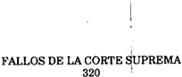
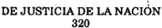

TOMO 320

Volumen 3

1997

2058

ACUERDOS DE LA CORTE SUPREMA

320

Copyright (c) 1998 by Corte Suprema de Justicia de la Nación Queda hecho el depósito que previene la ley 11.723. Impreso en la Argentina Printed in Argentina I.S.B.N.

DE JUSTICIA DE LA NACION

320

2059

## R E P U B L I C A A R G E N T I N A

FALLOS

DE  LA

C O R T E

S U P R E M A

DE

## J USTICIA DE LA N ACION

PUBLICACION A CARGO DE LA SECRETARIA DE JURISPRUDENCIA DEL TRIBUNAL

TOMO 320 - VOLUMEN 3

OCTUBRE - DICIEMBRE

LA LEY S.A.E. e I.

Tucumán 1471 (1050) Buenos Aires 1997

2060

ACUERDOS DE LA CORTE SUPREMA

320

DE JUSTICIA DE LA NACION

320

2061

## A C U E R D O S   D E   L A   C O R T E   S U P R E M A

## AÑO 1997

## OCTUBRE - DICIEMBRE

## HONRAS DISPUESTAS POR EL FALLECIMIENTO DEL DR. GENARO RUBEN CARRIO.

-N o 34-

En Buenos Aires, a los 20 días del mes de octubre del año mil novecientos noventa y siete, reunidos en la Sala de Acuerdos del Tribunal, los señores ministros que suscriben la presente,

Consideraron:

Que el día 17 del corriente ha ocurrido el fallecimiento del Dr. Genaro Rubén Carrió, ex Ministro de esta Corte Suprema de Justicia de la Nación.

Que es deber del Tribunal asociarse al duelo que provoca la desaparición de su distinguido ex Presidente.

Por ello,

Acordaron:

- 1 o ) Dirigir nota de condolencia a la familia del extinto.
- 2 o )  Incluir  el  nombre  del  Dr.  Genaro  Rubén  Carrió  en  las  tablas  de  honor  del Tribunal.

Todo lo cual dispusieron y mandaron, ordenando que se comunicase y registrase en el libro correspondiente, por ante mí, que doy fe.- JULIO S. NAZARENO - EDUARDO MOLINÉ O'CONNOR - CARLOS S. FAYT - AUGUSTO CÉSAR BELLUSCIO - ENRIQUE SANTIAGO PETRACCHI - GUILLERMO A. F. LÓPEZ - GUSTAVO A. BOSSERT - ADOLFO ROBERTO VÁZQUEZ Nicolás Alfredo Reyes (Administrador General).

2062

## ACUERDOS DE LA CORTE SUPREMA 320

## PERITOS.

## -N o 35-

En Buenos Aires, a los 5 días del mes de noviembre del año mil novecientos noventa y siete, los señores ministros que suscriben la presente,

## Consideraron:

Que corresponde fijar las fechas para el cumplimiento de los trámites previstos en la acordada N  25 de 1985 para la inscripción y reinscripción de peritos en las especiao lidades determinadas en dicha acordada, ampliadas en las Nros. 45/85, 59/86, 24/87, 37/88, 41/89, 52/90, 41/91, 68/92, 28/95, 44/95, 4/97 y 7/97,

## Por ello,

## Acordaron:

1 o ) Fíjase el plazo del 3 al 28 de noviembre de 1997 inclusive, para que los profesionales de las especialidades cuyo registro se lleva en esta Corte procedan a su inscripción o reinscripción para el año 1998.

- 2 o ) La lista a que se refiere el punto 5  de la acordada N  25/85 se exhibirá por cinco o o días a partir del 9 de diciembre de 1997.
- 3 o ) Los trámites referidos en los puntos anteriores se efectuarán en la Dirección General Pericial de esta Corte, sita en Sarmiento 877, 12  piso, Capital Federal, durano te el plazo fijado y exclusivamente en el horario de 9 a 13 hs.

4 o ) Dése la publicidad pertinente por intermedio de la Dirección de Prensa.

Todo lo cual dispusieron y mandaron, ordenando que se comunicase y registrase en el libro correspondiente, por ante mí, que doy fe. - EDUARDO MOLINÉ O'CONNOR CARLOS S. FAYT - AUGUSTO CÉSAR BELLUSCIO - ENRIQUE SANTIAGO PETRACCHI - ANTONIO BOGGIANO - GUILLERMO A. F. LÓPEZ - GUSTAVO A. BOSSERT - ADOLFO ROBERTO VÁZQUEZ Nicolás Alfredo Reyes (Administrador General).

## NOMINA DE ESPECIALIDADES

(Acordadas nros. 25/85, 45/85, 59/86, 37/88, 41/89, 52/90, 41/91, 68/92, 28/95, 44/95, 4/97 y 7/97)

ACTUARIOS AGRIMENSORES ANALISTAS DE SISTEMAS ARQUITECTOS

COMPUTADOR CIENTIFICO

Dres. en CIENCIAS ECONOMICAS

Dres. en QUIMICA

ENOLOGOS FRUTICULTORES

ESPECIALISTAS EN ESTADISTICAS

ESPECIALISTAS EN IMAGENES SATELITALES

ESPECIALISTAS EN LINGÜISTICA Y SEMIOLOGIA

FOTOINTERPRETES

GEOLOGOS

HIDROGEOLOGOS

ING. CIVILES

ING. ELECTRONICOS

ING. c/ ESPECIALIDAD EN HIDRAULICA

ING. INDUSTRIALES

ING. MECANICOS

ING. EN PETROLEO

ING. GEODESTAS GEOFISICOS

ING. QUIMICOS

ING. EN TELECOMUNICACIONES

ING. AGRONOMO

ING. ESPECIALIDAD MEDIO AMBIENTE Y CONTAMINACION DE ECOSISTEMAS

ING. TEXTILES

ING. AERONAUTICOS Y ESPACIALES

ING. EN ARMAS

LICENCIADO EN ECONOMIA

LICENCIADO EN TECNOLOGIA INDUSTRIAL DE LOS ALIMENTOS

LICENCIADO EN SISTEMAS (informática, computación y sistemas de información y

procesamiento de datos)

METEOROLOGOS

PERITOS DE ARTE

PERITOS EN CIENCIAS AMBIENTALES

PERITOS NAVALES

TRADUCTORES DE LENGUAJE DE SEÑAS

VETERINARIOS

## CORTE SUPREMA. ELECCION DE PRESIDENTE Y VICEPRESIDENTE.

-N o 36-

En Buenos Aires, a los 6 días del mes de noviembre de 1997, reunidos en la sala de acuerdos del Tribunal, el señor Presidente doctor Julio Salvador Nazareno, el señor Vicepresidente doctor Eduardo Moliné O'Connor, y los señores Jueces doctores Carlos S.  Fayt,  Augusto  César  Belluscio,  Enrique  Santiago  Petracchi,  Antonio  Boggiano, Guillermo A. F. López, Gustavo A. Bossert y Adolfo Roberto Vázquez.

El Ministro Decano de esta Corte, doctor Carlos S. Fayt propuso que se procediera a la elección de Presidente y Vicepresidente del Tribunal, con arreglo a lo dispuesto por el  art.  79  del  Reglamento  para  la  Justicia  Nacional  (según texto de la acordada de Fallos 249:212).

A continuación el doctor Carlos S. Fayt propone la continuidad de las actuales autoridades, moción a la que adhieren el doctor Augusto César Belluscio, el doctor Antonio Boggiano, el doctor Guillermo A. F. López y el doctor Adolfo Roberto Vázquez.

El doctor Julio S. Nazareno vota como Vicepresidente al doctor Eduardo Moliné O'Connor y se abstiene de votar para Presidente.

El doctor Eduardo Moliné O'Connor vota como Presidente al doctor Julio Salvador Nazareno y se abstiene de votar para Vicepresidente.

El doctor Enrique Santiago Petracchi vota al doctor Gustavo A. Bossert para el cargo de Presidente y al doctor Augusto César Belluscio para el de Vicepresidente.

El doctor Gustavo A. Bossert vota al doctor Augusto César Belluscio para el de Presidente y al doctor Enrique Santiago Petracchi para el de Vicepresidente.

Por ello,

Acordaron:

Designar en los términos del art. 79 del Reglamento para la Justicia Nacional Presidente y Vicepresidente de la Corte Suprema de Justicia de la Nación hasta el 17 de noviembre del año 2000 a los doctores Julio Salvador Nazareno y Eduardo Moliné O'Connor, respectivamente.

Todo lo cual dispusieron y mandaron, ordenando que se comunicase y registrase en el libro correspondiente, por ante mí que doy fe.- JULIO S. NAZARENO - EDUARDO MOLINÉ O'CONNOR - CARLOS S. FAYT - AUGUSTO CÉSAR BELLUSCIO - ENRIQUE SANTIAGO PETRACCHI - ANTONIO BOGGIANO - GUILLERMO A. F. LÓPEZ - GUSTAVO A. BOSSERT ADOLFO ROBERTO VÁZQUEZ Nicolás Alfredo Reyes (Administrador General).

## AUTORIDADES DE FERIA JUDICIAL DE ENERO.

-N o 37-

En Buenos Aires, a los 11 días del mes de noviembre del año mil novecientos noventa y siete, reunidos en la Sala de Acuerdos del Tribunal, los señores ministros que suscriben la presente,

## DE JUSTICIA DE LA NACION

Acordaron:

Designar como autoridades de feria del mes de enero del año 1998:

- 1 o ) A los doctores Eduardo Moliné O'Connor y Gustavo A. Bossert -del 1  al 15- y o a los doctores Antonio Boggiano y Guillermo A. F. López -del 16 al 31-.
- 2 o )  Establecer el horario de atención al público de lunes a viernes, desde las 8 hasta las 12 horas.
- 3 o )  El personal que preste funciones durante la feria judicial deberá acreditarlo mediante certificación otorgada por el señor secretario de feria.

Todo lo cual dispusieron y mandaron, ordenando que se comunicase y registrase en el libro correspondiente, por ante mi, que doy fe.- JULIO S. NAZARENO - EDUARDO MOLINÉ O'CONNOR - AUGUSTO CÉSAR BELLUSCIO - ENRIQUE SANTIAGO PETRACCHI - ANTONIO  BOGGIANO - GUILLERMO A. F. LÓPEZ - GUSTAVO A. BOSSERT - ADOLFO ROBERTO VÁZQUEZ Nicolás Alfredo Reyes (Administrador general).

## FERIA JUDICIAL DE ENERO. AUTORIDADES.

## -N o 38-

En Buenos Aires, a los 24 días del mes de noviembre del año mil novecientos noventa y siete, reunidos en la Sala de Acuerdos del Tribunal, los señores ministros que suscriben la presente,

Acordaron:

Designar como secretarios de feria del mes de enero del año 1998:

- 1 o ) Al doctor Jorge Migliore del -1  al 31- y a la doctora Cristina Alvarez -del 19 al o 31-.
- 2 o )  Establecer el horario de atención al público de lunes a viernes, desde las 8 hasta las 12 horas.
- 3 o )  El personal que preste funciones durante la feria judicial deberá acreditarlo mediante certificación otorgada por el señor secretario de feria.

Todo lo cual dispusieron y mandaron, ordenando que se comunicase y registrase en el libro correspondiente, por ante mí, que doy fe.- JULIO S. NAZARENO - EDUARDO MOLINÉ O'CONNOR - AUGUSTO CÉSAR BELLUSCIO - ENRIQUE SANTIAGO PETRACCHI GUILLERMO A. F. LÓPEZ - GUSTAVO A. BOSSERT - ADOLFO ROBERTO VÁZQUEZ Nicolás Alfredo Reyes (Administrador General).

2066

## ACUERDOS DE LA CORTE SUPREMA 320

## NOTIFICACIONES URGENTES.

## -N o 39-

En Buenos Aires, a los 24 días del mes de noviembre del año mil novecientos noventa y siete, reunidos en la Sala de Acuerdos del Tribunal, los señores ministros que suscriben la presente,

## Consideraron:

Que el art. 131 del Reglamento para la organización y funcionamiento de la Oficina de Notificaciones para la Justicia Nacional y Federal -acordada 9/90-, establece que las notificaciones con carácter de 'urgente', 'con habilitación de día y hora' o indicación de 'notifiquese en el día' deben ser practicadas el mismo día de su remisión a la oficina.

Que las dificultades y peligros que deben afrontar diariamente los oficiales que notifican en las distintas villas de emergencia y complejos habitacionales hace imposible el cumplimiento del plazo dispuesto para diligenciar tales notificaciones.

Que con el objeto de solucionar las situaciones anteriormente descriptas, y a fin de que los oficiales notificadores puedan concurrir a los lugares mencionados en horarios menos peligrosos se hace necesario prorrogar con carácter de excepción el término establecido en el artículo citado.

Por ello,

## Acordaron:

Agregar como último párrafo al art. 131 de la acordada 9/90 lo siguiente: 'El plazo establecido en el presente artículo podrá ser prorrogado por 48 horas, solamente para el caso de las diligencias que deban efectivizarse en villas de emergencia y complejos habitacionales'.

Todo lo cual dispusieron y mandaron, ordenando que se comunicase y registrase en el libro correspondiente, por ante mí, que doy fe.- JULIO S. NAZARENO - EDUARDO MOLINÉ O'CONNOR - CARLOS S. FAYT - AUGUSTO CÉSAR BELLUSCIO - ENRIQUE SANTIAGO PETRACCHI - ANTONIO BOGGIANO - GUILLERMO A. F. LÓPEZ - GUSTAVO A. BOSSERT ADOLFO ROBERTO VÁZQUEZ Nicolás Alfredo Reyes (Administrador General).

## DICTAMENES PERICIALES. ARANCEL. EXENCIONES.

-N o 40-

En Buenos Aires, a los 24 días del mes de noviembre del año mil novecientos noventa y siete, los señores ministros que suscriben la presente,

## Consideraron:

- 1 o )  Que  por  acordada  13/97  esta  Corte  aranceló  la  realización  de  dictámenes periciales en juicios contradictorios producidos por el Cuerpo Médico Forense.
- 2 o ) Que el Tribunal considera apropiado precisar el alcance de la exención establecida respecto de los procesos en los cuales una de las partes actuare con el beneficio que contemplan los arts. 78 y subsiguientes del Código Procesal Civil y Comercial de la Nación; y exceptuar del pago del arancel a los trabajadores en relación de dependencia y sus causahabientes en juicios originados en la relación laboral, en las actuaciones motivadas por jubilaciones  por  invalidez  y  pensiones,  y  devolución  de  aportes previsionales, siempre que el dictamen se solicite de oficio o por disposición legal.

## Por ello,

## Acordaron:

- 1 o ) Ampliar la acordada 13/97 y eximir del pago del arancel a quienes se encuentren comprendidos en los supuestos fijados en el considerando segundo de la presente.
- 2 o )  Mantener el procedimiento establecido para la percepción del arancel en la acordada mencionada.
- 3 o ) Aclarar que la nueva exención aquí dispuesta, así como la contemplada por el art. 78 y subsiguientes del Código Procesal Civil y Comercial de la Nación, sólo beneficia a los trabajadores y sus causahabientes, y a la parte que actuare con beneficio de litigar sin gastos, y no comprende a la parte contraria que resulte condenada en costas.

Todo lo cual dispusieron y mandaron, ordenando que se comunicase y se registrase en el libro correspondiente, por ante mí, que doy fe.- JULIO S. NAZARENO - EDUARDO MOLINÉ O'CONNOR - AUGUSTO CÉSAR BELLUSCIO - ANTONIO BOGGIANO - GUSTAVO A. BOSSERT. Nicolás Alfredo Reyes (Administrador General).

## EFECTOS SECUESTRADOS CARENTES DE VALOR DE REVENTA. DONACIONES.

## -N o 41-

En Buenos Aires, a los 24 días del mes de noviembre del año mil novecientos noventa y siete, los señores ministros que suscriben la presente,

## Consideraron:

Que en el Juzgado Nacional de Menores N  3 se hallan depositados desde larga o data efectos secuestrados pertenecientes a antiguas causas judiciales, que ocasionan inconvenientes por el espacio físico que ocupan, y el deterioro de la higiene del lugar;

Que tales efectos carecen de valor económico, por lo que no es de aplicación lo establecido por las leyes 20.785 y 23.853 (art. 3 , inc. b); o

Que si bien carecen de valor de reventa, esos elementos podrían sí ser de utilidad a instituciones de bien público, las que serían beneficiarias de la donación que se solicita efectuar, disponiéndose, a la vez, la destrucción de los que sean inutilizables por su estado o naturaleza;

Que la Administración General del Tribunal, con la intervención de su Asesoría Jurídica, propicia acceder a otorgar las donaciones que se solicita;

Por lo expuesto,

Acordaron:

Autorizar al Juzgado Nacional de Menores N  3, para proceder a la donación de los o efectos secuestrados actualmente en depósito y carentes de valor de reventa, cuyo detalle compone los folios 3/6, a instituciones de bien público, procediendo a la vez a la destrucción de aquellos que, a criterio del magistrado actuante, no sean utilizables, según se exprese en la resolución que en las causas pertinentes se dictare.

Todo lo cual dispusieron y mandaron, ordenando que se comunicase y se registrase en libro correspondiente, por ante mí, que doy fe.- JULIO S. NAZARENO - EDUARDO MOLINÉ O'CONNOR - CARLOS S. FAYT - AUGUSTO CÉSAR BELLUSCIO - ENRIQUE SANTIAGO PETRACCHI - ANTONIO BOGGIANO - GUILLERMO A. F. LÓPEZ - GUSTAVO A. BOSSERT. Nicolás Alfredo Reyes (Administrador General).

FERIADO JUDICIAL DEL 24 DE DICIEMBRE. ASUETO DEL 31 DE DICIEMBRE.

## -N o 42-

En Buenos Aires, a los 10 días del mes de diciembre del año mil novecientos noventa y siete reunidos en la Sala de Acuerdos del Tribunal, los señores ministros que suscriben la presente,

## Acordaron:

Decretar feriado judicial el día 24 y asueto judicial a partir de las 12 horas el 31 del corriente mes para los tribunales nacionales y federales con asiento en la capital e interior del país, en las condiciones establecidas en el art. 3  (R.J.N). o

Todo lo cual dispusieron y mandaron, ordenando que se comunicase y registrase en el libro correspondiente, por ante mí, que doy fe.- JULIO S. NAZARENO - EDUARDO MOLINÉ O'CONNOR - CARLOS S. FAYT - AUGUSTO CÉSAR BELLUSCIO - ENRIQUE SANTIAGO PETRACCHI - ANTONIO BOGGIANO - GUILLERMO A. F. LÓPEZ - GUSTAVO A. BOSSERT ADOLFO ROBERTO VÁZQUEZ. Nicolás Alfredo Reyes (Administrador General).

## DE JUSTICIA DE LA NACION 320

## FUERO CRIMINAL DE INSTRUCCION.

## -N o 43-

En Buenos Aires, a los 10 días del mes de diciembre del año mil novecientos noventa y siete, reunidos en la Sala de Acuerdos del Tribunal, los señores ministros que suscriben la presente

## Consideraron:

Que, atento el tiempo transcurrido desde el dictado de la ley 24.121, resulta necesario dictar la normativa tendiente a la definitiva regularización del fuero en lo criminal de instrucción.

Que para ello resulta necesario disponer la transformación de los ocho juzgados nacionales de primera instancia en lo criminal de sentencia en juzgados nacionales en lo criminal de instrucción, asignándoles las secretarías pertinentes.

Que, correlativamente, se debe mantener la actual competencia que poseen, a fin de que puedan continuar resolviendo las causas que tienen a cargo hasta su finalización.

Que, por imperio de la ley 24.121, los secretarios de dichos tribunales deben ser trasladados al Ministerio Público, a fin de que en ese ámbito se les asignen funciones en razón de la independencia funcional de que gozan.

Que el mayor cúmulo de trabajo que pesará sobre los juzgados a transformar, debe compensarse por dos vías: manteniendo por un año las contrataciones de secretarios letrados quienes tendrán a su cargo la atención de las causas a sentencia, con el auxilio de la totalidad del personal que actualmente los juzgados tienen afectado; y estableciendo un procedimiento gradual en la asignación de turnos de cámara.

Que ello permitirá llegar al fin del período de transición con una equiparación de las tareas a cargo de todos los juzgados en lo criminal de instrucción, alcanzándose de esta manera el objetivo consistente en la normalización del fuero.

## Por ello,

## Acordaron:

- 1. Transformar los actuales juzgados nacionales de primera instancia en lo criminal de sentencia letras A, C, D, K, LL, V, W, y Z en los juzgados nacionales en lo criminal de instrucción de la Capital Federal números 42 al 49, respectivamente.
- 2. Asignar a los juzgados transformados las secretarías de instrucción números 106, 109, 115, 122, 134, 136, 145 y 169.
- 3. Establecer que las causas en trámite ante los juzgados transformados seguirán bajo su competencia, hasta su conclusión.

- 4. Instruir al señor Administrador General para que, dentro de las posibilidades de planificación general, provea los espacios necesarios para el normal funcionamiento de los juzgados referidos.
- 5. Encomendar a la Cámara Nacional de Apelaciones en lo Criminal y Correccional de la Capital Federal que reformule los turnos de comisarías, asignando a los nuevos juzgados de instrucción los que les correspondan. En cuanto a los turnos de cámara, procederá de la siguiente manera: durante el primer cuatrimestre a contar de la fecha de comunicación de la presente, no asignará expedientes a los nuevos juzgados; en el segundo cuatrimestre, les asignará un 25% de lo que corresponda a los demás juzgados; en el tercer cuatrimestre, les asignará un 50%; en el cuarto cuatrimestre, un 75%; y a partir del quinto cuatrimestre, los equiparará a todos los efectos con los demás juzgados de instrucción.
- 6. Trasladar al Ministerio Público a los secretarios de los juzgados de sentencia transformados, a cuyo fin corresponde se comunique la presente al señor Procurador General de la Nación.
- 7. Disponer que, durante el período de transición, los nuevos jueces de instrucción conservarán los actuales secretarios letrados de sentencia contratados y todo el personal que actualmente tienen afectado. A su vencimiento, se resolverá acerca del destino que se les asignará.
- 8. Declarar feriado judicial para los juzgados de instrucción números 42 al 49 por el término de diez días hábiles, con el propósito de facilitar las tareas de inventario de los expedientes y demás efectos para su posterior remisión. Durante el feriado será exigida la concurrencia de todo el personal, debiendo los titulares de los juzgados atender los asuntos que, por su naturaleza, no admitan demora.

Todo lo cual dispusieron y mandaron, ordenando se comunicase y registrase en el libro correspondiente, por ante mí, que doy fe.- JULIO S. NAZARENO - EDUARDO MOLINÉ O'CONNOR - AUGUSTO CÉSAR BELLUSCIO - GUILLERMO A. F. LÓPEZ - GUSTAVO A. BOSSERT ADOLFO ROBERTO VÁZQUEZ. Nicolás Alfredo Reyes (Administrador General).

## ADMINISTRACION GENERAL DE LA CORTE SUPREMA. DIRECCION DE INFRAESTRUCTURA JUDICIAL.

- N o 44-

En Buenos Aires, a los 16 días del mes de diciembre de mil novecientos noventa y siete, reunidos en la Sala de Acuerdos del Tribunal el señor Presidente de la Corte Suprema de Justicia de la Nación Dr. Julio S. Nazareno y los señores ministros que suscriben la presente,

## DE JUSTICIA DE LA NACION

## Consideraron:

Que por Acordada CSJN N o 37/96 se organizó la Dirección de Infraestructura Judicial,  habiéndose dispuesto en el art. 5 ) que dependerán del Director las áreas de o Estudios y Proyectos, Operativa y Administrativa.

Que el señor Administrador General propone la organización de la Dirección de Infraestructura Judicial en base a tres departamentos técnicos a cargo de la actividad sustantiva de la dependencia y una división administrativa, según la experiencia recogida al año y medio de la puesta en marcha de la nueva dirección y teniendo en cuenta la naturaleza de sus funciones, su complejidad, cantidad de los asuntos y trabajos que requieren atención.

Que siendo necesario la aprobación de la estructura orgánica y funcional de la dirección a fin de concluir con el proceso de reorganización que se dispuso en la misma, se  estima  conveniente  autorizar  el  funcionamiento  de  tres  unidades  de  actividad sustantiva a cargo de los departamentos de Estudios y Proyectos, Operativo y de Coordinación Técnica, además de una División Administrativa.

Por ello,

Acordaron:

- 1) Modificar el art. 5 ) de la Acordada 37/96 que quedará redactado como sigue: o
- '5) La Dirección de Infraestructura Judicial estará a cargo de un Director del cual dependerán los Departamentos de Estudios y Proyectos, Operativo, de Coordinación Técnica y la División Administrativa'.

Todo lo cual dispusieron y mandaron, ordenando que se comunicase y se registrase en el libro correspondiente, por ante mí, que doy fe.- JULIO S. NAZARENO - EDUARDO MOLINÉ O'CONNOR - CARLOS S. FAYT - AUGUSTO CÉSAR BELLUSCIO - ANTONIO BOGGIANO GUILLERMO A. F. LÓPEZ - GUSTAVO A. BOSSERT - ADOLFO ROBERTO VÁZQUEZ.Nicolás Alfredo Reyes (Administrador General).

## TRADUCTORES PUBLICOS.

## -N o 45-

En Buenos Aires, a los 23 días del mes de diciembre del año mil novecientos noventa y siete, reunidos en la Sala de Acuerdos del Tribunal, los señores ministros que suscriben la presente,

## Consideraron:

La solicitud formulada en el expediente N  10-23.277/97 y la opinión favorable del o titular de la Secretaría de Juicios Originarios (fs. 6).

Por ello,

## Acordaron:

Incluir en la nómina de especialidades que forma parte de la acordada N  25/85 a o los traductores públicos.

Todo lo cual dispusieron y mandaron, ordenando que se comunicase y registrase en el libro correspondiente, por ante mí, que doy fe.- JULIO S. NAZARENO - EDUARDO MOLINÉ O'CONNOR - CARLOS S. FAYT - AUGUSTO CÉSAR BELLUSCIO - ENRIQUE SANTIAGO PETRACCHI - ANTONIO BOGGIANO - GUILLERMO A. F. LÓPEZ - ADOLFO ROBERTO VÁZQUEZ. Nicolás Alfredo Reyes (Administrador General).

## INTEGRACION DE TRIBUNALES ORALES FEDERALES DEL INTERIOR DEL PAIS.

## -N o 46-

En Buenos Aires, a los 26 días del mes de diciembre del año mil novecientos noventa y siete, reunidos en la Sala de Acuerdos del Tribunal, los señores ministros que suscriben esta decisión,

## Consideraron:

Que mediante la acordada N  46/94, con fundamento en la falta de previsión legal o respecto de la subrogación de los miembros de los tribunales orales federales con asiento en el interior del país, y de acuerdo con las facultades conferidas por los arts. 53 de la ley 24.050 y 91 de la ley 24.121, esta Corte dispuso un régimen de integración de aquéllos para los supuestos de vacancia por ausencia u otro impedimento temporario de sus miembros.

Que, como consecuencia de las integraciones llevadas a cabo con base en dicha acordada N o 46/94,  puede  generarse,  a  su  vez,  la  necesidad  de  cubrir  las  vacantes temporarias dejadas en la cámara por la subrogación de los jueces de los tribunales orales por parte de los miembros de aquélla. Naturalmente, también en esos casos corresponde integrar las cámaras de apelaciones de acuerdo con el régimen previsto en el art. 31 del decreto ley 1285/58 -texto modificado por el art. 51 de la ley 24.50-.

Que, sin embargo, es posible que en ocasiones ese régimen de integración doble provoque serios retardos, complicaciones excesivas y un mayor gasto de recursos. Por tanto, el Tribunal entiende que resulta apropiado agregar al sistema dispuesto por la acordada N  46/94 la posibilidad de que, en casos especiales que así lo exijan, los tribuo nales orales sean integrados directamente del modo previsto en el art. 31 del decreto ley 1285/58 y no por los magistrados de la cámara respectiva cuando ésta, como consecuencia de esa subrogación, deba ser, a su vez, integrada de acuerdo con el régimen del decreto ley citado.

## ACUERDOS DE LA CORTE SUPREMA 320

Que, por lo expuesto,

Acordaron:

Hacer saber a las cámaras federales del interior del país que, con el objeto de integrar los tribunales orales de su jurisdicción en los casos de vacancia por ausencia u otro impedimento temporario de sus miembros, corresponde la aplicación del régimen previsto por la acordada N  46/94 de esta Corte y que la integración de las vacancias o que así surjan en las cámaras debe ser resuelta según lo dispuesto en el art. 31 del decreto ley 1285/58 -modificado por el art. 51 de la ley 24.050-. Sin embargo, las cámaras podrán aplicar directamente a la integración de los tribunales orales de su jurisdicción el régimen del citado art. 31, cuando medien fundadas razones que demuestren su conveniencia en cada caso concreto.

Todo lo cual dispusieron y mandaron, ordenando que se comunicase y registrase en el libro correspondiente, por ante mí, que doy fe.- JULIO S. NAZARENO. CARLOS S. FAYT - ENRIQUE SANTIAGO PETRACCHI - ANTONIO BOGGIANO - GUSTAVO A. BOSSERT Nicolás Alfredo Reyes (Administrador General).

## INTEGRACION DEL TRIBUNAL ORAL EN LO CRIMINAL FEDERAL DE JUJUY.

## -N o 47-

En Buenos Aires, a los 26 días del mes de diciembre del año mil novecientos noventa y siete, reunidos en la sala de acuerdos del Tribunal, los señores ministros que suscriben esta decisión,

## Consideraron:

1 o ) Que los magistrados del Tribunal Oral en lo Criminal Federal de la Provincia de Jujuy han comunicado a esta Corte Suprema los inconvenientes que, según su juicio, acarrearía la aplicación del sistema de subrogación que el Tribunal ha establecido mediante el art. 2 de la acordada N  46/94 (Superintendencia - Expte. 3204/92), del 28 o de julio de 1994. En especial, observan que la integración del tribunal jujeño con los miembros del Tribunal Oral en lo Criminal Federal de la Provincia de Salta generaría en éste nuevas vacancias que reclamarían, a su vez, nuevas integraciones. Por tanto, concluyen que sería conveniente que se les otorgara la facultad de designar conjueces entre los abogados de la Provincia de Jujuy a fin de que sean éstos -y no los miembros del tribunal oral de Salta- quienes integren el tribunal en los supuestos de vacancia temporaria.

2 o ) Que los inconvenientes que denuncian los magistrados del tribunal federal de Jujuy son similares a los considerandos por esta Corte al dictar la acordada N  46/97 o Expte. N  10-2726/97 A.G.-. o

## DE JUSTICIA DE LA NACION

320

Corresponde, por tanto, adecuar lo resuelto en aquella oportunidad -que versaba específicamente sobre la integración de tribunales orales en lo criminal federal con asiento en la provincia sede de la cámara federal del distrito (art. 1 de la acordada 46/ 94)- a las circunstancias del planteo actual, que refiere a la integración de tribunales orales en lo criminal federal con asiento en provincias diversas de las que son sede de las cámaras federales de apelación.

Así, dada la necesidad de integrar, por ejemplo, el tribunal oral con asiento en Jujuy en casos de vacancia por ausencia u otro impedimento temporario de sus miembros,  éste  debe  recurrir,  en  primer  lugar,  al  tribunal  oral  con  asiento  en  Salta,  en cumplimiento del art. 2 de la acordada N  46/94 de esta Corte. Si tal régimen de inteo gración generara, a su vez, la necesidad de cubrir la vacante producida en el tribunal salteño -que, por aplicación del art. 1 de la acordada 46/94, debe ser cubierta por los miembros de la Cámara Federal de Apelaciones de esa provincia-, el tribunal jujeño podrá ser integrado directamente por los miembros de la cámara. Empero, si este modo de integración impusiera la necesidad de integrar también la cámara -supuesto regido por el art. 31 del decreto ley 1285/58, modificado por el art. 51 de la ley 24.050-, ésta podrá ordenar la integración adscribiendo directamente al tribunal oral al juez o conjuez que, de otro modo, integraría la cámara según los términos del art. 31 del decreto ley 1285/58.

- 3 o ) Que tal régimen excepcional -que, como se expone en la acordada N  46/97 o Expte. N  10-2726/97 A.G.-, requiere la mediación de fundadas razones que demueso tren en cada caso concreto su conveniencia- permite sortear las dificultades propias del encadenamiento de sucesivas integraciones. Las facultades reglamentarias que los arts. 53 de la ley 24.050 y 91 de la ley 24.121 atribuyen al Tribunal no autorizan, en este ámbito, mayores innovaciones.
- 4 o ) Que en atención de las análogas circunstancias en las que se encuentran otros tribunales orales con asiento en provincias que no albergan cámaras federales de apelación, corresponde poner en conocimiento de lo resuelto en esta ocasión -así como de lo dispuesto en la acordada N  46/97 -Expte. N  10-2726/97 A.G.- a todos los tribunao o les orales que se hallan en dicha situación, a las cámaras federales en cuyos distritos judiciales ellos se encuentran y a los tribunales orales con asiento en las provincias en las que tales cámaras funcionan.

Que, por lo expuesto,

Acordaron:

Hacer saber a los tribunales orales en lo criminal federal con asiento en provincias en las que no residen cámaras federales de apelación, a las cámaras federales de apelación en cuyos distritos judiciales éstos se encuentran y a los otros tribunales orales en lo criminal federal de los mismos distritos judiciales, las siguientes reglas complementarias de la acordada N  46/94: o

- 1) En los casos en que el cumplimiento del art. 2 de la acordada N  46/94 de la o Corte Suprema de Justicia de la Nación imponga también la necesidad de que el tribunal oral en lo criminal federal con asiento en la provincia que sea sede de la cámara federal del distrito sea integrado según el sistema del art. 1 de tal acordada N  46/94, o

podrá aplicarse directamente a la integración del tribunal oral en lo criminal federal con asiento en una sede distinta del mismo distrito el sistema del art. 1 de la acordada 46/94.

2) En los casos en que el cumplimiento del art. 1 de la acordada N  46/94 de la o Corte Suprema de Justicia de la Nación, por aplicación propia o en virtud de lo dispuesto en el artículo anterior, imponga también la necesidad de que la cámara federal sea integrada según el sistema del art. 31 del decreto ley 1285/58, modificado por el art. 51 de la ley 24.050, podrá aplicarse directamente a la integración del tribunal oral en lo criminal federal del mismo distrito, cualquiera sea su sede provincial, el sistema del citado art. 31 del decreto ley 1285/58.

Todo lo cual dispusieron y mandaron, ordenando que se comunicase y registrase en el libro correspondiente, por ante mí, que doy fe.- JULIO S. NAZARENO - CARLOS S. FAYT - ENRIQUE SANTIAGO PETRACCHI - ANTONIO BOGGIANO - GUSTAVO A. BOSSERT Nicolás Alfredo Reyes (Administrador General).

DE JUSTICIA DE LA NACION

320

2077

## R E S O L U C I O N E S   D E   L A   C O R T E   S U P R E M A

## AÑO 1997

## NOVIEMBRE - DICIEMBRE

## PODER JUDICIAL. RENOVACION DEL SERVICIO INFORMATICO.

-N o 3396-

Buenos Aires, 12 de noviembre de 1997.

Visto:

Las presentes actuaciones por las cuales se tramita la Licitación Pública N  1/97, o a los efectos de contratar la 'Renovación del servicio informático del Poder Judicial de la Nación', y

## Considerando:

Que dicha convocatoria fue autorizada por Resolución N  2.007/96, habiéndose o presentado una única oferta por parte de la firma Unisys Sudamericana S.A. en la suma de U$S 35.992.469.

Que la Comisión de Preadjudicaciones designada en el punto 4  de la citada resoo lución (fs. 2213/42 y 2290/93), se expidió en el sentido de recomendar la adjudicación del presente llamado a la firma indicada en el considerando anterior.

Que anunciado el informe, no se ha presentado impugnación u observación alguna en los términos del art. 61 inc. 79 de la Ley de Contabilidad reglamentada por Decreto 5720/72, según constancia de fs. 2342.

Que la Auditoría General de la Nación analizó todo lo actuado en el proceso de licitación, produciendo su informe a fs. 2246/56, habiéndose efectuado recomendaciones con la finalidad de que se optimicen los recaudos para un adecuado proceso de adjudicación, sin que las mismas afecten el trámite ni su continuidad, concluyendo que la licitación se desarrolló en forma regular y que las consultas realizadas a organismos técnicos y sectores privados interesados, lograron una mayor transparencia y mejora del proyecto original.

Que a fs. 2169/77 obran las consideraciones vertidas por la Secretaría de la Función Pública del Poder Ejecutivo Nacional, las que en forma particular analizan cada uno de los capítulos e items de la oferta, concluyendo que la misma se ajusta a lo solicitado por el pliego. Recomienda asimismo, la constitución de una comisión integra-

2078

da por funcionarios del Poder Judicial de la Nación para el seguimiento y control de gestión de la ejecución de las prestaciones.

Que a fs. 2182/85 obra el informe producido por la Sindicatura General de la Nación, cuya intervención fuera solicitada por la Administración General de la Corte Suprema, del que surge que el precio de los servicios ofrecidos es razonable a valores de mercado.

Que la intervención de los organismos citados y los fundamentos del informe de la Comisión de Preadjudicaciones, hacen procedente adjudicar al único oferente, a fin de poner en marcha la renovación del servicio informático, aceptando el Alto Tribunal, la recomendación de establecer un ajustado control y seguimiento de la puesta en marcha del nuevo servicio informático a través de una comisión técnica ad-hoc.

Que con fecha 12 de noviembre del cte. se ha receptado de la empresa una reducción en el precio original de la oferta de U$S 400.000.-

Por ello,

Se resuelve:

- 1) Aprobar la Licitación Pública N  1/97 y adjudicar a la firma 'Unisys Sudamerio cana S.A.' por única oferta, de acuerdo a su cotización de fs. 1566, y el descuento ofrecido a fs.  2.361,  por  un  precio  total  -incluida  incidencia  financiera-  de  dólares estadounidenses treinta y cinco millones quinientos noventa y dos mil cuatrocientos sesenta y nueve (u$s 35.592.469.-) pagaderos en treinta y seis cuotas mensuales iguales y consecutivas de dólares estadounidenses novecientos ochenta y ocho mil seiscientos setenta y nueve con sesenta y nueve centavos (u$s 988.679,69.-) cada una.
- 2)  Afectar  el  presente  gasto  a  los  créditos  del  presupuesto  de  1997  y  ejercicios futuros correspondientes.
- 3) Disponer que el señor Administrador General de la Corte Suprema designe una Comisión técnica ad-hoc, la que tendrá a su cargo el control y seguimiento del cumplimiento del contrato para la puesta en marcha del nuevo servicio informático.- JULIO S.  NAZARENO  -  EDUARDO MOLINÉ O'CONNOR - CARLOS S. FAYT - AUGUSTO CÉSAR BELLUSCIO - ANTONIO BOGGIANO - GUILLERMO A. F. LÓPEZ - GUSTAVO A. BOSSERT ADOLFO ROBERTO VÁZQUEZ.

## ANTICIPO DE PENSION.

-N o 8793-

Buenos Aires, 12 de diciembre de 1997.

Visto el pedido de la señora Gladys Norma Reina (fs. 2), en el cual solicita el pago del anticipo de pensión normado en el art. 5 de la ley 18.464, al que tendría derecho en

## DE JUSTICIA DE LA NACION

su carácter de cónyuge supérstite del Dr. Julio Argentino Godoy -jubilado de la misma ley con el cargo de juez de cámara-, y

## Considerando:

Que sin perjuicio de que la ley 18.464 guarda silencio con relación a la extensión de anticipos de pensión a los eventuales beneficiarios, es doctrina del Tribunal que los conceptos utilizados por el legislador en las leyes jubilatorias deben interpretarse conforme a la esencia y sentido de la institución previsional, que tiene por fin cubrir los riesgos de la subsistencia, y que la aplicación extensiva es procedente si guarda clara armonía con la finalidad de todo el régimen de seguridad social y contempla adecuadamente la naturaleza asistencial del beneficio de que se trata (Conf. Fallos 290:275; 311:317 y res. N  1596/92). o

Que en tanto el anticipo de pensión tiende a cubrir -como pago a cuenta- la demora administrativa en la gestión de la pensión a la que tiene derecho la beneficiaria -previa acreditación de la iniciación del trámite respectivo-, procede su pago en los casos de muerte del jubilado o afiliado en actividad con derecho a jubilación (Conf. Fallos y resolución citados).

Por ello,

Se resuelve:

Autorízase a la Dirección de Administración Financiera a liquidar el anticipo mensual de pensión a la señora Gladys Norma Reina de Godoy.

Regístrese, hágase saber y oportunamente archívese. - EDUARDO MOLINÉ O'CONNOR.

## ALOJAMIENTO DE DETENIDOS

-N o 3830-

Buenos Aires, 16 de diciembre de 1997.

Visto:

I) Que el señor Director General de Asuntos Judiciales de la Policía Federal Comisario Mayor don Norberto A. Sánchez Expone la situación que afecta a ciertas delegaciones de la repartición en el interior del país con motivo de tener que atender en sus dependencias a detenidos a disposición de jueces federales en razón de no poder hacerlo la autoridad penitenciaria.

Agrega que dicho alojamiento, tanto de procesados como de condenados se agrava por la falta de racionamiento, sanitarios adecuados, infraestructura carcelaria para su resguardo, etc.

Que en las delegaciones de Rosario, hay cuatro detenidos desde el mes de junio del año ppdo. a lo que se sumaron dos más en el corriente además de 6 (seis) por infracción a la ley 23.737 desde hace un año; y otro tanto en la de Córdoba, con siete detenidos para cuya manutención colabora el Servicio Penitenciario Provincial.

Destaca que tal tarea, ajena al quehacer policial provoca una distracción de medios y personal.

II) En orden a los traslados de detenidos también plantea el inconveniente que se presenta ante los requerimientos de su comparendo por parte de los señores jueces en casos tales como: 1) detenidos alojados en dependencias de la Policía Federal, en Capital Federal, ya sea por prevenciones sumariales o pedidos de captura de magistrados federales del interior del país; 2) detenidos alojados en las delegaciones de Policía Federal del interior por prevenciones sumariales, en las que los magistrados federales disponen su traslado a otra provincia; 3) detenidos alojados en unidades penitenciarias requeridos por magistrados federales de Bahía Blanca (Pcia. de Buenos Aires), Tucumán, Córdoba, Formosa, Mar del Plata (Juzgado N  1), Santiago del Estero y La Pampa; 4) o detenidos alojados en dependencias de policías provinciales u otros organismos de seguridad (por pedidos de captura) requeridos en estos casos por magistrados de la justicia  federal;  5)  traslado  de  condenados,  desde  el  interior  del  país,  ordenados  por  los Tribunales Federales de Bahía Blanca (Pcia. de Bs. As.), Tucumán, Córdoba, Formosa, Mar del Plata (Juzgado N  1), Santiago del Estero y La Pampa; 6) traslado de detenidos o alojados en dependencias de la Policía de la Provincia de Buenos Aires, dentro del denominado conurbano bonaerense, solicitados por los tribunales federales; 7) traslados requeridos por tribunales con custodia de la Policía Federal, que no son atendidos por el Servicio Penitenciario Federal; y 8) traslado de detenidos ordenados por magistrados federales a lugares donde se carece de unidades del Servicio Penitenciario Federal.,

## y Considerando:

I) Que en lo que respecta al alojamiento de detenidos, ya esta Corte, como lo menciona el jefe policial suscribiente, en su resolución 44/92 de fecha 5 de febrero de 1992, con motivo de la petición del Servicio Penitenciario Federal de que se le asigne la conducción de todas las alcaidías de la Justicia Federal del interior, construidas y a construirse, dispuso que hasta tanto se le hiciera efectiva asignación de esos locales en los edificios judiciales, mantuviese la Policía Federal, dicha responsabilidad.

Que igual temperamento se adoptó con lo que respecta al traslado de detenidos.

Que sobre el particular merece recordarse que en expediente 12-03575/97 iniciado con motivo de una similar presentación del señor Director de la Gendarmería Nacional, esta Corte recientemente resolvió dirigirse al señor Ministro de Justicia y por su intermedio al señor Secretario de Política Penitenciaria y Readaptación Social a fin de que se atienda a través del Servicio Penitenciario Federal la situación que afecta a las agrupaciones de la referida repartición en las provincias de Corrientes, Misiones, Formosa, Salta y Neuquén, según lo menciona el señor Director Nacional en dicha comunicación.

Que el problema planteado en esta ocasión por la Policía Federal en lo que respecta a este impropio alojamiento de detenidos presenta similares características al formulado en su momento por esta otra fuerza de seguridad.

En esos términos aprecia esta Corte tal inquietud.

- II) Que en lo que respecta al traslado de detenidos en las distintas alternativas apuntadas en la presentación que da origen a estas actuaciones, no cabe duda de que también es el Servicio Penitenciario Federal quien debe encargarse del traslado desde los establecimientos penitenciarios cuando son reclamados en comparendo por la Justicia Federal.

Distinta es la situación de aquel detenido que aún no ha ingresado ni ha sido registrado en establecimiento alguno del Servicio Penitenciario Federal (o provincial mediante convenio) y que se halla alojado en comisarías, delegaciones o dependencias de las fuerzas de seguridad.

En estos casos la Policía Federal, como auxiliar directa de la justicia, deberá seguir encargándose de tal cometido.

Por ello,

Se resuelve:

- 1 o ) Dar curso de las actuaciones al señor Ministro de Justicia y por su intermedio al señor Secretario de Política Penitenciaria y Readaptación Social a fin de que a través del Servicio Penitenciario Federal se atienda la situación expuesta y se tengan en cuenta los criterios sentados en los considerandos precedentes en orden al alojamiento y al traslado de detenidos.
- 2 o ) Hacer conocer esta resolución a la Policía Federal.
- 3 o ) Regístrese y comuníquese a las Cámaras Federales de Apelaciones de Rosario y Córdoba.

Fecho, resérvese en Secretaría.- JULIO S. NAZARENO - EDUARDO MOLINÉ O'CONNOR CARLOS S. FAYT - AUGUSTO CÉSAR BELLUSCIO - ENRIQUE SANTIAGO PETRACCHI - ANTONIO BOGGIANO - GUILLERMO A. F. LÓPEZ - GUSTAVO A. BOSSERT - ADOLFO ROBERTO VÁZQUEZ.

## RESOLUCION DEL PRESIDENTE DE LA CORTE SUPREMA

PODER JUDICIAL DE LA NACION. DENUNCIA DE ACCIDENTES DE TRABAJO.

-N o 3990-

Buenos Aires, 26 de diciembre de 1997.

Visto:

El expediente N  13-18.520/97 caratulado: 'Trámite particular - Accidente de o Trabajo - Ponce, Elsa', y

## Considerando:

Que la Ley N  24.557 incorporó la obligatoriedad del procedimiento de conciliación o ante la autoridad administrativa laboral como paso previo a la traba de la litis.

Que el legislador al reemplazar la actuación administrativa voluntaria por la obligatoria ha tenido en miras habilitar un espacio en donde las partes puedan resolver sus conflictos antes de la instancia judicial.

Que es menester, ante la laguna legal que ha significado el tránsito de un régimen jurídico a otro, establecer la forma y procedimiento para que el Poder Judicial pueda comparecer a estar a derecho en la vía de conciliación obligatoria, en los reclamos anteriores a la vigencia de la Ley N  24.557 y a la eventual contratación de un seguro o de riesgo por accidente de trabajo, el cual se halla en trámite de adjudicación.

Que a los efectos de facilitar al trámite previo a cualquier otra instancia administrativa o judicial se establece la intervención del Cuerpo Médico Forense, a cuyo fin se adopta un formulario tipo a completar por los agentes en ocasión del reclamo por accidente de trabajo.

Por ello,

## Se resuelve:

- 1 o ) Apruébase el formulario tipo para la denuncia de Accidentes de Trabajo, el que se acompaña como Anexo I, formando parte de la presente resolución, para su utilización en todo el ámbito del Poder Judicial de la Nación. El duplicado será remitido por cuerda separada a la Dirección de Recursos Humanos para la formación de la base estadística de datos.
- 2 o ) En los casos pendientes de resolución por aplicación de la legislación anterior, se tramitará -previa intervención del Cuerpo Médico Forense, quien deberá integrar una junta médica a fin de determinar la procedencia de la incapacidad ocasionada- el reconocimiento del grado de incapacidad laboral determinada.
- 3 o ) Autorizar al señor Administrador General, a designar al funcionario que represente al Poder Judicial en las audiencias de conciliación obligatoria ante el Ministerio de Trabajo.
- 4 o ) La Dirección de Administración Financiera procederá a efectuar las liquidaciones en base a la remuneración del agente y al porcentaje de incapacidad determinada en el punto 2  de la presente. o

Regístrese, hágase saber y archívese.- JULIO S. NAZARENO.

## DE JUSTICIA DE LA NACION

320

## RESOLUCIONES DE LA ADMINISTRACION GENERAL DE LA CORTE SUPREMA

## CORTE SUPREMA. ADMINISTRACION GENERAL. DIRECCION DE INFRAESTRUCTURA JUDICIAL.

-N o 3877-

Buenos Aires, 16 de diciembre de 1997.

Visto y Considerando:

Que la Acordada 62/96 en su art. 2) faculta a esta Administración General de la Corte Suprema a dictar la reglamentación orgánica y administrativa, estableciendo la organización, misión y funciones de las unidades de su dependencia.

Que continuando con el programa de reordenamiento interno de cada dirección, es necesario determinar la organización, misión y funciones de las dependencias, con el objeto de establecer la competencia y responsabilidad de cada área, con el fin de alcanzar la más eficiente gestión de todos los asuntos a cargo de la Administración General y sus unidades dependientes.

Que la Dirección de Infraestructura Judicial ha formulado oportunamente una sugerencia que se adecua a las disposiciones de la Acordada 37/96 modificada por Acordada 44/97, y a las directivas que sobre la materia se han impartido, por lo que resulta conveniente a los fines propuestos.

Por ello,

Se resuelve:

- 1) Aprobar la organización, misión y funciones de la Dirección de Infraestructura Judicial que como Anexos I y II integran la presente resolución.

Regístrese, comuníquese a quienes corresponda, remítase copia a las cámaras con sede en la Capital Federal e interior del país y archívese.Nicolás Alfredo Reyes (Administrador General).

CORTE SUPREMA. ADMINISTRACION GENERAL.

-N o 3878-

Buenos Aires, 16 de diciembre de 1997.

Visto y Considerando:

Que por resolución N  2242/97 se aprobó el Reglamento de Organización y Funcioo nes de la Administración General de la Corte Suprema, estableciéndose la misión y

2084

funciones de las unidades dependientes, y habiéndose dictado con posterioridad las Acordadas Nros. 29/97 y 30/97, corresponde adecuar el Reglamento a esas disposiciones.

## Por ello

Se resuelve:

- 1) Sustituir el punto 3.- del ANEXO I de la resolución N  2242/97, el que quedará o redactado como sigue:
- '3.- La Administración General tiene a su cargo los organismos que se nominan a continuación:

(Acordadas 62/96, 29/97 y 30/97)

Unidades de asesoramiento y control

- -Asesoría Jurídica
- -Auditoría Interna

## Unidades de actividad sustantiva

- -Dirección de Administración Financiera
- -Dirección de Infraestructura Judicial
- -Dirección de Mandamientos y Notificaciones
- -Dirección de Informática
- -Dirección de Despacho
- -Dirección de Recursos Humanos
- -Dirección de Archivo
- -Dirección Pericial

Unidad de apoyo y servicios

- -Dirección de Gestión Interna y Habilitación

## Organismo de Régimen especial

- -Obra Social del Poder Judicial.'
- 2) Incorporar en el punto 5.- del ANEXO I de la resolución citada, las siguientes funciones:
- 5.13.- Atender todo lo relativo al sistema de archivo del Poder Judicial de la Nación para la custodia y conservación de la documentación judicial y administrativa.
- 5.14.- Proveer los procedimientos y medios para asegurar el cumplimiento de la tarea pericial de los cuerpos técnicos oficiales, atendiendo los requerimientos de los tribunales por la creciente complejidad de los delitos.

## DE JUSTICIA DE LA NACION 320

- 5.15.- Atender la matriculación de los profesionales del interior que actúan ante la Justicia Federal.
- 3) Agregar al ANEXO I de la resolución citada, los siguientes puntos:

## DIRECCIÓN DE ARCHIVO

25.- Misión:

(Según Acordada 34/81)

- El Archivo tiene como misión específica la de recibir, ordenar, custodiar, conservar y en su caso destruir la producción documental que constituye su acervo, de acuerdo a lo que dispone el reglamento. Ejecuta además lo prescrito por el D.L. N  3003/56 o sobre registro de iniciación e informes de Juicios Universales.

## 26.- Funciones:

- 26.1.- Organizar la custodia, conservación y en su caso destrucción de la documentación judicial y administrativa del Poder Judicial de la Nación.
- 26.2.- Receptar, ordenar y administrar la producción documental que constituye su acervo.
- 26.3.- Atender requerimientos de los tribunales y demás organismos del Poder Judicial de la Nación.
- 26.4.- Mantener actualizados los accesos a la información sobre las actuaciones judiciales y el registro de iniciación e informes de juicios universales.
- 26.5.- Supervisar el funcionamiento de los archivos departamentales de la justicia federal en el interior.
- 26.6.- Facilitar el intercambio con archivos públicos y privados, nacionales y extranjeros.
- 26.7.- Coordinar la remisión de documentación que revistiese valor histórico, social o cultural, con el Archivo General de la Nación y con los archivos provinciales.
- 26.8.- Investigar y realizar estudios referentes a nuevos métodos o técnicas de archivo.
- 26.9.- Confeccionar estadísticas y la memoria anual.
- 26.10.- Intervenir en toda otra cuestión que le requiera el Administrador General y sus organismos dependientes.

2086

## RESOLUCIONES DE LA CORTE SUPREMA 320

## DIRECCIÓN PERICIAL

## 27.- Misión:

Dirigir, organizar y controlar los cuerpos técnicos periciales y demás áreas bajo su dependencia.

## 28.- Funciones:

- 28.1.- Ejecutar las directivas tendientes a prestar todo el apoyo necesario a la actividad judicial en materia de su competencia.
- 28.2.- Revisar la procedencia formal de solicitudes de pericias a los decanos de los cuerpos técnicos, autorizando -en los casos de excepción- la realización de los informes periciales requeridos por tribunales.
- 28.3.- Canalizar la tramitación de gestiones requeridas por organismos dependientes de otros poderes.
- 28.4.- Efectuar el seguimiento y control del arancelamiento de pericias médicas.
- 28.5.- Administrar la inscripción anual de peritos para actuar -a propuesta de parte o de oficio- ante la Corte Suprema de Justicia de la Nación, realizando el seguimiento, control y actualización de la nómina correspondiente.
- 4) Aprobar el Organigrama de la Administración General de la Corte Suprema que como ANEXO II integra la presente resolución.
- 5) Elevar a conocimiento del Alto Tribunal esta resolución.

Regístrese, comuníquese a quienes corresponda, remítase copia a las cámaras con sede en la Capital Federal e interior del país y archívese. Nicolás Alfredo Reyes (Administrador General).

## CORTE SUPREMA. ADMINISTRACION GENERAL. DIRECCION DE ADMINISTRACION FINANCIERA.

-N o 4102-

Buenos Aires, 30 de diciembre de 1997.

Visto y Considerando:

Que la acordada N  62/96 en su artículo 2 ) faculta a esta Administración General o o de la Corte Suprema de Justicia de la Nación a dictar la reglamentación orgánica y

administrativa, estableciendo la organización, misiones y funciones de las unidades de su dependencia, con el objeto de establecer la competencia y responsabilidad de cada área, para alcanzar la más eficiente gestión de todos los asuntos a su cargo.

Que la Dirección de Administración Financiera ha formulado oportunamente una sugerencia que se adecua a las disposiciones de la acordada N  37/96 modificada por la o N o 44/97, y a las directivas que sobre la materia se han impartido.

Que sobre esa base, la veeduría dispuesta por Res. N  2143/96 elaboró una proo puesta integral de estructura orgánica con misiones y funciones que resulta conveniente a los objetivos de esta Administración General.

Que la propuesta representa una disminución de unidades de ejecución y asesoramiento en comparación con la estructura en que la dirección se encontraba organizada, lo que coadyuva a una más eficiente aplicación de los recursos humanos.

Que la reducción de áreas se ha producido por la reasignación de funciones, el agrupamiento de actividades en unidades funcionales compatibles y la transferencia de dependencias a otras direcciones.

Por ello,

Se resuelve:

1 o ) Aprobar la organización, misiones y funciones de la Dirección de Administración Financiera que como Anexos I y II integran la presente resolución.

- 2 o ) Regístrese, hágase saber, remítase copia a las cámaras nacionales y federales de apelaciones y archívese.Nicolás Alfredo Reyes (Administrador General).

DE JUSTICIA DE LA NACION

320

## FALLOS DE LA CORTE SUPREMA

## OCTUBRE

## CERAMICA ZANON V. C.A.L.F.

RECURSO EXTRAORDINARIO: Requisitos propios. Cuestiones no federales. Sentencias arbitrarias. Procedencia del recurso. Exceso ritual manifiesto.

Es arbitraria la sentencia que declaró inadmisibles los recursos de inaplicabilidad de ley y nulidad articulados por la actora si el pronunciamiento impugnado conduce sin fundamentos adecuados, a una restricción sustancial de la vía utilizada por el justiciable, y afecta irremediablemente el derecho de defensa en juicio sobre la base de un injustificado ritualismo.

CONSTITUCION NACIONAL: Derechos y garantías. Defensa en juicio. Procedimiento y sentencia.

El esclarecimiento de la verdad jurídica objetiva no puede resultar turbado por un desmedido rigor formal en la interpretación de normas procesales, pues esto resulta lesivo del adecuado servicio de justicia garantizado en el art. 18 de la Constitución Nacional.

RECURSO EXTRAORDINARIO: Requisitos propios. Cuestiones no federales. Sentencias arbitrarias. Procedencia del recurso. Excesos u omisiones en el pronunciamiento.

Es descalificable el pronunciamiento que rechazó el agravio vinculado con la omisión de ponderar una prueba esencial, con el argumento de que sólo traducía una mera discrepancia personal de la recurrente con el criterio de los jueces de la  anterior  instancia,  sin  examinar  la  eventual  exactitud  de  lo  afirmado,  en cuanto a que mediante dicha prueba había quedado acreditada la efectiva configuración del recaudo -revalúo de sus activos por la demandada- en cuya ausencia se sustentaba la decisión impugnada.

RECURSO EXTRAORDINARIO: Requisitos propios. Cuestiones no federales. Sentencias arbitrarias. Procedencia del recurso. Excesos u omisiones en el pronunciamiento.

Es descalificable el pronunciamiento que omitió examinar el dictamen pericial invocado y decidir si resultaba o no suficiente para tener por acreditado el revalúo de sus activos por la demandada, pues ello condujo al a quo a  dejar  firme la

2089

## 2090

decisión que rechazó la actualización de las sumas entregadas en concepto de 'aportes de capitalización', sin analizar si la argumentación de la cámara encontraba respaldo en las constancias de la causa.

RECURSO EXTRAORDINARIO: Requisitos propios. Cuestiones no federales. Sentencias arbitrarias. Procedencia del recurso. Excesos u omisiones en el pronunciamiento.

Es descalificable el pronunciamiento que dejó firme el rechazo de la actualización de las sumas entregadas en concepto de 'aportes de capitalización' si, al haberse sustentado la defensa de la demandada en el art. 36 de la ley 20.337, debió el sentenciante considerar si, malgrado referirse la norma sólo a las 'cuotas sociales integradas', podía ser invocada también para resistir la actualización de las sumas entregadas por la actora que, por no haber sido capitalizadas, tampoco habían pasado a revestir dicha calidad.

RECURSO EXTRAORDINARIO: Requisitos propios. Cuestiones no federales. Sentencias arbitrarias. Procedencia del recurso. Falta de fundamentación suficiente.

Corresponde dejar sin efecto la sentencia que declaró inadmisibles los recursos de inaplicabilidad de ley y nulidad articulados por la actora pues, en desmedro de una adecuada hermenéutica de las normas en juego y de las circunstancias acreditadas en la causa, el sentenciante sustentó su decisión en argumentos sólo aparentes con serio menoscabo de las garantías invocadas por el recurrente.

## FALLO DE LA CORTE SUPREMA

Buenos Aires, 3 de octubre de 1997.

Vistos los autos: 'Cerámica Zanón c/ C.A.L.F. s/ cobro de australes'.

## Considerando:

1 o ) Que contra la sentencia del Tribunal Superior de Justicia de la Provincia  del  Neuquén  que  declaró  inadmisibles  los  recursos  de inaplicabilidad de ley y nulidad articulados por la actora, ésta interpuso recurso extraordinario federal que fue concedido a fs. 632/633.

2 o ) Que, en autos, la actora alegó haberse desvinculado como asociada de la cooperativa demandada y reclamó el reintegro de las su-

mas que había entregado a ésta en concepto de 'aportes de capitalización', actualizadas a la fecha del pago. En lo que aquí interesa, las partes controvirtieron la procedencia de la actualización pretendida, cuestión que -decidida favorablemente en la primera instancia- fue desestimada por la cámara con sustento en que ella sólo era viable en los casos en que la cooperativa revaluaba sus activos de acuerdo con la reglamentación vigente, extremo que estimó no acreditado en el sub lite .

- 3 o )  Que  si  bien  en  principio  las  decisiones  que  declaran  la inadmisibilidad de los recursos locales no justifican -en virtud del carácter fáctico y procesal de las cuestiones que suscitan- la apertura de la instancia extraordinaria (Fallos: 290:106; 297:227), cabe hacer excepción a dicho principio cuando el pronunciamiento impugnado conduce sin fundamentos adecuados a una restricción sustancial de la vía utilizada por el justiciable, y afecta irremediablemente el derecho de defensa en juicio sobre la base de un injustificado ritualismo (Fallos: 300:1192; 311:148, entre otros).
- 4 o ) Que ello ha ocurrido en el sub lite habida cuenta de que, pese a encontrarse claramente expuesto el agravio de la recurrente vinculado con la omisión que atribuyó a la cámara de ponderar una prueba esencial producida en el proceso, la corte provincial desestimó el recurso  con  sustento  en  una  apreciación  en  exceso  rigurosa  de  sus recaudos formales, sin hacerse cargo de la doctrina de este Tribunal según la cual el esclarecimiento de la verdad jurídica objetiva no puede resultar turbado por un desmedido rigor formal en la interpretación de normas procesales, pues esto resulta lesivo del adecuado servicio de justicia garantizado en el art. 18 de la Constitución Nacional (Fallos: 314:493, entre otros).
- 5 o ) Que, en tal sentido, no pudo el tribunal desestimar el aludido agravio con el argumento de que sólo traducía una mera discrepancia personal de la recurrente con el criterio de los jueces de la anterior instancia, sin examinar la eventual exactitud de lo afirmado por ésta en cuanto a que mediante la prueba cuya ponderación omitió la cámara, había quedado acreditada la efectiva configuración del recaudo revalúo de sus activos por la demandada- en cuya ausencia se sustentaba la decisión impugnada.
- 6 o ) Que esa omisión de examinar el dictamen pericial invocado y decidir si resultaba o no suficiente para tener por acreditado el extre-

mo cuestionado, condujo al tribunal a dejar firme la aludida decisión sin analizar si aquella argumentación de la cámara -única que la sustentaba- encontraba respaldo en las constancias de la causa, lo que en definitiva lo llevó a incurrir en el mismo vicio que la recurrente había imputado al tribunal de la anterior instancia.

- 7 o ) Que, por lo demás, dicho análisis no sólo resultaba necesario para otorgar fundamentación fáctica a la sentencia, sino también apoyo normativo; pues, al haberse sustentado la defensa articulada por la demandada en lo dispuesto por el art. 36 de la ley 20.337, debió el sentenciante considerar si, malgrado referirse la norma sólo a las 'cuotas sociales integradas', podía ser invocada también para resistir la actualización de las sumas entregadas por la actora que, por no haber sido capitalizadas, tampoco habían pasado a revestir dicha calidad (v. fs. 360, contestación al punto 5 del cuestionario de la actora; fs. 386, contestación a las observaciones al punto A 5 del informe).
- 8 o ) Que esta última circunstancia, en tanto vinculada con los presupuestos de aplicación de la norma en la cual halló la solución, debió ser analizada de oficio por el tribunal; análisis cuya omisión lo llevó a admitir la defensa, sin indagar si la demandada había otorgado a los fondos el destino -integración de cuotas- para el que los había recibido, examinando -en su caso- la viabilidad de su derecho a desconocer la actualización pretendida por el actor sobre la base de no haber reajustado un capital ni siquiera emitido.
- 9 o ) Que, en tales condiciones, corresponde dejar sin efecto la sentencia recurrida pues, en desmedro de una adecuada hermenéutica de las normas en juego y de las circunstancias acreditadas en la causa, el sentenciante sustentó su decisión en argumentos sólo aparentes con serio menoscabo de las garantías invocadas por la recurrente.

Por ello, se declara procedente el recurso extraordinario y se deja sin efecto la sentencia apelada, con costas. Vuelvan los autos al tribunal de origen a fin de que, por medio de quien corresponda, proceda a dictar un nuevo pronunciamiento de conformidad con lo aquí resuelto. Notifíquese y remítase.

EDUARDO MOLINÉ O'CONNOR - CARLOS S. FAYT - AUGUSTO CÉSAR BELLUSCIO - ANTONIO BOGGIANO - GUILLERMO A. F. LÓPEZ - GUSTAVO A. BOSSERT - ADOLFO ROBERTO VÁZQUEZ.

## DE JUSTICIA DE LA NACION 320

## ALBERTO MIGUEL BULACIO V. JUAN JOSE ARES DE PARGA Y OTRO

RECURSO EXTRAORDINARIO: Requisitos propios. Sentencia definitiva. Resoluciones anteriores a la sentencia definitiva. Medidas precautorias.

Es sentencia definitiva la que no hizo lugar a la exención de contracautela establecida en el art. 200, inc. 2 , del Código Procesal Civil y Comercial de la Nación, o si la falta de efectividad de la medida precautoria por la imposibilidad de pago de la caución, haría ilusoria la ejecución de una eventual sentencia favorable y causaría un gravamen insusceptible de reparación ulterior.

## BENEFICIO DE LITIGAR SIN GASTOS.

El  beneficio  de  litigar  sin  gastos  es  la  franquicia  que  se  concede  a  ciertos justiciables para actuar ante los tribunales sin la obligación de hacer frente, total o parcialmente, a las erogaciones que acarrea la sustanciación del proceso.

## BENEFICIO DE LITIGAR SIN GASTOS.

El beneficio de litigar sin gastos abarca no sólo el pago de impuestos y sellados sino también la posibilidad de obtener la traba de la medida cautelar solicitada sin el previo otorgamiento de la caución, pues lo contrario supondría desconocer los efectos provisionales de la carta de pobreza.

RECURSO EXTRAORDINARIO: Requisitos propios. Cuestiones no federales. Sentencias arbitrarias. Procedencia del recurso. Exceso ritual manifiesto.

Es descalificable la sentencia que no hizo lugar a la exención de contracautela (art. 200, inc. 2 , del Código Procesal Civil y Comercial de la Nación), toda vez o que al limitar el ámbito de aplicación del art. 83 del mismo ordenamiento a los casos en que se tratase exclusivamente de impuestos y sellados de actuación, ha restringido la eficacia de una disposición cuyo fin específico es posibilitar el derecho de defensa que de otra manera se vería indebidamente cercenado.

## BENEFICIO DE LITIGAR SIN GASTOS.

El beneficio provisional de litigar sin gastos abarca no sólo el pago de impuestos y sellados, sino también la posibilidad de obtener la traba de una medida cautelar sin el previo otorgamiento de la caución.

## BENEFICIO DE LITIGAR SIN GASTOS.

Si bien el beneficio provisional de litigar sin gastos permite obtener la traba de una medida cautelar sin el previo otorgamiento de la caución, no desaparece la responsabilidad que le cabe al peticionario si la obtuvo con abuso o sin derecho.

2094

## FALLO DE LA CORTE SUPREMA

Buenos Aires, 3 de octubre de 1997.

Vistos los autos: 'Recurso de hecho deducido por la actora en la causa Bulacio, Alberto Miguel c/ Ares de Parga, Juan José y otro', para decidir sobre su procedencia.

## Considerando:

- 1 o ) Que contra el pronunciamiento de la Sala J de la Cámara Nacional de Apelaciones en lo Civil que confirmó el fallo de primera instancia en razón de que la exención establecida en el art. 200, inc 2 , del o Código Procesal Civil y Comercial de la Nación, favorecía a quien había obtenido la carta de pobreza pero no alcanzaba al litigante que sólo gozaba del beneficio provisional consagrado en el art. 83, el vencido interpuso recurso extraordinario que, denegado, dio origen a la presente queja.
- 2 o ) Que aun cuando el Tribunal tiene decidido que las resoluciones adoptadas en un proceso cautelar no revisten el carácter de definitivas a los fines del recurso del art. 14 de la ley 48 (Fallos: 267:432; 310:681; 312:409, 1010; 313:116, 279, 1420; entre otros), corresponde hacer excepción a esa doctrina cuando de las circunstancias de la causa surge que la falta de efectividad de la medida precautoria por la imposibilidad de pago de la caución, haría ilusoria la ejecución de una eventual sentencia favorable y causaría un gravamen insusceptible de reparación ulterior (Fallos: 313:1181).
- 3 o ) Que, en cuanto al fondo del asunto, los agravios del recurrente suscitan cuestión federal para su examen en la vía elegida, habida cuenta de que, no obstante referirse a cuestiones de carácter procesal, ajenas -como regla y por su naturaleza- al remedio del art. 14 de la ley 48, tal circunstancia no configura óbice decisivo a lo expresado cuando la alzada ha incurrido en exceso ritual manifiesto, incompatible con las reglas del debido proceso y adecuado servicio de justicia.
- 4 o ) Que ello es así a la luz de la doctrina de esta Corte según la cual el beneficio de litigar sin gastos es la franquicia que se concede a ciertos justiciables para actuar ante los tribunales sin la obligación de hacer frente, total o parcialmente, a las erogaciones que acarrea la

sustanciación de un proceso. Ello abarca no sólo el pago de impuestos y sellados sino también la posibilidad de obtener la traba de la medida cautelar solicitada sin el previo otorgamiento de la caución, pues lo contrario supondría desconocer los efectos provisionales de la carta de pobreza (Fallos: 313:1181).

- 5 o ) Que tal interpretación no está excluida del texto ni del espíritu de la norma que regula el beneficio provisional (art. 83 del Código Procesal Civil y Comercial de la Nación); por lo que al no darse en el caso presunciones que inclinen a pensar que el beneficio será denegado (Fallos: 313:1181), la solución del a quo frustra el objetivo perseguido por la institución reglamentada, toda vez que al limitar el ámbito de aplicación a los casos en que se tratase exclusivamente de impuestos y sellados de actuación, ha restringido la eficacia de una disposición cuyo fin específico es posibilitar el derecho de defensa que de otra manera se vería indebidamente cercenado (Fallos: 308:235).
- 6 o ) Que, en tales condiciones, la negativa a relevar transitoriamente a la actora de la carga de la contracautela constituye un rigorismo procesal irrazonable que pone de manifiesto la relación directa e inmediata que existe entre lo resuelto y la garantía constitucional invocada, de modo que se justifica eximir de la caución al peticionante, máxime si se considera que su exención no hace desaparecer la responsabilidad que le cabe al peticionario de una medida cautelar obtenida con abuso o sin derecho.
- 7 o ) Que, en cambio, los agravios del apelante vinculados con la insuficiencia de las medidas cautelares decretadas, remiten al examen de cuestiones de hecho, prueba y derecho procesal, propias de los jueces de la causa y extrañas a la instancia extraordinaria (Fallos: 303:947), conclusión particularmente válida cuando no se aprecia razón de mérito para justificar su revisión en la vía intentada.

Por ello se declara procedente el recurso extraordinario y se deja sin efecto la sentencia apelada. Vuelvan los autos al tribunal de origen a fin de que, por medio de quien corresponda, se dicte un nuevo pronunciamiento. Notifíquese, agréguese la queja al principal y remítase.

EDUARDO MOLINÉ O'CONNOR - CARLOS S. FAYT - ANTONIO BOGGIANO GUILLERMO A. F. LÓPEZ - GUSTAVO A. BOSSERT - ADOLFO ROBERTO VÁZQUEZ.

2096

## FALLOS DE LA CORTE SUPREMA 320

## CELULOSA ARGENTINA S.A.

## RECUSACION.

La recusación de los jueces que integran la Corte, formulada después de la decisión recaída en la queja que se pronunció sobre la procedencia del recurso extraordinario interpuesto contra la sentencia dictada en los autos principales es inadmisible y debe ser desestimada de plano.

## RECUSACION.

La difusión del sentido en que se orientarían los votos de los jueces importa un lamentable abuso por parte de quienes proceden de tal suerte, pero no significa prejuzgamiento ya que de otra manera, las maniobras dolosas consistentes en la apropiación de los borradores de votos en circulación, se verían premiadas con la inhibición del juez cuya opinión ya emitida se hiciera pública (Voto de los Dres. Guillermo A. F. López y del conjuez Dr. Raúl David Mender).

## RECUSACION.

Las deliberaciones reservadas de la Corte forman parte del acto de juzgar y por tanto no constituyen opiniones emitidas en etapas anteriores al dictado de la sentencia (Voto de los Dres. Guillermo A. F. López y del conjuez Raúl David Mender).

## FALLO DE LA CORTE SUPREMA

Buenos Aires, 3 de octubre de 1997.

Autos y Vistos; Considerando:

Que es jurisprudencia de esta Corte que la recusación de los jueces que la integran, formulada después de la decisión recaída en la queja que se ha pronunciado sobre la procedencia del recurso extraordinario interpuesto contra la sentencia dictada en los autos principales, es inadmisible y debe ser desestimada de plano (Fallos: 280:347; 291:80; 293:467; 307:1313; 308:1347).

Por ello, se desestima lo solicitado. Notifíquese.

JULIO S. NAZARENO - GUILLERMO A. F. LÓPEZ ( por su voto ) - ADOLFO ROBERTO VÁZQUEZ - HEBE LILIA CORCHUELO DE HUBERMAN - RAÚL DAVID MENDER ( por su voto )

VOTO DEL SEÑOR MINISTRO DOCTOR DON GUILLERMO A. F. LÓPEZ Y DEL SEÑOR CONJUEZ DOCTOR DON RAÚL DAVID MENDER

## Considerando:

Que el apelante, en el escrito de fs. 404/409 vta., recusa a algunos miembros del Tribunal, por entender que su conducta, en los hechos que relata, se encuentra prevista en los incisos 7  y 10  del artículo 17 o o del Código Procesal Civil y Comercial de la Nación.

Que es jurisprudencia de la Corte, que la recusación de los jueces que la integran, formulada después de la decisión recaída en la queja que se ha pronunciado sobre la procedencia del recurso extraordinario interpuesto contra la sentencia dictada en los autos principales, es inadmisible (Fallos: 280:347; 291:80; 293:467; 307:1313; 308:1347).

Que cabe recordar, asimismo, lo decidido en el caso registrado en Fallos: 310:2066, en cuanto a que la difusión del sentido en que se orientarían los votos de los jueces importa un lamentable abuso por parte  de  quienes  procedan  de  tal  suerte,  pero  no  significa prejuzgamiento; de otra manera, las maniobras dolosas consistentes en la apropiación de los borradores de votos en circulación, se verían premiadas con la inhibición del juez cuya opinión ya emitida se hiciera pública. Las deliberaciones reservadas de la Corte forman parte del acto de juzgar y por tanto no constituyen opiniones emitidas en etapas anteriores al dictado de la sentencia.

Por ello, se desestima lo solicitado. Notifíquese.

GUILLERMO A. F. LÓPEZ - RAÚL DAVID MENDER.

2098

## FALLOS DE LA CORTE SUPREMA 320

## CELULOSA ARGENTINA S.A.

## SENTENCIA DE LA CORTE SUPREMA.

Las decisiones de la Corte Suprema no son susceptibles de recurso alguno.

## SENTENCIA DE LA CORTE SUPREMA.

Si el voto de la mayoría desestimó la queja por inexistencia de cuestión federal que habilite la vía extraordinaria coincidiendo con los supuestos a que conduce la invocación del art. 280 del Código Procesal Civil y Comercial de la Nación efectuada en el voto concurrente, por el voto de cinco jueces el recurso no superó el examen destinado a seleccionar los casos en los que entenderá la Corte, pronunciamiento que no implica confirmar ni afirmar la justicia o el acierto de la decisión recurrida.

## RECURSO EXTRAORDINARIO: Principios generales.

La desestimación de un recurso extraordinario con la sola invocación del art. 280 no importa confirmar ni afirmar la justicia o acierto de la decisión recurrida sino que implica que la Corte decidió no pronunciarse sobre la presunta arbitrariedad invocada, por no haber hallado en la causa elementos que tornen manifiesta la frustración del derecho a la jurisdicción en debido proceso (Disidencia del Dr. Guillermo A. F. López y del conjuez Dr. Raúl David Mender).

## SENTENCIA DE LA CORTE SUPREMA.

No puede sostenerse que el voto que hace aplicación lisa y llana del art. 280 del Código Procesal Civil y Comercial de la Nación, sea compatible con el que concluye en la inexistencia en el caso de agravios de naturaleza federal, ya que por propia definición resulta infundado (Disidencia del Dr. Guillermo A. F. López y del conjuez Dr. Raúl David Mender).

## SENTENCIA DE LA CORTE SUPREMA.

Si bien por vía de principio y con fundamento en el carácter final de sus fallos, las sentencias de la Corte no son susceptibles de recurso alguno, ello no constituye óbice para que sus decisiones estén dotadas de la máxima claridad y coherencia que permita a los justiciables tomar acabado conocimiento de las razones que motivaron su dictado (Disidencia del Dr. Guillermo A. F. López y del conjuez Dr. Raúl David Mender).

## FALLO DE LA CORTE SUPREMA

Buenos Aires, 3 de octubre de 1997.

Autos y Vistos; Considerando:

Que de acuerdo a conocida doctrina de este Tribunal, sus decisiones no son susceptibles de recurso alguno (Fallos: 315:2512 y sus citas, entre muchos otros).

Que sin perjuicio de ello, cabe puntualizar que en el sub lite no concurren las circunstancias invocadas por el recurrente en sustento de la invalidez del fallo, por supuesta transgresión a la formación de mayoría en el sentido de la decisión.

Que resulta de los propios términos del voto de la mayoría, que la queja fue desestimada por inexistencia de cuestión federal que habilitase la vía extraordinaria (considerando 12), conclusión a la que se arribó por las razones expuestas en los considerandos 9 , 10 y 11, y que o coincide con los supuestos a que conduce la invocación del art. 280 del Código Procesal Civil y Comercial de la Nación, efectuada en el voto concurrente. En consecuencia, por el voto de cinco jueces el recurso no ha superado el examen destinado a seleccionar los casos en los que entenderá el Tribunal, pronunciamiento que no implica confirmar ni afirmar la justicia o el acierto de la decisión recurrida.

Por ello, se desestima el recurso de revocatoria interpuesto. Notifíquese.

JULIO S. NAZARENO - EDUARDO MOLINÉ O'CONNOR - CARLOS S. FAYT AUGUSTO CÉSAR BELLUSCIO - GUILLERMO A. F. LÓPEZ ( en disidencia ) -HEBE LILIA CORCHUELO DE HUBERMAN - RAÚL DAVID MENDER ( en disidencia ).

DISIDENCIA DEL SEÑOR MINISTRO DOCTOR DON GUILLERMO A. F. LÓPEZ Y DEL SEÑOR CONJUEZ DOCTOR DON RAÚL DAVID MENDER

## Considerando:

1 o ) Que si bien los pronunciamientos que dicta esta Corte en los recursos de queja por apelación extraordinaria denegada no son sus-

ceptibles, como regla, de recurso o incidente de nulidad o revocatoria; ni de los de reconsideración y revisión (Fallos: 310:1385); cabe hacer excepción a este principio cuando -como en el caso- el recurrente alega en sustento de la invalidez del fallo, circunstancias serias e inequívocas, en orden a la supuesta transgresión a la formación de la mayoría en el sentido de la decisión (Fallos: 313:1461, entre otros).

- 2 o ) Que resulta de los términos de la sentencia que la mayoría se integró con dos votos que concluyen en la desestimación de la queja, el primero afirmando que '...ello pone en evidencia que la cuestión central en discusión constituye materia ajena a la jurisdicción extraordinaria de esta Corte...' (consid. 10) y que '...no hay cuestión federal para abrir la instancia del art. 14 de la ley 48...' (consid. 12). Por su parte, quienes firman el segundo, hacen aplicación del art. 280 del Código Procesal Civil y Comercial de la Nación.
- 3 o ) Que la decisión sustentada en dicho precepto adjetivo permite al Tribunal ejercer con mayor eficacia su obligación de hacer justicia por la vía del control de constitucionalidad y, en cumplimiento de esa alta misión, constituye un imperativo desatender los planteos de cuestiones, que aún federales, carezcan de trascendencia, aun cuando existiera algún obstáculo formal para acceder a ella.

En Fallos: 316:66 se estableció que '...la desestimación de un recurso extraordinario con la sola invocación del art. 280 no importa confirmar ni afirmar la justicia o acierto de la decisión recurrida. Implica, en cambio, que esta Corte ha decidido no pronunciarse sobre la presunta arbitrariedad invocada, por no haber hallado en la causa elementos que tornen manifiesta la frustración del derecho a la jurisdicción en debido proceso' (consid. 6 , voto concurrente de los Dres. Bao rra, Belluscio y Boggiano). Tal conclusión implica que el recurso no logró superar el umbral de admisibilidad o las pautas de selección de casos a los que la norma habilita al Tribunal.

- 4 o ) Que en tal sentido, la Corte dispone de 'un propio y discrecional juicio de admisión', el cual no se centra sólo en el control de los presupuestos o requisitos de procedencia formal del recurso extraordinario sino que, además, lleva a cabo otro control 'según su sana discreción'. Dicha norma no autoriza la denegación del remedio federal o de la queja, pero sí la inadmisibilidad del recurso sin invocar ninguna causal.

5 o ) Que desde esa perspectiva, no puede sostenerse que el voto que hace aplicación lisa y llana del citado art. 280 sea compatible con el que concluye en la inexistencia en el caso de agravios de naturaleza federal, toda vez que por propia definición resulta infundado. Y en tal sentido no puede haber similitud entre un voto que no sólo desarrolla puntualmente cada uno de los agravios y los rechaza (confr. consid. 10, 11 y 12) sino que, también, confirma expresamente la decisión del tribunal anterior al sostener que '...el criterio seguido en las instancias locales, armoniza con una sólida y reiterada tendencia jurisprudencial que, ...propician... del modo en que lo han hecho las tres sentencias pronunciadas por los tribunales de la Provincia de Santa Fe'.

6 o ) Que, por lo demás, si bien por vía de principio y con fundamento en el carácter final de sus fallos, las sentencias de este Tribunal no son susceptibles de recurso alguno, ello no constituye óbice para que sus decisiones estén dotadas de la máxima claridad y coherencia que permita a los justiciables tomar acabado conocimiento de las razones que motivaron su dictado.

Por ello, se hace lugar al pedido de revocatoria. Se deja sin efecto la sentencia de fs. 354/363. Notifíquese.

GUILLERMO A. F. LÓPEZ - RAÚL DAVID MENDER.

EMPRESA NACIONAL DE TELECOMUNICACIONES V. IRMO ALVAREZ Y OTRO

RECURSO EXTRAORDINARIO: Requisitos propios. Cuestiones no federales. Interpretación de normas y actos comunes.

El agravio por los daños y perjuicios causados por el corte de un cable coaxil atinente a la responsabilidad imputada a la demandada resulta ineficaz para su admisión en la vía extraordinaria, pues las cuestiones debatidas en el juicio remiten al examen de temas de hecho, prueba y derecho común, materia propia de los jueces de la causa y extraña a la instancia extraordinaria, máxime cuando lo resuelto se apoya en argumentos de igual carácter que, más allá de su acierto o error, le confieren sustento jurídico y descartan la tacha de arbitrariedad invocada.

RECURSO EXTRAORDINARIO: Requisitos propios. Cuestiones no federales. Sentencias arbitrarias. Procedencia del recurso. Defectos en la consideración de extremos conducentes.

La determinación de la cuantía del lucro cesante causado por la conducta del personal de la demandada, suscita cuestión federal para su tratamiento por la Corte, ya que si bien es cierto que remite al examen de una cuestión fáctica y de derecho procesal, materia ajena -como regla y por su naturaleza- al remedio federal del art. 14 de la ley 48, tal materia no resulta óbice decisivo para invalidar lo resuelto cuando lo decidido no constituye una derivación razonada del derecho vigente con aplicación a los hechos comprobados de la causa.

RECURSO EXTRAORDINARIO: Requisitos propios. Cuestiones no federales. Sentencias arbitrarias. Procedencia del recurso. Defectos en la fundamentación normativa.

Corresponde dejar sin efecto la sentencia que impuso a la demandada la carga de la prueba de la cuantía de las pérdidas sufridas por la actora, pues desvirtúa la regla del onus probandi prevista en el art. 377 del Código Procesal Civil y Comercial de la Nación y vulnera la garantía de la defensa en juicio consagrada por el art. 18 de la Constitución Nacional.

RECURSO EXTRAORDINARIO: Requisitos propios. Cuestiones no federales. Sentencias arbitrarias. Procedencia del recurso. Apartamiento de constancias de la causa.

Es descalificable el pronunciamiento que, para ponderar el valor de la indemnización en juego, soslayó el examen de los dichos del perito referidos a la manera de determinar el lucro cesante pues las garantías constitucionales que se invocan como vulneradas guardan nexo directo e inmediato con lo resuelto (art. 15 de la ley 48).

RECURSO EXTRAORDINARIO: Principios generales.

Es inadmisible el recurso extraordinario planteado contra la sentencia que hizo lugar a la demanda por indemnización de los daños y perjuicios causados por personal de la demandada en el cable coaxil que une la ciudad de Rosario con la Capital Federal (art. 280 del Código Procesal Civil y Comercial de la Nación) (Disidencia de los Dres. Julio S. Nazareno, Antonio Boggiano y Adolfo Roberto Vázquez).

## FALLO DE LA CORTE SUPREMA

Buenos Aires, 3 de octubre de 1997.

Vistos los autos: 'Recurso de hecho deducido por la demandada en la causa Empresa Nacional de Telecomunicaciones c/ Alvarez, Irmo y otro', para decidir sobre su procedencia.

Considerando:

- 1 o ) Que contra la sentencia de la Sala B de la Cámara Federal de Apelaciones de Rosario que -al revocar la de primera instancia- hizo lugar a la demanda por indemnización de los daños y perjuicios causados por personal de la demandada en el cable coaxil que une dicha ciudad con la Capital Federal, la vencida dedujo el recurso extraordinario cuya denegación origina la presente queja.
- 2 o )  Que  el  agravio  atinente  a  la  responsabilidad  imputada  a  la demandada en el corte del cable coaxil resulta ineficaz para su admisión en la vía intentada, pues las cuestiones debatidas en el juicio remiten al examen de temas de hecho, prueba y derecho común, materia propia de los jueces de la causa y extraña a la instancia extraordinaria, máxime cuando lo resuelto se apoya en argumentos de igual carácter que, más allá de su acierto o error, le confieren sustento jurídico y  descartan  la  tacha  de  arbitrariedad  invocada  (Fallos:  305:2081; 306:357 y 721).
- 3 o ) Que, en cambio, la restante queja vinculada a la determinación de la cuantía del lucro cesante causado por la conducta del personal de la demandada suscita cuestión federal para su tratamiento por esta Corte ya que si bien es cierto que remite al examen de una cuestión fáctica y de derecho procesal, materia ajena -como regla y por su naturaleza- al remedio federal del art. 14 de la ley 48, tal circunstancia no resulta óbice decisivo para invalidar lo resuelto cuando lo decidido no constituye una derivación razonada del derecho vigente con aplicación  a  los  hechos  comprobados de la causa (Fallos: 307:136 y 511; 312:1831).
- 4 o )  Que ello es así pues el a quo sostuvo que a pesar de que la actora no había demostrado que efectivamente hubieran sido ocupadas todas las líneas telefónicas, la demandada no había probado lo contrario respecto del corte del cable coaxil que se había interrumpido en horario central a partir de las 14.15 hs., afirmación que le permitía concluir que no era exagerado el cálculo de la demandante respecto al lucro cesante causado por la actividad del personal de la apelante.
- 5 o ) Que, en tal sentido, la carga de la prueba que el a quo impuso a la demandada para que demostrase la cuantía de las pérdidas sufridas por la actora para evitar que se la condenara a indemnizar el lucro cesante derivado de la ocupación plena de las líneas del cable coaxil,

desvirtúa la regla del onus probandi prevista en el art. 377 del Código Procesal Civil y Comercial de la Nación y vulnera la garantía de la defensa en juicio consagrada por el art. 18 de la Constitución Nacional (confr. Fallos: 314:1322; 315:2689).

- 6 o ) Que, al margen de lo expresado, a fin de ponderar el valor de la indemnización la alzada soslayó el examen de los dichos del perito que había señalado que para el cómputo del lucro cesante sólo había considerado una ocupación plena de las líneas y que 'un cálculo más riguroso tendría que tomar el promedio de ocupación efectiva a lo largo de un período de tiempo representativo' (ver fs. 155 del expediente principal), con lo que quedaba evidenciada la razonabilidad de las críticas efectuadas por la apelante al procedimiento de cálculo de la indemnización adoptado por la actora.
- 7 o ) Que, en tales condiciones, procede abrir el recurso y descalificar el fallo con el alcance indicado, pues en esa medida las garantías constitucionales que se invocan como vulneradas guardan nexo directo e inmediato con lo resuelto (art. 15, ley 48).

Por ello, con el alcance indicado, se declara procedente el recurso extraordinario y se deja sin efecto la sentencia. Con costas en los términos del art. 71 del Código Procesal Civil y Comercial de la Nación. Vuelvan los autos al tribunal de origen a fin de que, por medio de quien corresponda, proceda a dictar nuevo fallo con arreglo a lo expresado. Agréguese la queja al principal. Reintégrese el depósito. Notifíquese y remítase.

JULIO S. NAZARENO ( en disidencia ) - EDUARDO MOLINÉ O'CONNOR - CARLOS S. FAYT - AUGUSTO CÉSAR BELLUSCIO - ENRIQUE SANTIAGO PETRACCHI - ANTONIO BOGGIANO ( en disidencia ) - GUILLERMO A. F. LÓPEZ GUSTAVO A. BOSSERT - ADOLFO ROBERTO VÁZQUEZ ( en disidencia ).

DISIDENCIA DEL SEÑOR PRESIDENTE DOCTOR DON JULIO S. NAZARENO Y DE LOS SEÑORES MINISTROS DOCTORES DON ANTONIO BOGGIANO Y DON ADOLFO ROBERTO VÁZQUEZ

## Considerando:

Que el recurso extraordinario, cuya denegación origina esta presentación directa, es inadmisible (art. 280 del Código Procesal Civil y Comercial de la Nación).

Por ello, se desestima la queja. Declárase perdido el depósito de fs. 1. Notifíquese y, oportunamente, archívese, previa devolución de los autos principales.

JULIO S. NAZARENO - ANTONIO BOGGIANO - ADOLFO ROBERTO VÁZQUEZ.

## JOSE LUIS ESTEVEZ

RECURSO EXTRAORDINARIO: Requisitos propios. Sentencia definitiva. Resoluciones anteriores a la sentencia definitiva. Varias.

La decisión que denegó la excarcelación es sentencia definitiva, en tanto restringe la libertad del imputado con anterioridad al fallo final de la causa y ocasiona un perjuicio que podría resultar de imposible reparación posterior.

RECURSO EXTRAORDINARIO: Requisitos propios. Cuestión federal. Generalidades.

Para la procedencia del recurso extraordinario contra una decisión que deniega la excarcelación, debe hallarse involucrada en el caso alguna cuestión federal.

RECURSO EXTRAORDINARIO: Requisitos propios. Cuestión federal. Cuestiones federales complejas. Inconstitucionalidad de normas y actos nacionales.

Pueden cuestionarse por la vía del  recurso  extraordinario  las  decisiones denegatorias de la excarcelación, en tanto medie la inconstitucionalidad de las normas impeditivas de aquélla o graves defectos del pronunciamiento denegatorio.

RECURSO EXTRAORDINARIO: Requisitos propios. Cuestiones no federales. Sentencias arbitrarias. Procedencia del recurso. Falta de fundamentación suficiente.

Es arbitraria la decisión que denegó la excarcelación sobre la base de fórmulas genéricas y abstractas, no obstante admitir que el término de detención del procesado sin haber sido juzgado excedía las pautas del art. 1  de la ley 24.390. o

RECURSO EXTRAORDINARIO: Requisitos propios. Cuestiones no federales. Sentencias arbitrarias. Procedencia del recurso. Defectos en la fundamentación normativa.

Son arbitrarias las decisiones judiciales que, sin dar razón plausible alguna, se apartan de disposiciones legales expresas (Voto de los Dres. Carlos S. Fayt y Enrique Santiago Petracchi).

RECURSO EXTRAORDINARIO: Requisitos propios. Cuestiones no federales. Sentencias arbitrarias. Procedencia del recurso. Defectos en la fundamentación normativa.

Es arbitraria la sentencia que denegó la excarcelación, si prescindió del claro e imperioso mandato de la ley 24.390 y no expresó, en su mezquina argumentación, razón alguna que pudiera sustentar su decisión (Voto de los Dres. Carlos S. Fayt y Enrique Santiago Petracchi).

CONSTITUCION NACIONAL: Derechos y garantías. Presunción de inocencia.

En razón del respeto a la libertad individual de quien goza de un estado de inocencia por no haberse dictado sentencia condenatoria, las atribuciones de carácter coercitivo cautelar de que dispone el juez penal durante el proceso deben interpretarse y aplicarse restrictivamente, observándose que su imposición sea imprescindible y que no altere de modo indebido el riguroso equilibrio entre lo individual y lo público que debe regir en el proceso penal (Voto de los Dres. Carlos S. Fayt y Enrique Santiago Petracchi).

RECURSO EXTRAORDINARIO: Requisitos propios. Cuestión federal. Cuestiones federales simples. Interpretación de las leyes federales. Leyes federales en general.

Es admisible el recurso extraordinario si se ha cuestionado la interpretación dada a la ley 24.390 como lesiva a un tratado internacional, y la decisión ha sido adversa al derecho fundado en el último (art. 14, inc. 3 , de la ley 48) (Voto del o Dr. Gustavo A. Bossert).

## EXCARCELACION.

La ley 24.390 al fijar el 'plazo razonable' para que toda persona sea juzgada o puesta en libertad en un lapso de dos años, ha incorporado expresamente un principio general sólo sometido al transcurso del mencionado plazo y supeditado -sin remisión explícita a otras normas- a las condiciones fijadas en el ámbito de la misma ley (Voto del Dr. Gustavo A. Bossert).

CONSTITUCION NACIONAL: Derechos y garantías. Presunción de inocencia.

Las restricciones de los derechos individuales impuestas durante el proceso y antes de la sentencia definitiva, son de interpretación y aplicación restrictiva, cuidando de no desnaturalizar la garantía del art. 18 de la Constitución Nacional según la cual todas las personas gozan de estado de inocencia hasta tanto una sentencia final y dictada con autoridad de cosa juzgada no la destruya declarando su responsabilidad penal (Voto del Dr. Gustavo A. Bossert).

RECURSO EXTRAORDINARIO: Requisitos propios. Cuestiones no federales. Sentencias arbitrarias. Procedencia del recurso. Defectos en la fundamentación normativa.

La decisión denegatoria de la excarcelación que remite a los recaudos previstos en los arts. 379 y 380 del Código de Procedimientos en Materia Penal en una situación fáctica que hace aplicable la ley 24.390, lleva a una indebida restricción del ámbito de la libertad personal (Voto del Dr. Gustavo A. Bossert).

CONSTITUCION NACIONAL: Derechos y garantías. Defensa en juicio. Procedimiento y sentencia.

La idea de justicia impone que el derecho de la sociedad de defenderse contra el delito sea conjugado con el del individuo sometido a proceso, en forma que ninguno de ellos sea sacrificado en aras del otro, procurándose así conciliar el derecho del individuo a no sufrir persecución injusta con el interés general de no facilitar la impunidad del delincuente (Voto del Dr. Gustavo A. Bossert).

RECURSO EXTRAORDINARIO: Requisitos propios. Cuestiones no federales. Sentencias arbitrarias. Procedencia del recurso. Defectos en la fundamentación normativa.

La sentencia que denegó la excarcelación, no obstante exceder el término de detención en prisión preventiva las pautas del art. 1 de la ley 24.390, compromete la garantía del 'plazo razonable' prevista en el art. 7 , inc. 5 , de la Cono o vención Americana sobre Derechos Humanos (Voto del Dr. Gustavo A. Bossert).

## EXCARCELACION.

La ley 24.390 que fija en dos años el 'plazo razonable' de detención en prisión preventiva, impone -y no faculta- al juez la liberación del procesado una vez transcurrido aquel plazo legal (Voto del Dr. Gustavo A. Bossert).

## FALLO DE LA CORTE SUPREMA

Buenos Aires, 3 de octubre de 1997.

Vistos los autos: 'Recurso de hecho deducido por José Luis Estévez en la causa Estévez, José Luis s/ solicitud de excarcelación -causa N o 33.769-', para decidir sobre su procedencia.

## Considerando:

1 o ) Que contra la resolución de la Sala V de la Cámara Nacional de Apelaciones en lo Criminal y Correccional que denegó la excarcelación

de José Luis Estévez, dedujo el procesado recurso extraordinario federal in forma pauperis , fundamentado por el señor defensor oficial, cuya denegación dio lugar a la presentación directa.

- 2 o ) Que el a quo , al rechazar la excarcelación, sostuvo que 'si bien el término de detención en prisión preventiva del encausado Estévez excede las pautas del artículo 1  de la ley 24.390, su situación procesal o debe analizarse en concordancia con los preceptos procesales que regulan el instituto excarcelatorio y que en modo alguno han sido derogados por la entrada en vigencia de aquélla. Sentado ello, la penalidad establecida para el delito por el que ha mediado la resolución de cautela personal del nombrado..., unido a la severa condena que registra... permiten establecer que en la especie y a su respecto, no se configura ninguna de las hipótesis permisivas del artículo 379 del Cód. de Proc. en Materia Penal'.
- 3 o ) Que los agravios del recurrente se basan en la doctrina de esta Corte sobre arbitrariedad al contener el pronunciamiento anomalías que lo descalificarían como acto jurisdiccional válido, debido a que la cámara no habría dado razones suficientes para excluir la aplicación al caso de la ley 24.390.
- 4 o ) Que la decisión apelada, en tanto restringe la libertad del imputado con anterioridad al fallo final de la causa y ocasiona un perjuicio que podría resultar de imposible reparación posterior, es equiparable a sentencia definitiva en los términos del art. 14 de la ley 48 por afectar un derecho que requiere tutela inmediata (Fallos: 311:358, entre varios). Ello no basta, sin embargo, para habilitar la instancia extraordinaria si no se halla involucrada en el caso alguna cuestión federal (confr. Fallos: 314:791).
- 5 o ) Que en las condiciones señaladas, el recurso extraordinario resulta formalmente procedente, debido a la jurisprudencia del Tribunal  según  la  cual  pueden  cuestionarse  por  esa  vía  las  decisiones denegatorias de la excarcelación, en tanto medie la inconstitucionalidad de las normas impeditivas de aquélla o graves defectos del pronunciamiento denegatorio (Fallos: 314:791 y la jurisprudencia allí citada).
- 6 o ) Que el último de los supuestos se da en el caso sometido a estudio del Tribunal, por cuanto el a quo , no obstante admitir que la detención del procesado sin haber sido juzgado -más de cinco años- excede

las pautas del art. 1  de la ley 24.390, denegó el beneficio sobre la base o de fórmulas genéricas y abstractas. En este sentido, la sola referencia a la pena establecida por el delito por el que ha sido acusado y la condena anterior que registra, sin que precise cuáles son las circunstancias concretas de la causa que permitieran presumir, fundadamente, que el mismo intentará burlar la acción de la justicia, no constituye fundamento válido de una decisión de los jueces que sólo trasunta la voluntad de denegar el beneficio solicitado.

7 o ) Que en tales condiciones, los agravios contra la decisión impugnada guardan nexo directo e inmediato con las garantías constitucionales que se consideran vulneradas, en los términos y con los alcances del art. 15 de la ley 48, por lo que resulta descalificable, sin que esto implique emitir juicio sobre la procedencia o improcedencia del beneficio solicitado.

Por ello, se hace lugar a la queja, se declara procedente el recurso extraordinario y se deja sin efecto la resolución apelada. Hágase saber, acumúlese la queja al expediente principal y vuelva al tribunal de origen a fin de que, por quien corresponda, se dicte una nueva resolución con arreglo a la presente.

JULIO S. NAZARENO - EDUARDO MOLINÉ O'CONNOR - CARLOS S. FAYT ( por su voto ) - AUGUSTO CÉSAR BELLUSCIO - ENRIQUE SANTIAGO PETRACCHI ( según su voto ) - ANTONIO BOGGIANO - GUILLERMO A. F. LÓPEZ - GUSTAVO A. BOSSERT ( por su voto ).

VOTO DE LOS SEÑORES MINISTROS DOCTORES DON CARLOS S. FAYT Y DON ENRIQUE SANTIAGO PETRACCHI

## Considerando:

1 o ) Que contra la resolución de la Sala V de la Cámara Nacional de Apelaciones en lo Criminal y Correccional que denegó la excarcelación de José Luis Estévez, dedujo el procesado recurso extraordinario federal in forma pauperis , fundamentado por el señor defensor oficial, cuya denegación dio lugar a la presentación directa.

- 2 o ) Que el a quo , al rechazar la excarcelación, sostuvo que 'si bien el término de detención en prisión preventiva del encausado Estévez excede las pautas del artículo 1  de la ley 24.390, su situación procesal o debe analizarse en concordancia con los preceptos procesales que regulan el instituto excarcelatorio y que en modo alguno han sido derogados por la entrada en vigencia de aquélla.Sentado ello, la penalidad establecida para el delito por el que ha mediado la resolución de cautela personal del nombrado..., unido a la severa condena que registra... permiten establecer que en la especie y a su respecto, no se configura ninguna de las hipótesis permisivas del artículo 379 del Cód. de Proc. en Materia Penal'.
- 3 o ) Que los agravios del recurrente se basan en la doctrina de esta Corte sobre arbitrariedad al contener el pronunciamiento anomalías que lo descalificarían como acto jurisdiccional válido, debido a que la cámara no habría dado razones suficientes para excluir la aplicación al caso de la ley 24.390.
- 4 o ) Que la decisión apelada, en tanto restringe la libertad del imputado con anterioridad al fallo final de la causa y ocasiona un perjuicio que podría resultar de imposible reparación posterior, es equiparable a sentencia definitiva en los términos del art. 14 de la ley 48 por afectar un derecho que requiere tutela inmediata (Fallos: 311:358, entre varios). Ello no basta, sin embargo, para habilitar la instancia extraordinaria si no se halla involucrada en el caso alguna cuestión federal (confr. Fallos: 314:791).
- 5 o )  Que, en las condiciones señaladas, el recurso extraordinario resulta formalmente admisible, a la luz de la jurisprudencia del Tribunal según la cual pueden cuestionarse por esa vía las decisiones denegatorias de la excarcelación, en tanto medie la inconstitucionalidad de las normas con base en las cuales se la ha denegado, o bien graves defectos del pronunciamiento denegatorio que impidan convalidarlo como acto jurisdiccional (confr. Fallos: 314:791, cons. 4  y sus citas). o Este último es el caso del sub examine .
- 6 o )  Que, en efecto, a pesar de los categóricos términos de la ley 24.390, el a quo ha apelado, sin más ni más, a '... los preceptos procesales que regulan el instituto excarcelatorio...' (fs. 82 del incidente de excarcelación de José Luis Estévez).

Frente a tal situación, corresponde señalar que es doctrina tradicional de esta Corte que las decisiones judiciales que se apartan de

disposiciones legales expresas deben ser dejadas sin efecto, pues tal apartamiento constituye un supuesto específico de arbitrariedad (confr. Fallos: 261:223, cons. 12 y sus citas, entre otros).

Al formular dicho estándar, el Tribunal afirmó que para la configuración de esa hipótesis de arbitrariedad es requisito que no '...se haya dado en la resolución razón plausible alguna' que justifique el apartamiento (Fallos: 237:349, pág. 351). Tal es el caso de autos, en el que la cámara ha prescindido del claro e imperioso mandato de la ley 24.390 y no ha expresado, en su mezquina argumentación, razón alguna que pudiera sustentar su decisión.

7 o ) Que ante tan graves circunstancias, se debe recordar el principio según el cual, en razón del respeto a la libertad individual de quien goza de un estado de inocencia por no haberse dictado en su contra una sentencia de condena, las atribuciones de carácter coercitivo cautelar de que dispone el juez penal durante el proceso y antes de la sentencia definitiva han de interpretarse y aplicarse restrictivamente (confr. Fallos: 316:942, cons. 3 ). Ello exige de los magistrados que, en o la medida de su procedencia, las adopten con la mayor mesura que el caso exija, observando que su imposición sea imprescindible y no altere de modo indebido el riguroso equilibrio entre lo individual y lo público que debe regir en el proceso penal (confr. Fallos: 319:2325, cons. 6 o ).

Por ello, se hace lugar a la queja, se declara admisible el recurso extraordinario y se deja sin efecto el pronunciamiento impugnado. Hágase saber, acumúlese la queja al expediente principal y vuelva al tribunal de origen a fin de que, por quien corresponda, se resuelva la petición del recurrente conforme a derecho.

CARLOS S. FAYT - ENRIQUE SANTIAGO PETRACCHI.

VOTO DEL SEÑOR MINISTRO DOCTOR DON GUSTAVO A. BOSSERT

## Considerando:

1 o ) Que contra la resolución de la Sala V de la Cámara Nacional de Apelaciones en lo Criminal y Correccional que denegó la excarcelación

de José Luis Estévez, dedujo el procesado recurso extraordinario federal in forma pauperis , fundamentado por el señor defensor oficial, cuya denegación dio lugar a la presentación directa.

2 o ) Que el a quo , al rechazar la excarcelación, sostuvo que 'si bien el término de detención en prisión preventiva del encausado Estévez excede las pautas del artículo 1  de la ley 24.390, su situación procesal o debe analizarse en concordancia con los preceptos procesales que regulan el instituto excarcelatorio y que en modo alguno han sido derogados por la entrada en vigencia de aquélla. Sentado ello, la penalidad establecida para el delito por el que ha mediado la resolución de cautela personal del nombrado..., unido a la severa condena que registra... permiten establecer que en la especie y a su respecto, no se configura ninguna de las hipótesis permisivas del artículo 379 del Cód. de Proc. en Materia Penal'.

3 o ) Que los agravios del recurrente se basan en que la interpretación que realizó el a quo de los arts. 379, inc. 6 , y 701 del Código de o Procedimientos en Materia Penal, y de la ley 24.390 resulta contraria a los alcances del art. 7, inc. 5 , del Pacto de San José de Costa Rica o -que reviste el carácter de jerarquía constitucional- y en que el criterio adoptado en el fallo apelado transgrede lo dispuesto en los arts. 18 y 31 de la Carta Magna.

Considera que la ley 24.390 tiene como finalidad poner definitivamente un límite a la prisión preventiva, y que más allá de cuestiones puntuales que pueden justificar determinadas excepciones, la regla debe ser el plazo de dos años y su mayor prolongación la excepción. Considera que tal excepción no se configuraría en el sub lite porque hace un lustro que está preso -a pesar de que en el presente proceso sólo se finalizó con la instrucción- y las demoras en el trámite de la causa no se han debido a la realización de determinadas tareas judiciales, sino a la inactividad del juzgado.

Se agravia además porque el a quo fundó el rechazo de la excarcelación en el hecho de que el procesado registraba una condena anterior, y que ello sería una interpretación propia del derecho penal de peligrosidad, impropio de un Estado de Derecho de tradición humanista; y también porque tomó en consideración la penalidad establecida para el delito investigado, pues esa idea en abstracto sería violatoria de garantías constitucionales.

Finalmente, tacha de arbitrario el pronunciamiento impugnado y cita las recomendaciones realizadas por la Comisión Interamericana de Derechos Humanos al Estado Argentino en el caso N  11.245 refeo rente al significado de 'plazo razonable de detención sin juzgamiento'.

- 4 o ) Que la decisión apelada, en tanto restringe la libertad del imputado con anterioridad al fallo final de la causa y ocasiona un perjuicio que podría resultar de imposible reparación posterior, es equiparable a sentencia definitiva en los términos del art. 14 de la ley 48 por afectar un derecho que requiere tutela inmediata. Ello no basta, sin embargo, para habilitar la instancia extraordinaria si no se halla involucrada en el caso alguna cuestión federal (Fallos: 314:791).
- 5 o ) Que, en el sub examine existe cuestión federal, pues se ha cuestionado la interpretación dada a la ley 24.390 como lesiva a un tratado internacional y la decisión ha sido contraria al derecho fundado en el último (art. 14, inc. 3  de la ley 48), de manera que el recurso extraoro dinario resulta formalmente admisible.
- 6 o ) Que la ley 24.390, que se autodefine como reglamentaria del art. 7 , inc. 5 , de la Convención Americana sobre Derechos Humanos o o (art. 9 ) determina un plazo fijo de dos años, con una posible prórroga o de un año por resolución fundada en las causas que señala la ley, y otra de seis meses respecto de quienes fueron condenados pero la sentencia no se encuentra firme (arts. 1  y 2 ). Además, dispone que transo o currido el plazo de dos años, se computará por un día de prisión preventiva dos de prisión o uno de reclusión (art. 7 ). o
- 7 o ) Que dicha ley ha tenido por objeto principal -según así se desprende de su art. 9 -  fijar el 'plazo razonable' prescripto por ese tratado o para que toda persona sea juzgada o puesta en libertad en un lapso ordinario de dos años -con la posible prolongación excepcional en los supuestos que ella prevé-, sin perjuicio de la continuación del proceso y de su sujeción a garantías que aseguren su comparecencia en juicio.
- 8 o ) Que respecto de la posición de la persona sujeta al régimen de prisión preventiva, la ley ha dispuesto que no mediando oposición del ministerio público o cuando ésta fuere rechazada 'el imputado recuperará la libertad bajo caución que el tribunal determine' (art. 4 ), de o modo que ha incorporado expresamente un principio general sólo sometido al transcurso del mencionado plazo y supeditado -sin remisión

explícita a otras normas- a las condiciones fijadas en el ámbito de la misma ley.

9 o ) Que cabe recordar que esta Corte ha señalado que 'las restricciones de los derechos individuales impuestas durante el proceso y antes de la sentencia definitiva, son de interpretación y aplicación restrictiva, cuidando de no desnaturalizar la garantía del art. 18 de la Constitución Nacional según la cual todas las personas gozan de estado de inocencia hasta tanto una sentencia final y dictada con autoridad de cosa juzgada no lo destruya declarando su responsabilidad penal' (Fallos: 316:942, en sentido coincidente consid. 5  del voto del Juez o Bossert en in re: Fallos: 319:2325).

10) Que el fallo impugnado, al reducir el alcance de la ley 24.390 a una mera repetición de aquellas normas procesales que regulan el instituto de excarcelación, no sólo se apartó irrazonablemente del citado principio de interpretación de las garantías constitucionales sino que también ha pasado por alto el reiterado criterio del Tribunal en el sentido de que los jueces deben abstenerse de toda exégesis que equivalga a prescindir de la norma examinada o que cause violencia a su letra o espíritu (Fallos: 316:2732).

11) Que ello es así pues, a diferencia de lo prescripto por el art. 380 del Código de Procedimientos en Materia Penal que faculta al juez a disponer la libertad del procesado o a ordenar la restricción de su libertad cuando la valoración del hecho y de las condiciones personales del imputado permitieran presumir su intención de eludir la acción de la justicia, la ley 24.390 -en las condiciones previstas por la misma norma- es imperativa para el magistrado después de transcurrido aquel lapso, de manera que sólo puede rehusar la soltura del imputado cuando entendiera que existieron de parte de la defensa articulaciones manifiestamente dilatorias, o si se hubiesen configurado los supuestos de prórrogas previstos en los arts. 1  y 2 , lo que no ha ocurrido en autos. o o

12) Que tal principio había sido aceptado por el legislador en el Código Procesal Penal (ley 23.984) en cuanto impuso como pauta general la interpretación restrictiva de las normas que limitan la libertad personal (art. 2 ) y reiteró tal criterio como patrón específico de o examen del régimen de prisión preventiva respecto de aquellos supuestos en los que corresponde la denegación de prisión o excarcelación (art. 319).

13) Que, de tal forma, la remisión efectuada por la alzada a los recaudos previstos en los arts. 379 y 380 del mencionado ordenamiento ritual implicó someter ese mandato legal a reglas y procedimientos que precisamente no pueden ser mantenidos en el contexto de la situación fáctica que hace aplicable a la ley 24.390, pues ese criterio lleva a una indebida restricción del ámbito de la libertad personal al haberse optado por una interpretación que supone hacer prevalecer una facultad del juez sobre una norma que prescribe la recuperación de la libertad y dar preferencia a condicionamientos restrictivos de dicha libertad respecto de las pautas consagradas en la mencionada ley.

14) Que, por otro lado, de admitirse la tesis utilizada en la sentencia recurrida, la garantía establecida en el art. 1  de la ley 24.390 queo daría unida indisolublemente -como lo hizo el a quo - a la 'penalidad establecida para el delito por el que ha mediado la resolución de cautela personal del nombrado' y la mencionada norma se convertiría en letra muerta, toda vez que la eventual punibilidad de un imputado -cuya inocencia se presume (conf. art. 18 de la Constitución Nacional)- sería el criterio dominante y absoluto para evitar la aplicación de aquella norma en todos los casos en que pueda presumirse el dictado de una nueva 'severa condena a su respecto'.

15) Que no escapa al Tribunal que la idea de justicia impone que el derecho de la sociedad de defenderse contra el delito sea conjugado con el derecho del individuo sometido a proceso, en forma que ninguno de ellos sea sacrificado en aras del otro, procurándose así conciliar el derecho del individuo a no sufrir persecución injusta con el interés general de no facilitar la impunidad del delincuente (confr. Fallos: 272:188 y 311:652).

16) Que, sin embargo, es precisamente esa idea de justicia y de apego a lo que la ley dice y ordena -y no una interpetación sobre la intención del legislador- lo que justifica considerar que el a quo ha realizado una interpretación errónea del derecho vigente con aplicación a las circunstancias concretas de la causa al haber consagrado, mediante un procedimiento de concordancia que restringe sin justificación legal suficiente la garantía de la libertad personal y que afecta el principio de inocencia de los ciudadanos, que es la piedra angular de nuestro régimen republicano de gobierno.

- 17) Que la inconveniencia de la aplicación de tales restricciones resulta de toda evidencia en el presente caso ya que el apelante se encuentra detenido en prisión preventiva desde hace un lustro, con lo que resulta necesario atender con urgencia a sus reclamos a fin de obtener una pronta decisión sobre el tema. En ese sentido la Comisión Interamericana de Derechos Humanos en el caso 'Rafael Iván Suárez Rosero contra la República del Ecuador' (N  11.273) del 12 de septiemo bre de 1995 ha sostenido que cuanto más se prolonga el proceso, de manera más fuerte se ven comprometidas las garantías que implica la presunción de inocencia y, por consiguiente, el Estado debe aducir factores adicionales relevantes y suficientes que justifiquen el aumento de la carga en la persona del acusado.
- 18) Que, además, la hermenéutica realizada por el a quo de la ley 24.390 compromete la garantía del 'plazo razonable' prevista en el pacto, pues en modo alguno puede considerarse en un Estado de Derecho que sea jurídicamente 'razonable' un lapso de detención que se extiende más allá de lo autorizado por las leyes. En efecto el principio sustentado por la Corte en la causa 'Firmenich' en el sentido de que no es posible traducir en días, meses o años el plazo razonable previsto en  el  art.  7,  inc.  5 ,  de  la  mencionada  convención  ha  sido o sustancialmente modificado a raíz de la sanción de la mencionada normativa que impone -y no faculta- al juez la liberación del procesado una vez transcurrido el plazo legal de modo que, sin perjuicio de la oportunidad o conveniencia, acierto o eficacia del criterio adoptado por el legislador en el ámbito propio de sus funciones, cuyo examen no corresponde a los jueces (Fallos: 314:424), no subsisten en la actualidad los presupuestos legales sobre los que se había basado aquel pronunciamiento para concluir en la improcedencia de la excarcelación del allí procesado.
- 19)  Que  en  sentido  coincidente  se  ha  expedido  la  Comisión Interamericana de Derechos Humanos en el caso N  11.245 Informe o 12/96 del 1  de marzo de 1996, donde fijó pautas y dio recomendacioo nes al Estado argentino referentes al significado de 'ser juzgado dentro de un plazo razonable' conforme a lo previsto en el art. 7.5 del Tratado Internacional.

Allí consideró que no se podía 'juzgar que un plazo de detención preventiva sea 'razonable' per se , solamente basándose en lo que prescribe la ley', por cuanto la detención sin condena puede ser irrazona-

ble aunque no exceda de dos años, y al mismo tiempo, dicha detención puede ser razonable aún después de cumplido el límite de dos años. Por ello, consideró que la razonabilidad del plazo de detención, debía basarse en las circunstancias particulares de cada caso, y fundamentarse en la sana crítica del juez.

No obstante, entendió que aquel criterio no excluía la posibilidad de que los estados establezcan una norma que determine un plazo general más allá del cual la detención sea considerada ilegítima prima facie , independientemente de la naturaleza del delito que se impute al acusado o de la complejidad del caso; expresó que ello resultaría congruente con el principio de inocencia y con todos los otros derechos asociados al proceso.

En este sentido señaló que la presunción de inocencia se torna cada vez más vacía y finalmente se convierte en una burla cuando la detención previa al juicio es excesivamente prolongada dado que, a pesar de la presunción, se está privando de la libertad a una persona todavía inocente, castigo severo que legítimamente se impone a los que han sido condenados.

Finalmente, consideró que para aquellos casos en que el término de duración de la prisión preventiva era prima facie inaceptable, las autoridades judiciales, además de dar razones pertinentes y suficientes para justificar la prolongación de la detención, deberán presentar razones específicas para justificar la demora, atendiendo a la diligencia especial que merece una persona que está encarcelada aguardando sentencia y que para ello se deberá tomar en consideración la complejidad y el alcance del caso, así como la conducta del acusado en el proceso.

También allí la comisión interamericana reconoció el avance positivo del Estado argentino hacia el cumplimiento de la garantía establecida en la convención al sancionar la ley 24.390.

20) Que cabe tener presente que la Corte Interamericana de Derechos Humanos ha señalado que el art. 1.1 de la Convención impone a los Estados Partes la obligación de respetar los derechos y libertades reconocidas en ella, de tal modo que todo menoscabo a los derechos humanos reconocidos en la convención que pueda ser atribuido, según las reglas del Derecho Internacional, a la acción u omisión de cualquier autoridad pública, constituye un hecho imputable al Estado que

compromete su responsabilidad en los términos previstos por la misma convención (caso 'Godinez Cruz', sentencia del 20 de enero de 1989).

21) Que de lo dicho resulta que el criterio adoptado en el fallo recurrido subordina el imperio de la ley -base del sistema republicano de gobierno- a una interpretación que convierte a la excepción en regla y a la garantía de la protección de la libertad humana en privilegio aparente, de modo que corresponde a la Corte adoptar el criterio más apegado al mandato literal y expreso del legislador que no era otro que el evitar la permanencia del imputado -sin justificación fehaciente- por un plazo superior al de dos años -con la excepción prevista en la norma- bajo el régimen de prisión preventiva.

22) Que, en conclusión, el a quo ha optado por quitar relevancia a las prescripciones expresas de la ley 24.390 al haberla reducido a una mera reedición de los arts. 379 y 380 del Código de Procs. en Materia Penal con lo que ha dado preeminencia inadmisible -en el actual esquema del régimen de la prisión preventiva- a esas normas rituales incompatibles con el alcance de la garantía del 'plazo razonable de detención' que se integra y delimita por el plexo normativo formado por el art. 75, inc. 22, de la Constitución Nacional, el art. 7 , inc. 5 , de o o la Convención Americana sobre Derechos Humanos y el art. 1  de la o ley 24.390.

Por ello, se hace lugar a la queja, se declara procedente el recurso extraordinario y se deja sin efecto la resolución apelada. Hágase saber, acumúlese la queja al expediente principal y vuelva al tribunal de origen para que, sin mayores demoras resuelva el pedido efectuado por el recurrente conforme a derecho.

GUSTAVO A. BOSSERT.

## CARLOS SALVADOR RIZZO

RECURSO EXTRAORDINARIO: Requisitos propios. Tribunal superior.

La sentencia de la Cámara Nacional en lo Criminal y Correccional que rechaza el pedido de eximición de prisión, proviene del superior tribunal de la causa a

los fines del recurso extraordinario en el que se plantea la inconstitucionalidad del art. 17 de la ley 23.771 y violación de los principios de legalidad y defensa en juicio.

RECURSO EXTRAORDINARIO: Principios generales.

El examen de los requisitos de admisibilidad del recurso extraordinario constituye una cuestión previa, que obliga a la Corte a considerar si al momento de su interposición se fundan adecuadamente aquellas condiciones.

RECURSO EXTRAORDINARIO: Principios generales.

Es inadmisible el recurso extraordinario deducido contra la sentencia que rechazó el pedido de eximición de prisión: (art. 280 del Código Procesal Civil y Comercial de la Nación).

RECURSO EXTRAORDINARIO: Requisitos formales. Interposición del recurso. Fundamento.

Es inadmisible, por falta de fundamentación, el recurso extraordinario interpuesto contra la sentencia de la Cámara Nacional en lo Criminal y Correccional que rechazó el pedido de eximición de prisión si, respecto al requisito del tribunal superior, se omitió demostrar la ineficacia de las vías recursivas existentes a los fines de la intervención de la Cámara Nacional de Casación Pena (Disidencia de los Dres. Enrique Santiago Petracchi y Gustavo A. Bossert).

## FALLO DE LA CORTE SUPREMA

Buenos Aires, 3 de octubre de 1997.

Vistos los autos: 'Recurso de hecho deducido por los defensores de Carlos Salvador Rizzo en la causa Rizzo, Carlos Salvador s/ incidente de exención de prisión -causa N  1346-', para decidir sobre su proceo dencia.

## Considerando:

1 o ) Que contra el pronunciamiento de la Sala II de la Cámara Nacional en lo Criminal y Correccional Federal que confirmó las resoluciones  de  primera  instancia  que  habían  rechazado  los  pedidos  de

eximición de prisión en favor de Carlos Salvador Rizzo, se interpuso recurso extraordinario cuya denegación dio origen a la presente queja.

- 2 o ) Que en el recurso extraordinario se sostuvo que la cámara era el superior tribunal de la causa ya que las cuestiones federales planteadas -inconstitucionalidad del art. 17 de la ley 23.771 y violación a los principios de legalidad y defensa en juicio- no podían ser revisadas por otro tribunal intermedio integrante de la justicia nacional (fs. 9).
- 3 o ) Que, sin embargo, el a quo rechazó la apelación federal al advertir '...falencias de fundamentación en el escrito presentado en relación a la consideración de esta Cámara como el Tribunal Superior de la causa'. En tal sentido, consideró que dicha cuestión se había tornado '...particularmente relevante en virtud de la jurisprudencia de la Corte Suprema de Justicia de la Nación conforme a la cual en casos como el presente resulta superior tribunal de la causa la Cámara Nacional de Casación Penal...', y citó en apoyo de su posición el fallo 'Giroldi' de esta Corte (fs. 20).
- 4 o ) Que el examen de los requisitos de admisibilidad del recurso extraordinario constituye una cuestión previa, que obliga a la Corte a considerar si al momento de su interposición se fundan adecuadamente aquellas condiciones.
- 5 o ) Que, el sub lite , proviene del superior tribunal de la causa, pues la cuestión debatida en el pleito es insusceptible de ser revisada por otro órgano dentro del ordenamiento procesal vigente.
- 6 o ) Que las demás cuestiones planteadas en el recurso extraordinario, cuya denegación origina esta queja, son inadmisibles (art. 280 del Código Procesal Civil y Comercial de la Nación).

Por ello, se desestima la queja. Intímese a la parte recurrente a que dentro del quinto día efectúe el depósito que dispone el art. 286 del Código Procesal Civil y Comercial de la Nación, en el Banco de la Ciudad de Buenos Aires, a la orden de esta Corte y bajo apercibimiento de ejecución. Hágase saber y archívese.

- JULIO S. NAZARENO - EDUARDO MOLINÉ O'CONNOR - AUGUSTO CÉSAR BELLUSCIO - ENRIQUE SANTIAGO PETRACCHI ( en disidencia ) - ANTONIO BOGGIANO - GUILLERMO A. F. LÓPEZ - GUSTAVO A. BOSSERT ( en disidencia ) - ADOLFO ROBERTO VÁZQUEZ.

## DISIDENCIA DE LOS SEÑORES MINISTROS DOCTORES DON ENRIQUE SANTIAGO PETRACCHI Y DON GUSTAVO A. BOSSERT

## Considerando:

- 1 o ) Que contra el pronunciamiento de la Sala II de la Cámara Nacional en lo Criminal y Correccional Federal que confirmó las resoluciones  de  primera  instancia  que  habían  rechazado  los  pedidos  de eximición de prisión en favor de Carlos Salvador Rizzo, se interpuso recurso extraordinario cuya denegación dio origen a la presente queja.
- 2 o ) Que en el recurso extraordinario se sostuvo que la cámara era el superior tribunal de la causa ya que las cuestiones federales planteadas -inconstitucionalidad del art. 17 de la ley 23.771 y violación a los principios de legalidad y defensa en juicio- no podían ser revisadas por otro tribunal intermedio integrante de la justicia nacional (fs. 9).
- 3 o ) Que, sin embargo, el a quo rechazó la apelación federal al advertir '...falencias de fundamentación en el escrito presentado en relación a la consideración de esta Cámara como el Tribunal Superior de la causa'. En tal sentido, consideró que dicha cuestión se había tornado '...particularmente relevante en virtud de la jurisprudencia de la Corte Suprema de Justicia de la Nación conforme a la cual en casos como el presente resulta superior tribunal de la causa la Cámara Nacional de Casación Penal...', y citó en apoyo de su posición el fallo 'Giroldi' de esta Corte (fs. 20).
- 4 o ) Que el examen de los requisitos de admisibilidad del recurso extraordinario constituye una cuestión previa, que obliga a la Corte a considerar si al momento de su interposición se fundan adecuadamente aquellas condiciones.
- 5 o ) Que el argumento del recurrente para soslayar la intervención de la Cámara Nacional de Casación Penal y -por tal razón- considerar cumplido el requisito del tribunal superior, constituye una mera afirmación dogmática, toda vez que no demuestra la ineficacia de las vías recursivas existentes en el ordenamiento procesal para obtener el reconocimiento de sus derechos.
- 6 o ) Que tal exigencia era necesaria habida cuenta de que esta Corte ha considerado, a partir de lo resuelto en el caso 'Giroldi' (Fallos:

318:514), que la Cámara Nacional de Casación Penal es un órgano judicial 'intermedio', al cual no le está vedada por obstáculos formales la  posibilidad  de  conocer  por  vía  de  los  recursos  de  casación  e inconstitucionalidad en materias como las aquí planteadas.

En efecto, en dicho precedente el Tribunal, junto a la argumentación fundada en el art. 8, apartado 2 , inc. h, de la Convención Amerio cana sobre Derechos Humanos, fundó su decisión en la salvaguarda de la inserción institucional de la cámara de casación en el ámbito de la justicia federal, respetando así '...el sentido del establecimiento de órganos judiciales 'intermedios' en esa esfera, creados para cimentar las condiciones necesarias para que el Tribunal satisfaga el alto ministerio que le ha sido confiado sea porque ante ellos puedan encontrar las partes la reparación de los perjuicios irrogados en instancias anteriores, sin necesidad de recurrir ante la Corte Suprema, sea porque el objeto a revisar por ésta ya sería un producto seguramente más elaborado (Fallos: 308:490, considerando 5 , con cita del Diario de Sesiones o de la Cámara de Senadores, período de 1901, Congreso Nacional, Buenos Aires, 1961)' (considerando 13).

Tal doctrina fue después reiteradamente aplicada por esta Corte en supuestos en los que, como en el sub examine , no estaba en juego la cláusula del art. 8, apartado 2 , inc. h, de la Convención Americana o sobre Derechos Humanos, sino el cumplimiento del requisito referente a la intervención del superior tribunal de la causa a los fines de la admisibilidad del recurso extraordinario federal (confr. Fallos: 319:585, en especial, considerando 5 ; igualmente, entre otras, las dictadas en o los casos P.506.XXIX. 'Pérez Companc S.A.C.F.I.M.F.A. Cía. Naviera -en causa 249/93: 'E.P.R.C. s/ denuncia infr. art. 56 ley 24051'- s/ apelación y nulidad', del 6 de junio de 1995, y M.109.XXXII. 'Merguín, Antonio Luis s/ legajo de estudios inmunológicos en causa N  6288/93 o 'De Luccia, Carlos y otra s/ infr. arts. 139, 146 y 293 C.P.'', del 3 de septiembre de 1996, aunque en éstas la aplicación de la doctrina en cuestión es sólo tácita).

7 o ) Que en tales condiciones, el remedio federal no satisface adecuadamente los recaudos de fundamentación que impone el art. 15 de la ley 48, lo cual no es subsanable mediante el recurso de queja.

Por ello, se desestima la queja. Intímese a la parte recurrente a que dentro del quinto día efectúe el depósito que dispone el artículo

286 del Código Procesal Civil y Comercial de la Nación, en el Banco de la Ciudad de Buenos Aires, a la orden de esta Corte y bajo apercibimiento de ejecución. Hágase saber y archívese.

ENRIQUE SANTIAGO PETRACCHI - GUSTAVO A. BOSSERT.

## AIDA MARIA FRANKEL V. FEDERICO JOSE ARAGNO

RECURSO ORDINARIO DE APELACION: Tercera instancia. Juicios en que la Nación es parte.

Es inadmisible el recurso deducido en un incidente de ejecución de honorarios, pues las cuestiones referentes a las regulaciones de los mismos no son de interés para la Nación cuando no media condena en costas a su respecto, lo que excluye su calidad de parte a los fines del remedio intentado con fundamento en el art. 24, inc. 6 , apartado a, del decreto-ley 1285/58. o

RECURSO ORDINARIO DE APELACION: Tercera instancia. Juicios en que la Nación es parte.

Para que proceda la vía ordinaria, es necesario que el monto comprometido alcance el mínimo legal.

## FALLO DE LA CORTE SUPREMA

Buenos Aires, 3 de octubre de 1997.

Vistos los autos: 'Recurso de hecho deducido por Federico José Aragno en la causa Frankel, Aída María c/ Aragno, Federico José', para decidir sobre su procedencia.

Considerando:

Que el recurso de queja por apelación ordinaria denegada es inadmisible en razón de que el pedido de levantamiento de embargo fue

deducido en un incidente de ejecución de honorarios y las cuestiones referentes a las regulaciones de dichos emolumentos no son de interés para la Nación cuando no media condena en costas a su respecto, lo que excluye su calidad de parte a los fines del remedio intentado con fundamento en el art. 24, inc. 6 , apartado a, del decreto-ley 1285/58 o (Fallos: 301:1050; 314:993; 315:1416).

Que, por otra parte, para que proceda la vía ordinaria es necesario que el monto comprometido alcance el mínimo legal, circunstancia que tampoco se presenta en autos atento a lo expresado por el recurrente en su escrito de fs. 18/22, requisito indispensable para la viabilidad del presente recurso.

Por ello, se desestima esta presentación directa. Declárase perdido el depósito de fs. 25. Notifíquese y archívese.

EDUARDO MOLINÉ O'CONNOR - CARLOS S. FAYT - AUGUSTO CÉSAR BELLUSCIO - ENRIQUE SANTIAGO PETRACCHI - GUSTAVO A. BOSSERT ADOLFO ROBERTO VÁZQUEZ.

NICOLAS AVELINO NIZ Y OTROS V. FERROCARRILES ARGENTINOS

RECURSO ORDINARIO DE APELACION: Tercera instancia. Juicios en que la Nación es parte.

Para la procedencia del recurso ordinario de apelación en tercera instancia, en causas en que la Nación directa o indirectamente reviste calidad de parte, resulta necesario demostrar que el valor disputado en último término, o sea aquél por el que se pretende la modificación de la sentencia o monto del agravio, excede el mínimo legal a la fecha de su interposición, de acuerdo con lo dispuesto por el art. 24, inc. 6 , apartado a, del decreto-ley 1285/58 y resolución 1360/91 de la o Corte.

RECURSO ORDINARIO DE APELACION: Tercera instancia. Juicios en que la Nación es parte.

En los supuestos de litisconsorcio facultativo, las pretensiones individuales deben alcanzar el límite del art. 24, inc. 6 , apartado a, del decreto-ley 1285/58. o

## FALLO DE LA CORTE SUPREMA

Buenos Aires, 3 de octubre de 1997.

Vistos los autos: 'Recurso de hecho deducido por la demandada en la causa Niz, Nicolás Avelino y otros c/ Empresa Ferrocarriles Argentinos', para decidir sobre su procedencia.

## Considerando:

- 1 o ) Que contra el pronunciamiento de la Sala B de la Cámara Federal de Apelaciones de Rosario que, al modificar el de primera instancia, admitió la demanda de daños y perjuicios derivados de un accidente ferroviario en el que perdieron la vida nueve menores de edad, la empresa Ferrocarriles Argentinos dedujo el recurso ordinario de apelación cuya desestimación dio motivo a la presente queja.
- 2 o ) Que para la procedencia del recurso ordinario de apelación en tercera instancia, en causas en que la Nación directa o indirectamente revista calidad de parte, resulta necesario demostrar que el valor disputado en último término, o sea, aquél por el que se pretende la modificación de la sentencia o monto del agravio, excede el mínimo legal a la fecha de su interposición, de acuerdo con lo dispuesto por el art. 24, inc. 6 , apartado a, del decreto-ley 1285/58 y resolución 1360/91 de o esta Corte.
- 3 o )  Que  la  demandada no ha demostrado, sobre la base de las constancias de la causa, el cumplimiento del citado recaudo. Ello es así, pues con el objeto de satisfacer el recaudo señalado, la apelante ha sumado la totalidad de los importes por los que ha prosperado la demanda, sin advertir que cuando -como en el caso- se presenta un supuesto de litisconsorcio facultativo, son las pretensiones individuales las que hacen alcanzar ese límite (Fallos: 220:1212; 258:171; 265:255; 269:230;  277:83;  280:327;  284:392;  297:190;  300:156;  311:1994  y 315:303).

Por ello,  se  desestima  esta  presentación  directa.  Notifíquese  y archívese.

EDUARDO MOLINÉ O'CONNOR - CARLOS S. FAYT - AUGUSTO CÉSAR BELLUSCIO - ENRIQUE SANTIAGO PETRACCHI - ADOLFO ROBERTO VÁZQUEZ.

## FALLOS DE LA CORTE SUPREMA 320

## ENRIQUE HAROLDO GORRIARAN MERLO

RECURSO EXTRAORDINARIO: Principios generales.

Es inadmisible (art. 280 del Código Procesal Civil y Comercial de la Nación), el recurso extraordinario deducido contra la resolución que rechazó la recusación planteada ante la cámara.

## FALLO DE LA CORTE SUPREMA

Buenos Aires, 7 de octubre de 1997.

Vistos los autos: 'Gorriarán Merlo, Enrique Haroldo s/ recusación'.

Considerando:

Que el recurso extraordinario es inadmisible (art. 280 del Código Procesal Civil y Comercial de la Nación).

Por ello, se lo declara improcedente. Hágase saber y devuélvase.

JULIO S. NAZARENO - EDUARDO MOLINÉ O'CONNOR - AUGUSTO CÉSAR BELLUSCIO - GUSTAVO A. BOSSERT - ADOLFO ROBERTO VÁZQUEZ.

## TELECOM ARGENTINA STET FRANCE TELECOM

## CORTE SUPREMA.

Corresponde desestimar la presentación que no constituye acción o recurso alguno que, con arreglo a los arts. 116 y 117 de la Constitución Nacional y a las leyes que las reglamentan, habilite la competencia ordinaria o extraordinaria de la Corte Suprema.

## DE JUSTICIA DE LA NACION 320

## FALLO DE LA CORTE SUPREMA

Buenos Aires, 7 de octubre de 1997.

Autos y Vistos; Considerando:

Que la cuestión planteada por el representante de Telecom Argentina Stet France Telecom S.A. no constituye acción o recurso alguno que, con arreglo a los artículos 116 y 117 de la Constitución Nacional y a las leyes que los reglamentan, habilite la competencia ordinaria o extraordinaria de la Corte Suprema.

Por ello, se desestima la presentación que motiva este expediente. Notifíquese.

EDUARDO MOLINÉ O'CONNOR - CARLOS S. FAYT - AUGUSTO CÉSAR BELLUSCIO - ENRIQUE SANTIAGO PETRACCHI - ANTONIO BOGGIANO GUILLERMO A. F. LÓPEZ - GUSTAVO A. BOSSERT.

## GUSTAVO ADOLFO UDRY V. JUAN CARLOS CALDEIRO

JURISDICCION Y COMPETENCIA: Competencia ordinaria. Por la materia. Cuestiones civiles y comerciales. Daños y perjuicios.

Es competente la Justicia Nacional en lo Civil para conocer en los casos en que se demanda por la responsabilidad civil de profesionales médicos, aun cuando un organismo de obra social también integre la litis como codemandado (arts. 43 y 43 bis del decreto-ley 1285/58, modificado por la ley 23.637).

JURISDICCION Y COMPETENCIA: Competencia federal. Por las personas. Nación.

No altera la competencia de la Justicia Nacional en lo Civil para entender en el caso en que se demanda por la responsabilidad civil de profesionales médicos el derecho a la jurisdicción federal que asiste a parte de los codemandados, debido a la naturaleza nacional de los juzgados de la Capital.

## FALLOS DE LA CORTE SUPREMA

## DICTAMEN DEL PROCURADOR GENERAL

## Suprema Corte:

-I-

En autos, la parte actora promovió demanda por daños y perjuicios derivados de una mala práctica médica que afirma haber sufrido, contra los Dres. Juan Carlos Caldeiro y José Abramor, el Instituto de Obra Social del Ejército Argentino (I.O.S.E.) y contra el Ejército Argentino, con fundamento en lo dispuesto por los arts. 504, 505 último párrafo e inc. 3 , 512, 725, 741, 902, 1078, 1086, 1109, 1113, 1631 del o Código Civil, jurisprudencia y doctrina aplicables al caso (v. fs. 19/35).

El señor Juez a cargo del Juzgado Nacional en lo Civil y Comercial Federal N  2 de esta Capital, a fs. 50/51, se declaró incompetente para o conocer en el juicio, por cuanto, remitiéndose a lo dictaminado por la señora Procuradora Fiscal, interpretó de aplicación al sub lite , la doctrina sentada por el Tribunal en el caso 'Hazrlin de Martín, Liliana c/ Obra Social para el Personal de ENTEL' (Fallos: 312:1881), y otros fallos análogos de la Corte que ratifican dicha doctrina. Atribuyó en consecuencia, el conocimiento de la presente causa a la Justicia Nacional en lo Civil.

Esta resolución, apelada por la actora, fue confirmada con similares fundamentos, por la Sala I de la Cámara Nacional de Apelaciones en lo Civil y Comercial Federal (v. fs. 61).

Remitidos los autos al Juzgado Nacional en lo Civil N  16, su tituo lar también resolvió declararse incompetente, al resolver la excepción que articuló a fs. 85 el Instituto de Obra Social del Ejército. Fundamentó su decisorio sobre la base de ser la demandada (I.O.S.E.), una entidad autárquica dependiente del Comandante en Jefe del Ejército. Sostuvo que, en consecuencia, corresponde la competencia federal en razón de la persona, conforme a lo prescripto por el art. 100 (actual art. 116) de la Constitución Nacional y arts. 2  inc. 'b' y 12 de la ley 48 o (v. fs. 254/255).

Ante una nueva apelación de la actora, la Sala D de la Cámara Nacional de Apelaciones en lo Civil, confirmó con argumentos semejantes el pronunciamiento precedentemente referido (v. fs. 276).

En tales condiciones, quedó planteado un conflicto negativo de competencia, que corresponde dirimir a V.S. en los términos del artículo 24, inciso 7 , del decreto-ley 1285/58, modificado por la ley 23.637. o

-II-

A mi modo de ver, no debe soslayarse la analogía del sub lite con el precedente 'Hazrlin de Martín, Liliana c/ Obra Social para el personal de Entel s/ ordinario', Comp.494.XXII, con sentencia de V.E. del 3 de octubre de 1989 (Fallos: 312:1881), por el hecho de que a la fecha de dictarse dicho fallo, la demandada no estuviera inscripta en el Registro Nacional de Obras Sociales (como interpretó el juez nacional en lo civil a fs. 250 vta.).

En efecto, a partir del caso de Fallos: 315:2292, V.E. modificó la doctrina hasta entonces sustentada, por la que se tenía en cuenta el origen y adecuación al nuevo régimen legal de cada uno de los entes de obras sociales, para decidir la jurisdicción. Y con posterioridad, el Tribunal continuó remitiendo al criterio sustentado en el caso 'Hazrlin...', al resolver en los autos: 'Aguirre, Francisco c/ Unión Obrera Metalúrgica y otros s/ responsabilidad médica' Comp. N  747.XXIV, con seno tencia del 26 de octubre de 1993, 'Facal, María Laura c/ Instituto Nacional de Servicios Sociales para Jubilados y Pensionados y otros s/ responsabilidad médica' Comp. N  104.XXXI, con sentencia del 19 de o octubre de 1995, 'Guiñazú, María Elma c/ U.B.A. (Hospital de Clínicas  José  de  San  Martín)  y  otros  s/  daños  y  perjuicios...'  Comp. 1084.XXXII, con sentencia del 11 de marzo de 1997, entre otros.

En base a lo expuesto y por razones de brevedad, me remito a los fundamentos de los fallos citados, en los que V.E., por razón de materia y por aplicación de los arts. 43 y 43 bis del decreto-ley 1285/58, modificado por la ley 23.637, ha sostenido la competencia de la justicia en lo civil para conocer en casos que, como en el sub lite , se demanda por la responsabilidad civil de profesionales médicos, aun cuando un organismo de obra social, también integre la litis como codemandado.

En nada altera este criterio, el derecho a la jurisdicción federal que asiste a parte de los codemandados, dado la naturaleza nacional de los juzgados de esta Capital, como reiteradamente lo reconoció V.E.

Tampoco lo modifica, la eventual contradicción de la actora con sus propios actos (señalada por el fiscal de cámara a fs. 275), desde que, de todos modos, el conflicto jurisdiccional quedó planteado entre las dos alzadas, al margen de la calificación que pudiera merecer la actitud procesal de la actora.

Por todo lo expuesto, soy de opinión que debe dirimirse la contienda, declarando la competencia del Juzgado Nacional en lo Civil N  16 o para entender en la presente causa. Buenos Aires, 29 de mayo de 1997. Nicolás Eduardo Becerra .

## FALLO DE LA CORTE SUPREMA

Buenos Aires, 7 de octubre de 1997.

Autos y Vistos; Considerando:

Que en la causa sub examine resulta de aplicación la doctrina de Fallos: 315:2292 y de la sentencia del 26 de octubre de 1993, in re : Competencia N o 747.XXIV 'Aguirre, Francisco c/ Unión Obrera Metalúrgica y otros s/ responsabilidad médica', entre otras, a la que corresponde remitirse en razón de brevedad.

Por ello, de conformidad con lo dictaminado por el señor Procurador General, se declara que el Juzgado Nacional de Primera Instancia en lo Civil N  1, resulta competente para conocer en las actuaciones, o las que se le remitirán. Hágase saber al Juzgado Nacional en lo Civil y Comercial Federal N  2, a la Sala N  1 de la Cámara Nacional de Apeo o laciones en lo Civil y Comercial Federal y a la Sala D de la Cámara Nacional de Apelaciones en lo Civil.

EDUARDO MOLINÉ O'CONNOR - CARLOS S. FAYT - ENRIQUE SANTIAGO PETRACCHI - ANTONIO BOGGIANO - ADOLFO ROBERTO VÁZQUEZ.

## DE JUSTICIA DE LA NACION

## MARIO ALFREDO AGUILAR Y OTROS V. ESTADO MAYOR GENERAL DEL EJERCITO

## LEY: Interpretación y aplicación.

La primera fuente de interpretación de la ley es su letra, sin que sea admisible una inteligencia que equivalga a prescindir del texto legal si no media debate y declaración de inconstitucionalidad, ya que el examen de la norma, aun con el fin de adecuación a principios y garantías constitucionales, debe practicarse sin violación de su letra o de su espíritu (Voto de la mayoría, al que no adhirieron los Dres. Augusto César Belluscio y Gustavo A. Bossert).

## SUBSIDIO.

El concepto 'haber mensual' del personal militar utilizado por el art. 2 , de la o ley 22.674 estaba definido -en el momento en el que la ley fue sancionada, fecha en la que a su vez el recurrente adquirió el derecho al subsidio- en el art. 53 de la ley 19.101, según su texto reformado por la ley 20.384 y la reglamentación del decreto 2834/77 en cuando modificaba el art. 2401 del decreto 1081/73.

## LEY: Interpretación y aplicación.

Cuando la letra de la ley no exige esfuerzo de interpretación, ésta debe ser aplicada directamente, con prescindencia de consideraciones que excedan las circunstancias del caso expresamente contempladas en aquellas.

## SUBSIDIO.

Al determinar la base de cálculo del monto del subsidio extraordinario otorgado por la ley 22.674 a las personas que resultaren con una inutilización o disminución psicofísica permanente como consecuencia de su intervención en el conflicto con el Reino Unido de Gran Bretaña e Irlanda del Norte, no hay razón para prescindir de la definición legal que dispone que el haber mensual del personal militar está comprendido exclusivamente por los rubros 'sueldo' y 'reintegro de gastos de servicio'.

## LEY: Interpretación y aplicación.

Los términos utilizados en la ley deben interpretarse de acuerdo con su sentido propio, de conformidad con la técnica legal empleada en el ordenamiento jurídico en el que dicha ley se inserta.

## SUBSIDIO.

El subsidio regulado por la ley 22.674 no es más que una compensación extraordinaria que lleva por fin el representar una expresión de solidaridad respecto de

quienes resultaron directamente perjudicados por el conflicto con el Reino Unido de Gran Bretaña e Irlanda del Norte.

## SUBSIDIO.

El concepto de 'haber mensual' del personal militar utilizado por el art. 2  de la o ley 22.674 debe ser definido ponderando -tal como claramente se desprende de la norma implicada- la situación vigente a la fecha de la liquidación del subsidio y no a la época del dictado de la ley (Voto de los Dres. Eduardo Moliné O'Connor, Guillermo A. F. López, y Adolfo Roberto Vázquez).

## FALLO DE LA CORTE SUPREMA

Buenos Aires, 14 de octubre de 1997.

Vistos los autos: 'Aguilar, Mario Alfredo y otros c/ Estado Nacional (Estado Mayor General del Ejército) s/ retiro militar y fuerzas de seguridad'.

## Considerando:

Que los agravios expuestos por la recurrente remiten al examen de cuestiones sustancialmente análogas a las debatidas y resueltas por esta Corte en la causa A.261.XXXII 'Acosta, Mario c/ Estado Nacional (Estado Mayor General del Ejército) s/ retiro militar y fuerzas de seguridad (A)', sentencia de la fecha, a cuyas conclusiones y fundamentos cabe remitir por razones de brevedad.

Por ello, se declara procedente el recurso extraordinario y se confirma la sentencia apelada. Con costas (art. 68 del Código Procesal Civil y Comercial de la Nación). Notifíquese y remítase con copia del precedente citado.

JULIO S. NAZARENO - EDUARDO MOLINÉ O'CONNOR ( por su voto ) - CARLOS S. FAYT - AUGUSTO CÉSAR BELLUSCIO ( por su voto ) - ENRIQUE SANTIAGO PETRACCHI - ANTONIO BOGGIANO - GUILLERMO A. F. LÓPEZ ( por su voto ) - GUSTAVO A. BOSSERT ( por su voto ) - ADOLFO ROBERTO VÁZQUEZ ( por su voto ).

VOTO DEL SEÑOR VICEPRESIDENTE DOCTOR DON EDUARDO MOLINÉ O'CONNOR Y DE LOS SEÑORES MINISTROS DOCTORES DON GUILLERMO A. F. LÓPEZ Y DON ADOLFO ROBERTO VÁZQUEZ

## Considerando:

- 1 o ) Que la Sala I de la Cámara Nacional de Apelaciones en lo Contencioso Administrativo Federal confirmó la sentencia de la instancia anterior que había rechazado la demanda interpuesta por los actores (todos ex combatientes durante el año 1982 en el conflicto con el Reino Unido de Gran Bretaña e Irlanda del Norte, en el Teatro de Operaciones del Atlántico Sur y en la Zona de Despliegue Continental) tendiente a obtener una sentencia que condenase al Estado Nacional -Estado Mayor General del Ejército Argentino- a liquidar nuevamente, conforme a pautas que creen aplicables, el subsidio extraordinario acordado por la ley 22.674.
- 2 o ) Que contra ese pronunciamiento los actores interpusieron el recurso extraordinario previsto por el art. 14 de la ley 48, el que fue concedido.

Afirman los apelantes que el tribunal a quo ha formulado una interpretación errónea de las normas legales en juego pues, a su entender, el cálculo del subsidio extraordinario previsto por la ley 22.674 debe ser efectuado considerando la totalidad del haber mensual correspondiente al grado de teniente general vigente a la época de su dictado, el que entienden está integrado -según la transcripción que realizan del texto del art. 53 de la ley 19.101- por la suma de los rubros 'sueldo, suplementos generales, suplementos particulares y compensaciones que para cada caso determine esta ley y su reglamentación...', y no por lo dispuesto en el art. 2401 de la Reglamentación del Capítulo IV -Haberes- del Título II de la citada ley para el personal militar.

- 3 o ) Que el remedio federal es admisible, toda vez que se cuestiona la inteligencia de normas de naturaleza federal y la decisión del superior tribunal de la causa ha sido adversa al derecho que se invoca (art. 14, inc. 3 , ley 48; Fallos: 307:147; 308:1118 y 1233). o
- 4 o ) Que la ley 22.674 estableció un subsidio extraordinario en beneficio de las personas que hubieran sufrido una inutilización o disminución psicofísica permanente -como así también para los deudos de las fallecidas- durante el conflicto bélico de 1982 del Atlántico Sur.

Que, en lo que aquí interesa, el art. 2  de la referida ley determinó o que el monto del subsidio sería el que resultase de aplicar diversos porcentajes (que varían según se trate del caso de fallecimiento o incapacidad mayor al 66%, o de minusvalía de grado inferior al 65%) al ' haber mensual ' del grado de teniente general o equivalente, vigente a la fecha de efectuarse la liquidación , multiplicado por diez.

Que, por tanto, a los efectos de la implementación de tal beneficio, interesa determinar qué se debe entender por 'haber mensual', lo cual, por lo demás, debe ser definido ponderando -tal como claramente se desprende de la norma implicada- la situación vigente a la fecha de la liquidación del subsidio, y no como con error señalan los apelantes, a la época del dictado de la ley 22.674.

5 o ) Que, en ese sentido, de los arts. 53 de la ley 19.101 y 2401 del decreto reglamentario de esa ley, en sus redacciones vigentes al tiempo de formalizarse las pertinentes liquidaciones (fs. 102/104), resulta el alcance del concepto 'haber mensual' y los rubros que lo forman.

Que el art. 53 de la ley 19.101 (texto según ley 20.384) establece que: 'El personal en actividad, percibirá el sueldo, suplementos generales, suplementos particulares y compensaciones que para cada caso determine esta ley y su reglamentación así como aquellas otras asignaciones que por otras disposiciones legales correspondan a este personal. La reglamentación de esta ley deberá adecuarse a lo que fije anualmente la ley de presupuesto de la Nación. La suma de aquellos conceptos que perciba la generalidad del personal militar en actividad cuya enumeración y alcances se determinan en la reglamentación respectiva, se denominará 'haber mensual' ...'.

Por su parte, el art. 2401 de la Reglamentación del Capítulo IV -Haberes- del Título II de la ley 19.101, aprobada por el decreto 1081/ 73, texto según decretos 2834/ 77 y 2794/83 (este último convalidatorio de la resolución N  547 del 23 de setiembre de 1983 del Ministerio de o Defensa), refiere expresamente que el 'haber mensual' que percibe el personal militar de las fuerzas armadas se halla integrado exclusivamente por los conceptos 'Sueldo' y 'Reintegro de Gastos por Actividad de Servicio' (REGAS).

6 o ) Que, en las condiciones expuestas, es indudable que a los efectos de la liquidación del subsidio extraordinario previsto por la ley 22.674, únicamente los rubros 'Sueldo' y 'Reintegro de Gastos por

Actividad de Servicio' (REGAS) pueden ser considerados como integrantes del denominado 'haber mensual', quedando excluidos, por tanto, otros conceptos; conclusión esta última que se colige sin esfuerzo de la propia letra de las normas implicadas, a la que cabe atender como primera fuente de interpretación (Fallos: 316:2732), y que, por otra parte, robustece la sanción de la ley 24.652, que al otorgar a los ex soldados combatientes en el conflicto por las Islas Malvinas, una pensión de guerra equivalente al 100% de la remuneración del grado de cabo integrada por los rubros 'Sueldo' y 'REGAS', muestra cual es la voluntad legislativa en la materia (art. 16 del Código Civil).

Así las cosas, y destacando, en fin, que por no tratarse el subsidio extraordinario previsto por la ley 22.674 de un haber de pasividad que reemplace al haber de actividad, sino de una compensación extraordinaria, resulta inaplicable en la especie la doctrina de esta Corte expuesta en diversos precedentes que aceptaron el carácter remunerativo de distintas asignaciones concedidas a la generalidad del personal militar en actividad, así como, por consiguiente, la posibilidad de su incorporación en la base de cálculo para la determinación del haber de los retirados y pensionados -en este sentido: Fallos: 312:787 y 802; 313:1005; 316: 1749; 317:180; 318:403- cabe concluir que el tribunal a quo , al seguir igual línea de pensamiento que el presente pronunciamiento, no interpretó erróneamente las normas de naturaleza federal en juego.

Por ello, se declara formalmente admisible el recurso extraordinario y se confirma la sentencia apelada. Con costas (art. 68 del Código Procesal Civil y Comercial de la Nación). Notifíquese y remítase.

EDUARDO MOLINÉ O'CONNOR - GUILLERMO A. F. LÓPEZ - ADOLFO ROBERTO VÁZQUEZ.

VOTO DE LOS SEÑORES MINISTROS DOCTORES DON AUGUSTO CÉSAR BELLUSCIO Y DON GUSTAVO A. BOSSERT

## Considerando:

Que los agravios expuestos por la recurrente remiten al examen de cuestiones sustancialmente análogas a las debatidas y resueltas en

la causa A.261. XXXII. 'Acosta, Mario c/ Estado Nacional (Estado Mayor General del Ejército) s/ retiro militar y fuerzas de seguridad (A)', voto de los jueces Belluscio y Bossert, sentencia de la fecha, a cuyas conclusiones y fundamentos cabe remitir por razones de brevedad.

Por ello, se declara procedente el recurso extraordinario y se confirma la sentencia apelada. Con costas (art. 68 del Código Procesal Civil y Comercial de la Nación). Notifíquese y remítase con copia del precedente citado.

AUGUSTO CÉSAR BELLUSCIO - GUSTAVO A. BOSSERT.

MARIO ACOSTA V. ESTADO MAYOR GENERAL DEL EJERCITO

## FALLO DE LA CORTE SUPREMA

Buenos Aires, 14 de octubre de 1997.

Vistos los autos: 'Acosta, Mario c/ Estado Nacional (Estado Mayor General del Ejército) s/ retiro militar y fuerzas de seguridad (A)'.

Considerando:

- 1 o ) Que la Sala I de la Cámara Nacional de Apelaciones en lo Contencioso Administrativo Federal confirmó la decisión tomada en primera instancia y, así, rechazó la demanda deducida por el señor Mario Acosta contra el Estado Mayor General del Ejército, en la que aquél solicitaba el pago de la diferencia existente entre el monto recibido como subsidio extraordinario en virtud de lo dispuesto en la ley 22.674 y el monto al que se creía con derecho según los términos de esa ley.
- 2 o ) Que contra esa sentencia, el actor interpuso recurso extraordinario federal (fs. 121/124) -concedido a fs. 129- en el que volvió a sostener que el haber mensual que correspondía tomar como base para la liquidación del subsidio extraordinario previsto en la ley 22.674 no sólo debía estar integrado por los rubros 'sueldo' y 'reintegro de gas-

tos de servicio' sino, además, por todos los suplementos, compensaciones y demás asignaciones que fueran percibidos mensualmente por la generalidad del personal militar. Sostuvo que tal conclusión derivaba de los términos del art. 53 de la ley 19.101 -según la reforma de la ley 20.384- en tanto allí se definiría el concepto 'haber mensual' del personal militar, y de precedentes de esta Corte que habrían declarado que determinadas 'gratificaciones' y 'compensaciones' integraban el salario del personal militar en actividad y, por lo tanto, también debían ser computadas en la liquidación de los haberes de retiro.

- 3 o ) Que la apelación federal interpuesta es admisible, pues se ha cuestionado la inteligencia de normas federales y la decisión del superior tribunal de la causa ha sido adversa al derecho que en aquéllas funda el apelante (art. 14, inc. 3 , de la ley 48). o
- 4 o ) Que, con relación al fondo del recurso, es imprescindible recordar que la primera fuente de interpretación de la ley es su letra (confr. Fallos: 299:167; 308:1745; 312:1098; 315:727, entre muchos otros), sin que sea admisible una inteligencia que equivalga a prescindir del texto legal si, como en el caso sub examine , no media debate y declaración de inconstitucionalidad, pues el examen de la norma, aun con el fin de adecuación a principios y garantías constitucionales, debe practicarse sin violación de su letra o de su espíritu (confr. Fallos: 307:928; 318:950; 319:353).
- 5 o ) Que la ley 22.674 otorga el derecho a un 'subsidio extraordinario' a 'toda aquella persona que resultare con una inutilización o disminución psicofísica permanente, como consecuencia de su intervención en el conflicto con el Reino Unido de Gran Bretaña e Irlanda del Norte, en el Teatro de Operaciones del Atlántico Sur y en la Zona de despliegue Continental...' (art. 1 ). o

Dicho subsidio extraordinario se debe liquidar, en cada caso, sobre la base del porcentaje -variable según el grado de incapacidad del beneficiario- del monto que resulta '...de multiplicar el haber mensual del grado de Teniente General o equivalentes, vigente a la fecha de efectuarse la liquidación, por el coeficiente diez (10)' (art. 2 , 1er. páo rrafo; énfasis agregado).

- 6 o ) Que el concepto 'haber mensual' del personal militar estaba definido, en el momento en el que la ley 22.674 fue sancionada -el 12

de noviembre de 1982, fecha en la que, a su vez, el actor adquirió el derecho al subsidio extraordinario regulado por dicha ley- en el art. 53 de la ley 19.101, según su texto reformado por la ley 20.384.

El artículo citado dispone, respecto de lo que aquí interesa, que 'El personal en actividad, percibirá el sueldo, suplementos generales, suplementos particulares y compensaciones que para cada caso determine esta ley y su reglamentación así como aquellas otras asignaciones que por otras disposiciones legales correspondan a este personal.

La reglamentación de esta ley deberá adecuarse a lo que fije anualmente la ley de presupuesto de la Nación.

La suma de aquellos conceptos que perciba la generalidad del personal en actividad cuya enumeración y alcances se determinan en la reglamentación respectiva , se denominará 'haber mensual'...' (énfasis agregado).

En el mensaje de elevación del proyecto de ley al Poder Ejecutivo de la Nación, se afirmaba acerca del texto propuesto como art. 53 de la ley 19.101: 'Con la redacción que se propicia, este concepto [el de haber mensual] queda definido en forma tal que permite establecer, mediante la reglamentación respectiva ,  cuáles son los rubros que realmente integran dicho haber mensual y que debe percibir la generalidad del personal militar' (énfasis agregado).

- 7 o ) Que la reglamentación a la que aluden los textos citados en el considerando anterior estaba constituida, en la fecha de sanción de la ley 22.674, por el decreto 2834/77 del Poder Ejecutivo de la Nación, en cuanto modificaba el art. 2401 del decreto 1081/73 -'Haberes del personal militar en actividad de la ley para el personal militar 19.101'-.

Como consecuencia del aludido decreto 2834/77, el citado art. 2401 quedó redactado, en lo relacionado con la materia en litigio en el sub examine , del modo siguiente:

- '1. Haber mensual: estará compuesto por los siguientes conceptos: a) Sueldo; b) Reintegro de gastos por actividad de servicio.

La escala de coeficientes, que sobre la base del haber mensual del Teniente General y equivalentes, determina las remuneraciones de los restantes grados del personal militar estará integrada por los conceptos que componen el haber mensual.

## 2. Conceptos que no integran el haber mensual:

- a) Suplementos generales: 1. Suplemento por tiempo mínimo cumplido. 2. Suplemento por antigüedad de servicios. 3. Suplemento por grado máximo.

## b) Suplementos particulares.

- c) Compensaciones.'.

8 o ) Que, sobre la base de los textos transcriptos en los considerandos anteriores, resulta claro que la ley 22.674 utiliza el concepto 'haber mensual' correspondiente al grado de teniente general o grados equivalentes, en su sentido legal preciso, y meramente como base cuantitativa con relación a la cual fijar, en cada caso, el monto del subsidio extraordinario del que se trata.

Por lo tanto, si se parte del principio según el cual cuando la letra de la ley no exige esfuerzo de interpretación ésta debe ser aplicada directamente, con prescindencia de consideraciones que excedan las circunstancias del caso expresamente contempladas en aquélla (Fallos: 313:1007, considerando 5  y sus citas), no hay razón para prescino dir de la definición legal que, en la materia en litigio, dispone que el haber mensual del personal militar está comprendido exclusivamente por los rubros 'sueldo' y 'reintegro de gastos de servicio'.

Prescindir de tal expresa definición legal del concepto al que el legislador ha recurrido para determinar la base de cálculo del monto del subsidio extraordinario de la ley 22.674, implicaría, a su vez, el apartamiento de la regla hermenéutica según la cual los términos utilizados en la ley deben interpretarse de acuerdo con su sentido propio, de conformidad con la técnica legal empleada en el ordenamiento jurídico en el que dicha ley se inserta (confr. doctrina de Fallos: 295:376).

- 9 o ) Que, por último, la naturaleza del subsidio regulado por la ley 22.674 -que, en rigor, no es más que una compensación extraordinaria que lleva por fin el representar una expresión de solidaridad respecto de quienes resultaron directamente perjudicados por el conflicto bélico que motivó su intervención (v. la nota al Poder Ejecutivo Nacional acompañando el proyecto de ley 22.674)- hace inaplicable al caso sub examine lo resuelto en los precedentes de esta Corte a los que el recurrente hizo referencia, aunque de modo ciertamente impreciso. Estos

precedentes son, por ejemplo, los de Fallos: 312:787; 313:1005; 316:1749; 317:180; 318:403.

En efecto, en los casos citados, esta Corte interpretó las disposiciones contenidas en la resolución 500/85 del Ministerio de Defensa y en el decreto 2000/91 del Poder Ejecutivo Nacional en relación con el art. 74 de la ley 19.101, reformado por la ley 22.511.

En consecuencia, el Tribunal resolvió que las asignaciones que ordenaban la resolución y el decreto aludidos en el párrafo anterior en favor del personal militar en actividad debían ser también integradas en el haber de retiro.

Empero, el principio fundamental que determinó tal inteligencia es aquel que impone cierta proporcionalidad entre el haber de pasividad y el de la actividad, en razón de la naturaleza sustitutiva que cabe reconocer al primero respecto del segundo y de los fines que inspiran el sistema previsional (v. Fallos: 300:84). Estas razones resultan totalmente ajenas a la materia regulada por la ley 22.674, por lo que no ha de trazarse ningún vínculo de analogía entre aquellos casos y el sub examine .

Por ello, se declara procedente el recurso extraordinario y se confirma la sentencia apelada. Con costas (art. 68 del Código Procesal Civil y Comercial de la Nación). Notifíquese y remítase.

JULIO S. NAZARENO - EDUARDO MOLINÉ O'CONNOR ( por su voto ) - CARLOS S. FAYT - AUGUSTO CÉSAR BELLUSCIO ( por su voto ) - ENRIQUE SANTIAGO PETRACCHI - ANTONIO BOGGIANO - GUILLERMO A. F. LÓPEZ ( por su voto ) - GUSTAVO A. BOSSERT ( por su voto ) - ADOLFO ROBERTO VÁZQUEZ ( por su voto ).

VOTO DEL SEÑOR VICEPRESIDENTE DOCTOR DON EDUARDO MOLINÉ O'CONNOR Y DE LOS SEÑORES MINISTROS DOCTORES DON GUILLERMO A. F. LÓPEZ Y DON ADOLFO ROBERTO VÁZQUEZ

## Considerando:

Que los agravios expuestos por la recurrente remiten al examen de cuestiones sustancialmente análogas a las debatidas y resueltas en

la causa A.224.XXXII. 'Aguilar, Mario Alfredo y otros c/ Estado Nacional (Estado Mayor General del Ejército) s/ retiro militar y fuerzas de seguridad (A)', voto de los jueces Moliné O'Connor, López y Vázquez, sentencia de la fecha, a cuyas conclusiones y fundamentos cabe remitir por razones de brevedad.

Por ello, se declara formalmente admisible el recurso extraordinario y se confirma la sentencia apelada. Con costas (art. 68 del Código Procesal Civil y Comercial de la Nación). Notifíquese y remítase con copia del precedente citado.

EDUARDO MOLINÉ O'CONNOR - GUILLERMO A. F. LÓPEZ - ADOLFO ROBERTO VÁZQUEZ.

VOTO DE LOS SEÑORES MINISTROS DOCTORES DON AUGUSTO CÉSAR BELLUSCIO Y DON GUSTAVO A. BOSSERT

## Considerando:

1 o ) Que la Sala I de la Cámara Nacional de Apelaciones en lo Contencioso Administrativo Federal confirmó la decisión tomada en primera instancia y, así, rechazó la demanda deducida por el señor Mario Acosta contra el Estado Mayor General del Ejército, en la que aquél solicitaba el pago de la diferencia existente entre el monto recibido como subsidio extraordinario en virtud de lo dispuesto en la ley 22.674 y el monto al que se creía con derecho según los términos de esa ley.

2 o ) Que contra esa sentencia, el actor interpuso recurso extraordinario federal (fs. 121/124) -concedido a fs. 129- en el que volvió a sostener que el haber mensual que correspondía tomar como base para la liquidación del subsidio extraordinario previsto en la ley 22.674 no sólo debía estar integrado por los rubros 'sueldo' y 'reintegro de gastos de servicio' sino, además, por todos los suplementos, compensaciones y demás asignaciones que fueran percibidos mensualmente por la generalidad del personal militar. Sostuvo que tal conclusión derivaba de los términos del art. 53 de la ley 19.101 -según la reforma de la ley 20.384-  en tanto allí se definiría el concepto 'haber mensual' del personal militar, y de precedentes de esta Corte que habrían declarado

que determinadas 'gratificaciones' y 'compensaciones' integraban el salario del personal militar en actividad y, por lo tanto, también debían ser computadas en la liquidación de los haberes de retiro.

- 3 o ) Que la apelación federal interpuesta es admisible, pues se ha cuestionado la inteligencia de normas federales y la decisión del superior tribunal de la causa ha sido adversa al derecho que en aquéllas funda el apelante (art. 14, inc. 3 , de la ley 48). o
- 4 o ) Que la ley 22.674 otorga el derecho a un 'subsidio extraordinario' a 'toda aquella persona que resultare con una inutilización o disminución psicofísica permanente, como consecuencia de su intervención en el conflicto con el Reino Unido de Gran Bretaña e Irlanda del Norte, en el Teatro de Operaciones del Atlántico Sur y en la Zona de despliegue Continental...' (art. 1 ). o

Dicho subsidio extraordinario se debe liquidar, en cada caso, sobre la base del porcentaje -variable según el grado de incapacidad del beneficiario- del monto que resulta '...de multiplicar el haber mensual del grado de Teniente General o equivalentes, vigente a la fecha de efectuarse la liquidación, por el coeficiente diez (10)' (art. 2 , 1er. páo rrafo; énfasis agregado).

- 5 o ) Que el concepto 'haber mensual' del personal militar estaba definido, en el momento en el que la ley 22.674 fue sancionada -el 12 de noviembre de 1982, fecha en la que, a su vez, el actor adquirió el derecho al subsidio extraordinario regulado por dicha ley- en el art. 53 de la ley 19.101, según su texto reformado por la ley 20.384.

El artículo citado dispone, respecto de lo que aquí interesa, que 'El personal en actividad, percibirá el sueldo, suplementos generales, suplementos particulares y compensaciones que para cada caso determine esta ley y su reglamentación así como aquellas otras asignaciones que por otras disposiciones legales correspondan a este personal.

La reglamentación de esta ley deberá adecuarse a lo que fije anualmente la ley de presupuesto de la Nación.

La suma de aquellos conceptos que perciba la generalidad del personal en actividad cuya enumeración y alcances se determinan en la reglamentación respectiva , se denominará 'haber mensual'...' (énfasis agregado).

En el mensaje de elevación del proyecto de ley al Poder Ejecutivo de la Nación, se afirmaba acerca del texto propuesto como art. 53 de la ley 19.101: 'Con la redacción que se propicia, este concepto [el de haber mensual] queda definido en forma tal que permite establecer, mediante la reglamentación respectiva ,  cuáles son los rubros que realmente integran dicho haber mensual y que debe percibir la generalidad del personal militar' (énfasis agregado).

- 6 o ) Que la reglamentación a la que aluden los textos citados en el considerando anterior estaba constituida, en la fecha de sanción de la ley 22.674, por el decreto 2834/77 del Poder Ejecutivo de la Nación, en cuanto modificaba el art. 2401 del decreto 1081/73  -'Haberes del personal militar en actividad de la ley para el personal militar 19.101'-.

Como consecuencia del aludido decreto 2834/77, el citado art. 2401 quedó redactado, en lo relacionado con la materia en litigio en el sub examine , del modo siguiente:

- '1. Haber mensual: estará compuesto por los siguientes conceptos: a) Sueldo; b) Reintegro de gastos por actividad de servicio.

La escala de coeficientes, que sobre la base del haber mensual del Teniente General y equivalentes, determina las remuneraciones de los restantes grados del personal militar estará integrada por los conceptos que componen el haber mensual.

- 2. Conceptos que no integran el haber mensual:
- a) Suplementos generales: 1. Suplemento por tiempo mínimo cumplido. 2. Suplemento por antigüedad de servicios. 3. Suplemento por grado máximo.
- b) Suplementos particulares.
- c) Compensaciones.'
- 7 o ) Que, sobre la base de los textos transcriptos en los considerandos anteriores, resulta claro que la ley 22.674 utiliza el concepto 'haber mensual' correspondiente al grado de teniente general o grados equivalentes, en su sentido legal preciso, y meramente como base cuantitativa con relación a la cual fijar, en cada caso, el monto del subsidio extraordinario del que se trata.

Por lo tanto, si se parte del principio según el cual cuando la letra de la ley no exige esfuerzo de interpretación ésta debe ser aplicada directamente, con prescindencia de consideraciones que excedan las circunstancias del caso expresamente contempladas en aquélla (Fallos: 313:1007, considerando 5  y sus citas), no hay razón para prescino dir de la definición legal que, en la materia en litigio, dispone que el haber mensual del personal militar está comprendido exclusivamente por los rubros 'sueldo' y 'reintegro de gastos de servicio'.

Prescindir de tal expresa definición legal del concepto al que el legislador ha recurrido para determinar la base de cálculo del monto del subsidio extraordinario de la ley 22.674, implicaría, a su vez, el apartamiento de la regla hermenéutica según la cual los términos utilizados en la ley deben interpretarse de acuerdo con su sentido propio, de conformidad con la técnica legal empleada en el ordenamiento jurídico en el que dicha ley se inserta (confr. doctrina de Fallos: 295:376).

8 o ) Que, por último, la naturaleza del subsidio regulado por la ley 22.674 -que, en rigor, no es más que una compensación extraordinaria que lleva por fin el representar una expresión de solidaridad respecto de quienes resultaron directamente perjudicados por el conflicto bélico que motivó su intervención (v. la nota al Poder Ejecutivo Nacional acompañando el proyecto de ley 22.674)- hace inaplicable al caso sub examine lo resuelto en los precedentes de esta Corte a los que el recurrente hizo referencia, aunque de modo ciertamente impreciso. Estos precedentes son, por ejemplo, los de Fallos: 312:787; 313:1005; 316:1749; 317:180 y 318:403.

En efecto, en los casos citados, esta Corte interpretó las disposiciones contenidas en la resolución 500/85 del Ministerio de Defensa y en el decreto 2000/91 del Poder Ejecutivo Nacional en relación con el art. 74 de la ley 19.101, reformado por la ley 22.511.

En consecuencia, el Tribunal resolvió que las asignaciones que ordenaban la resolución y el decreto aludidos en el párrafo anterior en favor del personal militar en actividad debían ser también integradas en el haber de retiro.

Empero, el principio fundamental que determinó tal inteligencia es aquel que impone cierta proporcionalidad entre el haber de pasividad y el de la actividad, en razón de la naturaleza sustitutiva que cabe reconocer al primero respecto del segundo y de los fines que inspiran

el sistema previsional (v. Fallos: 300:84). Estas razones resultan totalmente ajenas a la materia regulada por la ley 22.674, por lo que no ha de trazarse ningún vínculo de analogía entre aquellos casos y el sub examine .

Por ello, se declara procedente el recurso extraordinario y se confirma la sentencia apelada. Con costas (art. 68 del Código Procesal Civil y Comercial de la Nación). Notifíquese y remítase.

AUGUSTO CÉSAR BELLUSCIO - GUSTAVO A. BOSSERT.

## JORGE DANIEL ARCE

RECURSO EXTRAORDINARIO: Requisitos propios. Cuestión federal. Cuestiones federales simples. Interpretación de las leyes federales. Leyes federales en general.

Es admisible el recurso extraordinario si se ha puesto en tela de juicio la validez de una ley nacional (art. 458 del Código Procesal Penal de la Nación) por ser contraria a normas de la Constitución Nacional y de un tratado internacional al que ella hace referencia, y la decisión ha sido adversa al derecho fundado en estas últimas (art. 14 de la ley 48).

LEY: Interpretación y aplicación.

Cuando una ley es clara y no exige mayor esfuerzo interpretativo, no cabe sino su directa aplicación.

## INTERPRETACION DE LOS TRATADOS.

Las garantías emanadas de los tratados sobre derechos humanos deben entenderse en función de la protección de los derechos esenciales del ser humano y no para beneficio de los Estados contratantes.

## INTERPRETACION DE LOS TRATADOS.

El Pacto Internacional de Derechos Civiles y Políticos debe ser utilizado para interpretar la Convención Americana sobre Derechos Humanos.

CONSTITUCION NACIONAL: Derechos y garantías. Defensa en juicio. Procedimiento y sentencia.

La garantía de la doble instancia en materia penal, ha sido consagrada sólo en beneficio del inculpado.

CONSTITUCION NACIONAL: Derechos y garantías. Defensa en juicio. Procedimiento y sentencia.

El Ministerio Público no se encuentra amparado por la garantía de la doble instancia en materia penal prevista en el art. 8 , párr. 2 , inc. h) de la Conveno o ción Americana sobre Derechos Humanos, en tanto es un órgano del Estado y no el sujeto destinatario del beneficio.

CONSTITUCION NACIONAL: Derechos y garantías. Defensa en juicio. Procedimiento y sentencia.

La doble instancia no reviste jerarquía constitucional.

CONSTITUCION NACIONAL: Constitucionalidad e inconstitucionalidad. Leyes nacionales.

La limitación de la facultad de recurrir del Ministerio Público en un supuesto como del art. 458 del Código Procesal Penal no es inconstitucional, en tanto el Estado -titular de la acción penal- puede autolimitar el ius persequendi en los casos que considere que no revistan suficiente relevancia como para justificar su actuación.

CONSTITUCION NACIONAL: Derechos y garantías. Igualdad.

El art. 458 del Código Procesal Penal de la Nación, en cuanto no le concede al Ministerio Público el derecho de recurrir por vía de casación, no viola el derecho a la igualdad.

CONSTITUCION NACIONAL: Derechos y garantías. Igualdad.

El principio de la igualdad ante la ley consiste en el derecho de todos a que no se establezcan excepciones o privilegios que excluyan a unos de lo que se concede a otros en iguales circunstancias.

CONSTITUCION NACIONAL: Derechos y garantías. Igualdad.

La verdadera igualdad consiste en aplicar la ley, en los casos ocurrentes, según las diferencias constitutivas de ellos.

## DE JUSTICIA DE LA NACION 320

## RECURSO EXTRAORDINARIO: Requisitos comunes. Gravamen.

Constituye una afirmación prematura o meramente conjetural el agravio relativo a que el mantenimiento del límite legal para recurrir contenido en el art. 458 del Código Procesal Penal, podría generar de la misma sentencia dos tribunales superiores distintos, según si el apelante fuera el fiscal o el imputado.

## RECURSO DE CASACION.

El mantenimiento del límite legal para recurrir contenido en el art. 458 del Código Procesal Penal, que podría generar de la misma sentencia dos tribunales superiores distintos, según si el apelante fuera el fiscal o el imputado, obliga a la Corte a adoptar las medidas necesarias para remediar situaciones que, como la antes expuesta, importan un entorpecimiento a la correcta administración de justicia (Voto del Dr. Adolfo Roberto Vázquez).

## RECURSO EXTRAORDINARIO: Principios generales.

Siendo que la apelación ante la Corte no constituye una auténtica instancia de revisión, en virtud de su carácter discrecional (art. 280 del Código Procesal Civil y Comercial de la Nación, reformado por ley 23.774), no es recomendable que los intereses confiados a la custodia del Ministerio Público queden librados a una instancia única (Voto del Dr. Adolfo Roberto Vázquez).

DICTAMEN DEL PROCURADOR GENERAL

## Suprema Corte:

La cuestión traída a conocimiento de V.E. por el recurrente, guarda sustancial analogía con la invocada en las causas R. 950. L.XXXI 'Ramos, Néstor H. s/ delito de robo calificado y abuso deshonesto reiterado (*) -aludida en el fallo impugnado- y S. 1030. L.XXXI 'Sosa, Héctor E. s/ infracción art. 261 en concurso real art. 249 del C.P.', en las que ya he dictaminado el 26 de febrero y el 3 de mayo del corriente año, respectivamente. En consecuencia, doy por reproducidas, en lo pertinente, las razones allí vertidas, a las que me remito en beneficio de la brevedad.

Por todo ello y los demás fundamentos vertidos por el señor Fiscal ante la Cámara Nacional de Casación Penal, mantengo el recurso ex-

traordinario interpuesto a fojas 642/654. Buenos Aires, 18 de julio de 1996. Angel Nicolás Agüero Iturbe .

(*) Dicho dictamen dice así:

## NESTOR HORACIO RAMOS

DICTAMEN DEL PROCURADOR GENERAL

## Suprema Corte:

El Tribunal Oral en lo Criminal N  18 de la Capital Federal, condeo nó a Néstor Horacio Ramos a la pena de quince años de prisión por considerarlo autor de los delitos de robo agravado por el uso de armas, reiterado en cinco oportunidades; tentativa de robo agravado por el uso de armas, reiterado en cuatro oportunidades y abuso deshonesto reiterado en siete ocasiones (fs. 1/32).

El señor Fiscal ante dicho tribunal, que había solicitado que se condenara al imputado a la pena de veinte años de prisión, interpuso contra ese pronunciamiento recurso de casación, planteando a tal efecto la inconstitucionalidad del artículo 458, inciso 2 , del Código Procesal o Penal de la Nación, en cuanto le impide al ministerio fiscal, tal como acontece en el caso, deducir esa vía impugnativa contra las sentencias condenatorias que hayan impuesto una pena privativa de libertad superior a la mitad de la requerida (fs. 33/40).

Cabe aclarar que en el citado recurso, el apelante se agravia del encuadre legal que se le otorgó a uno de los hechos motivo de condena, extremo que traduce una crítica contra lo resuelto por el citado tribunal oral en cuestiones que se vinculan con la posible inobservancia o errónea aplicación de la ley sustantiva (art. 456, inciso 1 , del Código o Procesal Penal).

La denegatoria de dicho recurso motivó la presentación de la pertinente queja, la que fue desestimada a fojas 50/55. Para así resolver, la Sala I de la Cámara Nacional de Casación Penal consideró que no correspondía extender en favor del ministerio fiscal la doctrina sentada por V.E. en Fallos: 318:514, en cuanto decidió la admisibilidad del recurso de casación deducido por el imputado en el supuesto previsto

en el artículo 459 inciso 2  del código ritual, declarando la invalidez o constitucional de la limitación allí establecida, como la forma más adecuada para asegurar la garantía de la doble instancia en materia penal prevista en el artículo 8, inciso 2 , apartado h), de la Convención o Americana sobre Derechos Humanos.

Contra  esa  decisión  se  dedujo  recurso  extraordinario,  cuya denegatoria a fojas 69/73 dio lugar a la articulación de esta presentación directa.

El criterio de esta Procuración General, acerca de la validez constitucional de los límites objetivos que el Código Procesal Penal de la Nación impone por el monto de las penas para recurrir en casación, ha sido  reiteradamente  expuesto  a  partir  del  dictamen  en  la  causa M.820.XXIX 'Martini, Simón Antonio s/ robo y atentado a la autoridad', del 1  de febrero del corriente año (Publicado en Fallos: 318:514). o

Más aún, he tenido oportunidad de extender el criterio allí invocado con relación a la limitación que impone al ministerio fiscal el citado artículo 458, inciso 2 , del código adjetivo, por las razones invocadas al o dictaminar en los autos M.294.XXX 'Munizaga Gallardo, Fernando J. y otros s/ averiguación inf. ley 23.737', el 31 de marzo último. Por tal motivo, a los sólidos argumentos vertidos por el recurrente no cabe más que reiterar y dar por reproducidas, en lo pertinente, las consideraciones vertidas en dicha oportunidad, a las que me remito en beneficio de la brevedad.

Por todo ello, mantengo en todos sus términos la queja interpuesta a fojas 74/87. Buenos Aires, 22 de febrero de 1996. Angel Nicolás Agüero Iturbe .

## FERNANDO MUNIZAGA GALLARDO

Suprema Corte:

El Tribunal Oral en lo Criminal Federal N  2 de Mendoza, condenó o a Fernando Javier Munizaga Gallardo y a Angel Ramón Piñeiro Fornari

a la pena de cuatro años de prisión y multa de cinco mil pesos, como coautores del delito de transporte de estupefacientes, contemplado en el artículo 5, inciso c), de la ley 23.737. Asimismo, le impuso la pena de tres años y seis meses de prisión y multa de cuatro mil pesos a Ricardo Fabián Denier Piñeiro, por considerarlo partícipe secundario -art. 46 Código Penal- del mismo delito (fs. 13/14).

Contra ese pronunciamiento el señor Fiscal ante ese tribunal interpuso recurso extraordinario, cuya denegatoria a fojas 46/47, dio lugar a la articulación de la presente queja.

## -II-

Sustancialmente, el representante del Ministerio Público tacha de arbitraria la decisión impugnada, pues sostiene que se realizó una errónea calificación legal del hecho motivo de reproche, En este sentido, entiende que sin fundamento válido alguno, se omitió considerar no sólo los fines de comercialización que, de acuerdo con las constancias del proceso, implicaba la tenencia del estupefaciente incautado, sino también la aplicación de la agravante prevista en el artículo 11, inciso c), de la ley 23.737.

De lo expuesto, se desprende que los agravios que sustentan el recurso extraordinario, traducen una crítica contra lo resuelto por el tribunal oral interviniente en cuestiones que se vinculan con la posible inobservancia o errónea aplicación de la ley sustantiva (art. 456, inciso 1 , del Código Procesal Penal). o

Sentado ello, ante la limitación que impone al ministerio fiscal el artículo 458, inciso 2 , del código ritual, que le impide recurrir en casao ción -tal como ocurre en el sub judice - cuando la pena impuesta no sea inferior a la mitad de la requerida, circunstancia que destaca el recurrente al deducir la presente queja (v. fs. 63, in fine ), no encuentro reparo alguno para aplicar al caso las razones que me permitieron plantear y sustentar la inconstitucionalidad del inciso 1  de ese mismo o precepto legal, al dictaminar, en la fecha, en la causa G. 34, XXVII in re 'Glatsman, Elías s/ inf. ley 11.723', sobre la base del criterio sostenido también por esta Procuración General, en los autos 'Martini, Simón Antonio s/ robo y atentado a la autoridad' (M. 820, XXVI), el 1 o de febrero pasado. Por tal motivo me remito y doy por reproducidos, en lo pertinente, los fundamentos allí vertidos, en beneficio de la brevedad.

## -III-

En consecuencia, soy de la opinión que V.E. debe declarar la inconstitucionalidad del artículo 458, inciso 2 , del Código Procesal o Penal de la Nación, en cuanto limita para el ministerio fiscal la posibilidad de recurrir en casación de la sentencia condenatoria del tribunal oral en lo criminal, a la circunstancia de que la pena impuesta sea inferior a la mitad de la requerida.

Por lo tanto, considero que no corresponde a V.E. conocer en la presente queja interpuesta por recurso extraordinario denegado, toda vez que la decisión impugnada no emana del tribunal superior de la causa.

Sin embargo, en este caso, al igual que lo sostuviera en el último antecedente citado, impedir el acceso a una instancia de revisión implicaría incurrir en una denegación de justicia que debe evitarse por encima de todo óbice de técnica procesal, máxime cuando no es dable exigir a la parte una conducta distinta frente a los límites que impone la ley procesal.

Opino que ello es así, toda vez que el recurrente formuló sus agravios en legal tiempo y forma; por lo tanto pienso que corresponde devolver  la  causa  al  Tribunal  Oral  en  lo  Criminal  Federal  N   2  de o Mendoza, a fin de que otorgue al apelante un plazo razonable para que ajuste sus agravios a las formalidades propias del recurso de casación, evitando lesionar su legítimo derecho a recurrir la sentencia ante quien corresponde. Buenos Aires, 31 de marzo de 1995. Angel Nicolás Agüero Iturbe .

## FALLO DE LA CORTE SUPREMA

Buenos Aires, 14 de octubre de 1997.

Vistos los autos: 'Arce, Jorge Daniel s/ recurso de casación'.

Considerando:

1 o ) Que contra la sentencia del Tribunal Oral en lo Criminal N  15 o que condenó a Jorge Daniel Arce y a Pablo Armando Miranda o José

Antonio Gramajo a las penas de cinco y seis años de prisión respectivamente, la señora fiscal ante dicho tribunal interpuso recurso de casación mediante el cual controvirtió la aplicación del art. 458 del Código Procesal Penal de la Nación en cuanto impide al Ministerio Público deducir ese recurso cuando, como en el caso, se da alguna de las situaciones previstas en los incs. 1  ó 2  de esa norma. o o

- 2 o ) Que la Cámara Nacional de Casación Penal declaró erróneamente concedido el recurso de casación y resolvió, con apoyo en precedentes de ese tribunal, que era de aplicación el límite establecido por el art. 458 del Código Procesal Penal de la Nación, asimismo dispuso que la Convención Americana sobre Derechos Humanos -que consagra la garantía de la doble instancia- no ampara a quien ejecuta la acción penal como órgano del Estado (fs. 639/641) en tanto tiene como finalidad principal asegurar la plena vigencia y el respeto de los derechos fundamentales referentes al ser humano. Contra esa decisión el representante del Ministerio Público interpuso recurso extraordinario con fundamento en que el Pacto de San José de Costa Rica no lo excluye del ámbito de protección y en cuanto consideró violadas las garantías del debido proceso y de igualdad ante la ley (arts. 18 y 16 de la Constitución Nacional).
- 3 o ) Que el recurso es admisible en tanto se ha puesto en tela de juicio la validez de una ley nacional (art. 458 del Código Procesal Penal de la Nación) por ser contraria a normas de la Constitución Nacional y de un tratado internacional al que ella hace referencia, y la decisión ha sido adversa al derecho fundado en estas últimas (art. 14, inc. 3 o de la ley 48).
- 4 o ) Que esta Corte entendió en el caso 'Giroldi', -Fallos: 318:514que la forma más adecuada para asegurar la garantía constitucional del  derecho  de  recurrir  ante  un  tribunal  superior  era  declarar  la inconstitucionalidad del art. 459, inc. 2, del Código Procesal Penal de la Nación, en cuanto veda al imputado la admisibilidad del recurso de casación contra las sentencias de los tribunales en lo criminal en razón del monto de la pena. Resta ahora analizar si la garantía antes invocada -consagrada en el Pacto de San José de Costa Rica- es aplicable al Ministerio Público.
- 5 o ) Que la reforma constitucional de 1994 en su art. 75, inc. 22, segundo párrafo otorgó jerarquía constitucional a la Convención Ame-

ricana sobre Derechos Humanos la cual dispone 'Toda persona inculpada de delito tiene derecho a que se presuma su inocencia mientras no se establezca legalmente su culpabilidad. Durante el proceso, toda persona tiene derecho, en plena igualdad, a las siguientes garantías mínimas:...derecho a recurrir del fallo ante juez o tribunal superior' (art. 8 , párrafo 2 , inc. h). o o

6 o ) Que en primer término cabe analizar cuál es el sentido de la voz 'persona' enunciada en el art. 8 , párrafo 2, de la Convención Amerio cana sobre Derechos Humanos. A tal fin es válido recurrir al Preámbulo y al art. 1 del citado ordenamiento los cuales establecen que 'persona' significa todo ser humano. En tales condiciones es de aplicación al caso la pauta de hermenéutica que establece que cuando una ley es clara y no exige mayor esfuerzo interpretativo no cabe sino su directa aplicación (Fallos: 218:56). Por otra parte, las garantías emanadas de los tratados sobre derechos humanos deben entenderse en función de la protección de los derechos esenciales del ser humano y no para beneficio de los estados contratantes. En este sentido la Corte Interamericana, cuya jurisprudencia debe servir como guía para la interpretación de esta Convención, en la medida en que el Estado argentino reconoció la competencia de dicho tribunal para conocer en todos los casos relativos a la interpretación y aplicación de los preceptos convencionales (confr. arts. 41, 62 y 64 de la Convención y art. 2  ley 23.054), o dispuso: 'los Estados...asumen varias obligaciones, no en relación con otros Estados, sino hacia los individuos bajo su jurisdicción' (OC-2/82, 24 de septiembre de 1982, párrafo 29).

7 o ) Que, asimismo, cabe indagar cuál es el alcance del art. 8 , páo rrafo 2 , inc. h, consagrado en el instrumento antes citado. Entre los o acuerdos internacionales enumerados en el art. 75, inc. 22, segundo párrafo, figura el Pacto Internacional de Derechos Civiles y Políticos. Dicho instrumento trae luz sobre la cuestión planteada desde dos perspectivas. Primero en cuanto que los tratados con jerarquía constitucional deben entenderse como formando un bloque único de legalidad cuyo objeto y fin es la protección de los derechos fundamentales de los seres humanos. En segundo término porque el citado pacto ha sido utilizado como instrumento preparatorio de la Convención Americana, lo cual conduce a utilizarlo como medio de interpretación según lo ha establecido esta última (confr. art. 29, inc. d) y la Convención de Viena sobre derecho de los tratados (confr. art. 32). Así el Pacto emanado del seno de las Naciones Unidas establece 'Toda persona decla-

rada culpable de un delito tendrá derecho a que el fallo condenatorio y la pena que se le haya impuesto sean sometidos a un tribunal superior conforme a lo prescripto por la ley' (confr. art. 14, inc. 5). Por lo expuesto, de la conjunción de ambas normas surge que la garantía del derecho de recurrir ha sido consagrada sólo en beneficio del inculpado. Cabe concluir, entonces, que en tanto el Ministerio Público es un órgano del Estado y no es el sujeto destinatario del beneficio, no se encuentra amparado por la norma con rango constitucional, sin que ello obste a que el legislador, si lo considera necesario, le conceda igual derecho.

8 o ) Que el recurrente tacha de inconstitucional el art. 458 del Código Procesal Penal de la Nación en cuanto no le concede al Ministerio Público el derecho de recurrir por vía de casación. Al analizar esta argumentación, es preciso señalar que el derecho a la doble instancia no reviste jerarquía constitucional. En este sentido, existe reiterada jurisprudencia de esta Corte que afirma que el adecuado respeto a la garantía del debido proceso sólo exige que el litigante sea oído con las formalidades legales y no depende del número de instancias que las leyes procesales reglamentando esta garantía constitucional, establezcan según la naturaleza de las causas (confr. Fallos: 126:114; 127:167; 155:96; 223:430; 231: 432; 289:95; 298:252 entre otros). Esta regla ha quedado limitada por la reforma constitucional de 1994, que consagra expresamente el derecho del inculpado de 'recurrir del fallo ante juez o tribunal superior' (confr. art. 8 , párrafo 2 , inc. h, de la Convención o o Americana sobre Derechos Humanos). Por consiguiente es voluntad del constituyente rodear a este sujeto de mayores garantías sin que sea posible concluir que esta diferencia vulnere la Carta Magna, pues es una norma con jerarquía constitucional la que dispone tal tratamiento.

9 o ) Que por otra parte no es ocioso señalar que el Estado -titular de la acción penal- puede autolimitar el ius persequendi en los casos que considere que no revisten suficiente relevancia como para justificar su actuación. En tales condiciones, el fiscal debe ejercer su pretensión en los términos que la ley procesal le concede. Por ello, no puede considerarse inconstitucional la limitación de la facultad de recurrir del Ministerio Público cuando se verifique un supuesto como el previsto por el art. 458 del Código Procesal Penal de la Nación en la medida en que, en las particulares circunstancias del sub lite , no se ha demostrado que se haya afectado la validez de otras normas constitucionales.

10) Que corresponde desestimar el agravio del recurrente referente  a  que  la  situación  creada  a  partir  de  la  declaración  de  inconstitucionalidad del art. 459 del Código Procesal Penal de la Nación en el caso 'Giroldi' vulnera el derecho de igualdad (art. 16 de la Constitución Nacional). Ello es así, porque las partes en el proceso penal no persiguen intereses iguales. En efecto, lo que caracteriza al proceso penal es la ausencia de un permanente antagonismo, propio del proceso civil. Ello deriva del carácter público de la pretensión que persigue el Ministerio Público, la cual muchas veces puede coincidir con el interés particular del imputado, pues su función es la reconstrucción del orden jurídico alterado. Así lo ha entendido el representante de la República Argentina, doctor José María Ruda, en la discusión del Pacto Internacional de Derechos Civiles y Políticos, 'la ley debe conceder idénticas garantías a todos los que se encuentran en la misma situación ante los tribunales en materia criminal, los derechos del Procurador General no son iguales que los del acusado. Todos los individuos deben ser objeto de igual protección, pero no son iguales ante los tribunales, ya que las circunstancias varían en cada caso (confr. Trabajos preparatorios del Pacto de Derechos Civiles y Políticos, Naciones Unidas,  Asamblea General, tercera comisión, decimocuarto período de sesiones, art. 14 de proyecto, 24 de noviembre de 1959).

11) Que en virtud de lo señalado, cabe concluir que en el presente caso se ha respetado el derecho a la igualdad consagrado en nuestra Constitución con el alcance que desde antaño le ha otorgado este Tribunal, 'el principio de la igualdad de todas las personas ante la ley, según la ciencia y el espíritu de nuestra Constitución, no es otra cosa que el derecho á que no se establezcan escepciones ó privilegios que escluyan á unos de lo que se concede á otros en iguales circunstancias, de donde se sigue forzosamente que la verdadera igualdad consiste en aplicar en los casos ocurrentes la ley según las diferencias constitutivas de ellos' (Fallos: 16:118; 137:105; 270:374; 306:1560, entre otros).

12) Que, por último, resta considerar el agravio del recurrente en cuanto a que el mantenimiento del límite legal para recurrir podría generar de la misma sentencia dos tribunales superiores distintos, según si el apelante fuera el fiscal o el imputado, con las consecuencias que ello provocaría. Esta argumentación constituye una afirmación prematura o meramente conjetural. En efecto, la procedencia del remedio federal exige un agravio concreto y actual (Fallos: 271:319; 307:2377, entre otros) y dado que el presente recurso se basa en consi-

deraciones generales sin contener una mínima referencia a las constancias de la causa que permitan inferir que en autos se ha configurado una situación de tal naturaleza, corresponde desestimar este planteo pues no reviste interés jurídico suficiente para justificar la intervención de esta Corte.

Por ello, oído el señor Procurador General, se declara admisible el recurso extraordinario y se confirma la sentencia apelada. Notifíquese y remítase.

JULIO S. NAZARENO - EDUARDO MOLINÉ O'CONNOR - CARLOS S. FAYT AUGUSTO CÉSAR BELLUSCIO - ENRIQUE SANTIAGO PETRACCHI - ANTONIO BOGGIANO - GUILLERMO A. F. LÓPEZ - GUSTAVO A. BOSSERT - ADOLFO ROBERTO VÁZQUEZ ( según su voto ).

VOTO DEL SEÑOR MINISTRO DOCTOR DON ADOLFO ROBERTO VÁZQUEZ

## Considerando:

Que el suscripto coincide con los considerandos 1  a 11 del voto de o la mayoría.

12) Que, por último, resta considerar el agravio del recurrente en cuanto a que el mantenimiento del límite legal para apelar podría generar de la misma sentencia dos tribunales superiores distintos, según si el apelante fuera el fiscal o el imputado, con las consecuencias disvaliosas que ello provocaría. Esta argumentación constituye una afirmación prematura o meramente conjetural. Ello no exime a esta Corte -a manera de obiter - de hacer notar la necesidad de adoptar las medidas necesarias dentro de ese ámbito para remediar situaciones que, como la antes expuesta, importan un entorpecimiento a la correcta administración de justicia que se traduce, en última instancia en un perjuicio para el procesado a quien se obliga a recorrer una instancia más que al Ministerio Público para poder obtener -eventualmenteuna decisión final de esta Corte. A lo que cabe agregar que los delicados intereses confiados a la custodia del Ministerio Público y que, en definitiva, no son otros que los de protección de los derechos de la

sociedad, no es recomendable que queden librados a una instancia única, toda vez que con la reforma de la ley 23.774 al art. 280 del Código Procesal Civil y Comercial de la Nación, la apelación ante este Tribunal no constituye una auténtica instancia de revisión, en virtud de su carácter discrecional.

Por ello, oído el señor Procurador General, se declara admisible el recurso extraordinario y se confirma la sentencia apelada. Notifíquese y remítase.

ADOLFO ROBERTO VÁZQUEZ.

CÍA. DE INTERCAMBIO REGIONAL S.A.

CONSTITUCION NACIONAL: Derechos y garantías. Derecho de propiedad.

Si bien el principio de no retroactividad de las leyes establecido por el art. 3  del o Código Civil no tiene jerarquía constitucional y, por tanto no obliga al legislador, la facultad de legislar sobre hechos pasados no es ilimitada ya que la ley nueva no puede modificar o alterar derechos incorporados al patrimonio al amparo de una legislación anterior sin menoscabar el derecho de propiedad consagrado en el art. 17 de la Constitución Nacional.

LEY: Vigencia.

La proyección de un nuevo ordenamiento legal hacia el pasado no resulta posible si por tal vía se altera el alcance jurídico de las consecuencias de los hechos realizados en su momento bajo un determinado sistema normativo, con grave afectación de los derechos adquiridos.

CONSTITUCION NACIONAL: Derechos y garantías. Derecho de propiedad.

Si se halla fuera de cuestión que el recurrente cumplió la totalidad de su gestión profesional con anterioridad a la entrada en vigor de la ley 24.432 la decisión que, con fundamento en las nuevas pautas legales, reguló sus honorarios en una suma inferior a la que le hubiera correspondido, implicó atribuir a la ley aplicada un alcance retroactivo que no resulta conciliable con la protección de la garantía constitucional de la propiedad.

## LEY: Vigencia.

No corresponde aplicar la ley arancelaria que entró en vigencia con posterioridad a la aceptación y ejecución de la tarea encomendada, ya que no cabe privar al profesional del derecho patrimonial adquirido al amparo de una legislación anterior.

HONORARIOS: Regulación.

La  regulación  judicial  de  honorarios  sólo  agrega  un  reconocimiento  -y cuantificación-  de un derecho preexistente a la retribución del trabajo profesional.

## LEY: Vigencia.

Si bien en nuestro ordenamiento las leyes pueden tener efecto retroactivo, lo es bajo condición obvia e inexcusable de que tal retroactividad no afecte garantías constitucionales.

CONSTITUCION NACIONAL: Derechos y garantías. Derecho de propiedad.

Ni el legislador ni el juez podrían, en virtud de una ley nueva o de su interpretación, arrebatar o alterar un derecho patrimonial adquirido al amparo de la legislación anterior, ya que en ese caso el principio de no retroactividad deja de ser una norma infraconstitucional para confundirse con la garantía de la inviolabilidad de la propiedad reconocida por la Ley Suprema.

RECURSO EXTRAORDINARIO: Requisitos propios. Relación directa. Normas extrañas al juicio. Disposiciones constitucionales. Art. 18.

Si no se trata de la aplicación de las normas de índole procesal introducidas por la ley 24.432 sino de aquéllas típicamente arancelarias, existe relación directa e inmediata entre lo decidido y las garantías constitucionales que se dicen vulneradas (art. 15, ley 48) al practicarse la regulación según las pautas de la ley citada a trabajos que habían sido realizados con anterioridad a su entrada en vigencia (Voto del Dr. Adolfo Roberto Vázquez).

RECURSO EXTRAORDINARIO: Principios generales.

El recurso extraordinario contra el pronunciamiento que reguló honorarios según las pautas establecidas en la ley 24.432 es inadmisible (art. 280 del Código Procesal Civil y Comercial de la Nación) (Disidencia de los Dres. Julio S. Nazareno, Carlos S. Fayt, Enrique Santiago Petracchi y Antonio Boggiano).

## FALLO DE LA CORTE SUPREMA

Buenos Aires, 14 de octubre de 1997.

Vistos los autos: 'Cía. de Intercambio Regional S.A. s/ conc. pre. s/ incidente de revisión por Banco de la Nación Argentina'.

Considerando:

- 1 o ) Que contra el pronunciamiento de la Sala B de la Cámara Nacional de Apelaciones en lo Comercial -dictado en virtud de lo resuelto por este Tribunal a fs. 562/563- que fijó la base regulatoria y practicó nuevamente la regulación de los honorarios correspondientes al letrado de la concursada, éste dedujo el recurso extraordinario que fue concedido a fs. 650/652.
- 2 o ) Que para decidir del modo en que lo hizo, el sentenciante consideró como base regulatoria el monto que surge de la estimación de fs. 568/571, sobre el cual practicó la regulación cuestionada según las pautas establecidas en la ley 24.432. En tal sentido adujo que, si bien los trabajos a remunerar habían sido realizados con anterioridad a la entrada en vigencia de dicha ley, no existía en el caso ninguna regulación firme que obstara a su aplicación, único supuesto en el cual hubiera podido soslayarse el 'imperio irrestricto' de las nuevas normas.
- 3 o ) Que la crítica ensayada por el recurrente contra las pautas tenidas en consideración por el a quo para establecer la base regulatoria del estipendio cuestionado, no resulta eficaz para habilitar la vía intentada, pues no se advierte que -como aquél sostiene- la cámara haya incurrido en un apartamiento esencial del monto comprometido en el proceso.
- 4 o ) Que, en cambio, la objeción vinculada con los argumentos que llevaron al tribunal a establecer el aludido honorario en una suma inferior a la que hubiera correspondido por aplicación de la escala arancelaria vigente al momento en que los trabajos fueron realizados, suscita cuestión federal para su tratamiento en esta instancia excepcional, pues si bien es cierto que la decisión de temas vinculados con la validez intertemporal de normas de derecho local constituye materia ajena al  recurso  extraordinario  (Fallos:  310:315  y  1080;  311:324;

- 312:764), y que el principio de no retroactividad de las leyes establecido por el art. 3  del Código Civil no tiene jerarquía constitucional y, o por tanto no obliga al legislador (Fallos: 315:2999), no lo es menos que la facultad de legislar sobre hechos pasados no es ilimitada ya que la ley nueva no puede modificar o alterar derechos incorporados al patrimonio al amparo de una legislación anterior sin menoscabar el derecho de propiedad consagrado en el art. 17 de la Constitución Nacional (Fallos: 305:899).
- 5 o ) Que, dentro de tal marco, la proyección de un nuevo ordenamiento legal hacia el pasado, no resulta posible si por tal vía se altera el alcance jurídico de las consecuencias de los hechos realizados en su momento bajo un determinado sistema normativo, como ha ocurrido en el caso con grave afectación de los derechos adquiridos por el recurrente bajo el régimen que regía cuando sus trabajos fueron realizados (Fallos: 314:481).
- 6 o ) Que ello es así pues, al hallarse fuera de cuestión que aquél cumplió la totalidad de su gestión profesional con anterioridad a la entrada en vigor de la ley 24.432, la decisión del a quo que, con fundamento en las nuevas pautas legales, reguló sus honorarios en una suma inferior a la que le hubiera correspondido, implicó atribuir a la ley aplicada un alcance retroactivo que no resulta conciliable con la protección de la garantía constitucional que se dice afectada.
- 7 o ) Que, en este orden de ideas, tiene dicho esta Corte que no corresponde aplicar la ley arancelaria que entró en vigencia con posterioridad a la aceptación y ejecución de la tarea encomendada, pues no cabe privar al profesional del derecho patrimonial adquirido al amparo de una legislación anterior (Fallos: 268:561), sin que obste a ello la circunstancia de hallarse pendiente la determinación de sus honorarios, toda vez que la regulación judicial sólo agrega un reconocimiento -y cuantificación- de un derecho preexistente a la retribución del trabajo profesional (conf. arg. Fallos: 296:723 y 314:481).
- 8 o ) Que, por lo demás, tal conclusión no se vería alterada, ni aun en el supuesto de que se estimara que la norma aplicada es retroactiva, toda vez que si bien en nuestro ordenamiento las leyes pueden tener ese efecto, lo es bajo condición obvia e inexcusable de que tal retroactividad no afecte garantías constitucionales (Fallos: 314:1477). Ni el legislador ni el juez podrían, en virtud de una ley nueva o de su inter-

pretación, arrebatar o alterar un derecho patrimonial adquirido al amparo de la legislación anterior, pues en este caso el principio de no retroactividad deja de ser una norma infraconstitucional para confundirse con la garantía de la inviolabilidad de la propiedad reconocida por la Ley Suprema (Fallos: 317:218).

- 9 o ) Que, en tales condiciones, media relación directa e inmediata entre lo decidido y las garantías constitucionales que se dicen vulneradas (art. 15, ley 48).

Por ello, se hace lugar parcialmente al recurso extraordinario y se deja sin efecto la regulación apelada, con costas. Vuelvan los autos al tribunal de origen a fin de que, por medio de quien corresponda, proceda a dictar nuevo fallo con arreglo a lo expresado. Notifíquese.

JULIO S. NAZARENO ( en disidencia ) - EDUARDO MOLINÉ O'CONNOR - CARLOS S. FAYT ( en disidencia )  - AUGUSTO CÉSAR BELLUSCIO - ENRIQUE SANTIAGO PETRACCHI ( en disidencia ) - ANTONIO BOGGIANO ( en disidencia ) - GUILLERMO A. F. LÓPEZ - GUSTAVO A. BOSSERT - ADOLFO ROBERTO VÁZQUEZ ( por su voto ).

VOTO DEL SEÑOR MINISTRO DOCTOR DON ADOLFO ROBERTO VÁZQUEZ

## Considerando:

Que el suscripto coincide con los considerandos 1  a 8  del voto de o o la mayoría.

9 o ) Que, en tales condiciones, y toda vez que no se trata en el caso de la aplicación de las normas de índole procesal introducidas por la ley 24.432, sino de aquéllas típicamente arancelarias, cabe concluir que media relación directa e inmediata entre lo decidido y las garantías constitucionales que se dicen vulneradas (art. 15, ley 48).

Por ello, se hace lugar parcialmente al recurso extraordinario y se deja sin efecto la regulación apelada, con costas. Vuelvan los autos al

tribunal de origen a fin de que, por medio de quien corresponda, proceda a dictar nuevo fallo con arreglo a lo expresado. Notifíquese.

ADOLFO ROBERTO VÁZQUEZ.

DISIDENCIA DEL SEÑOR PRESIDENTE DOCTOR DON JULIO S. NAZARENO Y DE LOS SEÑORES MINISTROS DOCTORES DON CARLOS S. FAYT, DON ENRIQUE SANTIAGO PETRACCHI Y DON ANTONIO BOGGIANO

Considerando:

Que el recurso extraordinario es inadmisible (art. 280 del Código Procesal Civil y Comercial de la Nación).

Por  ello,  se  declara  improcedente  el  recurso  extraordinario. Notifíquese y remítase.

JULIO S. NAZARENO - CARLOS S. FAYT - ENRIQUE SANTIAGO PETRACCHI ANTONIO BOGGIANO.

MUNICIPALIDAD DE ZAPALA V. TELEFONICA DE ARGENTINA S.A.

RECURSO EXTRAORDINARIO: Requisitos propios. Cuestiones no federales. Interpretación de normas locales de procedimientos. Doble instancia y recursos.

Es admisible el recurso extraordinario contra la sentencia que, al rechazar el recurso local de casación, no hizo lugar a las excepciones de incompetencia e inhabilidad de título, si tal decisión frustra la vía utilizada por el justiciable sin fundamentación idónea suficiente, lo que se traduce en una violación de la garantía del debido proceso consagrada en el art. 18 de la Constitución Nacional.

## JUICIO EJECUTIVO.

La defensa del derecho federal y constitucional no puede ser rechazada con base en razones de mero orden formal ya que, de otro modo, los derechos o privilegios federales que pudieran asistir al recurrente se verían postergados en su reconocimiento sin base suficiente en las apreciaciones de su consistencia y alcance.

RECURSO EXTRAORDINARIO: Requisitos propios. Sentencia definitiva. Resoluciones anteriores a la sentencia definitiva. Juicios de apremio y ejecutivo.

Corresponde hacer excepción al principio según el cual las decisiones recaídas en juicios ejecutivos y de apremio no revisten carácter de sentencia definitiva cuando los argumentos expuestos por la demandada se encuentran estrechamente vinculados con la propia existencia de la deuda.

CONSTITUCION NACIONAL: Constitucionalidad e inconstitucionalidad. Ordenanzas municipales.

Los tributos locales originados en la ocupación o uso de espacios aéreos de jurisdicción municipal se encuentran en franca oposición con lo dispuesto por el art. 39 de la ley 19.798 y constituyen un indebido avance sobre la reglamentación que el gobierno nacional ha hecho en una materia delegada por las provincias a la Nación (incs. 13, 14, 18 y 32 del art. 75 de la Constitución Nacional).

CONSTITUCION NACIONAL: Constitucionalidad e inconstitucionalidad. Ordenanzas municipales.

Los tributos locales originados en la ocupación o uso de espacios aéreos de jurisdicción municipal, importan el desconocimiento del ámbito de protección que la ley federal 19.798 otorga al servicio público de telecomunicaciones, y lesionan el principio de supremacía legal del art. 31 de la Constitución Nacional.

RECURSO EXTRAORDINARIO: Requisitos propios. Sentencia definitiva. Resoluciones anteriores a la sentencia definitiva. Cuestiones de competencia.

Las decisiones en cuestiones de competencia son equiparables a sentencia definitiva cuando existe denegatoria del fuero federal.

DICTAMEN DEL PROCURADOR GENERAL

Suprema Corte:

-I-

El Superior Tribunal de Justicia de la Provincia del Neuquén resolvió, a fs. 128/129, desestimar el recurso de casación por inaplicabilidad de ley interpuesto por la demandada, contra la decisión de la Cámara de Apelaciones de Zapala, de fs. 95/97, que confirmó a su vez el fallo

del tribunal de primera instancia, que no hizo lugar a las excepciones de incompetencia e inhabilidad de título (ver fs. 59/63).

Para así decidir, dicho tribunal superior, destacó que no se había cumplido el requisito de definitividad del decisorio, atento la naturaleza del proceso ejecutivo, en el que no ha mediado una suerte de trámite de juicio de conocimiento, donde se hubiere abierto a prueba la causa y se hubiese decidido de modo final la validez del título que diera origen a la ejecución, poniendo de relieve que las defensas esgrimidas por el demandado escapan al marco del juicio ejecutivo.

Contra dicha sentencia se interpone recurso extraordinario a fs. 134/168, el que fue concedido a fs. 185/186.

-II-

En lo que aquí interesa, para resolver sobre la procedencia del recurso, el recurrente señaló que, si bien es cierto que las sentencias recaídas en un juicio de apremio, no revisten el carácter de definitivas, conforme a la doctrina de V.E., ciertos pronunciamientos adquieren ese carácter en la medida que impidan la continuación del juicio, decidan sobre la naturaleza del vínculo jurídico, o cuando más allá de comportar una cuestión de competencia, se tocan las posibilidades jurisdiccionales de la Nación y las Provincias, aspecto éste que fue invocado y no mereció por el tribunal a quo consideración alguna al tiempo de resolver.

Destacó que la decisión cuestionada emana de un Superior Tribunal de Justicia, y existe un gravamen a la apelante, que surge de su calidad de prestadora del servicio público de telecomunicaciones, derivado de la denegatoria de la competencia federal, sin que medie una etapa procesal ulterior que habilite su reconsideración, máxime cuando, como en el caso se controvierte la aplicación de normas federales en las que se fundamentó la procedencia de la competencia.

Sostuvo que en autos se discute, en definitiva, la demarcación misma con que la Constitución Nacional distribuye las competencias jurisdiccionales de la Nación y de las Provincias, cuestión ésta que fue motivo de la intervención del Alto Tribunal en el precedente 'Municipalidad de Villarino-Provincia de Buenos Aires' con relación a la fa-

cultad provincial para imponer la tasa de seguridad e higiene, donde la Procuración General de la Nación dictaminó que compete a la Justicia Federal por razón de la materia, cuando se aduce que el tributo pretendido por la comuna es inconstitucional, por cuanto implica desconocer las facultades de fiscalización del Poder Ejecutivo Nacional, otorgado por la ley federal de telecomunicaciones, problema similar al discutido en la causa.

Indicó que, en autos, se ha objetado la habilidad del título, afirmando que no existe deuda exigible, con sustento en que la Municipalidad carece de potestad jurisdiccional para aplicarlo. Es decir, que se está impugnando la validez de la imposición, en virtud de la sujeción constitucional que obliga a las autoridades locales a no inmiscuirse en la regulación del servicio público, que es potestad de las autoridades nacionales.

Fundamentó, también, la definitividad de la sentencia, atacando de arbitraria la afirmación del fallo, de que las defensas planteadas escapan al marco del juicio ejecutivo, cuando ello se opone a lo dispuesto en el art. 39 de la ley 19.798, que dispone que el uso del dominio público municipal por las instalaciones de comunicaciones, se encuentra exento de todo gravamen.

A su criterio, en el decisorio original que resulta confirmado por el fallo recurrido, media apartamiento del sistema normativo que regula el caso, cuando bajo la excusa formal de los límites procesales del juicio de apremio, se dejan de lado, las irregularidades y vicios que dieron lugar a la emisión de la boleta de deuda, tales como la falta de mención de las normas municipales que definen el tributo y fijan su quantum , máxime porque se emitió la referida boleta de deuda, cuando aún se hallaba en trámite la discusión administrativa de la procedencia del pago del tributo.

Puso de relieve, en punto a la procedencia del recurso, que la resolución del superior tribunal local vino a consagrar una solución inoperante que pone en pugna los órdenes normativos locales y federales, al habilitarse la proliferación de gravámenes y reglamentaciones que afectan la prestación del servicio, de donde sobreviene un interés institucional que se refiere a la organización y funcionamiento de los servicios públicos sometidos a la jurisdicción nacional.

Agregó que en la causa se ha debatido una cuestión federal, en tanto se encuentra en juego la interpretación de normas federales sobre las que se basó la pretensión del recurrente, que fue sostenida y mantenida en las diversas instancias.

El fallo cuestionado -puntualizó- aludiendo a que las defensas escapan al marco del juicio ejecutivo y es materia de un juicio ordinario posterior, olvida que ha producido la denegatoria del fuero federal, lo que resulta violatorio de la doctrina consagrada por V.E. de que cuando se hallan en juego las potestades que sobre el servicio público de telecomunicaciones corresponde a la Nación, se encuentra regulado por una ley nacional que se halla vigente, la aplicación del tributo constituye una intromisión injustificable al derecho reglamentario propio de la autoridad federal.

Por las razones invocadas concluyó que habiéndose planteado en la ejecución fiscal, cuestiones constitucionales que causan un agravio de tardía o imposible reparación ulterior, resulta procedente el recurso y que la ausencia de facultades del municipio, para imponer el pago de derechos de ocupación, surge de las disposiciones de la ley 19.798, y que la ley 22.016, y sus decretos reglamentarios, referida a la derogación de las exenciones de que gozaban los entes estatales, no resulta aplicable a los sujetos de carácter privado.

Expresa, a su vez, que el art. 39, dispone que el uso del suelo, subsuelo, y espacio aéreo, del dominio público, nacional, provincial y municipal estará exento de todo gravamen y que el art. 40, prescribe que podrán utilizarse los bienes del dominio municipal, sin compensación alguna, así como que otras normas conceden el derecho a utilizar los bienes del dominio municipal para la conservación e inspección de las instalaciones, con el objeto de asegurar la efectiva prestación del servicio público.

-III-

El recurso extraordinario interpuesto, resulta procedente en lo formal, por cuanto más allá de que se trate, como en el caso, de una ejecución fiscal, en la misma medió la denegatoria del fuero federal que invocara la ejecutada, lo que ya no sería susceptible de tratamiento en una instancia ulterior (Fallos: 302:436); así también, porque V.E. tie-

ne dicho que si bien las decisiones recaídas en juicios de ejecución fiscal, no constituyen sentencia definitiva en los términos del art. 14, de la ley 48, tal doctrina cede cuando lo resuelto en la sentencia de un juicio de apremio, reviste gravedad institucional o puede conducir a la frustración de un derecho federal, perturbando la prestación de servicios públicos (Fallos: 298:458; 300:88; 303: 1116; 304:1242, entre otros).

Cabe tomar en cuenta, que al tiempo de oponer las excepciones, la demandada dedujo la defensa de incompetencia de jurisdicción, al entender que, por hallarse en juego la interpretación de una norma federal, a la que se ha puesto en conflicto con la disposición local y por ende, en tela de juicio el orden de supremacía reconocido en la Constitución Nacional, correspondía entender en la causa a la justicia federal, así también, que alegó la arbitrariedad de la sentencia, en virtud de haber opuesto la excepción de inhabilidad de título, basada no en motivos formales (objeciones al instrumento), sino en la inexistencia de la deuda y en su falta de exigibilidad, por hallarse exenta de todo tipo de imposición cánon o derecho, por el uso u ocupación del dominio público municipal, conforme a las previsiones de la ley federal 19.798 y el reparto de las competencias atribuidas por la Constitución Nacional.

Corresponde advertir, que de las constancias que surgen de la causa, tanto de la sentencia del tribunal de primera instancia, como de la alzada, se desprende que se ha sostenido la facultad del Municipio para imponer el tributo, con fundamento en normas locales y con referencia a la distribución que surge de la ley fundamental, pero sin entrar en el análisis de las normas federales que se han invocado, como obstáculo a tal facultad, resoluciones éstas que vinieron a ser confirmadas por el superior tribunal de justicia local, también sin entrar en la consideración de tales prescripciones legales, y apoyándose sólo en requisitos formales para desestimar su tratamiento.

Por tanto, viene al caso recordar que al hallarse controvertida la competencia de los tribunales nacionales para entender en la causa, a partir de la interpretación de una norma de naturaleza federal, su tratamiento no puede ser obviado por los tribunales locales, conforme la doctrina de V.E. expuesta en los precedentes 'Strada' y 'Di Mascio', donde señalara que 'Todos los jueces, de cualquier jerarquía y fuero, pueden interpretar y aplicar la Constitución y las leyes de la Nación en las causas cuyo conocimiento les corresponde, sin perjuicio de los

recursos a que puede dar lugar, incluso el extraordinario' y 'Es requisito inexcusable del recurso extraordinario el fenecimiento de las disputas en sede local, lo que implica el agotamiento de todas las instancias hábiles allí establecidas' (Fallos: 308:490).

De igual manera ha dicho V.E. que 'La exigencia de transitar exhaustivamente las instancias ordinarias y extraordinarias provinciales como recaudo de admisibilidad del remedio federal, tiene como presupuesto el reconocimiento ineludible de la aptitud jurisdiccional de los tribunales de todo el país -incluidos obviamente los superiores tribunales provinciales- para considerar y aplicar en su integridad la totalidad del orden jurídico del Estado, en cuya cúspide se encuentra la Constitución Nacional' (Fallos: 311:2478).

Por todo ello, opino que corresponde hacer lugar al recurso extraordinario interpuesto contra la sentencia del Superior Tribunal de la Provincia del Neuquén, que denegó el recurso de casación local, debiendo devolverse las actuaciones a fin de que se expida sobre las cuestiones federales pendientes. Buenos Aires, 20 de noviembre de 1996. Angel Nicolás Agüero Iturbe .

## FALLO DE LA CORTE SUPREMA

Buenos Aires, 14 de octubre de 1997.

Vistos los autos: 'Municipalidad de Zapala c/ Telefónica de Argentina S.A. s/ ejecución fiscal'.

## Considerando:

- 1 o ) Que la Municipalidad de Zapala promovió juicio de ejecución fiscal contra Telefónica de Argentina S.A. por el cobro de la tasa de ocupación de espacios públicos, correspondiente a los años 1991, 1992 y enero a julio de 1993.
- 2 o ) Que la demandada opuso las excepciones de incompetencia e inhabilidad de título. Basó la primera en el hecho de que la regulación a que está sometido el servicio telefónico ostenta una indudable raigambre federal, por lo que entendió que resultaba competente el fuero federal. Y fundó la segunda, en síntesis, en la ausencia de deuda con

apoyo en la exención prevista por el art. 39 de la Ley Nacional de Telecomunicaciones N  19.798. o

- 3 o ) Que, al haber desestimado las sucesivas instancias de grado las nombradas excepciones, la demandada dedujo recurso de casación ante el Superior Tribunal de Justicia de la Provincia del Neuquén, el que fue declarado inadmisible (fs. 128/129) en razón de no dirigirse -a juicio del a quo -   contra una sentencia definitiva o equiparable a tal. Contra lo así resuelto, la demandada interpuso el recurso extraordinario federal que fue concedido mediante al auto de fs. 185/186 vta.
- 4 o ) Que si bien como regla las decisiones que declaran la improcedencia de los recursos planteados ante los tribunales locales no justifican el otorgamiento de la apelación extraordinaria, en virtud del carácter fáctico y procesal de las cuestiones que suscitan, cabe hacer excepción a este principio cuando -como ocurre en el caso en examenla decisión frustra la vía utilizada por el justiciable sin fundamentación idónea suficiente, lo que se traduce en una violación de la garantía del debido proceso consagrada en el art. 18 de la Constitución Nacional (confr. Fallos: 320:399, considerando 3  y su cita, entre otras). o
- 5 o ) Que, en efecto, los agravios expuestos por la apelante hacen aplicable el criterio de esta Corte conforme al cual la defensa del derecho federal y constitucional no puede ser rechazada con base en razones de mero orden formal ya que, de otro modo, los derechos o privilegios federales que pudieran asistir al recurrente se verían postergados en su reconocimiento sin base suficiente en las apreciaciones de su consistencia y alcance (confr. 'Municipalidad de Plaza Huincul c/ Yacimientos Petrolíferos Fiscales s/ ejecución fiscal' -publicado en Fallos: 313:170- considerando 4  y su cita); lo cual importaría otorgar o preferencia a normas locales, de manera que la prioridad de la legislación nacional quede desconocida, con menoscabo del principio de la supremacía normativa establecido en el art. 31 de la Constitución Nacional (Fallos: 250:278; 256:517 y 526, entre otros).
- 6 o ) Que -como se expresó en el citado precedente de Fallos: 313:170la consideración de los argumentos expuestos por la demandada -en el caso, el de encontrarse amparada por la exención prevista en el art. 39 de la ley 19.798- se encuentran estrechamente vinculados con la propia existencia de la deuda (Fallos: 295:338, considerando 4  y sus o citas) y, por lo tanto, resulta aplicable al sub examine la jurisprudencia del Tribunal que admite hacer excepción al principio según el cual

las decisiones recaídas en los juicios ejecutivos y de apremio no revisten el carácter de sentencia definitiva en los términos del art. 14 de la ley 48 cuando lo resuelto puede conducir a la frustración de un derecho federal.

7 o ) Que tal hipótesis se presenta en el sub examine habida cuenta de que esta Corte ha establecido que los tributos locales originados en la ocupación o uso de espacios aéreos de jurisdicción municipal se encuentran en franca oposición con lo dispuesto por el art. 39 de la ley 19.798 y constituyen, por lo tanto, un indebido avance sobre la reglamentación que el gobierno nacional ha hecho en una materia delegada por las provincias a la Nación (incisos 13, 14, 18 y 32 del art. 75 de la Constitución Nacional), importan el desconocimiento del ámbito de protección que la ley federal otorga al servicio público de telecomunicaciones, y lesionan el principio de supremacía legal del art. 31 de la Constitución Nacional (confr. Fallos: 320:162).

8 o ) Que, por otra parte, es doctrina de esta Corte que las decisiones en cuestiones de competencia son equiparables a sentencias definitivas cuando existe denegatoria del fuero federal (Fallos: 302:436; 311:430 y causa M.958.XXVI 'Municipalidad de Florencio Varela c/ Telefónica de Argentina S.A.', fallada el 20 de diciembre de 1994, entre otros).

Por ello, y oído el señor Procurador General, se declara procedente el recurso extraordinario, y se revoca la sentencia apelada. Vuelvan los autos al tribunal de origen a fin de que, por quien corresponda, se dicte nuevo fallo con arreglo a lo expresado. Con costas. Notifíquese y remítase.

EDUARDO MOLINÉ O'CONNOR - AUGUSTO CÉSAR BELLUSCIO - ANTONIO BOGGIANO - GUILLERMO A. F. LÓPEZ - ADOLFO ROBERTO VÁZQUEZ.

DANIEL JOSE AGOSTINI Y OTRO V. FRANCISCA ANTONIA CALO

RECURSO EXTRAORDINARIO: Principios generales.

Es inadmisible el recurso extraordinario contra la sentencia que desestimó la demanda interpuesta por simulación y reducción de donaciones con respecto a varios inmuebles (art. 280 del Código Procesal Civil y Comercial de la Nación).

RECURSO EXTRAORDINARIO: Requisitos propios. Cuestiones no federales. Exclusión de las cuestiones de hecho. Reglas generales.

Lo resuelto sobre cuestiones de hecho, prueba y derecho común, admite revisión en supuestos excepcionales cuando el fallo se aparta de las constancias de la causa y prescinde de la consideración de argumentos conducentes oportunamente planteados (Disidencia del Dr. Gustavo A. Bossert).

RECURSO EXTRAORDINARIO: Requisitos propios. Cuestiones no federales. Sentencias arbitrarias. Procedencia del recurso. Falta de fundamentación suficiente.

El desenfoque del objeto litigioso y la omisión del a quo de considerar la prueba rendida impone descalificar la sentencia como acto jurisdiccional válido, con arreglo a la doctrina de la arbitrariedad, pues media en el caso relación directa e inmediata entre lo debatido y resuelto y las garantías constitucionales que se dicen vulneradas (art. 15 de la ley 48) por lo que el fallo debe dejarse sin efecto (Disidencia del Dr. Gustavo A. Bossert).

## FALLO DE LA CORTE SUPREMA

Buenos Aires, 14 de octubre de 1997.

Vistos  los  autos:  'Recurso  de  hecho  deducido  por  Daniel  José Agostini y otro en la causa Agostini, Daniel José y otro c/ Calo, Francisca Antonia', para decidir sobre su procedencia.

## Considerando:

Que el recurso extraordinario, cuya denegación origina la presente queja, es inadmisible (art. 280 del Código Procesal Civil y Comercial de la Nación).

Por ello, se desestima la queja y se da por perdido el depósito. Notifíquese y archívese, previa devolución de los autos principales.

JULIO S. NAZARENO - EDUARDO MOLINÉ O'CONNOR - CARLOS S. FAYT AUGUSTO CÉSAR BELLUSCIO - ANTONIO BOGGIANO - GUILLERMO A. F. LÓPEZ - GUSTAVO A. BOSSERT ( en disidencia ) - ADOLFO ROBERTO VÁZQUEZ.

DISIDENCIA DEL SEÑOR MINISTRO DOCTOR DON GUSTAVO A. BOSSERT

## Considerando:

- 1 o ) Que contra la sentencia de la Sala M de la Cámara Nacional de Apelaciones en lo Civil que, al confirmar la de primera instancia, desestimó la demanda interpuesta por simulación y reducción de donaciones con respecto a varios inmuebles, los actores dedujeron el recurso extraordinario cuyo rechazo dio origen a la presente queja.
- 2 o ) Que para así resolver el a quo entendió que no se había demostrado la existencia de un acto aparente que permitiera transmitir derechos a la demandada Francisca Caló como persona interpuesta, en lugar de aparecer el padre de los actores -Jorge Agostini- como el auténtico propietario, y que tampoco se había probado la donación por parte de éste a favor de su concubina -ahora demandada- del dinero para adquirir los inmuebles.
- 3 o ) Que los agravios de los apelantes suscitan cuestión federal bastante para su examen por la vía elegida, sin que obste a ello que las cuestiones debatidas sean de hecho, prueba y derecho común y, como regla ajenas al recurso del art. 14 de la ley 48, toda vez que lo resuelto sobre normas de esa índole admite revisión en supuestos excepcionales cuando el fallo se aparta de las constancias de la causa y prescinde de la consideración de argumentos conducentes oportunamente planteados (Fallos: 319:657, entre muchos otros).
- 4 o )  Que la argumentación de la sentencia se dirige a demostrar que no hubo interposición de persona y que en cambio hubo compra real para doña Francisca Caló, sin advertir que en la demanda no se planteó la interposición de persona, sino que aquélla se dirigió a dejar establecido que, o bien hubo un acto simulado en el sentido que Agostini donó el inmueble a la demandada, comprando para ella, o bien que Agostini le donó a ésta el dinero para hacer la compra, pretendiéndose, entonces, la reducción de la donación en salvaguarda de la legítima por inoficiosidad.
- 5 o ) Que éste, que es el objeto de la demanda, no mereció otra consideración en la sentencia que una afirmación meramente dogmática en

el sentido de que la donación 'no ha sido demostrada en autos a través de la prueba rendida', sin haber considerado ninguno de los numerosos elementos probatorios aportados tendientes a esclarecer la cuestión.

Además, carece de sustento la manifestación del a quo en cuanto a que 'tampoco se argumenta en los agravios' sobre la prueba de la existencia de una donación, ya que la simple lectura de la expresión de agravios contra la sentencia de primera instancia demuestra que es también ésa una mera afirmación dogmática sin sustento en el expediente, como se pone de manifiesto en el recurso extraordinario.

6 o ) Que no es inútil agregar, a los efectos de dejar exhibido el desenfoque del objeto litigioso que contiene la sentencia del a quo , colocándose aquí en la posición que sustentan los actores, que tras afirmar, con razón, que 'el acto de compraventa es lo que quisieron las partes', alude a esta voluntad concurrente de Agostini expresando la intención de 'quien proveyó, supongamos por un momento, eventualmente los fondos, que la accionada fuera titular', lo que nunca ha sido negado por los actores y representa la aceptación, por vía hipotética, de lo afirmado en la demanda: que Agostini proveyó a la adquirente los fondos para la compra.

7 o ) Que el desenfoque del objeto litigioso y la omisión de considerar la prueba rendida impone descalificar la sentencia como acto jurisdiccional válido con arreglo a la doctrina de la arbitrariedad, pues media en el caso relación directa e inmediata entre lo debatido y resuelto y las garantías constitucionales que se dicen vulneradas (art. 15 de la ley 48).

Por ello, se hace lugar a la queja, se declara admisible el recurso extraordinario y se deja sin efecto la sentencia recurrida. Con costas. Vuelvan los autos al tribunal de origen para que, por quien corresponda, se dicte nuevo pronunciamiento. Agréguese la queja al principal. Notifíquese y remítase.

GUSTAVO A. BOSSERT.

## FALLOS DE LA CORTE SUPREMA

320

## TOMAS ETCHEPARE Y OTRA V. BANCO CENTRAL DE LA REPUBLICA ARGENTINA

RECURSO EXTRAORDINARIO: Requisitos propios. Cuestión federal. Cuestiones federales simples. Interpretación de las leyes federales. Leyes federales en general.

El recurso extraordinario resulta formalmente procedente toda vez que se encuentra en tela de juicio la inteligencia y aplicación de normas federales -leyes 21.526 y 22.051- y la decisión fue adversa al derecho que el recurrente sustentó en ellas.

## ENTIDADES FINANCIERAS.

En el supuesto de certificados de depósito vencidos con anterioridad a la fecha en que el Banco Central dispuso la liquidación de la entidad depositante, corresponde -art. 56 de la ley 21.526- abonar los intereses pactados hasta 30 días posteriores a la liquidación de la entidad financiera.

## ENTIDADES FINANCIERAS.

Durante la intervención cautelar de una entidad financiera las imposiciones vencidas y no canceladas continúan devengando intereses.

## ENTIDADES FINANCIERAS.

Los órganos de la sociedad que se desplazan al disponerse la intervención cautelar, son los que por sus actos obligan a la persona jurídica en los términos del art. 58 de la ley 19.550.

## ENTIDADES FINANCIERAS.

El Banco Central no es el sujeto responsable del pago del certificado de depósito durante el período de la intervención cautelar, lo contrario importaría otorgarle al instituto que regula el art. 14 de la ley 22.529, un alcance que excede el propio de su naturaleza.

## ENTIDADES FINANCIERAS.

La mera negativa del Banco Central de abonar certificados de depósito, durante la intervención cautelar, no es una razón válida para tener por configurada la mora del mismo.

## ENTIDADES FINANCIERAS.

Corresponde revocar la sentencia que condenó al Banco Central a pagar un certificado de depósito vencido, durante la intervención cautelar de la depositaria, si no se presentan en modo alguno elementos como para atribuirle responsabilidad por un desempeño culpable o negligente en la administración del patrimonio de la entidad financiera intervenida.

## FALLO DE LA CORTE SUPREMA

Buenos Aires, 14 de octubre de 1997.

Vistos los autos: 'Recurso de hecho deducido por la demandada en la causa Etchepare, Tomás y otra c/ Banco Central de la República Argentina', para decidir sobre su procedencia.

Considerando:

- 1 o )  Que la Cámara Federal de Apelaciones de Bahía Blanca, al confirmar la sentencia de primera instancia, condenó al Banco Central de la República Argentina a pagar a los actores el importe de un certificado de depósito a plazo fijo constituido en la Compañía Financiera SIC S.A. -cuyo vencimiento operó durante el período de la intervención cautelar de dicha entidad- disponiendo que la suma correspondiente al capital y a los intereses pactados debía actualizarse desde la fecha del vencimiento del depósito hasta el momento en que el Banco Central de la República Argentina canceló parcialmente el monto adeudado. Estableció que en ese plazo, y sobre el monto actualizado, debía aplicarse una tasa de interés del 6% anual. Al importe así obtenido se le restaría el pago parcial efectuado por el ente rector. Asimismo fijó la cámara el modo como se reajustaría el saldo resultante.
- 2 o ) Que, para así decidir -en lo que al caso interesa- desestimó los agravios formulados por el representante del Banco Central consistentes en que, según el régimen previsto en el art. 56 de la ley 21.526, modificado por la ley 22.051, la actualización sólo debe computarse a partir del vencimiento del plazo de 30 días fijado por dicha norma, y que hasta ese momento corresponde aplicar los intereses convenidos. El tribunal a quo , si bien reconoció que la posición sostenida por el ente oficial tenía apoyo en doctrina de esta Corte (causa 'Messina',

publicada en Fallos: 312:1865), consideró que ella no era aplicable en la especie pues el Banco Central, durante el período de intervención cautelar de la entonces Compañía Financiera SIC S.A., resolvió motu proprio no pagar el certificado. Tuvo en cuenta que la actora tachó a tal actitud de 'ilegal y arbitraria' y que el ente rector 'no alegó ni probó justificante alguna para no abonar el depósito'. Por lo tanto, juzgó que el ente demandado era responsable por su actuación deficiente y que incurrió en mora desde el vencimiento del certificado.

- 3 o )  Que contra dicha decisión, el Banco Central de la República Argentina dedujo recurso extraordinario (fs. 91/95 vta.), cuya denegación mediante el auto de fs. 99/99 vta. dio origen a la queja en examen.
- 4 o ) Que el recurso deducido resulta formalmente procedente toda vez que se encuentra en tela de juicio la inteligencia y aplicación de normas de carácter federal, y la decisión del superior tribunal de la causa fue adversa al derecho que el recurrente sustenta en ellas.
- 5 o ) Que en el ya citado precedente 'Messina' (Fallos: 312:1865) el Tribunal estableció que en el supuesto de certificados de depósito que hubiesen vencido con anterioridad a la fecha en que el Banco Central dispuso la liquidación de la entidad depositaria, el plazo de treinta días impuesto por el art. 56 de la ley 21.526 debe computarse a partir de dicha fecha. En virtud de ello resolvió que correspondía que se abonasen al depositante los intereses pactados hasta treinta días posteriores a la liquidación de la entidad financiera, y desde allí la suma total obtenida con más la indexación monetaria e intereses puros.
- 6 o )  Que los argumentos que expresó el a quo para apartarse de dicha doctrina resultan inaceptables pues, como se afirmó en el precedente 'Dabul' (Fallos: 310:2469), 'si bien este Tribunal ha decidido que de conformidad con lo prescripto por el art. 56 de la ley 21.526... su reglamentación y el art. 568 del Código de Comercio, durante el período de la intervención cautelar de una entidad financiera, las imposiciones vencidas y no canceladas continúan devengando intereses (sentencia del 1  de octubre de 1987, o in re : C.15.XXI. 'Corbo, Miguel Angel y otro c/ Banco Central de la República Argentina s/ cobro de pesos'), también ha señalado que los órganos de la sociedad que se desplazan al disponerse la intervención cautelar, son los que por sus actos obligan a la persona jurídica en los términos del art. 58 de la ley 19.550, y sólo responden por los daños y perjuicios que resultaren de su acción u omisión cuando faltaren a sus obligaciones'.

7 o ) Que, sobre esa base, el Tribunal revocó la sentencia que había reconocido a favor de los demandantes 'diferencias de actualización monetaria', y destacó que el a quo había atribuido indebidamente la mora al Banco Central 'quien no es el sujeto responsable del pago del certificado durante el período de la intervención cautelar'. Agregó a ello -con cita del pronunciamiento dictado en los autos 'Mateo, Fernando y otra c/ Banco Central de la República Argentina' (Fallos: 310:2239)- que lo contrario importaría otorgar al instituto que regula el art. 24 de la ley 22.529 'un alcance que excede el que es propio de su naturaleza, aun con las particularidades que expresamente surgen de la ley especial, teniendo en cuenta los sujetos involucrados y las finalidades del régimen de entidades financieras'.

- 8 o ) Que a la luz de tal interpretación de las normas atinentes al caso, resulta claro que la mera negativa de abonar el certificado durante la intervención cautelar no es una razón válida para tener por configurada la mora del Banco Central que, según ha quedado establecido, no era en ese momento el sujeto obligado a satisfacer el depósito.
- 9 o ) Que, por lo demás, es evidente que en el caso no se presentan en modo alguno elementos como para atribuir responsabilidad a la demandada por un desempeño culpable o negligente en la administración del patrimonio de la entidad depositaria mientras duró la intervención cautelar, de acuerdo con la doctrina establecida por el Tribunal en Fallos: 317:1773 -voto de la mayoría y votos concurrentes de los jueces Moliné O'Connor y Boggiano-.

Por ello, se hace lugar a la queja, se declara formalmente procedente el recurso extraordinario y se revoca la sentencia apelada en cuanto fue materia de agravios, con costas. Agréguese la presentación directa a los autos principales y vuelvan al tribunal de origen a fin de que, por quien corresponda, se dicte un nuevo pronunciamiento con arreglo a lo expresado. Notifíquese y remítase.

JULIO S. NAZARENO - EDUARDO MOLINÉ O'CONNOR - CARLOS S. FAYT AUGUSTO CÉSAR BELLUSCIO - ANTONIO BOGGIANO - GUILLERMO A. F. LÓPEZ - GUSTAVO A. BOSSERT - ADOLFO ROBERTO VÁZQUEZ.

## FALLOS DE LA CORTE SUPREMA 320

## MARIA FAGET DE ADZIJA Y OTRO V. AUTOMOVIL CLUB ARGENTINO

RECURSO EXTRAORDINARIO: Requisitos propios. Cuestiones no federales. Sentencias arbitrarias. Procedencia del recurso. Exceso ritual manifiesto.

Procede el recurso extraordinario si se alegan defensas basadas en hechos notorios, derivados de las variaciones en la política económica y el caso fue resuelto con un injustificado rigor formal que redunda en menoscabo del derecho de defensa en juicio y genera un dispendio de actividad jurisdiccional.

RECURSO EXTRAORDINARIO: Requisitos propios. Sentencia definitiva. Resoluciones anteriores a la sentencia definitiva. Juicios de apremio y ejecutivo.

El carácter limitativo de las excepciones en los juicios ejecutivos no puede llevarse al extremo de consagrar un exceso ritual manifiesto, incompatible con el ejercicio del derecho de defensa.

RECURSO EXTRAORDINARIO: Requisitos propios. Cuestiones no federales. Sentencias arbitrarias. Procedencia del recurso. Exceso ritual manifiesto.

Corresponde dejar sin efecto la decisión que se limitó a formular afirmaciones genéricas respecto a que no se daba un supuesto que justificara su examen en el recurso de casación, soslayando el tratamiento de argumentos dirigidos a poner en evidencia la imposibilidad de reparación ulterior de los agravios causados por las resoluciones de las instancias ordinarias respecto de un procedimiento que culminaba -según la incidentista- con un resultado exorbitante respecto del perjuicio causado por la mora en el pago de los alquileres adeudados.

RECURSO EXTRAORDINARIO: Requisitos propios. Cuestiones no federales. Sentencias arbitrarias. Procedencia del recurso. Excesos u omisiones en el pronunciamiento.

Corresponde descalificar el pronunciamiento que soslayó el tratamiento de los argumentos que destacaban el perjuicio que causaban al patrimonio de la recurrente las condiciones oportunamente pactadas en el contrato de locación y mencionaban las normas de derecho de fondo que -a su entender- demostraban que la cuestión planteada era ajena al ámbito natural del proceso ejecutivo y evidenciaban que no podían aplicarse mecánicamente los principios sentados en el ordenamiento procesal para este tipo de procesos.

RECURSO EXTRAORDINARIO: Principios generales.

El recurso extraordinario contra la sentencia del Superior Tribunal provincial que rechazó el recurso de casación es inadmisible (art. 280 del Código Procesal

Civil y Comercial de la Nación) (Disidencia de los Dres. Eduardo Moliné O'Connor, Enrique Santiago Petracchi, Antonio Boggiano y Adolfo Roberto Vázquez).

## FALLO DE LA CORTE SUPREMA

Buenos Aires, 14 de octubre de 1997.

Vistos los autos: 'Recurso de hecho deducido por la demandada en la causa Faget de Adzija, María y otro c/ Automóvil Club Argentino', para decidir sobre su procedencia.

## Considerando:

- 1 o ) Que la demandada promovió incidente en un juicio ejecutivo de cobro de alquileres para que el juez disminuyera -con sustento en lo dispuesto por los arts. 656, 953 y 1071 del Código Civil- los intereses punitorios que habían sido establecidos en el contrato respectivo en la tasa del 5% del canon actualizado por cada día de retardo en el pago de los arriendos (cláusula 5a.).
- 2 o ) Que el magistrado rechazó esa pretensión por estimar que era aplicable respecto del incidentista la doctrina de los actos propios que le impedía invocar la citada normativa, toda vez que ello importaba asumir una actitud que la colocaba en contradicción con su anterior conducta y que, en consecuencia, le vedaba acceder a la disminución de los intereses pactados en el contrato de locación celebrado entre las partes.
- 3 o ) Que dicha decisión fue confirmada por la alzada, que juzgó que no podían alegarse esas defensas en el juicio ejecutivo pues importaba entrar en la discusión acerca de la causa de la obligación. Deducido recurso de casación por la vencida, el Superior Tribunal de Justicia de la Provincia del Chubut rechazó el remedio local porque la resolución apelada no tenía el carácter de definitiva requerido por la ley, sentencia contra la cual se interpuso el recurso extraordinario cuya denegación origina la presente queja.
- 4 o ) Que los agravios de la apelante suscitan cuestión federal para su consideración en la vía intentada, pues aunque remiten al examen

de cuestiones fácticas y de índole procesal, ajenas -como regla y por su naturaleza- a la instancia del art. 14 de la ley 48, cabe hacer excepción al referido principio en los supuestos en que, sin desvirtuar la naturaleza del procedimiento, se aleguen defensas basadas en hechos notorios, derivados de las variaciones en la política económica y el caso haya sido resuelto con un injustificado rigor formal que redunde en menoscabo del derecho de defensa en juicio y genere un dispendio  de  actividad  jurisdiccional  (confr.  Fallos:  305:226  y 318:2060).

- 5 o ) Que tal conclusión se impone pues el carácter limitativo de las excepciones en los juicios de que se trata no puede llevarse al extremo de consagrar un exceso ritual manifiesto, incompatible con el ejercicio del derecho de defensa, lo que ocurriría en autos si se privase a la deudora de la posibilidad de alegar los remedios legales conducentes a revisar lo convenido sin otro fundamento que la mera aserción dogmática respecto a la falta de carácter definitivo de la resolución apelada, ineficaz para excluir el análisis de los planteos atinentes a la invocación del interés punitorio consagrado en el contrato de locación y al ejercicio regular de los derechos.
- 6 o ) Que, en efecto, la demandada -que practicó liquidación por lo que entendía adeudar y depositó el monto pertinente (ver fs. 40/47 del expediente principal)- había planteado en el recurso de casación las razones para justificar que el tribunal examinara los fundamentos de su pretensión y había destacado, en particular, el hecho de que la resolución de cámara revestía el carácter de sentencia definitiva porque sus cuestionamientos respecto a la tasa fijada en el contrato primitivo no podrían tratarse en el proceso ordinario posterior.
- 7 o ) Que, pese a ello, el a quo se limitó a formular diversas afirmaciones genéricas respecto a que no se daba en el caso un supuesto que justificara su examen en el recurso de casación, con lo que soslayó el tratamiento de los argumentos concretos del incidente promovido por el recurrente que estaban dirigidos a poner en evidencia la imposibilidad de reparación ulterior de los agravios causados por las resoluciones de las instancias ordinarias respecto de un procedimiento que culminaba -según la incidentista- con un resultado exorbitante respecto del perjuicio causado por la mora en el pago de los alquileres adeudados.

- 8 o ) Que la consideración de tales argumentos era insoslayable en el sub examine , pues la demandada había destacado el perjuicio que causaban a su patrimonio las condiciones oportunamente pactadas en el contrato de locación, a la vez que había mencionado las normas de derecho de fondo que -a su entender- demostraban que la cuestión planteada era ajena al ámbito natural del proceso ejecutivo y que evidenciaban que no podían aplicarse mecánicamente los principios sentados en el ordenamiento procesal para ese tipo de procesos.

9 o ) Que, en tales condiciones, y sin desnaturalizar la esencia del juicio ejecutivo, procede abrir el recurso y descalificar el fallo en la medida indicada, ya que en esa medida las garantías constitucionales que se invocan como vulneradas guardan nexo directo e inmediato con lo resuelto (art. 15, ley 48).

Por ello, con el alcance señalado, se declara procedente el recurso extraordinario y se deja sin efecto la sentencia. Con costas. Vuelvan los autos al tribunal de origen a fin de que, por medio de quien corresponda,  proceda  a  dictar  nuevo  fallo  con  arreglo  a  lo  expresado. Agréguese la queja al principal. Reintégrese el depósito. Notifíquese y devuélvase.

JULIO S. NAZARENO - EDUARDO MOLINÉ O'CONNOR ( en disidencia ) - CARLOS S. FAYT - AUGUSTO CÉSAR BELLUSCIO - ENRIQUE SANTIAGO PETRACCHI ( en disidencia ) - ANTONIO BOGGIANO ( en disidencia ) - GUILLERMO A. F. LÓPEZ - GUSTAVO A. BOSSERT - ADOLFO ROBERTO VÁZQUEZ ( en disidencia ).

DISIDENCIA DEL SEÑOR VICEPRESIDENTE DOCTOR DON EDUARDO MOLINÉ O'CONNOR Y DE LOS SEÑORES MINISTROS DOCTORES DON ENRIQUE SANTIAGO

PETRACCHI, DON ANTONIO BOGGIANO Y DON ADOLFO ROBERTO VÁZQUEZ

## Considerando:

Que el recurso extraordinario cuya denegación origina la presente queja, es inadmisible (art. 280 del Código Procesal Civil y Comercial de la Nación).

Por ello, se desestima esta presentación directa y se da por perdido el  depósito. Notifíquese y archívese, previa devolución de los autos principales.

EDUARDO MOLINÉ O'CONNOR - ENRIQUE SANTIAGO PETRACCHI - ANTONIO BOGGIANO - ADOLFO ROBERTO VÁZQUEZ.

## ALBERTO EDUARDO OTTALAGANO Y OTRA

RECURSO EXTRAORDINARIO: Principios generales.

El  recurso  extraordinario  contra  la  sentencia  que  desestimó  el  recurso  de inaplicabilidad de ley es inadmisible (art. 280 del Código Procesal Civil y Comercial de la Nación).

RECURSO EXTRAORDINARIO: Requisitos propios. Cuestiones no federales. Sentencias arbitrarias. Procedencia del recurso. Exceso ritual manifiesto.

Si bien en principio no resultan revisables por medio del recurso extraordinario las decisiones que declaran la inadmisibilidad de los recursos locales, cabe hacer excepción a dicho principio cuando se afecta irremediablemente el derecho de defensa en juicio sobre la base de un injustificado ritualismo (Disidencia de los Dres. Eduardo Moliné O'Connor y Guillermo A. F. López).

CONSTITUCION NACIONAL: Derechos y garantías. Defensa en juicio. Procedimiento y sentencia.

El pronunciamiento que sostuvo que la vista que el art. 74 de la antigua ley 19.551 confería al deudor sobre el pedido de quiebra sustentado en el incumplimiento del acuerdo preventivo homologado se hallaba comprendida dentro del régimen general de notificaciones ministerio legis previsto en su art. 296, inc. 5 , prescindió o de considerar que el trámite del concurso había culminado con la homologación del acuerdo, lo que tornaba totalmente innecesario mantener la vigencia de una carga ritual sólo inspirada en el interés legislativo de agilizar etapas ya agotadas (Disidencia de los Dres. Eduardo Moliné O'Connor y Guillermo A. F. López).

RECURSO EXTRAORDINARIO: Requisitos propios. Cuestiones no federales. Sentencias arbitrarias. Procedencia del recurso. Defectos en la consideración de extremos conducentes.

Al considerar que la vista que el art. 74 de la antigua ley 19.551 confería al deudor sobre el pedido de quiebra sustentado en el incumplimiento del acuerdo

preventivo homologado se hallaba comprendida dentro del régimen general de notificaciones ministerio legis del art. 296, inc. 5, se incurrió en una asistemática interpretación de la norma que llevó a sostener la subsistencia en esa etapa de la inexistente carga del concursado de comparecer los días de nota, sin ponderar que ningún acto procesal debía en principio ser cumplido durante los varios años susceptibles de ser abarcados por ella (Disidencia de los Dres. Eduardo Moliné O'Connor y Guillermo A. F. López).

CONSTITUCION NACIONAL: Derechos y garantías. Defensa en juicio. Procedimiento y sentencia.

La utilización de una determinada forma de notificación se halla condicionada a que ella no resienta la garantía de defensa en juicio, recaudo implícitamente derivado del principio de prelación y jerarquía normativa establecido en el art. 31 de la Constitución Nacional, que obsta a la posibilidad de interpretar una norma procesal de un modo que vulnere la exigencia del adecuado servicio de justicia que garantiza su art. 18 (Disidencia de los Dres. Eduardo Moliné O'Connor y Guillermo A. F. López).

## FALLO DE LA CORTE SUPREMA

Buenos Aires, 14 de octubre de 1997.

Vistos los autos: 'Recurso de hecho deducido por Edith Guadalupe Caraballo y Alberto Eduardo Ottalagano en la causa Ottalagano, Alberto Eduardo y otra s/ concurso preventivo -hoy quiebra-', para decidir sobre su procedencia.

## Considerando:

Que el recurso extraordinario, cuya denegación origina la presente queja, es inadmisible (art. 280 del Código Procesal Civil y Comercial de la Nación).

Por ello, se desestima esta presentación directa. Hágase saber al juez del concurso que deberá retener los fondos correspondientes al depósito y transferirlos en la oportunidad que corresponda a la orden del Tribunal. Notifíquese y archívese.

JULIO S. NAZARENO - EDUARDO MOLINÉ O'CONNOR ( en disidencia ) - CARLOS S. FAYT - AUGUSTO CÉSAR BELLUSCIO - ENRIQUE SANTIAGO PETRACCHI - ANTONIO BOGGIANO - GUILLERMO A. F. LÓPEZ ( en disidencia ) -GUSTAVO A. BOSSERT - ADOLFO ROBERTO VÁZQUEZ.

DISIDENCIA DEL SEÑOR VICEPRESIDENTE DOCTOR DON EDUARDO MOLINÉ O'CONNOR Y DEL SEÑOR MINISTRO DOCTOR DON GUILLERMO A. F. LÓPEZ

## Considerando:

- 1 o ) Que contra la sentencia del Superior Tribunal de Justicia de la Provincia de Entre Ríos que desestimó el recurso de inaplicabilidad de ley deducido contra la sentencia de cámara que, al confirmar la de primera instancia, mantuvo la quiebra declarada en autos, los fallidos articularon recurso extraordinario cuyo rechazo motivó la presente queja.
- 2 o ) Que si bien en principio no resultan revisables por esta vía las decisiones que declaran la inadmisibilidad de los recursos locales (Fallos: 290:106; 297:227), cabe hacer excepción a dicho principio cuando, como en el caso, se afecta irremediablemente el derecho de defensa en juicio sobre la base de un injustificado ritualismo, lo que suscita cuestión federal suficiente a esos efectos (Fallos: 300:1192).
- 3 o ) Que, para resolver del modo en que lo hizo, la cámara sostuvo que la vista que el art. 74 de la antigua ley 19.551 confería al deudor sobre el pedido de quiebra sustentado en el incumplimiento del acuerdo preventivo homologado, se hallaba comprendida dentro del régimen general de notificaciones ministerio legis previsto en su art. 296 inc. 5, conforme lo había resuelto ese mismo tribunal con iguales argumentos al rechazar la nulidad planteada por los apelantes.
- 4 o ) Que los agravios expresados en esta instancia trascienden la mera cuestión procesal relativa al modo en que debió comunicarse a los recurrentes el pedido de quiebra efectuado por uno de los acreedores concurrentes dado que, al haberse alegado la existencia de un perjuicio a la defensa surgido de la cuestionada elección de una forma de notificación que impidió a aquéllos el ejercicio de los derechos que la ley les confiere, la queja se vincula directamente con la aludida garantía constitucional (Fallos: 314:797).
- 5 o ) Que, en efecto, al interpretar de aquel modo el citado art. 296 inc. 5, el sentenciante atribuyó a la notificación automática en él establecida una extensión incompatible con el resguardo de dicha garantía, toda vez que prescindió de considerar que el trámite del concurso había culminado con la homologación del acuerdo; situación que, si

bien no importaba la conclusión del estado concursal de los deudores al hallarse pendiente el cumplimiento de lo acordado, sí tornaba totalmente innecesario mantener la vigencia de una carga ritual sólo inspirada en el interés legislativo de agilizar etapas ya agotadas en el caso.

- 6 o ) Que, al así razonar, el tribunal incurrió en una asistemática interpretación de la norma que lo llevó a sostener la subsistencia en esa etapa de la inexistente carga del concursado de comparecer los días de nota, sin ponderar que ningún acto procesal debía en principio ser cumplido durante los varios años susceptibles de ser abarcados por ella, y sin advertir que esa interpretación conducía sin fundamento válido a restringir casi en grado de imposibilidad para el litigante, el ejercicio de sus defensas con la amplitud que le exigen las garantías del debido proceso y de la defensa en juicio.
- 7 o ) Que, dentro de ese marco, el sentenciante omitió hacerse cargo de la doctrina de esta Corte según la cual la utilización de una determinada forma de notificación se halla condicionada a que ella no resienta la garantía de defensa en juicio, recaudo implícitamente derivado del principio de prelación y jerarquía normativa establecido en el art. 31 de la Constitución Nacional, que obsta a la posibilidad de interpretar una norma procesal de un modo que vulnere la exigencia del adecuado servicio de justicia que garantiza su art. 18 (Fallos: 311:1971).
- 8 o ) Que, de tal modo, el fallo impugnado excluyó la posibilidad de los quejosos de ser oídos en los términos del citado art. 74 sobre la base de un argumento que denota un rigor incompatible con la vigencia de aquel principio (Fallos: 310:2435), motivando la frustración ritual del derecho de obtener una sentencia que se pronuncie sobre las articulaciones que pudieron eventualmente deducir.
- 9 o ) Que, en tales condiciones, corresponde descalificar el fallo como acto jurisdiccional válido con arreglo a la doctrina de esta Corte sobre arbitrariedad, sin que a ello obste lo expresado por la cámara en cuanto a la nulidad articulada por los recurrentes, habida cuenta que, contrariamente a lo afirmado, la sentencia que la rechazó no pudo producir los efectos de la cosa juzgada sino con respecto a la concreta cuestión que en ella fue decidida.

Por ello, se hace lugar al recurso extraordinario deducido y se deja sin efecto el fallo, con costas. Remítanse los autos al tribunal de origen

a fin de que, por quien corresponda, se dicte nuevo pronunciamiento con arreglo a lo resuelto. Agréguese la queja al principal. Notifíquese.

EDUARDO MOLINÉ O'CONNOR - GUILLERMO A. F. LÓPEZ.

## ROSALIA RIVAS V. CAJA NACIONAL DE AHORRO Y SEGURO

RECURSO EXTRAORDINARIO: Principios generales.

Es inadmisible el recurso extraordinario contra la sentencia que rechazó la demanda deducida con el objeto de obtener el cobro de un seguro por invalidez (art. 280 del Código Procesal Civil y Comercial de la Nación),

RECURSO EXTRAORDINARIO: Requisitos propios. Cuestiones no federales. Sentencias arbitrarias. Procedencia del recurso. Exceso ritual manifiesto.

Lo resuelto sobre temas de hecho, prueba y derecho común y procesal, ajeno como regla y por su naturaleza a la instancia del art. 14 de la ley 48, admite revisión cuando el a quo ha incurrido en excesivo rigor formal y ha traspasado los límites de su jurisdicción con menoscabo del derecho de defensa en juicio (art. 18 de la Constitución Nacional) (Disidencia de los Dres. Eduardo Moliné O'Connor y Carlos S. Fayt).

RECURSO EXTRAORDINARIO: Requisitos propios. Cuestiones no federales. Sentencias arbitrarias. Procedencia del recurso. Excesos u omisiones en el pronunciamiento.

Es arbitraria la sentencia que, al rechazar la demanda por cobro de un seguro por invalidez, examinó una cuestión que había sido consentida por la demandada -que la incapacidad se había producido antes de la incorporación del demandante al seguro- y prescindió de los términos de la apelación y del responde que no habilitaban su tratamiento (Disidencia de los Dres. Eduardo Moliné O'Connor y Carlos S Fayt).

## FALLO DE LA CORTE SUPREMA

Buenos Aires, 14 de octubre de 1997.

Vistos los autos: 'Recurso de hecho deducido por Rosalía Rivas en la causa Rivas, Rosalía c/ Caja Nacional de Ahorro y Seguro', para decidir sobre su procedencia.

## Considerando:

Que el recurso extraordinario, cuya denegación origina esta presentación directa, es inadmisible (art. 280 del Código Procesal Civil y Comercial de la Nación).

Por ello,  se  desestima  la  queja.  Notifíquese  y,  oportunamente, archívese, previa devolución de los autos principales.

JULIO S. NAZARENO - EDUARDO MOLINÉ O'CONNOR ( en disidencia ) - CARLOS S. FAYT ( en disidencia )  - AUGUSTO CÉSAR BELLUSCIO - ANTONIO BOGGIANO - GUSTAVO A. BOSSERT - ADOLFO ROBERTO VÁZQUEZ.

DISIDENCIA DEL SEÑOR VICEPRESIDENTE DOCTOR DON EDUARDO MOLINÉ O'CONNOR Y DEL SEÑOR MINISTRO DOCTOR DON CARLOS S. FAYT

## Considerando:

- 1 o ) Que contra el pronunciamiento de la Sala I de la Cámara Nacional de Apelaciones en lo Civil y Comercial Federal que, al confirmar el de primera instancia, rechazó la demanda deducida con el objeto de obtener el cobro de un seguro por invalidez, la vencida interpuso el  recurso extraordinario cuya denegación dio motivo a la presente queja.
- 2 o ) Que para decidir como lo hizo, la alzada, después de señalar que se encontraba acreditada la enfermedad de la actora con una antigüedad mucho mayor a la de seis meses requerida por la cláusula 15a. del contrato  -descartando así el fundamento por el cual el juez de grado había rechazado la demanda-  expresó que, no obstante, dicho estado de incapacidad era anterior al ingreso de aquélla al seguro y que, por lo tanto, no estaba cubierto por la póliza.
- 3 o ) Que los agravios de la apelante suscitan cuestión federal para su consideración en la vía intentada, habida cuenta de que, no obstante referirse a temas de hecho y de derecho común y procesal, ajenos -como regla y por su naturaleza a la instancia del art. 14 de la ley 48-

el a quo ha incurrido en excesivo rigor formal y ha traspasado los límites de su jurisdicción con menoscabo del derecho de defensa en juicio (art. 18 de la Constitución Nacional).

4 o ) Que, en efecto, el juez de primera instancia, al delimitar la controversia, puso de manifiesto que no se hallaba discutida la existencia del contrato que vinculaba a las partes ni su celebración y vigencia, y que la solución del tema debatido debía versar sobre si la razón alegada por la demandada y sobre cuya base no se había efectuado el pago al asegurado -atinente al incumplimiento con la licencia por enfermedad en forma ininterrumpida durante seis meses- tenía entidad suficiente. La contestación afirmativa a este interrogante sustentó el rechazo de la demanda en la instancia de origen.

- 5 o ) Que la demandada, al expresar agravios contra la sentencia de grado, sólo cuestionó la imposición de costas por su orden y, al contestar el memorial de la actora, no objetó la delimitación de la controversia efectuada por el magistrado, dedicándose solamente a defender la razonabilidad del único motivo que había determinado la denegación del beneficio. Esta actitud importó consentir que, a excepción del vinculado con los seis meses de licencia por enfermedad, la actora reunía el resto de los requisitos exigidos por la póliza para ser beneficiaria del seguro.

6 o ) Que en tales condiciones, el fallo de la alzada que, no obstante admitir que el art. 15 de la póliza requería que la enfermedad hubiese continuado ininterrumpidamente por seis meses  -sin exigencias específicas de licencias-  y considerar que dicho requisito se hallaba acreditado en autos, resolvió que no procedía el beneficio pues el estado de incapacidad se había producido antes de la incorporación de la demandante al seguro, revela un exceso de jurisdicción que pone de relieve una lesión constitucional, pues examina una cuestión que había sido consentida por la demandada y prescinde de los términos de la apelación y su responde no habilitaban su tratamiento.

7 o ) Que, en consecuencia, la decisión del tribunal a quo no constituye una derivación razonada del derecho vigente con arreglo a las circunstancias del caso, por lo que al afectar en forma directa e inmediata las garantías constitucionales invocadas, corresponde admitir el recurso y descalificar el fallo.

Por ello, se hace lugar a la queja, se declara procedente el recurso extraordinario y se deja sin efecto la sentencia de fs. 305/306 con el alcance indicado. Con costas. Vuelvan los autos al tribunal de origen a fin de que, por quien corresponda, se dicte nuevo fallo con arreglo a lo expresado. Agréguese la queja al principal. Notifíquese y remítase.

EDUARDO MOLINÉ O'CONNOR - CARLOS S. FAYT.

## JUSTO RAMIREZ LODIS V. SADE S.A.C.C.I.F.I.M. - YACIMIENTOS PETROLIFEROS FISCALES S.A.

RECURSO EXTRAORDINARIO: Requisitos propios. Cuestiones no federales. Exclusión de las cuestiones de hecho. Varias.

Lo resuelto sobre materias de índole procesal que son, como regla y por su naturaleza, ajenas a la instancia del art. 14 de la ley 48, puede invalidarse si los tribunales de la causa al pronunciarse han excedido el límite de su competencia apelada con menoscabo de garantías constitucionales.

RECURSO EXTRAORDINARIO: Requisitos propios. Cuestiones no federales. Sentencias arbitrarias. Procedencia del recurso. Excesos u omisiones en el pronunciamiento.

Es arbitraria la sentencia que se pronunció sobre la insuficiencia del escrito de demanda, si el demandante había hecho abandono implícito de la excepción del defecto legal planteada en el responde, pues el art. 277 del Código Procesal citado por el a quo sólo atribuye al tribunal de segunda instancia, la jurisdicción que resulta de los recursos deducidos por ante él, limitación que tiene jerarquía constitucional.

RECURSO EXTRAORDINARIO: Requisitos propios. Cuestiones no federales. Sentencias arbitrarias. Procedencia del recurso. Defectos en la fundamentación normativa.

Es  descalificable  el  fallo  que  rechazó  la  demanda  en  la  que  reclamaban indemnizaciones fundadas en la ley 9688 (modif. por la ley 22.643), pues no es fundamento válido la cita del art. 65 de la ley 18.345 y los argumentos vertidos al respecto, pues la aplicación de dicha norma no autoriza a prescindir de la intimación prevista en el art. 67 del mismo texto legal a efectos de corregir las imprecisiones de la demanda.

## FALLO DE LA CORTE SUPREMA

Buenos Aires, 14 de octubre de 1997.

Vistos los autos: 'Recurso de hecho deducido por la actora en la causa Ramírez Lodis, Justo c/ Sade S.A.C.C.I.F.I.M. - Yacimientos Petrolíferos Fiscales S.A.', para decidir sobre su procedencia.

## Considerando:

- 1 o ) Que, contra la sentencia de la Sala Primera de la Cámara Federal de Apelaciones de La Plata (fs. 184/186, foliatura a la que se hará referencia en lo sucesivo) que, al revocar la de primera instancia (fs. 169/170), rechazó la demanda en la que se reclamaban indemnizaciones fundadas en la ley 9688 (modif. ley 23.643) por considerar incumplidos los requisitos propios de la debida individualización de la pretensión, la actora dedujo el recurso extraordinario (fs. 191/195) cuya denegatoria (fs. 205/206) dio origen a la queja en examen.

2 o ) Que los agravios del apelante suscitan cuestión federal bastante para su consideración en la vía intentada pues, aunque remitan al examen de materias de índole procesal que son, como regla y por su naturaleza, ajenas a la instancia del art. 14 de la ley 48, ello no es óbice para invalidar lo resuelto cuando los tribunales de la causa se han excedido del límite de su competencia apelada, con menoscabo de garantías constitucionales (Fallos: 311:2687; 313: 528).

- 3 o ) Que, en efecto, si bien la codemandada Sade S.A.C.C.I.F.I.M. (fs. 39/42) invocó la excepción de defecto legal -no prevista en la ley 18.345-  y atribuyó falencias al escrito de demanda, a continuación la contestó sin más ni más, extendiéndose en el desarrollo de negativas específicas respecto de cada uno de los temas que habían sido expuestos en ella. Dicha parte ofreció, además, pruebas tendientes a demostrar la improcedencia del reclamo, postura que igualmente adoptó la codemandada Y.P.F. (fs. 27/29). Admitido el reclamo de la actora en primera instancia, la codemandada Sade (fs. 173/178) recurrió el pronunciamiento por cuestiones que hacían al fondo del asunto y a las bases tenidas en cuenta para la determinación del monto, con abandono implícito del defecto legal invocado en el responde. En virtud de

ello, el a quo no tenía facultades para pronunciarse sobre la insuficiencia del escrito de demanda pues el régimen del art. 277 del Código Procesal Civil y Comercial de la Nación citado por el a quo , sólo atribuye al tribunal de segunda instancia la jurisdicción que resulta de los recursos deducidos por ante ella, limitación ésta que tiene jerarquía constitucional (Fallos: 319:2933 y 315:127 y sus citas).

- 4 o ) Que, por lo demás, tampoco constituye fundamento válido la cita del art. 65 de la ley 18.345 y los argumentos vertidos al respecto, pues la aplicación de dicha norma no autoriza a prescindir de la intimación prevista en el art. 67 de la misma ley a efectos de corregir las imprecisiones de la demanda (Fallos: 306:1528).

Por ello, se hace lugar a la queja, se declara procedente el recurso extraordinario y se deja sin efecto la sentencia. Con costas. Vuelvan los autos al tribunal de origen a fin de que, por medio de quien corresponda, proceda a dictar nuevo pronunciamiento. Acumúlese la queja al principal. Hágase saber y remítase.

JULIO S. NAZARENO - EDUARDO MOLINÉ O'CONNOR - AUGUSTO CÉSAR BELLUSCIO - ENRIQUE SANTIAGO PETRACCHI - ANTONIO BOGGIANO GUILLERMO A. F. LÓPEZ - GUSTAVO A. BOSSERT - ADOLFO ROBERTO VÁZQUEZ.

## ADELA SCALLY

## RECUSACION.

Las recusaciones que se fundan en la intervención de jueces de la Corte en un procedimiento anterior, propio de sus funciones legales, son manifiestamente improcedentes y deben rechazarse in limine .

## SANCIONES DISCIPLINARIAS.

La reiteración de planteos referidos a la supuesta falsificación de las firmas de los jueces de la Corte Suprema y a que la decisión del Tribunal no contaba con las firmas necesarias para conformar la mayoría, es manifiestamente inadmisi-

ble y justifica la imposición de una sanción disciplinaria -multa- a la parte y a su letrada patrocinante a fin de evitar el dispendio jurisdiccional que ello acarrea y procurar el respeto que se debe a los jueces de la causa.

## FALLO DE LA CORTE SUPREMA

Buenos Aires, 14 de octubre de 1997.

## Autos y Vistos; Considerando:

- 1 o )  Que,  según  conocida  jurisprudencia  de  este  Tribunal,  las recusaciones manifiestamente improcedentes deben rechazarse in limine (Fallos: 205:635; 280:347; 303:1943). Tal carácter revisten las que se fundan en la intervención de los jueces de la Corte en un procedimiento anterior, propio de sus funciones legales (Fallos: 245:26; 252:177; 310:338 y 318:2106).
- 2 o ) Que en la resolución de fs. 75 se desestimó el planteo deducido por la parte referente a que la firma del juez Julio S. Nazareno obrante a fs. 68 habría sido falsificada, a cuyo efecto el Tribunal sostuvo que dicho planteo no sólo revelaba una grave falta de respeto, sino que evidenciaba ignorancia en punto a las formalidades que rodean al Acuerdo y los recaudos que adoptan los jueces de la Corte para firmar las sentencias.
- 3 o ) Que la parte -sin hacerse cargo de esa argumentación, que importaba una denegación implícita de la medida de prueba solicitadano sólo insiste en que la firma del juez Julio S. Nazareno obrante a fs. 68 habría sido falsificada, sino que ahora aduce que las firmas de los jueces Julio S. Nazareno y Gustavo A. Bossert insertas en la resolución que desestimó dicho planteo, también habrían sido falsificadas.
- 4 o ) Que la reiteración de esos planteos, como asimismo la referencia a que la decisión de fs. 68 no contaba con las firmas necesarias para conformar la mayoría, son manifiestamente inadmisibles y justifican la imposición de una nueva sanción disciplinaria a la parte y a su letrada patrocinante a fin de evitar el dispendio jurisdiccional que tales actitudes acarrean y procurar el respeto que se debe a los jueces de la causa.

Por ello, se deniega la recusación de los señores jueces de este Tribunal, doctores Julio S. Nazareno, Eduardo Moline O' Connor, Carlos S. Fayt, Augusto César Belluscio, Enrique Santiago Petracchi, Gustavo A. Bossert y Adolfo Roberto Vázquez y se aplica a la señora Marta Stella Maris Huerta y a su letrada patrocinante, doctora Analía Beatriz Bastías una multa equivalente al 30% de la remuneración que por todo concepto perciba efectivamente el juez de primera instancia (conf. art. 18 del decreto-ley 1285/58, según texto del art. 2 de la ley 24.289). Comuníquese al Colegio Público de Abogados. Notifíquese y cúmplase.

JULIO S. NAZARENO - EDUARDO MOLINÉ O'CONNOR - CARLOS S. FAYT AUGUSTO CÉSAR BELLUSCIO - ENRIQUE SANTIAGO PETRACCHI - ANTONIO BOGGIANO - GUSTAVO A. BOSSERT - ADOLFO ROBERTO VÁZQUEZ.

EDUARDO JORGE VANNEY V. HUARTE S.A.C.I.F. Y C.

RECURSO EXTRAORDINARIO: Requisitos propios. Sentencia definitiva. Resoluciones anteriores a la sentencia definitiva. Cuestiones de competencia.

No es sentencia definitiva o equiparable a tal el pronunciamiento que, al admitir la excepción opuesta, declaró la incompetencia de la justicia civil para conocer en la demanda relativa a la determinación y cobro de los honorarios reclamados por gestiones realizadas para la participación de una empresa como contratista en diversas obras públicas.

RECURSO EXTRAORDINARIO: Requisitos propios. Sentencia definitiva. Resoluciones anteriores a la sentencia definitiva. Cuestiones de competencia.

Procede el recurso extraordinario contra las decisiones que resuelven cuestiones de competencia cuando media denegación del fuero federal u otras circunstancias excepcionales permiten equiparar esos interlocutorios a pronunciamientos definitivos (Disidencia de los Dres. Eduardo Moliné O'Connor, Carlos S. Fayt, Gustavo A. Bossert y Adolfo Roberto Vázquez).

RECURSO EXTRAORDINARIO: Requisitos propios. Sentencia definitiva. Resoluciones anteriores a la sentencia definitiva. Cuestiones de competencia.

Procede el recurso extraordinario deducido contra la sentencia que declaró la incompetencia de la Justicia Nacional en lo Civil para conocer en la demanda

relativa a la determinación y cobro de honorarios cuando concurre un supuesto de privación de justicia que afecta en forma directa e inmediata el derecho de defensa en juicio (Disidencia de los Dres. Eduardo Moliné O'Connor, Carlos S. Fayt, Gustavo A. Bossert y Adolfo Roberto Vázquez).

CONSTITUCION NACIONAL: Derechos y garantías. Defensa en juicio. Principios generales.

La garantía constitucional de la defensa en juicio supone elementalmente tanto la posibilidad de ocurrir ante algún órgano jurisdiccional en procura de justicia -la que no debe ser frustrada por consideraciones de orden procesal o de hecho-, como la de obtener un pronunciamiento rápido, dentro de lo razonable (Disidencia de los Dres. Eduardo Moliné O'Connor, Carlos S. Fayt, Gustavo A. Bossert y Adolfo Roberto Vázquez).

## PRIVACION DE JUSTICIA.

La privación de justicia se configura toda vez que un particular queda sin juez a quien reclamar la tutela de su derecho (Disidencia de los Dres. Eduardo Moliné O'Connor, Carlos S. Fayt, Gustavo A. Bossert y Adolfo Roberto Vázquez).

## PRIVACION DE JUSTICIA.

El concepto de privación de justicia puede ser referido a las circunstancias en que se invoca, en cuanto de ellas resulte que lo decidido prive al ejercicio del derecho en debate de toda razonable utilidad (Disidencia de los Dres. Eduardo Moliné O'Connor, Carlos S. Fayt, Gustavo A. Bossert y Adolfo Roberto Vázquez).

## PRIVACION DE JUSTICIA.

La privación de justicia se configura en los supuestos en que se produce una dilación innecesaria o inusual demora en el trámite del pleito (Disidencia de los Dres. Eduardo Moliné O'Connor, Carlos S. Fayt, Gustavo A. Bossert y Adolfo Roberto Vázquez).

JURISDICCION Y COMPETENCIA: Cuestiones de competencia. Generalidades.

Corresponde dejar sin efecto el pronunciamiento que hizo lugar a la excepción de incompetencia opuesta por la demandada ya que admitir dicha declinatoria iría en desmedro del principio de economía procesal y del buen servicio de justicia,  irrogando  en  consecuencia un perjuicio de imposible reparación ulterior (Disidencia de los Dres. Eduardo Moliné O'Connor, Carlos S. Fayt, Gustavo A. Bossert y Adolfo Roberto Vázquez).

RECURSO EXTRAORDINARIO: Requisitos propios. Cuestiones no federales. Sentencias arbitrarias. Procedencia del recurso. Apartamiento de constancias de la causa.

Corresponde dejar sin efecto el pronunciamiento que declaró la incompetencia de la justicia nacional en lo civil para conocer en la demanda relativa a la determinación y cobro de honorarios, si incurrió en el apartamiento de las constancias de la causa (Disidencia de los Dres. Eduardo Moliné O'Connor, Carlos S. Fayt, Gustavo A. Bossert y Adolfo Roberto Vázquez).

## FALLO DE LA CORTE SUPREMA

Buenos Aires, 14 de octubre de 1997.

Vistos los autos: 'Recurso de hecho deducido por la actora en la causa Vanney, Eduardo Jorge c/ Huarte S.A.C.I.F. y C.', para decidir sobre su procedencia.

## Considerando:

Que el recurso extraordinario, cuya denegación origina esta presentación directa, no se dirige contra una sentencia definitiva o equiparable a tal (art. 14 de la ley 48).

Por ello,  se  desestima  la  queja.  Notifíquese  y,  oportunamente, archívese, previa devolución de los autos principales.

JULIO S. NAZARENO - EDUARDO MOLINÉ O'CONNOR ( en disidencia ) - CARLOS S. FAYT ( en disidencia )  - AUGUSTO CÉSAR BELLUSCIO - ENRIQUE SANTIAGO PETRACCHI - ANTONIO BOGGIANO - GUILLERMO A. F. LÓPEZ GUSTAVO A. BOSSERT ( en disidencia )  - ADOLFO ROBERTO VÁZQUEZ ( en disidencia ).

DISIDENCIA DEL SEÑOR VICEPRESIDENTE DOCTOR DON EDUARDO MOLINÉ O'CONNOR Y DE LOS SEÑORES MINISTROS DOCTORES DON CARLOS S. FAYT, DON GUSTAVO A. BOSSERT Y DON ADOLFO ROBERTO VÁZQUEZ

## Considerando:

1 o ) Que la Sala D de la Cámara Nacional de Apelaciones en lo Civil, al dictar el nuevo pronunciamiento ordenado por esta Corte en el

fallo del 3 de mayo de 1994, admitió la excepción opuesta por la demandada Huarte S.A.C.I.F. y C., y declaró la incompetencia de la justicia nacional en lo civil para conocer en la demanda relativa a la determinación y cobro de los honorarios profesionales reclamados con motivo de las gestiones realizadas por el actor ante el Ministerio de Obras y Servicios Públicos de la Provincia de Buenos Aires, tendientes a obtener la participación de aquella empresa como contratista en diversas obras públicas provinciales. En consecuencia, dispuso el archivo de las actuaciones. Contra esta decisión, el actor interpuso el recurso extraordinario cuya denegación originó la presente queja.

- 2 o ) Que, para decidir como lo hizo, el tribunal de alzada señaló que, en ausencia de convención expresa respecto del lugar de pago de los honorarios en cuestión, cabía presumir que las partes habían admitido que fuesen pagados en el mismo lugar en que habían sido cumplidos los trabajos profesionales objeto del contrato que las vinculaba. Agregó que, toda vez que éste consistía en una locación de obra ejecutada en el territorio de la Provincia de Buenos Aires, los tribunales de esta última jurisdicción eran los competentes para conocer en la acción entablada.
- 3 o ) Que si bien los autos que resuelven cuestiones de competencia no constituyen sentencias definitivas a los efectos del recurso extraordinario, cabe hacer excepción a ese principio cuando media denegación del fuero federal u otras circunstancias excepcionales que permitan equiparar esos interlocutorios a pronunciamientos definitivos (Fallos: 315:66), en particular cuando concurre un supuesto de privación de justicia que afecte en forma directa e inmediata el derecho de defensa en juicio (Fallos: 316:1930; 320:463).
- 4 o ) Que, en efecto, la garantía constitucional de la defensa en juicio supone elementalmente tanto la posibilidad de ocurrir ante algún órgano jurisdiccional en procura de justicia -la que no debe ser frustrada por consideraciones de orden procesal o de hecho- (Fallos: 314:697; 315: 1940), como la de obtener un pronunciamiento rápido, dentro de lo razonable (Fallos: 315:2173).
- 5 o ) Que aun cuando la privación de justicia -en rigor- se configura toda vez que un particular queda sin juez a quien reclamar la tutela de su derecho (Fallos: 311: 700), el concepto admite una interpretación más amplia, susceptible de ser referida a las circunstancias en que se

invoca, en cuanto de ellas resulte que lo decidido prive al ejercicio del derecho en debate de toda razonable utilidad (Fallos: 314:1757), como en los supuestos en que se produce una dilación innecesaria o inusual demora en el trámite del pleito (Fallos: 312:69; 314:187).

6 o ) Que tal sería la situación del recurrente, quien desde la interposición de la demanda vio transcurrir más de siete años sin que se encuentre aún determinado el tribunal que debe intervenir, lo que se traduce en una frustración del derecho consagrado por el art. 18 de la Constitución Nacional y explícitamente garantizado por el art. 8, inc. 1 o , del Pacto de San José de Costa Rica. Por lo demás, no cabe prescindir de la circunstancia de que, en virtud de las vicisitudes de la causa -cuyo trámite no se suspendió con motivo del recurso de queja que originó la anterior decisión de esta Corte- ya se recibió la causa a prueba y se han producido e incorporado la mayor parte de los medios probatorios oportunamente ofrecidos por los litigantes (conf. los distintos cuadernos de prueba que corren por cuerda separada), con lo cual la admisión de la declinatoria -en estas condiciones- iría en desmedro del principio de economía procesal y del buen servicio de justicia, irrogando en consecuencia un perjuicio de imposible de reparación ulterior, ello aun cuando la demandante pudiera contar con otra jurisdicción competente para deducir con ulterioridad sus pretensiones.

- 7 o ) Que, sentado ello, cabe advertir que, al resolver del modo indicado, el a quo incurrió en un apartamiento de las constancias de la causa, toda vez que soslayó el hecho de que la competencia de la justicia nacional en lo civil había sido consentida por Huarte S.A.C.I.F. y C., al presentarse ante el juez de primera instancia de ese fuero y solicitarle la suspensión del plazo para contestar la demanda y autorización para extraer fotocopias de los documentos acompañados por el actor (fs. 448) y señalar la falta de pago íntegro de la tasa de justicia (fs. 452); y también por Huarte S.A., en oportunidad de acusar la caducidad de la instancia abierta ante aquél (fs. 1099/1100), circunstancia advertida en los respectivos dictámenes del ministerio fiscal.
- 8 o )  Que a ello cabe agregar, a mayor abundamiento, que dichas empresas tampoco cuestionaron la competencia del juez nacional en los recursos extraordinarios que interpusieron contra la resolución de la Sala K de la Cámara Nacional de Apelaciones en lo Civil, que había rechazado la excepción de incompetencia; resolución que fue anulada por el fallo de esta Corte del 3 de mayo de 1994, sólo en razón de que

había sido firmada por dos vocales del tribunal sin haberse justificado debidamente la ausencia del tercero.

Por ello, se hace lugar al recurso de queja y se declara procedente el recurso extraordinario. En consecuencia, se deja sin efecto el pronunciamiento apelado y, en uso de las facultades conferidas por el art. 16, última parte de la ley 48, se desestiman las excepciones de incompetencia deducidas por los demandados. Con costas (art. 68 del Código Procesal Civil y Comercial de la Nación). Notifíquese y remítase.

EDUARDO MOLINÉ O'CONNOR - CARLOS S. FAYT - GUSTAVO A. BOSSERT ADOLFO ROBERTO VÁZQUEZ.

## HUMBERTO FRANCISCO GODAS V. CAJA NACIONAL DE PREVISION DE LA INDUSTRIA, COMERCIO Y ACTIVIDADES CIVILES

RECURSO EXTRAORDINARIO: Requisitos propios. Cuestiones no federales. Interpretación de normas y actos comunes.

Si  bien  los  agravios  contra  el  pronunciamiento  que  denegó la jubilación con fundamento en la no acreditación de los servicios rurales, remiten al examen de cuestiones de hecho, prueba y derecho común, ajenas al recurso extraordinario, ello no es óbice para la procedencia de la vía intentada cuando el a quo omite tratar planteos oportunamente propuestos y conducentes para la resolución de la causa y funda su decisión en afirmaciones dogmáticas.

RECURSO EXTRAORDINARIO: Requisitos propios. Cuestiones no federales. Sentencias arbitrarias. Procedencia del recurso. Excesos u omisiones en el pronunciamiento.

Es descalificable el pronunciamiento que, al rechazar la jubilación con fundamento en la no acreditación de los servicios rurales, no sólo omitió ponderar las impugnaciones formuladas respecto de la falta de reconocimiento de los servicios rurales prestados, sino que en virtud de la anotación realizada en el certificado de matrimonio del actor acerca de que sería de profesión hacendado, concluyó que el administrado no se había desempeñado como puestero.

RECURSO EXTRAORDINARIO: Requisitos propios. Cuestiones no federales. Sentencias arbitrarias. Procedencia del recurso. Excesos u omisiones en el pronunciamiento.

La omisión de tratar aspectos conducentes para la solución de la causa, priva a la sentencia de sustento como acto judicial válido y determina que carezca de la

base adecuada para sustentarse, por lo que debe ser descalificada en los términos de la doctrina de la arbitrariedad.

## RECURSO EXTRAORDINARIO: Principios generales.

Es inadmisible (art. 280 del Código Procesal Civil y Comercial de la Nación) el recurso extraordinario deducido contra el pronunciamiento que denegó la jubilación con fundamento en la no acreditación de los servicios rurales ((Disidencia de los Dres. Julio S. Nazareno, Carlos S. Fayt, Antonio Boggiano y Adolfo Roberto Vázquez).

## FALLO DE LA CORTE SUPREMA

Buenos Aires, 14 de octubre de 1997.

Vistos los autos: 'Recurso de hecho deducido por Humberto Francisco Godas en la causa Godas, Humberto Francisco c/ Caja Nacional de Previsión de la Industria, Comercio y Actividades Civiles', para decidir sobre su procedencia.

Considerando:

- 1 o )  Que contra el pronunciamiento de la Sala III de la Cámara Nacional de Apelaciones de la Seguridad Social que confirmó la resolución administrativa que había denegado la jubilación ordinaria en razón de que el interesado no había acreditado los servicios rurales denunciados entre el 1  de febrero de 1961 y el 31 de marzo de 1974, el o actor dedujo el recurso extraordinario cuya desestimación motivó la presente queja.
- 2 o ) Que aun cuando los agravios del actor remiten al examen de cuestiones de hecho, prueba y derecho común, temas ajenos -como regla y por su naturaleza-  al remedio del art. 14 de la ley 48, ello no es óbice para la procedencia de la vía intentada cuando el a quo ha omitido tratar planteos oportunamente propuestos y conducentes para la resolución de la causa y ha fundado su decisión en afirmaciones dogmáticas con lesión de derechos que cuentan con amparo constitucional (arts. 14 bis y 18 de la Constitución Nacional).

- 3 o ) Que, en efecto, al deducir el recurso de la ley 23.473 el apelante se agravió de que el organismo previsional no lo hubiera instado a ofrecer  nuevas pruebas ni a denunciar domicilios alternativos del empleador; de que no se hubiese valorado el informe realizado por la Gerencia de Activos de dicho organismo, donde constaba la existencia de aportes parciales respecto del período de servicios en discusión (fs. 23), como también de que se le hubiera aplicado retroactivamente el art. 25 de la ley 18.037 para un lapso anterior al 31 de diciembre de 1976.
- 4 o ) Que la alzada no sólo omitió ponderar las impugnaciones formuladas respecto de la falta de reconocimiento de los servicios rurales prestados para la explotación ganadera Sucesión Justo F. Sáenz, sino que en virtud de la anotación realizada en el certificado de matrimonio del actor acerca de que sería de profesión hacendado, concluyó que el administrado no se había desempeñado como puestero durante el período 1961 a 1974.
- 5 o ) Que los planteos del apelante referentes a los servicios aludidos cobran particular relevancia si se tiene en cuenta el resultado del informe administrativo de fs. 23 y que el período inmediatamente posterior al denegado -1974/ 1975- no sólo fue reconocido por el organismo previsional sino que se trataba de tareas rurales prestadas para la explotación agrícola ganadera de la empleadora Ema Molina Pico de Sáenz.
- 6 o ) Que esta Corte tiene resuelto que la omisión de tratar aspectos conducentes para la solución de la causa, priva a la sentencia de sustento como acto judicial válido (Fallos: 314:737) y determina que carezca de la base adecuada para sustentarse, por lo que debe ser descalificada  en  los  términos  de  la  doctrina  de  la  arbitrariedad  (Fallos: 313:1296).
- 7 o ) Que, en tales condiciones, y sin que lo resuelto implique pronunciamiento respecto de la real prestación de los servicios dependientes discutidos, corresponde declarar procedente el recurso extraordinario por mediar nexo directo e inmediato entre lo resuelto y las garantías constitucionales que se invocan como vulneradas (art. 15, ley 48).

Por ello, se declara procedente el recurso extraordinario y se deja sin efecto la sentencia apelada. Vuelvan los autos al tribunal de origen a fin de que, por la sala que corresponda, proceda a dictar un nuevo

fallo con arreglo a lo expresado. Agréguese la queja al principal. Notifíquese y remítase.

JULIO S. NAZARENO ( en disidencia ) - EDUARDO MOLINÉ O'CONNOR - CARLOS S. FAYT ( en disidencia )  - AUGUSTO CÉSAR BELLUSCIO - ENRIQUE SANTIAGO PETRACCHI - ANTONIO BOGGIANO ( en disidencia ) - GUILLERMO A. F. LÓPEZ - GUSTAVO A. BOSSERT - ADOLFO ROBERTO VÁZQUEZ ( en disidencia ).

DISIDENCIA DEL SEÑOR PRESIDENTE DOCTOR DON JULIO S. NAZARENO Y DE LOS SEÑORES MINISTROS DOCTORES DON CARLOS S. FAYT, DON ANTONIO BOGGIANO Y DON ADOLFO ROBERTO VÁZQUEZ

Considerando:

Que el recurso extraordinario, cuya denegación origina esta presentación directa, es inadmisible (art. 280 del Código Procesal Civil y Comercial de la Nación).

Por ello, se desestima la queja. Notifíquese, devuélvanse los autos principales y, oportunamente, archívese.

JULIO S. NAZARENO - CARLOS S. FAYT - ANTONIO BOGGIANO - ADOLFO ROBERTO VÁZQUEZ.

HAYDEE MAHLI DE CIARLOTTI V. PROVINCIA DE BUENOS AIRES (INSTITUTO DE PREVISION SOCIAL)

RECURSO EXTRAORDINARIO: Requisitos propios. Sentencia definitiva. Resoluciones anteriores a la sentencia definitiva. Varias.

Las objeciones vinculadas con la determinación del haber por servicios provinciales carecen de entidad para habilitar la vía extraordinaria, pues la decisión del tribunal de declararse incompetente para examinar el tema -en razón de estimar que previamente debía agotarse la instancia administrativa- no constituye sentencia definitiva ni es equiparable a tal (art. 14 de la ley 48).

2202

## FALLOS DE LA CORTE SUPREMA 320

RECURSO EXTRAORDINARIO: Requisitos propios. Cuestiones no federales. Sentencias arbitrarias. Procedencia del recurso. Defectos en la consideración de extremos conducentes.

Es descalificable el pronunciamiento que desestimó el reajuste jubilatorio limitando el cómputo de los servicios reconocidos a la actora en el ámbito nacional, pues el tribunal efectuó una interpretación restrictiva y parcializada de las normas legales aplicables y prescindió de las disposiciones del sistema de reciprocidad jubilatoria al que había adherido la provincia, con evidente menoscabo de las garantías constitucionales (arts. 14 bis, 16 y 17 de la Constitución Nacional).

RECURSO EXTRAORDINARIO: Requisitos propios. Cuestiones no federales. Sentencias arbitrarias. Procedencia del recurso. Defectos en la consideración de extremos conducentes.

Es arbitraria la sentencia que rechazó la demanda tendiente a que se dejaran sin efecto las resoluciones del Instituto de Previsión Social que habían desestimado la solicitud del haber jubilatorio, si el tribunal no dio argumentos válidos que justifiquen haber fraccionado el cómputo de servicios reconocidos en el ámbito de la Nación, efectuó una interpretación arbitraria de las normas que rigen el  caso  y  desconoció  expresas  disposiciones  del  convenio  de  reciprocidad jubilatoria.

RECURSO EXTRAORDINARIO: Requisitos propios. Cuestiones no federales. Sentencias arbitrarias. Procedencia del recurso. Defectos en la consideración de extremos conducentes.

Es arbitraria la sentencia que, al fijar el derecho a la jubilación, no tuvo en cuenta el período que la recurrente pretendió hacer valer, pues la diferenciación formulada en el fallo para desconocer las tareas realizadas con posterioridad al cese provincial, resulta irrazonable y excede las prescripciones de la normativa que rige el caso, a la vez que importa un apartamiento indebido de los principios que dan sustento al régimen de reciprocidad.

## RECIPROCIDAD JUBILATORIA.

El art. 41 de la ley 9650, que regula el modo de calcular la jubilación del afiliado que hubiere desempeñado dos o más cargos simultáneos, exige reunir un lapso mínimo de tres años en esas condiciones para tener derecho a sumar los haberes respectivos en forma proporcional, sin requerir que dicha simultaneidad sea total.

## RECIPROCIDAD JUBILATORIA.

El art. 60 de la ley 9650, establece el principio de prestación única para los afiliados que hubieren desempeñado servicios en los distintos regímenes comprendidos en el sistema de reciprocidad jubilatoria, si bien de los términos de dicha norma surge claramente que la aplicación de esa regla supone como fun-

damento que para otorgar el beneficio sean consideradas la totalidad de las tareas desarrolladas, a punto tal que veda la posibilidad de hacer valer parcialmente los períodos amparados por aquel sistema.

RECURSO EXTRAORDINARIO: Requisitos propios. Cuestiones no federales. Sentencias arbitrarias. Procedencia del recurso. Defectos en la consideración de extremos conducentes.

Es arbitraria la sentencia que desconoció las obligaciones derivadas de la adhesión al sistema de reciprocidad jubilatoria -decreto-ley 9316/46-.

## RECIPROCIDAD JUBILATORIA.

La facultad que tienen las autoridades provinciales para calcular el monto de la prestación según sus disposiciones orgánicas, implica el deber correlativo de considerar todos los servicios y la totalidad de las remuneraciones percibidas en el régimen nacional.

## RECIPROCIDAD JUBILATORIA.

Las leyes previsionales de carácter local deben ser interpretadas y aplicadas en concordancia con las directivas del decreto-ley 9316/46, que persiguen el reconocimiento recíproco de los servicios nacionales, provinciales y municipales y de las remuneraciones respectivas para obtener una progresiva uniformidad del sistema previsional argentino, como manera de salvaguardar el principio de igualdad consagrado en la Constitución Nacional.

## RECURSO EXTRAORDINARIO: Principios generales.

Es inadmisible el recurso extraordinario interpuesto contra la sentencia que rechazó la demanda tendiente a que se dejaran sin efecto las resoluciones del Instituto de Previsión Social por las que se había desestimado el reajuste del haber jubilatorio de la actora (art. 280 del Código Procesal Civil y Comercial de la Nación) (Disidencia de los Dres. Julio S. Nazareno y Antonio Boggiano).

## FALLO DE LA CORTE SUPREMA

Buenos Aires, 14 de octubre de 1997.

Vistos los autos: 'Recurso de hecho deducido por la actora en la causa Mahli de Ciarlotti, Haydée c/ Provincia de Buenos Aires (Instituto de Previsión Social)', para decidir sobre su procedencia.

## Considerando:

- 1 o ) Que contra el pronunciamiento de la Suprema Corte de Justicia de la Provincia de Buenos Aires que rechazó la demanda contenciosoadministrativa tendiente a que se dejaran sin efecto las resoluciones del Instituto de Previsión Social por las que se había desestimado la solicitud de reajuste del haber jubilatorio, la actora dedujo el recurso extraordinario, cuya denegación dio origen a la presente queja.
- 2 o ) Que las objeciones vinculadas con la determinación del haber por servicios provinciales carecen de entidad para habilitar la vía intentada, habida cuenta de que la decisión del tribunal de declararse incompetente para examinar el tema  -en razón de estimar que previamente debía agotarse la instancia administrativa-  no constituye sentencia definitiva ni es equiparable a tal (art. 14 de la ley 48), circunstancia que conduce a desestimar la queja en este punto.
- 3 o ) Que, en cambio, en lo que atañe a la resolución de limitar el cómputo de los servicios reconocidos en el ámbito nacional, los agravios suscitan cuestión federal bastante para abrir el recurso extraordinario, toda vez que para resolver el caso el tribunal efectuó una interpretación restrictiva y parcializada de las normas legales aplicables  y  prescindió  de  las  disposiciones  del  sistema  de  reciprocidad jubilatoria al que había adherido la provincia, con evidente menoscabo de garantías constitucionales (arts. 14 bis, 16 y 17 de la Constitución Nacional).
- 4 o ) Que la titular obtuvo el beneficio de jubilación ordinaria en el ámbito provincial a partir del 1  de enero de 1977 y continuó prestano do tareas docentes dentro del régimen nacional hasta el 28 de octubre de 1986. Dicha situación se hallaba prevista y autorizada por las leyes locales 8587 y 9650, que exceptuaban al trabajo de esa naturaleza de la regla de incompatibilidad en el goce de la prestación y el desempeño de actividades en relación de dependencia (conf. arts. 78 y 54, respectivamente; fs. 61, 65, 98/101, expediente administrativo).
- 5 o ) Que a pesar de que la Caja Nacional de Previsión para el Personal del Estado y Servicios Públicos reconoció posteriormente aquellos servicios por un período de veintinueve años, ocho meses y veinticinco días, y de que el Instituto de Previsión aprobó dicho reconocimiento por resolución formal, al tiempo de practicar el reajuste sólo fueron

tomados en cuenta en forma parcial por el organismo de la provincia y se excluyó del cálculo de haberes las actividades desarrolladas por el lapso posterior al 31 de diciembre de 1975 en razón de no haber sido ejercidas de modo simultáneo con la carrera provincial (fs. 115, 142, 146, 150, 206/ 207).

- 6 o ) Que el criterio adoptado por el organismo administrativo fue mantenido en la sentencia, ya que el a quo admitió que el cómputo de los servicios reconocidos debía ser integral para otorgar la prestación, pero se negó a asignarle igual alcance a fin de calcular el monto del haber. En ese último supuesto -según la opinión de la mayoría que integró el pronunciamiento- sólo cabía considerar el período cumplido en forma simultánea, condición que la interesada no reunía respecto de las funciones nacionales en las que había continuado, de modo que las excluyó del reajuste aplicando lo dispuesto por los arts. 41 y 60 de la ley 9650.
- 7 o ) Que el tribunal no da argumentos válidos que justifiquen fraccionar el cómputo de servicios reconocidos en el ámbito de la Nación, desde que el período de actividades que la recurrente pretende hacer valer no fue tenido en cuenta al fijarse el derecho a la jubilación, por lo que la diferenciación formulada en el fallo para desconocer las tareas desarrolladas con posterioridad al cese provincial a los fines de determinar el haber, resulta irrazonable y excede las prescripciones de la normativa que rige el caso, a la vez que importa un apartamiento indebido de los principios que dan sustento al régimen de reciprocidad.
- 8 o ) Que ello es así pues el art. 41 de la ley 9650, que regula el modo de calcular la jubilación del afiliado que hubiera desempeñado dos o más cargos simultáneos, exige reunir un lapso mínimo de tres años en esas condiciones para tener derecho a sumar los haberes respectivos en forma proporcional, sin requerir que dicha simultaneidad sea total. El cumplimiento de aquellos recaudos no se halla en cuestión en el sub examine dado que la interesada no sólo acreditó haber desarrollado coetáneamente los servicios nacionales y provinciales durante más de diecisiete años, sino también que el cargo tomado como base para liquidar el beneficio estuvo comprendido en dicho período (conf. fs. 142, 175 y 185, expediente administrativo).
- 9 o ) Que, por otro lado, el art. 60 de la ley provincial establece el principio de prestación única para los afiliados que hubieren desem-

peñado servicios en los distintos regímenes comprendidos en el sistema de reciprocidad jubilatoria. Empero, de los términos de la norma aludida surge claramente que la aplicación de esa regla supone como fundamento que para otorgar el beneficio sea considerada la 'totalidad' de las tareas desarrolladas, a punto tal que veda la posibilidad de hacer valer parcialmente los períodos amparados por aquel sistema (conf. artículo citado, párrafo segundo).

10) Que, en ese marco normativo, carece de sustento la decisión de limitar el período reconocido en el régimen del decreto-ley 9316/46, ratificado por ley 12.921, pues el fallo pretende agregar una exigencia en el cumplimiento de las funciones que, además de ser ajena a las prescripciones de los arts. 41 y 60 mencionados, no se aviene con el ordenamiento jurídico restante y priva de efectos a un período considerable de servicios con aportes que la interesada estaba autorizada expresamente a desarrollar después de haber cesado en el ámbito provincial (conf. art. 54 y concs., ley 9650).

- 11) Que el criterio del tribunal importa desconocer las obligaciones derivadas de la adhesión al sistema de reciprocidad jubilatoria -decreto-ley 9316/46- que se extienden a la totalidad del período en cuestión, ya que el reconocimiento de servicios bajo ese sistema imponía al Instituto de Previsión de la provincia, en su carácter de organismo otorgante del beneficio, computar las actividades prestadas por la afiliada 'sucesiva o simultáneamente' en otras cajas componentes de la reciprocidad y considerar en forma 'total' las remuneraciones correspondientes, a los fines de mejorar la jubilación (conf. arts. 1 , 7 , o o 11).

12) Que, en consecuencia, asiste razón al apelante en cuanto pretende el cómputo integral del período reconocido, pues la facultad que tienen las autoridades provinciales para calcular el monto de la prestación según sus disposiciones orgánicas, implica el deber correlativo de considerar todos los servicios y la totalidad de las remuneraciones percibidas en el régimen nacional 'como prestados y devengadas bajo su propio régimen' (conf. art. 7 , decreto citado), circunstancia que o invalida la discriminación formulada en la sentencia respecto de las tareas docentes, según hayan sido cumplidas antes o después del cese en el ámbito provincial.

13) Que, en tales condiciones, y dado que esta Corte ha destacado que las leyes previsionales de carácter local deben ser interpretadas y

aplicadas en concordancia con las directivas del decreto-ley 9316/46, que persiguen el reconocimiento recíproco de los servicios nacionales, provinciales y municipales y de las remuneraciones respectivas para obtener una progresiva uniformidad del sistema previsional argentino, como manera de salvaguardar el principio de igualdad consagrado por la Constitución Nacional (Fallos: 313:721; 317:985), corresponde admitir los agravios con invocación de la doctrina de la arbitrariedad, ya que ha quedado de manifiesto la existencia de relación directa entre lo resuelto y las garantías superiores que se dicen vulneradas.

Por ello, con el alcance indicado, se declara procedente el recurso extraordinario y se deja sin efecto la sentencia apelada. Vuelvan los autos al tribunal de origen para que, por quien corresponda, se dicte un nuevo fallo de acuerdo a lo expresado. Agréguese la queja al expediente principal. Notifíquese y, oportunamente, remítanse.

JULIO S. NAZARENO ( en disidencia ) - EDUARDO MOLINÉ O'CONNOR - AUGUSTO CÉSAR BELLUSCIO - ENRIQUE SANTIAGO PETRACCHI - ANTONIO BOGGIANO ( en  disidencia )  -  GUILLERMO A. F. LÓPEZ - GUSTAVO A. BOSSERT - ADOLFO ROBERTO VÁZQUEZ.

DISIDENCIA DEL SEÑOR PRESIDENTE DOCTOR DON JULIO S. NAZARENO Y DEL SEÑOR MINISTRO DOCTOR DON ANTONIO BOGGIANO

## Considerando:

Que el recurso extraordinario, cuya denegación origina esta presentación directa, es inadmisible (art. 280 del Código Procesal Civil y Comercial de la Nación).

Por ello,  se  desestima  la  queja.  Notífiquese  y,  oportunamente, archívese, previa devolución de los autos principales.

JULIO S. NAZARENO - ANTONIO BOGGIANO.

2208

## FALLOS DE LA CORTE SUPREMA 320

## LUIS A. RAFFO

## FUNCIONARIOS JUDICIALES.

Tratándose de un supuesto en el cual se ha dispuesto la suspensión preventiva del titular del cargo -secretario de juzgado- por hallarse en trámite un sumario penal, no procede abonar sumas en concepto de subrogación hasta la conclusión de aquél, pues de su resultado depende la existencia de 'partida vacante' en los términos del decreto 5046/51.

## RESOLUCION DE LA CORTE SUPREMA

Buenos Aires, 20 de octubre de 1997.

Visto: el expediente caratulado 'Raffo Luis A. s/ haberes subrogancia', y

## Considerando:

Que el doctor Luis Augusto Raffo -secretario federal contratadosolicita el pago de la gratificación establecida por el decreto 5046/51 por haber reemplazado al Dr. Roberto Schlagel -titular de la Secretaría Penal del Juzgado Federal de Dolores-.

Que funda su petición en el hecho de que el titular del cargo se encuentra suspendido preventivamente en sus funciones -sin goce de haberes- desde el día 14 de diciembre de 1996, por haber sido procesado en una causa penal en trámite (res. N  160/96 de la Cámara Federal o de Apelaciones de Mar del Plata).

Que el decreto 5046/51 establece el derecho a la gratificación en beneficio de quienes tengan obligación legal o reglamentaria de reemplazar en cargos de igual o superior jerarquía que aquel del que son titulares, siempre que se reúnan los requisitos de tiempo y disponibilidad de sueldo fijados por la norma (art. 1 ). o

Que, en este sentido, tratándose de un supuesto en el cual se ha dispuesto la suspensión preventiva del titular del cargo por hallarse

en trámite un sumario penal, no procede abonar sumas en concepto de subrogación hasta la conclusión de aquel, pues de su resultado depende la existencia de 'partida vacante' en los términos del decreto antes citado (conf. proveído del 10/10/95 en el Expte. N  S-1141/95). o

Por ello,

Se resuelve:

No hacer lugar a lo solicitado.

Regístrese, hágase saber y archívese.

EDUARDO MOLINÉ O'CONNOR - AUGUSTO CÉSAR BELLUSCIO - ENRIQUE SANTIAGO PETRACCHI - ANTONIO BOGGIANO - GUILLERMO A. F. LÓPEZ - GUSTAVO A. BOSSERT - ADOLFO ROBERTO VÁZQUEZ.

## FISCO DE LA PROVINCIA DE BUENOS AIRES V. MARIA GONZALEZ GOWLAND DE GAVIÑA

RECURSO EXTRAORDINARIO: Requisitos propios. Cuestiones no federales. Interpretación de normas locales de procedimientos. Doble instancia y recursos.

Si bien las decisiones que declaran la improcedencia de los recursos deducidos ante los tribunales locales no justifican el otorgamiento del recurso extraordinario, cabe hacer excepción a esta regla cuando se produce una restricción sustancial de la vía utilizada, sin fundamentación idónea y con apartamiento de los principios que gobiernan el debido proceso garantizado por el art. 18 de la Constitución Nacional.

RECURSO EXTRAORDINARIO: Requisitos propios. Cuestiones no federales. Sentencias arbitrarias. Procedencia del recurso. Exceso ritual manifiesto.

Corresponde dejar sin efecto la sentencia que declaró desierto el recurso de inaplicabilidad de ley, por falta de integración del depósito, si al decidir de ese modo el a quo aplicó mecánicamente un principio procesal fuera del ámbito que le es propio y por esa vía hizo gala de un ciego ritualismo incompatible con el debido proceso adjetivo.

2210

## JUICIO CIVIL.

El proceso civil no puede ser conducido en términos estrictamente formales, ya que no se trata del cumplimiento de ritos caprichosos, sino del desarrollo de procedimientos destinados al establecimiento de la verdad jurídica objetiva, que es su norte.

CONSTITUCION NACIONAL: Derechos y garantías. Derecho al acceso a la justicia.

La tasa de justicia y los depósitos que son requeridos en las instancias recursivas, no deben ser exigidos en ningún caso como condicionantes previos del acceso a la jurisdicción. Por el contrario, para evitar todo tipo de cercenamiento de la garantía constitucional, cualquier pago debe ser realizado al finalizar el pleito y por parte de quien ha resultado vencido (Voto del Dr. Adolfo Roberto Vázquez).

## FALLO DE LA CORTE SUPREMA

Buenos Aires, 21 de octubre de 1997.

Vistos los autos: 'Fisco de la Provincia de Buenos Aires c/ González Gowland de Gaviña, María s/ expropiación'.

Considerando:

- 1 o ) Que contra la sentencia de la Suprema Corte de Justicia de la Provincia  de  Buenos  Aires  que  declaró  desierto  el  recurso  de inaplicabilidad de ley interpuesto por la actora (fs. 269), ésta interpuso el recurso extraordinario (fs. 274/276) que fue concedido (fs. 298).
- 2 o ) Que si bien -como regla- las decisiones que declaran la improcedencia de los recursos deducidos por ante los tribunales locales no justifican el otorgamiento de la apelación extraordinaria -en virtud del carácter fáctico y procesal de las cuestiones que suscitan- cabe hacer excepción a la regla mencionada cuando la decisión respectiva conduce a una restricción sustancial de la vía utilizada por el justiciable sin fundamentación idónea y con apartamiento de los principios que gobiernan el debido proceso garantizado por el art. 18 de la Constitución Nacional.
- 3 o ) Que, según surge de las constancias de la causa, concedido el recurso de inaplicabilidad de ley (fs. 261) contra la sentencia de la

cámara (fs. 236/242) la Corte local, tras afirmar que 'el valor económico del litigio en los juicios de expropiación es de monto determinado y está representado por el importe indemnizatorio fijado en la sentencia', intimó a la recurrente a que 'en el término de cinco días acompañe comprobante que acredite haber depositado a la orden del tribunal que dictó el fallo impugnado, en concepto de integración, la suma de cinco mil ochocientos cuatro pesos más ($ 5.804), bajo apercibimiento de declarársele desierto' (fs. 264).

4 o ) Que, notificada de ello, dedujo recurso de revocatoria (fs. 267/ 268) en el que sostuvo que con el depósito ya efectuado había satisfecho la carga impuesta por el art. 280 del Código Procesal Civil y Comercial. El a quo señaló que la decisión atacada no era susceptible de revocatoria y, en consecuencia, al no haber cumplido con la intimación ordenada, haciendo efectivo el apercibimiento decretado, declaró desierto el recurso de inaplicabilidad interpuesto.

5 o ) Que corresponde señalar en primer lugar, que la declaración de inadmisibilidad del recurso de revocatoria se sustenta en una mera afirmación dogmática del tribunal, pues ha omitido considerar lo dispuesto por el art. 290 del Código Procesal Civil y Comercial local que dispone que 'las providencias de trámite y las sentencias interlocutorias dictadas por la Corte durante la sustanciación del recurso  -se refiere al de inaplicabilidad que fue el interpuesto en autos-  serán susceptibles del de revocatoria' cuando, claramente, la decisión cuestionada -que se limitó a ordenar que se integrara debidamente el depósitoreúne la condición exigida por la primera parte de la norma.

6 o ) Que, en cuanto a la segunda cuestión, la solución consagrada por el a quo traduce un excesivo rigorismo formal con apartamiento de la exégesis adecuada de las normas procesales en juego. En efecto, desechada la reposición deducida, debió otorgar un nuevo plazo para que el apelante integrase el depósito (Fallos: 314:1894; 315:2821) que, aunque en forma parcial a juicio de la Corte, ya había efectuado. Al no hacerlo y declarar sin otro trámite la deserción del recurso propuesto, resignando el ejercicio de sus facultades como director del proceso y clausurando definitivamente la instancia abierta por el apelante, aplicó mecánicamente un principio procesal fuera del ámbito que le es propio y por esa vía hizo gala de un ciego ritualismo incompatible con el debido proceso adjetivo (Fallos: 310:933, considerando 7 ; 312:61, o considerando 5 ). o

7 o ) Que una vez más, es conveniente recordar que  -como esta Corte sostuvo en Fallos: 238:550, 'Domingo Colalillo'-  el proceso civil no puede ser conducido en términos estrictamente formales. No se trata ciertamente del cumplimiento de ritos caprichosos, sino del desarrollo de procedimientos destinados al establecimiento de la verdad jurídica objetiva, que es su norte. En estas condiciones, la sentencia recurrida, que evita conocer sobre el fondo de la cuestión debatida, no resulta conclusión razonada del derecho vigente con particular referencia a las circunstancias comprobadas de la causa, razón por la que corresponde su descalificación como acto judicial válido.

Por ello, se declara procedente el recurso extraordinario y se deja sin efecto la sentencia. Con costas. Vuelvan los autos al tribunal de origen a fin de que, por medio de quien corresponda, proceda a dictar nuevo pronunciamiento. Notifíquese y remítase.

EDUARDO MOLINÉ O'CONNOR - CARLOS S. FAYT - AUGUSTO CÉSAR BELLUSCIO - ANTONIO BOGGIANO - GUILLERMO A. F. LÓPEZ - GUSTAVO A. BOSSERT - ADOLFO ROBERTO VÁZQUEZ ( por su voto ).

VOTO DEL SEÑOR MINISTRO DOCTOR DON ADOLFO ROBERTO VÁZQUEZ

## Considerando:

1 o ) Que contra la sentencia de la Suprema Corte de Justicia de la Provincia de Buenos Aires que declaró desierto el recurso de inaplicabilidad de ley interpuesto por la actora (fs. 269), ésta interpuso el recurso extraordinario (fs. 274/276) que fue concedido (fs. 298).

2 o ) Que si bien -como regla- las decisiones que declaran la improcedencia de los recursos deducidos por ante los tribunales locales no justifican el otorgamiento de la apelación extraordinaria -en virtud del carácter fáctico y procesal de las cuestiones que suscitan- cabe hacer excepción a la regla mencionada cuando la decisión respectiva conduce a una restricción sustancial de la vía utilizada por el justiciable sin fundamentación idónea y con apartamiento de los principios que gobiernan el debido proceso garantizado por el art. 18 de la Constitución Nacional.

- 3 o ) Que, según surge de las constancias de la causa, concedido el recurso de inaplicabilidad de ley (fs. 261) contra la sentencia de la cámara (fs. 236/242) la Corte local, tras afirmar que 'el valor económico del litigio en los juicios de expropiación es de monto determinado y está representado por el importe indemnizatorio fijado en la sentencia', intimó a la recurrente a que 'en el término de cinco días acompañe comprobante que acredite haber depositado a la orden del tribunal que dictó el fallo impugnado, en concepto de integración, la suma de cinco mil ochocientos cuatro pesos más ($ 5.804), bajo apercibimiento de declarársele desierto' (fs. 264).
- 4 o )  Que,  notificada  de  ello,  dedujo  recurso  de  revocatoria (fs. 267/268) en el que sostuvo que con el depósito ya efectuado había satisfecho la carga impuesta por el art. 280 del Código Procesal Civil y Comercial. El a quo señaló que la decisión atacada no era susceptible de revocatoria y, en consecuencia, al no haber cumplido con la intimación ordenada, haciendo efectivo el apercibimiento decretado, declaró desierto el recurso de inaplicabilidad interpuesto.
- 5 o ) Que corresponde señalar en primer lugar, que la declaración de inadmisibilidad del recurso de revocatoria se sustenta en una mera afirmación dogmática del tribunal, pues ha omitido considerar lo dispuesto por el art. 290 del Código Procesal Civil y Comercial local que dispone que 'las providencias de trámite y las sentencias interlocutorias dictadas por la Corte durante la sustanciación del recurso  -se refiere al de inaplicabilidad que fue el interpuesto en autos-  serán susceptibles del de revocatoria' cuando, claramente, la decisión cuestionada -que se limitó a ordenar que se integrara debidamente el depósitoreúne la condición exigida por la primera parte de la norma.
- 6 o ) Que en cuanto a la segunda cuestión, la solución consagrada por el a quo traduce un excesivo rigor formal que se aparta de la doctrina sostenida en Fallos: 319:2805, voto del juez Vázquez, en el sentido de que tanto la tasa de justicia cuanto los depósitos que son requeridos en las instancias recursivas, no deben ser exigidos en ningún caso como condicionantes previos del acceso a la jurisdicción. Por el contrario, para evitar todo tipo de cercenamiento de la garantía constitucional, cualquier pago debe ser realizado al finalizar el pleito y por parte de quien ha resultado vencido.

De ello se infiere que más allá de que el depósito que prevé el art. 280 del Código Procesal provincial -según ley 11.593- haya sido abo-

nado o no, o aún más cuando, como se plantea en la litis, el pago pudiera no ser integral por encontrarse discutido si el valor del litigio es determinado o indeterminado  -y en consecuencia se discute si corresponde abonar una suma fija o un porcentaje de dicho valor-  lo cierto es que, en ningún caso, tal circunstancia puede acarrear la írrita consecuencia para el ejercicio de la defensa en juicio, de que se declare desierto un recurso.

7 o ) Que una vez más, es conveniente recordar que  -como esta Corte sostuvo en Fallos: 238:550, 'Domingo Colalillo'-  el proceso civil no puede ser conducido en términos estrictamente formales. No se trata ciertamente del cumplimiento de ritos caprichosos, sino del desarrollo de procedimientos destinados al establecimiento de la verdad jurídica objetiva, que es su norte. En estas condiciones, la sentencia recurrida, que evita conocer sobre el fondo de la cuestión debatida, no resulta conclusión razonada del derecho vigente con particular referencia a las circunstancias comprobadas de la causa, razón por la que corresponde su descalificación como acto judicial válido.

Por ello, se declara procedente el recurso extraordinario y se deja sin efecto la sentencia. Con costas. Vuelvan los autos al tribunal de origen a fin de que, por medio de quien corresponda, proceda a dictar nuevo pronunciamiento. Notifíquese y remítase.

ADOLFO ROBERTO VÁZQUEZ.

## ALGODONERA FLANDRIA S.A.

RECURSO EXTRAORDINARIO: Requisitos propios. Cuestiones no federales. Interpretación de normas y actos comunes.

Si bien los agravios deducidos contra el pronunciamiento que, al declarar bien denegado el recurso de apelación, dejó firme la sentencia de quiebra, remiten al examen de temas de hecho, prueba y derecho común y procesal, ajenos a la vía del art. 14 de la ley 48, ésta es admisible cuando el a quo prescinde de dar un tratamiento adecuado a la controversia de acuerdo con las constancias de la causa y la normativa aplicable, y formula una consideración fragmentaria de los elementos conducentes para la decisión del litigio.

RECURSO EXTRAORDINARIO: Requisitos propios. Cuestiones no federales. Sentencias arbitrarias. Procedencia del recurso. Defectos en la consideración de extremos conducentes.

Es descalificable el pronunciamiento que, al decidir que la sentencia de quiebra era inapelable, se limitó a expresar que el análisis de la personería era privativo del juez del concurso, sin advertir que el fundamento de la impugnación -que, con fundamento en la sola existencia de una denuncia penal por supuestas irregularidades en el trámite del apoderamiento, se hubiera impedido la concurrencia a la junta de un importante número de acreedores- trascendía dicho tópico formal para vincularse con una cuestión de orden sustancial como lo es la adecuada formación de la voluntad colegiada expresada en la junta.

RECURSO EXTRAORDINARIO: Requisitos propios. Cuestiones no federales. Sentencias arbitrarias. Procedencia del recurso. Defectos en la fundamentación normativa.

Al haber adscripto la ley 19.551 a un sistema en virtud del cual la voluntad mayoritaria sólo puede lograrse en el ámbito de la junta de acreedores, es descalificable el pronunciamiento que no ponderó la eventual incidencia que pudo tener la desestimación de personería en el regular funcionamiento de dicho órgano, susceptible de ser afectado como consecuencia de su indebida constitución.

RECURSO EXTRAORDINARIO: Requisitos propios. Cuestiones no federales. Sentencias arbitrarias. Procedencia del recurso. Falta de fundamentación suficiente.

Al ser el defecto de integración la verdadera sustancia de la impugnación planteada, es descalificable el pronunciamiento que no ponderó la validez de tal argumentación a la luz de las normas concursales específicamente establecidas; y, desde la perspectiva de los principios orientadores de la ley, indagar si era posible sostener la irrecurribilidad de la sentencia de quiebra sin lesionar la coherencia de un ordenamiento legal que favorecía la solución preventiva y admitía expresamente la posibilidad de invocar la ausencia de voluntad colegial como causal de impugnación del acuerdo (art. 59, ley 19.551).

RECURSO EXTRAORDINARIO: Requisitos propios. Cuestiones no federales. Sentencias arbitrarias. Procedencia del recurso. Exceso ritual manifiesto.

Es descalificable el pronunciamiento que, al declarar bien denegado el recurso de apelación, se circunscribió a analizar los aspectos formales de la cuestión sin atenerse al fin que los informa, soslayando de tal modo el carácter instrumental de las normas procesales y otorgando prevalencia al rito por sobre las razones de derecho de fondo que lo justifican y a las que debe servir.

RECURSO EXTRAORDINARIO: Principios generales.

Es inadmisible (art. 280 del Código Procesal Civil y Comercial de la Nación) el recurso extraordinario deducido contra el pronunciamiento que, al declarar bien

denegado el recurso de apelación, dejó firme la sentencia de quiebra (Disidencia de los Dres. Augusto César Belluscio, Enrique Santiago Petracchi y Gustavo A. Bossert).

## FALLO DE LA CORTE SUPREMA

Buenos Aires, 21 de octubre de 1997.

Vistos  los  autos:  'Recurso  de  hecho  deducido  por  Algodonera Flandria S.A. en la causa Algodonera Flandria S.A. s/ concurso preventivo (hoy su quiebra)', para decidir sobre su procedencia.

## Considerando:

- 1 o ) Que contra la sentencia de la Sala A de la Cámara Nacional de Apelaciones en lo Comercial que, al declarar bien denegado el recurso de apelación, dejó firme la sentencia de quiebra dictada en autos, la fallida interpuso recurso extraordinario cuyo rechazo motiva la presente queja.
- 2 o ) Que para decidir del modo en que lo hizo, el sentenciante consideró que el supuesto de quiebra indirecta por insuficiencia de la mayoría necesaria para aprobar la propuesta era irrecurrible, máxime cuando las argumentaciones de la fallida imponían analizar una materia que, como la personería de ciertos concurrentes a la junta, era privativa del juez del concurso.
- 3 o ) Que si bien los agravios de la recurrente remiten al examen de temas de hecho, prueba y derecho común y procesal que, en principio, no habilitan la vía del art. 14 de la ley 48, tal circunstancia no resulta óbice para que esta Corte pueda conocer en un planteo de esa naturaleza cuando el a quo prescinde de dar un tratamiento adecuado a la controversia de acuerdo con las constancias de la causa y la normativa aplicable (Fallos: 310:927, 2114; 311:1171, entre otros), y formula una consideración fragmentaria de los elementos conducentes para la decisión del litigio (Fallos: 311:608, 621, 880).
- 4 o ) Que ello es así en el presente caso por cuanto, al decidir que la sentencia de quiebra era inapelable, el sentenciante sustentó su decisión en afirmaciones dogmáticas que no se corresponden con las particularidades que presenta el caso, apreciadas en su conjunto. En tal

sentido, se limitó a expresar que el análisis de la aludida personería era privativo del juez del concurso, sin advertir que, en rigor, el fundamento de la impugnación planteada en la especie, trascendía dicho tópico formal para, en cambio, vincularse con una cuestión de orden sustancial como lo es la adecuada formación de la voluntad colegiada expresada en la junta.

- 5 o ) Que, en efecto, la recurrente se agravió de que, con fundamento en la sola existencia de una denuncia penal motivada por pretendidas irregularidades en el trámite del apoderamiento, la jueza de primera instancia hubiera impedido la concurrencia a la junta de los representantes de un importante número de acreedores que, según afirmó, habrían podido votar favorablemente la propuesta efectuada y, en consecuencia, posibilitado lograr un resultado diverso al que se había obtenido.
- 6 o ) Que, así expresados los agravios, no pudo el sentenciante limitarse a tratar la cuestión como si sólo hubiera sido planteado un problema formal respecto de las personerías invocadas por los frustrados concurrentes, sino que debió analizar la eventual configuración de una violación del régimen adoptado por la ley para la formación del acuerdo.
- 7 o ) Que, en tal sentido, y al haber adscripto la ley 19.551 a un sistema en virtud del cual la voluntad mayoritaria sólo podía lograrse en el ámbito de la junta de acreedores, debió el sentenciante ponderar la eventual incidencia que pudo tener aquella desestimación de personería en el regular funcionamiento de dicho órgano, susceptible de ser afectado como consecuencia de su indebida constitución.
- 8 o ) Que dicha omisión del sentenciante resulta relevante pues, al ser la junta un órgano colegiado sujeto en cuanto tal a reglas de cuya observancia depende su eficacia para sintetizar la voluntad de los partícipes, la eventual configuración del referido defecto de integración, bien pudo afectarla en cuanto cuerpo al alterar su composición, incidiendo en consecuencia en la formación de su voluntad y, por ende, en la misma existencia del acuerdo.
- 9 o ) Que al ser ésta la verdadera sustancia de la impugnación planteada, debió el sentenciante ponderar la validez de su argumentación a la luz de las normas concursales específicamente establecidas para resolver cuestiones semejantes; y, desde la perspectiva de los principios orientadores de aquella ley, indagar si era posible sostener la irrecurribilidad de la sentencia de quiebra sin lesionar la coherencia

de un ordenamiento legal que, como el aplicado, favorecía la solución preventiva y admitía expresamente la posibilidad de invocar la ausencia de voluntad colegial como causal de impugnación del acuerdo (art. 59, ley 19.551).

10) Que, de tal modo, la solución de la alzada no satisface el requisito de debida fundamentación exigible en las decisiones judiciales, toda vez que el sentenciante se circunscribió a analizar los aspectos formales de la cuestión sin atenerse al fin que los informa, soslayando de tal modo el carácter instrumental de las normas procesales y otorgando prevalencia al rito por sobre las razones de derecho de fondo que lo justifican y a las que debe servir.

11) Que, en mérito de ello, y en tanto dicho tribunal omitió efectuar un tratamiento adecuado de la controversia, de conformidad con la normativa aplicable y las constancias de la causa, se impone la descalificación del fallo por aplicación de la conocida doctrina de esta Corte en materia de arbitrariedad de sentencias (Fallos: 310:927, 2114; 311:1171; 312:1234, entre otros).

Por ello, se declara procedente el recurso extraordinario y se deja sin efecto la sentencia recurrida. Con costas. Vuelvan los autos al tribunal de origen a fin de que, por quien corresponda, proceda a dictar un nuevo pronunciamiento con arreglo a lo aquí resuelto. Reintégrese el depósito de fs. 1 y agréguese la queja al principal. Notifíquese.

JULIO S. NAZARENO - EDUARDO MOLINÉ O'CONNOR - CARLOS S. FAYT AUGUSTO CÉSAR BELLUSCIO ( en disidencia ) - ENRIQUE SANTIAGO PETRACCHI ( en disidencia ) - ANTONIO BOGGIANO - GUILLERMO A. F. LÓPEZ - GUSTAVO A. BOSSERT ( en disidencia ).

DISIDENCIA DE LOS SEÑORES MINISTROS DOCTORES DON AUGUSTO CÉSAR BELLUSCIO, DON ENRIQUE SANTIAGO PETRACCHI Y DON GUSTAVO A. BOSSERT

## Considerando:

Que el recurso extraordinario, cuya denegación origina esta queja, es inadmisible (art. 280 del Código Procesal Civil y Comercial de la Nación).

Por ello, se desestima la queja. Por no corresponder, devuélvase el importe abonado a fs. 1. Hágase saber a la señora jueza de la quiebra

que la fallida adeuda el depósito previsto en el art. 286 del Código Procesal Civil y Comercial de la Nación, el que deberá hacerse efectivo en la oportunidad adecuada. Notifíquese y, oportunamente, archívese, previa devolución de los autos principales.

AUGUSTO CÉSAR BELLUSCIO - ENRIQUE SANTIAGO PETRACCHI - GUSTAVO A. BOSSERT.

## CASIMIRO ZBIKOSKI S.E.C.P.A. V. MUNICIPALIDAD DE POSADAS

RECURSO EXTRAORDINARIO: Requisitos propios. Cuestiones no federales. Sentencias arbitrarias. Procedencia del recurso. Apartamiento de constancias de la causa.

Lo resuelto sobre cuestiones de hecho y derecho público local, materia propia de los  jueces  de  la  causa  y  ajena,  por  su  naturaleza,  al  recurso  extraordinario, admite revisión cuando lo decidido -rechazo de las impugnaciones vinculadas con la creación de un nuevo ramal de transporte público- exhibe un manifiesto apartamiento de las constancias de la causa y omite considerar argumentos conducentes para la correcta solución del pleito.

RECURSO EXTRAORDINARIO: Requisitos propios. Cuestiones no federales. Sentencias arbitrarias. Procedencia del recurso. Falta de fundamentación suficiente.

Corresponde dejar sin efecto la sentencia que declaró inadmisible la demanda iniciada por la concesionaria de una línea de transporte público local de pasajeros para obtener la nulidad de la resolución y de la ordenanza municipal concerniente a la creación de un nuevo ramal en favor de otra empresa, pues el pronunciamiento de la corte provincial, traduce un claro apartamiento de los términos de las decisiones del Concejo Deliberante y deja sin respuesta los planteos formulados en la demanda.

## FALLO DE LA CORTE SUPREMA

Buenos Aires, 21 de octubre de 1997.

Vistos los autos: 'Recurso de hecho deducido por la actora en la causa Casimiro Zbikoski S.E.C.P.A. c/ Municipalidad de Posadas', para decidir sobre su procedencia.

## Considerando:

- 1 o ) Que el Superior Tribunal de Justicia de la Provincia de Misiones declaró inadmisible la demanda promovida por el titular de la concesión de ciertas líneas de transporte público local de pasajeros, con el objeto de obtener la declaración de nulidad de la resolución N  779/94 o y de la ordenanza N  250/94, ambas del Concejo Deliberante de la ciuo dad de Posadas, concernientes a la creación de un nuevo ramal en favor de otra empresa. Contra esa decisión la actora interpuso el recurso extraordinario cuya denegación motivó la queja en examen.
- 2 o ) Que para así decidir, y en lo que al caso interesa, la Corte provincial sostuvo que la resolución N  694/94 fue en realidad la que hao bía creado el ramal en cuestión y que ese acto, por provenir del Concejo Deliberante de la ciudad de Posadas, era definitivo, causaba estado y, por ende, a partir de su notificación o conocimiento por parte del afectado había comenzado a correr el plazo para impugnarlo judicialmente. Concluyó, en consecuencia, que la demanda fue planteada una vez vencido dicho plazo, y que a ello no obstaba la existencia de la resolución N  779/94 y la ordenanza N  250/94 por tratarse la primera o o de un acto confirmatorio de la N  694/94, y la segunda por ser 'reproo ducción y confirmación' de ésta.
- 3 o )  Que si bien los agravios del apelante remiten al examen de cuestiones de hecho y de derecho público local, materia propia de los jueces de la causa y ajena, por su naturaleza, al recurso extraordinario, corresponde hacer excepción a dicha regla cuando lo decidido -como ocurre en el caso- exhibe un manifiesto apartamiento de las constancias de la causa, y omite considerar argumentos conducentes para la correcta resolución del pleito (Fallos: 301:174, entre otros).
- 4 o ) Que ello es así, pues la resolución N  694/94 estableció que 'a o través de la Presidencia del Honorable Concejo Deliberante, se gestione la inmediata publicación de un edicto por única vez en el Boletín Oficial, con la propuesta de creación del Ramal 'C' de la Línea N  10 o del Transporte Urbano de Pasajeros de la Ciudad de Posadas', con el itinerario que menciona (art. 1 ); y encomendó además a la concesioo naria de la línea 10 publicar la propuesta en el diario local de mayor circulación (art. 2 ). Por su parte, mediante la resolución N  779/94, el o o Concejo Deliberante rechazó las impugnaciones que había formulado el actor, y en igual fecha dictó la ordenanza N  250/94 por la que aproo bó la propuesta y estableció el nuevo ramal.

5 o ) Que, en tales condiciones, el pronunciamiento de la Corte provincial que consideró que el ramal en cuestión había sido creado por la resolución N  694/94 traduce un claro apartamiento de los términos de o las decisiones del Concejo Deliberante; y deja sin respuesta los planteos formulados en la demanda, según los cuales la resolución N  694/94 o constituyó un acto previo cuyo único objeto era dar oportunidad a los interesados para que pudieran realizar las impugnaciones que estimasen pertinentes, todo ello de conformidad con lo previsto en la ordenanza N o 8/93, que reglamenta el procedimiento a seguir antes de resolver sobre la creación o ampliación de ramales del transporte público.

Por ello, se hace lugar a la queja, se declara procedente el recurso extraordinario y se deja sin efecto la resolución apelada. Acumúlese la queja al principal, reintégrese el depósito de fs. 55 y devuélvase al tribunal de origen para que, por quien corresponda, se dicte un nuevo pronunciamiento. Notifíquese.

JULIO S. NAZARENO - EDUARDO MOLINÉ O'CONNOR - CARLOS S. FAYT AUGUSTO CÉSAR BELLUSCIO - ENRIQUE SANTIAGO PETRACCHI - ANTONIO BOGGIANO - GUILLERMO A. F. LÓPEZ - GUSTAVO A. BOSSERT - ADOLFO ROBERTO VÁZQUEZ.

RUBEN ESCOBAR V. NACION ARGENTINA (MINISTERIO DE DEFENSA)

RECURSO EXTRAORDINARIO: Principios generales.

El recurso extraordinario contra la decisión que declaró prescripta la acción reclamando el pago de una indemnización por la incapacidad física que sobrevino a raíz de un accidente ocurrido en el cumplimiento de los actos del servicio es inadmisible (art. 280 del Código Procesal Civil y Comercial de la Nación).

PRESCRIPCION: Comienzo.

Si  bien  de  ordinario  el  curso  de  la  prescripción  comienza  cuando  acontece  el hecho que origina la responsabilidad, ya que por lo común el perjuicio es consecuencia inmediata de aquél, hallándose el damnificado desde entonces en condiciones de demandar la pertinente reparación, dicha regla debe conjugarse con

## FALLOS DE LA CORTE SUPREMA 320

aquella que indica que la prescripción no corre sino desde el momento en que el derecho puede ser ejercitado (Disidencia del Dr. Adolfo Roberto Vázquez).

## PRESCRIPCION: Comienzo.

El momento en que el derecho a demandar la reparación puede ser ejercitado se identifica con la fecha en que el daño se exteriorizó y fue conocido por la víctima o pudo serlo, conocimiento éste que no debe entenderse como la noticia subjetiva en sentido riguroso, sino más bien como una razonable posibilidad de información por parte del damnificado (Disidencia del Dr. Adolfo Roberto Vázquez).

## PRESCRIPCION: Comienzo.

Cuando la generación de los daños constituye un proceso de duración prolongada o indefinida no se puede postergar el comienzo de la prescripción hasta la total terminación o verificación de aquél, ya que ello equivaldría a aceptar la imprescriptibilidad de la acción, lo que es incompatible con la norma del art. 4019 del Código Civil (Disidencia del Dr. Adolfo Roberto Vázquez).

## PRESCRIPCION: Comienzo.

Si el resarcimiento del daño moral se justificaba no sólo en las secuelas psíquicas sino también en la lesión padecida físicamente y para el resarcimiento de la minusvalía física el inicio del plazo de prescripción fue fijado en el día del hecho, no se advierten las razones por las cuales el resarcimiento del perjuicio moral vinculado a tal daño deba tener un curso distinto (Disidencia del Dr. Adolfo Roberto Vázquez).

## FALLO DE LA CORTE SUPREMA

Buenos Aires, 21 de octubre de 1997.

Vistos los autos: 'Recurso de hecho deducido por la demandada en la causa Escobar, Rubén c/ Estado Nacional Argentino - Ministerio de Defensa', para decidir sobre su procedencia.

## Considerando:

Que el recurso extraordinario, cuya denegación origina esta queja, es inadmisible (art. 280 del Código Procesal Civil y Comercial de la Nación).

Por ello, se lo desestima. Se condena al Estado Nacional a satisfacer el depósito correspondiente, cuyo pago se encuentra diferido de acuerdo con lo prescripto en la acordada 47/91 (fs. 28 vta.). Notifíquese y, oportunamente, archívese, previa devolución de los autos principales.

JULIO S. NAZARENO - CARLOS S. FAYT - AUGUSTO CÉSAR BELLUSCIO ENRIQUE  SANTIAGO PETRACCHI - ANTONIO BOGGIANO - GUSTAVO A. BOSSERT - ADOLFO ROBERTO VÁZQUEZ ( en disidencia ).

DISIDENCIA DEL SEÑOR MINISTRO DOCTOR DON ADOLFO ROBERTO VÁZQUEZ

Considerando:

1 o ) Que la Sala I de la Cámara Nacional de Apelaciones en lo Civil y Comercial Federal resolvió, por decisión unánime de sus integrantes, declarar prescripta la acción del actor -ex cabo primero de caballería del Ejército Argentino- para reclamar del Estado Nacional el pago de una indemnización por la incapacidad física que le sobrevino a raíz de un accidente ocurrido en el cumplimiento de los actos del servicio. Sin embargo, por mayoría de sus miembros, el citado tribunal declaró desierta la apelación de la demandada vinculada a la admisión por la sentencia de primera instancia de los rubros 'daños y tratamiento síquico y... daño moral consecuente', señalando de paso que el reclamo respectivo no se hallaba prescripto porque el punto de partida del plazo aplicable se encontraba ubicado en un momento posterior al de la ocurrencia del hecho dañoso. Sobre la base de lo expuesto, la sentencia de cámara modificó parcialmente la del juez de grado, imponiendo las costas en ambas instancias por su orden y las comunes por mitades.

- 2 o )  Que contra ese pronunciamiento la demandada interpuso el recurso extraordinario previsto por el art. 14 de la ley 48, cuya denegación originó la presente queja.
- 3 o ) Que si bien las cuestiones resueltas por el tribunal a quo son de hecho, prueba, derecho común y procesal, ajenas -por su naturalezaa la apelación federal intentada por la demandada, tal circunstancia

no constituye óbice decisivo para invalidar lo resuelto cuando, como en el caso ocurre, se ha prescindido de dar un tratamiento adecuado a la controversia de acuerdo con los términos en que fue planteada por las partes, las constancias de la causa y el derecho aplicable.

- 4 o ) Que, en lo que aquí interesa, la sentencia de primera instancia ordenó la indemnización, como rubros autónomos, del daño moral y del daño psicológico, así como el pago de una suma destinada a cubrir un tratamiento psiquiátrico con apoyo psicológico precisado por el actor.
- 5 o ) Que en su apelación federal la demandada se queja porque la cámara desdobló el plazo de prescripción de la acción intentada por el actor, haciéndola correr respecto del reclamo por incapacidad sobreviniente desde que se produjo el evento dañoso, y respecto de los restantes rubros a partir del momento en que, según la opinión de los médicos  forenses,  lo  'psíquico  incapacitante  permanente  examinado  y hallado...consolidó médicolegalmente...', extremo que ocurrió al año del infortunio (fs. 254). Sostiene la demandada que la sentencia ha sido arbitraria porque ha hecho un uso irrazonable de la normativa aplicable, pues a su entender el plazo de prescripción es único para todos los rubros reclamados.
- 6 o ) Que la decisión del tribunal a quo no es arbitraria en cuanto a que, con sustento en el peritaje del Cuerpo Médico Forense, confirmó el criterio del juez de primera instancia que había fijado como punto de partida del plazo de prescripción de la acción para reclamar por el daño psíquico, el momento en que para el actor fue cognocible la tal lesión. Ello se proyecta también, por necesaria implicancia, en orden al pago de la suma destinada a cubrir el tratamiento terapéutico futuro de tal daño.

Que lo anterior es así porque, si bien de ordinario el curso de la prescripción comienza cuando acontece el hecho que origina la responsabilidad, ya que por lo común el perjuicio es consecuencia inmediata de aquél, hallándose el damnificado desde entonces en condiciones de demandar la pertinente reparación, la apuntada regla debe conjugarse con aquella que indica que la prescripción no corre sino desde el momento en que el derecho puede ser ejercitado (Fallos: 196:41), lo cual se identifica con la fecha en que el daño se exteriorizó y fue conocido por la víctima o pudo serlo; conocimiento éste que no debe enten-

derse como la noticia subjetiva en sentido riguroso, sino más bien como una razonable posibilidad de información por parte del damnificado (Fallos: 256:87; 259:261; 290:77; 293:347). A lo que cabe añadir que cuando la generación de los daños constituye un proceso de duración prolongada o indefinida, aquella doctrina no se puede aplicar con el alcance de postergar el comienzo de la prescripción hasta la total terminación o verificación de aquél, pues ello equivaldría a aceptar la imprescriptibilidad de la acción, lo que es incompatible con la norma del art. 4019 del Código Civil, de modo que es necesario admitir que su curso comienza cuando el daño futuro sea cierto y susceptible de apreciación (Fallos: 207:333).

- 7 o ) Que, empero, la decisión del tribunal a quo resulta arbitraria en cuanto implícita pero claramente aplicó la doctrina precedentemente expuesta respecto del curso de la prescripción de la acción por resarcimiento del daño moral.

Que ello es así porque, según lo había señalado el juez de primera instancia, el resarcimiento del daño moral se justificaba no sólo en las secuelas psíquicas padecidas por el actor, sino también en la 'lesión padecida' físicamente (fs. 288), o sea, en la incapacidad sobreviniente derivada de la amputación traumática de la mano derecha del actor. Y si para el resarcimiento de la minusvalía física el inicio del plazo de prescripción fue fijado en el día del hecho, no se advierten las razones por las cuales el resarcimiento del perjuicio moral vinculado a tal daño físico deba tener un curso distinto. Por el contrario, toda vez que, en el aspecto aquí considerado, la lesión espiritual deriva de la propia existencia de la lesión incapacitante, el momento de inicio de la prescripción de la acción resarcitoria de la primera debe ser el mismo que el referido a la segunda.

Que, en tales condiciones, el desdoblamiento del plazo prescriptivo que realizó en este aspecto la cámara, afectó -tal como se señala en el recurso extraordinario- el derecho a obtener una sentencia que sea derivación razonada del derecho vigente con aplicación a los hechos comprobados en la causa, razón por la cual se impone su descalificación.

Por ello, se declaran admisibles el recurso extraordinario así como la queja interpuestos, y se deja sin efecto la sentencia apelada en cuanto declaró desierto el recurso de apelación referido al resarcimiento del daño moral mediante argumentos que no resultaban aplicables al sub

lite . Con costas a la parte actora. Vuelvan los autos al tribunal de origen para que por quien corresponda se dicte nuevo fallo con arreglo al presente. Exímese al Estado Nacional de satisfacer el depósito del art. 286 del Código Procesal Civil y Comercial de la Nación, cuyo pago se encuentra diferido de acuerdo con lo prescripto en la acordada 47/91 (fs. 28 vta.). Notifíquese, agréguese la queja al principal y devuélvase.

ADOLFO ROBERTO VÁZQUEZ.

## ANDRES OSCAR MOLINA O LA CASA DEL CHEVROLET - FORD

RECURSO EXTRAORDINARIO: Requisitos propios. Cuestiones no federales. Interpretación de normas locales de procedimientos. Casos varios.

Si bien la forma de efectuar las notificaciones y la procedencia de recursos locales constituye una materia ajena a la vía extraordinaria, cabe hacer excepción a tal principio cuando la solución adoptada no constituye una derivación razonada de las normas vigentes según las constancias de la causa y ello redunda en menoscabo del derecho de defensa del recurrente en tanto se frustra una vía apta para obtener el reconocimiento del derecho invocado.

## NOTIFICACION.

Si bien la ley especial que regula el procedimiento de la quiebra privilegia los principios de rapidez y economía a efectos de dar seguridad en los plazos y definición en las etapas y ello justifica el régimen de notificaciones consagrado en el régimen concursal, las reglas formales no se agotan en esa norma y, en todas aquellas situaciones no reguladas expresamente, corresponde la aplicación del procedimiento local en tanto sea compatible con los principios estructurales del concurso.

## NOTIFICACION.

La notificación de la resolución de cámara no podía tenerse por operada ministerio legis si la cuestión involucrada excedía al desarrollo del proceso principal, sometido al rigor de los estadios que marca la ley concursal.

## NOTIFICACION.

Si  el  incidentista  había  requerido  aclaración  al  juez  de  grado  respecto  de  la forma de notificación aplicable a los fines de recurrir el pronunciamiento, y en

esa oportunidad se le hizo saber que debía estarse a la notificación por cédula, dicha circunstancia generaba en esa parte la razonable expectativa de que serían notificadas por idéntico medio las resoluciones dictadas en ulteriores instancias.

RECURSO EXTRAORDINARIO: Requisitos propios. Cuestiones no federales. Sentencias arbitrarias. Procedencia del recurso. Contradicción.

La decisión que declaró mal concedido el recurso de inaplicabilidad de ley considerando que la resolución recurrida se había notificado ministerio legis importó una variación abrupta de las reglas de juego a las que debía atenerse el litigante, quien legítimamente tenía derecho a confiar en que los órganos judiciales observarían una conducta coherente en el trámite que imprimen a las causas, teniendo en cuenta que al haber requerido aclaración al juez de grado se le había hecho saber que debía estarse a la notificación por cédula.

RECURSO EXTRAORDINARIO: Principios generales.

El recurso extraordinario contra la decisión que declaró mal concedido el recurso de inaplicabilidad de ley es inadmisible (art. 280 del Código Procesal Civil y Comercial de la Nación) (Disidencia del Dr. Antonio Boggiano).

## FALLO DE LA CORTE SUPREMA

Buenos Aires, 21 de octubre de 1997.

Vistos los autos: 'Recurso de hecho deducido por la Dirección General Impositiva en la causa Molina, Andrés Oscar o La Casa del Chevrolet - Ford s/ quiebra - pedido de extensión de quiebra a Repuestos Paraná S.R.L.', para decidir sobre su procedencia.

## Considerando:

- 1 o ) Que contra el pronunciamiento del Superior Tribunal de Justicia de la Provincia de Entre Ríos que declaró mal concedido el recurso de inaplicabilidad de ley interpuesto por la Dirección General Impositiva, esta incidentista dedujo el recurso extraordinario cuya denegación motiva la presente queja.
- 2 o ) Que, para así decidir, el a quo consideró que la resolución recurrida se había notificado ministerio legis ya que la ley concursal debía

tener primacía sobre las normas locales, manteniéndose vigente la regla en virtud de la cual, en ese ámbito, las notificaciones se cumplen por nota o tácitamente, salvo la citación de las partes o el caso en que medie norma expresa en contrario (art. 273, inc. 5 , ley 24.522). o

- 3 o ) Que si bien los agravios del recurrente remiten a cuestiones de derecho procesal, cuales son la forma de efectuar las notificaciones y la procedencia de recursos locales, y ello constituye una materia ajena a la vía extraordinaria (Fallos: 300:65; 302:333; 310:1424, entre otros), cabe hacer excepción a tal principio cuando, como en el caso, la solución adoptada no constituye una derivación razonada de las normas vigentes según las constancias de la causa y ello redunda en menoscabo del derecho de defensa del recurrente (conf. Fallos: 317:700), en tanto se frustra una vía apta para obtener el reconocimiento del derecho invocado.
- 4 o ) Que, según ha expresado esta Corte, la ley especial que regula el procedimiento de la quiebra privilegia los principios de rapidez y economía a efectos de dar seguridad en los plazos y definición en las etapas, y ello justifica el régimen de notificaciones consagrado en el régimen concursal. Sin embargo, las reglas formales no se agotan en esa norma y, en todas aquellas situaciones no reguladas expresamente, corresponde la aplicación del procedimiento local en tanto sea compatible con los principios estructurales del concurso (confr. Fallos: 317:700 ya citado).
- 5 o ) Que, en función de esa pauta interpretativa, la notificación de la resolución de cámara no podía tenerse por operada ministerio legis , ello en virtud de que la cuestión involucrada excedía al desarrollo del proceso principal, sometido al rigor de los estadios que marca la ley concursal. Al margen de ello, y en armonía con este criterio, lo cierto es que el incidentista había requerido aclaración al juez de grado respecto de la forma de notificación aplicable a los fines de recurrir el pronunciamiento (fs. 21) y en esa oportunidad se le hizo saber que debía estarse a la notificación por cédula (fs. 22), circunstancia que generaba en esa parte la razonable expectativa de que serían notificadas por idéntico medio las resoluciones dictadas en ulteriores instancias.
- 6 o ) Que, en esas condiciones, la decisión del superior tribunal local importó una variación abrupta de las reglas de juego a las que debía

atenerse el litigante, quien legítimamente tenía derecho a confiar en que los órganos judiciales observarían una conducta coherente en el trámite que imprimen a las causas y que, en caso de suscitarse diferencias en los criterios interpretativos, se le harían saber tales variaciones en resguardo de la seguridad jurídica. De ese modo lo resuelto colocó a la parte en una grave indefensión y se justifica su descalificación por mediar relación directa e inmediata con las garantías constitucionales invocadas como vulneradas (art. 15 de la ley 48).

Por ello, se declara admisible la queja, procedente el recurso extraordinario y se deja sin efecto la sentencia apelada. Vuelvan los autos al tribunal de origen a fin de que, por medio de quien corresponda, se dicte un nuevo pronunciamiento con arreglo al presente. Notifíquese, agréguese al principal y, oportunamente, remítase.

JULIO S. NAZARENO - EDUARDO MOLINÉ O'CONNOR - CARLOS S. FAYT AUGUSTO CÉSAR BELLUSCIO - ANTONIO BOGGIANO ( en  disidencia )  -GUILLERMO A. F. LÓPEZ - GUSTAVO A. BOSSERT - ADOLFO ROBERTO VÁZQUEZ.

DISIDENCIA DEL SEÑOR MINISTRO DOCTOR DON ANTONIO BOGGIANO

## Considerando:

Que el recurso extraordinario, cuya denegación origina esta queja, es inadmisible (art. 280 del Código Procesal Civil y Comercial de la Nación).

Por ello, se desestima la queja. Se condena a la Dirección General Impositiva a satisfacer el depósito correspondiente, cuyo pago se encuentra diferido de acuerdo con lo prescripto en la acordada 47/91 (fs. 1). Notifíquese y, oportunamente, archívese, previa devolución de los autos principales.

ANTONIO BOGGIANO.

## FALLOS DE LA CORTE SUPREMA 320

## LUBA TKACHUK DE KALYZ V. MARCELO FABIAN SEVILLANO Y OTROS

RECURSO EXTRAORDINARIO: Requisitos propios. Cuestiones no federales. Sentencias arbitrarias. Procedencia del recurso. Falta de fundamentación suficiente.

Procede el recurso extraordinario deducido contra la sentencia que redujo la indemnización de los daños y perjuicios derivados de la muerte de una persona, si la misma sólo satisface de manera aparente la exigencia constitucional de la adecuada fundamentación.

RECURSO EXTRAORDINARIO: Requisitos propios. Cuestiones no federales. Sentencias arbitrarias. Procedencia del recurso. Falta de fundamentación suficiente.

Corresponde dejar sin efecto la sentencia que fijó el monto indemnizatorio del valor vida, sin una ponderación apropiada del daño inferido y sin consultar los criterios de equidad que resultan particularmente necesarios, desvirtuando así el principio de reparación integral propio de la materia en examen.

RECURSO EXTRAORDINARIO: Principios generales.

Es inadmisible el recurso extraordinario deducido contra la sentencia que redujo la indemnización de los daños y perjuicios (art. 280 del Código Procesal Civil y Comercial de la Nación) (Disidencia de los Dres. Julio S. Nazareno, Enrique Santiago Petracchi, Antonio Boggiano y Gustavo A. Bossert).

## FALLO DE LA CORTE SUPREMA

Buenos Aires, 21 de octubre de 1997.

Vistos los autos: 'Recurso de hecho deducido por la actora en la causa Tkachuk de Kalyz, Luba c/ Sevillano, Marcelo Fabián y otros', para decidir sobre su procedencia.

## Considerando:

1 o ) Que contra la sentencia de la Sala I de la Cámara Nacional de Apelaciones en lo Civil que -al modificar la de primera instancia- redujo la indemnización de los daños y perjuicios derivados de la muerte del hijo de la actora, esta última dedujo el recurso extraordinario cuya denegación origina la presente queja.

- 2 o ) Que los agravios de la apelante vinculados con el contenido y la valoración de la expresión de agravios remiten al examen de cuestiones procesales que resultan ineficaces para habilitar la instancia del art. 14 de la ley 48, máxime cuando al pronunciarse sobre los temas controvertidos el a quo se ha expedido ritualmente en favor de la amplitud del derecho de defensa y en términos que excluyen la procedencia de la arbitrariedad alegada.
- 3 o ) Que, de igual modo, no corresponde el acogimiento del recurso respecto del agravio atinente al monto fijado en concepto de daño moral, habida cuenta de que el a quo evaluó dicho menoscabo al resolver el pedido de aclaratoria, y la cuantía establecida por la muerte del hijo en la suma de $ 70.000 no justifica la tacha de arbitrariedad alegada, particularmente cuando no se aprecia una solución reñida con la equidad ni con los principios que hacen a la reparación en esta materia.
- 4 o ) Que, en cambio, las objeciones de la actora referentes al monto indemnizatorio en concepto del valor vida suscitan cuestión federal para su consideración en la vía intentada, pues no obstante referirse a cuestiones de hecho y prueba, ajenas -como regla y por su naturalezaal remedio del art. 14 de la ley 48, tal circunstancia no resulta óbice para abrir el recurso cuando la sentencia recurrida sólo satisface de manera aparente la exigencia constitucional de adecuada fundamentación (Fallos: 307:2027; 314:78).
- 5 o ) Que, al respecto, cabe destacar que la alzada consideró que la víctima vivía con su madre y con la nueva familia que ésta había formado; que habitaba en una propiedad de los padres de su padrastro y que si bien contribuía al sostenimiento del hogar con sus ingresos como operario, debía presumirse que tales entradas habrían de interrumpirse con la formación de su propio grupo familiar para reanudarse tal vez en la vejez de aquélla, y debía inferirse también que con el transcurso de unos pocos años sus hermanos menores se sumarían a esta ayuda, aligerando la que podía esperarse del mayor.
- 6 o ) Que si se tiene en cuenta que en el fallo de la instancia anterior se había admitido que la víctima contaba con 20 años de edad, que trabajaba como operario y que era un factor importante para el sostenimiento material del hogar (conf. declaraciones testificales de fs. 689/ 690 y oficio de fs. 637), se advierte que al apreciar la situación económico-social de las partes y efectuar una estimación del daño según el

- art. 165 del Código Procesal Civil y Comercial de la Nación, el tribunal enunció una serie de principios correctos pero estableció una suma exigua e irrazonable en concepto de indemnización.
- 7 o ) Que ello es así porque el monto establecido dista de ser una ponderación apropiada del daño inferido y no consulta los criterios de equidad que resultan particularmente necesarios cuando se trata de establecer el menoscabo causado por la muerte del hijo, ya que la suma de $ 15.000 no concreta en la práctica las pautas enunciadas en la sentencia ni traduce los parámetros que condujeron al resultado obtenido (Fallos: 307:2027), aparte de que desvirtúa el principio de reparación integral propio de la materia en examen (Fallos: 313:944).
- 8 o ) Que, en tales condiciones, en la medida que se ha señalado, las garantías constitucionales que se invocan como vulneradas guardan relación directa e inmediata con lo resuelto (art. 15, de la ley 48), por lo que corresponde descalificar la sentencia como acto jurisdiccional.

Por ello, se declara procedente el recurso extraordinario y se deja sin efecto, con el alcance indicado, la sentencia de fs. 878/884. Con costas en proporción al resultado de los recursos (art. 71, Código Procesal Civil y Comercial de la Nación). Vuelvan los autos al tribunal de origen a fin de que, por medio de quien corresponda, proceda a dictar nuevo fallo. Agréguese la queja la principal. Notifíquese y devuélvase.

JULIO S. NAZARENO ( en disidencia ) - EDUARDO MOLINÉ O'CONNOR - CARLOS S. FAYT - AUGUSTO CÉSAR BELLUSCIO - ENRIQUE SANTIAGO PETRACCHI ( en disidencia ) - ANTONIO BOGGIANO ( en disidencia ) - GUILLERMO A. F. LÓPEZ - GUSTAVO A. BOSSERT ( en disidencia ) - ADOLFO ROBERTO VÁZQUEZ.

DISIDENCIA DEL SEÑOR PRESIDENTE DOCTOR DON JULIO S. NAZARENO Y DE LOS SEÑORES MINISTROS DOCTORES DON ENRIQUE SANTIAGO PETRACCHI, DON ANTONIO BOGGIANO Y DON GUSTAVO A. BOSSERT

## Considerando:

Que el recurso extraordinario, cuya denegación origina esta presentación directa, es inadmisible (art. 280 del Código Procesal Civil y Comercial de la Nación).

Por ello, se desestima la queja. Notifíquese y archívese, previa devolución de los autos principales.

JULIO S. NAZARENO - ENRIQUE SANTIAGO PETRACCHI - ANTONIO BOGGIANO - GUSTAVO A. BOSSERT.

## CADIPSA S.A. V. PROVINCIA DE SANTA CRUZ

## ACTOS PROPIOS.

Nadie puede ponerse en contradicción con sus propios actos ejerciendo una conducta incompatible con otra anterior, cuando ese comportamiento ha sido deliberado, jurídicamente relevante y plenamente eficaz, como se pone de manifiesto cuando en un juicio las partes, al solicitar costas, han adoptado una posición distinta al acuerdo arribado sobre la materia.

## ACTOS PROPIOS.

La postura sostenida en la instancia judicial no puede ser receptada por el Tribunal en la medida en que se contradice con la adoptada en sede administrativa.

## ACTOS PROPIOS.

Es dable exigir a los participantes en un acuerdo de voluntades un comportamiento coherente, ajeno a los cambios de conductas perjudiciales, y debe desestimarse toda actuación que implique un obrar incompatible con la confianza que -merced a actos anteriores- se ha suscitado en la otra parte.

DICTAMEN DE LA PROCURADORA FISCAL

## Suprema Corte:

A fs. 49/58, 'CADIPSA S.A.', en su carácter de concesionaria de distintas áreas petroleras ubicadas en la Provincia de Santa Cruz, ini-

ció demanda contra ésta a fin de obtener que se declare la inconstitucionalidad de la ley local N  2338 en cuanto, según sostuvo, al disponer o la duplicación del impuesto sobre los ingresos brutos vigente al tiempo de la adjudicación de cada una de aquéllas, resultaba violatoria de la ley nacional de hidrocarburos N  17.319, cuyo art. 56, inc. a, establece o que '...Durante la vigencia de los permisos y concesiones, las provincias no podrán gravar a sus titulares con nuevos tributos, ni aumentar los existentes...'.

-II-

La Provincia mencionada contestó el traslado de la demanda a fs. 87/93, donde sostuvo, esencialmente, que la ley en cuestión fue dictada conforme a atribuciones no delegadas a la Nación; que la alícuota es general y no discriminatoria; que el quantum del impuesto está previsto y admitido expresamente en el Pacto Fiscal Federal; que el referido aumento se instrumentó en el marco de gravámenes ya existentes y para compensar ingresos dejados de percibir con motivo del citado Pacto Fiscal Federal; que la actora no alega ningún extremo que permita inferir que haya sufrido una merma en su renta que haga peligrar su actividad y que la garantía dada por la Nación al concesionario no le puede ser opuesta.

Además, dedujo reconvención en reclamo de las sumas impagas por la actora en concepto de diferencia de alícuota por el período transcurrido entre enero y junio de 1994.

## -III-

En su alegato de fs. 179/184, la actora expresó que, con posterioridad a la iniciación de este juicio -el 14 de noviembre de 1994- el Estado Nacional, las Provincias y las empresas productoras de hidrocarburos suscribieron el llamado 'Pacto Federal de los Hidrocarburos', que incluyó un Acuerdo Fiscal entre las empresas y las provincias, en virtud del cual se estableció que la alícuota del impuesto sobre los ingresos brutos podría llegar hasta un máximo del dos por ciento, siempre que el Estado Nacional, para facilitarlo, redujera las contribuciones a cargo de los empleadores, extendiendo la aplicación del decreto nacional N  2609/ 93 a las actividades hidrocarburíferas. o

Agregó que el Acuerdo incluyó el compromiso de las empresas de abonar, en cuatro cuotas, las diferencias que se hubieren devengado y

que así lo hizo entre diciembre de 1994 y marzo de 1995, circunstancia que la Provincia admitió expresamente y que verificó el perito contador designado en autos. Sin embargo, ésta no sólo omitió referirlo en la contestación de la demanda, sino que, además, introdujo la reconvención e impulsó la notificación de su traslado con posterioridad a dicho pago (cédula de fs. 96).

Solicitó, por tanto, que se tenga por desistida la acción de inconstitucionalidad y se disponga que las costas correspondientes sean afrontadas en el orden causado, según lo acordado por las partes en el art. 3 o del Acuerdo Fiscal antes mencionado.

En lo que atañe a la reconvención, dijo que, por carecer de fundamento, debe ser íntegramente desestimada, con costas. Ello así, por cuanto, al tiempo de ser deducida por la Provincia, la obligación de pagar la diferencia de alícuota había sido novada, en los términos del citado Acuerdo Fiscal.

-IV-

La demandada, por su parte, luego de reiterar argumentos ya expuestos, peticionó que V.E. rechace la demanda de inconstitucionalidad, con costas.

En cuanto a la reconvención, dijo que se ha convertido en cuestión abstracta, debido al convenio suscripto por las partes con posterioridad a su planteo y a la cancelación del gravamen durante su trámite procesal, en consideración a todo lo cual corresponde que se distribuyan las costas por su orden.

-V-

Así planteadas las posiciones de las partes, se me corre vista a fs. 189. A mi modo de ver, V.E. sigue siendo competente a tenor de lo dictaminado a fs. 60/61.

-VI-

Como surge del relato precedente, ambas partes han resignado sus recíprocas pretensiones. La actora, por un lado, ha desistido de su planteo de inconstitucionalidad y la demandada, por el otro, dijo que

la reconvención ha devenido abstracta, no obstante lo cual, la primera pretende que se rechace la reconvención, y la segunda, que se haga lo mismo con el planteo de inconstitucionalidad. En los dos casos, proponen determinada solución en materia de costas.

A mi modo de ver, y contrariamente a lo solicitado, no cabe emitir pronunciamiento alguno en cuanto a los temas de fondo mencionados.

En virtud de lo expuesto, sólo restaría pronunciarse en torno al encuadre procesal que corresponde atribuir al desistimiento de la actora y al carácter abstracto de la reconvención señalado por la demandada, y a la consecuente distribución de las costas, aspectos sobre los cuales me abstengo de opinar, puesto que, para resolverlos, es necesario evaluar las conductas de las partes, así como interpretar y aplicar normas de índole procesal, contenidas tanto en el Acuerdo Fiscal aludido cuanto en el Código Procesal Civil y Comercial de la Nación, extremos que resultan ajenos a mi dictamen, que sólo debe versar sobre temas federales. Buenos Aires, 13 de mayo de 1997. María Graciela Reiriz .

## FALLO DE LA CORTE SUPREMA

Buenos Aires, 21 de octubre de 1997.

Vistos  los  autos:  'Cadipsa  S.A.  c/  Santa  Cruz,  Provincia  de  s/ inconstitucionalidad', de los que

Resulta:

I) A fs. 49/58 la empresa CADIPSA S.A., concesionaria de varias áreas petroleras ubicadas en el territorio de la Provincia de Santa Cruz, promueve demanda contra dicha provincia a fin de que se declare la inconstitucionalidad de la ley local 2338 en tanto dispone un incremento del impuesto a los ingresos brutos que contraría, a su juicio, el art. 56, inciso a, de la Ley Nacional de Hidrocarburos 17.319, reguladora de sus actividades.

II) A fs. 76 denuncia el hecho nuevo consistente en el dictado de la disposición 1017/94 de la Subsecretaría de Recursos Tributarios de la

provincia demandada, pues mediante ella se persigue la ejecución del crédito cuyo concepto es el objetado en esta demanda.

III) A fs. 87/93 la Provincia de Santa Cruz se presenta y contesta la demanda. Reinvindica la potestad provincial tributaria ante las normas nacionales; cuestiona el principio de inalterabilidad tributaria en tanto ella resulta tercera en el contrato de concesión firmado entre el Estado Nacional y la empresa actora, del que surge tal garantía; niega la discriminación tributaria argüida; y, finalmente, reconviene por las sumas adeudadas en el concepto cuestionado, acción que funda con la boleta de deuda N  1206 que agrega al expediente. o

IV) Corrido el traslado de la reconvención, la actora opone la defensa de pago, que acredita con las constancias que adjunta; denuncia la firma del 'Acuerdo Fiscal entre las Provincias Productoras de Hidrocarburos y las Empresas Productoras de Hidrocarburos', en el marco del Pacto Federal de Hidrocarburos, el 14 de noviembre de 1994, al que se adhirió como tal pocos días después. Subraya que la Provincia de Santa Cruz, a pesar de ser una de las partes del acuerdo, reconvino en el expediente con posterioridad a su firma. Finalmente reserva derechos respecto de la pretensión principal articulada oportunamente, pues el Estado Nacional no había cumplido a esa fecha la obligación asumida en el acuerdo mencionado.

V) A fs. 114 la actora denuncia el decreto del Poder Ejecutivo Nacional  497/95  por  el  cual  se  cumple  con  la  reducción  de  aportes previsionales acordada en el pacto, es decir, la extensión del decreto 2609/93. Corrido el traslado pertinente, la provincia no lo contestó.

VI) A fs. 179/188 las partes intervinientes presentan sus alegatos respectivos. La actora solicita que se declare abstracta la acción de inconstitucionalidad por ella entablada, se la tenga por desistida y se impongan las costas por su orden de atención al acuerdo celebrado con la demandada; asimismo pide que se rechace la reconvención con costas pues, al momento de ser planteada, había acaecido la novación de la deuda.

Por su parte, la Provincia de Santa Cruz insiste en que se rechace la acción de inconstitucionalidad con costas y se declare abstracta la reconvención, con costas por su orden, como consecuencia del acuerdo suscripto y del pago efectuado por la actora. Marginalmente aclara

que en la oportunidad correspondiente se confeccionó la boleta de deuda a los fines de su ejecución con los datos 'obtenidos de información anterior en tanto que el acuerdo lo fue con las declaraciones (juradas) hechas al efecto por la actora'.

## Considerando:

- 1 o ) Que esta causa es de la competencia originaria de la Corte Suprema (arts. 116 y 117 de la Constitución Nacional).
- 2 o ) Que este Tribunal coincide con la Procuradora Fiscal en cuanto a que, en atención a las posturas asumidas por las partes en sus alegatos, no corresponde dictar ningún pronunciamiento sobre la cuestión de fondo suscitada en ambas pretensiones.
- 3 o ) Que seguidamente conviene recordar lo establecido en el acuerdo arribado, acápites noveno, décimo y décimoprimero que 'NOVENO: Lo acordado en el presente, será de aplicación a partir del momento de su firma. No obstante ello, las provincias en las que así lo requiera su ordenamiento jurídico, dispondrán de cuarenta y cinco (45) días para dictar las disposiciones legales necesarias para su plena vigencia. De no producirse esto último, o en caso de no sancionarse con vigencia 1  de enero de 1995 el Decreto referido en el artículo anterior, o [Decreto 2.609/93] las partes quedarán desobligadas 'in totum' del cumplimiento de las cláusulas establecidas en el presente (...) DECIMO: Las partes dejan sin efecto, los procedimientos y reclamos extrajudiciales iniciados hasta la fecha y desistirán de las acciones judiciales iniciadas que tengan como causa reclamos o controversias sobre el aumento en las alícuotas del impuesto a los ingresos brutos provinciales sobre las actividades extractivas de petróleo y gas, debiendo presentar a tal efecto escrito ante la Corte Suprema de Justicia de la Nación,  asumiendo  las  costas  devengadas  en  el  orden  causado . DECIMOPRIMERO: En virtud de lo acordado en el presente convenio LAS PARTES declaran no tener, a partir del momento de su plena vigencia prevista en el art. 9 , ningún reclamo o acción que formularse o mutuamente ni al ESTADO NACIONAL, que tenga como causa reclamos o controversias sobre el aumento en las alícuotas del Impuesto a los Ingresos Brutos provinciales sobre las actividades extractivas de petróleo y gas.' (énfasis agregado).
- 4 o ) Que la eventualidad descripta en el art. 9  fue superada desde o el momento en que la parte actora comunicó en autos la publicación

del decreto del P.E.N. faltante, pese a lo cual no presentó el escrito citado en el considerando anterior, y, por el contrario, continuó con el trámite de su pretensión y pidió la apertura a prueba de la causa.

- 5 o )  Que la Provincia de Santa Cruz, también parte actora en la causa, tampoco cumplió con la obligación mencionada y no realizó ninguna presentación al efecto. Incluso guardó un silencio absoluto respecto del acuerdo firmado por ella misma y sólo el 21 de octubre de 1996 -casi dos años después-, como consecuencia de una intimación cursada por el Tribunal, acompañó una copia certificada de él sin decir más. Debió llegarse a la instancia del alegato para que sólo entonces la provincia interesada, en tanto firmante del acuerdo resolutorio del litigio, haga mérito de él escuetamente.
- 6 o ) Que el pedido de costas reseñado en el último párrafo del resultando VII resulta contrario a los propios actos realizados por los principales interesados si se atiende a los claros términos del acuerdo arribado en materia de costas, y nadie puede ponerse en contradicción con sus propios actos ejerciendo una conducta incompatible con otra anterior cuando ese comportamiento, como sucede en el sub lite , ha sido deliberado, jurídicamente relevante y plenamente eficaz. En consecuencia, la postura sostenida en la instancia judicial no puede ser receptada por el Tribunal en la medida en que se contradice con la adoptada en sede administrativa (Fallos: 275:235; 294:220; 300:480, 909; 307: 1602; 308:72; S.291.XX. 'Santiago del Estero, Provincia de c/  Estado  Nacional  y/o  Yacimientos  Petrolíferos  Fiscales  s/  acción declarativa' pronunciamiento del 17 de agosto de 1989, entre muchos otros). Es dable exigir a los participantes en un acuerdo de voluntades un comportamiento coherente, ajeno a los cambios de conductas perjudiciales, y debe desestimarse toda actuación que implique un obrar incompatible con la confianza que -merced a actos anteriores- se ha suscitado en la otra parte (arg. Fallos: 315:890, entre otros).
- 7 o ) Que en atención a lo considerado anteriormente corresponde imponer las costas en el orden causado respecto de ambas pretensiones.

Por ello, se resuelve: Homologar el acuerdo agregado en autos e imponer las costas en el orden causado respecto de ambas pretensiones (acápite décimo del Acuerdo Fiscal entre las Provincias y las Em-

presas Productoras de Hidrocarburos y art. 73, primer párrafo del Código Procesal Civil y Comercial de la Nación). Notifíquese.

JULIO S. NAZARENO - EDUARDO MOLINÉ O'CONNOR - CARLOS S. FAYT AUGUSTO CÉSAR BELLUSCIO - ENRIQUE SANTIAGO PETRACCHI - ANTONIO BOGGIANO - GUILLERMO A. F. LÓPEZ - GUSTAVO A. BOSSERT - ADOLFO ROBERTO VÁZQUEZ.

## ROBERTO F. JURADO V. LA FLORENTINA Y OTROS

JURISDICCION Y COMPETENCIA: Principios generales.

Para determinar la competencia ha de estarse a la naturaleza de las pretensiones y de los hechos expuestos por el actor al demandar, atendiendo al estado de cosas existentes en el momento de la demanda y su contestación.

JURISDICCION Y COMPETENCIA: Competencia ordinaria. Por la materia. Cuestiones civiles y comerciales. Quiebra. Fuero de atracción.

No se ejerce el fuero de atracción de un crédito laboral, si éste surgió con posterioridad a la presentación del deudor en concurso preventivo.

DICTAMEN DEL PROCURADOR GENERAL

## Suprema Corte:

El juez a cargo del Juzgado de Primera Instancia Federal N  2 de o la Ciudad de Mar del Plata, Provincia de Buenos Aires, y el titular del Juzgado de Primera Instancia Civil y Comercial N  9, de la misma o circunscripción judicial, discrepan respecto a la radicación de la presente causa.

La causa iniciada ante el juzgado federal, fue remitida al tribunal provincial donde tramita el concurso preventivo de la demandada, en

virtud de lo dispuesto en el artículo 139 de la ley 18.345. Recibidas las actuaciones por el juzgado local, éste se opuso a la radicación invocando el artículo 3  del Código Civil y jurisprudencia del Superior Tribuo nal de Justicia local.

En tales condiciones se suscita una contienda de competencia negativa, que habrá de resolver V.E., de conformidad con lo dispuesto por el artículo 24, inciso 7 , del decreto-ley 1285/58, texto según ley o 21.708, al no existir un tribunal superior común a ambos órganos judiciales en conflicto.

En cuanto a la cuestión de competencia, cabe señalar que conforme lo pusiera de relieve la Cámara Federal de Apelaciones de Mar del Plata, al revocar la decisión del tribunal de primera instancia, la presente causa se inició con posterioridad a la presentación en Concurso Preventivo por la demandada, con lo cual sobre la misma no se ejerce el fuero de atracción previsto en la ley concursal, que afecta a los procesos con causa o título anterior a la inciación del proceso universal, conforme se desprende tanto de la ley 19.551 como de la 24.522, en sus artículos 22 y 33 o 21 y 32 respectivamente.

Por ello, opino que la presente contienda habrá de resolverse declarando que las actuaciones deben continuar su trámite ante el juzgado de origen. Buenos Aires, 3 de abril de 1997. Angel Nicolás Agüero Iturbe .

## FALLO DE LA CORTE SUPREMA

Buenos Aires, 21 de octubre de 1997.

Autos y Vistos; Considerando:

1 o ) Que el juez a cargo del Juzgado de Primera Instancia Federal N o 2 de la ciudad de Mar del Plata, Provincia de Buenos Aires, y la titular del Juzgado de Primera Instancia Civil y Comercial N  9 de la o misma circunscripción, discrepan en torno a la radicación definitiva del presente juicio.

- 2 o ) Que la presente causa, iniciada en el juzgado federal, fue remitida al provincial en virtud de lo dispuesto en el art. 139 de la ley 18.345, que el primer juez consideró aplicable tras ponderar el estado en que se hallaba el concurso preventivo de la demandada, de trámite ante este último tribunal.
- 3 o ) Que, resistida la radicación por el juez local, se suscitó un conflicto de competencia negativa, que habrá de ser dirimido por esta Corte de conformidad con lo dispuesto por el art. 24, inc. 7  del decreto-ley o 1285/58, texto según ley 21.708.
- 4 o ) Que para determinar la competencia ha de estarse a la naturaleza de las pretensiones y de los hechos expuestos por el actor al demandar (Fallos: 306:1056; 310: 2340, 2842; 311:557, entre otros), atendiendo al estado de cosas existente en el momento de la demanda y su contestación.
- 5 o ) Que, dentro de ese marco, y habida cuenta de que en la presente causa se reclama un crédito que habría surgido con posterioridad a la presentación del deudor en concurso preventivo, no resulta aplicable la salvedad prevista en el citado art. 139 de la ley 18.345, toda vez que, al no tratarse de acreencias concursales susceptibles de ser verificadas en dicho juicio universal, tampoco lo es la ley 24.522.
- 6 o ) Que esto último es así en tanto la nota definitoria del carácter concursal de las acreencias se halla en lo dispuesto en el art. 32 de la mencionada ley, del que resulta que la verificación procede sólo en los supuestos en que aquéllas reconozcan causa o título anterior a la aludida presentación del deudor, lo que no ocurre en el sub lite .

Por ello, y de conformidad con lo dictaminado por el señor Procurador General, se declara la competencia del señor juez a cargo del Juzgado de Primera Instancia Federal N  2 de la ciudad de Mar del o Plata, Provincia de Buenos Aires, a quien la causa deberá serle devuelta. Hágase saber a la señora juez titular del juzgado provincial.

EDUARDO MOLINÉ O'CONNOR - CARLOS S. FAYT - AUGUSTO CÉSAR BELLUSCIO - GUSTAVO A. BOSSERT - ADOLFO ROBERTO VÁZQUEZ.

## DE JUSTICIA DE LA NACION 320

## DIARIO ELECTRONICO SATELITAL SIGLO VEINTIUNO S.A.

JURISDICCION Y COMPETENCIA: Competencia ordinaria. Por la materia. Cuestiones penales. Prevención en la causa.

Corresponde remitir las actuaciones al tribunal de origen para conocer en el trámite de la acción prevista en el art. 322 del Código Procesal Civil y Comercial de la Nación, ya que al no haberse individualizado la parte demandada ni señalado una situación contenciosa concreta no existen elementos suficientes que permitan dilucidar cuál es el tribunal competente para conocer en el trámite de las mismas.

DICTAMEN DEL PROCURADOR GENERAL

Suprema Corte:

-I-

El presidente del directorio de 'Diario Electrónico Satelital Siglo Veintiuno S.A.' interpuso ante el Juzgado Nacional de Apelaciones en lo Civil N  104 de esta Capital, la acción prevista por el art. 322 del o Código Procesal Civil y Comercial de la Nación, a fin de que se declare que la actividad que desempeñará como medio masivo de comunicación, sea encuadrada en el concepto de 'diario'.

La titular del juzgado, al compartir los fundamentos del agente fiscal, se declaró incompetente para entender en las presentes actuaciones, teniendo en cuenta que la actividad será desempeñada por una sociedad mercantil prevista por la ley 19.550 y ordenó por ello su remisión al fuero comercial.

A fs. 65/66, el actor apeló el interlocutorio, haciendo hincapié en que para determinar la naturaleza jurídica de esta actividad, no resulta relevante la calidad del peticionante, ya que podría tratarse de una sociedad mercantil, una sociedad civil, una persona física, o cualquier otra persona física o jurídica. Agregó que el reconocimiento como 'diario' intenta efectivizar y garantizar la protección constitucional de la libertad de expresión, de prensa y la inexistencia de censura previa.

La Cámara Nacional de apelaciones en lo Civil Sala I, modificó la resolución recurrida y dispuso la remisión de las actuaciones a la justicia civil y comercial federal. Para así resolver, tuvo en cuenta lo dictaminado por el señor fiscal de cámara quien, además de señalar que

era necesario establecer contra quién se ha dirigido la acción para poder constituir la litis, entendió que la actividad en cuestión -colocación de pantallas en determinados puntos de la ciudad o del país que exhibirán noticias periodísticas y publicidad que estarán conectadas por radiofrecuencia o por enlaces satelitales con una computadora central- encuadra en el concepto de telecomunicaciones y de radiocomunicación, previstos en la Ley Nacional de Telecomunicaciones N  19.978. o

Recibidos los autos por el juez a cargo del Juzgado Nacional de Primera Instancia en lo Civil y Comercial Federal N  7, también se o declaró incompetente, con base en que la pretensión esgrimida por la actora no exige precisar el sentido y alcances de normas federales, toda vez que la actividad que desarrollará no se encuentra vinculada a la prestación del servicio de telecomunicaciones -ley 19.978- sino que sólo utilizará el sistema interconectado de la red nacional de telecomunicaciones para prestar un servicio distinto.

Con la insistencia de la Cámara Civil a fs. 87, quedó trabada formalmente esta contienda que V.E. debe dirimir de acuerdo a lo dispuesto por el art. 24, inc. 7 del decreto-ley 1285/58, texto según ley 21.708.

-II-

Cabe advertir, de inicio, que de las constancias de la causa surge que el actor pretende que, a través de un pronunciamiento judicial, se ponga fin a una alegada incertidumbre, respecto de la legislación que le será aplicable cuando se lleve a cabo el proyecto que consiste en enlazar una red de 'displays' por un medio de comunicación a un centro e procesamiento que los alimenta, y que reproducirá noticias, informaciones, editoriales, publicaciones, etc., sistema al que el accionante solicita sea calificado como 'diario electrónico satelital'.

Sostiene, por otro lado, que este sistema deberá estar amparado por los arts. 14 y 32 de la Constitución Nacional, a la par que expresa que cuando la justicia se expida sobre este medio de comunicación no convencional, quedarán establecidos garantías y efectos tales como la inexistencia de censura previa, la protección del derecho a la fuente, la habilitación y acreditación de profesionales, la regulación laboral del personal, organismos de control y regulación, entre otros.

Habida cuenta de ello, y aun cuando el limitado marco cognoscitivo de este incidente impide efectuar un análisis acerca del contenido de

la acción, procede, empero, no dejar de advertir que en el sub examine parecería dificultosa la posibilidad cierta de una integración normal de la litis. En efecto, cuando el Ministerio Público señaló a la Cámara Civil la falta de individualización de la parte demandada, se remitieron las actuaciones al juzgado de origen, a fin de que el actor indicara cuál es el legítimo contradictor pasivo (fs. 73), a lo que respondió que la acción '...ha sido enderezada contra todos', es decir contra toda persona que tenga acceso a este novedoso sistema de información pública, extremo que por su plena generalidad se traduciría como de cumplimiento imposible. Por otra parte, el actor tampoco señaló situación contenciosa concreta alguna que se haya dado o se pudiera llegar a dar, a partir de una norma legal que, en su dudosa literalidad o interpretación, pudiera colocarlo en situación de efectivo conflicto o incertidumbre, configurando en tal caso los requisitos básicos exigibles para la viabilidad de la acción de que se trata.

## -III-

En tales condiciones, entiendo que en el presente estado de las actuaciones no existen elementos suficientes que permitan dilucidar cuál es el tribunal competente para conocer en el trámite de las mismas, por lo cual estimo que deberán remitirse al juzgado de origen para que, o bien, de considerarlo pertinente, ordene se enderece la acción en debida forma o, en su defecto, la rechace in limine . Buenos Aires, 19 de agosto de 1997. Nicolás Eduardo Becerra .

## FALLO DE LA CORTE SUPREMA

Buenos Aires, 21 de octubre de 1997.

Autos y Vistos:

De conformidad con lo dictaminado por el señor Procurador General, se declara que las presentes actuaciones deben volver al tribunal de origen a los efectos que correspondan.

EDUARDO MOLINÉ O'CONNOR - AUGUSTO CÉSAR BELLUSCIO - ENRIQUE SANTIAGO PETRACCHI - GUSTAVO A. BOSSERT - ADOLFO ROBERTO VÁZQUEZ.

## FALLOS DE LA CORTE SUPREMA 320

## CARLOS TARIFA V. YACIMIENTOS PETROLIFEROS FISCALES S.A.

JURISDICCION Y COMPETENCIA: Competencia ordinaria. Por la materia. cuestiones laborales.

Ante la transformación de la naturaleza jurídica de YPF., que pasó de ser una sociedad del Estado, a una sociedad anónima, es competente la justicia del trabajo,  y  no  la  federal,  para  conocer  en  un  reclamo  proveniente  de  la  relación laboral.

## JURISDICCION Y COMPETENCIA: Principios generales.

A fin de determinar la competencia, debe atenderse, de modo principal a la exposición de los hechos que el actor hace en la demanda y, en tanto se adecue a ellos, al derecho invocado como fundamento de su pretensión.

JURISDICCION Y COMPETENCIA: Competencia ordinaria. Por la materia. Cuestiones laborales.

Es competente la justicia laboral para conocer en la causa en la que se reclama el  pago de la cuota parte de un ex-empleado de la demandada, toda vez que previo a considerar la procedencia de dicho beneficio, debe constatarse la existencia de una relación laboral habida entre las partes.

DICTAMEN DEL PROCURADOR GENERAL

## Suprema Corte:

-I-

Surge de las actuaciones que la parte actora, amparada en los arts. 8, 9, 15, 17, 22, 27, inc. a, 28, 29, 41, 42 y concordantes, ley 23.696; 9 y 13, anexo V, ley 24.145 y decreto 2778/91, promovió demanda contra Y.P.F. S.A., peticionando el pago de la cuota parte que le corresponde en su calidad de ex empleado de la accionada.

Dicho reclamo, fue incoado por ante el Juzgado Nacional del Trabajo N  50, cuyo titular, conteste con las razones suministradas a fs. 9 o por la representante del Ministerio Público, se inhibió de conocer, basado en que no supone una mera controversia individual de derecho

entre trabajadores y empleadores, toda vez que persigue efectivizar la participación accionaria del actor en una sociedad anónima cesionaria de un servicio público, concerniendo, por ende, en razón del título que daría origen al pretendido derecho, a la Justicia Nacional en lo Federal Civil y Comercial (fs. 10).

Dicho decisorio fue recurrido por el actor, quien con base en que la pretensión se funda en una norma que prevé la indemnización especial de los empleados despedidos de YPF, respecto de los sectores de la empresa sujetos a privatización, insistió en la aptitud jurisdiccional del magistrado interviniente, fundado en el art. 20, L.O. (fs. 12/13 vta.).

La Alzada, a su turno, estimó que el reclamo no atañe al contrato de trabajo, sino que procura efectivizar la participación accionaria del actor en YPF. Agregó a ello, que las previsiones invocadas como fundamento de la acción, conciernen al régimen de hidrocarburos, no a la normativa laboral, lo que la condujo a confirmar el resolutorio de primera instancia (fs. 19/19 vta.).

Recibida por el Tribunal en lo Civil y Comercial Federal N  4, su o titular, por remisión al dictamen de la representante del Ministerio Público de fs. 24, se declaró incompetente para entender en la misma.

Adujo, que en tanto constituye un requisito indispensable para acceder al beneficio haber sido empleado de Y.P.F., ha de entenderse que éste resulta accesorio a la vinculación laboral, lo que determina la aptitud jurisdiccional de los magistrados de ese fuero -arts. 20 y 21, ley 18.345- (fs. 24 vta.).

En tales condiciones, se suscita un conflicto jurisdiccional que corresponde resolver a V.E., de conformidad con lo dispuesto por el art. 24, inc. 7  del decreto-ley 1285/58, texto según ley 21.708. o

-II-

Previo a examinar la presente contienda de competencia, procede señalar que la cuestión relativa a la naturaleza jurídica de la accionada, fue objeto de análisis -entre otras- en oportunidad de dictaminar en Fallos: 319:237, ocasión en que V.E., afirmó su carácter de persona de derecho privado y, por ende, sujeta, en principio, ratione personae , a la jurisdicción local.

En lo relativo al asunto traído a dictamen, por su parte, corresponde destacar que conforme al art. 4  del Código Procesal Civil y Comero cial de la Nación y jurisprudencia del Alto Cuerpo, a fin de determinar la competencia, debe atenderse de modo principal a la exposición de los hechos que el actor hace en la demanda y, en tanto se adecue a ellos, al derecho invocado como fundamento de su pretensión (Fallos: 308:229; 310:1116; 311:172; 312:808; 313:971).

En el caso, con arreglo a sus dichos, el accionante habría prestado servicios para la accionada hasta su privatización, ocasión en que tuvo lugar la ruptura de su vínculo contractual a raíz de la venta de activos dispuesta conforme a las previsiones del art. 13 y anexo V de la ley 24.145.

En tales condiciones y toda vez que previo a considerar la procedencia de eventuales beneficios derivados del citado régimen jurídico, debe constatarse la existencia de una relación laboral habida entre las partes (anterior a la privatización) y su ruptura unilateral por la accionada, cuestiones -condicionantes de la obtención de la prestaciónque atañen ambas a la preceptiva del trabajo (arts. 11, decreto 2778/ 90 y 6, ley 24.145), opino que corresponde atribuir el conocimiento de la presente a la justicia laboral, atento a lo dispuesto por los arts. 20 y 21 de la ley 18.345.

Dicha conclusión resulta, asimismo, congruente con las previsiones generales de la ley marco 23.696 y de la ley 24.145.

En efecto, según resulta del Capítulo IV de la ley 23.696 de Reforma del Estado -relativo a la protección del trabajador-; en particular sus arts. 41 y 42, invocados expresamente por el reclamante, en los procesos de privatización ejecutados según las disposiciones de esa ley, por cualquiera de las modalidades y procedimientos previstos en sus arts. 17 y 18, deberá tenerse en cuenta en el diseño de cada proyecto, evitar efectos negativos sobre el empleo y la pérdida de puestos de trabajo; criterio general al que se agrega la ratificación de que el trabajador continuará amparado por las instituciones legales, convencionales y administrativas del derecho del trabajo.

En ese contexto laboral protectorio, no resulta inverosímil la caracterización que del beneficio del art. 13 de la ley 24.145 esgrime el presentante, equiparándolo a una indemnización especial por despido

consagrada en favor del personal de Y.P.F. S.A. que, al momento de la transferencia, se encontrare afectado directamente a cada una de las privatizaciones, exclusivamente respecto del 10% de las ventas previstas en el anexo V de la ley y en las condiciones que determine la reglamentación; circunstancia que, allende la naturaleza particular del dispositivo del que resultare, se corresponde con una prestación de raigambre indemnizatoria accesoria al distracto incausado y, por ende, de alcance laboral.

Abona dicha conclusión, su carácter autónomo respecto del régimen de propiedad participada instaurado por el art. 8 , inc. c  y o concordantes de la ley 24.145 (texto según ley 24.474); art. 6 , ítem b, o apartado III del anexo I del decreto 1106/93 y resolución conjunta N o 1507 del Ministerio de Economía y Obras y Servicios Públicos y N o 1270 del Ministerio de Trabajo y Seguridad Social.

En efecto, contra la opinión vertida en autos a fs. 10, 17 y 19/19 vta., el beneficio del art. 13 de la ley 24.145 no resulta identificable con el del citado art. 8 , inc. c. Ello es así, toda vez que mientras el primero o alcanza al personal que al momento de la transferencia, se encontrare 'afectado directamente a cada una de las privatizaciones' y respecto, exclusivamente, del 10% de las ventas previstas en el anexo V; el segundo atañe al personal de la empresa en relación de dependencia que desee adquirir participación accionaria en ella (art. 6 , decreto 584/ o 93); circunstancia enfatizada por el art. 16 del decreto 584/93, que prevé un sistema de recompra accionaria respecto de los agentes que dejaren de pertenecer al programa por muerte, renuncia, despido, retiro, etc.

Ello, por otra parte, resulta de manera nítida en cuanto se examina la normativa atinente al financiamiento de la participación accionaria obrera en la empresa (art. 7 , decreto 584/93), la que estao rá dada por los dividendos anuales de las propias acciones, a lo que se adicionará, de ser necesario, hasta el 50% de la participación en las ganancias instrumentada por los bonos del art. 29, ley 23.696 y 20, decreto 584/93 -art. 10, Anexo I, decreto 1106/93- (art. 31, ley 23.696) -sin perjuicio de lo previsto en el art. 23 de la ley 24.145 y procedimiento de cancelación de saldos autorizado por el decreto 628/ 97- sin que dispositivo alguno relacione el beneficio reconocido por el art. 13 a los ex empleados con dicho financiamiento accionario, como si, en cambio, hace el art. 23 de la ley 24.145 respecto de los

activos del anexo V no incluidos en el porcentaje del 10% correspondiente al personal.

Por lo expuesto, opino que estos obrados deben remitirse al Juzgado Nacional del Trabajo N  50, a sus efectos. Buenos Aires, 28 de agoso to de 1997. Nicolás Eduardo Becerra .

## FALLO DE LA CORTE SUPREMA

Buenos Aires, 21 de octubre de 1997.

## Autos y Vistos:

De conformidad con lo dictaminado por el señor Procurador General, se declara que resulta competente para seguir conociendo en las actuaciones el Juzgado Nacional de Primera Instancia del Trabajo N o 50, al que se le remitirán. Hágase saber al Juzgado Nacional de Primera Instancia en lo Civil y Comercial Federal N  4 y a la Sala X de la o Cámara Nacional del Trabajo.

EDUARDO MOLINÉ O'CONNOR - AUGUSTO CÉSAR BELLUSCIO - ENRIQUE SANTIAGO PETRACCHI - GUSTAVO A. BOSSERT - ADOLFO ROBERTO VÁZQUEZ.

## ROGELIO HUGO YAÑEZ V. HARENGUS S.A.

JURISDICCION Y COMPETENCIA: Principios generales.

A fin de determinar la competencia corresponde atender de modo principal a la exposición de los hechos que se hace en la demanda.

JURISDICCION Y COMPETENCIA: Competencia federal. Almirantazgo y jurisdicción marítima.

Corresponde a los tribunales federales entender en todas las acciones derivadas de un contrato de ajuste cumplido en un buque de bandera nacional.

JURISDICCION Y COMPETENCIA: Competencia federal. Almirantazgo y jurisdicción marítima.

Corresponde a la justicia federal conocer en la demanda de indemnización iniciada como consecuencia del infortunio sufrido por el actor mientras prestaba tareas a bordo toda vez que se trata de embarcaciones destinadas a la navegación interjurisdiccional y que el accidente había acaecido en 'alta mar'.

DICTAMEN DEL PROCURADOR GENERAL

## Suprema Corte:

-I-

Surge de las actuaciones que el accionante, marinero de planta en un buque factoría, promovió demanda contra Harengus S.A., peticionando la reparación de la incapacidad que afirma padecer como consecuencia del infortunio sufrido mientras prestaba tareas a bordo; así como el pago de los rubros emergentes del despido indirecto (ley 9688, modificatorias y decreto reglamentario).

Dicho reclamo fue incoado por ante el Juzgado Letrado de 1a. Instancia en lo Civil, Comercial y Laboral de Puerto Madryn, Pcia. del Chubut (fs. 35/42).

A fs. 72, la demandada, con fundamento en lo previsto por el art. 116 de la Constitución Nacional, deduce excepción de incompetencia con sustento en que corresponden al fuero de excepción todas las acciones vinculadas a la jurisdicción marítima. Ello es así, toda vez que se discute en la causa la procedencia de rubros atinentes al contrato de ajuste y a un accidente presuntamente padecido por personal embarcado en alta mar.

A fs. 79/80, el juez interviniente, conteste con la opinión del representante del Ministerio Público (fs. 78), se inhibió de entender amparado en lo dispuesto por los arts. 116 de la Constitución Nacional, 2 , o inc. 10, ley 48, 178, 476, inc. b, 478, 482, 594 y 610, ley 20.094, en tanto -sostuvo- procede considerar como de materia laboral de la navegación al contrato de ajuste que vinculara a los litigantes.

Recibidas las actuaciones por el juez federal de Rawson, Pcia. del Chubut, dicho magistrado, en forma igualmente conteste con el parecer del ministerio fiscal (fs. 89), se inhibió de entender fundado en la ausencia de acreditación de la interjurisdiccionalidad comercial, disponiendo la restitución de los actuados al fuero local (fs. 90).

Ratificada su incompetencia y elevadas las actuaciones por la justicia ordinaria (fs. 97), se suscitó un conflicto jurisdiccional que corresponde resolver a ese Alto Cuerpo, con arreglo a lo dispuesto por el art. 24, inc. 7  del decreto-ley 1285/58, texto según ley 21.708. o

-II-

A fin de determinar la competencia, conforme el art. 4 del Código Procesal Civil y Comercial de la Nación y una antigua jurisprudencia de V.E., corresponde atender de modo principal a la exposición de los hechos que se hace en la demanda (Fallos: 313:971, 1467, entre otros).

En el caso, con arreglo a sus términos, el actor habría prestado servicios para la accionada como marinero de planta en los buques factorías Mataco, Harengus y Humbak, desempeñándose en la planta procesadora de pescado de esas embarcaciones. Mientras ejecutaba labores a bordo de la última -de bandera nacional- en zona de pesca marítima -afirma- (v. fs. 29) tuvo lugar el accidente que dio origen al reclamo y cuya discrepancia en orden a tratamiento y reposo, determinara su despido.

En atención a ello y la reiterada jurisprudencia de V.E. -inscripta en el marco general determinado por los arts. 116 de la Constitución Nacional; 2, inc. 10, ley 48; 111, inc. 9, ley 1893; 55, inc. b, ley 13.998 y 515, ley 20.094- de que por aplicación de los arts. 610/16 de la ley 20.094, corresponde al fuero de excepción entender en todas las acciones derivadas de un contrato de ajuste cumplido en un buque de bandera nacional (Fallos: 295:235; 298:416; 299:105; 302:456; 306:289; 311:2736; 313:1467), considero que debe continuar entendiendo en estos obrados el señor Juez Federal de Rawson, Provincia del Chubut.

Ello es así, tratándose de embarcaciones destinadas a la navegación interjurisdiccional; lo que se desprende tanto de los detalles aportados por el actor relativos a la envergadura, tareas, clase y destinos

probables del  navío,  plazo  transcurrido  hasta  el  desembarco  del siniestrado en puerto, etc. (v. fs. 28/29 y 35/36); como de los propios dichos del demandado (v. fs. 72) -no negados por el reclamante (v. fs. 76 vta.)- de que el accidente habría acaecido en 'alta mar'; y con arreglo a la jurisprudencia de Fallos: 255: 327 y 298:416.

Por lo expuesto, opino, entonces, que deberán remitirse al Juzgado Federal de Rawson, a sus efectos. Buenos Aires, 28 de agosto de 1997. Nicolás Eduardo Becerra .

## FALLO DE LA CORTE SUPREMA

Buenos Aires, 21 de octubre de 1997.

Autos y Vistos:

De conformidad con lo dictaminado por el señor Procurador General, se declara que resulta competente el Juzgado Federal de Primera Instancia de Rawson para conocer en las actuaciones, las que se le remitirán. Hágase saber al Juzgado Letrado de Primera Instancia en lo Civil, Comercial y Laboral de Puerto Madryn, Provincia del Chubut.

EDUARDO MOLINÉ O'CONNOR - AUGUSTO CÉSAR BELLUSCIO - ENRIQUE SANTIAGO PETRACCHI - GUSTAVO A. BOSSERT - ADOLFO ROBERTO VÁZQUEZ.

ACORDADA 21/96 - EJERCICIO DE LA DOCENCIA

## INCOMPATIBILIDAD.

Las excepciones al art. 9 del decreto-ley 1285/58 que declara incompatible la magistratura judicial con el desempeño de empleos públicos y privados, excepto la comisión de estudios y la docencia, deben ser interpretadas y aplicadas estrictamente y no con extensión distinta aunque se consideren conexas con las docentes.

## INCOMPATIBILIDAD.

La incompatibilidad de la magistratura judicial con el desempeño de empleos públicos y privados, excepto la comisión de estudios y la docencia, tiene la finalidad, por una parte, de asegurar el cabal desempeño de la magistratura, impidiendo que el magistrado reparta su tiempo y sus preocupaciones con tareas que ningún beneficio reportan al ejercicio de aquella, y, por otra, la de resguardar la independencia de la función, ya que la aceptación de otros empleos puede comprometerla, en cuanto el magistrado quedaría en estado de subordinación respecto de otras autoridades.

## INCOMPATIBILIDAD.

La comisión de estudios o la docencia, por su índole, favorecen el estudio científico del derecho. Los cargos directivos o de gobierno de los institutos universitarios aparte de no estar comprendidos en la excepción -art. 9 decreto-ley 1285/ 58- pueden colocar al juez en situaciones que afecten, siquiera en el ánimo de los  litigantes,  a  la  serenidad  y  a  la  confianza  que  deben  acompañarlos  en  el desempeño de sus funciones.

## INCOMPATIBILIDAD.

El art. 9 del decreto-ley 1285/58, prohíbe a magistrados y funcionarios el desempeño de los cargos de rector, decano de facultad o secretarios de las mismas y establece la necesidad de obtener autorización para el ejercicio de la docencia (Disidencia del Dr. Gustavo A. Bossert).

## INCOMPATIBILIDAD.

No hay razón para negar la posibilidad de contribuir a la labor de los establecimientos de enseñanza mediante las tareas complementarias que puede abarcar la labor docente, si no están prohibidas por norma expresa alguna (Disidencia del Dr. Gustavo A. Bossert).

## INCOMPATIBILIDAD.

Resulta claro que el art. 9 del decreto-ley 1285/58, veda a los magistrados y funcionarios el ejercicio de cargos ejecutivos, pero no los distintos aspectos que puede abarcar la labor docente, entre las que se incluyen no sólo la enseñanza sino también tareas de asesoramiento y coordinación de actividades académicas, de integración de consejos, de investigación y comisiones de estudios en el ámbito de los establecimientos de enseñanza (Disidencia del Dr. Gustavo A. Bossert).

## INCOMPATIBILIDAD.

Resulta contradictorio admitir que magistrados, funcionarios y empleados de la justicia nacional integren las comisiones directivas de asociaciones sin fines de

lucro, aunque su objeto -cultural, artístico o deportivo- nada tenga que ver con el derecho y no permitirlo cuando se vincula con la enseñanza del mismo (Disidencia del Dr. Gustavo A. Bossert).

## INCOMPATIBILIDAD.

A las actividades en comisiones de estudios, consejos, departamentos de las distintas  ramas del derecho y otros entes de propósito docente o científico que existen en los establecimientos de enseñanza, los magistrados no pueden hacer aporte de tiempo que perturbe su función judicial  -tal como lo establece la acordada 21/96-  del mismo modo que no lo pueden hacer en el ejercicio de la cátedra ni tampoco por su participación en otras asociaciones y comisiones de estudios ajenas al ámbito universitario (Disidencia del Dr. Gustavo A. Bossert).

## INCOMPATIBILIDAD.

Los magistrados, funcionarios y empleados de la justicia nacional pueden integrar las comisiones directivas de asociaciones sin fines de lucro aunque su objeto no tenga que ver con el derecho (Disidencia del Dr. Gustavo A. Bossert).

## INCOMPATIBILIDAD.

Lo dispuesto por el art. 1 de la acordada 21/96 no impide que se conceda autorización para que los magistrados y funcionarios de la justicia participen en tareas de asesoramiento y coordinación de actividades académicas o de investigación, en comisiones de estudio y en los consejos de los establecimientos de enseñanza (Disidencia del Dr. Gustavo A. Bossert).

## RESOLUCION DE LA CORTE SUPREMA

Buenos Aires, 24 de octubre de 1997.

Visto el expediente N  11-638/96, caratulado 'Acordada 21/96-ejero cicio de la docencia', y

## Considerando:

Que por proveído dictado el 23 de octubre de 1996, el Tribunal hizo saber a la Cámara Nacional de Apelaciones en lo Civil que había tomado conocimiento de su acordada 945, pero consideraba procedente la revocación de las autorizaciones por ella concedidas para ejercer los

cargos mencionados en los incisos a, e, f y g, por resultar comprendidos en las prohibiciones dispuestas por las acordadas 21 y 25 del año 1996. Pero aclaró que respecto de las autorizaciones conferidas consignadas en los puntos b, c y d, procedía la admisión en el ejercicio de aquéllos, en tanto se tratara de asociaciones civiles sin fines de lucro, y no del ejercicio de la docencia (ver fs. 17 y 18 de las actuaciones).

Que el Tribunal de Superintendencia de la Cámara solicitó la revisión del criterio adoptado, antes de someter la cuestión al acuerdo plenario. Sostiene que la integración de consejos directivos, de asesoramiento y coordinación de actividades académicas constituyen parte de la tarea docente.

Que corresponde recordar que con anterioridad al dictado de las acordadas 21 y 26, la Corte había resuelto respecto del tema de las incompatibilidades en los casos registrados en Fallos 234:647; 248:179 y 306:556, que '...tratándose de excepciones, ellas deben ser interpretadas y aplicadas estrictamente y no con extensión a funciones distintas, aunque se consideren conexas con las docentes', pues las 'indudables finalidades del principio son, por una parte, la de asegurar el cabal desempeño de la magistratura, impidiendo que el magistrado reparta su tiempo y sus preocupaciones con tareas que ningún beneficio reportan al ejercicio de aquélla; y, por otra, la de resguardar la independencia de la función, ya que la aceptación de otros empleos puede comprometerla, en cuanto el magistrado quedaría en estado de subordinación respecto de otras autoridades'.

La 'comisión de estudios o la docencia, por su índole, favorecen el estudio científico del derecho... Los cargos directivos o de gobierno de los institutos universitarios, aparte de no estar comprendidos en la excepción, pueden colocar al juez en situaciones que afecten, siquiera en el ánimo de los litigantes, a la serenidad y a la confianza que deben acompañarlo en el desempeño de sus funciones'.

Que también en el caso de Fallos:248:179 señala que '... la excepción que prevé el art. 9  del decreto ley 1285/58 debe ser interpretada o estrictamente, no procediendo así extenderla a funciones distintas aun cuando sean conexas con las docentes'.

Que, sin perjuicio de establecer que los interesados en pedir la autorización correspondiente deben proporcionar toda la información referida a la atribución de funciones y tareas reales que pretenden

desempeñar, esto es, académicas, ejecutivas o dictado de clases, de acuerdo con la denominación que reciban en las diferentes casas de estudios, este Tribunal no considera conveniente aceptar la interpretación extensiva expuesta por la cámara y, por ende,

## Se resuelve:

Mantener el criterio expuesto en el proveído suscripto por el señor Administrador General, originado en la previa consulta a este Tribunal.  Regístrese y hágase saber.

JULIO S. NAZARENO - EDUARDO MOLINÉ O'CONNOR - CARLOS S. FAYT AUGUSTO CÉSAR BELLUSCIO - ANTONIO BOGGIANO - GUILLERMO A. F. LÓPEZ - GUSTAVO A. BOSSERT ( en disidencia ) - ADOLFO ROBERTO VÁZQUEZ.

DISIDENCIA DEL SEÑOR MINISTRO GUSTAVO A. BOSSERT

## Considerando:

Que por proveído dictado el 23 de octubre de 1996, el Tribunal hizo saber a la Cámara Nacional de Apelaciones en lo Civil que había tomado conocimiento de su acordada 945, pero consideraba procedente la revocación de las autorizaciones por ella concedidas para ejercer los cargos mencionados en los incisos a, e, f y g, por resultar comprendidos en las prohibiciones dispuestas por las acordadas 21 y 25 del año 1996; aclaró que respecto de las autorizaciones conferidas consagradas en los puntos b, c y d, procedía la admisión en el ejercicio de aquéllos, en tanto se tratara de asociaciones civiles sin fines de lucro, y no del ejercicio de la docencia (ver fs. 17 y 18 de las actuaciones).

El Tribunal de Superintendencia de la Cámara solicitó la revisión del criterio adoptado, antes de someter la cuestión al acuerdo plenario. Sostiene que la integración de consejos directivos, de asesoramiento y coordinación de actividades académicas constituyen parte de la tarea docente.

El art. 9 del decreto ley 1285, prohíbe a magistrados y funcionarios 'el desempeño de los cargos de rector, decano de facultad, o secretarios de las mismas', y establece la necesidad de obtener autorización para el ejercicio de la docencia.

Resulta claro que la norma veda el ejercicio de cargos ejecutivos, pero no los distintos aspectos que puede abarcar la labor docente, entre las que se incluyen no sólo la enseñanza sino también tareas de asesoramiento y coordinación de actividades académicas, de integración de consejos, de investigación y comisiones de estudios en el ámbito de los establecimientos de enseñanza.

No hay razón para negar la posibilidad de contribuir a la labor de los establecimientos de enseñanza mediante estas tareas complementarias de la cátedra, no prohibidas por norma expresa alguna, en tanto se admite que magistrados, funcionarios y empleados de la justicia nacional integren las comisiones directivas de asociaciones sin fines de lucro, aunque su objeto -cultural, artístico o deportivo- nada tenga que ver con el derecho. Es una evidente contradicción admitir esta actividad ajena a la materia con la que trabaja la Justicia, y no permitirla cuando se vincula con la enseñanza del derecho.

Por cierto, a estas actividades en comisiones de estudios, consejos, departamentos de las distintas ramas del derecho, y otros entes de propósito docente o científico que existen en los establecimientos de enseñanza, los magistrados no pueden hacer aporte de tiempo que perturbe su función judicial, del mismo modo que no lo pueden hacer en el ejercicio de la cátedra, tal como se establece en la Acordada 21/ 96, ni tampoco por su participación en otras asociaciones y comisiones de estudio ajenas al ámbito universitario.

Por todo ello,

Se resuelve:

Aclarar el art. 1  de la Acordada N  21/96, señalando que lo allí o o dispuesto no impide que se conceda autorización para que los magistrados y funcionarios participen en tareas de asesoramiento y coordinación de actividades académicas o de investigación, en comisiones de estudio y en los consejos de los establecimientos de enseñanza.

Regístrese, hágase saber y archívese.

GUSTAVO A. BOSSERT.

## DE JUSTICIA DE LA NACION 320

## COMPUTOS DE SERVICIOS

## EMPLEADOS JUDICIALES.

No corresponde computar en el rubro antigüedad de las liquidaciones de haberes del personal del Poder Judicial de la Nación, los períodos de asistencia a los liceos militares o navales, en carácter de alumnos.

## RESOLUCION DE LA CORTE SUPREMA

Buenos Aires, 24 de octubre de 1997.

Visto y Considerando:

Que la Dirección de Administración Financiera consulta sobre la procedencia de computar en el rubro antigüedad de las liquidaciones de haberes del personal del Poder Judicial de la Nación, los períodos de asistencia -en su carácter de alumnos- a los liceos militares o navales;

Que el informe suministrado por el Ministerio de Defensa, niega la relación de empleo público en las condiciones mencionadas, fundado ello en la reglamentación de la ley 19.101 -Título III, Cap. IV 'Cómputos de Servicios', art. 3401, inc. d), como así también en lo determinado por la resolución N  186/73, art. 2 , ap. a), que obran en copia en las o o presentes actuaciones;

Que la Asesoría Jurídica de la Administración General, se ha pronunciado de manera coincidente con lo sustentado por el nombrado ministerio, aconsejando rectificar en los casos que corresponda, el lapso de antigüedad en el Poder Judicial de la Nación, cuando se hubiere practicado erróneamente el cómputo respectivo.

Por ello,

Se resuelve:

1 o ) Hacer saber a la Dirección de Administración Financiera que no es procedente computar en el rubro antigüedad de las liquidaciones

2260

de haberes del personal del Poder Judicial de la Nación, los períodos de asistencia a los liceos militares o navales, en su carácter de alumnos.

- 2 o ) En los casos en que se estuviese liquidando erróneamente el rubro mencionado en el artículo precedente, se procederá a rectificar el cómputo efectuado para las liquidaciones futuras.
- 3 o ) Regístrese. Devuélvanse las actuaciones a la Dirección de Administración Financiera para su cumplimiento.

JULIO S. NAZARENO - EDUARDO MOLINÉ O'CONNOR - AUGUSTO CÉSAR BELLUSCIO - ANTONIO BOGGIANO - GUILLERMO A. F. LÓPEZ - GUSTAVO A. BOSSERT.

## PAULA INES BELLINI

## LEY: Vigencia.

Para que exista derecho adquirido y, por tanto, se encuentre vedada la aplicación de una nueva ley, es necesario que su titular haya cumplido -bajo la vigencia de la norma derogada o modificada- todas las condiciones sustanciales y los requisitos formales previstos en esa ley para ser titular del derecho de que se trata.

## LEY: Vigencia.

Si bien en nuestro ordenamiento las leyes pueden tener efecto retroactivo, lo es bajo la condición obvia e inexcusable de que no se afecten garantías constitucionales.

CONSTITUCION NACIONAL: Derechos y garantías. Derecho de propiedad.

Ni el legislador ni el juez podrían, en virtud de una ley nueva o de su interpretación, arrebatar o alterar un derecho patrimonial adquirido al amparo de la legislación anterior, pues en ese caso el principio de la no retroactividad deja de ser una norma infraconstitucional para confundirse con la garantía de la inviolabilidad de la propiedad reconocida por la Ley Suprema.

## EMPLEADOS JUDICIALES.

Corresponde el reintegro de la suma abonada en concepto de asignación por matrimonio y luego descontada, ya que bajo la vigencia de la ley 18.017, derogada por la ley 24.714, se cumplieron todas las condiciones para que la agente sea beneficiaria de la asignación en cuestión, por lo que el decreto 1245/96, reglamentario de la ley 24.714 no puede afectar tal derecho.

## RESOLUCION DE LA CORTE SUPREMA

Buenos Aires, 24 de octubre de 1997.

Visto: el pedido formulado por la agente Paula Inés Bellini -del Tribunal Oral en lo Penal Económico N  3-  con respecto al reintegro o de la suma que le fue oportunamente abonada -y con posterioridad descontada-  en concepto de asignación por matrimonio, y

## Considerando:

Que el acto que dio origen a la percepción de la asignación citada tuvo lugar durante la vigencia de la ley 18.017 (24 de octubre de 1996).

Que la ley 24.714 derogó la norma anteriormente nombrada y entró en vigencia con posterioridad a la adquisición del derecho por la agente (conf. art. 2 del Código Civil).

Que el Tribunal ha señalado en reiteradas oportunidades que para que exista derecho adquirido y, por tanto, se encuentre vedada la aplicación de una nueva ley, es necesario que su titular haya cumplido -bajo la vigencia de la norma derogada o modificada- todas las condiciones sustanciales y los requisitos formales previstos en esa ley para ser titular del derecho de que se trata (Fallos 296:723; 298:472; 304:871; 314:481; 319:1915, entre otros).

Que si bien en nuestro ordenamiento las leyes pueden tener efecto retroactivo, lo es bajo la condición obvia e inexcusable de que no se afecten garantías constitucionales (Fallos 314:1477 y 320:31).

Que, en este sentido, es doctrina de esta Corte que ni el legislador ni el juez podrían, en virtud de una ley nueva o de su interpretación, arrebatar o alterar un derecho patrimonial adquirido al amparo de la

legislación anterior, pues en este, caso el principio de la no retroactividad deja de ser una norma infraconstitucional para confundirse con la garantía de la inviolabilidad de la propiedad reconocida por la Ley Suprema (Fallos 137:47; 152:268; 163:155; 178:431; 238:496; 317:218).

Que el art. 10 del decreto 1245/96 -reglamentario de la ley 24.714se refiere a la liquidación de las asignaciones reconocidas en ella y no supone su aplicación retroactiva.

Que de acuerdo con lo expuesto y en atención a que bajo la vigencia de la norma ahora derogada se cumplieron todas las condiciones para que la agente sea beneficiaria de la asignación en cuestión, la norma reglamentaria no puede afectar tal derecho.

Por ello,

Se resuelve:

Hacer saber a la Dirección de Administración Financiera que corresponde el reintegro de la suma que le fue oportunamente abonada y luego descontada -según surge de fs. 21-, a la agente Paula Inés Bellini en concepto de asignación por matrimonio.

Regístrese, remítase a la Dirección de Administración Financiera para su cumplimiento, hágase saber y oportunamente archívese.

JULIO S. NAZARENO - EDUARDO MOLINÉ O'CONNOR - CARLOS S. FAYT AUGUSTO CÉSAR BELLUSCIO - ENRIQUE SANTIAGO PETRACCHI - ANTONIO BOGGIANO - GUILLERMO A. F. LÓPEZ - GUSTAVO A. BOSSERT - ADOLFO ROBERTO VÁZQUEZ.

## ALBERTO PATRICIO SANTA MARINA

## SUPERINTENDENCIA.

Si  bien  el  ejercicio  de  la  potestad  disciplinaria  es,  en  principio  propio  de  los tribunales inferiores, cabe hacer excepción a esta regla cuando aquella potestad fue ejercitada en forma arbitraria por las Cámaras.

## LLAMADO DE ATENCION.

El llamado de atención constituye una sanción cuando implica una invocación al orden de carácter enérgico y conminatorio.

## FACULTAD DISCIPLINARIA.

Las facultades de una sala de cámara para imponer medidas disciplinarias han sido reconocidas por la Corte cuando se han ejercido en una causa judicial, en decisiones jurisdiccionales de la sala que intervino a raíz de recursos de apelación y fueron fundadas en razones que hacen a la actuación jurisdiccional del juez, como las que se refieren al criterio o forma con que el magistrado ha resuelto cuestiones jurídicas planteadas.

## FACULTAD DISCIPLINARIA.

Si la sala interviniente no asumió funciones jurisdiccionales sino que se limitó a comprobar los resultados de la indagación -desprolijidades detectadas en la recepción y envío al laboratorio de una cantidad de estupefaciente- aplicó al juez un llamado de atención en un expediente judicial y dispuso poner en conocimiento de la cámara tales hechos con el propósito de adoptar en forma general las  medidas que se estimen pertinentes, corresponde que sea el tribunal en pleno quien se expida acerca del recurso deducido para obtener la nulidad de la decisión o  -en su caso-  su reconsideración por la ausencia de fundamentación suficiente que invoca.

## AVOCACION.

Debe dejarse sin efecto la resolución adoptada por la Cámara Federal de Apelaciones de La Plata que admitió las facultades de una de sus salas para aplicar una sanción disciplinaria y dispuso que la misma entienda en el recurso de reconsideración deducido por el magistrado, pues la sala interviniente no asumió funciones jurisdiccionales sino que se limitó a comprobar los resultados de la indagación de las desprolijidades detectadas en la recepción y envío al laboratorio de una cantidad de estupefaciente.

## AVOCACION.

No corresponde hacer lugar a la avocación planteada por un magistrado al cual una sala de cámara le efectuó un llamado de atención, pues éste no constituye sanción en los términos del art. 16 del decreto-ley 1285/58 (Disidencia de los Dres. Augusto César Belluscio, Enrique Santiago Petracchi, Guillermo A. F. López, y Gustavo A. Bossert).

2264

## LLAMADO DE ATENCION.

El llamado de atención implica una observación o recomendación que no se anota en el legajo personal (Disidencia de los Dres. Augusto César Belluscio, Enrique Santiago Petracchi, Guillermo A. F. López y Gustavo A. Bossert).

## SUPERINTENDENCIA.

Las salas que integran una cámara tienen facultades disciplinarias si las faltas tienen su origen en razón de lo actuado ante ellas (Disidencia de los Dres. Augusto César Belluscio, Enrique Santiago Petracchi, Guillermo A. F. López y Gustavo A. Bossert).

## RESOLUCION DE LA CORTE SUPREMA

Buenos Aires, 24 de octubre de 1997.

Visto el expediente N  11-1333/95 'Santa Marina, Alberto Patricio o s/ Res. 95/95 Cámara Federal de La Plata'

## Considerando:

- 1 o ) Que el señor juez titular del Juzgado Federal de Primera Instancia en lo Criminal y Correccional N  1 de Lomas de Zamora solicita o la avocación de este Tribunal para que deje sin efecto la resolución adoptada por la Cámara Federal de Apelaciones de La Plata que admitió las facultades de una de sus salas para aplicar una sanción disciplinaria  y  dispuso  que  esa  misma  sala  entienda  en  el  recurso  de reconsideración deducido por el magistrado.
- 2 o ) Que el recurrente sostiene que sólo la cámara de apelaciones en pleno tiene facultades para imponer sanciones disciplinarias a los jueces,  que  le  competen en virtud de la delegación efectuada por este Tribunal. Afirma, por consiguiente, que la sala que impuso la sanción recurrida actuó en exceso de jurisdicción, por lo que solicita se revoque la decisión del plenario que desestimó el pedido de nulidad de lo resuelto y dispuso que el recurso de reconsideración sea tratado por la misma sala. En subsidio, peticiona que se deje sin efecto dicha sanción, por inexistencia de fundamento para su aplicación.

- 3 o ) Que esta Corte ha sostenido reiteradamente que si bien el ejercicio de la potestad disciplinaria es, en principio, propio de los tribunales inferiores, cabe hacer excepción a esta regla cuando aquella potestad fue ejercitada en forma arbitraria por las cámaras (Fallos: 313:1498; 315:2099, entre otras).
- 4 o ) Que, en el caso, una sala de la cámara de apelaciones aplicó al juez un llamado de atención en un expediente judicial, en razón de 'las desprolijidades detectadas en la recepción y envío al laboratorio' de cierta cantidad de estupefaciente, a la vez que dispuso poner en conocimiento de la cámara tales hechos 'con el propósito de adoptar en forma general las medidas que se estimen pertinentes'.
- 5 o ) Que esta Corte ha señalado que el llamado de atención constituye una sanción cuando implica una invocación al orden de carácter enérgico y conminatorio (Fallos 313:622; 317:330, entre otros), características que presenta el efectuado en el sub lite , no sólo en virtud de lo que resulta de sus propios términos, sino por la proyección que le otorga el tribunal para la adopción de otras medidas por el plenario.
- 6 o ) Que las facultades de una sala de la cámara para imponer medidas disciplinarias han sido reconocidas por este Tribunal, cuando se han ejercido en una causa judicial, en decisiones jurisdiccionales de la sala que intervino a raíz de recursos de apelación y fueron fundadas en razones que hacen a la actuación jurisdiccional del juez, como las que se refieren al criterio o forma con que el magistrado ha resuelto cuestiones jurídicas planteadas (Fallos 304:1231).
- 7 o ) Que en el sub lite , aunque la sanción fue adoptada en una causa judicial y fundada en actuaciones cumplidas en ella, no se originó en cuestiones de orden jurisdiccional, sino en la supervisión de la actividad administrativa impuesta al magistrado para indagar los motivos de un error en el pesaje de la sustancia que se encontraba bajo la custodia del juzgado. Dentro de ese marco, la sala interviniente no asumió funciones jurisdiccionales, sino que se limitó a comprobar los resultados de la indagación y, en su mérito, se expidió del modo que suscitó la cuestión sub examine .
- 8 o ) Que, en tales términos, corresponde que sea el tribunal en pleno quien se expida acerca del recurso deducido por el magistrado para obtener la nulidad de la decisión o  -en su caso-  su reconsideración por la ausencia de fundamentación suficiente que invoca.

Por ello,

Se resuelve:

Hacer lugar a la avocación pretendida y dejar sin efecto lo decidido por la Cámara Federal de Apelaciones de La Plata, debiendo dicho tribunal dictar nuevo pronunciamiento con arreglo a lo resuelto. Regístrese, hágase saber y oportunamente archívese.

JULIO S. NAZARENO - EDUARDO MOLINÉ O'CONNOR - CARLOS S. FAYT AUGUSTO CÉSAR BELLUSCIO ( en disidencia ) - ENRIQUE SANTIAGO PETRACCHI ( en disidencia ) - ANTONIO BOGGIANO - GUILLERMO A. F. LÓPEZ ( en disidencia )  -  GUSTAVO  A.  BOSSERT  ( en  disidencia )  -  ADOLFO  ROBERTO VÁZQUEZ.

DISIDENCIA DE LOS SEÑORES MINISTROS DOCTORES DON AUGUSTO CÉSAR BELLUSCIO, DON ENRIQUE SANTIAGO PETRACCHI, DON GUILLERMO A. F. LÓPEZ Y DON GUSTAVO A. BOSSERT.

## Considerando:

1 o ) Que el titular del Juzgado Federal de Primera Instancia en lo Criminal y Correccional N  1 de Lomas de Zamora solicita la avocación o del Tribunal para que deje sin efecto lo resuelto por la Cámara Federal de Apelaciones de La Plata por resolución N  95/95, en la cual se o dispuso reconocer facultades disciplinarias a cada una de las salas que la integran. La decisión del a quo fue adoptada al entender en el recurso de nulidad y reconsideración en subsidio que interpuso contra el llamado de atención impuesto por la Sala I en la causa 'Mores, Alfredo Luis y otro s/ infr. ley 23.737' (ver fs. 34/6).

2 o ) Que la cámara -según sostiene el apelante-, se apartó de la normativa vigente y del criterio sustentado por esta Corte respecto de la potestad de imponer correcciones disciplinarias, que tiene sólo el 'tribunal superior en su conjunto, en ausencia de norma que habiliten a las salas a ejercerla individualmente respecto de los magistrados de primera instancia'. El llamado de atención es nulo, entonces, por no emanar del único órgano habilitado para aplicarlo.

- 3 o ) Que considera que no existió motivación suficiente para la aplicación de la medida, pues de las actuaciones glosadas surge la ausencia de irregularidades o desprolijidades en la recepción y envío al laboratorio químico del estupefaciente secuestrado en la causa.
- 4 o ) Que cabe recordar, ante todo, que conocida jurisprudencia de esta Corte ha señalado que el llamado de atención no constituye sanción en los términos del art. 16 del decreto-ley 1285/58 y que implica sólo una observación o recomendación que no se anota en el legajo personal (confr. res. 316/96 y sus citas), sin que se den en el presente las circunstancias excepcionales que motivaron mi disidencia en el precedente de Fallos: 308:608.
- 5 o ) Que, por lo demás, la cámara en la resolución 95/95 admitió facultades disciplinarias a las salas que la integran, regla que este Tribunal ha reconocido cuando las faltas tienen su origen en razón de lo actuado ante ellas (Fallos: 300:895).

Por ello,

Se resuelve:

No hacer lugar a la avocación planteada por el doctor Alberto Patricio Santa Marina.

Regístrese, hágase saber y, oportunamente archívense las actuaciones.

AUGUSTO CÉSAR BELLUSCIO - ENRIQUE SANTIAGO PETRACCHI - GUILLERMO A. F. LÓPEZ - GUSTAVO A. BOSSERT.

COLEGIO DE FARMACEUTICOS DEL CHACO V. INSTITUTO DE PREVISION SOCIAL DE LA PROVINCIA DEL CHACO

RECURSO EXTRAORDINARIO: Requisitos propios. Cuestiones no federales. Interpretación de normas y actos locales en general.

Existe cuestión federal suficiente para su examen en la instancia del art. 14 de la  ley  48  si,  más  allá  de  la  índole  del  derecho  público  local  de  la  cuestión  a

2268

## FALLOS DE LA CORTE SUPREMA

resolver, el tribunal ha prescindido del texto legal aplicable con grave menoscabo de las garantías de propiedad y de defensa en juicio.

RECURSO EXTRAORDINARIO: Requisitos propios. Cuestiones no federales. Sentencias arbitrarias. Procedencia del recurso. Defectos en la fundamentación normativa.

Corresponde dejar sin efecto la sentencia que admitió parcialmente la demanda e impuso un porcentaje de las costas a la actora, si para ello el juzgador aplicó normas derogadas, prescindiendo de una disposición en vigor de decisiva relevancia para la solución del caso, con grave afectación de los intereses del recurrente.

## LEY: Vigencia.

No corresponde aplicar intereses si al tiempo de hacerse efectivos los pagos en mora, la ley que regía la obligación vedaba el cómputo de accesorios.

## FALLO DE LA CORTE SUPREMA

Buenos Aires, 31 de octubre de 1997.

Vistos los autos: 'Colegio de Farmacéuticos del Chaco c/ Instituto de Previsión Social de la Provincia del Chaco s/ demanda contenciosoadministrativa'.

## Considerando:

- 1 o ) Que contra la sentencia del Superior Tribunal de Justicia del Chaco que admitió parcialmente la demanda por el cobro de pesos e impuso el 40% de las costas a la demandante, ésta interpuso el recurso extraordinario federal que le fue concedido (fs. 444 vta.).
- 2 o ) Que el Colegio de Farmacéuticos del Chaco demandó al Instituto de Previsión Social de esa provincia a fin de percibir las sumas de dinero que a su juicio se le debían en concepto de actualización de capital e intereses por el pago tardío de prestaciones farmacéuticas.

En su escrito inicial la demandante sostuvo que había imputado los pagos en mora efectuados por el citado instituto primero a intereses y el remanente a capital; señaló que la reiteración de la conducta

morosa del deudor durante la relación contractual había originado la deuda cuyo cobro pretendía en el sub lite .

- 3 o ) Que el a quo admitió la demanda en lo relativo a la actualización monetaria del capital no cubierto pero la desestimó respecto de los intereses moratorios por entender que éstos no estaban previstos en el contrato que vinculaba a las partes ni permitidos por las disposiciones de derecho público provincial aplicables al caso (confr. fs. 371).
- 4 o ) Que el apelante se agravia del rechazo de los intereses y del régimen de costas; afirma que el Superior Tribunal incurrió en arbitrariedad al concluir en que el contrato se regía por el derecho público local y no por el derecho común. Agrega que aun cuando se compartiera esa conclusión el fallo es, de todos modos, arbitrario porque el a quo ha aplicado normas derogadas; expresa que los intereses resarcitorios son admisibles sobre la base del derecho público local vigente o, en todo caso, de normas federales (fs. 396, punto 2.2.).
- 5 o ) Que con respecto al planteo relativo a la calificación de la relación jurídica que vinculó a las partes, el recurso es inadmisible pues la sentencia cuenta con fundamentos no federales que son suficientes, más allá de su acierto o error, para excluir la arbitrariedad que se alega.
- 6 o ) Que, por el contrario, el agravio concerniente a la norma legal en que el a quo fundó la decisión suscita una cuestión federal que habilita la vía prevista en el art. 14 de la ley 48, pues aun cuando remite al examen de disposiciones de derecho público local que son ajenas al recurso extraordinario, ello no impide que la Corte se avoque a su conocimiento y decisión cuando -como ocurre en autos- el tribunal ha prescindido del texto legal aplicable al caso, con grave menoscabo de las garantías constitucionales de propiedad y de defensa en juicio.
- 7 o ) Que ello es así porque, después de afirmar que el contrato debía regirse por las normas de derecho público mencionadas precedentemente y no por disposiciones de derecho privado, el Superior Tribunal concluyó en que los intereses reclamados eran improcedentes debido a que el decreto provincial 1163/85  -que reconocía tales accesoriossólo se aplicaba a contrataciones posteriores a su vigencia; empero no tuvo en cuenta que dicho texto legal había sido derogado por el decreto 1247/89 -publicado en el Boletín Oficial de la Provincia del 3 de noviembre de 1989 (fs. 401)- el cual reconocía intereses en caso de mora

a favor de acreedores del Estado provincial no sólo para las contrataciones cuya apertura de oferta se realizara a partir del 10 de octubre de 1989 sino también en los casos de 'deudas caídas', las cuales debían ajustarse al mecanismo de actualización y a la fórmula para el cálculo de los intereses establecidos (conf. art. 3 ). o

- 8 o ) Que de lo expuesto se advierte que la sentencia apelada es arbitraria con arreglo a la doctrina de esta Corte ya que, al aplicar normas derogadas el juzgador prescindió de una disposición en vigor de decisiva relevancia para la solución del caso, ello con grave afectación de los intereses del recurrente (Fallos: 319:542).
- 9 o ) Que sin perjuicio de la conclusión a la que se arriba, conviene señalar que los intereses pretendidos no comprenden el período que media entre el vencimiento de cada factura y su pago. En efecto, al tiempo en que se hicieron efectivos los pagos en mora (fs. 6) la ley que regía la obligación vedaba el cómputo de accesorios; en consecuencia la admisión de ese rubro durante aquellos lapsos importaría desconocer el efecto extintivo del pago con el consiguiente agravamiento de la situación del deudor (art. 724 del Código Civil y doctrina de Fallos: 308:625).
- 10) Que en atención al modo como se resuelve resulta innecesario examinar el alcance de la disposición federal invocada por el apelante (fs. 396, punto 2.2.); tampoco corresponde tratar el agravio referente a la distribución de costas ya que esta materia deberá ser adecuada por el tribunal a quo en el nuevo pronunciamiento a dictarse.

Por ello, con el alcance señalado, se declara procedente el recurso extraordinario y se deja sin efecto la sentencia apelada. Con costas (art. 68 del Código Procesal Civil y Comercial de la Nación). Vuelvan los autos al tribunal del origen a fin de que, por medio de quien corresponda, proceda a dictar un nuevo fallo con arreglo a lo resuelto. Notifíquese y remítase.

JULIO S. NAZARENO - EDUARDO MOLINÉ O'CONNOR - CARLOS S. FAYT AUGUSTO CÉSAR BELLUSCIO - ANTONIO BOGGIANO - GUILLERMO A. F. LÓPEZ - ADOLFO ROBERTO VÁZQUEZ.

## DE JUSTICIA DE LA NACION 320

## PEDRO JORGE LAMBRUSCHI

RECURSO EXTRAORDINARIO: Requisitos propios. Cuestión federal. Cuestiones federales simples. Interpretación de las leyes federales. Leyes federales en general.

Es procedente el recurso extraordinario cuando se halla en juego la inteligencia de una ley federal -art. 8 de la ley 23.771- y la decisión ha sido contraria a la pretensión que el apelante sustentó en ella (art. 14 , inc. 3  de la ley 48). o

## RETENCION DE APORTES.

En materia de retención de aportes no basta la mera comprobación de la situación objetiva en que se encuentra el agente de retención, sino que es menester la concurrencia del elemento subjetivo en virtud del principio fundamental de que sólo puede ser reprimido quien sea culpable, es decir, aquél a quien la acción punible le puede ser atribuida tanto objetiva como subjetivamente.

## RESPONSABILIDAD PENAL.

Si una persona ha cometido un hecho que prima facie se encuadra en la descripción de una conducta sancionada por la ley penal, su impunidad sólo puede apoyarse en la correcta y razonada aplicación al caso de alguna excusa admitida por el derecho vigente.

## RETENCION DE APORTES.

La retención de aportes previsionales es una infracción que se comete por omisión,  de  carácter  instantáneo  y  que  queda  consumada, en su faz material u objetiva, en el momento preciso en que el acto omitido debió realizarse, esto es, al no depositarse tempestivamente los aportes retenidos.

## RETENCION DE APORTES.

El agente a cuyo cargo está el deber de retener aportes no asume ese papel como consecuencia de un negocio de confianza o de entrega, basado en el consentimiento de las partes, sino por disposición de la ley, la cual le impone determinadas obligaciones a las que debe ajustarse bajo pena de incurrir en las responsabilidades que puedan corresponderle por su desempeño remiso.

RECURSO EXTRAORDINARIO: Requisitos propios. Cuestiones no federales. Interpretación de normas locales de procedimientos. Casos varios.

Es irrevisable en la instancia extraordinaria lo decidido respecto de las circunstancias invocadas por la defensa como justificantes de la antijuridicidad o excluyentes

de la culpabilidad, si el a quo realizó una valoración de la prueba dentro de las facultades propias de los jueces de la causa.

RECURSO EXTRAORDINARIO: Resolución. Límites del pronunciamiento.

El pronunciamiento de la Corte se encuentra limitado a los agravios que fueron deducidos en el recurso extraordinario y reiterados en la presentación directa.

## REGIMEN PENAL TRIBUTARIO.

Debe confirmarse la sentencia que condenó al actor como autor responsable del delito  previsto  en  el  art.  8  en  función  del  art.  12  de  la  ley  23.771  por  haber omitido el depósito de los aportes y contribuciones retenidos a los sueldos de los empleados.

RECURSO EXTRAORDINARIO: Requisitos propios. Cuestiones no federales. Interpretación de normas locales de procedimientos. Casos varios.

Es improcedente el recurso extraordinario deducido contra el pronunciamiento que, con prescindencia de la regla del art. 8 , segundo párrafo, de la ley 23.771 y o sin descartar el valor probatorio de los medios a que hace referencia la norma, consideró probado el delito de omisión de depósito de los aportes de la seguridad social, ya que sus conclusiones no se fundan en la aludida presunción legal, sino que responden a un simple juicio de valoración de la prueba (Voto del Dr. Enrique Santiago Petracchi).

## REGIMEN PENAL TRIBUTARIO.

El tipo penal del art. 8 , primer párrafo de la ley 23.771 no se refiere a un acto o positivo de retención, en el sentido de la tenencia de un bien cuyo título se intervierte, sino a la simple omisión de aportar (Voto del Dr. Enrique Santiago Petracchi).

## REGIMEN PENAL TRIBUTARIO.

Como en todo delito de omisión, en el caso del art. 8 , primer párrafo de la ley o 23.771, la posibilidad material de cumplir con la conducta debida, también denominada capacidad individual de acción, constituye uno de los elementos que integran el tipo, sin cuya concurrencia la subsunción fracasa (Voto del Dr. Enrique Santiago Petracchi).

## REGIMEN PENAL TRIBUTARIO.

Dado el estado de cosas que el art. 8 , primer párrafo de la ley 23.771, da por o supuesto y sobre el que ésta se aplica, el carácter de 'retenidos' que deben tener

los aportes y contribuciones no depositados al que alude su texto, no puede tener mayor significado que el de la capacidad material de cumplimiento (Voto del Dr. Enrique Santiago Petracchi).

LEY: Interpretación y aplicación.

El deber de observar una interpretación estricta de la ley no debe tener por objeto excluir la interpretación correcta, imponiendo en todos los casos la literal, sino excluir la aplicación de esa ley, así interpretada, a casos distintos aunque análogos (Voto del Dr. Enrique Santiago Petracchi).

LEY: Interpretación y aplicación.

El deber de observar una interpretación estricta de la ley sólo veda la analogía, no la inteligencia exacta de la ley más allá o más acá de sus términos literales, cuando el resultado de la interpretación revela que la letra de la ley ha expresado sólo de manera incompleta o incorrecta la voluntad legislativa (Voto del Dr. Enrique Santiago Petracchi).

## FALLO DE LA CORTE SUPREMA

Buenos Aires, 31 de octubre de 1997.

Vistos los autos: 'Lambruschi, Pedro Jorge s/ ley 23.771'.

Considerando:

- 1 o ) Que contra la sentencia de la Sala A de la Cámara Federal de Apelaciones de Rosario que condenó a Pedro Jorge Lambruschi como autor responsable del delito previsto en el art. 8  en función del art. 12 o de la ley 23.771 a dos años de prisión en suspenso, la defensa interpuso recurso extraordinario que fue concedido en lo concerniente a la interpretación de la citada ley federal y denegado en cuanto a la arbitrariedad, sin que respecto de esto último se haya deducido recurso de queja.
- 2 o ) Que en el sub lite se imputa a Pedro Jorge Lambruschi, presidente del directorio de Expreso Alberdi S.A., la omisión de depósito de los aportes y contribuciones retenidos a los sueldos de los empleados correspondientes a los períodos abril, mayo y junio de 1990, al sistema

de seguridad social. El juez de primera instancia había absuelto al imputado sobre la base de considerar que el tipo penal exigía la acreditación de una previa y efectiva retención de los aportes a depositar, lo cual no había sido demostrado en la causa.

3 o ) Que para revocar la sentencia y condenar al nombrado, el a quo valoró las actas de fiscalización confeccionadas con los recibos de sueldos, las actas anteriores y el empadronamiento del personal firmados por el director de la firma y el imputado en los que se detallaba la deuda reclamada. También tuvo en cuenta los dichos de Lambruschi, quien había reconocido la existencia de grandes deudas por esos conceptos y la situación en que se había encontrado frente al conflicto de pagarlas y paralizar la empresa. El sentenciante consideró que el dolo debía ser probado pero que en delitos de esta naturaleza aquél se revelaba por la propia acción del imputado y las circunstancias de tiempo, modo y lugar que la rodeaban; que la norma constituía un caso específico de defraudación y no uno de prisión por deudas, y que la declaración de quiebra de la empresa, producida por una grave crisis económica, no podía alegarse válidamente en el caso como una causal eximente de responsabilidad sino tan solo como atenuante, porque no se había demostrado un estado de necesidad que justificase o disculpase la realización del delito.

4 o ) Que el recurrente pone de manifiesto la crítica situación económica por la que atravesaba la empresa a su cargo y manifiesta que no retuvo suma alguna en concepto de deudas previsionales, sino que había optado por pagar los sueldos a los empleados y los gastos operativos para que subsistiese la empresa, no obstante lo cual, ésta se había presentado en quiebra. Considera que el modo en que el a quo tuvo por probado el obrar doloso exigido por el tipo penal fue consecuencia de una interpretación inconstitucional del art. 8  de la ley federal 23.771 o por ser contraria a los principios de inviolabilidad de la defensa en juicio, de legalidad y de culpabilidad, porque al encontrarse la deuda documentada, registrada, contabilizada o formalizada, no había admitido su excusa basada en la falta de existencia de la retención o percepción y, en definitiva, la condena se sustentaba en la mera comprobación de situaciones objetivas. Se agravia del fallo en cuanto le atribuye autoría por la mera circunstancia funcional de ser presidente de la empresa y del conocimiento de los hechos que tenía en ejercicio de tales funciones. De ahí que esas garantías resultaron afectadas, pues la cámara no requirió que el autor tuviese conocimiento de la existen-

cia de la retención, que la retención fuese efectiva, que hubiese estado obligado a depositar el importe y, pese a ello, no hubiese querido realizarlo.

- 5 o ) Que el recurso extraordinario es procedente por cuanto se halla en juego la inteligencia de una ley federal (art. 8  de la ley 23.771) y la o decisión ha sido contraria a la pretensión que el apelante sustentó en ella (art. 14, inc. 3 , de la ley 48). o
- 6 o ) Que esta Corte ha sostenido que no basta la mera comprobación de la situación objetiva en que se encuentra el agente de retención, sino que es menester la concurrencia del elemento subjetivo en virtud del principio fundamental de que sólo puede ser reprimido quien sea culpable, es decir, aquel a quien la acción punible le pueda ser atribuida  tanto  objetiva  como  subjetivamente  (Fallos:  271:297; 303:1548; 312:149, entre muchos otros).
- 7 o ) Que con referencia a un tipo penal similar al sub examine (art. 17 del decreto-ley 17.250/67) este Tribunal ha sostenido que, aceptado que una persona ha cometido un hecho que prima facie encuadra en la descripción de una conducta sancionada por la ley penal, su impunidad sólo puede apoyarse en la correcta y razonada aplicación al caso de alguna excusa admitida por el derecho vigente (Fallos: 274:487; 293:101, entre otros).
- 8 o ) Que también ha dicho que la figura no requiere hecho alguno que revele el animus rem sibi habendi del sujeto activo, de modo que se produzca una verdadera interversión del título. Se trata de una infracción que se comete por omisión, de carácter instantáneo y que queda consumada, en su faz material u objetiva, en el momento preciso  en  que  el  acto  omitido  debió  realizarse,  esto  es,  al  no  depositar tempestivamente los aportes retenidos. Además, en orden al elemento subjetivo del tipo penal de que se trata, debe también recordarse que el agente a cuyo cargo está el deber de retener aportes no asume ese papel como consecuencia de un negocio de confianza o de entrega, basado en el consentimiento de las partes, sino por disposición de la ley, la cual le impone determinadas obligaciones a las que debe ajustarse bajo pena de incurrir en las responsabilidades que puedan corresponderle por su desempeño remiso (Fallos: 293:101 citado).
- 9 o ) Que en autos no se verifica un apartamiento de tales principios porque el a quo ha tenido por probada la conducta del condenado sobre

la base de los elementos mencionados en el considerando 3 , su conocio miento de la situación y la omisión voluntaria de abonar las sumas imputadas en las condiciones exigidas por la norma.

10) Que para descartar las distintas circunstancias invocadas por la defensa como justificantes de la antijuridicidad o excluyentes de la culpabilidad, el a quo realizó una valoración de la prueba dentro de las facultades propias de los jueces de la causa, que resultan irrevisables en la instancia ante la falta de queja al respecto, pues los pronunciamientos de la Corte se encuentran limitados a los agravios deducidos en el recurso extraordinario y reiterados en la presentación directa (Fallos: 308:982), remedio éste que -como ya se dijo- no fue intentado por el apelante.

De todos modos, en lo que sí constituye materia de tratamiento, aquella valoración pone de manifiesto que el sentenciante no desconoció la inteligencia acordada a la norma, sino que su concepción del tipo penal no descartaba ab initio la posibilidad de la impunidad ante la evidencia contraria.

Por ello, se declara procedente el recurso extraordinario y se confirma la sentencia apelada. Hágase saber y devuélvase.

JULIO S. NAZARENO - EDUARDO MOLINÉ O'CONNOR - CARLOS S. FAYT AUGUSTO CÉSAR BELLUSCIO - ENRIQUE SANTIAGO PETRACCHI ( por su voto ) -ANTONIO BOGGIANO - GUILLERMO A. F. LÓPEZ - ADOLFO ROBERTO VÁZQUEZ.

VOTO DEL SEÑOR MINISTRO DOCTOR DON ENRIQUE SANTIAGO PETRACCHI

## Considerando:

1 o ) Que la Sala A de la Cámara Federal de Apelaciones de Rosario condenó a Pedro Jorge Lambruschi  -presidente de la empresa Expreso Alberdi S.A.C.I.F.I.-  como autor del delito de omisión de depósito de los aportes de la seguridad social por los períodos de abril, mayo y junio de 1990 (arts. 8  y 12 de la ley 23.771), a la pena de dos años de o prisión, cuya ejecución fue dejada en suspenso (art. 26 del Código Penal).

- 2 o ) Que contra tal pronunciamiento se interpuso recurso extraordinario federal que sólo fue parcialmente concedido en cuanto en él se cuestionó la inteligencia que el a quo había otorgado al art. 8  de la ley o 23.771. El condenado no dedujo recurso de queja contra el rechazo parcial de su impugnación.
- 3 o )  Que  en  el  aspecto  en  el  que  su  recurso  fue  concedido,  el impugnante se agravia, en primer lugar, de la interpretación que -según sostiene- el a quo dio al 2  párrafo del art. 8  de la ley 23.771, o o en el sentido de que éste consagraría una presunción juris et de jure opuesta a las garantías de la inviolabilidad de la defensa en juicio y al principio de culpabilidad. En segundo término, postula una interpretación del tipo penal del 1er. párrafo del artículo citado según la cual sería necesario, para el juicio de subsunción, la acreditación de una efectiva retención de la suma no aportada y no la mera falta del pago del aporte.
- 4 o ) Que el primero de dichos agravios no guarda relación directa con lo decidido en el pleito, en los términos del art. 15 de la ley 48. En efecto, el a quo consideró probado el hecho con prescindencia de la regla del art. 8 , 2  párrafo, de la ley 23.771 y sin descartar o o a priori el valor probatorio de medios de prueba diversos a los que hace referencia la norma cuestionada. Sus conclusiones acerca del hecho no se fundan, pues, en la aludida presunción legal, sino que responden a un simple juicio de valoración de la prueba.

En consecuencia, la resolución de esta Corte sobre la cuestión que el recurrente plantea como federal no tendría eficacia para modificar la sentencia impugnada. Lo cual revela la improcedencia de la apelación en el aspecto examinado (confr. Fallos: 248:129, considerando 2  y o sus citas).

- 5 o ) Que el recurso extraordinario es, en cambio, admisible en cuanto al agravio restante, pues comporta el cuestionamiento de la inteligencia de una ley federal -vgr., el art. 8 , 1er. párrafo, de la ley 23.771o y la decisión del superior tribunal de la causa ha sido adversa al derecho que en aquélla ha fundado el recurrente (art. 14, inc. 3 , de la ley o 48).
- 6 o ) Que el tipo penal del citado art. 8 , 1er. párrafo, describe una o conducta omisiva, que sólo consiste en no depositar '...los aportes y

contribuciones, retenidos, a los organismos nacionales de la seguridad social...' dentro del término en el que el agente de retención debe hacerlo. En otras palabras, no se trata de un acto positivo de retención, en el sentido de la tenencia de un bien cuyo título se intervierte, sino de esa simple omisión de aportar (confr., con relación a un supuesto legal similar al sub examine , Fallos: 274:487, considerando 6 ; 293:101, o considerando 5 ). o

Como en todo delito de omisión, la posibilidad material de cumplir con la conducta debida  -también denominada capacidad individual de acción-  constituye uno de los elementos que integran el tipo, sin cuya concurrencia la subsunción fracasa. En efecto, sólo cuando el garante cuenta con la posibilidad material de cumplir con la conducta mandada, la norma se concreta en deber para él y, por ello, su omisión es ilícita (confr., entre otros, Armin Kaufmann, 'Teoría de las normas', versión castellana de Enrique Bacigalupo y Ernesto Garzón Valdés, Buenos Aires, 1977, págs. 184 y sgtes.; con especial relación a los delitos de omisión, Enrique Bacigalupo, 'Delitos impropios de omisión', 2a. ed., Buenos Aires, 1983, págs. 149 y sgtes.; Hans-Heinrich Jescheck, 'Tratado de Derecho Penal. Parte general', versión castellana de la 4a. ed. alemana de José Luis Manzanares Samaniego, Granada, 1993, págs. 560 y sgtes.).

Dado el estado de cosas que la norma del art. 8 , 1er. párrafo, de la o ley 23.771 da por supuesto y sobre el que ésta se aplica, el carácter de 'retenidos' que deben tener los aportes y contribuciones no depositados al que alude su texto, no puede tener mayor significado que el de la mencionada capacidad material de cumplimiento.

Esa hermenéutica aconseja recordar que, según la doctrina del Tribunal, el deber de observar una interpretación estricta de la ley no tiene por objeto excluir la interpretación correcta, imponiendo en todos los casos la literal, sino excluir la aplicación de esa ley, así interpretada, a casos distintos aunque análogos. Aquel principio, en suma, sólo veda la analogía, no la inteligencia exacta de la ley más allá o más acá de sus términos literales, cuando el resultado de la interpretación revela que la letra de la ley ha expresado sólo de manera incompleta o incorrecta la voluntad legislativa (Fallos: 240:174, pág. 186).

7 o ) Que las consideraciones del a quo referentes a la distinción entre el tipo penal del que se trata y la mera imposibilidad de pago o la

insolvencia patrimonial ( vid . fs. 244/245) coinciden, en lo sustancial, con la interpretación expuesta.

También confirma tal conclusión el examen que aquél lleva a cabo respecto de la posible concurrencia de un supuesto de estado de necesidad -finalmente descartado con argumentos cuya valoración no compete a esta Corte en el marco del recurso sub examine - ( vid . fs. 245/ 245 vta.), el que por definición presupone la capacidad material de optar por la conducta atípica.

En conclusión,  con  independencia  de  ciertas  imprecisiones terminológicas, en el pronunciamiento impugnado se ha aplicado correctamente el derecho en lo que ha sido materia de impugnación extraordinaria. Ello impone el rechazo del recurso interpuesto.

Por ello, se declara parcialmente admisible el recurso extraordinario y se confirma la sentencia impugnada. Hágase saber y, oportunamente, devuélvase.

ENRIQUE SANTIAGO PETRACCHI.

PABLO GABRIEL MUNNO V. BANCO DE LA CIUDAD DE BUENOS AIRES

RECURSO EXTRAORDINARIO: Requisitos propios. Cuestiones no federales. Interpretación de normas y actos locales en general.

Las decisiones que declaran la improcedencia de los recursos deducidos por ante los tribunales de la causa no son revisables -como regla- mediante el remedio del art. 14 de la ley 48, cabe hacer excepción a este principio cuando la decisión frustra la vía utilizada por el justiciable sin fundamentación idónea o suficiente, lo que traduce una violación a la garantía del debido proceso adjetivo consagrada por el art. 18 de la Constitución Nacional.

RECURSO EXTRAORDINARIO: Requisitos propios. Cuestiones no federales. Sentencias arbitrarias. Procedencia del recurso. Defectos en la fundamentación normativa.

Es descalificable el pronunciamiento que desestimó el pedido concerniente al cómputo de la fecha de actualización de un crédito, si mediante una aplicación

2280

literal de art. 109 de la ley 18.345, resolvió la cuestión sin discriminar debidamente los alcances de la norma y la índole de la cuestión propuesta, a la par que omitió integrar esa disposición con otras que tienden a paliar los efectos negativos de la limitación de la competencia apelada en los supuestos en que se haya afectado la garantía de la defensa en juicio (art. 105, inc. h], de la ley citada).

RECURSO EXTRAORDINARIO: Requisitos propios. Cuestiones no federales. Sentencias arbitrarias. Procedencia del recurso. Falta de fundamentación suficiente.

Es arbitraria la sentencia que desestimó la aplicación de la ley 24.283, con apoyo en una argumentación genérica acerca de los requisitos que debería cumplir una petición a tal efecto, y sin señalar de que modo dichos requisitos no se habrían cumplido, ni dar respuesta específica a los fundados planteos de la parte sobre la cuestión.

## FALLO DE LA CORTE SUPREMA

Buenos Aires, 31 de octubre de 1997.

Vistos los autos: 'Recurso de hecho deducido por la demandada en la causa Munno, Pablo Gabriel c/ Banco de la Ciudad de Buenos Aires', para decidir sobre su procedencia.

## Considerando:

1 o ) Que la Sala IV de la Cámara Nacional de Apelaciones del Trabajo (fs. 459/459 vta. de los autos principales, cuya foliatura será citada en lo sucesivo), al pronunciarse sobre una apelación interpuesta por la parte demandada, declaró mal concedido el recurso 'en el aspecto concerniente al cómputo de la fecha de actualización del crédito' y desestimó el pedido de aplicación de la ley 24.283. Tal pronunciamiento motivó el recurso extraordinario (fs. 461/ 474) cuya denegación dio origen a la queja en examen.

2 o ) Que los agravios del recurrente suscitan una cuestión federal que justifica su consideración en esta instancia, pues si bien es cierto que las decisiones que declaran la improcedencia de los recursos deducidos por ante los tribunales de la causa no son revisables -como regla- mediante el remedio del art. 14 de la ley 48, cabe hacer excepción

a ese principio cuando la decisión frustra la vía utilizada por el justiciable sin fundamentación idónea o suficiente, lo que traduce una violación a la garantía del debido proceso adjetivo consagrada por el art. 18 de la Constitución Nacional (doctrina de Fallos: 313:1223).

3 o ) Que tal situación se ha configurado en el sub lite , pues el a quo ha resuelto la primera de las cuestiones mencionadas en el considerando 1 , en términos exclusivamente rituales, al aplicar en forma lio teral el art. 109 de la ley de procedimiento laboral -que prevé como regla la inapelabilidad de las resoluciones dictadas 'en el proceso de ejecución de sentencia'- sin discriminar debidamente los alcances de la  norma y la índole de la cuestión propuesta (doctrina de Fallos: 304:1912); a la par que omitió integrar esa disposición con otras que tienden -justamente- a paliar los efectos negativos de la limitación de la competencia apelada en los supuestos en que se haya afectado la garantía de la defensa en juicio (art. 105, inc. h de la ley citada), tal como lo ha establecido esta Corte en varios pronunciamientos (Fallos: 313:1223; 315:2410; entre otros), a cuyos fundamentos cabe remitirse por razones de brevedad.

4 o )  Que, en efecto, aun cuando la resolución apelada había sido dictada una vez promovida la ejecución parcial de la sentencia que puso fin a la etapa de conocimiento, la cámara -a fin de determinar la admisibilidad de la vía recursiva- no pudo prescindir dogmáticamente y por aplicación mecánica de reglas procesales, como lo hizo, del contenido y de los efectos derivados de aquella resolución, circunstancias éstas que había tenido en cuenta expresamente el juez de primera instancia para conceder el recurso (fs. 440).

Tales circunstancias resultaban conducentes para permitir el acceso de la demandada a la instancia revisora, habida cuenta de que aquella resolución trascendió notoriamente el marco propio de la etapa en la cual fue dictada. En concreto, integró la sentencia anterior -en los términos del art. 104 de la ley 18.345, que autoriza a corregir errores aritméticos en cualquier estado del juicio- con nuevas pautas para determinar el monto del crédito reconocido por dos rubros reclamados, las cuales implicaron -en los hechos- una modificación sustancial de lo anteriormente resuelto sobre el punto. Cabe destacar que, por aplicación de dichas pautas, la actora practicó liquidación de los rubros 'falla de caja no devuelta' y 'adicional por función especial' referentes a veintitrés meses de trabajo, por una suma cercana a un

millón ciento cuarenta mil pesos (fs. 432), la cual representa un monto aproximado al que resulta de multiplicar por mil la base salarial mensual utilizada en este mismo pleito -con su actualización hasta el 1  de o abril de 1991- para el cálculo de indemnizaciones por despido (confr. fs. 148, 203 y 277), y supera en más de doscientas veces al importe que por aquellos rubros la deudora estima que le corresponde pagar (fs. 391).

Lo expuesto es demostrativo de que la decisión del a quo implicó denegar infundadamente una vía eventualmente apta para obtener el reconocimiento de la real magnitud del monto del crédito, con clara lesión del derecho de defensa.

- 5 o ) Que, por otra parte, lo referente a la aplicación de la ley 24.283 fue resuelto por la cámara con mero apoyo en una argumentación genérica acerca de los requisitos que debería cumplir una petición a tal efecto, sin siquiera señalar de qué modo dichos requisitos no se habrían cumplido en autos ni dar respuesta específica a los fundados planteos de la demandada sobre la cuestión (fs. 410/424).

6 o ) Que, en tales condiciones, se da una relación directa e inmediata entre lo debatido y resuelto y las garantías constitucionales que se dicen vulneradas (art. 15 de la ley 48), por lo cual corresponde descalificar el pronunciamiento con apoyo en la doctrina citada anteriormente.

Por ello, se hace lugar a la queja, se declara procedente el recurso extraordinario y se deja sin efecto la sentencia apelada. Con costas (art. 68 del Código Procesal Civil y Comercial de la Nación). Vuelvan los autos al tribunal de origen para que, por quien corresponda, se dicte nuevo fallo con arreglo al presente. Reintégrese el depósito de fs. 1. Glósese la queja al principal. Notifíquese y, oportunamente, remítase.

EDUARDO MOLINÉ O'CONNOR - CARLOS S. FAYT - AUGUSTO CÉSAR BELLUSCIO - ENRIQUE SANTIAGO PETRACCHI - ANTONIO BOGGIANO - ADOLFO ROBERTO VÁZQUEZ.

## DE JUSTICIA DE LA NACION

320

## OSCAR RUBEN MONZON V. FERROCARRIL MESOPOTAMICO GRAL. URQUIZA S.A.

JURISDICCION Y COMPETENCIA: Competencia federal. Por las personas. Distinta vecindad.

En materia de sociedades anónimas, la instalación de un establecimiento o sucursal en otra jurisdicción para desarrollar su actividad, implica ipso iure avecindarse en ese lugar para el cumplimiento de las obligaciones allí contraídas, por lo que no cabe en tal extremo determinar la vecindad de una sociedad en atención al lugar de su domicilio estatutario, sino en virtud del efectivo espacio donde se desarrollaron las vinculaciones jurídicas que dieron origen al litigio.

JURISDICCION Y COMPETENCIA: Competencia federal. Por las personas. Distinta vecindad.

Una sociedad anónima, al ejercer su actividad en una provincia, se halla en las mismas condiciones normales en que puede hallarse un vecino de la misma provincia, ya que la actuación constante en una localidad, el conocimiento de las circunstancias personales y especiales del lugar, son elementos de juicio que conforman el arraigo suficiente de una sociedad en determinada provincia y que tornan inútil su amparo frente al fuero federal.

JURISDICCION Y COMPETENCIA: Competencia federal. Por las personas. Distinta vecindad.

Siendo la sociedad anónima que presta el servicio público de transporte por ferrocarril en una provincia, la única accionada en un reclamo laboral, el conocimiento de la causa compete a la justicia local, sin perjuicio de que si en el curso del proceso fuese citado en calidad de tercero o parte el Estado Nacional o Ferrocarriles Argentinos, la justicia federal pueda ser la competente.

DICTAMEN DEL PROCURADOR FISCAL

Suprema Corte:

La presente contienda negativa de competencia, suscitada entre el Juzgado Federal de Primera Instancia de Concepción del Uruguay, Provincia de Entre Ríos y el Juzgado de Primera Instancia del Trabajo

N o 1 de la misma ciudad, se origina en la demanda que inició el actor contra Ferrocarril Mesopotámico General Urquiza S.A., a fin de obtener el cobro de indemnización por considerar que el contrato de trabajo ha sido disuelto sin causa, por exclusiva culpa y responsabilidad de la empresa demandada.

A fs. 18/19, el señor Juez Federal subrogante, al compartir lo dictaminado por la agente fiscal, se declaró incompetente para entender en las presentes actuaciones, en virtud de que la demandada es una empresa privada y que, si bien tiene domicilio legal en Buenos Aires, por aplicación del art. 9 de la ley 48, debe considerarse que lo tiene asimismo en esa jurisdicción, por lo que no se verifica la distinta vecindad que invoca la actora.

A su turno, el magistrado local también se inhibió para conocer en autos (v. fs. 24), con fundamento en el art. 3, inc. c) de la ley 48, al considerar que el Estado es el nudo propietario del servicio de transporte, del que la empresa demandada es sólo concesionaria, lo que surtiría la competencia de la justicia federal.

En tales condiciones, quedó trabado un conflicto de competencia que corresponde dirimir a V.E., en los términos del art. 24, inc. 7 del decreto-ley 1285/58.

-II-

A mi modo de ver, la justicia local es la competente para entender en el sub lite , ya que, de las constancias de la causa, surge que el actor inicia demanda laboral con fundamento en la ley de contrato de trabajo N  20.744 y sus modificatorias, motivo por el cual su solución, al o margen de que sea contra una sociedad anónima que presta el servicio público de transporte por ferrocarril, no requiere la interpretación de normas federales.

Por otra parte, es jurisprudencia reiterada de V.E. que, en materia de sociedades anónimas, la instalación de un establecimiento o sucursal en otra jurisdicción para desarrollar su actividad, implica ipso iure avecindarse en ese lugar para el cumplimiento de las obligaciones allí contraídas, por lo que no cabe en tal extremo determinar la vecindad de una sociedad en atención al lugar de su domicilio estatutario

(Fallos: 306:539; 308:1027; 310:2131; 313:1015, entre otros), sino en virtud del efectivo espacio donde se desarrollaron las vinculaciones jurídicas que dieron origen al litigio.

En consonancia con lo expuesto, V.E. ha dicho que una sociedad anónima, al ejercer su actividad en una provincia, se halla en las mismas condiciones normales en que puede hallarse un vecino de la misma provincia, ya que la actuación constante en una localidad, el conocimiento de las circunstancias personales y especiales del lugar, la ponderación de los intereses próximos en debate, son elementos de juicio que conforman el arraigo suficiente de una sociedad en determinada provincia y que tornan inútil su amparo ante el fuero federal (Fallos: 306.539).

Finalmente, estimo que tampoco corresponde conocer a los tribunales federales en razón de la persona. Ello es así, pues si bien la demandada presta el servicio público de transporte por ferrocarril del sector de la Red Ferroviaria Nacional integrado por la línea General Urquiza (excluido el tramo urbano electrificado Federico Lacroze General Lemos), ello obedece al contrato de concesión oportunamente suscripto entre el Estado Nacional (con la intervención de Ferrocarriles Argentinos y Ferrocarriles Metropolitanos S.A.) y la citada 'Ferrocarril Mesopotámico General Urquiza S.A.' (v. art. 2 , decreto 504/93; o ley 23.696 y decretos 666/89 y 1105/89).

Dicha empresa (cuyo estatuto y acta constitutiva fueron aprobados por Resolución 1276/92 del Ministerio de Economía y Obras y Servicios Públicos) prevé en su conformación accionaria, una participación de Ferrocarriles Argentinos  -o la repartición pública centralizada o descentralizada que el Estado Nacional disponga-  de hasta un 16 por ciento (acciones clase 'A'), porcentaje que puede ser disminuido en las condiciones previstas en su propio articulado (v. arts. 9 y 11, Anexo 5.1, Contrato de Concesión). El resto del capital, excepción hecha  del  4  por  ciento  correspondiente  al  programa  de  propiedad participada (acciones clase 'B'), corresponde a inversores privados (acciones clase 'C'), (cfr. arts. 4, 7 y 43, Anexo 5.1, citado).

Como se ve, sin perjuicio de requerir la autorización expresa del capital estatal para ciertas decisiones de excepcional envergadura (vgr. Art. 35, Anexo 5.1: modificación de estatutos, fusión, escisión, disolución anticipada), o conferir ciertos resguardos especiales relativos a la

proporcionalidad de la participación accionaria (arts. 5, 14 y 19) e integración del directorio y órgano de fiscalización (arts. 20 y 27); a la luz de lo que dispone la norma analizada respecto del capital social y su distribución (a lo que cabría agregar: las facultades de los accionistas, miembros del directorio, órganos de administración y fiscalización), puede afirmarse que la misma es una persona de derecho privado, habida cuenta del predominio que dicho capital ejerce en su dirección y administración. (Repárese, particularmente, en los arts. 10 y 18 del anexo, que establecen que los accionistas fundadores o cesionarios autorizados clase 'C', deberán mantener, mientras dure la concesión, la facultad de decisión en la administración social, con una participación no menor al 51 por ciento; en el art. 20, que establece que los accionistas clase 'C' deberán contar con mayoría en el Directorio; y en el art. 23, que dispone que éste designará por mayoría simple al Presidente y a uno o más Vicepresidentes, empero sólo entre los directores designados por los accionistas clase 'C').

Por ello, y siendo Ferrocarril Mesopotámico Gral. Urquiza S.A. el único accionado en la causa, soy de la opinión que en su estado actual, su conocimiento compete a la justicia local, sin perjuicio de que si en el curso del proceso fuese citado en calidad de tercero o parte el Estado Nacional o Ferrocarriles Argentinos, aquella jurisdicción excepcional pueda ser la competente.

Por lo expuesto, estimo que corresponde remitir los presentes obrados al Juzgado de 1a. Instancia del Trabajo N 1 de Concepción del o Uruguay, Provincia de Entre Ríos, a sus efectos. Buenos Aires, 24 de septiembre de 1997. Felipe Daniel Obarrio .

## FALLO DE LA CORTE SUPREMA

Buenos Aires, 31 de octubre de 1997.

Autos y Vistos; Considerando:

De conformidad con lo dictaminado por el señor Procurador Fiscal, se declara que resulta competente para conocer en el trámite del sub lite el Juzgado de Primera Instancia del Trabajo N  1 de Concepción o

del Uruguay, Provincia de Entre Ríos. Remítase la causa al tribunal mencionado y hágase saber al Juzgado Federal de Primera Instancia de Concepción del Uruguay.

EDUARDO MOLINÉ O'CONNOR - AUGUSTO CÉSAR BELLUSCIO - ENRIQUE SANTIAGO PETRACCHI - ANTONIO BOGGIANO - ADOLFO ROBERTO VÁZQUEZ.

## NOVIEMBRE

## CARLOSWIATERv. MINISTERIO DE ECONOMIA

## PRESCRIPCION: Comienzo.

La prescripción liberatoria no puede separarse de la causa de la obligación jurídicamente demandable. .

## PRESCRIPCION: Tiempo de la prescripci6n. Materia civil.

- Cuando se halla en juego la responsabilidad extracontractual del Estado el término para interponer la acción es de dos años conforme al arto 4037 del Código Civil, aplicable supletoriamente en el campo del derecho administrativo.

## PRESCRIPCION: Comienzo.

El inicio del curso de la prescripción debe ubicarse en el momento a partir del cual la responsabilidad existe y ha nacido la consiguiente acción para hacerla valer (art. 3958 del Código Civil) y como regla general ello acontece cuando sucede el hecho que origina la responsabilidad pero, excepcionalmente, si el daño aparece después, la acción resarcitoria no nace hasta ese segundo momento pues no hay resarcimiento si el daño es inexistente.

## PRESCRIPCION: Comienzo.

Si el recurrente señaló que el origen del daño fue su desplazamiento como autoridad social y que percibió el alcance de su perjuicio cuando comprendió que no podía esperar recuperar el control de la empresa una vez que ésta fue declarada en quiebra, corresponde confirmar la sentencia que estableció como dies a qua del curso de la prescripción la fecha del auto de quiebra.

## JUECES.

Los jueces no están obligados a tratar todas las argumentaciones de las partes sino sólo aquellas que se estimen decisivas para la solución de la controversia y el fundamento de sus conclusiones.

## ESTEBANTADEOGAUBECAv.EJERCITO ARGENTINO

RECURSO EXTRAORDINARIO: Requisitos propios. Cuestión federal. Cuestiones federales simples. Interpretación de las leyes federales. Leyes federales en general.

Es admisible el recurso extraordinario interpuesto contra la sentencia que condenó al Estado Nacional, en tanto se hallan en tela de juicio la interpretación y aplicación de normas federales -ley 19.101y la decisión ha sido contraria al derecho que en aquéllas fundó el apelante.

## RECURSO EXTRAORDINARIO: Requisitos propios. Cuestión federal. Generalidades.

En la tarea de aplicar e interpretar disposiciones de naturaleza federal, el Tribunal no se encuentra limitado por los argumentos de las partes ni por aquellos aportados por la Cámara, sino que le incumbe efectuar una declaración del punto en disputa de acuerdo con la inteligencia que él rectamente le otorgue.

## CONSTITUCION NACIONAL: Derechos y garantias. Derecho de propiedad.

Hay derecho adquirido cuando la situación general creada por una ley se transforma en una situación jurídica concreta, individual e inalterable que no puede ser suprimida por ley posterior sin agravio al derecho de propiedad consagrado en el arto 17 de la Constitución Nacional.

## RETIRO MILITAR.

Corresponde confirmar la sentencia que condenó al Estado. a convertir la situación de retiro voluntario del arto 38, inc. 2, ap. a, de la ley 19.101 en retiro obligatorio, ya que en el régimen previsto en la resolución del 20 de agosto de 1993, vencido el período de disponibilidad se produce en forma automática el pase a retiro obligatorio.

## RECURSO EXTRAORDINARIO: Principios generales.

Es inadmisible el recurso extraordinario contra la sentencia que condenó al Estado Nacional a pagar al actor los haberes correspondientes al grado de mayor y a convertir su situación de retiro\_voluntario en retiro obligatorio (art. 280 del Código Procesal Civil y Comercial de la Nación) (Disidencia de los Ores. Antonio Boggiano y Adolfo Roberto Vázquez).

## FALLO DE LA CORTE SUPREMA

Buenos Aires, 25 de noviembre de 1997.

Vistos los autos: "Gaubeca, Esteban Tadeo el Estado Nacional Argentino (Ejército Argentino) sI retiro militar y fuerzas de seguridad".

## Considerando:

1 º) Que, según consta en autos, por resolución del Jefe del Estado Mayor General del Ejército del 20 de agosto de 1993 se autorizó al personal de la institución que contara con catorce o más años de servicios militares simples cumplidos, en los grados, escalafones y vacantes detallados en el anexo 1de dicha resolución, a solicitar su pase a situación de disponibilidad por un año (art. 38, inc. 2, apartado a), de la ley 19.101), vencido el cual pasaría a situación de retiro obligatorio de acuerdo con la clasificación impuesta por la respectiva junta de calificación (arts. 1º y 4º).

Como surge de los considerandos y de las normas de procedimiento para solicitar el beneficio, incluidos en el anexo 1 de la resolución citada, la medida dispuesta tenía por objeto producir dos efectos: uno que redundaba en beneficio del personal y otro que permitía a la institución racionalizarlo, en aquellos grados y escalafones que estaban sobredimensionados.

Cabe destacar que para el área "Justicia" -en donde desempeñaba funciones el demandantese establecieron catorce vacantes correspondientes al grado de mayor (anexo 1).

- 2º) Que el actor, el 21 de setiembre de 1993, hizo uso de la opción prevista en la resolución indicada y, en consecuencia, solicitó que se dispusiera su pase a situación de disponibilidad con fecha 31 de diciembre de ese mismo año. El 23 de setiembre el asesor jurídico del Ejército dictaminó en forma favorable.
- EllO de noviembre de 1993 se notificó al demandante la resolución del Estado Mayor General del Ejército del 29 de octubre de ese mismo año, por la cual se modificó el anexo 1de la resolución del 20 de agosto de 1993 al dejarse sin efecto las catorce vacantes de mayor auditor allí previstas.

Contra dicho acto el actor interpuso reclamo en los términos previstos por el número 12.002 y concordante s del reglamento de servicio interno, el cual fue rechazado mediante resolución del 6 de diciembre de 1993.Agotada la vía administrativa, el reclamante interpuso la demanda que dio origen al presente litigio.

3º) Que la Sala III de la Cámara Nacional de Apelaciones en lo Contencioso Administrativo Federal, al revocar el fallo de la instancia anterior, hizo lugar a la pretensión del demandante y condenó al Estado Nacional a pagar al actor los haberes correspondientes al grado de mayor en situación de disponibilidad correspondientes al año 1994 y a convertir "su situación de retiro voluntario en retiro obligatorio a partir del mes de diciembre de 1994 con el goce del haber que le corresponde" más el pago de los haberes devengados y no percibidos. A tal fm, la alzada declaró la nulidad de la resolución denegatoria del reclamo del actor y la inaplicabilidad al caso de la resolución del 29 de octubre de 1993, ambas dictadas por el Jefe del Estado Mayor General del Ejército. Contra dicho pronunciamiento la representante del Estado Nacional dedujo el recurso extraordinario de fs. 241/247, que fue concedido a fs. 263 por estar controvertida la inteligencia de normas federales.

4º) Que la recurrente sostiene, en primer término, que la solicitud del demandante de ser incluido en el régimen jurídico de la resolución del 20 de agosto de 1993 no genera derecho subjetivo alguno a su favor, por cuanto mientras no se acuerde el beneficio no existe derecho adquirido, sino en expectativa.

Expresa, asimismo, que, de acuerdo con lo normado en el arto 38, inc. 2, apartado a) de la ley 19.101, transcurrido el período de disponibilidad la Junta de Calificaciones debe decidir si corresponde el retiro obligatorio u otro destino. Por tal motivo, califica de errónea la afirmación de la cámara consistente en que el régimen establecido en la citada resolución del 20 de agosto de 1993 preveía dos pasos consecutivos que operaban en forma automática. El primero de ellos consistente en el pase a situación de disponibilidad por un año y, el segundo, el pase a retiro obligatorio una vez vencido ese término.

5º) Que el recurso extraordinario es admisible pues se hallan en tela de juicio la interpretación y aplicación de normas federales y la decisión ha sido contraria al derecho que en aquéllas fundó el apelante (art. 14, inc. 3, ley 48).

6º) Que en la tarea de interpretar y aplicar disposiciones de naturaleza federal, el Tribunal no se encuentra limitado por los argumentos de las partes ni por aquellos aportados por la cámara, sino que le incumbe efectuar una declaración del punto en disputa de.acuerdo con la inteligencia que él rectamente le otorgue (Fallos:307:1457y 308:647, entre otros).

7º) Que esta Corte tiene dicho que, como principio, cuando bajo la vigencia de una ley el particular ha cumplido todos los actos y condiciones sustanciales y los requisitos formales previstos en ella para ser titular de un determinado derecho, debe considerarse que hay derecho adquirido, porque la situación general creada por esa ley se transforma en una situación jurídica concreta e individual en cabeza del sujeto que, como tal, se hace inalterable y no puede ser suprimida por ley posterior sin agravio al derecho de propiedad consagrado en el arto 17 de la Constitución Nacional (Fallos: 296:719; 298:472, entre otros).

Esta doctrina resulta aplicable en la especie, habida cuenta de que no se ha alegado aquí que el actor no hubiera cumplido con las exigencias establecidas en la resolución del 20 de agosto de 1993.

Por lo demás, las motivaciones que justificaron el dictado de la resolución del 29 de octubre de ese mismo año -por la que se dejaron sin efecto las vacantes correspondientes al área "Justicia"no se fundaron en razones de grave ilegitimidad sino que fincaron en la necesidad de reparar medidas que se consideraron desacertadas o en razones de conveniencia u oportunidad, lo cual, por vía de principio, no autoriza a afectar derechos adquiridos con anterioridad (Fallos: 296:719).

8º) Que tampoco cabe admitir el segundo de los planteos enunciados por el recurrente porque, como bien lo expresa la cámara, en el régimen previsto en la resolución del 20 de agosto de 1993, vencido el período de disponibilidad se producía en forma automática el pase a retiro obligatorio.

Ello surge claramente de lo dispuesto en los puntos 4 y 8 de las normas de procedimiento para solicitar el beneficio, incluidos en el anexo 1de la resolución antes citada. Mediante el primero de los preceptos indicados se determinó: "Finalizado el período de disponibilidad, el causante pasará a la situación de retiro obligatorio, con el ha-

ber de retiro que le corresponda por sus años de servicios, de conformidad con la escala determinada en la ley nro. 19.101-Leypara el Personal Militarque se agrega como anexo 2". Por su parte, mediante la segunda disposición se aclaró que la solicitud de acogimiento al régimen de la rEfsolucióndel 20 de agosto de 1993 hace operar automáticamente lo especificado en el punto 4, sin mediar otra comunicación que la publicación en el Boletín Reservado del Ejército.

Corrobora esta conclusión el comportamiento desarrollado por la demandada respecto del personal de oficiales incluidos en el referido anexo I. En efecto, según surge de los informes agregados a fs. 178 y 181/182 la totalidad de aquéllos fueron clasificados por la Junta de Calificación de oficiales del año 1984 como"propuestos para producir vacantes" y, posteriormente, pasados a situación de retiro obligatorio.

Por ello, se declara admisible el recurso extraordinario y se confirma la sentencia apelada. Con costas (art. 68 del Código Procesal Civil y Comercial de la Nación). Notifíquese y remítase.

JULIO S. NAZARENO -EDUARDO MOLINÉ O'CONNOR -AUGUSTO CÉSAR BELLUSCIO -ANTONIO BOGGIANO (en disidencia) -GUILLERMO A. F. LóPEZ -GUSTAVO A. BOSSERT -ADOLFO ROBERTO V ÁZQUEZ (endisidencia).

DISIDENCIA DE LOS SEÑORES MINISTROS DOCTORES DON ANTONIO BOGGIANO y DON ADOLFO ROBERTO V ÁZQUEZ

Considerando:

Que el recurso extraordinario es inadmisible (art. 280 del Código Procesal Civil y Comercial de la Nación).

Por ello, se lo desestima, con costas. Notifíquese y remítase.

ANTONIO BOGGIANO -ADOLFO ROBERTO V ÁZQUEZ.

## FALLOS DE LA CORTE SUPREMA 320

## CELULOSAARGENTINAS.A.

## SENTENCIA DE LA CORTE SUPREMA.

Las decisiones de la Corte Suprema no son como principio, susceptibles de recurso alguno.

## INCIDENTE DE NULIDAD.

Como principio, no procede el incidente de nulidad contra las decisiones de la Corte Suprema.

## RECUSACION

Corresponde desestimar de plano la recusación deducida contra jueces de la Corte Suprema cuando la causal invocada sea manifiestamente improcedente.

## SENTENCIA DE LA CORTE SUPREMA.

Si se admitiese que al plantearse nulidades contra los fallos de la Corte Suprema y recusarse a sus integrantes, por clara que fuese la improcedencia de la impugnación y la falta de causa de la recusación, el Tribunal debiera ser reemplazado por entero por conjueces desinsaculados al efecto, se vendría a establecer un procedimiento de revisión que echaría por tierra la supremacía de la Corte y el carácter final de sus decisiones, lo cual no puede ser consentido.

## RECUSACION

Es improcedente la recusación de los jueces de la Corte Suprema, deducida una vez desestimada la queja (Voto de los Dres. Eduardo Moliné O'Connor y Augusto César Belluscio).

## RECURSO DE NULIDAD.

Si la queja fue desestimada por haber coincidido cinco jueces en que el recurso no había superado el examen destinado a seleccionar los casos en los que ha de entender la Corte Suprema, no existe transgresión a la formaCión de mayoría en el sentido de la decisión (Voto de los Dres. Eduardo Moliné O'Connor y Augusto César Belluscio). I

## DE JUSTICIA DE LA NACION 320

## FALLO DE LA CORTE SUPREMA

Buenos Aires, 25 de noviembre de 1997.

Autos y Vistos; Considerando:

1 º) Que contra los pronunciamientos de esta Corte de fs. 441/442 y 443/445 por los cuales se desestimó el planteo de recusación de algunos de sus jueces y se rechazó el intento de revisión de lo decidido en la causa, el peticionario vuelve a recusar a los jueces del Tribunal y deduce nuevamente recursos de revocatoria y de nulidad (fs. 454/473).

2º) Que las decisiones de esta Corte no son, comoprincipio, susceptibles de recurso alguno (Fallos:311:2351;313:577, entre muchos otros), ni tampoco resulta procedente el incidente de nulidad (Fallos: 247:285; 262:300), sin que en el caso se configure ningún supuesto excepcional que justifique apartarse de tal doctrina, máxime si se considera que el recurso de reposición fue deducido en forma extemporánea y respecto de una decisión que había rechazado un recurso de la misma naturaleza.

3º) Que con relación a la recusación con causa que se reitera y.que se extiende a otros dos integrantes del Tribunal, corresponde remitir a los fundamentos expuestos en su oportunidad, que se dan por reproducidos por razones de brevedad. Sólo cabe recordar que en Fallos: 306:2070 -reafirmando la antigua doctrina que impone desestimar de plano la recusación deducida contra jueces del Tribunal cuando la causal invocada sea manifiestamente improcedenteesta Corte expresó que "...si se admitiese que al plantearse nulidades contra los fallos de la Corte Suprema y recusarse a sus integrantes, por clara que fuese la improcedencia de la impugnación y la falta ~e causa de la recusación, el Tribunal debiera ser reemplazado por entero por conjueces desinsaculados al efecto, se vendría a establecer un procedimiento de revisión que echaría por tierra la supremacía de la Corte y el carácter final de sus decisiones, lo cual no puede ser consentido ..." (considerando 7º).

Por ello se resuelve: Desestimar in totum la presentación de fs. 454/473. Notifíquese.

JULIO S. NAZARENO -EDUARDO MOLINÉ O'CONNOR (por su voto) -CARLOS S. FAYTAUGUSTO CÉSAR BELLUSCIO (por su voto) GUILLERMO A. F. LÓPEZ -ADOLFO ROBERTO V ÁZQUEZ (por su voto) -HEBE LILIA CORCHUELO DE HUBERMAN -RAúL DAVID MENDER.

2498

## FALLOS DE LA CORTE SUPREMA 320 .

VOTO DEL SEÑOR MINISTRO DOCTOR DON ADOLFO RoBERTO V ÁZQUEZ

Considerando:

Que con relación a la recusación con causa que se reitera y que se extiende a otros dos integrantes del Tribunal, corresponde remitir a los fundamentos expuestos en su oportunidad, que se dan por reproducidos por razones de brevedad. Sólo cabe recordar que en Fallos: 306:2070 -reafirmando la antigua doctri~a que impone desestimar de plano la recusación deducida contrajuecés del Tribunal cuando la causal invocada sea manifiestamente improcedente-esta Corte expresó que "...si se admitiese que al plantearse nulidades contra los fallos de la Corte Suprema y recusarse a sus integrantes, por clara que fuese la improcedencia de la impugnación y la falta de causa dela recusación, el Tribunal debiera ser reemplazado por kntero por conjueces desinsaculados al efecto, se vendría a establecer Un procedimiento de revisión que echaría por tierra la supremacía de la Corte y el carácter final de sus decisiones, lo cual no puede ser consentido ..." (considerando 7º).

Por ello se resuelve: Desestimar las ytecusaciones formuladas. Notifíquese.

ADOLFO ROBERTO VÁZQUEZ.

i VOTO DEL SEÑOR VICEPRESIDENTE DOCTOR DON EDUARDO MOLINÉ O'CONNOR y DEL SEÑOR MINISTRO DOCTOR DON AUGUSTO CÉSAR BELLUSCIO

Considerando:

1 º) Que contra los pronunciamientos de esta Corte de fs. 441/442 y 443/445 por los cuales se desestimó el planteo de recusación de alguno de sus integrantes y se rechazó el intento de revisión de lo decidido en la causa, el peticionario deduce nuevamente recursos de revocatoria y nulidad, y vuelve a recusar a los jueces d~l Tribunal (fs. 454/473).

i

2º) Que las decisiones de esta Corte no' son, como principio, susceptibles de recurso alguno (Fallos: 311:2351; 313:577, entre muchos otros), ni tampoco resulta procedente el incidente de nulidad (Fallos: 247:285;

262:300), sin que en el caso se configure ningún supuesto estrictamente excepcionalquejustifique apartarse de tal doctrina, máxime si se considera que el recurso de reposición ha sido deducido en forma extemporánea y respecto de una decisión que rechazó un recurso de la misma naturaleza.

3º) Que sin perjuicio de ello, debe señalarse que el temperamento cuestionado por el recurrente, lejos de apartarse de las normas procesales vigentes, es consecuencia de su aplicación.

En este orden de ideas, puede evocarse la tradicional doctrina del Tribunal de acuerdo a la cual la recusación de sus jueces deducida una vez desestimada la queja es improcedente (Fallos: 241:249; 247:285; 255:46; 256:601; 262:300;268:198; 280:347; 293:467; 313:519) y, por tanto, debe ser desestimada de plano o in limine (Fallos: 163:13; 182:557; 199:184; 206:305; 207:145; 217:12; 221:583; 225:577; 237:387; 238:303; 240:123, 416; 243:53; 244:506; 246:159; 247:285; 248:398; 250:588; 252:177; 255:46; 256:601; 259:277; 262:300; 268:198; 270:415; 287:464; 306:2070; 310:338,2011,2937; 314:415;315:2113;316:64,293, entre muchos otros), temperamento que se ha fundado precisamente en el arto 21 del Código Procesal Civil y Comercial de la Nación (confr. Fallos: 307:1313).

En tal sentido, resulta manifiesta la falta de apoyo jurídico de los argumentos expuestos por el recurrente, ya que la recusación planteada fue rechazada liminarmente con arreglo a lo dispuesto por el citado arto 21 del Código Procesal Civil y Comercial de la Nación, en cuanto dispone que las causales manifiestamente improcedentes serán rechazadas sin darles curso, lo cual excluye el requerimiento del informe previsto en el arto 22, que expresamente supedita su producción a la deducción de la recusación "en tiempo y con causa legal".

4º) Que, en la parte final de su presentación, el recurrente reitera la recusación con expresión de causa antes formulada y la extiende a otros dos integrantes del Tribunal, por lo que sólo corresponde que esta Corte se remita a los fundamentos expuestos en su oportunidad, que se dan: por reproducidos por razones de brevedad. Cabe recordar, además, que en Fallos: 306:2070, reafirmando la antigua doctrina que impone desestimar de plano la recusación deducida contra jueces del Tribunal cuando la causal invocada sea manifiestamente improcedente, esta Corte expresó que "...si se admitiese que al plantearse nulidades contra los fallos de la Corte Suprema y recusarse a sus integrantes, por clara que fuese la improcedencia de la impugnación y la falta de causa de la recusación, el Tribunal debiera ser reemplazado por

entero por conjueces desinsaculados al efecto, se vendría a establecer un procedimiento de revisión que echaría por tierra la supremacía de la Corte y el carácter final de sus decisiones, lo cual no puede ser consentido ..." (considerando 7º).

5º) Que la desestimación de tal planteo conduce al rechazo del que persigue la nulidad de la decisión dictada en fs. 443/445. Es del caso puntualizar, sin embargo, que los argumentos que el recurrente califica como"adicionales que, de modo autónomo, conducen a la revocabilidad de la decisión de fondo", constituyen una mera reiteración de los ya considerados por este Tribunal, por lo que más allá de la improcedencia formal del recurso de revocatoria de la decisión que rechazó idéntico recurso, resultan inhábiles para someter la cuestión a un nuevo juzgamiento. Desde esa perspectiva, la pretensión del recurrente sólo trasluce un intento de polemizar con el Tribunal, pretensión sobre cuya improcedencia no es necesario abundar.

6º) Que, de todos modos, debe señalarse que los dos argumentos centrales en virtud de los que se persiguió la nulidad y revocación de la sentencia que rechazó el recurso de queja carecen de sustento, circunstancia que el peticionario no puede ignorar en atención a su calidad de profesional del derecho.

En primer lugar -y como fue expresamente destacado en la sentencia de fecha 3 de octubre de 1997-1a queja fue desestimada por haber coincidido cinco jueces en que el recurso no había superado el examen destinado a seleccionar los casos en los que ha de entender el Tribunal, por lo que no existe transgresión a la formación de mayoría en el sentido de la decisión.

En segundo término, carece igualmente de todo fundamento la aseveración de que existe contradicción entre la doctrina que emana del pronunciamiento dictado en esta causa y la que resulta de los precedentes que invoca el recurrente (Fallos: 310:1833; 311:274; 316:1808; 320:31;causa C.673XXVI"Compañía de Intercambio Regional S.A.C.A. sI concurso preventivo sI incidente de revisión por Banco de la Nación Argentina", fallada el 29 de noviembre de 1994). En efecto, su condición de letrado lo responsabiliza por la errada afirmación de que resultan equiparables fallos referentes a honorarios regulados en procesos de verificación de créditos o incidentes concursales -en los que esta Corte convalidó la aplicación del arancel localcon los referentes a la actuación de los letrados en el procedimiento principal de ejecución

universal, tal como sucede en el sub lite, respecto de la remuneración de los letrados de la concursada por el período posterior a la homologación del acuerdo. Lo expuesto se ratifica con toda claridad en el propio voto suscripto en esta causa por la minoría del Tribunal, que examina la cuestión desde la perspectiva de la posible extensión analógica de lo dispuesto en el arto 291 de la ley 19.551 a los letrados del deudor, cuestión que en nada se vincula con la debatida en las causas mencionadas supra. No existe argumentación alguna del recurrrente que justifique la asimilación de tan disímiles situaciones, único extremo que hubiera permitido insinuar la existencia de la alegada contradicción,

Por ello, se resuelve: Desestimar in totum la presentación de fs. 454/473. Notifíquese.

EDUARDO MOLlNÉ O'CONNOR -AUGUSTO CÉSAR BELLUSCIO.

## CARLOSALBERTOGALLUZZI y OTROS

RECURSO EXTRAORDINARIO: Requisitos formales. Interposición del recurso. Fundamento.

- Corresponde desestimar la queja si el recurso extraordinario cuya denegación la motivó no cumple con el requisito de fundamentación autónoma.

## RECURSO EXTRAORDINARIO: Principios generales.

- El recurso extraordinario contra la sentencia que confirmó parcialmente la condena impuesta como autor de los delitos de defraudación militar en forma reiterada y falsedad es inadmisible (art. 280 del Código Procesal Civil y Comercial de la Nación) (Voto del Dr. Adolfo Roberto Vázquez).

CONSTITUCION NACIONAL: Derechos y garantías. Defensa en juicio. Procedimiento y sentencia.

- La declaración de quien es juzgado por delitos, faltas o contravenciones debe emanar de la libre voluntad del encausado (Disidencia de los Dres. Enrique Santiago Petracchi y Antonio Boggiano).

2502

CONSTITUCION NACIONAL: Derechos y garantías. Defensa en juicio. Procedimiento y sentencia.

Si bien la exhortación a la verdad del arto 237 del Código de Justicia Militar no lesiona la garantía constitucional del arto 18, si en virtuq de esa formulación ritual se intentase ir más allá, hasta pretender algún tipo de coacción o amenaza concreta que conspirase contra la garantía de declárar libre de presiones, el acto así realizado estaría viciado de nulidad por imperio de lo dispuesto. por el arto 240 del Código de Justicia Militar, que obraría de ese modo como salvaguardia suficiente del derecho del procesado (Disidencia de los Ores. Enrique Santiago Petracchi y Antonio Boggiano).

CONSTITUCION NACIONAL: Derechos y garantías. Defensa en juicio. Procedimiento y sentencia.

La garantía constitucional de no declarar contra sí mismo no aparece suficientemente resguardada si el ex magistrado castrense negó todo tipo de coacción o amenazas en la recepción de las declaraciones indagatorias pero reconoció que había exhortado al personal interrogado a decir la verdad, tal cual lo prescribían las normas, .señalando el beneficio que esta actitud les reportaria" (Disidencia de los Ores. Enrique Santiago Petracchi y Antonio Boggiano).

CONSTITUCION NACIONAL: Derechos y garantías. Defensa en juicio. Procedimientoy sentencia.

Si se concluye que es nulo el acto en el que se recibió declaración indagatoria al encartado con la intervención del entonces juez de instrucción militar, por haberse violado durante su desarrollo la garantía constitucional de no declarar contra sí mismo, ello importa igual consecuencia para todos los actos que fueron resultado de aquélla (Disidencia de los Ores. Enrique Santiago Petracchi y Antonio Boggiano).

DICTAMEN DEL PROCURADOR GENERAL

Suprema Corte:

La Cámara Nacional de Casación Penal confirmó parcialmente la condena impuesta por el Consejo Supremo de las Fuerzas Armadas al procesado Miguel Angel Maluf, y fijó la pena en cinco años de reclusión

e inhabilitación absoluta perpetua, destitución y accesorias legales, por el delito de defraudación militar reiterado y falsedad (arts. 12y 45 del Código Penal y arts. 843, 844 inc. 5º, 845, 855 incs. 1º Y2º, 538, 585, 589 Y590 del Código de Justicia Militar), más la sanción pecuniaria de acuerdo a lo que surge del punto XXXIX,de la parte dispositiva del fallo que en fotocopia obra a fs. 12/25.

Contra dicho pronunciamiento la defensa del nombrado interpuso recurso extraordinario, cuya denegatoria dio origen a la presente queja.

Advierto que todas las cuestiones que el apelante pretende someter al conocimiento de VE., han sido debidamente resueltas en la sentencia por la Sala IV de la Cámara Nacional de Casación Penal, con fundamentos suficientes que, más allá de su acierto o error, excluyen su descalificación en los términos de la doctrina de la arbitrariedad.

Cabe señalar, además, en cuanto a los planteas de nulidad dirigidos contra el proceso sustanciado ante el Consejo Supremo de las Fuerzas Armadas, -y sin perjuicio de la aceptación y sujeción voluntaria del procesado, desde su ingreso a la institución en que revestía, al conjunto de disposiciones que la gobiernan-, que si bien en el caso las normas implicadas revisten carácter federal, la materia a que se refieren es de índole procesal y, por ende, propia de los jueces de la causa y ajena a la instancia extraordinaria (Fallos: 302:884; 303:169; 304:1401 y 306:1462); sin que además se trate de alguno de los supuestos donde VE. ha hecho excepción a dicho principio, cuando lo resuelto importa agravio constitucional o compromete instituciones básicas de la Nación (Fallos: 256:94; 259:307; 262:168 y 303:1535).

Por último, en lo que hace al planteo de prescripción de la acción penal que la Cámara de Casación Penal rechazó, ya VE. se ha pronunciado en esta misma causa, al resolver el expediente C.727.XXIII caratul ado "Consejo Supremo de las Fuerzas Armadas sI defraudación militar -Recurso extraordinario interpuesto por el Dr. Moreno Ocampo-", con fecha 30 de julio de 1991, en la que hizo aplicación de la doctrina emergente de Fallos: 311:1010, 1908 y 312:2066, en cuanto a que el artículo 604 del Código de Justicia Militar, es aplicable únicamente a los hechos ilícitos esencialmente militares.

Por lo expuesto, opino que VE. debe desestimar la presente queja. Buenos Aires, 30 de abril de 1996. Angel Nicolás Agüero ¡turbe.

## FALLO DE LA CORTE SUPREMA

Buenos Aires, 25 de noviembre de 1997.

Vistos los autos: "Recurso de hecho deducido por el defensor oficial de Miguel Angel Maluf en la causa Galluzzi, Carlos Alberto y otros sI defraudación militar sI arto 445 bis del Código de Justicia Militar -causa Nº 56-", para decidir sobre su procedencia.

## Considerando:

Que el recurso extraordinario, cuya denegación dio origen a la presente queja, no cumple con el requisito de fundamentación autónoma.

Por ello, y lo dictaminado por el señor Procurador General, se desestima la queja. Intímese a la parte recurrente a que, dentro del quinto día, efectúe el depósito que dispone el arto 286 del Código Procesal Civil y Comercial de la Nación, en el Banco de la Ciudad de Buenos Aires, a la orden de esta Corte y bajo apercibimiento de ejecución. Notifíquese y, oportunamente, archívese.

JULIO S. NAZARENO -EDUARDO MOLINÉ O'CONNOR -CARLOS S. FAYTAUGUSTO CÉSAR BELLUSCIO -ENRIQUE SANTIAGO PETRACCHI (en disidencia) -ANTONIO BOGGIANO (en disidencia) -GUILLERMO A. F. LÓPEZ -GUSTAVO A. BOSSERT -ADOLFO ROBERTO V ÁZQUEZ (por su voto).

VOTO DEL SEÑOR MINISTRO DOCTOR DON ADOLFO ROBERTO V ÁZQUEZ

## Considerando:

Que el recurso extraordinario, cuya denegación motiva la presente queja, es inadmisible (art. 280 del Código Procesal Civil y Comercial de la Nación).

Por ello, y lo dictaminado por el señor Procurador General, se desestima la queja. Intímese a la parte recurrente a que, dentro del quinto día, efectúe el depósito que dispone el ¡¡rt. 286 del Código Procesal

Civil y Comercial de la Nación, en el Banco de la Ciudad de Buenos Aires, a la orden de esta Corte y bajo apercibimiento de ejecución. Notifíquese y, oportunamente, archívese.

ADOLFO ROBERTO V ÁZQUEZ.

## DISIDENCIA DE LOS SEÑORES MINISTROS DOCTORES DON ENRIQUE SANTIAGO PETRACCHI y DON ANTONIO BOGGIANO

## Considerando:

1º) Que la Sala IV de la Cámara Nacional de Casación Penal confirmó parcialmente la condena impuesta al capitán Miguel Angel Maluf como autor de los delitos de defraudación militar en forma reiterada y falsedad, considerando como agravantes de la pena prevista para el primer delito la de haber incurrido en el segundo y en la causal contemplada en el inc. 5º del arto 519 del Código de Justicia Militar. A su vez modificó el monto de la pena impuesta que fijó en cinco años de reclusión -que se dieron por compurgados en virtud del tiempo sufrido en detencióne inhabilitación absoluta perpetua, con la accesoria de destitución y accesorias legales. Asimismo, fue condenado a pagar mancomunada y solidariamente al Estado Nacional (Fuerza Aérea Argentina) una suma de dinero actualizada e intereses. Contra dicho pronunciamiento se interpuso recurso extraordinario que al ser desechado dio origen a la presente queja.

2º) Que el recurrente se agravió de que se denegase el planteo de inconstitucionalidad de los arts. 237 y 242 del Código de Justicia Militar vigentes en el año 1980, época en la que había sido indagado su defendido, y que al aplicarse esas normas se hubiesen violado sus garantías constitucionales. Alegó que tales preceptos eran contrarios al arto 18 de la Constitución Nacional en cuanto establece que nadie puede ser obligado a declarar en contra de sí mismo y que en el procedimiento impugnado se exhortó al imputado, por un lado, a decir la verdad (art. 237) y, por el otro, se le informó (art. 242) que estaba obligado a contestar todas las preguntas que se le hiciesen y, si se negaba, se le podían efectuar reflexiones por las que comprendiese que su silencio no le habría de favorecer. Es por ello -sintetizóque no le había sido

muy difícil imaginar, después de estar incomunicado por un término superior al autorizado por la ley,cuáles habían sido las palabras, razones y ruegos que se utilizaron en contra (lel encartado para inducirlo a declarar en su perjuicio.

I

3º) Que en la sentencia impugnada, la Cámara Nacional de Casación Penal expresó que al prestar declaración el ex juez de instrucción 1 militar que había recibido las indagatorias de los imputados, había negado que le hubiese hecho a éstos preguntas de un modo capcioso o subjetivo, o empleado algún género de cdacción o amenazas opromesa de ninguna especie, y que únicamente había reconocido que en todos los casos se había exhortado al "personallinterrogado a decir la verdad, tal cual 10 prescribía el código, señalándose el beneficio que esta actitud les reportaría". Así, prosiguió el a quq, se advertía que al recibir las indagatorias, el juez de instrucción no había hecho más que cumplir con las prescripciones de los arts. 237 y ~42 (hoy derogado) del Código de Justicia Militar. .

I

Esta última norma -señaló la cámaratachada de inconstitucional, no conculcaba el derecho de toda persona a no ser obligada a declarar en su contra, pues su texto preveí~ explícitamente el silencio o negativa a declarar del imputado al quitarle cualquier carácter coactivo que pretendiese extraerse de su precepto. Asimismo, agregó que las eventuales reflexiones que esa disposición autorizaba hacerle al declarante no importaban promesa de beneficiarlo ilegítimamente por el hecho de responder a las preguntas que se le formulasen.

I

Además, el a quo reconoció que en este voluminoso proceso, si bien en la mayoría de los casos habían existi~o excesos en la incomunicación de los encausados, ellos se habían debido a la errónea inteligencia que el juez de instrucción militar había otorgado al arto 204 del código castrense, ya que no había advertido que1elsistema de plazos establecido en el primer párrafo de dicha norma constituía una excepción a la regla general de prorrogabilidad conteni\la por el arto 144 del mismo ordenamiento. Sin peIjuicio de lo cual, la alzada agregó que debía resaltarse que dentro del sistema del Código de Justicia Militar no se encontraba contemplado que el exceso denunciado generase la nulidad de los actos afectados por tal anom!llía, Yadvirtió que la única sanción prevista para el caso era la separación y arresto del instructor.

I 4º) Que la cláusula del arto 18 de la Constitución Nacional que el recurrente sostiene que se halla en pugna con aquellas normas, impi-

I

I

de que se obligue a una persona a declarar respecto de hechos o circunstancias que puedan incriminado penalmente. Así lo ha sostenido desde antiguo la doctrina de esta Corte registrada en Fallos: 1:350 y 281:177, en cuanto a que la declaración de quien es juzgado por delitos, faltas o contravenciones, debe emanar de la libre voluntad del encausado. Asimismo, con ulterioridad a las reformas del texto castrense realizadas por la ley 22.971, en los precedentes de Fallos: 312:2146 y 314:1399, si bien se dejó establecido que la exhortación a la verdad del mencionado arto 237 no lesionaba la garantía constitucional del arto 18, también se recalcó especialmente que si en virtud de esa formulación ritual se intentase ir más allá, hasta pretender algún tipo de coacción o amenaza concreta que conspirase contra la garantía de declarar libre de presiones, el acto así realizado estaría viciado de nulidad por imperio de lo dispuesto por el arto 240 del Código de Justicia Militar, que obraría de ese modo como salvaguardia suficiente del derecho del procesado.

5º) Que en la especie, la garantía constitucional de no declarar contra sí mismo no aparece suficientemente resguardada en el acto en el que se recibió la declaración indagatoria del encartado, según se desprende de sus propias manifestaciones, de la interpretación armónica que debe darse a las disposiciones de los arts. 104,204,235, 237,240 y 242 del Código de Justicia Militar vigentes con anterioridad a la ley 22.971, y de la actitud desplegada en dichas circunstancias por el entonces juez de instrucción militar.

6º) Que, en efecto, en este último aspecto resulta significativo para resolver la cuestión planteada evaluar la conducta asumida en el caso por el ex magistrado castrense, quien prestó declaración a fs. 4646 de los autos principales. En tal sentido, si bien negó todo tipo de coacción o amenazas en la recepción de las declaraciones indagatorias, a la vez reconoció que únicamente y en todos los casos había exhortado al personal interrogado a decir la verdad, tal cual lo prescribían las normas, "señalando el beneficio que esta actitud les reportaría".

7º) Que, a la luz del análisis realizado, las conclusiones de la cámara sobre el punto resultan infundadas toda vez que el derogado arto 242 establecía, en síntesis, que el procesado estaba obligado a contestar las preguntas que se le hiciesen y si se negaba se le podían hacer reflexiones para que comprendiese que su silencio no lo favorecía. En cambio, otra cosa muy distinta es, como lo reconoció el magistrado instructor, haber exhortado a los procesados a decir la verdad "señalándoles el

beneficio que esta actitud les reportaría", pues esta incorrecta exhortación a la verdad en modo alguno estaba vinculada con el beneficio que a contrario sensu el citado arto 242 establecía para aquellos que no se negasen a declarar.

- 8º) Que, en principio, también es inexacta la afirmación de la cámara en cuanto a que el exceso de la incomunicación del procesado en sede militar sólo sería pasible de sanciones administrativas al instructor de la causa, toda vez que dicha infracción -como lo ha sostenido esta Corte en Fallos: 302:143 y 315:2656podría configurar la comisión de un delito de acción pública, lo que demuestra por sí solo la gravedad a la que puede llegar aquella transgresión, cuyas consecuencias en el presente caso, más allá de la eventual comprobación de ese delito, no pueden dejar de sumarse a las especiales circunstancias tenidas en cuenta en los considerandos anteriores.
- 9º) Que en estas condiciones,y al tener especialmente en cuenta que el encartado confiesa en su primera indagatoria de fs. 572/574 los hechos que se le imputan para denunciar posteriormente a fs. 2990/2994 las presiones a que había sido sometido en aquella ocasión, no cabe duda de que el acto de la indagatoria realizada según las circunstancias señaladas se encuentra viciado de nulidad, pues no puede lógicamente admitirse que aquellas disposiciones del código castrense que exhortaban a la verdad, obligaban a declarar y establecían que el silencio peIjudicaba al declarante, aplicados incorrectamente en su perjuicio por parte del juez de la causa en el marco de una prórroga de incomunicación contraria a la ley, no constituyesen una coacción o amenaza concreta que hubiese obligado al imputado a declarar contra su voluntad, conspirando de ese modo contra la garantía de declarar libre de presiones, en violación del arto 240 del Código de Justicia Militar y del arto 18 de la Constitución Nacional (Fallos: 312:2146 y 314:1399).
- 10) Por lo expuesto, cabe concluir que es nulo el acto en el que se recibió declaración indagatoria al encartado con la intervención del entonces juez de instrucción militar, por haberse violado durante su desarrollo la garantía constitucional de no declarar contra sí mismo, lo que importa también igual consecuencia para todos los actos que fueron resultado de aquélla.

Por ello, y oído el señor Procurador General, se hace lugar a la queja, se declara procedente el recurso extraordinario y se deja sin

efecto el pronunciamiento apelado, debiendo volver los autos al tribunal de origen para que por quien corresponda, dicte uno nuevo. Hágase saber, acumúlese y remítase.

ENRIQUE SANTIAGO PETRACCHI -ANTONIO BOGGIANo.

## ROBERTOSOLA y OTROS . V PODER EJECUTIVO NACIONAL

RECURSO EXTRAORDINARIO: Requisitos propios. Cuestión federal. Cuestiones federales simples. Interpretación de las leyes federales. Leyes federales en general.

Es admisible el recurso extraordinario deducido contra el pronunciamiento que declaró la nulidad del decreto que dispuso la cesantía de los fiscales adjuntos de la Fiscalía Nacional de Investigaciones Administrativas, si se controvierte la interpretación de normas y principios constitucionales y federales -leyes 21.383 y 22.140-, así como también la validez de actos de autoridad nacional y la decisión definitiva del superior tribunal de la causa es contraria al derecho que el apelante funda en ellos (art. 14, inc. 3º, de la ley 48).

## JUICIO POLITICO.

Los únicos magistrados y funcionarios que pueden ser sometidos a juicio político son los que enumera el arto 53 de la Constitución Nacional y una ley de rango inferior no puede crear más inmunidad que las que contiene la Carta Magna; lo contrario implicaría Crear inmunidades no instituidas por los constituyentes, otorgando una garantía de antejuicio que únicamente puede conferir la Ley Fundamental.

## FISCALIA NACIONAL DE INVESTIGACIONES ADMINISTRATIVAS.

El presidente de la Nación, por definición constitucional, es el órgano encargado de valorar la "buena conducta" de las personas enumeradas en el arto 2º de la ley 21.383.

## FISCALIA NACIONAL DE INVESTIGACIONES ADMINISTRATIVAS.

El arto 2º de la ley 21.383 supedita la remoción de los fiscales adjuntos a la comprobación de su mala conducta, por lo que no puede sostenerse válida-

## 2510

mente que las facultades discrecionales del presidente para decretar cesantías lo eximan del cumplimiento de los recaudos que para todo acto administrativo exige la ley 19.549, como así también del sello de razonabilidad que debe acompañar a toda decisión de las autoridades públicas.

## ACTOSADMINISTRATIVOS.

El control judicial de los actos discrecionales o de pura administración encuentra su ámbito de actuación, por un lado, en los elementos reglados de la decisión -entre los que cabe encuadrar, esencialmente, a la competencia, la forma, la causa y la finalidad del actoy por otro, en el examen de su razonabilidad.

## ACTOSADMINISTRATIVOS.

Si con posterioridad al sumario administrativo en el que se eximió a los actores de toda responsabilidad de los cargos que se les imputaban, ponderándose que su conducta había importado el cumplimiento de un deber, se dictó el decreto de cesantía en el que' no se invocó hecho concreto alguno para atribuirles "mala conducta", corresponde descalificarlo por vicio grave en la causa (arts. 7º, inc. b, y 14, inc. b, de la ley 19.549).

## ACTOSADMINffiTRATIVOS

Es descalificable por vicio grave en la causa el decreto de cesantía que sólo se fundó en una "situación de conflicto" como presunta causa de remoción que por sí misma no habría autorizado a adoptar tal medida, salvo que se hubiera responsabilizado de ella a los actores por haber incurrido en conductas sancionables.

## ACTOSADMINffiTRATNOS

La decisión administrativa de cesantía -sea que se halle precedida o no de un sumariono puede quedar exenta de cumplir con los recaudos de legitimidad.

## FACULTADES DISCRECIONALES.

Es la legitimidad -constituida por la legalidad y la razonabilidadcon que se ejercen las facultades discrecionales, el principio que otorga validez a los actos de los órganos del Estado y que permite a los jueces, ante planteos concretos de parte interesada, verificar el cumplimiento de las exigencias de la ley 19.549, sin que ello implique la violación del principio de división de los poderes que consagra la Constitución Nacional.

## DE JUSTICIA DE LA NACION 320

RECURSO EXTRAORDINARIO: Requisitos propios. Cuestiones no federales. Interpretación de normas y actos comunes.

Lo atinente a la condena por daño moral, admitida por la cámara al declarar la nulidad del decreto que dispuso el cese de los fiscales adjuntos de la Fiscalía Nacional de Investigaciones Administrativas, remite a cuestiones de hecho, prueba y derecho común, propias de los jueces de la causa y ajenas al recurso extraordinario, máxime cuando la sentencia se apoya en fundamentos suficientes que descartan la tacha de arbitrariedad.

RECURSO EXTRAORDINARIO: Requisitos formales. Introducción de la cuestión federal. Oportunidad. Planteamiento en el escrito de interposición del recurso extraordinario.

No corresponde tratar en la instancia extraordinaria los agravios que, por no haber sido motivo de impugnación previa, se encuentran firmes (Voto del Dr. Augusto César Belluscio).

RECURSO EXTRAORDINARIO: Resolución. Límites del pronunciamiento.

No corresponde el tratamiento del agravio referido al apartamiento por parte de uno de los vocales del tribunal a quo de doctrina de la Corte Suprema, si el tema no mereció la adhesión de los restantes miembros de la sala (Voto del Dr. Augusto César Belluscio).

## SUMARIO ADMINISTRATNo.

En el ámbito administrativo, la presunción de buen desempeño de las funciones sólo puede ser desvirtuada mediante el correspondiente sumario que respete las reglas del debido proceso adjetivo (Votodel Dr.Augusto César Belluscio).

## FISCALIA NACIONAL DE INVESTIGACIONES ADMINISTRATIVAS.

No resulta razonable que funcionarios encomendados de colaborar en la fiscalización de la actuación de la administración puedan ser removidos sin causa, o sin la debida justificación de ella, por el jefe de la propia administración cuya fiscalización la ley les encomienda, ya que ello les quitaría toda independencia de actuación y de criterio, impidiendo el eficaz desempeño de su labor (Voto del Dr. Augusto César Belluscio).

CONSTITUCION NACIONAL: Derechos y garantías. Estabilidad del empleado público.

Es ilegítimo el decreto que dispuso la cesantía sin causa, por violar la estabilidad de los funcionarios consagrada por ley, máxime cuando es coetáneo

con la resolución por la cual se dio fin -eximiéndolos de responsabilidadal sumario instruido a efectos de investigar las conductas de los fiscales adjuntos de la Fiscalía de Investigaciones Administrativas (Voto del Dr. Augusto César Belluscio).

## CONSTITUCION NACIONAL: Derechos y garantías. Estabilidad del empleado público.

- Vigente la norma que establece la permanencia en sus funciones de los fiscales adjuntos "mientras dure su buena conducta" (art. 22 , párrafo tercero, de la ley 21.383), las "causas" de remoción no pueden ser sino el desarrollo específico de las modalidades que puede asumir la "mala conducta" que es el reverso lógico de aquélla (Votodel Dr. Enrique Santiago Petracchi).

## CONSTITUCION NACIONAL: Derechos y garantías. Estabilidad del empleado público.

Es absurdo sostener que la garantía de permanencia en funciones "mientras dure la buena conducta" pueda ser compatible con causales de cesantía que dependan del arbitrio discrecional de quien la ordena (Voto del Dr. Enrique Santiago Petracchi).

## CONSTITUCION NACIONAL: Derechos y garantías. Estabilidad del empleado público.

Los fiscales adjuntos, por la naturaleza de sus funciones, sólo pueden cesar en su cargo a condición de que se acredite que han incurrido en "mala conducta", lo que excluye de raíz la posibilidad de que su separación reconozca otras razones (Voto del Dr. Enrique Santiago Petracchi).

## FISCALIA NACIONAL DE INVESTIGACIONES ADMINISTRATIVAS.

La delicada índole de la competencia de los fiscales adjuntos, que intervienen, por asignación del fiscal general, en investigaciones de conductas administrativas de las que puede resultar la comisión de hechos ilícitos, exige que queden a resguardo de todo cuestionamiento que no responda al acreditado apartamiento de la buena conducta que debe presidir el ejercicio de sus funciones (Voto del Dr. Enrique Santiago Petracchi).

## FISCALlA NACIONAL DE INVESTIGACIONES ADMINISTRATNAS.

La aceptación de "facultades discrecionales" del Presidente de la Nación -que permitieran remover a los fiscales adjuntos sin necesidad de acredi-

tar su "mala conducta"importaría la total desnaturalización del sistema de control que establece la ley 21.383 (Voto del Dr. Enrique Santiago Petracchi).

## FISCALIA NACIONAL DE INVESTIGACIONES ADMINISTRATIVAS.

La importante tarea que la ley 21.383 asigna a los fiscales adjuntos de la Fiscalía Nacional de Investigaciones Administrativas no resulta compatible con un emplazamiento lábil que, más que actuar como incentivo para denunciar lo ilegítimo, se convertiría en el indeseable aliado de turbias complacencias, alterando lo medular de la función que deben desplegar en el citado organismo (Voto del Dr. Enrique Santiago Petracchi).

## FISCALIA NACIONAL DE INVESTIGACIONES ADMINISTRATIVAS.

La letra y el espíritu de la ley 21.383 supeditan la remoción de los fiscales adjuntos a la acabada y concluyente prueba de que han incurrido en "mala conducta" en el desempeño de sus funciones (Votodel Dr. Enrique Santiago Petracchi).

## NULIDAD DE ACTOS ADMINISTRATIVOS.

Al no haberse invocado ni probado el hecho al que estaba condicionada la remoción de los fiscales adjuntos (mala conducta), el decreto 260/91 -que igualmente la ordenóes insanablemente nulo e ilegítimo (Voto del Dr. Enrique Santiago Petracchi).

## ACTOS ADMINISTRATIVOS.

El decreto que dispuso la cesantía de los fiscales adjuntos de la Fiscalía Nacional de Investigaciones Administrativas debe ser considerado como un acto administrativo y no de gobierno o institucional, dictado en ejercicio de actividades no regladas pero no por ello ajeno a la evaluación de su causa, lo cual permite el examen judicial de su validez (Voto del Dr. Gustavo A. Bossert).

## PROCEDIMIENTO ADMINISTRATIVO.

De conformidad con lo dispuesto por el arto 7º de la ley 19.549, inc. b), la causa que dé origen al acto administrativo debe ser cierta, efectiva, sincera y no implicar una forma disimulada o encubierta de obviar la garantía de estabilidad que alcanza a los fiscales adjuntos de la Fiscalía Nacional de Investigaciones Administrativas (Voto del Dr. Gustavo A. Bossert).

2514

## NULIDAD DE ACTOS ADMINISTRATIVOS.

La simple manifestación de que "reviste carácter de pública notoriedad la situación de conflicto que se ha suscitado en el ámbito de la Fiscalía Nacional de Investigaciones Administrativas" no llega a cubrir lo requerido por el arto 7º, inc. b), de la ley 19.549, puesto que no configura una causa cierta, concreta y eficiente como para calificar de reprochable la conducta de los fiscales adjuntos (art. 2º de la ley 21.383) (Voto del Dr. Gustavo A. Bossert).

## ACTOS PROPIOS.

Nadie puede contrariar sus propios actos, ya que importaría restar trascendencia a conductas que son jurídicamente relevantes y plenamente eficaces (Voto del Dr. Gustavo A. Bossert).

CONSTITUCION NACIONAL: Derechos y garantías. Estabilidad del empleado público.

El arto 2º de la ley 21.383 establece, para los fiscales adjuntos de la Fiscalía Nacional de Investigaciones Administrativas, una Estabilidad que se podría denominar agravada con relación a la del empleado público dispuesta por la ley 22.140 (Votodel Dr. Gustavo A. Bossert).

## FISCALIA NACIONAL DE INVESTIGACIONES ADMINISTRATIVAS.

La jerarquía de los fiscales adjuntos de la Fiscalía Nacional de Investigaciones Administrativas y su rol de controlan tes dentro del proceso moralizador de la administración pública (conf. nota de elevación al Poder Ejecutivo acompañando el proyecto de ley 21.383), hacen que no deba incluírselos dentro de las excepciones al principio de estabilidad previstas en el arto 2º del Régimen Jurídico Básico de la Función Pública, que está destinado exclusivamente a los funcionarios de confianza del presidente (Voto del Dr. Gustavo A. Bossert).

## FALLO DE LA CORTE SUPREMA

Buenos Aires, 25 de noviembre de 1997.

Vistos los autos: "Solá, Roberto y otros el Estado Nacional -Poder Ejecutivo si empleo público".

Considerando:

- 1 º) Que los actores promovieron demanda ordinaria contra el Estado Nacional solicitando la declaración de nulidad del decreto 260/91 por el que se dispuso el cese de sus funciones en los cargos de fiscales adjuntos de la Fiscalía Nacional de Investigaciones Administrativas, la reincorporación en los cargos mencionados, el cómputo a los efectos jubilatorios del período de tramitación del juicio y una indemnización en concepto de daño moral.
- 2º) Que la Sala IV de la Cámara Nacional de Apelaciones en lo Contencioso Administrativo Federal, al confirmar en lo principal lo decidido en la instancia anterior, declaró la nulidad del mencionado decreto sobre la base -en lo sustancialde la falta de causa del acto administrativo por el que se declaró la cesantía de los actores. Asimismo, modificó el monto de la indemnización fijada en concepto de daño moral. Contra tal pronunciamiento el Estado Nacional interpuso recurso extraordinario que fue concedido a fs. 329/330.
- 3º) Que los agravios propuestos ante esta Corte suscitan cuestión federal suficiente para su tratamiento por la vía intentada, pues se controvierte la interpretación de normas y principios constitucionales y federales, así comotambién la validez de actos de autoridad nacional y la decisión definitiva del superior tribunal de la causa es contraria al derecho que el apelante funda en ellos (art. 14, inc. 3º, de la ley 48).
- 4º) Que en cuanto al agravio consistente en el apartamiento de la cámara de la doctrina sentada por esta Corte en la causa "Molinas" (Fallos: 314:1091) referente al requisito dejuicio político para la remoción de los fiscales adjuntos (art. 2º de la ley 21.383), cabe señalar que tal argumento fue vertido por uno de los tres camaristas, sin que recibiese adhesión de los dos restantes miembros del tribunal, por lo que no constituyó decisión mayoritaria. Sin perjuicio de ello este Tribunal reitera las consideraciones que se efectuaron en el fallo citado -aplicables también a los fiscales adjuntosen el sentido de que los únicos magistrados y funcionarios que pueden ser sometidos a juicio político son los que enumera el arto 45 de la Constitución Nacional (actual 53) y que una ley de rango inferior no puede crear más inmunidad que las que contiene la Carta Magna; lo contrario implicaría crear otras inmunidades no instituidas por los constituyentes, otorgando una garantía de antejuicio que únicamente puede conferir la Ley Fundamental (considerando 6º del fallo citado).

5º) Que toda vez que -tal como se señaló en la mencionada causa "Molinas"el presidente de la Nación por definición constitucional, es el órgano encargado de valorar la "buena conducta" de las personas enumeradas en el arto 2º de la ley 21.383, la segunda cuestión relevante consiste en determinar si el acto por el que se dispuso la separación de los actores contó con una motivación adecuada a ese marco o por el contrario, esa exigencia no fue satisfecha, apreciación para la cual es esencial atender a las circunstancias comprobadas en esta causa.

6º) Que este Tribunal advierte que las circunstancias del sub examine difieren sustancialmente de aquellas que fueron ponderadas en el mencionado precedente. En efecto, allí se tuvo especialmente en cuenta que la medida adoptada, que concluyó con la remoción del entonces fiscal general, se fundó en diversos hechos que comprometían la responsabilidad personal del funcionario en tanto había tomado difusión pública la noticia de su procesamiento en una causa en la que se investigaban irregularidades directamente relacionadas con el ejercicio de su función. También se ponderó que aquél había impedido, sin excusarse como hubiera correspondido, la debida investigación administrativa en tomo del procesamiento del doctor Horacio Molinas, quien se desempeñaba en el organismo siendo hijo de su titular. Cabe señalar que el decreto de remoción destacó la comunicación cursada por el Juzgado Federal en lo Criminal y Correccional Nº 1 en la que se le hacía saber al Poder Ejecutivo el procesamiento del doctor Ricardo Francisco Molinas, en orden al delito de supresión de instrumento público e incumplimiento de promover denuncia, tipificados por los arts. 274, 294 y 298 del Código Penal.

7º) Que ello motivó que el Tribunal considerase que el acto dictado por el Poder Ejecutivo no revestía la arbitrariedad invocada, desde que se juzgó la conducta de aquel funcionario como incompatible con los requerimientos del arto 2º de la ley 21.383, ya que aquélla debía ser adecuada a las graves responsabilidades que pesaban sobre el fiscal general y en la medida de su inevitable incidencia en el desempeño de la delicada labor de control que la ley le había confiado.

8º) Que en la presente causa, según surge de los antecedentes acompañados, ante la decisión de los fiscales adjuntos de verificar la situación en que se hallaba el hijo del fiscal general, quien cumplía funciones en la citada fiscalía y para ese entonces se encontraba sometido a un proceso por exacciones ilegales, el titular del organismo solicitó la instrucción de un sumario administrativo y la suspensión de los cua-

tro fiscales por el tiempo que durase su tramitación. En dicho sumario se concluyó -sobre la base del informe producido por la Procuración del Tesoro de la Naciónque los hechos imputados a los actores no constituían irregularidad alguna que pudiera dar lugar a la formulación de reproche disciplinario. Sin embargo, el mismo día en que el ministro de Educación y Justicia eximió de responsabilidad a los denunciados -mediante la resolución 185/91el Poder Ejecutivo con el refrendo de aquel funcionario, dispuso la cesantía de los fiscales adjuntos en atención a la "situación de conflicto" producida en la Fiscalía Naciona! de Investigaciones Administrativas confundamento en las facultades discrecionales que le confería elart. 86, incs. 1º y 10, de la Constitución Nacional (actuales arts. 99 incs. 1º y 7º, y 2º de la ley 21.383).

9º) Que si se tiene en cuenta que el arto 2º de la ley 21.383 supeditala remoción de los fiscales adjuntos a la comprobación de su mala conducta, no puede válidamente sostenerse que las facultades discrecionales del presidente para decretar cesantías lo eximan del cumplimiento de los recaudos que para todo acto administrativo exige la ley 19.549, comoasí también del sello de razonabilidad que debe acompañar a toda decisión de las autoridades públicas. Como se deduce de la recordada causa de Fallos: 314:1091 ("Molinas"), tratándose de un acto administrativo -y no institucional como sostiene el recurrentedictado en ejercicio de las funciones y con las características antes señaladas, ello no obsta a que se verifique si, dentro de las opciones posibles abiertas a la potestad discrecional del Poder Ejecutivo, el ejercicio de tal potestad devino en el dictado de un acto viciado de arbitrariedad (considerando 19).

- 10) Que este Tribunal ha reconocido que el control judicial de los actos denominados tradicionalmente discrecionales o de pura administración encuentra su ámbito de actuación, por un lado, en los elementos reglados de la decisión -entre los que cabe encuadrar, esencialmente, a la competencia, la forma, la causa y la finalidad del acto (Fallos: 315:1361)y por otro, en el examen de su razonabilidad, tal comose ha señalado ut supra.

11) Que, admitido el control de los elementos reglados en actos donde se ejercitan potestades discrecionales, tal comoocurre con aquél frente al que se persigue la protección judicial en el caso, cabe examinar si -como señala la cámarase ha acreditado debidamente la existencia de los vicios denunciados por los actores.

12) Que los fiscales adjuntos, de acuerdo con el arto 2º de la ley 21.383, permanecerían en sus funciones mientras durase su buena conducta y por lotanto sólo podían ser dejados cesantes por la objetiva comprobación de haber incurrido en "mala conducta" en el desempeño de sus cargos. Tal conducta no sólo no se probó sino que, por el contrario, como resultado del sumario administrativo que se les instruyó, el ministro de Educación y Justicia se expidió en el sentido de que cabía eximir a los actores de toda responsabilidad de los cargos que se les imputaban; y, por otra parte, en el sumario se ponderó que la conducta de aquéllos había importado el cumplimiento de un deber, destacando "que el cumplimiento de una obligación legal no podía constituir como ilícito acto alguno (arg. arto 1071 del Código Civil)".

- 13) Que con posterioridad a ese acto se dictó el decreto de cesantía impugnado en el que -necesario es remarcarlono se invocó hechoconcreto alguno para atribuir "mala conducta" a los actores, como tampoco imputaciones diferentes de las ponderadas en el sumario. Ello conduce a descalificarlo por vicio grave en la causa (arts. 7º, inc. b, y 14, inc. b, de la ley 19.549), ya que aquel acto sólo se fundó en una "situación de conflicto" como presunta causa de remoción que por sí misma no habría autorizado a adoptar tal medida, salvo que se hubiera responsabilizado de ella a los actores por haber incurrido en conductas sancionables. La situación de conflicto a la que aludió el acto cuestionado, a falta de otra indicación, no pudo sino referirse a los hechos que dieron origen al sumario administrativo el cual, cabe reiterarlo, concluyó en la inexistencia de irregularidad alguna que pudiera dar lugar a la formulación de reproche disciplinario.
- 14) Que respecto del agravio fundado en la innecesariedad del sumario disciplinario para enjuiciar administrativamente la conducta de los actores resulta irrelevante, pues lo cierto es que aquél se llevó a caboy culminó de la forma antes señalada. Por lo demás, aun de aceptarse la tesis del apelante, el planteo resulta ineficaz para alterar, en el caso, la solución que se adopta, toda vez que la decisión administrativa de cesantía -sea que se halle precedida o no de un sumariono puede quedar exenta de cumplir con los recaudos de legitimidad que, en el caso, han sido vulnerados.
- 15) Que, en suma, la circunstancia de que la administración obrase en ejercicio de facultades discrecionales, en manera alguna

pudo constituir un justificativo de su conducta arbitraria comotampoco de la omisión de los recaudos que para el dictado de todo acto administrativo exige la ley 19.549. Es precisamente la legitimidad -constituida por la legalidad y la razonabilidadcon que se ejercen tales facultades, el principio que otorga validez a los actos de los órganos del Estado y que permite a los jueces, ante planteos concretos de parte interesada, verificar el cumplimiento de dichas exigencias, sin que ello implique la violación del principio de división de los poderes que consagra la Constitución Nacional (doctrina de Fallos: 307:639).

16)Que el agravio relativo a la condena que por daño moral admitió la cámara, remite a cuestiones de hecho, prueba y derecho común, propias de los jueces de la causa y ajenas al recurso extraordinario, máxime cuando la sentencia se apoya en fundamentos suficientes que descartan la tacha de arbitrariedad invocada.

Por ello, se hace lugar al recurso extraordinario y se confirma la sentencia. Con costas. Notifíquese y devuélvase.

JULIO S. NAZARENO -EDUARDO MOLINÉ O'CONNOR -AUGUSTO CÉSAR BELLUSCIO (por su voto) -ENRIQUE SANTIAGO PETRACCHI (por su voto) -ANTONIO BOGGIANO -GUILLERMO A. F. LÓPEZ -GUSTAVO A. BOSSERT (por su voto) -ADOLFO ROBERTO V ÁZQUEZ.

VOTO DEL SEÑOR MINISTRO DOCTOR DON AUGUSTO CÉSAR BELLUSCIO

## Considerando:

1Q ) Que los actores dedujeron demanda contra el Estado Nacional peticionando que se declare la nulidad del decreto 260 emitido por el Poder Ejecutivo el día 11 de febrero de 1991,la reincorporación en sus cargos de fiscales adjuntos de la Fiscalía Nacional de Investigaciones Administrativas, el cómputo a los efectos jubilatorios del período de tramitación del juicio y una indemnización en concepto de daño moral. La Sala IV de la Cámara Nacional de Apelaciones en lo Contencioso Administrativo Federal, al confirmar el pronunciamiento de la ante-

rior instancia, declaró la nulidad del decreto 260/91 sobre la base de la falta de causa del acto administrativo por el que se dispuso la cesantía de los actores que gozaban de estabilidad en sus cargos, y la restricción de las facultades discrecionales del presidente de la república. Asimismo modificó el monto de la indemnización fijada en concepto de daño moral. Contra esta decisión el Estado Nacional dedujo recurso extraordinario que fue concedido a fs. 329/330.

- 2º) Que los agravios propuestos ante esta Corte suscitan cuestión federal suficiente para su tratamiento por la vía intentada, pues se controvierte la interpretación de normas y principios constitucionales y federales como lo son las leyes 21.383 y 22.140, así como también la validez de actos de autoridad nacional dictados en su ejercicio; y la decisión definitiva del superior tribunal de la causa es contraria al derecho que elapelante funda en ellos (art. 14 inc. 3º de la ley 48).
- 3º) Que el primer agravio del Estado Nacional consiste en el apartamiento de uno de los vocales del tribunal a quo, de la doctrina sentada por esta Corte en la causa "Molinas" (Fallos: 314:1091), con relación a la forma en que corresponde decretar el cese de los fiscales adjuntos. En este sentido, cabe destacar que esta cuestión no ha sido motivo de impugnación previa, por lo que se encuentra firme y fuera de discusión en esta instancia. Por otra parte, el voto del vocal que opinó en primer término con respecto a este tema no mereció la adhesión de los restantes miembros de la sala (confr. fs. 268 vta.); por lo tanto, al no constituir decisión mayoritaria, no corresponde su tratamiento.
- 4º) Que el arto 2º, tercer párrafo, de la ley 21.383 somete a los fiscales adjuntos al procedimiento de remoción establecido para los jueces nacionales, que, en tanto no entre en funcionamiento el Consejo de la Magistratura, es el del juicio político.
- 5º) Que aun cuando se considerase a esa disposición comoinconstitucional por violatoria de las atribuciones del presidente de la república comojefe de la administración, y, por tanto, suficiente para remover a los fiscales adjuntos, la decisión administrativa no podría dejar de cumplir los requisitos que para el acto administrativo exige la ley 19.549, en especial la causa (art. 7º, incs. b y c). Pues si dichos funcionarios gozan de inamovilidad en tanto dure su buena conducta (art. 2º de la ley 21.383), sólo la objetiva comprobación de su mala conducta,

esto es, de su mal desempeño del cargo o de la comisión de delitos, puede justificar su cesantía.

En el ámbito administrativo, la presunción de buen desempeño de las funciones sólo puede ser desvirtuada mediante el correspondiente sumario que respete las reglas del debido proceso adjetivo. Esa exigencia ha sido mantenida por esta Corte para los meros agentes de la administración pública (Fallos: 295:344 y 518; 303:542 y 779; 304:538 y 1891; 305:115 y 628; 306:2009; 307:207, 388 y 1525, entre muchos otros), y su observancia es tanto más imperiosa frente a la investidura de los fiscales adjuntos de la Fiscalía Nacional de Investigaciones Administrativas, pues no resulta razonable que funcionarios encomendados de colaborar en la fiscalización de la actuación de la administración puedan ser removidos sin causa, o sin la debida justificación de ella, por el jefe de la propia administración cuya fiscalización la ley les encomienda. Ello les quitaría toda independencia de actuación y de criterio, impidiendo el eficaz desempeño de su labor (confr. disidencia del juez Belluscio en Fallos: 314:1091, considerando 6º).

Luego, el decreto que dispone la cesantía sin causa es ilegítimo por violar la estabilidad de los funcionarios consagrada por ley, máxime cuando es coetáneo con la resolución del Ministerio de Educación y Justicia 185/91 por la cual se dio fin al sumario instruido a efectos de investigar las conductas de los actores, eximiéndolos de responsabilidad sobre la base del informe producido por la Procuración del Tesoro que había estimado que correspondía declarar que los hechos investigados no constituían irregularidad alguna que pudiese dar lugar a la formulación de reproche disciplinario.

6º) Que el restante agravio del Estado Nacional se centra en la indemnización que en concepto de daño moral es admitida por el a quo. En tal sentido cabe recordar que este tema remite al examen de cuestiones de hecho, prueba y derecho común, propias de los jueces de la causa y ajenas al recurso extraordinario, máxime cuando la sentencia se apoya en fundamentos suficientes que no resultan arbitrarios (Fallos: 307:1199,1204,1911; 308:1795, y muchos otros).

En razón de todo lo expuesto, se confirma el pronunciamiento apelado. Con costas. Notifíquese y devuélvase.

AUGUSTO CÉSAR BELLUSCIO.

VOTO DEL SEÑOR MINISTRO DOCTOR DON ENRIQUE SANTIAGO PETRACCHI

## Considerando:

1 º) Que los actores, en su condición de ex fiscales adjuntos de la Fiscalía Nacional de Investigaciones Administrativas, promovieron demanda ordinaria contra el Estado Nacional en la que pidieron -por un ladola anulación del decreto 260 del Poder Ejecutivo Nacional que ordenó el cese de sus funciones y -por el otrosu reincorporación en los cargos mencionados (fs. 1/36). Posteriormente, ampliaron la demanda y solicitaron que la condena incluyera una suma por el daño moral sufrido (fs. 111/116).

2º) Que la señora juez de primera instancia hizo lugar a la demanda y condenó al Estado Nacional "a reincorporar a los accionantes a sus cargos de Fiscales Adjuntos de la Fiscalía Nacional de Investigaciones Administrativas, como consecuencia de decretar la nulidad de la Resolución 260/91" y a pagarles la suma de $ 293.800, en concepto de daño moral (fs. 207 vta.).

- 3º) Que, apelado el fallo por la demandada, la Sala IV de la Cámara Nacional de Apelaciones en lo Contencioso Administrativo Federal lo confirmó "en cuanto declaró la nulidad del decreto impugnado, incrementándose la indemnización establecida en reparación del daño moral inferido en la suma de pesos cien mil ($ 100.000) a cada uno de los actores, confirmando el pronunciamiento en lo demás que fue materia de recurso" (fs. 268 vta.).

El a quo sostuvo, para fundar su decisión:

a) que el fallo de primera instancia había establecido que el presidente de la república podía remover a los actores sin sujeción al procedimiento deljuicio políticoy que tal conclusiónno había sido rebatida por aquéllos;

b) que los demandantes -que no podían ser separados ad nutum por el presidente de la Naciónsólo podían ser removidos previa instrucción de un sumario "que concluyera con una descalificación de la conducta del agente que autorizara su apartamiento" (fs. 265 vta.).

c) que tal sumario existió, pero concluyó con una decisión del ministro de Educación y Justicia, según la cual "los hechos investigados

no constituirían irregularidad alguna que pueda dar lugar a la formulación de reproche disciplinario" (fs. 265);

- d) que, pese a ello, el mismo día de la decisión ministerial el presidente de la Nación suscribió el decreto 260/91 en el cual, en ejercicio de una invocada "potestad disciplinaria", dispuso el cese de los actores en sus funciones de fiscales adjuntos (fs. 265 vta.);
- e) que la única "causa" invocada en ese decreto es la "situación de conflicto que se ha suscitado en el ámbito de la Fiscalía Nacional de Investigaciones Administrativas, lo cual ha provocado el consiguiente menoscabo en el desempeño funcional de dicho organismo"(fs. 266);
- f) que nada en el decreto 260/91 siquiera sugiere que la mentada "situación de conflicto" hubiera sido provocada por los fiscales adjuntos, a los que -por lo tantoninguna responsabilidad podía caberles con relación a aquélla (fs. 266);
- g) que, en consecuencia, el decreto 260/91 es ilegítimo, pues configuró una cesantía encubierta (fs. 266 vta.);
- h) que "el accionar ilegítimo del Estado ha provocado daños en los demandantes que los han peIjudicado en sus sentimientos más particulares" y que correspondía fijar comoindemnización la suma de $ 100.000 a cada uno de aquéllos (fs. 266 vta. y 267 vta.).
- 4º) Que contra esa sentencia el Estado Nacional interpuso recurso extraordinario, en el que se formulan los siguientes agravios:
- A) Uno de los camaristas que suscribe el fallo se aparta de la doctrina sentada por la Corte Suprema en el caso "Molinas", Fallos: 314:1091 (fs. 289/292).
- B) El decreto 260/91 no es un acto "administrativo" sino uno "institucional" (fs. 292/292 vta.).
- C) El citado decreto tiene una "causa", que surge de su considerando 1 º; aquélla sería el "enfrentamiento de los actores con la máxima autoridad del organismo en el que revestían" (fiscal general) y el "menoscabo del desempeño funcional" de la fiscalía (fs. 293/293 vta.).
- D) El decreto 260/91 importó el ejercicio de facultades suficientes del presidente de la Nación para remover discrecionalmente a los fis-

cales adjuntos, las que, por su naturaleza, deben quedar al margen de la apreciación judicial (fs. 294/296).

E) La condena por daño moral es improcedente (fs. 298/299).

- 5Q ) Que el a quo concedió el recurso extraordinario con fundamento en que en el remedio federal se halla en juego la interpretación de un acto de carácter federal-decreto 260/91y de la ley 21.383, también federal, y la sentencia ha sido adversa a las pretensiones que la recurrente funda en sus disposiciones (conf.arto 14 de la ley 48).
- 6Q ) Que en cuanto al agravio reseñado en el considerando 4Q sub A debe puntualizarse que las razones que la apelante impugna fueron vertidas por uno de los tres camaristas en un considerando de la sentencia (el 6 Q ) que no recibió adhesión de los dos restantes miembros del tribunal (confr. fs. 268 vta.), razón por la cual no integran la decisión. Esa circunstancia determina la improcedencia del agravio.
- 7 Q ) Que 108 agravios reseñados en el considerando 4Q sub B, sub ey sub D,encuentran respuesta en varias consideraciones que efectué en mi disidencia en la causa "Molinas, Ricardo Francisco cl Poder Ejecutivo Nacional s/amparo" (Fallos: 314:1091,1122), que encuentro procedente reiterar, pues, mutatis mutandis, son aplicables a este pleito.
- 8 Q ) Que, en primer lugar, resulta claro que -vigente la norma que establece la permanencia en sus funciones de los fiscales adjuntos "mientras dure su buena conducta" (art. 2 Q , párrafo tercero, de la ley 21.383)las "causas" (de remoción) que dicho precepto menciona a continuación, no pueden ser sino el desarrollo específico de las modalidades que puede asumir la "mala conducta" que es el reverso lógico de aquélla. Sería, por ello, manifiestamente absurdo sostener que la garantía de permanencia en funciones "mientras dure la buena conducta" pueda ser compatible con causales de cesantía que dependan del arbitrio discrecional de quien la ordena.

En consecuencia, quienes, como los fiscales adjuntos, por la naturaleza de sus funciones sólo pueden ser removidos en tanto y en cuanto se acredite que han incurrido en "mala conducta" -lógico corolario del principio sentado en el arto 2 Q de la ley 21.383sólo pueden cesar en su cargo a condición de que tal prueba se haya producido, 10 que excluye de raíz la posibilidad de que su separación reconozca otras razones (confr. disidencia citada, considerando 12).

Ello asume relevancia en el caso de los fiscales adjuntos de la Fiscalía Nacional de Investigaciones Administrativas, que. intervienen, por asignación del fiscal general, en investigaciones de conductas administrativas de las que puede resultar la comisión de hechos ilícitos (conf. arts. 3º, inc. c, y 7º, de la ley 21.383). La delicada índole de su competencia exige que queden a resguardo de todo cuestiona miento que no responda al acreditado apartamiento de la buena conducta que debe presidir el ejercicio de sus funciones (disidencia cit. y lococit.).

9º) Que, con especial referencia a las "facultades discrecionales" del presidente de la Nación -que, según la recurrente, permitirían remover a los fiscales adjuntos sin necesidad de acreditar su "mala conducta" ellas importarían, de ser aceptadas en este ámbito, la total desnaturalización del sistema de control que establece la ley 21.383.

En efecto, no cabe esperar que quien depende de la voluntad de otro para permanecer en su cargo actúe en forma independiente respecto de este último (confr. fallo de la Suprema Corte estadounidense in re: Wiener V. United States, 357 U.S.349, 353, citado en la mencionada disidencia de Fallos: 314:1091, considerando 14).

La importante tarea que la ley 21.383 asigna a los fiscales adjuntos de la Fiscalía Nacional de Investigaciones Administrativas no resulta compatible con un emplazamiento lábil que, más que actuar como incentivo para denunciar lo ilegítimo, se convertiría en el indeseable aliado de turbias complacencias, alterando lo medular de la función que deben desplegar en el citado organismo (confr.disidencia cit. y lococit.).

En suma, que la letra y el espíritu de la ley 21.383 supeditan la remoción de los fiscales adjuntos a la acabada y concluyente prueba de que han incurrido en "mala conducta" en el desempeño de sus funciones.

10) Que en el caso tal prueba de la "mala conducta" no se ha producido. En el decreto 260/91 ni siquiera se invoca -directa o indirectamenteque aquélla exista. Se limita, en cambio, a hacer una alusión a la "situación de conflicto" que afectaría a la fiscalía y al "menoscabo" en el "desempeño funcional de dicho organismo".

Es más, el mismo día en que el decreto 260/91fue suscripto, el ministro de Educación y Justicia de la Nación había dictado la resolución 185/91 por la cual se dio fin al sumario instruido a efectos de investigar las conductas de los actores. En ella se declaró la "exención de responsabili-

dad de los señores fiscales adjuntos", sobre la base del informe producido por la Procuración del Tesoro de la Nación que estimó "que corresponde declarar que los hechos investigados no constituirían irregularidad alguna que pueda dar lugar a la formulación de reproche disciplinario".

De tal manera, además de que el Estado Nacional no imputó "mala conducta" a los actores (decreto 260/91), produjo actuaciones sumariales que excluyeron la posible existencia de aquélla (resolución 185/91).

Esto está expresamente reconocido en el recurso extraordinario, al consignar la apelante que "en el referido decreto [el 260/91] no se formula ninguna consideración respecto de la conducta de los señores Fiscales Adjuntos, disponiéndose simplemente su c,ese ..." (fs. 298 vta.), lo que más adelante reitera al sostener que en el decreto no se efectuó "calificación de conducta" (fs. 299).

En consecuencia, al no haberse invocado ni probado el hecho al que estaba condicionada la remoción de los fiscales adjuntos (mala conducta), el decreto 260/91-que igualmente la ordenóes insanablemente nulo e ilegítimo, como correctamente lo decidió el a qua.

11) Que el agravio reseñado en el considerando 4º sub E -relativo a la condena por daño moralremite a cuestiones de hecho, prueba y derecho común, que son propias de los jueces de la causa y ajenas al recurso extraordinario, salvo hipótesis excepcionales de arbitrariedad, que -debe destacárselono se advierten en el caso.

Por todo ello, se confirma la sentencia apelada, con costas de esta instancia a la apelante. Notifíquese y, oportunamente, devuélvase.

ENRIQUE SANTIAGO PETRACCHI.

VOTO DEL SEÑOR MINISTRO DOCTOR DON GUSTAVO A. BOSSERT

## Considerando:

1 º) Que los actores dedujeron demanda contra el Estado Nacional peticionando que se declare la nulidad del decreto 260 emitido por el

Poder Ejecutivo el día 11 de febrero de 1991, la reincorporación en sus cargos de fiscales adjuntos de la Fiscalía Nacional de Investigaciones Administrativas, el cómputo a los efectos jubilatorios del período de tramitación del juicio y una indemnización en concepto de daño moral. La Sala IV de la Cámara Nacional de Apelaciones en lo Contencioso Administrativo Federal, al confirmar el pronunciamiento de la anterior instancia, declaró la nulidad del decreto 260/91 sobre la base de la falta de causa del acto administrativo por el que se dispuso la cesantía de los actores que gozaban de estabilidad en sus cargos, y la restricción de las facultades discrecionales del presidente de la república.Asimismo modificó el monto de la indemnización fijada en concepto de daño moral. Contra esta decisión el Estado Nacional dedujo recurso extraordinario que fue concedido a fs. 329/330.

2º) Que los agravios propuestos ante esta Corte suscitan cuestión federal suficiente para su tratamiento por la vía intentada, pues se controvierte la interpretación de normas y principios constitucionales y federales comolo son las leyes 21.383 y 22.140, así como también la validez de actos de autoridad nacional dictados en su ejercicio; y la decisión definitiva del superior tribunal de la causa es contraria al derecho que el apelante funda en ellos (art. 14 inc. 3º de la ley 48).

3º) Que el primer agravio del Estado Nacional consiste en el apartamiento de uno de los vocales del tribunal a quo, de la doctrina sentada por esta Corte en la causa "Molinas" (Fallos: 314:1091), con relación a la forma en que corresponde decretar el cese de los fiscales adjuntos. En este sentido, cabe destacar que esta cuestión no ha sido motivo de impugnación previa, por lo que se encuentra firme y fuera de discusión en esta instancia. Por otra parte, el voto del vocal que opinó en primer término con respecto a este tema no mereció la adhesión de los restantes miembros de la sala (confr. fs. 268 vta.); por lo tanto, al no constituir decisión mayoritaria, no corresponde su tratamiento.

- 4º) Que el segundo agravio que plantea el recurrente consiste en impugnar la interpretación del a quo, que consideró el decreto 260/91 comoun acto administrativo para concluir en su falta de causa, critica además el desconocimiento de las facultades discrecionales del presidente para remover a los fiscales adjuntos, y se queja de que se haya considerado aplicable al caso la estabilidad del empleado público.

5º) Que como punto de partida, y de acuerdo con el precedente de Fallos: 314:1091, el decreto en cuestión debe ser considerado comoun

acto administrativo y no de gobierno o institucional, dictado en ejercicio de actividades no regladas pero no por ello ajeno a la evaluación de su causa (considerando 19 del voto de la mayoría), lo cual permite el examen judicial de su validez.

De conformidad con lo dispuesto por el arto 7º de la ley 19.549, inciso b, la causa que dé origen al acto administrativo debe ser cierta, efectiva, sincera y no implicar una forma disimulada o encubierta de obviar la garantía de estabilidad, que, como se verá más adelante, alcanza a estos funcionarios.

Esta causa orazón justificante del acto hace que deba determinarse la entidad de las circunstancias de hecho y de derecho que autorizaron su otorgamiento.

6º) Que para poder establecer si existieron motivaciones suficientes en el decreto 260/91, capaces de constituir una causa eficiente, resulta indispensable atender a la situación de conflicto suscitada en el ámbito de la Fiscalía Nacional de Investigaciones Administrativas entre el fiscal general y los fiscales adjuntos en relación al hijo del primero de los nombrados, quien se hallaba sometido a un proceso por supuestas exacciones ilegales. El titular del organismo solicitó la formación de un sumario administrativo, que concluyó con la decisión del ministro de Educación y Justicia, quien consideró que los hechos imputados a los aquí actores no constituían irregularidad alguna que pudiera dar lugar a la fOJ;"Illuhicióne reproche d disciplinario. El mismo día en que el ministro del ramo eximía de responsabilidad a los denunciados -resolución 185 del 11 de febrero de 1991el Poder Ejecutivo, fundado en los mismos hechos, sin cumplir con el procedimiento previo (arts. 1º Y7º, inc. d, de la ley 19.549 y 18 de la Constitución Nacional), y haciendo uso de facultades disciplinarias, dispuso la cesantía de aquéllos con fundamento en las supuestas facultades discrecionales que le conferiría el arto 86, i'llcs. 1º y 10, de la Constitución Nacional (actuales 99 incs. 1º Y 7º) 'y el arto 2º de la ley 21.383. Para así decidir, sólo hizo referencia a que "reviste carácter de pública notoriedad la situación de conflicto que se ha suscitado en el ámbito de la Fiscalía Nacional de Investigaciones Administrativas".

7º) Que de lo expuesto se infiere que esta simple manifestación no llega a cubrir lo requerido por el arto 7º de la ley 19.549 inc. b, puesto que no configura una causa cierta, concreta y eficiente como para calificar de reprochable la conducta de los actores (art. 2º de la ley 21.383).

En el decreto impugnado no se les formula a los fiscales reproche alguno en cuanto a que su conducta hubiera sido la causante de la denominada "situación de conflicto" suscitada en la fiscalía. En consecuencia, ninguna responsabilidad podía caberle a aquéllos comopara justificar el ejercicio de facultades disciplinarias del presidente de la república que concluyera con la cesantía de los agentes.

Por el contrario, entre las conclusiones del sumario y las del decreto 260/91 se advierte una conducta contradictoria de la demandada, que vulnera la doctrina de los propios actos. Ello es así puesto que nadie puede contrariar sus propios actos, ya que importaría restar trascendencia a conductas que son jurídicamente relevantes y plenamente eficaces (doctrina de Fallos: 300:909;307:1602; 308:72,191; 310:2117, y muchos otros).

De manera que la decisión de cesantía resulta arbitraria.

8º) Que en tal sentido debe considerarse que el arto2º de la ley 21.383 consagra el principio de estabilidad (art. 14 bis de la Constitución Nacional), al establecer que los fiscales adjuntos permanecerán "en sus funciones mientras dure su buena conducta ..." y sólo la objetiva comprobación de su mala conducta o mal desempeño en el cargo puede justificar su cesantía.

Como se ve, se está ante una estabilidad que se podría denominar agravada con relación a la del empleado público dispuesta por la ley 22.140.

Más aún, lajerarquía de los funcionarios de que se trata y su rol de controlantes dentro del proceso moralizador de la administración pública (coní nota de elevación al Poder Ejecutivo acompañando el proyecto de ley 21.383), hacen que no deba incluírselos dentro de las excepciones al principio de estabilidad previstas en el arto 2º del Régimen Jurídico Básico de la Función Pública, que está destinado exclusivamente a los funcionarios de confianza del presidente.

Sería inconcebible equiparar a un funcionario a quien la ley ha encomendado fiscalizar el actuar de la administración, dotándolo de amplias facultades (art. 6º de la ley 21.383), con aquellos que desempeñan sus funciones de colaboración inmediata con la gestión presidencial (art. 86, incs. 1º Y 10, actual 99, incs. 1º y 7º, de la Constitución Nacional).

Los fiscales adjuntos deben mantener su independencia del Poder Ejecutivo, pues tal comolo sostiene el precedente "Cagliotti" ("Cagliotti Carlos si querella cl Molinas Ricardo" sentencia del 1 de noviembre de 1988)"a pesar de los cambios estructurales que experimentó la Fiscalía Nacional de Investigaciones Administrativas desde su nacimiento en 1962, ha permanecido incólume al propósito de su creación expresado en los considerandos del decreto-ley 11.265 del 24 de octubre de aquel año. Dícese allí que la investigación de los actos de los funcionarios públicos y la calificación de su conducta forma parte de la función permanente del Estado de velar por el cumplimiento de las leyes y por la observancia de las normas de moralidad que posibilitan la convivencia pacífica y digna". Esa tarea, dentro de nuestra organización republicana, debe ser confiada a un órgano permanente que actúe con independencia del Poder Ejecutivo y dotado de facultades que aseguren su eficacia (Fallos: 311:2195).

De lo contrario, la falta de independencia de quien debe fiscalizar el desempeño de los funcionarios no sólo atenta contra el buen funcionamiento de las instituciones de la república, desprestigiando así al ente de control, sino que daña, además, la fe de los ciudadanos en cuanto a la corrección y transparencia que requiere el manejo de la cosa pública.

9º) Que, por lo demás, las invocadas facultades discrecionales del presidente para decretar las cesantías, no lo eximen del cumplimiento de los recaudos del citado arto 7º, ni del control de legalidad yarbitrariedad.

Tampoco del correspondiente sumario administrativo que respete las reglas del debido proceso adjetivo. Esta exigencia ha sido mantenida por esta Corte para los meros agentes de la administración pública (Fallos: 295:344 y 518; 303:542 y 779; 304:538 y 1891; 305:115 y 628; 306:2009; 307:207, 388 y 1525, entre otros) y su observancia es tanto más imperiosa frente a la investidura de estos agentes.

Por lo tanto la separación de los cargos de los actores configura una cesantía encubierta sin guardar las formas legales.

10) Que en razón de lo expuesto, cabe concluir que los fiscales adjuntos de la Fiscalía Nacional de Investigaciones Administrativas, poseen estabilidad en sus cargos mientras dure su buena conducta tal como lo dispone el arto 2º de la ley 21.383. Al no haberse probado lo

contrario, se configura una violación a esta limitación, que afecta la validez del acto cuestionado.

Es por ello que, ante la ilegitimidad del decreto 260/91, corresponde confirmar lo decidido por el a quo.

- 11) Que el restante agravio del Estado Nacional se centra en la indemnización que en concepto de daño moral es admitida por el a quo. En tal sentido cabe recordar que este tema remite al examen de cuestiones de hecho, prueba y derecho común, propias de los jueces de la causa y ajenas al recurso extraordinario, máxime cuando la sentencia se apoya en fundamentos suficientes que no resultan arbitrarios (Fallos: 307:1199,1204,1911; 308:1795, y muchos otros).

En razón de todo lo expuesto, se confirma el pronunciamiento apelado. Con costas. Notifíquese y devuélvase.

GUSTAVO A. BOSSERT.

## RENDIMAX S.A.

RECURSO EXTRAORDINARIO: Requisitos propios. Sentencia definitiva. Resoluciones anteriores a la sentencia definitiva. Varias.

El recurso extraordinario contra el pronunciamiento que revocó la decisión que dispuso el sobreseimiento definitivo no se dirige contra una sentencia definitiva o equiparable a tal.

RECURSO EXTRAORDINARIO: Requisitos propios. Cuestión federal. Cuestiones federales simples. Interpretación de la Constitución Nacional.

La alegación de que una decisión judicial ha violado la garantía constitucional contra la doble persecución penal habilita la instancia extraordinaria, ya que dicho derecho federal sólo es susceptible de tutela inmediata (Disidencia de los Ores. Carlos S. Fayt, Enrique Santiago Petracchi, Antonio Boggiano y Gustavo A. Bossert).

RECURSO EXTRAORDINARIO: Requisitos propios. Cuestiones no federales. Interpretación de normas locales de procedimientos. Cosa juzgada.

Si bien la determinación de la existencia o inexistencia de cosa juzgada excede la competencia extraordinaria de la Corte corresponde hacer excepción a dicha regla cuando se atribuye arbitrariedad al pronunciamiento impugnado (Disidencia de los Dres. Carlos S. Fayt, Enrique Santiago Petracchi, Antonio Boggiano y Gustavo A. Bossert).

RECURSO EXTRAORDINARIO: Requisitos propios. Cuestiones no federales. Sentencias arbitrarias. Procedencia del recurso. Defectos en la fundamentación normativa.

Corresponde dejar sin efecto las decisiones judiciales que se apartan de disposiciones legales expresas siempre que no se haya dado razón plausible alguna que justifique el apartamiento (Disidencia de los Dres. Carlos S. Fayt, Enrique Santiago Petracchi, Antonio Boggiano y Gustavo A. Bossert).

RECURSO EXTRAORDINARIO: Requisitos propios. Cuestiones no federales. Sentencias arbitrarias. Procedencia del recurso. Defectos en la fundamentación normativa.

El pronunciamiento que negó el efecto de cosa juzgada material al sobreseimiento definitivo dictado en el supuesto del arto 434, inc. 2 2 , del Código de Procedimientos en Materia Penal prescindió de una norma expresa aplicable al caso -arto 436, ler. párrafo de dicho ordenamiento-, sin que la nueva referencia de una obra de doctrina importe un argumento suficiente que determine dicha prescindencia (Disidencia de los Dres. Carlos S. Fayt, Enrique Santiago Petracchi, Antonio Boggiano y Gustavo A. Bossert).

## FALLO DE LA CORTE SUPREMA

Buenos Aires, 25 de noviembre de 1997.

Vistos los autos: "Recurso de hecho deducido por Stefan Krause y Eduardo Héctor Piotti y en representación de Cencosud S.A. en la causa RendimaX S.A. sI ley 23.771 -causa Nº 9237-», para decidir sobre su procedencia.

/

Considerando:

Que el recurso extraordinario, cuya denegación origina esta queja, no se dirige contra una sentencia definitiva o equiparable a tal (art. 14 de la ley 48).

Por ello, se desestima la queja. Intímese a cada uno de los recurrentes a que dentro del quinto día, efectúen el depósito que dispone el arto 286 del Código Procesal Civil y Comercial de la Nación, en el Banco de la Ciudad de Buenos Aires, a la orden de esta Corte y bajo apercibimiento de ejecución. Hágase saber y archívese.

JULIO S. NAZARENO -EDUARDO MOLINÉ O'CONNOR -CARLOS S. FAYT (en disidencia) -AUGUSTO CÉSAR BELLUSCIO -ENRIQUE SANTIAGO PETRACCHI (en disidencia) -ANTONIO BOGGIANO (en disidencia) -GUILLERMO A. F. LóPEZ -GUSTAVO A. BOSSERT (en disidencia) -ADOLFO ROBERTO V ÁZQUEZ.

DISIDENCIA DE LOS SEÑORES MINISTROS DOCTORES DON CARLOS S. FAYT, DON ENRIQUE SANTIAGO PETRACCHI, DON ANTONIO BOGGIANO y DON GUSTAVO A. BOSSERT'

Considerando:

1º) Que el2 de noviembre de 1990, la Dirección de Grandes Contribuyentes Nacionales de la Dirección General Impositiva (en adelante "la Dirección") solicitó al juez federal de San Isidro la expedición de una orden de allanamiento de las oficinas de la firma Cencosud S.A., con base en el arto 41, incs. d y e, de la ley 11.683 (confr. fs. 3/4 del expediente Nº 4416/90).

De ese modo, el mencionado organismo inició una muy amplia tarea de fiscalización sobre el desempeño fiscal de la empresa nombrada. Luego del segundo informe parcial y provisional que la Dirección presentó al magistrado, éste citó al presidente de Cencosud S.A.y a los apoderados Pablo Fernando Müller Birke y Eduardo Héctor Piotti a fin de que prestaran declaración en los términos del arto 236, 2º párrafo, del Código de Procedimientos en Materia Penal (confr. fs. 26 del

/

expediente mencionado). Sólo Piotti finalmente concurrió (confr.fs. 32/ 34 Yampliación de fs. 154).

Luego de reiterados informes parciales en los que la Dirección ponía de manifiesto la complejidad del asunto y las dificultades para obtener la información necesaria, y tras repetidas quejas de parte del representante de la empresa investigada, el 30 de julio de 1991 el juez federal de San Isidro dispuso, de acuerdo con el dictamen del procurador fiscal, el sobreseimiento definitivo de la causa "...instruida por presunta infracción a la ley 23.771, en la que no se procesó a persona alguna" (confr.fs. 170/171).

En su argumentación, dicho magistrado expuso que surgía de los informes de la Dirección que no se había "... detectado ningún hecho tipificado por la Ley Penal Tributaria nro. 23.771 (en lo que respecta a los impuestos y a los períodos a que se refieren los mencionados análisis y requerimientos). Tampoco la ha detectado este TribunaL." (fs. 170 vta.). Esta resolución quedó firme.

2º) Que, por otra parte, el 15 de octubre de 1991,la Dirección General Impositiva (en adelante D.G.!.) se presentó ante el titular del Juzgado Nacional en lo Penal Económico Nº 6 de la Capital Federal y solicitó el libramiento de una orden de allanamiento de las dependencias de la entidad Rendimax S.A..En su presentación, destacó que "... junto con la firma Rendimax S.A.podrían encontrarse otras vinculadas a través de relaciones societarias y/o comerciales inherentes a la operatoria de mercado abierto" (confr. fs. 5/6 de los autos principales. Las referencias de fojas que se realizan de aquí en adelante corresponden a ese expediente).

La D.G.l. informó -en sus presentaciones de fs. 110/111 y 119/126sobre la intervención de Rendimax S.A. en una serie de operaciones internacionales con Bonos Externos que tenían comopartes, entre otras empresas, a Cencosud S. A. y a su controlante Verbrafin Corporation de Panamá. Respecto de tales operaciones, aquel organismo consideró que "toda esta estructura es montada al efecto de fraguar operaciones, haciéndolas aparecer comolegales, siendo la misma puesta al servicio de Hipermercado[s] Jumbo S.A. [anterior denominación de Cencosud S.A.] quien necesariamente era copartícipe de las maniobras instrumentadas" (fs. 125).

Aese expediente se acumuló -por conexidad objetiva (confr.fs. 197)otro, iniciado por denuncia de la D.G.I. ante la División Investigacio-

.

nes Preventivas de la Policía Federal. En tal denuncia se expresó que "...los directivos de la citada firma [Cencosud S.A.]estarían en principio incurso(s) en las figuras previstas y reprimida(s) por la citada Ley Penal Tributaria al confeccionar en forma artificiosa un circuito financiero cuya implementación contable no reflejaba la autenticidad de los mismos, utilizando para ello bonos (BONEX) para el pago de supuestos créditos a la firma Verbrafm Corporation (Panamá), controlante de la empresa aquí denunciada" (fs. 145 vta.). Ello, se agregó, "...les habría valido al día de la fecha, la evasión en el cumplimiento de los impuestos a las ganancias y capitales en forma ilegal" (ibídem).

- El 25 de marzo de 1993 el juez a cargo de la instrucción ordenó recibir declaración al representante legal de Cencosud S.A., según los términos del arto 236, 2º párrafo, del Código de Procedimientos en Materia Penal (confr. fs. 536). Recién el 6 de junio de 1994 se llevó a cabo el acto, en el que prestó declaración Eduardo Héctor Piotti (confr. fs.597).
- 3º) Que cerca de dos años antes de esa fecha, el 23 de octubre de 1992, Stefan Krause, director de Cencosud S.A., dedujo excepción de cosa juzgada (confr.fs. 681/692). En su presentación argumentó que el sobreseimiento definitivo dictado por el juez federal de San Isidro en la causa Nº 4416/90 impedía que se volviera "...a someter a investigación hechos comprendidos en el objeto del anterior sumario". Concluyó, con base en un relato de las tareas de fiscalización llevadas a cabo por la Dirección en el anterior procedimiento, en que "el objeto de este proceso integró el de una causa ya fenecida" y, por lo tanto, la prosecución de la investigación suponía una violación del principio non bis in idem.

Luego de un dilatado trámite, el 14 de junio de 1995 el juez en lo Penal Económico resolvió hacer lugar a la excepción interpuesta y, en consecuencia, sobreseer definitivamente respecto de "los hechos imputados como infracción a los arts. 1º Y 2º de la ley 23.771, correspondiente(s) a los períodos marzo de 1990 al mes de abril de 1991" (confr.fs. 899/900).

- 4º) Que la Sala A de la Cámara Nacional de Apelaciones en lo Penal Económico revocó el pronunciamiento referido sobre la base de los fundamentos que se indican a continuación.

Sostuvo, como idea principal, que los tribunales penales no pueden decidir más que sobre comportamientos imputables a personas físicas.

Por lo tanto, concluyó, "...la circunstancia de que la persona de existencia ideal cuyas obligaciones tributarias habrían sido objeto de los hechos investigados, fuera la misma que en el caso anterior, carece de todo significado cuando la ley cuya transgresión se imputa no contempla el castigo de esa clase de entidades sino sólo el de las personas físicas que hubieran intervenido en el hecho invistiendo determinadas calidades con relación al ente" (fs. 961/961 vta.). Como consecuencia de ello, estableció que la decisión conclusiva que se adoptó en el anterior proceso, en tanto en él "ni siquiera llegó a identificarse algún sospechoso", equivale a la desestimación de una denuncia y no puede tener valor de cosa juzgada material.

Contra ese pronunciamiento, Stefan Krause y Eduardo Héctor Piotti interpusieron recurso extraordinario federal. Su rechazo dio origen a la presente queja.

- 5º) Que en su presentación directa, los apelantes esgrimen los siguientes argumentos. En primer término, postulan la equiparación del pronunciamiento recurrido a la sentencia definitiva con base en lo decidido por este Tribunal en el precedente "Márquez" (Fallos: 315:2680).

En segundo lugar, atribuyen arbitrariedad a la decisión impugnada, pues -sostienenel a quo ha desconocido el hecho de que el Código de Procedimientos en Materia Penal asigna "efectos de cosa juzgada material erga omnes" al sobreseimiento dictado en los supuestos de su arto434, inc. 2º ("cuando el hecho probado no constituyere delito"). Como consecuencia de ello, se habría violado la garantía que prohíbe la múltiple persecución penal (non bis in idem).

- 6º) Que una reiterada jurisprudencia de esta Corte ha establecido que la alegación de que una decisión judicial ha violado la garantía constitucional contra la doble persecución penal habilita la instancia extraordinaria. La razón de ello reside en que ese derecho federal sólo es susceptible de tutela inmediata (confr.Fallos: 314:377, considerandos 3º y 4º;315:2680,considerandos 3º y 4º; 319:43,considerando 4ºy 320:742, voto del juez Petracchi, considerando 4º; también arts. 8º, inc. 4º, de la Convención Americana sobre Derechos Humanos y 14, inc. 7º, del Pacto Internacional de Derechos Civiles y Políticos). Es por ello que el a quo debió habilitar formalmente la vía del arto 14 de la ley 48.

7º) Que, en cuanto al fondo del asunto, cabe advertir que los argumentos de los apelantes se fundan principalmente en la extensión que,

a la luz del derecho procesal aplicable al caso, corresponde dar al sobreseimiento dictado inicialmente por el juez federal de San Isidro. Dado que consideran que dicho sobreseimiento declaró, con validez erga omnes, que no se habían cometido ilícitos penales en la conducta fiscal de la empresa Cencosud S.A. durante el período que fue objeto de fiscalización, postulan que el segundo proceso comporta un inválido bis in idem.

Esa aproximación sitúa la cuestión debatida en el ámbito de la determinación de la existencia o inexistencia de cosa juzgada. Esta materia, en la medida en que depende de la apreciación de circunstancias de hecho y de la aplicación de normas de derecho común o procesal, excede la competencia extraordinaria del Tribunal. Mas es preciso hacer excepción de dicha regla cuando -como sucede en el casose atribuye arbitrariedad al pronunciamiento ~mpugnado (confr. doctrina de Fallos: 303:2091, considerando 2º,y sus citas, entre muchos otros).

- 8º) Que una tradicional doctrina de esta Corte ha dejado sentado que deben dejarse sin efecto las decisiones judiciales que se apartan de disposiciones legales expresas. Ellas constituyen un supuesto específico de arbitrariedad (confr. Fallos: 261:223, considerando 12, y sus citas, entre otros). '
- 9º) Que en el sub examine, el a quo ha negado el efecto de cosa juzgada material al sobreseimiento definitivo dictado en el supuesto del arto 434, inc. 2º, del Código de Procedimientos en Materia Penal, en una causa en la que no se había procesado a persona alguna.

Comofue ya expuesto (confr. supra, considerando 4º), su argumento central estuvo dado por la idea de que los tribunales en lo criminal sólo deciden sobre comportamientos imputables a personas físicas y "no tienen por misión decidir si algo ha sucedido o si constituye delito" (fs.961).

Empero, no atendió a que el primer párrafo del arto 436 de la ley procesal aplicable al caso dispone que "el sobreseimiento definitivo es irrevocable, dejando cerrado el juicio definitivamente, en los dos primeros casos del arto 434, de una manera absoluta, y en el tercer caso, respecto de los procesados o procesado a cuyo favor se decretare".

En otras palabras, el a quo prescindió de una norma expresa aplicable al caso -el citado arto 436, 1er.párrafocircunstancia que sitlía a la decisión apelada en la esfera de casos abarcados por el estándar referido en el considerando anterior.

10) Que al formular tal estándar, esta Corte afirmó que para la configuración de ese supuesto de arbitrariedad es requisito que no" ...se haya dado en la resolución razón plausible alguna" que justifique el apartamiento (Fallos: 237:349, pág. 351).

Ese es el caso de autos. En efecto, la cámara ha soslayado la existencia del referido 1er. párrafo del arto 436 que, al menos según la literalidad de sus términos, da fundamento a la petición de los recurrentes.

La mera referencia de una obra de doctrina que el a. quo efectúa como apoyo de su decisión no importa un argumento suficiente que determine la prescindencia de la cláusula de la que se trata. En el texto citado se observa una objeción de lege ferenda a la "disposición que concibe el llamado sobreseimiento absoluto", a la que se atri~uye el carácter de "errónea" (confr.Julio B.J. Maier, "Derecho Procesal Penal Argentino", Buenos Aires, 1989, t. lb, p. 379, nota 414). En otras palabras, no se postula allí su invalid,ez ni una interpretación que niegue los efectos que pretenden los recurrentes. Por tanto, no resulta razonable extraer de tales palabras, sin más, la conclusión a la que arriba la cámara.

11) Que, sobre la base delo expuesto en los considerandos anteriores, esta Corte concluye, sin que ello implique una determinada interpretación del derecho procesal aplicable al caso -tarea que, vale recalcar, no le corresponde (confr.,por ejemplo, doctrina de Fallos: 261:223, considerando 4º)que el pronunciamiento apelado se ha apartado de la disposición expresa contenida en el 1er. párrafo del arto 436 del Código de Procedimientos en Materia Criminal, sin aportar argumentos plausibles que hagan razonable tal prescindencia. Por tal razón, debe ser revocado.

Por ello, se hace lugar a la queja, se declara formalmente admisible el recurso extraordinario y se deja sin efecto la resolución impugnada. Agréguese la queja al principal. Hágase saber y devuélvase para que, por quien corresponda, se dicte una nueva sentencia conforme a derecho.

CARLOS S. F AYT ENRIQUE SANTIAGO PETRACCHI -ANTONIO BOGGIANO -GUSTAVO A. BOSSERT.

## MIGUEL R. CASANOVA v. PROVINCIA DE BUENOS AIRES

## PRESCRIPCION: Comienzo.

El plazo de la prescripción liberatoria comienza a computarse a partir del momento en que puede ser ejercida la protección jurídicamente demandable.

## PRESCRIPCION: Comienzo.

El comienzo de la prescripción debe contarse desde el momento en que el actor toma conocimiento de que la acción indemnizatoria -motivada por los informes inexactos del Registro de la Propiedadquedó expedita a su favor, hecho que se produce con la notificación de la sentencia que decidió la oponibilidad de una hipoteca al derecho del mismo emanado de un título de compraventa.

## DAÑOS Y PERJUICIOS: Responsabilidad del Estado. Generalidades.

Quien contrae la obligación de prestar un servicio lo debe realizar en condiciones adecuadas para llenar el fin para el que ha sido establecido, siendo responsable de los perjuicios que causen su incumplimiento o su irregular ejecución.

## OBLIGACIONES.

La inscripción defectuosa de una hipoteca en el Registro de la Propiedad, no excusa de responsabilidad al vendedor de un inmueble, que omitiendo toda mención al gravamen dispuso de la propiedad sin denunciar al come prador la existencia del mutuo.

## FALLO DE LA CORTE SUPREMA

Buenos Aires, 25 de noviembre de 1997.

Vistos los autos: "Casanova, Miguel R. el Buenos Aires, Provincia de sI daños y perjuicios", de los que

## Resulta:

1)Afs. 5/13 se presenta Miguel RodolfoCasanova e inicia demanda por daños y perjuicios contra la Provincia de Buenos Aires, María José Rico -a quien más adelante individualiza comoMaría José Rodríguez Rico- y Norberto Barreiros. Reclama la suma de A 311.729,09 ($ 31,17), o lo que en más o en menos resulte de las pruebas a producirse, con más su actualización monetaria, intereses y costas, a lo que habrá de sumarse el lucro cesante, cuyo monto resulta indeterminado por el momento, y el daño moral.

Dice que el 23 de diciembre de 1985 adquirió del demandado Barreiros el inmueble ubicado en la calle Rafaela 2980 de la localidad de Ciudadela, Provincia de Buenos Aires, que figuraba inscripto a nombre del vendedor bajo la matrícula 2129 del partido de Tres de Febrero. El precio se fijó en A 54.000, pagadero en dos cuotas y el vendedor designó como escribana a Rodríguez Rico.

Cuando ésta solicitó los certificados de dominio e inhibiciones al Registro de la Propiedad, se expidió fotocopia de la matrícula correspondiente en la que figuraba una hipoteca a nombre de Tranfina S.A., anotada provisoriamente el 16 de diciembre de 1981 y que no había sido inscripta nunca en forma definitiva, por lo que la escribana Rodríguez Rico le informó que a la fecha ya había caducado, lo que permitía vender el bien libre de todo gravamen. Así pues, el 23 de diciembre de 1985 se formalizó la operación mediante la escritura Nº 696 y teniendo a la vista el certificado Nº 385.863 que consignaba que el bien no reconocía embargos, hipotecas ni derecho real alguno.

Agrega que la compra correspondía a una propiedad con los planos de edificación aprobados y una obra ya comenzada que prosiguió mediante la contratación del personal necesario. Aclara que el edificio en construcción constaba de 7 pisos, con 26 departamentos y 2 locales de comercio, más la portería y la sala de máquinas, y discrimina los trabajos que habían sido llevados a cabo con anterioridad y que tomó a su cargo estimando que se llegó a completar el 80% de la obra.

Meses después de realizada la escritura, cuando solicitó a la escribana la entrega del testimonio inscripto de su título, ésta le informó que en el Registro de la Propiedad se había extraviado la matrícula correspondiente, lo que demoraría el trámite de la inscripción. Al cumplirse un año desde la fecha de la escritura y ante la falta de explicaciones satis-

factorias por parte de Rodríguez Rico,decidió concurrir personalmente al registro, donde se le confirmó el extravío haciéndosele saber además que existía una hipoteca anterior que impedía la inscripción definitiva del título. Alarmado pidió vista del expediente administrativo, al que tuvo acceso en los primeros días del mes de abril de 1987.

Así pudo comprobar que los certificados con que había escriturado daban cuenta de la inscripción provisoria de una hipoteca sobre el inmueble, que databa del año 1981, y que había caducado de pleno derecho. Esa hipoteca se había inscripto de manera definitiva tras proceder el registro a la reconstrucción de la matrícula extraviada y sobre la base de una copia certificada remitida por el Colegio de Escribanos, carente de nota de illscripción. Por entonces el expediente no tenía resolución ni tampoco se conocía la suerte de su título.

Impuesto de esas irregularidades, el 13 de abril de 1987 hizo una presentación ante el registro solicitando la inscripción definitiva de la compraventa y señalando las razones por las que no correspondía el reconocimiento de la hipoteca, toda vez que había caducado y resultaba inoponible su anotación después de la reinscripción.

Pocos días más tarde, se informó de que la acreedora hipotecaria había iniciado la ejecución de su crédito. Al tomar conocimiento de los autos, comprobó que se habían iniciado con una copia simple de la escritura hipotecaria y con una posterior copia certificada remitida por el Colegio de Escribanos, sin que obrara en el expediente el título original con la constancia de la inscripción definitiva. También pudo observar otras irregularidades, entre ellas que de la fotocopia de la matrícula surgían, subsistentes, tanto la hipoteca como su título. Se presEmtó,entonces, en ese expediente solicitando un informe detallado del Registro de la Propiedad a la luz del cual pudo reconstruir la hIstoria de la matrícula 2129.A.1, que pasa a explicar.

El9 de octubre de 1981, el señor Norberto Barreiros adquirió el inmueble de la calle Rafaela 2980, de la localidad de Ciudadela y en la misma fecha constituyó una hipoteca en garantía de un préstamo recibido de Tranfina S.A.El 23 de noviembre de ese año, la escritura hipotecaria ingresó en el registro para su inscripción, siendo rechazada la solicitud por haber sido observado el título sin que se conocieran las razones. El 16 de diciembre reingresó y fue inscripta en forma provisoria el día 18 de ese mes. No existen constancias de un nuevo ingreso para su anotación definitiva.

En el mes de diciembre de 1985, la escribana Rodríguez Rico obtuvo los certificados necesarios para celebrar la escritura de compraventa que en realidad, aclara, estaban constituidos por la fotocopia certificada de la matrícula 2129.A.1, que daba cuenta de la hipoteca inscripta provisoriamente y que, agrega, a esa fecha había caducado. Con esos antecedentes extendió la escritura que ingresó para su inscripción e126 de febrero de 1986. Fue en ese entonces que el registro advirtió por primera vez que la matrícula 2129.A.1 se había extraviado. Al procederse a la ulterior reconstrucción se asentó como definitiva la hipoteca y también la escritura de compra.

Aclara que esa reconstrucción se hizo sin intervención del señor Casanova, pues posteriormente al pedido de inscripción de su título se obtuvo la inscripción definitiva de una hipoteca que en la matrícula original figuraba como provisoria, se inscribió el nuevo título sin restricciones el 26 de febrero de 1986 y luego, el 18 de diciembre de ese año (es decir, 10 meses después) se modificó el asiento por una resolución posterior que inscribía provisoriamente la compraventa.

Las gestiones iniciadas por el actor tuvieron resultado negativo por cuanto se negó la preferencia de su título alegándose que el pedido de inscripción de la compraventa se había efectuado tardíamente y una vez vencido el bloqueo registral. Por otro lado, su derecho fue desconocido en la ejecución hipotecaria, en la cual -diceel demandado jamás se presentó.

Como consecuencia de esta serie de irregularidades se ve enfrentado a una ejecución hipotecaria que tiene comoresultado la pérdida del bien adquirido de buena fe, con el consiguiente perjuicio económico que ello provoca, consistente en el monto de la compraventa, los gastos de materiales y mano de obra, los honorarios por dirección de obra y el lucro esperado.

Considera que si bien el error del registro fue causa necesaria del perjuicio, debe agregarse a ello la negligencia de la escribana, que dejó vencer el plazo del bloqueo registral. Ambos incumplimientos concurrentes provocaron el daño. A esas conductas se suma la del vendedor a la luz de lo dispuesto en el arto 3170 del Código Civil.

IDA fs. 32/35 comparece Norberto Barreiros y contesta la demanda.

Reconocela operación de compraventa, la designación de la escribana Rodríguez Ricoy la existencia de una hipoteca inscripta provisoriamente el 16 de diciembre de 1981, lo que le acordaba una validez de 180 días (art. 9º última parte, arto 37 del decreto-ley 17.801, arto 9º decreto 5479/65). De manera que la venta realizada en el año 1985 no estaba sometida a ningún impedimento legal, lo que prueba su buena fe.

Sostiene que el Registro de la Propiedad es el mayor responsable de lo sucedido toda vez que informó sobre la vigencia de una hipoteca ya caducada y extendió el certificado 385.863 en el que se consignaba la inexistencia de embargos, hipotecas o inhibiciones, y agrega que sólo dos años después de ello es que tomó conocimiento de los hechos denunciados en la demanda. La conducta del registro -afirmaha sido negligente no sólo por el extravío de la matrícula sino por su irregular reconstrucción que dio prioridad a la hipoteca. Rechaza su responsabilidad en el caso.

lID A fs. 42/47 se presenta la escribana Rodríguez Rico. Niega su responsabilidad y la atribuye exclusivamente a la provincia. Realiza una negativa de carácter general de los hechos invocados en la demanda.

Dice que, como lo dispone el arto 23 de la ley 17.801, solicitó el certificado de vigencia de dominio y gravámenes al Registro de la Propiedad, el que fue expedido bajo el Nº 385.861 y se encuentra agregado al expediente administrativo 2307-3638/86 iniciado ante ese organismo. El aludido certificado señalaba que el dominio estaba libre de todo gravamen puesto que, conforme a los arts. 9º, 18 Y37 de la ley 17.801, los asientos que se efectúan como "inscripción provisoria" tienen un valor legal de 180 días y luego caducan de pleno derecho. Por ello, dentro del plazo de validez y vigencia del certificado otorgó la escritura pública Nº 696 del 23 de diciembre de 1985. Al proceder a su inscripción -afirma-le fue devuelta porque el folio real, matrícula 2129, se había extraviado, como surge de la resolución del registro Nº 21/87 obrante en el citado expediente administrativo. Por ello, se dispuso su reconstrucción y posteriormente, contradiciendo el propio certificado 385.861 y las normas legales en la materia, se denegó la inscripción de la compraventa acordándose a la hipoteca carácter definitivo más de cinco años antes de la expedición del certificado solicitado. Ninguna constancia existía al momento de expedirse ese certificado que hiciera mención a la condición definitiva de la hipoteca.

La decisión del registro dejaba de lado la documentación fotostática certificada por el funcionario interviniente, comolo era el certificado 385.861, y se fundó en que en el archivo de microfilms existía una fotorama que mencionaba un "ingreso" de esa hipoteca el 16 de diciembre de 1981. Nada de esto obraba en la matrícula -único soporte registral válidoarguyéndose, asimismo, que la inscripción de la compraventa había ingresado en el registro fuera de los 45 días previstos en el arto 5º de la ley 17.801. Por todo ello -afirma-la hipoteca que no figuraba en el certificado aparecía ahora comoexistente. Ello evidencia la responsabilidad del organismo, que extravió la matrícula y luego inscribió como definitiva una hipoteca cuya inscripción provisoria había caducado.

Se refiere luego al alegado ingreso tardío de la escritura de compraventa. En ese sentido, dice que la ley no establece la prioridad frente a la certificación errónea sino en relación a los asientos que se van produciendo en el tiempo. El término de los 45 días del arto 5º de la ley 17.801 -agregase refiere a la prioridad respecto de los documentos que ingresen en el registro en el plazo que media entre el día de la celebración del acto y el día de su efectiva entrada al organismo. Pero esa reserva de prioridad -aclarapara nada se vincula conla falta de constancia en los asientos del registro de documentos que se perdieron.

El sistema de protección legal funciona en el caso de concurrehcia de diferentes documentos conposterioridad a la celebración del acto. En la especie se pretende responsabilizar a la escribana interviniente dejando de lado la omisión del asiento de la hipoteca en el libro diario y la pérdida de la matrícula, únicos documentos oponibles a terceros. Entre el 23 de diciembre de 1985 y el 26 de febrero de 1986, no hay -insisteninguna presentación que gane en prioridad al título referido.

Por último, sostiene que ninguna gravitación tiene el término del bloqueo registral y que la responsabilidad recae exclusivamente sobre la provincia.

IV)A fs. 61/67 contesta la Provincia de Buenos Aires. Realiza una negativa de carácter general y da su propia versión de los hechos.

Dice que del texto de la demanda surge que el actor pretendió adquirir un inmueble en el que se estaba construyendo un edificio de siete pisos y que por su profesión de arquitecto no podía ignorar las vicisitudes de ese tipo de empresas y agrega que, por lo general, quien

construye pide créditos con garantía real, por lo que si la construcción se vende sin terminar. es porque el constructor no pudo afrontar la continuación de la obra. Por otra parte, la escribana interviniente hizo saber al actor la existencia de un contrato de mutuo con garantía hipotecaria inscripto provisoriamente, gravamen que, a su juicio, aunque "no se hubiese inscripto definitivamente" logró el cometido de "ser publicitado para el actor" (fs. 62). Era necesario, entonces, que exigiera la acreditación de la cancelación del mutuo.

Cita opinión de doctrina y sostiene que como la inscripción provisoria le hizo conocer la existencia de un contrato con garantía hipotecaria, queda descartada la buena fe del actor. La conducta de la provincia no ha sido, entonces, la causa eficiente del daño.

Si la buena fe -eontinúano es otra cosa que la creencia oignorancia de no dañar un interés ajeno ola legítima ignorancia, cuyos límites se encuentran en la ausencia de dolo o culpa, cabe preguntarse sobre la conducta del demandante que ante la existencia de la hipoteca inscripta provisoriamente "nQreclamó de su presunto futuro vendedor, documentos que acrediten la cancelación de la misma y/o no entrevista al acreedor hipotecario para cerciorarse que el crédito se encuentra cancelado" (fs. 63). Alega la irresponsabilidad del registro y bajo los acápites IV;V,VI, VII Y VIII, con el título de "otras manifestaciones", reitera la carencia de buena fe en el actor y la negligencia del escribano interviniente.

Asimismo, opone la prescripción del arto 4037 del Código Civil. Pára ello sostiene que la actora sabía de los perjuicios "que iba a sufrir" desde los primeros días de abril de 1987.

V)Afs. 568 la actora denuncia que han variado las circunstancias existentes al momento de iniciarse la demanda. En ese sentido dice que el concurso abierto por el Banco Central para la cesión de los créditos de las entidades en liquidación, comoera el caso de la acreedora hipotecaria, facilitó la compra del crédito que pesaba sobre el inmueble que fue adquirido por Cafer S.A.,para la cual Casanova había adquirido el inmueble. Se resolvió entonces que la sociedad aceptara la compra efectuada por Casanova convirtiéndose en titular del dominio, lo que extinguió la hipoteca por confusión.

Cafer S.A. y el actor convinieron en $ 360.000 el monto que comprendía el valor del reintegro del precio abonado para la compra del

inmueble, de los gastos de escrituración y de las sumas invertidas en materiales, mano de obra, gastos y honorarios por dirección de obra. De esa suma, Cafer S.A. dedujo lo que debió abonar por la cesión del crédito, las costas deljuicio de ejecución y los gastos de escrituración. En consecuencia, toda vez que la real compradora puede disponer del inmueble, los peIjuicios se ven reducidos a $ 300.442,70 (ver fs. 568/569).

## Considerando:

- 1 º) Que este juicio es de la competencia originaria de la Corte Suprema (arts. 116 y 117 de la Constitución Nacional).
- 2º) Que corresponde, en primer término, tratar la prescripción opuesta por la Provincia de Buenos Aires. En ese sentido debe recordarse que la prescripción liberatoria no puede separarse de la pretensión jurídicamente demandable y por ello su plazo sólo comienza a computarse a partir del momento en que puede ser ejercida (Fallos: 308:1101).
- 3º) Que por aplicación de tal principio, se ha resuelto en supuestos comoel sub examine, que su punto de partida es el momento en que el actor toma conocimiento de que la acción indemnizatoria -motivada por los informes inexactos del Registro de la Propiedadquedó expedita a su favor; hecho que se produciría con la notificación de la sentencia de la Cámara en lo Civil que puso fin a la incertidumbre al decidir la oponibilidad de una hipoteca al derecho del actor emanado de un título de compraventa (Fallos: 295:168; 303:851, entre otros).

Toda vez que ese pronunciamiento es de fecha 26 de julio de 1988 (ver fs. 230 de los autos: ''Tranfina S.A. de Ahorro y Préstamo para la Vivienda u otros inmuebles d Barreiros, Norberto sI hipoteca", agregado por cuerda), cabe concluir que al iniciarse esta causa el 7 dejunio de 1989 (ver fs. 13),el plazo del arto 4037 del Código Civil no se había cumplido.

- 4º) Que el actor sostiene en su demanda que el 23 de diciembre de 1985 adquirió de Norberto Barreiros el inmueble sito en la calle Rafaela 2980 de la localidad de Ciudadela, para lo cual tuvo en consideración que la certificación expedida por el Registro de la Propiedad mediante la fotocopia de la matrícula correspondiente, registraba una hipoteca inscripta provisoriamente el 16 de diciembre de 1981 que, según le informó la escribana interviniente María José Rodríguez Rico, había caducado de pleno derecho. Fue en la convicción de que no exis-

tÍan embargos, hipotecas ni derecho real alguno, que se procedió a la operación de compraventa. Posteriormente, tomó conocimiento del extravío de la matrícula respectiva, lo que originó su reconstrucción a raíz de la cual el registro consignó como definitiva la inscripción de la hipoteca. Por otro lado, como consecuencia de que la escribana RodrÍguez Rico ingresó el título con posterioridad al vencimiento del bloqueo registral, se admitió la preferencia de aquélla.

En conocimiento de la existencia de una ejecución iniciada por el acreedor hipotecario -eontinúase presentó en ese expediente alegando su mejor derecho, pretensión que fue desestimada en ambas instancias.

5º) Que a fs. 188/362obran fotocopiasdel expediente Nº 2307-3638/86 originado a raíz de la reconstrucción de la matrícula 2129 del Partido de Tres de Febrero. Entre esas piezas figura la resolución contencioso registral Nº 21/87, originada en la presentación de la escribana Rodríguez Rico en la que solicitaba la inscripción definitiva de la escritura de compraventa. Allí, tras invocar las razones que a juicio del organismojustificaban la calificación como definitiva de la inscripción de la hipoteca y señalar que la mencionada notaria ingresó fuera de término la documentación pertinente, lo que le hacía perder la reserva de prioridad, el registro reconoce su responsabilidad por cuanto se dispone "continuar los obrados para determinar las responsabilidades por la defectuosa registración de la hipoteca 179.910 del 23/11/81 en la matrícula 2129 del Partido de Tres de Febrero, atento a que se omitió dejar constancia de su inscripción definitiva". Y de manera explícita se admite esa "circunstancia que motivó el erróneo despacho del certificado utilizado para el acto que se pretende inscribir", calificando más adelante de "anómala" a la registración, lo que motivó una denuncia penal (fs. 287/288). Ese reconocimiento se reitera en la comunicación librada al Juzgado Especial en lo Civil y Comercial Nº 18 ante el cual tramitaba la ejecución hipotecaria en la que se alude a la "defectuosa registración" (fs. 179/180 de esa causa citada y 314 de estos autos) y en la resolución contencioso registral 18/88 donde se admite "la existencia del defecto de que adoleció el certificado utilizado para la instrumentación del acto" (fs. 343/45).

6º) Que, comoya se ha dicho, la pretensión de la actora acerca de su mejor derecho fue desestimada en el juicio hipotecario en el cual se reconoció la procedencia de la inscripción definitiva del gravamen y su oponibilidad al comprador (ver fs. 209/211 y 230/231 de ese expediente).

Queda claro entonces que el error registral, consecuencia del irregular cumplimento de las funciones del registro, se constituyó en causa eficiente del daño sufrido por el actor. Ello determina la respons.abilidad de la demandada en los términos de la doctrina sentada por esta Corte en numerosos precedentes en los que se estableció que "quien contrae la obligación de prestar un servicio lo debe realizar en condiciones adecuadas para llenar el fin para el que ha sido establecido, siendo responsable de los perjuicios que causan su incumplimiento o su irregular ejecución"(Fallos:306:2030;307:1942;313:1465;318:1800).

- 7º) Que en lo que hace al vendedor del inmueble, su comportamiento hace inexcusable su responsabilidad. En efecto, en cuanto deudor hipotecario, no pudo ignorar las consecuencias derivadas del contrato de mutuo y omitir toda mención al gravamen disponiendo de la propiedad comolohizo. Por lo demás, el defecto de inscripción no privaba al acto de alcances en lo que a él respecta ni lo excusaba de denunciar al comprador la existencia del mutuo (doctrina de los arts. 3135 y 3142 del Código Civil).
- 8º) Que, en cambio, no se encuentra mérito para responsabilizar a la escribana Rodríguez Rico. Las consecuencias dañosas soportadas por el actor se habrían producido igualmente con independencia de la oportunidad en que solicitó el ingreso del pedido de inscripción del título, toda vez que la decisión del registro de calificar a la hipoteca como anotada con carácter definitivo en el año 1981 bastaba para hacerla oponible frente al derecho del actor.

9º) Que corresponde entonces fijar el monto de la indemnización. Atal efecto deben tenerse en cuenta los hechos que el actor denuncia a fs. 568/569 referentes a que el crédito hipotecario fue adquirido por Cafer S.A. para la cual Casanova había comprado el inmueble. Como consecuencia de ello, la sociedad aceptó aquella compra convirtiéndose en titular del dominio y extinguiéndose, por lo tanto, la hipoteca por confusión. Asimismo, en dicha oportunidad, ambas partes fijaron en $ 360.000 el monto que comprendía el valor de reintegro del precio abonado por el actor para la compra del inmueble, los gastos de escrituración y las sumas invertidas en materiales, mano de obra, gastos y honorarios por dirección de obra. De esa suma Cafer S.A. dedujo lo que debió abonar en concepto de precio por la cesión del crédito, las costas del juicio hipotecario y los gastos de escrituración. Fue así que el actor limitó el perjuicio sufrido a la suma de $ 300.442,70 (ver fs. 568/569).

10) Que, de tal manera, el daño indemnizable al actor lo constituye, en la especie, el monto que Cafer S.A. debió pagar para adquirir el crédito hipotecario y que ésta dedujo de la cantidad convenida con aquél comoreintegro, como así también los intereses sobre las sumas invertidas desde la fecha de las erogaciones hasta la del pago realizado por la sociedad.

11)Que la documentación acompañada a fs. 549/567, no cuestionada por las partes al contestar el traslado .conferido a fs. 620, acredita que Cafer S.A.abonó $ 146.316,38 en concepto de precio por la cesión, honorarios deljuicio hipotecario y gastos y que dicha suma fue deducida del monto convenido como reintegro por lo que, en este aspecto, el reclamo debe prosperar.

En cuanto al valor asignado a los gastos incurridos por el arquitecto Casanova para la compra del inmueble, materiales, mano de obra y honorarios por dirección de obra, resulta razonable. En efecto, a fs. 122/123 el perito arquitecto informa que en el año 1983 se inició la construcción del edificio y que cuando Casanova adquirió el inmueble contaba con una estructura de hormigón armado que representaba el 15% del total. Dice que en el año 1986 aquél ejecutó diversos trabajos -que describey que continuó la obra hasta completar el 55%. Finalmente, estimó en $ 272.600 la inversión realizada por el actor (ver fs. 126). Si a ello se le agregan el precio de compra del inmueble y los gastos de escrituración, que actualizados al1 Q de abril de 1991 por el índice de precios al por mayor, nivel general, que proporciona el Instituto Nacional de Estadística y Censos, ascienden a $ 104.926,27, cabe concluir que resulta razonable la cantidad de $ 360.000 convenida por las partes comoreintegro.

12) Que, si bien el actor pretende que sobre ese monto se le reconozcan los intereses devengados desde que se efectuaron las erogaciones hasta la fecha del pago realizado por la sociedad, sólo deben liquidarse sobre las sumas efectivamente invertidas. Aese fin debe deducirseel precio de compra del bien en virtud de que en la escritura traslativa de dominio éste manifestó que "la compra del inmueble .... la hace con dinero y para la sociedad que gira en la plaza de la ciudad de Buenos Aires bajo la denominación de CAFER S.A....sociedad que oportunamente aceptará esta compra" (sic) (ver escritura, fs. 196 y minuta de inscripción obrante a fs. 210/210 vta.). En consecuencia, los accesorios sólo resultan procedentes sobre la suma de $ 255.074 ya partir del mes de junio de 1986 toda vez que la construcción de la obra se

ejecutó durante el transcurso de todo ese año. Sobre tales bases se los fija en $ 103.355.

Por último, el daño moral debe ser desestimado según una constantejurisprudencia del Tribunal al respecto (Fallos: 300:639; 302:238; 307:2399; entre otros).

13) Que en mérito a lo expuesto, el monto total de la indemnización asciende a $ 249.671,38. Atento al reclamo formulado a fs. 569, los intereses se deberán calcular sobre la suma de $ 146.316,38 a partir del 2 de marzo de 1993 hasta el efectivo pago a la tasa que corresponda según la legislación que resulte aplicable (Fallos: 316:165).

Por ello, se decide: 1.-Hacer lugar a la demanda seguida por Miguel Rodolfo Casanova contra la Provincia de Buenos Aires y Norberto Barreiros, condenándolos a pagar, dentro del plazo de treinta días, la suma de $ 249.671,38, con más los intereses de acuerdo con lo indicado en el considerando precedente. Con costas (art. 68, Código Procesal Civil y Comercial de la Nación). I1.- Rechazar la acción deducida contra la escribana María José Rodríguez Rico.Con costas (art. 68, código citado).

Teniendo en cuenta la labor desarrollada en el principal y de conformidad con lo dispuesto por los arts. 6º, incs. a, b, c y d; 7º, 9º, 11,22, 37 Y38 de la ley 21.839, se regulan los honorarios de la doctora María Eugenia Urquijo, por la dirección letrada y representación de la actora en la suma de cuarenta mil doscientos pesos ($ 40.200); los de la doctora Graciela Carolina Zorzoli, por la dirección letrada del señor Norberto Barreiros en la de cuatro mil setecientos pesos ($ 4.700) y los de la doctora Graciela Cristina Viva, por la dirección letrada de la escribana María José Rodríguez Rico en la de quince mil doscientos pesos ($15.200).

Por la tarea cumplida en el incidente resuelto a fs. 510, se fija la retribución de la doctora María Eugenia Urquijo en la suma de dos mil pesos ($ 2.000) (arts. 33, 39 y concs. de la ley citada).

Asimismo, considerando el trabajo realizado por el perito contador Néstor Ferrari, se regulan sus honorarios en la suma de diez mil pesos ($ 10.000) (art. 3º del decreto-ley 16.638).

También debe ser fijada, con carácter definitiva, la retribución que le corresponde al perito arquitecto Ernesto Jorge Fax, quien resultó

beneficiario de la regulación provisoria practicada por este Tribunal el 12 de marzo de 1996. En el caso de que dichos honorarios hayan sido percibidos por el interesado deberán ser deducidos de la siguiente regulación que se establece en la suma de diez mil pesos ($ 10.000). Notifíquese, devuélvanse los expedientes acompañados y, oportunamente, archívese.

EDUARDO MOLINÉ O'CONNOR -AUGUSTO CÉSAR BELLUSCIO -ENRIQUE SANTIAGO PETRACCHI -ANTONIO BOGGIANO -GUILLERMO A. F. LÓPEZ -GUSTAVO A. BOSSERT -ADOLFO ROBERTO VAzQUEZ.

## PRONARSOCIEDADANONIMAMINERAL,INDUSTRIALy COMERCIAL v. PROVINCIADE BUENOSAIRES

JURISDICCION y COMPETENCIA: Competencia federal. Competencia originaria de la Corte Suprema. Causas en que es parte una provincia. Causas civiles. Causas regidas por el derecho común.

Es de la competencia originaria de la Corte Suprema (art. 116 y 117 de la Constitución Nacional) la demanda de daños y perjuicios iniciada contra una provincia a raíz de las inundaciones que afectaron la producción de una propiedad minera.

PRESCRIPCION: Tiempo de la prescripción. Materia civil.

Corresponde desestimar la pretendida aplicación del arto 58 del Código de Minería a una cuestión en la que se debate la responsabilidad extracontractual del Estado, lo que remite a lo dispuesto por el arto 4037 del Código Civil.

## PRESCRIPCION: Comienzo.

El punto de partida de la prescripción debe ubicarse en el momento a partir del cual la responsabilidad existe y ha nacido la consiguiente acción para hacerla valer o, en otros términos, desde que la acción quedó expedita.

## PRESCRIPCION: Tiempo de la prescripción, Materia civil.

En el caso en que se condenó a la provincia por daños causados por inundaciones. que afectaron una propiedad minera, el reclamo del lucro cesante posterior a los cinco años establecidos en la sentencia, sólo fue posible desde el momento en que, cumplido ese plazo, se evidenció la subsistencia de un daño a partir de entonces no cubierto por la indemnización otorgada y que podía hacerse valer, comoaconteció, dentro de lapso bienal del arto 4037.

## DAÑOS Y PERJUICIOS: Principios generales.

El título de la obligación de resarcir es la conducta ilícita del presunto responsable, la cual, en la causa seguida contra una provincia por inundaciones que afectaron una propiedad minera, no se agotó en un momento determinado sino que se reiteró día por día toda vez que la situación de ocupación se prolongó en el tiempo.

## PRESCRIPCION: Principios generales.

Corresponde rechazar la prescripción si en el caso en que se demandó a una provincia por los daños causados por inundaciones que afectaron una propiedad minera, el mantenimiento de la conducta ilícita que origina la obligación civil de resarcir no constituye un perjuicio que esté en proceso de evolución con independencia de la conducta indebida.

## COSA JUZGADA.

Los alcances del anterior pronunciamiento por los que se reconoció la titularidad de los yacimientos, la naturaleza de la explotación y la responsabilidad por los daños, quedan amparados por la cosa juzgada, salvo que la demandada pudiera acreditar que la perduración de los efectos de la inundación que afecta a la actora obedezca a causas ajenas a la intervención de sus organismos.

## EXCEPCIONES: Clases. Falta de legitimación para obrar.

Debe rechazarse el planteo de falta de legitimación si en la causa anterior la demandada no realizó observaciones sobre el punto.

## DAÑOS Y PERJUICIOS: Responsabilidad del Estado. Obras públicas.

No corresponde aceptar los argumentos exculpatorios de la provincia, si no ha acreditado que la situación existente y que motiva la pretensión tenga un origen diverso del reconocido en el anterior pronunciamiento de manera de impedir los efectos de la cosa juzgada, toda vez que en modo alguno ha

probado que la inundación obedezca a causas naturales para justificar así la eximente prevista en el arto 514 del Código Civil (art. 377 del Código Procesal Civil y Comercial de la Nación).

DAÑOS Y PERJUICIOS: Determinación de la indemnización. Generalidades.

A fin de fijar la cuantía del perjuicio causado por inundaciones a una propiedad minera, debe estarse a las estimaciones productivas consideradas en la sentencia anterior, porque así lo imponen los alcances de la cosa juzgada.

DAÑOS Y PERJUICIOS: Determinación de la indemnización. Daño material.

A los fines de establecer la cuantía del perjuicio corresponde considerar los naturales riesgos de una explotación comercial sobre la que gravitan factores diversos, entre ellos y en proporción nada desdeñable, los de naturaleza económica, por sobre las estimaciones teóricas emanadas del informe pericial.

DAÑOS Y PERJUICIOS: Determinación de la indemnización. Daño material.

En el caso de los daños causados por inundaciones a una propiedad minera, debe ser admitido el lucro cesante futuro y parece apropiado fijar en Cinco años, a partir de la sentencia, la prolongación indubitada del fenómeno.

## FALLO DE LA CORTE SUPREMA

Buenos Aires, 25 de noviembre de 1997.

Vistos los autos: "Pronar Sociedad Anónima Mineral, Industrial y Comercial cl Buenos Aires, Provincia de sI daños y perjuicios", de los que

## Resulta:

1)A fs. 79/90 se presenta Pronar Sociedad Anónima Mineral, Industrial y Comercial, e inicia demanda por daños y peIjuicios contra la Provincia de Buenos Aires.

Dice que e121 de diciembre de 1982, demandó a ese Estado como consecuencia de las inundaciones que se produjeron en la cuenca de las llamadas Lagunas Encadenadas y que afectaron gravemente su patrimonio, destacando que el lucro cesante que se reclamaba debía ser calculado hasta que las condiciones del yacimiento permitieran reanudar la producción.

Allí se invocó la titularidad de numerosas minas de sulfato de sodio ubicadas en la localidad de Epecuén, sobre la laguna del mismo nombre, que explotaba regularmente. La reparación solicitada reconoCÍasu fundamento en que el incremento del nivel de las aguas que afectó su producción, se debía a diversas obras hidráulicas construidas en la zona por la demandada, que alteraron el curso natural de aquéllas.

Esa demanda fue acogida favorablemente por la Corte que hizo lugar a la acción promovida y concedió la reparación del lucro cesante hasta el 24 de marzo de 1992. Quedó así definitivamente establecido, conla firmeza de la cosajuzgada, la procedencia de este rubro tal como ya había acontecido en la causa registrada en Fallos: 307:1515.

Expone que continúa siendo titular de las minas a que se hizo referencia en aquella demanda y que el nivel de las aguas se mantiene hasta la fecha perdurando los nocivos efectos sobre la concentración salina necesaria para la explotación que aún hoy conserva niveles inferiores al alcanzado a la fecha del primer reclamo lo que justifica la nueva presentación.

Conreferencia al lucro cesante -continúa-la existencia de cosajuzgada limita el ámbito de este proceso a comprobar la perduración del fenómeno dañoso; sus efectos sobre el patrimonio de la actora, el deber de indemnizar y la extensión de su contenido, surgen de la propia sentencia ya dictada por la Corte. El monto del resarcimiento conforme a los valores actuales también resultará de la prueba a producirse.

Adelanta que si la demandada entendiere que existen hechos posteriores que pudieran incidir en estas conclusiones, la Corte ya ha reconocido la responsabilidad provincial por inundaciones acaecidas en 1985 en numerosos precedentes dictados en el año 1993. Si de alguna manera se pretendiere que constituyen hechos diferentes, se invocan esas decisiones y Se ofrecerá la prueba respectiva para acreditar tal extremo.

Se refiere luego al plazo fijado en la primer sentencia y, sobre el particular, dice que la condena concedida desde el 21 de diciembre de 1980 proyectó sus efectos hacia el futuro por los cinco años subsiguientes, plazo que expiró el 24 de marzo de 1992. Ese lapso ha transcurrido con creces y las aguas aún no se encuentran en condiciones aptas para rehabilitar la actividad productiva. Locierto -agregaes que hoy,más de seis años después de la sentencia, los hechos no se han modificado y la magnitud del fenómeno no permite vislumbrar su finalización en la medida en que la demandada no adopte un plan que efectivamente extirpe sus causas. En ese sentido, puntualiza que aquella no ha logrado concretar obras que tuvieran hasta ahora efectos eficaces sobre el nivel del lago Epecuén el que continúa por encima de las alturas que afectaron su propiedad en el período 1980/1992.

Cita precedentes del Tribunal y reitera que no han acontecido sucesos posteriores a la sentencia invocada que hayan provocado la desaparición del derecho allí acordado puesto que los hechos de que se hace mérito en los pronunciamientos de 1993 para establecer la "responsabilidad por daños consumados en 1985, son los mismos referidos en aquella. Así recuerda casos en los que se reiteró la "importancia que sobre el fenómeno tuvieron el canal Ameghino, la falta de un adecuado estudio técnico y la carencia de un plan eficaz de regulación, en conclusiones que ya resultan definitivas" con relación a las inundaciones de ese año.

Hace mención al estado de los yacimientos mineros. Expresa que en la sentencia anterior se concedió el lucro cesante sobre la base de que ya sea que quedaran definitivamente inutilizados, "alternativa de la que no se tienen por ahora bases ciertas o que se opere su rehabilitación productiva, transcurriría un lapso en el que subsistirán los efectos perjudiciales". Ese reconocimiento se basó en el ilegítimo accionar del estado provincial que ha consistido en el inmenso aumento del caudal acuífero de la laguna Epecuén, originado por el desvío artificial de las aguas y que ha producido la imposibilidad de explotación por la disminución ocasionada a la concentración salina.

La interrupción de esa explotación -agregano se debe a la desaparición de las sales de los yacimientos sino que se encuentran disueltas en una mayor cantidad de agua proveniente de otras cuencas foráneas disminuyendo la concentración salina del Lago Epecuén. Ese fenómeno es el que imposibilita la "rehabilitación productiva" del yacimiento y su continuidad en el tiempo genera el derecho de la actora

aquí ejercido lo que de prolongarse por un período excesivamente largo, llevaría a su inutilización jurídica impidiendo la disposición de su derecho.

Sostiene, asimismo, que si la generación del lucro cesante durante un período tan extenso cubriera el valor del yacimiento aceptará ese importe y transferirá la propiedad minera. Reitera por último que, no obstante, existe posibilidad técnica de recuperación pues la totalidad de las sales se encuentra dentro del cuerpo de agua que es un vaso cerrado. Cuando se evaporen los excedentes, el volumen de sales en los niveles normales del lago permitirá la explotación.

Finálmente aclara que su reclamo abarca el lucro cesante producido desde el 24 de marzo de 1992, el que se genere durante el trámite de este proceso y una vez dictada la sentencia y por el plazo que el Tribunál entienda prudente conceder sobre la base de los informes periciales.

In Afs. 131/163 se presenta la Provincia de Buenos Aires y contesta demanda. Realiza en primer lugar una negativa de carácter general respecto de los hechos expuestos por la actora y a renglón seguido opone la defensa de prescripción. En tál sentido dice que en la sentencia dictada en el juicio anterior seguido entre las mismas partes quedó determinado que el avance de las aguas sobre las instalaciones fabriles de la actora se produjo en los primeros meses de 1980.A partir de esa fecha -sostiene-la demandante estaba en conocimiento del hecho dañoso y comenzó a correr el plazo de prescripción. En aquel juicio, continúa, se la declaró operada respecto del daño emergente por lo que sin máquinas ni elementos ningún lucro cesante estaba en condiciones de obtener.

Agrega que la sentencia dictada afirmó que la actora estaba dotada de elementos apropiados para la recolección de cristales del fondo del lago por el método del "refoulage" y que el lucro cesante producto de tal actividad ya fue allí indemnizado en tanto el daño emergente fue indemnizado por prescripción. Realiza consideraciones sobre su punto de partida y reitera que las acciones intentadas se encuentran hartamente prescriptas. Considera que el plazo de la prescripción aplicable es el previsto en el arto 58 del Código de Minería.

Sostiene, a continuación, la existencia de hechos no considerados en la sentencia anterior entre los que menciona las consecuencias de las inundaciones producidas en el año 1985 que ocasionaron un au-

mento de cotas que habría producido la imposibilidad de explotación por razones de la naturaleza ajenas a la intervención de la provincia y afirma que el presupuesto de hecho que dio lugar a la indemnización acordada no es idéntico al actual por lo que la nueva situación no se encuentra alcanzada por los efectos de la cosa juzgada. En ese sentido, reitera que la disolución de las sales "ya no puede atribuirse a la Provincia de Buenos Aires" (Fs. 137 vta.) por lo que "la actora tiene en esta oportunidad la carga de demostrar la hipótesis" esgrimida sobre la cosa juzgada. .

En otro orden de ideas, destaca que la propiedad minera no es la propiedad común legislada en el Código Civil y que los yacimientos afectados según la actora carecen del requisito de mensura excepto la Mina Epecuén lo que implica que no existe concesión definitiva ni, por ende, constitución de la concesión minera ni titularidad para la acción intentada. Hace comentarios sobre la situación de cada uno de los yacimientos, sus condiciones de registro y explotación y opone la falta de legitimación activa.

Niega que la provincia haya realizado acciones o incurrido en omisiones antijurídicas y dice que realizó numerosas obras para extraer o evitar el ingreso de aguas a la cuenca de las Lagunas Encadenadas. El trasvasamiento atribuido al canal Ameghino no provocó la inundación sino que ocupó la reserva natural con que contaba el sistema para afrontar el ciclode lluvias abundantes que siguieron a la obra. A pesar de ello -alegael sistema sigue colmado lo que se debe a una causa ajena al obrar de la Dirección de Hidráulica por lo que "no es carga de esta demostrar su incidencia y magnitud" (fs. 142 vta.).

Acontinuación informa sobre las obras encarad'as por los organismos provinciales a las que atribuye haber impedido el ingreso al sistema de 1746 hm 3 · Noobstante ello, las retenciones aguas arriba de Epecuén, los retiros de volúmenes del conjunto lagunar y sus derivaciones, el total almacenado en aquel lago sigue siendo muy superior al existente en 1980, sin que se pueda atribuir tales hechos a la acción del hombre ni al Canal Ameghino. Hace consideraciones sobre los efectos de las obras realizadas sobre Epecuén e insiste en que el volumen de agua que aloja el sistema no proviene de la acción antrópica. Por ello, reitera que la actora no deberá demostrar, como afirma, que está colmada la laguna de Epecuén, sino que la presencia de tales volúmenes está relacionada causalmente con el obrar de las dependencias provinciales. Comenta los alcances del arto 2644 del Código Civil invo-

cado por la actora y dice que con tecnología más moderna la mina seguiría siendo rentable, por lo que sostiene que no hay daño resarcible. Por último, insiste en que el aumento de nivel del Lago Epecuén se debe a causas naturales, afirmación de la que deduce estas consecuencias: a) es necesario discernir entre el daño causado por factores naturales y el que proviene de la actividad antrópica; b) medía prescripción respecto de las acciones pretendidas y la provincia no debe responder por las causas naturales y c) las sales existentes en el lago no han disminuido sino que probablemente hayan aumentado y puedan ser utilizadas con técnicas apropiadas.

## Considerando:

1 º) Que este juicio es de la competencia originaria de la Corte Suprema (arts. 116 y 117 de la Constitución Nacional).

2º) Que corresponde, en primer lugar, tratar la prescripción opuesta. En tal sentido, conviene desestimar comopaso previo, la pretendida aplicación del arto 58 del Código de Minería a una cuestión comola presente en la cual se debate la responsabilidad extracontractual del Estado, lo que remite, comouna constante jurisprudencia del Tribunal lo ha establecido, a lo dispuesto por el arto 4037 del Código Civil. Así lo ha admitido la demandada, que acude reiteradamente a esa disposición legal para situaciones semejantes. Esa incoherencia -contraria a su conducta previase manifiesta aun más patente si se recuerda que en la anterior causa seguida entre estas partes, invocó la defensa fundándose precisamente en esa norma sosteniendo "que a todo evento ... opongo la prescripción de cualquier reclamo anterior en más de dos años a la fecha de promoción de esta demanda" (Fallos: 310:647, punto II de los resultados). Cabe recordar, asimismo, que el Tribunal sostuvo entonces que ''los términos de la defensa de la provincia obligan a considerar el reclamo por lucro cesante a partir de la fecha citada, limitando sus efectos, en este rubro, al período anterior a dicha época" (consid. 6º). Fue así que la demandada permitió el reclamo de la actora que ahora se reitera prolongando sus alcances. Tal decisión asume al respecto la condición de cosa juzgada.

3º) Que en la anterior causa el Tribunal, al admitir la procedencia de la demanda consideró la evidencia de que la recuperación productiva de los yacimientos demandaría un tiempo prolongado y explícitamente reconoció el lucro cesante futuro basándose en que aparecía "como un efecto aun no sucedido pero que acontecería con certeza ob-

jetiva dentro del curso natural del proceso que afecta a las instalaciones de la actora, toda vez que ya sea que los yacimientos queden definitivamente inutilizados -alternativa de la que no se tienen por ahora bases ciertaso que se opere su rehabilitación productiva, transcurrirá un lapso en que subsistirían los efectos peIjudiciales existentes" (consid. 17). Por tal razón extendió el resarcimiento hasta el mes de marzo de 1992. Invocando la subsistencia del perjuicio, la actora inicia ahora esta demanda y lo hace dentro del plazo contemplado en el arto 4037 del Código Civil.

Si bien tales circunstancias bastarían para desestimar la defensa cabe señalar que la demandada no ha acreditado -carga procesal que le era impuestaque la inundación obedezca a causas diversas que las consideradas en el fallo anterior. Si bien este extremo será estudiado con plenitud más adelante, su invocación sirve para la cita de jurisprudencia del Tribunal aplicable al caso.

En la causa: C.67 XXXI"Constructora Barcalá S.A. cl Banco Central de la República Argentina sI ordinario", en la que se dictó sentencia el 15 de julio de 1997, el Tribunal reiteró que el punto de partida de la prescripción debe ubicarse en el momento a partir del cual la responsabilidad existe y ha naciclo la consiguiente acción para hacerla valer o en otros términos, desde que la acción quedó expedita (Fallos: 312:2352) y es casi elemental que en la especie el ejercicio del derecho sólo fue posible desde el momento en que cumplido el plazo que cubría el lucro cesante, se evidenció la subsistencia de un daño a partir de entonces no cubierto por la indemnización otorgada y que podía hacerse valer, como aconteció, dentro del lapso bienal del citado arto 4037.

Por otra parte, debe considerarse que la actora ha sostenido que no se advierte la finalización del fenómeno lo que no sucederá hasta que la provincia arbitre medios idóneos para ello (fs.81) y que no han "acontecido sucesos posteriores a la sentencia invocada que hayan provocado la desaparición del derecho allí acordado" (fs. 82). Y ante tales manifestaciones debe recordarse que en el precedente antes citado la Corte señaló que "el título de la obligación de resarcir es la conducta ilícita del presunto responsable, la cual, en esta causa, no se agotó en un momento determinado sino que se reiteró día por día toda vez que la situación de ocupación se prolongó en el tiempo" (Considerando 8º) y más adelante aludió al mantenimiento de la conducta ilícita que origina la obligación civil de resarcir "para concluir que en el caso en estu-

2560

dio no se trataba de un perjuicio que esté en proceso de evolución con independencia de la conducta indebida" (consid. 9º).

Todo lo expuesto conduce a rechazar la prescripción opuesta.

4º) Que como ya se ha dicho, en la anterior causa seguida por la parte actora, al admitir su reclamo por lucro cesante, el Tribunal consideró la evidencia de que la recuperación productiva del establecimiento minero demandaría un tiempo prolongado por lo que la cal~ culó respecto de los cinco años futuros. De tal manera, se adicionaron los montos indemnizatorios a partir de marzo de 1987 hasta igual mes del año 1992. Ahora, sobre la base de que existe ya cosa juzgada, se pretende la extensión del resarcimiento como consecuencia de la perduración de los efectos de la inundación. Los alcances del anterior pronunciamiento por los que se reconocía la titularidad de los yacimientos, la naturaleza de la explotación y la responsabilidad por los daños quedan, por lo tanto, amparados por la cosa juzgada salvo que, en lo que respecta a este último aspecto, la demandada pudiera acreditar que la situación de inundación que afecta a la actora obedezca, como lo pretende, a causas ajenas a la intervención de sus organismos.

Empero, como la demandada argumenta sobre la situación legal de los yacimientos mineros y funda en ella la falta de legitimación opuesta, cabe una breve consideración al respecto sin perjuicio de destacar que en la causa anterior en la que aquella no realizó observaciones sobre el punto, (ver contestación de fs. 500/531) la sentencia decidió que "Pronar ha acreditado la titularidad de los respectivos yacimientos mineros (ver fs. 641,660,1705/06,1850/52; 2091, 2126; 80,107 y 109del expediente 43.756/75)de la Secretaría de Minería, entre otras).

En ese sentido y con relación a la observación acerca de los efectos de la falta de mensura cabe señalar que el informe de fs. 209, emanado de la Dirección de Geodesia de la provincia y obrante a fs. 201 de la causa anterior, atribuye la titularidad de las minas de sulfato de sodio "Mina Epecuén", "Celeste", "Don Ricardo", "Pronar 111" y Pronar IV" a la actora sin que para ello considere necesaria la mensura. Esa información es reiterada con fecha 20 de diciembre de 1995 por el titular de la Dirección de Recursos Geológicos y Mineros de la provincia según consta a fs. 246 de estos autos. Por otro lado, el Escribano de Minas, Rugo Juan Fabiano indica, al responder un pedido de informe de la provincia acerca de "la propiedad de la mina de sulfato de sodio, explo-

tada por la firma Pronar S.A.l. y C."que "conforme al arto 47 del Código de Minería solamente pueden ser objeto de explotación las minas concedidas y las registradas", condición que reúnen las arriba indicadas (fs. 36 exp. 5100-7412/73).

Por último y antes de considerar la defensa basada en que la inundación que aún soporta la actor a obedece a causas diversas de las consideradas en el juicio anterior, es necesario destacar que la argumentación acerca de la naturaleza de la explotación de la "Mina Epecuén", que según la demandada no es de sulfato de sodio sino de cloruro de sodio, no integró la contestación de la demanda ni las oposiciones a los puntos propuestos al perito químico y fue incorporada indebidamente al impugnar ese peritaje (fs. 329). Es oportuno también puntualizar que la propia parte definió -como se ha dichoa las minas como de sulfato de sodio en el pedido de informes a la Dirección de Geodesia y no planteó la cuestión en la causa anterior en la cual se hizo mérito de ese tipo de explotación (consid. 11 y 14 de la sentencia).

5º) Que corresponde ahora decidir si los efectos de la cosa juzgada alcanzan al presente juicio. En los autos A.575 XXVII:"Alzaga de Lanusse, María Josefina y otros el Buenos Aires, Provincia de s/ daños y perjuicios", que presentan análoga condición a la aquí debatida, el Tribunal ha dicho: "La situación es entonces similar a la considerada en el caso registrado en Fallos: 307:1515, donde Martín B. Gómez Alzaga fundó su petición en que el litigio promovido era, de alguna manera, la continuación de uno anterior tramitado ante esta Corte y concluido con una sentencia a su favor (pág. 1516). En esa oportunidad el Tribunal hizo lugar al reclamo destacando, en particular, que la Provincia de Buenos Aires aceptó en su escrito de contestación de demanda el carácter de cosa juzgada que asume, respecto a este litigio, lo decidido en relación a su responsabilidad en el juicio anterior. Fundó tal afirmación en los términos de la contestación de la demanda, donde el estado provincial había reconocido que ante la existencia del fallo dictado por la Corte existía cosajuzgada que impedía mayores consideraciones sobre este tema (Fallos 307:1515, págs. 1518 y 1519).

"Empero, en el presente juicio, niega que se configure tal extremo y sostiene que la supuesta inundación que invoca la actora obedece exclusivamente a causas naturales (fs. 35) por cuanto la situación que pudo tener el campo a partir del año 1985 y/o 1986 en adelante se debe a causas que nada tienen que ver con la acción antrópica (fs. 35). Cabe acotar que igual defensa se invocó en el caso anterior, donde igualmen-

te se atribuyó el avance de las aguas a las lluvias caídas desde 1976 (ver resultando II sentencia del 2 de mayo de 1988)".

"Que los argumentos exculpatorios que esgrime la demandada no pueden ser aceptados. En efecto, no ha acreditado como era menester que la situación existente y que motiva la pretensión tenga un origen diverso del reconocido en el precedente ya recordado de manera de impedir los consecuentes efectos de la cosa juzgada, toda vez que en modo alguno ha probado que la inundación obedezca a causas naturales para justificar así la eximente prevista en el arto 514 del Código Civil (art. 377 del Código Procesal Civil y Comercial de la Nación). Basta para ello con señalar que el peritaje en hidráulica que solicitó no resultó propicio para su postura. Así lo evidencian las respuestas dadas al cuestionario propuesto, donde se destaca la gravitación del volumen de agua proveniente de cuencas foráneas (fs. 168),la existencia de descargas hacia el lago Epecuén desde los niveles superiores (fs. 171), las limitaciones de las obras de alivio -al menos hasta 1992respecto del citado lago (fs. 174 y 175) como,asimismo, la existencia de trasvases (fs. 178). Ello permite al experto afirmar que la evolución sufrida por el lago Epecuén, que alcanzó su cota máxima en diciembre de 1986, funcionó independientemente de la única obra significativa realizada a partir de 1986 y hasta 1992, que fue la canalización AlsinaJuancho (respuesta pregunta 24). Por último, cuando la demandada pretendió demostrar que la inundación se habría producido igualmente sin la existencia de obras, el perito reconoció su influencia (pregunta 25, fs. 179 al igual que la anterior)".

Tales conclusiones son plenamente aplicables al sub lite. Aquí tampoco ha logrado la demandada acreditar el extremo invocado tal como era su obligación probatoria que, con cierto candor procesal, pretende transferir a la contraria.

Aquellas conclusiones se reproducen en el informe de la experta en hidráulica (fs. 495/520). La ingeniera Cora Bonet explica que la fábrica de la actora, ubicada a cota 93,50, continúa inundada e indica los niveles de cota máximos y mínimos registrados desde el año 1979 hasta 1995 y al responder a la pregunta 2 a del cuestionario de la actora hace un balance hídrico conforme a la metodología que indica a fs. 499 en el cual alude a los cuerpos superior, medio e inferior respectivamente, formado este último por el Lago Epecuén y las lagunas Alpataco y Paraguaya. Aclara más adelante que el "balance hídrico propiamente dicho se circunscribe al sistema inferior" (fs. 500).De esa mane-

ra, considerando los resultados de las tablas que elabora, puede informar que el subsistema medio trasvasó al Lago Epecuén 274,46 hm3 . Esos aportes están dados por el accionar antrópico de las compuertas de Rolito que trasvasaron entre agosto y diciembre de 1986 142, 72hm3 , entre setiembre y diciembre de 1992,97,49 hm3 y desde abril a julio de 1993, 34,25 hm 3 (ver asimismo, fs. 514). Señala también la participación de aportes del Canal Ameghino en su tramo inferior desde el Km. 46 (fs. 503) y con relación a las obras encaradas por la provincia -que enumera por períodossostiene que no retrotrajeron el sistema al estado anterior al provocado por el canal citado toda vez que desde 1980, año en el que la cota del Lago Epecuén fue de 92,23, nunca se volvió a ese nivel ya que como menciona a título de ejemplo, en diciembre de 1995 alcanzó a 99,55 (fs. 510).

Más adelante, afirma que de no haberse construido el canal Ameghino la cota hubiese sido de 92,60 y que de haberse implementado las actuales obras en el año 1978 la inundación de Epecuén se habría evitado (fs. 511 y 513).A la par, señala que la estación de bombeo de Choco-Alsina no gravitó sobre el Lago Epecuén ya que las aguas retiradas "provienen de las lagunas Cochicó,del Monte y del Venado" (fs. 513).

Las conclusiones de la ingeniera Bonet son igualmente importantes en lo que hace a la crítica del manejo del sistema que consideró necesario derivar aguas hacia Epecuén, por lo menos hasta antes de agosto de 1993, lo que por otra parte, está admitido en el decreto 9320/86 (fs. 514/515). Sobre el particular, señala que "desde diciembre de 1987 hasta diciembre de 1991 hubo una tendencia a la baja de los volúmenes del Lago Epecuén del orden de 150 hm 3 · Apartir del año 1992, la tendencia se revierte produciéndose hasta diciembre de 1993 un aumento de volumen de aproximadamente 250 hm 3 de los cuales unos 130 hm 3 corresponden a la derivación de aguas desde las lagunas Venado-Monte y Cochicó"(fs. 516).

En cuanto al tiempo que demandará volver la cota del Lago Epecuén a la que tenía en 1980, lo estima sobre la base del "Estudio de Sistematización de la Cuenca del Salado" efectuado por la firma "IATASA"a pedido de la Dirección Provincial de Hidráulica. Alií se prevé una cota de equilibrio futuro de 95 m. por lo que de acuerdo a tales datos calcula que alcanzar esa cota demandará entre 13 a 18 años y volver a la existente en 1980, entre 19 y 24 años computados esos plazos desde la fecha del peritaje (ver fs. 514 y 515). Por último, cabe señalar que a fs. 519 vuelve a insistir -respondiendo esta vez a la

2564

demandadaen que el alivio de aguas que pudo producir la estación de bombeo de la ruta 65 no aparejó una "extracción de agua de Epecuén" que, por lo contrario, recibió "los aportes externos del cuerpo medio por efecto de la apertura de las compuertas de Rolito". Así, sostiene, ese accionar antrópico "ha contrarrestado todo proceso de recuperación natural" (fs. 519).

Por todo lo expuesto, resulta apropiado reiterar lo expresado por esta Corte en el caso Alzaga de Lanusse ya citado. Así se dijo: "resulta claro que la provincia no ha podido demostrar que nuevas causas que atribuyó al hecho de la naturaleza, impidan acordar los efectos de la cosajuzgada a la cuestión debatida. Asimismo, ya mayor abundamiento, cabría traer a colación que igual defensa basada en las consecuencias de las lluvias caídas en los años 1985/86 no excusó su responsabilidad como esta Corte lo decidió en una veintena de casos, entre ellos los seguidos por Juan Bernardo Ciddio, resuelto el 21 de julio de 1993, Hary Minicucci, del 7 de diciembre de ese año, y Mario Flax, del 14 de ese mismo mes, lo que le permitió reiterar en la sentencia dictada en el juicio seguido por Molino Harinero Carhué S.A.C.I.C.I.A.y F. que esas conclusiones resultaban ya definitivas (considerando 3º)".

6º) Que decidida la responsabilidad provincial como consecuencia del principio de la cosa juzgada, es necesario comprobar si la situación del lago Epecuén sigue impidiendo la explotación minera que realizaba la actora por carecer de la necesaria concentración salina. Para ello se cuenta con el informe del perito químico, ingeniero Jorge A. Fritz (fs. 278/291).

El experto sostiene que el yacimiento de la actora es "una solución salina que antes de los hechos que motivaron el actual estado de dilución presentaba las características de concentración y clima adecuadas para la explotación comercial de sulfato de sodio" mediante un método usado por la actora que considera "pertinente" (fs. 277 vta.). En la actualidad -agrega más adelante-la concentración de sales necesaria para esa explotación es insuficiente, toda vez que es sensiblemente inferior a los valores históricos y aún a la estimación de 33,37 gil del juicio anterior ya que llega sólo a 12,5 gil. Se ha producido -diceuna "auténtica dilución de la solución a casi un tercio de la concentración que tenía en 1984" (fs. 281).

A fs. 283/284 reitera que en las condiciones actuales es imposible que se produzca la cristalización natural o artificial por lo que el yaci-

miento es actualmente inexplotable (284 vta.) y que para lograrlo haría falta una cota de 92,7/93 m (fs. 287). No obstante ello, considera factible un retorno a la condiciones preexistentes (fs. 287 vta.).

Por último, explica que los equipos que poseía Pronar, que realizaban la recolección de cristales depositados naturalmente o por medio de cristalización artificial, no podrían operar en la actualidad (fs. 289), y que la tecnología usada por aquélla se "sigue aplicando en los yacimientos de características similares en el mundo" (fs.290). Parece claro, entonces, que se mantiene el perjuicio que ocasiona la dilución ya considerado en el fallo anterior.

7º) Que el peritaje del ingeniero industrial viene a ratificar lo dicho acerca de las características del yacimiento, las modalidades de su explotación, las posibilidades económicas del emprendimiento y su eficacia productiva. El ingeniero Fernández da una precisa descripción acerca de las tecnologías aplicadas para la obtención de sólidos disueltos en líquidos y luego particulariza su enfoque en las características de los procesos utilizados por la actora para obtener sales, distinguiéndolos de los destinados a la producción de agua para consumo humano, uso industrial o riego y señalando las diferencias de inversiones y costos (punto 1,fs. 689/692). Describe, asimismo, el método de "refulado" y el de la cristalización natural o artificial, como así también sus usos en las condiciones del Lago Epecuén (fs. 693/694) para señalar luego las modalidades de la explotación llevada a cabo por Pronar S.A. Para ello cita el trabajo pericial obrante en la causa "P.321"y actualiza el lucro cesante reconocido en la sentencia anterior adecuándolo a la extensión temporal que el peritaje hidráulico reconoce a la perduración del fenómeno dañoso (fs. 6971701).

Por último, explica a solicitud de la demandada los métodos usuales para la producción de sulfato de sodio, afirma que la ingeniería de la planta de la actora respondía a las particulares condiciones del Lago Epecuén al tiempo de su diseño, y finaliza su informe diciendo que "en las actuales condiciones de dilución de las sales de yacimiento, su explotación no resultaría rentable, lo que por otra parte condice con la experiencia mundial en el sentido de que no existe producción de sulfato de sodio a partir de bajas diluciones, sino a partir de yacimientos naturales saturados o cristalizados obien comosubproducto de procesos industriales cuyo objetivo son productos de mayor valor económico"(fs. 7021703).

2566

8º) Que a fin de fijar la cuantía del perjuicio debe estarse a las estimaciones productivas consideradas en la sentencia anterior porque así lo imponen los alcances de la cosa juzgada (ver consids. 14 y sigs. de la causa P.321). En aquella oportunidad, el Tribunal se basó en su ya arraigada jurisprudencia que impone considerar "los naturales riesgos de una explotación comercial sobre la que gravitan factores diversos, entre ellos y en proporción nada desdeñable, los de naturaleza económica" por sobre las estimaciones teóricas emanadas del informe pericial (consid. 15). Por ello corresponde actualizar las cifras allí establecidas (Á 12.800, hoy $ 1,28) al1 º de abril de 1991 mediante los índices ya aplicados (consid. 16) y para cada uno de los períodos que van desde el 24 de marzo de 1992 hasta igual fecha de 1997, lo que arroja el importe de $ 687.000 para cada uno. A ello debe agregarse el monto por el período que corre desde entonces hasta la fecha de esta sentencia que asciende a $ 458.000.

En cuanto al lucro cesante futuro, debe ser admitido. Los cálculos del peritaje hidráulico, basados en las estimaciones de la firma IATASA, prevén la continuidad del proceso por lapsos que, según las pautas a aplicar, variarían entre 13 a 18 años o 19 a 24 (ver consid. 5º). No obstante ello, parece apropiado fijar en cinco años, a partir de esta sentencia, la prolongación indubitada del fenómeno tal como se ha propuesto hasta el presente.

9º) Que, en consecuencia, el monto total de la indemnización asciende a la suma de $ 7.328.000. Los intereses se calcularán a partir de que cada perjuicio se produjo y hasta el efectivo pago conforme a la tasa que corresponda según la legislación que resulte aplicable (Fallos: 316:165). Dichos accesorios no resultan admisibles respecto del daño futuro.

Por ello se decide: Hacer lugar a la demanda seguida por Pronar Sociedad Anónima Mineral, Industrial y Comercial contra la Provincia de Buenos Aires condenándola a pagar, dentro del plazo de treinta días, la suma de 7.328.000 pesos con más los intereses liquidados de acuerdo con las pautas indicadas en el considerando precedente. Con costas (art. 68 del Código Procesal). Notifíquese, devuélvanse los expedientes administrativos acompañados y, oportunamente, archívese.

JULIO S. NAZARENO -AUGUSTO CÉSAR BELLUSCIO -ENRIQUE SANTIAGO PETRACCHI -ANTONIO BOGGIANO -ADOLFO ROBERTO V ÁZQUEZ.

## DE JUSTICIA DE LA NACION 320

## PROVINCIADE SANTACRUZv. NACIONARGENTINA

JURISDICCION y COMPETENCIA: Competencia federal. Competencia originaria de la Corte Suprema. Causas en que es parte una provincia. Generalidades.

Si una provincia demanda al Estado Nacional la única forma de conciliar lo preceptuado por el arto 117 de la Constitución Nacional, con la prerrogativa jurisdiccional que le asiste al Estado Nacional al fuero federal sobre la base de lo dispuesto en el arto 116, es sustanciando la acción en la instancia originaria de la Corte.

## MEDIDAS CAUTELARES.

La medida cautelar tiene por objeto asegurar la inalterabilidad de la situación de hecho existente mientras se sustancia el proceso principal, en tanto su modificación pudiera influir en la sentencia o convirtiera su ejecución en ineficaz o imposible (art. 230, inc. 2º, Código Procesal Civil y Comercial de la Nación), de tal manera que no pueda cambiarse de estado la cosa objeto del juicio para que no sea trabada la acción de la justicia.

## MEDIDAS CAUTELARES.

No corresponde hacer lugar a la medida cautelar tendiente a que se suspendan los efectos derogatorios del decreto nacional 1583/96 y se restablezca provisionalmente la vigencia del 520/95 si no se advierte que se haya desarrollado ninguna actividad concreta de comercialización al menudeo durante la vigencia de éste último, y la única consecuencia que podría pasar a consideración con ese carácter ha desaparecido.

## MEDIDAS CAUTELARES.

Si bien por vía de principio las medidas cautelares no proceden respecto de actos administrativos o legislativos habida cuenta de la presunción de validez que ostentan, tal doctrina debe ceder cuando se los impugna sobre bases prima facie verosímiles (Disidencia del Dr. Enrique Santiago Petracchi).

## MEDIDAS CAUTELARES.

Las medidas cautelares no exigen de los magistrados el examen de la certeza sobre la existencia del derecho pretendido sino sólo de su verosimilitud; es más, el juicio de verdad en esta materia se encuentra en oposición a la finalidad del instituto cautelar, que no es otra que atender a aquello que no

2568

## FALLOS DE LA CORTE SUPREMA 320

excede del marco de lo hipotético, dentro del cual, asimismo, agota su virtualidad (Disidencia del Dr. Enrique Santiago Petracchi).

## MEDIDAS CAUTELARES.

Corresponde suspender los efectos del decreto nacional 1583/96 por medio del cual se derogó el decreto 520/95 que autorizaba la venta al por menor de mercadería de origen extranjero dentro de las zonas francas creadas como consecuencia de la ley 24.331, si resultan suficientemente acreditadas la verosimilitud en el derecho y la configuración de los presupuestos establecidos en los incs. 2º y 3º del arto 230 del Código Procesal Civil y Comercial de la Nación (Disidencia del Dr. Enrique Santiago Petracchi).

## DICTAMEN DE LA PROCURADORA FISCAL

Suprema Corte:

-.:1-

La Fiscal de Estado de Santa Cruz, en nombre y representación de dicha provincia, interpone la presente demanda contra el Estado Nacional, a fin de obtener la declaración de nulidad e inconstitucionalidad del decreto nacional 1583/96 (v.Boletín Oficial del 6/1/97).

Manifiesta que celebró un acuerdo con la Nación, el 19 de enero de 1994, mediante el cual ésta se comprometía a autorizar la venta al por menor de una lista de mercaderías de origen extranjero provenientes de dos zonas francas, en las localidades de la provincia nominadas al efecto, exentas del pago de aranceles de importación y del impuesto al valor agregado (lVA).

El mencionado convenio -según diceestá integrado por diferentes piezas jurídicas -ley-convenio 24.331, decretos nacionales 574/94 Y 520/95, ley provincial 2388 y resoluciones del Ministerio de Economía y Obras y Servicios Públicos de la Nación 898/95 y 392/96que demuestran acabadamente que la voluntad política de las partes fue autorizar a la Provincia de Santa Cruz a tener zonas francas en varias ciudades y pueblos de frontera ...

Sin embargo, el 19 de diciembre de 1996, el Poder Ejecutivo Nacional mediante el decreto 1583, en forma unilateral, es decir, sin consulta, acuerdo o consentimiento de La Provincia de Santa Cruz, derogó "por razones de oportunidad, mérito o conveniencia" el decreto 520/95 que fijaba el régimen impositivo y arancelario que les sería aplicable a las referidas zonas francas, dejando sin instrumento jurídico correspondiente a la exención de aranceles e IVAa la que se había comprometido formalmente.

Dicha decisión arbitraria del Gobierno federal-continúaafectó gravemente a la Provincia en tanto, a raíz de ella, se interrumpió la continuidad de la concesiónpara la explotación de las zonas francas que el Estado local había otorgado a particulares, comunicándole los concesionarios que reclamarían a la provincia el recupero de las inversiones realizadas.

En tales condiciones, solicita, que se condene a la Nación al cumplimiento del acuerdo que celebraron, en tanto dicho convenio bilateral integra el derecho intrafederal y, como tal, resulta exigible al Gobierno Nacional, en virtud del principio pacta sunt servanda y toda vez que la causa invocada para dejarlo sin efecto -"razones de oportunidad, mérito y conveniencia"no se expresa en los considerando s del decreto impugnado 1583/96, en el cual sólo se alude, en forma general, a consecuencias económicas negativas provocadas por el decreto 520/95, sin que tan escueta referencia constituya motivación suficiente en los términos del arto 7º de la Ley Nacional de Procedimiento Administrativo (ley 19.549).

En este contexto, V. E. me corre vista por la competencia a fs. 140 vta.

-II-

Toda vez que, en el sub discussio, la Provincia de Santa Cruz demanda al Estado Nacional, soy de opinión que, en atención a la naturaleza de las partes que han de intervenir en este proceso, la única forma de conciliar lo preceptuado por el arto 117 de la Ley Fundamental respecto de la provincia, con la prerrogativa jurisdiccional que le asiste al Estado Nacional al fuero federal sobre la base de lo dispuesto en el arto 116 de la Constitución Nacional, es sustanciando la acción en esta instancia (Fallos: 305:441; 308:2054; 311:489 y 2725; 312:389 y 1875; 313:98 y 551, y 320:1093, especialmente considerando 3º). Buenos Aires, 1º de julio de 1997. María Graciela Reiriz.

## FALLODE LACORTE SUPREMA

Buenos Aires, 25 de noviembre de 1997.

Autos y Vistos; Considerando:

- 1º) Que a fs.119/140 la Provincia de Santa Cruz se presenta e inicia acción de nulidad e inconstitucionalidad del decreto del Poder Ejecutivo Nacional 1583/96, por medio del cual se derogó el decreto 520/95 que autorizaba la venta al por menor de mercadería de origen extranjero dentro de las zonas francas creadas comoconsecuencia de la ley nacional 24.331. Asimismo pide que se condene a la Nación al cumplimiento del acuerdo celebrado con ella, según el cual debía autorizar la venta descripta exenta de aranceles de importación y del impuesto al valor agregado.
- 2º) Que la presente demanda corresponde a la competencia originaria de esta Corte, como lo sostiene la señora Procuradora Fiscal en el dictamen que antecede, a cuyos fundamentos el Tribunal se remite para evitar repeticiones innecesarias.
- 3º) Que, por las diversas razones que esgrime en su escrito inicial, la actora solicita que el Tribunal dicte una medida cautelar disponiendo que se suspendan los efectos derogatorios del decreto impugnado, y se restablezca provisionalmente la vigencia del 520/95 hasta que recaiga sentencia definitiva en la causa.
- 4º) Que el actor afirma que "el régimen de excepción acordado con la Nación tiene un plazo limitado, por lo que una eventual sentencia favorable dictada al cabo de toda la substanciación del proceso sería de imposible cumplimiento si no se hubieren adoptado las medidas precautorias del caso (...) Y ello ocurriría cualquiera fuese la duración del pleito, ya que desde el 6 de enero de 1997 se encuentra suspendida la implementación de las ventas al por menor (...) y cada día que transcurre es uno menos que tendrán las familias de Santa Cruz para ejercer su derecho a acceder a mercaderías de origen extranjero (...)". De sus afirmaciones resulta inequívoco que de dictarse la medida precautoria pedida (suspensión del decreto 1583/96 y restablecimiento del 520/95 se desprenderían de ella los mismos efectos que produciría el pronunciamiento defmitivo, es decir, un adelanto temporal que, de por sí, resulta inaceptable (Fallos: 307:1804).

5º) Que, por otra parte, la medida pedida tiene por objeto asegurar la inalterabilidad de la situación de hecho existente mientras se sustancia el proceso principal (arg. Fallos: 251:336), en tanto su modificación pudiera influir en la sentencia o convirtiera su ejecución en Ineficaz o imposible (art. 230, inc. 2º, Código Procesal Civil y Comercial de la Nación), de tal manera que no pueda cambiarse de estado la cosa objeto del juicio para que no sea trabada la acción de la justicia (arg. Fallos: 247:63, considerando 11, y sus citas).

6º) Que en dicho marco el Tribunal no encuentra razón para acceder a la medida cautelar requerida, ya que, en el limitado estado cognoscitivo propio de estas medidas que otorgan las constancias del escrito de demanda, no se advierte que se haya desarrollado ninguna actividad concreta de comercialización al menudeo durante la vigencia del decreto 520/95, y la única consecuencia que podría pasar a consideración con ese carácter ha desaparecido (corifr.copia de la resolución del contrato -suscripto por la Provincia de Santa Cruz y "Zonas Francas Santa Cruz S.A."- de construcción de la zona franca, acaecida a causa del dictado del decreto impugnado).

Por ello, se resuelve: 1.Correr traslado de la demanda interpuesta, que se sustanciará por la vía del proceso ordinario, al Estado Nacional por el plazo de sesenta días (arts. 338 y concordantes, Código Procesal Civil y Comercial de la Nación). Para su comunicación líbrese el oficio correspondiente; 11. No hace lugar a la medida cautelar solicitada. Notifíquese personalmente o por cédula a la interesada.

JULIO S. NAZARENO -EDUARDO MOLINÉ O'CONNOR -CARLOS S. FAYTAUGUSTO CÉSAR BELLUSCIO -ENRIQUE SANTIAGO PETRACCHI (en disidencia) -ANTONIO BOGGIANO -GUILLERMO A. F. LÓPEZ -GUSTAVO A. BOSSERT -ADOLFO ROBERTO V ÁZQUEZ.

## DISIDENCIA DEL SEÑOR MINISTRO DOCTOR DON ENRIQUE SANTIAGO PETRACCHI

Considerando:

1 º) Que a fs. 119/140 la Provincia de Santa Cruz se presenta e inicia acción de nulidad e inconstitucionalidad del decreto del Poder Ejecu-

tivo Nacional1583/96, por medio del cual se derogó el decreto 520/95 que autorizaba la venta al por menor de mercadería de origen extranjero dentro de las zonas francas creadas comoconsecuencia de la ley nacional 24.331. Asimismo pide que se condene a la Nación al cumplimiento del acuerdo celebrado con ella, según el cual debía autorizar la venta descripta exenta de aranceles de importación y del impuesto al valor agregado.

- 2º) Que la presente demanda corresponde a la competencia originaria de esta Corte comolo sostiene la señora Procuradora Fiscal en el dictamen que antecede, a cuyos fundamentos el Tribunal se remite para evitar repeticiones innecesarias.
- 3º) Que, por las diversas razones que esgrime en su escrito inicial, la actora solicita que el Tribunal dicte una medida cautelar disponiendo que se suspendan los efectos derogatorios del decreto impugnado, y se restablezca provisionalmente la vigencia del 520/95 hasta que recaiga sentencia definitiva en la causa.
- 4º) Que este Tribunal ha establecido que si bien por vía de principio medidas comolas requeridas no proceden respecto de actos administrativos o legislativos habida cuenta de la presunción de validez que ostentan, tal doctrina debe ceder cuando se los impugna sobre bases prima faeie verosímiles (Fallos: 250:154; 251:336; 307:1702; 314:695).
- 5º) Que asimismo ha dicho en Fallos: 306:2060 "que como resulta de la naturaleza de las medidas cautelares, ellas no exigen de los magistrados el examen de la certeza sobre la existencia del derecho pretendido, sino sólo de su verosimilitud. Es más, el juicio de verdad en esta materia se encuentra en oposición a la fmalidad del instituto cautelar, que no es otra que atender a aquello que no excede del marco de lo hipotético, dentro del cual, asimismo, agota su virtualidad".

En el presente caso resultan suficientemente acreditadas la verosimilitud en el derecho y la configuración de los presupuestos establecidos en los incs. 2º y 3º del arto 230 del Código Procesal Civil y Comercial de la Nación para acceder a la medida pedida.

Por ello, se resuelve: 1.Correr traslado de la demanda interpuesta, que se sustanciará por la vía del proceso ordinario, al Estado Nacional por el plazo de sesenta días (arts. 338 y concordantes, código citado).

Para su comunicación líbrese el oficio correspondiente; 11.Decretar la prohibición de innovar descripta, a cuyo efecto corresponde hacer saber al Poder Ejecutivo Nacional que deberá suspender los efectos del decreto 1583/96 hasta tanto se dicte sentencia definitiva en la presente causa. A tal fin líbrese oficio.Notifiquese personalmente opor cédula a la interesada.

ENRIQUE SANTIAGO PETRACCHI.

## SERGIO ROLANDO v. ABELARDO ARMANDO IÑARREA y OrRO

JURISDICCIONY COMPETENCIA: Competencia ordinaria. Por la materia. Cuestiones civiles y comerciales. Daños y perjuicios.

Todas las causas iniciadas en la Capital relativas a acciones civiles y comerciales concernientes a responsabilidad contractual o extracontractual por accidentes de tránsito, que con anterioridad a la ley 23.637 correspondían a la Justicia Especial en la Civil y Comercial, son de competencia de la Justicia Nacional en lo Civil a partir de la unificación establecida por dicha norma.

## DICTAMEN DEL PROCURADOR FISCAL

Suprema Corte:

-1-

Surge de las actuaciones que la parte actora, amparada en los arts. 512, 1109 Y1113, C.C.y 170 Y176 C. Com., promovió demanda contra los Sres. Abelardo Iñarrea y Miguel Camaño por ante el Juzgado Nacional en lo Comercial Nº 19, peticionando la reparación de los perjuicios sufridos como consecuencia de la muerte de un caballo de su propiedad, derivada del incumplimiento por los accionados del contrato de transporte (fs. 115).

El magistrado actuante, conteste por lo dictaminado a fs. 15 por el representante del Ministerio Público, se inhibió de entender sustentado en el carácter interjurisdiccional del contrato, toda vez que -sostuvo- trasladado el equino desde Monte Grande -Pcia. de Buenos Airesa Capital Federal, resulta de aplicación al arto42, inc. a, de la ley 13.998, que atribuye competencia en la hipótesis a la justicia federal en lo civil y comercial (fs. 16).

Remitidas las actuaciones, el titular del Juzgado NQ3, se declaró incompetente para conocer en la inteligencia de que el reclamo tuvo su origen en el accidente de tránsito denunciado por el actor,circunstancia que, en su opinión, y con arreglo a la doctrina de Fallos: 313:1670, torna competente a la Justicia Nacional en lo Civil, a donde dispuso remitir los actuados (fs. 21).

Apelado el resolutorio -con base en que el reclamo fincó en el incumplimiento del contrato, no en el accidente de tránsitofue co~firmado por la Alzada, fundada en que el incumplimiento contractual sobrevino como consecuencia del accidente, lo que -en su opinióntorna aplicable la doctrina de Fallos: 306:1872 y 313:1670, según la cual, procede el fuero civil en aquellas causas en que se ventilen acciones civiles y comerciales por reparación de perjuicios causados por accidentes de tránsito (fs. 31).

Radicada en el Juzgado Nacional Civil NQ79, su titular, fundado en que la demanda se dirigió contra el transportista y no contra quien habría arrollado al equino, se pronunció en contra de su aptitudjurisdiccional. Agregó a ello (desligado, en su criterio, el fuero de excepción por el proveído de fs. 21), la índole comercial de la relación (arts. 1Q,7 Q Y8Q,inc. l Q ,C. Com.); que -a su entenderjustifica la remisión al Juzgado en lo Comercial previniente (fs. 37).

Apelado el decisorio por el representante del Ministerio Público (fs. 40 y 41/43), la Sala "F" de la Cámara Nacional de Apelaciones en lo Civil, sustentada en que lo discutido no concierne a la responsabilidad que se deriva de un accidente de tránsito, sino a la que se desprende del incumplimiento de un contrato de transporte interjurisdiccional (art. 42, inc. a, ley 13.998), respecto del cual, afirma, el accidente constituye un elemento más, pero no el núcleo central del reclamo, falla por su restitución al fuero federal civil y comercial. Suma a ello, la ausencia de demanda respecto del responsable del rodado embistente, lo que determina la inaplicabilidad a la causa de la doctrina de fallos citada (fs. 46).

Ratificada su inhibitoria por la Sala interviniente de la cámara federal (fs. 51), se suscita un conflictojurisdiccional de los que corresponde resolver a ese Alto Cuerpo, en virtud de lo dispuesto por el arto 24, inc. 7º, del decreto-ley 1285/58, texto según ley 21.708.

Conforme se desprende de la nota adjuntada al proyecto de la ley 22.093, la organización originaria de la justicia civil y comercial de Capital Federal (v.ley 1893), se estructuró en torno a una pauta de especialización material determinada por la normativa de fondo; atribuyéndose a los jueces civiles el conocimiento de todos los asuntos regidos por leyes civiles; a los comerciales, los regidos por el código y las leyes de comercio -en ambos casos, con las modalidades y limitaciones previstas en la propia ley (v. arts. 60 y 62)-; y a los de paz, sustancialmente, los asuntos civiles y comerciales de menor cuantía (v.arts. 11 y 12).

Tras la creación de la justicia de paz letrada y el aumento del monto atributivo de su competencia (ley 11.924), el decreto-ley 1285/58, respetó, en lo esencial, las competencias establecidas, en la materia, por los dispositivos anteriores. Recién la ley 16.372 alteró la de los juzgados en lo civil y en lo comercial, adjudicando a los primeros, entre otros asuntos, los juicios por daños derivados de hechos ilícitos; con prescindencia de la naturaleza de la relación y de las partes (v.arto 1 º, inc. b). Ello fue así con el propósito -declarado en sus fundamentosde contribuir a descongestionar a los juzgados en lo comercial, recargados de tareas, mediante la transferencia al fuero civil de los asuntos que, por su naturaleza, guardaban mayor afinidad con la índole de los juicios promovidos en él. Se precisó, en tal sentido, que si bien se entendía comercial la reclamación por daños derivados de un hecho ilícito realizado por un comerciante, en ocasión del comercio, en tanto la materia se regía por el Código Civil, se atribuía su conocimiento a sus jueces.

Por ley 19.809, a su turno, se cambió la denominación de la justicia de paz letrada por la de justicia especial en lo civil y comercial de la Capital (v.arto 1º), reestructurándose su competencia para conocer,además -entre otrasen las causas civiles y comerciales por daños derivados de accidentes de tránsito (art. 46, inc. c, del decreto-ley 1285/58, según ley 21.203).

Como se encargó de señalarlo la nota adjunta al proyecto de ley 22.093 ut supra referida, la distribución de competencias entre los fueros civil, comercial y especial civil y comercial, respondió al propósito de una organización racional del trabajo entre jueces con una especializaciónjurídica similar para entender en materias que integran el derecho privado, particularmente, en lo que concierne a cuestiones de contenido patrimonial; lo que posibilitó -se sostuvosin agraviar en sus fundamentos el criterio de especialización, introducir modificaciones orientadas a eliminar el recargo de tareas que en forma cíclica afectaba a uno y otro (Así, lo referido respecto a la ley 16.372, o, posteriormente, el incremento de tareas suscitado en el fuero especial por la crisis del régimen de locaciones; o en el civil, por el proceso inflacionario en relación a las compraventas inmobiliarias).

En orden a esa finalidad, dicha ley reordenó el espectro de competencias, correspondiendo a los juzgados civiles entender, además de en los asuntos regidos por sus leyes y otros agregados, en las causas por daños y perjuicios provocados por hechos ilícitos no originados en accidentes de tránsito (art. 43, decreto-ley 1285/58, según ley 22.093);y a los juzgados en lo especial civil y comercial -entre otrasen las acciones civiles y comerciales por reparación de daños, consecuencia de accidentes de tránsito (art. 46, inc. d, decreto-ley 1285/58,texto ley 22.903).

La ley 23.637, por su parte, de unificación de la Justicia Nacional en lo Civil y Especial en lo Civil y Comercial (art. 1Q), tras derogar el arto 46, decreto-ley 1285/58 (art. 14), precisó como competencia de la justicia "única", además de las cuestiones civiles no atribuidas a otro fuero y otras adicionales; las causas en que se reclame la indemnización de daños y perjuicios provocadas por hechos ilícitos (art. 43, inc. b, decreto-ley 1285/58, texto ley 23.367), precepto que suprimido por el arto 52 de la ley 24.050, fue reintroducido por el arto 1 Q de la ley 24.290.

Dicho temperamento unificatorio, se justificó en base a la ausencia de razones técnicas que fundaran la división foral, habida cuenta la índole casi enteramente civil de las materias que se atribuyeran a la justicia especial, cuyo conocimiento correspondió al fuero civil hasta el dictado de las leyes 21.203 y 22.093. Se pretendió, además, con dicho proceder, evitar acudir al remedio clásico concebido para solucionar estos problemas, consistente en traspasar parte de la competencia de los tribunales con sobrecarga de tareas a otro fuero, mecanismo que -en opinión del legisladordevino improductivo, toda vez que por él, sólo se transfieren los problemas de un fuero a otro. Por el contrario, se

advirtió, mediante la unificación, se establece un sistema que garantiza un mayor equilibrio en la distribución del trabajo, evitando las referidas recargas de tareas que tanto afectan al servicio de justicia (En el caso, las innumerables reclamaciones de daños y peIjuicios por accidentes de tránsito que se acumulaban en la Justicia Especial en lo Civil y Comercial) (v.considerandos 1Q a 4 Q de Fallos: 313:1670).

Araíz de lo analizado precedentemente y desde que -como se señaló-la ley 24.290 reintrodujo el arto 43 del decreto-ley 1285/58 con igual tenor que la anterior ley 23.637, Y.E.entendió, a propósito de ésta, que ella no provoca otro desplazamiento de la competencia atribuida con anterioridad a su sanción a la Justicia Civily a la Justicia Especial en lo Civil y Comercial que la expresamente referida a la justicia comercial. Dicho de otro modo, con excepción de las materias expresamente asignadas a esta última, la Justicia Nacional en lo Civil de la Capital Federal "única" es competente para conocer en todas las cuestiones en lo que eran hasta entonces los dos fueros inicialmente mencionados; circunstancia que determina -en opinión del Alto Cuerp&lt;:r- que la materia contemplada por el derogado arto 46 del decreto-ley 1285/58, texto según ley 22.903, se considere incluida en el ámbito específico de competencia de la Justicia Nacional en lo Civil (Fallos: 313:1670).

A esa consideración, Y.E. agregó -con la disidencia de dos de.sus integrantes y la opinión contraria del entonces Procurador Generalcon apoyo en la regla de hermenéutica que ordena dar pleno efecto a la intención legislativa, no obstante las posibles imperfecciones técnicas de su instrumentación, que no cabe sostener que la derogación del arto 46, decreto-ley 1285/58, por la ley 23.637, conduzca a excluir de la competencia del fuero unificado las hipótesis contempladas por el inc. d de esa norma, puesto que más allá de la obvia necesidad de su supresión, habida cuenta la desaparición de la justicia especial, dichas acciones encuentran suficiente amparo en el apartado inicial del arto 43 del decreto-ley (v.arto 10, ley 23.637).

Recordó, además, que la asignación de las "acciones civiles y comerciales por reparación de los daños y perjuicios que sean consecuencia de accidentes de tránsito" a la Justicia Especial en lo Civil y Comercial (leyes 21.203 y 22.093), tuvo como real significado el traspaso a dicho fuero de un determinado tipo de reclamos por daños (concretamente, el originado en accidentes de tránsito), con independencia de la causa fuente del hecho generador de responsabilidad; señalando que pese a la amplitud del precepto, lo determinante en la

atribución de aptitud no fue el indefinido carácter "civil" o "comercial" del presupuesto (hecho ilícito, contrato), sino la especialidad de su objeto enmarcado en el concepto de "accidente de tránsito", comprensión que -dijono puede perderse de vista (Fallos: 313:1670, considerandos 6º y 7º).

Consideró, por último, que lo manifestado no resiente la competencia que la ley 23.637 atribuyó por medio del arto43, inc. b del decreto-ley 1285/58, el que establece que losjuzgados nacionales de primera instancia en lo civil de la Capital Federal conocerán en las causas "en las que se reclame indemnización por daños y peIjuicios provocados por hechos ilícitos, sin perjuicio de lo dispuesto por el arto 29 del Código Penal"; circunstancia que -a juicio del Alto Cuerposólo puede tener sentido -atendiendo al contexto general de la norma y a los fines que la informansi se lo considera como el resultado del intento del legislador -con imperfección técnica que no frustra su definida intenciónde hacer explícita una síntesis de las hipótesis que contemplaban por separado los recordados arts. 43, 2a. parte y 46, inc. d, según la ley 22.093.

Abona dicha conclusión -en opinión del Máximo Tribunalel empleo de un concepto de significado suficientemente equívoco, como es el de los "hechos ilícitos", no necesariamente coincidente con el dé los "delitos y cuasidelitos" al cual el legislador acudió en esta materia para marcar categóricas distinciones (art. 42, inc. a, de la ley 13.998) o bien como la expresión de un supuesto alcanzado por el parágrafo inicial del arto 43, pero sin que ello pueda implicar la exclusión de otras hipótesis igualmente comprendidas en aquel; a lo que agrega que en la sistemática de la ley 23.637 cuando se quiso asignar a otro fuero alguna de las materias que en sus incisos preveía el derogado arto 46, se lo hizo de una manera harto expresa (Fallos: 313:1670, considerando 8º y 9º).

- III-

Determinado lo que antecede, a la luz de la interpretación de VE., cabe indagar si tales conclusiones resultan afectadas por la circunstancia de que en autos el reclamo se asienta en el incumplimiento de un contrato de transporte terrestre interjurisdiccional, cuestión que, de conformidad con lo previsto por el arto 42, inc. a, de la ley 13.998 -no derogado por el decreto-ley 1285/58exceptuadas

las acciones civiles por reparación de los daños y perjuicios causados por delitos y cuasidelitos, concierne a los magistrados federales con competencia en lo civil y comercial. Particularmente, de considerarse el énfasis puesto de manifiesto por el accionante en su demanda (a la que corresponde atender para dilucidar cuestiones de competencia) en orden a que el reclamo se funda en ese incumplimiento (arts. 170 y 176, C. de Com.), lo que reitera a fs. 24, (no obstante la invocación, además, de los arts. 1109 y 1113, C.C.)y atento a que, a diferencia de lo acaecido en el precedente reseñado, en la causa no se identifican el transportista con el causante material del daño, toda vez que la demanda no involucra a la persona que embistiera al animal transportado.

Aese respecto, cabe señalar, comolo hiciera el entonces Procurador General en el dictamen registrado en Fallos: 313:1670, que en origen, VE. había sostenido en forma reiterada que por aplicación de la regla consagrada por el arto42, inc. a, primera parte, de la ley 13.998, competía a los jueces federales en lo civil y comercial conocer en las causas que se fundaran, primordialmente, en el incumplimiento que el actor asignara a la accionada de las obligaciones nacidas de un contrato de transporte terrestre interjurisdiccional, sin que obstara a ello la mera cita de previsiones referidas a la responsabilidad cuasi delictual, dado que de la demanda se orientaba a determinar las consecuencias de la alegada falta de cumplimiento del transporte pactado (v.Fallos: 243:372; 262:208; 288:378; 299:383; 306:1872, sexto considerando); doctrina especialmente referida a demandas basadas en el arto 184 del Código de Comercio y que, con la salvedad, a mi modo de ver, irrelevante a estos efectos, de que la presente se funda en los arts. 170/6 del Código de Comercio, hubiera resultado aplicable a la presente.

Como igualmente lo refiriera el aludido dictamen, empero, a partir de la sanción de la ley 22.093, VE. modificó dicha pauta y consideró que tales eventos y sus consecuencias se encontraban comprendidos en las acciones civiles y comerciales por reparación de daños y peIjuicios derivados de accidentes de tránsito, de competencia de la Justicia Especial en lo Civil y Comercial, según lo dispuesto en el arto 46, inc. d del decreto-ley 1285/48 (ley 22.093). Particularmente, en el precedente de Fallos: 306:1872, el Alto Tribunal señaló que dada la amplitud de sus términos el precepto citado, "extiende los márgenes de la excepción contenida en el arto 42, inc. a, de la ley 13.998 para hacerle abarcar los supuestos de responsabilidad contractual del transpor-

tador, en casos de accidentes de tránsito, fundada en el arto 184, Código de Comercio" (v.considerando 7º); concluyendo que todas las causas iniciadas en la Capital relativas a acciones civiles y comerciales concernientes a responsabilidad contractual o extracontractual por accidentes de tránsito, corresponderían a la competencia de la Justicia Especial en lo Civil y Comercial.

Unificado dicho fuero en virtud del dispositivo de la ley 23.637; interpretados sus alcances por V.E.conforme el precedente supra reseñado, y precisado que, con la sólo modificación del fuero al que atañen sus conclusiones, mantiene plena vigencia la doctrina del último precedente citado, estimo corresponde que continúe conociendo en la presente causa la Justicia Naciona! en lo Civil, a cuyo juzgado Nº 79 deberán remitirse estos actuados, a sus efectos. Buenos Aires, 22 de octubre de 1997. Felipe Daniel Obarrio.

## FALLODE LACORTE,SUPREMA

Buenos Aires, 25 de noviembre de 1997.

## Autos yVistos:

De conformidad con lo dictaminado por el señor Procurador Fiscal, se declara que resulta competente para conocer en las presentes actuaciones el Juzgado Nacional de Primera Instancia en lo Civil Nº 79, al que se le remitirán. Hágase saber al Juzgado Nacional de Primera Instancia en lo Comercial Nº 19; al Juzgado Nacional de Primera Instancia en lo Civil y Comercial Federal Nº 3; a la Sala F de la Cámara Nacional de Apelaciones en lo Civil y a la Sala Nº 3 de la Cámara Nacional de Apelaciones en lo Civil y Comercial Federal.

EDUARDO MOLINÉ O'CONNOR -AUGUSTO CÉSAR BELLUSCIO -ENRIQUE SANTIAGO PETRACCHI -GUSTAVO A. BOSSERT -ADOLFO ROBERTO V ÁZQUEZ.

## DE JUSTICIA DE LA NACJON 320

## BASILIOGUILLERMOALEGRE

## JURISDICCION y COMPETENCIA: Competencia militar.

Uno de los fines esenciales de la ley 23.049 ha sido el de restringir la competencia militar a los delitos de tal naturaleza, excluyendo de esa jurisdicción a los delitos comunes en tiempos de paz.

## DELITOS MILITARES.

Se entienden como delitos o faltas de naturaleza militar aquellas figuras cuyo contenido está imbuido por los objetivos de preservación de la disciplina militar que sustentan el ordenamiento penal específico establecido por el Código de Justicia Militar.

## JURISDICCION y COMPETENCIA: Competencia militar.

La conducta de un suboficial de la Fuerza Aérea que, valiéndose de su condición de superior, habría exigido sumas de dinero a tres subalternos para diligenciarles cambios de destino, no participa de las características de los delitos o faltas militares ya que encuentra adecuación en el arto 266 del Código Penal.

JURISDICCION y COMPETENCIA: Competencia federal. Causas penales. Delitos que obstruyen el normal funcionamiento de las instituciones nacionales.

Es competente la justicia federal si la conducta del suboficial de la Fuerza Aérea que, valiéndose de su condición de superior habría exigido sumas de dinero para diligenciar cambios de destino afecta el buen servicio de los empleados de la Nación.

DICTAMEN DEL PROCURADOR GENERAL

Suprema Corte:

La presente contienda positiva de competencia suscitada entre el Juzgado Federal Nº 2, con asiento en la ciudad de Santa Fe, y el Conse-

jo de Guerra Permanente para el personal subalterno, tropa y alumnos de la Fuerza Aérea Argentina se refiere al sumario instruido contra un suboficial principal de esa arma, por infracción a los arts. 821 y 822 del Código de Justicia Militar.

De los antecedentes reunidos en el incidente surge que Basilio Guillermo Alegre, valiéndose de su condición de superior, habría exigido sumas de dinero a tres subalternos de la Tercera Brigada Aérea de la ciudad de Reconquista para diligenciarles cambios de destino.

El magistrado federal, al hacer lugar al planteo de inhibitoria formulado por el apoderado del imputado, solicitó al tribunal castrense que se inhibiera para seguir entendiendo en el sumario. Fundó su decisión en el hecho de que la conducta reprochada al suboficial no constituiría un delito "esencialmente militar" y que, por otra parte, encontraría adecuación típica dentro de las previsiones del arto 266 del Código Penal (fs. 18119).

La justicia militár, por su parte, rechazó la inhibitoria al considerar que el accionar de Alegre había afectado la disciplina militar y el servicio que presta la institución (fs. 24/26).

Con la insistencia del fuero federal y la elevación del incidente a la Corte, quedó trabada esta contienda (fs. 29).

Al respecto v.E. tiene dicho que uno de los fines esenciales de la ley 23.049 ha sido el de restringir la competencia militar a los delitos de tal naturaleza, excluyendo de esa jurisdicción a los delitos comunes en tiempos de paz (Fallos: 307:1018).

Asimismo, el Tribunal ha establecido que se entienden como delitos o faltas de naturaleza militar aquellas figuras cuyo contenido está imbuido por los objetivos de preservación de la disciplina militar que sustentan el ordenamiento penal específico establecido por el Código de Justicia Militar.

En mi opinión, la conducta imputada a Alegre no participa de esas características toda vez que ésta encuentra adecuación en el arto 266 del Código Penal (doctrina de Fallos: 308:1579 y 1587).

En tales condiciones, y habida cuenta que el hecho habría afectado el buen servicio de los empleados de la Nación (Fallos: 307:2430), en-

tiendo que corresponde declarar la competencia de la justicia federal para entender en estas actuaciones. Buenos Aires, 12 de agosto de 1997. Nicolás Eduardo Becerra.

## FALLO DE LA CORTE SUPREMA

Buenos Aires, 25 de noviembre de 1997.

Autos y Vistos:

Por los fundamentos y conclusiones del dictamen del señor Procurador General a los que cabe remitirse en razón de brevedad, se declara que deberá entender en la causa en la que se originó este incidente el Juzgado Federal NQ2 de Santa Fe, al que se le remitirá. Hágase saber al Consejo de Guerra Permanente para el Personal Subalterno, Tropa y Alumnos.

JULIO S. NAZARENO -EDUARDO MOLINÉ O'CONNOR -AUGUSTO CÉSAR BELLUSCIO -ENRIQUE SANTIAGO PETRACCHI -GUSTAVO A. BOSSERT -ADOLFO ROBERTO V ÁZQUEZ. .

## MARCOS GERBER y OTROS

JURISDICCION y COMPETENCIA: Competencia ordinaria. Por el territorio. Lugar del delito.

El delito de administración fraudulenta debe reputarse cometido en el lugar donde se ejecuta el acto infiel perjudicial en violación del deber y, en caso de no conocerse ese lugar, debe presumirse que aquél se ha llevado a cabo en la sede de la administración, sin que obste a ello la circunstancia de que la sociedad tenga su domicilio legal en otra jurisdicción.

DICTAMEN DEL PROCURADOR FISCAL

Suprema Corte:

La presente contienda negativa de competencia suscitada entre los titulares del Juzgado Nacional en lo Criminal de Instrucción Nº 39, Ydel Juzgado en lo Criminal y Correccional Nº 2 del Departamento Judicial de San Isidro, Provincia de Buenos Aires, se refiere a la causa instruida contra Marcos Gerber por ~l delito de administración infiel.

De la lectura de la denuncia surge que el nombrado habría incurrido en numerosas irregularidades en la administración de "Curtancla S.A.",que tenía por objeto la explotación de un complejo deportivo en la localidad de Vicente López. Al respecto, se menciona el extravío del libro de depósito de acciones y registro de asistencia, la aprobación del ejercicio correspondiente al año 1995 por una asamblea ordinaria desconocida por los socios denunciantes, retenciones de sumas de dinero pertenecientes a la sociedad y la falta de comprobantes que avalen su estado contable.

El magistrado nacional, siguiendo el dictamen del agente fiscal, declinó la competencia en favor deltribunal conjurisdicción en Vicente López, donde funciona el complejo, al considerar que allí se habría desarrollado el hecho (fs. 167/168).

La justicia local, por su parte, rechazó ese criterio con base en que el delito imputado a Gerber abarcaría a la administración de la sociedad en su totalidad, y no tan sólo la de las canchas de paddle y tenis. En este sentido, argumentó que la empresa tenía su domicilio legal en la Capital, donde figuran realizadas todas las asambleas (fs. 171/173).

Con la insistencia del tribunal nacional quedó formalmente trabada la contienda (fs. 174).

Habida cuenta que no existe discrepancia entre los tribunales intervinientes en el conflicto acerca de la calificación del hecho, estimo que resulta de aplicación la doctrina de V:E.según la cual el delito de administración fraudulenta debe reputarse cometido en el lugar don-

de se ejecuta el acto infiel perjudicial en violación del deber y, en caso de no conocerse ese lugar, debe presumirse que aquél se ha llevado a cabo en la sede de la administración, sin que obste a ello la circunstancia de que la sociedad tenga su domicilio legal en otra jurisdicción (Fallos: 306:369; 311:484 y Competencia Nº 44.XXXIII in re: "Mulhauser de Erichsen, Brígida sI defraudación" resuelta el 13 de mayo del corriente año).

Por aplicación de estos principios, y toda vez que de los dichos de la denunciante surge que la única actividad que desarrolla la sociedad es la explotación del centro deportivo localizado en Vicente López, y que los socios se agravian sobre el manejo que Gerber realizó de ese negocio (ver denuncia fs. 1/14 y declaraciones de fs. 132 y 151), opino que corresponde al tribunal provincial entender es estas actuaciones. Buenos Aires, 24 de septiembre de 1997. Eduardo Ezequiel Casal.

## FALLO DE LA CORTE SUPREMA

Buenos Aires, 25 de noviembre de 1997.

## Autos y Vistos:

Por los fundamentos y conclusiones del dictamen del señor Procurador Fiscal, a los que cabe remitirse en razón de brevedad, se declara que deberá entender en la causa en la que se originó este incidente el Juzgado en lo Criminal y Correccional Nº 2 del Departamento Judicial de San Isidro, Provincia de Buenos Aires, al que se le remitirá. Hágase saber al Juzgado Nacional en lo Criminal de Instrucción Nº 39.

JULIO S. NAZARENO -EDUARDO MOLINÉ O'CONNOR -AUGUSTO CÉSAR BELLUSCIO -ENRIQUE SANTIAGO PETRACCHI -GUSTAVO A. BOSSERT -ADOLFO ROBERTO V ÁZQUEZ.

2586

## FALLOS DE LA CORTE SUPREMA 320

## JACOBO PETER

JURISDICCION y COMPETENCIA: Competencia federal. Principios generales.

La intervención del fuero de excepción está condicionada a la existencia de hechos que puedan perjudicar directa y efectivamente a la Nación.

JURISDICCION y COMPETENCIA: Competencia federal. Causas penales. Delitos en perjuicio de los bienes y rentas de la Nación y de sus entidades autárquicas.

Si la Dirección Nacional de Vialidad otorgó mediante un convenio la locación del predio en disputa a dos empresas, los hechos de ocupación por la fuerza afectarían intereses estrictamente particulares y corresponde que la justicia provincial prosiga con el trámite de las actuaciones.

## DICTAMEN DEL PRocuRADoR FISCAL

Suprema Corte:

Entre los titulares del Juzgado en lo Criminal y Correccional Nº 1 del Departamento Judicial de Zárate-Campana, Provincia de Buenos Aires, y del Juzgado Federal con asiento en la ciudad de Campana, se suscitó la presente contienda negativa de competencia en la causa instruida por el delito de usurpación.

De los antecedentes incorporados al incidente surge que un predio ubicado debajo del puente Zárate-Brazo Largo, utilizado comodepósi~ to de arena y canto rodado por "Zárate Bajo S.R.L." mediante un permiso precario, habría sido ocupado por la fuerza por personal de "Cotravial Limitada" y "Cotravi Limitada", que habrían roto los alambrados perimetrales e introducido máquinas que comenzaron a remover la tierra. Asu vez, los responsables de las empresas mencionadas justificaron su accionar invocando un contrato de locación suscripto con la Dirección Nacional de Vialidad, propietaria del terreno.

La magistrada local se declaró incompetente para conocer en la causa con base en que la controversia entre los ocupantes del inmueble tendría su origen en un acto administrativo emanado de un organismo nacional, comoes la Dirección Nacional de Vialidad (fs. 88). Por

ello, remitió las actuaciones a la justicia federal, que rechazó su conocimiento al considerar que se trata de un conflicto entre particulares que no afecta los intereses del Estado Nacional (fs. 93).

Con la insistencia del tribunal de origen, quedó formalmente trabada la contienda.

Toda vez que VE. tiene resuelto que la intervención del fuero de excepción está condicionada a la existencia de hechos que puedan perjudicar directa y efectivamente a la Nación (doctrina de Fallos: 300:1252; 302:1209; 305:190 y Competencia Nº 991.XXXII. in re "López, Horacio Luis y otros sI denuncia" resuelta el 27 de febrero del corriente año), estimo que corresponde a la justicia local entender en la causa.

Pienso que ello es así, porque de las probanzas incorporadas al incidente se advierte que la Dirección Nacional de Vialidad habría otorgado a "Cotravial Limitada" y"Cotravi Limitada"la locación del predio en disputa por el término de diez años, mediante un convenio celebrado e122 de noviembre de 1996 (ver fs. 3/32 del agregado). Sentado ello, considero que los hechos denunciados afectarían intereses estrictamente particulares (Competencia Nº 141.XXXIII. in re "Fernández, Camilo sI denuncia usurpación de propiedad", resuelta el 1º de julio del corriente año).

En esta inteligencia, opino que corresponde declarar la competencia del tribunal provincial para proseguir con el trámite de las actuaciones. Buenos Aires, 26 de septiembre de 1997. Luis Santiago González Warcalde.

## FALLO DE LA CORTE SUPREMA

Buenos Aires, 25 de noviembre de 1997.

Autos y Vistos:

Por los fundamentos y conclusiones del dictamen del señor Procurador Fiscal, a los que cabe remitirse en razón de brevedad, se declara

que deberá entender en la causa en la que se originó este incidente el Juzgado en lo Criminal y Correccional Nº 1 del Departamento Judicial de Zárate-Campana, al que se le remitirá. Hágase saber al Juzgado Federal de Campana.

JULIO S. NAZARENO -EDUARDO MOLINÉ O'CONNOR -AUGUSTO CÉSAR BELLUSCIO -ENRIQUE SANTIAGO PETRACCHI -GUSTAVO A. BOSSERT -ADOLFO ROBERTO VÁZQUEZ.

## MARCELO GUSTAVO BLACHOD y OTRA

JURISDICCION y COMPETENCIA: Competencia federal. Aeronauegación.

La comisión de un delito en ocasión de la operación de aeronaves no provoca, por sí sola, la intervención de la justicia federal, sino que, conforme a lo que establece el arto 198 del Código Aeronáutico, son de competencia de ese fuero los delitos que puedan afectar la navegación o el comercio aéreo.

## DICTAMEN DEL PROCURADOR GENERAL

Suprema Corte:

Afs. 38, el Señor Juez a cargo del Juzgado de Primera Instancia en 10 Criminal y Correccional Nº 4 de la ciudad de Mar del Plata, Provincia de Buenos Aires, sobre la base de 10 establecido por el artículo .198 del CódigoAeronáutico, declinó su competencia en favor de la Justicia Federal de esa localidad, para conocer de la causa instruida con motivo del accidente ocurrido al precipitarse a tierra un avión ultraliviano, del que resultaron lesionados Marcelo Gustavo Blachod y Mirta Caparros de Femández.

Por su parte, el magistrado nacional tras considerar que el hecho en análisis no pasa de ser un caso particular que en nada afecta el comercio aéreo, no aceptó la competencia atribuida (fs. 102).

Con la insistencia de la justicia local, fs. 109, quedó trabada esta contienda.

Según VE. tiene reiteradamente establecido "la comisión de un delito en ocasión de la operación de aeronaves no provoca, por sí sola, la intervención de la justicia federal, sino que, conforme a lo que establece el artículo 198 del Código Aeronáutico, son de competencia de ese fuero los delitos que puedan afectar la navegación o el comercio aéreo" (Fallos: 301:589, 312:1918).

Advierto que ese no es el caso de autos, pues el hecho en análisis no aparece directamente vinculado con la afectación de aquellos intereses. En consecuencia, opino, que cOrresponde a la justicia provincial continuar con la investigación de la causa. Buenos Aires, 22 de septiembre de 1997. Nicolás Eduardo Becerra.

## FALLO DE LA CORTE SUPREMA

Buenos Aires, 25 de noviembre de 1997.

Autos y Vistos:

Por los fundamentos y conclusiones del dictamen del señor Procurador General, a los que cabe remitirse en razón de brevedad, se declara que deberá entender en la causa en la que se originó este incidente el Juzgado en lo Criminal y Correccional Nº 4 del Departamento Judicial de Mar del Plata, Provincia de Buenos Aires, al que se le remitirá. Hágase saber al Juzgado Federal Nº 1 con asiento en la mencionada ciudad.

JULIO S. NAZARENO -EDUARDO MOLINÉ O'CONNOR -AUGUSTO CÉSAR BELLUSCIO -ENRIQUE SANTIAGO PETRACCHI -GUSTAVO A. BOSSERT -ADOLFO ROBERTO V ÁZQUEZ.

2590

## FALLOS DE LA CORTE SUPREMA 320

## AMERICA PATRICIA PEREZ

JURISDICCION y COMPETENCIA: Competencia ordinaria. Por el territorio. Lugar del delito.

Corresponde al juez del lugar donde se domicilian los menores entender en la causa instruida por infracción a la ley 24.270 ya que ese es el lugar donde la imputada impediría al.padre tomar contacto con sus hijos.

## DICTAMEN DEL PROCURADOR GENERAL

## Suprema Corte:

La presente contienda negativa de competencia suscitada entre los titulares del Juzgado Nacional de Menores Nº 7 Ydel Juzgado de Instrucción Nº 1 de la ciudad de Resistencia, Provincia del Chaco, se refiere a la causa instruida por infracción a la ley 24.270.

En ella Carlos Alberto Díaz denunció que su esposa América Patricia Pérez hizo abandono del hogar conyugal, llevándose consigo a sus dos hijos menores a la ciudad de Barranqueras e impidiéndole tomar contacto con ellos.

El magistrado nacional, después de realizar algunas diligencias instructorias, declinó la competencia en favor de la justicia chaqueña con base en que la imposibilidad del progenitor para relacionarse con los niños se produciría en esa jurisdicción, donde éstos residían y donde, además, tramitaba un juicio por su tenencia (fs. 118).

La magistrada provincial rechazó ese criterio con base en que el domicilio conyugal, del que habrían sido retirados los menores, estaba fijado en la Capital. Además, argumentó en favor de esta postura que Díaz había ofrecido solventar los gastos de traslado de los hijos con su madre a esta ciudad para tomar contacto con ellos (fs. 125/127).

Con la insistencia del tribunal nacional, quedó formalmente trabada la contienda (fs. 130).

Al resultar de las probanzas agregadas al incidente que los menores se domicilian en la ciudad de Barranqueras desde el mes de octubre de 1996 (ver fs. 43, 44, 47, 61 Y 109/110), considero que ése es el lugar donde la imputada impediría al padre tomar contacto con sus hijos (Competencia Nº 43.XXI in re: "Díaz, Víctor Hugo sI denuncia infracción a la ley 24.270" resuelta el 5 de octubre de 1995).

En esta inteligencia, opino que corresponde declarar la competencia de la magistrada provincial, quien conoce también en la causa instruida contra Díaz por el delito de incumplimiento de los deberes de asistencia familiar, para proseguir con el trámite de las actuaciones. Buenos Aires, 14 de octubre de 1997. Nicolás Eduardo Becerra.

## FALLODE LACORTE SUPREMA

Buenos Aires, 25 de noviembre de 1997.

Autos yVistos:

Por los fundamentos y conclusiones del dictamen del señor Procurador General, a los que cabe remitirse en razón de brevedad, se declara que deberá entender en la causa en la que se originó este incidente el Juzgado de Instrucción Nº 1 de la ciudad de Resistencia, Provincia del Chaco, al que se le remitirá. Hágase saber al Juzgado Nacional de Menores Nº 7.

JULIO S. NAZARENO -EDUARDO MOLINÉ O'CONNOR -AUGUSTO CÉSAR BELLUSCIO -ENRIQUE SANTIAGO PETRACCHI -GUSTAVO A. BOSSERT -ADOLFO ROBERTO V ÁZQUEZ.

## FALLOS DE LA CORTE SUPREMA 320

## JUANA MATAS MARTI v. CAJA NACIONAL DE PREVISION DE LA INDUSTRIA, COMERCIO y ACTIVIDADES CIVILES

RECURSO EXTRAORDINARIO: Requisitos propios. Cuestiones no federales. Interpretación de normas y actos comunes.

Aun cuando los agravios deducidos contra el pronunciamiento que revocó el beneficio jubilatorio e intimó la devolución de lo indebidamente percibido remiten al examen de cuestiones de hecho, prueba y derecho común y procesal, ajenas.al recurso extraordinario, éste es admisible si, con violación del debido proceso y del derecho de defensa en juicio, el a quo fundó su decisión en afirmaciones dogmáticas y omitió considerar cuestiones oportunamente planteadas y conducentes para la solución del caso.

## JUBlLACION y PENSION.

Es descalificable el pronunciamiento que confirmó lo resuelto por el organismo administrativo, el cual, estando el beneficio en curso de pago y por considerar que la titular se encontraba excluida del ámbito de la ley 18.037, suspendió de hecho la prestación, dio de baja a la interesada e intimó el reintegro de lo indebidamente percibido, sin dar la correspondiente intervención a la actora.

RECURSO EXTRAORDINARIO: Requisitos propios. Cuestiones no federales. Sentencias arbitrarias. Procedencia del recurso. Falta de fundamentación suficiente.

Es descalificable el pronunciamiento que, al rechazar el beneficio jubilatorio, calificó a una sociedad como "ente ficticio", si la empresa estaba constituida en forma regular y de acuerdo a lo dispuesto por la ley 19.550, que autoriza la constitución de sociedades anónimas y de responsabilidad limitada entre cónyuges.

RECURSO EXTRAORDINARIO: Requisitos propios. Cuestiones no federales. Sentencias arbitrarias. Procedencia del recurso. Valoración de circunstancias de hecho y prueba.

Es descalificable el pronunciamiento que, al rechazar el beneficiojubilatorio, se limitó a negar la existencia de subordinación jurídica sin valorar las pruebas aportadas para demostrar la remuneración mensual asignada a la actora por la sociedad, el control de su asistencia laboral y las retenciones previsionales.

## JUBlLACION y PENSION.

La facultad que tiene el organismo previsional para suspender, revocar o modificar resoluciones que otorguen beneficios, se halla condicionada a que

la nulidad resulte de hechos o actos "fehacientemente probados" (art. 48, ley 18.037) y presupone que se haya dado a: los intéresados participación adecuada en debida forma en los procedimientos.

## RECURSO EXTRAORDINARIO: Principios generales.

Es inadmisible (art. 280 del Código Procesal Civil y Comercial de la Nación) el recurso extraordinario deducido contra el pronunciamiento que revocó el beneficio jubilatorio e intimó la devolución de lo indebidamente percibido (Disidencia de los Ores. Julio S. Nazareno y Antonio Boggiano).

## FALLO DE LACORTE SUPREMA

Buenos Aires, 25 de noviembre de 1997.

Vistos los autos: "Recurso de hecho deducido por la actora en la causa Matas Marti, Juana el Caja Nacional de Previsión de la Industria, Comercio y Actividades Civiles", para decidir sobre su proceden-. . CIa.

## Considerando:

- 1 º) Que contra el pronunciamiento de la Sala II de la ex Cámara Nacional de Apelaciones de la Seguridad Social que confirmó la resolución del organismo previsional que había revocado el beneficio jubilatorio e intimado la devolución de las sumas indebidamente percibidas, la actor a dedujo el recurso extraordinario cuya desestimación dio origen a la presente queja.
- 2º) Que aun cuando los agravios de la apelante remiten al examen de cuestiones de hecho, prueba y de derecho común y procesal, materia propia de los jueces de la causa y ajena -como regla y por su naturalezaal recurso del arto 14 de la ley 48, corresponde habilitar la vía intentada cuando, con violación del debido proceso y del derecho de defensa enjuicio, el a qua ha fundado su decisión en afirmaciones dogmáticas y omitido considerar cuestiones oportunamente planteadas y conducentes para la solución dél caso.

- 3Q ) Que, al respecto, interesa señalar que el organismo previsional había otorgado a la actora el beneficio de jubilación ordinaria sobre la base de las pruebas documental y testifical producidas en el expediente, que acreditaban el período de servicios prestados por la recurrente en relación de dependencia desde 1972 hasta 1981, a las órdenes de la firma "Cerámica Matas S.R.L.", y de allí en adelante para "Cerámica Matas S.A." (confr. fs. 14/35 y 41/42 del expediente principal).
- 4Q ) Que el organismo administrativo, a pesar de estar el beneficio en curso de pago, suspendió de hecho dicha prestación y un año J}lás tarde resolvió darla de baja e intimar el reintegro de las sumas indebidamente percibidas, sin darle debida intervención a la actora en el curso del procedimiento por considerar que la titular no se encontraba incluida en el ámbito de la ley 18.037, pues se había desempeñado junto con su cónyuge en calidad de únicos componentes de la sociedad comercial y la empresa no había exhibido la documentación solicitada a los fines de acreditar los servicios.
- 5Q ) Que la cámara mantuvo ese criterio en virtud de lo dispuesto por el arto 48 de la ley 18.037, que autorizaba a revocar en sede administrativa la resolución otorgante del beneficio cuando estuviera afectada de nulidad absoluta "que resultara de hechos o actos fehacientemente probados", como también en razón de que el acto dictado originariamente era nulo en los términos del arto 14 de la ley 19.549, dado que la titular había denunciado servicios prestados para un "ente ficticio -una sociedad anónima...que ...no sería otra cosa que una sociedad familiar de la que la titular llegó a tener la representación legaL.", lo que excluía la situación de subordinación jurídica y económica denunciada comopresupuesto para acceder a las prestaciones de la ley 18.037.
- 6Q ) Que los agravios de la apelante deben ser atendidos pues los fundamentos del tribunal respecto a la calificación de la sociedad como un "ente ficticio", carecen de sustento normativo porque la empresa integrada por el matrimonio Matas -para la cual prestaba servicios la titular en carácter de presidenta del dire~torio y gerenteestaba constituida en forma regular y de acuerdo a lo dispuesto por la ley 19.550, que autoriza la constitución de sociedades anónimas y de responsabilidad limitada entre cónyuges, por lo que aquella calificación deviene dogmática e ineficaz para sustentar lo resuelto (conf contrato social, acta de transformación y publicación oficial que constan a fs. 15/41 y

192/ 193 del expediente principal y arts. 27, 74/77, 165 Ysiguientes de la ley 19.550).

7 2 ) Que, por otra parte, el a qua se limitó a negar la existencia de subordinación jurídica sin valorar las pruebas aportadas para demostrar la remuneración mensual asignada a la titular por la sociedad, el control de su asistencia laboral y las retenciones previsionales (conforme libro registro de remuneraciones rubricado que consta a fs. 196/205 del expediente principaD, elementos de los que no podía prescindir al tiempo de considerar la subordinación invocada en relación con l~ sociedad como sujeto de derecho diferenciado de sus integrantes, al margen de los socios que la integraban (arts. 22 y 27 de la ley 19.550).

8 2 ) Que el tribunal también omitió ponderar el cargo de gerente desempeñado por la titular y la asignación de tareas técnico administrativas en interés de la sociedad (fs. 41 y 196/205), circunstancias que frente a lo dispuesto por la norma vigente 'durante el período laboral invocado, que establecía la afiliación a ese régimen sólo con carácter voluntario para socios que realizaran actividades especialmente remuneradas (art. 32 , inc. b, de la ley 18.038), ponen de manifiesto falencias que privan de sustento al fallo como acto jurisdiccional.

9 2 ) Que, por último, corresponde destacar que la facultad que tiene el organismo previsional para suspender, revocar o modificar resoluciones que otorguen beneficios, se halla condicionada a que la nulidad resulte de hechos o actos "fehacientemente probados" (art. 48, ley 18.037) y presupone que se haya dado a los interesados participación adecuada en debida forma en los procedimientos, exigencias que no se han cumplido en el caso y que justifican el acogimiento de los agravios invocados, ya que ha quedado de manifiesto la existencia de relación directa entre lo resuelto y las garantías superiores que se dicen vulneradas (art. 18, Constitución Nacional, Fallos: 319:2783 y sus citas).

Por ello, se declara procedente el recurso extraordinario y se deja sin efecto la sentencia apelada. Vuelvan los autos al tribunal de origen para que, por quien corresponda, se dicte nuevo pronunciamiento de acuerdo a lo expresado. Notifíquese y, oportunamente, remítase.

JULIO S. NAZARENO (en disidencia) -EDUARDO MOLINÉ O'CONNOR -AUGUSTO CÉSAR BELLUSCIO -ENRIQUE SANTIAGO PETRACCHI -ANTONIO BOGGIANO (en disidencia) -GUILLERMO A. F. LÓPEZ -GUSTAVO A. BOSSERT -ADOLFO ROBERTO V ÁZQUEZ.

2596

## FALLOS DE LA CORTE SUPREMA 320

DISIDENCIA DEL SEÑOR PRESIDENTE DOCTOR DON JULIO S. NAZARENO y DEL SEÑOR MINISTRO DOCTOR DON ANTONIO BOGGIANO

Considerando:

Que el recurso extraordinario, cuya denegación origina esta presentación directa, es inadmisible (art. 280 del Código Procesal Civil y Comercial de la Nación).

Por ello, se desestima la queja. Notifíquese y, oportunamente, archívese, previa devolución de los autos principales.

JULIO S. NAZARENO -ANTONIO BOGGIANo.

## ANAMARIADEL ROSARIOCASARES

SEGURIDAD SOCIAL.

Los jueces deben actuar con suma cautela cuando deciden cuestiones que conducen a la denegación de prestaciones de carácter alimentario, pues en la interpretación de las leyes previsionales el rigor de los razonamientos lógicos debe ceder ante la necesidad de no desnaturalizar los fines que las inspiran.

## SUBSIDIO POR FALLECIMIENTO.

Corresponde aplicar analógicamente el arto 9 2 , inc. a), del Reglamento de la Obra Social del Poder Judicial al caso del fallecimiento del hijo en gestación, teniendo en cuenta el avanzado estado de gravidez en que seencontraba la solicitante al momento de interrupción del embarazo.

## RESOLUCION DE LACORTE SUPREMA

## Buenos Aires, 25 de noviembre de 1997.

Visto el recurso deducido por Ana María del Rosario Casares en contra de la resolución de la Obra Social del Poder Judicial que dispuso no abonarle el subsidio por fallecimiento que oportunamente había solicitado.

## Considerando:

Que, según resulta de autos, la recurrente solicitó a la Obra Social el pago del subsidio por el fallecimiento de su hijo en gestación, en razón de haberse interrumpido su embarazo al transcurrir el sexto mes, habiéndose producido el óbito del feto por asfixia intrauterina no traumática (fs. 1 y 5).

Que la Obra Social rechazó la petición por entender que, al no haberse producido el nacimiento comohecho vital, se encuentra vedada la posibilidad de considerar la existencia de fallecimiento comopresupuesto del subsidio.

Que el arto 70 del Código Civil establece que la existencia de las personas comienza desde la concepción en el seno materno, disponiendo el arto 74 que si muriesen antes de estar completamente separadas del seno materno, serán consideradas como si no hubiesen existido.

Que, desde un punto de vista netamente jusprivatista, resulta atendible el razonamiento lógico expuesto por la Obra Social en el sentldo de que, para la procedencia del pago del subsidio por fallecimiento, es requisito previo ineludible la existencia del nacimiento con vida, lo que no ocurrió en el caso.

Que, sin embargo, debe atenderse primordialmente que nosencontramos en el campo de la previsión oseguridad social, cuyo objeto radica en la protección del hombre ante las contingencias que la vida en sociedad le depara.

Que, en consecuencia, el examen del caso puede limitarse a consideraciones jusprivatistas relativas a la consolidación de la personalidad del hijo, pues no es él. quien debe ser tutelado por la previsión

social sino sus progenitores, que deben afrontar los gastos que forzosamente genera un fallecimiento en el seno familiar.

Que criterio similar ha sido sostenido por este Tribunal al dictar la resolución Nº 230/89 en expte. Nº 561/88, al sostener "Que en el sistema que cubre las contingencias sociales puede admitirse la equiparación de la conviviente a la esposa, aun cuando ello no sea posible frente al derecho civil, pues debe procurarse la protección de determinadas situaciones, sin relación estricta con la perfección o legitimidad del estado civil en el que se sustenta el reclamo".

Que en tal orden de ideas, corresponde señalar que el que nos ocupa constituye un supuesto que debería encontrar cobertura previsional, desde que su acaecimiento origina para los padres una serie de gastos -amén de los padecimientos espirituales que tan desgraciado suceso lógicamente provocaque, en el actual esquema normativo, hallaría reparo si el hijo hubiera nacido con vida aunque sea por algunos momentos.

Que, en consecuencia, cabe concluir que nos encontramos en presencia de una laguna legal con motivo del acaecimiento de un hecho que, si bien no se encuentra previsto normativamente, resulta a todas luces merecedor de cobertura y protección previsional, en especial si se tiene en cuenta el avanzado estado de gravidez en que se encontraba la solicitante.

Que similares motivaciones fueron las que decidieron a esta Corte -aunque con otra integración-, mediante resolución de fecha 30 de abril de 1974 con motivo de la presentación del Dr. Jaime Antonio Far Suau, a disponer el otorgamiento del subsidio por fallecimiento en un caso similar al que nos ocupa, asignando una interpretación amplia a la legislación previsional.

Que, comoha sostenido este Tribunal, "losjueces deben actuar con suma cautela cuando deciden cuestiones que conducen a la denegación de prestaciones de carácter alimentario, pues en la interpretación de las leyes previsionales el rigor de los razonamientos lógicos debe ceder ante la necesidad de no desnaturalizar los fines que la inspiran" (Y. 151.XXIV).

Que, en consecuencia, corresponde resolver el sub examine por aplicación analógica del arto 9º, inc. "a" del Reglamento de la Obra So-

cial del Poder Judicial, dispositivo que reconoce derecho al pago del subsidio por fallecimiento de hijo afiliado.

Por ello,

Se resuelve:

Hacer lugar al recurso planteado por Ana Maria del Rosario Casares en contra de la resolución de la Obra Social que le denegó el pago del subsidio por fallecimiento y, en consecuencia, disponer que la entidad previsionalle abone el referido subsidio con motivo de los hechos expuestos precedentemente.

Regístrese, hágase saber y oportunamente archívese.

JULIO S. NAZARENO -EDUARDO MOLINÉ O'CONNOR -ENRIQUE SANTIAGO PETRACCHI -ANTONIO BOGGIANO -GUILLERMO A. F. LÓPEZ -GUSTAVO A. BOSSERT -ADOLFO ROBERTO V ÁZQUEZ.

## ROBERTO RAUL NASTI

CONSTITUCION NACIONAL: Derechos y garantías. Derecho de propiedad.

Para que exista derecho adquirido y,por tanto, se encuentre vedada la aplicación de la nueva ley, es necesario que su titular haya cumplido -bajo la vigencia de la norma derogada o modificadatodas las condiciones sustanciales y los requisitos formales previstos en esa ley para ser titular del derecho de que se trata.

CONSTITUCION NACIONAL: Derechos y garantías. Derecho de propiedad.

Si bien en nuestro ordenamiento las leyes pueden tener efecto retroactivo, lo es bajo la condición obvia e inexcusable de que no se afecten garantías consti tucionales.

CONSTITUCION NACIONAL: Derechos y garantías. Derecho de propiedad.

Ni el legislador ni el juez podrían, en virtud de una nueva ley o de su interpretación, arrebatar o alterar un derecho patrimonial adquirido al amparo

2600

de la legislación anterior, pues en este caso, el principio de la no retroactividad deja de ser una norma infraconstitucional para confundirse con la garantía de la inviolabilidad de la propiedad reconocida por la Ley Suprema.

## ASIGNACIONES FAMILIARES.

Teniendo en cuenta que la sentencia que acuerda la adopción tiene efecto retroactivo a la fecha del otorgamiento de la guarda (art. 322 del Código Civil), corresponde hacer lugar a la asignación familiar por hijo si bajo la vigencia de la ley 18.037 -derogada por la 24.714se cumplieron todas las condiciones para que el agente resultara beneficiario de tal asignación.

## RESOLUCION DE LA CORTE SUPREMA

Buenos Aires, 25 de noviembre de 1997.

Visto: el expediente 13-19807/97 caratulado ''Nasti Roberto Raúl si haberes asignación familiar por hijo", y

Considerando:

Que Roberto Raúl Nasti -que se desempeña en la Cámara Federal de Apelaciones de Mar del Platasolicitó que se le abonara la asignación familiar por adopción (fs. 2), en virtud de la sentencia dictada el 10 de julio de este año, cuya copia obra a fs. 3/4.

Que del pronunciamiento citado surge que la guarda le fue "otorgada mediante fallo 160/96 de fecha 24/7/96".

Que según lo prescripto por el arto 322 del Código Civil (texto según ley 24.779), la sentencia que acuerda la adopción tiene efecto retroactivo a la fecha del otorgamiento de la guarda.

Que de lo expuesto surge que el acto que originó la percepción de la asignación solicitada tuvo lugar durante la vigencia de la ley 18.017;

la ley 24.714 -que la derogóentró en vigencia con posterioridad a la adquisición del derecho (conf. arto 2º del Cód. Civ.).

Que el arto 10 del decreto 1245/96 -reglamentario de la ley de asignaciones familiaresse refiere a la liquidación de las asignaciones reconocidas en ella y no supone su aplicación retroactiva. -

Que elTribunal ha señalado en reiteradas oportunidades que para que exista derecho adquirido y,por tanto, se encuentre vedada la aplicación de la nueva ley,es necesario que su titular haya cumplido -bajo la vigencia de la norma derogada o modificadatodas las condiciones sustanciales y los requisitos formales previstos en esa ley para ser titular del derecho de que se trata (Fallos 296:723; 298:472; 304:871; 314:481; 319:1915; entre otros).

Que si bien en nuestro ordenamiento las leyes pueden tener efecto retroactivo, lo es bajo la condición obvia e inexcusable de que no se afecten garantías constitucionales (Fallos 314:1477 y 320:31).

Que, en este sentido, es doctrina de esta Corte que ni el legislador ni eljuez podrían, en virtud de una nueva ley o de su interpretación, arrebatar o alterar un derecho patrimonial adquirido al amparo de la legislación anterior, pues en este caso, el principio de la no retroactividad deja de ser una norma infraconstitucional para confundirse con la garantía de la inviolabilidad de la propiedad reconocida por la Ley Suprema (Fallos 137:47; 152:268; 163:155; 178:431; 238:469; 317:218).

Que de acuerdo con lo expuesto, y en atención a que bajo la vigencia de la norma ahora derogada se cumplieron todas las condiciones para que el agente resultara beneficiario de la asignación en cuestión, procede hacer lugar a su petición.

Por ello,

Se resuelve:

Hacer saber a la Dirección de Administración Financiera que corresponde la liquidación de la asignación por adopción a favor del agente Roberto Raúl Nasti.

2602

Regístrese, remítase a la Dirección de Administración Financiera, hágase saber y archívese.

EDUARDO MOLINÉ O'CONNOR -CARLOS S. F AYT AUGUSTO CÉSAR BELLUSCIO -ENRIQUE SANTIAGO PETRACCHI -GUILLERMO A. F. LóPEZ -GUSTAVO A. BOSSERT -ADOLFO ROBERTO VÁZQUEZ.

## DICIEMBRE

## ASOCIACION TRABAJADORES DEL ESTADOv. PODER EJECUTIVO NACIONAL - JEFATURA DE GABINETE DE MINISTROS

RECURSO EXTRAORDINARIO: Requisitos comunes. Subsistencia de los requisitos.

No corresponde pronunciarse al Tribunal si circunstancias sobrevinientes han tornado inoficiosa la decisión pendiente. Ello ocurre al haber transcurrido los plazos previstos en el capítulo III del decreto 558/96, para el funcionamiento del Consejo Consultivo de la Unidad de Reforma y Modernización del Estado, el cumplimiento de la conducta impuesta al Poder Ejecutivo Nacional por la sentencia apelada, en relación con la integración del referido Consejo, resulta materialmente imposible.

RECURSO EXTRAORDINARIO: Requisitos comunes. Subsistencia de los requisitos.

Las sentencias de la Corte Suprema deben ceñirse a las circunstancias existentes al momento de ser dictadas, aun cuando sean sobrevinientes a la interposición del recurso extraordinario.

## FALLODE LACORTE SUPREMA

Buenos Aires, 10 de diciembre de 1997.

Vistos los autos: "Asociación Trabajadores del Estado el Estado Nacional -Poder Ejecutivo Nacional Jefatura de Gabinete de Ministros si acéión de amparo".

Considerando:

1º) Que la Sala II de la Cámara Nacional de Apelaciones del Trabajo decidió confirmar la sentencia dictada en primera instancia en cuanto había hecho lugar al amparo promovido por la Asociación Tra-

bajadores del Estado, declarando la inconstitucionalidad de los arts. 3º, párrafo séptimo, y 23 del decreto 558/96 en tanto previeron únicamente la intervención de la Unión del Personal Civil de la Nación para la conformación del Consejo Consultivo de la Unidad de Reforma y Modernización del Estado. Asimismo, modificó dicho pronunciamiento "...en cuanto orden(ó) al Poder Ejecutivo Nacional integrar el Consejo Consultivo con un miembro de la pretendiente" y dispuso finalmente "...que dicho Poder del Estado se abstenga de convocar para componer el mismo a entidades gremiales con personería gremial vigente prescindiendo de otras que reúnan idénticas condiciones". Contra este fallo el Estado Nacional y la Unión del Personal Civil de la Nación dedujeron sendos recursos extraordinarios que fueron concedidos a fs. 494 y 506/507.

2º) Que, al contestar el traslado de la apelación del Fisco, la entidad gremial vencedora adjuntó la carta documento de fs. 480 donde el secretario de Gabinete de la Jefatura de Gabinete de Ministros, frente a una comunicación extrajudicial efectuada por aquélla (fs. 479), expresó -en lo pertinenteque "la cuestión por Uds. planteada ha devenido abstracta, atento que la Comisión para la Revisión del Régimen Jurídico Básico de la Función Pública, estatutos y escalafones especiales y las normas regulatorias que afectan la productividad del trabajo en la Administración Pública Nacional, finalizó sus funciones en virtud de los plazos que el Decreto 558/96 había establecido, todo lo cual aconteció mientras no se encontraban ejecutoriadas las resoluciones judiciales dictadas en autos" (fs. 480).

3º) Que con$olidadajurisprudencia de esta Corte sostiene que sus sentencias deben ceñirse a las circunstancias existentes al momento de ser dictadas aun cuando sean sobrevinientes a la interposición del recurso extraordinario (Fallos: 298:33;301:693;310:670y 2246; 311:870 y 1810; 312:555 y 891, entre muchos otros). Por tal motivo, el Tribunal no puede soslayar que, en razón del hecho mencionado en el considerando que antecede -no controvertido específicamente por la recurrida; confr. fs. 497/497 vta.-la cuestión debatida en el caso ha devenido abstracta. En efecto, al haber transcurrido los plazos previstos en el capítulo III del decreto 558/96 para el funcionamiento del Consejo Consultivo de la Unidad de Reforma y Modernización del Estado, el cumplimiento de la conducta impuesta al Poder Ejecutivo Nacional por la sentencia apelada, esto es, no prescindir de ninguna asociacióncon personería gremial a fin de integrar el referido Consejo -en evidente alusión al sindicato actorresulta materialmente imposible.

En consecuencia no cabe en el caso pronunciamiento alguno de la Corte, pues la mencionada situación sobreviniente ha tornado inoficiosa la decisión pendiente.

Por ello, se declara inoficioso que esta Corte se pronuncie en la presente causa. Costas por su orden en atención a la mencionada circunstancia. Notifíquese y, oportunamente, remítase.

JULIO S. NAZARENO -EDUARDO MOLINÉ O'CONNOR -CARLOS S. FAYTAUGUSTO CÉSAR BELLUSCIO -ENRIQUE SANTIAGO PETRACCHI -ANTONIO BOGGIANO -GUILLERMO A. F. LÓPEZ -GUSTAVO A. BOSSERT -ADOLFO ROBERTO V ÁZQUEZ.

## DEFENSOR DEL PUEBLO DE LA NACION

## REC USA CION.

Corresponde rechazar la recusación del señor Presidente de la Corte, realizada por quien no ha intervenido en la instancia abierta por la deducción de los recursos extraordinarios concedidos.

## EXC USA CION.

La facultad de excusación de los jueces de la Corte, mediando causa legal de recusación o no, es ajena a la actividad procesal de las partes.

## RECUSACION.

Corresponde rechazar la recusación intentada contra el Presidente de la Corte, conforme la causal prevista en el arto 17, inc. 1º del Código Procesal Civil y Comercial de la Nación, por cuanto el funcionario aludido -hijo del Presidente del Tribunalno interviene en la causa como mandatario o letrado del Estado Nacional (Voto del Dr. Enrique Santiago Petracchi).

## FALLO DE LA CORTE SUPREMA

Buenos Aires, 10 de diciembre de 1997.

Autos y Vistos; Considerando:

- 1 º) Que la recusación del señor Presidente de esta Corte, formulada a fs. 794/795, fue realizada: por quien no ha intervenido en la instancia abierta por la deducción de los recursos extraordinarios concedidos a fs. 613, por lo que corresponde su rechazo.
- 2º) Que, por otro lado, la manifestación efectuada a fs. 798 por el señor Defensor del Pueblo de la Nación no constituye recusación ni puede ser calificada comotal; a lo que cabe añadir que la facultad de excusación de los jueces de esta Corte, mediando causa legal de recusación ono, es ajena a la actividad procesal de las partes (Fallos 243:53).

3º) Que sin perjuicio de lo expuesto en el considerando anterior, el Tribunal no advierte que se configure la causal prevista en el artículo 17, inciso 1 º, del Código Procesal Civil y Comercial de la Nación, pues el funcionario que menciona el señor Defensor del Pueblo de la Nación, si bien es hijo del señor Presidente de esta Corte, no interviene en la presente causa como mandatario o letrado del Estado Nacional (Fallos 291:436); y el artículo 30, última parte, de dicho código establece que no será nunca motivo de excusación el parentesco con otros funcionarios que intervengan en cumplimiento de sus deberes.

Por ello y lo expresado por el doctor Julio S. Nazareno en su informe, se rechaza el planteo formulado a fs. 794/795. Sigan los autos según estado.

EDUARDO MOLINÉ O'CONNOR -CARLOS S. FAYT -AUGUSTO CÉSAR BELLUSCIO -ENRIQUE SANTIAGO PETI1ACCHI (por su voto) -GUILLERMO A. F. LÓPEZ -GUSTAVO A. BOSSERT.

VOTO DEL SEÑOR MINISTRO DOCTOR DON ENRIQUE SANTIAGO PETRACCHI

Autos y Vistos; Considerando:

Que para concluir en la ausencia de la causa reglada en el arto 17, inciso 1º del Código Procesal Civil y Comercial de. la Nación, no es

necesario abrir juicio sobre si el peticionario de fs. 794/795 está legitimado para la recusación que deduce, o si la manifestación de fs. 798 constituye, en sentido estricto, el pedido de apartamiento regulado en los arts. 14 y siguientes de aquél.

En efecto, resulta suficiente, al indicado fin, reparar en que el funcionario aludido -Dr. Diego Martín Nazareno, hijo del señor Presidente del Tribunalno interviene en el sub lite como mandatario o letrado del Estado Nacional (confr. Fallos: 291:436).

Que lo expuesto es sin perjuicio del derecho a abstenerse de intervenir que al señor Presidente le acuerda el arto 30, primer párrafo in fine del citado Código Procesal Civil y Comercial de la Nación.

Por lo expuesto, se declara que no ha lugar a la causa de recusación prevista en el art~ 17, inciso 1º del mencionado Código. Sigan los autos según su estado.

ENRIQUE SANTIAGO PETRACCHI.

## MARIAELENA DEMARIAMASSEY

RECURSO EXTRAORDINARIO: Requisitos propios. Cuestiones no federales. Interpretación de normas y actos locales en general.

Es admisible el recurso extraordinario contra la sentencia que revocó la designación del Honorable Consejo Académico de la Facultad de Ciencias Jurídicas y Sociales de la Universidad de La Plata, sin que la contraparte hubiese tenido oportunidad de ser oída en el juicio.

RECURSO EXTRAORDINARIO: Requisitos propios. Cuestiones no federales. Sentencias arbitrarias. Procedencia del recurso. Excesos u omisiones en el pronunciamiento.

Corresponde dejar sin efecto la sentencia que resolvió sin conferir traslado a la contraparte, del recurso deducido, en los términos del arto 32 de la ley

2608

## FALLOS DE LA CORTE SUPREMA

320

24.521, frustrando de esta manera la garantía constitucional de la defensa en juicio.

CONSTITUCION NACIONAL: Derechos y garantías. Defensa en juicio. Procedi. miento y sentencia.

La garantía delart. 18 de la Constitución Nacional, en su aspecto más primario, se traduce en el principio de contradicción o bilateralidad, el cual supone, en sustancia, que las decisiones judiciales deben ser adoptadas previo traslado a la parte contra la cua:!se pide, es decir, dándole oportunidad de defensa.

## FALLO DE LA CORTE SUPREMA

Buenos Aires, 10 de diciembre de 1997.

Vistos los autos: "Dra. María Elena Demaría Massey si arto 32 de la ley 24.521".

## Considerando:

- 1 º) Que la Sala 1de la Cámara Federal de La Plata revocó la resolución del Honorable Consejo Académico de la Facultad de (jiencias Jurídicas y Sociales de la Universidad de La Plata, que designó titular de la cátedra 2 de Historia Constitucional al abogado José María Pascar, y resolvió que dicha titularidad le correspondía a la doctora María Elena Demaría Massey. Contra la aludida sentencia la citada universidad interpuso recurso extraordinario, el que fue concedido a fS.58.
- 2º) Que los agravios del recurrente fundados en la doctrina de la arbitrariedad, se centran en la lesión del derecho de defensa que se originó en la omisión del tribunal a quo de conferirle traslado del recurso deducido por la actora, en los términos del arto 32 de la ley 24.521.
- 3º) Que si bien es cierto que los aspectos procesales son irrevisables en esta instancia extraordinaria, dicho principio reconoce excepción cuando, como sucede en el presente caso, el pronunciamiento apelado es tachado de arbitrario con sustento en la frustración, directa e inmediata, de la garantía constitucional de la defensa en juicio.

4º) Que si bien la ley 24.521 y sus normas complementarias no prevén, expresamente, el traslado de los recursos de apelación que se interpongan contra las resoluciones definitivas de las instituciones universitarias nacionales, al cuestionar la apelante la validez de ciertos actos cumplidos por organismos administrativos, debe otorgarse a ésta la oportunidad de responder los agravios, ya que de lo contrario podría ser acogida favorablemente la pretensión expresada en la demanda -como acontece en el sub examinesin que la contraparte hubiese tenido oportunidad de ser oída en eljuicio, lo cual es inadmisible.

Ello es así, toda vez que la garantía del arto 18 de la Constitución Nacional, en su aspecto más primario, se traduce en el principio de contradicción o bilateralidad, el cual supone, en sustancia, que las decisiones judiciales deben ser adoptadas previo traslado a la parte contra la cual se pide, es decir, dándole oportunidad de defensa (Fallos: 317:1500, entre otros).

Por ello, se declara admisible el recurso extraordinario deducido y se deja sin efecto la sentencia de fs. 17/19. Devuélvase al tribunal de origen a fin de que, por quien corresponda, dicte nuevo pr.onunciamiento. Notifíquese.

JULIO S. NAZARENO EDUARDO MOLINÉ O'CONNOR -ANTONIO BOGGIANOGUILLERMO A. F. LÓPEZ -GUSTAVO A. BOSSERT -ADOLFO ROBERTO VÁZQUEZ.

MINISTERIO DE ECONOMIA -SECRETARIA DE INDUSTRIA v. MASSEY FERGUSON ARGENTINA S.A.

RECURSO EXTRAORDINARIO: Requisitos propios. Cuestión federal. Cuestiones federales simples. Interpretación de las leyes federales. Leyes federales en general.

Resulta formalmente admisible el recurso extraordinario, si se ha puesto en cuestión la inteligencia de normas de carácter federal (decreto 3318/79 y decreto ley 8655/63) y la decisión ha sido contraria al derecho que el recurrente fundó en ellas. .

2610

## PROMOCION INDUSTRIAL.

Con el dictado del decreto 3318/79, las empresas del sector perdieron los beneficios promocionales que les acordaban los antiguos regímenes después de ser cumplidas ciertas condiciones.

## PROMOCION INDUSTRIAL.

Los beneficios promocionales que acordaban los antiguos regímenes después de ser cumplidas ciertas condiciones, determinaron el establecimiento de tasas retributivas de la compleja actividad administrativa exigida por la verificación de su cumplimiento.

## PROMOCION INDUSTRIAL.

No corresponde aceptar la subsistencia de una tasa que no fue establecida al dictarse el decreto 3318/79, derogatorio del 812/73.

## PROMOCION INDUSTRIAL.

El nuevo orden de cosas instaurado por el decreto 3318/79, operó la derogación orgánica de todas las normas dictadas como consecuencia del régimen anterior y si -en virtud del carácter gradual del paso de un sistema a otrofuese menester reeditar el contenido de alguna de,dichas disposiciones, ello sería objeto de un acto expreso de naturaleza normativa.

## PROMOCION INDUSTRIAL.

El decreto 3318/79 importó una regulación completa de la industria del tractor y reemplazó los sistemas de promoción hasta entonces vigentes por uno tendiente a eliminar muchos de los beneficios sectoriales de las empresas nacionales. Esta nueva regulación, por su notable diferencia respecto de las anteriores, no puede considerarse razonablemente una continuación de las mismas a los efectos de la aplicación de la tasa.

## LEY, Derogación.

Tratándose de leyes sucesivas, que legislan sobre la misma materia, la omisión en la última, de disposiciones de la primera, importa seguramente dejarlas sin efecto, cuando la nueva ley crea -respecto de la cuestión de que se trataun sistema' completo, más o menos diferente del de la ley antigua.

## PROMOCION INDUSTRIAL.

El intercambio compensado constituye una particular técnica de promoción, de carácter excepcional, respecto del sistema general ideado, por lo que de haberse considerado necesaria una tasa para solventarlo, el legislador debió crearla expresamente.

## TASAS.

Al ser la tasa retributiva de un servicio determinado, su subsistencia resulta manifiestamente incompatible respecto de un servicio diferente.

RECURSO EXTRAORDINARIO: Requisitos propios. Cuestión federal. Generalidades.

Cuando se encuentra en discusión el alcance que corresponde asignar a una norma de derecho federal, la Corte no se halla limitada en su decisión por los argumentos de las partes o del a qua, sino que le incumbe realizar una declaratoria sobre el punto disputado, según la interpretación que ella rectamente le otorga (Votodel Dres. Enrique Santiago Petracchi y disidencia de los Dres. Julio S. Nazareno, Carlos S. Fayt y Augusto César Belluscio).

## PROMOCION INDUSTRIAL.

La tasa establecida por el decreto 11.300/59 quedó condicionada a la vigencia de un peculiar sistema promocional de la industria del tractor, cuyo cumplimiento requería un múltiple control, que sería solventado por dicho tributo (Voto del Dr. Enrique Santiago Petracchi).

## PROMOCION INDUSTRIAL.

El decreto 8980/63 -al prever un régimen de excepción para la industria del tractorreceptó del decreto 11.300/59 un conjunto de medidas promocionales cuya necesidad de control seguía sustentando la vigencia de la tasa, de modo que si dichas medidas se mantuvieron en el caso por no oponerse al nuevo orden creado, mal puede sostenerse que existió una derogación implícita del tributo (Votodel Dr. Enrique Santiago Petracchi y disidencia de los Dres. Julio S. Nazareno, Carlos S. Fayt y Augusto César Belluscio).

## LEY: Derogación.

Aun en el supuesto de que una ley contenga una cláusula derogatoria, pueden existir circunstancias que justifiquen la conclusión de que dicha ley, por repetir previsiones de la anterior, es una continuación de ésta más que una derogación (Voto del Dr. Enrique Santiago Petracchi).

2612

## PROMOCION INDUSTRIAL.

Ni el dictado del decreto 8980/63 ni el del decreto 812/73, implicaron la desaparición del primitivo régimen promocional de la industria del tractor (decreto 11.300/59), en cuanto atañe a la tasa (Votodel Dr. Enrique Santiago Petracchi y disidencia de los Dres. Julio S. Nazareno, Carlos S. Fayt y Augusto César Belluscio).

## PROMOCION INDUSTRIAL.

El dictado del decreto 3318/79 y su reglamentación no implicó -a los fines de la tasala desaparición del peculiar régimen de excepción en el que ella se sustentaba, ya que se mantiene en forma idéntica las principales obligaciones que en los regímenes anteriores justificaron la actividad de control estatal (Voto del Dr. Enrique Santiago Petracchi y disidencia de los Dres. Julio S. Nazareno, Carlos S. Fayt y Augusto César Belluscio).

## TASAS.

Es requisito de validez constitucional de toda tasa que su cobro se corresponda siempre con la concreta, efectiva e individualizada prestación de un servicio. Dicha prestación -en cuanto a la tasa prevista por el decreto ley 8655/63consiste en el control estatal del cumplimiento -por parte de las empresasdel régimen legal de excepción subsistente (Votodel Dr. Enrique Santiago Petracchi).

## PROMOCION INDUSTRIAL.

Corresponde rechazar la demanda por cobro de la tasa prevista en el decreto-ley 8655/63, creada con el fin de compensar los gastos originados al Estado por el control del cumplimiento de diversos regímenes promocionales, en el caso en que no se probó el concreto y efectivo control estatal (Voto del Dr. Enrique Santiago Petracchi).

## PROMOCION INDUSTRIAL.

El primitivo régimen promocional instaurado por el decreto 11.300/59, tenido en mira por el decreto-ley 8655/63, que creó la tasa, subsistió -no obstante las sucesivas regulacionesen cuanto al tributo se refiere. Desapareció a partir del 31 de diciembre de 1986, cuando se incorporó la industria del tractor al sistema general de aranceles de importación, por lo que también perdió vigencia la tasa prevista por el decreto del año 1963 (Disidencia de los Dres ..Julio S. Nazareno, Carlos S. Fayt y Augusto César Belluscio).

(

## FALLO DE LACORTE SUPREMA

BuenosAires, 10 de diciembre de 1997.

Vistos los autos: "Estado Nacional (Ministerio de Economía Secretaría de Industria) cl Massey - FergusonArgentina S.A. si cobro de pesos".

## Considerando:

- 1 º) Que las cuestiones planteadas son sustancialmente análogas a las resueltas por esta Corte en Fallos: 319:2185, a cuyas consideraciones corresponde remitir -en lo pertinenteen razón de brevedad.
- 2º) Que, en efecto, si bien en el caso se encuentran en juego las normas correspondientes a la industria del tractor, el régimen por ellas delineado no difiere, en lo sustancial, del dictado para regular la actividad de la industria automotriz, evaluado por el Tribunal en la causa citada. Al ser ello así, dado el contenido común de las disposiciones que marcaron la evolución de ambos regímenes, cabe extender al sub examine las conclusiones a las que se arribó en dicho precedente.
- 3º) Que, en particular, con respecto al punto central de la presente controversia, esto es, la inteligencia que corresponde atribuir al decreto 3318/79, a esta norma le son aplicables las consideraciones efectuadas por la mayoría de esta Corte respecto a la ley 21.932 en la causa antes invocada.

Desde esta perspectiva es de advertir que el decreto 3318/79, al derogar el decreto 812/73, estuvo dirigido a lograr una transformación de alcance análogo al pretendido mediante la ley 21.932, que derogó la ley 19.135. Así, expresamente se establece como premisa en los considerandos del mencionado decreto 3318/79 que "la industria del tractor ha evolucionado favorablemente en el país, no requiriendo medidas de promoción y protección industrial como las establecidas en el Decreto número 812 del 20 de diciembre de 1973... sin embargo, a fin de consolidar y fortalecer al sector, resulta conveniente el dictado de un régimen transitorio" (el subrayado no aparece en el texto). En tales condiciones, resulta de aplicación al punto los fundamentos expuestos en los considerandos 5º y 6º del precedente aludido.

- 4º) Que, en análogo sentido, corresponde señalar que el arto 1º del decreto 3318/79, al establecer que "la producción de tractores se regirá por las normas que establece el presente decreto y las que se dicten como complementarias del mismo" -el subrayado tampoco pertenece al original'merece la misma interpretación que el arto 1º de la ley 21.932 (ver considerandos 7º y 8º del pronunciamiento referido).
- 5º) Que, por otro lado, si bien el régimen instaurado por el decreto 3318/79 contiene disposiciones de un cariz promocional más definido que el que reconoce -en algún aspectoel sistema delineado por la ley 21.932 y su decreto reglamentario, ausente también en este caso toda referencia a la necesidad de realizar un "esfuerzo extraordinario" para el control pertinente, la no subsistencia de la tasa que contemplaba el decreto-ley 8655/63 se desprende de las razones tenidas en cuenta en los considerandos 9º y 10 del fallo al que se viene haciendo mención.
- 6º) Que, como consecuencia de lo expuesto, resulta también de estricta aplicación al sub lite la doctrina recordada en la parte final de dicho pronunciamiento (considerando 13).

Por ello, se declara admisible el recurso extraordinario y se confirma la sentencia apelada. Costas por su orden en razón de la complejidad de la materia. Notifíquese, con copia del precedente citado y devuélvase.

- JULIO S. NAZARENO (en disidencia) -EDUARDO MOLINÉ O'CONNOR -CARLOS S. FAYT (en disidencia) -AUGUSTO CÉSAR BELLUSCIO (en disidencia) -ENRIQUE SANTIAGO PETRACCHI (por su voto) ANTONIO BOGGIANO (por su voto) GUILLERMO A. F. LÓPEZ -GUSTAVO A. BOSSERT (por su voto) ADOLFO ROBERTO V ÁZQUEZ (por su voto).

VOTO DE LOS SEÑORES MINISTROS DOCTORES DON GUSTAVO A. BOSSERT y DON ADOLFO ROBERTO V ÁZQUEZ

## Considerando:

Que las cuestiones planteadas son sustancialmente análogas a las resueltas por esta Corte en Fallos: 319:2185, a cuyos fundamentos cabe remitirse por razones de brevedad.

Que esta remisión es pertinente, no obstante que en el sub lite se trata de la aplicación de la tasa establecida por el decreto-ley 8655/63 a una empresa comprendida en el régimen de la industria de fabricación de tractores, en tanto que en el precedente se trataba de la aplicación de la tasa a la industria automotriz, pues ha sido similar la evolución de ambos regímenes.

Por ello, se declara admisible el recurso extraordinario y se confirma la sentencia apelada. Costas por su orden en razón de la complejidad de la materia. Notifíquese, con copia del precedente citado y devuélvase.

GUSTAVO A. BOSSERT -ADOLFO ROBERTO V ÁZQUEZ.

VOTO DEL SEÑOR MINISTRO DOCTOR DON ENRIQUE SANTIAGO PETRACCHI

Considerando:

1 Q) Que el Estado Nacional demandó a Massey-Ferguson S.A. por el cobro de la tasa prevista en el decreto-ley 8655/63, creada con el fin de compensar los gastos originados al actor por el control del cumplimiento de diversos regímenes promocionales, en el caso, el de la industria del tractor. Fundó su pretensión en que dicha tasa estaba vigente en el período reclamado en autos y en que el aludido control fue efectivamente realizado.

- 2Q ) Que la Sala 1de la Cámara Nacional de Apelaciones en lo Contencioso Administrativo Federal, confirmó la decisión de la instancia anterior que había rechazado la demanda. Contra tal pronunciamiento la áctora dedujo recurso extraordinario, que fue concedido con sustento en el arto 14, inciso 3 Q , de la ley 48, y rechazado en cuanto a los agravios de arbitrariedad.

3Q ) Que el recurso extraordinario interpuesto resulta formalmente admisible, pues se ha puesto en cuestión la inteligencia de normas de carácter federal y la decisión ha sido contraria al derecho que el recurrente fundó en ellas. Asimismo, dado que en autos se discute la

vigencia de una tasa creada por una norma federal -cuya percepción presupone el cumplimiento de principios constitucionales (Fallos: 312:1575, considerandos 7º y 8º)también corresponde examinar el agravio de la demandada fundado en la ausencia de efectiva prestación del servicio, pues este planteo se encuentra inescindiblemente vinculado con la aludida cuestión federal.

## 4º) Que el apelante expone, básicamente, dos agravios:

- a) que el a qua ha aplicado al caso una norma impertinente (ley 21.932), dado que ésta no regula el régimen de la industria del tractor sino el de la automotriz;

b) que según las normas que cita, el régimen promocional de la industria del tractor estuvo vigente en el período examinado en esta causa y, por consiguiente, la tasa que se reclama debió ser abonada por la firma Massey-Ferguson.

- 5º) Que la demandada al contestar el recurso extraordinario adujo:
- a) que desde el dictado de la norma que instauró el sistema promocional de la industria del tractor (decreto 11.300/59) hasta el establecimiento del "régimen transitorio sectorial para la industria del tractor" (decreto 3318179),estuvo vigente la tasa aquí discutida. A partir de entonces, en su concepto, "...si bien existió en cierta medida un régimen promocional...",éste no requería "...la actividad de contralor y fiscalización de la actora ..." y,por ende, la tasa fue derogada implícitamente (fs. 204 vta./205);

b) asimismo, sostuvo "...que no ha existido ningún tipo de servicio, y más aún que ni siquiera ha existido una organización capaz de cumplir mínimamente con dicha prestación" (fs. 205 vta.).

- 6º) Que dos son las cuestiones a dilucidar en este pleito: primero, si la aludida tasa estuvo vigente en el período discutido en autos, esto es, desde el mes de enero de 1979 hasta el mes de abril de 1988 (confr. pericia de fs. 86/93 y 129 vta. del alegato); segundo, en caso de que tal tributo estuviera vigente, será preciso determinar si la actor a realizó el concreto y efectivo control que demanda la tasa mencionada.

- 7º) Que, en primer término, cabe recordar que cuando se encuentra en discusión el alcance que corresponde asignar a una norma de derecho federal, la Corte no se halla limitada en su decisión por los argumentos de las partes o del a quo, sino que le incumbe realizar una declaratoria sobre el punto disputado, según la interpretación que ella rectamente le otorga (Fallos: 307:1457; 308:647, entre muchos otros).

8º) Que para una mejor comprensión del asunto en debate resulta de utilidad efectuar una breve reseña de las normas pertinentes.

Así, en el año 1957 se declaró de interés nacional la fabricación de tractores en el país, previéndose diversas medidas de fomento para dicha actividad (ver decreto-ley 15.385/57, en especial, arts. 1º, 4º y 6º).

Dos años más tarde fue dictado el decreto 11.300/59 (modificado por el decreto 3437/60), que organizó un sistema promocional para la industria del tractor, caracterizado -en lo sustancialpor un régimen arancelario de excepción para la importación de partes y prototipos de tractores (confr. arto 4º ; ver también arto 9º del decreto 11.300, citado, y arto 5º del decreto 3437, citado) condicionado al cumplimiento de múltiples obligaciones a cargo de las empresas acogidas a dicho sistema (confr. arts. 2º, inciso b); 3º, 4º y 7º, entre otros).

- 9º) Que, a principios de la década del sesenta, se creó una tasa del "...tres por diez mil del valor de facturación de su producción ...", que debían abonar mensualmente -en cuanto aquí interesa"las empresas acogidas a los regímenes de promoción de la industria ... del tractor (Decreto Nº 11.300/59)..." (confr. arto 1º del decreto-ley 8655/63).

La finalidad de ese tributo fue recaudar fondos para financiar el control "...del cumplimiento de las disposiciones de los distintos decretos que han implantado regímenes de promoción o de excepción..." (confr. nota del Poder Ejecutivo que acompañó al decreto-ley aludido, primer párrafo).

- 10) Que, entonces, dos cosas pueden afirmarse sin mayor esfuerzo: la primera, que la tasa aludida quedó condicionada a la vigencia de un peculiar sistema promocional de la industria del tractor, cuyo cumplimiento requería un múltiple control. La segunda, que dicha tasa solventaría aquel control.

- 11) Que pocos días después de la creación de dicho tributo, fue dictado el decreto 8980/63 que estableció el "régimen de la industria de tractores", y además, dijo derogar a los decretos 11.300/59 y 3437/60 "en cuanto se opongan al presente decreto ..." (confr. arto 18 del decreto 8980/63).
- 12) Que, en una primera lectura, la literalidad del mencionado arto 18 podría fundar la siguiente tesis: si el decreto 8980/63 derogó a los decretos 11.300/59 y 3437/60 en cuanto se opusieran a aquél -aunque nada dijo acerca de la tasa bajo examenimplícitamente la derogó, pues ésta se sustentaba en los citados decretos 11.300/59 y 3437/60.

Sin embargo, tal razonamiento no es atendible debido a que el dictado del decreto 8980/63, por varios órdenes de razones, no implicó la desaparición del régimen del decreto 11.300/59.

En primer término, ello es así porque el decreto 8980/63 previó que "las fábricas de tractores acogidas al régimen especial vigente" simplemente debían "ajustarse a las condiciones que se establecen en el presente decreto" (ver arto 12 ; el subrayado no pertenece al texto).

En segundo lugar, porque el decreto 8980/63 derogó al decreto 11.300/59 y su modificatorio, sólo en aquello en que se opusieran al nuevo régimen. Y es claro que el decreto 8980/63 mantuvo del anterior una serie de artículos -en múltiples casos mediante su reproducción textualque configuraban la esencia del sistema promocional hasta entonces existente.

Asimismo, ambos regímenes se estructuraron sobre la base de recargos cambiarios y derechos aduaneros preferenciales (arts. 9 2 y 12 del decreto 11.300/59 y arts. 13 y 14 del decreto 8980/63) y un sinfín de obligaciones -cuyo cumplimiento requería control estatalfue puesto en cabeza de las empresas beneficiarias por el decreto 11.300/59, y reproducido con idéntica redacción por el decreto 8980/63.

Así, se estableció que: a) "Losplanes de producción deberán ser sometidos para su aprobación al Consejo de la Industria de Tractores" (art. 3 2 , decreto 11.300/59reproducido por el arto 22 del decreto 8980/ 63); b) que "Para la determinación de los porcentajes de fabricación y el tratamiento cambiario ... se considerará el promedio ponderado correspondiente a los distintos tipos de tractores y accesorios del total

del plan anual de producción" (art. 4º decreto 11.300/59, reproducido por el arto 3º del decreto 8980/63); c) en ambos regímenes se mantuvo la previsión relativa a que, en base al plan aprobado para cada empresa, se otorgal'Ían certificados que autorizarían el despacho a plaza para la importación de partes; que dicho plan sería considerado como mínimo a alcanzar en el período para el cual ha sido propuesto y que aquél no podía ser modificado sin la previa autorización del Consejo de la Industria de Tractores (ídem cit. anterior); d) asimismo, a los fines de determinar los porcentajes de importación y de fabricación nacional del tractor, se estableció que la incorporación de piezas locales que efectuaran las empresas, debía corresponder "a fabricación propia o de terceros en el país y no por la adquisición en plaza de piezas opartes importadas directa o indirectamente" (incorporado al decreto 11.300/59 por el arto 2º del decreto 3437/60 Yreproducido por el arto 5º del decreto 8980/63); e) por último, se sujetó al control de la autoridad de aplicación la importación de "hasta dos prototipos de los tractores que se propongan fabricar", cuyo despacho a plaza seguía un especial régimen (incorporado al decreto 11.300/59 por el arto 5º del decreto 3437/60 y reproducido, casi en su totalidad, por el arto 12 del decreto 8980/63).

13)Que de lo antedicho resulta conclaridad, que el decreto 8980/63 -al prever un régimen de excepción para la industria del tractorreceptó del decreto 11.300/59 un conjunto de medidas promocionales cuya necesidad de control seguía sustentando la vigencia de la tasa. Quiere decir, entonces, que si dichas medidas se mantuvieron en el caso por no oponerse al nuevo orden creado, mal puede sostenerse que existió una derogación implícita de la tasa que se examina.

En este sentido, es pertinente recordar lo expresado por la Corte norteamericana: Aun en el supuesto de que una ley contenga una cláusula derogatoria, pueden existir circunstancias que justifiquen la conclusión de que dicha ley, por repetir previsiones de la anterior, es una continuación de ésta más que una derogación ("Posadas, Collector of Internal Reuenue, us. National City Bank", 296 U.S. 497, 505).

14) Que, avala lo dicho, el hecho de que con posterioridad al dictado del decreto 8980/63, la tasa fue reglamentada por la autoridad de aplicación (confr. resoluciones S.I.M. nros. 62/64 y 108/65). En ambas oportunidades no sólo se reglamentó la tasa en el entendimiento, como es obvio, de que el decreto 8980/63 no había derogado a aquélla, sino que tales resoluciones -cuya constitucionalidad no se cuestionaal

aludir al régimen promocional de la industria del tractor, expresamente citaron al decreto 11.300/59.

En consecuencia, si la tasa fue reglamentada luego del dictado del decreto 8980/63 y con expresa mención del decreto 11.300/59, es claro que la autoridad competente entendió dos cosas: a) que dicha tasa no había sido derogada y por eso se la reglamentaba y b) que el decreto 8980/63no había "borrado" el régimen promocionaldel decreto 11.300/59 y por eso se mencionaba a este último.

- 15) Que, años más tarde, la vigencia del decreto 8980/63 fue prorrogada por los decretos 2650/66 y 9507/67.
- 16) Que, en el año 1973, una nueva regulación estableció las normas que regirían para la industria del tractor en reemplazo del decreto 8980/63 y los citados en el considerando precedente (confr. decreto 812/73, considerando 1º y arto 31), sin expresar tampoco qué suerte correría la tasa en examen.

Nuevamente, con una técnica reglamentaria similar a la utilizada por las normas antes referidas, el decreto 812/73 dice derogar al régimen promocional hasta entonces existente -que comose recuerda era el sustento de la tasapero copia un conjunto de sus disposiciones y mantiene la estructura de dicho régimen en forma muy similar.

En efecto, el decreto 812/73 comprendió a "las empresas fabricantes de tractores actualmente existentes que han sido autorizadas a funcionar durante la vigencia del decreto-ley 15.385/57 y sus decretos reglamentarios", las que en lo sucesivo debían "ajustarse a las condiciones que se establecen en el presente decreto" (arts. 1º, 24 y 26). Además, reprodujo en forma textual varias de las disposiciones que en el sistema anterior imponían el cumplimiento de una serie de obligaciones que requerían control estatal.

Se indicarán a continuación, en forma sintética, dichas disposiciones:

a) la obligatoriedad de presentar a la autoridad de aplicación planes de producción (art. 8º, decreto 812/73, ídem arto 3º, decreto 11.300/59 y arto 2º, decreto 8980/63); b) la necesidad de que toda modificación al plan de producción sea autorizada por la autoridad competente (art. 8º, decreto 812/73, ídem arto 3º, decreto 8980/63); c) la obligatoriedad

de que el valor de las partes que se importen guarden una relación razonable con el precio del tractor completo (art. 8º, decreto 812/73, ídem arto 3º, decreto 11.300/59); d) el modo de determinar los porcentajes de importación (art. 12, segundo párrafo, decreto 812/73, ídem arto 4º, segundo párrafo, decreto 11.300/59); e) el otorgamiento de certificados de importación que autoricen el despacho a plaza, extendidos por la autoridad de aplicación en base al plan de producción aprobado (art. 9º, decreto 812/73, ídem arto 4º, tercer párrafo, decreto 11.300/59); f) la autorización para importar hasta dos prototipos de los tractores que se propongan fabricar (art. 17, decreto 812/73, ídem arto 12, decreto 8980/63).

17) Que, lo reseñado, revela que ni el dictado del decreto 8980/63 ni el del decreto 812/73, implicaron la desaparición del primitivo régimen promocional de la industria del tractor (decreto 11.300/59), en cuanto atañe a la tasa.

Refuerza esta conclusión, por una parte, la autolimitación del Estado que ciñó su pretensión de cobro a partir del mes de enero de 1979 y, por la otra, la admisión de la demandada en el sentido de que hasta la vigencia del decreto 812/73 -inclusive-la tasa era exigible (confr. fs. 204 vta. y 205).

18) Que, finalmente, el31 de diciembre de 1979 se estableció un "régimen transitorio sectorial para la industria del tractor" que rigió hasta el31 de diciembre de 1986, fecha en que quedó sin efecto dicho régimen transitorio "...incorporándose la industria del tractor al sistema general de aranceles de importación vigente" (art. 1º, decreto 105/81).

Una vez más, al instaurarse este régimen no se expresó en modo alguno qué suerte correría la tasa.

19) Que si bien en los considerandos del mencionado decreto 3318/79, se expresa que "la industria del tractor ha evolucionado favorablemente en el país, no requiriendo medidas de promoción y protección industrial comolas establecidas en el Decreto número 812 del 20 de diciembre de 1973", al propio tiempo, se indica: "sin embargo, a fin de consolidar y fortalecer al sector, resulta conveniente el dictado de un régimen transitorio ..." que "propenderá a crear las condiciones necesarias para que, a su término, el sector pueda desarrollar sus actividades libremente y sin intervención del Estado ...". En el mismo

sentido, el arto 2º del decreto 3318/79 explicita comoobjetivo del régimen el de "... Incorporar gradualmente este sector al régimen arancelario general. .. dejando sin efecto el régimen sectorial vigente" (los subrayados no pertenecen al texto).

20) Que de lo transcripto surge con claridad que la extinción del régimen arancelario preferencial para la industria del tractor sería gradual y, por ende, durante la transición subsistiría dicho régimen. En cambio, no surge con la misma nitidez -a diferencia del caso Sevel fallado ellO de octubre de 1996que también sería gradual la desaparición de los rígidos controles que el sistema promocianal suponía (confr. mi voto, considerandos 18y 19 del precedente citado).

21) Que, sin embargo, el texto del decreto 3318/79 y su reglamentación esclarecen el asunto y es posible adelantar la siguiente conclusión: el dictado de estas normas no implicó -a los fines de la tasala desaparición del peculiar régimen de excepción en el que ella se sustentaba.

En efecto, bajo el rótulo de "medidas de carácter promociona!" el decreto 3318/79 prevé la posibilidad de otorgar a las empresas beneficiarias la "exención de derechos de importación sobre bienes de capital y sus repuestos, necesarios para el proyecto, siempre que no se fabriquen localmente o cuando los que se fabriquen no cumplieran condiciones de calidad, plazo de entrega o precios razonables. Este beneficio podrá ser extensivo a las partes que se importen, en las condiciones expresadas en el párrafo anterior, para la incorporación a bienes de capital a fabricarse en el país" (art. 4º). También establece, bajo la denominación de "medidas de reordenamiento, desarrollo y regulación", que las empresas "...podrán incorporar hasta un quince por ciento (15 %) de partes, piezas y/o conjuntos importados, con excepción de los motores, libre del pago de derechos de importación" (art.8º).

Sobre esta estructura de nítido cariz promocional, mantiene en forma idéntica las principales obligaciones que en los regímenes anteriores justificaron la actividad de control estatal.

En este sentido corresponde señalar que el decreto 3318/79 cumple con el standard de la jurisprudencia norteamericana recordado en el considerando 13 de la presente, en cuanto reproduce las siguien-

tes exigencias: a) la presentación de planes de producción que debían ser aprobados por la autoridad de aplicación (art. 6º); b) la utilización de un idéntico método para determinar los porcentajes de importación, esto es, conforme al "promedio ponderado correspondiente a los distintos tipos de tractores de cada plan anual de producción" (art. 8º); c) el otorgamiento de certificados de importación que autoricen el despacho a plaza (resolución 87/81, del Ministerio de Industria y Minería); d) idéntico destino que el previsto por el decreto 812173 para los prototipos importados durante la vigencia de esta última norma (art. 13).

Aestas obligaciones que subsistieron, se sumaron otras que también constituyen -en el régimen del decreto 3318179-la razón de ser del control estatal: a) la autoridad de aplicación -en base a cada plan de producciónentregaría a las empresas beneficiarias, respecto de aquellas partes, piezas y/o conjuntos que podían ingresar libre del pago de derechos, las licencias arancelarias que autorizaran el despacho a plaza (arts. 7º y 8º); b) "Antes del31 de marzo del año siguiente a la conclusión de cada plan industrial las empresas deberán presentar a la Autoridad de Aplicación una liquidación del empleo de las divisas utilizadas a través de las licencias arancelarias extendidas por dicha autoridad en virtud del presente régimen" (art. 7º); c) la autoridad de aplicación "podrá autorizar la incorporación de nuevas empresas al presente régimen siempre que las propuestas respectivas pongan de manifiesto la suficiencia, tanto técnica comoeconómica-financiera y de mercado que permitan satisfacer las exigencias que las metas propuestas suponen" (art. 9º); d) las empresas deben cumplir diversas obligaciones respecto de las partes, piezas o conjuntos que al finalizar cada plan de producción posean en existencia, según que dichas partes, piezas o conjuntos sean de aplicación al plan de producción del año siguiente ono lo sean (art. 12del decreto citado y arto 4º de la resolución 81/80 de la Secretaría de Desarrollo Industrial); e) la obligatoriedad de determinar los porcentajes de importación libre del pago de derechos conforme a los valores de aforo que establezca la autoridad de aplicación (art. 8º, decreto citado y resolución 1016/85 del Ministerio de Economía); f) por último, la obligación de las empresas acogidas al régimen del decreto 3318179de poner a disposición de la autoridad de aplicación "en el momento en que la misma lo solicite, los elementos de información que permitan verificar el cumplimiento de las obligaciones impuestas por el mismo..." (art. 5º, resolución 81/80 de la Secretaría de Desarrollo Industrial).

2624

22) Que, en suma, en el período hasta aquí analizado el primitivo régimen promocional (decreto 11.300/59) tenido en mira por la norma que creó la tasa (decreto-ley 8655/63) subsistió -no obstante las sucesivas regulacionesen cuanto a la tasa se refiere.

- 23) Que, en cambio, a partir del 31 de diciembre de 1986, ha desaparecido el régimen promocional de la industria del tractor y, en consecuencia, perdió vigencia latasa prevista por el decreto-ley 8655/63.

Efectivamente, en la fecha mencionada se incorporó "...la industria del tractor al sistema general de aranceles de importación vigente" (art. 1º, decreto 105/81), sin que con posterioridad se haya dictado norma alguna que modifique tal situación -confr. la contestación de la Comisión de Información Parlamentaria del Congreso de la Nación (en sobre agregado) y de la Secretaría de Industria (fs. 240), a los oficios librados por este Tribunal-.

24) Que, a esta altura, cabe recordar que es requisito de validez constitucional de toda tasa que su cobro se corresponda siempre con la concreta, efectiva e individualizada prestación de un servicio (Fallos: 312:1575, considerandos 7º y 8º y sus citas). Dicha prestaciónen cuanto a la tasa prevista por el decreto-ley 8655/63consiste en el control estatal del cumplimiento -por parte de las empresasdel régimen legal de excepción subsistente.

25) Que, en este sentido, es relevante indicar que no ha sido probado en autos el concreto y efectivo control estatal, en los términos de la jurisprudencia referida en el considerando anterior. No sólono existe en la causa constancia alguna que acredite tal control, sino que la Dirección Nacional de Contralor Industrial ha informado que "no ha sido posible localizar en los archivos de esta Dirección Nacional actas de inspecciones efectuadas por funcionarios de la misma ..." a la empresa Massey-Ferguson (fs. 120).

Por ello, se confirma la sentencia que rechazó la demanda. Costas por su orden, atento lo novedoso y complejo de la cuestión debatida (art. 68, segunda parte, del Código Procesal Civil y Comercial de la Nación). Notifíquese y,oportunamente, devuélvase.

ENRIQUE SANTIAGO PETRACCHI.

VOTO DEL SEÑOR MINISTRO DOCTOR DON ANTONIO BOGGIANO

## Considerando:

Que las cuestiones planteadas son sustancialmente análogas a las resueltas por esta Corte en Fallos: 319:2185, a cuyas consideraciones corresponde remitir -en lo pertinenteen razón de brevedad.

- Por ello, se hace lugar al recurso extraordinario y se confirma la sentencia apelada. Costas por su orden en razón de la complejidad de la materia. Notifíquese, con copia del precedente citado y devuélvase.

ANTONIO BOGGIANO.

DISIDENCIA DEL SEÑOR PRESIDENTE DOCTOR DON JULIO S. NAZARENO y DE LOS SEÑORES MINISTROS DOCTORES DON CARLOS S. FAYT y DON AUGUSTO CÉSAR BELLUSCIO

## Considerando:

- 1 º) Que contra el pronunciamiento de la Sala 1de la Cámara Nacional de Apelaciones en lo Contencioso Administrativo Federal que, al confirmar el fallo de la instancia anterior, rechazó la pretensión de cobro de la tasa prevista en el decreto-ley 8655/63, el Estado Nacional interpuso el recurso extraordinario de fs. 193/201, que fue concedido parcialmente a fs. 208.
- 2º) Que el tribunal a qua reputó no configuradas las causales de arbitrariedad invocadas en el recurso federal y el recurrente consintió tal decisión judicial ya que no dedujo la respectiva queja, por lo que la jurisdicción de la Corte ha quedado abierta en la medida en que la ha otorgado la alzada, es decir, en cuanto se pone en tela de juicio la exégesis de normas federales.
- 3º) Que con tal alcance el recurso extraordinario resulta formalmente admisible, pues se ha puesto en cuestión la inteligencia del decreto-ley 8655/63 y el decreto 3318/79, entre otros, y la decisión ha sido contraria al derecho que el recurrente fundó en ellas. Cabe recordar que en la tarea de interpretar y aplicar disposiciones de carácter federal, este Tribunal no se encuentra limitado por los argumentos de

las partes ni por los aportados por la cámara, sino que le incumbe realizar una declaratoria sobre el punto dispuesto según la interpretación que él rectamente le otorga (Fallos: 308:647 y 312:2254).

- 4º) Que la cUf'stión a dilucidar en el sub lite consiste en determinar si la tasa creada por el decreto-ley 8655/63 -con el fin de compensar los gastos originados al Estado Nacional por el control del cumplimiento del régimen promocional de la industria del tractorestuvo vigente en el período discutido en autos, esto es, desde el mes de enero de 1979hasta el mes de abril de 1988 (confr.peritaje de fs. 86/93 y 129 vta. del alegato). Atales fines resulta imprescindible realizar una breve reseña de las normas aplicables al régimen de la industria del tractor.
- 5º) Que en el año 1957 se declaró de interés nacional la fabricación de tractores en el país y se previeron diversas medidas de fomento para tal actividad (decreto-ley 15.385/57). Dos años más tarde fue dictado el decreto 11.300/59 (modificado por el decreto 3437/60), que organizó un sistema promocional para la industria del tractor, caracterizado por un régimen arancelario de excepción para la importación de partes y prototipos de tractores condicionado al cumplimiento de múltiples obligaciones a cargo de las empresas acogidas a tal sistema.

En el año 1963el decreto-ley 8655/63estableció una tasa del "...tres por diez mil del valor de facturación de su producción ...", que debían abonar mensualmente -en cuanto al caso interesa"las empresas acogidas a los regímenes de promoción de la industria ... del tractor (decreto 11.300/59)...". La finalidad de ese tributo fue recaudar fondos para financiar el control "...del cumplimiento de las disposiciones de los distintos decretos que han implantado regímenes de promoción o de excepción..." (confr. nota del Poder Ejecutivo que acompañó al decreto-leyaludido).

6º) Que pocos días después de la creación de ese tributo fue dictado el decreto 8980/63, que estableció el "régimen de la industria de tractores". Si bien su arto 18 dispuso derogar los decretos vigentes hasta ese momento "en cuanto se opongan al presente decreto ...", ello no importó la desaparición del régimen del decreto 11.300/59. Ello es así, toda vez que el decreto 8980/63 mantuvo del anterior una serie de artículos -en múltiples casos mediante su reproducción textualque configuraban la esencia del sistema promocional hasta entonces existente. Asimismo, ambos regímenes se estructuraron sobre la base de recargos cambiarios y derechos aduaneros preferenciales, y un sinfín

de obligaciones -cuyo cumplimiento requería control estatalfue puesto en cabeza de las empresas beneficiarias por el decreto 11.300/59 y reproducido con idéntica redacción por el decreto 8980/63.

- 7º) Que de la exégesis y comparación de los dos decretos citados precedentemente se desprende que el vigente a partir del año 1963 -al prever un régimen de excepción para la industria del tractorreceptó del decreto derogado un conjunto de medidas promocionales cuya necesidad de control seguía sustentando la vigencia de la tasa. De ahí que si tales medidas se mantuvieron en el caso por no oponerse al nuevo orden creado, mal puede sostenerse que existió una derogación implícita de la tasa que se examina.

8º) Que avala lo dicho el hecho de que con posterioridad al dictado del decreto 8980/63, la tasa fue reglamentada por la autoridad de aplicación (resoluciones S.I.M. Nros. 62/64 y 108/65), con expresa mención del decreto 11.300/59. La vigencia de aquel decreto fue prorrogada por los decretos 2650/66 y 9507/67. En el año 1973 se dictó el decreto 812/73, el cual, con una técnica reglamentaria similar a la utilizada por las normas citadas precedentemente, dice derogar al régimen promocional hasta entonces existente -que constituía el sustento de la tasapero copia un conjunto de sus disposiciones, que en el sistema anterior imponían el cumplimiento de una serie de obligaciones que requerían control estatal -ver arts. 8º, 9º, 11, segundo párrafo, y 17 del decreto 812/73- y mantiene la estructura de ese régimen en forma similar.

9º) Que de lo expuesto surge en forma evidente que el dictado de los decretos 8980/63 y 812/73 no ha importado la desaparición del primitivo régimen promocional de la industria del tractor, en cuanto atañe a la tasa. Conclusión que se refuerza aún más con la autolimitación del Estado que ciñó su pretensión de cobro a partir del mes de enero de 1979 y por la admisión de la demandada de que hasta la vigencia del decreto 812/73 -inclusivela tasa era exigible (fs. 204 vta. y 205).

10) Que, finalmente, el 31 de diciembre de 1979 se estableció un "régimen transitorio sectorial para la industria del tractor" que rigió hasta el31 de diciembre de 1986, día en que quedó sin efecto tal régimen incorporándose la industria del tractor al sistema general de importación vigente (art. 1º, decreto 105/81). Este decreto tampoco expresó la suerte que correría la tasa.

En los considerando S del decreto 3318/79 se expresa que al haber evolucionado favorablemente en el país la industria del tractor, no era necesario establecer medidas de promoción y protección industrial comolas fijadas en el decreto 812/73. No obstante ello, se destacó que "...a fin de consolidar y fortalecer al sector, resulta conveniente el dictado de un régimen transitorio ..." que "propenderá a crear las condiciones necesarias para que, a su término, el sector pueda desarrollar sus actividades libremente y sin intervención del Estado ...". En igual sentido, el arto 2 Q del decreto citado explicita como objetivo del régimen el de "...incorporar gradualmente este sector al régimen arancelario general... dejando sin efecto el régimen sectorial vigente". De lo expuesto surge que la extinción del régimen arancelario preferencial sería gradual y, por ende, durante la transición subsistiría aquel sistema, como así también los controles de la entidad estatal.

11) Que, por otro lado, del texto del decreto y su reglamentación surge que su dictado no ha implicado -a los fines de la tasala desaparición del peculiar régimen de excepción en el que ella se sustentaba. En efecto, bajo el rótulo de "medidas de carácter promocional" prevé la posibilidad de otorgar a las empresas beneficiarias la "exención de derechos de importación sobre bienes de capital y sus repuestos, necesarios para el proyecto, siempre que no se fabriquen localmente o cuando los que se fabriquen no cumplieran condiciones de calidad, plazo de entrega o precios razonables. Este beneficio podrá ser extensivo a las partes que se importen, en las condiciones expresadas en el párrafo anterior, para la incorporación a bienes de capital a fabricarse en el país" (art. 4Q ). También establece, bajo la denominación de "medidas de reordenamiento, desarrollo y regulación", que las empresas "...podrán incorporar hasta un quince por ciento (15 %) de partes, piezas y/o conjuntos importados, con excepción de los motores, libre del pago de derechos de importación" (art. 8Q ).

12)Que sobre esa estructura de nítido cariz promocional, el decreto mantiene en forma idéntica las principales obligaciones que en los regímenes anteriores justificaron la actividad de control estatal. En efecto, tales exigencias se pueden sintetizar en los siguientes acápites: a) la presentación de planes de producción que debían ser aprobados por la autoridad de aplicación (art. 6Q ); b) la utilización de un idéntico método para determinar los porcentajes de importación, esto es, conforme al "promedio ponderado correspondiente a los distintos tipos de tractores de cada plan anual de producción" (art. 8 Q ); c) el otorgamiento de certificados de importación que autoricen el despacho a

plaza (resolución 87/81, arto 3º); d) idéntico destino que el previsto por el decreto 812173para los prototipos importados durante la vigencia de éste último (art. 13).

13)Que a tales obligaciones se sumaron otras que también constituyen -en el régimen del decreto 3318179-la razón de ser del control estatal: a) la autoridad de aplicación -sobre la base de cada plan de producción- entregaría a las empresas beneficiarias, respecto de aquellas partes, piezas o conjuntos que podían ingresar libres del pago de derechos, las licencias arancelarias que autorizaran el despacho a plaza (arts. 7º y 8º); b) "Antes del 31 de marzo del año siguiente a la conclusión de cada plan industrial las empresas deberán presentar a la autoridad de aplicación una liquidación del empleo de las divisas utilizadas a través de las licencias arancelarias extendidas por dicha autoridad en virtud del presente régimen" (art. 7º); c) la autoridad de aplicación "podrá autorizar la incorporación de nuevas empresas al presente régimen siempre que las propuestas respectivas pongan de manifiesto la suficiencia, tanto técnica comoeconómica-financiera y de mercado, que permitan satisfacer las exigencias que las metas propuestas suponen" (art. 9º); d) las empresas deben cumplir diversas obligaciones respecto de las partes, piezas oconjuntos que al finalizar cada plan de producción posean en existencia, según que dichas partes, piezas o conjuntos sean de aplicación al plan de producción del año siguiente ono lo sean (art. 12);e) la obligatoriedad de determinar los porcentajes de importación libre de pago de derechos conforme a los valores de aforo que establezca la autoridad de aplicación (art. 8º del decreto citado y resolución 1016/85 del Ministerio de Economía); f) por último, la obligación de las empresas sujetas al régimen del decreto 3318179de poner a disposición de la autoridad de aplicación "en el momento en que ella misma lo solicite, los elementos de información que permitan verificar el cumplimiento de las obligaciones impuestas por el mismo..." (art. 5º, resolución 81/80 de la Secretaría de Desarrollo IndustriaD.

14) Que, en tales condiciones, en el período hasta aquí analizado el primitivo régimen promocional instaurado por el decreto 11.300/59, tenido en mira por el decreto-ley 8655/63, que creó la tasa, subsistió -no obstante las sucesivas regulacionesen cuanto al tributo se refiere. En cambio, a partir del 31 de diciembre de 1986, desapareció ese régimen promocional y, en consecuencia, perdió vigencia la tasa prevista por el decreto del año 1963. Ello es así dado que en la fecha mencionada se incorporó la industria del tractor al sistema general

de aranceles de importación vigente (art. 1º, decreto 105/81), sin que con posterioridad se haya dictado norma alguna que modifique tal situación (confr.la contestación de la Comisión Informática Parlamentaria del Congreso de la Nación -en sobre agregadoy de la Secretaría de Industria (fs. 240), a los oficios librados por este Tribunal).

Por ello, se declara procedente el recurso extraordinario con el alcance señalado en los considerandos precedentes y se deja sin efecto la sentencia apelada. Con costas a la demandada vencida (art. 68 del Código Procesal Civil y Comercial de la Nación). Notifíquese y devuélvase a fin de que el tribunal de origen y por quien corresponda, dicte nuevo fallo con arreglo a lo resuelto.

JULIO S. NAZARENO -CARLOS S. FAYT -AUGUSTO CÉSAR BELLUSCIO.

## FIADINO ROGGERO y CARBONARI S.A.

RECURSO EXTRAORDINARIO: Requisitos propios. Cuestión federal. Cuestiones {ederales simples. Interpretación de las leyes federales. Leyes federales en general.

Es formalmente admisible el recurso extraordinario si se halla en juego la interpretación de normas de carácter federal-leyes 21.526, 22.529 y 24.144y la decisión ha sido adversa al derecho que el apelante funda en ella.

RECURSO EXTRAORDINARIO: Requisitos propios. Cuestión federal. Generalidades.

Cuando se encuentra en discusión el alcance que cabe'asignar a una norma federal, la Corte no se encuentra limitada por los argumentos de las partes ni los del tribunal a quo, sino que le incumbe realizar una declaratoria sobre el punto disputado.

RECURSO EXTRAORDINARIO: Requisitos propios. Sentencia definitiva. Resoluciones posteriores a la sentencia.

Alos efectos del recurso extraordinario, corresponde equiparar a sentencia definitiva la resolución que, al considerar al Banco Central obligado al pago de honorarios firmes regulados en un proceso de liquidación de un banco, le irroga un agravio de imposible o insuficiente reparación ulterior.

## DE JUSTICIA DE LA NACION

320

## ENTIDADES FINANCIERAS.

Debe revocarse la sentencia que estimó que del acto que dispuso la liquidación del patrimonio de un banco se infería la asunción, por parte del Banco Central, del eventual quebranto que se derivase de la gestión liquidatoria, pues la condena -abonar los honorarios de un perito contador, regulados en un incidente en el que el ente oficial fue condenado en costasprescinde de la existencia o inexistencia de activo en el patrimonio desafectado y le impone una conducta -efectuar adelantosque le ha sido prohibida expresamente por la ley 24.144, vigente al tiempo en que debe afrontar las consecuencias de la liquidación.

## ENTIDADES FINANCIERAS.

Debe revocarse la sentencia que dispuso que el Banco Central -en su carácter de liquidador del patrimonio desafectado de un bancodebía pagar los honorarios firmes de un perito contador que había intervenido en un incidente de revisión por el cual el ente oficial intentó el recupero de un crédito que integraba los activos excluidos de la entidad liquidada, pues la legitimación pasiva que el a quo reconoce en el Banco Central de la República Argentina, entraña una abierta transgresión a facultades de que goza la entidad oficial de conformidad con su carta orgánica aprobada por la ley 24.144.

## BANCO CENTRAL.

La previsión del arto 19, tercer párrafo, de la ley 22.529 permite sostener que la ley no ha querido la asunción del resultado negativo de la liquidación por el Banco Central como deuda propia.

## BANCO CENTRAL.

Del arto 19, párrafo 1 de la ley 22.529 se infiere que en la determinación del "quebranto final" se han incluido los adelantos realizados por el Banco Central de la República Argentina en concepto de "gastos", si bien a partir de la vigencia de la ley 24.144, ese mecanismo no puede ser impuesto al ente oficial, en tanto implica efectuar adelantos.

## ENTIDADES FINANCIERAS.

La ley 22.529 de consolidación y redimensionamiento del sistema financiero tuvo por finalidad preservar el funcionamiento de aquellas entidades financieras con aptitud para superar sus dificultades y continuar operando en el mercado, sin caer en estado de quiebra. Para ello, el Banco Central asume un importante papel en la evaluación de la situación de la entidad en crisis y de las posibilidades con que ésta cuenta para salir de ella (Disidencia del Dr. Eduardo Moliné ü'Connor). .

## ENTIDADES FINANCIERAS.

La "consolidación" de la entidad financiera puede concretarse por los diversos medios previstos en la ley 22.529, para lo cual el Banco Central ha sido investido de diversas atribuciones tendientes a facilitar tales operaciones (Disidencia del Dr. Eduardo Moliné O'Connor).

## ENTIDADES FINANCIERAS.

La ley 22.529 no mantiene una imputación diferenciada a los efectos de cancelar las deudas con el producido de las operaciones por las que se logró la consolidación de la empresa y la liquidación de su patrimonio desafectado, a pesar de que había permitido que esos componentes del patrimonio fueran negociados en forma discriminada (Disidencia del Dr. Eduardo Moliné O'Connor).

## ENTIDADES FINANCIERAS.

Cuando se ha hecho aplicación de la facultad prevista en el arto 25 inc. e) de la ley 22.529, la enajenación de la empresa por cualquiera de los medios previstos en la ley se ha concretado sin incluir el patrimonio desafectado, por lo que a los nuevos accionistas no se les ha transferido derecho ni obligación alguna a su respecto (Disidencia del Dr. Eduardo Moliné O'Connor).

## ENTIDADES FINANCIERAS.

El propósito expresamente declarado en el arto 25, inc. e) de la ley 22.529 es el de liquidar la masa de bienes que la componen, por el procedimiento previsto en los arts. 45 a48 de la ley 21.526. Por ese medio elegido por el Banco Central para facilitar la consolidación de la entidad, no se ha formado un nuevo sujeto de derecho, con aptitud para adquirir derechos yobligaciones (Disidencia del Dr. Eduardo Moliné O'Connor).

## ENTIDADES FINANCIERAS.

La autorización conferida por la ley 22.529 al Banco Central para excluir determinados activos y pasivos de la. operación principal, tiene como contrapartida la especial consideración de los. efectos de ese artificial desdoblamiento patrimonial. Así, si por. un lado la ley le otorga a la entidad reguladora amplias atribuciones para facilitar el cumplimiento de sus objetivos, por el otro le impone la asunción de las responsabilidades que componen el funcionamiento armónico de todo el régimen (Disidencia del Dr. Eduardo Moliné O'Connor).

## ENTIDADES FINANCIERAS.

La recta interpretación de la ley 22.529 indica que los gastos que insuma la liquidación deben ser atendidos por el Banco Central, ya que para que el ente rector pueda acudir al fondo de garantía en caso de que el saldo resulte negativo, debe existir previamente el gasto, el que se verificará cuando dicha entidad cancele efectivamente el crédito reclamado (Disidencia del Dr. Eduardo Moliné.O'Connor).

## ENTIDADES FINANCIERAS.

La responsabilidad del Banco Central por los "gastos" a que se refiere el primer párrafo del arto 19 de la ley 22.529 surge de la ley, que no se la atribuye al recurrente a título propio, sino en su calidad de entidad reguladora que participa del procedimiento de consolidación y liquidación, ya que si se prescindiera de ese tramo de la actuación del Banco Central, faltaría el medio apto para arribar a la asunción del saldo negativo por la única vía prevista en la ley, que es su atención por el fondo de garantía de los depósitos (Disidencia del Dr. Eduardo Moliné O'Connor).

## FALLO DE LACORTE SUPREMA

Buenos Aires, 10 de diciembre de 1997.

Vistos los autos: "Fiadino Roggero y Carbonan S.A. sI quie.bra sI incidente de impugnación por: Banco Delta S.A.".

## Considerando:

1 º) Que contra la sentencia de la Sala B de la Cámara Nacional de Apelaciones en lo Comercial que, al rechazar la defensa interpuesta por el Banco Central de la República Argentina, lo declaró legitimado pasivo para satisfacer el reclamo de cobro de honorarios del perito contador Alberto Jezzi Riglos, el ente monetario oficial interpuso el recurso extraordinario, que fue concedido a fs. 436.

2º) Que el recurso federal resulta formalmente admisible pues se halla en juego la interpretación de normas de carácter federal -leyes 21.526,22.529,24.144y la decisión ha sido adversa al derecho que el apelante funda en ellas (art. 14, inc. 3º, ley 48). Cabe recordar que cuando se encuentra en discusión el alcance que cabe asignar a una

norma federal, esta Corte no se encuentra limitada por los argumentos de las partes ni los del tribunal a quo, sino que le incumbe realizar una declaratoria sobre el punto disputado (Fallos: 308:647).

- 3Q ) Que si bien la resolución apelada no reviste el carácter de definitiva, corresponde equipararla a tal a los fines del recurso extraordinario por cuanto, al considerar al Banco Central obligado al pago de los honorarios reclamados, se le irroga un agravio de imposible o insuficiente reparación ulterior.
- 4Q ) Que el Banco Central, en su carácter de liquidador del patrimonio desafectado del Banco Delta S.A. -ley 22.267, ley 22.529, arto 25, inc. eintentó el recupero de un crédito que integraba los activos excluidos, mediante el incidente de revisión del arto 38 de la ley 19.551, procedimiento que concluyó por caducidad de instancia, con imposición de costas a la incidentista. Ello motivó que el perito contador, beneficiario de una regulación de honorarios firme, intimase de pago a la autoridad monetaria condenada en costas en su carácter de ente liquidador.

Al rechazar la defensa del Banco Central, el tribunal a quo resolvió que, con prescindencia del resultado de la liquidación y del "patrimonio desafectado", la entidad monetaria oficial debía afrontar el pago de los honorarios del perito, "cargándolos al fondo de garantía de los depósitos previsto en el arto 56 de la ley 21.526, con la apertura de una subcuenta que identificara su origen" (fs. 413). La cámara estimó que del acto que dispuso la liquidación del patrimonio del Banco Delta, se infería la asunción por parte del Banco Central del eventual quebranto que se derivase de la gestión liquidatoria.

- 5º) Que la legitimación pasiva que el a quo reconoce en el Banco Central de la República Argentina entraña una abierta transgresión a las facultades de que goza la entidad oficial de conformidad con su carta orgánica, aprobada por ley 24.144. Ello es así pues la condena -que prescinde de la existencia o inexistencia de activo en el patrimonio desafectadoimpone al Banco Central una conducta que le ha sido expresamente prohibida por el legislador -según la ley vigente al tiempo en que debe afrontar las consecuencias de la liquidacióncual es la de efectuar adelantos (art. 1Q , Capítulo V,arto 19, inc. d, ley 24.144).
- 6 Q ) Que la previsión del arto 19, tercer párrafo, de la ley 22.529 -"Si la liquidación precedente fuere negativa el Banco Central de la

República Argentina le cargará al fondo de garantía de los depósitos previsto por el arto 56 de la ley 21.526 sustituido por la ley 22.051, con la apertura de una subcuenta que identifique su origen"permite sostener, por una parte, que la ley no ha querido la asunción del resultado negativo de la liquidación por el ente oficial como deuda propia. Por otra parte, también se infiere que en la determinación del "quebranto final" se han incluido los adelantos que habría realizado el Banco Central en concepto de "gastos" (art. 19, párrafo 1 Q ). Si bien el tribunal a qua interpreta las normas federales en este sentido (fs. 414, primer párrafo), no es posible compartir su conclusión pues ese mecanismo, en tanto implique efectuar adelantos, no puede ser impuesto al ente oficial a partir de la vigencia de la ley 24.144.

Por ello, se declara procedente el recurso extraordinario y se revoca el pronunciamiento apelado en lo que fue materia de recurso. Costas en el orden causado en mérito al cambio de legislación que ha sido ponderado por este Tribunal para arribar a la presente decisión. Notifíquese y devuélvase.

JULIO S. NAZARENO -EDUARDO MOLINÉ O'CONNOR (en disidencia) -CARLOS S. FAYT AUGUSTO CÉSAR BELLUSCIOANTONIO BOGGIANOGUILLERMO A. F. LÓPEZ -ADOLFO ROBERTO V ÁZQUEZ.

DISIDENCIA DEL SEÑOR VICEPRESIDENTE DOCTOR DON EDUARDO MOLINÉ O'CONNOR

## Considerando:

Que las cuestiones debatidas en el sub lite son sustancialmente análogas a las consideradas por este Tribunal en la sentencia dictada en la fecha en la causa L.173. XXXI."La Esperanza si quiebra si incidente de revisión por Banco Delta S.A.", voto en disidencia del juez Moliné O'Connor, por lo que cabe remitirse a sus fundamentos y conclusiones -en lo pertinentepor razones de brevedad.

Por ello, se declara formalmente admisible el recurso extraordinario deducido y se confirma la sentencia recurrida. Con costas. Notifíquese y remítase.

EDUARDO MOLINÉ O'CONNOR.

2636

## LA ESPERANZA S.A.

## DICTAMEN DEL PROCURADOR GENERAL

Suprema Corte:

-1...,.

La Cámara Nacional de Apelaciones en lo Comercial, por intermedio de su Sala B, resolvió a fs. 205/209, modificar parcialmente y confirmar el decisorio del tribunal de primera instancia de fs. 89/93, que admitió la ejecución de honorarios por los actores contra el Banco Central de la República Argentina, en su calidad de liquidador del patrimonio desafectado del Banco Delta S.A., cuyo paquete accionario mayoritario fuera oportunamente vendido en licitación pública por dicha entidad de control.

Para así resolver, el a quo tuvo en consideración que el Banco Central, al decidir la venta del referido paquete accionario excluyó ciertos activos y pasivos, los que vinieron a constituir el llamado "patrimonio desafectado" que refiere el arto 25, inc. e de la ley 22.529 a liquidar en los términos de los arts. 45 a 48 de la ley 21.526.

Agregó que, de la liquidación de tal patrimonio, el monto resultante debía aplicarse, entre otros rubros, a la cancelación de los gastos en que incurriera el Banco Central y si el saldo fuere negativo, la entidad liquidadora los cargaría al fondo de garantía de los depósitos previsto en el artículo 56, de la ley 21.526, con la apertura de una subcuenta que identifique su origen, conforme al artículo 19, segundo párrafo de la ley 22.529 y estimó que la aplicación de los fondos resultantes de la liquidación a la atención de los gastos incurridos presupone el pago anterior de las deudas, pues de lo contrario no serían gastos del liquidador.

Consideró, por ello, eljuzgador, que con prescindencia del resultado de la liquidación y en el caso, del patrimonio desafectado, el Banco Central debía afrontar el pago de los honorarios del perito designado en la incidencia que impuso las costas al promotor de la misma, cargándolos al fondo de garantía, conforme a lo que surgía de la resolución del ente de control Nº 390/91, que dispone la asunción por el ente

.

cuando hubiere quebranto que se origine con motivo de la gestión liquidatoria.

Respecto a la aplicación al caso de la ley 24.318y el decreto 2077/93, sostuvo que al no haber sido motivo de tratamiento en primera instancia, ello inhabilitaba su análisis por el tribunal.

Contra dicha decisión, el Banco Central de la República Argentina, interpuso recurso extraordinario a fs. 213/224, que fue concedido a fs. 241.

-II-

El recurrente, destaca que no existe discusión acerca del carácter federal de las normas del decreto 2077/93, y que la resolución apelada ha sido contraria a la aplicabilidad y vigencia del mismo. De igual modo, señala que tampoco la sentencia nada dice de la ley 24.318, cuyo artículo 4º dispone que es aplicable a las causas en trámite y su artículo 3º establece la potestad, pero no el deber, de afrontar los honorarios judiciales devengados por la liquidación y la oportunidad jurídica de satisfacerlos.

De todas maneras, agrega, aludir a la circunstancia de no haber sido motivo de tratamiento en primera instancia el decreto 2077/93, resulta errado, por cuanto la norma no estaba vigente al tiempo que se resuelve por dicho tribunal.

Alega, asimismo, que la circunstancia de que el Banco Central pueda, eventualmente, y ante el resultado negativo de la liquidación de los activos excluidos, cargar los gastos a la cuenta del fondo de garantía, no permite presumir que dichos gastos debieron previamente ser sufragados por la entidad, porque bien puede darse que dichos gastos se hagan efectivos a medida que ingresen los fondos.

Niega, por otra parte, que la resolución 390/81 sostenga que el Banco Central fuera a asumir el eventual quebranto de la gestión liquidatoria, por lo que concluye en que, partiendo el sentenciador de las normas aplicables al caso, arriba a conclusiones apartadas de la normativa incurriendo en arbitrariedad.

Sigue diciendo que, de las normas mencionadas, no surge laobligación de adelantar los fondos, ni el pago previo de los gastos y que

obran constancias documentales que acreditan que no existen recursos en el fondo de garantía de los depósitos, que permitan afrontar los gastos que se reclaman, por lo que, del análisis de la resolución 390/81, cabe concluir que la alusión a que si no alcanzan los bienes excluidos se debe recurrir al fondo de garantía, no importó sostener que, de ser negativo este último, los gastos deban efectivizarse con fondos propios.

Pone también de relieve que la cuestión se rige por el artículo 19 de la ley 22.529, del cual no surge que deba ser el Banco Central quien adelante los fondos, para luego cargarlos a un fondo de garantía que, según dice, en los hechos subsiste con el aporte casi exclusivo de la entidad, y que, de su lado, la liquidación del patrimonio desafectado del Banco Delta no posee fondos disponibles, ni suficientes, para afrontar este pago ni ningún otro.

Por último, expresa que al ser el Banco Central un tercero que actúa a los fines de producir la liquidación de los activos incluidos, en un patrimonio desafec.tado que no es sujeto o ente capaz de adquirir derechos o contraer obligaciones, no corresponde que abone los honorarios en cuestión.

-111-

El recurso resulta procedente en lo formal, en virtud de hallarse en discusión la aplicación e interpretación de normas de naturaleza federal, tales como son las leyes 21.526, 22.529 y 24.318, así como el decreto 2077/93.

En cuanto a la cuestión de fondo, corresponde destacar, en primer lugar, que los agravios del recurrente cuestionan la interpretación a su criterio arbitraria que efectuó el juzgador de las normas aplicables en el caso, al hacerles decir -sostiene-lo que supuestamente ellas no dicen, atribuyéndoles, de su lado, un sentido potencial que, en rigor, tales preceptos no contienen.

En efecto, cabe destacar que el apelante manifiesta en su recurso, que el Banco Central puede eventualmente cargar los gastos a la cuenta del fondo de garantía de los depósitos, pero ello no es lo que se desprende del texto literal del artículo 25 de la ley 22.529, ni tampoco del espíritu plasmado en la norma por el legislador, que tiende a dotar claramente al órgano de control de un mecanismo por el cual se habrá

de facilitar e incentivar, mediante tratamientos especiales e incentivos, y depuración de situaciones a través de recursos como la exclusión de activos para responder a pasivos también excluidos y gastos del Banco Central, el trámite de venta de los paquetes accionarios (ver exposición de motivos de la ley 22.529).

Es del caso transcribir el texto literal del artículo 19 de la ley 22.529, que reza en su primer párrafo "El monto resultante de toda venta ya sea directa o a través de la opción del capítulo 1Q o de la fusión y el recupero neto de los créditos excluidos conforme a las previsiones del artículo 25, inciso "e" serán aplicados por el Banco Central de la República Argentina al pago de los pasivos excluidos de los eventuales cargos eximidos del inciso "b", del artículo 25, con sus valores actualizados y el de los gastos incurridos por el Banco Central de la República Argentina", y en su segundo "si la\_liquidación fuere negativa el Banco Central le cargará al fondo de garantía de los depósitos previsto en el artículo 56 de la ley 21.526, con la apertura de una sub-cuenta que identifique su origen". De todo lo cual se desprende la intención del legislador de que se deba responder por las deudas de la entidad sometida al mecanismo de venta de su paquete accionario, o bien con el resultado de la venta de sus bienes propios o con recursos de la entidad de control cuando el resultado de la liquidación no fuere suficiente.

Procede añadir que ello se concilia, a su vez, con la disposición contenida en el artículo 25 de la ley 22.529, cuando al referirse, en el acápite de facilidades, al sistema de consolidación de patrimonios de la entidad, admite las exclusiones de activos y pasivos que quedan sometidos a la liquidación por el procedimiento previsto en los artículos 45 a 48 de la ley 21.526 (liquidación extrajudicial) y que las medidas a tomar serán dispuestas por resolución fundada, que en el caso es la 390/81, donde en sus artículos 10y 12 surge con meridiana claridad la asunción por el Banco Central del quebranto que se produzca en la liquidación del patrimonio desafectado, sin que, como resulta lógico, ello quede sujeto a la voluntad circunstancial u oportunista del liquidador, comoparece desprenderse de las expresiones del recurrente.

Establecido que el Banco Central cubrirá los gastos en que incurre con motivo de la liquidación de un patrimonio desafectado, con los fondos que resulten del activo realizado y si no con el fondo de garantía de depósitos, corresponde determinar en qué oportunidad debe

ocurrir ello, y en tal sentido no cabe duda que para que el ente rector pueda recurrir al fondo de garantía debe existir previamente el gasto, el cual recién se verificará cuando de manera efectiva el Banco Central responda por ello, es decir, dé concreta respuesta al crédito que generó por su particular decisión de intentar el reconocimiento de una acreencia, acción.ésta de la que salió perdidoso irrogándole costas. Es decir debe consecuentemente el ente de control cancelar dichos gastos causídicos, generando que pasen a integrar entonces el rubro gastos, que luego podrá compensar con el fondo de garantía.

En cuanto a la aplicación de la ley 24.318 y el decreto 2077/93, resulta ociosoanalizar el planteo de inconstitucionalidad, porque más allá de que su dictado es posterior a la introducción de la cuestión por las partes, lo cierto es que no son aplicables al caso, a poco que se advierta que las citadas normas tienen una clara referencia a funcionarios judiciales que intervienen en procesos concursales o liquidacionesjudiciales, que no es lo que acontece en el subjudice, donde se trata, en cambio, de una acción que inicia el Banco Central como liquidador administrativo de una entidad financiera, en un proceso concursal de otra índole que no se rige por esa normativa, ya que claramente se desprende de la ley 23.418 y del decreto 2077/93, en su respectivo artículo 1º, que sus disposiciones están referidas sólo a las entidades financieras en concurso y a la actuación de sus funcionarios en esos procedimientos específicos en el marco de una liquidaciónjudicial y no como en el caso, de otra de naturaleza administrativa.

Por todo lo cual, opino que debe desestimarse el recurso extraordinario planteado y confirmar la sentencia apelada. Buenos Aires, 24 de setiembre de 1996. Angel Nicolás Agüero ¡turbe.

## FALLODE LACORTE SUPREMA

Buenos Aires, 10 de diciembre de 1997.

Vistos los autos: "La Esperanza sI quiebra sI inc. de revisión por Banco Delta sI inc. de ejecución".

Considerando:

Que las cuestiones debatidas en el sub lite son sustancialmente análogas a las resueltas por este Tribunal en sentido favorable a la pretensión del recurrente en la causa F.543.XXVII."Fiadino Roggero y Carbonari S.A. si quiebra -incidente de impugnación-", fallada en la fecha, a cuyos fundamentos corresponde remitirse por razones de brevedad.

Por ello, oído el señor Procurador General, se declara procedente el recurso extraordinario y se revoca el pronunciamiento apelado. Vuelvan los autos al tribunal de origen a fin de que, por quien corresponda, se dicte un nuevo pronunciamiento con arreglo al presente. Costas en el orden causado en atención al cambio de legislación que ha incidido en la solución del litigio. Notifíquese y remítase.

JULIO S. NAZARENO -EDUARDO MOLINÉ O'CONNOR (en disidencia) -CARLOS S. FAYT -AUGUSTO CÉSAR BELLUSCIO -ANTONIO BOGGIANOGUILLERMO A. F. LÓPEZ -ADOLFO ROBERTO V AZQUEZ.

## DISIDENCIA DEL SEÑOR VICEPRESIDENTE DOCTOR DON EDUARDO MOLINÉ O'CONNOR

Considerando:

- 1º) Que contra la sentencia dictada por la Sala B de la Cámara Nacional de Apelaciones en lo Comercial que, al confirmar la de primera instancia, rechazó las defensas interpuestas por el Banco Central de la República Argentina frente a la pretensión de cobro de honorarios originados en la imposición de costas en un incidente de revisión, interpuso dicha entidad el recurso extraordinario que fue concedido en fs. 241/242.

2º) Que, conforme lo puntualiza el señor Procurador General de la Nación en su dictamen de fs. 247/251, el recurso federal resulta formalmente admisible, pues se halla en juego la interpretación de normas de carácter federal-leyes 21.526, 22.529, 24.144, 24.318 y decreto 2077/93 del Poder Ejecutivo Nacionaly la decisión ha sido contraria al derecho que el recurrente funda en ellas (art. 14, inc. 3º de la ley 48). Corresponde recordar que cuando se encuentra en discusión

el alcance que cabe asignar a una norma de carácter federal, esta Corte no se encuentra limitada por los argumentos de las partes ni por los empleados por el tribunal a quo, sino que le incumbe realizar una declaratoria sobre el punto disputado (Fallos: 308:647, entre otros).

- 3 2 ) Que el Banco Central de la República Argentina, en su carácter de liquidador del patrimonio desafectado del Banco Delta S.A., interpuso recurso de revisión en la quiebra de La Esperanza S.A., proceso en el que se impusieron las costas al incidentista. Con tal fundamento, el síndico ad hoc de la mencionada quiebra y su letrado patrocinante, solicitan el pago de los honorarios que les fueron regulados por su actuación en el incidente de referencia.
- 42 ) Que los fundamentos de la sentencia apelada y los argumentos expuestos por la recurrente y por los beneficiarios de la regulación de honorarios, fueron adecuadamente reseñados por el señor Procurador General de la Nación, por lo que en tal aspecto cabe remitirse a los términos de su dictamen, por razones de brevedad.
- 52) Que, en síntesis, la cuestión traída a decisión de este Tribunal exige dilucidar si corresponde que el Banco Central de la República Argentina, en su carácter de liquidador del patrimonio desafectado del Banco Delta S.A., atienda los gastos que ocasionó su actuación en sede judicial para la recuperación de activos, conforme al régimen establecido por la ley 22.529 para la consolidación de entidades financieras.
- 62 ) Que la mencionada ley 22.529 tuvo por finalidad preservar el funcionamiento de aquellas entidades financieras con aptitud para superar sus dificultades y continuar operando en el mercado, sin caer en estado de quiebra. Para ello, el Banco Central-en su rol de entidad rectora del sistema financieroasume un importante papel en la eva. luación de la situación de la entidad en crisis y de las posibilidades con que ésta cuenta para salir de ella. La "consolidación" de la entidad financiera puede concretarse por los diversos medios previstos en la ley, para lo cual el Banco Central ha sido investido de diversas atribuciones tendientes a facilitar tales operaciones. Entre otras medidas puede "excluir...determinados activos y pasivos, que serán liquidados por los procedimientos previstos en los arts. 45 a 48 de la ley 21.526..." (art. 25, inc. e de la ley 22.529).

- 7Q ) Que el sistema legal de referencia prevé así un doble régimen para el cumplimiento de sus fines, que contempla, por un lado, la concesión de la administración de la entidad financiera con opción a compra, su fusión con otra entidad, ola venta de sus acciones (capítulos 1, n y In del Título n de la ley 22.529). En caso de que el Banco Central haya hecho uso de la facultad conferida por el arto 25 inc. e de la mencionada ley, tales operaciones se realizan sin alcanzar a los activos y pasivos que hubiesen sido excluidos. Por otro lado, ha de afrontarse la liquidación de esos rubros excluidos, que configuran los llamados "patrimonios desafectados".

8Q ) Que la ley ha regulado en forma expresa cuáles serán las consecuencias de la enajenación de la entidad financiera, según arroje ésta un saldo positivo o negativo.

Así, dispone en su arto 19 que, si existe remanente, será distribuido entre los accionistas. En cambio, si la liquidación fuese negativa "...el Banco Central de la República Argentina le cargará al fondo de garantía de los depósitos previsto por el arto 56 de la ley 21.526 sustituido por la ley 22.051, con la apertura de una subcuenta que identifique su origen".

- 9Q ) Que para interpretar adecuadamente el sentido de este régimen, debe recordarse lo dispuesto en la primera parte del mencionado arto 19, en cuanto establece que el monto resultante de toda venta de la entidad -ya sea directa o mediante las restantes opciones previstas en la ley-" ... y el recupero neto de los créditos excluidos conforme a las previsiones del arto 25 inc. e, serán aplicados por el Banco Central de la República Argentina, al pago de los pasivos excluidos de los eventuales cargos eximidos del inciso b del arto 25, con sus valores actualizados y el de los gastos incurridos por el Banco Central de la República Argentina".
- 10) Que la solución legal indica que cuando debe determinarse el saldo definitivo de las operaciones realizadas para la reinserción de la entidad en el mercado financiero, su estado patrimonial es considerado en forma integral. En efecto: la ley no mantiene una imputación diferenciada a los efectos de cancelar las deudas con el producido de las operaciones por las que se logró la 10nsolidación de la empresa y la liquidación de su patrimonio desafectado, a pesar de que había permitido que esos componentes del patrimonio fueran negociados en forma discriminada.

En esos términos, con el producido de la enajenación y el recupero neto de los créditos, se atienden los cargos eximidos, el pasivo excluido y los gastos, y sólo el remanente -si existese destina a los accionistas; en cambio el eventual saldo negativo no recae sobre ellos, sino que debe ser atendido por el fondo de garantía de los depósitos.

Se logra de tal modo un sistema equilibrado, que impide que los accionistas se beneficien con el resultado de operaciones de saldo positivo y eviten asumir las que arrojan pérdidas, ya que sólo concretarán su vocación al remanente si éste es producto del conjunto de las operaciones cumplidas.

- 11) Que ese régimen de excepción es coherente con las particularidades de la situación jurídica que regula, en tanto traduce el reconocimiento de la inexistencia de otras acciones legales para lograr la satisfacción de los gastos de la liquidación de los activos y pasivos excluidos.

Cabe señalar, al respecto, que cuando se ha hecho aplicación de la facultad prevista en el arto 25 inc. e de la ley 22.529, la enajenación de la empresa por cualquiera de los medios previstos en la ley se ha concretado sin incluir el patrimonio desafectado, por lo que a los nuevos accionistas no se les ha transferido derecho ni obligación alguna a su respecto. La conformación de esa universalidad de hecho por autorización legal tiene un destino transitorio, pues el propósito expresamente declarado en el inc. e de la norma citada es el de liquidar la masa de bienes que la componen, por el procedimiento previsto en los arts. 45 a 48 de la ley 21.526.

Es también evidente que, por ese medio elegido por el Banco Central para facilitar la consolidación de la entidad, no se ha formado un nuevo sujeto de derecho, con aptitud para adquirir derechos y obligaciones.

Por otra parte, la limitación de responsabilidad de los accionistas obsta a admitir que pudieran constituirse en sujetos pasivos de una eventual acción de cobro en caso de existir un saldo negativo, aunque se los considerase titulares de ese patrimonio desafectado hasta su final liquidación.

12) Que, en la situación descripta, adquiere relevancia la disposición legal que -imponeal Banco Central-si la liquidación fuera negati-

.

vacargar el saldo al fondo de garantía de los depósitos. Ese recurso integra el sistema que permite la consolidación de entidades financieras, en forma inescindible con los restantes elementos que lo componen, pues una interpretación que admitiese tal apartamiento, desvirtuaría el funcionamiento del régimen legal hasta tomarlo inoperante.

En efecto: la autorización conferida por la ley al Banco Central de la República Argentina para excluir determinados activos y pasivos de la operación principal, tiene comocontrapartida la especial consideración de los efectos de ese artificial desdoblamiento patrimonial. Así, si por un lado la ley le otorga a la entidad reguladora amplias atribuciones para facilitar el cumplimiento de sus objetivos, por el otro le impone la asunción de las responsabilidades que componen el funcionamiento armónico de todo el régimen.

13) Que, desde tal perspectiva, la ley no confiere opción al Banco Central para apartarse de los mecanismos previstos para concluir el procedimiento de consolidación, mediante la liquidación final. En tal aspecto, la disposición legal le impone asumir determinada conducta según sea el resultado de dicha liquidación, sin que exista fundamento válido para resistir el cumplimiento de esa obligación.

14) Que la recta interpretación de tales normas indica que los gastos que insuma la liquidación deben ser atendidos por el Banco Central, ya que -como acertadamente lo señala el señor Procurador Generalpara que el ente rector pueda acudir al fondo de garantía en caso de que el saldo resulte negativo, debe existir previamente el gasto, el que se verificará cuando dicha entidad cancele efectivamente el crédito reclamado.

Así lo confirma la expresa mención, en el primer párrafo del arto 19 de la ley 22.529, de los "gastos incurridos por el Banco Central de la República Argentina", que por su claridad deja sin apoyo la postura de la recurrente por la que intenta eludir la obligación de efectuarlos.

Es del caso añadir que en la resolución 390/81, dictada por el propio Banco Central, éste admite que debe hacerse cargo del eventual quebranto originado en la liquidación del patrimonio desafectado del Banco Delta S.A. (arts. 10 y 12, copia de fs. 25).

Cabe puntualizar que esa responsabilidad surge de la ley, que no se la atribuye al recurrente a título propio, sino en su calidad de enti-

dad reguladora que participa del procedimiento de consolidación y liquidación. En tal sentido, si se prescindiera de ese tramo de la actuación del Banco Central, faltaría el medio apto para arribar a la asunción del saldo negativo por la única vía prevista en la ley, que es su atención por el fondo de garantía de los depósitos.

15) Que no es procedente extender los términos de la regulación legal para vincular esa actividad de intermediación que debe cumplir el Banco Central, con el progresivo ingreso de fondos de la liquidación del patrimonio desafectado o de las operaciones principales de enajenación de la empresa, pues no sólo ello no está contemplado en la ley, sino que podría llegar a impedir o a obstaculizar el arribo a la etapa final en que se determinará la existencia de remanente o de saldo negativo.

Resulta igualmente improcedente la pretendida vinculación de los gastos con la eventual solvencia del fondo de garantía, que carece de sustento legal y que se traduciría en la frustración del propósito de la ley.

16) Que, por las razones expuestas por el señor Procurador General en su dictamen, a las que cabe remitirse brevitatis causae, resulta inoficiosopronunciarse acerca de la constitucionalidad de la ley 24.318 y del decreto 2077/93, en tanto resultan inaplicables al sub examine.

Por' otro lado, y por las razones expuestas en los considerandos que anteceden, debe desestimarse la defensa sustentada en lo dispuesto por el arto 19, inc. d, de la ley 24.144 en tanto -a diferencia de otros casos que han sido considerados por este Tribunalen el sub lite la actividad cuestionada es impuesta al recurrente por una ley especial, comoparte de un sistema que se vería desvirtuado si se prescindiese de ese medio para lograr la satisfacción de los saldos negativos de la liquidación, en la única forma admitida por dicha ley.

Por ello, y lo dictaminado por el señor Procurador General de la Nación, se declara formalmente procedente el recurso extraordinario deducido y se confirma la sentencia recurrida. Concostas. Notifíquese y remítase.

EDUARDO MOLINÉ Ü'CONNOR.

## DE JUSTICIA DE LA NACION 320

## JOSE OSCARFERNANDEZ v. SHELL CAP. SA

RECURSO EXTRAORDINARIO: Requisitos propios. Cuestión federal. Generalidades.

En la tarea de esclarecer la inteligencia de normas federales la Corte no se encuentra limitada por las posiciones de la cámara ni del apelante, sino que le incumbe realizar una declaratoria sobre el punto disputado, según la interpretación que rectamente le otorga.

## LEY: Interpretación y aplicación.

La primera fuente de interpretación de la leyes su letra, sin que sea admisible una inteligencia que equivalga a prescindir del texto legal si no media debate y declaración de inconstitucionalidad, ya que la exégesis de la norma, aun con el fin de adecuación a principios y garantías constitucionales, debe practicarse sin violación de su letra o su espíritu.

LEY' Interpretación y aplicación.

El único supuesto expresamente excluido de la reglamentación por el arto 1 º del decreto 1772/91 es el de los buques afectados a la pesca, por lo que deben considerarse incluidos en el régimen de excepción establecido a todos los buques destinados a la navegación comercial sin distinción alguna respecto del origen o propiedad de los insumos que transporten.

## FALLO DE LACORTE SUPREMA

Buenos Aires, 10 de diciembre de 1997.

Vistos los autos: "Fernández, José Osear el Shell C.A. P.S.A. sI diferencias de salarios".

## Considerando:

1 º) Que la sentencia de la Sala V de la Cámara Nacional de Apelaciones del Trabajo, al confirmar la dictada en primera instancia, declaró que la actividad de la empresa Shell C.A.P.S.A.no se encontraba comprendida en el arto 1 º del decreto 1772/91. Contra tal decisión, la

demandada interpuso el recurso extraordinario (fs. 157/167) que fue concedido a fs. 200.

- 2Q ) Que en su decisión el a qua consideró, en lo que interesa, que los navíos a los que se refiere la norma deben transportar mercaderías de terceros (navegación comercial), compitiendo en el mercado respectivo, aspecto que, respecto de su propia flota, no fue demostrado por la empresa.
- 3 Q ) Que en el caso existe cuestión federal que habilita la instancia extraordinaria del Tribunal, toda vez que se cuestiona el alcance de una norma de índole federal y la decisión es contraria al derecho que en ella fundó el recurrente (art. 14, inc. 3, de la ley 48). Cabe recordar la doctrina que sostiene que en la tarea de esclarecer la inteligencia de normas federales esta Corte no se encuentra limitada por las posiciones de la cámara ni del apelante, sino que le incumbe realizar una declaratoria sobre el punto disputado, según la interpretación que rectamente le otorga (Fallos: 307:1457).
- 4Q ) Que el arto 1 Q del decreto 1772/91 establece: "todos los buques o artefactos navales inscriptos o que se inscriban en la matrícula nacional, destinados a la navegación comercial, excluidos los afectados a la pesca, podrán acogerse al régimen de excepción del presente decreto".
- Comolo ha sostenido reiteradamente esta Corte la primera fuente de interpretación de la leyes su letra, sin que sea admisible una inteligencia que equivalga a prescindir del texto legal si, como en el caso, no media debate y declaración de inconstitucionalidad, pues la exégesis de la norma, aun con el fin de adecuación a principios y garantías constitucionales, debe practicarse sin violación de su letra o su espíritu (Fallos: 300:958; 307:928).
- 5Q ) Que examinada la disposición normativa en cuestión a la luz del mencionado criterio interpretativo, se advierte que el único supuesto expresamente excluido de la reglamentación es el de los buques afectados a la pesca. De ahí que deban considerarse incluidos en el régimen de excepción establecido a todos los buques destinados a la navegación comercial sin distinción alguna respecto del origen o propiedad de los insumos que transporten.

En consecuencia, la decisión del a qua que, sin dar fundamentación adecuada que lo justifique, se apartó del texto reglamentario exami-

nado con el solo propósito de dejar al margen de sus disposiciones a la actividad desplegada por la demandada, debe ser descalificada.

Por ello, se declara procedente el recurso extraordinario y se deja sin efecto la sentencia apelada. Con costas (art. 68 del Código Procesal Civil y Comercial de la Nación). Vuelvan los autos al tribunal de origen a fin de que, por quien corresponda, se dicte un nuevo pronunciamiento con arreglo a lo resuelto. Notifíquese y, oportunamente, remítase.

JULIO S. NAZARENO -EDUARDO MOLINÉ O'CONNOR -ANTONIO BOGGIANOGUILLERMO A. F. LÓPEZ -ADOLFO ROBERTO V ÁZQUEZ.

## RELOJERIAS FERNANDEZ S.C.A.

RECURSO EXTRAORDINARIO: Requisitos propios. Cuestión federal. Cuestiones federales simples. Interpretación de las leyes federales. Leyes federales en general.

Es formalmente procedente el recurso extraordinario contra la sentencia definitiva del superior tribunal de la causa, toda vez que se encuentra controvertida la interpretación de una norma de carácter federal -arto 44, inc. 1º de la ley 11.683y la decisión apelada es contraria al derecho que la apelante fundó en ella.

CONSTITUCION NACIONAL: Derechos y garantías. Defensa en juicio. Procedimiento y sentencia.

El arto 18 de la Constitución Nacional proscribe la aplicación analógica o extensiva de la ley penal, pero no su razonable y discreta interpretación tendiente al cumplimiento de los propósitos de sus preceptos. Tal hermenéutica deberá incluir el descubrimiento de la posible intención del legislador, compatible con las palabras que ha empleado para expresarla, comprendidas en el sentido más obvio del entendimiento común.

LEY: Interpretación y aplicación.

La regla que impone la inteligencia estricta de las normas penales no excluye al sentido común en el entendimiento de los textos de dichas normas, a fin de evitar un resultado absurdo que no pueda presumirse querido por el legislador.

2650

IMPUESTO: Interpretación de normas impositivas.

El cumplimiento de los deberes formales impuestos por las normas tributarias constituye el instrumento que ha considerado el legislador para aproximarse al marco adecuado en el que deben desenvolverse las relaciones económicas y de mercado, erradicar circuitos marginales de circulación de bienes y permitir el ejercicio de una adecuada actividad fiscalizadora.

## IMPUESTO: Interpretación de normas impositivas.

La indagación de la voluntad del legislador respecto del alcance del arto 44, inc. 1º de la ley 11.683, permite inferir que la norma no sólo sanciona a los que entreguen facturas o documentos equivalentes sin ajustarse a las disposiciones de la Dirección General Impositiva, sino que asimismo incluye a quienes no emitan documento alguno, pues lo contrario supondría que el legislador no ha previsto aplicar la pena de clausura respecto de las conductas que de modo más evidente afectan el bien jurídico que ha procurado tutelar.

## FALLODE LACORTE SUPREMA

Buenos Aires, 10 de diciembre de 1997.

Vistos los autos: "Relojerías Fernández S.C.A. sI apelación clausura".

## Considerando:

- 1Q) Que contra la sentencia del Juzgado Federal NQ 3 de la ciudad de Rosario, que declaró la nulidad del acto administrativo por el cual la Dirección General Impositiva había dispuesto aplicar la sanción de clausura prevista en el arto 44, inc. 1Q, de la ley 11.683 respecto del establecimiento comercial de la actora, el organismo fiscal interpuso el recurso extraordinario que fue concedido a fs. 62/62 vta.
- 2Q ) Que el a qua sustentó su pronunciamiento en la consideración de que la conducta atribuida a la actora -omisión lisa y llana de emitir facturasno se ajusta a la descripción del arto 44, inc. 1Q de la ley 11.683, puesto que -según el criterio del juezdicha norma tipifica la emisión de un comprobante deficiente por no ajustarse a las regula-

ciones que establece la administración, mientras que el supuesto de autos "es más grave y escapa al contenido fáctico de la contravención", ya que "podría configurar alguno de los ílicitos penales contemplados por la ley 23.771" (fs. 47).

- 3Q ) Que el recurso extraordinario resulta formalmente procedente, toda vez que se trata de una sentencia definitiva emanada del superior tribunal de la causa (conf. arto 78 bis in fine de la ley 11.683, según texto de la ley 23.905), se encuentra controvertida la interpretación de una norma de carácter federal y la decisión apelada es contraria al derecho que la apelante fundó en ella (art. 14, inc. 3 Q , de la ley 48).
- . 4 Q ) Que el citado arto 44 -texto según la ley 23.905, vigente al momento de los hechosestablecía, en cuanto al caso interesa, lo siguiente: "...se clausurarán por tres (3) a diez (lO) días los establecimientos comerciales, industriales, agropecuarios o de servicios, que incurran en alguno de los hechos u omisiones siguientes: 1)no emitan facturas o comprobantes de sus ventas, locaciones o prestaciones de servicios en la forma y condiciones que establezca la Dirección General".

En el caso de autos la actora estaba obligada a emitir tales documentos envirtud de lo establecido por el arto 2 Q de la resolución general (Dirección General Impositiva) 3419.

- 5Q ) Que como surge de lo expresado, el problema planteado en el sub lite consiste en determinar si el mencionado inciso del arto 44 (texto citado) se limita a sancionar la emisión de facturas o comprobantes extendidos sin sujetarse a las formas y condiciones establecidas por el organismo' recaudador -como lo ha entendido el a quoo bien si también tiene cabida en dicha norma la completa omisión de emitir comprobantes, comolo sostiene el recurrente.
- 6Q ) Que cabe recordar que esta Corte ha declarado reiteradamente que el arto 18 de la Constitución Nacional proscribe la aplicación analógica o extensiva de la ley penal, pero no su razonable y discreta interpretación tendiente al cumplimiento de los propósitos de sus preceptos. Tal hermenéutica deberá incluir el descubrimiento de la posible intención del legislador, compatible con las palabras que ha empleado para expresarla, comprendidas en el sentido más obvio del entendimiento común (Fallos: 306:796, considerando 11y sus citas).

Según se señaló en el indicado precedente, la regla que impone la inteligencia estricta de las normas penales no excluye al sentido común en el entendimiento de los textos de dichas normas, a fin de evitar un resultado absurdo que no pueda presumirse querido por el legislador.

7º) Que, en ese orden de ideas, cabe señalar que el informe de las comisiones de Presupuesto y Hacienda y de Legislación Penal de la Cámara de Diputados de la Nación, al referirse al proyecto de la ley 23.314 -que introdujo la sanción de clausura en el ordenamiento de la ley 11.683- tras sostener que el factor más relevante de la actividad fiscalizadora respecto de la evasión fiscal manifestada en el circuit~ marginal o negro tiene su correlato en el control de las compras, de . las ventas y en su falta de anotación, afirmó que "la pena será la clausura de los establecimientos que no emitan facturas, que no puedan justificar los bienes que posean o que no los registren en la forma o en el modo que corresponda" (confr. Diario de Sesiones de la Cámara de Diputados, año 1985,pág. 6275).

8º) Que, en sentido concordante, esta Corte ha destacado que el cumplimiento de los deberes formales impuestos por las normas tributarias constituye el instrumento que ha considerado el legislador para aproximarse al marco adecuado en el que deben desenvolverse las relaciones económicas y de mercado, erradicar circuitos marginales de circulación de bienes y permitir el ejercicio de una adecuada actividad fiscalizadora (confr. Fallos: 314:1376, voto de la mayoría y disidencia parcial de los jueces Belluscio y Petracchi).

9º) Que, sobre la base de las consideraciones expresadas, atribuir a la norma en examen el sentido de que sólo sanciona a quienes emitan facturas odocumentos equivalentes sin ajustarse a las disposiciones reglamentarias emanadas de la Dirección General Impositiva, dejando al margen de la punición a quienes no emitan documento alguno por las operaciones que realicen, constituye una interpretación inaceptable, pues lleva a la absurda conclusión de suponer que el legislador no ha previsto aplicar la pena de clausura respecto de las conductas que de modo más evidente y palmario afectan el bien jurídico que ha procurado tutelar.

10) Que, a mayor abundamiento, corresponde añadir que el tipo infraccional que se examina en autos (art. 44, inc. 1º, de la ley 11.683) se integra conla resolución Nº 3419 de la Dirección General Impositiva

-norma no cuestionada en el sub liteque con total claridad prescribe tanto la obligatoriedad de emitir facturas, excepto en los casos que ella misma establece (arts. 2 y 3), cuanto la de cumplir con ciertos requisitos y formalidades al emitir los respectivos comprobantes (arts. 5 y 6).

11) Que, en consecuencia, corresponde revocar la decisión apelada, sin que ello implique abrir juicio sobre el resultado final del pleito, pues el a quo deberá pronunciarse sobre los restantes planteo s traídos a juicio por la firma Relojerías Fernández S.C.A. (vgr. nulidad del acta de comprobación; aplicación del principio de bagatela) -ver fs. 18/22 y 43/44-.

Por ello, se declara procedente el recurso extraordinario y se revoca la decisión de fs. 47. Con costas. Vuelvan los autos al tribunal de origen para que, por quien corresponda, dict~ un nuevo pronunciamiento con arreglo al presente. Hágase saber y, oportunamente, remítase.

JULIO S. NAZARENO -EDUARDO MOLINÉ O'CONNOR -CARLOS S. FAYTAUGUSTO CÉSAR BELLUSCIO -ENRIQUE SANTIAGO PETRACCHI -ANTONIO BOGGIANO -GUILLERMO A. F. LÓPEZ -GUSTAVO A. BOSSERT -ADOLFO ROBERTO V ÁZQUEZ.

CARLOSHUGO SANCHEZ v. PROVINCIA DEL CHACO

RECURSO EXTRAORDINARIO: Requisitos propios. Cuestiones no federales. Interpretación de normas locales de procedimientos. Doble instancia y recursos.

Si bien, en principio, lo atinente a las facultades de los tribunales provinciales, al alcance de su jurisdicción y a la forma en que ejercen su ministerio es materia que no puede reverse en la instancia del arto 14 de la ley 48, tal regla reconoce excepción cuando la decisión respectiva se aparta notablemente de las constancias 'de la causa y de los tén:ninos de la litis, con menoscabo del derecho de defensa del justiciable garantizado por el arto 18 de la Constitución Nacional.

2654

RECURSO EXTRAORDINARIO: Requisitos propios. Cuestiones no federales. Sentencias arbitrarias. Procedencia del recurso. Excesos u omisiones en el pronuncia, miento.

Corresponde dejar sin efecto el pronunciamiento del superior tribunal provincial que declaró la caducidad del recurso por haber sido interpuesto fuera del plazo legal previsto por el arto 98 de la ley 1140 de la Provincia del Chaco si incorporó una defensa no alegada por parte interesada en una instancia que vedó al actor la posibilidad de formular el descargo correspondiente.

RECURSO EXTRAORDINARIO: Requisitos propios. Cuestiones no federales. Sentencias arbitrarias. Procedencia del recurso. Varias.

Si al promoverse la demanda y a la luz de lo establecido por los arts. 1 Q Y9 Q del CCAde la Provincia del Chaco, la superior instancia provincial admitió la procedencia formal y dio curso favorable a la misma, al adoptar con motivo del pronunciamiento conclusivo del proceso un temperamento opuesto y rechazar la acción por haber omitido el recurrente preparar la vía contenciosa en los términos del arto 9Q ya citado, afectó una situación procesal ya consolidada al amparo de la preclusión, lo que resulta incompatible con las garantías dispuestas por los arts. 17 y 18 de la Constitución Naciona!.

## FALLO DE LACORTE SUPREMA

Buenos Aires, 10 de diciembre de 1997.

Vistos los autos: "Sánchez, Carlos Rugo cl Provincia del Chaco sI demanda contencioso administrativa".

Considerando:

- 1 Q) Que contra el pronunciamiento del Superior Tribunal de Justicia de la Provincia del Chaco que rechazó la demanda contenciosoadministrativa instaurada por el actor, que perseguía la revocación de la disposición NQ 707 dictada por el jefe de policía de la provincia y que se declarara que la enfermedad contraída lo fue en cumplimiento de actos de servicio, la actora interpuso el recurso extraordinario, que fue concedido a fs. 152/153 vta.

.

2º) Que los agravios propuestos suscitan cuestión federal bastante para su tratamiento por esta vía, pues si bien, en principio, lo atinente a las facultades de los tribunales provinciales, al alcance de su jurisdicción y a la forma en que ejercen su ministerio -regulados por normas de las constituciones y leyes localeses materia que no puede reverse en la instancia del arto 14 de la ley 48, en virtud del respeto debido a las atribuciones de las provincias de darse sus propias instituciones y regirse por ellas (Fallos: 305:112;311:569, entre otros), tal regla reconoce excepción cuando la decisión respectiva se aparta notablemente de las constancias de la causa y de los términos de la litis, con menoscabo del derecho de defensa del justiciable garantizado por el arto 18 de la Constitución Nacional.

3º) Que tal situación tuvo lugar al desestimar el a qua la pretensión del recurrente por haber omitido preparar la vía contenciosa en los términos del arto 9º del CCA(ley local 848), por lo que declaró la caducidad del recurso deducido por haber sido interpuesto fuera del plazo legal previsto por el arto 98 de la ley provincial 1140.

En consecuencia, el tribunal a qua incorporó una defensa no alegada por parte interesada -como lo señala en su pronunciamientoen una instancia que vedó al actor la posibilidad de formular el descargo correspondiente (conf arto 37, inc. a, CCA). Esta circunstancia autoriza la descalificación de lo resuelto en los términos de Fallos: 248:115; 267:419; 270:22; 283:213; 298:116; 308:1965; 311:569.

- 4º) Que a lo dicho se añade que el motivo determinante de la desestimación de la pretensión incoada en el proceso era conocido por el a qua al promoverse la demanda en virtud de los antecedentes allí acompañados, por lo que si en esa oportunidad útil y a la luz de lo establecido por los arts. 1º y 9º del CCA, la superior instancia provincial admitió la procedencia formal y dio curso favorable a la demanda, al adoptar con motivo del pronunciamiento conclusivo del proceso un temperamento opuesto y rechazar la acción por aquella causa, afectó una situación procesal ya consolidada al amparo de la preclusión, lo que resulta incompatible con las garantías dispuestas por los arts. 17 y 18 de la Constitución Nacional.

Por ello se declara procedente el recurso extraordinario y se deja sin efecto la sentencia apelada. Vuelvan los autos al tribunal de ori-

2656

gen a fin de que, por quien corresponda, dicte una nueva. Con costas. Notifíquese y remítase.

JULIO S. NAZARENO -EDUARDO MOLINÉ O'CONNOR -CARLOS S. FAYTAUGUSTO CÉSAR BELLUSCIO -ANTONIO BOGGIANO -GUILLERMO A. F. LÓPEZ -GUSTAVO A. BOSSERT -ADOLFO ROBERTO V ÁZQUEZ.

## TRADIGRAINSA (T.F.6965-A) v.A.NA

## ADUANA: Exportación.

El régimen especial instaurado por la ley 21.453 -modificado por la ley 23.036si bien toma en consideración una circunstancia aun anterior a la prevista por el arto 726 del Código Aduanero, sigue el mismo principio rector, en cuanto deja consolidado el régimen tributario aplicable a la exportación con antelación a que ésta se produzca.

ADUANA: Exportación.

La ley 21.453 estableció un régimen especial que otorgó certeza a los exportadores en cuanto fijó el tratamiento tributario de la mercadería de acuerdo con las normas vigentes a la fecha en que quedaron concertadas las ventas al exterior, permitiéndoles así prever al momento de convenir el negocio, la carga fiscal que debería satisfacerse por la exportación.

ADUANA: Exportación.

Del mismo modo que la ley 21.453 coloca a los exportadores al abrigo de posteriores normas que aumenten la carga tributaria de las exportaciones, quita todo apoyo lógico y jurídico a la pretensión de aquéllos de intentar obtener un tratamiento más favorable por la supresión de un gravamen que se' encontraba en vigor cuando se concertó la venta de la mercadería y quedó definido el régimen tributario que regiría su extracción del territorio aduanero. nacional.

ADUANA: Exportación.

El decreto 2284/91, en su arto 71, se limitó a suprimir la tasa de estadística para las exportaciones pero no intentó derogar omodificar el régimen de la ley 21.453.

320

## ADUANA: Exportación.

La "supresión" dispuesta por el decreto 2284/91 en su arto 71 sólo opera cuando la venta de la mercadería al exterior se haya "cerrado" a partir del 1Q de noviembre de 1991 pero si el cierre de la venta tuvo lugar con anterioridad el régimen tributario entonces vigente se integra con lo dispuesto por el arto 1 Q de la ley 23.664, modificado por la ley 23.697 (art. 35), que gravaba con la tasa de estadística a esa clase de operaciones.

## ADUANA: Exportación.

El arto 6Qde la ley 21.453 expresamente dispone la aplicación de "los regímenes tributarios" vigentes a la fecha del cierre de cada venta, por lo que es evidente el desacierto de una interpretación que conduce a dejar de aplicar una tasa que se encontraba en vigor en ese momento, máxime cuando las exportaciones fueron efectivamente realizadas, por lo que el cobro del gravamen cuenta con causa que lo justifica.

## LEY: Interpretación y aplicación.

Las leyes deben interpretarse siempre evitando darles un sentido que ponga en pugna sus disposiciones, destruyendo las unas por las otras, y adop'tando como verdadero el que las concilie y deje a todas con valor y efecto.

## LEY: Interpretación y aplicación.

Admitir que las exportaciones se realizaron con sujeción al régimen de la ley 21.453 pero, al mismo tiempo, negar la aplicación de un tributo que de acuerdo con dicho régimen es inequívocamente aplicable porque estaba vigente la ley que lo instituyó en el momento en que quedó fijado el tratamiento tributario de la exportación, implica la construcción por parte de los jueces de una nueva ley, con los aspectos que estiman más convenientes de leyes sucesivas, lo cual es inaceptable.

## FALLO DE LA CORTE SUPREMA

Buenos Aires, 10 de diciembre de 1997.

Vistos los autos: "Tradigrain S.A. (T.F. 6965-A) el A. N.A.".

## Considerando:

- 1º) Que la Sala IV de la Cámara Nacional de Apelaciones en lo Contencioso Administrativo Federal, al revocar la sentencia del Tribunal Fiscal de la Nación, admitió la pretensión de la actor a dirigida a obtener la repetición de las sumas abonadas en concepto de tasa de estadística por dos operaciones de exportación de productos comprendidos en la planilla anexa a la ley 21.453, cuyos respectivos permisos de embarque fueron oficializados e127 de diciembre de 1991 y el 14 de mayo de 1992, y cumplidos los días 28 y 21 de dichos meses.
- 2º) Que el tribunal a qua fundó su decisión en la circunstancia de que el decreto 2284/91 -cuyas disposiciones entraron en vigor el 1º de noviembre de 1991suprimió, en su arto 71, a la mencionada tasa que, por lo tanto, ya no se encontraba vigente cuando se realizaron las exportaciones. Para así resolver, juzgó irrelevante que tales exportaciones correspondiesen a ventas que fueron cerradas con anterioridad a la supresión de la tasa y que se tratase de operaciones respecto de las cuales era aplicable el régimen instituido por la ley 21.453. En relación a ello -y tras afirmar que el hecho generador de la tasa de estadística era la exportación de la mercaderíaconsideró que el arto 6º de la ley citada ninguna modificación introdujo en lo atinente al hecho imponible de los tributos aduaneros, ya que sólo "ha regulado el sistema de liquidación de la base de imposición y de los eventuales beneficios, dejando inalterables los demás aspectos del régimen general" (fs. 141 vta.).
- 3º) Que contra lo así resuelto la Administración Nacional deAduanas interpuso el recurso extraordinario que fue concedido mediante el auto de fs. 160, y que resulta formalmente procedente en razón de que está controvertida la inteligencia de normas de naturaleza federal y la sentencia definitiva del superior tribunal de la causa es contraria al derecho que el apelante sustenta en ellas.
- 4º) Que está fuera de discusión en el sub examine que la tasa de estadística aplicable a las exportaciones -establecida por la ley 23.664, modificada por el arto 35 de la ley 23.697- fue suprimida a partir dellº de noviembre de 1991 en virtud de lo dispuesto por los arts. 71 y 120 del decreto 2284/91, publicado en el Boletín Oficial en la indicada fecha.
- 5º) Que, sin embargo, no puede extraerse de ello la conclusión de que ninguna exportación realizada después de esa fecha está alcan-

zada por dicho tributo, puesto que las normas aduaneras toman en cuenta circunstancias anteriores a la extracción de la mercadería del territorio aduanero para determinar el régimen tributario aplicable a las operaciones de exportación para consumo realizadas de modo regular. En efecto, el arto 726 del CódigoAduanero dispone que "es aplicable el derecho de exportación establecido por la norma vigente en la fecha del registro de la correspondiente solicitud de exportación para consumo". En concordancia con ello, el arto 728 prescribe que "a los fines de la liquidación de los derechos de exportación y de los demás tributos que gravaren la exportación para consumo, serán de aplicación el régimen tributario, la alícuota, la base imponible y el tipo de cambio para la conversión de la moneda extranjera en moneda nacional vigentes a las fechas indicadas en los arts. 726 y 727".

6Q ) Que en el sub lite las exportaciones en examen han sido realizadas bajo el régimen especial instaurado por la ley 21.453 ~modificado por la ley 23.036~ que si bien toma en consideración una circunstancia aun anterior a la prevista por el arto 726 del ordenamiento general, sigue el mismo principio rector, en cuanto deja consolidado el régimen tributario aplicable a la exportación con antelación a que ésta se produzca. Al respecto cabe precisar que en la exposición de motivos del CódigoAduanero se afirma que lo establecido en sus arts. 726, 727 Y728 "no implica la derogación de la ley 21.453, en atención a que se trata de un régimen especial" (confr. notas a la sección IX, título 1, capítulo 6).

7Q ) Que la citada ley 21.453 fue concebida para fomentar la exportación de productos de origen agrícola mediante un sistema que ~en lo que al caso interesa"facilite a los vendedores la determinación de sus costos con la debida antelación" (confr. la nota de remisión al Poder Ejecutivo del proyecto respectivo).

Dicho sistema preveía el registro de las ventas al exterior, que debían ser comunicadas por los exportadores a la autoridad de aplicación mediante declaraciones juradas. El arto 6 Q de la mencionada ley -en su primer párrafoestableció lo siguiente: "Alos fines de la liqui-' dación de los derechos de exportación, reembolsos, reintegros, contribuciones, tasas, servicios y demás tributos que gravaren obeneficiaren la exportación de las mercaderías a que se refiere la presente ley, serán de aplicación los regímenes tributarios, de alícuotas, arancelario y de base imponible (precio índice, valor FOB, valor FOB mínimo o equivalente) vigentes a la fecha de cierre de cada venta".

8º) Que, en síntesis, la ley 21.453 -en cuyos términos se efectuaron las exportaciones sobre las que versan estos autosestableció un régimen especial que otorgó certeza a los exportadores en cuanto fijó el tratamiento tributario de la mercadería de acuerdo con las normas vigentes a la fecha en que quedaron concertadas las ventas al exterior, permitiéndoles así prever al momento de convenir el negocio, la carga fiscal que debería satisfacerse por la exportación.

9º) Que del mismo modo que dicha ley coloca a los exportadores al abrigo de posteriores normas que aumenten la carga tributaria de las exportaciones, quita todo apoyo lógico y jurídico a la pretensión de aquéllos de intentar obtener un tratamiento más favorable por la supresión de un gravamen que se encontraba en vigor cuando se concertó la venta de la mercadería y quedó definido el régimen tributario que regiría su extracción del territorio aduanero nacional.

10) Que ello es así toda vez que el decreto 2284/91, en su arto 71, se limitó a suprimir la tasa de estadística para las exportaciones pero no intentó derogar o modificar el régimen de la ley 21.453. Consecuentemente, no cabe sino interpretar que dicha "supresión", en lo que hace a exportaciones efectuadas en los términos del mencionado régimen especial, sólo opera cuando la venta de la mercadería al exterior se haya "cerrado" a partir del1º de noviembre de 1991, fecha de entrada en vigencia del decreto 2284/91. Si el cierre de la venta tuvo lugar con anterioridad -tal comoocurre en el caso de autosel régimen tributario entonces vigente -que resulta aplicable a las exportaciones en examen por así disponerlo el arto 6º de la ley 21.453se integra con lo dispuesto por el arto 1º de la ley 23.664, modificado por la ley 23.697 (art. 35), que gravaba con la tasa de estadística a esa clase de operaciones. A tales efectos es irrelevante el momento en que las exportaciones se llevaron a cabo ya que lo decisivo es determinar la ley tributaria que rige cada operación, para lo cual-como se señalóen el régimen de la ley 21.453 corresponde estar al cierre del contrato de venta con el exterior. Por lo demás, esta conclusión es concordante con lo establecido por el decreto 1177/92, en cuanto dispuso que "las ventas declaradas ante la Junta Nacional de Granos antes del1º de noviembre de 1991, se regirán por las normas vigentes al momento de su cierre de venta" (art. 6º, primer párrafo).

11) Que a fin de evitar erróneas conclusiones respecto del alcance del arto 6º de la citada ley 21.453, cabe poner de relieve que dicha norma expresamente dispone la aplicación de "los regímenes tributa-

rios" vigentes a la fecha del cierre de cada venta, por lo que es evidente el desacierto de una interpretación -como la sostenida por el a quoque conduce a dejar de aplicar una tasa que se encontraba en vigor en ese momento, máxime cuando -como ocurre en el sub litelas exportaciones han sido efectivamente realizadas, por lo que el cobro del gravamen cuenta con causa que lojustifica.

12) Que una conclusión contraria -es decir, que propicie que la supresión de la tasa de estadística determina que ese tributo no sea aplicable a las exportaciones efectuadas a partir del 1º de noviembre de 1991 aunque correspondan a ventas concertadas con anterioridad de acuerdo con el régimen de la ley 21.453no sería conciliable con la conocidajurisprudencia del Tribunal que ha establecido que las leyes deben interpretarse siempre evitando darles un sentido que ponga en pugna sus disposiciones, destruyendo las unas por las otras, y adoptando como verdadero el que las concilie y deje a todas con valor y efecto (Fallos: 311:193; 312:1461; 316:2390). En tal sentido debe advertirse que una conclusión como la indicada importaría privar de efectos a lo previsto por el arto 6º de la ley 21.453 o bien asignar a esa norma una interpretación ostensiblemente inadecuada.

13) Que, desde otro punto de vista, admitir que las exportaciones se han realizado con sujeción al régimen de la mencionada ley 21.453 pero, al mismo tiempo, negar la aplicación de un tributo que de acuerdo con dicho régimen es inequívocamente aplicable porque estaba vigente la ley que lo instituyó en el momento en que quedó fijado el tratamiento tributario de la exportación, implica la construcción por parte de losjueces de una nueva ley,con los aspectos que estiman más convenientes de leyes sucesivas, lo cual es inaceptable (confr. Fallos: 319:1514, considerando 10).

Por ello, se declara procedente el recurso extraordinario, se revoca la sentencia apelada y se confirman las resoluciones del organismo aduanero que denegaron la repetición solicitada (art. 16,segunda parte, de la ley 48). Las costas de todas las instancias se imponen a la actor a vencida (arts. 68, primer párrafo, y 279 del Código Procesal Civil y Comercial de la Nación). Notifíquese y devuélvase.

JULIO S. NAZARENO -EDUARDO MOLINÉ O'CONNOR -CARLOS S. FAYTAUGUSTO CÉSAR BELLUSCIO -ANTONIO BOGGIANO -GUILLERMO A. F. LÓPEZ -GUSTAVO A. BOSSERT -ADOLFO ROBERTO V ÁZQUEZ.

2662

## FALLOS DE LA CORTE SUPREMA

## MABELPATRICIAVILLAMEAy OTRO v. SINDICATO UNION TRABAJADORES DE ENTIDADES DEPORTIVASy CIVILES

RECURSO EXTRAORDINARIO: Requisitos propios. Cuestiones no federales. Sentencias arbitrarias. Procedencia del recurso. Defectos en la consideración de extremos conducentes.

Procede la vía extraordinaria aunque los agravios se refieran a circunstancias de derecho común, regularmente ajenas a ella, si la sentencia omite el tratamiento de planteas serios y oportunos susceptibles de incidir en la decisión final a adoptarse, con grave lesión del derecho de defensa del apelante.

RECURSO EXTRAORDINARIO: Requisitos propios. Cuestiones no federales. Sentencias arbitrarias. Procedencia del recurso. Defectos en la consideración de extremos conducentes.

Adolece de una seria deficiencia la sentencia que declaró la nulidad de los despidos de los actores, si la cámara no tuvo otro sustento que la conclusión de que resultaban aplicables al caso las disposiciones del Convenio Colectivo de Trabajo Nº 160/75, sin advertir, no sólo que el mencionado convenio era inaplicable a la relación laboral que había unido a los actores, sino, fundamentalmente, que la inteligencia que éstos habían atribuido a sus normas era incorrecta.

RECURSO EXTRAORDINARIO: Requisitos propios. Cuestiones no federales. Sentencias arbitrarias. Procedencia del recurso. Defectos en la consideración de extremos conducentes.

Es arbitraria y debe dejarse sin efecto la sentencia que declaró la nulidad del despido de los actores y dispuso el pago de los salarios caídos, si omitió considerar diversas alegaciones que la demandada había vertido a lo largo del proceso y que eventualmente serían conducentes para la resolución de la causa.

## FALLO DE LA CORTE SUPREMA

Buenos Aires, 10 de diciembre de 1997.

Vistos los autos: "Villamea, Mabel Patricia y otro d Sindicato Unión Trabajadores de Entidades Deportivas y Civiles si despido".

Considerando.

- 1 º) Que contra la sentencia de la Sala 1de la Cámara Nacional de Apelaciones del Trabajo que, al modificar la dictada en primera instancia, declaró la nulidad del despido de los actores y dispuso el pago de los salarios caídos, la demandada dedujo el recurso extraordinario de fs. 413/432 que fue concedido a fs. 447.
- 2º) Que para decidir como lo hizo -en lo que interesael aquo, tras determinar que resultaba aplicable al caso la Convención Colectiva de Trabajo Nº 160/75 sobre cuya base los actores solicitaron la nulidad de sus despidos por considerar que consagraba un régimen de estabilidad propia, concluyó que debía revocarse la decisión dictada en origen y admitirse la pretensión.

La recurrente atribuye arbitrariedad al pronunciamiento, entre otras razones, por carecer de una adecuada fundamentación, basarse en afirmaciones dogmáticas y soslayar temas conducentes.

- 3º) Que la crítica así ensayada suscita cuestión federal bastante que habilita el examen de los agravios por la vía elegida pues, pese a que se refiere a circunstancias de derecho común, regularmente ajenas a la vía del arto 14 de la ley 48, ello no constituye óbice para la apertura del recurso cuando, como ocurre en el sub lite, la sentencia omite el tratamiento de planteos serios y oportunos, susceptibles de incidir en la decisión final a adoptarse, con grave lesión del derecho de defensa de la apelante (doctrina de Fallos: 311:119; 312:1150 y 313:323, entre muchos otros).
- 4º) Que, en efecto, la declaración de nulidad de los despidos de los actores dispuesta por la cámara no tuvo otro sustento que su conclusión precedente relativa a que resultaban aplicables al caso las disposiciones del Convenio Colectivo de Trabajo Nº 160/75. Por ser ello así, el respectivo tramo del fallo resistido adolece de una seria deficiencia pues sobre el punto la demandada había vertido a lo largo del proceso diversas alegaciones que no fueron atendidas y cuya finalidad había sido demostrar, no sólo que el citado convenio resultaba inaplicable a la relación laboral que la había unido a los actores -punto en el que ahora no insiste específicamentesino, fundamentalmente, que la inteligencia que éstos habían atribuido a sus normas era incorrecta.

Baste mencionar, entre las argumentaciones no consideradas, las desarrolladas por la apelante al contestar la demanda (fs. 27/30) y al replicar los agravios expresados por su contraria (fs. 366/372), relativas a que los preceptos de la convención no establecían en forma expresa un sistema de estabilidad propia desde que, entre otras razones, no preveían sanción de ningún tipo para el supuesto de que el empleador rescindiera los contratos de trabajo sin. expresión de causa. También, en las referidas oportunidades, había hecho mención a que de la lectura integral del texto convencional se desprendía que en modo alguno sus normas impedían la aplicación de los institutos contenidos en la legislación laboral común.

5º) Que, por lo demás, comolo admite el propio tribunal a qua en el auto de concesión del recurso extraordinario, en su decisión final omitió considerar que, en subsidio de los planteo s referidos precedentemente, la demandada había puesto en tela de juicio, con apoyo en la jurisprudencia de esta Corte, la constitucionalidad de las disposiciones convencionales en las que los demandantes fundaron el pedido de nulidad de sus despidos.

En tales condiciones, la decisión que ha preterido la consideración de cuestiones conducentes para la correcta decisión del litigio, oportunamente formuladas, debe ser descalificada -sin que ello implique emitir opinión sobre la solución que en definitiva corresponda dar a aquélcon base en la doctrina de este Tribunal en materia de arbitrariedad pues media en el caso el nexo directo e inmediato entre lo debatido y resuelto y las garantías constitucionales que se dicen vulneradas (art. 15 de la ley 48).

Por ello, se declara procedente el recurso extraordinario y se deja sin efecto la sentencia con el alcance indicado, con costas. Vuelvan los autos al tribunal de origen para que, por quien corresponda, se dicte un nuevo fallo con arreglo al presente. Notifíquese y, oportunamente, remítase.

EDUARDO °MOLINÉ O'CONNOR -AUGUSTO CÉSAR BELLUSCIO -ANTONIO BOGGIANO -GUSTAVO A. BOSSERT -ADOLFO ROBERTO V ÁZQUEZ.

## DE JUSTICIA DE LA NACION 320

## ADOLFOVILLARREALv. ROEMMERS

RECURSO EXTRAORDINARIO: Requisitos propios. Cuestión federal. Cuestiones federales complejas. Inconstitucionalidad de normas y actos nacionales.

Procede el recurso extraordinario en tanto se ha puesto en tela de juicio la validez de una norma emanada del Congreso -arto 245 de la Ley de Contr.ato de Trabajoy la decisión ha sido contraria a su validez (art. 14, inc. 1 de la ley 48).

## CONTRATO DE TRABAJO.

En la redacción originaria del arto 245 de la Ley de Contrato de Trabajo, no resultaba irrazonable el módulo indemnizatorio allí establecido. .

CONSTITUCION NACIONAL: Derechos y garantías. Protección contra el despido arbitrario.

Corresponde al legislador, en cumplimiento del deber constitucional del Estado de asegurar la protección del trabajador contra el despido arbitrario, establecer las bases jurídicas que reglamentan las relaciones de trabajo y las consecuencias que se derivan de la ruptura del contrato laboral, sin que los jueces se hallen facultados para decidir sobre el mérito y la conveniencia de la legislación sobre la materia.

## CONSTITUCION NACIONAL: Control de constitucionalidad. Facultades del Poder Judicial.

La posibilidad de que la naturaleza y la medida de los beneficios reconocidos a los trabajadores en normas uniformes o la imposibilidad de qUleello se consiga porque las peculiaridades de la actividad laboral no permitan esa unidad, constituyen enfoques de política legislativa cuya desventaja o cuyo acierto escapan a la consideración del Poder Judicial.

## CONSTITUCION NACIONAL: Constitucionalidad e inconstitucionalidad. Leyes nacionales.

La determinación del monto que debe alcanzar el salario mlfilmo vital y móvil se encuentra comprendida en el ejercicio de facultades conferidas al Poder Ejecutivo para determinar la política económica y social, a las que corresponde reconocer una razonable amplitud de criterio en aras al bienestar general y en concordancia con los lineamientos generales que la inspiran, siempre y cuando no concurran circunstancias que autoricen su descalificación y en tanto no se demuestre que la remuneración fijada configure la supresión o desnaturalización del derecho que se pretende asegurar, ni que dicho importe sea establecido en forma absurda o arbitraria.

2666

## SALARIO MINIMO VITAL y MOVIL.

En el sistema legal vigente la remuneración base para determinar el salario mínimo vital y móvil no ha sido fijada mediante acto unilateral del Poder Ejecutivo o de otro organismo habilitado para ello sino que refleja el acuerdo de las partes colectivas sobre el punto.

RECURSO EXTRAORDINARIO: Requisitos propios. Cuestiones no federales. Sentencias arbitrarias. Procedencia del recurso. Apartamiento de constancias de la causa.

Es arbitraria la sentencia que dispuso la inaplicabilidad del tope previsto en el arto 245 de la Ley de Contrato de Trabajo -cuya inconstitucionalidad declarósi el aquo soslayó la resolución del Ministerio de Trabajo 65/92, y no advirtió que calculando el monto indemnizatorio según las directivas de la mencionada norma, la cifra que arroja no produce lesión alguna a la propiedad tutelada en el arto 17 de la Constitución Nacional.

RECURSO EXTRAORDINARIO: Requisitos propios. Cuestiones no federales. Sentencia.s arbitrarias. Procedencia del recurso. Defectos en la consideración de extremos conducentes.

Debe dejarse sin efecto la sentencia que declaró la nulidad del despido de los actores y dispuso el pago de los salarios caídos, si omitió considerar diversas alegaciones que la demandada había vertido a lo largo del proceso y que eventualmente serían conducentes para la resolución de la causa.

## FALLO DE LA CORTE SUPREMA

Buenos Aires, 10 de diciembre de 1997.

Vistos los autos: ''Villarreal, Adolfo el Roemmers sI cobro de salarios"'.

## IConsiderando:

lº) Que la Sala VI de la Cámara Nacional de Apelaciones del Trabajo&lt;,al modificar, por mayoría, la sentencia dictada en primera instancia, hizo lugar a la demanda de diferencias de indemnización por desp,ido y, a efectos de determinar el monto de la reparación, dispuso

la inaplicabilidad del tope previsto en el arto 245 de la Ley de Contrato de Trabajo (reformado por la ley 24.013), cuya inconstitucionalidad declaró. Contra dicho pronunciamiento, la demandada dedujo el recurso extraordinario que fue concedido a fs. 279.

- 2º) Que, para así decidir, el a quo hizo mérito de que en el caso, en que se trataba de un agente de propaganda médica dependiente del laboratorio enjuiciado, las pautas establecidas por la norma citada para el cálculo del resarcimiento no satisfacían la garantía constitucional de protección contra el despido arbitrario, consagrada en el arto 14 bis de la Carta Magna (fs. 246/254).
- 3º) Que en su apelación federal la recurrente sustenta sus agravios en que la decisión infringe disposiciones constitucionales contenidas en los arts. 17, 18 y 19 de la Ley Fundamental. Alega, en síntesis, que el sistema de protección previsto por el arto 14 bis de la Constitución Nacional no se encuentra vulnerado por su reglamentación legislativa, destacando que el tope en ésta establecido surge, para el caso, del convenio colectivo de trabajo de cuya celebración participaron los representantes legítimos del trabajador. Aduce, asimismo, que la cámara ha excedido su marco de actuación, con transgresión del principio de división de poderes (fs. 257/262).
- 4º) Que el recurso extraordinario deducido es procedente toda vez que se ha puesto en tela de juicio la validez de una norma emanada del Congreso y la decisión ha sido contraria a su validez (art. 14, inc. 1º, de la ley 48).
- 5º) Que esta Corte ha sostenido reiteradamente, si bien con referencia a la originaria redacción del arto 245 de la Ley de Contrato de Trabajo, que no resulta irrazonable el módulo indemnizatorio allí establecido, cuyas prescripciones'fueron aplicadas por este Tribunal en los pronunciamientos registrados en Fallos: 302:654 y 304:543. En el mismo orden destacó que corresponde al legislador, en cumplimiento del deber constitucional del Estado de asegurar la protección del trabajador contra el despido arbitrario (art. 14 bis de la Constitución NacionaD, establecer las bases jurídicas que reglamentan las relaciones de trabajo y las consecuencias que se derivan de la ruptura del contrato laboral, sin que los jueces se hallen facultados para decidir sobre el mérito oconveniencia de la legislación sobre la materia (confr. entre otros Fallos: 238:60 y sus citas).

6º) Que, en tal sentido, también se expresó que la posibilidad de que la naturaleza y la medida de los beneficios reconocidos a los trabajadores en normas uniformes o la imposibilidad de que ello se consiga porque las peculiaridades de la actividad laboral no permitan esa unidad, constituyen enfoques de política legislativa, cuya desventaja o cuyo acierto escapan a la consideración del Poder Judicial (Fallos: 290:245).

7º) Que, asimismo, corresponde señalar que en el precedente registrado en Fallos: 306:1964, al pronunciarse sobre la validez del módulo vinculado al salario mínimo vital y móvil, esta Corte ha sostenido que la determinación del monto que debe alcanzar dicho salario se encuentra comprendida en el ejercicio de facultades conferidas al Poder Ejecutivo para determinar la política económica y social, a las que corresponde reconocer una razonable amplitud de criterio en aras del bienestar general y en concordancia con los lineamientos generales que la inspiran, siempre y cuando no concurran circunstancias que autoricen su descalificación y en tanto no se demuestre que la remuneración fijada configure la supresión odesnaturalización del derecho que se pretende asegurar, ni que dicho importe sea establecido en forma absurda o arbitraria (confr.precedente citado, considerando 6º).

8º) Que el criterio interpretativo referido resulta aplicable al sistema legal vigente, más aún cuando la remuneración base no ha sido fijada mediante acto unilateral del Poder Ejecutivo o de otro organismohabilitado para ello, sino que refleja el acuerdo de las partes colectivas sobre el punto. En efecto, de conformidad con lo dispuesto por el arto 153 de la ley 24.013, modificatoria del arto 245 de la Ley de Contrato de Trabajo, tal salario no podrá exceder el equivalente de tres veces el importe mensual de la suma que resulte del promedio de todas las remuneraciones previstas en el convenio colectivo de trabajo, aplicable al trabajador al momento del despido. Y es en cumplimiento de tal dispositivo legal que el Ministerio de Trabajo y Seguridad Social dictó la resolución Nº 65/92 -norma totalmente soslayada por el a quoen la cual fijó el mencionado promedio sobre la base de las escalas salariales pactadas pocotiempo antes por las partes colectivas legitimadas, esto es, la representación sindical y empresaria, signatarias de la convención respectiva. Por aplicación de la referida resolución que, para el caso determina un módulo salarial de $ 1.230,53, el monto indemnizatorio calculado según la directiva legal arroja un total de $ 27.071,766 (confr.sentencia de primera instancia, fs. 217/218). Dada la significación de tal cifra no es posible atribuir.al resarcimiento

el carácter de absurdo o arbitrario ni tampoco que comporte la desnaturalización del derecho que se pretende asegurar o que se traduzca en la pulverización del real contenido económico del crédito indemniza torio por lo que, en la especie, no se verifica lesión a la propiedad tutelada en el art: 17 de la Ley Fundamental (doctrina de Fallos:: 316:3104).

En tales condiciones corresponde hacer lugar a la apelación deducida y descalificar el fallo apelado.

Por ello, se declara procedente el recurso extraordinario interpuesto y se deja sin efecto la sentencia con el alcance indicado. Costas por su orden, dada la naturaleza alimentaria de las prestaciones en juego'. Vuelvan los autos al tribunal de origen a fin de que, por quien corresponda, dicte nuevo pronunciamiento con arreglo a la presente. Notifíquese y remítase.

EDUARDO MOLINÉ O'CONNOR -AUGUSTO CÉSAR BELLUSCIO -' ANTONIO BOGGIANO -GUILLERMO A. F. LÓPEZ -ADOLFO ROBERTO VAZQUEZ.

## ADRIANA BEATRIZ VARELA v. DlRECCION GENERAL IMPOSITIVA

## AHORRO OBLIGATORIO.

La circunstancia de que el texto de la ley 23.5.i9 tome como base para determinar la prestación debida por el contribuyimte su situación impositiva de un ejercicio anterior a su sanción -con ciertas adiciones, sustracciones y ajustesno autoriza a sostener que la obligación tributaria resultante se retrotraiga a ese período ni constituya un gravamen adicional a los pagados en él, ya que resulta cIarp que tal obligación corresponde a los ejercicios en los que debió ser cumplida, y recae sobre una capacidad contributiva cuya subsistencia en ese momento presumió el legislador.

## AHORRO OBLIGATORIO.

El hecho de que la recurrente haya abonado los impuestos a las ganancias y al patrimonio neto correspondientes al ejerci.do fiscal de 1986 no produce efectos liberatorios con relación al ahorro obligatorio del período 1988.

2670

## IMPUESTO: Principios generales.

No cabe confundir el "hecho imponible" con la base o medida de la imposi.ción, pues el primero determina y da origen a la obligación tributaria, mientras que la segunda no es más que el elemento. a tener en cuenta para cuantificar el morito de dicha obligación. .

IMPUESTO: Interpretación de normas impositivas.

Las cláusulas que establecen exenciones impositivas deben ser objeto de una interpretación estricta.

## AHORRO OBLIGATORIO.

No cabe entender que el beneficio previsto en el arto 6º de la ley 19.686 pueda obstar a que los Bonex sean comp'utables para cuantificar la obligación tributaria que se origina por la existencia de capacidad de ahorro en el sujeto obligado, como una síntesis de la ponderación efectuada por ellegislador de distintos factores reveladores de riqueza en los sujetos obligados, y.de consiguiente aptitud para contribuir con el erario público.

## AHORRO OBLIGATORIO.

Resulta razonable que en algunos aspectos la ley 23.549 se haya apartado de las previsiones de las leyes de los impuestos que gravaban específicamente aspectos relativos al patrimonio y a la renta al definir la nueva figura tributaria por ella creada.

RECURSO EXTRAORDINARIO: Requisitos formales. Interposición del recurso. Fundamento ..

Resulta inadmisible el recurso extraordinario que no refuta todos y cada . uno de los fundamentos de la sentencia apelada (Disidencia de los Dres. Eduardo Moliné O'Connor, Enrique Santiago Petracchi y Guillermo A. F. . López).

.

[

## FALLO DE LA CORTE SUPREMA

Buenos Aires, 10 de diciembre de 1997,

Vistos los autos: "Viarela,Adriana Beatriz el Dirección General Impositiva si repetición",

Considerando:

1 º) Que la Sala III de la Cámara Nacianal de Apelaciones en lo Contencioso Administrativo Federal revocó la séntencia de primera instancia y,en consecuencia, desestimó la deIl'l.~Uldanderezada e a obtener la repetición, a valores actualizados y con intereses, de la suma abonada en concepto de ahorro obligatorio (ley 23.549). Contra dicho pronunciamiento la actora interpuso el recurso extraordinario que fue concedido a fs. 241.

2º) Que la actora se agravia de que la sentencia apelada haya considerado que el ahorro obligatorio no afecta retroactivamente a las ganancias y el patrimonio neto del año 1986, con relación al cual fueron liquidados y pagados los respectivos impuestos entonces vigentes. En tal sentido sostiene que toda vez qué la cantidad que le sería reintegrada habría sufrido -en moneda constanteun cercenamiento del 95 %, en los hechos -y hasta dicho porcentajela obligación resultante de la ley 23.549 "operó como un v.erdadero impuesto, con la consecuente violación de los efectos liberatorios del pago, con arreglo a reiterada y pacífica jurisprudencia de la Corte" (fs. 233 vta.).

Asimismo se agravia de que la sentencia haya l~echazadosus objeciones a la ley de ahorro obligatorio, en cuanto ésta, según afirma, grava a los BONEX -pese a que la ley 19.686, que autorizó su emisión, dispuso que estarían libres de tributosy a loos intereses provenientes de depósitos a plazo fijo, exentos en las leyes del impuesto a las ganancias y sobre el patrimonio neto.

Con relación a ello, critica al fallo del a qua por haber descartado que la distinta situación impositiva en que se encuentran con respecto a tales intereses los contribuyentes individuales y las sociedades de capital -en tanto el sistema de ajuste porinflación sólo rige para estas últimasresulte arbitraria y lesiva del principio de igualdad.

Afirma asimismo que, sin tomar en cuenta a los BONEX y a los aludidos intereses, su parte carecía de capacidad contributiva en el año 1988, pues en el año 1986 había recibido una suma de dinero en concepto de honorarios en virtud de circunstancias extraordinarias que no se repitieron en el año 1988.

3º) Que en lo que atañe a los agravios reseñados en los dos primeros párrafos del considerando que antecede el recurs.o extraordinario

resulta formalmente procedente en tanto se cuestiona la inteligencia y validez de normas federales y lo decidido por el superior tribunal de la causa ha sido advE~rso a la pretensión del recurrente fundada en el derecho de tal carácter.

4º) Que en la causa "Horvath" (Fallos: 318:676), el Tribunal -en distintos votos concurrentes sobre el puntotras determinar la naturaleza tributaria del llamado ahorro obligatorio, estableció -con referencia a la ley 23.256, pero fijando una doctrina que es también aplicable respecto del régimen de la ley 23.549que la circunstancia de que el texto legal torne comobase para determinar la prestación debida por el contribuyente su situación impositiva de un ejercicio anterior a su sanción -con ciertas adiciones, sustracciones y ajustesno autoriza a sostener que la obligación tributaria resultante se retrotraiga a ese período ni constituya un gravamen adicional a los pagados en él, pues resulta claro que tal obligación corresponde a los ejercicios en los,que debió ser cumplida, y recae sobre una capacidad contributiva cuya subsistencia en ese momento presumió el legislador. ConsecUentemente -sostuvo el Tribunal en ese fallo"no se presenta, en principio, en el régimen bajo examen, el vicio invalidante que mereció el reproche de Fallos: 310:1961 y 312:2467, entre otros".

5º) Que, en virtud de tal doctrina, cabe concluir que el hecho de que la actor a haya abonado los impuestos a las ganancias y al patrimonio neto correspondientes al ejercicio fiscal de 1986 no produce efectos liberatorios con relación al ahorro obligatorio del período 1988.

6º) Que con relación a los BONEX, la cámara, después de afirmar que el presupuesto objetivo de la prestación a cargo de los particulares establecida por la ley 23.549 es la capacidad de ahorro -vinculada con la manifestación de aptitud económica resultante de la obtención de determinadas ganancias ode la titularidad de ciertos patrimoniosy que respecto de aquellos bonos la ley de su emisión impedía gravar la renta oel capital que representasen, consideró que la ley 23.549 no gravaba tales conceptos sino que los computaba comohechos demostrativos de la capacidad de ahorro. Sobre la base de tal premisa, concluyó que no había coincidencia entre los distintos hechos generadores de la obligación, "aunque exista incidencia en el objeto material del presupuesto'" (fs. 222 vta.l223).

7Q ) Que cabe recordar, en concordancia con el criterio del a qua, que este Tribunal ha establecido que "no cabe confundir el 'hecho imponible' con la base o medida de la imposición pues el primero determina y da origen a la obligación tributaria, mientras que la segunda no es más que el elemento a tener en cuenta para cuantificar el monto de dicha obligación" (Fallos: 286:301, considerando 11).

8Q ) Que, ello sentado, resulta de aplicación la conocida jurisprudencia del Tribunal según la cual las cláusulas que establecen exenciones impositivas deben ser objeto de una interpretación estricta (Fallos: 314:1842; 315:807, entre muchos otros). Consecuentemente no cabe entender que el beneficio previsto en el arto 6 Q de la ley 19.686 pueda obstar a que los BONEX sean computables para cuantificar la obligación tributaria que se origina por la existencia de capacidad de ahorro en el sujeto obligado, comouna síntesis de la ponderación efectuada por el legislador de distintos factores -atinentes tanto al patrimonio como a la rentaveladores de riqueza en los sujetos obligados, y de consiguiente aptitud para contribuir con el erario público, lo cual hace razonable que en algunos aspectos la ley 23.549 se haya apartado de las previsiones de las leyes de los impuestos que gravaban específicamente a dichas materias al definir la nueva figura tributaria por ella creada.

9Q ) Que las razones expresadas en los considerando s que anteceden conducen igualmente a desechar los agravios vertidos con relación a que la ley 23.549 no mantuvo la exención que respecto del impuesto a las ganancias tenían los intereses percibidos por inversiones financieras a "plazo fijo".

- 10) Que, también en lo concerniente a los aludidos intereses, los argumentos del recurrente reseñados en el tercer párrafo del considerando 2Q son insuficientes para refutar las consideraciones que -con sustento en jurisprudencia de esta Corteexpuso el a qua para descartar la existencia de una transgresión al principio constitucion,al de la igualdad.
- 11) Que, por otra parte, la actor a no ha refutado la afirmación de la cámara en el sentido de que no correspondía el examen de la prueba referente a la disminución de los honorarios percibidos en 1988 respecto de los del año 1986, en razón de que tal planteo había sido

supeditado por dicha parte a la exclusión de la base de cálculo del ahorro obligatorio de los intereses obtenidos por depósitos a plazo fijo y del producto de la venta de BONEX. Por último, cabe señalar que tampoco ha logrado refutar el recurrente la afirmación del a qua en el sentido de que no existe en la causa una prueba terminante que permita realizar la comprobación entre los ejercicios de los años 1986 y 1988 pues los informes del peritaje realizado en autos (fs. 139/141 vta.), atinentes a las rentas por depósitos a plazo fijo y al resultado de la venta de BONEX sólo se refieren a operaciones realizadas en el primero de tales años.

Por ello, se declara admisible el recurso extraordinario en loatinente a los planteas examinados en los considerando s tercero a noveno, aspecto en el que se confirma la sentencia apelada, e improcedente en lo que hace a los restantes agravios. Con costas. Notifíquese y devuélvase.

EDUARDO MOLINÉ O'CONNOR (en disidencia) -CARLOS S. FAYT-AUGUSTO CÉSAR BELLUSCIO -ENRIQUE SANTIAGO PETRACCHI (en disidencia) -ANTONIO BOGGIANO -GUILLERMO AF. LÓPEZ (en disidencia) -GUSTAVO A BOSSERT -ADOLFO ROBERTO V ÁZQUEZ.

DISIDENCIA DEL SEÑOR VICEPRESIDENTE DOCTOR DON EDUARDO MOLINÉ O'CONNOR y DE LOS SEÑORES MINISTROS DOCTORES DON ENRIQUE SANTIAGO PETRACCHI y DON GUILLERMO A F. LÓPEZ

## Considerando:

Que, el recurso extraordinario no refuta todos y cada uno de los fundamentos de la sentencia apelada.

Por ello, se declara inadmisible el recurso extraordinario. Con costas. Notifíquese y, oportunamente, remítase.

EDUARDO MOLINÉ O'CONNOR -ENRIQUE SANTIAGO PETRACCHI -GUILLERMO A F. LÓPEZ.

## BANCODE CREDITO ARGENTINO S.A. v. SOCIEDAD COOPERATIVADE OBREROS DEL TRANSPORTE AUTOMOTOR LARECONQUISTA LIMITADA

RECURSO EXTRAORDINARIO: Requisitos propios. Cuestiones no federales. Sentencias arbitrarias. Procedencia del recurso. Excesos u omisiones en el pro/wnciamiento.

- Corresponde la intervención de la Corte con arreglo a'la doctrin,a de la arbitrariedad, si la sentencia impugnada presenta graves defectos en el tratamiento del tema debatido, lo cual torna dogmática la fundamentación normativa del procedimiento.

RECURSO EXTRAORDINARIO: Requisitos propios. Cuestiones no federales. Sentencias arbitrarias. Procedencia del recurso. Excesos u omisiones en el pronunciamiento.

Corresponde revocar la sentencia que resolvió que una cooperativa había quedado liberada en virtud de la restitución -por parte del mandatario del banco actorde los instrumentos de los contratos de prenda, pues el carácter que la firma mandataria asumió, al exclusivo efecto del registro, no puede razonablemente extenderse a ámbitos extraños a la operación de garantía, ni liberar a la demandada en los términos del arto 877 de'! Código Civil.

## MANDATO.

El exceso o inconducta del mandatario en el cumplimiento de la, función encomendada no puede frustrar la exigibilidad de las obligaciones. del contrato principal de mutuo celebrado entre las partes.

RECURSO EXTRAORDINARIO: Requisitos propios. Cuestiones no federales. Sentencias arbitrarias. Procedencia del recurso. Apartamiento de constancias de la causa.

La liberación del deudor resuelta a pesar de las constancias que demuestran la existencia de la deuda pendiente, sobre la base de una "suposición" no protegida jurídicamente, descalifica el pronunciamiento como derivación razonada del derecho vigente, por lo que el fallo debe revocarse.

RECURSO EXTRAORDINARIO: Principios generales.

Es inadmisible el recurso extraordinario contra la sentencia que rechazó la demanda iniciada por un banco para hacer efectivo un contrato, de mutuo (art. 280 del Código Procesal Civil y Comercial de la Nación) (Disidencia del Dr. Julio S. Nazareno).

2676

## FALLODE LACORTE SUPREMA

## Buenos Aires, 10 de diciembre de 1997.

Vistos los autos: "Recurso de hecho deducido por la actora en la causa Banco de Crédito Argentino S.A. el Sociedad Cooperativa de Obreros del Transporte Automotor La Reconquista Limitada", para decidir sobre su procedencia.

## Considerando:

- 1 º) Que la sentencia de la Sala D de la Cámara Nacional de Apelaciones en lo Comercialresolvió, por mayoría, que la Sociedad Cooperativa de Obreros del Transporte Automotor La Reconquista Ltda. había quedado liberada en virtud de la restitución -por parte del mandatario del Banco de Crédito Argentinode los instrumentos del contrato de prenda y, consecuentemente, correspondía el rechazo de la demanda incoada por el banco mutuante. Contra ese pronunciamiento, el actor interpuso el recurso extraordinario federal cuya denegaci,ón por el auto de fs. 371 dio origen a esta queja.
- 2º) Que, para así resolver, el tribunal a qua compartió las conclusiones del magistrado de la primera instancia relativas a la perfección del mutuo mediante la acreditación del dinero en la cuenta del mandatario de la cooperativa solicitante, quien lo recibió por cuenta y orden de la mutuaria, la cual quedó consecuentemente obligada a la restitución del dinero prestado. La cámara afirmó que la simulación en el fin del negocio de mutuo por solamente una de las dos partes del contrato, no había afectado la relación contractual ni obstaba al derecho del banco a obtener la contraprestación debida. No obstante, el a qua definió la suerte del litigio sobre la base de las consecuencias jurídicas que infirió de la conducta de la firma Pepe Vázquez S.A.C.1. F.I., a saber, la entrega a la cooperativa mutuaria de los dos instrumentos originales de sendos contratos de prenda sin desplazamiento, no inscriptos en el registro respectivo, lo cual configuraba, a juicio de los magistrados, la situación que el arto 877 del Código Civil califica comoliberatoria del deudor.
- 3º) Que si bien los agravios deducidos contra la sentencia remiten al examen de cuestiones de hecho y de derecho común, materia ajena a la vía del arto 14 de la ley 48, cabe hacer excepción a tal regla cuan-

do, como en el sub examine, la sentencia presenta graves defectos en el tratamiento jurídico del tema debatido, lo cual torna dogmática la fundamentación normativa del pronunciamiento y justifica la intervención del Tribunal sobre la base de la doctrina de la arbitrariedad.

- 49) Que la argumentación confunde la conclusión y los efectos del mutuo, celebrado entre el Banco de Crédito Argentino y la cooperativa demandada, de naturaleza real (art. 2242 del Código Civil) y perfeccionado por la entrega del dinero por parte del mutuante a la persona designada por el mutuario, con la instrumentación del contrato de prenda en garantía del préstamo de dinero. Ello conlleva la errónea aplicación del arto 2246 del Código Civil toda vez que, entre las partes, no ha habido discrepancia ni sobre la existencia ni sobre la percepción del dinero objeto del mutuo.
- 59) Que el carácter que Pepe Vázquez S.A.C.I.F.I. asumió como mandatario del banco actor, al exclusivo efecto de tramitar la inscripción de los contratos de prenda en el registro respectivo, no puede razonablemente extenderse a ámbitos extraños a la operación de garantía. Por tanto, el exceso o inconducta del mandatario en el cumplimiento de la función encomendada no pudo frustrar la exigibilidad de las obligaciones derivadas del contrato principal de mutuo.
- 69 ) Que, en tales circunstancias, la liberación del deudor resuelta a pesar de las constancias que demuestran la existencia de la deuda pendiente, sobre la base de una "suposición" (fs. 337, último párrafo) no protegida jurídicamente, descalifica el pronunciamiento como derivación razonada del derecho vigente.

Por ello, se hace lugar a la queja, se declara procedente el recurso extraordinario y se revoca la sentencia apelada. Con costas (art. 68 del Código Procesal Civil y Comercial de la Nación). Vuelvan los autos al tribunal de origen a fin de que, por quien corresponda, se dicte un nuevo pronunciamiento. Reintégrese el depósito de fs. 43. Agréguese la queja al principal. Notifíquese y, oportunamente, remítase.

JULIO S. NAZARENO (en disidencia) -EDUARDO MOLINÉ O'CONNOR -AUGUSTO CÉSAR BELLUSCIO -ANTONIO BOGGIANO -GUILLERMO A. F. LÓPEZ -GUSTAVO A. BOSSERT -ADOLFO ROBERTO V ÁZQUEZ.

DISIDENCIA DEL SEÑOR.PRESIDENTE DOCTOR DON JULIO S. NAZARENO

## Considerando:

Que el recurso extraordinario, cuya denegación origina esta queja, es inadmisible (art. 280 del Código Procesal Civil y Comercial de la Nación).

Por ello, se desestima la queja. Declárase perdido el depósito de fs. 43. Notifíquese y, oportunamente, archívese, previa devolución de los autos principales.

JULIO S. NAZARENO.

## RAUL ALBERTO CAJAL v. JUAN DANIEL RIOS y OTRO

RECURSO EXTRAORDINARIO: Requisitos propios. Cuestiones no federales. Sentencias arbitrarias. Procedencia del recurso. Valoración de circunstancias de hecho y prueba.

Corresponde dejar sin efecto la sentencia que hizo mérito de un informe genérico pero pasó. por alto que en el lugar donde se había producido el accidente existía una doble línea amarilla continua que impedía transponerlas, aparte de que no había semáforos, sendas peatonales ni ningún cartel que indicara la existencia de un cruce de caminos o el deber d~ reducir la velocidad, como tampoco alguna flecha que autorizara en ese lugar el giro a la izquierda.

RECURSO EXTRAORDINARIO: Requisitos propios. Cuestiones no federales. Sentencias arbitrarias. Procedencia del recurso. Valoración de circunstancias de hecho y prueba.

Es arbitraria la sentencia que prescindió de examinar las declaraciones testificales referentes a la imprevisibilidad y rapidez de la maniobra realizada por el demandado, circunstancia que restaba trascendencia al carácter de embestidor que se le asignó al demandante y denotaba la imposibilidad de realizar una maniobra apta para evitar el choque.

## FALLODE LACORTE SUPREMA

Buenos Aires, 10 de diciembre de 1997.

Vistos los autos: "Recurso de hecho deducido por la actora en la causa Cajal, Raúl Alberto el Ríos, Juan Daniel y otro", para decidir sobre su procedencia.

## Considerando:

- 1 º) Que contra el pronunciamiento de la Sala G de la Cámara Nacional de Apelaciones en lo Civil que; al revocar el de primera instancia, rechazó la demanda de daños y perjuicios derivados de un accidente de tránsito, el vencido interpuso el remedio federal cuya desestimación dio motivo a la presente queja.
- 2º) Que, al respecto, la alzada sostuvo que el accidente se había producido por la culpa exclusiva del actor, que embistió la camioneta conducida por el demandado en el lateral trasero derecho cuando este último estaba terminando de realizar una maniobra -giro a la izquierda para tomar una transversal de tierraque estaba autorizada por el arto 72, inc. 1, del Código de Tránsito de la Provincia de Buenos Aires.
- 3º) Que, a mayor abundamiento, el a quo expresó que la visibilidad era buena al tiempo en que se produjo el hecho y que el actor -que había reconocido expresamente haber visto a la camioneta antes del choquedebió haber efectuado alguna maniobra de esquive que ni siquiera intentó, circunstancia que demostraba -conjuntamente con la áusencia de huellas de frenadoque fue la deficiente conducción del demandante la que originó el accidente.
- 4º) Que los agravios del recurrente suscitan cuestión federal para su consideración en la vía intentada, pues aunque remiten al examen de cuestiones fácticas y de derecho común, materia ajena -como regla y por su naturalezaa la instancia del arto 14 de la ley 48, ello no resulta óbice para abrir el recurso cuando el tribunal ha efectuado un examen parcial de la prueba sin integrarla ni armonizada debidamente en el conjunto, todo lo cual redunda en menoscabo de las garantías constitucionales invocadas.
- 5º) Que ello es así pues el a quo hizo mérito de un informe genéricoprestado por la Dirección General de Tránsito de la Municipalidad

de Quilmes, pero pasó por alto que en el lugar donde se había producido el hecho existía una doble línea amarilla continua que impedía transponerlas, aparte de que no había semáforos, sendas peatonales ni ningún cartel que indicara la existencia de un cruce de caminos o el deber de reducir la velocidad, comotampoco alguna flecha que autorizara en ese lugar el giro a la izquierda.

- 6º) Que, por lo demás, el tribunal prescindió de examinar las declaraciones testificales de Alfredo y Carlos Alberto Soria -prestadas ante la autoridad policial y en sede civilreferentes a la imprevisibilidad y rapidez de la maniobra realizada por el demandado, circunstancia que restaba trascendencia al carácter de embestidor que se le asignó al demandante y denotaba la imposibilidad de realizar una maniobra apta para evitar el choque.
- 7º) Que, en tales condiciones, las garantías constitucionales que se invocan como vulneradas guardan nexo directo e inmediato con lo resuelto con referencia al punto expresado, por lo que en esa medida debe admitirse el recurso extraordinario.

Por ello, con el alcance indicado, se declara procedente el remedio federal y se deja sin efecto la sentencia apelada. Con costas (art. 68 del Código Procesal Civil y Comercial de la Nación). Vuelvan los autos al tribunal de origen a fin de que, por medio de quien corresponda, proceda a dictar un nuevo fallo con arreglo a lo expresado. Agréguese la queja al principal. Notifíquese y remítase.

JULIO S. NAZARENO -EDUARDO MOLINÉ O'CONNOR -CARLOS S. FAYTAUGUSTO CÉSAR BELLUSCIO -GUILLERMO A. F. LÓPEZ.

FABRICAARGENTINA DE INSTRUMENTOS DE PRECISION S.A. v. DIRECCION GENERAL IMPOSITIVA

RECURSO EXTRAORDINARIO ..Requisitos propios. Sentencia definitiva. Resoluciones anteriores a la sentencia definitiva. Medidas precautorias.

El recurso extraordinario deducido contra la sentencia que dispuso que la DGI. debía abstenerse de ejecutar la intimación de pago que había cursado

a la actora por una deuda que mantenía en concepto de contribuciones al régimen de seguridad social, no se dirige contra una sentencia definitiva o equiparable a tal (art. 14 de la ley 48).

RECURSO EXTRAORDINARIO: Requisitos propios. Sentencia definitiva. Resoluciones anteriores a la sentencia definitiva. Medidas precautorias.

Si bien el pronunciamiento que dispuso que la DGI debía abstenerse de ejecutar la intimación de pago que había cursado a la actora por una deuda que mantenía en concepto de contribuciones al régimen de seguridad social, no reviste, en principio, el carácter de sentencia definitiva que haga viable el remedio federal, en el caso se configura un supuesto de excepción, pues lo resuelto excede el interés individual de las pl'.rtes y atañe también a la comunidad en razón de su aptitud para perturbar la oportuna percepción de la renta pública (Disidencia del Dr. Adolfo Roberto Vázquez).

## MEDIDAS CAUTELARES.

Las decisiones que decretan medidas precautorias innovativas revisten carácter excepcional porque alteran el estado de hecho o de derecho existente al tiempo de su dictado, habida cuenta de que configuran un anticipo de jurisdicción favorable respecto del fallo final de la causa, lo que justifica una mayor prudencia en la apreciación de los recaudos que hacen a su admisión (Disidencia del Dr. Adolfo Roberto Vázquez).

## MEDIDAS CAUTELARES.

El régimen de medidas cautelares suspensivas en materia de reclamos y cobros fiscales debe ser examinado con particular estrictez, pues la percepción de las rentas públicas en el tiempo y modo dispuestos por la leyes condición indispensable para el funcionamiento regular del Estado (Disidencia del Dr. Adolfo Roberto Vázquez).

## ACTOS ADMINISTRATIVOS.

Las resoluciones administrativas gozan de presunción de legitimidad (art. 12de la ley 19.549) (Disidencia del Dr. Adolfo Roberto Vázquez).

## ACTOS ADMINISTRATIVOS.

No cabe admitir que la intimación de pago cursada por el organismo recaudador haya respondido a un obrar injustificado o abusivo, toda vez que lo establecido por la resolución general 3795, otorga fundamento suficiente a dicha decisión (Disidencia del Dr. Adolfo Roberto Vázquez).

## FALLOS DE LA CORTE SUPREMA 320

## FALLO DE LACORTE SUPREMA

Buenos Aires, 10 de diciembre de 1997.

Vistos los autos: "Recurso de hecho deducido por la demandada en la causa Fábrica Argentina de Instrumentos de Precisión S.A. cl Fisco Nacional (Dirección General Impositiva)", para decidir sobre su procedencia.

## Considerando:

Que el recurso extraordinario, cuya denegación origina la presente queja, no se dirige contra una sentencia definitiva o equiparable a tal (art. 14 de la ley 48).

Por ello, se desestima la queja. Tómese nota por Mesa de Entradas del diferimiento del depósito previsto en el arto 286 del Código Procesal Civil y Comercial de la Nación el que, en atención al resultado alcanzado, corresponderá hacer efectivo. Notifíquese y oportunamente, archívese, previa devolución de los autos principales.

EDUARDO MOLINÉ O'CONNOR -CARLOS S. FAYT -AUGUSTO CÉSAR BELLUSCIO -ANTONIO BOGGIANO -GUILLERMO A. F. LÓPEZ -GUSTAVO A. BOSSERT -ADOLFO ROBERTO VAZQUEZ (en disidencia).

DISIDENCIA DEL SEÑOR MINISTRO DOCTOR DON ADOLFO ROBERTO V AZQUEZ

## Considerando:

1 º) Que la Sala III de la Cámara Nacional. de Apelaciones en lo Contencioso Administrativo Federal, al modificar el alcance con el que en la anterior instancia se había decretado la medida cautelar solicitada por la actora, dispuso que la Dirección General Impositiva debía abstenerse de ejecutar la intimación de pago que le había cursado por la deuda que aquélla mantenía en concepto de contribuciones al régimen de seguridad social-período septiembre de 1995- hasta tanto el organismo recaudador efectuase "la formal impugnación instrumentada en acto firme contra los saldos disponibles invocados por la firma actora" (fs. 143 vta.).

2º) Que tal medida cautelar fue dispuesta en el marco de un juicio en el que la actora impugnó la resolución del ente fiscal que rechazó

la solicitud de compensación que aquélla había formulado, para cancelar mediante el saldo a favor que adujo tener en el impuesto a las ganancias -ejercicio 1995- la deuda por la contribución mencionada en el considerando que antecede y, en consecuencia, le intimó el pago del importe correspondiente a este último concepto.

3º) Que ese acto administrativo -dictado al resolver el recurso previsto en el arto 74 del decreto 1397/79se fundó en considerar -con sustento en la circular 1316 emitida por el entonces director general del ente recaudadorque la resolución general (D.G.l.) 3795 "sólo ha previsto la posibilidad de compensar -de oficioy con carácter previo a la devolución que fuera pertinente-los créditos que por cualquier concepto tuvieran ya reconocidos a su favor los contribuyentes y/o responsables, con las deudas líquidas y exigibles de estos mismos sujetos por aportes y contribuciones con destino al Sistema Unico de la Seguridad Social" (fs. 41). En tal orden de ideas, concluyó en que los titulares de créditos impositivos no se encontraban facultados para oponer unilateralmente al Fisco la compensación respecto de sus obligaciones relacionadas con los recursos de la seguridad social, y que en esa materia no eran aplicables las previsiones de la resolución general 2542.

4º) Que el tribunal a qua para disponer la medida cautelar afirmó que la compensación de créditos y deudas derivadas de uno o más impuestos está expresamente contemplada en los arts. 34, 36, 81 y 129 de la ley 11.683, y que la posibilidad de compensar saldos fiscales -favorables al contribuyentecon deudas previsionales surge del reenvío efectuado por el arto 22 del decreto 507/93 a la norma citada en primer lugar, así comode lo dispuesto en la resolución general 3795 y en la circular 1316. Con apoyo en precedentes de ese fuero juzgó que las mencionadas disposiciones no sólo facultan a la Dirección General Impositiva para compensar de oficio, pues también confieren a los contribuyentes el derecho a pedirla cuando así correspondiese, y puntualizó -en el pronunciamiento emitido en la causa "Emegé", al que se remitió al resolver este incidenteque tales precedentes "siguen la doctrina fijada por la Corte Suprema de Justicia para la compensación en materia tributaria, en la causa 'Tacconi y Cía.' (Fallos: 312:1239)".Asimismo consideró que no correspondía supeditar la compensación a la previa verificación por parte del organismo recaudador del crédito alegado por el contribuyente por cuanto con sólo dilatar innecesariamente el trámite que conduce ál dictado del acto firme podría frustrarse, en la práctica, la posibilidad de una compensación oportuna.

Para dar por satisfecho el requisito del peligro en la demora se limitó a mencionar el dictamen contable presentado por la actora, obrante a fs. 72/80.

- 5º) Que contra lo así resuelto, el Fisco Nacional dedujo el recurso extraordinario cuya denegación dio origen a la queja en examen.
- 6º) Que si bien lo decidido en la causa no reviste, en principio, el carácter de sentencia definitiva que haga viable el remedio federal planteado (Fallos: 300:1036; 308:2006; 312:553), en el sub lite se configura un supuesto de excepción, tal como lo ha establecido este Tribunal en conocidos precedentes (Fallos: 312:1010 y 313:1420; 318:2431; 319:1069,3132,320: 421, 628), pues lo resuelto excede el interés individual de las partes y atañe también a la comunidad en razón de su aptitud para perturbar la oportuna percepción de la renta pública. Esta circunstancia, a la que se suma la existencia de graves defectos de fundamentación en el pronunciamiento apelado, justifica la intervención de la Corte por la vía intentada.
- 7º) Que las decisiones que decretan medidas precautorias innovativas revisten carácter excepcional porque alteran el estado de hecho o de derecho existente al tiempo de su dictado, habida cuenta de que configuran un anticipo de jurisdicción favorable respecto del fallo final de la causa, lo que justifica una mayor prudencia en la apreciación de los recaudos que hacen a su admisión (confr.Fallos: 318:2431, ya citado, considerando 5º y su cita).
- 8º) Que asimismo debe ponderarse -para una adecuada apreciación del tema en debateque esta Corte reiteradamente ha establecido que el régimen de medidas cautelares suspensivas en materia de reclamos y cobros fiscales debe ser examinado con particular estrictez (confr. precedentes citados en el considerando 6º), pues la percepción de las rentas públicas en el tiempo y modo dispuestos por la leyes condición indispensable para el funcionamiento regular del Estado (Fallos: 312:1010 y sus citas). La consideración de este extremo es particularmente insoslayable en el caso de autos pues se encuentra comprometida la recaudación de fondos destinados al sistema nacional de seguridad social.
- 9º) Que, además, la resolución administrativa impugnada por la actora en el sub lite goza de presunción de legitimidad (art. 12 de la ley 19.549).

- 10) Que, sobre la base de tales principios, no cabe admitir que la decisión adoptada por el organismo recaudador haya respondido a un obrar injustificado o abusivo (Fallos: 316:1833), toda vez que lo establecido por la resolución general 3795 (derogada por resolución general 4339), especialmente si se tienen en cuenta las consideraciones del titular del organismo recaudador que preceden a ese reglamento y las normas invocadas para sustentarlo, otorga fundamento suficiente a dicha decisión a los efectos del examen que corresponde efectuar en esta etapa liminar del pleito, y sin que ello implique juicio alguno respecto del pronunciamiento que quepa adoptar sobre el fondo de la cuestión en el momento procesal oportuno.
- 11)Que, finalmente, cabe señalar que el precedente "Tacconi"(Fallos: 312:1239) dirimió un pleito en el que no estaban involucradas deudas con el régimen de seguridad social por lo que de lo allí resuelto no puede extraerse una conclusión que conduzca inexorablemente a decidir el caso en examen en un determinado sentido, máxime habida cuenta del problema específico que en aquella causa se planteó, relacionado con la regulación que tenían -en el tiempo en que se suscitó esa controversialos anticipos mensuales del IVAentonces vigentes.

Por ello, se hace lugar a la queja, se declara formalmente procedente el recurso extraordinario y se .revoca la decisión apelada. Con costas. Agréguese la presentación directa a los autos principales, notifíquese y devuélvase.

ADOLFO ROBERTO V AzQUEZ.

HORACIO FERRARI y OTROSv. DIRECCION GENERAL IMPOSITIVA

RECURSO EXTRAORDINARIO: Requisitos propios. Sentencia definitiva. Resoluciones posteriores a la sentencia.

Si bien las resoluciones recaídas en los procedimientos de ejecución de sentencia y tendientes a hacerla efectiva no revisten el carácter de fallo defini-

2686

tivo de la causa a los fines del recurso extraordinario, corresponde hacer excepción a tal principio cuando la decisión de la alzada no da respuesta adecuada a la controversia planteada y pone fin a la cuestión causando un gravamen de imposible o tardía reparación ulterior.

RECURSO EXTRAORDINARIO: Requisitos propios. Cuestiones no federales. Sentencias arbitrarias. Procedencia del recurso. Defectos en la consideración de extremos conducentes.

Si el acuerdo contenía, por un lado, una oferta de transacción individual que contemplaba créditos litigiosos y por el otro, una estipulación de carácter colectivo que procuraba solucionar un conflicto de idéntica naturaleza para el futuro, la cámara debió tener en cuenta que el reclamo no se refería a las indemnizaciones pagadas en virtud de los acuerdos individuales homologados sino que perseguía el cobro de diferencias salariales derivadas de la cláusula de aumento y, por ello, debía tramitar por un proceso pleno de conocimiento y no dentro del prieto marco de una ejecución de sentencia.

## FALLO DE LACORTE SUPREMA

Buenos Aires, 10 de diciembre de 1997.

Vistos los autos: "Recurso de hecho deducido por la demandada en la causa Ferrari, Horacio y otros cl Dirección General Impositiva", para decidir sobre su procedencia.

## Considerando:

1 º) Que el 27 de abril de 1989, los representantes de la Dirección General Impositiva, de la Comisión Técnica Asesora de Política Salarial del Sector Público y de la Asociación de Empleados de la D.G.!. celebraron un convenio con el objeto de poner fin a todos los reclamos por diferencias salariales. Este se hizo extensivo al total de los trabajadores del ente recaudador, hubieran o no promovido demandajudicial. Sus cláusulas contemplaban: a) el pago en cuotas de distintas sumas, en calidad de indemnización, a lo largo de más de dos años; b) la determinación de dichas sumas en porcentajes de la retribución total -actualizadade abril de 1989; c) el incremento de los sueldos

básicos de convenio mediante la incorporación, a partir de septiembre de 1990, de un suma igual a la mitad de la cuota correspondiente a ese mes -equivalente al 25 % del salario antes mencionado"evitando con lo acordado en este punto demandas futuras"; y d) la manifestación de los agentes que se adherían de que nada más tendrían que reclamar por los rubros que eran objeto de la conciliación.

Los actores suscribieron acuerdos individuales -que recibieron homologación judicialaceptando la oferta de transacción en los pleitos que mantenían con la demandada. Asimismo, se pactó que los pagos previstos serían efectuados directamente por la empresa (fs. 80/110 de los autos principales, a cuya foliatura se aludirá).

2º) Que en autos la D.GJ. sostuvo que, para abonar el aumento de salarios previsto, aplicó -con el aval de la Comisión Técnica Asesora de Política Salarial del Sector Públicoel siguiente método: incorporó a los sueldos básicos de cada categoría convencional una suma equivalente al 12,5 % de la retribución básica actualizada -de esa categoríacorrespondiente al mes de abril de 1989 (fs. 152/207).

No obstante, por considerar -en lo principal y lo que interesaque las remuneraciones no habían sido incrementadas según lo acordado, los demandantes promovieron el proceso de ejecución de sentencia, persiguiendo el pago "de las diferencias resultantes por dicho incumplimiento desde el mes de setiembre de 1990 en adelante" (fs. 132/13'Z). La Sala II de la Cámara Federal de Apelaciones de San Martín (fs. 262/264) -al confirmar la decisión de primera instanciarechazó el planteo de improcedencia de la vía procesal intentada por estimar alcanzada la pretensión por los efectos de la cosajuzgada con la homologación de los acuerdos individuales. Contra ese pronunciamiento, la demandada interpuso el recurso extraordinario federal (fs. 267/319) cuya denegación dio origen a la queja en examen.

3º) Que, si bien es antigua la jurisprudencia de esta Corte que ha declarado que las resoluciones recaídas en los procedimientos de ejecución de sentencia y tendientes a hacerla efectiva no revisten el carácter de fallo definitivo de la causa a los fines del recurso extraordinario, corresponde hacer excepción a tal principio cuando, como en el sub lite, la decisión de la alzada no da respuesta adecuada a la controversia planteada y pone fin a la cuestión causando un gravamen de imposible o tardía reparación ulterior (Fallos: 275:72; 295: 152; 306:1312; 311:1722; 312:122; entre muchos otros).

4º) Que la recurrente tacha de arbitraria la decisión del a quo por haber rechazado el planteo de nulidad del procedimiento, por no haber admitido las excepciones de pago, inhabilidad de título y prescripción, y por haber declarado procedente la vía de ejecución de sentencia. Cada una de estas causales es autónoma, de modo que la sola aceptación de una basta para decidir la apertura y el acogimiento del recurso deducido (Fallos: 236:27; 313:978).

5º) Que es en la tercera cuestión invocada donde reside, a criterio de este Tribunal, el aspecto verdaderamente relevante del debate relacionado con la presente apelación.

En lo atinente a dicho punto, la decisión impugnada se basó -exc1usivamenteen la dogmática asimilación y atribución de los alcances de la cosa juzgada a la totalidad de las cláusulas del convenio descrito en el considerando 1º, sin advertir que éstas tenían una diversa naturaleza. En efecto, dicho acuerdo contenía, por un lado, una oferta de transacción individual -a la que los actores adhirieron y por la cual percibieron las sumas en carácter de indemnizaciónque contemplaba los créditos litigiosos hasta el 1 º de mayo de 1989, y, por el otro, una es'tipulación de carácter colectivo que procuraba solucionar -para el futuroun conflicto de idéntica naturaleza mediante el otorgamiento de un aumento salarial a todos los agentes que absorbiera las diferencias que se venían reclamando. Atal fin, la demandada, dada su calidad de ente público estatal, contó con el dictamen de la autoridad de aplicación, en el que expresamente se consideró la necesidad de adoptar un criterio uniforme para modificar los salarios básicos de cada categoría (confr. fs. 153/186).

Dadas las circunstancias expuestas, es evidente que la cámara debió tener en cuenta, y no lo hizo, que este reclamo no se refería a las indemnizaciones pagadas en virtud de los acuerdos individuales homologados sino que perseguía el cobro de diferencias salariales derivadas de la cláusula de aumento de las remuneraciones mencionadas, y, por tal motivo, debía tramitar por un proceso pleno de conocimiento y no dentro del prieto marco de una ejecución de sentencia. De este modo, no dio respuesta adecuada a los serios argumentos que habían sido oportunamente introducidos en el pleito (fs. 187/207) y llevados asu conocimiento (fs. 216/246), y afirmó, sin dar razones valederas, que dicha pretensión estaba alcanzada por los efectos de la cosa juzgada; todo ello en violación del derecho a la defensa en juicio de la recurrente.

6º) Que, en tales condiciones, la resolución cuestionada ocasiona un gravamen de imposible o tardía reparación ulterior. Si bien el a qua afirmó que "una vez aprobada la liquidación por el juzgado e intimado de pago al deudor, éste podrá oponer sus defensas en los términos del arto 133 de la L.O.", resulta atendible la objeción, planteada ante losjueces de la causa y mantenida en la apelación federal, de que la decisión de imponer tal trámite (previsto en los arts. 132 y 133 de la ley 18.345), que sólo contempla la excepción de pago documentado, implica privar a la demandada de adecuadas oportunidades de debate y prueba. En concreto, se sostuvo que el criterio adoptado impide la plena discusión sobre la validez de los actos administrativos en virtud de los cuales, oportunamente, se habría implementado dicho incremento, y sobre la eventual influencia que tendría la entrada en vigencia, en noviembre de 1991, de las escalas salariales de la nueva convención colectiva (laudo Nº 15/91);también que veda la posibilidad de oponer al reclamo la prescripción de dos años contemplada en la L.C.T. para las acciones por créditos salariales, ya que dentro de la ejecución de sentencia rige el plazo general de diez años previsto en el arto 4023 del Código Civil. Lo cual se traduce en un concreto agravio a la garantía de la defensa en juicio en tanto ésta exige el otorgamiento de oportunidad sustancialmente suficiente para la alegación y prueba del derecho en debate (doctrina de Fallos: 249:9).

En consecuencia, corresponde la descalificación de la resolución como acto jurisdiccional válido con arreglo a la doctrina citada eh el considerando tercero, pues media en el caso la relación directa e inmediata entre lo debatido y resuelto y la garantía constitucional que se dice vulnerada (art.15 de la ley 48).

Por ello, se hace lugar a la queja y al recurso extraordinario interpuestos y se deja sin efecto la decisión apelada con el alcance indicado. Con costas (art. 68 del Código Procesal Civil y Comercial de la Nación). Vuelvan los autos al tribunal de origen a fin de que, por quien corresponda, se dicte un nuevo fallo con arreglo a derecho. Agréguese la queja al principal. Estése a lo resuelto a fs. 334 del recurso de he. cho. Notifíquese y,oportunamente, remítase.

JULIO S. NAZARENO -EDUARDO MOLINÉ O'CONNOR -CARLOS S. FAYTAUGUSTO CÉSAR BELLUSCIO -ANTONIO BOGGIANO -GUILLERMO A. F. LÓPEZ -GUSTAVO A. BOSSERT -ADOLFO ROBERTO V ÁZQUEZ.

2690

## FALLOS DE LACORTE SUPREMA 320

## FISCAL v. CARLOS ALBERTO FONTANA y OTROS

CONSTITUCION NACIONAL: Derechos y garantías. Defensa en juicio. Procedimiento y sentencia.

La prohibición de la reformatio in pejus cuando no media recurso acusatorio tiene jerarquía constitucional, por lo cual toda sentencia que ignora ese principio adolece de invalidez ya que importaría que habría sido dictada sinjurisdicción y además afecta de manera ilegítima la situación obtenida por el encausado a raíz del pronunciamiento consentido por el Ministerio Público y lesiona la garantía contemplada por el arto 18 de la Constitución Nacional.

CONSTITUCION NACIONAL: Derechos y garantías. Defensa en juicio. Procedimiento y sentencia. .

La sentencia que aumentó la pena de multa incurrió en una reformatio in pejus violatoria del arto 18 de la Constitución Nacional si el fiscal apeló la sentencia condenatoria únicamente en lo referente a la pena de prisión.

CONSTITUCION NACIONAL: Derechos y garantías. Defensa en juicio. Procedi. miento y sentencia.

La prohibición de la reformatio in pejus se funda en el principio recpnocido mediante el aforismo tantum devolutum quantum appellatum, según el cual incurre en exceso de poder el tribunal de apelación que lleva su decisión a extremos excluidos de la apelación (Votodel Dr. Enrique Santiago Petracchi).

CONSTITUCION NACIONAL: Derechos y garantías. Defensa en juicio. Procedimiento y sentencia.

El expreso pedido fiscal de confirmación de la sentencia dictada en primera instancia equivale, a los fines de la aplicación de la prohibición de la reformatio in pejus, a la ausencia de recurso acusatorio (Voto del Dr. Enrique Santiago Petracchi).

## FALLO DE LACORTE SUPREMA

Buenos Aires, 10 de diciembre de 1997.

Vistos los autos; "Recurso de hecho deducido por la defensa de Carlos Alberto Fontana en la causa Fiscal d Fontana, Carlos Alberto y otros", para decidir sobre su procedencia.

2290

PRESCRIPCION: Interrupción.

El reclamo administrativo deducido ante el Ministerio de Economía carece de efecto interruptivo (art. 1º, inc. e, aparto 7, de la ley 19.549) o suspensivo (art. 1º, inc. e, aparto 9, parte final de la ley citada) del curso de la prescripción si no media coherencia entre lo solicitado ante la autoridad administrativa y lo pretendido en sede judicial y la actora no probó que hubiera gestionado ante la demandada la reparación de los daños y perjuicios.

## FALLO DE LA CORTE SUPREMA

Buenos Aires, 4 de noviembre de 1997.

Vistos los autos: "Wiater, Carlos cl Estado Nacional (Ministerio de Economía) sI proceso de conocimiento".

Considerando:

- 1 º) Que la sentencia de la Cámara Nacional de Apelaciones en lo Contencioso Administrativo Federal, Sala II, al confirmar la decisión de la primera instancia, hizo lugar a la defensa de prescripción opuesta por el Estado Nacional (fs. 48) y rechazó la demanda por resarcimiento de daños y perjuicios promovida por Carlos Wiater, con costas por su orden. Contra ese pronunciamiento, el actor interpuso el recurso ordinario de apelación, que fue concedido (fs. 448/448 vta.). El memorial de agravios consta a fs. 462/470 y fue contestado a fs. 473/475 vuelta.
- 2º) Que el recurso es formalmente admisible toda vez que se trata de una sentencia definitiva recaída en una causa en que la Nación es parte y el valor disputado en último término, actualizado a la fecha de la interposición del recurso, supera el mínimo fijado por el arto 24, inciso 6º, apartado a, del decreto-ley 1285/58, sus modificaciones y resolución 1360/91 de esta Corte.
- 3º) Que la acción estuvo dirigida contra el Estado Nacional (Ministerio de Economía de la Nación) por resarcimiento de los daños y perjuicios producidos por "hechos y actos administrativos" (fs. 1), a saber, el dictado del decreto 1464/73 que incluyó -en forma ilegítima,

a juicio del actor la empresa Textiles Gloria S.A. en el régimen del arto 3º de la ley 18.832, sustituyendo las autoridades sociales por un administrador designado por el Poder Ejecutivo Nacional, cuya mala administración habría llevado a la empresa a la quiebra, provocando ingentes perjuicios al actor, dueño del 51% del paquete accionario de la firma.

- 4º) Que la cámara calificó el sub lite comouna acción por responsabilidad extracontractual del Estado, a la que atribuyó el plazo de prescripción de dos años previsto en el arto 4037 del Código Civil. El a quo fijó el comienzo del curso de la prescripción en la fecha de la declaración de la quiebra -el 20 de mayo de 1974- y juzgó que, al tiempo de deducir esta demanda -el 18 de octubre de 1984- el plazo de prescripción se hallaba sobradamente cumplido, sin que esta conclusión pudiese ser alterada en razón de los hechos supuestamente interruptivos que habían sido invocados por el demandante.

5º) Que el recurrente rechaza la decisión de los jueces de la causa con dos argumentos esenciales, que pueden resumirse así: a) se ha omitido la "naturaleza contractual" de la relación que se halla en el origen del perjuicio sufrido, puesto que la raíz del problema fue el incumplimiento por el Banco Nacional de Desarrollo de su obligación de constituir una hipoteca sobre el inmueble de propiedad de Textiles Gloria S.A. en garantía del mutuo otorgado para pagar los sueldos atrasados de los dependientes de la empresa; y b) se han desestimado sin fundamentación sus argumentos sobre la fuerza interruptiva de su reclamo administrativo del año 1976 y sobre el efecto suspensivo de la querella que dedujo contra el administrador estatal designado por el Poder Ejecutivo, señor Connolly,en el año 1978.

6º) Que la prescripción liberatoria no puede separarse de la causa de la obligación jurídicamente demandable (Fallos: 308:1101). En autos el adquirente del 51% del paquete accionario de Textiles Gloria S.A. demandó al Estado Nacional por el resarcimiento del perjuicio causado por la frustración de su inversión y de su expectativa de ganancia a causa de su desplazamiento y del ilegítimo desempeño del administrador estatal -designado según el arto 3º de la ley 18.832que condujo la empresa a la quiebra. Entre los daños destacó el monto que le fue reclamado por el BANADEenjuicio ejecutivo en su carácter de deudor solidario del mutuo que la empresa recibió de esa institución bancaria. Es evidente, pues, que la eventual responsabilidad del BANADEpor loque el actor llama incumplimiento contractual no cons-

tituyó la causa del reclamo indemnizatorio sub examine, sino sólo una circunstancia que podría ser relevante para determinar el quantum de uno de los rubros que integraría la indemnización reclamada por la administración ruinosa. La causa fue explicitada por el actor en su escrito inicial: responsabilidad del Estado por la ilegítima decisión de incluir a Textiles Gloria S.A.en el régimen del arto 3º de la ley 18.832, con las consecuencias nefastas que se habrían derivado de la acción de un administrador estatal calificado como inepto. La "matriz contractual" que el demandante invocótardíamente no guarda relación directa con este litigio, en el cual, por otra parte, no se ha dirigido acción alguna contra el BANADE.

- 7º) Que, tal comohan juzgado los jueces de las instancias anteriores, se halla en juego la responsabilidad extracontractual del Estado en el ámbito del derecho público, sin que sea necesario distinguir -a los fines que en el caso interesanlos supuestos en los cuales las consecuencias dañosas son producto de la actividad lícita del poder público o de la ilícita. El término para interponer la acción es de dos años conforme al arto 4037 del Código Civil, aplicable supletoriamente en el campo del derecho administrativo, comoreiteradamente ha declarado este Tribunal (Fallos: 304:721; 307:821, entre otros).

8º) Que el inicio del curso de la prescripción debe ubicarse en el momento a partir del cual la responsabilidad existe y ha nacido la consiguiente acción para hacerla valer (conf. arto 3958 del Código Civil). Como regla general, ello acontece cuando sucede el hecho que origina la responsabilidad; pero, excepcionalmente, si el daño aparece después, la acción resarcitoria no nace hasta ese segundo momento pues no hay resarcimiento si el daño es inexistente.

En autos, el actor ha señalado que el origen del daño fue su desplazamiento comoautoridad social y que percibió el alcance de su perjuicio cuando comprendió que no podía esperar recuperar el control de la empresa, una vez que ésta fue declarada en quiebra (fs. 8 vta.). Por lo demás, las conductas supuestamente ilegítimas del representante estatal se llevaron a cabo durante los meses que duró su administración hasta la declaración de la quiebra, que fue seguida de la renuncia del funcionario estatal (fs. 327). Los argumentos que el apelante desarrolla en su recurso ordinario son inconducentes para revertir la decisión del a qua, que este Tribunal comparte, de establecer el dies a qua del curso de la prescripción el 20 de mayo de 1974, fecha del auto de quiebra.

92 ) Que losjueces no están obligados a tratar todas las argumentaciones de las partes sino sólo aquellas que se estimen decisivas para la solución de la controversia y el fundamento de sus conclusiones (doctrina de Fallos: 307:2216 entre muchos otros). Máxime cuando, como en autos, el memorial de fs. 462/470 contiene una mera reiteración de argumentos rechazados por la cámara sobre la supuesta eficacia interruptiva y suspensiva de ciertas circunstancias. No obstante, y con el propósito de garantizar con amplitud el derecho de defensa del recurrente, esta Corte tratará dos cuestiones que estima conducentes.

10) Que el reclamo administrativo deducido ante el Ministerio de Economía en fecha no especificada del año 1976, posterior al golpe militar, carece de efecto interruptivo (art. 12 , inc. e, aparto 7, de la ley 19.549) o suspensivo (art. 12 , inc. e, aparto 9, parte final de la ley citada) del curso de la prescripción. Ello eí5;así, en primer lugar, porque no media coherencia entre lo solicitado ante la autoridad administrativa (derogación del decreto 1464/73 -ver fs. 9-) y lo pretendido en sede judicial (pago de indemnización por daños y perjuicios). Por lo demás, la actora no ha probado que hubiera gestionado ante la demandada la reparación de los daños y perjuicios que dieron lugar al sub examine.

Asimismo, por no tratarse de la presentación realizada por la recurrente de un recurso administrativo no corresponde asignarle efecto interruptivo en los términos del art.1 2, inc. e, aparto 7, de la ley 19.549.

Finalmente, corresponde rechazar el carácter de acto suspensivo de la querella promovida contra el administrador estatal el 24 de mayo de 1978 (art. 3982 bis del Código Civi1),puesto que no puede suspenderse un plazo que se ha cumplido.

Por ello, se rechaza el recurso ordinario interpuesto por el actor y se confirma la sentencia de fs. 410/414. Con costas al vencido (art. 68 Código Procesal Civil y Comercial de la Nación). Notifíquese y, oportunamente, devuélvanse los autos.

JULIO S. NAZARENO -EDUARDO MOLINÉ O'CONNOR -CARLOS S. FAYTAUGUSTO CÉSAR BELLUSCIO -ENRIQUE SANTIAGO PETRACCHI -ANTONIO BOGGIANO -GUILLERMO A. F. LÓPEZ -GUSTAVO A. BOSSERT -ADOLFO ROBERTO V ÁZQUEZ.

2294

## FALLOS DE LA CORTE SUPREMA 320

ASOCIACIONBANCARIAARGENTINA (SOC.EMPLEADOS DE BANCO) y OTROS v. PODER EJECUTIVO NACIONAL(MINISTERIO DE ECONOMIAy OBRASy SERVICIOS PUBLICOS)

RECURSO EXTRAORDINARIO: Requisitos propios. Cuestiones no federales. InterpreÚzción de normas locales de procedimientos. Casos varios.

Lo atinente a las. cuestiones comprendidas en la litis y el alcance de las peticiones de las partes es materia ajena al recurso extraordinario, y sólo cabe hacer excepción a esta regla cuando la sentencia impugnada traduce un exceso en el límite de la potestad jurisdiccional con menoscabo de garantías constitucionales.

RECURSO EXTRAORDINARIO: Requisitos propios. Cuestiones no federales. Sentencias arbitrarias. Improcedencia del recurso.

- No procede el recurso extraordinario deducido contra la sentencia que declaró la inconstitucionalidad de los decretos 263/96 y 951/96, por entender que el Poder Ejecutivo Nacional carecía de atribuciones para derogar o modificar un aporte creado por ley -arto 17, inc. O de la ley 19.322-, si los agravios de carácter constitucional invocados por el recurrente carecen de razonabilidad por cuanto derivan de su propia conducta.

RECURSO EXTRAORDINARIO: Requisitos formales. Interposición del recurso. Fundamento.

Corresponde rechazar el recurso extraordinario que no cumple con el requisito de fundamentación autónoma (Voto del Dr. Carlos S. Fayt).

## FALLO DE LA CORTE SUPREMA

Buenos Aires, 4 de noviembre de 1997.

Vistos los autos: '~ociaci6n Bancaria Argentina (Soc. Empleados de Banco) y otros el Poder Ejecutivo Naeional-Mrio. E. y O.S.P. sI amparo ley 16.986-".

## Considerando:

1 Q) Que la Asociación Bancaria Argentina y afiliados del Instituto de Servicios Sociales Bancarios promovieron acción de amparo a fin de que se declare la inconstitucionalidad del arto 1 Q del decreto 263/96 por el que se suprimió, a partir del 1 Q dejulio de 1996, el aporte creado por el arto 17, inc. f, de la ley 19.322. El rechazo de dicha pretensión dispuesto por el juez de primera instancia dio lugar al recurso de apelación de la actora (confr. fs. 140/149 y 150/165).

- 2 Q ) Que mientras la causa se hallaba a estudio de la Sala I de la Cámara Nacional de Apelaciones en lo Contencioso Administrativo Federal la demandante puso en conocimiento de dicho tribunal que, por el arto 1 Q del decreto 915/96 se había dispuesto sustituir el arto 1 Q del decreto 263/96, y se estableció que "el aporte .... del arto 17, inc. f de la ley 19.322 será del uno por ciento (1%) desde ell Q de julio de 1996 hasta el 1 Q de julio de 1997, fecha en que quedará suprimido". Agregó que, mediante el arto 3 Q se ordenó al interventor del Instituto de Servicios Sociales Bancarios que, dentro de los 180 días debía someter a consideración del Poder Ejecutivo Nacional un proyecto de ley, con el fin de ser elevado al Congreso de la Nación, tendiente a derogar el inc. f, del arto 17 de la ley 19.322.
- 3Q ) Que, en dicha presentación la parte actora calificó de "inocuo" el decreto mencionado y alegó que el arto 3 Q traducía una confesión de parte del Poder Ejecutivo acerca de su propia incompetencia para derogar o modificar por medio de un decreto un aporte creado por ley (confr.fs. 175/176). A su turno, la demandada solicitó que se declarase la cuestión abstracta, expidiéndose el fiscal de cámara en el mismo sentido (confr.fs. 179/180, 185).
- 4 Q ) Que, con posterioridad a ello, la alzada se pronunció revocando la decisión dictada en origen. Hizo lugar a la acción de amparo y declaró la ilegalidad del decreto 263/96 y sus modificatorios, incluyendo el decreto 915/96.

Para así decidir el tribunal consideró que, contrariamente a lo sostenido por el Estado Nacional, la cuestión no se había tornado abstracta pues el decreto 915/96 no había derogado a la norma originalmente impugnada sino que había postergado la fecha en que entraría a regir la supresión del aporte (art. 17, inc. f, de la ley 19.322), al tiempo que durante tal lapso había reducido el porcentaje de la

alícuota legal. Puntualizó que esa situación en nada disminuía la magnitud de la lesión de los derechos de los actores, toda vez que, al destinar el aporte íntegramente a favor del Instituto de Servicios Sociales Bancarios, privó a este último de la participación que con fines sociales le reconoce el arto23 de la ley de su creación. Asimismo, sostuvo -en relación con el arto 3º del decreto 915/96que como no era posible afirmar si el proyecto de ley se encontraría sancionado para esa fecha, no cabía más que concluir que la ilegalidad del precepto seguía presentándose comouna amenaza inminente de lesión, lo que la habilitaba a peticionar su tutela a través de la expedita vía de la acción de amparo. Finalmente, declaró la inconstitucionalidad de ambos decretos por entender que el Poder Ejecutivo Nacional carecía de atribuciones para derogar o modificar un aporte creado por ley (confr.fs. 187/194).

Contra tal pronunciamiento, la parte demandada interpuso recurso extraordinario, que fue concedido a fs. 220.

5º) Que en el remedio federal la recurrente se agravia por entender que la decisión vulnera la garantía del debido proceso y transgrede los límites de la jurisdicción apelada al declarar la inconstitucionalidad de un decreto derogado haciéndola extensiva a otra norma sobreviniente cuya validez constitucional no había sido puesta en tela de juicio (confr.fs. 200/205).

6º) Que, según reiterada doctrina de esta Corte, la determinación de las cuestiones comprendidas en la litis y el alcance de las peticiones de las partes constituye una materia ajena a la vía del arto 14 de la ley 48, y sólo cabe hacer excepción a dicha regla cuando la sentencia impugnada traduce un exceso en el límite de la potestad jurisdiccional con menoscabo de garantías consagradas en la Constitución Nacional (Fallos: 301:925; 304:355; 315:106). Esta situación no se configura en el sub lite. En efecto, es inexacto que la decisión del tribunal de alzada se haya apartado de los términos de la litis. Ello es así, toda vez que el tribunal se expidió acerca del decreto 915/96, en tanto la cuestión fue llevada a su conocimiento por una de las partes y ello motivó la petición del recurrente de que la cuestión fuera declarada abstracta, y en orden a dichas presentaciones la alzada -en virtud de lo prescripto en el arto 163, inc. 6º, 2º párrafo del Código Procesal Civil y Comercial de la Naciónentendió que este último decreto no había derogado al anterior. De ahí que las impugnaciones vertidas al respecto carezcan de razonabili-

dad pues no es dable invocar' agravios de carácter constitucional cuando ellos derivan de la propia conducta del recurrente (Fallos: 310:405, entre otros).

7º) Que,por lo demás, obsta a laprocedencia del remedio intentado la ausencia de configuración del supuesto gravamen cuya reparación se perseguiría. Ello es así toda vez que expresamente el apelante manifiesta carecer de interés en lo concerniente a la ilegalidad del decreto 263/96 sin refutar las argumentaciones expuestas por el tribunal acerca del alcance no derogatorio del decreto 915/96. Máxime cuando la petición de que la cuestión sea declarada abstracta constituyó el único sustento vertido por el Estado Nacional al contestar la expresión de agravios de su contraria (ver fs. 182).

Por ello, se declara improcedente el recurso extraordinario interpuesto ..Con costas (art. 68, primera parte del Código Procesal Civil y Comercial de la Nación). Notifíquese y; oportunamente, devuélvase.

JULIO S. NAZARENO -EDUARDO MOLINÉ O'CONNOR -CARLOS S. FAYT (por su voto) AUGUSTO CÉSAR BELLUSCIO -ANTONIO BOGGIANO -GUILLERMO A. F. LÓPEZ -GUSTAVO A. BOSSERT.

VOTO DEL SEÑOR MINISTRO DOCTOR DON CARLOS S. FAYT

Considerando:

Que el recurso extraordinario no cumple con el requisito de fundamentación autónoma.

Por ello, se lo rechaza. Con costas. Notifiquese y devuélvase.

CARLOS S. FAYT.

2298

## FALLOS DE LACORTE SUPREMA 320

## JUAN MOCCHIUTTIv.UN.C.

RECURSO EXTRAORDINARIO: Requisitos propios. Cuesti6n federal. Cuestiones federales simples. Interpretaci6n de otras normas y actos federales.

Es formalmente procedente el recurso extraordinario deducido contra el pronunciamiento que, por entender que resultaba violatorio del arto 64 del Estatuto Universitario, declaró la inconstitucionalidad de la ordenanza rectoral y de la resolución de la Facultad de Filosofía y Humanidades de la Universidad Nacional de Córdoba, en cuanto disponían la integración del jurado de concurso con un estudiante y un egresado. ,

## UNIVERSIDAD.

Si bien la designación de profesores universitarios, así como los procedimientos arbitrados para la selección del cuerpo docente no admiten, en principio, revisión judicial por tratarse de cuestiones propias de las autoridades que tienen a su cargo el gobierno de la universidad, ello no es obstáculo para que se ejerza judicialmente el control de legalidad de los actos administrativos dictados en el curso de los procedimientos de selección de los docentes universitarios.

## UNIVERSIDAD.

El arto 64 del Estatuto de la Universidad Nacional de Córdoba, en cuanto establece que los profesores regulares deben ser designados por concurso y que las ordenanzas y resoluciones que dicte la universidad han de asegurar la formación de jurados de idoneidad e imparcialidad indiscutibles, delega en los órganos del gobierno universitario la atribución de reglamentar los procedimientos de selección de docentes a través de un concepto jurídico de contenido acotado que restringe el marco de la discrecionalidad administrativa sobre la materia, y que no es otro que la exigencia de la idoneidad indiscutible.

## UNIVERSIDAD.

Del arto 5º de la ordenanza rectoral 8/86 y de la resolución 797 de la Facultad de Filosofía y Humanidades de la Universidad Nacional de Córdoba surge que al profesor se le exige una lógica especialización en la asignatura correspondiente -lo cual implica que aquel que no tenga una profunda especialización en la materia del concurso no podrá integrar el jurado por falta de idoneidad en el temay, que además, haya logrado su cargo a través de un concurso y, en cambio, a los miembros estudiantes y egresados -cuyos votos tienen el mismo valor que el de los miembros docentesapenas se les exigen requisitos mínimos que de ninguna manera son habilitan-

tes para juzgar la aptitud docente, la formación académica y la experiencia profesional del aspirante al cargo.

## UNIVERSIDAD.

Corresponde confirmar la sentencia que declaró la invalidez 'del arto 52, incs. b, y c, de la ordenanza 8/86 y el arto 52, incs. b. y c. de la resolución 797 de la Facultad de Filosofía y Humanidades de la Universidad de Córdoba, en cuanto integra el jurado del concurso para proveer un cargo de profesor, con un estudiante y un egresado, ya que existe una incongruente discriminación al exigir calificadas condiciones para aspirar a la docencia universitaria y ser miembro docente del jurado y, correlativamente establecer "condiciones mínimas" para los estudiantes y egresados.

## UNIVERSIDAD.

Aun cuando se acepte que los estudiantes egresados puedan tener aptitud suficiente para valorar aspectos que hagan a las dotes pedagógicas de los concursantes, resulta evidente la falta de idoneidad para apreciar las opiniones científicas o la profundidad de los conocimientos cuando no se los posee en igualo superior medida que los eventuales aspirantes al cargo.

## UNIVERSIDAD.

Si bien es irrazonable otorgar carácter decisorio a la intervención de estudiantes y egresados no especializados, en cuanto integran el jurado de concursos universitarios, colocándolos en un pie de igualdad con docentes, ello no significa que se los excluya de todo tipo de participación, en la medida en que no se descarta la posibilidad de que, como destinatarios de la enseñanza, puedan informar sobre las calidades pedagógicas del profesor que ha de concursar.

## UNIVERSIDAD.

No es posible identificar la idoneidad para integrar un jurado con el sistema de cogobierno universitario, ya que el primero tiene su ámbito de competencia en lo estrictamente académico, mientras que el segundo en la conducción y en el cumplimiento de los fines y la política universitaria.

## UNIVERSIDAD.

Aunque en determinadas condiciones los alumnos y egresados participen en las decisiones de la universidad, ello no autoriza a trasladar sin limitaciones el principio de cogobierno universitario al ámbito académico, otorgándole a su intervención en los concursos docentes carácter decisorio, pues ello desnaturaliza la finalidad del Estatuto de la Universidad Nacional de Córdoba.

2300

## UNIVERSIDAD.

Del Estatuto de la Universidad Nacional de Córdoba no se desprende que los jurados deban estar integrados por representantes de cada estamento.

## UNIVERSIDAD.

La designación y separación de profesores universitarios, así como los procedimientos arbitrados para la selección del cuerpo docente, no admiten, en principio, revisión judicial por tratarse de cuestiones propias de las autoridades que tienen a su cargo el gobierno de la Universidad. Ello se sustenta en las cláusulas constitucionales que encomiendan a los poderes políticos del Estado proveer lo conducente al progreso de la educación, dictando pla'nes de instrucción general y universitaria y les acuerdan las facultades necesarias para hacerlos cumplir (Disidencia de los Dres. Augusto César Belluscio, Enrique Santiago Petracchi y Gustavo A. Bossert).

## UNIVERSIDAD.

Lo referente al acierto o error, conveniencia o inconveniencia de concursos para la designación de profesores universitarios configura una apreciación de exclusiva incumbencia de las autoridades que tienen a su cargo el gobierno de la Universidad, que se halla al margen de toda revisión judicial (Disidencia de los Dres. Augusto César Belluscio, Enrique Santiago Petracchi y Gustavo A. Bossert).

CONSTITUCION NACIONAL: Derechos y garantías. Derecho de enseñar y aprender.

La integración de los jurados con estudiantes y graduados de la carrera conjuntamente con profesores de la especialidad respectiva, no conculca el derecho de enseñar que garantiza la Constitución Nacional. Ello es así, pues aun cuando se acepte que el estudiante no tiene idoneidad necesaria para expedirse sobre el valor científico de las obras o publicaciones de los concursantes, debe aceptarse que sí cuenta con la aptitud suficiente para valorar aquellos aspectos que hacen a las dotes pedagógicas de aquéllos (Disidencias de los Dres. Augusto César Belluscio, Enrique Santiago Petracchi y Gustavo A. Bossert y Carlos S. Fayt).

CONSTITUCION NACIONAL: Derechos y garantías. Derecho de enseñar y aprender.

Los estudiantes son sujetos pasivos del derecho de enseñar, de manera que no se muestra notoriamente irrazonable que quienes tienen el derecho de educarse y de elegir la educación impartida, participen en alguna medida en el criterio de selección de los aspirantes a ejercer las funciones de las

que luego serán destinatarios (Disidencias de los Dres. Augusto César Belluscio, Enrique Santiago Petracchi y Gustavo A. Bossert y Carlos S. Fayt).

## CONSTITUCION NACIONAL: Derechos y garantías. Igualdad.

El arto 16 de la Constitución Nacional, en cuanto declara que todos .sus habitantes son admisibles en los empleos sin otra condición que la idoneidad, no excluye la facultad de la ley para establecer condiciones de admisibilidad a los empleos, distintas de la competencia de las personas, siempre que ellas por su propia naturaleza no creen un privilegio (Disidencias de los Dres. Augusto César Belluscio, Enrique Santiago Petracchi y Gustavo A. Bossert y Carlos S. Fayt).

## UNIVERSIDAD.

Siguiendo el ideario trazado en nuestro país a partir de 1918 por el movimiento de la "reforma universitaria" se reconoce no sólo la libertad académica y de cátedra, sino la facultad de las altas casas de estudios de redactar por sí mismas sus estatutos, determinando el modo en que se gobernarán, designarán su claustro docente y personal administrativo y sus autoridades (Disidencia del Dr. Carlos S. Fayt).

## UNIVERSIDAD.

Las distintas condiciones exigidas para los estudiantes y los profesores a los efectos de ser miembros del jurado de concursos, obedece lógicamente a la distinta formación de unos y otros, y a que los dictámenes versarán seguramente sobre aspectos diferentes y a la vez complementarios, de las cualidades de los aspirantes (Disidencia del Dr. Carlos S. Fayt).

## UNIVERSIDAD.

La universidad se nutre de la comunidad de graduados para integrar su plantel docente, razón por la cual la prolongación de los lazos establecidos durante los años de su formación, permite acercar a las aulas las experiencias y necesidades que ofrece el ejercicio profesional y cuya consideración no puede resultar ajena en la tarea de capacitación que constituye uno de los principales fines de la institución universitaria (Disidencia del Dr. Carlos S. Fayt).

## UNIVERSIDAD.

Tanto los estudiantes como los graduados que integran el jurado de concursos, están sujetos a las mismas causales de recusación que los profesores, y el dictamen que emitan deberá ser escrito, explícito, fundado y firmado,

2302

## FALLOS DE LA CORTE SUPREMA 320

será impugnable por defectos de forma o procedimiento así como por manifiesta arbitrariedad, y estará sujeto al control de los órganos administrativos superiores y, eventualmente al Poder Judicial (Disidencia del Dr. Carlos S. Fayt).

CONSTITUCION NACIONAL: Control de constitucionalidad. Principios generales.

La declaración de inconstitucionalidad es un acto de suma gravedad (Disidencia del Dr. Carlos S. Fayt). .

CONSTITUCION NACIONAL: Control de constitucionalidad. Facultades del Poder Judicial.

El control que le incumbe a los jueces no incluye el examen de la conveniencia o acierto del criterio adoptado por el legislador en el ámbito propio de sus atribuciones (Disidencia del Dr. Carlos S. Fayt).

## FALLO DE LA CORTE SUPREMA

Buenos Aires, 4 de noviembre de 1997.

Vistos los autos: "Mocchiutti, Juan el UN. C. sI contenciosoadministrativo".

## Considerando:

1º) Que la sentencia de la Sala B de la Cámara Federal de Apelaciones de Córdoba, al confirmar lo resuelto en la instancia anterior, declaróla inconstitucionalidad del arto 5º incisos b, y c,de la ordenanza rectoral 8/86 y del arto 5º incisos b, y c, de la resolución Nº 797 de la Facultad de Filosofía y Humanidades, en cuanto disponen la integración del jurado de concurso con un estudiante y un egresado y ordenó a la demandada que se abstuviera de aplicar tal normativa para proveer el cargo de profesor titular de la Cátedra de Psicología de la Personalidad de la Escuela de Artes, a la que se postuló el actor. Contra tal pronunciamiento la Universidad Nacional de Córdoba interpuso recurso extraordinario, concedido a fs. 219.

- 2 2 ) Que, para sostener la invalidez de tales normas el tribunal a quo consideró, en lo sustancial, que si bien los estudiantes tienen idoneidad para evaluar la capacidad pedagógica de los docentes, carecen de ella para determinar el nivel académico y científico de aquéllos. Estimó que la intervención lisa y llana de un estudiante y un egresado en el tribunal de concurso, sin ninguna limitación en cuanto a su función y en paridad de condiciones (voz y voto) con el resto de los miembros calificados que componen el tribunal constituía una abierta violación al arto 64 del Estatuto Universitario en cuanto asegura la formación de tribunales de concurso de idoneidad e imparcialidad indiscutibles, y al arto 16 de la Constitución Nacional que contiene la exigencia de la idoneidad.
- 3 2 ) Que en el recurso extraordinario la demandada cuestiona la sentencia por cuanto: a) vulnera el principio de autonomía universitaria y de división de poderes, en tanto se erige en intérprete del Estatuto; b) incurre en contradicción al cuestionar la participación de alumnos y egresados en el jurado y admitir, por otro lado, la integración de estudiantes en los órganos universitarios con la facultad de adoptar decisiones finales; c) se apoya en una norma aislada del estatuto sin considerarlo en su totalidad; d) no puede negársele idoneidad para juzgar la capacidad de trasmitir conocimientos a quienes son los destinatarios de la actividad docente.
- 42 ) Que se discute en autos si la integración con un estudiante y un egresado en los tribunales de concursos de oposición y antecedentes de profesores titulares resulta ono ilegítimo y violatorio de lo dispuesto en el arto 64 del Estatuto Universitario. Los agravios del apelante resultan formalmente procedentes en la medida en que se ha declarado la invalidez de las resoluciones ut supra mencionadas por exceder los límites que surgen de normas preeminentes de carácter federal (art. 14, inc. 12 de la ley 48).
- 52) Que, si bien esta Corte tiene establecido que la designación de profesores universitarios, así comolos procedimientos arbitrados para la selección del cuerpo docente no admiten, en principio, revisión judicial por tratarse de cuestiones propias de las autoridades que tienen a su cargo el gobierno de la universidad (Fallos: 177:169; 235:337), ello no es obstáculo para que se ejerza judicialmente el control de legalidad de los actos administrativos dictados en el curso de los procedimientos de selección de los docentes universitarios (Fallos: 307:2106).

- 6º) Que, en efecto, la autonomía universitaria no puede entenderse de la manera que propone el recurrente, pues ello implicaría colocar a las universidades, en el plano normativo, al margen de todo control de constitucionalidad y legalidad, desconociéndose así el principio general del arto 116 de la Constitución Nacional, piedra angular del sistema judicialista argentino.
- 7º) Que el arto 64 del Estatuto de la Universidad Nacional de Córdoba establece que los profesores regulares deben ser designados por concurso y que las ordenanzas y resoluciones que dicte el gobierno de la universidad han de asegurar la formación de jurados de idoneidad e imparcialidad indiscutibles (inc. a).
- 8º) Que, como se advierte, la citada norma delega en los órganos del gobierno universitario la atribución de reglamentar los procedimientos de selección de docentes a través de un concepto jurídico de contenido acotado que restringe el marco de la discrecionalidad administrativa sobre la materia, y que no es otro que la exigencia de la idoneidad indiscutible.
- 9º) Que, la "idoneidad indiscutible" exigida por la norma mencionada fue ciertamente respetada por el arto 5º de la ordenanza rectoral 8/86 y de la resolución 797 de la Facultad de Filosofía y Humanidades en la medida en que disponen que de los cinco miembros que habrán de integrar el jurado, tres deberán ser o haber sido profesores por concurso en esa u otras universidades nacionales del país odel extranjero u otros especialistas destacados en la materia o área correspondiente al llamado a concurso o en disciplinas afines, de autoridad e imparcialidad indiscutibles (inc. a).
- 10) Que, por el contrario, tal exigencia se encuentra ausente en relación a los miembros estudiantes y egresados pues, a los primeros, sólo se les exige ser alumnos regulares de la facultad, tener aprobada la materia objeto de la clase pública y como mínimo la mitad más uno de la totalidad de materias de la carrera ola mitad de los años de la carrera y a los segundos, ser egresados -de la carrera ode carreras afines de esa u otras universidadesno tener relación de dependencia con ninguna de ellas y tener residencia permanente en la Provincia de Córdoba.
- 11) Que, de las normas en examen surge que al profesor se le exige una lógica especialización en la asignatura correspondiente -lo cual implica que aquel que no tenga una profunda especialización ~n la

materia del concurso no podrá integrar el jurado por falta de idoneidad en el temay, que además, haya logrado su cargo a través de un concurso. En cambio, a los miembros estudiantes y egresados -cuyos votos tienen el mismo valor que el de los miembros docentesapenas se les exigen requisitos mínimos, tales comotener aprobada la materia del concurso o residir en forma permanente en la Provincia de Córdoba que de ninguna manera son habilitantes para juzgar la aptitud docente, la formación académica y la experiencia profesional del aspirante al cargo.

12) Que, asimismo, no puede dejar de señalarse que, en cumplimiento de lo dispuesto por el Estatuto, la ordenanza rectoral 8/86 exige un alto nivel académico para asegurar la enseñanza universitaria requiriendo para ello que los concursantes acrediten grados académicos relevantes, publicaciones y trabajos científicos, premios y distinciones entre otros requisitos y, comocontrapartida a tal exigencia, idoneidad e imparcialidad indiscutibles para ser integrante del jurado docente.

13)Que, comose advierte, existe una incongruente discriminación al exigir tan calificadas condiciones para aspirar a la docencia universitaria y ser miembro docente del jurado y, correlativamente se establezcan "condiciones mínimas" para los estudiantes y egresados.

Aun cuando se acepte que los estudiantes y egresados puedan tener aptitud suficiente para valorar aspectos que hagan a las dotes pedagógicas de los concursantes, resulta evidente la falta de idoneidad para apreciar las opiniones científicas o la profundidad de los conocimientos cuando no se los posee en igual o superior medida que los eventuales aspirantes al cargo.

14) Que lo expuesto no significa que se los excluya de todo tipo de participación en el procedimiento de concurso, en la medida en que no se descarta la posibilidad de que, como destinatarios de la enseñanza, puedan informar sobre las calidades pedagógicas del profesor que ha de concursar. Lo que resulta irrazonable es otorgar carácter decisorio a la intervención de estudiantes y egresados no especializados, colocándolos en un pie de igualdad con docentes, a quienes se les exige, además, un destacado nivel académico para actuar comojurados.

15) Que corresponde, asimismo, rechazar el argumento de la demandada respecto a la contradicción que supone cuestionar, por un

lado, la participación de los alumnos en el jurado y admitir, por otro, la integración de éstos en los órganos universitarios con la facultad de adoptar decisiones finales. Ello es así pues, no es posible identificar la idoneidad para integrar un jurado con el sistema de cogobiemo universitario. El primero tiene su ámbito de competencia en lo estrictamente académico, mientras que el segundo en la conducción y en el cumplimiento de los fmes y la política universitaria.

16) Que lo expuesto significa que la participación de los alumnos y egresados no puede ir más allá de los límites que impone el propio estatuto (art. 4º inciso c), de forma tal que, aunque en determinadas condiciones participen en las decisiones de la universidad, ello no autoriza a trasladar sin limitaciones el principio de cogobiemo universitario al ámbito académico otorgándole a su intervención en los concursos docentes carácter decisorio, pues ello desnaturaliza la finalidad del Estatuto Universitario del cual, por lo demás, no se desprende que los jurados deban estar integrados por representantes de cada estamento.

17) Que, en consecuencia, resulta evidente que las normas cuestionadas, al disponer comointegrantes del jurado del concurso para la designación de profesores a estudiantes y egresados, no cumple con la exigencia de idoneidad e imparcialidad indiscutibles que exige el arto 64 del Estatuto Universitario.

18) Que, por las razones expuestas corresponde confirmar la sentencia apelada en cuanto declara la invalidez -en su aplicación al casodel arto 5º incs. b, y c, de la ordenanza 8/86 y el arto 5º, incs. b, y c, de la resolución 797 de la Facultad de Filosofía y Humanidades de la Universidad Nacional de Córdoba, en cuanto integra el jurado del concurso para proveer el cargo de profesor titular de cátedra, con un estudiante y un egresado.

Por ello, se declara procedente el recurso y se confirma la sentencia. Con costas. Notifíquese y remítase.

JULIO S. NAZARENO -EDUARDO MOLINÉ O'CONNOR -CARLOS S. FAYT (en disidencia) -.AUGUSTO CÉSAR BELLUSCIO (en disidencia) -ENRIQUE SANTIAGO PETRACCHI (en disidencia) -ANTONIO BOGGIANO -GUILLERMO A. F. LÓPEZ -GUSTAVO A. BOSSERT (en disidencia) -ADOLFO ROBERTO VAzQUEZ.

DISIDENCIA DE LOS SEÑORES MINISTROS DOCTORES DON AUGUSTO CÉSAR BELLUSCIO, DON ENRIQUE SANTIAGO PETRACCHI y DON GUSTAVO A. BOSSERT

## Considerando:

Que las cuestiones debatidas son sustancialmente análogas a las resueltas en Fallos: 307:2106, a cuyos fundamentos corresponde remitirse en razón de brevedad.

Por ello, se declara procedente el recurso extraordinario y se revoca la sentencia de fs. 181/188 en cuanto fue materia de recurso. Con costas. Vuelvan los autos al tribunal de origen a fin de que por quien corresponda, se dicte un nuevo pronunciamiento. Notifíquese y remÍtase.

AUGUSTO CÉSAR BELLUSCIO -ENRIQUE SANTIAGO PETRACCHI -GUSTAVO A. BOSSERT.

DISIDENCIA DEL SEÑOR MINISTRO DOCTOR DON CARLOS S. F AYT

## Considerando:

12 ) Que contra la sentencia de la Cámara Federal de Apelaciones de Córdoba que, al confirmar la de primera instancia, declaró la inconstitucionalidad del arto 52, incs. b y c de la ordenanza 8/86 de la universidad nacional de dicha ciudad y del mismo arto de la resolución 797/86 de la Facultad de Filosofía y Humanidades dependiente de aquélla que reglamentan el régimen de los concursos para la designación de profesores. Contra este pronunciamiento se interpuso el recurso extraordinario que fue concedido a fs. 219.

2Q ) Que para así decidir el a quo sostuvo que las normas cuestionadas en la medida en que establecen la integración de los jurados con un estudiante y un egresado, sin ninguna limitación en cuanto a su función, en paridad de condiciones -es decir, con voz y votocon el resto de los miembros que lo componen -profesores de autoridad e imparcialidad indiscutiblesviolan el arto 16 de la Constitución Nacio-

nal en cuanto exige la idoneidad para ejercer cargos públicos y el arto 64 del estatuto de aquella casa de estudio.

- 3º) Que la apelación deducida resulta formalmente procedente toda vez que en el pleito se ha puesto en cuestión la validez de las disposiciones aludidas bajo la pretensión de ser repugnantes a la Constitución Nacional y el fallo defmitivo del superior tribunal de la causa ha sido contrario a dicha validez (art. 14, mc. 1º, de la ley 48).
- 4º) Que siguiendo el ideario trazado en nuestro país a partir de 1918 por el movimiento de la "reforma universitaria" se reconoce no sólo la libertad académica y de cátedra, sino la facultad de las altas casas de estudio de redactar por sí mismas sus estatutos, determinando el modo en que se gobernarán, designarán su claustro docente y personal administrativo y sus autoridades.
- 5º) Que esa filosofía significó la adopción del cogobierno universitario, esto es, la participación de los tres claustros que conforman la comunidad educativa -profesores, graduados y alumnosen la dirección de sus asuntos. En este marco, el Estatuto de la Universidad Nacional de Córdoba dispone que el gobierno general será ejercido por dos órganos colegiados, la asamblea universitaria, constituida por la reunión de los miembros de los consejos directivos y el consejo superior, conformado por el rector, los decanos, siete delegados de los estudiantes y tres de los egresados y, por un órgano unipersonal, el rector (arts. 6º, 7º y 10).
- 6º) Que en lo que atañe al personal docente, el arto 64 dispone que los profesores regulares serán designados por concurso. A tal efecto el Consejo Superior dictó la ordenanza 8/86 que, en lo que aquí interesa, dispone que los jurados estarán integrados por "un miembro titular y un miembro suplente que deberán ser estudiantes regulares de la respectiva Facultad o dependencia de la carrera que incluya en su currícula la o las materias objeto de la clase pública, quienes deberán tener aprobadas dichas materias y como mínimo la mitad más uno de la totalidad de materias de la carrera ola mitad de los años de la carrera" y por "un miembro titular y un miembro suplente quienes deberán ser egresados de la carrera o de carreras afines, de ésta u otras Universidades Nacionales, no tener relación de dependencia con ninguna de ellas y tener residencia permanente en la Provincia de Córdoba" (art. 5º, incisos b y c). Con ligeras variantes de redacción su texto es reproducido en el arto 5º de la resolución 797/86 de la Facultad de Filosofía y

Humanidades, a una de cuyas cátedras -la de Psicología de la Personalidadaspira el actor.

7º) Que el a quo juzgó inconstitucional tanto la participación estudiantil como la de los graduados en los jurados. Con relación a los primeros, esta Corte en el caso de Fallos 307:2106 sostuvo que aun cuando se acepte que el estudiante no tiene la idoneidad necesaria para expedirse sobre el valor científico de las obras o publicaciones de los concursantes, debe aceptarse que -siempre desde un punto de vista objetivosí cuenta con la aptitud suficiente para valorar aquellos aspectos que hacen a las dotes pedagógicas de aquéllos (art. 16 inciso b, ordenanza 8/86 y 24 inc. b, resolución 797/86).

8º) Que ello se refuerza si se tiene en cuenta que el derecho de enseñar consagrado por el arto 14 de la Constitución Nacional implica el correlativo de aprender, también asegurado por dicha norma, y que no se muestra notoriamente irrazonable que quienes tienen el derecho de educarse y de elegir la educación impartida, participen en alguna medida -en el caso, mínimaen el criterio de selección de los aspirantes a ejercer las funciones de las que luego serán destinatarios. Desde esta óptica, no todos los alumnos de la universidad pueden integrar el jurado, sino sólo aquellos que tengan aprobado por lo menos el cincuenta por ciento de las materias de su plan de estudio, incluida la que se concursa, con lo que se asegura un mínimo de idoneidad en el estudiante. En tal orden de ideas, no resulta válida la comparación efectuada por la cámara entre las distintas condiciones exigidas para éste y los profesores a los efectos de ser miembros del jurado, ya que ello obedece lógicamente a la distinta formación de unos y otros, y a que los dictámenes versarán seguramente sobre aspectos diferentes y a la vez complementarios, de las cualidades de los aspirantes.

9º) Que es igualmente inadmisible la exclusión que se practica con respecto a los graduados. Debe advertirse que la reglamentación exige que éstos sean egresados de la misma carrera o carreras afines a aquella en que existe la plaza a concursar, condición que -al menosle permite apreciar "losconocimientosde la materia oárea concursada" (art. 16, inc. a, ordenanza cit. y arto 24 inc. a, resolución cit.) y el modo en que "el postulante concibe la universidad y su inserción en la realidad regional y nacional" (arts. 16,inc. d, ordenanza cit. y 24, inc. d, resolución cit.).

10) Que, por otra parte, no es sino de la comunidad de graduados que se nutre la universidad para integrar su plantel docente, razón

por la cual la prolongación de los lazos establecidos durante los años de su formación, permite acercar a las aulas las experiencias y necesidades que ofrece el ejercicio profesional y cuya consideración no puede resultar ajena en la tarea de capacitación que, claro está, constituye uno de los principales [mes de la institución universitaria.

11) Que, en otro orden de ideas, corresponde señalar que en uno y otro caso, tanto los estudiantes comolos graduados, están sujetos a las mismas causales de recusación que los profesores (arts. 7º y 8º, ordenanza cit. y arts. 7º y 8º, resolución cit.) y que el incorrecto desempeño comomiembro del jurado se tipifica comouna falta grave que debe ser considerada por el consejo directivo de cada facultad y consignada en el respectivo legajo (art. 9º, ordenanza cit. y arto 9º, resolución cit.). Además, el dictamen que emitan deberá ser "escrito, explícito, fundado y firmado" (art. 14, ordenanza cit. y arto 29, resolución cit.) y una vez notificado a los aspirantes "será impugnable por defectos de forma o .procedimiento así como por manifiesta arbitrariedad" (art. 18, ordenanza cit. y arto 30, resolución cit.). También estará sujeto al control de los órganos administrativos superiores (arts. 19, 20 y 21, ordenanza cit. y arts. 32 y 33, resolución cit.) y, eventualmente, al del Poder Judicial (arts. 18 y 109 de la Constitución Nacional).

12) Que si la declaración de inconstitucionalidad, según jurisprudencia del Tribunal, es un acto de suma gravedad (Fallos: 304:849, 892,1069; 307:531,1656) y si el control que le incumbe a los jueces no incluye el examen de la conveniencia o acierto del criterio adoptado por el legislador en el ámbito propio de sus atribuciones (Fallos: 300:642), la decisión de autos no puede mantenerse pues se aparta palmariamente de tales reglas.

El arto 16 de la Constitución Nacional -ha dicho esta Corteen cuanto declara que todos sus habitantes son admisibles en los empleos sin otra condición que la idoneidad, no excluye la facultad de la ley para establecer condiciones de admisibilidad a los empleos, distintas de la competencia de las personas, siempre que ellas por su propia naturaleza no creen un privilegio (Fallos: 238:183 y 307:2106, consid. 11). Es claro entonces que las normas de la Universidad Nacional de Córdoba que consagran la participación de estudiantes y graduados en la integración de los jurados en los concursos para la designación de profesores regulares no conculcan aquel precepto -único invocado por el actor (ver demanda, fs. 35/38)pues mínimamente disponen las condiciones especiales que deben poseer, el modo en que deben pronunciar-

se y las garantías de que goza quien resulta examinado (supra, considerandos 6º y 11).

13) Que, en conclusión, afirmar como lo ha hecho el a quo, que el sistema establecido es incompatible con la Constitución Nacional, importa apartarse de aquellos principios que gobiernan el control constitucional de las leyes (supra, considerando 12), sustituyéndose así -fundado en un mero juicio de convenienciael criterio reservado a la discreción de las casas universitarias, según lo ha decidido desde antiguo esta Corte (Fallos: 177:169; 235:337; 267:450; 283:189; 295:39; 307:2106). En estas condiciones, corresponde dejar sin efecto el pronunciamiento recurrido, con costas (art. 68 del Código Procesal Civil y Comercial de la Nación).

Por ello, se declara procedente el recurso extraordinario y se revoca la sentencia. Con costas (art. 68 del Código Procesal Civil y Comercial de la Nación). Vuelvan los autos al tribunal de origen a fin de que, por quien corresponda, dicte una nueva con arreglo a la presente. Notifíquese y, oportunamente, remítase.

CARLOS S. FAYT.

## JAIME SZELUBSKY y OTROS V. BANCO CENTRAL DE LA REPUBLICA ARGENTINA

RECURSO EXTRAORDINARIO: Principios generales.

Es inadmisible (art. 280 del Código Procesal Civil y Comercial de la Nación) el recurso extraordinario deducido contra el pronunciamiento que confirmó la resolución que había declarado operada la caducidad dé la instancia.

RECURSO EXTRAORDINARIO: Requisitos propios. Sentencia definitiva. Resoluciones anteriores a la sentencia definitiva. Varias.

El pronunciamiento que confirmó la resolución que había declarado operada la caducidad de la instancia puede ocasionar a la actora un gravamen de imposible o insuficiente reparación ulterior si, en virtud del arto 3987 'del

2312

Código Civil, el tiempo transcurrido impidiera la posibilidad de replantear eficazmente la pretensión puesto que se habría cumplido el plazo de prescripción (Disidencia de los Dres. Eduardo Moliné O'Connor, Guillermo A. F. López y Adolfo R. Vázquez).

RECURSO EXTRAORDINARIO: Requisitos propios. Cuestiones no federales. Interpretación de normas locales de procedimientos. Casos varios.

Si bien lo atinente a la caducidad de la instancia es materia procesal ajena a la vía del arto 14 de la ley 48, tal principio admite excepción cuando el a qua, sobre la base de una interpretación inadecuada de los arts. 483 y 313, inc. 3 g , del Código Procesal Civil y Comercial de la Nación y 11 in fine de la ley 23.898, que los desvirtúa y vuelve inoperantes, frustra el derecho del actor a obtener una sentencia que se pronuncie sobre el fondo de la pretensión, con grave lesión del derecho de defensa en juicio (Disidencia de los Dres. Eduardo Moliné O'Connor, Guillermo A. F. López y Adolfo R. Vázquez).

## CADUCIDAD DE LA INSTANCIA.

Por ser la caducidad de la instancia un modo anormal de terminación del proceso, yde interpretación restrictiva, la aplicación que de ella se haga, debe adecuarse a ese carácter, máxime cuando el estado del juicio se encuentra en estado avanzado, los justiciables lo han instado durante años, y la causa se encuentra conclusa ya para definitiva, aunque estuviese pendiente el llamamiento de autos a cargo del juzgador (Disidencia de los Dres. Eduardo Moliné O'Connor, Guillermo A. F. López y Adolfo R. Vázquez).

## CADUCIDAD DE LA INSTANCIA.

El silencio de la actora ante el dictamen mediante el que el agente fiscal liquidó el saldo de la tasa de justicia que según su criterio correspondería abonar, no puede relevar aljuzgado del deber de decidir lo que corresponda, puesto que las vistas o traslados se consideran decretados en calidad de autos e imponen al juez o tribunal el deber de dictar resolución sin más trámite (art. 150 del Código Procesal Civil y Comercial de la Nación) (Disidencia de los Dres. Eduardo Moliné O'Connor, Guillermo A. F. López y Adolfo R. Vázquez).

## CADUCIDAD DE LA INSTANCIA.

Teniendo en cuenta la reforma que la ley 22.434 introdujo en el Código Procesal Civil y Comercial de la Nación, en la etapa en que la causa se

encuentra conclusa ya para definitiva, aunque estuviese pendiente el llamamiento de autos a cargo del juzgador, la parte queda eximida de su carga procesal de impulso y su inactividad no puede ser presumida como abandono de la instancia, pues ello importaría responsabilizar a la actora por una actividad que deben cumplir los funcionarios judiciales en virtud de su obligación legal de actuar oficiosamente (Disidencia de los Dres. Eduardo Moliné O'Connor, Guillermo A. F. López y Adolfo R. Vázquez).

## CADUCIDAD DE LA INSTANCIA

En modo alguno el arto 11 -última partede la ley 23.898 permite afirmar que mientras se sustancien las incidencias atinentes a la tasa de justicia renazca la carga procesal de impulsar el trámite de la causa cuando -:-aparte de dicha cuestiónsólo resta que el secretario del juzgado ponga el expediente a despacho para que el juez dicte el llamado de autos para sentencia (art. 483 del código de rito), deber que corresponde que sea cumplido de oficio (Disidencia de los Dres. Eduardo Moliné O'Connor, Guillermo A. F. López y Adolfo R. Vázquez).

## FALLO DE LA CORTE SUPREMA

Buenos Aires, 4 de noviembre de 1997.

Vistos los autos: "Szelubsky, Jaime y otros cl RC.R.A. sI proceso de conocimiento".

Considerando:

Que el recurso extraordinario es inadmisible (art. 280 del Código Procesal Civil y Comercial de la Nación).

Por ello, se declara improcedente el recurso extraordinario, con costas. Notifíquese y remítase.

JULIO S. NAZARENO -EDUARDO MOLINÉ O'CONNOR (en disidencia) -CARLOS S. FAYT AUGUSTO CÉSAR BELLUSCIO -ANTONIO BOGGIANO -GUILLERMO A. F. LóPEZ (en disidencia) -GUSTAVO A. BOSSERT -ADOLFO ROBERTO V ÁZQUEZ (en disidencia).

DISIDENCIA DEL SEÑOR VICEPRESIDENTE DOCTOR DON EDUARDO MOLINÉ O'CONNOR y DE LOS SEÑORES MINISTROS DOCTORES DON GUILLERMO A. F. LÓPEZ y DON ADOLFO ROBERTO V ÁZQUEZ

## Considerando:

- 1 º) Que contra el pronunciamiento de la Sala III de la Cámara Nacional de Apelaciones en lo Contencioso Administrativo Federal que confirmó la resolución de la instancia anterior que declaró operada la caducidad de la instancia en la presente causa, la parte actora dedujo el recurso extraordinario que fue concedido mediante el auto de fs. 895/895 vta.
- 2º) Que a fin de facilitar la comprensión del caso planteado cabe señalar que el secretario del juzgado de primera instancia dispuso la agregación de los alegatos producidos por las partes y que se remitiera el expediente al señor representante del fisco en atención a "que en autos se tratan cuestiones referentes a sumas de significativa importancia" (confr.providencia de fs. 815 vta.). Tras sucesivos dictámenes del representante fiscal referentes a la obligación de la actora de abonar la tasa de justicia, el juez hizo lugar al pedido de caducidad de la instancia formulado por la demandada, en razón de la inactividad de la actor a tras la providencia que le hizo saber lo expresado por el representante del fisco en el tercero de tales dictámenes, obrante a fs. 823/823 vta.
- 3º) Que, en primer lugar, cabe señalar que lo resuelto puede ocasionar a la actora un gravamen de imposible o insuficiente reparación ulterior, en atención a que en virtud del arto 3987 del Código Civil, el tiempo transcurrido impediría la posibilidad de replantear eficazmente la pretensión que dio origen a estos autos puesto que se habría cumplido el plazo de prescripción (Fallos: 306:851; 307:146; 308:334 y 310:1782).
- 4º) Que en lo referente al fondo del asunto, si bien lo atinente a la caducidad de la instancia es materia procesal ajena a la vía del arto 14 de la ley 48, tal principio admite excepción cuando el a quo, sobre la base de una interpretación inadecuada de los arts. 483 y 313, inc. 3º, del Código Procesal Civil y Comercial de la Nación y 11 in fine de la ley 23.898 -que los desvirtúa y vuelve inoperantesfrustra el derecho del actor a obtener una sentencia que se pronuncie sobre el fondo de la

pretensión, con grave lesión del derecho de defensa en juicio (confr. Fallos: 320:38, considerando 3º y sus citas).

5º) Que cabe poner de relieve que esta Corte ha indicado, en numerosos pronunciamientos, que por ser la caducidad de la instancia un modo anormal de terminación del proceso, y de interpretación restrictiva, la aplicación que de ella se haga, debe adecuarse a ese carácter (Fallos: 306:1693; 308:2219; 310:663; 311:665; 320:38, ya citado), máxime cuando el estado del juicio se encuentra en estado avanzado, los justiciables lo han instado durante años (Fallos: 310:1009), y la causa se encuentra conclusa ya para definitiva, aunque estuviese pendiente el llamamiento de autos a cargo del juzgador (Fallos: 297:10).

- 6º) Que, de acuerdo con tales principios, la decisión de declarar operada la caducidad de la instancia en los presentes autos por el hechode que la actora no impulsó el trámite del proceso tras la providencia del secretario del juzgado que hizo saber el dictamen del representante fiscal obrante a fs. 823/823 vta., es objetable desde distintos puntos de vista.
- 7º) Que, en primer lugar, es evidente que el silencio de la actora ante el dictamen mediante el que el agente fiscal liquidó el saldo de la tasa dejusticia que según su criterio correspondería abonar, no puede relevar al juzgado del deber de decidir lo que corresponda, puesto que las vistas o traslados se consideran decretados en calidad de autos e imponen aljuez otribunal el deber de dictar resolución sin más trámite (art. 150 del Código Procesal Civil y Comercial de la Nación).
- 8º) Que, sin perjuicio de ello, y desde otra perspectiva, conforme lo estableció el Tribunal en el ya citado precedente "Pergamino Cooperativa de Seguros Limitada", teniendo en consÍl;leración la reforma que la ley 22.434 introdujo en el Código Procesal Civil y Comercial de la Nación, en la etapa en que se encuentra la presente causa la parte queda eximida de su carga procesal de impulso y, por lo tanto, su inactividad no puede ser presumida como abandono de la instancia, pues ello importaría responsabilizar a la actora por una actividad que deben cumplir los funcionarios judiciales en virtud de su obligación legal de actuar oficiosamente (confr. arto 313, inc. 3º del citado código, en concordancia con lo dispuesto en el arto 483 del mismo ordenamiento).
- 9º) Que el arto 11-última partede la ley 23.898 establece el principio de que ninguna de las circunstancias mencionadas en esa norma,

relativas a la falta de pago de la tasa de justicia, impedirá la prosecución del trámite normal del juicio. Al margen de que el resultado al que han llegado los jueces de la causa es difícilmente conciliable con dicho principio, en modo alguno tal disposición permite afirmar que mientras se sustancien las incidencias atinentes a la tasa dejusticia renazca la carga procesal de impulsar el trámite de la causa cuando -aparte de dicha cuestiónsólo resta que el secretario del juzgado ponga el expediente a despacho para que el juez dicte el llamado de autos para sentencia (art. 483 del código de rito), deber que corresponde que sea cumplido de oficio según se señaló en el citado precedente "Pergamino Cooperativa de Seguros Limitada".

- 10) Que, en tales condiciones, la declaración de caducidad de la instancia afecta de manera directa e inmediata el derecho de defensa (art. 18 de la Constitución NacionaD, por lo que corresponde descalificar la sentencia y mandar que se dicte una nueva con arreglo a lo expresado.

Por ello, se declara procedente el recurso extraordinario y se deja sin efecto la decisión apelada. Con costas. Vuelvan los autos al tribunal de origen a fin de que, por quien corresponda, se proceda a dictar un nuevo pronunciamiento con arreglo a lo expresado. Notifíquese y remítase.

EDUARDO MOLINÉ O'CONNOR -GUILLERMO A. F. LÓPEZ -ADOLFO ROBERTO VÁZQUEZ.

MARIA ESTHER ADA ALBO DE GONZALEZ V.LINEA OCHENTA y CUATRO . SAC.!. y OTRO

RECURSO EXTRAORDINARIO: Requisitos propios ..Cuestiones no federales. Sentencias arbitrarias. Procedencia del recurso. Valoración de circunstancias de hecho y prueba.

Corresponde dejar sin efecto la sentencia que rechazó la demanda de daños y perjuicios derivados del incumplimiento de un contrato de transporte si el tribunal ha efectuado un examen de las declaraciones testificales obrantes en la causa con un excesivo rigor crítico y no ha valorado ni armonizado la prueba en su conjunto.

## RECURSO EXTRAORDINARIO: Principios generales.

Es inadmisible el recurso extraordinario (art. 280 del Código Procesal Civil y Comercial de la Nación); deducido contra la sentencia que rechazó la demanda de daños y perjuicios derivados del incumplimiento de un contrato de transporte (Disidencia de los Dres. Julio S. Nazareno y Antonio Boggiano).

## FALLODE LACORTE SUPREMA

Buenos Aires, 4 de noviembre de 1997.

Vistos los autos: "Recurso de hecho deducido por la actora en la causa Albo de González, María Esther Ada cl Línea Ochenta y Cuatro S.A.C.!.y otro", para decidir sobre su procedencia.

## Considerando:

- 1º) Que contra el pronunciamiento de la Sala 1 de la Cámara Nacional de Apelaciones en lo Civil que, al revocar el de primera instancia, rechazó la demanda de daños y perjuicios derivados del incumplimiento de un contrato de transporte, la vencida interpuso el remedio federal cuya desestimación dio motivo a la presente queja.
- 2º) Que los agravios de la apelante vinculados con el apartamiento de los términos en que había quedado trabada la controversia, remiten al examen de cuestiones de hecho y derecho procesal, materia propia del tribunal de la causa y ajena -como regla y por su naturalezaal remedio del arto 14 de la ley 48, máxime cuando la decisión apelada se sustenta en argumentos suficientes que, más allá de su acierto o error, bastan para excluir la tacha de arbitrariedad invocada.
- 3º) Que, en cambio, los relacionados con la negativa de la alzada a asignar efectos de reconocimiento extrajudicial a la manifestación efectuadapor el representante legal de la empresa de transportes ante la policía, suscitan materia para abrir el recurso federal pues ponen de manifiesto que el a quo ha prescindido de una prueba oportunamente agregada y conducente para la adecuada solución del litigio.
- 4º) Que, al respecto, cabe señalar que ante un requerimiento expreso efectuado por las autoridades policiales a la empresa de trans-

portes para que proporcionara los datos del chofer y vehículo que habían protagonizado el accidente ocurrido en la calle Agrelo y Virrey Liniers de la Capital Federal, a fines del mes de octubre de 1993, el representante legal de la demandada proporcionó telefónicamente esos datos, reconocimiento que en la práctica fue ratificado al día siguiente al presentarse el conductor en la comisaría y ponerse el vehículo a disposición de los peritos para que realizaran los exámenes técnicos pertinentes.

- 5º) Que, a la luz de dicha actuación, se aprecia que el tribunal ha efectuado un examen de las declaraciones testificales obrantes en la causa con un excesivo rigor crítico y no ha valorado ni armonizado la prueba en su conjunto, máxime cuando las contradicciones apuntadas en el fallo apelado no afectan aspectos esenciales relativos a la forma en que ocurrieron los hechos.
- 6º) Que, en tales condiciones, las garantías constitucionales que se invocan como vulneradas guardan nexo directo e inmediato con lo resuelto con referencia al punto expresado, por lo que en esa medida debe declararse procedente el recurso extraordinario.

Por ello, con el alcance indicado, se declara procedente el remedio federal y se deja sin efecto la sentencia apelada. Con costas (art. 68 del Código Procesal Civil y Comercial de la Nación). Vuelvan los autos al tribunal de origen a fin de que, por medio de quien corresponda, proceda a dictar un nuevo fallo con arreglo a lo expresado. Agréguese la queja al principal. Notifíquese y remítase.

JULIO S. NAZARENO (en disidencia) -EDUARDO MOLINÉ O'CONNOR -CARLOS S. F AYT AUGUSTO CÉSAR BELLUSCIO -ENRIQUE SANTIAGO PETRACCHI -ANTONIO BOGGIANO (en disidencia) -GUILLERMO A. F. LóPEZ -GUSTAVO A. BOSSERT ---..:. ADOLFO RoBERTO V ÁZQUEZ.

DISIDENCIA DEL SEÑOR PRESIDENTE DOCTOR DON JULIO S. NAZARENO y DEL SEÑOR MINISTRO DOCTOR DON ANTONIO BOGGIANO

## Considerando:

Que el recurso extraordinario, cuya denegación origina la presente queja, es inadmisible (art. 280 del Código Procesal Civil y Comercial de la Nación).

## DE JUSTICIA DE LA NACION 320

Por ello, se desestima esta presentación directa. Notifíquese y, previa devolución de los autos principales, archívese.

JULIO S. NAZARENO -ANTONIO BOGGIANo.

## DIRECCION NACIONALDE RECAUDACIONPREVISIONAL v. JULIO CESARPAZy OTROS

RECURSO EXTRAORDINARIO: Requisitos.propios. Sentencia definitiva. Resoluciones anteriores a la sentencia definitiva. Juicios de apremio y ejecutivo.

- Aun cuando las decisiones recaídas en los. procesos de ejecución fiscal no constituyen sentencia definitiva, a los fines del arto 14 de la ley 48, corresponde hacer excepción a tal principio si la decisión que declaró aplicable hi. ley 24.283 para liquidar una deuda, no podría ser revisada con posterioridad.

RECURSO EXTRAORDINARIO: Requisitos propios. Cuestiones no federales. Senténcias arbitrarias. Procedencia del recurso. Falta de fundamentación suficiente.

Procede el recurso extraordinario contra la sentencia que declaró aplicable la ley 24.283, para liquidar la deuda de los demandados con el sistema de seguridad social, mediante una insuficiente fundamentación que la descalifica como acto judicial válido, puesto que omitió toda referencia al carácter dinerario de las obligaciones cuyo cumplimiento reclama el actor y a lo previsto específicamente respecto de ellas en el arto 4º del decreto 794/94.

RECURSO EXTRAORDINARIO: Requisitos propios. Cuestiones no federales. Sentencias arbitrarias. Principios generales.

La garantía del debido proceso -arto 18 deOlaConstitución Nacionalexige que los pronunciamientos tengan una fundamentación suficiente.

## DESINDEXACION.

Lo establecido en la ley 24.283 no puede llevar a excluir la aplicación de las tasas de interés previstas en las normas específicas, para los períodos posteriores al1º de abril de 1991 (Voto del Dr. Adolfo Roberto Vázquez).

## FALLODE LACORTE SUPREMA

Buenos Aires, 4 de noviembre de 1997.

Vistos los autos: "Recurso de hecho deducido por el Fisco NaCional (Dirección General Impositiva) en la causa Dirección Nacional de Recaudación Previsional cl Paz, Julio César y otros", para decidir sobre su procedenCia.

## Considerando:

- 1º) Que contra la sentencia de la Cámara Federal de Apelaciones de Mar del Plata que, al revocar lo decidido en la anterior instanCia, declaró aplicable la ley 24.283 para liquidar la deuda de los demandados con el sistema de seguridad social, la Dirección General Impositiva dedujo el recurso extraordinario cuya denegación dio origen a la queja en examen.
- 2º) Que aun cuando las decisiones recaídas en los procesos de ejecución fiscal no revisten, en prinCipio, el carácter de sentencias definitivas a los fines del arto 14 de la ley 48, en el caso corresponde hacer excepción a tal principio, pues la conclusión a la que llegó el a quo en cuanto a la aplicación de la ley 24.283 no podría ser revisada con posterioridad. Por otra parte, los agravios de la recurrente justifican la intervención del Tribunal por la vía elegida, ya que el pronunCiamiento apelado cuenta con una insuficiente fundamentación, que lo descalifica como acto judicial válido a la luz de la doctrina elaborada por esta Corte en torno de las sentencias arbitrarias (Fallos: 314:649, 1459; 315:672, entre muchos otros) pues tal circunstancia se traduce en una violación de la garantía del debido proceso consagrada en el arto 18 de la Constitución Nacional.
- 3º) Que el juez de primera instancia, para descartar la aplicación al caso de la ley 24.283, tuvo en cuenta que las prestaCiones previsionalés reclamadas en el sub lite consistían en dar sumas de dinero y que, por lo tanto, resultaba aplicable el arto 4º del decreto 794/94 -reglamentario de aquella ley en lo referente al ámbito del sector público nacionalen cuanto dispuso que "cuando el bien cuyo valor deba actualizarse hasta el1º de abril de 1991 sea una suma de dinero, se actualizará hasta entonces mediante la aplicaCión de los índices, estadísticas u otros mecanismos establecidos por las normas de aplica-

- ción...". Por lo tanto concluyó en que debía estarse a lo establecido por los decretos 611/92, 39/93 y a las normas de la ley 11.683 en cuanto resulten aplicables al régimen de seguridad social. Afirmó asimismo que si bien la ley 24.283 rige en el ámbito del sector público nacional ya sea que el Estado revista el carácter de deudor o acreedor, ello es conel alcance previsto en dicha ley y en sus reglamentaciones complementarias.
- 4º) Que en las condiciones indicadas, resulta manifiestamente insuficiente el fundamento expresado por la cámara para revocar dicha sentencia puesto que omitió toda referencia al carácter dinerario de las obligaciones cuyo cumplimiento reclama el actor, ya 10 previsto específicamente respecto de ellas en el arto 4º del decreto 794/94.
- 5º) Que, del mismo modo, la consideración del tribunal de alzada en el sentido de que si el Estado pretende aplicar la ley 24.283 cuando es deudor también debe ajustarse a ella cuando es acreedor porque de lo contrario se configuraría un supuesto de desigualdad ante la ley, no es pertinente para la decisión del sub lite, pues el juez de la anterior instancia había llegado a esa misma conclusión, pero con la importante aclaración -cuyo examen fue omitido por la cámarade que ello era "con los alcances previstos en dicha norma y en sus reglamentaciones complementarias" (fs. 69 de los autos principales).
- 6º) Que tampoco la doctrina del precedente "Bolaño"-citado por el a quaes adecuada para dar sustento a lo resuelto en el sub lite, pues la relación jurídica que allí se examinó -un conflicto laboraldifiere de la involucrada en el caso sub examine. Ciertamente, mayor afinidad con esta última guarda el tema considerado en Fallos: 319:860, donde el Tribunal rechazó el planteo relativo a la aplicación de la ley 24.283 en una controversia atinente a la liquidación de deudas por aportes previsionales. Consecuentemente, la mera afirmación de la cámara en el sentido de que la ley no contiene distingos, al no estar relacionada con la peculiar regulación de las normas específicas de aquella materia respecto de las consecuencias de la mora ni con 10 establecido en el reglamento antes citado, no constituye un fundamento válido de la decisión.

Por ello, se hace lugar a la queja, se declara procedente el recurso extraordinario y se deja sin efecto la resolución apelada. Las cos-

tas de esta instancia se imponen a la vencida. Notifíquese, agréguese la presentación directa a los autos principales, y remítanse al tribunal de origen a fin de que, por quien corresponda, se dicte un nuevo fallo.

JULIO S. NAZARENO -EDUARDO MOLINÉ O'CONNOR -AUGUSTO CÉSAR BELLUSCIO -ANTONIO BOGGIANO -GUSTAVO A. BOSSERT -ADOLFO ROBERTO VÁZQUEZ (su voto).

VOTO DEL SEÑOR MINISTRO DOCTOR DON ADOLFO RoBERTO V ÁZQUEZ

## Considerando:

Que el suscripto coincide con los considerando s 1º a 5º del voto de la mayoría.

- 6º) Que, consecuentemente, la mera afirmación de la cámara en el sentido de que la ley 24.283 no contiene distingos, al no estar relacionada con la peculiar regulación que las normas específicas -referentes a las deudas con el régimen de la seguridad socialefectúan respecto de las consecuencias de la mora, ni con lo establecido en el reglamento anteriormente citado, no constituye un fundamento válido de la decisión. Tampoco la cita del precedente "Bolaño" es adecuada para dar sustento a lo resuelto en el sub lite, pues la relación jurídica que allí se consideró -un conflicto laboraldifiere de la involucrada en el caso de autos.
- 7º) Que, por lo demás, cabe puntualizar que lo establecido en la ley 24.283 no puede llevar a excluir la aplicación de las tasas de interés previstas en las normas específicas a las que precedentemente se hizo referencia para los períodos posteriores al1º de abril de 1991, en virtud de las razones que expuso el Tribunal en el pronunciamiento dictado en Fallos: 319:860 -voto de la mayoría y votos concurrentes de los jueces Bossert y Vázqueza cuyos fundamentos, en lo pertinente, cabe remitir por razones de brevedad.

Por ello, se hace lugar a la queja, se declara procedente el recurso extraordinario y se deja sin efecto la resolución apelada. Las costas de

esta instancia se imponen a la vencida. Notifíquese, agréguese la presentación directa a los autos principales, y remítanse al tribunal de origen a fin de que, por quien corresponda, se dicte un nuevo fallo.

ADOLFO ROBERTO VÁZQUEZ.

DOUGLASJARVIS v.MUNICIPALIDAD DE GENERAL PUEYRREDON Y OTROS

RECURSO EXTRAORDINARIO: Principios generales.

Es inadmisible el recurso extraordinario contra la sentencia que excluyó de la condena a uno de los demandados y fijó el monto de la indemnización en un juicio de daños y perjuicios derivados de una accidente deportivo (art. 280 del Código Procesal Civil y Comercial de la Nación).

RECURSO EXTRAORDINARIO: Requisitos propios. Cuestiones ¡'lO federales. Interpretación de normas y actos comunes.

Los agravios vinculados a la exclusión de uno de los demandados y respecto del monto fijado para resarcir la incapacidad sobreviniente, remiten al examen de cuestiones de hecho, prueba y derecho común, materias propias del tribunal de la causa y ajenas al remedio del arto 14 de la ley 48, máxime cuando la decisión apelada se sustenta en argumentos suficientes que bastan para excluir la tacha de arbitrariedad (Disidencia de los Dres. Eduardo Moliné O'Connor, Carlos S. Fayt y Gustavo A. Bossert).

RECURSO EXTRAORDINARIO: Requisitos propios. Cuestiones no federales. Sentencias arbitrarias. Procedencia del recurso. Defectos en la consideración de extremos conducentes.

Corresponde dejar sin efecto la sentencia que mediante argumentos equivocados negó la rectificación del error numérico que condujo a reducir el monto de la condena, por gastos médicos futuros, con el consecuente menoscabo de los derechos de defensa en juicio y de propiedad (Disidencia de los Dres. Eduardo Moliné O'Connor, Carlos S. Fayt y Gustavo A. Bossert).

2324

FALLOS DE LA CORTE SUPREMA 320

## FALLO DE LA CORTE SUPREMA

Buenos Aires, 4 de noviembre de 1997.

Vistos los autos: "Recurso de hecho deducido por la actor a en la causa Jarvis, Douglas c/ Municipalidad de General Pueyrredón, Federación Argentina de Triatlón, Asociación Bancaria y/o responsable", para decidir sobre su procedencia.

## Considerando:

Que el recurso extraordinario, cuya denegación origina esta p:resentación directa, es inadmisible (art. 280 del Código Procesal Civil y Comercial de la Nación).

Por ello, se desestima la queja. Notifíquese y, oportunamente, archívese, previa devolución de los autos principales.

JULIO S. NAZARENO -EDUARDO MOLINÉ O'CONNOR (en disidencia) -CARLOS S. F AYT (en disidencia) -AUGUSTO CÉSAR BELLUSCIO -ENRIQUE SANTIAGO PETRACCHI -ANTONIO BOGGIANO -GUILLERMO A. F. LÓPEZ -GUSTAVO A. BOSSERT /en disidencia).

DISIDENCIA DEL SEÑOR VICEPRESIDENTE DOCTOR DON EDUARDO MOLINÉ O'CONNOR y DE LOS SEÑORES MINISTROS DOCTORES DON CARLOS S. F AYT Y DON GUSTAVO A. BOSSERT

## Considerando:

1 º) Que contra el pronunciamiento de la Suprema Corte de Justicia de la Provincia de Buenos Aires que desestimó el recurso de inaplicabilidad de ley respecto de la sentencia de la alzada que había excluido de la condena a la Asociación Bancaria y fijado el monto de la indemnización en un juicio de daños y perjuicios derivado de un accidente deportivo, el actor dedujo el remedio federal cuyo rechazo dio motivo a la presente queja.

- 2º) Que los agravios del apelante vinculados con la exclusión de la condena de dicha asociación, que era una de las entidades auspiciantes de la prueba de atletismo realizada en la vía pública, y respecto del monto fijado para resarcir la incapacidad sobreviniente, remiten al examen de cuestiones de hecho, prueba y derecho común, materias propias del tribunal de la causa y ajena -como regla y por su naturalezaal remedio del arto 14 de la ley 48, máxime cuando la decisión apelada se sustenta en argumentos suficientes que, más allá de su acierto o error, bastan para excluir la tacha de arbitrariedad invocada.
- 3º) Que, en cambio, los agravios relacionados con la reparación de los gastos médicos futuros suscitan materia para abrir el recurso federal, habida cuenta de que mediante argumentos equivocados el a qua se negó a rectificar el error numérico en el que había incurrido al determinar el resarcimiento correspondiente a la partida aludida, circunstancia que condujo a reducir en una cantidad sustancial el monto de la condena, con el consecuente menoscabo de los derechos de defensa en juicio y de propiedad del demandante.
- 4º) Que ello es así pues el juez de primera instancia había examinado en particular cada uno de los ítems correspondientes a los gastos médicos futuros y discriminado el monto del resarcimiento en los siguientes conceptos: terapias multidisciplinarias $ 216.000; pañales, sondas vesicales, bolsas colectoras de orina y medicamentos $ 172.000;gastos de enfermería y acompañante $ 172.800; Y, finalmente, erogaciones correspondientes a operaciones quirúrgicas $ 21.600. La suma de todas estas partidas alcanzaba a la cantidad de $ 582.400, empero el magistrado expresó que el total de dichos renglones ascendía a $ 409.600, error que no fue subsanado en la parte dispositiva de la sentencia.
- 5º) Que la alzada rechazó el pedido de corrección afirmando que la cuestión planteada por el demandante devenía abstracta porque -tal como había sido sostenido en otro considerando de la sentencia al examinar otros agravios del actorno correspondía aferrarse a fórmulas matemáticas para fijar las indemnizaciones correspondientes a daños futuros.
- 6º) Que la corte local dejó firme esa decisión sosteniendo que no se había demostrado la existencia de absurdo en la determinación del daño aludido, empero este aspecto de la decisión resulta objetable porque basta con sumar las distintas partidas englobadas dentro del ítem gastos médicos futuros para advertir la existencia del error invocado, sin que la mención de un criterio jurisprudencial -que predica la inconveniencia

de sujetarse a cálculos actuarialespueda justificar la existencia de una equivocación al realizar una simple operación matemática.

- 7º) Que, por lo demás, los jueces de la causa no podían negarse a subsanar el error aludido porque los obligados al pago no habían cuestionado la base adoptada por el juez de primera instancia -432 meses de sobrevidapara efectuar los cálculos correspondientes a los gastos médicos futuros y el único agravio formulado por la Asociación Bancaria que podría haber justificado una reducción de esta partida no fue ni debía ser examinado por la alzada frente al rechazo de la demanda respecto de esta parte.
- 8º) Que, en tales condiciones, las garantías constitucionales que se invocan como vulneradas guardan nexo directo e inmediato con lo resuelto con referencia al punto expresado, por lo que en esa medida debe declararse procedente el recurso extraordinario y descalificarse el fallo.

Por ello, con el alcance indicado, se declara procedente el remedio federal y se deja sin efecto la sentencia de fs. 1100/1108. Con costas en proporción al vencimiento recíproco (art. 71 del Código Procesal Civil y Comercial de la Nación).Vuelvan los autos al tribunal de origen a fin de que, por medio de quien corresponda, proceda a dictar un nuevo fallo con arreglo a lo expresado. Agréguese la queja al principal. Notifíquese y devuélvase.

EDUARDO MOLINÉ O'CONNOR -CARLOS S. FAYT GUSTAVO A. BOSSERT.

## PEDRO ANTONIO RUIZ

RECURSO EXTRAORDINARIO: Requisitos propios. Sentencia definitiva. Concepto y generalidades.

La sentencia que rechaza la exención de prisión es equiparable a una definitiva, en los términos del arto 14 de la ley 48, en tanto restringe la libertad del imputado con anterioridad al fallo final de la causa, y ocasiona un perjuicio que podría resultar de imposible reparación ulterior.

RECURSO EXTRAORDINARIO: Requisitos propios. Cuestiones no federales. Sentencias arbitrarias. Principios generales.

Con base en la doctrina de la arbitrariedad el Tribunal tiende a resguardar la garantía de' la defensa en juicio y el debido proceso, exigiendo que las sentencias de los jueces sean fundadas y constituyan una derivación razonada del derecho vigente con aplicación a las circunstancias comprobadas de la causa.

RECURSO EXTRAORDINARIO: Requisitos propios. Cuestiones no federales. Sentencias arbitrarias. Procedencia del recurso. Exceso ritual manifiesto.

Es descalificable el pronunciamiento que, al declarar mal concedido el recurso de casación, confirmó el rechazo de la exención de prisión ya que, teniendo en cuenta que el apelante había cuestionado lo decidido con sustento en la prescindencia de la finalidad del instituto de la exención de prisión y de su contexto constitucional, el a quo debió hacer abstracción del nomenjuris que dio el interesado a la presentación y atender a la sustancia real del planteo.

CONSTITUCION NACIONAL: Derechos y garantías. Defensa en juicio. Procedimiento y sentencia.

La excarcelación procede como garantía constitucional y no como simple concesión de la ley de forma.

## RECURSO EXTRAORDINARIO: Principios generales.

Es inadmisible el recurso extraordinario contra la sentencia que declaró mal concedido el recurso de casación (art. 280 del Código Procesal Civil y Comercial de la Nación) (Disidencia del Dr. Julio S. Nazareno).

## FALLO DE LA CORTE SUPREMA

Buenos Aires, 4 de noviembre de 1997.

Vistos los autos: "Recurso de hecho deducido por el defensor oficial de Pedro Antonio Ruiz en la causa Ruiz, Pedro Antonio sI estafa y falsificación de documento privado -Causa Nº 148-", para decidir sobre su procedencia.

## Considerando:

- 1Q)Que la Sala Tercera de la Cámara Nacional de Casación Penal, al declarar mal concedido el recurso de casación, confirmó el rechazo de exención de prisión dispuesta por el Tribunal Oral en lo Criminal NQ8 de la Capital Federal respecto de Pedro Antonio Ruiz. Contra dicho pronunciamiento el defensor oficial dedujo el remedio federal cuya denegación motivó la queja en examen.
- 2 Q ) Que para decidir comolo hizo el a quo consideró que la presentación no satisfacía el requisito de admisibilidad formal atento el error que mediaba en la adecuación del motivo casatorio. Afirmó que ello era así, pues el recurrente había invocado la cita legal del primer inciso del arto 456 del código de rito -que contempla el supuesto de inobservancia o errónea aplicación de la ley sustantivay el planteo estaba dirigido a cuestionar la inteligencia asignada a una norma procesal, contenida en el arto 316 de aquel cuerpo normativo.
- 3 Q ) Que la decisión apelada, en tanto restringe la libertad del imputado con anterioridad al fallo final de la causa, y ocasiona un perjuicio que podría resultar de imposible reparación ulterior, es equiparable a una sentencia definitiva en los términos del arto 14 de la ley 48 (Fallos: 310:2245; 311:358, entre otros).
- 4 Q ) Que, si bien la materia debatida en el sub judice remite al examen de cuestiones procesales, ajenas a la instancia extraordinaria, ello no es óbice para que la Corte pueda conocer en los casos cuyas particularidades hacen excepción al principio, con base en la doctrina de la arbitrariedad, toda vez que con ésta se tiende a resguardar la garantía de defensa en juicio y el debido proceso, exigiendo que las sentencias de los jueces sean fundadas y constituyan una derivación razonada del derecho vigente con aplicación a las circunstancias comprobadas de la causa (Fallos: 312:1467 y 317:643).
- 5 Q ) Que la lectura del recurso de casación pone de manifiesto que, bajo el epígrafe de "errónea aplicación de la ley sustantiva", el apelante dedicó un capítulo de su expresión de agravios a cuestionar la exégesis que el Tribunal Oral había hecho del arto316 del Código Procesal Penal, con sustento en que prescindía de la finalidad del instituto de la exención de prisión y de su contexto constitucional.
- 6 Q ) Que, en tales circunstancias -y habida cuenta de los valores en juegoel a quo debió haber hecho abstracción del nomen juris que dio

el interesado a la presentación formalizada para promover su intervención y atender a la sustancia real del planteo, a su trascendencia y procedibilidad. Ello era imprescindible, por cuanto esta Corte ha decidido que la excarcelación procede como garantía constitucional y no comosimple concesión de la ley de forma (Fallos: 7:368; 16:88; 54:264; 64:352; 102:219; 312:185), y que las normas procesales dictadas por el Congreso de la Nación en esa materia son inmediatamente reglamentarias del arto 18 de la Constitución Nacional (Fallos: 314:791).

En esas condiciones, la sentencia impugnada, al decidir que no se había cumplido con los recaudos formales del recurso de casación, incurre en un exceso ritual que constituye una renuncia consciente a la verdad jurídica objetiva, incompatible con el adecuado servicio de justicia.

- 7º)Que,en función de loexpuesto, cabe concluir que loresuelto guarda nexo directo e inmediato con las garantías constitucionales que se invocan como vulneradas (art. 15 de la ley 48), por lo que corresponde su descalificación como acto jurisdiccional en los términos de conocida doctrina de esta Corte sobre arbitrariedad, sin que esto implique emitir juicio sobre la procedencia o improcedencia del beneficio solicitado.

Por ello, se declara procedente la queja y él recurso extraordinario interpuestos y se revoca la sentencia apelada. Vuelvan los autos al tribunal de origen a fin de que, por quien corresponda, se dicte un nuevo fallo con arreglo a derecho. Agréguese la queja al principal. Notifíquese y remítase.

JULIO S. NAZARENO (en disidencia) -CARLOS S. FAYT -AUGUSTO CÉSAR BELLUSCIO -ENRIQUE SANTIAGO PETRACCHI -ANTONIO BOGGIANO -GUSTAVO A. BOSSERT -ADOLFO ROBERTO VÁZQUEZ.

DISIDENCIA DEL SEÑOR PRESIDENTE DOCTOR DON JULIO S. NAZARENO

## Considerando:

Que el recurso extraordinario, cuya denegación origina esta presentación directa, es inadmisible (art. 280 del Código Procesal Civil y Comercial de la Nación).

Por ello, se desestima la queja. Notifíquese y, oportunamente, archívese, previa devolución de los autos principales.

JULIO S. NAZARENO.

## OSCARPEDRO SOSAy OTRA v.VICTORROB~RTO MELI

RECURSO EXTRAORDINARIO: Principios generales.

El recurso extraordinario contra el pronunciamiento que impuso a la actora la obligación de abonar el saldo de la tasa de justicia no solventado por los demandados es inadmisible (art. 280 del Código Procesal Civil y Comercial de la Nación).

RECURSO EXTRAORDINARIO: Requisitos propios. Cuestiones no federales. Interpretación de normas locales de procedimientos. Casos varios.

En principio las controversias que se originan en torno de la ley de tasa de justicia en procesos sustanciados ante los tribunales ordinarios de la Capital Federal son ajenas al ámbito del recurso extraordinario en tanto no afecten derechos de jerarquía constitucional como el acceso a la jurisdicción (Voto del Dr. Adolfo Roberto Vázquez).

## TASA DE JUSTICIA.

En aras de lograr la mayor e~presión de equidad y partiendo de la base de que es injusto que las consecuencias económicas que acarrea la aventura jurídica de quien reclama más allá de lo que por derecho le corresponde, recaigan tanto sea sobre el vencido o sobre el sistema y las instituciones que administran justicia, la solución consiste en decidir que todo demandante que acciona por una suma superior a aquella que por sentencia le es reconocida, pague el correspondiente porcentaje de tasa de justicia calculado sobre la diferencia reclamada en demasía (Votodel Dr. Adolfo Roberto Vázquez).

RECURSO EXTRAORDINARIO: Requisitos propios. Cuestiones no federales. Interpretación de normas locales de procedimientos. Casos varios.

Si bien las controversias suscitadas en torno de la aplicación de la ley de tasas judiciales en procesos sustanciados en los tribunales ordinarios de la

Capital Federal son ajenas, en principio, al ámbito del recurso extraordinario, cabe hacer excepción a tal principio si el pronunciamiento apelado no establece la solución adecuada a las particulares circunstancias del caso, arribando a un resultado manifiestamente injusto y violatorio del derecho constitucional de propiedad (Disidencia del Dr. Eduardo Moliné O'Connor).

## TASA DE JUSTICIA.

Cuando el actor demanda al amparo del beneficio de litigar sin gastos y se libera de la obligación de abonar la tasa de justicia, no corresponde que dicha tasa sea ulteriormente abonada por el demandado vencido sobre el monto expresado al inicio de las actuaciones ya que así se prescindiría de un dato objetivo que consta en el expediente comoes la condena dispuesta por la sentencia firme recaída en los autos, de la que resulta un importe sensiblemente inferior al pretendido por el demandante (Disidencia del Dr.Eduardo Moliné O'Connor).

## TASA DE JUSTICIA.

La sentencia que impuso a la actora ~vencedora y exenta de las costasel pago de la tasa de justicia por la diferencia de su reclamo no reconocido en el pronunciamiento definitivo, atribuye responsabilidad en función de una estimación pretérita e irrelevante a los fines del tributo que no traduce el real valor del objeto litigioso al momento del efectivo pago (Disidencia del Dr. Eduardo Moliné O'Connor).

## TASA DE JUSTICIA.

Cuando el legislador reguló expresamente la base del cálculo de la tasa de justicia en pleitos en los que el actor está exento de dicho tributo, como lo hizo en lo referente a "los reclamos derivados de las relaciones jurídicas vulneradas con el contrato de trabajo" (arts. 4º, inc. i y 13, inc. e) dispuso que se tomase 'en cuenta "el monto de la condena conforme a la primera liquidación firme, actualizado al momento del ingreso de la tasa" (Disidencia del Dr. Eduardo Moliné O'Connor).

## FALLO DE LA CORTE SUPREMA

Buenos Aires, 4 de noviembre de 1997.

Vistos los autos: "Recurso de hecho deducido por la actora en la causa Sosa, Osear Pedro y otra el Meli, Víctor Roberto", para decidir sobre su procedencia.

Considerando:

Que el recurso extraordinario, cuya denegación origina la presente queja, es inadmisible (art. 280 del Código Procesal Civil y Comercial de la Nación).

Por ello, se desestima la queja. Hágase saber y archívese, previa devolución de los autos principales.

EDUARDO MOLINÉ O'CONNOR (en disidencia) -AUGUSTO CÉSAR BELLUSCIO -ENRIQU~ SANTIAGO PETRACCHI -ANTONIO BOGGIANO -GUILLERMO A. F. LóPEZ -GUSTAVO A. BOSSERT -ADOLFO ROBERTO V ÁZQUEZ (según su voto).

VOTO DEL SEÑOR MINISTRO DOCTOR DON ADOLFO ROBERTO V ÁZQUEZ

## Considerando:

- 1 º) Que la Sala A de la Cámara Nacional de Apelaciones en lo Civil, al revocar lo decidido en primera instancia, impuso a la aetora -que actuó con beneficio.de litigar sin gastos y venció en el pleito aunque la demanda prosperó por un monto inferior al reclamadola obligación de abonar el saldo de la tasa de justicia no solventado por los demandados, imponiendo comotope de aquella obligación la tercera parte de los bienes que recibiese.
- 2º) Que el a quo destacó que, según jurisprudencia de esa. Sala, cualquierafuera la causal de pluspetición en que se hubiera incurridb al demandar, y sin perjuicio de la acción que pudiere promover el fisco contra quien corresponda, la tasa de justicia que deben integrar el demandado y la citada en garantía condenados en costas, a cuyo cargo se encuentra la obligación de solventar el referido tributo cuando el actor litiga con beneficio de litigar sin gastos, es la que resulta de la condena efectivamente recaída: Puntualizó que, sin embargo, ello en nada afecta la obligación de la aetora de abonar el remanente de dicho tributo, hasta la concurrencia máxima de la tercera parte de la suma que reciba, en atención a lo dispuesto por el arto 84 del Código Procesal Civil y Comercial de la Nación, habida cuenta de que la mencionada parte es la deudora de la tasa.

- 3º) Que contra lo así resuelto la actor a dedujo el recurso extraordinario cuya denegación dio origen a la queja en examen. Alega que la obligación que se impone a su parte de satisfacer el remanente de la tasa dejusticia afecta garantías constitucionales, en tanto conculca la intangibilidad de su patrimonio y el derecho de defensa en juicio.
- 4º) Que cabe poner de relieve que, en principio, las controversias que se originan en torno de la ley de tasas dejusticia en procesos sustanciados ante los tribunales ordinarios de la Capital Federal son ajenas al ámbito del recurso extraordinario (confr. Fallos: 303:1898; 306:726,entre otros), en tanto no afecten derechos de jerarquía constitucional, cual, vgr. el acceso a la jurisdicción (Fallos: 319:2805 -voto del juez Vázquez-).
- 5º) Que en el sub lite no se configura un supuesto en el que quepa hacer excepción a dicho principio, puesto que la decisión del a qua es acorde con el criterio establecido por el Tribunal en la causa M.847.XXIX"Martinelli, Antonio Carlos cl Cavallino, Alfredo Guido sI sumario" fallada el 7 de agosto de 1997, voto del juez Vázquez, en el sentido de que "en aras de lograr la mayor expresión de equidad y partiendo de la base de que es injusto que las consecuencias económicas que acarrea la aventura jurídica de quien reclama más allá de lo que por derecho le corresponde, recaigan tanto sea sobre el vencido o sobre el sistema y las instituciones que administran justicia, la solución consiste en decidir que todo demandante que acciona por una suma superior a aquella que por sentencia le es reconocida, pague el correspondiente porcentaje de tasa de justicia calculado sobre la diferencia reclamada en demasía" (confr. considerando 9º del citado voto; y, asimismo, causa B.161.XXX"Baldo de Solón, María cl Empresa de Transportes 17 de agosto y otro sI sumario", fallada el 21 de agosto de 1997, considerandos 8º y 9º del voto del juez Vázquez).
- 6º) Que en virtud de ello cabe concluir que las garantías constitucionales invocadas por el recurrente no guardan relación directa e inmediata con lo resuelto por la cámara.

Por ello, se desestima la queja. Hágase saber y archívese, previa devolución de los autos principales.

ADOLFO ROBERTO V ÁZQUEZ.

## FALLOS DE LA CORTE SUPREMA 320

## DISIDENCIA DEL SEÑOR VICEPRESIDENTE DOCTOR DON EDUARDO MOLINÉ O'CONNOR

## Considerando:

- 1 Q) Que contra el pronunciamiento de la Sala A de la Cámara Nacional de Apelaciones en lo Civil que, al revocar el de primera instancia, impuso a la actora el pago de la tasa de justicia remanente no solventada por los condenados en costas, esa parte interpuso el recurso extraordinario cuya denegación motiva la presente queja.
- 2Q ) Que, para así decidir, la alzada consideró que la demandada y citada en garantía condenadas en costas debían integrar la tasa de justicia sólo respecto del monto de la condena efectivamente recaída, ello sin perjuicio de la responsabilidad de la actor a por el remanente -dado que su pretensión había prosperado por un monto inferior al reclamadoen razón de que al iniciar la acción provocó el despliegue jurisdiccional que había originado el hecho imponible.
- Agregó que si bien la actora había actuado con beneficio de litigar sin gastos -por lo que no estaba obligada al pago del tributo en la oportunidad prevista en el arto 4 Q inc. a) de la ley 23.898al resultar vencedora en el juicio debía cargar con las costas causadas en su defensa hasta la concurrencia de la tercera parte de la suma que reciba (art. 84 del Código Procesal Civil y Comercial de la Nación).
- 3Q ) Que si bien las controversias suscitadas en torno de la aplicación de la ley de tasas judiciales en procesos sustanciados ante los tribunales ordinarios de la Capital Federal son ajenas, en principio, al ámbito del recurso extraordinario (confr.Fallos: 303:1898;306:726, entre otros), en el caso cabe hacer excepción a tal principio puesto que el pronunciamiento apelado no establece la solución adecuada a las particulares circunstancias del caso, arribando a un resultado manifiestamente injusto yviolatorio del derecho constitucional de propiedad (confr. doctrina de Fallos: 318:558). Por otra parte, la decisión impugnada resulta equiparable a sentencia definitiva, a los fines del arto 14 de la ley 48, ya que la cuestión no podría ser planteada nuevamente ni los agravios disiparse con posterioridad.
- 4Q ) Que esta Corte ha expresado que, cuando el actor demanda al amparo del beneficio de litigar sin gastos y, por tal motivo, se libera de

la obligación de abonar la tasa de justicia, no corresponde que dicha tasa sea ulteriormente abonada por el demandado vencido sobre el monto expresado al inicio de las actuaciones, pues así se prescindiría "de un dato objetivo que consta en el expediente, comolo es, la condena dispuesta por la sentencia firme recaída en los autos, de la que resulta un importe sensiblemente inferior al pretendido por el demandante" (confr.Fallos: 319:3421).

5º) Que de ello no puede seguirse que la actora -exenta de las costasdeba afrontar el pago del tributo por la diferencia de su reclamo no reconocido en el pronunciamiento definitivo. Tal conclusión no importa aniquilar el derecho del fisco a obtener la plena satisfacción del saldo insoluto, o hacerlo partícipe del resultado de un proceso en el que no ha sido parte -como sostuvo el a quosino que es el resultado del distingo que -necesariamentecorresponde efectuar respecto del monto imponible, según la tasa se determine en el acto introductorio del proceso o con posterioridad a la sentencia firme.

6º) Que ello es así pues, en condiciones como las sub examine, la tasa de justicia sólo debe ser abonada por la parte no exenta, "vencida con imposición de costas" (art. 10, 2º párrafo y 13 inc. a in fine, ley 23.898), y sobre el importe resultante de la sentencia -o transacción- ello toda vez que en los juicios donde se reclaman sumas de dinero, debe tomarse en cuenta -a los fines indicados"el monto de la pretensión al momento del ingreso de la tasa" (art. 4º, inc. a, ley citada), monto que, por el estado procesal de la causa, no puede ser otro que el admitido por el acto jurisdiccional que determina el valor de la pretensión.

7º) Que de ese modo, no cabe atribuir responsabilidad alguna a la parte exenta y vencedora en el juicio en función de una estimación pretérita e irrelevante a los fines de la tasa, toda vez que no traduce el real valor del objeto litigioso al momento del efectivo pago.

8º) Que, en este orden de ideas, no puede dejar de apreciarse que cuando el legislador reguló expresamente la base del cálculo de la tasa de justicia en pleitos en los que el actor está exento de dicho tributo, comolo ha hecho en lo referente a "los reclamos derivados de las relaciones jurídicas vinculadas con el contrato de trabajo" (confr. arts. 4º inc. i y 13, inc. e), adoptó un criterio distinto al sostenido por el a quo -y concorde con el expresado en este fallopues dispuso que se tomase en cuenta "el monto de la condena conforme a la primera liquidación

firme, actualizado al momento del ingreso de la tasa" (causa C.1296JCXIX,antes citada, considerando 10).

Por ello, se hace lugar a la queja, se declara procedente el recurso extraordinario y se deja sin efecto la sentencia apelada. Costas por su orden en atención a la naturaleza del tema debatido. Agréguese la queja al principal, y vuelvan los autos al tribunal de origen para que, por quien corresponda, se dicte un nuevo pronunciamiento con arreglo a lo resuelto en la presente. Notiflquese y remítase.

EDUARDO MOLINÉ O'CONNOR.

## DANIELANTONIOAGUILARV. ANSES

RECURSO ORDINARIO DE APELACION: Seguridad social.

Es formalmente admisible el recurso ordinario de apelación si se trata de una sentencia definitiva dictada por la Cámara Federal de la Seguridad Social y el arto 19 de la ley 24.463 contempla expresamente dicha vía respecto de las sentencias emanadas de dicho tribunal.

## RECURSO ORDINARIO DE APELACION: Seguridad social.

No resulta agravio idóneo para modificar el pronunciamiento que denegó la jubilación por invalidez el hecho de que el Cuerpo Médico Forense no haya citado al recurrente para examinarlo físicamente ya que, conforme al arto 49, inc. 4º, ap. b) de la ley 24.241, la facultad del cuerpo médico de someter al interesado a una nueva revisión sólo es para casos excepcionales y siempre que haya suficiente justificación.

## RECURSO ORDINARIO DE APELACION: Tercera instancia. Generalidades.

Si el legislador reconoció a través del arto 280 del Código Procesal Civil y Comercial de la Nación según el texto introducido por la reforma de la ley 23.774, la posibilidad de desestimar sin fundamentación el recurso extraordinario, instituido como el instrumento genérico de la función jurisdiccional más alta de la Corte, resulta razonable extender la aplicación. del

criterio selectivo al ámbito de los recursos ordinarios de apelación ante el Tribunal (Disidencia del Dr. Antonio Boggiano).

## RECURSO ORDINARIO DE APELACION' Tercera instancia. Generalidades.

Para reconocer la posibilidad de desestimar sin fundamentación los recursos ordinarios de apelación ante la Corte median las mismas razones que condujeron al legislador a sancionar la reforma introducida por la'ley 23.774 a los arts. 280 y 285 del Código Procesal Civil y Comercial de la Nación, en particular, el elevado número de causas que llegan al Tribunal, así como la posibilidad de facilitar el estudio apropiado de aquéllas en las que se ventilan cuestiones de trascendencia, a fin de que la Corte pueda centrar su tarea y atención en los asuntos que pongan en juego su relevante función institucional (Disidencia del Dr. Antonio Boggiano).

## CORTE SUPREMA.

La Corte se ve en el ineludible deber de poner en ejercicio los poderes implícitos que hacen a la salvaguarda de la eficacia de la función judicial y que, como órgano supremo y cabeza de uno de los Poderes del Estado, le son inherentes para cumplir con lo dispuesto por los arts. 75, inc. 12 y 116 de la Constitución Nacional, aplicando, por analogía, la facultad discrecional de rechazar el recurso ordinario de apelación previsto por el arto 24, inc. 6º del decreto-ley 1285/58 (Disidencia del Dr. Antonio Boggiano).

## FALLO DE LA CORTE SUPREMA

Buenos Aires, 4 de noviembre de 1997.

Vistos los autos: "Aguilar, Daniel Antonio el ANSeS sI jubilación por invalidez ley 24.241 (CMC)".

## Considerando:

1 º) Que contra el pronunciamiento de la Sala II de la Cámara Federal de la Seguridad Social que confirmó la resolución administrativa que había denegado la jubilación por invalidez en virtud de que el interesado no reunía el grado de incapacidad psicofisica exigida por la ley de fondo, el actor dedujo recurso ordinario que fue concedido a fs. 96 y sustanciado debidamente con la contraparte.

- 2Q ) Que el recurso interpuesto es formalmente admisible por tratarse de una sentencia definitiva dictada por la Cámara Federal de la Seguridad Social y el arto 19 de la ley 24.463 contempla expresamente la vía intentada respecto de las sentencias emanadas del referido tribunal.
- 3Q ) Que el a quo fundó su decisión en el resultado del dictamen elaborado por los médicos forenses a fs. 79/80, que daba cuenta de que el actor padecía -a la fecha de cese de actividadesuna incapacidad equivalente al 44%de la total obrera, producida por hipertensión arterial y cardiopatía coronaria que resultaba inferior a la exigida por la ley para el reconocimiento de la jubilación.
- 4Q ) Que no resulta agravio idóneo para modificar lo resuelto el hecho de que el Cuerpo Médico Forense no haya citado al actor para examinarlo físicamente ya que, como puntualizó el a quo, conforme al arto 49 -inc. 4, apartado bde la ley 24.241, la facultad del cuerpo médico de someter al interesado a una nueva revisión sólo es para casos excepcionales y siempre que haya suficiente justificación, requisito que no aparece satisfecho en el sub examine si se tienen en cuenta los exámenes médicos efectuados por las juntas administrativas, máxime cuando el grado de invalidez verificado en el aludido informe fue elevado del 15% al 44% de invalidez de la total obrera y para tal variación fueron contemplados factores complementarios.
- 5Q ) Que, en tales condiciones, esta Corte comparte la solución dada por la alzada desde que no se advierte que los agravios del recurrente sean hábiles para apartarse de las conclusiones referidas, ni que las observaciones oportunamente formuladas respecto de las variaciones en las incapacidades comprobadas en los dictámenes médicos de fs. 46/49,64/66 y 79/80 resulten suficientes para obviar tales resultados, por lo que corresponde declarar formalmente admisible el recurso ordinario y confirmar la sentencia apelada.

Por ello, se declara admisible el recurso ordinario de apelación y se confirma el fallo recurrido. Costas por su orden. Notifíquese y devuélvase.

JULIO S. NAZARENO -EDUARDO MOLINÉ O'CONNOR -CARLOS S. FAYTAUGUSTO CÉSAR BELLUSCIO -ENRIQUE SANTIAGO PETRACCHI -ANTONIO BOGGIANO (en disidencia) -GUILLERMO A. F. LÓPEZ -GUSTAVO A. BOSSERT -ADOLFO ROBERTO V ÁZQUEZ.

## DISIDENCIA DEL SEÑOR MINISTRO DOCTOR DON ANTONIO BOGGIANO

## Considerando:

- 1 º) Que contra el pronunciamiento de la Sala 11de la Cámara Federal de la Seguridad Social que confirmó la resolución administrativa que había denegado la jubilación por invalidez en virtud de que el interesado no reunía el grado de incapacidad psicofisica exigida por la ley de fondo,el actor dedujo recurso ordinario que fue concedidoa fs. 96 y sustanciado debidamente con la contraparte.
- 2º) Que el legislador reconoció al Tribunal la posibilidad de desestimar sin fundamentación las apelaciones extraordinarias (confr. arto 280 del Código Procesal Civil y Comercial de la Nación, según el texto introducido poda reforma de la ley 23.774).
- 3º) Que el arto 280 establece que "La Corte, según su sana discreción, y con la sola invocación de esta norma, podrá rechazar el recurso extraordinario, por falta de agravio federal suficiente o cuando las cuestiones planteadas resultaren insustanciales o carentes de trascendencia", standard este último -el de cuestiones "trascendentes"que se une al de "cuestiones federales" introducido por la ley 48 para la habilitación de la competencia'extraordina~ ria.
- 4º) Que, con anterioridad al reconocimiento legislativo menciilnado, esta Corte ya había adoptado la práctica de rechazar recursos extraordinarios por medio del uso de fórmulas breves y sin expresar fundamentos. .
- 5º) Que si se habilita la citada posibilidad en el caso del recurso extraordinario, instituido comoel instrumento genérico de la función jurisdiccional más alta de esta Corte, resulta razonable extender la aplicación del criterio selectivo al ambito de los recursos ordinarios de apelación ante la Corte.
- 6º) Que,. para adoptar tal temperamento, median las mismas razones que condujeron al legislador a sancionar la reforma introducida por la ley 23.774 a los arts. 280 y 285 del Código Procesal Civil y Comercial de la Nación, en particular, el elevado número de

causas que llegan a la Corte, así como la posibilidad de facilitar el estudio apropiado de aquellas en las que se ventilan cuestiones de trascendencia, a fin de que el Tribunal pueda centrar su tarea y atención en los asuntos que pongan en juego su relevante función institucional.

7º) Que, por lo expuesto, esta Corte se ve nuevamente en el ineludible deber de poner en ejercicio los poderes implícitos que hacen a la salvaguarda de la eficacia de la función judicial y que, como órgano supremo y cabeza de uno de los poderes del Estado, le son inherentes para cumplir con lo dispuesto por los arts. 75, inc. 12 y 116 de la Constitución Nacional (Fallos: 300:1282 y 301:205), aplicando, por analogía, la facultad discrecional de rechazar el recurso ordinario de apelación previsto por el arto 24, inc. 6º del decretoley 1285/58.

8º) Que el recurso ordinario es inadmisible (arg. arto 280 del Código Procesal Civil y Comercial de la Nación).

Por ello, se declara inadmisible el recurso ordinario. Costas por su orden. Notifíquese y devuélvase.

ANTONIO BOGGIANo.

BLANCA ESPERANZA DE LA VEGA v. ADMINISTRACION NACIONAL. DE LA SEGURIDAD SOCIAL

RECURSO EXTRAORDINARIO: Requisitos propios. Cuestiones no federales. Interpretación de normas locales de procedimientos. Doble instancia y recursos.

Lo vinculado con los requisitos que debe reunir la apelación ante los tribunales de la causa es una cuestión de hecho y de derecho procesal, que como regla no puede reverse por vía del recurso extraordinario, salvo si lo decidido no respeta los principios que hacen a la.garantía de la defensa en juicio y a la correcta fundamentación exigible a los fallos judiciales.

RECURSO EXTRAORDINARIO: Requisitos propios. Cuestiones no federales. Sentencias arbitrarias. Procedencia del recurso. Defectos en la fundamentación normativa. ' ...

Corresponde dejar sin efecto el fallo cuya fundamentación es sólo aparente, pues admite la virtualidad de un régimen legal -decreto 1759/72, reglamentario ley 19.549pero le niega sus propios efectos con grave afectación de garantías constitucionales.

## JUBILACION y PENSION.

Losjueces deben interpretar con la máxima prudencia las leyes previsionales, especialmente cuando un criterio restrictivo en esa materia'puede conducir a la pérdida de un derecho de naturaleza alimentaria.

## RECURSO EXTRAORDINARIO: Principios generales.

Es inadmisible el recurso extraordinario contra la sentencia que declaró extemporáneo el recurso de apelación deducido contra la resolución administrativa que denegó el beneficio de pensión (art. 280 del Código Procesal Civil y Comercial de la Nación) (Disidencia de los Dres. Julio S. Nazareno y Antonio Boggiano).

## FALLO DE LACORTE SUPREMA

Buenos Aires, 4 de noviembre de 1997.

Vistos los autos: "Recurso de hecho deducido por la actora en la causa De la Vega, Blanca Esperanza el Administración Nacional de la Seguridad Social", para decidir sobre su procedencia.

Considerando:

1 Q) Que contra la decisión de la Sala III de la Cámara Nacional de Apelaciones de la Seguridad Social, que declaró extemporáneo el recurso de apelacióIi deducido contra la resolución administrativa que denegó el beneficio de pensión, dedujo la peticionaria el recurso extraordinario cuya denegación motivó la presente queja.

2º) Que si bien esta Corte tiene establecido que lo vinculado con los requisitos que debe reunir la apelación ante los tribunales de la causa es una cuestión de hecho y de derecho procesal, de manera que, por regla, lo decidido sobre el tema no puede reverse en la instancia del art.14 de la ley 48 (Fallos: 276:18, entre otros), ello no impide conocer en el planteo del apelante para verificar si, en el caso, se han respetado los principios que hacen a la garantía de la defensa en juicio y a la correcta fundamentación exigible a los fallos judiciales (Fallos: 317:1152).

3º) Que, en el sub lite, la cámara de apelaciones admitió la viabilidad formal del recurso administrativo de revocatoria, cuya interposición calificó como"optativa" para el interesado. Apesar de ello, y de que dicho recurso había sido claramente deducido en los términos del arto 84 del decreto 1759/72, reglamentario de la ley 19.549, prescindió sin razón valedera de los efectos suspensivos que el mismo ordenamiento legal le asigna en su arto 100, respecto del recurso de apelación.

4º) Que, en las condiciones descriptas, la fundamentación del fallo es sólo aparente, en tanto admite la virtualidad de un régimen legal no derogado por el arto 15 de la ley 24.463, pero le niega sus propios efectos, con grave afectación de las garantías constitucionales invocadas por el recurrente. En tal sentido, ha sostenido en forma reiterada esta Corte que los jueces deben interpretar con la máxima prudencia las leyes previsionales, especialmente cuando un criterio restrictivo en esa materia puede conducir a la pérdida de un derecho de naturaleza alimentaria (Fallos: 272:139, 258; 280:75, 317; 285:440; 288:439; 311:1937 entre muchos otros), tal comoha acontecido en el sub lite, de modo que impone la descalificación del fallo.

Por ello, se admite la queja, se declara procedente el recurso extraordinario deducido y se deja sin efecto el fallo.Agréguese la queja al principal. Vuelvan los autos el tribunal de origen a fin de que, por quien corresponda, se dicte nuevo pronunciamiento con arreglo a lo resuelto. Notifíquese y remítase.

JULIO S. NAZARENO (en disidencia) -EDUARDO MOLINÉ O'CONNOR -AUGUSTO CÉSAR BELLUSCIO -ENRIQUE SANTIAGO PETRACCHI -ANTONIO BOGGIANO (en disidencia) -GUILLERMO A. F. LÓPEZ -GUSTAVO A. BOSSERT -ADOLFO ROBERTO V ÁZQUEZ.

DISIDENCIA DEL SEÑOR PRESIDENTE DOCTOR DON JULIO S. NAZARENO y DEL SEÑOR MINISTRO DOCTOR DON ANTONIO BOGGIANO

## Considerando:

Que el recurso extraordinario, cuya denegación origina la presente queja, es inadmisible (art. 280 del Código Procesal Civil y Comercial de la Nación).

Por ello, se desestima esta presentación direCta. Notiñquese y archívese, previa devolución de los autos principales.

JULIO S. NAZARENO -ANTONIO BOGGIANo.

LUIS SARMIENTO v. ADMINISTRACION NACIONAL DE LA SEGURIDAD SOCIAL

RECURSO EXTRAORDINARIO: Requisitos propios. Cuestiones no federales. Sentencias arbitrarias. Procedencia del recurso. Excesos u omisiones en el pronunciamiento.

Procede el recurso extraordinario deducido contra la sentencia que no hizo lugar a la jubilación solicitada si el tribunal omitió tratar planteo s oportunamente propuestos y conducentes para la correcta resolución de la causa; y mediante un fundamento aparente ha resuelto los temas con menoscabo de derechos que cuentan con amparo constitucional (art. 14 bis, 17 y 18 de la Constitución Nacional).

RECURSO EXTRAORDINARIO: Requisitos propios. Cuestiones no federales. Sentencias arbitrarias. Procedencia del recurso. Valoración de circunstancias de hecho y prueba.

Corresponde dejar sin efecto la sentencia que no hizo lugar a la jubilación solicitada por considerar que los servicios que el peticionario había prestado no eran insalubres si no tuvo en cuenta una prueba aportada por el actor que resultaba decisiva al momento de calificar dichos servicios.

2844

JUBILACION y PENSION.

Los jueces deben proceder con suma cautela en el desconocimiento o rechazo de solicitudes de beneficios de naturaleza alimentaria.

## JUECES.

Los jueces no pueden prescindir del uso de los medios a su alcance para determinar la verdad jurídica objetiva y evitar que el proceso se convierta en una sucesión de ritos caprichosos.

## RECURSO EXTRAORDINARIO: Principios generales.

Es inadmisible el recurso extraordinario (art. 280 del Código Procesal Civil y Comercial de la Nación) deducido contra la sentencia que no hizo lugar a la jubilación solicitada (Disidencia del Dr. Julio S. Nazareno, Carlos S. Fayt y Antonio Boggiano).

## FALLO DE LA CORTE SUPREMA

Buenos Aires, 4 de noviembre de 1997.

Vistos los autos: "Recurso de hecho deducido por Luis Sarmiento en la causa Sarmiento, Luis cl Administración Nacional de la Seguridad Social", para decidir sobre su procedencia.

Considerando:

- 1 º) Que contra el pronunciamiento de la Sala III de la Cámara Nacional de Apelaciones de la Seguridad Social que confirmó la resolución administrativa que había denegado la jubilación solicitada, el interesado dedujo el recurso extraordinario cuya desestimación motivó la presente queja.
- 2º) Que el a qua fundó su decisión en que los servicios que el peticionario había prestado durante el período transcurrido entre 1966 y 1985, no eran insalubres en razón de que no estaban enunciados en el decreto 4257/68, por lo que su cómputo debía efectuarse como servi-

cios comunes pues el arto 71 de la ley 18.037 impedía calificar como diferenciales o especiales los servicios que hubieran sido reconocidos bajo declaración jurada.

- 3 Q ) Que el actor se agravia de que la alzada no haya dictado la medida para mejor proveer que solicitó al deducir el recurso de la ley 23.473, que estaba relacionada con el expediente administrativo iniciado -ante la delegación Córdoba del Ministerio de Trabajo de la Nación- a fin de obtener un pronunciamiento acerca del carácter insalubre de los servicios prestados en el período aludido como peón de calera.
- 4 Q ) Que también se agravia de que se haya aplicado a su respecto el arto 71 de la ley 18.037, pues los servicios en cuestión no habían sido reconocidos por declaración jurada, por lo que la limitación prevista por aquel artículo resultaba ajena al caso.
- 5 Q ) Que aun cuando los planteos del recurrente remiten al examen de cuestiones de hecho, prueba y derecho común, temas ajenos -como regla y por su naturalezaa la vía intentada, ello no es óbice para la procedencia del recurso federal cuando el tribunal ha omitido tratar planteos oportunamente propuestos y conducentes para la correcta resolución de la causa, y mediante un fundamento aparente ha resuelto los temas con menoscabo de derechos que cuentan con amparo constitucional (arts. 14 bis, 17 y 18 de la Constitución Nacional).
- 6 Q ) Que al deducir el recurso de la ley 23.473 el actor no sólo denunció la existencia de las referidas actuaciones administrativas con número y fecha de iniciación, sino que acompañó copia de dicha presentación ante la autoridad aludida, prueba que aun cuando estaba pendiente de resolución resultaba decisiva al momento de calificar los servicios en litigio, pues los jueces sólo están facultados para determinar el carácter insalubre o diferencial de las tareas cuando previamente hubieran sido calificados así por la autoridad respectiva.
- 7 Q ) Que tal circunstancia cobra relevancia si se tiene en cuenta que la alzada dictó su sentencia sin haber instado a la parte a que acreditara cuál era el estado del trámite iniciado ante el Ministerio de Trabajo ni a ese departamento del Estado para que determinara si se trataba de tareas insalubres ocomunes, sin perjuicio de lo cual el recu-

rrente, sin que todavía se hubiera notificado el fallo, acompañó el informe administrativo Nº 6.494.957, que daba cuenta de que los servicios discutidos estaban amparados por el arto 6º, apartado 2, in fine, del decreto del Poder Ejecutivo del 11 de marzo de 1930, norma en cuya virtud el titular -conforme estableció el Ministerio de Trabajo de la Naciónestaba también amparado por el decreto 4257/68.

- 8º) Que en reiteradas oportunidades esta Corte ha decidido que los jueces deben proceder con suma cautela en el desconocimiento o rechazo de solicitudes de beneficios de naturaleza alimentaria (Fallos: 310:2159; 311:1937 entre otros) y que no pueden prescindir del uso de los medios a su alcance para determinar la verdad jurídica objetiva y evitar que el proceso se convierta en una sucesión de ritos caprichosos (Fallos: 238:550 y 311:104).
- 9º) Que tales precedentes adquieren en el sub examine singular importancia desde que se advierte que la alzada ni siquiera dedicó un párrafo de su sentencia a la prueba aludida en los considerandos anteriores y que de haber hecho uso de las facultades que le otorga el arto 11 de la ley 23.473, podría haber llegado a la calificación previa de los servicios que después acompañó el actor mediante la resolución del expediente administrativo que había ofrecido como prueba al deducir el recurso.
- 10) Que, por otra parte, resulta dogmática la aplicación al caso del arto 71 de la ley 18.037, ya que en momento alguno el actor pretendió el reconocimiento de los servicios cuestionados mediante la modalidad de la declaración jurada, máxime cuando el organismo previsionallos había tenido por acreditados como comunes y los recibos de sueldo obrantes a fs. 98/149 y las certificaciones de servicios y remuneraciones y de cese de servicios de fs. 37/39 daban cuenta de su efectiva prestación, sin que resultara óbice decisivo para su reconocimiento la negativa del empleador a considerarlos especiales o diferenciales, ya que tal calificación es resorte de la autoridad laboral.
- 11) Que, en tales condiciones, corresponde hacer lugar al recurso extraordinario pues los agravios ponen de manifiesto el nexo directo e inmediato entre lo decidido y las garantías constitucionales que se invocan como vulneradas.

Por ello, se declara procedente el recurso extraordinario y se deja sin efecto la sentencia apelada. Vuelvan los autos al tribunal de origen

para que, por la sala que corresponda, se dicte un nuevo fallo de acuerdo a lo expresado. Agréguese la queja al principal. Notifiquese y remÍtase.

JULIO S. NAZARENO (en disidencia) -EDUARDO MOLINÉ O'CONNOR -CARLOS S. F AYT (en disidencia) -AUGUSTO CÉSAR BELLUSCIO -ENRIQUE SANTIAGO PETRACCHI -ANTONIO BOGGIANO (en disidencia) -GUILLERMO A. F. LóPEZ -GUSTAVO A. BOSSERT -ADOLFO ROBERTO VÁZQUEZ.

DISIDENCIA DEL SEÑOR PRESIDENTE DOCTOR DON JULIO S. NAZARENO y DE LOS SEÑORES MINISTROS DOCTORES DON CARLOS S. F AYT Y DON ANTONIO BOGGIANO

Considerando:

Que el recurso extraordinario, cuya denegación origina esta presentación directa, es inadmisible (art. 280 del Código Procesal Civil y Comercial de la Nación).

Por ello, se desestima la queja. Notifiquese y, oportunamente, archívese, previa devolución de los autos principales.

JULIO S. NAZARENO -CARLOS S. FAYT ANTONIO BOGGIANo.

## FEDERICO MARIA LARCADE

## SANCIONES DISCIPLINARIAS.

Corresponde aplicar la sanción de apercibimiento (arts. 16 del decreto-ley 1285/58 y 21 del Reglamento para la Justicia Nacional), al oficial notificador que, por su falta de diligencia provocó la reiteración de las cédulas y , una demora de cuatro meses en la causa.

## RESOLUCION DE LA CORTE SUPREMA

Buenos Aires, 5 de noviembre de 1997.

Visto el expediente "Larcade Federico María (oficial notif.) sI denuncia del Juzgado Nacional de Primera Instancia en lo Civil Nº 1", Y

Considerando:

Que el titular del Juzgado Nacional de Primera Instancia en lo Civil Nº 1, Dr. Salvador Alvarez Alonso, denuncia la actuación del oficial notificador Federico María Larcade en el diligenciamiento de tres cédulas libradas en los autos "Bira S.A. cl Fernández Luis y otro sI desalojo" en trámite ante el juzgado mencionado (fs. 3).

Que de las cédulas agregadas a fs. 4/6 surge:

a) que fueron libradas -una el 1/7/96, otra el 8110/96 y la última el 22111/96para notificar una demanda por desalojo, las cuales debían ser diligenciadas en los términos del arto 339 del c.P.C.C. y normas concordantes de la acordada 9/90 del Tribunal; y b) que, según consta en las actas, en todas las oportunidades el oficial notificador Larcade se constituyó una sola vez en el domicilio indicado y entregó las cédulas a una persona que dijo ser el encargado.

Que, consecuentemente, el oficial notificador -en forma reiteradaincumplió los arts. 339, 141,683 y 684 del C.P.C.c., y 154, 155 Y144 de la ac. 9/90.

Que en su descargo el agente ratifica en todos los términos su declaración efectuada en el juzgado -fs. 10 y 7 respectivamente-, en la cual expresó que el "...aviso de ley a los subinquilinos fue informado, seguramente al interesado, verbalmente se lo dio alguna persona, casi seguro al encargado que es quien la recibió ...", que "...obvió anotarlo involuntariamente ..." pero que "está casi seguro que dio el aviso verbalmente al encargado ...".Agregó que" ... la falta de aviso de ley en las cédulas ... se debió a un error totalmente involuntario ...".

Que las excusas consignadas en el considerando anterior en nada justifican la actuación del agente, pues un oficial notificador con 21

años de antigüedad en la justicia nacional -9 años en la Subdirección de Notificacionesy altas calificaciones, no puede cometer "errores involuntarios" con relación a la notificación del traslado de demanda y formalidades requeridas del aviso de ley,máxime si se tiene en cuenta que su falta de diligencia provocó la reiteración de las cédulas y una demora de cuatro meses en la causa.

Por ello, en atención a lo prescripto por los arts. 16 del decretoley 1285/58 y 21 del R.J.N.,

Se resuelve:

Aplicar al agente Federico María Larcade la sanción de apercibimiento.

Regístrese, hágase saber, devuélvase el legajo personal agregado por cuerda y oportunamente, archívese.

EDUARDO MOLINÉ O'CONNOR -CARLOS S. F AYT -AUGUSTO CÉSAR BELLUSCIO -ENRIQUE SANTIAGO PETRACCHI -ANTONIO BOGGIANO -GUILLERMO A. F. L6PEZ -GUSTAVO A. BOSSERT -ADOLFO RoBERTO V ÁZQUEZ.

## NACION ARGENTINA v. COOPERATIVA POLIGRAFICA EDITORA MARIANO MORENO LTDA.

RECURSO ORDINARIO DE APELACION: Tercera instancia. Juicios en que la Nación es parte.

Procede el recurso ordinario de apelación toda vez que se trata de una resolución equiparable a sentencia definitiva, en una causa en que la Nación es parte y el valor cuestionado excede el mínimo establecido en el arto 24, inc. 6º, ap. a, del decreto-ley 1285/58 y la resolución 1360/91 de esta Corte.

## HONORARIOS DE PERITOS.

Los honorarios de los expertos deben guardar una proporción respecto de los fijados a los restantes profesionales.

2350

## HONORARIOS: Regulación.

Las regulaciones de honorarios deben ajustarse al fin pretendido por las respectivas leyes arancelarias que, consiste en una justa retribución a los servicios prestados.

## LEY: Vigencia.

Si los trabajos realizados por los distintos profesionales intervinientes fueron llevados a cabo íntegramente con anterioridad a la entrada en vigencia de la ley 24.432, no pueden ser aplicadas las nuevas disposiciones legales, ya que ello afectaría derechos amparados por garantías constitucionales.

## CONSOLIDACION.

Los créditos por los honorarios de los profesionales intervinientes, no son consolidables -ley 23.982habida cuenta que el litigio versa sobre una indemnización expropiatoria, es decir una obligación principal no consolidable.

## HONORARIOS: Regulación.

Corresponde de acuerdo al arto 1 Q del decreto 1813/92, a los jueces la facultad discrecional de apartarse de los mínimos en aquellos casos en que se acredite que la aplicación estricta de las pautas arancelarias conduce a un resultado desproporcionado (Voto del Dr. Antonio Boggiano y disidencia parcial del Dr. Carlos S. Fayt).

## CONSOLIDACION.

Los honorarios profesionales se encuentran incluidos en el régimen de consolidación previsto por la ley 23.982 (Disidencias 'parciales de los Dres. Julio S. Nazareno y Gustavo A. Bossert, Carlos S. Fayt y Adolfo R. Vázquez).

## FALLO DE LA CORTE SUPREMA

Buenos Aires, 11 de noviembre de 1997.

Vistos los autos: "Estado Nacional el Cooperativa Poligráfica Editora Mariano Moreno Ltda. sI expropiación".

Considerando:

- 1 Q) Que la Sala 11de la Cámara Nacional de Apelaciones en lo Contencioso Administrativo Federal a fs. 1662/ 1664, reguló los honorarios de los doctores Daniel Castro, Mariano 1. Alurralde -por sus actividades profesionales en la primera y segunda instanciade Raúl Ramón Aguirre Saravia, Alberto J.Taddei, Marcelo Gebhardt y Raúl Daniel Aguirre Saravia -por sus trabajos en la etapa de ejecución de sentencia"""' del escribano Eduardo Luis Badino, y,finalmente, del perito ingeniero Augusto Carrié y del ingeniero Alberto Zappa -consultor técnico de la demandada ante el tribunal de tasaciones(fs. 1717/1718).
- 2 Q ) Que el Estado Nacional, condenado al pago de los dos tercios de los honorarios mencionados (fs. 874), interpuso contra el conjunto de tales regulaciones el presente recurso ordinario de apelación (fs. 1679/1679 vta.), que fue concedido a fs. 1716 y ampliada su concesión a fs. 1749, expuestos los fundamentos a fs. 1780/1784 y agregados los respectivos escritos de contestación a fs. 1796/1797,1798/1801 y 1802/1807 vta.
- 3 Q ) Que el recurso resulta formalmente procedente, toda vez que se trata de una resolución equiparable a sentencia definitiva recaída en una causa en que la Nación es parte y el valor en que se pretende la modificación del conjunto de los honorarios a su cargo, en virtud del régimen de costas, supera el mínimo que prevé el arto 24, inc. 6 Q , ap. a, del decreto-ley 1285/58 y la resolución 1360/91 de esta Corte (Fallos: 233:117; 242:28; 243:56; 260:14; 265:179; 304:556; 314:303, considerando 2 Q ).
- 4 Q ) Que los agravios de la recurrente contra el pronunciamiento del a quo pueden sintetizarse en que atento a la simplicidad del proceso de expropiación todas las regulaciones resultan irrazonables y desproporcionadas respecto a las tareas desarrolladas, y que, por ello, debieron fijarse los porcentajes mínimos previstos en la escala arancelaria correspondiente a cada uno de ellos; a tal efecto, señala cuál es la base regulatoria que considera correcta. Luego expresa que, atento a la desproporción antes mencionada, sería pertinente regular los honorarios de los profesionales y peritos intervinientes en la causa sin atender a los montos o porcentuales mínimos establecidos en los regímenes arancelarios. Expresa que tal pretensión encuentra sustento jurídico en la doctrina de esta Corte expuesta en

Fallos: 302:1452, en las previsiones de la ley 24.432; y en el decreto 1813/92.

Finalmente, considera que los honorarios en cuestión se encuentran incluidos en el régimen de consolidación previsto en la ley 23.982, solicitando que así se declare.

- 5º) Que en principio corresponde señalar la base regulatoria a tener en cuenta para los letrados, en atención a las contradicciones que en este punto surgen de los fundamentos del recurso de apelación (fs. 1780/1780 vta.) y que fueron observadas por los profesionales en sus respectivas contestaciones (fs. 1799 y 1803 vta.).

En tal sentido cabe confirmar la base regulatoria establecida por el a quo por cuanto se ajusta a las pautas establecida por la Corte en Fallos: 312:951.

En efecto, el a quo estableció como base regulatoria "...el rubro capital de fs. 1197/vta., considerando II, punto 1...y de la liquidación de fs. 1233, considerando 1, punto 2 también del capital, con prescindencia de los intereses toda vez que son devengados con posterioridad a la iniciación del pleito", cuestión que no fue materia de agravios.

La suma de tales montos, debidamente actualizados con el índice de precios al por mayor -nivel generalhasta el 1º de abril de 1991 (art. 8º decreto 529/91, reglamentario de la ley 23.928) y convertidos a pesos (decreto 2128/91), arroja la base regulatoria correcta.

Sentado ello, corresponde analizar cada una de las regulaciones efectuadas por la cámara, a efectos de determinar si resultan conducentes los agravios del Estado Nacional.

- 6º) Que en cuanto a los honorarios regulados a favor del doctor Castro en su doble carácter de apoderado y patrocinante en la primera etapa, se debe dejar sin efecto la regulación, habida cuenta de que no corresponde retribución al mencionado profesional, por cuanto en tal etapa no tuvo intervención alguna, ya que tanto la contestación de la demanda e intento de reconvención (fs. 30/32 y 18,20/21), fueron actividades profesionales realizadas por el liquidador de la ex fallida y demandada en autos (arts. 37,39,41 y concordantes de la ley 21.839, y

19 de la ley 21.499). Por el contrario, los honorarios regulados a favor del doctor Daniel Castro en su carácter de apoderado en la segunda etapa, retribuyen de modo adecuado su trabajo profesional, por lo que corresponde confirmarlos (arts. 62 , 72 , 92,19,22,28,37,39 y concordantes de la ley 21.839).

Por otra parté, atendiendo al mérito, calidad y eficacia de los trabajos desarrollados por el doctor Mariano Alurralde en su carácter de patrocinante en la segunda etapa del proceso, corresponde reducir sus honorarios a la suma de pesos doscientos noventa mil ($ 290.000). Resulta oportuno señalar qu'e la diferencia que se advierte entre el importe precedentemente determinado y el regulado por el a quo, surge de ponderar que la actuación del doctor Alurralde no abarcó la totalidad de la mencionada etapa (ver fs. 321 y 291).

7 Q ) Que respecto de los trabajos de los profesionales tendientes a obtener el cumplimiento de la sentencia, aun teniendo por cumplida sólo parcialmente la primera etapa de la ejecución, -iniciación de la ejecución de sentencia (fs. 1165/1167), presentación de liquidaciones (fs. 1197/1198 y 1233), solicitud de embargo atento al vencimiento del plazo de 120 días para efectuar el pago (fs. 1279), actualización de liquidación y solicitud de ampliación de embargo (fs. 1288)- el a quo fijó sumas que rondan el porcentaje mínimo previsto por la ley de arancel. Tales consideraciones permiten concluir que la pretensión del apelante de reducir al mínimo de la escala del arancel, debe ser desestimada por ausencia de gravamen, y además señalar que los montos fijados por el a quo no resultan desproporcionados con respecto de la labor profesional.

8Q ) Que, en cuanto a las tareas desarrolladas en segunda instancia por los doctores Daniel Castro y Mariano Alurralde por la representación y por el patrocinio letrado de la accionada, respectivamente, atendiendo al resultado obtenido, corresponde confirmar la suma fijada por el a qua (arts. 14 y concordante s de la ley 21.839).

9 2 ) Que del mismo modo,resultan adecuadas las regulaciones efectuadas a favor del perito ingeniero Augusto Carrié y del ingeniero Alberto Zappa -consultor técnicoteniendo en cuenta la extensión de las labores profesionales, calidad e incidencias que tuvieron en la decisión del litigio, y se ajustan a las pautas señaladas por este Tribunal en Fallos: 311:1914. En cuanto a los fijados a favor del escribano Eduardo Luis Badina, corresponde confirmarlos, habida cuenta de que atien-

den a la proporción que deben guardar los honorarios de los expertos respectos a los fijados a los restantes profesionales (Fallos: 300:70; entre otros).

- 10) Que en atención a que las nuevas regulaciones y aquellas otras confirmadas por esta Corte, se ajustan al fin pretendido por las respectivas leyes arancelarias, que consiste en una justa retribución a los servicios prestados, corresponde desestimar sin más los planteos del recurrente tendientes a que el Tribunal se aparte de las pautas fijadas por tales normas.
- 11) Que, en atención a que los trabajos realizados por los distintos profesionales intervinientes fueron llevados a cabo íntegramente con anterioridad a la entrada en vigencia de la ley 24.432, no pueden ser aplicadas las nuevas disposiciones legales, ya que ello afectaría derechos amparados por garantías constitucionales (Fallos: 319:1915, votos concurrentes).
- 12) Que, finalmente, corresponde pronunciarse sobre la pretensión del Estado Nacional de someter el crédito de los profesionales intervinientes al régimen de la ley 23.982. Habida cuenta de que el litigio versa sobre una indemnización expropiatoria, es decir, una obligación principal no consolidable (confr.Fallos: 318:445), cabe concluir que los créditos contra el Estado Nacional. por los honorarios regulados en esta causa no se encuentran alcanzados por el régimen de la consolidación (confr. Fallos: 319:545, votos concurrentes).

Por ello, se deja sin efecto la regulación efectuada a favor del doctor Daniel Castro correspondiente a la primera etapa del juicio, se reduce la efectuada a favor del doctor Mariano Alurralde por su actuación en la segunda etapa a la suma de pesos doscientos noventa mil ($ 290.000), y se confirma el fallo apelado en todo lo demás que ha sido materia de agravio. Se declara que los honorarios de que se trata no se encuentran comprendidos por las disposiciones de la ley 23.982. Las costas se imponen por su orden (art. 71 Código Procesal Civil y Comercial de la Nación). Notifiquese y devuélvase.

JULIO S. NAZARENO (diszdencia parcial) -EDUARDO MOLINÉ O'CONNORCARLos S. F AYT (en disidencia parcial) -AUGUSTO CÉSAR BELLUSCIO -ENRIQUE SANTIAGO PETRACCHI -ANTONIO BOGGIANO (su voto) -GUILLERMO A. F. LóPEZ -GUSTAVO A. BOSSERT (en disidencia parcial) -ADOLFO ROBERTO VAzQUEZ (en disidencia parcial).

## VOTO DEL SEÑOR MINISTRO DOCTOR DON ANTONIO BOGGIANO

## Considerando:

Que el suscripto coincide con los considerandos 1º a 10 del voto de la mayoría. .

11) Que, con relación al planteo referido a la aplicación al caso del arto 1º del decreto 1813/92 cabe señalar que éste otorga a los jueces la facultad discrecional de apartarse de los mínimos en aquellos casos en que se acredite que la aplicación estricta de las pautas arancelarias conduce a un resultado desproporcionado. En el caso, el recurrente sólo se ha limitado a invocar una supuesta irrazonabilidad en los resultados, sin demostrar concreta y numéricamente que los emolumentos correspondientes a los distintos profesionales arriben a un resultado arbitrario.

12)Que,la misma deficiencia se advierte respecto a la invocada aplicacióndel arto 13 de la ley 24.432 en tanto no se explica ni se intenta demostrar, sobre la base de la naturaleza, alcance, tiempo, calidad oresultado de la tarea, o el valor de los bienes que deban considerarse; la evidente e injustificada desproporción entre la importancia del trabajo efectivamente cumplido y los honorarios regulados de manera quejustifique apartarse de los montos o porcentuales establecidos en la ley de arancel.

13) Que, con relación a la pretensión del Estado Nacional de someter el crédito de los profesionales intervinientes al régimen de la ley 23.982, resulta aplicable lo resuelto por el Tribunal en Fallos: 319:545 (voto del juez Boggiano), por lo que cabe concluir que los créditos contra el Estado Nacional por los honorarios regulados en esta causa no se encuentran alcanzados por el régimen de la consolidación.

Por ello, se deja sin efecto la regulación efectuada a favor del doctor Daniel Castro correspondiente a la primera etapa del juicio, se reduce la efectuada a favor del doctor Mariano Alurralde por su actuación en la segunda etapa a la suma de pesos doscientos noventa mil ($ 290.000), y se confirma el fallo apelado en todo lo demás que ha sido materia de agravio. Se declara que los honorarios de que se trata no se encuentran comprendidos por las disposiciones de la ley 23.982. Las costas se imponen por su orden (art. 71 Código Procesal Civil y Comercial de la Nación). Notifiquese y devuélvase.

ANTONIO BOGGIANo.

DISIDENCIA PARCIAL DEL SEÑOR PRESIDENTE DOCTOR DON JULIO S. NAZARENO y DEL SEÑOR MINISTRO DOCTOR DON GUSTAVO A. BOSSERT

## Considerando:

Que los suscriptos coinciden con los considerandos 1º a 11 del voto de la mayoría.

12) Que finalmente, cabe hacer lugar a la pretensión del Estado Nacional, en lo referente a que los honorarios en cuestión se encuentran incluidos en el régimen de consolidación previsto por la ley 23.982 (Fallos: 317:779, votos concurrentes, a cuyos fundamentos corresponde remitirse).

Por ello se declara formalmente procedente el recurso, se deja sin efecto la regulación efectuada a:favor del doctor Daniel Castro correspondiente a la primera etapa y se reduce la efectuada a favor del doctor Mariano Alurralde por su actuación en la segunda etapa a la suma de pesos doscientos noventa mil ($ 290.000). En cuanto a las restantes regulaciones apeladas, se confirman las sumas establecidas por el a quo, conforme a las consideraciones expuestas anteriormente.

Los importes precedentemente establecidos, fueron actualizados al1º de abril de 1991-conforme al decreto 529/91 reglamentario de la ley 23.928y todos los honorarios quedan sujetos a las previsiones de la ley 23.982, y devengarán intereses conforme lo dispuesto por esta ley y sus decretos reglamentarios. Costas por su orden (art. 71 del Código Procesal Civil y Comercial de la Nación). Notifiquese y devuélvase.

JULIO S. NAZARENO -GUSTAVO A. BOSSERT.

DISIDENCIA PARCIAL DEL SEÑOR MINISTRO DOCTOR DON CARLOS S. FAYT

## Considerando:

1º) Que la Sala II de la Cámara Nacional de Apelaciones en lo Contencioso Administrativo Federal a fs. 1662/1664, reguló los honorarios

de los doctores Daniel Castro, Mariano l. Alurralde -por sus actividades profesionales en la primera y segunda instanciade Raúl Ramón Aguirre Saravia, Alberto J. Taddei, Marcelo Gebhardt y Raúl Daniel Aguirre Saravia -por sus trabajos en la etapa de ejecución de sentenciadel escribano Eduardo Luis Badino, y, fmalmente, del perito ingeniero Augusto Carrié y del ingeniero Alberto Zappa -consultor técnico de la demandada ante el tribunal de tasaciones(fs. 1717/1718).

- 2º) Que el Estado Nacional, condenado al pago de los dos tercios de los honorarios mencionados (fs. 874), interpuso contra el conjunto de tales regulaciones el presente recurso ordinario de apelación (fs. 1679/1679 vta.), que fue concedido a fs. 1716 y ampliada su concesión a fs. 1749, expuestos los fundamentos a fs. 1780/1784 y agregados los respectivos escritos de contestación a fs. 1796/1797,1798/1801 Y1802/1807 vta.
- 3º) Que el recurso resulta formalmente procedente, toda vez que se trata de una resolución equiparable a sentencia definitiva recaída en una causa en que la Nación es parte y el valor en que se pretende la modificación del conjunto de los honorarios a su cargo, en virtud del régimen de costas, supera el mínimo que prevé el arto 24, inc. 6º, ap. a, del decreto-ley 1285/58 y la resolución 1360/91 de esta Corte (Fallos: 233:117; 242:28; 243:56; 260:14; 265:179; 304:556; 314:303, considerando 2º).
- 4º) Que los agravios de la recurrente contra el pronunciamiento del a quo pueden sintetizarse en que atento a la simplicidad del proceso de expropiación todas las regulaciones resultan irrazonables y desproporcionadas respecto a las tareas desarrolladas, y que, por ello, debieron fijarse los porcentajes mínimos previstos en la escala arancelaria correspondiente a cada uno de ellos; a tal efecto, señala cuál es la base regulatoria que considera correcta. Luego expresa que, atento a la desproporción antes mencionada, sería pertinente regular los honorarios de los profesionales y peritos intervinientes en la causa sin atender a los montos o porcentuales mínimos establecidos en los regímenes arancelarios. Expresa que tal pretensión encuentra sustento jurídico en la doctrina de esta Corte expuesta en Fallos: 302:1452, en las previsiones de la ley 24.432; y en el decreto 1813/92.

Finalmente, considera que los honorarios en cuestión se encuentran incluidos en el régimen de consolidación previsto en la ley 23.982, solicitando que así se declare.

52)Que en principio corresponde señalar la base regulatoria a tener en cuenta para los letrados, en atención a las contradicciones que en este punto surgen de los fundamentos del recurso de apelación (fs. 1780/1780 vta.) y que fueron observadas por los profesionales en sus respectivas contestaciones (fs. 1799 y 1803 vta.).

En tal sentido cabe confirmar la base regulatoria establecida por el a quo por cuanto se ajusta a las pautas establecidas por la Corte en Fallos: 312:951.

En efecto, el a quo estableció comobase regulatoria "...el rubro capital de fs. 1197/vta., considerando 11,punto 1... y de la liquidación de fs. 1233, considerando 1,punto 2 también del capital, con prescindencia de los intereses toda vez que son devengados con posterioridad a la iniciación del pleito", cuestión que no fue materia de agravios.

La suma de tales montos, debidamente actualizados con el índice de precios al por mayor -nivel generalhasta el 1 2 de abril de 1991 (art. 8 2 decreto 529/91, reglamentario de la ley 23.928) y convertidos a pesos (decreto 2128/91), arroja la base regulatoria correcta.

Sentado ello, corresponde analizar cada una de las regulaciones efectuadas por la cámara, a efectos de determinar si resultan conducentes los agravios del Estado Naciona!.

- 6 2 ) Que en cuanto a los honorarios regulados a favor del doctor Castro en su doble carácter de apoderado y patrocinante en la primera etapa, se debe dejar sin efecto la regulación, habida cuenta de que no corresponde retribución al mencionado profesional, por cuanto en tal etapa no tuvo intervención alguna, ya que tanto la contestación de la demanda e intento de reconvención (fs. 30/32 y 18,20/21), fueron actividades profesionales realizadas por el liquidador de la ex fallida y demandada en autos (arts. 37, 39, 41 Yconcordantes de la ley 21.839, Y 19 de la ley 21.499).

Por el contrario, los honorarios regulados a favor del doctor Daniel Castro en su carácter de apoderado en la segunda etapa, retribuyen de modo adecuado su trabajo profesional, por lo que corresponde confirmarlos (arts. 6 2 ,7 2 ,9 2 ,19,22,28,37,39 Yconcordantes de la ley 21.839).

Por otra parte, atendiendo al mérito, calidad y eficacia de los trabajos desarrollados por el doctor Mariano Alurralde en su carácter de

patrocinante en la segunda etapa del proceso, corresponde reducir sus honorarios a la suma de pesos doscientos noventa mil ($ 290.000). Resulta oportuno señalar que la diferencia que se advierte entre el importe precedentemente determinado y el regulado por el a quo, surge de ponderar que la actuación del doctor Alurralde no abarcó la totalidad de la mencionada etapa (ver fs. 321 y 291).

- 7º) Que respecto de los trabajos de los profesionales tendientes a obtener el cumplimiento de la sentencia, aun teniendo por cumplida sólo parcialmente la primera etapa de la ejecución, -iniciación de la ejecución de sentencia (fs.1165/1167), presentación de liquidaciones (fs. 1197/1198 y 1233), solicitud de embargo atento al vencimiento del plazo de 120 días para efectuar el pago (fs. 1279), actualización de liquidación y solicitud de ampliación de embargo (fs. 1288)- el a quo fijó sumas que rondan el porcentaje mínimo previsto por la ley de arancel. Tales consideraciones permiten concluir que la pretensión del apelante de reducir al mínimo de la escala del arancel, debe ser desestimada por ausencia de gravamen, y además señalar que los montos fijados por el a quo no resultan desproporcionados con respecto de la labor profesional.
- 8º) Que, en cuanto a las tareas desarrolladas en segunda instancia por los doctores Daniel Castro y Mariano Alurralde por la representación y por el patrocinio letrado de la accionada, respectivamente, atendiendo al resultado obtenido, corresponde confirmar la suma fijada por el a quo (arts. 14 y concordantes de la ley 21.839).
- 9º) Que del mismo modo,resultan adecuadas las regulaciones efectuadas a favor del perito ingeniero Augusto Carrié y del ingeniero Alberto Zappa -consultor técnicoteniendo en cuenta la extensión de las labores profesionales, calidad e incidencias que tuvieron en la decisión del litigio, y se ajustan a: las pautas señaladas por este Tribunal en Fallos: 311:1914. En cuanto a los fijados a favor del escribano Eduardo Luis Badino, corresponde confirmarlos, habida cuenta de que atienden a la proporción que deben guardar los honorarios de los expertos respectos a los fijados a los restantes profesionales (Fallos: 300:70; entre otros).

10)Que en atención a que las nuevas regulaciones y aquellas otras confirmadas por esta Corte, se ajustan al fin pretendido por las respectivas leyes arancelarias, que consiste en una justa retribución a los servicios prestados, corresponde desestimar sin más los planteos del

recurrente tendientes a que el Tribunal se aparte de las pautas fijadas por tales normas.

- 11) Que, con relación al planteo referido a la aplicación al caso del arto 1º del decreto 1813/92 cabe señalar que éste otorga a los jueces la facultad discrecional de apartarse de los mínimos en aquellos casos en que se acredite que la apliclición estricta de las pautas arancelarias conduce a un resultado desproporcionado. En el caso, el recurrente sólo se ha limitado a invocar una supuesta irrazonabilidad en los resultados, sin demostrar concreta y numéricamente que los emolumentos correspondientes a los distintos profesionales arriben a un resultado arbitrario.
- 12) Que, la misma deficiencia se advierte respecto a la invocada aplicación del arto 13 de la ley 24.432 en tanto no se explica ni se intenta demostrar, sobre la base de la naturaleza, alcance, tiempo, calidad o resultado de la tarea, o el valor de los bienes que deban considerarse, la evidente e injustificada desproporción entre la importancia del trabajo efectivamente cumplido y los honorarios regulados de manera que justifique apartarse de los montos o porcentuales establecidos en la ley de arancel.

13) Que finalmente, cabe hacer lugar a la pretensión del Estado Nacional, en lo referente a que los honorarios en cuestión se encuentran incluidos en el régimen de consolidación previsto por la ley 23.982 (Fallos:317:779, votos concurrentes, a cuyos fundamentos corresponde remitirse).

Por ello se declara formalmente procedente el recurso, se deja sin efecto la regulación efectuada a favor del doctor Daniel Castro correspondiente a la primera etapa y se reduce la efectuada a favor del doctor Mariano Alurralde por su actuación en la segunda etapa a la suma de pesos doscientos noventa mil ($ 290.000). En cuanto a las restantes regulaciones apeladas, se confirman las sumas establecidas por el a qua, conforme a las consideraciones expuestas anteriormente.

Los importes precedentemente establecidos, fueron actualizados al 1º de abril de 1991 -conforme al decreto 529/91 reglamentario de la ley 23.928y todos los honorarios quedan sujetos a las previsiones de la ley 23.982, y devengarán intereses conforme lo dispuesto por esta ley y sus decretos reglamentarios. Costas por su orden (art. 71 del Código Procesal Civil y Comercial de la Nación) Notifiquese y devuélvase.

CARLOS S. FAYT.

## DE JUSTICIA DE LA NACION 320

## DISIDENCIA PARCIAL DEL SEÑOR MINISTRO DOCTOR DON ADOLFO ROBERTO V ÁZQUEZ

## Considerando:

Que el suscripto coincide con los considerando s 1 Q a 10 del voto de la mayoría.

11) Que, en atención a que los trabajos realizados por los distintos profesionales intervinientes fueron. llevados a cabo íntegramente con anterioridad a la entrada en vigencia de la ley 24.432, sus disposiciones de naturaleza típicamente arancelaria no pueden ser aplicadas al sub lite, ya que ello afectaría derechos amparados por garantías constitucionales (Fallos: 319:1915, voto del juez Vázquez).

Que, a todo evento, cabe observar que no concurren en la especie las razones tenidas en cuenta por esta Corte en anteriores oportunidades para practicar regulaciones por debajo de los mínimos arancelarios. Ello dicho sin perjuicio de destacar, por otra parte, que el recurrente sólo se ha limitado a invocar una supuesta irrazonabilidad en los resultados, sin demostrar concreta y numéricamente que los emolumentos correspondientes a los distintos profesionales arriben a un resultado arbitrario.

12) Que, finalmente, cabe hacer lugar a la pretensión del Estado Nacional, en lo referente a que los honorarios en cuestión se encuentran incluidos en el régimen de consolidación previsto por la ley 23.982 (confr. votos del juez Vázquez en las sentencias recaídas en Fallos: 319:545 y 660).

Por ello se declara formalmente procedente el recurso, se deja sin efecto la regulación efectuada a favor del doctor Daniel Castro correspondiente a la primera etapa y se reduce la efectuada a favor del doctor Mariano Alurralde por su actuación en la segunda etapa a la suma de pesos doscientos noventa mil ($ 290.000). En cuanto a las restantes regulaciones apeladas, se confirman las sumas establecidas por el a quo, conforme a las consideraciones expuestas anteriormente.

Los importes precedentemente establecidos, fueron actualizados al1Q de abril de 1991-co~forme al decreto 529/91 reglamentario de la ley 23.928y todos los honorarios quedan sujetos a las previsiones de

2362

la ley 23.982, y devengarán intereses conforme lo dispuesto por esta ley y sus decretos reglamentarios. Costas por su orden (art. 71 del Código Procesal Civil y Comercial de la Nación) Notifiquese y devuélvase.

ADOLFO ROBERTO V ÁZQUEZ.

## ALFREDO ENRIQUE NALLIB YABRAN y OTRO -INCIDENTEV.NACION ARGENTINA

RECURSO ORDINARIO DE APELACION:-q'ercera instancia. Sentencia definitiva. Concepto. \

Para reconocer la calidad de sentencia definitiva (art. 24, inc. 6, del decreto-ley 1285/58) a las decisiones impugnadas por medio del recurso ordinario de apelación el criterio resulta más estricto que el admitido en el ámbito del arto 14 de la ley 48.

RECURSO ORDINARIO DE APELACION: Tercera instancia.,Sentencia definitiva. Concepto.

El recurso ordinario de apelación sólo procede contra la sentencia que pone fin al juicio o impide su continuación.

RECURSO ORDINARIO DE APELACION: Tercera instancia. Sentencia definitiva. Resoluciones anteriores.

La resolución por la que se intimó al recurrente a abonar la tasa judicial no es sentencia definitiva ya que sólo resolvió un incidente suscitado en la etapa liminar del pleito y no impide que éste prosiga su trámite (art. 11 in fine de la ley 23.898).

CONSTITUCION NACIONAL: Derechos y garantías. Derecho al acceso a la justicia.

Del propósito de afianzar la justicia que se encuentra incorporado al Preámbulo de la Carta Magna resulta la consecuencia de que el servicio de justicia debe ser irrestricto, por donde a tal carácter irrestricto las leyes de fondo y de forma deben ajustarse, y con mucha más razón la interpretación jurisprudencial (Voto del Dr. Adolfo Roberto Vázquez).

CONSTITUCION NACIONAL: Derechos y garantias. Derecho al acceso a lajusticia.

El medio más propicio para asegurar que el servicio de justicia sea irrestricto para toda y cualquier persona sólo se logra mediante su gratuidad, cuando menos desde el acceso a él y hasta que el derecho sea decidido, es decir, hasta el momento en que los jueces se expidan definitivamente en la causa, dando a cada uno lo suyo (Voto del Dr. Adolfo Roberto Vázquez).

CONSTITUCION NACIONAL: Derechos y garantías. Derecho al acceso a lajusticia.

El principio del acceso a la jurisdicción sin pago previo alguno tiene raigambre constitucional, porque de ese modo se asegura efectivamente a cada persona la posibilidad de recurrir a los estrados de los tribunales, brindándose, en consecuencia, un amparo igual para todos en el ejercicio del derecho (Voto del Dr. Adolfo Roberto Vázquez).

CONSTITUCION NACIONAL: Derechos y garantias. Derecho al acceso a lajusticia.

Teniendo en cuenta que el criterio fundado en una interpretación finalista de la garantía constitucional del libre acceso a la jurisdicción no es compartido por la mayoría del Tribunal, resulta inoficioso el dictado de una resolución relativa a la admisibilidad del recurso interpuesto contra la resolución que intimó al recurrente a abonar la tasa judicial (Voto del Dr. Adolfo Roberto Vázquez).

## FALLO DE LA CORTE SUPREMA

Buenos Aires, 11 de noviembre de 1997.

Vistos los autos: "Nallib Yabráil, Alfredo Enrique y otro -incidentecl Estado Nacional sI proceso de conocimiento".

Considerando:

1 º) Que la Sala.IlI de la Cámara Nacional de Apelaciones en lo Contencioso Administrativo Federal confirmó la resolución de la instancia anterior por la que se intimó a la parte actora a abonar la suma

de $ 5.730.000 en concepto de tasa judicial. Contra tal decisión, la mencionada parte dedujo el recurso ordinario de apelación que fue concedido mediante el auto de fs. 101.

- 2º) Que para la procedencia de la vía que se intenta se requiere -entre otros requisitosque la resolución apelada revista el carácter de sentencia definitiva (art. 24, inc. 6, del decreto-ley 1285/58). Lajurisprudencia ha establecido que para reconocer esa calidad a las decisiones impugnadas por medio de aquel recurso el criterio resulta más estricto que el admitido en el ámbito del arto 14 de la ley 48 (Fallos: 306:1728; 310:1856; 312:745), y que esa apelación sólo procede contra la sentencia que pone fin al juicio o impide su continuaCión (Fallos: 311:2545 y sus citas).
- 3º) Que en el caso tal requisito no se encuentra cumplido pues la decisión apelada sólo ha resuelto un incidente suscitado en la etapa liminar del pleito, y no impide que éste prosiga su trámite (con£ arto 11 in fine de la ley 23.898).

Por ello, se declara mal concedido el recurso ordinario de apelación. Costas por su orden en razón de que la representante del Fisco Nacional no cuestionó la procedencia formal del remedio deducido por la actora. Notifíquese y devuélvase.

JULIO S. NAZARENO -EDUARDO MOLINÉ O'CONNOR -CARLOS S. FAYTAUGUSTO CÉSAR BELLUSCIO -ENRIQUE SANTIAGO PETRACCHI -ANTONIO BOGGIANO -GUILLERMO A F. LÓPEZ -GUSTAVO A BOSSERT -ADOLFO ROBERTO V ÁZQUEZ (según su voto).

VOTO DEL SEÑOR MINISTRO DOCTOR DON ADOLFO ROBERTO V ÁZQUEZ

## Considerando:

Que las cuestiones suscitadas en el sub lite son sustancialmente análogas a las consideradas en Fallos: 319:1389 y 2805; D.76.XXV "Dycasa Dragados y Construcciones S.ALC.L elEstado Nacional (EstadoMayor General de laArmada) si contrato de Obra Pública";V.215.XXIX "Vialco S.ALC.L -incidenteel D.N.V";V49.XXXII "Vázquez, Haydée

e/Municipalidad de la Ciudad de Buenos Aires",-entre muchas otrassentencias del 19 de mayo de 1997 las tres últimas, votos del juez Vázquez, a cuyos fundamentos corresponde remitir por razones de brevedad.

Que, empero, como el criterio expuesto en los mencionados votos -que se funda en una interpretación finalista de la garantía constitucional del libre acceso a la jurisdicciónno es compartido por la mayoría del Tribunal, cabe estimar inoficioso el dictado de una resolución relativa a la admisibilidad del recurso interpuesto.

Por ello, así se declara. Notiñquese y devuélvase.

ADOLFO ROBERTO V ÁZQUEZ.

SUDINTER S.A.(EN LIQUIDACIÓN) v.ADMINISTRACION NACIONAL DE ADUANAS

RECURSO ORDINARIO DE APELACION: Tercera instancia. Juicios en que la Nación es parte.

Corresponde confirmar la sentencia que rechazó el reclamo por losperjuicios que habrían sufrido las mercaderías mantenidas en depósito fiscal durante la instrucción de un sumario, si los agravios no desvirtúan la conclusión del pronunciamiento en el sentido de que la actora no acreditó la existencia de un daño cierto y preciso, producido en la oportunidad correspondiente por denegación arbitraria de su pedido de despacho bajo fianza.

SENTENCIA: Principios generales.

La facultad que el arto 163, inc. 6º, última parte, del Código Procesal Civil y Comercial de la Nación, asigna a los jueces se refiere a hechos debidamente probados.

RECURSO ORDINARIO DE APELACION: Tercera instancia. Generalidades.

La ausencia de crítica en los agravios expresados ante la Corte determina la deserción del recurso (art. 280, segundo párrafo, del Código Procesal Civil y Comercial de la Nación).

2366

## FALLOS DE LACORTE SUPREMA 320

## FALLO DE LA CORTE SUPREMA

Buenos Aires, 11 de noviembre de 1997.

Vistos los autos: "Sudinter S.A (en liquidación) el Estado Nacional (AN.A) si demanda contenciosa".

Considerando:

1º) Que el Juzgado Nacional de Primera Instancia en lo Contencioso Administrativo Federal Nº 12 hizo lugar a la demanda incoada por Sudinter S.A contra el Estado Nacional-Administración Nacional de Aduanasy, en consecuencia, ordenó que se librase el despacho a plaza de las mercaderías incluidas en los sumarios 600.940/76, 600.672/76, 601.882/76,601.557/76, 600.001/76 Y601.614/76, que fueron instruidos por considerar que la actora había cometido la infracción tipificada en el tercer párrafo del arto 167 de la Ley de Aduanas (t.o. 1962 y modi£)oAsimismo, condenó a la demandada a indemnizar a Sudinter S.A los perjuicios irrogados como consecuencia del demérito sufrido por las mercaderías que fueron mantenidas en depósito fiscal -siempre que en la etapa de ejecución de sentencia se acreditase sumariamente la existencia de tal deméritoy por los gastos de almacenaje. También admitió el resarcimiento en lo referente a la mercadería importada, cuya devolución resultaba imposible por haber sido subastada. Por último, precisó el juez de grado que la indemnización sólo cubriría el daño directo pero no el lucro cesante (confr.fs. 1083/1090 vta.).

2º) Que la Sala III de la Cámara Nacional de Apelaciones en lo Contencioso Administrativo Federal, al revocar parcialmente lo decidido en primera instancia, rechazó la demanda respecto de los rubros relacionados con el demérito de la mercadería alegado por la actora y la tasa de almacenaje, mantuvo la exclusión del reclamo por el lucro cesante, en tanto que ordenó a la demandada que reintegrara a Sudinter S.A el producto de las subastas de las mercaderías que se detallan en el cuadro obrante a fs. 1353/1353 vta. Impuso las costas de ambas instancias en el orden causado (fs. 1424/1434).

3º) Que para decidir en el sentido indicado puso de relieve que la pretensión original de la parte actora, consistente en obtener la entrega de los bienes que había importado -por resultar factible su despacho a plaza bajo el régimen de garantíahabía sido satisfecha excepto

en lo que respecta a la mercadería cuya subasta fue cumplida por la aduana, y que los únicos bienes que permanecían en zona fiscal eran los ingresados en el país mediante los despachos 84.577/75, 85.409/75 y 132.262/74, cuyo trámite se demoró por la liquidación de la tasa de almacenaje.

4º) Que en ese contexto, consideró que restaba por dilucidar la procedencia, y, en su caso, la extensión del reclamo deducido al ampliar demanda, cuyo objeto se centraba en la indemnización de los daños ocasionados por la Administración Nacional de Aduanas con motivo de la denegación del libramiento a plaza de las mercaderías, que comprendía el resarcimiento por el demérito de dichos bienes, el reconocimiento del servicio de almacenaje y el lucro cesante o en su defecto el daño causado por la indisponibilidad del capital. Señaló que al tratarse de una acción resarcitoria de daños debía constatarse primeramente si los peIjuicios reclamados habían sido acreditados por la actora, y sólo a partir de dicha prueba determinar si se encontraban reunidos los restantes elementos de la responsabilidad.

5º) Que en el marco de dicha línea de razonamiento concluyó que "en cuanto al demérito de la mercadería, la respuesta negativa deriva del informe del experto técnico a fs. 863/865, quien no vacila en indicar que la mercadería, se mantuvo en inmejorables condiciones y que el valor para la fecha de la pericia era inobjetable (24/11/8l)".Agregó que "no se aprecia entonces que Sudinter S.A. haya logrado acreditar sobre el punto la existencia del daño cierto, preciso, producido en la oportunidad correspondiente por denegación arbitraria de su despacho bajo fianza, de modo que permita tenerlo por acreditado de conformidad con las reglas de la sana crítica (art. 386 del Cód. Proc.) y hacer lugar de tal forma a la pretensión resarcitoria". Señaló asimismo, que si bien había transcurrido un "lapso considerable" desde la fecha en que se efectuó el peritaje, el planteo formulado por la actora en el alegato, tendiente a que se estableciera la extensión del daño en un proceso sumarísimo -que fue admitido por el juez de primera instanciaresultaba improcedente en virtud de las siguientes circunstancias, a saber: a) el alegato "no es apto para introducir en el litigio cuestiones no propuestas en los escritos liminares", y se trataría de un daño cuya causa no sería el demérito de los bienes ocasionado por no haber sido concedido -en su momentoel libramiento bajo fianza, sino por la detención posterior de aquéllos motivada por la denuncia por contrabando, cuya ilegitimidad también debería ser probada; b) entre el informe pericial (que se produjo el 24 de noviembre de 1981) y la presentación del ale-

gato (8 de agosto de 1990),"la causa no exhibe sino las actuaciones que impulsaron las propias partes interesadas"; c)la facultad conferida al sentenciante de diferir la fijación de los daños a un proceso sumarísimo posterior -arto 165 del Código Procesal Civil y Comercial de la Nación- "está supeditada a que en el juicio se haya comprobado ya la existencia del perjuicio reparable -lo que no ocurrió en el presentey su objeto es precisar la cuantía del daño"; d) en la práctica resultaría imposible acceder a lo peticionado por la actora, pues ella misma informó que ''las mercaderías han sido en su gran mayoría retiradas"; e) a los fines de acreditar el demérito no resultaban eficaces en el presente juicio las copias de los peritajes efectuados en otros autos, "dado que se desconoce en definitiva si se trata de las mismas mercaderías que motivaron esta causa", a lo que agregó que si bien coincide el número de algún despacho, el perito observó que determinadas mercaderías se encontraban en mejores condiciones que otras, sin discriminar a qué despachos correspondían; y f) del encabezamiento de los escritos presentados ante la Justicia Civil y Comercial Federal -en el expediente en el que se efectuó el aludido peritajeresulta que fue intención de Sudinter S.A.promover un pleito distinto a fin de obtener el resarcimiento de esos daños.

En lo atinente a la tasa de almacenaje devengada en el período en que las mercaderías se encontraron en los depósitos fiscales, la cámara juzgó que la cuestión devino abstracta, dado que no se probó que hubiese sido la reclamante quien debió afrontar ese gasto.

Con relación al lucro cesante -aspecto en el que el juez de primera instancia no había admitido la pretensión-consideró la cámara que la demandante, al expresar agravios ante esa alzada, centró sus esfuerzos en poner de manifiesto las irregularidades de las que estaría imbuido el procedimiento llevado a cabo ante la aduana, pero "obvió todo comentario sobre la concreta prueba de utilidad que dejó de percibir a raíz de aquél (art. 519 Cód. Civ.)".Puntualizó la cámara que si bien en el memorial la actor a se había remitido a su alegato -donde reclamó por ese concepto un 15% anual por el período comprendido desde el 15 de septiembre de 1976 hasta la entrega de la mercaderíael arto 265 del Código Procesal Civil y Comercial de la Nación impide que la crítica del apelante se sostenga exclusivamente en presentaciones anteriores. Sin embargo -"de todas maneras y eventualmente" (fs. 1430 vta.)destacó que las actuaciones administrativas fueron labradas por la aduana en razón de no considerar aceptables los valores de los bienes declarados por Sudinter S.A.,por

lo que mal podría constituir esa base un apoyo razonable para establecer el lucro dejado de percibir, máxime habida cuenta de que dicha empresa no mantuvo la veracidad de esos valores, pues en definitiva prestó conformidad con su determinación ante el tribunal fiscal y desistió del recurso que había deducido ante ese organismo. También puso de relieve el a quo que no existían constancias demostrativas de la seriedad de la tasa sobre el capital reajustable que estimaba la actora ni de que ella debiera proceder por el extenso período por el que se la reclamaba. Además, precisó que el despacho de los bienes hubiese correspondido en todo caso, bajo fianza, lo que no implicaba el reconocimiento del derecho del demandante.

6º) Que si bien la cámara entendió que las razones indicadas precedentemente eran suficientes para desechar la pretensión respecto de la efectiva concreción del daño, consideró que existían otras circunstancias que obstaban al progreso de la demanda, a saber: a) la retención de los bienes tildada de ilegítima se produjo como consecuencia de un acto administrativo dictado el 3 de diciembre de 1976 (res. A.N.A.3856) y la demanda por daños y peIjuicios originados en el mantenimiento de dicha situación, es decir, con esa exclusiva causa, se introdujo en el pleito el 28 de agosto de 1978; b) la resolución 2134 -dictada por la Secretaría de Hacienda el 7 de marzo de 1979- dejó sin efecto la citada decisión aduanera y hubiese habilitado el despacho bajo fianza, pero pocos días después se dispuso la instrucción de un sumario por contrabando (res. 1059179y 778179),como consecuencia del cual se interdictaron y afectaron "todas las mercaderías de propiedad de la recurrente, lo que implica un nuevo título de detención"; y c) en tales condiciones, la detención de los bienes no podía ser considerada ilegítima, en la medida en que no se demostró que la aduana careciese de atribuciones para proceder comolo hizo, dado que, ante la sospecha de estar en presencia de operaciones que enmarcarían en la conducta reprimida por el arto 187 de la Ley de Aduana, aquélla se encontraba facultada a disponer el comiso de los efectos con fundamento en el arto 196 del ordenamiento citado. Además, la actora no acreditó que la causa que impulsó la actividad procesal de la demandada fuera falsa, y la decisión del órgano de superintendencia no se pronunció respecto de la entrega de los bienes frente a la imputación del delito de contrabando.

Sostuvo que el hecho de que la Cámara Nacional de Apelaciones en lo Penal Económico hubiese sobreseído a la actora al declarar extinguida la acción por prescripción, no habilitaba la procedencia de la

acción por daños, pues en sede criminal no se llegó a una decisión que hubiese desvinculado a la actora de la imputación del delito de contrabando. Consideró que a dicha circunstancia debía sumarse el hecho de que el señor Eduardo Loussinian se sustrajo de la acción de la justicia, sin alegar un estado de necesidad que lo obligara a incomparecer a derecho, por lo que su conducta debía apreciarse también desde la perspectiva del arto 1111 del Código Civil.

- 7 2 )Que, por otra parte, sostuvo la cámara que aunque se aceptase que la autoridad pública deba reparar los daños ocasionados por su accionar inspirado en propósitos de interés general, en el caso no se encontraban reunidos los distintos presupuestos necesarios para ello.
- 8 2 ) Que contra dicho fallo la actora interpuso recurso ordinario de apelación (fs; 1438/1439), que fue concedido a fs. 1440, y que resulta formalmente procedente pues la Nación es parte en el pleito y el monto discutido en último término supera el mínimo establecido por el arto 24, inciso 6 2 , ap. a) del decreto-ley 1285/58 y la resolución N2 1360/91 de esta Corte. El memorial de agravios obra a fs. 1445/1457 y su contestación a fs. 1460/1467.
- 9 2 ) Que, en lo referente a la indemnización solicitada por el demérito de la mercadería, la recurrente sostuvo que no introdujo un nuevo reclamo en el alegato -como lo afirmó el a quosino que mantuvo la pretensión formulada al ampliar la demanda, cuando requirió un resarcimiento por los daños que se causaran con posterioridad a la presentación de dicha ampliación y hasta el cumplimiento de la entrega de la mercadería. Argumentó que el arto 163, inc. 6 2 , del Código Procesal Civil y Comercial de la Nación faculta al juzgador a hacer mérito de los hechos constitutivos, modificatorios o extintivos producidos durante la sustanciación del proceso y que estuvieran probados, aunque no hubieran sido invocados oportunamente. Agregó que el deterioro en las mercaderías se encontraba debidamente acreditado a partir de las conclusiones del informe pericial producido ante la justicia civil y comercial federal, que comprendió, además de otras mercaderías, las discutidas en las presentes actuaciones, con. indicación del demérito que presentaba cada partida. Según su criterio el a quo incurrió en un exceso de rigor formal al no considerar válida esa prueba pues ello implica prescindir del tiempo en que la mercadería permaneció efectivamente en depósito fiscal y de la acreditación del deterioro sufrido después de noviembre de 1981.

Por otra parte, con relación al reclamo por el lucro cesante, sostuvo que la sola prueba de la retención de las mercaderías acredita la producción de un perjuicio para su propietario, y que la extensión del detrimento sufrido por su mandante surgía del peritaje contable obrante a fs. 603.

Afirmó que la actuación de la demandada resultó ilegítima, toda vez que según lo previsto en el arto 107 de la Ley de Aduana, no se le debería haber negado retirar las mercaderías bajo garantía.

Expresó en tal sentido que fueron revocadas las decisiones que denegaban el retiro de la mercadería bajo garantía, y que si bien luego la aduana dictó la resolución 1059/79 imputando a Sudinter S.A. el delito de contrabando en todas sus operaciones de importación efectuadas en los años 1974 y 1975, debían tenerse en cuenta las siguientes circunstancias: a) la Cámara en lo Penal Económico declaró la nulidad -por incompetencia de la Administración Nacional de Aduanasde todos los procedimientos efectuados en sede aduanera como consecuencia de la aludida resolución 1059/79; b) el objetivo de dicha resolución fue no cumplir con la entrega de la mercadería dispuesta pocos días antes por la Secretaría de Hacienda; c) de tal manera el organismo aduanero impidió que Sudinter S'A. retirara las mercaderías, para lo cual dicha empresa ya había abonado las multas impuestas por falsa manifestación; d) la conducta del señor Eduardo Loussinian no puede incidir respecto de las imputaciones que recayeron sobre Sudinter S'A.' dado que en la causa penal fueron juzgados por separado; e) el sobreseimiento por prescripción es equiparable a la absolución.

Sin perjuicio de ello, adujo que en el caso se encontraban reunidos los requisitos exigidos por la doctrina de esta Corte para la procedencia de la demanda, inclusive si se considerase que ha sido legítima la actividad de la Administración Nacional de Aduanas.

Por otra parte, sobre la base de impugnar la validez de las subastas realizadas, solicitó que la condena que la cámara impuso a la demandada de reintegrar a Sudinter S.A. el producto de aquéllas sea sustituida por la del pago del valor de los bienes vendidos, con más los ajustes fijados por la sentencia.

10) Que cabe poner de relieve en primer término que la recurrente no cuestiona la premisa sobre la cual el a quo estructuró la sentencia, consistente en la necesidad de que estuviesen acreditados los da-

ños invocados por el apelante para que pudiese prosperar la pretensión.

- 11) Que, desde tal perspectiva -en lo referente al resarcimiento fundado en el alegado deterioro de las mercaderíascabe concluir que los agravios expresados en modo alguno desvirtúan la conclusión de la sentencia apelada en el sentido de que Sudinter S.A. no ha logrado acreditar la existencia de un daño cierto y preciso, producido en la oportunidad correspondiente por denegación arbitraria de su pedido de despacho bajo fianza.

12) Que, en efecto, el peritaje realizado en la causa fue concluyente en el sentido de que "lostres productos involucrados, el caucho, el creppe y el látex se han mantenido en inmejorables condiciones y que su valor actual es inobjetable ..."y que "el material no presenta presumiblemente deterioro alguno" (fs. 864 vta.). De tal manera, han quedado desprovistos de sustento los argumentos esgrimidos en el escrito de ampliación de demanda -oportunidad en que la actora introdujo su pretensión resarcitoriaen cuanto se afirmó que "con motivo de su permanencia en puerto por un tiempo prolongado, la mercadería ha sufrido demérito, tanto por causas inherentes a ella misma como en cuanto por la forma comoha estado almacenada durante cierto período, sin los resguardos del caso", que "el demérito ya se ha producido en gran medida; y se seguirá produciendo -aunque el porcentual relativo de pérdida de valor sea cada vez menormientras la mercadería no sea retirada y debidamente acondicionada" (fs. 209 vta.). Sostuvo entonces la actora que "la determinación del daño habrá de surgir de la prueba a producirse ..." (fs. 210). Dicha prueba se produjo tres años más tarde, y desmintió terminantemente las afirmaciones de la demandante.

- 13) Que en relación con ello cabe señalar que si bien es cierto -como lo indica la actora en su memorialque al ampliar la demanda pidió que se condenase al Estado Nacional a indemnizar los perjuicios que se causaren hasta el cumplimiento de la sentencia, tal expresión no puede tener otro sentido que el de permitir el incremento del quantum de la condena si los daños mencionados al introducir la pretensión hubiesen resultado ciertos y oportunamente acreditados. De otro modo, se llegaría al absurdo de admitir que pese a que en el momento procesal correspondiente se haya demostrado la inexistencia del daño invocado, la causa debería permanecer abierta por la eventualidad de que, aun con posterioridad a la sentencia, la demandante pueda acreditar haber sufrido un perjuicio resarcible que, por lo demás -como

con acierto lo ha señalado el a quoya no tendría como causa la denegación de los despachos a plaza bajo garantía -en cuya ilegitimidad se fundó la demandasino el secuestro e interdicción de los bienes relacionado con la ulterior denuncia por contrabando.

Asimismo cabe señalar que el inc. 6º del arto 163 del Código Procesal Civil y Comercial de la Nación no es apto para abonar la posición sostenida por la recurrente, ya que la facultad que esa norma -en su última parteasigna a los jueces se refiere a hechos debidamente probados, mientras que en la especie -como se señal6-la prueba producida había negado el demérito de los productos importados.

14) Que, en ese orden de ideas, cabe concluir que la recurrente no ha refutado mediante una crítica concreta y razonada lo afirmado por la cámara con relación a lo dispuesto por el arto 165 del código de rito en el sentido de que la facultad conferida al sentenciante de diferir la fijación de los daños a un proceso sumarísimo posterior "está supeditada a que en el juicio se haya comprobado ya la existencia del perjuicio reparable ... y su objeto es precisar la cuantía del daño".

15)Que tampoco resultan atendibles los argumentos del recurrente -que por lo demás sólo podrían tener incidencia respecto de una parte de los bienes en cuestióntendientes a que se admita como demostración del deterioro sufrido por la mercadería la prueba producida en una causa que inició ante el fuero civil y comercial federal en febrero de 1988, caratulada "Sudamericana de Intercambio S.A. sI reconocimiento de mercadería". En efecto, según resulta de las copias incorporadas a partir de fs. 1301, se solicitó allí que de conformidad con lo establecido por los arts. 323 inc. 11 y 782 del Código Procesal Civil y Comercial de la Nación se ordenara -como medida preliminar a un juicio de conocimientoque se reconociese mediante peritos la mercadería de propiedad de Sudamericana de Intercambio S.A.C.I.F. -al momento de ser retirada de los depósitos fiscalescorrespondiente a una serie de despachos de importación cuya entrega había sido ordenada por el Juzgado Nacional de Primera Instancia en lo Penal Económico Nº 1 por investigación de contrabando que concluyó con sobreseimiento definitivo al haberse producido la prescripción de la acción penal. Se argumentó en el escrito respectivo que la mercadería presentaba faltantes y serios deterioros y que era intención de la empresa exigir judicialmente a la Administración Nacional de Aduanas y, en su caso, a la Administración General de Puertos la indemnización de los perjuicios ocasionados por tales faltantes y deterioros.

16) Que, en efecto, resulta incoherente que la actora en lugar de haber solicitado esa medida -en lo referente a ciertos despachos involucrados en el sub liteante el juez de la causa, lo haya hecho en un proceso distinto y anunciando allí que se trataba de medidas preliminares para entablar una demanda mediante la que se perseguiría un resarcimiento similar al que se solicita en este pleito. La aclaración que se formula en el memorial en el sentido de que ese nuevo juicio no podía comprender a los despachos incluidos en éste carece de relevancia pues, aunque la pretensión allí deducida haya tenido en definitiva tal limitación, dicha circunstancia no sólo no hace desaparecer la aludida incoherencia, sino que implica -ademásadmitir que ha sido indebida la solicitud de que se efectuase el reconocimiento de esa mercadería en otro juicio porque se sabía que a su respecto no se iba a iniciar la demanda en orden a la cual se requirió ese reconocimiento como medida preliminar.

17) Que, sin perjuicio de ello, cabe advertir que el informe cuya copia obra a fs. 1342/1347 vta. se refiere a la mercadería correspondiente a treinta y nueve despachos, de los cuales sólo nueve guardan relación con los presentes autos, circunstancia ésta que relativiza las conclusiones allí expresadas habida cuenta de que el estado de los productos no era el mismo en todos los casos (confr.fs. 1343 vta.).

18) Que, por otra parte, en relación al tiempo que transcurrió desde que fue efectuado el peritaje al que se hizo referencia en el considerando 12y la presentación del alegato, la recurrente no ha refutado la afirmación de la cámara en el sentido de que en ese período "la causa no exhibe sino las actuaciones que impulsaron las propias partes interesadas".

19) Que los agravios vinculados con el lucro cesante resultan igualmente ineficaces para el fm perseguido en tanto el recurrente ha omitido hacerse cargo de lo expresado en la sentencia en cuanto a que en el memorial presentado ante esa alzada se obvió todo comentario sobre la concreta prueba de la utilidad que la actora habría dejado de percibir a raíz de las irregularidades que imputó al procedimiento seguido en sede aduanera, salvo la remisión al alegato, donde se reclamó por ese concepto un 15% anual. Tal consideración llevó a la cámara a afirmar que el arto 265 del Código Procesal Civil y Comercial de la Nación impide que la crítica del apelante se sostenga exclusivamente en presentaciones anteriores, y a exponer con carácter "eventual" los restantes motivos que estimó conducentes para el rechazo del aludido rubro indemnizatorio.

Al ser ello así, la ausencia de crítica en los agravios expresados ante esta Corte respecto del indicado fundamento de la sentencia apelada determina la deserción del recurso en el punto examinado (art. 280, segundo párrafo, del Código Procesal Civil y Comercial de la Nación).

20) Que en lo referente a la pretensión de la actora de que la condena que la cámara impuso a la Administración Nacional de Aduanas de reintegrarle el producto de las subastas de la mercadería sea sustituida por la obligación de pagarle el valor de tales bienes al momento en que tuvieron lugar las ventas -ajustado del mismo modo que había dispuesto el a qua respecto de aquellas sumasel agravio se exhibe como meramente conjetural e hipotético -y por lo tanto inatendibleen razón de que la misma apelante ha afirmado que el precio obtenido en dichas subastas no surge de las constancias de la causa, ya que no fue acreditada por la demandada pese a la medida para mejor proveer dispuesta en estos autos y a sus reiteraciones (fs. 1437), en virtud de lo cual la cámara, al considerar el pedido de aclaración que sobre ese aspecto de la sentencia había formulado la demandante, dejó a salvo el derecho de ésta de formular su planteo en el supuesto de que la mencionada circunstancia imposibilite el cumplimiento de la condena.

Por ello, se confirma la sentencia apelada. Con costas. Notifíquese y devuélvase.

JULIO S. NAZARENO -EDUARDO MOLINÉ O'CONNOR -AUGUSTO CÉSAR BELLUSCIO -ANTONIO BOGGIANO -GUSTAVO A. BOSSERT -ADOLFO ROBERTO V ÁZQUEZ.

CAMAPE S.R.L. -INCIDENTEv. MINISTERIO DE SALUD y ACCION SOCIAL

RECURSO EXTRAORDINARIO: Requisitos propios. Cuestión federal. Cuestiones federales simples. Interpretación de las leyes federales. Leyes federales en general.

Existe cuestión federal si se halla en tela de juicio la interpretación de las leyes 23.898 y 23.982, ambas de carácter federal -la primera por tratarse de un proceso sustanciado ante tribunales federalesy la decisión fue adversa a las pretensiones que la recurrente fundó en ellas.

2376

RECURSO EXTRAORDINARIO: Requisitos propios. Cuestión federal. Generali. dades.

En la tarea de esclarecer la inteligencia de normas federales que le asigna el arto 14, inc. 3º de la ley 48, la Corte no se encuentra limitada por las posiciones del tribunal apelado ni del recurrente, sino que le incumbe "realizar una declaratoria sobre el punto disputado" (art. 16, ley 48) según la interpretación que rectamente le otorga.

## TASA DE JUSTICIA.

El hecho imponible que origina la obligación de pagar la tasa de justicia es la prestación de un servicio por parte del órgano jurisdiccional respecto de la pretensión deducida y pesa sobre quien inicia las actuaciones la carga de afrontarla, más allá de que la interesada pueda reclamarle a su contraria el reintegro de las sumas pagadas.

## TASA DE JUSTICIA.

El pronunciamiento que impone las costas determina en definitiva, para expresarlo con las palabras de la ley (art. 10 de la ley 23.898) cuál es el sujeto obligado al pago de la tasa de justicia pero no es, en sí mismo, la causa del tributo, que es la presentación en justicia y la consiguiente prestación del servicio.

## CONSOLIDACION

Si la demanda fue promovida con anterioridad al 1º de abril de 1991, la obligación de pagar la tasa de justicia -que resulta de causa anterior a dicha fechaconstituye un crédito comprendido en los términos del arto 1º de la ley 23.982.

## RECURSO EXTRAORDINARIO: Principios generales.

El recurso extraordinario contra la sentencia que excluyó la obligación de pagar la tasa de justicia de las disposiciones de la ley 23.982 es inadmisible (art. 280 del Código Procesal Civil y Comercial de la Nación) (Disidencia de los Dres. Eduardo Moliné O'Connor, Guillermo A. F. López y Adolfo Roberto Vázquez).

RECURSO EXTRAORDINARIO: Requisitos formales. Interposición del recurso. Fundamento.

Corresponde desestimar el recurso que no refuta todos y cada uno de los fundamentos de la sentencia apelada (Disidencia del Dr. Julio S. Nazareno).

## FALLO DE LACORTE SUPREMA

Buenos Aires, 11 de noviembre de 1997.

Vistos los autos: "CAMAPE S.R.L.-incidente cl Estado NacionalMinisterio de Salud y Acción Social sI contrato administrativo".

## Considerando:

- 1 Q ) Que contra la sentencia de la Sala II de la Cámara Nacional de Apelaciones en lo Contencioso Administrativo Federal que, al confirmar la de primera instancia, excluyó la obligación de la demandada de las disposiciones de la ley 23.982, la vencida interpuso el recurso extraordinario (fs. 125/133) que fue parcialmente concedido (fs. 140/141).
- 2 Q ) Que los agravios del recurrente suscitan cuestión federal suficiente para su tratamiento por la vía elegida, pues se halla en tela de juicio la interpretación de las leyes 23.898 y 23.982, ambas de carácter federal-la primera por tratarse de un proceso sustanciado ante tribunales federales (Fallos: 291:44; 306:282 y sus citas)y la decisión recaída en el sub lite ha sido adversa a las pretensiones que la apelante fundó en ellas.
- 3 Q ) Que inicialmente corresponde señalar que esta Corte, en la tarea de esclarecer la inteligencia de normas federales que le asigna el inc. 3 Q del arto 14 de la ley 48, no se encuentra limitada por las posiciones del tribunal apelado ni del recurrente, sino que le incumbe "realizar una declaratoria sobre el punto disputado" (art. 16, ley 48) según la interpretación que rectamente le otorga (Fallos: 307:1457; 313:1714, entre otros).
- 4 Q ) Que el arto 1 Q de la ley 23.982 establece que se consolidarán "en el Estado Nacionallas obligaciones vencidas o de causa o título anterior al 1Q de abril de 1991 que consistan en el pago de sumas de dinero, o que se resuelvan en el pago de sumas de dinero". Por su parte, el arto 9 Q de la ley 23.898 dispone que la "tasa será abonada por el actor, por quien reconviniere o por quien promueva la actuación o requiera el servicio de justicia" y el arto 10 prescribe que aquélla "integrará las costas del juicio y será soportada, en definitiva, por

las partes, en la misma proporción en que dichas costas debieren ser satisfechas" .

- 5º) Que esta Corte tiene establecido que el hecho imponible que origina la obligación de pagar la tasa de justicia es la prestación de un servicio por parte del órgano jurisdiccional respecto de la pretensión deducida y pesa sobre quien inicia las actuaciones la carga de afrontarla, más allá de que la interesada pueda reclamarle a su contraria el reintegro de las sumas pagadas (Fallos: 319:139 y, en sentido concordante, Fallos: 291:44).
- 6º) Que en autos, precisamente, la demandada -que según pronunciamiento firme debe cargar con las costas de primera instancia y el 90 por ciento de las correspondientes a la alzadafue intimada a practicar la pertinente liquidación a fin de tributar la tasa correspondiente (fs. 17) y, una vez efectuada, solicitó la aplicación de la ley 23.982 (fs. 78/79) a lo que se opuso el señor representante del fisco (fs. 79 vta.).
- 7º) Que el pronunciamiento que impone las costas determina en definitiva, para expresarlo con las palabras de la ley (art. 10 cit.), cuál es el sujeto obligado al pago de la tasa de justicia pero no es, en sí mismo, la causa del tributo que -como se expusoes la presentación en justicia y la consiguiente prestación del servicio.
- 8º) Que, en consecuencia, promovida la demanda con anterioridad al 1º de abril de 1991, la obligación fiscal -que resulta pues de causa anterior a dicha fechaconstituye un crédito comprendido en los términos del arto 1º de la ley 23.982.

Por ello, se declara procedente el recurso extraordinario interpuesto, se revoca la sentencia apelada y se declara que la obligación de pagar la tasa adeudada se halla comprendida en el ámbito de la ley 23.982 (art. 16,segunda parte, de la ley 48). Costas por su orden en razón de la naturaleza de la cuestión planteada (art. 68, segunda parte, del Código Procesal Civil y Comercial de la Nación). Notifíquese y devuélvase.

- JULIO S. NAZARENO (en disidencia) -EDUARDO MOLINÉ O'CONNOR (en disidencia) -CARLOS S. F AYTAUGUSTO CÉSAR BELLUSCIO -ENRIQUE SANTIAGO PETRACCHI -ANTONIO BOGGIANO GUILLERMO A. F. LÓPEZ (en disidencia) -GUSTAVO A. BOSSERTADOLFO ROBERTO V ÁZQUEZ (en disidencia).

DISIDENCIA DEL SEÑOR VICEPRESIDENTE DOCTOR DON EDUARDO MOLINÉ O'CONNOR y DE LOS SEÑORES MINISTROS DOCTORES DON GUILLERMO A. F. LÓPEZ y DON ADOLFO ROBERTO V ÁZQUEZ

Considerando:

Que el recurso extraordinario es inadmisible (art. 280 del Código Procesal Civil y Comercial de la Nación).

Por ello, se lo desestima, con costas. Notifíquese y remítase.

EDUARDO MOLINÉ O'CONNOR -GUILLERMO A. F. LÓPEZ -ADOLFO ROBERTO VÁZQUEZ.

DISIDENCIA DEL SEÑOR PRESIDENTE DOCTOR DON JULIO S. NAZARENO

Considerando:

Que el recurso extraordinario no refuta todos y cada uno de los fundamentos de la sentencia apelada.

Por ello, se desestima el recurso planteado. Con costas (art. 68 del Código Procesal Civil y Comercial de la Nación). Notifiquese y devuélvase.

JULIO S. NAZARENO.

## YACIMIENTOS CARBONIFEROS FISCALES

RECURSO ORDINARIO DE APELACION: Tercera instancia. Juicios en que la Nación es parte.

No procede el recurso contra la regulación de honorarios en un proceso arbitral, si las partes pactaron voluntariamente la distribución de las costas por su orden, y quien apela es la parte contraria al Estado Nacional, toda vez que la materia debatida no afecta el patrimonio estatal.

2380

RECURSO ORDINARIO DE APELACION: Tercera instancia. Juicios en que la Nación es parte.

El beneficio de la tercera instancia tiene por objeto proteger los intereses del Fisco Nacional y conceder mayor seguridad de acierto a las sentencias que deciden cuestiones de determinada cuantía, en tanto. comprometan de ese modo el patrimonio de la Nación.

RECURSO EXTRAORDINARIO: Requisitos propios. Cuestión federal. Cuestiones federales simples. Interpretación de las leyes federales. Leyes federales en general.

Procede el recurso extraordinario contra la sentencia que reguló los honorarios de funcionarios judiciales que se desempeñaron en un tribunal arbitral, toda vez que se halla en tela de juicio la inteligencia, interpretación y aplicación de normas federales (art. 13 de la ley 11.672 y decreto 6080/69), y la decisión ha sido contraria al derecho fundado en aquéllas.

HONORARIOS: Empleados a sueldo de la Nación.

El derecho al cobro de honorarios, reconocido por el arto 772 del Código Procesal Civil y Comercial de la Nación, a los funcionarios judiciales que se desempeñan en tribunales arbitrales, en un juicio en que la Nación es parte y designados a propuesta de parte, no se ve limitado por la prohibición del arto 13 de la ley 11.672, que se refiere exclusivamente a las designaciones efectuadas por los magistrados.

RECURSO EXTRAORDINARIO: Requisitos propios. Cuestiones no federales. Interpretación de normas locales de procedimientos. Costas y honorarios.

Procede el recurso extraordinario respecto de los honorarios regulados en las instancias ordinarias, cuando lo resueito no constituye derivación razonada del derecho vigente con aplicación a las circunstancias de la causa.

RECURSO EXTRAORDINARIO: Requisitos propios. Cuestiones no federales. Sentencias arbitrarias. Procedencia del recurso. Defectos en la fundamentación normativa.

No constituye derivación razonada del derecho vigente con aplicación a las circunstancias de la causa, la sentencia que al regular los honorarios de los árbitros con base en las pautas fijadas por la ley 21.839, lleva a la aplicación de una ley extraña a la índole de la funciones desempeñadas, en grave desmedro de los intereses patrimoniales de las partes y de los objetivos perseguidos por el legislador al regular la materia arbitral.

## HONORARIOS DE ARBITROS.

No resulta razonable aplicar, al regular los honorarios de los árbitros, las pautas establecidas para la remuneración de los jueces de la Nación, pues la naturaleza jurídica de unos y otros difiere sustancialmente.

## ARBITROS.

Si bien los árbitros poseen la facultad de resolver conflictos de intereses, no ejercen, como los jueces, la iurisdictio en virtud de la soberanía del Estado que los inviste como funcionarios públicos, sino que generalmente reciben sus poderes de una convención privada, sin perder, por actuar en esa calidad, su carácter de particulares.

## ARBITROS.

A diferencia de los jueces -órganos del Estadolos árbitros desempeñan una actividad mixta, jurisdiccional por su naturaleza, pero convencional por su origen.

## HONORARIOS DE ARBITROS.

El desempeño de la función arbitral constituye una de las tantas modalidades en el ejercicio libre de la profesión, de forma tal que, a diferencia de lo que ocurre con los jueces, no existe inconveniente para que los árbitros perciban honorarios de acuerdo al monto de los intereses en litigio.

## ARBITROS.

No cabe equiparar la función de los árbitros con la de los conjueces, pues éstos realizan una labor que inviste el carácter de carga pública, cuyo ejercicio, como regla, no puede rehusarse.

## HONORARIOS DE ARBITROS.

Las leyes arancelarias de abogados y procuradores no son aplicables a quienes -más allá del título profesional que ostentenhan intervenido como árbitros en un proceso arbitral.

## HONORARIOS DE ARBITROS.

Afalta de previsión legal expresa, es razonable adoptar como pauta orientadora para la regulación de los honorarios de los árbitros en los procesos arbitrales, las escalas previstas en el Reglamento de Conciliación Facultativa y de Arbitraje de la Cámara de Comercio Internacional.

## JUICIO DE ARBITROS.

El arbitraje proporciona a los particulares un medio rápido, sencillo y económico de terminar sus contiendas.

2382

## HONORARIOS DE ABOGADOS Y PROCURADORES.

Las leyes arancelarias de abogados y procuradores son aplicables a los abogados de las partes en un proceso arbitral, cuando el procedimiento establecido es compatible con alguno de los contemplados en dicha ley.

## HONORARIOS DE ABOGADOS Y PROCURADORES.

En supuestos en los que no resulta aplicable la ley 21.839, es razonable adoptar como pauta orientadora para la regulación de los honorarios de los abogados de las partes en un juicio arbitral, las escalas previstas en el Reglamento de Conciliación y de Arbitraje de la Cámara de Comercio Internacional.

RECURSO EXTRAORDINARIO: Requisitos propios. Cuestiones no federales. Sentencias arbitrarias. Procedencia del recurso. Defectos en la fundamentación normativa.

Corresponde dejar sin efecto la regulación de honorarios a un perito ingeniero en un proceso arbitral, si resultan desproporcionados e irrazonables, por aplicación de lo dispuesto en el arto 6º del decreto-ley 7887/55 y por no adecuarse a los establecidos para los restantes profesionales de la causa.

CONSTITUCION NACIONAL: Derechos y garantías. Derecho de propiedad.

Las regulaciones de honorarios efectuadas en un proceso arbitral que, sobre la base de las pautas fijadas por la ley 21.839, fijaron sumas de desproporcionada magnitud afectan el derecho de propiedad y la defensa en juicio.

RECURSO EXTRAORDINARIO: Requisitos propios. Cuestiones no federales. Interpretación de normas locales de procedimientos. Costas y honorarios.

Procede el recurso extraordinario respecto de los honorarios regulados en las instancias ordinarias cuando se alega, con visos de fundamento, que no guardan proporción con los servicios a que corresponden y el auto regulatorio no contiene fundamento que permita referir sus conclusiones a las cláusulas del arancel respectivo.

## JUICIO DE ARBITROS.

Toda contienda sometida a proceso arbitral puede caracterizarse diciendo que, de la misma manera que las partes pueden transigir o conciliar sus conflictos, también pueden encomendarlos a la decisión de árbitros o amigables componedores, es decir, a "jueces privados" (Voto del Dr. Adolfo Roberto Vázquez).

## JUICIO DE ARBITROS.

Al arbitraje se lo puede presentar como un tránsito de la solución contractual a la judicial del litigio; un subrogado, un sustituto de la jurisdicción, un procedimiento parajudicial, en el cual el Estado se encuentra interesado no sólo en proteger, sino también en ejercer una función de control del procedimiento seguido y del laudo que en él se pronuncia (Voto del Dr. Adolfo Roberto Vázquez).

## JUICIO DE ARBITROS.

En el juicio arbitral lo que se sustituye por los particulares es la sentencia, que ya no será pronunciada por el juez oficial, sino por un particular, el árbitro, quien otorgará una decisión formalmente idéntica a la sentencia, pero con la diferencia de que su función es privada, pues carece de los poderes jurisdiccionales (Votodel Dr. Adolfo Roberto Vázquez).

## JUICIO DE ARBITROS.

El desarrollo actual de la institución no permite concluir que el proceso arbitral proporciona a los particulares un medio rápido y sencillo de terminar sus contiendas; sino, a lo sumo, una alternativa que puede ser eficaz para cierto tipo de conflictos (Voto del Dr. Adolfo Roberto Vázquez).

## ARBITROS.

Los árbitros, a diferencia de los profesionales intervinientes en defensa de los intereses individuales de las partes, ejecutan funciones de naturaleza materialmente jurisdiccional, de modo tal que pueden asimilarse a los jueces o, eventualmente, y a los fines remuneratorios, a los conjueces, habida cuenta el carácter transitorio con que tanto uno como otros ejercen la función materialmente jurisdiccional (Disidencias parciales de los Ores. Julio S. Nazareno y Carlos S. Fayt y del Dr. Augusto César Belluscio).

## HONORARIOS DE ARBITROS.

La cuantía de los honorarios profesionales a percibir por el árbitro no debe supeditarse al monto del proceso, en cuya determinación su participación resulta con frecuencia decisiva (Disidencias parciales de los Ores. Julio S. Nazareno y Carlos S. Fayt y del Dr. Augusto César Belluscio).

## HONORARIOS DE ARBITROS.

Para fijar los honorarios de los árbitros y a fin de evitar regulaciones excesivas que podrían resultar de aplicarse el arancel de abogados, debe tener-

2384

se en cuenta que su función es asimilable a la de un magistrado de la Nación (Disidencias parciales de los Dres. Julio S. Nazareno y Carlos El. Fayt y del Dr. Augusto César Belluscio).

RECURSO EXTRAORDINARIO: Requisitos propios. Cuestiones no federales. Sentencias arbitrarias. Improcedencia del recurso.

No procede el recurso extraordinario contra la regulación delos honorarios de un perito ingeniero y restantes letrados intervinientes en un proceso arbitral, si no se advierte un caso de arbitrariedad que justifique la intervención de la Corte en materias que son ajenas a su competencia extraordinaria (Disidencias parciales de los Dres. Julio S. Nazareno y Carlos S. Fayt y del Dr. Augusto César Belluscio).

RECURSO EXTRAORDINARIO: Requisitos propios. Cuestiones no federales. Interpretación de normas locales de procedimientos. Costas y honorarios.

No cabe hacer excepción al principio según el cual es materia ajena a la instancia extraordinaria lo referente a los honorarios regulados en las instancias ordinarias, cuando el pronunciamiento impugnado cuenta con fundamentos suficientes de carácter no federal que, más allá de su .acierto o error, le brindan apoyo bastante e impiden su descalificación como acto judicial (Disidencia parcial del Dr. Eduardo Moliné O'Connor).

## FALLO DE LA CORTE SUPREMA

Buenos Aires, 11 de noviembre de 1997.

Vistos los autos: "Yacimientos Carboníferos Fiscales sI tribunal arbitral"; y recursos de hecho deducidos por Supercemento S.A.LC., Dragados y Obras Portuarias S.A. y Perfomar S.A en las causas "y'6'xXIII; "Y,8.XXIII e "Y, 14.XXIII 'Yacimientos Carboníferos Fiscales sI constitución de tribunal arbitral'; por Gladys N. Leoni y por Juan Antonio Ruiz, respectivamente, en las causas "y'7.XXIII, e Y.10.XXIII, 'Yacimientos Carboníferos Fiscales sI constitución de tribunal arbitral"'.

Considerando:

1 º) Que mediante el pronunciamiento de fs. 189/190, la sala II de la Cámara Nacional de Apelaciones en lo Contencioso Administrativo

Federal estimó improcedente el cobrode honorarios por parte del secretario y el prosecretario administrativo del tribunal arbitral -funcionarios judicialesrespecto de aquellos cuyo pago correspondía abonar -dada la imposición de costas por su orden en el laudo (fs. 34 vta. del expediente que corre por cuerda)aYacimientos Carboníferos Fiscales.

Posteriormente, a fs. 361/364 -y al revocar parcialmente las resoluciones de fs. 52, 54 y 110-, el a quo procedió a regular los honorarios profesionales de los árbitros, perito y letrados intervinientes en la causa, difiriendo la consideración de los correspondientes al secretario y prosecretario administrativo -a cargo de la parte ajena al Estadopara una etapa posterior (fs. 363 vta.).

- 2º) Que contra esas decisiones se dedujeron los siguientes recursos: a) Supercemento S.A.LC.,Dragados y Obras Portuarias S.A.y Perfomar S.A. interpusieron el recurso ordinario de apelación de fs. 465/478 -eontra el pronunciamiento de fs. 361/364y los recursos extraordinario de fs. 248/254 (contra el decisorio de fs. 189/190) y de fs. 569/586 (en subsidio del recurso ordinario); y b) la Dra. Gladys Leo- \_. ni y el Sr. Juan A. Ruiz, secretaria y prosecretario administrativo del tribunal arbitral, dedujeron los recursos extraordinarios de fs. 305/314 y 346/360, en ambos casos contra el pronunciamiento de fs. 189/190.
- 3º) Que frente a tales apelaciones, el tribunal a quo resolvió (fs. 597/598) conceder únicamente los recursos de fs. 248/254, 305/314 y 346/360 -interpuestos todos ellos contra el pronunciamiento de fs. 189/190en cuanto se hallaría en tela de juicio la inteligencia, interpretación y aplicación de normas de naturaleza federal. Desestimó, por el contrario, su procedencia respecto a la tacha de arbitrariedad al igual que la del recurso ordinario interpuesto a fs. 465/478. Contra esta decisión, los recurrentes dedujeron las presentaciones directas que corren agregadas y se resuelven en este pronunciamiento.
- 4º) Que un ordenamiento eficaz de la causa aconseja dada la preeminencia reconocida tradicionalmente al recurso ordinario de apelación ante el conocimiento más amplio que él presupone (Fallos: 151:157; 172:396;200:378 y 495; 205:310; 206:401; 237:41 y 817; 312:1656, entre muchos otros) ocuparse, en primer lugar, del recurso de hecho deducido por denegación de la apelación ordinaria.

5º) Que, al respecto, esta Corte se ha pronunciado en reiteradas oportunidades por la improcedencia del recurso ordinario de apela-

ción previsto en el arto 24, inc. 6º, ap. a, del decreto 1285/58 en aquellos supuestos en que la materia debatida ante el Tribunal no afecta el patrimonio estatal (Fallos: 203:155; 217:97; 218:792; 219:223, 321,330 Y337;226:499;227:304y 552;229:452;237:579;274:440;301:1050,entre otros) en tanto el beneficio de la tercera instancia tiene por objeto proteger los intereses del fisco nacional y conceder mayor seguridad de acierto a las sentencias que deciden cuestiones de determinada cuantía en tanto comprometan de ese modo el patrimonio de la Nación (Fallos: 136:284; 139:209; 181:72; 187:293; 234:427; 241:218; 304:984; 308:778, entre muchos otros).

6º) Que la doctrina mencionada en el considerando anterior resulta de plena aplicación en el sub examine, sin que ella se haya visto afectada por lo resuelto por esta Corte en la causa '~erolíneas Argentinas el Manuel Tienda León"(Fallos: 310:434) -invocada erróneamente por el recurrentetoda vez que, como se señaló en el considerando 5º del voto de la mayoría, el interés fiscal se encontraba presente en el caso y podía verse eventualmente afectado en tanto el pronunciamiento del tribunal de grado sobre la imposición de costas no se encontraba firme y podía resultar alterado por la decisión de este Tribunal. Muy por el contrario, semejante situación no se presenta en el sub lite toda vez que la distribución de las costas por su orden fue pactada voluntariamente por las partes (fs. 34 vta.) y ni siquiera las regulaciones efectuadas por los jueces de la causa han sido materia de apelación por parte del ente estatal. En esas condiciones, corresponde desestimar el recurso de hecho deducido por denegación del ordinario contra el pronunciamiento de fs. 597/598, sin perjuicio de lo expuesto en el considerando 13º, respecto de la queja por denegación del recurso extraordinario deducida a todo evento por el recurrente (Fallos: 313:818).

7º) Que los agravios vertidos en los recursos extraordinarios de fs. 248/254, 305/314 y 346/360 suscitan cuestión federal suficiente para su tratamiento por la vía intentada toda vez que se halla en tela de juicio la inteligencia, interpretación y aplicación de normas de naturaleza federal (art. 13 de la ley 11.672 y decreto 6080/69) y la decisión impugnada resulta contraria al derecho fundado en ellas por los recurrentes.

8º) Que, al respecto, esta Corte no comparte la interpretación de las normas federales efectuada por el tribunal a quo en el sub examine, sin que ello implique, empero, la emisión de juicio de valor alguno con respecto al mérito o conveniencia de la solución legal o de la pro-

puesta en el fallo recurrido en tanto semejante evaluación excedería la competencia constitucional de este Tribunal.

9º) Que, en efecto, frente a la autorización otorgada expresamente por el Código Procesal Civil y Comercial de la Nación a los magistrados y funcionarios del Poder Judicial para desempeñarse en tribunales arbitrales en aquellos juicios en que la Nación o una provincia son parte (cfr.argoarts. 765 y 749), Yla expresa conformidad prestada por las partes para la designación de la Dra. Leoni y del Sr. Ruiz (fs. 38 del expediente principal y fs. 1, 14 Y19 del expte. Nº 2627 sobre constitución del tribunal arbitral que corre agregado por cuerda), el derecho al cobro de honorarios reconocido a ellos por el arto 772 del ordenamiento adjetivo no se ve limitado, como lo ha interpretado el tribunal a quo, por la prohibición impuesta en el arto 13 de la ley 11.672 al señalar que ''los peritos y profesionales de cualquier categoría, que desempeñen empleos a sueldo de la Nación, no podrán reclamar honorarios en los asuntos en que intervengan por nombramiento de oficio en los que el fisco sea parte y siempre que las costas no sean a cargo de la parte contraria ...".

10)Que elloes así pues, tal comoseñaló esta Corte en Fallos:304:1795, la expresión "de oficio" utilizada por el legislador en el arto 13 de la ley 11.672 (actual arto 1º de la ley, según texto ordenado por el decreto 792/96) no ha sido empleada en sentido redundante, sino que se refiere a las designaciones efectuadas por los magistrados sin que medie proposición de parte o, como ha acontecido en el sub examine, invitación de ellas para la designación de los auxiliares del tribunal arbitral. La prohibición legal se dirige exclusivamente, así, a aquellos supuestos en que la designación de funcionarios estatales es efectuada por los magistrados en el cumplimiento de las funciones que les son impuestas por el ordenamiento jurídico y en tanto aquella se limite al cumplimiento de obligaciones propias o exigibles a los funcionarios estatales por la naturaleza de los cargos por ellos desempeñados.

11) Que no resulta óbice para sostener esa interpretación lo dispuesto en el arto 8º incs. i, j y k, del Reglamento para la Justicia Nacional (acordada del 17 de diciembre de 1952) habida cuenta de que tales previsiones ven atenuados sus efectos en el sub examine por la autorización conferida por el legislador en el arto 765 del Código Procesal en lo Civil y Comercial de la Nación. Sin perjuicio de ello, la distinta naturaleza de las cargas allí impuestas posibilitaría, en caso de constatarse su incumplimiento, la imposición de sanciones disciplinarias a los fun-

cionarios que hubieren cometido la falta, pero no resulta posible deducir de ella la pérdida del derecho a que hace referencia el arto 772 del ordenamiento procesal.

- 12) Que lo expuesto en los considerandos precedentes toma inoficioso todo pronunciamiento respecto de las quejas deducidas por Supercemento S.A.Le., Dragados y Obras Portuarias S.A.y Perfomar S.A.; la Dra. Gladys Leoni yel Sr. Juan Antonio Ruiz contra la denegación total y parcial, respectivamente, de los recursos interpuestos contra el fallo de fs. 189/190, sin que ello implique la emisión de pronunciamiento alguno sobre la metodología utilizada por el juez de primera instancia a fs. 64 para la regulación de los honorarios del secretario y el prosecretario administrativo del tribunal arbitral tema éste que no ha sido objeto de debate en esta instancia.
- 13) Que, desestimada en los considerandos 4Q a 6 Q del presente fallo la queja interpuesta por denegación del recurso ordinario de apelación interpuesto contra el pronunciamiento de fs. 361/364, corresponde referirse, por último, a la presentación directa por denegación de la apelación extraordinaria deducida en subsidio por las empresas mencionadas ut supra respecto al pronunciamiento mencionado. En él cuestionó, tanto el método utilizado para regular los honorarios profesionales de los letrados y perito intervinientes en la causa como la aplicación analógica de las pautas fijadas en la ley 21.839 de arancel de honorarios de abogados y procuradores efectuada por el aquo a fin de determinar la remuneración correspondiente a los árbitros por la labor desempeñada en la causa.
- 14) Que, si bien las cuestiones referentes a los honorarios regulados en las instancias ordinarias, a la determinación del interés comprometido en el juicio ya las bases consideradas a tal fin, así como a la interpretación y aplicación de las normas arancelarias, son -en virtud de su carácter fáctico y procesalmateria extraña al recurso establecido en el arto 14 de la ley 48, corresponde hacer excepción a tal principio cuando lo resuelto no constituye derivación razonada del derecho vigente con aplicación a las circunstancias de la causa (Fallos: 308:208, 956 y 2123, entre muchos otros).
- 15) Que semejante situación se presenta en el sub examine toda vez que el criterio seguido por los jueces de la causa al regular los honorarios de los profesionales intervinientes en calidad de árbitros con base en las pautas fijadas por la ley 21.839 lleva a la aplicación de

una ley extraña a la índole de las funciones desempeñadas, en grave desmedro de los intereses patrimoniales de las partes y de los objetivos perseguidos por el legislador al regular, en nuestro ordenamiento jurídico, la materia arbitral.

- 16) Que no resulta razonable -como afirma el recurrenteaplicar a los árbitros las pautas establecidas para la remuneración de los jueces de la Nación, pues la naturaleza jurídica de unos y otros difiere sustancialmente. Ello es así, pues si bien los árbitros poseen la facultad de resolver conflictos de intereses, no ejercen -como los jueces-la iurisdictio en virtud de la soberanía del Estado que los inviste como funcionarios públicos, sino que generalmente reciben sus poderes de una convención privada de forma tal que, no por actuar en esa calidad pierden su carácter de particulares designados por disposición de las partes.
- 17) Que a diferencia de los jueces -órganos del Estadolos árbitros desempeñan una actividad mixta, jurisdiccional por su naturaleza, pero convencional por su origen en la mayoría de los casos, pues la estructura de la institución arbitral se explica sobre la base de la voluntad de los interesados, sin que, en consecuencia, su participación en la administración de justicia tenga su fuente en una dependencia directa del poder estatal.
- 18) Que, por ende, tratándose de la función arbitral prevista en el arto 736 y sigUientes del Código Procesal Civil y Comercial de la Nación, la justificación del poder de dirimir un conflicto debe encontrarse en una doble convención: entre las partes, por un lado, y entre el árbitro y las partes, por otro, aun cuando la voluntad de los interesados no sea plenamente soberana pues es el Estado el que reconoce el valor y garantiza la eficacia de esta convención.
- 19) Que si bien cabe reconocer a los árbitros la facultad de decidir controversias, no por ello gozan de las mismas atribuciones que los jueces, toda vez que están desprovistos de aquellos elementos de la jurisdicción que son de la esencia del órgano del Estado.
- 20) Que, por otra parte, no puede perderse de vista que el desempeño de la función arbitral constituye una de las tantas modalidades en el ejercicio libre de la profesión, de forma tal que, así comono resulta conveniente que losjueces perciban honorarios de acuerdo al monto de los intereses en litigio, pues ello podría ir en desmedro de un ade-

cuado y eficaz servicio de justicia, no ocurre lo mismo con relación a los árbitros, quienes al hacer profesión de tal condición pueden optar libremente por aquellas causas que estimen convenientes.

- 21) Que, por los mismos motivos, tampoco cabe equiparar la función con la labor que desempeñan los conjueces pues, a diferencia de aquéllos, éstos realizan una función que inviste el carácter de carga pública, cuyo ejercicio como regla no puede rehusarse.
- 22) Que tales diferencias justifican el distinto tratamiento que el legislador le ha querido asignar al disponer que los árbitros percibirán "honorarios" por la tarea que realicen (art. 772 C.P.C.C.),sin que corresponda presumir que la intención ha sido equiparados a los jueces de la Nación en cuanto a la retribución mensual que reciben del Estado por el ejercicio de la función jurisdiccional.
- 23) Que a criterio de este Tribunal, no existe fundamento jurídico para considerar aplicables las leyes arancelarias de abogados y procuradores a los profesionales que han intervenido como árbitros en un juicio arbitral. Ello es así, pues el arto 18 de la ley de honorarios al señalar que "en los procesos arbitrales y contravencionales, se aplicarán los artículos precedentes y los siguientes, en cuanto fueren compatibles conla naturaleza de dichos procesos" debe ser interpretado atendiendo especialmente al limitado ámbito de aplicación del arto 1 º de la ley citada, de modo tal que aunque ella pueda difícilmente aplicarse a los honorarios de los profesionales que intervienen en tales procesos, en representación de las partes, no ocurre lo mismo respecto de quienes más allá del título profesional que ostenten, no se desempeñan en la calidad de abogados o procuradores exigida por la ley.
- 24) Que, ante la falta de previsión legal expresa, resulta necesario determinar cuales han de ser las pautas a tener en cuenta para la fijación de honorarios en esta clase de juicios. y, en tal sentido, parece razonable adoptar comopauta orientadora las escalas previstas en el Reglamento de Conciliación Facultativa y de Arbitraje de la Cámara de Comercio Internacional, por ser el ordenamiento que prevé expresa y detalladamente el régimen de remuneraciones de los árbitros en ejercicio de una actividad análoga a la desarrollada en autos.
- 25) Que este Tribunal entiende que la adopción del criterio expuesto tiende a evitar soluciones injustas pues, en atención a las particularidades que presentan los procesos arbitrales, la aplicación de la

ley de aranceles de abogados y procuradores podría generar regulaciones excesivamente desproporcionadas.

26) Que el arbitraje, entre otras ventajas, proporciona a los particulares un medio rápido, sencillo y económico de terminar sus contiendas. Los jueces del Estado no tienen siempre la competencia jurídica que las partes desean en la persona a cuyo fallo se someten, y carecen, por regla general, de conocimientos especiales de ciertas ciencias, artes otécnicas, que son necesarios para resolver muchos litigios. Para suplir tal deficiencia tienen que recurrir al auxilio de peritos que los ilustren, con lo cual se ocasionan dilaciones y gastos y no siempre se forma el tribunal una conciencia cabal del asunto.

27) Que en el juicio arbitral pueden las partes elegir libremente, para jueces, a personas que tengan todos los conocimientos, asíjurídicos como técnicos, para la mejor solución del litigio de que se trata. Se evita con esto la mencionada consulta a peritos, con economía de tiempo y dinero, y, lo que es más importante, se asegura la eficiencia del fallo (conf.Patricio Aylwin Azocar,"Eljuicio arbitral", Editorial Jurídica de Chile, 1958, pág. 76 YJosé M. Chillón Medina y José F. Merino Merchán, "Tratado de arbitraje privado interno e internacional", Editorial Civitas, Madrid 1978, pág. 57 Ys.s.).

28) Que los motivos por los que se llega al arbitraje son diversos y pueden mencionarse cuatro categorías. Una primera comprende aquellos casos en que se busca una solución al litigio en condiciones que las partes prefieren, antes que recurrir a la justicia de los tribunales, que el litigio sea resuelto más rápida y económicamente, según un procedimiento menos rígido, por personas de su confianza o que poseen condiciones técnicas que no las encontrarían en los jueces.

29) Que en otros casos, la razón que lleva a las partes a convenir un arbitraje es el deseo de ver su discusión resuelta, en cuanto al fondo, de otra manera que si lo fuera por los jueces, que deben aplicar el derecho que les prescribe el Estado que los inviste para su misión; las partes desean ver aplicado otro derecho, el derecho corporativo, fundado en los usos de comercio o lex mercatoria de carácter intemacional, distinto de los derechos nacionales.

30) Que en una tercera serie de casos, que importa distinguir de la segunda, las partes buscan una solución que ponga fin a su litigio que, en cuanto al fondo del asunto, es o puede ser distinto de la que haría

unjuez, pero que aspiran, sobre todo, a que ella sea susceptible de ser voluntariamente aceptada por las partes; entienden que el litigio puede resolverse de acuerdo a una satisfacción mutua que no perturbe las relaciones futuras; situación próxima a la conciliación, con la diferencia que la decisión del árbitro, inspirada por esta preocupación de restaurar la armonía, se impondrá a las partes, aun cuando en el momento no les parezca satisfactoria.

31) Que finalmente, en una cuarta serie de casos, se recurre al arbitraje porque, el desacuerdo de las partes, no tiene el carácter de una cuestión jurídica y no podrá, por lo tanto, ser llevada a los tribunales; así ocurre cuando el árbitro es llamado a completar un contrato o a revisarlo, teniendo en cuenta ciertas circunstancias, o cuando se trata de cuestiones deportivas o de diferencias entre reparticiones públicas o los llamados arbitrajes de calidad, en los que el precio de las mercaderías adquiridas puede ser reducido si no son de la calidad establecida en el contrato (conf. René David, "L'Arbitrage dans le commerce international", editoEconomica, París, 1982, págs. 15 y s.s.).

32) Que de lo anterior se deduce que, el arbitraje, dificilmente es compatible conlos procedimientos establecidos en los códigosprocesales para losjuicios comunes, lo que se da en esta litis, toda vez que el procedimiento establecido en el compromiso arbitral que obra a fs. 34 vta. y 38 se encuentra desprovisto de formas legales, limitándose las partes a fijar sus respectivas posiciones respecto de los puntos del arbitraje, su fundamento y las pruebas, lo que así se efectuó de acuerdo a las constancias del expediente Nº 2627 de funcionamiento del Tribunal Arbitral, a pesar de haberse dispuesto a fs. 38 la aplicación de las disposiciones del juicio sumario del Código Procesal, pues como ha dicho esta Corte, el hecho de que las partes estipulen en el compromiso, la observancia de determinadas formas propias de los juicios ordinarios, sólo puede obedecer al propósito de predeterminar un mínimo de orden procesal (Fallos: 265;227).

33) Que las consideraciones vertidas no permiten aplicar al caso de autos las normas de la ley 21.839 a los abogados de las partes y al perito e impone la consideración de otras pautas para fijar la remuneración de esos profesionales, según las distintas regulaciones existentes, tanto en el país como en el extranjero.

34) Que en el ámbito intemacional, algunas reglamentaciones establecen solamente el principio de la razonabilidad, comola Comisión

Interamericana de Arbitraje Comercial (art. 18 inc. e) del Reglamento de Procedimientos), la American ArbitrationAssociation (art. 32 inc. d), International Arbitration Rules), la Comisión de las Naciones Unidas para el Derecho Mercantil Internacional (art. 38 inc. e) del Reglamento de Arbitraje). Otros ordenamientos disponen límites máximos, como la Cámara de Comercio Internacional, que establece una escala inversamente proporcional al monto de la cuestión debatida, que oscila entre ellO % Yel 0,1 % (art. 20 inc. 2 del Reglamento de Conciliación y de Arbitraje y su tabla anexa) y los Comités de Arbitraje del Comercio Internacional y Marítimo de la República Popular China, que establecen un máximo del 5% del monto de la cuestión debatida (arts. 34 y 36 de sus respectivos Reglamentos).

35) Que si bien es cierto que existen reglamentaciones que no incluyen una expresa determinación del monto de las costas de los abogados de las partes en los arbitrajes -como por ejemplo la Ley de Arbitraje Sueca de 1929, sección 24generalmente los honorarios se fijan teniendo en cuenta el tiempo empleado, los trabajos efectuados, la retribución dispuesta para los árbitros y el mencionado criterio de la razonabilidad, con prescindencia del monto de la cuestión debatida.

36) Que en la República Argentina, las Normas de Procedimiento del Colegio Público de Abogados de la Capital Federal, establecen que los honorarios de los abogados no integrarán las costas del proceso y deberán ser convenidos por escrito con el respectivo mandante o patrocinado, además de considerárselos de naturaleza extrajudicial (arts. 54 y 55) y las Normas para la Solución de Conflictos del Tribunal Arbitral del Consejo Profesional de Ciencias Económicas disponen que el costo será soportado por partes iguales, entre los que recurren al arbitraje, pero la suma a abonarse, por cada una de los litigantes, no será superior al 4,5 % de la cantidad objeto del litigio (art. 15).Por el contrario, existen ordenamientos que nada determinan respecto del monto de los honorarios de los abogados de las partes, comoocurre con el Régimen Arbitral de la Bolsa de Comercio de Buenos Aires y el de la Unión Industrial Argentina (arts. 60 y 46 de sus respectivos reglamentos), pero ello no autoriza a apartarse del mencionado criterio de la razonabilidad en su fijación (confr.Fallos: 320:700, voto de los jueces Petracchi y Bossert).

37) Que al no ser de aplicación la ley 21.839, corresponde determinar cuales son las pautas a tener en cuenta para la fijación de los honorarios de los abogados en esta clase de juicios. En tal sentido, parece apropiado utilizar las mismas que para los árbitros, es decir, las

escalas previstas en el Reglamento de Conciliación y de Arbitraje de la Cámara de Comercio Internacional, por ser el ordenamiento que también prevé un régimen de remuneraciones para una actividad análoga a la desarrollada en autos.

38) Que en virtud de lo expuesto en los considerandos precedentes, también resultan desproporcionados e irrazonables los honorarios regulados al perito ingeniero Sr. Uribarren, por aplicación de lo dispuesto en el arto 6º del decreto-ley 7887/55 y por no adecuarse a los establecidos para los restantes profesionales de la causa (Fallos: 236:127; 242:519; 245:139; 256:232; 278:58 entre otros).

39) Que de acuerdo a las particularidades de esta litis, el importe de los honorarios regulados afecta el derecho de la propiedad y ocasiona también agravio a la garantía de la defensa enjuicio, pues el riesgo de afrontar el pago de sumas de tan desproporcionada magnitud, como las reguladas en autos en concepto de honorarios, puede traducirse en una efectiva frustración de la posibilidad de reclamar el amparo de los derechos respectivos, mediante la vía procesal elegida libremente por las partes (Fallos: 265:227 cons. 10), que traería aparejada la desaparición del arbitraje como uno de los medios alternativos de solución de conflictos, al convertirse en mucho más costoso que un procedimiento ordinario ante la jurisdicción estatal.

- 40) Que la doctrina de esta Corte citada en la primera parte del considerando 14 también cede cuando se alega, con visos de fundamento, que los honorarios fijados en la causa no guardan proporción con los servicios a que corresponden y el auto regula torio no contiene fundamento que permita referir sus conclusiones a las cláusulas del arancel respectivo (Fallos: 245:359; 248:227 y otros).

Por ello, se resuelve: 1º) Desestimar la queja deducida por Supercemento S.A.LC., Dragados y Obras Portuarias S.A. y Perfomar S.A. CY.6.XXIII) por denegación del recurso previsto en el arto24 inc. 6º, ap. a, del decreto 1285/58; 2º) Declarar formalmente admisibles los recursos extraordinarios de fs. 248/254, 305/314 y 346/360, hacer lugar al planteo contenido en los dos últimos y revocar el pronunciamiento de fs. 189/190; 3º) Declarar inoficioso el tratamiento de las presentaciones directas de Supercemento S.A.LC., Dragados y Obras Portuarias S.A. y Perfomar S.A. (Y8.xXIII), la Dra. Gladys Leoni (Y7.xXIII) y el Sr. Juan Antonio Ruiz (Y10.XXIIl) que corren agregadas por cuerda, ordenando la devolución de los depósitos de fs. 1, 1 Y 38, respectiva-

mente; 4º) Hacer lugar a la queja deducida por las empresas mencionadas ut supra (Y.14.XXIII), declarar procedente el recurso extraordinario, revocar el pronunciamiento de fs. 361/364 y ordenar el reintegro del depósito de fs. 148. Costas por su orden en lo atinente a los recursos extraordinarios declarados admisibles dada la complejidad de las cuestiones allí debatidas. Vuelvan los autos al tribunal de origen para que, por quien corresponda, se dicte un nuevo pronunciamiento conforme a lo aquí expuesto. Notifíquese, archívense las quejas con excepción de la mencionada en el punto 4º -que deberá agregarse al principaly, oportunamente, remítase.

JULIO S. NAZARENO (disidencia parcial) -EDUARDO MOLINÉ O'CONNOR (en disidencia parcial) -CARLOS S. F AYT (en disidencia parcial) -AUGUSTO CÉSAR BELWSCIO (en disidencia parcial) -ENRIQUE SANTIAGO PETRACCHI -ANTONIO BOGGIANO (por su voto) GUILLERMO A. F. LÓPEZ (su voto) GUSTAVO A. BOSSERT -ADOLFO ROBERTO V ÁZQUEZ (según mi voto).

VOTO DE LOS SEÑORES MINISTROS DOCTORES DON ANTONIO BOGGIANO y DON GUILLERMO A. F. LÓPEZ

## Considerando:

1 º) Que mediante el pronunciamiento de fs. 189/190, la Sala II de la Cámara Nacional de Apelaciones en lo Contencioso Administrativo Federal estimó que la secretaria y el pro secretario administrativo del tribunal arbitral -dada su condición de funcionarios judiciales y en función de que el laudo había impuesto las costas en el orden causadosólo tenían derecho a que se les regulasen el 50% de sus honorarios y a que estas acreencias las perciban de Supercemento S.AJ.C., Dragados y Obras Portuarias S.A. y Perfomar S.A., denegando toda retribución con respecto a Yacimientos Carboníferos Fiscales.

2º) Que, posteriormente, la cámara procedió a fijar -modificando las retribuciones que se habían establecido en primera instancialos honorarios profesionales de los árbitros, perito y letrados intervinientes en la causa, difiriendo la consideración de los correspondientes a la

secretaria y al prosecretario administrativo -a cargo de la parte ajena al Estadopara una etapa posterior (fs. 363 vta.).

- 3º) Que contra la resolución mencionada en el considerando 1º) los funcionarios del tribunal arbitral y los obligados al pago de los honorarios interpusieron los recursos extraordinarios de fs. 305/314, 346/360 Y248/254, respectivamente, que fueron concedidos por la cámara sólo en cuanto se hallaba en tela de juicio la inteligencia, interpretación y aplicación de normas de naturaleza federal, mas fueron denegados en lo atinente a la arbitrariedad invocada, lo que dio lugar a la interposición por parte de cada uno de los apelantes de recursos de hecho ante esta Corte.
- 4º) Que los agravios vertidos por los recurrentes suscitan una cuestión federal que justifica la apertura del recurso extraordinario, toda vez que se halla en tela de juicio la inteligencia, interpretación y aplicación de normas de naturaleza federal (art. 13 de la ley 11.672 y decreto 6080/69) y la decisión impugnada resulta contraria al derecho fundado en ellas por los recurrentes (art. 14, inc. 3º, de la ley 48).
- 5º) Que, al respecto, esta Corte no comparte la interpretación de las normas federales efectuada por el tribunal a quo en el sub examine. En efecto, frente a la autorización otorgada expresamente por el Código Procesal Civil y Comercial de la Nación a los magistrados y funcionarios del Poder Judicial para desempeñarse en tribunales arbitrales en aquellos juicios en que la Nación o una provincia son parte (cfr. argo arts. 765 y 749), y la expresa conformidad prestada por las partes para la designación de la Dra. Leoni y del Sr. Ruiz (fs. 38 del expediente principal y fs. 1, 14 Y 19 del expte. Nº 2627 sobre constitución del tribunal arbitral que corre agregado por cuerda), el derecho al cobro de honorarios reconocido a ellos por el arto 772 del ordenamiento adjetivo no se ve limitado, como lo ha interpretado el tribunal a quo, por la prohibición impuesta en el arto 13 de la ley 11.672 al señalar que "los peritos y profesionales de cualquier categoría, que desempeñen empleos a sueldo de la Nación, no podrán reclamar honorarios en los asuntos en que intervengan por nombramiento de oficio en los que el fisco sea parte y siempre que las costas no sean a cargo de la parte contraria ...".
- 6º) Que ello es así pues, tal como señaló esta Corte en Fallos: 304:1795, la expresión "de oficio" utilizada por el legislador en el arto 13 de la ley 11.672 (actual arto 1º de la ley, según texto ordenado

por el decreto 792/96), no ha sido empleada en sentido redundante, sino que se refiere a las designaciones efectuadas por los magistrados sin que medie proposición de parte o, como ha acontecido en el sub examine, invitación de ellas para la designación de los auxiliares del tribunal arbitral. La prohibición legal se dirige exclusivamente, así, a aquellos supuestos en que la designación de funcionarios estatales es efectuada por los magistrados en el cumplimiento de las funciones que les son impuestas por el ordenamiento jurídico y en tanto aquella se limite al cumplimiento de obligaciones propias o exigibles a los funcionarios estatales por la naturaleza de los cargos por ellos desempeñados.

- 7º) Que no resulta óbice para sostener esa interpretación lo dispuesto en el arto 8º incs. i, j Yk, del Reglamento para la Justicia Nacional (acordada del 17 de diciembre de 1952) habida cuenta de que tales previsiones ven atenuados sus efectos en el sub examine por la autorización conferida por el legislador en el arto 765 del Código Procesal en lo Civil y Comercial de la Nación. Sin perjuicio de ello, la distinta naturaleza de las cargas allí impuestas posibilitaría, en caso de constatarse su incumplimiento, la imposición de sanciones disciplinarias a los funcionarios que hubieren cometido la falta, pero no resulta posible deducir de ella la pérdida del derecho a que hace referencia el arto 772 del ordenamiento procesal.
- 8º) Que lo expuesto en los considerando s precedentes torna inoficioso todo pronunciamiento respecto de las quejas deducidas por Supercemento S.ALC., Dragados y Obras Portuarias S.A y Perfomar S.A; la Dra. Gladys Leoni y el Sr. Juan Antonio Ruiz contra la denegación de los recursos interpuestos contra el fallo de fs. 189/190 en lo que concierne a la arbitrariedad alegada, sin que ello implique la emisión de pronunciamiento alguno sobre la metodología utilizada por el juez de primera instancia a fs. 64 para la regulación de los honorarios de la secretaria y el prosecretario administrativo del tribunal arbitral, tema que no ha sido objeto de debate en esta instancia.
- 9º) Que contra la resolución mencionada en el considerando 2º) Supercemento S.ALC., Dragados y Obras Portuarias S.A y Perfomar S.A interpusieron el recurso ordinario de fs. 465/478 Yel extraordinario de fs. 569/586, que denegados por la cámara a fs. 465/478 y 649, dieron lugar a sendos recursos de hecho.

10) Que un ordenamiento eficaz de la causa aconseja -dada la preeminencia reconocida tradicionalmente al recurso ordinario de apela-

ción ante el conocimiento más amplio que él presupone (Fallos: 151:157; 172:396;200:378y 495;205:310;206:401;237:41y 817;Fallos:312:1656, entre muchos otros)ocuparse, en primer lugar, del recurso de hecho deducido por denegación de la apelación ordinaria.

- 11) Que, al respecto, esta Corte se ha pronunciado en reiteradas oportunidades por la improcedencia del recurso ordinario de apelación previsto en el arto 24, inc. 6º, ap. a, del decreto 1285/58 en aquellos supuestos en que la materia debatida ante el Tribunal no afecta el patrimonio estatal (Fallos: 203:155; 217:97; 218:792; 219:223, 321,330 Y337;226:499;227:304y 552;229:452;237:579;274:440;301:1050,entre otros) en tanto el beneficio de la tercera instancia tiene por objeto proteger los intereses del fisco nacional y conceder mayor seguridad de acierto a las sentencias que deciden cuestiones de determinada cuantía en tanto comprometan de ese modo el patrimonio de la Nación (Fallos: 136:284; 139:209; 181:72; 187:293; 234:427; 241:218; 304:984; 308:778, entre muchos otros).

12) Que la doctrina mencionada en el considerando anterior resulta de plena aplicación en el sub examine, sin que ella se haya visto afectada por lo resuelto por esta Corte en la causa "Aerolíneas Argentinas cl Manuel Tienda León" (Fallos: 310:434) -invocada erróneamente por el recurrentetoda vez que, como se señaló en el considerando 5º del voto de la mayoría, el interés fiscal se encontraba presente en el caso y podía verse eventualmente afectado en tanto el pronunciamiento del tribunal de grado sobre la imposición de costas no se encontraba firme y podía resultar alterado por la decisión de este Tribunal. Muy por el contrario, semejante situación no se presenta en el sub lite toda vez que la distribución de las costas por su orden fue pactada voluntariamente por las partes (fs. 34 vta.) y ni siquiera las regulaciones efectuadas por los jueces de la causa han sido materia de apelación por parte del ente estatal. En esas condiciones, corresponde desestimar el recurso de hecho deducido por denegación del ordinario contra el pronunciamiento de fs. 597/598, sin perjuicio de lo expuesto en el considerando 13º, respecto de la queja por denegación del recurso extraordinario deducida a todo evento por el recurrente (Fallos: 313:818).

- 13) Que, en consecuencia, corresponde tratar la presentación directa efectuada por las empresas mencionadas, en la que invocan como cuestión federal la doctrina de esta Corte en materia de sentencias arbitrarias.

14) Que, si bien las cuestiones referentes a los honorarios regulados en las instancias ordinarias, a la determinación del interés comprometido en eljuicio y a las bases consideradas a tal fin, así como a la interpretación y aplicación de las normas arancelarias, son -en virtud de su carácter fáctico y procesalmateria extraña al recurso establecido en el arto 14 de la ley 48, corresponde hacer excepción a tal principio cuando lo resuelto no constituye derivación razonada del derecho vigente con aplicación a las circunstancias de la causa (Fallos: 308:208, 956 y 2123, entre muchos otros).

- 15) Que semejante situación se presenta en el sub examine toda vez que el criterio seguido por los jueces de la causa al regular los honorarios de los profesionales intervinientes en calidad de árbitros con base en las pautas fijadas por la ley 21.839 lleva a la aplicación de una ley extraña a la índole de las funciones desempeñadas, en grave desmedro de los intereses patrimoniales de las partes y de los objetivos perseguidos por el legislador al regular, en nuestro ordenamiento jurídico, la materia arbitral.
- 16) Que no resulta razonable -como afirma el recurrenteaplicar a los árbitros las pautas establecidas para la remuneración de los jueces de la Nación, pues la naturaleza jurídica de unos y otros difiere sustancialmente. Ello es así, pues si bien los árbitros poseen la facultad de resolver conflictos de intereses, no ejercen -como los jueces-la iurisdictio en virtud de la soberanía del Estado que los inviste como funcionarios públicos, sino que generalmente reciben sus poderes de una convención privada de forma tal que, no por actuar en esa calidad pierden su carácter de particulares designados por disposición de las partes.
- 17) Que a diferencia de los jueces -órganos del Estadolos árbitros desempeñan una actividad mixta, jurisdiccional por su naturaleza, pero convencional por su origen en la mayoría de los casos, pues la estructura de la institución arbitral se explica sobre la base de la voluntad de los interesados, sin que, en consecuencia, su participación en la administración de justicia tenga su fuente en una dependencia directa del poder estatal.

18) Que, por ende, tratándose de la función arbitral prevista en el arto 736 y siguientes del Código Procesal Civil y Comercial de la Nación, la justificación del poder de dirimir un conflicto debe encontrarse en una doble convención: entre las partes, por un lado, y entre el árbi-

tro y las partes, por otro, aun cuando la voluntad de los interesados no sea plenamente soberana pues es el Estado el que reconoce el valor y garantiza la eficacia de esta convención.

- 19) Que si bien cabe reconocer a los árbitros la facultad de decidir controversias, no por ello gozan de las mismas atribuciones que los jueces, toda vez que están desprovistos de aquellos elementos de la jurisdicción que son de la esencia del órgano del Estado.
- 20) Que, por otra parte, no puede perderse de vista que el desempeño de la función arbitral constituye una de las tantas modalidades en el ejercicio libre de la profesión, de forma tal que, así como no resulta conveniente que los jueces perciban honorarios de acuerdo al monto de los intereses en litigio, pues ello podría ir en desmedro de un adecuado y eficaz servicio de justicia, no ocurre lo mismo con relación a los árbitros, quienes al hacer profesión de tal condición pueden optar libremente por aquellas causas que estimen convenientes.
- 21) Que, por los mismos motivos, tampoco cabe equiparar la función con la labor que desempeñan los conjueces pues, a diferencia de aquéllos, éstos realizan una función que inviste el carácter de carga pública, cuyo ejercicio como regla no puede rehusarse.
- 22) Que tales diferencias justifican el distinto tratamiento que el legislador le ha querido asignar al disponer que los árbitros percibirán "honorarios" por la tarea que realicen (art. 772 C.P.C.C.),sin que corresponda presumir que la intención ha sido equiparados a los jueces de la Nación en cuanto a la retribución mensual que reciben del Estado por el ejercicio de la función jurisdiccional.
- 23) Que a criterio de este Tribunal, no existe fundamento jurídico para considerar aplicables las leyes arancelarias de abogados y procuradores a los profesionales que han intervenido como árbitros en un juicio arbitral. Ello es así, pues el arto 18 de la ley de honorarios al señalar que "en los procesos arbitrales y contravencionales, se aplicarán los artículos precedentes y los siguientes, en cuanto fueren compatibles conla naturaleza de dichos procesos" debe ser interpretado atendiendo especialmente al limitado ámbito de aplicación del arto 1 Q de la ley citada, de modo tal que aunque ella pueda difícilmente aplicarse a los honorarios de los profesionales que intervienen en tales procesos, en representación de las partes, no ocurre lo mismo respecto de quie-

'

nes más allá del título profesional que ostenten, no se desempeñan en la calidad de abogados o procuradores exigida por la ley.

24) Que, ante la falta de previsión legal expresa, resulta necesario determinar cuales han de ser las pautas a tener en cuenta para la fijación de honorarios en esta clase de juicios. Y;en tal sentido, parece razonable adoptar comopauta orientadora las escalas previstas en el Reglamento de Conciliación Facultativa y de Arbitraje de la Cámara de Comercio Internacional, por ser el ordenamiento que prevé expresa y detalladamente el régimen de remuneraciones de los árbitros en ejercicio de una actividad análoga a la desarrollada en autos.

25) Que este Tribunal entiende que la adopción del criterio expuesto tiende a evitar soluciones injustas pues, en atención a las particularidades que presentan los procesos arbitrales, la aplicación de la ley de aranceles de abogados y procuradores podría generar regulaciones excesivamente desproporcionadas

- 26) Que, el arbitraje, dificilmente es compatible con los procedimientos establecidos en los códigos procesales para los juicios comunes, lo que se da en esta litis, toda vez que el procedimiento establecido en el compromiso arbitral que obra a fs. 34 vta. y 38 se encuentra desprovisto de formas legales, limitándose las partes a fijar sus respectivas posiciones respecto de los puntos del arbitraje, su fundamento y las pruebas, lo que así se efectuó de acuerdo a las constancias del expediente Nº 2627 de funcionamiento del Tribunal Arbitral, a pesar de haberse dispuesto a fs. 38 la aplicación de las disposiciones del juicio sumario del Código Procesal, pues como ha dicho esta Corte, el hecho de que las partes estipulen en el compromiso, la observancia. de determinadas formas propias de los juicios ordinarios, sólo puede obedecer al propósito de predeterminar un mínimo de orden procesal (Fallos: 265:227).
- 27) Que las consideraciones vertidas no permiten aplicar al caso de autos las normas de la ley 21.839 a los abogados de las partes y al perito e impone la consideración de otras pautas para fijar la remuneración de esos profesionales, según las distintas regulaciones existentes, tanto en el país comoen el extranjero.

28) Que en el ámbito internacional, algunas reglamentaciones establecen solamente el principio de la razonabilidad, comola Comisión Interamericana de Arbitraje Comercial (art. 18 inc. e) del Reglamento

de Procedimientos), la American Arbitration Association (art. 32 inc. d), International Arbitration Rules), la Comisión de las Naciones Unidas para el Derecho Mercantil Internacional (art. 38 inc. e) del Reglamento deArbitraje). Otros ordenamientos disponen límites máximos, como la Cámara de Comercio Internacional, que establece una escala inversamente proporcional al monto de la cuestión debatida, que oscila entre el 10% y el 0,1% (art. 20 inc. 2 del Reglamento de Conciliación y de Arbitrajey su tabla anexa) y los Comités de Arbitraje del Comercio Internacional y Marítimo de la República Popular China, que establecen un máximo del 5%del monto de la cuestión debatida (arts. 34 y 36 de sus respectivos Reglamentos).

29) Que si bien es cierto que existen reglamentaciones que no incluyen una expresa determinación del monto de las costas de los abogados de las partes en los arbitrajes -como por ejemplo la Ley de Arbitraje Sueca de 1929, sección 24generalmente los honorarios se fijan teniendo en cuenta el tiempo empleado, los trabajos efectuados, la retribución dispuesta para los árbitros y el mencionado criterio de la razonabilidad, con prescindencia del monto de la cuestión debatida.

30) Que en la República Argentina, las Normas de Procedimiento del Colegio Público de Abogados de la Capital Federal, establecen que los honorarios de los abogados no integrarán las costas del proceso y deberán ser convenidos por escrito con el respectivo mandante o patrocinado, además de considerárselos de naturaleza extrajudicial (arts. 54y 55)y las Normas para la Solución de Conflictos del Tribunal Arbitral del Consejo Profesional de Ciencias Económicas disponen que el costo será soportado por partes iguales, entre los que recurren al arbitraje, pero la suma a abonarse, por cada una de los litigantes, no será superior al 4,5 % de la cantidad objeto del litigio (art. 15). Por el contrario, existen ordenamientos que nada determinan respecto del monto de los honorarios de los abogados de las partes, comoocurre con el Régimen Arbitral de la Bolsa de Comercio de Buenos Aires y el de la Unión Industrial Argentina (arts. 60 y 46 de sus respectivos reglamentos), pero ello no autoriza a apartarse del mencionado criterio de la razonabilidad en su fijación (confr. Fallos: 320:700, voto del juez Boggiano).

31) Que al no ser de aplicación la ley 21.839, corresponde determinar cuales son las pautas a tener en cuenta para la fijación de los honorarios de los abogados en esta clase de juicios. En tal sentido, parece apropiado utilizar las mismas que para los árbitros, es decir, las

escalas previstas en el Reglamento de Conciliación y de Arbitraje de la Cámara de Comercio Internacional, por ser el ordenamiento que también prevé un régimen de remuneraciones para una actividad análoga a la desarrollada en autos.

32) Que en virtud de lo expuesto en los considerando s precedentes, también resultan desproporcionados e irrazonables los honorarios regulados al perito ingeniero Sr. Uribarren, por aplicación de lo dispuesto en el arto 6º del decreto ley 7887/55 y por no adecuarse a los establecidos para los restantes profesionales de la causa (Fallos: 236:127; 242:519; 245:139; 256:232; 278:58 entre otros).

33) Que de acuerdo a las particularidades de esta litis, el importe de los honorarios regulados afecta el derecho de la propiedad y ocasiona también agravio a la garantía de la defensa enjuicio, pl,lesel riesgo de afrontar el pago de sumas de tan desproporcionada magnitud, como las reguladas en autos en concepto de honorarios, puede traducirse en una efectiva frustración de la posibilidad de reclamar el amparo de los derechos respectivos, mediante la vía procesal elegida libremente por las partes (Fallos: 265:227 cons. 10, que traería aparejada la desaparición del arbitraje como uno de los medios alternativos de solución de conflictos, al convertirse en mucho más costoso que un procedimiento ordinario ante la jurisdicción estatal.

34) Que la doctrina de esta Corte citada en la primera parte del considerando 14º) también cede cuando se alega, con visos de fundamento, que los honorarios fijados en la causa no guardan proporción con los servicios a que corresponden y el auto regulatorio no contiene fundamento que permita referir sus conclusiones a las cláusulas del arancel respectivo (Fallos: 245:359; 248:227 y otros).

Por ello, se resuelve: 1º) Desestimar la queja deducida por Supercemento S.ALC., Dragados y Obras Portuarias S.A y Perfomar S.A (Y.6.XXIIl) por denegación de recurso previsto en el arto 24 inc. 6º, ap. a, del decreto 1285/58; 2º) Declarar formalmente admisibles los recursos extraordinarios de fs. 248/254, 305/314 y 346/360, hacer lugar al planteo contenido en los dos últimos y revocar el pronunciamiento de fs. 189/190; 3º) Declarar inoficioso el tratamiento de las presentaciones directas de Supercemento S.AI.C., Dragados y Obras Portuarias S.A y Perfomar S.A (Y.8.XXIIl),la Dra. Gladys Leoni (Y. 7.XXIII) yel Sr. Juan Antonio Ruiz (Y.10.XXIII)que corren agregadas por cuerda, ordenando la devolución de los depósitos de fs. 1, 1 y 38, respectiva-

mente; 4º) Hacer lugar a la queja deducida por las empresas mencionadas ut supra (Y.14.XXIII), declarar procedente el recurso extraordinario, revocar el pronunciamiento de fs. 361/364 y ordenar el reintegro del depósito de fs. 148. Costas por su orden en lo atinente a los recursos extraordinarios declarados admisibles dada la complejidad de las cuestiones allí debatidas. Vuelvan los autos al tribunal de origen para que, por quien corresponda, se dicte un nuevo pronunciamiento conforme a lo aquí expuesto. Notifíquese, archívense las quejas con excepción de la mencionada en el punto 4º -que deberá agregarse al principaly, oportunamente, devuélvase.

ANTONIO BOGGIANO -GUILLERMO A. F. LÓPEZ.

VOTO DEL SEÑOR MINISTRO DOCTOR DON ADOLFO ROBERTO V ÁZQUEZ

## Considerando:

1 º) Que mediante el pronunciamiento de fs. 189/190, la sala 11de la Cámara Nacional de Apelaciones en lo Contencioso Administrativo Federal estimó improcedente el cobro de honorarios por parte del secretario y el prosecretario administrativo del tribunal arbitral -funcionarios judicialesrespecto de aquellos cuyo pago correspondía abonar -dada la imposición de costas por su orden en el laudo (fs. 34 vta. del expediente que corre por cuerda)a Yacimientos Carboníferos Fiscales.

Posteriormente, a fs. 361/364 -y al revocar parcialmente las resoluciones de fs. 52, 54 y 110-, el a quo procedió a regular los honorarios profesionales de los árbitros, perito y letrados intervinientes en la causa, difiriendo la consideración de los correspondientes al secretario y prosecretario administrativo -a cargo de la parte ajena al Estadopara una etapa posterior (fs. 363 vta.).

2º) Que contra esas decisiones se dedujeron los siguientes recursos: a) Supercemento S.A.LC.,Dragados y Obras Portuarias S.A.y Perfomar S.A.interpusieron el recurso ordinario de apelación de fs. 465/478 -contra el pronunciamiento de fs. 361/364y los recursos extraordinarios de

e

fs. 248/254 (contra el decisorio de fs. 189/190) y de fs. 569/586 (en subsidio del recurso ordinario); y b) la Dra. Gladys Leoni y el Sr. Juan A. Ruiz, secretaria y prosecretario administrativo del tribunal arbitral, dedujeron los recursos extraordinarios de fs. 305/314 y 346/360, en ambos casos contra el pronunciamiento de fs. 189/190.

- 3º) Que frente a tales apelaciones, el tribunal a quo resolvió (fs. 597/598) conceder únicamente los recursos de fs. 248/254,305/314 Y346/360 -interpuestos todos ellos contra el pronunciamiento de fs. 189/190en cuanto se hallaría en tela de juicio la inteligencia, interpretación y aplicación de normas de naturaleza federal. Desestimó, por el contrario, su procedencia respecto a la tacha de arbitrariedad al igual que la del recurso ordinario interpuesto a fs. 465/478. Contra esta decisión, los recurrentes dedujeron las presentaciones directas que corren agregadas y se resuelven en este pronunciamiento.
- 4º) Que un ordenamiento eficaz de la causa aconseja -dada la preeminencia reconocida tradicionalmente al recurso ordinario de apelación ante el conocimiento más amplio que él presupone (Fallos: 151:157; 172:396;200:378 y 495; 205:310;206:401; 237:41 y 817;Fallos: 312:1656, entre muchos otros}- ocuparse, en primer lugar, del recurso de hecho deducido por denegación de la apelación ordinaria.
- 5º) Que, al respecto, esta Corte se ha pronunciado en reiteradas oportunidades por la improcedencia del recurso ordinario de apelación previsto en el arto 24, inc. 6º, ap. a, del decreto 1285/58 en aquellos supuestos en que la materia debatida ante el Tribunal no afecta el patrimonio estatal (Fallos: 203:155; 217:97; 218:792; 219:223, 321, 330 Y337;226:499;227:304y 552;229:452;237:579;274:440;301:1050,entre , otros) en tanto el beneficio de la tercera instancia tiene por objeto pro\: - -.:erlos intereses del fisco nacional y conceder mayor seguridad de

--'''C-~

- ,Jrto a las sentencias que deciden cuestiones de determinada cuantía en tanto comprometan de ese modo el patrimonio de la Nación (Fallos: 136:284; 139:209; 181:72; 187:293; 234:427; 241:218; 304:984; 308:778, entre muchos otros).
- 6º) Que la doctrina mencionada en el considerando anterior resulta de plena aplicación en el sub examine, sin que ella se haya visto afectada por lo resuelto por esta Corte en la causa "Aerolíneas Argentinas el Manuel Tienda León" (Fallos: 310:434) -invocada erróneamente por el recurrentetoda vez que, como se señaló en el considerando 5º del voto de la mayoría, el interés fiscal se encontraba presente en el

caso y podía verse eventualmente afectado en tanto el pronunciamiento del tribunal de grado sobre la imposición de costas no se encontraba firme y podía resultar alterado por la decisión de este Tribunal. Muy por el contrario, semejante situación no se presenta en el sub lite toda vez que la distribución de las costas por su orden fue pactada voluntariamente por las partes (fs. 34 vta.) y ni siquiera las regulaciones efectuadas por los jueces de la causa han sido materia de apelación por parte del ente estatal. En esas condiciones, corresponde desestimar el recurso de hecho deducido por denegación del ordinario contra el pronunciamiento de fs. 597/598, sin perjuicio de lo expuesto en el considerando 13º, respecto de la queja por denegación del recurso extraordinario deducida a todo evento por el recurrente (Fallos: 313:818).

7º) Que los agravios vertidos en los recursos extraordinarios de fs. 248/254, 305/314 y 346/360 suscitan cuestión federal suficiente para su tratamiento por la vía intentada toda vez que se halla en tela de juicio la inteligencia, interpretación y aplicación de normas de naturaleza federal (art. 13 de la ley 11.672 y decreto 6080/69) y la decisión impugnada resulta contraria al derecho fundado en ellas por los recurrentes.

8º) Que, al respecto, esta Corte no comparte la interpretación de las normas federales efectuada por el tribunal a qua en el sub examine, sin que ello implique, empero, la emisión de juicio de valor alguno con respecto al mérito oconveniencia de la solución legal o de la propuesta en el fallo recurrido en tanto semejante evaluación excedería la competencia constitucional de este Tribunal.

9º) Que, en efecto, frente a la autorización otorgada expresamente por el Código Procesal Civil y Comercial de la Nación á los magistrados y funcionarios del Poder Judicial para desempeñarse en tribunales arbitrales en aquellos juicios en que la Nación o una provincia son parte (cfr. argoarts. 765 y 749), y la expresa conformidad prestada por las partes para la designación de la Dra. Leoni y del Sr. Ruiz (fs. 38 del expediente principal y fs. 1, 14 y 19 del expte. Nº 2627 sobre constitución del tribunal arbitral que corre agregado por cuerda), el derecho al cobro de honorarios reconocido a ellos por el arto 772 del ordenamiento adjetivo no se ve limitado, como lo ha interpretado el tribunal a qua, por la prohibición impuesta en el arto 13 de la ley 11.672 (edición 1942) al señalar que "los peritos y profesionales de cualquier categoría, que desempeñen empleos a sueldo de la Nación, no podrán reclamar honorarios en los asuntos en que intervengan por nombramiento de oficio

en los que el fisco sea parte y siempre que las costas no sean a cargo de la parte contraria ...".

10)Queelloes así pues, tal comoseñaló esta Corte en Fallos:304:1795, la expresión "de oficio" utilizada por el legislador en el arto 13 de la ley 11.672 (actual arto 1º de la ley, según texto ordenado por el decreto 792/96) no ha sido empleada en sentido redundante, sino que se refiere a las designaciones efectuadas por los magistrados sin que medie proposición de parte o, como ha acontecido en el sub examine, invitación de ellas para la designación de los auxiliares del tribunal arbitral. La prohibición legal se dirige exclusivamente, así, a aquellos supuestos en que la designación de funcionarios estatales es efectuada por los magistrados en el cumplimiento de las funciones que les son impuestas por el ordenamiento jurídico y en tanto aquella se limite al cumplimiento de obligaciones propias o exigibles a los funcionarios estatales por la naturaleza de los cargos por ellos desempeñados.

11) Que no resulta óbice para sostener esa interpretación lo dispuesto en el arto 8º incs. i, j y k, del Reglamento para la Justicia Nacional (acordada del 17 de diciembre de 1952) habida cuenta de que tales previsiones ven atenuados sus efectos en el sub examine por la autorización conferida por el legislador en el arto 765 del Código Procesal en lo Civil y Comercial de la Nación. Sin perjuicio de ello, la distinta naturaleza de las cargas allí impuestas posibilitaría, en caso de constatarse su incumplimiento, la imposición de sanciones disciplinarias a los funcionarios que hubieren cometido la falta, pero no resulta posible deducir de ella la pérdida del derecho a que hace referencia el arto 772 del ordenamiento procesal.

12) Que lo expuesto en los considerandos precedentes toma inoficioso todo pronunciamiento respecto de las quejas deducidas por Supercemento S.ALC., Dragados y Obras Portuarias S.A y Perfomar S.A; la Dra. Gladys Leoni y el Sr. Juan Antonio Ruiz contra la denegación total y parcial, respectivamente, de los recursos interpuestos contra el fallo de fs. 189/190, sin que ello implique la emisión de pronunciamiento alguno sobre la metodología utilizada por eljuez de primera instancia a fs. 64 para la regulación de los honorarios del secretario y el prosecretario administrativo del tribunal arbitral, tema éste que no ha sido objeto de debate en esta instancia.

13) Que, desestimada en los considerando s 4º a6º del presente fallo la queja interpuesta por denegación del recurso ordinario de ape-

lación interpuesto contra el pronunciamiento de fs. 361/364, corresponde referirse, por último, a la presentación directa por denegación de la apelación extraordinaria deducida en subsidio por las empresas mencionadas ut supra respecto al pronunciamiento aludido. En él cuestionó, tanto el método utilizado para regular los honorarios profesionales de los letrados y perito intervinientes en la causa comola aplicación analógica de las pautas fijadas en la ley 21.839 de arancel de honorarios de abogados y procuradores efectuada por el a quo a fin de determinar la remuneración correspondiente a los árbitros por la labor desempeñada en la causa.

- 14) Que, si bien las cuestiones referentes a los honorarios regulados en las instancias ordinarias, a la determinación del interés comprometido en el juicio y a las bases consideradas a tal fin, así como a la interpretación y aplicación de las normas arancelarias, son -en virtud de su carácter fáctico y procesalmateria extraña al recurso establecido en el arto 14 de la ley 48, corresponde hacer excepción a tal principio cuando lo resuelto no constituye derivación razonada del derecho vigente con aplicación a las circunstancias deJa causa (Fallos: 308:208, 956 y 2123, entre muchos otros).

15) Que semejante situación se presenta en el sub examine toda vez que el criterio seguido por los jueces de la causa al regular los honorarios de los profesionales intervinientes en calidad de árbitros con base en las pautas fijadas por la ley 21.839 lleva a la aplicación de una ley extraña a la índole de las funciones desempeñadas, en grave desmedro de los intereses patrimoniales de las partes y de los objetivos perseguidos por el legislador al regular, en nuestro ordenamiento jurídico, la materia arbitral.

- 16) Que no resulta razonable -como afirma el recurrenteaplicar a los árbitros las pautas establecidas para la remuneración de los jueces de la Nación, pues la naturaleza jurídica de unos y otros difiere sustancialmente. Ello es así, pues si bien los árbitros poseen la facultad de resolver conflictos de intereses, no ejercen -como losjueces-la iurisdictio en virtud de la soberanía del Estado que los inviste comofuncionarios públicos, sino que generalmente reciben sus poderes de una convención privada de forma tal que, no por actuar en esa calidad pierden su carácter de particulares designados por disposición de las partes.

17) Que a diferencia de los jueces --árganos del Estadolos árbitros de¡¡;empeñanuna actividad mixta, jurisdiccional por su naturale-

za, pero convencional por su origen en la mayoría de los casos, pues la estructura de la institución arbitral se explica sobre la base de la voluntad de los interesados, sin que, en consecuencia, su participación en la administración de justicia tenga su fuente en una dependencia directa del poder estatal.

- 18) Que, por ende, tratándose de la función arbitral prevista en el arto 736 y siguientes del Código Procesal Civil y Comercial de la Nación, la justificación del poder de dirimir un conflicto debe encontrarse en una doble convención: entre las partes, por un lado, y entre el árbitro y las partes, por otro, aun cuando la voluntad de los interesados no sea plenamente soberana pues es el Estado el que reconoce el valor y garantiza la eficacia de esta convención.
- 19) Que si bien cabe reconocer a los árbitros la facultad de decidir controversias, no por ello gozan de las mismas atribuciones que los jueces, toda vez que están desprovistos de aquellos elementos de la jurisdicción que son de la esencia del órgano del Estado.
- 20) Que, por otra parte, no puede perderse de vista que el desempeño de la función arbitral constituye una de las tantas modalidades en el ejercicio libre de la profesión, de forma tal que, así comono resulta conveniente que losjueces perciban honorarios de acuerdo al monto de los intereses en litigio, pues ello podría ir en desmedro de un adecuado y eficaz servicio dejusticia, no ocurre lo mismo con relación a los árbitros, quienes al hacer profesión de tal condición pueden optar libremente por aquellas causas que estimen convenientes.
- 21) Que, por los mismos motivos, tampoco cabe equiparar la función con la labor que desempeñan los conjueces pues, a diferencia de aquéllos, éstos realizan una funCión que inviste el carácter de carga pública, cuyo ejercicio como regla no puede rehusarse.

22) Que tales diferencias justifican el distinto tratamiento que el legislador le ha querido asignar al disponer que los árbitros percibirán "honorarios" por la tarea que realicen (art. 772 C.P.C.C.), sin que corresponda presumir que la intención ha sido equiparados a los jueces de la Nación en cuanto a la retribución mensual que reciben del Estado por el ejercicio de la función jurisdiccional.

23) Que a criterio de este Tribunal, no existe fundamento jurídico para considerar aplicables las leyes arancelarias de abogados y procu-

radares a los profesionales que han intervenido como árbitros en un juicio arbitral. Ello es así, pues el arto 18 de la ley de honorarios al señalar que "en los procesos arbitrales y contravencionales, se aplicarán los artículos precedentes y los siguientes, en cuanto fueren compatibles con la naturaleza de dichos procesos" debe ser interpretado atendiendo especialmente al limitado ámbito de aplicación del arto 1 Q de la ley citada, de modo tal que aunque ella pueda difícilmente aplicarse a los honorarios de los profesionales que intervienen en tales procesos, en representación de las partes, no ocurre lo mismo respecto de quienes más allá del título profesional que ostenten, no se desempeñan en la calidad de abogados o procuradores exigida por la ley.

24) Que, ante la falta de previsión legal expresa, resulta necesario determinar cuáles han de ser las pautas a tener en cuenta para la fijación de honorarios en esta clase de juicios. Y;en tal sentido, parece razonable adoptar comopauta orientadora las escalas previstas en el Reglamento de Conciliación Facultativa y de Arbitraje de la Cámara de Comercio Internacional, por ser el ordenamiento que prevé expresa y detalladamente el régimen de remuneraciones de los árbitros en ejercicio de una actividad análoga a la desarrollada en autos.

25) Que este Tribunal entiende que la adopción del criterio expuesto tiende a evitar soluciones injustas pues, en atención a las particularidades que presentan los procesos arbitrales, la aplicación de la ley de aranceles de abogados y procuradores podría generar regulaciones excesivamente desproporcionadas.

26) Que al respecto es menester recordar que toda contienda sometida a proceso arbitral puede caracterizarse diciendo que, de la misma manera que las partes pueden transigir o conciliar sus conflictos, también pueden encomendarlos a la decisión de árbitros o amigables componedores, es decir, a "jueces privados". Ello es manifestación lógica y consecuencia de la autonomía negocial. Se explica, que sin pretender sustituir a la jurisdicción como función de monopolio del Estado, en determinados casos el legislador "autoriza" a las partes a resolver sus conflictos mediante un mecanismo distinto del de la función jurisdiccional. Otras veces es la ley la que "impone" el arbitraje a los particulares para permitir la dilucidación de conflictos de intereses especiales.

Pero tanto en uno comoen otro supuesto esa solución de controversias, esto es, el arbitraje, tiene un carácter negocial y contractual.

27) Que, en suma, al arbitraje se lo puede presentar comoun tránsito de la solución contractual a lajudicial del litigio; un subrogado, un sustituto de la jurisdicción, un procedimiento parajudicial, en el cual el Estado se encuentra interesado no sólo en proteger, sino también en ejercer una función de control del procedimiento seguido y del laudo que en él se pronuncia.

En el juicio arbitral lo que se sustituye por los particulares es la sentencia, que ya no será pronunciada por el juez oficial, sino por un particular, el árbitro, quien otorgará una decisión formalmente idéntica a la sentencia, pero con la diferencia de que su función es privada, no pública, pues carece de los poderes jurisdiccionales. Todo ello es la consecuencia del respeto al interés privado que campea constantemente en el esquema civil.

- 28) Que, a más abundamiento, puede señalarse que en lo que respecta a la naturaleza y función del arbitraje son aspectos destacables:
- a) Que importa una renuncia a la jurisdicción por los particulares.
- b) Que sólo es posible en materia de derechos disponibles.
- c) Que la función del laudo es esencialmente declarativa.
- d) Que la actividad arbitral, en principio, está sometida a las mismas reglas del derecho privado.
- e) Que no tiene carácter limitativo o restrictivo, bastando la libre voluntad de las partes.
- f) Que el árbitro desempeña una actividad consustanciada con la función privada y no pública, accidental y de excepción, a diferencia del juez del Estado.
- 29) Que a tales conceptos debe agregarse que en los últimos tiempos viene hablándose en forma intensa de este tipo de procesos, publicitándolos y tratando de atribuirles virtudes tales como que son de mayor celeridad, más económicos, que existe mayor inmediatez, y otra clase de bondades. No obstante, la real eficacia del arbitraje implica un problema de índole cultural, cuyo examen excede el marco del presente juicio.

aO) Que, al respecto, resulta de interés recordar el régimen establecido en 1812 en el Reglamento de Institución y Administración de Justicia, que en los artículos 41 a 50 reguló los llamados "Tribunales de Concordia" (texto publicado en el "Registro Nacional de la RepÓblica Argentina"; t. 1,1810-1821. Buenos Aires. La República, 1879, páginas 134/138). Estos fueron instituidos en cada una de las ciudades, y estaban destinados a transigir o sofocar los litigios desde su origen; para ello se organizó un "juicio de árbitros constituidos bajo una base que fijando el término medio entre la arbitrariedad y el empeño de las partes, no sólo las avenga y componga, sino en la imposibilidad de ello, determine si hay mérito o no, a una cuestión judicial sobre hecho y derecho" (art. 41). Con esa finalidad el trib~nal debía "contraerse a poner en ejercicio todos los prudentes arbitrios de un amigable componedor; después de haber adquirido cabal conocimiento del asunto, y no teniendo efecto alguno sobre ellos pasará a librar formal sentencia sobre si resulta ono mérito a un litigio" (art. 44).Tal decisión, según el monto del litigio que no pudo sofocarse, podía ser recurrida o no.

Era una instancia previa a la actuación judicial por cuanto "Ningún juez de clase alguna admitirá pleito por escrito, sin encabezar el pedimento de demanda el decreto del Tribunal de Arbitros: Pase a la justicia ordinaria" (art. 45).

- 31) Que, no obstante la diferencia entre tal régimen patrio y el proceso arbitral moderno -semejante aquél más al sistema previsto en la ley 24.573 que a este último-, interesa destacar que su característica esencial fue la de establecer una instancia ajena a la judicial propiamente dicha, como un modo útil para la solución de controversias. Importa también señalar que el régimen de los tribunales de concordia, autocalificado como"el más eficaz que puede haberse discurrido"(art. 41), subsistió solamente tres años porque fue suprimido por el Estatuto Provisional de 1815. Posiblemente en el ánimo de quienes lo derogaron habrán pesado los duros calificativos que utilizó Manuel Antonio de Castro al criticarlo: "porque se gravan las partes con más gastos y con más dilaciones" ("El Censor" del 17 de marzo de 1812).

En tales condiciones, y sin que lo expuesto pueda considerarse un juicio de valor negativo, el desarrollo actu;al de la institución no permite concluir que el proceso arbitral proporciona a los particulares un medio rápido y sencillo de terminar sus contiendas; sino, a lo sumo, una alternativa que puede ser eficaz para cierto tipo de conflictos (confr. voto del juez Vázquez en Fallos: 320:700).

32) Que de lo anterior se deduce que, el arbitraje, difícilmente es compatible con los procedimientos establecidos en los códigosprocesales para losjuicios comunes, lo que se da en esta litis, toda vez que el procedimiento establecido en el compromiso arbitral que obra a fs. 34 vta. y 38 se encuentra desprovisto de formas legales, limitándose las partes a fijar sus respectivas posiciones respecto de los puntos del arbitraje, su fundamento y las pruebas, lo que así se efectuó de acuerdo a las constancias del expediente Nº 2627 de funcionamiento del Tribunal Arbitral, a pesar de haberse dispuesto a fs. 38 la aplicación de las disposiciones del juicio sumario del Código Procesal, pues comoha dicho esta Corte, el hecho de que las partes estipulen en el compromiso, la observancia de determinadas formas propias de los juicios ordinarios, sólo puede obedecer al propósito de predeterminar un mínimo de orden procesal (Fallos: 265:227).

33) Que las consideraciones vertidas no permiten aplicar al caso de autos las normas de la ley 21.839 a los abogados de las partes y al perito e impone la consideración de otras pautas para fijar la remuneración de esos profesionales, según las distintas regulaciones existentes, tanto en el país como en el extranjero.

34) Que en el ámbito internacional, algunas reglamentaciones establecen solamente el principio de la razonabilidad, como la Comisión Interamericana de Arbitraje Comercial (art. 18,inc. e, del Reglamento de Procedimientos), la American Arbitration Association (art. 32, inc. d, International Arbitration Rules), la Comisión de las Naciones Unidas para el Derecho Mercantil Internacional (art. 38 inc. e) del Reglamento deAYbitraje). Otros ordenamientos disponen límites máximos, como la Cámara de Comercio Internacional, que establece una escala inversamente proporcional al monto de la cuestión debatida, que oscila entre ellO %y el 0,1 %(art. 20 inc. 2 del Reglamento de Conciliación y de Arbitraje y su tabla anexa) y los Comités de Arbitraje del Comercio Internacional y Marítimo de la República Popular China, que establecen un máximo del 5% del monto de la cuestión debatida (arts. 34 y 36 de sus respectivos Reglamentos).

35) Que si bien es cierto que existen reglamentaciones que no incluyen una expresa determinación del monto de las costas de los abogados de las partes en los arbitrajes -como por ejemplo la Ley de Arbitraje Sueca de 1929, sección 24generalmente los honorarios se fijan teniendo en cuenta el tiempo empleado, los trabajos efectuados, la retribución dispuesta para los árbitros y el mencionado criterio de la razonabilidad, con prescindencia del monto de la cuestión debatida.

36) Que en la República Argentina, las Normas de Procedimiento del Colegio Público de Abogados de la Capital Federal, establecen que los honorarios de los abogados no integrarán las costas del proceso y deberán ser convenidos por escrito con el respectivo mandante o patrocinado, además de considerárselos de naturaleza extrajudicial (arts. 54 y 55) Y las Normas para la Solución de Conflictos del Tribunal Arbitral del Consejo Profesional de Ciencias Económicas disponen que el costo será soportado por partes iguales, entre los que recurren al arbitraje, pero la suma a abonarse, por cada una de los litigantes, no será superior al 4,5 % de la cantidad objeto del litigio (art. 15). Por el contrario, existen ordenamientos que nada determinan respecto del monto de los honorarios de los abogados de las partes, como ocurre con el Régimen Arbitral de la Bolsa de Comercio de Buenos Aires y el de la Unión Industrial Argentina (arts. 60 y 46 de sus respectivos reglamentos), pero ello no autoriza a apartarse del mencionado criterio de la razonabilidad en su fijación.

37) Que al no ser de aplicación la ley 21.839, corresponde determinar cuáles son las pautas a tener en cuenta para la fijación de los honorarios de los abogados en esta clase de juicios. ~n tal sentido, parece apropiado utilizar las mismas que para los árbitros, es decir, las escalas previstas en el Reglamento de Conciliación y de Arbitraje de la Cámara de Comercio Internacional, por ser el ordenamiento que también prevé un régimen de remuneraciones para una actividad análoga a la desarrollada en autos.

38) Que en virtud de lo expuesto en los considerandos precedentes, también resultan desproporcionados e irrazonables los honorarios regulados al perito ingeniero Sr. Uribarren, por aplicación de lo dispuesto en el arto 6º del decreto ley 7887/55 y por no adecuarse a los establecidos para los restantes profesionales de la causa (Fallos: 236:127; 242:519; 245:139; 256:232; 278:58 entre otros).

39) Que de acuerdo a las particularidades de esta litis, el importe de los honorarios regulados afecta el derecho de la propiedad yocasiona también agravio a la garantía de la defensa enjuicio, pues el riesgo de afrontar el pago de sumas de tan desproporcionada magnitud, como las reguladas en autos en concepto de honorarios, puede traducirse en una efectiva frustración de la posibilidad de reclamar el amparo de los derechos respectivos, mediante la vía procesal elegida libremente por las partes (Fallos: 265:227 cons. 10), que traería aparejada la desaparición del arbitraje como uno de los medios alternativos de solución de conflictos, al convertirse en mucho más costoso que un procedimiento ordinario ante la jurisdicción estatal.

40) Que la doctrina de esta Corte citada en la primera parte del considerando 14, también cede cuando se alega, con visos de fundamento, que los honorarios fijados en la causa no guardan proporción con los servicios a que corresponden y el auto regulatorio no contiene fundamento que permita referir sus conclusiones a las cláusulas del arancel respectivo (Fallos: 245:359; 248:227 y otros).

Por ello, se resuelve: 1 Q) Desestimar la queja deducida por Supercemento S.A.LC., Dragados y Obras Portuarias S.A. y Perfomar S.A. (Y6.xXIII) por denegación del recurso previsto en el arto24, inc. 6Q , ap. a, del decreto 1285/58; 2 Q ) Declarar formalmente admisibles los recursos extraordinarios de fs. 248/254, 305/314 Y346/360, hacer lugar al planteo contenido en los dos últimos y revocar el pronunciamiento de fs. 189/190; 3 Q ) Declarar inoficiosoel tratamiento de las presentaciones directas de Supercemento S.A.LC.,Dragados y Obras Portuarias S.A. y Perfomar S.A. (Y8.XXIlI), la Dra. Gladys Leoni (Y 7.XXIlI) y el Sr. Juan Antonio Ruiz (Y10.XXIII) que corren agregadas por cuerda, ordenando la devolución de los depósitos de fs. 1, 1 Y38, respectivamente; 4 Q ) Hacer lugar a la queja deducida por las empresas mencionadas ut supra (y 14.XXIII), declarar procedente el recurso extraordinario, revocar el pronunciamiento de fs. 361/364 y ordenar el reintegro del depósito de fs. 148. Costas por su orden en lo atinente a los recursos extraordinarios declarados admisibles dada la complejidad de las cuestiones allí debatidas. Vuelvan los autos al tribunal de origen para que, por quien corresponda, se dicte un nuevo pronunciamiento conforme a lo aquí expuesto. Notifíquese, archívense las quejas con excepción de la mencionada en el punto 4Q -que deberá agregarse al principaly, oportunamente, devuélvase.

ADOLFO ROBERTO V ÁZQUEZ.

DISIDENCIA PARCIAL DEL SEÑOR PRESIDENTE DOCTOR DON JULIO S. NAZARENO y DEL SEÑOR MINISTRO DOCTOR DON CARLOS S. FAYT

Considerando:

1 Q) Que mediante el pronunciamiento de fs. 189/ 190, la Sala 11de la Cámara Naciona! de Apelaciones en lo Contencioso Administrativo

Federal estimó que la secretaria y el prosecretario administrativo del tribunal arbitral -dada su condición de funcionarios judiciales y en función de que el laudo había impuesto las costas en el orden causadosólo tenían derecho a que se les regulasen el 50%de sus honorarios y a que estas acreencias las perciban de Supercemento S.A.LC.,Dragados y Obras Portuarias S.A.y Perfomar S.A., denegando toda retribución con respecto a Yacimientos Carboníferos Fiscales.

- 2º) Que, posteriormente, la cámara procedió a fijar -modificando las retribuciones que se habían establecido en primera instancialos honorarios profesionales de los árbitros, perito y letrados intervinientes en la causa, difiriendo la consideración de los correspondientes a la secretaria y al prosecretario administrativo -a cargo de la parte ajena al Estadopara una etapa posterior (fs. 363 vta.).
- 3º) Que contra la resolución mencionada en el considerando 1º) los funcionarios del tribunal arbitral y los obligados al pago de los honorarios interpusieron los recursos extraordinarios de fs. 305/314,346/360 Y 248/254, respectivamente, que fueron concedidos por la cámara sólo en cuanto se hallaba en tela de juicio la inteligencia, interpretación y aplicación de normas de naturaleza federal, mas fueron denegados en lo atinente a la arbitrariedad invocada, lo que dio lugar a la interposición por parte de cada uno de los apelantes de recursos de hecho ante esta Corte.
- 4º) Que los agravios vertidos por los recurrentes suscitan una cuestión federal que justifica la apertura del recurso extraordinario, toda vez que se halla en tela de juicio la inteligencia, interpretación y aplicación de normas de naturaleza federal (art. 13 de la ley 11.672 y decreto 6080/69) y la decisión impugnada resulta contraria al derecho fundado en ellas por los recurrentes (art. 14, inc. 3º, de la ley 48).
- 5º) Que, al respecto, esta Corte no comparte la interpretación de las normas federales efectuada por el tribunal a quo en el sub examine. En efecto, frente a la autorización otorgada expresamente por el Código Procesal Civil y Comercial de la Nación a los magistrados y funcionarios del Poder Judicial para desempeñarse en tribunales arbitrales en aquellos juicios en que la Nación o una provincia son parte (confr.argoarts. 765 y 749), Y la expresa conformidad prestada por las partes para la designación de la Dra. Leoni y del Sr. Ruiz (fs. 38 del expediente principal y fs. 1, 14 y 19 del expte. Nº 2627 sobre constitu-

ción del tribunal arbitral que corre agregado por cuerda), el derecho al cobrode honorarios reconocido a ellos por el arto 772 del ordenamiento adjetivo no se ve limitado, comCÍ lo ha interpretado el tribunal a qua, por la prohibición impuesta en el arto 13 de la ley 11.672 al señalar que "los peritos y profesionales de cualquier categoría, que desempeñen empleos a sueldo de la Nación, no podrán reclamar honorarios en los asuntos en que,intervengan por nombramiento de oficio en los que el fisco sea parte y siempre que las costas no sean a cargo de la parte contraria ...".

6 2 ) Que ello es así pues, tal como señaló esta Corte en Fallos: 304:1795, la expresión "de oficio" utilizada por el legislador en el arto 13 de la ley 11.672 (actual arto 12 de la ley, según texto ordenado por el decreto 792/96), no ha sido empleada en sentido redundante, sino que se refiere a las designaciones efectuadas por los magistrados sin que medie proposición de parte o, como ha acontecido en el sub examine, invitación de ellas para la designación de los auxiliares del tribunal arbitral. La prohibición legal se dirige exclusivamente, así, a aquellos supuestos en que la designación de funcionarios estatales es efectuada por los magistrados en el cumplimiento de las funciones que les son impuestas por el ordenamiento jurídico yen tanto aquella se limite al cumplimiento de obligaciones propias o exigibles a los funcionarios estatales por la naturaleza de los cargos por ellos desempeñados.

7 2 ) Que no resulta óbice para sostener esa interpretación lo dispuesto en el arto 8 2 incs. i,j y k, del Reglamento para la Justicia Nacional (acordada del 17 de diciembre de 1952) habida cuenta de que tales previsiones ven atenuados sus efectos en el sub examine por la autorización conferida por el legislador en el arto 765 del Código Procesal en lo Civil y Comercial de la Nación. Sin perjuicio de ello,la distinta naturaleza de las cargas allí impuestas posibilitaría, en caso de constatarse su incumplimiento, la imposición de sanciones tlisciplinarias a los funcionarios que hubieren cometido la falta, pero no resulta posible deducir de ella la pérdida del derecho a que hace referencia el arto 772 del ordenamiento procesal.

8 2 ) Que lo expuesto en los considerandos precedentes toma inoficioso todo pronunciamiento respecto de las quejas deducidas por Supercemento S.A.LC.,Dragados y Obras Portuarias S.A.y Perfomar S.A.; la Dra. Gladys Leoni y el Sr. Juan Antonio Ruiz contra la denegación de los recursos interpuestos contra el fallo de fs. 189/190 en lo que

concierne a la arbitrariedad alegada, sin que ello implique la emisión de pronunciamiento alguno sobre la metodología utilizada por el juez de primera instancia a fs. 64 para la regulación de los honorarios de la secretaria y el prosecretario administrativo del tribunal arbitral, tema que no ha sido objeto de debate en esta instancia.

- 9º) Que contra la resolución mencionada en el considerando 2º) Supercemento S.ALC., Dragados y Obras Portuarias S.A y Perfomar S.A interpusieron el recurso ordinario de fs. 465/478 Yel extraordinario de fs. 569/586, que denegados por la cámara a fs. 465/478 y 649, dieron lugar a sendos recursos de hecho.

10) Que un ordenamiento eficaz de la causa aconseja -dada la preeminencia reconocida tradicionalmente al recurso ordinario de apelación ante el conocimiento más amplio que él presupone (Fallos: 151:157; 172:396;200:378 y 495; 205:310; 206:401; 237:41 y 817; 312:1656, entre muchos otros)ocuparse, en primer lugar, del recurso de hecho deducido por denegación de la apelación ordinaria.

- 11) Que, al respecto, esta Corte se ha pronunciado en reiteradas oportunidades por la improcedencia del recurso ordinario de apelación previsto en el arto 24, inc. 6º, ap. a, del decreto 1285/58 en aquellos supuestos en que la materia debatida ante el Tribunal no afecta el patrimonio estatal (Fallos: 203:155; 217:97; 218:792; 219:223, 321, 330 Y337;226:499;227:304y 552;229:452;237:579;274:440;301:1050,entre otros) en tanto el beneficio de la tercera instancia tiene por objeto proteger los intereses del fisco nacional y conceder mayor seguridad de acierto a las sentencias que deciden cuestiones de determinada cuantía en tanto comprometan de ese modo el patrimonio de la Nación (Fallos: 136:284; 139:209; 181:72; 187:293; 234:427; 241:218; 304:984; 308:778, entre muchos otros).

12) Que la doctrina mencionada en el considerando anterior resulta de plena aplicación en el sub examine, sin que ella se haya visto afectada por lo resuelto por esta Corte en la causa "Aerolíneas Argentinas cl Manuel Tienda León" (Fallos: 310:434) -invocada erróneamente por el recurrentetoda vez que, como se señaló en el considerando 5º del voto de la mayoría, el interés fiscal se encontraba presente en el caso y podía verse eventualmente afectado en tanto el pronunciamiento del tribunal de grado sobre la imposición de costas no se encontraba firme y podía resultar alterado por la decisión

de este Tribunal. Muy por el contrario, semejante situación no se presenta en el sub lite toda vez que la distribución de las costas por su orden fue pactada voluntariamente por las partes (fs. 34 vta.) y ni siquiera las regulaciones efectuadas por los jueces de la causa han sido materia de apelación por parte del ente estatal. En esas condiciones, corresponde desestimar el recurso de hecho deducido por denegación del ordinario contra el pronunciamiento de fs. 597/598, sin perjuicio de lo expuesto en el considerando 13, respecto de la queja por denegación del recurso extraordinario deducida a todo evento por el recurrente (Fallos: 313:818).

- 13) Que, en consecuencia, corresponde tratar la presentación directa efectuada por las empresas mencionadas, en la que invocan como cuestión federal la doctrina de esta Corte en materia de sentencias arbitrarias.
- 14) Que, si bien las cuestiones referentes a los honorarios regulados en las instancias ordinarias, a la determinación del interés comprometido en eljuicio y a las bases consideradas a tal fin, así comoa la interpretación y aplicación de las normas arancelarias, son -en virtud de su carácter fáctico y procesalmateria extraña al recurso establecidoen el arto 14 de la ley 48, corresponde hacer excepción a tal principio cuando lo resuelto no constituye derivación razonada del derecho vigente con aplicación a las circunstancias de la causa (Fallos: 308:208, 956 y 2123, entre muchos otros).

15) Que semejante situación se presenta en el sub examine toda vez que el criterio seguido por los jueces de la causa al regular los honorarios de los profesionales intervinientes en calidad de árbitros conbase en las pautas fijadas por la ley 21.839 lleva a la aplicación de una ley extraña a la índole de las funciones desempeñadas, en grave desmedro de los intereses patrimoniales de las partes y de los objetivos perseguidos por el legislador al regular, en nuestro ordenamiento jurídico, la materia arbitral.

- 16) Que, en efecto, la función desempeñada por el árbitro y sus colaboradores inmediatos no guarda relación directa con aquélla ejercida por los profesionales intervinientes en defensa de los intereses individuales de las partes. Ello es así pues, a diferencia de éstos, los árbitros ejecutan funciones de naturaleza materialmente jurisdiccional de modo tal que, de perseguirse una asimilación con otra figura

prevista en el ordenamiento jurídico, ella sólo pueda ser la del juez o, eventualmente, ya los fines remuneratorios, la de los conjueces, habida cuenta el carácter transitorio con que tanto uno comootros ejercen la función materialmente jurisdiccional.

17) Que esta conclusión se encuentra avalada por la mayor parte de las normas y principios que regulan el proceso arbitral (recusación, actuación del tribunal, independencia de juzgamiento), tendientes a obtener una decisión objetiva e imparcial que, indudablemente, podría verse lesionada de supeditarse la cuantía de los honorarios profesionales a percibir por el árbitro al monto de un proceso en cuya determinación su participación resulta con frecuencia decisiva.

18) Que no resulta óbice para ello lo dispuesto en el arto 18 de la ley 21.839 al señalar que "en los procesos arbitrales y contravencionales, se aplicarán los artículos precedentes y los siguientes, en cuanto fueren compatibles con la naturaleza de dichos procesos". Ello es así, pues esta última condición -impuesta expresamente por el legisladordebe ser interpretada atendiendo especialmente el limitado ámbito de aplicación de la ley arancelaria (art. 1º de la ley 21.839), de modo tal que aunque ella pueda ser considerada aplicable a los honorarios profesionales de quienes intervienen en tales procesos en representación de las partes, no ocurra lo mismo respecto a quienes -más allá del título profesional que ostentenno se desempeñan en la calidad de abogados o procuradores -vale decir, la de patrocinantes o representantes de las partesexigida por la ley.

19)Que, así entendido, la interpretación efectuada por los tribunales de grado dista de constituir la derivación razonada del derecho vigente con aplicación a las circunstancias de la causa imprescindible para considerar la decisión de fs. 361/364 como un pronunciamiento jurisdiccional válido. Basta advertir, a modo de ejemplo, que la construcción efectuada por los jueces de la causa ha llevado, en el sub examine, a la aplicación de las pautas previstas en la ley de aranceles de los abogados y procuradores para la regulación de los honorarios del licenciado César Jaime Díaz y del ingeniero Néstor Oscar Alesso -a pesar de no tratarse de profesionales del derechoen calidad de árbitros.

20) Que, en esas condiciones, esta Corte entiende, en su actual composición que -a falta de previsión legal expresa-las pautas a tenérse en cuenta en la regulación de los honorarios de los profesionales inter-

vinientes comoárbitros deben guardar íntima relación con la remuneración de los magistrados a quienes ellos circunstancialmente sustituyen, pues tal comose ha señalado al hacer referencia a la situación de los conjueces -sustancialmente análoga a la de los árbitros, más allá del distinto origen de uno y otro nombramiento-la función desempeñada por los profesionales designados a tal efecto es "asimilable a la de un magistrado de la Nación, criterio que debe tenerse en cuenta al momento de fijarse la remuneración a fin de evitar regulaciones excesivas que podrían resultar de aplicarse el arancel de abogados" (Fallos: 301:1078,considerandos 6º y 8º; y Fallos: 310:631, considerandos 9º y 10º del voto de la mayoría y minoría, respectivamente).

21) Que, en lo concerniente a la regulación de los honorarios del perito ingeniero y restantes letrados intervinientes no se advierte, a juicio de esta Corte, un caso de arbitrariedad que justifique su intervención en materias que, según el arto 14 de la ley 48, son ajenas a su competencia extraordinaria.

Por ello, se resuelve: 1º) Desestimar la queja deducida por Supercemento S.ALC., Dragados y Obras Portuarias S.A y Perfomar S.A (Y.6 XXIII) por denegación del recurso previsto en el arto 24 incs. 6º, ap. a, del decreto-ley 1285/58; 2º) Declarar formalmente admisibles los recursos extraordinarios de fs. 248/254, 305/314 y 346/360, hacer lugar al planteo contenido en los dos últimos y revocar el pronunciamiento de fs. 189/190; 3º) Declarar inoficioso el tratamiento de las presentaciones directas de Supercemento S.ALC., Dragados y obras Portuarias S.A y Perfomar S.A. (Y.8.XXIII), la Dra. Gladys Leoni (Y.7.XXIII)y el Sr. Juan Antonio Ruiz (Y.10.XXIlI) que corren agregadas por cuerda, ordenando la devolución de los depósitos de fs. 1, 1 y 38, respectivamente; y 4º) Hacer lugar a la queja deducida por las empresas mencionadas ut supra (Y.14.XXIII), declarar procedente el recurso extraordinario, revocar parcialmente el pronunciamiento de fs. 361/364, y ordenar el reintegro del depósito de fs. 148. Costas por su orden en lo atinente a los recursos extraordinarios declarados admisibles dada la complejidad de las cuestiones allí debatidas. Vuelvan los autos al tribunal de origen para que, por quien corresponda, dicte un nuevo pronunciamiento conforme a lo aquí expuesto. Notifíquese, archívense las quejas con;excepción de la mencionada en el punto 4º -que deberá agregarse al principaly oportunamente, remítase.

JULIO S. NAZARENO -CARLOS S. FAYT.

## FALLOS DE LA CORTE SUPREMA 320

## DISIDENCIA PARCIAL DEL SEÑOR MINISTRO DOCTOR DON AUGUSTO CÉSAR BELLUSCIO

## Considerando:

1 º) Que mediante el pronunciamiento de fs. 189/190,la sala II de la Cámara Nacional de Apelaciones en lo Contencioso Administrativo Federal estimó improcedente el cobro de honorarios por parte del secretario y el prosecretario administrativo del tribunal arbitral -funcionarios judicialesrespecto de aquellos cuyo pago correspondía abonar -dada la imposición de costas por su orden en el laudo (fs. 34 vta. del expediente que corre por cuerda)a Yacimientos Carboníferos Fiscales.

Posteriormente, a fs. 361/364 -y al revocar parcialmente las resoluciones de fs. 52,54 Y 110-, el a quo procedió a regular los honorarios profesionales de los árbitros, perito y letrados intervinientes en la causa, difiriendo la consideración de los correspondientes al secretario y prosecretario administrativo -a cargo de la parte ajena al Estadcr- para una etapa posterior (fs. 363 vta.).

- 2º) Que contra esas decisiones se dedujeron los siguientes recursos: a) Supercemento S.A.I.C., Dragados y Obras Portuarias S.A. y Perfomar S.A. interpusieron el recurso ordinario de apelación de fs. 465/478 -contra el pronunciamiento de fs. 361/364y los recursos extraordinarios de fs. 248/254 (contra el decisorio de fs. 189/190) y de fs. 569/586 (en subsidio del recurso ordinario); y b) la Dra. Gladys Leoni y el Sr. Juan A. Ruiz, secretaria y prosecretario administrativo del tribunal arbitral, dedujeron los recursos extraordinarios de fs. 305/314 y 346/360, en ambos casos contra el pronunciamiento de fs. 189/190.

3º) Que frente a tales apelaciones, el tribunal a quo resolvió (fs. 597/598) conceder únicamente los recursos de fs. 248/254, 305/314 Y 346/360 -interpuestos todos ellos contra el pronunciamiento de fs. 189/190en cuanto se hallaría en tela de juicio la inteligencia, interpretación y aplicación de normas de naturaleza federal. Desestimó, por el contrario, su procedencia respecto a la tacha de arbitrariedad al igual que la del recurso ordinario interpuesto a fs. 465/478. Contra esta decisión, los recurrentes dedujeron las presentaciones directas que corren agregadas y se resuelven en este pronunciamiento.

4º) Que un ordenamiento eficaz de la causa aconseja -dada la preeminencia reconocida tradicionalmente al recurso ordinario de apelación ante el conocimiento más amplio que él presupone (Fallos: 151:157; 172:396;200:378 y 495; 205:310; 206:401; 237:41 y 817; 312:1656, entre muchos otros)ocuparse, en primer lugar, del recurso de hecho deducido por denegación de la apelación ordinaria.

5º) Que, al respecto, esta Corte se ha pronunciado en reiteradas oportunidades por la improcedencia del recurso ordinario de apelación previsto en el arto 24, inc. 6º, ap. a, del decreto 1285/58 en aquellos supuestos en que la materia debatida ante el Tribunal no afecta el patrimonio estatal (Fallos: 203:155; 217:97; 218:792; 219:223,321,330 Y337;226:499;227:304y 552;229:452;237:579;274:440;301:1050,entre otros) en tanto el beneficio de la tercera instancia tiene por objeto proteger los intereses del fisco nacional y conceder mayor seguridad de acierto a las sentencias que deciden cuestiones de determinada cuantía en tanto comprometan de ese modo el patrimonio de la Nación (Fallos: 136:284; 139:209; 181:72; 187:293; 234:427; 241:218; 304:984; 308:778, entre muchos otros).

6º) Que la doctrina mencionada en el considerando anterior resulta de plena aplicación en el sub examine, sin que ella se haya visto afectada por lo resuelto por esta Corte en la causa "Aerolíneas Argentinas c/ Manuel Tienda León" (Fallos: 310:434) -invocada erróneamente por el recurrentetoda vez que, como se señaló en el considerando 5º del voto de la mayoría, el interés fiscal se encontraba presente en el caso y podía verse eventualmente afectado en tanto el pronunciamiento del tribunal de grado sobre la imposición de costas no se encontraba firme y podía resultar alterado por la decisión de este Tribunal. Muy por el contrario, semejante situación no se presenta en el sub lite toda vez que la distribución de las costas por su orden fue pactada voluntariamente por las partes (fs. 34 vta.) y ni siquiera las regulaciones efectuadas por los jueces de la causa han sido materia de apelación por parte del ente estatal. En esas condiciones, corresponde desestimar el recurso de hecho deducido por denegación del ordinario contra el pronunciamiento de fs. 597/598, sin perjuicio de lo expuesto en el considerando 13, respecto de la queja por denegación del recurso extraordinario deducida a todo evento por el recurrente (Fallos: 313:818).

- 7º) Que los agravios vertidos en los recursos extraordinarios de fs. 248/254; 305/314 y 346/360 suscitan cuestión federal suficiente para su tratamiento por la vía intentada toda vez que se halla en tela de

juicio la inteligencia, interpretación y aplicación de normas de naturaleza federal (art. 13 de la ley 11.672 y decreto 6080/69) y la decisión impugnada resulta contraria al derecho fundado en ellas por los recurrentes.

8º) Que, al respecto, esta Corte no comparte la interpretación de las normas federales efectuada por el tribunal a qua en el sub exami. ne, sin que ello implique; empero, la emisión de juicio de valor alguno con respecto al mérito o conveniencia de la solución legal o de la propuesta en el fallo recurrido en tanto semejante evaluación excedería la competencia constitucional de este Tribunal.

9º) Que, en efecto, frente a la autorización otorgada expresamente por el Código Procesal Civil y Comercial de la Nación a los magistrados y funcionarios del Poder Judicial para desempeñarse en tribunales arbitrales en aquellos juicios en que la Nación o una provincia son parte (cfr.argoarts. 765 y 749),y la expresa conformidad prestada por las partes para la designación de la Dra. Leoni y del Sr. Ruiz (fs. 38 del expediente principal y fs. 1, 14 y 19 del expte. Nº 2627 sobre constitución del tribunal arbitral que corre agregado por cuerda), el derecho al cobro de honorarios reconocido a ellos por el arto 772 del ordenamiento adjetivo no se ve limitado, como lo ha: interpretado el tribunal a qua, por la prohibición impuesta en el arto 13 de la ley 11.672 al señalar que "los peritos y profesionales de cualquier categoría, que desempeñen empleos a sueldo de la Nación, no podrán reclamar honorarios en los asuntos en que intervengan por nombramiento de oficio en los que el fisco sea parte y siempre que las costas no sean a cargo de la parte contraria ...".

10) Que ello es así pues, tal como señaló esta Corte en Fallos: 304:1795, la expresión "de oficio" utilizada por el legislador en el arto 13 de la ley 11.672 (actual arto 1º de la ley, según texto ordenado por el decreto 792/96), no ha sido empleada en sentido redundante, sino que se refiere a las designaciones efectuadas por los magistrados sin que medie proposición de parte o, como ha acontecido en el sub examine, invitación de ellas para la designación de los auxiliares del tribunal arbitral. La prohibición legal se dirige exclusivamente, así, a aquellos supuestos en que la designación de funcionarios estatales es efectuada por los magistrados en el cumplimiento de las funciones que les son impuestas por el ordenamiento jurídico y en tanto aquella se limite al cumplimiento de obligaciones propias o exigibles a los funcionarios estatales por la naturaleza de los cargos por ellos desempeñados.

11) Que no resulta óbice para sostener esa interpretación lo dispuesto en el arto 8º incs. i,j y k, del Reglamento para la Justicia Nacional (acordada del 17 de diciembre de 1952) habida cuenta de que tales previsiones ven atenuados sus efectos en el sub examine por la autorización conferida por el legislador en el arto 765 del Código Procesal en lo Civil y Comercial de la Nación. Sin perjuicio de ello, la distinta naturaleza de las cargas allí impuestas posibilitaría, en caso de constatarse su incumplimiento, la imposición de sanciones disciplinarias a los funcionarios que hubieren cometido la falta, pero no resulta posible deducir de ella la pérdida del derecho a que hace referencia el arto 772 del ordenamiento procesal.

12) Que lo expuesto en los considerandos precedentes torna inoficioso todo pronunciamiento respecto de las quejas deducidas por Supercemento S.A.I.G.,Dragados y Obras Portuarias S.A.y Perfomar S.A.; la Dra. Gladys Leoni y el Sr. Juan Antonio Ruiz contra la denegación total y parcial, respectivamente, de los recursos interpuestos contra el fallo de fs. 189/190, sin que ello implique la emisión de pronunciamiento alguno sobre la metodología utilizada por eljuez de primera instancia a fs. 64 para la regulación de los honorarios del secretario y el prosecretario administrativo del tribunal arbitral tema éste que no ha sido objeto de debate en esta instancia.

13) Que, desestimada en los considerandos 4º a 6º del presente fallo la queja interpuesta por denegación del recurso ordinario de apelación interpuesto contra el pronunciamiento de fs. 361/364, corresponde referirse, por último, a la presentación directa por denegación de la apelación extraordinaria deducida en subsidio por las empresas mencionadas ut supra respecto al pronunciamiento mencionado. En él cuestionó, tanto el método utilizado para regular los honorarios profesionales de los letrados y perito intervinientes en la causa como la aplicación analógica de las pautas fijadas en la ley 21.839 de arancel de honorarios de abogados y procuradores efectuada por el a quo a fin de determinar la remuneración correspondiente a los árbitros por la labor desempeñada en la causa.

14) Que, si bien las cuestiones referentes a los honorarios regulados en las instancias ordinarias, a la determinación del interés comprometido en eljuicio y a las bases consideradas a tal fin, así como a la interpretación y aplicación de las normas arancelarias, son -en virtud de su carácter fáctico y procesalmateria extraña al recurso establecido en el arto 14 de la ley 48, corresponde hacer excepción a tal principio

cuando lo resuelto no constituye derivación razonada del derecho vigente con aplicación a las circunstancias de la causa (Fallos: 308:208, 956 y 2123, entre muchos otros).

- 15) Que semejante situación se presenta en el sub examine toda vez que el criterio seguido por los jueces de la causa al regular los honorarios de los profesionales intervinientes en calidad de árbitros conbase en las pautas fijadas por la ley 21.839 lleva a la aplicación de una ley extraña a la índole de las funciones desempeñadas, en grave desmedro de los intereses patrimoniales de las partes y de los objetivos perseguidos por el legislador al regular, en nuestro ordenamiento jurídico, la materia arbitral.
- 16) Que, en efecto, la función desempeñada por el árbitro y sus colaboradores inmediatos no guarda relación directa con aquella ejercida por los profesionales intervinientes en defensa de los intereses individuales de las partes. Ello es así pues, a diferencia de éstos, los árbitros ejecutan funciones de naturaleza materialmente jurisdiccional de modo tal que, de perseguirse una asimilación con otra figura prevista en el ordenamiento jurídico, ella sólo pueda ser la del juez o, eventualmente, y a los fines remuneratorios, la de los conjueces, habida cuenta el carácter transitorio con que tanto uno comootros ejercen la función materialmente jurisdiccional.
- 17) Que esta conclusión se encuentra avalada por la mayor parte de las normas y principios que regulan el proceso arbitral (recusación, actuación del tribunal, independencia de juzgamiento), tendientes a obtener una decisión objetiva e imparcial que, indudablemente, podría verse lesionada de supeditarse la cuantía de los honorarios profesionales a percibir por el árbitro al monto de un proceso en cuya determinación su participación resulta con frecuencia decisiva.
- 18) Que no resulta óbice para ello lo dispuesto en el arto 18 de la ley 21.839 al señalar que "en los procesos arbitrales y contravencionales, se aplicarán los artículos precedentes y los siguientes, en cuanto fueren compatibles con la naturaleza de dichos procesos". Ello es así, pues esta última condición -impuesta expresamente por el legisladordebe ser interpretada atendiendo especialmente el limitado ámbito de aplicación de la ley arancelaria (art. 1Q de la ley 21.839), de modo tal que aunque ella pueda ser considerada aplicable a los honorarios profesionales de quienes intervienen en tales procesos en representación de las partes, no ocurra lo mismo respecto a quienes -más allá del título

profesional que ostentenno se desempeñan en la calidad de abogados o procuradores -vale decir, la de patrocinantes o representantes de las partesexigida por la ley.

19)Que, así entendido, la interpretación efectuada por los tribunales de grado dista de constituir la derivación razonada del derecho vigente con aplicación a las circunstancias de la causa imprescindible para considerar la decisión de fs. 361/364 como un pronunciamiento jurisdiccional válido. Basta advertir, a modo de ejemplo, que la construcción efectuada por los jueces de la causa ha llevado, en el sub examine, a la aplicación de las pautas previstas en la ley de aranceles de los abogados y procuradores para la regulación de los honorarios del licenciado César Jaime Díaz y del ingeniero Néstor Oscar Alesso -a pesar de no tratarse de profesionales del derechoen calidad de árbitros.

20) Que, en esas condiciones, esta Corte entiende, en su actual composición que -a falta de previsión legal expresalas pautas a tenerse en cuenta en la regulación de los honorarios de los profesionales intervinientes comoárbitros deben guardar íntima relación con la remuneración de los magistrados a que ellos circunstancialmente sustituyen, pues tal comose ha señalado al hacer referencia a la situación de los conjueces -sustancialmente análoga a la de los árbitros, más allá del distinto origen de uno y otro nombramientola función desempeñada por los profesionales designados a tal efecto es "asimilable a la de un magistrado de la Nación, criterio que debe tenerse en cuenta al momento de fijarse la remuneración a fin de evitar regulaciones excesivas que podrían resultar de aplicarse el arancel de abogados" (disidencia del juez Belluscio en Fallos: 310:631, considerando 10, con cita de los considerandos 6º y 8º del pronunciamiento publicado en Fallos: 301:1078).

21) Que, en lo concerniente a la regulación de los honorarios del perito ingeniero y restantes letrados intervinientes no se advierte, a juicio de esta Corte, un caso de arbitrariedad que justifique su intervención en materias que, según el arto 14 de la ley 48, son ajenas a su competencia extraordinaria.

Por ello, se resuelve: 1 º) Desestimar la queja deducida por Supercemento S.A.I.C., Dragados y Obras Portuarias S.A. y Perfomar S.A. (Y.6.XXllI) por denegación del recurso previsto en el arto 24 incs. 6º, ap. a, del decreto-ley 1285/58;2º) Declarar formalmente admisibles los

recursos extraordinarios de fs. 248/254, 305/314 Y 346/360, hacer lugar al planteo contenido en los dos últimos y revocar el pronunciamiento de fs. 189/190; 3º) Declarar inoficioso el tratamiento de las presentaciones directas de Supercemento S.A.I.C., Dragados y Obras Portuarias S.A.y Perfomar S.A. (Y.S.XXIII),la Dra. Gladys Leoni (Y.7.XXIII) y el Sr. Juan Antonio Ruiz (Y, 10.XXIII) que corren agregadas por cuerda, ordenando la devolución de los depósitos de fs. 1, 1 Y 38, respectivamente; y 4º) Hacer lugar a la queja deducida por las empresas mencionadas ut supra (Y.14.XXIII), declarar procedente el recurso extraordinario, revocar parcialmente el pronunciamiento de fs. 361/364 y ordenar el reintegro del depósito de fs. 148. Costas por su orden en lo atinente a los recursos extraordinarios declarados admisibles dada la complejidad de las cuestiones allí debatidas. Vuelvan los autos al tribunal de origen para que, por quien corresponda, dicte un nuevo pronunciamiento conforme a lo aquí expuesto. Notifíquese, archívense las quejas con excepción de la mencionada en el punto 4º -que deberá agregarse al principaly, oportunamente, remítase.

AUGUSTO CÉSAR BELLUSCIO.

DISIDENCIA PARCIAL DEL SEÑOR VICEPRESiDENTE DOCTOR DON EDUARDO MOLINÉ O'CONNOR

## Considerando:

1º) Que mediante el pronunciamiento de fs. 189/190, la Sala II de la Cámara Nacional de Apelaciones en lo Contencioso Administrativo Federal estimó que la secretaria y el prosecretario administrativo del tribunal arbitral -dada su condición de funcionarios judiciales y en función de que el laudo había impuesto las costas en el orden causadosólo tenían derecho a que se les regulasen el 50% de sus honorarios y a que estas acreencias las perciban de Supercemento S.A.LC., Dragados y Obras Portuarias S.A. y Perfomar S.A., denegando toda retribución con respecto a Yacimientos Carboníferos Fiscales.

2º) Que, posteriormente, la cámara procedió a fijar -modificando las retribuciones que se habían establecido en priIílera instancialos honorarios profesionales de los árbitros, perito y letrados intervinien-

tes en la causa, difiriendo la consideración de los correspondientes a la secretaria y al prosecretario administrativo -a cargo de la parte ajena al Estadopara una etapa posterior (fso363 vtao)o

- 3º) Que contra la resolución mencionada en el considerando 1º los funcionarios del tribunal arbitral y los obligados al pago de los honorarios interpusieron recursos extraordinarios de fso 305/314, 346/360 Y 248/254, respectivamente, que fueron concedidos por la cámara sólo en cuanto se hallaba en tela de juicio la inteligencia, interpretación y aplicación de normas de naturaleza federal, mas fueron denegados en lo atinente a la arbitrariedad invocada, lo que dio lugar a la interposición por parte de cada uno de los apelantes de recursos de hecho ante esta Corteo
- 4º) Que los agravios vertidos por los recurrentes suscitan una cuestión federal que justifica la apertura del recurso extraordinario, toda vez que se halla en tela de juicio la inteligencia, interpretación y aplicación de normas de naturaleza federal (arto 13 de la ley 110672 y decreto 6080/69) y la decisión impugnada resulta contraria al derecho fundado en ellas por los recurrentes (arto 14, inco 3º, de la ley 48)0
- 5º) Que, al respecto, esta Corte no comparte la interpretación de las normas federales efectuada por el tribunal a quo en el sub examine oEn efecto, frente a la autorización otorgada expresamente por el Código Procesal Civil y Comercial de la Nación a los magistrados y funcionarios del Poder Judicial para desempeñarse en tribunales arbitrales en aquellos juicios en que la Nación o una provincia son parte (confroargoartso 765 y 749), y la expresa conformidad prestada por las partes para la designación de la Dra. Leoni y del Sr. Ruiz (fso38 del expediente principal y fs. 1, 14 Y 19 del expte. Nº 2627 sobre constitución del tribunal arbitral que corre agregado por cuerda), el derecho al cobro de honorarios reconocido a ellos por el arto 772 del ordenamiento adjetivo no se ve limitado, como lo ha interpretado el tribunal a quo, por la prohibición impuesta en el arto 13 de la ley 110672al señalar que "los peritos y profesionales de cualquier categoría, que desempeñen empleos a sueldo de la Nación, no podrán reclamar honorarios en los asuntos en que intervengan por nombramiento de oficio en los que el fisco sea parte y siempre que las costas no sean a cargo de la parte contrariao o.".
- 6º) Que ello es así pues, tal como señaló esta Corte en Fallos: 304:1795, la expresión "de oficio" utilizada por el legislador en el arto 13 de la ley 11.672 (actual arto 1º de la ley, según texto ordenado por el decreto 792/96) no ha sido empleada en sentido redundante, sino que se refie-

re a las designaciones efectuadas por los magistrados sjn que medie proposición de parte o, como ha acontecido en el sub examine, invitación de ellas para la designación de los auxiliares del tribunal arbitral. La prohibición legal se dirige exclusivamente, así, a aquellos supuestos en que la designación de funcionarios estatales es efectuada por los magistrados en el cumplimiento de las funciones que les son impuestas por el ordenamiento jurídico y en tanto aquella se limite al cumplimiento de obligaciones propias o exigibles a los funcionarios estatales por la naturaleza de los cargos por ellos desempeñados.

7º) Que no resulta óbicepara sostener esa interpretación lo dispuesto en el arto 8º incs. i, j Yk, del Reglamento para la Justicia Nacional (acordada del 17 de diciembre de 1952)habida cuenta de que tales previsiones ven atenuados sus efectos en el sub examine por la autorización conferida por el legislador en el arto 765 del Código Procesal en lo Civil y Comercial de la Nación. Sin peIjuicio de ello,la distinta naturaleza de las cargas allí impuestas posibilitaría, en caso de constatarse su incumplimiento, la imposición de sanciones disciplinarias a los funcionarios que hubieren cometido la falta, pero no resulta posible deducir de ella la pérdida del derecho a que hace referencia el arto772 del ordenamiento procesal.

- 8º) Que lo expuesto en los considerandos precedentes toma inoficioso todo pronunciamiento respecto de las quejas deducidas por Supercemento S.A.LC.,Dragados y Obras Portuarias S.A.y Perfomar S.A.; la Dra. Gladys Leoni y el Sr. Juan Antonio Ruiz contra la denegación de los recursos interpuestos contra el fallo de fs. 189/190 en lo que concierne a la arbitrariedad alegada, sin que ello implique la emisión de pronunciamiento alguno sobre la metodología utilizada por el juez de primera instancia a fs. 64 para la regulación de los honorarios de la secretaria y el prosecretario administrativo del tribunal arbitral, tema que no ha sido objeto de debate en esta instancia.

9º) Que contra la resolución mencionada en el considerando 2º Supercemento S.A.LC., Dragados y Obras Portuarias S.A.y Perfomar S.A.interpusieron el recurso ordinario de fs. 465/478 y el extraordinario de fs. 569/586, que denegados por la cámara a fs. 465/478 Y649, dieron lugar a sendos recursos de hecho.

10) Que un ordenamiento eficaz de la causa aconseja-dada la preeminencia reconocida tradicionalmente al recurso ordinario de apelación ante el conocimiento más amplio que él presupone (Fallos: 151:157; 172:396; 200:378 y 495; 205:310; 206:401; 237:41 y 817; 312:1656, entre

muchos otros)ocuparse, en primer lugar, del recurso de hecho deducido por denegación de la apelación ordinaria.

- 11) Que, al respecto, esta Corte se ha pronunciado en reiteradas oportunidades por la improcedencia del recurso ordinario de apelación previsto en el arto 24, inc. 6º, ap. a, del decreto-ley 1285/58 en aquellos supuestos en que la materia debatida ante el Tribunal no afecta el patrimonio estatal (Fallos: 203:155; 217:97; 218:792; 219:223, 321, 330 y 337; 226:499; 227:304 y 552; 229:452; 237:579; 274:440; 301:1050, entre otros) en tanto el beneficio de la tercera instancia tiene por objeto proteger los intereses del fisco nacional y conceder mayor seguridad de acierto a las sentencias que deciden cuestiones de determinada cuantía en tanto comprometan de ese modo el patrimonio de la Nación (Fallos: 136:284; 139:209; 181:72; 187:293; 234:427; 241:218; 304:984; 308:778, entre muchos otros).

12) Que la doctrina mencionada en el considerando anterior resulta de plena aplicación en el sub examine, sin que ella se haya visto afectada por lo resuelto por esta Corte en la causa "Aerolíneas Argentinas el Manuel Tienda León" (Fallos: 310:434) -invocada erróneamente por el recurrentetoda vez que, como se señaló en el considerando 5º del voto de la mayoría, el interés fiscal se encontraba presente en el caso y podía verse eventualmente afectado en tanto el pronunciamiento del tribunal de grado sobre la imposición de costas no se encontraba firme y podía resultar alterado por la decisión de este Tribunal. Muy por el contrario, semejante situación no se presenta en el sub lite toda vez que la distribución de las costas por su orden fue pactada voluntariamente por las partes (fs. 34 vta.) y ni siquiera las regulaciones efectuadas por los jueces de la causa han sido materia de apelación por parte del ente estatal. En esas condiciones, corresponde desestimar el recurso de hecho deducido por denegación del ordinario contra el pronunciamiento de fs. 597/598, sin perjuicio de lo expuesto en el considerando 13º, respecto de la queja por denegación del recurso extraordinario deducida a todo evento por el recurrente (Fallos: 313:818).

- 13) Que, en consecuencia, corresponde tratar la presentación directa efectuada por las empresas mencionadas, en la que invocan comocuestión federal la doctrina de esta Corte en materia de sentencias arbitrarias.
- 14) Que, según conocida jurisprudencia del Tribunal, las cuestiones referentes a los honorarios regulados en las instancias ordinarias, a la determinación del interés comprometido en el juicio y a las bases

consideradas a tal fin, así como a la interpretación y aplicación de las normas arancelarias, son -en virtud de su carácter fáctico y procesalmateria ajena al recurso establecido en el arto 14 de la ley 48.

15) Que, en el caso, no se advierte un supuesto de excepción que justifique apartarse de tal principio toda vez que el pronunciamiento impugnado cuenta con fundamentos suficientes de carácter no federal que, más allá de su acierto o error, le brindan apoyo bastante e impiden su descalificación como acto judicial (Fallos: 306:479, entre otros).

Por ello, se resuelve: 1 º) Desestimar la queja deducida por Supercemento S.ALC., Dragados y Obras Portuarias S.A y Perfomar S.A (Y.6.xXIII) por denegación del recurso previsto en el arto24 mc. 6º, ap. a, del decreto 1285/58; 2º) Declarar formalmente admisibles los recursos extraordinarios de fs. 248/254, 305/314 y 346/360, hacer lugar al planteo contenido en los dos últimos y revocar el pronunciamiento de fs. 189/190, con costas por su orden en todos ellos dada la complejidad de las cuestiones debatidas; 3º) Declarar inoficioso el tratamiento de las presentaciones directas de Supercemento S.ALC., Dragado y Obras Portuarias S.A.y Perfomar S.A (Y.8.xXIII), la Dra. Gladys Leoni (Y.7.XXIII) yel Sr. Juan Antonio Ruiz (Y.10.XXIII) que corren agregados por cuerda, ordenando la devolución de los depósitos de fs. 1, 1 y 38, respectivamente; 4º) Desestimar la queja deducida por las empresas mencionadas ut supra (Y.14.XXIlI). Declárase perdido el depósito de fs. 148. Vuelvan los autos al tribunal de origen para que, por quien corresponda, dicte un nuevo pronunciamiento conforme a lo aquí expuesto. Notifíquese, archívense las quejas y, oportunamente, devuélvase.

EDUARDO MOLINÉ O'CONNOR.

## BANCO DEL OESTE S.A.

RECURSO EXTRAORDINARIO: Requisitos propios. Cuestiones no federales. Interpretación de normas locales de procedimientos. Doble instancia y recursos.

Si bien las decisiones que declaran la inadmisibilidad de los recursos locales no justifican -en virtud del carácter fáctico y procesal de las cuestiones que suscitanla apertura de la instancia extraordinaria, cabe hacer excep-

ción a ello cuando el pronunciamiento impugnado conduce, sin fundamentos adecuados, a una restricción sustancial de la vía utilizada por el justiciable, y afecta irremediablemente el derecho de defensa en juicio.

RECURSO EXTRAORDINARIO: Requisitos propios. Cuestiones no federales. Sentencias arbitrarias. Procedencia del recurso. Defectos en la consideración de extremos conducentes.

Al encontrarse cuestionada la decisión de cancelar ciertas deudas, dispuesta en aparente infracción al orden de prelación de créditos previsto legalmente, es arbitrario el pronunciamiento que decidió que la sentencia que ordenaba ese pago no era definitiva, sin expresar cuál era la oportunidad que se reservaba para volver a analizar si podía la juez de grado prescindir del marco concursal del patrimonio que habría de soportar el pago.

## FALLO DE LA CORTE SUPREMA

Buenos Aires, 11 de noviembre de 1997.

Vistos los autos: "Recurso de hecho deducido por el Banco Central de la República Argentina (síndico) en la causa Banco del Oeste S.A. sI quiebra sI incidente de indisponibilidad de fondos", para decidir sobre su procedencia.

## Considerando:

1 º) Que contra la sentencia de la Suprema Corte de Justicia de la Provincia de Buenos Aires que, al declarar bien denegado un recurso extraordinario local, dejó firme lo resuelto en las instancias anteriores, el Banco Central de la República Argentina, en su calidad de síndico de la quiebra del Banco del Oeste, interpuso recurso extraordinario federal, cuyo rechazo origina la presente queja.

2º) Que, en autos, tras reconocer tres acreencias en los términos del arto 264 inc. 4 de la ley 19.551, lajueza de primera instancia ordenó su pago inmediato. Esa decisión fue impugnada por el recurrente con sustento en que, de mantenerse, los acreedores que habían sido reconocidos con privilegio especial en la presente quiebra, serían pospuestos por aquéllos pese a tener rango preferente. El planteo así descripto fue desestimado por la referida magistrada, que también denegó la

apelación del síndico; y, desestimada por la cámara la queja respectiva, el a quo a su vez rechazó el aludido recurso local, invocando al efecto que se trataba de una decisión que no revestía carácter defmitivo por haber sido dictada con posterioridad a la declaración de quiebra (v. fs. 49).

- 3º) Que si bien en principio las decisiones que declaran la inadmisibilidad de los recursos locales no justifican -en virtud del carácter fáctico y procesal de las cuestiones que suscitanla apertura de la instancia extraordinaria (Fallos: 290:106; 297:227), cabe hacer excepción a dicho principio cuando el pronunciamiento impugnado conduce sin fundamentos adecuados a una restricción sustancial de la vía utilizada por el justiciable, y afecta irremediablemente el derecho de defensa enjuicio (Fallos: 300:1192; 311:148, entre otros).
- 4º) Que ello ha ocurrido en el sub lite habida cuenta que, al circunscribir de aquel modo su razonamiento, el sentenciante omitió analizar la verdadera sustancia de los derechos comprometidos, lo cual lo condujo a prescindir también de ponderar la imposibilidad del recurrente de replantear el agravio en lo sucesivo.
- 5º) Que, en tal sentido, al encontrarse cuestionada la decisión de cancelar ciertas deudas dispuesta en aparente infracción al orden de prelación de créditos previsto legalmente, no pudo el a quo decidir que la sentencia que ordenaba ese pago no era definitiva, sin expresar cuál era la oportunidad que se reservaba para volver a analizar si podía la juez de grado prescindir del marco concursal del patrimonio que habría de soportar el pago.
- 6º) Que esa omisión no halla justificación en lo alegado en tomo al carácter firme de la decisión que había reconocido a dichos acreedores en los términos del citado arto 264 pues, aun cuando se admita que las acreencias así reconocidas relevan a sus titulares de la "ley del prorrateo", debió el sentenciante considerar si era posible pagarlas sin comprobar la existencia de fondos no afectados a la satisfacción de créditos preferentes, extremo que, en tanto presupuesto jurídico de la pretensión que admitió, no pudo ser omitido sin grave menoscabo del derecho de propiedad y defensa enjuicio de eventuales acreedores preferentes.
- 7º) Que, en tales condiciones, corresponde dejar sin efecto la sentencia recurrida pues, en desmedro de una adecuada hermenéutica de

las normas en juego, el sentenciante sustentó su decisión en argumentos sólo aparentes con seria afectación de las garantías invocadas por el recurrente.

Por ello, se declara procedente el recurso extraordinario y se deja sin efecto la sentencia apelada. Sin costas, por no haber mediado intervención de los beneficiarios del pago. Agréguese la queja al principal. Vuelvan los autos al tribunal de origen a fin de que, por medio de quien corresponda, proceda a dictar un nuevo pronunciamiento de conformidad con lo aquí resuelto. Notifíquese y remítase.

EDUARDO MOLINÉ O'CONNOR -CARLOS S. FAYT AUGUSTO CÉSAR BELLUSCIO -ANTONIO BOGGIANO -GUILLERMO A. F. LÓPEZ -ADOLFO ROBERTO V ÁZQUEZ.

## JACINTO CHAMBI MONTES

RECURSO EXTRAORDINARIO: Requisitos propios. Cuestiones no federales. Sentencias arbitrarias. Procedencia del recurso. Defectos en la fundamentación normativa.

Carecen de debido sustento los argumentos tendientes a establecer la atipicidad de la falsificación de un permiso de carga emanado de un funcionario municipal si, mediante una arbitraria interpretación de las normas aplicables al caso, restringen el concepto de instrumento público al texto literal del arto 979, inc. 2º, del Cód.Ígo Civil, sin dar razón suficiente para dejar desprovista de protección legal la adulteración de dichos documentos.

RECURSO EXTRAORDINARIO: Requisitos propios. Cuestiones no federales. Sentencias arbitrarias. Procedencia del recurso. Defectos en la fundamentación nor. mativa.

Corresponde dejar sin efecto la sentencia que absolvió al imputado del delito de uso de instrumento público falso si mediante la arbitraria interpretación de las normas aplicables al caso dejó sin tutela legal la fe pública, que es el bien jurídico protegido por el tipo legal de falsificación.

2436

## FALSIFICACION DE INSTRUMENTOS PUBLICOS.

En el delito de uso de instrumento público falso lo esencial para la ley penal es que el instrumento resulte con la apariencia de ser verdadero y que la falsedad sea presentada con idoneidad para perjudicar.

## RECURSO EXTRAORDINARIO: Principios generales.

El recurso extraordinario contra la sentencia que absolvió al imputado del delito de uso de instrumento público es inadmisible (art. 280 del Código Procesal Civil y Comercial de la Nación) (Disidencia del Dr. Gustavo A. Bossert).

## DICTAMEN DEL PROCURADOR GENERAL

## Suprema Corte:

La Sala VII de la Cámara Nacional de Apelaciones en lo Criminal y Correccional de la Capital Federal, absolvió a Jacinto Chambi Montes del delito de uso de instrumento público falso por el que había sido condenado en primera instancia.

Contra dicho pronunciamiento el señor Fiscal de Cámara interpuso recurso extraordinario, cuya denegatoria dio origen a la presente queja.

-1-

El hecho que motivó la formación de esta causa, consistió en la exhibición que realizó Chambi Montes de un permiso de carga atribuido a las autoridades de la Municipalidad de la Ciudad de Buenos Aires, que resultó ser falsificado.

El a quo fundó su decisión en la falta de adecuación del documento falso cuyo uso se imputaba a Chambi Montes, al concepto de instrumento público contenido en el arto 292 del Código Penal, con obvia repercusión en el tipo contenido en el arto 296 por el que se había condenado en primera instancia al acusado.

El apelante tacha de arbitraria la sentencia recurrida, pues considera que la interpretación efectuada por la Cámara de la expresión "instrumento público", limita considerablemente las conductas atrapadas en los tipos penales que reprimen su falsificación y uso.

Estima que la conclusión a la que arriba el a quo, es consecuencia de una irrazonable interpretación de la ley aplicable al caso, ya que ciñéndose estrictamente a las previsiones del artículo 979, inc. 2º del Código Civil, concluye que un instrumento sólo será público si es extendido por un funcionario público en la forma que las leyes hubieren determinado, con lo que deja fuera del tipo penal que reprime las adulteraciones documentales, a un gran número de instrumentos otorgados por autoridades competentes -en el caso, funcionarios públicos municipalesque ejercen sus funciones de acuerdo a las disposiciones que en ese ámbito las reglamentan.

## -111-

Tiene dicho VE. que, por vía de principio, las cuestiones de derecho común -naturaleza de la que participan las disposiciones del Código Penal cuya interpretación se cuestiona en este expedienteson ajenas a la vía extraordinaria del arto 14 de la ley 48.

No obstante, ha reconocido por otra parte, que la doctrina de la arbitrariedad de sentencias autoriza a revisar fallos que versen sobre cuestiones de derecho común, cuando éstos consagren una interpretación de las normas con relación a las circunstancias del caso, en términos que equivalgan a su prescindencia, pues ello consagra una lesión al derecho constitucional de la defensa enjuicio (Fallos: 310:2114).

Es por ello que, al conducir la exégesis asignada por la Cámara a la expresión "instrumento público" -como bien lo sostiene el apelante a cuyas consideraciones me remitoa la posible impunidad de conductas que a las claras son constitutivas de delito, opino que debe VE. admitir la procedencia del recurso sobre la base de la excepción mencionada más arriba, ello como modo de resguardar la garantía de la defensa enjuicio y el debido proceso, exigiendo que las sentencias sean fundadas y constituyan una derivación razonada del derecho vigente con aplicación a las circunstancias comprobadas de la causa.

Por lo expuesto, mantengo el recurso interpuesto por el señor Fiscal de Cámara y solicito que V.E.haga lugar a la queja, revoque la sentencia apelada y ordene el dictado de una nueva conforme a derecho. Buenos Aires, 20 de noviembre de 1996. Angel Nicolás Agüero Iturbe.

## FALLODE LA CORTE SUPREMA

Buenos Aires, 11 de noviembre de 1997.

Vistos los autos: "Recurso de hecho deducido por Joaquín Ramón Gaset (fiscal de cámara) en la causa Chambi Montes, Jacinto sI uso de documento falso -causa Nº 21.192-", para decidir sobre su procedencia.

## Considerando:

- 1º) Que contra la sentencia de la Sala VII de la Cámara Nacional de Apelaciones en lo Criminal y Correccional que absolvió a Jacinto Chambi Montes del delito de uso de instrumento público falso, dedujo el señor fiscal de cámara recurso extraordinario que al ser denegado dio lugar a la presentación directa.
- 2º) Que en un procedimiento policial de control de vehículos, el procesado exhibió una autorización de transporte de cargas supuestamente expedido a nombre de aquél por un funcionario de la Municipalidad de la Ciudad de Buenos Aires que lo habilitaba para transportar sustancias alimentarias. Se tuvo por acreditado que se trataba de un documento falsificado tanto en cuanto a la firma del funcionario como en lo referente al sello utilizado.

El magistrado de primera instancia condenó al procesado a la pena de un año de prisión como autor del delito de uso de documento público falso (art. 296 en función del arto 292, primer párrafo del Código Penal). Consideró que el documento incriminado debía considerarse "instrumento público", según lo dispuesto por el arto 979, inc. 2º, del Código Civil.

3º) Que el tribunal anterior en grado revocó la sentencia apelada y absolvió al procesado del delito de uso de instrumento público por el que había sido acusado. Para así decidir consideró que el permiso municipal adulterado no podía ser considerado como instrumento público "pues para el citado Código Civil sólo lo pueden ser los que pertenezcan a alguna de las categorías estrictamente enumeradas en su arto 979". En este aspecto destacó que las formalidades instrumentales que rigen todo lo referente al transporte de cargas no emanan de una ley (inc. 2º, del arto 979), sino de un decreto municipal, en ejercicio de atribuciones delegadas por un decreto nacional. Bajo esos supuestos expresó que "comono se ha demostrado que una ley haya establecido las formalidades pertinentes al documento cuestionado en la presente causa, su expedición por un funcionario municipal no le otorga el carácter de instrumento público, y por tanto su falsificación no puede adecuarse a la respectiva figura delictiva prevista en el CP 292". Concluyómanifestando que una interpretación amplia del arto979, inc. 2º, del CódigoCivil implicaría una interpretación analógica y por lo tanto violatoria del principio de legalidad.

Descartó también la existencia de un documento de carácter "privado" a los fines de la ley penal.

- 4º) Que el recurrente interpuso recurso extraordinario basado en la doctrina sobre arbitrariedad de sentencias. Adujo que el a quo ha efectuado una interpretación irrazonable del concepto de instrumento público, en violación al debido proceso legal, puesto que "reputar que un instrumento sólo será público si es creado por una ley nacional o provincial aparece como algo desproporcionado, evidentemente no querido por el legislador". Añadió que en la sentencia impugnada se omitió toda referencia al concepto de "funcionario público" según el arto 77 del Código Penal.
- 5º) Que, a juicio de esta Corte, los agravios expresados suscitan cuestión federal bastante para ser examinada en la instancia extraordinaria, puesto que conforme a los hechos comprobados en la causa, sólo es posible concluir del modo como lo hizo el tribunal a quo, sobre la base de una arbitraria inteligencia de las normas de derecho común aplicables, que implicó dejar sin tutela el tipo legal de uso de documento público falso.
- 6º) Que, en este caso, carecen de debido sustento los argumentos expuestos por el tribunal a quo tendientes a establecer la atipicidad de

la falsificación del documento emanado de un funcionario municipal, pues mediante una arbitraria interpretación de las normas aplicables al caso, ellos restringen el concepto de instrumento público al texto literal del arto 979, inc. 2 Q , del Código Civil, sin dar razón suficiente para dejar desprovista de protección legal la adulteración de documentos como el cuestionado en autos.

7 Q) Que, en efecto, la arbitraria interpretación de las normas aplicables al caso ha dejado sin tutela legal la fe pública, que es el bien jurídico protegido por el tipo legal de falsificación.

Ello más aún si se tiene en cuenta que el a quo ha omitido considerar que lo esencial para la ley penal es que el instrumento resulte con la apariencia de ser verdadero y que la falsedad sea presentada con idoneidad para perjudicar.

Por lo demás, resulta carente de sustento la mención que se efectúa en el fallo recurrido del principio de analogía, puesto que la interpretación del tribunal anterior en grado del concepto de instrumento público resulta contraria al propio sentido de las normas que invoca.

8Q ) Que, en tales condiciones, la inadecuada inteligencia del derecho común que se manifiesta en lo resuelto por el a quo, capaz de dejar en letra muerta las disposiciones penales que prevén la falsificación y el uso de instrumento público, constituyen una causal de arbitrariedad que reconocida por esta Corte, determina la invalidación de la sentencia (Fallos: 316:250, 2718; Z.2.XXIV."Zorrilla, Francisco Heriberta sI privación ilegítima de la libertad", resuelta el 4 de mayo de 1993).

Por ello, se hace lugar a la queja y al recurso extraordinario y se deja sin efecto la sentencia apelada. Hágase saber, acumúlese al principal y devuélvase a fin de que, por quien corresponda, se dicte un nuevo pronunciamiento con arreglo a derecho. Notifíquese y remítase.

JULIO S. NAZARENO -EDUARDO MOLINÉ O'CONNOR -CARLOS S. FAYT AUGUSTO CÉSAR BELLUSCIO -ANTONIO BOGGIANO -GUILLERMO A. F. LÓPEZ -GUSTAVO A. BOSSERT (en disidencia) -ADOLFO ROBERTO VÁZQUEZ.

## DISIDENCIA DEL SEÑOR MINISTRO DOCTOR DON GUSTAVO A. BOSSERT

Considerando:

Que el recurso extraordinario, cuya denegación motiva la presente queja, es inadmisible (art. 280 del Código Procesal Civil y Comercial de la Nación).

Por ello y oído el señor Procurador General, se desestima la queja. Hágase saber, devuélvase el principal y archívese.

GUSTAVO A. BOSSERT.

## RICARDOATILIODUTTOv. MARYEDITH CAIRNSWELSH DE HARRIET

## RECURSO EXTRAORDINARIO: Principios generales.

El recurso extraordinario contra la sentencia que confirmó la de anterior instancia que había admitido la demanda promovida es inadmisible arto 280 del Código Procesal Civil y Comercial de la Nación).

## RECURSO EXTRAORDINARIO: Principios generales.

Aun cuando las normas involucradas sean de naturaleza fáctica y procesal, la trascendencia del asunto -nulidad de la notificación de la demanda y sus consecuencias procesalesapareja por sí misma cuestión federal suficiente para justificar la apertura de la instancia extraordinaria, más allá de la naturaleza de las normas que cupiera interpretar (art. 280 del Código Procesal Civil y Comercial de la Nación) (Disidencia de los Dres. Eduardo Moliné O'Connor y Antonio Boggiano).

RECURSO EXTRAORDINARIO: Requisitos propios. Cuestiones no federales. Sentencias arbitrarias. Procedencia del recurso. Falta de fundamentación suficiente.

La cámara desestimó la nulidad en forma qogmática, por aplicación de un principio procesal fuera del ámbito que le es propio si, al no haber tomado conocimiento del objeto de la pretensión instaurada con anterioridad a su presentación en la causa, la demandada se hallaba impedida -razonable-

2442

mentede especificar las defensas que se habría visto privada de oponer, resultando suficiente en esas condiciones la alegación efectuada al deducir el incidente (Disidencia de los Ores. Eduardo Moliné O'Connor y Antonio Boggiano).

RECURSO EXTRAORDINARIO: Requisitos propios. Cuestiones no federales. Sentencias arbitrarias. Procedencia del recurso. Exceso ritual manifiesto.

Resulta incompatible con el fundamental derecho que consagra el arto 18 de la Constitución Nacional un rigorismo que obligue al desarrollo de los argumentos defensivos concretos dentro del breve plazo en que procede solicitar la nulidad, máxime cuando -de prosperar el incidente de nulidaddebería darse nuevo cumplimiento al acto viciado y tal sería la oportunidad en que correspondería al demandado la satisfacción de la pertinente carga procesal (Disidencia de los Ores. Eduardo Moliné O'Connor y Antonio Boggiano).

CONSTITUCION NACIONAL: Derechos y garantías. Defensa en juicio. Principios generales.

Dada la particular significación que reviste la notificación del traslado de la demanda -en tanto de su regularidad depende la válida constitución de la relación procesal y la efectiva vigencia del principio de bilateralidadcabe inferir la existencia del perjuicio por el solo incumplimiento de los recaudos legales, solución que se compadece con lo dispuesto por el arto 339, último párrafo, del Código Procesal Civil y Comercial de la Nación, norma cuyo principal objetivo es sancionar la mala fe del actor y, a la vez, tutelar la garantía constitucional de la defensa en juicio (Disidencia de los Ores. Eduardo Moliné O'Connor y Antonio Boggiano).

## FALLO DE LA CORTE SUPREMA

Buenos Aires, 11 de noviembre de 1997.

Vistos los autos: "Recurso de hecho deducido por la demandada en la causa Dutto, Ricardo Atilio cl Caims Welsh de Harriet, Mary Edith", para decidir sobre su procedencia.

Considerando:

Que el recurso extraordinario, cuya denegación origina esta queja, es inadmisible (art. 280 del Código Procesal Civil y Comercial de la Nación).

Por ello, se desestima la queja. Declárase perdido el depósito de fs. 1.Notifiquese y, oportunamente, archívese, previa devolución de los autos principales.

JULIO S. NAZARENO -EDUARDO MOLINÉ O'CONNOR (en disidencia) -CARLOS S. F AYT AUGUSTO CÉSAR BELLUSCÍO -ENRIQUE SANTIAGO PETRACCHI -ANTONIO BOGGIANO (en disidencia) -ADOLFO ROBERTO VÁZQUEZ.

DISIDENCIA DEL SEÑOR VICEPRESIDENTE DOCTOR DON EDUARDO MOLINÉ O'CONNOR y DEL SEÑOR MINISTRO DOCTOR DON ANTONIO BOGGIANO

## Considerando:

1 º) Que contra la sentencia de la Sala Dde la Cámara Nacional de Apelaciones en lo Comercial que confirmó la de anterior instancia que había admitido la demanda promovida, la vencida interpuso el recurso extraordinario cuya denegación motiva la presente queja.

2º) Que la índole de los agravios de la recurrente conducen al replanteo de la cuestión constitucional denegada en el curso del proceso y que no revestía carácter definitivo en esa oportunidad; replanteo que resulta viable una vez dictada la sentencia final por tratarse de cuestiones federales resueltas -por autos no definitivosdurante la tramitación del litigio, toda vez que subsiste el gravamen derivado de lo resuelto con anterioridad en la decisión que se impugna (confr. Fallos: 298:113; 304:153; 305:1745; 308:723; 311:667 y 2247; 313:511).

3º) Que, en tal sentido, las impugnaciones del apelante suscitan cuestión federal para su consideración en la vía intentada, pues aunque remiten al examen de cuestiones de naturaleza fáctica y procesal, tal circunstancia no constituye óbice decisivo para la apertura del recurso cuando lo decidido importa un tratamiento inadecuado del planteo propuesto y redunda en menoscabo de los derechos constitucionales invocados (Fallos: 310:1638). Por otra parte, aun cuando las normas involucradas revistan aquella naturaleza, la trascendencia del asunto -nulidad de la notificación de la demanda y sus consecuencias procesalesapareja por sí misma cuestión federal suficiente para justificar

la apertura de la instancia extraordinaria, más allá de la naturaleza de las normas que cupiera interpretar (art. 280 del Código Procesal Civil y Comercial de la Nación).

- 4º) Que en autos la d~mandada rebelde había planteado la nulidad del acto de notificación del traslado de la demanda -practicado bajo responsabilidad de la actoraya que aduCÍa encontrarse domiciliada en el exterior; mientras el juez de grado admitió el planteo por enten~ der que se había acreditado -por declaraciones testificalesque la demandada no vivía en el domicilio denunciado al tiempo de diligenciarse el emplazamiento, la alzada revocó esa decisión y también rechazó el recurso extraordinario oportunamente deducido.
- 5º) Que, en aquella intervención, el a quo -prescindiendo de valorar la prueba producidahizo aplicación de la doctrina sentada en el plenario "Peirano, Leopoldo Segismundo cl Di Leo,Ana María s/ordinario-incidente de nulidad", pues consideró que la demandada no había siquiera insinuado las defensas con que contaba para el supuesto de que prosperara el incidente y que se había limitado a mencionar perjuicios genéricos, por lo que no advertía "utilidad en anular tantas actuaciones en homenaje a un pedido vaCÍode contenido finalista" (fs.329/330).
- 6º) Que, de conformidad con lo resuelto -y aceptada la validez de las actuacionesel juez de primera instancia --en oportunidad de dictar sentencia definitivaadmitió la pretensión, para lo que tuvo especialmente en cuenta los efectos derivados de la incontestación de la demanda y de la rebeldía decretada (arts. 60 y 356, inc. 1º, Código Procesal Civil y Comercial de la Nación), y el resultado de la confesión ficta de la demandada (art. 417 del ordenamiento citado), decisión que fue confirmada por la cámara, quien no admitió los planteos vincula~ dos con la irregular notificación por mediar al respecto cosa juzgada, de donde devenía inevitable "aceptar los efectos de la incomparecencia al proceso -la rebeldía-, los de una demanda no contestada -la admisión de los hechos expuestos en la demanda y el reconocimiento de los documentos acompañados con ese escritoy también las consecuencias de la ausencia en la absolución de posiciones -la confesión ficta'-" (fs. 5841594).
- 7º) Que, como ya se adelantara, los agravios suscitados en el curso del proceso asumen carácter definitivo si no son reparados por la sentencia que pone fin al pleito, por lo que pueden ser traídos a la instan-

cia extraordinaria -sin que pueda alegarse cosa juzgada al respectosiempre que se reúnan los demás extremos que hacen a su procedencia. De ese modo, resulta admisible conocer en este estado acerca de la cuestión vinculada con la indefensión de la parte derivada de la irregular notificación de la demanda, toda vez que ese agravio se proyectó en forma decisiva en el contenido de la sentencia dictada sobre el fondo del asunto.

- 8º) Que, en este sentido, la cámara desestimó la nulidad en forma dogmática, por aplicación de un principio procesal fuera del ámbito que le es propio (Fallos: 312:61) pues, al no haber tomado conocimiento del objeto de la pretensión instaurada con anterioridad a su presentación en la causa, la demandada se hallaba impedida -razonablementede especificar las defensas que se habría visto privada de oponer (Fallos:319:672, 1600),resultando suficiente en esas condiciones la alegación efectuada al deducir el incidente, donde se expresó comoperjuicio el no haber podido contestar la demanda, el riesgo de aplicación del arto 356, inc. 1º del Código Procesal Civil y Comercial de la Nación, el consiguiente reconocimiento de hechos y documentos, el verse impedido de solicitar la citación de un tercero y ofrecer prueba, la incomparecencia a la audiencia de absolución de posiciones, etc. (fs. 149 vta.l150), circunstancias que -finalmentedefinieron el pronunciamiento adverso de la sentencia definitiva.
- 9º) Que, en ese orden de ideas, resulta incompatible con el fundamental derecho que consagra el arto 18 de la Constitución Nacional un rigorismo que obligue al desarrollo de los argumentos defensivos concretos dentro del breve plazo en que procede solicitar la nulidad (Fallos: 319:1263), máxime cuando -de prosperar el incidente de nulidaddebería darse nuevo cumplimiento al acto viciado y tal sería la oportunidad en que correspondería al demandado la satisfacción de la pertinente carga procesal (confr.Fallos: 319:1600 antes citado).
- 10) Que, por el contrario, dada la particular significación que reviste el acto impugnado -en tanto de su regularidad depende la válida constitución de la relación procesal y la efectiva vigencia del principio de bilateralidadcabe inferir la existencia del perjuicio por el solo incumplimiento de los recaudos legales, solución que se compadece con lo dispuesto por el arto 339, último párrafo, del Código Procesal Civil y Comercial de la Nación -que específicamente contempla la solución configurada en el sub examinenorma cuyo principal objetivo es sancionar la mala fe del actor y, a la vez, tutelar la garantía constitucional

de la defensa en juicio, cuya vigencia requiere que se confiera allitigante la oportunidad de ser oído,y de ejercer sus derechos en la forma y con las solemnidades que establecen las leyes procesales.

- 11) Que, en tales condiciones, el fallo no satisface el requisito de constituir una derivación razonada del derecho vigente con aplicación a las circunstancias del caso, por lo que mediando relación directa e inmediata entre lo resuelto y las garantías constitucionales invocadas, corresponde descalificar la sentencia apelada.

Por ello, se declara procedente el recurso extraordinario y se deja sin efecto la sentencia. Con costas. Vuelvan los autos al tribunal de origen a fin de que, por medio de quien corresponda, proceda a dictar nuevo fallo respecto de la nulidad de la notificación con arreglo a lo expresado. Agréguese la queja al principal. Reintégrese el depósito. Notifíquese y remítase.

EDUARDO MOLINÉ O'CONNOR -ANTONIO BOGGIANO.

JUAN JOSE PAPETI'I v. CHUBUT COMPAÑIA ARGENTINA DE SEGUROS SA

RECURSO EXTRAORDINARIO: Requisitos propios. Sentencia definitiva. Resoluciones posteriores a la sentencia.

Si bien en principio las decisiones adoptadas en la etapa de ejecución de sentencia no configuran la sentencia definitiva requerida por el arto 14 de la ley 48, tal principio reconoce excepción cuando lo decidido pone fin a la cuestión causando un gravamen de imposible reparación ulterior.

RECURSO EXTRAORDINARIO: Requisitos propios. Cuestiones no federales. Sentencias arbitrarias. Procedencia del recurso. Falta de fundamentación suficiente.

Es descalificable el pronunciamiento que, frente a la excepción de inhabilidad de título opuesta contra la ejecución de honorarios, con fundamento en que el recurrente no había contratado la gestión del profesional, mandó llevar adelante la ejecución, ya que lo decidido aparece fundado en argumentos que trasuntan una mecánica aplicación de normas generales y de-

satienden la específica relación debatida en la causa, de modo que sólo otorgan al fallo una fundamentación aparente.

RECURSO EXTRAORDINARIO: Requisitos propios. Cuestiones no federales. Sentencias arbitrarias. Procedencia del recurso. Defectos en la consideración de extremos conducentes.

Es descalificable el pronunciamiento que, ante el reconocimiento por el letrado de los alcances del contrato de seguro y de su designación por la aseguradora en cumplimiento de las obligaciones allí asumidas, desestimó la excepción de inhabilidad de título con el argumento de que dicho convenio resultaba inoponible al profesional, sin analizar la posibilidad de que el mandato recibido por éste para la defensa coincidiera con el que surgía de tal contrato.

RECURSO EXTRAORDINARIO: Requisitos propios. Cuestiones no federales. Sentencias arbitrarias. Procedencia del recurso. Defectos en la consideración de extremos conducentes.

Es descalificable el pronunciamiento que consideró que el cumplimiento de la carga que condicionaba la indemnidad del asegurado respecto de las costas -otorgamiento de poder a un abogado de la aseguradoratuviera como efecto privar al contrato del efecto principal buscado de trasladar a ésta el pago del siniestro y sus efectos accesorios.

## RECURSO EXTRAORDINARIO: Principios generales.

Es inadmisible (art. 280 del Código Procesal Civil y Comercial de la Nación) el recurso extraordinario deducido contra el pronunciamiento que rechazó la excepción de inhabilidad de título interpuesta y mandó llevar adelante la ejecución de los honorarios del letrado designado por la aseguradora (Disidencia de Dr. Julio S. Nazareno).

## FALLO DE LA CORTE SUPREMA

Buenos Aires, 11 de noviembre de 1997.

Vistos los autos: "Recurso de hecho deducido por José Abraham Gómez en la causa Papetti, Juan José el Chubut Compañía Argentina de Seguros S.A.", para decidir sobre su procedencia.

## Considerando:

- 19) Que contra la sentencia de la Cámara Federal de Apelaciones de Paran á que al confirmar la dictada en primera instancia mandó llevar adelante la ejecución intentada en autos, uno de los codemandados interpuso recurso extraordinario cuyo rechazo motivó la presente queja.
- 29) Que si bien en principio las decisiones adoptadas en la etapa de ejecución de sentencia no configuran la sentencia defmitiva requerida por el arto 14 de la ley 48, tal principio reconoce excepción cuando, comoen el caso, lo decidido pone fin a la cuestión causando un gravamen de imposible reparación ulterior (Fallos: 319:2508,3417).
- 39) Que, en el caso, el recurrente opuso excepción de inhabilidad de título contra la ejecución de los honorarios reclamados, alegando -en sustanciano haber contratado la gestión del profesional ejecutante. Adujo que dicha gestión había sido encomendada a éste por la compañía aseguradora codemandada en este incidente, de modo que sólo ella se encontraba obligada al pago demandado, comosurgía de la ley 17.418 y del contrato de seguro que la vinculaba a su parte, cuyas cláusulas fueron conocidas desde el inicio por el pretensor.

I

- 49) Que la defensa así planteada fue desestimada en la sentencia impugnada con el argumento de que el apelante había sido condenado solidariamente en costas. Asimismo, el sentenciante consideró que el poder otorgado por éste a favor del ejecutante para que lo representara en el juicio principal, tornaba improcedente su alegación de no haberlo contratado y que, de todos modos, las cláusulas del contrato de seguro eran inoponibles al letrado, por tratarse de un tercero ajeno a tal contrato (conf.arto 1195 in fine del Código Civil).
- 59) Que, como surge de autos, en el contrato de seguro que vinculó al demandado con su aseguradora, se previó que en caso de demanda judicial contra aquél, ésta asumiría su defensa, designando ella al profesional que lo asistiría, a cuyo favor éste debía otorgar poder. Asimismo, se estableció que el apelante quedaba obligado a abstenerse de asumir dicha defensa sin dar noticia a aquélla, so pena de ser él quien cargara con los honorarios que por esa gestión se generaran.
- 69) Que, en ese contexto, el recurrente invocó que el seguro de responsabilidad civil que había contratado lo eximía -en razón de la

extensión de la coberturadel pago reclamado, alegando que el reclamojudicial concretado por el damnificado y las costas que eran su consecuencia, integraban el siniestro e imponían a la aseguradora el cumplimiento del deber de indemnidad establecido en el arto 109 de la ley 17.418.

- 7º) Que ninguna de tales alegaciones fue considerada en el pronunciamiento impugnado que, en cambio, aparece fundado en argumentos que trasuntan una mecánica aplicación de normas generales y desatienden la específica relación debatida en autos, de modo que sólo otorgan al fallo fundamentación aparente con grave menoscabo del derecho de defensa enjuicio amparado por el arto 18 de la Constitución Nacional (Fallos: 308:332; 311:357, entre otros).
- 8º) Que, en efecto, reconocidos por el letrado los alcances de las cláusulas del contrato de seguro y, por ende, admitido también por él que su designación había sido efectuada por la aseguradora en cumplimiento de las obligaciones allí asumidas, no pudo el sentenciante desestimar la defensa analizada con el argumento de que dicho convenio resultaba inoponible al pretensor, sin analizar siquiera la posibilidad de que el mandato recibido por éste para la defensa coincidiera en su contenido con el que surgía de tal contrato.
- 9º) Que esa omisión resulta relevante habida cuenta que el implícito reconocimiento efectuado por el letrado, de que era la aseguradora quien había asumido la dirección del proceso en los términos del contrato celebrado, importó admitir también la obligación del asegurado de mantener una actitud pasiva, de renuncia a la gestión del juicio, que pudo eventualmente incidir en su posibilidad de conferir a aquél un mandato específico,independiente del otorgado por su contratante, que sirviera de causa al cobro ahora pretendido.
- 10) Que no obsta a lo expuesto lo argumentado en la sentencia con referencia al poder que el recurrente otorgó al letrado pues, con prescindencia de encontrarse reconocido que el apelante debía efectuar dicho otorgamiento a los efectos de ejecutar la obligación que había asumido, y más allá de la confusión que ese razonamiento revela entre las nociones de mandato y representación, lo cierto es que debió el sentenciante ponderar que la defensa judicial asumida por la aseguradora, no podía ser llevada a cabo sino en nombre del asegurado.

11) Que dicha omisión resulta relevante en el contexto de la relación examinada, había cuenta que condujo al tribunal a una concl1.lsión eventualmente asistemática, como podría ser la de interpretar que el cumplimiento de la carga que condicionaba la indemnidad del asegurado respecto de las costas -otorgamiento de poder a un abogado de la aseguradoratenga comoefecto, precisamente, privar al contrato del efecto principal buscado de trasladar a ésta el pago del siniestro y sus efectos accesorios.

12) Que esa omisión no encuentra justificación en la invocada inoponibilidad del referido contrato al letrado, habida cuenta de que, al así razonar, la cámara prescindió de una de las premisas necesarias para fundar un razonamiento lógico,cual era la de determinar si, pese a haber intervenido éste comobrazo ejecutor de las obligaciones asumidas por la compañía en el convenio, subsistía la posibilidad de invocar su calidad de tercero en tanto fundamento mismo de la inoponibilidad en la que pretendió ampararse.

13) Que, además, el a qua tampoco consideró que la cláusula 4a. de las condiciones generales de la póliza, reiteradamente invocada por la recurrente, al expresar que "en caso de que el asegurado y/o conductor asuman su defensa en juicio sin darle noticia oportuna al asegurador para que éste la asuma, los honorarios de los letrados de éstos quedarán a su exclusivo cargo", indicaría que no sólo los honorarios de los letrados designados por la aseguradora no son a cargo del asegurado, sino que también ello ocurre respecto de los honorarios del letrado designado por el asegurado si ha dado oportuna noticia al asegurador para que éste pueda asumir la defensa.

14) Que, en tales condiciones, el recurso extraordinario deducido ha de prosperar, ya que la cámara condujo su razonamiento de un modo que la llevó a prescindir de la ponderación de elementos conducentes para la solución del litigio. Por todo ello, y en tanto dicho tribunal omitió efectuar un tratamiento adecuado de la controversia, de conformidad con la normativa aplicable y las constancias de la causa con grave menoscabo del derecho de defensa en juicio del recurrente, se impone la descalificación del fallo por aplicación de la conocida doctrina de esta Corte en materia de arbitrariedad de sentencias (Fallos: 310:927, 2114; 311:1171; 312:1234, entre otros).

Por ello, se hace lugar a la queja, se declara procedente el recurso extraordinario y se deja sin efecto la sentencia recurrida. Con costas.

Agréguese la queja al principal y reintégrese el depósito. Vuelvan los autos al tribunal de origen a fin de que, por quien corresponda, proceda a dictar un nuevo pronunciamiento con arreglo a lo aquí resuelto. Notifíquese y remítase.

JULIO S. NAZARENO (en disidencia) -EDUARDO MOLINÉ O'CONNOR -CARLOS S. FAYT AUGUSTO CÉSAR BELLUSCIO -ANTONIO BOGGIANO -GUILLERMO A. F. LÓPEZ -GUSTAVO A. BOSSERT -ADOLFO ROBERTO VAzQUEZ.

DISIDENCIA DEL SEÑOR PRESIDENTE DOCTOR DON JULIO S. NAZARENO

## Considerando:

Que el recurso extraordinario, cuya denegación origina la presente queja, es inadmisible (art. 280 del Código Procesal Civil y Comercial de la Nación).

Por ello, se desestima esta presentación directa y se da por perdido el depósito. Notifíquese y archívese, previa devolución de los autos principales.

JULIO S. NAZARENO.

## OSVALDO RAFAEL PADULA y OrROS

RECURSO EXTRAORDINARIO: Requisitos propios. Sentencia definitiva. Resoluciones anteriores a la sentencia definitiva. Medidas precautorias.

Si bien las resoluciones cuya consecuencia sea la obligación de seguir sometido a proceso criminal no reúnen, por regla, la calidad de sentencia definitiva a los efectos del arto 14 de la ley 48, corresponde hacer excepción a dicha regla en los casos en los cuales su aplicación podría provocar un gravamen de insuficiente, imposible o tardía reparación posterior.

2452

RECURSO EXTRAORDINARIO: Requisitos propios. Sentencia definitiva. Resoluciones anteriores a la sentencia definitiva. Medidas precautorias.

Si el rechazo del beneficio de la suspensión del juicio a prueba tiene sustento en la imposibilidad de acordarlo por superar el máximo de la pena prevista por el delito que se le imputa, el gravamen no resulta susceptible de reparación posterior, en tanto restringe el derecho del procesado a poner fin a la acción y evitar la imposición de una pena.

## "PROBATION".

La finalidad de quien requiere la suspensión del juicio a prueba no es la de obtener una sentencia absolutoria, sino la de no seguir sometido a proceso mediante la extinción de la acción penal.

RECURSO EXTRAORDINARIO: Requisitos propios. Cuestiones no federales. Sentencias arbitrarias. Procedencia del recurso. Falta de fundamentación suficiente.

Es arbitrario el pronunciamiento que declaró mal concedidos los recursos de casación deducidos contra la decisión que no hizo lugar a la suspensión del juicio a prueba, puesto que el a qua no hizo lugar a la vía recursiva sobre la base de fórmulas genéricas y abstractas, tales como la supuesta naturaleza "irrecurrible" de la resolución impugnada, omitiendo considerar los planteos de la defensa referentes a que la decisión debía ser equiparada a sentencia definitiva en los términos del arto 457 del Código Procesal Penal de la Nación.

## FALLO DE LA CORTE SUPREMA

Buenos Aires, 11 de noviembre de 1997.

Vistos los autos: "Recurso de hecho deducido por la defensa de Roberto Gonano en la causa Padula, Osvaldo Rafael y otros sI defraudación -causa Nº 274-", para decidir sobre su proceden"cia.

## Considerando:

1 º) Que contra la resolución de la Sala III de la Cámara Nacional de Casación Penal por la que declaró mal concedidos los recur-

sos de casación deducidos por las defensas de los procesados Roberto Gonano y Osvaldo Rafael Padula: contra la decisión que no hizo lugar a la suspensión del juicio a prueba, dedujo la defensa del primero recurso extraordinario, cuya denegación dio lugar a la presente queja.

- 2º) Que el tribunal anterior en grado declaró mal concedido el recurso de casación sobre la base de que "la decisión que los jueces adopten en el trámite de solicitud del beneficio de suspensión del juicio a prueba, a que se refiere el artículo 293 del C.P.P.N., es irrevisable ... no existe norma expresa que prevea su recurribilidad (admisión específica), ni tampoco ello es válido inferirlo de la norma genérica del artículo 457 y concordantes del Código Procesal Penal. ..".
- 3º) Que con sustento en la doctrina de esta Corte sobre arbitrariedad el recurrente expresa que la resolución impugnada vulnera el arto 18 de la Constitución Nacional debido a que no fundamenta por qué aquélla sería irrecurrible. Aese respecto invoca la violación de la garantía de la doble instancia establecida por el arto 8º de la ConvenciónAmericana sobre Derechos Humanos. Aduce que la resolución debe equipararse a sentencia definitiva "puesto que no podrá usar el beneficio de laprobation en ninguna otra instancia". Menciona la existencia de un supuesto de gravedad institucional.
- 4º) Que si bien es doctrina del Tribunal que las resoluciones cuya consecuencia sea la obligación de seguir sometido a proceso criminal no reúnen por regla, la calidad de sentencia definitiva a los efectos del arto 14 de la ley 48 (Fallos: 307:1030; 310:195, entre otros), corresponde hacer excepción a dicha regla en los casos en los cuales su aplicación podría provocar un gravamen de insuficiente, imposible o tardía reparación posterior (Fallos: 304:1817; 308:1107; 312:2480).
- 5º) Que el caso sometido a estudio del Tribunal constituye una de esas excepciones puesto que el rechazo del beneficio de la suspensión del juicio a prueba, tiene sustento en la imposibilidad de acordarlo por superar el máximo de la pena prevista por el delito que se le imputa "a partir de la calificación jurídica del hecho traído a juicio efectuada en el requerimiento fiscal de fojas 248/252...", razón por la cual elgravamen no resulta susceptible de reparación posterior, en tanto restringe el derecho del procesado a poner fin a la acción y evitar la imposición de una pena.

Es que la finalidad de quien requiere la suspensión del juicio a prueba no es la de obtener una sentencia absolutoria, sino la de no seguir sometido a, proceso mediante la extinción de la acción penal.

6º) Que lo expuesto no basta, sin embargo, para habilitar la instancia extraordinaria si no se halla involucrada en el caso alguna cuestión federal.

En el caso sometido a estudio del Tribunal el recurso extraordinario resulta formalmente procedente con base en la doctrina de esta Corte sobre arbitrariedad, puesto que el a quo no hizo lugar a la vía recursiva sobre la base de fórmulas genéricas y abstractas, tales como la supuesta naturaleza "irrecurrible" de la resolución impugnada, omitiendo considerar los planteos de la defensa referentes a que la decisión debía ser equiparada a sentencia definitiva en los términos del arto 457 del Código Procesal Penal "en tanto se trata de una cuestión que no puede ser renovada en el curso del proceso ... se abrirá nuevamente el debate sin la posibilidad extintiva que acuerda la ley... cualquier interpretación limitativa de nuestro recurso, resulta manifiestamente contraria al Pacto de San José de Costa Rica en cuanto prescinde de asegurar una segunda instancia ...".

En consecuencia la resolución impugnada guarda nexo directo e inmediato con las garantías constitucionales de la defensa en juicio y el debido proceso, por lo que resulta descalificable comoacto jurisdiccional válido, sin que esto implique abrir juicio sobre la procedencia o improcedencia del beneficio solicitado.

Por ello, se hace lugar a la queja y al recurso extraordinario y se revoca la resolución apelada. Agréguese la queja al principal. Hágase saber y devuélvase al tribunal de origen a fin de que se dicte un nuevo pronunciamiento.

JULIO S. NAZARENO -EDUARDO MOLINÉ O'CONNOR -CARLOS S. FAYT--':"" AUGUSTO CÉSAR BELLUSCIO -ANTONIO BOGGIANO -GUILLERMO A. F. LóPEZ -GUSTAVO A. BOSSERT -ADOLFO ROBERTO V ÁZQUEZ.

## S.A.LA RAZONE.E.F.I.C.y A.

RECURSO EXTRAORDINARIO: Requisitos propios. Cuestiones no federales. Sentencias arbitrarias. Procedencia del recurso. Falta de fundamentación suficiente.

Si bien lo referente a los honorarios regulados en las instancias ordinarias es materia ajena, como regla y por su naturaleza, a la vía del arto 14 de la ley 48, esta circunstancia no constituye óbice para invalidar lo resuelto, cuando no se encuentra suficientemente fundado.

RECURSO EXTRAORDINARIO: Requisitos propios. Cuestiones no federales. Sentencias arbitrarias. Procedencia del recurso. Defectos en la fundamentación normativa.

Corresponde dejar sin efecto la sentencia que denegó el derecho preferencial de cobro del perito contador designado en un incidente de revisión y le impuso las costas, mediante una fundamentación aparente que no proporciona argumentos que justifiquen la exclusión del ámbito del arto 264 de la Ley de Concursos al crédito reclamado, toda vez que se trata de un gasto propio de esta etapa del trámite concursal, sin que la mera afirmación acerca de que la labor del experto tiene carácter equidistante de los intereses de las partes que justifiquen la pérdida del derecho preferencial de cobro establecido para este tipo de acreencias, ello equivale a prescindir de la norma aplicable al caso.

## RECURSO EXTRAORDINARIO: Principios generales.

Es inadmisible el recurso extraordinario contra la sentencia que denegó el derecho preferencial de cobro (art. 264 Ley de Concursos) de un perito contador y le impuso las costas (art. 280 del Código Procesal Civil y Comercial de la Nación) (Disidencia de los Ores. Julio S. Nazareno y Carlos S. Fayt).

## FALLO DE LA CORTE SUPREMA

Buenos Aires, 11 de noviembre de 1997.

Vistos los autos: "Recurso de hecho deducido por Enrique Manuel Skiarski en la causa S.A.La Razón E.E.F.I.C. y A. sI quiebra sI incidente de cobro de honorarios por Skiarski, Enrique Manuel", para decidir sobre su procedencia.

Considerando:

1 º) Que durante el trámite correspondiente al concurso preventivo de S.A. La Razón E.E.F.I.C. y A. -declarada en quiebra en agosto de

1990- un pretendido acreedor de la masa solicitó la verificación de su crédito, que fue aconsejada por la sindicatura pero rechazada por la propia concursada y por el juez del universal.

- 2º) Que ante este resultado Arturo Lópezpromovió el respectivo incidente de revisión y ambas partes promovieron la designación de un perito contador. El experto elaboró el dictamen y respondió las explicaciones. En este estadio el incidentista desistió de su pretensión, a lo que prestó conformidad la concursada quien asumió a su cargo ''los honorarios de los peritos" (fs.627). El acuerdo fue homologado por eljuez. El perito y los abogados de la concursada solicitaron la regulación de sus honorarios. Los letrados invocaron el carácter preferente de su cobro con fundamento en el arto 264 de la Ley de Concursos, t.O.según ley 22.917.
- 3º) Que el4 de noviembre de 1991 la Sala B de la Cámara Nacional de Apelaciones en lo Comercial reguló al perito $ 49.200 y a los letrados de la concursada $ 410.500, reconociéndoles a estos últimos la preferencia del arto 264 de la Ley de Concursos. El 27 de marzo de 1992 el contador solicitó el efectivo pago de sus estipendios. El magistrado de primera instancia resolvió que dicha norma no le otorgaba el privilegio de obtener un pago preferente e impuso las costas de la incidencia en el "orden causado".
- 4º) Que contra el pronunciamiento de la Sala B de la Cámara Nacional de Apelaciones en lo Comercial que denegó el derecho preferencial de cobro al experto y le impuso las costas, éste dedujo el recurso extraordinario cuyo rechazo dio origen a la presente queja.
- 5º) Que para así decidir la alzada hizo mérito de la disímil actividad desplegada por los abogados de la concursada y por el perito en el mismo incidente. En tal sentido, estimó que el experto cumplió una tarea eminentemente técnica como auxiliar del órgano jurisdiccional, equidistante de los intereses de las partes, sin que pueda reputarse objetivamente de beneficio común para la colectividad de acreedores, mientras que los profesionales encaminaron su actividad directa y concretamente a obtener un beneficio para el concurso.
- 6º) Que si bien es cierto que lo referente a los honorarios regulados en las instancias ordinarias es materia ajena, como regla y por su naturaleza, a la vía del arto 14 de la ley 48, tal circunstancia no constituye óbice decisivo para invalidar lo resuelto cuando, como ocurre en el caso, lo decidido no se encuentra suficientemente fundado.

7º) Que en tanto la labor del perito fue una tarea efectuada como auxiliar del órgano jurisdiccional durante el concurso preventivo, lo decidido cuenta con fundamentación aparente pues no proporciona argumentos que justifiquen la exclusión del ámbito del arto 264 al crédito reclamado toda vez que -tal comosurge de las circunstancias apuntadas en los considerandos 1º Y2ºse trata de un gasto propio de esta etapa del trámite concursal, sin que la mera afirmación acerca de que la labor del experto tiene carácter equidistante de los intereses de las partes que justifique la pérdida del derecho preferencial de cobro establecido para este tipo de acreencias, ello equivale a prescindir de la norma aplicable al caso (Fallos: 297:250; 304:1844; 306:1265 y otros).

- 8º) Que, en tales condiciones, corresponde declarar procedente el recurso extraordinario e invalidar lo decidido, pues media relación directa e inmediata entre lo resuelto y las garantías constitucionales que se dicen vulneradas (art. 15, ley 48).

Por ello, se hace lugar a la queja, se declara procedente el recurso extraordinario y se deja sin efecto la sentencia, con el alcance indicado.Con costas. Vuelvan los autos al tribunal de origen a fin de que, por medio de quien corresponda, proceda a dictar una nueva con arreglo a lo expresado; Agréguese la queja al principal. Reintégrese el depósito. Notifíquese y remítase.

JULIO S. NAZARENO (en disidencia) -EDUARDO MOLINÉ O'CONNOR -CARLOS S. FATI (en disidencia) -AUGUSTO CÉSAR BELLUSCIO -ENRIQUE SANTIAGO PETRACCHI -ANTONIO BOGGIANO -GUILLERMO A. F. LÓPEZ -GUSTAVO A. BOSSERT -ADOLFO ROBERTO V ÁZQUEZ.

DISIDENCIA DEL SEÑOR PRESIDENTE DOCTOR DON JULIO S. NAZARENO y DEL SEÑOR MINISTRO DOCTOR DON CARLOS S. F AYT

## Considerando:

Que el recurso extraordinario, cuya denegación origina esta presentación directa, es inadmisible (art. 280 del Código Procesal Civil y Comercial de la Nación).

Por ello, se desestima la queja. Declárase perdido el depósito de fs. 1. Notifíquese y, oportunamente, archívese, previa devolución de los autos principales.

JULIO S. NAZARENO -CARLOS S. FAYT.

MIGUEL SAGASTUMEy OTRO v. BEAGLE S.R.L.

RECURSO EXTRAORDINARIO: Principios generales.

El recurso extraordinario contra la sentencia que desestimó la aplicación de la ley 24.283 es inadmisible (art. 280 del Código Procesal Civil y Comercial de la Nación).

RECURSO EXTRAORDINARIO: Requisitospropios. Sentencia definitiva. Resoluciones posteriores a la sentencia.

Si bien, como regla, las decisiones recaídas en la etapa de ejecución son irrecurribles por la vía del arto 14 de la ley 48, tal regla admite excepción en los supuestos en que lo resuelto traduce un agravio de imposible reparación ulterior (Disidencia de los Dres. Eduardo Moliné O'Connor y Guillermo A. F. López).

RECURSO EXTRAORDINARIO: Requisitos propios. Sentencia definitiva. Resoluciones posteriores a la sentencia.

Corresponde atender los agravios vinculados con la no aplicación de la ley 24.283 si en la forma en que fue resuelto el punto no existe posibilidad alguna de discutirlo nuevamente (Disidencia de los Dres. Eduardo Moliné O'Connor y Guillermo A. F. López).

DEPRECIACION MONETARIA: Desindexación.

La conclusión acerca de que las obligaciones típicamente dinerarias no estarían comprendidas en la ley 24.283 carece de todo sustento si de la sim-

pie lectura de su texto se desprende que "ésta se refiere al valor de una cosa 'o' bien 'o' cualquier otra prestación", con lo cual no formula distingo alguno respecto al tipo de obligaciones a las que se refiere (Disidencia de los Dres. Eduardo Moliné O'Connor y Guillermo A. F. López).

## DEPRECIACION MONETARIA: Desindexación.

Resulta infundada la objeción relativa a que no existiría un patrón que posibilite efectuar la comparación de los valores económicos para sostener la inaplicabilidad de la ley 24.283 ya que tratándose de un contrato de mutuo que tuvo por objeto una suma de dinero reajustable según el valor dólar, no se advierte que la obtención del equivalente actual, a los fines de cotejo, constituya un supuesto de difícil obtención probatoria (Disidencia de los Dres. Eduardo Moliné O'Connor y Guillermo A. F. López).

## FALLO DE LA CORTE SUPREMA

Buenos Aires, 11 de noviembre de 1997.

Vistos los autos: "Recurso de hecho deducido por la demandada en la causa Sagastume, Miguel y otro el Beagle S.R.L.",para decidir sobre su procedencia.

## Considerando:

Que el recurso extraordinario, cuya denegación motivó la presente queja, es inadmisible (art. 280 del Código Procesal Civil y Comercial de la Nación).

Por ello, se desestima la queja. Declárase perdido el depósito de fs. lo Hágase saber y, oportunamente, archívese, previa devolución de los autos principales.

JULIO S. NAZARENO -EDUARDO MOLINÉ O'CONNOR (en disidencia) -CARLOS S. F AYT AUGUSTO CÉSAR BELLUSCIO -ENRIQUE SANTIAGO PETRACCHI -ANTONIO BOGGIANO -GUILLERMO A. F. LóPEZ (en disidencia) GUSTAVO A. BOSSERT -ADOLFO ROBERTO VÁZQUEZ.

DISIDENCIA DEL SEÑOR VICEPRESIDENTE DOCTOR DON EDUARDO MOLINÉ O'CONNOR y DEL SEÑOR MINISTRO DOCTOR DON GUILLERMO A. F. LÓPEZ

## Considerando:

1 º) Que contra la sentencia de la Sala L de la Cámara Nacional de Apelaciones en lo Civil que, al confirmar la de primera instancia, desestimó la aplicación de la ley 24.283, la demandada interpuso el recurso extraordinario cuya denegación motivó la presente queja.

2º) Que para decidir de tal modo,en lo que concierne a la aplicación de la ley 24.283 el a qua consideró que no obstante que ella se inscribe dentro del conjunto de disposiciones relativas a frenar las consecuencias de un movimiento inflacionario mediante el cual se obtiene una creación de valor artificial, dicha ley no resulta aplicable al sub lite, por cuanto en los presentes se adeuda una suma de dinero.Asimismo entendió que ésta no puede ser considerada "cosa"en los términos del arto2311 del CódigoCivil, y que tampoco cabe darle al término "prestación", que la ley utiliza, el significado al que se alude para determinar aquello a que se obligan las partes, razón por la cual descartó su aplicación al presente caso.

Estos aspectos de la decisión son cuestionados por el recurrente, quien atribuye arbitrariedad al fallo e incorrecta interpretación de normas federales.

3º) Que si bien, como regla, las decisiones recaídas en la etapa de ejecución son irrecurribles por la vía del arto 14 de la ley 48, tal regla admite excepción en los supuestos en que, como ocurre en el caso, lo resuelto traduce un agravio de imposible reparación ulterior. Por tal razón cabe atender los agravios del recurrente vinculados con la no aplicación al caso de la ley 24.283, dado en que por la forma en que ha sido resuelto el punto, no existe posibilidad alguna de discutirlo nuevamente. En tal aspecto, el recurso es procedente pues si bien los agravios remiten al examen de cuestiones no federales, ajenas a esta instancia, ello no configura óbice decisivo para su apertura cuando la sentencia ha negado la aplicación de una norma de ese carácter mediante una interpretación reñida con su texto que la desvirtúa y la torna inoperante (confr. Fallos: 314:1704, entre otros).

4º) Que, como lo ha sostenido esta Corte en la causa "Bolaño" (Fallos: 318:1012), de la simple lectura del texto de la ley 24.283 se des-

prende que "ésta se refiere al valor de una cosa 'o' bien 'o' cualquier otra prestación". En defmitiva, la ley no formula distingo alguno respecto al tipo de obligaciones a las que se refiere por lo que, desde tal perspectiva, la conclusión del a qua acerca de que las obligaciones típicamente dinerarias no estarían comprendidas en la norma, carece de todo sustento (Fallos: 318:1610).

- 5º) Que tal como acontece en el sub lite en el cual se celebró un contrato de mutuo con garantía hipotecaria, en una época de marcada inestabilidad económica pronunciada pública y notoria, en el mismo se previó una cláusula de estabilización específica para preservar en el tiempo el valor económico comprometido en el acuerdo respecto de las consecuencias de la inflación, cláusula cuya aplicación posterior en el período de estabilidad económica a partir de la ley de convertibilidad 23.928, y que hoy continúa, es susceptible de alterar la conmutatividad de las prestaciones y el mantenimiento en el tiempo de la proporcionalidad originaria entre el crédito dinerario del acreedor y el valor del bien del deudor otorgado en garantía, extremo que propuesto por la recurrente no fue objeto de dilucidación por los jueces de la causa, quienes sostuvieron dogmáticamente la inaplicabilidad al caso de la ley 24.283.
- 6º) Que, por otra parte, resulta infundada la objeción relativa a que no existiría en el caso un patrón que posibilite efectuar la comparación de los valores económicos en juego. Ello es así, toda vez que el contrato de mutuo que dio origen a estas actuaciones tuvo por objeto una suma de dinero reajustable según el valor dólar, sin que se advierta que la obtención del equivalente actual, a los fines de cotejo, constituya un supuesto de difícil obtención probatoria. Por lo demás, no existiría óbice alguno para excluir de las pautas posibles a computar la referencia a una moneda de mayor estabilidad (confr. Fallos: 319:597, cons.8º).

7º) Que en tales condiciones, la sentencia debe ser descalificada con arreglo a la doctrina de esta Corte en materia de arbitrariedad pues media en el caso relación directa e inmediata entre lo debatido y resuelto y las garantías constitucionales que se dicen conculcadas (art. 15,ley 48).

Por ello, se hace lugar a la queja, se declara procedente el recurso extraordinario y se deja sin efecto la sentencia recurrida con el alcance indicado. Con costas (art. 68 Código Procesal Civil y Comercial de la Nación). Vuelvan los autos al tribunal de origen para que, por medio

de quien corresponda, proceda a dictar un nuevo pronunciamiento con arreglo al presente. Agréguese la queja al. principal. Reintégrese el depósito. Notifíquese y remítase.

EDUARDO MOLINÉ O'CONNOR -GUILLERMO A. F. LóPEZ.

## LARDELSOCIEDAD EN COMANDITA POR ACCIONES v. PROVINCIA DE BUENOS AIRES

## CONSOLIDACION.

La regulación de honorarios no se encuentra alcanzada por la ley 11.192 de Buenos Aires, si el dictamen pericial que la originó fue presentado a la justicia con posterioridad a la "fecha de corte" prevista en el arto 19 de la misma.

## PERITOS.

Las presentaciones efectuadas por el perito con carácter previo a su dictamen, sólo constituyen diligencias preparatorias destinadas a la confección del informe que prevé el arto 472 del Código Procesal Civil y Comercial de la Nación, sin efecto alguno a los fines del arto 1 9 de la ley 11.192.

## PERITOS.

La función asignada a los peritos no se cumple únicamente con la presenta~ ción del escrito en el cual informan las conclusiones obtenidas y los fundamentos que las sostienen, pues no debe soslayarse que sus conclusiones se asientan, sobre actos preparatorios realizados con anterioridad y la recopilación de los antecedentes científicos que sustenten la opinión del experto (Disidencia de los Dres. Julio S. Nazareno, Guillermo A. F. López, Antonio Boggiano y Adolfo Roberto Vázquez).

## PERITOS.

Los peritos tienen derecho a percibir honorarios a pesar de que, por circunstancias que no les resulten imputables, no presenten los dictámenes encomendados (Disidencia de los Dres. Julio S. Nazareno, Guillermo A. F. López, Antonio Boggiano y Adolfo Roberto Vázquez).

CONSOLIDACION.

Teniendo en cuenta que el decreto-ley 7887/55 prevé en el arto 91 dos etapas para el pago de la retribución, corresponde discriminar los honorarios regulados al perito en función de las tareas cumplidas con anterioridad al 12 de abril de 1991 a los efectos de que dicho importe sea cancelado con arreglo al régimen de consolidación de la Provincia de Buenos Aires (Disidencia de los Dres. Julio S. Nazareno, Guillermo A. F. López, Antonio Boggiano y Adolfo Roberto Vázquez).

## FALLO DE LA CORTE SUPREMA

Buenos Aires, 11 de noviembre de 1997.

Autos y Vistos; Considerando:

- 1 º) Que a fs. 19/20 la Provincia de Buenos Aires interpone recurso de reposición y de apelación contra la providencia simple dictada a fs. 17, por medio de la cual se la intimó a abonar los honorarios regulados al perito ingeniero señor Francisco Luis Di Carlo.
- Al efecto el Estado provincial arguye que el precedente de esta Corte en el que se sustenta la resolución impugnada, Fallos: 317:1820, no resulta aplicable, pues la actividad en virtud de la cual se practicó la regulación de honorarios fue llevada a cabo, aunque más no sea parcialmente, con anterioridad al 1º de abril de 1991. Sobre dicha base argumenta que debería discriminarse el porcentaje de la retribución que se encuentra consolidada. Por su parte el acreedor solicita el rechazo del planteo por las razones que expone en su escrito de fs. 2235/2237.
- 2º) Que la providencia dictada a fs. 17 por el señor secretario de esta Corte a cargo de la Secretaría de Juicios Originarios debe ser mantenida toda vez que el dictamen pericial encomendado, que justificó la regulación de fs. 2117/2123 y la aclaratoria de fs. 2140/2146 de los autos principales, fue cumplido el 23 de mayo de 1991 (ver fs. 1046).

En consecuencia, y por tratarse de una determinación que encuentra su causa en el trabajo profesional presentado a la justicia con posterioridad a la "fecha de corte" prevista por el arto 1º de la ley provin-

.

cial 11.192, no existe razón para someterla al régimen de consolidación de deudas (Fallos: 316:440».

3 Q ) Que no es un óbice a lo expuesto que el profesional designado de oficiopor este Tribunal haya efectuado presentaciones anteriores a la fecha indicada (ver fs. 657/662,856,884/895 y 938), ya que sólo constituyen diligencias preparatorias destinadas a la confección del informe que prevé el arto 472 del Código Procesal Civil y Comercial de la Nación y no el trabajo en sí mismo. .

De la misma manera que los peritos, los profesionales de la abogacía realizan tareas anteriores a sus presentaciones en juicio sin que por ello el Tribunal se aparte de la doctrina emergente del precedente recordado en el considerando anterior.

Por ello, se resuelve: No hacer lugar a los recursos interpuestos a fs. 19/20. Con costas (arts. 68 y 69, Código Procesal Civil y Comercial de la Nación).

Teniendo en cuenta la tarea cumplida en el incidente que se resuelve y de acuerdo conlo dispuesto por los arts. 33, 39 y eones.de la ley 21.839, modificada por la ley 24.432, se fija la retribución del doctor Juan Miguel Bargalló Beade en la suma de cuatrocientos pesos ($ 400). Notifíquese.

JULIO S. NAZARENO (en disidencia) -EDUARDO MOLINÉ O'CONNOR -CARLOS S. F AY'1' AUGUSTO CÉSAR BELLUSCIO -ENRIQUE SANTIAGO PETRACCHI -ANTONIO BOGGIANO (en disidencia) -GUILLERMO A. F. LÓPEZ (en disidencia) -GUSTAVO A. BOSSERT -ADOLFO ROBERTO V ÁZQUEZ (en disidencia).

DISIDENCIA DEL SEÑOR PRESIDENTE DOCTOR DON JULIO S. NAZARENO y DE LOS SEÑORES MINISTROS DOCTORES DON ANTONIO BOGGIANO, DON GUILLERMO A. F. LÓPEZ y DON ADOLFO ROBERTO V ÁZQUEZ

Considerando:

1 Q) Que a fs. 19/20 la Provincia de Buenos Aires interpone recurso de reposición y de apelación contra la providencia simple dictada a

fs. 17, por medio de la cual se la intimó a abonar los honorarios regulados al perito ingeniero señor Francisco Luis Di Carla.

Al efecto el Estado provincial arguye que el precedente de esta Corte en el que se sustenta la resolución impugnada, Fallos: 317:1820, no resulta aplicable, pues la actividad en virtud de la cual se practicó la regulación de honorarios fue llevada a cabo, aunque más no sea parcialmente, con anterioridad a11º de abril de 1991. Sobre dicha base argumenta que debería discriminarse el porcentaje de la retribución que se encuentra consolidada. Por su parte el acreedor solicita el rechazo del planteo por las razones que expone en su escrito de fs. 2235/2237.

2º) Que, por su naturaleza, la función asignada a los peritos -en su condición de auxiliares técnicos del órgano jurisdiccionalno se cumple únicamente con la presentación en el expediente del escrito en el cual informan las conclusiones obtenidas y los fundamentos que las sostienen. Si bien es cierto que el dictamen materializa el resultado de la labor pericial deferida, no debe soslayarse que sus conclusiones se asientan, como regla, sobre actos preparatorios realizados con anterioridad, comoel reconocimiento del objeto a investigar, su observación, la compulsa de datos, el requerimiento de preinformes interdisciplinarios, la realización de operacionestécnicas (art. 471 del ordenamiento procesal) y la recopilación de los antecedentes científicos que sustenten la opinión del experto.

3º) Que concordemente con el carácter complejo que se ha puntualizado de la labor pericial, el Código Procesal Civil y Comercial de la Nación impone al perito severas responsabilidades que se originan desde que aceptó el cargo, pues de verificarse cualquiera de los supuestos contemplados por el arto 470 de dicho ordenamiento con anterioridad a la presentación del informe, el auxiliar nombrado deberá afrontar el pago de todos los gastos ocasionados por las diligencias frustradas y de los daños y perjuicios causados a las partes. En un afín orden de ideas, la disposición mencionada prescribe que en los supuestos enunciados el profesional perderá el derecho a cobrar honorarios, sanción que sólo admite como premisa lógica la preexistencia del crédito cuya extinción se contempla.

Además, sobre la base de dicho presupuesto el Tribunal ha tomado conocidas resoluciones dictadas en su instancia originaria, que como contrapartida de las responsabilidades indicadas y de la sanción señalada, han reconocido el derecho de los peritos a percibir honorarios a pesar de que, por circunstancias que no les resultaron imputables, no

llegaron a presentar los dictámenes encomendados. Por otro lado y con particular referencia a la profesión del perito cuyo crédito da lugar a este incidente, es de trascendencia decisiva destacar que el decreto-ley 7887/55 prevé en el arto 91 dos etapas para el pago de la retribución, disponiendo que el profesional percibirá el 50% de los honorarios totales correspondientes al quedar realizadas las diligencias in situ o completada la compilación de antecedentes y datos, y el saldo al finiquitar la tarea encomendada.

4º) Que, en las condiciones expresadas, cabe concluir que los honorarios fijados por el Tribunal a fs. 2054 -de los autos principalesen favor del ingeniero Di CarIo han tomado en consideración íntegramente la función pericial llevada a cabo por el nombrado desde la aceptación del cargo hasta la presentación del dictamen, por lo que corresponde declarar procedente el recurso interpuesto por la Provincia de Buenos Aires, dejar sin efecto la providencia de fs. 17 de este incidente y, en consecuencia, discriminar los honorarios regulados en función de las tareas cumplidas con anterioridad al 1º de abril de 1991 a los efectos de que dicho importe sea cancelado con arreglo al régimen de consolidación establecido por el Estado provincial.

5º) Que el ingeniero Di CarIo aceptó su designación como perito el 26 de junio de 1990 (fs. 540); posteriormente, el 2 de agosto de 1990, pidió un anticipo de gastos extraordinario, solicitó prórroga para la presentación de la pericia, informó que se constituiría en el inmueble durante los días 30 y 31 de agosto de dicho año a los fines de realizar los exámenes sobre el terreno, y señaló que era necesario, en consideración a la complejidad de los puntos de pericia, realizar dos análisis de fertilidad II y una fotointerpretación edafológicade aerofotografias del I.N.T.A. (fs.658/662); el 23 de octubre de 1990,este profesional solicitó una nueva prórroga, con fundamento en la dificultad en terminar la primera parte de su trabajo -realizar un mapa de suelos y resultado de los análisis de suelosy el atraso consecuente en realizar la segunda parte del informe (fs.856);ellO de diciembre de 1990 el perito solicitó el reintegro de gastos efectuados, a cuyo efecto adjuntó comprobantes de erogaciones realizadas para la realización de la pericia encomendada, las cuales fueron efectuadas durante los meses de agosto y septiembre de 1990 (fs. 884/895); el 12 de febrero de 1991 efectuó una nueva petición de prórroga para presentar el dictamen, argumentando que se había atrasado considerablemente en la primera parte de su trabajo y que sólo cuando concluyó aquélla "...pude comenzar la segunda, la que aún no he podido terminar" (fs. 897); el 16 de abril de 1991 el perito reiteró que había

concluido "...la totalidad de la primer parte de mi pericia ..." y solicitó otra prórroga para presentar el informe (fs.938), deber que finalmente cumplió el 23 de mayo de 1991 (fs. 942/1046).

6º) Que sobre la base de los antecedentes relacionados y de la complejidad que el experto asignó en su momento a la primera parte del dictamen, íntegramente cumplida con anterioridad a la fecha de corte, se establece que de la retribución efectuada corresponde la suma de pesos veinte mil ($ 20.000) por la labor realizada antes del1º de abril de 1991 y la cantidad de pesos cincuenta y un mil ($ 51.000) por los trabajos ulteriores a dicha fecha.

Por ello se resuelve: Admitir el recurso planteado, dejar sin efecto la intimación ordenada a fs. 17 de este incidente y discriminar los honorarios fijados a fs. 2140 de los autos principales en favor del ingeniero Di CarIo con el alcance fijado en el considerando 6º. Con costas (art. 68 del Código Procesal Civil y Comércial de la Nación).

Teniendo en cuenta la tarea cumplida en el incidente que se resuelve y de acuerdo con lo dispuesto por los arts. 7º, 9º, 33 y 39 de la ley 21.839, modificada por ley 24.432, se fija la retribución del doctor Alejandro J. Femández Llanos en la suma de pesos ciento veinte ($ 120) y la correspondiente a la doctora Luisa M. Petcoff en la suma de pesos cuatrocientos ($ 400). Notifíquese.

JULIO S. NAZARENO -ANTONIO BOGGIANO -GUILLERMO A. F. LÓPEZ -ADOLFO ROBERTO VÁZQUEZ.

DIANA ELIZABETH REINOLDS v. CAJA NACIONAL DE PREVISION PARA EL PERSONAL DEL ESTADO y SERVICIOS PUBLICOS

RECURSO ORDINARIO DE APELACION: Seguridad social.

Es formalmente admisible el recurso ordinario deducido contra el pronunciamiento que dejó sin efecto la resolución administrativa que había concedido el total del haber de pensión a la viuda del causante y reconoció a la conviviente el derecho a coparticipar en el 50% de dicha prestación, ya que

2468

se trata de una sentencia definitiva dictada por la Cámara Federal de la Seguridad Social y el arto 19 de la ley 24.463 contempla expresamente la vía intentada.

CONSTITUCION NACIONAL: Derechos y garantías. Defensa en juicio. Procedimiento y sentencia.

Los agravios al derecho de defensa planteados en el escrito en que la recurrente solicitaba una nueva notificación acompañada de las respectivas copias, aparecen subsanados por la decisión del tribunal, en la que dispuso que las actuaciones fueran colocadas en la mesa de entradas por diez días, pese a que no se registraba en el libro de asistencia que la parte hubiera solicitado vista de la causa y que el expediente no hubiera estado disponible.

## JUBILACION y PENSION.

Tanto el arto 1Q, inc. 1Q, segundo párrafo de la ley 23.226, como el arto l Q , inc. l Q , primer párrafo de la ley 23.570 -que derogó a la primerarequieren para el reconocimiento del derecho a pensión de las convivientes que, en el caso de que el causante fuera separado de hecho y no mediara descendencia, la unión en aparente matrimonio se hubiera prolongado por un período mínimo de cinco años inmediatamente anteriores a su fallecimiento.

## JUBILACION y PENSION.

Corresponde declarar el derecho de la cónyuge supérstite a la totalidad de la pensión si durante un año se interrumpió el plazo de convivencia que requería la ley 23.226 -similar al de la ley 23.570por lo que a la fecha del fallecimiento del causante la relación de aparente matrimonio entre éste y la actora, no reunía la antigüedad de cinco años inmediatamente anteriores al deceso, necesaria para reconocer el derecho a pensión a la conviviente.

## RECURSO ORDINARIO DE APELACION: Tercera instancia. Generalidades.

Si median las mismas razones que condujeron al legislador a sancionar la reforma introducida por la ley 23.774 a los arts. 280 y 285 del Código Procesal Civil y Comercial de la Nación, la Corte Suprema se ve nuevamente en el ineludible deber de poner en ejercicio los poderes implícitos que hacen a la salvaguarda de la eficacia de la función judicial y que, como órgano supremo y cabeza de uno de los poderes del Estado, le son inherentes para cumplir con lo dispuesto por los arts ..75, inc. 12, y 116 de la Constitución Nacional, y aplicar, por analogía, la facultad discrecional de rechazar el recurso ordinario de apelación, previsto por el arto 24, inc. 6Q , del decreto-ley 1285/58 (Disidencia del Dr. Antonio Boggiano).

## RECURSO ORDINARIO DE APELACION: Tercera instancia. Generalidades.

Es inadmisible (arg. arto 280 del Código Procesal Civil y Comercial de la Nación) el recurso ordinario interpuesto contra el pronunciamiento que dejó sin efecto la resolución administrativa que había concedido el total del haber de pensión a la viuda del causante y reconoció a la conviviente el derecho a coparticipar en el 50% de la prestación (Disidencia del Dr. Antonio Boggiano).

## FALLO DE LA CORTE SUPREMA

Buenos Aires, 11 de noviembre de 1997o

Vistos los autos: "Reinolds, Diana Elizabeth el Caja Nacional de Previsión para el Personal del Estado y Servicios Públicos sI pensiones" o

## Considerando:

- 1 º) Que contra el pronunciamiento de la Sala III de la Cámara Federal de la Seguridad Social que dejó sin efecto la resolución administrativa que había concedido el total del haber de pensión a la viuda del causante y reconoció a la conviviente el derecho a coparticipar en el 50% de dicha prestación, aquélla dedujo recurso ordinario a fso143 que fue fundado a fso 149/152 y cuyo traslado fue contestado por el organismo previsional a fso156 y por la conviviente a fso161/1620
- 2º) Que el recurso interpuesto resulta formalmente admisible por tratarse de una sentencia definitiva dictada por la Cámara Federal de la Seguridad Social y el arto 19 de la ley 24.463 contempla expresamente la vía intentada respecto de las sentencias emanadas del referido tribunal.
- 3º) Que la cuestión de fondo justifica recordar que el 22 de julio dé 1987 el organismo previsional reconoció el derecho de la viuda a la pensión derivada de la muerte de su cónyuge y que el 23 de marzo de 1988 decidió incluir como copartícipe de dicha prestación a la conviviente del causante, a cuyo efecto hizo mérito de que esta última había demostrado los requisitos de convivencia en aparente matrimonio que exigía la ley 230226 (fso21, 25 vtao y 27)0

- 4º) Que contra dicha resolución administrativa la viuda dedujo el recurso de revocatoria fundada en que el lapso de convivencia había sido interrumpido durante un año -mayo de 1982 a mayo de 1983en razón de haber mediado reconciliación entre ella y el causante, circunstancia que demostraba que la conviviente no había vivido en aparente matrimonio durante los cinco años inmediatamente anteriores al deceso del de cujus (fs. 31). El ente previsional hizo lugar a la reposición, dejó sin efecto el acto administrativo y reconoció el derecho de la cónyuge supérstite al total del haber de la pensión.
- 5º) Que contra esta última resolución la conviviente dedujo el recurso de apelación de la ley 23.473 que el a quo, previo traslado a la viuda, declaró procedente, y ordenó al organismo previsional que dictara un nuevo acto en el que se reconociera el derecho de la conviviente a participar en partes iguales con la viuda de la pensión.
- 6º) Que la cónyuge supérstite se agravia porque, según sostiene, el fallo resulta violatorio del derecho de defensa enjuicio en razón de que el traslado del recurso de la ley 23.473 se había realizado sin copias, circunstancia que había originado la presentación de un escrito en el que -además de haber advertido al tribunal de dicha omisiónse había solicitado la suspensión de los términos para su contestación hasta que se diera un nuevo traslado con las correspondientes copias.
- 7º) Que también plantea que la alzada efectuó una valoración parcial de las pruebas rendidas en la causa dado que omitió ponderar que la conviviente había reconocido la reconciliación matrimonial operada entre 1982 y 1983 Yque las razones esgrimidas por ésta para minimizar los efectos previsionales de dicho hecho no resultaban suficientes para justificar la falta de los requisitos de inmediatez y antigüedad en la convivencia exigidos por la ley 23.226.

8º) Que corresponde desestimar los agravios fundados en los defectos del traslado del recurso de la ley 23.473 por falta de copias de dicha pieza (fs. 135), ya que las derivaciones que respecto del derecho de defensa en juicio había planteado la recurrente en el escrito de fecha 15 de noviembre de 1994, en el que solicitaba una nueva notificación acompañada de las respectivas copias (fs. 137), aparecen subsanadas por la decisión del tribunal del 19 de diciembre de 1994 (fs. 138), en la que dispuso que las actuaciones fueran colocadas en la mesa de entradas por 10 días, pese a que no se registraba en el libro de asistencia que la parte hubiera solicitado vista de la causa y que el expediente no hubiera estado disponible.

9 Q ) Que distinta conclusión debe seguirse respecto de los agravios fundados en la valoración de la prueba, ya que al no haber mediado una ponderación integrada de las constancias ofrecidas en la instancia administrativa y judicial, corresponde decidir si la reconciliación matrimonial aludida, pese a que desde 1983 el causante reanudó su convivencia en aparente matrimonio con la señora Reinolds, interrumpió el requisito de tiempo de unión de hecho inmediatamente anteriores a la muerte del causante que exigía la ley de fondo.

10) Que tanto el arto 1 Q, inciso 1º, segundo párrafo de la ley 23.226, como el arto 1º, inciso 1º, primer párrafo de la ley 23.570 -que derogó a la primerarequieren para el reconocimiento del derecho a pensión de las convivientes que, en el caso de que el causante fuera separado de hecho y no mediara descendencia, la unión en aparente matrimonio se hubiera prolongado por un período mínimo de cinco años inmediatamente anteriores a su fallecimiento.

11) Que, por otro lado y más allá de las motivaciones que pudieron haber determinado la reconciliación que tanto la viuda como la conviviente reconocen, el causante adoptó medidas directamente relacionadas con dicho hecho que dan cuenta de una voluntad de permanecer en el hogar que, aun cuando dicha intención haya fracasado y producido una nueva separación de hecho, repercuten en forma directa respecto de la convivencia en aparente matrimonio que exige la ley previsional.

12) Que, en efecto, de las constancias obrantes en la causa surge que al regresar al domicilio conyugal en el año 1982, el de cujus designó apoderada a su cónyuge para el cobro de sus haberes jubilatorios; que denunció el cambio del domicilio al ente previsional, modificación que se observa en los recibos de haberes; que revocó disposiciones testamentarias previas a 1982 y eXpresó su voluntad de que a su muerte todos sus bienes fueran recibidos por su viuda e hijos (fs. 34, 38, 43/55, respectivamente).

13) Que tales hechos, conjuntamente con las declaraciones testificales de fs. 42 y 56, que resultan coincidentes en cuanto a las circunstancias de modo, tiempo y lugar de la reconciliación y al reconocimiento que efectuó la conviviente al deducir el recurso de la ley 23.473 respecto de que el causante cohabitaba con la cónyuge supérstite, permiten afirmar que durante el lapso por el cual el causante reanudó su convivencia conyugal debe estimarse interrumpida toda otra convivencia con análogo sentido.

14) Que los hechos reseñados no pierden eficacia probatoria frente a las alegaciones y pruebas ofrecidas por la conviviente referentes a la unión iniciada en 1978 y a que durante el período 1982/1983 el causante pasaba las tardes con ella (fs.74/109), pues aun en ese caso dicha circunstancia no es evidencia de que el trato dispensado entre ambos frente a terceros fuera el de un matrimonio aparente durante el período de reconciliación de los esposos.

15) Que, en tales condiciones, cabe concluir que entre 1982 y 1983 se interrumpió el plazo de convivencia que requería la ley 23.226 -similar al de la ley 23.570por lo que a la fecha del deceso del causante -17 de enero de 1986-1a relación de aparente matrimonio entre éste y la señora Reinolds no reunía la antigüedad de cinco años inmediatamente anteriores al deceso del de cujus, necesaria para reconocer el derecho a pensión a la conviviente.

16) Que en virtud de lo expresado corresponde hacer lugar al recurso ordinario de la ley 24.463, revocar la sentencia apelada y declarar el derecho de la cónyuge supérstite a la totalidad de la pensión.

Por ello, se declara procedente el recurso ordinario de apelación y se revoca el fallo recurrido. Costas por su orden. Notiñquese y devuélvase.

JULIO S. NAZARENO -EDUARDO MOLINÉ O'CONNOR -CARLOS S. FAYT -AUGUSTO CÉSAR BELLUSCIO -ENRIQUE SANTIAGO PETRACCHI -ANTONIO BOGGIANO (en disidencia) -GUILLERMO A. F. LÓPEZ -GUSTAVO A. BOSSERT -ADOLFO ROBERTO V ÁZQUEZ.

DISIDENCIA DEL SEÑOR MINISTRO DOCTOR DON ANTONIO BOGGIANO

## Considerando:

1 º) Que contra el pronunciamiento de la Sala III de la Cámara Federal de la Seguridad Social que dejó sin efecto la resolución administrativa que había concedido el total del haber de pensión a la

viuda del causante y reconoció a la conviviente el derecho a coparticipar en el 50% de dicha prestación, aquélla dedujo recurso ordinario de fs. 143 que fue fundado a fs. 149/152 y cuyo traslado fue contestado por el organismo previsional a fs. 156 y por la conviviente a fs. 161/162.

- 2º) Que el legislador reconoció al Tribunal la posibilidad de desestimar sin fundamentación las apelaciones extraordinarias (confr.arto280 del Código Procesal Civil y Comercial de la Nación, según el texto introducido por la reforma de la ley 23.774).
- 3º) Que el arto 280 establece que "La Corte, según su sana discreción, y con la sola invocación de esta norma, podrá rechazar el recurso extraordinario, por falta de agravio federal suficiente o cuando las cuestiones planteadas resultaren insustanciales ocarentes de trascendencia", standard este último -el de cuestiones "trascendentes"que se une al de "cuestiones federales" introducido por la ley 48 para la habilitación de la competencia extraordinaria.
- 4º) Que, con anterioridad al reconocimiento legislativo mencionado, esta Corte ya había adoptado la práctica de rechazar recursos extraordinarios por medio del uso de fórmulas breves y sin expresar fundamentos.
- 5º) Que si se habilita la citada posibilidad en el caso del recurso extraordinario, instituido como el instrumento genérico de la función jurisdiccional más alta de esta Corte, resulta razonable extender la aplicación del criterio selectivo al ámbito de los recursos ordinarios de apelación ante la Corte.
- 6º) Que, para adoptar tal temperamento, median las mismas razones que condujeron al legislador a sancionar la reforma introducida por la ley 23.774 a los arts. 280 y 285 del Código Procesal Civil y Comercial de la Nación, en particular, el elevado número de causas que llegan a la Corte, así como la posibilidad de facilitar el estudio apropiado de aquellas en las que se ventilan cuestiones de trascendencia, a fin de que el Tribunal pueda centrar su tarea y atención en los asuntos que pongan en juego su relevante función institucional.
- 7º) Que, por lo expuesto, esta Corte se ve nuevamente en el ineludible deber de poner en ejercicio los poderes implícitos que hacen a la

2474

salvaguarda de la eficacia de la función judicial y que, como órgano supremo y cabeza de uno de los poderes del Estado, le son inherentes para cumplir con lo dispuesto por los arts. 75 inc. 12 y 116 de la Constitución Naciona! (Fallos: 300:1282 y 301:205), aplicando, por analogía, la facultad discrecional de rechazar el recurso ordinario de apelación previsto por el arto 24, inciso 6º del decreto-ley 1285/58.

8º) Que el recurso ordinario es inadmisible (arg. arto 280 del Código Procesal CivÚy Comercial de la Nación).

Por ello, se declara inadmisible el recurso ordinario. Costas por su orden. Notifíquese y devuélvase.

ANTONIO BOGGIANo.

## NANCY TERESA AMERISSE v. CAJA DE PREVISION SOCIAL DE LA PROVINCIA DE SALTA y OrRA

RECURSO EXTRAORDINARIO: Requisitos propios. Cuestiones no federales. Interpretación de normas y actos comunes.

Lo atinente a la determinación temporal de la ley que rige las causas de extinción del beneficio previsional se refiere a cuestiones de hecho y a la aplicación e interpretación de normas de derecho común y público local, ajenas al recurso extraordinario.

RECURSO EXTRAORDINARIO: Requisitos propios. Cuestiones no federales. Sentencias arbitrarias. Procedencia del recurso. Defectos en la consideración de extremos conducentes.

Es arbitrario el pronunciamiento que, para considerar extinguida la pensión, hizo mérito de la renuncia del derecho formulada por la actora, sin considerar que dicho acto carecía de valor jurídico para provocar la "baja" del beneficio que la caja resolvió de hecho, y asignó efectos definitivos a una relación de convivencia, sin atender a las circunstancias fácticas existentes al tiempo de decidir y a la finalidad de las leyes en juego.

RECURSO EXTRAORDINARIO: Requisitos propios. Cuestiones no federales. Sentencias arbitrarias. Procedencia del recurso. Defectos en la consideración de extremos conducentes.

Es descalificable el pronunciamiento que excluyó a la titular del goce de un derecho legítimamente adquirido, sin adoptar las medidas necesarias para verificar la existencia de una causa legal susceptible de producir la caducidad de la prestación, soslayando dictar el acto formal correspondiente y mediante un procedimiento administrativo irregular que desconoció el carácter irrenunciable de las prestaciones de la seguridad social.

## JUBILACION y PENSION

Es descalificable el pronunciamiento que, al convalidar la supresión de la pensión, se refirió a una situación de concubinato pretérita, sin examinar concretamente si los hechos previstos por la ley para habilitar la caducidad del beneficio existían al tiempo de resolver.

## JUBILACION y PENSION

Es descalificable el pronunciamiento que, si bien sostuvo que las leyes que disponen la pérdida de la pensión por vida marital de hecho no constituyen una sanción moral sino que están destinadas a retirar la asistencia del Estado cuando deja de ser necesaria, obvió considerar el informe ambiental, que daba cuenta de la falta de ingresos y del desamparo asistencial en que se encontraba la recurrente.

RECURSO EXTRAORDINARIO: Requisitos propios. Cuestiones no federales. Sentencias arbitrarias. Procedencia del recurso. Defectos en la consideración de extremos conducentes.

Si la pérdida de la pensión resuelta por la caja en oportunidad de la renuncia presentada por la actora, no fue hábil para modificar legalmente su situación previsional y los derechos adquiridos al concederse la pensión, es arbitrario privarla posteriormente de ese estado, con efectos retroactivos a aquella decisión y por hechos desprovistos de actualidad.

## RECURSO EXTRAORDINARIO: Principios generales.

Es inadmisible (art. 280 del Código Procesal Civil y Comercial de la Nación) el recurso extraordinario deducido contra el pronunciamiento que rechazó la demanda por reconocimiento del derecho a mantener la pensión otorgada oportunamente y a cobrar los haberes devengados desde la fecha de suspensión del beneficio (Disidencia de los Dres. Julio S. Nazareno y Antonio Boggiano).

## FALLOS DE LA CORTE SUPREMA 320

## DICTAMEN DEL PROCURADOR GENERAL

Suprema Corte:

De autos es dable observar, por un lado, que la titular accedió en marzo de 1964, y en los términos del decreto ley 77/56, a la pensión que hasta ese momento había gozado su madre. Por el otro, que luego de 18 años -en agosto de 1982presentó, ante la caja de Previsión Social de la Provincia de Salta, la renuncia al beneficio alegando haber contraído matrimonio, hecho ante el cual las autoridades del ente procedieron a suspender su liquidación.

Surge igualmente de las actuaciones, que en octubre de 1988, solicitó la restitución del beneficio, pedido que fue denegado -por resolución Nº 247/90-, con fundamento en lo dispuesto por el inciso c), del artículo 64, del citado decreto-ley 77/56, en cuanto disponía que la pensión se perdía, entre otras, por la causal de comenzar vida matrimonial de hecho. Tal decisorio fue ratificado posteriormente por decreto 336/91 del Poder Ejecutivo local, que rechazó el recurso de alzada interpuesto.

- La denegatoria motivó que la interes"ada interpusiera demanda contencioso administrativa contra el organismo previsional y la provincia, a fin de que se anule la resolución y el decreto mencionado y, en consecuencia, se la restituya en el goce del beneficio.

Tras el rechazo de la acción por parte de la jueza actuante y la pertinente apelación, las actuaciones fueron elevadas a la Corte Suprema local, cuyos integrantes, en definitiva, rechazaron a su vez el recurso y confirmaron el fallo apelado.

Es de señalar, que losjueces hicieron hincapié -en sustanciaen que el plexo normativo en que enmarcó el caso la juzgador de grado era correcto, ya que la norma que lo regía era el decreto-ley -77/56 -vigente al momento de fallecimiento del causantees decir,admitieron que no era aceptable el criterio de la interesada de que tal norma debía ser la ley Nº 5447 -vigente al disponerse la extinción del beneficio-, dado que por haber entrado a regir con posterioridad no podía tener alcance retroactivo.

Considero, pese a que los temas debatidos en la especie son regularmente ajenos a la instancia, que cabe aceptar las quejas de la solicitante en la medida que posteriormente expondré.

Ello es así, pues estimo que en contra de lo sostenido por los jueces la aplicación inmediata -no retroactivade la ley 5447, encuentra debido sustento en la circunstancia de que cuando entró a regir -agosto de 1979-1a interesada se hallaba investida del status de pensionada, que la hacía acreedora a prestaciones en curso de cumplimiento, o, en otros términos, que la constituía en sujeto de una relación no agotada.

La aplicación de la citada norma en el caso de especie, repito, no es retroactiva porque no vino a hacer renacer una situación o relación jurídica ya extinguida cuando comenzó su vigencia, ni a conferir un derecho sustantivo que no acordara el decreto bajo el cual accedió a la pensión.

Cabe aquí recordar, que es doctrina de 'Y.E.que en esta materia lo esencial es cubrir riesgos de subsistencia, cuidando que el excesivo rigor de los razonamientos no desnaturalice el espíritu que ha inspirado su sanción, por lo que no debe llegarse al desconocimiento de derechos sino con extrema cautela (v.entre otros, Fallos: 280:76) razón por la cual resulta de estricta justicia que si el legislador estimó que la unión de hecho no conllevaba la extinción de la pensión, tal beneficio debe alcanzar a todos aquellos que se encuentren en una situación análoga, pues es también jurisprudencia del Tribunal que constituye una primordial regla de interpretación la armonización de los preceptos legales con los principios y garantías de la Constitución Nacional (Fallos: 241:146, sus citas, entre otros).

Creo, en cambio, que no le asiste razón a la apelante cuanto pretende que el beneficio le sea abonado retroactivamente desde la fecha en que se dispuso su suspensión. Ello es así, pues cabe recordar que ésta fue motivada por su presentación, quien, además, consistió tal estado de cosas durante años y resultaría injusto que se beneficiara por su inacción. Lo correcto, según creo, es aplicar el contenido del artículo 75, de la citada ley local 5447, en cuanto contempla el tema y se adecua, como lo dispuso el legislador, al contenido del artículo 82 de la ley 18.037 -t.o. 1976(ver arto 168 de la similar 24.241).

Opino, por lo expuesto, que corresponde hacer lugar a la queja y al recurso extraordinario y por ello, revocar la sentencia apelada. Buenos Aires, 3 de febrero de 1997. Angel Nicolás Agüero [turbe.

## FALLO DE LA CORTE SUPREMA

Buenos Aires, 11 de noviembre de 1997.

Vistos los autos: "Recurso de hecho deducido por la actora en la causa Amerisse, Nancy Teresa cl Caja de Previsión Social de la Provincia y Provincia de Salta", para decidir sobre su procedencia.

## Considerando:

1 º) Que contra el pronunciamiento de la Corte de Justicia de la Provincia de Salta que confirmó el fallo de la instancia anterior que había rechazado la demanda por reconocimiento del derecho a mantener la pensión otorgada oportunamente a la hija del causante y a cobrar los haberes devengados desde la fecha de suspensión de ese beneficio, la actora dedujo el recurso extraordinario cuya denegación dio origen a la presente queja.

2º) Que los agravios relacionados con la determinación temporal de la ley que rige las causas de extinción del beneficio previsional carecen de entidad para abrir el recurso, pues se refieren a cuestiones de hecho ya la aplicación e interpretación de normas de derecho común y público local, temas ajenos -como regla y por su naturalezaa la vía intentada, máxime cuando la pretensión se dirige a eludir la causal de pérdida del beneficio prevista por el arto64, inc. e, del decreto-ley 77/56, y esa disposición fue mantenida por leyes provinciales posteriores que no han sido materia de agravios (véanse arts. 32, inc. b, decreto 1890/80 y 84, mc. b, decreto 1797/87, reglamentarios de las leyes 5447 y 6335 -respectivamentearts. 94, inc. b, decreto 79/91 y 71 inc. c, ley 6719).

3º) Que, en cambio, debe ser admitida la tacha de arbitrariedad deducida en el recurso, dado que para considerar extinguida la pensión el a quo hizo mérito de la renuncia del derecho formulada por la actora (fs. 70 del expte. administrativo), pero omitió considerar que dicho acto carecía de valor jurídico para provocar la "baja" del beneficio que la caja resolvió de hecho, a la vez que asignó efectos definitivos a una relación de convivencia sobre la base de una "comprobación" iniciada casi siete años más tarde respecto de la situación civil de la interesada, sin atender a las circunstancias fácticas existentes al tiempo de decidir y a la finalidad de las leyes en juego (arts. 14 bis, 17 y 18 de la Constitución Nacional; fs. 86 y 132, expte. citado).

4º) Que la apelante gozó la pensión derivada de la muerte de su padre desde el año 1964 hasta que, a raíz de la presentación referida, el organismo previsional dispuso dar de "baja" el beneficio en razón de haber contraído matrimonio la interesada. De ese modo, sin adoptar las medidas necesarias para verificar la existencia de una causa legal susceptible de producir la caducidad de la prestación y soslayando dictar el acto formal correspondiente, se excluyó a la titular del goce de un derecho legítimamente adquirido mediante un procedimiento administrativo irregular que desconoció el carácter irrenunciable de las prestaciones de la seguridad social y las reglas del debido proceso adjetivo (fs. 61 y 70, expte. adm.).

5º) Que, en octubre de 1988, la recurrente solicitó que se continuara el pago de la pensión. Sólo en esa oportunidad el organismo previsional dispuso investigar acerca del estado civil de aquélla y, a pesar de haber quedado demostrada la inexistencia del matrimonio que había dado origen a la "baja" de la prestación, resolvió denegar el pedido por considerarla incluida en el supuesto de pérdida del beneficio por vida marital de hecho -arto 64, inc. e, decreto-ley 77/56desechando los planteos de la parte y la prueba sustanciada para acreditar que dicha causal carecía de actualidad y que la titular se hallaba incapacitada y privada de ingresos alimentarios (fs. 71/133, expte. adm.).

6º) Que, agotada la etapa administrativa y deducida la demanda, la titular reiteró aquellos argumentos y ofreció nuevas pruebas que fueron producidas por el juzgado interviniente. Al rechazar el reclamo, el juez de primera instancia señaló -en lo que interesa a esta cuestiónque resultaba irrelevante determinar si la relación de hecho subsistía al momento de disponerse la pérdida del beneficio, como asimismo quéla suspensión en los pagos no se había sustentado en un acto administrativo, dado que posteriormente la caja había resuelto el tema con fundamento "en la existencia de la causal de caducidad del beneficio".

7º) Que el a qua confirmó la sentencia en razón de que el tema había sido resuelto de conformidad con las leyes vigentes a la fecha de fallecimiento del causante y, aunque destacó el carácter irrenunciable de las prestaciones previsionales, pretendió legitimar el procedimiento irregular seguido por la Administración para suspender el pago del beneficio desde 1982, sobre la base de que la renuncia al derecho formulada por la actora deb~aser interpretada comouna denuncia del hecho extintivo que sólo había sido motivo de comprobación a partir de 1987.

8º) Que, en esas condiciones, frente a los planteos de la interesada y a la prueba producida para demostrar la incapacidad laboral y el estado de desamparo económico en que se encontraba al quedar desprovista de todo ingreso alimentario, resulta objetable la referencia que formula el superior tribunal a una situación de concubinato pretérita sin examinar concretamente si los hechos previstos por la ley para habilitar la caducidad del beneficio existían al tiempo de resolver, falencia que priva al pronunciamiento del sustento fáctico necesario para convalidar la supresión de la pensión.

9º) Que el fallo es autocontradictorio y se aparta del propósito de las normas legales en juego porque, después de sostener que la finalidad de las leyes que disponen la pérdida de la pensión por vida marital de hecho no constituía una sanción moral ni defendía la institución matrimonial, sino que estaba destinada a retirar la asistencia del Estado cuando dejaba de ser necesaria, obvió considerar el informe ambiental producido en la causa -entre otras pruebasque daba cuenta de la falta de ingresos y del desamparo asistencial en que se encontraba la recurrente a esa fecha, circunstancias que no podía dejar de valorar frente al fundamento en que se basaba la causal de extinción (fs. 90/91, expediente principal).

10) Que por ser ello así y dado que la pérdida de la pensión resuelta por la caja en oportunidad de la renuncia presentada por la actora, no fue hábil para modificar legalmente su situación previsional y los derechos adquiridos al tiempo de concederse la pensión -arts. 14 bis y 17 de la Constitución Nacionalresulta arbitrario privarla posteriormente de ese estado, con efectos retroactivos a aquella decisión, por hechos desprovistos de actualidad.

11) Que, por lo demás, es dogmática la afirmación formulada en el pronunciamiento respecto a la supuesta imposibilidad de hacer "renacer" un derecho ya extinguido pues, amén de que la misma ley aplicada por el a quo prevé la posibilidad de que las hijas que contraen matrimonio recuperen la pensión al quedar viudas y sin recursos suficientes para su subsistencia (art. 62, decreto-ley 77/56), extremo que ratifica el propósito legal de mantenerla prestación frente a una situación objetiva de desamparo, lo cierto es que en el sub examine,además, no ha mediado acto válido de extinción con carácter definitivo que autorice a encuadrar el pedido de la titular en el caso de "renacimiento" de un derecho extinguido.

12) Que, en las condiciones señaladas, los agravios ponen de manifiesto que existe nexo directo e inmediato entre lo resuelto y las garantías constitucionales que se dicen vulneradas, lo que hace innecesario que la Corte se pronuncie acerca de la tacha de inconstitucionalidad deducida contra lo dispuesto por el arto 64, inc. e, del decreto-ley 77/56. Tampoco corresponde .tratar en esta instancia las objeciones relacionadas con los haberes retroactivos reclamados, pues la alzada deberá dictar nuevo pronunciamiento con arreglo a los fundamentos que anteceden.

Por ello, oído el señor Procurador General de la Nación y con el alcance que surge de los considerandos precedentes, se hace lugar a la queja, se declara procedente el recurso extraordinario y se deja sin efecto la sentencia apelada. Agréguese la queja a los autos principales. Notifíquese y devuélvase al tribunal de origen a los fines indicados.

JULIO S. NAZARENO (en disidencia) -EDUARDO MOLINÉ O'CONNOR -CARLOS S. F AYT AUGUSTO CÉSAR BELLUSCIO -ENRIQUE SANTIAGO PETRACCHI -AmONIO BOGGIANO (en disidencia) -GUILLERMO A. F. LóPEZ -GUSTAVO A. BOSSERT -ADOLFO RoBERTO V ÁZQUEZ..

DISIDENCIA DEL SEÑOR PRESIDENTE DOCTOR DON JULIO S. NAZARENO' y DEL SEÑOR MINISTRO DOCTOR DON ANTONIO BOGGIANO

Considerando:

Que el recurso extraordinario, cuya denegación origina la presente queja, es inadmisible (art. 280 del Código Procesal Civil y Comercial de la Nación).

Por ello, oído el señor Procurador General de la Nación, se resuelve desestimar esta presentación directa. Notifíquese y archívese, previa devolución de los autos principales.

JULIO S. NAZARENO -ANTONIO BOGGIANo.

## SUPERMERCADOS COTO

JURISDICCION y COMPETENCIA: Competencia federal. Causas' penales. Delitos contra el orden público, seguridad de la Nación, poderes públicos y orden constitucional.

Debe caer bajo la competencia de los tribunales federales todo hecho cometido con la finalidad de atentar contra la seguridad de las instituciones nacionales mediante la conmoción, intimidación y alarma que los hechos causen en el espíritu público, cualesquiera sean las personas individuales o jurídicas que resulten afectadas directamente por la acción respectiva.

JURISDICCION y COMPETENCIA: Competencia ordinaria. Por el territorio. Lugar del delito.

El delito de asociación ilícita tiene el carácter de permanente, y si el accionar se ha verificado en varias jurisdicciones, corresponde atribuir la competencia al magistrado que resulte más conveniente por razones de economía procesal, con el fin de procurar una mejor actuación de la justicia, que permita que la investigación y el proceso se lleven a cabo cerca del lugar. donde ocurrió la infracción y donde se encuentran los elementos de prueba.

## DICTAMEN DEL PROCURADOR GENERAL

Suprema Corte:

La presente contienda positiva de competencia suscitada entre los titulares del Juzgado Nacional en lo Criminal y Correccional NQ1Ydel Juzgado en lo Criminal y Correccional NQ4 del Departamento Judicial de Quilmes, Provincia de Buenos Aires, se refiere al conocimiento de la causa instruida por los delitos de abuso de armas y lesiones graves del que resultara víctima Jorge Bergés, cuya autoría se adjudicara la Organización Revolucionaria del Pueblo (O.R. P.).

La magistrada nacional, que investiga a la organización mencionada con motivo de la extorsión y los atentados explosivos padecidos por "Supermercados Coto", solicitó al juez provincial que se inhibiera de seguir entendiendo en la causa. Fundó su decisión en la estrecha

vinculación que guardarían los hechos a investigar, que se pondría de manifiesto con el secuestro, en los allanamientos llevados a cabo por ella, de la póliza del seguro de la camioneta que habría sido utilizada para perpetrar el atentado a Bergés y de una peluca que habría sido reconocida como la que usó una de las personas que le disparó (fs.17).

La justicia provincial, por su parte, rechazó el planteo con base en que de los elementos aportados por el tribunal federal, hasta ese momento, salvo el caso de la peluca, no surgiría vinculación directa con la autoría del hecho investigado en su sede. Por ello, el magistrado local pospone una resolución definitiva sobre el pedido de inhibitoria hasta contar con mayores elementos (fs. 18).

Devueltas las actuaciones al tribunal de origen, su titular insistió en su criterio y dio por trabada la contienda (fs. 19/20).

Alrespecto, "Y.E. tiene decidido que debe caer bajo la competencia de los tribunales federales todo hecho cometido con la finalidad de atentar contra la seguridad de las instituciones nacionales mediante la conmoción,intimidación y alarma que los hechos causen en el espíritu público, cualesquiera sean las personas individuales ojurídicas que resulten afectadas directamente por la acción respectiva (Fallos: 288:173; 289:146 y 294:47).

Advierto que las características de los hechos imputados a integrantes de la O.R.P., investigados por el tribunal nacional, no permiten descartar prima facie que puedan haber sido inspirados en los propósitos mencionados en el párrafo anterior. Por otra parte, de las constancias incorporadas al expediente que tramita en sede provincial resultarían serias sospechas acerca de la participación de esa misma organización en el hecho que allí se investiga (confr.fs. 22/24 del principal, y 6/10 y 28/36 del incidente).

En tal sentido, no pueden pasarse por alto los comunicados y las declaraciones difundidos a través de los medios de comunicación (con£ fs. 334/336, 809; 906, 947/949).

Sobre esa base, considero que resulta aplicable al caso la doctrina del Tribunal según la cual el delito de asociación ilícita tiene el carácter de permanente, y si el accionar se ha verificado en varias jurisdic-

ciones corresponde atribuir la competencia al magistrado que resulte más conveniente por razones de economía procesal con el fin de procurar una mejor actuación de la justicia que permita que la investigación y el proceso se lleven a cabo cerca del lugar donde ocurrió la infracción y donde se encuentran los elementos de prueba (doctrina de Fallos: 301:728 y 316:2530).

Por aplicación de estos principios, opino que es la titular del Juzgado Nacional en lo Criminal y Correccional Federal Nº 1 quien debe entender en estas actuaciones, en tanto que por encontrarse ya a cargo de la investigación de otros delitos presuntamente cometidos por la misma organización delictiva, con motivo de la cual ha dispuesto la detención y procesamiento de cuatro imputados (conf. fs. 17), ese criterio es el que resulta más conveniente desde el punto de vista de una más eficaz investigación y mayor economía procesal (Fallos: 311:333 y 1515; 212:645, entre otros). Buenos Aires, 27 de octubre de 1997. Nicolás Eduardo Becerra.

## FALLO DE LA CORTE SUPREMA

Buenos Aires; 18 de noviembre de 1997.

Autos y Vistos:

Por los fundamentos y conclusiones del dictamen del señor Procurador General, a los que cabe remitirse en razón de brevedad, se declara que deberá entender en la causa el Juzgado Nacional en lo Criminal y Correccional Federal Nº 1 al que se le remitirá. Hágase saber al Juzgado en lo Criminal y Correccional Nº 4, del Departamento Judicial de Quilmes, Provincia de Buenos Aires.

JULIO S. NAZARENO -EDUARDO MOLINÉ O'CONNOR -AUGUSTO CÉSAR BELLUSCIO -ENRIQUE SANTIAGO PETRACCHI -ADOLFO ROBERTO V ÁZQUEZ.

## DE JUSTICIA DE LA NACION

## COOPERATIVA DE ELECTRICIDAD, CONSUMO y SERVICIOS DE ANTONIO CARBONI LTDA. v. MUNICIPALIDAD DE 25 DE MAYO

RECURSO EXTRAORDINARIO: Requisitos propios. Cuestiones no federales. Interpretación de normas y actos locales en general.

Lo referente a la constitución y composición de los tribunales. de la causa, al igual que las cuestiones vinculadas con las formalidades de la sentencia y el modo de emitir el voto en dichos tribunales cuando son colegiados, constituye materia ajena al recurso extraordinario.

RECURSO EXTRAORDINARIO: Requisitos propios. Cuestiones no federales. Interpretación de normas locales. de procedimientos. Costas y honorarios.

Si bien lo atinente a las regulaciones de honorarios practicadas en las instancias ordinarias constituye materia ajena al recurso extraordinario, cabe hacer excepción a tal regla cuando lo decidido no constituye derivación razonada del derecho vigente con aplicación a las circunstancias de la causa, particularmente si la solución afecta el derecho a la justa retribución de los profesionales y los priva de derechos definitivamente incorporados a su patrimonio como consecuencia de las tareas realizadas.

## HONORARIOS: Regulaci6n.

La regulación judicial de honorarios sólo agrega un reconocimiento -y cuantificaciónde un derecho preexistente a la retribución del trabajo profesional.

## HONORARIOS: Regulación.

- Los autos regulatorios resuelven únicamente sobre el monto de las sumas con que los trabajos han de ser remunerados, pero nada fijan sobre el derecho a percibirlos, ni nada anticipan sobre la procedencia y forma de su cobro.

RECURSO EXTRAORDINARIO: Requisitos propios. Cuestiones no federales. Sentencias arbitrarias. Procedencia del recurso. Falta de fundamentación suficiente.

Es arbitrario el pronunciamiento que -con fundamento en la supuesta falta de previsión del gasto por el mandanterechazó el pedido de regulación de honorarios del letrado, que no se encuentra en relación de dependencia con el municipio demandado y al que asistió durante el juicio, con grave lesión

de los derechos amparados por los arts. 14 bis y 17 de la Constitución Nacional, en tanto priva.alletrado de la posibilidad de intentar el cobro de los trabajos lCealizados.

CONSTITUCION NACIONAL: Derechos y garantías; Derecho a larjusta retribución;

La negativa a regular honorarios con fundamento en la falta de previsión del gasto por el mandante lesiona gravemente los derechos amparados por los arts. 14 bis y 17 de la Constitución Nacional, en tanto priva definitivamente al letrado de la posibilidad de intentar el cobro -por las vías' que estime pertinentesde los trabajos realizados en favor de su cliente, que se presumen onerosos, sin que la estimación judicial de su cuantía .anticipe la suerte de esa eventual pretensión.

## FALLO DE LA CORTE SUPREMA

Buenos Aires, 25 de noviembre de 1997.

Vistos los autos: "Cooperativa de Electricidad, Consumo y Servicios de Antonio Carboni Ltda. cl Municipalidad de 25 de Mayo Coady.: Cooper.Elec. Ltda. Norberto De la Riestra sI demanda contenciosoadministrativa" .

Considerando:

1 º) Que contra la sentencia de la Suprema Corte de la Provincia de BueIlos Aires que rechazó el pedido de regulación de honorarios formulado por el letrado apoderado de la codemandada Municipalidad de 25 de Mayo, interpuso el afectado el recurso extraordinario que fue concedido en fs. 462.

2º) Que el recurrente solicita que se declare la nulidad del fallo por haber sido suscripto por cincojueces del total de nueve que componen el tribunal y peticiona, además, su descalificación por aplicación de la conocida doctrina de esta Corte en materia de arbitrariedad de sentencias, fundada en la omisión de tratamiento de cuestiones trascendentes, exceso de jurisdicción, errónea evaluación de cpnstancias de la causa y contradicción.

31!) Que la jurisprudencia de esta Corte ha declarado que lo referente a la constitución y composición de los tribunales de la causa, al igual que las cuestiones vinculadas con las formalidades de la sentencia y el modo de emitir el voto en dichos tribunales cuando son colegiados,constituye materia ajena al recurso extraordinario (Fallos: 265:300; 273:289; 274:227; 304:154), sin que se adviertan en el sub lite motivos para apartarse de tal regla, en tanto la actuación del tribunal a qua aparece formalmente enmarcada dentro de las normas locales que la rigen. Por ello, en el aspecto sub examine los agravios del recurrente no han de prosperar.

4º) Que si bien, en principio, lo atinente a las regulaciones de honorarios practicadas en las instancias ordinarias constituye materia ajena a la vía prevista en el arto 14 de la ley 48, cabe hacer excepción a tal regla cuando lo decidido no constituye derivación razonada del derecho vigente con aplicación a las circunstancias de la causa, particularmente si la solución afecta el derecho a la justa retribución de los profesionales y los priva de derechos definitivamente incorporados a su patrimonio comoconsecuencia de las tareas realizadas (Fallos: 312:682, 2213; 317:975, entre otros).

51!) Que ha señalado en forma reiterada esta Corte que la regulación judicial de honorarios sólo agrega un reconocimiento -y cuantificaciónde un derecho preexistente a la retribución del trabajo profesional (Fallos: 320:31 y sus citas). Ha expresado también que los autos regulatorios resuelven únicamente sobre el monto de las sumas con que los trabajos han de ser remunerados, pero nada fijan sobre el derecho a percibirlos, ni nada anticipan sobre la procedencia y forma de su cobro (Fallos: 310:2134; 316:924).

61!) Que, en el sub lite, el a qua rechazó el pedido de regulación de honorarios formulado por el letrado de la codemandada, en razón de no hallar debidamente acreditado el presupuesto del gasto que insumiría la atención de tal remuneración.

En tal aspecto, el razonamiento del tribunal presenta graves defectos de orden lógico, pues de la falta de previsión del gasto, deriva la improcedencia de la regulación de honorarios pretendida por el recurrente.

7º) Que, comprobado por el tribunal que el letrado no se encuentra en relación de dependencia con la codemandada, a la que asistió

durante la tramitación de la causa, la negativa a regular sus honóra~ rios no encuentra adecuado sustento normativo en la supuesta falta de previsión del gasto por el mandante, hipótesis que no incide en el derecho del profesional a que se determine el monto de la remuneración de sus trabajos. Tal negativa se traduce en grave lesión de los derechos amparados por los arts. 14 bis y 17 de la Constitución Nacional, en tanto priva definitivamente al letrado de la posibilidad de intentar el cobro -por las vías que estime pertinentesde los trabajos realizados en favor de su cliente, que se presumen onerosos, sin que la estimación judicial de su cuantía anticipe la suerte de esa eventual pretensión.

- 8º) Que, por las razones expuestas, el fallo presenta una fundamentación sólo aparente, que impone su descalificación como aCtojurisdiccional por aplicación de la doctrina de esta Corte en materia de arbitrariedad, por existir relación directa entre lo resuelto y las garantías constitucionales que se dicen vulneradas.

Por ello, se declara procedente el recurso extraordinario, con el alcance que surge de los considerandos, y se deja sin efecto el fallo. Vuelvan los autos al tribunal de origen a fin de que se dicte nuevo pronunciamiento con arreglo a lo resuelto. Notifiquese.

EDUARDO MOLINÉ O'CONNOR -CARLOS S. FAYT AUGUSTO CÉSAR BELLUSCIO -ANTONIO BOGGIANO -GUILLERMO A. F. LÓPEZ -GUSTAVO A. BOSSERT -ADOLFO ROBERTO V ÁZQUEZ.

ANTONIO CONRADO DE MARTINO v. BANCO CENTRAL DE LA REPUBLICAARGENTINA

RECUSACION.

La causal de recusación resulta manifiestamente iinprocedente si las expresiones del juez de la Corte no anticipan en modo alguno cuál ha de ser su criterio para resolver la causa, ya que no se refieren a ella ni a ninguna otra en particular sino a diversos procesos a los que se alude en forma indeterminada y que se encuentran concluidos.

## RECUSACION.

El sentido en que se ha expedido un juez en sus sentencias no configura un presupuesto apto para sustentar la causal de prejuzgamiento.

## RECUSACION.

No es posible prejuzgar para causas futuras.

## RECUSACION.

La desestimación in limine del pedido de recusación, conforme a lo dispuesto en el arto 21 del Código Procesal Civil y Comercial de la Nación excluye la presentación del informe previsto en el arto 22 del mismo cuerpo legal.

## RECUSACION.

Corresponde comunicar al juez de la Corte la recusación deducida, a los efectos de lo dispuesto en el arto 22 del Código Procesal Civil y Comercial de la Nación (Disidencia de los Ores. Augusto César Belluscio y Gustavo A. Bossert).

## FALLO DE LA CORTE SUPREMA

Buenos Aires, 25 de noviembre de 1997.

Autos y Vistos; Considerando:

1 º) Que corresponde agregar a estas actuaciones la desgrabación efectuada por la Dirección de Prensa de esta Corte Suprema de Justicia de la Nación, de las manifestaciones vertidas en el programa televisivo a que se hace referencia en la presentación sub examine.

- 2º) Que la recusación fundada en la causal de prejuzgamiento requiere, para su procedencia, que el juez haya emitido intempestivamente opinión acerca de cuestiones sometidas a su conocimiento y que no se hallan en estado de ser resueltas, de modo que permita anticipar cuál será su decisión en la causa.

3º) Que, en el caso, el comentario realizado por el señor juez de este Tribunal no tuvo por marco la ponderación de una cuestión litigiosa

determinada en una causa en trámite, sino que consistió en una mera referencia informativa acerca del resultado de sentencias y votos emitidos por el magistrado con anterioridad, con la expresa salvedad de la falta de compromiso de su juzgamiento.

4º) Que, en las condiciones descriptas, la causal de recusación invocada resulta manifiestamente improcedente, ya que las expresiones del señor juez de esta Corte no anticipan en modo alguno cuál ha de ser su criterio para resolver la presente causa, pues no se refieren a ella ni a ninguna otra en particular, sino a diversos procesos a los que se alude en forma indeterminada y que se encuentran concluidos. Todo ello obsta a la viabilidad de la alegación, dado que el sentido en que se ha expedido un juez en sus sentencias no configura un presupuesto apto para sustentar la causal de prejuzgamiento (Fallos: 306:2070, considerando 5º y sus citas), ni es posible prejuzgar para causas futuras. En consecuencia, el planteo examinado debe ser desestimado in limine, conforme a lo dispuesto en el arto 21 del Código Procesal Civil y Comercial de la Nación, lo que excluye la presentación del informe previsto en el arto 22 del mismo cuerpo legal.

Por ello, se desestima de plano la recusación con causa formulada (Fallos: 205:635; 240:123; 287:464; 303:1943; 310:2937; 314:415 entre muchos otros).

JULIO S. NAZARENO -EDUARDO MOLINÉ O'CONNOR -CARLOSS. FAYTAUGUSTO CÉSAR BELLUSCIO (en disidencia) -ANT'ONIO BÓGGIMW -GUILLERMO A. F. LÓPEZ -GUSTAVO A. BOSSERT (en disidencia).

DISIDENCIA DE LOS SEÑORES MINISTROS DOCTORES DON AUGUSTO CÉSAR BELLUSCIO y DON GUSTAVO A. BOSSERT

Autos y Vistos:

Comuníquese al juez Adolfo R. Vázquez la recusación deducida, a los efectos de los dispuesto en el arto 22 del Código Procesal Civil y Comercial de la Nación.

AUGUSTO CÉSAR BELLUSCIO -GUSTAVO A. BOSSERT.

## Considerando:

- 1 º) Que contra la sentencia de la Sala B de la Cámara Federal de Apelaciones de Mendoza que confirmóla de primera instancia en cuanto condenaba a Carlos Alberto Fontana a la pena de tres años de prisión de ejecución en suspenso y -por mayoríaincrementó la pena de multa a la suma de ciento cincuenta mil pesos, dedujo la defensa recurso extraordinario, que al ser rechazado originó la presentación directa.
- 2º) Que en el recurso federal la defensa plantea los siguientes agravios: a) arbitrariedad del fallo apelado sustentada en la falta de fundamentación del pronunciamiento de condena y en la errónea valoración de las constancias de la causa, b) prohibición de la reformatio in pejus al haberse elevado la pena de multa sin recurso fiscal.
- 3º) Que esta Corte tiene dicho en forma reiterada que la prohibición de la reformatio in pejus cuando no media recurso acusatorio tiene jerarquía constitucional, por lo cual toda sentencia que ignora ese principio adolece de invalidez en tanto importaría que habría sido dictada sin jurisdicción y además afecta de manera ilegítima la situación obtenida por el encausado a raíz del pronunciamiento consentido por el Ministerio Público y lesiona, de ese modo, la garantía contemplada por el arto 18 de la Constitución Nacional (Fallos: 306:435; 308:521; 312:1156, entre otros).
- 4º) Que este principio ha sido violado en el caso sometido a estudio del Tribunal. Ello es así puesto que de las constancias de la causa surge que el fiscal apeló la sentencia condenatoria únicamente en lo referente a la pena de prisión (la de multa fue fijada en el monto solicitado por el acusador de primera instancia) y ese recurso fue mantenido por el fiscal de cámara respecto de la pena de prisión. En efecto, limitó sus agravios expresando que "deberá elevarse -la penade acuerdo a lo solicitado por el Sr. Procurador Fiscal, a cuatro años de prisión".

Por ello, al aumentar la pena de multa, incurrió en una reformatio in pejus que, conforme a lo expuesto en los párrafos precedentes, resulta violatoria del arto 18 de la Constitución Nacional.

- 5º) Que en lo relativo al restante agravio el recurso federal resulta inadmisible (art. 280 del Código Procesal Civil y Comercial de la Nación).

Por ello, se hace lugar parcialmente a la queja, se declara procedente el recurso extraordinario y se deja sin efecto la sentencia apelada únicamente en lo atinente al aumento de la pena de multa. Hágase saber y devuélvase a fin de que se dicte nuevo fallo respecto del punto dejado sin efecto.

JULIO S. NAZARENO -EDUARDO MOLINÉ O'CONNOR -CARLOS S. FAYT ~ AUGUSTO CÉSAR BELLUSCIO -ENRIQUE SANTIAGO PETRACCHI (por su voto) ANTONIO BOGGIANO -GUILLERMO A. F. LÓPEZ -GUSTAVO A. BOSSERT.

VOTO DEL SEÑOR MINISTRO DOCTOR DON ENRIQUE SANTIAGO PETRACCHI

## Considerando:

1 º) Que como consecuencia del reenvío ordenado por esta Corte (confr. Fallos: 318:652; vid. fs. 596 del expediente principaD, la Sala B de la Cámara Federal de Apelaciones de la ciudad de Mendoza confirmó la sentencia de primera instancia por la que se había condenado a Carlos Alberto Fontana a la pena de tres años de prisión de ejecución condicional. A su vez, aumentó, con la disidencia de uno de sus vocales, la pena de multa que se había fijado en dicha instancia, llevándola a la suma de ciento cincuenta mil pesos.

Contra dicha decisión, la defensa interpuso recurso extraordinario federal. Su rechazo dio lugar a la presente queja.

2º) Que el recurrente plantea, en su impugnación, los siguientes agravios. En primer término, postula la arbitrariedad del pronunciamiento apelado sobre la base de que, según afirma, el a quo habría fundado la responsabilidad penal del acusado a pesar de la ausencia de pruebas concretas que avalaran tal conclusión.

En segundo lugar, sostiene que la sentencia impugnada habría violado la prohibición de la reformatio in pejus, pues "...sorpresiva e inexplicablemente, decide elevar la pena de multa que originariamente fuera de A 80.000, a la de $ 150.000, con el argumento de que lo es 'como magra reparación del sensible perjuicio ocasionado á la economía nacional con la conducta que se sanciona', sin que ello fuera materia del recurso" (fs. 670 del expediente principal; vid. su copia, fs. 65 del expediente del recurso de hecho ante esta Corte).

- 3º) Que con relación a la atribución de arbitrariedad ha de concluirse que el recurso es inadmisible en ese aspecto.

En efecto, los argumentos que en esa dirección ha esgrimido el apelante remiten al tratamiento de cuestiones de hecho, prueba y derecho común -por principio ajenas a la vía del arto 14 de la ley 48que han sido resueltas por el a quo conun mínimo de fundamentación tal que, más allá de su acierto o error, resulta suficiente para sustentar sus conclusiones.

- 4º) Que otra suerte merece el agravio referente a la violación de la prohibición de la reformatio in pejus. Ello es así, pues esta Corte tiene reiteradamente dicho que la prohibición de que el tribunal ad quem empeore la situación penal del imputado cuando no media recurso acusatorio, tiene jerarquía constitucional, y toda sentencia que ignore ese principio resulta inválida en tanto importa que, en esa medida, ha sido dictada sin jurisdicción. Según se ha dicho, una sentencia así afecta de manera ilegítima la situación obtenida por el encausado merced al pronunciamiento consentido por el Ministerio Público y lesiona, de ese modo, la garantía contemplada por el arto 18 de la Constitución Nacional (confr. Fallos: 318:1072, cons. 3º y sus citas, entre muchos otros).
- 5º) Que, en cuanto interesa para el sub examine, dicha doctrina se funda en el principio reconocido mediante el aforismo tantum devolutum quantum appellatum, según el cual incurre en exceso de poder el tribunal de apelación que lleva su decisión a extremos excluidos de la apelación (confr. Fallos: 234:270, pág. 299).

Ello obliga, para la solución del caso, al examen del modo en que la parte acusadora ha instado la jurisdicción del a quo.

- 6º) Que en su expresión de agravios contra la sentencia de primera instancia, el Ministerio Público postuló la confirmación de la sentencia en todo salvo en lo referente al monto de la pena privativa de la libertad, la que, según consideró, debía determinarse en cuatro años de prisión (confr. fs. 525/526 vta. del expediente principaDo
- 7º) Que una larga tradiciónjurisprudencial de esta Corte, consolidada a partir del precedente publicado en Fallos: 234:270, indica que el expreso pedido fiscal de confirmación de la sentencia dictada en primera instancia equivale, a los fines de la aplicación de la prohibi-

ción de la reformatio in pejus, a la ausencia de recurso acusatorio (confr., en especial, pág. 301; también Fallos: 234:372; 237:497; 244:198; 314:787, entre otros).

En co~secuencia, cabe concluir que en el sub examine sólo medió recurso fiscal respecto de la determinación de la pena privativa de la libertad. Luego, con relación al resto de los puntos resueltos en la sentencia de primera instancia, la cámara no pudo, sin violar la prohibición de la reformatio in pejus, modificar en perjuicio del acusado lo decidido en aquel pronunciamiento (confr. doctrina de Fallos: 317:961).

8º) Que, por lo tanto, el aumento de la pena de multa dispuesto por el a quo sin que mediara a ese respecto agravio fiscal comportó una indebida reformatio in pejus y, con ello, una violación del arto 18 de la Constitución Nacional. La sentencia apelada debe, pues, ser revocada en esa medida.

Por ello, se hace lugar a la queja, se declara parcialmente admisi. ble el recurso extraordinario y se deja sin efecto el pronunciamiento apelado en cuanto aumentó la pena de multa fijada al condenado. Hágase saber, agréguese la queja al principal y devuélvase al tribunal de origen para que, por quien corresponda, se dicte nuevo fallo respecto del punto dejado sin efecto.

ENRIQUE SANTIAGO PETRACCHI.

AURELIO FLORES V. COMPETROL S.A. y OTROS

RECURSO EXTRAORDINARIO: Requisitos propios. Cuestiones no federales, Sen. tencias arbitrarias. Procedencia del recurso. Defectos en la fundamentación normativa.

Corresponde dejar sin efecto el pronunciamiento que impuso al síndico en forma personal las costas originadas en la desestimación del recurso extraordinario por considerar que carecía de interés en recurrir el pronuncia-

miento y fundándose en el arto 52 del Código Procesal Civil y Comercial de la Nación, ya que dicha norma supone que medie una declaración judicial de culpa o negligencia y su aplicación supondría la equiparación del funcionario del concurso con el simple mandatario.

## FALLO DE LA CORTE SUPREMA

## Buenos Aires, 10 de diciembre de 1997.

Vistos los autos: "Recurso de hecho deducido por Julio César Rivera en la causa Flores, Aurelio sI, concurso civil cl Competrol S.A. y otros sI incidente", para decidir sobre su procedencia.

## Considerando:

- 1Q ) Que contra la sentencia dictada por la Sala B de la Cámara Nacional de Apelaciones en lo Comercial que impuso las costas al síndico en forma personal, interpuso el afectado el recurso extraordinario cuya denegación originó la presente queja.
- 2Q ) Que el recurrente solicita la descalificación del fallo por aplicación de la conocida doctrina de esta Corte en materia de arbitrariedad de sentencias, pues -según afirmala decisión impugnada carece de sustento fáctico y normativo.
- 3Q ) Que si bien, en principio, las cuestiones relacionadas con la imposición de costas constituyen materia procesal y accesoria que no da lugar al recurso del arto 14 de la ley 48, cabe hacer excepción a esa regla cuando -como acontece en el sub lite-la decisión no satisface la exigencia de validez de las sentencias, que supone la aplicación razonada del derecho vigente, con adecuada referencia a las concretas circunstancias de la causa (Fallos: 300:927; 311:2004, entre otros).
- 4Q ) Que el a quo impuso al síndico en forma personal las costas originadas en la desestimación del recurso extraordinario deducido contra una sentencia del mismo tribunal, por considerar que el citado funcionario concursal carecía de interés en recurrir dicho pronunciamiento. Fundó la decisión en tales argumentos y en la "aplicación conceptual" del arto 52 del CódigoProcesal Civil y Comercial de la Nación.

5º) Que el tribunal incurrió en grave apartamiento de la normativa legal aplicable, pues apoyó su decisión solamente en una aparente analogía con la situación regulada por el arto 52 del Código Procesal Civil y Comercial de la Nación. La asimilación carece de todo sustento, en tanto dicha norma impone una obligación de reembolso de las costas ya afrontadas por el poderdante, cuando medie una declaración judicial de culpa o negligencia, extremos que no se configuraron en el sub lite. La decisión recurrida supone, además, una equiparación del funcionario del concurso con el simple mandatario, con olvido de la regulación específica que, en tal materia, contiene la ley 24.522, inclusive en lo referente a las sanciones aplicables en caso de negligencia, falta grave o mal desempeño del síndico (art. 255 de la ley citada).

6º) Que la sentencia recurrida aparece de tal modo desprovista de fundamentación y apoyada únicamente en afirmaciones dogmáticas, producto de la sola voluntad de los jueces que la suscriben, lo cual impone su descalificación como acto jurisdiccional, por existir relación directa entre lo resuelto y las garantías constitucionales que se dicen vulneradas.

Por ello, se declara procedente la queja, se hace lugar al recurso extraordinario deducido y se deja sin efecto el fallo. Reintégrese el depósito de fs. 1y agréguese la queja al principal. Notifíquese y remítase.

JULIO S. NAZARENO -EDUARDO MOLINÉ O'CONNOR -CARLOS S. FAYTAUGUSTO CÉSAR BELLUSCIO -ANTONIO BOGGIANO -GUILLERMO A. F. LÓPEZ -GUSTAVO A. BOSSERT -ADOLFO ROBERTO V ÁZQUEZ (por su voto).

VOTO DEL SEÑOR MINISTRO DOCTOR DON ADOLFO ROBERTO V ÁZQUEZ

## Considerando:

Que los considerandos 1º al 6º constituyen la opinión concurrente del juez que suscribe este voto con la de los que integran la mayoría.

Por ello, se declara procedente la queja, se hace lugar al recurso extraordinario deducido y se deja sin efecto el fallo. Vuelvan los autos al tribunal de origen para que, por quien corresponda, se dicte nuevo

pronunciamiento con arreglo al presente. Agréguese la queja al principal y devuélvase el depósito de fs. 1. Notifíquese y remítase.

## ADOLFO ROBERTO V ÁZQUEZ.

## ALFREDO ANTONIO GARRE v. DIRECCION GENERAL IMPOSITIVA

RECURSO EXTRAORDINARIO: Requisitos propios. Sentencia definitiva. Resoluciones anteriores a la sentencia definitiva. Medidas precautorias.

Si bien las decisiones que hacen lugar a las medidas cautelares no revisten, en principio, el carácter de sentencia definitiva, se configura un supuesto de excepción que torna viable el recurso extraordinario, cuando lo resuelto excede el interés individual de las partes y atañe a la comunidad en razón de su aptitud para perturbar la oportuna percepción de la renta pública.

RECURSO EXTRAORDINARIO: Requisitos propios. Cuestiones no federales. Sentencias arbitrarias. Procedencia del recurso. Falta de fundamentación suficiente.

Existe cuestión federal suficiente para su tratamiento en la vía extraordinaria si la sentencia apelada satisface sólo de modo aparente la exigencia de constituir una derivación razonada del derecho vigentey ha hecho lugar a una medida cautelar pese a existir óbices decisivos para su procedencia.

## MEDIDAS CAUTELARES.

La viabilidad de las medidas precautorias se halla supeditada a que se demuestre la verosimilitud del derecho invocado y el peligro en la demora.

## MEDIDAS CAUTELARES.

Dentro de las medidas precautorias la innovativa es una decisión excepcional porque altera el estado de hecho o de derecho existente al tiempo de ser . dictada, habida cuenta de que configura un anticipo de jurisdicción favorable respecto del fallo final de la causa, lo que justifica una mayor prudencia en los recaudos que hacen a su admisión.

2698

## MEDIDA DE NO INNOVAR.

La necesidad de una mayor prudencia en el dictado de una medida de no innovar deriva de la presunción de validez de los actos de los poderes públicos y de la consideración del interés público en juego.

## IMPUESTO AL VALOR AGREGADO.

Debe revocarse la sentencia que había ordenado a la DGI. suspender la aplicación de la resolución general 3624 y sus modificatorias y abstenerse de realizar retención alguna en concepto de anticipos del impuesto al valor agregado con relación al servicio de faena efectuado por el actor, pues los argumentos desarrollados por el a quo para conceder la medida cautelar -que se apoyan en considerar ilegítimas las disposiciones de la DGI, que establecieron el régimen de anticipos del IVA- desatienden ostensiblemente a los principios establecidos en la doctrina de la Corte.

## ACCION DECLARATIVA.

La acción de mera certeza está destinada, por su índole, a agotarse en la declaración del derecho, limitación que, en principio, obsta a que pueda configurarse el recaudo que atañe al "peligro en la demora", máxime cuando las consecuencias que podrían derivar para la actora, al no accederse a su pretensión, son de estricto carácter patrimonial y ésta podría obtener la pertinente reparación -por el medio procesal que correspondaen el caso de que resultase de la decisión final de la causa, que la actividad estatal le hubiera ocasionado un daño injustificado.

## MEDIDAS CAUTELARES.

Es descalificable el pronunciamiento que hizo lugar a la medida de no innovar si las consecuencias que podrían derivar para el accionan te son de estricto carácter patrimonial y éste podría obtener la pertinente reparación por el medio procesal que corresponda -en el caso de que resultase de la decisión final de la causa que la actividad estatal le hubiera ocasionado un daño injustificado, por lo que debe revocarse la medida (Voto de los Dres. Augusto César Belluscio, Antonio Boggiano y Guillermo A. F. López).

## FALLO DE LA CORTE SUPREMA

Buenos Aires, 10 de diciembre de 1997.

Vistos los autos: "Recurso de hecho deducido por el Estado Nacional -Dirección General Impositiva en la causa Garre,Alfredo Anto-

nio cl Estado Nacional (Dirección General Impositiva) y otros", para decidir sobre su procedencia.

## Considerando:

- 1 Q) Que la Cámara Federal de Apelaciones de Mendoza confirmó el pronunciamiento de la instancia anterior que había hecho lugar a la medida cautelar solicitada por la actora y,en consecuencia, ordenado -en cuanto importa a la cuestión por resolvera la Dirección General Impositiva que suspendiera la aplicación de la resolución general (D.G.I.) 3624 y sus modificatorias, y que se abstuviese de realizar retención alguna en concepto de anticipos del impuesto al valoragregado con relación al servicio de faena efectuado por el actor.

Contra el referido pronunciamiento el apoderado de la Dirección General Impositiva dedujo el recurso extraordinario cuya denegación dio origen a la queja en examen.

- 2Q ) Que aun cuando lo decidido en la causa no reviste, en principio, el carácter de sentencia definitiva que haga viable el remedio federal interpuesto (Fallos: 300:1036; 308:2006; 312:553, entre otros), en el sub lite se configura un supuesto de excepción, tal como lo ha establecido este Tribunal en conocidos precedentes (Fallos: 312:1010 y 313:1420, entre otros), puesto que lo resuelto excede el interés individual de las partes y atañe también a la comunidad en razón de su aptitud para perturbar la oportuna percepción de la renta pública.
- 3Q ) Que, además, el caso suscita cuestión federal suficiente para su tratamiento por la vía intentada, pues la sentencia apelada satisface sólo de modo aparente la exigencia de constituir una derivación razonada del derecho vigente con aplicación a las circunstancias de la causa (Fallos: 314:1459, entre muchos otros) y ha hecho lugar a la medida cautelar pese a existir óbices decisivos para su procedencia.
- 4Q ) Que la viabilidad de las medidas precautorias se halla supeditada a que se demuestre la verosimilitud del derecho invocado y el peligro en la demora, y, dentro de aquéllas, la innovativa es una decisión excepcional porque altera el estado de hecho o de derecho existente al tiempo de su dictado, habida cuenta de que configura unan-

ti cipo de jurisdicción favorable respecto del fallo final de la causa, lo que justifica una mayor prudencia en los recaudos que hacen a su admisión (confr. Fallos: 316:1833, y causas E.121. XXVII "Electrometalúrgica Andina S.ALC. el Estado Nacional -D.G.L-" y S.1530.XXXII "Super TodoS.A cl Se.Na.S.A sI amparo -incidente de apelación medidas cautelares-", sentencias del 10 de agosto de 1995 y del 6 de mayo de 1997, respectivamente).

52)Que la necesidad de esa mayor prudencia deriva asimismo de la presunción de validez de los actos de los poderes públicos y de la consideración del interés publico en juego (confr. doctrina de Fallos: 310:1928 y sus citas). En el caso sub examine, los argumentos desarrollados por el a qua para conceder la medida cautelar -que se apoyan en considerar ilegítimas las disposiciones de la D.G.L que establecieron el régimen de anticipos del LV.Adesatienden ostensiblemente a los indicados principios y, por lo demás -sin que esto implique abrir juicio respecto de la cuestión de fondose encuentran en contradicción con la doctrina establecida por esta Corte en Fallos: 319:1245.

6 2 )Que, por otra parte, en lo que atañe al requisito del "peligro en la demora", corresponde concluir que si el demandante encauza su pretensión por la vía de la acción de mera certeza, no puede desconocer que ella está destinada, por su índole, a agotarse en la declaración del derecho, limitación que, en principio, obsta a que pueda configurarse aquel recaudo (Fallos: 307:1804 y causa "Electrometalúrgica Andina S.ALC.", ya citada), máxime cuando, comoen el caso, las consecuencias que podrían derivar para la actora son de estricto carácter patrimonial y ésta podría obtener la pertinente reparación -por el medio procesal que correspondaen el caso de que resultase de la decisión final de la causa que la actividad estatal le hubiera ocasionado un daño injustificado (confr. Fallos: 319:1317, considerando 9 2 ).

Por ello, se hace lugar a la queja, se declara admisible el recurso extraordinario y se revoca la resolución apelada. Concostas. Agréguese la queja al principal. Notifíquese y devuélvase.

JULIO S. NAZARENO -EDUARDO MOLINÉ O'CONNOR -CARLOS S. FAYTAUGUSTO CÉSAR BELLUSCIO (por su voto) -ANTONIO BOGmANO (por su voto) -GUILLERMO A F. LÓPEZ (por su voto) GUSTAVO A. BOSSERT -ADOLFO ROBERTO V ÁZQUEZ.

VOTO DE LOS SEÑORES MINISTROS DOCTORES DON AUGUSTO CÉSAR BELLUSCIO, DON ANTONIO BOGGIANO y DON GUILLERMO A. F. LÓPEZ

## Considerando:

Que los suscriptos coinciden con los considerandos 1º al 5º del voto de la mayoría.

- 6º) Que, por otra parte, en lo que atañe al requisito del "peligro en la demora", corresponde concluir en que, en el caso, las consecuencias que podrían derivar para la actora son de estricto carácter patrimonial y ésta podría obtener la pertinente reparación -por el medio procesal que correspondaen el caso de que resultase de la decisión final de la causa que la actividad estatal le hubiera ocasionado un daño injustificado (confr. Fallos: 319:1317, considerando 9º).

Por ello, se hace lugar a la queja, se declara admisible el recurso extraordinario y se revoca la resolución apelada. Concostas. Agréguese la queja al principal. Notifíquese y devuélvase.

AUGUSTO CÉSAR BELLUSCIO -ANTONIO BOGGIANO -GUILLERMO A. F. LÓPEZ.

MUNICIPALIDAD DE LA CIUDAD DE BUENOS AIRES v. ENCOTEL

RECURSO EXTRAORDINARIO: Requisitos propios. Resolución contraria.

La declaración de incompetencia de la Cámara Civil, en la ejecución fiscal iniciada por la Municipalidad de la Ciudad de Buenos Aires contra Encotel por cobro de tasas, con fundamento en que -según lo dispuesto por la ley 19.983se trata de reclamaciones pecuniarias entre organismos administrativos del Estado Nacional que deben ser dirimidas por el Procurador del Tesoro o el Poder Ejecutivo Nacional, equivale a la denegación de fuero federal oportunamente invocado.

2702

## FALLOS DE LA CORTE SUPREMA 320

RECURSO EXTRAORDINARIO; Requisitos propios. Sentencia definitiva. Resoluciones anteriores a la sentencia definitiva. Juicios de apremio y ejecutivo.

Corresponde pronunciarse en la instancia extraordinaria sobre la competencia, en un juicio de ejecución fiscal en que la denegatoria del fuero federal no es susceptible de tratamiento ulterior.

RECURSO EXTRAORDINARIO; Requisitos propios. Sentencia definitiva. Resoluciones anteriores a la sentencia definitiva. Varias.

Es equiparable a definitiva la sentencia que veda el acceso a la jurisdicción de los tribunales.

## INTERPRETACION DE LA CONSTITUCION.

- Ninguna de las normas de la Ley Fundamental de la Nación puede ser interpretada en forma aislada, desconectándola del todo que compone, y la interpretación debe hacerse, al contrario, integrando las normas en la unidad sistemática de la Constitución, comparándolas, coordinándolas y armonizándolas, de tal forma que haya congruencia y relación entre ellas.

## INTERPRETACION DE LA CONSTITUCION.

La obra genuina de los intérpretes, y en particular de los jueces, es permitir el avance de los principios constitucionales, que es de natural desarrollo y no de contradicción, consagrando la inteligencia que mejor asegure los grandes objetivos para los que fue dictada la Constitución Nacional.

## INTERPRETACION DE LA CONSTITUCION.

La Constitución Nacional y el ordenamiento jurídico del que es base normativa deben ser armonizados como un todo coherente y armónico, en el cual cada precepto recibe y confiere su inteligencia de y para los demás. De tal modo, ninguno puede ser estudiado aisladamente sino en función del conjunto normativo, es decir, como partes de una estructura sistemática considerada en su totalidad.

## INTERPRETACION DE LA CONSTITUCION.

La interpretación de la Constitución Nacional debe tener en cuenta, además de la letra, la finalidad perseguida y la dinámica de la realidad.

LEY: Interpretación y aplicación.

En la interpretación de las normas legales debe preferirse la que mejor concuerde con las garantías y los principios de la Constitución Nacional.

## LEY: Interpretación y aplicación.

La inconsecuencia o falta de previsión jamás se suponen en el legislador y por esto se reconoce como principio inconcuso que la interpretación de las leyes debe hacerse siempre evitando darles un sentido que ponga en pugna sus disposiciones, destruyendo las unas por las otras y adoptando como verdadero el que las concilie y deje a todas con valor y efecto.

## GOBIERNO DE LA CIUDAD DE BUENOS AIRES.

Corresponde revocar el pronunciamiento que declaró la incompetencia de la justicia en la ejecución fiscal deducida por la Municipalidad de la Ciudad de Buenos Aires contra Encotel, sin que obste a ello el arto 5º de la ley 24.588, ya que no puede concluirse que esta disposición pueda alterar el orden de prelación establecido por el arto 31 de la Constitución Nacional y mantener la vigencia de la ley 19.983 con un efecto suspensivo del arto 129 de la primera, en cuanto concede autonomía al Gobierno de la Ciudad de Buenos Aires.

DICTAMEN DEL PROCURADOR GENERAL

Suprema Corte:

-1-

A fs. 4 de los autos principales (a los que corresponderán las siguientes citas), la Municipalidad de Buenos Aires inició ejecución fiscal contra "ENCOTEL y/o quien resulte propietario" a fin de obtener el cobro de determinada suma en concepto de Contribución de Alumbrado, Barrido y Limpieza, Territorial, Pavimentos yAceras.

-II-

Afs. 24/25, la Sala B de la Cámara Nacional de Apelaciones en lo Civil confirmó la declaración de incompetencia efectuada en primera instancia.

Para así decidir, expresaron sus integrantes que, según lo dispuesto por la ley 19.983, las reclamaciones pecuniarias de cualquier naturaleza o causas entre organismos administrativos del Estado Nacional, centralizados o descentralizados, incluidas las entidades autárquicas, empresas del Estado y la Municipalidad de la Ciudad de Buenos Aires, deben ser dirimidas por el Procurador del Tesoro de la Nación o por el Poder Ejecutivo Nacional, según su monto y que, si bien el arto 11, ap. 5º de la ley 23.871 excluyó de dicho régimen a las deudas tributarias, lo hizo sólo con referencia a las que recauda la Dirección General Impositiva a través del arto 92 de la ley 11.683, por lo cual esa excepción no alcanza a las contribuciones de carácter local, como la de autos.

Señalaron que, a partir de la reforma de la Constitución Nacional de 1994 se modificó sustancialmente el status jurídico de la Ciudad de Buenos Aires, puesto que el arto 129 le otorga autonomía de gobierno, legislación y jurisdicción, dentro del marco de la ley 24.588, que garantiza los intereses del Estado Nacional en dicha Ciudad (art. 129 C.N., párr. 2º) y de las normas del Estatuto Organizativo del Distrito (art. 129 C.N., párr. 3º), razón por la cual las directivas de la ley 19.983 parecerían incompatibles con el nuevo régimen, donde la autoridad ejecutiva de la Ciudad de Buenos Aires ya no depende del Poder Ejecutivo Nacional, cuyo titular dejó de ser el Jefe inmediato y local de la Capital Federal.

Y, pese a considerar que, en tales condiciones, podría sostenerse -como lo hizo la actora en su memorial de fs. 14/17- que los mecanismos de arbitraje de la ley 19.983 ya no tienen vigencia a su respecto, entendieron que, mediante el arto 5º de la ley 24.588, se dispuso la continuidad de la legislación nacional y municipal vigente en la Ciudad de Buenos Aires a la fecha de entrada en vigor del Estatuto Organizativo, en tanto aquella legislación no sea derogada o modificada por las autoridades nacionales o locales, según corresponda, de tal forma que, "hasta que no medie una decisión emanada de la autoridad competente, la ley 19.983 no puede considerarse derogada para esta Ciudad".

Por lo demás, afirmaron que aún no ha sido reglamentada la facultad jurisdiccional de la Ciudad de Buenos Aires reconocida en el arto 129 de la Constitución Nacional y que, por el arto 8, segundo párrafo de la ley de garantías se extiende a la materia tributaria local, y aun cuando la Justicia Nacional en lo Civil de la Capital Federal en-

tiende en las ejecuciones fiscales (art. 97, inc. a de la ley 19.987), "es claro que, .conforme a la normativa de la ley 19.983, no procede la intervención de los tribunales civiles cuando el reclamo lo endereza contra alguno de los entes enumerados en esta última ley".

-III-

Disconforme, el Procurador General de la Ciudad de Buenos Aires interpuso el recurso extraordinario obrante a fs. 27/33, cuya denegatoria motiva la presente queja.

Afirmó allí, en primer lugar, que, si bien los pronunciamientos recaídos en los juicios ejecutivos no revisten el carácter de sentencia definitiva a los efectos del art.14 .dela ley 48, dicha regla cede en el caso, atento a no disponerse en el futuro de otra oportunidad procesal para hacer valer los derechos en discusión.

En cuanto al fondo del asunto, dijo, en lo sustancial, que la sentenc cia es arbitraria y que media en el caso gravedad institucional pues se encuentran afectadas la defensa enjuicio (art. 18 C.N.), la autonomía municipal (arts. 5; 75, inc. 3º y 129 C.N.)y la garantía de la propiedad (arts. 14 y 17 C.N.).

Remarcó que la ley 19.983 dejó de tener aplicación a su respecto a partir del 9 de agosto de 1996, con la asunción del Jefe de Gobierno de la Ciudad de Buenos Aires elegido por el pueblo conforme a lo prescripto por el arto 129 de la Constitución Nacional, en cuya virtud tiene plena vigencia la autonomía de dicha Ciudad, circunstancia que quedó definitivamente configurada con la sanción de su propia Constitución.

Por lo tanto, al haber dejado el Presidente de la Nación de ser el jefe directo y natural de la Ciudad de Buenos Aires no puede ya dirimir las cuestiones suscitadas entre cualquier organismo del Gobierno Nacional, centralizado o descentralizado, y aquélla, pues de hacerlo se configuraría una flagrante violación de la autonomía consagrada por el arto 129 de la Constitución Naciona!.

-IV-

Ami modo de ver, la sentencia apelada es equiparable a definitiva, toda vez que, atento al carácter nacional de todos los jueces de la

Capital Federal, la declaración de incompetencia del a qua equivale a la denegación de fuero federal oportunamente invocado por el apelante, extremo cuya configuración torna formalmente admisible el recurso extraordinario dirigido a cuestionarlo (conf. doctrina de Fallos: 298:441 y 581 y 302:258, entre otros), inclusive en juicios de ejecución fiscal, donde dicha denegación no es susceptible de tratamiento ulterior (conf.Fallos: 302:436).

Empero, la sentencia cuestionada en el sub lite va todavía más allá, al vedar directamente el acceso de la actor a a la jurisdicción de los tribunales, extremo que, comotambién ha declarado la Corte, torna a dicha resolución en equiparable, por sus efectos, a una de carácter definitivo (conf. Fallos: 312:1724).

-v-

En cuanto al fondo del asunto, es menester tener presente la doctrina del Tribunal según la cual ninguna de las normas de la Ley Fundamental de la Nación puede ser interpretada en forma aislada, desconectándola del todo que compone, y que la interpretación debe hacerse, al contrario, integrando las normas en la unidad sistemática de la Constitución, comparándolas, coordinándolas y armonizándolas, de tal forma que haya congruencia y relación entre ellas (Fallos: 312:2192, entre otros). Por lo demás, la obra genuina de los intérpretes, y en particular de los jueces, es permitir el avance de los principios constitucionales, que es de natural desarrollo y no de contradicción, consagrando la inteligencia que mejor asegure los grandes objetivos para los que fue dictada la Constitución Nacional.

Es necesario poner de relieve que la Constitución Nacional y el ordenamiento jurídico del que es base normativa deben ser armonizados como un todo coherente y armónico, en el cual cada precepto recibe y confiere su inteligencia de y para los demás. De tal modo, ninguno puede ser estudiado aisladamente sino en función del conjunto normativo, es decir, comopartes de una estructura sistemática considerada en su totalidad. Esa interpretación debe tener en cuenta, además de la letra, la finalidad perseguida y la dinámica de la realidad (conf.Fallos: 320:875).

Ami modo de ver, ninguna de esas reglas ha sido aplicada por el a qua, quien, no obstante haber advertido que el arto 129 de la Consti-

tución Nacional establece que "La Ciudad de Buenos Aires tendrá un régimen de Gobierno autónomo ..."y que, por lo tanto, serían incompatibles con él las directivas de la ley 19.983, ante tal aparente conflicto de normas, se pronunció por la vigencia de esta última, que obviamente es la de menor jerarquía, a través de un análisis puramente literal del arto 5º de la ley 24.588.

En efecto, si bien el Juez de primera instancia se pronunció de acuerdo a derecho, ya que por entonces todavía no había asumido su cargo el Jefe de Gobierno de la Ciudad de Buenos Aires, por el contrario, éste se encontraba en pleno ejercicio de su mandato el 4 de octubre de 1996, fecha de la resolución de fs. 24/25, de tal forma que ya no existía en ese momento conflicto interadministrativo alguno que pudiera resolver el Presidente de la Nación en ejercicio de las atribuciones que le confería el arto 86, inc. 1º de la Constitución Nacional antes de la reforma de 1994 y que en la actualidad pertenecen al funcionario citado en primer término. Vale decir, que se trata ahora de un conflicto suscitado entre dos esferas de competencias constitucionales diversas que, en tales condiciones, corresponde dirimir al Poder Judicial.

No empece a ello el arto 5º de la ley 24.588, según el cual, "La legislación nacional y municipal vigente en la Ciudad de Buenos Ai. res a la fecha de entrada en vigencia del estatuto organizativo al que se refiere el arto 129 de la Constitución Nacional, seguirá siendo aplicable, en tanto no sea derogada o modificada por las autoridades nacionales o locales, según corresponda", pues no puede concluirse de ninguna manera, sin incurrir en un formalismo paralizante, que dicha disposición pueda tener por efecto alterar el orden de prelación establecido por el arto 31 de la Constitución Nacional y,en consecuencia, mantener la vigencia de la ley 19.983 con un efecto suspensivo del arto 129 de la primera, en cuanto le confiere autonomía al Gobierno de la Ciudad de Buenos Aires.

Máxime, si se tiene en cuenta que, de acuerdo con lo declarado por la Corte, en la interpretación de las normas legales debe preferirse la que mejor concuerde con las garantías y los principios de la Constitución Nacional (conf. doctrina de Fallos: 285:60; 292:211 y 296:22, entre otros) y que la inconsecuencia o falta de previsión jamás se suponen en el legislador y por esto se reconoce como principio inconcuso que la interpretación de las leyes debe hacerse siempre evitando darle un sentido que ponga en pugna sus disposiciones, destruyendo las

unas por las otras y adoptando como verdadero el que las concilie y deje a todas con valor y efecto (conf. Fallos: 312:1614,1680; 313:132 y 314:258, entre muchos otros).

-VI-

Lo hasta aquí expuesto es suficiente, a mi juicio, para declarar procedente la queja, dejar sin efecto la sentencia de fs. 24/25 en cuanto fue materia de recurso extraordinario y, en consecuencia, declarar que la Justicia Nacional en lo Civil es competente para entender en autos. Buenos Aires, 26 de agosto de 1997. Nicolás Eduardo Becerra.

## FALLO DE LACORTE SUPREMA

Buenos Aires, 10 de diciembre de 1997.

Vistos los autos: "Recurso de hecho deducido por la actora en la causa Municipalidad de la Ciudad de Buenos Aires cl Empresa Nacional de Correos y Telégrafos", para decidir sobre su procedencia.

Considerando:

Que esta Corte comparte los fundamentos y conclusiones del dictamen del señor Procurador General, cuyos términos se dan por reproducidos en razón de brevedad.

Por ello, se declaran procedentes la queja y el recurso extraordinario interpuestos, se revoca la sentencia apelada y se declara que la justicia nacional en lo civil es competente para entender en la presente causa. Agréguese la queja al principal. Notifíquese y remítase.

JULIO S. NAZARENO -EDUARDO MOLINÉ O'CONNOR -CARLOS S. FAYT AUGUSTO CÉSAR BELLUSCIO -ANTONIO BOGGIANO -GUILLERMO A. F. LÓPEZ -GUSTAVO A. BOSSERT -ADOLFO ROBERTO V ÁZQUEZ.

## DE JUSTICIA DE LA NACION 320

## TERESA ANA MAKNIS

RECURSO EXTRAORDINARIO: Requisitos formales. Interposición del recurso: Forma.

Corresponde desestimar la presentación directa si no se cumplió con el patrocinio letrado exigido en la alzada para la presentación tendiente a abrir la instancia extraordinaria en un amparo ya que el arto 4º de la ley 17.116 es posterior al arto 5º de la ley 16.986 y es una disposición específica que establece que será obligatoria la asistencia letrada en toda actuación judicial o de superintendencia ante la Corte.

ACCION DE AMPARO: Actos u omisiones de autoridades públicas. Principios generales.

Más allá de que la obligatoriedad de asistencia letrada en los juicios de amparo pudiera -a la luz de lo dispuesto por el arto 5º de la ley 16.986resultar opinable en relación a los trámites cumplidos en las instancias ordinarias, la cuestión es clara cuando se trata de litigar ante la Corte, a cuyo respecto existe una norma particular que la exige para "toda actuación" "en que se sustenten o controviertan derechos".

## FALLO DE LA CORTE SUPREMA

Buenos Aires, 10 de diciembre de 1997.

Vistos los autos: "Recurso de hecho deducido por Teresa Ana Maknis en la causa Maknis, Teresa Ana si recurso de amparo", para decidir sobre su procedencia.

Considerando:

- 1 Q) Que la actora fue intimada por la alzada en los términos del arto 57 del Código Procesal Civil y Comercial de la Nación a fin de que su escrito viniera con firma de letrado, requerimiento que no cumplió y dio lugar a que se lo tuviera por no presentado, solución cuestionada en la queja con fundamento en que no es exigible dicha firma en los juicios de amparo.
- 2Q ) Que frente a los términos en que se encuentra concebida la norma aplicable (art. 56, código citado) y a la doctrina del Tribunal

acerca de la constitucionalidad de las disposiciones que disponen el patrocinio letrado obligatorio (Fallos: 203:137; 207:139; 250:231; 260:114; 265:289), y más particularmente ante lo dispuesto por el arto 4º de la ley 17.116, que exige la asistencia letrada para actuar ante la Corte, corresponde desestimar la exención solicitada.

- 3º) Que ello es así pues debe tenerse en cuenta que el arto 4º de la ley 17.116 es posterior al arto 5º de la ley de amparo 16.986, como también que aquélla es una disposición específica que establece que será obligatoria la asistencia letrada en toda actuación judicial o de superintendencia ante el Tribunal en que se sustenten ocontroviertan derechos, aparte de que para el caso de litigar con carta de pobreza prevé que se "deberá requerir la asistencia del defensor oficial, si no contase con patrocinio letrado particular".
- 4º) Que el sustento de la exigencia legal en examen surge de la nota de elevación del proyecto de ley al Poder Ejecutivo, según el cual dicha regla fue adoptada "teniendo en cuenta la circunstancia de que ante la Corte Suprema se presentan corrientemente cualquier clase de escritos en toda suerte de juicios, y demostrando la experiencia que muchos de esos escritos carecen de la elemental seriedad que puede legítimamente exigirse en la actuación ante dicho Tribunal, el proyecto adjunto declara que la asistencia letrada es de obligatoria observancia en toda actuación judicial o de superintendencia ante la Corte".
- 5º) Que, por tales razones, y más allá de que la interpretación que requiere asistencia letrada en los juicios de amparo pudiera -a la luz de lo dispuesto por el arto 5º de la ley 16.986resultar opinable en relación a los trámites cumplidos en las instancias ordinarias, la cuestión parece clara cuando se trata de litigar ante este Tribunal, a cuyo respecto existe una norma particular que la exige para "toda actuación""en que se sustenten ocontroviertan derechos", máxime frente a las razones que justifican la disposición legal referida.
- 6º) Que, en tales condiciones, al no haberse invocado una causal que haga procedente dar intervención al señor Defensor Oficial, corresponde desestimar esta presentación directa por no haberse cumplido con el patrocinio letrado exigido en la alzada para la presentación tendiente a abrir la instancia extraordinaria intentada por la recurrente.

Por ello, se desestima la queja. Notifíquese y, oportunamente, archívese.

JULIO S. NAZARENO -EDUARDO MOLINÉ O'CONNOR (por su voto) CARLOS S. F AYT AUGUSTO CÉSAR BELLUSCIO -ENRIQUE SANTIAGO PETRACCHI -ANTONIO BOGGIANO -GUILLERMO A. F. LÓPEZ (por su voto) GUSTAVO A. BOSSERT -ADOLFO ROBERTO VÁZQUEZ.

VOTO DEL SEÑOR VICEPRESIDENTE DOCTOR DON EDUARDO MOLINÉ O'CONNOR y DEL SEÑOR MINISTRO DOCTOR DON GUILLERMO A. F. LÓPEZ

Considerando:

Que los suscriptos coinciden con los considerandos 1º a 5º del voto de la mayoría.

- 6º) Que, en tales condiciones, al no haberse invocado ninguna causal que, por su gravedad, permita atenuar la exigencia impuesta por el arto 4º de la ley 17.116, o que haga procedente dar intervención al señor Defensor Oficial, corresponde desestimar esta presentación directa por no haberse cumplido con el patrocinio letrado exigido en la alzada para la presentación tendiente a abrir la instancia extraordinaria intentada por la recurrente.

Por ello, se desestima la queja. Notifíquese y, oportunamente, archívese.

EDUARDO MOLINÉ O'CONNOR -GUILLERMO A. F. LÓPEZ.

MAGISTRADOS y FUNCIONARIOS DEL PODER JUDICIAL DE JUJUY

ACCION DE AMPARO: Actos u omisiones de autoridades públicas. Requisitos. Inexistencia de otras vías.

Si bien la acción de amparo no está destinada a reemplazar los medios ordinarios para la solución de controversias, su exclusión por la existencia de

## FALWS DE LA CORTE SUPREMA 320

otros recursos, no puede fundarse en una apreciación meram.ente ritual e insuficiente, toda vez que la institución tiene por objeto una efectiva protección de derechos más que una ordenación o resguardo de competencias.

RECURSO EXTRAORDINARIO: Requisitos propios. Cuestiones no federales. Sentencias arbitrarias. Procedencia del recurso. Defectos en la consideración de extremos conducentes.

- Es arbitraria la sentencia que rechazó la acción de amparo interpuesta por un grupo de magistrados y funcionarios del Poder Judicial si, como en el caso, la Corte local no dio adecuada respuesta a planteos conducentes de los demandantes -como los fundados en que la ley provincial 4'743, al derogar la ley 4707, produjo una sensible disminución en sus remuneraciones-, vulnerando de tal modo la garantía de intangibilidad consagrada tanto en la Constitución Nacional como en la provincial.

RECURSO EXTRAORDINARIO: Requisitos propios. Cuestiones no federales. Sentencias arbitrarias. Procedencia del recurso. Excesos u omisiones en el pronunciamiento.

La alusión hecha en la sentencia en el sentido de que la acción de amparo no es apta para plantear el "cobro de remuneraciones", resulta insuficiente para desestimar una pretensión, fundada en conocimientos precedentes, que remitía al examen de cláusulas constitucionales que consagran una garantía de funcionamiento independiente del Poder Judicial.

RECURSO EXTRAORDINARIO: Requisitos propios. Cuestiones no federales. Sentencias arbitrarias. Procedencia del recurso. Exceso ritual manifiesto.

Corresponde dejar sin efecto la sentencia que rechazó la acción de amparo promovida por un grupo de magistrados y funcionarios del Poder Judicial, pues constituye un exceso de rigor formal sostener la falta de "urgencia" que justifique la admisión del mismo, si en el pleito se proveyó toda la prueba ofrecida y no se advierte -a juzgar por las alegaciones de las partesque sea necesaria mayor sustanciación para decidir sobre el fondo de la cuestión planteada.

## FALLO DE LA CORTE SUPREMA

Buenos Aires, 10 de diciembre de 1997.

Vistos los autos: "Recurso de hecho deducido por Lilian ]~dith Bravo, Alicia Silvia Guzmán, Benjamín Burgos y otros en la (:ausa Ma-

gistrados y Funcionarios del Poder Judicial de Jujuy cl Estado provincial", para decidir sobre su procedencia.

## Considerando:

1 º) Que contra la sentencia del Superior Tribunal de Justicia de la Provincia de Jujuy que, por mayoría de votos, desestimó la acción de amparo promovida por un grupo de magistrados y funcionarios integrantes del Poder Judicial local, éstos dedujeron el recurso extraordinario cuya denegación origina la presente queja.

2º) Que para así decidir, el tribunal sostuvo que no existían motivos para apartarse de la doctrina expuesta en varios precedentes propios -alguno de los cuales cita"en los que se resolvió que el cobro de remuneraciones no era procedente por medio de una acción de amparo, por contar los actores con la vía contencioso administrativa para hacer valer sus pretensiones". Señaló además que no se verificaba la existencia de uno de los requisitos necesarios para admitir dicha acción, comoes la urgencia en resolver, toda vez que los sueldos en cuestión habrían sido afectados en noviembre de 1993, la demanda fue interpuesta en agosto de 1994 y el trámite de la causa estuvo prácticamente paralizado hasta abril del año siguiente cuando se amplió la demanda.

- 3º) Que los agravios de los apelantes justifican su examen por la vía intentada pues, si bien la acción de amparo no está destinada a reemplazar los medios ordinarios para la solución de controversias, su exclusión por la existencia de otros recursos no puede fundarse en una apreciación meramente ritual e insuficiente, toda vez que la institución tiene por objeto una efectiva protección de derechos más que una ordenación oresguardo de competencias (Fallos: 320: 1339, y sus citas).
- 4º) Que, en el caso, la. corte local no dio adecuada respuesta a planteos conducentes de los demandantes, comolos fundados en que la ley provincial 4743, al derogar la ley 4707, produjo una sensible disminución en sus remuneraciones vulnerando de tal modo la garantía de intangibilidad consagrada tanto en la Constitución Nacional (actual arto 110)como en la provincial (art. 170, inc. 5º); garantía que -según alegaron los actoresno fue prevista sólo para exclusivo

beneficio personal o patrimonial de los jueces, sino para Jresguardar su función como integrantes de uno de los poderes del gobierno republicano, con la finalidad de liberarlos de toda presión de parte de los otros poderes y preservar así su independencia.

5Q ) Que, en tales condiciones, la alusión hecha en la sentencia en el sentido de que la acción de amparo no es apta para plantear el "cobro de remuneraciones", resulta insuficiente para desestimar una pretensión -fundada en conocidos precedentesque remitía al examen de cláusulas constitucionales que consagran una garantía de funcionamiento independiente del Poder Judicial. Por último, constituye un exceso de rigor formal sostener la falta de "urgencia" que justifique la admisión del amparo, pues en el pleito se proveyó toda la prueba ofrecida y no se advierte -a juzgar por las alegaciones de las partesque sea necesaria mayor sustanciación para decidir sobre el fondo de la cuestión planteada.

6Q ) Que en razón de lo expuesto, cabe concluir que lo resuelto por el Superior Tribunal de Justicia guarda nexo directo e inmediato con las garantías constitucionales que se invocan comovulneradas (art. 15 de la ley 48), por lo que -sin perjuicio de lo que quepa decidir en cuanto al fondo del asuntocorresponde su descalificación como acto jurisdiccional en los términos de la doctrina de esta Corte sobre arbitrariedad de sentencias.

Por ello, se hace lugar a la queja, se declara procedente el recurso extraordinario y se deja sin efecto la sentencia apelada. Con costas. Vuelvan los autos al tribunal de origen para que, por quien corresponda, se dicte un nuevo fallo. Agréguese la queja al principal, 110tifíquese y remítase.

JULIO S. NAZARENO -EDUARDO MOLINÉ O'CONNOR -CARLOS S. FAYTAUGUSTO CÉSAR BELLUSCIO -ENRIQUE SANTIAGO PETRACCHI --ANTONIO BOGGIANO.

## ANA MARIA PINHEIRO y OTROv. INSTITUTO DE SERVICIOS SOCIALES PARA EL PERSONAL FERROVIARIO

RECURSO EXTRAORDINARIO: Requisitos propios. Cuestiones no federales. Sentencias arbitrarias. Procedencia del recurso. Defectos en la consideración de extremos conducentes.

Corresponde dejar sin efecto la sentencia que rechazó la demanda por indemnización de daños y perjuicios por mala praxis médica si examinó la responsabilidad de la demandada a partir de las conclusiones del peritaje médico que se sustentó fundamentalmente en una historia clínica a la que se le imputaron adulteraciones y que carecía de elementos esenciales, que la experta había considerado que pudieron haber sido de relevancia para superar el trance padecido por la codemandante.

RECURSO EXTRAORDINARIO: Requisitos propios. Cuestiones no federales. Sentencias arbitrarias. Procedencia del recurso. Valoración de circunstancias de hecho y prueba.

Es arbitraria la sentencia que para determinar la eventual responsabilidad de la demandada no tuvo en cuenta los dichos de una obstetra que había sido testigo presencial de etapas relevantes del proceso de preparto y que había dado una versión de los hechos que agregaba datos que habían sido omitidos en las conclusiones del dictamen médico.

RECURSO EXTRAORDINARIO: Requisitos propios. Cuestiones no federales. Sentencias arbitrarias. Procedencia del recurso. Defectos en la consideración de extremos conducentes.

La cámara debió haber ponderado concretamente la eventual responsabilidad que le cabía al nosocomio demandado en el orden de las cargas probatorias por las deficiencias alegadas respecto de la confección de la historia clínica y por la pérdida de elementos de prueba, ya que la desaparición de las mismas -cuya custodia le incumbíano podía redundar en detrimento de la paciente debido a la situación de inferioridad en que ésta se encontraba.

RECURSO EXTRAORDINARIO: Requisitos propios. Cuestiones no federales. Sentencias arbitrarias. Procedencia del recurso. Valoración de circunstancias de hecho y prueba.

Corresponde dejar sin efecto el pronunciamiento que al interpretar la prueba se limitó a un análisis aislado de los diversos elementos de juicio obran tes en la causa, pero sin integrarlos ni armonizarlos debidamente en su conjunto.

2716

## OBRAS SOCIALES.

La obra social tiene como obligación primordial asegurar la asistencia médica directa de sus afiliados, por lo que debe proveerles un nosocomio que conforme las circunstancias del caso particular pueda cumplir con talobjeto, debiendo cerciorarse de que cuenta con los medios personales y materiales en oportunidad, cantidad y calidad adecuadas conforme a las circunstancias que se impongan (Voto del Dr. Adolfo Roberto Vázquez).

## OBRAS SOCIALES.

La obligación tácita de seguridad de las obras sociales, que puede ser subjetiva u objetiva y de resultados, consiste en evitar toda deficiencia del servicio médico prestado y debería cuanto menos asimilarse a la de los establecimientos hospitalarios públicos, en tanto que es ese el standard mínimo que el propio Estado suministra a la ciudadanía en general (Voto del Dr. Adolfo Roberto Vázquez).

## OBRAS SOCIALES.

Cuando el demandado es un hospital que pertenece a la propia, obra social o cuando se trata de un hospital público del Estado existe una estipulación por otro que podría llamarse directa o simple, mientras que cuando las clínicas u hospitales no resultan ser propiedad de la obra social sino que son contratadas por ella, el ente estipulante intermedio es quien, a su vez, se compromete a contratar al profesional en definitiva promitente (Voto del Dr. Adolfo Roberto Vázquez).

## RESPONSABILIDAD MEDICA.

En el tema de mala praxis médica debe acatarse -en principio-el antiguo aforismo procesalonus probandi incumbit actore, así como que le son aplicables las normas de la culpa subjetiva, no obstante, como en la mayoría de los casos se trata de situaciones extremas de muy difícil comprobación, cobra fundamental importancia el concepto de "la carga dinámica de la prueba" o "prueba compartida" que hace recaer en quien se halla en mejor situación de aportar los elementos tendientes a obtener la verdad objetiva, el deber de hacerlo (Voto del Dr. Adolfo Roberto Vázquez).

## RESPONSABILIDAD MEDICA.

La desigualdad de las partes en el proceso en los casos de mala praxis llevó a la doctrina a otorgarle suma importancia a las presunciones judiciales -praesumptio hominis(Voto del Dr. Adolfo Roberto Vázquez).

## DE JUSTICIA DE LA NACIÓN 320

RECURSO EXTRAORDINARIO: Principios generales.

El recurso extraordinario contra la sentencia que rechazó la demanda por indemnización de daños y perjuicios por mala praxis médica es inadmisible (art. 280 del Código Procesal Civil y Comercial de la Nación) (Disidencia de los Dres. Julio S. Nazareno, Enrique Santiago Petracchi y Antonio Boggiano).

## FALLO DE LACORTE SUPREMA

## Buenos Aires, 10 de diciembre de 1997.

Vistos los autos: "Recurso de hecho deducido por la actora en la causa Pinheiro, Ana María y otro el Instituto de Servicios Sociales para el Personal Ferroviario", para decidir sobre su procedencia.

Considerando:

1 º) Que los actores promovieron demanda por indemnización de daños y peIjuicios por mala praxis médica contra el Instituto de Servicios Sociales para el Personal Ferroviario, a raíz de la negligencia atribuida a sus dependientes en la adopción de las medidas de prevención y tratamiento necesarias para superar las dificultades producidas en un parto, que llevaron finalmente a la pérdida del feto causada por asfixia.

2º) Que el fallo de la Sala 1de la Cámara Nacional de Apelaciones en lo Civil y Comercial Federal, que confirmó el de primera instancia, señaló que el parto había sido normal; que no podía haberse diagnosticado el sufrimiento fetal con mayor anticipación y que la conducta médica había resultado adecuada para ese tipo de casos, de manera que el personal del nosocomio no había actuado con negligencia en la atención de la paciente respecto de los acontecimientos que produjeron el desenlace fatal.

3º) Que los actores dedujeron recurso extraordinario y tacharon de arbitraria la decisión de la alzada por haber omitido la resolución de cuestiones esencialés para la determinación de la responsabilidad de la demandada y haber llevado a cabo una irrazonable valoración de la prueba que condujo a una sentencia con fundamentación

aparente, plagada de auto contradicciones y basada exclusivamente en el peritaje médico.

- 4Q ) Que los agravios de los apelantes suscitan cuestión federal para su examen por la vía del arto 14 de la ley 48, pues el a qua ha omitido tratar elementos dejuicio conducentes.y ha expresado fundamentos que sólo en apariencia satisfacen los requisitos a cuyo cumplimiento esta Corte ha supeditado, con base en la Constitución Nacional, la validez de los actos judiciales (Fallos: 306:178).
- 5Q ) Que, en efecto, el tribunal ha examinado la responsabilidad de los dependientes de la demandada a partir de las conclusiones del peritaje médico, que se ha sustentado fundamentalmente en una historia clínica a la que se le han imputado adulteraciones y que carecía de elementos esenciales, tales comolas hojas de enfermería y de anestesia, el parte quirúrgico, el registro gráfico de monitoreo y los exámenes complementarios de diagnóstico, que la experta había considerado que pudieron haber sido de relevancia para superar el trance padecido por la codemandante.
- 6Q) Que para determinar la eventual responsabilidad de la demandada, el a qua tampoco tuvo en cuenta los dichos de una obstetra que había sido testigo presencial de etapas relevantes del proceso de preparto y que había dado una versión de los hechos que agregaba datos que habían sido omitidos en las conclusiones del dictamen médico, a raíz de la falta de los mencionados elementos de la historia clínica.
- 7Q ) Que, asimismo, la alzada debióhaber ponderado concretamente la eventual responsabilidad que le cabía a la demandada en el orden de las cargas probatorias por las deficiencias alegadas respecto de la confección de la historia clínica y por la pérdida de los elementos mencionados, ya que la desaparición de esas pruebas -cuya custodia incumbía al nosocomio demandadono podía redundar en detrimento de la paciente debido a la situación de inferioridad en que ésta se encontraba al efecto y la obligación de colaborar en la actividad esclarecedora de los hechos que le incumbía al policlínico demandado.
- 8Q ) Que, por consiguiente, la interpretación de la prueba realizada en la sentencia se ha limitado a un análisis aislado de los diversos elementos de juicio obrantes en la causa, pero sin integrarlos ni armonizarlos debidamente en su' conjunto, circunstancia que lleva a

desvirtuar la eficacia que, según las reglas de la sana crítica, corresponde a los distintos medios probatorios (Fallos: 310:1793 y 319:301).

- 9º) Que, en tales condiciones, las garantías constitucionales que se invocan comovulneradas guardan relación directa e inmediata con lo resuelto (art. 15 de la ley 48), por lo que corresponde descalificar la sentencia como acto jurisdiccional.
- Por ello, con el alcance indicado, se declara procedente el recurso extraordinario y se deja sin efecto el pronunciamiento apelado. Con costas. Vuelvan los autos al tribunal de origen a fin de que, por medio de quien corresponde, proceda a dictar nuevo fallo con arreglo a lo expresado. Agréguese la queja al principal. Notifíquese y remítase.
- JULIO S~NAZARENO (en disidencia) -EDUARDO MOLINÉ O'CONNOR -CARLOS S. FAYT -AUGUSTO CÉSAR BELLUSCIO -ENRIQUE SANTIAGO PETRACCHI (en disidencia) -ANTONIO BOGGIANO (en disidencia) -GUILLERMO A. F. LÓPEZ -GUSTAVO A. BOSSERT -ADOLFO ROBERTO V ÁZQUEZ (por su voto).

VOTO DEL SEÑOR MINISTRO DOCTOR DON ADOLFO ROBERTO V ÁZQUEZ

## Considerando:

- 1 º) Que la Sala I de la Cámara Nacional deApelaciones en lo Civil y Comercial Federal, confirmó la dictada en primera instancia, y rechazó la demanda por daños y perjuicios que interpusieron los actores contra el Instituto de Servicios Sociales para el Personal Ferroviario, con fundamento en que la mala praxis de sus dependientes -al no adoptar las medidas de prevención y tratamiento adecuadas para superar las dificultades que se produjeron en un partocausó finalmente la pérdida del feto por asfixia.
- 2º) Que, para resolver comolohizo, el a quo merituó que fue imposible diagnosticar el sufrimiento fetal con mayor anticipación, y que no había existido negligencia de los dependientes de la obra social accionada, en tanto observaron la conducta médica adecuada para ese tipo de casos.
- 3º) Que, contra tal resolución, los demandantes interpusieron el recurso extraordinario cuya desestimación dio origen a la presente queja.

2720

4º) Que los apelantes sostuvieron, que la decisión de la cámara se sustentó en lá homologación de fragmentos de una pericia que fue realizada sobre una historia clínica adulterada con demasiados y sospechosos faltantes, apartándose de las constancias agregadas a la causa y de las normas conducentes a su debida solución.

5º) Que los agravios expresados suscitan cuestión federal bastante para habilitar la vía intentada, toda vez que es condición de validez de los fallos judiciales que éstos sean fundados y que constituyan derivación razonada del derecho vigente con aplicación de las circunstancias comprobadas de la causa (Fallos: 274:60 y muchoB otros), requisito no cumplido por el pronunciamiento resistido.

6º) Que ello es así, ya que para fundar su fallo, el tribunal se remitió a las conclusiones de una pericia médica en la que faltaban piezas vitales tales como: el parte anestésico, registros gráficos de monitoreo, hojas de enfermería, parte quirúrgico, etc. (confr. fs. 11, 29,44,45, 48, 49, 50, 51 Y 128 del sumario administrativo; 152/152 vta. y 157 vta. del dictamen de la perito; fs. 201 de la declaración de la doctora Díaz; fs. 347 de la declaración de Zanagua, fs. 50 vta., reconocimiento de la demandada en su contestación, fs. 12 y sgtes. del escrito de demanda; fs. 445/448 del alegato; entre otros). Datos que, segUn manifestó la propia experta que la realizó, hubiesen permitido ayudar a la dilucidación del caso (fs. 157 vta.).

7º) Que no reparó, en que la paciente no fue atendida en forma personal por facultativo alguno, desde las 19.00 hs del día 23 hasta las 7.50 del día siguiente.

Al respecto, debe recordarse que el diagnóstico de la parturienta, lo hizo la partera (conf. declaración testimonial de fs. 346 "ta.); que la doctora Díaz (médica de guardia) reconoció que era letra de la partera la de los controles escritos entre las 3 horas del 24 de septiembre de 1985 hasta las 7.40 del mismo día (fs. 200 vta.; folio 11 de la historia clínica 107.204; fs. 155 vta. del dictamen de la perito médica), y que firmó la historia clínica como comprobación de que tom.aba conocimiento del estado de la paciente que surgía del control realizado por la obstetra (fs. 61 del sumario administrativo).

Cabe aclarar, en relación a la firma y sello con su nombre que aparece sobre los cuestionados registros, que fue superpuesta (fs. 48 del sumario administrativo).

- 8º) Que tampoco evaluó el órgano juzgador, que la médica dio las ordenes relativas al tratamiento a seguir, y luego se fue a dormir o descansar a su habitación del hospital ya que cumplía su segunda guardia de 24 hs (conforme fs. 347 de la declaración de Zanagua y 47 del sumario administrativo).
- 9º) Que el control de la frecuencia cardíaca fetal, no fue efectuado en forma correcta; pues la perito médica manifestó a fs. 153 vta. que era aconsejable cada 5 a 20 minutos. Y,por un lado informó que entre las 4 y las 5 hs no se realizó auscultación, y que a partir de ahí fue practicada cada 30 minutos hasta las 7.40 hs (fs. 155); admitiendo luego -en las explicaciones que debió brindarque la paciente fue auscultada a las 5.30 hs y recién a las 6.30 hs nuevamente (fs. 231, punto "L").
- 10) Que no se llevó a cabo, el estudio anátomo-patológico de la placenta y el cordón umbilical y la autopsia fetal, que resultaban obligatorios en estos casos (conforme pericia médica de fs. 157).
- 11)Que a ello se sumó, que fue menester recurrir -dada la urgencia del casoa un anestesista que se estaba preparando para una opera\_ciónprogramada, puesto que el de guardia no se encontraba en el hospital y demoraría varios minutos en llegar desde su domicilio hasta allí (conf. fs. 466 y 153 vta.). Además, que fue una enfermera la que transportó a la señora Pinheiro para que le efectuasen la cesárea, por que no había camilleros (conf. fs. 470 y 227), así como tampoco instrumentista para el acto quirúrgico (conf. fs. 11 del sumario administrativo).
- 12) Que la partera -testigo presencialpuntualizó ciertos defectos en la atención y serias complicaciones en el proceso de parto, que revelaban que la paciente debió haber sido controlada -conforme a la ley 17.132al menos desde las 6.00 hs por una médica y no por una obstetra (confr. fs. 346/349 y 152vta.).
- 13) Que, como ya se ha señalado en Fallos: 320: 1294, voto del juez Vázquez, la obra social tiene como obligación primordial asegurar la asistencia médica directa de sus afiliados, por lo que debe proveerles un nosocomio que conforme las circunstancias del caso particular pueda cumplir con tal objeto. Debiendo en consecuencia, cerciorarse de que cuenta con los medios personales (médicos, auxiliares, etc.) y materiales (instalaciones, instrumental, medicamentos etc.)

en oportunidad, cantidad y calidad adecuadas conforme a las circunstancias que se impongan, de ahí que el término "resultado" tenga un valor relativo, ya que no se garantiza un resultado final (vgr.la curación del paciente).

- 14) Que por otra parte, esta obligación tácita de seguridad, que puede ser subjetiva u objetiva y de resultados, consiste en evitar toda deficiencia del servicio médico prestado y debería cuanto menos asimilarse a la de los establecimientos hospitalarios públicos, en tanto que es ese el standard mínimo que el propio Estado suministra a la ciudadanía en general.

Cuadra señalar que puede, la clínica o centro asistencial, ser propiedad de la obra social, de forma tal, que ambas denominaciones no son otra cosa que una misma persona jurídica.

Tal situación se configura en el sub examine, en que el demandado es el Hospital Ferroviario que pertenece a la propia obra social, y no difiere del caso del Hospital Militar o cualquier otro hospital público del Estado (latu sensu). Otras veces, las clínicas u hospitales no resultan ser propiedad de la obra social, sino que son contratadas por ella, no existiendo dependencia orgánico-administrativa directa, de patrono a dependiente.

En el primer supuesto, existe una estipulación por otro que podríamos llamar directa o simple; mientras que en el segundo, el ente estipulante intermedio es quien, a su vez, se compromete a contratar al profesional en definitiva promitente.

- 15) Que, puntualmente se discute en estas actuaciones, el incumplimiento o el cumplimiento defectuoso o negligente por parte de la obra social de su obligación tácita de seguridad, la que como ya se señaló, funciona en forma accesoria a la obligación principal de prestar asistencia.
- 16) Que este planteo es independiente, y se encuentra diferenciado, de la eventual responsabilidad directa de los médicos frente a la paciente por las culpas en que pueden incurrir por su intervención profesional.

17) Que siguiendo este orden de ideas, yen atención a las deficiencias reseñadas respecto de la confección de la historia clínica, pér-

dida de elementos y pruebas, es evidente que el policlínico brindó un inadecuado tratamiento médico, y que los defectos de organización y/o administración puntualizados, implicaron la prestación de un servicio deficiente, cuando debió haber sido calificado y acorde al derecho medio de todo paciente.

- 18) Que se debe agregar -aun cuando resulte redundanteque la pretensión esgrimida -relativa a la responsabilidad de la entidad hospitalariaadquiere una importancia preponderante hoy día, pues está íntimamente vinculada a los lamentables resultados. que son consecuencia de las carencias de la medicina asistencial.
- 19) Que en el tema de mala praxis médica debe acatarse -en principioel antiguo aforismo procesal onus probandi incumbit actore, así como que le son aplicables las normas de la culpa subjetiva. No obstante, como en la mayoría de los casos se trata de situaciones extremas de muy difícil comprobación, cobra fundamental importancia el concepto de "la carga dinámica de la prueba" o"prueba compartida" que hace recaer en quien se halla en mejor situación de aportar los elementos tendientes a obtener la verdad objetiva, el deber de hacerlo (médicos o entidad hospitalaria, por tener un conocimiento técnico y haber intervenido en forma directa en el hecho dañoso).

Asimismo, que esta desigualdad de las partes en el proceso, ha llevado a la doctrina a otorgarle suma importancia a las presunciones judiciales -praesumptio hominis-.

En síntesis, se abandonan los preceptos rígidos para perseguir la resolución justa -según las circunstancias fácticasde las delicadas y especiales cuestiones integrantes de la litis. Dicho de otra manera, ambas partes tienen la obligación de aportar sus pruebas tendientes a que el juzgador pueda desentrañar mejor la verdad objetiva, más allá de la meramente formal.

20) Que es claro, en consecuencia, que el sentenciante efectuó una lectura estática y cerrada del arto 377 del Código Procesal Civil y Comercial de la Nación al fallar en base a un balance de los hechos fácticos negativos y positivos, que no le permitió formar su convicción acerca de la responsabilidad de la demandada.

- 21) Que no integró, ni analizó en forma armoniosa las distintas probanzas arrimadas a la causa, lo cual redundó en detrimento de la

accionan te, que se vio perjudicada por el desorden en la atención que le fuera deparada, lo que desvirtuó la eficacia que, según las reglas de la sana crítica, corresponde a los distintos medios probatorios (Fallos: 310:1793 y 319:301).

22) Que, en tales condiciones, las garantías constitucionales que se invocan comovulneradas guardan relación directa e inmediata con lo resuelto (art. 15 de la ley 48) por lo que corresponde descalificar la sentencia como acto jurisdiccional.

Por ello, con el alcance indicado, se declara procedente el recurso extraordinario y se deja sin efecto el pronunciamiento apelado. Con costas. Vuelvan los autos al tribunal de origen a fin de que, por medio de quien corresponde, proceda a dictar nuevo fallo con arreglo a lo expresado. Agréguese la queja al principal. Notifíquese y remítase.

ADOLFO ROBERTO V ÁZQUEZ.

DISIDENCIA DEL SEÑOR PRESIDENTE DOCTOR DON JULIO S. NAZARENO y DE LOS SEÑORES MINISTROS DOCTORES DON ENRIQUE SANTIAGO PETRACCHI y DON ANTONIO BOGGIANO

## Considerando:

Que el recurso extraordinario cuya denegación origina la presente queja, es inadmisible (art. 280 del Código Procesal Civil y Comercial dela Nación).

Por ello, se desestima esta presentación directa y se da por perdido el depósito. Notifíquese, devuélvanse los autos principales y archívese.

JULIO S. NAZARENO -ENRIQUE SANTIAGO PETRACCHI -ANTONIO BOGGIANo.

## SILVIAA. SUAREZ BRAS v. DIRECCION GENERAL IMPOSITIVA

## SECRETO PROFESIONAL.

La normativa contenida en la resolución general 4056/95 de la Dirección General Impositiva, que guarda correspondencia con el alcance de los deberes impuestos a los funcionarios públicos por el arto 105 de la Ley de Procedimiento tributario, importa una dispensa establecida con motivos justificados y razonables respecto del deber de reserva o secreto que deben observar los escribanos.

CONSTITUCION NACIONAL: Constitucionalidad e inconstitucionalidad. Resoluciones administrativas.

La obligación impuesta a los escribanos por la resolución general 4056/95 de la Dirección General Impositiva de brindar información sobre determinadas manifestaciones de capacidad contributiva no se exhibe como inadecuada a los fines perseguidos ni consagra una inequidad manifiesta.

CONSTITUCION NACIONAL: Derechos y garantías. Generalidades.

Los derechos consagrados por la Constitución Nacionalno son absolutos, sino que se encuentran sujetos a las leyes que reglamentan su ejercicio.

## FALLO DE LA CORTE SUPREMA

Buenos Aires, 10 de diciembre de 1997.

Vistos los autos: "Recurso de hecho deducido por la demandada en la causa Silvia A. Suárez Bras clDirección General Impositiva", para decidir sobre su procedencia.

## Considerando:

1 º) Que la Sala 11 de la Cámara Federal de Apelaciones de la ciudad de Bahía Blanca -al revocar el pronunciamiento de la instancia anteriorhizo lugar a la acción de amparo deducida por la escribana Silvia A. Suárez Bras -titular de un registro notarial en dicha ciudady, en consecuencia, declaró la inconstitucionalidad del capítulo

II de la resolución general 4056/95, emanada de la Dirección General Impositiva.

Para así resolver, entendió que dicha resolución contradice las leyes que establecen el secreto profesional de los escribanos de registro y la reserva de sus protocolos. En este orden de ideas, consideró asimismo que aquel reglamento afecta el "derecho constitucional de la libertad de las personas" (fs. 45 vta. de los autos principales). Por otra parte, juzgó que el organismo fiscal se excedió del marco de sus atribuciones legales de fiscalización y recaudación de tributos al constituir a los escribanos en agentes de información permanentes de ciertas operaciones inmobiliarias pasadas ante sus registros.

- 22) Que contra tal pronunciamiento el Fisco Nacional dedujo el recurso extraordinario, cuya denegación dio origen a la queja en examen.
- 3 2) Que el recurso planteado resulta formalmente procedente pues se encuentra controvertida la inteligencia y validez de normas de carácter federal y la decisión del superior tribunal de la causa ha sido contraria al derecho que el recurrente funda en ellas. Por otra parte, aunque la decisión apelada ha sido dictada en un proceso de amparo, ocasiona al apelante un gravamen de imposible o insuficiente reparación ulterior por lo que, a los efectos examinados, reviste el carácter de sentencia definitiva.
- 42) Que la ley 11.683, en su arto 72 , otorgó facultades reglamentarias al director general de la Dirección General Impositiva en lo referente -entre otras materiasa la "creación, actuación y supresión de agentes de retención, percepción e información".

Respecto del último de tales aspectos, la autorización conferida se relaciona con lo dispuesto por el arto 105 de la misma ley, que obliga a los organismos y entes estatales y privados a suministrar al ente fiscallas informaciones que losjueces administrativos les soliciten "para facilitar la determinación y percepción de los gravámenes a su cargo". Este Tribunal precisó los alcances de tal disposición al pronunciarse en Fallos: 319:71. Por otro lado, la última parte de este artículo agrega: "Los funcionarios públicos tienen la obligación de facilitar la colaboración que con el mismo objeto se les solicite y la de denunciar las infracciones que lleguen a su conocimiento en el ejercicio de sus funciones, bajo pena de las sanciones que pudieran corresponder",

5º) Que de lo expresado se extrae, como primera conclusión, la insuficiencia de todo juicio respecto de la validez de una resolución del tipo de la impugnada, que omita el examen conjunto de las atribuciones conferidas al ente recaudador tendientes a facilitar la fiscalización de los gravámenes a su cargo (art. 7º in fine de la ley 11.683), con la correlativa obligación que impone -con idéntico objetoel arto 105 de la misma ley. En otros términos, el examen de la cuestión debe encontrarse dirigido a determinar si los datos requeridos por la resolución general 4056/95 excede el ámbito material de los deberes de colaboración que la ley exige a los escribanos en cuanto funcionarios públicos.

Dichos deberes se encuentran destinados, básicamente, a lograr el concurso de aquellos sujetos que por la índole de las actividades que desarrollan se encuentran en condiciones de procurar a la administración tributaria un conocimiento preciso de los hechos impositivamente relevantes para un mejor y eficaz cumplimiento de sus fines.

6º) Que en orden a lo expuesto cabe advertir que la resolución general 4056/95 -dictada, comose señaló, en ejercicio de las facultades reglamentarias conferidas por la ley 11.683 al director general del ente fiscalpersigue el propósito de "optimizar la acción fiscalizadora y el control de las obligaciones fiscales" mediante la obtención de información relacionada con determinadas manifestaciones de capacidad contributiva, destinada a integrarse en una base de datos que mediante la utilización de sistemas computadorizados facilite el cruzamiento de información. Con esa finalidad, se instituyó a los escribanos de registro como agentes de información sobre determinadas operaciones de terceros en las cuales intervienen en razón de su cargo.

7º) Que, de tal modo, se impuso a los notarios la obligación de comunicar periódicamente las operaciones de constitución de derechos reales de hipoteca sobre bienes inmuebles que tengan origen en operaciones de mutuo, así comolas escrituras traslativas de dominio de bienes de esa clase cuyo valor supere los ochenta mil pesos (confr. arto 4º). Los datos que respecto de dichos actos deben comunicarse al ente recaudador consisten en la identificación del agente de retención y de los respectivos contratantes, fecha y monto de aquéllas, y la ubicación geográfica y catastral de los bienes involucrados (confr. anexo III de la citada resolución general).

- Como se observa, este ámbito material del deber de información se refiere a datos de estricta naturaleza identificatoria y de indudable trascendencia tributaria, en tanto atinentes a la comprobación e investigación de actos que resultan útiles para el adecuado control de las obligaciones cuya determinación y percepción el ordenamiento jurídico le ha encomendado a la Dirección General Impositiva.

Por otra parte, se trata de actos de los que el Estado lato sensu tomará conocimiento de todos modos en oportunidad de su anotación en los registros de propiedad inmueble que correspondan.

- 8º) Que precisado de tal modo el sentido de la información exigida por la resolución general 4056/95, su fundamento legal y su correspondencia con el alcance de los deberes impuestos a los funcionarios públicos por el arto 105 de la ley de procedimiento tributario, resulta evidente que dicha normativa importa una dispensa establecida con motivos justificados y razonables respecto del deber de reserva o secreto que deben observar los escribanos. Por lo demás, cabe poner de relieve que esta cuestión fue introducida de oficio por la cámara, ya que la escribana que promovió este juicio no había alegado un conflicto de tal naturaleza; incluso, invocó la existencia de otras resoluciones del ente fiscal que le imponen obligaciones de índole similar cuya validez siquiera puso en tela de juicio.
- 9º) Que de acuerdo con lo anteriormente expresado, cabe concluir que la obligación impuesta a los escribanos por la resolución impugnada no se exhibe como inadecuada a los fines perseguidos ni consagra una inequidad manifiesta (confr. doctrina de Fallos: 263:460; 300:642, entre otros). En este sentido, cabe agregar que el decreto 1886/93 establece un régimen de retribución de los gastos administrativos en que incurran los agentes de información de los tributos cuya recaudación se encuentra a cargo de la Dirección General Impositiva, con motivo de su actuación comotales.
- 10) Que, finalmente, debe recordarse que -como lo ha señalado esta Corte en reiterados pronunciamientos (Fallos 310:1045 entre muchos otros)los derechos consagrados por la Constitución Nacional no son absolutos, sino que se encuentran sujetos a las leyes que reglamentan su ejercicio, de manera tal que resulta infundada la conclusión de la cámara en cuanto juzgó que en el caso se afectaba el derecho constitucional de la libertad de las personas.

Por ello, se hace lugar a la queja, se declara procedente el recurso extraordinario, se revoca la sentencia apelada y se rechaza la demanda (art. 16, segunda parte, de la ley 48). Costas de todas las instancias a la actor a vencida. Agréguese la queja al principal, notifíquese y devuélvase.

JULIO S. NAZARENO -EDUARDO MOLINÉ O'CONNOR -AUGUSTO CÉSAR BELLUSCIO -ANTONIO BOGGIANO -GUILLERMO A. F. LÓPEZ -ADOLFO ROBERTO V ÁZQUEZ.

## LEOPOLDO HECTOR SCHIFFRIN

RECURSO EXTRAORDINARIO: Requisitos propios. Cuestiones no federales. Sentencias arbitrarias. Procedencia del recurso. Defectos en la fundamentación normativa.

Corresponde dejar sin efecto la sentencia que prescindió de aplicar expresas disposiciones legales que dejan librado el traslado y distribución territorial de los internos a la discreción de la autoridad penitenciaria, con control de los jueces de las causas que tuvieran en trámite y de los de ejecución penal (Código Procesal Penal y Ley de Ejecución de la Pena Privativa de la libertad, derogatoria de la Ley Penitenciaria Nacionai), donde deberían hacer valer sus reclamos basados en razones particulares, confundiendo de ese modo los institutos del egreso definitivo -la libertadcon el del traslado a otra unidad.

## HABEAS CORPUS.

Como principio, el hábeas corpus no autoriza a sustituir a los jueces propios de la causa en las decisiones que les incumban, respecto de las cuales, en caso de existir agravio constitucional, cabe la interposición de los recursos de ley.

RECURSO EXTRAORDINARIO: Requisitos propios. Cuestiones no federales. Sentencias arbitrarias. Procedencia del recurso. Falta de fundamentación suficiente.

Carece de fundamentos suficientes el fallo que no explicó cómo el mero 'traslado de internos importó, por sí solo, un menoscabo intolerable de derechos

## FALLOS DE LA CORTE SUPREMA 320

por conducir a una privación manifiestamente excesiva de la que toda pena importa o a un agravamiento de las condiciones de privación de la libertad que exceda las precauciones exigidas por la seguridad, sino que apoyó su decisión únicamente en la violación del acuerdo celebrado con autoridades penitenciarias, que sólo podía tener validez en el ámbito de las especialísimas circunstancias que lo habían generado, o sea, no imponer sanciones como consecuencia de un motín.

## CORTE SUPREMA.

Corresponde exhortar a los jueces a cuya disposición se encuentran las detenidas y a los que deban investigar los delitos denunciados por ellas al cumplimiento inmediato de las obligaciones de su cargo impuestas por el ordenamiento legal interno e internacional.

RECURSO EXTRAORDINARIO: Requisitos propios. Cuestiones no federales. Interpretación de normas locales de procedimientos. Doble instancia y recursos.

Lo relativo a la determinación de los límites de la competencia de los tribunales de alzada, cuando conocen por vía de recursos concedidos para ante ellos, es, como regla, materia ajena a la instancia extraordinaria'(Disidencia del Dr. Enrique Santiago Petracchi).

RECURSO EXTRAORDINARIO: Requisitos propios. Cuestiones no federales. Interpretación de normas locales de procedimientos. Doble instancia y recursos.

La jurisdicción de los tribunales de alzada está regulada por normas de derecho adjetivo y, por lo tanto, la definición de su alcance es una cuestión procesal que no da lugar, salvo supuestos de arbitrariedad, a la intervención del Tribunal (Disidencia del Dr. Enrique Santiago Petracchi).

RECURSO EXTRAORDINARIO: Requisitos propios. Cuestiones no federales. Interpretación de normas y actos comunes.

El traslado de internos de una unidad penitenciaria a otra resulta cuestión extraña a la jurisdicción de la Corte ya que lo decidido se apoya exclusivamente en normas de derecho común y procesal -decreto-ley 412/58, ratificado por ley 14.467, y ley 24.660 y sus decretos reglamentarios(Disidencia del Dr. Enrique Santiago Petracchi).

RECURSO EXTRAORDINARIO: Requisitos propios. Cuestiones no federales. Interpretación de normas y actos comunes.

Corresponde rechazar el agravio basado en que existieron razones que justificaron el traslado de las detenidas y que éste no supuso un empeora-

miento de las formas y condiciones en las que se cumplía la privación de la libertad si el a quo decidió, en los aspectos impugnados, cuestiones de hecho propias de los jueces de la causa y, por principio, excluidas de la instancia prevista en el arto 14 de la ley 48 (Disidencia del Dr. Enrique Santiago Petracchi).

## RECURSO EXTRAORDINARIO: Resolución. Límites del pronunciamiento.

Si bien es cierto que el a quo no consideró si el hábeas corpus era la vía adecuada para el reclamo pretendido, al no haber hecho el recurrente valer agravio alguno en esa dirección, su tratamiento por parte de la Corte está vedado (Disidencia del Dr. Enrique Santiago Petracchi).

## FALLODE LACORTE SUPREMA

Buenos Aires, 10 de diciembre de 1997.

Vistos los autos: "Recurso de hecho deducido por Ricardo Héctor Cabrera (Director Nacional del Servicio Penitenciario FederaD en la causa Schiffrin, Leopoldo Héctor sI recurso de hábeas corpus ";'causa NQ16.868-", para decidir sobre su procedencia.

## Considerando:

- 1Q)Que contra la decisión de la Cámara Federal de Apelaciones de La Plata que hizo lugar a la acción de hábeas corpus, revocó el traslado de varias detenidas -condena,das y procesadasy dispuso su reintegro al Instituto Correccional de Mujeres (U.3), el Servicio Penitenciario Federal interpuso el recurso extraordinario cuya denegación dio origen a la presente queja.
- 2 Q ) Que con motivo de la apelación del defensor oficial, la cámara revocó la decisión del juez de la instancia anterior, sobre la base del incumplimiento de un compromiso celebrado por autoridades judiciales y penitenciarias, después del motín ocurrido en esa prisión de mujeres en abril de 1996, en el que las beneficiarias de esta acción habían intervenido, y mediante el cual las partes estipularon que no se les aplicarían sanciones ni se modificaría su situación comoconsecuencia de dichos actos de fuerza. El a quo interpretó que como los

traslados no se habían basado en razones de seguridad, constituían un castigo posterior al motín y en violación al acuerdo mencionado; además, consideró que habían sido ilegítimos por no provenir de órdenes emanadas de los jueces de las causas, ya que las resoluciones administrativas en que se sustentaban eran intempestivas y que los traslados a unidades lejanas agravaban las condiciones de detención, porque varias internas estaban infectadas con el virus HIV y en tratamiento en el Hospital Muñiz de la Capital Federal, otra se encontraba cursando estudios universitarios, y todas verían afectado su régimen de visitas por su humilde condición.

3Q ) Que el Servicio Penitenciario Federal, al interponer recurso extraordinario, se agravió del exceso de jurisdicción en que habría incurrido el a qua, porque la defensora oficial sólo se había alzado contra lo que consideraba una violación al acta compromisoria. Adujo que los traslados se fundaban en razones de riesgo para las internas y los bienes del Estado; que no correspondía cuestionar esa decisión por la vía del hábeas corpus y que ello desconocía e importaba el cuestionamiento de actos de autoridad cumplidos en ejercicio de sus facultades legales (art. 1Q de la ley 20.416, y Ley Penitenciaria Nacional, decreto-ley 412/58,ratif.ley 14.467),además de que provocaba un gravamen irreparable y una situación de gravedad institucional, por exceder el mero interés individual de las partes. Los traslados, alegó, se habían basado en las condiciones imperantes después del motín y no eran consecuencia de éste, 'ni consistían en una represalia o sanción, de modo que no significaban una violación al compromiso y, de todos modos, ese acuerdo no podía interpretarse comoun "bill de indemnidad" o la adquisición de un derecho irrevocable en favor de las internas de permanecer sine die en dicha unidad, ya que ello resultaría ilegal. No había existido el agravamiento de las condiciones de detención a que alude la cámara y losjueces de las causas y de ejecución habían tomado conocimiento yno se habían opuesto a ellos. Genéricamente, consideró que el fallo es arbitrario por haber juzgado cuestiones que no integraban la apelación, haber tratado fragmentariamente algunos hechos y desconocido otros y porque integrantes del Tribunal habíansuscripto el acuerdo que consideraron violado.

4Q ) Que el examen de normas de derecho común (Ley Penitenciaria Nacional, Fallos: 303:256) y la apreciación de la prueba constituyen, por principio, facultad de losjueces de la causa y no son susceptibles de revisión en la instancia extraordinaria (Fallos: 317:282).

5º) Que, sin embargo, esta regla no es óbice para que el Tribunal conozca en los casos cuyas particularidades hacen excepción a ella con base en la doctrina de la arbitrariedad, toda vez que con ésta se tiende a resguardar la garantía de la defensa en juicio y el debido proceso, al exigirse que las sentencias sean fundadas y constituyan una derivación razonada del derecho vigente con aplicación de las circunstancias comprobadas en la causa (Fallos: 317:282 ya citado).

6º) Que tal es la hipótesis de autos por cuanto el a quo prescindió de aplicar expresas disposiciones legales que dejan librado el traslado y distribución territorial de los internos a la discreción de la autoridad penitenciaria, con control de losjueces de las causas que tuvieran en trámite y, ahora también, de los de ejecución penal (Código Procesal Penal y Ley de Ejecución de la Pena Privativa de la Libertad, derogatoria de la Ley Penitenciaria Nacional), donde deberían hacer valer sus reclamos basados en razones particulares, confundiendo de ese modolos institutos del egreso definitivo -la libertadque obviamente requiere la orden del juez de la causa o del de ejecución, con el del traslado a otra unidad, que es dispuesto por la autoridad administrativa con control judicial.

En tales circunstancias, no consideró si la vía intentada era la adecuada (Fallos: 308:2563) a tenor del reducido ámbito de aplicación del hábeas corpus, que no autoriza a sustituir a los jueces propios de la causa en las decisiones que les incumban, respecto de las cuales, en caso de existir agravio constitucional, cabe la interposición de los recursos de ley (Fallos: 313:1262 y sus citas).

7º) Que esa inobservancia del régimen legal vigente privó de fundamentos suficientes al fallo, al no explicar cómoel mero traslado de internos importó, por sí solo, un menoscabo intolerable de derechos por conducir a una privación manifiestamente excesiva de la que toda pena importa (Fallos: 303:256) o a un agravamiento de las condiciones de privación de la libertad que exceda las precauciones exigidas por la seguridad (Fallos: 308:2563), lo cual se produjo porque apoyó su decisión únicamente en la violación del acuerdo celebrado con autoridades penitenciarias, que sólo podía tener validez en el ámbito de las especialísimas circunstancias que lo habían generado, esto es, no imponer sanciones como consecuencia de un motín.

8º) Que lo expuesto no empece a que por causa separada se instruya sumario criminal -lo cual fue dispuesto desde el inicioa raíz

de que las internas trasladadas desde la unidad de Ezeiza del Servicio Penitenciario Federal a la Unidad Nº 8 del Servicio Penitenciario Bonaerense, en mayo de 1996, y luego redistribuidas en distintas dependencias del interior del país, habrían sido en esa ocasión víctimas de delitos de acción pública; así como tampoco que se disponga la instrucción de otra causa respecto de la omisión de denuncia por parte de los funcionarios públicos que tomaron conocimiento de tales hechos, evidentes en el ejercicio de sus funciones.

Corresponderá exhortar a los jueces a cuyo cargo se encuentran las detenidas y a los que deban investigar los delitos de acción pública conocidos a partir de la sustanciación del presente, al cumplimiento inmediato de las obligaciones de su cargo impuestas por el ordenamiento legal interno e internacional (vid. Fallos: 317:247).

Por ello, se hace lugar a la queja, se declara procedente el recurso extraordinario y se deja sin efecto la sentencia apelada. Reintégrese el depósito de fs. 39. Hágase saber, acumúlese al principal y devuélvase a la Cámara Federal de Apelaciones de La Plata con el fin de que, mediante quien corresponda, se dicte nuevo pronunciamiento (art. 16, primera parte, de la ley 48) y para que, a los fines dispuestos ut supra, se comunique la presente a los magistrados a cuya disposición se encuentran detenidas las internas, al magistrado que investiga los delitos denunciados por ellas, y para que disponga la formación de otra causa respecto de los funcionarios públicos que habrían omitido su denuncia.

JULIO S. NAZARENO -EDUARDO MOLINÉ O'CONNOR -AUGUSTO CÉSAR BELLUSCIO -ENRIQUE SANTIAGO PETRACCHI (en disidencia) -GUILLERMO A. F. LÓPEZ -ADOLFO ROBERTO VÁZQUEZ.

## DISIDENCIA DEL SEÑOR MINISTRO DOCTOR DON ENRIQUE SANTIAGO PETRACCHI

## Considerando:

1 º) Que la sala 1de la Cámara Federal de Apelaciones de La Plata hizo lugar a la acción de hábeas corpus entablada en favor de varias detenidas -condenadas y procesadasque habían sido trasladadas de la Unidad Carcelaria Nº 3 del Servicio Penitenciario Federal a otros centros penitenciarios de la Provincia de Buenos Aires.

En tal pronunciamiento, dicho tribunal entendió que los traslados eran ilegítimos en razón de que no habían sido autorizados por los jueces con competencia para ello. Consideró también que tales traslados implicaban un agravamiento de las condiciones de detención de cada una de las internas. Asu vez, descartó los argumentos del Servicio Penitenciario Federal mediante los cuales éste pretendía demostrar que había razones de seguridad que justificaban los traslados y sostuvo, por último, que tales medidas constituyeron un castigo en virtud del motín acaecido en dicha unidad carcelaria durante los primeros días de abril de 1996, en violación del acuerdo celebrado entre las internas y diversos funcionarios del Poder Judicial de la Nación-y del Poder Ejecutivo Nacional, que puso fin al motín aludido.

Contra esa decisión el Servicio Penitenciario Federal interpuso recurso extraordinario, cuya denegación dio lugar a esta queja.

2º) Que el recurrente no articula agravios de derecho federal que puedan ser atendidos en esta instancia. En efecto, en su escrito de recurso sostiene, en primer lugar, que el a qua habría excedido los límites de su jurisdicción apelada al considerar argumentos diversos del escueto motivo que el defensor oficial expresó al ser notificado del pronunciamiento de primera instancia (confr.fs. 72 vta.).

Frente a tal agravio cabe expresar que lo relativo a la determinaciónde los límites de la competencia de los tribunales de alzada, cuando conocenpor vía de recursos concedidos para ante ellos, es, comoregla, materia ajena a la instancia extraordinaria. Ello es así porque la jurisdicción de estos tribunales está regulada por normas de derecho adjetivo y, por lo tanto, la definición de su alcance es una cuestión procesal que no da lugar, salvo supuestos de arbitrariedad, a la intervención de este Tribunal (confr. Fallos: 262:34 y 67; 265:157; 268:20; 290:235; 302:1171; 304:1723 y 306:194).

Por lo tanto, dado que en el caso no se ha puesto enjuego la garantía de la cosa juzgada ni se advierte un caso de arbitrariedad -en razón de los términos del arto 19 de la ley 23.098ha de rechazarse la queja en el aspecto examinado.

3º) Que, en segundo término, el apelante objeta la interpretación que el a qua efectuó de las formas para la decisión del traslado de internos de una unidad penitenciaria a otra. En tal sentido, el Servicio Penitenciario Federal-con base en imprecisas referencias norma-

tivas-'-reclama para sí la competencia para decidir la distribución de los detenidos en los diversos centros carcelarios.

La cuestión, así planteada, resulta extraña a la jurisdicción extraordinaria de esta Corte, pues lo decidido se apoya exclusivamente en normas de derecho común y procesal-decreto-ley 412/58, ratificado por ley 14.467, y ley 24.660 y sus decretos reglamentarios(confr. Fallos: 303:256, considerando 3º). Mas, aun si se asignara a las manifestaciones del recurrente el sentido de una tacha de arbitrariedad, éstas, por su vaguedad, serían manifiestamente insuficientes para demostrar la irrazonabilidad de la interpretación del a qua, quien, sobre la base del juego entre los arts. 33 y 86 del decreto 303/96, exigió la previa orden judicial que aprobara el traslado.

El recurso de hecho debe, pues, ser rechazado también en este aspecto.

4º) Que, en tercer lugar, el Servicio Penitenciario Federal impugna la sentencia de la cámara con base en la afirmación de que existieron razones que justificaron el traslado y que, cualquiera fuera el caso, éste no supuso un empeoramiento de las formas y condiciones en las que se cumplía la privación de la libertad de las amparadas.

En los aspectos de ese modo impugnados, el a qua ha decidido cuestiones de hecho sólo propias de los jueces de la causa y, por principio, excluidas de la instancia prevista en el arto 14 de la ley 48. Ellas, por su parte, han sido resueltas por la cámara con fundamentos suficientes para dar sustento a la decisión, por lo que corresponde rechazar la queja en el punto evaluado.

5º) Que, por último, ha de observarse que es correcto lo manifestado con respecto a que el a qua no consideró si la vía intentada -esto es, la del hábeas carpusera la adecuada, o bien, si es que acaso el pasaje de fs. 135 vta.l136 lleva ese fin, lo hizo de modo oscuro o incluso insuficiente. Ello podría dar base a la revocación del pronunciamiento con base en la doctrina de Fallos: 308:2563. Empero, debe advertirse que el recurrente no ha hecho valer agravio alguno en esa dirección -aun a pesar de que tal fue el argumento sobre el que el magistrado de primera instancia fundó el rechazo de la acción (confr. sentencia de fs. 70/72 vta.)y, por tanto, su tratamiento por parte del Tribunal está vedado.

6º) Que sin perjuicio de todo lo que ha sido expuesto, corresponde exhortar a los jueces a cuyo cargo se encuentran las detenidas y al que investiga los delitos de los que aquéllas habrían sido víctimas con ocasión de su traslado desde la Unidad Penitenciaria Nº 3 a otros centros de la Provincia de Buenos Aires, al riguroso cumplimiento de las obligaciones impuestas por el orden jurídico interno e internacional en materia de protección de derechos humanos fundamentales y, en especial, de tratamiento de detenidos ~vid.Fallos: 317:247, voto del juez Petracchi, considerandos 11y sgtes.). Asimismo ha de disponerse la instrucción de una causa en virtud de la posible comisión del delito de omisión de denuncia por parte de los funcionarios que tomaron conocimiento de los vejámenes a los que habrían sido sometidas las internas, o de sus evidentes consecuencias físicas.

Por ello, se rechaza la queja. Declárase perdido el depósito de fs. 39. Hágase saber, devuélvanse los autos principales y remítase copia de la presente a la Cámara Federal de Apelaciones de La Plata a fin de que comunique su contenido a los magistrados a cuya disposición se encuentran las internas, al magistrado que investiga los delitos denunciados por ellas y para que disponga la formación de otra causa respecto de los funcionarios públicos que habrían omitido denunciar tales hechos. Oportunamente, archívese.

ENRIQUE SANTIAGO PETRACCHI.

## JOSE RAMON SANCHIS MUÑOZ v. MARIA BERTHA CHOCARRO DE SANCHIS MUÑOZ

## SENTENCIA: Principios generales.

La obligación que le incumbe a los jueces de fundar sus decisiones va entrañablemente unida a su condición de órganos de aplicación del derecho vigente no solamente porque los ciudadanos puedan sentirse mejor juzgados, ni porque se contribuya así al mantenimiento del prestigio de la magistratura sino. porque la mencionada exigencia ha sido prescripta por la ley..

2738

SENTENCIA: Principios generales.

La obligación de fundar las sentencias persigue la exclusión de decisiones irregulares, es decir, tiende a documentar que el fallo de la causa sea derivación razonada del derecho vigente y no producto de la voluntad individual del juez.

RECURSO EXTRAORDINARIO: Requisitos propios. Cuestiones no federales. Sentencias arbitrarias. Procedencia del recurso. Falta de fundamentación suficiente.

Corresponde dejar sin efecto el pronunciamiento que obvió toda fundamentación, limitándose a una nueva remisión al fallo de primera instancia, sin efectuar un examen, siquiera mínimo, de los agravios del recurrente en su memorial, dirigidos a cuestionar la declaración de inocencia de la cónyuge que había efectuado el tribunal inferior.

## RECURSO EXTRAORDINARIO: Principios generales.

El rec'urso extraordinario contra la sentencia que decretó el divorcio vincular dejando a salvo los derechos de la demandada como cónyuge inocente es inadmisible (art. 280 del Código Procesal Civil y Comercial de la Nación) (Disidencia del Dr. Eduardo Moliné O'Connor).

## FALLODE LACORTE SUPREMA

Buenos Aires, 10 de diciembre de 1997.

Vistos los autos: "Recurso de hecho deducido por la actora en la causa Sanchis Muñoz, José Ramón el Chocarro de Sanchis Muñoz, María Bertha", para decidir sobre su procedencia.

Considerando:

1 º) Que contra la sentencia de la Sala K de la Cámara Nacional de Apelaciones en lo Civil que -al confirmar el fallo de la instancia anteriordecretó el divorcio vincular de las partes por la causal objetiva contemplada en el inciso 2º del arto 214 del Código Civil y dejó a salvo los derechos de la demandada como cónyuge inocente, el actor interc puso -respecto de este último aspectoel recurso extraordinario cuya denegación motiva la presente queja.

2º) Que si bien los agravios del apelante remiten a cuestiones de hecho y de derecho común y procesal ajenas, en principio, a la vía del arto 14 de la ley 48, cabe hacer excepción a tal principio cuando, como en el caso, la sentencia adolece de una decisiva carencia de fundamentación, lo que se traduce en un evidente menoscabo del debido proceso (art. 18 de la Constitución Nacional).

- 3º) Que, esta Corte en su pronunciamiento anterior estimó, por mayoría, procedente el recurso extraordinario deducido por la demandada por considerar que la alzada estaba habilitada para examinar la alegación de inocencia que la cónyuge había planteado en su contestación de demanda. Vueltos los autos al tribunal de origen, el nuevo fallo se limitó a sostener que por los fundamentos vertidos por eljuez a qua correspondía confirmar la sentencia de primera instancia en todo lo que decidía y mandaba y había sido materia de agravios.
- 4º) Que, de acuerdo con la doctrina del Tribunal, la obligación que le incumbe a los jueces de fundar sus decisiones va entrañablemente unida a su condición de órganos de aplicación del derecho vigente no solamente porque los ciudadanos puedan sentirse mejor juzgados, ni porque se contribuya así al mantenimiento del prestigio de la magistratura, sino porque la mencionada exigencia ha sido prescripta por la ley. Ella persigue también la exclusión de decisiones irregulares, es decir, tiende a documentar que el fallo de la causa sea derivación razonada del derecho vigente y no producto de la voluntad individual del juez (Fallos: 236:27; 315:856).
- 5º) Que, en el caso, el tribunal ha obviado toda fundamentación, limitándose a una mera remisión al fallo de primera instancia, sin efectuar un examen, siquiera mínimo, de los agravios del actor vertidos en su memorial de fs. 528/537, dirigidos a cuestionar la declaración de inocencia de la cónyuge que había efectuado el tribunal inferior. La ausencia de tratamiento de tales agravios, expresa y oportunamente planteados y susceptibles de incidir en la solución a adoptarse, constituye motivo suficiente para descalificar el fallo en los términos de la doctrina de la arbitrariedad.
- 6º) Que, en tales condiciones y sin que ello implique abrir juicio sobre la solución que, en definitiva, merezca el litigio, corresponde dejar sin efecto la sentencia apelada en tanto exterioriza una absoluta ausencia de fundamentación y, por lo tanto, no proporciona respuesta alguna a los argumentos expuestos por el recurrente en defen-

sa de sus derechos. Por ende, media relación directa e inmediata entre lo decidido y las garantías constitucionales que se invocan como vulneradas (art. 15 de la ley 48).

Por ello, se declara procedente el recurso extraordinario y se deja sin efecto la sentencia en lo que es materia de agravio. Con costas (art. 68 del Código Procesal Civil y Comercial de la Nación). Vuelvan los autos al tribunal de origen a fm de que, por quien corresponda, pro cedaa dictar nuevo fallo con arreglo a lo expresado. Acumúlese la queja al principal. Reintégrese el depósito de fs. 1. Notifíquese y remítase.

JULIO S. NAZARENO -EDUARDO MOLINÉ O'CONNOR (en disidencia) -CARLOS S. FAYT AUGUSTO CÉSAR BELLUSCIO -ANTONIO BOGGIANOGUILLERMO A. F. LÓPEZ -GUSTAVO A. BOSSERT -ADOLFO ROBERTO VÁZQUEZ.

DISIDENCIA DEL SEÑOR VICEPRESIDENTE DOCTOR DON EDUARDO MOLINÉ O'CONNOR

## Considerando:

Que el recurso extraordinario, cuya denegación origina la presente queja, es inadmisible (art. 280 del Código Procesal Civil y Comercial de la Nación).

Por ello, se deséstima esta presentación directa y, por no corresponder (art. 13, inc. i, ley 23.898), reintégrese el depósito de fs. 1. Notifíquese y archívese, previa devolución de los autos principales.

EDUARDO MOLINÉ O'CONNOR.

NESTOR RAUL TARTAGLIA y OTRA v. EDUARDO JOSE BAQUERO

RECURSO EXTRAORDINARIO: Requisitos comunes. Gravamen.

Es inadmisible el recurso extraordinario deducido por el ejecutado si la resolución impugnada no le ocasiona agravio, en la medida en que el proceso

concluyó como consecuencia del desistimiento efectuado por los ejecutantes ante el pago del crédito que se reclamaba realizado por el obligado principal.

RECURSO EXTRAORDINARIO: Requisitos formales. Introducción de la cuestión federal. Oportunidad. Planteamiento en el escrito de interposición del recurso extraordinario.

Resulta extemporáneo el planteo de inconstitucionalidad de los arts. 13 de la ley 6716 (t.o. según arto 5 de la ley 10.268) y 7 de la ley 8480 de la'Provincia de Buenos Aires'si los recurrentes nada invocaron en tal sentido cuando respondieron el traslado de la revocatoria deducida por el actor, que había re,querido concretamente la aplicación de dichas normas para el desglose de la contestación de la demanda, y sólo lo introdujeron en la oportunidad de deducir los recursos de inaplicabilidad de ley e inconstitucionalidad.

RECURSO EXTRAORDINARIO: Requisitos propios. Sentencia definitiva. Resoluciones anteriores a la sentencia definitiva. Varias.

Las decisiones dictadas durante el trámite de regulación de honorarios no constituyen sentencia definitiva en los términos del arto 14 de la ley 48, ya que los posibles agravios de naturaleza federal son susceptibles de conocimiento por el Tribunal en ocasión del recurso extraordinario contra el pronunciamiento regulatorio del caso.

RECURSO EXTRAORDINARIO: RequIsitos propios. Cuestiones nofederales. Sentencias arbitrarias. Procedencia del recurso. Defectos en la fundamentación normativa.

- Los arts. 13 de la ley 6716 (t.o. según arto 5 de la ley 10.268) y 7 de la ley 8480 de la Provincia de Buenos Aires sólo prevén -ante la falta de presentación del depósito en favor de las cajas previsional y profesional correspondientes a los letradosel mandato para el juez actuante de no dar trámite alguno a las peticiones formuladas con esa omisión, sin que de dichas normas se desprenda que corresponda el desglose de la pieza respectiva para su devolución a la parte (Disidencia del Dr. Eduardo Moliné O'Connor).

RECURSO EXTRAORDINARIO: Requisitos propios. Cuestiones no federales. Sentencias arbitrarias. Procedencia del recurso. Defectos en la fundamentación normativa.

La decisión que dispuso desglosar la contestación de demanda presentada por la demandada no resulta fundada en los arts. 13 de la ley 6716 (t.o. según arto 5 de la ley 10.268) y 7 de la ley 8480 de la Provincia de Buenos Aires y afecta los intereses de dicha parte, que no se encontraba obligada al pago de las cargas previsionales y profesionales atinentes exclusivamente a los respectivos abogados (Disidencia del Dr. Eduardo Moliné O'Connor).

CONSTITUCION NACIONAL: Derechos y garantías. Derecho {le propiedad.

Corresponde dejar sin efecto el pronunciamiento que, al desglosar arbitrariamente la contestación de demanda fundándose en los arts. 13 de la ley 6716 (t.o. según arto 5 de la ley 10.268) y 7 de la ley 8480 de la Provincia de Buenos Aires, transgredió el derecho de propiedad al hacerles perder a los recurrentes el derecho a los honorarios legítimamente devengados (Disidencia del Dr. Adolfo Roberto Vázquez).

## FALLODE LACORTE SUPREMA

Buenos Aires, 10 de diciembre de 1997.

Vistos los autos: "Recurso de hecho deducido por la demandada en la causa Tartaglia, Néstor Raúl y otra d Baquero, Eduardo José", para decidir sobre su procedencia.

Considerando:

1 Q) Que contra el pronunciamiento de la Suprema Corte de Justicia de la Provincia de Buenos Aires que rechazó el recurso de queja por denegación de los recursos de inaplicabilidad de ley e inconstitucionalidad planteados respecto del fallo de la alzada, la demandada y sus letrados dedujeron el remedio federal cuya denegación origina la presente queja.

2 Q ) Que los apelantes tachan de arbitraria la sentencia del a qua pues, según sostienen, con exceso ritual manifiesto dicho tribunal ha convalidado el desglose del escrito de oposición de excepciones dispuesto por la cámara con fundamento en la falta de pago en tiempo oportuno del importe destinado a la Caja de Previsión Social para Abogados y al Colegio de Abogados de la Provincia de Buenos Aires.

3Q ) Que, asimismo, los recurrentes plantearon la inconstitucionalidad de los arts. 13 de la ley 6716 (t.o. según arto 5 de la ley 10.268) y 7 de la ley 8480, porque dichas normas sancionan a la parte -con grave afectación de lo dispuesto por los arts. 18y 19 de la Ley Fundamentalsin haberle otorgado la posibilidad de concretar el ejercicio de defensa previo, a pesar de no ser la persona obligada al pago del bono respectivo.

- 4º) Que el recurso extraordinario deducido por el ejecutado carece de un recaudo esencial para su admisibilidad, pues la resolución impugnada no le ocasiona agravio en la medida en que el proceso concluyó como consecuencia del desistimiento efectuado por los ejecutantes ante el pago del crédito que se reclamaba realizado por el obligado principal (fs. 47, 85 Y86 de los autos principales).

5º) Que el planteo de inconstitucionalidad de las normas citadas resulta extemporáneo, dado que los apelantes nada invocaron en tal sentido cuando respondieron el traslado de la revocatoria deducida por el actor que había requerido concretamente la aplicación de dichas normas para el desglose de la contestación de la demanda y sólo lo introdujeron en la oportunidad de deducir los recursos de inaplicabilidad de ley e inconstitucionalidad (confr. fs. 79/80 de los autos principales), de modo que no puede ser considerado por esta Corte, en la medida en que el agravio resulta fruto de una reflexión tardía que es ineficaz para la apertura del recurso (Fallos: 303:659; 304:391; 314:1404).

6º) Que, asimismo, el cuestionamiento de la sentencia apelada por la tacha de arbitrariedad es inadmisible, pues el gravamen para los letrados recurrentes sólo surgirá de la resolución que, en definitiva, se pronuncie sobre el derecho que les asiste de percibir honorarios

- y

-en su casofije las retribuciones correspondientes. Al respecto es de aplicación la conocida jurisprudencia del Tribunal en el sentido de que las decisiones dictadas durante el trámite de regulación de honorarios no constituyen sentencia definitiva en los términos del arto 14 de la ley 48, pues los posibles agravios de naturaleza federal son susceptibles de conocimiento por el Tribunal en ocasión del recurso extraordinario contra el pronunciamiento regulatorio del caso (Fallos: 259:65 y 338; 262:509; 297:486; 300:1134).

Por ello y de conformidad con lo dictaminado por el señor Procurador General de la Nación, se desestima la queja y se da por perdido el depósito. Devuélvanse los autos principales. Notifíquese y archívese.

JULIO S. NAZARENO -EDUARDO MOLINÉ O'CONNOR (en disidencia) -CARLOS S. FAYT -AUGUSTO CÉSAR BELLUSCIO -ENRIQUE SANTIAGO PETRACCHI -ANTONIO BOGGIANO -GUILLERMO A. F. LÓPEZ -GUSTAVO A. BOSSERT -ADOLFO ROBERTO V ÁZQUEZ (en disidencia).

## DISIDENCIA DEL SEÑOR VICEPRESIDENTE DOCTOR DON EDUARDO MOLINÉ O'CONNOR

## Considerando:

- 1 º) Quecontra el pronunciamiento de la Suprema Corte de Justicia de la Provincia de Buenos Aires que rechazó el recurso de queja por denegación de los recursos de inaplicabilidad de ley e inconstitucionalidad planteados respecto del fallo de la alzada, la demandada y sus letrados dedujeron el remedio federal cuya denegación origina la presente queja.
- 2º) Que los apelantes tachan de arbitra.ria la sentencia del a qua pues, según sostienen, con exceso ritual manifiesto dicho tribunal ha convalidado el desglose del escrito de oposición de excepciones dispuesto por la cámara con fundamento en la falta de pago en tiempo oportuno del importe destinado a la Caja de Previsión Social para Abogados y al Colegio de Abogados de la Provincia de Buenos Aires.
- 3º) Que, asimismo, los recurrentes plantearon la inconstitucionalidad de los arts. 13 de la ley 6716 (t.o. según arto 5 de la ley 10.268) y 7 de la ley 8480, porque dichas normas sancionan a la parte -con grave afectación de lo dispuesto por los arts. 18y 19 de la Ley Fundamentalsin haberle otorgado la posibilidad de concretar el ejercicio de defensa previo, a pesar de no ser la persona obligada al pago del bono respectivo.
- 4º) Que el planteo de inconstitucionalidad de las normas citadas resulta extemporáneo, dado que los apelantes nada invocaron en tal sentido cuando respondieron el traslado de la revocatoria deducida por el actor que había requerido concretamente la aplicación de dichas normas para el desglose de la contestación de la demanda y sólolointrodujeron en la oportunidad de deducir los recursos de inaplicabilidad de ley e inconstitucionalidad (confr.fs. 79/80de los autos principales), de modo que no puede ser considerado por esta Corte, en la medida en que el agravio resulta fruto de una reflexión tardía que es ineficaz para la apertura del recurso (Fallos: 303:659; 304:391; 314:1404).
- 5º) Que, en cambio, la tacha de arbitrariedad resulta admisible pues si ,bien es cierto que el tema de la oportunidad de la agregación del depósito citado sólo suscita -en principiouna cuestión fáctica y procesal, propia de los jueces de la causa y extraña a la instancia del

arto 14 de la ley 48, ello no impide a la Corte conocer en un planteo de esa naturaleza cuando la decisión omite considerar elementos relevantes del expediente e incurre en afirmaciones dogmáticas, todo lo cual redunda en evidente menoscabo del derecho de defensa garantizado por el arto 18 de la Constitución Nacional.

6º) Que, en efecto, los arts. 13 de la ley 6716 (t.o. según art.5 de la ley 10.268) y 7 de la ley 8480 sólo prevén -ante la falta de presentación del depósito en favor de las cajas previsional y profesional correspondientes a los letradosel mandato para el juez actuante de no dar trámite alguno a las peticiones formuladas con esa omisi6n, sin que de dichas normas se desprenda que correspond a el desglose de la pieza respectiva para su devolución a la parte.

7º) Que, por consiguiente, no resulta fundada en las leyes citadas la decisión de la alzada que dispuso desglosar la contestación de demanda presentada por la demandada, amén de que afecta los interec ses de dicha parte que no se encontraba obligada al pago de las cargas previsionales y profesionales atinentes exclusivamente a los respectivos abogados.

8º) Que, en tales condiciones, procede abrir el recurso y descalificar el fallo con el alcance indicado, pues en esa medida las garantías constitucionales que seinvocan comovulneradas guardan nexo directo e inmediato con lo resuelto (art. 15, ley 48).

Por ello, y oído el señor Procurador General, se declara procedente el recurso extraordinario con el alcance indicado, y se deja sin efecto la sentencia. Con costas en los términos del arto 71 del Código Procesal Civil y Comercial de la Nación. Vuelvan los autos al tribunal de origen a fin de que, por medio' de quien corresponda, proceda a dictar nuevo fallo con arreglo a lo expresado. Agréguese la queja al principal. Reintégrese el depósito. Notifíquese y remítase.

EDUARDO MOLINÉ O'CONNOR.

DISIDENCIA DEL SEÑOR MINISTRO DOCTOR DON ADOLFO ROBERTO V ÁZQUEZ

Considerando:

1 º) Que contra el pronunciamiento de la Suprema Corte de Justicia de la Provincia de Buenos Aires que rechazó el recurso de queja

por denegación de los recursos de inaplicabilidad de ley e inconstitucionalidad planteados respecto del fallo de la alzada, la demandada y sus letrados dedujeron el recurso extraordinario cuya denegación origina la presente queja.

- 2º) Que los apelantes tachan de arbitraria la sentencia del a quo pues, según sostienen, con exceso ritual manifiesto dicho tribunal ha convalidado el desglose del escrito de contestación de la demanda que había dispuesto la cámara confundamento en la falta de pago en tiempo oportuno del importe destinado a la Caja de Previsión Social para Abogados y al Colegio de Abogados de la Provincia de Buenos Aires.
- 3º) Que, asimismo, los recurrentes plantearon la inconstitucionalidad de los arts. 13de la ley 6716 (t.o. según arto 5 de la ley 10.268) y 7 de la ley 8480, por un lado porque dichas normas afectan el derecho al trabajo y la garantía de propiedad de sus honorarios legítimamente devengados y por el otro, porque sancionan a la parte -con grave afectación de lo dispuesto por los arts. 18 y 19 de la Ley Fundamentalsin haberle otorgado la posibilidad de ejercer su defensa previa, a pesar de no ser la persona obligada al pago del bono respectivo.
- 4º) Que el planteo de inconstitucionalidad de las normas citadas resulta extemporáneo, dado que los apelantes nada invocaron en tal sentido cuando respondieron el traslado de la revocatoria deducida por el actor que había requerido concretamente la aplicación de dichas normas para el desglose de la contestación de la demanda.
- 5º) Que de lo expresado surge que el planteo, que sólo se introdujo en la oportunidad de deducir los recursos de inaplicabilidad de ley e inconstitucionalidad, no puede ser considerado por esta Corte en la medida en que el agravio resulta fruto de una reflexión tardía que es ineficaz para la apertura del recurso (Fallos: 303:659; 304:391; 314:1404).
- 6º) Que, en cambio, la tacha de arbitrariedad resulta admisible pues si bien es cierto que el tema de la oportunidad de la agregación del depósito citado sólo suscita -en principiouna cuestión fáctica y procesal, propia de los jueces de la causa y extraña a la instancia del arto 14 de la ley 48, sin embargo ello no es óbice para la apertura de la instancia cuando -como en el caso sub examinelo decidido conduce a la frustración de derechos que cuentan con amparo constitucional.

- . 7º) Que, en efecto, los arts. 13 de la ley 6716 (t.o. según arto 5 de la ley 10.268) y 7 de la ley 8480 sólo prevén -ante la falta de presentación del depósito en favor de las cajas previsional y profesional correspondientes a los letradosel mandato para eljuez actuante de no dar trámite alguno a las peticiones formuladas con esa omisión, sin que de dichas normas se desprenda que corresponda el desglose de la pieza respectiva para su devolución a la parte.
- 8º) Que no cabe duda alguna que la decisión del Superior Tribunal ha lesionado seriamente el derecho de defensa enjuicio dela parte ejecutada (confr. voto del juez Vázquez en Fallos: 320: 1523), sin perjuicio de lo cual es menester señalar que en el sub lite, ello no le ha causado un perjuicio irreparable, en tanto los ejecutantes habían informado al juzgado, que percibieron la acreencia reclamada en el proceso y que desistían de él (fs. 47 y 85), por lo que se declaró extinguida la causa y se ordenó el levantamiento de las medidas cautelares trabadas (fs. 86).
- 9º) Que por otra parte, al decidir comolo hizo el.a qua, no sólo se transgredieron los sentados principios constitucionales de afianzar la justicia, de defensa enjuicio, del debido proceso e igualdad ante la ley de la parte, sino también -y comouna consecuencia accesoriael derecho de propiedad de los honorarios legítimamente devengados de los letrados que suscribieron la presentación arbitrariamente desglosada.
- 10) Que en este caso sí subsiste el gravamen, pues los abogados intervinientes tienen la certeza de que el examen rigorista y desapegado e incluso la interpretación literal de las normas utilizadas que se ha efectuado, los lleva a perder el derecho a que les sea retribuido el trabajo jurídico de defensa que desplegaron.
- 11)Que, en tales condiciones, procede abrir el recurso y descalificar el fallo con el alcance indicado, pues en esa medida las garantías constitucionales que se invocan como vulneradas guardan nexo directo e inmediato con lo resuelto (art. 15, ley 48).

Por ello y oído el señor Procurador General de la Nación, se declara procedente el recurso extraordinario con el alcance indicado, y se deja sin efecto la sentencia. Con costas en los términos del arto 71 del Código Procesal Civil y Comercial de la Nación. Vuelvan los autos al tribunal de origen a fin de que, por medio de quien corresponda, pro-

ceda a dictar nuevo fallo con arreglo a lo expresado. Agréguese la queja al principal. Reintégrese el depósito. Notifíquese y remítase.

ADOLFO ROBERTO V ÁZQUEZ.

## JACINTA VILLANUEVA DE CORREA v. EMPRESA DE TRANSPORTES TENIENTE GENERAL ROCA S.A. LINEA 21

RECURSO EXTRAORDINARIO: Requisitos propios. Cuestiones no federales. Interpretación de normas y actos comunes.

Procede el recurso extraordinario contra la sentencia que rechazó los daños y perjuicios derivados de un accidente de tránsito, pues si bien los agra'vios del apelante se refieren a cuestiones de hecho, prueba y derecho común ajenas -como regla y por su naturalezaal remedio del arto 14 de la ley 48, tal circunstancia no resulta óbice para invalidar lo resuelto, cuando la alzada basó su decisión en afirmaciones dogmáticas, y no valoró las pruebas conducentes a la luz de las reglas de la sana crítica, todo lo cual redunda en menoscabo del debido proceso y del derecho de defensa en juicio.

RECURSO EXTRAORDINARIO: Requisitos propios. Cuestiones no federales. Sentencias arbitrarias. Procedencia del recurso. Defectos en la consideración de extremos conducentes.

Es admisible el recurso extraordinario contra la sentencia que rechazó los daños y perjuicios derivados de un accidente de tránsito si el a quo, lejos de evaluar adecuadamente los dichos -sin discordancias ni contradiccionesdel único testigo presencial del accidente, se limitó a formular aseveraciones subjetivas carentes de sustento, sin que su opinión sobre la manera en que acontecieron los hechos bastase para decidir la cuestión sometida a su consideración, máxime cuando contaba con las facultades necesarias para lograr el esclarecimiento de la verdad objetiva.

RECURSO EXTRAORDINARIO: Requisitos propios. Cuestiones no federales. Sentencias arbitrarias. Procedencia del recurso. Falta de fundamentación suficiente.

Si bien la experiencia del sentenciante puede constituir un el.ementoimportante para la solución de un pleito, su mera invocación no constituye fundamento válido de la sentencia en los términos de la doctrina de la arbitrariedad, máxime cuando eljuicio de probabilidad ejecutado por la alzada se revela comouna afirmación dogmática y descalificabié éDmosustento exclusivo del fallo.

## DE JUSTICIA DE LA NACION 320

RECURSO EXTRAORDINARIO: Principios generales.

Es inadmisible el recurso extraordinario contra la sentencia que revocó la que había hecho lugar a los daños y perjuicios derivados de un accidente de tránsito (art. 280 del Código Procesal Civil y Comercial de la Nación) (Disidencia de los Dres. Julio S. Nazareno, Enrique Santiago Petracchi y Antonio Boggiano).

## FALLODE LACORTESUPREMA

Buenos Aires, 10 de diciembre de 1997.

Vistos los autos: "Recurso de hecho deducido por la actor a en la causa Villanueva de Correa, Jacinta el Empresa de Transportes Teniente General Roca S.A. Línea 21", para decidir sobre su procedencia.

## Considerando:

- 1 º) Que contra el pronunciamiento de la Sala D de la Cámara Nacional de Apelaciones en lo Civil que revocó el fallo de primera instancia que había admitido la demanda de daños y perjuicios derivados de un accidente de tránsito, la actora interpuso recurso extraordinario que, denegado, dio origen a la presente queja.
- 2º) Que, a tal efecto, el a quo consideró que la prueba testifical aportada y las consideraciones sobre los hechos, impedían tener por cumplidos los requisitos necesarios de la teoría general de daño para la procedencia del reclamo, pues no bastaba con demostrar haber sufrido una lesión sino que era menester relacionarla causalmente con el hecho que la produjo, a la vez que manifestó su opinión negativa respecto a la posibilidad de que la "mecánica del accidente" pudiera haber sucedido de la manera relatada por el testigo.
- 3º) Que los agravios de la recurrente suscitan cuestión federal para su examen en la vía elegida, habida cuenta de que no obstant~ referirse a cuestiones de hecho, prueba y derecho común, ajenas comoregla y por su naturalezaal remedio del arto 14 de la ley 48, tal circunstancia no configura óbice para invalidar lo resuelto cuando la

alzada basó su decisión en afirmaciones dogmáticas y no valoró las pruebas conducentes a la luz de las reglas de la sana crítica, todo lo cual redunda en menoscabo del debido proceso y del derecho de defensa en juicio (Fallos: 307:2027; 312:287 y 1953; 315:463, 886 (disidencia de los jueces Cavagna Martínez y Moliné ü'Connor), 2135; 317:832, entre otros).

- 4º) Que ello es así pues el a quo no tuvo en cuenta que el testigo Barrera había declarado pocos minutos después del accidente y que seis meses más tarde había vuelto a declarar en sede penal en forma coincidente, sin evidenciar discordancias o contradicciones que hicieran dudar de la veracidad de sus dichos, declaraciones que -junto con las demás pruebasconstituían elementos indispensables cuyo examen no podía soslayarse con sustento en el empírico y erróneo conocimiento del tribunal.
- 5º) Que lejos de evaluar adecuadamente los dichos del único testigo presencial del accidente, el a quo se limitó a formular aseveraciones subjetivas carentes de sustento, sin que su opinión sobre la manera en que acontecieron los hechos bastase para decidir la cuestión sometida a su consideración, máxime cuando contaba con las facultades necesarias para lograr el esclarecimiento de la verdad objetiva (Fallos: 236:27; 294:131; 295:417; 304:583, 609; 310:302, entre otros).
- 6º) Que aun cuando la experiencia del sentenciante pudiera constituir un elemento importante para la solución de un pleito, su mera invocación no constituye un fundamento válido de la sentencia en los términos de la doctrina de la arbitrariedad, máxime cuando el juicio de probabilidad efectuado por la alzada se revela como una afirmación dogmática y descalificable como sustento exclusivo del fallo (Fallos: 311:2120; 315:886, disidencia de los jueces Cavagna Martínez y Moliné ü'Connor).
- 7º) Que, en tales condiciones, las garantías constitucionales que se invocan comovulneradas guardan nexo directo e inmediato con lo resuelto, por lo que debe declararse admisible el recurso extraordinario y descalificarse el fallo apelado. .

Por ello, se declara procedente el recurso extraordinario y se deja sin efecto la sentencia de fs. 402/406 de los autos principales. Con costas. Vuelvan los autos al tribunal de origen a fin de que, por medio

de quien corresponda, proceda a dictar un nuevo fallo con arreglo a lo expresado. Agréguese la queja al principal. Notifíquese y remítase.

JULIO S. NAZARENO (en disidencia) -EDUARDO MOLINÉ O'CONNOR -AUGUSTO CÉSAR BELLUSCIO -ENRIQUE SANTIAGO PETRACCHI (en disidencia) -ANTONIO BOGGIANO (en disidencia) -GUILLERMO A. F. LÓPEZ -GUSTAVO A. BOSSERT -ADOLFO ROBERTO VAZQUEZ.

DISIDENCIA DEL SEÑOR PRESIDENTE DOCTOR DON JULIO S. NAZARENO y DE LOS SEÑORES MINISTROS DOCTORES DON ENRIQUE SANTIAGO PETRACCHI y DON ANTONIO BOGGIANO

## Considerando:

Que el recurso extraordinario, cuya denegación origina esta queja, es inadmisible (art. 280 del Código Procesal Civil y Comercial de la Nación).

Por ello, se desestima la queja. Notifíquese y, oportunamente, archívese.

JULIO S. NAZARENO -ENRIQUE SANTIAGO PETRACCHI -ANTONIO BOGGIANO.

## SIMON ALDO VERGARA y OTROS

RECURSO EXTRAORDINARIO: Requisitos propios. Cuestiones no federales. Interpretación de normas locales de procedimientos. Casos varios.

La apreciación de la prueba constituye, por vía de principio, facultad de los jueces de la causa y no es susceptible de revisión en la instancia extraordinaria, aún en el caso de presunciones.

2752

RECURSO EXTRAORDINARIO: Requisitos propios. Cuestiones no federales.Interpretación de normas locales de procedimientos. Casos varios.

- Si bien por vía de principio la apreciación de la prueba constituye facultad de los jueces de la causa y no es susceptible de revisión en la instancia extraordinaria así se trate de presunciones, la Corte puede hacer excepción a este principio con base en la doctrina de la arbitrariedad, toda vez que con ésta se tiende a resguardar la garantía de defensa en juicio y el debido proceso al exigirse que las sentencias sean fundadas y constituyan una derivación razonada del derecho vigente con aplicación a las circunstancias comprobadas de la causa.

RECURSO EXTRAORDINARIO: Requisitos propios. Cuestiones no federales. Sentencias arbitrarias. Procedencia del recurso. Defectos en la fundamentación normativa.

Debe dejarse sin efecto la sentencia que hizo entrega definitiva de un automotor secuestrado que carecía de los números originales de motor y chásis y ordenó al Registro de Propiedad del Automotor su inscripción y el otorgamiento de los documentos correspondientes, si el a qua prescindió de aplicar el régimen legal vigente en la materia, lo que era necesario para una correcta solución del litigio.

## REGISTRO NACIONAL DE LA PROPIEDAD DEL AUTOMOTOR.

El régimen legal vigente para la inscripción de los vehículos en el Registro de la Propiedad del Automotor no otorga facultad alguna a los jueces para entregar los rodados a quienes carezcan de un derecho real sobre ellos, cualesquiera que sean los derechos personales que pudieran hacer valer.

## REGISTRO NACIONAL DE LA PROPIEDAD DEL AUTOMOTOR.

La adquisición se materializa con la inscripción registral, por ser ésta constitutiva de derechos (art. 1 de la ley 6582/58) y no antes pues se carece de un derecho real sobre la cosa (Voto del Dr. Adolfo Roberto Vázquez).

## REGISTRO NACIONAL DE LA PROPIEDAD DEL AUTOMOTOR.

La inscripción registral debe corresponderse con los números originales del motor y chásis del vehículo, de modo tal que exista un verdadero nexo entre vendedor, comprador y el consecuente traspaso de derechos (Voto del Dr. Adolfo Roberto Vázquez).

320

## REGISTRO NACIONAL DE LA PROPIEDAD DEL AUTOMOTOR.

Existen normas claras sobre la inscripción registral (Voto del Dr. Adolfo Roberto Vázquez).

## FALLODE LACORTE SUPREMA

Buenos Aires, 10 de diciembre de .1997.

Vistos los autos: "Recurso de hecho deducido por el procurador fiscal de cámara Rugo Colombres en la causa Vergara, Simón Aldo y otros si falsificación instrumento público -causa NQ 101/95-", para decidir sobre su procedencia.

## Considerando:

- 1 Q) Que contra la resolución de la Cámara Federal de Apelaciones de Tucumán que hizo entrega definitiva a Sergio Eduardo Giacoppo de un automotor secuestrado, que carecía de sus números originales de motor y chasis, y ordenó al Registro de la Propiedad del Automotor su inscripción y el otorgamiento de los documentos correspondientes, el fiscal interpuso recurso extraordinario cuya denegación dio origen a la presente queja.
- 2Q ) Que para resolver de tal modo, el a qua consideró reunidos los requisitos del decreto-ley 6582/58 porque obraba en la causa el título del automotor del que surgía la transferencia en favor de Giacoppo, operada en el año 1984, lo cual estaba corroborado por la denuncia del encargado del registro en 1985, en la que se expresaba que el nombrado había adquirido el vehículo; la existencia de formularios "08" de transferencia autenticados por el prosecretario del juzgado interviniente; y porque el automotor no tenía pedido de secuestro por denuncia de robo o hurto y el comprador no estaba obligado a verificar la concordancia entre la numeración de los documentos y la del motor y chasis.
- 3Q ) Que el recurso extraordinario se funda en la doctrina de arbitrariedad de sentencias por considerar que la resolución está viciada de un ostensible apartamiento de las normas vigentes, muchas de

ellas de naturaleza federal, sobre el régimen legal del automotor, su secuestro y disposición ya que, entre otros elementos probatorios que describe, la numeración del motor y chasis presenta adulteraciones a simple vista, del mismo modo que el título de propiedad; no se ha probado la existencia del enajenante; Giacoppo habría adquirido el bien mediante un boleto de compra venta que no le concede ningún título y no puede ser considerado de buena fe quien no registra tal adquisición, pues las constancias registrales se presumen conocidas. Alega que esas condiciones haCÍan legalmente imposibles la entrega y la inscripción ordenadas.

- 4º) Que esta Corte tiene dicho reiteradamente que la apreciación de la prueba constituye, por vía de principio, facultad de los jueces de la causa y no es susceptible de revisión en la instancia extraordinaria, aun en el caso de las presunciones (Fallos: 264:301; 269:43; 279:171 y 312; 292:564,294:331 y 425; 301:909, entre muchos otros).
- 5º) Que, sin embargo, esta regla no es óbice para que el Tribunal haga excepción a ella con base en la doctrina de la arbitrariedad, toda vez que con ésta se tiende a resguardar la garantía de la defensa en juicio y el debido proceso, al exigirse que las sentencias sean fundadas y constituyan una derivación razonada del derecho vigente con aplicación a las circunstancias comprobadas en la causa (Fallos: 311:948,2402 y 2547, y sus citas, entre otros).

6º) Que esta situación es la que se verifica en autos, pues el a qua prescindió de aplicar el régimen legal vigente en la materia, lo que era necesario tener en cuenta para una correcta solución del litigio. En efecto, esas normas no otorgan facultad alguna a los jueces para entregar los rodados a quienes carezcan de un derecho real sobre ellos, cualesquiera que sean los derechos personales que pudieren hacer valer, a lo que se suma su manifiesta incompetencia para dictar la referida orden de inscripción de ese bien (vid. resolución 1215/89. Exp. 8-1855/89, "Procuración General s/ comunicación"; arto 10 bis de la ley 20.785 introducido por ley 22.129; arts. 1,2 y 16 del decreto-ley 6582/58, ratificado por ley 14.467 y modificaciones; arto 23 del Código Penal; arto 2342 inc. 3 del Código Civil; arto 3, inc. b, ley 23.853; acordadas nos. 8/91,37/91 y 55/92).

7º) Que, en estas condiciones, las garantías constitucionales invocadas guardan relación directa e inmediata con lo decidido.

Por ello, se hace lugar a la queja y al recurso extraordinario interpuestos y se deja sin efecto la sentencia apelada. Vuelva al tribunal de origen para que, por intermedio de quien corresponda, se dicte un nuevo fallo con arreglo a derecho. Agréguese al principal, hágase saber y devuélvase.

JULIO S. NAZARENO -EDUARDO MOLINÉ O'CONNOR -CARLOS S. FAYT ~ AUGUSTO CÉSAR BELLUSCIO -ANTONIO BOGGIANO -GUILLERMO A. F. LÓPEZ -GUSTAVO A. BOSSERT -ADOLFO ROBERTO VÁZQUEZ (por su voto).

VOTO DEL SEÑOR MINISTRO DOCTOR DON ADOLFO ROBERTO V ÁZQUEZ

Considerando:

Que el suscripto coincide con los considerandos 1Q a 6 Q del voto de la mayoría.

7Q ) Que lo expuesto adquiere relevancia debido a que la adquisición se materializa con la inscripción registral, por ser ésta constitutivade derechos (conf. arto lQ del decreto-ley 6582/58), y no antes pues se carece de un .derecho real sobre la cosa. Aún más, la inscripción registral debe corresponderse con los números originales del motor y chasis del vehículo, de modo tal que exista un verdadero nexo entre vendedor, comprador y el consecuente traspaso de derechos. De esta manera, puede afirmarse que existen normas claras sobre el particu-. lar y se evitan confusas situaciones como'la nota que diera origen a la resolución 1215/89 mencionada, donde se dijo que "según afirma el funcionario, se habría difundido un modus operandi delictivo que consiste en efectuar denuncias presuntamente falsas de estafas cometidas mediante la venta de vehículos sustraídos, a los que se habían suprimido las numeraciones de identificación, para amparar su tenencia con la adjudicación en depósito judicial; y después, conla documentación así obtenida, proceder a su venta".

8 Q ) Que,en estas condiciones, las garantías constitucionales invocadas guardan relación directa e inmediata con lo decidido.

Por ello, se hace lugar a la queja y al recurso extraordinario interpuestos y se deja sin efecto la sentenCia apelada. Vuelva al tribunal de origen para que, por intermedio de quien corresponda, se

dicte un nuevo fallo con arreglo a derecho. Agréguese al principal, hágase saber y devuélvase.

ADOLFO ROBERTO V ÁZQUEZ.

## EMPRESA ARGENTINA DE SERVICIOS PUBLICOS S.A. m;TRANSPORTES AUTOMOTORES v. PROVINCIA DE BUENOS AIRES

## HONORARIOS DE PERITOS.

El perito designado de oficio -con prescindencia del resultado del litigio y de la condena en costaspuede perseguir el cobro de sus honorarios contra cualquiera de las partes, sin perjuicio del derecho de repetición que pudiera corresponder.

## HONORARIOS DE PERITOS.

La provincia demandada debe abonar los honorarios del perito designado de oficio, máxime cuando no formuló oposición ni manifestó desinterés en la prueba pericial en los términos del arto 478 del Código Procesal Civil y Comercial de la Nación, único supuesto en que procedería su exención.

## LEY: Vigencia.

La obligación de la provincia demandada no resulta afectada por la modificación introducida por la ley 24.432 al arto 77 del Código Procesal Civil y Comercial de la Nación, ya que los trabajos realizados por la perito contadora fueron llevados a cabo íntegramente con anterioridad a la entrada en vigencia de la nueva disposición legal, por lo que mal puede ser aplicada sin afectar la garantía de la inviolabilidad de la propiedad.

## CONCORDATO.

El concordato -sea que consista en la simple concesión de un plazo o en la quita de una parte de la deudano importa novación.

## CONCORDATO.

La remisión hecha en concordato no puede equipararse a la remisión de deuda propiamente dicha, ya que aquélla más bien es impuesta al acreedor que aceptada por éste.

## HONORARIOS DE PERITOS.

Los honorarios del perito sólo devengan intereses en caso de que el obligado al pago incurra en mora en el cumplimiento de la prestación debida por lo que resulta injustificado el reclamo de los mismos por el lapso anterior a la fecha en que notificó su exigencia de pago a la parte no condenada en costas.

## LEY: Vigencia.

La circunstancia de que la sentencia que regula los honorarios sea posterior a la ley provincial de consolidación 11.192 no impide su aplicación ya que si bien con el pronunciamiento judicial nace la obligación de efectuar el pago, su causa son los trabajos que la justifican y los mismos fueron realizados íntegramente con anterioridad al 1º de abril de 1991.

CONSTITUCION NACIONAL: Constitucionalidad e inconstitucionalidad. Leyes nacionales.

La aplicación del sistema de consolidación de deudas no priva al acreedor del crédito declarado en la sentencia sino que sólo suspende temporalmente la percepción íntegra de las sumas adeudadas, lo que obsta a su declaración de inconstitucionalidad, máxime cuando no se alegó una situación de emergencia o necesidad impostergable de recibir su acreencia sino tan sólo la inconstitucionalidad genérica del plazo establecido por la ley.

## FALLO DE LA CORTE SUPREMA

Buenos Aires, 10 de diciembre de 1997.

Autos y Vistos; Considerando:

1 º) Que a fs. 1077 11078 la perito contadora Sara C. Gusner sostiene que la Provincia de Buenos Aires se encuentra obligada en forma solidaria al pago de sus honorarios y pide que se la intime a depositar

la suma de $ 421.512, que incluye los intereses devengados hasta el 31 de mayo de 1995.

Aclara que para arribar a ese resultado descontó los pagos parciales efectuados por la actora -condenada en costasen cumplimiento del acuerdo homologado judicialmente el día 13 de noviembre de 1992 en la causa "Empresa Argentina de Servicios Públicos S.AT.As/ concurso preventivo".

Afirma que la propuesta aprobada consistió en el pago del 40 % de los créditos verificados con carácter quirografario -entre los cuales se encontraba el suyoen diez cuotas anuales y sin intereses. Agrega que hasta el momento de su presentación le habían sido abonadas las dos primeras, los días 19 de noviembre de 1993 y 22 de noviembre de 1994, respectivamente.

2º) Que a fs. 1080/1082 la provincia codemandada contesta el requerimiento y pide su rechazo.

Dice que la perito aceptó la forma de pago ofrecida en el concurso de la actora, quien resultaría ser la única obligada.

Afirma también que al dirigir su reclamo contra la actora y verificar su crédito en el concurso de ésta, la perito aceptó una novación en la deuda y debe atenerse a las pautas convenidas. De tal modo, estima que la reclamante renunció al cobro del 60 % del crédito.

Puntualiza que la peticionaria eligió libremente ejecutar el crédito a la actora y, por ende, carecería de derecho a reclamarlo a la provincia. .

Atodo evento, estima que de ningún modo correspondería el progreso de la totalidad del reclamo, ya que la perito aceptó que una parte de su crédito fuera abonado por la actora en el tiempo y modo previstos en el concordato.

Añade que la contadora habría obtenido la verificación del total de su crédito en la quiebra del codemandado !talo A Grinberg, por lo que optó por ejercer su accion íntegramente contra éste. A su juicio, la peticionaria no puede intentar percibir de cada una de las partes la totalidad de sus honorarios.

Sostiene también que por aplicación de lo dispuesto en el arto 77 del Código Procesal Civil y Comercial de la Nación (modificado por el arto 9 de la ley 24.432) y dado que en la causa existen tres codemandados no condenados en costas, la provincia sólo debería hacerse cargo del 16,66 % (es decir, la tercera parte del 50 %) del crédito de la perito.

Finalmente y en forma subsidiaria, impugna la liquidación de intereses e invoca las disposiciones de la ley de consolidación provincial 11.192.

- 3Q ) Que, a su vez, la perito contadora contesta las objeciones de la demandada y plantea la inconstitucionalidad de la ley provincial citada, a mérito de los argumentos que expone a fs. 1089/1093.
- 4Q ) Que, ante todo, se advierte que la demandada, al contestar el traslado que se le corrió a fs. 1093 vta. respecto de la documentación acompañada por la perito, intenta introducir consideraciones tendientes a rebatir los argumentos de la peticionaria, lo que constituye una dúplica inadmisible en nuestro sistema procesal. En consecuencia, corresponde testar por secretaría las expresiones contenidas a partir del apartado II de fs. 1094/1097 vta.
- 5Q ) Que esta Corte ha decidido que el perito designado de oficio -con prescindencia del resultado del litigio y de la condena en costaspuede perseguir el cobro de sus honorarios contra cualquiera de las partes, sin perjuicio del derecho de repetición que pudiera corresponder; de allí surge la obligación de la provincia de abonar esos honorarios, máxime cuando ésta no formuló oposición ni manifestó desinterés en la prueba pericial en los términos del arto 478 del Código Procesal Civil y Comercial de la Nación, único supuesto en que procedería su exención (Fallos: 291:534; 311:560; causas F.578.XIX "Frutícola Búfalo S.A.A.C.I.F.I. cl Río Negro, Provincia de sI daños y perjuicios", pronunciamiento del 29 de setiembre de 1987 y S.31.XXII "Sarro, Antonio y otros cl Oca S.R.L. y otros [Buenos Aires, Provincia de] sI daños y perjuicios", sentencia del 10 de setiembre de 1991).
- 6Q ) Que esa obligación de la demandada no resulta afectada por la modificación introducida por la ley 24.432 al arto 77 del código citado, ya que los trabajos realizados por la perito contadora fueron llevados a cabo íntegramente con anterioridad a la entrada en vigencia de la nueva disposición legal, por lo que mal puede ser aplicada sin afectar

la garantía de la inviolabilidad de la propiedad reconocida por la Ley Suprema (confr. doctrina de Fallos: 319:1915).

7Q ) Que, por otra parte, los acuerdos celebrados en el concurso preventivo de la actor a y en la quiebra del codemandado Grinberg -que adquirieron firmeza con anterioridad a la entrada en vigencia de la ley 24.522no tienen los alcances que pretende asignarle la provincia.

Ante todo, es preciso recordar que, de acuerdo a la legislación aplicable al sub lite, el concordato -sea que consista en la simple concesión de un plazo o en la quita de una parte de la deudano importa novación (Colmo,"Delas obligaciones en general", vol. 1, 2da. edición, Bs. As., 1928, págs. 539 y 540; Salvat, "Tratado de Derecho Civil Argentino", "Obligaciones", 6ta. edición, Bs.As., 1956, t. III, pág. 38).

Por lo demás, la remisión hecha en concordato no puede equipararse a la remisión de deuda propiamente dicha, pues aquélla más bien es impuesta al acreedor que aceptada por éste (confr. Planiol y Ripert, "Tratado práctico de derecho civil francés", La Habana, 1940, t. XI, pág. 910). En nada influye la ,circunstancia de que -como ocurre en el sub examineel acreedor haya estado en favor de la quita, pues aun en esos casos no se trata de una renuncia espontánea sino impuesta por las circunstancias (ver Segovia, "Código Civil de la RepúblicaArgentina", Bs. As., 1881, t. 1, pág. 557, nota 103).

8Q ) Que también es inexacta la afirmación de la provincia acerca de que la peticionaria intentaría percibir de cada uno de los obligados el total de su crédito, ya que tanto en el incidente promovido en la quiebra del codemandado Grinberg comoen la liquidación practicada en la presente causa, la perito pidió expresamente que se descontaran los pagos parciales recibidos de la actor a (confr. fs. 1077/1078 y 1088).

9Q ) Que, en cambio, resultan atendibles las objeciones de la demandada con respecto a los intereses liquidados por el lapso comprendido entre el 16 de setiembre de 1992 y e131 de mayo de 1995.

En efecto, los honorarios del perito sólo devengan intereses en caso de que el obligado al pago incurra en mora en el cumplimiento de la prestación debida. En el sub lite, si bien la peticionaria se hallaba facultada para perseguir su cobro de la parte no condenada en costas,

sólo notificó su exigencia de pago -respecto de la Provincia de Buenos Airesel 23 de junio de 1995 (confr. fs. 1079). Por ende, resulta injustificado el reclamo de intereses por el lapso antes indicado.

10) Que, en otro orden de ideas, la obligación de la demandada de pagar los honorarios de la perito -que corresponden íntegramente a trabajos realizados antes del 1 Q de abril de 1991debe considerarse alcanzada por la consolidación dispuesta por la ley provincial 11.192 (Fallos: 316:440).

Además, en esta misma causa el Tribunal ha puntualizado -en relación con los emolumentos de otros profesionalesque la circunstancia de que la sentencia que regula los honorarios sea posterior a la ley en cuestión no impide su aplicación, ya que si bien con el pronunciamiento judicial nace la obligación de efectuar el pago, su causa son los trabajos que la justifican y ellos han sido realizados íntegramente con anterioridad al 1Q de abril de 1991 (conf. resolución de fs. 18/19 del incidente de ejecución de honorarios; causa R,359.XXI. "Ruiz Kaiser, Débora Cristina cl Chaco, Provincia del si daños y perjuicios", sentencia del 15 de febrero de 1994).

11) Que la escueta y genérica impugnación sobre la base de la cual se sostiene que la legislación referida afecta la garantía de la inviolabilidad de la propiedad no basta para que la Corte ejerza en el caso la atribución más delicada de las funciones que le han sido encomendadas (Fallos: 264:364 y 301:905).

Sin perjuicio de ello, y a fin de dar plena satisfacción a la oponente, es oportuno recordar que este Tribunal ha señalado que la aplicación del sistema de consolidación de deudas no priva al acreedor del crédito declarado en la sentencia sino que sólo suspende temporalmente la percepción íntegra de las sumas adeudadas, lo que obsta a su declaración de inconstitucionalidad, máxime cuando la reclamante no ha alegado una situación de emergencia o necesidad impostergable de recibir su acreencia, sino tan sólo la inconstitucionalidad genérica del plazo establecido por la ley (confr. Fallos: 316:3176 y 317:739).

12) Que, por lo expuesto en los considerando s anteriores, la perito deberá ajustarse a las previsiones y mecanismos administrativos previstos por la citada ley 11.192, a fin de percibir su crédito respecto de la Provincia de Buenos Aires (confr.causa U.77.XX"Urruti de González

Cané, EIsa Margarita y otros el Buenos Aires, Provincia de sI daños y peIjuicios", sentencia del 5 de julio de 1994). Asimismo, los intereses aplicables deberán liquidarse en la forma expresamente establecida en el arto 6º, el que, coincidentemente con su similar de la ley nacional, establece que "a partir de la consolidación de pleno derecho operada de conformidad a lo dispuesto en la presente ley, las obligaciones consolidadas devengarán solamente un interés equivalente a la tasa promedio de la caja de ahorro común que publique el Banco Central de la RepúblicaArgentina" (confr. causa "Urruti", citada precedentemente).

Por ello, se resuelve: 1.Testar por secretaría las expresiones contenidas a partir del punto II del escrito de fs. 1094/1097 vta. II. Hacer lugar parcialmente a la oposición formulada a fs. 1080/1082 por la Provincia de Buenos Aires respecto de la liquidación practicada por la perito contadora, quien deberá reformular su cálculo de conformidad a las pautas de los considerandos y ajustarse a las previsiones y mecanismos administrativos previstos por la citada ley 11.192, a fin de percibir su crédito respecto de la Provincia de Buenos Aires. III. Costas por su orden en atención al vencimiento parcial y mutuo (art. 71 del Código Procesal Civil y Comercial de la Nación). Notifíquese.

JULIO S. NAZARENO -EDUARDO MOLINÉ O'CONNOR -AUGUSTO CÉSAR BELLUSCIO -ENRIQUE SANTIAGOPETRACCHI -GUILLERMO A. F. LÓPEZ -GUSTAVO A. BOSSERT. '

ROCIO MEDIAVILLAAKIL v. PROVINCIA DE MISIONES y OTRO

## CADUCIDAD DE LA INSTANCIA.

El plazo de caducidad de la instancia comienza a correr desde la fecha de interposición de la demanda.

## CADUCIDAD DE LA INSTANCIA.

Corresponde declarar la caducidad de la instancia si desde la última actuación llevada a cabo, ha transcurrido el plazo previsto en el arto 310, inc. 2 del Código Procesal.

## DE JUSTICIA DE LA NACION

320

## CADUCIDAD DE LA INSTANCIA.

No es sostenible el criterio según el cual la caducidad de la instancia operada antes del traslado de la demanda, sólo puede ser declarada de oficio, ya que la parte demandada está facultada para plantearla al ser notificada y no consentir la prosecución del proceso (Voto de la mayoría al que no adhirieron los Dres. Carlos S. Fayt, Antonio Boggiano y Adolfo Rodolfo Vázquez).

## CADUCIDAD DE LA INSTANCIA.

Debe decretarse la caducidad de la instancia si a partir de la última presentación a la que las codemandadas reconocen carácter impulsorio del proceso, ha transcurrido con exceso el plazo previsto al efecto en el arto 310 del Código Procesal.

## CADUCIDAD DE LA INSTANCIA.

No procede decretar la caducidad de la instancia con fundamento en que los demandados habrían consentido las actuaciones anteriores al traslado de la demanda pasados los tres días de la notificación, pues la perención debe ser opuesta dentro de los cinco días de recibida la notificación de la misma y no después, aunque lo sea dentro del plazo para contestar aquélla.

## CADUCIDAD DE LA INSTANCIA.

No puede aducir la actora, para evitar el decreto de caducidad, que no pudo preveer que las actuaciones tramitarían por las normas del juicio sumario, si cuando se le corrió el traslado de las mismas no se opuso al tipo de trámite que se había 'resuelto imprimirles.

## CADUCIDAD DE LA INSTANCIA ..

La parte interesada tiene la obligación de adoptar las medidas necesarias tendientes a impulsar el procedimiento para evitar las consecuencias de su inactividad, pues ellas resultan un medio idóneo para determinar la pre- sunción

de interés en la acción que

se promueve.

## DEFENSOR OFICIAL.

La intervención del defensor oficial se caracteriza por ser promiscua y complementaria ya que representa al menor en forma conjunta con los padres o con sus tutores y no sustituye ni reemplaza a sus representantes legales.

2764

## FALLOS DE LA CORTE SUPREMA 320

## CADUCIDAD DE LA INSTANCIA.

Si la menor se encontraba representada por la madre por medio de un letrado apoderado la intervención del defensor oficial, aunque necesaria, no resultaba indispensable para realizar la actividad desarrollada, por lo que debe hacerse lugar al planteo de caducidad.

## FALLODE LACORTE SUPREMA

Buenos Aires, 10 de diciembre de 1997.

Autos y Vistos: Considerando:

1 º) Que a fs. 37/38 y 46 las codemandadas Provincia de Misiones e Instituto Provincial del Seguro acusan la caducidad de la instancia por haber transcurrido el plazo previsto en el arto 310, inc. 2º, del Código Procesal Civil y Comercial de la Nación.

- 2º) Que a fs. 52/56 la actora solicita el rechazo del planteo formulado. Afirma que la acusación ha sido presentada en forma extemporánea ya que ha ocurrido al quinto día de su notificación mientras que el consentimiento de las actuaciones se cumple al tercero atento a lo dispuesto en el arto 239 del código citado. Manifiesta que cuando se inició el expediente correspondía imprimirle a éste el trámite ordinario y que la providencia de fs. 23 sólo tiene efectos procesales ulteriores. Solicita que se interprete al instituto en forma restrictiva y en caso de duda, se dé prioridad a la continuidad de la instancia, afirmando que antes del traslado de la demanda la caducidad sólo puede ser declarada de oficio.
- 3º) Que a fs. 77 el defensor oficial asume la representación promiscua de la menor RoCÍoMediavilla Akil y a fs. 79/82 contesta el traslado del incidente. Sostiene que el aGtornecesariamente tuvo que realizar diligencias que no constan en el expediente y que impulsaron el trámite de la causa. Afirma que el demandante bien pudo pensar que el juicio tramitaría por las normas del proceso ordinario y ajustadopor consiguiente a lo dispuesto por el arto 310, inc. 1º, del código de rito; y finalmente que, de conformidad con lo dispuesto en el arto 59 del Código Civil, era necesaria su intervención desde un primer momento, la que no tuvo lugar en autos.

- 4º) Que, contrariamente a lo sostenido por la parte actora, el plazo de caducidad de la instancia comienza a correr desde la fecha de interposición de la demanda, razón por la cual debe rechazarse el planteo que considera que a ese fin es exigible el traslado pertinente (art. 310, in fine, del código adjetivo; Fallos: 307:2070). Por otra parte, no es sostenible el criterio de que la caducidad operada antes de ese traslado sólo puede ser declarada de oficio, ya que la parte demandada está facultada para plantearla al ser notificada y no consentir la prosecución del proceso.
- 5º) Que desde el 6 de noviembre de 1995, fecha en que se proveyó la presentación obrante a fs. 10, última a la que las codemandadas reconocen carácter impulsorio del procedimiento, hasta la audiencia del 8 de marzo de 1996 (ver fs. 11),ha transcurrido en exceso el plazo previsto en la norma procesal citada, por lo que el planteo debe prosperar.
- 6º) Que no corresponde hacer lugar a la defensa según la cual los demandados habrían consentido las actuaciones anteriores al trasla~ do de demanda pasados los tres días de su notificación, ya que la acusación resulta oportuna a la luz de lo dispuesto por este Tribunal en la causa H.81.XX "Huguet de Koch, María Angélica el Buenos Aires, Provincia de y otros sI indemnización de daños y perjuicios", pronunciamiento del 19 de diciembre de 1991,y las demandadas han negado expresamente dicho consentimiento (art. 315 del códigoarriba citado; Fallos: 256:142; 277:202).
- 7º) Que tampoco es un óbice a lo expuesto la afirmación de la parte actor a en el sentido de que no pudo prever que las actuaciones tramitarían por las normas deljuicio sumario, pues una vez ordenado el traslado de fs. 23 no se opuso al trámite allí dispuesto.

8º) Que carece de relevancia el argumento de la defensoría en cuanto a que la demora entre las fechas 6 de noviembre de 1995 y 8 de marzo de 1996 encontraría justificación en las modalidades especiales que asume la fijación de audiencia para acreditar la distinta vecindad toda vez que ello no invalida la obligación, propia de la parte interesada, de adoptar las medidas necesarias tendientes a impulsar el procedimiento para evitar las consecuencias de su inactividad, pues ellas resultan un medio idóneo para determinar la presunción de interés en la acción que se promueve (confr. E.111.XXVIII"El Inca

de Hughes S.C.A. el Buenos Aires, Provincia de sI daños y perjuicios", pronunciamiento del 19 de noviembre de 1996, entre otros).

En efecto, era la actor a y no el Tribunal quien debía completar los recaudos necesarios para surtir la competencia originaria, por lo que no resulta aplicable al caso la excepción prevista en el inc. 3º del arto 313 del código citado.

- 9º) Que la intervención del defensor público se caracteriza por ser promiscua y complementaria ya que representa al menor en forma conjunta con los padres y no sustituye ni reemplaza a sus representantes legales.

En el caso la menor se encontraba representada por la madre por medio de un letrado apoderado por lo que su intervención aunque necesaria no resultaba indispensable para realizar la actividad desarrollada.

Por ello, se resuelve: Hacer lugar al planteo y decretar la caducidad de la instancia en estas actuaciones. Con costas (art. 73, último párrafo, Código Procesal Civil y Comercial de la Nación). Notifíquese.

EDUARDO MOLINÉ O'CONNOR -CARLOS S. F AYT (por su voto) AUGUSTO CÉSAR BELLUSCIO -ENRIQUE SANTIAGO PETRACCHI -ANTONIO BOGGIANO (por su voto) GUILLERMO A. F. LÓPEZ -GUSTAVO A. BOSSERT -ADOLFO ROBERTO VÁZQUEZ (por su voto).

VOTO DE LOS SEÑORES MINISTROS DOCTORES DON CARLOS S. FAYT, DON ANTONIO BOGGIANO y DON ADOLFO ROBERTO V ÁZQUEZ

## Considerando:

12) Que a fs. 37/38 y 46 las codemandadas Provincia de Misiones e Instituto Provincial del Seguro acusan la caducidad de la instancia por haber transcurrido el plazo previsto en el arto 310, inc. 2º, del Código Procesal Civil y Comercial de la Nación.

- 2º) Que a fs. 52/56 la actora solicita el rechazo del planteo formulado. Afirma que la acusación ha sido presentada en forma extemporánea ya que ha ocurrido al quinto día de su notificación mien-

tras que el consentimiento de las actuaciones se cumple al tercero atento a lo dispuesto en el arto 239 del código citado. Manifiesta que cuando se inició el expediente correspondía imprimirle a éste el trámite ordinario y que la providencia de fs. 23 sólo tiene efectos procesales ulteriores. Solicita que se interprete al instituto en forma restrictiva y en caso de duda, se dé prioridad a la continuidad de la instancia, afirmando que antes del traslado de la demanda la caducidad sólo puede ser declarada de oficio.

- 3º) Que a fs. 77 el defensor oficial asume la representación promiscua de la menor Rocío Mediavilla Akil y a fs. 79/82 contesta el traslado del incidente. Sostiene que el actor necesariamente tuvo que realizar diligencias que no constan en el expediente y que impulsaron el trámite de la causa. Afirma que el demandante bien pudo pensar que eljuicio tramitaría por las normas del proceso ordinario y ajustado por consiguient~ a lo dispuesto por el arto 310, inc. 1º, del código de rito; y finalmente que, de conformidad con lo dispuesto en el arto 59 del Código Civil, era necesaria su intervención desde un primer momento, la que no tuvo lugar en autos.
- 4º) Que, contrariamente a lo sostenido por la parte actora, el plazo de caducidad de la instancia comienza a correr desde la fecha de interposición de la demanda, razón por la cual debe rechazarse el planteo que considera que a ese fin es exigible el traslado pertinente (art. 310, in fine, del código adjetivo; Fallos: 307:2070).
- 5º)Que desde el6 de noviembre de 1995, fecha en que se proveyó la presentación obrante a fs. 10, última a la que las codemandadas reconocen carácter impulsorio del procedimiento, hasta la audiencia del 8 de marzo de 1996 (ver fs. 11),ha transcurrido en exceso el plazo previsto en la norma procesal citada, por lo que el planteo debe prosperar.
- 6º) Que no corresponde hacer lugar a la defensa según la cual los demandados habrían consentido las actuaciones anteriores al traslado de demanda pasados los tres días de su notificación, ya que la acusación resulta oportuna a la luz de lo dispuesto por este Tribunal en la causa H.81.XX "Huguet de Koch, María Angélica cl Buenos Aires, Provincia de y otros si indemnización de daños y peIjuicios", pronunciamiento del 19 de diciembre de 1991, y las demandadas han negado expresamente dicho consentimiento (art. 315 del código arriba citado; Fallos: 256:142; 277:202).

2768

- 7 Q ) Que tampoco es un óbice a lo expuesto la afirmación de la parte actora en el sentido de que no pudo prever que las actuaciones tramitarían por las normas deljuicio sumario, pues una vez ordenado el traslado de fs. 23 no se opuso al trámite allí dispuesto.
- 8Q ) Que carece de relevancia el argumento de la defensoría en cuanto a que la demora entre las fechas 6 de noviembre de 1995 y 8 de marzo de 1996 encontraría justificación en las modalidades especiales que asume la fijación de audiencia para acreditar la distinta vecindad toda vez que ello no invalida la obligación, propia de la parte interesada, de adoptar las medidas necesarias tendientes a impulsar el procedimiento para evitar las consecuencias de su inactividad, pues ellas resultan un medio idóneo para determinar la presunción de interés en la acción que se promueve (confr. E. U LXXVIII "El Inca de Hughes S.C.A. cl Buenos Aires, Provincia de si daños y perjuicios", pronunciamiento del 19 de noviembre de 1996, entre otros).

En efecto, era la actor a y no el Tribunal quien debía completar los recaudos necesarios para surtir la competencia originaria, por lo que no resulta aplicable al caso la excepción prevista en el inc. 3 Q del arto 313 del código citado.

- 9Q ) Que la intervención del defensor público se caracteriza por se:r: promiscua y complementaria ya que representa al menor en forma conjunta con los padres o con sus tutores y no sustituye ni reemplaza a sus representantes legales.

En el caso la menor se encontraba representada por la madre por medio de un letrado apoderado, por lo que su intervención -aunque necesariano resultaba indispensable para realizar la actividad desarrollada.

Por ello, se resuelve: Hacer lugar al planteo y decretar la caducidad de la instancia en estas actuaciones. Con costas (art. 73, último párrafo, Código Procesal Civil y Comercial de la Nación). Notifíquese.

CARLOS S. FAYT ANTONIO BOGGIANO -ADOLFO ROBERTO VÁZQUEZ.

## BANCO DE LA NACION ARGENTINA v. RAUL CEILMA SALOMON

JURISDICCION y COMPETENCIA: Competencia ordinaria. Por la materia. Cuestiones civiles y comerciales. Sucesión. Fuero de atracción.

En virtud de lo dispuesto por los arts. 32, 33 Y34 del decreto-ley 15.348/46 (t.o. Dec. 897/95), las acciones por cobro de un crédito garantizado con prenda con registro contra una sucesión no están comprendidas en el arto 3284, inc. 4º del Código Civil, por lo que no rige a su respecto el fuero de atra~ción del juicio sucesorio.

## DICTAMEN DEL PROCURADOR GENERAL

Suprema Corte:

-I-

El Juez a cargo del Juzgado Federal de Primera Instancia de Catamarca, declaró su incompetencia para seguir conociendo en los autos "Banco de la Nación Argentina d Raúl Ceilma Salomón - Ejecutivo (Expte. Nº 3443/95)", por cuanto entendió que, en virtud de lo normado por el arto 3284, inc. 4º del Código Civil, esta causa debía ser atraída por el juicio sucesorio del demandado, caratulado "Salomón, Raúl C. sI sucesorio ab intestato", en trámite por ante el Juzgado de Primera Instancia en lo Civil y Comercial de la Cuarta Nominación de la misma ciudad, al cual remitió las actuaciones (v.fs. 72).

La titular de este Juzgado, señaló que, tratándose de un juicio de ejecución prendaria, no es alcanzado por el fuero de atracción del sucesorio del deudor, en virtud de lo dispuesto por el arto 33 del decretoley 15.348/46 y r~iteradajurisprudencia de la Corte Suprema de Justicia de la Nación. En consecuencia, devolvió los autos al Juzgado remitente (fs. 81).

El Juez Federal decidió mantener la resolución antes citada, pues entendió, conforme al dictamen del señor Procurador Fiscal, que la causa que se ventila, es a raíz de un préstamo documentado con pagarés, circunstancia que permite encuadrar la acción como una demanda ejecutiva y no comouna ejecución prendaria. Por lo tanto, sostuvo que en el caso de autos, debe aplicarse el arto 3284, inc. 4º del Código

Civil y elevó la causa a la Corte Suprema de Justicia de la Nación, a fin que se expida sobre la cuestión de competencia planteada (v.fs. 84/85).

En tales condiciones, quedó trabado un conflicto, que corresponde dirimir a VE. en los términos del arto24, inc. 7º, del decreto-ley 1285/58.

-II-

Debo indicar, en primer término, que, a diferencia de los autos dictaminados por el sus cripta en el día de la fecha: Comp. 465.XXXIlI -que llevan igual carátula que los presentes, intervienen idénticas partes, y en los que se ha planteado un conflicto similar entre los mismos jueces-la causa que nos ocupa se trata de un juicio de ejecución prendaria y no de un préstamo documentado con pagarés, que encuadre dentro de una demanda ejecutiva, comoafirma erróneamente el Juez Federal remitiendo al dictamen Fiscal de fs. 84 (v.demanda fs. 13/14 y documental agregada a fs. 3/12).

En consecuencia, a mi modo de ver, resulta de aplicación en autos, el criterio jurisprudencial sentado por V E., en el sentido de que, en virtud de lo dispuesto por los arts. 32, 33 y 34 del decreto-ley 15.348/46 (t.o. decreto 897/95), las acciones por cobro de un crédito garantizado con prenda con registro, contra una sucesión, no están comprendidos en el arto 3284, inc. 4º del Código Civil, por lo que no rige -a su respectoel fuero de atracción del juicio sucesorio (Fallos: 256:29 y 307:532, entre otros).

Por lo expuesto, soy de opinión, que corresponde al Juzgado Federal de Primera Instancia de Catamarca, ante quien la Nación promovió la ejecución prendaria, continuar entendiendo en la presente causa. Buenos Aires, 29 de septiembre de 1997. Nicolás Eduardo Becerra.

## FALLO DE LACORTE SUPREMA

Buenos Aires, 10 de diciembre de 1997.

## Autos y Vistos:

De conformidad con lo dictaminado por el señor Procurador General, se declara que resulta competente para conocer en las actua-

ciones el Juzgado Federal de Primera Instancia de Catamarca, al que se le remitirán:. Hágase saber al Juzgado de Primera Instancia en lo Civil y Comercial de la Cuarta Nominación de la ciudad de San Fernando del Valle de Catamarca, Provincia de Catamarca.

EDUARDO MOLINÉ O'CONNOR -AUGUSTO CÉSAR BELLUSéIO -ENRIQUE SANTIAGO PETRACCHI -GUILLERMO A. F. LÓPEZ -GUSTAVO A. BOSSERT.

## MARIA CELINA GARCIA

JURISDICCION y COMPETENCIA: Competencia ordinaria. Por el territorio. Lugar del delito.

Si no existe controversia entre los magistrados intervinientes acerca de la calificación de la conducta a investigar y de las declaraciones, tanto de la presidente como de la tesorera de la institución, surge que los problemas para el retiro de las donaciones habrían comenzado cuando la imputada se mudó a una localidad de la Provincia de Buenos Aires, por lo que corresponde declarar la competencia del tribunal provincial para entender en las actuaciones.

DICTAMEN DEL PROCURADOR FISCAL

## Suprema Corte:

Entre los titulares del Juzgado Nacional en lo Criminal de Instrucción NQ27 Ydel Juzgado en lo Criminal y Correccional NQ8 del Departamento Judicial de San Martín, Provincia de Buenos Aires, se suscitó la presente contienda negativa de competencia en la causa donde se investiga el delito de administración fraudulenta imputado a María Celina García.

De la lectura de los antecedentes acompañados surge que la nombrada habría desviado, en beneficio propio, los fondos recaudados por

ella para la Federación Argentina de Voleibol de Sordos, en razón de un convenio celebrado entre las partes en el mes de noviembre de 1991. Por este acuerdo García se comprometió a realizar, en nombre y representación de la entidad, una campaña de pedidos de colaboración y ayuda, subsidios y donaciones, a cambio del reconocimiento de un diez por ciento de las utilidades obtenidas en ocasión de la campaña.

El magistrado nacional, después de realizar varias diligencias instructorias, se declaró incompetente para conocer en la causa al entender que la conducta denunciada, se habría consumado en el domicilio de la imputada sito en San Miguel. Fundó su decisión en la cláusula 6Q del convenio antes mencionado que dispone que el pago de la participación correspondiente a la federación debe hacerse semanalmente en el domicilio de García (fs. 228/230).

Lajusticia local, por su parte, rechazó el planteo conbase en que a la fecha de celebrarse el convenio, y hasta el año 1994, la imputada tenía su domicilio en la Capital Federal (fs. 233/236).

Devueltas las actuaciones al tribunal de origen, su titular insistió en su criterio y dio por trabada la contienda (fs. 238/240).

Habida cuenta que no existe controversia entre los magistrados intervinientes acerca de la calificación de la conducta a investigar, y que de las declaraciones, tanto de la presidente comode la tesorera de la institución, surge que los problemas para el retiro de las donaciones habrían comenzado en el año 1994, cuando García se mudó a la localidad de San Miguel (conf.fs. 221/222 y 226/227), opino que corresponde declarar la competencia del tribunal provincial para entender en estas actuaciones (Fallos: 308:1372 y Competencia NQ392, XXXII in re: "Zorraindo, Carlos s/ denuncia" resuelta ellO de octubre de 1996). Buenos Aires, 29 de octubre de 1997. Eduardo Ezequiel Casal.

## FALLO DE LACORTE SUPREMA

Buenos Aires, 10 de diciembre de 1997.

## Autos y Vistos:

Por los fundamentos y conclusiones del dictamen del señor Procurador Fiscal, a los que cabe remitirse en razón de brevedad, se declara

que deberá entender en la causa en la que se originó este incidente el Juzgado en lo Criminal y Correccional Nº 8 del Departamento Judicial de San Martín, Provincia de Buenos Aires, al que se le remitirá. Hágase saber al Juzgado Nacional en lo Criminal de Instrucción Nº27.

JULIO S. NAZARENO -EDUARDO MOLINÉ O'CONNOR -AUGUSTO CÉSAR BELLUSCIO -ENRIQUE SANTIAGO PETRACCHI -GUSTAVO A. BOSSERT -ADOLFO ROBERTO V ÁZQUEZ.

## ALICIA SILVIAKRIVOSUSKYv. DANIEL MARIO RODRIGUEZ y OTRO

## ACUMULACION DE PROCESOS.

Corresponde desestimar la acumulación de dos causas si la sustanciación conjunta ocasiona una demora perjudicial e injustificada en el trámite que se encuentra más avanzado, retardo que es inaceptable frente a las elementales razones de orden y economía procesal que otorgan sustento al arto 188, inc. 4º, del Código Procesal Civil y Comercial de la Nación.

## ACUMULACION DE PROCESOS.

La acumulación regulada por los arts: 188 y siguientes del Código Procesal Civil y Comercial de la Nación supone que existan procesos conexos entre sí que no han recibido sentencia y que podrán recibirla conjuntamente en un mismo acto, siendo éste, precisamente, el motivo por el cual la acumulación puede ser resuelta en cualquier estado del proceso antes del momento del fallo (art. 190 del Código citado) (Voto de los Dres. Antonio Boggiano y Adolfo Roberto Vázquez).

## ACUMULACIONDE PROCESOS.

La posibilidad del dictado de sentencias contradictorias puede ser evitada mediante la oportuna remisión al juez del Juzgado en lo Civil y Comercial local de la causa -o copia certificada de ellaque tramita con intervención del juez nacional (Voto de los Dres. Antonio Boggiano y Adolfo Roberto Vázquez). '

## DICTAMEN DEL PROCURADOR GENERAL

## Suprema Corte:

Vienen los autos nuevamente en vista a esta Procuración General, luego del informe agregado a fso104, según el cual se hace saber que ya se ha dictado en primera instancia sentencia definitiva en las actuaciones donde se pretende acumular esta demanda.

Por lo pronto, cabe advertir que la nueva situación procesal no afecta el criterio sustancial sostenido en el dictamen de fso 100/101 acerca de la posibilidad cierta de que pudiesen dictarse sentencias contradictorias, no obstante la similitud de ambas causas y partes involucradas.

Sin embargo, en atención a que la petición ha sido introducida en la causa por la accionada en la contestación de demanda, debe cumplirse dentro de los presupuestos establecidos en los artículos 188 y 190 del Código Procesal Civil y Comercial de la Nación -aplicables en el caso atento a que se trata de un conflicto entre tribunales de distintajurisdicción, (confr.Fallos: 307:1057,1722,1846)que señalan que la acumulación se ordenará en cualquier etapa del proceso, hasta quedar en estado de sentencia.

Al ser así, toda vez que ya ha recaído la referida decisiónjurisdiccional, por las razones formales antedichas, no sería posible materializar la acumulación oportunamente dispuesta.

De todos modos, procede destacar que, según se desprende de las constancias de la causa, el juez requerido para entender en el proceso a acumular, no dió cumplimiento a la prescripción legal del artículo 193, que establece que una vez que el tribunal toma conocimiento del pedido de acumulación debe suspender los procedimientos a la espera de que se resuelva la incidencia, extremo que en el sub examine ocurrió el 24 de octubre de 1995 (ver fso93)0

Por todo ello, opino que V.Eoen el ejercicio de sus potestadesjurisdiccionales, y atendiendo a las razones superiores invocadas en el dictamen de fso100/101, así como a la circunstancia de que recibe en definitiva la causa, para dirimir el conflicto, en condiciones procesales distintas a las que debió estar por el mandato legal que ordenaba la suspensión de referencia, podría considerar la posibilidad de decre-

tar la nulidad de lo actuado a partir de aquella toma de conocimiento y en su caso remitir la causa a la Excma. Cámara de Apelaciones en lo Civil, para que la envíe al juzgado que sigue en orden de turno, el cual debería expedirse en ambos procesos. Buenos Aires, 31 de octubre de 1996Angel Nicolás Agüero [turbe.

## FALLO DE LACORTE SUPREMA

Buenos Aires, 10 de diciembre de 1997.

Autos y Vistos; Considerando:

1 Q )Que el juez del Juzgado en lo Civil y Comercial NQ2 de la ciudad de La Plata, Provincia de Buenos Aires, ordenó la acumulación de estas actuaciones a los autos "Mazzafre, Vicente O. cl Rodríguez, Daniel M. si daños y perjuicios", en trámite ante el Juzgado Nacional de Primera Instancia en lo Civil NQ41 de la Capital Federal, a cuyo efecto remitió el expediente.

El magistrado fundó su decisión en que en los dos procesos se encontraba controvertida la responsabilidad civil emergente del mismo accidente de tránsito, de modo que la acumulación dispuesta evitaba el riesgo de que recayesen sentencias contradictorias (fs. 87).

2 Q ) Que, recibidas las actuaciones, el titular del juzgado nacional rechazó la acumulación ordenada, para lo cual sostuvo que el arto 188, inc.4 Q , del Código Procesal Civil y Comercial de la Nación obstaba a la aplicación de dicho instituto, pues ocasionaba una demora perjudicial e injustificada en la medida en que en la causa que tramitaba en sede provincial aún no se había trabado la relación procesal, mientras que en la radicada en jurisdicción nacional estaba clausurado el período probatorio y había vencido el plazo para presentar los alegatos (fs. 95).

3 Q ) Que, en tales condiciones, se suscita una contienda de competencia negativa que, de conformidad con lo dispuesto en el arto 24, inc. 7 Q , del decreto-ley 1285/58, debe ser resuelta por esta Corte mediante la aplicación de las normas nacionales de procedimiento (Fallos: 289:30; 298:447; 302:1380).

4º) Que los precedentes del Tribunal que invoca el Procurador Fiscal en su dictamen para fundar la procedencia de la acumulación no son de aplicación en el sub lite, pues tales decisiones se fundaron en circunstancias que no concurren en el presente.

En efecto, en la Competencia Nº 871 XXIII "Margani, Manuel cl Almanza Choque, Julián si daños y perjuicios", resolución del 12 de noviembre de 1991, se declaró procedente la acumulación a pesar de que ambos procesos diferían notoriamente en el grado de desarrollo que habían alcanzado, pues se enfatizó que las dos causas tenían las mismas partes que recíprocamente se imputaban la responsabilidad en el hecho, además de que la acumulación había sido solicitada por la parte que, en principio, se perjudicaba con ella en tanto el proceso que había promovido estaba más avanzado. Por otro lado, en la Competencia Nº 91 XXVII, ''Vallejos, María Trinidad cl Dall'Armellina, Estender Juan y otros si daños y perjuicios", fallada el 28 de julio de 1994, el conflicto se había planteado por entender uno de los magistrados que la acumulación no resultaba procedente cuando las causas tramitaban en jurisdicciones distintas, argumento que fue desestimado por el Tribunal sin examinar si se verificaba un supuesto de demora perjudicial e injustificada.

5º) Que, en cambio, situaciones sustancialmente análogas a la planteada en este conflicto han sido objeto de consideración por la Corte en Fallos: 310:2944; Competencia Nº 231 XXII "Iódice, Antonio Oscar cl Eraldo Ruiz, Agustín y otra si daños y perjuicios", resuelta el 29 de septiembre de 1988; y Fallos: 312:568, en las que concordemente se resolvió desestimar la acumulación con fundamento en que la sustanciación conjunta ocasionaba una demora perjudicial e injustificada en el trámite de la causa que se encontraba más avanzado; retardo que es inaceptable frente a las elementales razones de orden y economía procesal que otorgan sustento al arto 188, inc. 4º, del Código Procesal Civil y Comercial de la Nación, que en tales supuestos descarta la admisibilidad de decretar el trámite conjunto de dos o más juicios; máxime, cuando en el proceso radicado en jurisdicción nacional ha sido dictada sentencia definitiva (confr. informe de fs. 104 vta.).

Por ello y oído el señor Procurador Fiscal, se declara que no procede la acumulación de procesos ordenada por el señor juez a cargo del Juzgado de Primera Instancia en lo Civil y Comercial Nº 2 de la ciudad de La Plata, Provincia de Buenos Aires, y que, en consecuencia, las presentes deberán continuar tramitando ante dicho magistrado.

Hágase saber al señor juez a cargo del Juzgado Nacional de Primera Instancia en lo Civil NQ41 de la Capital Federal.

JULIO S. NAZARENO -EDUARDO MOLINÉ O'CONNOR -CARLOS S. FAYTAUGUSTO CÉSAR BELLUSCIO -ENRIQUE SANTIAGO PETRACCHI -ANTONIO BOGGIANO (por su voto) GUILLERMO A. F. L6PEZ -ADOLFO ROBERTO V ÁZQUEZ (por su voto).

VOTO DE LOS SEÑORES MINISTROS DOCTORES DON ANTONIO BOGGIANO y DON ADOLFO ROBERTO V ÁZQUEZ

## Considerando:

- 1Q)Que el juez del Juzgado en lo Civil y Comercial NQ2 de la ciudad de La Plata, Provincia de Buenos Aires, resolvió a fs. 87 disponer la acumulación del sub lite a los autos "Mazzafre, Vicente O. cl Rodríguez, Daniel M. si daños y perjuicios", en trámite ante el Juzgado Nacional de Primera Instancia en lo Civil NQ41 de esta Capital Federal.

Que el juzgado nacional referido se opuso a la acumulación en razón del distinto estado procesal de los juicios (confr. fs. 95).

- 2 Q ) Que, con posterioridad al dictamen de fs. 100/101, que aconsejó disponer la acumulación de los autos, se informó en el sub lite que la causa "Mazzafre, Vicente O. cl Rodríguez, Daniel M. si daños y perjuicios" había recibido sentencia de primera instancia el día 27 de febrero de 1996, y que desde el 4 de julio se encontraba radicada en la Sala B de la Cámara Nacional de Apelaciones en lo Civil (confr. fs. 104 vta.).
- 3 Q )Que se suscita un conflicto de acumulación (arg. arto 192 del Código Procesal Civil y Comercial de la Nación), que debe ser r~suelto por esta Corte con fundamento en lo dispuesto por el arto 24, inciso 7 Q , del decreto-ley 1285/58, texto según ley 21.708.
- 4 Q ) Que la acumulación regulada por los arts. 188 y siguientes del Código Procesal Civil y Comercial de la Nación -aplicables al caso atento a que se trata de un conflicto entre tribunales de distintajuris-

dicción; Fallos: 307:1057,1722,1846supone una situación de hecho distinta de la que en el caso se presenta, cual es la de que existan procesos conexos entre sí que no han recibido sentencia y que podrán recibirla conjuntamente en un mismo acto, siendo éste, precisamente, el motivo por el cual la acumulación puede ser resuelta en cualquier estado del proceso antes del momento del fallo (art.190 código citado), pues a partir de entonces la acumulación ya carece de objeto práctico.

Que, en las condiciones expuestas, la acumulación ordenada a fs. 87 se ha tornado improcedente.

- 5º) Que, a todo evento, la posibilidad del dictado de sentencias contradictorias a la que alude el señor Procurador Fiscal, puede ser evitada mediante la oportuna remisión aljuez deljuzgado en lo civil y comercial con asiento en la ciudad de La Plata de la causa -o copia certificada de ellaque tramita con intervención del juez nacional.

Por ello, oído el señor Procurador Fiscal, se declara improcedente la acumulación dispuesta por el Juzgado de Primera Instancia en lo Civil y Comercial Nº 2 de la ciudad de La Plata, Provincia de Buenos Aires. Hágase saber al Juzgado Nacional de Primera Instancia en lo Civil Nº 41. Notifíquese y remítase.

ANTONIO BOGGIANO -ADOLFO ROBERTO V ÁZQUEZ.

## MIGUEL ALE y OTROS

JURISDICCION y COMPETENCIA: Competencia ordinaria. Por el territorio. Lugar del delito.

Si de las probanzas del expediente no surge el lugar de comisión de la sustitución de las placas individualizadoras de la motocicleta sustraída su conocimiento corresponde al magistrado nacional en cuya jurisdicción se comprobó el hecho.

JURISDICCION y COMPETENCIA: Competencia ordinaria. Por el territorio. Lugar del delito.

- Si el delito encubierto es de competencia de la justicia provincial, el hecho objeto de la causa afecta a ella y no a la administración de justicia nacional y corresponde investigarlo al tribunal común con competencia en el lugar donde se produjo.

JURISDICCION y COMPETENCIA: Competencia ordinaria. Por el territorio. Lugar del delito.

Si no es posible determinar el lugar de comisión del encubrimiento debe estarse al sitio en el que la moto fue secuestrada.

## DICTAMEN DEL PROCURADOR FISCAL

Suprema Corte:

Entre los titulares del Juzgado Nacional en lo Correccional NQ10 Ydel Juzgado en lo Criminal y Correccional NQ2 del Departamento Judicial de Morón, Provincia de Buenos Aires, se suscitó la presente contienda negativa de competencia en la causa donde se investiga la conducta de Julio César Camisay Morales y Miguel Angel Ale, a quienes se les secuestró, en el mes de enero de 1997, una motocicleta sustraída cuatro años antes en la Provincia de Buenos Aires, que además presentaba sus chapas patentes cambiadas.

El magistrado nacional encuadró la conducta reprochada a los imputados en el delito de encubrimiento y, para evitar la posibilidad de que pudieran dictarse dos sentencias contradictorias, declinó la competencia en favor de la justicia provincial que investigaba el hurto (fs. 54/55).

El tribunal local, por su parte, rechazó tal atribución con base en que la lejanía temporal entre la sustracción y el hallazgo del rodado imposibilitaba vincular ambos hechos y modificar, entonces, el sobreseimiento dictado en la causa por no haberse podido individualizar al autor del hurto (fs. 56).

Devueltas las actuaciones al tribunal de origen, su titular insistió en su criterio y elevó el incidente a la Corte (fs. 58).

Así quedó trabada esta contienda.

En mi opinión, existen dos hipótesis delictivas a considerar.

La primera de ellas se refiere a la sustituCión de las placas individualizadoras, respecto de lo cual no surge de las probanzas del expediente su lugar de comisión, razón por la cual estimo que corresponde su conocimiento al magistrado nacional, en cuya jurisdicción se comprobó el hecho (Fallos: 306:1711, 311:1386 y Competencia Nº 470,XXXIII in re: "Di Martino, Raúl si infracción decreto ley 6582/ 58", resuelta el 25 de octubre de 1997).

En el mismo sentido considero que cabe pronunciarse respecto a la posible comisión de encubrimiento.

Al resultar que el delito encubierto -hurto de automotores de competencia de la justicia provincial, cabe concluir que el hecho objeto de esta causa afecta a ella y no a la administración de justicia nacional. Por ser ello así, no resultan aplicables las reglas de acumulación por conexidad (Fallos: 300:789; 306:1024; 307:1208, entre otros), sino que corresponde investigarlo al tribunal común con competencia en el lugar donde se produjo.

Habida cuenta que de las escasas constancias del inCidente tampoco es posible determinar el lugar de comisión del encubrimiento, opino que debe estarse al sitio en el que la moto fue secuestrada (Fallos: 315:318 y Competencia Nº 189, XXXI in re: "Flor, HoraCioA. pI establecer propiedad del vehículo", resuelta el 2 de julio de 1996).

Sobre la base de estas consideraciones, entiendo que corresponde a la justicia nacional en lo correccional continuar entendiendo en estas actuaciones. Buenos Aires, 24 de noviembre de 1997. Eduardo Ezequiel Casal.

## FALLODE LACORTE SUPREMA

Buenos Aires, 10 de diciembre de 1997.

Autos y Vistos:

Por los fundamentos y conclusiones del dictamen del señor Procurador Fiscal, a los que cabe remitirse en razón de brevedad, se declara

que deberá entender en la causa en la que se originó este incidente el Juzgado Nacional en lo Correccional NQ10, al que se le remitirá. Asimismo, ese tribunal deberá remitir copia de las actuaciones que considere necesarias para que la Cámara Nacional de Apelaciones en lo Criminal y Correccional desinsacule el juzgado nacional en lo criminal de instrucción que investigará la sustitución de chapa-patentes. Hágase saber al Juzgado en lo Criminal y Correccional NQ2, del Departamento Judicial de Morón, Provincia de Buenos Aires.

EDUARDO MOLINÉ O'CONNOR -AUGUSTO CÉSAR BELLUSCIO -ENRIQUE SANTIAGO PETRACCHI -GUILLERMO A. F. LÓPEZ -GUSTAVO A. BOSSERT -ADOLFO ROBERTO V AZQUEZ.

## SEBASTIANPRIESCA

JURISDICCION y COMPETENCIA: Competencia federal. Por la materia. Causas regidas por normas federales.

Corresponde a la justicia federal investigar la comisión del delito previsto en el arto 135 de la ley 24.241 por parte de un promotor de una A.F.J.P. que habría falsificado solicitudes de traspaso, sin que obste a ello la posibilidad de que resulte aplicable una norma del Código Penal, en la medida en que resultaría igualmente afectado el sistema nacional integrado de jubilaciones y pensiones.

DICTAMEN DEL PROCURADOR GENERAL

## Suprema Corte:

La presente contienda negativa de competencia finalmente trabada entre los titulares del Juzgado en lo Criminal y Correccional Federal NQ1con asiento en San Isidro, y del Juzgado en lo Criminal y Correccional NQ4 qe la misma ciudad, se refiere a la causa instruida por infracción a la ley 24.241.

De la lectura de los antecedentes agregados al incidente surge que el jefe del departamento de denuncias de la Superintendencia de Administradoras de Fondos de Jubilaciones y Pensiones denunció la comisión del delito previsto en el artículo 135 de la ley 24.241, por parte de un promotor de Activa Anticipar A.F.J.P., quien habría falsificado las solicitudes de traspaso a esa entidad de Alfredo Silva y Osvaldo Guillermo Medina, afiliados de otra administradora.

El titular del Juzgado Nacional en lo Penal Económico Nº 3, que conoció primero de la denuncia, declinó la competencia en favor del tribunal federal conjurisdicción sobre la localidad de Vicente López, donde se habían presentado las solicitudes (fs. 40).

Este último, después de realizar algunas diligencias instructorias, se declaró incompetente para entender en la causa con base en que el hecho denunciado encuadraría en los delitos de estafa y de falsificación de instrumento privado, que concurrirían en forma ideal. Invocó para ello el artículo 143 de la ley 24.241, según el cual sus disposiciones serán aplicables siempre que la conducta a investigar no estuviese sancionada con una pena mayor en el Código Penal y otras leyes especiales (fs. 95).

La justicia local, a su turno, rechazó el planteo al considerar que el accionar del promotor configuraría uno de aquellos delitos contemplados en el capítulo JII del mismo ordenamiento cuyo juzgamiento corresponde al fuero de excepción -artículo 149-.

Con la insistencia de la justicia nacional, quedó formalmente trabada la contienda (fs. 98/99).

V.E.tiene decidido, en un caso que guarda similitud con el presente, que no obsta a la competencia federal la posibilidad de que resulte aplicable una norma del CódigoPenal, en la medida en que resultaría igualmente afectado el sistema nacional integrado de jubilaciones y pensiones, aspecto este último que es el que justifica, en definitiva, la intervención del fuero de excepción (Competencia 575,XXXI in re: "Avellaneda, Luis María si denuncia", resuelta el 29 de octubre de 1996).

En esta inteligencia, opino que corresponde declarar la competencia del tribunal federal para proseguir con el trámite de las actuaciones. Buenos Aires, 24 de noviembre de 1997. Nicolás Eduardo Becerra.

## DE JUSTICIA DE LA NACION

320

## FALLO DE LACORTE SUPREMA

Buenos Aires, 10 de diciembre de 1997.

## Autos yVistos:

Por los fundamentos y conclusiones del dictamen del señor Procurador General, a los que cabe remitirse en razón de brevedad, se declara que deberá entender en la causa en la que se originó este incidente el Juzgado Federal Nº 1 de San Isidro, al que se le remitirá. Hágase saber al Juzgado en lo Criminal y Correccional Nº 4 departamental.

EDUARDO MOLINÉ O'CONNOR -AUGUSTO CÉSAR BELLUSCIO -ENRIQUE SANTIAGO PETRACCHI -GUSTAVO A. BOSSERT -ADOLFO ROBERTO V ÁZQUEZ.

## ALICIA SARA VAGO V. ANSES

COSTAS: Principios generales.

La amplitud de los términos del arto 21 de la ley 24.463 al establecer que en todos los casos las costas serán por su orden permite afirmar que no ha sido voluntad del legislador exceptuar los amparos por mora del organismo previsional del régimen específico dispuesto por dicha norma.

COSTAS: Principios generales.

La conclusión de que los amparos por mora no fueron exceptuados por el legislador del régimen del arto 21 de la ley 24.463 aparece ratificada por la supresión de la facultad que tenía la cámara para imponer las costas al organismo responsable de la mora administrativa (modificación del arto 11 de la ley 23.473 dispuesta por el arto 28 de la ley 24.463).

LEY: Interpretación y aplicación.

Cuando el legislador ha querido establecer una excepción a las disposiciones contenidas en la ley de solidaridad previsional lo ha hecho de modo

2784

expreso, por lo que el arto 21 de la ley 24.463 debe ser interpretado en el sentido amplio que resulta de sus términos y comprensivo -en principiode la diversidad de procesos y jurisdicciones en que debe actuar la ANSeS.

## FALLODE LACORTE SUPREMA

Buenos Aires, 10 de diciembre de 1997.

Vistos los autos: "Vago,Alicia Sara cl ANSeS si amparo por mora de la administración". .

- 1 º) Que contra el pronunciamiento de la Sala I de la Cámara Federal de la Seguridad Social que hizo lugar al amparo por mora del organismo previsional e impuso las costas por su orden de acuerdo con lo dispuesto por el arto 21 de la ley 24.463, el actor dedujo respecto de esta última cuestión recurso ordinario de apelación que fue concedido y sustanciado en debida forma con la contraparte (fs. 15, 16, ~2, 23 y 29).
- 2º) Que el remedio interpuesto resulta procedente porque lo resuelto en cuanto a la imposición de costas es equiparable a sentencia definitiva (Fallos: 206:401; 273:159; 317:1378) y el arto 19 de la ley 24.463 contempla expresamente la vía intentada en relación a tales decisiones emanadas de la Cámara Federal de la Seguridad Social.
- 3º) Que el apelante estima que no existe duda sobre la inteligencia que cabe asignar al arto 21 de la ley 24.463, pues sostiene que sólo resulta aplicable al procedimiento de impugnación de actos de la ANSeS que se introducen en dicha ley, pero no alcanza al amparo por mora, que se encuentra regido por el principio objetivo de la derrota previsto en el arto 68 del Código Procesal Civil y Comercial de la Nación.
- 4º) Que, en tal sentido, agrega que es injusto que el jubilado deba soportar los gastos generados por el incumplimiento del organismo previsional, a la vez que afirma que la cámara no expresó fundamento alguno para apartarse de la regla general contenida en la ley ritual, omisión que trae aparejada la nulidad de la resolución por ile-

gal, arbitraria y violatoria de la garantía de defensa en juicio consagrada en el arto 18 de la Constitución Naciana!:

- 5º) Que, al respecto, corresponde examinar los alcances del arto 21 de la ley 24.463, a fin de determinar si la disposición referida, al establecer que "en todos los casos las costas serán por su orden", incluye a las impuestas en las quejas por mora de la administración, según lo entendió la sala interviniente en la causa.
- 6º) Que la amplitud de los términos del precepto en cuestión permite afirmar que no ha sido voluntad del legislador exceptuar estos amparos del régimen específicodispuesto en la norma en examen, conclusión que aparece ratificada por la supresión de la facultad que tenía la cámara para imponer las costas al organismo responsable de la mora administrativa (conf.modificación del arto 11de la ley 23.473 dispuesta por el arto 28 de la ley 24.463) y que excluye la aplicación de la doctrina invocada por el recurrente (Fallos: 314:327, voto de la minoría).
- 7º) Que tal criterio resulta particularmente válido si se considera que cuando el legislador ha querido establecer una excepción a las disposiciones contenidas en la ley de solidaridad previsionallo ha hecho de modo expreso, por lo que el arto 21 debe ser interpretado en el sentido amplio que resulta de sus términos y comprensivo -en principiode la diversidad de procesos y jurisdicciones en que deba actuar la demandada.
- 8º) Que en relación al resto de los planteos del actor, cabe recordar que el tema en debate es materia de carácter procesal que puede ser resuelto por las leyes en la forma que consideren más justa, sin que sea indispensable que en todos los casos las costas se impongan al vencido (Fallos 257:249), a la vez que debe desestimarse el planteo de nulidad pues el a qua se limitó a aplicar la norma que rige el caso conforme lo señalado con anterioridad.

Por ello, se declara procedente el recurso ordinario de apelación y se confirma el fallo recurrido. Notifíquese y devuélvase.

JULIO S. NAZARENO -EDUARDO MOLINÉ O'CONNOR -CARLOS S. FAYTAUGUSTO CÉSAR BELLUSCIO -ENRIQUE SANTIAGO PETRACCHI -ANTONIO BOGGIANO -GUILLERMO A. F. LÓPEZ -GUSTAVO A. BOSSERT -ADOLFO ROBERTO V ÁZQUEZ.

2786

## FALLOS DE LA CORTE SUPREMA 320

## EDUARDO AGUIAR LOPEZ v. INPS - CAJA NACIONAL DE PREVISION PARA TRABAJADORES AUTONOMOS

RECURSO EXTRAORDINARIO: Requisitos propios. Cuestión federal. Cuestiones federales simples. Interpretación de la Constitución Nacional.

Es admisible el recurso extraordinario deducido contra el pronunciamiento que declaró la invalidez del arto 39 de la ley 18.038 por considerarlo contrario a las garantías de los arts. 14 bis y 17 de la Constitución Naciona!.

RECURSO EXTRAORDINARIO: Requisitos propios. Cuestión federal. Cuestiones federales simples. Interpretación de las leyes federales. Leyes federales en general.

Es admisible el recurso extraordinario en el caso en que se cuestionó la inteligencia de normas federales como son las leyes 23.928 y 24.463.

## COSA JUZGADA.

Corresponde tratar los agravios vinculados con el reajuste a partir del1º de abril de 1991, si lo resuelto por el período anterior a esa fecha no fue objeto de impugnación y existe a su respecto cosa juzgada.

## JUBILACION y PENSION.

El régimen del arto 38 de la ley 18.038 es idéntico al establecido por el arto 53 de la ley 18.037, a cuyas disposiciones refiere aquél para practicar la movilidad de los haberes de los trabajadores autónomos.

## JUBILACION y PENSION.

El sistema de reajuste de Ía ley 18.038 ha sido derogado al sancionarse las leyes 23.928 y 24.463.

## JUBILACION y PENSION.

La decisión del Congreso de la Nación, adoptada en el marco de una situación de emergencia, de eliminar el mecanismo de movilidad sustentado de una cláusula de ajuste que discrecionalmente había establecido con anterioridad, y de sustituirlo por un sistema de distinta naturaleza, no irroga, por sí misma, agravio constitucional alguno.

## JUBILACION y PENSION.

Declarada la inconstitucionalidad del arto 7 Q , inc. 1Q, ap. b), de la ley 24.463, a partir del 1 Q de abril de 1991 y hasta que entró en vigor el régimen contemplado por los arts. 32 y 160, párrafo primero, de la ley 24.241, deberá ser aplicada, por cada año, una movilidad del 3,28 %, por ser esta variación de igual extensión cuantitativa que la experimentada por el Aporte Medio Previsional Obligatorio (AMPO) estimado por las resoluciones de la Secretaría de Seguridad Social números 9/94 y 171/94.

## JUBILACION y PENSION.

La vigencia del régimen de movilidad dispuesto por el arto 38 de la ley 18.038 -según las variaciones del nivel general de las remuneracionesno ha quedado derogada por la ley 23.928, ni por el arto 7 Q , inc. 1Q, ap. b), de la ley 24.463 (Disidencia de los Dres. Carlos S. Fayt, Augusto César Belluscio y Gustavo A. Bossert).

## FALLO DE LACORTE SUPREMA

Buenos Aires, 10 de diciembre de 1997.

Vistos los autos: "Aguiar López, Eduardo cl INPS - Caja Nacional de Previsión para Trabajadores Autónomos sI reajustes por movilidad".

## Considerando:

1 º) Que la Sala III de la ex Cámara Nacional de Apelaciones de la Seguridad Social declaró la inconstitucionalidad del régimen de movilidad establecido por la ley 18.038 e hizo lugar al reajuste solicitado, a cuyo efecto ordenó confeccionar un cuadro comparativo entre los haberes percibidos por el jubilado y los que debería haber cobrado de haberse mantenido la proporción entre las categorías aportadas durante la actividad laboral y el monto de los haberes mínimos de jubilación vigente al tiempo de efectuar cada aporte.

2º) Que, sobre esa base, el a qua dispuso que en el supuesto de que las sumas liquidadas de acuerdo al régimen legal hubieran sido inferiores en más de un 10 % en relación con las resultantes de mantener

aquella proporcionalidad, el organismo previsional debía pagar dichas diferencias mientras permaneciera en vigor el sistema de movilidad de la ley 18.038, en razón de tratarse de normas que no habían quedado afectadas por la sanción de la ley 23.928.

- 3º) Que contra ese pronunciamiento láANSeS dedujo recurso extraordinario -que fue concedido- en el que sostiene que lo decidido por la cámara con respecto a la inconstitucionalidad del sistema de movilidad de la ley 18.038 es dogmático y se aparta de la ley 23.928 que prohíbe todo método, de origen legal o pretoriano, destinado a establecer reajustes desde el 1º abril de 1991.Agrega que a partir de la sanción de la ley de convertibilidad no es razonable mantener un criterio que corresponde a épocas caracterizadas por el envilecimiento del signo monetario y que el fallo es autocontradictorio en cuanto aplica dicha ley como límite para actualizar las sumas debidas en concepto de retroactividades y se niega a decidir según las mismas pautas para determinar los haberes futuros.
- 4º) Que el recurso ha sido bien concedidopues la alzada declaró la invalidez del arto 39 de la ley 18.038 por considerarlo contrario a las garantías de los arts. 14 bis y 17 de la Constitución Nacional, y por haberse cuestionado la inteligencia de normas federales comoson las leyes 23.928 y 24.463. En consecuencia, corresponde tratar los agravios vinculados con el reajuste establecido a partir del 1º de abril de 1991, habida cuenta de que lo resuelto por el período anterior a esa fecha no fue objeto de impugnación y existe a su respecto cosa juzgada (confr.Fallos: 319:3241).
- 5º) Que el régimen del arto 39 de la ley 18.038 descalificado por la alzada, es idéntico al establecido por el arto 53 de la ley 18.037, a cuyas disposiciones refiere aquél para practicar la movilidad de los haberes de los trabajadores autónomos, por lo que las cuestiones planteadas en relación con la vigencia de dicho régimen y la incidencia de lo dispuesto por las leyes 23.928 y 24.463 acerca del reajuste, encuentran adecuada respuesta en las consideraciones formuladas por el Tribunal al resolver la referida causa "Chocobar, Sixto Celestino", votos concurrentes de losjueces Nazareno, Moliné O'Connor, Boggiano, López y Vázquez, a las que cabe remitir por razón de brevedad.
- 6º) Que no es óbice a ello la diversidad de la pauta alternativa prevista por el a qua, toda vez que su aplicación se hallaba condicionada a la vigencia del sistema de reajuste de la ley 18.038, de modo

que -de acuerdo con lo decidido en el precedente mencionadoha perdido virtualidad desde el1 º de abril de 1991, con la derogación de la norma legal que le daba sustento. En consecuencia, a partir de esa fecha y hasta que entró en vigor el régimen contemplado por los arts. 32, y 160, párrafo primero, de la ley 24.241, deberá practicarse la movilidad del beneficio en los términos de lo resuelto por el Tribunal en aquella causa.

7º) Que, por lo demás, no corresponde pronunciarse acerca de la objeción de la apelante dirigida a sostener la validez del sistema de topes máximos previsto por el arto 55 de la ley 18.037, habida cuenta de que los agravios no guardan relación con lo resuelto, desde que el a qua no se pronunció acerca de dicha cuestión.

Por ello, con el alcance que surge de las consideraciones que anteceden, el Tribunal resuelve declarar procedente el recurso extraordinario deducido por la ANSeS y revocar la sentencia en cuanto fuera materia de agravios. Asimismo, se declara la inconstitucionalidad del arto 7º, inc. 1º, apartado b, de la ley 24.463 en cuanto a la movilidad que corresponde desde el 1º de abril de 1991 hasta que entró en vi-. gencia el régimen instaurado por la ley 24.241, admitiéndosela por el período en cuestión según el criterio fijado en el precedente "Chocobar, Sixto Celestino" citado. Notifíquese y devuélvase.

JULIO S. NAZARENO -EDUARDO MOLINÉ O'CONNOR -CARLOS S. FAYT (en disidencia) -AUGUSTO CÉSAR BELLUSCIO (en disidencia) -ANTONIO BOGGIANO -GUILLERMO A. F. LÓPEZ -GUSTAVO A. BOSSERT (en disidencia) -ADOLFO ROBERTO V ÁZQUEZ.

DISIDENCIA DE LOS SEÑORES MINISTROS DOCTORES DON CARLOS S. FAYT, DON AUGUSTO CÉSAR BELLUSCIO y DON GUSTAVO A. BOSSERT

## Considerando:

1º) Que la Sala III de la ex Cámara Nacional de Apelaciones de la Seguridad Social declaró la inconstitucionalidad del régimen de movilidad establecido por la ley 18.038 e hizo lugar al reajuste solicitado, a cuyo efecto ordenó confeccionar un cuadro comparativo entre los haberes percibidos por el jubilado y los que debería haber cobrado de

haberse mantenido la proporción entre las categorías aportadas durante la actividad laboral y el monto de los haberes mínimos de jubilación vigente al tiempo de efectuar cada aporte.

22 ) Que, sobre esa base, el a quo dispuso que en el supuesto de que las sumas liquidadas de acuerdo al régimen legal hubieran sido inferiores en más de un 10 % en relación con las resultantes de mantener aquella proporcionalidad, el organismo previsional debía pagar dichas diferencias mientras permaneciera en vigor el sistema de movilidad de la ley 18.038, en razón de tratarse de normas que no habían quedado afectadas por la sanción de la ley 23.928.

3 2 ) Que contra ese pronunciamiento la ANSeS dedujo recurso extraordinario -que fue concedidoen el que sostiene que lo decidido por la cámara con respecto a la inconstitucionalidad del sistema de movilidad de la ley 18.038 es dogmático y se aparta de la ley 23.928 que prohibe todo método, de origen legal o pretoriano, destinado a establecer reajustes desde el 1 2 abril de 1991. Agrega que a partir de la sanción de la ley de convertibilidad no es razonable mantener un criterio que corresponde a épocas caracterizadas por el envilecimiento del signo monetario y que el fallo es autocontradictorio en cuanto aplica dicha ley como límite para actualizar las sumas debidas en concepto de retroactividades y se niega a decidir según las mismas pautas para determinar los haberes futuros.

4 2 ) Que el recurso ha sido bien concedido pues la alzada declaró la invalidez del arto 39 de la ley 18.038 por considerarlo contrario a las garantías de los arts. 14 bis y 17 de la Constitución Nacional, y por haberse cuestionado la inteligencia de normas federales comoson las leyes 23.928 y 24.463. En consecuencia, corresponde tratar los agravios vinculados con el reajuste establecido a partir del 12 de abril de 1991, habida cuenta de que lo resuelto por el período anterior a esa fecha no fue objeto de impugnación y existe a su respecto cosa juzgada (conforme Fallos: 319:3241).

52)Que el régimen del arto 39 de la ley 18.038 descalificado por la alzada, es idéntico al establecido por el arto 53 de la ley 18.037, a cuyas disposiciones refiere aquél para practicar la movilidad de los haberes de los trabajadores autónomos, por lo que en lo referente a los agravios relativos a la vigencia de dicho régimen, que no ha quedado afectada por la ley 23.928, y a la incidencia de la ley 24.463 acerca del reajuste, corresponde remitir a los fundamentos pertinentes de la re-

ferida causa "Chocobar, Sixto Celestino", votos concurrentes de los jueces Fayt, Belluscio, Petracchi y Bossert.

- 62)Que aun cuando la publicación de los índices resultantes de la encuesta prevista por el arto 53 de la ley 18.037 no justifica al presente emplear una pauta de movilidad de haberes con criterio pretoriano, en el caso concurren circunstancias procesales análogas a las consideradas en el antecedente mencionado que imponen atenerse al método de ajuste decidido por la cámara -consentido por el jubiladopara los haberes comprendidos entre el1 2 de abril de 1991 y la fecha de entrada en vigencia de la ley de solidaridad previsional; pues la aplicación sin más de los incrementos registrados en la encuesta aludida produciría menoscabo de orden patrimonial para la apelante y un supuesto de refarmatia in pejus contrario a la garantía de defensa en juicio (confr.cuadros comparativos agregados a fs. 73/83, anexos 1,4,5 y 6 y evolución de índices publicada en "Previsión Social-Revista del Sistema Unico de la Seguridad Social", Números 8 y 9, págs. 176 y 82/85 respectivamente).
- 7 2 ) Que, en relación con la movilidad posterior a la entrada en vigencia de la ley 24.463, y a las demás cuestiones planteadas por el jubilado y por el organismo previsional en sus presentaciones ante el Tribunal, cabe remitir asimismo a las consideraciones referidas de la causa "Chocobar, Sixto Celestino", en razón de brevedad, sin que corresponda pronunciarse acerca de la objeción de la apelante dirigida a sostener la validez del sistema de topes máximos previsto por el arto 55 de la ley 18.037, habida cuenta de que los agravios no guardan relación con lo resuelto, desde que el a qua no se pronunció acerca de dicho tema.

Por ello, con el alcance que surge de los considerando s que anteceden, se resuelve:

- 1 2 )Declarar bien concedido el recurso extraordinario.
- 2 2 ) Revocar la declaración de inconstitucionalidad del arto 39 de la ley 18.038 y establecer que la vigencia del régimen de movilidad dispuesto en la norma legal citada -según las variaciones del nivel general de las remuneracionesno ha quedado derogada por la ley 23.928, ni por el arto 7, inc. 1, apartado b, de la ley 24.463.

- 3º) Mantener el ajuste por movilidad fijado en la sentencia en razón de las circunstancias procesales de la causa y dentro de los límites indicados.
- 4º) Desestimar los agravios relativos al arto 55 de la ley 18.037 en razón de no guardar relación con lo decidido, y al régimen de movilidad previsto por el arto 7, inc. 2, de la ley 24.463 por no haber demostrado la parte interesada el perjuicio concreto que le ocasiona su aplicación al caso. Notifíquese y devuélvase.

CARLOS S. FAYT -AUGUSTO CÉSAR BELLUSCIO -GUSTAVO A. BOSSERT.

## CARLOS BOGGERO V. ANSES

RECURSO EXTRAORDINARIO: Requisitos formales. Introducción de la cuestión federal. Oportunidad. Resolución sobre la oportunidad del planteamiento.

Procede la vía extraordinaria fundada en el arto 21 de la ley 24.463 pues la . cuestión federal fue introducida por el apelante en la primera oportunidad que brindó el procedimiento con posterioridad a la sanción de la mencionada ley.

CONSTITUCION NACIONAL: Constitucionalidad e inconstitucionalidad. Leyes nacionales.

La circunstancia de que la ley 24.463 disponga que las costas se abonen en el orden causado no trae aparejada una lesión a las garantías de igualdad y propiedad.

COSTAS: Principios generales.

- El régimen de la ley 24.463 en materia de costas, que dispone que éstas se impongan en el orden causado, favorece a ambas partes por igual y no se advierte que la circunstancia de abonar sus trabajos a un profesional implique confiscación de los bienes del obligado.

## JUBILACION y PENSION.

No procede considerar al' organismo previsional como parte vencida para la imposición de costas, pues lo dispuesto por el arto 21 de la ley 24.463 en el sentido de imponerlas por su orden, no constituye lesión a las garantías constitucionales.

## COSTAS: Principios generales.

Lo referente a las costas es materia de carácter procesal y puede ser resuelto por las leyes en la forma que considere más justa, sin que sea indispensable que en todos los casos aquéllas se impongan al vencido.

## DICTAMEN DEL PROCURADOR GENERAL

## Suprema Corte:

La cuestión planteada en autos es análoga a la que tuve oportunidad de examinar al dictaminar, en la fecha, en la causa B.1535.XXXIl "Barbero, Silvia Lilian el ANSeS sI amparo por mora de la administración".

Cabe, entonces, extender a ella los conceptos que expuse en el citado expediente y, en consecuencia, decidir que el recurso extraordinario fue mal concedido por el tribunal a qua. Buenos Aires, 25 de septiembre de 1997. Nicolás Eduardo Becerra.

## FALLO DE LACORTE SUPREMA

Buenos Aires, 10 de diciembre de 1997.

Vistos los autos: "Boggero, Carlos elANSeS sI amparo por mora de la administración".

## Considerando:

- 12 ) Que contra el pronunciamiento de la Sala 1de la Cámara Federal de la Seguridad Social que hizo lugar al amparo por mora del organismo previsional interpuesto y dispuso que las costas debían ser soportadas por su orden de acuerdo con lo dispuesto por el arto 21 de la ley 24.463, el actor dedujo -respecto de esta última cuestiónrecurso extraordinario que fue concedido a fs. 27.
- 22 ) Que el apelante se agravia de lo establecido en la norma mencionada por considerar que resulta violatorio de las garantías de igualdad y propiedad consagradas en la Constitución Nacional, planteos que justifican su tratamiento en la vía del arto 14 de la ley 48, al haber sido introducidos en la primera oportunidad que brindó el procedimiento con posterioridad a la sanción de la ley de solidaridad previsional (Fallos: 220:635).
- 32 ) Que el recurrente sostiene que la norma impugnada altera la regla general del arto 68 del Código Procesal Civil y Comercial de la Nación y lo coloca en peor situación que la de otros ciudadanos que litigan en demanda de sus derechos, quienes en caso de obtener un pronunciamiento a su favor no deberán hacerse cargo de los gastos causados por la inconducta de su adversario, en tanto que por su parte deberá soportar una disminución en su patrimonio por el hecho de tratarse de una causa previsional.
- 42 ) Que el Tribunal tiene decidido que la circunstancia de que la ley disponga que las costas se abonen en el orden causado no trae aparejada una lesión a las garantías de igualdad y propiedad, pues el régimen favorece a ambas por igual y no se advierte que la circunstancia de abonar sus trabajos a un profesional implique confiscación de los bienes del obligado, aparte de que el tema en debate es materia de carácter procesal y puede ser resuelto por las leyes en la forma que consideren más justa, sin que sea indispensable que en todos los casos aquéllas se impongan al vencido (Fallos: 257:249).
- 52) Que, en tales condiciones, y dado que resulta de aplicación en el caso la reiterada doctrina de esta Corte vinculada con la validez de las normas que disponen la exenciónde costas a los organismos previsionales (Fallos: 240:297; 243:398; 300:895; 314:327, entre otros), corresponde rechazar las impugnaciones del actor al arto 21 de la ley 24.463 por no verificarse lesión a las garántías constitucionales invocadas.

Por ello y oído el señor Procurador General se declara bien concedido el recurso extraordinario y se confirma la sentencia apelada. Notifíquese y devuélvase.

JULIO S. NAZARENO -EDUARDO MOLINÉ O'CONNOR -CARLOS S. FAYTAUGUSTO CÉSAR BELLUSCIO -ENRIQUE SANTIAGO PETRACCHI -ANTONIO BOGGIANO -GUILLERMO A. F. LÓPEZ -GUSTAVO A. BOSSERT -ADOLFO ROBERTO V ÁZQUEZ.

## IGNACIO RODOLFo.ALVAREZ V. ANSES

RECURSO EXTRAORDINARIO: Requisitos propios. Cuestiones no federales. Sentencias arbitrarias. Procedencia del recurso. Defectos en la consideración de extremos conducentes.

La circunstancia de que los agravios del apelante remitan al examen de cuestiones fácticas y de derecho común, no es óbice para habilitar la vía extraordinaria, si el tribunal a quo omitió el examen de elementos que resultaban conducentes.y determinaron que el fallo careciera de adecuado sustento para su validez.

RECURSO EXTRAORDINARIO: Requisitos propios. Cuestiones no federales. Sentencias arbitrarias. Procedencia del recurso. Apartamiento de circunstancias de la causa.

Debe dejarse sin efecto la sentencia que concedió al actor el beneficio de jubilación, si éste adeudaba 121 meses de aportes como trabajador autónomo y no probó circunstancias que hubieran imposibilitado el pago al tiempo en que éstos se devengaron.

## JUBILACION y PENSION.

La finalidad tuitiva de las leyes de previsión no es argumento suficiente para sustentar la protección de quienes se desentendieron de las obligaciones que el sistema les imponía durante su vida útil.

## FALLOS DE LA CORTE SUPREMA

## FALLODE LACORTE SUPREMA

Buenos Aires, 10 de diciembre de 1997.

Vistos los autos: "Recurso de hecho deducido por la demandada en la causa Alvarez, Ignacio Rodolfo el ANSeS", para decidir sobre su procedencia.

## Considerando:

- 1 º) Que contra el pronunciamiento de la Sala 1de la Cámara Federal de la Seguridad Social que dejó sin efecto la resolución administrativa que había denegado el beneficio de jubilación por invalidez en razón de no haber cancelado su titular la deuda por aportes que mantenía con el organismo previsional, la demandada interpuso el remedio federal que, denegado, motivó la presente queja.
- 2º) Que, a tal efecto, el a qua consideró que la cuestión debía regirse por la doctrina de este Tribunal sentada en la causa "Rei Rosa, Alfredo Francisco" (Fallos: 308:168), toda vez que no resultaba admisible la aplicación mecánica del arto 31 de la ley 18.038, pues ello se traduciría en la práctica en la pérdida de un derecho de raigambre constitucional.
- 3º) Que la recurrente sostiene que lo decidido es arbitrario, contrario a la Constitución Nacional y que constituye un supuesto de gravedad institucional, ya que ataca el basamento mismo del sistema previsional para los trabajadores autónomos, como es el pago de los aportes que deben realizar obligatoriamente los propios afiliados a este sistema para poder acceder a determinadas prestaciones previsionales.
- 4º) Que aun cuando los agravios de la apelante se vinculan con el examen de cuestiones fácticas y de derecho común, temas ajenos -como regla y por su naturalezaa la vía del arto 14 de la ley 48, esta circunstancia no resulta óbice para habilitarla cuando lo decidido no constituye una derivación razonada del derecho vigente con aplicación a las circunstancias comprobadas en el caso, situación que se ha configurado pues el tribunal omitió el examen de elementos que resultaban conducentes, motivo por el cual el fallo carece de adecuado sustento para su validez.

5 Q ) Que, en el caso, el actor denunció servicios como trabajador autónomo desde el1 Q de enero de 1965 hasta e131 de marzo de 1984, período por el que solicitó la prescripción liberatoria, y desde el 1 Q de abril de 1984 hasta el 19 de abril de 1994 adeuda 121 meses que ascienden a un monto de $ 8.691,54, sin que se hayan probado circunstancias que hubieran imposibilitado el pago al tiempo en que se devengaron los aportes previsionales.

- 6Q ) Que, en consecuencia, corresponde destacar que la finalidad tuitiva de las leyes de previsión no es argumento suficiente para sustentar la protección de quienes se desentendieron de las obligaciones que el sistema les imponía durante su vida útil (Fallos: 318:1698); por lo que corresponde el acogimiento del recurso, por mediar relación directa entre loresuelto y las garantías constitucionales que se dicen vulneradas (art. 15 de la ley 48).

Por ello, se declara procedente el recurso extraordinario deducido por la demandada y se deja sin efecto la sentencia dictada a fs. 28 del expediente principal. Vuelvan los autos al tribunal de origen para que, por quien corresponda, se dicte nuevo pronunciamiento. Agréguese la queja al principal. Notifíquese y remítase.

JULIO S. NAZARENO EDUARDO MOLINÉ O'CONNOR -CARLOS S. FAYTAUGUSTO CÉSAR BELLUSCIO -ENRIQUE SANTIAGO PETRACCHI -ANTONIO BOGGIANO GUILLERMO A. F. LÓPEZ -GUSTAVO A. BOSSERT -ADOLFO ROBERTO V ÁZQUEZ.

## FARMACIA SCATTONI S.C.S. v. DIRECCION GENERAL IMPOSITIVA

RECURSO EXTRAORDINARIO: Requisitos propios. Cuestiones no federales. Sentencias arbitrarias. Procedencia del recurso. Exceso ritual manifiesto.

Procede la instancia extraordinaria, si el rechazo de plano de los instrumentos y elementos probatorios presentados a fin de acreditar que la actora estaba impedida económicamente de cumplir con el recaudo formal del depósito exigido como requisito para habilitar la instancia judicial,implicó que el a qua haya incurrido en un injustificado rigor formal que conduce a la frustración del derecho de defensa.

2798

## FALLOS DE LA CORTE SUPREMA 320

RECURSO EXTRAORDINARIO: Requisitos propios. Cuestiones no federales. Sen. tencia.~ arbitrarias. Procedencia del recurso. Excesos u omisiones en el pronuncia. miento.

Es arbitraria la sentencia si la alzada se limitó a descalificar los elementos probatorios del pedido de eximición del depósito judicial formulado por la actora, sin efectuar una consideración suficiente acerca de si la magnitud del monto del crédito reclamado por la repartición fiscal ocasionaría un perjuicio irreparable al funcionamiento comercial de la impugnante.

RECURSO EXTRAORDINARIO: Requisitospropios. Cuestiones no federales. Sentencias arbitrarias. ProcedenGÍadel recurso. Exceso ritual manifiesto.

Es arbitraria la sentencia que se apartó de la jurisprudencia de la Corte que no exige la demostración de un estado de precariedad o insolvencia económica absoluta para eximir del cumplimiento del requisito. procesal del depósito y emitió un pronunciamiento que importa un excesivo rigor en el tratamiento de un tema conducente para una justa decisión del caso.

RECURSO EXTRAORDINARIO: Requisitos propios. Cuestiones no federales. Sentencias arbitrarias. Procedencia del recurso. Exceso ritual manifiesto.

Es arbitraria la sentencia que declaró desierto el recurso de apelación deducido por la actora en los términos del arto 8 de la ley 23.473 contra la resolución de la DGI que había desestimado la impugnación formulada a la determinación de la deuda previsional, pues el rechazo de plano de la Cámara de las razones esgrimidas para fundar la exención del depósito, importó un excesivo rigor en el tratamiento de temas conducentes para una justa decisión que es incompatible con el derecho de defensa (art. 128 de la Constitución Nacional).

## FALLODE LACORTE SUPREMA

Buenos Aires, 10 de diciembre de 1997.

Vistos los autos: "Recurso de hecho deducido por la actora en la causa Farmacia Scattoni S.C.S. el Dirección General Impositiva", para decidir sobre su procedencia.

## Considerando:

- 1 º) Que contra el pronunciamiento de la Sala III de la Cámara Federal de la Seguridad Social que declaró desierto el recurso de apelación deducido -en los términos del arto 8 de la ley 23.473respecto de la resolución 824/94 de la Dirección General Impositiva que había desestimado la impugnación formulada a la determinación de deuda previsional, la actor a dedujo el recurso extraordinario cuyo rechazo origina la presente queja.
- 2º) Que, a tal efecto, el a qua sostuvo que la apelante no había integrado el depósito previsto por los arts. 15de la ley 18.820, 12 de la ley 21.864 y 26 de la 24.463, ni había acreditado -según las directivas que resultarían de los precedentes de la jurisprudencialas especiales coyunturas que en casos excepcionales habían justificado dispensar el cumplimiento del recaudo formal en examen.
- 3º) Que, por su lado, la recurrente afirma que el a qua valoró la prueba de manera dogmática, pues sin emitir precisiones concretas negó eficacia al informe confeccionado por un contador público que había sido presentado con el recurso de apelación, como asimismo a los términos del contrato social y al balance incorporados a la causa que cumplían exactamente conla medida para mejor proveer ordenada por el tribunal y demostraban la imposibilidad de pagar la suma de $ 40.833,80 a que ascendía la deuda determinada por aportes jubilatorios omitidos de los socioscomanditados que ejercían la dirección técnica de la farmacia.
- 4º) Que la interesada sostiene también que la doctrina del precedente con apoyo en el cual la cámara sustentó el rechazo de la referida certificación, es ajena al tema discutido ya que se refiere a un supuesto de disolución y liquidación de una sociedad anónima decidido por asamblea extraordinaria y fue invocado erróneamente comohecho nuevo para lograr eximirse del depósito previo, pero no guarda analogía fáctica con el problema planteado en la causa y deja sin base el argumento expresado, lo que importa una causal de arbitrariedad que justifica la descalificación de la sentencia.
- 5º) Que aun cuando los planteos de la recurrente remiten al examen de cuestiones de hecho, prueba y derecho procesal, temas ajenos

-como regla y por su naturalezaa la instancia del arto 14 de la ley 48, ello no obstaculiza la apertura de la vía de excepción cuando, para rechazar de plano los argumentos y elementos probatorios presentados a fin de acreditar que la "Farmacia Scattoni" estaba impedida económicamente de cumplir con el recaudo formal exigido comorequisito para habilitar la instancia judicial, el a quo ha incurrido en un injustificado rigor formal que conduce a la frustración del derecho de defensa garantizado en la Constitución Nacional (art. 18).

- 6º) Que ello es así pues la alzada se limitó a descalificar los elementos probatorios sin efectuar una consideración suficiente acerca de si la magnitud del monto del crédito reclamado ocasionaría un perjuicio irreparable al funcionamiento comercial de la impugnante, aspecto que demuestra que los jueces se apartaron del sentido de la jurisprudencia de esta Corte que citan -que no exige la demostración de un estado de precariedad o insolvencia económica absolutos para eximir del cumplimiento del requisito procesaly emitieron un pronunciamiento que importa un excesivo rigor en el tratamiento de un tema conducente para una justa decisión del caso (Fallos: 318:821).
- 7º) Que, en tales condiciones, procede hacer lugar al recurso extraordinario y dejar sin efecto la sentencia, pues los agravios del apelante revelan el nexo directo e inmediato entre lo decidido y las garantías constitucionales que se aducen comovulneradas.

Por ello, se declara procedente el recurso extraordinario y se deja sin efecto la sentencia apelada. Vuelvan los autos al tribunal de origen para que, por quien corresponda, se dicte un nuevo fallo de acuerdo a lo expresado. Agréguese la queja al principal. Notifíquese y remítase.

JULIO S. NAZARENO EDUARDO MOLINÉ O'CONNOR -AUGUSTO CÉSAR BELLUSCIO -ENRIQUE SANTIAGO PETRACCHI -ANTONIO BOGGIANO -GUILLERMO A. F. LÓPEZ -GUSTAVO A. BOSSERT -ADOLFO ROBERTO VÁZQUEZ.

320

## RAUL ALFREDO SALINAS

## EMPLEADOS JUDICIALES.

Según lo dispuesto en el punto 2º de la acordada 9/92, las autoridades encargadas de confeccionar los nuevos escalafones debían respetar los derechos adquiridos de los empleados en cada una de las categorías en las cuales se desempeñaban, a los fines de las futuras promo(:iones, principio que resulta aplicable también para los reencasillamientos posteriores, cuya aplicación no puede perjudicar la situación de empleados en mejores condiciones.

## EMPLEADOS JUDICIALES.

El supuesto consentfmiento de los empleados postergados por decisiones emitidas en contra de disposiciones reglamentarias, es irrelevante, pues no se trata de decisiones judiciales susceptibles de recurso ante un tribunal superior, sino de la revisión, por vía de avocación, de los actos de quienes ejercen una facultad delegada.

## EMPLEADOS JUDICIALES.

El retorno a los cargos anteriores que se producen respecto de agentes ascendidos en contra de disposiciones reglamentarias, no constituye una retrogradación de categorías, teniendo en cuenta que durante el tiempo que prestaron servicios en los cargos superiores, les fueron liquidados los haberes correspondientes.

## RESOLUCION DE LA CORTE SUPREMA

Buenos Aires, 10 de diciembre de 1997.

Visto el expediente Nº 1.682/94 caratulado: "Salinas, Raúl Alfredo s/avocación", y

## Considerando:

1º) Que en la resolución 859/97, dictada el 17 de abril del corriente año, el Tribunal dispuso hacer lugar a la avocación planteada y, en

consecuencia, que se nombrara al peticionante en el cargo que quedó vacante por aplicación de la resolución 135/94del 24 de febrero de ese año -ver fs. 52/4 del expte. 11-772/93agregado por cuerda-, si no existían en ese momento candidatos que tuvieran categoría inmediata inferior, mayor antigüedad y mejores calificaciones dentro del escalafón de los juzgados.

La disposición fue notificada al tribunal mediante oficiocuya copia obra a fs. 60 de las actuaciones.

2 Q ) Que el 20 dejunio de este año la señora Presidente de la Cámara remitió a la Administración General una nota en la cual informó la "imposibilidad material de poder cumplir con la misma -se refiere a la resolución dictada en abril, y que constituía consecuencia de lo dispuesto en la del año 1994-, dado el tiempo transcurrido, y con ello, todos los movimientos de personal que se efectuaron en ese lapso ... generándose preocupación entre el personal". Acompañó la resolución dictada por ese tribunal el 12 de junio (ver fs. 60 bis), en la cual se admite expresamente que para cubrir los cargos de oficiales "vacantes por efecto de la resolución NQ135/94 se designó a quienes se encontraban en condiciones reglamentarias para acceder a ellos: Miguel Angel Vera y Noemí Mosqueira, designaciones firmes y consentidas, que se cumplimentaron en virtud de lo ordenado por el Máximo Tribunal". Agregó que "la designación del agente Daniel E. Esnarriaga se produce por la ubicación escalafonaria automática dispuesta por Acordada NQ37/94 de la C.S.J.N., en virtud de la cual, de Escribiente Auxiliar pasa a la categoría inmediata superior de Escribiente ... lo que movió al tribunal a aceptar la propuesta que efectuara el Juez Inferior respecto de Esnarriaga ..."

La resolución continúa explicando que "...al momento de dictarse el Acta 9/93 existían candidatos en la categoría inmediata inferior dentro del escalafón de los juzgados, prefiriendo el proponente al Sr. Esnarriaga, ...sin que los supuestos afectados lo impugnaran, consintiendo dicha designación" (ver fs. 60 in fine).

3 Q )Que respecto de lo anteriormente consignado, corresponde aclarar:

a) que conposterioridad al dictado de la resolución 135/94,el agente Salinas había presentado sus antecedentes, se había puesto a disposición del magistrado para someterse a un examen de

antecedentes y oposición, a pesar de considerarse con méritos y ubicación esca:lafonaria suficientes como para ser propuesto -ver fs. 2/3 del expte. 2102 agregado por cuerday había interpuesto un recurso de reconsideración contra la designación del Sr. Esnarriaga en el cargo de escribiente notificador, actual oficial por reescalafonamiento dispuesto por acordada 75/93 (ver fs. 7/10 expte. cit.).

- b) que en un principio el magistrado propuso a Raúl A. Salinas para cubrir la vacante de oficial,en virtud "delas pautas y merituación consignadas en la resolución 135/94 de la Corte" (ver fs. 14).
- c) que el juez retiró la propuesta con posterioridad y solicitó la designación de Esnarriaga, que ocupaba el cargo de escribiente en julio de 1994, "por sus especiales conocimientos comoAnalista de Sistemas, lo que permite un uso óptimo del sistema informático" (ver fS.20).
- d) que la cámara efectuó la promoción el 14 de julio de 1994, en la vacante de oficial dejada por el ascenso del señor Miguel A. Véra. Y luego, por resolución del 30 de setiembre, rechazó el recurso de Salinas, confundamento en que la designación de éste, que pertenecía al escalafón de la secretaría electoral, no se justificaba por existir candidatos en condiciones reglamentarias dentro del escalafón de las otras secretarías (ver fs. 30/1).
- e) que Esnarriaga ingresó en el Poder Judicial en julio de 1988; por ende su antigüedad en esa fecha era de 5 años y 9 meses; fue reescalafonado como auxiliar principal de 3a. por acordada 7/92 el 1/3/92; como auxiliar administrativo por ac. 17/92 del 1/7/92; como escribiente auxiliar el 6/5/93; como escribiente, por reescalafonamiento automático de la ac. 37/94 el 1/6/94-téngase presente que la vacante dejada por el ascenso de Miguel Angel Vera se produjo el 12 de mayo de 1994 (ver fs. 14)-; y comooficial, el 14 de julio del mismo año 1994.
- 4º) Que en la resolución 859/97 -considerando IIel Tribunal consignó que "la providencia del 23 de mayo aclaró que el problema de las vacantes que originaron la resolución 135/94, debía solucionarse contemplando la ubicación escalafonaria de los agentes a la fecha de producirse aquéllas; y que el pedido de antecedentes que dieron origen al nombramiento de Esnarriaga, solicitado por primera vez por

proveído del 28 de febrero de 1995, debió ser reiterado en abril y en noviembre de ese mismo año, y sólo en mayo de 1996la cámara remitió una fotocopiadel escalafón correspondiente al año en el cual se produjo la vacante, de la cual surgía que el Sr. MiguelA.Vera ocupaba el cargo de escribiente auxiliar y el Sr. Esnarriaga el de auxiliar administrativo, esto es, que este último no tenía el cargo inmediato inferior, pues existían en el escalafón los cargos superiores de auxiliar, escribiente auxiliar y escribiente (ver considerando III y comparar conlas planillas acompañadas de fs. 107 a 111).

5Q ) Que el 20 de junio de 1997, el Prosecretario de la Cámara se dirigió al Sr. Administrador General, por disposición del superior, y adjuntó fotocopias del expediente 3107/S/97, el cual contiene una presentación de empleados de la jurisdicción de la cual surge que "...a partir del corrillo judicial acerca de la existencia de una acordada del Tribunal Supremo, que en principio haría lugar al recurso de avocamiento presentado por un agente electoral tendiente a atacar la promoción en la categoría de oficial de un agente perteneciente a nuestro escalafón judiciaL." "...aun cuando desconocemos las expresiones exactas del pronunciamiento, no desconocemos la pretensión del recurrente de aplicar a la vacante operada en el mes de junio de 1994, la situación escalafonaria vigente en el año 1992, retrotrayendo la cuestión, a partir de una interpretación que consideramos errónea, de la resolución 135/93"."....tras la resolución y sus aclaratorias, la cámara designó a quienes revestían la categoría inmediata inferior (Vera y Mosqueira) y se produjo un movimiento numeroso, teniendo en cuenta que se trataba de cubrir las dos categorías superiores, y también una reestructuración del escalafón judicial (acordadas 75/93y 37/94), en virtud de las cuales la totalidad de los agentes pasan a revestir la categoría inmediata superior, lo cual, de intentar considerar la situación del personal existente en el escalafón de 1992 a situaciones de hecho configuradas con posterioridad, es contradictorio conel criterio delAlto Tribunal en el sentido que las decisiones deben atenerse a las circunstancias existentes al momento de sentenciar". Agregan que existiría retrogradación de los agentes que ocuparon los cargos durante los años 1993, 1994, 1995, 1996 y 1997, quienes deberían volver a la situación existente en el escalafón de 1992..." "...luego otra resolución, aparentemente dictada cuatro años después, dispondría considerar el escalafón de 1992 para cubrir el cargo de oficial que fuera nominado por el acta 18/94 y que contemplaba la situación de los agentes luego de la reestructuración ..." "....pero no es sólo cuestión de categorización, sino

que guarda el derecho adquirido de los agentes de percibir la permanencia en la categoría ..."

6 Q ) Que a fs. 123/9 se presentó el escribiente Salinas y se quejó por el incumplimiento de lo dispuesto por la resolución 859/97. Dentro del detallado desarrollo de las cuestiones suscitadas con relación a la ejecuciónde lo dispuesto por la resolución 135/94,expuso que la cámara cumplió parcialmente lo ordenado, al ascender al agente Esnarriaga, quien adquirió las condiciones reglamentarias con posterioridad al dictado del acta 9/93, ya que no reunía los requisitos para la promoción. El agente, quien se hallaba en la categoría de auxiliar administrativo fue ascendido dos categorías el 6/5/93, llegando a escribiente auxiliar y no a oficial, como pretende hacer aparecer la cámara cuatro años después y mal pudo el proponente preferir por esa época al empleado, pues por aquel entonces el juzgado estaba a cargo de la Dra. Lampugnani de Arce Mielnik y no del Dr. Casals.

Agregó que la cámara pudo armar ese argumento porque entre el momento en el cual el Tribunal dictó la resolución 135/94, -lo cual produjo el ascenso del agente Miguel A. Vera (12/5/94)-, y aquél en que se cubrió el cargo de escribiente que éste dejó, tal cual expresa el acta de ascenso de Esnarriaga (14/7/94), se hizo efectiva la transformación escalafonaria dispuesta por la acordada 37/94 de la Corte, mediante la cual a partir del 1/6/94 el último cargo de escribiente se transformó en la categoría de oficial. En síntesis, el agente designado ocupaba la última categoría del escalafón auxiliar administrativo entonces, auxiliar al 1417/94, y no la de escribiente auxiliar -escribiente al 14/7/94- (ver fs. 126/7).

Por último, conrelación a la existencia de candidatos en condiciones dentro del escalafón de los juzgados, expresa que los escribientes auxiliares, cuya nómina detalla, fueron designados en los cargos creados por esa época o bien ascendidos el 6/5/93; y en los casos de los empleados del Juzgado Federal de Eldorado, tenían a esa fecha menor antigüedad y calificaciones inferiores. Ello demuestra que no se cumplían las condiciones insertas en la resolución de la Corte: correcta ubicación escalafonaria, antigüedad superior y mejores calificaciones (ver fs. 127/8).

7Q ) Que a fs. 136/40 se presentó la Unión de Empleados de la Justicia de la Nación. Acompañó un informe de la situación existente

en la jurisdicción originada en la negativa de la cámara en cumplir la normativa vigente en materia de designaciones y promociones del personal y las resoluciones emanadas de este Tribunal. Denuncia, como práctica desleal, el "hecho de propiciar petitorios internos para respaldar su conducta, provocando malestar, inquietud y desconfianza en el conjunto de los agentes, potenciando un conflicto generado por el mismo tribunal". Agregó una nota suscripta por varios empleados, quienes expresan su repudio a la nota anterior remitida por la cámara, cuyo destino desconocen, y solicitan que se testen sus firmas, para el caso de que haya sido presentada, pues para la suscripción les fueron informados motivos vagos, incompletos y confusos. Actualmente, expresan, por "sentirse sorprendidos en su buena fe, por haber sido inducidos a avalar criterios que de ninguna manera pueden compartir" porque derivarían en perjuicio de sus propias carreras judiciales y propiciarían la división entre compañeros, hacen saber su expreso desacuerdo con la nota mencionada.

8º) Que de todo lohasta aquí expuesto surge que desde que la Corte hizo lugar a la avocación en la resolución Nº 135/94,Yadoptó decisión en la Nº 859/97, la cámara de la jurisdicción no dio cumplimiento a las pautas fijadas para la cobertura del cargo vacante en el año 1993. En efecto, en la época de producción de esa vacante el señor Esnarriaga ocupaba el último cargo del escalafón, y los cambios que se produjeron respecto de sus ascensos, obedecieron a reescalafonamientos automáticos dispuestos por las acordadas 7, 9, Y17/92-auxiliar principal de tercera y luego auxiliar administrativo-; después fue designado escribiente auxiliar el 6/5/93, cargo que fue transformado por ac. 37/ 94 en el de escribiente, el 1/6/94(ver fs. 97 de las actuaciones).

Que, además, el 12 de julio de 1994 el señor juez propuso para cubrir el cargo de oficial, vacante por el ascenso del agente Miguel A. Vera, al agente Daniel E. Esnarriaga, con fundamento en "sus especiales conocimientos como analista de sistemas, lo que permite un uso óptimo del sistema informático" (ver fs. 84);la cámara, mediante acta 18, del 14 dejulio del mismo año, aceptó la propuesta y efectuó la designación (fs. 86).

9º) Que tal como está dispuesto en el punto 2º de la ac. 9/92, las autoridades encargadas de confeccionar los nuevos escalafones debían respetar los derechos adquiridos por los empleados en cada una de las categorías en las cuales se desempeñaban, a los fines de las futuras

promociones. Este principio resulta aplicable para los reencasillamientos posteriores, cuya aplicación no puede perjudicar situaciones de empleados en mejores condiciones (conf. además, doctr. res. 1011/90; 184/94; 980/94; 1647/94, entre otras).

La cámara no puede considerar, pues, que el señor Esnarriaga estaba en condiciones reglamentarias de ascender y no resulta sobreabundante señalar que todas estas circunstancias fueron tenidas en cuenta cuando se dictó la resolución 859/97.

10º) Que el supuesto "consentimiento" de los empleados postergados en aquella oportunidad respecto de las decisiones que adoptó la cámara -tal como se señala en el escrito de fs. 60/1es irrelevante, pues no se trata de decisiones judiciales susceptibles de recurso ante un tribunal superior, sino de la revisión, por vía de avocación, de los actos de quienes ejercen una facultad delegada. En esta materia, desde el punto de vista del derecho administrativo, no hay acto regular y firme mientras no sea aprobado por esta Corte (conf. doctr. res. 1955/97).

11 º) Que el retorno a los cargos anteriores que se produciría respecto de agentes que han ascendido en contra de disposiciones reglamentarias, lo cual fue oportunamente impugnado, no constituiría una retrogradación de categorías que, en definitiva fueron indebidamente otorgadas, si se considera, además, que durante el tiempo en el cual prestaron servicios en los cargos superiores, les fueron liquidados los haberes correspondientes.

Que, por último, la cámara no resulta ajena al excesivo tiempo transcurrido desde que se debió cumplir conlo dispuesto en la primitiva avocación; y si se tiene también presente que no todos los agentes han consentido el proceder que adoptó respecto de las designaciones, corresponde rechazar el planteo efectuado, y disponer el cumplimiento, sin mayores dilaciones, de lo decidido por este Tribunal.

Por lo expuesto,

Se resuelve:

No hacer lugar a lo peticionado por la Cámara Federal de Apelaciones de Posadas, y en consecuencia, disponer que ese tribunal cumpla

-

con las disposiciones contenidas en la resolución 859/97, la cual constituye derivación de lo decidido en la Nº 135/94. Regístrese, hágase saber y archívese.

JULIO S. NAZARENO -CARLOS S. FAYT AUGUSTO CÉSAR BELLUSCIOANTONIO BOGGIANO -GUILLERMO A. F. LÓPEZ.

## HERPAZANA S.R.L. v. BANCO DE LA NACION ARGENTINA

## ACTOS ADMINISTRATIVOS.

El acto sujeto a aprobación es un instituto que constituye una de las manifestaciones típicas de la tutela que el órgano superior de un ente puede ejercer sobre los inferiores en virtud de las distintas competencias y en preservación de los intereses generales, control que no puede estimarse limitado al mero análisis de legalidad de un acto, sino que se extiende a su oportunidad, mérito o conveniencia.

## ACTOS ADMINISTRATIVOS.

En definitiva es el acto unilateral del órgano aprobante el que da eficaciajurídica a la convención.

## ACTOS ADMINISTRATIVOS.

La aprobación otorga ejecutoriedad a un acto que es válido desde su origen.

## ACTOS ADMINISTRATIVOS.

El acto aprobado existe por sí, con independencia del hecho condicionante, por cuanto reúne los requisitos legales exigidos para su formación y cuenta con elementos esenciales propios que difieren de los del acto aprobatorio.

## ACTOS ADMINISTRATIVOS.

Si el acuerdo celebrado entre las partes importó el perfeccionamiento de un contrato, cuya existencia no estaba subordinada al refrendo del directorio, ya que la aprobación del mencionado órgano sólo importó otorgarle eficacia al acto, Con aJcances retroactivos al momento de su celebración (arg. arto 543 del Códigd Civil), la actora no podía "retirar válidamente su consentimiento.

## ACTOS ADMINISTRATIVOS.

Al haberse modificado las primitivas condiciones contractuales, debe entenderse que no medió incumplimiento alguno de la demandada susceptible de autorizar el ejercicio de la facultad resolutoria prevista por el arto 1204 del Código Civil.

## ACTOS ADMINISTRATIVOS.

Resulta infundada la pretensión resarcitoria por daños derivados de la falta de adjudicación de sucursales, si se tiene en cuenta que en el llamado a concurso de precios se estipuló que no se considerarían "las propuestas de aquellos oferentes que mantengan juicios contra el banco".

## COSTAS: Principios generales.

El arto 68 del Código Procesal Civil y Comercial de la Nación consagra el principio rector en materia de costas, que encuentra su razón de ser en el hecho objetivo de la derrota.

## ACTOS ADMINISTRATIVOS.

Esencialmente, la aprobación importa una actividad de control que se despliega con posterioridad a la producción del acto y se configura en aquellos supuestos en los que el acto principal, si bien válido, no tiene vitalidad definitiva hasta que el órgano o autoridad superior lo aprueba, para lo cual lo examina y expresa su conformidad (Disidencia de los Dres. Eduardo Moliné O'Connor, Guillermo A. F. López y Adolfo Roberto Vázquez).

## ACTOS ADMINISTRATIVOS.

La aprobación es una especie de condición suspensiva, mientras ella no se cumpla, el acto carece de eficacia y de fuerza ejecutoria, es decir, no genera derechos subjetivos para los particulares ni tampoco obligaciones en tanto no sea aprobado por la autoridad superior (Disidencia de los Dres. Eduardo Moliné O'Connor, Guillermo A. F. López y Adolfo Roberto Vázquez).

2810

## ACTOS ADMINISTRATIVOS.

El preacuerdo concretado no podía generar por sí mismo efectos jurídicos para ninguna de las partes si, en la medida en que el directorio del Banco de la Nación Argentina no prestara su conformidad al contenido negociado por el subgerente departamental.de suministros, su eficacia estaba sometida a un hecho futuro e incierto (Disidencia de los Dres. Eduardo Moliné O'Connor, Guillermo A. F. López y Adolfo Roberto Vázquez).

## ACTOS ADMINISTRATIVOS.

Mientras el directorio del Banco no prestara su conformidad al preacuerdo, la contratista podía válidamente retirar su consentimiento, ya que no se había emitido la manifestación de voluntad definitiva de la Administración, con la que debía integrarse el acto para que adquiriese eficacia (Disidencia de los Dres. Eduardo Moliné O'Connor, Guillermo A. F. López y Adolfo Roberto Vázquez).

## INTERPRETACION DE LOS CONTRATOS.

La conducta de las partes constituye base cierta de interpretación de los términos del vínculo jurídico que las une (Disidencia de los Dres. Eduardo Moliné O'Connor, Guillermo A. F. López y Adolfo Roberto Vázquez).

## INTERPRETACION DE LOS CONTRATOS.

La posición sustentada por la apelante a partir de la retractación debe considerarse subsistente en todo el desarrollo del vínculo contractual (Disidencia de los Dres. Eduardo Moliné O'Connor, Guillermo A. F. López y Adolfo Roberto Vázquez).

## CONTRATOS ADMINISTRATIVOS.

Corresponde hacer lugar al reclamo de daños y perjuicios en el caso en que se configuró la hipótesis del arto 1204 del Código Civil, si el Banco de la Nación Argentina, al atenerse a los precios reformulados, en el preacuerdo sujeto a aprobación, para satisfacer la contraprestación por el servicio prestado por la actora, desconoció la retractación comunicada por ésta y los cánones concertados inicialmente, incumplió el compromiso que lo obligaba y, de este modo, habilitó la resolllción del vínculo contractual decidida por aquélla tras haberlo intimado mediante carta documento (Disidencia de los Dres. Eduardo Moliné O'Connor, Guillermo A. F. López y Adolfo Roberto Vázquez).

## DE JUSTICIA DE LA NACION

320

## FALLODE LACORTE SUPREMA

Buenos Aires, 16 de diciembre de 1997.

Vistos los autos: "Herpazana S.R.L. el Banco de la NaciónArgentina si contrato administrativo".

Considerando:

1 Q) Que la sentencia de la Cámara Nacional de Apelaciones en lo ContenciosoAdministrativo Federal, Sala 1,al admitir los agravios de la demandada, revocó lo decidido en la primera instancia y rechazó la demanda promovida por Herpazana S.R.L. contra el Banco de la NaciónArgentina por cobro de diferencias derivadas del incumplimiento contractual más daños y perjuicios originados por el incumplimiento y la rescisión contractual. Contra ese pronunciamiento, la parte actora dedujo el recurso ordinario de apelación (fs. 496/496 vta.), que fue concedido a fs. 498. El memorial de agravios corre a fs. 505/512 vta. y fue respondido por la contraria a fs. 521/527 vta.

- 2Q ) Que el recurso es formalmente procedente toda vez que se dirige contra la decisión definitiva pronunciada en una causa en la que la Nación es parte indirectamente y el valor cuestionado en último término supera el mínimo previsto en el arto 24, inciso 6 Q , apartado a, del decreto-ley 1285/58, modificado por la ley 21.708, y la resolución 1360/91 de esta Corte.

3Q ) Que la actora resultó adjudicataria de la licitación convocada por el Banco de la NaciónArgentina para la prestación del servicio de limpieza de distintas sucursales en las provincias de Córdoba, Santa Fe y San Luis; la relación contractual se concretó mediante las órdenes de compra 12.982, 13.064, 13.220, 13.421, 13.422 y 13.625. El 11 de julio de 1991 el representante legal de la actora y el subgerente departamental de suministros de la demandada suscribieron un acuerdo modificatorio de las condiciones originales, "ad referendum de la resolución que adopte el H. Directorio del Banco de la Nación Argentina" (fs. 90/91). La actora sostuvo -y ello fue admitido en cámaraque al día siguiente presentó una nota en la mesa de entradas de la demandada por la que se retractaba de la voluntad expresada en dicho acuerdo. Posteriormente, la entidad bancaria le notificó que el directorio había aprobado el acta acuerdo, lo cual motivó la nota de

Herpazana S.R.L. del 9 de agosto de 1991 (fs. 86/87 del expediente 3986/92), en la que la actora expresó que "la aprobación efectuada carece obviamente de toda virtualidad, ya que a la fecha en que fue realizada ya no existía acuerdo alguno de voluntades". A pesar de esta desinteligencia, la relación contractual se desarrolló conforme a la reducción de precios convenida el 11 de julio de 1991. El 5 de junio de 1992 la actora reclamó judicialmente una medida cautelar innovativa a efectos de que el Banco de la Nación cumpliese con sus obligaciones y se abstuviese de rescindir el contrato (expediente 3986/92). Finalmente, tras otras desavenencias, la actora dio por rescindido el contrato por culpa de su cocontratante, conforme a la carta documento del 1º de febrero de 1993, rechazada por el Banco de la Nación mediante el documento de fs. 199.

4º) Que el tribunal a qua sustentó su decisión desestimatoria de la pretensión actor a en dos argumentos principales y en dos coadyuvantes. En primer lugar, estimó que Herpazana S.R.L. había recibido sin reserva los pagos acreditados en la cuenta corriente que había abierto en la entidad bancaria demandada, los que tuvieron efectos liberatorios. Por lo demás, la conducta de la actora ponderada en su conjunto desde la óptica de la buena fe que debe reinar en la ejecución de las obligaciones contractuales, revelaba que la contratista había admitido la continuación de las relaciones en las condiciones originales, circunstancia por la cual resultaba irrelevante el efecto jurídico que se debatía en torno a la nota de retractación cursada el 12 de julio de 1991 (fs. 486/487). Como fundamentos corroborantes, la cámara sostuvo que el funcionario que había suscripto el acuerdo del 11 de julio de 1991 contaba con la debida competencia y que el acto, sujeto a aprobación, era válido desde su celebración aun cuando no contara con plena eficacia sino hasta el acto de refrendo. Consecuentemente, la cámara juzgó que Herpazana S.R.L. no contaba con la facultad de liberarse unilateralmente del compromiso asumido por ese convenio modificatorio.

5º) Que los agravios por los cuales la parte actora pretende revertir lo decidido por el tribunal a qua, pueden resumirse así: a) la cámara confundió la naturaleza jurídica de un acto administrativo ad referendum con la de un acto sujeto a aprobación; en el sub lite, correspondía encasillar el convenio del 11 de julio de 1991 dentro de los primeros, es decir, un acto dictado por un órgano incompetente, que no contaba con facultades delegadas y que sólo era un acto de gestión, un proyecto de acto administrativo hasta tanto no cobrase

vigencia por el refrendo del directorio del Banco de la Nación Argentina; b) el a qua se equivocó al establecer efectos retroactivos al acto de refrendo; por el contrario, pendiente la aprobación, la actora podía retractarse válidamente, tal comosucedió mediante la nota del 12 de julio de 1991; c) la cámara omitió tratar la procedencia del resarcimiento por lucro cesante respecto de las diecinueve sucursales cuyos trabajos de limpieza debieron ser adjudicados a Herpazana S.R.L. a medida del vencimiento de los contratos con los prestadores anteriores, conforme a lo pactado; la reparación por este rubro procedía con independencia del valor que se reconociera a la retractación; d) la apelante reiteró su agravio por el rechazo del rubro indemnizaciones abonadas por despidos; e) finalmente, cualquiera que fuese el resultado del pleito, reclamó que a los fines de la imposición de las costas, se tuviese en cuenta que su parte se había visto obligada a litigar.

6º) Que corresponde tratar en primer lugar los agravios relativos a la modificación de ciertas condiciones contractuales a partir del acuerdo del 11 de julio de 1991. Al respecto, y tal comolo sostuvo la cámara, el poder que consta por escritura pública a fs. 363/369 otorgó facultades al subgerente departamental de suministros para que en el territorio de la República"celebre,modifique,amplíe orescinda cualquier contrato" (cláusula i, fs. 368 bis). Si bien el poder prevé algunas excepciones, ninguna de ellas se configuró en el negocio que interesa en esta causa. Esta conclusión no se desvirtúa por el dictado de la resolución 63 del directorio del Banco de la Nación, del 8 de febrero de 1990-que el apelante invocó para limitar la capacidad del subgerente departamental, fs. 507, punto gpuesto que en el sub lite no se discute la facultad de ese órgano de adjudicar por sí el servicio de limpieza, sino la introducción de algunas modificaciones a las cláusulas del contrato original, facultad comprendida en el apoderamiento del 30 de enero de 1989 (fs. 363).

7º) Que, en las condiciones señaladas, se advierte con claridad que la celebración del convenio del 11 de julio de 1991 ad referendum del directorio del Banco de la Nación Argentina importó someter su eficacia -es decir la posibilidad de producir efectos jurídicosa un acto de una autoridad de control que condiciona la ejecutoriedad de la convención pero que no afecta el consentimiento, el cual fue expresado por la firma del órgano competente que concluyó el contrato (confr. Juris Classeur Administratif, Fasc. 505, Section V,La Conclusion du contrato Nros. 349/351. Editions Techniques S.A.,París). Se trató, pues, de un acto sujeto a aprobación, instituto éste que constituye una de las manifestaciones típicas de la tutela que el órgano superior de un

ente puede ejercer sobre los inferiores en virtud de las distintas competencias y en preservación de los intereses generales, control que no puede estimarse limitado al mero análisis de legalidad de un acto, sino que se extiende a su oportunidad, mérito o conveniencia, toda vez que en definitiva es el acto unilateral del órgano aprobante el que da eficacia jurídica a la convención (doctrina de Fallos: 314:491).

8º) Que de lo precedentemente expuesto se sigue que la aprobación otorga ejecutoriedad a un acto que es válido desde su origen. El acto aprobado existe por sí, conindependencia del hecho condicionante, por cuanto reúne los requisitos legales exigidos para su formación y cuenta con elementos esenciales propios que difieren de los del acto aprobatorio. En efecto, en el primer caso el objeto y la finalidad se manifiestan en el contenido del acto; en el segundo consisten en la aceptación de lo que obró otro órgano y en la necesidad de salvaguardar la regularidad en el funcionamiento de la administración.

9º) Que en ese orden de ideas y habida cuenta de la competencia del subgerente de suministros, cabe concluir que el acuerdo celebrado el 11 de julio de 1991 importó el perfeccionamiento de un contrato, cuya existencia no estaba subordinada al refrendo del directorio. La aprobación del mencionado órgano sólo importó otorgarle eficacia a aquel acto, con alcances retroactivos al momento de su celebración (arg. arto 543 del Código Civil). En consecuencia, la actora no podía retirar válidamente su consentimiento, por lo que su retracción resultó irrelevante (arg. arto 1200 del Código Civil).

10) Que, en consecuencia, al haberse modificado las primitivas condiciones contractuales, no medió incumplimiento alguno de la demandada susceptible de autorizar el ejercicio de la facultad resolutoria prevista por el arto 1204 del Código Civil. En atención al resultado a que se arriba, resulta innecesario tratar los planteos atinentes a los efectos liberatorios de los pagos parciales.

Asimismo, resulta infundada la pretensión resarcitoria por daños derivados de la falta de adjudicación de sucursales. Ello es así, por cuanto en el llamado a concurso de precios se estipuló que no se considerarían "las propuestas de aquellos oferentes que mantengan juicios contra el banco" (confr. fs. 224/226 del expediente administrativo C.147) y la actora promovió una medida cautelar que -por las razones antes señaladascareció de sustento.

11) Que, finalmente, corresponde desestimar lo solicitado por la recurrente en el apartado 10 de su memorial de agravios (fs. 512). Ello es así pues el arto 68 del Código Procesal Civil y Comercial de la Nación consagra el principio rector en materia de costas, que encuentra su razón de ser en el hecho objetivo de la derrota y no se han presentado en el sub lite circunstancias extraordinarias que justifiquen un apartamiento de la regla (Fallos: 311:1914; 312:889; entre muchos otros).

Por ello, se declara admisible el recurso ordinario y se confirma la sentencia apelada. Con costas (art. 68 del Código Procesal Civil y Comercial de la Nación). Notifíquese y remítase.

JULIO S. NAZARENO -EDUARDO MOLINÉ O'CONNOR (en disidencia) -CARLOS S. FAYT -AUGUSTO CÉSAR BELLUSCIO -ANTONIO BOGGIANO -GUILLERMO A. F. LÓPEZ (en disidencia) -GUSTAVO A. BOSSERT -ADOLFO ROBERTO V ÁZQUEZ (en disidencia).

DISIDENCIA DEL SEÑOR VICEPRESIDENTE DOCTOR DON EDUARDO MOLINÉ O'CONNOR y DE LOS SEÑORES MINISTROS DOCTORES DON GUILLERMO A. F. LÓPEZ y DON ADOLFO ROBERTO V ÁZQUEZ

## Considerando:

- 1 º) Que contra la sentencia de la Sala 1de la Cámara Nacional de Apelaciones en lo Contencioso Administrativo Federal que, al revocar sustancialmente la de primera instancia, rechazó la demanda con costas (confr. fs. 481/491 vta.), Herpazana S.R.L. dedujo recurso ordinario de apelación (confr. fs. 496) que fue concedido (confr. fs. 498).
- 2º) Que para arribar a la resolución desestimatoria de la pretensión, la sentencia acogió, con decisiva relevancia, dos agravios ensayados por el Banco de la Nación Argentina.

El primero estriba en la aceptación lisa y llana de los pagos que, por los servicios de limpieza prestados, su mandante acreditara haber realizado en la cuenta corriente de la actor a en los términos del acta acuerdo de fecha 11dejulio de 1991 sin reserva alguna hasta el momento de interponer la medida cautelar el 16 de junio de 1992 (confr. fs. 453), a la que atribuyó tanto los efectos liberatorios que le

acordaría el arto 505, inciso 3Q , segundo párrafo, del Código Civil-el modo potencial obedece a la omisión (por un error de impresión, seguramente) de invocar expresamente la norma que sirve de sustento al voto del vocal preopinante, no obstante lo cual ella puede inferirse de la jurisprudencia y doctrinas citadas (ver considerando VI a fso485, segundo párrafo)cuya aplicación analógica justifica la cámara "en ausencia de normas o principios de derecho público que rijan el punto", cuanto la consiguiente configuración, para el Banco, de un "derecho adquirido de naturaleza patrimonial que goza del amparo que la Constitución otorga en su arto 17 al derecho de propiedad" (confr. fso485/485 vtao).

El segundo se apoya en la conducta seguida por la actora con posterioridad al referido convenio, la que habría desconocido los efectos jurídicos que pretende asignarle a la nota de retracción que remitiera al Banco el 12 de julio de 1991, tal comodemostrarían las notas del 12 de septiembre y de131 de octubre de 1991, por las que aquélla, respectivamente, atribuyó la merma en el nivel de prestación del servicio a los nuevos valores pactados "sin hacer referencia alguna a la retractación" (confrofs. 486) y comunicó al demandado que no conocía oficialmente ninguna resolución en relación al referido acuerdo aun "cuando conforme las constancias obrantes en el expediente 3.986/92 (medida precautoria) ... la misma parte hacía constar en la nota del 9 de agosto de 1991 que 'con fecha 8 de agosto de 1991 se nos notifica una resolución del Banco que aprueba el convenio celebrado el 11 de julio de 1991 por el que se modifica el monto de nuestros contratos, reduciendo sus importes'" (confr. fs. 486 vta.)o

3Q ) Que conjuntamente con los fundamentos reseñados el a qua destacó, como argumentos secundarios, la competencia del órgano que suscribió el convenio y la imposibilidad de la contratista de desligarse de la obligación asumida en el acuerdo. La competencia surgiría, en primer lugar, del poder glosado en la causa, por el que el subgerente departamental de suministros se halla facultado para celebrar, modificar, ampliar orescindir cualquier contrato conlas expresas limitaciones del párrafo final, en las que no encuadra la firma del convenio de marras; y, en segundo término, del texto de la resolución aprobatoria dictada por el directorio, que "constituye 'un acto jurídico administrativo, sin vigencia plena transitoria', cuyos efectos 'son directos e inmediatos, si bien no frente a sujetos ajenos a la Administración, pero sí frente a la Administración misma"', los que "únicamente se producen a partir del momento en que la aprobación se presta" (confr.fso490/490 vta.).

Sobre esta línea argumental, el a qua concluyó que "no cabe duda entonces que entre ambas partes existía un acuerdo generador de obligaciones, sujeto a la aprobación del Directorio, que, en definitiva, le daría plena eficacia", del que la recurrente "no podía ... desligarse" (confr. fs. 491).

4º) Que las críticas desarrolladas en el memorial controvierten básicamente dos fundamentos de la sentencia apelada, cuales son el reconocimiento de la competencia del subgerente departamental de suministros para firmar el convenio del 11 de julio de 1991 y el efecto liberatorio de la obligación de pagar por el servicio de limpieza que en ella se atribuye a las acreditaciones efectuadas por la demandada y a la valoración de la conducta posterior de la actora (confr. fs. 509).

Puntualiza la recurrente que sólo al directorio correspondía modificar o alterar las cláusulas pactadas con la contratista y que la única facultad delegada en la subgerencia de suministros era la de "abonar los mayores costos que pudieran producirse durante la vigencia del contrato, según lo establecido en los puntos 3° S de las partes resolutivas de las resoluciones nos. 635 y 647" (confr. fs. 506 vta.), que resultan posteriores al poder otorgado por el vicepresidente (confr. fs. 507/507 vta.), de modo que en la especie hubo en sentido estricto un acto nuevo y distinto dictado por el órgano superior que no produce efectos retroactivos (confr. fs. 508 vta.) y que se ubica, dadas esas características, en la categoría de acto ad referendum, que se diferencia, dice, del acto sujeto a aprobación.

En cuanto a los efectos liberatorios de la falta de reserva, sostiene que "no existe la pretendida conformidad con los pagos que habría efectuado el Banco demandado" pues dada su instrumentación no había "intervención de la actora en la recepción de los importes respectivos" y que desde la presentación de la nota de retractación hizo saber al demandado "su disconformidad con la proyectada alteración del precio de los servicios licitados". Propone la aplicación del arto 918 del Código Civil y descarta la del arto 624, en tanto el primero admite la expresión tácita de la voluntad siempre que medie certidumbre y el segundo atañe a la recepción del capital sin reserva de los intereses.

5º) Que el recurso es formalmente procedente toda vez que se dirige contra la decisión definitiva pronunciada en una causa en la que la Nación es parte indirectamente y el valor cuestionado en último término supera el mínimo previsto en el arto 24, inciso 6º, apartado a, del

decreto-ley 1285/58, con las modificaciones introducidas por la ley 21.703y la resolución NQ 1360/91de esta Corte (confr.Fallos: 319:2129).

6 Q ) Que comocuestión preliminar corresponde determinar los efectos que la retractación instrumentada por la recurrente mediante nota fechada y cursada el 12 dejulio de 1991 proyectó, por un lado, sobre el acuerdo celebrado el 11 de julio de 1991 por el que se establecieron nuevas condiciones en cuanto al precio global que se abonaría por la totalidad de los servicios objeto de la contratación (confr. fs. 90/91), y por otro, sobre la relación jurídica mantenida entre las partes a partir de la adjudicación del servicio de limpieza mediante la firma del contrato NQ147.

Ahora bien, para abordar su tratamiento es necesario previamente examinar la existencia, alcance y modalidades de la competencia del órgano administrativo que formalizó con la recurrente el acuerdo ad referendum del directorio.

7 Q )Que, mediante escritura pública otorgada el 30 de enero de 1989 (confr.fs. 363/369), el vicepresidente del Banco de la Nación apoderó al subgerente departamental de suministros para que, en el "territorio de la República Argentina donde existan agencias o sucursales" de la entidad, "celebre, modifique, amplíe o rescinda cualquier contrato" (ver cláusula i, por lo que, luego, mal puede negarse que aquel órgano contara con la competencia para suscribir con la actora el convenio modificatorio de las cláusulas contractuales pactadas originariamente, pues, comobien sostuvo la cámara, el ejercicio de tal atribución no implicó ninguna de las hipótesis de excepción señaladas al final del mandato, cuales son la sustitución de éste y el desempeño de las facultades que, con arreglo a los incisos 1, 2, 3 Y4 del arto 1881 del Código Civil, requieren poder especial (confr. fs. 365 y 369 vta.).

8 Q )Que la recta inteligencia de la resolución NQ63 del directorio del Banco de la Nación (del 8 de febrero de 1990) se alcanza ni bien se repare en que para dejar sin efecto la resolución que autorizaba que los contratos de servicio de limpieza fueran realizados por intermedio de las Gerencias Zonales (punto 1) y disponer que tales contrataciones sean canalizadas por la gerencia departamental de suministros del departamento de compras y contrataciones (punto 2),tuvo en cuenta primordialmente los inconvenientes experimentados por los gerentes zonales (de las filiales del interior del país) en la realización de los

concursos de precios para cubrir el referido servicio en sus respectivas jurisdicciones -atribuible s a la escasa práctica en gestiones de ese tipoy la idoneidad propia del departamento de compras y contrataciones en el desempeño de esta actividad por ser la dependencia específica para tal función (confr. folios 1/3 del expediente administrativo CP 145).

Desde esta perspectiva, la referencia al "margen de facultades fijado para aprobar gastos de administración" que debería ponderar la gerencia de suministros para resolver por sí la adjudicación del servicio de limpieza o elevar la decisión al superior, formulada en el considerando tercero de la resolución e invocada por la actora por su presunta incidencia en la especie, es ciertamente irrelevante toda vez que no se discute la facultad de aquel órgano de adjudicar dicho servicio sino la de introducir en un contrato por el que ya se ejecutaba la prestación de las tareas de limpieza, algunas modificaciones, ad referendurn del directorio, a las cláusulas pactadas originalmente.

9Q ) Que, con independencia del razonamiento expuesto en el memorial, lo cierto es que la actividad del Banco de la Nación Argentina puesta en tela dejuicio por la demandante, relativa a la competencia del subgerente de suministros para firmar el convenio del 11 de julio de 1991 y la del directorio para ratificar su contenido, encuadra en la figura de la aprobación, que esta Corte ha definido comouna manifestación típica de la tutela que el órgano superior de un ente ejerce sobre los inferiores en virtud de las distintas competencias que la ley o el reglamento les han atribuido y que no puede estimarse limitada al mero análisis de legalidad de un acto, sino que se extiende a su oportunidad, mérito o conveniencia, toda vez que en definitiva es el órgano aprobante el único competente para otorgar eficacia a aquél (confr.Fallos: 314:491).

Es que, esencialmente, la aprobación importa una actividad de control que se despliega con posterioridad a la producción del acto y se configura en aquellos supuestos en los que el acto principal, si bien válido, no tiene vitalidad definitiva hasta que el órgano o autoridad superior lo aprueba, para lo cual lo examina y expresa su conformidad. Por esta razón, suele hacerse referencia a una especie de condición suspensiva. Mientras ella no se cumpla, el acto carece de eficacia y de fuerza ejecutoria es decir, no genera derechos subjetivos para los particulares ni tampoco obligaciones en tanto no sea aprobado por la autoridad superior (confr. García de Enterría, Eduardo y Fernández, To-

más Ramón, Curso de Derecho Administrativo, Tomo 1, págs. 487 y sgtes., Ed. Civitas, Madrid, 1980;VIllarPalasí, José Luis yVillar Ezcurra, José Luis, Principios de Derecho Administrativo, TomoIl, págs. 123 y sgtes., Universidad Complutense de Madrid, 1993; Bielsa, Rafael, DerechoAdministrativo, TomoIl, págs. 56 y sgtes., Ed. La Ley, 1964).

10)Que, de conformidad conlos extremos delineados, el preacuerdo concretado el11 dejulio de 1991 no pudo generar por sí mismo efectos jurídicos para ninguna de las partes pues, en la medida en que el directorio del Banco de la Nación Argentina no prestara su conformidad al contenido negociado por el subgerente departamental de suministros, su eficacia estaba sometida a un hecho futuro e incierto (doctrina de Fallos: 314:491).

Por consiguiente, durante ese tiempo la contratista podía válidamente retirar su consentimiento, ya que no se había emitido la manifestación de voluntad definitiva de la Administración, con la que debía integrarse el acto para que adquiriese eficacia. De esta forma, y aun cuando el control se ejerció de modo positivo por el órgano superior, resultó intempestivo frente a la retractación de la actora, por lo que la obligación expresada en el acuerdo debe considerarse "comosi nunca se hubiera formado" (analóg. arto 548 del Código Civil).

11) Que, examinando la segunda cuestión propuesta en el memorial, cabe sentar que si bien la recurrente no articuló expresa reserva por cada una de los períodos que reputa mal liquidados, no puede soslayarse la importancia que, globalmente, revisten diversas notas presentadas por Herpazana S.R.L. en sede del Banco de la Nación Argentina, que obstan a la configuración de los efectos liberatorios de los depósitos que la demandada acreditó en las cuentas bancarias de la recurrente consagrados en la sentencia.

12) Que, en este sentido, es necesario poner de resalto la claridad de la nota del 9 de agosto de 1991, por la que la apelante dejó constancia de la insuficiencia de la suma facturada por el servicio prestado durante el mes de julio según la comparación con el contrato y comunicó, frente a la notificación de la aprobación del pacto por el directorio, que "no se ha tenido en cuenta que mediante nota del 12 de julio de 1991 inmediatamente habíamos hecho saber a esa presidencia que en razón de que las condiciones que nos fueran impuestas en dicho convenio producían gravísimas distorsiones en la ecuación financiera de los contratos que causarían gravísimos quebrantos a esta empresa, nos

veíamos en el ingrato deber de manifestar que debíamos retractarnos del acuerdo prestado, retirando nuestro consentimiento al aludido convenio" (confr.fs. 86/87 del expediente 3986/92 medida precautoria).

13)Que también de suma relevancia es la nota del 12 de septiembre de 1991, cuyo texto da cuenta de que "el valor de nuestro contrato se vio notablemente alterado por las exigencias dispuestas por las autoridades de esa institución" y que "...era de prever, como lógica consecuencia, que sus gerentes observaran las diferencias que surgirían y de ahí el reclamo para que se siga prestando en las condiciones originales, cosa que lamentablemente y no por decisión de esta empresa sino por determinación de esa institución, no es posible efectuar" (confr.fs. 35/36 del principal). Nocabe duda de que alude, implícitamente, al silencio del Banco respecto de la nota del 9 de agosto de 1991. Por consiguiente, al sostener que la actora funda la causa de la merma en el nivel de prestación del servicio en los nuevos valores pactados "sin hacer referencia alguna a la retractación del acuerdo celebrado el 11 de julio de 1991", el a qua (considerando VI, 2.a) no hace sino apartarse de la interpretación más razonable que sugieren los términos de la nota.

14) Que una reflexión análoga se impone sobre la valoración que la cámara ofició acerca de la nota fechada el 31 de octubre de 1991, por la que la demandante, en contestación a la solicitud (del 8 de octubre de 1991) de reliquidar las facturas por los meses de agosto y septiembre con arreglo al convenio del 18 de julio de 1991 (confr. fs. 37), hizo saber al Banco que se vio en la obligación de facturar los precios establecidos en el contrato habida cuenta de que a esa fecha no se le había informado oficialmente ninguna respuesta "en relación al tema del acta de acuerdo", y se comprometió a liquidar los sucesivos períodos con el pertinente ajuste, sin perjuicio de esperar "una resolución al respecto" (confr. fs. 38). A poco de que se examine este tópico, se advierte que precisamente sobre la ya citada nota del 9 de agosto de 1991, que sirve de sustento a la posición de la recurrente (pues como quedó manifiesto remite a la retractación del 12 de julio de 1991), se explica la falta de decisión que aquélla enfatiza y que condiciona la aplicación de los nuevos parámetros (es decir, los precios estipulados en el convenio) en el proceso de facturación por el servicio de limpieza que debía prestar en adelante.

15) Que tras las sucesivas desavenencias ocurridas entre las partes en cuanto a la interpretación del"acuerdocelebrado ad referendum,

el 5 de junio de 1992 la apelante inició, con resultado favorable, una medida precautoria tendiente a que se dispusiera "la prohibición de innovar en relación al contrato conreferencia a la posibilidad de rescindir sin causa el mismo por parte dela demandada" "hasta que se resuelva el reclamo interpuesto" (confr. fs. 56/60 del expediente 3986/92), cuestión que, a consecuencia de la efectiva resolución del contrato, fue declarada abstracta por el magistrado de primera instancia.

16) Que sobre la base del criterio fijado por esta Corte acerca de que la conducta de las partes constituye base cierta de interpretación de los términos del vínculojurídico que las une (confr.Fallos: 316:3199), tanto de las misivas cuanto de la medida cautelar transcriptas en los considerando s precedentes no puede sino deducirse, fatalmente, la voluntad de Herpazana S.R.L. de no mantener las modificaciones introducidas a las cláusulas del contrato original mediante la firma del convenio del 11 de julio de 1991.

En las condiciones enunciadas, la posición sustentada por la apelante a partir de la retractación debe considerarse subsistente en todo el desarrollo del vínculo contractual (doctrina de Fallos: 318:1513).

17) Que si se pondera el temperamento seguido por la apelante con el sentido que otorga el principio de la buena fe, exigido reiteradamente por esta Corte (Fallos: 319:469, entre otras), se advertirá que no hay razones atendibles que justifiquen extremar los recaudos configurativos de los efectos canceltorios del pago, a la manera decidida en la sentencia, sin riesgo de consagrar un excesivo rigor formal, con una clara afectación de sus derechos, al exigir que, ante cada imputación, hubiera debido formular la reserva por las acreencias que habría originado cada una de las liquidaciones practicadas según los precios establecidos en el acuerdo de referencia.

18) Que de los fundamentos reseñados se concluye que en la especie quedó configurada la hipótesis prevista en el arto 1204 del Código Civil, en la medida en que el Banco de la NaciónArgentina, al atenerse a los precios reformulados el 11 de julio de 1991 para satisfacer la contraprestación por el servicio de limpieza desconociendo la retractación comunicada por la actora y los cánones concertados inicialmente, incumplió el compromiso que lo obligaba y, de este modo, habilitó la resolución del vínculo contractual decidida por aquélla tras haberlo intimado mediante carta documento (confr.fs. 13/14).

19) Que tal conclusión sirve de premisa al acogimiento de la pretensión indemnizatoria sustentada por la recurrente en las diferencias habidas entre las sumas mensuales que por los servicios prestados debía abonar el Banco y las que efectivamente pagó, en el lucro cesante provocado por la falta de asignación del servicio en las sucursales cuyos contratos fueran venciendo y en el resarcimiento debido al personal despedido.

20) Que habida cuenta del rechazo de las pretensiones decidido por la cámara al revocar íntegramente la sentencia de primera instancia -que había acogido los dos primeros rubros indicados en el considerando precedentey del mantenimiento formulado por la actora y el demandado tanto en la expresión de agravios deducida contra el pronunciamiento, parcialmente desfavorable para ambos, cuanto en el memorial y su contestación presentados en los términos del arto 280, segundo párrafo, del Código Procesal Civil y Comercial de la Nación, corresponde a la Corte el examen de su procedencia sustancial.

21) Que la procedencia del primero de los capítulos reclamados -que no fue abordado por el a qua dado el rechazo de la demandaquedó sobradamente fundada en los considerandos anteriores.

22) Que el segundo de ellos, que no ha sido refutado acabadamente por el demandado en el memorial en examen, donde se limita a insistir que "adjudicó sucursales conforme lo también estipulado en los contratos resultantes de los mentados concursos de precios 145 y 149/ 90" (confr.fs. 525 vta.) -tampoco fue tratado por la cámara, aunque se presume denegado a raíz del rechazo de la demandatambién es procedente si se repara en la claridad de la cláusula incluida en las condiciones generales del llamado a concurso de precios NQ149, que estableció que el oferente que resultara adjudicatario debería asumir el servicio de limpieza en las restantes sucursales de las gerencias zonales según se fuera sucediendo el vencimiento de los contratos hasta entonces vigentes (confr. folios 224/226 del expediente administrativo C.147).

La inobservancia de esta disposición surge evidente de la absolución de posiciones del presidente del Banco, quien al responder a las posiciones tercera y cuarta negó que correspondiera la adjudicación -al vencimiento de los respectivos contratos, claro estáde las sucursales señaladas en el listado contenido en el pliego (confr. fs. 138),

aduciendo que tal adjudicación "no era automática" sino que requería "el libramiento de la respectiva orden de compra" y que no se continuó "conlas ampliaciones indicadas" por la circunstancia de "haberse tomado conocimiento de la promoción de acciones judiciales por la aquí actor a" (confr.fs. 140/141).

Esta línea argumental no resiste el análisis que se formule desde la perspectiva contractual trazada precedentemente, puesto que, por un lado, Herpazana S.R.L. ya reunía la condición de oferente adjudicatario del servicio de limpieza, faltando únicamente la emisión de las respectivas órdenes de compra necesarias para que le fuera asignado en las referidas sucursales, y por otro, si la recurrente litigó judicialmente contra el Banco ello obedece únicamente a su actitud, dado que sistemáticamente desconocióla retractación planteada y la vigencia de las cláusulas del contrato.

23) Que igual solución merece el tercero de los rubros reclamados -que, al igual que los dos indicados con anterioridad, no fue examinado por el a quo-. La perito contadora, al responder a los puntos 10 y 11 de la prueba pericial solicitada por la actora, informó que de las 210 personas que integraban el plantel de Herpazana S.R.L., 189 de ellas (es decir el 90 %) estaban afectadas a las tareas que se prestaban en el Banco y determinó, "a la fecha del distracto laboral", los montos que deberían abonarse "en concepto de indemnizaciones al personal" (confr.fs. 214 vta.l215).

Independientemente del concreto pago de dichas indemnizaciones -cuya falta de acreditación invocó el demandado, al contestar ante la cámara la expresión de agravios de la actora, haciendo suyos los fundamentos dados por el juez de primera instancia, para que se confirme su rechazo (confr. fs. 457/459 vta.)-los efectos dañosos que ahora se tratan son plenamente resarcibles con arreglo al criterio establecidopor esta Corte, pues hay, de acuerdo al curso natural y ordinario de los acontecimientos, suficiente probabilidad de que aquéllos llegarán a producirse, comoprevisible prolongación o agravación de un perjuicio ya en alguna medida existente comoes el despido de los empleados de la actora a consecuencia de la resolución del contrato (doctrina de Fallos: 317:1225).

24) Que determinada la procedencia de los distintos capítulos reclamados, corresponde definir el monto representativo de su progreso. A tal fin, respecto de los dos primeros, abordados en los

considerandos 21 Y22, cabe remitirse a las conclusiones a las que se arribara en la sentencia de primera instancia y su aclaratoria, que no fueron objetadas en este aspecto por las partes. Por tal razón, ha quedado firme el monto del resarcimiento, la agregación de la parte proporcional del rVA. -no pagado, claro estáy la tasa de interés del 6 % anual allí fijados (confr. fs. 412/412 vta.), como así también el modo atinente a su cómputo (confr. fs. 419).

Con respecto a las indemnizaciones que deben pagarse al personal afectado a las tareas que se prestaban en el Banco, es pertinente seguir las pautas sentadas en el peritaje contable (confr.fs. 214 vta.!215), que, en lo esencial, no han sido impugnadas por las partes. En consecuencia, el monto por el que prospera el referido rubro queda fijado, a valores del informe, en $ 142.106,64, sobre el que se devengarán, desde el cuarto día del distracto laboral (arts. 128 y 149 de la ley 20.744), los intereses de la tasa activa que percibe el Banco de la Nación Argentina en sus operaciones ordinarias de descuento (Fallos: 317:1921 y 319:1975).

Por ello, se declara procedente el recurso ordinario, se revoca la sentencia apelada, y se hace lugar a la demanda en los términos del considerando 24. Con costas. Notifíquese y devuélvase.

EDUARDO MOLINÉ O'CONNOR -GUILLERMO A. F. LÓPEZ -ADOLFO ROBERTO VÁZQUEZ.

ILDA CIEZA DE RODRIGUEZ v. MINISTERIO DE DEFENSA -GENDARMERIA NACIONAL

RECURSO EXTRAORDINARIO: Requisitos propios. Cuestión federal. Cuestiones federales simples. Interpretación de las leyes federales. Leyes federales en general.

Es formalmente admisible el recurso extraordinario si se ha puesto en tela de juicio la interpretación y aplicación de normas de naturaleza federal -arto 96 decreto-ley 3941/58 reformado por la ley 15.901y la decisión del superior tribunal de la causa ha sido contraria al derecho invocado en fi.mciónde ellas.

2826

## JUBILACION y PENSION.

En materia de beneficios previsionales el derecho adquirido lo es a que se respete la situación del jubilado o retirado, y no a que el haber siga siendo determinado por las mismas reglas vigentes al tiempo de concederse el beneficio, ya que nadie tiene un derecho adquirido al mantenimiento de leyes o reglamentación o a la inmovilidad normativa.

## JUBILACION y PENSION.

No existen derechos adquiridos en cuanto al contenido económico de los beneficios previsionales, por lo que pueden ser válidamente objeto de disminución siempre que la reducción no importe desconocer, suprimir, o alterar los derechos acordados, sino solo rebajar para el futuro el monto del haber, doctrina que es también aplicable a los retiros militares.

## JUBILACION y PENSION.

Comoregla no hay óbice para un cambio de las pautas aplicables al cálculo del haber jubilatorio, inclusive cuando de ello derive su reducción.

## JUBILACION y PENSION.

No corresponde el reajuste de pensión de la viuda de un gendarme, pues si bien el haber se liquidó de acuerdo a la ley 15.901, sancionada con posterioridad al momento en que el causante pasó a situación de retiro voluntario, como regla no hay óbice para un cambio de las pautas aplicables al cálculo del haber jubilatorio aunque de ello se derive su reducción, máxime cuando, como en el caso, el causante no objetó la decisión durante toda su vida y la actora la consintió desde que percibió la pensión hasta casi veinte años después.

## JUBILACION y PENSION.

La ley 15.901 no tiene norma alguna que permita su aplicación retroactiva.

## FALLO DE LACORTE SUPREMA

Buenos Aires, 16 de diciembre de 1997.

Vistos los autos: "Cieza de Rodríguez, Ilda el Estado Nacional -Ministerio de Defensa Gendarmería Nacionalsi personal militar y civil de las FFAAy de seg.".

## Considerando:

- 1 Q) Que la actora inició la presente demanda con el objeto de obtener una sentencia que ordene el reajuste del haber de pensión que percibe en su condicióndeviuda de quien había sido Comandante Principal de la Gendarmería Nacional. Al efecto, fundó la referida pretensión en la circunstancia de que, en su momento, el haber de retiro de su marido (a partir del cual actualmente se calcula su pensión en un porcentaje del 75 %) se liquidó con sujeción a la reforma que la ley 15.901 introdujo en el texto del arto 96 del decreto-ley 3941/58, extremo éste que provocó una disminución del pertinente monto del retiro en comparación con el que habría correspondido de no haberse tenido en cuenta tal reforma, lo cual -afirmaasí debió ser ya que la referida ley 15.901 se sancionó con posterioridad al momento en que el causante pasó a situación de retiro voluntario.
- 2Q ) Que la Sala II de la Cámara Nacional de Apelaciones en lo Contencioso Administrativo Federal revocó la sentencia de la instancia anterior y rechazó la demanda, con costas por su orden.

Para así decidir, el tribunal de alzada argumentó que la reforma introducida por la ley 15.901 abarcó incluso al personal pasado a pasividad con anterioridad a la fecha de su promulgación, situación en la que se había encontrado el esposo de la actora. Sobre esa base, y destacando que dicha norma fue aplicada para liquidar el haber de retiro del causante desde noviembre de 1961 hasta su muerte en febrero de 1974, el a qua concluyó que la pensión liquidada a la actor a era correcta, pues equivalía al 75 % de dicho haber, conforme a lo que dispone el arto 111,inc. c, apartado 1, de la ley 18.834.

- 3Q ) Que contra ese pronunciamiento la actora interpuso el recurso previsto por el arto 14 de la ley 48, el que fue concedido.
- 4Q ) Que la apelación federal es formalmente admisible porque se ha puesto en tela dejuicio la interpretación y aplicación de normas de naturaleza federal, y la decisión del superior tribunal de la causa ha sido contraria al derecho invocado en función de ellas.
- 5Q ) Que, sin embargo, la apelación federal es sustancialmente improcedente.

Que ello es así porque, a contrario de lo señalado por la recurrente, la ley vigente al tiempo de pasar su esposo a situación de retiro, únicamente fijó irrevocablemente su derecho a que se le mantenga su situación de pasividad, pero no a que el monto del haber respectivo se definiera por ella para el futuro, cualesquiera que fuesen los cambios legislativos que se operasen al respecto.

Que, en tal sentido, esta Corte tiene señalado que en esta materia el derecho adquirido lo es a que se respete la situación de jubilado o retirado, y no a que el haber siga siendo determinado por las mismas reglas vigentes al tiempo de concederse el beneficio. Y ello es así, ya que nadie tiene un derecho adquirido al mantenimiento de las leyes o reglamentaciones o a la inmovilidad normativa (Fallos: 311:1213).

6º) Que, por lo demás, y aceptando que la reforma introducida por la ley 15.901 a lo dispuesto por el arto 96 del decreto-ley 3491/58, provocó una reducción del monto del haber de retiro a que el causante habría tenido derecho de no haber sido aquélla sancionada, cabe recordar la doctrina de esta Corte según la cual no existen derechos adquiridos en cuanto al contenido económico de los beneficios previsionales, por lo que pueden ser válidamente objeto de disminución siempre que la reducción no importe desconocer, suprimir o alterar derechos acordados -lo que no ha ocurrido en el caso que se considerasino sólo rebajar para el futuro el monto del haber, doctrina que es también aplicable a los retiros militares (Fallos: 316:427, considerando 13 y sus citas).

Alo que no es inapropiado añadir, todavía, que en el caso ni siquiera llegó a existir en los hechos una reducción efectiva del referido haber de retiro -del que deriva la pensión de la apelanteya que desde su primera liquidación la autoridad previsional hizo aplicación de la ley 15.901 (fs. 18 del expte. administrativo R-3998), extremo que el causante no objetó durante toda su vida y que la actora también consintió, al percibir la pensión pertinente, desde marzo de 1974 (fs. 37 del expte. administrativo) hasta julio de 1993 (ver reclamo administrativo en sobre cerrado), es decir, por casi veinte años.

7º) Que, en las condiciones expuestas, resulta insustancial el planteo que la recurrente hace respecto a que la ley 15.901 no tiene norma alguna que prevea su aplicación retroactiva, pues aun sin ella la cuestión queda comprendida en el marco de la doctrina reseñada, que indica que, como regla, no hay óbice para un cambio de las pautas apli-

cables al cálculo del haber, inclusive cuando de ello derive su reducción.

Por ello, se declara admisible el recurso extraordinario y se confirma la sentencia apelada; costas por su orden, teniendo en cuenta que la actora reclama un derecho previsional y que pudo considerarse asistida con mejor derecho (art. 68 del Código Procesal Civil y Comercial de la Nación). Notifíquese y devuélvase.

JULIO S. NAZARENO -EDUARDO MOLINÉ O'CONNOR -AUGUSTO CÉSAR BELLUSCIO -ANTONIO BOGGIANO -ADOLFO ROBERTO V ÁZQUEZ.

ALICIA MONICA LAVENIA y OTROS V. CONSEJO NACIONAL DE EDUCACION TECNICA (CONET)

RECURSO EXTRAORDINARIO: Requisitos propios. Cuestiones no federales. Interpretación de normas y actos comunes.

La ley 24.283 no reviste naturaleza federal, por lo tanto su interpretación es ajena al recurso extraordinario.

RECURSO EXTRAORDINARIO: Requisitos propios. Cuestiones no federales. Sentencias arbitrarias. Procedencia del recurso. Exceso ritual manifiesto.

Procede el recurso extraordinario contra la sentencia que denegó la aplicación al caso de la ley 24.283, habida cuenta que no obstante referirse a cuestiones de hecho, derecho común y procesal, lo decidido importa un exceso de rigor formal en la consideración de las constancias de la causa y los planteas de la recurrente, con menoscabo de los derechos de defensa en juicio y propiedad.

RECURSO EXTRAORDINARIO: Requisitos propios. Cuestiones no federales. Sentencias arbitrarias. Procedencia del recurso. Defectos en la consideración de extremos conducentes.

Corresponde dejar sin efecto la sentencia que denegó la aplicación de la ley 24.283 y el decreto 794/94, sobre la base de una exégesis inadecuada de la sentencia de primera instancia y de las impugnaciones del recurrente, de forma que lo decidido no constituye una derivación razonada del derecho vigente con aplicación a las circunstancias de la causa.

2830

## FALLOS DE LA CORTE SUPREMA 320

## DEPRECIACION MONETARIA: Desindexación.

La ley 24.283 y er decreto 794/94 no excluyen las obligaciones dinerarias que puedan ser objeto de consolidación.

## DEPRECIACION MONETARIA: Desindexación.

La ley 24.283 tiene por finalidad evitar la situación de inequidad y de injusticia producida por la actualización e indexación de deudas cuando las prestaciones a cumplir entre deudor y acreedor son manifiestamente desproporcionadas.

## FALLODE LACORTE SUPREMA

Buenos Aires, 16 de diciembre de 1997.

Vistos los autos: "Lavenia, Alicia Mónica y otros cl Consejo Nacional de Educación Técnica (CONET) sI juicios de conocimientos".

Considerando:

- 1 º) Que contra el pronunciamiento de la Sala III de la Cámara Nacional de Apelaciones en lo Contencioso Administrativo Federal que confirmó el fallo de la instancia anterior que había denegado la aplicación al caso de la ley 24.283 y el decreto 794/94, el demandado interpuso el recurso extraordinario de fs. 290/295, que fue concedido por hallarse enjuego la interpretación de una norma federal comoasí también por razones de arbitrariedad.
- 2º) Que, tal como surge del considerando 2º de Fallos: 318:1012, este Tribunal tiene resuelto que la ley 24.283 no reviste naturaleza federal. En efecto, tal norma no instaura un sistema de política económica del Estado, sino que su finalidad es reparar supuestas situaciones de indexación indebida producidas por la aplicación mecánica de los índices. De ahí que, en tal aspecto, el recurso extraordinario ha sido mal concedido.
- 3º) Que, en cambio, los agravios del apelante atinentes a la arbitrariedad del fallo suscitan cuestión federal para su tratamiento en la vía intentada, habida cuenta de que no obstante referirse a cuestio-

nes de hecho, derecho común y procesal, ajenas -como regla y por su naturalezaa la instancia del arto 14 de la ley 48, ello no impide la apertura del recurso deducido cuando con menoscabo de los derechos de defensa en juicio y propiedad -en modo definitivoel tribunal -sobre la base de meras afirmaciones dogmáticasha incurrido en un exceso de rigor formal en la consideración de las constancias de la causa y de los planteas de la recurrente.

- 4º) Que en razón de que la cuestión de fondo -procedencia de la sobreasignación por dedicación funcional desde septiembre de 1987 hasta marzo de 1991- ya ha sido resuelta por el juez de primera instancia con autoridad de cosa juzgada, por haberse declarado desierto el recurso de apelación deducido por la demandada, este Tribunal no tiene jurisdicción para aplicar la doctrina que surge del precedente publicado en Fallos: 318:817. De ahí que sólo corresponde examinar lo referente a la pretensión desindexatoria del monto de la condena.
- 5º) Que la cámara destacó que aun cuando la liquidación había sido aprobada, resultaba oportuna la invocación que la demandada había hecho de la ley 24.283 y del decreto 794/94. No obstante ello, rechazó su aplicación sobre la base de que tal planteo importaba revisar temas que ya habían sido resueltos con carácter firme. Tal razonamiento resulta el fruto de una exégesis inadecuada de la sentencia de primera instancia y de las impugnaciones de la recurrente, toda vez que si bien el a qua estableció el mecanismo de cálculo de las diferencias salariales adeudadas, no resolvió concretamente si debía o no aplicarse en forma retroactiva la suma fija que determina el decreto 394/91. De ahí que lo decidido ha importado soslayar el concreto agravio del apelante atinente a determinar un parámetro que permita establecer el valor real y actual de la prestación debida.

6º) Que, por otro lado, al considerar que por tratarse de una obligación consolidable, en la que se había dispuesto su actualización hasta 1º de abril de 1991, debía ser subsumida en el arto4º del decreto 794/94, el tribunal ha acotado el ámbito material establecido por la ley 24.283 y el decreto citado, que no excluyen las obligaciones dinerarias que puedan ser objeto de consolidación. Además, esta ley tiene por finalidad evitar la situación de inequidad y de injusticia producida por la actualización e indexación de deudas cuando las prestaciones a cumplir entre deudor y acreedor son manifiestamente desproporcionadas. Situación que -en principioparece haberse configurado en el sub judice, particularmente si se comparan los valores que surgen de

la liquidación aprobada y la presentada por la demandada (ver fs. 157/164 y 240/247).

7º) Que, además, al sostener que no correspondía aplicar el arto 6º del decreto 794/94 porque ello importaría analizar si la suma fija otorgada como dedicación jerárquica en el año 1991 equivale o no al valor actual de la asignación por dedicación funcional creada por decreto 1593/76, el a quo se ha apartado de expresas constancias de la causa, que establecen una similitud entre ambas asignaciones, circunstancia ésta que habilita también a descalificar el fallo como acto judicial válido en la medida en que carece de debida fundamentación.

8º) Que, en efecto, en el escrito de alegato de los actores se destacó que "desde el mes de abril de 1991, por decreto 394/91, el referido adicional se volvió a abonar, aunque cambiándole la denominación por la de función jerárquica y mediante una suma fija..." (ver fs. 128 vta./ 129). Además, los actores hicieron hincapié en que el decreto 965/92 le dio carácter bonificable a ese ítem (fs. 129 vta. in fine). Con términos semejantes, en la sentencia de primera instancia (ver fs. 139/140) se estableció, en forma categórica, la equivalencia entre la dedicación funcional y la jerárquica otorgada en el año 1991.

9º) Que, en tales condiciones, y sin que lo expuesto importe aceptar inequívocamente la liquidación defs. 240/247, la que deberá ser objeto de debida verificación, corresponde declarar procedente el recurso extraordinario, toda vez que lo decidido no constituye una derivación razonada del derecho vigente con aplicación a las circunstancias de la causa, lo que pone de manifiesto que media relación directa e inmediata entre lo debatido y resuelto y las garantías constitucionales conculcadas (art. 15 de la ley 48).

Por ello, se declara procedente el recurso extraordinario deducido, con el alcance indicado, y se deja sin efecto la sentencia. Con costas por su orden pues la dificultad de los textos legales aplicables pudo inducir a los actores a sostener un criterio opuesto (art. 68, párrafo 2º, del Código Procesal Civil y Comercial de la Nación). Vuelvan los autos al tribunal de origen a fin de que, por quien corresponda, se dicte nuevo fallo con arreglo al presente. Hágase saber y,oportunamente, remítase.

JULIO S. NAZARENO -EDUARDO MOLINÉ O'CONNOR -AUGUSTO CÉSAR BELLUSCIO -ENRIQUE SANTIAGO PETRACCHI -ANTONIO BOGGIANO -GUILLERMO A. F. LÓPEZ -GUSTAVO A. BOSSERT -ADOLFO ROBERTO VÁZQUEZ.

## JUAN PEDRO WAROQUIERS y OTROS V. DOLORES QUINTANILLA DE MADANES y OTROS

RECURSO EXTRAORDINARIO: Principios generales.

Es inadmisible el recurso extraordinario contra la sentencia que decidió revocar la prohibición de innovar: arto 280 del Código Procesal Civil y Comercial de la Nación.

## MEDIDAS CAUTELARES.

Las resoluciones adoptadas en materia de medidas cautelares no son susceptibles de revisión por la vía del recurso extraordinario, tal principio cede si la cuestión versa sobre la interpretación de una sentencia anterior de la Corte (Disidencia del Dr. Guillermo A. F. López).

## MEDIDAS CAUTELARES.

La finalidad de las medidas precautorias es'la de mantener la igualdad jurídica de las partes, instaurando un statu qua fáctico mientras se sustancia el proceso, y asegurar que cuando recaiga sentencia ésta no devenga de cumplimiento imposible (Disidencia del Dr. Guillermo A. F. López).

RECURSO EXTRAORDINARIO: Requisitos propios. Cuestiones no federales. Sentenciasarbitrarias. Procedencia del recurso. Excesos u omisiones en el pronunciamiento.

Procede el recurso extraordinario contra la sentencia que, contradictoria en sus fundamentos, revocó la prohibición de innovar, desinterpretando el pro~ nunciamiento anterior de la Corte y excediendo su jurisdicción; atento que la misma no se encuentra debidamente fundada ni es una derivación razonada del derecho vigente, con aplicación a las circunstancias probadas de la causa (Disidenciá del Dr. Guillermo A. F. López).

RECURSO EXTRAORDINARIO: Resolución. Límites del pronunciamiento.

La Corte puede pronunciarse directamente sobre una cuestión traída a su conocimiento, si la causa ya hubiese sido devuelta por idéntica razón (Disidencia del Dr. Guillermo A. F. López).

## FALLOS DE LA CORTE SUPREMA 320

## FALLODE LACORTE SUPREMA

Buenos Aires, 16 de diciembre de 1997.

Vistos los autos: "Waroquiers, Juan Pedro y otros cl Quintanilla de Madanes y otros sI medida cautelar".

Considerando:

Que el recurso extraordinario es inadmisible (art. 280 del Código Procesal Civil y Comercial de la Nación).

Por ello, se lo rechaza. Con costas. Notifíquese y devuélvase.

JULIO S. NAZARENO -EDUARDO MOLINÉ O'CONNOR -CARLOS S. FAYTAUGUSTO CÉSAR BELLUSCIO -ENRIQUE SANTIAGO PETRACCHI -ANTONIO BOGGIANO -GUILLERMO A. F. LÓPEZ (en disidencia) -GUSTAVO A. BOSSERT.

DISIDENCIA DEL SEÑOR MINISTRO DOCTOR DON GUILLERMO A. F. LÓPEZ

## Considerando:

1 º) Que la Sala B de la Cámara Nacional de Apelaciones en lo Comercial, como consecuencia del fallo de esta Corte de fs. 850/852 -que hizo lugar a la queja interpuesta por los actores y ordenó el dictado de una nueva sentenciadecidió revocar la prohibición de innovar dictada a solicitud de los incidentistas -socios de PECERRE S.C.A.con el objeto de impedir la modificación de los porcentajes en las participaciones accionarias que PECERRE S.C.A.conserva en CIPALS.A. (57,33 %) Yesta última enALUAR S.A.(52,05 %). Contra este pronunciamiento, los actores dedujeron el recurso extraordinario con apoyo en la doctrina de arbitrariedad y en la falta de acatamiento de la sentencia anterior de este Tribunal, que fue concedido a fs. 984/987.

2º) Que si bien las resoluciones adoptadas en materia de medidas cautelares en principio no son susceptibles de revisión por la vía elegida, sin duda es diferente la situación en este caso, pues esta Corte ya se pronunció concretamente sobre la materia a fs. 850/862. De donde en definitiva, la cuestión versa sobre la interpretación de una sen-

tencia anterior de esta Corte, en la que el recurrente funda el derecho que estima asistirle, por lo que se presenta una hipótesis que torna viable el recurso extraordinario (Fallos: 308:1105; 311:1217), como lo establece el arto 16 de la ley 48.

3Q ) Que en su pronunciamiento de fs. 850/852, esta Corte señaló que no habían sido suficientemente ponderadas las argumentaciones vertidas por los actores, que resultaban convincentes para demostrar que la decisión asamblearia de CIPAL S.A., consistente en otorgar un dividendo en especie mediante la entrega de acciones deALUAR S.A. y adoptada con el voto decisivo de PECERRE S.C.A., altera la situación fáctica que se procuró conjurar mediante la primera medida cautelar que tendió a impedir que se modificase la titularidad de las acciones en litigio. Es en función de ello que esta Corte dispuso que el a qua debía ponderar si resultaba o no indiferente a la calidad y el valor de las acciones emitidas por PECERRE S.C.A., la disipación de su control indirecto sobreALUAR S.A.

4Q ) Que se observa que la decisión del a qua se apartó de las directivas jurídicas dadas expresamente por esta Corte. En efecto, el fallo de la Sala "B" reiteró fundamentos de la sentencia de la Sala previniente (confr. fs. 624/636) que esta Corte reputó inconducentes y sustento sólo aparente de un pronunciamiento descalificado.

Por lo demás, la nueva resolución de la Sala "B" ha incurrió en auto contradicción, pues por un lado afirmó que efectivamente variaría el valor de las acciones de PECERRE S.C.A. de perder ésta el control indirecto deALUAR S.A.;ypor otro sostuvo que "oo.no se conoce si es indiferente a la calidad y al valor (oo.) de las acciones emitidas por PECERRE S.C.A. la pérdida de su carácter de controlante indirecta de ALUAR S.A. o si no lo es" (fs. 892). Incluso el a qua, en base a un erróneo cálculo matemático, llegó a una equivocada conclusión en cuanto a la situación de control aludida. Con lo que se afectó el núcleo básico de aquello que esta Corte indicó que debía examinarse a los efectos de dictar un pronunciamiento válido y ajustado a derecho en tiempo y forma como fue ordenado.

Ello sin perjuicio de que también desoyó la interpretación que este Tribunal hizo sobre la idoneidad de los presupuestos de la cautelar incoada.

5 Q ) Que, por otra parte, la Sala B incursiona sobre los pactos parasociales y su oponibilidad a PECERRE S.C.A., avanzando sobre un tema que no estaba sometido a su jurisdicción, al menos en esa instancia; amén de que omitió toda consideración acerca del efecto de la atestación existente en el libro de registro de accionistas (circunstancia ésta que, en principio, determina que no pueda alegarse su desconocimiento), que vincula con claridad el modo de circular de las acciones vendidas con el pacto, base de la demanda.

6 Q ) Que la Sala "B" prescinde de considerar que lo que se está dirimiendo en los autos principales es la aplicación de un derecho de preferencia en la adquisición de las acciones de esa sociedad, PECERRE S.C.A., no estando controvertido que el2 de abril de 1993 yel 2 de agosto de 1993 los codemandados Fernando Gelbard, y Leiser, Pablo y Miguel Madanes, vendieron sus participaciones a otros accionados (Dolores Quintanilla de Madanes y Javier Madanes Quintanilla), sin haber otorgado la preferencia prevista en ese pacto; y que justamente la verosimilitud del derecho que se pretende hacer valer fundado en el pacto parasocial continente de la preferencia, es lo que dio lugar a la medida cautelar originariamente dispuesta por la salaA de la Cámara Comercial, y a la resolución de esta Corte de fs. 850/852, todo lo cual podría quedar vacío de contenido y protección judicial eficaz si se admitiera el efecto elusivo del voto de PECERRE S.C.A. en la decisión asamblearia de CIPAL S.A.

7 Q ) Que también la Sala "B"ha omitido ponderar la sustancial importancia que tiene la titularidad de acciones de PECERRE S.C.A. , en tanto controlante de CIPAL S.A. y a través de ésta de ALUAR S.A; y es justamente esa estructura de poder la que ha pretendido ser resguardada por el pacto parasocial, el que en este sentido adquiere una importancia visceral en las relaciones entre los socios y de estos con las distintas sociedades. En otras palabras, parece claro que el desconocimiento de los derechos nacidos del pacto parasocial -en concreto del derecho de preferencia en él contenidoes lo que ha posibilitado que PECERRE S.CA vote el pago en especie de un dividendo en CIPAL S.A., modificando así el control que, indirectamente PECERRE S.C.A. tenía sobreALUAR S.A.

8 Q ) Que, siguiendo con el argumento precedente, no es cuestionable que la pérdida del control sobre una sociedad siempre constituye una disminución patrimonial; el poder de control que se aneja a una cantidad de acciones constituye un valor suplementario de estas, una

suerte de valor llave de las acciones, que obviamente desaparece cuando esa cantidad de acciones dejan de ser suficientes para adoptar las decisiones ordinarias de la sociedad (control interno mayoritario). De allí que más allá de las confusas y contradictorias elucubraciones del fallo en revisión, nunca puede ser indiferente -en el casoque PECERRE S.C.A. pierda la calidad de controlante de ALUAR S.A. a través de CIPAL S.A.

Consecuentemente, el pago de dividendo en especie con acciones que CIPAL S.A. tenía en su patrimonio, además de aparecer prima (acie como una medida irrazonable en tanto no resulta comprensible a la luz del interés societario, constituye un hecho objetivamente dañoso y que, por ende, resulta en un demérito del valor de las acciones de PECERRE S.C.A. que los actores podrían adquirir de ser finalmente reconocido su derecho de preferencia en la sentencia de mérito a dictarse en el juicio principal.

9Q ) Que es irrelevante el argumento del a qua en el sentido de ser CIPAL S.A. y algunos de los beneficiarios del pago en especie del dividendo de ésta, terceros en relación a las partes de es:ta causa. Ello así pues constituye una interpretación reñida con los hechos de la causa -y por lo tanto descalificable por arbitrariedad-la que ignora la íntima vinculación entre el grupo demandado que forman Quintanilla de Madanes, Madanes Quintanilla, PECERRE y CIPAL,conforme se desprende de las constancias de autos. En consecuencia, y con el alcance provisional que cabe asignar a las resoluciones cautelares, cabe descalificar ese argumento del a qua.

10) Que de lo expuesto surge que esta Corte, en su resolución de fs. 850/852, juzgó verosímil el derecho de los actores y la existencia del peligro en la demora. Sin embargo el a qua juzgó lo contrario en base a argumentos descalificables como ha quedado expuesto en los considerandos anteriores. Yloha hecho así a pesar de que, además de las consideraciones ya realizadas, en el caso se encuentran en juego intereses de incapaces -lo que ha provocado la adhesión del Ministerio Pupilar al pedido de cautela-, e intereses generales que comprometen el orden público, comoson los relativos a las cuestiones atinentes a sociedades que cotizan sus acciones en mercados públicos, en la medida que la modificación de su composición accionaria por medio de actos cuestionados en su legitimidad puede afectar la confianza del público e incidir en los derechos de terceros.

11) Que debe tenerse en cuenta que la finalidad de las medidas precautorias es la de mantener la igualdad jurídica de las partes, instaurando un statu qua fáctico mientras se sustancia el proceso, y asegurar que cuando recaiga sentencia, ésta no devenga de cumplimiento imposible. En el caso la sentencia definitiva deberá decidir si asiste razón a los actores en cuanto al derecho de preferencia y en consecuencia ser considerados los definitivos adquirentes de las acciones emitidas por PECERRE S.C.A. involucradas en las referidas ventas de fecha el 2 de abril de 1993 y el 2 de agosto de 1993; o si se rechaza la demanda, supuesto en el que quedará consolidada la situación de los demandados, actuales detentadores de las acciones en cuestión. Mientras se resuelve este tema y con la provisionalidad que es propia de este instituto, la suspensión de la distribución de utilidades en especie (acciones de ALUAR S.A.) dispuesta en CIPAL S.A., evita que la situación de ventaja de un grupo de accionistas, que circunstancialmente domina la voluntad social de PECERRE S.C.A., desbarate por sí misma los efectos de la sentencia que eventualmente reconozca los derechos de los actores. Es decir que los hechos de la causa no han sido valorados en su integridad por la Sala a qua, ya que no ha advertido que al denegarse la cautelar se frustra la efectividad de la garantía constitucional de igualdad en su vertiente procesal, pues, comosurge del requerimiento fiscal en las actuaciones en sede penal, la actitud de los demandados en orden al cumplimiento de la primigenia cautelar podría llegar a configurar una conducta penalmente típica (fs. 248/249 de la causa Ocampo, Gabriel A. sI Querella contra Madanes Quintanilla, Javier Santiago y Quintanilla de Madanes, Dolores, Expte. 39109), amén de ser hechos graves con evidencia de perjuicio económicopara los menores involucrados como lo señaló el Ministerio Pupilar en su dictamen de fecha 7 de junio de 1995.

En síntesis, la sentencia de la Cámara vendría a: 1) autorizar la consolidación de una conducta que -como mínimose presenta como elusiva de la primigenia cautelar confirmada por ella misma, ya que obvia considerar que en la conformación de la voluntad social de PECERRE S.C.A. que autorizó la distribución de dividendos en especie en CIPAL S.A. aparece prima faeie preponderante la tenencia accionaria de Javier Madanes Quintanilla y Dolores Quintanilla de Madanes, y que consecuentemente también determinaron la voluntad social de CIPAL S.A. para concretarlo; 2) privar de eficacia a esa medida cautelar inicial dictada sobre la base de la verosimilitud del derecho de los actores, ya que la que se trata en esta oportunidad

tiende a complementar aquella prohibición de contratar que pesa sobre Javier Madanes Quintanilla y Dolores Quintanilla de Madanes; y 3) como consecuencia de lo anterior, a tornar ilusoria la sentencia de mérito a dictarse en el juicio principal, al imposibilitar la ejecución en especie de la sentencia que eventualmente favoreciera a la parte actora (arg. arto 505 C.C,), sobre la base de ese derecho verosímil.

Por lo demás, a la sentencia de la Cámara, en tanto contradictoria en sus fundamentos y en cuanto desinterpretó el pronunciamiento de esta Corte y excedió su jurisdicción, le resulta aplicable el reiterado criterio de este Tribunal en cuanto a que el fallo que no se encuentra debidamente fundado ni es una derivación razonada del derecho vigente, con aplicación de las circunstancias probadas de la causa, debe ser descalificado por arbitrario (Fallos: 261:209; 274:60; 291:202, entre otros).

12) Que por lo tanto, resulta justificada la anulación de la sentencia contra la cual se ha interpuesto el recurso extraordinario. Pero además, en el caso, se encuentran presentes varias y concordantes circunstancias que autorizan a este Tribunal a pronunciarse directamente sobre la cuestión traída a su conocimiento en mérito a razones de economía procesal y certeza, a fin de asegurar la eficacia de las decisiones de este Tribunal (Fallos: 189:292;225:541;235:554).En efecto, deben tenerse en cuenta: 1)la naturaleza de los intereses enjuego a los que se ha aludido en el párrafo precedente; 2) la excesiva dilación que ha tenido ya este procedimiento cautelar que desnaturaliza su esencia, recordando que la prolongación del proceso ha sido también ponderada por esta Corte para pronunciarse sobre el fondo de la cuestión sometida a su consideración en numerosas ocasiones (confr. Sexton, J.L., Gral. De Brig. (R) sIcNº 11/86s/ pide sobreseimiento en caso "Albanessi" y cambio de calif. y presc. Ac. Penal en caso de "De Felippis" -Fallos, 312:1353-; también en Unión Cañeros Azúcar Nuñorco Ltda. SA s/quiebra, incidente de pronto pago deducido por Adolfo Olarte, sentencia del 14/6/88);y 3) en particular que explícitamente el arto 16 de la ley 48 dispone en su segundo párrafo, que la Corte resolverá sobre el fondo, y aun podrá ordenar la ejecución especialmente si la causa hubiese sido una vez devuelta por idéntica razón, que es la situación del caso.

En este último sentido cabe remarcar que este expediente vuelve a consideración de esta Corte luego de un año de un pronunciamiento

anterior en el que se expidió sobre la procedencia de los presupuestos objetivos, subjetivos y procesales de la medida de que se trata, por lo que es menester superar este ir y venir del trámite, máxime cuando de lo que se trata es de una cautelar, que comoya se apuntara, tiene por finalidad tanto resguardar la igualdad procesal de los litigantes, como asegurar la eficacia de la sentencia. De ahí que si lo mandado por la Corte en aquella oportunidad anterior no resultó suficiente para determinar su oportuna eficacia, corresponda ahora pronunciarse en forma categórica y precisa.

13) Que, en consecuencia, en la especie corresponde que la Corte, en uso de las facultades que le acuerda el segundo párrafo del arto 16 de la ley 48, anule la resolución recurrida y confirme la sentencia del 12 de junio de 1995 dictada por el Sr. Juez titular del Juzgado Nacional de Primera Instancia en lo Comercial Nº 11, revocada por el pronunciamiento de la Sala A de la Cámara -ya anulado por esta Cortey por el pronunciamiento de la Sala B que motiva este nuevo recurso extraordinario.

Por ello, se declara procedente el recurso extraordinario, se deja sin efecto la sentencia apelada y se confirma la resolución del Sr. Juez de Primera Instancia del 12 de junio de 1995, en cuanto hace lugar a la medida de no innovar en el sentido de que no se modifique la situaciónjurídica en virtud de la cual PECERRE S.CA es titular del 57,33 % de las acciones emitidas por CIPAL S.A., la que a su vez es titular del 52,05 % del total de las acciones con derecho a voto emitidas por ALUAR S.A., y por ende de no alterar la posición accionaria de PECERRE S.C.A.comocontrolante indirecta deALUAR S.A. El señor juez de primera instancia deberá disponer las comunicaciones y demás medidas que sean pertinentes para hacerla efectiva. Con costas. Vuelvan los autos al Tribunal de origen. Notifíquese y oportunamente remítase.

GUILLERMO A. F. LÓPEZ.

## DE JUSTICIA DE LA NACION 320

## ESTELA DEL VALLEDELGADO v. PROVINCIA DE BUENOS AIRES

RECURSO EXTRAORDINARIO: Requisitos propios. Cuestiones no federales. Sentencias arbitrarias. Procedencia del recurso. Defectos en la fundamentación normativa.

Si bien los agravios del recurrente remiten al examen de cuestiones de derecho público local, arto 112 del decreto-ley 9550/80 de la Provincia de Buenos Aires, procede habilitar la instancia extraordinaria pues la solución a la que arriba el a qua traduce una aplicación inadecuada de la ley que la desvirtúa y la torna inoperante, lo cual equivale a decidir en contra o con prescindencia de sus términos.

RECURSO EXTRAORDINARIO: Requisitos propios. Cue.~tiones no federales. Sentencias arbitrarias. Procedencia del recurso. Defectos en la fundamentación normativa.

Si el a qua, con fundamentos dogmáticos y desvirtuando el sentido del arto 112, inc. e, ap. 3º del decreto-ley 9550/80 entendió que la indemnización prevista en dicha norma no resultaba incompatible con cualquier otro beneficio similar que se otorgue por la misma causa, efectuó una interpretación errónea del claro texto legal que excluye expresamente la percepción de toda otra indemnización -como la prevista en la ley 9688por lo que el desacierto de la decisión apelada resulta evidente y debe revocarse.

## JUBlLACION y PENSION.

Debe revocarse la decisión que, apartándose de la normativa vigente -arto 112, inc. e, ap. 3º del decreto-ley 9550/80permite la acumulación de dos beneficios que responden a la misma finalidad resarcitoria (indemnización de la ley 9688) pues ocasiona un indebido enriquecimiento en cabeza del eventual beneficiario.

## ACCIDENTES DEL TRABAJO.

El arto 115 del decreto-ley 9550/80 establece expresamente en qué casos se puede recurrir a la Ley de Accidentes de Trabajo, a fin de reparar ciertos infortunios de los agentes de la policía bonaerense.

RECURSO EXTRAORDINARIO: Requisitos propios. Cuestiones no federales. Sentencias arbitrarias. Procedencia del recurso. Defectos en la fundamentación normativa.

Corresponde revocar el fallo que declaró la nulidad del decreto Nº 949/93 que había rechazado a los familiares de un suboficial muerto en un acto de servicio

2842

para la Policía de la Provincia de Buenos Aires, el pago del resarcimiento especial previsto en el arto 112 inc. e, ap. 3º del decreto-ley 9550/80, por haber iniciado una causa laboral en la que demandaron el pago de la indemnización establecida en la ley 9688, pues el beneficio previsto en el ya mencionado arto 112 es incompatible con el cobro de la indemnización a que alude la citada ley 9688.

## ACCIDENTES DEL TRABAJO.

Si la actor a optó por la indemnización de la ley 9688, es incompatible el cobro de la prevista en el arto 112, inc. e, ap. 3º de la ley 9550/80.

## RECURSO EXTRAORDINARIO: Trámite.

El recurso extraordinario contra la sentencia que declaró la nulidad del decreto 949/93 del gobernador de la Provincia de Buenos Aires, es inadmisible (art. 280 del Código Procesal Civil y Comercial de la Nación) (Disidencia de los Dres. Augusto César Belluscio, Enrique Santiago Petracchi y Gustavo A. Bossert).

## FALLODE LACORTE SUPREMA

Buenos Aires, 16 de diciembre de 1997.

Vistos los autos: "Recurso de hecho deducido por la demandada en la causa Delgado, Estela del Valle el Provincia de Buenos Aires", para decidir sobre su procedencia.

## Considerando:

1 Q) Que la Suprema Corte de Justicia de la Provincia de Buenos Aires declaró la nulidad del decreto NQ 949/93 del gobernador de la Provincia de Buenos Aires, que había rechazado el pago del resarcimiento especial previsto en el arto 112, inc. e, apartado tercero, del decreto-ley 9550/80 por haberse iniciado ante los tribunales del trabajo del Departamento Judicial de La Plata una causa laboral en la que se demandó el pago de la indemnización establecida en la ley 9688. Contra esa decisión la demandada interpuso el recurso extraordinario, cuya denegación dio origen a la presente queja.

2 2 ) Que según consta en autos, el suboficial de policía Mario José Rosas falleció como consecuencia de un disparo de arma de fuego recibido en oportunidad de encontrarse prestando servicios para la policía de la Provincia de Buenos Aires. El hecho fue calificado en sede administrativa comoimputable al servicio y en cumplimiento de las funciones de policía de seguridad, por lo que se reclamó el pago del beneficio previsto para esos casos en el arto 112, inc. e, apartado tercero, del decreto-ley 9550/80 (Ley Personal Policial). Mediante el decreto 949/ 93, el gobernador de la Provincia de Buenos Aires desestimó el pedido.

La cónyuge del policía, por su propio derecho yen representación de sus hijos menores, promovió acción ~ontenciosoadministrativa, solicitando que se declarara la nulidad del decreto aludido.

3 2 ) Que para hacer lugar a la demanda el a quo sostuvo que los beneficios previstos en la ley 9688 y en el decreto-ley 9550/80 no resultaban incompatibles por ser diferente la naturaleza de aquéllos comotambién la causa tenida en cuenta para su otorgamiento. Destacó que ello era así por cuanto la indemnización de la ley 9688 representaba el pago de la minusvalía laboral o de los salarios que el dependiente deja de percibir por causa imputable al patrón, en tanto que la suma otorgada por el decreto-ley 9550/80 estaba destinada a subvenir inmediatamente necesidades o desgracias especiales que fueran consecuencia del ejercicio de la "función de policía de seguridad" por los conceptos aludidos. Concluyó que la causa prevista en el decreto-ley mencionado era el fallecimiento o incapacidad acaecida en el ejercicio de tal función policial, por lo que no podía percibirse otra indemnización, subsidio obeneficio similar; mientras que la tenida en cuenta en la ley de accidentes de trabajo era otra, razón por la cual no había incompatibilidad alguna entre ambos ordenamientos.

- 4 2 ) Que si bien los agravios de la recurrente remiten al examen de cuestiones de derecho público local -cual es la aplicación al caso del arto 112 del decreto-ley 9550/80 de la Provincia de Buenos Airescorresponde habilitar la instancia extraordinaria toda vez que la solución a la que arriba el a quo, traduce una aplicación inadecuada de la ley que desvirtúa su sentido y la vuelve inoperante, lo cual equivale a decidir en contra o con prescindencia de sus términos (Fallos: 278:35 -disidencia del juez Risolía-; 294:363; 301:865 y 304:289).
- 52) Que el arto 112, inc. e, apartado 3 2 , del decreto-ley 9550/80 establece que el personal en actividad tendrá derecho a percibir una indemnización por los siguientes motivos: "Por fallecimiento o inca-

pacidad total y permanente del personal policial, acaecidos en ejercicio de la función de policía de seguridad. En cualquiera de los dos supuestos, el personal o su cónyuge, hijos menores o impedidos, padres, hermanos menores oimpedidos, que estuvieren a cargo del agente, percibirán por única vez un monto equivalente a 30 veces el sueldo nominal sujeto a aportes previsionales que, por todo concepto, perciba un comisario general del agrupamiento Comando a la fecha del fallecimiento o en que se produjo la incapacidad".

- "La percepción de ésta será incompatible con cualquier otra indemnización, subsidio o beneficio similar, que se otorgue a los agentes. por la misma causa considerada para su otorgamiento ...".
- 6Q ) Que, en el caso, el a qua, con fundamentos dogmáticos y desvirtuando el sentido de la norma, entendió que el beneficio establecido en la disposición antes transcripta constituía un subsidio, tasado y presumido en su quantum, el cual no resuita incompatible -por la diferente causacon la reparación del derecho laboral.
- 7Q ) Que desde esa perspectiva, la Corte local ha efectuado una interpretación errónea del claro texto de la ley, el que excluye expresamente la percepción de toda otra indemnización, subsidio o beneficiosimilar, entre los que corresponde incluir la prevista en la ley 9688.
- 8 Q ) Que refuerza lo expuesto el argumento de la recurrente en cuanto consideró necesario armonizar el arto 112.con el arto 115 del decreto-ley 9550/80, en la medida en que este último precepto establece expresamente en qué casos se puede recurrir a la ley de accidentes de trabajo, a fin de reparar ciertos infortunios de los agentes de la policía bonaerense.
- 9 Q ) Que, por lo demás, el desacierto de la decisión apelada resulta evidente toda vez que permite la acumulación de dos beneficios que responden a la misma finalidad resarcitoria y, por ende, ocasiona un indebido enriquecimiento en cabeza del eventual beneficiario (doctrina de Fallos: 312:2382).
- 10) Que, en tales condiciones, habida cuenta de que los agravios del recurrente ponen de manifiesto la existencia de nexo directo e inmediato entre lo resuelto y las garantías constitucionales que se invocan comovioladas, corresponde admitir el recurso.

Por ello, se hace lugar a la queja, se declara procedente el recurso extraordinario y se revoca la sentencia recurrida. Vuelvan los autos al tribunal de origen a fin de que, por quien corresponda, se dicte un nuevo fallo conforme a lo aquí resuelto. Reintégrese el depósito de fs. 33. Notifíquese, agréguese la queja al principal y remítase.

JULIO S. NAZARENO -EDUARDO MOLINÉ O'CONNOR -CARLOS S. FAYTAUGUSTO CÉSAR BELLUSCIO (en disidencia) -ENRIQUE SANTIAGO PETRACCHI (en disidencia) -ANTONIO BOGGIANO -GUILLERMO A. F. LÓPEZ -GUSTAVO A. BOSSERT (endisidencia) ADOLFO ROBERTO V ÁZQUEZ.

## DISIDENCIA DE LOS SEÑORES MINISTROS DOCTORES DON AUGUSTO CÉSAR BELLUSCIO, DON ENRIQUE SANTIAGO PETRACCHI y DON GUSTAVO A. BOSSERT

Considerando:

Que el recurso extraordinario, cuya denegación origina esta presentación directa, es inadmisible (art. 280 del Código Procesal Civil y Comercial de la Nación).

Por ello, se desestima la queja. Declárase perdido el depósito de fs. 33. Notifíquese y, oportunamente, archívese, previa devolución de los autos principales.

AUGUSTO CÉSAR BELLUSCIO -ENRIQUE SANTIAGO PETRACCHI -GUSTAVO A. BOSSERT.

## DIRECCION GENERAL IMPOSITIVA v. LA TROPA S.A.

## CADUCIDAD DE LA INSTANCIA.

Por ser la caducidad de instancia un modo anormal de terminación del proceso -cuyo fundamento reside en la presunción de abandono del mismodebe interpretarse con carácter restrictivo, de ahí que la aplicación que de ella se realice, debe adecuarse a esas características sin llevar con excesivo ritualismo el criterio que la preside, más allá de su ámbito propio.

2846

## CADUCIDAD DE LA INSTANCIA.

La caducidad de la instancia sólo halla justificación en la necesidad de conferir un instrumento al Estado para evitar la indefinida prolongación de los juicios, pero no un artificio tendiente a impedir un pronunciamiento sobre el fondo del pleito o prolongar las situaciones de conflicto.

## CADUCIDAD DE LA INSTANCIA.

Debe hacerse lugar al recurso de reposición interpuesto por la actora y dejar sin efecto la caducidad decretada en los términos del arto 310 inc. 2 del Código Procesal Civil y Comercial de la Nación, -atento la inactividad producida desde que se requirió que se acreditara la fecha de notificación del auto denegatorio del recurso extraordinariopues el arto 10 de la ley 24.587, que había dispuesto la suspensión, por el término de un año, del curso de la prescripción de las acciones y poderes fiscales para determinar y exigir el pago de los tributos, así como de la caducidad de la instancia' en las ejecuciones fiscales o recursos' judiciales se encontraba vigente al momento de la resolución.

## FALLODE LACORTE SUPREMA

## Buenos Aires, 16 de diciembre de 1997.

Autos y Vistos; Considerando:

1 Q) Que contra la providencia del 18 de ahril de 1996, mediante la que el tribunal (confr. fs. 55) declaró operada la caducidad de la instancia, en los términos del arto 310, inc. 2 Q del Código Procesal Civil y Comercial de la Nación -habida cuenta de la inactividad advertida desde el auto que requirió que se acreditara la fecha de notificación del auto denegatorio del recurso extraordinario (7 de diciembre de 1995;confr.fs. 54)-la ejecutada interpuso recurso de reposición (confr. fs. 57/57 vta.) con sustento en el arto 10 de la ley 24.587, que dispuso la suspensión -desde el 22 de noviembre de 1995- "por el término de (1) un año", del "curso de la prescripción de las acciones y poderes fiscales para determinar y exigir el pago de los tributos cuya aplicación, percepción y fiscalización está a cargo de la Dirección General Impositiva ...así como la caducidad de la instancia en los juicios de ejecución fiscal o de recursos judiciales".

2 Q ) Que esta Corte ha resuelto en reiteradas oportunidades, por un lado, que por ser la caducidad de instancia un modo anormal de terminación del proceso -y cuyo fundamento reside en la presunción de abandono del procesodebe interpretarse con carácter restrictivo; de ahí que la aplicación que de ella se realice, debe adecuarse a esas características sin llevar con excesivo ritualismo el criterio que la preside más allá de su ámbito propio (Fallos 320:38). Y,por otro, que tal instituto procesal sólo halla justificación en la necesidad de conferir un instrumento al Estado para evitar la indefinida prolongación de losjuicios, pero no un artificio tendiente a impedir un pronunciamiento sobre el fondo del pleito oa prolongar las situaciones de conflicto (Fallos: 319:1616).

- 3 Q ) Que concordemente con el criterio reseñado y teniendo en cuenta la claridad del texto del arto 10 de la ley 24.587 -que no ofrece dificultades interpretativassu recta inteligencia estriba en asegurar la subsistencia del proceso -y, con ello, de las pretensiones que en él se articulanespecialmente a la luz del objetivo que motivó la sanción de la disposición legal, cual fue el de permitir que los contribuyentes regularizaran su situación, "aprovechando una franquicia fiscal, sin quedar liberados de las consecuencias de la evasión cometidas por el sólo transcurso del tiempo" (ver Antecedentes Parlamentarios, La Ley,Año 1996, pág. 704), y, consecuentemente, el de lograr una mejor percepción de la renta pública.
- 4 Q ) Que, en las condiciones enunciadas, toda vez que el plazo de caducidad previsto en el arto 310, inc. 2 Q , del Código Procesal Civil y Comercial de la Nación, comenzó a transcurrir -y, por lo demás, también finiquitómientras se encontraba vigente el arto 10 de la ley 24.587 -poco importa si la entrada en vigencia se produjo durante el desarrollo del plazo de caducidad o si ella ocurrió con anterioridadcorresponde declarar suspendido su curso hasta la fecha de notificación del presente pronunciamiento.

Por ello, se hace lugar al recurso de reposición y se deja sin efecto la providencia de fs. 55. Notifíquese.

EDUARDO MOLINÉ O'CONNOR -ANTONIO BOGGIANO -GUILLERMO A. F. LÓPEZ -GUSTAVO A. BOSSERT -ADOLFO ROBERTO V ÁZQUEZ.

2848

## FALLOS DE LA CORTE SUPREMA . 320

## ERNESTO ANDRES VARTALITIS y OTRA

JURISDICCION y COMPETENCIA: Competencia ordinaria. Por el territorio. Lugar de cumplimiento de la obligación.

En las pretensiones personales fundadas en derechos creditorios de origen contractual, conforme al arto 5, inc. 3º, del Código Procesal Civil y Comercial de la Nación, el fuero principal está constituido por el lugar en que deba cumplirse la obligación, expresa o implícitamente conforme a los elementos aportados en el juicio. A falta de ese lugar, el actor puede deducir su pretensión ante el juez del lugar del domicilio del demandado, o del lugar del contrato, siempre que éste se encuentre en él, aunque sea accidentalmente, al momento de la notificación.

JURISDICCION y COMPETENCIA: Competencia ordinaria. Por el territorio. Lugar del domicilio de las partes.

Es competente para entender en la causa seguida por cumplimiento del con. trato de mutuo el juez del lugar de celebración del presunto contrato, donde también se encuentra el domicilio de los demandados.

JURISDICCION y COMPETENCIA: Competencia ordinaria. Por el territorio. Lugar de cumplimiento de la obligación.

La regla "forum contractus", establecida concurrentemente con la del lugar del domicilio del deudor, debe correlacionarse con el arto 1212 del Código Civil, según el cual el lugar del cumplimiento de los contratos que en ellos no estuviese designado, o no lo indicare la naturaleza de la obligación, es aquél en que el contrato fue hecho, si fuere el domicilio del deudor, aunque después mudare de domicilio o falleciere.

JURISDICCION y COMPETENCIA: Competencia ordinaria. Por el territorio. Lugar de cumplimiento de la obligación.

Si no estuviese designado, el lugar en que ha de cumplirse la obligación debe ser aquél en que se ha contraído, y, en cualquier otro caso, la entrega de la suma debida debe hacerse en el lugar del domicilio del deudor.

DICTAMEN DEL PROCURADOR FISCAL

Suprema Corte:

-1-

En autos "Vartalitis, Ernesto Andrés y otra si inhibitoria", el juez a cargo del Juzgado Federal Nº 2 de la ciudad de Mendoza, declaró su

competencia para conocer en los autos ''Vartalitis, Carlos y otra cl Vartalitis, Ernesto A. y otra pi ordinario", tramitados ante el Juzgado Federal de la ciudad de Bell Ville, Provincia de Córdoba, y solicitó su remisión, con fundamento en lo prescripto por el artículo 5, inciso 3Q del Código Procesal Civil y Comercial de la Nación, dado que, a su criterio, resultaban insuficientes las constancias probatorias de autos, para considerar, siquiera implícitamente establecido por las partes, que el lugar de cumplimiento de la obligación, fuera la ciudad de Villa María, Provincia de Córdoba. Estimó, en cambio, debidamente acreditado, que el lugar de celebración del presunto contrato de mutuo cuyo cumplimiento se reclama, había sido la ciudad de Mendoza, lugar que, además, coincide con el del domicilio de los demandados (v. fs. 12/14).

El magistrado de Bell Ville, no compartió este criterio, declarándose también competente, desde que, a su modo de ver, de la misma demanda, y con sustento en prueba documental, surgirían pautas que indicarían, por un lado, el lugar de celebración del contrato (Mendoza), y por otro, el lugar de cumplimiento de las obligaciones (Villa María), debiendo -a fin de determinar la competenciaprevalecer éste sobre aquél, conforme a la prioridad establecida por el citado artículo 5, inciso 3 Q del Código Procesal Civil y Comercial de la Nación (v.fs. 31).

En tales condiciones, quedó trabado un conflictb positivo de competencia, que corresponde dirimir a YS. en los términos del artículo 24, inciso 7 Q del decreto-ley 1285/58.

-II-

Tal comolo señalaron los magistrados y las partes intervinientes en autos, en las pretensiones personales fundadas en derechos creditorios de origen contractual, conforme al artículo 5, inciso 3 Q , del CódigoProcesal Civil y Comercial de la Nación, el fuero principal está constituido por el lugar en que deba cumplirse la obligación, expresa o implícitamente establecido conforme a los elementos aportados en el juicio. Afalta de este lugar, la norma citada resuelve el problema de la competencia, mediante la fijación de dos fueros subsidiarios electivos, pues el actor puede deducir su pretensión ante el juez del lugar del domicilio del demandado, o del lugar del contrato, siempre que éste se encuentre en él, aunque sea accidentalmente, al momento de la notificación.

Sentada esta premisa -y dentro del limitado marco cognoscitivo en que se dirimen las cuestiones de competencia-, considero que asiste razón aljuez de Mendoza, cuando afirma que los elementos de prueba arrimados a la causa, resultan insuficientes para tener por acreditada, al menos implícitamente, la designación del lugar de cumplimiento de las obligaciones de los mutuarios en el supuesto contrato. En efecto, los depósitos realizados en el Banco de Crédito Argentino, Sucursal Mendoza, para acreditar en la Sucursal Villa María, en la cuenta de los actores -cuyas boletas no llevan firma, ni otros datos que identifiquen al depositante (v.fs. 7/9 del expediente agregado)-, no permiten presumir -en este estado y en tales condiciones-la satisfacción de intereses a cargo del deudor, comoprincipio de ejecución de contrato, ni, consecuentemente, que esta última ciudad haya sido el lugar convenido para el cumplimiento de la obligación.

En cambio, no existen dudas acerca de que la operación mediante la cual se habría concretado el presunto contrato, se realizó en la ciudad de Mendoza (v. fs. 1/2 del expediente agregado), circunstancia reconocida por los actores en su demanda (v. fs. 15 y vta. del mismo expediente), y que, a su vez, se encuentra en esta ciudad, el domicilio de los demandados. Concurren -como se veen el caso, los dos fueros alternativos fijados por la norma ritual, cuando no hay lugar convenido para el cumplimiento del contrato. Además, éste es el lugar donde los mutuantes habrían cumplido con su obligación principal (v. arto 2242 del Código Civil y constancias de fs. 2).

Cabe agregar que la regla forum contractus, establecida concurrentemente con la del lugar del domicilio del deudor, debe correlacionarse con la norma contenida en el artículo 1212 del Código Civil, según el cual "el lugar del cumplimiento de los contratos que en ellos no estuviese designado, o no lo indicare la naturaleza de la obligación, es aquél en que el contrato fue hecho, si fuere el domicilio del deudor, aunque después mudare de domicilio o falleciere" (conf. Palacio, Lino E., Derecho Procesal Civil, T. II, pág. 388).

Corrobora, asimismo, el criterio expuesto, la jurisprudencia del Tribunal que sostiene que, si no estuviese designado, el lugar en que ha de cumplirse la obligación debe ser aquél en que se ha contraído, y, en cualquier otro caso, la entrega de la suma debida debe hacerse en el lugar del domicilio del deudor -artículo 618 del Código Civil(v. Fallos: 298:447; 316:1549 y precedentes allí citados; y sentencia

del 14 de octubre de 1992 en autos: Comp. 410, L,XXIV "Germán, Ricardo cl Gerez, Herminio sI cobro ordinario").

Por todo ello, soy de opinión que corresponde dirimir la contienda disponiendo que compete al Juez a cargo del Juzgado Federal NQ2 de la ciudad de Mendoza, conocer en la presente causa. Buenos Aires, 31 de octubré de 1997. Felipe Daniel Obarrio.

## FALLO DE LA CORTE SUPREMA

Buenos Aires, 16 de diciembre de 1997.

## Autos y Vistos:

De conformidad con lo dictaminadó por el señor Procurador Fiscal, se declara que resulta competente para conocer en las actuaciones el Juzgado Federal de Primera Instancia NQ2 de la ciudad de Mendoza, al que se le remitirán. Hágase saber al Juzgado Federal de Primera Instancia de la ciudad de Bell Ville.

EDUARDO MOLINÉ O'CONNOR -AUGUSTO CÉSAR BELLuscIO -ENRIQUE SANTIAGO PETRACCHI -GUSTAVO A. BOSSERT -ADOLFO ROBERTO V AZQUEZ.

JORGE RODRIGUEZ - JEFE DE GABINETE DE MINISTROS DE LA NACION

## LEGITIMACION.

Es inadmisible el planteo de falta de legitimación activa del Jefe de Gabinete de Ministros. si éste no accionó en defensa de la validez del decreto de necesidad y urgencia, acto emanado del Presidente de la Nación en ejercicio de una prerrogativa exclusiva y excluyente, sino que planteó la falta de jurisdicción de un órgano judicial cuya actuación generó un conflicto de poderes, cuestión que es dable encuadrar dentro del amplio marco de facultades de ese funcionario.

2852

## CONSTITUCION NACIONAL: Control de constitucionalidad. Facultades del Poder Judicial.

Cuando ante los estrados de la justicia se impugnan disposiciones expedidas en el ejercicio de una atribución propia de alguno de los otros poderes, con fundamento en que ellas se encuentran en pugna con la constitución, se configura una causa judicial atinente al control de constitucionalidad de preceptos legales infraconstitucionales cuya decisión es propia del Poder Judicial, siempre y cuando se produzca un perjuicio concreto al derecho que asiste a quien legítimamente lo invoca.

## PODER JUDICIAL.

No compete a los jueces hacer declaraciones generales o abstractas, porque es de la esencia del Poder Judicial decidir colisiones efectivas de derechos.

CONSTITUCION NACIONAL: Control de constitucionalidad. Facultades del Poder Judicial.

El fin y las consecuencias del control encomendado a la justicia sobre las actividades ejecutiva y legislativa' requieren que el requisito de la existencia de un caso o controversia judicial sea observado rigurosamente para la preservación del principio de la división de los poderes.

CONSTITUCION NACIONAL: Control de constitucionalidad. Facultades del Poder Judicial.

El control judicial de la Administración Pública exige la existencia de un caso contencioso, que la controversia no sea abstracta y que el agravio recaiga sobre el peticionante y no sobre terceros.

## DIVISION DE LOS PODERES.

La invasión que un poder del Estado pudiera hacer respecto de la zona de reserva de actuación de otro, importa siempre, por sí misma, una cuestión institucional de suma gravedad que, independientemente de que trasunte un conflicto jurisdiccional o un conflicto de poderes en sentido estricto, debe ser resuelta por la Corte, pues es claro que problemas de tal naturaleza no pueden quedar sin solución.

## DIVISION DE LOS PODERES.

Así como la Corte, en ejercicio de una prerrogativa implícita que es inherente a su calidad de órgano supremo de la organización judicial e intérprete final de la Constitución, ha intervenido para conjurar menoscabos a las autoridades

judiciales o impedir posibles y excepcionales avances de otros poderes nacionales, también le corresponde, comopartede su deber de señalar los límites precisos en que han de ejercerse aquellas potestades -con abstracción del modo y la forma en que el punto le fuera propuestoestablecer si la materia de que se trata está dentro de su poder jurisdiccional.

## DIVISION DE LOS PODERES.

El poder jurisdiccional no puede ser ampliado por voluntad de las partes, por más que éstas lleven ante los jueces una controversia cuya decisión no les incumbe y los magistrados la acojan y se pronuncien sobre ella a través de una sentencia.

## PODER JUDICIAL.

Dentro del ejercicio de sus poderes implícitos, la Corte no puede prescindir del respeto -pasivo o activode los límites que la Constitución impone a la jurisdicción del Poder Judicial en su arto 116.

## PODER JUDICIAL.

La misión más delicada que compete al Poder Judicial es la de saber mantenerse dentro de la órbita de su jurisdicción, sin menoscabar las funciones que incumben a los otros poderes o jurisdicciones, toda vez que es el judiciai el llamado por la ley para sostener la observancia de la Constitución Nacional, y de ahí que un avance de este poder en desmedro de las facultades de los demás revestiría la mayor gravedad para la armonía constitucional y el orden público.

## DIVISION DE LOS PODERES.

En las causas en que se impugnan actos cumplidos por otros poderes en el ámbito de las facultades que les son privativas, la función jurisdiccional no alcanza al modo del ejercicio de tales atribuciones, en cuanto de otra manera se haría manifiesta la invasión del ámbito de las facultades propias de las otras autoridades de la Nación.

## DECRETO DE NECESIDAD Y URGENCIA.

El contralor en sede parlamentaria previsto por el arto 99, inc. 3 2 , cuarto párrafo, de la Constitución Nacional, no se encuentra subordinado en su operatividad a la sanción de la "ley especial" contemplada en la última parte del precepto, ni a la creación de la "Comisión Bicameral Permanente", ya que, de lo contrario, la mera omisión legislativa importaría privar sine die al titular del Poder Ejecutivo Nacional de una facultad conferida por el constituyente.

## DECRETO DE NECESIDAD Y URGENCIA.

Si el decreto de necesidad y urgencia no presenta defectos formales ni aparece emitido fuera del complejo normativo que regula su dictado y se presenta regularmente inscripto en el ejercicio privativo de las funciones propias de uno de los poderes del Estado, sin exceder el marco en que constitucional y legalmente éstas se insertan, sólo puede considerarse sometido al pertinente contralor del Poder Legislativo de la Nación.

## DECRETO DE NECESIDAD Y URGENCIA.

Corresponde al Poder Legislativo pronunciarse acerca de la concurrencia de los extremos -de valoración políticaque habilitan el ejercicio de la facultad excepcional del Poder Ejecutivo de dictar decretos de necesidad y urgencia, así como de la oportunidad, mérito y conveniencia de su contenido.

CONSTITUCION NACIONAL: Control de constitucionalidad. Facultades del Poder Judicial.

El control de constitucionalidad es uno de los fines supremos y fundamentales del Poder Judicial Nacional y atribución primordial de la Corte, entendida en el máximo grado de su expresión cuando se trata de establecer a qué órgano del Estado le corresponde determinada atribución según la Carta Fundamental.

CONSTITUCION NACIONAL: Control de constitucionalidad. Facultades del Poder Judicial.

Decidir si un asunto ha sido, en alguna medida, conferido a otro poder del Estado, o si la acción de ese poder excede las facultades que le han sido otorgadas, es en sí mismo un delicado ejercicio de interpretación constitucional y una responsabilidad de la Corte como último intérprete de la Constitución.

CONSTITUCION NACIONAL: Control de constitucionalidad. Facultades del Poder Judicial.

El límite de la facultad de revisión del Poder Judicial se encuentra ubicado en el ejercicio regular de las funciones privativas de los poderes políticos del Estado.

CONSTITUCION NACIONAL: Control de constitucionalidad. Facultades del Poder Judicial.

- No se justifica la intervención del Poder Judicial en una cuestión -el contralor de los decretos de necesidad y urgenciaseguida por los poderes políticos y pendiente de tratamiento por parte de uno de ellos, el Congreso de la Nación.

## DE JUSTICIA DE LA NACION 320

## DIVISION DE LOS PODERES.

Es inadmisible que la Corte intervenga en una contienda suscitada entre el Poder Ejecutivo y algunos miembros de la Cámara de Diputados antes de que "el procedimiento político normal tenga la oportunidad de resolver el conflicto", ya que el Poder Judicial no debe involucrarse en controversias donde se lo pretende utilizar, al margen de las limitaciones previstas en el arto 116 de la Constitución Nacional, como árbitro -prematurode una contienda que se desarrolla en el seno de otro poder.

## DIVISION DE LOS PODERES.

La declaración de invalidez de la decisión que ordenó al Poder Ejecutivo Nacional suspender los efectos del decreto 842/97 de necesidad y urgencia, no implica el ejercicio de una suerte de jurisdicción originaria por parte de la Corte -en expresa contravención al arto 116de la Constitución Nacionalni la admisión de un salto de instancia, sino que el Tribunal cumple una actividad institucional en su carácter de guardián e intérprete final de la Ley Fundamental en orden al adecuado respeto del principio de separación de los poderes del Estado consagrado en aquélla; y en orden a asegurar, como titular de uno de ellos, su coordinado accionar.

CONSTITUCION NACIONAL: Control de constitucionalidad. Facultades del Poder Judicial.

La declaración de invalidez de la decisión judicial dictada con ausencia de jurisdicción no importa una convalidación del decreto 842/97, en tanto esa norma, como integrante del ordenamiento jurídico, es susceptible de eventuales cuestionamientos constitucionales siempre que, ante un "caso" concreto conforme las exigencias del arto 116 de la Constitución Nacional, se considere en pugna con los derechos y garantías consagrados en la Ley Fundamental.

## PODER JUDICIAL.

Es incuestionable la facultad de los tribunales de revisar los actos de los otros poderes -nacionales o localeslimitada a los casos en que se requiere ineludiblemente su ejercicio para la decisión de los juicios regularmente seguidos ante ellos.

CONSTITUCION NACIONAL: Control de constitucionalidad. Facultades del Poder Judicial.

La Corte, en su condición de intérprete final de la Constitución Nacional, reivindica, protege y preserva para el Poder Judicial de la Nación el control de constitucionalidad de los actos de los otros departamentos del gobierno federal siempre que se verifiquen los recaudos exigidos por una antigua y consolidada doctrina.

)

CONSTITUCION NACIONAL: Control de constitucionalidad. Facultades del Poder Judicial.

El control de constitucionalidad de los actos de los otros departamentos del gobierno federal no es susceptible de ser ejercido en el caso en que los diputados nacionales demandantes sólo están facultados para ejercer el control que les difiere la Carta Magna en el ámbito del Congreso de la Nación al cual pertenecen, mas no están habilitados para instar a que el Poder Judicial sustituya al Legislativo, usurpando una función que es notoriamente extraña al diseño institucional de la república.

CONSTITUCION NACIONAL: Control de constitucionalidad. Facultades del Poder Judicial.

En el supuesto en que la tacha de inconstitucionalidad de decretos de necesidad y urgencia sea introducida por parte de quien demuestre la presencia de un perjuicio directo, real y concreto -actual o en ciernesla cuestión será indudablemente justiciable y este poder será -por mandato constitucionalcompetente para resolver el caso planteado en los términos de la ley 27.

## CORTE SUPREMA.

La esencial exigencia de "apelación", contenida en el arto 117 de la Constitución Nacional es señal de que nuestra Ley Suprema prescribe también regularmente un camino recursivo a recorrer, como exigencia de un normal servicio de justicia, al menos, en lo que la Corte se refiere, de donde no puede ser banal el tema de las escalas de tal camino (Disidencia de los Dres. Augusto César Belluscio y Gustavo A. Bossert).

## PODER JUDICIAL.

El ejercicio del Poder Judicial de la Nación requiere para funcionar adecuadamente del respeto por las leyes del Congreso que regulan el procedimiento de los recursos, no como un tema meramente instrumental y accesorio sino como una exigencia que se funda en las normas adoptadas por el constituyente para la pacífica y ordenada convivencia en la sociedad argentina (Disidencia de los Dres. Augusto César Belluscio y Gustavo A. Bossert).

## CORTE SUPREMA.

La intervención de la Corte está limitada a "las reglas y excepciones que prescriba el Congreso" (art. 117 de la Constitución Nacional) (Disidencia de los Dres. Augusto César Belluscio y Gustavo A. Bossert).

## CORTE SUPREMA.

No hay norma alguna que permita a la Corte declarar -fuera del marco de los recursos legales-la supuesta falta de jurisdicción de unjuez. Negarla la Corte sin conflicto no implica resolver una cuestión de competencia sino excluir sin recurso legal la jurisdicción del Poder Judicial de la Nación, lo que implica un modo indirecto de hacer lo que le está vedado, esto es, suprimir las instancias establecidas por el Congreso (Disidencia de los Dres. Augusto César Belluscio y Gustavo A. Bossert).

## CORTE SUPREMA.

La circunstancia de que la Corte -como autoridad superior del Poder Judicialhaya intervenido para defender la jurisdicción de los tribunales o los fueros de los magistrados, no permite interpretar a contrario sensu que se encuentra igualmente habilitada para excluir dicha jurisdicción fuera de los recursos legales, pues una eventual decisión en tal sentido importaría convalidar la exclusión del juez interviniente para proteger las facultades de otros poderes, lo que sólo puede tener lugar mediante la decisión de un caso sometido regularmente a su competencia reglada (Disidencia de los Dres. Augusto César Belluscio y Gustavo A. Bossert).

## DECRETO DE NECESIDAD Y URGENCIA.

Sin perjuicio de que en cada situación en que se impugnan actos de otros poderes se deba examinar la existencia de un caso contencioso en el sentido del arto 2 de la ley 27, no cabe afirmar que los decretos de necesidad y urgencia sólo estén sujetos al control parlamentario, ya que de otro modo, se estaría estableciendo una categoría de actos excluidos del examen constitucional que corresponde a la Corte y a los tribunales inferiores, consagrándose el absurdo de que una ley pudiera ser invalidada por el Poder Judicial por atentar contra la Constitución, lo mismo que un decreto u otro acto administrativo, pero no el decreto de necesidad y urgencia (Disidencia de los Dres. Augusto César Belluscio y Gustavo A. Bossert).

## DECRETO DE NECESIDAD Y URGENCIA.

El no juzgamiento de la constitucionalidad de los decretos de necesidad y urgencia en el caso en que el Congreso no los ratificara ni desechara, constituiría, por parte de la Corte, la ruptura del equilibrio de poderes que asegura la Constitución, ya que implicaría una renuncia a su misión fundamental de intérprete de la Ley Fundamental mediante la creación de un tipo de actos que estarían excluidos, aunque fuese temporariamente, del control constitucional que corresponde al Poder Judicial de la Nación (arts. 3 y 4 de la ley 27) (Disidencia de los Dres. Augusto César Belluscio y Gustavo A. Bossert).

2858

## FALLOS DE LA CORTE SUPREMA 320

JURISDICCION y COMPETENCIA: Principios generales.

En el caso en que se ha desafiado la constitucionalidad de un decreto del Poder Ejecutivo Nacional, y un juez de primera instancia, encontrando reunidos los requisitos necesarios para el dictado de una medida cautelar, lo ha hecho, impidiéndole a aquél ejecutarlo, la cuestión lejos está de configurar alguno de los conflictos a que hace referencia el arto 24, inc. 7º, del decreto-ley 1285/58, pues ni hay jueces o tribunales que disputen entre sí, ni alguno de éstos que lo haga con organismos administrativos que ejerzan facultades jurisdiccionales (Disidencia del Dr. Carlos S. Fayt).

CONSTITUCION NACIONAL: Control de constitucionalidad. Facultades del Poder Judicial.

Es elemental en nuestra organización constitucional, la atribución que tienen y el deber en que se hallan los tribunales de justicia, de examinar las leyes -o los actos del Poder Ejecutivoen los casos concretos que se traen a su decisión, comparándolas con el texto de la Constitución para averiguar si guardan o no conformidad con ésta, y abstenerse de aplicarlas, si las encuentran en oposición con ella, constituyendo esta atribución moderadora, uno de los fines supremos y fundamentales del Poder Judicial y una de las mayores garantías con que se ha entendido asegurar los derechos consignados en la Constitución, contra los abusos posibles e involuntarios de los poderes públicos (Disidencia del Dr. Carlos S. Fayt).

CONSTITUCION NACIONAL: Control de constitucionalidad. Facultades del Poder Judicial.

Constituye un insólito anacronismo presentar como una cuestión de incompetencia de los jueces, la atribución que tienen para revisar las leyes y decretos y su condición de guardianes de la Constitución, invocando la existencia de un imaginario campo de tensiones en forma de un conflicto potencial entre los tribunales, el Presidente y el Congreso (Disidencia del Dr. Carlos S. Fayt).

CONSTITUCION NACIONAL: Control de constitucionalidad. Facultades del Poder Judicial.

La prerrogativa de los tribunales de justicia de revisar e interpretar las leyes y decretos y declarar nulos los actos contrarios a la Constitución, no implica preeminencia del Poder Judicial sobre los otros dos poderes, sino la superioridad de la Constitución sobre todos los poderes del gobierno (Disidencia del Dr. Carlos S. Fayt).

## JURISDICCION y COMPETENCIA: Principios generales.

Corresponde desestimar el planteo referido a la invalidez de la sentencia que mandó suspender los efectos del decreto 842/97 por haber sido dictada con ausencia de jurisdicción, en tanto no se ha configurado conflicto alguno que deba ser resuelto por el Tribunal de acuerdo a lo dispuesto por el arto 24, inc. 7º, del decreto-ley 1285/58 sino que, por el contrario, se ha planteado un caso en que se requiere que los jueces ejerzan la más primaria de sus funciones: velar por la supremacía de la Constitución Nacional (Disidencia del Dr. Carlos S. Fayt).

## PER SALTUM.

El planteo referido a la gravedad institucional que surge de la suspensión del decreto 842/97 dispuesto por la sentencia de primera instancia, no autoriza la intervención de la Corte "per saltum", ya que los argumentos relativos a que tal decisión interrumpe el proceso de concesión de los aeropuertos e imposibilita al Poder Ejecutivo hacer uso de sus prerrogativas de dictar decretos de necesidad y urgencia, aparecen insuficientes a tales efectos (Disidencia del Dr. Carlos S. Fayt).

## DECRETO DE NECESIDAD Y URGENCIA.

El decreto 842/97 del Poder Ejecutivo, dictado en ejercicio de las facultades conferidas por el arto 99, inc. 3º de la Constitución Nacional, calificándolo tanto "urgente como necesario", no pudo válidamente ser emitido, por no haber sancionado el Congreso, la ley especial que determina la Constitución regulando el trámite y los alcances de la intervención del Congreso, ni haberse producido en la Nación, las circunstancias excepcionales que hagan imposible que aquel Congreso legisle sobre el destino de los aeropuertos (Disidencia del Dr. Carlos S. Fayt).

## DECRETO DE NECESIDAD Y URGENCIA.

Al establecer la excepcionalidad de emitir disposiciones legislativas conferidas al Poder Ejecutivo, la Constitución condicionó la validez y vigencia de tales actos legislativos a su contralor por el Congreso. Sin la ley especial que lo regule ni la Comisión Bicameral que lo recepte y dictamine sobre su procedencia, el acto del Poder Ejecutivo carece de fuerza normativa (Disidencia del Dr. Carlos S. Fayt).

## DIVISION DE LOS PODERES.

El rechazo del planteo referido a la invalidez de la sentencia que mandó suspender los efectos del decreto 842/97 se dirige, fundamentalmente, a asegurar el normal funcionamiento de las instituciones legales, con el consiguiente afian-

2860

zamiento de la confianza pública en ellas, antes que destrabar con impaciencia una circunstancial dificultad del Poder Ejecutivo, cuya solución dentro de la legislación vig~nte no se avizora en modo alguno como imposible (Disidencia del Dr. Carlos S. Fayt).

## JURISDICCION y COMPETENCIA: Principios generales.

El planteo referido a la invalidez de la sentencia que mandó suspender los efectos del decreto de necesidad y urgencia no constituye un conflicto de poderes que habilite la intervención de la Corte en los términos del arto 24, inc. 7º, del decreto-ley 1285/58 (Disidencia del Dr. Enrique Santiago Petracchi).

## JURISDICCION y COMPETENCIA: Principios generales.

El arto 24, inc. 7º, del decreto ley 1285/58, ratificado por la ley 14.467 -que encuentra sus antecedentes en los arts. 9º de la ley 4.055 y 24, inc. 8º, de la ley 13.998-, habilita a la Corte Suprema a conocer los conflictos que se susciten entre jueces o tribunales judiciales y funcionarios u órganos administrativos con facultades jurisdiccionales, con motivo del ejercicio de estas últimas (Disidencia del Dr. Enrique Santiago Petracchi).

## CORTE SUPREMA.

El planteo referido a la invalidez de la sentencia que mandó suspender los efectos del decreto de necesidad y-urgencia no encuentra sustento en la doctrina de los "poderes implícitos" que asisten a la Corte Suprema en tanto cabeza del Poder Judicial de la Nación (Disidencia del Dr. Enrique Santiago Petracchi).

## PERSALTUM.

La procedencia del per saltum sólo es admisible encausas de competencia federal en las que con manifiesta evidencia sea demostrado por el recurrente que entrañan cuestiones de gravedad institucional-entendida ésta en el sentido más fuerte que le han reconocido los antecedentes del Tribunaly en las que, con igual grado de intensidad, sea acreditado que el recurso extraordinario constituye el único medio eficaz para la protección del derecho federal comprometido (Disidencia del Dr. Enrique Santiago Petracchi).

## CONSTITUCION NACIONAL: Control de constitucionalidad. Facultades del Poder Judicial.

Bajo el ropaje de una creación pretoriana, denominada "facultad administrativa o de superintendencia, vinculada lato sensu al imperativo constitucional de afianzar la justicia" se agita la singular facultad de interferir en el ejercicio regular de la jurisdicción por parte de los tribunales nacionales, lo que equiva-

le a la destrucción del "control difuso de constitucionalidad" que caracteriza a nuestro sistema, para sustituirlo por uno en el cual la mayoría del Tribunal, cada vez que el ejercicio de aquel control no le satisface, saltea las instancias regulares para negar la competencia del órgano que lo ejerció (Disidencia del Dr. Enrique Santiago Petracchi).

## DICTAMEN DEL PROCURADOR GENERAL

Suprema Corte:

-1-

Surge de los antecedentes de autos, que un grupo de legisladores, a los que se adhirió el señor Defensor del Pueblo, plantearon una acción de amparo contra los decretos Nº 375, del 24 de abril de 1997, y Nº 500, del 2 de junio, mediante los cuales fue decidida la concesión de los aeropuertos nacionales e internacionales, ante el Juzgado Nacional de Primera Instancia en lo Contencioso Administrativo Federal Nº 10.

Toda vez que dicha acción fue acogida en ambas instancias ordinarias judiciales, el Poder Ejecutivo Nacional planteó el respectivo recurso extraordinario, el que se encuentra sustanciándose en la actualidad.

Empero, "dada la necesidad y urgencia que existe en la concreción del proceso de concesión inadmisiblemente demorado", resolvió ratificar esos decretos, mediante el decreto de necesidad y urgencia 842/97, dictado con fundamento en el arto 99, inc. 3º de la Constitución Nacional y enviado a la consideración del Congreso de la Nación, tal como lo exige dicha norma, donde se encuentra en proceso de tratamiento legislativo.

-II-

En ese estado de cosas, el mismo grupo de legisladores nacionales, promovió nueva instancia judicial contra el decreto 842/97, lo que dio lugar a la formación del expediente agregado "Nieva,Alejandro y otros el P.E.N. -Dto. 842/97sI medida cautelar (autónoma)", donde, citado

el señor Defensor del Pueblo por la señora Jueza a cargo del Juzgado Nacional de Primera Instancia en lo Contencioso Administrativo Federal Nº 5, compareció a fs. 40/47 en los términos del arto 90, inc. 2º del C.P.C.C.N., adhirió a la pretensión de los actores y fue tenido por parte en esos términos (fs. 48).

A fs. 57/58, la magistrada hizo lugar a la medida peticionada y ordenó, al Poder Ejecutivo Nacional, la suspensión de los efectos del decreto de necesidad y urgencia 842/97, dictado sobre el marco regulatorio del servicio aeroportuario, comoasí también de cualquier otra reglamentación concordante.

Para así decidir, expresó, entre otros conceptos, que: a) el arto 42 de la Constitución Nacional establece que deben ser fijados por ley los marcos regulatorios de los servicios públicos de competencia nacional; b) existe un proyecto de ley referente al establecimiento del marco regulatorio para la explotación, administración y funcionamiento de los aeropuertos integrantes del Sistema Nacional de Aeropuertos, el que ha sido aprobado por el Senado de la Nación y se encuentra en trámite ante la Cámara de Diputados; c) a tenor de los arts. 8º y 9º de la ley 23.696, de Reforma del Estado, la declaración -por el Poder Ejecutivode la necesidad de la privatización debe ser aprobada por el Congreso; d) en esas condiciones, con el dictado del decreto 842/97, el derecho de los actores a ejercer su función de legisladores se encontraría, de modo inminente, amenazado, restringido, limitado o privado, toda vez que el P.E.N. ha decidido acerca de una materia comprendida en el proyecto legislativo en trámite; e) el dictado de decretos de necesidad y urgencia, luego de la reforma constitucional de 1994, requiere el contralor por parte de la Comisión Bicameral creada por la Constitución Nacional; f) el mecanismo previsto en el arto 99, inc. 3º no podría funcionar, en la medida en que la normativa que allí se manda sancionar no fue dictada; g) en esas condiciones, el dictado del decreto 842/97 en Acuerdo General de Ministros se apartaría de lo dispuesto en dicho precepto y h) teniendo en cuenta la importancia del servicio público de aeropuertos y la cantidad de establecimientos implicados en la concesión, la Decisión Administrativa 478/97 del Jefe de Gabinete de Ministros, que determinó un nuevo cronograma para la licitación en análisis, en el marco regulatorio fijado por los decretos 375,500 y 842/97 "podría llevar a un punto de no retorno en el compromiso asumido por la Nación, que podría transformar en tardío e ineficaz el reconocimiento del derecho de los legisladores y del Defensor del Pueblo de la Nación".

Cabe advertir que, en cumplimiento de lo prescripto en el arto 207 del C.P.C.C.N., los mismos legisladores que promovieron la medida cautelar autónoma reseñada precedentemente, interpusieron demanda ordinaria de nulidad del citado decreto Nº 842/97, lo que dio origen a la formación del expediente también agregado "Nieva, Alejandro y otros cl P.E.N. (Decreto 842/97) si proceso de conocimiento".

-III-

Disconforme con la medida cautelar dictada, el Estado Nacional dedujo recurso de apelación y presentó el respectivo memorial de agravios a fs. 100/124 de las actuaciones primeramente citadas en el Capítulo I1, recurso que aún no fue elevado a la Excma. Cámara del fuero.

-IV-

Sin perjuicio de ello, se presentó directamente en autos, ante V.E., el Ingeniero Jorge Rodríguez (fs. 38/124), como Jefe de Gabinete de Ministros de la Nación y en la oportunidad indicada por el arto 257 del Código Procesal Civil y Comercial de la Nación, con el objeto de plantear:

- 1. En los términos del inciso 7º del arto 24 del decreto-ley 1285/58, la incompetencia y carencia de jurisdicción de la magistrada interviniente, comoasí también de la Excma. Cámara del Fuero, para entender en esta causa.
- 2. Subsidiariamente, recurso extraordinario directo ante la Corte Suprema contra la medida cautelar dispuesta en los autos agregados y que se reseñaron supra.

-V-

Con referencia al primero de dichos planteos, sostuvo que, por un lado, un grupo de legisladores rehuye sus obligaciones constitucionales ya que, encontrándose el asunto bajo análisis del Congreso -donde no sólo podrían ejercer sus funciones como tales sino que deberían hacerlosolicita la intervención de un Juez de la Nación en manifiesta ausencia de caso judicial, con el propósito de interferir en el trámi-

te de la instancia parlamentaria abierta y el funcionamiento natural e institucional del debate y votación respectivos.

No puede ocultarse entonces, a su juicio, la presencia de un grave conflicto de poderes, suscitado por el accionar desmedido de los actores en esta causa y de la magistrada que ha hecho lugar a la medida cautelar solicitada, ya que, si cada vez que se debate una cuestión en el Congreso, uno o varios legisladores deciden actuar fuera del recinto y obtener en el Poder Judicial, como litigantes, lo que no pueden como diputados o senadores, según el procedimiento establecido en los arts. 77 a 84 de la Constitución, el principio de separación y equilibrio de los poderes está quebrado.

De ello se desprende que el magistrado que intervino es incompetente, ya que el Congreso de la Nación es quien debe resolver acerca de la procedencia y validez del decreto 842/97, en ejercicio de la competencia que le atribuye el arto 99, inc. 3º de la Constitución Nacional. En otros términos, desde la reforma constitucional de 1994, la función de control sobre los decretos de necesidad y urgencia está sometida a un procedimiento especial estatuido por la Constitución y el órgano competente para ello es el Congreso, de tal forma que, toda actuación previa del Poder Judicial, es una intromisión ilegítima y suscita un conflicto de poderes.

En segundo lugar, afirmó que media gravedad institucional, pues se afecta el normal desenvolvimiento de los poderes del Estado, uno de los cuales está interfiriendo la normal labor del otro.

Dijoque compete a VE. la solución de este problema, toda vez que el arto 24, inc. 7º del decreto-ley 1285/58 le atribuye la resolución de conflictos de competencia entre diferentes magistrados del país que no tengan un superior común y dicha función la obliga a decidir, no sólo en sentido positivo, es decir, atribuyendo competencia a quien la tiene, sino también en sentido negativo, o sea, negándola si no existe. Y ello se extiende naturalmente a determinar cuándo un tribunal es competente y cuándo no lo es, aun cuando el conflictose haya trabado conun órgano no judicial. De ello depende -afirmó-la independencia del Poder Judicial, pues tan amenazado está cuando otro poder avanza sobre aquél, comocuando un órgano judicial ingresa en una zona que le es ajena.

Por otra parte, recordó que la Corte ejerce la jefatura de la Justicia Federal y que, en tal carácter, ha dicho que no incumbe -aislada-

mentea cada uno de los tribunales la representación pública, expresa o tácita del Poder Judicial para la defensa de su independencia frente a las intromisiones de otro poder. La unidad y el orden indispensables del Poder Judicial, así comola significación jerárquica de la Corte, excluyen dicha representación particular cuando se invocan intromisiones que afectan a la Constitución del Poder Judicial e importan un atentado a su independencia (cf. Fallos: 241:23).

Así, VE. admitió que le asisten facultades implícitas y la condición de órgano supremo y cabeza del Poder Judicial, para preservar la autonomía eintegridad de lostribunales de la Nación,frente a posibles avances de otros poderes (cf.Fallos: 259:11;263:15; 300:1282, entre otros).

Agregó que la Corte tiene la misión de preservar los límites de la competencia que la Constitución distribuye, tanto de un modo horizontal (división de poderes), comode un modo vertical (sistema federal). Ello se explica a través de su condición de Poder del Estado, la que le confiere las atribuciones implícitas que posee y ha ejercido en reiteradas ocasiones.

Con remisión a la opinión de autorizada doctrina nacional y extranjera, sostuvo que, a través de sus fallos, VE. no sólo decide en el sentido judicial del término, sino que además gobierna, entendiéndose por ello la fijación de políticas que emanan de la interpretación, aplicación e invalidación de los múltiples actos de gobierno (leyes, reglamentos, etc.) que le son sometidos a su control constitucional.

De dicha condición de Poder del Estado -agregósurgen. sus poderes implícitos, por cuanto, en virtud de la llamada regla de "permisión amplia" en materia de competencia (cf.LINARES, Juan Francisco, "La competencia y los postulados de la permisión", en R.A.DA. Nº 2, Bs. As., 1971, pág. 14 y ss.), es forzoso admitir que los órganos de gobierno no sólo pueden ejercer aquellos actos para los que están habilitados expresamente por la Constitución, la ley o el reglamento, sino para todos los que implícitamente surgen de aquellas disposiciones expresas, tal comolo señaló claramente John Marshall, comoChief Justice de la Suprema Corte de los Estados Unidos, cuando le tocó resolver in re: "McCulloch vs. Maryland" (4, Wheaton, 316-1819-).

Agregó que en materia judicial, los poderes implícitos se presentan, en primer término, con el ejercicio del control de constitucionalidad, que no está explícitamente asignado ni por la Constitu-

ción ni por ley alguna. Ni aún en los artículos 116y 117, base primera de las competencias judiciales, la Constitución asigna al Poder Judicialla potestad de controlar la validez constitucional de las leyes; potestad que nace de sus poderes implícitos.

Además de los fundamentos anteriores, aseguró que la petición esgrimida está fundada en los poderes de Superintendencia del Tribunal, que éste ejerció en Fallos: 319:371.

Calificó de ilegítima la actuación del juez de grado, quien yerra al expresar que se vería amenazado, restringido olimitado el derecho de los actores en función del decreto 842/97 pues, a partir de la reforma constitucional de 1994, el mecanismo del inc. 3º del arto 99 de la Constitución Nacional prevé comoefecto del dictado de un decreto de necesidad y urgencia, la habilitación inmediata y obligatoria de la competencia revisora del Congreso, el cual, por lo demás, se encuentra efectivamente interviniendo en el caso, como lo prueba la cantidad de proyectos que se enuncian en la motivación del Dictamen de la Comisión de Asuntos Constitucionales del Senado, que aconseja la ratificación del decreto 842.

En estas condiciones, no existen agravios o bien, en el mejor de los casos, se trata de un agravio no actual o prematuro, que sólo podría plantearse frente a una ilegítima violación de la actividad de cualquier legislador en orden a presentar proyectos, debatir el tema y votar, según el procedimiento establecido en las respectivas reglamentaciones de las Cámaras.

Adujo que, además, nos encontramos ante una cuestión política nojusticiable, por cuanto, luego de la reforma constitucional de 1994, la emisión de un decreto de necesidad y urgencia dejó de ser un acto unilateral del Poder Ejecutivo, pues se transformó en un acto institucional complejo en el cual también interviene el Legislativo y, mientras este proceso no esté terminado, ningún juez es competente para entender sobre el punto. Al respecto, la Corte Suprema ha sostenido -desde siempreque carece de competencia para revisar el proceso interno de formación y sanción de las leyes (cf. Fallos: 141:171; 142:131; 210:855, entre muchos otros).

-VI-

Respecto a la fundamentación del recurso extraordinario interpuesto subsidiariamente "en forma directa ante Y:E.",sostuvo, en cttan-

to importa a los efectos del presente dictamen, que la medida cautelar dictada en autos se extralimitó de su ámbito normal y resolvió el fondo del problema planteado, sin audiencia de una de las partes, ya que, por un lado, se dice que la materia del decreto está vedada por una norma constitucional y, por otro, que no pueden dictarse decretos de necesidad y urgencia al no haberse sancionado la ley reglamentaria del inc. 3º del arto 99 de la Constitución. En esas condiciones, la sentencia en crisis constituye una decisión definitiva en los términos del arto 14 de la ley 48.

También existe, asu entender, gravedad institucional -como mecanismo de sustitución de la exigencia de sentencia definitivaya que la decisión interrumpe el proceso de concesión de ciertos aeropuertos que se ha con.siderado, por el Poder Ejecutivo Nacional y por el Congreso (Dictamen de la Comisión Bicameral de Privatizaciones, o el mismo tratamiento legislativo -demoradorelativo al marco regulatorio del futuro funcionamiento del servicio) comoel medio apropiado y posible para corregir los graves defectos que afectan a nuestro sistema aeroportuario y llevarlo a las condiciones de funcionamiento adecuadas a las necesidades de seguridad y eficiencia que exigen el actual y creciente tráfico aéreo. Se trata, entonces, de la ejecución de una clara política legislativa, iniciada con la sanción de la ley 23.696, de exclusiva incumbencia de los poderes políticos constitucionales. Con esta interrupción se demoran, a la vez, la ejecución de las obras que, ante los acontecimientos de dominio público vinculados con la seguridad y eficiencia antes señalada, son ya impostergables.

Por otro lado, la interpretación consagrada en la decisión recurrida imposibilita al Poder Ejecutivo ejercer la facultad constitucional de dictar "decretos de necesidad y urgencia" -al condicionarlos a la existencia de la Comisión Bicameral prevista en el arto 99, inc. 3º de la Constitución Nacionalcon lo cual deja en manos del Congreso que puede nunca sancionar la ley reglamentariala posibilidad misma del ejercicio por el Ejecutivo de dicha competencia constitucional. A la vez, impide al Congreso -si el Poder Ejecutivo Nacional igualmente dictara un decreto de naturaleza legislativarevisarlo, por la inexistencia de la mentada comisión bicameral.

También implica el fallo -a su juicioque se sustituya el funcionamiento en pleno de cada una de las Cámaras del Congreso por la actuación de la Comisión Bicameral, ya que coloca en ésta la intervención sustancial en el proceso, olvidando que el Poder Legislativo

se expresa por el voto de la totalidad de los miembros de sus Cámaras, y que la Comisión Bicameral simplemente dictamina. Permite que un grupo de legisladores sustituya la voluntad de la mayoría de los miembros del Congreso. Interfiere en la actividad legislativa y en la relación Poder Ejecutivo Poder Legislativo. Decide, sin causa judicial, en una cuestión de naturaleza institucional o política. Desconoce la jurisprudencia secular de \l:E. al respecto.

Por ello, concluyó que si bien la decisión objeto del remedio federal es una medida cautelar, la misma es recurrible por vía extraordinaria, en la medida que tiene efectos de pronunciamiento definitivo, pues ha resuelto dentro del estrecho ámbito de una decisión de esa naturaleza cuestiones constitucionales que lo exceden.

Al hacer la crítica de la sentencia recurrida (capítulo VI) cuestionó -en particularla legitimación de los diputados nacionales para actuar judicialmente invocando tal carácter en defensa del ordenamiento jurídico general y de la división de poderes. Reiteró, mediante la cita de precedentes de la Corte, que el supuesto derecho invocado por los legisladores no es un derecho propio, sino del cuerpo que integran. Dijo que tampoco detallan cuáles son los derechos de incidencia colectiva a cuyo resguardo accionan, señalando que la legitimación que reconoció el arto 43 de la Constitución Nacional no fue indiscriminada ni equivale a una suerte de acción popular en cabeza de cualquier ciudadano para invocar cualquier tipo de interés colectivo, o de intereses aún más vagos o difusos, como son el respeto de la división de poderes o del orden jurídico vigente. Ninguna de las condiciones que enuncia el citado arto 43 se encuentra cumplida en el sub lite: ni se invoca alguno de los supuestos de agravio que la norma prevé, ni los diputados actores revisten el carácter subjetivo requerido (afectados), ni la vía que escogieron ha sido la del amparo.

Tampoco tendría legitimación en autos el Defensor del Pueblo, ya que es un órgano instituido en el ámbito del Congreso de la Nación, tal comoestablece el arto 86 de la Constitución Nacional, pero ello no le confiere atribuciones para defender los derechos de los legisladores, quienes cuentan con los propios resortes parlamentarios para su tutela.

Afirmó que la jueza incurrió en prejuzgamiento, sin haber escuchado a la demandada, comose desprende especialmente del siguiente párrafo de su resolución: "En estas condiciones, con el dictado del

decreto 842/97 el derecho de los actores a ejercer su función participando en la formación de la voluntad del órgano -Poder Legislativose encontraría, de modo inminente, amenazado, restringido, limitado oprivado por el Poder Ejecutivo Nacional (llamado a licitación pública nacional e internacional para otorgar la concesión de la administración y funcionamiento del conjunto de aeropuertos que allí se detallan) en virtud de decidir acerca de una materia comprendida en el proyecto legislativo en trámite".

Ello, por cuanto la jueza no advirtió dos cosas: una, que no estamos en el marco de un amparo, comosí lo estuvieron sus colegas en la causa "Nievas" anterior, y otra, la más importante, que aún no ha llegado el momento de dictar sentencia de fondo sobre la legitimidad o no del decreto 842/97, sino que se encuentra el expediente en estado previo, y la decisión fue tomada sin audiencia de parte.

## -VI 1-

Así planteada la cuestión, debe analizarse, en primer término, si se ha configurado en el sub lite un virtual conflicto fundado en el exceso de competencia de un magistrado del Poder Judicial de la Nación, que haya alterado el equilibrio de las funciones inherentes a la forma republicana de gobierno, conforme lo declaró V.E., en Fallos: 319:371.

Es cierto que, en ese sentido, lajueza no examinó la conveniencia, oportunidad, acierto o eficacia del criterio adoptado por el Poder Ejecutivo Nacional en punto a la privatización de aeropuertos, sino que se limitó a suspender los efectos del decreto 842/97, al conceder una medida cautelar solicitada con carácter previo al inicio de una causa judicial donde habrá de efectuarse el examen de la compatibilidad que el decreto impugnado observa con las disposiciones de la Constitución Nacional (conf. argumento de Fallos: 312:122 y sus citas de Fallos: 300:642, 700 y 307:326).

Hasta allí, entonces, su actuación se habría desenvuelto en su ámbito competencial pues, según tiene declarado la Corte, "cuando ante los estrados de la justicia se impugnan las disposiciones expedidas en el ejercicio de una atribución propia de alguno de los otros poderes, con fundamento en que ellas se encuentran en pugna con la Constitución, I.. .! se configura una causa judicial atinente al control de

constitucionalidad de preceptos legales infraconstitucionales cuya decisión es propia del Poder Judicial". Empero, ello es así, siempre y cuando se produzca un perjuicio concreto al derecho que asiste a quien legítimamente lo invoca (conf., a contrario sensu, argumento de Fallos: 311:1435, cons. 5º y su cita).

Comorecordó este Ministerio Público, en el precedente de Fallos: 303:893, "desde antiguo, \l:E. ha declarado que no compete a los jueces hacer declaraciones generales o abstractas, porque es de la esencia del Poder Judicial decidir colisiones efectivas de derechos (Fallos: 2:253; 24:248; 94:444; 95:51 y 290; 130:157; 243:177; 256:103; 263:397 y muchos otros)".

Destacó, en dicha oportunidad, que, "si para determinar la jurisdicción de la Corte y de los demás tribunales de la Nación no existiese limitación derivada de la necesidad de un juicio, de una contienda entre partes, entendida ésta como 'un pleito o demanda en derecho, instituida con arreglo a un curso regular de procedimiento', según concepto de Marshall, la Suprema Corte dispondría de una autoridad sin contralor sobre el gobierno de la República, y podría llegar el caso de que los demás poderes le quedaran supeditados con mengua de la letra y del espíritu de la Carta Fundamental. Según Vedia (ConstituciónArgentina, párrafos 541 y 542), el Poder Judicial no se extiende a todas las violaciones posibles de la Constitución, sino a las que le son sometidas en forma de caso por una de sus partes. Si así no sucede, no hay 'caso'y no hay, por lo tanto, jurisdicción acordada (Fallos: 156:318)".

Posteriormente, declaró la Corte en Fallos: 306:1125, "que el Poder Judicial de la Nación conferido a la Corte Suprema de Justicia y a los Tribunales nacionales por los arts. 94,100 y 101 de la Constitución (antes de la reforma de 1994) se define, de acuerdo con invariable interpretación, receptada por el Congreso argentino y por lajurisprudencia del Tribunal, de la doctrina constitucional de los Estados Unidos, como el que se ejercita en las causas de carácter contencioso a las que se refiere el arto 2º de la ley 27".

"Dichas causas son aquellas en las que se persigue en concreto la determinación del derecho debatido entre partes adversas (doctrina de Fallos: 156:318, considerando 5º, p. 321). Y, por ello, no se da una causa o caso contencioso que permita el ejercicio del poder judicial conferido a los tribunales nacionales cuando se procura, como ocurre con la demanda de autos, la declaración general y directa de

inconstitucionalidad de las normas o actos de los otros poderes (Fallos: 243:176 y 256:104, cons. 5º, segundo párrafo)".

Consignó allí la Corte que ella misma, desde sus inicios (Fallos: 1:27 y 292) negó que estuviese en la órbita del Poder Judicial de la Nación la facultad de expedirse en forma general sobre la constitucionalidad de las normas emitidas por los poderes Legislativo y Ejecutivo (Fallos: 12:372; 95:51 y 115:163).

y remarcó que ello es así porque, como también lo afirmó en Fallos: 242:353, considerando 3º, "El fin y las consecuencias del 'control' encomendado a la justicia sobre las actividades ejecutiva y legislativa requieren que este requisito de la existencia de un 'caso' o 'controversiajudicial' sea observado rigurosamente para la preservación del principio de la división de los poderes, según lo expone eljuez Frankfurter, con fundamento en la jurisprudencia norteamericana (341 U.S., 149)".

"Conviene subrayar, agregó, que este principio fue sustentado como presupuesto básico del control constitucional por el Congreso de la Confederación cuando sancionó la primera ley de organización judicial nacional (ley 182 del Congreso de la Confederación), cuyas disposiciones vinculadas a este punto fueron recogidas por la ley 27 y siguen vigentes (Congreso Nacional, Cámara de Senadores, Actas de las Sesiones del Paran á correspondientes al año de 1857, Buenos Aires, Imprenta de la Nación, año 1884, p. 220 Ysgts., en especial 221 y 226)".

"Por tal motivo, concluyó, se ha dicho en Fallos: 256:104, cons. 2º, que resulta condición para el examen de la constitucionalidad de las leyes u otros actos de la autoridad que él ocurra como aspecto de un litigio común y como medida tendiente a superar el obstáculo que deriva de aquéllos para el reconocimiento del derecho invocado por la parte que los impugna".

## -VIII-

A mi modo de ver, en el sub examine no se configura un caso o causa en los términos de la doctrina del Tribunal recién reseñada, por la falta de un perjuicio concreto de quienes han pretendido la intervención judicial.

V:E.ya tuvo oportunidad de resolver una cuestión sustancialmente análoga, en el precedente de Fallos: 313:863, donde el señor Moisés E. Fontela, "por sí y en el carácter de representante del pueblo", promovió un amparo a efectos de que se ordenara al Estado Nacional encuadrar, la forma societaria de la empresa "Aerolíneas Argentinas", comoconsecuencia del trámite de adjudicación entonces en curso, "dentro de los tipos vigentes tal cual reza el arto 6 de la ley 23.696".

Se dijo allí, con apoyo en doctrina que comenzó a elaborarse desde los inicios mismos del funcionamiento del Tribunal, que no confería legitimación al señor Fontela, su invocada "representación del pueblo" sobre la base de la calidad de diputado nacional que investía, pues el ejercicio de la mencionada representación encuentra su quicio constitucional en el ámbito del Poder Legislativo, para cuya integración en una de sus cámaras fue electo, y en el terreno de las atribuciones dadas a ese Poder y a sus componentes por la Constitución Nacional y los reglamentos del Congreso.

"Tampoco la mencionada calidad parlamentaria lo legitima, dijo la Corte, para actuar en 'resguardo de la división de poderes' ante un eventual conflicto entre normas dictadas por el Poder Ejecutivo y leyes sancionadas por el Congreso toda vez que, con prescindencia de que este último cuerpo posea o no aquél atributo procesal, es indudable que el demandante no lo representa en juicio".

Tal es lo que acontece en el sub lite, donde un grupo de diputados nacionales, como quedó expuesto, aducen que el dictado del decreto 842/97 por el Poder Ejecutivo Nacionallesiona sus derechos a ejercer sus funciones comotales.

Desde mi punto de vista, dicha afirmación se encuentra totalmente alejada de la realidad, puesto que, así comolo sostiene el presentante de autos, a los actores nunca les estuvo impedido ejercer su función comolegisladores. Por el contrario, disponen de un doble curso de acción para llevarla a cabo: uno, consistente en agotar los trámites parlamentarios necesarios para convertir en ley el proyecto sobre privatización de aeropuertos aprobado por el Senado de la Nación que actualmente'se encuentra a consideración de la Cámara de Diputados que, precisamente, integran los accionantes; y otro, sancionar una ley contraria a la ratificación del decreto 842/97, aun cuando no se haya creado la Comisión Bicameral prevista por el arto 99 de la Constitución Naciana!.

Por lo tanto, otorgar legitimación a los actores en esta causa significaría admitir que, cada vez que su voto en el recinto no sea suficiente para alcanzar las mayorías requeridas por las respectivas reglamentaciones para convertir un proyecto en ley -ya sea la ley de privatización de aeropuertos que abrogue cualquier posibilidad de vigencia del decreto 842/97 o, en su caso, la ley no ratificatoria de éstepuedan obtener, por vía judicial, un derecho que va más allá que el conferido por su propio cargo del legislador, esto es, paralizar las inciativas que, en el mismo sentido, pueda tener el Poder Ejecutivo Naciona!.

Lo hasta aquí expuesto es suficiente -a mi modo de verpara concluir que, si los actores carecen de legitimación para obtener la medida cautelar de que se trata, tampoco puede tenerla el señor Defensor del Pueblo de la Nación, que fue tenido en autos como"adherido a la medida cautelar solicitada por los actores" (ver. fs. 48).

En conclusión: no se configuran en el sub lite los requisitos que exige la jurisprudencia de la Corte Suprema para la procedencia de la jurisdicción federal en cuanto se refiere al control judicial de laAdministración Pública:

-la existencia de un "caso contencioso", o sea, de una controversia entre partes que afirmen y contradigan sus "derechos", la cual debe ser provocada por parte legítima y en la forma establecida por las respectivas normas procesales, quedando excluidas las consultas y las peticiones de declaraciones generales, así como las cuestiones de jurisdicción voluntaria;

-que dicha controversia no sea "abstracta" por carecer, quien la promueve, de un interés económico o jurídico que pueda ser eficazmente tutelado por el pronunciamiento a dictarse, no siendo suficiente a estos efectos invocar un perjuicio futuro, eventual ohipotético; y

-que el agravio alegado recaiga sobre el peticionante, y no sobre terceros (cf. Héctor A. Mairal, "Control Judicial de la Administración Pública", Volumen I, págs. 181/183, Ed. Depalma, Bs. As., 1984).

Este conflicto llega a v.E., por que, comovimos, el Poder Ejecutivo se presenta ante la justicia en tanto poder del Estado y se agravia

por la indebida intervención del Poder Judicial en el control de un acto institucional complejo que impide la revisión judicial.

Por otro lado, nos encontramos frente al silencio del Congreso que no está representado en esta contienda e, incluso, falta el tratamiento del tema en su ámbito natural, es decir, en los plenarios de las Cámaras del Congreso de la Nación.

En tercer lugar, a pedido de un grupo de legisladores, interviene el Poder Judicial que actuando sin jurisdicción, paraliza la actividad del Poder Ejecutivo.

-x-

Corresponde ahora revisar cuáles son los mecanismos constitucionales de solución a este tipo de conflictos. "En la organización política democrática cada uno de los tres poderes del Estado está dotado de facultades privativas, aunque coordinadas. Es la esencia de tales facultades, su limitación, es decir, que sus alcances no pueden exceder los señalados en los respectivos preceptos, y, de los poderes, como órganos tendientes a los fines escogidos por el pueblo, la inexistencia de superioridad alguna de uno conrespecto a los otros; lo que significa la exclusión de interferencias recíprocas" (Carré De Malberg, "Teoría General del Estado", Fondo de Cultura Económica, México, 1948, pág. 741y ss).

La teoría de Montesquieu implica indudablemente la necesidad de establecer, entre las distintas autoridades, ciertas relaciones de dependencia. El objeto esencial de la separación de poderes es ante todo imponer, a cada titular de la potestad pública, determinados límites ya que "es necesario que el poder detenga al poder". He ahí el punto de partida de toda la doctrina. Pero si se quiere que los poderes se contengan y se detengan unos a otros, es necesario conceder a sus titulares los medios de influenciarse y controlarse recíprocamente. Los poderes ejecutivo y legislativo no pueden funcionar sin relaciones entre ambos y sin entendimiento entre quienes son sus titulares. La Constitución ha previsto y regulado estas relaciones, para que no existan en el Estado más que poderes iguales; de lo contrario la unidad estatal quedaría desvirtuada.

En nuestro sistema, los constituyentes se empeñaron en organizar un tribunal supremo asignándole el carácter de intérprete defini-

tivo de la Constitución. De la enorme importancia de este papel da cuenta Carre de Malberg, cuando sostiene que: "El desarrollo exegético de las cortes proporciona otra enseñanza sugerente, pues pone de manifiesto el desempeño de un doble papel si bien aparentemente contradictorio, concurrente en cuanto a los fines perseguidos y logrados: el de conservadora al mantener los postulados constitucionales, particularmente los relativos a los derechos y garantías individuales de acuerdo a los principios tradicionales en que se informaron; y el de innovadoras, en cuanto sensibles a necesidades nuevas, descubren en viejos preceptos alcances también nuevos. A esta difícil tarea es a la que, si se desempeña de modo acorde a las expectativas de los diferentes sectores involucrados, se le deberá el prestigio creciente del poder judicial y, en forma progresiva, una mayor conciencia legalista y constitucionalista en toda la sociedad" Copo cit. pág. 741 y ss).

La consagración del Poder Judicial comosupremo intérprete de la Constitución representa el más preciado resguardo para las instituciones republicanas y democráticas. De ello surge la necesidad de que la Corte ejerza plenamente su rol de guardiana de la Constitución Nacional y de garante del libre juego democrático, de lo contrario el tiempo empleado en la elaboración de una declaración de derechos y en el establecimiento de la forma republicana de gobierno se habrá perdido.

Sin embargo, la revisión judicial no importa un privilegio, no significa un sometimiento o subordinación del Poder Ejecutivo o del Poder Legislativo que sería contrario al sistema de independencia y coordinación de los poderes del estado y Thomas M. Cooley explica así: "todos invisten igual dignidad, cada uno es igualmente supremo en el ejercicio de sus funciones propias y no puede directa o indirectamente, mientas actúe dentro de los límites de su autoridad, ser sometido al controlo supervisión de los otros" ("Atreatise on the Constitutional Limitations", T II, Boston 1927, pág. 332).

. V.E. ha sostenido, asimismo, siguiendo idéntica línea argumental que: "La misión más delicada de la justicia de la Nación es la de saberse mantener dentro de la órbita de su jurisdicción, sin menoscabar las funciones que incumben a los otros poderes yjurisdicciones, toda vez que el Judicial es el llamado por la ley para sostener la observancia de la Constitución Nacional, y de ahí que un avance de éste poder, menoscabando las facultades de los demás revestiría la mayor gravedad para la armonía constitucional y el orden público" (Fallos: 155:248).

El riesgo que se corre es, como señala Karl Loewenstein, "la judicialización de la política que sólo puede tener éxito cuando el conflicto no afecte a un interés vital de los detentadores políticos del poder. Si se otorga el derecho a los tribunales de frustrar una decisión política del gobierno y del parlamento, amenaza el peligro de que, bien la decisión del tribunal no sea respetada -con perjuicio para el Estado de derecho, o bien que la decisión política del gobierno sea sustituida por un acto judicial que, aunque revestido jurídico-constitucionalmente, no es en el fondo sino un acto político de personas que no tienen ningún mandato democrático para llevar a cabo esta función. En el conflicto entre la idea del Estado de derecho y el derecho y el deber del gobierno a gobernar, ambas partes tendrán que salir perjudicados. Además, ¿qué ocurriría cuando el conflicto a decidir judicialmente afecte al mismo tribunal? ¿quién tendrá que decidir entonces? Quis custodiet custodes? Las consecuencias serían serias crisis constitucionales ..."(Karl Loewenstein, Teoría de la Constitución, Ariel, Barcelona, 1965, pág. 325).

-XI-

Ante la situación planteada en estas actuaciones, el más alto Tribunal no puede permanecer indiferente. Comolo ha señalado la Corte Suprema de los Estados Unidos de Norteamérica, estos conflictos son habituales en el sistema y "hacen surgir consideraciones políticas más que legales: el poder judicial no debiera decidirlas si no se presentara un atolladero constitucional o una inmovilización del gobierno, pues de otro modo se alentaría a los pequeños grupos e inclusive a los individuos que integran el Congreso, para que busquen solucionar judicialmente las cuestiones, antes de que el normal proceso político tenga oportunidad de resolver el conflicto(Goldwater Et.Al. Vs. Carter President ofUSA; 444 US 997). No fuera a suceder que con el loable objeto de preservar estos principios, la intervención de este tribunal ignore el rol que las circunstancias actuales le permiten y adopte una solución que, alejada de dicha realidad, origine un conflicto institucional que sólovaya a encontrar solución en la supresión de los poderes que integran el sistema supuestamente lesionado" (en LL T 1995-C 41 y ss, sentencia del 4 de octubre de 1994, in re: Seco, LuisA. y otros, considerando 10).

En este sentido y, en supuestos similares a los aquí tratados, VE. ha hecho uso de los denominados poderes implícitos, independiente-

mente del nomen juris que se le haya dado a su intervención. Así ha sostenido que: "Es ya doctrina fuera de discusión la de los poderes implícitos, necesarios para el ejercicio de los que han sido expresamente conferidos; sin los cuales, sino imposible, sería sumamente difícil y embarazosa la marcha del gobierno constitucional en sus diferentes ramas" (Fallos: 19:231).

"Decir poderes implícitos es, en suma, decir poderes imprescindibles para el ejercicio de los expresamente concedidos, esto es, atribuciones que no son sustantivas ni independientes de estos últimos sino auxiliares y subordinadas". En cuanto a los alcances de tales poderes, en el mismo fallo V.E. ha entendido que: "supuesta su existencia, la extensión no podría ir más allá de lo que fuere rigurosamente necesario para que la facultad expresa no resulte ilegítima y gravemente impedida por lo que mal podría depender el establecimiento de sus límites, de la discreción del órgano que los ejercite" (Fallos: 318:1967).

En el mismo sentido, en la cual ''Virginia Rita Recchia de Schedan" (Fallos: 305:504) sostuvo "Que aunque no se trata de un conflicto de poderes ni de uno de aquellos que compete dirimir a esta Corte conforme con el arto 24, inc. 7º, del decreto-ley 1285/58, el Tribunal considera que procede su intervención/ ... /EIlo así en virtud de los poderes implícitos que, como órgano supremo y cabeza de mio de los poderes del Estado, le son connaturales e irrenunciables para salvaguardar el libre ejercicio y la eficiencia de la función específica que se le atribuye a los jueces" I...habida cuenta que es principio inconcuso de nuestro régimen republicano la separación, pero también el equilibrio armónico de los poderes en función de lograr la plenitud del Estado de Derecho, esta Corte estima su deber poner en ejercicio los poderes implícitos que hacen la salvaguarda de la eficacia de la función judicial, principalmente en cuanto se refiere a la protección de los derechos y garantías consagradas en la Constitución Nacional (en igual sentido en Fallos: 300:1282)".

Por otra parte, en Fallos: 319:371, ya citada, V.E.declaró que: "La invasión que un poder del Estado pudiera hacer respecto de la zona de reserva de actuación de otro, importa siempre, por sí misma, una cuestión institucional de suma gravedad que, independientemente de que trasunte Ul) conflicto de competencia jurisdiccional oun conflicto de poderes en sentido estricto, debe ser resuelta por esta Corte 1.. .1 sin que sea óbice para ello la inexistencia de vías procesales específicas, pues es claro que problemas de tal naturaleza no pueden quedar sin

solución" ... "Que, en tal sentido, en los particulares y excepcionales casos en que tales materias están en juego, la Corte debe actuar incluso con abstracción del nomen juris dado por los interesados a la presentación formalizada ante estos estrados para provocar su intervención, debiendo atender en cambio, a la sustancia real de dicha presentación, a su fundamento, trascendencia y a su procedibilidad, sin que obste a ello la existencia de un trámite ordinario con eventual aptitud para dejar sin efecto el acto que provocó el conflicto, toda vez que el mantenimiento del orden institucional no admite dilaciones" (cf. considerando 42 ).

En el considerando 8 2 agregó "Que, en mérito a lo expuesto, aunque la cuestión de competencia no aparezca explicitada en términos formales y con todos los requisitos, preciso es tenerla por configurada en el caso atento al explícito planteo del presentante -el cual más allá de su nomen juris, importa denunciar la inexistencia de jurisdicción por parte del magistrado intervinientey a razones de economía procesal, que permiten prescindir de eventuales defectos de planteamiento de este tipo de cuestiones / .../ Ello es así por cuanto es deber de esta Corte, en su carácter de Tribunal Supremo, ejercer las atribuciones que le confiere el arto 24 inc. 7 2 del dec.-ley 1285/58, toda vez que advierta en las actuaciones que se ha sometido al Estado Nacional a la decisión de un magistrado que resulta por ley carente de jurisdicción".

De lo expuesto, surge que esta doctrina es enteramente aplicable al subjudice. Es indispensable que la Corte señale los límites precisos dentro de los que entiende que magistrados del Poder Judicial pueden ejercer ¡¡us competencias, a fin de que los poderes del Estado se adecuen recíprocamente y puedan coexistir en armonía, sin que ninguno de ellos invada la esfera que legítimamente pertenece a los otros.

Por aplicación de la doctrina que dimana de dichoprecedente, pienso que, aunque en autos, igual que allí, la cuestión de competencia no aparezca explicitada en términos formales y con todos los requisitos, es preciso tenerla por configurada atento al explícito planteo del presentante, el cual, más allá de su nomenjuris, importa denunciar la inexistencia de jurisdicción por parte de la jueza interviniente, toda vez que, como expresé en el cap. VIII, emitió la resolución impugnada

pese a la falta de legitimación de los actores y,por ende, a la ausencia de un "caso" en los términos de la doctrina de la Corte Suprema.

## -XIII-

Amérito de lo expuesto, soy de opinión que VE. debe desestimar el recurso por salto de instancia interpuesto en estas actuaciones y dejar sin efecto lo resuelto por la señora jueza a cargo del Juzgado Nacional de Primera Instancia en lo Contencioso Administrativo Federal Nº 5. Buenos Aires, 5 de noviembre de 1997. Nicolás Eduardo Becerra.

## FALLO DE LACORTE SUPREMA

Buenos Aires, 17 de diciembre de 1997.

Autos y Vistos; Considerando:

1Q)Que a fs. V124 vta. se presenta en forma directa ante este Tribunal el ingeniero Jorge Rodríguez, en su carácter de jefe de Gabinete de Ministros de la Nación, denunciando un grave conflicto de poderes suscitado con motivo de la decisión cautelar recaída en la causa "Nieva, Alejandro y otros el Poder Ejecutivo Nacional -decreto 842/97-", en trámite ante el Juzgado Nacional de Primera Instancia en lo Contencioso Administrativo Federal NQ5, mediante la cual se ordenó "al Poder Ejecutivo Nacionalla suspensión de los efectos del Decreto 842/97 y/o los de otra reglamentación concordante".

Al respecto, plantea la falta de atribuciones del Poder Judicial para entender en la cuestión toda vez que la función de control sobre los decretos de necesidad y urgencia estaría sometida a un procedimiento especial estatuido por la Constitución, siendo el órgano competente el Congreso Nacional. Solicita por ello, en función de lo establecido por el arto 24, inc. 7 Q ,del decreto-ley 1285/58, se declare la incompetencia del Poder Judicial de la Nación para entender en la materia.

Subsidiariamente, plantea recurso extraordinario en forma directa, habida cuenta de la gravedad institucional y de la urgencia exis-

tentes en el caso, requiriendo la revocación de la medida cautelar dispuesta.

- 2º) Que a fs. 151 se corrió traslado de dicha presentación a los demandantes y al señor Defensor del Pueblo de la Nación, quienes lo contestaron a fs. 187/213 y 154/163, respectivamente. Por su parte, respondiendo a la vista oportunamente conferida, el Procurador General de la Nación se expidió a fs. 137/148.
- 3º) Que, con carácter previo, los actores desconocieron la legitimación activa del señor jefe de gabinete para presentarse en estos actuados ya que se encontraría en juego el ejercicio de una prerrogativa exclusiva y excluyente del señor presidente de la Nación -dictado de decretos de necesidad y urgenciacuya representación no fue invocada.
- 4º) Que, en los términos en que ha sido formulado, el planteo resulta inadmisible pues no cabe confundir la facultad de dictar los aludidos decretos, que sí corresponde al titular del Poder Ejecutivo (conf. art. 99, inc. 3º, tercer párrafo, de la Constitución Nacional), con el objeto de la presentación ante esta Corte, donde el jefe de Gabinete de Ministros no acciona en defensa de la validez del acto emanado del presidente de la Nación, sino que viene a plantear la falta de jurisdicción de un órgano judicial cuya actuación generó un conflicto de poderes, cuestión que es dable encuadrar dentro del amplio marco de facultades de ese funcionario (conf. art. 100, inc. 1º, de la Constitución Nacional).
- 5º) Que en cuanto a la habilitación del Tribunal para intervenir en este caso, la cuestión encuentra adecuada respuesta en el dictamen del señor Procurador General-puntos VII; VIII y X- al que cabe remitir en razón de brevedad toda vez que traduce la doctrina de esta Corte a que hace referencia, según la cual-aun prescindiendo de eventuales defectos en el planteamiento de la cuestióncorresponde declarar la inexistencia dejurisdicción de los magistrados judiciales para intervenir en conflictos de la índole del aquí suscitado.
- 6º) Que la invasión que un poder del Estado pudiera hacer respecto de la zona de reserva de actuación de otro, importa siempre, por sí misma, una cuestión institucional de suma gravedad que, independientemente de que trasunte un conflictojurisdiccional oun conflicto de poderes en sentido estricto, debe ser resuelta por esta Corte, pues

es claro que problemas de tal naturaleza no pueden quedar sin solución.

7 Q ) Que, en efecto, en el caso concurren inusitadas circunstancias de gravedad institucional que sobrevienen al estar en tela de juicio si los jueces han ejercido su poder invadiendo las atribuciones que constitucionalmente tienen otros poderes del Estado, invasión que lesionaría el principio fundamental de división de poderes.

- 8Q ) Que, así como este Tribunal, en ejercicio de una prerrogativa implícita que es inherente a su calidad de órgano supremo de la organización judicial e intérprete final de la Constitución, ha intervenido para conjurar menoscabos a las autoridades judiciales oimpedir posibles y excepcionales avances de otros poderes nacionales (conf. Fallos: 201:245; 237:29; 241:50; 246:237 y otros), así también le corresponde, comoparte de su deber de señalar los límites precisos en que han de ejercerse aquellas potestades -con abstracción del modo y la forma en que el punto le fuera propuestoestablecer si la materia de que se trata está dentro de su poder jurisdiccional, que no puede ser ampliado por voluntad de las partes, por más que éstas lleven ante losjueces una controversia cuya decisión no les incumbe y éstos la acojan y se pronuncien sobre ella a través de una sentencia (conf.Fallos: 215:492; 229:460). Dentro del ejercicio de sus poderes implícitos, esta Corte no puede prescindir del respeto -pasivo o activode los límites que la Constitución impone a la jurisdicción del Poder Judicial en su arto 116.

9Q ) Que, en el sub lite, la pretensión sometida a la decisión jurisdiccional tuvo por objeto la declaración de nulidad del decreto de necesidad y urgencia 842/97, de fecha 27 de agosto de 1997 (B.O. 28-897), sobre el marco regulatorio y privatización del servicio aeroportuario, por haberse impedido mediante el dictado de esa norma el ejercicio de la facultad de legislar propia de los accionantes y contrariar aquélla las disposiciones constitucionales que condicionan la validez de este tipo de actos emanados del Poder Ejecutivo.

10) Que desde antiguo se ha sostenido que la misión más delicada que compete al Poder Judicial es la de saber mantenerse dentro de la órbita de su jurisdicción, sin menoscabar las funciones que incumben a los otros poderes ojurisdicciones, toda vez que es el judicial elllamado por la ley para sostener la observancia de la Constitución Nacional, y de ahí que un avance de este poder en desmedro de las facul-

tades de los demás revestiría la mayor gravedad para la armonía constitucional y el orden público (Fallos: 155:248; 311:2580). Por tal motivo, en las causas en que -como en el sub litese impugnan actos cumplidos por otros poderes en el ámbito de las facultades que les son privativas, la función jurisdiccional no alcanza al modo del ejercicio de tales atribuciones, en cuanto de otra manera se haría manifiesta la invasión del ámbito de las facultades propias de las otras autoridades de la Nación (Fallos: 254:45).

11)Que esclarecer si un poder del Estado tiene determinadas atribuciones exige interpretar la Constitución, lo que permite definir en qué medida -si es que existe algunael ejercicio de ese poder puede ser sometido a revisión judicial ("Powell vs. Mc Cormack", 395 U.S., 486, 1969), facultad esta última que sólo puede ser ejercida cuando haya mediado alguna violación normativa que ubique los actos de los otros poderes fuera de las atribuciones que la Constitución les confiere o del modo en que ésta autoriza a ponerlas en práctica.

12) Que, respecto de la cuestión sub examine, el arto 99, inc. 3º, cuarto párrafo, de la Constitución Nacional, dispone que cuando el Poder Ejecutivo proceda a dictar decretos por razones de necesidad y urgencia, "eljefe de gabinete de ministros personalmente y dentro de los diez días someterá la medida a consideración de la Comisión Bicameral Permanente", que "elevará su despacho en un plazo de diez días al plenario de cada Cámara para su expreso tratamiento, el que de inmediato considerarán las Cámaras ...".

13) Que, como se observa, la cláusula constitucional citada prevé un específico ámbito de contralor en sede parlamentaria para los decretos de necesidad y urgencia. Dicho contralor, por otra parte, no se encuentra subordinado en su operatividad a la sanción de la "ley especial" contemplada en la última parte del precepto, ni a la creación de la "Comisión Bicameral Permanente", ya que, de lo contrario, la mera omisión legislativa importaría privar sine die al titular del Poder Ejecutivo Nacional de una facultad conferida por el constituyente.

Por lo demás, lo cierto es que el órgano de contralor -a quien corresponde ratificar o desaprobar los decretoses el Congreso de la Nación, a quien le compete arbitrar los medios para emitir su decisión, conforme la Constitución Nacional y del modo que entienda adecuado a las circunstancias en que se expida al respecto.

14) Que en el caso del decreto 842/97 -cuyo contenido no incursiona en las materias taxativamente vedadasel Poder Ejecutivo Nacional cumplimentó su parte en el referido trámite constitucional toda vez que la citada norma, refrendada por los funcionarios allí aludidos, fue puesta a consideración del Congreso Nacional por medio del mensaje NQ842 -28 de agosto de 1997siendo girada ulteriormente para su tratamiento a la Comisión de Asuntos Constitucionales del Senado de la Nación, que se expidió por su ratificación (conf. copias de fs. 6/15).

15) Que, en tales condiciones, el decreto en cuestión no presenta defectos formales ni aparece emitido fuera del complejo normativo que regula su dictado, por el contrario, aquél se presenta regularmente inscripto en el ejercicio privativo de las funciones propias de uno de los poderes del Estado, sin exceder el marco en que constitucional y legalmente éstas se insertan. De ese modo, atendiendo al texto constitucional plasmado por la reforma del año 1994, la norma referida sólo puede considerarse sometida al pertinente contralor del Poder Legislativo de la Nación, a quien corresponde pronunciarse acerca de la concurrencia de los extremos -de valoración políticaque habilitan el ejercicio de la facultad excepcional del Poder Ejecutivo, así como de la oportunidad, mérito y conveniencia de su contenido.

16) Que esta conclusión implica el ejercicio del control de constitucionalidad, uno de los fines supremos y fundamentales del Poder Judicial Nacional (conf. Fallos: 33:162; docto"Marbury vs. Madison", U.S. 1Cranch 137 -5 US-1803) y atribución primordial de esta Corte, entendida en el máximo grado de su expresión cuando, como en el sub examine, se trata de establecer a qué órgano del Estado le corresponde determinada atribución según la Carta Fundamental.

Al respecto, se ha dicho que decidir "...si un asunto ha sido, en alguna medida, conferido a otro poder del Estado, o si la acción de ese poder excede las facultades que le han sido otorgadas, es en sí mismo un delicado ejercicio de interpretación constitucional y una responsabilidad de esta Corte como último intérprete de la Constitución" ("Baker vs. Carr", 369 US 186, 82 S.Ct. 691, 7 L.Ed. 2d. 663, 1962).

En ese sentido, tanto se ejerce el control de constitucionalidad cuando se declara la invalidez de los actos emanados del Poder Legislativo o del Poder Ejecutivo de la Nación, comocuando se decide que las cuestiones propuestas resultan ajenas a las atribuciones del Poder Judicial de la Nación, ya que la facultad de revisión de este poder tiene un

límite, que se encuentra ubicado en el ejercicio regular de las funciones privativas de los poderes políticos del Estado ("Baker vs. Carr" cit.).

17) Que, en las circunstancias descriptas, no existe justificación para la requerida intervención del Poder Judicial en una cuestión seguida por los poderes políticos y pendiente de tratamiento por parte de uno de ellos, el Congreso de la Nación. De otro modo se estarían desconociendo las potestades de este último, órgano a quien, como depositario de la voluntad popular, la Constitución atribuye una excluyente intervención en el contralor de los decretos de necesidad y urgencia, delicada función política propia del legislador que no puede ser interferida en el modo de su ejercicio por el Poder Judicial sin grave afectación del principio de división de poderes.

Con el mismo énfasis esta Corte afirma que ello no significa la más mínima disminución del control de constitucionalidad de los decretos de necesidad y urgencia, cuya amplitud y extensión, desde su génesis, se explicita en todos sus alcances, en el considerando 23.

Comoloha sostenido la jurisprudencia norteamericana, "consideraciones de prudencia [oo.]ersuaden p de que una disputa entre el Congreso y el Presidente no está en condiciones para su revisión judicial a menos que y hasta que estas ramas del gobierno hayan actuado cada una de ellas afirmando su autoridad constitucional. Las diferencias entre el Presidente y el Congreso constituyen situaciones corrientes en nuestro sistema. Estas diferencias casi invariablemente provocan cuestionamientos políticos más que jurídicos. El Poder Judicial no debe decidir cuestiones vinculadas con la separación de poderes entre el Presidente y el Congreso a menos que estas ramas políticas del gobierno lleguen a un impasse" (Goldwater et al vs. Carter, Presidente de los Estados Unidos, 444 US 996).

18) Que, precisamente, en el caso se pretende que esta Corte intervenga en una contienda suscitada entre el Poder Ejecutivo y algunos miembros de la Cámara de Diputados antes de que "el procedimiento político normal tenga la oportunidad de resolver el conflicto"(Goldwater et al vs. Carter, Presidente de los Estados Unidos, 444 US 996 y cita del considerando precedente), lo que resulta inadmisible ya que el Poder Judicial no debe involucrarse en controversias de esta índole, donde se lo pretende utilizar, al margen de las limitaciones previstas en el arto 116 de la Constitución Nacional, como árbitro -prematurode una contienda que se desarrolla en el seno de otro poder.

Por el contrario, la cuestión propuesta, propia de la dinámica de la vida política, debe resolverse dentro del marco institucional que la Constitución fija: el Honorable Congreso Nacional. Decidir de otro modo, importaría interferir en el ejercicio de funciones del órgano que expresa, en su máximo grado, la representación popular en una de las materias más delicadas que le ha asignado la reforma constitucional de 1994.

Se trata, en efecto, de una nueva atribución -correlacionada con la que se atribuye al presidente de la Nacióncuyo ejercicio exige un tratamiento parlamentario con relieves diferentes del que requieren la formación y sanción de las leyes, actuación que demanda el funcionamiento armónico de ambos órganos en esta nueva actividad colegislativa.

y si bien la novedad de la atribución que se incorpora al texto constitucional puede provocar dificultades en su tratamiento interno, y tal vez interrogantes sobre su incidencia respecto del procedimiento normal de la actividad legislativa, resulta evidente que la solución para superarlas en ningún caso puede consistir en anular -en sus efectosel trámite propio del instituto incorporado en 1994.

19) Que, con respecto a las prerrogativas de los poderes del Estado antes referidas, en otro orden de ideas, cuadra señalar también que la responsabilidad por el cumplimiento de los tratados y obligaciones internacionales recae sobre el presidente en cuanto tiene a su cargo el ejercicio de los poderes para el mantenimiento de buenas relaciones con las organizaciones internacionales y naciones extranjeras (art. 99, inc. 11, de la Constitución Nacional). Ante él reclamarán los gobiernos extranjeros cuando haya algún incumplimiento por la Nación Argentina. Si un tratado requiere legislación interna y no es autoejecutorio el presidente ha de buscar la acción del Congreso. Si las obligaciones internacionales son susceptibles de aplicación inmediata, están sujetas al deber del presidente para su ejecución (arts. 99, inc. 2º, y 75, incs. 22 y 24, de la Constitución).

20) Que, por su lado, al Congreso incumbe apreciar, en virtud de su poder de revisión inmediata conferido por el arto 99, inc. 3º, de la Constitución, si resultan afectados tratados internacionales onormas emanadas de organizaciones internacionales conjurisdicción sobre la materia, en el caso, la Organización Internacional de la Aviación Civil, de la cual la Nación Argentina es parte, que establece "estándares

internacionales y prácticas recomendadas" de eventual operatividad inmediata en el ordenamiento argentino.

21) Que la presente decisión no implica el ejercicio de una suerte de jurisdicción originaria por parte de la Corte -en expresa contravención al arto 116 de la Constitución Nacionalni la admisión de un salto de instancia, sino que el Tribunal cumple una actividad institucional en su carácter de guardián e intérprete final de la Ley Fundamental en orden al adecuado respeto del principio de separación de los poderes del Estado consagrado en aquélla; y en orden a asegurar, comotitular de uno de ellos, su coordinado accionar.

22) Que, en ese sentido, el principio de separación de los poderes y el necesario autorrespeto por parte de los tribunales de los límites constitucionales y legales de su jurisdicción impone que en las causas donde se impugnan actos que otros poderes han cumplido en el ámbito de las facultades que les son privativas con arreglo a lo prescripto por la Constitución Nacional, la función jurisdiccional de los jueces no alcance a interferir con el ejercicio de tales atribuciones, puesto que si así fuera, se haría manifiesta la invasión del campo de las potestades propias de las demás autoridades de la Nación.

23) Que, en tales condiciones, cabe concluir que la decisión controvertida ha sido dictada con ausencia de jurisdicción, por lo que se encuentra afectada de invalidez conforme lo tiene resuelto la Corte en casos análogos (ver doctrina de Fallos: 294:25; 305:1502 y sus citas y 307:1779), sin que ello importe, comoes obvio,una convalidación del decreto 842/97 fuera de lo que ha sido objeto de examen, en tanto que esa norma, comointegrante del ordenamiento jurídico, es susceptible de eventuales cuestionamientos constitucionales -antes, durante o después de su tratamiento legislativo y cualquiera fuese la suerte que corriese en ese trámitesiempre que, ante un "caso" concreto -inexistente en la especieconforme las exigencias del arto 116 de la Constitución Nacional, se considere en pugna con los derechos y garantías consagrados en la Ley Fundamental.

Al respecto, resulta incuestionable la facultad de los tribunales de revisar los actos de los otros poderes -nacionales olocales-limitada a los casos en que se requiere ineludiblemente su ejercicio para la decisión de los juicios regularmente seguidos ante ellos.

Porque entonces esa facultad se reduce "simplemente a un elemento integrante del poder de sustanciar y decidir un juicio en que el

tribunal debe conocer", en uso de las atribuciones que la Constitución le otorga (261 V.S. 525, 544; sentencia del juez Sutherland, in re: Adkins v. Children's Hospital).

24) Que, en suma, esta Corte en su condición de intérprete final de la Constitución Nacional reivindica, protege y preserva para el Poder Judicial de la Nación el control de constitucionalidad de los actos de los otros departamentos del gobierno federal -siempre que se verifiquen los recaudos exigidos por una consolidada doctrina elaborada desde hace más de 130 añosrevisión que no es susceptiblé de ser ejercida en actuaciones de esta naturaleza, en la medida en que los diputados nacionales demandantes sólo están facultados para ejercer el control que les difiere la Carta Magna en el ámbito del Congreso de la Nación al cual pertenecen, mas no están habilitados para instar a que el Poder Judicial sustituya al Poder Legislativo, usurpando una función que es notoriamente extraña al diseño institucional de la república ideado por los constituyentes de 1853.

Ciertamente, la demostración de mayor evidencia de que esta revisión judicial no es ni será abdicada por el Poder Judicial, es que en el supuesto en que la tacha de inconstitucionalidad de decretos de la naturaleza del impugnado en el sub lite sea introducida por parte de quien demuestre la presencia de un perjuicio directo, real y concreto -actual o en ciernesla cuestión será indudablemente justiciable y este poder será -por mandato constitucionalcompetente para resolver el caso planteado en los términos de la ley 27.

Por todo ello, de conformidad, en lo pertinente, con lo dictaminado por el señor Procurador General, se resuelve: 1Q)dejar sin efecto lo resuelto por la señora juez a cargo del Juzgado Nacional de Primera Instancia en lo Contencioso Administrativo Federal NQ5; 2 Q )Declarar inoficioso el tratamiento del recurso extraordinario subsidiariamente interpuesto. Agréguese al principal. Notifíquese, comuníquese a la Cámara Nacional de Apelaciones en lo Contencioso Administrativo Federal y, oportunamente, devuélvase.

JULIO S. NAZARENO EDUARDO MOLINÉ O'CONNOR -CARLOS S. FAYT (en disidencia) -AUGUSTO CÉSAR BELLUSCIO (en disidencia) -ENRIQUE SANTIAGO PETRACCHI (en disidencia) -ANTONIO BOGGIANO GUILLERMO A. F. LÓPEZ -GUSTAVO A. BOSSERT (en disidencia) -ADOLFO ROBERTO VAZQUEZ.

DISIDENCIA DE LOS SEÑORES MINISTROS DOCTORES DON AUGUSTO CÉSAR BELLUSCIO y DON GUSTAVO A. BOSSERT

- 1º) Que a fs. 1/124 vta. se presenta en forma directa ante este Tribunal el ingeniero Jorge Rodríguez, en su carácter de jefe de Gabinete de Ministros de la Nación, denunciando un supuesto conflicto de poderes suscitado con motivo de la decisión cautelar recaída en la causa "Nieva, Alejandro c/ Poder Ejecutivo Nacionaldecreto 842/97", en trámite ante el Juzgado Nacional de Primera Instancia en lo Contencioso Administrativo Federal Nº 5, mediante la cual se ordenó "al Poder Ejecutivo Nacionalla suspensión de los efectos del decreto 842/ 97 y/o los de otra reglamentación concordante".

Al respecto, plantea la incompetencia del Poder Judicial para entender en la cuestión toda vez que -sostienela función de control sobre los decretos de necesidad y urgencia estaría sometida a un procedimiento especial estatuido por la Constitución, por lo que el Congreso Nacional sería el órgano competente. Solicita por ello, en función de lo establecido por el arto 24, inc. 7º, del decreto-ley 1285/58, que se declare la incompetencia del Poder Judicial de la Nación para entender en la materia.

Subsidiariamente, plantea recurso extraordinario en forma directa, habida cuenta de la gravedad institucional y de la urgencia que atribuye al caso, requiriendo la revocación de la medida cautelar dispuesta.

- 2º) Que si bien los actores, con carácter previo, desconocieron la legitimación activa del señor Jefe de Gabinete para presentarse en estos actuados, ya que se encontraría en juego el ejercicio de una prerrogativa exclusiva y excluyente del señor. Presidente de la Nación, cuya representación no fue invocada, la clara improcedencia del planteamiento formulado hace innecesario examinar esa cuestión.
- 3º) Que el recurso extraordinario federal interpuesto en forma directa ante esta Corte es improcedente por las razones expuestas por el juez Fayt en la causa de Fallos: 313:863, a cuyos fundamentos corresponde remitirse a fin de evitar reiteraciones innecesarias.
- 4º) Que en el voto de los jueces Nazareno y Moliné O'Connor en la causa citada en el considerando anterior, y en la decisión mayoritaria de esta Corte en Fallos: 319:371, se ha sostenido la atribución de esta

Corte de -fuera de los recursos establecidos por la Constitución y las leyes que la reglamentaninvalidar por falta de jurisdicción decisiones de jueces de primera instancia a las que se atribuye la alteración del equilibrio de funciones inherente a la forma republicana de gobierno.

5 Q ) Que tal doctrina no se aviene con las normas constitucionales ni con las leyes que establecen los casos y modos de intervención de la Corte Suprema en los asuntos que no corresponden a su jurisdicción originaria y exclusiva.

En efecto, puesto que ni en los precedentes mencionados ni en el sub lite se trata de causas que susciten esa jurisdicción, la intervención de la Corte está limitada a "las reglas y excepciones que prescriba el Congreso" (art. 117 de la Constitución Nacional), y es obvio que el Congreso no ha dictado norma alguna que le permita declarar -fuera del marco de los recursos legalesla supuesta falta de jurisdicción de un juez. No la constituye el arto 24, inc. 7, del decreto-ley 1285/58, que se refiere a cuestiones de competencia y conflictos planteados en juicio entre jueces y tribunales que no tengan un órgano superior jerárquico común que dl'ba resolverlos, pues en el caso no existe otro tribunal que se haya atribuido la competencia asumida por la juez de primera instancia. Negarla la Corte sin conflicto no implica resolver una cuestión de competencia sino excluir sin recurso legal la jurisdicción del Poder Judicial de la Nación, lo que implica un modo indirecto de hacer lo que le está vedado, esto es, suprimir las instancias establecidas por el Congreso.

6Q ) Que los antecedentes mencionados en las causas citadas no avalan la intervención de la Corte para negar jurisdicción a un tribunal federal.

En Fallos: 201:245 declaró que violaba la garantía constitucional de inamovilidad de los jueces de la Nación el traslado dispuesto por el p.E. del señor juez federal de Santa Fe, doctor Salvador M. Dana Montaño, al Juzgado Federal de San Rafael, Mendoza.

En Fallos: 237:29, declaró que los actos cumplidos por el señor juez nacional de Paso de los Libres doctor Víctor A. Guerrero en ejercicio de sus funciones, no podían ser sometidos al juzgamiento de una autoridad militar, la cual había pretendido indagarlo, ya que los jueces de la Nación sólo pueden ser juzgados o corregidos de acuerdo con

lo prescripto por la Constitución y las leyes dictadas en su consecuencia.

En Fallos: 241:50 rechazó el amparo demandado por el doctor José María Sagasta contra los actos del P.E. y del Senado de los que resultaba la designación de un reemplazante en el cargo de juez de cámara en el cual se desempeñaba "en comisión" por disposición del gobierno provisional, pues los actos de un gobierno de facto no podían condicionar a los del gobierno de jure que lo había sucedido.

En Fallos: 246:237, elevados los autos por el Superior Tribunal de Justicia de la Provincia de Córdoba, se ordenó a las autoridades militares devolver al señor juez de Instrucción de la Segunda Nominación de la Ciudad de Córdoba, reintegrándolas a la cárcel en la cual se encontraban a disposición de dicho magistrado, a personas indebidamente sustraídas por el Consejo de Guerra Especial de Córdoba, protegiendo así la jurisdicción del magistrado provincial.

En Fallos: 254:43 declaró que la función jurisdiccional no alcanza al modo de ejercicio de las atribuciones de los otros poderes en el ámbito de las facultades que les son privativas; pero lo hizo en el marco de un recurso extraordinario de apelación y en una causa en la cual se discutía la legitimidad de la cesantía de un empleado público.

En Fallos: 298:721, se atribuyó competencia para entender en una causa a unjuez que no había sido parte en el conflicto planteado entre otros dos, lo mismo que en Fallos: 302:672.

En Fallos: 305:1502 resolvió una cuestión de competencia y dejó sin efecto el sobreseimiento dictado por uno de los jueces parte en la contienda antes de que ésta fuese dirimida.

En Fallos: 307:1779 anuló actuaciones llevadas a cabo por un juez de primera instancia en desmedro de pronunciamientos definitivos de la Corte dictados en ejercicio de su competencia constitucional y legal.

Yen Fallos: 307:1842 decidió una cuestión negativa de competencia.

Se puede apreciar, pues, que en los casos en que la Corte -como autoridad superior del Poder Judicial de la Naciónse pronunció so-

bre la jurisdicción de los tribunales lo hizo en defensa de ella o de los fueros de los magistrados. Solamente negó dicha jurisdicción en un caso en que se invadía la propia, lo que es perfectamente lógico,pues no habría cabido el planteamiento de una cuestión de competencia por inhibitoria que ella misma debía decidir por disposición de la ley.

7º) Que los antecedentes reseñados sólo indican que el Tribunal, en su carácter de órgano judicial supremo, ha defendido la jurisdicción de los jueces. De ello no es posible interpretar a contrario sensu que se encuentra igualmente habilitado para excluir dicha jurisdicción fuera de los recursos legales. La diferencia entre una y otra situación es obvia: en el primer caso el mencionado carácter legitima la protección de las atribuciones judiciales al margen de la vía recursiva; por el contrario, en el segundo no existe tal legitimidad en la intervención de la Corte, pues una eventual decisión en el sentido planteado por el peticionante importaría convalidar la exclusión del juez interviniente para proteger las facultades de otros poderes, actividad que sólo puede tener lugar mediante la decisión de un caso sometido regularmente a su competencia reglada.

8º) Que, sin perjuicio de que en cada situación en que se impugnan actos de otros poderes se deba examinar la existencia de un caso contencioso en el sentido del arto 2 de la ley 27, carece de sustento afirmar que los decretos dictados por el Poder Ejecutivo invocando razones de nl;)cesidady urgencia sólo estén sujetos al control parlamentario establecido por la Constitución, y ello independientemente de que su aprobación o rechazo estén o no sometidos a tratamiento por parte del Congreso. De otro modo, se estaría consagrando una categoría de actos excluidos del examen constitucional que corresponde a esta Corte y a los tribunales inferiores, consagrándose el absurdo de que una ley pudiera ser invalidada por el Poder Judicial por atentar contra la Constitución, lo mismo que un decreto u otro acto administrativo del Poder Ejecutivo, pero no el decreto de necesidad y urgencia. Bastaría atribuirle esa categoría para impedir eljuzgamiento de su constitucionalidad, la que nunca podría tener lugar si el Congreso no lo ratificara ni desechara.

9º) Que, por tanto, al configurarse el supuesto precedentemente indicado, no es la actividad de lajuez de primera instancia -independientemente de su acierto o error, que sólo pueden ser examinados mediante una apelación regularmente deducidasino la de la Corte la que rompería el equilibrio de poderes que asegura la Constitución,

ya que implicaría una renuncia a su misión fundamental de intérprete de la Ley Fundamental mediante la creación de un tipo de actos que estarían excluidos, aunque fuese temporariamente, del control constitucional que corresponde al Poder Judicial de la Nación (artso 3 y 4 de la ley 27)0

Por ello, se rechaza la petición de fs. 1/124. Notifíquese, devuélvanse los autos principales y archíveseo

AUGUSTO CÉSAR BELLUSCIO -GUSTAVO A. BOSSERT.

DISIDENCIA DEL SEÑOR MINISTRO DOCTOR DON CARLOS S. FAYT

## Considerando:

1 º) Que el señor jefe de Gabinete de Ministros de la Nación se presentó ante esta Corte planteando la "incompetencia y carencia de jurisdicción del magistrado interviniente en este caso" en los términos del arto 24, inc. 7º, del decreto-ley 1285/58 e interponiendo, en forma subsidiaria, "recurso extraordinario directo" por provocarle gravamen irreparable la resolución deljuez de primera instancia "en una cuestión de indudable naturaleza federal y fuerte gravedad institucional" .

- 2º) Que, para la mejor decisión de la causa, resulta necesario reseñar las circunstancias más relevantes del sub judice oEn efecto, un grupo de legisladores promovió acción de amparo contra los decretos 375/97 y 500/97 del Poder Ejecutivo Nacional que llamaron a licitación pública para otorgar la concesión de la explotación, administración y funcionamiento de distintos aeropuertos del país. Esta demanda prosperó en las dos instancias anteriores y, contra la sentencia de la cámara, la demandada dedujo recurso extraordinario, cuya sustanciación se encuentra en trámite:
- 3º) Que el Poder Ejecutivo, ponderando que al ponerse en ejecuciónlos citados decretos "empezaron a surgir trabas y cuestionamientos de algunos legisladores, del señor Defensor del Pueblo y de particulares, que no han merituado en su totalidad el emprendimiento realizado, así como la transparencia, objetividad y publicidad de las operaciones a realizarse, sumergiendo al Estado en la suspensión momen-

tánea del procedimiento en trámite" y "a los efectos de asegurar el procedimiento licitatorio oportunamente convocado", en ejercicio de las facultades conferidas por el arto 99, inc. 3º, de la Constitución Nacional dictó, por resultar "tanto urgente comonecesario", el decreto 842/97 que aprobó los dos decretos antes citados.

- 4º) Que los mismos actores, entonces, demandaron el dictado de una medida cautelar autónoma -pedido al que adhirió el Defensor del Pueblo de la Nación que fue citado en los términos del arto 90, inc. 2º, del CódigoProcesal Civil y Comercial de la Naciónque fue estimada, ordenándose al Poder Ejecutivo Nacional que "suspenda los efectos del decreto 842/97 y/o los de otra reglamentación concordante". Frente a este pronunciamiento, aquéllos promovieron una acción ordinaria persiguiendo la anulación del mencionado decreto y la demandada dedujo recurso de apelación contra la decisión cautelar, que se encuentra sustanciándose ante la cámara respectiva.
- 5º) Que el jefe de Gabinete de Ministros de la Nación, reclama la intervención de esta Corte sobre la base de dos argumentos: que se ha planteado un conflicto de competencia que debe decidirse según lo establecido por el arto 24, inc. 7º, del decreto-ley 1285/58 y que no existe obstáculo en resolver el recurso extraordinario, subsidiariamente interpuesto, pese a que la decisión cuestionada no proviene de una cámara de apelación.
- 6º) Que, con relación a la primera cuestión, sostuvo que a este Tribunal "le incumbe resolver diferendos de competencia entre los tribunales más diversos, sean federales o provinciales" pero esa función lo "obliga a decidir no sólo en un sentido positivo, es decir atribuyendo competencia a quien la tiene, sino también en un sentido negativo, o sea negando la competencia si la misma no existe". Así -subrayó- "tiene a su cargo la obligación de preservar el correcto ejercicio de la función judicial y ello se extiende naturalmente a determinar cuando un tribunal es competente y cuando no lo es, aún cuando el conflicto se haya trabado con un órgano no judicial. De ello depende -concluyóla independencia del Poder Judicial, pues tan amenazada está esta última cuando otro poder avanza sobre aquél como cuando un órgano judicial ingresa en una zona que le es ajena".

7º) Que el arto 24, inc. 7º, del decreto-ley 1285/58 establece -en lo que aquí importaque la Corte Suprema de Justicia de la Nación conocerá "de las cuestiones de competencia y los conflictos que enjui-

cio se planteen entre jueces y tribunales del país que no tengan un órgano superior jerárquico común que deba resolverlos, salvo que dichas cuestiones o conflictos se planteen entre jueces nacionales de primera instancia, en cuyo caso serán resueltos por la cámara de que dependa el juez que primero hubiese conocido".

8º) Que resulta claro que la cuestión de autos lejos está de configurar alguno de los conflictos a que hace referencia el precepto transcripto, pues ni hay jueces otribunales que disputen entre sí, ni alguno de éstos que lo haga con organismos administrativos que ejerzan facultades jurisdiccionales, como lo ha reconocido esta Corte (Fallos: 313:1242, disidencia de losjueces Carlos S. Fayt, Julio S. Nazareno y Eduardo Moliné O'Connor). Por el contrario, se ha desafiado la constitucionalidad de un decreto del Poder Ejecutivo Nacional y un juez de primera instancia, encontrando reunidos los requisitos necesarios para el dictado de una medida cautelar, lo ha hecho, impidiéndole a aquél ejecutarlo.

9º) Que desechada esa idea, menos aún, puede reconocerse que un magistrado del Poder Judicial de la Nación "en abierto apartamiento de su competencia, ha alterado el equilibrio de funciones inherentes a la forma republicana de gobierno". Antes bien, como ha señalado esta Corte desde sus albores, es elemental en nuestra organización constitucional, la atribución que tienen y el deber en que se hallan los tribunales de justicia, de examinar las leyes -o, comoen el caso, los actos del Poder Ejecutivoen los casos concretos que se traen a su decisión, comparándolas con el texto de la Constitución para averiguar si guardan ono conformidad con ésta, y abstenerse de aplicarlas, si las encuentran en oposición con ella, constituyendo esta atribución moderadora, uno de los fines supremos y fundamentales del Poder Judicial Nacional y una de las mayores garantías con que se ha entendido asegurar los derechos consignados en la Constitución, contra los abusos posibles e involuntarios de los poderes públicos (Fallos: 33:162).

10) Que, cabe añadir que se incurre en el insólito anacronismo de presentar como una cuestión de incompetencia de los jueces, la atribución que tienen para revisar las leyes y decretos y su condición de guardianes de la Constitución y se invoca la existencia de un imaginario campo de tensiones en forma de un conflicto potencial entre los tribunales, el presidente y el Congreso. Se incurre, de este modo, en la incongruencia de atribuir supremacía al Poder Ejecutivo quien, en

ejercicio de su facultad de legislar por decretos de necesidad y urgencia, estaría por arriba de la potestad legislativa del Congreso y,naturalmente, del Poder Judicial.

Esta abrasión del pasado, margina de la historia el hecho de que en Filadelfia, en 1787, los americanos del norte, al establecer lajusticia federal y, en particular, la Suprema Corte, establecieron la más significativa de las creaciones constitucionales dentro de la teoría del Estado Moderno, asignándoles las funciones de custodios de la Constitución con el consiguiente poder, reconocido explícitamente en 1803, de invalidar leyes y decretos.

11) Que, el propio Hamilton reconoció en "El Federalista", que la prerrogativa de los tribunales de justicia de revisar e interpretar las leyes y decretos y declarar nulos los actos contrarios a la Constitución, no implica preeminencia del Poder Judicial sobre los otros dos poderes, sino la superioridad de la Constitución sobre todos los poderes del gobierno. Ningún acto legislativo contrario a la Constitución puede ser válido. Los tribunales tienen por misión mantener a los poderes del gobierno dentro de los límites que la Constitución establece, velando por su plena vigencia. En caso de conflictoentre la Constitución y las leyes y decretos, los tribunales deben preferir la Constitución porque es la Ley Suprema de la organización jurídico-política de la Nación.

Lo que está en juego, en definitiva, no es una cuestión de superioridad entre el Poder Judicial y el Poder Legislativo oel Ejecutivo, sino entre la soberanía del pueblo y los actos propios de uno de los poderes creados por la Constitución, esto es, un conflicto entre la norma fundamental y las normas secundarias que le están subordinadas. La Constitución, por consiguiente, tiene supremacía sobre todos los poderes; es superior a todas las leyes que pueda dar el Congreso y los decretos que pueda dictar el Poder Ejecutivo, y a ella deben los jueces ajustar sus decisiones (Hamilton, "El Federalista", F.C.E.,México,1957, págs. 331/2; Story "Comentarios", libro III, Poder Judicial de los Estados Unidos, Bs. As., págs. 2/5; Dalmasio Vélez Sarsfield, "Diario de Sesiones de la Cámara de Senadores del Estado de Buenos Aires", 1958).

12) Que, consecuentemente y sobre la base de lo expuesto, corresponde desestimar el planteo efectuado por la demandada, en tanto no se ha configurado conflicto alguno que deba ser resuelto por el Tribu-

nal de acuerdo a lo dispuesto por el arto 24, inc. 7º, del decreto ley 1285/58 sino que, por el contrario, se ha planteado un caso en que se requiere que los jueces ejerzan la más primaria de sus funciones: velar por la supremacía de la Constitución Nacional.

13) Que, el segundo argumento, desarrollado por la demandada para justificar el conocimiento de esta Corte en un recurso extraordinario deducido contra el pronunciamiento de primera instancia, se apoya en la jurisprudencia elaborada a partir del caso registrado en Fallos: 313:863, "José Roberto Dromi (Ministro de Obras y Servicios Públicos de la Nación)". Manifestó, en este sentido, que se reúnen los dos recaudos exigidos por aquélla, esto es, la existencia de gravedad institucional y la necesidad de que se concluya, expedita y definitivamente, la cuestión, en tanto se ha demostrado que el uso de las restantes vías procesales intermedias "conspira contra la protección de los intereses que se intentan tutelar".

14) Que según la demandada la gravedad institucional en el caso "surge por sí misma, y con la fuerza evidente de la situación planteada" porque, por un lado la decisión cuestionada "interrumpe el proceso de concesión de ciertos aeropuertos que se ha considerado, por el Poder Ejecutivo Nacional y por el Congreso...comoel medio apropiado y posible para corregir los graves defectos que afectan a nuestro sistema aeroportuario y llevarlo a las condiciones de funcionamiento adecuadas a las necesidades de seguridad y eficiencia que exigen el actual, y creciente, tráfico aéreo" y,por otra, porque "imposibilita al Poder Ejecutivo hacer uso de la facultad constitucional de dictar 'decretos de necesidad y urgencia' -al condicionarlos a la existencia de la Comisión Bicameral prevista en el arto 99 inc. 3 de la Constitucióncon lo cual deja en manos del Congreso -que puede nunca sancionar la ley reglamentaria indicada en aquella normala posibilidad misma del ejercicio por el Ejecutivo de dicha competencia constitucional".

15) Que el planteo de la demandada no autoriza la intervención de esta Corte per saltum, para lo cual basta con remitirse a las consideraciones-efectuadas en Fallos: 313:863 (disidencia del juez Fayt); no obstante, aun con apoyo en los fundamentos del voto de la mayoría, la solución no se modifica. Si, como ésta dijo, el requisito del superior tribunal de la causa podía ser exceptuado "sólo en las causas de la competencia federal, en las que con manifiesta evidencia sea demostrado por el recurrente que entrañan cuestiones de gravedad ins-

titucional -entendida ésta en el sentido más fuerteque le han reconocido los antecedentes del Tribunal" y ésta se ha entendido configurada cuando se encuentran comprometidas las instituciones básicas de la Nación (Fallos: 307:973, considerando 10º), o las instituciones fundamentales del país (Fallos: 238:391, voto de la mayoría) o, las bases mismas del Estado (Fallos: 306:250, considerando 4º), puede concluirse sin dificultad que la situación planteada en autos mal puede subsumirse en alguno de dichos supuestos.

16) Que, asimismo, debe recordarse que en Fallos: 313:1242, los jueces que aceptaron el by pass en Fallos: 313:863, señalaron que la doctrina de este último no había tenido el propósito de arbitrar caminos procesales transitables por todo litigante que pretenda, sin más, obtener una rápida definición de su litigio mediante un pronunciamiento del tribunal más alto de la república y que su objeto no era elaborar un medio adjetivo para superar dificultades, angustias otrastornos, aun serios, que pudieran producirse en un proceso hasta su definitivo juzgamiento.

17) Que, en este marco, las circunstancias de la causa revelan que aguardar la decisión del recurso de apelación por la cámara y, eventualmente, articular contra aquélla los demás recursos admisibles, sólo podría postergar la ejecución del decreto cuestionado, pero esa dilación -con relación a las fechas fijadas por ella misma para el cumplimiento de las distintas etapas del procedimiento licitatoriono autoriza a prescindir de las debidas instancias procesales ni convierte el recurso extraordinario en "el único medio eficaz para la protección del derecho federal comprometido" (Fallos: 313:863, considerando 10, voto de la mayoría).

18) Que, aunque lo que se lleva dicho es suficiente para decidir el rechazo de la presentación examinada, el sentido de la decisión de la mayoría de esta Corte permite pronunciarse sobre otros puntos que descubren la gravedad de la fractura al orden constitucional que trasuntan los decretos enjuiciados. En efecto, la Constitución dispone en el arto 99, inc. 3º que el Poder Ejecutivo "no podrá en ningún caso bajo pena de nulidad absoluta e insanable, emitir disposiciones de carácter legislativo. Solamente cuando circunstancias excepcionales hicieran imposible seguir los trámites ordinarios previstos ... para la sanción de las leyes, y no se trate de normas que regulen materia penal, tributaria, electoral o el régimen de los partidos políticos, podrá dictar decretos por razones de necesidad y urgencia, los que se-

rán decididos en acuerdo general de ministros y deberán refrendarlos, conjuntamente con el jefe de gabinete de ministros". Esta única excepción a la prohibición de legislar, impuesta por la Constitución Nacional al Poder Ejecutivo, está condicionada, por consiguiente, a la existencia de circunstancias excepcionales, propias de un estado de necesidad, que exijan medidas de urgencia que deban adoptarse, en un tiempo menor al que requiere al Congreso la sanción de las leyes. Además, el decreto de acuerdo con lo dispuesto por la Constitución, debe ser sometido dentro de los diez días subsiguientes, a la consideración de la Comisión Bicameral Permanente, la que también en el plazo de diez días, elevará su despacho al plenario de cada cámara para su expreso tratamiento, el que de inmediato considerarán las cámaras. En consecuencia, el decreto 842/97 que dictó el Poder Ejecutivo, que aprobó los decretos 375/97 y 500/97 por los que llamó a licitación pública para otorgar la concesión de explotación, administración y funcionamiento de distintos aeropuertos del país, en ejercicio de las facultades conferidas por el arto 99, inc. 3º de la Constitución Nacional, calificándolo tanto "urgente comonecesario", no pudo válidamente ser emitido, por no haber sancionado el Congreso, la ley especial que determina la Constitución regulando el trámite y los alcances de la intervención del Congreso, ni haberse producido en la Nación, las circunstancias excepcionales que hagan imposible que aquel Congreso legisle sobre el destino de los aeropuertos.

19) Que esta Corte en Fallos 313:1513 y en ausencia de norma expresa, determinó las condiciones necesarias para que el Poder Ejecutivo pudiera dictar normas constitucionalmente válidas. Esas condiciones, fueron incorporadas tras la reforma de 1994, dotando al Poder Ejecutivo -de modo excepcionalde facultades legislativas para hacer frente a situaciones límites oa peligros de efectos catastróficos. Pero la necesidad que justifica la excepcionalidad de la acción legislativa, que la Constitución confiere al Poder Ejecutivo, es la de preservar la vida misma de la Nación y el Estado. Esto no implica -como se dijo en el citado caso de Fallos: 313:1513subordinar el fin a los medios, preferencia axiológica que es conocida fuente de los peores males que puede padecer la sociedad, pero sí hacer posible la adopción de medidas que de otro modo, todo otro remedio en la materia podría resultar ineficaz; y cuya conveniencia y acierto es materia extraña a la valoración judicial, pero no si la legislación en cuestión violenta el texto constitucional y ha sido dictada a extramuros de los distintos elementos condicionantes de su validez y vigencia.

20) Que corresponde señalar que, a la luz de las circunstancias del caso, el Poder Ejecutivo no logra demostrar la necesidad y urgencia de otorgar la concesión de los aeropuertos, toda vez que su control operacional seguirá a cargo de la Fuerza Aérea Argentina, y la cuestión de su privatización se encuentra en la sede del Congreso de la Nación. Más aún, como es de público y notorio conocimiento, el proyecto tiene dictamen favorable de las comisiones de presupuesto y hacienda y de transporte de la Cámara de Diputados. Noexistiendo, por tanto, circunstancias excepcionales que hagan imposible seguir los trámites ordinarios previstos para la sanción de las leyes. Por último, debe tenerse en cuenta que al establecer la excepcionalidad de emitir disposiciones legislativas conferida al Poder Ejecutivo, la Constitución condicionó la validez y vigencia de tales actos legislativos a su contralor por el Congreso. Sin la ley especial que lo regule ni la Comisión Bicameral que lo recepte y dictamine sobre su procedencia, el acto del Poder Ejecutivo -como se dijo- carece de la fuerza normativa que pretende.

21) Que, finalmente, el Tribunal juzga prudente añadir -ante expresiones que califican la situación comode clara invasión del Poder Judicial en la zona de reserva de los otros poderesque el interés mayor y perdurable que compromete la decisión de autos, es asegurar el normal funcionamiento de las instituciones legales, con el consiguiente afianzamiento de la confianza pública en ellas, antes que destrabar con impaciencia una circunstancial dificultad del Poder Ejecutivo, cuya solución dentro de la legislación vigente no se avizora -como se expusoen modo alguno comoimposible.

Por ello, y oído el Procurador General, se rechaza la presentación efectuada. Notifiquese y archívese, previa devolución de los autos principales.

CARLOS S. FAYT.

DISIDENCIA DEL SEÑOR MINISTRO DOCTOR DON ENRIQUE SANTIAGO PETRACCHI

## Considerando:

1 º) Que varios diputados nacionales incoaron una acción de amparo con el propósito de obtener la declaración la nulidad de los de-

cretos 375/97 Y500/97 del Poder Ejecutivo Nacional, dictados con invocación del arto 99, incs. 1º y 2º, de la Constitución Nacional. El Defensor del Pueblo de la Nación fue citado en el pleito y adhirió a lo peticionado por los actores.

En el primero de los citados decretos (375/97), se dispuso: a) llamar a licitación pública nacional e internacional para otorgar la concesión de la explotación, administración y funcionamiento, de un grupo -sujeto a ampliaciónde veintiocho aeropuertos públicos; b) establecer los requisitos mínimos que debían ser observados en el proceso licitatorio; c) constituir el Sistema Nacional de Aeoropuertos; crear, en el ámbito del Poder Ejecutivo el Organismo Regulador del Sistema Nacional de Aeropuertos; d) establecer la composición, funciones, recursos y competencia del citado organismo regulador, y e) aprobar un cronograma según el cual el traspaso definitivo al adjudicatario debía tener lugar el 22 de septiembre de 1997.

En el decreto 500/97 se incrementó en ocho el número de aeropuertos sujetos a concesión y se aprobó el pliego de bases y condiciones y el modelo de contrato de concesión para la licitación dispuesta por el decreto 375/97.

2º) Que la Sala II de la Cámara Nacional de Apelaciones en lo Contencioso Administrativo Federal confirmó el fallo de primera instancia que había hecho lugar a la demanda de amparo. La cámara consideró que, en virtud de lo prescripto por el arto 42, tercer párrafo, de la Constitución Nacional, el Congreso es el único competente para fijar los marcos regulatorios de los servicios públicos y los procedimientos para la prevención y solución de conflictos. Por tanto, entendió que con los decretos 375/97 y 500/97 el Poder Ejecutivo había excedido los límites de sus facultades, invadiendo las del Poder Legislativo, especialmente porque el primero de tales decretos creó el Organismo Regulador del Sistema Nacional de Aeropuertos, "asignándole competencia específica comprensiva de la resolución de toda controversia que se suscite entre personas físicas y jurídicas con motivo de la administración y/o explotación del Sistema Nacional [de aeropuertos]" (fs. 210/220 del expte. 7154197).

3º) Que, pese a que contra esta decisión judicial fue interpuesto recurso extraordinario, el Poder Ejecutivo dictó -al día siguiente de firmada la sentencia de la cámarael decreto "de necesidad y urgencia" 842/97. El arto 1º del mentado decreto estableció: "Apruébanse

los decretos Nros. 375 del 24 de abril de 1997 y 500 del 2 de junio de 1997".Asu vez, se aprobaron los actos dictados comoconsecuencia de los citados decretos (art. 2º) y se resolvió dar cuenta al Congreso de la Nación "en virtud de lo dispuesto en el arto 99, inc. 3º de la Constitución Nacional" (art. 5º).

- 4º) Que, a raíz de esto, un grupo de diputados nacionales, compuesto sustancialmente por los mismos que habían deducido el amparo anterior, requirió una medida cautelar autónoma que suspendiera la aplicación del mentado decreto 842/97. Nuevamente el Defensor del Pueblo adhirió a esta petición, en los términos del arto 90, inc. 2º, del Código Procesal Civil y Comercial de la Nación (fs. 27/34 y 40/47 del expte. 18.504/97).
- La señora juez a cargo del Juzgado Nacional de Primera Instancia en lo Contencioso Administrativo Federal Nº 5, acogió la petición y ordenó al Poder Ejecutivo Nacionalla suspensión de "los efectos del decreto 842/97 y/o los de otra reglamentación concordante".

Como fundamentos de su decisión puso de relieve, por una parte, que ya existía en el seno del Congreso un proyecto de ley (aprobado por el Senado) que regulaba la materia abordada por el Poder Ejecutivo en sus decretos y,por la otra, que de los arts. 42 de la Constitución Nacional y 8º y 9º de la ley 23.696 se desprendíJ:lla exclusiva competencia legislativa para regular la aludida materia. Señaló, además, que la ausencia de la ley a la que remite el arto 99, inc. 3º, de la Ley Fundamental, impedía el dictado de decretos de necesidad y urgencia (fs. 57/58 del expte. 18.504/97). .

Contra este fallo, el Poder Ejecutivo interpuso recurso de apelación ante la cámara y, al mismo tiempo, se presentó directamente ante esta Corte (fs. 84 del expte. 18.504/97 y 38/124 de estos actuados).

5º) Que en esta última presentación postuló dos vías de acceso a la jurisdicción del Tribunal. En primer lugar, sostuvo que la actitud del grupo de legisladores importaba trasladar una decisión de exclusiva competencia legislativa al ámbito del Poder Judicial. Afirmó que no existía caso judicial y que el acogimiento de la medida cautelar se traducía, por tanto, en un conflicto de poderes que, en virtud del arto 24, inc. 7º, del decreto-ley 1285/58, compete a esta Corte solucionar.

En segundo término, planteó subsidiariamente recurso extraordinario per saltum "habida cuenta de la gravedad institucional y de la urgencia existentes en este caso".

6º) Que la primera de las vías indicadas remite al arto 24, inc. 7º, del decreto-ley 1285/58, ratificado por la ley 14.467 -que encuentra sus antecedentes en los arts. 9º de la ley 4.055 y 24, inc. 8º, de la ley 13.998 (confr. Fallos: 246:87)- norma que establece: "La Corte Suprema de Justicia conocerá [oo.] de las cuestiones de competencia y los conflictos que en juicio se planteen entre jueces y tribunales del país que no tengan un órgano superior jerárquico común que deba resolverlos, salvo que dichas cuestiones o conflictos se planteen entre jueces nacionales de primera instancia, en cuyo caso serán resueltos por la Cámara de que dependa el juez que primero hubiese conocido.Decidirá asimismo sobre el juez competente cuando su intervención sea indispensable para evitar una efectiva privación de justicia".

Pese al sentido literal de la norma, el Tribunal ha entendido que ésta lo habilita a conocer los conflictos que se susciten entre jueces o tribunales judiciales y funcionarios u órganos administrativos con facultadesjurisdiccionales, con motivo del ejercicio de estas últimas. En esos supuestos, la Corte sostuvo la equiparación de tales conflictos a aquéllos a los que alude expresamente el precepto trascripto.

La lista de preced,entes en los que se aplicó este criterio es vasta. Valgan como ejemplo algunos casos en que se trataba de contiendas entre jueces y la autoridad aduanera (Fallos: 244:489;265:321;275:447; 281:277; 302:691; 303:1506); entre jueces y tribunales u organismos militares (Fallos: 247:436; 250:604; 279:40); entre jueces y el tribunal del mercado de abasto (Fallos: 264:217; 283:241); entre jueces y el tribunal fiscal (Fallos: 264:63; 268:302; 269:410; 275:331); entre unjuez y la Procuración del Tesoro(Fallos: 295:651);entre jueces y tribunales paritarios (Fallos: 237:285).

En todos estos casos -yen otros sustancialmente análogoslos funcionarios u organismos administrativos comprometidos en una contienda con organismos del Poder Judicial, ejercían algún grado de facultadjurisdiccional. Por ello la Corte equiparó esa situación a aquella que se presenta en el conflictode competencia entre jueces stricto sensu.

7º) Que con lo dicho se advierte que -sea cual fuere la naturaleza del conflicto que denuncia el Poder Ejecutivono se está frente a uno

de los supuestos que habilita la intervención de esta Corte, según el arto 24, inc. 7 Q , del decreto-ley 1285/58. En efecto, casi es innecesario decir que no existe un conflicto entre jueces. Pero debe subrayarse que tampoco es el caso de una contienda entre un tribunal judicial y un organismo administrativo confacultades jurisdiccionales, con motivo del ejercicio de éstas. Ni el Poder Ejecutivo -al dictar el decreto 842/97ni el Congreso de la Nación, en la hipótesis de una eventual consideración de aquél, han ejercitado (o lo harán en el futuro), atribuciones de tipo jurisdiccional, a cuya existencia está supeditada -como queda dicho- la intervención de laCorte por esta vía.

8Q ) Que tampoco las pretensiones del jefe de Gabinete de Ministros encuentran sustento -como lo pretende el recurrenteen la doctrina de los "poderes implícitos" que le asisten al Tribunal en tanto cabeza del Poder Judicial de la Nación. En efecto, se ha recurrido a la aludida doctrina en supuestos en que era necesaria la intervención de esta Corte para salvaguardar la jurisdicción de los tribunales nacionales frente a la intromisión que pretendían concretar órganos pertenecientes a otros poderes del Estado (confr. Fallos: 241:50; 256:114, 208; 259:11; 286:17 y 301:205, entre otros).

En el sub examine el jefe de gabinete ha cuestionado la decisión de una juez de la Nación por la cual se ha resuelto suspender -de modo cautelar-la aplicación de un decreto del P.E.N., por estimarlo prima faeie inconstitucional. Nada hay en tal situación que autorice a aplicar la doctrina reseñada en el párrafo precedente ni a sortear -como requiere el peticionarioel régimen de recursos previstos en la legislación procesal nacional.

9Q ) Que tampoco cabe admitir la pretensión referente a que el Tribunal conozca por la vía delper saltum. En efecto, si bien esta Corte en el precedente "Dromi" (Fallos: 313:863) ha aceptado tal modo de acceso a su jurisdicción apelada, lo ha hecho a condición de que existan cuestiones federales que exhiban inequívocas y extraordinarias circunstancias de gravedad y que se demuestre con total evidencia que la necesidad de su definitiva solución expedita es requisito para la efectiva y adecuada tutela del interés general (considerando 5 Q ). Con más precisión, en el precedente "Antonio Erman González" (Fallos: 313:1242), ha remarcado que la procedencia del per saltum sólo era admisible en causas de competencia federal en las que con manifiesta evidencia sea demostrado por el recurrente que entrañan cuestiones de gravedad institucional -entendida ésta en el sentido

más fuerte que le han reconocido los antecedentes del Tribunaly en las que, con igual grado de intensidad, sea acreditado que el recurso extraordinario constituye el único medio eficaz para la protección del derecho federal comprometido (considerando 4º).

- 10) Que las manifestaciones contenidas en la presentación per saltum no demuestran en modo alguno que se encuentren reunidas en el sub examine las especiales condiciones que el Tribunal ha exigido en los precedentes citados.

En efecto, con relación ál requisito de la gravedad institucional el apelante simplemente afirma que ella "surge por sí misma, y con la fuerza evidente de la situación planteada" (fs. 83 vta.). La sola mención de que "los graves defectos que afectan a nuestro sistema aeroportuario" serían corregidos mediante las concesiones suspendidas por la resolución impugnada (idem), nada agrega y,en consecuencia, resulta insuficiente para acreditar dicha gravedad institucional.

Menos aún ha demostrado el recurrente la imprescindible urgencia de una decisión definitiva dictada por esta Corte. El argumento central con el que se pretende justificar el cumplimiento de tal requisito, consiste en el estado actual de "la infraestructura aeroportuaria del país" y su "sensible atraso respecto de las exigencias y recomendaciones emanadas de los tratados internacionales en la materia" (fs. 104).Asimismo, se agrega: "de no concretarse las inversiones previstas [por el Poder Ejecutivo] ...ello conllevaría la cesación total de actividades de varios de esos aeropuertos, al no reunir las condiciones de seguridad mínimas exigibles" (fs. 104 vta.l105).

El estado de cosas que se aduce no autoriza a recurrir al salto de una instancia procesal. En efecto, la resolución de primera instancia -que concedió una medida cautelarhabía sido apelada ante la cámara y, por tanto, era previsible que la resolución de dicha apelación y, por hipótesis, de un recurso extraordinario, conllevara un tiempo de tramitación reducido.

Cierto es que, por secretaría Nº 4 de la Corte, fueron requeridos, entre otros, los autos "Nieva, Alejandro y otros el P.E.N. dto. 842/97 sI medida cautelar (autónoma)", expediente Nº 18.504/97 y, con ello, se alteró el normal desarrollo de la apelación interpuesta contra el pronunciamiento de primera instancia. Ello sucedió, sin embargo, por virtud de la presentación directa del jefe de gabinete. Por tanto, los

retrasos que esa medida comporte no son determinantes para la evaluación del requisito de la "urgencia", pues sólo responden a la actividad procesal desarrollada por el propio peticionario.

11)Que, por otra parte, con especial referencia al cronograma dispuesto -y varias veces modificado por el Poder Ejecutivotampoco puede extraerse la existencia de "gravedad" ni de "urgencia", puesto que se trata de las consecuencias de un accionar del poder administrador que, justamente, es el que los actores han puesto en tela de juicio.

12) Que párrafo aparte merece la pretensión de habilitar la intervención de esta Corte con sustento en lo resuelto por la mayoría en Fallos: 319:371, doctrina que es reiterada por la decisión que hoy se toma.

Con invocación de aquélla, el Tribunal nuevamente se arroga la facultad de dejar sin efecto fallos de tribunales nacionales, sin que a ello lo habilite norma constitucional olegal alguna.

El citado precedente, que no ahorra palabras al momento de explicar qué es lo que la Corte "no hace" al fallar, omite dar razones para justificar qué es lo que, en verdad, la Corte "hace" al dictar su pronunciamiento.

En efecto, comoen el propio fallo in re: "U.O.M." se reconoce, no se trata del ejercicio de la jurisdicción originaria (definida por el arto 117 de la Constitución Nacional), ni de la jurisdicción apelada (que regla el Congreso a terior de los arts. 116 y 117 de la Constitución Nacional). Tampoco de la resolución de conflictos como los previstos en el arto 24, inc. 7º, del decreto-ley 1285/57, ni del ejercicio de "poderes implícitos" del Tribunal (confr. supra, considerandos 6º, 7º y 8º). Menos aún, del ejercicio de los poderes conferidos por el arto 113 de la Ley Fundamental.

Es evidente, entonces, que bajo el ropaje de una creación pretoriana -denominada "facultad administrativa o de superintendencia vinculada lato sensu al imperativo constitucional de afianzar la justicia" (considerando 9º de "U. O.M.")- se agita la singular facultad de interferir en el ejercicio regular de la jurisdicción por parte de los tribunales nacionales. Ello equivale -ni más ni menosa la destrucción del "control difuso de constitucionalidad" que caracteriza a nuestro siste-

ma, para sustituirlo por uno en el cual la mayoría de esta Corte, cada vez que el ejercicio de aquel control no le satisface, saltea las instancias regulares para negar la competencia del órgano que lo ejerció.

Por ello, oído el señor Procurador General, se desestima la presentación directa. Hágase saber, devuélvanse los autos principales al tribunal de origen y, oportunamente, archívese.

ENRIQUE SANTIAGO PETRACCHI.

ALEJANDRO NIEVA y OTROS V. PODER EJECUTIVO NACION -DECRETO 375/97

DICTAMEN DEL PROCURADOR GENERAL

Suprema Corte:

-I-

A fs. 2/9, diez diputados del Congreso de la Nación promovieron acción de amparo, en los términos del arto 43 de la Constitución Nacional y de la ley 16.986, a fin de obtener que se declare la inconstitucionalidad del decreto del Poder Ejecutivo Nacional Nº 375/97, por el cual se estableció el marco normativo que regirá la concesión de la explotación, administración y funcionamiento del conjunto de aeropuertos nacionales e internacionales que se detallan en su Anexo 1.

Sostuvieron que todas las disposiciones contenidas en dicho decreto violan el debido proceso legal adjetivo y sustantivo, el derecho de defensa en juicio y avasallan sus facultades como legisladores, al atentar contra la división de poderes, violentar el principio de reserva de ley y asumir funciones legislativas, con lesión de los arts. 18, 29, 42, 43y 99, inc. 3 de la Constitución Nacional y normas concordantes

de los tratados internacionales sobre derechos humanos, cuyo rango constitucional fuera reconocido por el arto 75, inc. 22 de dicha Carta Fundamental.

Afs. 99/101 vta. se presentó el Defensor del Pueblo -a raíz de la citación que le cursó la señora jueza de gradoy manifestó su propósito de intervenir en autos en los términos del arto 90, inc. 2 2 del Código Procesal Civil y Comercial de la Nación, como asimismo que, en función de los arts. 86 y 43 de la Constitución Nacional y, atento al planteo de los actores, se adhería a la pretensión deducida por éstos.

-III-

La Cámara Nacional de Apelaciones en lo Contencioso Administrativo Federal-Sala IIrechazó -a fs. 210/220el recurso de apelación interpuesto por el Estado Nacional y, en consecuencia, confirmó la sentencia de primera instancia, con similares fundamentos a los de ésta.

Ante todo, los jueces desestimaron el planteo de falta de agotamiento de la vía administrativa al señalar que, luego de la reforma de 1994, el arto 43 de la Constitución Nacional modificó el criterio sustentado en el arto 22 de la ley 16.986, pues condicionó la acción de amparo a la inexistencia de otro remedio judicial más idóneo, de tal forma que no puede obstruirse su procedencia, como pretende la accionada, debido a la existencia de recursos administrativos. Por otra parte, dijeron que el reclamo administrativo previo no resulta necesario cuando, comosurge del informe agregado a fs. 70/83 vta., mediare una clara conducta del Estado que haga presumir la ineficacia cierta del procedimiento, transformando el reclamo previo en un ritualismo (art. 32, inc. e de la ley 19.549).

Respecto de la aducida falta de legitimación de los Diputados actores, dijeron que las circunstancias de autos difieren de lo acontecido en precedentes análogos resueltos por la Cámara, en tanto existe un proyecto de ley aprobado por el Senado de la Nación sobre la materia, que se encuentra en la Cámara de Diputados siguiendo el trámite parlamentario, sin que sea relevante el tiempo transcurrido desde

que fue presentado en el Congreso, pues aquí no se operó, como en aquellos precedentes, el plazo de caducidad previsto por la ley 13.640, modificada por las leyes 23.821 y 23.992.

En estas condiciones, con el dictado del decreto 375/97, el derecho de los actores a ejercer su función, participando en la formación de la voluntad del órgano -Poder Legislativo-, se encontraría de modo inminente, amenazado, restringido, limitado o privado por ese acto del Poder Ejecutivo Nacional, que decide sobre una materia comprendida en el proyecto legislativo en trámite, extremo que los legitima para promover esta acción.

Entendieron que el Defensor del Pueblo, en virtud de los arts. 86 y 43 de la Constitución Nacional, también posee legitimación activa para intervenir en la presente causa, como defensor y protector de los derechos humanos y comocontrolador de las funciones administrativas públicas.

En este último aspecto, aparece plenamente justificada ya que, a través de esta acción, se cuestiona la presunta actuación irregular del Poder Ejecutivo Nacional que, mediante el dictado de un decreto, habría fijado el marco regulatorio de un servicio público, excediendo la esfera de su competencia e invadiendo la que constitucionalmente le fue asignada a otro poder del Estado.

Con relación al ejercicio de la competencia que hace a la protección y defensa de los derechos humanos y demás derechos, garantías e intereses tutelados en la Constitución y en las leyes ante actos, hechos u omisiones de la Administración, la legitimación del Defensor está expresamente reconocida por el arto 43 de la Carta Magna, para intervenir en los juicios de amparo, en defensa del derecho que el arto 42 atribuye a todo usuario de un servicio público de participar en los organismos de control instrumentados legalmente, participación no prevista en el decreto 375/97.

Tampoco puede tener cabida, declararon, la doctrina de los actos propios, que invocó la accionada, por cuanto surge con claridad del Considerando de la Resolución nº 2705/97 -por la cual el Defensor del Pueblo recomendó al Jefe de Gabinete de Ministros de la Nación que, en los pliegos de Licitación establecidos por el decreto 375/97, se incluya la obligatoriedad de convocar a audiencia para el debate público de la construcción de nuevos aeropuertosque fue dictada en el

marco de una actuación iniciada con motivo del análisis del posible impacto ambiental negativo que acarrearía la construcción de un aeropuerto en una isla artificial ubicada sobre el Río de La Plata frente a las costas de la Ciudad de Buenos Aires, de tal forma que ello no puede ser interpretado como un reconocimiento -siquiera tácitode la legitimidad de ese decreto.

En lo atinente a la cuestión de fondo, señalaron que el arto 75, inc. 30 de la Constitución Nacional (que sustituyó al arto 67, inc. 27 del texto anterior a la reforma) mantiene la competencia del Congreso para legislar sobre los establecimientos de utilidad nacional en el territorio de la República.

La redacción actual se refiere, dijeron, a la legislación necesaria para los fines específicos del establecimiento, sobre el cual las provincias y los municipios conservan sus poderes de policía e impositivos, en tanto no interfieran con el cumplimiento de aquellos fines. Por su parte, el inc. 13 del mismo arto 75 -cláusula comercial de la Constituciónse refiere a la competencia del Congreso para regular el transporte aéreo interjurisdiccional comprensivo de los medios o instrumentos que se utilizan a ese fin.

Asimismo, el arto 42 de la Constitución Nacional, relativo al derecho de los consumidores y usuarios, se orienta a proteger, comointerés jurídico relevante, las necesidades primarias y fundamentales que el consumo, los bienes y los servicios deben satisfacer en favor de las personas y, en aras de tal finalidad, ha establecido que lo referente a los procedimientos eficaces para la prevención y solución de conflictos y los marcos regulatorios de los servicios públicos de competencia nacional se fijen a través de una ley, debiendo preverse, además, la necesaria participación de las asociaciones de consumidores y de usuarios y de las provincias interesadas en los organismos de control.

Por otra parte, recordaron que el proyecto de ley enviado por el Poder Ejecutivo, que cuenta con sanción por parte de la Cámara de Senadores, establece el marco normativo y regulatorio para la explotación, administración y funcionamiento de los aeropuertos integrantes del Sistema Nacional de Aeropuertos, al que declara sujeto a privatización total, poniéndola a cargo del Poder Ejecutivo mediante la concesión onerosa de su administración y explotación, a través de licitación pública internacional. Además de señalar, entre otras cosas, los principios y objetivos de la política nacional relacionada con el Sistema Nacional de Aeropuertos que crea y los derechos y obligacio-

nes de los explotadores de aeropuertos, crea también el Organismo Regulador del Sistema para administrarlo y controlarlo, estableciendo sus funciones específicas. Asimismo, toda controversia que se suscite entre los sujetos de la ley, así como con terceros interesados, queda sujeta a su jurisdicción obligatoria previa.

A su vez, el decreto 375/97, aun cuando en principio parece tener comoúnico objetivo el llamado a Licitación Pública Nacional e Internacional para otorgar la concesión de la explotación, administración y funcionamiento del conjunto de aeropuertos que detalla, desborda ostensiblemente sus facultades al regular, no sólo lo atinente a la creación del Sistema Nacional de Aeropuertos, sino también su Organismo Regulador, al que asigna facultades específicas, fijando su composición y recursos y competencia jurisdiccional para la resolución de toda controversia que se suscite entre personas físicas y jurídicas con motivo de la administración y/o explotación del Sistema Nacional.

Lo expuesto demuestra, a criterio de los jueces, aun cuando el Estado lo niegue, una superposición de las materias que regulan el decreto y el proyecto de ley, circunstancia que, en los términos del arto 42 de la Carta Magna, denota que el Poder Ejecutivo ha traspuesto los límites de su competencia, al no respetar la que constitucionalmente tiene asignada otro poder del Estado y, por ende, que ha violado el principio de división de los poderes, pilar del Estado de Derecho.

Agregaron que la modificación que la ley 23.696 introdujo a la ley 17.250 no es suficiente para dar sustento al decreto cuestionado, porque el arto 58 de aquélla se vincula al otorgamiento de concesiones de obra, cuestión que no justifica la asunción de las atribuciones legislativas aludidas.

Advirtieron que dicha ley, que declaró en estado de emergencia la prestación de los servicios públicos, la ejecución de los contratos a cargo del sector público y la situación económico financiera del Estado Nacional, exigió para la privatización total o parcial de establecimientos cuya propiedad perteneciera total o parcialmente al Estado Nacional, comorequisito previo para ello, que fueran declarados sujetos a privatización por el Poder Ejecutivo Nacional y que, en todos los casos, dicha declaración fuera aprobada por ley del Congreso.

Ello es suficiente para concluir, afirmaron, que si dicha ley contuvo, con relación a la privatización de establecimientos, una norma

expresa, específica y transitoria que no dejó lugar a dudas de su contenido, porque expresó que dicha declaración era necesaria y previa, no puede sostenerse que haya incorporado a la ley 17.250, con carácter permanente, la facultad de hacerlo sin aquella aprobación del Congreso.

Agregaron que la ley 23.696, cuando aludió a privatización lo hizo expresamente, de lo cual se sigue que el texto de su arto 58 sólo se refirió a la concesión de obra pública y que la mención del Código Aeronáutico tampoco permite sostener el decreto en cuestión, porque no se aclaró cómo se concilia el decreto con el segundo párrafo del arto 13 del CódigoAeronáutico, el cual, al referirse a los servicios de protección al vuelo, prescribe que la planificación, habilitación, contralor y ejecución de los servicios estarán a cargo exclusivo de la autoridad aeronáutica y que ésta podrá, por razones de utilidad pública, efectuar convenios con empresas privadas para la realización de aspectos parciales de aquéllos.

Finalmente, expresaron que no se advierte cuál es la norma del título nI del Código Aeronáutico que puede sustentar la atribución del Poder Ejecutivo para fijar el marco regulatorio y losprocedimientos contenidos en el decreto.

-IV-

Disconforme, el Estado Nacional interpuso el recurso extraordinario glosado a fs. 292/325.

Sostuvo, ante todo, que en el caso se excede el interés particular y se afecta la continuidad de la normal prestación de un servicio esencial, al suspenderse la aplicación de normas que tienden a un mejor y más eficiente funcionamiento de aquél, tratando de superar las falencias que padece en este momento, tal como surge de los considerandos del decreto. Se configura, así, un supuesto de gravedad institucional que habilita la instancia extraordinaria.

Dijo que la Corte aplica, en numerosos casos, un certiorari positivo, pese a que el Código Procesal Civil y Comercial de la Nación no lo prevé, y ha sentado que el arto 280 del citado ordenamiento debe interpretarse con la amplitud que le permita conocer en aquellos casos cuya gravedad excede los hechos y las personas directamente involucradas.

Adujo que, en el caso, se trata de un acto administrativo que goza de presunción de legitimidad, y es por ello que su análisis debe ser exhaustivo y restrictivo; comoasí también que lo sostenido por la Cámara conduce a la falsa presunción de que el decreto Nº 375/97 se dictó con prescindencia del marco regulatorio dado por leyes del Congreso Nacional, o bien conduce a interpretar erróneamente que los servicios aeronáuticos y aeroportuarios que se prestan hoy en día en el país carecen de todo marco regulatorio.

Dijo que el plexo legislativo que reglamenta y en el que se apoya dicho decreto, está suficientemente expuesto en sus considerandos y que la sola mención de las leyes que allí se citan privan de todo contenido a la afirmación de que se requiere un marco regulatorio, cuando es evidente que el mismo existe en la actualidad.

Recalcó que, conforme establece el arto 1º de la ley 17.520, las concesiones de obras públicas serán hechas por decreto del Poder Ejecutivo, a cuyo respecto no es aplicable la ley 23.696, pues se trata aquí de una concesión de servicios públicos o de una explotación de servicios aeroportuarios y no de una privatización, operación que se encuentra prevista en la citada ley 17.520, sin que sea necesaria la declaración de sujeta a privatización, o la aprobación del Congreso.

Recordó que el amparo no es el medio eficaz para dejar sin efecto una decisión de autoridad competente adoptada en ejercicio de atribuciones legales y ello es así porque la posibilidad de que los aeropuertos sean explotados por el sector privado bajo el régimen de concesiones no es nueva. Hace más de cuarenta años se revió la política aeronáutica hasta entonces vigente y se autorizó (decreto-ley 12.507/56, ratificado por ley 14.467) la intervención privada, tanto en la explotación de los servicios de transporte aeronáuticos nacionales e internacionales, como en la construcción y explotación de aeródromos públicos.

Esas disposiciones legales, que continúan vigentes, fueron recogidas en su orientación por el actual CódigoAeronáutico Argentino (ley 17.285) Ypor diversas leyes posteriores que autorizan la concesión de los servicios de que se trata a sociedades opersonas del sector privado y que conforman el marco regula torio, dentro del cual, desde hace muchos años, se vienen otorgando concesiones de corto, mediano y largo plazo para la explotación comercial de diversos servicios del sector.

Aseguró que el decreto 375/97 no innova en cuanto a las facultades del Poder Ejecutivo para dar concesiones sobre los aeropuertos porque:

- a) Desde el punto de vista práctico, se han encarado las concesiones de los servicios de aeropuertos en forma integral, asegurando, comocontrapartida, el canon que deberá abonar el adjudicatario y las cuantiosas inversiones que éste deberá volcar en la puesta al día de esos aeropuertos, así como en el mantenimiento y en la actualización de la infraestructura y de los servicios, a tono con el crecimiento proyectado de tráfico aéreo, nacional e internacional, de pasajeros, correo y cargas;
- b) Desde el punto de vista jurídico, el Congreso Nacional tuvo la oportunidad, abierta por el Poder Ejecutivo, de innovar o modificar el actual régimen de concesiones a través de un nuevo marco regulatorio, pero no lo hizo, por lo que debe entenderse que la legislación dictada en la materia, que autoriza al último a otorgar esas concesiones, sigue vigente.

Respecto al peligro en la demora que afectaría el derecho de los amparistas, dijo que los legisladores pueden, sin lugar a dudas y sin posibilidad de entender restricción o limitación alguna, legislar plenamente mientras dure su mandato y que es evidente también que el Poder Ejecutivo no puede interferir con ello, mucho menos mediante el dictado de un decreto que una ley posterior puede derogar o modificar. Además, legisla la Cámara y no los diputados en forma individual, por lo cual, si no hay sesiones, quórum o receso, o no existe voluntad de los demás integrantes de los cuerpos legislativos de tratar el tema, no es procedente resolver esta cuestión en la justicia.

Por otra parte, cualquier medida adoptada por el Poder Ejecutivo puede ser dejada sin efecto por el Congreso si éste considera que sus facultades fueron invadidas o avasalladas por aquél, comolo hizo en otras oportunidades (la ley 23.960, arto 18 anuló el decreto 1324/91 que trataba el mismo tema).

Cuestionó lo declarado por la Cámara en torno a que no es necesario el agotamiento de la vía administrativa, remarcando que el a qua no ha tomado en cuenta la interpretación que ha hecho el Tribunal en el sentido de que, luego de la reforma constitucional y a partir de los precedentes U.O.M, Villar y Ballesteros, la cuestión no ha sufrido

innovaciones, esto es, que no se ha derogado el arto 2º, inc. a de la ley de amparo. Asimismo, negó que la conducta del Estado haga presumir la inutilidad del reclamo administrativo previo, ya que el arto 30 de la ley 19.549 no es aplicable cuando, comoen el caso, hay un acto administrativo expreso de alcance general (decreto 375/97), siendo de aplicación el arto 24, inc. a) del mismo ordenamiento. Por lo demás, no existió clara conducta administrativa alguna con anterioridad a la promoción de la demanda.

Dijo que se equivoca la Cámara al considerar que los diputados tienen legitimación para promover la demanda de amparo, pues no existe ninguna limitación para que el Congreso pueda dictar todas las leyes que crea convenientes. Hace más de un año que el proyecto de ley le fue enviado y no es la actitud del Ejecutivo la que amenaza, restringe, limita o menoscaba el derecho de los legisladores, sino la propia inactividad de éstos.

Asu juicio, tampoco puede inferirse del hecho de haberse consagrado constitucionalmente la legitimación procesal del Defensor del Pueblo y de las asociaciones intermedias -en las circunstancias y en las materia que el mismo texto estableceque el legislador les haya conferido legitimación para actuar per se en cualquier causa y bajo cualquier circunstancia, porque, de interpretarse así, se cambiaría el equilibrio del sistema.

Señaló que el Poder Judicial entiende en conflictos donde se enfrentan partes adversarias, con intereses directamente propios y que, por lo tanto, tienen que perder o ganar con el resultado del pleito. En el caso de autos, estimó que no se da ninguno de los supuestos previstos en el segundo párrafo del arto 43 de la Constitución Nacional.

A su criterio, el Defensor del Pueblo no tiene legitimación para actuar ni puede ser parte en autos, porque no se ve afectada la materia sobre la cual la Constitución lo faculta para intervenir. Nohay un derecho de incidencia colectiva lesionado, pues el Poder Ejecutivo, al otorgar en concesión la prestación de ciertos servicios de carácter netamente comercial, lejos de invadir la zona de reserva de la ley, está ejerciendo funciones que ésta le otorga.

Refirió que el Defensor del Pueblo no intentó, en su escrito inicial, acreditar que la sentencia pudiera afectar un interés propio, ni se puede inferir de las normas de derecho sustancial -en forma razona-

blemente implícitaque pueda estar legitimado, y ello es tan así que no se presentó motu propio, sino que lo convocólajueza de grado. Por ello, aparte de lo insólito de su citación, debió limitarse a informar sobre lo requerido, pero nunca a intervenir comoparte.

Tampoco se afectó un derecho de incidencia colectiva en los términos de los arts. 41, 42 Y43, 2º párrafo de la Constitución Nacional, porque no existe una cuestión relativa a los derechos que protegen al medio ambiente, a la competencia, al usuario y al consumidor, ni a otros derechos que puedan afectar a la comunidad o, por lo menos, la sentencia no explica cuál es el derecho de incidencia colectiva lesionado.

Sin perjuicio de lo anterior, destacó que, al ponerse en ejecución el decreto 375/97, pese a la tácita aprobación del Congreso Nacional, empezaron a surgir trabas y cuestionamientos de algunos legisladores, del Defensor del Pueblo y de particulares -que no valoraron en su totalidad el emprendimiento, la transparencia, la objetividad y la publicidad de las operacionesque consiguieron trabar el accionar del Estado, pues obtuvieron medidas judiciales que suspendieron momentáneamente el procedimiento en trámite, además de afectar el cronograma de términos y plazos previstos para las diversas etapas de la licitación nacional e internacional convocada, afectando la imagen y la credibilidad del país en el extranjero.

Por tal motivo, el señor Presidente de la Nación, en Acuerdo Generalde Ministros, entendió que es urgente y necesario dar claridad al proceso de concesión, así comoaventar cualquier duda que pueda presentarse respecto a la legitimidad del acto licitatorio, dado que las observaciones en general estaban referidas a la no intervención o insuficiente intervención del Congreso Nacional en el proceso de referencia.

En este sentido, destacó que el 25 de junio del corriente año, la Comisión Bicameral de Reforma del Estado y Seguimiento de las Privatizaciones dictaminó, por mayoría, que ...es criterio de esta Comisión que el procedimiento de concesión de la administración de los aeropuertos nacionales, provinciales o municipales resguarda debidamente el interés público involucrado en orden a la legalidad, transparencia y equidad de las condiciones del llamado a licitación pública internacional, a través de los parámetros y lineamientos establecidos por los decretos del Poder Ejecutivo Nacional Nº 375/97 y 500/97.

Por ello, aseguró que, si bien dichos decretos fueron dictados en ejercicio de atribuciones emanadas de la Constitución Nacional y en uso de facultades otorgadas por el Congreso de la Nación, resultó aconsejable, atento a la urgencia de los plazos establecidos para las diversas etapas de la licitación nacional e internacional, el dictado de una norma que remontase las dificultades antes aludidas y que aprobara con carácter legislativo los decretos en cuestión. Por ello, en ejercicio de las facultades conferidas por el arto 99, inc. 3º de la Constitución Nacional, se dictó el decreto 842/97 que, como indica su texto, fue remitido al Congreso Nacional, razón por la cual este cuerpo legislativo tiene una nueva oportunidad para entender sobre eltema.

Finalmente, adujo que, con esta nueva medida, el debate en torno a la legitimidad de los decretos pierde sustento y razón de ser, por lo que deviene totalmente inconducente y abstracto, ya que han terminado todos los cuestionamientos que al respecto existían.

-v-

Trae el asunto a conocimiento de VE. la concesión de dicho recurso a fs. 384.

Atal efecto, declaró el a qua que la cuestión constitucional planteada no ha devenido abstracta por el dictado del decreto 842/97, ya que resulta necesario el pronunciamiento de la Corte Suprema sobre la regulación nacional del sistema de aeropuertos que el Poder Ejecutivo ha efectuado invocando primero su potestad reglamentaria de ejecución de la ley (art. 99, inc. 2 de la Constitución Naciona!) y luego, notificando el decreto 375/97 en ejercicio de la competencia prevista en el arto 99, inc. 3 de la C.N., es decir, mediante una disposición de carácter legislativo fundada en circunstancias excepcionales de necesidad y urgencia. En tales condiciones, esta materia reviste -a juicio de esta Sala-, gravedad institucional.

-VI-

Ami modo de ver, la apelación extraordinaria deducida es formalmente procedente toda vez que se ha cuestionado la validez de actos y normas emanados de autoridad nacional-el decreto del Poder Ejecutivo Nacional Nº 375/97 y reglamentaciones concordantesy la sen-

tencia definitiva del superior tribunal de la causa es contraria al derecho que el recurrente funda en ellos.

## -VII-

En cuanto al fondo del asunto, cabe analizar, en primer término, el argumento de la apelante referido a que la cuestión discutida en el sub lite se ha tornado abstracta después del dictado del decreto de necesidad y urgencia Nº 842/97.

Así lo pienso, toda vez que, según tiene reiteradamente declarado la Corte, su pronunciamiento debe atender a las circunstancias existentes al momento de ser emitido, aunque éstas sean sobrevinientes a la interposición del recurso extraordinario (conf. doctrina de Fallos: 303:347; 306:1161,1781 y 307:2483, entre muchos otros).

En efecto, si bien dicho decreto fue dictado el 27 de agosto del año en curso, vale decir, con anterioridad a la interposición del recurso extraordinario, que tuvo lugar el 11 de septiembre (ver cargo de fs. 325 vta.), de todas maneras es posterior a la sentencia definitiva de fs. 210/220 (26 de agosto, siempre del corriente año), de tal forma que los jueces de la causa no alcanzaron en ese momento a valorar la incidencia que aquél pueda tener en la solución de la litis. No obstante lo expuesto, el tribunal a qua expresó, en su auto de fs. 384 y vta., Que la cuestión constitucional planteada no ha devenido abstracta por el dictado del decreto 842/97... (el subrayado me pertenece).

Cabe entender, a mi juicio, que dicha conclusión está enderezada al único y exclusivo objeto de justificar la concesión del remedio federal, según se desprende de lo expresado a renglón seguido, en orden a que ...resulta necesario el pronunciamiento de la Corte sobre la regulación nacional del sistema de aeropuertos ..., toda vez que jamás podría otorgarse a dicha expresión el carácter de un pronunciamiento de fondo, si se tiene en cuenta que se vertió cuando los jueces de la causa, después de dictada la sentencia final, ya se habían desprendido de su jurisdicción al respecto y sólo les restaba. decidir acerca de la concesión o denegatoria del recurso del arto 14 de la ley 48.

## -VIII-

Por consiguiente, el thema decidendum consiste en determinar si ha devenido abstracta la pretensión de autos, a raíz del dictado del decreto 842/97.

En primer lugar, es menester analizar los alcances del citado decreto, cuyo arto 1 º dispone: Apruébanse los Decretos Nros. 375 del 24 de abril de 1997 y 500 del 2 de junio de 1997.

Y,de acuerdo con lo que se desprende de sus considerandos, debido a que, al dictar aquéllos, el Poder Ejecutivo Nacional ...10 hizo en ejercicio de atribuciones propias emanadas de la Constitución Nacional y en uso de facultades otorgadas por el Honorable Congreso de la Nación, resulta aconsejable, a fin de evitar retrasos en la implementación del cronograma establecido y en los plazos previstos para las diversas etapas de la licitación nacional e internacional convocada, el dictado de una norma de carácter legislativo, que apruebe lo oportunamente dispuesto (énfasis, agregado).

Continúan señalando dichos considerandos que ...resulta entonces necesario adoptar medidas urgentes a los efectos de asegurar el procedimiento licitatorio oportunamente convocado a fin de satisfacer las necesidades antes descriptas, para aclarar, finalmente, que ...el presente decreto se dicta en Acuerdo General de Ministros y en uso de las facultades conferidas por el arto 99 inciso 3, de la Constitución Nacional.

Por último, merece destacarse que el arto 5º del decreto 842/97 dispone Dése cuenta al Honorable Congreso de la Nación en virtud de lo dispuesto en el artículo 99 inciso 3 de la Constitución Nacional.

-IX-

El tratamiento de la materia referida a la competencia del Poder Ejecutivo para dictar decretos de necesidad y urgencia, ha sido expresamente abordado en la Reforma Constitucional. Es así que dispone el arto 99, inciso 3º de la Constitución Nacional que Solamente cuando circunstancias excepcionales hicieran imposible seguir los trámites ordinarios previstos por esta Constitución para la sanción de las leyes y siempre que no se trate de determinadas materias entre las que no se encuentra la de autos, ...podrá (el Poder Ejecutivo) dictar decretos por razones de necesidad y urgencia, los que serán decididos en acuerdo general de ministros que deberán refrendarlos, conjuntamente con el jefe de gabinete de ministros.

El jefe de gabinete de ministros personalmente y dentro de los diez días someterá la medida a consideración de la Comisión Bicameral

Permanente, cuya composición deberá respetar la proporción de las representaciones políticas de cada Cámara. Esta comisión elevará su despacho en un plazo de diez días al plenario de cada Cámara para su expreso tratamiento, el que de inmediato considerarán las Cámaras. Una ley especial sancionada con la mayoría absoluta de la totalidad de los miembros de cada Cámara regulará el trámite y los alcances de la intervención del Congreso.

-x-

De acuerdo con lo expuesto, nos encontramos, pues, en presencia de un decreto, el Nº 842/97, que fue emitido por el Poder Ejecutivo Nacional mediante la invocación expresa de las facultades que le otorga el arto 99 de la Ley Suprema y habiendo cumplido, además, todos los requisitos que éste pone sobre su cabeza en punto a la validez de ese acto.

Frente a,ello, el Congreso de la Nación no ha ratificado ni rechazado hasta el presente dicho decreto.

Además, es del caso recordar que, el mismo grupo de legisladores nacionales que aquí acciona, promovió otra instancia judicial contra el citado decreto de necesidad y urgencia; lo que dió lugar a la formación del expediente agregado Nieva, Alejandro y otros el P.E.N. -Dto. 842/97s/ medida cautelar (autónoma), donde, citado el señor Defensor del Pueblo por la señora Jueza a cargo del Juzgado Nacional de Primera Instancia en lo Contencioso Administrativo Federal Nº 5, compareció en los términos del arto 90, inc. 2º del C.P.C.C.N., adhirió a la pretensión de los actores y fue tenido por parte en esos términos.

La magistrada hizo lugar a la medida peticionada y ordenó, al Poder Ejecutivo Nacional, la suspensión de los efectos del decreto de necesidad y urgencia 842/97, dictado sobre el marco regulatorio del servicio aeroportuario, comoasí también de cualquier otra reglamentación concordante.

Ello dió lugar a que se presentara directamente ante VE. el Ingeniero Jorge Rodríguez, comoJefe de Gabinete de Ministros de la Nación, en la oportunidad indicada por el arto 257 del Código Procesal Civil y Comercial de la Nación, con 'el objeto de plantear: 1) en los términos del inc. 7º del arto 24 del decreto-ley 1285/58, la incompeten-

cia y carencia dejurisdicción de la magistrada interviniente, comoasí también de la Excma. Cámara del Fuero, para entender en esa causa y 2) subsidiariamente, recurso extraordinario directo ante la Corte Suprema contra la medida cautelar dispuesta.

Cuando V.E. me corrió vista del asunto, opiné que, si bien lajueza de grado se había limitado a suspender los efectos del decreto 842/97, al conceder una medida cautelar solicitada con carácter previo al inicio de una causa judicial donde habrá de efectuarse el examen de la compatibilidad que el decreto impugnado observa con las disposiciones de la Constitución Nacional, correspondía hacer lugar al primero de los planteas del presentante, toda vez que, a mi modo de ver, ante la ausencia de un perjuicio concreto que afectara a los actores, no se configuraba allí un caso o causa atinente al control de constitucionalidad de preceptos infraconstitucionales cuya decisión es propia del Poder Judicial.

Entre otros conceptos, expresé en esa oportunidad que, a los actores, nunca les estuvo impedido ejercer su función como legisladores. Por el contrario, disponen de un doble curso de acción para llevarla a cabo: uno, consistente en agotar los trámites parlamentarios necesarios para convertir en ley el proyecto sobre privatización de aeropuertos aprobado por el Senado de la Nación que actualmente se encuentra a consideración de la Cámara de Diputados que, precisamente, integran los accionantes; y otro, sancionar una ley contraria a la ratificación del decreto 842/97, aún cuando no se haya creado la Comisión Bicameral prevista por el arto 99 de la Constitución Nacional.

y agregué que, por lo tanto, otorgar legitimación a los actores en esa causa significaría admitir que, cada vez que su voto en el recinto no sea suficiente para convertir un proyecto en ley -ya sea la ley de privatización de aeropuertos que abrogue cualquier posibilidad de vigencia del decreto 842/97 o, en su caso, la ley no ratificatoria de éstepuedan obtener, por vía judicial, un derecho que va más allá que el conferido por sus propios cargos de legisladores, esto es, paralizar las iniciativas que, en el mismo sentido, pueda tener el Poder Ejecutivo Nacional (conf.dictamen del 5 de noviembre ppdo., in re: P.v.R. 420/97, Rodríguez, Jorge Jefe de Gabinete de la Nación si plantea cuestión de competencia e interpone apelación extraordinaria directa en autos: "Nieva, Alejandro y otros el Poder Ejecutivo Nacional decreto 842/97 -medida cautelar").

Por lo tanto, el meollo de la cuestión consiste en determinar si, en las circunstancias descriptas, el decreto de necesidad y urgencia Nº 842/97 tiene actualmente eficacia como ratificación de índole legislativa de los decretos impugnados a través de la presente acción de amparo, pues en caso de concluirse que sí la tiene, quedaría sin sustento el argumento de fondo en que se apoyaron los jueces de las instancias ordinarias para declararlos inválidos, esto es, que el Poder Ejecutivo invadió una zona de reserva legal.

Ello, a su vez, conduciría a otorgarle razón al recurrente en cuanto afirma que el tema devino abstracto.

Al efecto de clarificar el tema, me parece interesante acudir al derecho comparado y citar algunos ejemplos de sistemas donde, al igual que el nuestro, se encuentra constitucionalmente prevista la facultad del Gobierno de emitir los llamados decretos de necesidad y urgencia.

En el sistema español, el decreto-ley, luego de su promulgación, está sometido al control del Congreso y al control del Tribunal Constitucional. Este último, efectúa el control en punto a la validez oinvalidez ex origine de las normas impugnadas, sin atender a su vigencia o derogación al tiempo de pronunciarse y esto es importante, porque desde su entrada en vigor, el decreto-ley posee la eficacia, bien que provisoria, autónoma, de norma con fuerza de ley.

En cuanto al control a efectuar por el Congreso, éste tiene treinta días para expedirse expresamente sobre la convalidación o derogación del decreto-ley, porlo que su silencio no podría interpretarse como convalidación (art. 86.2 de la Constitución). (cf: Narciso J. Lugones, Alberto F. Garay, Sergio O. Dugo y Santiago H. Corcuera, Leyes de Emergencia -Decretos de Necesidad y Urgencia, págs. 41 y 42, La Ley,Bs. As., 1992).

El arto 77 de la .Constitución Italiana establece que, en casos extraordinarios de necesidad y urgencia, el Gobierno puede adoptar, bajo 'su responsabilidad, medidas provisorias con fuerza de ley, debiendo presentarlas el mismo día para su convalidación a las Cámaras, incluso hallándose disueltas, en cuyo caso serán debidamente convocadas y se reunirán dentro de los cinco días. Además, los decretos pier-

den eficacia desde el principio si no se convierten en ley dentro de los sesenta días de su publicación, no obstante lo cual, las Cámaras pueden, sin embargo, regular con ley las relaciones jurídicas surgidas sobre la base de los decretos no convalidados.

Según Lorenzo Luatti, se debe subrayar el carácter provisional de las medidas, comprobado en los breves términos establecidos para su presentación ante las Cámaras (5 días) y para su convalidación en ley ordinaria (60 días). Este carácter provisional implicará, en todo caso, la prohibición de que los decretos-leyes puedan producir efectos irreversibles; es decir, la provisionalidad se refiere ante todo al contenido normativo, y no sólo al acto-fuente en sí mismo.

Desde la perspectiva formal, el decreto-ley -deliberado por el Consejo de Ministros y emanado del Jefe de Estadotoma la forma de decreto; es inmediatamente publicado en el Boletín Oficial del Estado y,en el mismo momento, presentado a las Cámaras para su convalidación por ley. Con su publicación, el decreto-ley comienza a producir efectos jurídicos -aunque provisionales-, mientras que paralelamente se inicia el procedimiento parlamentario necesario para su convalidación por ley. Este procedimiento es bastante parecido al procedimiento ordinario legislativo, aunque con la previsión de plazos más breves.

La falta de convalidación del decreto-ley por decisión de las Cámaras o por el vencimiento de los sesenta días, determina la caducidad del mismo. El cese de los efectos del decreto-ley no convalidado se produce a partir del momento de la emanación del decreto, es decir ex tune. Ello no excluye, naturalmente, que el decreto-ley haya sido eficaz; pero se trata de una eficacia aleatoria, dado que está sometida desde el principio a la condición resolutoria de la falta de convalidación por ley, lo que impone que el decreto mismo se deba considerar -hasta entonces existentecomo si nunca hubiera existido (Los decretos de necesidad y urgencia en Italia tras la reciente jurisprudencia restrictiva de la Corte Constitucional, por Lorenzo Luatti, Boletín Informativo de la Asociación Argentina de Derecho Constitucional, Año XIII, Nº 135, págs. 8/15, Bs. As., 1997).

En el ámbito latinoamericano, cabe señalar que el arto 62 de la Constitución de Brasil de 1988 autoriza al Presidente de l~ República a adoptar, en caso de relevancia o urgencias, medidas provisorias con fuerza de ley, que deben ser sometidas de inmediato al Congreso Na-

cional. En caso de encontrarse éste en receso, se convocará una reunión extraordinaria en un plazo de cinco días.

Dichas medidas provisorias perderán eficacia, desde su dictado, si no fueran convertidas en ley en un plazo de 30 días a partir de su publicación, debiendo el Congreso Nacional regular las relaciones jurídicas creadas (Julio Rodolfo Comadira, Los decretos de necesidad y urgencia en la reforma Constitucional, L.L. T.1995-B, SecoDoctrina, pág. 825 y ss.).

-XII-

La conclusión que puede extraerse de los sistemas constitucionales reseñados es que todos ellos acuerdan eficacia inmediata, aunque limitada o condicionada, a las medidas de carácter legislativo emitidas por el Gobierno.

Ello es ilustrativo, a mi modo de ver, a fin de dilucidar el tema analizado en el sub examine, toda vez que, como se vió, el arto 99 de nuestra Constitución regula una serie de requisitos que deberá cumplir el Poder Ejecutivo en orden a la validez de los decretos de necesidad y urgencia, como así también, establece ciertos trámites y plazos a cargo del Poder Legislativo para el ejercicio de su función de control, mas no prevé plazo alguno para que éste se expida, ni tampoco consecuencia alguna para el supuesto en que omita hacerlo, comoviene sucediendo hasta el presente.

Por lo tanto, al margen de las consecuencias jurídicas que puedan derivarse en el futuro, ya sea de su ratificación o derogación por parte del Congreso Nacional, me inclino a extraer una conclusión, mínima pero suficiente, para resolver la cuestión en los términos en los que ha quedado circunscripta, cual es que, en las actuales circunstancias, el decreto 842/97 está vigente y, por ende, que tiene eficacia para tornar abstracta la pretensión de autos.

En este aspecto, merece destacarse la opinión de García Lema, según la cual, de acuerdo a lo que se infiere de los textos del cuarto apartado del inciso 3º del artículo 99 -la elevación del despacho de la Comisión Bicameral para su expreso tratamiento por los plenarios de las Cámarasy del artículo 82 -exclusión de la voluntad tácita ofictaparece claro que la reforma innovó, notablemente, respecto de las po-

siciones contrapuestas asumidas por la doctrina respecto del valor que correspondía acordar al silencio del Congreso.

Refiere el mencionado autor que, hasta la reforma, un sector de ella, en el que se alineaban Marienhoff, Juan Francisco Linares, Vanossi, Quiroga Lavié y Sagüés, entre otros, se pronunciaba a favor de interpretar dicho silencio comouna convalidación ficta del decreto, es decir, una aprobación virtual. En el campo opuesto, Cassagne sostenía que la ausencia de aprobación por el poder legislativo implicaba la derogación de los reglamentos de necesidad y urgencia para el futuro, reputándose válidos hasta ese momento.

Cabe entender ahora, señaló, que ambas posiciones habrían quedado superadas por la exclusión de la voluntad tácita o ficta del Congreso: no corresponde atribuir valor alguno a su silencio.

y concluyó que ello significa que dictado un decreto de necesidad y urgencia y puesta en marcha la operatoria prescripta por la Constitución reformada con la intervención del Congreso, el decreto producirá sus efectos hasta el momento en que resulte derogado por una ley (si es ratificado, obviamente continuarán produciéndose dichos efectos) (ver La Reforma de la Constitución, Cap. IX, Decretos de Necesidad y Urgencia, por Alberto M. García Lema, págs. 381 y ss., Rubinzal-Culzoni Editores, Santa Fe, 1994).

-XIII-

Opino, en virtud de lo expuesto, que, tal como sostiene el recurrente, mientras el Congreso de la Nación no se pronuncie en contra de la validez y vigencia del decreto Nº 842/97 del Poder Ejecutivo Nacional, se ha tornado abstracta la pretensión de fondo que dió lugar al amparo del sub lite. Buenos Aires, 24 de noviembre de 1997. Nicolás Eduardo Becerra.

## FALLO DE LACORTE SUPREMA

Buenos Aires, 17 de diciembre de 1997.

Autos y Vistos; Considerando:

Que atento a los alcances de lo resuelto por el Tribunal en la fecha en la causa R.420.XXXIIL "Rodríguez, Jorge, jefe de Gabinete de Mi-

nistros de la Nación si plantea cuestión de competencia", deviene abstracta la cuestión discutida en el sub lite.

Por ello, de conformidad con lo dictaminado por el señor Procurador General-en lo pertinentese deja sin efecto el fallo apelado y se desestima la demanda. Notifíquese y devuélvase.

JULIO S. NAZARENO -EDUARDO MOLINÉ O'CONNOR -ANTONIO BOGGIANOGUILLERMO A. F. LÓPEZ -ADOLFO ROBERTO V ÁZQUEZ.

## CEDROS DORADOS S.A.y OTRO v. STYRAXS.A. y OTROS

RECURSO EXTRAORDINARIO: Requisitos propios. Cuestiones no federales. Interpretación de normas locales de procedimientos. Costas y honorarios.

Aunque los agravios dirigidos contra la regulación de honorarios se refieran al examen de materias de naturaleza procesal, ello no constituye óbice para invalidar lo resuelto cuando los tribunales de la causa han excedido el límite de su competencia decisoria, con menoscabo de garantías reconocidas por los arts. 17 y 18 de la Constitución Nacional.

RECURSO EXTRAORDINARIO: Principios generales.

De acuerdo con lo dispuesto por los arts. 116 y 117 de la Constitución Nacional, 14 de la ley 48 y 6 de la ley 4.055, el recurso extraordinario es uno de los medios para acudir a la Corte Suprema en procura del ejercicio de su jurisdicción apelada.

RECURSO EXTRAORDINARIO: Resolución. Límites del pronunciamiento.

La naturaleza de la competencia con la cual la Corte Suprema interviene, ha llevado a reconocer que su conocimiento en el asunto queda limitado por el contenido de los agravios federales invocados en el recurso extraordinario.

2926

## FALLOS DE LA CORTE SUPREMA 320

## RECURSO EXTRAORDINARIO: Resolución. Límites del pronunciamiento.

La anulación de una sentencia apelada por la vía del arto 14 de la ley 48, en los casos en que no se funda en vicios relativos a su condición de instrumento jurídico procesal, sino a defectos de su contenido como acto jurisdiccional decisorio, sólo puede entenderse declarada respecto de las partes viciadas por arbitrariedad sin afectar a las que han quedado firmes.

RECURSO EXTRAORDINARIO: Resolución. Límites del pronunciamiento.

No cabe admitir que exista indivisibilidad del pronunciamiento, de suerte que la totalidad de él quede afectada por el vicio parcial que funda la procedencia del recurso.

## RECURSO DE APELACION.

La competencia devuelta de los tribunales de alzada tiene el límite -de índole subjetivoproveniente de restringir el alcance del pronunciamiento a los sujetos procesales que instaron su intervención.

## RECURSO DE APELACION.

Si se prescinde de la limitación de la competencia devuelta, resolviendo cuestiones que han quedado firmes para las partes que no recurrieron la sentencia, se causa agravio a las garantías constitucionales de la propiedad y la defensa en juicio.

RECURSO EXTRAORDINARIO: Requisitos propios. Cuestiones no federales. Sentencias arbitrarias. Procedencia del recurso. Excesos u omisiones en el pronunciamiento.

Es arbitraria la sentencia que revocó una decisión que se encontraba firme para el perito contador, reeditando una cuestión agotada respecto de la cual no cabía un nuevo pronunciamiento.

## FALLO DE LA CORTE SUPREMA

Buenos Aires, 23 de diciembre de 1997.

Vistos los autos: "Cedros Dorados S.A. y otro el Styrax S.A. y otros sI simulación".

.

## Considerando:

1 º) Que la Sala M de la Cámara Nacional de Apelaciones en lo Civil desestimó -en cuanto interesa al caso-los agravios que la letrada apoderada de uno de los demandados había planteado, por su propio derecho, con respecto a lo decidido en primera instancia sobre la base económica que debía ser considerada para regular sus honorarios (resolución de fs. 1175; memorial de fs. 1178/1186) y, en consecuencia, fijó la retribución correspondiente a dicha profesional (fs. 1253).Asimismo, la alzada confirmó la compensación que el juez de primer grado había establecido para el perito contador, que sólo había apelado los honorarios por considerarlos bajos, sin fundar el recurso (fs. 1177).

- 2º) Que contra dicho pronunciamiento la letrada afectada interpuso el recurso extraordinario de fs. 1258/1262 que, denegado, dio lugar a una presentación directa declarada procedente a fs. 1349/1350. En esa sentencia, el Tribunal consideró que la decisión de la alzada acerca de la base computada para regular los honorarios del apelante carecía de fundamentación suficiente, por lo que, al afectar las garantías constitucionales dejusta retribución y de propiedad que asistían a la interesada, debía ser descalificada comoactojudicial; por ello, el recurso extraordinario fue declarado procedente, ordenando que se dicte una nueva sentencia con arreglo a lo resuelto.
- 3º) Que a raíz de dicho reenvío, tomó intervención la Sala B de la cámara interviniente (fs. 1367/1368), precisando que el objeto de su pronunciamiento estaba dado por conocer,sobre la base de las pautas establecidas por la Corte, en la apelación que había planteado la recurrente a fs. 1178/1186 con respecto a la base regulatoria que había sido considerada en primera instancia para fijar sus honorarios (fs. 1175).

Con tal comprensión, la alzada concluyó que el procedimiento seguido en primera instancia para determinar la base se apartaba de lo dispuesto en el arto 23 de la ley 21.839, por lo que dejó sin efecto la resolución de fs. 1175 en cuanto fue materia de apelación y ordenó que, una vez llevado a cabo el trámite contemplado en la norma citada, se procediera a una nueva regulación (fs. 1367/1368).

- 4º) Que radicados los autos en primera instancia, el perito contador solicitó que se regularan sus honorarios en atención a lo resuelto

por el superior (fs. 1375),petición que fue resistida por la parte actora con apoyo en que la sentencia de la Sala Mde la cámara que había confirmado los honorarios de este profesional (fs. 1253) no fue objeto de recurso alguno por parte del beneficiario (fs. 1376).

5º) Que la Sala M de la Cámara Nacional de Apelaciones en lo Civil, al confirmar el pronunciamiento de primera instancia, desestimó la oposición de la actora y, en consecuencia, reconoció el derecho del experto a obtener una nueva regulación sobre la base económica a determinar según el mecanismo fijado por la Sala B en la decisión de fs.1367/1368.

Contra este pronunciamiento, la parte actora interpuso el recurso extraordinario de fs. 1412/1420, que fue contestado a fs. 1422 y concedido por el tribunal a quo a fs. 1424.

6º) Que los agravios de la recurrente suscitan una cuestión federal que justifica la apertura de la instancia del arto 14 de la ley 48, pues aunque se refieren al examen de materias de naturaleza procesal, tal circunstancia no constituye óbice para invalidar lo resuelto cuando lostribunales de la causa han excedido el límite de su competencia decisoria, con menoscabo de garantías reconocidas por los arts. 17 y 18 de la Constitución Nacional.

- 7º) Que de acuerdo con lo dispuesto en los arts. 116 y 117 de la Constitución Nacional, 14de la ley 48 y 6 de la ley 4055, así como de lo establecido en reiterados precedentes del Tribunal, el recurso extraordinario es uno de los medios para acudir a la Corte Suprema en procura del ejercicio de su jurisdicción apelada (Fallos: 138:9; 162:80; 190:539; 191:458:234:791). De ahí, pues, que la naturaleza de la competencia con la cual el Tribunal interviene en tales supuestos, ha llevado a reconocer que su conocimiento en el asunto queda limitado por el contenido de los agravios federales invocados en el recurso extraordinario (Fallos: 306:849, 2088 y 2166; 308:982, 1200 y 1230).
- 8º) Que desde la premisa sentada, esta Corte ha decidido que la anulación de una sentencia apelada por la vía del arto 14 de la ley 48, en los casos en que no se funda en vicios relativos a su condición de instrumento jurídico procesal, sino a defectos de su contenido como acto jurisdiccional decisorio, sólo puede entenderse declarada respecto de las partes viciadas por arbitrariedad sin afectar a las que han quedado firmes; no cabe admitir que exista indivisibilidad del pro-

nunciamiento, de suerte que la totalidad de él quede afectada por el vicio parcial que funda la procedencia del recurso (Fallos: 238:279).

- 9º) Que, de igual modo, la competencia devuelta de los tribunales de alzada tiene el límite -de índole subjetivoproveniente de restringir el alcance del pronunciamiento a los sujetos procesales que instaron su intervención, pues esta Corte ha resuelto que si se prescinde de dicha limitación resolviendo cuestiones que han quedado firmes para las partes que no recurrieron la sentencia, se causa agravio a las garantías constitucionales de propiedad y de defensa enjuicio (Fallos: 283:392; 296:202).
- 10) Que en las condiciones expresadas y sobre la base de los antecedentes relacionados, cabe concluir que la sentencia de la cámara de fs. 1403 no se ha ajustado a la decisión de esta Corte de fs. 1349/1350, pues frente al inequívoco límite que a la competencia apelada del Tribunal imponía el recurso extraordinario deducido solamente por la letrada de uno de los codemandados, la única cuestión que quedaba pendiente de decisión y que, por ende, debía ser nuevamente resuelta por los tribunales ordinarios era el examen de los honorarios de la profesional que había impugnado la retribución fijada por la cámara mediante el recurso extraordinario que dio lugar a la sentencia descalificatoria.
- 11)Que, en consecuencia, la arbitrariedad que se alega queda patentizada en la medida en que ha quedado revocada una decisión que se encontraba firme para el perito contador (fs. 1253),reeditando una cuestión agotada respecto de la cual no cabía un nuevo. pronunciamiento (Fallos: 238:279).

No empece a ello el argumento invocado por la alzada a fs. 1403, pues dicho fundamento resulta insostenible en tanto la resolución dictada por la Sala B de la cámara, como consecuencia del pronunciamiento descalificatorio del Tribunal, expresamente limitó el alcance de la cuestión examinada al recurso de apelación que había deducido la letrada a fs. 1178/1186,sin incursionar en modo alguno con respecto al monto de los honorarios correspondientes al perito contador, que había sido fijado en una resolución que quedó firme y, por ello, amparada por la autoridad de cosa juzgada.

- 12) Que, en consecuencia, la sentencia recurrida vulnera en forma directa e inmediata las garantías constitucionales que asisten al re-

currente (art. 15, ley 48), por lo que debe ser privada de efectos como acto judicial con arreglo a la doctrina de esta Corte en materia de arbitrariedad.

Por ello, se declara procedente el recurso extraordinario, se revoca la resolución apelada y, en los términos del arto 16 de la ley 48, se rechaza el pedido de regulación de honorarios efectuado a fs. 1375por el perito contador. Con costas (art. 68 del Código Procesal Civil y Comercial de la Nación). Notifíquese y devuélvase.

JULIO S. NAZARENO -EDUARDO MOLINÉ O'CONNOR -AUGUSTO CÉSAR BELLUSCIO -ANTONIO BOGGIANO -GUILLERMO A. F. LÓPEZ -ADOLFO ROBERTO V ÁZQUEZ.

## COOPERATIVA DE CREDITO RUTA DEL SOL LIMITADA v. MIRTA CELIA SANTIAGO

## RECUSACION.

Las recusaciones manifiestamente improcedentes deben rechazarse "in limine".

## RECUSACION.

Son manifiestamente improcedentes las recusaciones que se fundan en la intervención de los jueces de la Corte en un procedimiento anterior, propio de sus funciones legales.

## CORTE SUPREMA.

Las decisiones de la Corte Suprema no son, como principio, susceptibles de recurso alguno.

## SANCIONES DISCIPLINARIAS.

Afin de evitar el dispendio jurisdiccional que acarrea la reiteración de recursos manifiestamente improcedentes contra las decisiones de la Corte Suprema, corresponde aplicar a la letrada que actúa en causa propia, la sanción de prevención.

## CADUCIDAD DE LA INSTANCIA.

La omisión de informar la fecha en que habría sido otorgado al recurrente el beneficio de litigar sin gastos, constituye un impedimento insalvable para considerar acreditado el cumplimiento de los actos impulsoríos (Votode los Dres. Eduardo Moliné O'Connor y Carlos S. Fayt).

## CADUCIDAD DE LA INSTANCIA.

Al obtener la concesión del beneficio de litigar sin gastos la recurrente demostró su interés en mantener viva la instancia (Disidencia del Dr. Adolfo Roberto Vázquez).

## FALLO DE LA CORTE SUPREMA

## Buenos Aires, 23 de diciembre de 1997.

## Autos y Vistos; Considerando:

- 1 º) Que, según conocida jurisprudencia de este Tribunal, las recusaciones manifiestamente improcedentes deben rechazarse in limine (Fallos: 205:635; 280:347; 303:1943; 312:1856). Tal carácter revisten las que se fundan en la intervención de los jueces de la Corte en un procedimiento anterior, propio de sus funciones legales (Fallos: 245:26; 252:177; 310:338; 318:2107).
- 2º) Que, por otra parte, cabe señalar que las decisiones de este Tribunal no son, como principio, susceptibles de recurso alguno, sin que en el caso se configure algún supuesto estrictamente excepcional que justifique apartarse de tal doctrina (Fallos: 311:2351;313:577, entre muchos otros).
- 3º) Que, sin perjuicio de lo expresado, el Tribunal advierte la reiteración con que la demandada ha venido planteando contra sus decisiones recursos manifiestamente inadmisibles, circunstancia que justifica aplicar a la parte -letrada que actúa en causa propiala sanción de prevención (art. 18 del decreto-ley 1285/58, según texto del arto 2 de la ley 24.289), a fin de evitar el dispendio jurisdiccional que tales actitudes acarrean.

Por ello, se deniega la recusación de los señores jueces de este Tribunal y se impone a la doctora Mirta Celia Santiago, la sanción de prevención. Comuníquese al ColegioPúblico deAbogados.Notifíquese y cúmplase.

JULIO S. NAZARENO EDUARDO MOLINÉ O'CONNOR (por su voto) CARLOS S. FAYT (por su voto) AUGUSTO CÉSAR BELLUSCIO -ENRIQUE SANTIAGO PETRACCHI -GUILLERMO A. F. LÓPEZ -GUSTAVO A. BOSSERT -ADOLFO ROBERTO VÁZQUEZ (en disidencia).

VOTO DEL SEÑOR VICEPRESIDENTE DOCTOR DON EDUARDO MOLINÉ O'CONNOR y DEL SEÑOR MINISTRO DOCTOR DON CARLOS S. FAYT

## Considerando:

- 1 Q) Que, según conocida jurisprudencia de este Tribunal, las recusaciones manifiestamente improcedentes deben rechazarse in limine (Fallos: 205:635; 280:347; 303:1943; 312:1856). Tal carácter revisten las que se fundan en la intervención dE;llos jueces de la Corte en un procedimiento anterior, propio de sus funciones legales (Fallos: 245:26; 252:177; 310:338; 318:2107).
- 2Q ) Que, por otra parte, cabe señalar que las decisiones de este Tribunal no son, como principio, susceptibles de recurso alguno, sin que en el caso se configure algún supuesto estrictamente excepcional que justifique apartarse de tal doctrina (Fallos: 311:2351;313:577, entre muchos otros).
- 3 Q ) Que en este sentido, debe descartarse en autos la aplicación de la solución a la que arribó el Tribunal en los autos E.287.XXXII"Enciso, Daniel Eduardo d Alume, Hugo Said y otros", sentencia del 14 de octubre de 1997. Ello, por cuanto en el sub lite -a diferencia de lo ocurrido en la citada causa y en el precedente en ella citado (Fallos: 318:2478)-la recurrente omitió informar la fecha en que el beneficio le habría sÍdo otorgado (confr.fs. 53 y 55), lo cual constituye un impedimento insalvable para considerar acreditado el cumplimiento de actos impulsorios en el único lapso que aquí interesa.
- 4Q ) Que, sin perjuicio de lo expresado, el Tribunal advierte la reiteración con que la demandada ha venido planteando contra sus deci-

siones recursos manifiestamente inadmisibles, circunstancia que justifica aplicar a la parte -letrada que actúa en causa propia-la sanción de prevención (art. 18 del decreto-ley 1285/58, según texto del arto 2 de la ley 24.289), a fin de evitar el dispendio jurisdiccional que tales actitudes acarrean.

Por ello, se deniega la recusación de los señores jueces de este Tribunal y se impone a la doctora Mirta Celia Santiago, la sanción de prevención. Comuníquese al ColegioPúblico deAbogados. Notifíquese y cúmplase.

EDUARDO MOLINÉ O'CONNOR -CARLOS S. FAYT.

DISIDENCIA DEL SEÑOR MINISTRO DOCTOR DON ADOLFO ROBERTO V ÁZQUEZ

## Considerando:

Que, según conocida jurisprudencia de este Tribunal, las recusaciones manifiestamente improcedentes deben rechazarse in limine (Fallos: 205:635; 280:347; 303:1943; 312:1856). Tal carácter revisten las que se fundan en la intervención de los jueces de la Corte en un procedimiento anterior, propio de sus funciones legales (Fallos: 245:26; 252:177; 310:338; 318:2107).

Que, sin perjuicio del formal incumplimiento de las cargas impuestas a fs. 46/47 -omisión que motivó las resoluciones de fs. 49 y 52- el escrito acompañado a fs, 53 indica que el recurrente, al obtener la concesión del beneficio de litigar sin gastos tramitado ante el Juzgado Civil NQ47, demostró su interés en mantener viva la instancia (causa E.287.XXXII. "Enciso, Daniel Eduardo cl Alume, Rugo Said y otros", resolución del 14 de octubre de 1997).

Por ello, se revocan las resoluciones de fs. 49 y 52. Notifíquese y continúen los autos según su estado.

ADOLFO ROBERTO V AZQUEZ.

2934

## FALLOS DE LA CORTE SUPREMA 320

## RODOLFO JUAN GABIOUD v.AGUSTIN ALBERTO CORTES

RECURSO EXTRAORDINARIO: Requisitos propios. Cuestiones no federales. Sentencias arbitrarias. Procedencia del recurso. Exceso ritual manifiesto.

Aun cuando los agravios se vinculan con cuestiones procesales, temas ajenos -como regla y por su naturale:¡;aa la vía del arto 14 de la ley 48, ello no impide la apertura de la instancia extraordinaria cuando el tribunal ha dictado una decisión con un injustificado rigor formal, lo cual redunda en menoscabo del derecho tutelado por el arto 18 de la Constitución Nacional.

RECURSO EXTRAORDINARIO: Requisitos propios. Cuestiones no federales. Sentencias arbitrarias. Procedencia del recurso. Exceso ritual manifiesto.

Incurre en un excesivo rigor formal la resolución que declaró erróneamente concedido el recurso ordinario de apelación en razón de que los letrados patrocinantes no habían acreditado oportunamente su personería, pues los profesionales habían actuado sin objeciones en buena parte de la tramitación del juicio, circunstancia que imponía al tribunal intimar la presentación del poder, ya que tal solución se presentaba como la única admisible para garantizar el debido proceso y el dere.cho de defensa en juicio.

## JUECES.

Los jueces deben evitar la adopción de criterios rigurosos que hacen del procedimiento un conjunto de solemnidades que desatienden su finalidad específica.

## RECURSO EXTRAORDINARIO: Trámite.

El recurso extraordinario contra la sentencia que, al rechazar el recurso de inaplicabilidad de ley, dejó firme la que había declarado erróneamente concedido el recurso ordinario de apelación, es inadmisible (art. 280 del Código Procesal Civil y Comercial de la Nación) (Disidencia del Dr. Carlos S. Fayt).

## FALLO DE LACORTE SUPREMA

Buenos Aires, 23 de diciembre de 1997.

Vistos los autos: "Recurso de hecho deducido por Agustín Alberto Cortés en la causa Gabioud, RodolfoJuan el Cortés, Agustín Alberto", para decidir sobre su procedencia.

## Considerando:

- 1 º) Que contra la sentencia del Superior Tribunal de Justicia de la Provincia de Entre Ríos que, al rechazar el recurso de inaplicabilidad de ley, dejó firme la sentencia de cámara que había declarado erróneamente concedido el recurso ordinario de apelación en razón de que los letrados patrocinantes no habían acreditado oportunamente su personería, la demandada dedujo recurso extraordinario que, denegado, dio origen a la presente queja.

2º) Que el recurrente se agravia de que no se haya tenido en cuenta que la alzada no intimó previamente a fin de subsanar la omisión del poder, pues en el caso tal deficiencia podía haber sido salvada mediante un despacho, lo cual resultaba compatible con las atribuciones previstas en el arto 31, inc 5º, ap. b, del códigoprocesal local, máxime ante las irregularidades en la foliatura señaladas en el informe de la secretaria de cámara de fs. 432.

- 3º) Que aun cuando los agravios se vinculan con cuestiones procesales, temas ajenos -como regla y por su naturalezaa la vía del arto 14 de la ley 48, ello no impide la apertura de la instancia cuando el superior tribunal ha dictado una decisión con un injustificado rigor formal, lo cual redunda en menoscabo del derecho tutelado por el arto 18 de la Constitución Nacional.
- 4º) Que ello es así pues frente a las deficiencias de trámite resultantes de la causa y a lo alegado -bajo juramentopor los letrados con referencia a que cumplieron oportunamente con la agregación del respectivo poder, resulta de aplicación la doctrina de la Corte inserta en Fallos 313:961, habida cuenta de que los profesionales habían actuado sin objeciones en buena parte de la tramitación del juicio, circunstancia que imponía al tribunal intimar la presentación del poder, ya que tal solución se presentaba como la única admisible para garantizar el debido proceso y el derecho de defensa en juicio.
- 5º) Que, por otra parte, se advierte que ante las deficiencias de trámite que surgen del informe de fs. 432 y la razonable duda que podía surgir de las actuaciones cumplidas por quienes habían asumido una representación que fue cuestionada sólo ante la alzada, el a quo debió evitar la adopción de criterios rigurosos que hacen del procedimiento un conjunto de solemnidades que desatienden su finalidad específica (Fallos: 238:550),por lo que corresponde el acogimiento

del recurso a fin de que se evalúen los restantes argumentos de la recurrente que también fueron omitidos en el pronunciamiento apelado.

- 6º) Que, en tales condiciones, las garantías constitucionales que se invocan comovulneradas, guardan nexo directo e inmediato con lo resuelto (art. 15, ley 48), lo cual hace procedente el remedio intentado y la descalificación del fallo.

Por ello, se declara procedente el recurso extraordinario y se deja sin efecto la sentencia apelada. Con costas. Vuelvan los autos al tribunal de origen para que se dicte un nuevo pronunciamiento de acuerdo a lo expresado. Agréguese la queja al principal. Reintégrese el depósito. Notifíquese y remítase.

JULIO S. NAZARENO -EDUARDO MOLINÉ O'CONNOR -CARLOS S. FAYT (en disidencia) -AUGUSTO CÉSAR BELLUSCIO -ENRIQUE SANTIAGO PETRACCHI -ANTONIO BOGGIANO -GUILLERMO A. F. LÓPEZ -GUSTAVO A. BOSSERT -ADOLFO ROBERTO V ÁZQUEZ.

DISIDENCIA DEL SEÑOR MINISTRO DOCTOR DON CARLOS S. FAYT

Considerando:

Que el recurso extraordinario, cuya denegación origina esta presentacióndirecta, es inadmisible (art. 280 del Código Procesal Civil y Comercial de la Nación).

Por ello, se desestima la queja. Notifíquese y, oportunamente, archívese, previa devolución de los autos principales.

CARLOS S. FAYT.

## DE JUSTICIA DE LA NACION 320

## ROBERTO MANUEL MACHTEY

RECURSO EXTRAORDINARIO: Requisitos propios. Cuestiones no federales. Sentencias arbitrarias. Procedencia del recurso. Falta de fundamentación suficiente.

Procede el recurso extraordinario deducido contra la sentencia que sobreseyó definitivamente por prescripción de la acción penal 'al directivo de un banco, pues lo decidido por la Cámara con un fundamento solo aparente, no constituye derivación razonada del derecho vigente con aplicación a las particulares circunstancias de la causa, afectando de ese modo la garantía de la defensa en juicio (art. 18 de la Constitución Nacional).

RECURSO EXTRAORDINARIO: Requisitos propios. Cuestiones no federales. Sentencias arbitrarias. Procedencia del recurso. Falta de fundamentación suficiente.

No puede considerarse acto judicial válido en el marco de una imparcial administración dejusticia, la sentencia que sin fundamentos suficientes omitió considerar que nuevos elementos de juicio incorporados a la resolución que había quedado firme y que había revocado la decisión que declaraba prescripta la acción penal, daban sustento al cambio de criterio efectuadó por el a qua respecto a la figura legal que se había configurado.

RECURSO EXTRAORDINARIO: Requisitos propios. Cuestiones no federales. Sentencias arbitrarias. Procedencia del recurso. Falta de fundamentación suficiente.

Es arbitrario el pronunciamiento que no aparece suficientemente respaldado en las constancias de la causa sino más bien como producto de una mera afirmación dogmática, sustentada en la sola voluntad de los jueces.

RECURSO EXTRAORDINARIO: Requisitos propios. Cuestiones no federales. Sentencias arbitrarias. Procedencia del recurso. Falta de fundamentación suficiente.

Debe dejarse sin efecto la sentencia que modificó, sin la mínima fundamentación y en beneficio del procesado -a quien sobreseyó definitivamente por prescripción de la acción penalel encuadre legal de los hechos efectuado en el auto de prisión preventiva, vulnerando los arts. 18 y 28 de la Consti. tución Nacional.

RECURSO EXTRAORDINARIO: Requisitos propios. Cuestiones no federales. Sentencias arbitrarias. Procedencia del recurso. Falta de fundamentación suficiente.

Procede el recurso extraordinario contra la resolución que declaró extinguida por prescripción la acción penal, si se ha fundado en una mera aseveración dogmática que no ofrece sustento válido a una sentencia judicial (Votodel Dr. Enrique Santiago Petracchi).

## FALLOS DE LA CORTE SUPREMA 320

## DICTAMEN DEL PROCURADOR GENERAL

## Suprema Corte:

-1-

Con motivo del planteo de prescripción de la acción penal efectuado en su momento por la defensa del encausado Roberto Manuel Matchey (fs. 3498/3500 del principal), la Sala 1de la Cámara Federal de Apelaciones de San Martín revocó, con el alcance señalado a fs. 3532/3534, lo resuelto en primera instancia. Si bien en esa oportunidad el a qua consideró extinguida la acción penal respecto de los delitos en virtud de los cuales se decretó la prisión preventiva -entre otrosdel nombrado, en orden al delito previsto y reprimido en el arto 6, inc. b -segundo párrafode la ley 20.840 (v.fs. 1746/1751), no adoptó igual criterio con relación a los hechos incorporados al proceso por la querella con posterioridad al dictado de esa medida cautelar.

En efecto, en sus distintas presentaciones de fs. 2352/2378, 2841, 2945/2947 y 2967/2970, el representante legal del Banco Central de la República Argentina puso en conocimiento de la instrucción nuevas maniobras, algunas similares a las originalmente denunciadas que provocaron la intervención y posterior liquidación del Banco Cooperativo de Vicente López, cuyo directorio estaba compuesto, entre otros, por Matchey. Entr~ ellas destacó la constitución de depósitos irregulares en cajas de ahorro; créditos fraudulentos e irregulares; descuentos de pagarés que luego no pudieron ser cobrados, ya sea porque se desconocía la deuda reclamada o bien porque no se encontraron los documentos ni las solicitudes respectivas; contratos de mutuo celebrados con personas que luego alegaron desconocer la existencia del préstamo y la autenticidad de las firmas que se les pretende atribuir, circunstancias que impidieron percibir los importes adeudados; pago de una suma considerable ante la presentación de un cheque en el que se constató que la firma del librador era falsa, sin haberse identificado a la persona que recibió el dinero; contabilización de depósitos no acreditados, o bien, que fueron acreditados por un monto inferior.

De conformidad con lo solicitado por la fiscalía a fs. 3019/3026, el 15 de junio de 1990 se ordenó la ampliación de la declaración indagatoria de ese imputado. Al incluir el dictamen del fiscal los nuevos hechos, el tribunal de alzada consideró que lo dispuesto en aquella

providencia constituía secuela de juicio y, por lo tanto, al no haber transcurrido hasta la mencionada fecha el tiempo correspondiente al máximo de la pena del delito reprochado -ocho añosconcluyó que la acción penal respecto de tales suceSos no se había operado.

Este pronunciamiento quedó firme al no prosperar el recurso extraordinario oportunamente deducido por la defensa del procesado, que cuestionó la división de los hechos efectuada por el a qua para establecer comocausal la interrupción de la prescripción a la ampliación de la indagatoria dispuesta (fs. 3540/3547 y 3562).

Sin embargo, ante una nueva solicitud de prescripción de la acción penal (fs. 3588/3590), el a qua acogió favorablemente el planteo de la asistencia técnica de Matchey, sustentado, en esta ocasión, en una calificaciónlegal más benigna de loshechos -arto 6 de la ley 20.840que hacía viable dicha excepción, a contar desde el llamado a ampliar su indagatoria. Por lo tanto, revocó lo resuelto en primera instancia y sobreseyó definitivamente en la causa y respecto del nombrado (fs. 3625/3627).

Contra esa decisión la querella interpuso recurso extraordinario, cuya denegatoria a fs. 3658, dio lugar a la articulación de la presente queja.

-II-

Sustancialmente, en su escrito de fs. 3635/3644 el recurrente tacha de arbitrario el fallo impugnado, pues considera que carece de la mínima fundamentación para modificar, en beneficio del procesado, el encuadre legal de los hechos efectuado en el auto de prisión preventiva, vulnerándose, de esa forma, los arts. 18 y 28 de la Constitución Naciona!.

-III-

Estimo, ante todo, que la decisión apelada cumple con el requisito según el cual el recurso extraordinario debe dirigirse contra aquellas decisiones que diriman la controversia, poniendo fin al pleito o haciendo imposible su continuación, obien, contra aquellas resoluciones que, sin ser de esa naturaleza, originan un agravio de imposible o

insuficiente reparación ulterior (Fallos: 302:221; 304:1817; 307:146; 308:334, entre otros).

En cuanto al fondo del asunto, de acuerdo con las diversas contingencias suscitadas en el proceso (v.apartado 1),el recurrente se agravia de la calificación legal de los hechos objeto de proceso, materia que, por regla, es propia de losjueces de la causa y ajena, por ende, a esta instancia extraordinaria (Fallos: 302:482; 306:423; 311:652;312:185), salvo en caso de arbitrariedad, tal comoentiendo acontece en el presente.

En efecto, las únicas constancias con las que se pretende apuntalar el estado de incertidumbre invocado en el fallo -relacionado con la imposibilidad de poder afirmar categóricamente que los hechos analizados hayan tenido la magnitud suficiente cornopara conducir al cierre o liquidación del establecimientoque le permitió a la cámara sostener la aplicación al caso de la figura básica prevista en el arto 6 de la ley 20.840 y, de esa forma, declarar la procedencia de la excepción planteada por la defensa, aluden sólo al reconocimiento de algunos créditos otorgados por el Banco Cooperativo de Vicente López, por parte de sus titulares.

Sin embargo, la existencia de esas operaciones a las que se refiere el a quo, no sólo se encontraban incorporadas al proceso al dictarse la prisión preventiva del encausado, tal comolo refiere el apelante en el remedio federal deducido. Resulta relevante destacar, que esa circunstancia también era conocida al momento en que el a quo se pronunció por el rechazo de la prescripción de la acción con respecto a tales hechos, manteniendo la primigenia calificación legal (fs. 3532/3534, punto VI, último párrafo).

Lo expuesto permite concluir que el razonamiento de la cámara sustentado en ese único fundamento, no sólo importó una contradicción con la lógica y el sentido común con relación a lo resuelto con anterioridad en la causa por el mismo tribunal, sino que también se soslayó la debida consideración en conjunto de ciertos elementos de juicio esenciales y conducentes para la correcta solución. Advierta VE. sobre este punto que, de acuerdo con lo señalado anteriormente en el apartado 1, segundo párrafo, las maniobras denunciadas no se ciñeron exclusivamente a créditos otorgados por la entidad liquidada.

En estas condiciones, la decisión apelada no aparece suficientemente respaldada por las constancias obrantes en la causa, sino más

bien comoproducto de una mera afirmación dogmática sustentada en la sola voluntad de los jueces, que autoriza a su descalificación como acto jurisdiccional válido (Fallos: 299:17; 301:174; 303:1295).

No paso por alto que el análisis del agravio invocado por el recurrente remite también a la forma en que fue apreciada la prueba, materia que, por principio, está reservada a los jueces de la causa (Fallos: 301:909; 303:135; 305:1104; 306:143). Por el contrario, lo que encuentro aplicable al sub judice es la excepción posible a esa regla, con base en la alegada doctrina de la arbitrariedad, toda vez que VE. tiene establecido que con ella se procura asegurar las garantías conStitucionales de la defensa en juicio y el debido proceso, exigiendo que las sentencias sean fundadas y constituyan derivación razonada del derecho vigente con aplicación a las circunstancias efectivamente comprobadas en la causa (Fallos: 308:640; 311:948 y 2547; 313:559).

-IV-

En consecuencia, soy de la opinión que VE. debe hacer lugar a la queja interpuesta y dejar sin efecto la sentencia apelada para que, por intermedio de quien corresponda, se dicte una nueva con arreglo a derecho. Buenos Aires, 26 de diciembre de 1996. Angel Nicolás Agüero ¡turbe.

## FALLO DE LACORTE SUPREMA

Buenos Aires, 23 de diciembre de 1997.

Vistos los autos: "Recurso de hecho deducido por el Banco Central de la República Argentina en la causa Machtey, Roberto Manuel s/ incidente de prescripción de la acción penal-Causa Nº 12.872/84", para decidir sobre su procedencia.

## Considerando:

1º) Que contra la resolución de la Sala 1de la Cámara Federal de Apelaciones de San Martín por la que sobreseyó definitivamente a

Roberto Manuel Machtey por prescripción de la acción penal, el representante legal del Banco Central de la República Argentina dedujo recurso extraordinario, cuya denegación motivó la presente queja.

2º) Que el tribunal anterior en grado sobreseyó definitivamente a Machtey -directivo del Banco Cooperativo de Vicente López, a cuyo respecto se había dictado la prisión preventiva con relación al delito previsto por el arto 6º de la ley 20.840, con la agravante del inciso bpor prescripción dela acción con el argumento de que "cabe definir una calificación legal, la cual en caso de duda debe valorarse en favor del encausado ... no puede afirmarse categóricamente que los hechos ahora analizados hayan tenido la magnitud suficiente comopara conducir al cierre o liquidación del establecimiento, por lo que deben ser encuadrados dentro de la figura básica ... teniendo en cuenta que el arto 6º de la citada ley determina un máximo de prisión de 6 años, este término ya había transcurrido al momento del llamado a indagatoria, por lo que corresponde hacer lugar a la excepción de prescripción planteada".

Para así decidir el a qua se apartó de lo decidido en un anterior pronunciamiento de la misma Sala con relación al mismo asunto -la extinción de la acción penal solicitada por Machteyen que había revocado la decisión que declaraba prescripta la acción penal, debido a que estimó necesario efectuar una distinción en referencia a dos grupos de hechos. Consideró que sólo se hallaban prescriptos los incluidos en la mencionada medida cautelar de fs. 1746/1751 y que existía otro grupo de hechos -incorporados a la causa con posterioridad al dictado de la prisión preventiva e incluidos en el dictamen fiscal de fs. 3019/3026que no se hallaban prescriptos, razón por la cual revocó la decisión impugnada "conlos alcances señalados" (fs. 3532/3534). Para así decidir manifestó que "desde la fecha en que se verificaron los sucesos hasta la fecha del decreto de fs. 3029 (15/6/90) no transcurrió el tiempo correspondiente al máximo de pena del delito que se imputa (8 años), por lo que la acción penal respecto de ellos no se encuentra agotada". La resolución quedó firme dado que el defensor si bien dedujo recurso extraordinario, no promovió queja ante esta Corte al serIe rechazado aquél.

3º) Que el apelante se agravia, con sustento en la doctrina sobre arbitrariedad de sentencias por violación del debido proceso. En sustancia esos agravios radican en la falta de fundamentación del cambio de calificación legal.

Al respecto aduce que no han existido nuevos elementos de juicio con posterioridad a la resolución de fs. 3532 que den sustento legal al cambio mencionado. Invoca la existencia de actos constitutivos de secuela de juicio que no habrían sido valorados por la cámara.

- 4º) Que los agravios del apelante suscitan cuestión federal bastante para habilitar la vía extraordinaria pues lo decidido por la Cámara con fundamento sólo aparente, no constituye derivación razonada del derecho vigente con aplicación a las particulares circunstancias de la causa afectando de ese modo la garantía de la defensa en juicio (art. 18 de la Constitución Nacional).
- 5º) Que del examen de la resolución impugnada surge cabalmente que carece de fundamentos suficientes para que pueda considerarse un acto judicial válido en el marco de una imparcial administración de justicia. Ello es así puesto que se omitió considerar qué nuevos elementos dejuicio incorporados con posterioridad a la decisión de fs. 3532/3534 -que quedó firmedaban sustento al cambio de criterio respecto a la figura legal que se habría configurado, razón por la cual el fallo resulta arbitrario por carente de razonabilidad, dado que resulta una mera afirmación dogmática sustentada en la sola voluntad de los jueces que suscriben el fallo.

Por ello y los argumentos pertinentes del dictamen del Procurador General que se tienen por reproducidos por razones de brevedad, se hace lugar a la queja, se declara procedente el recurso extraordinario y se deja sin efecto el pronunciamiento apelado. Hágase saber, agréguese la queja al principal y devuélvase, a fin de que, por quien corresponda, se dicte nuevo pronunciamiento con arreglo a derecho.

EDUARDO MOLINÉ O'CONNOR -AUGUSTO CÉSAR BELLUSCIO -ENRIQUE SANTIAGO PETRACCHI (por su voto) ANTONIO BOGGIANO -GUILLERMO A. F. LÓPEZ -GUSTAVO A. BOSSERT -ADOLFO ROBERTO V ÁZQUEZ.

VOTO DEL SEÑOR MINISTRO DOCTOR DON ENRIQUE SANTIAGO PETRACCHI

## Considerando:

Que adhiero a la decisión de la mayoría. En efecto, a pesar de su anterior pronunciamiento firme en sentido contrario (confr. fs.

3532/3534), Ycon la sola mención de pruebas que existían ya al momento de aquella intervención, el a quo resolvió que no podía afirmarse categóricamente el presupuesto de la calificación del arto 6, 2 Q párrafo, inc. b, de la ley 20.840. Esa modificación determinó que se declarara la prescripción de la acción penal respecto del imputado Machtey y su consecuente sobreseimiento definitivo (confr. fs. 3625/3627).

Que este dictum, tal como ha sido expresado, no constituye sino una mera aseveración dogmática que no ofrece sustento válido a una sentencia judicial. Esta carencia de fundamentación hace aplicable la doctrina de este Tribunal sobre arbitrariedad de sentencias (confr. doctrina de Fallos: 312:1221; 315:1115).

Por ello, y lo dictaminado en sentido concordante por el Procurador General de la Nación, se hace lugar a la queja, se declara admisible el recurso extraordinario y se deja sin efecto el pronunciamiento impugnado. Hágase saber, agréguese la queja al principal y devuélvase a fin de que, por quien corresponda, se dicte nueva decisión con arreglo a derecho.

ENRIQUE SANTIAGO PETRACCHI.

## FABIAN ERNESTO NAVARROv. NACION ARGENTINA

RECURSO EXTRAORDINARIO: Trámite.

El recurso extraordinario contra la sentencia que rechazó el reclamo por cobro de indemnización a raíz de un accidente sufrido mientras el actor cumplía con el servicio militar obligatorio, es inadmisible (art. 280 del Código Procesal Civil y Comercial de la Nación).

RECURSO EXTRAORDINARIO: Requisitos propios. Cuestiones no federales. Sentencias arbitrarias. Procedencia del recurso. Defectos en la consideración de extremos conducentes.

Si bien los agravios del apelante se refieren a cuestiones de hecho, prueba y derecho común, ajenas -como regla y por su naturalezaala instancia del arto

. 14 de la ley 48, tal circunstancia no impide la apertura del recurso cuando, sobre la base de afirmaciones dogmáticas y razonamientos abstractos, consecuencia de una irrazonable valoración de las constancias del caso, se prescinde de una pauta legal de primordial importancia para decidir la cuestión atinente a la responsabilidad, lo que redunda en menoscabo de las garantías invocadas (Disidencia de los Dres. Julio S. Nazareno, Eduardo Moliné O'Connor y Antonio Boggiano).

RECURSO EXTRAORDINARIO: Requisitos propios. Cuestiones no federales. Sentencias arbitrarias. Procedencia del recurso. Defectos en la consideración de extremos conducentes.

Ante la ausencia de prueba concluyente de que el accidente tuvo por causa la conducta culpable del actor, la conclusión alcanzada por la cámara -dogmática y conjetural sin apoyo en las constancias objetivas del casoresulta directamente contraria a las reglas relativas a la atribución de responsabilidad del arto 76, inc. 3º, ap. c), 2º párrafo de la ley 19.101 (según texto 22.511) norma en la que se fundó el rechazo de la pretensión resarcitoria, por lo que la sentencia debe dejarse sin efecto (Disidencia de los Dres. Julio S. Nazareno, Eduardo Moliné O'Connor y Antonio Boggiano).

RECURSO EXTRAORDINARIO: Requisitos propios. Cuestiones no federales. Sentencias arbitrarias. Procedencia del recurso. Defectos en la consideración de extremos conducentes.

Si la Cámara, al describir las circunstancias que habrían precedido al accidente cuya indemnización reclama el actor, formuló apreciaciones meramente dogmáticas y conjeturales, -sin asidero alguno en los elementos objetivos de la causarespecto al modo en que efectivamente éste se habría producido, es inhábil para dar adecuado sustento a la imputación de culpabilidad en que funda el rechazo de la demanda, por lo que la sentencia debe dejarse sin efecto (Disidencia de los Dres. Julio S. Nazareno, Eduardo Moliné O'Connor y Antonio Boggiano).

RECURSO EXTRAORDINARIO: Requisitos propios. Cuestiones no federales. Sentencias arbitrarias. procedencia del recurso. Apartamiento de constancias de la causa.

Debe dejarse sin efecto la sentencia que rechazó la indemnización reclamada por un ex -conscripto que se había accidentado cuando cumplía con el servicio militar obligatorio, pues la alzada, al no apoyarse en los elementos objetivos de convicción que surgían de la causa, efectuó una dogmática restricción de la eficacia de las normas invocadas, por lo que las garantías constitucionales que se dicen vulneradas, guardan nexo directo e inmediato con lo resuelto (art. 14 de la ley 48) (Disidencia de los Dres. Julio S. Nazareno, Eduardo Moliné O'Connor y Antonio Boggiano).

## FALLOS DE LA CORTE SUPREMA 320

## FALLODE LACORTE SUPREMA

Buenos Aires, 23 de diciembre de 1997.

Vistos los autos: "Recurso de hecho deducido por la actora en la causa Navarro, Fabián Ernesto el Estado Nacional", para decidir sobre su procedencia.

## Considerando:

Que el recurso extraordinario, cuya denegación origina esta presentación directa, es inadmisible (art. 280 del Código Procesal Civil y Comercial de la Nación).

Por ello, se desestima la queja. Notifíquese y, oportunamente, archívese, previa devolución de los autos principales.

JULIO S. NAZARENO (en disidencia) -EDUARDO MOLINÉ O'CONNOR (en disidencia) -CARLOS S. FAYT -AUGUSTO CÉSAR BELLUSCIO -ENRIQUE SANTIAGO PETRACCHI -ANTONIO BOGGIANO (en disidencia) -GUSTAVO A. BOSSERT -ADOLFO ROBERTO V ÁZQUEZ.

DISIDENCIA DEL SEÑOR PRESIDENTE DOCTOR DON JULIO S. NAZARENO, DEL SEÑOR VICEPRESIDENTE DOCTOR DON EDUARDO MOLINÉ O'CONNOR y DEL SEÑOR MINISTRO DOCTOR DON ANTONIO 130GGIANO

## Considerando:

1 º) Que la Sala B de la Cámara Federal deApelaciones de Mendoza, al revocar la decisión de primera instancia, rechazó el reclamo por cobro de indemnización a raíz del accidente sufrido por el actor mientras cumplía con el servicio militar obligatorio. Contra este pronunciamiento el vencido dedujo el recurso extraordinario de fs. 202/210 vta., cuya denegación (fs. 214/216), dio lugar a la presente queja.

2Q ) Que los agravios de la apelante suscitan cuestión federal para su consideración en la vía intentada, habida cuenta de que no obstante referirse a cuestiones de hecho, prueba y derecho común -adviértase que con respecto a las prescripciones de la ley 19.101, modificada por la 22.511, no se discute su interpretación o alcance-, las cuales resul-

tan ajenas -como regla y por su naturalezaa la instancia del arto 14 de la ley 48, tal circunstancia no impide la apertura del recurso cuando, sobre la base de afirmaciones dogmáticas y razonamientos abstractos, consecuencia de una irrazonable valoráción de las constancias del caso, se prescinde de una pauta legal de pÍ"imordialimportancia para decidir la cuestión atinente a la responsabilidad, lo que redunda en menoscabo de las garantías invocadas.

3º) Que tal situación se configura en el sub lite pues, no habiéndose invocado prueba concluyente demostrativa de que el accidente tuvo por causa la conducta culpable del actor, la conclusión alcanzada por la cámara resulta directamente contraria a las reglas relativas a la atribución de responsabilidad que consagra la disposición del arto 76, inc. 3, ap. c), segundo párrafo, de la ley 19.101-según texto de la ley 22.511-, a la que recurrió el fallo atacado para desestimar la pretensión indemnizatoria.

- 4º) Que, en este sentido, es de advertir que la alzada, después de describir las circunstancias que habrían precedido al accidente, sostuvo que el demandante, "en un acto de absoluta negligencia se cuelga del travesaño superior de uno de los arcos de 'papi-fútbol', el cual al desequilibrarse por el peso de Navarro, cae hacia adelante y sobre el actor, que al estar suspendido había perdido todo punto de apoyo" (fs. 195vta.); apreciación meramente dogmática y conjetural-sin asidero alguno en los elementos objetivos de la causarespecto al modo en que efectivamente se habría producido el accidente y que, como tal, es inhábil para dar adecuado sustento a la imputación de culpabilidad en que se funda el rechazo de la demanda (confr.Fallos: 319:294).
- 5º) Que no altera esta conclusión la sostenida coincidencia de la cámara con la opinión del perito ingeniero desde que, precisamente, fue el propio experto quien reconoció el carácter teórico de sus consideraciones al expresar que, a los fines de elaborar su informe, no realizó un examen del lugar y del arco en cuestión sino que se basó en las fotografías contenidas en el sumario militar (fs. 145), llegando a po descartar, inclusive, la posibilidad de que aquéllas no correspondieran "al momento del hecho" (fs. 144 vta.).
- 6º) Que tampoco resulta idónea para sustentar el fallo en recurso la referencia a la declaración prestada por el padre de la víctima en sede militar pues, más allá de constituir únicamente un relato de lo que su hijo le habría contado acerca del accidente, por su falta de

precisión en lo que hace a la concreta cuestión en debate, no puede sostenerse que tenga decisiva fuerza de convicción, sobre todo cuando ese testimonio es enfrentado con los dichos de la única persona presente en el lugar en que ocurrió el hecho -el cabo Julio César Romeroquien en momento alguno vio a Navarro "colgarse" del travesaño del arco (fs. 136 vta., respuesta a la décima pregunta).

- 7º) Que igualmente falto de significación aparece el argumento basado en el modo en que el cabo Romero -a quien acompañaba el actorhabría ingresado al gimnasio de la unidad militar en que se produjo el accidente pues, aun cuando ese obrar pudiera ser merecedor de un reproche de otra índole -adviértase, sin embargo, que la demandada ni siquiera invocó la existencia de actuaciones destinadas a verificar esa circunstancia y, en su caso, a aplicar la sanción pertinente a dicho sub oficial- resulta ineficaz para fundar la eximición de responsabilidad resuelta por el a qua.
- 8º) Que, en tales condiciones, traduciendo la sentencia apelada una dogmática restricción de la eficacia de las normas invocadas, las garantías constitucionales que se dicen vulneradas guardan nexo directo e inmediato con lo resuelto, según lo exige el citado arto 14 de la ley 48, por lo que corresponde hacer lugar a esta presentación directa.

Por ello, se hace lugar a la queja, se declara procedente el recurso extraordinario y se deja sin efecto la sentencia. Con costas. Vuelvan los autos al tribunal de origen a fin de que, por medio de quien corresponda, proceda a dictar un nuevo fallo con arreglo a lo expresado. Agréguese la queja al principal. Notifíquese y remítase.

JULIO S.NAZARENO -EDUARDO MOLINÉ O'CONNOR -ANTONIO BOGGIANO.

OSCAR A. PELLICORI y OTROS

RECURSO EXTRAORDINARIO: Requisitos propios. Cuestiones no federales. Interpretación de normas y actos comunes.

Lo atinente a la interpretación de la ley 11.723 y los tipos penales allí consagrados, importa la pretensión de revisar cuestiones de derecho común, propias de los jueces de la causa y ajenas a la jurisdicción extraordinaria.

RECURSO EXTRAORDINARIO: Requisitos propios. Cuestión federal. Cuestiones federales simples. Interpretación de los tratados.

Es formalmente procedente el recurso extraordinario deducido contra el pronunciamiento que estableció que las obras de software se encuentran excluidas del objeto de tutela contenido en el arto 72, inc. a), de la ley 11.723, si se funda en la afectación del derecho de propiedad y propiedad intelectual, reconocidos en los arts. 17 y 18 de la Constitución Nacional y por tratados internacionales.

RECURSO EXTRAORDINARIO: Requisitos propios. Cuestión federal. Cuestiones federales simples. Interpretación de los tratados.

Lo atinente a la interpretación a los tratados internacionales -Ley Suprema de la Nación (art. 31 de la Constitución Nacional)suscita cuestión federal de trascendencia a los efectos de la habilitación de la vía del arto 14 de la ley 48.

## INTERPRETACION DE LOS TRATADOS.

Los tratados internacionales deben ser interpretados de acuerdo a los arts. 31 y 32 de la Convención de Viena sobre Derecho de los Tratados de 1969 -aprobada por ley 19.865-, que consagran el principio de la buena fe conforme al criterio corriente que haya de atribuirse a los términos del tratado en el contexto de éste y teniendo en cuenta su objeto y fin.

## PROPIEDAD INTELECTUAL.

La Convención Internacional para la Protección de Obras Literarias y Artísticas de Berna de 1886 (ratificada por el decreto-ley 17.251/67) y la Convención Universal sobre Derecho de Autor, Ginebra 1952 (ratificada por el decreto-ley 12.088/57) no dan origen a la obligación de legislar sanciones penales, por lo que no es dable inferir que el Estado Nacional haya incurrido en incumplimiento alguno de sus obligaciones internacionales.

## LEY: Principios generales.

Una norma es operativa cuando está dirigida a una situación de la realidad en la que puede operar inmediatamente, sin necesidad de instituciones que deba establecer el Congreso.

CONSTITUCION NACIONAL: Derechos y garantías. Defensa en juicio. Ley anterior y jueces naturales.

El principio de legalidad establecido por el arto 18 de la Constitución Nacional, exige que la conducta y la sanción se encuentren previstas con anterioridad al hecho por una ley en sentido estricto.

2950

## FALLOS DE LA CORTE SUPREMA

CONSTITUCION NACIONAL: Derechos y garantías. Defensa en juicio. Ley anterior y jueces naturales.

Es competencia exclusiva del Poder Legislativo la determinación de cuáles son los intereses que deben ser protegidos mediante amenaza penal del ataque que representan determinadas acciones, y en qué medida debe expresarse esa amenaza para garantizar una protección suficiente, por ser el derecho penal la última ratio del orden jurídico.

## PROPIEDAD INTELECTUAL.

La Convención Internacional para la Protección de Obras Literarias y Artísticas de Berna de 1886 (ratificada por el decreto-ley 17.251/67) y la Convención Universal sobre Derecho de Autor, Ginebra 1952 (ratificada por el decreto-ley 12.088/57) no consagran per se una tipicidad penal.

## LEY: Vigencia.

No es aplicable el Acuerdo Trip's ratificado por la ley 24.425 si no se hallaba vigente al tiempo en que ocurrieron los hechos.

## PROPIEDAD INTELECTUAL.

La Convención de Berna para la Protección de Obras Literarias y Artísticas (firmada en 1886 y aprobada por la Argentina mediante el decreto-ley 17.251/67) y la Convención Universal sobre Derecho de Autor (suscripta en Ginebra en 1952 y aprobada por el decreto-ley 12.088/57) no imponen la obligación de resguardar con conminación de pena los derechos que surgen de ellas (Votodel Dr. Enrique Santiago Petracchi).

CONSTITUCION NACIONAL: Derechos y garantías. Defensa en juicio. Ley anterior y jueces naturales.

En nuestro orden constitucional -por virtud del principio de legalidad consagrado en el arto 18 de la Constitución Nacional-la punibilidad de una determinada conducta exige indisolublemente la doble precisión de la ley de los hechos punibles y de las penas a aplicar (Votodel Dr. Enrique Santiago Petracchi).

CONSTITUCION NACIONAL: Derechos y garantías. Defensa en juicio. Ley anterior y jueces naturales.

En el Estado liberal las leyes penales prefijan con todo rigor el ámbito posible de la pena, y el primer límite, el más firme, es el que proviene de la consideración de la persona humana. Si recordamos que el número de incriminaciones es limitado y el número de acciones posibles es indefinido, el balance no puede ser

más claro: la regla es la libertad y corresponde al individuo; la excepción es la pena, y corresponde al Estado (Votodel Dr. Enrique Santiago Petracchi).

CONSTITUCION NACIONAL: Derechos y garantías. Defensa en juicio. Ley anterior y jueces naturales.

En materia penal está vedada la aplicación de leyes ex post facto que impliquen empeorar las condiciones de los encausados (Votodel Dr. Enrique Santiago Petracchi).

## FALLODE LACORTE SUPREMA

Buenos Aires, 23 de diciembre de 1997.

Vistos los autos: "Recurso de hecho deducido por Autodesk lnc. en la causa Pellicori, Oscar A. y otros si denuncia por defraudación (causa NQ34.609)", para decidir sobre su procedencia.

Considerando:

- 1Q) Que contra el pronunciamiento de la Cámara Nacional de Casación Penal que desestimó el recurso deducido por la parte querellante, fundado en la infracción a la ley 11.723 -por verificar la existencia de programas de software no originales en los discos rígidos de computadoras personalesésta interpuso recurso extraordinario cuya denegación dio origen a la presente queja. La cámara consideró que las obras de software se encuentran excluidas del objeto de tutela contenido en el arto 72, inc. a, de la ley 11.723.Además, juzgó la necesidad de legislación específica por considerar que se trataba de una obra intelectual sui generis.
- 2 Q ) Que los agravios fundados en la interpretación de la ley 11.723 y los tipos penales allí consagrados, importan la pretensión de revisar cuestiones de derecho común, propia de los jueces de la causa, lo que excede los límites de la jurisdicción extraordinaria (art. 280 del Código Procesal Civil y Comercial de la Nación).
- 3 Q ) Que, con respecto al agravio del recurrente fundado en la afectación de su derecho de propiedad y propiedad intelectual, reconoci-

dos en los arts. 17 y 18 de la Constitución Nacional y por tratados internacionales, el recurso extraordinario es formalmente procedente. Pues lo atinente a la interpretación de los tratados internacionales -Ley Suprema de la Nación (art. 31 de la Constitución Nacional)suscita cuestión federal de trascendencia a los efectos de la habilitación de esta vía (art. 14, inc. 3º, de la ley 48; confr. lo resuelto por el Tribunal, por mayoría en Fallos: 315:1848; 318:2639, y sin disidencias en Fallos: 319:1250).

4º) Que el recurrente funda su derecho en la Convención Internacional para la Protección de Obras Literarias yArtísticas de Berna de 1886 (ratificada por el decreto-ley 17.251/67), que consagra en su arto 2.4 que "las obras gozarán de protección en todos los países de la Unión. Esta protección beneficiará al autor y a sus derechohabientes". También aduce, en apoyo de su pretensión, la Convención Universal sobre Derecho de Autor, Ginebra 1952, ratificada por el decreto-ley 12.088/57, la cual, en su arto 1º dispone que "los estados contratantes se comprometen a tomar todas las disposiciones necesarias a fin de asegurar una protección suficiente y efectiva de los derechos de autores ...". Entiende que tales disposiciones garantizan el derecho de una protección penal.

5º) Que los tratados internacionales deben ser interpretados de acuerdo a los arts. 31 y 32 de la Convención de Viena sobre Derecho de los Tratados de 1969 -aprobada por ley 19.865(Fallos: 315:612). Estos consagran el principio de la buena fe conforme al criterio corriente que haya de atribuirse a los términos del tratado en el contexto de éste y teniendo en cuenta su objeto y fin. En tales condiciones, la Convención Internacional para la Protección de Obras Literarias y Artísticas de Berna de 1886 (ratificada por el decreto-ley 17.251/67) cuyo arto 2.5 prescribe claramente que "se reserva a las legislaciones de los países de la Unión la determinación del campo de aplicación de las leyes relativas a las obras de artes aplicadas y a los diseños y modelos industriales, así como las condiciones bajo las cuales dichas obras, diseños y modelos serán protegidos ...";y,la Convención Universal sobre Derecho de Autor, Ginebra 1952, ratificada por el decretoley 12.088/57 cuyo arto 1º se limita a prescribir" cada uno de los estados contratantes se comprometen a tomar todas las disposiciones necesarias a fin de asegurar una protección suficiente y efectiva de los derechos de los autores ..." sin que pueda deducirse del juego de las demás normas del tratado sub examine que el alcance de la protección de los derechos de autor sea el pretendido por el recurrente.

No es dable inferir de lo expuesto que el Estado Nacional haya incurrido en incumplimiento alguno de sus obligaciones internacionales, (confr.Fallos: 319:2411),pues aquellos tratados no dan origen a la obligación de legislar sanciones penales.

6 Q ) Que, tal como lo ha establecido esta Corte, una norma es operativa cuando está dirigida a una situación de la realidad en la que puede operar inmediatamente, sin necesidad de instituciones que deba establecer el congreso (Fallos: 315:1492). El principio de legalidad establecido por el arto 18 de la Constitución Nacional, exige que la conducta y la sanción se encuentren previstas con anterioridad al hecho por una ley en sentido estricto, y es competencia exclusiva del Poder Legislativo la determinación de cuáles son los intereses que deben ser protegidos mediante amenaza penal del ataque que representan determinadas acciones, yen qué medida debe expresarse esa amenaza para garantizar una protección suficiente por ser el derecho penal la última ratio del orden jurídico (Fallos: 314:424, considerando 8Q , pág. 442). No cabe concluir que los tratados en cuestión consagrenper se una tipicidad penal.

7 Q ) Que, para el caso, por lo demás, no sería aplicable el Acuerdo Trip's ratificado por ley 24.425, pues no se hallaba vigente al tiempo en que ocurrieron los hechos. El agravio no guarda relación directa e inmediata con los derechos federales invocados.

Por ello, se hace lugar a la queja, se declara procedente el recurso extraordinario y se confirma la sentencia apelada. Con costas (art. 68 del Código Procesal Civil y Comercial de la Nación). Notifíquese, agréguese la queja al principal y devuélvase.

EDUARDO MOLINÉ O'CONNOR -AUGUSTO CÉSAR BELLUSCIO -ENRIQUE SANTIAGO PETRACCHI (por su voto) ANTONIO BOGGIANO -GUILLERMO A. F. LÓPEZ -GUSTAVO A. BOSSERT -ADOLFO ROBERTO V ÁZQUEZ.

VOTO DEL SEÑOR MINISTRO DOCTOR DON ENRIQUE SANTIAGO PETRACCHI

## Considerando:

1 Q ) Que la Sala 1de la Cámara Nacional de Casación Penal rechazó el recurso de casación deducido por la parte querellante contra el

pronunciamiento que la Sala VI de la Cámara de Apelaciones en lo Criminal y Correccional de la Capital Federal había dictado en el caso. Esta decisión había confirmado el sobreseimiento dictado por el juez de instrucción en el proceso seguido por la alegada comisión del delito definido en el arto 72, inc. a, de la ley 11.723, en razón de la reproducción de software de cuyos derechos de autor manifestaron ser titulares las empresas constituidas comoparte acusadora.

2Q ) Que el a quo consideró que no era posible asignar al arto 72 de la ley 11.723 el carácter de ley penal en blanco y que, en consecuencia, el decreto 165/94 del Poder Ejecutivo Nacional carecía "...de toda influencia en la protección penal de las obras intelectuales a que se refiere, sin perjuicio del valor que pudiere asignársele respecto de su registración ode su resguardo en ámbitos ajenos al derecho penal" (fs. 367 del expediente principal; vid. copia a fs. 117de estas actuaciones). Asu vez, entendió que el software "... es una obra sui generis y, por lo tanto, no puede incluirse en el tipo penal a estudio so riesgo de violar el principio nullum crimen sine praevia lege poenale" (fs. 373 vta./ 374 del principal; vid. copia a fs. 123 vta./ 124 del presente). En virtud de tales consideraciones, rechazó el recurso de casación que se había deducido.

Contra esa resolución la querellante interpuso recurso extr~ordinario federal, cuya denegación dio origen a la presente queja.

- 3 Q ) Que en su presentación directa, el recurrente sostiene -con base en doctrina y en ciertos instrumentos de derecho internacional que obligan al Estado argentinoque el giro "obras científicas, literarias y artísticas" utilizado en el arto 1 Q de la ley 11.723 incluye lo que el apelante denomina como"obras de software".

Sus argumentos suscitan un triple orden de cuestiones, cuya admisibilidad es necesario juzgar por separado (confr. infra, considerandos 4 Q , 5 Q y 9 Q ).

4Q ) Que, por un lado, tales agravios se fundan en la interpretación de la ley 11.723 y de los tipos penales allí contenidos. Ellos importan, por tanto, la pretensión de revisar cuestiones de derecho común, ajenas a la competencia extraordinaria de esta Corte (confr. causa S.563.XXI "Sociedad Argentina de Autore's y Compositores de Música S.A.D.A. LC. sI denuncia", resuelta e15 de abril de 1988, considerando 4 Q y sus citas -vid. sumario publicado en Fallos: 311:438-).

A su vez, esta Corte considera que no se configura en el presente caso un supuesto de arbitrariedad que permita hacer excepción a dicha regla (ibídem, considerando 5º y Fallos: 298:15, considerandos 3º y 4º), pues la decisión del a qua es razonable y su fundamentación supera con holgura el mínimo capaz de convalidarla como acto jurisdiccional.

5º) Que, por otra parte, sí son admisibles aquellos agravios en cuanto se refieren a la interpretación de la Convención de Berna para la Protección de Obras Literarias y Artísticas (firmada en 1886 y aprobada por la Argentina mediante el decreto-ley 17.251/67) y de la Convención Universal sobre Derecho de Autor (suscripta en Ginebra en 1952 y aprobada por el decreto-ley 12.088/57). Ello es así, pues el recurrente ha puesto en discusión el contenido de las obligaciones contraídas por la República Argentina en tales tratados y la decisión impugnada ha sido contraria al derecho que en ellas pretende fundar el apelante (art. 14, inc. 3º, de la ley 48 y doctrina de Fallos: 189:375, cons. 3º).

6º) Que, en ese aspecto, el apelante se afirma en la idea de que la protección jurídica a la que el Estado Nacional se ha obligado como consecuencia de la aprobación y ratificación de las convenciones referidas, incluye el deber de persecución penal.

7º) Que tanto la Convención de Berna comola de Ginebra estatuyen un sistema de protección de los derechos de autor formalmente análogo. En efecto, en cuanto respecta al derecho en juego en el sub examine, las convenciones sólo establecen ciertos contenidos que los Estados parte deben asegurar, mas deja a cargo de éstos la modalidad de la protección. En otras palabras, no imponen la obligación de resguardar con conminación de pena los derechos que surgen de ellas.

Así lo establece la Convención de Ginebra en su primera cláusula: "Cada uno de los Estados contratantes se compromete a tomar todas las disposiciones necesarias a fin de asegurar una protección suficiente y efectiva de los derechos de los autores, ode cualesquiera otros titulares de estos derechos ..." (art. 1º).

Por su parte, la Convención de Berna, en su arto 4º, inc. 2º, dispone: "...aparte de lo que establece la presente Convención, el alcance de la protección, así como los recursos asegurados al autor para salvaguardar sus derechos se rigen exclusivamente por las leyes del país donde se reclame la protección".

A ello debe agregarse que a lo largo de todo el texto de las dos convenciones citadas no hay norma alguna que pueda ser interpretada -según las pautas de los arts. 31 y 32 de la Convención de Viena sobre el derecho de los tratados (aprobada por ley 19.865)como dirigida a establecer las violaciones de los derechos que consagran como materia del derecho penal de los Estados contratantes.

8º) Que tal conclusión determina el rechazo de la pretensión del apelante. Pues, en efecto, en nuestro orden constitucional-por virtud del principio de legalidad consagrado en el arto 18 de la Constitución Nacional-la punibilidad de una determinada conducta "exigeindisolublemente la doble precisión de la ley de los hechos punibles y de las penas a aplicar" (Fallos: 293:378, considerando 5º; 311:2453,pág. 2456; entre muchos otros).

El discontinuo orden de ilicitudes que queda definido como consecuencia del aludido principio ha sido correctamente explicado con las palabras que se anotan a continuación: "Esa desarticulación de la punibilidad en una serie limitada de punibilidades es el aspecto que ofrece el derecho penal moderno y tiene comorazón de ser la garantía de la libertad. Todo eso es esencialmente autolimitación. El Estado liberal es un estado cuyas leyes penales prefijan con todo rigor el ámbito posible de la pena, y el primer límite, el más firme, es el que proviene de la consideración de la persona humana. Si recordamos que el número de incriminaciones es limitado y el número de acciones posibles es indefinido, el balance no puede ser más claro: la regla es la libertad y corresponde al individuo; la excepción es la pena, y corresponde al Estado" (Sebastián Soler, "Bases ideológicas de la reforma penal", Editorial Universitaria de Buenos Aires, 1966, pág. 32).

9º) Que, finalmente, no resultan admisibles los agravios del recurrente en cuanto se refieren a la interpretación del "Acuerdo sobre los aspectos de los derechos de propiedad intelectual relacionados con el comercio". Este acuerdo fue aprobado mediante la ley 24.425, promulgada el 23 de diciembre de 1994, fecha ésta posterior a la de la comisión de los hechos de la causa.

Por lo tanto, dado que en materia penal está vedada la aplicación de leyes ex post {acto que impliquen empeorar las condiciones de los encausados (confr. Fallos: 287:76, considerando 6º y sus citas), el agravio del que se trata no guarda relación directa con la materia del juicio.

Por ello, se hace lugar a la queja, se declara parcialmente admisible el recurso extraordinario y se confirma la sentencia impugnada. Con costas (art. 68 del Código Procesal Civil y Comercial de la Nación). Hágase saber, agréguese la queja al principal y, oportunamente, devuélvase.

ENRIQUE SANTIAGO PETRACCHI.

## EDUARDO NESTOR SOARES

RECURSO EXTRAORDINARIO: Requisitos propios. Cuestiones no federales. Interpretación de normas y actos comunes.

Si bien lo relativo a la determinación de los actos procesales que constituyen secuela de juicio a los efectos de considerar interrumpida la extinción de la acción penal por prescripción, es materia de hecho y de derecho común, propia de los jueces de la causa y ajena, comoprincipio, a la instancia extraordinaria, cabe hacer excepción a esta regla general cuando el pronunciamiento recurrido carece de fundamentación suficiente para ser considerado un acto judicial válido.

RECURSO EXTRAORDINARIO: Requisitos propios. Cuestiones no federales. Sentencias arbitrarias. Procedencia del recurso. Falta de fundamentación suficiente.

Corresponde dejar sin efecto la sentencia que -al sobreseer al imputado por prescripción de la acción penalconsideró cumplido el lapso aplicable al caso, omitiendo valorar si la comisión de otros hechos, cuya investigación aún se hallaba en trámite, hacía procedente la suspensión de la resolución del incidente hasta tanto recayera sentencia en la causa.

RECURSO EXTRAORDINARIO: Requisitos propios. Cuestiones no federales. Interpretación de normas y actos comunes.

Si bien lo relativo al cómputo de los plazos de prescripción de la acción penal y a su interrupción por la comisión de nuevos delitos obliga al examen de cuestiones de hecho, prueba y derecho común, ajenas al recurso extraordinario, ese principio debe ceder cuando media un supuesto de arbitrariedad capaz de privar a la decisión apelada del carácter de acto jurisdiccional (Votode los Dres. Carlos S. Fayt, Enrique Santiago Petracchi y Guillermo A. F. López).

2958

RECURSO EXTRAORDINARIO: Requisitos propios. Cuestiones no federales. Sentencias arbitrarias. Procedencia del recurso. Valoración de circunstancias de hecho y prueba.

Es admisible el recurso extraordinario contra la sentencia que dictó el sobreseimiento parcial y definitivo del imputado, si para ello se fundó en la afirmación errónea acerca de que entre julio de 1976 y enero de 1989 transcurrieron quince años, y resultar esto evidentemente contradictorio con la inequívoca determinación de los hechos realizada en la sentencia, lo que revela que no se está frente al ejercicio de atribuciones en materia de fijación de los hechos y apreciación de la prueba, sino ante un supuesto de arbitrariedad (Votode los Dres. Carlos S. Fayt, Enrique Santiago Petracchi y Guillermo A. F. López).

## DICTAMEN DEL PROCURADOR GENERAL

Suprema Corte:

-1-

La Cámara Federal de Apelaciones de Mar del Plata, con fecha 8 de agosto de 1995, confirmó lo resuelto en primera instancia en cuanto se sobreseyó parcial y definitivamente por prescripción de la acción penal respecto de Enrique Gorriarán Merlo, en orden a los delitos previstos y reprimidos en los artículos 80, inciso 3º, reiterado en tres oportunidades; 90 -en forma reiterada-141 y 142, inciso 3º; 167, inciso 2º -en grado de tentativay 210, todos del CódigoPenal (ley 11.179).

Contra esa decisión el Fiscal de Cámara interpuso recurso extraordinario, cuya denegatoria a fojas 15/16, dio lugar a la. articulación de la presente queja.

-II-

El recurrente sostiene la arbitrariedad del fallo, pues entiende que sin razón alguna el a qua omitió analizar aspectos conducentes para la adecuada solución del caso que fueron oportunamente invocados, tales comoconsiderar secuela de juicio al llamado a prestar declaración indagatoria, obien, la ausencia de constancias que demuestren que el encausado dejó de integrar la asociación ilícita que tam-

bién se le reprocha, lo que implicaba que ese delito aún continuaba consumándose y,por lotanto, no cabía considerar extinguida por prescripción la acción penal a su respecto.

Igual tacha alega el representante del Ministerio Púlbico con relación al error en el que incurrió, a su criterio, el tribunal de alzada, al efectuar el cómputo del tiempo transcurrido desde la comisión de los hechos investigados hasta aquellos que dieron lugar a los demás procesos en trámite contra Gorriarán Merlo. Este defecto, agrega, permitió a la Cámara rechazar su planteo sustentado en la suspensión del pronunciamiento sobre la prescripción de la acción, toda vez que equivocadamente se consideró que ésta se había operado con independencia del temperamento a adoptarse en el resto de las causas instruidas contra el nombrado.

## -III-

Tiene establecido VE. que las resoluciones como la recurrida resultan equiparables a sentencia definitiva, en la medida que ponen fin al pleito e impiden su continuación, causando un gravamen de imposible reparación ulterior (Fallos: 307:146; 308:334; 311:696y 1490).

Sentado ello, cabe resaltar que si bien la crítica del apelante -de acuerdo con lo señalado en el apartado IIremite al examen de temas tanto de hecho y prueba comode derecho común y procesal, cuya revisión, por su naturaleza, resulta extraña a la instancia extraordinaria (Fallos: 308:627 y 2447; 310:1162; 311:176 y 1960), cabe hacer excepción a esa regla cuando, como en el sub judice, se ha otorgado un tratamiento inadecuado a la controversia suscitada que torna descalificable lo decidido por el a qua con base en la alegada doctrina de la arbitrariedad (Fallos: 311:935 y 1007; 312:1221).

En efecto, se advierte claramente que desde el 26 dejulio de 1976, fecha en la que se habría cometido el hecho al cual el a qua asignó entidad interruptiva -causa Nº 4386 del Juzgado Nacional en lo Criminal y Correccional Federal Nº 4- hasta el 23 y 24 de enero de 1989 -cuando se perpetraron los hechos acaecidos en el Regimiento de Infantería Mecanizada II de La Tablada, investigados en la causa Nº 1722 del Juzgado Federal Nº 1 de Morón- no transcurrió el plazo necesario para que se opere la prescripción de la acción penal-quince añosde acuerdo con los delitos imputados en autos y conforme con las pautas establecidas en el artículo 62 del Código Penal.

En consecuencia, el razonamiento de la Cámara para desechar la suspensión solicitada por el recurrente, deviene incongruente con las constancias citadas y, por ende, lo resuelto en ese sentido constituye una mera afirmación dogmática sin sustento en las probanzas acumuladas en la causa ni en las disposiciones legales que regulan el tema, lo que autoriza a su impugnación comoacto judicial válido.

-IV-

Por lo expuesto y demás fundamentos vertidos en el recurso extraordinario obrante a fojas 9/14, mantengo la presente queja. Buenos Aires, 26 de diciembre de 1996. Angel Nicolás Agüero Iturbe.

## FALLODE LACORTE SUPREMA

Buenos Aires, 23 de diciembre de 1997.

Vistos los autos: "Recurso de hecho deducido por Víctor Manuel Montti fiscal ante la Excma. Cámara Federal de Apelaciones de Mar del Plata en la causa Soares, Eduardo Néstor sI solicita prescripción de la acción penal en favor de Enrique Haroldo Gorriarán Merlo -causa Nº 1466-", para decidir sobre su procedencia.

## Considerando:

1º) Que contra la sentencia de la Cámara Federal de Apelaciones de Mar del Plata, que confirmó la de la instancia anterior que había sobreseído parcial y definitivamente por prescripción de la acción penal a Enrique Haroldo Gorriarán Merlo, en orden a los delitos previstos y reprimidos en los arts. 80 mc. 3º -reiterado en 3 oportunidades-; 90 -en forma reiterada-; 141, 142 iuc. 3º; 167 inc. 2º -en grado de tentativay 210, todos del Código Penal (fs. 91/94 del incidente de prescripción), el fiscal de cámara interpuso el recurso extraordinario (fs. 5/10 de los autos principales -causa 1579-) cuya denegación (fs. 18/19 de dicha causa) dio origen a esta queja, mantenida por el señor Procurador General.

2º) Que el recurrente tacha de arbitraria la sentencia al sostener: a) que el a qua, sin fundamento alguno, consideró que el llamado a prestar declaración indagatoria y las capturas ordenadas respecto del encartado en otros procesos en trámite, no impedían el dictado de la prescripción al no tener incidencia en el cómputo de su plazo; b) que la cámara había omitido considerar la ausencia de constancias que demostrasen de modo fehaciente que el encartado ya no pertenecía a la asociación ilícita que se le había imputado; y c) que al calcular el plazo de quince años que estimó aplicable al caso había prescindido de la comisión de los hechos ocurridos el 23 y 24 de enero de 1989 en el Regimiento de La Tablada. Por último sostuvo que de haberse valorado adecuadamente todos esos temas, se hubiese llegado a una solución distinta.

- 3º) Que si bien esta Corte ha establecido reiteradamente que lo relativo a la determinación de los actos procesales que constituyen secuela dejuicio a los efectos de considerar interrumpida la extinción de la acción penal por prescripción, es materia de hecho y de derecho común, propia de los jueces de la causa y ajena, como principio, a la instancia extraordinaria (Fallos: 304:596; 307:2504 y 308:627,2447), cabe hacer excepción a esta regla general cuando, como en el sub lite, el pronunciamiento recurrido carece de fundamentación suficiente para ser considerado comoun acto judicial válido.
- 4º) Que, en efecto, la cámara fijó el comienzo del término de prescripción el 26 de julio de 1976, el plazo aplicable al caso en 15 años, y no obstante ello consideró cumplido ese lapso, sin valorar si la comisión de los hechos acaecidos los días 23 y 24 de enero de 1989, cuya investigación aún se halla en trámite, hacía procedente la suspensión respecto de la resolución del incidente hasta tanto recayera sentencia en esa causa, tal comolo había solicitado el Ministerio Público.
- 5º) Que en esas condiciones lo resuelto guarda relación directa con las garantías constitucionales invocadas.

Por ello y lo concordemente dictaminado por el señor Procurador General, se hace lugar a la queja, se declara procedente el recurso extraordinario interpuesto y se deja sin efecto la sentencia apelada. Agréguese la queja al principal y vuelvan los autos al tribunal de origen para que, por quien corresponda se dicte un nuevo pronuncia-

miento con arreglo a lo aquí dispuesto (art. 16, Ira. parte de la ley 48). Notifíquese, acumúlese y remítase.

JULIO S. NAZARENO -EDUARDO MOLINÉ O'CONNOR -CARLOS S. FAYT (por su voto) -AUGUSTO CÉSAR BELLUSCIO -ENRIQUE SANTIAGO PETRACCHI (por su voto) -ANTONIO BOGGIANO -GUILLERMO A. F. LÓPEZ (por su voto) -GUSTAVO A. BOSSERT -ADOLFO ROBERTO V ÁZQUEZ.

VOTO DE LOS SEÑORES MINISTROS DOCTORES DON CARLOS S. FAYT, DON ENRIQUE SANTIAGO PETRACCHI y DON GUILLERMO A. F. LÓPEZ

## Considerando:

1 º) Que el juez federal de Azul dictó el sobreseimiento parcial y definitivo en favor de Enrique Haroldo Gorriarán Merlo en la causa en que se le imputa la comisión de un grupo de delitos que habrían tenido lugar entre enero y noviembre de 1974. En efecto, dicho magistrado consideró que la acción penal surgida de tales hechos estaba prescripta, con excepción de la correspondiente a uno -la privación de la libertad de Jorge Raúl Ibarzábal y su posterior homicidiorespecto de la cual observó el cumplimiento de una "secuela del juicio", en los términos del arto 67, 4º párrafo, in fine, del Código Penal. El Ministerio Público había sostenido, en cambio, que la comisión de otros delitos hasta enero de 1989 -por los que el imputado se hallaba sometido a proceso ante diversos tribunalesinterrumpía el plazo de prescripción de la acción penal referente a todos los hechos por los que Gorriarán Merlo era perseguido ante el juez federal de Azul (art. 67, 4º párrafo, ler. supuesto, del Código Penal). Dada la necesidad de una condena firme para que tal interrupción tuviese efecto, el fiscal solicitó, con base en varios precedentes jurisprudenciales, la suspensión del trámite del incidente de prescripción hasta tanto se dictara sentencia en cada uno de los casos cuya capacidad de interrupción de la prescripción postulaba.

Reiterados tales argumentos -junto con otrosante la Cámara Federal deApelaciones de Mar del Plata, ésta confirmó la decisión del magistrado de primera instancia. En sus consideraciones rechazó de modo expreso el pedido de suspensión afirmando que "...frente a eventuales sentencias condenatorias en los procesos que se le siguen al encartado, dichas resoluciones no harían variar el curso de la pres-

cripción que de todos modos ya habría operado" (fs. 94 del incidente de prescripción). Esta conclusión se fundó en la siguiente premisa: "el último suceso con potencialidad de causal interruptiva de la prescripción habría sido cometido el día 26 de julio del año 1976, fecha desde la cual, computados los plazos indicados para su prescripción (15 años) ya habrían operado con esa eficacia, al igual que la ocurrida con posterioridad (La Tablada, días 23 y 24 de enero de 1989) aun cuando sea por escaso tiempo" (fs. 93 vta.).

- 2º) Que contra tal resolución el Ministerio Público interpuso recurso extraordinario federal. Su rechazo dio lugar a la presente queja, mantenida, a su turno, por el Procurador General de la Nación.

En su impugnación, el recurrente postuló la arbitrariedad del pronunciamiento apelado. En lo fundamental, sostuvo que el a quo habría incurrido en un palmario error en el cómputo de los plazos de prescripción, obien habría omitido asignar efectos interruptivos a alguno de los delitos cuya comisión se le imputaba a Gorriarán Merlo ante otros tribunales, sin dar fundamento alguno que justifique tal omisión.

- 3º) Que lo relativo al cómputo de los plazos de prescripción de la acción penal y a su interrupción por la comisión de nuevos delitos obliga al examen de cuestiones de hecho, prueba y derecho común, tarea sólo propia de los jueces de la causa y ajena, comoprincipio, a la vía del arto 14 de la ley 48. Sin embargo, ese principio debe ceder cuando media un supuesto de arbitrariedad capaz de privar a la decisión apelada del carácter de acto jurisdiccional válido. Tal es el caso del sub examine.
- 4º) Que, en efecto, el rechazo del pedido de suspensión de la tramitación de la incidencia sobre la prescripción de la acción penal se fundó en la afirmación errónea acerca de que entre julio de 1976 y enero de 1989 transcurrieron quince años -plazo máximo de prescripción de entre los que entraban en consideración en el caso-o Lo palmario del error, al extremo de que la afirmación resulta evidentemente contradictoria con la inequívoca determinación de los hechos realizada en la sentencia -v gr. entre julio de 1976 y enero de 1989 no hay sino doce años y seis mesesrevela que no se está frente al ejercicio de atribuciones en materia de fijación de los hechos y apreciación de la prueba, sino ante un supuesto de arbitrariedad (confr. doctrina de Fallos: 235:387, pág. 390). Ello obliga a esta Corte a revocar el pronunciamiento impugnado.

Por ello, y lo dictaminado de modo concordante por el Procurador General de la Nación, se hace lugar a la queja, se declara admisible el recurso interpuesto y se revoca el pronunciamiento impugnado en cuanto fue materia de recurso. Hágase saber, agréguese la queja al principal y, oportunamente, devuélvase para que, por quien corresponda, se dicte nueva sentencia de acuerdo con lo decidido en ésta.

CARLOS S. FAYT ENRIQUE SANTIAGO PETRACCHI -GUILLERMO A. F. LÓPEZ.

MARTINIANO E. ANTONINI MODET v. PROVINCIA DE BUENOS AIRES (DlRECCION PROVINCIAL DEL REGISTRO DE LA PROPIEDAD, MINISTERIO DE ECONOMIA DE LA PROVINCIA)

JURISDICCION y COMPETENCIA: Competencia federal. Competencia originaria de la Corte Suprema. Causas en que es parte una provincia. Causas civiles. Causas que versan sobre normas locales y actos de las autoridades provinciales regidas por aquellas.

La acción declarativa iniciada contra la Provincia de Buenos Aires a fin de que se reconozca al actor su derecho al libre ejercicio de la abogacía en el territorio provincial con la sola acreditación de la matrícula otorgada por el Colegio PÚblico de Abogados de la Capital Federal, es de la competencia originaria de la Corte.

## PROVINCIAS.

Las provincias pueden dictar leyes y estatutos que juzguen conducentes a su bienestar y prosperidad, leyes de policía interior, de orden administrativo, de estímulo económico, en las que pueden encontrar traducción la variedad de sus intéreses y condiciones locales, y también leyes adjetivas que instrumenten las fundamentales dictadas por la Nación, manteniéndose siempre en el límite de los poderes no delegados (arts. 121, 122 Y125 de la Constitución Nacional).

## PROVINCIAS.

Entre las facultades y poderes no delegados de las provincias se encuentra la de reglamentar el ejercicio de las actividades profesionales dentro de susjurisdicciones, en la medida en que con dicha reglamentación no se alteren

sustancialmente los requisitos que al efecto exige la norma nacional, pues ésta es suprema respecto a la norma que dictase la provincia, conforme a lo que dispone la Constitución en su arto 31.

## PROFESIONES LIBERALES.

Si bien es facultad del Gobierno Nacional determinar los requisitos con suje~ ción a los cuales han de expedirse títulos habilitantes para la práctica de las profesiones liberales por parte de sus universidades cuyos planes de estudio puede dictar el Congreso Nacional (art. 67 inc. 16 de la Constitución), es atribución de las provincias reglamentarIas en tanto y en cuanto la reglamentación no enerve el valor del título respectivo ni invada el régimen de la capacidad civil.

## PROFESIONES LIBERALES.

Si el título habilita para ejercer la profesión, puede concebirse que las autoridades facultadas para reglamentar dicho ejercicio determinen, dentro de lo razonable, los modos de él según las circunstancias y establezcan requisitos complementarios destinados a asegurar la rectitud y responsabilidad con que la profesión ha de ser ejercida.

## PROFESIONES LIBERALES.

La facultad atribuida al Congreso Nacional para dictar normas generales relativas a las profesiones cuyo ejercicio es consecuencia de los títulos habilitantes otorgados por las universidades nacionales no es exclusiva ni excluyente de las potestades de reglamentación y policías locales, en tanto no enerven el valor del título.

## PROFESIONES LIBERALES.

No cabe considerar alterado un derecho por la reglamentación de su ejercicio, ya que el requisito que establece la necesaria matriculación, no contraría a la Constitución Nacional, pues mediante dicha exigencia, la provincia ejerce el poder de policía que corresponde reconocerle. .

## PROFESIONES LIBERALES.

No parece evidente que la necesidad de matriculación en jurisdicción provincial implique necesariamente una barrera que traiga aparejado el desconocimiento de la aptitud profesional que el título otorga.

2966

## FALLOS DE LA CORTE SUPREMA 320

## PROVINCIAS.

Al Gobierno de la Nación le está vedado impedir o estorbar a las provincias en el ejercicio de aquellos poderes de gobierno que no han delegado o reservado porque por esa vía podría llegar a anularlos por completo.

## ACCION DECLARATIVA.

Si el actor reconoce validez constitucional a las normas nacionales o provinciales que al parecer lesionarían su derecho, esa circunstancia cobra trascendencia si se advierte que la exigencia impuesta por el organismo provincial -matriculación obligatoria para actuar en esajurisdicción-, encuentra sustento en el arto 8 de laley 22.172 a cuyo régimen se sometió voluntariamente, por lo que al no advertirse situación alguna que justifique una declaración de certeza como la prevista en el arto 322 del Código Procesal Civil y Comercial de la Nación, la demanda debe rechazarse.

COSTAS: Principios generales.

Cuando la cuestión es novedosa las costas deben imponerse en el orden causado (art. 68 del Código Procesal Civil y Comercial de la Nación).

## ACCION DECLARATIVA.

Para la procedencia de la acción meramente declarativa el arto 322 del Código Procesal Civil y Comercial de la Nación exige -entre otros elementosque la falta de certeza sobre la existencia, alcance o modalidades de una relación jurídica pueda producir un perjuicio o lesión actual al demandante (Disidencia parcial de los Dres. Augusto César Belluscio, Enrique Santiago Petracchi y Gustavo A. Bossert).

## ACCION DECLARATIVA.

Debe rechazarse con costas la acción meramente declarativa iniciada contra la Provincia de Buenos Aires, pues si bien el actor pretende que se le autorice a ejercer su profesión dentro del territorio de la provincia demandada de manera genérica y en hipotéticos casos futuros, pues la única referencia concreta que hace es el diligenciamiento de un exhorto en el cual acató las disposiciones provinciales que le impusieron valerse de la actuación de un letrado matriculado en el estado demandado, el supuesto perjuicio ya estaría consumado sin que la elegida sea la vía adecuada para obtener su reparación ni para prevenir daños eventuales (Disidencia parcial de los Dres. Augusto César Belluscio, Enrique Santiago Petracchi y Gustavo A. Bossert).

## DE JUSTICIA DE LA NACION 320

## FALLO DE LACORTE SUPREMA

Buenos Aires, 23 de diciembre de 1997.

Vistos los autos: "Antonini Modet, Martiniano E. cl Buenos Aires, Provincia de (Dirección Provincial del Registro de la Propiedad, Ministerio de Economía de la Provincia) si acción declarativa", de los que

## Resulta:

I) Afs. 14/17 se presenta el doctor Martiniano E. Antonini Modet e inicia una acción declarativa contra la Provincia de Buenos Aires a fin de que se reconozca su derecho al libre ejercicio profesional de la abogacía en el territorio provincial con la sola acreditación de la matrícula otorgada por el Colegio Público de Abogados de la Capital Federal.

Dice que, según surge de la documentación acompañada, se encontraba autorizado por la jurisdicción nacional para diligenciar el levantamiento de una medida cautelar ante el Registro de la Propiedad de la provincia demandada, lo que no pudo cumplir debido a que se le exigió el estricto cumplimiento de la disposición 5/81 y del arto 8 de la ley 22.172, lo que implicaba la ineludible intervención de un abogado matriculado en la jurisdicción provincial.

Pese a sus esfuerzos para clarificar lo que considera errónea interpretación de la legislación aplicable, se vio obligado a requerir la intervención de un profesional matriculado en la provincia, sustituyendo la autorización que le había sido conferida. Tal conducta ocasionó dilaciones y gastos innecesarios, para cuya demostración ilustra el caso de un abogado que sólo tramite uno o dos casos en territorio provincial, cuya atención le resulta sumamente gravosa por el excesi- vo costo, lo que limita el ejercicio de la profesión y atomiza la libertad profesional consagrada por la Constitución y prevista en las leyes que reglamenta el decreto nacional 2293/92, cuyos considerandos hace suyos.

Más adelante afirma que "no cuestiona absolutamente la constitucionalidad de normas provinciales o nacionales" sino que reclama simplemente el derecho de ejercer la abogacía en el ámbito territorial de la demandada.

II) A fs. 23/25 se presenta la Provincia de Buenos Aires y opone comoexcepciones la incompetencia dejurisdicción y de falta de legitimación pasiva. La primera es rechazada en la resolución obrante a fs. 44, en la cual se resuelve diferir para el momento de dictar sentencia el tratamiento de la segunda.

III) A fs. 40/42 contesta la demanda. Realiza una negativa general de los hechos invocados. En cuanto al fondo de la cuestión, destaca que la pretensión resulta improcedente toda vez que el actor dice expresamente acatar la constitucionalidad de las normas provinciales, lo que priva de fundamento a la pretendida acción declarativa. Ese mismo acatamiento se manifiesta respecto de la ley nacional 22.172, que es precisamente la que impone que los trámites comolos que cita el actor sean llevados a cabo por letrados matriculados en la provIncia.

En otro orden de ideas, sostiene que las normas desregulatotias provienen de decretos que no pueden tener un efecto superior a las leyes. Tal el caso del decreto 2293/92 respecto de la ley,también nacional,22.172.

Recuerda las facultades provinciales en cuanto a ejercer el poder de policía sobre las profesiones liberales y se refiere a los alcances de las leyes-convenio. Dice que determinados temas exigen el consentimiento de las provincias, que deben dictar normas relativas a la aceptación de los principios establecidos en ese tipo de legislación que no serán aplicables de no mediar esa aceptación. En el caso de la ley 22.172 se configura tal conformidad, por lo que debe aceptarse su vigencia y no la del decreto de desregulación, de jerarquía normativa inferior.

Reitera conceptos semejantes e insiste en la improcedencia de la acción intentada, que no persigue la declaración de inconstitucionalidad de norma alguna.

IV) Afs. 65/79 se presenta comotercero coadyuvante el Colegio de Abogados de la Provincia de Buenos Aires. Destaca la legitimidad de su intervención en la causa y que, según surge de la descripción que efectúa el actor, la demanda plantea un hecho abstracto toda vez que satisfizo el objeto de su actuación en el ámbito provincial por medio de otro letrado matriculado. Por lo tanto, al tiempo de iniciar su demanda no se daban los presupuestos del arto 322 del Código Procesal Civil y Comercial de la Nación, esto es, la falta de certeza.

Dice que el decreto 2293/92 avanza sobre la autonomía provincial desconociéndose así poderes propios, y que el actor omite transcribir el arto 119 del decreto 2284/91 donde se realiza el encuadre jurídico institucional, que propone a las provincias adherirse al régimen legal allí establecido.

Reivindica las facultades atribuidas a los colegios profesionales y la regulación provincial de las profesiones liberales y rechaza los argumentos de la demanda vinculados con el desconocimiento de la calidad de abogado del peticionario y con la atomización del ejercicio de la actividad. Cuestiona, por último, la validez constitucional del decreto 2293/92 por el cual el Poder Ejecutivo se atribuye facultades legislativas sobre poderes no delegados por las provincias y que, en todo caso, serían aplicables en el ámbito de la Capital Federal. Por lo demás, la conducta de los órganos provinciales no enerva la validez del título de abogado, por lo que no merece impugnación constitucional. Por último, recoge jurisprudencia de la Corte y señala que la colegiación hace a la forma de actuar del profesional y no a los requisitos sustanciales habilitantes.

## Considerando:

- 1 Q) Que este juicio es de la competencia originaria de la Corte Suprema (ver fs. 44).
- 2Q) Que a los fines de decidir sobre la falta de legitimación opuesta por la demandada debe señalarse que el actor impugnó la disposición 5/81 del Registro de la Propiedad provincial, cuya aplicación exi7 gida por esta repartición obsta al ejercicio de su profesión. Ello basta para rechazar tal defensa.
- 3Q) Que resultan aplicables al sub lite los fundamentos y conclusiones de Fallos: 320:89.
- 4Q ) Que a más de las allí expuestas, otras razones gravitan para el rechazo de la pretensión y que están vinculadas al propio comportamiento del actor que evidencia -cabe señalarlola singular nota de reconocer validez constitucional a las normas nacionales oprovinciales que al parecer lesionarían su derecho.

Esa circunstancia cobra trascendencia si se advierte que la exigencia impuesta por el organismo provincial encuentra sustento en la

ley"convenio 22.172, a cuyo régimen se sometió voluntariamente el actor. Quiere decir entonces que la demandada requirió el cumplimiento de una norma no tachada de inconstitucional, a la que el actor se sujetó por decisión propia cumpliendo así el trámite de la medida cautelar que debía inscribir. Consecuencia de lo expuesto es que no se advierte situación alguna que justifique una declaración de certeza comolo previsto en el arto 322 del Código Procesal Civil y Comercial de la Nación.

Por ello, se decide: Rechazar la demanda. Las costas se imponen en el orden causado por tratarse de una cuestión novedosa (art. 68, segundo párrafo, Código Procesal Civil y Comercial de la Nación). Notifíquese y,oportunamente, archívese.

- JULIO S. NAZARENO -EDUARDO MOLINÉ O'CONNOR -AUGUSTO CÉSAR BELLUSCIO (en disidencia parcial) -ENRIQUE SANTIAGO PETRACCHI (en disidencia) -ANTONIO BOGGIANO -GUILLERMO A. F. LÓPEZ -GUSTAVO A. BOSSERT (en disidencia parcial) -ADOLFO ROBERTO VAZQUEZ.

DISIDENCIA PARCIAL DE LOS SEÑORES MINISTROS DOCTORES DON AUGUSTO CÉSAR BELLUSCIO, DON ENRIQUE SANTIAGO PETRACCHI y DON GUSTAVO A. BOSSERT

Considerando:

- 1 Q) Que este juicio es de la competencia originaria de la Corte Suprema (ver fs. 44).
- 2 Q ) Que a los fines de decidir sobre la falta de legitimación opuesta por la demandada debe señalarse que el actor impugnó la disposición 5/81 del Registro de la Propiedad provincial, cuya aplicación exigida por esta repartición obsta al ejercicio de su profesión. Ello basta para rechazar tal defensa.
- 3 Q ) Que para la procedencia de la acción meramente declarativa, el arto 322 del Código Procesal Civil y Comercial de la Nación exige -entre otros elementosque la falta de certeza sobre la existencia, alcance o modalidades de una relación jurídica pueda producir un perjuicio o lesión actual al demandante.

4º) Que esa lesión actual no se presenta en el sub lite. En efecto, el actor pretende que se le autorice a ejercer su profesión dentro del territorio de la provincia demandada de manera genérica y en hipotéticos casos futuros, ya que únicamente hace referencia concreta al diligenciamiento de un exhorto en el cual acató las disposiciones provinciales que le impusieron valerse de la actuación de un letrado matriculado en el estado demandado, con lo que el supuesto perjuicio ya estaría consumado sin que la elegida sea la vía adecuada para obtener su reparación ni para prevenir daños eventuales.

Por ello, se decide: Rechazar la demanda, con costas. Notifíquese y, oportunamente, archívese.

AUGUSTO CÉSAR BELLUSCIO -ENRIQUE SANTIAGO PETRACCHI -GUSTAVO A. BOSSERT.

FERNANDEZ KULISEK E HIJOSS.R.L. v. PROVINCIA DE BUENOS AIRES y OTRO

DAÑOS Y PERJUICIOS: Culpa. Generalidades.

La responsabilidad por el riesgo de la cosa que establece el arto 1113 del Código Civil no resulta enervada en supuestos en los que se crean presunciones de causalidad concurrentes sobre el dueño y guardián de cada vehículo, quienes deben afrontar los daños causados a otro, salvo que prueben la existencia de circunstancias eximentes.

DAÑOS Y PERJUICIOS: Culpa. Generalidades.

La invocación de una neutralización de los riesgos no resulta de por sí suficiente para dejar de lado los factores de atribución de responsabilidad que rigen en el ámbito del arto 1113 del Código Civil.

## ACCIDENTES DE TRANSITO.

Las pautas específicas de circulación para los vehículos afectados a situaciones de emergencia (ambulancias, policiales y bomberos) que consagran los reglamentos de tránsito, se justifican ante la necesidad de prestaciones de servicios urgentes que comprometen el interés de la comunidad.

2972

## FALLOS DE LA CORTE SUPREMA 320

## DAÑOS Y PERJUICIOS: Responsabilidad del Estado. Accidentes de tránsito.

Corresponde hacer lugar a la demanda de daños y perjuicios iniciada contra una provincia, en el caso en que si bien el móvil policial que embistió al actor se desplazaba en acto de servicio trasladando personas detenidas, no se acreditó que hubiera dado aviso a los transeúntes por medios sonoros, extremo sólo aducido por los efectivos policiales involucrados.

## ACCIDENTES DE TRANSITO.

Si bien es principio común que todo conductor debe ceder el paso en las encrucijadas a quien cruza desde su derecha, tal prioridad no tiene carácter absoluto y sólo juega cuando ambos vehículos ingresan en forma simultánea o casi simultánea a la bocacalle, circunstancia que no se verifica en el caso en que el rodado del actor se encontraba ya cruzando la calle de tierra cuando fue embestido por el auto policial.

## DAÑOS Y PERJUICIOS: Responsabilidad del Estado. Accidentes de tránsito.

Si la infracción cometida por el conductor del patrullero, quien no tomó las precauciones necesarias para su ingreso en una avenida, fue la causa eficiente del accidente, debe admitirse la responsabilidad de la provincia, en su calidad de propietaria del vehículo (art. 1113, 2º párrafo, del Código Civil).

## DEPRECIACION MONETARIA: Principios generales.

Para determinar el monto de la depreciación monetaria se debe tomar en cuenta el tiempo transcurrido desde la fecha en que se efectuó el peritaje, circunstancia que hace necesaria la aplicación del arto 165 del Código Procesal Civil y Comercial de la Nación.

## CONTRATO DE SEGURO.

La condena de daños y perjuicios derivados de un accidente de tránsito debe hacerse extensiva a la citada en garantía (art. 118, ley 17.418), pues a pesar de su negativa en cuanto a la existencia de cobertura, del peritaje contable se desprende que a la fecha del siniestro el patrullero se encontraba asegurado, cubriendo el riesgo por responsabilidad civil, y que su póliza se encontraba vigente.

## DAÑOS Y PERJUICIOS: Culpa. Generalidades.

Cuando se trata de una colisión de automóviles en circulación no es aplicable lo dispuesto por el arto 1113, segundo párrafo, del Código Civil, ya que al crear riesgos ambos vehículos, se enerva el fundamento de la responsabilidad asignada por dicha norma (Votodel Dr. Adolfo Roberto Vázquez).

## DAÑOS Y PERJUICIOS: Culpa. Generalidades.

Cuando se trata de una colisión de automóviles en circulación la cuestión debe juzgarse a la luz de la prueba de la culpa de cada conductor (art. 1109 del Código Civil) y no desde la perspectiva de la existencia de presunciones concurrentes de causalidad o de responsabilidad por riesgo emanadas del citado arto 1113, segundo párrafo, del Código Civil (Voto del Dr. Adolfo Roberto Vázquez).

## DAÑOS Y PERJUICIOS: Culpa. Generalidades.

Cuando se trata de una colisión de automóviles, la culpa de cada conductor debe ser apreciada de acuerdo a las circunstancias de las personas, del tiempo y del lugar (arg. arto 512 del Código Civil) (Votodel Dr. Adolfo Roberto Vázquez).

## DAÑOS Y PERJUICIOS,' Culpa. Generalidades.

Recae sobre la demandada la necesidad de acreditar, según lo dispone el arto 1113, segundo párrafo, del Código Civil, la culpa del conductor del rodado de la contraparte para procurar su exculpación (Disidencia parcial de los Dres. Augusto César Belluscio y Enrique Santiago Petracchi y del Dr. Antonio Boggiano).

## DAÑOS Y PERJUICIOS: Culpa. Generalidades.

Si en el expediente policial quedó acreditado que el vehículo de la repartición, que circulaba por un camino de tierra, resultó ser el embestidor de la camioneta del actor -por lo que, finalmente, se resolvió aplicar una sanción al conductor por haber actuado con negligenciala infracción cometida por éste fue la causa eficiente del accidente, y debe admitirse la responsabilidad de la provincia (Disidencia parcial de los Dres.Augusto César BellusCÍo y Enrique Santiago Petracchi y del Dr. Antonio Boggiano).

## ACCIDENTES DE TRANSITO.

El eventual usó de las balizas y sirenas de alarma, no concede por sí solo indemnidad a los vehículos policiales para actuar contra la regulación del tránsito (Disidencia parcial de los Dres. Augusto César Belluscio y Enrique Santiago Petracchi y del Dr. Antonio Boggiano).

## FALLO DE LA CORTE SUPREMA

Buenos Aires, 23 de diciembre de 1997.

Vistos los autos: "Fernández Kulisek e Hijos S.R.L. el Buenos Aires, Provincia de y otro sI daños y perjuicios", de los que

## Resulta:

I) A fs. 32/37 se presenta Fernández Kulisek e Hijos S.R.L., por medio de apoderado, e inicia demanda por indemnización de daños y perjuicios contra la Provincia de Buenos Aires. Manifiesta que el día 3 de septiembre de 1992, aproximadamente a las 19, Gabriel Adrián Fernández conducía la camioneta marca Ford FAOO D, dominio B 2.368.695, de propiedad de la empresa, por el Boulevard Florencio Sánchez, de la localidad de Luján, Provincia de Buenos Aires, cuando al atravesar la calle Florida fue violentamente embestido por un patrullero perteneciente al Comando Radioeléctrico (U.R. XVIII), patente B 2.281.992, conducido por el agente Ramón Alberto Becerra. Agrega que el móvil policial venía a alta velocidad, sin llevar la sirena reglamentaria encendida y que, si bien fue chocado por el costado derecho, su vehículo ya había traspasado la mitad de la bocacalle. Describe los daños sufridos por la camioneta y practica una liquidación por los rubros que considera que le deben ser indemnizados, comprensivos del daño emergente y el lucro cesante por la inmovilización de la camioneta durante un período de cincuenta días, que asciende a la suma de $ 44.149,98, con más un porcentaje del 20 % en concepto de pérdida del valor venal. Solicita, asimismo, la citación en garantía de la Caja Nacional de Ahorro y Seguro. Funda en derecho su pretensión, ofrece prueba y pide que se haga lugar a la demanda, con costas.

- II)Afs. 56/57 se presenta la Caja Nacional de Ahorro y Seguro y manifiesta que con los datos aportados no ha podido acreditar la existencia del contrato de seguro correspondiente al rodado de la policía pero, en forma subsidiaria, contesta la demanda negando los hechos y el derecho invocados por la actora. Ofrece prueba y pide que se rechace la demanda, con costas.

UI) A fs. 65/67 se presenta la Provincia de Buenos Aires. Niega, igualmente, que los hechos hayan ocurrido en la forma expuesta en la demanda e impugna la liquidación practicada. Manifiesta que el únicoresponsable del accidente es el conductor de la camioneta quien, no sólo no había traspuesto aún la mitad de la bocacalle, sino que no respetó la prioridad de paso del móvil policial que circulaba con las balizas encendidas comoconsecuencia del procedimiento que se estaba llevando a cabo. Ofrece prueba y pide que se rechace la demanda, con costas.

## Considerando:

- 1 Q) Que, de conformidad con lo resuelto a fs. 48, este juicio es de la competencia originaria de la Corte Suprema de Justicia de la Nación (arts. 116y 117de la Constitución Nacional).
- 2Q ) Que la legitimación sustancial de la empresa Fernández Kulisek e Hijos S.R.L. se acredita con el informe del Registro de la Propiedad Automotor obrante a fs. 98/99 y la propiedad del patrullero con el agregado a fs. 95/96.
- 3Q ) Que la responsabilidad por el riesgo de la cosa que establece el arto 1113 del Código Civil no resulta enervada en supuestos como el sometido a consideración del Tribunal, en los que se crean presunciones de causalidad concurrentes sobre el dueño y guardián de cada vehículo, quienes deben afrontar los daños causados a otro, salvo que prueben la existencia de circunstancias eximentes. Por lo demás la invocación de una neutralización de los riesgos no resulta de por sí suficiente para dejar de lado los factores de atribución de responsabilidad que rigen en ese ámbito.

En consecuencia, corresponde determinar la responsabilidad de los partícipes en la colisión a la luz de los principios generales reseñados, a los que deben sumarse las normativas particulares de los reglamentos de tránsito, que consagran pautas específicas de circulación para los vehículos afectados a situaciones de emergencia (ambulancias, policiales y bomberos), régimen que sejUstifica ante la necesidad de prestación de servicios urgentes que comprometen el interés de la comunidad.

- 4Q ) Que, en este aspecto, el arto 49 inc. b, tercer párrafo, de la ley 13.893 -por entonces vigentedisponía que "todo conductor, en toda circunstancia, debe ceder el paso a las ambulancias y a los vehículos de policía y bomberos", norma que se vincula con lo estatuido por el arto 75 del mismo ordenamiento, en cuanto exime del límite de velocidad a quienes conduzcan vehículos de policía en desempeño de sus funciones, en cuyo caso deberán anunciarlo con bocinas o aparatos sonoros de advertencia. Frente a tales avisos, los conductores de otros vehículos, "desviarán inmediatamente su propio vehículo lo más próximo posible al cordón o borde de la calzada o banquina y detendrán la marcha hasta que aquéllos hayan pasado" (art. 76, ley citada). Preceptos similares contiene el Código de Tránsito de la Provincia de

Buenos Aires vigente a esa fecha (ley 5800) en sus arts. 71, inc. 2Q , tercer párrafo; 93 y 94, norma esta última que añade que "el incumplimiento de esta disposición constituye una infracción contra la seguridad de las personas".

5Q ) Que en el sub lite si bien el móvil policial se desplazaba en acto de servicio trasladando personas detenidas, lo cierto es que no se encuentra acreditado que hubiera dado aviso a los transeúntes por medios sonoros, extremo sólo aducido por los efectivos policiales involucrados (fs. 219 y 241).

En efecto, al margen de las declaraciones del conductor del camión -Gabriel Adrián Fernández, fs. 125el testigo Adalberto D. Masini, quien se dirigía por la avenida en la misma dirección que el vehículo de la actora, sostuvo que no escuchó sirena ni vio luces de ninguna clase en el patrullero (fs. 112vta.), declaración suficiente para tener por definida la cuestión, descartándose así la aplicación de toda norma especial regulatoria del tránsito.

6 Q ) Que, por otro lado, si bien es principio común que todo conductor debe ceder el paso en las encrucijadas a quien cruza desde su derecha, tal prioridad no tiene carácter absoluto y sólo juega cuando ambos vehículos ingresan en forma simultánea o casi simultánea a la bocacalle (Fallos: 297:210; 306:1988),circunstancia que no se verifica en la causa, donde el rodado del actor se encontraba ya cruzando la calle de tierra cuando fue embestido por el auto policial (conf.declaración testifical de Masini, fs. 112 vta.), cuyo conductor no adoptó los recaudos necesarios para mantener su dominio -atento al mal estado del caminoy evitar de ese modo la colisión (conf. resolución sancionatoria administrativa fs. 273/274).

7 Q ) Que en atención a lo expuesto cabe concluir que la infracción cometida por el conductor del patrullero, quien no tomó las precauciones necesarias para su ingreso en una avenida, fue la causa eficiente del accidente, motivo por el cual debe admitirse la responsabilidad de la Provincia de Buenos Aires, en su calidad de propietaria del vehículo (art. 1113,2Q párrafo, del Código Civil).

8 Q ) Que, en consecuencia, corresponde determinar el alcance del resarcimiento pretendido, comprensivo del daño emergente, la desvalorización del vehículo y el lucro cesante.

9Q ) Que para fijar el monto del primer ítem cabe tener presente que de la respuesta al oficio librado en autos al Centro Integral del Automotor se desprende que el presupuesto y factura NQ 00000219, acompañados a fs. 19y 20, son auténticos y que la suma allí indicada, que asciende a $ 7.774,98, fue oportunamente abonada por la sociedad actora (ver fs. 101).

Asimismo, con el peritaje mecánico obrante a fs. 164/169 se acredita que los daños sufridos por el automotor guardan relación con la mecánica del accidente y con el presupuesto acompañado (ver resp. 1y 2), comoasí también que las reparaciones fueron efectuadas (ver resp. 6). Por lo que corresponde hacer lugar a este rubro en su totalidad. Por lo demás, si bien el perito estima un valor inferior al consignado en el presupuesto agregado a fs. 19/20,ello no es suficiente para llegar a una solución diversa ya que aclara que el monto establecido es aproximado pues es imposible dar uno con exactitud porque existe una serie de factores que "harían temeraria la afirmación sobre que un valor de una reparación es exacto a prácticamente cuatro años de realizada".

10) Que con respecto a la desvalorización del vehículo, el experto la calcula en un 4 % en virtud del grado de deformación de las partes afectadas y establece que la cotización en plaza de un rodado marca Ford con cabina modelo F 400 D, año 1992, con caja de carga montada sobre el chasis es de $ 42.000 (ver puntos 6 Q y 7 Q , fs. 165/169 y aclaración de fs. 179/180).

Cabe señalar que para determinar el monto de este ítem se debe tomar en cuenta, también, el tiempo transcurrido desde la fecha en que se efectuó el peritaje, circunstancia que hace necesaria la aplicación del arto 165 del Código Procesal Civil y Comercial de la Nación. Por lo tanto y sobre tal base se lo fija en $ 1.500.

11) Que, finalmente, corresponde establecer la cuantía del lucro cesante sufrido como consecuencia de la inmovilización exigida por la reparación del vehículo, a cuyo fin debe ponderarse la relativa eficacia de la prueba aportada por la actora.

En efecto, si bien ella manifiesta que la camioneta no pudo circular durante cincuenta días, lapso similar al estimado por el perito mecánico (ver fs. 167 vta.), de la documentación acompañada a fs. 19 como así también de la contestación de oficio de fs. 101 se desprende que los trabajos fueron realizados en alrededor de veinte días.

Es de destacar que esa discrepancia temporal no puede imputarse a la conducta del responsable del accidente sino a la propia actora, a poco que se repare que el pedido de presupuesto fue efectuado el 19 de septiembre de 1992, es decir que los arreglos comenzaron a efectuarse por lo menos dieciséis días después del accidente.

Por otra parte, el cálculo efectuado por el perito contador a fs. 147 respecto de la ganancia dejada de percibir como consecuencia de la inutilización del rodado no se compadece con la contestación a la impugnación efectuada por la Provincia de Buenos Aires (ver fs. 155) en donde informa que "no se observa cambio significativo en las ventas totales durante el período en cuestión".

En atención a ello, se fija para este rubro la suma de $ 10.000 (art. 165 ya citado).

12) Que, en consecuencia, el monto total de la indemnización asciende a la suma de diecinueve mil doscientos setenta y cuatro pesos con noventa y ocho centavos ($ 19.274,98). Los intereses deberán ser calculados respecto del resarcimiento otorgado por la reparación del vehículo a partir del 23 de octubre de 1992 -fecha de la factura expedida por el Centro Integral del Automotory con relación a los demás rubros desde el 3 de septiembre de 1992 -fecha del accidentehasta el efectivo pago, a la tasa que percibe el Banco de la Nación Argentina en sus operaciones ordinarias de descuento (Fallos: 317:1921).

13) Que la condena debe hacerse extensiva a la citada en garantía (art. 118, ley 17.418), pues a pesar de su negativa en cuanto a la existencia de cobertura, del peritaje contable realizado se desprende que a la fecha del siniestro el patrullero se encontraba asegurado, cubriendo el riesgo por responsabilidad civil, y que su póliza se encontraba vigente (ver punto 2 -Caja Nacional de Ahorro y Segurofs. 147 vta.). Cabe señalar que si bien de los libros llevados por la compañía no surge el número de patente, los demás datos del rodado resultan coincidentes con los que contiene la contestación del oficio librado al Registro de la Propiedad Automotor (ver fs. 95/96).

Por ello y lo dispuesto por el arto 1113, 2º párrafo y concordantes del Código Civil, se decide: Hacer lugar a la demanda seguida por Fernández Kulisek e Hijos S.R.L. contra la Provincia de Buenos Aires, a la que se condena a pagar dentro del plazo de treinta días la suma de diecinueve mil doscientos setenta y cuatro pesos con noventa y

ocho centavos ($ 19.274,98), con más sus intereses que se liquidarán en la forma establecida en el considerando 12. Con costas, (art. 68, Código Procesal Civil y Comercial de la Nación).

En atención a la labor desarrollada y de conformidad con lo dispuesto por los arts. 6º, incs. a, b, c y d; 7º, 9º, 13, 37 Y39 de la ley 21.839, se regulan los honorarios del doctor Arturo Alfonso Levalle, letrado apoderado de la parte actora, en la suma de tres mil pesos ($ 3.000).

Asimismo se fijan los honorarios de los peritos ingeniero mecánicoRoberto José Anconetani y contador Jorge Gabriel Nul, en la suma de setecientos setenta pesos ($ 770),para cada uno de ellos. Notifíquese y, oportunamente, archívese.

- JULIO S. NAZARENO (en disidencia parcial) -EDUARDO MOLINÉ O'CONNORCARLOS S. FAYT (en disidencia parcial) -AUGUSTO CÉSAR BELLUSCIO (en disidencia parcial) -ENRIQUE SANTIAGO PETRACCHI (en disidencia parcial) -ANTONIO BOGGIANO (en disidencia parcial) -GUILLERMO A. F. LÓPEZ -GUSTAVO A. BOSSERT -ADOLFO ROBERTO V ÁZQUEZ (por su voto).

VOTO DEL SEÑOR MINISTRO DOCTOR DON ADOLFO ROBERTO V ÁZQUEZ

Considerando:

- 1 º) Que, de conformidad con lo resuelto a fs. 48, este juicio es de la competencia originaria de la Corte Suprema de Justicia de la Nación (arts. 116y 117 de la Constitución Naciona}).
- 2º) Que la legitimación sustancial de la empresa Fernández Kulisek e Hijos S.R.L. se acredita con el informe del Registro de la Propiedad Automotor obrante a fs. 98/99 y la propiedad del patrullero con el agregado a fs. 95/96.
- 3º) Que por tratarse de una colisión de automóviles en circulación no es aplicable lo dispuesto por el arto 1113,segundo párrafo, del Código Civil, ya que al crear riesgos ambos vehículos, se enerva el fundamento de la responsabilidad asignada por dicha norma (Fallos 306:1988, considerando 3º).

Que, dicho de otro modo, la cuestión debe juzgarse a la luz de la prueba de la culpa de cada conductor (art. 1109 del Código Civil) y no desde la perspectiva de la existencia de presunciones concurrentes de causalidad o de responsabilidad por riesgo emanadas del citado arto 1113, segundo párrafo, del Código Civil. Así se ha sostenido en anterior oportunidad mediante fundamentos a los cuales, por razón de brevedad, corresponde remitir (causa P'417XXIII "Pérez, María Elisa y otra el San Luis, Provincia de y otro si daños y perjuicios", sentencia del 15 de julio de 1997, voto del juez Vázquez).

- 4º) Que, en ese orden de ideas, la culpa de cada conductor debe ser apreciada de acuerdo a las circunstancias de las personas, del tiempo y del lugar (arg. arto 512 del Código Civil).

Que ello impone considerar, en el caso, las disposiciones particulares de los reglamentos de tránsito, que consagran pautas específicas de circulación para los vehículos afectados a situaciones de emergencia (ambulancias, policiales y bomberos), régimen que sejustifica ante la necesidad de prestación de servicios urgentes que comprometen el interés de la comunidad.

5º) Que, en este aspecto, el arto 49 inc. b, tercer párrafo, de la ley 13.893 -por entonces vigentedisponía que "todo conductor, en toda circunstancia, debe ceder el paso a las ambulancias y a los vehículos de policía y bomberos", norma que se vincula con lo estatuido por el arto 75 del mismo ordenamiento, en cuanto exime del límite de velocidad a quienes conduzcan vehículos de policía en desempeño de sus funciones, en cuyo caso deberán anunciarlo conbocinas o aparatos sonoros de advertencia. Frente a tales avisos, los conductores de otros vehículos, "desviarán inmediatamente su propio vehículo lo más próximo posible al cordón o borde de la calzada o banquina y detendrán la marcha hasta que aquéllos hayan pasado" (art. 76, ley citada). Preceptos similares contiene el Códigode Tránsito de la Provincia de Buenos Aires vigente a esa fecha (ley 5800) en sus arts. 71, inc. 2º, tercer párrafo; 93 y 94, norma esta última que añade que "el incumplimiento de esta disposición constituye una infracción contra la seguridad de las personas".

6º) Que en el sub lite si bien el móvil policial se desplazaba en acto de servicio trasladando personas detenidas, lo cierto es que no se encuentra acreditado que hubiera dado aviso a los transeúntes por me-

dios sonoros, extremo sólo aducido por los efectivos policiales involucrados (fs. 219 y 241).

En efecto, al margen de las declaraciones del conductor del camión -Gabriel Adrián Fernández, fs. 125el testigo Adalberto D. Masini, quien se dirigía por la avenida en la misma dirección que el vehículo de la actora, sostuvo que no escuchó sirena ni vio luces de ninguna clase en el patrullero (fs. 112vta.), declaración suficiente para tener por definida la cuestión, descartándose así la aplicación de toda norma especial regulatoria del tránsito.

- 7º) Que, por otro lado, si bien es principio común que todo conductor debe ceder el paso en las encrucijadas a quien cruza desde su derecha, tal prioridad no tiene carácter absoluto y sólo juega cuando ambos vehículos ingresan en forma simultánea ocasi simultánea a la bocacalle (Fallos: 297:210; 306:1988), circunstancia que no se verifica en la causa, donde el rodado del actor se encontraba ya cruzando la calle de tierra cuando fue embestido por el auto policial (conf. declaración testifical de Masini, fs. 112 vta.), cuyo conductor no adoptó los recaudos necesarios para mantener su dominio -atento al mal estado del caminoy evitar de ese modo la colisión (conf. resolución sancionatoria administrativa fs. 273/274).
- 8º) Que en atención a lo expuesto cabe concluir que la infracción cometida por el conductor del patrullero, quien no tomó las precauciones necesarias para su ingreso en una avenida, fue la causa eficiente del accidente, motivo por el cual debe admitirse la responsabilidad de la Provincia de Buenos Aires, en su calidad de propietaria del vehículo (art. 1113, 2º párrafo, del Código Civil).
- 9º) Que, en consecuencia, corresponde determinar el alcance del resarcimiento pretendido, comprensivo del daño emergente, la desvalorización del vehículo y el lucro cesante.
- 10) Que para fijar el monto del primer ítem cabe tener presente que de la respuesta al oficio librado en autos al Centro Integral del Automotor se desprende que el presupuesto y factura Nº 00000219, acompañados a fs. 19 y 20, son auténticos y que la suma allí indicada, que asciende a $ 7.774,98, fue oportunamente abonada por la sociedad actora (ver fs. 101).

Asimismo, conelperitaje mecánico obrante a fs. 164/169se acredita que los daños sufridos por el automotor guardan relación conla mecáni-

ca del accidente y con el presupuesto acompañado (ver resp. 1y 2), como así también que las reparaciones fueron efectuadas (ver resp. 6). Por lo que corresponde hacer lugar a este rubro en su totalidad. Por lo demás, si bien el perito estima un valor inferior al consignado en el presupuesto agregado a fs. 19/20, ello no es suficiente para llegar a una solución diversa ya que aclara que el monto establecido es aproximado pues es imposible dar uno con exactitud porque existe una serie de factores que "harían temeraria la afirmación sobre que un valor de una reparación es exacto a prácticamente cuatro años de realizada".

11) Que con respecto a la desvalorización del vehículo, el experto la calcula en un 4 % en virtud del grado de deformación de las partes afectadas y establece que la cotización en plaza de un rodado marca Ford con cabina modelo F 400 D, año 1992, con caja de carga montada sobre el chasis es de $ 42.000 (ver puntos 6º y 7º, fs. 165/169 y aclaración de fs. 179/180).

Cabe señalar que para determinar el monto de este ítem se debe tomar en cuenta, también, el tiempo transcurrido desde la fecha en que se efectuó el peritaje, circunstancia que hace necesaria la aplicación del arto 165 del Código Procesal Civil y Comercial de la Nación. Por lo tanto y sobre tal base se lo fija en $ 1.500.

12) Que, finalmente, corresponde establecer la cuantía del lucro cesante sufrido como consecuencia de la inmovilización exigida por la reparación del vehículo, a cuyo fin debe ponderarse la relativa eficacia de la prueba aportada por la actora.

En efecto, si bien ella manifiesta que la camioneta no pudo circular durante cincuenta días, lapso similar al estimado por el perito mecánico (ver fs. 167 vta.), de la documentación acompañada a fs. 19 como así también de la contestación de oficio de fs. 101 se desprende que los trabajos fueron realizados en alrededor de veinte días.

Es de destacar que esa discrepancia temporal no puede imputarse a la conducta del responsable del accidente sino a la propia actora, a poco que se repare que el pedido de presupuesto fue efectuado el 19 de septiembre de 1992, es decir que los arreglos comenzaron a efectuarse por lo menos dieciséis días después del accidente.

Por otra parte, el cálculo efectuado por el perito contador a fs. 147 respecto de la ganancia dejada de percibir como consecuencia de la

inutilización del rodado no se compadece con la contestación a la impugnación efectuada por la Provincia de Buenos Aires (ver fs. 155) en donde informa que "no se observa cambio significativo en las ventas totales durante el período en cuestión".

En atención a ello, se fija para este rubro la suma de $ 10.000 (art. 165 ya citado).

13) Que, en consecuencia, el monto total de la indemnización asciende a la suma de diecinueve mil doscientos setenta y cuatro pesos con noventa y ocho centavos ($ 19.274,98). Los intereses deberán ser calculados respecto del resarcimiento otorgado por la reparación del vehículo a partir del 23 de octubre de 1992 -fecha de la factura expedida por el Centro Integral del Automotory con relación a los demás rubros desde el 3 de septiembre de 1992 -fecha del accidentehasta el efectivo pago, a la tasa que percibe el Banco de la Nación Argentina en sus operaciones ordinarias de descuento (Fallos: 317:1921).

14) Que la condena debe hacerse extensiva a la citada en garantía (art. 118, ley 17.418), pues a pesar de su negativa en cuanto a la existencia de cobertura, del peritaje contable realizado se desprende que a la fecha del siniestro el patrullero se encontraba asegurado, cubriendo el riesgo por responsabilidad civil, y que su póliza se encontraba vigente (ver punto 2 -Caja Nacional de Ahorro y Segurofs. 147 vta.). Cabe señalar que si bien de los libros llevados por la compañía no surge el número de patente, los demás datos del rodado resultan coincidentes con los que contiene la contestación del oficio librado al Registro de la Propiedad Automotor (ver fs. 95/96).

Por ello y lo dispuesto por el arto 1109 y concordantes del Código Civil, se decide: Hacer lugar a la demanda seguida por Fernández Kulisek e Hijos S.R.L. contra la Provincia de Buenos Aires, a la que se condena a pagar dentro del plazo de treinta días la suma de diecinueve mil doscientos setenta y cuatro pesos con noventa y ocho centavos ($ 19.274,98), con más sus intereses que se liquidarán en la forma establecida en el considerando 12. Con costas, (art. 68, Código Procesal Civil y Comercial de la Nación).

En atención a la labor desarrollada y de conformidad con lo dispuesto por los arts. 6Q , incs. a, b, c y d; 7 Q , 9Q , 13,37 Y39 de la ley 21.839, se regulan los honorarios del doctor Arturo Alfonso Levalle, letrado apoderado de la parte actora, en la suma de tres mil pesos ($ 3.000).

Asimismo se fijan los honorarios de los peritos ingeniero mecánicoRoberto José Anconetani y contador Jorge Gabriel Nul, en la suma de setecientos setenta pesos ($ 770), para cada uno de ellos. Notifíquese y, oportunamente, archívese.

ADOLFO ROBERTO V ÁZQUEZ.

DISIDENCIA PARCIAL DEL SEÑOR PRESIDENTE DOCTOR DON JULIO S. NAZARENO y DEL SEÑOR MINISTRO DOCTOR DON CARLOS S. FAYT

Considerando:

1º) Que, de conformidad con lo resuelto a fs. 48, este juicio es de la competencia originaria de la Corte Suprema de Justicia de la Nación (arts. 116 y 117 de la Constitución Nacional).

- 2º) Que la legitimación sustancial de la empresa Fernández Kulisek e Hijos S.R.L. se acredita con el informe del Registro de la Propiedad Automotor obrante a fs. 98/99 y la propiedad del patrullero con el agregado a fs. 95/96.
- 3º) Que la responsabilidad por el riesgo de la cosa que establece el art.1113 del Código Civil no resulta enervada en supuestos como el sometido a consideración del Tribunal, en los que se crean presunciones de causalidad concurrentes sobre el dueño y guardián de cada vehículo, quienes deben afrontar los daños causados a otro, salvo que prueben la existencia de circunstancias eximentes. Por lo demás la invocación de una neutralización de los riesgos no resulta de por sí suficiente para dejar de lado los factores de atribución de responsabilidad que rigen en ese ámbito.

En consecuencia, corresponde determinar la responsabilidad de los partícipes en la colisión a la luz de los principios generales reseñados, a los que deben sumarse las normativas particulares de los reglamentos de tránsito, que consagran pautas específicas de circulación para los vehículos afectados a situaciones de emergencia (ambulancias, policiales y bomberos), régimen que se justifica ante la necesidad de prestación de servicios urgentes que comprometen el interés de la comunidad.

4º) Que, en este aspecto, el arto 49 inc. b, tercer párrafo, de la ley 13.893 -por entonces vigentedisponía que "todo conductor, en toda circunstancia, debe ceder el paso a las ambulancias y a los vehículos de policía y bomberos", norma que se vincula con lo estatuido por el arto 75 del mismo ordenamiento, en cuanto exime del límite de velocidad a quienes conduzcan vehículos de policía en desempeño de sus funciones, en cuyo caso deberán anunciarlo con bocinas o aparatos sonoros de advertencia. Frente a tales avisos, los conductores de otros vehículos, "desviarán inmediatamente su propio vehículo lo más próximo posible al cordón o borde de la calzada o banquina y detendrán la marcha hasta que aquéllos hayan pasado" (art. 76, ley citada). Preceptos similares contiene el Código de Tránsito de la Provincia de Buenos Aires vigente a esa fecha (ley 5800) en sus arts. 71, inc. 2º, tercer párrafo; 93 y 94, norma esta última que añade que "el incumplimiento de esta disposición constituye una infracción contra la seguridad de las personas".

5º) Que en el sub lite si bien el móvil policial se desplazaba en acto de servicio trasladando personas detenidas, lo cierto es que no se encuentra acreditado que hubiera dado aviso a los transeúntes por medios sonoros, extremo sólo aducido por los efectivos policiales involucrados (fs. 219 y 241).

En efecto, al margen de las declaraciones del conductor del camión -Gabriel Adrián Fernández, fs. 125el testigo Adalberto D. Masini, quien se dirigía por la avenida en la misma dirección que el vehículo de la actora, sostuvo que no escuchó sirena ni vio luces de ninguna clase en el patrullero (fs. 112vta.), declaración suficiente para tener por definida la cuestión, descartándose así la aplicación de toda norma especial regulatoria del tránsito.

6º) Que, por otro lado, si bien es principio común que todo conductor debe ceder el paso en las encrucijadas a quien cruza desde su derecha, tal prioridad no tiene carácter absoluto y sólo juega cuando ambos vehículos ingresan en forma simultánea ocasi simultánea a la bocacalle (Fallos: 297:210; 306:1988), circunstancia que no se verifica en la causa, donde el rodado del actor se encontraba ya cruzando la calle de tierra cuando fue embestido por el auto policial (conf. declaración testifical de Masini, fs. 112 vta.), cuyo conductor no adoptó los recaudos necesarios para mantener su dominio-atento al mal estado del caminoy evitar de ese modo la colisión (conf. resolución sancionatoria administrativa fs. 273/274).

- 7º) Que en atención a lo expuesto cabe concluir que la infracción cometida por el conductor del patrullero, quien no tomó las precauciones necesarias para su ingreso en una avenida, fue la causa eficiente del accidente, motivo por el cual debe admitirse la responsabilidad de la Provincia de Buenos Aires, en su calidad de propietaria del vehículo (art. 1113, 2º párrafo, del Código Civil).
- 8º) Que, en consecuencia, corresponde determinar el alcance del resarcimiento pretendido, comprensivo del daño emergente, la desvalorización del vehículo y el lucro cesante.
- 9º) Que para fijar el monto del primer ítem cabe tener presente que de la respuesta al oficio librado en autos al Centro Integral del Automotor se desprende que el presupuesto y factura Nº 00000219, acompañados a fs. 19y 20, son auténticos y que la suma allí indicada, que asciende a $ 7.774,98, fue oportunamente abonada por la sociedad actora (ver fs. 101).

Asimismo, con el peritaje mecánico obrante a fs. 164/169 se acredita que los daños sufridos por el automotor guardan relación con la mecánica del accidente y con el presupuesto acompañado (ver resp. 1 y 2), como así también que las reparaciones fueron efectuadas (ver resp. 6). Por lo que corresponde hacer lugar a este rubro en su totalidad. Por lo demás, si bien el perito estima un valor inferior al consignado en el presupuesto agregado a fs. 19/20, ello no es suficiente para llegar a una solución diversa ya que aclara que el monto establecido es aproximado pues es imposible dar uno con exactitud porque existe una serie de factores que "harían temeraria la afirmación sobre que un valor de una reparación es exacto a prácticamente cuatro años de realizada".

- 10) Que con respecto a la desvalorización del vehículo, el experto la calcula en un 4 % en virtud del grado de deformación de las partes afectadas y establece que la cotización en plaza de un rodado marca Ford con cabina modelo F 400 D, año 1992, con caja de carga montada sobre el chasis es de $ 42.000 (ver puntos 6º y 7º, fs. 165/169 y aclaración de fs. 179/180).

Cabe señalar que para determinar el monto de este ítem se debe tomar en cuenta, también, el tiempo transcurrido desde la fecha en que se efectuó el peritaje, circunstancia que hace necesaria la aplica-

ción del arto 165 del Código Procesal Civil y Comercial de la Nación. Por lo tanto y sobre tal base se lo fija en $ 1.500.

11) Que, finalmente, corresponde establecer la cuantía del lucro cesante sufrido como consecuencia de la inmovilización exigida por la reparación del vehículo, a cuyo fin debe ponderarse la relativa eficacia de la prueba aportada por la actora.

En efecto, si bien ella manifiesta que la camioneta no pudo circular durante cincuenta días, lapso similar al estimado por el perito mecánico (ver fs. 167 vta.), de la documentación acompañada a fs. 19 como así también de la contestación de oficio de fs. 101 se desprende que los trabajos fueron realizados en alrededor de veinte días.

Es de destacar que esa discrepancia temporal no puede imputarse a la conducta del responsable del accidente sino a la propia actora, a poco que se repare que el pedido de presupuesto fue efectuado el 19 de septiembre de 1992, es decir que los arreglos comenzaron a efectuarse por lo menos dieciséis días después del accidente.

Por otra parte, el cálculo efectuado por el perito contador a fs. 147 respecto de la ganancia dejada de percibir como consecuencia de la inutilización del rodado no se compadece con la contestación a la impugnación efectuada por la Provincia de Buenos Aires (ver fs. 155) en donde informa que "no se observa cambio significativo en las ventas totales durante el período en cuestión".

En atención a ello, se fija para este rubro la suma de $ 10.000 (art. 165 ya citado).

12) Que, en consecuencia, el monto total de la indemnización asciende a la suma de diecinueve mil doscientos setenta y cuatro pesos con noventa y ocho centavos ($ 19.274,98). Los intereses deberán ser calculados respecto del resarcimiento otorgado por la reparación del vehículo a partir del 23 de octubre de 1992 -fecha de la factura expedida por el Centro Integral del Automotory con relación a los demás rubros desde el 3 de septiembre de 1992 -fecha del accidentehasta el efectivo pago, según la tasa pasiva promedio que publica el Banco Central de la República Argentina (Fallos: 317:1921, disidencia parcial de los jueces Nazareno y Fayt).

13) Que la condena debe hacerse extensiva a la citada en garantía (art. 118,ley 17.418), pues a pesar de su negativa en cuanto a la existencia de cobertura, del peritaje contable realizado se desprende que a la fecha del siniestro el patrullero se encontraba asegurado, cubriendo el riesgo por responsabilidad civil, y que su póliza se encontraba vigente (ver punto 2 -Caja Nacional de Ahorro y Segurofs. 147 vta.). Cabe señalar que si bien de los libros llevados por la compañía no surge el número de patente, los demás datos del rodado resultan coincidentes con los que contiene la contestación del oficio librado al Registro de la Propiedad Automotor (ver fs. 95/96).

Por ello y lo dispuesto por el arto 1113, 2º párrafo y concordantes del Código Civil, se decide: Hacer lugar a la demanda seguida por Fernández Kulisek e Hijos S.R.L. contra la Provincia de Buenos Aires, a la que se condena a pagar dentro del plazo de treinta días la suma de diecinueve mil doscientos setenta y cuatro pesos con noventa y ocho centavos ($ 19.274,98), con más sus intereses que se liquidarán en la forma establecida en el considerando 12. Con costas, (art. 68, Código Procesal Civil y Comercial de la Nación).

En atención a la labor desarrollada y de conformidad con lo dispuesto por los arts. 6º, incs. a, b, c y d; 7º, 9º, 13, 37 y 39 de la ley 21.839, se regulan los honorarios del doctor Arturo Alfonso Levalle, letrado apoderado de la parte actor a, en la suma de tres mil pesos ($ 3.000).

Asimismo se fijan los honorarios de los peritos ingeniero mecánicoRoberto José Anconetani y contador Jorge Gabriel Nul, en la suma de setecientos setenta pesos ($ 770),para cada uno de ellos. Notifíquese y,oportunamente, archívese.

JULIO S. NAZARENO -CARLOS S. FAYT.

DISIDENCIA PARCIAL DE LOS SEÑORES MINISTROS DOCTORES DON AUGUSTO CÉSAR BELLUSCIO y DON ENRIQUE SANTIAGO PETRACCHI

## Considerando:

1 º) Que, de conformidad con lo resuelto a fs. 48, este juicio es de la competencia originaria de la Corte Suprema de Justicia de la Nación (arts. 116 y 117 de la Constitución Nacional).

- 2º) Que la legitimación sustancial de la empresa Fernández Kulisek e Hijos S.R.L. se acredita con el informe del Registro de la Propiedad Automotor obrante a fs. 98/99 y la propiedad del patrullero con el agregado a fs. 95/96.
- 3º) Que según la doctrina establecida por este Tribunal en el caso registrado en Fallos: 310:2804 y reiterada en posteriores pronunciamientos (causa S.62.XXIII, "Simón, Francisco c/BuenosAires, Provincia de y otro s/ sumario", sentencia del 30 de marzo de 1993 y sus citas), recae sobre la demandada la necesidad de acreditar, según lo dispone el arto 1113, segundo párrafo, del Código Civil, la culpa del conductor del rodado de la contraparte para procurar su exculpación. Como ello no ha ocurrido la demanda debe prosperar.
- 4º) Que, en efecto, si bien ambas partes se imputan recíprocamente la culpa de la colisión, la prueba aportada por la demandada no resulta suficiente para liberarla de responsabilidad, máxime si se tiene en cuenta que en el expediente policial que corre agregado a fs. 200/297 quedó acreditado que el vehículo de la repartición, que circulaba por un camino de tierra, resultó ser el embestidor de la camioneta que se dirigía por el Boulevard Florencio Sánchez, por lo que, finalmente, se resolvió aplicar una sanción al conductor Ramón Roberto Becerra por haber actuado con negligencia "toda vez que en circunstancias que guiaba un patrullero no extremó los medios indispensables a fin de mantener el dominio y la gobernabilidad del mismo" (ver fs. 273/274).
- 5º) Que, por otra parte, su accionar negligente se desprende de la declaración prestada a fs. 112/113por Adalberto Darío Masini, quien se dirigía por la avenida en la misma dirección que el vehículo de la actora. Relata que éste se encontraba "ya cruzando la calle de tierra que no recuerda el nombre por no conocer bien la zona" y "en ese momento ven que un patrullero choca el camión que iba delante de ellos"; agrega que "casi todo el camión había cruzado la intersección con la calle de tierra" y que no escuchó que el patrullero tuviera la sirena encendida "ni vió luces de ninguna clase" (ver resp. preg. 2, 3, 4 y 5).
- 6º) Que, por otro lado, cabe destacar que el eventual uso de las balizas y sirenas de alarma al que únicamente hace referencia la declaración del cabo Walter Oscar Acevedo en su declaración prestada en sede policial (ver fs. 219/220), no concede por sí solo indemnidad a

los vehículos policiales para actuar contra la regulación del tránsito (conf.A.123.XXXI"Alejandro Vari S.A.l. y C. el Buenos Aires, Provincia de y otra (citada en garantía Caja Nacional de Ahorro y Seguro) sI daños y perjuicios", disidencias de los jueces Belluscio Petracchi y Boggiano, pronunciamiento del 15 de julio de 1997), ya que la prioridad de paso se pierde cuando desde una vía pública de tierra se va a entrar a circular por una vía pavimentada (conf. arto 57, inc. 2º, apartado f, código de tránsito provincial).

- 7º) Que en atención a lo expuesto cabe concluir que la infracción cometida por el conductor del patrullero, quien no tomó las precauciones necesarias para su ingreso en una avenida, fue la causa eficiente del accidente, motivo por el cual debe admitirse la responsabilidad de la Provincia de Buenos Aires, en su calidad de propietaria del vehículo (art. 1113, 2º párrafo, del Código Civil).
- 8º) Que, en consecuencia, corresponde determinar el alcance del resarcimiento pretendido, comprensivo del daño emergente, la desvalorización del vehículo y el lucro cesante.
- 9º) Que para fijar el monto del primer ítem cabe tener presente que de la respuesta al oficio librado en autos al Centro Integral del Automotor se desprende que el presupuesto y factura Nº 00000219, acompañados a fs. 19 y 20, son auténticos y que la suma allí indicada, que asciende a $ 7.774,98, fue oportunamente abonada por la sociedad actora (ver fs. 101).

Asimismo, con el peritaje mecánico obrante a fs. 164/169 se acredita que los daños sufridos por el automotor guardan relación con la mecánica del accidente y con el presupuesto acompañado (ver resp. 1 y 2), como así también que las reparaciones fueron efectuadas (ver resp. 6). Por lo que corresponde hacer lugar a este rubro en su totalidad. Por lo demás, si bien el perito estima un valor inferior al consignado en el presupuesto agregado a fs. 19/20, ello no es suficiente para llegar a una solución diversa ya que aclara que el monto establecido es aproximado pues es imposible dar uno con exactitud porque existe una serie de factores que "harían temeraria la afirmación sobre que un valor de una reparación es exacto a prácticamente cuatro años de realizada".

- 10) Que con respecto a la desvalorización del vehículo, el experto la calcula en un 4 % en virtud del grado de deformación de las partes

afectadas y establece que la cotización en plaza de un rodado marca Ford concabina modelo F 400 D, año 1992, con caja de carga montada sobre el chasis es de $ 42.000 (ver puntos 6º y 7º, fs. 165/169 yaclaración de fs. 179/180).

Cabe señalar que para determinar el monto de este ítem se debe tomar en cuenta, también, el tiempo transcurrido desde la fecha en que se efectuó el peritaje, circunstancia que hace necesaria la aplicación del arto 165 del Código Procesal Civil y Comercial de la Nación. Por lo tanto y sobre tal base se lo fija en $ 1.500.

11) Que, finalmente, corresponde establecer la cuantía del lucro cesante sufrido como consecuencia de la inmovilización exigida por la reparación del vehículo, a cuyo fin debe ponderarse la relativa eficacia de la prueba aportada por la actora.

En efecto, si bien ella manifiesta que la camioneta no pudo circular durante cincuenta días, lapso similar al estimado por el perito mecánico (ver fs. 167 vta.), de la documentación acompañada a fs. 19 como así también de la contestación de oficio de fs. 101 se desprende que los trabajos fueron realizados en alrededor de veinte días.

Es de destacar que esa discrepancia temporal no puede imputarse a la conducta del responsable del accidente sino a la propia actora, a poco que se repare que el pedido de presupuesto fue efectuado el 19 de septiembre de 1992, es decir que los arreglos comenzaron a efectuarse por lo menos dieciséis días después del accidente.

Por otra parte, el cálculo efectuado por el perito contador a fs. 147 respecto de la ganancia dejada de percibir como consecuencia de la inutilización del rodado no se compadece con la contestación a la impugnación efectuada por la Provincia de Buenos Aires.(ver fs. 155) en donde informa que "no se observa cambio significativo en las ventas totales durante el período en cuestión".

En atención a ello, se fija para este rubro la suma de $ 5.000 (art. 165 ya citado).

12) Que, en consecuencia, el monto total de la indemnización asciende a la suma de catorce mil doscientos setenta y cuatro pesos con

noventa y ocho centavos ($ 14.274,98). Los intereses deberán ser calculados respecto del resarcimiento otorgado por la reparación del vehículo a partir del 23 de octubre de 1992 -fecha de la factura expedida por el Centro Integral delAutomotory conrelación a los demás rubros desde el 3 de septiembre de 1992 -fecha del accidentehasta el efectivo pago, a la tasa que percibe el Banco de la Nación Argentina en sus operaciones ordinarias de descuento (Fallos: 317:1921).

13) Que la condena debe hacerse extensiva a la citada en garantía (art. 118, ley 17.418), pues a pesar de su negativa en cuanto a la existencia de cobertura, del peritaje contable realizado se desprende que a la fecha del siniestro el patrullero se encontraba asegurado, cubriendo el riesgo por responsabilidad civil, y que su póliza se encontraba vigente (ver punto 2 -Caja Nacional de Ahorro y Segurofs. 147 vta.). Cabe señalar que si bien de los libros llevados por la compañía no surge el número de patente, los demás datos del rodado resultan coincidentes con los que contiene la contestación del oficio librado al Registro de la Propiedad Automotor (ver fs. 95/96).

Por ello y lo dispuesto por el arto 1113, 2º párrafo y concordante s del Código Civil, se decide: Hacer lugar a la demanda seguida por Fernández Kulisek e Hijos S.R.L. contra la Provincia de Buenos Aires, a la que se condena a pagar dentro del plazo de treinta días la suma de catorce mil doscientos setenta y cuatro pesos con noventa y ocho centavos ($ 14.274,98), con más sus intereses que se liquidarán en la forma establecida en el considerando 12. Con costas, (art. 68, Código Procesal Civil y Comercial de la Nación).

En atención a la labor desarrollada y de conformidad con lo dispuesto por los arts. 6º, incs. a, b, c y d; 7º, 9º, 13, 37 y 39 de la ley 21.839, se regulan los honorarios del doctor Arturo Alfonso Levalle, letrado apoderado de la parte actora, en la suma de tres mil pesos ($ 3.000).

Asimismo se fijan los honorarios de los peritos ingeniero mecánico Roberto José Anconetani y contador Jorge Gabriel Nul, en la suma de setecientos setenta pesos ($ 770), para cada uno de ellos. Notifíquese y, oportunamente, archívese.

AUGUSTO CÉSAR BELLUSCIO -ENRIQUE SANTIAGO PETRACCHI.

## DE JUSTICIA DE LA NACION 320

## DISIDENCIA PARCIAL DEL SEÑOR MINISTRO DOCTOR DON ANTONIO BOGGIANO

## Considerando:

Que el sus cripta coincide con los considerandos 1º a 11 del voto en disidencia parcial de los jueces Belluscio y Petracchi.

12) Que, en consecuencia, el monto total de la indemnización asciende a la suma de catorce mil doscientos setenta y cuatro pesos con noventa y ocho centavos ($ 14.274,98). Los intereses deberán ser calculados respecto del resarcimiento otorgado por la reparación del vehículo a partir del 23 de octubre de 1992-fecha de la factura expedida poi el Centro Integral delAutomotor- y conrelación a los demás rubros desde el 3 de septiembre de 1992 -fecha del accidentehasta el efectivo pago, a la tasa que percibe el Banco de la Nación Argentina en sus operaciones ordinarias de descuento (Fallos: 317:1921, disidencia parcial del juez Boggiano).

13) Que la condena debe hacerse extensiva a la citada en garantía (art. 118, ley 17.418), pues a pesar de su negativa en cuanto a la existencia de cobertura, del peritaje contable realizado se desprende que a la fecha del siniestro el patrullero se encontraba asegurado, cubriendo el riesgo por responsabilidad civil, y que su póliza se encontraba vigente (ver punto 2 -Caja Nacional de Ahorro y Segurofs. 147 vta.). Cabe señalar que si bien de los libros llevados por la compañía no surge el número de patente, los demás datos del rodado resultan coincidentes con los que contiene la contestación del oficio librado al Registro de la Propiedad Automotor (verfs. 95/96).

Por ello y lo dispuesto por el arto 1113, 2º párrafo y concordantes del Código Civil, se decide: Hacer lugar a la demanda seguida por Femández Kulisek e Hijos S.R.L. contra la Provincia de Buenos Aires, a la que se condena a pagar dentro del plazo de treinta días la suma de catorce mil doscientos setenta y cuatro pesos con noventa y ocho centavos ($14.274,98), con más sus intereses que se liquidarán en la forma establecida en el considerando 12. Con costas, (art. 68, Código Procesal Civil y Comercial de la Nación).

En atención a la labor desarrollada y de conformidad con lo dispuesto por los arts. 6º, incs. a, b, c y d; 7º, 9º, 13, 37 y 39 de la ley

2994

21.839, se regulan los honorarios del doctor Arturo Alfonso Levalle, letrado apoderado de la parte actora, en la suma de tres mil pesos ($ 3.000).

Asimismo se fijan los honorarios de los peritos ingeniero mecánicoRoberto José Anconetani y contador Jorge Gabriel Nul, en la suma de setecientos setenta pesos ($ 770),para cada uno de ellos. Notifíquese y, oportunamente, archívese.

ANTONIO BOGGIANo.

## MAXIMILIANO VON KESSELSTATT y OTROv. NACION ARGENTINA

JURISDICCION y COMPETENCIA: Cuestiones de competencia. Generalidades.

Corresponde devolver al tribunal de origen el amparo remitido por un juez federal -por entenderlo conexo con una causa que tramita ante la Corte Suprema-, toda vez que no se halla configurado ninguno de los supuestos previstos en el arto 24, inc. 7º, del decreto-ley 1285/58.

JURISDICCION y COMPETENCIA: Competencia federal. Competencia originaria de la Corte Suprema. Generalidades.

La remisión de un amparo a la Corte Suprema -efectuada por un juez federal por entenderlo conexo con una causa que tramita ante el Tribunal:no cumple con los recaudos previstos en el arto 117 de la Constitución Nacional, ni se ubica en su jurisdicción apelada pues no se ha deducido recurso alguno (Voto del Dr. Enrique Santiago Petracchi).

## FALLO DE LACORTE SUPREMA

Buenos Aires, 23 de diciembre de 1997.

Autos y Vistos:

El titular del Juzgado Federal Nº 1 de Córdoba elevó las presentes actuaciones a esta Corte, por entenderlas conexas con los autos

"Tognarelli, Héctor Daniel cl Estado Nacional y Telecom S.A. sI amparo" (fs. 216).

Por su parte, la cámara federal de apelaciones de la citada provincia solicitó la remisión de estos autos, a fin de entender en el recurso de queja interpuesto por Telefónica de Argentina S.A.

Toda vez que no se halla configurado ninguno de los supuestos previstos en el arto 24, inc. 7 Q , del decreto-ley 1285/58, devuélvanse los autos al tribunal de origen, por intermedio de la cámara respectiva.

EDUARDO MOLINÉ O'CONNOR -CARLOS S. FAYT -AUGUSTO CÉSAR BELLUSCIO -ENRIQUE SANTIAGO PETRACCHI (por su voto) ANTONIO BOGGÍÁNo -GUILLERMO A. F. LÓPEZ -GUSTAVO A. BOSSERT -ADOLFO ROBERTO V ÁZQUEZ.

VOTO DEL SEÑOR MINISTRO DOCTOR DON ENRIQUE SANTIAGO PETRACCHI

## Considerando:

- 1 Q) Que la empresa Telefónica de Argentina articuló demanda de amparo contra el Estado Nacional. Solicitó que fueran invalidados los arts. 11, 12, 13 y 14 del decreto del Poder Ejecutivo Nacional 92/97, que regulan ciertos aspectos de los servicios de Telefonía Móvil y de Radiocomunicaciones Móvil Celular.

La Sala III de la Cámara Federal de Apelaciones de La Plata hizo lugar, al confirmar el pronunciamiento de primera instancia, a la aludida pretensión.

- 2Q ) Que el señor Maximiliano Von Kesselstatt, entre otros, también interpuso demanda de amparo contra el Estado Nacional. Lohizo en representación de las firmas CTI Compañía de Teléfonos del Interior S.A. y CTI Norte Compañía de Teléfonos del Interior S.A. ("las CTI"). Esta presentación fue efectuada ante la justicia federal con asiento en la Provincia de Córdoba (fs. 1/16 vta.).

Pidió que no se les aplicara a las CTI la sentencia dictada en el caso "Telefónica" -aludida en el considerando anteriorpues había sido emitida sin que se le permitiera participar en ese juicio, "[oo.] lo

2996

que implica una flagrante violación del derecho de defensa de [las CTI], protegido por el artículo 18 de la Constitución Nacional" (fs. 1 vta.).

- 3º) Que el juez federal de dicha provincia, doctor Ricardo Bustos Fierro, declaró válidos los citados artículos del decreto 92/97. Fundó su decisión en el precedente "Tognarelli" en el que había resuelto "[...] la procedencia de continuidad y vigencia de [...]" dicho decreto (fs.191).

Sostuvo que "Tognarelli" había "[...] pasado en autoridad de cosa juzgada formal L..]" lo que conduce "inexorablemente a reconocer la existencia de un serio conflicto jurisdiccional derivado de órdenes judiciales antagónicas" (fs. 191 vta.). Por esta razón decidió "[...] elevar [el caso Von Kesselstatt] a la Excma. Corte Suprema de Justicia de la Nación [...] a los fines que hubiere lugar según la competencia originaria del Alto Tribunal [...]" (fs. 191vta. y 192).

- 4º) Que la Cámara Federal de Apelaciones de la Provincia de Córdoba solicitó a esta Corte que le remitiera el caso de autos, con el fin de poder estudiar el "[...] recurso de queja interpuesto por Telefónica de Argentina [...]" contra la sentencia resumida en el considerando anterior (fs. 217).
- 5º) Que, ahora bien, es claro que el caso "Von Kesselstatt" no se encuentra en el ámbito de la jurisdicción originaria de esta Corte, pues, entre otras razones, no se cumplen los recaudos previstos en el arto 117 de la Constitución Nacional. Tampoco se ubica en sujurisdicción apelada, porque, entre otros motivos, no se ha deducido recurso alguno ante este Tribunal. En consecuencia, carece de toda razonabilidad la decisión de enviar a estos estrados el aludido caso.

Por ello, hágase saber a la Cámara Federal de Apelaciones de la Provincia de Córdoba lo dispuesto en este pronunciamiento, y devuélvanse estos autos al juez que los remitió.

ENRIQUE SANTIAGO PETRACCHI.

## DE JUSTICIA DE LA NACION 320

## CECILIA VADE

JURISDICCION y COMPETENCIA: Competencia federal. Causas penales. Delitos que obstruyen el normal funcionamiento de las instituciones nacionales.

Es competente la justicia provincial para conocer de la denuncia -por abuso deshonesto. y amenazasiniciada por una empleada de la Aduana, si no se advierte que la conducta en análisis tenga relación con las funciones desempe'ñadas, ni que afecte el normal desenvolvimiento de la institución, ya que la circunstancia de que sus protagonistas sean empleados nacionales no alcanza para sostener la competencia del fuero de excepción, en virtud de lo dispuesto por el arto 3º, inc. 3º, de la ley 48.

## DICTAMEN DEL PROCURADOR FISCAL

## Suprema Corte:

La presente contienda negativa de competencia finalmente trabada entre los titulares del Juzgado Federal Nº 3, con asiento en Mendoza, y del Juzgado de InstrucciÓn Nº 10, de la misma ciudad, se refiere a la causa donde se investiga la denuncia formulada por Cecilia Vade, empleada de la Administración Nacional de Aduanas.

En ella imputa a Mario Grilli, su jefe en una comisión que cumplía servicios extraordinarios en el Resguardo "Los Horcones", el haberla sometido a abuso deshonesto y, posteriormente, haberla amenazado de dejarla cesante si abandonaba el servicio antes de finalizar el trabajo de la comisión.

La justicia federal, después de realizar diversas diligencias instructorias, se declaró incompetente para conocer en la causa con base en que la conducta a investigar no habría causado un perjuicio a la Nación, ni corrompido el buen servicio de sus empleados (fs. 65/66).

El magistrado local, por su parte, rechazó ese criterio al considerar que los hechos a investigar habrían sido cometidos por un funcionario federal en perjuicio de otro, y en ocasión del cumplimiento de funciones federales (fs. 71).

Devueltas las actuaciones al tribunal de origen, su titular insistió en su postura y elevó el incidente a la Corte (fs. 74).

## Así quedó trabada la contienda.

Al respecto V.E. tiene establecido que corresponde a la justicia de excepción eljuzgamiento de los delitos cometidos por o contra funcionarios federales en la medida en que los hechos obstruyan o corrompan el ejercicio propio de sus funciones (Fallos: 300:794 y 1243; 306:1681 y312:1220).

Habida cuenta que de las probanzas incorporadas al incidente no se advierte que la conducta en análisis tuviera relación con las funciones que desempeñaban Vade y su jefe, como así tampoco que aquélla afectara el normal desenvolvimiento de la Aduana, estimo que la circunstancia de que sus protagonistas sean empleados nacionales no alcanza para sostener la competencia del fuero de excepción, en virtud de los dispuesto por el artículo 3º, inciso 3º, de la ley 48 (Fallos: 316:339).

En esta inteligencia, opino que corresponde declarar la competencia de la justicia provincial para conocer en estas actuaciones. Buenos Aires, 16 de diciembre de 1997. Luis Santiago González Warcalde.

## FALLODE LACORTE SUPREMA

Buenos Aires, 23 de diciembre de 1997.

Autos y Vistos:

Por los fundamentos y conclusiones del dictamen del señor Procurador Fiscal, a los que cabe remitirse en razón de brevedad, se declara que deberá entender en la causa en la que se originó este incidente el Décimo Juzgado de Instrucción de la Primera Circunscripción Judicial de la Provincia de Mendoza, al que se le remitirá. Hágase saber al Juzgado Federal Nº 3 con asiento en la mencionada ciudad.

EDUARDO MOLINÉ O'CONNOR -AUGUSTO CÉSAR BELLUSCIO -ENRIQUE SANTIAGO PETRACCHI -GUSTAVO A. BOSSERT -ADOLFO ROBERTO V ÁZQUEZ.

## DE JUSTICIA DE LA NACION

320

## RODOLFO NICOLAS CIAMPAGNA v. ADMINISTRACION NACIONAL DE LA SEGURIDAD SOCIAL

RECURSO EXTRAORDINARIO: Requisitos propios. Sentencia definitiva. Resoluciones anteriores a la sentencia definitiva. Varias.

Las resoluciones denegatorias de defensas procesales, medidas de prueba o aquellas que versen sobre la validez de leyes federales vinculadas a esa materia -como es la ley 24.463no constituyen sentencia definitiva en los términos del arto 14 de la ley 48, para la procedencia del recurso extraordinario, aún cuando se invoque lesión a las garantías constitucionales o la doctrina de la arbitrariedad.

RECURSO EXTRAORDINARIO: Requisitos propios. Sentencia definitiva. Concepto y generalidades.

La vía del recurso extraordinario sólo puede quedar habilitada después de que se haya dictado en la causa el fallo definitivo, o sea aquel que pone fin al pleito o impide su continuación.

RECURSO EXTRAORDINARIO: Requisitos propios. Sentencia definitiva. Concepto y generalidades.

Las cuestiones federales conducentes para la solución del litigio, que hubieran sido resueltas por autos no definitivos, pueden ser traídas a conocimiento de la Corte por vía del recurso extraordinario contra la sentencia que cierre el caso.

## JUBILACION y PENSION.

Es conveniente evaluar la situación económica de los entes previsionales para decidir los planteos de reajuste basados en la confiscatoriedad del régimen de movilidad de haberes.

RECURSO EXTRAORDINARIO: Requisitos propios. Cuestiones no federales. Sentencias arbitrarias. Improcedencia del recurso.

Es improcedente el recurso extraordinario deducido contra el fallo que no hizo lugar a la prueba pericial ofrecida, para acreditar la defensa de "limitación de recursos en el régimen de reparto" -arto 16 y 17 ley 24.463-, pues en la sentencia apelada no se excluye la necesidad de atender a esa pauta para fijar even.tualmente las modalidades del reajuste que corresponda otorgar, por lo cual sólo después de dictado el fallo definitivo, los recurrentes estarán en condición de poder alegar con eficacia que la privación del dictamen de aquel organismo frustró el derecho federal invocado.

## FALLOS DE LA CORTE SUPREMA 320

## FALLODE LACORTE SUPREMA

Buenos Aires, 23 de diciembre de 1997.

Vistos los autos: "Recursos de hecho deducidos por la demandada en la causa 'Ciampagna, Rodolfo Nicolás cl Administración Nacional de la Seguridad Social' y por Alberto Rodríguez Fox (fiscal de la Cámara Federal de la Seguridad Social) en la causa 'Ciampagna, Rodolfo Nicolás elAdministración Nacional de la Seguridad Social''', para decidir sobre sus procedencias.

Considerando:

1 Q) Que la Sala II de la Cámara Federal de la Seguridad Social confirmó el fallo de primera instancia que había hecho lugar a la oposición de la actora a la prueba pericial ofrecida por la Administración Nacional de la Seguridad Social para acreditar la defensa de "limitación de recursos en el Régimen de Reparto" prevista por los arts. 16 y 17 de la ley 24.463 respecto de los juicios previsionales.

2 Q ) Que el a qua declaró virtualmente la inconstitucionalidad de ambas normas por entender que tanto la defensa aludida como la labor pericial encomendada a la Auditoría General de la Nación para demostrar el supuesto de "limitación de recursos", importaban la intención de condicionar la tarea jurisdiccional y transgredían las reglas del debido proceso y los derechos de defensa en juicio, propiedad, igualdad ante la ley y de la seguridad social amparados por la Ley Suprema y los tratados internacionales conjerarquía constitucional.

3 Q ) Que para decidir de ese modo la cámara se basó, en definitiva, en que lo dispuesto por los arts. 16 y 17 mencionados pretendía anteponer el examen del estado financiero del organismo administrativo al debate y decisión de los derechos controvertidos en la causa y limitar anticipadamente la responsabilidad estatal frente a una posible condena, lo que configuraba un obstáculo en el desarrollo regular del proceso, que debía ser removido para asegurar el dictado de un pronunciamiento que diera certeza jurídica al reclamo y determinara si el actor tenía derecho o no al reajuste de haberes de conformidad con las leyes aplicables.

- 4Q ) Que en los recursos extraordinarios deducidos por el señor fiscal de cámara y la Administración Nacional de la Seguridad Social-cuyos rechazos dieron origen a las presentes quejaslos apelantes sostienen la validez constitucional de los arts. 16 y 17 de la ley 24.463 negando que la defensa opuesta por el organismo previsional implique la insolvencia del Estado, la extinción de sus obligaciones por imposibilidad de pago o la pretensión de eludir los fallos judiciales.

5Q ) Que los recurrentes agregan que la sentencia es arbitraria y produce un gravamen irreparable con características de gravedad institucional, pues la declaración de invalidez de las normas referidas afecta el funcionamiento del sistema de seguridad social y a los intereses de la sociedad en su conjunto; que la defensa opuesta tenía por finalidad que eljuez evaluara la suficiencia de las cuentas presupuestarias destinadas a cumplir eventuales condenas de reajuste dentro de los plazos legales y que, para realizar dicha tarea, contara con el auxilio de la Auditoría General de la Nación dada la especialidad e idoneidad técnica de ese organismo para asesorar en esa materia sin invadir la esfera jurisdiccional en razón de que el dictamen no es vinculante y puede ser reemplazado ocomplementado por otras pruebas.

- 6Q ) Que, en síntesis, los apelantes aducen que el extremo de limitación de recursos del régimen de jubilaciones fue incluido por la ley 24.463 y opuesto por la demandada comouna defensa de fondo y un renglón más entre los elementos a ponderar por el juez al tiempo de pronunciarse acerca del reclamo previsional, criterio adecuado tanto al sistema procesal de control pleno de los hechos y el derecho invocados por las partes del proceso, comoal principio de solidaridad social ya la jurisprudencia que aconseja resolver las cuestiones de reajuste valorando las posibilidades financieras de los organismos previsionales.
- 7Q) Que los agravios resultan ineficaces para habilitar la vía intentada, pues obsta a la procedencia de los recursos la ausencia de sentencia definitiva en los términos exigidos por el arto 14 de la ley 48 y la jurisprudencia de este Tribunal, que excluye de ese supuesto no sólo a las resoluciones denegatorias de defensas procesales o de medidas de prueba, sino también a aquellas que versen sobre la validez de leyes federales vinculadas a esa materia -como es la ley 24.463aun

cuando se invoque lesión a las garantías constitucionales o la doctrina de la arbitrariedad (Fallos: 217:904; 224:971; 237:20; 255:266; 274:91; 289:233; 294:324; 302:914; 307:2281; 308:1202; 310:107 y sus citas, 1486; 312:1332; 320:742).

8º) Que ello es así pues a pesar de que los agravios que suscita el auto apelado abren serios interrogantes acerca del acierto y oportunidad de la solución arbitrada respecto de un planteo que había sido formulado por la demandada comodefensa de fondo, la vía del recurso extraordinario sólopuede quedar habilitada después de que se haya dictado en la causa el fallo definitivo, o sea aquel que pone fin al pleito o impide su continuación.

- 9º) Que tampoco aparece demostrado que lo resuelto irrogue a los recurrentes un gravamen de imposible o insuficiente reparación ulterior, en la medida en que además de existir la posibilidad de que la sentencia definitiva disipe los agravios que ahora se alegan, no se advierte de qué modo la decisión del a quo podría afectar el funcionamiento actual del sistema previsional o los fondos destinados al pago de las prestaciones a cargo de la demandada y no reconocidas todavía, por lo que su tratamiento resulta improcedente por prematuro (Fallos: 239:359; 248:53 y 101; 301:918; 302:784; 303:740; 307:109 y 163; 311:1725).
- 10) Que, sin perjuicio de ello, debe recordarse que las cuestiones federales conducentes para la solución del litigio que hubieran sido resueltas por autos no definitivos, pueden ser traídas a conocimiento de la Corte por vía del recurso extraordinario contra la sentencia que cierre el caso (Fallos: 296:576; 298:113; 300:1136; 304:153; 305:1745; 308:723; 310:107; 314:69), posibilidad que con mayor razón cabe hacer extensiva a los supuestos en que la ley ha previsto una apelación ordinaria para ante el tribunal (art. 19 de la ley 24.463 y argoarto 260, inciso 2º, del Código Procesal Civil y Comercial de la Nación).

11)Que a las circunstancias mencionadas cabe agregar que el planteo surgido de la defensa vinculada con la insuficiencia presupuestaria para cumplir con la eventual deuda previsional que podría resultar de un fallo favorable al actor, es susceptible de tornarse abstracto con el pronunciamiento sobre los temas principales -relacionados con la procedencia o improcedencia intrínseca del reajuste reclamadoque se hallan pendientes de discusión, lo que hace incierto al momen-

to la existencia del gravamen que sustente la viabilidad del remedio federal.

12) Que el Tribunal ha señalado reiteradamente la conveniencia de evaluar la situación económica de los entes previsionales para decidir los planteo s de reajuste basados en la confiscatoriedad del régimen de movilidad de haberes (Fallos: 305:2083 y 2119; 306:1154; 312:1706), pero comoen el fallo apelado no se excluye la necesidad de atender a esa pauta para fijar eventualmente las modalidades de reajuste que corresponda otorgar, el perjuicio invocado no reviste las condiciones para la procedencia del recurso en el estado actual de la causa.

- 13) Que, por lo demás, el caso no evidencia en los hechos y al presente una cuestión institucional de gravedad suficiente que justifique un pronunciamiento de la Corte antes de que los derechos sustanciales en juego sean objeto de debate y resolución en las instancias ordinarias, en la medida en que lo resuelto no impide continuar el trámite regular de la causa, no compromete de modo efectivo la preservación del sistema de la seguridad social ni los fondos públicos destinados a cumplir los reclamos previsionales, de manera que la determinación del extremo invocado por los apelantes resultaría condicionada al dictado de un eventual fallo condenatorio que soslayara el examen de los aspectos económicos alegados en desmedro del conjunto de afiliados y beneficiarios del sistema.

14) Que, en tal sentido, tampoco se advierte que la negativa del tribunal a producir la prueba pericial ofrecida comprometa intereses públicos fundamentales, pues de las mismas expresiones de los apelantes se desprende que el dictamen de la Auditoría General de la Nación previsto por el arto 17 de la ley 24.463, puede ser reemplazado válidamente por otros medios de prueba admitidos también por esa disposición legal para explicar el estado de las cuentas presupuestarias.

15) Que esa circunstancia -unida a lo expresado especialmente en el considerando 12 de este fallocorrobora que sólo después de dictado el fallo definitivo los recurrentes estarán en condición de poder alegar con eficacia que la privación del dictamen de aquel organismo frustró el derecho federal invocado, máxime cuando no media ningún extremo que haga imposible realizar en el futuro esa diligen-

cia si los hechos particulares del caso lo hicieren justificado (arg. Fallos: 201:249 y 214:224).

Por ello, se desestiman las presentes quejas. Notifíquese y, oportunamente, archívese.

JULIO S. NAZARENO -EDUARDO MOLINÉ O'CONNOR -CARLOS S. F AYT AUGUSTO CÉSAR BELLUSCIO -ENRIQUE SANTIAGO PETRACCHI -ANTONIO BOGGIANO -GUILLERMO A. F. LÓPEZ -GUSTAVO A. BOSSERT -ADOLFO ROBERTO V ÁZQUEZ.

## NACION ARGENTINA v. MUNICIPALIDAD DE SAN MARTIN DE LOS ANDES (PROVINCIA DEL NEUQUEN)

JURISDICCION y COMPETENCIA: Competencia federal. Competencia originaria de la Corte Suprema. Causas en que es parte una provincia. Generalidades.

Es ajeno a la competencia originaria de la Corte Suprema el interdicto de recobrar dirigido contra la municipalidad de una provincia, por el despojo sufrido por el Estado Nacional, dado que los municipios provinciales, ya sea que se los caracterice comoentes autárquicos o autónomos, no resultan identificables con las provincias respectivas a los fines de la mencionada competencia.

## TERCEROS.

Debe desestimarse la solicitud de citación de un tercero si no se invoca concretamente la presencia de una comunidad de controversia que suscite la intervención obligada prevista en el arto 94 del Código Procesal Civil y Comercial de la Nación.

## TERCEROS.

Sobre quien solicita la citación de un tercero, pesa la carga de demostrar que se trata de alguno de los supuestos que autorizan a disponerla.

## INTERDICTO DE RECOBRAR.

El interdicto de recobrar tiene por finalidad prevenir la violencia y el atentado de hacerse justicia por sí mismo, por lo que resulta así ajena a dicha vía la dilucidación de las relaciones de derecho que puedan vincular a las partes, cuestiones que deben ventilarse ante el juez competente y en la forma que corresponda.

## INTERDICTO DE RECOBRAR.

Más allá de la falta de demostración de que se trate de alguno de los supuestos que autorizan a disponer la citación de un tercero, no resulta fácil inferir, en la causa en que el Estado Nacional inició un interdicto de recobrar motivado por el despojo inferido por la municipalidad de una provincia, cuál sería la comunidad de controversia que podría existir con quien no ha sido el autor denunciado del despojo, ni su sucesor, copartícipe o beneficiario (art. 615 del Código Procesal Civil 'y Comercial de la Nación).

## DICTAMEN DE LA PROCURADORA FISCAL

Suprema Corte:

-1-

Afs. 3/8 de estas actuaciones, el Estado Nacional promueve el presente interdicto de recobrar, dirigido contra la Municipalidad de San Martín de los Andes, Provincia del Neuquén, por el despojo sufrido por la Secretaría de Agricultura, Ganadería, Pesca y Alimentación (PROMSA) -Ministerio de Economía y Obras y Servicios Públicos de la Nacióndel inmueble designado comolote 69 F del Departamento Lacar, San Martín de los Andes, dado su carácter de titular del dominio -y poseedor de dicho predio hasta el31 de octubre últimootorgado por la Ordenanza Nº 1290/93 (Resolución 2350/93 del referido Municipio).

Manifiesta que, mediante el Acta Acuerdo firmado el 24 de marzo de 1992 entre la Provincia del Neuquén y la ex Secretaría de Agricultura, ambas partes convinieron la creación de un centro de apoyo a la producción acuícola de aguas frías. En cumplimiento de ese "Pacto Federal", el Estado local comprometió la afectación de un predio de la Municipalidad de San Martín de los Andes para la concreción de la

obra. Con tal propósito, el referido Municipio dictó la Ordenanza 814/ 92 por la cual se afectó el Lote 69 F para la instalación del "Centro Nacional de Certificación de Salmónidos".

Toda vez que, para llevar adelante las obras se necesitaba gestionar la concesión de créditos y para su obtención, el Estado Nacional debía acreditar la titularidad de dominio del referido lote, el Municipio local sancionó la Ordenanza 1290/93 mediante la cual transfirió el dominio del inmueble al Estado Nacional, estableciéndose -en el artículo 2º de dicha disposiciónque, si en un plazo de dos años no se iniciaban las obras y en un término de cinco no eran concluidas, la Comuna reasumiría nuevamente la titularidad del dominio con las mejoras efectuadas.

Es así como -continúaa partir del 1º de noviembre de 1997, el Intendente de esa Municipalidad, arrogándose en forma arbitraria facultades reservadas al órgano deliberativo, resuelve dar por cumplido el plazo del artículo 2º y, sin más trámite ni notificación al Estado Nacional, procede al despojo del inmueble, el que, con la promoción de este interdicto, se intenta recuperar, pues tal proceder le causa un grave perjuicio moral y patrimonial.

Por último, solicita se cite a la Provincia del Neuquén comotercero obligado a tomar intervención en estas actuaciones, atento el carácter de garante-responsable del cumplimiento del Acta firmada entre la Nación y la Provincia, a efectos de llevar a cabo la obra.

En este contexto, V.E.me corre vista por la competencia a fs. 8 vta.

-II-

Cabe recordar que las comunas con asiento en las provincias, ya sea que se las considere comoentes autárquicos -como fue sostenido a partir de Fallos: 114:282- o autónomos -según la reformulación de la doctrina del Tribunal a partir de Fallos: 312:326no resultan identificables conel Estado provincial (confr.Fallos: 312:1457y 314:405, entre otros).

No obstante lo expuesto y, a pesar de que en el presente interdicto el Estado Nacional dirige su pretensión contra una Municipalidad, es mi parecer que el juicio corresponde a la competencia originaria del

Tribunal, toda vez que ha sido citada a juicio como tercero, en los términos del artículo 94 del Código Procesal Civil y Comercial de la Nación, la Provincia del Neuquén.

En consecuencia, opino que, en atención a la naturaleza de las personas que han de intervenir en este proceso, la única forma de conciliar lo preceptuado por el artículo 117 de la Ley Fundamental respecto de la provincia citada, con la prerrogativa jurisdiccional que le asiste a la Nación al fuero federal, sobre la base de lo dispuesto en el artículo 116 de la Constitución Nacional, es sustanciando la acción es esta instancia (confr. doctrina de Fallos: 305:441; 308:2054; 311:489 y 2725; 312:389 y 1875; 313:98 y 551, entre otros). Buenos Aires, 22 de diciembre de 1997. María Graciela Reiriz.

## FALLO DE LACORTE SUPREMA

Buenos Aires, 30 de diciembre de 1997.

Autos y Vistos; Considerando:

1º}Que el Estado Nacional se presenta a fs. 38 e inicia un interdicto de recobrar contra la Intendencia Municipal de San Martín de los Andes por el despojo que -según dicesufrió la8ecretaría de Agricultura, Ganadería, Pesca y Alimentación respecto de un inmueble ubicado en aquel municipio de la Provincia del Neuquén.

Sostiene que el 24 de marzo de 1992 el Estado provincial y la ex Secretaría de Agricultura, Ganadería y Pesca de la Nación suscribieron un convenio mediante el cual acordaron la creación de un centro de apoyo a la producción acuícola de aguas frías y designaron un órgano de cada jurisdicción comoresponsables para velar por la realización de lo convenido. En cumplimiento de ese pacto la provincia comprometió la afectación de un predio de la municipalidad mencionada para la concreción de la obra.

Afirma que el día 27 del mismo mes y año, la comuna dictó la ordenanza Nº 814, por la cual se afectó el lote 69 F para la instalación del Centro Nacional de Pesca y Agricultura de la Nación, cuya deno-

minación correcta es la de "Centro Nacional de Certificación de Salmónidos". Añade que, para hacer posible la gestión de créditos destinados a afrontar las obras a realizar, era necesario que la Nación fuera titular del dominio y es por ello que se dictó la ordenanza Nº 1290 del 29 de octubre de 1993, que sustituyó el arto 2º de la anterior por el siguiente texto: "Transfiérese el dominio del lote 69-F al Estado Nacional".

La primera ordenanza establecía que, si las obras no se iniciaban y concluían en los respectivos plazos de 2 y 5 años, la comuna asumiría nuevamente la titularidad del dominio; estos plazos -continúa diciendodebían computarse a partir de la promulgación de la segunda ordenanza -es decir, desde el 3 de noviembre de 1993- ya que la propia municipalidad reconoció que sin la transferencia de la titularidad no podían realizarse las inversiones ni iniciarse las obras.

Relata los trabajos y estudios realizados y afirma que celebró un contrato con la empresa IDRECO S.P.A.para la ejecución de las obras civiles. Estas se iniciaron el 20 de octubre de 1997 y -según el compromiso asumido por la contratistaconcluirían a los 150 días contados a partir de esa fecha. De tal modo, el Estado Nacional comenzó las obras en el plazo acordado y estaba programada su finalización antes del vencimiento de la condición estipulada, que se produciría el 3 de noviembre de 1998.

Sin embargo, el Intendente Municipal dio por incumplida la condición interpretando arbitraria e ilegítimamente que el plazo fenecía el 27 de marzo de 1997 y, sin más, procedió al despojo del inmueble mediante el uso de la fuerza pública, el día 31 de octubre del mismo año.

Dice que el Banco Interamericano de Desarrollo comprometió los fondos para el pago total y que el comportamiento de la comuna puede motivar que aquella entidad cancele el préstamo, como así también el eventual reclamo de la concesionaria por la paralización y cancelación de los pagos.

Argumenta acerca de la irrazonabilidad e ilegitimidad del proceder de la demandada y pide que se haga lugar a la acción ordenándose la restitución del inmueble al Estado Nacional. Funda su derecho en los arts. 2469 del Código Civil y 614 del Código Procesal Civil y Comercial de la Nación y aduce que se encuentran reunidos los requi-

sitos indicados en el segundo de esos preceptos. Ello es así, pues su parte estaba en posesión del inmueble y se estaban realizando obras en éste; además, la intendencia llevó a cabo el despojo mediante coacción y abuso de autoridad.

Pide la citación comotercero obligado de la Provincia del Neuquén, "atento el carácter de garante-responsable del cumplimiento del acta" firmada para llevar adelante la obra, interrumpida en forma violenta y abrupta por la comuna. Asimismo, solicita como medida cautelar que se ordene la restitución inmediata del inmueble, con sustento en el arto 616 del código adjetivo; argumenta acerca de la verosimilitud del derecho y el peligro en la demora.

- 2º) Que la presente causa es ajena al conocimiento del Tribunal en esta instancia, ya que esta Corte tiene dicho reiteradamente que los municipios provinciales, ya sea que se los caracterice como entes autárquicos o autónomos, no resultan identificables con las provincias respectivas a los fines de la competencia originaria (Fallos: 314:405, 541; 316:1805; 317:1002 y 319:1407).
- 3º) Que no es óbice para esa conclusión la pretendida citación de la Provincia del Neuquén basada en que ésta revestiría la calidad de "garante-responsable" del cumplimiento del acuerdo celebrado con el Estado Nacional. En efecto, la actora ha omitido mencionar adecuadamente las razones por las que considera procedente o necesaria la intervención de la provincia. Ello es así, pues en la solicitud no se invoca concretamente la presencia de una comunidad de controversia que suscite la intervención obligada prevista en el arto 94 del Código Procesal Civil y Comercial de la Nación.

La deficiencia apuntada resulta suficiente para desestimar el pedido, si se tiene en cuenta que, sobre quien solicita la citación de un tercero, pesa la carga de demostrar que se trata de alguno de los supuestos que autorizan a disponerla (Fallos: 313:1053; 318:2551; causa E.1l0.XXIV"Empresa Nacional de Correos y Telégrafos [E.N.Co.Tel.] cl Formosa, Provincia de si acción declarativa", sentencia del 12 de setiembre de 1995 y sus citas).

Por otra parte, es oportuno señalar que el interdicto de recobrar tiene por finalidad prevenir la violencia y el atentado de hacerse justicia por sí mismo, por lo que resulta así ajena a dicha vía la dilucidación de las relaciones de derecho que puedan vincular a las partes,

cuestiones que deben ventilarse ante eljuez competente y en la forma que corresponda (Fallos: 305:107). Por ello, no resulta fácil inferir -más allá de la deficiencia señaladacuál sería la comunidad de controversia que podría existir en el sub examine con quien no ha sido el autor denunciado del despojo, ni su sucesor, copartícipe obeneficiario (art. 615 del Código Procesal Civil y Comercial de la Nación).

Por ello, y oída la señora Procuradora Fiscal, se declara que este juicio no corresponde a la competencia originaria de este Tribunal. Notifíquese.

EDUARDO MOLINÉ O'CONNOR -ANTONIO BOGGIANO -GUILLERMO A. F. LÓPEZ -GUSTAVO A. BOSSERT -ADOLFO ROBERTO V ÁZQUEZ.

## IN DICE POR LOS NOMBRES DE LAS PARTES

A

Aadi Capif Asociación Civil Recaudadora el Establecimiento Kronos y otro: p. 1663.

Abbate,

Carmelo el

Instituto

Nacional de Previsión

Social:

p. 488.

Abbott Laboratories Argentina S.A. el Dirección Nacional de Vialidad: p. 1500.

Abdala,

José

Sabino:

p.

1785.

Abib, Jorge Antonio el Honorable Cámara de Dipu- tados de la Provincia de Corrientes: p. 259. Acordada 21/96 -ejercicio de la docencia: p. 2253. Acosta, Mario el Estado Mayor General del Ejército: p. 2136.

Administración Nacional de Aduanas (Dante S.R.L. e/): p. 769.

Administración Nacional de Aduanas (Sudinter S.A. (en liquidación) c/): p. 2365.

Administración Nacional de Aduanas (Tradigrain S.A. (T.F. 6965-A) cl): p. 2656.

Administración Nacional de la Seguridad Social (Cabrera de Ca mar, Oiga el): p. 1754.

Administración

Nacional de

la

Seguridad

Social

(Ciampagna, Rodolfo Nicolás el): p. 2999. Administración Nacional de la Seguridad Social (De la

Vega,

Blanca

Esperanza cl):

p.

2340.

Administración

Nacional de

la

Seguridad

Social

(Garcla Santillán, Alfredo Laurindoe/): p. 1617. Administración Nacional de la Seguridad Social cl

Mutualidad Hospital Italiano de Santa Fe: p. 1251.

Administración Nacional de la Seguridad Social (Sarmiento, Luis c/): p. 2343.

Adzija, María Faget de y otro el Automóvil Club Argentino: p. 2178.

Aerolíneas Argentinas S.E. (Scagnetti de Landázuri, Graciela María cl): p. 652.

Agoslini, Daniel José y otro cl Calo, Francisca Antonia: p.2170.

Agostini, Eugenio Ricardo el Instituto Nacional de Previsión Social -Caja Nacional de Previsión para el Personal del Estado y Servicios Públicos: p. 1746.

Agua y Energía Eléctrica Sociedad del Estado (Alaniz Troncoso, Juan Carlos y otros e/): p. 402.

Agua y Energía Eléctrica Sociedad del Estado (Córdoba) (Talleres Metalúrgicos Barari Sociedad Anónima el): p. 101.

Aguas Argentinas S.A. (Rodríguez, Hugo Manuel e/): p. 46.

Aguiar López, Eduardo el Instituto Nacional de Previsión SocialCaja Nacional de Previsión para Trabajadores Autónomos: p. 2786.

Aguilar,

Daniel

Antonio el

ANSeS:

p. 2336.

Aguilar, Mario Alfredo y otros el Estado Mayor General del Ejército: p. 2131.

Aguirre Chandi, Eufemio y otros el Condello, Eduardo Aníbal y otros: p. 726.

Aice S.A. de Ahorros para Fines Determinados cl Provincia del Neuquén y otra: p. 331.

Alaniz Troncoso, Juan Carlos y otros cl Agua y Energia Eléctrica Sociedad del Estado: p. 402. Albanesi, Susana Beatriz y otros: p. 1070.

Albo de González, María Esther Ada cl Línea

Ochenta y Cuatro S.A.CJ. y otro: p. 2316. Ale, Miguel y otro: p. 2778. Alegre, Basilio Guillermo: p. 2581.

Alfieri, Elisa y otro el Municipalidad de 3 de Febrero y otro: p. 42.

Algodonera

Flandria

S.A.:

p.

2214.

Alvarez,

Cristian

Norberto

Daniel y otros:

p.

y

otros

1871.

Alvarez,

Ignacio

Rodolfo cl

ANSeS:

p.

2795.

Alvarez, Irmo y otro (Empresa Nacional de Telecomunicaciones c/): p. 2101.

Alvarez

Cordeiro,

María

Elena:

p.

1629.

Amerisse, Nancy Teresa el Caja de Previsión Social de la Provincia y Provincia de Salta: p. 2474.

Amoedo, Femando: p. 2041.

Ansaldi, Aldo y otro: p. 111.

ANSeS (Aguilar, Daniel Antonio e/): p. 2336.

ANSeS (Alvarez, Ignacio Rodolfo e/): p. 2795.

ANSeS (Boggero, Carlos cl): p. 2796.

ANSeS (Vago, Alicia Sara e/): p. 2783.

Antonini Modet, Martiniano E. el Provincia de Buenos Aires (Dirección Provincial del Registro de la Propiedad, MinisteriO de Economía de la Provincia): p. 2964.

Aragno, Federico José (Frankel, Aída María e/): p. 2123.

Aramayo,

David

Rubén:

p.

698.

Arce, Ciriaco Celestino (Casco, Damiana c/):

## p.1512.

Arce,

Jorge

Daniel:

p.

2145.

Ardissone, Julia María Esther y otro el Fagotti, José Enrique: p. 1333.

Ares de Parga, Juan José y otro (Bulacio, Alberto Miguel e/): p. 2093.

el

López,

Juan

Argenflora Sociedad en Comandita por Acciones -Argenflora Sociedad de Hecho: p. 763.

Arrojo,

Osear

Néstor

(Sepúlveda,

Jovita del

Car- men y otro

el):

p. 64.

Arruebarrena, Oiga Esther y otros el Producciones Argentinas de Televisión S.A.C.I.: p. 1161.

Asensio,

Eduardo

Marcelo el

Chincul

S.A.C.A.I.F.L:

p.374.

Asistencia Médica Privada S.A.C. el Instituto de Obra Social de la Provincia de Corrientes (1.0.S.C.0.R.):p.1670.

Asistencia Médica Privada S.A.C. el Provincia de Buenos Aires (Hospital Zonal de Agudos C.M.D.P.) y otros: p. 1048.

Asociación Bancaria Argentina (Soc. Empleados de Banco) y otros el Poder Ejecutivo Nacional -Ministerio dé Economía y Obras y Servicios Públicos: p. 2294.

Asociación de Grandes Usuarios de Energia Eléctrica de la República Argentina (AGUEERA) el Provincia de Buenos Aires y otro: p. 690.

Asociación Trabajadores del Estado el Poder Ejecutivo Nacional -Jefatura de Gabinete de Ministros: p. 2603.

Astilleros Principe y Menghi S.A. el Banco Nacional de Desarrollo: p. 1495.

Athiel,

Jorge

Aníbal:

p. 2022.

Athuel Electrónica S.A. el Provincia de Tierra del Fuego, Antártida e Islas del Atlántico Sur: p. 1875.

Automóvil Club Argentino (Faget de Adzija, María y otro e/): p. 2178.

Automóviles Saavedra S.A.C.LF. el FiatArgentina S.A.C.LF.: p. 1185.

Azzi. Enza (Rípoli de Hemández, Eva e/): p. 468.

B

Badín, Rubén y otros el Provincia de Buenos Aires: p. 1645.

Baesa, Rafael Alberto: p. 1997. Balpala Construcciones S.A. (Sainz Arispe, Félix y otro el): p. 1492. Banco Alas Cooperativo Limitado y otro (Cainzos, Jorge y otros el): p. 1680. Banco Central de la República Argentina (Bauer, Horacio W. el): p. 938.

Banco Central de la República Argentina (Boasso S.A. e/): p. 406.

Banco Central de la República Argentina (Constructora Barcalá S.A. el): p. 1352.

Banco Central de la República Argentina (De Martina, Antonio Conrado cI): p. 2488.

Banco Central de la República Argentina (Duart, Victor cI): p. 1038.

Banco Central de la República Argentina (Etchepare, Tomás y otra e/): p. 2174.

Banco Central de la República Argentina (Interguglielmo, Vicente y otros el): p. 1414.

Banco Central de la República Argentina (Iturriaga, Ernesto Alfredo cI): p. 186.

Banco Central de la República Argentina (Szelubsky, .)aime y otros el): p. 2311.

Banco de Crédito Argentino S.A. el Sociedad Cooperativa de Obreros del Transporte Automotor La Reconquista Limitada: p. 2675.

Banco de la Ciudad de Buenos Aires el García. Héctor Ricardo: p. 413.

Banco de la Ciudad de Buenos Aires (Munno, Pablo Gabriel el): p. 2279.

Banco de la Nación Argentina (Bryce, Héctor Diego y otros el): p. 817.

Banco de la Nación Argentina el Ceilma Salomón, Raúl: p. 2769.

Banco de la Nación Argentina (Herpazana S.R.L. e/): p. 2808.

Banco de la Provincia de Córdoba el Luperi, Enrique J.: p. 1393.

Banco del

Oeste

S.A.:

p. 2432.

Banco Hipotecario Nacional (Zimerman. Ramón cI): p. 1878.

Banco Nacional de Desarrollo (Astilleros Príncipe y Menghi S.A. el): p. 1495.

Banco

Sidesa

S.A.:

p.

1386.

Baquero, Eduardo José (Romal)O, Francisco Javier el): p. 1523.

Baquero, Eduardo José (Tartaglia, Néstor Raúl y otra e/): p. 2740.

Barceló, Adrián José el Bondone, Patricia María: p.245.

Barreiro, David Alberto y otros el Caja de Retiros, Jubilaciones y Pensiones de la Policía Federal: p. 1602.

Barreta, José y otros el Superior Gobierno de la Provincia de Entre Ríos: p. 1789.

Bauer, Horacio W. el Banco Central de la República Argentina: p. 938.

Baz,

Miguel

Angel y otros

el

CONET:

p.

976.

Beagle S.R.L. (Sagastume, Miguel y otro el): p.2458.

Beliza

Sanguinelti,

Gonzalo

Martín:

p.

1331.

Bellini.

Paula

Inés:

Benitez,

Benito,

Reinaldo p. 2260.

(Parij,

José

el la

Maria

Caja

Industria, e/):

Nacional

Comercio

y

p.

1343.

de

Previsión

Actividades de

Civi- les:

p.

1611.

Berger, Gustavo el Raselli, Luisa Teresa y otros: p.821.

- Bile:Zker, Alberto el Municipalidad de la Ciudad de Buenos Aires: p. 174.

Blachod.

Marcelo

Gustavo y otra:

p.

2588.

Blanco, Guillermo y otro el Petroquímica Bahía Blanca y otro: p. 700.

Blanco, Héctor Benedicto el Caja Nacional de Previsión de la Industria, Comercio y Actividades Civiles: p. 2034.

Boasso S.A. el Banco Central de la República Argentina: p. 406.

Boggero, Canos el ANSeS: p. 2792. Bogomolny, Carlos Elías y otros: p. 1504. Bonanno, Raúl Eduardo cl Dirección General Impositiva: p. 628. Bonaudi, Próspero (Bula, Carlos cI): p. 378. Bondone, Patricia Maria (Barceló, Adrián José cI): p.245. Borghi, Emilia Gregaria el Instituto de Servicios Sociales Bancarios: p. 1328. Boto, Armando cl Obra. Social Conductores de Transporte Colectivo de Pasajeros: p. 786. Braticevic, Jorge: p. 680. Bravo, WalterOscar: p. 1240. Bretal, Raúl Osvaldo el Provincia de Buenos Aires (Instituto de Previsión Social): p. 1829. Bryce, Héctor Diego y otros el Banco de la Nación

Argentina: p. 817. Bula, Carlos el Bonaudi, Próspero: p. 378. Bulacio, Alberto Miguel el Ares de Parga, Juan José y otro: p. 2093.

e

CAL.F. (Cerámica Zanón cI): p. 2089.

Cabral y Vedia,

Carolina:

p.

1867.

Cabrera de Comar. Oiga cl Administración Nacional de la Seguridad Social: p. 1754.

Cadipsa S.A. el Provincia de Santa Cruz: p. 2233. Cadopi. Canos Humberto el Provincia de Buenos Aires: p. 89.

Cafés La Virginia S.A. cl Dirección General Impositiva: p. 1166.

Cainzos, Jorge y otros el Banco Alas Cooperativo Limitado y otro: p. 1680.

Caims Welsh de Harriet, Mary Edith (Dutto, Ricardo Atilio cl): p. 2441.

Caja de Previsión Social de la Provincia y Provincia de Salta (Amerisse, Nancy Teresa c/): p.2474.

Caja de Retiros, Jubilaciones y Pensiones de la Policía Federal (Barreiro, David Alberto y otros cI): p. 1602.

Caja Nacional de Ahorro y Seguro el Ingenio La Esperanza S.A.I.C.A.G.: p. 1913.

- Caja Nacional de Ahorro y Seguro (Omnipol Sudamericana C.I.F.E.I. SA cl): p. 1480.
- Caja Nacional de Ahorro y Seguro (Palacios Camargo, José Eloy cl): p. 1074.
- Caja Nacional de Ahorro y Seguro (Rivas, Rosalía cI): p. 2186.
- Caja Nacional de Previsión de la Industria, Comercio y Actividades Civiles (Benito, José c/): p.1611.

Caja Nacional de Previsión de la Industria, Comercio y Actividades Civiles (Blanco, Héctor Benedicto cI): p. 2034.

Caja Nacional de Prevision de la Industria, Comercio y Actividades Civiles (Godas, Humberto Francisco cI): p. 2198.

- Caja Nacional de Previsión de la Industria, Comercio y Actividades Civiles (Matas Marti, Juana cI): p. 2592.

Caja Nacional de Previsión de la Industria, Comercio y Actividades Civiles (Moreira, Eduardo cl): p.319.

Caja Nacional de Previsión de la Industria, Comercio y Actividades Civiles (Passano: Angela Esther el): p. 196.

Caja Nacional de Previsión de la Industria, Comercio y Actividades Civiles (Quintana, Eisa el): p.1291.

Caja Nacional de Previsión para el Personal del Estado y Servicios Públicos (Garcia Dimmer, Benita Natalia cl): p. 735.

Caja Nacional de Previsión para el Personal del Estado y Servicios Públicos (Kunkel, Canos Miguel cI): p. 305.

Caja Nacional de Previsión para el Personal del Estado y Servicios Públicos (Reinolds, Diana Elizabeth cI): p. 2467.

Caja Nacional de Previsión para Trabajadores Autónomos (D'Agata, Alberto Nicolás cI): p. 2037. Caja Nacional de Previsión para Trabajadores Autónomos (Papasergio, Domingo Pascual cI): p.1006.

- Cajal, Raúl Alberto el Rios, Juan Daniel y otro: p.2678.
- Caldara, Eisa Inés Savarro de y otros el Ferrocarriles Argentinos (Buenos Aires): p. 536.
- Caldeiro, Juan Canos (Udry, Gustavo Adolfo cI): p.2127.

Caldentey,

Gabriel

Pablo y otro:

p.

684.

- Calo, Francisca Antonia (Agostini, Daniel José y otro cI): p. 2170.
- Ca macho Acosta, Maximino cl Grafi Graf S.R.L. y otros: p. 1633.
- CAMAPE S.RL -incidenteel Ministerio de Salud y Acción Social: p. 2375.
- Cámara Argentina de la Industria Frigorífica y otros cl Servicio Nacional de Sanidad Animal: p. 1221.
- Cámara Nacional de Apelaciones en lo Criminal y Correccional: p. 298.

Caminito

SA:

p. 421.

Caminotti, Santiago Raúl el Instituto Nacional de Tecnologia Agropecuaria: p. 1676.

Canevaro,

Ignacio

Rodriga y otros:

p.

1268.

- Cantos, José Marra el Provincia de Santiago del Estero y otra: p. 479.

Cañete, Francisco Rey el Ministerio de Defensa -Estado Mayor del Ejército: p. 950.

| Cárdenas, Eduardo: p. 253. Carissi Landaburu, Sergio Javier y otro: p. 1257. Carnes Pampeanas S.A.: p. 1683. Carrefour Argentina S.A. el Tribunal Municipal Faltas: p. 979. Cárrega, María del Rosario: p. 67. Carrera, Octavio Alberto y otro el Seijas, Ricardo Mario (su sucesión) y otros: p. 1519. Carrizo, Hugo Oscar y otros: p. 1395. Casanova, Miguel R. el Provincia de Buenos Aires: p.2539. Casares, Ana María del Rosario: p. 2596. Casco, Damiana el Arce, Ciriaco Celestino: p. 1512. Cáseres, Martín H.: p. 1891. Casirniro Zbikoski S.E.C.P.A. el Municipalidad de Posadas: p. 2219. Castillo de los Santos, Rodolfo el Manferro SA: p.827. Castro, Juana Teresa el Guevara, Jorge Alberto:   |
|----------------------------------------------------------------------------------------------------------------------------------------------------------------------------------------------------------------------------------------------------------------------------------------------------------------------------------------------------------------------------------------------------------------------------------------------------------------------------------------------------------------------------------------------------------------------------------------------------------------------------------------------------------------------------------------------------------------|
| de                                                                                                                                                                                                                                                                                                                                                                                                                                                                                                                                                                                                                                                                                                             |
| p.1217.                                                                                                                                                                                                                                                                                                                                                                                                                                                                                                                                                                                                                                                                                                        |
| Cau Loureyro, Gustavo Federico: p. 1874.                                                                                                                                                                                                                                                                                                                                                                                                                                                                                                                                                                                                                                                                       |
| Cedros Dorados SA y otro el Styrax S.A. y otros:                                                                                                                                                                                                                                                                                                                                                                                                                                                                                                                                                                                                                                                               |
| p.2925. Ceilma Salomón, Raúl (Banco de la Nación Argen-                                                                                                                                                                                                                                                                                                                                                                                                                                                                                                                                                                                                                                                        |
| tina cI): p. 2769. Cejas, Gelis Crisanto el S.A.D.E. S.A. y otro:                                                                                                                                                                                                                                                                                                                                                                                                                                                                                                                                                                                                                                              |
| p. 1796. Celulosa Argentina S.A.: ps. 2096, 2098, 2496.                                                                                                                                                                                                                                                                                                                                                                                                                                                                                                                                                                                                                                                        |
| Cerámica Zanón cl CAL.F.: p. 2089. Cermac S.A. cl Dirección General Impositiva: p.1909. Chambi Montes, Jacinto: p. 2435.                                                                                                                                                                                                                                                                                                                                                                                                                                                                                                                                                                                       |
| Chareun, Raúl Emilio y otro el Ferrocarriles Argen-. tinos: p. 730.                                                                                                                                                                                                                                                                                                                                                                                                                                                                                                                                                                                                                                            |
| Chedid, Gabriela: p. 74. Chincul S.A.C.A.I.F.I. (Asensio, Eduardo Marcelo el): p. 374.                                                                                                                                                                                                                                                                                                                                                                                                                                                                                                                                                                                                                         |
| Chocarro de Sanchis Muñoz, María Bertha (Sanchis Muñoz, José Ramón cI): p. 2737.                                                                                                                                                                                                                                                                                                                                                                                                                                                                                                                                                                                                                               |
| Chubut Compañia Argentina de Seguros S.A. (Papetti, Juan José cI): p. 2446. Cía. de Intercambio Regional S.A.: p. 2157.                                                                                                                                                                                                                                                                                                                                                                                                                                                                                                                                                                                        |
| Cía. Swift de La Plata el Poder Ejecutivo Nacional: p.113. Ciampagna, Rodolfo Nicolás el Administración                                                                                                                                                                                                                                                                                                                                                                                                                                                                                                                                                                                                        |
| cional de la Seguridad Social: p. 2999. Ciarlotti, Haydée Mahli de el Provincia de Buenos Aires (Instituto de Previsión Social): p. 2201.                                                                                                                                                                                                                                                                                                                                                                                                                                                                                                                                                                      |
| Cieza de Rodríguez, IIda cl Ministerio de Defensa                                                                                                                                                                                                                                                                                                                                                                                                                                                                                                                                                                                                                                                              |
| - Gendarmería Nacional: p. 2825.                                                                                                                                                                                                                                                                                                                                                                                                                                                                                                                                                                                                                                                                               |
| Pedro cI): p. 1811. Cocucci de Parachu, Irma Delia el Sarrichio, José                                                                                                                                                                                                                                                                                                                                                                                                                                                                                                                                                                                                                                          |
| Ismael y otros: p. 315.                                                                                                                                                                                                                                                                                                                                                                                                                                                                                                                                                                                                                                                                                        |
| Codognelli, Silvia Virginia el Prefectura                                                                                                                                                                                                                                                                                                                                                                                                                                                                                                                                                                                                                                                                      |
| Naval Ar- gentina: p. 382.                                                                                                                                                                                                                                                                                                                                                                                                                                                                                                                                                                                                                                                                                     |
| Colegio de Farmacéuticos del Chaco cl Instituto                                                                                                                                                                                                                                                                                                                                                                                                                                                                                                                                                                                                                                                                |
| de Previsión Social de la Provincia del Chaco:                                                                                                                                                                                                                                                                                                                                                                                                                                                                                                                                                                                                                                                                 |
| p.2267.                                                                                                                                                                                                                                                                                                                                                                                                                                                                                                                                                                                                                                                                                                        |
| Clínica Médica Integral Las Palmas y otros (Peralta,                                                                                                                                                                                                                                                                                                                                                                                                                                                                                                                                                                                                                                                           |
| Na-                                                                                                                                                                                                                                                                                                                                                                                                                                                                                                                                                                                                                                                                                                            |

Comando en Jefe de la Fuerza Aérea Argentina (1 parex SA cl): p. 830.

- Comar, Oiga Cabrera de el Administración Nacional de la Seguridad Social: p. 1754.

COMFER (Tele Cable Color S.A.

el):

p. 1022.

Comisión Nacional de Telecomunicaciones (Ministerio de Economía y Obras y Servicios Públicos) (Telecomunicaciones Internacionales de Argentina SA y otros cI): p. 686.

Comisión Nacional de Telecomunicaciones (Ministerio de Economía y Obras y Servicios Públi. cos) (Telecomunicaciones Internacionales de Argentina Telintar S.A. y otros cI): p. 1620.

Comisión Nacional de Valores el Ingenio y Refinería San Martín del Tabacal S.A.: p.634.

Comisión Técnica Mixta de Salto Grande (Ghiorzo, Juan José cI): p. 435.

Compañía Argentina de Seguros Minerva SA (La Nueva Julia S.R.L. cl): p. 1348.

Compañía Argentina de Teléfonos S.A. (Municipalidad de la Capital cI): p. 1809.

Competrol S.A. y otros (Flores, Aurelio cI): p. 2694. Cómputos de Servicios: p. 2259.

Concesionaria Vial del Sur S.A.: p.632.

Condello,

Eduardo Aníbal y otros (Aguirre

Chandi,

Eufemio y otros cI): p.726.

CONET (Baz, Miguel Angel y otros cI): p. 976.

Consejo

Nacional de EducaciónTécnica

(CONET)

(Lavenia,

Alicia

Mónica y otros cI): p. 2829.

Consorcio de

Propietarios

Edificio

Laprida

12561

64nO

(Gircowski,

Miguel

Enrique cI):

p. 35.

Constructora Barcalá SA el Banco Central de la República Argentina: p. 1352.

Cooper Oil Tool Argentina SAI.C. el Provincia de Buenos Aires: p. 1081.

Cooperativa Agrícola Algodonera La Banda limitada el Nuevo Banco de Santiago del Estero y otro: p. 419.

Cooperativa de Crédito Ruta del Sol limitada el Santiago, Mirta Celia: p. 2930.

Cooperativa de Electricidad, Consumo y Servicios de Antonio Carboni Ltda. el Municipalidad de 25 de Mayo Coady.: CooperoElec. Ltda. Norberto De la Riestra: p. 2485.

Cooperativa Poligráfica Editora Mariano Moreno Ltda. (Nación Argentina cI): p. 2349.

Correa, Jacinta Villanueva de el Empresa deTransportes Teniente General Roca S.A. Línea 21: p.2748.

Corte Suprema de Justicia de la Nación (Rizzo Romano, Alfredo Héctor y otros cI): p. 300.

- Cortés, Agustín Alberto (Gabioud, Rodolfo Juan el): p. 2934.

Cruciani,

Julio

E.:

ps. 1627, 1771.

Cruz Médica San Femando S.A. (Ramp, Juan Rodolfo y otra cI): p. 1294.

- Curi Hermanos S.A. el Dirección General Impositiva: p.175.

o

D'Agata, Alberto Nicolás cl Caja Nacional de Previsión para Trabajadores Autónomos: p. 2037. Daman S.A.: p. 1254.

Dansey, Carlos Alberto cl Provincia de Corrientes: p.607.

Dante S.R.L. cl Administración Nacional de Aduanas: p. 769. De Ezcurra, Ricardo Florencio y otros cl Provincia del Neuquén: p. 1941. De Gainza, Máximo Ezequiel: p. 985. De la Vega, Blanca Esperanza cl Administración Nacional de la Seguridad Social: p. 2340. De Martino, Antonio Comado cl Banco Central de la República Argentina: p. 2488. Defensor del Pueblo de la Nación cl Poder Ejecutivo Nacional: p. 2605. Defensor General de la Nación: p. 2045. Del Azar Suaya, Abraham el Instituto Nacional de Previsión Social -Caja Nacional de Previsión de la Industria, Comercio y Actividades Civiles: p.2039. Del Franco, Luis Alberto cl Lomastro, Eduardo y otro: p. 1939. Delgado, Estela del Valle el Provincia de Buenos Aires: p. 2841. Demaria Massey, María Elena: p. 2607. Díario Electrónico Satelital Siglo Veintiuno S.A.: p.2243. Díaz. Gustavo Marcelo y otros cl Poder Ejecutivo Nacional -Ministerio de Obras y Servicios PÚblicosSecretaría de Transporte: p. 1003. Díaz Colodrero, Maria Agustina Mases de cl Provincia de Corrientes: p. 1339. Dieta de Herrero, Ana: p. 1624. Dirección General Impositiva cl S.E.S.L.E.P.: p. 642. Dirección General Impositiva (Bonanno, Raúl Eduardo cl): p. 628. Dirección General Impositiva (Cafés La Virginia S.A. cl): p. 1166. Dirección General Impositiva (Cermac S.A. c/): p.1909.

Dirección General Impositiva (Curi Hermanos S.A. c/):p.175.

Dirección General Impositiva (Fábrica Argentina de Instrumentos de Precisión S.A. cl): p:2680.

Dirección General Impositiva (Farmacia Scattoni S.C.S. cl): p. 2797.

Dirección General Impositiva (Ferrari, Horacío y otros cl): p. 2685.

Dirección General Impositiva cllnstituto de Servicios Sociales para el Personal Ferroviario: p.1402.

Dirección General Impositiva cl La Tropa S.A.: p.2845.

Dirección Generallmpositíva (Miralejos S.A.C.F. y A. cl): p. 833.

Dirección General Impositiva (Sevel Argentina S.A. c/): p. 210.

- Dirección General Impositiva (Suárez Bras, Silvia A. cl): p. 2725.

Dirección

Generallmposítiva

(Varela,

Adriana

Bea- triz

c/):

p.

2669.

Dirección General Impositiva y otros (Garre, Alfredo Antonio cl): p. 2697.

Dirección Nacional de Recaudación Prevísional cl Paz, Julio César y otros: p. 2319.

Dirección Nacional de Vialidad (Abbott Laboratories Argentina S.A. cl): p. 1500.

Distribuidora de Gas Pampeana S.A. y otro cl Ministerio de Economia y Obras y Servicios PÚblicos -resol. 1680/93-: p. 1915.

Distribuidora Ganadera S.A. el SE.NA.S.A.: p. 1653. Droguería del Centro S.A. (Kehoe, Carlos Gabriel c/): p. 448.

- Duart, Víctor cl Banco Central de la República Argentina: p. 1038.

Dubcovsky, Pedro Hernán cl Estévez, Carlos Antonio: p.639.

Durañona y Vedia, Agustín Juan y otros cl Nación Argentina: p. 141.

Dutto, Ricardo Atilio cl Cairns Welsh de Harriet, Mary Edith: p. 2441.

E

Egües, Alberto José: p. 1756.

Ejército Argentino (Gaubeca, Esteban Tadeo cl): p.2491. El Comercio Compañía de Seguros Prima Fija S.A. el Nieto Hermanos S.A.: p.425. El Triángulo S.A. el Provincia de Formosa: p. 1696. Embajada de Israel: ps. 1630,1651,1740,1865. Emisiones Platenses S.A.: p. 1191. Empresa Argentina de Servicios Públicos S.A. de Transportes Automotores cl Provincia de Buenos Aires: p. 2756. Empresa de Transportes Teniente General Roca S.A. Línea 21 (Villanueva de Correa, Jacinta c/): p. 2748. Empresa Distribuidora Sur Sociedad Anónima cl Provincia de Buenos Aires y otro: p. 1093. Empresa Líneas Marítímas Argentinas y otro (Ramírez, Víctor Alberto cl): p. 1301.

Empresa Nacional de Correos yTelégrafos (Municipalidad de la Ciudad de Buenos Aires cl): p.2701.

Empresa Nacional de Correos y Telégrafos (Provincia de Entre Ríos c1): p. 1985.

Empresa Nacional de Telecomunicaciones cl Alvarez,lrmo y otro: p. 2101.

- Entidad Binacional Yacyretá (SIDEMA S.A. c/): p.934.

Escobar, Rubén cl Ministerio de Defensa: p. 2221.

(6)

Establecimiento Kronos y otro (Aadi Capif Asociación Civil Recaudadora el): p. 1663.

Estado Mayor General del Ejército (Aeosta, Mario el): p. 2136.

Estado Mayor General del Ejército (Aguilar, Mario Alfredo y otros el): p. 2131.

Estado Mayor General del Ejército (Gauna, Rubén Domingo el): p. 1010.

Estado Mayor General del Ejército (Ojeda, Teodora Inocencia cI): p. 834.

Estévez, Carlos Antonio (Dubeovsky, Pedro Hemán ef): p. 639.

Estévez, José Luis: p. 2105.

Etehepare, Tomás y otra el Banco Central de la República Argentina: p. 2174.

Ex SI.G.E.P. y/o SI.GE.NA. (Pérez Sánehez, Luis cI): p. 783.

Expreso Sudoeste (Rioja, Irma el): p. 841.

Expreso Villa Galieia San José S.R.L. Linea 266 (Rosales, Adrián Fernando el): p. 1538.

Ezeurra, Ricardo Francisco y otro el Provincia del Neuquén: p. 1941

F

F.C.C. Medio Ambiente S.A. el Intendente Municipalidad de Quilmes: p. 1842.

Fábrica Argentina de Instrumentos de Precisión S.A. el Dirección General Impositiva: p. 2680. Faget de Adzija, Maria y otro el Automóvil Club Argentino: p. 2178.

Fagotti, José Enrique (Ardissone, Julia María Esther y otro el): p. 1333.

Farmacia Seattoni S.C.S. el Dirección General Impositiva: p. 2797.

Federación Argentina de Trabajadores de Luz y Fuerza (Sindicato de Luz y Fuerza M.D.P. el): p.511.

Federación Sindicatos Unidos Petroleros del Estado (SUPE) el Yacimientos Petrolíferos Fiscales Soe. del Estado: p.600.

Femenia, Miguel Angel el Simón Bossio, Ramón Avelino Jaime y Cosecha Cooperativa de Seguros limitada: p. 428.

Fernández, José Osear el Shell C.A.P.S.A.: p. 2647. Fernández, Juan Manuel: p. 682.

Fernández Kulisek e Hijos S.R.L. el Provincia de Buenos Aires y otro: p. 2971.

Ferrari, Horaeio y otros el Dirección General Impositiva: p. 2685.

Ferrari, Osvaldo Augusto y otro (Kodama, María el): p. 613.

Ferrario. Alberto (Radio Suipaeha SA el): p. 459. Ferrocarril Mesopotámieo Gral. Urquiza S.A. (Monzón, Osear Rubén el): p. 2283.

Ferrocarriles Argentinos (Buenos Aires) (Savarro de Caldara, Eisa Inés y otros cI): p. 536.

Ferrocarriles Argentinos (Chareun, Raúl Emilio y otro el): p. 730.

Ferrocarriles Argentinos (Municipalidad de la Ciudad de Buenos Aires ef): p. 386.

Ferrocarriles Argentinos (Niz, Nicolás Avelino y otros ef): p. 2124. Ferrocarriles Argentinos (Olmos, Tránsito Ramona ef): p. 1243. Ferrocarriles Argentinos (Salimbeni, Alfonso Rubén cI): p. 675. Ferrocarriles Argentinos y otros (Silveyra, Alberto y otros cI): p. 1546. Ferrocarriles Metropolitanos S.A. el Intrusos y/u ocupantes Santa Magdalena 818 Arcada 89: p.1638. Fiadino Roggero y Carbonari S.A.: p. 2630. Fiat Argentina S.A.C.I.F. (Automóviles Saavedra S.A.C.I.F. el): p. 1185. Fidanzati, Gaetano: p. 1775. Figueredo, Luis anafre y otro (Instituto Nacional de Previsión Social ef): p. 1793. Fiscal el Fontana, Carlos Alberto y otros: p. 2690. Fisco de la Provincia de Buenos Aires el González Gowland de Gaviña, María: p. 2209. Fleitas, Francisco el Insaurralde, Héetor Felipe y otro: p. 732. Flores, Aurelio el Competrol S.A. y otros: p. 2694. Fontana, Carlos Alberto y otros (Fiscal el): p. 2690. Ford Motor Argentina S.A. (Juan Bautista Alberdi SA cI): p. 193. Franco, Ricardo Fernando y otra el Poder Judicial de la Provincia del Chaco y/u otro: p. 1411. Frailkel, Aída María el Aragno, Federico José: p.2123. FuerzaAéreaArgentina (Roneales, Roberto Ricardo cI): p. 202. Futura S.RL: p. 1656.

G

Gabioud, Rodolfo Juan el Cortés, Agustín Alberto: p.2934. Gaggero, Juan José: p. 179. Gainza, Máximo Ezequiel: p. 985. Galiana, Miguel Florentino el VA Tuells y Compañía SA: p. 441. Galluzzi, Carlos Alberto y otros: p. 2501. Gareía, Carlos Horaeio: p. 1824. Gareía, Héetor Ricardo (Banco de la Ciudad de Buenos Aires cI): p. 413. Gareía, María Celina: p. 2771. García de Jusim, Adriana y otro el Ronehi, Alejandro y otro: p. 84.

Gareía Dimmer, Benita Natalia el Caja Nacional de Prevísión para el Personal del Estado y Servicios Públicos: p. 735.

García Paredes, Héetor Angel y otros: p. 1269.

Garcla Santillán, Alfredo Laurindo el AdmInistra- ción Nacional de la Seguridad Social: p. 1617. Garde, Augusto Carlos y otros (Rodriguez Hernández, Lorenza cl): p. 750. Garden, Jacobo Aarón y otros cl Municipalidad de la Ciudad de Buenos Aires: p. 1263. Garre, Alfredo Antonio cl Dirección General Impositiva y otros: p. 2697. Gasparini, Miguel Angel: p. 2020. Gaubeca, Esteban Tadeo cl Ejército Argentino: p.2491. Gauna, Juan Octavio: p. 875. Gauna, Rubén Domingo cl Estado Mayor General del Ejército:p.1010. Gaviña, Maria González Gowland de (Provincia de Buenos Aires cl): p. 2209. Gerber, Marcos y otros: p. 2583. Germade viuda de Rebollo, Estela Noeml el Provincia de Buenos Aires y otros: p. 867. Gervasio, Carlos Alberto cl Provincia de Buenos Aires:p.647. Ghiorzo, Juan José cl Comisión Técnica Mixta de Salto Grande: p. 435. Giacomelli, Edgar Adrián y otra: p. 1350. Giberli, Silvio Gustavo cl Ministerio de Defensa -Gendarmería Nacional: p. 1703. Gircowski, Miguel Enrique cl Consorcio de Propietarios Edificio Laprida 1256/64170: p. 35. Godas, Humberto Francisco el Caja Nacional de Previsión de la Industria, Comercio y Activida. des Civiles: p.2198. Gómez Robles, Luis Marcelo y otros (Modernell Gour, Luis Humberto cl): p. 36. González, Infrain y otro: p. 150. González, Maria Esther Ada Albo de cl Línea Ochenta y Cuatro S.A.C.1. y otro: p.2316. González Gowland de Gaviña, María (Provincia de Buenos Aires el): p. 2209. Gorriarán Merlo, Enrique: p. 1177. Gorriarán Merlo, Enrique Haroldo: p. 2126. Gorsd, Juan Domingo: p.677. Governatori, Alberto Vicente y otro (Stendel, Miguel cI): p. 1821. Grafi Graf S.R.L. y otros (Camacho Acosta, Maxlmino cI): p. 1633. Greco Hnos. SA: p. 31. Guarriello, Emilio Bernardo y otra cl Sanatorio San Patricio y otro: p.438. Guasti, Ricardo Alberto cl Ministerio del InteriorPolicía Federal Argentina: p. 147. Guevara, Jorge Alberto (Castro, Juana Teresa cl): p.1217.

H

Hagelin, Ragnar Erland: p. 871. Hanríquez, Abdón Zenón cl Ministerio del Interior: p.52.

Harengus S.A. (Yáñez, Rogelio Hugo cl): p. 2250. Harriet, Mary Edith Cairns Welsh de (DuUo, Ricar- do Atilio c/): p. 2441. Hernández, Eva Rlpoli de cl Azzí, Enzo: p.468. Hernández o Hernández Diez, E. A. Y otros (Panamericana Agropecuaria, Comercial, Constructora y Profesional -Soco de Hechoy otros c/): p.1485.

Herpazana S.R.L. cl Banco de la Nación Argentina: p. 2808.

Herrero, Ana Dieta de: p. 1624.

Hidroeléctrica El Chocón S.A. cl Provincia de Buenos Aires y otro: p. 1302.

Honorable

Cámara de

Diputados de

la

Provincia de Corrientes (Abib, Jorge Antonio cl): p. 259. Honorable Cámara de Senadores de la Nación

(Trovato,

Francisco

Miguel

Angel cl):

p. 1931.

Hospital

Alemán

(Municipalidad de

la

Ciudad de

Buenos

Aires cI):

p. 58.

Huarte S.A.C.I.F. y C. (Vanney, Eduardo Jorge cI): p.2193.

Huayqui SA de Construcciones el Municipalidad del Pilar:p. 444.

Ibarlucea, Narciso clTelecom Argentina Stet-France Telecom S.A.: p. 2004.

IBM Argentina Sociedad Anónima cl Provincia de San Juan (Secretaría de Hacienda y Finanzas): p.217.

Incone SA cl Ortega, Raquel Lilian: p. 1016.

Ingenio La Esperanza SAI.C.A.G. (Caja Nacional de Ahorro y Seguro c/): p. 1913.

Ingenio y Refinería San Martín del Tabacal S.A. (Comisión Nacional de Valores cI): p. 634.

Ingiulla,

Gustavo

Adrián y otros:

p. 2016.

Insaurralde, Héctor Felipe y otro (Fleitas, Francisco cI): p.732.

Instituto de Obra Social de la Provincia de Corrientes (1.0.S.C.O.R) (Asistencia Médica Privada SACo cl): p. 1670.

Instituto de Previsión Social de la Provincia del Chaco (Colegio de Farmacéuticos del Chaco el): p. 2267.

Instituto de Servicios Sociales Bancarios (Borghi, Emilia Gregoria cl): p. 1328.

Instituto de Servicios Sociales para el Personal Ferroviario (Dirección General Impositiva cl): p.1402.

Instituto de Servicios Sociales para el Personal Ferroviario (Pinheiro, Ana Maria y otro c/): p.2715.

Instituto Ita lo Argentino de Seguros S.A. (Salavatierra, Alicia Rita cl): p. 265.

(8)

Instituto Nacional de Previsión Social (Abbate, Carmelo cl): p. 488.

Instituto Nacional de Previsión Social cl Figueredo, Luis Onofre y otro: p. 1793.

Instituto Nacional de Previsión Social -Caja Nacional de Previsión de la Industria, Comercio y Actividades Civiles (Del Azar Suaya, Abraham c/): p. 2039.

Instituto Nacional de Previsión Social -Caja Nacional de Previsión de la Industria, Comercio y Actividades Civiles (Pérez, María Santos c/): p.364.

Instituto Nacional de Previsión Social -Caja Nacional de Previsión de la Industria, Comercio y Actividades Civiles (Valledor, Pedro Fernando el): p. 326.

Instituto Nacional de Previsión Social -Caja Nacional de Previsión para el Personal del Estado y Servicios Públicos (Agostini,Eugenio Ricardo cI): p. 1746.

Instituto Nacional de Previsión Social -Caja Nacional de Previsión para Trabajadores Autónomos (Aguiar López, Eduardo cl): p. 2786.

Instituto Nacional de Tecnología Agropecuaria (Caminotti, Santiago Raúl cI): p. 1676.

Intendente

Municipalidad de Quilmes

(F.C.C. Me- dio

Ambiente

S.A.

cl):

p. 1842.

- Interguglielmo, Vicente y otros el Banco Central de la República Argentina: p. 1414.
- Intrusos y/u ocupantes Santa Magdalena 818 Arcada 89 (Ferrocarriles Metropolitanos S.A. cl): p.1638.
- Iñarrea, Abelardo Armando y otro (Rolando, Sergio c/): p. 2573.
- Iparex S.A. el Comando en Jefe de la Fuerza Aérea Argentina: p. 830.
- Iturriaga, Ernesto Alfredo cl Banco Central de la República Argentina: p. 186.

J

Jarvis, Douglas cl Municipalidad de General Pueyrredón y otros: p. 2323.

José

J. L. Lombardi e Hijos

S.A.:

p. 1882.

- Juan Bautista Alberdi S.A. cl Ford Motor Argentina S.A.:p.193.
- Jurado, Roberto F. el La Florentina: p. 2240.
- Jusim, Adriana García de y otro cl Ronchi, Alejandro y otro: p. 84.
- Juzgado Electoral y de Registro de la Provincia de Tierra del Fuego: p. 2013.

## K

Kalyz, Luba Tkachuk de cl Sevillano, Marcelo Fabián y otros: p. 2230.

.

- Kehoe, Carlos Gabriel el Droguería del Centro S.A.: p.448.
- Kodama, María cl Ferrari, Osvaldo Augusto y.otro: p.613.

Kogan,

Nicolás

Alfredo:

p. 650.

- Krivosusky, Alicia Silvia el Rodríguez, Daniel Mario y otro: p. 2773.
- Kunkel, Carlos Miguel el Caja Nacional de Previsión para el Personal del Estado y Servicios Públicos: p. 305.

L

La Buenos Aires Compañía Argentina de Seguros (Lefmar Cooperativa Farmacéutica Ltda. cI): p.1952.

- La Cautiva S.A.: p.349.
- La Esperanza: p. 2636.
- La Florentina (Jurado, Roberto F. el): p. 2240.
- La Nueva Julia S.R.L. cl Compañía Argentina de Seguros Minerva S.A.: p. 1348.
- La Tropa S.A. (Dirección General Impositiva cl): p.2845.
- Labala, Luis A. el Secretaría de Industria y Comercio: p. 1949.

Lacuadra,

Ernesto

Adolfo y otros

el

S.A.

Nestlé

de

Productos

Alimenticios:

Lambruschi,

Landázuri,

Pedro Jorge:

Graciela neas

Maria

Argentinas

S.E.:

p. 451.

p. 2271.

Scagnetti p. 652.

Larcade,

Federico

María:

p. 2347.

- Lardel Sociedad en Comandita por Acciones cl Provincia de Buenos Aires: p. 2462.
- Lavenia, Alicia Mónica y otros el Consejo Nacional de Educación Técnica (CONET): p. 2829.
- LefmarCooperativa Farmacéutica Ltda. cl La Buenos Aires Compañía Argentina de Seguros: p.1952.
- Levy, Horacio Alberto y otros el Ministerio de Economía y otro: p. 1426.
- Lew, Benjamín Jorge y otro el Ministerio del Interior -Policía Federal: p. 1999.
- Línea Ochenta y Cuatro S.A.C.1. y otro (Albo de González, María Esther Ada cI):p. 2316.
- Lomastro, Eduardo y otro (Del Franco, Luis Alberto el): p. 1939.
- López, Amelia Salvatore de el Provincia de Buenos Aires: p. 568.
- López, Juan Norberto y otros (Alvarez, Cristian Daniel y otros cI): p. 1871.
- Luperi, Enrique J. (Banco de la Provincia de Córdoba cl): p.1393.

## M

Macchia, Carlos Gabriel y otros (Pergamino Cooperativa de Seguros Limitada cI): p. 38.

de cl

Aeroli-

Machtey, Roberto Manuel: p.2937.

Magistrados y Funcionarios del Poder Judicial de Jujuy cl Provincia de Jujuy: p. 2711.

Mahli de Ciarlolli, Haydée cl Provincia de Buenos

Aires (Instituto de Previsión Social): p. 2201. Maknis, Teresa Ana: p. 2709. Manferro SA (Castillo de los Santos, Rodolfo cl): p.827. Manulaki, Andrés Agustín: p. 1271. Manzi, Carlos A. el Ministerio de Economía: p. 955. Mar de Ostende cl Provincia de Buenos Aires: p.222. Marder, José el Marquevich, Roberto y otro: p. 1227. Maríncola, Roberto Félix Pablo: p. 1237. Marquevich, Roberto y otro (Marder, José cl): p.1227. Martínez Bamonde, Diana: p. 1335. Martínez Rodríguez, Lorenzo u otro: p. 1835. Mases de Díaz Colodrero, María Agustina cl Provincia de Corrientes: p. 1339. Massey -Ferguson Argentina SA (Ministerio de Economía -Secretaria de Industria c/): p. 2609. Matas Marti, Juana cl Caja Nacional de Previsión de la Industria, Comercio y Actividades Civiles: p.2592. Mediavilla Akil, Rocío cl Provincia de Misiones y otro: p. 2762. Medici Garrot, Jorge: p.250. Meli, Víctor Roberto (Sosa, Oscar Pedro y otra c/): p.2330. Memoria Activa: p. 519. Menna, Luis: p. 1919. Miara, Samuel y otra: p. 1463. Ministerio de Defensa (Escobar, Rubén cl): p. 2221. Ministerio de Defensa -Ejército Argentino (Rodríguez, Serafín Elias cl): p. 389. Ministerio de Defensa -Estado Mayor del Ejército (Cañete, Francisco Rey cl): p. 950. Ministerio de Defensa -Gendarmería Nacional (Cieza de Rodriguez, IIda cl): p. 2825.

Ministerio.de Defensa -Gendarmería Nacional (Gibertí, Silvio Gustavo cl): p. 1703.

Ministerio de Economía (Manzí, Carlos A. c/): p.955. Ministerio de Economía (Wiater, Carlos c/): p. 2289. Ministerio de Economía y Obras y Servicios Públicos -resol. 1680/93(Distribuidora de Gas Pampeana S.A. y otro cl): p. 1915.

Ministerio de Economía y de Obras y Servicios Públicos -Dirección Nacional de Construcciones Portuarias y Vías Navegables (S.A.D.E. SAC.C.I.F.I.M. cl): p. 158.

Ministerio de Economía -Secretaría de Industria el Massey -Ferguson Argentina S.A.: p. 2609. Ministerio de Economía y otro (Levy, Horacio Alberto y otros c/): p. 1426.

Ministerio de Salud y Acción Social (CAMAPE S.R.L. -incidentec/): p. 2375.

Ministerio de Salud y Acción Social y otros (Sociedad Militar "Seguro de Vida" -Institución Mutualistacl): p. 760.

Ministerio del Interior (Hanríquez, Abdón Zenónc/): p.52.

Ministerio del Interior (Noro, Horacio José c/): p.1469.

Ministerio del Interior -Policía Federal (Lew, Benjamín Jorge y otro cl): p. 1999.

Ministerio del Interior -Policía Federal Argentina (Guasti, Ricardo Alberto c/): p. 147.

Miralejos S.A.C.F. y A. cl Dirección General Impositiva: p. 833.

Mocchiulli, Juan el U.N.C: p. 2298.

Modernell Gour, Luis Humberto cl Gómez Robles, Luis Marcelo y otros: p.36.

Molina, Andrés Oscar o La Casa del Chevrolet -Ford: p. 2226.

Molina, Antonio Carlos Alberto: p. 482. Montenegro, Horacio Manuel: p. 1765.

Monzón, Oscar Rubén el Ferrocarril Mesopotámico Gral. Urquiza S.A.: p. 2283.

Moreira, Eduardo cl Caja Nacional de Previsión de la Industria, Comercio y Actividades Civiles: p.319.

Molla, Carlos Pedro: p. 431.

Municipalidad de Chascomús (Telefónica de Argentina c/): p. 619.

Municipalidad de General Pico (Telefónica de Argentina S.A. cl): p. 162.

Municipalidad de General Pueyrredón y otros (Jarvis, Douglas c/): p. 2323.

Municipalidad de Lomas de Zamora (Turdera SAI.C. e 1. cl): p. 515.

Municipalidad de Posadas (Casimiro Zbikoski S.E.C.PA c/): p. 2219.

Municipalidad de San Martín de los Andes (Provincia del Neuquén) (Nación Argentina c/): p. 3004. Municipalidad de Zapala cl Telefónica de Argentina S.A.: p. 2162.

Municipalidad de 25 de Mayo Coady.: Coopero Elec. Ltda. Norberto De la Riestra (Cooperativa de Electricidad, Consumo y Servicios de Antonio Carboni Ltda. el): p. 2485.

Municipalidad de 3 de Febrero y otro (Alfieri, Elisa y otro c/): p. 42.

Municipalidad de la Capital el Compañía Argentina de Teléfonos S.A.: p. 1809.

Municipalidad de la Ciudad de Buenos Aires (Bilezker, Alberto cl): p. 174.

Municipalidad de la Ciudad de Buenos Aires cl Empresa Nacional de Correos y Telégrafos: p.2701.

Municipalidad de la Ciudad de Buenos Aires cl Ferrocarriles Argentinos: p. 386.

Municipalidad de la Ciudad de Buenos Aires (Garden, Jacobo Aarón y otros cl): p. 1263.

(lO)

Municipalidad de la Ciudad de Buenos Aires cl Hospital Alemán: p. 58.

Municipalidad de la Ciudad de Buenos Aires (Rodríguez. Hilario Reyes cl): p. 1956.

Municipalidad del Pilar (Huayqui SA de Construcciones cl): p. 444.

Munno. Pablo Gabriel cl Banco de la Ciudad de Buenos Aires: p. 2279.

Mutualidad Hospital Italiano de Santa Fe (Administración Nacional de Seguridad Social c/): p.1251.

N

Nación Argentina cl Cooperativa Poligráfica Editora Mariano Moreno Ltda.:p. 2349.

Nación Argentina (Durañona yVedia. Agustín Juan y otros cl): p. 141. Nación Argentina cl Municipalidad de San Martín de los Andes (Provincia del Neuquén): p. 3004. Nación Argentina (NallibYabrán. Alfredo Enrique y otro -incidentec/): p. 2362. Nación Argentina (Navarro. Fabián Ernesto c/): p.2944. Nación Argentina (Provincia de Santa Cruz c/): ps.495.1648.2567. Nación Argentina (Río Seco S.A. cl): p.463. Nación Argentina (Universidad Nacional de Mardel Plata cl): p. 1027. Nación Argentina (Von Kesselstall. Maximiliano y otro cl): p. 2994. Nación Argentina (Werner. Manuel c/): p. 1378. Nación Argentina y otra (Siderman. José y otros cl): p. 1989. Nación Argentina y otro (Salta) (Pereyra. Eliseo Armando cl): p. 1556. Nación Argentina y/u otros (Reyes. Pascual Angel c/): p. 1361. NallibYabrán. Alfredo Enrique y otro -incidentecl Nación Argentina: p. 2362. Nasti. Roberto Raúl: p. 2599.

Navarro. Fabián Ernesto cl Nación Argentina: p.2944.

Nieto Hermanos S.A. (El Comercio Compañía de Seguros Prima Fija S.A. c/): p. 425.

Nieva. Alejandro y otros cl Poder Ejecutivo Nacional (decreto 375/97): p. 2906.

Niz. Nicolás Avelino y otros cl Ferrocarriles Argentinos: p. 2124.

Noro. Horacio José cl Ministerio del Interior: p. 1469. Nuevo Banco de Santiago del Estero y otro (Cooperativa Agrícola Algodonera La Banda Limitadacl): p.419.

Núñez. Fabio Domingo: p. 317.

Núñez. Justo cl Stud el Turf y otro: p. 1708.

o

Obra Social Conductores de Transporte Colectivo de Pasajeros (Boto, Armando cl): p. 786. Oddone. Luis Alberto: p. 1472. Ojeda. Teodora Inocencia cl Estado Mayor General del Ejército: p. 834. Olivera. Jorge Alberto cl Sistemas de Informática y Telecomunicaciones SALC.: p.457. Olmos. Tránsito Ramona cl Ferrocarriles Argentinos: p. 1243. . Omnipol Sudamericana C.LF.E.L S.A. cl Caja Nacional de Ahorro y Seguro: p. 1480. Orge. Noemi Nélida Roig de cl Provincia de Buenos Aires: p. 1534. Ortega, Raquel Lilian (Incone S.A. cl): p. 1016. Ollaiagano. Alberto Eduardo y otra: p. 2182.

p

Padula. Osvaldo Rafael y otros: p. 2451.

Palacios Camargo. José Eloy cf Caja Nacional de Ahorro y Seguro: p. 1074. Panamericana Agropecuaria. Comercial. Constructora y Profesional -Soco de Hechoy otros cf Hernández o Hernández Diez, E. A. Y otros: p.1485. Pandolfi. Oscar Raúl cl Rajneri, Julio Raúl: p. 1272. Paniagua, Ricardo Alberto: p. 1342. Papasergio. Domingo Pascuai cl Caja Nacional de Previsión para Trabajadores Autónomos: p.1006. Papelti. Juan José cl Chubut Compañía Argentina de Seguros SA: p. 2446. Parachu, Irma Delia Cocucei de cl Sarrichio. José Ismael y otros: p. 315. Parij. María cl Benítez, Reinaldo: p. 1343. Passano. Angela Esther cl Caja Nacional de Previsión de la Industria, Comercio y Actívidades Civiles: p. 196. Paz, Julio César y otros (Dirección Nacional de Recaudación Previsional cl): p. 2319. Pazos, Luis y otros: p. 742. Pellicori. Oscar A. y otros: p.2948. Peralta. Pedro cf Clinica Médica Integral Las Palmas y otros: p. 1811. Pereda. Ornar cf Provincia de Buenos Aires y otros: p.1101. Pereyra. Eliseo Armando cf Nación Argentina y otro (Salta): p. 1556. Pereyra González, Carlos y otros: p. 484. Pérez, América Patricia: p. 2590.

Pérez, María Santos cl Instituto Nacional de Previsión SocialCaja Nacional de Previsión de la Industria. Comercio y Actividades Civiles: p.364. Pérez Sánchez. Luis cl Ex SLG.E.P. y/o SI.GE.NA.: p.783.

Pergamino Cooperativa de Seguros Limitada cl Macchia, Carlos Gabriel y otros: p. 38. Peter, Jacobo: p. 2586.

Petroquímica Bahía Blanca y otro (Blanco, Guillermo y otro cl): p.700.

Piccaluga, Francísco y otros (Zemborain, Carlos Roberto cl): p. 1076.

Pinheiro, Ana María y otro e/Instituto de Servicios Sociales para el Personal Ferroviario: p. 2715. Piñeiro, María Elvira: p. 61.

Plan

Rombo

S.A.:p.1660.

Poder Ejecutivo Nacional (Cía Swift de La Plata cI): p.113.

Poder Ejecutivo Nacional (Defensor del Pueblo de la Nación cI): p. 2605.

Poder Ejecutivo Nacional (Solá, Roberto y otroscl): p.2509.

Poder Ejecutivo Nacional -Jefatura de Gabinete de Ministros (Asociación Trabajadores del Estado cI): p. 2603.

Poder Ejecutivo Nacional -Ministerio de Economía y Obras y Servicios Públicos (Asociación Bancaria Argentina (Soc. Empleados de Banco) y otros cI): p. 2294.

Poder Ejecutivo Nacional -Ministerio de Obras y Servicios PúblicosSecretaría de Transporte (Díaz, Gustavo Marcelo y otros cl): p. 1003.

Poder Ejecutivo Nacional (decreto 375/97) (Nieva, Alejandro y otros cI): p. 2906.

Poder Judicial de la Provincia del Chaco y/u otro (Franco, Ricardo Fernando y otra cl): p. 1411.

Pontello,

Daniel

Eduardo y otro

(Rivadeneira,

Ma- nuel

Riserio cI):

p. 1042.

Prefectura Naval Argentina (Codognelli, Silvia Virginia cI): p. 382.

Priasco, Marta Catalina: p. 1019.

Priesca, Sebastián: p. 2781.

Producciones

Argentinas de

Televisión

S.A.C.1.

(Arruebarrena, Oiga Esthery otros cI): p. 1161. Pronar Sociedad Anónima Mineral, Industrial y

Comercial e/ Provincia de Buenos Aires: p. 2551. Provincia de Buenos Aires (Badín, Rubén y otros cI): p. 1645.

Provincia de Buenos Aires (Cadopi, Carlos Humberto cI): p. 89.

Provincia de Buenos Aires (Casanova, Miguel R. e/): p. 2539.

Provincia de Buenos Aires (Cooper OilTool Argentina SAI.C. cl): p. 1081.

Provincia de Buenos Aires (Delgado, Estela del Valle cI): p. 2841.

Provincia de Buenos Aires (Empresa Argentina de Servicios Públicos S.A. de Transportes Automotores cI): p. 2756.

Provincia de Buenos Aires (Gervasio, Carlos Alberto cI): p. 647.

Provincia de Buenos Aires e/ González Gowland de Gaviña, María: p.2209.

Provincia de Buenos Aires (Lardel Sociedad en Comandita por Acciones cI): p. 2462.

Provincia de Buenos Aires (Mar de Ostende cl): p.222.

Provincia de Buenos Aires (Pronar Sociedad Anónima Mineral, Industrial y Comercial cl): p. 2551. Provincia de Buenos Aires (Roig de Orge, Noemi Nélida cI): p. 1534.

Provincia de Buenos Aires (Salvatore de López, Amelia cl): p. 568.

Provincia de Buenos Aires (Tatedetuti Sociedad Anónima, Importadora y Exportadora de Productos Frutlculas cI): p. 1564.

Provincia de Buenos Aires (Terrabón S.A.C.I.F.I.A. c/): p. 1571.

Provincia de Buenos Aires (Dirección Provincial del Registro de la Propiedad, Ministerio de Economía de la Provincia) (Antonini Modet, Martiniano E. cl): p. 2964.

Provincia de Buenos Aires (Insl. de la Vivienda) (Pypsa S.A. cI): p. 152.

Provincia de Buenos Aires (Instituto de Previsión Social) (Bretal, Raúl Osvaldo cl): p. 1829.

Provincia de Buenos Aires (Instituto de Previsión Social) (Mahli de Ciarlotli, Haydée cI): p. 2201. Provincia de Buenos Aires (Hospital Zonal de Agudos C.M.D.P.) y otros (Asistencia Médica Privada SACo cl): p. 1048.

Provincia de Buenos Aires y otro (Asociación de Grandes Usuarios de Energía Eléctrica de la República Argentina (AGUEERA) cl): p. 690.

Provincia de Buenos Aires y otro (Empresa Distribuidora Sur Sociedad Anónima cI): p. 1093.

Provincia de Buenos Aires y otro (Fernández Kulisek e Hijos S.R.L. cl): p. 2971.

Provincia de Buenos Aires y otro (Hidroeléctrica El Chacón S.A. cI): p. 1302.

Provincia de Buenos Aires y otros (Germade viuda de Rebollo, Estela Noemi cl): p. 867.

Provincia de Buenos Aires y otros (Pereda, Omar cl):p.1101.

Provincia de Corrientes (Dansey, Carlos Alberto cI): p.607.

Provincia de Corrientes (Mases de Diaz Caladre ro, Maria Agustina cI): p. 1339.

Provincia de Entre Ríos e/ Empresa Nacional de Correos yTelégrafos: p. 1985.

Provincia de Formosa (El Triángulo S.A. cl): p. 1696. Provincia de Jujuy (Magistrados y Funcionarios del Poder Judicial de Jujuy cl): p. 2711.

Provincia de Misiones y otro (Mediavilla Akil, Rocío cl): p. 2762.

Provincia de San Juan (Secretaría de Hacienda y Finanzas) (IBM Argentina Sociedad Anónima e/):p.217.

Provincia de Santa Cruz (Cadipsa SA cI): p. 2233. Provincia de Santa Cruz cl Nación Argentina: pS.495,1648,2567.

Provincia de Santa Fe (Viento Norte de herederos de Bruno Corsi S.R.L. eI): p.266.

Provincia de Santiago del Estero y otra (Cantos, José María eI): p. 479.

Provincia de Tierra del Fuego, Antártida e Islas del Atlántico Sur (Athuel Electrónica S.A. c/): p.1875.

Provincia de Tierra

del

Fuego,

Antártida e Islas

del

Atlántico

Sur (Punte,

Provincia deTierra

Roberto del

Fuego,

Atlántico

Sur

Antonio

Antártida

(Sociedad

Anónima eI):

p. 521.

e Islas del

Importadora y Exportadora

de La Patagonia cl):

p. 1045.

Provincia del Chaco (Sánchez, Carlos Hugo cl): p.2653.

Provincia del Neuquén (De Ezcurra, Ricardo Florencio y otros cl): p. 1941.

Provincia del Neuquén (Sandoval, Héctor c/): p.1344.

Provincia del Neuquén y otra (Aice S.A. de Ahorros para Fines Determinados c/): p.331.

Punte, Roberto Antonio cl Provincia de Tierra del Fuego, Antártida e Islas del Atlántico Sur: p. 521. Pypsa S.A. cl Provincia de Buenos Aires (Insl. de la Vivienda): p. 152.

a

Quintana, Eisa el Caja Nacional de Previsión de la Industria, Comercio y Actividades Civiles: p.1291.

Quintanilla de Madanes y otros (Waroquiers, Juan Pedro y otros eI): p. 2833.

R

Racing Club O.S.P.E.D.Y.C.: p. 1928.

Radio Suipacha S.A. cl Ferrario. Alberto: p. 459. Rallo, Luis A.: p. 2208. Rajneri, Julio Raúl (Pandolfi, Oscar Raúl eI): p. 1272. Ramirez, Víctor Alberto cl Empresa Líneas Marítimas Argentinas y otro: p. 1301. Ramírez Lodis, Justo el Sade S.A.C.C.I.F.I.M. -Yacimientos Petrolíferos Fiscales S.A.: p. 2189. Ramp, Juan Rodolfo y otra el Cruz Médica San Fernando S.A.: p. 1294. Rasellí, Luisa Teresa y otros (Berger, Gustavo cl): p.821. Read, Enrique Hermenegildo: p. 343. Rebollo, Estela Noemí Germade viuda de el Provincia de Buenos Aires y otros: p. 867. el

Reinolds, Díana Elizabeth Caja Nacional de Previsión para el Personal del Estado y Servicios Públicos: p. 2467.

Relojerías Fernández S.CA: p. 2649.

Rendimax SA: p. 2531.

Resamab SA: p. 1993.

Reyes, Pascual Angel el Nación Argentina y/u otros: p.1361.

Río

Seco

SA

el

Nación

Argentina:

p. 463.

Rioja,

Irma cl

Expreso

Sudoeste:

p. 841 .

- Ríos, Juan Daniel y otro (Cajal, Raúl Alberto eI): p.2678.

Rípoli de Hernández,

Eva el

Azzi,

Enzo:

p.468.

Rivadeneira,

Manuel

Riserio el

Pontello,

Daniel

Eduardo y otro:

p. 1042.

- Rivas, Rosalía el Caja Nacional de Ahorro y Seguro:p.2186.
- Rivero, Antonio Ricardo y otros (Tilde, Jorge Néstor c/): p.472.

Rizzo, Carlos Salvador: p. 2118.

Rizzo Romano, Alfredo: p. 2053.

Rizzo Romano, Alfredo Héctor y otros cl Corte Suprema de Justicia de la Nación: p. 300.

- Rodríguez, Daniel Mario y otro (Krivosusky, Alicia Silvia cl): p. 2773.
- Rodríguez, Hilario Reyes el Municipalidad dE;!la Ciudad de Buenos Aires: p. 1956.
- Rodríguez, Hugo Manuel cl Aguas Argentinas SA: p.46.
- Rodríguez, IIda Cieza de cl Ministerio de Defensa -Gendarmería Nacional: p. 2825.
- Rodríguez, Jorge (Jefe de Gabinete de Ministros de la Nación): p. 2851.
- Rodríguez, Serafín Elías cl Ministerio de Defensa -Ejército Argentino: p. 389.
- Rodríguez Hernández, Lorenza el Garde, Augusto Carlos y otros: p. 750.

Roemmers (Villarreal, Adolfo cl): p. 2665.

Roig de Orge, Noemí Nélida el Provincia de Buenos Aires: p. 1534.

Rolando, Sergio el lñarrea, Abelardo Armando y otro: p. 2573.

Romano, Francisco Javier cl Baquero, Eduardo José: p. 1523.

- Roncales, Roberto Ricardo el Fuerza Aérea Argentina: p. 202.
- Ronchi, Alejandro y otro (García de Jusim, Adriana y otro c/): p. 84.
- Rosales, Adrián Fernando cl Expreso Villa Galicia San José S.R.L. Línea 266: p. 1538.

Ruiz, Pedro Antonio: p. 2326.

s

- S.A. Cía. Azucarera Tucumana: p. 367.
- S.A. La Razón E.E.F.I.C. y A.: p. 2455.
- SA Nestlé de Productos Alimenticios (Lacuadra, Ernesto Adolfo y otros eI): p. 451.
- S.A.D.E. SA y otro (Cejas, Gelis Crisanto cl): p.1796.
- SAD.E. S.A.C.C.I.F.I.M. el Ministerio de Economía y de Obras y Servicios Públicos -Dirección

Nacional de Construcciones Portuarias y Vias Navegables): p. 158.

SAD.E.

SAC.C.I.F.I.M.

-Yacimientos

Petrolíferos

Fiscales

S.A. (Ramírez

S.E.S.L.E.P.

Lodis,

Justo

(Dirección

General el):

p. 2189.

Impositiva el):

p.642.

Sagastume, Miguel y otro el Beagle S.R.L.: p. 2458. Sainz Arispe, Félix y otro el Balpala Construcciones S.A.:p. 1492.

Salavatierra, Alicia Rita el Instituto Italo Argentino de Seguros SA: p. 265.

Salimbeni, Alfonso Rubén el Ferrocarriles Argentinos: p. 675.

Salinas,

Raúl

Alfredo:

p. 2801.

Salvador Olivadese e Hijos S.R.L. (Troche Báez, Prostacio cf): p. 1847.

Salvatore de López, Amelia el Provincia de Buenos Aires: p. 568.

Sanatorio San Patricio y otro (Guarriello, Emilio Bernardo y otra el): p. 438.

Sánchez, Carlos Hugo el Provincia del Chaco: p.2653.

Sanchis Muñoz, José Ramón el Chocarro de Sanchis Muñoz, Maria Bertha: p. 2737.

Sandoval, Héctor el Provincia del Neuquén: p. 1344. Santa Marina, Alberto Patricio: p. 2262.

Santiago, Mirta Celia (Cooperativa de Crédito Ruta del Sol Limitada el): p. 2930.

Sarmiento,

Luis el

Administración

Nacional de

la

Seguridad

Social:

p. 2343.

Sarrichio, José Ismael y otros (Cocucci de Parachu, Irma Delia cl):p. 315.

Savarro de Caldara, Eisa Inés y otros el Ferrocarriles Argentinos (Buenos Aires): p. 536.

Scagnetti de Landázuri, Graciela Maria el Aerolíneas Argentinas S.E.: p. 652.

Scally,

Adela:

ps. 494,2191.

Schcolnik

S.A.:

p. 1542.

Schiffrin, Leopoldo Héctor: p. 2729.

Scilingo,

Adolfo

Francisco:

p. 854.

SE.NA.S.A. (Distribuidora Ganadera S.A. el): p.1653.

Secretaría de Industria y Comercio (Labala, Luis A. cf): p. 1949.

- Seijas, Ricardo Mario (su sucesión) y otros (Carrera, Octavio Alberto y otro cf): p. 1519.

Sepúlveda, Jovita del Carmen y otro el Arrojo, Osear Néstor: p. 64.

Servicio Nacional de Sanidad Animal (Cámara Argentina de la Industria Frigorífica y otros cf): p.1221.

Sevel Argentina S.A. el Dirección General Impositiva: p. 210.

Sevillano, Marcelo Fabián y otros (Tkachuk de Kalyz, Luba cf): p. 2230.

Sheil C.A.P.S.A. (Fernández, José Osear el): p.2647.

SIDEMA el Entidad BinacionalYacyretá: p. 934.

Siderman, José y otros el Nación Argentina y otra: p.1989. Sigra S.R.L.: p. 1962. Silva, José Luis clYacimientos Petrolíferos Fiscales SA: p. 1713. Silveyra, Alberto y otros el Ferrocarriles Argentinos y otros: p. 1546. Simbolo Cia. Financiera S.A.: p. 399. Simón Bossio, Ramón Avelino Jaime y Cosecha Cooperativa de Seguros Limitada (Femenia, Miguel Angel el): p. 428. Sindicato de Luz y Fuerza M.D.P. el Federación Argentina de Trabajadores de Luz y Fuerza: p.511. Sindicato Unión Trabajadores de Entidades Deportivas y Civiles (Villa mea, Mabel Patricia y otro el): p. 2662. Sistemas de Informática y Telecomunicaciones SAI.C. (Olivera, Jorge Alberto cf): p. 457. Smuclir, Gustavo Alberto: p. 755. Soares, Eduardo Néstor: p. 2957. Sociedad Anónima Importadora y Exportadora de La Patagonia el Provincia de Tierra del Fuego, Antártida e Islas del Atlántico Sur: p. 1045. Sociedad Cooperativa de Obreros del Transporte Automotor La Reconquista Limitada (Banco de Crédito Argentino SA el): p. 2675. Sociedad Mílitar"Seguro de Vida" -Institución Mutualistael Ministerio de Salud y Acción Social y otros: p. 760. Solá, Roberto y otros el Poder Ejecutivo Nacional: p.2509. Sosa, Osear Pedro y otra el Meli, Víctor Roberto: p.2330. Stendel, Miguel el Governatori, Alberto Vicente y otro: p. 1821. Stud el Turf y otro (Núñez, Justo el): p. 1708. Styrax S.A. y otros (Cedros Dorados S.A. y otro el): p.2925. Suárez Bras, Silvia A. el Dirección General Impositiva: p. 2725. Sucesión Ricardo Mario Seijas y otros (Carrera, Octavio Alberto y otro cf): p. 1519. Sudinter S.A. (en liquidación) el Administración Nacional de Aduanas: p. 2365. Superior Gobierno de la Provincia de Entre Rios (Barreto, José y otros cf): p. 1789. Supermercados Coto: p. 2482. Szelubsky, Jaime y otros el Banco Central de la República Argentina: p. 2311. T

Talleres Metalúrgicos Barari Sociedad Anónima el Agua y Energia Eléctrica Sociedad del Estado (Córdoba):p.l01.

Tarifa, Carlos el Yacimientos Petrollferos Fiscales S.A.: p. 2246.

Tartaglia, Néstor Raúl y otra el Baquero, Eduardo José: p. 2740.

Tatedetuti Sociedad Anónima, Importadora y Exportadora de Productos Frutículas el Provincia de Buenos Aires: p. 1564.

Tele Cable Color S.A. el COMFER: p. 1022. TelecomArgentina Stet-France Telecom: p. 2126. Telecom Argentina Stet-France Telecom S.A. (Ibarlucea, Narciso e/): p. 2004.

Telecomunicaciones Internacionales de Argentina S.A. y otros cl Comisión Nacional de Telecomunicaciones (Mrio. de Economla y Obras y Servicios Públicos): p. 686.

Telecomunicaciones Internacionales de Argentina Telintar S.A. y otros cl Comisión Nacional de Telecomunicaciones (Mrio. de Economía y Obras y Servicios Públicos): p. 1620.

Telefónica de Argentina cl Municipalidad de Chascomús: p. 619.

Telefónica de Argentina S.A. (Municipalidad de Zapala e/): p. 2162.

Telefónica de Argentina SA cl Municipalidad de General Pico: p. 162.

Terrabón S.A.C.LF.LA. el Provincia de Buenos Aires: p. 1571.

Thatcher, Margaret: p. 1743.

Tilde, Jorge Néstor el Rivero, Antonio Ricardo y otros: p. 472.

Tkachuk de Kalyz, Luba cl Sevillano, Marcelo Fabián y otros: p. 2230.

Tojo de Villalba, María Isabel cl VA Tuells y Cía. SA: p. 323.

Tradigrain S.A. (T.F. 6965-A) e! Administración Nacional de Aduanas: p. 2656.

Tribunal Municípal de Faltas (Carrefour Argentina S.A. cl): p. 979.

Troche Báez, Prostacio el Salvador Olivadese e Hijos S.R.l.: p. 1847.

Trovato, Francisco MíguelAngel: p. 845.

Trovato, Francisco Miguel Angel cl Honorable Cámara de Senadores de la Nación: p. 1931.

Turdera SALC. e l. e! Municipalidad de Lomas de Zamora: p. 515.

u

Udry, Gustavo Adolfo cl Caldeiro. Juan Carlos: p.2127.

U.N.C

(Mocchiutti,

Juan e/):

p. 2298.

Universidad Nacional de Mar del Plata el Nación Argentina: p. 1027.

Urizar,

Miguellndalecio:

p. 212.

v

VA Tuells y Cía. SA (Tojo de Villalba, María Isabel e/): p. 323.

- VA Tuells y Compañía S.A. (Galiano, Miguel Florentino el): p. 441.

Vade, Cecilia:

p. 2997.

Vago, Alicia Sara el ANSeS: p. 2783.

Valledor, Pedro Fernando e! Instituto Nacional de Previsión SocialCaja Nacional de Previsión de la Industria, Comercio y Actividades Civiles: p.326.

Vanney, Eduardo Jorge cl Huarte SAC.LF. y C.: p.2193.

- Varela, Adriana Beatriz cl Dirección General Impositiva: p. 2669.

Vartalitis, Ernesto Andrés y otra: p. 2848.

- Vázquez. Arnaldo Norberto y otros (Zéneca SALC. e/): p. 2023.

Vera Rojas, Rolando: p. 1551.

Vergara, Simón Aldo y otros: p. 2751.

Vido

Construcciones:

p. 2007.

- Viento Norte de herederos de Bruno Corsi S.R.l. e! Provincia de Santa Fe: p. 266.
- Villalba, María Isabel Tojo de e! VA Tuells y Cía. S.A.: p. 323.

Villamea, Mabel Patricia y otro el Sindicato Unión Trabajadores de Entidades Deportivas y Civiles: p. 2662.

Villanueva de Correa, Jacinta el Empresa de Transportes Teniente General Roca S.A. línea 21: p.2748.

Villarreal, Adolfo el Roemmers: p. 2665.

Vi llegas, Angel Ariel y otros: p. 277.

Von Kesselstatt, Maximiliano y otro el Nación Argentina: p. 2994.

## w

Waroquiers, Juan Pedro y otros el Quintanilla de Madanes y otros: p. 2833.

Werner,

Manuel e!

Nación

Argentina:

p.

1378.

Wiater, Carlos el Ministerio de Economía: p. 2289.

y

Yacimientos Carboníferos Fiscales: p. 2379.

Yacimientos Petrolíferos Fiscales Soco del Estado (Federación Sindicatos Unidos Petroleros del Estado (SUPE) e/): p. 600: Yacimientos Petrolíferos Fiscales S.A. (Silva, José Luis e/): p. 1713. Yacimientos Petrolíferos Fiscales SA (Tarifa, Carlos e/): p. 2246 Yáñez, Rogelio Hugo cl Harengus SA: p. 2250. Yoma, Zulema Fátima: pS. 1641, 1827.

z

Zambrana Daza, Norma Beatriz: p. 1717. Zemborain, Carlos Roberto el Piccaluga, Francisco y otros: p. 1076.

Zéneca SAI.C. el Vázquez, Arnaldo Norberto y otros: p. 2023. Zimerman, Ramón el Banco Hipotecario Nacional: p.1878. Zorrilla, Francisco Heriberto: p. 850.

## INDICE ALFABETICO POR MATERIAS

A

## ABOGADO

Ver: Acción de amparo, 1; Recurso extraordinario, 143, 144, 265; Sanciones disciplinarias, 3.

## ABUSO DESHONESTO

Ver: Jurisdicción y competencia, 39.

## ACCIDENTES AEREOS

Ver: Jurisdicción y competencia, 36.

## ACCIDENTES DE TRANSITO(1)

- 1. Las pautas específicas de circulación para los vehículos afectados a situaciones de emergencia (ambulancias, policiales y bomberos) que consagran .los reglamentos de tránsito, se justifican ante la necesidad de prestaciones de servicios urgentes que comprometen el interés de la comunidad: p. 2971.
- 2. Si bien es principio común que todo conductor debe ceder el paso en las encrucijadas a quien cruza desde su derecha, tal prioridad no tiene carácter absoluto y sólo juega cuando ambos vehículos ingresan en forma simultánea o casi simultánea a la bocacalle, circunstancia que no se verifica en el caso en que el rodado del actor se encontraba ya cruzando la calle de tierra cuando fue embestido por el auto policial: p. 2971.
- 3. El eventual uso de las balizas y sirenas de alarma, no concede por sí solo indemnidad a los vehículos policiales para actuar contra la regulación del tránsito (Disidencia
- (1) Ver también: Daños y peIjuicios, 4 a 8; Depreciación monetaria, 1; Jurisdicción y competencia, 23; Recurso extraordinario, 39, 68, 172, 189,190.

parcial de los Dres. Augusto César Belluscio y Enrique Santiago Petracchi y del Dr. Antonio Boggiano): p. 2971.

## ACCIDENTES DE TRABAJO(1)

- 1. El arto 115 del decreto-ley 9550/80 establece expresamente en qué casos se puede recurrir a la Ley de Accidentes de Traoajo, a fin de reparar ciertos infortunios de los agentes de la policía bonaerense: p. 2841.
- 2. Si la actora optó por la indemnización de la ley 9688, es incompatible el cobro de la prevista en el arto 112, inc. e, ap. 3" de la ley 9550/80: p. 2841.

## ACCION DE AMPARO(2)

## Actos U omisiones de autoridades públicas

## Principios generales

- 1. Más allá de que la obligatoriedad de asistencia letrada en los juicios de amparo pudiera -a la luz de lo dispuesto por el arto 5" de la ley 16.986resultar opinable en relación a los trámites cumplidos en las instancias ordinarias, la cuestión es clara cuando se trata de litigar ante la Corte, a cuyo respecto existe una norma particular que la exige para toda actuación en que se sustenten o controviertan derechos: p. 2709.

## Requisitos

## Inexistencia de otras vías

- 2. Si bien la acción de amparo no está destinada a reemplazar los medios ordinarios para la solución de controversias, su exclusión por la existencia de otros recursos, no puede fundarse en una apreciación meramente ritual e insuficiente, toda vez que la institución tiene por objeto una efectiva protección de derechos más que una ordenación o resguardo de competencias: p. 2711.

## ACCION DE REPETICION

Ver: Honorarios de peritos, 2.

(1) Ver también: Recurso extraordinario, 130, 149, 176, 183.

(2) Ver también: Recurso extraordinario, 168, 205, 222, 265.

## ACCION DECLARATIVA(1)

- 1. La acción de mera certeza está destinada, por su índole, a agotarse en la declaración del derecho, limitación que, en príncipío, obsta a que pueda configurarse el recaudo que atañe al peligro en la demora , máxime cuando las consecuencias que podrían derivar para la actora, al no accederse a su pretensión, son de estricto carácter patrimonial y ésta podría obtener la pertinente reparación -por el medio procesal que correspondaen el caso de que resultase de la decisión final de la causa, que la actividad estatal le hubiera ocasionado un daño injustificado: p. 2697.
- 2. Si el actor reconoce validez constitucional a las normas nacionales o provinciales que al parecer lesionarían su derecho, esa circunstancia cobra trascendencia si se advierte que la exigencia impuesta por el organismo provincial -matriculación obligatoria para actuar en esa jurisdicción-, encuentra sustento en el arto 8 de la ley 22.172 a cuyo régimen se sometió voluntariamente, por lo que al no advertirse situación alguna que justifique una declaración dé certeza como la prevista en el arto 322 del Código Procesal Civil y Comercial de la Nación, la demanda debe rechazarse: p. 2964.
- 3. Para la procedencia de la acción meramente declarativa el arto 322 del Código Procesal Civil y Comercial de la Nación exige -entre otros elementosque la falta de certeza sobre la existencia, alcance o modalidades de una relación jurídica pueda producir un perjuicio o lesión actual al demandante (Disidencia parcial de los Dres. Augusto César Belluscio, Enrique Santiago Petracchi y Gustavo A. Bossert): p. 2964.
- 4. Debe rechazarse con costas la acción meramente declarativa iniciada contra la Provincia de Buenos Aires, pues si bien el actor pretende que se le autorice a ejercer su profesión dentro del territorio de la provincia demandada de manera genérica y en hipotéticos casos futuros, pues la única referencia concreta que hace es el diligenciamiento de un exhorto en el cual acató las disposiciones provinciales que le impusieron valerse de la actuación de un letrado matriculado en el estado demandado, el supuesto perjuicio ya estaría consumado sin que la elegida sea la vía adecuada para obtener su reparación ni para prevenir daños eventuales (Disidencia parcial de los Dres. Augusto César Belluscio, Enrique Santiago Petracchi y Gustavo A. Bossert): p. 2964.

## ACCION PENAL

Ver: Probation, 1; Recurso extraordinario, 71, 72, 119, 120, 122 a 124, 191.

## ACLARATORIA

Ver: Sentencia de la Corte Suprema, 1.

(1) Ver también: Jurisdicción y competencia, 21.

## ACTOS ADMINISTRATIVOS(1)

- 1. El control judicial de los actos discrecionales o de pura administración encuentra su ámbito de actuación, por un lado, en los elementos reglados de la decisión -entre los que cabe encuadrar, esencialmente, a la competencia, la forma, la causa y la finalidad del actoy por otro, en el examen de su razonabilidad: p. 2509.
- 2. Si con posterioridad al sumario administrativo en el que se eximió a los actores de toda responsabilidad de los cargos que se les imputaban, ponderándose que su conducta había importado el cumplimiento de un deber, se dictó el decreto de cesantía en el que no se invocó hecho concreto alguno para atribuirles mala conducta, corresponde descalificarlo por vicio grave en la causa (arts. 7", inc. b, y 14, inc. b, de la ley 19.549): p.2509.
- 3. Es descalificable por vicio grave en la causa el decreto de cesantía que sólo se fundó en una situación de conflicto como presunta causa de remoción que por sí misma no habría autorizado a adoptar tal medida, salvo que se hubiera responsabilizado de ella a los actores por haber incurrido en conductas sancionables: p. 2509.
- 4. La decisión administrativa de cesantía -sea que se halle precedida o no de un sumariono puede quedar exenta de cumplir con los recaudos de legitimidad: p. 2509.
- 5. El decreto que dispuso la cesantía de los fiscales adjuntos de la Fiscalía Nacional de Investigaciones Administrativas debe ser considerado como un acto administrativo y no de gobierno o institucional, dictado en ejercicio de actividades no regladas pero no por ello ajeno a la evaluación de su causa, lo cual permite el examen judicial de su validez (Voto del Dr. Gustavo A. Bossert): p. 2509.
- 6. Las resoluciones administrativas gozan de presunción de legitimidad (art. 12 de la ley 19.549) (Disidencia del Dr. Adolfo Roberto Vázquez): p. 2680.
- 7. No cabe admitir que la intimación de pago cursada por el organismo recaudador haya respondido a un obrar injustificado o abusivo, toda vez que lo establecido por la resolución general 3795, otorga fundamento suficiente a dicha decisión (Disidencia del Dr. Adolfo Roberto Vázquez): p. 2680.
- 8. El acto sujeto a aprobación es un instituto que constituye una de las manifestaciones típicas de la tutela que el órgano superior de un ente puede ejercer sobre los inferiores en virtud de las distintas competencias y en preservación de los intereses generales, control que no puede estimarse limitado al mero análisis de legalidad de un acto, sino que se extiende a su oportunidad, mérito o conveniencia: p. 2808.
- 9. En definitiva es el acto unilateral del órgano aprobante el que da eficacia jurídica a la convención: p. 2808.

(1) Ver también: Constitución Nacional, 60 a 63; Facultades discrecionales, 1; Fiscalía Nacional de Investigaciones Administrativas, 2; Nulidad de actos administrativos, 1, 2; Procedimiento administrativo, 1; Universidad, 1.

- 10. La aprobación otorga ejecutoriedad a un acto que es válido desde su origen: p. 2808.
- 11. El acto aprobado existe por si, con independencia del hecho condicionante, por cuanto reúne los requisitos legales exigidos para su formación y cuenta con elementos esenciales propios que difieren de los del acto aprobatorio: p. 2808.
- 12. Si el acuerdo celebrado entre las partes importó el perfeccionamiento de un contrato, cuya existencia no estaba subordinada al refrendo del directorio, ya que la aprobación del mencionado órgano sólo importó otorgarle eficacia al acto, con alcances retroactivos al momento de su celebración (arg. arto 543 del Código Civil), la aetora no podía retirar válidamente su consentimiento: p. 2808.
- 13. Al haberse modificado las primitivas condiciones contractuales, debe entenderse que no medió incumplimiento alguno de la demandada susceptible de autorizar el ejercicio de la facultad resolutoria prevista por el arto 1204 del Código Civil: p. 2808.
- 14. Resulta infundada la pretensión resarcitoria por daños derivados de la falta de adjudicación de sucursales, si se tiene en cuenta que en el llamado a concurso de precios se estipuló que no se considerarían las propuestas de aquellos oferentes que mantengan juicios contra el banco: p. 2808.
- 15. Esencialmente, la aprobación importa una actividad de control que se despliega con posterioridad a la producción del acto y se configura en aquellos supuestos en los que el acto principal, si bien válido, no tiene vitalidad definitiva hasta que el órgano o autoridad superior lo aprueba, para lo cual lo examina y expresa su conformidad (Disidencia de los Dres. Eduardo Moliné O'Connor, Guillermo A. F. López y AdolfoRoberto Vázquez): p.2808.
- 16. La aprobación es una especie de condición suspensiva, mientras ella no se cumpla, el acto carece de eficacia y de fuerza ejecutoria, es decir, no genera derechos subjetivos para los particulares ni tampoco obligaciones en tanto no sea aprobado por la autoridad superior (Disidencia de los Dres. Eduardo Moliné O'Connor, Guillermo A. F. López y Adolfo Roberto Vázquez): p. 2808.
- 17. El preacuerdo concretado no podía generar por sí mismo efectos jurídicos para ninguna de las partes si, en la medida en que el directorio del Banco de la Nación Argentina no prestara su conformidad al contenido negociado por el subgerente departamental de suministros, su eficacia estaba sometida a un hecho futuro e incierto (Disidencia de los Dres. Eduardo Moliné O'Connor, Guillermo A. F. López y Adolfo Roberto Vázquez): p. 2808.
- 18. Mientras el directorio del Banco no prestara su conformidad al preacuerdo, la contratista podía válidamente retirar su consentimiento, ya que no se había emitido la manifestación de voluntad definitiva de la Administración, con la que debía integrarse el acto para que adquiriese eficacia (Disidencia de los Dres. Eduardo Moliné O'Connor, Guillermo A. F. López y Adolfo Roberto Vázquez): p. 2808.

## ACTOS DE SERVICIO

Ver: Recurso extraordinario, 149.

## ACTOS PROCESALES

Ver: Recurso extraordinario, 71.

## ACTOS PROPIOS

- 1. Nadie puede ponerse en contradicción con sus propios actos ejerciendo una conducta incompatible con otra anterior, cuando ese comportamiento ha sido deliberado, jurídicamente relevante y plenamente eficaz, como se pone de manifiesto cuando en un juicio las partes, al solicitar costas, han adoptado una posición distinta al acuerdo arribado sobre la materia: p. 2233.
- 2. La postura sostenida en la instancia judicial no puede ser receptada por el Tribunal en la medida en que se contradice con la adoptada en sede administrativa: p. 2233.
- 3. Es dable exigir a los participantes en un acuerdo de voluntades un comportamiento coherente, ajeno a los cambios de conductas perjudiciales, y debe desestimarse toda actuación que implique un obrar incompatible con la confianza que -merced a actos anterioresse ha suscitado en la otra parte: p. 2233.
- 4. Nadie puede contrariar sus propios actos, ya que importaría restar trascendencia a conductas que son jurídicamente relevantes y plenamente eficaces (Voto del Dr. Gustavo A. Bossert): p. 2509.

## ACUERDOS

Ver: Recurso extraordinario, 165.

## ACUMULACION DE PROCESOS

- 1. Corresponde desestimar la acumulación de dos causas si la sustanciación conjunta ocasiona una demora peIjudicial e injustificada en el trámite que se encuentra más avanzado, retardo que es inaceptable frente a las elementales razones de orden y economía procesal que otorgan sustento al arto 188, inc. 4", del Código Procesal Civil y Comercial de la Nación: p. 2773.
- 2. La acumulación regulada por los arts. 188 y siguientes del Código Procesal Civil y Comercial de la Nación supone que existan procesos conexos entre sí que no han recibido sentencia y que podrán recibirla conjuntamente en un mismo acto, siendo éste, precisamente, el motivo por el cual la acumulación puede ser resuelta en cualquier estado del proceso antes del momento del fallo (art. 190 del Código citado) (Voto de los Dres. Antonio Boggiano y Adolfo Roberto Vázquez): p. 2773.
- 3. La posibilidad del dictado de sentencias contradictorias puede ser evitada mediante la oportuna remisión al juez del Juzgado en lo Civil y Comercial local de la causa -o copia certificada de ellaque tramita con intervención del juez nacional (Voto de los Dres. Antonio Boggiano y Adolfo Roberto Vázquez): p. 2773.

## ACUSACION

Ver: Constitución Nacional, 35.

## ADMINISTRACION FRAUDULENTA

Ver: Jurisdicción y competencia, 15, 17.

## ADMINISTRACION NACIONAL DE LA SEGURIDAD SOCIAL

Ver: Ley, 26.

## ADOPCION

Ver: Asignaciones familiares, 1.

## ADUANA(1)

## Exportación

- 1. El régimen especial instaurado por la ley 21.453 -modificado por la ley 23.036si bien toma en consideración una circunstancia aun anterior a la prevista por el arto 726 del Código Aduanero, sigue el mismo principio rector, en cuanto deja consolidado el régimen tributario aplicable a la exportación con antelación a que ésta se produzca: p. 2656.
- 2. La ley 21.453 estableció un régimen especial que otorgó certeza a los exportadores en cuanto fijó el tratamiento tributario de la mercadería de acuerdo con las normas vigentes a la fecha en que quedaron concertadas las ventas al exterior, permitiéndoles así prever al momento de convenir el negocio, la carga fiscal que debería satisfacerse por la exportación: p. 2656.
- 3. Del mismo modo que la ley 21.453 coloca a los exportadores al abrigo de posteriores normas que aumenten la carga tributaria de las exportaciones, quita todo apoyo lógico yjurídico a la pretensión de aquéllos de intentar obtener un tratamiento más favorable por la supresión de un gravamen que se encontraba en vigor cuando se concertó la venta de la mercadería y quedó definido el régimen tributario que regiría su extracción del territorio aduanero nacional: p. 2656.
- 4. El decreto 2284/91, en su arto 71, se limitó a suprimir la tasa de estadística para las exportaciones pero no intentó derogar o modificar el régimen de la ley 21.453: p. 2656.
- 5. La supresión dispuesta por el decreto 2284/91 en su arto 71 sólo opera cuando la venta de la mercadería al exterior se haya cerrado a partir del 1" de noviembre de
- (1) Ver también: Jurisdicción y competencia, 39; Ley, 23; Recurso ordinario de apelación, 14.

1991 pero si el cierre de la venta tuvo lugar con anterioridad el régimen tributario entonces vigente se integra con lo dispuesto por el arto 1"de la ley 23.664, modificado por la ley 23.697 (art. 35), que gravaba con la tasa de estadística a esa clase de operaciones: p. 2656.

- 6. El arto 6. de la ley 21.453 expresamente dispone la aplicación de los regímenes tributarios vigentes a la fecha del cierre de cada venta, por lo que es evidente el desacierto de una interpretación que conduce a dejar de aplicar una tasa que se encontraba en vigor en ese momento, máxime cuando las exportaciones fueron efectivamente realizadas, por lo que el cobro del gravamen cuenta con causa que lo justifica: p. 2656.

## AEROPUERTOS

Ver: Constitución Nacional, l1;Decreto de necesidad y urgencia, 6; División de los poderes, 6, 7; Jurisdicción y competencia, 4, 5; Legitimación, 1; Per saltum, 1.

## AGENTES DE RETENCION

Ver: Recurso extraordinario, 89; Régimen penal tributario, 1 a 4; Retención de aportes, 1 a 3.

## AHORRO OBLIGATORIO

- 1. La circunstancia de que el texto de la ley 23.549 tome como base para determinar la prestación debida por el contribuyente su situación impositiva de un ejercicio anterior a su sanción -con ciertas adiciones, sustracciones y ajustesno autoriza a sostener que la obligación tributaria resultante se retrotraiga a ese periodo ni constituya un gravamen adicional a los pagados en él, ya que resulta claro que tal obligación corresponde a los ejercicios en los que debió ser cumplida, y recae sobre una capacidad contributiva cuya subsistencia en ese momento presumió el legislador: p. 2669.
- 2. El hecho de que la recurrente haya abonado los impuestos a las ganancias y al patrimonio neto correspondientes al ejercicio fiscal de 1986 no produce efectos liberatorios con relación al ahorro obligatorio del período 1988: p. 2668.
- 3. No cabe entender que el beneficio previsto en el arto 6. de la ley 19.686 pueda obstar a que los Bonex sean computables para cuantificar la obligación tributaria que se origina por la existencia de capacidad de ahorro en el sujeto obligado, como una síntesis de la ponderación efectuada por el legislador de distintos factores reveladores de riqueza en los sujetos obligados, y de consiguiente aptitud para contribuir con el erario público: p. 266'9.
- 4. Resulta razonable que en algunos aspectos la ley 23.549 se haya apartado de las previsiones de las leyes de los impuestos que gravaban específicamente aspectos relativos al patrimonio y a la renta al definir la nueva figura tributaria por ella creada: p. 2669.

## ALQUILERES

Ver: Recurso extraordinario, 195, 212.

## AMPARO

Ver: Jurisdicción y competencia, 9, 41.

## AMPARO POR MORA DE LA ADMINISTRACION

Ver: Costas, 3, 4; Ley, 26.

## ANALOGIA

Ver: Constitución Nacional, 39; Corte Suprema, 2; Ley, 17, 18; Recurso ordinario de apelación, 4, 5; Subsidio por fallecimiento, 1.

## ANTICIPOS DE IMPUESTOS

Ver: Impuesto al valor agregado, 1.

## APERCIBIMIENTO

Ver: Sanciones disciplinarias, 2.

## APORTES

Ver: Recurso extraordinario, 143.

## APORTES PREVISIONALES

Ver: Jubilación y pensión, 15; Recurso extraordinario, 89, 108; Régimen penal tributario, 1 a 4; Retención de aportes, 2, 3.

## ARANCEL

Ver: Recurso extraordinario, 231.

## ARBITROS(1)

- 1. Si bien los árbitros poseen la facultad de resolver conflictos de intereses, no ejercen, como los jueces, la iurisdictio en virtud de la soberanía del Estado que los inviste como funcionarios públicos, sino que generalmente reciben sus 'poderes de una convención privada, sin perder, por actuar en esa calidad, su carácter de particulares: p. 2379.
- 2. A diferencia de los jueces -órganos del Estadolos árbitros desempeñan una actividad mixta, jurisdiccional por su naturaleza, pero convencional por su origen: p. 2379.
- 3. No cabe equiparar la función de los árbitros con la de los conjueces, pues éstos realizan una labor que inviste el carácter de carga pública, cuyo ejercicio, como regla, no puede rehusarse: p. 2379.
- 4. Los árbitros, a diferencia de los profesionales intervinientes en defensa de los intereses individuales de las partes, ejecutan funciones de naturaleza materialmente jurisdiccional, de modo tal que pueden asimilarse a losjueces o, eventualmente, y a los fines remuneratorios, a los conjueces, habida cuenta el carácter transitorio con que tanto uno como otros ejercen la función materialmente jurisdiccional (Disidencias parciales de los Dres. Julio S. Nazareno y Carlos S. Fayt y del Dr. Augusto César Belluscio): p. 2379.

## ASIGNACIONES FAMILlARES(2)

- 1. Teniendo en cuenta que la sentencia que acuerda la adopción tiene efecto retroactivo a la fecha del otorgamiento de la guarda (art. 322 del Código Civil), corresponde hacer lugar a la asignación familiar por hijo si bajo la vigencia de la ley 18.037 -derogada por la 24.714se cumplieron todas las condiciones para que el agente resultara beneficiario de tal asignación: p. 2599.

## ASOCIACION ILlCITA

Ver: Jurisdicción y competencia, 14.

## AUTOMOTORES

Ver: Jurisdicción y competencia, 20; Recurso extraordinario, 145; Registro Nacional de la Propiedad del Automotor, 1, 2.

## AUTONOMIA

Ver: Gobierno de la Ciudad de Buenos Aires, 1; Recurso extraordinario, 232.

- (1) Ver también: Juicio de árbitros, 4.
- (2) Ver también: Empleados judiciales, 2.

## AVOCACION(1)

- 1. Debe dejarse sin efecto la resolución adoptada por la Cámara Federal de Apelaciones de La Plata que admitió las facultades de una de sus salas para aplicar una sanción disciplinaria y dispuso que la misma entienda en el recurso de reconsideración deducido por el magistrado, pues la sala interviniente no asumió funciones jurisdiccionales sino que se limitó a comprobar los resultados de la indagación de las desprolijidades detectadas en la recepción y envío al laboratorio de una cantidad de estupefaciente: p. 2262.
- 2. No corresponde hacer lugar a la avocación planteada por un magistrado al cual una sala de cámara le efectuó un llamado de atención, pues éste no constituye sanción en los términos del arto 16 del decreto-ley 1285/58 (Disidencia de los Dres. Augusto César Belluscio, Enrique Santiago Petracchi, Guillermo A. F. López, y Gustavo A. Bossert): p.2262.

B

## BANCO

Ver: Banco Central, 1,2; Entidades financieras, 7, 8; Recurso extraordinario, 51, 228.

## BANCO CENTRAL(2)

- 1. La previsión del arto 19, tercer párrafo, de la ley 22.529 permite sostener que la ley no ha querido la asunción del resultado negativo de la liquidación por el Banco Central como deuda propia: p. 2630.
- 2. Del arto 19, párrafo 1 de la ley 22.529 se infiere que en la determinación del quebranto final se han incluido los adelantos realizados por el Banco Central de la República Argentina en concepto de gastos, si bien a partir de la vigencia de la ley 24.144, ese mecanismo no puede ser impuesto al ente oficial, en tanto implica efectuar adelantos: p.2630.

## BENEFICIO DE LITIGAR SIN GASTOS(3)

- 1. El beneficio de litigar sin gastos es la franquicia que se concede a ciertos justiciables para actuar ante los tribunales sin la obligación de hacer frente, total o parcialmente, a las erogaciones que acarrea la sustanciación del proceso: p. 2093.
- (1) Ver también: Empleados judiciales, 4; Superintendencia, 1.
- (2) Ver también: Entidades financieras, 3 a 10, 12 a 16.
- (3) Ver también: Caducidad de la instancia, 16, 17;Recurso extraordinario, 244; Tasa de justicia, 2.

- 2. El beneficio de litigar sin gastos abarca no sólo el pago de impuestos y sellados sino también la posibilidad de obtener la traba de la medida cautelar solicitada sin el previo otorgamiento de la caución, pues lo contrario supondría desconocer los efectos provisionales de la carta de pobreza: p. 2093.
- 3. El beneficio provisional de litigar sin gastos abarca no sólo el pago de impuestos y sellados, sino también la posibilidad de obtener la traba de una medida cautelar sin el previo otorgamiento de la caución: p. 2093.
- 4. Si bien el beneficio provisional de litigar sin gastos permite obtener la traba de una medida cautelar sin el previo otorgamiento de la caución, no desaparece la responsabilidad que le cabe al peticionario si la obtuvo con abuso o sin derecho: p. 2093.

## BONEX

Ver: Ahorro obligatorio, 3.

## BONOS EXTERNOS

Ver: Ahorro obligatorio, 3.

## BUENA FE

Ver: Interpretación de los tratados, 3.

## BUQUE

Ver: Jurisdicción y competencia, 34, 35; Ley, 20.

C

## CADUCIDAD DE LA INSTANCIA(1)

- 1. Por ser la caducidad de la instancia un modo anormal de terminación del proceso, y de interpretación restrictiva, la aplicación que de ella se haga, debe adecuarse a ese carácter, máxime cuando el estado del juicio se encuentra en estado avanzado, los justiciables lo han instado durante años, y la causa se encuentra conclusa ya para

definitiva, aunque estuviese pendiente el llamamiento de autos a cargo del juzgador (Disidencia de los Dres. Eduardo Moliné O'Connor, Guillermo A. F. López y Adolfo R. Vázquez): p. 2311.

- 2. El silencio de la actora ante el dictamen mediante el que el agente fiscal liquidó el saldo de la tasa de justicia que según su criterio correspondería abonar, no puede relevar al juzgado del deber de decidir lo que corresponda, puesto que las vistas o traslados se consideran decretados en calidad de autos e imponen al juez o tribunal el deber de dictar resolución sin más trámite (art. 150 del Código Procesal Civil y Comercial de la Nación) (Disidencia de los Dres. Eduardo Moliné O'Connor, Guillermo A. F. López y Adolfo Roberto Vázquez): p. 2311.
- 3. Teniendo en cuenta la reforma que la ley 22.434 introdujo en el Código Procesal Civil y Comercial de la Nación, en la etapa en que la causa se encuentra conclusa ya para definitiva, aúnque estuviese pendiente el llamamiento de autos a cargo del juzgador, la parte queda eximida de su carga procesal de impulso y su inactividad no puede ser presumida como abandono de la instancia, pues ello importaría responsabilizar a la actora por una actividad que deben cumplir los funcionarios judiciales en virtud de su obligación legal de actual oficiosamente (Disidencia de los Dres. Eduardo Moliné O'Connor, Guillermo A. F. López y Adolfo Roberto Vázquez): p. 2311.
- 4. En modo alguno el arto 11 -última partede la ley 23.898 permite afirmar que mientras se sustancien las incidencias atinentes a la tasa de justicia renazca la carga procesal de impulsar el trámite de la causa cuando -aparte de dicha cuestiónsólo resta que el secretario del juzgado ponga el expediente a despacho para que el juez dicte el llamado de autos para sentencia (art. 483 del código de rito), deber que corresponde que sea cumplido de oficio.(Disidencia de los Dres. Eduardo Moliné O'Connor, Guillermo A. F. López y Adolfo Roberto Vázquez): p. 2311.
- 5. El plazo de caducidad de la instancia comienza a correr desde la fecha de interposición de la demanda: p. 2762.
- 6. Corresponde declarar la caducidad de la instancia 'si desde la última actuación llevada a cabo, ha transcurrido el plazo previsto en el arto 310, inc. 2 del Código Procesal: p. 2762.
- 7. No es sostenible el criterio según el cual la caducidad de la instancia operada antes del traslado de la demanda, sólo puede ser declarada de oficio, ya que la parte deman,dada está facultada para plantearla al ser notificada y no consentir la prosecución del proceso (Voto de la mayoría al que no adhirieron los Dres. Carlos S. Fayt, Antonio Boggiano y Adolfo Roberto Vázquez): p. 2762.
- 8. Debe decretarse la caducidad de la instancia si a partir de la última presentación a la que las codemandadas reconocen carácter impulsorio del proceso, ha transcurrido con exceso el plazo previsto al efecto en el arto 310 del Código Procesal: p. 2762.
- 9. No procede decretar la caducidad de la instancia con fundamento en que los demandados habrían consentido las actuaciones anteriores al traslado de la demanda pasados los tres días de la notificación, pues la perención debe ser opuesta dentro de los

cinco días de recibida la notificación de la misma y no después, aunque lo sea dentro del plazo para contestar aquélla: p. 2762.

- 10. No puede aducir la actora, para evitar el decreto de caducidad, que no pudo prever que las actuaciones tramitarían por las normas del juicio sumario, si cuando se le corrió el traslado de las mismas no se opuso al tipo de trámite que se había resuelto imprimirles: p. 2762.
- 11. La parte interesada tiene la obligación de adoptar las medidas necesarias tendientes a impulsar el procedimiento para evitar las consecuencias de su inactividad, pues ellas resultan un medio idóneo para determinar la presunción de interés en la acción que se promueve: p. 2762.
- 12. Si la menor se encontraba representada por la madre por medio de un letrado apoderado la intervención del defensor oficial, aunque necesaria, no resultaba indispensable para realizar la actividad desarrollada, por lo que debe hacerse lugar al planteo de caducidad: p. 2762.
- 13. Por ser la caducidad de instancia un modo anormal de terminación del proceso -cuyo fundamento reside en la presunción de abandono del mismodebe interpretarse con carácter restrictivo, de ahí que la aplicación que de ella se realice, debe adecuarse a esas características sin llevar con excesivo ritualismo el criterio que la preside, más allá de su ámbito propio: p. 2845.
- 14. La caducidad de la instancia sólo halla justificación en la necesidad de conferir un instrumento al Estado para evitar la indefinida prolongación de losjuicios, pero no un artificio tendiente a impedir un pronunciamiento sobre el fondo del pleito o prolongar las situaciones de conflicto: p. 2845.
- 15. Debe hacerse lugar al recurso de reposición interpuesto por la actora y dejar sin efecto la caducidad decretada en .Ios términos del arto 310 inc. 2 del Código Procesal Civil y Comercial de la Nación, -atento la inactividad producida desde que se requirió que se acreditara la fecha de notificación del auto denegatorio del recurso extraordinariopues el arto 1 2 de la ley 24.587, -que había dispuesto la suspensión, por el término de un año, del curso de la prescripción de las acciones y poderes fiscales para determinar y exigir el pago de los tributos, así como de la caducidad de la instancia en las ejecuciones fiscales o recursos judicialesse encontraba vigente al momento de la resolución: p. 2845.
- 16. La omisión de informar la fecha en que habría sido otorgado al recurrente el beneficio de litigar sin gastos, constituye un impedimento insalvable para considerar acreditado el cumplimiento de los actos impulsorios (Votode los Dres. Eduardo Moliné O'Connor y Carlos S. Fayt): p. 2930.
- 17. Al obtener la concesión del beneficio de litigar sin gastos la recurrente demostró su interés en mantener viva la instancia (Disidencia del Dr. Adolfo Roberto Vázquez): p. 1930.

CODIGO DE JUSTICIA MILITAR

(31)

## CADUCIDAD DE LOS DERECHOS

Ver: Jubilación y pensión, 3; Recurso extraordinario, 159.

## CAMARA NACIONAL DE CASACION PENAL

Ver: Recurso extraordinario, 266.

## CAMARAS NACIONALES DE APELACIONES

Ver: Avocación, 1, 2, Facultad disciplinaria, 1, 2; Superintendencia,!.

## CARCELES

Ver: Corte Suprema, 3; Recurso extraordinario, 66, 142.

## CARGA DE LA PRUEBA

Ver: Recurso extraordinario, 125; Responsabilidad médica,!.

## CARNES

Ver: Impuesto al valor agregado,!.

## CAUCION

Ver: Beneficio de litigar sin gastos, 2; Recurso extraordinario, 244.

## CESANTIA

Ver: Actos administrativos, 2 a 5; Constitución Nacional, 60, 61, 63; Fiscalía Nacional de Investigaciones Administrativas, 2, 3; Nulidad de actos administrativos, 1; Recurso extraordinario, 65.

## CODIGO ADUANERO

Ver: Aduana,!.

## CODIGO DE JUSTICIA MILITAR

Ver: Constitución Nacional, 32; Delitos militares,!.

## CODIGO DE MINERIA

Ver: Prescripción, 14.

## CONCORDATO

- 1. El concordato -sea que consista en la simple concesión de un plazo o en la quita de una parte de la deudano importa novación: p. 2756.
- 2. La remisión hecha en concordato no puede equipararse a la remisión de deuda propiamente dicha, ya que aquélla más bien es impuesta al acreedor que aceptada por éste: p. 2756.

## CONCUBINATO

Ver: Jubilación y pensión, 3 a 6; Recurso extraordinario, 158; Recurso ordinario de apelación, 5, 19.

## CONCURSO PREVENTIVO

Ver: Constitución Nacional, 27; Recurso extraordinario, 155.

## CONCURSOS

Ver: Jurisdicción y competencia, 24; Notificación, 2; Recurso extraordinario, 14, 31, 61, 103.

## CONCURSOS UNIVERSITARIOS

Ver: Constitución Nacional, 52, 53; Recurso extraordinario, 55; Universidad; 2 a 6, 8, 10, 11, 13 a 15.

## CONDENA

Ver: Tasa de justicia, 2, 4.

## CONFISCATORIEDAD

Ver: Jubilación y pensión, 22.

## CONFLICTOS DE PODERES

Ver: Constitución Nacional, 16; División de los poderes, 1,2; Jurisdicción y competencia, 6; Legitimación, 1.

## CONJUEZ

Ver: Arbitros, 3, 4.

## CONSOLlDACION(1)

- 1. Los créditos por los honorarios de los profesionales intervinientes, no son consolidables -ley 23.982habida cuenta que el litigio versa sobre una indemnización expropiatoria, es decir una obligación principal no consolidable: p. 2349.
- 2. Los honorarios profesionales se encuentran incluidos en el régimen de consolidación previsto por la ley 23.982 (Disidencias parciales de los Dres. Julio S. Nazareno y Gustavo A. Bossert, Carlos S. Fayt y Adolfo Roberto Vázquez): p. 2349.
- 3. Si la demanda fue promovida con anterioridad al l' de abril de 1991, la obligación de pagar la tasa de justicia -que resulta de causa anterior a dicha fechaconstituye un crédito comprendido en los términos del arto 1" de la ley 23.982: p. 2375.
- 4. La regulación de honorarios no se encuentra alcanzada por la ley 11.192 de Buenos Aires, si el dictamen pericial que la originó fue presentado a la justicia con posterioridad a la fecha de corte prevista en el arto 1" de la misma: p. 2462.
- 5. Teniendo en cuenta que el decreto-ley 7887/55 prevé en el arto 91 dos etapas para el pago de la retribución, corresponde discriminar los honorarios regulados al perito en función de las tareas cumplidas con anterioridad al 1"de abril de 1991 a los efectos de que dicho importe sea cancelado con arreglo al régimen de consolidación de la Provincia de Buenos Aires (Disidencia de los Dres. Julio S. Nazareno, Antonio Boggiano, Guillermo A. F. López y Adolfo Roberto Vázquez): p. 2462.

## CONSTITUCION NACIONAL(2)

## INDICE SUMARIO

Actos administrativos: 60 a 63.

Acusación: 35.

Aeropuertos: 11.

Analogía: 39.

Cesantía: 60, 61, 63.

Código de Justicia Militar: 32.

Concurso preventivo: 27.

Concursos universitarios: 52, 53.

- (l)Ver también: Constitución Nacional, 74; Depreciación monetaria, 4; Ley, 9; Peritos, 1; Tasa de justicia, 6.
- (2)Ver también: Corte Suprema, 4, 5; Decreto de necesidad y urgencia, 7; Jubilación y pensión, 14; Juicio ejecutivo, 1; Ley, 4, 19; Recurso extraordinario, 78, 90, 214, 224.

Conflictos de poderes: 16.

Consolidación:

74.

Contrato de trabajo: 71, 73.

Convención Americana sobre Derechos Humanos: 25.

Copias:

30.

Corte Suprema:

7, 8, 12, 18, 51.

Costas:

75.

Debido proceso: 22.

Declaración indagatoria:

32 a 34.

Decreto: 60.

Decreto de necesidad y urgencia: 10, 11,

14.

Defensa en juicio: 57.

Depósito: 47.

Derecho de propiedad: 46, 75.

Derechos

adquiridos:

56, 58.

Derechos y garantías: 75.

Desglose:

59.

Despido: 71, 73.

Dirección General Impositiva: 78.

División de los poderes: 5, 9 a 11.

Doble instancia: 24 a 26.

Empleados públicos: 64.

Escribano:

78.

Excarcelación:

29, 69.

Exceso ritual manifiesto: 22.

Facultades delegadas: 76.

Facultades discrecionales: 62.

Facultades privativas: 9.

Fiscal:

35.

Fiscalía Nacional de Investigaciones Ad- ministrativas: 60 a 64.

Garantía contra la autoincriminación: 31 a 34.

Honorarios: 57.

Honorarios de abogados y procuradores: 46,55,59.

Igualdad: 75.

Impuesto:

76, 77.

Jubilación y pensión: 75.

Juicio criminal: 23 a 25, 29, 35, 69, 70. Juicio de árbitros: 57. Jurisdicción y competencia: 11, 14, 16, 18. Jurisprudencia: 48.

Libertad corporal: 69.

Libertad individual: 69.

Libertad personal: 69.

Ministerio Público:

25, 65, 72.

Multas:

36.

Notificación: 27, 28, 30.

Notificación de la demanda: 21.

Notificación por ministerio de la ley: 27.

Nulidad:

21.

Nulidad de actos administrativos: 60.

Nulidad de decreto: 60.

Nulidad procesal: 32, 34.

Pacto de San José de Costa Rica: 25.

Poder Legislativo:

42.

Preámbulo:

48.

Principio de legalidad: 41, 43 a 45.

Prisión: 35.

Profesor universitario: 52, 53.

Provincias:

76, 77.

Quiebra:

27.

Recurso de casación: 65, 72. Reformatio in pejus: 35 a 37. Retroactividad de la ley: 54 a 56.

Salario mínimo vital y móvil: 73. Servicios públicos: 76, 77.

Sumario administrativo: 60 a 63.

Supremacía de la Constitución Nacional y leyes nacionales: 17,77.

Tasa de justicia: 47, 51.

Telecomunicaciones: 76, 77.

Tipicidad: 41, 43 a 47.

Universidad: 52, 53.

Verdad jurídica objetiva: 22. Vigencia de la ley: 54.

CONSTITUCION NACIONAL

## Control de constitucionalidad

## Principios generales

- 1. La declaración de inconstitucionalidad es un acto de suma gravedad (Disidencia del Dr. Carlos S. Fayt): p. 2298.

## Facultades del Poder Judicial

- 2. El control que le incumbe a los jueces no incluye el examen de la conveniencia o acierto del criterio adoptado por el legislador en el ámbito propio de sus atribuciones (Disidencia del Dr. Carlos S. Fayt): p. 2298.
- 3. La posibilidad de que la naturaleza y la medida de los beneficios reconocidos a los trabajadores en normas uniformes o la imposibilidad de que ello se consiga porque las peculiaridades de la actividad laboral no permitan esa unidad, constituyen enfoques de política legislativa cuya desventaja o cuyo acierto escapan a la consideración del Poder Judicial: p. 2665.
- 4. Cuando ante los estrados de la justicia se impugnan disposiciones expedidas en el ejercicio de una atribución propia de alguno de los otros poderes, con fundamento en que ellas se encuentran en pugna con la Constitución, se configura una causa judicial atinente al control de constitucionalidad de preceptos legales infra-constitucionales cuya decisión es propia del Poder Judicial, siempre y cuando se produzca un perjuicio concreto al derecho que asiste a quien legítimamente lo invoca: p. 2851.
- 5. El fin y las consecuencias del control encomendado a la justicia sobre las actividades ejecutiva y legislativa requieren que el requisito de la existencia de un caso o controversia judicial sea observado rigurosamente para la preservación del principio de la división de los poderes: p. 2851.
- 6. El control judicial de la Administración Pública exige la existencia de un caso contencioso, que la controversia no sea abstracta y que el agravio recaiga sobre el peticionante y no sobre terceros.: p. 2851.
- 7. El control de constitucionalidad es uno de los fines supremos y fundamentales del Poder Judicial Nacional y atribución primordial de la Corte, entendida en el máximo grado de su expresión cuando se trata de establecer a qué órgano del Estado le corresponde determinada atribución según la Carta Fundamental: p. 2851.
- 8. Decidir si un asunto ha sido, en alguna medida, conferido a otro poder del Estado, o si la acción de ese poder excede las facultades que le han sido otorgadas, es en sí mismo un delicado ejercicio de interpretación constitucional y una responsabilidad de la Corte como último intérprete de la Constitución: p. 2851.
- 9. El límite de la facultad de revisión del Poder Judicial se encuentra ubicado en el ejercicio regular de las funciones privativas de los poderes políticos del Estado: p. 2851.

(35)

(36)

- 10. No se justifica la intervención del Poder Judicial en una cuestión -el contralor de los decretos de necesidad y urgenciaseguida por los poderes políticos y pendiente de tratamiento por parte de uno de ellos, el Congreso de la Nación: p. 2851.
- 11. La declaración de invalidez de la decisión judicial dictada con ausencia dejurisdicción no importa una convalidación del decreto 842/97, en tanto esa norma, como integrante del ordenamiento jurídico, es susceptible de eventuales cuestionamientos constitucionales siempre que, ante un caso concreto conforme las exigencias del arto 116 de la Constitución Nacional, se considere en pugna con los derechos y garantías consagrados en la Ley Fundamental: p. 2851.
- 12. La Corte, en su condición de intérprete final de la Constitución Nacional, reivindica, protege y preserva para el Poder Judicial de la Nación el control de constitucionalidad de los actos de los otros departamentos del gobierno federal siempre que se verifiquen los recaudos exigidos por una antigua y consolidada doctrina: p. 2851.
- 13. El control de constitucionalidad de los actos de los otros departamentos del gobierno federal no es susceptible de ser ejercido en el caso en que los diputados nacionales demandantes sólo están facultados para ejercer el control que les difiere la Carta Magna en el ámbito del Congreso de la Nación al cual pertenecen, mas no están habilitados para instar a que el Poder Judicial sustituya al Legislativo, usurpando una función que es notoriamente extraña al diseño institucional de la república: p. 2851.
- 14. En el supuesto en que la tacha de inconstitucionalidad de decretos de necesidad y urgencia sea introducida por parte de quien demuestre la presencia de un perjuicio directo, real y concreto -actual o en ciernes-la cuestión será indudablemente justiciable y este poder será -por mandato constitucionalcompetente para resolver el caso planteado en los términos de la ley 27: p. 2851.
- 15. Es elemental en nuestra organización constitucional, la atribución que tienen y el deber en que se hallan los tribunales de justicia, de examinar las leyes -o los actos del Poder Ejecutivoen los casos concretos que se traen a su decisión, comparándolas con el texto de la Constitución para averiguar si guardan o no conformidad con ésta, y abstenerse de aplicarlas, si las encuentran en oposición con ella, constituyendo esta atribución moderadora, uno de los fines supremos y fundamentales del Poder Judicial y una de las mayores garantías con que se ha entendido asegurar los derechos consignados en la Constitución, contra los abusos posibles e involuntarios de los poderes públicos (Disidencia del Dr. Carlos S. Fayt): p. 2851.
- 16. Constituye un insólito anacronismo presentar como una cuestión de incompetencia de losjueces, la atribución que tienen para revisar las leyes y decretos y su condición de guardianes de la Constitución, invocando la existencia de un imaginario campo de tensiones en forma de un conflicto potencial entre los tribunales, el Presidente y el Congreso (Disidencia del Dr. Carlos S. Fayt): p. 2851.
- 17. La prerrogativa de los tribunales de justicia de revisar e interpretar las leyes y decretos y declarar nulos los actos contrarios a la Constitución, no implica preeminencia del Poder Judicial sobre los otros dos poderes, sino la superioridad de la Constitución sobre todos los poderes del gobierno (Disidencia del Dr. Carlos S. Fayt): p. 2851.

- 18. Bajo el ropaje de una creación pretoriana, denominada facultad administrativa o de superintendencia, vinculada lato sensu al imperativo constitucional de afianzar la justicia se agita la singular facultad de interferir en el ejercicio regular de la jurisdicción por parte de los tribunales nacionales, lo que equivale a la destrucción del control difuso de constitucionalidad que caracteriza a nuestro sistema, para sustituirlo por uno en el cual la mayoría del Tribunal, cada vez que el ejercicio de aquel control no le satisface, saltea las instancias regulares para negar la competencia del órgano que lo ejerció (Disidencia del Dr. Enrique Santiago Petracchi): p. 2851.

## Derechos y garantías

## Generalidades

- 19. Los derechos consagrados por la Constitución Nacional no son absolutos, sino que se encuentran sujetos a las leyes que reglamentan su ejercicio: p. 2725.

## Defensa en juicio

## Principios generales

- 20. La garantía constitucional de la defensa enjuicio supone elementalmente tanto la posibilidad de ocurrir ante algún órgano jurisdiccional en procura de justicia -la que no debe ser frustrada por consideraciones de orden procesal o de hecho-, como la de obtener un pronunciamiento rápido, dentro de lo razonable (Disidencia de los Dres. Eduardo Moliné O'Connor, Carlos S. Fayt, Gustavo A. Bossert y Adolfo Roberto Vázquez): p. 2193.
- 21. Dada la particular significación que reviste la notificación del traslado de la demanda -en tanto de su regularidad depende la válida constitución de la relación procesal y la efectiva vigencia del principio de bilateralidadcabe inferir la existencia del peIjuicio por el solo incumplimiento de los recaudos legales, solución que se compadece con lo dispuesto por el arto 339, último párrafo, del Código Procesal Civil y Comercial de la Nación, norma cuyo principal objetivo es sancionar la mala fe del actor y, a la vez, tutelar la garantía constitucional de la defensa enjuicio (Disidencia de los Dres. Eduardo Moliné O'Connor y Antonio Boggiano): p. 2441.

## Procedimiento y sentencia

- 22. El esclarecimiento de la verdad jurídica objetiva no puede resultar turbado por un desmedido rigor formal en la interpretación de normas procesales, pues esto resulta lesivo del adecuado servicio de justicia garantizado en el arto 18 de la Constitución Nacional: p. 2089.
- 23. La idea de justicia impone que el derecho de la sociedad de defenderse contra el delito sea conjugado con el del individuo sometido a proceso, en forma que ninguno de ellos sea sacrificado en aras del otro, procurándose así conciliar el derecho del individuo a no sufrir persecución injusta con el interés general de no facilitar la impunidad del delincuente (Voto del Dr. Gustavo A. Bossert): p. 2105.
- 24. La garantía de la doble instancia en materia penal, ha sido consagrada sólo en beneficio del inculpado: p. 2145.

- 25. El Ministerio Público no se encuentra amparado por la garantía de la doble instancia en materia penal prevista en el arto 8., párr. 2., inc. h) de la Convención Americana sobre Derechos Humanos, en tanto es un órgano del Estado y no el sujeto destinatario del beneficio: p. 2145.
- 26. La doble instancia no reviste jerarquía constitucional: p. 2145.
- 27. El pronunciamiento que sostuvo que la vista que el arto 74 de la antigua ley 19.551 confería al deudor sobre el pedido de quiebra sustentado en el incumplimiento del acuerdo preventivo homologado se hallaba comprendida dentro del régimen general de notificaciones ministerio legis previsto en su arto 296, inc. 5., prescindió de considerar que el trámite del concurso había culminado con la homologación del acuerdo, lo que tornaba totalmente innecesario mantener la vigencia de una carga ritual sólo inspirada en el interés legislativo de agilizar etapas ya agotadas (Disidencia de los Dres. Eduardo Moliné O'Connor y Guillermo A. F. López): p. 2182.
- 28. La utilización de una determinada forma de notificación se halla condicionada a que ella no resienta la garantía de defensa en juicio, recaudo implícitamente derivado del principio de prelación y jerarquía normativa establecido en el arto 31 de la Constitución Nacional, que obsta a la posibilidad de interpretar una norma procesal de un modo que vulnere la exigencia del adecuado servicio de justicia que garantiza su arto 18 (Disidencia de los Dres. Eduardo Moliné O'Connor y Guillermo A. F. López): p. 2182.
- 29. La excarcelación procede ~omogarantía constitucional y no como simple concesión de la ley de forma: p. 2326.
- 30. Los agravios al derecho de defensa planteados en el escrito en que la recurrente solicitaba una nueva notificación acompañada de las respectivas copias, aparecen subsanados por la decisión del tribunal, en la que dispuso que las actuaciones fueran colocadas en la mesa de entradas por diez días, pese a que no se registraba en el libro de asistencia que la parte hubiera solicitado vista de la causa y que el expediente no hubiera estado disponible: p. 2467.
- 31. La declaración de quien es juzgado por delitos, faltas o contravenciones debe emanar de la libre voluntad del encausado (Disidencia de los Dres. Enrique Santiago Petracchi y Antonio Boggiano): p. 2501.
- 32. Si bien la exhortación a la verdad del arto 237 del Código de Justicia Militar no lesiona la garantía constitucional del arto 18, si en virtud de esa formulación ritual se intentase ir más allá, hasta pretender algún tipo de coacción o amenaza concreta que conspirase contra la garantía de declarar libre de presiones, el acto así realizado estaría viciado de nulidad por imperio de lo dispuesto por el arto 240 del Código de Justicia Militar, que obraría de ese modo como salvaguardia suficiente del derecho del procesado (Disidencia de los Dres. Enrique Santiago Petracchi y Antonio Boggiano): p. 2501.
- 33. La garantía constitucional de no declarar contra sí mismo no aparece suficientemente resguardada si el ex magistrado castrense negó todo tipo de coacción o amenazas en la recepción de las declaraciones indagatorias pero reconoció que había exhortado al personal interrogado a decir la verdad, tal cual lo prescribían las normas, seña-

lando el beneficio que esta actitud les reportaría (Disidencia de los Dres. Enrique Santiago Petracchi y Antonio Boggiano): p. 2501.

- 34. Si se concluye que es nulo el acto en el que se recibió declaración indagatoria al encartado con la intervención del entonces juez de instrucción militar, por haberse violado durante su desarrollo la garantía constitucional de no declarar contra sí mismo, ello importa igual consecuencia para todos los actos que fueron resultado de aquélla (Disidencia de los Dres. Enrique Santiago Petracchi y Antonio Boggiano): p. 2501.
- 35. La prohibición de la reformatio in pejus cuando no media recurso acusatorio tiene jerarquía constitucional, por lo cual toda sentencia que ignora ese principio adolece de invalidez ya que importaría que habría sido dictada sin jurisdicción y además afecta de manera ilegítima la situación obtenida por el encausado a raíz del pronunciamiento consentido por el Ministerio Público y lesiona la garantía contemplada por el arto 18 de la Constitución Nacional: p. 2690.
- 36. La sentencia que aumentó la pena de multa incurrió en una reformatio in pejus violatoria del arto 18 de la Constitución Nacional si el fiscal apeló la sentencia condenatoria únicamente en lo referente a la pena de prisión: p. 2690.
- 37. La prohibición de la reformatio in pejus se funda en el principio reconocido mediante el aforismo tantum deuolutum quantum appellatum, según el cual incurre en exceso de poder el tribunal de apelación que lleva su decisión a extremos excluidos de la apelación (Voto del Dr. Enrique Santiago Petracchi): p. 2690.
- 38. El expreso pedido fiscal de confirmación de la sentencia dictada en primera instancia equivale, a los fines de la aplicación de la prohibición de la reformatio in pejus, a la ausencia de recurso acusatorio (Voto del Dr. Enrique Santiago Petracchi): p. 2690.
- 39. El arto 18 de la Constitución Nacional proscribe la aplicación analógica o extensiva de la ley penal, pero no su razonable y discreta interpretación tendiente al cumplimiento de los propósitos de sus preceptos. Tal hermenéutica deberá incluir el descubrimiento de la posible intención del legislador, compatible con las palabras que ha empleado para expresarla, comprendidas en el sentido más obvio del entendimiento común: p. 2649.
- 40. La garantía del arto 18 de la Constitución Nacional, en su aspecto más primario, se traduce en el principio de contradicción o bilateralidad, el cual supone, en sustancia, que las decisiones judiciales deben ser adoptadas previo traslado a la parte contra la cual se pide, es decir, dándole oportunidad de defensa: p. 2607.

## Ley anterior y jueces naturales

- 41. El principio de legalidad establecido por el arto 18 de la Constitución Nacional, exige que la conducta y la sanción se encuentren previstas con anterioridad al hecho por una ley en sentido estricto: p. 2948.
- 42. Es competencia exclusiva del Poder Legislativo la determinación de cuáles son los intereses que deben ser protegidos mediante amenaza penal del ataque que representan determinadas acciones, y en qué medida debe expresarse esa amenaza para garan-

tizar una protección suficiente, por ser el derecho penal la última ratio del orden jurídico: p. 2948.

- 43. En nuestro orden constitucional -por virtud del principio de legalidad consagrado en el arto 18 de la Constitución Nacional-la punibilidad de una determinada conducta exige indisolublemente la doble precisión de la ley de los hechos punibles y de las penas a aplicar (Voto del Dr. Enrique Santiago Petracchi): p. 2948.
- 44. En el Estado liberal las leyes penales prefijan con todo rigor el ámbito posible de la pena, y el primer límite, el más firme, es el que proviene de la consideración de la persona humana. Si recordamos que el número de incriminaciones es limitado y el número de acciones posibles es indefinido, el balance no puede ser más claro: la regla es la libertad y corresponde al individuo; la excepción es la pena, y corresponde al Estado (Voto del Dr. Enrique Santiago Petracchi): p. 2948.
- 45. En materia penal está vedada la aplicación de leyes ex post {acto que impliquen empeorar las condiciones de los encausados (Voto del Dr. Enrique Santiago Petracchi): p.2948.

## Derecho a la justa retribución

- 46. La negativa a regular honorarios con fundamento en la falta de previsión del gasto por el mandante lesiona gravemente los derechos amparados por los arts. 14 bis y 17 de la Constitución Nacional, en tanto priva definitivamente al letrado de la posibilidad de intentar el cobro -por las vías que estime pertinentesde los trabajos realizados en favor de su cliente, que se presumen onerosos, sin que la estimación judicial de su cuantía anticipe la suerte de esa eventual pretensión: p. 2485.

## Derecho al acceso a la justicia

- 47. La tasa de justicia y los depósitos que son requeridos en las instancias recursivas, no deben ser exigidos en ningún caso como condicionantes previos del acceso a lajurisdicción. Por el contrario, para evitar todo tipo de cercenamiento de la garantía constitucional, cualquier pago debe ser realizado al finalizar el pleito y por parte de quien ha resultado vencido (Voto del Dr. Adolfo Roberto Vázquez): p. 2209.
- 48. Del propósito de afianzar la justicia que se encuentra incorporado al Preámbulo de la Carta Magna resulta la consecuencia de que el servicio de justicia debe ser irrestricto, por donde a tal carácter irrestricto las leyes de fondo y de forma deben ajustarse, y con mucha más razón la interpretación jurisprudencial (Voto del Dr. Adolfo Roberto Vázquez): p. 2362.
- 49. El medio más propicio para asegurar que el servicio de justicia sea irrestricto para toda y cualquier persona sólo se logra mediante su gratuidad, cuando menos desde el acceso a él y hasta que el derecho sea decidido, es decir, hasta el momento en que los jueces se expidan definitivamente en la causa, dando a cada uno lo suyo (Voto del Dr. Adolfo Roberto Vázquez): p. 2362.
- 50. El principio del acceso a la jurisdicción sin pago previo alguno tiene raigambre constitucional, porque de ese modo se asegura efectivamente a cada persona la posibi-

lidad de recurrir a los estrados de los tribunales, brindándose, en consecuencia, un amparo igual para todos en el ejercicio del derecho (Voto del Dr. Adolfo Roberto Vázquez): p. 2362.

- 51. Teniendo en cuenta que el criterio fundado en una interpretación finalista de la garantía constitucional del libre acceso a la jurisdicción no es compartido por la mayoría del Tribunal, resulta inoficiosoel dictado de una resolución relativa a la admisibilidad del recurso interpuesto contra la resolución que intimó al recurrente a abonar la tasa judicial (Voto del Dr. Adolfo Roberto Vázquez): p. 2362.

## Derecho a enseñar y aprender

- 52. La integración de los jurados con estudiantes y graduados de la carrera conjuntamente con profesores de la especialidad respectiva, no conculca el derecho de enseñar que garantiza la Constitución Nacional. Ello es así, pues aún cuando se acepte que el estudiante no tiene idoneidad necesaria para expedirse sobre el valor científico de las obras o publicaciones de los concursantes, debe aceptarse que sí cuenta con la aptitud suficiente para valorar aquellos aspectos que hacen a las dotes pedagógicas de aquéllos (Disidencias de los Dres. Augusto César Belluscio, Enrique Santiago Petracchi y Gustavo A. Bossert y Carlos S. Fayt): p. 2298.
- 53. Los estudiantes son sujetos pasivos del derecho de enseñar, de manera que no se muestra notoriamente irrazonable que quienes tienen el derecho de educarse y de elegir la educación impartida, participen en alguna medida en el criterio de selección de los aspirantes a ejercer las funciones de las que luego serán destinatarios (Disidencias de los Dres. Augusto César Belluscio, Enrique Santiago Petracchi y Gustavo A. Bossert y Carlos S. Fayt): p. 2298.

## Derecho de propiedad

- 54. Si bien el principio de no retroactividad de las leyes establecido por el arto 3" del Código Civil no tiene jerarquía constitucional y, por tanto no obliga al legislador, la facultad de legislar sobre hechos pasados no es ilimitada ya que la ley nueva no puede modificar o alterar derechos incorporados al patrimonio al amparo de una legislación anterior sin menoscabar el derecho de propiedad consagrado en el arto 17 de la Constitución Nacional: p. 2157.
- 55. Si se halla fuera de cuestión que el recurrente cumplió la totalidad de su gestión profesional con anterioridad a la entrada en vigor de la ley 24.432 la decisión que, con fundamento en las nuevas pautas legales, reguló sus honorarios en una suma inferior a la que le hubiera correspondido, implicó atribuir a la ley aplicada un alcance retroactivo que no resulta conciliable con la protección de la garantía constitucional de la propiedad: p. 2157.
- 56. Ni el legislador ni el juez podrían, en virtud de una ley nueva o de su interpretación, arrebatar o alterar un derecho patrimonial adquirido al amparo de la legislación anterior, ya que en ese caso el principio de no retroactividad deja de ser una norma infraconstitucional para confundirse con la garantía de la inviolabilidad de la propiedad reconocida por la Ley Suprema: ps. 2157, 2260, 2599.

- 57. Las regulaciones de honorarios efectuadas en un proceso arbitral que, sobre la base de las pautas fijadas por la ley 21.839, fijaron sumas de desproporcionada magnitud afectan el derecho de propiedad y la defensa en juicio: p. 2379.
- 58. Hay derecho adquirido cuando la situación general creada por una ley se transforma en una situación jurídica concreta, individual e inalterable que no puede ser suprimida por ley posterior sin agravio al derecho de propiedad consagrado en el arto 17 de la Constitución Nacional: p. 2491.
- 59. Corresponde dejar sin efecto el pronunciamiento que, al desglosar arbitrariamente la contestación de demanda fundándose en los arts. 13 de la ley 6716 (t.o. según arto 5 de la ley 10.268) y 7 de la ley 8480 de la Provincia de Buenos Aires, transgredió el derecho de propiedad al hacerles perder a los recurrentes el derecho a los honorarios legítimamente devengados (Disidencia del Dr. Adolfo Roberto Vázquez): p. 2740.

## Estabilidad del empleado público

- 60. Es ilegítimo el decreto que dispuso la cesantía sin causa, por violar la estabilidad de los funcionarios consagrada por ley, máxime cuando es coetáneo con la resolución por la cual se dio fin -eximiéndolos de responsabilidadal sumario instruido a efectos de investigar las conductas de los fiscales adjuntos de la Fiscalía de Investigaciones Administrativas (Voto del Dr. Augusto César Belluscio): p. 2509.
- 61. Vigente la norma que establece la permanencia en sus funciones de los fiscales adjuntos mientras dure su buena conducta (art. 2 2 , párrafo tercero, de la ley 21.383), las causas de remoción no pueden ser sino el desarrollo específico de las modalidades que puede asumir la mala conducta que es el reverso lógíco de aquélla (Voto del Dr. Enrique Santiago Petracchi): p. 2509.
- 62. Es absurdo sostener que la garantía de permanencia en funciones mientras dure la buena conducta pueda ser compatible con causales de cesantía que dependan del arbitrio discrecional de quien la ordena (Voto del Dr. Enrique Santiago Petracchi): p. 2509.
- 63. Los fiscales adjuntos, por la naturaleza de sus funciones sólo pueden cesar en su cargo a condición de que se acredite que han incurrido en mala conducta, lo que excluye de raíz la posibilidad de que su separación reconozca otras razones (Voto del Dr. Enrique Santiago Petracchi): p. 2509.
- 64. El arto 22 de la ley 21.383 establece, para los fiscales adjuntos de la Fiscalía Nacional de Investigaciones Administrativas, una estabilidad que se podría denominar agravada con relación a la del empleado público dispuesta por la ley 22.140 (Voto del Dr. Gustavo A. Bossert): p. 2509.

## Igualdad

- 65. El arto 458 del Código Procesal Penal de la Nación, en cuanto no le concede al Ministerio Público el derecho de recurrir por vía de casación, no viola el derecho a la igualdad: p. 2145.

- 66. El principio de la igualdad ante la ley consiste en el derecho de todos a que no se establezcan excepciones o privilegios que excluyan a unos de lo que se concede a otros en iguales circunstancias: p. 2145.
- 67 La verdadera igualdad consiste en aplicar la ley, en los casos ocurrentes, según las diferencias constitutivas de ellos: p. 2145.
- 68. El arto 16 de la Constitución Nacional, en cuanto declara que todos sus habitantes son admisibles en los empleos sin otra condición que la idoneidad, no excluye la facultad de la ley para establecer condiciones de admisibilidad a los empleos, distintas de la competencia de las personas, siempre que ellas por su propia naturaleza no creen un privilegio (Disidencias de los Ores. Augusto César Belluscio, Enrique Santiago Petracchi y Gustavo A. Bossert y Carlos S. Fayt): p. 2298.

## Presunción de inocencia

- 69. En razón del respeto a la libertad individual de quien goza de un estado de inocencia por no haberse dictado sentencia condenatoria, las atribuciones de carácter coercitivo cautelar de que dispone el juez penal durante el proceso deben interpretarse y aplicarse restrictivamente, observándose que su imposición sea imprescindible y que no altere de modo indebido el riguroso equilibrio entre lo individual y lo público que debe regir en el proceso penal (Voto de los Ores. Carlos S. Fayt y Enrique Santiago Petracchi): p. 2105.
- 70. Las restricciones de los derechos individuales impuestas durante el proceso y antes de la sentencia definitiva, son de interpretación y aplicación restrictiva, cuidando de no desnaturalizar la garantía del arto 18 de la Constitución Nacional según la cual todas las personas gozan de estado de inocencia hasta tanto una sentencia final y dictada con autoridad de cosa juzgada no la destruya declarando su responsabilidad penal (Voto del Dr. Gustavo A. Bossert): p. 2105.

## Protección contra el despido arbitrario

- 71. Corresponde al legislador, en cumplimiento del deber constitucional del Estado de asegurar la protección del trabajador contra el despido arbitrario, establecer las bases jurídicas que reglamentan las relaciones de trabajo y las consecuencias que se derivan de la ruptura del contrato laboral, sin que los jueces se hallen facultados para decidir sobre el mérito y la conveniencia de la legislación sobre la materia: p. 2665.

## Constitucionalidad e inconstitucionalidad

## Leyes nacionales

- 72. La limitación de la facultad de recurrir del Ministerio Público en un supuesto como del arto 458 del Código Procesal Penal no es inconstitucional, en tanto el Estado -titular de la acción penalpuede autolimitar el ius persequendi en los casos que considere que no revistan suficiente relevancia como para justificar su actuación: p. 2145.
- 73. La determinación del monto que debe alcanzar el salario mínimo vital y móvil se encuentra comprendida en el ejercicio de facultades conferidas al Poder Ejecutivo para

determinar la política económica y social, a las que corresponde reconocer una razonable amplitud de criterio en aras al bienestar general yen concordancia con los lineamientos generales que la inspiran, siempre y cuando no concurran circunstancias que autoricen su descalificación y en tanto no se demuestre que la remuneración fijada configure la supresión o desnaturalización del derecho que se pretende asegurar, ni que dicho importe sea establecido en forma absurda o arbitraria: p..2665.

- 74. La aplicación del sistema de consolidación de deudas no priva al acreedor del crédito declarado en la sentencia sino que sólo suspende temporalmente la percepción íntegra de las sumas adeudadas, lo que obsta a su declaración de inconstitucionalidad, máxime cuando no se alegó una situación de emergencia o necesidad impostergable de recibir su acreencia sino tan sólo la inconstitucionalidad genérica del plazo establecido por la ley: p. 2756.
- 75. La circunstancia de que la ley 24.463 disponga que las costas se abonen en el orden causado no trae aparejada una lesión a las garantías de igualdad y propiedad: p. 2796.

## Ordenanzas municipales

- 76. Los tributos locales originados en la ocupación o uso de espacios aéreos dejurisdicción municipal se encuentran en franca oposición con lo dispuesto por el arto 39 de la ley 19.798 y constituyen un indebido avance sobre la reglamentación que el gobierno nacional ha hecho en una materia delegada por las provincias a la Nación (incs. 13,14, 18 y 32 del arto 75 de la Constitución Nacional): p. 2162.
- 77. Los tributos locales originados en la ocupación o usode espacios aéreos dejurisdicción municipal, importan el desconocimiento del ámbito de protección que la ley federa119.798 otorga al servicio público de telecomunicaciones, y lesionan el principio de supremacía legal del arto 31 de la Constitución Nacional: p. 2162.

## Resoluciones administrativas

- 78. La obligación impuesta a los escribanos por la resolución general 4056/95 de la Dirección General Impositiva de brindar información sobre determinadas manifestaciones de capacidad contributiva no se exhibe como inadecuada a los fines perseguidos ni consagra una inequidad manifiesta: p. 2725.

## CONTRATO DE AJUSTE

Ver: Jurisdicción y competencia, 34.

## CONTRATO DE MUTUO

Ver: Depreciación monetaria, 3; Recurso extraordinario, 201.

## CONTRATO DE SEGURO(1)

- 1. La condena de daños y perjuicios derivados de un accidente de tránsito debe hacerse extensiva a la citada en garantía (art. 118, ley 17.418), pues a pesar de su negativa en cuanto a la existencia de cobertura, del peritaje contable se desprende que a la fecha del siniestro el patrullero se encontraba asegurado, cubriendo el riesgo por responsabilidad civil, y que su póliza se encontraba vigente: p. 2971.

## CONTRATO DE TRABAJO(2)

- 1. En la redacción originaria del arto 245 de la Ley de Contrato de Trabajo, no resultaba irrazonable el módulo indemnizatorio allí establecido: p. 2665.

## CONTRATO DE TRANSPORTE

Ver: Recurso extraordinario, 18, 184.

## CONTRATOS

Ver: Jurisdicción y competencia, 10, 11, 13.

## CONTRATOS ADMINISTRATIVOS(3)

- 1. Corresponde hacer lugar al reclamo de daños y perjuicios en el caso en que se configuró la hipótesis del arto 1204 del Código Civil, si el Banco de la Nación Argentina, ai atenerse a los precios reformulados, en el preacuerdo sujeto a aprobación, para satisfacer la contraprestación por el servicio prestado por la actora, desconoció la retractación comunicada por ésta y los cánones concertados inicialmente, incumplió el compromiso que lo obligaba y, de este modo, habilitó la resolución del vínculo contractual decidida por aquélla tras haberlo intimado mediante carta documento (Disidencia de los Dres. Eduardo Moliné O'Connor, Guillermo A. F. López y Adolfo Roberto Vázquez): p. 2808.

## CONTROL DE CONSTITUCIONALIDAD

Ver: Ley, 13.

(1) Ver también: Recurso extraordinario, 13, 30, 162, 163, 199.

- (2) Ver también: Constitución Nacional, 71, 73; Recurso extraordinario, 57,182; Salario mínimo vital y móvil, 1.
- (3) Ver también: Actos administrativos, 8 a 12, 15 a 18; Interpretación de los contratos, 1, 2.

## CONTROL DE LEGALIDAD

Ver: Universidad, 1.

## CONVENCION AMERICANA SOBRE DERECHOS HUMANOS

Ver: Constitución Nacional, 25; Interpretación de los tratados, 1, 2.

## CONVERTIBILIDAD

Ver: Jubilación y pensión, 13; Recurso extraordinario, 51.

## COOPERATIVAS

Ver: Recurso extraordinario, 192 a 194.

## COPIAS

Ver: Constitución Nacional, 30.

## CORTE SUPREMAl')

- 1. Corresponde desestimar la presentación que no constituye acción o recurso algUno que, con arreglo a los arts. 116 y 117 de la Constitución Nacional ya las leyes que las reglamentan, habilite la competencia ordinaria o extraordinaria de la Corte Suprema: p.2126.
- 2. La Corte se ve en el ineludible deber de poner en ejercicio los poderes implícitos que hacen a la salvaguarda de la eficacia de la función judicial y que, como órgano supremo y cabeza de uno de los Poderes del Estado, le son inherentes para cumplir con lo dispuesto por los arts. 75, inc. 12 y 116 de la Constitución Nacional, aplicando, por analogía, la facultad discrecional de rechazar el recurso ordinario de apelación previsto por el arto 24, inc. 6"del decreto-ley 1285/58 (Disidencia del Dr. Antonio Boggiano): p. 2336.
- 3. Corresponde exhortar a los jueces a cuya disposición se encuentran las detenidas y a los que deban investigar los delitos denunciados por ellas al cumplimiento inmediato
- (1) Ver también: Acción de amparo, 1; Constitución Nacional, 7, 8, 12, 18, 51; Decreto de necesidad y urgencia, 4, 5; División de los poderes, 1, 5, 6; Excusación, 1; Incidente de nulidad, 1; Jurisdicción y competencia, 6; Poder Judicial, 2; Recurso de casación, 1; Recurso de nulidad, 1; Recurso extraordinario, 7, 48, 200, 265; Recusación, 1 a 5,8,9,11 a 13; Recurso ordinario de apelación, 1, 2, 4; Sanciones disciplinarias, 1; Sentencia de la Corte Suprema, 2, 5. .

de las obligaciones de su cargo impuestas por el ordenamiento legal interno e internacional: p. 2729.

- 40 La esencial exigencia de apelación, contenida en el arto 117 de la Constitución Nacional es señal de que nuestra Ley Suprema prescribe también regularmente un camino recursivo a recorrer, como exigencia de un normal servicio de justicia, al menos, en lo que la Corte se refiere, de donde no puede ser banal el tema de las escalas de tal camino (Disidencia de los Dres. Augusto César Belluscio y Gustavo A. Bossert): p. 2851.
- 5. La intervención de la Corte está limitada a las reglas y excepciones que prescriba el Congreso (arto 117 de la Constitución Nacional) (Disidencia de los DresoAugusto César Belluscio y Gustavo A. Bossert): po2851.
- 60 No hay norma alguna que permita a la Corte declarar -fuera del marco de los recursos legalesla supuesta falta de jurisdicción de un juez. Negarla la Corte sin conflicto no implica resolver una cuestión de competencia sino excluir sin recurso legal la jurisdicción del Poder Judicial de la Nación, lo que implica un modo indirecto de hacer lo que le está vedado, esto es, suprimir las instancias establecidas por el Congreso (Disidencia de los Dreso Augusto César Belluscio y Gustavo A. Bossert): p. 2851.
- 70 La circunstancia de que la Corte -como autoridad superior del Poder Judicialhaya intervenido para defender la jurisdicción de los tribunales o los fueros de los magistrados, no permite interpretar a contrario sensu que se encuentra igualmente habilitada para excluir dicha jurisdicción fuera de los recursos legales, pues una eventual decisión en tal sentido importaría convalidar la exclusión del juez interviniente para proteger las facultades de otros poderes, lo que sólo puede tener lugar mediante la decisión de un caso sometido regularmente a su competencia reglada (Disidencia de los Dreso Augusto César Belluscio y Gustavo A. Bossert): p. 2851.
- 80 El planteo referido a la invalidez de la sentencia que mandó suspender los efectos del decreto de necesidad y urgencia no encuentra sustento en la doctrina de los poderes implícitos que asisten a la Corte Suprema en tanto cabeza del Poder Judicial de la Nación (Disidencia del Dr. Enrique Santiago Petracchi): p. 2851.

## COSA JUZGADA(l)

- 1. Los alcances del anterior pronunciamiento por los que se reconoció la titularidad de los yacimientos, la naturaleza de la explotación y la responsabilidad por los daños, quedan amparados por la cosa juzgada, salvo que la demandada pudiera acreditar que la perduración de los efectos de la inundación que afecta a la actora obedezca a causas ajenas a la intervención de sus organismos: p. 2551.
- 20 Corresponde tratar los agravios vinculados con el reajuste a partir del ro de abril de 1991, si lo resuelto por el período anterior a esa fecha no fue objeto de impugnación y existe a su respecto cosa juzgada: p. 2786.

(48)

## COSTAS(1)

## Principios generales

- 1. El arto 68 del Código Procesal Civil y Comercial de la Nación consagra el principio rector en materia de costas, que encuentra su razón de ser en el hecho objetivo de la derrota: p. 2802.
- 2. Cuando la cuestión es novedosa las costas deben imponerse en el orden causado (art. 68 del Código Procesal Civil y Comercial de la Nación): p. 2964.
- 3. La amplitud de los términos del arto 21 de la ley 24.463 al establecer que en todos los casos las costas serán por su orden permite afirmar que no ha sido voluntad dellegislador exceptuar los amparos por mora del organismo previsional del régimen especifico dispuesto por dicha norma: p. 2783.
- 4. La conclusión de que los amparos por mora no fueron exceptuados por el legislador del régimen del arto 21 de la ley 24.463 aparece ratificada por la supresión de la facultad que tenía la cámara para imponer las costas al organismo responsable de la mora administrativa (modificación del arto 11 de la ley 23.473 dispuesta por el arto 28 de la ley 24.463): p. 2783.
- 5. El régimen de la ley 24.463 en materia de costas, que dispone que éstas se impongan en el orden causado, favorece a ambas partes por igual y no se advierte que la circunstancia de abonar sus trabajos a un profesional implique confiscación de los bienes del obligado: p. 2796.
- 6. Lo referente a las costas es materia de carácter procesal y puede ser resuelto por las leyes en la forma que considere más justa, sin que sea indispensable que en todos los casos aquéllas se impongan al vencido: p. 2796.

## CUESTION ABSTRACTA

Ver: Recurso extraordinario, 44.

## CUESTION FEDERAL

Ver: Recurso extraordinario, 27; Sentencia de la Corte Suprema, 2, 3.

## CULPA

Ver: Retención de aportes, 1; Recurso extraordinario, 146.

(1) Ver también: Acción declarativa, 4; Actos propios, 1; Constitución Nacional, 75; Ley, 26; Jubilación y pensión, 14; Recurso ordinario de apelación, 15; Tasa de justicia, 3, 6; Recurso extraordinario, 132, 137, 146.

## CULPA CONCURRENTE

Ver: Daños y perjuicios, 2, 3.

D

## DAÑO MORAL

Ver: Prescripción, 5; Recurso extraordinario, 65.

## DAÑOS Y PERJUICIOS(1)

## Principios generales

- 1. El título de la obligación de resarcir es la conducta ilícita del presunto responsable, la cual, en la causa seguida contra una provincia por inundaciones que afectaron una propiedad minera, no se agotó en un momento determinado sino que se reiteró día por día toda vez que la situación de ocupación se prolongó en el tiempo: p. 2551.

## Culpa

## Generalidades

- 2. La responsabilidad por el riesgo de la cosa que establece el arto 1113 del Código Civil no resulta enervada en supuestos en los que se crean. presunciones de causalidad concurrentes sobre el dueño y guardián de cada vehículo, quienes deben afrontar los daños causados a otro, salvo que prueben la existencia de circunstancias eximentes: p. 2971.
- 3. La invocación de una neutralización de los riesgos no resulta de por sí suficiente para dejar de lado los factores de atribución de responsabilidad que rigen en el ámbito del arto 1113 del Código Civil: p. 2971.
- 4. Cuando se trata de una colisión de automóviles en circulación no es aplicable lo dispuesto por el arto 1113, segundo párrafo, del Código Civil, ya que al crear riesgos ambos vehículos, se enerva el fundamento de la responsabilidad asignada por dicha norma (Voto del Dr. Adolfo Roberto Vázquez): p. 2971.
- 5. Cuando se trata de una colisión de automóviles en circulación la cuestión debe juzgarse a la luz de la prueba de la culpa de cada conductor (art. 1109 del Código Civil) y

(1) Ver también: Actos administrativos, 14; Contratos administrativos, 1; Cosa juzgada, 1; Entidades financieras, 3, 4; Prescripción, 2, 7, 8;Recurso extraordinario, 2, 17 a 19, 39, 62, 64, 68,105,106; Recurso ordinario de apelación, 14.

no desde la perspectiva de la existencia de presunciones concurrentes de causalidad o de responsabilidad por riesgo emanadas del citado arto 1113, segundo párrafo, del Código Civil (Voto del Dr. Adolfo Roberto Vázquez): p. 2971.

- 6. Cuando se trata de una colisión de automóviles, la culpa de cada conductor debe ser apreciada de acuerdo a las circunstancias de las personas, del tiempo y del lugar (arg. arto 512 del Código Civil) (Voto del Dr. Adolfo Roberto Vázquez): p. 2971.
- 7. Recae sobre la demandada la necesidad de acreditar, según lo dispone el arto 1113, segundo párrafo, del Código Civil, la culpa del conductor del rodado de la contraparte para procurar su exculpación (Disidencia parcial de los Dres. Augusto César Belluscio y Enrique Santiago Petracchi y del Dr. Antonio Boggiano): p. 2971.
- 8. Si en el expediente policial quedó acreditado que el vehículo de la repartición, que circulaba por un camino de tierra, resultó ser el embestidor de la camioneta del actor -por lo que, finalmente, se resolvió aplicar una sanción al conductor por haber actuado con negligenciala infracción cometida por éste fue la causa eficiente del accidente, y debe admitirse la responsabilidad de la provincia (Disidencia parcial de los Dres. Augusto César Belluscio y Enrique Santiago Petracchi y del Dr. Antonio Boggiano): p. 2971.

## Responsabilidad del Estado

## Generalidades

- 9. Quien contrae la obligación de prestar un servicio lo debe realizar en condiciones adecuadas para llenar el fin para el que ha sido establecido, siendo responsable de los perjuicios que causen su incumplimiento o su irregular ejecución: p. 2539.

## Accidentes de tránsito

- 10. Corresponde hacer lugar a la demanda de daños y perjuicios iniciada contra una provincia, en el caso en que si bien el móvil policial que embistió al actbr se desplazaba en acto de servicio trasladando personas detenidas, no se acreditó que hubiera dado aviso a los transeúntes por medios sonoros, extremo sólo aducido por los efectivos policiales involucrados: p. 2971.
- 11. Si la infracción cometida por el conductor del patrullero, quien no tomó las precauciones necesarias para su ingreso en una avenida, fue la causa eficiente del accidente, debe admitirse la responsabilidad de la provincia, en su calidad de propietaria del vehículo (art. 1113, 2" párrafo, del Código Civil): p. 2971.

## Obras públicas

- 12. No corresponde aceptar los argumentos exculpatorios de la provincia, si no ha acreditado que la situación existente y que motiva la pretensión tenga un origen diverso del reconocido en el anterior pronunciamiento de manera de impedir los efectos de la cosa juzgada, toda vez que en modo alguno ha probado que la inundación obedezca a causas naturales para justificar así la eximente prevista en el arto 514 del Código Civil (art. 377 del Código Procesal Civil y Comercial de la Nación): p. 2551.

## Determinación de la indemnización

## Generalidades

- 13. A fin de fijar la cuantía del peljuicio causado por inundaciones a una propiedad minera, debe estarse a las estimaciones productivas consideradas en la sentencia anterior, porque así lo imponen los alcances de la cosa juzgada: p. 2551.

## Daño material

- 14. A los fines de establecer la cuantía del peljuicio corresponde considerar los naturales riesgos de una explotación comercial sobre la que gravitan factores diversos, entre ellos y en proporción nada desdeñable, los de naturaleza económica, por sobre las estimaciones teóricas emanadas del informe pericial: p. 2551.
- 15. En el caso de los daños causados por inundaciones a una propiedad minera, debe ser admitido el lucro cesante futuro y parece apropiado fijar en cinco años, a partir de la sentencia, la prolongación indubitada del fenómeno: p. 2551.

## DEBIDO PROCESO

Ver: Constitución Nacional, 22; Recurso extraordinario, 64, 77, 78; Sumario administrativo, 1.

## DECLARACION INDAGATORIA

Ver: Constitución Nacional, 32 a 34.

## DECRETO

Ver: Actos administrativos, 5; Constitución Nacional, 60; Nulidad de actos administrativos, 1, 2; Recurso extraordinario, 51.

## DECRETO DE NECESIDAD Y URGENCIA(1)

- 1. El contralor en sede parlamentaria previsto por el arto 99, inc. 3., cuarto párrafo, de la Constitución Nacional, no se encuentra subordinado en su operatividad a la sanción de la ley especial contemplada en la última parte del precepto, ni a la creación de la Comisión Bicameral Permanente, ya que, de lo contrario, la mera omisión legislativa importaría privar sine die al titular del Poder Ejecutivo Nacional de una facultad conferida por el constituyente: p. 2851.

(1) Ver también: Constitución Nacional, 10, 11, 14; Corte Suprema, 8; División de los poderes, 6, 7; Jurisdicción y competencia, 4 a 6; Legitimación, 1; Per saltum,1.

- 2. Si el decreto de necesidad y urgencia no presenta defectos formales ni aparece emitido fuera del complejo normativo que regula su dictado y se presenta regularmente inscripto en el ejercicio privativo de las funciones propias de uno de los poderes del Estado, sin exceder el marco en que constitucional y legalmente éstas se insertan, sólo puede considerarse sometido al pertinente contralor del Poder Legislativo de la Nación: p. 2851.
- 3. Corresponde al Poder Legislativo pronunciarse acerca de la concurrencia de los extremos -de valoración políticaque habilitan el ejercicio de la facultad excepcional del Poder Ejecutivo de dictar decretos de necesidad y urgencia, así como de la oportunidad, mérito y conveniencia de su contenido: p. 2851.
- 4. Sin perjuicio de que en cada situación en que se impugnan actos de otros poderes se deba examinar la existencia de un caso contencioso en el sentido del arto 2 de la ley 27, no cabe afirmar que los decretos de necesidad y urgencia sólo estén sujetos al control parlamentario, ya que de otro modo, se estaría estableciendo una categoría de actos excluidos del examen constitucional que corresponde a la Corte y a los tribunales inferiores, consagrándose el absurdo de que una ley pudiera ser invalidada por el Poder Judicial por atentar contra la Constitución, lo mismo que un decreto u otro acto administrativo, pero no el decreto de necesidad y urgencia (Disidencia de los Dres. Augusto César Belluscio y Gustavo A. Bossert): p. 2851.
- 5. El no juzgamiento de la constitucionalidad de los decretos de necesidad y urgencia en el caso en que el Congreso no los ratificara ni desechara, constituiría, por parte de la Corte, la ruptura del equilibrio de poderes que asegura la Constitución, ya que implicaría una renuncia a su misión fundamental de intérprete de la Ley Fundamental mediante la creación de un tipo de actos que estarían excluidos, aunque fuese temporariamente, del control constitucional que corresponde al Poder Judicial de la Nación (arts. 3 y 4 de la ley 27) (Disidencia de los Dres. Augusto César Belluscio y Gustavo A. Bossert): p. 2851.
- 6. El decreto 842/97 del Poder Ejecutivo, dictado en ejercicio de las facultades conferidas por el arto 99, inc. 3" de la Constitución Nacional, calificándolo tanto urgente como necesario, no pudo válidamente ser emitido, por no haber sancionado el Congreso, la ley especial que determina la Constitución regulando el trámite y los alcances de la intervención del Congreso, ni haberse producido en la Nación, las circunstancias excepcionales que hagan imposible que aquel Congreso legisle sobre el destino de los aeropuertos (Disidencia del Dr. Carlos S. Fayt): p. 2851.
- 7. Al establecer la excepcionalidad de emitir disposiciones legislativas conferida al Poder Ejecutivo, la Constitución condicionó la validez y vigencia de tales actos legislativos a su contralor por el Congreso. Sin la ley especial que lo regule ni la Comisión Bicameral que lo recepte y dictamine sobre su procedencia, el acto del Poder Ejecutivo carece de fuerza normativa (Disidencia del Dr. Carlos S. Fayt): p. 2851.

## DEFENSA EN JUICIO

Ver: Constitución Nacional, 57; Recurso de apelación, 2; Recurso extraordinario, 53, 64, 68, 75, 86, 93.

## DEFENSOR OFICIAL(1)

- 1. La intervención del defensor oficial se caracteriza por ser promiscua y complementaria ya que representa al menor en forma conjunta con los padres o con sus tutores y no sustituye ni reemplaza a sus representantes legales: p. 2762.

## DELITOS

Ver: Recurso extraordinario, 72.

## DELITOS MILITARES

- 1. Se entienden como delitos o faltas de naturaleza militar aquellas figuras cuyo contenido está imbuido por los objetivos de preservación de la disciplina militar que sustentan el ordenamiento penal específico establecido por el Código de Justicia Militar: p. 2581.

## DEMANDA

Ver: Tasa de justicia, 3.

## DEMANDA CONTENCIOSOADMINISTRATIVA

Ver: Recurso extraordinario, 227.

## DEPOSITO

Ver: Constitución Nacional, 47; Recurso extraordinario, 216.

## DEPRECIACION MONETARIA(2)

## Principios generales

- 1. Para determinar el monto de la depreciación monetaria se debe tomar en cuenta el tiempo transcurrido desde la fecha en que se efectuó el peritaje, circunstancia que hace necesaria la aplicación del arto 165 del Código Procesal Civil y Comercial de la Nación: p. 2971.

(1) Ver también:

Caducidad de la instancia,

12.

(2) Ver también: Entidades financieras, 1; Jubilación y pensión, 10 a 13.

## Desindexación

- 2. La conclusión acerca de que las obligaciones típicamente dinerarias no estarían comprendidas en la ley 24.283 carece de todo sustento si de la simple lectura de su texto se desprende que ésta se refiere al valor de una cosa 'o', bien 'o' cualquier otra prestación, con lo cual no formula distingo alguno respecto al tipo de obligaciones a las que se refiere (Disidencia de los Ores. Eduardo Moliné O'Connor y Guillermo A. F. López): p.2458.
- 3. Resulta infundada la objeción relativa a que no existiría un patrón que posibilite efectuar la comparación de los valores económicos para sostener la inaplicabilidad de la ley 24.283 ya que tratándose de un contrato de mutuo que tuvo por objeto una suma de dinero reajustable según el valor dólar, no se advierte que la obtención del equivalente actual, a los fines de cotejo, constituya un supuesto de difícil obtención probatoria (Disidencia de los Ores. Eduardo Moliné O'Connor y Guillermo A. F. López): p. 2458.
- 4. La ley 24.283 y el decreto 794/94 no excluyen las obligaciones dinerarias que puedan ser objeto de consolidación: p. 2829. .
- 5. La ley 24.283 tiene por finalidad evitar la situación de in equidad y de injusticia producida por la actualización e indexación de deudas cuando las prestaciones a cumplir entre deudor y acreedor son manifiestamente desproporcionadas: p. 2829.

## DERECHO A LA JUSTA RETRIBUCION

Ver: Honorarios, 1; Recurso extraordinario, 85, 113.

## DERECHO AL ACCESO A LA JUSTICIA

Ver: Recurso extraordinario, 91.

## DERECHO ADMINISTRATIVO

Ver:

Prescripción, 13.

## DERECHO DE PROPIEDAD

Ver: Asignaciones familiares, 1; Constitución Nacional, 46, 75; Costas, 5; Empleados judiciales, 2; Ley, 3 a 5, 8; Recurso de apelación, 2; Recurso extraordinario, 50, 53, 86, 92.

## DERECHO INTERNACIONAL PUBLICO

Ver: Corte Suprema, 3.

DESGLOSE

(55)

## DERECHO PUBLICO PROVINCIAL

Ver: Recurso extraordinario, 73.

## DERECHO TRIBUTARIO

Ver: Tasas, 1.

## DERECHOS ADQUIRIDOS

Ver: Asignaciones familiares, 1; Constitución Nacional, 56, 58; Empleados judiciales, 2,3; Jubilación y pensión, 16, 17, 19; Ley, 2 a 5,7; Recurso extraordinario, 85.

## DERECHOS HUMANOS

Ver: Interpretación de los tratados, 1, 2.

## DERECHOS REALES

Ver: Registro Nacional de la Propiedad del Automotor, 2.

## DERECHOS Y GARANTIAS

Ver: Constitución Nacional, 75; Jubilación y pensión, 14; Recurso extraordinario, 91.

## DEROGACION DE LA LEY

Ver: Aduana, 4; Asignaciones familiares, 1; Empleadosjudiciales, 2, Ley, 5,12; Promoción industrial, 8, 9; Recurso extraordinario, 228.

## DESERCION DEL RECURSO

Ver: Recurso ordinario de apelación, 3.

## DESGLOSE

Ver: Constitución Nacional, 59.

## DESINDEXACION(1)

- 1. Lo establecido en la ley 24.283 no puede llevar a excluir la aplicación de las tasas de interés previstas en las normas específicas, para los períodos posteriores al 1"de abril de 1991 (Voto del Dr. Adolfo Roberto Vázquez); p. 2319.

## DESISTIMIENTO

Ver: Recurso extraordinario, 43.

## DESPIDO

Ver: Constitución Nacional, 71, 73; Recurso extraordinario, 57; Salario mínimo vital y móvil,l.

## DESPOJO

Ver: Jurisdicción y competencia, 43.

## DEUDAS DE DINERO

Ver: Recurso extraordinario, 108.

## DIRECCION GENERAL IMPOSITIVA

Ver; Actos administrativos, 7, Constitución Nacional, 78; Secreto profesional, 1.

## DIVISION DE LOS PODERES(2)

- 1. La invasión que un poder del Estado pudiera hacer respecto de la zona de reserva de actuación de otro, importa siempre, por sí misma, una cuestión institucional de suma gravedad que, independientemente de que trasunte un conflicto jurisdiccional o un conflicto de poderes en sentido estricto, debe ser resuelta por la Corte, pues es claro que problemas de tal naturaleza no pueden quedar sin solución: p. 2851.
- 2. Así como la Corte, en ejercicio de una prerrogativa implícita que es inherente a su calidad de órgano supremo de la organización judicial e intérprete final de la Constitución, ha intervenido para conjurar menoscabos a las autoridades judiciales o impedir posibles y excepcionales avances de otros poderes nacionales, también le corresponde,

(1) Ver también: Recurso extraordinario, 69, 107, 108.

(2) Ver también: Constitución Nacional, 5, 9 a 11; Decreto de necesidad y urgencia, 5; Facultades discrecionales, 1, Poder Judicial, 2, 4.

como parte de su deber de señalar los límites precisos en que han de ejercerse aquellas potestades -con abstracción del modo y la forma en que el punto le fuera propuestoestablecer si la materia de que se trata está dentro de su poder jurisdiccional: p. 2851.

- 3. El poder jurisdiccional no puede ser ampliado por voluntad de las partes, por más que éstas lleven ante los jueces una controversia cuya decisión no les incumbe y los magistrados la acojan y se pronuncien sobre ella a través de una sentencia: p. 2851.
- 4. En las causas en que se impugnan actos cumplidos por otros poderes en el ámbito de las facultades que les son privativas, la función jurisdiccional no alcanza al modo del ejercicio de tales atribuciones, en cuanto de otra manera se haría manifiesta la invasión del ámbito de las facultades propias de las otras autoridades de la Nación: p. 2851.
- 5. Es inadmisible que la Corte intervenga en una contienda suscitada entre el Poder Ejecutivo y algunos miembros de la Cámara de Diputados antes de que el procedimiento político normal tenga la oportunidad de resolver el conflicto, ya que el Poder Judicial no debe involucrarse en controversias donde se lo pretende utilizar, al margen de las limitaciones previstas en el arto 116 de la Constitución Nacional, como árbitro -prematurode una contienda que se desarrolla en el seno de otro poder: p. 2851.
- 6. La declaración de invalidez de la decisión que ordenó al Poder Ejecutivo Nacional suspender los efectos del decreto 842/97 de necesidad y urgencia, no implica el ejercicio de una suerte de jurisdicción originaria por parte de la Corte -en expresa contravención al arto 116 de la Constitución Nacionalni la admisión de un salto de instancia, sino que el Tribunal cumple una actividad institucional en su carácter de guardián e intérprete final de la Ley Fundamental en orden al adecuado respeto del principio de separación de los poderes del Estado consagrado en aquélla; y en orden a asegurar, como titular de uno de ellos, su coordinado accionar: p. 2851.
- 7. El rechazo del planteo referido a la invalidez de la sentencia que mandó suspender los efectos del decreto 842/97 se dirige, fundamentalmente, a asegurar el normal funcionamiento de las instituciones legales, con el consiguiente afianzamiento de la confianza pública en ellas, antes que destrabar con impaciencia una circunstancial dificultad del Poder Ejecutivo, cuya solución dentro de la legislación vigente no se avizora en modo alguno como imposible (Disidencia del Dr. Carlos S. Fayt): p. 2851.

## DOBLE INSTANCIA

Ver: Constitución Nacional, 24 a 26; Recurso extraordinario, 7.

## DOLARES ESTADOUNIDENSES

Ver: Depreciación monetaria, 3.

## DOMICILIO

Ver: Jurisdicción y competencia, 10, 11, 13, 30 a 32.

(58)

## DOMICILIO SOCIAL

Ver: Jurisdicción y competencia, 15.

## DONACION

Ver: Jurisdicción y competencia, 17.

E

## ECONOMIA PROCESAL

Ver: Acumulación de procesos, 1; Jurisdicción y competencia, 8.

## EJECUCION DE SENTENCIA

Ver: Recurso extraordinario, 30, 110, 162, 165, 257 a 259.

## EJECUCION FISCAL

Ver: Gobierno de la Ciudad de Buenos Aires, 1; Recurso extraordinario, 108, 232, 238.

## EJERCITO

Ver: Jurisdicción y competencia, 33.

## EMPLEADOS JUDICIALES(1)

- 1. No corresponde computar en el rubro antigüedad de las liquidaciones de haberes del personal del Poder Judicial de la Nación, los períodos de asistencia a los liceos militares o navales, en carácter de alumnos: p. 2259.
- 2. Corresponde el reintegro de la suma abonada en concepto de asignación por matrimonio y luego descontada, ya que bajo la vigencia de la ley 18.017, derogada por la ley 24.714, se cumplieron todas las condiciones para que la agente sea beneficiaria de la asignación en cuestión, por lo que el decreto 1245/96, reglamentario de la ley 24.714 no puede afectar tal derecho: p. 2260.

- 3. Según lo dispuesto en el punto 2"de la acordada 9/92, las autoridades encargadas de confeccionar los nuevos escalafones debían respetar los derechos adquiridos de los empleados en cada una de las categorías en las cuales se desempeñaban, a los fines de las futuras promociones, principio que resulta aplicable también para los reencasillamientos posteriores, cuya aplicación no puede perjudicar la situación de empleados en mejores condiciones: p. 2801.
- 4. El supuesto consentimiento de los empleados postergados por decisiones emitidas en contra de disposiciones reglamentarias, es irrelevante, pues no se trata de decisiones judiciales susceptibles de recurso ante un tribunal superior, sino de la revisión, por vía de avocación, de los actos de quienes ejercen una facultad delegada: p. 2801.
- 5. El retorno a los cargos anteriores que se produce respecto de agentes ascendidos en contra de disposiciones reglamentarias, no constituye una retrogradación de categorías, teniendo en cuenta que durante el tiempo que prestaron servicios en los cargos superiores, les fueron liquidados los haberes correspondientes: p. 2801.

## EMPLEADOS PUBLlCOS

Ver: Constitución Nacional, 64.

## ENCUBRIMIENTO

Ver: Jurisdicción y competencia, 19,20.

## ENRIQUECIMIENTO SIN CAUSA

Ver: Jubilación y pensión, 21.

## ENTIDADES FINANCIERAS(1)

- 1. En el supuesto de certificados de depósito vencidos con anterioridad a la fecha en que el Banco Central dispuso la liquidación de la entidad depositante, corresponde -arto 56 de la ley 21.526abonar los iiltereses pactados hasta 30 días posteriores a la liquidación de la entidad financiera: p. 2174.
- 2. Durante la intervención cautelar de una entidad financiera las imposiciones vencidas y no canceladas continúan devengando intereses: p. 2174.
- 3. Los órganos de la sociedad que se desplazan al disponerse la intervención cautelar, son los que por sus actos obligan a la persona jurídica en los términos del arto 58 de la ley 19.550: p. 2174.

(1) Ver también: Banco Central, 1,2; Recurso extraordinario, 51, 161.

- 4. El Banco Central no es el sujeto responsable del pago del certificado de depósito durante el período de la intervención cautelar, lo contrario importaría otorgarle al instituto que regula el arto 14 de la ley 22.529, un alcance que excede el propio de su naturaleza: p. 2174.
- 5. La mera negativa del Banco Central de abonar certificados de depósito, durante la intervención cautelar, no es una razón válida para tener por configurada la mora del mismo: p. 2174.
- 6. Corresponde revocar la sentencia que condenó al Banco Central a pagar un certificado de depósito vencido, durante la intervención cautelar de la depositaria, si no se presentan en modo alguno elementos como para atribuirle responsabilidad por un desempeño culpable o negligente en la administración del patrimonio de la entidad financiera intervenida: p. 2174.
- 7. Debe revocarse la sentencia que estimó que del acto que dispuso la liquidación del patrimonio de un banco se infería la asunción, por parte del Banco Central, del eventual quebranto que se derivase de la gestión liquidatoria, pues la condena -abonar los honorarios de un perito contador, regulados en un incidente en el que el ente oficial fue condenado en costasprescinde de la existencia o inexistencia de activo en el patrimonio desafectado y le impone una conducta -efectuar adelantosque le ha sido prohibida expresamente por la ley 24.144, vigente al tiempo en que debe afrontar las consecuencias de la liquidación: p. 2630.
- 8. Debe revocarse la sentencia que dispuso que el Banco Central -en su carácter de liquidador del patrimonio desafectado de un bancodebía pagar los honorarios firmes de un perito contador que había intervenido en un incidente de revisión por el cual el ente oficial intentó el recupero de un crédito que integraba los activos excluidos de la entidad liquidada, pues la legitimación pasiva que el a qua reconoce en el Banco Central de la República Argentina, entraña una abierta transgresión a facultades de que goza la entidad oficial de conformidad con su carta orgánica aprobada por la ley 24.144: p. 2630.
- 9. La ley 22.529 de consolidación y redimensionamiento del sistema financiero tuvo por finalidad preservar el funcionamiento de aquellas entidades financieras con aptitud para superar sus dificultades y continuar operando en el mercado, sin caer en estado de quiebra. Para ello, el Banco Central asume un importante papel en la evaluación de la situación de la entidad en crisis y de las posibilidades con que ésta cuenta para salir de ella (Disidencia del Dr. Eduardo Moliné O'Connor): p. 2630.
- 10. La consolidación de la entidad financiera puede concretarse por los diversos medios previstos en la ley 22.529, para lo cual el Banco Central ha sido investido de diversas atribuciones tendientes a facilitar tales operaciones (Disidencia del Dr. Eduardo Moliné O'Connor): p. 2630.
- 11. La ley 22.529 no mantiene una imputación diferenciada a los efectos de cancelar las deudas con el producido de las operaciones por las que se logró la consolidación de la empresa y la liquidación de su patrimonio desafectado, a pesar de que habla permitido que esos componentes del patrimonio fueran negociados en forma discriminada (Disidencia del Dr. Eduardo Moliné O'Connor): p. 2630.

- 12. Cuando se ha hecho aplicación de la facultad prevista en el arto 25 ine. e) de la ley 22.529, la enajenación de la empresa por cualquiera de los medios previstos en la ley se ha concretado sin incluir el patrimonio desafectado, por lo que a los nuevos accionistas no se les ha transferido derecho ni obligación alguna a su respecto (Disidencia del Dr. Eduardo Moliné O'Connor): p. 2630.
- 13. El propósito expresamente declarado en el arto 25, inc. e) de la ley 22.529 es el de liquidar la masa de bienes que la componen, por el procedimiento previsto en los arts. 45 a 48 de la ley 21.526. Por ese medio elegido por el Banco Central para facilitar la consolidación de la entidad, no se ha formado un nuevo sujeto de derecho, con aptitud para adquirir derechos y obligaciones (Disidencia del Dr. Eduardo Moliné O'Connor): p.2630.
- 14. La autorización conferida por la ley 22.529 al Banco Central para excluir determinados activos y pasivos de la operación principal, tiene como contrapartida la especial consideración de los efectos de ese artificial desdoblamiento patrimonial. Así, si por un lado la ley le otorga a la entidad reguladora amplias atribuciones para facilitar el cumplimiento de sus objetivos, por el otro le impone la asunción de las responsabilidades que componen el funcionamiento armónico de todo el régimen (Disidencia del Dr. Eduardo Moliné O'Connor): p. 2630.
- 15. La recta interpretación de la ley 22.529 indica que los gastos que insuma la liquidación deben ser atendidos por el Banco Central, ya que para que el ente rector pueda acudir al fondo de garantía en caso de que el saldo resulte negativo, debe existir previamente el gasto, el que se verificará cuando dicha entidad cancele efectivamente el crédito reclamado (Disidencia del Dr. Eduardo Moliné O'Connor): p. 2630.
- 16. La responsabilidad del Banco Central por los gastos a que se refiere el primer párrafo del arto 19 de la ley 22.529 surge de la ley, que no se la atribuye al recurrente a titulo propio, sino en su calidad de entidad reguladora que participa del procedimiento de consolidación y liquidación, ya que si se prescindiera de ese tramo de la actuación del Banco Central, faltaría el medio apto para arribar a la asunción del saldo negativo por la única vía prevista en la ley, que es su atención por el fondo de garantía de los depósitos (Disidencia del Dr. Eduardo Moliné O'Connor): p. 2630.

## EQUIDAD

Ver: Tasa de justicia, 1.

## ESCALAFON

Ver: Empleados judiciales, 3.

## ESCRIBANO

Ver: Constitución Nacional, 78; Secreto profesional, 1.

## ESTABILIDAD DEL EMPLEADO PUBLICO

Ver: Fiscalía Nacional de Investigaciones Administrativas, 3, 8.

## EXACCIONES ILEGALES

Ver: Jurisdicción y competencia, 47.

## EXCARCELACION(1)

- 1. La ley 24.390 al fijar el "plazo razonable" para que toda persona sea juzgada o puesta en libertad en un lapso de dos años, ha incorporado expresamente un principio general sólo sometido al transcurso del mencionado plazo y supeditado -sin remisión explícita a otras normasa las condiciones fijadas en el ámbito de la misma ley (Voto del Dr. Gustavo A. Bossert): p. 2105.
- 2. La ley 24.390 que fija en dos años el plazo razonable de detención en prisión preventiva, impone -y no facultaal juez la liberación del procesado una vez transcurrido aquel plazo legal (Voto del Dr. Gustavo A. Bossert): p. 2105.

## EXCEPCIONES(2)

## Clases

## Falta de legitimación para obrar

- 1. Debe rechazarse el planteo de falta de legitimación si en la causa anterior la demandada no realizó observaciones sobre el punto: p. 2551.

## EXCESO RITUAL MANIFIESTO

Ver: Constitución Nacional, 22; Jueces, 2; Juicio civil, 1; Recurso extraordinario, 237.

## EXCUSA ABSOLUTORIA

Ver: Responsabilidad penal, 1.

(1) Ver también: Constitución Nacional, 29, 69; Recurso extraordinario, 46, 52, 56, 101, 127 a 129, 250.

(2) Ver también: Jurisdicción y competencia, 8; Recurso extraordinario, 30, 77, 110, 162, 198, 241.

## EXCUSACION

- 1. La facultad de excusación de los jueces de la Corte, mediando causa legal de recusación o no, es ajena a la actividad procesal de las partes: p. 2605.

## EXENCION IMPOSITIVA

Ver: Impuesto, 4.

## EXIMICION DE PRISION

Ver: Recurso extraordinario, 4, 217, 233, 261, 266.

## EXPORTACION

Ver: Ley, 23.

## EXPROPIACION

Ver:

Consolidación,!'

## EXTINCION DE lA ACCION PENAL

Ver: Probation, 1.

F

## FACULTAD DISCIPLINARIA

- 1. Las facultades de una sala de cámara para imponer medidas disciplinarias han sido reconocidas por la Corte cuando se han ejercido en una causa judicial, en decisiones jurisdiccionales de la sala que intervino a raíz de recursos de apelación y fueron fundadas en razones que hacen a la actuación jurisdiccional del juez, como las que se refieren al criterio o forma con que el magistrado ha resuelto cuestiones jurídicas planteadas: p. 2262.
- 2. Si la sala interviniente no asumió funciones jurisdiccionales sino que se limitó a comprobar los resultados de la indagación -desprolijidades detectadas en la recepción y envío al laboratorio de una cantidad de estupefacienteaplicó al juez un llamado de atención en un expediente judicial y dispuso poner en conocimiento de la cámara tales hechos con el propósito de adoptar en forma general las medidas que se estimen perti-

(64)

nentes, corresponde que sea el tribunal en pleno quien se expida acerca del recurso deducido para obtener la nulidad de la decisión o -en su casosu reconsideración por la ausencia de fundamentación suficiente que invoca: p. 2262.

## FACULTADES DELEGADAS

Ver: Constitución Nacional, 76; Profesiones liberales, 1, 2; Provincias, 2, 3.

## FACULTADES DISCRECIONALES(1)

- 1. Es la legitimidad -constituida por la legalidad y la razonabilidadcon que se ejercen las facultades discrecionales, el principio que otorga validez a los actos de los órganos del Estado y que permite a los jueces, ante planteos concretos de parte interesada, verificar el cumplimiento de las exigencias de la ley 19.549, sin que ello implique la violación del principio de división de los poderes que consagra la Constitución Nacional: p. 2509.

## FACULTADES NO DELEGADAS

Ver: Profesiones liberales, 1; Provincias, 2, 3.

## FACULTAD REGLAMENTARIA

Ver: Profesionales liberales, 1,3,4; Provincias, 2.

## FACULTADES PRIVATIVAS

Ver: Constitución Nacional, 9; División de los poderes, 4.

## FALSIFICACION DE INSTRUMENTOS PUBLlCOS(2)

- 1. En el delito de uso de instrumento público falso lo esencial para la ley penal es que el instrumento resulte con la apariencia de ser verdadero y que la falsedad sea presentada con idoneidad para perjudicar: p. 2435.

## FERROCARRILES ARGENTINOS

Ver: Jurisdicción y competencia, 31, 32.

- (1) Ver también: Actos administrativos, 1; Constitución Nacional, 62; Fiscalía Nacional de Investigaciones Administrativas, 2, 5; Universidad, 2.
- (2) Ver también: Recurso extraordinario, 135, 136.

## FE PUBLICA

Ver: Recurso extraordinario, 136.

## FISCAL

Ver: Constitución Nacional, 35; Recurso de casación, 1; Recurso extraordinario, 7, 42.

## FISCALlA NACIONAL DE INVESTIGACIONES ADMINISTRATIVAS(1)

- 1. El presidente de la Nación, por definición constitucional, es el órgano encargado de valorar la buena conducta de las personas enumeradas en el arto 2" de la ley 21.383: p.2509.
- 2. El arto 2" de la ley 21.383 supedita la remoción de los fiscales adjuntos a la comprobación de su mala conducta, por lo que no puede sostenerse válidamente que las facultades discrecionales del presidente para decretar cesantías lo eximan del cumplimiento de los recaudos que para todo acto administrativo exige la ley 19.549, como así también del sello de razonabilidad que debe acompañar a toda decisión de las autoridades públicas: p. 2509.
- 3. No resulta razonable que funcionarios encomendados de colaborar en la fiscalización de la actuación de la administración puedan ser removidos sin causa, o sin la debida justificación de ella, por el jefe de la propia administración cuya fiscalización la ley les encomienda, ya que ello les quitaría toda independencia de actuación y de criterio, impidiendo el eficaz desempeño de su labor (Voto del Dr. Augusto César Belluscio): p.2509.
- 4. La delicada índole de la competencia de los fiscales adjuntos, que intervienen, por asignación del fiscal general, en investigaciones de conductas administrativas de las que puede resultar la comisión de hechos ilícitos, exige que queden a resguardo de todo cuestionamiento que no responda al acreditado apartamiento de la buena conducta que debe presidir el ejercicio de sus funciones (Votodel Dr. Enrique Santiago Petracchi): p.2509.
- 5. La aceptación de facultades discrecionales del presidente de la Nación -que permitieran remover a los fiscales adjuntos sin necesidad de acreditar su mala conductaimportaría la total desnaturalización del sistema de control que establece la ley 21.383 (Voto del Dr. Enrique Santiago Petracchi): p. 2509.
- 6. La importante tarea que la ley 21.383 asigna a los fiscales adjuntos de la Fiscalía Nacional de Investigaciones Administrativas no resulta compatible con un emplazamiento lábil que, más que actuar comoincentivo para denunciar lo ilegítimo, se conver-

(1) Ver también: Actos administrativos, 2, 3, 5; Constitución Nacional, 60 a 64; Nulidad de actos administrativos, 1, 2; Recurso extraordinario, 5, 65.

(66)

GARANTIA DE LOS DEPOSITaS

tiría en el indeseable aliado de turbias complacencias, alterando lo medular de la función que deben desplegar en el citado organismo (Voto del Dr. Enrique Santiago Petracchi): p. 2509.

- 7. La letra y el espíritu de la ley 21.383 supeditan la remoción de los fiscales adjuntos a la acabada y concluyente prueba de que han incurrido en mala conducta en el desempeño de sus funciones (Voto del Dr. Enrique Santiago Petracchi): p. 2509.
- 8. La jerarquía de los fiscales adjuntos de la Fiscalía Nacional de Investigaciones Administrativas y su rol de controlantes dentro del proceso moralizador de la administración pública (conf. nota de elevación al Poder Ejecutivo acompañando el proyecto de ley 21.383), hacen que no deba incluírselos dentro de las excepciones al principio de estabilidad previstas en el arto 2. del Régimen Jurídico Básico de la Función Pública, que está destinado exclusivamente a los funcionarios de confianza del presidente (Voto del Dr. Gustavo A. Bossert): p. 2509.

## FUERZAS ARMADAS

Ver: Jurisdicción y competencia, 38; Subsidio, 1, 2, 4.

## FUNCIONARIOS JUDICIALES(1)

- 1. Tratándose de un supuesto en el cual se ha dispuesto la suspensión preventiva del titular del cargo -secretario de juzgadopor hallarse en trámite un sumario penal, no procede abonar sumas en concepto de subrogación hasta la conclusión de aquél, pues de su resultado depende la existencia de "partida vacante" en los términos del decreto 5046/51: p. 2208.

## FUNCIONARIOS PUBLICOS

Ver: Secreto profesional, 1.

## GARANTIA DE LOS DEPOSITOS

Ver: Banco Central, 1,2.

(1) Ver también: Honorarios, 5; Recurso extraordinario, 51; Sanciones disciplinarias,2.

G

## GARANTIA CONTRA LA AUTOINCRIMINACION

Ver: Constitución Nacional, 31 a 34.

## GARANTIA CONTRA EL DOBLE PROCESO PENAL

Ver: Recurso extraordinario, 49.

## GOBIERNO DE LA CIUDAD DE BUENOS AIRES(l)

- 1. Corresponde revocar el pronunciamiento que declaró la incompetencia de la justicia en la ejecución fiscal deducida por la Municipalidad de la Ciudad de Buenos Aires contra Encotel, sin que obste a ello el arto 5"de la ley 24.588, ya que no puede concluirse que esta disposición pueda alterar el orden de prelación establecido por el arto 31 de la Constitución Nacional y mantener la vigencia de la ley 19.983 con un efecto suspensivo del arto 129 de la primera, en cuanto concede autonomía al Gobierno de la Ciudad de Buenos Aires: p. 2701.

## GRAVEDAD INSTITUCIONAL

Ver: Per saltum, 1.

## GUERRA DE MALVINAS

Ver: Subsidio, 1 a 4.

H

## HABEAS CORPUS(2)

- 1. Como principio, el hábeas corpus no autoriza a sustituir a los jueces propios de la causa en las decisiones que les incumban, respecto de las cuales, en caso- de existir agravio constitucional, cabe la interposición de los recursos de ley: p. 2729.

## HIPOTECA

Ver: Obligaciones, 1.

- (1) Ver también: Recurso extraordinario, 232.
- (2) Ver también: Recurso extraordinario, 116, 276.

## HONORARIOS(1)

## Regulación

- 1. La regulación judicial de honorarios sólo agrega un reconocimiento -y cuantificaciónde un derecho preexistente a la retribución del trabajo profesional: ps. 2157, 2485.
- 2. Las regulaciones de honorarios deben ajustarse al fin pretendido por las respectivas leyes arancelarias que, consiste en una justa retribución a los servicios prestados: p. 2349.
- 3. Corresponde de acuerdo al arto 1" del decreto 1813/92, a los jueces la facultaddiscrecional de apartarsede los mínimos en aquellos casos en que se acredite que la aplicación estricta de las pautas arancelarias conduce a un resultado desproporcionado (Voto del Dr. Antonio Boggiano y disidencia parcial del Dr. Carlos S. Fayt): p. 2349.
- 4. Los autos regulatorios resuelven únicamente sobre el monto de las sumas con que los trabajos han de ser remunerados, pero nada fijan sobre el derecho a percibirlos, ni nada anticipan sobre la procedencia y forma de su cobro: p. 2485.

## Empleados a sueldo de la Nación

- 5. El derecho al cobro de honorarios, reconocido por el arto 772 del Código Procesal Civil y Comercial de la Nación, a los funcionarios judiciales que se desempeñan en tribunales arbitrales, en un juicio en que la Nación es parte y designados a propuesta de parte, no se ve limitado por la prohibición del arto 13 de la ley 11.672, que se refiere exclusivamente a las designaciones efectuadas por los magistrados: p. 2379.

## HONORARIOS DE ABOGADOS V PROCURADORES(2)

- 1. Las leyes arancelarias de abogados y procuradores son aplicables a los abogados de las partes en un proceso arbitral, cuando el procedimiento establecido es compatible con alguno de los contemplados en dicha ley: p. 2379.
- 2. En supuestos en los que no resulta aplicable la ley 21.839, es razonable adoptar como pauta orientadora para la regulación de los honorarios de los abogados de las partes en un juicio arbitral, las escalas previstas en el Reglamento de Conciliación y de Arbitraje de la Cámara de Comercio Internacional: p. 2379.

(1) Ver también: Consolidación, 1,4; Constitución Nacional, 57; Ley, 9; Recurso extraordinario, 51, 82 a 84, 86, 112, 178, 207, 241.

(2) Ver también: Consolidación, 2; Constitución Nacional, 46, 55, 59; Honorarios, 1, 4; Honorarios de árbitros, 3, 6, Ley, 3; Recurso extraordinario, 30, 85,110,113,138,162,163,229,231,255.

## HONORARIOS DE ARBITROS(l)

- 1. No resulta razonable aplicar, al regular los honorarios de los árbitros, las pautas establecidas para la remuneración de losjueces de la Nación, pues la naturalezajurídica de unos y otros difiere sustancialmente: p. 2379.
- 2. El desempeño de la función arbitral constituye una de las tantas modalidades en el ejercicio libre de la profesión, de forma tal que, a diferencia de lo que ocurre con los jueces, no existe inconveniente para que los árbitros perciban honorarios de acuerdo al monto de los intereses en litigio: p. 2379.
- 3. Las leyes arancelarias de abogados y procuradores no son aplicables a quienes -más allá del título profesional que ostentenhan intervenido como árbitros en un proceso arbitral: p. 2379.
- 4. A falta de previsión legal expresa, es razonable adoptar como pauta orientadora para la regulación de los honorarios de los árbitros en los procesos arbitrales, las escalas previstas en el Reglamento de Conciliación Facultativa y de Arbitraje de la Cámara de Comercio Internacional: p. 2379.
- 5. La cuantía de los honorarios profesionales a percibir por el árbitro no debe supeditarse al monto del proceso, en cuya determinación su participación resulta con frecuencia decisiva (Disidencias parciales de los Dres. Julio S. Nazareno y Carlos S. Fayt y del Dr. Augusto César Belluscio): p. 2379.
- 6. Para fijar los honorarios de los árbitros y a fin de evitar regulaciones excesivas que podrían resultar de aplicarse el arancel de abogados, debe tenerse en cuenta que su función es asimilable a la de un magistrado de la Nación (Disidencias parciales de los Dres. Julio S. Nazareno y Carlos S. Fayt y del Dr. Augusto César Belluscio): p. 2379.

## HONORARIOS DE PERITOS(2)

- 1. Los honorarios de los expertos deben guardar una proporción respecto de los fijados a los restantes profesionales: p. 2349.
- 2. El perito designado de oficio -con prescindencia del resultado del litigio y de la condena en costaspuede perseguir el cobro de sus honorarios contra cualquiera de las partes, sin perjuicio del derecho de repetición que pudiera corresponder: p. 2756.
- 3. La provincia demandada debe abonar los honorarios del perito designado de oficio, máxime cuando no formuló oposición ni manifestó desinterés en la prueba pericial en los términos del arto 478 del Código Procesal Civil y Comercial de la Nación, único supuesto en que procedería su exención: p. 2756.

(1) Ver también: Recurso extraordinario, 138; Recurso ordinario de apelación, 15.

(2) Ver también: Consolidación, 2, 5; Entidades financieras, 7, 8; Ley, 8; Peritos, 3; Recurso extraordinario, 31, 137, 139, 207, 229, 260.

(70)

- 4. Los honorarios del perito sólo devengan intereses en caso de que el obligado al pago incurra en mora en el cumplimiento de la prestación debida por lo que resulta injustificado el reclamo de los mismos por el lapso anterior a la fecha en que notificó su exigencia de pago a la parte no condenada en costas: p. 2756.

## HONORARIOS DEL SINDICO

Ver: Recurso extraordinario, 146.

## HURTO

Ver: Jurisdicción y competencia, 20.

## IDONEIDAD

Ver: Universidad, 2 a 6.

## IGUALDAD

Ver: Constitución Nacional, 75; Recurso extraordinario, 11.

## IMPUESTO(1)

## Principios generales

- 1. No cabe confundir el hecho imponible con la base o medida de la imposición, pues el primero determina y da origen a la obligación tributaria, mientras que la segunda no es mas que el elemento a tener en cuenta para cuantificar el monto de dicha obligación: p.2669.

## Interpretación de normas impositivas

- 2. El cumplimiento de los deberes formales impuestos por las normas tributarias constituye el instrumento que ha considerado el legislador para aproximarse al marco adecuado en el que deben desenvolverse las relaciones económicas y de mercado, erradicar

(1) Ver también: Ahorro obligatorio, 4; Constitución Nacional, 76, 77; Impuesto al valor agregado, 1; Recurso extraordinario, 240.

circuitos marginales de circulación de bienes y permitir el ejercicio de una adecuada actividad fiscalizadora: p. 2649.

- 3. La indagación de la voluntad del legislador respecto del alcance del arto 44, inc. 1"de la ley 11.683, permite inferir que la norma no sólo sanciona a los que entreguenJacturas o documentos equivalentes sin ajustarse a las disposiciones de la Dirección General Impositiva, sino que asimismo incluye a quienes no emitan documento alguno, pues lo contrario supondría que el legislador no ha previsto aplicar la pena de clausura respecto de las conductas que de modo más evidente afectan el bien jurídico que ha procurado tutelar: p. 2649.
- 4. Las cláusulas que establecen exenciones impositivas deben ser objeto de una interpretación estricta: p. 2669.

## IMPUESTO A LAS GANANCIAS

Ver: Ahorro obligatorio, 2.

## IMPUESTO AL PATRIMONIO NETO

Ver: Ahorro obligatorio, 2.

## IMPUESTO AL VALOR AGREGADO

- 1. Debe revocarse la sentencia que había ordenado a la D.G.1. suspender la aplicación de la resolución general 3624 y sus modificatorias y abstenerse de realizar retención alguna en concepto de anticipos del impuesto al valor agregado con relación al servicio de faena efectuado por el actor, pues los argumentos desarrollados por el a qua para conceder la medida cautelar -que se apoyan en considerar ilegítimas las disposiciones de la DGI, que establecieron el régimen de anticipos del I.V.A.desatienden ostensiblemente a los principios establecidos en la doctrina de la Corte: p. 2697.

## INCAPACIDAD

Ver: Prescripción, 5; Recurso extraordinario, 13, 199; Subsidio, 2, 3.

## INCIDENTE DE NULIDAD(l)

- 1. Como principio, no procede el incidente de nulidad contra las decisiones de la Corte Suprema: p. 2496.

(1) Ver también: Recurso extraordinario, 218.

## INCOMPATIBiliDAD

- 1. Las excepciones al arto 9 del decreto-ley 1285/58 que declara incompatible la magistratura judicial con el desempeño de empleos públicos y privados, excepto la comisión de estudios y la docencia, deben ser interpretadas y aplicadas estrictamente y no con extensión distinta aunque se consideren conexas con las docentes: p. 2253.
- 2. La incómpatibilidad de la magistratura judicial con el desempeño de empleos públicos y privados, excepto la comisión de estudios y la docencia, tiene la finalidad, por una parte, de asegurar el cabal desempeño de la magistratura, impidiendo que el magistrado reparta su tiempo y sus preocupaciones con tareas que ningún beneficio reportan al ejercicio de aquella, y, por otra, la de resguardar la independencia de la función, ya que la aceptación de otros empleos puede comprometerla, en cuanto el magistrado quedaría en estado de subordinación respecto de otras autoridades: p. 2253.
- 3. La comisión de estudios o la docencia, por su índole, favorecen el estudio científico del derecho. Los cargos directivos o de gobierno de los institutos universitarios aparte de no estar comprendidos en la excepción -arto 9 decreto-ley 1285/58pueden colocar al juez en situaciones que afecten, siquiera en el ánimo de los litigantes, a la serenidad y a la confianza que deben acompañarlos en el desempeño de sus funciones: p. 2253.
- 4. El arto 9 del decreto-ley 1285/58, prohíbe a magistrados y funcionarios el desempeño de los cargos de rector, decano de facultad o secretarios de las mismas y establece la necesidad de obtener autorización para el ejercicio de la docencia (Disidencia del Dr. Gustavo A. Bossert): p. 2253.
- 5. No hay razón para negar la posibilidad de contribuir a la labor de los establecimientos de enseñanza mediante las tareas complementarias que puede abarcar la labor docente, si no están prohibidas por norma expresa alguna (Disidencia del Dr. Gustavo A. Bossert): p. 2253.
- 6. Resulta claro que el arto 9 del decreto-ley 1285/58, veda a los magistrados y funcionarios el ejercicio de cargos ejecutivos, pero no los distintos aspectos que puede abarcar la labor docente, entre las que se incluyen no sólo la enseñanza sino también tareas de asesoramiento y coordinación de actividades académicas, de integración de consejos, de investigación y comisiones de estudios en el ámbito de los establecimientos de enseñanza (Disidencia del Dr. Gustavo A. Bossert): p. 2253.
- 7. Resulta contradictorio admitir que magistrados, funcionarios y empleados de lajusticia nacional integren las comisiones directivas de asociaciones sin fines de lucro, aunque su objeto -cultural, artístico o deportivonada tenga que ver con el derecho y no permitirlo cuando se vincula con la enseñanza del mismo (Disidencia del Dr. Gustavo A. Bossert): p. 2253.
- 8. A las actividades en comisiones de estudios, consejos, departamentos de las distintas ramas del derecho y otros entes de propósito docente o científico que existen en los establecimientos de enseñanza, los magistrados no pueden hacer aporte de tiempo que perturbe su función judicial -tal como lo establece la acordada 21/96del mismo modo que no lo pueden hacer en el ejercicio de la cátedra ni tampoco por su participación en otras asociaciones y comisiones de estudios ajenas al ámbito universitario (Disidencia del Dr. Gustavo A. Bossert): p. 2253.

- 9. Los magistrados, funcionarios y empleados de la justicia nacional pueden integrar las comisiones directivas de asociaciones sin fines de lucro aunque su objeto no tenga que ver con el derecho (Disidencia del Dr. Gustavo A. Bossert): p. 2253.
- 10. Lo dispuesto por el arto 1 de la acordada 21/96 no impide que se conceda autorización para que los magistrados y funcionarios de la justicia participen en tareas de asesoramiento y coordinación de actividades académicas o de investigación, en comisiones de estudio y en los consejos de los establecimientos de enseñanza (Disidencia del Dr. Gustavo A. Bossert): p. 2253.

## INDEMNIZACION

Ver: Accidentes del trabajo, 1, 2; Contrato de trabajo, 1; Jurisdicción y competencia, 35; Recurso extraordinario, 57, 148, 149, 176, 182, 184.

## INFORMES

Ver: Recusación, 8, 9.

## INHABILIDAD DE TITULO

Ver: Recurso extraordinario, 30, 110, 162.

## INMUNIDADES

Ver: Juicio político, 1.

## INSTITUTO DE OBRA SOCIAL DEL EJERCITO (lOSE)

Ver: Jurisdicción y competencia, 33.

## INTERDICTO DE RECOBRAR(1)

- 1. El interdicto de recobrar tiene por finalidad prevenir la violencia y el atentado de hacerse justicia por si mismo, por lo que resulta así ajena a dicha vía la dilucidación de las relaciones de derecho que puedan vincular a las partes, cuestiones que deben ventilarse ante el juez competente y en la forma que corresponda: p. 3004.
- 2. Más allá de la falta de demostración de que se trate de alguno de los supuestos que autorizan a disponer la citación de un tercero, no resulta fácil inferir, en la causa en que el Estado Nacional inició un interdicto de recobrar motivado por el despojo inferido por la municipalidad de una provincia, cuál sería la comunidad de controversia que

podría existir con quien no ha sido el autor denunciado del despojo, ni su sucesor, copartícipe o beneficiario (art. 615 del Código Procesal Civil y Comercial de la Nación): p.3004.

## INTERESES

Ver: Desindexación, 1; Entidades financieras, 1, 2; Honorarios de peritos, 4; Ley, 6; Recurso extraordinario, 212.

## INTERPRETACION DE LA LEY

Ver: Aduana, 4 a 6; Ahorro obligatorio, 1, 3, 4; Costas, 3, 4; Ley, 16 a 18, 21, 24, 25; Recurso extraordinario, 47, 48; Seguridad social, 1; Subsidio, 1,2; Subsidio por fallecimiento, 1.

## INTERPRETACION DE LA CONSTITUCION

- 1. Ninguna de las normas de la Ley Fundamental de la Nación puede ser interpretada en forma aislada, desconectándola del todo que compone, y la interpretación debe hacerse, al contrario, integrando las normas en la unidad sistemática de la Constitución, comparándolas, coordinándolas y armonizándolas, de tal forma que haya congruencia y relación entre ellas: p. 2701
- 2. La obra genuina de los intérpretes, y en particular de los jueces; es permitir el avance de los principios constitucionales, que es de natural desarrollo y no de contradicción, consagrando la inteligencia que mejor asegure los grandes objetivos para los que fue dictada la Constitución Nacional: p. 2701.
- 3. La Constitución Nacional y el ordenamiento jurídico del que es base normativa deben ser armonizados como un todo coherente y armónico, en el cual cada precepto recibe y confiere su inteligencia de y para los demás ..De tal modo, ninguno puede ser estudiado aisladamente sino en función del conjunto normativo, es decir, como partes de una estructura sistemática considerada en su totalidad: p. 2701.
- 4. La interpretación de la Constitución Nacional debe tener en cuenta, además de la letra, la finalidad perseguida y la dinámica de la realidad: p. 2701.

## INTERPRETACION DE LOS CONTRATOS(1)

- 1. La conducta de las partes constituye base cierta de interpretación de los términos del vínculo jurídico que las une (Disidencia de los Dres. Eduardo Moliné O'Connor, Guillermo A. F. López y Adolfo Roberto Vázquez): p. 2808.

(1) Ver también: Actos administrativos, 12; Contratos administrativos, 1.

- 2. La posición sustentada por la apelante a partir de la retractación debe considerarse subsistente en todo el desarrollo del vínculo contractual (Disidencia de los Dres. Eduardo Moliné O'Connor, Guillermo A. F. López y Adolfo Roberto Vázquez): p. 2808.

## INTERPRETACION DE LOS TRATADOS(1)

- 1. Las garantías emanadas de los tratados sobre derechos humanos deben entenderse en función de la protección de los derechos esenciales del ser humano y no para beneficio de los Estados contratantes: p. 2145.
- 2. El Pacto Internacional de Derechos Civiles y Políticos debe ser utilizado para interpretar la Convención Americana sobre Derechos Humanos: p. 2145.
- 3. Los tratados internacionales deben ser interpretados de acuerdo a los arts. 31 y 32 de la Convención de Viena sobre Derecho de los Tratados de 1969 -aprobada por ley 19.865-, que consagran el principio de la buena fe conforme al criterio corriente que haya de atribuirse a los términos del tratado en el contexto de éste y teniendo en cuenta su objeto y fin: p. 2948.

J

## JEFE DE GABINETE DE MINISTROS

Ver: Legitimación, 1.

## JUBILACION y PENSION(2)

## INDICE SUMARIO

Aportes previsionales: 15.

Caducidad de la instancia: 3.

Concubinato: 3 a 6. Confiscatoriedad: 22. Constitución Nacional: 14. Convertibilidad: 13.

Costas:

14.

Depreciación monetaria: 10 a 13. Derechos adquiridos: 16, 17, 19. Derechos y garantías: 14.

Enriquecimiento sin causa: 21.

- (1) Ver también: Propiedad intelectual, 1,3.
- (2) Ver también: Constitución Nacional, 75; Cosa juzgada, 2; Costas, 5; Jurisdicción y competencia, 29; Reciprocidad jubilatoria, 1 a 4; Recurso extraordinario, 10, 11, 20, 21, 25, 35, 50, 51, 60; Recurso ordinario apelación, 5, 19.

(76)

Jueces: 2.

Leyes previsionales: 2.

Matrimonio: 5, 6. Movilidad: 9 a 13, 22.

Reajuste jubilatorio: 22.

Retiro militar: 17, 19. Retroactividad: 20.

Solidaridad previsional: 14.

- 1. Los jueces deben interpretar con la máxima prudencia las leyes previsionales, especialmente cuando un criterio restrictivo en esa materia puede conducir a la pérdida de un derecho de naturaleza alimentaria: p. 2340.
- 2. Los jueces deben proceder con suma cautela en el desconocimiento o rechazo de solicitudes de beneficios de naturaleza alimentaria: p. 2343.
- 3. Es descalificable el pronunciamiento que, al convalidar la supresión de la pensión, se refirió a una situación de concubinato pretérita, sin examinar concretamente si los hechos previstos por la ley para habilitar la caducidad del beneficio existían al tiempo de resolver: p. 2474.
- 4. Es descalificable el pronunciamiento que, si bien sostuvo que las leyes que disponen la pérdida de la pensión por vida marital de hecho no constituyen una sanción moral sino que están destinadas a retirar la asistencia del Estado cuando deja de ser necesaria, obvió considerar el informe ambiental, que daba cuenta de la falta de ingresos y del desamparo asistencial en que se encontraba la recurrente: p. 2474.
- 5. Tanto el arto 1", inc. 1", segundo párrafo de la ley 23.226, como el arto 1", inc. 1", primer párrafo de la ley 23.570 -que derogó a la primerarequieren para el reconocimiento del derecho a pensión de las convivientes que, en el caso de que el causante fuera separado de hecho y no mediara descendencia, la unión en aparente matrimonio se hubiera prolongado por un período mínimo de cinco años inmediatamente anteriores a su fallecimiento: p. 2467.
- 6. Corresponde declarar el derecho de la cónyuge supérstite a la totalidad de la pensión si durante un año se interrumpió el plazo de convivencia que requería la ley 23.226 -similar al de la ley 23.570por lo que la fecha del fallecimiento del causante la relación de aparente matrimonio entre éste y la actora, no reunía la antigüedad de cinco años inmediatamente anteriores al deceso, necesaria para reconocer el derecho a pensión a la conviviente: p. 2467.
- 7. Es descalificable el pronunciamiento que confirmó lo resuelto por el organismo administrativo, el cual, estando el beneficio en curso de pago y por considerar que la titular se encontraba excluida del ámbito de la ley 18.037, suspendió de hecho la prestación, dio de baja a la interesada e intimó el reintegro de 10 indebidamente percibido, sin dar la correspondiente intervención a la actora: p. 2592.
- 8. La facultad que tiene el organismo previsional para suspender, revocar o modificar resoluciones que otorguen beneficios, se halla condicionada a que la nulidad resulte de hechos o actos fehacientemente probados (art. 48, ley 18.037) y presupone que se haya

dado a los interesados participación adecuada en debida forma en los procedimientos: p.2592.

- 9. El régimen del arto 38 de la ley 18.038 es idéntico al establecido por el arto 53 de la ley 18.037, a cuyas disposiciones refiere aquél para practicar la movilidad de los haberes de los trabajadores autónomos: p. 2786.
- 10. El sistema de reajuste de la ley 18.038 ha sido derogado al sancionarse las leyes 23.928 y 24.463: p. 2786.
- 11. La decisión del Congreso de la Nación adoptada en el marco de una situación de emergencia, de eliminar el mecanismo de movilidad sustentado en una cláusula de ajuste que discrecionalmente había establecido con anterioridad, y de sustituirlo por un sistema de distinta naturaleza, no irroga, por sí misma, agravio constitucional alguno: p. 2786.
- 12. Declarada la inconstitucionalidad del arto 7",inc. 1",ap. b), de la ley 24.463, a partir del 1"de abril de 1991 y hasta que entró en vigor el régimen contemplado por los arts. 32 y 160, párrafo primero, de la ley 24.241, deberá ser aplicada, por cada año, una movilidad del 3,28%, por ser esta variación de igual extensión cuantitativa que la experimentada por el Aporte Medio Previsional Obligatorio (AMPO) estimado por las resoluciones de la Secretaria de Seguridad Social números 9/94, 26/94 Y 171/94: p. 2786.
- 13. La vigencia del régimen de movilidad dispuesto por el arto 38 de la ley 18.038 según las variaciones del nivel general de las remuneraciones no ha quedado derogada por la ley 23.928, ni por el arto 7, inc. 1, ap. b), de la ley 24.463 (Disidencia de los Dres. Carlos S. Fayt, Augusto César Belluscio y Gustavo A. Bossert): p. 2786.
- 14. No procede considerar al organismo previsional como parte vencida para la imposición de costas, pues lo dispuesto por el arto 21 de la ley 24.463 en el sentido de imponerlas por su orden, no constituye lesión a las garantías constitucionales: p. 2792.
- 15. La finalidad tuitiva de las leyes de previsión no es argumento suficiente para sustentar la protección de quienes se desentendieron de las obligaciones que el sistema les imponga durante su vida útil: p. 2795.
- 16. En materia de beneficios previsionales el derecho adquirido lo es a que se respete la situación del jubilado o retirado, y no a que el haber siga siendo determinado por las mismas reglas vigentes al tiempo de concederse el beneficio, ya que nadie tiene un derecho adquirido al mantenimiento de leyes o reglamentación o a la inmovilidad normativa: p. 2825.
- 17. No existen derechos adquiridos en cuanto al contenido económico de los beneficios previsionales, por lo que pueden ser válidamente objeto de disminución siempre que la reducción no importe desconocer, suprimir, o alterar los derechos acordados, sino solo rebajar para el futuro el monto del haber, doctrina que es también aplicable a los retiros militares: p. 2825.
- 18. Como regla no hay óbice para un cambio de las pautas aplicables al cálculo del haber jubilatorio, inclusive cuando de ello derive su reducción: p. 2825.

- 19. No corresponde el reajuste de pensión de la viuda de un gendarme, pues si bien el haber se liquidó de acuerdo a la ley 15.901, sancionada con posterioridad al momento en que el causante pasó a situación de retiro voluntario, como regla no hay óbice para un cambio de las pautas aplicables al cálculo del haber jubilatorio aunque de ello se derive su reducción, máxime cuando, como en el caso, el causante no objetó la decisión durante toda su vida y la actora la consintió desde que percibió la pensión hasta casi veinte años después: p. 2825.
- 20. La ley 15.901 no tiene norma alguna que permita su aplicación retroactiva: p. 2825.
- 21. Debe revocarse la decisión que, apartándose de la normativa vigente -arto 112, inc. e, ap. 3" del decreto-ley 9550/80permite la acumulación de dos beneficios que responden a la misma finalidad resarcitoria (indemnización de la ley 9688) pues ocasiona un indebido enriquecimiento en cabeza del eventual beneficiario: p. 2841.
- 22. Es conveniente evaluar la situación económica de los entes previsionales para decidir los planteos de reajuste basado en la confiscatoriedad del régimen de movilidad de haberes: p. 2999.

## JUECES(1)

- 1. Los jueces no están obligados a tratar todas las argumentaciones de las partes sino sólo aquellas que se estimen decisivas para la solución de la controversia y el fundamento de sus conclusiones: p. 2289.
- 2. Los jueces no pueden prescindir del uso de los medios a su alcance para determinar la verdad jurídica objetiva y evitar que el proceso se convierta en una sucesión de ritos caprichosos: p. 2343.
- 3. Los jueces deben evitar la adopción de criterios rigurosos que hacen del procedimiento un conjunto de solemnidades que desatienden su finalidad específica: p. 2934.

## JUICIO CIVIL

- 1. El proceso civil no puede ser conducido en términos estrictamente formales, ya que no se trata del cumplimiento de ritos caprichosos, sino del desarrollo de procedimientos destinados al establecimiento de la verdad jurídica objetiva, que es su norte: p.2209.
- (1) Ver también: Arbitros, 1,2,4; Avocación, 1,2; Corte Suprema, 3; Excusación, 1; Facultad disciplinaria, 2; Honorarios de árbitros, 1, 2, 6; Incompatibilidad, 1,3 a 10; Jubilación y pensión, 2; Juicio de árbitros, 4; Juicio político, 1; Ley, 23; Llamado de atención, 2; Recurso extraordinario, 89, 94, 118, 168, 222; Recusación, 2; Registro Nacional de la Propiedad del Automotor, 1; Sentencia, 2, 3.

## JUICIO CRIMINAL

Ver: Constitución Nacional, 23 a 25, 29, 35, 69, 70; Excarcelación, 1; Funcionarios judiciales, 1; "Probation", 1; Recurso extraordinario, 7, 58, 111, 128, 245, 246.

## JUICIO DE ARBITROS(l)

- 1. El arbitraje proporciona a los particulares un medio rápido, sencillo y económico de terminar sus contiendas: p. 2379.
- 2. Toda contienda sometida a proceso arbitral puede caracterizarse diciendo que, de la misma manera que las partes pueden transigir o conciliar sus conflictos, también pueden encomendarlos a la decisión de árbitros o amigables componedores, es decir, a jueces privados (Voto del Dr. Adolfo Roberto Vázquez): p. 2379.
- 3. Al arbitraje se lo puede presentar como un tránsito de la solución contractual a la judicial del litigio; un subrogado, un sustituto de la jurisdicción, un procedimiento parajudicial, en el cual el Estado se encuentra interesado no sólo en proteger, sino también en ejercer una función de control del procedimiento seguido y del laudo que en él se pronuncia (Voto del Dr. Adolfo Roberto Vázquez): p. 2379.
- 4. En el JUIcio arbitral lo que se sustituye por los particulares es la 'sentencia, que ya no será pronunciada por el juez oficial, sino por un particular, el árbitro, quien otorgará una decisión formalmente idéntica a la sentencia, pero con la diferencia de que su función es privada, pues carece de los poderes jurisdiccionales (Voto del Dr. Adolfo Roberto Vázquez): p. 2379.
- 5. El desarrollo actual de la institución no permite concluir que el proceso arbitral proporciona a los particulares un medio rápido y sencillo de terminar sus contiendas; sino, a lo sumo, una alternativa que puede ser eficaz para cierto tipo de conflictos (Voto del Dr. Adolfo Roberto Vázquez): p. 2379.

## JUICIO DE CONOCIMIENTO

Ver: Recursoextraordinario, 165.

## JUICIO EJECUTIVO(2)

- 1. La defensa del derecho federal y constitucional no puede ser rechazada con base en razones de mero orden formal ya que, de otro modo, los derechos o privilegios federales
- (1) Ver también: Arbitros, 1 a 4; Constitución Nacional, 57; Honorarios, 5; Honorarios de abogados y procuradores, 1, 2; Honorarios de árbitros, 1 a 4; Recurso extraordinario, 51, 138, 139, 229; Recurso ordinario de apelación, 15.
- (2) Ver también: Recurso extraordinario, 195, 212.

(80)

que pudieran asistir al recurrente se verían postergados en su reconocimiento sin base suficiente en las apreciaciones de su consistencia y alcance: p. 2162.

## JUICIO POLlTICO

- 1. Los únicos magistrados y funcionarios que pueden ser sometidos ajuicio político son los que enumera el arto 53 de la Constitución Nacional y una ley de rango inferior no puede crear más inmunidad que las que contiene la Carta Magna; lo contrario implicaría crear inmunidades no instituidas por los constituyentes, otorgando una garantía de antejuicio que únicamente puede conferir la Ley Fundamental: p. 2509.

## JURISDICCION y COMPETENCIA(1)

## INDICE SUMARIO

Abuso deshonesto:

39.

Accidentes aéreos:

36.

Accidentes de tránsito: 23.

Acción declarativa: 2l.

Administración fraudulenta: 15, 17.

Aduana:

39.

Aeropuertos: 4, 5.

Amparo: 9, 4l.

Asociación ilícita: 14.

Automotores:

20.

Buque:

34, 35.

Concursos:

24.

Conflictos de poderes: 6.

Contrato de ajuste: 34.

Contratos: 10, 11, 13. Corte Suprema: 6.

Decreto de necesidad y urgencia: 4 a 6.

Despojo: 43.

Domicilio:

10, 11, 13, 30 a 32.

Domicilio

social: 15.

Donación: 17.

Economía procesal: 8. Ejército: 33.

Encubrimiento:

19, 20.

Exacciones ilegales: 47.

Excepciones: 8.

Ferrocarriles Argentinos: 31, 32.

Fuerzas Armadas: 38.

Hurto:

20.

Indemnización: 35.

Instituto de Obra Social del EjérCito (IOSE): 33.

Interdicto de recobrar:

43.

Jubilación y pensión: 29.

Locación de cosas: 40.

Matrícula profesional: 45.

Menores: 16. Municipalidades: 43. Mutuo: 13.

Obras sociales:

22.

Poder Judicial: 4, 5.

Privatización:

26.

(1) Ver también: Constitución Nacional, 11, 14, 16, 18; Corte Suprema, 6, 7; División de los poderes, 5, 6; Legitimación, 1; Poder Judicial, 3; Recurso extraordinario, 178.

Privación de justicia: 8.

Profesiones liberales: 45.

Régimen de visitas: 16. Responsabilidad médica: 22.

Servicios públicos:

31, 32.

Sociedad anónima:

26, 30 a 32.

Sociedad del Estado:

26.

Supremacía de la Constitución Nacional y leyes nacionales: 5.

Teléfonos:

9, 41.

Usurpación:

40.

Yacimientos Petrolíferos Fiscales: 26.

## Principios generales

- 1. Para determinar la competencia ha de estarse a la naturaleza de las pretensiones y de los hechos expuestos por el actor al demandar, atendiendo al estado de cosas existentes en el momento de la demanda y su contestación: p. 2240.
- 2. A fin de determinar la competencia, debe atenderse, de modo principal a la exposición de los hechos que el actor hace en la demanda y, en tanto se adecue a ellos, al derecho invocado como fundamento de su pretensión: p. 2246.
- 3. A fin de determinar la competencia corresponde átender de modo principal a la exposición de los hechos que se hace en la demanda: p. 2250.
- 4. En el caso en que se ha desafiado la constitucionalidad de un decreto del Poder Ejecutivo Nacional, y un juez de primera instancia, encontrando reunidos los requisitos necesarios para el dictado de una medida cautelar, lo ha hecho, impidiéndole a aquél ejecutarlo, la cuestión lejos está de configurar alguno de los conflictos a que hace referencia el arto 24, inc. 7", del decreto-ley 1285/58, pues ni hay jueces o tribunales que disputen entre sí, ni alguno de éstos que lo haga con organismos administrativos que ejerzan facultades jurisdiccionales (Disidencia del Dr. Carlos S. Fayt): p. 2851.
- 5. Corresponde desestimar el planteo referido a la invalidez de la sentencia que mandó suspender los efectos del decreto 842/97 por haber sido dictada con ausencia de jurisdicción, en tanto no se ha configurado conflicto alguno que deba ser resuelto por el Tribunal de acuerdo a lo dispuesto por el arto 24, inc. 7", del decreto-ley 1285/58 sino que, por el contrario, se ha planteado un caso en que se requiere que los jueces ejerzan la más primaria de sus funciones: velar por la supremacía de la Constitución Nacional (Disidencia del Dr. Carlos S. Fayt): p. 2851.
- 6. El planteo referido a la invalidez de la sentencia que mandó suspender los efectos del decreto de necesidad y urgencia no constituye un conflicto de poderes que habilite la intervención de la Corte en los términos del arto 24, inc. 7", del decreto-ley 1285/58 (Disidencia del Dr. Enrique Santiago Petracchi): p. 2851.
- 7. El arto 24, inc. 7", del decreto-ley 1285/58, ratificado por la ley 14.467 -que encuentra sus antecedentes en los arts. 9"de la ley 4.055 y 24, inc. 8",de la ley 13.998-, habilita a la Corte Suprema a conocer los conflictos que se susciten entre jueces o tribunales judiciales y funcionarios u órganos administrativos con facultades jurisdiccionales, con motivo del ejercicio de estas últimas (Disidencia del Dr. Enrique Santiago Petracchi): p.2851.

## Cuestiones de competencia

## Generalidades

- 8. Corresponde dejar sin efecto el pronunciamiento que hizo lugar a la excepción de incompetencia opuesta por la demandada ya que admitir dicha declinatoria iría en desmedro del principio de economía procesal y del buen servicio de justicia, irrogando en consecuencia un peIjuicio de imposible reparación ulterior (Disidencia de los Dres. Eduardo Moliné O'Connor, Carlos S. Fayt, Gustavo A. Bossert y Adolfo Roberto Vázquez): p.2193.
- 9. Corresponde devolver al tribunal de origen el amparo remitido por un juez federal -por entenderlo conexo con una causa que tramita ante la Corte Suprema-, toda vez que no se halla configurado ninguno de los supuestos previstos en el arto 24, inc. 7., del decreto-ley 1285/58: p. 2994.

## Competencia ordinaria

## Por el territorio

## Lugar de cumplimiento de la obligación

- 10. En las pretensiones personales fundadas en derechos creditorios de origen contractual, conforme al arto 5, inc. 30, del Código Procesal Civil y Comercial de la Nación, el fuero principal está constituido por el lugar en que deba cumplirse la obligación, expresa o implícitamente conforme a los elementos aportados en el juicio. A falta de ese lugar, el actor puede deducir su pretensión ante el juez del lugar del domicilio del demandado, o del lugar del contrato, siempre que éste se encuentre en él, aunque sea accidentalmente, al momento de la notificación: p. 2848.
- 11. La reglaforum contractus, establecida concurrentemente con la del lugar del domicilio del deudor, debe correlacionarse con el arto 1212 del Código Civil, según el cual el lugar del cumplimiento de los contratos que en ellos no estuviese designado, o no lo indicare la naturaleza de la obligación, es aquél en que el contrato fue hecho, si fuere el domicilio del deudor, aunque después mudare de domicilio o falleciere: p. 2848.
- 12. Si no estuviese designado, el lugar en que ha de cumplirse la obligación debe ser aquél en que se ha contraído, y, en cualquier otro caso, la entrega de la suma debida debe hacerse en el lugar del domicilio del deudor: p. 2848.

## Lugar del domicilio de las partes

- 13. Es competente para entender en la causa seguida por cumplimiento del contrato de mutuo el juez del lugar de celebración del presunto contrato, donde también se encuentra el domicilio de los demandados: p. 2848.

## Lugar del delito

- 14. El delito de asociación ilícita tiene el carácter de permanente, y si el accionar se ha verificado en varias jurisdicciones, corresponde atribuir la competencia al magistrado

que resulte más conveniente por razones de economía procesal, con el fin de procurar una mejor actuación de la justicia, que permita que la investigación y el proceso se lleven a cabo cerca del lugar donde ocurrió la infracción y donde se encuentran los elementos de prueba: p. 2482.

- 15. El delito de administración fraudulenta debe reputarse cometido en el lugar donde se ejecuta el acto infiel peIjudicial en violación del deber y, en caso de no conocerse ese lugar, debe presumirse que aquél se ha llevado a cabo en la sede de la administración, sin que obste a ello la circunstancia de que la sociedad tenga su domicilio legal en otra jurisdicción: p. 2583.
- 16. Corresponde al juez del lugar donde se domicilian los menores entender en la causa instruida por infracción a la ley 24.270 ya que ese es el lugar donde la imputada impediría al padre tomar contacto con sus hijos: p. 2590.
- 17. Si no existe controversia entre los magistrados intervinientes acerca de la calificación de la conducta a investigar y de las declaraciones, tanto de la presidente como de la tesorera de la institución, surge que los problemas para el retiro de las donaciones habrían comenzado cuando la imputada se mudó a una localidad de la Provincia de Buenos Aires, por lo que corresponde declarar la competencia del tribunal provincial para entender en las actuaciones: p. 2771.
- 18. Si de las probanzas del expediente no surge el lugar de comisión de la sustitución de las placas individualizadoras de la motocicleta sustraída su conocimiento corresponde al magistrado nacional en cuya jurisdicción se comprobó el hecho: p. 2778.
- 19. Si el delito encubierto es de competencia de la justicia provincial, el hecho objeto de la causa afecta a ella y no a la administración de justicia nacional y corresponde investigarlo al tribunal común con competencia en el lugar donde se produjo: p. 2778.
- 20. Si no es posible determinar el lugar de comisión del encubrimiento debe estarse al sitio en el que la moto fue secuestrada: p. 2778.

## Por la materia

## Cuestiones penales

## Prevención en la causa

- 21. Corresponde remitir las actuaciones al tribunal de origen para conocer en el trámite de la acción prevista en el arto 322 del Código Procesal Civil y Comercial de la Nación, ya que al no haberse individualizado la parte demandada ni señalado una situación contenciosa concreta no existen elementos suficientes que permitan dilucidar cuál es el tribunal competente para conocer en el trámite de las mismas: p. 2243.

## Cuestiones civiles y comerciales

## Daños y perjuicios

- 22. Es competente la Justicia Nacional en lo Civil para conocer en los casos en que se demanda por la responsabilidad civil de profesionales médicos, aun cuando un organis-

mo de obra social también integre la litis como codemandado (arts. 43 y 43 bis del decreto-ley 1285/58, modificado por la ley 23.637): p. 2127.

- 23. Todas las causas iniciadas en la Capital relativas a acciones civiles y comerciales concernientes a responsabilidad contractual o extracontractual por accidentes de tránsito, que con anterioridad a la ley 23.637 correspondían a la Justicia Especial en la Civil y Comercial, son de competencia de la Justicia Nacional en lo Civil a partir de la unificación establecida por dicha norma: p. 2573.

## Quiebra

Fuero de atracción

24. No se ejerce el fuero de atracción de un crédito laboral, si éste surgió con posterioridad a la presentación del deudor en concurso preventivo: p. 2240.

## Sucesión

Fuero de atracción

25. En virtud de lo dispuesto por los arts. 32, 33 y 34 del decreto-ley 15.348/46 (t.o. Dec. 897/95), las acciones por cobro de un crédito garantizado con prenda con registro contra una sucesión no están comprendidas en el arto 3284, inc. 4. del Código Civil, por lo que no rige a su respecto el fuero de atracción del juicio sucesorio: p. 2769.

## Cuestiones laborales

- 26. Ante la transformación de la naturaleza jurídica de YPF., que pasó de ser una sociedad del Estado, a una sociedad anónima, es competente la justicia del trabajo, y no la federal, para conocer en un reclamo proveniente de la relación laboral: p. 2246.
- 27. Es competente la justicia laboral para conocer en la causa en la que se reclama el pago de la cuota parte de un ex-empleado de la demandada, toda vez que previo a considerar la procedencia de dicho beneficio, debe constatarse la existencia de una relación laboral habida entre las partes: p. 2246.

## Competencia federal

## Principios generales

28. La intervención del fuero de excepción está condicionada a la existencia de hechos que puedan pezjudicar directa y efectivamente a la Nación: p. 2586.

## Por la materia

## Causas regidas por normas federales

29. Corresponde a la justicia federal investigar la comisión del delito previsto en el arto 135 de la ley 24.241 por parte de un promotor de una A.F.J.P. que habría falsificado solicitudes de traspaso, sin que obste a ello la posibilidad de que resulte aplicable una

norma del Código Penal, en la medida en que resultaría igualmente afectado el sistema nacional integrado de jubilaciones y pensiones: p. 2781.

## Por las personas

## Distinta vecindad

- 30. En materia de sociedades anónimas, la instalación de un establecimiento o sucursal en otra jurisdicción para desarrollar su actividad, implica ipso iure avecindarse en ese lugar para el cumplimiento de las obligaciones allí contraídas, por lo que no cabe en . tal extremo determinar la vecindad de una sociedad en atención al lugar de su domicilio estatutario, sino en virtud del efectivo espacio donde se desarrollaron las vinculaciones jurídicas que dieron origen al litigio: p. 2283.
- 31. Una sociedad anónima, al ejercer su actividad en una provincia, se halla en las mismas condiciones normales en que puede hallarse un vecino de la misma provincia, ya que la actuación constante en una localidad, el conocimiento de las circunstancias personales y especiales del lugar, son elementos de juicio que conforman el arraigo suficiente de una sociedad en determinada provincia y que tornan inútil su amparo frente al fuero federal: p. 2283.
- 32. Siendo la sociedad anónima que presta el servicio público de transporte por ferrocarril en una provincia, la única accionada en un reclamo laboral, el conocimiento de la causa compete a la justicia local, sin perjuicio de que si en el curso del proceso fuese citado en calidad de tercero o parte el Estado Nacional o Ferrocarriles Argentinos, la justicia federal pueda ser la competente: p. 2283.

## Nación

- 33. No altera la competencia de la Justicia Nacional en lo Civil para entender en el caso en que se demanda por la responsabilidad civil de profesionales médicos el derecho a la jurisdicción federal que asiste a parte de los codemandados, debido a la naturaleza nacional de los juzgados de la Capital: p. 2127.

## Almirantazgo y jurisdicción marítima

- 34. Corresponde a los tribunales federales entender en todas las acciones derivadas de un contrato de ajuste cumplido en un buque de bandera nacional: p. 2250.
- 35. Corresponde a la justicia federal conocer en la demanda de indemnización iniciada como consecuencia del infortunio sufrido por el actor mientras prestaba tareas a bordo toda vez que se trata de embarcaciones destinadas a la navegación interjurisdiccional y que el accidente había acaecido en alta mar: p. 2250.

## Aeronavegación

- 36. La comisión de un delito en ocasión de la operación de aeronaves no provoca, por sí sola, la intervención de la justicia federal, sino que, conforme a lo que establece el arto 198 del Código Aeronáutico, son de competencia de ese fuero los delitos que puedan afectar la navegación o el comercio aéreo: p. 2588.

## Causas penales

Delitos contra el orden público, seguridad de la Nación, poderes públicos y orden cons. titucional

- 37. Debe caer bajo la competencia de los tribunales federales todo hecho cometido con la finalidad de atentar contra la seguridad de las instituciones nacionales mediante la conmoción, intimidación y alarma que los hechos causen en el espíritu público, cualesquiera sean las personas individuales ojurídicas que resulten afectadas directamente por la acción respectiva: p. 2482.

Delitos que obstruyen el normal funcionamiento de las instituciones nacionales

- 38. Es competente la justicia federal si la conducta del suboficial de la Fuerza Aérea que, valiéndose de su condición de superior habría exigido sumas de dinero para diligenciar cambios de destino, afecta el buen servicio de los empleados de la Nación: p. 2581.
- 39. Es competente la justicia provincial para conocer de la denuncia -por abuso deshonesto y amenazasiniciada por una empleada de la Aduana, si no se advierte que la conducta en análisis tenga relación con las funciones desempeñadas, ni que afecte el normal desenvolvimiento de la institución, ya que la circunstancia de que sus protagonistas sean empleados nacionales no alcanza para sostener la competencia del fuero de excepción, en virtud de lo dispuesto por el arto 3., inc. 3., de la ley 48: p. 2997.

Delitos en perjuicio de los bienes y rentas de la Nación y de sus entidades autárquicas

- 40. Si la Dirección Nacional de Vialidad otorgó mediante un convenio la locación del predio en disputa a dos empresas, los hechos de ocupación por la fuerza afectarían intereses estrictamente particulares y corresponde que la justicia provincial prosiga con el trámite de las actuaciones: p. 2586.

## Competencia originaria de la Corte Suprema

## Generalidades

- 41. La remisión de un amparo a la Corte Suprema -efectuada por un juez federal por entenderlo conexo con una causa que tramita ante el Tribunalno cumple con los recaudos previstos en el arto 117 de la Constitución Nacional, ni se ubica en sujurisdicción apelada pues no se ha deducido recurso alguno (Voto del Dr. Enrique Santiago Petracchi): p. 2994.

Causas en que es parte una provincia

## Generalidades

- 42. Si una provincia demanda al Estado Nacional la única forma de conciliar lo preceptuado por el arto 117 de la Constitución Nacional, con la prerrogativajurisdiccional que le asiste al Estado Nacional al fuero federal sobre la base de lo dispuesto en el arto 116, es sustanciando la acción en la instancia originaria de la Corte: p. 2567.

- 43. Es ajeno a la competencia originaria de la Corte Suprema el interdicto de recobrar dirigido contra la municipalidad de una provincia, por el despojo sufrido por el Estado Nacional, dado que los municipios provinciales, ya sea que se los caracterice como entes autárquicos o autónomos, no resultan identificables con las provincias respectivas a los fines de la mencionada competencia: p. 3004.

## Causas civiles

Causas regidas por el derecho común

- 44. Es de la competencia originaria de la Corte Suprema (art. 116 y 117 de la Constitución Nacional) la demanda de daños y peIjuicios iniciada contra una provincia a raíz de las inundaciones que afectaron la producción de una propiedad minera: p. 2551.

Causas que versan sobre nonnas locales y actos de las autoridades provinciales regidas por aquéllas

- 45. La acción declarativa iniciada contra la Provincia de Buenos Aires a fin de que se reconozca al actor su derecho al libre ejercicio de la abogacía en el territorio provincial con la sola acreditación de la matrícula otorgada por el Colegio Público de Abogados de la Capital Federal, es de la competencia originaria de la Corte: p. 2964.

## Competencia militar

- 46. Uno de los fines esenciales de la ley 23.049 ha sido el de restringir la competencia militar a los delitos de tal naturaleza, excluyendo de esa jurisdicción a los delitos comunes en tiempos de paz: p. 2581.
- 47. La conducta de un suboficial de la Fuerza Aérea que, valiéndose de su condición de superior, habría exigido sumas de dineró a tres subalternos para diligenciarles cambios de destino, no participa de las características de los. delitos o faltas militares ya que encuentra adecuación en el arto 266 del Código Penal: p. 2581.

## JURISPRUDENCIA

Ver: Constitución Nacional, 48.

L

## LEGITIMACION

- 1. Es inadmisible el planteo de falta de legitimación activa del jefe de gabinete de ministros, si éste no accionó en defensa de la validez del decreto de necesidad y urgencia, acto emanado del presidente de la Nación en ejercicio de una prerrogativa exclusiva y excluyente, sino que planteó la falta de jurisdicción de un órgano judicial cuya

actuación generó un conflicto de poderes, cuestión que es dable encuadrar dentro del amplio marco de facultades de ese funcionario: p. 2851.

## INDICE SUMARIO

Administración Nacional de la Seguridad Social: 26.

Aduana:

23.

Amparo por mora de la administración: 26. Analogia: 17, 18.

Buque: 20.

Consolidación: 9. Constitución Nacional: 4, 19. Control de constitucionalidad: 13. Costas: 26.

Derecho de propiedad: 3 a 5, 8. Derechos adquiridos: 2 a 5, 7. Derogación de la ley: 5, 12.

Exportación:

23.

Honorarios: 9. Honorarios de abogados y procuradores: 3.

Honorarios de peritos: 8.

Intereses: 6. Interpretación de la ley: 16 a 18, 20, 24, 25.

Jueces:

23.

Mora: 6.

Navegación: 20.

Pago: 6.

Pesca:

20.

Propiedad intelectual: 10.

Retroactividad de la ley: 2, 4, 7.

Seguridad social:

26.

Vigencia de la ley: 5, 11; 12.

## Principios generales

- 1. Una norma es operativa cuando está dirigida a una situación de la realidad en la que puede operar inmediatamente, sin necesidad de instituciones que deba establecer el Congreso: p. 2948.

## Vigencia

- 2. La proyección de un nuevo ordenamiento legal hacia el pasado no resulta posible si por tal vía se altera el alcance jurídico de las consecuencias de los hechos realizados en su momento bajo un determinado sistema normativo, con grave afectación de los derechos adquiridos: p. 2157.

- 3. No corresponde aplicar la ley arancelaria que entró en vigencia con posterioridad a la aceptación y ejecución de la tarea encomendada, ya que no cabe privar al profesional del derecho patrimonial adquirido al amparo de una legislación anterior: p. 2157.
- 4. Si bien en nuestro ordenamiento las leyes pueden tener efecto retroactivo, lo es bajo condición obvia e inexcusable de que tal retroactividad no afecte garantías constitucionales: ps. 2157, 2599.
- 5. Para que exista derecho adquirido y, por tanto, se encuentre vedada la aplicación de una nueva ley. es necesario que su titular haya cumplido -bajo la vigencia de la norma derogada o modificadatodas las condiciones sustanciales y los requisitos formales previstos en esa ley.para ser titular del derecho de que se trata: ps. 2157, 2599.
- 6. No corresponde aplicar intereses si al tiempo de hacerse efectivos los pagos en mora, la ley que regía la obligación vedaba el cómputo de accesorios: p. 2267.
- 7. Si los trabajos realizados por los distintos profesionales intervinientes fueron llevados a cabo íntegramente con anterioridad a la entrada en vigencia de la ley 24.432, no pueden ser aplicadas las nuevas disposiciones legales, ya que ello afectaría derechos amparados por garantías constitucionales: p. 2349.
- 8. La obligación de la provincia demandada no resulta afectada por la modificación introducida por la ley 24.432 al arto 77 del Código Procesal Civil y Comercial de la Nación, ya que los trabajos realizados por la perito contadora fueron llevados a cabo íntegramente con anterioridad a la entrada en vigencia de la nueva disposición legal, por lo que mal puede ser aplicada sin afectar la garantía de la inviolabilidad de la propiedad: p. 2756.
- 9. La circunstancia de que la sentencia que regula los honorarios sea posterior a la ley provincial de consolidación 11.192 no impide su aplicación ya que si bien con el pronunciamiento judicial nace la obligación de efectuar el pago, su causa son los trabajos que la justifican y los mismos fueron realizados íntegramente con anterioridad al 1" de abril de 1991: p. 2756.
- 10. No es aplicable el Acuerdo Trip's ratificado por la ley 24.425 si no se hallaba vigente al tiempo en que ocurrieron los hechos: p. 2756.

## Derogación

- 11. Tratándose de leyes sucesivas, que legislan sobre la misma materia, la omisión en la última, de disposiciones de la primera, importa seguramente dejarlas sin efecto, cuando la nueva ley crea -respecto de la cuestión de que se trataun sistema completo, más o menos diferente del de la ley antigua: p. 2609.
- 12. Aun en el supuesto de que una ley contenga una cláusula derogatoria, pueden existir circunstancias que justifiquen la conclusión de que dicha ley, por repetir previsiones de la anterior, es una continuación de ésta más que una derogación (Voto del Dr. Enrique Santiago Petracchi): p. 2609.

## Interpretación y aplicación

- 13. La primera fuente de interpretación de la leyes su letra, sin que sea admisible una inteligencia que equivalga a prescindir del texto legal si no media debate y declaración de inconstitucionalidad, ya que el examen de la norma, aun con el fin de adecuación a principios y garantías constitucionales, debe practicarse sin violación de su letra o de su espíritu (Voto de la mayoría, al que no adhirieron los Dres. Augusto César Belluscio y Gustavo A. Bossert): p. 2131.
- 14. Cuando la letra de la ley no exige esfuerzo de interpretación, ésta debe ser aplicada directamente, con prescindencia de consideraciones que excedan las circunstancias del caso expresamente contempladas en aquellas: p. 2131.
- 15. Los términos utilizados en la ley deben interpretarse de acuerdo con su sentido propio, de conformidad con la técnica legal empleada en el ordenamiento jurídico en el que dicha ley se inserta: p. 2131.
- 16. Cuando una leyes clara y no exige mayor esfuerzo interpretativo, no cabe sino su directa aplicación: p. 2145.
- 17. El deber de observar una interpretación estricta de la ley no debe tener por objeto excluir la interpretación correcta, imponiendo en todos los casos la literal, sino excluir la aplicación de esa ley, así interpretada, a casos distintos aunque análogos (Voto del Dr. Enrique Santiago Petracchi): p. 2271.
- 18. El deber de observar una interpretación estricta de la ley sólo veda la analogía, no la inteligencia exacta de la ley más allá o más acá de sus términos literales, cuando el resultado de la interpretación revela que la letra de la ley ha expresado sólo de manera incompleta oincorrecta la voluntad legislativa (Votodel Dr. Enrique Santiago Petracchi): p. 2271.
- 19. La primera fuente de interpretación de la leyes su letra, sin que sea admisible una inteligencia que equivalga a prescindir del texto legal si no media debate y declaración de inconstitucionalidad, ya que la exégesis de la norma, aun con el fin de adecuación a principios y garantías constitucionales, debe practicarse sin violación de su letra o su espíritu: p. 2647.
- 20. El único supuesto expresamente excluido de la reglamentación por el arto 1" del decreto 1772/91 es el de los buques afectados a la pesca, por lo que deben considerarse incluidos en el régimen de excepción establecido a todos los buques destinados a la navegación comercial sin distinción alguna respecto del origen o propiedad de los insumas que transporten: p. 2647.
- 21. La regla que impone la inteligencia estricta de las normas penales no excluye al sentido común en el entendimiento de los textos de dichas normas, a fin de evitar un resultado absurdo que no pueda presumirse querido por el legislador: p. 2649.
- 22. Las leyes deben interpretarse siempre evitando darles un sentido que ponga en pugna sus disposiciones, destruyendo las unas por las otras, y adoptando como verdadero el que las concilie y deje a todas con valor y efecto: p. 2656.

- 23. Admitir que las exportaciones se realizaron con sujeción al régimen de la ley 21.453 pero, al mismo tiempo, negar la aplicación de un tributo que de acuerdo con dicho régimen es inequívocamente aplicable porque estaba vigente la ley que lo instituyó en el momento en que quedó fijado el tratamiento tributario de la exportación, implica la construcción por parte de los jueces de una nueva ley, con los aspectos que estiman más convenientes de leyes sucesivas, lo cual es inaceptable: p. 2656.
- 24. En la interpretación de las normas legales debe preferirse la que mejor concuerde con las garantías y los principios de la Constitución Nacional: p. 2701.
- 25. La inconsecuencia o falta de previsión jamás se suponen en el legislador y por esto se reconoce como principio inconcuso que la interpretación de las leyes debe hacerse siempre evitando darles un sentido que ponga en pugna sus disposiciones, destruyendo las unas por las otras y adoptando como verdadero el que las concilie y deje a todas con valor y efecto: p. 2701.
- 26. Cuando el legislador ha querido establecer una excepción a las disposiciones contenidas en la ley de solidaridad previsionallo ha hecho de modo expreso, por lo que el arto 21 de la ley 24.463 debe ser interpretado en el sentido amplio que resulta de sus términos y comprensivo -en principiode la diversidad de procesos y jurisdicciones en que debe actuar la ANSeS: p. 2783. .

## LEYES GENERALES

Ver: Recurso extraordinario, 47.

## LEYES PREVISONALES

Ver: Jubilación y pensión, 2; Seguridad social, 1; Subsidio por fallecimiento, 1.

## LEYES PROCESALES

Ver: Recurso extraordinario, 231.

## LIBERTAD CORPORAL

Ver: Constitución Nacional, 69; Recurso extraordinario, 128.

## LIBERTAD INDIVIDUAL

Ver: Constitución Nacional, 69; Recurso extraordinario, 128.

## LIBERTAD PERSONAL

Ver: Constitución Nacional, 69; Recurso extraordinario, 128.

## LIBERTAD PROVISONAL

Ver: Excarcelación, 1; Recurso extraordinario, 128.

## L1QUIDACION

Ver: Banco Central, 1, 2; Entidades financieras, 7, 8.

## LLAMADO DE ATENCION

- 1. El llamado de atención constituye una sanción cuando implica una invocación al orden de carácter enérgico y conminatorio: p. 2262.
- 2. El llamado de atención implica una observación o recomendación que no se anota en el legajo personal (Disidencia de los Dres. Augusto César Belluscio, Enrique Santiago Petracchi, Guillermo A. F. López y Gustavo A. Bossert): p. 2262.

## LITISCONSORCIO

Ver: Recurso ordinario de apelación, 12.

## LOCACION DE COSAS

Ver: Jurisdicción y competencia, 40; Recurso extraordinario, 212.

## LUCRO CESANTE

Ver: Daños y peIjuicios, 15; Recurso extraordinario, 177.

## MANDATO(1)

- 1. El exceso o inconducta del mandatario en el cumplimiento de la función encomendada no puede frustrar la exigibilidad de las obligaciones del contrato principal de mutuo celebrado entre las partes: p. 2675.

## MATRICULA PROFESIONAL

Ver: Jurisdicción y competencia, 45.

## MATRIMONIO

Ver: Jubilación y pensión, 5, 6; Recurso extraordinario, 114; Recurso ordinario de apelación, 5, 19.

## MAYORIA

Ver: Sentencia de la Corte Suprema, 2, 3.

## MEDIDA DE NO INNOVAR(1)

- 1. La necesidad de una mayor prudencia en el dictado de una medida de no innovar deriva de la presunción de validez de los actos de los poderes públicos y de la consideración del interés público en juego: p. 2697.

## MEDIDAS CAUTELARES(2)

- 1. La medida cautelar tiene por objeto asegurar la inalterabilidad de la situación de hecho existente mientras se sustancia el proceso principal, en tanto su modificación pudiera influir en la sentencia o convirtiera su ejecución en ineficaz o imposible (art. 230, inc. 2", Código Procesal Civil y Comercial de la Nación), de tal manera que no pueda cambiarse de estado la cosa objeto del juicio para que no sea trabada la acción de la justicia: p. 2567.
- 2. No corresponde hacer lugar a la medida cautelar tendiente a que se suspendan los efectos derogatorios del decreto nacional 1583/96 y se restablezca provisionalmente la vigencia del 520/95 si no se advierte que se haya desarrollado ninguna actividad concreta de comercialización al menudeo durante la vigencia de éste último, y la única consecuencia que podría pasar a consideración con ese carácter ha desaparecido: p.2567.
- 3. Si bien por vía de principio las medidas cautelares no proceden respecto de actos administrativos o legislativos habida cuenta de la presunción de validez que ostentan, tal doctrina debe ceder cuando se los. impugna sobre bases prima faeie verosímiles (Disidencia del Dr. Enrique Santiago Petracchi): p. 2567.

(1) Ver también: Acción declarativa, 1; Medidas cautelares, 2, 9, 10.

(2) Ver también: Beneficio de litigar sin gastos, 2; División de los poderes, 6; Impuesto al valor agregado, 1.

(93)

- 4. Las medidas cautelares no exigen de los magistrados el examen de la certeza sobre la existencia del derecho pretendido sino sólo de su verosimilitud; es más, el juicio de verdad en esta materia se encuentra en oposición a la finalidad del instituto cautelar, que no es otra que atender a aquello que no excede del marco de lo hipotético, dentro del cual, asimismo, agota su virtualidad (Disidencia del Dr. Enrique Santiago Petracchi): p.2567.
- 5. Corresponde suspender los efectos del decreto nacional 1583/96 por medio del cual se derogó el decreto 520/95 que autorizaba la venta al por menor de mercadería de origen extranjero dentro de las zonas francas creadas como consecuencia de la ley 24.331, si resultan suficientemente acreditadas la verosimilitud en el derecho y la configuración de los presupuestos establecidos en los incs. 2" y 3" del arto 230 del Código Procesal Civil y Comercial de la Nación (Disidencia del Dr. Enrique Santiago Petracchi): p.2567.
- 6. Las decisiones que decretan medidas precautorias innovativas revisten carácter excepcional porque alteran el estado de hecho o de derecho existente al tiempo de su dictado, habida cuenta de que configuran un anticipo de jurisdicción favorable respecto del fallo final de la causa, lo que justifica una mayor prudencia en la apreciación de los recaudos que hacen a su admisión (Disidencia del Dr. Adolfo Roberto Vázquez): p.2680.
- 7. El régimen de medidas cautelares suspensivas en materia de reclamos y cobros fiscales debe ser examinado con particular estrictez, pues la percepción de las rentas públicas en el tiempo y modo dispuestos por la leyes condición indispensable para el funcionamiento regular del Estado (Disidencia del Dr. Adolfo Roberto Vázquez): p.2680.
- 8. La viabilidad de las medidas precautorias se halla supeditada a que se demuestre la verosimilitud del derecho invocado y el peligro en la demora: p. 2680.
- 9. Dentro de las medidas precautorias la innovativa es una decisión excepcional porque altera el estado de hecho o de derecho existente al tiempo de ser dictada, habida cuenta de que configura un anticipo de jurisdicción favorable respecto del fallo final de la causa, lo que justifica una mayor prudencia en los recaudos que hacen a su admisión: p.2697.
- 10. Es descalificable el pronunciamiento que hizo lugar a la medida de no innovar si las consecuencias que podrían derivar para el accionante son de estricto carácter patrimonial y éste podría obtener la pertinente reparación por el medio procesal que corresponda -en el caso de que resultase de la decisión final de la causa que la actividad estatal le hubiera ocasionado un daño injustificado-, por lo que debe revocarse la medida (Voto de los Dres. Augusto César Belluscio, Antonio Boggiano y Guillermo A. F. López): p. 2697.
- 11. Las resoluciones adoptadas en materia de medidas cautelares no son susceptibles de revisión por la vía del recurso extraordinario, tal principio cede si la cuestión versa sobre la interpretación de una sentencia anterior de la Corte (Disidencia del Dr. Guillermo A. F. López): p. 2833.

12. La finalidad de las medidas precautorias es la de mantener la igualdad jurídica de las partes, instaurando un statu qua fáctico mientras se sustancia el proceso, y asegurar que cuando recaiga sentencia ésta no devenga de cumplimiento imposible (Disidencia del Dr. Guillermo A. F. López): p. 2833.

## MEDIDAS PRECAUTORIAS

Ver: Acción declarativa, 1; Beneficio de litigar sin gastos, 3, 4; Medida de no innovar, 1; Medidas cautelares, 12; Recurso extraordinario, 115, 209, 244.

## MENORES

Ver: Caducidad de la instancia, 12; Defensor oficial, 1; Jurisdicción y competencia, 16.

## MILITARES

Ver: Subsidio, 1, 2, 4.

## MINISTER.IO PUBLICO

Ver: Caducidad de la instancia, 12; Constitución Nacional, , 25, 65, 72; Defensor oficial, 1; Recurso de casación, 1; Recurso extraordinario, 7, 42.

## MORA

Ver: Entidades financieras, 5; Honorarios de peritos, 4; Ley, 6.

## MOVILIDAD

Ver: Cosa juzgada, 2; Jubilación y pensión, 9 a 13, 22; Recurso extraordinario, 50, 51, 230.

## MULTAS

Ver: Constitución Nacional, 36; Sanciones disciplinarias; 1.

## MUNICIPALIDAD DE LA CIUDAD DE BUENOS AIRES

Ver: Gobierno de la Ciudad de Buenos Aires, 1; Recurso extraordinario, 232.

## MUNICIPALIDADES

Ver: Jurisdicción y competencia, 43.

## MUTUO

Ver: Jurisdicción y competencia, 13; Obligaciones, 1.

N

## NAVEGACION

Ver: Ley, 20.

## NEGLIGENCIA

Ver: Daños y perjuicios, 8; Recurso extraordinario, 146.

## NON BIS IN IDEM

Ver: Recurso extraordinario, 49.

## NOTIFICACION(1)

- 1. Si bien la ley especial que regula el procedimiento de la quiebra privilegia los principios de rapidez y economía a efectos de dar seguridad en los plazos y definición en las etapas y ello justifica el régimen de notificaciones consagrado en el régimen concursal, las reglas formales no se agotan en esa norma y, en todas aquellas situaciones no reguladas expresamente, corresponde la aplicación del procedimiento local en tanto sea compatible con los principios estructurales del concurso: p. 2226.
- 2. La notificación de la resolución de cámara no podía tenerse por operada ministerio legis si la cuestión involucrada excedía al desarrollo del proceso principal, sometido al rigor de los estadios que marca la ley concursal: p. 2226.
- 3. Si el incidentista había requerido aclaración aljuez de grado respecto de la forma de notificación aplicable a los fines de recurrir el pronunciamiento, y en esa oportunidad
- (1) Ver también: Constitución Nacional, 27, 28, 30; Recurso extraordinario, 87, 155, 226; Sanciones disciplinarias, 2.

- se le hizo saber que debía estarse a la notificación por cédula, dicha circunstancia generaba en esa parte la razonable expectativa de que serían notificadas por idéntico medio las resoluciones dictadas en ulteriores instancias: p. 2226.

## NOTIFICACION DE LA DEMANDA

Ver: Constitución Nacional, 21; Recurso extraordinario, 27, 109, 218.

## NOTIFICACION POR MINISTERIO DE LA LEY

Ver: Constitución Nacional, 27; Notificación, 2; Recurso extraordinario, 155, 226.

## NOTIFICADOR

Ver: Sanciones disciplinarias, 2.

## NOVACION

Ver: Concordato,!.

## NULIDAD

Ver: Constitución Nacional, 21; Recurso extraordinario, 27, 109,218.

## NULIDAD DE ACTOS ADMINISTRATIVOS(1)

- 1. Al no haberse invocado ni probado el hecho al que estaba condicionada la remoción de los fiscales adjuntos (mala conducta), el decreto 260/91-que igualmente la ordenóes insanablemente nulo e ilegítimo (Voto del Dr. Enrique Santiago Petracchi): p. 2509.
- 2. La simple manifestación de que reviste carácter de pública notoriedad la situación de conflicto que se ha suscitado en el ámbito de la Fiscalía Nacional de Investigaciones Administrativas no llega a cubrir lo requerido por el arto 7", inc. b), de la ley 19.549, puesto que no configura una causa cierta, concreta y eficiente como para calificar de reprochable la conducta de los fiscales adjuntos (art. 2" de la ley 21.383) (Voto del Dr. Gustavo A. Bossert): p. 2509 ..

## NULIDAD DE DECRETO

Ver: Actos administrativos, 2, 3; Constitución Nacional, 60; Nulidad de actos administrativos, 1, 2; Recurso extraordinario, 51.

(1) Ver también: Actos administrativos, 2, 3; Constitución Nacional, 60.

## NULIDAD DE SENTENCIA

Ver: Sentencia de la Corte Suprema, 5.

## NULIDAD PROCESAL

Ver: Constitución Nacional, 32, 34.

O

## OBLIGACIONES

- 1. La inscripción defectuosa de una hipoteca en el Registro de la Propiedad, no excusa de responsabilidad al vendedor de un inmueble, que omitiendo toda mención al gravamen dispuso de la propiedad sin denunciar al comprador la existencia del mutuo: p.2539.

## OBRA SOCIAL DEL PODER JUDICIAL

Ver: Seguridad social, 1; Subsidio por fallecimiento, 1.

## OBRAS SOCIALES(1)

- 1. La obra social tiene como obligación primordial asegurar la asistencia médica directa de sus afiliados, por lo que debe proveerles un nosocomio que conforme las circunstancias del caso particular pueda cumplir con tal objeto, debiendo cerciorarse de que cuenta con los medios personales y materiales en oportunidad, cantidad y calidad adecuadas conforme a las circunstancias que se impongan (Voto del Dr. Adolfo Roberto Vázquez): p. 2715.
- 2. La obligación tácita de seguridad de las obras sociales, que puede ser subjetiva u objetiva y de resultados, consiste en evitar toda deficiencia del servicio médico prestado y debería cuanto menos asimilarse a la de los establecimientos hospitalarios públicos, en tanto que es ese el standard mínimo que el propio Estado suministra a la ciudadanía en general (Voto del Dr. Adolfo Roberto Vázquez): p. 2715.
- 3. Cuando el demandado es un hospital que pertenece a la propia obra social o cuando se trata de un hospital público del Estado existe una estipulación por otro que podría llamarse directa o simple, mientras que cuando las clínicas u hospitales no resultan

ser propiedad de la obra social sino que son contratadas por ella, el ente estipulante intermedio es quien, a su vez, se compromete a contratar al profesional en definitiva promitente (Voto del Dr. Adolfo Roberto Vázquez): p. 2715.

## ORDEN PUBLICO

Ver: Poder Judicial, 3; Recurso extraordinario, 241.

P

## PACTO DE SAN JOSE DE COSTA RICA

Ver: Constitución Nacional, 25; Interpretación de los tratados, 1, 2.

## PACTO INTERNACIONAL DE DERECHOS CIVILES V POLITICOS

Ver: Interpretación de los tratados, 2.

## PAGO

Ver: Honorarios de peritos, 4; Ley, 6; Recurso extraordinario, 161.

## PARTES

Ver: Recusación, 12; Responsabilidad médica, 2.

## PENA

Ver: Recurso extraordinario, 116; Responsabilidad penal, 1.

## PER SALTUM(l)

1. El planteo referido a la gravedad institucional que surge de la suspensión del decreto 842/97 dispuesto por la sentencia de primera instancia, no autoriza la intervención de la Corte per saltum , ya que los argumentos relativos a que tal decisión interrumpe el proceso de concesión de los aeropuertos e imposibilita al Poder Ejecutivo hacer uso de

sus prerrogativas de dictar decretos de necesidad y urgencia, aparecen insuficientes a tales efectos (Disidencia del Dr. Carlos S. Fayt): p. 2851.

- 2. La procedencia del per saltum sólo es admisible en causas de competencia federal en las que con manifiesta evidencia sea demostrado por el recurrente que entrañan cuestiones de gravedad institucional -entendida ésta en el sentido más fuerte que le han reconocido los antecedentes del Tribunaly en las que, con igual grado de intensidad, sea acreditado que el recurso extraordinario constituye el único medio eficaz para la protección del derecho federal comprometido (Disidencia del Dr. Enrique Santiago Petracchi): p. 2851.

## PERICIA

Ver: Daños y perjuicios, 14; Recurso extraordinario, 230.

## PERITOS

Ver: Consolidación, 5; Daños y perjuicios, 14.

## PERITO INGENIERO

Ver: Recurso extraordinario, 139, 229.

## PERITOS

- 1. Las presentaciones efectuadas por el perito con carácter previo a su dictamen, sólo constituyen diligencias preparatorias destinadas a la confección del informe que prevé el arto 472 del Código Procesal Civil y Comercial de la Nación, sin efecto alguno a los fines del arto 1 2 de la ley 11.192: p. 2462.
- 2. La función asignada a los peritos no se cumple únicamente con la presentación del escrito en el cual informan las conclusiones obtenidas y los fundamentos que las sostienen, pues no debe soslayarse que sus conclusiones se asientan, sobre actos preparatorios realizados con anterioridad y la recopilación de los antecedentes científicos que sustenten la opinión del experto (Disidencia de los Dres. Julio S. Nazareno, Guillermo A. F. López, Antonio Boggiano y Adolfo Roberto Vázquez): p. 2462.
- 3. Los peritos tienen derecho a percibir honorarios a pesar de que, por circunstancias que no les resulten imputables, no presenten los dictámenes encomendados (Disidencia de los Dres. Julio S. Nazareno, Guillermo A. F. López, Antonio Boggiano y Adolfo Roberto Vázquez): p. 2462.

## PERSONERIA

Ver: Recurso extraordinario, 225.

## PESCA

Ver: Ley, 20.

## PLAZO

Ver: Caducidad de la instancia, 5, 6; Recurso extraordinario, 72.

## PODER

Ver: Recurso extraordinario, 225.

## PODER DE POllCIA

Ver: Profesiones liberales, 2 a 4.

## PODER EJECUTIVO

Ver: División de los poderes, 5; Legitimación, 1.

## PODER JUDICIAU 1 )

- 1. No compete a los jueces hacer declaraciones generales o abstractas, porque es de la esencia del Poder Judicial decidir colisiones efectivas de derechos: p. 2851.
- 2. Dentro del ejercicio de sus poderes implícitos, la Corte no puede prescindir del respeto -pasivo o activode los límites que la Constitución impone a la jurisdicción del Poder Judicial en su arto 116: p. 2851.
- 3. La misión más delicada que compete al Poder Judicial es la de saber mantenerse dentro de la órbita de su jurisdicción, sin menoscabar las funciones que incumben a los otros poderes o jurisdicciones, toda vez que es el judicial el llamado por la ley para sostener la observancia de la Constitución Nacional, y de ahí que un avance de este poder en desmedro de las facultades de los demás revestiría la mayor gravedad para la armonía constitucional y el orden público: p. 2851.
- 4. Es incuestionable la facultad de los tribunales de revisar los actos de los otros poderes -nacionales o localeslimitada a los casos en que se requiere ineludiblemente su ejercicio para la decisión de los juicios regularmente seguidos ante ellos: p. 2851.

(1) Ver también: Corte Suprema, 7, 8; Decreto de necesidad y urgencia, 4, 5'; División de los poderes, 3 a 5; Jurisdicción y competencia, 4, 5; Per saltum, 1.

(102)

- 5. El ejercicio del Poder Judicial de la Nación requiere para funcionar adecuadamente del respeto por las leyes del Congreso que regulan el procedimiento de los recursos, no como un tema meramente instrumental y accesorio sino como una exigencia que se funda en las normas adoptadas por el constituyente para la pacífica y ordenada convivencia en la sociedad argentina (Disidencia de los Dres. Augusto César Belluscio y Gustavo A. Bossert): p. 2851.

## PODER LEGISLATIVO

Ver: Constitución Nacional, 42; División de los poderes, 5.

## PODERES IMPLICITOS

Ver: Corte Suprema, 2, 8; División de los poderes, 2; Poder Judicial, 2.

## POLICIA DE SEGURIDAD

Ver: Daños y peIjuicios, 8, 10, 11.

## PREAMBULO

Ver: Constitución Nacional, 48.

## PRECLUSION

Ver: Recurso extraordinario, 227.

## PREJUZGAMIENTO

Ver:

Recusación, 2, 6, 7.

## PRENDA

Ver: Recurso extraordinario, 201.

## PRESCRIPCION(1)

## Principios generales

- 1. Corresponde rechazar la prescripción si en el caso en que se demandó a una provincia por los daños causados por inundaciones que afectaron una propiedad minera, el

(1) Ver también: Recurso extraordinario; 71, 72, 119, 120, 122 a 124, 191.

mantenimiento de la conducta ilícita que origina la obligación civil de resarcir no constituye un perjuicio que esté en proceso de evolución con independencia de la conducta indebida: p. 2551.

## Comienzo

- 2. Si bien de ordinario el curso de la prescripción comienza cuando acontece el hecho que origina la responsabilidad, ya que por lo común el perjuicio es consecuencia inmediata de aquél, hallándose el damnificado desde entonces en condiciones de demandar la pertinente reparación, dicha regla debe conjugarse con aquella que indica que la prescripción no corre sino desde el momento en que el derecho puede ser ejercitado (Disidencia del Dr. Adolfo Roberto Vázquez): p. 2221.
- 3. El momento en que el derecho a demandar la reparación puede ser ejercitado se identifica con la fecha en que el daño se exteriorizó y fue conocido por la víctima o pudo serlo, conocimiento éste que no debe entenderse como la noticia subjetiva en sentido riguroso, sino más bien como una razonable posibilidad de información por parte del damnificado (Disidencia del Dr. Adolfo Roberto Vázquez): p. 2221.
- 4. Cuando la generación de los daños constituye un proceso de duración prolongada o indefinida no se puede postergar el comienzo de la prescripción hasta la total terminación o verificación de aquél, ya que ello equivaldría a aceptar la imprescriptibilidad de la acción, lo que es incompatible con la norma del arto 4019 del Código Civil (Disidencia del Dr. Adolfo Roberto Vázquez): p. 2221.
- 5. Si el resarcimiento del daño moral se justificaba no sólo en las secuelas psíquicas sino también en la lesión padecida fisicamente y para el resarcimiento de la minusvalía fisica el inicio del plazo de prescripción fue fijado en el día del hecho, no se advierten las razones por las cuales el resarcimiento del perjuicio moral vinculado a tal daño deba tener un curso distinto (Disidencia del Dr. Adolfo Roberto Vázquez): p. 2221.
- 6. La prescripción liberatoria no puede separarse de la causa de la obligación jurídicamente demandable: p. 2289.
- 7.EI inicio del curso de la prescripción debe ubicarse en el momento a partir del cual la responsabilidad existe y ha nacido la consiguiente acción para hacerla valer (art. 3958 del Código Civil) y como regla general ello acontece cuando sucede el hecho que origina la responsabilidad pero, excepcionalmente, si el daño aparece después, la acción resarcitoria no nace hasta ese segundo momento pues no hay resarcimiento si el daño es inexistente: p. 2289.
- 8. Si el recurrente señaló que el origen del daño fue su desplazamiento como autoridad social y que percibió el alcance de su perjuicio cuando comprendió que no podía esperar recuperar el control de la. empresa una vez que ésta fue declarada en quiebra, corresponde confirmar la sentencia que estableció como dies a qua del curso de la prescripción la fecha del auto de quiebra: p. 2289.
- 9. El plazo de la prescripción liberatoria comienza a computarse a partir del momento en que puede ser ejercida la protección jurídicamente demandable: p. 2539.

(104)

- 10. El comienzo de la prescripción debe contarse desde el momento en que el actor toma conocimiento de que la acción indemnizatoria -motivada por los informes inexactos del Registro de la Propiedadquedó expedita a su favor, hecho que se produce con la notificación de la sentencia que decidió la oponibilidad de una hipoteca al derecho del mismo emanado de un título de compraventa: p. 2539.
- 11. El punto de partida de la prescripción debe ubicarse en el momento a partir del cual la responsabilidad existe y ha nacido la consiguiente acción para hacerla valer o, en otros términos, desde que la acción quedó expedita: p. 2551.

## Interrupción

- 12. El reclamo administrativo deducido ante el Ministerio de Economía carece de efecto interruptivo (art. 1", inc. e, aparto 7, de la ley 19.549) o suspensivo (art. 1", inc. e, apart. 9, parte final de la ley citada) del curso de la prescripción si no media coherencia entre lo solicitado ante la autoridad administrativa y lo pretendido en sede judicial y la actora no probó que hubiera gestionado ante la demandada la reparación de los daños y peIjuicios: p. 2289.

## Tiempo de la prescripción

## Materia civil

- 13. Cuando se halla en juego la responsabilidad extracontractual del Estado el término para interponer la acción es de dos años conforme al arto 4037 del Código Civil, aplicable supletoriamente en el campo del derecho administrativo: p. 2289.
- 14. Corresponde desestimar la pretendida aplicación del art.58 del Código de Minería a una cuestión en la que se debate la responsabilidad extracontractual del Estado, lo que remite a lo dispuesto por el arto 4037 del Código Civil: p. 2289.
- 15. En el caso en que se condenó a la provincia por daños causados por inundaciones que afectaron una propiedad minera, el reclamo del lucro cesante posterior a los cinco años establecidos en la sentencia, sólo fue posible desde el momento en que, cumplido ese plazo, se evidenció la subsistencia de un daño a partir de entonces no cubierto por la indemnización otorgada y que podía hacerse valer, como aconteció, dentro del lapso bienal del art. 4037: p. 2289.

## PRESIDENTE DE LA NACION

Ver: Fiscalía Nacional de Investigaciones Administrativas, 1, 2, 5; Legitimación, 1.

## PRESUNCIONES

Ver: Daños y peIjuicios, 2, 5, 6; Recurso extraordinario, 94; Responsabilidad médica, 2.

## PREVENCION

Ver: Sanciones disciplinarias, 3.

## PREVISION SOCIAL

Ver: Retención de aportes, 1.

## PRINCIPIO DE LEGALIDAD

Ver: Constitución Nacional, 41, 43 a 45; Recurso extraordinario, 261.

## PRISION

Ver: Constitución Nacional, 35.

## PRISION PREVENTIVA

Ver: Excarcelación, 1, 2; Recurso extraordinario, 101, 122, 129.

## PRIVACION DE JUSTICIA(1)

- 1. La privación de justicia se configura toda vez que un particular queda sin juez a quien reclamar la tutela de su derecho (Disidencia de los Dres. Eduardo Moliné O'Connor, Carlos S. Fayt, Gustavo A. Bossert y Adolfo Roberto Vázquez):p. 2193.
- 2. El concepto de privación de justicia puede ser referido a las circunstancias en que se invoca, en cuanto de ellas resulte que lo decidido prive al ejercicio del derecho en debate de toda razonable utilidad (Disidencia de los Dres. Eduardo Moliné O'Connor, Carlos S. Fayt, Gustavo A. Bossert y Adolfo Roberto Vázquez): p. 2193.
- 3. La privación de justicia se configura en los supuestos en que se produce una dilación innecesaria o inusual demora en el trámite del pleito (Disidencia de los Dres. Eduardo Moliné O'Connor, Carlos S. Fayt, Gustavo A. Bossert y Adolfo Roberto Vázquez): p. 2193.

## PRIVATIZACION

Ver: Jurisdicción y competencia, 26.

(1) Ver también: Jurisdicción y competencia, 8; Recurso extraordinario, 243.

(106)

## PRIVILEGIOS

Ver: Recurso extraordinario, 161.

## "PROBATION,,(1)

- 1. La finalidad de quien requiere la suspensión del juicio a prueba no es la de obtener una sentencia absolutoria, sino la de no seguir sometido a proceso mediante la extinción de la acción penal: p. 2451.

## PROCEDIMIENTO ADMINISTRATIVO(2)

- 1. De conformidad con lo dispuesto por el arto 7"de la ley 19.549, inc. b),la causa que dé origen al acto administrativo debe ser cierta, efectiva, sincera y no implicar una forma disimulada o encubierta de obviar la garantía de'estabilidad que alcanza a los fiscales adjuntos de la Fiscalía Nacional de Investigaciones Administrativas (Voto del Dr. Gustavo A. Bossert): p. 2509.

## PROFESIONES L1BERALES(3)

- 1. Si bien es facultad del Gobierno Nacional determinar los requisitos con sujeción a los cuales han de expedirse títulos habilitan tes para la práctica de las profesiones liberales por parte de sus universidades cuyos planes de estudio puede dictar el Congreso Nacional (art. 67 inc. 16 de la Constitución), es atribución de las provincias reglamentarias en tanto y en cuanto la reglamentación no enerve el valor del título respectivo ni invada el régimen de la capacidad civil: p. 2964.
- 2. Si el título habilita para ejercer la profesión, puede concebirse que las autoridades facultadas para reglamentar dicho ejercicio determinen, dentro de lo razonable, los modos de él según las circunstancias y establezcan requisitos complementarios destinados a asegurar la rectitud y responsabilidad con que la profesión ha de ser ejercida: p.2964.
- 3. La facultad atribuida al Congreso Nacional para dictar normas generales relativas a las profesiones cuyo ejercicio es consecuencia de los títulos habilitantes otorgados por las universidades nacionales no es exclusiva ni excluyente de las potestades de reglamentación y policías locales, en tanto no enerven el valor del titulo: p. 2964.
- 4. No cabe considerar alterado un derecho por la reglamentación de su ejercicio, ya que el requisito que establece la necesaria matriculación, no contraría a la Constitución

(1) Ver también: Recurso extraordinario, 111, 246.

(2) Ver también: Actos administrativos, 1; Facultades discrecionales, 1; Sumario administrativo, 1.

- (3) Ver también: Jurisdicción y competencia, 45; Provincias, 2.

Nacional, pues mediante dicha exigencia, la provincia ejerce el poder de poliCía que corresponde reconocerle: p. 2964.

- 5. No parece evidente que la necesidad de matriculación en jurisdicción provincial implique necesariamente una barrera que traiga aparejado el desconocimiento de la aptitud profesional que el título otorga: p. 2964.

## PROFESOR UNIVERSITARIO

Ver: Constitución Nacional, 52, 53; Recurso extraordinario, 55; Universidad, 1 a 6, 8, lO, 11, 13 a 15.

## PROMOCION INDUSTRIAL(1)

- 1. Con el dictado del decreto 3318/79, las empresas del sector perdieron los beneficios promocionales que les acordaban los antiguos regímenes después de ser cumplidas ciertas condiciones: p. 2609.
- 2. Los beneficios promocionales que acordaban los antiguos regímenes después de ser cumplidas ciertas condiciones, determinaron el establecimiento de tasas retributivas de la compleja actividad administrativa exigida por la verificación de su cumplimiento: p.2609.
- 3. No corresponde aceptar la subsistencia de una tasa que no fue establecida al dictarse el decreto 3318/79, derogatorio del 812/73: p. 2609.
- 4. El nuevo orden de cosas instaurado por el decreto 3318/79, operó la derogación orgánica de todas las normas dictadas como consecuencia del régimen anterior y si -en virtud de carácter gradual del paso de un sistema a otrofuese menester reeditar el contenido de alguna de dichas disposiciones, ello sería objeto de un acto expreso de naturaleza normativa: p. 2609.
- 5. El decreto 3318/79 importó una regulación completa de la indu'stria del tractor y reemplazó los sistemas de promoción hasta entonces vigentes por uno tendiente a eliminar muchos de los beneficios sectoriales de las empresas nacionales. Esta nueva regulación, por su notable diferencia respecto de las anteriores, no puede considerarse razonablemente una continuación de las mismas a los efectos de la aplicación de la tasa: p. 2609.
- 6. El intercambio compensado constituye una particular técnica de promoción, de carácter excépcional, respecto del sistema general ideado, por lo que de haberse considerado necesaria una tasa para solventarlo, el legislador debió crearla expresamente: p. 2609.
- 7. La tasa establecida por el decreto 11.300/59 quedó condicionada a la vigencia de un peculiar sistema promocional de la industria del tractor, cuyo cumplimiento requería

un múltiple control, que sería solventado por dicho tributo (Voto del Dr. Enrique Santiago Petracchi): p. 2609.

- 8. El decreto 8980/63 -al prever un régimen de excepción para la industria del tractorreceptó del decreto 11.300/59 un conjunto de medidas promocionales cuya necesidad de control seguía sustentando la vigencia de la tasa, de modo que si dichas medidas se mantuvieron en el caso por no oponerse al nuevo orden creado, mal puede sostenerse que existió una derogación implícita del tributo (Votodel Dr. Enriqué Santiago Petracchi y disidencia de los Dres. Julio S. Nazareno, Carlos S. Fayt y Augusto César Belluscio): p.2609.
- 9. Ni el dictado del decreto 8980/63 ni el del decreto 812/73, implicaron la desaparición del primitivo régimen promocional de la industria del tractor (decreto 11.300/59), en cuanto atañe a la tasa (Voto del Dr. Enrique Santiago Petracchi y disidencia de los Dres. Julio S. Nazareno, Carlos S. Fayt y Augusto César Belluscio): p. 2609.
- 10. El dictado del decreto 3318/79 y su reglamentación no implicó -a los fines de la tasa-la desaparición del peculiar régimen de excepción en el que ella se sustentaba, ya que se mantiene en forma idéntica las principales obligaciones que en los regímenes anteriores justificaron la actividad de control estatal (Voto del Dr. Enrique Santiago Petracchi y disidencia de los Dres. Julio S. Nazareno, Carlos S. Fayt y Augusto César Belluscio): p. 2609.
- 11. Corresponde rechazar la demanda por cobro de la tasa prevista en el decreto-ley. 8655/63, creada con el fin de compensar los gastos originados al Estado por el control del cumplimiento de diversos regímenes promocionales, en el caso en que no se probó el concreto y efectivo control estatal (Voto del Dr. Enrique Santiago Petracchi): p. 2609.
- 12. El primitivo régimen promocional instaurado por el decreto 11.300/59, tenido en mira por el decreto-ley 8655/63, que creó la tasa, subsistió -no obstante las sucesivas regulacionesen cuanto al tributo se refiere. Desapareció a partir del 31 de diciembre de 1986, cuando se incorporó la industria del tractor al sistema general de aranceles de importación, por lo que también perdió vigencia la tasa prevista por el decreto del año 1963 (Disidencia de los Dres. Julio S. Nazareno, Carlos S. Fayt y Augusto César Belluscio): p. 2609.

## PRONUNCIAMIENTO INOFICIOSO

Ver: Recurso extraordinario, 44.

## PROPIEDAD INTELECTUAL(1)

- 1. La Convención Internacional para la Protección de Obras Literarias y Artísticas de Berna de 1886 (ratificada por el decreto-ley 17.251/67) y la Convención Universal sobre Derecho de Autor, Ginebra 1952 (ratificada por el decreto-ley 12.088/57) no dan origen

- a la obligación de legislar sanciones penales, por lo que no es dable inferir que el Estado Nacional haya incurrido en incumplimiento alguno de sus obligaciones internacionales: p. 2948.
- 2. La Convención Internacional para la Protección de Obras Literarias y Artísticas de Berna de 1886 (ratificada por el decreto-ley 17.251/67) y la Convención Universal sobre Derecho de Autor, Ginebra 1952 (ratificada por el decreto-ley 12.088/57) no consagran per se una tipicidad penal: p. 2948.
- 3. La Convención de Berna para la Protección de Obras Literarias y Artísticas (firmada en 1886 y aprobada por la Argentina mediante el decreto-ley 17.251/67) y la Convención Universal sobre Derecho de Autor (suscripta en Ginebra en 1952 y aprobada por el decreto-ley 12.088/57) no imponen la obligación de resguardar con conminación de pena los derechos que surgen de ellas (Voto del Dr. Enrique Santiago Petracchi): p. 2948.

## PROVINCIAS(1)

- 1. Las provincias pueden dictar leyes y estatutos que juzguen conducentes a su bienestar y prosperidad, leyes de policía interior, de orden administrativo, de estímulo económico, en las que pueden encontrar traducción la variedad de sus intereses y condiciones locales, y también leyes adjetivas que instrumenten las fundamentales dictadas por la Nación, manteniéndose siempre en el límite de los poderes no delegados (arts. 121, 122 Y 125 de la Constitución Nacional): p. 2964.
- 2. Entre las facultades y poderes no delegados de las provincias se encuentra la de reglamentar el ejercicio de las actividades profesionales dentro de sus jurisdicciones, en la medida en que con dicha reglamentación no se alteren sustancialmente los requisitos que al efecto exige la norma nacional, pues ésta es suprema respecto a la norma que dictase la provincia, conforme a lo que dispone la Constitución en su arto 31: p.2964.
- 3. Al Gobierno de la Nación le está vedado impedir o estorbar a las provincias en el ejercicio de aquellos poderes de gobierno que no han delegado o reservado porque por esa vía podría llegar a anularlos por completo: p. 2964.

## PRUEBA

Ver: Daños y peIjuicios, 7, 8; Recurso extraordinario, 89, 94, 167, 176, 188, 192, 193, 230; Responsabilidad médica, 1, 2.

## PRUEBA DE TESTIGOS

Ver: Recurso extraordinario, 184.

(1) Ver también: Constitución Nacional, 76, 77; Profesiones liberales, 1 a 5; Recurso extraordinario, 240.

(110)

Q

## QUIEBRA

Ver: Constitución Nacional, 27; Entidades financieras, 9; Notificación, 1, 2; Prescripción, 8; Recurso extraordinario, 14, 61, 103, 155.

R

## RAZONABILIDAD

Ver: Actos administrativos, 1; Fiscalía Nacional de Investigaciones Administrativas, 2.

## RAZONABILIDAD DE LA LEY

Ver: Contrato de trabajo, 1.

## REAJUSTE JUBILATORIO

Ver: Jubilación y pensión, 22; Recurso extraordinario, 230.

## RECIPROCIDAD JUBILATORIA(1)

- 1. El arto 41 de la ley 9650, que regula el modo de calcular la jubilación del afiliado que hubiere desempeñado dos o más cargos simultáneos, exige reunir un lapso mínimo de tres años en esas condiciones para tener derecho a sumar los haberes respectivos en forma proporcional, sin requerir que dicha simultaneidad sea total: p. 2201.
- 2. El arto 60 de la ley 9650, establece el principio de prestación única para los afiliados que hubieren desempeñado servicios en los distintos regímenes comprendidos en el sistema de reciprocidadjubilatoria, si bien de los términos de dicha norma surge claramente que la aplicación de esa regla supone como fundamento que para otorgar el beneficio sean consideradas la totalidad de las tareas desarrolladas, a punto tal que veda la posibilidad de hacer valer parcialmente los períodos a~parados por aquel sistema: p. 2201.
- 3. La facultad que tienen las autoridades provinciales pa.ra calcular el monto de la prestación según sus disposiciones orgánicas, implica el deber correlativo de conside-

(1) Ver también: Recurso extraordinario, 251.

rar todos los servicios y la totalidad de las remuneraciones percibidas en el régimen nacional: p. 2201.

- 4. Las leyes previsionales de carácter local deben ser interpretadas y aplicadas en concordancia con las directivas del decreto-ley 9316/46, que persiguen el reconocimiento recíproco de los servicios nacionales, provinciales y municipales y de las remuneraciones respectivas para obtener una progresiva uniformidad del sistema previsional argentino, como manera de salvaguardar el principio de igualdad consagrado en la Constitución Nacional: p. 2201.

## RECURSO DE APELACION(1)

- 1. La competencia devuelta de los tribunales de alzada tiene el límite -de índole subjetivoproveniente de restringir el alcance del pronunciamiento a los sujetos procesales que instaron su intervención: p. 2925.
- 2. Si se prescinde de la limitación de la competencia devuelta, resolviendo cuestiones que han quedado firmes para las partes que no recurrieron la sentencia, se causa agravio a las garantías constitucionales de la propiedad y la defensa en juicio: p. 2925.

## RECURSO DE CASACION(2)

- 1. El mantenimiento del límite legal para recurrir contenido en el arto 458 del Código Procesal Penal, que podría generar de la misma sentencia dos tribunales superiores distintos, según si el apelante fuera el fiscal o el imputado, obliga a la Corte a adoptar las medidas necesarias para remediar situaciones que, como la antes expuesta, importan un entorpecimiento a la correcta administración de justicia (Voto del Dr. Adolfo Roberto Vázquez): p. 2145.

## RECURSO DE INAPLlCABILlDAD DE LEY

Ver: Recurso extraordinario, 78.

## RECURSO DE INCONSTITUCIONALlDAD

Ver: Recurso extraordinario, 100,210.

(1) Ver también: Recurso extraordinario, 14, 20, 61, 103.

(2) Ver también: Constitución Nacional, 65, 72; Recurso extraordinario, 7, 22, 42,77.

## RECURSO DE NULlDAD(1)

1. Si la queja fue desestimada por haber coincidido cinco jueces en que el recurso no había superado el examen destinado a seleccionar los casos en los que ha de entender la Corte Suprema, no existe transgresión a la formación de mayoría en el sentido de la decisión (Voto de los Dres. Eduardo Moliné O'Connor y Augusto César Belluscio): p.2496.

## RECURSO DE QUEJA

Ver: Recurso de nulidad, 1; Recusación, 1, 11.

## RECURSO EXTRAORDINARIO(2)

## INDICE SUMARIO

Abogado: 143, 144,265.

Accidentes de tránsito: 39, 68, 172, 189, 190.

Accidentes del trabajo: 130, 149, 176, 183. Acción de amparo: 168, 205, 222, 265.

Acción penal: 71, 72, 119, 120, 122 a 124, 191.

Actos de servicios: 149.

Actos procesales: 71.

Acuerdos:

165.

Agentes de retención: 89.

Alquileres: 195, 212.

Aportes: 143.

Aportes previsionales: 89, 108.

Arancel: 231.

Automotores: 145.

Autonomía: 232.

Banco: 51, 228.

Beneficio de litigar sin gastos: 244.

Caducidad de la instancia: 23, 93, 252.

Caducidad de los derechos: 159. Cámara Nacional de Casación Penal: 266. Cárceles: 66, 142. Carga de la prueba: 125.

Caución: 244.

Cesantía: 65.

Concubinato: 158.

Concurso preventivo: 155.

Concursos: 14, 31, 61, 103.

Concursos universitarios: 55.

Constitución Nacional: 78, 90, 214, 224.

Contrato de mutuo: 201.

Contrato de seguro: 13, 30, 162, 163, 199.

Contrato de trabajo: 57, 182.

Contrato de transporte: 18, 184.

Convertibilidad: 51.

Cooperativas:

192 a 194.

Corte Suprema: 7, 48, 200, 265.

Costas:

132, 137, 146.

Cuestión abstracta: 44.

Cuestión federal: 27.

Culpa: 146.

Daño moral: 65.

Daños y perjuicios: 2, 17 a 19, 39, 62, 64,

68, 105, 106.

Debido proceso: 64, 77, 78.

Decreto:

51.

Defensa en juicio: 53, 64, 68, 75, 86, 93.

Delitos:

72.

(1) Ver también: Sentencia de la Corte Suprema, 1.

(2) Ver también: Recurso ordinario de apelación, 1, 2; Recusación, 1; Sentencia de la Corte Suprema, 3.

Demanda contenciosoadministrativa: 227.

Depósito:

216.

Derecho a la justa retribución: 85, 113.

Derecho al acceso a la justicia: 91.

Derecho de propiedad: 50, 53, 86, 92.

Derecho público provincial: 73.

Derechos adquiridos: 85~

Derechos y garantías: 91.

Derogación de la ley: 228.

Desindexación: 69, 107, 108.

Desistimiento: 43.

Despido: 57.

Deudas de dinero: 108.

Doble instancia: 7.

Ejecución de sentencia: 30, 110, 162, 165, 257 a 259.

Ejecución fiscal:

108, 232, 238.

Entidades financieras: 51, 161.

Excarcelación: 46, 52, 56, 101, 127 a 129, 250.

Excepciones: 30, 77, 110, 162, 198, 241.

Exceso ritual manifiesto: 237.

Eximición de prisión: 4, 217, 233, 261, 266.

Falsificación de instrumentos públicos: 135,136.

Fe pública: 136.

Fiscal: 7,42.

Fiscalía Nacional de Investigaciones Administrativas: 5, 65.

Funcionarios judiciales: 51.

Garantía contra el doble proceso penal: 49. Gobierno de la Ciudad de Buenos Aires: 232.

Hábeas corpus: 116, 276.

Honorarios: 51, 88 a 84, 86, 112, 178,207, 241.

Honorarios de abogados y procuradores: 30, 85, 110, 113, 138, 162, 163, 229, 231,255.

Honorarios de árbitros: 138.

Honorarios de peritos: 31, 137, 139, 207, 229,260.

Honorarios del síndico: 146.

## Igualdad: 11.

Impuesto:

240.

Incapacidad: 13, 199.

Incidente de nulidad: 218.

Indemnización: 57,148,149,176,182,184.

Inhabilidad de título: 30, 110, 162.

Intereses:

212.

Interpretación de la ley: 47, 48.

Jubilación y pensión: 10, 11, 20, 21, 25, 35,50,51, 60.

Jueces: 89, 94, 118, 168, 222.

Juicio criminal:

7, 58, 111, 128, 245, 246.

Juicio de árbitros:

51, 138, 139, 229.

Juicio de conocimiento: 165.

Juicio ejecutivo: 195, 212.

Jurisdicción y competencia: 178.

Leyes federales: 47.

Leyes procesales: 231.

Libertad corporal: 128.

Libertad individual: 128.

Libertad personal: 128.

Libertad provisional: 128.

Locación de cosas: 212.

Lucro cesante: 177.

Mandato:

146, 201.

Matrimonio:

114.

Medidas precautorias: 115, 209, 244.

Ministerio público: 7, 42.

Movilidad: 50, 51, 230.

Municipalidad de la Ciudad de Buenos

Aires: 232.

Negligencia: 146.

Non bis in idem: 49.

Notificación: 87, 155, 226.

Notificación de la demanda: 27, 109, 218. Notificación por ministerio de la ley: 155, 226.

Nulidad: 27, 109,218.

Nulidad de decreto: 51.

Obras públicas: 241.

Pago: 161.

Pena: 116.

Pericia: 230.

Perito ingeniero: 139, 229.

Personería: 225.

Plazo: 72.

Poder: 225.

Preclusión: 227.

Prenda:

201.

Prescripción:

71, 72, 120, 122 a 124, 191.

Presunciones:

94.

Principio de legalidad: 261.

Prisión preventiva: 101, 122, 129.

Privación de justicia: 243.

Privilegios:

161.

"Probation":

111, 246.

Profesor universitario: 55.

Promoción industrial: 51.

Pronunciamiento inoficioso: 44.

Propiedad intelectual: 53, 70.

Provincias: 240.

Prueba: 89, 94, 167, 176, 188, 192, 193, 230.

Prueba de testigos: 184.

Quiebra:

14, 61, 103, 155.

Reajuste jubilatorio: 230.

Reciprocidad jubilatoria: 251.

Recusación:

5.

Recurso de apelación:

14,20, 61, 103.

Recurso de casación: 7, 22, 42, 77.

Recurso de inaplicabilidad de ley: 78.

Recurso de inconstitucionalidad: 100,210.

Régimen penal tributario: 51, 89.

Remisión de deuda: 201.

Remuneraciones: 168; 205.

Renuncia: 158 a 160.

Responsabilidad: 201.

Responsabilidad médica: 166, 167, 187.

Responsabilidad penal: 88.

Retención de aportes: 89.

Retiro militar:

34, 51.

Retroactividad:

160.

Retroactividad de la ley: 231.

Salario mínimo vital y móvil: 57.

Secuela del juicio: 71.

Sentencia: 74, 275.

Sentencia arbitraria: 59, 68, 71, 78, 82, 96, 97,99, 102, 104, 118 a 122, 145, 147 a 149, 151 a 153, 169 a 172, 177, 181, 182,200,201,214,224,225,279,280. Sentencia de la Corte Suprema: 208, 277. Sentencia definitiva: 111.

Servicio militar: 183, 273.

Servicio Penitenciario Federal: 66, 116, 142.

Servicios públicos:

104,179,240.

Simulación: 6.

Sobreseimiento: 141.

Sobreseimiento definitivo: 119, 122, 141.

Sociedades: 114, 186, 192 a 194.

Sociedades anónimas: 114.

Sociedad de responsabilidad limitada: 114.

Supremacía de la Constitución NaCional y leyes nacionales: 240.

Suspensión: 124.

Tasa de justicia: 91, 92. Tasas: 51.

Telecomunicaciones: 240.

Testigos:

190.

Trabajo insalubre:

185.

Transacción: 165.

Transporte de pasajeros: 104, 179.

Tratados internaCionales: 52, 58, 129.

Tribunal superior: 42, 266.

Tribunales colegiados: 74, 275.

Universidad: 55.

Uso de instrumento público falso: 135, 136.

Valor vida: 106.

## Principios generales

- 1. La desestimación de un recurso extraordinario con la sola invocación del arto 280 no importa confirmar ni afirmar la justicia o acierto de la decisión recurrida sino que implica que la Corte decidió no pronunCiarse sobre la presunta arbitrariedad invocada, por no haber hallado en la causa elementos que tornen manifiesta la frustración del derecho a la jurisdicción en debido proceso (Disidencia del Dr. Guillermo A. F. López y del conjuez Dr. Raúl David Mender): p. 2098.

- 2. Es inadmisible el recurso extraordinario planteado contra la sentencia que hizo lugar a la demanda por indemnización de los daños y perjuicios causados por personal de la demandada en el cable coaxil que une la ciudad de Rosario con la Capital Federal (art. 280 del Código Procesal Civil y Comercial de la Nación) (Disidencia de los Dres. Julio S. Nazareno, Antonio Boggiano y Adolfo Roberto Vázquez): p. 2101.
- 3. El examen de los requisitos de admisibilidad del recurso extraordinario constituye una cuestión previa, que obliga a la Corte a considerar si al momento de su interposición se fundan adecuadamente aquellas condiciones: p. 2118.
- 4. Es inadmisible el recurso extraordiRario deducido contra la sentencia que rechazó el pedido de eximición de prisión: (art. 280 del Código Procesal Civil y Comercial de la Nación): p. 2118.
- 5. Es inadmisible (art. 280 del Código Procesal Civil y Comercial de la Nación), el recurso extraordinario deducido contra la resolución que rechazó la recusación plan" teada ante la cámara: p. 2126.
- 6. Es inadmisible el recurso extraordinario contra la sentencia que desestimó la demanda interpuesta por simulación y reducción de donaciones con respecto a varios inmuebles (art. 280 del Código Procesal Civil y Comercial de la Nación): p. 2170.
- 7. Siendo que la apelación ante la Corte no constituye una auténtica instancia de revisión, en virtud de su carácter discrecional (art. 280 del Código Procesal Civil y Comercial de la Nación, reformado por ley 23.774), no es recomendable que los intereses confiados a la custodia del Ministerio Público queden librados a una instancia única (Voto del Dr. Adolfo Roberto Vázquez): p. 2145.
- 8. El recurso extraordinario contra el pronunciamiento que reguló honorarios según las pautas establecidas en.la ley 24.432 es inadmisible (art. 280 del Código Procesal Civil y Comeréial de la Nación) (Disidencia de los Dres. Julio S. Nazareno, Carlos S. Fayt, Enrique Santiago Petracchi y Antonio Boggiano): p. 2157.
- 9. El recurso extraordinario contra la sentencia del Superior Tribunal provincial que rechazó el recurso de casación es inadmisible (art. 280 del Código Procesal Civil y Comercial de la Nación) (Disidencia de los Dres. Eduardo Moliné O'Connor, Enrique Santiago Petracchi, Antonio Boggiano y Adolfo Roberto Vázquez): p. 2178.
- 10. Es inadmisible (art. 280 del Código Procesal Civil y Comercial de la Nación) el recurso extraordinario deducido contra el pronunciamiento que denegó la jubilación con fundamento en la no acreditación de los servicios rurales «Disidencia de los Dres. Julio S. Nazareno, Carlos S. Fayt, Antonio Boggiano y Adolfo Roberto Vázquez): p. 2198.
- 11. Es inadmisible el recurso extraordinario interpuesto contra la sentencia que rechazó la demanda tendiente a que se dejaran sin efecto las resoluciones del Instituto de Previsión Social por las que se había desestimado el reajuste del haber jubilatorio de la actora (art. 280 del Código Procesal Civil y Comercial de la Nación) (Disidencia de los Dres. Julio S. Nazareno y Antonio Boggiano): p. 2201.

- 12. El recurso extraordinario contra la sentencia que desestimó el recurso de inaplicabilidad de leyes inadmisible (art. 280 del Código Procesal Civil y Comercial de la Nación): p. 2182.
- 13. Es inadmisible el recurso extraordinario contra la sentencia que rechazó la demanda deducida con el objeto de obtener el cobro de un seguro por invalidez (art. 280 del Código Procesal Civil y Comercial de la Nación): p. 2186.
- 14. Es inadmisible (art. 280 del Código Procesal Civil y Comercial de la Nación) el recurso extraordinario deducido contra el pronunciamiento que, al declarar bien denegado el recurso de apelación, dejó firme la sentencia de quiebra (Disidencia de los Dres. Augusto César Belluscio, Enrique Santiago Petracchi y Gustavo A. Bossert): p. 2214.
- 15. El recurso extraordinario contra la decisión que declaró prescripta la acción reclamando el pago de una indemnización por la incapacidad fisica que sobrevino a raíz de un accidente ocurrido en el cumplimiento de los actos del servicio es inadmisible (art. 280 del Código Procesal Civil y Comercial de la Nación): p. 2221.
- 16. El recurso extraordinario contra la decisión que declaró mal concedido el recurso de inaplicabilidad de leyes inadmisible (art. 280 del Código Procesal Civil y Comercial de la Nación) (Disidencia del Dr. Antonio Boggiano): 2226.
- 17. Es inadmisible el recurso extraordinario deducido contra la sentencia que redujo la indemnización de los daños y peIjuicios (art. 280 del Código Procesal Civil y Comercial de la Nación) (Disidencia de los Dres. Julio S. Nazareno, Enrique Santiago Petracchi, Antonio Boggiano y Gustavo A. Bossert): p. 2230.
- 18. Es inadmisible el recurso extraordinario (art. 280 del Código Procesal Civil y Comercial de la Nación), deducido contra la sentencia que rechazó la demanda de daños y peIjuicios derivados del incumplimiento de un contrato de transporte (Disidencia de los Dres. Julio S. Nazareno y Antonio Boggiano): p. 2316.
- 19. Es inadmisible el recurso extraordinario contra la sentencia que excluyó de la condena a uno de los demandados y fijó el monto de la indemnización en un juicio de daños y perjuicios derivados de una accidente deportivo (art. 280 del Código Procesal Civil y Comercial de la Nación): p. 2323.
- 20. Es inadmisible el recurso extraordinario contra la sentencia que declaró extemporáneo el recurso de apelación deducido contra la resolución administrativa que denegó el beneficio de pensión (art. 280 del Código Procesal Civil y Comercial de la Nación) (Disidencia de los Dres. Julio S. Nazareno y Antonio Boggiano): p. 2340.
- 21. Es inadmisible el recurso extraordinario (art. 280 del Código Procesal Civil y Comercial de la Nación) deducido contra la sentencia que no hizo lugar a la jubilación solicitada (Disidencia del Dr. Julio S. Nazareno, CarIos S. Fayt y Antonio Boggiano): p. 2343.
- 22. Es inadmisible el recurso extraordinario contra la sentencia que declaró mal concedido el recurso de casación (art. 280 del Código Procesal Civil y Comercial de la Nación) (Disidencia del Dr. Julio S. Nazareno): p. 2326.

- 23. Es inadmisible (art. 280 del Código Procesal Civil y Comercial de la Nación) el recurso extraordinario deducido contra el pronunciamiento que confirmó la resolución que habla declarado operada la caducidad de la instancia: p. 2311.
- 24. El recurso extraordinario contra el pronunciamiento que impuso a la actora la obligación de abonar el saldo de la tasa de justicia no solventado por los demandados es inadmisible (art. 280 del Código Procesal Civil y Comercial de la Nación): p. 2330.
- 25. Es inadmisible (art. 280 del Código Procesal Civil y Comercial de la Nación) el recurso extraordinario deducido contra el pronunciamiento que rechazó la demanda por reconocimiento del derecho a mantener la pensión otorgada oportunamente y a cobrar los haberes devengados desde la fecha de suspensión del beneficio (Disidencia de los Dres. Julio S. Nazareno y Antonio Boggiano): p. 2474.
- 26. El recurso extraordinario contra la sentencia que confirmó la de anterior instancia que había admitido la demanda promovida es inadmisible arto 280 del Código Procesal Civil y Comercial de la Nación): p. 2441.
- 27. Aun cuando las normas involucradas sean de naturaleza fáctica y procesal, la trascendencia del asunto -nulidad de la notificación de la demanda y sus consecuencias procesalesapareja por si misma cuestión federal suficiente para justificar la apertura de la instancia extraordinaria, más allá de la naturaleza de las normas que cupiera interpretar (art. 280 del Código Procesal Civil y Comercial de la Nación) (Disidencia de los Dres. Eduardo Moliné O'Connor y Antonio Boggiano): p. 2441.
- 28. El recurso extraordinario contra la sentencia que absolvió al imputado del delito de uso de instrumento público es inadmisible (art. 280 del Código Procesal Civil y Comercial de la Nación) (Disidencia del Dr. Gustavo A. Bossert): p. 2435.
- 29. El recurso extraordinario contra la sentencia que excluyó la obligación de pagar la tasa de justicia de las disposiciones de la ley 23.982 es inadmisible (art. 280 del Código Procesal Civil y Comercial de la Nación) &lt;Disidencia de los Dres. Eduardo Moliné O'Connor, Guillermo A. F. López y Adolfo Roberto Vázquez): p. 2375.
- 30. Es inadmisible (art. 280 del Código Procesal Civil y Comercial de la Nación) el recurso extraordinario deducido contra el pronunciamiento que rechazó la excepción de inhabilidad de título interpuesta y mandó llevar adelante la ejecución de los honorarios del letrado designado por la aseguradora (Disidencia de Dr. Julio S. Nazareno): p. 2446.
- 31. Es inadmisible el recurso extraordinario contra la sentencia que denegó el derecho preferencial de cobro (art. 264 Ley de Concursos) de un perito contador y le impuso las costas (art. 280 del Código Procesal Civil y Comercial de la Nación) (Disidencia de los Dres. Julio S. Nazareno y Carlos S. Fayt): p. 2455.
- 32. El recurso extraordinario contra la sentencia que desestimó la aplicación de la ley 24.283 es inadmisible (art. 280 del Código Procesal Civil y Comercial de la Nación): p. 2458.

- 33. El recurso extraordinario contra la sentencia que confirmó parcialmente la condena impuesta como autor de los delitos de defraudación militar en forma reiterada y falsedad es inadmisible (art. 280 del Código Procesal Civil y Comercial de la Nación) (Voto del Dr. Adolfo Roberto Vázquez): p. 2501.
- 34. Es inadmisible el recurso extraordinario contra la sentencia que condenó al Estado Nacional a pagar al actor los haberes correspondientes al grado de mayor ya convertir su situación de retiro voluntario en retiro obligatorio (art. 280 del Código Procesal Civil y Comercial de la Nación) (Disidencia de los Dres. Antonio Boggiano y Adolfo Roberto Vázquez): p. 2491.
- 35. Es inadmisible (art. 280 del Código Procesal Civil y Comercial de la Nación) el recurso extraordinario deducido contra el pronunciamiento que revocó el beneficio jubilatorio e intimó la devolución de lo indebidamente percibido (Disidencia de los Dres. Julio S. Nazareno y Antonio Boggiano): p. 2592.
- 36. Es inadmisible el recurso extraordinario contra la sentencia que rechazó la demanda iniciada por un banco para hacer efectivo un contrato de mutuo (art. 280 del Código Procesal Civil y Comercial de la Nación) (Disidencia del Dr. Julio S. Nazareno): p. 2675.
- 37. El recurso extraordinario contra la sentencia que rechazó la demanda por indemnización de daños y peIjuicios por mala praxis médica es inadmisible (art. 280 del Código Procesal Civil y Comercial de la Nación) (Disidencia de los Dres. Julio S. Nazareno, Enrique Santiago Petracchi y Antonio Boggiano): p. 2715.
- 38. El recurso extraordinario contra la sentencia que decretó el divorcio vincular dejando a salvo los derechos de la demandada como cónyuge inocente es inadmisible (art. 280 del Código Procesal Civil y Comercial de la Nación) (Disidencia del Dr. Eduardo Moliné Q'Connor): p. 2737.
- 39. Es inadmisible el recurso extraordinario contra la sentencia que revocó la que había hecho lugar a los daños y peIjuicios derivados de un accidente de tránsito (art. 280 del Código Procesal Civil y Comercial de la Nación) (Disidencia de los Dres. Julio S. Nazareno, Enrique Santiago Petracchi y Antonio Boggiano): p. 2748.
- 40. Es inadmisible el recurso extraordinario contra la sentencia que decidió revocar la prohibición de innovar; arto 280 del Código Procesal Civil y Comercial de la Nación: p. 2833.
- 41. De acuerdo con lo dispuesto por los arts. 116 y 117 de la Constitución Nacional, 14 de la ley 48 y 6 de la ley 4.055, el recurso extraordinario es uno de los medios para acudir a la Corte Suprema en procura del ejercicio de su jurisdicción apelada: p. 2925.

## Requisitos comunes

## Gravamen

- 42. Constituye una afirmación prematura o meramente conjetural el agravio relativo a que el mantenimiento del límite legal para recurrir contenido en el arto 458 del Código

Procesal Penal, podría generar de la misma sentencia dos tribunales superiores distintos, según si el apelante fuera el fiscal o el imputado: p. 2145.

- 43. Es inadmisible el recurso extraordinario deducido por el ejecutado si la resolución impugnada no le ocasiona agravio, en la medida en que el proceso concluyó como consecuencia del desistimiento efectuado por los ejecutantes ante el pago del crédito que se reclamaba realizado por el obligado principal: p. 2740.

## Subsistencia de los requisitos

- 44. No corresponde pronunciarse al Tribunal si circunstancias sobrevinientes han tornado inoficiosa la decisión pendiente. Ello ocurre al haber transcurrido los plazos previstos en el capítulo III del decreto 558/96, para el funcionamiento del Consejo Consultivo de la Unidad de Reforma y Modernización del Estado, el cumplimiento de la conducta impuesta al Poder Ejecutivo Nacional por la sentencia apelada, en relación con la integración del referido Consejo, resulta materialmente imposible: p. 2603. .
- 45. Las sentencias de la Corte Suprema deben ceñirse a las circunstancias existentes al momento de ser dictadas, aun cuando sean sobrevini~ntes a la interposición del recurso extraordinario: p. 2603.

## Requisitos propios

## Cuestión federal

## Generalidades

- 46. Para la procedencia del recurso extraordinario contra una decisión que deniega la excarcelación, debe hallarse involucrada en el caso alguna cuestión federal: p. 2105.
- 47. Cuando se encuentra en discusión el alcance que cabe asignar a una norma federal, la Corte no se encuentra limitada por los argumentos de las partes ni los del tribunal a quo, sino que le incumbe realizar una declaratoria sobre el punto disputado: ps. 2375, 2491, 2630, 2647.
- 48. Cuando se encuentra en discusión el alcance que corresponde asignar a una norma de derecho federal, la Corte no se halla limitada en su decisión por los argumentos de las partes o del a quo, sino que le incumbe realizar una declaratoria sobre el punto disputado, según la interpretación que ella rectamente le otorga (Voto del Dres. Enrique Santiago Petracchi y disidencia de los Dres. Julio S. Nazareno, Carlos S. Fayt y Augusto César Belluscio): p. 2609.

## Cuestiones federales simples

## Interpretación de la Constitución Nacional

- 49. La alegación de que una decisión judicial ha violado la garantía constitucional contra la doble persecución penal habilita la instancia extraordinaria, ya que dicho derecho federal sólo es susceptible de tutela inmediata (Disidencia de los Dres. Carlos S. Fayt, Enrique Santiago Petracchi, Antonio Boggiano y Gustavo A. Bossert): p. 2531.

(120)

- 50. Es admisible el recurso extraordinario deducido contra el pronunciamiento que declaró la invalidez del arto 39 de la ley 18.038 por considerarlo contrario a las garantías de los arts. 14 bis y 17 de la Constitución Nacional: p. 2786.

## Interpretación de las leyes federales

## Leyes federales en general

- 51. Es procedente el recurso extraordinario si se ha cuestionado la inteligencia de normas federales y la decisión apelada es contraria al derecho que en ellas funda el recurrente.

## LEYES

- -11.672, arto 13 (Complementaria permanente de Presupuesto): p. 2379.
- -11.683, arto 44, inc. 1"(Procedimiento para la aplicación y percepción de impuestos): p.2649.
- -15.901 (Modificación de la ley orgánica de Gendarmería Nacional): p. 2825.
- -19.101 (Ley para el personal militar): p. 2491.
- -21.383 (Fiscalía Nacional de Investigaciones Administrativas -Nueva estructura orgánica - Funciones y atribuciones -Ampliación - Derogación de los dec-leyes 11.265/62 y 14.096/62): p. 2509.
- -21.526 «Ley de entidades financieras -Derogación de la ley 18.061): ps. 2174, 2630.
- -22.051 (Entidades financieras -Nuevo régimen de garantía de los depósitos): p. 2174.
- -22.140 (Régimen Jurídico Básico de la Función Pública): p. 2509.
- -22.529 (Ley de consolidación y redimensionamiento del sistema financiero -Modificación de las leyes 21.526 y 22.267): p. 2630.
- -23.771, arto 8 (Régimen Penal Tributario): p. 2271.
- -23.898 (Tasas Judiciales -Derogación de la ley 21.859): p. 2375.
- -23.928 Convertibilidad del AustralModificación de los arts. 617, 619 y 623 del Código Civil): p. 2786.
- -23.982 (Deuda pública -Consolidación en el Estado Nacional de obligaciones de pagar sumas de dinero ,devengadas hasta el 1/4/91 reconocidas en sede administrativa o judicialModificación del dec. 1757/90): p. 2375.
- -24.144 (Banco Central de la República Argentina -Carta orgánica -Sustitución de la ley 20.539 Modificación y derogación de diversas normas): p. 2630.
- -24.463 (Sistema integrado de jubilaciones y pensiones -Legislación previsional -Procedimiento judicial de la seguridad social Créditos fiscales -Modificación de las leyes 24.241, 23.473, 24.073, del dec.-ley 1285/58 y del dec. 879/92 Derogación del dec. 2302/94): p. 2786.

## DECRETOS

- -6080/69 (Honorarios de profesionales y peritos que hayan intervenido en juicios en que el fisco sea parte -Agilitación del trámite para su percepción Modificación del dec. 21.673/45): p. 2379.
- -3318179 (Régimen transitorio sectorial para la industria del tractor -Derogación del dec. 812173):p. 2609.

## DECRETOS LEYES

- -3941/58, arto 96 (Reforma introducida por la ley 15.901 (Modificación de la Ley Orgánica de Gendarmería Nacional): p. 2825.
- -8655/63 (Aplicación de la Tasa a la Industria Automotriz -Régimen de la Industria de Fabricación de Tractores): p. 2609.
- 52. Es admisible el recurso extraordinario si se ha cuestionado la interpretación dada a la ley 24.390 como lesiva a un tratado internacional, y la decisión ha sido adversa al derecho fundado en el último (art. 14, inc. 3", de la ley 48) (Voto del Dr. Gustavo A. Bossert): p. 2105.

## Interpretación de los tratados

- 53. Es formalmente procedente el recurso extraordinario deducido contra el pronunciamiento que estableció que las obras de software se encuentran excluidas del objeto de tutela contenido en el arto 72, inc. a), de la ley 11.723, si se funda en la afectación del derecho de propiedad y propiedad intelectual, reconocidos en los arts. 17 y 18 de la Constitución Nacional y por tratados internacionales: p. 2948.
- 54. Lo atinente a la interpretación a los tratados internacionales -Ley Suprema de la Nación (art. 31 de la Constitución Nacional)suscita cuestión federal de trascendencia a los efectos de la habilitación de la vía del arto 14 de la ley 48: p. 2948.

## Interpretación de otras normas y actos federales

- 55. Es formalmente procedente el recurso extraordinario deducido contra el pronunciamiento que, por entender que resultaba violatorio del arto 64 del Estatuto Universitario, declaró la inconstitucionalidad de la ordenanza rectoral y de la resolución de la Facultad de Filosofia y Humanidades de la Universidad Nacional de Córdoba, en cuanto disponían la integración del jurado de concurso con un estudiante y un egresado: p.2298.

## Cuestiones federales complejas

## lnconstitucionalidad de normas y actos nacionales

- 56. Pueden cuestionarse por la vía del recurso extraordinario las decisiones denegatorias de la excarcelación, en tanto medie la inconstitucionalidad de las normas impeditivas de aquélla o graves defectos del pronunciamiento denegatorio: p. 2105.

- 57. Procede el recurso extraordinario en tanto se ha puesto en tela'de juicio la validez de una norma emanada del Congreso -arto 245 de la Ley de Contrato de Trabajoy la decisión ha sido contraria a su validez (art. 14, inc. 1 de la ley 48): p. 2665.
- 58. Es admisible el recurso extraordinario si se ha puesto en tela de juicio la validez de una ley nacional (art. 458 del Código Procesal Penal de la Nación) por ser contraria a normas de la Constitución Nacional y de un tratado internacional al que ella hace referencia, y la decisión ha sido adversa al derecho fundado en estas últimas (art. 14 de la ley 48): p. 2145.

## Cuestiones no federales

Interpretación de normas y actos comunes

- 59. El agravio por los daños y perjuicios causados por el corte de un cable coaxil atinente a la responsabilidad imputada a la demandada resulta ineficaz para su admisión en la via extraordinaria, pues las cuestiones debatidas en el juicio remiten al examen de temas de hecho, prueba y derecho común, materia propia de los jueces de la causa y extraña a la instancia extraordinaria, máxime cuando lo resuelto se apoya en argumentos de igual carácter que, más allá de su acierto o error, le confieren sustento juridico y descartan la tacha de arbitrariedad invocada: p. 2101.
- 60. Si bien los agravios contra el pronunciamiento que denegó la jubilación con fundamento en la no acreditación de los servicios rurales, remiten al examen de cuestiones de hecho, prueba y derecho común, ajenas al recurso extraordinario, ello no es óbice para la procedencia de la vía intentada cuando el a quo omite tratar planteas oportunamente propuestos y conducentes para la resolución de la causa y funda su decisión en afirmaciones dogmáticas: p. 2198.
- 61. Si bien los agravios deducidos contra el pronunciamiento que, al declarar bien denegado el recurso de apelación, dejó firme la sentencia de quiebra, remiten al examen de temas de hecho, prueba y derecho común y procesal, ajenos a la vía del arto 14 de la ley 48, ésta es admisible cuando el a quo prescinde de dar un tratamiento adecuado a la controversia de acuerdo con las constancias de la causa y la normativa aplicable, y formula una consideración fragmentaria de los elementos conducentes para la decisión del litigio: p. 2214.
- 62. Los agravios vinculados a la.exclusión de uno de los demandados y respecto del monto fijado para resarcir la incapacidad sobreviniente, remiten al examen de cuestiones de hecho, prueba y derecho común, materias propias del tribunal de la causa y ajenas al remedio del arto 14 de la ley 48, máxime cuando la decisión apelada se sustenta en argumentos suficientes que bastan para excluir la tacha de arbitrariedad (Disidencia de los Dres. Eduardo Moliné O'Connor, Carlos S. Fayt y Gustavo A. Bossert): p.2323.
- 63. Lo atinente a la determinación temporal de la ley que rige las causas de extinción del beneficio previsional se refiere a cuestiones de hecho y a la aplicación e interpretación de normas de derecho común y público local, ajenas al recurso extraordinario: p. 2474.

- 64. Aun cuando los agravios deducidos contra el pronunciamiento que revocó el beneficiojubilatorio e intimó la devolución de lo indebidamente percibido remiten al examen de cuestiones de hecho, prueba y derecho común y procesal, ajenas al recurso extraordinario, éste es admisible si, con violación del debido proceso y del derecho de defensa en juicio, ~I aquo fundó su decisión en afirmaciones dogmáticas.y omitió considerar cuestiones. oportunamente planteadas y conducentes para la solución del caso: p. 2592.
- 65. Lo atinente a la condena por daño moral, admitida por la cámara al declarar I~ nulidad del decreto que dispuso el cese de los fiscales adjuntos de la Fiscalía Nacional de Investigaciones Administrativas, remite a cuestiones de hecho, prueba y derecho común, propias de los jueces de la causa y ajenas al recurso extraordinario, máxime cuando la sentencia se apoya en fundamentos suficientes que descartan la tacha de arbitrariedad: p. 2509.
- 66. El traslado de internos de una unidad penitenciaria a otra resulta cuestión extraña a la jurisdicción de la Corte ya que lo decidido se apoya exclusivamente en normas de derecho común y procesaldecreto-ley 412/58, ratificado por ley 14.467, y ley 24.660 y sus decretos reglamentarios(Disidencia del Dr. Enrique Santiago Petracchi): p. 2729.
- 67. Corresponde rechazar el agravio basado en que existieron razones que justificaron el traslado de las detenidas y que éste no supuso un empeoramiento de las formas y condiciones en las que se cumplía la privación de la libertad si el a quo decidió, en los aspectos impugnados, cuestiones de hecho propias de los jueces de la causa y, por principio, excluidas de la instancia prevista en el arto 14 de la ley 48 (Disidencia del Dr. Enrique Santiago Petracchi): p. 2729.
- 68. Procede el recurso extraordinario contra la sentencia que rechazó los daños y perjuicios derivados de un accidente de tránsito, pues si bien los agravios del apelante se refieren a cuestiones de hecho, prueba y derecho común ajenas -como regla y por su naturalezaal remedio del arto 14 de la ley 48, tal circunstancia no resulta óbice para invalidar lo resuelto, cuando la alzada basó su decisión en afirmaciones dogmáticas, y no valoró las pruebas conducentes a la luz de las reglas de la sana crítica, todo lo cual redunda en menoscabo del debido proceso y del derecho de defensa en juicio:p. 2748.
- 69. La ley 24.283 no reviste naturaleza federal, por lo tanto su interpretación es ajena al recurso extraordinario: p. 2829.
- 70. Lo atinente a la interpretación de la ley 11.723 y los tipos penales allí consagrados, importa la pretensión de revisar cuestiones de derecho común, propias de los jueces de la causa y ajenas a la jurisdicción extraordinaria: p. 2948.
- 71. Si bien lo relativo a la determinación de los actos procesales que constituyen secuela de juicio a los efectos de considerar interrumpida la extinción de la acción penal por prescripción, es materia de hecho y de derecho común, propia de los jueces de la causa y ajena, como principio, a la instancia extraordinaria, cabe hacer excepción a esta regla general cuando el pronunciamiento recurrido carece de fundamentación s1,lficientepara ser considerado un acto judicial válido: p. 2957.
- 72. Si bien lo relativo al cómputo de los plazos de prescripción de la acción penal y a su interrupción por la comisión de nuevos delitos obliga al examen de cuestiones de he-

cho, prueba y derecho común, ajenas al recurso extraordinario, ese principio debe ceder cuando media un supuesto de arbitrariedad capaz de privar a la decisión apelada del carácter de acto jurisdiccional (Voto de los Dres. Carlos S. Fayt, Enrique Santiago Petracchi y Guillermo A. F. López): p. 2957.

## Interpretación de normas y actos locales en general

- 73. Existe cuestión federal suficiente para su examen en la instancia del arto 14 de la ley 48 si, más allá de la índole del derecho público local de la cuestión a resolver, el tribunal ha prescindido del texto legal aplicable con grave menoscabo de las garantías de propiedad y de defensa en juicio: p. 2267.
- 74. Lo referente a la constitución y composición de los tribunales de la causa, al igual que las cuestiones vinculadas con las formalidades de la sentencia y el modo de emitir el voto en dichos tribunales cuando son colegiados, constituye materia ajena al recurso extraordinario: p. 2485.
- 75. Es admisible el recurso extraordinario contra la sentencia que revocó la designación del Honorable Consejo Académico de la Facultad de Ciencias Jurídicas y Sociales de la Universidad de La Plata, sin que la contraparte hubiese tenido oportunidad de ser oída en el juicio: p. 2607.

## Interpretación de normas locales de procedimientos

## Cosa juzgada

- 76. Si bien la determinación de la existencia o inexistencia de cosa juzgada excede la competencia extraordinaria de la Corte corresponde hacer excepción a dicha regla cuando se atribuye arbitrariedad al pronunciamiento impugnado (Disidencia de los Dres. Carlos S. Fayt, Enrique Santiago Petracchi, Antonio Boggiano y Gustavo A. Bossert): p.2531.

## Dobla instancia y recursos

- 77. Es admisible el recurso extraordinario contra la sentencia que, al rechazar el recurso local de casación, no hizo lugar a las excepciones de incompetencia e inhabilidad de título, si tal decisión frustra la vía utilizada por el justiciable sin fundamentación idónea suficiente, lo que se traduce en una violación de la garantía del debido proceso consagrada en el arto 18 de la Constitución Nacional: p. 2162.
- 78. Si bien las decisiones que declaran la improcedencia de los recursos deducidos ante los tribunales locales no justifican el otorgamiento del recurso extraordinario, cabe hacer excepción a esta regla cuando se produce una restricción sustancial de la vía utilizada, sin fundamentación idónea y con apartamiento de los principios que gobiernan el debido proceso garantizado por el arto 18 de la Constitución Nacional: pS. 2209, 2279, 2340, 2432.
- 79. Si bien, en principio, lo atinente a las facultades de los tribunales provinciales, al alcance de su jurisdicción y a la forma en que ejercen su ministerio es materia que no puede reverse en la .instancia del arto 14 de la ley 48, tal regla reconoce excepción

cuando la decisión respectiva se aparta n9tablemente de las constancias de la causa y de los términos de la litis, con menoscabo del derecho de defensa del justiciable garantizado por el arto 18 de la Constitución Nacional: p. 2653. .

- 80. Lo relativo a la determinación de los límites de la competencia de los tribunales de alzada, cuando conocen por vía de recursos concedidos para ante ellos, es, como regla, materia ajena a la instancia extraordinaria (Disidencia del Dr. Enrique Santiago Petracchi): p. 2729.
- 81. La jurisdicción de los tribunales de alzada está regulada por normas de derecho adjetivo y, por lo tanto, la definición de su alcance es una cuestión procesal que no da lugar, salvo supuestos de arbitrariedad, a la intervención del Tribunal (Disidencia del Dr. Enrique Santiago Petracchi): p. 2729.

## Costas y honorarios

- 82. Procede el recurso extraordinario respecto de los honorarios regulados en las instancias ordinarias, cuando lo resuelto no constituye derivación razonada del derecho vigente con aplicación a las circunstancias de la causa: p. 2379.
- 83. Procede el recurso extraordinario respecto de los honorarios regulados en las instancias ordinarias cuando se alega, con visos de fundamento, que no guardan proporción con los servicios a que corresponden y el auto regulatorio no contiene fundamento que permita referir sus conclusiones a las cláusulas del arancel respectivo: p. 2379.
- 84. No cabe hacer excepción al principio según el cual es materia ajena a la instancia extraordinaria lo referente a los honorarios regulados en las instancias ordinarias, cuando el pronunciamiento impugnado cuenta con fundamentos suficientes de carácter no federal que, más allá de su acierto o error, le brindan apoyo bastante e impiden su descalificación como acto judicial (Disidencia parcial del Dr. Eduardo Moliné O'Connor): p. 2379.
- 85. Si bien lo atinente a las regulaciones de honorarios practicadas en las instancias ordinarias constituye materia ajena al recurso extraordinario, cabe hacer excepción a tal regla cuando lo decidido no constituye derivación razonada del derecho vigente con aplicación a las circunstancias de la causa, particularmente si la solución afecta el derecho a la justa retribución de los profesionales y los priva de derechos definitivamente incorporados a su patrimonio como consecuencia de las tareas realizadas: p. 2379.
- 86. Aunque los agravios dirigidos contra la regulación de honorarios se refieran al examen de materias de naturaleza procesal, ello no constituye óbice para invalidar lo resuelto cuando los tribunales de la causa han excedido el límite de su competencia decisoria, con menoscabo de garantías reconocidas por los arts. 17 y 18 de la Constitución Nacional: p. 2925.

## Casos varios

- 87. Si bien la forma de efectuar las notificaciones y la procedencia de recursos locales constituye una materia ajena a la vía extraordinaria, cabe hacer excepción a tal princi-

pio cuando la solución adoptada no constituye una derivación razonada de las normas vigentes según las constancias de la causa y ello redunda en menoscabo del derecho de defensa del recurrente en tanto se frustra una vía apta para obtener el reconocimiento del derecho invocado: p. 2226.

- 88. Es irrevisable en la instancia extraordinaria lo decidido respecto de las circunstancias invocadas por la defensa como justificantes de la antijuridicidad o excluyentes de la culpabilidad, si el a quo realizó una valoración de la prueba dentro de las facultades propias de los jueces de la causa: p. 2271.
- 89. Es improcedente el recurso extraordinario deducido contra el pronunciamiento que, con prescindencia de la regla del arto 8', segundo párrafo, de la ley 23.771 y sin descartar el valor probatorio de los medios a que hace referencia la norma, consideró probado el delito de omisión de depósito de los aportes de la seguridad social, ya que sus conclusiones no se fundan en la aludida presunción legal, sino que responden a un simple juicio de valoración de la prueba (Voto del Dr. Enrique Santiago Petracchi): p. 2271.
- 90. Lo atinente a las cuestiones comprendidas en la litis y el alcance de las peticiones de las partes es materia ajena al recurso extraordinario, y sólo cabe hacer excepción a esta regla cuando la sentencia impugnada traduce un exceso en el límite de la potestad jurisdiccional con menoscabo de garantías constitucionales: p. 2294.
- 91. En principio las controversias que se originan en torno de la ley de tasa de justicia en procesos sustanciados ante los tribunales ordinarios de la Capital Federal son ajenas al ámbito del recurso extraordinario en tanto no afecten derechos de jerarquía constitucional como el acceso a la jurisdicción (Voto del Dr. Adolfo Roberto Vázquez): p. 2330.
- 92. Si bien las controversias suscitadas en torno de la aplicación de la ley de tasas judiciales en procesos sustanciados en los tribunales ordinarios de la Capital Federal son ajenas, en principio, al ámbito del recurso extraordinario, cabe hacer excepción a tal principio si el pronunciamiento apelado no establece la solución adecuada a las particulares circunstancias del caso, arribando a un resultado manifiestamente injusto y viola torio del derecho constitucional de propiedad (Disidencia del Dr. Eduardo Moliné O'Connor): p. 2330.
- 93. Si bien lo atinente a la caducidad de la instancia es materia procesal ajena a la vía del arto 14 de la ley 48, tal principio admite excepción cuando el a quo, sobre la base de una interpretación inadecuada de los arts. 483 y 313, inc. 3', del Código Procesal Civil y Comercial de la Nación y 11 in fine de la ley 23.898, que los desvirtúa y vuelve inoperantes, frustra el derecho del actor a obtener una sentencia que se pronuncie sobre el fondo de la pretensión, con grave lesión del derecho de defensa en juicio (Disidencia de los Dres. Eduardo Moliné O'Connor, Guillermo A. F. López y Adolfo R. Vázquez): p. 2311.
- 94. La apreciación de la prueba constituye, por vía de principio, facultad de los jueces de la causa y no es susceptible de revisión en la instancia extraordinaria, aún en el caso de presunciones: p. 2751.

95. Si bien por vía de principio la apreciación de la prueba constituye facultad de los jueces de la causa y no es susceptible de revisión en la instancia extraordinaria así se trate de presunciones, la Corte puede hacer excepción a este principio con base en la doctrina de la arbitrariedad, toda vez que con ésta se tiende a resguardar la garantía de defensa en juicio y el debido proceso al exigirse que las sentencias sean fundadas y constituyan una derivación razonada del derecho vigente con aplicación a las circunstancias comprobadas de la causa: p. 2751.

## Exclusión de las cuestiones de hecho

## Reglas generales

- 96. Lo resuelto sobre cuestiones de hecho, prueba y derecho común, admite revisión en supuestos excepcionales cuando el fallo se aparta de las constancias de la causa y prescinde de la consideración de argumentos conducentes oportunamente planteados (Disidencia del Dr. Gustavo A. Bossert): p. 2170.

## Varias

- 97. Lo resuelto sobre materias de índole procesal que son, como regla y por su naturaleza, ajenas a la instancia del arto 14 de la ley 48, puede invalidarse si los tribunales de la causa al pronunciarse han excedido el límite de su competencia apelada con menoscabo de garantías constitucionales: p. 2189.

## Sentencias arbitrarias

## Principios generales

- 98. La garantía del debido proceso -arto 18 de la Constitución Nacionalexige que los pronunciamientos tengan una fundamentación suficiente: p. 2319.
- 99. Con base en la doctrina de la arbitrariedad el Tribunal tiende a resguardar la garantía de la defensa enjuicio y el debido proceso, exigiendo que las sentencias de los jueces sean fundadas y constituyan una derivación razonada del derecho vigente con aplicación a las circunstancias comprobadas de la causa: p. 2326.

## Procedencia del recurso

## Falta de fundamentación suficiente

- 100. Corresponde dejar sin efecto la sentencia que declaró inadmisibles los recursos de inaplicabilidad de ley y nulidad articulados por la actora pues, en desmedro de una adecuada hermenéutica de las normas en juego y de las circunstancias acreditadas en la causa, el sentenciante sustentó su decisión en argumentos sólo aparentes con serio menoscabo de las garantías invocadas por el recurrente: p. 2089.
- 101. Es arbitraria la decisión que denegó la excarcelación sobre la base de fórmulas genéricas y abstractas, no obstante admitir que el término de detención del procesado sin haber sido juzgado excedía las pautas del arto 1"de la ley 24.390: p. 2105.

- 102. El desenfoque del objeto litigioso y la omisión del a quo de considerar la prueba rendida impone descalificar la sentencia como acto jurisdiccional válido, con arreglo a la doctrina de la arbitrariedad, pues media en el caso relación directa e inmediata entre lo debatido y resuelto y las garantías constitucionales que se dicen vulneradas (art. 15 de la ley 48) por lo que el fallo debe dejarse sin efecto (Disidencia del Dr. Gustavo A. Bossert): p. 2170.
- 103. Al ser el defecto de integración la verdadera sustancia de la impugnación planteada, es descalificable el pronunciamiento que no ponderó la validez de tal argumentación a la luz de las normas concursales específicamente establecidas; y, desde la perspectiva de los principios orientadores de la ley, indagar si era posible sostener la irrecurribilidad de la sentencia de quiebra sin lesionar la coherencia de un ordenamiento legal que favorecía la solución preventiva y admitía expresamente la posibilidad de invocar la ausencia de voluntad colegial como causal de impugnación del acuerdo (art. 59, ley 19.551): p. 2214.
- 104. Corresponde dejar sin efecto la sentencia que declaró inadmisible la demanda iniciada por la concesionaria de una línea de transporte público local de pasajeros para obtener la nulidad de la resolución y de la ordenanza municipal concerniente a la creación de un nuevo ramal en favor de otra empresa, pues el pronunciamiento de la corte provincial, traduce un claro apartamiento de los términos de las decisiones del Concejo Deliberante y deja sin respuesta los planteos formulados en la demanda: p. 2219.
- 105. Procede el recurso extraordinario deducido contra la sentencia que redujo la indemnización de los daños y peIjuicios derivados de la muerte de una persona, si la misma sólo satisface de manera aparente la exigencia constitucional de la adecuada fundamentación: p. 2230.
- 106. Corresponde dejar sin efecto la sentencia que fijó el monto indemnizatorio del valor vida, sin una ponderación apropiada del daño inferido y sin consultar los criterios de equidad que resultan particularmente necesarios, desvirtuando así el principio de reparación integral propio de la materia en examen: p. 2230.
- 107. Es arbitraria la sentencia que desestimó la aplicación de la ley 24.283, con apoyo en una argumentación genérica acerca de los requisitos que debería cumplir una petición a tal efecto, y sin señalar de que modo dichos requisitos no se habrían cumplido, ni dar respuesta específica a los fundados planteos de la parte sobre la cuestión: p. 2279.
- 108. Procede el recurso extraordinario contra la sentencia que declaró aplicable la ley 24.283, para liquidar la deuda de los demandados con el sistema de seguridad social, mediante una insuficiente fundamentación que la descalifica como acto judicial válido, puesto que omitió toda referencia al carácter dinerario de las obligaciones cuyo cumplimiento reclama el actor ya 10 previsto específicamente respecto de ellas en el arto 4"del decreto 794/94: p. 2319.
- 109. La cámara desestimó la nulidad en forma dogmática, por aplicación de un principio procesal fuera del ámbito que le es propio si, al no haber tomado conocimiento del objeto de la pretensión instaurada con anterioridad a su presentación en la causa, la demandada se hallaba impedida -razonablementede especificar las defensas que se habría visto privada de oponer, resultando suficiente en esas condiciones la alegación

efectuada al deducir el incidente (Disidencia de los Dres. Eduardo Moliné O'Connor y Antonio Boggiano): p. 2441.

- 110. Es descalificable el pronunciamiento que, frente a la excepción de inhabilidad de título opuesta contra la ejecución de honorarios, con fundamento en que el recurrente no había contratado la gestión del profesional, mandó llevar adelante la ejecución, ya que lo decidido aparece fundado en argumentos que trasuntan una mecánica aplicación de normas generales y desatienden la específica relación debatida en la causa, de modo que sólo otorgan al fallo una fundamentación aparente: p. 2446.
- 111. Es arbitrario el pronunciamiento que declaró mal concedidos los recursos de casación deducidos contra la decisión que no hizo lugar a la suspe~sión del juicio a prueba, puesto que el a qua no hizo lugar a la vía recursiva sobre la base de fórmulas genéricas y abstractas, tales como la supuesta naturaleza irrecurrible de la resolución impugnada, omitiendo considerar los planteos de la defensa referentes a que la decisión debía ser equiparada a sentencia definitiva en los términos del arto 457 del Código Procesal Penal de la Nación: p. 2451.
- 112. Si bien lo referente a los honorarios regulados en las instancias ordinarias es materia ajena, como regla y por su naturaleza, a la vía del arto 14 de la ley 48, esta circunstancia no constituye óbice para invalidar lo resuelto, cuando no se encuentra suficientemente fundado: p. 2455.
- 113. Es arbitrario el pronunciamiento que -con fundamento en la supuesta falta de previsión del gasto por el mandanterechazó el pedido de regulación de honorarios del letrado, que no se encuentra en relación de dependencia con el municipio demandado y al que asistió durante el juicio, con grave lesión de los derechos amparados por los arts. 14 bis y 17 de la Constitución Nacional, en tanto priva al letrado de la posibilidad de intentar el cobro de los trabajos realizados: p. 2485.
- 114. Es descalificable el pronunciamiento que, al rechazar el beneficio jubilatorio, calificó a una sociedad como ente ficticio, si la empresa estaba constituida en forma regular y de acuerdo a lo dispuesto por la ley 19.550, que autoriza la constitución de sociedades anónimas y de responsabilidad limitada entre cónyuges: p. 2592.
- 115. Existe cuestión federal suficiente para su tratamiento en la vía extraordinaria sí la sentencia apelada satisface sólo de modo aparente la exigencia de constituir una derivación razonada del derecho vigente y ha hecho lugar a una medida cautelar pese a existir óbices decisivos para su procedencia: p. 2697.
- 116. Carece de fundamentos suficientes el fallo que no explicó cómo el mero traslado de internos importó, por sí solo, un menoscabo intolerable de derechos por conducir a una privación manifiestamente excesiva de la que toda pena importa o a un agravamiento de las condiciones de privación de la libertad que exceda las precauciones exigidas por la seguridad, sino que apoyó su decisión únicamente en la violación del acuerdo celebrado con autoridades penitenciarias, que sólo podía tener validez en el ámbito de las especiaIísimas circunstancias que lo habían generado, o sea, no imponer sanciones como consecuencia de un motín: p. 2729.
- 117. Corresponde dejar sin efecto el pronunciamiento que obvió toda fundamentación, limitándose a una nueva remisión al fallo de primera instancia, sin efectuar un exa-

men, siquiera mínimo, de los agravios del recurrente en su memorial, dirigidos a cuestionar la declaración de inocencia de la cónyuge que había efectuado el tribunal inferior: p. 2737.

- 118. Si bien la experiencia del sentenciante puede constituir un elemento importante para la solución de un pleito, su mera invocación no constituye fundamento válido de la sentencia en los términos de la doctrina de la arbitrariedad, máxime cuando eljuicio de probabilidad ejecutado por la alzada se revela como una afirmación dogmática y descalificable como sustento exclusivo del fallo: p. 2748.
- 119. Procede el recurso extraordinario deducido contra la sentencia que sobreseyó definitivamente por prescripción de la acción penal al directivo de un banco, pues lo decidido por la Cámara con un fundamento solo aparente, no constituye derivación razonada del derecho vigente con aplicación a las particulares circunstancias de la causa, afectando de ese modo la garantía de la defensa en juicio (art. 18 de la Constitución Nacional): p. 2937.
- 120. No puede considerarse acto judicial válido en el marco de una imparcial administración de justicia, la sentencia que sin fundamentos suficientes omitió considerar que nuevos elementos de juicio incorporados a la resolución que había quedado firme y que habla revocado la decisión que declaraba prescripta la acción penal, daban Sustento al cambio de criterio efectuado por el a quo respecto a la figura legal que se había configurado: p. 2937.
- 121. Es arbitrario el pronunciamiento que no aparece suficientemente respaldado en las constancias de la causa sino más bien como producto de una mera afirmación dogmática, sustentada en la sola voluntad de los jueces: p. 2937.
- 122. Debe dejarse sin efecto la sentencia que modificó, sin la mínima fundamentación yen beneficio del procesado -a quien sobreseyó definitivamente por prescripción de la acción penalel encuadre legal de los hechos efectuado en el auto de prisión preventiva, vulnerando los arts. 18 y 28 de la Constitución Nacional: p. 2937.
- 123. Procede el recurso extraordinario contra la resolución que declaró -extinguida por prescripción la acción penal, si se ha fundado en una mera aseveración dogmática que no ofrece sustento válido a una sentencia judicial (Voto del Dr. Enrique Santiago Petracchi): p. 2937.
- 124. Corresponde dejar sin efecto la sentencia que -al sobreseer al imputado por prescripción de la acción penalconsideró cumplido el lapso aplicable al caso, omitiendo valorar si la comisión de otros hechos, cuya investigación aún se hallaba en trámite, hacía procedente la suspensión de la resolución del incidente hasta tanto recayera sentencia en la causa: p. 2957.

Defectos en la fundamentación normativa'

- 125. Corresponde dejar sin efecto la sentencia que impuso a la demandada la carga de la prueba de la cuantía de las pérdidas sufridas por la actora, pues desvirtúa la regla del onus probandi prevista en el arto 377 del Código Procesal Civil y Comercial de la Nación y vulnera la garantía de la defensa en juicio consagrada por el arto 18 de la Constitución Nacional: p. 2101.

- 126. Son arbitrarias las decisiones judiciales que, sin dar razón plausible alguna, se apartan de disposiciones legales expresas (Voto de los Dres. Carlos S. Fayt y Enrique Santiago Petracchi): p. 2105.
- 127. Es arbitraria la sentencia que denegó la excarcelación, si prescindió del claro e imperioso mandato de la ley 24.390 y no expresó, en su mezquina argumentación, razón alguna que pudiera sustentar su decisión (Voto de los Dres. Carlos S. Fayt y Enrique Santiago Petracchi): p. 2105.
- 128. La decisión denegatoria de la excarcelación que remite a los recaudos previstos en los arts. 379 y 380 del Código de Procedimientos en Materia Penal en una situación fáctica que hace aplicable la ley 24.390, lleva a una indebida restricción del ámbito de la libertad personal (Voto del Dr. Gustavo A. Bossert): p. 2105.
- 129. La sentencia que denegó la excarcelación, no obstante exceder el término de detención en prisión preventiva las pautas del arto 1"de la ley 24.390, compromete la garantía del plazo razonable prevista en el arto 7., inc. 5., de la Convención Americana sobre Derechos Humanos (Voto del Dr. Gustavo A. Bossert): p. 2105.
- 130. Es des calificable el fallo que rechazó la demanda en la que reclamaban indemnizaciones fundadas en la ley 9688 (modif. por la ley 22.643), pues no es fundac mento válido la cita del arto 65 de la ley 18.345 y los argumentos vertidos al respecto, pues la aplicación de dicha norma no autoriza a prescindir de la intimación prevista en el arto 67 del mismo texto legal a efectos de corregir las imprecisiones de la demanda: p.2189.
- 131. Al haber adscripto la ley 19.551 a un sistema en virtud del cual la voluntad mayoritaria sólo puede lograrse en el ámbito de la junta de acreedores, es descalificable el pronunciamiento que no ponderó la eventual incidencia que pudo tener la desestimación de personería en el regular funcionamiento de dicho órgano, susceptible de ser afectado como consecuencia de su indebida constitución: p. 2214.
- 132. Corresponde dejar sin efecto la sentencia que admitió parcialmente la demanda e impuso un porcentaje de las costas a la actora, si para ello el juzgador aplicó normas derogadas, prescindiendo de una disposición en vigor de decisiva relevancia para la solución del caso, con grave afectación de los intereses del recurrente: p. 2267.
- 133. Es descalificable el pronunciamiento que desestimó el pedido concerniente al cómputo de la fecha de actualización de un crédito, si mediante una aplicación literal del arto 109 de la ley 18.345, resolvió la cuestión sin discriminar debidamente los alcances de la norma y la índole de la cuestión propuesta, a la par que omitió integrar esa disposición con otras que tienden a paliar los efectos negativos de la limitación de la competencia apelada en los supuestos en que se haya afectado la garantía de la defensa en juicio (art. 105, inc. h], de la ley citada): p. 2279.
- 134. Corresponde dejar sin efecto el fallo cuya fundamentación es sólo aparente, pues admite la virtualidad de un régimen legal-decreto 1759/72, reglamentario ley 19.549pero le niega sus propios efectos con grave afectación de garantías constitucionales: p.2340.

- 135. Carecen de debido sustento los argumentos tendientes a establecer la atipicidad de la falsificación de un permiso de carga emanado de un funcionario municipal si, mediante una arbitraria interpretación de las normas aplicables al caso, restringen el concepto de instrumento público al texto literal del arto 979, inc. 2",del Código Civil, sin dar razón suficiente para dejar desprovista de protección legal la adulteración de dichos documentos: p. 2435.
- 136. Corresponde dejar sin efecto la sentencia que absolvió al imputado del delito de uso de instrumento público falso si mediante la arbitraria interpretación de las normas aplicables al caso dejó sin tutela legal la fe pública, que es el bien jurídico protegido por el tipo legal de falsificación: p. 2435.
- 137. Corresponde dejar sin efecto la sentencia que denegó el derecho preferencial de cobro del perito contador designado en un incidente de revisión y le impuso las costas, mediante una fundamentación aparente que no proporciona argumentos que justifiquen la exclusión del ámbito del arto 264 de la Ley de Concursos al crédito reclamado, toda vez que se trata de un gasto propio de esta etapa del trámite concursal, sin que la mera afirmación acerca de que la labor del experto tiene carácter equidistante de los intereses de las partes que justifiquen la pérdida del derecho preferencial de cobro establecido para este tipo de acreencias, ello equivale a prescindir de la norma aplicable al caso: p. 2455.
- 138. No constituye derivación razonada del derecho vigente con aplicación a las circunstancias de la causa, la sentencia que al regular los honorarios de los árbitros con base en las pautas fijadas por la ley 21.839, lleva a la aplicación de una ley extraña a la índole de la funciones desempeñadas, en grave desmedro de los intereses patrimoniales de las partes y de los objetivos perseguidos por el legislador al regular la materia arbitral: p. 2379.
- 139. Corresponde dejar sin efecto la regulación de honorarios a un perito ingeniero en un proceso arbitral, si resultan desproporcionados e irrazonables, por aplicación de lo dispuesto en el arto 6" del decreto-ley 7887/55 y por no adecuarse a los establecidos para los restantes profesionales de la causa: p. 2379.
- 140. Corresponde dejar sin efecto las decisiones judiciales que se apartan de disposiciones legales expresas siempre que no se haya dado razón plausible alguna que justifique el apartamiento (Disidencia de los Dres. Carlos S. Fayt, Enrique Santiago Petracchi, Antonio Boggiano y Gustavo A. Bossert): p. 2531.
- 141. El pronunciamiento que negó el efecto de cosa juzgada material al sobreseimiento definitivo dictado en el supuesto del arto 434, inc. 2", del Código de Procedimientos en Materia Penal prescindió de una norma expresa aplicable al caso -arto 436, ler. párrafo de dicho ordenamiento-, sin que la nueva referencia de una obra de doctrina importe un argumento suficiente que determine dicha prescindencia (Disidencia de los Dres. Carlos S. Fayt, Enrique Santiago Petracchi, Antonio Boggiano, Gustavo A. Bossert): p. 2531.
- 142. Corresponde dejar sin efecto la sentencia que prescindió de aplicar expresas disposiciones legales que dejan librado el traslado y distribución territorial de los internos a la discreción de la autoridad penitenciaria, con control de losjueces de las causas que

tuvieran en trámite y de los de ejecución penal (Código Procesal Penal y Ley de Ejecución de la Pena Privativa de la libertad, derogatoria de la Ley Penitenciaria Nacional), donde deberían hacer valer.sus reclamos basados en razones particulares, confundiendo de ese modo los institutos del egreso definitivo -la libertadcon el del traslado a otra unidad: p. 2729.

- 143. Los arts. 13 de la ley 6716 (t.o. según arto 5 de la ley 10.268) y 7 de la ley 8480 de la Provincia de Buenos Aires sólo prevén -ante la falta de presentación del depósito en favor de las cajas previsional y profesional correspondientes a los letradosel mandato para el juez actuante de no dar trámite alguno a las peticiones formuladas con esa omisión, sin que de dichas normas se desprenda que corresponda el desglose de la pieza respectiva para su devolución a la parte (Disidencia del Dr. Eduardo Moliné O'Connor): p. 2740.
- 144. La decisión que dispuso desglosar la contestación de demanda presentada por la demandada no resulta fundada en los arts. 13 de la ley 6716 (t.o. según arto 5 de la ley 10.268) y 7 de la ley 8480 de la Provincia de Buenos Aires y afecta los intereses de dicha parte, que no se encontraba obligada al pago de las cargas previsionales y profesionales atinentes exclusivamente a los respectivos abogados (Disidencia del Dr. Eduardo Moliné O'Connor): p. 2740.
- 145. Debe dejarse sin efecto la sentencia que hizo entrega definitiva de un automotor secuestrado que carecía de los números originales de motor y chásis y ordenó al Registro de Propiedad del Automotor su inscripción y el otorgamiento de los documentos correspondientes, si el a qua prescindió de aplicar el régimen legal vigente en la materia, lo que era necesario para una correcta solución del litigio: p. 2751.
- 146. Corresponde dejar sin efecto el pronunciamiento que impuso al síndico en forma personal las costas originadas en la desestimación del recurso extraordinario por considerar que careCÍa de interés en recurrir el pronunciamiento y fundándose en el arto 52 del Código Procesal Civil y Comercial de la Nación, ya que dicha norma supone que medie una declaración judicial de culpa o negligencia y su aplicación supondría la equiparación del funcionario del concurso con el simple mandatario: p. 2694.
- 147. Si bien los agravios del recurrente remiten al examen de cuestiones de derecho público local, arto 112 del decreto-ley 9550/80 de la Provincia de Buenos Aires, procede habilitar la instancia extraordinaria pues la solución a la que arriba el a qua traduce una aplicación inadecuada de la ley que la desvirtúa y la torna inoperante, lo cual equivale a decidir en contra o con prescindencia de sus términos: p. 2841.
- 148. Si el a quo, con fundamentos dogmáticos y desvirtuando el sentido del arto 112, inc. e, ap. 3" del decreto-ley 9550/80 entendió que la indemnización prevista en dicha norma no resultaba incompatible con cualquier otro beneficio similar que se otorgue por la misma causa, efectuó una interpretación errónea del claro texto legal que excluye expresamente la percepción de toda otra indemnización -como la prevista en la ley 9688por lo que el desacierto de la decisión apelada resulta evidente y debe revocarse: p.2841.
- 149. Corresponde revocar el fallo que declaró la nulidad del decreto N" 949/93 que había rechazado a los familiares de un suboficial muerto en un acto de servicio para la

Policía de la Provincia de Buenos Aires, el pago del resarcimiento especial previsto en el arto 112 inc. e, ap. 3" del decreto-ley 9550/80, por haber iniciado una causa laboral en la que demandaron el pago de la indemnización establecida en la ley 9688, pues el beneficio previsto en el ya mencionado arto 112 es incompatible con el cobro de la indemnización a que alude la citada ley 9688: p. 2841.

Defectos en la consideración de extremos conducentes

- 150. La determinación de la cuantía del lucro cesante causado por la conducta del personal de la demandada, suscita cuestión federal para su tratamiento por la Corte, ya que si bien es cierto que remite al examen de una cuestión fáctica y de derecho procesal, materia ajena -&lt;:omoregla y por su naturalezaal remedio federal del arto 14 de la ley 48, tal materia no resulta óbice decisivo para invalidar lo resuelto cuando lo decidido no constituye una derivación razonada del derecho vigente con aplicación a los hechos comprobados de la causa: p. 2101.
- 151. Es descalificable el pronunciamiento que desestimó el reajuste jubilatorio limitando el cómputo de los servicios reconocidos a la actora en el ámbito nacional, pues el tribunal efectuó una interpretación restrictiva y parcializada de las normas legales aplicables y prescindió de las disposiciones del sistema de reciprocidad jubilatoria al que había adherido la provincia, con evidente menoscabo de las garantías constitucionales (arts. 14 bis, 16 y 17 de la Constitución Nacional): p. 2201.
- 152. Es arbitraria la sentencia que rechazó la demanda tendiente a que se dejaran sin' efecto las resoluciones del Instituto de Previsión Social que habían desestimado la solicitud del haber jubilatorio, si el tribunal no dio argumentos válidos que justifiquen haber fraccionado el cómputo de servicios reconocidos en el ámbito de la Nación, efectuó una interpretación arbitraria de las normas que rigen el caso y desconoció expresas disposiciones del convenio de reciprocidad jubilatoria: p. 2201.
- 153. Es arbitraria la sentencia que, al fijar el derecho a la jubilación, no tuvo en cuenta el período que la recurrente pretendió hacer valer, pues la diferenciación formulada en el fallo para desconocer las tareas realizadas con posterioridad al cese provincial, resulta irrazonable y excede las prescripciones de la normativa que rige el caso, a la vez que importa un apartamiento indebido de los principios que dan sustento al régimen de reciprocidad: p. 2201.
- 154. Es arbitraria la sentencia que desconoció las obligaciones derivadas de la adhesión al sistema de reciprocidad jubilatoria -decreto-ley 9316/46-: p. 2201.
- 155. Al considerar que la vista que el arto 74 de la antigua ley 19.551 confería al deudor sobre el pedido de quiebra sustentado en el incumplimiento del acuerdo preventivo homologado se hallaba comprendida dentro del régimen general de notificaciones ministerio legis del arto 296, inc. 5, se incurrió en una asistemática interpretación de la norma que llevó a sostener la subsistencia en esa etapa de la inexistente carga del concursado de comparecer los días de nota, sin ponderar que ningún acto procesal debía en principio ser cumplido durante los varios años susceptibles de ser abarcados por ella (Disidencia de los Dres. Eduardo Moliné O'Connor y Guillermo A. F. López): p.2182.

- 156. Es descalificable el pronunciamiento que, al decidir que la sentencia de quiebra era inapelable, se limitó a expresar que el análisis de la personería era privativo del juez del concurso, sin advertir que el fundamento de la impugnación -que, con fundamento en la sola existencia de una denuncia penal por supuestas irregularidades en el trámite del apoderamiento, se hubiera impedido la concurrencia a la junta de un importante número de acreedorestrascendía dicho tópico formal para vincularse con una cuestión de orden sustancial como lo es la adecuada formación de la voluntad colegiada expresada en la junta: p. 2214.
- 157. Corresponde dejar sin efecto la sentencia que mediante argumentos equivocados negó la rectificación del error numérico que condujo a reducir el monto de la condena, por gastos médicos futuros, con el consecuente menoscabo de los derechos de defensa en juicio y de propiedad (Disidencia de los Dres. Eduardo Moliné O'Connor, Carlos S. Fayt y Gustavo A. Bossert): p. 2323.
- 158. Es arbitrario el pronunciamiento que, para considerar extinguida la pensión, hizo mérito de la renuncia del derecho formulada por la actora, sin considerar que dicho acto carecía de valor jurídico para provocar la baja del beneficio que la caja resolvió de hecho, y asignó efectos definitivos a una relación de convivencia, sin atender a las circunstancias fácticas existentes al tiempo de decidir y a la finalidad de las leyes en juego: p. 2474.
- 159. Es descalificable el pronunciamiento que excluyó a la titular del goce de un derecho legítimamente adquirido, sin adoptar las medidas necesarias para verificar la existencia de una causa legal susceptible de producir la caducidad de la prestación, soslayando dictar el acto formal correspondiente y mediante un procedimiento administrativo irregular que desconoció el carácter irrenunciable de las prestaciones de la seguridad social: p. 2474.
- 160. Si la pérdida de la pensión resuelta por la caja en oportunidad de la renuncia presentada por la actora, no fue hábil para modificar legalmente su situación previsional y los derechos adquiridos al concederse la pensión, es arbitrario privarla posteriormente de ese estado, con efectos retroactivos a aquella decisión y por hechos desprovistos de actualidad: p. 2474.
- 161. Al encontrarse cuestionada la decisión de cancelar ciertas deudas, dispuesta en aparente infracción al orden de prelación de créditos previsto legalmente, es arbitrario el pronunciamiento que decidió que la sentencia que ordenaba ese pago no era definitiva, sin expresar cuál era la oportunidad que se reservaba para volver a analizar si podía la juez de grado prescindir del marco concursal del patrimonio que habría de soportar el pago: p. 2432.
- 162. Es descalificable el pronunciamiento que, ante el reconocimiento por el letrado de los alcances del contrato de seguro y de su designación por la aseguradora en cumplimiento de las obligaciones allí asumidas, desestimó la excepción de inhabilidad de titulo con el argumento de que dicho convenio resultaba inoponible al profesional, sin analizar la posibilidad de que el mandato recibido por éste para la defensa coincidiera con el que surgía de tal contrato: p. 2446.
- 163. Es descalificable el pronunciamiento que consideró que el cumplimiento de la carga que condicionaba la indemnidad del asegurado respecto de las costas -otorga-

miento de poder a un abogado de la aseguradoratuviera comoefecto privar al contrato del efecto principal buscado de trasladar a ésta el pago del siniestro y sus efectos accesorios: p. 2446.

- 164. La circunstancia de que los agravios del apelante remitan al examen de cuestiones fácticas y de derecho común, no es óbice para habilitar la vía extraordinaria, si el tribunal a qua omitió el examen de elementos que resultaban conducentes y determinaron que el fallo careciera de adecuado sustento para su validez: p. 2795.
- 165. Si el acuerdo contenía, por un lado, una oferta de transacción individual que contemplaba créditos litigiosos y por el otro, una estipulación de 'carácter colectivo que procuraba solucionar un conflicto de idéntica naturaleza para el futuro, la cámara debió tener en cuenta que el reclamo no se refería a las indemnizaciones pagadas en virtud de los acuerdos individuales homologados sino que perseguía el cobro de diferencias salariales derivadas de la cláusula de aumento y, por ello, debía tramitar por un proceso pleno de conocimiento y no dentro del prieto marco de una ejecución de sentencia: p. 2685.
- 166. Corresponde dejar sin efecto la sentencia que rechazó la demanda por indemnización de daños y peIjuicios por mala praxis médica si examinó la responsabilidad de la demandada a partir de las conclusiones del peritaje médico que se sustentó fundamentalmente en una historia clínica a la que se le imputaron adulteraciones y que carecía de elementos esenciales, que la experta había considerado que pudieron haber sido de relevancia para superar el trance padecido por la codemandante: p. 2715.
- 167. La cámara debió haber ponderado concretamente la eventual responsabilidad que le cabía al nosocomio demandado en el orden de las cargas probatorias por las deficiencias alegadas respecto de la confección de la historia clínica y por la pérdida de elementos de prueba, ya que la desaparición de las mismas -cuya custodia le incumbíano podía redundar en detrimento de la paciente debido a la situación de inferioridad en que ésta se encontraba: p. 2715.
- 168. Es arbitraria la sentencia que rechazó la acción de amparo interpuesta por un grupo de magistrados y funcionarios del Poder ,Judicial si, como en el caso, la Corte local no dio adecuada respuesta a planteas conducentes de los demandantes -como los fundados en que la ley provincial 4743, al derogar la ley 4707-, produjo una sensible disminución en sus remuneraciones, vulnerando de tal modo la garantía de intangibilidad consagrada tanto en la Constitución Nacional como en la provincial: p.2711.
- 169. Procede la vía extraordinaria aunque los agravios se refieran a circunstancias de derecho común, regularmente ajenas a ella, si la sentencia omite el tratamiento de planteas serios y oportunos susceptibles de incidir en la decisión final a adoptarse, con grave lesión del derecho de defensa del apelante: p. 2662.
- 170. Adolece de una seria deficiencia la sentencia que declaró la nulidad de los despidos de los actores, si la cámara no tuvo otro sustento que la conclusión de que resultaban aplicables al caso las disposiciones del Convenio Colectivo de Trabajo N" 160n5, sin advertir, no sólo que el mencionado convenio era inaplicable a la relación laboral que había unido a los actores, sino, fundamentalmente, que la inteligencia que éstos habían atribuido a sus normas era incorrecta: p. 2662.

- 171. Es arbitraria y debe dejarse sin efecto la sentencia que declaró la nulidad del despido de los actores y dispuso el pago de los salarios caídos, si omitió considerar diversas alegaciones que la demandada había vertido a lo largo del proceso y que eventualmente serían conducentes para la resolución de la causa: ps. 2662, 2665.
- 172. Es admisible el recurso extraordinario contra la sentencia que rechazó los daños y peIjuicios derivados de un accidente de tránsito si el a qua, lejos de evaluar adecuadamente los dichos -sin discordancias ni contradiccionesdel único testigo presencial del accidente, se limitó a formular aseveraciones subjetivas carentes de sustento, sin que su opinión sobre la manera en que acontecieron los hechos bastase para decidir la cuestión sometida a su consideración, máxime cuando contaba con las facultades necesarias para lograr el esclarecimiento de la verdad objetiva: p. 2748.
- 173. Corresponde dejar sin efecto la sentencia que denegó la aplicación de la ley 24.283 y el decreto 794/94, sobre la base de una exégesis inadecuada de la sentencia de primera instancia y de las impugnaciones del recurrente, de forma que lo decidido no constituye una derivación razonada del derecho vigente con aplicación a las circunstancias de la causa: p. 2829.
- 174. Si bien los agravios del apelante se refieren a cuestiones de hecho, prueba y derecho común, ajenas -como regla y por su naturalezaa la instancia del arto 14 de la ley 48, tal circunstancia no impide la apertura del recurso cuando, sobre la base de afirmaciones dogmáticas y razonamientos abstractos, consecuencia de una irrazonable valoración de las constancias del caso, se prescinde de una pauta legal de primordial importancia para decidir la cuestión atinente a la responsabilidad, lo que redunda en menoscabo de las garantías invocadas (Disidencia de los Dres. Julio S. Nazareno, Eduardo Moliné O'Connor y Antonio Boggiano): p. 2944.
- 175. Ante la ausencia de prueba concluyente de que el accidente tuvo por causa la conducta culpable del actor, la conclusión alcanzada por la cámara -dogmática y conjetural sin apoyo en las constancias objetivas del casoresulta directamente contraria a las reglas relativas a la atribución de responsabilidad del arto 76, inc. 3", ap. c), 2" párrafo de la ley 19.101 (según texto 22.511) norma en la que se fundó el rechazo de la pretensión resarcitoria, por lo que la sentencia debe dejarse sin efecto (Disidencia de los Dres. Julio S. Nazareno, Eduardo Moliné O'Connor y Antonio Boggiano): p. 2944.
- 176. Si la Cámara, al describir las circunstancias que habrían precedido al accidente cuya indemnización reclama el actor, formuló apreciaciones meramente dogmáticas y conjeturales, -sin asidero alguno en los elementos objetivos de la causarespecto al modo en que efectivamente éste se habría producido, es inhábil para dar adecuado sustento a la imputación de culpabilidad en que funda el rechazo de la demanda, por lo que la sentencia debe dejarse sin efecto (Disidencia de los Dres. Julio S. Nazareno, Eduardo Moliné O'Connor y Antonio Boggiano): p. 2944.

Apartamiento de constancias de la causa

- 177. Es descalificable el pronunciamiento que, para ponderar el valor de la indemnización en juego, soslayó el examen de los dichos del perito referidos a la manera de determinar el lucro cesante pues las garantías constitucionales que se invocan como

vulneradas guardan nexo directo e inmediato con lo resuelto (art. 15 de la ley 48): p. 2101.

- 178. Corresponde dejar sin efecto el pronunciamiento que declaró la incompetencia de la justicia nacional en lo civil para conocer en la.demanda relativa a la determinación y cobro de honorarios, si incurrió en el apartamiento de las constancias de la causa (Disidencia de los Dres. Eduardo Moliné O'Connor, Carlos S. Fayt, Gustavo A. Bossert y Adolfo Roberto Vázquez): p. 2193.
- 179. Lo resuelto sobre cuestiones de hecho y derecho público local, materia propia de los jueces de la causa y ajena, por su naturaleza, al recurso extraordinario, admite revisión cuando lo decidido -rechazo de las impugnaciones vinculadas con la creación de un nuevo ramal de transporte públicoexhibe un manifiesto apartamiento de las constancias de la causa y omite considerar argumentos conducentes para la correcta solución del pleito: p. 2219.
- 180. Debe dejarse sin efecto la sentencia que concedió al actor el beneficio de jubilación, si éste adeudaba 121 meses de aportes como trabajador autónomo y no probó circunstancias que hubieran imposibilitado el pago al tiempo en que éstos se devengaron: p.2795.
- 181. La liberación del deudor resuelta a pesar de las constancias que demuestran la existencia de la deuda pendiente, sobre la base de una suposición no protegida jurídicamente, descalifica el pronunciamiento como derivación razonada del derecho vigente, por lo que el fallo debe revocarse: p. 2675.
- 182. Es arbitraria la sentencia que dispuso la inaplicabilidad del tope previsto en el arto 245 de la Ley de Contrato de Trabajo -cuya inconstitucionalidad declarósi el a qua soslayó la resolución del Ministerio de Trabajo 65/92, y no advirtió que calculando el monto indemnizatorio según las directivas de la mencionada norma, la cifra que arroja no produce lesión alguna a la propiedad tutelada en el arto 17 de la Constitución Nacional: p. 2665.
- 183. Debe dejarse sin efecto la sentencia que rechazó la indemnización reclamada por un ex-conscripto que se había accidentado cuando cumplía con el servicio militar obligatorio, pues la alzada, al no apoyarse en los elementos objetivos de convicción que surgían de la causa, efectuó una dogmática restricción de la eficacia de las normas invocadas, por lo que las garantías constitucionales que se dicen vulneradas, guardan nexo directo e inmediato con lo resuelto (art. 14 de la ley 48) (Disidencia de los Dres. Julio S. Nazareno, Eduardo Moliné O'Connor y Antonio Boggiano): p. 2944.

Valoración de circunstancias de hecho y prueba

- 184. Corresponde dejar sin efecto la sentencia que rechazó la demanda de daños y peIjuicios derivados del incumplimiento de un contrato de transporte si el tribunal ha efectuado un examen de las declaraciones testificales obran tes en la causa con un excesivo rigor crítico y no ha valorado ni armonizado la prueba en su conjunto: p. 2316.
- 185. Corresponde dejar sin efecto la sentencia que no hizo lugar a la jubilación solicitada por considerar que los servicios que el peticionario había prestado no eran insalu-

bres si no tuvo en cuenta una prueba aportada por el actor que resultaba decisiva al momento de calificar dichos servicios:p. 2343.

- 186. Es descalificable el pronunciamiento que, al rechazar el beneficio jubilatorio, se limitó a negar la existencia de subordinación jurídica sin valorar las pruebas aportadas para demostrar la remuneración mensual asignada a la actora por la sociedad, el control de su asistencia laboral y las retenciones previsionales: p. 2592.
- 187. Es arbitraria la sentencia que para determinar la eventual responsabilidad de la demandada no tuvo en cuenta los dichos de una obstetra que había sido testigo presencial de etapas relevantes del proceso de preparto y que había dado una versión de los hechos que agregaba datos que habían sido omitidos en las conclusiones del dictamen médico: p. 2715.
- 188. Corresponde dejar sin efecto el pronunciamiento que al interpretar la prueba se limitó a un análisis aislado de los diversos elementos de juicio obran tes en la causa, pero sin integrarlos ni armonizarlos debidamente en su conjunto: p. 2715.
- 189. Corresponde dejar sin efecto la sentencia que hizo mérito de un informe genérico pero pasó por alto que en el lugar donde se había producido el accidente existía una doble línea amarilla continua que impedía transponerlas, aparte de que no había semáforos, sendas peatonales ni ningún cartel que indicara la existencia de un cruce de caminos o el deber de reducir la velocidad, como tampoco alguna flecha que autorizara en ese lugar el giro a la izquierda: p. 2678.
- 190. Es arbitraria la sentencia que prescindió de examinar las declaraciones testificales referentes a la imprevisibilidad y rapidez de la maniobra realizada por el demandado, circunstancia que restaba trascendencia al carácter de embestidor que se le asignó al demandante y denotaba la imposibilidad de realizar una maniobra apta para evitar el choque: p. 2678.
- 191. Es admisible el recurso extraordinario contra la sentencia que dictó el sobreseimiento parcial y definitivo del imputado, si para ello se fundó en la afirmación errónea acerca de que entre julio de 1976 y enero de 1989 transcurrieron quince años, y resultar esto evidentemente contradictorio con la inequívoca determinación de los hechos realizada en la sentencia, lo que revela que no se está frente al ejercicio de atribuciones en materia de fijación de los hechos y apreciación de la prueba, sino ante un supuesto de arbitrariedad (Voto de los Dres. Carlos S. Fayt, Enrique Santiago Petracchi y Guillermo A. F. López): p. 2957.

Excesos u omisiones en el pronunciamiento

- 192. Es descalificable el pronunciamiento que rechazó el agravio vinculado con la omisión de ponderar una prueba esencial, con el argumento de que sólo traducía una mera discrepancia personal de la recurrente con el criterio de los jueces de la anterior instancia, sin examinar la eventual exactitud de lo afirmado, en cuanto a que mediante dicha prueba había quedado acreditada la efectiva configuración del recaudo -revalúo de sus activos por la demandadaen cuya ausencia se sustentaba la decisión impugnada: p. 2089.

193. Es descalificable el pronunciamiento que omitió examinar el dictamen pericial invocado y decidir si resultaba o no suficiente para tener por acreditado el revalúo de sus activos por la demandada, pues ello condujo al a quo a dejar firme la decisión que rechazó la actualización de las sumas entregadas en concepto de aportes de capitalización, sin analizar si la argumentación de la cámara encontraba respaldo en las constancias de la causa: p. 2089.

- 194. Es descalificable el pronunciamiento que dejó firme el rechazo de la actualización de las sumas entregadas en concepto de aportes de capitalización si, al haberse sustentado la defensa de la demandada en el arto 36 de la ley 20.337, debió el sentenciante considerar si, malgrado referirse la norma sólo a las cuotas sociales integradas, podía ser invocada también para resistir la actualización de las sumas entregadas por la actora que, por no haber sido capitalizadas, tampoco habían pasado a revestir dicha calidad: p. 2089.
- 195. Corresponde descalificar el pronunciamiento que soslayó el tratamiento de los argumentos que destacaban el perjuicio que causaban al patrimonio de la recurrente las condiciones oportunamente pactadas en el contrato de locación y mencionaban las normas de derecho de fondo que -a su entenderdemostraban que la cuestión planteada era ajena al ámbito natural del proceso ejecutivo y evidenciaban que no podían aplicarse mecánicamente los principios sentados en el ordenamie'nto procesal para este tipo de procesos: p. 2178.
- 196. Es descalificable el pronunciamiento que, al rechazar la jubilación con fundamento en la no acreditación de los servicios rurales, no sólo omitió ponderar las impugnaciones formuladas respecto de la falta de reconocimiento de los servicios rurales prestados, sino que en virtud de la anotación realizada en el certificado de matrimonio del actor acerca de que sería de profesión hacendado, concluyó que el administrado no se había desempeñado como puestero: p. 2198.
- 197. La omisión de tratar aspectos conducentes para la solución de la causa, priva a la sentencia de sustento como acto judicial válido y determina que carezca de la base adecuada para sustentarse, por lo que debe ser descalificada en los términos de la doctrina de la arbitrariedad: p. 2198.
- 198. Es arbitraria la sentencia que se pronunció sobre la insuficiencia del escrito de demanda, si el demandante había hecho abandono implícito de la excepción del defecto legal planteada en el responde, pues el arto 277 del Código Procesal citado por el a quo sólo atribuye al tribunal de segunda instancia, la jurisdicción que resulta de los recursos deducidos por ante él, limitación que tiene jerarquía constitucional: p. 2189.
- 199. Es arbitraria la sentencia que, al rechazar la demanda por cobro de un seguro por invalidez, examinó una cuestión que había sido consentida por la demandada -que la incapacidad se había producido antes de la incorporación del demandante al seguroy prescindió de los términos de la apelación y del responde que no habilitaban su tratamiento (Disidencia de los Dres. Eduardo Moliné O'Connor y Carlos S. Fayt): p. 2186.
- 200. Corresponde la intervención de la Corte con arreglo a la doctrina de la arbitrariedad, si la sentencia impugnada presenta graves defectos en el tratamiento del tema

- debatido, lo cual torna dogmática la fundamentación normativa del procedimiento: p.2675.
- 201. Corresponde revocar la sentencia que resolvió que una cooperativa había quedado liberada en virtud de la restitución -por parte del mandatario del banco actorde los instrumentos de los contratos de prenda, pues el carácter que la firma mandataria asumió, al exclusivo efecto del registro, no puede razonablemente extenderse a ámbitos extraños a la operación de garantía, ni liberar a la demandada en los términos del arto 877 del Código Civil: p. 2675.
- 202. Corresponde dejar sin efecto el pronunciamiento del superior tribunal provincial que declaró la caducidad del recurso por haber sido interpuesto fuera del plazo legal previsto por el arto 98 de la ley 1140 de la Provincia del Chaco si incorporó una defensa no alegada por parte interesada en una instancia que vedó al actor la posibilidad de formular el descargo correspondiente: p. 2653.
- 203. Procede el recurso extraordinario deducido contra la sentencia que no hizo lugar a la jubilación solicitada si el tribunal omitió tratar planteos oportunamente propuestos y conducentes para la correcta resolucii?n de la causa, y mediante un fundamento aparente ha resuelto los temas con menoscabo de derechos que cuentan con amparo constitucional (art. 14 bis, 17 y 18 de la Constitución Nacional): p. 2343.
- 204. Es arbitraria la sentencia si la alzada se limitó a descalificar los elementos probatorios del pedido de eximición del depósito judicial formulado por la actora, sin efectuar una consideración suficiente acerca de si la magnitud del monto del crédito reclamado por la repartición fiscal ocasionaría un peIjuicio irreparable al funcionamiento comercial de la impugnante: p. 2797.
- 205. La alusión hecha en la sentencia en el sentido de que la acción de amparo no es apta para plantear el cobro de remuneraciones, resulta insuficiente para desestimar una pretensión, fundada en conocimientos precedentes, que remitía al examen de cláusulas constitucionales que consagran una garantía de funcionamiento independiente del Poder Judicial: p. 2711.
- 206. Corresponde dejar sin efecto la sentencia que resolvió sin conferir traslado a la contraparte, del recurso deducido, en los términos del arto 32 de la ley 24.521, frustrando de esta manera la garantía constitucional de la defensa en juicio: p. 2607.
- 207. Es arbitraria la sentencia que revocó una decisión que se encontraba firme para el perito contador, reeditando una cuestión agotada respecto de la cual no cabía un nuevo pronunciamiento: p. 2925. .
- 208. Procede el recurso extraordinario contra la sentencia que, contradictoria en sus fundamentos, revocó la prohibición de innovar, desinterpretando el pronunciamiento anterior de la Corte y excediendo su jurisdicción; atento que la misma no se encuentra debidamente fundada ni es una derivación razonada del derecho vigente, con aplicación a las circunstancias probadas de la causa (Disidencia del Dr. Guillermo A. F. López): p. 2833.

(142)

Exceso ritual manifiesto

- 209. Es descalificable la sentencia que no hizo lugar a la exención de contracautela (art. 200, inc. 2", del Código Procesal Civil y Comercial de la Nación), toda vez que al limitar el ámbito de aplicación del arto 83 del mismo ordenamiento a los casos en que se tratase exclusivamente de impuestos y sellados de actuación, ha restringido la eficacia de una disposición cuyo fin específico es posibilitar el derecho de defensa que de otra manera se vería indebidamente cercenado: p. 2093.
- 210. Es arbitraria la sentencia que declaró inadmisibles los recursos de inaplicabilidad de ley y nulidad articulados por la actora si el pronunciamiento impugnado conduce sin fundamentos adecuados, a una restricción sustancial de la vía utilizada por eljusticiable, y afecta irremediablemente el derecho de defensa en juicio sobre la base de un injustificado ritualismo: p. 2089.
- 211. Procede el recurso extraordinario si se alegan defensas basadas en hechos notorios, derivados de las variaciones en la política económica y el caso fue resuelto con un injustificado rigor formal que redunda en menoscabo del derecho de defensa enjuicio y genera un dispendio de actividad jurisdiccional: p. 2178.
- 212. Corresponde dejar sin efecto la decisión que se limitó a formular afirmaciones genéricas respecto a que no se daba un supuesto que justificara su examen en el recurso de casación, soslayando el tratamiento de argumentos dirigidos a poner en evidencia la imposibilidad de reparación ulterior de los agravios causados por las resoluciones de las instancias ordinarias respecto de un procedimiento que culminaba -según la incidentistacon un resultado exorbitante respecto del peIjuicio causado por la mora en el pago de los alquileres adeudados: p. 2178.
- 213. Si bien en principio no resultan revisables por medio del recurso extraordinario las decisiones que declaran la inadmisibilidad de los recursos locales, cabe hacer excepción a dicho principio cuando se afecta vremediablemente el derecho de defensa en juicio sobre la base de un injustificado ritualismo (DÍsidencia de los Dres. Eduardo Moliné O'Connor y Guillermo A. F. López): p. 2182.
- 214. Lo resuelto sobre temas de hecho, prueba y derecho común y procesal, ajeno como regla y por su naturaleza a la instancia del arto 14 de la ley 48, admite revisión cuando el a quo ha incurrido en excesivo rigor formal y ha traspasado los límites de su jurisdicción con menoscabo del derecho de defensa en juicio (art. 18 de la Constitución Nacional) (Disidencia de los Dres. Eduardo Moliné O'Connor y Carlos S. Fayt): p. 2186.
- 215. Es descalificable el pronunciamiento que, al declarar bien denegado el recurso de apelación, se circunscribió a analizar los aspectos formales de la cuestión sin atenerse al fin que los informa, soslayando de tal modo el carácter instrumental de las normas procesales y otorgando prevalencia: al rito por sobre las razones de derechó de fondo que lo justifican y a las que debe servir: p. 2214.
- 216. Corresponde dejar sin efecto la sentencia que declaró desierto el 'recurso de inaplicabilidad de ley, por falta de integración del depósito, si al decidir de ese modo el a quo aplicó mecánicamente un principio procesal fuera del ámbito que le es propio y

por esa vía hizo gala de un ciego ritualismo incompatible con el debido proceso adjetivo: p.2209.

- 217. Es descalificable el pronunciamiento que, al declarar mal concedido el recurso de casación, confirmó el rechazo de la exención de prisión ya que, teniendo en cuenta que el apelante había cuestionado lo decidido con sustento en la prescindencia de la finalidad del instituto de la exención de prisión y de su contexto constitucional, el a qua debió hacer abstracción del namenjuris que dio el interesado a la presentación y atender a la sustancia real del planteo: p. 2326.
- 218. Resulta incompatible con el fundamental derecho que consagra el arto 18 de la Constitución Nacional un rigorismo que obligue al desarrollo de los argumentos defensivos concretos dentro del breve plazo en que procede solicitar la nulidad, máxime cuando -de prosperar el incidente de nulidaddebería darse nuevo cumplimiento al acto viciado y tal sería la oportunidad en que correspondería al demandado la satisfacción de la pertinente carga procesal (Disidencia de los Dres. Eduardo Moliné O'Connor y Antonio Boggiano): p. 2441.
- 219. Procede la instancia extraordinaria, si el rechazo de plano de los instrumentos y elementos probatorios presentados a fin de acreditar que la aetora estaba impedida económicamente de cumplir con el recaudo formal del depósito exigido como requisito para habilitar la instancia judicial, implicó que el a qua haya incurrido en un injustificado rigor formal que conduce a la frustración del derecho de defensa: p. 2797.
- 220. Es arbitraria la sentencia que se apartó de la jurisprudencia de la Corte que no exige la demostración de un estado de precariedad o insolvencia económica absoluta para eximir del cumplimiento del requisito procesal del depósito y emitió un pronunciamiento que importa un excesivo rigor en el tratamiento de un tema conducente para una justa decisión del caso: p. 2797.
- 221. Es arbitraria la sentencia que declaró desierto el recurso de apelación deducido por la aetora en los términos del arto 8 de la ley 23.473 contra la resolución de la D.G.!. que había desestimado la impugnación formulada a la determinación de la deuda previsional, pues el rechazo de plano de la Cámara de las razones esgrimidas para fundar la exención del depósito, importó un excesivo rigor en el tratamiento de temas conducentes para una justa decisión que es incompatible con el derecho de defensa (art. 128 de la Constitución Nacional): p. 2797.
- 222. Corresponde dejar sin efecto la sentencia que rechazó la acción de amparo promovida por un grupo de magistrados y funcionarios del Poder Judicial, pues constituye un exceso de rigor formal sostener la falta de urgencia que justifique la admisión del mismo, si en el pleito se proveyó toda la prueba ofrecida y no se advierte -a juzgar por las alegaciones de las partesque sea necesaria mayor sustanciación para decidir sobre el fondo de la cuestión planteada: p. 2711.
- 223. Procede el recurso extraordinario contra la sentencia que denegó la aplicación al caso de la ley 24.283, habida cuenta que no obstante referirse a cuestiones de hecho, derecho común y procesal, lo decidido importa un exceso de rigor formal en la consideración de las constancias de la causa y los planteo s de la recurrente, con menoscabo de los derechos de defensa en juicio y propiedad: p. 2829.

224. Aun cuando los agravios se vinculan con cuestiones procesales, temas ajenos -como regla y por su naturalezaa la vía del arto 14 de la ley 48, ello no impide la apertura de la instancia extraordinaria cuando el tribunal ha dictado una decisión con un injustificado rigor formal, lo cual redunda en menoscabo del derecho tutelado por el arto 18 de la Constitución Nacional: p. 2934.

225. Incurre en un excesivo rigor formal la resolución que declaró erróneamente concedido el recurso ordinario de apelación en razón de que los letrados patrocinantes no habían acreditado oportunamente su personería, pues los profesionales habían actuado sin objeciones en buena parte de la tramitación del juicio, circunstancia que imponía al tribunal intimar la presentación del poder, ya que tal solución se presentaba como la única admisible para garantizar el debido proceso y el derecho de defensa enjuicio: p.2934.

Contradicción

226. La decisión que declaró mal concedido el recurso de inaplicabilidad de ley considerando que la resolución recurrida se había notificado ministerio legis importó una variación abrupta de las reglas de juego a las que debía atenerse el litigante, quien legítimamente tenía derecho a confiar en que los órganos judiciales observarían una conducta coherente en el trámite que imprimen a las causas, teniendo en cuenta que al haber requerido aclaración al juez de grado se le había hecho saber que debía estarse a la notificación por cédula: p. 2226.

Varias

227. Si al promoverse la demanda y a la luz de lo establecido por los arts. 1"y 9" del CCA de la Provincia del Chaco, la superior instancia provincial admitió la procedencia formal y dio curso favorable a la misma, al adoptar con motivo del pronunciamiento conclusivo del proceso un temperamento opuesto y rechazar la acción por haber omitido el recurrente preparar la vía contenciosa en los términos del arto 9"ya citado, afectó una situación procesal ya consolidada al amparo de la preclusión, lo que resulta incompatible con las garantías dispuestas por los arts. 17 y 18 de la Constitución Nacional: p. 2653.

## Improcedencia del recurso

228. No procede el recurso extraordinario deducido contra la sentencia que declaró la inconstitucionalidad de los decretos 263/96 y 915/96, por entender que el Poder Ejecutivo Nacional careCÍa de atribuciones para derogar o modificar un aporte creado por ley -arto 17, inc. f) de la ley 19.322-, si los agravios de carácter constitucional invocados por el recurr~nte carecen de razonabilidad por cuanto derivan de su propia conducta: p.2294.

229. No procede el recurso extraordinario contra la regulación de los honorarios de un perito ingeniero y restantes letrados intervinientes en un proceso arbitral, si no se advierte un caso de arbitrariedad que justifique la intervención de la Corte en materias que son ajenas a su competencia extraordinaria (Disidencias parciales de los Dres. Julio S. Nazareno y Carlos S. Fayt y del Dr. Augusto César Belluscio): p. 2379.

230. Es improcedente el recurso extraordinario deducido contra el fallo que no hizo lugar a la prueba pericial ofrecida, para acreditar la defensa de limitación de recursos en el régimen de reparto -arto 16 y 17 ley 24.463-, pues en la sentencia apelada no se excluye la necesidad de atender a esa pauta para fijar eventualmente las modalidades del reajuste que corresponda otorgar, por lo cual sólo después de dictado el fallo definitivo, los recurrentes estarán en condición de poder alegar con eficacia que la privación del dictamen de aquel organismo frustró el derecho federal invocado: p. 2999.

## Relación directa

Normas extrañas al juicio

## Disposiciones constitucionales

## Art.18

231. Si no se trata de la aplicación de las normas de índole procesal introducidas por la ley 24.432 sino de aquéllas típicamente arancelarias, existe relación directa e inmediata entre lo decidido y las garantías constitucionales que se dicen vulneradas (art. 15, ley 48) al practicarse la regulación según las pautas de la ley citada a trabajos que habían sido realizados con anterioridad a su entrada en vigencia (Voto del Dr. Adolfo Roberto Vázquez): p. 2157.

## Resolución contraria

232. La declaración de incompetencia de la Cámara Civil, en la ejecución fiscal iniciada por la MuniCipalidad de la Ciudad de Buenos Aires contra Encotel por cobro de tasas, con fundamento en que -según lo dispuesto por la ley 19.983se trata de reclamaciones pecuniarias entre organismos administrativos del Estado Nacional que deben ser dirimidas por el Procurador del Tesoro o el Poder Ejecutivo Nacional, equivale a la denegación de fuero federal oportunamente invocado: p. 2701.

## Sentencia definitiva

## Concepto y generalidades

- 233. La sentencia que rechaza la exención de prisión es equiparable a una definitiva, en los términos del arto 14 de la ley 48, en tanto restringe la libertad del imputado con anterioridad al fallo final de la causa, y ocasiona un perjuicio que podría resultar de imposible reparación ulterior: p. 2326.
- 234. La vía del recurso extraordinario sólo puede quedar habilitada después de que se haya dictado en la causa el fallo definitivo o sea aquel que pone fin al pleito o impide su continuación: p. 2999.

235. Las cuestiones federales conducentes para la solución del litigio, que hubieran sido resueltas por autos no definitivos, pueden ser traídas a conocimiento de la Corte por vía del recurso extraordinario contra la sentencia que cierre el caso: p. 2999.

Resoluciones anteriores a la sentencia definitiva

## Juicios de epremio y ejecutivo

- 236. Corresponde hacer excepción al principio según el cual las decisiones recaídas en juicios ejecutivos y de apremio no revisten carácter de sentencia definitiva cuando los argumentos expuestos por la demandada se encuentran estrechamente vinculados con la propia existencia de la deuda: p. 2162.
- 237. El carácter limitativo de las excepciones en losjuicios ejecutivos no puede llevarse al extremo de consagrar un exceso ritual manifiesto, incompatible con el ejercicio del derecho de defensa: p. 2178.
- 238. Aun cuando las decisiones recaídas en los procesos de ejecución fiscal no constituyen sentencia definitiva, a los fines del arto 14 de la ley 48, corresponde hacer excepción a tal principio si la decisión que declaró aplicable la ley 24.283 para liquidar una deuda, no podría ser revisada con posterioridad: p. 2319.
- 239. Corresponde pronunciarse en la instancia extraordinaria sobre la competencia, en un juicio de ejecución fiscal en que la denegatoria del fuero federal no es susceptible de tratamiento ulterior: p. 2701.

## Cuestiones de competencia

- 240. Las decisiones en cuestiones de competencia son equiparables a sentencia definitiva cuando existe denegatoria del fuero federal: p. 2162.
- 241. No es sentencia definitiva o equiparable a tal el pronunciamiento que, al admitir la excepción opuesta, declaró la incompetencia de la justicia civil para conocer en la demanda relativa a la determinación y cobro de los honorarios reclamados por gestiones realizadas para la participación de una empresa cornocontratista en diversas obras públicas: p. 2193.
- 242. Procede el recurso extraordinario contra las decisiones que resuelven cuestiones de competencia cuando media denegación del fuero federal u otras circunstancias excepcionales permiten equiparar esos inter locutorios a pronunciamientos definitivos (Disidencia de los Dres. Eduardo Moliné O'Connor, Carlos S. Fayt, Gustavo A. Bossert y Adolfo Roberto Vázquez): p. 2193.
- 243. Procede el recurso extraordinario deducido contra la sentencia que declaró la incompetencia de la Justicia Nacional en lo Civil para conocer en la demanda relativa a la determinación y cobro de honorarios cuando concurre un supuesto de privación de justicia que afecta en forma directa e inmediata el derecho de defensa en juicio (Disidencia de los Dres. Eduardo Moliné O'Connor, Carlos S. Fayt, Gustavo A. Bossert y Adolfo Roberto Vázquez): p. 2193.

## Medidas precautorias

- 244. Es sentencia definitiva la que no hizo lugar a la exención de contracautela establecida en el arto 200, inc. 2., del Código Procesal Civil y Comercial de la Nación, si la falta

de efectividad de la medida precautoria por la imposibilidad de pago de la caución, haría ilusoria la ejecución de una eventual sentencia favorable y causaría un gravamen insusceptible de reparación ulterior: p. 2093.

- 245. Si bien las resoluciones cuya consecuencia sea la obligación de seguir sometido a proceso criminal no reúnen, por regla, la calidad de sentencia definitiva a los efectos del arto 14 de la ley 48, corresponde hacer excepción a dicha regla en los casos en los cuales su aplicación podría provocar un gravamen de insuficiente, imposible o tardía reparación posterior: p. 2451.
- 246. Si el rechazo del beneficio de la suspensión del juicio a prueba tiene sustento en la imposibilidad de acordarlo por superar el máximo de la pena prevista por el delito que se le imputa, el gravamen no resulta susceptible de reparación posterior, en tanto restringe el derecho del procesado a poner fin a la acción y evitar la imposición de una pena: p. 2451.
- 247. El recurso extraordinario deducido contra la sentencia que dispuso que la D.G.I. debía abstenerse de ejecutar la intimación de pago que había cursado a la actora por una deuda que mantenía en concepto de contribuciones al régimen de seguridad social, no se dirige contra una sentencia definitiva o equiparable a tal (art. 14 de la ley 48): p.2680.
- 248. Si bien el pronunciamiento que dispuso que la D.G.I. debía abstenerse de ejecutar la intimación de pago que había cursado a la actora por una deuda que mantenía en concepto de contribuciones al régimen de seguridad social, no reviste, en principio, el carácter de sentencia definitiva que haga viable el remedio federal, en el caso se configura un supuesto de excepción, pues lo resuelto excede el interés individual de las partes y atañe también a la comunidad en razón de su aptitud para perturbar la oportuna percepción de la renta pública (Disidencia del Dr. Adolfo Roberto Vázquez): p.2680.
- 249. Si bien las decisiones que hacen lugar a las medidas cautelares no revisten, en principio, el carácter de sentencia definitiva, se configura un supuesto de excepción que torna viable el recurso extraordinario, cuando lo resuelto excede el interés individual de las partes y atañe a la comunidad en razón de su aptitud para perturbar la oportuna percepción de la renta pública: p. 2697.

## Varias

250. La decisión que denegó la excarcelación es sentencia definitiva, en tanto restringe la libertad del imputado con anterioridad al fallo final de la causa y ocasiona un perjuicio que podría resultar de imposible reparación posterior: p. 2105.

- 251. Las objeciones vinculadas con la determinación del haber por servicios provinciales carecen de entidad para habilitar la vía extraordinaria, pues la decisión del tribunal de declararse incompetente para examinar el tema -en razón de estimar que previamente debía agotarse la instancia administrativano constituye sentencia definitiva ni es equiparable a tal (art. 14 de la ley 48): p. 2201.
- 252. El pronunciamiento que confirmó la resolución que había declarado operada la caducidad de la instancia puede ocasionar a la actora un gravamen de imposible o

insuficiente reparación ulterior si, en virtud del arto 3987 del Código Civil, el tiempo transcurrido impidiera la posibilidad de replantear eficazmente la pretensión puesto que se habría cumplido el plazo de prescripción (Disidencia de los Dres. Eduardo Moliné O'Connor, Guillermo A. F. López y Adolfo R. Vázquez); p. 2311.

253. El recurso extraordinario contra el pronunciamiento que revocó la decisión que dispuso el sobreseimiento definitivo no se dirige contra una sentencia definitiva o equiparable a tal; p. 2531.

254. Es equiparable a definitiva la sentencia que veda el acceso a la jurisdicción de los tribunales: p.2701.

255. Las decisiones dictadas durante el trámite de regulación de honorarios no constituyen sentencia definitiva en los términos del arto 14 de la ley 48, ya que los posibles agravios de naturaleza federal son susceptibles de conocimiento por el Tribunal en ocasión del recurso extraordinario contra el pronunciamiento regula torio del caso; p. 2740.

256. Las resoluciones denegatorias de defensas procesales, medidas de prueba o aquellas que versen sobre la validez de leyes federales vinculadas a esa materia -eomo es la ley 24.463no constituyen sentencia definitiva en los términos del arto 14 de la ley 48, para la procedencia del recurso extraordinario, aun cuando se invoque lesión a las garantías constitucionales o la doctrina de la arbitrariedad: p. 2999.

## Resoluciones anteriores a la sentencia

257. Si bien las resoluciones recaídas en los procedimientos de ejecución de sentencia y tendientes a hacerla efectiva no revisten el carácter de fallo definitivo de la causa a los fines del recurso extraordinario, corresponde hacer excepción a tal principio cuando la decisión de la alzada no da respuesta adecuada a la controversia planteada y pone fin a la cuestión causando un gravamen de imposible o tardía reparación ulterior: pS. 2446,2685.

258. Si bien, comoregla, las decisiones recaídas en la etapa de ejecución son irrecurribles por la vía del arto 14 de la ley 48, tal regla admite excepción en los supuestos en que lo resuelto traduce un agravio de imposible reparación ulterior (Disidencia de los Dres. Eduardo Moliné O'Connor y Guillermo A. F. López): p. 2458.

- 259. Corresponde atender los agravios vinculados con la no aplicación de la ley 24.283 si en la forma en que fue resuelto el punto no existe posibilidad alguna de discutirlo nuevamente &lt;Disidencia de los Dres. Eduardo Moliné O'Connor y Guillermo A. F. López): p.2458.

260. A los efectos del recurso extraordinario, corresponde equiparar a sentencia definitiva la resolución que, al considerar al Banco Central obligado al pago de honorarios firmes regulados en un proceso de liquidación de un banco, le irroga un agravio de imposible o insuficiente reparación ulterior: p. 2630.

~

I

## Tribunal superior

261. La sentencia de la Cámara Nacional en lo Criminal y Correccional que rechaza el pedido de eximición de prisión, proviene del superior tribunal de la causa a los fines del recurso extraordinario en el que se plantea la inconstitucionalidad del arto 17 de la ley 23.771 y violación de los principios de legalidad y defensa en juicio: p. 2118.

## Requisitos formales

## Introducción de la cuestión federal

## Oportunidad

## Resolución sobre la oportunidad del planteamiento

262. Procede la vía extraordinaria fundada en el arto 21 de la ley 24.463 pues la cuestión federal fue introducida por el apelante en la primera oportunidad que brindó el procedimiento con posterioridad a la sanción de la mencionada ley: p. 2796.

## Planteamiento en el escrito de interposición dal recurso extraordinario

263. No corresponde tratar en la instancia extraordinaria los agravios que, por no haber sido motivo de impugnación previa, se encuentran firmes (Voto del Dr. Augusto César Belluscio): p. 2509.

264. Resulta extemporáneo el planteo de inconstitucionalidad de los arts. 13 de la ley 6716 (t.o. según arto 5 de la ley 10.268) y 7 de la ley 8480 de la Provincia de Buenos Aires si los recurrentes nada invocaron en tal sentido cuando respondieron el traslado de la revocatoria deducida por el actor, que había requerido concretamente la aplicación de dichas normas para el desglose de la contestación de la demanda, y sólo lo introdujeron en la oportunidad de deducir los recursos de inaplicabilidad de ley e inconstitucionalidad: p. 2740.

## Interposición del recurso

## Forma

265. Corresponde desestimar la presentación directa si no se cumplió con el patrocinio letrado exigido en la alzada para la presentación tendiente a abrir la instancia extraordinaria en un amparo ya que el arto 4" de la ley 17.116 es posterior al arto 5" de la ley 16.986 y es una disposición especifica que establece que será obligatoria la asistencia letrada en toda actuación judicial o de superintendencia ante la Corte: p. 2709.

## Fundamento

266. Es inadmisible, por falta dé fundamentación, el recurso extraordinario interpuesto contra la sentencia de la Cámara Nacional en lo Criminal y Correccional que rechazó el pedido de eximición de prisión si, respecto al requisito del tribunal superior, se omitió demostrar la ineficacia de las vías recursivas existentes a los fines de la inter-

- vención de la Cámara Nacional de Casación Penal (Disidencia de los Dres. Enrique Santiago Petracchi y Gustavo A. Bossert): p. 2118.
- 267. Corresponde rechazar el recurso extraordinario que no cumple con el requisito de fundamentación autór;lOma(Voto del Dr. Carlos S. Fayt): p. 2294.
- 268. Corresponde desestimar el recurso que no refuta todos y cada uno de los fundamentos de la sentencia apelada (Disidencia del Dr. Julio S. Nazareno): p. 2375.
- 269. Corresponde desestimar la queja si el recurso extraordinario cuya denegación la motivó no cumple con el requisito de fundamentación autónoma: p. 2501.
- 270. Resulta inadmisible el recurso extraordinario que no refuta todos y cada uno de los fundamentos de la sentencia apelada (Disidencia de los Dres. Eduardo Moliné O'Connor, Enrique Santiago Petracchi y Guillermo A. F. López): p. 2669.

## Trámite

- 271. El recurso extraordinario contra la sentencia que declaró la nulidad del decreto 949/93 del gobernador de la Provincia de Buenos Aires, es inadmisible (art. 280 del Código Procesal Civil y Comercial de la Nación) (Disidencia de los Dres. Augusto César Belluscio, Enrique Santiago Petracchi y Gustavo A. Bossert): p. 2841.
- 272. El recurso extraordinario contra la sentencia que, al rechazar el recurso de inaplicabilidad de ley, dejó firme la que había declarado erróneamente concedido el recurso ordinario de apelación, es inadmisible (art. 280 del. Código Procesal Civil y Comercial de la Nación) (Disidencia del Dr. Carlos S. Fayt): p. 2934.
- 273. El recurso extraordinario contra la sentencia que rechazó el reclamo por cobro de indemnización a raíz de un accidente sufrido mientras el actor cumplía con el servicio militar obligatorio, es inadmisible (art. 280 del Código Procesal Civil y Comercial de la Nación): p. 2944.

## Resolución

## Límites del pronunciamiento

- 274. El pronunciamiento de la Corte se encuentra limitado a los agravios que fueron deducidos en el recurso extraordinario y reiterados en la presentación directa: p. 2271.
- 275. No corresponde el tratamiento del agravio referido al apartamiento por parte de uno de los vocales del tribunal a qua de doctrina de la Corte Suprema, si el tema no mereció la adhesión de los restantes miembros de la sala (Voto del Dr. Augusto César Bellusclo): p. 2509. .
- 276. Si bien es cierto que el a qua no consideró si el hábeas corpus era la vía adecuada para el reclamo pretendido, al no haber hecho el recurrente valer agravio alguno en esa dirección, su tratamiento por parte de la Corte está vedado (Disidencia del Dr. Enrique Santiago Petracchi): p. 2729.

- 277. La Corte puede pronunciarse directamente sobre una cuestión traída a su conocimiento, si la causa ya hubiese sido devuelta por idéntica razón (Disidencia del Dr. Guillermo A. F. López): p. 2833.
- 278. La naturaleza de la competencia con la cual la Corte Suprema interviene, ha llevado a reconocer que su conocimiento en el asunto queda limitado por el contenido de los agravios federales invocados en el recurso extraordinario: p. 2925.
- 279. La anulación de una sentencia apelada por la vía del arto 14 de la ley 48, en los casos en que no se funda en vicios relativos a su condición de instrumento jurídico procesal, sino a defectos de su contenido como acto jurisdiccional decisorio, sólo puede entenderse declarada respecto de las partes viciadas por arbitrariedad sin afectar a las que han quedado firmes: p. 2925.
- 280. No cabe admitir que exista indivisibilidad del pronunciamiento, de suerte que la totalidad de él quede afectada por el vicio parcial que funda la procedencia del recurso: p.2925.

## RECURSO ORDINARIO DE APELACION(1)

## Tercera instancia

## Generalidades

- 1. Si el legislador reconoció a través del arto 280 del Código Procesal Civil y Comercial de la Nación según el texto introducido por la reforma de la ley 23.774, la posibilidad de desestimar sin fundamentación el recurso extraordinario, instituido como el instrumento genérico de la función jurisdiccional más alta de la Corte, resulta razonable extender la aplicación del criterio selectivo al ámbito de los recursos ordinarios de apelación ante el Tribunal (Disidencia del Dr. Antonio Boggiano): p. 2336.
- 2. Para reconocer la posibilidad de desestimar sin fundamentación los recursos ordinarios de apelación ante la Corte median las mismas razones que condujeron al legislador a sancionar la reforma introducida por la ley 23.774 a los arts. 280 y 285 del Código Procesal' Civil y Comercial de la Nación, en particular, el elevado número de causas que llegan al Tribunal, así como la posibilidad de facilitar el estudio apropiado de aquéllas en las que se ventilan cuestiones de trascendencia, a fin de que la Corte pueda centrar su tarea y atención en los asuntos que pongan en juego su relevante función institucional (Disidencia del Dr. Antonio Boggiano): p. 2336.
- 3. La ausencia de crítica en los agravios expresados ante la Corte determina la deserción del recurso (art. 280, segundo párrafo, del Código Procesal Civil y Comercial de la Nación): p. 2365.
- 4. Si median las mismas razones que condujeron al legislador a sancionar la reforma introducida por la ley 23.774 a los arts. 280 y 285 del Código Procesal Civil y Comercial

de la Nación, la Corte Suprema se ve nuevamente en el ineludible deber de poner en ejercicio los poderes implícitos que hacen a la salvaguarda de la eficacia de la función judicial y que, como órgano supremo y cabeza de uno de los poderes del Estado, le son inherentes para cumplir con lo dispuesto por los arts. 75, inc. 12, y 116 de la Constitución Nacional, y aplicar, por analogía, la facultad discrecional de rechazar el recurso ordinario de apelación, previsto por el arto 24, inc. 60, del decreto-ley 1285/58 (Disidencia del Dr. Antonio Boggiano): p. 2467.

- 5. Es inadmisible (arg. arto 280 del Código Procesal Civil y Comercial de la Nación) el recurso ordinario interpuesto contra el pronunciamiento que dejó sin efecto la resolución administrativa que había concedido el total del haber de pensión a la viuda del causante y reconoció a la conviviente el derecho a coparticipar en el 50% de la prestación (Disidencia del Dr. Antonio Boggiano): p. 2467.

## Sentencia definitiva

## Concepto

- 6. Para reconocer la calidad de sentencia definitiva (art. 24, inc. 6, del decreto-ley 1285/ 58) a las decisiones impugnadas por medio del recurso ordinario de apelación el criterio resulta más estricto que el admitido en el ámbito del arto 14 de la ley 48: p. 2362.
- 7. El recurso ordinario de apelación sólo procede contra la sentencia que pone fin al juicio o impide su continuación: p. 2362.

## Resoluciones anteriores

- 8. La resolución por la que se intimó al recurrente a abonar la tasa judicial no es sentencia definitiva ya que sólo resolvió un incidente suscitado en la etapa liminar del pleito y no impide que éste prosiga su trámite (art. 11 in fine de la ley 23.898): p. 2362.

## Juicio en que la Nación es parte

- 9. Es inadmisible el recurso deducido en un incidente de ejecución de honorarios, pues las cuestiones referentes a las regulaciones de los mismos no son de interés para la Nación cuando no media condena en costas a su respecto, lo que excluye su calidad de parte a los fines del remedio intentado con fundamento en el arto 24, inc. 6., apartado a, del decreto-ley 1285/58: p. 2123.
- 10. Para que proceda la vía ordinaria, es necesario que el monto comprometido alcance el mínimo legal: p. 2123.
- 11. Para la procedencia del recurso ordinario de apelación en tercera instancia, en causas en que la Nación directa o indirectamente reviste calidad de parte, resulta necesario demostrar que el valor disputado en último término, o sea aquél por el que se pretende la modificación de la sentencia o monto del agravio, excede el mínimo legal a la fecha de su interposición, de acuerdo con lo dispuesto por el arto 24, inc. 6., apartado a, del decreto-ley 1285/58 y resolución 1360/91 de la Corte: p. 2124.

-1

- 12. En los supuestos de litisconsorcio facultativo, las pretensiones individuales deben alcanzar el límite del arto 24, inc. 6., apartado a, del decreto-ley 1285/58: p. 2124.
- 13. Procede el recurso ordinario de apelación toda vez que se trata de una resolución equiparable a sentencia definitiva, en una causa en que la Nación es parte y el valor cuestionado excede el mínimo establecido en el arto 24, inc. 6., ap. a, del decreto-ley 1285/58 y la resolución 1360/91 de esta Corte: p. 2349.
- 14. Corresponde confirmar la sentencia que rechazó el reclamo por los perjuicios que habrían sufrido las mercaderías mantenidas en depósito fiscal durante la instrucción de un sumario, si los agravios no desvirtúan la conclusión del pronunciamiento en el sentido de que la actora no acreditó la existencia de un daño cierto y preciso, producido en la oportunidad correspondiente por denegación arbitraria de su pedido de despacho bajo fianza: p. 2365.
- 15. No procede el recurso contra la regulación de honorarios en un proceso arbitral, si las partes pactaron voluntariamente la distribución de las costas por su orden, y quien apela es la parte contraria al Estado Nacional, toda vez que la materia debatida no afecta el patrimonio estatal: p. 2379.
- 16. El beneficio de la tercera instancia tiene por objeto proteger los intereses del Fisco Nacional y conceder mayor seguridad de acierto a las sentencias que deciden cuestiones de determinada cuantía, en tanto comprometan de ese modo el patrimonio de la Nación: p. 2379.

## Seguridad social

- 17. Es formalmente admisible el recurso ordinario de apelación si se trata de una sentencia definitiva dictada por la Cámara Federal de la Seguridad Social y el arto 19 de la ley 24.463 contempla expresamente dicha vía respecto de las sentencias emanadas de dicho tribunal: p. 2336.
- 18. No resulta agravio idóneo para modificar el pronunciamiento que denegó la jubilación por invalidez el hecho de que el Cuerpo Médico Forense no haya citado al recurrente para examinarlo físicamente ya que, conforme al arto 49, inc. 4., ap. b) de la ley 24.241, la facultad del cuerpo médico de someter al interesado a una nueva revisión sólo es para casos excepcionales y siempre que haya suficiente justificación: p. 2336.
- 19. Es formalmente admisible el recurso ordinario deducido contra el pronunciamiento que dejó sin efecto la resolución administrativa que había concedido el total del haber de pensión a la viuda del causante y reconoció a la conviviente el derecho a coparticipar en el 50% de dicha prestación, ya que se trata de una sentencia definitiva dictada por la Cámara Federal de la Seguridad Social y el arto 19 de la ley 24.463 contempla expresamente la vía intentada: p. 2467.

## RECURSOS

Ver: Hábeas corpus, 1; Poder Judicial, 5; Sentencia de la Corte Suprema, 1, 4.

## RECUSACION(1)

- 1. La recusación de los jueces que integran la Corte, formulada después de la decisión recaída en la queja que se pronunció sobre la procedencia del recurso extraordinario interpuesto contra la sentencia dictada en los autos principales es inadmisible y debe ser desestimada de plano: p. 2096.
- 2. La difusión del sentido en que se orientarían los votos de los jueces importa un lamentable abuso por parte de quienes proceden de tal suerte, pero no significa prejuzgamiento ya que de otra manera, las maniobras dolosas consistentes en la apropiación de los borradores de votos en circulación, se verían premiadas 'con la inhibición del juez cuya opinión ya emitida se hiciera pública (Voto de los Dres. Guillermo A. F. López y del conjuez Dr. Raúl David Mender): p. 2096.
- 3. Las deliberaciones reservadas de la Corte forman parte del acto de juzgar y por tanto no constituyen opiniones emitidas en etapas anteriores al dictado de la sentencia (Voto de los Dres. Guillermo A. F. López y del conjuez Raúl David Mender): p. 2096.
- 4. Las recusaciones que se fundan en la intervención de jueces de la Corte en un procedimiento anterior, propio de sus funciones legales, son manifiestamente improcedentes y deben rechazarse in limine: ps. 2191, 2930.
- 5. La causal de recusación resulta manifiestamente improcedente si las expresiones del juez de la Corte no anticipan en modo alguno cuál ha de ser su criterio para resolver la causa, ya que no se refieren a ella ni a ninguna otra en particular sino a diversos procesos a los que se alude en forma indeterminada y que se encuentran concluidos: p.2488.
- 6. El sentido en que se ha expedido un juez en sus sentencias no configura un presupuesto apto para sustentar la causal de prejuzgamiento: p. 2488.
- 7. No es posible prejuzgar para causas futuras: p. 2488.
- 8. La desestimación in limine del pedido de recusación, conforme a lo dispuesto en el arto 21 del Código Procesal Civil y Comercial de la Nación excluye la presentación del informe previsto en el arto 22 del mismo cuerpo legal: p. 2488.
- 9. Corresponde comunicar al juez de la Corte la recusación deducida, a los efectos de lo dispuesto en el arto 22 del Código Procesal Civil y Comercial de la Nación (Disidencia de los Dres. Augusto César Belluscio y Gustavo A. Bossert): p. 2488.
- 10. Corresponde desestimar de plano la recusación deducida contra jueces de la Corte Suprema cuando la causal invocada sea manifiestamente improcedente: p. 2496.
- 11. Es improcedente la recusación de los jueces de la Corte Suprema, deducida una vez desestimada la queja (Voto de los Dres. Eduardo Moliné O'Connor y Augusto César Belluscio): p. 2496.
- (l) Ver también: Recurso extraordinario, 5; Sanciones disciplinarias, 1; Sen. tencia de la Corte Suprema, 5.

- 12. Corresponde rechazar la recusación del señor presidente de la Corte, realizada por quien no ha intervenido en la instancia abierta por la deducción de los recursos extraordinarios concedidos: p. 2605.
- 13. Corresponde rechazar la recusación intentada contra el presidente de la Corte, conforme la causal prevista en el arto 17, inc. 1"del Código Procesal Civil y Comercial de la Nación, por cuanto el funcionario aludido -hijo del presidente del Tribunalno interviene en la causa como mandatario o letrado del Estado Nacional (Voto del Dr. Enrique Santiago Petracchi): p. 2605.
- 14. Las recusaciones manifiestamente improcedentes deben rechazarse in limine: p. 2930.

## REFORMATIO IN PEJUS

Ver: Constitución Nacional, 35 a 37.

## REGIMEN DE VISITAS

Ver: Jurisdicción y competencia, 16.

## REGIMEN PENAL TRIBUTARIO(l)

- 1. Debe confirmarse la sentencia que condenó al actor como autor responsable del delito previsto en el arto S en función del arto 12 de la ley 23.771 por haber omitido el depósito de los aportes y contribuciones retenidos a los sueldos de los empleados: p. 2271.
- 2. El tipo penal del arto S", primer párrafo de la ley 23.771 no se refiere a un acto positivo de retención, en el sentido de la tenencia de un bien cuyo título se intervierte, sino a la simple omisión de aportar (Voto del Dr. Enrique Santiago Petracchi): p. 2271.
- 3. Como en todo delito de omisión, en el caso del arto S",primer párrafo de la ley 23.771, la posibilidad material de cumplir con la conducta debida, también denominada capacidad individual de acción, constituye uno de los elementos que integran el tipo, sin cuya concurrencia la subsunción fracasa (Voto del Dr. Enrique Santiago Petracchi): p. 2271.
- 4. Dado el estado de cosas que el arto S",primer párrafo de la ley 23.771, da por supuesto y sobre el que ésta se aplica, el carácter de "retenidos" que deben tener los aportes y contribuciones no depositados al que alude su texto, no puede tener mayor significado que el de la capacidad material de cumplimiento (Voto del Dr. Enrique Santiago Petracchi): p. 2271.

## REGISTRO NACIONAL DE LA PROPIEDAD AUTOMOTOR

,

- 1. El régimen legal vigente para la inscripción de los vehículos en el Registro de la Propiedad del Automotor no otorga facultad alguna a los jueces para entregar los rodados a quienes carezcan de un derecho real sobre ellos, cualesquiera que sean los derechos personales que pudieran hacer valer: p. 2751.
- 2. La adquisición se materializa con la inscripción registral, por ser ésta constitutiva de derechos (art. 1 de la ley 6582/58) y no antes pues se carece de un derecho real sobre la cosa (Voto del Dr. Adolfo Roberto Vázquez): p. 2751.
- 3. La inscripción registral debe corresponderse con los números originales del motor y chásis del vehículo, de modo tal que exista un verdadero nexo entre vendedor, comprador y el consecuente traspaso de derechos (Voto del Dr. Adolfo Roberto Vázquez): p. 2751.
- 4. Existen normas claras sobre la inscripción registral (Voto del Dr. Adolfo Roberto Vázquez): p. 2751.

## REGLAMENTO DE CONCILlACION FACULTATIVA y DE ARBITRAJE DE LA CAMARA DE COMERCIO INTERNACIONAL

Ver: Honorarios de abogados y procuradores, 2; Honorarios de árbitros, 4.

## REMISION DE DEUDA

Ver: Recurso extraordinario, 201.

## REMUNERACIONES

Ver: Recurso extraordinario, 168, 205.

## RENUNCIA

Ver: Recurso extraordinario, 158 a 160.

## RESOLUCION DEL CONTRATO

Ver: Actos administrativos, 13; Contratos administrativos, 1.

## RESPONSABILIDAD

Ver: Recurso extraordinario, 201.

## RESPONSABILIDAD DEL ESTADO

Ver: Cosa juzgada, 1; Daños y peljuicios, 1, 8, 15; Prescripción, 1, 14.

## RESPONSABILIDAD DEL DUEÑO DE LA COSA

Ver: Daños y peljuicios, 2 a 8.

## RESPONSABILIDAD EXTRACONTRACTUAL

Ver: Prescripción, 14.

## RESPONSABILIDAD EXTRACONTRACTUAL DEL ESTADO

Ver: Prescripción, 13.

## RESPONSABILIDAD MEDICA(1)

- 1. En el tema de mala praxis médica debe acatarse -en principio -el antiguo aforismo procesal onus probandi incumbit actore, así como que le son aplicables llls normas de la culpa subjetiva, no obstante, como en la mayoría de los casos se trata de situaciones extremas de muy difícil comprobación, cobra fundamental importancia el concepto de la carga dinámica de la prueba o prueba compartida que hace recaer en quien se halla en mejor situación de aportar los elementos tendientes a obtener la verdad objetiva, el deber de hacerlo (Voto del Dr. Adolfo Roberto Vázquez): p. 2715.
- 2. La desigualdad de las partes en el proceso en los casos de mala praxis llevó a la doctrina a otorgarle suma importancia a las presunciones judiciales -praesumptio hominis(Voto del Dr. Adolfo Roberto Vázquez): p. 2715.

## RESPONSABILIDAD PENAL(2)

- 1. Si una persona ha cometido un hecho que prima facie se encuadra en la descripción de una conducta sancionada por la ley penal, su impunidad sólo puede apoyarse en la correcta y razonada aplicación al caso de alguna excusa admitida por el derecho vigente: p. 2271.

(1) Ver también: Jurisdicción y competencia, 22; Obras sociales, 1, 3; Recurso extraordinario, 166, 167, 187.

- (2) Ver también: Recurso extraordinario, 88; Retención de aportes, 1.

(158)

## RETENCION DE APORTES(1)

- 1. En materia de retención de aportes no basta la mera comprobación de la situación objetiva en que se encuentra el agente de retención, sino que es menester la concurrencia del elemento subjetivo en virtud del principio fundamental de que sólo puede ser reprimido quien sea culpable, es decir, aquél a quien la acción punible le puede ser atribuida tanto objetiva como subjetivamente: p. 2271.
- 2. La retención de aportes previsionales es una infracción que se comete por omisión, de carácter instantáneo y que queda consumada, en su faz material u objetiva, en el momento preciso en que el acto omitido debió realizarse, esto es, al no depositarse tempestivamente los aportes retenidos: p. 2271.
- 3. El agente a cuyo cargo está el deber de retener aportes no asume ese papel como consecuencia de un negocio de confianza o de entrega, basado en el consentimiento de las partes, sino por disposición de la ley, la cual le impone determinadas obligaciones a las que debe ajustarse bajo pena de incurrir en las responsabilidades que puedan corresponderle por su desempeño remiso: p. 2271. .

## RETIRO MILITAR(2)

- 1. Corresponde confirmar la sentencia que condenó al Estado a convertir la situación de retiro voluntario del arto 38, inc. 2, ap. a, de la ley 19.101 en retiro obligatorio, ya que en el régimen previsto en la resolución del 20 de agosto de 1993, vencido el período de disponibilidad se produce en forma automática el pase a retiro obligatorio: p. 2491.

## RETROACTIVIDAD

Ver: Jubilación y pensión, 20; Recurso extraordinario, 160.

## RETROACTIVIDAD DE LA LEY

Ver: Constitución Nacional, 54 a 56; Ley, 2, 4, 7; Recurso extraordinario, 231.

s

## SALARIO MINIMO VITAL Y MOVIL(3)

- 1. En el sistema legal vigente la remuneración base para determinar el salario mínimo vital y móvil no ha sido fijada mediante acto unilateral del Poder Ejecutivo o de otro

(1) Ver también: Recurso extraordinario, 89; Régimen penal tributario, 1 a 4.

(2) Ver también: Jubilación y pensión, 17, 19; Recurso extraordinario, 34, 51.

(3) Ver también: Constitución Nacional, 73; Recurso extraordinario, 57.

organismo habilitado para ello sino que refleja el acuerdo de las partes colectivas sobre el punto: p. 2665.

## SANCIONES DISCIPLlNARIAS(1)

- 1. La reiteración de planteos referidos a la supuesta falsificación de las firmas de los jueces de la Corte Suprema y a que la decisión del Tribunal no contaba con las firmas necesarias para conformar la mayoría, es manifiestamente inadmisible y justifica la imposición de una sanción disciplinaria -multaa la parte y a su letrada patrocinante a fin de evitar el dispendio jurisdiccional que ello acarrea y procurar el respeto que se debe a los jueces de la causa: p. 2191.
- 2. Corresponde aplicar la sanción de apercibimiento (arts. 16 del decreto-ley 1285/58 y 21 del Reglamento para la Justicia Nacional), al oficial notificador que, por su falta de diligencia provocó la reiteración de las cédulas y una demora de cuatro meses en la causa: p. 2347.
- 3. A fin de evitar el dispendio jurisdiccional que acarrea la reiteración de recursos manifiestamente improcedentes contra las decisiones de la Corte Suprema, corresponde aplicar a la letrada que actúa en causa propia, la sanción de prevención: p. 2930.

## SECRETARIO DE JUZGADO

Ver: Funcionarios judiciales, 1.

## SECRETO PROFESIONAL

- 1. La normativa contenida en la resolución general 4056/95 de la Dirección General Impositiva, que guarda correspondencia con el alcance de los deberes impuestos a los funcionarios públicos por el arto 105 de la Ley de Procedimiento tributarlo, importa una dispensa establecida con motivos justificados y razonables respecto del deber de reserva o secreto que deben observar los escribanos: p. 2725.

## SECUELA DE JUICIO

Ver: Recurso extraordinario, 71.

## SEGUNDA INSTANCIA

Ver: Recurso de apelación, 1, 2.

(1) Ver también: Avocación, 1,2; Facultad disciplinarias, 1,2; Llamado de atención, 1, 2; Superintendencia, 1.

(160)

## SEGURIDAD SOCIAL(1)

- 1. Los jueces deben actuar con suma cautela cuando deciden cuestiones que conducen a la denegación de prestaciones de carácter alimentario, pues en la interpretación de las leyes previsionales el rigor de los razonamientos lógicos debe ceder ante la necesidad de no desnaturalizar los fines que las inspiran: p. 2596.

## SENTENCIA(2)

## Principios generales

- 1. La facultad que el arto 163, inc. 6., última parte, del Código Procesal Civil y Comercial de la Nación, asigna a los jueces se refiere a hechos debidamente probados: p. 2365.
- 2. La obligación que le incumbe a los jueces de fundar sus decisiones va entrañablemente unida a su condición de órganos de aplicación del derecho vigente no solamente porque los ciudadanos puedan sentirse mejor juzgados, ni porque se contribuya así al mantenimiento del prestigio de la magistratura sino porque la mencionada exigencia ha sido prescripta por la ley: p. 2737.
- 3. La obligación de fundar las sentencias persigue la exclusión de decisiones irregulares, es decir, tiende a documentar que el fallo de la causa sea derivación razonada del derecho vigente y no producto de la voluntad individual del juez: p. 2737.

## SENTENCIA ARBITRARIA

Ver: Juicio civil, 1; Recurso extraordinario, 59, 68, 71, 78, 82, 96, 97, 99, 102, 104, 118 a 122, 145, 147 a 149, 151 a 153, 169 a 172, 177, 181, 182,200,201,214,224,225,279, 280.

## SENTENCIA DE LA CORTE SUPREMA(3)

- 1. Las decisiones de la Corte Suprema no son susceptibles de recurso alguno: ps. 2098, 2496,2930.
- 2. Si el voto de la mayoría desestimó la queja por inexistencia de cuestión federal que habilite la vía extraordinaria coincidiendo con los supuestos a que conduce la invocación del arto 280 del Código Procesal Civil y Comercial de la Nación efectuada en el voto concurrente, por el voto de cinco jueces el recurso no superó el examen destinado a

(l) Ver también: Ley, 26.

(2) Ver también: Acumulación de procesos, 2; Recurso extraordinario, 74, 275; Recusación, 6.

(3) Ver también: Incidente de nulidad, 1; Recurso de nulidad, 1; Recurso extraordinario, 208, 277; Recurso ordinario de apelación, 4; Recusación, 11.

seleccionar los casos en los que entenderá la Corte, pronunciamiento que no implica confirmar ni afirmar la justicia o el acierto de la decisión recurrida: p. 2098.

- 3. No puede sostenerse que el voto que hace aplicación lisa y llana del arto 280 del Código Procesal Civil y Comercial de la Nación, sea compatible con el que concluye en la inexistencia en el caso de agravios de naturaleza federal, ya que por propia definición resulta infundado (Disidencia del Dr. Guillermo A. F. López y del conjuez Dr. Raúl David Mender): p. 2098.
- 4. Si bien por vía de principio y con fundamento en el carácter final de sus fallos, las sentencias de la Corte no son susceptibles de recurso alguno, ello no constituye óbice para que sus decisiones estén dotadas de la máxima claridad y coherencia que permita a los justiciables tomar acabado conocimiento de las razones que motivaron su dictado (Disidencia del Dr. Guillermo A. F. López y del conjuez Dr. Raúl David Mender): p. 2098.
- 5. Si se admitiese que al plantearse nulidades contra los fallos de la Corte Suprema y recusarse a sus integrantes, por clara que fuese la improcedencia de la impugnación y la falta de causa de la recusación, el Tribunal debiera ser reemplazado por entero por conjueces desinsaculados al efecto, se vendría a establecer un procedimiento de revisión que echaría por tierra la supremacía de la Corte y el carácter final de sus decisiones, lo cual no puede ser consentido: p. 2496.

## SENTENCIA DEFINITIVA

Ver: Recurso extraordinario, 111.

## SERVICIO MILITAR

Ver: Recurso extraordinario, 183, 273.

## SERVICIO PENITENCIARIO FEDERAL

Ver: Recurso extraordinario, 66, 116, 142.

## SERVICIOS PUBLlCOS

Ver: Constitución Nacional, 76, 77; Jurisdicción y competencia, 31, 32; Recurso extraordinario, 104, 179,240.

## SIMULACION

Ver: Recurso extraordinario, 6.

(162)

## SOBRESEIMIENTO

Ver: Recurso extraordinario, 141.

## SOBRESEIMIENTO

Ver: Recurso extraordinario, 119, 122, 141.

## SOCIEDADES

Ver: Recurso extraordinario, 114, 186, 192 a 194.

## SOCIEDAD ANONIMA

Ver: Jurisdicción y competencia, 26, 30 a 32; Recurso extraordinario, 114.

## SOCIEDAD DE RESPONSABILIDAD LIMITADA

Ver: Recurso extraordinario, 114.

## SOCIEDAD DEL ESTADO

Ver: Jurisdicción y competencia, 26.

## SOCIEDADES COMERCIALES

Ver:

Entidades financieras, 3.

## SOLIDARIDAD PREVISIONAL

Ver: Costas, 5; Jubilación y pensión, 14.

## SUBSIDIO

- 1. El concepto "haber mensual" del personal militar utilizado por el arto 2", de la ley 22.674 estaba definido -en el momento en el que la ley fue sancionada, fecha en la que a su vez el recurrente adquirió el derecho al subsidioen el arto 53 de la ley 19.101, según su texto reformado por la ley 20.384 y la reglamentación del decreto 2834/77 en cuando modificaba el arto 2401 del decreto 1081/73: p. 2131.
- 2. Al determinar la base de cálculo del monto del subsidio extraordinario otorgado por la ley 22.674 a las personas que resultaren con una inutilización o disminución psicofísica

permanente como consecuencia de su intervención en el conflicto con el Reino Unido de Gran Bretaña e Irlanda del Norte, no hay razón para prescindir de la definición legal que dispone que el haber mensual del personal militar está comprendido exclusivamente por los rubros sueldo y reintegro de gastos de servicio: p. 2131.

- 3. El subsidio regulado por la ley 22.674 no es más que una compensación extraordinaria que lleva por fin el representar una expresión de solidaridad respecto de quienes resultaron directamente perjudicados por el conflicto con el Reino Unido de Gran Bretaña e Irlanda del Norte: p. 2131.
- 4. El concepto de haber mensual del personal militar utilizado por el art.2" de la ley 22.674 debe ser definido ponderando -tal como claramente se desprende de la norma implicadala situación vigente a la fecha de la liquidación del subsidio y no a la época del dictado de la ley (Voto de los Dres. Eduardo Moliné O'Connor, Guillermo A. F. López, y Adolfo Roberto Vázquez): p. 2131.

## SUBSIDIO POR FALLECIMIENTO

- 1. Corresponde aplicar analógicamente el arto 9", inc. a), del Reglamento de la Obra Social del Poder Judicial al caso del fallecimiento del hijo en gestación, teniendo en cuenta el avanzado estado de gravidez en que se encontraba la solicitante al momento de interrupción del embarazo: p. 2596.

## SUELDO

Ver: Subsidio, 2.

## SUMARIO ADMINISTRATIVO(1)

- 1. En el ámbito administrativo, la presunción de buen desempeño de las funciones sólo puede ser desvirtuada mediante el correspondiente sumario que respete las reglas del debido proceso adjetivo (Voto del Dr. Augusto César Belluscio): p. 2509.

## SUPERINTENDENCIA (2)

- 1. Si bien el ejercicio de la potestad disciplinaria es, en principio propio de los tribunales inferiores, cabe hacer excepción a esta regla cuando aquella potestad fue ejercitada en forma arbitraria por las Cámaras: p. 2262.

(1) Ver también: Actos administrativos, 2, 3; Constitución Nacional, 60 a 63; Fiscalía Nacional de Investigaciones Administrativas, 3.

(2) Ver también: Empleados judiciales, 3, 4; Facultad disciplinaria, 1; Funcionarios judiciales, 1.

(164)

- 2. Las salas que integran una cámara tienen facultades disciplinarias si las faltas tienen su origen en razón de lo actuado ante ellas (Disidencia de los Dres. Augusto César Belluscio, Enrique Santiago Petracchi, Guillermo A. F. López y Gustavo A. Bossert): p. 2262.

## SUPREMACIA DE LA CONSTITUCION NACIONAL V LEVES NACIONALES

Ver: Constitución Nacional, 17,77; Gobierno de la Ciudad de Buenos Aires, 1; Jurisdicción y competencia, 5; Provincias, 2; Recurso extraordinario, 240.

## SUSPENSION

Ver: Recurso extraordinario, 124.

T

## TASA DE JUSTICIA(l)

- 1. En aras de lograr la mayor expresión de equidad y partiendo de la base de que es injusto que las consecuencias económicas que acarrea la aventura jurídica de quien reclama más allá de lo que por derecho le corresponde, recaigan tanto sea sobre el vencido o sobre el sistema y las instituciones que administran justicia, la solución consiste en decidir que todo demandante que acciona por una suma superior a aquella que por sentencia le es reconocida, pague el correspondiente porcentaje de tasa de justicia calculado sobre la diferencia reclamada en demasía (Voto del Dr. Adolfo Roberto Vázquez): p. 2330.
- 2. Cuando el actor demanda al amparo del beneficio de litigar sin gastos y se libera de la obligación de abonar la tasa de justicia, no corresponde que dicha tasa sea ulteriormente abonada por el demandado vencido sobre el monto expresado al inicio de las actuaciones ya que así se prescindiría de un dato objetivo que consta en el expediente como es la condena dispuesta por la sentencia firme recaída en los autos, de la que resulta un importe sensiblemente inferior al pretendido por el demandante (Disidencia del Dr. Eduardo Moliné O'Connor): p. 2330.
- 3. La sentencia que impuso a la actora -vencedora y exenta de las costasel pago de la tasa de justicia por la diferencia de su reclamo no reconocido en el pronunciamiento definitivo, atribuye responsabilidad en función de una estimación pretérita e irrele-

(1) Ver también: Caducidad de la instancia, 2, 4; Consolidación, 3; Constitución Nacional, 47, 51; Recurso extraordinario, 91, 92; Recurso ordinario de apelación,8.

vante a los fines del tributo que no traduce el real valor del objeto litigioso al momento del efectivo pago (Disidencia del Dr. Eduardo Moliné O'Connor): p. 2330.

- 4. Cuando el legislador reguló expresamente la base del cálculo de la tasa dejusticia en pleitos en los que el actor está exento de dicho tributo, como lo hizo en lo referente a los reclamos derivados de las relaciones jurídicas vulneradas con el contrato de trabajo (arts. 4, inc. i y 13, inc. e) dispuso que se tomase en cuenta el monto de la condena conforme a la primera liquidación firme, actualizado al momento del ingreso de la tasa (Disidencia del Dr. Eduardo Moliné O'Connor): p. 2330.
- 5. El hecho imponible que origina la obligación de pagar la tasa de justicia es la prestación de un servicio por parte del órgano jurisdiccional respecto de la pretensión deducida y pesa sobre quien inicia las actuaciones la carga de afrontarla, más allá de que la interesada pueda reclamarle a su contraria el reintegro de las sumas pagadas: p. 2375.
- 6. El pronunciamiento que impone las costas determina en definitiva, para expresarlo con las palabras de la ley (art. 10 de la ley 23.898) cuál es el sujeto obligado al pago de la tasa de justicia pero no es, en si mismo, la causa del tributo, que es la presentación en justicia y la consiguiente prestación del servicio: p. 2375.

## TASAS(l)

- 1. Al ser la tasa retributiva de un servicio determinado, su subsistencia resulta manifiestamente incompatible respecto de un servicio diferente: p. 2609.
- 2. Es requisito de validez constitucional de toda tasa que su cobro se corresponda siempre con la concreta, efectiva e individualizada prestación de un servicio. Dicha prestación -en cuanto a la tasa prevista por el decreto ley 8655/63consiste en el control estatal del cumplimiento -por parte de las empresasdel régimen legal de excepción subsistente (Voto del Dr. Enrique Santiago Petracchi): p. 2609.

## TELECOMUNICACIONES

Ver: Constitución Nacional, 76, 77; Recurso extraordinario, 240.

## TELEFONOS

Ver: Jurisdicción y competencia, 9, 41.

## TERCEROS(2)

- 1. Debe desestimarse la solicitud de citación de un tercero si no se invoca concretamente la presencia de una comunidad de controversia que suscite la intervención obligada prevista en el arto 94 del Código Procesal Civil y Comercial de la Nación: p. 3004.

(1) Ver también: Gobierno de la Ciudad de Buenos Aires, 1; Promoción industrial, 1 a 12; Recurso extraordinario, 51.

(2) Ver también: Interdicto de recobrar, 2.

(166)

## TRIBUNALES COLEGIADOS

- 2. Sobre quien solicita la citación de un tercero, pesa la carga de demostrar que se trata de alguno de los supuestos que autorizan a disponerla: p. 3004.

## TESTIGOS

Ver: Recurso extraordinario, 190.

## TIPICIDAD

Ver: Constitución Nacional, 41, 43 a 45; Propiedad intelectual, 2, 3.

## TRABAJO INSALUBRE

Ver: Recurso extraordinario, 185.

## TRANSACCION

Ver: Recurso extraordinario, 165.

## TRANSPORTE DE PASAJEROS

Ver: Recurso extraordinario, 104, 179.

## TRATADOS INTERNACIONALES

Ver: Interpretación de los tratados, 1, 3; Propiedad intelectual, 1,3; Recurso extraordinario, 52, 58, 129.

## TRIBUNAL SUPERIOR

Ver: Recurso de casación, 1; Recurso extraordinario, 42, 266.

## TRIBUNALES COLEGIADOS

Ver: Recurso de nulidad, 1; Recurso extraordinario, 74, 275.

u

## UNIVERSIOAO(1)

- 1. Si bien la designación de profesores universitarios, así como los procedimientos arbi. trados para la selección del cuerpo docente no admiten, en principio, revisión judicial por tratarse de cuestiones propias de las autoridades que tienen a su cargo el gobierno de la universidad, ello no es obstáculo para que se ejerza judicialmente el control de legalidad de los actos administrativos dictados en el curso de los procedimientos de selección de los docentes universitarios: p. 2298.
- 2. El arto 64 del Estatuto de la Universidad Nacional de Córdoba, en cuanto establece que los profesores regulares deben ser designados por concurso y que las ordenanzas y resoluciones que dicte la universidad han de asegurar la formación de jurados de idoneidad e imparcialidad indiscutibles, delega en los órganos del gobierno universitario la atribución de reglamentar los procedimientos de selección de docentes a "través de un concepto jurídico de contenido acotado que restringe el marco de la discrecionalidad administrativa sobre la materia, y que no es otro que la exigencia de la idoneidad indiscutible: p. 2298.
- 3. Del arto 5" de la ordenanza rectoral 8/86 y de la resolución 797 de la Facultad de Filosofia y Humanidades de la Universidad Nacional de Córdoba surge que al profesor se le exige una lógica especialización en la asignatura correspondiente -lo cU\'l1 implica que aquel que no tenga una profunda especialización en la materia del concurso no podrá integrar el jurado por falta de idoneidad en el temay, que además, haya logrado su cargo a través de un concurso y, en cambio, a los miembros estudiantes y egresados --cuyos votos tienen el mismo valor que el de los miembros docentesapenas se les exigen requisitos mínimos que de ninguna manera son habilitan tes para juzgar la aptitud docente, la formación académica y la experiencia profesional del aspirante al cargo: p. 2298.
- 4. Corresponde confirmar la sentencia que declaró la invalidez del arto 5", incs. b, y c, de la ordenanza 8/86 y el arto 5", incs. b. y C. de la resolución 797 de la Facultad de Filosofia y Humanidades de la Universidad de Córdoba, en cuanto integra el jurado del concurso para proveer un cargo de profesor, con un estudiante y un egresado, ya que existe una incongruente discriminación al exigir calificadas condiciones para aspirar a la docencia universitaria y ser miembro docente del jurado y, correlativamente establecer condiciones mínimas para los estudiantes y egresados: p. 2298.
- 5. Aun cuando se acepte que los estudiantes egresados puedan tene~ aptitud suficiEmte para valorar aspectos que hagan a las dotes pedagógicas de los concursantes, resulta evidente la falta de idoneidad para apreciar las opiniones científicas o la profundidad de los conocimientos cuando no se los posee en igualo superior medida que los eventuales aspirantes al cargo: p. 2298.
- (1) Ver también: Constitución Nacional, 52, 53; Profesiones liberales, 3; Recurso extraordinario, 55.

- 6. Si bien es irrazonable otorgar carácter decisorio a la intervención de estudiantes y egresados no especializados, en cuanto integran el jurado de concursos universitarios, colocándolos en un pie de igualdad con docentes, ello no significa que se los excluya de todo tipo de participación, en la medida en que no se descarta la posibilidad de que, como destinatarios de la enseñanza, puedan informar sobre las calidades pedagógicás del profesor que ha de concursar: p. 2298.
- 7. No es posible identificar la idoneidad para integrar un jurado con el sistema de cogobierno universitario, ya que el primero. tiene su ámbito de competencia en lo estrictamente académico, mientras que el segundo en la conducción y en el cumplimiento de los fines y la política universitaria: p. 2298.
- 8. Aunque en determinadas condiciones los alumnos y egresados participen en las decisiones de la universidad, ello no autoriza a trasladar sin limitaciones el principio de cogobierno universitario al ámbito académico, otorgándole a su intervención en los concursos docentes carácter decisorio, pues ello desnaturaliza la finalidad del Estatuto de la Universidad Nacional de Córdoba: p. 2298.
- 9. Del Estatuto de la Universidad Nacional de Córdoba no se desprende que los jurados deban estar integrados por representantes de cada estamento: p. 2298.
- 10. La designación y separación de profesores universitarios, así como los procedimientos arbitrados para la selección del cuerpo docente, no admiten, en principío, revisión judicial por tratarse de cuestiones propias de las autoridades que tienen a su cargo el gobierno de la Universidad. Ello se sustenta en las cláusulas constitucionales que encomiendan a los poderes políticos del Estado proveer lo conducente al progreso de la educación, dictando planes de instrucción general y universitaria y les acuerdan las facultades necesarias para hacerlos cumplir (Disidencia de los Dres. Augusto César Belluscio, Enrique Santiago Petracchi y Gustavo A. Bossert): p. 2298.
- 11. Lo referente al acierto o error, conveniencia o inconveniencia de concursos para la designación de profesores universitarios configura una apreciación de exclusiva incumbencia de las autoridades que tienen a su cargo el gobierno de la Universidad, que se halla al margen de toda revisión judicial (Disidencia de los Dres. Augusto César Belluscio, Enrique Santiago Petracchi y Gustavo A. Bossert): p. 2298.
- 12. Siguiendo el ideario trazado en nuestro país a partir de 1918 por el movimiento de la reforma universitaria se reconoce no sólo la libertad académica y de cátedra, sino la facultad de las altas casas de estudios de redactar por sí mismas sus estatutos, determinando el modo en que se gobernarán, designarán su claustro docente y personal administrativo y sus autoridades (Disidencia del Dr. Carlos S. Fayt): p. 2298.
- 13. Las distintas condiciones exigidas para los estudiantes y los profesores a los efectos de ser miembros del jurado de concursos, obedece lógicamente a la distinta formación de unos y otros, y a que los dictámenes versarán seguramente sobre aspectos diferentes y a la vez complementarios, de las cualidades de los aspirantes (Disidencia del Dr. Carlos S. Fayt): p. 2298.
- 14. La universidad se nutre de la comunidad de graduados para integrar su plantel docente, razón por la cual la prolongación de los lazos establecidos durante los años de su formación, permite acercar a las aulas las experiencias y necesidades que ofrece el

ejercicio profesional y cuya consideración no puede resultar ajena en la tarea de capacitación que constituye uno de los principales fines de la institución universitaria (Disidencia del Dr. Carlos S. Fayt): p. 2298.

- 15. Tanto los estudiantes como los graduados que integran el jurado de concursos, están sujetos a las mismas causales de recusación que los profesores, y el dictamen que emitan deberá ser escrito, explícito, fundado y firmado, será impugnable por defectos de forma o procedimiento así como por manifiesta arbitrariedad, y estará sujeto al control de los órganos administrativos superiores y, eventualmente al Poder Judicial (Disidencia del Dr. Carlos S. Fayt): p. 2298.

## USO DE INSTRUMENTO PUBLICO FALSO

Ver: Falsificación de instrumentos públicos, 1; Recurso extraordinario, 135, 136.

## USURPACION

Ver: Jurisdicción y competencia, 40.

## VALOR VIDA

Ver: Recurso extraordinario, 106.

## VERDAD JURIDICA OBJETIVA

Ver: Constitución Nacional, 22; Jueces, 2; Juicio civil,!'

## VIGENCIA DE LA LEY

Ver: Constitución Nacional, 54; Empleados judiciales, 2; Ley, 5, 11, 12; Promoción industrial, 6, 8, 9.

Y

## YACIMIENTOS PETROLIFEROS FISCALES

Ver: Jurisdicción y competencia, 26.

v

## INDICE DE LEGISLACION (*)

## LEGISLACION NACIONAL CONSTITUCION NACIONAL

2701 (-).

2701 (-).

2198 (-), 2201 (-), 2343 (-),

2474 (-), 2485 (-).

2145 (-), 2201 (-), 2298 (a).

2157 (-),2201 (-), 2343 (-),

2474 (-),2485 (-), 2491 (-),

2653 (-), 2701 (-), 2925 (-),

2948 (-).

2101 (a), 2105 (-), 2186 (-),

2193 (-), 2198 (-),2209 (-),

2279 (-),2298 (-), 2311 (-),

2319 (-),2326 (-), 2343 (-),

2446 (-), 2451 (-), 2474 (-),

2501 (-), 2592 (-), 2607 (-),

2649 (-), 2653 (-), 2690 (-),

2701 (-), 2737 (-), 2740 (-),

2783 (-), 2797 (-), 2925 (-),

2937 (-), 2948 (a).

2740 (-).

2162 (-), 2182 (-), 2701 (-),

2948 (-).

2509 (a).

2701 (-).

2336 (-), 2467 (-).

2162 (-).

2162 (-).

19:

31:

18:

53:

75, ine. 3°:

75, ine. 12:

75, ine. 13:

75, ine. 14:

16:

17:

Art.

5°:

14:

14 bis:

2162 (-). 75, ine. 18:

2105 (-), 2145 (a), 2851 (-).

2851 (-).

2162 (-).

2509 (-).

2851 (-).

2851

(a).

2851 (a).

2509 (-).

2851 (-).

2851 (a).

2298 (-).

2711 {-l.

2126 (-), 2233 (-), 2250 (-),

2298 (-),2336 (-), 2467 (-),

2539 (-), 2551 (-),2567 (-),

2851 (-), 2925 (a), 2971 (-).

2126 (-), 2233 (-l, 2539 (-),

2551 (-), 2567 (-), 2925 (a),

2971 (-), 2994 (-), 3004 (-).

2701 (a).

75, ine. 22:

75, ine. 24:

75, ine. 32:

99, ine. 1°:

99, ine. 2°:

99, ine. 3°:

99, ine. 4°:

99, ine. 7°:

99, ine.ll:

lOO,ine. 1°:

109:

110:

116:

117:

129:

## TRATADOS Y CONVENCIONES INTERNACIONALES

CONVENCION DE VIENA SOBRE EL DERECHO DE LOS TRATADOS

Art.

31:

2948 (a).

## (')NOTA:

Se deja constancia que ellndice de Legislación, que lleva las citas legales efectuadas por la Corte Suprema y lá Procuración General-excluyendo Ii~s invocadas por las partes y no tratadas por el Tribunal-, contiene una triple clasificación, según el tratamiento dado a la norma citada:

(e): Si se impugnó su constitucionalidad, sea declarada válida o inconstitucional;

(a):

Si se efectuó

una interpretación, sin

tratar la constitucionalidad;

(-):

Cuando es una mera cita.

(172)

## INDICE DE LEGISLACION

Art.

32:

2145(-),2948(a).

## CONVENCION INTERNACIONAL PARA LA PROTECCION DE OBRAS LITERARIAS Y ARTISTICAS

## CODIGO AERONAUTICO

Art.

198:

2588(-).

Art.

-:

2948(a).

| CONVENCION UNIVERSAL SOBRE EL DERECHO DE AUTOR   | CONVENCION UNIVERSAL SOBRE EL DERECHO DE AUTOR   |
|--------------------------------------------------|--------------------------------------------------|
| Art. 1°:                                         | 2948(a).                                         |

## PACTO DE SAN JOSE DE COSTA RICA

## Art.

Preámbulo: 2145(a).

1°:

2105(a),2145(a).

7°, ine. 5°:

2105(a).

8°:

2118(.),2145(a),2451(.).

8°, ine. 1°:

2193(-).

## PACTO INTERNACIONAL DE DERECHOS CIVILES Y POLITICOS

Art.

14, ine. 5°: 2145(a).

## CODIGOS

## CODIGO ADUANERO

2656(-).

| CODIGO CIVIL             | CODIGO CIVIL             |
|--------------------------|--------------------------|
| Art.                     |                          |
| 2°:                      | 2260(.), 2599(-).        |
| 3°:                      | 2157(-).                 |
| 70:                      | 2596(a).                 |
| 74:                      | 2596(a).                 |
| 118:                     | 2808(-).                 |
| 322:                     | 2599(.).                 |
| 505:                     | 2833(-).                 |
| 505, ine. 3°:            | 2808(-).                 |
| 512:                     | 2971(a).                 |
| 514:                     | 2551(a).                 |
| 543:                     | 2808(a).                 |
| 724:                     | 2267(-).                 |
| 877:                     | 2675(-).                 |
| 979, ine. 2°:            | 2435(-).                 |
| 1071:                    | 2509(a).                 |
| 1109:                    | 2573(-).                 |
| 1113:                    | 2573(-),2971(a).         |
| 1195:                    | 2446(-).                 |
| 1200:                    | 2808(a).                 |
| 1204:                    | 2808(a).                 |
| 1212:                    | 2848(a).                 |
| 1881:                    | 2808(-).                 |
| 2242:                    | 2848(a).                 |
| 2342,ine. 3°: 2751(-).   |                          |
| 2469:                    | 3004(-).                 |
| 3135:                    | 2539(-).                 |
| 3142:                    | 2539(-).                 |
| 3284, ine. 4°: 2769 (-). |                          |
| 3958:                    | 2289(.).                 |
| 3982bis:                 | 2289(.).                 |
| 3987:                    | 2311(-).                 |
| 4019:                    | 2221(.).                 |
| 4037:                    | 2289(a),2539(-),255l(a). |

Art.

726:

## INDICE DE LEGISLACION

| CODIGO DE COMERCIO   | CODIGO DE COMERCIO   |
|----------------------|----------------------|
| Art.                 | Art.                 |
| 170:                 | 2573 (-).            |
| 176:                 | 2573 (-).            |
| 184:                 | 2573 (-).            |
| 568:                 | 2174 (-).            |

Art.

58:

2551 (-).

## CODIGO DE MINERIA

| CODIGO PENAL   | CODIGO PENAL   |
|----------------|----------------|
| Art.           |                |
| 23:            | 2751 (-).      |
| 29:            | 2573 (-).      |
| 67:            | 2957 (-).      |
| 80, ¡ne. 3°:   | 2957 (-).      |
| 90:            | 2957 (-).      |
| 141:           | 2957 (-).      |
| 142, ¡ne. 3°:  | 2957 (-).      |
| 167, ¡ne. 2°:  | 2957 (-).      |
| 210:           | 2957 (-).      |
| 266:           | 2581 (-).      |
| 274:           | 2509 (-).      |
| 292:           | 2435 (-).      |
| 294:           | 2509 (-).      |
| 296:           | 2435 (-).      |
| 298:           | 2509 (-).      |

| CODIGO PROCESAL CIVIL V COMERCIAL DE LA NACION   | CODIGO PROCESAL CIVIL V COMERCIAL DE LA NACION   |
|--------------------------------------------------|--------------------------------------------------|
| Art.                                             |                                                  |
| 4°:                                              | 2246 (-).                                        |
| 5°, ¡ne. 3°: 2848 (a).                           |                                                  |
| 14:                                              | 2605 (-).                                        |
| 16:                                              | 2193 (-).                                        |

| 17, ¡ne. 1°:   | 2605 (-).                               |
|----------------|-----------------------------------------|
| 17, ¡ne. 7°:   | 2096 (-).                               |
| 17, ¡ne. 10:   | 2096 (-).                               |
| 21:            | 2488 (-), 2496 (a).                     |
| 22:            | 2488 (a), 2496 (-).                     |
| 30:            | 2605 (-).                               |
| 38:            | 2093 (-).                               |
| 52:            | 2694 (a).                               |
| 57:            | 2709 (-).                               |
| 68:            | 2267(-~2298G~2316G~                     |
|                | 2458 (-), 2462 (-), 2491 (-),           |
|                | 2539 (-), 2609 (-), 2647 (-),           |
|                | 2685 (-), 2737 (-),2783 (-),            |
|                | 2808 (a), 2825 (a), 2829 (-),           |
|                | 2964 (a), 2971 (-).                     |
| 69:            | 2462 (-).                               |
| 71:            | 2101 (a), 2230 (-), 2323 (-),           |
|                | 2349 (-), 2740 (-).                     |
| 73:            | 2762 (a).                               |
| 77:            | 2756 (-).                               |
| 94:            | 3004 (a).                               |
| 150:           | 2311 (a).                               |
| 163, ¡ne. 6°:  | 2294 (-), 2365 (a).                     |
| 165:           | 2230 (-), 2365 (-).                     |
| 188, ¡ne. 4°:  | 2773 (-).                               |
| 190:           | 2773 (-).                               |
| 200, ¡ne. 2°:  | 2093 (a).                               |
| 230, ¡ne. 2°:  | 2567 (-).                               |
| 230, ¡ne. 3°:  | 2567 (-). 2999 (-).                     |
| 265:           | 2365 (-).                               |
|                | 2098 (a), 2118 (-), 2126 (-),           |
| 280:           |                                         |
|                | 2178 (-), 2182 (-), 2186 (a),           |
|                | 2198 (-), 2209 (-), 2214 (-),           |
|                | 2221 (-), 2226 (-), 2230 (-),           |
|                | 2311 (-), 2316 (-), 2323 (-),           |
|                | 2326 (-),2330 (-), 2340 (-),            |
|                | 2343 (-), 2365 (a), 2375 (-),           |
|                | 2435 (-), 2441 (-), 2446 (-),           |
|                | 2455 (-), 2458 (-), 2467 (a),           |
|                | 2675 (-), 2690 (-), 2715 (-),           |
|                | 2737 (-), 2748 (-), 2808 (-),           |
|                | 2948 (-).                               |
|                | 2833 (-), 2934 (a), 2944 (-),           |
| 285:           | 2467 (-).                               |
| 286:           | 2118 (-), 2214 (-), 2501 (-), 2680 (-). |

(Texto según ley 23.774)

## Art.

280:

2336 (a).

285:

2336 (a).

## CODIGOPROCESAL PENAL

2105 (-).

Art.

2°:

293:

319:

457:

458:

2451 (-).

2105 (-).

2451

(a).

2145

(e) ..

459,

2145

(a).

¡ne. 2°:

| CODIGO DE PROCEDIMIENTOS EN MATERIA PENAL   |           |
|---------------------------------------------|-----------|
| Art. -:                                     | 2531 (-). |
| 379:                                        | 2105 (a). |

380: 2105 (a).

|                  | LEYES                                             |
|------------------|---------------------------------------------------|
| 27               | 27                                                |
| Art. 2" 2851 (-) | Art. 2" 2851 (-)                                  |
| 48               | 48                                                |
| Art. 2°, ¡ne.    | 2283 (-). 2997 (a).                               |
| 10: 3°, ¡ne. e): | 2250 (-).                                         |
| 3°, ¡ne. 5°:     |                                                   |
| 14:              |                                                   |
|                  | 2170 (-), 2178 (-), 2186 (-),                     |
|                  | 2189 (a), 2193 (-), 2198 (-),                     |
|                  | 2311 (-),2319 (-),2323 (-),                       |
|                  | 2326 (-),2340 (-), 2362 (-),                      |
|                  | 2379 (-), 2446 (-), 2451 (-),                     |
|                  | 2455 (-), 2458 (-), 2485 (-),                     |
|                  | 2592 (-),2653 (-), 2662 (-),                      |
|                  | 2678 (-), 2680 (-), 2690 (-),                     |
|                  | 2694 (-), 2701 (-), 2715 (-),                     |
|                  | 2729 (-), 2737 (-), 2740 (-),                     |
|                  | 2748 (-),2797 (-), 2825 (a),                      |
|                  | 2829 (-),2925 (a), 2934 (a),                      |
| 14, ine. 1°:     | 2298 (-), 2665 (a).                               |
| 14, ine. 3°:     | 2105 (-), 2131 (-),2136 (-),                      |
|                  | 2145 (-), 2271 (-), 2375 (-),                     |
|                  | 2491 (-), 2509 (-), 2609 (-),                     |
|                  | 2630 (-),2647 (-), 2948 (-).                      |
| 15:              | 2101 (a), 2105 (-), 2118 (-),                     |
|                  | 2157 (-), 2170 (-), 2178 (-),                     |
|                  | 2198 (-),2226 (-), 2230 (-),                      |
|                  | 2458 (-),2662 (-), 2685 (-),                      |
|                  | 2711 (a), 2715 (-), 2737 (-),                     |
|                  | 2740 (-), 2795 (a), 2829 (-), 2925 (-), 2934 (-). |

## INDICE DE LEGISLACION

(175)

| Art. 16:                     | 2193 (-),2375 (-),2725 (-),2729 (-),   | 2193 (-),2375 (-),2725 (-),2729 (-),   |
|------------------------------|----------------------------------------|----------------------------------------|
|                              | 2833 (-), 2957 (-).                    | 2833 (-), 2957 (-).                    |
| 1893                         | 1893                                   | 1893                                   |
| Art.                         | Art.                                   | Art.                                   |
| 111, ¡ne. 9°: 2250 (-). 4055 | 111, ¡ne. 9°: 2250 (-). 4055           | 111, ¡ne. 9°: 2250 (-). 4055           |
| Art. 6°: 2925 (a).           | Art. 6°: 2925 (a).                     |                                        |
| 6719                         | 6719                                   | 6719                                   |
| Art. 71, ¡ne. e): 2474 (-).  | Art. 71, ¡ne. e): 2474 (-).            | Art. 71, ¡ne. e): 2474 (-).            |
| -: 2201 (-).                 | -: 2201 (-).                           | -: 2201 (-).                           |
| 9650                         | 9650                                   | 9650                                   |
| 41:                          | 2201 (-).                              |                                        |
| 54:                          | 2201 (-).                              |                                        |
| 60:                          | 2201 (-).                              |                                        |
| 78:                          | 2201 (-).                              |                                        |

| 9688           | 9688           | 9688           |
|----------------|----------------|----------------|
| Art. -:        | 2841 (-).      |                |
| 10.268         | 10.268         | 10.268         |
| Art. 5°:       | 2740 (-).      |                |
| 11.192         | 11.192         | 11.192         |
| Art. -:        | 2756 (e).      |                |
|                | 11.593         |                |
| Art. -:        | 2209 (-).      |                |
| 11.672         | 11.672         | 11.672         |
| Art. 13:       | 2379 (a).      |                |
| (t.o. en 1996) | (t.o. en 1996) | (t.o. en 1996) |
| Art. 1°:       | 2379 (a).      |                |
| 11.683         | 11.683         | 11.683         |
| Art. -:        | 2319 (-).      |                |

ine.

ine.

a):

2948 (a).

## 11.924

2573 (-).

## 12.921

2201 (-).

## 13.893

2971 (-).

2971

(a).

b):

## INDICE DE LEGISLACION

| Art.         |           |
|--------------|-----------|
| 2°:          | 2649 (-). |
| 3°:          | 2649 (e). |
| 5°:          | 2649 (-). |
| 6°:          | 2649 (-). |
| 7°:          | 2725 (-). |
| 34:          | 2680 (-). |
| 36:          | 2680 (-). |
| 44, ine. 1°: | 2649 (-). |
| 78 bis:      | 2649 (-). |
| 81:          | 2680 (-). |
| 92:          | 2701 (-). |
| 105:         | 2725 (-). |
| 121:         | 2680 (-). |

## 11.723

Art.

72,

Art.

-:

Art.

-:

Art.

49:

76,

| 13.998                                   | 13.998                                   |
|------------------------------------------|------------------------------------------|
| Art.                                     | Art.                                     |
| 14.467                                   | 14.467                                   |
| Art. -: 2729 (-),2751 (-).               | Art. -: 2729 (-),2751 (-).               |
| Art. -: 2825 (-).                        | Art. -: 2825 (-).                        |
| 16.372                                   | 16.372                                   |
| Art. -: 2573 (-). 1°, ine. b): 2573 (-). | Art. -: 2573 (-). 1°, ine. b): 2573 (-). |
| 16.986                                   | 16.986                                   |
| Art. 5°:                                 | 2709 (-).                                |
| 17.116                                   | 17.116                                   |
| Art. 4°:                                 | 2709 (a).                                |

| 17.418    |                     |        |
|-----------|---------------------|--------|
| Art.      |                     |        |
| 109:      | 2446 (-).           |        |
| 18.017    | 18.017              | 18.017 |
| Art.      |                     |        |
| -:        | 2260 (-), 2599 (-), |        |
| 18,037    | 18,037              | 18,037 |
| Art.      |                     |        |
| 25:       | 2198 (-),           |        |
| 48:       | 2592 (a),           |        |
| 53:       | 2786 (-),           |        |
| 55:       | 2786 (-).           |        |
| (t. o, en | 1976)               |        |
| Art.      |                     |        |
| 18.038    | 18.038              | 18.038 |
| Art.      |                     |        |
| 3°, ine.  | b): 2592 (-).       |        |
| 39:       | 2786 (a).           |        |
| 18.345    | 18.345              | 18.345 |
| Art.      |                     |        |
| 20:       | 2246 (-).           |        |
| 21:       | 2246 (-),           |        |
| 65:       | 2189 (-).           |        |
| 67:       | 2189 (-).           |        |

104:

2279 (-).

105, ine. h):

2279 (-),

109:

2279 (-),

132:

2685 (-).

133:

2685 (-).

139:

2240 (-).

## 19.101

## Art.

38, ine. a):

2491 (-),

3401, ine. d):

2259 (-),

(texto según ley 20.384)

Art.

53:

2131 (-), 2136 (-).

(modificada en 1981)

Art.

74:

76, ine. 3°:

2131 (-), 2136 (-),

2944 (-),

## 19.135

Art.

-:

2609 (-).

## 19.322

Art.

17, ine. f): 2294 (-).

(178)

|                              | 19.549'                      |
|------------------------------|------------------------------|
| Art.                         |                              |
| -:                           | 2340 (-).                    |
| 1°, ine. e):                 | 2289 (-).                    |
| 7°, ine. b):                 | 2509 (-).                    |
| 12:                          | 2680 (-).                    |
| 14:                          | 2592 (-).                    |
| 14, ine. b):                 | 2509 (a).                    |
| 19.550                       | 19.550                       |
| 2°:                          | 2592 (.).                    |
| 27:                          | 2592 (-).                    |
| 58:                          | 2174 (-).                    |
| 19.551                       | 19.551                       |
| Art.                         | Art.                         |
| 59:                          | 2214 (-).                    |
| 74:                          | 2182 (a).                    |
| 264, ine. 4°:                | 2432 (-).                    |
| 5°: 2182 (a). (t.o. en 1983) | 5°: 2182 (a). (t.o. en 1983) |
| Art. 264:                    | 2455 (-).                    |
| 19.686                       | 19.686                       |
| Art. -:                      | 2669 (-).                    |
| 6°:                          | 2669 (-).                    |

| 19.798            | 19.798              |
|-------------------|---------------------|
| Art.              |                     |
| 39:               | 2162 (a).           |
|                   | 19.809              |
| Art. -:           | 2573 (-).           |
| 19.865            | 19.865              |
| Art. -:           | 2948 (-).           |
| 19.983            | 19.983              |
| Art. -:           | 2701 (a).           |
| 19.987            | 19.987              |
| Art. 97, ine. a): | 2701 (a).           |
| 20.024            | 20.024              |
| Art. 610:         | 2250 (-). 2250 (-). |

| 20.384                   | 20.384                   |
|--------------------------|--------------------------|
| Art.                     |                          |
| -:                       | 2131 (-), 2136 (-).      |
| Art.                     | Art.                     |
| 128:                     | 2808 (-)                 |
| 149:                     | 2808 (-)                 |
| (modificada en 1991)     | (modificada en 1991)     |
| Art.                     | Art.                     |
| 245:                     | 2665 (c)                 |
| 20.785                   | 20.785                   |
| (texto 22.129) ley según | (texto 22.129) ley según |
| Art.                     | Art.                     |
| 10 bis:                  | 2751 (-)                 |
| Art. 6"                  | 2937 (-)                 |
| 21.145                   | 21.145                   |
| Art.                     | 89, inc. c): 2246 (-)    |

| Art.         |                    |
|--------------|--------------------|
| -:           | 2573 (-).          |
| 21.383       | 21.383             |
| Art.         |                    |
| 2"           | 2509 (a)           |
| 30, inc. c): | 2509 (a)           |
| 6"           | 2509 (a)           |
|              | 2509 (a)           |
| 21.453       | 21.453             |
| Art.         |                    |
|              | 2656 (a)           |
|              | 2656 (a)           |
| 21.499       | 21.499             |
| Art. 19:     | 2349 (-)           |
| 21.526       | 21.526             |
| Art.         |                    |
| 45:          | 2630 (-)           |
| 46:          | 2630 (-)           |
| 47:          | 2630 (-)           |
| 48:          | 2630 (-)           |
| 58:          | 2174 (-), 2630 (-) |

|                                       | 21.708                                |
|---------------------------------------|---------------------------------------|
| Art. -: 2240 (-), 2243 (-), 2573 (-), | Art. -: 2240 (-), 2243 (-), 2573 (-), |
| 21.839                                | 21.839                                |
| -:                                    | 2379 (a), 2462 (-).                   |
| 10:                                   | 2379 (a).                             |
| 6 0 :                                 | 2539 (-), 2971 (-).                   |
| 7 0 :                                 | 2539 (-), 2971 (-).                   |
| 9 0 :                                 | 2539 (-), 2971 (-).                   |
| 11:                                   | 2539 (-).                             |
| 13:                                   | 2971 (-).                             |
| 14:                                   | 2349 (-).                             |
| 1S:                                   | 2379 (a).                             |
| 22:                                   | 2539 (-).                             |
| 23:                                   | 2925 (-).                             |
| 33:                                   | 2539 (-).                             |
| 37:                                   | 2349 (-), 2539 (-), 2971 (-).         |
| 3S:                                   | 2539 (-).                             |
| 39:                                   | 2349 (-), 2539 (-), 2971 (-).         |
| 41:                                   | 2349 (-).                             |
| 21.932                                | 21.932                                |
| Art. -:                               | 2609 (-).                             |
| 22.051                                | 22.051                                |
| Art. -:                               | 2174 (-),.2630 (-).                   |
| 22.093                                | 22.093                                |
| Art. -:                               | 2573 (-).                             |

| 11:                      | 2573 (-).                |                          |
|--------------------------|--------------------------|--------------------------|
| 12:                      | 2573 (-).                |                          |
| 60:                      | 2573 (-). 2573 (-).      |                          |
| 22.129                   | 22.129                   | 22.129                   |
| Art. -: 2751 (-). 22.140 | Art. -: 2751 (-). 22.140 | Art. -: 2751 (-). 22.140 |
| Art.                     | Art.                     | Art.                     |
| -: 2509 (-).             | -: 2509 (-).             | -: 2509 (-).             |
| Art. SO:                 | 2964 (-).                |                          |
| 22.434                   | 22.434                   | 22.434                   |
| Art. -:                  | 2311 (-).                |                          |
| Art. -: 2131 (-), 2136   |                          |                          |
| 22.529                   | 22.529                   | 22.529                   |
| Art.                     | Art.                     | Art.                     |
|                          | 2174 (-).                |                          |
| 24:                      |                          |                          |

| Art.                     | Art.                     |
|--------------------------|--------------------------|
| 25, inc. e): 2630 (a)    | 25, inc. e): 2630 (a)    |
| 22.674                   | 22.674                   |
| Art.                     | Art.                     |
|                          | 2131 (a), 2136 (a)       |
| 2"                       | 2131 (a) 2136 (a)        |
| 22.917                   | 22.917                   |
| Art.                     | Art.                     |
|                          | 2455 (-)                 |
| Art.                     | Art.                     |
| 23.054                   | 23.054                   |
| Art. 2145 (-)            | Art. 2145 (-)            |
| Art. 19 inc. 19 2467 (a) | Art. 19 inc. 19 2467 (a) |
| 23.256                   | 23.256                   |
| Art.                     | 2669 (-)                 |

| 23.314                    |
|---------------------------|
| Art.                      |
| 23.473                    |
| Art. 2343 (-) , 2467 ( -) |
| 23.549                    |
| Art. 2669 (a)             |
| 23.570 Art.               |
| 19 inc. 1" 2467 (a)       |
|                           |
| (modificada en 1989)      |
| Art.                      |
|                           |

| 23.696                           | 23.696                           | 23.696                           |
|----------------------------------|----------------------------------|----------------------------------|
| Art.                             |                                  |                                  |
| -:                               | 2246 (-), 2283 (-).              |                                  |
| 6"                               | 2851 (-).                        |                                  |
|                                  | 2246 (-).                        |                                  |
|                                  | 2246 (-).                        |                                  |
| Art.                             | Art.                             | Art.                             |
| -:                               | 2649 (-).                        |                                  |
| 8°:                              | 2271 (a).                        |                                  |
| 17:                              | 2118 (-).                        |                                  |
| Art.                             | Art.                             | Art.                             |
| -: 2145 (-), 2336 (-), 2467 (-). | -: 2145 (-), 2336 (-), 2467 (-). | -: 2145 (-), 2336 (-), 2467 (-). |
| Art.                             | Art.                             | Art.                             |
| 3°, ine. b): 2751 (-).           | 3°, ine. b): 2751 (-).           | 3°, ine. b): 2751 (-).           |
| 23.871                           | 23.871                           | 23.871                           |
| 11:                              | 2701 (-).                        |                                  |
| 23.898                           | 23.898                           | 23.898                           |
| Art.                             | Art.                             | Art.                             |
| -: 2375 (-).                     | -: 2375 (-).                     | -: 2375 (-).                     |

| 4°,      | ine. i):     | 2330 (-).                     |
|----------|--------------|-------------------------------|
| 9°:      |              | 2375 (-).                     |
| 10:      |              | 2330 (-), 2375 (a).           |
| 11:      |              | 2311 (a), 2362 (-).           |
|          | 13, ine. a): | 2330 (-).                     |
|          | 13, ine. e): | 2330 (-).                     |
|          |              | 23.905                        |
| Art. -:  |              | 2649 (-).                     |
|          |              | 23.928                        |
| Art. -:  |              | 2349 (-), 2458 (-), 2786 (-). |
|          |              | 23.982                        |
| Art.     |              | 2349 (-),2375 (-).            |
| -: 1°:   |              | 2375 (-).                     |
| Art.     |              | 24.013                        |
| 153:     |              | 2665 (-).                     |
|          |              | 24.050                        |
| Art. 52: |              | 2573 (-).                     |

| 24.144                                                             | 24.290                                                  |
|--------------------------------------------------------------------|---------------------------------------------------------|
| Art. 1°: 2630 (-). 19, ine. d): 2630 (-). 24.145                   | Art. 1°: 2573 (-).                                      |
| Art. 13: 2246 (-). 23: 2246 (-). 24.241 Art.                       | 24.390 Art. 1°: 2105 (a). 2°: 2105 (-).                 |
| 32: 2786 (-). 49, ine. 4°: 2336 (-). 135: 2781 (-). 160: 2786 (-). | 4°: 2105 (-).                                           |
| 24.270                                                             | 24.425 Art.                                             |
| Art. -: 2590 (-).                                                  |                                                         |
| 24.283                                                             | 24.432                                                  |
| Art. -: 2279 (-),2319 (-),2458 (a), 2829 (-).                      | Art. -: 2157 (a), 2462 (-). 9°: 2756 (-). 13: 2349 (-). |
| 24.289                                                             | 24.463                                                  |
|                                                                    | Art.                                                    |
| 2191 (-), 2930 (-).                                                | 7°, ine. 1°: 2786 (e).                                  |

| Art.     |                                   |
|----------|-----------------------------------|
| 15:      | 2340 (-),                         |
| 16:      | 2999 (-),                         |
| 17:      | 2999 (-).                         |
| 19:      | 2336 (-),2467 (a), 2783 (-), 2999 |
|          | (-),                              |
| 21:      | 2783 (a), 2792 (e),               |
| 24.474   | 24.474                            |
| Art. -:  | 2246 (-).                         |
| 24.521   | 24.521                            |
| 32:      |                                   |
|          | 2607 (-).                         |
|          | 2756 (-),                         |
| 24.522   | 24.522                            |
| -:       |                                   |
| 32:      | 2240 (-),                         |
| 255:     | 2694 (-),                         |
| Art. 10: | 2845 (a).                         |
| 24.588   | 24.588                            |
| Art. 5°: | 2701 (a).                         |

| 24.660         | 24.660             |
|----------------|--------------------|
| Art.           |                    |
| -:             | 2729 (-).          |
| 24.714         | 24.714             |
| Art.           | Art.               |
| -:             | 2260 (-),2599 (-). |
| 24.779         | 24.779             |
| Art.           |                    |
| -: 2599 (-),   | -: 2599 (-),       |
| DECRETOS-LEYES | DECRETOS-LEYES     |
| 9316/46        | 9316/46            |
| Art.           | Art.               |
| -:             | 2201 (-).          |
| 15.348/46      | 15.348/46          |
| (t,o, en 1995) | (t,o, en 1995)     |
| Art.           | Art.               |
| 32:            | 2769(-).           |
| 33:            | 2769 (-),          |
| 34:            | 2769 (-),          |
| 7887/55        | 7887/55            |
| Art.           | 2379 (-),          |
| 6°: 91:        | 2462 (-),          |

| Art.          | Art.          | Art.                          |
|---------------|---------------|-------------------------------|
| 62:           | 2474 (-).     |                               |
| 12.088/57     | 12.088/57     | 12.088/57                     |
| Art.          | Art.          | Art.                          |
| -:            | 2948 (-).     |                               |
| 15.385/57     | 15.385/57     | 15.385/57                     |
| Art.          | Art.          | Art.                          |
|               | 2609          | (-).                          |
|               |               | 2609 (.).                     |
|               | 2609 (-).     |                               |
| 412/58        | 412/58        | 412/58                        |
| Art.          | Art.          | Art.                          |
| -:            | 2729 {-).     |                               |
| 1285/58       | 1285/58       | 1285/58                       |
| Art.          | Art.          | Art.                          |
| 9°: 2253 (-). | 9°: 2253 (-). | 9°: 2253 (-).                 |
| 16:           |               | 2262 (-), 2347 (-).           |
| 18:           |               | 2191 (-), 2930 {-).           |
| 24,           | ine. 6°:      | 2123 (-), 2124 {-), 2336 (-), |
|               |               | 2349 (-), 2362 (-), 2365 (-), |
|               | ine. 7°:      | 2379 (-), 2467 (-), 2808 (-). |
|               |               | 2283 {-), 2773 (-), 2848 (-), |
| 24,           |               | 2851 (a), 2994 {-).           |

(l85)

| (texto según ley 21.203)   | (texto según ley 21.203)   | (texto según ley 21.203)   |
|----------------------------|----------------------------|----------------------------|
| Art.                       |                            |                            |
| 46, ine. e):               | 2573 (-).                  |                            |
|                            | (texto según ley 22.093    |                            |
| 43:                        | 2573 (-).                  |                            |
|                            |                            | en 1978)                   |
| Art. 24, ine. 7°:          | 2240 (-),2243              | (-), 2573 (-).             |
|                            | (modificado en 1988)       |                            |
| 24, ine. 7°:               | 2127 (-).                  |                            |
| 43:                        | 2127 (-).                  |                            |
| 43 bis:                    | 2127 (-).                  |                            |
|                            | 3491/58 (modificado        | en 1961)                   |
| Art.                       |                            |                            |
| 96:                        | 2825 (e).                  |                            |
|                            | 2751 (-).                  |                            |
| 6582/58                    |                            |                            |
| Art. r: 2°:                | 2751 (-).                  |                            |
| 16:                        | 2751 (-).                  |                            |
| 8655/63                    |                            |                            |
| Art.                       |                            |                            |
| -:                         | 2609 (-).                  |                            |

|                    | 17.250/67                    | 2650/66       |
|--------------------|------------------------------|---------------|
| Art.               | Art. -: 2609 (-).            | 17: 2271 (-). |
| Art. -: 2948 (-).  | Art.                         | 9507/67       |
| 5046/51 Art. 1°:   | 6080/69 Art. -:              | 2379 (a).     |
|                    | 1759n2 Art.                  |               |
|                    | 84: 100: 2340 (-). 2340 (-). | 2609 (-).     |
| 3437/60            | Art. -: 2609                 | 812n3         |
| Art. -: 2609 (-).  |                              | (a).          |
| 8980/63            | 1081n3                       |               |
| Art. 18: 2609 (a). | Art. 2401: 2131 (-J,         | 2136 (-).     |

| Art. -:   | 2289 (-)0          |
|-----------|--------------------|
| Art. -:   | 2829 (-)0          |
| 2834n7    | 2834n7             |
| Art. -:   | 2131 (-), 136 (-)0 |
| 1397/79   | 1397/79            |
| Art. 74:  | 2680 (-)0          |
| 3318n9    | 3318n9             |
| Art. -:   | 2609 (a)o          |
| 1%        | 2609 (-)0          |
| Art.      | 2283 (.)0          |

| 1105/89                     | 1105/89                     |
|-----------------------------|-----------------------------|
| Art. -: 2283 (-)0           | Art. -: 2283 (-)0           |
| 2778/90                     | 2778/90                     |
| 2246 (-)0                   | 2246 (-)0                   |
| 79/91                       | 79/91                       |
| Art. 94, ine. b): 2474 (-)0 | Art. 94, ine. b): 2474 (-)0 |
| Art. -: 2509 (a)o           | Art. -: 2509 (a)o           |
|                             | 394/91                      |
| Art. -:                     | 2829 (-)0                   |
| 529/91                      | 529/91                      |
| Art. -:                     | (-)0                        |
|                             | 2349                        |
| 1772/91                     | 1772/91                     |
| Art. 1"                     | 2647 (a)o                   |

Art.

-:

Art.

71:

120:

Art.

-:

Art.

-:

Art.

1"

Art.

-:

2000/91

2131 (-), 2136

2284/91

2656

(a).

2656 (-).

611/92

2319 (-).

965/92

2829 (-).

## 1813/92

2349

2319

(-).

39/93

(-).

(-).

| 504/93   | 504/93    |
|----------|-----------|
| Art. 2"  | 2283 (-). |
| 507/93   | 507/93    |
| Art. 22: | 2680 (-). |
| 548/93   | 548/93    |
| Art.     | 2246 (-). |
| 1106/93  | 1106/93   |
| Art.     | 2246 (-). |
| 2077/93  | 2077/93   |
| Art. -:  | 2630 (a). |
| 2609/93  | 2609/93   |
| Art. -:  | 2233 (-). |

| 794/94   | 794/94                        |
|----------|-------------------------------|
| Art.     |                               |
|          | 2319 (-), 2829 (-). 2829 (-). |
|          | 497/95                        |
| Art. -:  | 2233 (-).                     |
|          | 520/95                        |
| Art. -:  | 2567 (-).                     |
| 897/95   |                               |
| -:       | 2769 (-).                     |
| 263/96   |                               |
| Art.     |                               |
| 86:      | 2729 (-).                     |

Art.

23:

Art.

-:

Art.

3"

Art.

10:

Art.

-:

Art.

-:

558/96

2603 (-).

2603 (-).

792/96

2379 (-).

915/96

2294 (-).

2294 (-).

1215/96

226b (-).

1245/96

2599

(-).

1583/96

2567 (-).

|                                             | 92/97 9/92                                                |
|---------------------------------------------|-----------------------------------------------------------|
| Art. -:                                     | Art. -: 2801 (a).                                         |
|                                             | 375/97 55/92                                              |
| Art. -:                                     | Art. 2851 (-). -: 2751 (a).                               |
|                                             | 500/97                                                    |
| Art. -:                                     | 2851 (-). Art. -: 2801                                    |
| Art. -:                                     | 2851 (e). Art.                                            |
|                                             | -: 2801 (a).                                              |
| CORTE SUPREMA DE JUSTICIA DE LA NACION 8/91 | Art. -: 2253 {-).                                         |
| Art. -:                                     | 2751 (a). REGLAMENTOS REGLAMENTO PARA LA JUSTICIA MILITAR |
| Art. -:                                     | 37/91 Art. 2751 (a). 21:                                  |

| REGLAMENTO PARA LA JUSTICIA NACIONAL   | REGLAMENTO PARA LA JUSTICIA NACIONAL    |
|----------------------------------------|-----------------------------------------|
| Att.                                   | Att.                                    |
| 8°, ine. i):                           | 2379 (-).                               |
| 8°, ine. j):                           | 2379 (-).                               |
| 8°, ine. k):                           | 2379 (-).                               |
| CORTE SUPREMA DE JUSTICIA DE LA        | CORTE SUPREMA DE JUSTICIA DE LA         |
| NACION 1360/91                         | NACION 1360/91                          |
| Art.                                   | Art.                                    |
| -: Art.                                | 2124 (-), 2349 (-), 2365 (-), 2808 (-). |
| 316/96                                 | 316/96                                  |
| -:                                     | 2262 (-).                               |
| DIRECCION GENERAL IMPOSITIVA 4056/95   | DIRECCION GENERAL IMPOSITIVA 4056/95    |
| Art. -:                                | 2725 (c).                               |
| MINISTERIO DE TRABAJO                  | MINISTERIO DE TRABAJO                   |
| Art. -:                                | 2665 (-).                               |
| 65/92                                  | 65/92                                   |

| 11.192                                   | 11.192         | Art.                            |
|------------------------------------------|----------------|---------------------------------|
| -: 2711 (-).                             |                | 2462 (-). DECRETO-LEY           |
| 9550/80                                  | 9550/80        |                                 |
|                                          | 5447           | Art. 112: 2841                  |
|                                          |                | 2841 (-).                       |
|                                          |                | 115:                            |
|                                          |                | 75: 2474 (-).                   |
| DISPOSICION DEL REGISTRO DE LA PROPIEDAD | 6335 5/81 Art. | Art.                            |
| 2964 (-).                                | -: 2474 (-).   | -:                              |
|                                          |                | PROVINCIA DE JUJUY CONSTITUCION |
|                                          | Art.           | Art. 170, ine. 5°: 2711 (-).    |
|                                          | DECRETOS       | LEYES 4707 Art.                 |

INDICEDE LEGISLACION

(193)

| 1797/87                       | PROVINCIA DEL CHACO CODIGO CONTENCIOSO   |
|-------------------------------|------------------------------------------|
| Art. 84, ine. b):             | ADMINISTRATIVO                           |
|                               | 1°: 9°: 2653 (-). 2653 (-).              |
| 336/91                        |                                          |
| Art. -: 2474 (-).             | 37, ine. a): 2653 (-).                   |
|                               | Art. -: 2653 (-).                        |
| PROVINCIA DE SANTA CRUZ LEYES |                                          |
| 2338                          | DECRETOS                                 |
| Art.                          | 1163/85                                  |
| -: 2233 (-).                  | Art. 2267 (-).                           |
| 17.319                        | -:                                       |
|                               | 1247/89                                  |
| Art.                          | Art.                                     |
| 56, ine. a):2233 (-).         | -: 2267 (-).                             |

## INDICE GENERAL

## Tomo 320

## Volumen I

|                                                                                                                 | Pág.        |
|-----------------------------------------------------------------------------------------------------------------|-------------|
| Acuerdos de la Corte Suprema                                                                                    | 5           |
| Resoluciones de la Corte Suprema                                                                                | 21          |
| Fallos de la Corte Suprema                                                                                      | 31          |
| Febrero.....................................................................................................    | 31          |
| Marzo                                                                                                           | 259         |
| Abril.......................................................................................................... | 349         |
| Mayo..                                                                                                          | 755         |
| Indice por los nombres de las partes                                                                            | (1)         |
| Indice alfabético por materias                                                                                  | (7)         |
| Indice de legislación                                                                                           | (165)       |
| Volumen 11                                                                                                      | Volumen 11  |
| Acuerdos de la Corte Suprema                                                                                    | 1107        |
| Resoluciones de la Corte Suprema                                                                                | 1131        |
| Fallos de la Corte Suprema                                                                                      | 1161        |
| Junio..                                                                                                         | 1161        |
| Julio....................................                                                                       | 1257        |
| Agosto :...                                                                                                     | 1633        |
| Setiembre.................................................................................................      | 1871        |
| Indice por los nombres de las partes                                                                            | (1)         |
| Indice alfabético por materias                                                                                  | (7)         |
| Indice de legislación                                                                                           | (159)       |
| Volumen 111                                                                                                     | Volumen 111 |
| Acuerdos de la Corte Suprema                                                                                    | 2061        |
| Resoluciones de la Corte Suprema                                                                                | 2077        |
| Fallos de la Corte Suprema                                                                                      | 2089        |
| Octubre                                                                                                         | 2089        |
| Noviembre                                                                                                       | 2289        |
| Diciembre                                                                                                       | 2603        |
| Indice por los nombres de las partes (acumulativo de los volúmenes 1, II y II!)                                 | (1)         |
| Indice alfabético por materias                                                                                  | (17)        |
| Indice de legislación                                                                                           | (171)       |

SE TERMINO DE IMPRIMIR EN LA 2" QUINCENA DE FEBRERO DE 1999 EN LOS TALLERES GRAFICOS DE "LA LEY" S. A. E. el. BERNARDINO RNADAVIA 130 -AVELLANEDA -Prov. DE BUENOS AIRES -REPUBLICA ARGENTINA

MAR   1999