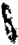

TOMO 321

Volumen 1

1998

DE JUSTICIA DE LA NACION

321

## FALLOS DE LA CORTE SUPREMA DE JUSTICIA DE LA NACION

1

DE JUSTICIA DE LA NACION

321

3

## R E P U B L I C A A R G E N T I N A

FALLOS

DE  LA

C O R T E

S U P R E M A

DE

## J USTICIA DE LA N ACION

PUBLICACION A CARGO DE LA SECRETARIA DE JURISPRUDENCIA DEL TRIBUNAL

TOMO 321 - VOLUMEN 1

FEBRERO - MAYO

LA LEY S.A.E. e I.

Tucumán 1471 (1050) Buenos Aires 1998

## HOJA COMPLEMENTARIA

Hoja incorporada a los efectos de permitir la búsqueda por página dentro del Volumen.

DE JUSTICIA DE LA NACION

321

5

## A C U E R D O S   D E   L A   C O R T E   S U P R E M A

## AÑO 1998

## FEBRERO - MAYO

## CONSEJO DE LA MAGISTRATURA. DESIGNACION DE ADMINISTRADOR GENERAL DEL PODER JUDICIAL.

-N o 1-

En Buenos Aires, a los 5 días del mes de febrero del año mil novecientos noventa y ocho, reunidos en la Sala de Acuerdos del Tribunal, los señores Ministros que suscriben la presente,

## Consideraron:

Que el artículo 114 de la Constitución Nacional prevé la creación del Consejo de la Magistratura, 'regulado por una ley especial sancionada por la mayoría absoluta de la totalidad de los miembros' de cada Cámara del Congreso de la Nación.

Que, en cumplimiento de ese precepto, el Poder Legislativo dictó la ley 24.937 que modificó por medio de la 24.939, y dispuso que 'para la primera elección y hasta tanto se constituya el Consejo, la Corte Suprema de Justicia de la Nación, confeccionará el padrón correspondiente a los jueces y abogados de la matrícula federal, y organizará las primeras elecciones de los jueces'. En un afín orden de ideas, prescribió que 'la Federación Argentina de Colegios de Abogados organizará la elección de los abogados de la matrícula federal, bajo la supervisión y fiscalización de la Corte Suprema' y que 'ambas elecciones deberán efectivizarse dentro de un plazo de ciento ochenta (180) días de publicada la presente', término que deberá computarse a partir del 6 de enero del corriente año.

Que esas normas establecieron que el Consejo de la Magistratura sea presidido por el Presidente de la Corte Suprema de Justicia de la Nación -art. 2 inc. 1 y 10 de la ley 24.937- y que éste se encuentre investido de la facultad de proponer al plenario los funcionarios que habrán de desempeñarse como Administrador General del Poder Judicial de la Nación y Secretario General del cuerpo -art. 7, inc. 6 de la ley 24.937-.

Que, por otra parte, la puesta en funcionamiento del Consejo de la Magistratura requerirá la adecuación del complejo esquema administrativo que asegura la infraestructura del Poder Judicial de la Nación.

Que, por las razones expuestas, el Tribunal considera necesario disponer todas las medidas destinadas a poner en funcionamiento el Consejo de la Magistratura en el más breve lapso posible.

Por ello,

Acordaron:

Disponer que -hasta tanto se constituya ese nuevo órgano constitucional- el Administrador de la Corte Suprema de Justicia de la Nación ejerza, en lo pertinente, las funciones atribuidas al cargo de Administrador General del Poder Judicial -art. 17 y 18 de la ley 24.937- y desarrolle las tareas vinculadas a la adecuación y posterior transferencia de las reparticiones dependientes del Tribunal al Consejo de la Magistratura con las limitaciones que fija el art. 32 del ordenamiento citado.

Todo lo cual, dispusieron y mandaron, ordenando que se comunicase y se registrase en el libro correspondiente, por ante mí que doy fe.- JULIO S. NAZARENO - EDUARDO MOLINÉ O'CONNOR - CARLOS S. FAYT - AUGUSTO CÉSAR BELLUSCIO - ENRIQUE SANTIAGO PETRACCHI - ANTONIO BOGGIANO - GUILLERMO A. F. LÓPEZ - GUSTAVO A. BOSSERT ADOLFO R. VÁZQUEZ Nicolás Alfredo Reyes (Administrador General).

## CONSEJO DE LA MAGISTRATURA. DESIGNACION DE SECRETARIO DE CORTE.

-N o 2-

En Buenos Aires, a los 10 días del mes de febrero del año mil novecientos noventa y ocho, reunidos en la Sala de Acuerdos del Tribunal, los señores Ministros que suscriben la presente,

Consideraron:

Que, en virtud de las razones expuestas en la Acordada 1/98 corresponde disponer que un funcionario colabore con esta Corte en el ejercicio de las tareas que le encomienda el art. 33 de la ley 24.939.

Por ello;

Acordaron:

Designar, en los términos del art. 88 del Reglamento para la Justicia Nacional, al Dr. Santiago H. Corcuera -D.N.I. 17.796.308- para que asista al Tribunal en el uso de las atribuciones que le reconoce el art. 33 de la ley 24.939, y cumpla, en forma interina y en cuanto corresponda, las funciones previstas en el art. 20 de la ley 24.939, hasta tanto se constituya el plenario del Consejo.

Todo lo cual dispusieron y mandaron, ordenando que se comunicase y registrase en el libro correspondiente, por ante mí, que doy fe. - JULIO S. NAZARENO - EDUARDO MOLINÉ O'CONNOR - CARLOS S. FAYT - AUGUSTO CÉSAR BELLUSCIO - ANTONIO BOGGIANO ( por su voto ) - GUILLERMO A. F. LÓPEZ - GUSTAVO A. BOSSERT - ADOLFO R. VÁZQUEZ Nicolás Alfredo Reyes (Administrador General).-

VOTO DEL SEÑOR MINISTRO DOCTOR DON ANTONIO BOGGIANO.

En Buenos Aires, a los 10 días del mes de febrero del año mil novecientos noventa y ocho, reunidos en la Sala de Acuerdos del Tribunal, los señores Ministros que suscriben la presente,

## Consideraron:

Que, en virtud de las razones expuestas en la Acordada 1/98 corresponde disponer que un funcionario colabore con esta Corte en el ejercicio de las tareas que le encomienda el art. 33 de la ley 24.939.

Que teniendo en cuenta la índole y responsabilidad de las aludidas funciones resulta pertinente encomendarlas a un funcionario con la jerarquía de Secretario de Corte.

Que la naturaleza del cargo impone un riguroso criterio de selección que atienda a la experiencia y conocimientos, a fin de asegurar el requisito de idoneidad previsto por el art. 16 de la Constitución Nacional.

Que los antecedentes que exhibe el doctor Santiago H. Corcuera acreditan una dedicación permanente, continua y sistemática a la materia, toda vez que aprobó un ciclo de perfeccionamiento sobre la especialidad, participó en eventos -en el país y en el extranjero- y cuenta con publicaciones sobre el tema.

Por ello;

Acordaron:

Designar, en los términos del art. 88 del Reglamento para la Justicia Nacional, al Dr. Santiago H. Corcuera -D.N.I. 17.796.308- para que asista al Tribunal en el uso de las atribuciones que le reconoce el art. 33 de la ley 24.939, y cumpla, en forma interina y en cuanto corresponda, las funciones previstas en el art. 20 de la ley 24.937, hasta tanto se constituya el plenario del Consejo.

Todo lo cual, dispusieron y mandaron, ordenando que se comunicase y registrase en el libro correspondiente, por ante mí que doy fe.- ANTONIO BOGGIANO Nicolás Alfredo Reyes (Administrador General).

## ACUERDOS DE LA CORTE SUPREMA 321

## HONRAS DISPUESTAS POR EL FALLECIMIENTO DEL DR. RICARDO COLOMBRES

-N o 3-

En Buenos Aires, a los 18 días del mes de febrero del año mil novecientos noventa y ocho, reunidos en la Sala de Acuerdos del Tribunal, los señores Ministros que suscriben la presente,

## Consideraron:

Que el día 14 del corriente ha ocurrido el fallecimiento del Dr. Ricardo Colombres, ex Ministro de esta Corte Suprema de Justicia de la Nación.

Que es deber del Tribunal asociarse al duelo que provoca la desaparición del distinguido ex magistrado.

Por ello,

Acordaron:

- 1 o ) Dirigir nota de condolencia a la familia del extinto.
- 2 o ) Incluir el nombre del Dr. Ricardo Colombres en las tablas de honor del Tribunal.

Todo lo cual dispusieron y mandaron, ordenando que se comunicase y registrase en el libro correspondiente, por ante mí, que doy fe. - JULIO S. NAZARENO - EDUARDO MOLINÉ O'CONNOR - CARLOS S. FAYT - ENRIQUE SANTIAGO PETRACCHI - GUILLERMO A. F. LÓPEZ - GUSTAVO A. BOSSERT - ADOLFO R. VÁZQUEZ Nicolás Alfredo Reyes . (Administrador General).

## DETENIDOS EN ALCAIDIAS JUDICIALES.

-N o 4-

En Buenos Aires a los 24 días del mes de febrero de 1998, los señores Ministros de la Corte Suprema de Justicia que suscriben la presente,

## Consideraron:

Que se hace necesario disponer medidas con destino a los detenidos convocados a comparendo a los distintos tribunales y son alojados transitoriamente en espera, en las Alcaidías judiciales.

Que cuando esos internos concurran en calidad de comunicados pero por razones de su personalidad o su seguridad deban ser aislados del resto de la población penal, se

aprecia conveniente extremar las precauciones, haciendo extensivos los recaudos para los detenidos 'incomunicados', en lo que respecta a la retención de todo elemento que pueda servir para actuar contra su vida, sin perjuicio de su devolución al momento de producirse su remisión a la unidad o al recobrar su libertad.

Por ello,

Acordaron:

Que en los casos en que personas privadas de su libertad comparezcan en calidad de 'comunicados' y que, por razones de su personalidad o seguridad deban ser alojados en las Alcaidías judiciales en celdas individuales, (Acordada CSJN 26/84), se observarán los recaudos previstos para los 'incomunicados' en lo que respecta a la retención de todos los elementos que sean idóneos para atentar contra su vida (cordones de calzado, bufandas, cinturones, etc. - artículo 44 del Manual de Normas Operativas Judiciales aprobado por Resolución CSJN 1438/94).

Regístrese y comuníquese.- JULIO S. NAZARENO - EDUARDO MOLINÉ O'CONNOR CARLOS S. FAYT - AUGUSTO CÉSAR BELLUSCIO - ENRIQUE SANTIAGO PETRACCHI - GUILLERMO A. F. LÓPEZ - GUSTAVO A. BOSSERT - ADOLFO ROBERTO VÁZQUEZ Hugo L. M. Piacentino (Secretario).

## HONRAS DISPUESTAS POR EL FALLECIMIENTO DEL DR. ALEJANDRO R. CARIDE.

## -N o 6-

En Buenos Aires, a los 10 días del mes de marzo del año mil novecientos noventa y ocho, reunidos en la Sala de Acuerdos del Tribunal, los señores Ministros que suscriben la presente,

## Consideraron:

Que el día 8 del corriente ha ocurrido el fallecimiento del Dr. Alejandro Roberto Caride, ex Ministro de esta Corte Suprema de Justicia de la Nación.

Que es deber del Tribunal asociarse al duelo que provoca la desaparición del distinguido ex magistrado.

Por ello,

Acordaron:

1 o ) Dirigir nota de condolencia a la familia del extinto.

2 o ) Incluir el nombre del Dr. Alejandro Roberto Caride en las tablas de honor del Tribunal.

Todo lo cual dispusieron y mandaron, ordenando que se comunicase y registrase en el libro correspondiente, por ante mí, que doy fe.- JULIO S. NAZARENO - EDUARDO MOLINÉ O'CONNOR - CARLOS S. FAYT - AUGUSTO CÉSAR BELLUSCIO - ENRIQUE SANTIAGO PETRACCHI - GUSTAVO A. BOSSERT - ADOLFO ROBERTO VÁZQUEZ Nicolás Alfredo Reyes (Administrador General).

## OFICINA RECEPTORA DE CEDULAS DE COMODORO PY. REGLAMENTO.

-N o 7-

En Buenos Aires, a los 17 días del mes de marzo del año mil novecientos noventa y ocho, los señores Ministros que suscriben la presente,

## Consideraron:

Que mediante resolución 2573/96 esta Corte dispuso la instalación, por el término de seis meses, de una oficina receptora de cédulas de notificación en el edificio de Comodoro Py  2002.

Que es necesario regular el funcionamiento de la oficina mencionada hasta que este Tribunal, después de evaluar sus resultados, decida respecto de su continuidad o disolución.

Por ello y en virtud de las facultades conferidas por el art. 48 del decreto-ley 1285/58,

## Acordaron:

Aprobar el reglamento provisorio de la oficina receptora de cédulas de notificación del edificio de Comodoro Py 2002 de esta ciudad, el cual como anexo se agrega a la presente.

Todo lo cual dispusieron y mandaron, ordenando que se comunicase y se registrase en el libro correspondiente, por ante mí, que doy fe. - EDUARDO MOLINÉ O'CONNOR CARLOS S. FAYT - AUGUSTO CÉSAR BELLUSCIO - ENRIQUE SANTIAGO PETRACCHI - GUILLERMO A. F. LÓPEZ - GUSTAVO A. BOSSERT - ADOLFO ROBERTO VÁZQUEZ Nicolás Alfredo Reyes (Administrador General).

REGLAMENTO PROVISORIO DE LA OFICINA RECEPTORA DE CÉDULAS DE COMODORO PY 2002

1) Las planillas y las cédulas se confeccionarán de acuerdo a lo prescripto por el Reglamento de la Oficina de Notificaciones (Ac. 19/80 y sus modificatorias) y se agrega-

rá un círculo rojo en el margen superior izquierdo de las cédulas con el fin de identificar que fueron recibidas por la receptoría.

2) La recepción ordinaria de cédulas se realizará todos los días hábiles de 7,30 a 8,30 horas.

3) Después del horario de la oficina, las cédulas con carácter especial -habilitación de día y hora y todas aquellas en las que el carácter de urgente figure debidamente expresado- deberán entregarse, sin excepción, en Av. Roque Sáenz Peña 615 2  piso. o Nicolás Alfredo Reyes (Administrador General).

## HONRAS DISPUESTAS CON MOTIVO DEL FALLECIMIENTO DEL DR. MIGUEL S. MARIENHOFF

-N o 8-

En Buenos Aires, a los 24 días del mes de marzo del año mil novecientos noventa y ocho, reunidos en la Sala de Acuerdos del Tribunal, los señores Ministros que suscriben la presente,

Consideraron:

Que el día 20 del corriente mes ha ocurrido el sensible fallecimiento del Dr. Miguel S. Marienhoff, conjuez de esta Corte Suprema de Justicia de la Nación.

Que es deber del Tribunal asociarse al duelo que provoca la desaparición del distinguido magistrado.

Por ello,

Acordaron:

Dirigir nota de condolencia a la familia del extinto.

Todo lo cual dispusieron y mandaron, ordenando que se comunicase y registrase en el libro correspondiente, por ante mí, que doy fe. - JULIO S. NAZARENO - CARLOS S. FAYT - ENRIQUE SANTIAGO PETRACCHI - ANTONIO BOGGIANO - GUILLERMO A. F. LÓPEZ ADOLFO ROBERTO VÁZQUEZ Nicolás Alfredo Reyes (Administrador General).

## ACUERDOS DE LA CORTE SUPREMA 321

## DECLARACIONES JURADAS PATRIMONIALES.

-N o 9-

En Buenos Aires, a los 2 días del mes de abril del año mil novecientos noventa y ocho, los señores Ministros que suscriben la presente,

## Consideraron:

Que por acordada N o 57/96  y  resolución  N   1695/96  se  estableció  el  sistema  de o exigibilidad de las declaraciones juradas patrimoniales determinándose quienes estarían comprendidos dentro de tal régimen.

Que se ha planteado la dificultad de establecer si resulta de exigencia para los funcionarios que no están obligatoriamente comprendidos entre los que deben presentar la citada declaración y acceden a funciones en calidad de interinos o subrogantes en categorías alcanzadas por las normas de referencia.

Que el principio general por el cual todo aquél que ejerce funciones públicas está obligado al cumplimiento de todos los deberes inherentes al cargo que desempeñe, incluiría el de presentar la declaración jurada patrimonial.

Que, sin embargo, los desempeños por breves lapsos tornan inadecuada una exigencia tan estricta, por lo que habría que dejar sentado el alcance de las normas citadas.

## Por ello,

## Acordaron:

Aclarar que no es obligatorio para los funcionarios cumplir con la declaración jurada patrimonial prevista en el punto 1  de la acordada 57/96 en tanto ejerzan cargos o o cumplan funciones en calidad de interinos o subrogantes.

Todo lo cual dispusieron y mandaron, ordenando que se comunicase y se registrase en el libro correspondiente, por ante mí, que doy fe.- JULIO S. NAZARENO - EDUARDO MOLINÉ O'CONNOR - CARLOS S. FAYT - AUGUSTO CÉSAR BELLUSCIO - ADOLFO ROBERTO VÁZQUEZ Nicolás Alfredo Reyes (Administrador General).

## FERIA JUDICIAL DE JULIO.

-N o 10-

En Buenos Aires, a los 2 días del mes de abril del año mil novecientos noventa y ocho, reunidos en la Sala de Acuerdos del Tribunal, los señores Ministros que suscriben la presente,

## Acordaron:

1 o ) Disponer en el corriente año feriado judicial para los tribunales nacionales de la Capital desde el día 20 al 31 de julio, ambos inclusive.

2 o ) Hacer saber a las Cámaras Federales de Apelaciones que con arreglo a lo previsto en la Acordada N  53/73 -respecto de la coincidencia de la feria en ella establecida o con las vacaciones escolares- y a lo dispuesto en la presente, deberán determinar para sus respectivas jurisdicciones un feriado judicial de diez días hábiles (acápite 2  de la o acordada N  30/84). o

Todo lo cual dispusieron y mandaron, ordenando que se comunicase y registrase en el libro correspondiente, por ante mí, que doy fe.- JULIO S. NAZARENO - EDUARDO MOLINÉ O'CONNOR - CARLOS S. FAYT - AUGUSTO CÉSAR BELLUSCIO - ANTONIO BOGGIANO GUILLERMO A. F. LÓPEZ - ADOLFO ROBERTO VÁZQUEZ Nicolás Alfredo Reyes (Administrador General)

## PERITOS. NOMINA DE ESPECIALIDADES.

## -N o 11-

En Buenos Aires, a los 2 días del mes de abril del año mil novecientos noventa y ocho, reunidos en la Sala de Acuerdos del Tribunal, los señores Ministros que suscriben la presente,

## Consideraron:

La solicitud formulada en el expediente N  10-35.635/97 y la opinión favorable del o titular de la Secretaría de Juicios Originarios (fs. 10).

Por ello,

## Acordaron:

Incluir en la nómina de especialidades que forma parte de la acordada N  25/85 a o las siguientes: piloto de aeronaves; perito en operaciones aéreas y perito en operaciones aeroportuarias.

Todo lo cual dispusieron y mandaron, ordenando que se comunicase y registrase en el libro correspondiente, por ante mí, que doy fe.- JULIO S. NAZARENO - EDUARDO MOLINÉ O'CONNOR - CARLOS S. FAYT - AUGUSTO CÉSAR BELLUSCIO - ANTONIO BOGGIANO GUILLERMO A. F. LÓPEZ - ADOLFO ROBERTO VÁZQUEZ Nicolás Alfredo Reyes (Administrador General)

## CONSEJO DE LA MAGISTRATURA. ELECCIONES DE LOS JUECES.

## -N o 12-

En Buenos Aires, a los 6 días del mes de abril del año mil novecientos noventa y ocho, reunidos en la Sala de Acuerdos del Tribunal, los señores Ministros que suscriben la presente,

## Consideraron:

Que el art. 33 de la ley 24.937, modificado por el art. 1  de la ley 24.939, encomieno da al Tribunal la organización de las primeras elecciones de los jueces que compondrán el Consejo de la Magistratura y el Jurado de Enjuiciamiento, con la supervisión y fiscalización de la Asociación de Magistrados y Funcionarios de la Justicia Nacional.

Que, mas allá del alcance que corresponde reconocer a las atribuciones de esa asociación establecidas por los textos legales citados con relación al acto eleccionario, el Tribunal considera apropiado -en las circunstancias del caso- poner en su conocimiento el proyecto de reglamento a estudio.

Que la exigüidad del plazo impuesto por la aludida norma para la ejecución de los comicios, impone actuar con la mayor celeridad en el trámite de redacción del reglamento que habrá de regir esa elección.

## Por ello.

## Acordaron:

Poner en conocimiento de la Asociación de Magistrados y Funcionarios de la Justicia Nacional el proyecto de reglamento para la elección de los jueces que compondrán el Consejo de la Magistratura y el Jurado de Enjuiciamiento -que, como anexo, forma parte integrante de la presente- haciéndole saber que cuenta con el plazo de cuarenta y ocho horas para elevar al Tribunal sus consideraciones al respecto.

Todo lo cual dispusieron y mandaron, ordenando se comunicase y registrase en el libro correspondiente, por ante mí, que doy fe.- JULIO S. NAZARENO - EDUARDO MOLINÉ O'CONNOR - CARLOS S. FAYT - AUGUSTO CÉSAR BELLUSCIO - ENRIQUE SANTIAGO PETRACCHI - ANTONIO BOGGIANO - GUILLERMO A. F. LÓPEZ - ADOLFO ROBERTO VÁZQUEZ ( en disidencia ) -Nicolás Alfredo Reyes (Administrador General).

DISIDENCIA DEL SEÑOR MINISTRO DOCTOR DON ADOLFO ROBERTO VÁZQUEZ

## Considerando:

Que, cuando el art. 33 de la ley 24.939 menciona la entidad que habrá de fiscalizar y supervisar las elecciones de jueces para elegir a aquéllos que integrarán el Consejo

de la Magistratura y el Jurado de Enjuiciamiento, alude a la 'Asociación de Magistrados' y no hace una referencia precisa a la Asociación de Magistrados y Funcionarios de la Justicia Nacional, circunstancia que no puede ser menospreciada a poco que se advierta que la mencionada no es la única asociación civil que agrupa magistrados. En efecto, existen otras asociaciones de jueces que podrían reclamar igual participación o aún mayor, si se toma en cuenta que en sus integraciones no intervienen funcionarios. A ello cabe agregar que no todos los jueces convocados a esta elección hacen parte de la Asociación de Magistrados y Funcionarios de la Justicia Nacional.

Que, por otra parte, el mismo artículo de la ley 24.939 prescribe que 'la Corte Suprema de Justicia de la Nación confeccionará el padrón correspondiente a los jueces ... y organizará las primeras elecciones..., con la supervisión y fiscalización de la Asociación de Magistrados', refiriéndose, de un modo concreto e inequívoco, al acto electoral y no al reglamento que habrá de regirlo. En efecto, no puede presuponerse que la redacción de un reglamento, que no difiere en su naturaleza de otros que puede estar llamada a confeccionar esta Corte, se convierta en un acto complejo -en el sentido que le  da  el  derecho  administrativo  al  término-  que  involucre  en  pie  de  igualdad,  a  la cabeza de un poder del Estado, por una parte, y una asociación civil por el otro.

Por ello,

Acordaron:

No darle intervención previa a la Asociación de Magistrados y Funcionarios de la Justicia Nacional y disponer que el reglamento para la elección de los jueces que habrán de integrar el Consejo de la Magistratura y el Jurado de Enjuiciamiento sea comunicado una vez que su texto sea definitivamente adoptado por este Tribunal.

Todo lo cual dispusieron y mandaron, ordenando que se comunicase y se registrase en el libro correspondiente, por ante mí, que doy fe.- ADOLFO ROBERTO VÁZQUEZ.

REGLAMENTO PARA LA ELECCIÓN DE LOS JUECES QUE COMPONDRÁN EL CONSEJO DE LA MAGISTRATURA Y EL JURADO DE ENJUICIAMIENTO

## Capítulo I - Cuerpo Electoral.

## Art. 1  - Electores. o

Los magistrados del Poder Judicial de la Nación, de todas las instancias, componen el cuerpo electoral convocado a elegir a los representantes de los jueces que integrarán el órgano previsto por el art. 114 de la Constitución Nacional, en los términos del art. 2 , inc. 2 , de la ley 24.937. o o

Los magistrados del Poder Judicial de la Nación, con jerarquía funcional de jueces de cámara, constituyen el cuerpo electoral convocado para la elección de los miembros del órgano instituido por el art. 115 de la Constitución Nacional, en los términos del art. 22, inc. 1 , de la ley 24.937. o

Para ser electores, los jueces deberán encontrarse en el ejercicio de sus funciones.

La Corte dispondrá oportunamente lo necesario para la designación de sus integrantes que compondrán el Jurado de Enjuiciamiento.

Art. 2  - Condición de elector. o

Sólo podrán emitir su voto quienes se encuentren en el padrón electoral.

Art. 3  - Carácter del sufragio. o

El sufragio es individual, personal, voluntario y secreto.

Capítulo II - Listas provisionales.

Art. 4  - Impresión. o

Sobre la base de las constancias existentes en el Poder Judicial, la Corte Suprema de Justicia de la Nación dispondrá la impresión de las listas provisionales de electores que contendrán los siguientes datos: apellido y nombre, número y clase de documento cívico, cargo que desempeña, y lugar dónde emitirá el voto.

Art. 5  - Exhibición. o

Las listas provisionales serán remitidas a los presidentes de todas las cámaras y a la Asociación de Magistrados y Funcionarios de la Justicia Nacional, quienes deberán exhibirlas inmediatamente por cinco (5) días, en los lugares que determinen adoptando los recaudos para la debida noticia de dicho acto.

Art. 6  - Observaciones. o

Los electores que, por cualquier causa, no figurasen en las listas provisionales, o estuviesen anotados erróneamente, podrán solicitar -por escrito- su inclusión o la introducción de las correcciones que fueren menester, en el plazo de cinco (5) días, contados desde la fecha de la publicación conforme al artículo anterior, ante el tribunal superior que ejerza la superintendencia, quien deberá elevarlo a la Corte Suprema de Justicia de la Nación, de inmediato.

Durante ese lapso, y en la misma forma, cualquier magistrado incluido en ellas podrá solicitar la eliminación de otros electores que hubiesen perdido la condición de tales o que figurasen inscriptos más de una vez, así como la corrección de los datos que consideren erróneos.

Capítulo III - Padrones electorales.

## Art. 7  - Padrones definitivos. o

Las listas provisionales depuradas constituirán el padrón electoral general para la elección de los futuros integrantes del Consejo de la Magistratura y del Jurado de Enjuiciamiento.

Los padrones contendrán, además de los datos mencionados en el art. 4  de este o reglamento, el número de orden del elector dentro de cada mesa y una columna para anotar la emisión del voto.

Los padrones destinados a los comicios serán autenticados por un secretario de la Corte Suprema de Justicia de la Nación y encabezados por una inscripción que indique la mesa electoral, del interior del país o de la Ciudad de Buenos Aires, a la que están dirigidos.

Art. 8  - Distribución de ejemplares. o

Se remitirán a la presidencia de cada cámara tres padrones por mesa de votación. La Asociación de Magistrados y Funcionarios de la Justicia Nacional y las listas oficializadas tendrán acceso al número de ejemplares que requieran, por medio de sus representantes autorizados.

## Capítulo IV - Mesas electorales.

Art. 9  - Distrito electoral. o

A los fines del presente reglamento se constituye un solo distrito electoral para todo el país.

Art. 10 - Mesas Electorales.

En cada cámara federal del interior del país se constituirá una mesa electoral.

En la Ciudad de Buenos Aires se instalarán tres mesas, identificadas con los números 1, 2 y 3, que incluirán a los votantes cuyos apellidos comiencen con las letras 'A' a E'; F' a 'M', y 'N' a 'Z', respectivamente.

## Art. 11 - Autoridades de mesa.

Cada mesa electoral tendrá como única autoridad a su presidente. El vicepresidente y el vocal lo reemplazarán en ese orden en los casos en que el Código Electoral Nacional así lo determina.

Estarán integradas de la siguiente forma:

- a)  En  la  Ciudad  de  Buenos Aires, las presidencias y vicepresidencias de mesa serán ejercidas por los presidentes de las cámaras de la Capital que resulten designados por sorteo.
- b) En el interior del país: por el presidente de la cámara federal, que la presidirá, y por el juez federal con competencia electoral del distrito en la que tiene su sede, que se desempeñará como vicepresidente, con las excepciones siguientes:
- -En el caso de las Cámaras Federales de Apelaciones de Rosario, de Bahía Blanca, de Comodoro Rivadavia y de General Roca, los jueces federales con competencia electo-

ral que integrarán las mesas serán los que tienen asiento en las ciudades de Santa Fe, Santa Rosa, Rawson y Neuquén, respectivamente.

-En el caso de las Cámaras Federales de Apelaciones de San Martín y Mar del Plata las mesas electorales se integrarán con el presidente y el vicepresidente o del vocal que elija el órgano cabeza de la jurisdicción, quienes ejercerán su presidencia y su vicepresidencia respectivamente.

-En el caso de que los presidentes de las cámaras o los jueces federales de primera instancia con competencia electoral a quienes este reglamento designa como autoridades de mesa integraran alguna lista oficializada de candidatos, serán suplidos por el vicepresidente de la misma cámara; y, de ser necesario un segundo reemplazo, por los magistrados de la jurisdicción que disponga cada tribunal.

Las autoridades de todas las mesas electorales se completarán con un representante de la Asociación de Magistrados y Funcionarios de la Justicia Nacional, en calidad de vocal.

Dicho representante será designado con treinta (30) días de antelación a la fecha de los comicios. El nombramiento deberá recaer en un magistrado que sea elector de la mesa en la que es convocado como autoridad, y que no integre como candidato ninguna lista  oficializada.  En  el  caso  de  que  no  se  dispusiera  de  jueces  que  reunieran  tales requisitos, podrá ser designado un funcionario judicial con rango no inferior a secretario de primera instancia.

## Capítulo V - Actos preelectorales.

## Art. 12 - Convocatoria.

La convocatoria será efectuada por acordada de la Corte Suprema de Justicia de la Nación, con sesenta (60) días de anticipación a la fecha de los comicios.

Art. 13 - Listas de candidatos.

Desde la publicación de la convocatoria y hasta treinta (30) días antes de la fecha fijada para la elección, los interesados podrán solicitar a la Corte Suprema de Justicia de la Nación el registro de las listas de candidatos, para lo cual deberán cumplir con los requisitos de los artículos siguientes.

No podrán postularse los mismos candidatos para ocupar cargos simultáneamente en el Consejo de la Magistratura y en el Jurado de Enjuiciamiento.

Art. 14 - Listas de candidatos a miembros del Consejo de la Magistratura.

a) Cada lista deberá postular como candidatos a consejeros titulares -en el orden de su preferencia- a cinco (5) magistrados, de los cuales, dos (2) deberán tener rango de juez de cámara y dos de juez de primera instancia; e incluir a un magistrado de cada jerarquía funcional con competencia federal del interior de la República.

b) Cada lista deberá postular como candidatos a consejeros suplentes, en idéntico orden, a cinco (5) magistrados que reúnan igual jerarquía funcional y ejerzan la magistratura en el mismo ámbito territorial (Capital Federal o interior del país) que los propuestos como candidatos a consejeros titulares que eventualmente podrían ser llamados a reemplazar.

- c) Para ser oficializada, cada lista deberá ir acompañada con la adhesión de, por lo menos, ochenta (80) electores. Los adherentes no podrán se candidatos ni estar incluidos en la misma calidad en apoyo de otra lista.

Quienes pretendan postularse deberán ser electores en los términos del art. 1  de o este reglamento y cumplir con los requisitos que impone el art. 4  de la ley 24.937. o

Art. 15 - Listas de candidatos a miembros del Jurado de Enjuiciamiento.

a) Cada lista deberá postular como candidatos a miembros titulares a dos (2) magistrados con grado de jueces de cámara y a igual cantidad como candidatos a miembros suplentes.

b) Para ser oficializada, cada lista deberá ir acompañada con la adhesión de, por lo menos, cuarenta (40) electores. Los adherentes no podrán ser candidatos, ni estar incluidos en la misma calidad en apoyo de otra lista.

Los candidatos deberán ser magistrados con rango de juez de cámara y electores en los términos del art. 1  de este reglamento. o

## Art. 16 - Oficialización de las listas de candidatos.

La Corte Suprema de Justicia de la Nación oficializará de modo provisional las listas  que  se  presenten,  siempre que cumplan con los requisitos establecidos en los artículos anteriores, asignándoles números consecutivos de acuerdo con el orden de su presentación.

Los apoderados de las listas, en los términos del art. 18 de este reglamento, tendrán un plazo de cinco (5) días para:

- a) Reformular las listas que hubieran sido observadas.
- b) Impugnar las listas que hubieran sido presentadas.

Al vencimiento del plazo, la Corte Suprema de Justicia de la Nación procederá a la oficialización definitiva de las listas.

Art. 17 - Boletas de sufragio.

La Corte Suprema de Justicia de la Nación confeccionará e imprimirá separadamente las boletas de sufragio destinadas a la elección de miembros del Consejo de la Magistratura y las de los candidatos a integrar el Jurado de Enjuiciamiento.

## Art. 18 - Apoderados.

Será considerado apoderado de la lista el magistrado que aparezca en primer término como candidato titular a miembro del Consejo de la Magistratura o a integrante

del Jurado de Enjuiciamiento, o quien le siguiera en el orden interno, si la candidatura de aquél fuera observada.

## Art. 19 - Fiscales.

Las listas oficializadas tendrán derecho a designar un (1) fiscal para que las represente en cada una de las mesas electorales. El nombramiento deberá recaer en un magistrado que sea elector de la mesa en la que es convocado como tal. Justificará su condición ante las autoridades de mesa, mediante un instrumento otorgado por el apoderado.

## Capítulo VI - El acto electoral.

## Art. 20 - Apertura del acto electoral.

Se habilitarán dos cuartos oscuros y dos urnas diferentes para la recepción de los sufragios, destinados -respectivamente- a las de elecciones de miembros del Consejo de la Magistratura y del Jurado de Enjuiciamiento.

Cumplidos los recaudos que pudieran corresponder entre los previstos en el art. 82 del Código Electoral Nacional se procederá a la apertura del acto electoral, a las nueve (9) horas.

## Art. 21 - Emisión del sufragio.

Los electores podrán votar únicamente en la mesa receptora de votos en cuya lista figuren asentados, previa exhibición del documento cívico habilitante o de la credencial del Poder Judicial de la Nación.

Todos los magistrados inscriptos tendrán derecho a sufragar en la elección de miembros del Consejo de la Magistratura. En la de miembros del Jurado de Enjuiciamiento, sólo quienes tengan rango de juez de cámara.

Las autoridades de mesa y los fiscales acreditados votarán en primer término.

## Art. 22 - Clausura del acto electoral.

El acto electoral finalizará a las quince (15) horas, salvo que las autoridades de mesa constataren con anterioridad que ya ha emitido su voto el total del padrón.

En este último caso, dispondrán la custodia de la urna hasta las quince (15) horas, momento en el que deberán iniciar el escrutinio de mesa.

## Capítulo VII - Escrutinio.

Art. 23 - Escrutinio de la mesa.

Una vez cerrado el acto, el presidente de mesa, auxiliado por las otras autoridades y ante la presencia de los fiscales y candidatos que lo solicitaren, hará el escrutinio,

ajustándose al procedimiento previsto en el art. 101 Código Electoral Nacional; resolviendo acerca de la validez o nulidad de los votos recurridos e impugnados.

Se efectuarán por separado los escrutinios correspondientes a las elecciones de miembros del Consejo de la Magistratura y del Jurado de Enjuiciamiento.

Concluido el escrutinio, las autoridades de mesa completarán las actas de cierre, de acuerdo con lo previsto en el art. 102 del Código Electoral Nacional, y procederán a la guarda de boletas y documentos en los términos de los arts. 103 y 104 del Código Electoral Nacional.

Efectuado el escrutinio de mesa, su presidente emitirá un facsímil dirigido a la Corte Suprema de Justicia de la Nación, que contendrá copia de las dos actas de cierre con todos sus datos.

## Art. 24 - Escrutinio provisional.

Una vez recibida en la Corte Suprema de Justicia de la Nación la totalidad de las copias de las actas de cierre provenientes de todas las mesas habilitadas, un secretario, con la intervención de los candidatos, fiscales y autoridades de la Asociación de Magistrados y Funcionarios de la Justicia Nacional que hayan sido acreditados para cumplir tareas en cualquier mesa de todo el país, procederá a efectuar el escrutinio provisional de los votos afirmativos válidamente emitidos.

## Art. 25 - Escrutinio definitivo.

Una vez llegadas las urnas y toda la documentación del acto eleccionario a la Corte Suprema de Justicia de la Nación, se procederá al escrutinio definitivo, el cual se regirá por las normas precedentes y, en su caso, por los arts. 110 y siguientes del Código Electoral Nacional.

## Art. 26 - Proclamación de los electos.

La Corte Suprema de Justicia de la Nación proclamará a los miembros electos, titulares y suplentes, del Consejo de la Magistratura y del Jurado de Enjuiciamiento.

## Capítulo VIII - Sistema electoral.

Art. 27 - El sufragante votará solamente por una lista de candidatos oficializada.

El escrutinio de la elección se practicará por listas, sin tomar en cuenta las tachas o sustituciones que haya efectuado el votante, las que -en ningún caso- afectarán la validez del voto.

Art. 28 - Participarán en la asignación de cargos todas las listas, cualquiera que fuere el porcentual de votos del padrón electoral que hayan obtenido.

Art. 29 - Los cargos de los miembros del Consejo de la Magistratura se asignarán con arreglo al siguiente procedimiento:

- a) El total de los votos obtenidos por cada lista será dividido por uno (1), por dos (2), por tres (3) y por cuatro (4).
- b) Los cocientes resultantes, con independencia de la lista de la que provengan, serán ordenados de mayor a menor en número igual al de los cargos por cubrir.
- Si  hubiere dos o más cocientes iguales, se los ordenará en función del total de votos obtenidos por las respectivas listas; y, si éstas hubieran obtenido igual número de votos, el ordenamiento resultará de un sorteo.
- c) A cada lista le corresponderán tantos cargos -titulares y suplentes- como veces figuren en el ordenamiento indicado en el inciso b), los que serán adjudicados a los magistrados de acuerdo al orden interno en que han sido incluidos en ellas, con las excepciones previstas en los inciso f) y g).
- d) El primer cargo de consejero titular será asignado a la lista que haya obtenido el primero de los cocientes a que se refiere el inciso b).
- e) El segundo cargo de consejero titular será asignado a la lista que haya obtenido el segundo de los cocientes a que se refiere el inciso b).
- f) El tercer cargo de consejero titular será asignado a la lista que haya obtenido el tercero de los cocientes a que se refiere el inciso b).
- En el caso de que los magistrados a quienes se consideraron electos de acuerdo con los  incisos  d)  y  e)  tuvieran  igual  jerarquía  funcional,  este  cargo  será  adjudicado  al magistrado de distinto grado al de aquéllos que aparezca primero en el orden interno de la misma lista.
- g) El cuarto cargo de consejero titular será asignado a la lista que haya obtenido el cuarto de los cocientes a que se refiere el inciso b).
- El cargo será adjudicado al magistrado de la instancia que, luego de la distribución efectuada de acuerdo con los incisos d), e) y f), tenga sólo un representante, y aparezca primero en el orden interno de la misma lista.
- En el caso de que ninguno de los considerados electos de conformidad con los incisos d), e), y f) fuera un juez federal del interior de la República, el cargo será adjudicado al juez de la instancia correspondiente que cumpla con ese requisito, y aparezca primero en el orden interno de la misma lista.
- h) Los cargos de consejeros suplentes serán adjudicados en la misma forma -de modo paralelo- que los de los consejeros titulares.
- Art. 30 - Los cargos de miembros del Jurado de Enjuiciamiento se asignarán con arreglo al siguiente procedimiento:
- a) El total de los votos obtenidos por cada lista será dividido por uno (1) y por dos (2).
- b) Los cocientes resultantes, con independencia de la lista de la que provengan, serán ordenados de mayor a menor en número igual al de los cargos por cubrir.

Si  hubiere dos o más cocientes iguales, se los ordenará en función del total de votos obtenidos por las respectivas listas; y, si éstas hubieran obtenido votos, el ordenamiento resultará de un sorteo.

- c) A cada lista le corresponderán tantos cargos -titulares y suplentes- como veces figuren en el ordenamiento indicado en el inciso b), los que serán adjudicados a los magistrados de acuerdo al orden interno en que han sido incluidos en ellas.

Capítulo IX - Disposiciones complementarias.

Art. 31 - Aplicación supletoria.

Será de aplicación supletoria el Código Electoral Nacional.

Art. 32 - Custodia.

Los candidatos y fiscales de las listas oficializadas podrán vigilar y custodiar las urnas y su documentación en todo momento.

Art. 33 - Términos.

Los plazos se computarán en días corridos.

Art. 34 - Ejecución.

Dispónese que la ejecución de las tareas vinculadas con la confección, impresión y distribución de los elementos necesarios para los comicios, con el transporte y entrega de las urnas de las mesas electorales, y con la seguridad de tales actos; así como todas aquellas que se asignan a un secretario de la Corte Suprema de Justicia de la Nación en este reglamento, deberán ser llevadas a cabo por el funcionario designado para asistirla por la acordada 2/98.

JULIO S. NAZARENO - EDUARDO MOLINÉ O'CONNOR - CARLOS S. FAYT - AUGUSTO CÉSAR BELLUSCIO - ENRIQUE SANTIAGO PETRACCHI - ANTONIO BOGGIANO - GUILLERMO A. F. LÓPEZ ADOLFO ROBERTO VÁZQUEZ ( en disidencia ) -Nicolás Alfredo Reyes (Administrador General)

COLEGIO PUBLICO DE ABOGADOS DE LA CAPITAL FEDERAL. ELECCIONES.

-N o 13-

En Buenos Aires, a los 7 días del mes de abril del año mil novecientos noventa y ocho, reunidos en la Sala de Acuerdos del Tribunal, los señores Ministros que suscriben la presente,

## Consideraron:

Que el día 23 de abril próximo se celebrarán las elecciones para designar las autoridades del Colegio Público de Abogados de la Capital Federal, en el horario comprendido entre las 8 y 18 horas.

Por ello,

Acordaron:

Declarar el día 23 de abril del corriente, inhábil para los tribunales de la Capital Federal, sin perjuicio de los actos procesales que se cumplan, no actuados en rebeldía.

Todo lo cual dispusieron y mandaron, ordenando que se comunicase y registrase en el libro correspondiente, por ante mí, que doy fe.- JULIO S. NAZARENO - EDUARDO MOLINÉ O'CONNOR - CARLOS S. FAYT - AUGUSTO CÉSAR BELLUSCIO - ENRIQUE SANTIAGO PETRACCHI - ANTONIO BOGGIANO Nicolás Alfredo Reyes (Administrador General).

## CONSEJO DE LA MAGISTRATURA. ELECCIONES.

## -N o 14-

En Buenos Aires, a los 14 días del mes de abril del año mil novecientos noventa y ocho, reunidos en la Sala de Acuerdos del Tribunal, el señor Presidente de la Corte Suprema de Justicia de la Nación, doctor Don Julio S. Nazareno y los señores Ministros que suscriben la presente,

## Consideraron:

Que el art. 33 de la ley 24.937, modificado por el art. 1  de la ley 24.939, encomieno da a esta Corte la organización de las primeras elecciones de los jueces que compondrán el Consejo de la Magistratura y el Jurado de Enjuiciamiento, lo que exige regular el procedimiento a seguir para la realización de esos comicios.

Que, más allá del alcance que corresponda reconocer a las atribuciones de la Asociación de Magistrados y Funcionarios de la Justicia Nacional establecidas en los textos legales citados, el tribunal consideró apropiado poner en su conocimiento el reglamento a estudio por medio de la Acordada 12/98.

Que esa entidad comunicó por nota del día siete del corriente -suscripta por su presidente y su secretario general- que no tenía observación alguna que formular al contenido del instrumento del que se le había dado vista.

Por ello,

## Acordaron:

Aprobar el Reglamento para la elección de los jueces que compondrán el Consejo de la Magistratura y el Jurado de Enjuiciamiento (*) que, como anexo, forma parte integrante de la presente.

Todo lo cual dispusieron y mandaron, ordenando se comunicase y registrase en el libro correspondiente, por ante mí que doy fe.- JULIO S. NAZARENO - EDUARDO MOLINÉ O'CONNOR - CARLOS S. FAYT - AUGUSTO CÉSAR BELLUSCIO - ENRIQUE SANTIAGO PETRACCHI - ANTONIO BOGGIANO - GUILLERMO A. F. LÓPEZ - GUSTAVO A. BOSSERT - ADOLFO ROBERTO VÁZQUEZ Nicolás Alfredo Reyes (Administrador General).

## CONSEJO DE LA MAGISTRATURA. ELECCIONES.

## -N o 15-

En Buenos Aires, a los 28 días del mes de abril del año mil novecientos noventa y ocho, reunidos en la Sala de Acuerdos del Tribunal, el señor Presidente de la Corte Suprema de Justicia de la Nación, doctor Don Julio S. Nazareno y los señores Ministros que suscriben la presente,

## Consideraron:

Que el art. 33 de la ley 24.937, modificado por el art. 1  de la ley 24.939, encomieno da al Tribunal la organización de las primeras elecciones de los jueces que compondrán el Consejo de la Magistratura y el Jurado de Enjuiciamiento, lo que exigió regular por medio de la Acordada 14/98 el procedimiento a seguir para la realización de esos comicios.

Que el mismo artículo de la ley 24.939 dispone que esas elecciones deberán efectivizarse dentro del plazo de ciento ochenta días a contar del seis de enero del corriente año.

Que el art. 12 del reglamento dictado, prescribe, a su vez, que la convocatoria sea efectuada por la Corte Suprema de Justicia de la Nación con sesenta (60) días de anticipación a los comicios.

Por ello,

Acordaron:

Convocar a la elección de los jueces que compondrán el Consejo de la Magistratura y el Jurado de Enjuiciamiento para el día veintinueve (29) de junio próximo.

(*) Publicado en pág. 15.

## DE JUSTICIA DE LA NACION 321

Todo lo cual dispusieron y mandaron, ordenando se comunicase y registrase en el libro correspondiente, por ante mí, que doy fe.- JULIO S. NAZARENO - EDUARDO MOLINÉ O'CONNOR - CARLOS S. FAYT - AUGUSTO CÉSAR BELLUSCIO - ENRIQUE SANTIAGO PETRACCHI - ANTONIO BOGGIANO - GUILLERMO A. F. LÓPEZ - GUSTAVO A. BOSSERT - ADOLFO ROBERTO VÁZQUEZ Nicolás Alfredo Reyes (Administrador General).

## TAREAS PELIGROSAS O INSALUBRES.

## -N o 16-

En Buenos Aires, a los 28 días del mes de abril del año mil novecientos noventa y ocho, reunidos en la Sala de Acuerdos del Tribunal, los señores Ministros que suscriben la presente,

## Consideraron:

Que la Ley N o 16.494  en  su  artículo  3,  inciso  d)  estableció  la  'bonificación  por tareas peligrosas e insalubres', fijándola en el veinte por ciento (20%) del total de las remuneraciones que por aplicación de la citada norma, perciben quienes prestan servicios en la Morgue Judicial.

Que en la actualidad la 'bonificación por tareas peligrosas e insalubres' se liquida sobre los rubros Sueldo Básico y Compensación Jerárquica.

Que ante un nuevo examen de la cuestión y teniendo en cuenta la existencia de numerosos reclamos administrativos, tendientes a lograr la modificación del método de cálculo de la bonificación, incluyendo el Suplemento Remunerativo establecido por la Acordada N  71/93, se torna necesario establecer para el futuro la metodología de o cálculo de liquidación de la bonificación mencionada, en concordancia con lo expuesto precedentemente.

Que la modificación de la citada metodología, sólo es posible recurriendo a un riguroso ejercicio de la facultad delegada por el artículo 5 de la Ley N  23.853 y la o compensación de créditos presupuestarios dispuesta por la Resolución N  218/98. o

## Por ello,

## Acordaron:

Instruir a la Administración General para que, a partir de la liquidación de los haberes correspondientes al mes de marzo de 1998, incluya en la base de cálculo para el cómputo de la 'bonificación por tareas peligrosas e insalubres' el Suplemento Remunerativo Acordada N  71/93 para todos aquellos agentes con derecho a percibirla. o

Todo lo cual dispusieron y mandaron, ordenando se comunicase y registrase en el libro correspondiente, por ante mí, que doy fe.- JULIO S. NAZARENO - EDUARDO MOLINÉ O'CONNOR - CARLOS S. FAYT - AUGUSTO CÉSAR BELLUSCIO - ENRIQUE SANTIAGO PETRACCHI - GUSTAVO A. BOSSERT - ADOLFO ROBERTO VÁZQUEZ Nicolás Alfredo Reyes (Administrador General).

## SECRETARIA DE AUDITORES JUDICIALES. DESIGNACION DEL TITULAR.

-N o 17-

En Buenos Aires, a los 11 días del mes de mayo del año mil novecientos noventa y ocho, reunidos en la Sala de Acuerdos del Tribunal, los señores Ministros que suscriben la presente,

## Consideraron:

Que por  Acordada  31/97  el  doctor  Juan  Carlos  Corbetta  fue  incorporado funcionalmente a la Secretaría de Investigación y Derecho Comparado.

Que, en consecuencia, es necesario proceder a designar al titular de la Secretaría de Auditores Judiciales de esta Corte, que interinamente fue encomendada al Secretario Letrado doctor Jorge Dal Zotto (Resolución 44/95).

Por ello,

Acordaron:

Designar titular de la Secretaría de Auditores Judiciales al Secretario Letrado de esta Corte, doctor Jorge Dal Zotto.

Todo lo cual dispusieron y mandaron, ordenando se comunicase y registrase en el libro correspondiente, por ante mí, que doy fe.- JULIO S. NAZARENO - EDUARDO MOLINÉ O'CONNOR - CARLOS S. FAYT - GUILLERMO A. F. LÓPEZ - GUSTAVO A. BOSSERT - ANTONIO BOGGIANO - ADOLFO ROBERTO VÁZQUEZ ( según su voto ) -Nicolás Alfredo Reyes (Administrador General).

VOTO CONCURRENTE DEL SEÑOR MINISTRO DOCTOR DON ADOLFO ROBERTO VÁZQUEZ

## Consideraron:

Que mediante Acordada 27/97 y Resolución 3878/97 han quedado superadas las objeciones oportunamente manifestadas por el suscripto ( memorándum del 17 de sep-

tiembre de 1986) en lo concerniente a la necesidad de contar con una Unidad de Auditoría Interna y una Unidad de Asesoramiento Previo (Acordada 61/94 y Resolución 954/94 respectivamente), respecto de la actividad administrativa del Poder Judicial de la Nación.

Que por  Acordada  31/97  el  doctor  Juan  Carlos  Corbetta  fue  incorporado funcionalmente a la Secretaría de Investigación y Derecho Comparado.

Que, en consecuencia, es necesario proceder a designar al titular de la Secretaría de Auditores Judiciales de esta Corte, que interinamente fue encomendada al Secretario Letrado doctor Jorge Dal Zotto (Resolución N  44/95). o

Que sin perjuicio de lo expresado, corresponde instruir al funcionario designado para que proponga al Tribunal una reorganización de la Secretaría a su cargo.

Por ello,

## Acordaron:

Designar titular de la Secretaría de Auditores Judiciales al Secretario Letrado de esta Corte, doctor Jorge Dal Zotto.

Instruir a dicho funcionario para que se proponga una reorganización de la secretaría a su cargo. Todo lo cual dispusieron y mandaron, ordenaron que se comunicase y registrase en el libro correspondiente, por ante mí, que doy fe.- ADOLFO ROBERTO VÁZQUEZ Nicolás Alfredo Reyes (Administrador General).

## TRIBUNAL DE ENJUICIAMIENTO DEL MINISTERIO PUBLICO.

## -N o 18-

En Buenos Aires, a los 12 días del mes de mayo del año mil novecientos noventa y ocho, reunidos en la Sala de Acuerdos del Tribunal, los señores Ministros que suscriben la presente,

## Consideraron:

Que el art. 19 de la ley 24.946 dispone que esta Corte deberá designar un miembro titular y un miembro suplente para integrar el Tribunal de Enjuiciamiento del Ministerio Público de la Nación.

Que los jueces Nazareno, Moliné O'Connor, Fayt, Belluscio, Boggiano, López y Vázquez proponen como titular al doctor Oscar Eduardo Roger y como suplente al doctor Andrés José D'Alessio.

Que los jueces Petracchi y Bossert proponen como titular al doctor Andrés José D'Alessio y como suplente al doctor Oscar Eduardo Roger.

Por ello,

## Acordaron:

Designar a los doctores Oscar Eduardo Roger y Andrés José D'Alessio como miembros titular y suplente, respectivamente, del Tribunal de Enjuiciamiento del Ministerio Público de la Nación. Regístrese, hágase saber y archívese.

Todo lo cual dispusieron y mandaron, ordenando se comunicase y registrase en el libro correspondiente, por ante mí, que doy fe.- JULIO S. NAZARENO - EDUARDO MOLINÉ O'CONNOR - CARLOS S. FAYT - GUILLERMO A. F. LÓPEZ - GUSTAVO A. BOSSERT - ANTONIO BOGGIANO - ADOLFO ROBERTO VÁZQUEZ ( según su voto ) -Nicolás Alfredo Reyes (Administrador General).

## CORTE SUPREMA. TRANSFERENCIA DE FUNCIONARIOS.

## -N o 19-

En Buenos Aires, a los 12 días del mes de mayo del año mil novecientos noventa y ocho, reunidos en la Sala de Acuerdos del Tribunal, los señores Ministros que suscriben la presente,

## Consideraron:

Que esta Corte viene llevando a cabo una seria reorganización funcional de sus medios materiales y humanos, que ha comprendido tanto el ámbito de sus dependencias administrativas como judiciales.

Que, en las actuales circunstancias, razones de naturaleza organizativa requieren transferir a funcionarios de alta jerarquía que, con motivo del reordenamiento mencionado, han quedado desafectados de las tareas que originariamente tenían bajo su responsabilidad y cuyas estructuras han sido mayoritariamente suprimidas.

Que, por otra parte, se verifican necesidades en las instancias de grado que son susceptibles de ser eficazmente satisfechas con el aporte personal de funcionarios altamente capacitados, que actualmente están reubicados en dependencias de esta Corte con carácter transitorio, pues no existe en éstas una demanda de igual naturaleza a la que se presenta en los tribunales inferiores.

Por ello,

Acordaron:

Transferir -con sus respectivos cargos- a los Secretarios de esta Corte Dres. Hugo M. Piacentino, Juan Carlos Corbetta, Jorge A. Magnoni y Javier M. Leal de Ibarra, a la

Cámara Nacional de Casación Penal, a la Cámara Federal de Apelaciones de La Plata, a la Cámara Nacional de Apelaciones en lo Criminal y Correccional y a la Cámara Nacional de Apelaciones en lo Civil, respectivamente.

Todo lo cual dispusieron y mandaron, ordenando se comunicase y registrase en el libro correspondiente, por ante mí, que doy fe.

Regístrese, hágase saber y archívese.- JULIO S. NAZARENO - EDUARDO MOLINÉ O'CONNOR - CARLOS S. FAYT - GUILLERMO A. F. LÓPEZ - GUSTAVO A. BOSSERT - ANTONIO BOGGIANO - ADOLFO ROBERTO VÁZQUEZ ( según su voto ) -Nicolás Alfredo Reyes (Administrador General).

## CONSEJO DE LA MAGISTRATURA. MATRICULA FEDERAL.

## -N o 20-

En Buenos Aires, a los 12 días del mes de mayo del año mil novecientos noventa y ocho, reunidos en la Sala de Acuerdos del Tribunal, los señores Ministros que suscriben la presente,

## Consideraron:

1 o ) Que el art. 33 de la ley 24.937, con las modificaciones introducidas por el art. 1 o de la ley 24.939, establece que la Corte Suprema de Justicia de la Nación debe confeccionar el padrón correspondiente a los abogados de la matrícula federal -en los términos adoptados por el art. 114 de la Constitución Nacional- que se utilizará para que éstos elijan a sus cuatro representantes, con igual número de suplentes, en el Consejo de la Magistratura.

- 2 o ) Que esa norma dispone también que la organización de los comicios quedará a cargo de la Federación Argentina de Abogados, bajo la supervisión y fiscalización de este Tribunal.
- 3 o ) Que el art. 22, inc. 3  de la citada ley prevé que sean elegidos tres representano tes de los abogados para integrar el Jurado de Enjuiciamiento, dos por la Federación Argentina de Colegios de Abogados y uno por el Colegio Público de Abogados de la Capital Federal, con igual número de suplentes, por el mismo sistema utilizado para elegir a los miembros del Consejo.
- 4 o ) Que si bien las aludidas normas prescriben la entrega del 'padrón' de votantes a la federación que debe organizar el acto electoral, este Tribunal considera necesario adoptar todas las medidas tendientes a asegurar el máximo grado de transparencia en el proceso de confección de los registros que serán la base de los comicios por convocar, objetivo que justifica que se haga llegar a la Federación Argentina de Colegios de Abogados y al Colegio Público de Abogados de la Capital Federal una lista provisional de electores, a fin de que los letrados pertenecientes a la matrícula federal puedan consul-

tarla y, en su caso, formular las observaciones que fuera menester ante esas dos entidades, las cuales deberán remitirlas a este Tribunal con los antecedentes que justifiquen la modificación requerida.

- 5 o ) Que se ha dispuesto la confección de las listas provisionales de los abogados de la matrícula federal, de conformidad con las leyes 22.192 y 23.187, y de la acordada 37/87 cuyas disposiciones se encuentran vigentes a la fecha (Fallos: 310:1660).
- 6 o ) Que la exigibilidad del plazo impuesto por la ley 24.939 para la ejecución de los comicios, impone actuar con la mayor premura en el trámite de confección del padrón del cuerpo electoral convocado a elegir a los representantes de los abogados que integrarán el Consejo de la Magistratura y el Jurado de Enjuiciamiento.

Por ello,

## Acordaron:

- 1 o )  Disponer la entrega de un ejemplar de la lista provisional de electores a la Federación Argentina de Colegios de Abogados y de otro al Colegio Público de Abogados de la Capital Federal.
- 2 o ) Fijar en quince (15) días corridos el plazo para la recepción de observaciones por parte de esas entidades a la lista provisional, para proceder a la confección de los padrones definitivos.
- 3 o )  Encomendar al secretario designado en la Acordada 2/98 la ejecución de las tareas mencionadas en los dos puntos anteriores.

Todo lo cual dispusieron y mandaron, ordenando se comunicase y registrase en el libro correspondiente, por ante mí, que doy fe.- JULIO S. NAZARENO - EDUARDO MOLINÉ O'CONNOR - CARLOS S. FAYT - AUGUSTO CÉSAR BELLUSCIO - ENRIQUE SANTIAGO PETRACCHI - GUILLERMO A. F. LÓPEZ - GUSTAVO A. BOSSERT - ANTONIO BOGGIANO - ADOLFO ROBERTO VÁZQUEZ ( en disidencia ) -Nicolás Alfredo Reyes (Administrador General).

DISIDENCIA DEL SEÑOR MINISTRO DOCTOR DON ADOLFO ROBERTO VÁZQUEZ

## Consideraron:

- 1 o ) Que el art. 33 de la ley 24.937, con las modificaciones que le introdujo la ley 24.939, señala que para la primera elección y hasta tanto se constituya el Consejo, esta Corte 'confeccionará el padrón correspondiente a los abogados... de la matrícula federal'.
- 2 o ) Que la expresión 'matrícula federal' proviene del art. 114 de la Constitución Nacional, que establece el Consejo de la Magistratura.
- 3 o ) Que la determinación de cuál es el sentido de la referida expresión, requiere recordar que para considerar el tema de cómo debía integrarse el Consejo de la Magistratura, la denominada comisión redactora del Núcleo de Coincidencias Básicas '...re-

cibió la visita de la mayoría de los tribunales superiores de las provincias, como la ley de los representantes de los distintos colegios de abogados y de los jueces de todo el país...' (confr. Diario de Sesiones de la Convención Nacional Constituyente, intervención del convencional Vásquez, 18a. Reunión, 3a sesión Ordinaria, del 26.7.94).

Que lo anterior muestra que el pluralismo que debía reflejar la integración del Consejo de la Magistratura que dicha comisión redactora propició crear, no fue entendido como un valor asequible si se prescindía de la participación de los distintos colegios de abogados del país. Antes bien, ese pluralismo suponía la debida concurrencia de tales colegios, lo que es lo mismo decir que la de los profesionales inscriptos en ellos.

Que con ese amplio alcance, entonces, debe ser interpretada la expresión 'matrícula federal' contenida en la Carta Magna y en el art. 33 de la ley 24.937, y no con el limitado que resultaría de considerar exclusivamente a los profesionales matriculados en el Colegio Público de Abogados de la Ciudad de Buenos Aires o inscriptos en las cámaras federales.

- 4 o ) Que ello es concorde con las prescripciones del art. 12 del decreto 2284/91 (ratificado por ley 24.307) y especialmente con el art. 1  del decreto 2293/92, en cuanto o establece que 'todo profesional universitario o no universitario que posea título de validez nacional, podrá ejercer su actividad u oficio en todo el territorio de la República Argentina, con una única inscripción en el colegio, asociación o registro que corresponda a su domicilio real'.

Que en este sentido, debe advertirse, que esas normas han llevado a una suerte de 'federalización' de las matrículas (habilitaciones formales) locales, que no pueden ser ignoradas a los fines interpretativos de que aquí se trata.

- 5 o ) Que, por lo demás, el equilibrio numérico que debe existir entre los distintos electores del país se vería seriamente resentido si sólo se permitiese integrar el cuerpo electoral referido por el art. 33 de la ley 24.937 con los profesionales inscriptos en el Colegio Público de Abogados de la Ciudad de Buenos Aires.

Que ello es así porque, según ha podido constatar esta Corte, de los registros presentados por el referido colegio público surge un total de más de 61.000 matriculados con aptitud de voto, mientras que los inscriptos en las cámaras federales del interior del país apenas superan los 30.000.

Que lo anterior significa, ni más ni menos, que un Consejo de la Magistratura que, por definición, está destinado a seleccionar a los postulantes a jueces federales de todo el país, tendría en definitiva una representación de abogados virtualmente surgida del voto de los profesionales actuantes en la ciudad de Buenos Aires, cuyo mayor peso numérico se impondría a los inscriptos en las cámaras federales del interior del país, lo cual sin duda menoscaba la representatividad que corresponde garantizar a los letrados que ejercen en las distintas latitudes de la República.

6 o ) Que la conclusión a la que se arriba y que importa en la práctica posibilitar que todos los abogados del país puedan ejercer su derecho al voto, se condice con la plena vigencia del principio representativo de gobierno y con el hecho incontrovertible de que, cumpliendo con los recaudos profesionales convocados se encuentra en condiciones de ser juez de la Nación y sujeto de las decisiones de los órganos establecidos por los artículos 114 y 115 de la Constitución Nacional.

7 o ) Que, por otra parte, cabe recordar también que -por su naturaleza- la Federación Argentina de Colegios de Abogados a la que la ley le encomienda la organización de esta elección debe representar a todos los letrados de la República y no solo a aquéllos que ejercen en la Ciudad de Buenos Aires o ante tribunales federales del interior del país -que pueden incluso estar registrados ante una cámara y en colegio algunoquienes conforman una parte del universo de electores a convocar y no su totalidad.

## Por ello,

## Acordaron:

1 o ) Establecer que todos los abogados del país, que se encuentren inscriptos ante cualquier colegio profesional o cámara federal, pertenecen al cuerpo electoral convocado para elegir a los integrantes del Consejo de la Magistratura y el Jurado de Enjuiciamiento.

2 o ) Encomendar a la Federación Argentina de Colegios de Abogados que provea la información necesaria para que este Tribunal pueda confeccionar el padrón de electores y cumplir cabalmente con la función que le ha sido confiada por la ley.

Todo lo cual dispusieron y mandaron, ordenando que se comunicase y registrase en el libro correspondiente, por ante mí que doy fe. - ADOLFO ROBERTO VÁZQUEZ Nicolás Alfredo Reyes (Administrador General).

## CORTE SUPREMA. TRANSFERENCIA DE FUNCIONARIOS.

## -N o 21-

En Buenos Aires, a los 22 días del mes de mayo del año mil novecientos noventa y ocho, reunidos en la Sala de Acuerdos del Tribunal, los señores Ministros que suscriben la presente,

## Acordaron:

Reasignar la transferencia de funcionarios y cargos ordenada en la acordada 19/98, disponiendo que los doctores Juan Carlos Corbetta y Javier M. Leal de Ibarra pasen a la Cámara Nacional de Apelaciones en lo Contencioso Administrativo Federal y a la Cámara Nacional de Apelaciones en lo Comercial, respectivamente.

Todo lo cual dispusieron y mandaron, ordenando se comunicase y registrase en el libro correspondiente, por ante mí, que doy fe. Regístrese, hágase saber y archívese.JULIO S. NAZARENO - EDUARDO MOLINÉ O'CONNOR - CARLOS S. FAYT - AUGUSTO CÉSAR BELLUSCIO - ADOLFO ROBERTO VÁZQUEZ Nicolás Alfredo Reyes (Administrador General).

## ACUERDOS DE LA CORTE SUPREMA 321

## CONSEJO DE LA MAGISTRATURA.

## -N o 22-

En Buenos Aires, a los 27 días del mes de mayo del año mil novecientos noventa y ocho, reunidos en la Sala de Acuerdos del Tribunal, los señores Ministros que suscriben la presente,

## Acordaron:

- 1 o ) Que el art. 2, inc. 4, de la ley 24.937 dispone que en el Consejo de la Magistratura estará integrado por cuatro (4) representantes de los abogados de la matrícula federal designados por el voto directo de los profesionales que posean esa matrícula. Para la elección se utilizará el sistema D'Hont, debiéndose garantizar la presencia de los abogados del interior de la República.
- 2 o ) Que el art. 22, inc. 3 de la ley citada, modificada por el art. 1 de la ley 24.939, prevé que el Jurado de Enjuiciamiento estará integrado por 'tres (3) abogados de la matrícula federal. Elegidos dos (2) en representación de la Federación Argentina de Colegios de Abogados, debiendo por lo menos uno de ellos pertenecer a la matrícula federal del interior del país, y uno (1) por el Colegio Público de Abogados de la Capital Federal por el mismo sistema utilizado para elegir los miembros del Consejo'.
- 3 o ) Que los arts. 2 y 22, in fine , de la ley 24.937, este último modificado por el art. 1 de la ley 24.939, establecen que por cada miembro titular se elegirá un suplente por igual procedimiento, para reemplazarlo en caso de renuncia, remoción o fallecimiento.
- 4 o ) Que el art. 33 de la ley 24.937, también modificado por el art. 1 de la ley 24.939, impone que la Corte Suprema de Justicia de la Nación supervise y fiscalice la elección de los abogados de la matrícula federal.
- 5 o )  Que,  con  fecha  30  de  abril  pasado,  la  Federación  Argentina  de  Colegios  de Abogados hizo llegar a esta Corte su 'Reglamento Electoral para la elección de los representantes de los abogados para integrar el Consejo de la Magistratura y de la Federación Argentina de Colegios de Abogados y del Colegio Público de Abogados de la Capital Federal para integración del Jurado de Enjuiciamiento', el cual fue objetado por la última entidad mencionada.
- 6 o ) Que, el 18 del corriente, la Federación Argentina de Colegios de Abogados puso en conocimiento del Tribunal que había resuelto convocar a elecciones para el día 6 de julio de 1998, y solicitó la ampliación del plazo fijado en la acordada 20/98 hasta el próximo 3 de junio.
- 7 o )  Que, por nota del día siguiente, esa federación informó a este Tribunal que había introducido distintas modificaciones en el texto del reglamento mencionado en el considerando 5 . A lo que agregó, por medio de otra presentación, las motivaciones que o fundarían ciertos criterios adoptados al momento de regular el proceso electoral.
- 8 o ) Que esta Corte observa las disposiciones de los arts. 14 y 24 del reglamento mencionado en el considerando 5 , relativas al régimen de integración de listas y asigo

nación de cargos, por contradecir los principios del sistema D'Hont, que debe aplicarse imperativamente, de acuerdo con los términos de los arts. 2, inc. 4 y 22, inc. 3, de la ley 24.937, este último modificado por el art. 1 de la ley 24. 939.

Del mismo modo, corresponde observar el art. 15 de ese reglamento, en cuanto prescribe que para integrar las listas de candidatos a dos de los cargos en el jurado de enjuiciamiento es necesario pertenecer a la Junta de Gobierno de la Federación Argentina de Colegios de Abogados. Ello es así pues, de este modo y por vía reglamentaria, se establece un requisito que importa limitar no sólo el ejercicio del derecho a ser elegido, sino la misma composición del cuerpo, todo lo cual excede las facultades que le fueron conferidas a esa federación.

- 9 o ) Que el citado art. 33 de la ley 24.937, luego de las modificaciones que le introdujo el art. 1 de la ley 24.939, establece que las elecciones deben 'efectivizarse' dentro del plazo de ciento ochenta (180) días de su publicación.

10 o ) Que, por último, es necesario adoptar los mecanismos que aseguren la fiscalización de los comicios.

Por ello,

Acordaron:

- 1 o ) Tomar nota del reglamento mencionado en el considerando 5 , de las modificao ciones aludidas en el considerando 7 , y hacer saber a la Federación Argentina de Coleo gios de Abogados lo expuesto en el considerando 8 , encomendándole su adecuación a o los preceptos de las leyes 24.937 y 24.939.
- 2 o ) Ampliar el plazo fijado en la acordada 20/98 hasta el día 3 de junio de 1998, sin perjuicio de recordar la vigencia del término establecido por el art. 33 de la ley 24.937 (modificado por el art. 1  de la ley 24.939). o
- 3 o ) Delegar las facultades de fiscalización del proceso electoral y de los comicios, que las normas aplicables le reconocen a esta Corte: a) en la Capital Federal, al personal que designe el magistrado a cargo del Juzgado Nacional de Primera Instancia en lo Criminal y Correccional Federal N  1; y b) en el interior al personal que designen los o magistrados a cargo de los juzgados federales a cuya jurisdicción territorial le corresponde la sede de cada colegio. En el caso de que más de un juzgado federal tuviera competencia en razón del territorio, se asignará sucesivamente al que tiene competencia en materia electoral o al más antiguo con competencia en lo criminal y correccional federal.

Todo lo cual dispusieron y mandaron, ordenando se comunicase y registrase en el libro correspondiente, por ante mí, que doy fe.- JULIO S. NAZARENO - EDUARDO MOLINÉ O'CONNOR - CARLOS S. FAYT - AUGUSTO CÉSAR BELLUSCIO - GUSTAVO A. BOSSERT Nicolás Alfredo Reyes (Administrador General).

## ACUERDOS DE LA CORTE SUPREMA 321

## CAMARA NACIONAL DE CASACION PENAL. SUPERINTENDENCIA EN MATERIA DISCIPLINARIA.

## -N o 23-

En Buenos Aires, a los 28 días del mes de mayo del año mil novecientos noventa y ocho, los señores Ministros que suscriben la presente,

## Consideraron:

Que la Cámara Federal de Apelaciones de Mendoza consulta si le asiste competencia en materia disciplinaria respecto de un integrante de uno de los tribunales orales del distrito (fs. 22).

Que la acordada 36/94 se refiere a la superintendencia directa sobre los funcionarios y empleados de los tribunales inferiores y no a los magistrados de los tribunales orales (conf. res. N  311/96 y 1933/97) Consecuentemente, la Cámara Nacional de Cao sación Penal la ejerce sobre su propio personal y el de los tribunales orales en lo criminal federal de la Capital Federal, en lo criminal, en lo penal económico, de menores y los juzgados de ejecución penal (art. 118 inc. a del R.J.N.); y las cámaras federales de apelaciones del interior sobre su propio personal, el de los juzgados de primera instancia  de  los  que  son  tribunales  de  alzada,  y  el  de  los  tribunales  orales  en  lo  criminal federal que funcionan dentro del distrito judicial correspondiente a su competencia territorial (art. 118 inc. c  del R.J.N.).

Que compete a esta Corte el ejercicio de la superintendencia y gobierno de todos los  tribunales  del  país,  por  lo  cual,  ante  la  inexistencia  de  norma  expresa  sobre  el punto, con el fin de fijar el criterio respecto de las facultades en materia disciplinaria sobre los magistrados de los tribunales orales, el Tribunal considera necesario unificar en un solo órgano el ejercicio de tales potestades.

Que no obstante ello, según lo prescripto por las leyes 24.937 y 24.939 corresponde al Consejo de la Magistratura aplicar las sanciones a los magistrados -a propuesta de la Comisión de Disciplina-, y a esta Corte la potestad disciplinaria sobre los funcionarios y empleados del Poder Judicial de la Nación (arts. 7 -inc. 12- y 14).

Por ello,

## Acordaron:

Disponer que -hasta tanto se constituya el Consejo de la Magistratura- corresponde a la Cámara Nacional de Casación Penal la superintendencia en materia disciplinaria sobre los jueces de los tribunales orales.

Todo lo cual dispusieron y mandaron, ordenando que se comunicase y se registrase en el libro correspondiente, por ante mí que doy fe.- JULIO S. NAZARENO - EDUARDO MOLINÉ O'CONNOR - CARLOS S. FAYT - AUGUSTO CÉSAR BELLUSCIO - GUSTAVO A. BOSSERT ADOLFO ROBERTO VÁZQUEZ Nicolás Alfredo Reyes (Administrador General).

DE JUSTICIA DE LA NACION

321

37

## R E S O L U C I O N E S   D E   L A   C O R T E   S U P R E M A

## AÑO 1998

## FEBRERO - MAYO

## INSTRUCCIONES AL MINISTERIO DE JUSTICIA RESPECTO DE ACORDADA Nº 56/91

-Nº 279-

Buenos Aires, 24 de febrero de 1998.

Visto el oficio librado por el Sr. Ministro de Justicia de la Nación, por medio del cual solicita que este Tribunal evalúe la conveniencia de prestar su conformidad para que el representante procesal de este Poder se allane en las demandas que aún pudieran iniciarse con objeto en el reconocimiento del carácter remuneratorio y bonificable del adicional instituido por la acordada Nº 56/91, y

## Considerando:

Que atento el tiempo transcurrido desde el dictado de la acordada 71/93 -por la que se le otorgó al suplemento el carácter pretendido- puede avizorarse que habrá de concluir o bien de decaer la promoción de esos reclamos, al verse impedidos -o al menos desalentados- por los efectos del instituto de la prescripción.

Que empero y dejando a salvo la articulación de la defensa en esos casos, no se advierte óbice para acceder a lo solicitado por cuanto una decisión en tal sentido permitiría evitar el incremento del pasivo estatal evidenciado, en estos casos, en las significativas erogaciones provenientes de ingentes gastos causídicos.

Que lo sugerido adquiere mayor solidez por la circunstancia de que los representantes de esta parte se encuentran obligados a sostener una línea argumental que ha sido descalificada en la totalidad de los pronunciamientos emanados tanto de la Cámara Nacional de Apelaciones en lo Contencioso Administrativo Federal como de los dictados por este Tribunal compuesto por conjueces.

Por ello,

Se resuelve:

1º) Instruir a la Dirección de Asuntos Jurídicos del Ministerio de Justicia de la Nación para que se allane en las demandas que aún pudieran presentarse -dejando a salvo los casos en los que correspondiera articular la defensa de la prescripción-, desis-

ta de todo recurso pendiente de decisión y consienta las liquidaciones practicadas por la  Dirección de Administración Financiera en el marco de lo resuelto en las causas señaladas.

2º) Regístrese, hágase saber y archívese.- JULIO S. NAZARENO - EDUARDO MOLINÉ O'CONNOR - CARLOS S. FAYT - AUGUSTO CÉSAR BELLUSCIO - GUILLERMO A. F. LÓPEZ.

## MINISTERIO PUBLICO. RECURSOS HUMANOS.

-Nº 1122-

Buenos Aires, 21 de mayo de 1998.

Vista la Resolución Nº 1040/97 (Expediente AG. 10-08788/97 'Cámara Nacional de Apel. en lo Criminal y Correc. Federal s/ licencia Finn Santiago Aco. 34/77') y,

Considerando:

Que se torna necesario adoptar un criterio que permita un mejor aprovechamiento de los recursos humanos del Poder Judicial, frente a las situaciones creadas por la designación del personal que lo integra, para cubrir cargos temporariamente vacantes en el ámbito del Ministerio Público.

Que la experiencia acumulada en este aspecto, indica que cabe aplicar al respecto principios de ordenamiento y economía administrativa, que tengan en consideración tanto a los agentes que deseen trabajar en el Ministerio Público, como a aquellos involucrados en la cadena de interinatos.

Que hasta el presente se ha dado respuesta de modo transitorio y excepcional a la problemática planteada, mediante el otorgamiento de licencias extraordinarias con fundamento en el artículo 11 del R.L.J.N.

Por ello,

Se resuelve:

1º) Hacer saber a las cámaras nacionales y federales de todo el país que:

a) no se otorgarán licencias sin goce de haberes -ni se prorrogarán las vigentes- a integrantes del Poder Judicial de la Nación que sean designados para desempeñarse -aun con carácter interino o por vía de contratación- en cargos pertenecientes al Ministerio Público Fiscal o Pupilar.

b) las licencias que fueron otorgadas por tal motivo y que se hallaren actualmente en vigor, caducarán indefectiblemente el día 1º de julio de 1998, o a la fecha en que se

produjere el vencimiento estipulado por la pertinente resolución de concesión o prórroga, si fuere anterior.

- c) a partir del 1º de julio de 1998, no se autorizarán permutas de agentes pertenecientes al Poder Judicial de la Nación con integrantes del Ministerio Público.
- 2º) Notificar -a través de la cámara respectiva- a los agentes que a la fecha gozan de las licencias descriptas en el apartado b del punto anterior, que al vencimiento del plazo indicado, deberán optar expresamente entre la reincorporación a sus tareas específicas como integrantes de este Poder Judicial de la Nación, o la renuncia al mismo cargo.
- 3º) Que análoga opción deberán efectuar quienes en lo sucesivo sean designados para desempeñarse -interinamente o como contratados- en puestos integrantes de la dotación del Ministerio Público Fiscal o Pupilar.
- 4º) Comunicar al señor Procurador General de la Nación y al señor Defensor General de la Nación el contenido de la presente resolución. Regístrese, hágase saber y archívese.- JULIO S. NAZARENO - EDUARDO MOLINÉ O'CONNOR - CARLOS S. FAYT AUGUSTO CÉSAR BELLUSCIO - ENRIQUE SANTIAGO PETRACCHI - GUSTAVO A. BOSSERT ADOLFO R. VÁZQUEZ ( en disidencia ).

DISIDENCIA DEL SEÑOR MINISTRO DOCTOR DON ADOLFO ROBERTO VÁZQUEZ

## Considerando:

Que frente a la necesidad de adoptar un criterio, tendiente al mejor aprovechamiento de los recursos humanos del Poder Judicial y ante las situaciones creadas por la designación del personal para cubrir cargos temporariamente vacantes en el ámbito del Ministerio Público, se hace necesario reiterar algunos conceptos vertidos en la acordada 2/97 que tuvo por objeto esclarecer la aplicación de la acordada 2/95 que había dispuesto que las vacantes producidas en la Procuración General de la Nación y sus dependencias, con excepción de los titulares de las fiscalías, defensorías y asesorías que integran el Ministerio Público, serían cubiertas por el Sr. Procurador General. Que conforme se expresó en la mencionada acordada 2/97 (voto del juez Vázquez) de la redacción del artículo 120 de la Constitución Nacional no surge que el Ministerio Público sea un órgano extrapoder. Ello, por otra parte, resultaría de imposible práctica teniendo en cuenta que desde la más tradicional concepción sostenida por Montesquieu hasta la actualidad, se acepta que el poder es uno y reside en la soberanía del pueblo quien lo organiza y distribuye a los fines de su ejercicio en la clásica trilogía: ejecutivo, legislativo y judicial.

Que antes bien, se trata de un ente independiente, con autonomía funcional y autarquía financiera. Debiéndose entender que la autonomía funcional es la síntesis de todas las prerrogativas con que cuentan los magistrados y funcionarios del Poder Judicial en aras de preservar no sólo la independencia del órgano sino también la perso-

nal de quienes lo conforman y que la autarquía financiera existe a partir de la creación de partidas presupuestarias separadas.

Que desde tales perspectiva se acordó, que el escalafón del Ministerio Público fuera independiente con respecto al resto del Poder Judicial, si así se disponía en la ley reglametaria, sin perjuicio de la reciprocidad que ambos guardarían entre si a los fines pertinentes. Que, la sanción de la ley 24.946 que delimitó al órgano en cuestión, no ha hecho variar la situación descripta ya que siguiendo los lineamientos de la Ley Fundamental dispone en su artículo 1º 'el Ministerio Público es un órgano independiente, con autonomía funcional y autarquía financiera, que tiene por función promover la actuación de la justicia en defensa de la legalidad y de los intereses generales de la sociedad...'. A raíz de ello, los argumentos vertidos para demostrar que no hay en el sistema constitucional argentino ningún órgano que no se ubique en la estructura de alguno de los tres poderes del Estado, no han perdido actualidad.

Ahora bien ceñida la cuestión a la problemática de las designaciones y promociones del personal del Ministerio Público, también arrojan luz las disposiciones de la ley citada. En tal sentido el art. 65 inc. e) establece que '...ellas se efectuarán por el procurador general o por el defensor general, según corresponda a propuesta del titular de la dependencia donde exista la vacante y de acuerdo a lo que establezca la pertinente reglamentación...', a lo que puede agregarse que el inc. a) del mismo artículo estatuye que 'los funcionarios y empleados del Poder Judicial de la Nación que hubieren pasado a desempeñarse en el Ministerio Público Fiscal o en el Ministerio Público de la Defensa y se encuentren prestando servicios allí quedan incorporados a su planta permanente'.

Que como se advierte, lo reglamentado en modo alguno se contrapone con la posibilidad de que, aún mediando la separación de los escalafones en cuestión, la reciprocidad existente entre ellos posibilite la movilidad de los agentes siguiendo igual temperamento al que hasta ahora se ha venido adoptando.

Se resuelve:

## 1º) Hacer saber a las cámaras nacionales y federales de todo el país que:

a) las licencias sin goce de haberes que fueron otorgadas oportunamente a integrantes del Poder Judicial de la Nación a fin de ser designados para desempeñarse -aún con carácter interino o por vía de contratación- en cargos pertenecientes al Ministerio Público, se extenderán hasta el plazo de su vigencia y en caso de solicitárselo podrán ser prorrogadas.

b) se autorizarán ascensos entre el personal del Ministerio Público y del resto del Poder Judicial, -con fundamento en la reciprocidad de los escalafones-, para lo cual, de resultar necesario se otorgarán las licencias sin goce de sueldo que se soliciten.

2º) Comunicar al señor Procurador General de la Nación y al señor Defensor General de la Nación el contenido de la presente resolución.

Regístrese, hágase saber y archívese.- ADOLFO R. VÁZQUEZ.

## DE JUSTICIA DE LA NACION 321

## DEFENSORIA GENERAL DE LA NACION. LIQUIDACION DE HABERES.

-Nº 1223-

Buenos Aires, 29 de mayo de 1998.

Visto:

La solicitud efectuada a fs. 2 de las presentes actuaciones por la Defensoría General de la Nación, y

## Considerando:

Que durante el ejercicio 1997 el Poder Judicial de la Nación ha prestado el servicio de liquidación de haberes a la Defensoría General de la Nación.

Que aún cuando el organismo solicitante cuenta con un servicio administrativo financiero propio, no se encuentra -todavía- en condiciones de llevar adelante el proceso liquidatorio.

Por ello,

Se resuelve:

- 1º) Aprobar el convenio obrante a fs. 27/28, autorizando al Sr. Presidente del tribunal a suscribirlo.
- 2º) Regístrese, comuníquese y gírese a la Dirección de Administración Financiera para la prosecución del trámite.- JULIO S. NAZARENO - EDUARDO MOLINÉ O'CONNOR CARLOS S. FAYT - AUGUSTO CÉSAR BELLUSCIO - ADOLFO ROBERTO VÁZQUEZ - GUSTAVO A. BOSSERT.

CONVENIO SOBRE LIQUIDACIÓN Y PAGO DE SUELDOS ENTRE LA CORTE SUPREMA DE JUSTICIA DE LA NACIÓN Y EL MINISTERIO PÚBLICO - DEFENSORÍA GENERAL DE LA NACIÓN.

Entre la Corte Suprema de Justicia de la Nación, representada en este acto por su presidente Dr. Julio S. Nazareno y el Ministerio Público -Defensoría General de la Nación- representada en este acto por el Sr. Defensor General Dr. Miguel Angel Romero, se conviene en celebrar el presente acuerdo para la liquidación de los haberes que por todo concepto perciben los funcionarios y empleados de esa última institución.

Primera: La Corte Suprema de Justicia de la Nación, mediante su servicio administrativo y durante el ejercicio presupuestario 1998, continuará efectuando la liquidación y la efectivización del pago de haberes -salvo orden en contrario de la Defensoría General de la Nación- de los agentes pertenecientes al Ministerio Público - Defensoría General de la Nación-. A consecuencia del presente convenio, la Corte Suprema de

Justicia de la Nación continuará prestando los siguientes servicios: liquidación de haberes, carga de toda la información modificatoria de los registros relativos a cada miembro del plantel de la Defensoría General de la Nación, altas y bajas de agentes, confección de recibos de sueldos, liquidación y pagos de aportes previsionales, tanto los que se retengan al personal, cuanto los que correspondan a la parte patronal, liquidación y pago de aportes a la Obra Social, al Sindicato, a la Asociación de Magistrados, retenciones y depósitos de embargos, y en forma general y de manera amplia, todos los demás servicios que pudieran no hallarse individualizados en la anterior descripción pero que correspondan ser prestados para la liquidación de haberes y aportes de todos los agentes que pertenezcan a la Defensoría General de la Nación.

El servicio se prestará en forma gratuita y con las mismas modalidades y en las mismas condiciones que la Corte lo haga para su personal; considerándose costos directos asignados a la Defensoría General de la Nación exclusivamente las erogaciones por los insumos, comisiones bancarias y gastos de transportes de caudales, transferencias y seguros, imputables directamente a la concreción de pagos si correspondiere.

El presente convenio no comprende el contralor de las respectivas rendiciones de haberes y documentación respaldatoria.

Segunda: La Defensoría General de la Nación deberá transferir mensualmente por adelantado los fondos necesarios para el pago de haberes, aportes, contribuciones, y demás accesorios, librando la orden de pago a favor del servicio administrativo del Poder Judicial de la Nación, sólo en el caso que se efectivice el pago de haberes por intermedio de ese Poder Judicial. Para el caso en que se realice dicho pago de haberes por otra institución, se emitirá a favor de la Corte Suprema de Justicia únicamente la orden de pago que comprenda los aportes personales, contribuciones patronales y demás accesorios.

Tercera: A los efectos de la liquidación de haberes, el servicio administrativo de la Corte Suprema de Justicia de la Nación seguirá utilizando la misma información que hoy posee en su banco de datos respecto de los rubros que integran la remuneración de cada agente. Tales registros sólo serán modificados por resoluciones que emanen del Defensor General de la Nación o de autoridades de la Defensoría General de la Nación delegadas por éste, las que serán comunicadas en la misma forma en que se ha hecho hasta la presente mediante oficio dirigido a las distintas oficinas de habilitación de cada fuero y de cada circunscripción territorial.

Cuarta: Las habilitaciones antes referidas y la Dirección de Administración Financiera del Poder Judicial de la Nación seguirán prestando a la Defensoría General de la Nación los mismos servicios administrativos que hasta el presente. Tales dependencias se limitarán a cumplir las resoluciones emanadas de las autoridades de la Defensoría General de la Nación, bajo exclusiva responsabilidad del órgano que dictó el acto administrativo.

Quinta: Dentro del mes posterior al período que se liquida el pago de haberes, la Dirección de Administración Financiera del Poder Judicial de la Nación, remitirá a la Defensoría General de la Nación un detalle de la liquidación practicada consignando los sueldos netos a percibir y los montos correspondientes a los aportes y demás acceso-

rios, juntamente con los comprobantes de los depósitos efectuados al sistema previsional, obra social, sindicatos, etc.

Cuando se efectivice el pago por su intermedio, la Dirección de Administración Financiera del Poder Judicial y las habilitaciones de los distintos fueros, también remitirán a la Defensoría General de la Nación, la pertinente documentación respaldatoria (planillas de haberes, recibos de sueldos, etc.).

Sexta: El presente convenio podrá darse por cumplido cuando la Defensoría General  de  la  Nación  organice  su  propia  Oficina  de  liquidación  de  haberes.  En  tal  caso comunicará de manera fehaciente a la Corte Suprema de Justicia de la Nación.

Deberá suscribirse entre la Dirección General de Administración de la Defensoría General y la Dirección de Administración Financiera del Poder Judicial un acta donde consten las tareas que deberán desarrollarse en cada organismo, para dar cumplimiento al presente convenio.

En prueba de conformidad con el contenido del presente, las partes lo suscriben en dos ejemplares de un mismo tenor y a un sólo efecto, en la ciudad de Buenos Aires, a los     días del mes     de mil novecientos noventa y ocho.

## HOJA COMPLEMENTARIA

Hoja incorporada a los efectos de permitir la búsqueda por página dentro del Volumen.

DE JUSTICIA DE LA NACION

321

## FALLOS DE LA CORTE SUPREMA

## FEBRERO

## RIGOBERTO EDUARDO MENDOZA REYES V. REST SERVICES S.R.L.

RECURSO EXTRAORDINARIO: Requisitos propios. Cuestiones no federales. Interpretación de normas y actos comunes.

Si bien la decisión de temas vinculados con la validez intertemporal de las normas constituye materia ajena al recurso extraordinario, éste es admisible cuando lo decidido no resulta conciliable con la protección del derecho de propiedad.

## LEY: Principios generales.

Si bien el principio de no retroactividad de las leyes establecido en el art. 3 del Código Civil no tiene jerarquía constitucional y por tanto no obliga al legislador, la facultad de legislar sobre hechos pasados no es ilimitada ya que la ley nueva no puede modificar derechos incorporados al patrimonio al amparo de una legislación anterior, sin menoscabar el derecho de propiedad consagrado por el art. 17 de la Constitución Nacional.

## LEY: Principios generales.

Cuando una ley ha optado por omitir toda referencia a su aplicación  al juzgamiento de los hechos ocurridos bajo la vigencia de la ley anterior, aquéllos deben quedar sometidos a los preceptos legales imperantes en el momento en que se produjeron, ya que, en esas condiciones, el nuevo ordenamiento no tiene efecto retroactivo.

RECURSO EXTRAORDINARIO: Requisitos propios. Cuestiones no federales. Sentencias arbitrarias. Procedencia del recurso. Defectos en la fundamentación normativa.

Es descalificable el pronunciamiento que aplicó la ley 24.028, vigente al momento del dictado de la sentencia, si no se ha puesto en tela de juicio que el accidente que produjo la incapacidad del actor ocurrió con anterioridad a la entrada en vigencia de dicha ley, ya que ello implica la aplicación retroactiva de la ley nueva a situaciones jurídicas cuyas consecuencias se habían producido con anterioridad a ser dictada.

45

## FALLO DE LA CORTE SUPREMA

Buenos Aires, 5 de febrero de 1998.

Vistos  los  autos:  'Mendoza  Reyes,  Rigoberto  Eduardo  c/  Rest Services S.R.L. s/ accidente - ley'.

Considerando:

- 1 o ) Que la sentencia del Tribunal Superior de Justicia de Neuquén, al  declarar  procedente  el  recurso  de  casación  deducido  por  las codemandadas, modificó lo decidido en las anteriores instancias respecto a la ley aplicable a efectos de calcular la indemnización por accidente de trabajo reclamada. Contra tal pronunciamiento, el actor interpuso el recurso extraordinario que fue concedido a fs. 169/170 vta.
- 2 o ) Que en su decisión el a quo sostuvo, en lo sustancial, que la norma aplicable para la determinación de la indemnización era la ley 24.028 ya que estaba vigente al momento del dictado de la sentencia (27 de marzo de 1995). En consecuencia, ordenó el dictado de un nuevo pronunciamiento, estableciendo que 'una correcta exégesis de la norma referida, en conjunción con el art. 3 del Código Civil, determina que la normativa a aplicar en el 'sub lite' es la ley 24.028'.
- 3 o ) Que, con apoyo en la doctrina de la arbitrariedad de sentencias, el apelante sostiene, en síntesis, que el derecho del actor a reclamar la reparación se produjo con anterioridad a la entrada en vigencia de la ley 24.028. Manifiesta, en tal sentido, que el art. 19 de esa normativa no dispone la retroactividad de la ley con relación a accidentes ocurridos bajo la vigencia de la ley anterior, 'se haya o no promovido la acción judicial'.
- 4 o ) Que el agravio expresado suscita cuestión federal bastante para su consideración por la vía elegida pues, si bien es cierto que la decisión de temas vinculados con la validez intertemporal de las normas constituye materia ajena al recurso extraordinario (Fallos: 310:315 y 1080; 311:324; 312:764), y que el principio de no retroactividad de las leyes establecido por el art. 3 del Código Civil no tiene jerarquía constitucional y por tanto no obliga al legislador, no lo es menos que la facultad de legislar sobre hechos pasados no es ilimitada ya que la ley

nueva no puede modificar o alterar derechos incorporados al patrimonio al amparo de una legislación anterior, sin menoscabar el derecho de propiedad consagrado por el art. 17 de la Constitución Nacional (Fallos: 305:899).

- 5 o ) Que en esta causa no se ha puesto en tela de juicio la relación jurídica habida entre las partes como tampoco que el accidente que produjo la incapacidad del actor, ocurrió el día 22 de agosto de 1991, esto es, con anterioridad a la entrada en vigencia de la ley 24.028. En tal sentido, cabe señalar que cuando una ley ha optado por omitir toda referencia a su aplicación al juzgamiento de los hechos ocurridos bajo la vigencia de la ley anterior, aquéllos deben quedar sometidos a los preceptos legales imperantes en el momento en que se produjeron, ya que, en esas condiciones, el nuevo ordenamiento no tiene efecto retroactivo.
- 6 o ) Que el modo como decidió el a quo no resulta conciliable con la protección de la garantía constitucional que se dice afectada, pues implica la aplicación retroactiva de la ley nueva a situaciones jurídicas cuyas consecuencias se habían producido con anterioridad a ser dictada.

En tales condiciones, corresponde descalificar la sentencia apelada con arreglo a la doctrina de esta Corte sobre arbitrariedad de sentencias, toda vez que media en el caso la relación directa e inmediata entre lo debatido y lo resuelto y las garantías constitucionales que se dicen vulneradas (art. 15 de la ley 48).

Por ello, se declara procedente el recurso extraordinario y se deja sin efecto la sentencia apelada con el alcance indicado. Con costas. Vuelvan los autos al tribunal de origen a fin de que, por quien corresponda, se dicte un nuevo pronunciamiento con arreglo al presente. Notifíquese y remítase.

JULIO S. NAZARENO - EDUARDO MOLINÉ O'CONNOR - AUGUSTO CÉSAR BELLUSCIO - ANTONIO BOGGIANO - GUILLERMO A. F. LÓPEZ - GUSTAVO A. BOSSERT - ADOLFO ROBERTO VÁZQUEZ.

## MARUBA S.C.A. EMPRESA DE NAVEGACION MARITIMA V. ITAIPU

## INMUNIDAD DE JURISDICCION.

La capacidad de una entidad internacional para tener derechos y obligaciones frente a otros sujetos depende de la voluntad común de los estados que la han creado y no goza por su mera existencia derivada del privilegio de la inmunidad de jurisdicción en el territorio de terceros estados.

## INMUNIDAD DE JURISDICCION.

La distinción entre actos iure imperii y actos iure gestionis ,  base de la teoría 'restringida' en materia de inmunidad de jurisdicción de los estados soberanos, no tiene sentido razonable cuando se consideran los actos realizados por una organización internacional, que, sin perjuicio de la finalidad pública perseguida por cada estado miembro del tratado constitutivo, no conforman una manifestación inmediata y directa de la soberanía de un estado.

## SOBERANIA.

Las actividades relativas a los recursos naturales de un estado no constituyen una manifestación inmediata y directa de su soberanía, si -como el caso de las aguas- su explotación y aprovechamiento pueden ser dejados en manos de particulares.

## INMUNIDAD DE JURISDICCION.

El tratado constitutivo de Itaipú -que no obliga a la República Argentina- no contiene ninguna previsión sobre el privilegio de la inmunidad, puesto que el art. XIX es una norma de jurisdicción -y de derecho aplicable- en favor de los jueces del domicilio común de actor y demandado.

## INMUNIDAD DE JURISDICCION.

El compromiso asumido en el Acuerdo Tripartito sobre Corpus e Itaipú suscripto por los gobiernos de la República Argentina, República Federativa del Brasil y República del Paraguay el 19 de octubre de 1979, de no calificar ni definir unilateralmente los perjuicios provocados por alteraciones en el régimen y condiciones de navegabilidad del río, no puede ser entendido como un convenio implícito sobre inmunidad jurisdiccional.

## INMUNIDAD DE JURISDICCION.

Si se admitiera que el compromiso asumido en el Acuerdo Tripartito sobre Corpus e Itaipú, pudiera ser entendido como un convenio implícito sobre inmuni-

dad jurisdiccional, se habría consagrado una inmunidad de jurisdicción absoluta, sin la previsión de un procedimiento suficientemente adecuado para la solución de controversias con terceros, en abierta colisión con una norma imperativa de derecho internacional general que consagra la justiciabilidad de las controversias de derecho privado.

## INMUNIDAD DE JURISDICCION.

Si se admitiera que el compromiso asumido en el Acuerdo Tripartito sobre Corpus e Itaipú, pudiera ser entendido como un convenio implícito sobre inmunidad jurisdiccional, se habría concretado un acuerdo no solamente violatorio de las garantías consagradas en el art. 18 de la Constitución Nacional, sino nulo ab initio conforme al art. 53 de la Convención de Viena de 1969 sobre el Derecho de los Tratados.

## INMUNIDAD DE JURISDICCION.

La falta de precisión del párrafo 5, inc. g), del Acuerdo Tripartito sobre Corpus e  Itaipú,  permite  inferir  que  se  trata  de  una  directiva  aplicable  en  tanto  los gobiernos involucrados llevan a cabo negociaciones diplomáticas, que no limita el acceso a la jurisdicción, regulado entre los estados miembros en el art. XIX del tratado constitutivo de Itaipú Binacional y ante tribunales de terceros estados, por las respectivas reglas de jurisdicción internacional.

RECURSO EXTRAORDINARIO: Requisitos propios. Cuestión federal. Cuestiones federales simples. Interpretación de las leyes federales. Leyes federales en general.

Es admisible el recurso extraordinario cuando se trata de dilucidar la jurisdicción internacional del Estado Nacional en su globalidad frente a la jurisdicción que compete a los estados extranjeros, cuestión eminentemente federal.

## JURISDICCION INTERNACIONAL.

No obstante ser la demandada una entidad de derecho público, si el litigio versa sobre una acción de responsabilidad patrimonial con motivo de un acto ocurrido en la República del Paraguay, el juez argentino debe resolver con fundamento en las normas de jurisdicción internacional contenidas en el Tratado de Montevideo de 1940 de derecho civil internacional, que une a ambos países, y conduce a  abrir  la  jurisdicción  de  los  jueces  del  Paraguay,  lugar  donde  se  produjo  la operación de la represa que habría generado la bajante en las aguas del río Paraná.

## JURISDICCION INTERNACIONAL.

El Tratado de Montevideo de 1940 establece, además del foro del domicilio del demandado, la asunción de jurisdicción sobre la base de la ley aplicable al acto

jurídico materia del juicio (art. 56) y, según el art. 43 -y en el caso en que el litigio no se base en relaciones preexistentes entre las partes- 'las obligaciones que nacen sin convención, se rigen por la ley del lugar en donde se produjo el hecho lícito o ilícito de que proceden'.

## JURISDICCION INTERNACIONAL.

Debe rechazarse la pretendida disociación entre el foro del hecho o acto que está en el origen del daño, y el foro del lugar en que el daño se manifiesta -que no resulta del art. 43 del Tratado de Montevideo de 1940 de derecho civil internacional ni del art. 38 del tratado similar del año 1889- si no se advierten razones de buena administración de justicia que puedan justificar, excepcionalmente, una interpretación extensiva a favor del foro del lugar de exteriorización del daño.

## JURISDICCION INTERNACIONAL.

El reclamo de daños y perjuicios sufridos como consecuencia de la bajante provocada en el río Paraná por el cierre temporal de las compuertas de la represa supone no sólo la cuantificación del daño sino el pronunciamiento sobre la calificación del acto generador y sobre el lazo causal entre éste y el perjuicio.

RECURSO EXTRAORDINARIO: Requisitos propios. Cuestiones no federales. Interpretación de normas locales de procedimientos. Costas y honorarios.

La omisión de tratamiento de la crítica respecto de las costas por la excepción de defecto legal, no presenta entidad suficiente como para habilitar la instancia extraordinaria pues se trata de una materia eminentemente procesal y, por lo demás, la confirmación in totum de la sentencia sólo pudo significar que la cámara compartía los fundamentos del magistrado que intervino en primer término.

RECURSO EXTRAORDINARIO: Resolución. Límites del pronunciamiento.

Es inadmisible el recurso extraordinario en cuanto a la tacha de arbitrariedad si el auto de concesión no ofrece duda alguna acerca de que se ha limitado a conceder el remedio federal sólo en cuanto existe una cuestión federal típica sin incluir ningún otro aspecto de las críticas vertidas por el apelante, y éste no interpuso queja al respecto (Voto del Dr. Enrique Santiago Petracchi).

JURISDICCION Y COMPETENCIA: Competencia federal. Competencia originaria de la Corte Suprema. Generalidades.

El art. 24 del decreto-ley 1285/58 se refiere únicamente a la jurisdicción originaria  de  la  Corte  y  no  a  la  de  los  tribunales  federales  inferiores  (Voto  del  Dr. Enrique Santiago Petracchi).

## INMUNIDAD DE JURISDICCION.

El reconocimiento a los estados extranjeros del privilegio de la inmunidad absoluta de jurisdicción, no encontraba su origen en el art. 24 del decreto-ley 1285/ 58, sino en un principio de derecho internacional público que impedía que, en cualquier tipo de causas, un estado extranjero pudiera ser llevado -sin su consentimiento- ante los tribunales de otro país (Voto del Dr. Enrique Santiago Petracchi).

## INMUNIDAD DE JURISDICCION.

El examen de las prácticas y las normas del derecho internacional contemporáneo revelan un claro abandono del principio de la inmunidad absoluta de jurisdicción, en la mayoría de los casos, y una adhesión al que suele denominarse como de inmunidad relativa o restringida (Voto del Dr. Enrique Santiago Petracchi).

## INMUNIDAD DE JURISDICCION.

Aun si se considerara que la Entidad Binacional Itaipú debe ser equiparada a un Estado extranjero, dicha entidad no podría reclamar una inmunidad absoluta de jurisdicción fundada en el art. 24 del decreto-ley 1285/58. Tampoco podría hacerlo con sustento en un principio de derecho internacional público, puesto que éste no reconoce una inmunidad con semejante extensión a los estados extranjeros (Voto del Dr. Enrique Santiago Petracchi).

## INMUNIDAD DE JURISDICCION.

Cualesquiera sea la naturaleza que se le reconozca a la Entidad Binacional Itaipú -la de organización internacional, empresa pública internacional, establecimiento público internacional, o las más específicas que se han sugerido en doctrina, vgr. la de entidad internacional de naturaleza empresaria o la de persona jurídica pública de carácter internacional- no corresponde predicar en abstracto un reconocimiento del privilegio de inmunidad de jurisdicción, pues esas categorías engloban entidades que difieren entre sí en cuanto a los fines de su creación, a las funciones que desempeñan, a la extensión de sus derechos y obligaciones y, por ende, a su emplazamiento en la comunidad internacional (Voto del Dr. Enrique Santiago Petracchi).

## INMUNIDAD DE JURISDICCION.

La capacidad de una entidad internacional para tener derechos y obligaciones dependerá de la voluntad común de los estados que la han creado y se verá reflejada, en primer término, en el tratado constitutivo que le ha dado origen, o bien, en otros actos posteriores de los estados miembros o de la entidad (Voto del Dr. Enrique Santiago Petracchi).

## INMUNIDAD DE JURISDICCION.

Las inmunidades de las entidades internacionales serán altamente específicas y variables, sin que pueda determinarse a priori si dicho privilegio puede o debe ser acordado de una manera general, pues son las necesidades funcionales de cada entidad internacional -plasmadas en los actos de los estados que las han creado- las que determinarán su otorgamiento (Voto del Dr. Enrique Santiago Petracchi).

## INMUNIDAD DE JURISDICCION.

Como principio, las entidades internacionales no gozan por su mera existencia de inmunidad de jurisdicción en el territorio de terceros estados (Voto del Dr. Enrique Santiago Petracchi).

DICTAMEN DEL PROCURADOR GENERAL

## Suprema Corte:

- I -

La Cámara Federal de Apelaciones de San Martín, Provincia de Buenos Aires, confirmó el pronunciamiento del tribunal de primera instancia, que rechazó la excepción de incompetencia de jurisdicción que planteara la demandada en autos 'Ente binacional ITAIPU', y declaró la competencia del juzgado federal para entender en la causa (ver fs. 336 y 290/293, respectivamente).

Para así decidir, el tribunal de alzada remitió a los fundamentos del dictamen del Fiscal de Cámara. El Representante del Ministerio Público comenzó por analizar el principio de la inmunidad de jurisdicción, que es el derecho reconocido a cada Estado, en razón de su soberanía, a no ser sometido a la potestad jurisdiccional de otro Estado y lo dispuesto por el art. 24, del decreto-ley 1285/58, que establece que no se dará curso a la demanda contra un Estado extranjero sin requerir previamente de su representante diplomático, por intermedio del Ministerio de Relaciones Exteriores y Culto, la conformidad para ser sometido a juicio, sin perjuicio de que el Poder Ejecutivo pueda declarar, mediante decreto debidamente fundado, respecto a un país determi-

nado la falta de reciprocidad a los efectos consignados en la disposición legal.

Señaló, luego, que para atenerse a dicho principio reconocido en la norma cabe tomar en cuenta la distinción que realiza la doctrina entre actos de autoridad iure imperii y actos iure gestionis , en la medida que los primeros se relacionan con el ejercicio de la soberanía y los otros son de naturaleza comercial, financiera o industrial, en los que el Estado no actúa como sujeto de derecho público, sino como un particular, y dentro de los cuales ubica a los realizados por el ente binacional.

Enfatizó, en este sentido, que los actos del ente son de producción y comercialización de energía eléctrica, y que posee personalidad jurídica distinta a la de los Estados que la generaron, cuenta con domicilio y administración propios y tiene amplias facultades para desarrollar sus objetivos, como el de percibir dinero por la venta de su producto, y paga a las partes contratantes royalties, en razón del potencial hidráulico que explota.

Destacó que, por ello, dichos actos no pueden calificarse de iure imperii , por lo cual la norma contenida en el decreto citado no es aplicable al caso.

Con relación al Acuerdo Tripartito sobre Corpus e Itaipú y a la alegada inmunidad de jurisdicción que prevé para los reclamos al ente, por personas físicas o jurídicas, resaltó que, de la lectura de su art. 5 , o sólo se desprende la referencia a los conflictos que se susciten entre los Estados parte y no los que se generan con los particulares, a lo que cabe agregar que el 'Tratado entre la República del Paraguay y la República Federativa del Brasil', para el aprovechamiento hidroeléctrico de los recursos hidráulicos del Río Paraná que poseen en condominio, prescribe la jurisdicción competente con relación a las personas domiciliadas en ambos países, aplicando cada Estado su propia legislación,  con  lo  cual  se  ratifica  el  criterio  que  se  asigna  al  acuerdo tripartito, de no incluir la inmunidad jurisdiccional, así como porque no prevé un mecanismo adecuado para la solución de conflictos.

Respecto a esto último, continuó diciendo el Magistrado del Ministerio Público Fiscal, la Convención adoptada por la resolución N  179 o de la Asamblea de la O.N.U., del 21 de noviembre de 1947, del cual es parte la República Argentina, aprobada por decreto-ley 7672 del 13 de

setiembre de 1963, establece la inmunidad de jurisdicción respecto de bienes de los organismos como la demandada, salvo renuncia expresa y que, por ello, se deberán establecer mecanismos para resolver controversias de derecho privado, en las cuales sea parte el organismo, razón por la que concluye que existe una laguna en cuanto al modo de proveer a la solución de conflictos entre las partes, al no contener el acuerdo ningún sistema, ni fijar competencias, remitiéndose, sólo a señalar que los eventuales perjuicios deberán prevenirse, pero no podrán fijarse unilateralmente por los Estados en cuya jurisdicción se originen.

Por tal motivo, agregó, al crearse una verdadera regla de unanimidad para entrar al conocimiento, determinación y respuesta a eventuales perjuicios, se da una situación incompatible con los requisitos que exige la Resolución 179 y por ello, no puede sostenerse que la demandada posea inmunidad jurisdiccional. Expresó, finalmente, que la competencia por razón del territorio corresponde al lugar donde se verificó el evento dañoso, atendiendo a que se trata de una acción personal, por un reclamo resarcitorio, y que cabe atenerse a las pretensiones contenidas en la demanda.

- II -

Contra dicha resolución se interpuso recurso extraordinario a fs. 350/371, el que fue concedido a fs. 378.

Señala el recurrente que, además del planteo federal oportunamente invocado y sostenido a lo largo de las diversas etapas del proceso, se agrega la arbitrariedad sorpresiva que surge de la sentencia de cámara, por falta de una adecuada motivación, irrazonable interpretación de la ley del caso e incongruencia por omisión de tratamiento de cuestiones oportunamente planteadas.

Destaca que la solución a la cuestión en análisis, debe responder a la pregunta si puede traerse a juicio, en tribunales argentinos, a los Estados del Paraguay y Brasil, o a la suma de ambos, sin su consentimiento, extremo que configura una cuestión federal, pues remite a la inteligencia que debe acordarse al art. 24 del decreto-ley 1285/58, y, en el caso al criterio doctrinario, que acoge el fallo, al sostener que para ello hay que diferenciar entre actos de imperio y de gestión, con

lo cual el juzgador distingue donde la ley no lo hace, lo cual lleva al resultado de que un particular está habilitado para hacer lo que no puede su propio Estado, no obstante que de los eventos dañosos que pudieran darse, no se desprende que se pueda separar el perjuicio concreto a un particular, del que a la vez se efectúa contra el dominio público; es decir: o no podría el Estado, lo que sí pueden sus ciudadanos o si no puede el Estado, cómo pueden los particulares.

Por otro lado, expresa que, aunque 'ITAIPU' no es un Estado, es una persona jurídica conformada por dos Estados extranjeros, por lo que el precepto le es aplicable.

Dice que la interpretación que hace el fallo del tratado internacional, en su art. 5 , respecto a que sólo estaría prevista para que los o Estados firmantes no definan unilateralmente los perjuicios derivados del manejo de la represa, en lo referente a intereses del dominio público, no es correcta, a poco que se piense que del mal manejo de los niveles de cauce no se deriven daños a los particulares, ni que del texto de la norma se desprenda que éstos queden fuera de la regulación.

La norma -explica- no habla de intereses sensibles públicos o privados, sólo menciona perjuicios que se puedan producir en el Río Paraná aguas abajo de 'ITAIPU' y de casos concretos que deben ser tratados en plazo breve, de lo cual se deduce que ambos cuerpos normativos han asumido una forma arbitral como medio de salvar los conflictos.

Agrega que tampoco es acertado el criterio que sostiene el fallo, en orden a que el tratado de ITAIPU no establece ningún tipo de inmunidad, desde que se refiere en su art. XIX, a los nacionales de ambas partes firmantes, que acceden a las jurisdicciones de sus respectivos países, lo cual no significa que a los terceros se les pueda imponer la jurisdicción, no obstante que puedan aceptarla voluntariamente y de dicha norma cabe deducir que se ha contemplado su aplicación tanto a personas jurídicas como físicas.

Con respecto a la afirmación de que el acuerdo no contempla ningún sistema de resolución de conflictos y que viola la Convención 179 de la O.N.U., sobre prerrogativas e inmunidades de los organismos especializados, destaca que no hay tal violación, por cuanto no hay óbice alguno para que se recurra a los tribunales paraguayos o brasile-

ños, y es precisamente allí donde eventualmente se podrá someter el conflicto al procedimiento arbitral, donde deberán debatir los particulares, o incluso los Estados cuando hubiere discrepancia entre los firmantes del acuerdo acerca de la inteligencia de sus cláusulas. A su criterio, se puede criticar el sistema de reparación implantado, mas no que no existe sistema alguno.

Pone de relieve que la doctrina ha criticado el sistema por establecer la regla de unanimidad, pero la misma crítica, está señalando que el sistema existe, así como el hecho de que la actora recurriera ante la cancillería argentina para que por su intermedio se reparara el perjuicio. Por otra parte, indica que se soslaya la opinión de una miembro de la Corte Suprema que, actuando en su carácter de miembro del Ministerio Público Fiscal, se expidió en el precedente 'Saier S.R.L. c/ Comisión Técnica Salto Grande', sosteniendo que, 'el principio de inmunidad de jurisdicción consagrado en el inc. 1 , art. 24 del decreto-ley o 1285/58, sólo tiene una excepción que es la relativa a la facultad el Poder Ejecutivo para declarar sujeto a la jurisdicción argentina a un Estado extranjero por falta de reciprocidad'.

Recuerda que la doctrina ha concluido que los entes de la naturaleza de la demandada no pueden invocar una inmunidad absoluta que los torne indemandables, porque aún en el supuesto de que el reclamante no pudiera accionar ante los tribunales nacionales, nada le impide acudir, más allá de las dificultades que ello acarree, ante los tribunales de los otros Estados.

Manifiesta, por otro lado, que el Tratado no tenía porqué referirse al punto en cuestión -es decir la situación dada en el sub lite - toda vez que ello no tenía porqué ser materia de su texto, y porque lo regulado en las legislaciones de los Estados parte del Ente, era harto suficiente para cubrir tal eventualidad. Cita, en apoyo de esta afirmación, normas legales del Estado Paraguayo, que incluyen entre las personas jurídicas 'a los demás entes de derecho público' que según sus respectivas legislaciones son capaces de adquirir derechos y obligaciones, y en el régimen legal brasileño, que las personas jurídicas son de derecho público interno o externo y de derecho privado.

Concluye diciendo que la tesis correcta de interpretación, es la que entiende que ITAIPU sólo puede ser demandada ante los tribunales de los Estados integrantes, salvo que consintiesen lo contrario los países firmantes y sólo posiblemente mediante la vía arbitral.

En cuanto a la arbitrariedad alegada, pone de relieve que el fallo, al mencionar el lugar del hecho dañoso como el que determina la competencia territorial y señalar que es el lugar donde éste fue verificado, incurre en una interpretación irrazonable, en tanto debe considerarse que el evento generador de los daños, no es la bajante del río, que se produjo en un sinnúmero de lugares, inclusive en territorio extranjero, sino el manejo de las compuertas que producen como consecuencia necesaria o eventual la referida bajante, hecho sin el cual no se hubiera producido la disminución del nivel del río, de lo cual, se deriva a su vez el daño, con lo cual si la represa se halla en territorio paraguayo, allí es donde se produjo el hecho que dio lugar a los daños, de lo que deviene la incompetencia de los tribunales de San Martín.

Finalmente, destaca la arbitrariedad del fallo respecto a la imposición de las costas, ya que, no obstante haber admitido el tribunal de primera instancia la excepción de defecto legal que promoviera, impuso las costas por su orden y apelado ello, con fundamento en el principio objetivo del vencimiento en la incidencia, y la responsabilidad que de ello se deriva, se omitió su tratamiento por la alzada, sólo encontrando fundamento para ello en la circunstancia de lo complejo y novedoso del asunto, cuando tal y eventual carácter dudoso de las cuestiones de fondo debatidas, no es el que da lugar al rechazo, sino que la defensa se refirió a las formas a guardar en la demanda y que a la vez, en el caso de la excepción en la que resultó derrotada su parte, es una cuestión que podía encontrar andamiento en la cita de las normas legales nacionales o extranjeras, y aplica el criterio sustancialmente opuesto al del tribunal de primera instancia.

- III -

El recurso extraordinario resulta procedente en lo formal, atento a la naturaleza de la cuestión planteada -inmunidad de jurisdicción de los Estados extranjeros- que hace a un principio elemental de la ley de las naciones de indudable naturaleza federal (confr. Fallos: 125:40 y el precedente 'Manauta'), así como porque ha sido cuestionada la inteligencia de normas de tal carácter, cuales son el art. 24, del decreto-ley 1285/58 y el 'Acuerdo Tripartito sobre Corpus e Itaipú', del 19 de octubre de 1979.

En cuanto al primer punto en cuestión, relativo a si puede traerse a juicio a tribunales argentinos a la suma de los Estados de Brasil y

Paraguay, que constituyeron el ente binacional 'ITAIPU', el agravio del apelante está dirigido a la distinción que efectúa el tribunal entre actos de imperio y actos de gestión, que consideró decisiva a los fines del reconocimiento de la inmunidad de jurisdicción de los Estados extranjeros, siendo factible, a criterio del juzgador, traer a juicio a los mismos en el segundo supuesto, aspecto éste que cuestiona el recurrente sobre la queja de que el fallo distingue donde la ley no lo hace, y, en particular, porque al aplicarse dicho criterio al caso concreto, suscitado con motivo de la actividad de la demandada, se derivaría una consecuencia absurda, cual sería que pudiera estar habilitado un particular y no el Estado Nacional que también las sufre, a accionar contra los Estados extranjeros.

Al respecto, es cierto que la norma legal no hace la distinción aludida, así como tampoco la había hecho la doctrina de V.E. en algunos precedentes, en los que, por el contrario, señaló que los estados extranjeros no pueden ser traídos a los tribunales nacionales sin cumplir con el requisito de obtener su conformidad, en virtud de lo dispuesto por el artículo cuya inteligencia se halla aquí cuestionada, por el cual se reconoció el principio de derecho internacional, relativo a la inmunidad jurisdiccional de los Estados, que a criterio del Tribunal debía ser respetado estrictamente, y a que la norma citada no autorizaba la distinción entre actos de imperio o de gestión (conf. Fallos 295:176).

Pero en antecedentes más actuales, ese Alto Tribunal ha venido a recoger los nuevos rumbos del derecho internacional contemporáneo, que revelan un claro abandono de aquellos clásicos principios, adhiriendo al que suele denominarse como de inmunidad relativa o restringida, por el cual se sostiene que, ante ciertas clases de asuntos, el Estado ya no puede invocar su inmunidad, cuando es llevado a juicio ante los tribunales de otro Estado.

Expresó en dichos nuevos precedentes V.E., que para diferenciar los actos del Estado, que gozarían del privilegio de inmunidad, de aquellos otros que estarían sometidos a la jurisdicción del Estado del foro, en la práctica cabe apelar a diferentes pautas clasificatorias, y distinguir así, entre actos comerciales o no comerciales; o dicho de otro modo, entre aquéllos en los que el Estado actúa como titular del poder soberano -ente político- y aquéllos en los que actúa como ente civil, o bien ejerciendo funciones estatales de gestión pública, o bien entre funciones de imperio o de gestión (conf. Fallos: 317:1880).

Conforme a ello, resulta entonces procedente analizar si el acto en cuestión, en virtud del cual se pretende traer a juicio al Ente binacional, puede calificarse como el fruto del accionar de un ente civil, que ejercita una actividad meramente comercial o de gestión, o se está en presencia, en cambio, de las acciones de un organismo que excede el ámbito de lo privado y produce actos que implican el ejercicio de una actividad derivada de la capacidad soberana de un Estado Nacional, que actúa, por ende, como sujeto de derecho público.

En tal sentido, cabe destacar que el Ente binacional 'ITAIPU', constituido por los Estados extranjeros, Paraguay y Brasil, nace a partir del llamado 'tratado de Itaipú' acuerdo regido por el derecho internacional, que conforme reza en sus considerandos preliminares, tiene como objeto, el aprovechamiento hidroeléctrico del Río Paraná, del que los Estados firmantes alegan su condominio, y en el cual se alude a las disposiciones del 'Tratado -marco- de la Cuenca del Plata', que firmó y ratificó la República Argentina, por medio de la ley 18.590, para el aprovechamiento mancomunado de los recursos naturales de la región y en particular para la realización de obras, destinadas a la utilización racional del recurso agua, especialmente a través de la regulación de los cursos respectivos.

No es ocioso resaltar que dicho acuerdo de 'ITAIPU', también regula el modo de composición de los órganos de dirección de la entidad y su designación en determinados supuestos por los gobiernos respectivos, la capacidad de los mismos, para modificar sus estatutos, determinar la integración del capital con los recursos del tesoro de ambas naciones, la calificación de utilidad pública de las áreas de instalación de la represa, sus obras auxiliares y la explotación, y fija la jurisdicción competente para el tratamiento de situaciones referidas a la responsabilidad civil o penal de los empleados, inclusive las de aquéllos de tercera nacionalidad (arts. 3 , 8 , 17, 19 y 21). o o

Así también, que dicho 'Tratado de ITAIPU' dio motivo a la conformación del llamado 'acuerdo tripartito sobre Corpus e Itaipú', entre los Estados firmantes del aprovechamiento hidroeléctrico y el Estado Argentino, a través de las notas reversales intercambiadas el 19 de octubre de 1979, entre los Cancilleres de las Naciones firmantes, que se inscribe dentro del espíritu del 'Tratado de la Cuenca del Plata', donde se menciona a estos emprendimientos bilaterales, como asociaciones de cooperación internacional que implementan los principios contenidos en dicho tratado marco.

En dicho convenio o acuerdo simplificado, conforme a la nota reversal emanada del Estado Argentino, se señala que el proceso de negociación entre los países partes, tuvo como resultado, establecer las condiciones de operatividad de la represa de 'ITAIPU', parámetros para su navegación, variación de nivel y la utilización de la potencia conforme a las posibilidades de navegación y la coordinación y colaboración  de  las  entidades  binacionales  de  Corpus  e  Itaipú  para  su operatividad con beneficios recíprocos.

De igual manera, los Gobiernos de los tres Estados pactaron asegurar que no se afecten las condiciones de navegabilidad por el aprovechamiento de las represas, para que no produzcan perjuicios sensibles a su régimen o a la operación de sus puertos, manteniendo el carácter estacional de las crecientes y bajantes, debiendo prevenirse en lo posible, y que su apreciación y calificación no pueda definirse unilateralmente por los Estados en cuya jurisdicción se originen, ni por aquellos que aleguen la ocurrencia de los perjuicios, debiendo examinarse los casos concretos en el plazo más breve posible.

A la luz de tales disposiciones, cabe concluir que se está en presencia no sólo de un ente binacional que actúa en el ámbito del derecho público internacional, sino que los actos del mismo no pueden calificarse como de carácter meramente comercial, o industrial, ya que importan actos de gestión pública, derivados de facultades soberanas de los Estados, cuales son el uso y aprovechamiento de bienes de dominio público, limitadas por el compromiso internacional asumido a través de los acuerdos reseñados, y en el caso delegados a estas asociaciones u organismos internacionales intergubernamentales, razones por las que, consecuentemente, cabe considerar que 'ITAIPU' se encuentra, prima facie, en condiciones de ampararse en el principio de inmunidad, al igual que sus Estados parte.

- IV -

No obstante ello, habiéndose invocado la circunstancia de que el 'Tratado de ITAIPU' no contempla una vía de acceso apropiada a los reclamos y a la solución de los conflictos que se deriven de perjuicios sensibles, provocados por el aprovechamiento del emprendimiento hidroeléctrico, lo cual entraría en contradicción con el espíritu de la Resolución 179 de la O.N.U., aprobada por el decreto-ley 7672 del 13 de septiembre de 1963, corresponde analizar, al amparo de las pautas de

dicho instrumento y la actual jurisprudencia del Alto Tribunal, si las disposiciones contenidas en el referido Tratado y las que se desprenden del 'Acuerdo Tripartito de Corpus e Itaipú' de las que fue parte la República Argentina, constituyen efectivamente o no una adecuada y suficiente vía de acceso para canalizar los reclamos posibles, lo que importa, finalmente, apreciar la vigencia de principios liminares, como el de acceso a la jurisdicción y medio para asegurar la defensa en juicio de los derechos.

A este respecto, debe tenerse en cuenta lo expuesto en el precedente de Fallos: 305:2150, donde V.E., tuvo oportunidad de analizar el punto en cuestión y señalar que '...Si bien, dichos entes gozan de la referida prerrogativa conforme a los convenios internacionales que les dieron origen y, en su caso, los respectivos acuerdos de sede, ha de recordarse que la convención sobre prerrogativas e inmunidades de los organismos especializados a que se refiere la Resolución 179, de la Asamblea de las Naciones Unidas ...contiene categóricas estipulaciones respecto a la necesidad de establecer procedimientos apropiados para la resolución de controversias de derecho privado que se susciten y, asimismo consultas y procedimientos ante tribunales internacionales en supuestos de abusos sobre otorgamiento de inmunidad...tales estipulaciones, evidencian un claro límite a la facultad de convenir internacionalmente la exención jurisdiccional, en congruencia con diversos documentos internacionales, que garantizan, una suficiente y adecuada tutela de los derechos involucrados en las mencionadas controversias, tal limitación ...constituye una norma imperativa de derecho internacional general, aceptada y reconocida por la comunidad internacional de Estados, insusceptible de ser dejada de lado por acuerdos en contrario conforme al artículo 53 de la Convención de Viena sobre el derecho de los Tratados de 1969, aprobada por la ley argentina 19.865...', del voto de los Dres. Adolfo R. Gabrielli y Elías Guastavino, compartido por el fallo del Alto Tribunal.

Por otro lado, es del caso ponderar que en el precedente de Fallos: 316:1669, V.E. destacó que la existencia de un tribunal arbitral creado para la solución de controversias en las cuales sea parte la organización, satisface los requerimientos de la previsión de un procedimiento conveniente para tales fines.

Asimismo, en el ya citado caso 'Manauta', V.E. a través del voto de uno de sus miembros, destacó con cita de otros fallos, que '...una

interpretación que no distinga entre actos de iure imperii o iure gestionis del artículo 24, tantas veces mencionado, conduciría en el caso, al injusto resultado de obligar al trabajador a una casi quimérica ocurrencia ante la jurisdicción del Estado extranjero, o a requerir el auxilio diplomático argentino, por vías letradas generalmente onerosas y extrajudiciales. Todo ello conduciría a un grave peligro de su derecho a la jurisdicción, peligro que, como se vio, el derecho internacional actual tiende a prevenir y no precisamente a inducir. Frente a este tipo de reclamos, no puede afirmarse que el derecho a la jurisdicción permanece incólume por mayores dificultades que existan -y gravosas que ellas sean- para ocurrir ante tribunales extranjeros cuando tales Estados oponen su inmunidad de jurisdicción. Admitir sin distingo alguno esa doctrina importa la admisión de un idealismo jurídico impropio de quien tiene la elevada misión de administrar justicia pues, en definitiva los derechos consagrados en la Constitución Nacional requieren un ejercicio efectivo para no quedar reducidos a simples declaraciones de deseos...'.

- V -

En el marco de la doctrina citada, cabe, por tanto, evaluar si las estipulaciones dadas en el acuerdo tripartito de Corpus e Itaipú, conforman las condiciones que aseguren tal acceso a la solución de los conflictos y el amparo de los derechos del reclamante. Por lo pronto, de él se desprende que el Estado Argentino ha asumido el compromiso de que '...los tres Gobiernos adoptarán las medidas necesarias, a fin de que sean mantenidas en los tramos de los ríos bajo su soberanía, las mejores condiciones de navegabilidad,...y de asegurar que los caudales efluentes de los aprovechamientos de Itaipú y del que se proyecta en la zona de Corpus, en lo que les atañe no afecten las actuales condiciones de navegabilidad del río Paraná, ni produzcan perjuicios sensibles a su régimen, a su condición aluvional o a la actual operación de sus puertos...'; y convino, también, '...que eventuales perjuicios sensibles que se puedan producir en el río Paraná deberán prevenirse en la medida de lo posible y su apreciación y calificación no podrán definirse unilateralmente por los estados, en cuya jurisdicción presumiblemente se originen, ni por los Estados que aleguen la ocurrencia de los referidos perjuicios sensibles...;' y '...que los casos concretos serán examinados en el plazo más breve posible, compatible con la naturaleza del eventual perjuicio sensible y su análisis'.

En mi parecer, de tales estipulaciones citadas, así como de las que surgen del 'Tratado de ITAIPU', no se puede predicar que consagren o hayan previsto con exactitud el remedio o vía apropiada a la que se refiere la Resolución 179 citada, pero sí que se ha establecido, aunque de un modo ambiguo, un procedimiento de carácter arbitral, ajustado a la llamada regla de unanimidad, por el cual las partes signatarias se han comprometido a tratar, apreciar y calificar, de común acuerdo, los perjuicios, no obstante dejar latente la posibilidad de que el justiciable no obtenga de modo más o menos oportuno la justa reparación a su reclamo, ante la falta de consenso, a pesar de lo complejo y farragoso que pudiera resultar el trámite a impulsar para el tratamiento de su pretensión, que cupiese inclusive presumir una imprecisa vaguedad que eventualmente lindara con una privación de justicia, lo cierto es que existe ese mecanismo procedimental destinado a resolver de algún modo la cuestión, y no sólo no se demuestra en el sub lite su clara ineficacia sino que se alude por parte de la actora haberlo intentado poner en movimiento.

Debe también tenerse en cuenta que, al haber convenido el Estado Argentino en el acuerdo tripartito una verdadera, aunque no expresa, inmunidad jurisdiccional a favor del Ente binacional, se encuentra obligado al cumplimiento del compromiso, so pena de hacerse acreedor a las consecuencias jurídicas derivadas del derecho internacional, y además se afectarían las relaciones de buena convivencia de igual índole que es preciso resguardar.

Con arreglo a lo expuesto no se puede dejar de tener en consideración, asimismo que de las constancias de autos, que fueran acompañadas por el propio actor, emerge que las autoridades nacionales ya han intervenido en relación a los hechos que dan lugar al reclamo judicial, invocando la violación a las cláusulas del referido acuerdo tripartito, y que la actora se ha dirigido a las autoridades de la Cancillería Argentina, donde se hace referencia a los anuncios emanados del Estado de Brasil, acerca de que se harían cargo de las indemnizaciones por los perjuicios provocados y por tal razón, acompañó el demandante un detalle del costo económico de la situación que la afectó, sin que obre otra constancia o referencia al destino de la petición o a la actividad efectiva o no de la autoridad nacional al respecto.

A la luz de tales circunstancias, en mi parecer, la accionante ha ocurrido al unísono por dos vías diversas para realizar su reclamo,

una de ellas, la que supone el reconocimiento de la facultad del Estado Nacional, para intervenir en situaciones como la dada y a fin de que por los medios diplomáticos pertinentes, trate, aprecie y califique, conjuntamente con los Estados extranjeros, los perjuicios sensibles producidos por la afectación del régimen del río Paraná, derivado de la apertura y cierre de las compuertas de la represa, y por otra, la acción judicial que se intenta a través de la presente demanda, lo cual conduce a concluir que, en todo caso, devenía al menos necesario demostrar como dije, que el camino diplomático que comenzó a impulsar, en el marco del mencionado convenio tripartito, le era farragoso, o inútil, porque lo enfrentaría con una solución imposible.

Cabe también considerar una tercera hipótesis, cual es que la demandada destacó que no existía objeción jurídica alguna a que el reclamante recurriera a la acción judicial ante los tribunales del Estado extranjero, donde tiene su asiento el ente binacional, también con el fin  de  obtener  el  reconocimiento  a  su  reclamo,  pero  tampoco  el accionante ha señalado, a este respecto, que hubiera efectivamente intentado tal acción, o que existiera una imposibilidad material de hacerlo o, en su defecto, de haberlo hecho, que a su vez ella se hubiera tornado ineficaz o de excesiva carga en tiempo y modo, de tal suerte que pudiera alegar con fundamento actual un estado de indefensión a sus derechos.

En conclusión, no puede dejarse de estimar que nos hallamos ante la  circunstancia de una aparente colisión: por un lado, el reconocimiento de la inmunidad de jurisdicción otorgada a una organización internacional, y por el otro, el derecho del particular a acceder a la justiciabilidad de toda causa, ambos con protección reconocida en el ámbito del derecho de gentes, y que ante la eventualidad de sostener el estricto cumplimiento del acuerdo internacional, o por el contrario, resguardar el derecho personal a la defensa con apoyo en una norma interna de superior jerarquía, debe resaltarse el hecho de que el Estado puede hacerse acreedor a posibles consecuencias sancionatorias de la comunidad internacional.

Así también, debe ponderarse que, si en el cumplimiento del mandato de velar por la vigencia de las normas constitucionales, se resolviera la inaplicabilidad de las reglas establecidas en pactos internacionales, que pudiesen llegar a alterar el orden público argentino, puede desprenderse de ello que el contralor judicial de tales actos privativos

de otros órganos gubernamentales del Estado, debe efectuarse en un marco de estricto respeto a la acción de éstos, toda vez que antes que asegurar la unidad y coherencia del ordenamiento jurídico interno, podría llegarse a vulnerar el principio de la división de poderes. En tal sentido V.E. tiene dicho 'que la misión más delicada de la justicia es la de saberse mantener, dentro del ámbito de su jurisdicción, sin menoscabar las funciones que incumben a los otros poderes'(Fallos: 311:2553), así como 'que del juicio prudente de los magistrados en torno de los alcances de su jurisdicción, es de donde cabe esperar los mejores frutos en orden al buen gobierno de la Nación' (Fallos: 310:112).

Por todas estas motivaciones aparece razonable que, quedándole al justiciable la posibilidad, no sólo de continuar su impulso de la vía diplomática, instando el mecanismo arbitral, sino también la judicial ante los tribunales extranjeros, la negativa del Ente Internacional ITAIPU a someterse a la jurisdicción nacional debe sin más admitirse, por tratarse de actos de manifiesto tenor público, en ejercicio de facultades soberanas y no meramente mercantiles -decisiones sobre el uso y aprovechamiento de los ríos- que no encuadran, por tanto, en las excepciones del artículo 2  de la ley 24.448, ni por ende, sortean el o carácter relativo atribuido por V.E. al principio de inmunidad jurisdiccional, en su doctrina del caso 'Manauta', máxime al no haberse agotado, según consta en autos, las vías posibles de reclamo para el accionante, lo que le quita actualidad a su pretendido gravamen.

Por todo ello, opino que habrá de hacerse lugar al recurso extraordinario planteado y reconocer, con arreglo a las circunstancias presentes, la inmunidad jurisdiccional invocada por la demandada, declarando la incompetencia de los tribunales nacionales para intervenir en la causa. Buenos Aires, 20 de noviembre de 1996. Angel Nicolás Agüero Iturbe .

## FALLO DE LA CORTE SUPREMA

Buenos Aires, 5 de febrero de 1998.

Vistos los autos: 'Maruba S.C.A. Empresa de Navegación Marítima c/ Itaipú s/ daños y perjuicios'.

## Considerando:

1 o ) Que la sentencia de la Cámara Federal de Apelaciones de San Martín, al confirmar lo decidido a fs. 290/ 293, rechazó la excepción de inmunidad de jurisdicción presentada por Itaipú Binacional ante el reclamo de Maruba S.C. A. Empresa de Navegación Marítima, por daños y perjuicios sufridos en octubre de 1988 como consecuencia de la bajante provocada en el río Paraná por el cierre temporal de las compuertas de la represa. Confirmó, asimismo, por remisión al dictamen del señor fiscal de cámara, la jurisdicción del lugar en que el daño se había verificado, es decir, del juez federal de San Martín. Ante este pronunciamiento, el ente binacional dedujo el recurso extraordinario federal, que fue concedido a fs. 378.

2 o ) Que Itaipú Binacional reclama la apertura del recurso extraordinario sobre la base de los siguientes argumentos: a) el a quo ha desconocido el privilegio de la inmunidad de jurisdicción que corresponde a la demandada ante tribunales argentinos por su carácter de persona jurídica pública, creada como emanación de la soberanía de dos estados, carácter que fue reconocido en el Acuerdo Tripartito sobre Corpus e Itaipú, suscripto por los gobiernos de la República Argentina, de la República del Paraguay y de la República Federativa del Brasil; b) la sentencia es arbitraria pues aun cuando se rechace la defensa de inmunidad, los jueces argentinos carecen de jurisdicción para entender en la causa, la que corresponde a los  jueces  del  lugar  del  hecho  generador  del  daño,  ubicado  en  el Paraguay; c) también incurre en arbitrariedad por vicio de incongruencia, pues la cámara omitió tratar su agravio relativo a la indebida imposición por su orden de las costas correspondientes a la excepción de defecto legal; d) la sentencia es arbitraria por imponer las costas de la alzada íntegramente a cargo de la demandada, a pesar de las dificultades jurídicas de la materia debatida (fs. 369/370).

3 o ) Que el recurso extraordinario es formalmente admisible pues se halla en tela de juicio el reconocimiento del privilegio de inmunidad de jurisdicción a una organización internacional intergubernamental, lo cual entraña la interpretación de normas federales -el Acuerdo Tripartito sobre Corpus e Itaipú, del 19 de octubre de 1979y la decisión ha sido contraria a los derechos que en ellas ha fundado el apelante (art. 14, inc. 3 , ley 48; Fallos: 305:2139 y otros). o

4 o ) Que el ente binacional que invoca el privilegio de la inmunidad fue creado por la República del Paraguay y la República Federativa del Brasil (art. III, párrafo 1, del tratado constitutivo, que en copia obra a fs. 110/121) para el aprovechamiento hidroeléctrico de los recursos hidráulicos del río Paraná, pertenecientes en condominio a los dos países, desde e inclusive el Salto del Guairá o Salto Grande de Sete Quedas hasta la boca del río Iguazú, dentro del marco del Tratado de la Cuenca del Plata y declaraciones sobre el aprovechamiento de los ríos internacionales. La República Argentina no formó parte del tratado constitutivo de Itaipú, pero suscribió un acuerdo simplificado el 19 de octubre de 1979, el Acuerdo Tripartito sobre Corpus e Itaipú, firmado por la República Argentina, la República Federativa del Brasil y la República del Paraguay.

5 o ) Que el tratado constitutivo de la Entidad Binacional Itaipú prevé dos sedes, una en Asunción y otra en Brasilia (art. IV, copia a fs. 112). Ello implica que la República Argentina no ha necesitado suscribir un acuerdo de sede. El art. XIX prevé la jurisdicción y el derecho aplicable  a  cierto  tipo  de  conflictos:  'La  jurisdicción  competente  para  la ITAIPU, con relación a las personas físicas o jurídicas domiciliadas o con sede en el Paraguay o en el Brasil, será, respectivamente, la de Asunción y la de Brasilia. A tal efecto, cada Alta Parte Contratante aplicará su propia legislación, teniendo en cuenta las disposiciones del presente Tratado y de sus Anexos'.

6 o ) Que la capacidad de una entidad internacional para tener derechos y obligaciones frente a otros sujetos depende de la voluntad común de los estados que la han creado (confr. Fallos: 305:2139 y 2150) y no goza por su mera existencia derivada del privilegio de la inmunidad de jurisdicción en el territorio de terceros estados. La distinción entre actos iure imperii y actos iure gestionis , base de la teoría llamada 'restringida' en materia de inmunidad de jurisdicción de los estados soberanos (Fallos: 317:1880, considerandos 7  a 12; ley 24.488, arts. o 1 o y 2 ), no tiene sentido razonable cuando se consideran los actos reao lizados por una organización internacional como la demandada en autos, los que, sin perjuicio de la finalidad pública perseguida por cada Estado miembro del tratado constitutivo, no constituyen una manifestación inmediata y directa de la soberanía de un Estado. Esta conclusión es válida aun en el supuesto de actividades relativas a los recursos naturales de un Estado, pues la explotación y el aprovechamiento de las aguas pueden ser dejados en manos de particulares. El tratado constitutivo de Itaipú -que no obliga a la República Argentina- ningu-

na previsión contiene sobre el privilegio de la inmunidad puesto que el art. XIX es una norma de jurisdicción -y de derecho aplicable- en favor de los jueces del domicilio común de actor y demandado.

7 o )  Que corresponde dilucidar si en el Acuerdo Tripartito sobre Corpus e Itaipú suscripto por los gobiernos de la República Argentina, República Federativa del Brasil y República del Paraguay el 19 de octubre de 1979, las partes convinieron el reconocimiento de inmunidad a favor de Itaipú Binacional. Dice el art. 5  de ese instrumento, en o lo pertinente: '5... g) ... (los tres Gobiernos) conviene(n) igualmente que eventuales perjuicios sensibles que se puedan producir en el río Paraná, aguas abajo de Itaipú y del aprovechamiento que se proyecta construir en la zona de Corpus como consecuencia de la regulación del río por los citados aprovechamientos, deberán prevenirse en la medida de lo posible, y su apreciación y calificación no podrán definirse unilateralmente por los Estados en cuya jurisdicción presumiblemente se originen, ni por los Estados que aleguen la ocurrencia de los referidos eventuales perjuicios sensibles. Dentro del espíritu de cooperación y buena vecindad que inspira las relaciones entre los tres países, los casos concretos serán examinados en el plazo más breve posible, compatible con la naturaleza del eventual perjuicio sensible y su análisis'.

8 o ) Que este compromiso asumido por cada uno de los gobiernos de no calificar ni definir unilateralmente los perjuicios provocados por alteraciones en el régimen y condiciones de navegabilidad del río, no puede ser entendido como un convenio implícito sobre inmunidad jurisdiccional. La tesis contraria entrañaría la derogación -por tratado posterior- del citado art. XIX del tratado constitutivo de Itaipú puesto que ningún tribunal paraguayo ni brasilero podría fijar los daños, habida cuenta de la imposibilidad de decidir unilateralmente la cuestión. En esta hipótesis, el acuerdo tripartito habría consagrado una inmunidad de jurisdicción absoluta, sin la previsión de un procedimiento suficientemente adecuado para la solución de controversias con terceros, en abierta colisión con una norma imperativa de derecho internacional general que consagra la justiciabilidad de las controversias de derecho privado. De este modo se habría concretado un acuerdo no solamente violatorio de las garantías consagradas en el art. 18 de la Constitución Nacional, sino nulo ab initio conforme al art. 53 de la Convención de Viena de 1969 sobre el derecho de los tratados (Fallos: 305: 2150, considerandos 9  a 11 del voto de los jueces Gabrielli y o Guastavino). Esa interpretación -supuesta como hipótesis de razonamiento- que pone en pugna el acuerdo tripartito con las normas impe-

rativas del derecho internacional y con la Constitución Nacional, debe ser abandonada, efectuando una exégesis que concilie sus términos con las normas de superior jerarquía.

9 o ) Que en ese orden de ideas, la falta de precisión del citado párrafo 5, inc. g, del acuerdo tripartito permite inferir que se trata de una directiva aplicable en tanto los gobiernos involucrados llevan a cabo negociaciones diplomáticas; sólo en ese contexto tiene sentido la afirmación de que los casos concretos 'serán examinados en el plazo más breve posible' y la llamada 'regla de unanimidad' según la cual ninguno de los gobiernos puede efectuar unilateralmente la definición de los daños. Ello no limita el acceso a la jurisdicción, regulado entre los estados miembros en el art. XIX del tratado constitutivo de Itaipú Binacional y ante tribunales de estados terceros, por las respectivas reglas de jurisdicción internacional.

10) Que por las razones expuestas, corresponde rechazar el privilegio de inmunidad de jurisdicción que fue invocado por la parte demandada, sin que ello implique la admisión de la jurisdicción internacional de los jueces argentinos para entender en la causa. Aun cuando el apelante ha atacado la decisión del a quo sobre el punto por vicio de arbitrariedad, sus argumentos suscitan cuestión federal bastante pues se trata de dilucidar la jurisdicción internacional del Estado Nacional en su globalidad frente a la jurisdicción que compete a los estados extranjeros, cuestión eminentemente federal (Fallos: 293:455 y otros).

11) Que no obstante ser la parte demandada una entidad de derecho público, el litigio versa sobre una acción de responsabilidad patrimonial con motivo de un acto ocurrido en la República del Paraguay; en tales condiciones, el juez argentino debe resolver con fundamento en las normas de jurisdicción internacional contenidas en el Tratado de Montevideo de 1940 de derecho civil internacional, que une a la República Argentina y a la República del Paraguay. Dicho tratado establece, además del foro del domicilio del demandado, la asunción de jurisdicción sobre la base de la ley aplicable al acto jurídico materia del juicio (art. 56 del tratado citado; Fallos: 274:455). Según el art. 43 -y dado que este litigio no se basa en relaciones preexistentes entre las partes- 'las obligaciones que nacen sin convención, se rigen por la ley del lugar en donde se produjo el hecho lícito o ilícito de que proceden'. Esta norma conduciría, pues, a abrir la jurisdicción de los jueces del Paraguay, lugar donde se produjo la operación de la represa que habría generado la bajante en las aguas del río Paraná.

12) Que la disociación que pretende la parte actora, entre el foro del hecho o acto que está en el origen del daño, y el foro del lugar en que el daño se manifiesta, no resulta del texto del citado art. 43 del Tratado de Montevideo de 1940 de derecho civil internacional, así como tampoco del art. 38 del tratado similar del año 1889, sin que se adviertan en el sub lite razones de buena administración de justicia que pudiesen justificar, excepcionalmente, una interpretación extensiva a favor del foro del lugar de exteriorización del daño. Por el contrario, se presentan serios riesgos de dispersión de la competencia, máxime considerando  que  un  reclamo  como  el  de  autos  supone  no  sólo  la cuantificación del daño sino el pronunciamiento sobre la calificación del acto generador y sobre el lazo causal entre éste y el perjuicio. Cabe concluir, pues, que los jueces argentinos carecen de jurisdicción internacional para entender en la causa.

13) Que, finalmente, la parte demandada reclamó la apertura del recurso por arbitrariedad de sentencia, en lo relativo a la imposición de los gastos causídicos. En cuanto al agravio por omisión de tratamiento de su crítica respecto de las costas por la excepción de defecto legal, la cuestión no presenta entidad suficiente como para habilitar la instancia extraordinaria pues se trata de una materia eminentemente procesal y, por lo demás, la confirmación in totum de la sentencia sólo pudo significar que la cámara compartía los fundamentos del magistrado que intervino en primer término. En cuanto al último agravio, es decir, a la imposición de la totalidad de las costas de la alzada a la demandada vencida (fs. 336), el reproche deviene inoficioso habida cuenta la modificación de la sentencia que surge del tratamiento de la cuestión federal por este Tribunal.

Por ello, oído el señor Procurador General, se declara admisible el recurso extraordinario, se confirma el rechazo del privilegio de inmunidad de jurisdicción y se hace lugar a la excepción de incompetencia, declarándose que los tribunales argentinos carecen de jurisdicción para entender en la causa (art. 14, segundo párrafo, ley 48). Las costas de todas las instancias ordinarias por su orden en atención a los vencimientos recíprocos y a la dificultad jurídica de la materia. Notifíquese y, oportunamente, devuélvase.

JULIO S. NAZARENO - EDUARDO MOLINÉ O'CONNOR - CARLOS S. FAYT AUGUSTO CÉSAR BELLUSCIO - ENRIQUE SANTIAGO PETRACCHI ( por su voto ) -ANTONIO BOGGIANO - GUILLERMO A. F. LÓPEZ - GUSTAVO A. BOSSERT ADOLFO ROBERTO VÁZQUEZ.

VOTO DEL SEÑOR MINISTRO DOCTOR DON ENRIQUE SANTIAGO PETRACCHI

## Considerando:

1 o ) Que la Cámara Federal de Apelaciones de San Martín, al confirmar la decisión de la instancia anterior, rechazó la excepción de inmunidad de jurisdicción opuesta por la Entidad Binacional Itaipú ante el reclamo de la empresa de navegación marítima 'Maruba S.C.A.'. Dicho reclamo tuvo por sustento los daños y perjuicios que la actora dice haber sufrido en octubre de 1988 a raíz de la bajante del río Paraná, provocada por el cierre temporal de las compuertas de la represa. El a quo también confirmó, con remisión al dictamen del señor fiscal de cámara, la jurisdicción del juez del lugar en que el daño se habría verificado, es decir, la del juez federal de San Martín.

Contra ese pronunciamiento, la demandada dedujo recurso extraordinario (fs. 350/371), cuya concesión se ciñó a los siguientes términos: 'Por existir cuestión federal, en tanto se discute la inteligencia del decreto-ley 1285/58 y del 'Acuerdo Tripartito sobre Corpus e Itaipú'... corresponde conceder el recurso...' (fs. 378).

- 2 o ) Que Itaipú reclama la apertura del recurso extraordinario en cuanto cuestiona '...la inteligencia de cláusulas de un tratado (el Acuerdo Tripartito sobre Corpus e Itaipú) y de una ley federal (el decreto-ley 1285/58)' y, además, porque a su juicio la sentencia es arbitraria (fs. 352/ 352 vta.).
- 3 o ) Que en lo referente al primer punto expone los siguientes agravios:

a) el ente binacional '...Itaipú goza de inmunidad absoluta respecto de cualquier juez argentino, a menos que renunciare expresamente a dicha facultad' (fs. 354). Tal aseveración la funda en el art. 24 del decreto-ley 1285/58 pues, según manifiesta, '...aun cuando Itaipú no sea precisamente un Estado extranjero, es una persona jurídica conformada por dos Estados extranjeros, de modo que el precepto le resulta cabalmente aplicable. Y, así, para el tratamiento por ante un tribunal argentino de un juicio que pudiere involucrarla, se requerirá imprescindiblemente la aceptación de mi representada...que nunca fue prestada...' (fs. 355 vta.);

b) es incorrecto distinguir en aquella norma, actos de iure imperii y de iure gestionis , para concluir que los realizados por '...Itaipú se encuentran incluidos en la categoría de iure gestionis y, por tanto, no resulta aplicable al caso el art. 24 del decreto-ley 1285/58'. Ello es así, en su concepto, porque en el texto de la ley no hay distinción alguna y porque se recepta 'una opinión que -maguer su prestigio- es sólo eso: UNA OPINION' (fs. 354 vta.);

- c) en otro orden de argumentaciones, sostiene que la cámara ha realizado una incorrecta lectura del punto 5 , inc. g, párrafo 3 , del o o Acuerdo Tripartito sobre Corpus e Itaipú al sostener que dicha cláusula está destinada a resolver solamente los conflictos que se susciten entre los estados y no los que se generen con los particulares. Acota, que en virtud del párrafo 4  del mismo punto, los tres países firmantes o del acuerdo han convenido en solucionar los casos concretos que se presenten -sea que los daños afecten a los estados o a los particulares- 'dentro del espíritu de cooperación y buena voluntad' lo cual implica consagrar 'una obvia fórmula arbitral' (fs. 357 y 358);
- d) se agravia de la aseveración del a quo en el sentido de que el Tratado de Itaipú (art. XIX) no ha establecido ningún tipo de inmunidad, como asimismo, de la referente a que en el Acuerdo Tripartito sobre Corpus e Itaipú no se establece ningún sistema de resolución de conflictos (fs. 358 vta./359 vta.);
- e) sintetiza así su postura: 'Itaipú sólo puede ser demandada, en un caso como el que nos ocupa y salvo que consintiese lo contrario, por ante tribunales paraguayos o brasileños, según el lugar de realización, de producción del acto presuntamente dañoso. E inclusive, una vez en esa sede, será bien factible que tuviere que recurrirse a la vía arbitral' (fs. 362 vta.).
- 4 o ) Que en relación a la tacha de arbitrariedad, la apelante manifiesta que la cámara hizo una interpretación absurda e irrazonable de las normas de derecho común que rigen el caso que llevó a admitir la competencia territorial de los jueces argentinos (fs. 363/364), sin tener en cuenta que '...el hecho pretendidamente dañoso ha tenido lugar en territorio paraguayo, [y por ende] existe una real y concreta incompetencia de cualquier juzgador argentino para intervenir en el litigio' (fs. 365).

Además, la recurrente aduce que la sentencia padece de aquel vicio tanto al omitir el tratamiento de un punto que fue llevado a conocimiento de la alzada -imposición de costas relativas a la excepción de defecto legal- cuanto al imponer las costas a la demandada, en relación al fondo del asunto.

5 o ) Que con el alcance de la concesión -ver considerando 1  de la o presente- el recurso extraordinario es formalmente admisible pues se halla en tela de juicio el reconocimiento del privilegio de inmunidad de jurisdicción a una entidad binacional, lo cual entraña la interpretación de normas federales y la decisión ha sido contraria a los derechos que en ellas ha fundado el apelante (art. 14, inc. 3 , ley 48). o

Por el contrario, el recurso es inadmisible en cuanto a la tacha de arbitrariedad pues el auto de concesión -que en lo pertinente fuera transcripto en el citado considerando 1 - no ofrece duda alguna acerca o de que se ha limitado a conceder el remedio federal sólo en cuanto existe una cuestión federal típica (en el caso, art. 14, inc. 3 , ley 48) sin o incluir ningún otro aspecto de las críticas vertidas por el apelante, y éste no interpuso queja al respecto.

Corresponde añadir que las dos cuestiones señaladas como arbitrarias en el recurso extraordinario -competencia territorial de los jueces argentinos e imposición de costas- tampoco pueden ser consideradas como implícitamente comprendidas en el auto de concesión en razón de hallarse reguladas por normas de derecho común. En efecto, la primera de ellas, se encuentra regida -como lo dispuso el a quo - por el art. 5  del Código Procesal Civil y Comercial de la Nación, o bien, por o los arts. 43 y 56 del Tratado de Montevideo de 1940 de derecho civil internacional que funcionan como normas de la referida naturaleza (ver doctrina de Fallos: 318:2639, voto en disidencia de los jueces Fayt y Petracchi, considerando 5 ); la segunda, por los arts. 68 y siguientes o del código antes citado.

6 o ) Que respecto a la inmunidad de jurisdicción que Itaipú reclama con sustento en la que el art. 24 del decreto-ley 1285/58 concede a los estados extranjeros -ver considerando 3  de la presente, puntos a y bo corresponde recordar el alcance que a aquella norma se le ha asignado en el caso 'Manauta' (Fallos: 317:1880).

Allí he tenido ocasión de señalar que dicho art. 24 se refiere únicamente a la jurisdicción originaria de esta Corte y no a la de los tribu-

nales federales inferiores y que '...la doctrina establecida desde antiguo por el Tribunal, en el sentido de reconocer a los estados extranjeros el privilegio de la inmunidad absoluta de jurisdicción, no encontraba su origen en la citada norma legal -posterior a dicha doctrina y limitada a la jurisdicción originaria- sino en un principio de derecho internacional público que impedía que en cualquier tipo de causas un estado extranjero pudiera ser llevado -sin su consentimiento- ante los tribunales de otro país (Fallos: 123:58; 125:40; 178:173; 292:461, entre otros)' -ver voto de los jueces Belluscio, Petracchi y Levene, considerando 6  y su cita y considerando 7 -. o o

También -y siempre con referencia a los estados- puse de relieve que 'el examen de las prácticas y las normas del derecho internacional contemporáneo revelan un claro abandono de dicho principio [el de la inmunidad absoluta de jurisdicción], en la mayoría de los casos, y una adhesión al que suele denominarse como de 'inmunidad relativa o restringida'. El sentido de este último es el de admitir que, en cierta clase de asuntos, el Estado no pueda invocar la inmunidad cuando es llevado a juicio ante los tribunales de otro Estado' (cit. ant., considerando 9 o . Ver, asimismo, en los considerandos 10 y 11 de aquel voto, la reseña que da cuenta del abandono del principio de inmunidad absoluta por parte de la jurisprudencia y la legislación extranjeras y del derecho convencional, en especial, la Convención Europea sobre Inmunidad Estatal de 1972).

Lo dicho me llevó a afirmar en el caso 'Manauta' que '...en el campo del derecho internacional público se ha producido una profunda modificación que no permite seguir sosteniendo -como lo hacía la jurisprudencia de la Corte citada en el considerando 7 - que el principio o de la inmunidad absoluta es el vigente en aquel ámbito. Ello lleva, necesariamente, a abandonar aquellos precedentes, por haber variado el sustento en el que se asentaban' (considerando 12 del voto de los jueces Belluscio, Petracchi y Levene a que se viene aludiendo).

Así, y aun cuando en épocas en que estaba vigente el principio de inmunidad absoluta, manifesté una suerte de aversión a aceptar los borrosos límites que separan los actos que el Estado emprende como soberano de los que realiza con fines de gestión (ver mi dictamen como Procurador Fiscal ante la Cámara Federal en lo Civil y Comercial y Contenciosoadministrativo, en autos 'Saier S.R.L. c/ Comisión Técnica Mixta de Salto Grande', del 8 de junio de 1979), admití ante un

cambio tal en el derecho internacional la necesidad de recurrir -al menos como directriz general- a alguna clase de distinciones.

En efecto, destaqué que '...para diferenciar los actos del Estado que gozarían del privilegio de inmunidad de aquellos otros que estarían sometidos a la jurisdicción de los tribunales del Estado del foro, se apela a distintas pautas clasificatorias. Así, los países anglosajones suelen distinguir entre actividades 'comerciales' y 'no comerciales' ...En Italia es tradicional limitar la inmunidad a los actos en los que el Estado actúa como titular del poder soberano ( ente político ), distintos de aquellos en los que actúa como ente civile .  Los tribunales franceses sólo  reservan  la  inmunidad  a  los  actos  derivados  de  las fonctions etatiqués de gestion publique . Por fin, la pauta clasificatoria más común es -quizá- la que separa los acta jure imperii de los acta jure gestionis ...' (ver considerando 13 del voto antes citado y sus citas).

- 7 o ) Que, por lo dicho, aun si se siguiera el razonamiento de la apelante en el sentido de considerar que la Entidad Binacional Itaipú debe ser equiparada a un Estado extranjero, dicha entidad no podría reclamar una inmunidad absoluta de jurisdicción fundada en el art. 24 del decreto-ley 1285/58. Tampoco podría hacerlo con sustento en un principio de derecho internacional público, puesto que éste no reconoce una inmunidad con semejante extensión a los estados extranjeros.
- 8 o ) Que, en verdad, corresponde señalar que aquel razonamiento de la demandada parte de una premisa incorrecta: suponer que existe una identificación plena en materia de inmunidad de jurisdicción entre los estados extranjeros y entidades internacionales como la demandada, por el simple hecho de que a la creación de ésta han concurrido dos estados extranjeros.

En efecto, mientras respecto de los primeros (estados) puede hallarse un principio ominicomprensivo que sustenta la inmunidad de jurisdicción -básicamente- en el carácter soberano de todos ellos, respecto de las segundas (entidades internacionales) se diluye toda posibilidad de hallar un criterio uniforme. Cualesquiera sea la naturaleza que se le reconozca a la Entidad Binacional Itaipú -la de organización internacional, empresa pública internacional, establecimiento público internacional, o las más específicas que se han sugerido en doctrina, vgr. la de entidad internacional de naturaleza empresaria o la de persona jurídica pública de carácter internacional- no corresponde predi-

car en abstracto un reconocimiento del privilegio de inmunidad de jurisdicción, pues esas categorías engloban entidades que difieren entre sí en cuanto a los fines de su creación, a las funciones que desempeñan, a la extensión de sus derechos y obligaciones y, por ende, a su emplazamiento en la comunidad internacional (ver en relación a la estructura jurídica de Itaipú: Miguel Reale, Revista da Faculdade de Direito, Volume LXIX, Fasc. I, Universidade de São Paulo, 1974, págs. 255 a 266).

Tal y tan me lo parece, que algunas de las categorías mencionadas fueron caracterizadas como un 'mosaico de creaciones accidentales'. Se ha dicho también respecto de aquéllas: no es posible 'inferir de algunos ejemplos un tipo único, es decir general,...' que permita definirlas. 'Llevan los nombres más variados y su diversidad orgánica es casi infinita. En su mayor parte aparecen como el resultado de arreglos  empíricos  que  responden  a  necesidades  precisas  sin  ideas preconcebidas...En fin, su estatuto jurídico es más que a menudo sui generis ,  establecido a  casu  ad  casum '  (Emmanuel  Libbrecht, 'Entreprises À Caractère Juridiquement International', Collection de Droit  International  2,  Institut  Universitaire  de  Hautes  Etudes Internationales, Genève, 1972, pág. 19).

A modo de ejemplo bueno es recordar que esta ausencia de homogeneidad (de distintos sujetos entre sí y de éstos respecto del Estado) ha sido destacada con toda claridad por la Corte Internacional de Justicia, incluso, en ocasión de referirse a una organización internacional (Organización de las Naciones Unidas) cuya estructura y fines son tan complejos como peculiares:

'Los sujetos de derecho, en un sistema jurídico, no son necesariamente idénticos en cuanto a su naturaleza o a la extensión de sus derechos; y su naturaleza depende de las necesidades de la comunidad...'.

- '...la Organización es una persona internacional. Esto no equivale a decir que la Organización sea un Estado, lo que ciertamente ella no es, o que su personalidad jurídica, sus derechos y sus deberes sean los mismos que aquéllos de un Estado...'.

'En tanto que un Estado posee, en su totalidad, los derechos y deberes internacionales reconocidos por el derecho internacional, los

derechos y deberes de una entidad como la Organización deben depender de los fines y de las funciones de aquélla, enunciados o implicados en su acto constitutivo y desarrollados en la práctica.' (ver Cour Internationale de Justice, Recueil des Arrêts, Avis Consultatifs et Ordonnances, Avis Consultatif du 11 Avril 1949).

9 o ) Que, entonces, la capacidad de una entidad internacional para tener derechos y obligaciones dependerá de la voluntad común de los estados que la han creado y se verá reflejada, en primer término, en el tratado constitutivo que le ha dado origen a aquélla, o bien, en otros actos posteriores de los estados miembros o de la entidad. Por lo mismo, las inmunidades de las entidades internacionales serán altamente específicas y variables, sin que pueda determinarse a priori si dicho privilegio puede o debe ser acordado de una manera general, pues son las necesidades funcionales de cada entidad internacional -plasmadas en aquellos actos- las que determinarán su otorgamiento. En consecuencia, como principio, dichas entidades no gozarán por su mera existencia de inmunidad de jurisdicción en el territorio de terceros estados (doctrina de Fallos: 305:2139 y 2150, considerando 9  del voto o de los jueces Gabrielli y Guastavino. Ver: Ian Brownlie, 'Principles of Public International Law', Fourth Edition, Clarendon Press, Oxford, 1990, págs. 683, 685 y 695; Emmanuel Libbrecht, obra antes citada, Chapitre III: Avantages, privilèges et immunités, págs. 477 y sgtes.; Manuel Díez de Velasco Vallejo, 'Instituciones de Derecho Internacional Público', Séptima Edición, Editorial Tecnos S. A., Madrid, 1990, tomo II, págs. 49 y 50).

Se deriva de lo expresado que, al menos en este litigio en el cual se controvierte el acto de cierre de compuertas realizado por la Entidad Binacional Itaipú, resulte también incorrecto aplicar sin más ni más la distinción entre actos iure imperii y actos iure gestionis propia de la actuación de los estados. En efecto, sin perjuicio de la finalidad pública perseguida por los estados miembros del tratado constitutivo (República del Paraguay y República Federativa del Brasil) no son éstos, en el caso, quienes actúan como tales, sino la entidad binacional que han creado con el específico objetivo de explotación y aprovechamiento de los recursos hidráulicos de una región.

10) Que la entidad binacional que invoca el privilegio de inmunidad fue creada por la República del Paraguay y la República Federativa del Brasil (art. III, del tratado constitutivo, que en copia obra a fs.

110/121) para el aprovechamiento hidroeléctrico de los recursos hidráulicos del río Paraná, pertenecientes en condominio a los dos países, desde e inclusive el Salto del Guairá o Salto Grande de Sete Quedas hasta la boca del río Iguazú.

La República Argentina no formó parte del tratado constitutivo de Itaipú, pero sí del acuerdo simplificado del 19 de octubre de 1979 (Acuerdo Tripartito sobre Corpus e Itaipú), firmado, además por la República Argentina, por la República Federativa del Brasil y por la República del Paraguay.

El tratado constitutivo de la Entidad Binacional Itaipú prevé dos sedes, una en Asunción y otra en Brasilia (art. IV). Ello implica que la República Argentina no ha necesitado suscribir un acuerdo de sede.

11) Que corresponde analizar, entonces, si en aquellos instrumentos internacionales se ha convenido el reconocimiento de inmunidad de jurisdicción en favor de la Entidad Binacional Itaipú.

El artículo XIX del tratado constitutivo de Itaipú establece:

'La jurisdicción competente para la Itaipú, con relación a las personas físicas o jurídicas domiciliadas o con sede en el Paraguay o en el Brasil, será, respectivamente, la de Asunción y la de Brasilia. A tal efecto, cada Alta Parte Contratante aplicará su propia legislación, teniendo en cuenta las disposiciones del presente Tratado y de sus Anexos'.

'Parágrafo único - Tratándose de personas físicas o jurídicas, domiciliadas o con sede fuera del Paraguay o del Brasil, la ITAIPU acordará las cláusulas que regirán las relaciones contractuales de obras y suministros'.

Es claro que dicha norma no contiene disposición alguna sobre el tema que es objeto de examen en este pleito. Lo que sí se ha contemplado con relación a la Entidad Binacional Itaipú es la jurisdicción y el derecho correspondientes a ciertas clases de conflictos, mediante una norma de jurisdicción que -excepto el caso previsto en el parágrafo único transcripto- la establece en favor de los jueces del domicilio común de actor y demandado.

12) Que, por su parte, en el Acuerdo Tripartito sobre Corpus e Itaipú se ha plasmado la intención de los tres gobiernos (los de la República Argentina, la República Federativa del Brasil y la República del Paraguay) de 'asegurar que los caudales efluentes de los aprovechamientos de Itaipú... no afecten las actuales condiciones de navegabilidad del río Paraná, ni produzcan perjuicios sensibles a su régimen...'.

Asimismo, los tres gobiernos han convenido que '...eventuales perjuicios sensibles que se puedan producir en el río Paraná, aguas abajo de Itaipú y del aprovechamiento que se proyecta construir en la zona de Corpus como consecuencia de la regulación del río por los citados aprovechamientos, deberán prevenirse en la medida de lo posible, y su apreciación y calificación no podrán definirse unilateralmente por los Estados en cuya jurisdicción presumiblemente se originen, ni por los Estados que aleguen la ocurrencia de los referidos eventuales perjuicios sensibles'. 'Dentro del espíritu de cooperación y buena vecindad que inspira las relaciones entre los tres países, los casos concretos serán examinados en el plazo más breve posible, compatible con la naturaleza del eventual perjuicio sensible y su análisis' (ver punto 5 , incio so g, Acuerdo Tripartito sobre Corpus e Itaipú).

13) Que el compromiso transcripto no puede ser entendido como la consagración -expresa o implícita- de una inmunidad de jurisdicción en favor de la Entidad Binacional Itaipú.

Si así fuera, nos hallaríamos en presencia de una derogación -por tratado posterior- del antes citado art. XIX del tratado constitutivo de Itaipú, pues ningún tribunal paraguayo ni brasileño podría fijar los daños, debido a la imposibilidad de decidir unilateralmente la cuestión. Además, el acuerdo tripartito habría instituido una inmunidad de jurisdicción absoluta, sin prever un procedimiento adecuado para la solución de las controversias con terceros, en abierta colisión con una norma imperativa del derecho internacional general que consagra la justiciabilidad de las controversias del derecho privado. Esto es, se habría concretado un acuerdo no solamente violatorio de las garantías consagradas en el art. 18 de la Constitución Nacional, sino nulo ab initio conforme al art. 53 de la Convención de Viena sobre el derecho de los tratados de 1969 (confr. doctrina de Fallos: 305:2150, considerando 9  del voto de los jueces Gabrielli y Guaso tavino).

En consecuencia, esta interpretación -supuesta como hipótesis de razonamiento- que pone en pugna el Acuerdo Tripartito sobre Corpus e Itaipú con la Constitución Nacional y con normas imperativas del derecho internacional, debe ser sustituida por una exégesis que concilie los términos de aquel acuerdo con las normas de superior jerarquía.

14) Que, sobre el particular, debe señalarse que los términos del punto 5 , inciso g, del Acuerdo Tripartito sobre Corpus e Itaipú admio ten que se los considere como una directiva destinada a los gobiernos intervinientes en tanto éstos llevan a cabo negociaciones diplomáticas, en consonancia con la declarada intención de no producir perjuicios sensibles al régimen del río Paraná; sólo en ese contexto cobra sentido la afirmación de que los casos concretos 'serán examinados en el plazo más breve posible' y la llamada 'regla de unanimidad', según la  cual  ninguno de los gobiernos puede definir unilateralmente los daños. En modo alguno, ello supone una limitación al acceso a la jurisdicción, regulado entre los estados miembros en el art. XIX del tratado constitutivo de Itaipú y ante tribunales de terceros estados, por las respectivas reglas de jurisdicción internacional.

15) Que por las razones expuestas, corresponde rechazar el privilegio de inmunidad de jurisdicción invocado por la demandada.

Por ello, oído el señor Procurador General, se declara admisible el recurso extraordinario en cuanto fuera materia de concesión (fs. 378) y de tratamiento en los considerandos 6  a 14 de la presente; en conseo cuencia, se confirma el rechazo de la inmunidad de jurisdicción de la Entidad Binacional Itaipú dispuesto por el a quo . Costas por su orden, en atención a la dificultad jurídica que plantea la cuestión y a que -en parte- la decisión se sustenta en el precedente 'Manauta', de fecha posterior a la interposición del recurso extraordinario (art. 68, párrafo segundo, del Código Procesal Civil y Comercial de la Nación). Notifíquese y, oportunamente, devuélvase.

ENRIQUE SANTIAGO PETRACCHI.

## DE JUSTICIA DE LA NACION 321

## MIGUEL ANGEL DANIELLI V. FATE S.A.I.C.I.

RECURSO EXTRAORDINARIO: Principios generales.

El  recurso  extraordinario  contra  la  sentencia  que  rechazó  la  demanda  de indemnizaciones por despido y estabilidad gremial es inadmisible (art. 280 del Código Procesal Civil y Comercial de la Nación).

RECURSO EXTRAORDINARIO: Requisitos propios. Cuestiones no federales. Sentencias arbitrarias. Procedencia del recurso. Defectos en la fundamentación normativa.

La sentencia que consideró que la falta de reclamo por parte del actor durante un extenso período, anterior al distracto, en que la empresa no le proporcionó ocupación efectiva, implicó el consentimiento de la situación por parte del trabajador no hizo sino asignar al silencio del trabajador el valor de una renuncia, consecuencia reñida con la que emana de las normas que rigen la cuestión (arts. 12 y 58 de la Ley de Contrato de Trabajo) (Disidencia de los Dres. Eduardo Moliné O'Connor y Guillermo A. F. López).

RECURSO EXTRAORDINARIO: Requisitos propios. Cuestiones no federales. Sentencias arbitrarias. Procedencia del recurso. Valoración de circunstancias de hecho y prueba.

Las conclusiones acerca de que la intimación para que se aclare la situación no se ajustó al término previsto por la ley (art. 57 de la L.C.T.) como de que el distracto fue apresurado, aparecen como fruto del empleo de criterios de valoración dispares si respecto de la primera la cámara se atuvo a la fecha de su recepción por la empresa mientras que en relación con el telegrama de despido tomó en cuenta el día de su emisión (Disidencia de los Dres. Eduardo Moliné O'Connor y Guillermo A. F. López).

## FALLO DE LA CORTE SUPREMA

Buenos Aires, 5 de febrero de 1998.

Vistos los autos: 'Recurso de hecho deducido por la actora en la causa Danielli, Miguel Angel c/ Fate S.A.I.C.I.', para decidir sobre su procedencia.

## Considerando:

Que el recurso extraordinario, cuya denegación motivó la presente queja, es inadmisible (art. 280 del Código Procesal Civil y Comercial de la Nación).

Por ello, se desestima la queja. Hágase saber y, oportunamente, archívese, previa devolución de los autos principales.

JULIO S. NAZARENO - EDUARDO MOLINÉ O'CONNOR ( en disidencia ) - CARLOS S. FAYT - AUGUSTO CÉSAR BELLUSCIO - ENRIQUE SANTIAGO PETRACCHI - ANTONIO BOGGIANO - GUILLERMO A. F. LÓPEZ ( en disidencia ) -GUSTAVO A. BOSSERT.

DISIDENCIA DEL SEÑOR VICEPRESIDENTE DOCTOR DON EDUARDO MOLINÉ O'CONNOR Y DEL SEÑOR MINISTRO DOCTOR DON GUILLERMO A. F. LÓPEZ

## Considerando:

- 1 o ) Que contra la sentencia de la Sala IX de la Cámara Nacional de Apelaciones del Trabajo que, al revocar la dictada en primera instancia, rechazó la demanda de indemnizaciones por despido y estabilidad gremial, el actor dedujo el recurso extraordinario cuya denegación dio origen a la presente queja.
- 2 o ) Que el voto de la juez de cámara que fundó la decisión señaló, en primer lugar, que el sustento del intercambio telegráfico previo como el de la demanda había girado en torno del despido dispuesto por el actor por violación del deber de ocupación (art. 78 de la Ley de Contrato de Trabajo) dado el silencio de la demandada a su intimación para que se aclare la situación creada ante una injustificada negativa a permitirle el ingreso al establecimiento. Ante tal configuración consideró que no cabía atender los planteos relativos al incumplimiento por la empresa del procedimiento reglado por el art. 30 del decreto reglamentario de la ley 23.551 tendiente a obtener la liberación de la prestación de tareas. Entendió, asimismo, que lo relevante era analizar la conducta de las partes desde el momento en que se eximió al actor de prestar tareas (diciembre de 1991). Al respecto, puntualizó que desde ese mes y hasta el 6 de abril de 1992, el trabajador percibió

sus remuneraciones sin efectuar su contraprestación laboral, pese a lo cual en ningún momento intimó la dación de tareas, con lo que otorgó consentimiento a esa situación. Reputó que el haber dejado transcurrir ese extenso lapso sin producir ningún acto para, repentinamente, intimar la aclaración de su situación dentro de las 24 horas, 'siembra la sospecha de que hubo una intención de forzar los tiempos a fin de precipitar un despido indirecto, con total apartamiento de los principios consagrados en el art. 63 y 10 del RCT'. Agregó que no debía pasarse por alto que el exiguo período que concedió a su empleadora no respetó en absoluto el exigido por el art. 57 de la L.C.T., norma que sienta el principio de que el silencio del empleador ante las intimaciones que le cursare el trabajador debe subsistir por un plazo que nunca puede ser menor a dos días. Explicó, también, que 'en el caso, el telegrama obrero se remitió el 6/4/92, día sábado, por lo que el plazo a partir del cual deberían contarse los días que la norma citada prevé comenzó a correr el día 8/4/92, lo que nos lleva al día 10 de abril, pero el actor ya el día 9 cursó el telegrama considerándose despedido, neutralizando así cualquier posibilidad de respuesta de la empresa en orden a brindar una satisfacción a sus requerimientos, lo cual...quita todo justificativo a la apresurada decisión del obrero'. Tras referir que tampoco fue respetado el principio de contemporaneidad entre la injuria y la decisión rescisoria y efectuar algunas reflexiones en relación con el ya mencionado art. 30 del decreto 467/88, concluyó proponiendo que se revoque el fallo apelado y se rechace la demanda.

- 3 o ) Que, con apoyo en la doctrina de la arbitrariedad el apelante se agravia porque, en su opinión, el fallo prescinde del texto legal aplicable, se sustenta en pautas de excesiva latitud y efectúa una interpretación  forzada  del  derecho  en  beneficio  de  una  sola  de  las  partes litigantes.
- 4 o ) Que existe cuestión federal bastante que habilita el examen de los agravios por la vía elegida pues la circunstancia de que remitan al estudio de cuestiones de hecho, prueba y derecho común ajenas, como regla y por su naturaleza, a esta instancia extraordinaria, no impide la apertura del recurso cuando la decisión contiene defectos graves de fundamentación que redundan en menoscabo de la garantía de defensa en juicio.
- 5 o )  Que tal situación se configura en el sub examine .  En efecto, como se desprende de la reseña efectuada en el considerando 2 , el o a quo hizo hincapié en que lo determinante para la correcta dilucidación

del litigio era el examen de la conducta de las partes desde que comenzó la negativa de tareas por parte de la empresa así como lo atinente al intercambio telegráfico. Tras ello, consideró que la falta de reclamo por parte del actor durante un extenso período, anterior al distracto, en que la empresa no le proporcionó ocupación efectiva, implicó el consentimiento de la situación por parte del trabajador por lo que el abrupto envío de la intimación para que se aclarase su situación despertaba la sospecha de que su intención era precipitar el despido, con apartamiento al principio de buena fe. Sin embargo, mediante ese razonamiento no hizo sino asignar al silencio del trabajador el valor de una renuncia, consecuencia reñida con la que emana de las normas que rigen la cuestión (arts. 12 y 58 de la L.C.T.) y con la inteligencia que de ellas efectuó esta Corte en el precedente que se registra en Fallos: 310:558.

6 o ) Que, por otra parte, al evaluar los hechos desencadenantes del despido, la cámara partió de un dato inexacto en el cómputo del plazo contenido en la intimación cursada por el actor toda vez que, pese a resultar un hecho notorio que no necesitaba mayor demostración, situó la fecha de envío del telegrama respectivo en un día equivocado (sábado, en lugar de lunes) lo cual se proyectó en nuevos errores al juzgar sobre la oportunidad del despacho por el que disolvió el vínculo. A ello se añade que las conclusiones acerca de que la intimación no se ajustó al término previsto por la ley (art. 57 de la L.C.T.) como de que el distracto fue apresurado aparecen como fruto del empleo de criterios de valoración dispares. Ello es así pues, respecto de la intimación ya mencionada, la cámara se atuvo a la fecha de su recepción por la empresa, mientras que en relación con el telegrama de despido -como también el ulterior emplazamiento formulado por la demandada para que el trabajador se reincorpore a la empresa- tomó en cuenta el día de su emisión.

7 o ) Que, en las condiciones expuestas, el pronunciamiento recurrido no constituye derivación razonada del derecho vigente con aplicación a las circunstancias comprobadas de la causa lo que conduce a su descalificación con base en la doctrina de esta Corte en materia de arbitrariedad pues media en el caso el nexo directo e inmediato entre lo debatido y resuelto y las garantías constitucionales que se dicen vulneradas (art. 15 de la ley 48).

Tal modo de decidir torna innecesario el examen de los restantes agravios planteados.

Por ello, se hace lugar a la queja, se declara procedente el recurso extraordinario y se deja sin efecto la sentencia con el alcance indicado. Con costas (art. 68 del Código Procesal Civil y Comercial de la Nación). Vuelvan los autos al tribunal de origen a fin de que, por quien corresponda, se dicte un nuevo fallo con arreglo al presente. Glósese la queja al principal. Notifíquese y, oportunamente, remítase.

EDUARDO MOLINÉ O'CONNOR - GUILLERMO A. F. LÓPEZ.

## ALBERTO CARMELO GARRITANO V. PODER EJECUTIVO NACIONAL (MINISTERIO DEL INTERIOR)

RECURSO EXTRAORDINARIO: Trámite.

Es inadmisible el recurso extraordinario contra la sentencia que hizo lugar a la defensa de prescripción opuesta por el Estado Nacional (art. 280 del Código Procesal Civil y Comercial de la Nación).

RECURSO EXTRAORDINARIO: Requisitos propios. Sentencia definitiva. Resoluciones anteriores a la sentencia definitiva. Varias.

Es equiparable a sentencia definitiva la resolución que, al declarar producida la prescripción, pone fin al pleito e impide su continuación causando un gravamen de  imposible  reparación  ulterior  (Disidencia  de  los  Dres.  Eduardo  Moliné O'Connor y Guillermo A. F. López).

RECURSO EXTRAORDINARIO: Requisitos propios. Cuestiones no federales. Sentencias arbitrarias. Principios generales.

Si bien es cierto que las cuestiones de hecho, prueba y derecho común son, en principio, propias de los jueces de la causa y ajenas, como regla y por su naturaleza, al remedio del art. 14 de la ley 48, puede habilitarse la instancia extraordinaria en los supuestos en que las conclusiones de aquéllos presentan vicios que los  descalifican  a  la  luz  de  la  doctrina  de  la  arbitrariedad  (Disidencia  de  los Dres. Eduardo Moliné O'Connor y Guillermo A. F. López).

PRESCRIPCION: Comienzo.

Si el actor se hallaba en la imposibilidad jurídica de cuestionar judicialmente las medidas que le afectaban (art. 2 incs. a), b) y c) del Acta de Reorganización

Nacional del 18/6/76 y no estaba en condiciones de atacar los medios empleados para el logro de objetivos preestablecidos de manera constituyente, mal podía comenzar el curso de la prescripción alegada por el Estado Nacional ante la inexistencia de acción susceptible de ser ejercida (Disidencia de los Dres. Eduardo Moliné O'Connor y Guillermo A. F. López).

## PRESCRIPCION: Comienzo.

La prescripción de la acción por la que se reclama la reparación de los daños y perjuicios derivados de la aplicación al actor de las sanciones establecidas en el art.  2  incs.  a),  b)  y  c)  del  Acta  de  Reorganización  Nacional  del  18/6/76,  debe computarse a partir de la fecha de publicación del acta por la que se derogó aquélla y las resoluciones dictadas en su consecuencia (Disidencia de los Dres. Eduardo Moliné O'Connor y Guillermo A. F. López).

RECURSO EXTRAORDINARIO: Requisitos propios. Cuestiones no federales. Sentencias arbitrarias. Procedencia del recurso. Defectos en la consideración de extremos conducentes.

Es arbitraria la sentencia que declaró prescripta la demanda de los daños y perjuicios sufridos por el actor como consecuencia de la privación ilegítima de su libertad y puesta a disposición del Poder Ejecutivo Nacional -entre el 17 de enero y el 28 de diciembre de 1978- si el a quo no consideró que, aunque el arresto del actor había cesado en forma definitiva para esa fecha, la detención fue directa consecuencia del ejercicio de los poderes constituyentes que se arrogó el gobierno de facto y consecuentemente no era viable el ejercicio de la acción indemnizatoria, pues ésta debía insertarse dentro de un orden jurídico que impedía al recurrente solicitar la declaración de ilegitimidad del proyecto político vigente, para cuya realización se habían concebido los medios causantes del daño (Disidencia de los Dres. Eduardo Moliné O'Connor y Guillermo A. F. López).

## FALLO DE LA CORTE SUPREMA

Buenos Aires, 5 de febrero de 1998.

Vistos los autos: 'Recurso de hecho deducido por la actora en la causa Garritano, Alberto Carmelo c/ Estado Nacional (Poder Ejecutivo Nacional - Ministerio del Interior)', para decidir sobre su procedencia.

## Considerando:

Que el recurso extraordinario, cuya denegación origina esta presentación directa, es inadmisible (art. 280 del Código Procesal Civil y Comercial de la Nación).

Por ello,  se  desestima  la  queja.  Notifíquese  y,  oportunamente, archívese, previa devolución de los autos principales.

JULIO S. NAZARENO - EDUARDO MOLINÉ O'CONNOR ( en disidencia ) - CARLOS  S.  FAYT  -  AUGUSTO  CÉSAR  BELLUSCIO  -  ANTONIO  BOGGIANO  GUILLERMO A. F. LÓPEZ ( en disidencia ) - ADOLFO ROBERTO VÁZQUEZ.

DISIDENCIA DEL SEÑOR VICEPRESIDENTE DOCTOR DON EDUARDO MOLINÉ O'CONNOR Y DEL SEÑOR MINISTRO DOCTOR DON GUILLERMO A. F. LÓPEZ

## Considerando:

1 o ) Que contra la sentencia dictada por la Sala IV de la Cámara Nacional de Apelaciones en lo Contencioso Administrativo Federal que, al confirmar la de primera instancia, hizo lugar a la defensa de prescripción opuesta por el Estado Nacional frente a la demanda que perseguía la reparación de los daños y perjuicios sufridos por el actor como consecuencia de su privación ilegítima de libertad y puesta a disposición del Poder Ejecutivo Nacional entre el 17 de enero y el 28 de diciembre de 1978, interpuso el vencido el recurso extraordinario cuya denegación dio lugar a la presente queja.

2 o ) Que la decisión recurrida es equiparable a sentencia definitiva pues, al declararse producida la prescripción, pone fin al pleito e impide su continuación, causando un gravamen de imposible reparación ulterior. Por otra parte, si bien es cierto que las cuestiones de hecho, prueba y derecho común son, en principio, propias de los jueces de la causa y ajenas, como regla y por su naturaleza, al remedio del art. 14 de la ley 48, habilitan la instancia extraordinaria en los supuestos en que las conclusiones de aquéllos presenten vicios que los descalifican a la luz de la conocida doctrina de esta Corte en materia de arbitrariedad de sentencias (Fallos: 311:1478, entre otros).

3 o ) Que, por las razones expresadas por este Tribunal en Fallos: 312:2352, el actor se hallaba en la imposibilidad jurídica de cuestionar

judicialmente las medidas que le afectaban. Por ello, en tanto no era posible  atacar  los  medios  empleados  para  el  logro  de  objetivos preestablecidos de manera constituyente, mal podía comenzar el curso de la prescripción alegada por el Estado Nacional, ante la inexistencia de acción susceptible de ser ejercida.

- 4 o ) Que, en efecto, como ya tuvo ocasión de señalarlo este Tribunal en el fallo citado en el considerando 3 , la imposibilidad jurídica de o demandar cesó por el acta de fecha 5 de diciembre de 1983 (publicada el día 9 de ese mes), cuando la Junta Militar 'en ejercicio del poder constituyente' (según así se señala) dispuso derogar las actas institucionales de fechas 18 de junio de 1976 y 3 de febrero de 1977 y las resoluciones dictadas en su consecuencia, por lo que sólo a partir de la fecha de publicidad aludida debe computarse el curso de la prescripción de la acción entablada, el que, a la fecha de promoción de la presente demanda, no se encontraba cumplido.
- 5 o )  Que, en tales condiciones, el a quo no  se  hizo  cargo de que, aunque el arresto del actor había cesado en forma definitiva el 28 de diciembre de 1978, esa detención fue directa consecuencia del ejercicio de los poderes constituyentes que se arrogó el gobierno de facto . Por ello, no era viable el ejercicio de la acción indemnizatoria aquí intentada, pues debía insertarse dentro de un orden jurídico que impedía al recurrente solicitar la declaración de ilegitimidad del proyecto político vigente, para cuya realización se habían concebido los medios causantes del daño (Fallos: 318:2133, disidencia parcial de los jueces Moliné O'Connor, Petracchi y López).
- 6 o ) Que, por las razones expuestas, el fallo presenta una fundamentación sólo aparente y, dado que existe relación directa entre lo resuelto y las garantías constitucionales que se dicen vulneradas, corresponde su descalificación como acto jurisdiccional por aplicación de la conocida doctrina de esta Corte en materia de arbitrariedad de sentencias.

Por ello, se admite la queja, se declara procedente el recurso extraordinario y se deja sin efecto el fallo. Con costas. Vuelvan los autos al tribunal de origen a fin de que, por quien corresponda, se dicte nuevo pronunciamiento con arreglo a lo resuelto. Agréguese la queja al principal. Notifíquese y, oportunamente, remítase.

EDUARDO MOLINÉ O'CONNOR - GUILLERMO A. F. LÓPEZ.

## DE JUSTICIA DE LA NACION 321

## SUSANA BEATRIZ SALAZAR DE FAZZITO V. SOCIEDAD ARGENTINA DE AUTORES Y COMPOSITORES DE MUSICA

RECURSO EXTRAORDINARIO: Requisitos propios. Cuestiones no federales. Sentencias arbitrarias. Procedencia del recurso. Excesos u omisiones en el pronunciamiento.

Si bien los agravios del apelante remiten al estudio de situaciones de hecho, prueba y derecho común no federal, ajenas, como regla y por su naturaleza, al remedio del art. 14 de la ley 48, cabe apartarse de la misma cuando la sentencia se funda en extremos no comprobados en la causa, lo cual redunda en menoscabo del derecho de defensa del recurrente.

RECURSO EXTRAORDINARIO: Requisitos propios. Cuestiones no federales. Sentencias arbitrarias. Procedencia del recurso. Falta de fundamentación suficiente.

Debe dejarse sin efecto la sentencia que hizo lugar a la demanda de diferencias salariales por falta de reconocimiento de las categorías a las que, según el régimen de ascensos previsto en el convenio colectivo de trabajo 84/75, la actora se consideró con derecho a ocupar, si la decisión del a quo se basa en una aserción meramente dogmática, carente de respaldo probatorio y sin fundamento en elemento de juicio alguno, por lo que debe ser descalificada como acto judicial válido con apoyo en la doctrina de la arbitrariedad.

## FALLO DE LA CORTE SUPREMA

Buenos Aires, 5 de febrero de 1998.

Vistos los autos: 'Recurso de hecho deducido por la demandada en la causa Salazar de Fazzito, Susana Beatriz c/ Sociedad Argentina de Autores y Compositores de Música', para decidir sobre su procedencia.

## Considerando:

1 o ) Que contra la sentencia de la Sala X de la Cámara Nacional de Apelaciones del Trabajo que, al revocar parcialmente la dictada en primera instancia, hizo lugar a la demanda de diferencias salariales por falta de reconocimiento de las categorías a las que, según el régimen de ascensos previsto en el convenio colectivo de trabajo N  84/75, o

la actora se consideró con derecho a ocupar, la demandada dedujo el recurso extraordinario cuya denegación dio origen a esta queja.

- 2 o ) Que, para así decidir, el a quo consideró -en lo que interesaque el convenio colectivo de trabajo N  84/ 75, según lo informado por o el Ministerio de Trabajo y Seguridad Social, se hallaba vigente y no había sido alterado por el acuerdo que las partes colectivas habían celebrado en 1989 dado que éste, al no haber recibido homologación, carecía  de  efectos  respecto  de  los  trabajadores  que  no  lo  habían suscripto. De tal modo, entendió que el régimen de ascensos automáticos previsto en la norma convencional resultaba aplicable. Añadió que, si bien la regla general allí contenida establecía que para promover era menester concursar al llamado de la patronal o mediante la gestión sindical, debía repararse en que su art. 19 disponía que el personal que se desempeñara por un período superior a 15 días en tareas de mayor jerarquía a la que revestía sería remunerado de acuerdo a la escala básica correspondiente a la función desempeñada y por el período completo de su interinato. Y -prosiguió- no obstaba al derecho de la actora la circunstancia de que la patronal no hubiera tomado las medidas que menciona el artículo citado, máxime si la organización sindical no se había opuesto a la cobertura de la vacante por parte de aquélla. Sobre tal base concluyó que las diferencias salariales debían calcularse respecto de las categorías que la demandante debió haber revestido hasta el momento del distracto (sub jefe de división y jefe de división).
- 3 o ) Que, con sustento en la doctrina de la arbitrariedad de sentencias, la apelante se agravia porque el fallo aplicó normas que habían sido modificadas por voluntad de las partes colectivas, negó virtualidad al acuerdo respectivo, a cuyo respecto dejó de lado las directivas acerca de las condiciones de validez de los acuerdos de empresa proporcionadas por la ley 14.250 y se sustentó en circunstancias no alegadas ni probadas.
- 4 o ) Que la crítica así ensayada suscita cuestión federal que habilita el examen de los agravios por la vía elegida pues si bien remiten al estudio de situaciones de hecho, prueba y derecho común no federal, ajenas como regla y por su naturaleza al remedio del art. 14 de la ley 48, cabe apartarse de dicha regla cuando la sentencia se funda en extremos no comprobados en la causa lo cual redunda en menoscabo del derecho de defensa del recurrente.

5 o ) Que tal situación se configura en el sub lite . En efecto, más allá de la inteligencia que quepa atribuir a las normas convencionales colectivas en juego y de las condiciones de vigencia de las cláusulas  originariamente pactadas en razón de su virtual modificación mediante acuerdo de partes, cuestiones propias de los jueces de la causa, lo cierto es que la decisión apelada se sustentó en que, según las referidas normas, el desarrollo de tareas específicas de una categoría superior por más de quince días generaba el derecho a percibir los salarios correspondientes a ella, lo que legitimaba la pretensión de la actora a reclamarlos. Sin embargo, el presupuesto de hecho de tal disposición normativa, esto es, haber efectuado tareas propias de categorías superiores -en concreto, sub jefe de división y jefe de división- carece de respaldo probatorio en el caso, toda vez que ningún elemento de juicio corrobora tal extremo (los testigos que pudieron dar precisiones sobre el punto sólo refirieron a que la actora cumplía tareas como jefe de sección -fs. 247/248 de los autos principales- categoría que, reconocida por los jueces de la causa en virtud de sentencia firme recaída en otro expediente, no es cuestionada en el remedio federal) a lo que cabe añadir que ni siquiera la actora lo alegó en su demanda (fs. 9/14 ídem).

6 o ) Que, en tales condiciones, la decisión se basa en una aserción meramente dogmática sin fundamento en elemento de juicio alguno por lo que debe ser descalificada como acto judicial válido con apoyo en la doctrina de esta Corte en materia de arbitrariedad pues media en el caso el nexo directo e inmediato entre lo debatido y resuelto y las garantías constitucionales que se dicen vulneradas (art. 15 de la ley 48).

Por ello, se hace lugar a la queja, se declara procedente el recurso extraordinario y se deja sin efecto la sentencia con el alcance indicado, con costas. Vuelvan los autos al tribunal de origen para que, por quien corresponda, se dicte un nuevo fallo con arreglo al presente. Glósese la queja al principal. Reintégrese el depósito de fs. 69. Notifíquese y, oportunamente, remítase.

EDUARDO MOLINÉ O'CONNOR - AUGUSTO CÉSAR BELLUSCIO - ANTONIO BOGGIANO - GUILLERMO A. F. LÓPEZ - GUSTAVO A. BOSSERT.

## FALLOS DE LA CORTE SUPREMA 321

## VERONICA EVA SISTO Y OTRO

## MATRIMONIO.

Las normas que rigen el estado de familia y la disolución del vínculo conyugal han sido dictadas más en vista del orden público que en miras al interés particular de las personas.

CONSTITUCION NACIONAL: Derechos y garantías. Generalidades.

No son válidas las renuncias hechas a derechos concedidos menos en el interés particular de las personas que en mira del orden público.

CONSTITUCION NACIONAL: Derechos y garantías. Generalidades.

No puede renunciarse a garantías constitucionales instituidas en resguardo de derechos ligados al régimen personal de la libertad.

## LIBERTAD INDIVIDUAL.

Existen normas de orden público que aparentemente declinan la libertad individual de una persona, mas lo hacen en un momento circunstancial para asegurar la libertad permanente de esa persona.

## MATRIMONIO.

La voluntad del legislador de establecer el denominado 'modelo único matrimonial' no resulta contraria a la Constitución Nacional.

## MATRIMONIO.

La unión matrimonial celebrada ante los sacerdotes del culto respectivo rige en el orden de la conciencia, pero en el ámbito civil no impide una reglamentación uniforme del tema que -sin menoscabar la multiplicidad de creencias existentes en la organización social y el respeto de las conciencias- establezca las distinciones que se reputen apropiadas al legislar sobre la quiebra de los lazos conyugales.

## MATRIMONIO.

La ley vigente posibilita la mera separación de los esposos sin divorcio, con claro e inequívoco respeto de las creencias religiosas que trascienden del marco de lo estrictamente jurídico.

## MATRIMONIO.

La incertidumbre subjetiva sobre la actitud recíproca de los cónyuges en el futuro, no lleva a invalidar un sistema que no ha soslayado considerar la quiebra del matrimonio desde la perspectiva confesional que tengan.

## MATRIMONIO.

La existencia de una legislación civil independiente de las distintas formas matrimoniales derivadas de las diversas creencias religiosas profesadas en el país, aparece evidentemente fundada en la actual convicción de la sociedad argentina, consolidada por la sanción de la ley mediante la cual se concreta el poder que ejerce -en nuestro sistema político- la auténtica e inmediata representación de la voluntad popular.

## MATRIMONIO.

No basta para cuestionar el art. 230 del Código Civil -conf. ley 23.515- la sola afirmación de los peticionarios respecto a la supuesta colisión con el carácter sacramental que tiene el matrimonio para la religión católica, cuando no se ha cuestionado simultáneamente la facultad del legislador de imponer la celebración de nupcias civiles -al margen de las creencias de los contrayentes- ni establecer el divorcio vincular en términos generales como parte de las normas que se encuentra habilitado a dictar para reglar las relaciones de familia.

## RECURSO EXTRAORDINARIO: Requisitos comunes. Gravamen.

No puede alegarse que una vez decretada una eventual sentencia de separación personal, exista la posibilidad no menos eventual de que el otro cónyuge solicite la transformación de dicha separación en divorcio vincular, porque esa situación jurídica no se ha presentado concretamente en la causa y resulta improcedente que la Corte se expida sobre un planteo que podría formular en el futuro uno de los contrayentes.

## MATRIMONIO.

La mera invocación de los recurrentes de los arts. 2 y 14 de la Constitución Nacional en sustento de su derecho a contraer matrimonio indisoluble, no resulta suficientemente demostrativa de que los redactores de la Carta Magna hubieran contemplado una absoluta identidad del Estado con los postulados y modo de reglamentación del matrimonio de la Iglesia Católica, al punto de impedir de un modo genérico y absoluto toda disolución de su vínculo matrimonial por causa de divorcio.

RECURSO EXTRAORDINARIO: Requisitos formales. Introducción de la cuestión federal. Oportunidad. Planteamiento en el escrito de interposición del recurso extraordinario.

Si al iniciar la demanda, no fue planteado que la protección integral de la familia tutelada por el art. 14 bis de la Constitución Nacional, llevaría implícita la protección de los matrimonios indisolubles, los agravios expresados al respecto constituyen el fruto de una reflexión tardía sobre el tema.

CONSTITUCION NACIONAL: Derechos y garantías. Protección integral de la familia.

El art. 14 bis de la Constitución Nacional no habilita a considerar que la ley 23.515 haya transgredido -mediante la prohibición de renuncia a una garantía constitucional de orden público- la protección integral de la familia o perjudicado, directa o indirectamente, ese objeto de la tutela constitucional.

## MATRIMONIO.

La ley 23.515 ha contemplado la posibilidad de que los cónyuges lleguen a una mera separación personal, sin que se advierta la consagración estatal de una limitación, supuesto que no se produce en el caso desde que la disposición objetada -art. 230 del Código Civil- no impone ni obliga a disolver eventualmente el vínculo conyugal.

## MATRIMONIO.

El art. 230 del Código Civil, no impone ni obliga a disolver, eventualmente, el vínculo conyugal.

## MATRIMONIO.

La ley 23.515 ha querido evitar el matrimonio indisoluble como único modelo matrimonial.

## MATRIMONIO.

La legislación no puede autorizar que mediante el principio de la autonomía de la voluntad se altere el régimen del matrimonio civil en el que está interesado el orden público.

## PODER JUDICIAL.

No incumbe a los tribunales el examen de la oportunidad o acierto del criterio adoptado por el legislador en el ámbito de sus atribuciones.

## PODER JUDICIAL.

No corresponde sustituir al legislador sino aplicar la norma tal como éste la concibió, ya que está vedado a los tribunales el juicio sobre el mero acierto o conveniencia de disposiciones adoptadas por los otros poderes en ejercicio de sus propias facultades.

## MATRIMONIO.

La manera en que el legislador ha reglamentado la institución del matrimonio civil, no importa en absoluto abdicar de las facultades propias del órgano jurisdiccional, sino mantener el adecuado balance entre los poderes en aras de guardar el principio de soberanía popular dentro del sistema representativo republicano, instaurado como pilar básico de nuestro ordenamiento institucional.

## MATRIMONIO.

No existe en el art. 230 del Código Civil discriminación alguna, toda vez que la ley ha establecido un impedimento valedero -la imposibilidad de aceptar toda renuncia de cualquiera de los cónyuges a pedir el divorcio vincular- para evitar las  restricciones  que  la  sanción  de  la  ley  23.515  ha  procurado  superar  en  el nuevo diseño del matrimonio civil -según las pautas sociales existentes actualmente en nuestro país- y que durante la ley 2393 impedían la nueva unión conyugal.

## CONSTITUCION NACIONAL: Derechos y garantías. Igualdad.

La garantía de igualdad ante la ley que consagra el art. 16 de la Constitución Nacional, consiste en aplicar la ley a todos los casos ocurrentes según sus diferencias constitutivas, de tal suerte que no es la igualdad absoluta o rígida, sino la igualdad para todos los casos idénticos que importa la prohibición de establecer excepciones que excluyan a unos de lo que se concede a otros en idénticas circunstancias.

## CONSTITUCION NACIONAL: Derechos y garantías. Igualdad.

El legislador puede establecer distinciones valederas entre supuestos que estime diferentes, en tanto aquéllas no sean arbitrarias, es decir, que no obedezcan a propósitos de injusta persecución o indebido privilegio, sino a una objetiva razón de discriminación.

## MATRIMONIO.

El art. 230 del Código Civil, nada impone respecto del ámbito de las conciencias porque la norma sólo prescribe un modelo matrimonial que procura satisfacer

-en el marco propio de lo jurídico- las necesidades y convicciones actuales de la población, sin alterar el concepto de vínculo conyugal como base de la estructura social y familiar.

## MATRIMONIO.

Aún cuando se entendiera -como simple hipótesis- que el art. 230 del Código Civil impone una obligación de no hacer, tal prescripción no resulta contraria al espíritu del art. 19 de la Constitución Nacional, y no sería más que una consecuencia del mandato previsto en el art. 20 del mismo texto legal que autoriza a los  habitantes -ciudadanos o extranjeros- del país a casarse conforme a las leyes.

## MATRIMONIO.

La eventual admisibilidad de la renuncia de los cónyuges a pedir el divorcio vincular llevaría a convertir en inoperante la ley 23.515.

## MATRIMONIO.

La ley 23.515 ha procurado establecer un modelo de matrimonio ajeno a imposiciones que podrían convertir la reglamentación matrimonial en una suerte de centón jurídico en el que las resistencias individuales injustificadas primarían sobre la decisión de la comunidad legítimamente expresada.

## MATRIMONIO.

La voluntad irrevocable de los demandantes a renunciar en el futuro a pedir el divorcio vincular queda dentro del marco de la libertad del fuero interno o de su expresión, sin validez en el ámbito de lo jurídico (conf. art. 19 de la Constitución Nacional) porque sería inadmisible que esa voluntad o creencia individual se proyectara o expandiera a categoría normativa general en un planteo en el que no se han demostrado vicios de inconstitucionalidad.

RECURSO EXTRAORDINARIO: Requisitos propios. Cuestión federal. Cuestiones federales complejas. Inconstitucionalidad de normas y actos nacionales.

Procede el recurso extraordinario y debe confirmarse la sentencia que rechazó la demanda promovida para que se declarara la inconstitucionalidad del art. 230 del Código Civil, en cuanto dispone la nulidad de toda renuncia de cualquiera de los cónyuges a pedir el divorcio vincular y para que se reconocieran plenos efectos a la renuncia efectuada en tal sentido ante el juez de primera instancia.

RECURSO EXTRAORDINARIO: Requisitos propios. Cuestión federal. Cuestiones federales complejas. Inconstitucionalidad de normas y actos nacionales.

El recurso extraordinario es formalmente admisible si se ha puesto en tela de juicio la validez de una ley nacional -23.515- por ser contraria a normas de la Constitución Argentina y de un tratado internacional y la decisión ha sido adversa al derecho fundado en estas últimas (Voto del Dr. Adolfo Roberto Vázquez).

RECURSO EXTRAORDINARIO: Requisitos comunes. Cuestión justiciable.

Hay cuestión justiciable si el interés concreto de los recurrentes es obtener una declaración sobre la validez de una norma -art. 230 Código Civil- que impugnan de inconstitucional (Voto del Dr. Adolfo Roberto Vázquez).

## MATRIMONIO.

Si bien el matrimonio es materia que regulan las distintas confesiones religiosas, el Estado también interviene para regularlo por razones de orden público y de conveniencia social (Voto del Dr. Adolfo Roberto Vázquez).

## MATRIMONIO.

Las distintas posiciones que el Estado puede asumir de hecho frente a la confesión practicada por sus habitantes en orden a la regulación del matrimonio, es la que origina los diversos sistemas matrimoniales o modelos de matrimonio, que no son otra cosa que el reflejo de la posición de armonía o desarmonía existentes entre el Estado y lo religioso (Voto del Dr. Adolfo Roberto Vázquez).

## MATRIMONIO.

En nuestro país, a partir de la sanción de la ley 2393 en lo que hace a la forma de celebración del matrimonio, y luego del dictado de la ley 23.515 en lo atinente a su disolución por divorcio vincular, existe una clara separación entre el orden religioso,  proveniente de cualquier credo, y el orden legislativo (Voto del Dr. Adolfo Roberto Vázquez).

## IGLESIA CATOLICA.

Es particularmente con respecto al dogma católico que se ha evidenciado el proceso de secularización de la ley civil en cuanto al tema matrimonial (Voto del Dr. Adolfo Roberto Vázquez).

## MATRIMONIO.

Si bien la Iglesia Católica ha sostenido desde antiguo la potestad legislativa y jurisdiccional exclusiva en materia de matrimonio entre bautizados, la ley 2393 estableció un sistema de forma matrimonial, exclusivamente civil, común a católicos y no católicos, y único al cual el Estado reconoce efectos jurídicos, sistema que nos rige en la actualidad, a través de las disposiciones incorporadas al Código Civil por la ley 23.515 (Voto del Dr. Adolfo Roberto Vázquez).

## DIVORCIO VINCULAR.

El divorcio vincular quedó definitivamente incorporado en nuestra legislación civil  a  partir  de  la  sanción  de  la  ley  23.515,  lo  cual  tiene  una  particularidad divergente o contraria al carácter indisoluble que, según el cánon 1013 del Codex, tiene el matrimonio cristiano a partir de los textos bíblicos (Voto del Dr. Adolfo Roberto Vázquez).

## MATRIMONIO.

La secularización que nuestra legislación ha tenido en materia matrimonial no es posible de tacha constitucional alguna fundada en la afectación a la libertad de conciencia y de religión (Voto del Dr. Adolfo Roberto Vázquez).

## MATRIMONIO.

La circunstancia de que la ley civil contemple una única forma matrimonial con efectos jurídicos reconocidos por el Estado, no provoca ninguna ofensa a la libertad religiosa de conciencia y de culto para fundar una tacha de inconstitucionalidad (Voto del Dr. Adolfo Roberto Vázquez).

## MATRIMONIO.

La eventual disolución que concede la ley civil es la del vínculo matrimonial oportunamente acordado por el Estado, pero no la del vínculo religioso establecido por la Iglesia, que claramente perdura según las normas del derecho canónico y a través de la conciencia y fe de cada contrayente (Voto del Dr. Adolfo Roberto Vázquez).

## MATRIMONIO.

En lo que se refiere al matrimonio civil la ley resuelve en un ámbito distinto del que corresponde a las convicciones religiosas que constitucionalmente respeta, ya que la ley civil se dirige a una cuestión estrictamente externa, de organización social, ajena a las conciencias de los contrayentes (Voto del Dr. Adolfo Roberto Vázquez).

## MATRIMONIO.

La ley no impone el divorcio vincular, por el contrario, alienta la estabilidad de las uniones matrimoniales a las que privilegia frente a cualquier otro tipo de unión afectivo - sexual entre hombre y mujer (Voto del Dr. Adolfo Roberto Vázquez).

## MATRIMONIO.

Si bien la ley admite la disolución del vínculo conyugal lo hace en situaciones de excepción (Voto del Dr. Adolfo Roberto Vázquez).

## MATRIMONIO.

La disolución del vínculo conyugal es siempre voluntaria para los cónyuges, nunca obligatoria (Voto del Dr. Adolfo Roberto Vázquez).

## MATRIMONIO.

El ordenamiento jurídico respeta la celebración religiosa del matrimonio -con carácter sacramental para los católicos- y deja a la conciencia de los fieles ser consecuentes con las exigencias de la religión que han adoptado como aspecto central de su plan de vida (Voto del Dr. Adolfo Roberto Vázquez).

## MATRIMONIO.

La persona es el único juez en cuanto a la decisión de solicitar el divorcio vincular (Voto del Dr. Adolfo Roberto Vázquez).

## MATRIMONIO.

La decisión de solicitar el divorcio vincular, en definitiva, sólo rige en la esfera civil. Es un acto de voluntad respetado bajo determinados requisitos por la ley civil (Voto del Dr. Adolfo Roberto Vázquez).

## MATRIMONIO.

Entre los contrayentes es válido su propósito de no pedir el divorcio, ya que el Estado nunca los incita a ello pues está en la inteligencia primaria de la ley preservar la unidad del matrimonio, célula básica de la familia, base de toda nuestra organización social (Voto del Dr. Adolfo Roberto Vázquez).

## CONSTITUCION NACIONAL: Derechos y garantías. Generalidades.

El hecho de que la ley civil no se corresponda con los preceptos religiosos, aun de aquellos correspondientes al culto que el gobierno federal sostiene (art. 2  de la o Constitución Nacional), para nada vulnera la libertad de conciencia ni la de cultos pues cuando la Carta Magna asegura una y otra, no garantiza a la vez la incorporación al orden positivo de los contenidos ético - religiosos que los diversos cultos suponen (Voto del Dr. Adolfo Roberto Vázquez).

CONSTITUCION NACIONAL: Derechos y garantías. Derecho de profesar su culto.

El derecho de profesar libremente el culto que reconoce el art. 14 no supone que el Estado -ya sea a través de las leyes, o merced a las sentencias que dictan los jueces- deba materializar la efectividad externa de orden confesional alguno (Voto del Dr. Adolfo Roberto Vázquez).

## MATRIMONIO.

Ni la existencia de una forma única de matrimonio civil, ni consecuentemente la aceptación por la ley de un modelo matrimonial eventualmente disoluble pueden reputarse inconstitucionales (Voto del Dr. Adolfo Roberto Vázquez).

## MATRIMONIO.

Pretender que la ley civil coincida con la legislación canónica en lo referente al divorcio vincular consagrado por la ley 23.515, supone la alteración de los límites de la legislación común sobre el matrimonio, ya que el ámbito civil resulta distinto e independiente del religioso, especialmente si no se ha cuestionado la facultad del legislador civil de imponer la celebración de nupcias civiles como parte de las normas que se encuentra habilitado a dictar para reglar las relaciones de familia (Voto del Dr. Adolfo Roberto Vázquez).

CONSTITUCION NACIONAL: Control de constitucionalidad. Facultades del Poder Judicial.

La elección de un modelo matrimonial de forma civil obligatoria y potencialmente disoluble que ha hecho el legislador argentino, es una de las varias alternativas posibles que pueden ser adoptadas sobre la base de una apreciación de motivaciones de política social y legislativa, cuya ponderación no es revisable por los jueces sin exceso de sus atribuciones constitucionales (Voto del Dr. Adolfo Roberto Vázquez).

CONSTITUCION NACIONAL: Control de constitucionalidad. Facultades del Poder Judicial.

La misión más delicada de la justicia es saber mantenerse dentro de la órbita de su jurisdicción, sin menoscabar las funciones que incumben a otros poderes,

reconociéndose el cúmulo de facultades que constituyen la competencia funcional del Congreso de la Nación, como órgano investido del poder de reglamentar los derechos y garantías reconocidos por la Constitución Nacional, con el objeto de lograr la coordinación entre el interés privado y el público (Voto del Dr. Adolfo Roberto Vázquez).

## MATRIMONIO.

Así como en un tiempo la institución del matrimonio con indisolubilidad del vínculo constituyó un principio fundamental de nuestra legislación, hoy el legislador civil, sin dejar de apreciar el importantísimo valor social de la estabilidad matrimonial, tolera y regula la posibilidad del divorcio vincular, sin alterar en nada lo dispuesto en la Constitución Nacional, que dejó a criterio del legislador la respuesta a tan trascendente cuestión (Voto del Dr. Adolfo Roberto Vázquez).

## MATRIMONIO.

No hay principio alguno en la Constitución Nacional, que se encuentre contradicho por la ley 23.515 (Voto del Dr. Adolfo Roberto Vázquez).

## CONSTITUCION NACIONAL: Derechos y garantías. Generalidades.

Los derechos de ejercer libremente el culto y la libertad de conciencia y religiosa, en cuanto derechos individuales, no están menos supeditados que cualquier otro en cuanto a sus alcances y sus modos de ejercicio, a lo que requiere el orden público, puesto que todo derecho comporta, en cuanto tal, una relación con otro u otros que supone, a su vez, natural e indispensablemente, congruencia con el orden general de la comunidad, orden éste que se obtiene por la satisfacción de las exigencias de justicia, tanto de la comunidad hacia sus miembros como de éstos a la comunidad (Voto del Dr. Adolfo Roberto Vázquez).

## MATRIMONIO.

Admitir la posibilidad de renunciar de antemano al derecho de pedir el divorcio civil,  importaría  suprimir las sanciones adoptadas para el caso de incumplimiento de los deberes conyugales (Voto del Dr. Adolfo Roberto Vázquez).

## MATRIMONIO.

Admitir la posibilidad de renunciar de antemano al derecho de pedir el divorcio civil, equivaldría a la dispensa del dolo prohibida por el art. 506 del Código Civil para toda clase de contratos, ello sin perjuicio de lo que las leyes religiosas sigan imponiendo a sus propios fieles (Voto del Dr. Adolfo Roberto Vázquez).

## MATRIMONIO.

Si por hipótesis se admitiera que el art. 230 del Código Civil establece una cierta limitación a la libertad religiosa de los contrayentes, tal limitación es perfectamente válida, porque atiende a un interés superior como es el de la organización de la sociedad (Voto del Dr. Adolfo Roberto Vázquez).

## MATRIMONIO.

Al prohibir el art. 230 del Código Civil la renuncia a la facultad de pedir el divorcio vincular al juez competente, lo hace en el entendimiento de que tal renuncia no trasciende el interés individual de la persona, sino que -con la salvedad expuesta respecto de lo que hace a la esfera religiosa- tiene proyecciones más allá de su esfera íntima, en materia en la que está implicado el interés colectivo (Voto del Dr. Adolfo Roberto Vázquez).

## MATRIMONIO.

El matrimonio, visto como contrato, aun cuando elevado a sacramento para los católicos, no muda por ello su naturaleza convencional, y por ser ello así, resulta indudable que el Estado tiene plena potestad para legislar sobre sus consecuencias  civiles,  como  ocurre  respecto  de  cualquier  contrato  (Voto  del  Dr.  Adolfo Roberto Vázquez).

## MATRIMONIO.

Si se admitiera a los cónyuges la posibilidad de tornar inoperante respecto de ellos un aspecto del régimen matrimonial -como es el de renunciar en un futuro a disolver el vínculo- indeseadamente se estaría abriendo la puerta para transformar a dicho régimen en un catálogo indefinido e ilimitado de posibilidades matrimoniales, donde las convicciones, credos o deseos personales, incluidos los bajos instintos y aún desviaciones sexuales se impondrían sobre las razones de conveniencia social que brindan fundamento al modelo único autorizado por la ley (Voto del Dr. Adolfo Roberto Vázquez).

## MATRIMONIO.

Si los jueces autorizan a prescindir del texto expreso y contrario de la ley, nada quedaría del matrimonio como célula fundamental de la sociedad, perdiéndose el sentido no solo del orden cuya misión es regular la conducta de los individuos mediante un sistema que asegure la paz social, sino de la moral media y más aún, de la religión que hace a nuestra cultura (Voto del Dr. Adolfo Roberto Vázquez).

## MATRIMONIO.

Los arts. 2, 14, 14 bis -este último en cuanto a la 'protección integral de la familia'- y 16 de la Constitución Nacional, invocados como sustento del derecho de contraer matrimonio indisoluble, carecen de relación directa en el caso, toda vez que de ninguno de esos preceptos u otros de la Carta Magna resulta definición alguna entre indisolubilidad y divorcio vincular, ni en favor ni en contra, tratándose ello de una materia propia de la decisión del Congreso en el marco de la legislación del derecho de familia (Voto del Dr. Adolfo Roberto Vázquez).

## MATRIMONIO.

La indisolubilidad del matrimonio no puede ser encontrada en la ley o en la sentencia de un tribunal, sino en la honra a la propia familia (Voto del Dr. Adolfo Roberto Vázquez).

RECURSO EXTRAORDINARIO: Requisitos propios. Cuestión federal. Cuestiones federales complejas. Inconstitucionalidad de normas y actos nacionales.

El recurso extraordinario es procedente atento se ha puesto en tela de juicio la validez de una ley nacional por ser contraria a las normas de la Constitución y de un tratado internacional, y la decisión ha sido adversa al derecho fundado en estas últimas (Disidencia del Dr. Antonio Boggiano).

RECURSO EXTRAORDINARIO: Requisitos comunes. Cuestión justiciable.

Se configura una cuestión justiciable habida cuenta del interés concreto de los recurrentes en obtener una decisión sobre la validez de la norma que impugnan de inconstitucional, pues de no obtenerla, se hallan vinculados por lo dispuesto en el art. 230 del Código Civil, que entienden contrario a su derecho de contraer un matrimonio indisoluble, tutelado por la ley civil (Disidencia del Dr. Antonio Boggiano).

CONSTITUCION NACIONAL: Control de constitucionalidad. Facultades del Poder Judicial.

El ejercicio de la potestad de reglamentar los derechos -propios del legisladores  distinto  del  control  constitucional  de  las  consecuencias  de  dicho  ejercicio, atribución del Poder Judicial (Disidencia del Dr. Antonio Boggiano).

CONSTITUCION NACIONAL: Control de constitucionalidad. Facultades del Poder Judicial.

Si bien el dictado del Código Civil es competencia exclusiva del Congreso de la Nación -art. 75 inc. 12 de la Constitución Nacional- es deber de la Corte, me-

diante el control de constitucionalidad asegurar que, en la regulación legislativa, se concilie el ejercicio de los derechos fundamentales con 'las justas exigencias del bien común en una sociedad democrática' (Disidencia del Dr. Antonio Boggiano).

RECURSO EXTRAORDINARIO: Requisitos comunes. Subsistencia de los requisitos.

Si bien las sentencias de la Corte Suprema deben ceñirse a las circunstancias existentes al momento de ser dictadas, el agravio de los actores debe reputarse subsistente, en cuanto pretenden que, previa declaración de inconstitucionalidad del art. 230 del Código Civil, se disponga la anotación en su acta matrimonial de la renuncia por ellos formulada (Disidencia del Dr. Antonio Boggiano).

## MATRIMONIO.

Los intereses sociales comprometidos en la institución matrimonial -que no implica solamente un vínculo contractual- justificaron que el legislador haya establecido para regularla normas de orden público que limitan la autonomía individual (Disidencia del Dr. Antonio Boggiano).

## MATRIMONIO.

Las reglamentaciones legales de las disposiciones constitucionales -en el caso el derecho a casarse conforme a las leyes (art. 20 de la Ley Fundamental)- deben ser razonables y proporcionadas a los fines que se procura alcanzar, de modo de coordinar el interés privado con el público y los derechos individuales con los de la sociedad (Disidencia del Dr. Antonio Boggiano).

## MATRIMONIO.

El  art.  230  del  Código  Civil,  al  imponer  como  principio  de  orden  público  la revocabilidad del pacto matrimonial, conculca el derecho a asumir compromisos irrevocables con protección y tutela del ordenamiento jurídico y deviene irrazonable, pues resulta poco menos que absurdo admitir, desde el punto de vista del orden público, la adopción irrevocable y prohibir nada menos que el matrimonio irrevocable (Disidencia del Dr. Antonio Boggiano).

## MATRIMONIO.

Cuando el legislador optó por un único modelo matrimonial -disoluble- sin dar a los contrayentes la posibilidad de ejercer una elección a favor del matrimonio indisoluble, actuó en desmedro de quienes legítimamente pretenden tutelar jurídicamente un vínculo matrimonial asumido como indisoluble y en tal carácter exigible en justicia (Disidencia del Dr. Antonio Boggiano).

## MATRIMONIO.

La experiencia del derecho comparado demuestra que en diversos países se admite la posibilidad de que los contrayentes opten entre un vínculo disoluble, en todo caso, disoluble en excepcionales supuestos, o incluso no disoluble (Disidencia del Dr. Antonio Boggiano).

CONSTITUCION NACIONAL: Derechos y garantías. Libertad de conciencia.

La libertad de conciencia consiste en no ser obligado a un acto prohibido por la propia conciencia, sea que la prohibición obedezca a creencias religiosas o a convicciones morales (Disidencia del Dr. Antonio Boggiano).

## CONSTITUCION NACIONAL: Derechos y garantías. Derecho de profesar su culto.

La libertad religiosa incluye la posibilidad de ejercer la llamada 'objeción de conciencia', -que halla sustento en los arts. 14 y 33 de la Constitución Nacional- entendida como el derecho a no cumplir una norma u orden de la autoridad que violente las convicciones íntimas de una persona, siempre que dicho incumplimiento no afecte significativamente los derechos de terceros u otros aspectos del bien común (Disidencia del Dr. Antonio Boggiano).

## MATRIMONIO.

La imposición de celebrar el matrimonio en condiciones que afectan las convicciones religiosas de los actores -aún cuando se limite a los efectos civiles- interfiere  en  el  ámbito  de  posible  violencia  estatal  al  fuero  interno  que  abarca  el sistema de valores no necesariamente religiosos en los que el sujeto basa su propio proyecto de vida (Disidencia del Dr. Antonio Boggiano).

## OBJECION DE CONCIENCIA.

La convivencia pacífica y tolerante impone el respeto de los valores implicados en el caso por los objetores de conciencia aun en la hipótesis de que la sociedad no los asumiera mayoritariamente, ya que de lo contrario, bajo el pretexto de la tutela de un pretendido orden público, podría violentarse la conciencia de ciertas personas que sufrirían una arbitraria discriminación por parte de la mayoría, en perjuicio del saludable pluralismo que debe existir en un estado democrático (Disidencia del Dr. Antonio Boggiano).

CONSTITUCION NACIONAL: Derechos y garantías. Derecho de realizar lo no prohibido.

La imposición compulsiva del matrimonio civil disoluble como única forma de casarse con efectos jurídicos relevantes para nuestro derecho, viola el art. 19 de

la Constitución Nacional, ya que toda acción lícita que de ningún modo lesione el orden y la moral pública ni perjudique a un tercero configura un derecho para los ciudadanos que las autoridades públicas deben respetar y tutelar (Disidencia del Dr. Antonio Boggiano).

## CONSTITUCION NACIONAL: Derechos y garantías. Derecho a la intimidad.

La base del art. 19 de la Constitución Nacional es la raíz misma de la libertad, esto es, la autonomía de la conciencia y la voluntad personal, la convicción según la cual es exigencia elemental de la ética que los actos dignos de mérito se realicen fundados en la libre, incoada creencia del sujeto en los valores que lo determinan (Disidencia del Dr. Antonio Boggiano).

## MATRIMONIO.

No se advierte lesión al interés público o afectación a derechos de terceros que justifiquen la sanción que impone el art. 230 del Código Civil, pues de la estabilidad absoluta pretendida para su matrimonio por los actores no se puede derivar ningún perjuicio para la sociedad y el Estado. Antes bien, la estabilidad matrimonial tiende a que el matrimonio pueda cumplir acabadamente su fin, del que se derivan numerosos beneficios para el bien común (Disidencia del Dr. Antonio Boggiano).

## TRATADOS.

La Convención Americana sobre Derechos Humanos -Pacto de San José de Costa Rica- que ostenta jerarquía constitucional, dispone que los estados parte se comprometan a garantizar los derechos y libertades reconocidos en ella y su libre y pleno ejercicio a toda persona que esté sujeta a su jurisdicción, sin discriminación alguna por -entre otros motivos- religión, opiniones de cualquier índole o cualquier otra condición social (Disidencia del Dr. Antonio Boggiano).

## MATRIMONIO.

El art. 230 del Código Civil, al establecer que todo matrimonio es disoluble, impone a los contrayentes la formulación de un consentimiento condicional, no pleno, con lo que viola el derecho a casarse libremente manifestando el consentimiento matrimonial de acuerdo con las opiniones, conciencia, religión o cualquier otra condición social (Disidencia del Dr. Antonio Boggiano).

## MATRIMONIO.

El art. 230 del Código Civil resulta discriminatorio al prohibir, impedir o no permitir contraer un matrimonio civil indisoluble a aquellos que quieran casarse bajo ese régimen (Disidencia del Dr. Antonio Boggiano).

## MATRIMONIO.

El reconocimiento judicial de la renuncia a pedir eventualmente el divorcio vincular no contradice las convicciones de quienes sostienen diversas nociones del matrimonio y de la libertad (Disidencia del Dr. Antonio Boggiano).

## MATRIMONIO.

La intransigencia -con el consiguiente menoscabo del pluralismo- se produce cuando el Estado, al prohibir la indisolubilidad matrimonial libremente asumida, reduce su relevancia a la esfera estrictamente privada del deber moral (Disidencia del Dr. Antonio Boggiano).

CONSTITUCION NACIONAL: Derechos y garantías. Libertad de conciencia.

En una sociedad democrática, el derecho a contraer un matrimonio indisoluble debe ser reconocido civilmente atendiendo a las justas exigencias de la conciencia personal de los contrayentes (Disidencia del Dr. Antonio Boggiano).

CONSTITUCION NACIONAL: Constitucionalidad e inconstitucionalidad. Leyes nacionales.

Corresponde declarar la inconstitucionalidad del art. 230 del Código Civil y el derecho de los actores a incorporar a su acta matrimonial la cláusula expresa del carácter indisoluble de su matrimonio, la que tendrá plenos efectos jurídicos (Disidencia del Dr. Antonio Boggiano).

DICTAMEN DEL PROCURADOR GENERAL

## Suprema Corte:

- I -

Contra la sentencia de la Sala F de la Cámara Nacional de Apelaciones en lo Civil que confirmó la decisión de la anterior instancia que había rechazado la acción declarativa de inconstitucionalidad del art. 230 del Código Civil (t.o. 23.515), los actores dedujeron el recurso extraordinario de fs. 77/100 cuya denegatoria de fs. 102 dio lugar a la presente queja.

Sostuvo centralmente el a quo que el mencionado art. 230, primero, no resulta violatorio del derecho de casarse consagrado por el art. 20 de la Constitución Nacional, desde que la disolubilidad o no del vínculo derivado del matrimonio, es una de las soluciones posibles que puede adoptar el legislador sobre la base de la apreciación de motivaciones de política social, cuya ponderación no es revisable por los jueces, sin exceso de sus atribuciones constitucionales.

Tampoco, agregó en segundo lugar, es contrario a la libertad religiosa y de conciencia, desde que no afecta el sacramento del matrimonio de ninguna religión ni el derecho de contraerlo de forma indisoluble en ese ámbito. Asimismo, indicó, la circunstancia que la renuncia a solicitar el divorcio sea considerada nula por la ley, no importa cercenar la intención de los particulares de mantener indisoluble el vínculo y de manifestarlo públicamente a partir de su casamiento religioso.

En tercer lugar, puso de resalto que la norma atacada no resulta violatoria del principio constitucional de igualdad ante la ley, toda vez que la facultad -irrenunciable- de solicitar el divorcio vincular es un derecho que acuerda la norma y que los cónyuges pueden o no ejercitar. Tampoco -observó- el referido precepto resulta discriminatorio, toda vez que no impide que se contraiga el matrimonio religioso indisoluble, sólo que no le concede efectos civiles. Puso especial énfasis en que la pretensión que la ley civil coincida con la legislación canónica altera los límites de la legislación común sobre el matrimonio, ya que el ámbito civil resulta distinto del religioso.

Finalmente, sostuvo que la previsión legal impugnada tampoco vulnera la Convención Americana sobre Derechos Humanos (Pacto de San José de Costa Rica ratificado por la ley 23.054), pues no hace distingos ni discrimina respecto de las personas en cuanto a su derecho a celebrar matrimonio civil y religioso sin abdicar de sus creencias.

Por su parte, los actores se agraviaron de dicho pronunciamiento y solicitaron  al  máximo Tribunal declare la inconstitucionalidad del mencionado art. 230 del Código Civil -t.o. ley 23.515- en tanto declara nula toda renuncia de cualquiera de los cónyuges a la facultad de pedir al juez competente el divorcio vincular.

Afirmaron, en primer lugar, que su reclamo reviste el carácter de un auténtico caso, desde que se debe decidir respecto de los efectos de una renuncia concretamente formulada y de la validez de una norma a la que atribuyen ilegitimidad y lesión al régimen constitucional. Invocaron un gravamen actual y un perjuicio personal como titulares de derechos que interpretan violados por el mencionado art. 230 del Código Civil. Indicaron asimismo, que su agravio no resulta meramente conjetural, sino que nace de la circunstancia que el precepto en cuestión incorpora un único modelo matrimonial. Observan que la norma obliga a los particulares a establecer vínculos disolubles y a no renunciar a la facultad de pedir el divorcio vincular al juez. Solicitan, que dentro del ámbito de libertad que dio origen a la ley 23.515, se les otorgue la posibilidad de optar por un matrimonio civil indisoluble. Sostienen que su agravio no se ve subsanado por la facultad con que cuentan de contraer un matrimonio religioso, desde que una y otra institución son independientes.

En segundo lugar, interpretan que la cuestión vinculada a la declaración de inconstitucionalidad de una norma del Código Civil, es de naturaleza esencialmente justiciable.

En tercer lugar, pusieron asimismo de resalto que la ley impugnada avasalla normas constitucionales de naturaleza suprema, tales como los arts. 14, 16, 19 y 20 de la Carta Fundamental. Especifican que también resulta violatoria de su libertad de conciencia al imponer un único modelo matrimonial -de carácter disoluble-. Observan, primero, que el art. 230 del Código Civil al impedirles contraer un matrimonio según sus más íntimas convicciones, viola la libertad de sus conciencias e invade su ámbito privado, desvirtuando la garantía establecida por el citado art. 19 de la Constitución Nacional.

Agregan, después, que la disposición impugnada atenta contra la libertad religiosa consagrada por el art. 14 del mencionado cuerpo legal. Indican que como fieles de la Iglesia Católica desean que el consentimiento manifestado en la ceremonia civil tenga carácter irrevocable para que su vínculo resulte acorde al canon 1057, segundo párrafo, del Código de Derecho Canónico, posibilidad que prohíbe el precepto cuestionado. Consideran ilícito que el Estado imponga una única forma de celebración del matrimonio. En esas condiciones, agregan, el art. 230 del Código Civil resulta violatorio de la religión que el gobierno federal está obligado a sostener de acuerdo con el art. 2 de la misma Constitución.

Consideran asimismo que la citada disposición atenta contra el principio de igualdad ante la ley, desde que quienes quieren acogerse al divorcio vincular, cuentan con esa posibilidad, mientras que quienes desean someterse a un matrimonio indisoluble la ven coartada.

Añaden que el art. 230 resulta asimismo violatorio de la Convención Americana sobre Derechos Humanos -aprobada por la ley 23.054que en su art. 17, inc. 2 , reconoce el derecho del hombre y de la mujer o de contraer matrimonio en las condiciones requeridas por las leyes internas. Sostienen que resulta inadmisible, en los términos de la citada convención prohibir, impedir o permitir contraer un matrimonio civil indisoluble a quienes quieren casarse bajo ese régimen.

Agregan, asimismo que consagra el principio del libre consentimiento matrimonial, libertad que a su juicio se ve frustrada cuando se les impone manifestar un consentimiento revocable a pesar que los contrayentes quieren precisamente lo contrario.

Enfatizan, especialmente, que el art. 230 del Código Civil, altera la esencia de su derecho a casarse indisolublemente consagrado por los arts. 19 y 20 de la Carta Magna. Consignan que el derecho a contraer un matrimonio indisoluble se encuentra implícitamente consagrado por los arts. 2, 67, inc. 15, 76 y 14 bis de la Constitución Nacional.

- III -

De lo expuesto surge que los apelantes ponen en tela de juicio la validez de una norma nacional por considerarla en pugna con los ya referidos preceptos constitucionales y un tratado internacional. Tales antecedentes y la circunstancia de resultar la sentencia definitiva contraria al derecho que en estos últimos fundaron los recurrentes tornarían, a la luz de lo dispuesto por el art. 14, inc. 3  de la ley 48, formalo mente procedente el recurso extraordinario intentado.

Creo, sin embargo, oportuno recordar que el Tribunal ha sostenido reiteradamente que la revisión constitucional de normas por la vía de la acción declarativa de inconstitucionalidad -a la que recurrieron los presentantes- y del recurso extraordinario que en esta instancia ellos intentan, sólo es posible en los supuestos en que existe un caso, des-

cartándose así toda posibilidad de control cuando se tratare de agravios de naturaleza meramente conjetural, hipotética o referidos a derechos en expectativa (v. Fallos: 303:1846 y 1852).

Ahora bien: En mi parecer, en una primera aproximación, los agravios centrales propuestos resultan de naturaleza no actual y referidos, por ende, a derechos en expectativa de naturaleza, en definitiva, abstracta.

En efecto: si bien indican ambos apelantes que en el caso debe resolverse un tema específico cual es el relativo a los 'efectos de una renuncia concretamente formulada y de la validez de una norma a la que atribuimos ilegitimidad y lesión al régimen constitucional...' éstos resultan meros argumentos aparentes que pretenden otorgar a la cuestión una actualidad de la que carece. Ello es así por cuanto no se advierte la necesidad de pronunciarse, en este estado, en relación a la validez o nulidad de la mentada renuncia, desde que en ningún momento los recurrentes demostraron la existencia de conflictos jurídicos específicos entre las partes o con relación a terceros, que impongan expedirse sobre los efectos de ese convenio.

Su pretensión de que se lo inscriba en el Registro Civil, tampoco constituye un gravamen actual que habilite la declaración de inconstitucionalidad del citado art. 230, desde que aun de prosperar esta última, la anotación en cuestión resultaría improcedente por aplicación del sistema registral vigente en materia de matrimonios (v. decretoley  8204/63 t.o.  ley  18.327  y  sus  modificatorios).  Efectivamente:  el mencionado cuerpo legal enumera los actos jurídicos susceptibles de inscripción en los libros de registro correspondientes (v. arts. 47, 66 y concordantes del citado precepto legal), entre los cuales no se encuentran convenios particulares, renuncias o modalidades que pudieran haber determinado los contrayentes en orden a situaciones que hacen al alcance de sus relaciones personales o individuales. Ello torna, desde esta perspectiva, inconducente el tratamiento de la inconstitucionalidad del precepto de referencia.

Además, si como dicen, ambos contrayentes tienen la firme intención de no disolver su relación matrimonial -voluntad explicitada con anterioridad a que contrajeran matrimonio (v. escrito de demanda de fs. 10/28)- no se advierte que las cuestiones que llegan a conocimiento del Tribunal busquen ni siquiera precaver los efectos de actos en cier-

nes a los que V.E. ha reconocido el carácter de un elemento demostrativo del interés actual de las partes en la declaración de inconstitucionalidad de una norma atacada (v. sobre el particular Fallos: 314:1186, entre muchos otros).

Es más, la invocación por parte de los recurrentes de intereses de tipo ético o de conciencia, por muy respetables y particularmente valiosos que resulten son, según lo ha sostenido reiteradamente V.E., insuficientes para habilitar esta instancia de excepción (v. sobre el particular Fallos: 294:34 y precedentes allí citados).

Los argumentos expuestos bastarían para desestimar sin más el recurso intentado.

- IV -

Pero, en atención a que los quejosos invocan como fundamento de su derecho una Convención Internacional, ratificada por la República Argentina (ley 23.054), me explayaré acerca del mérito de la cuestión planteada para que no sea dado aducir ante la instancia de tutela que dicho Pacto crea y organiza, que no se le ha brindado cumplida respuesta en la jurisdicción doméstica al rechazársele su pretensión por medio de meros argumentos formales; es decir, que hacen a la admisibilidad y no a la procedencia del recurso extraordinario interpuesto (V. Corte IDH, caso 'Velázquez Rodríguez', sentencia del 28 de julio de 1988, párrafos 67 y 68).

Esto sentado, pienso que aun en el caso de considerarse que los apelantes cuentan con un interés actual suficiente en la declaración de inconstitucionalidad que reclaman, el recurso no podría prosperar.

Ello es así, porque, primero, en cuanto al fondo del asunto, no resulta  ocioso  recordar,  de  manera  liminar,  que  la  declaración  de inconstitucionalidad de una ley o de cualquiera de sus partes es un acto de suma gravedad institucional que sólo debe ser considerada como última ratio del  orden  jurídico  (v.  Fallos:  294:383;  300:241; 302:457; 307: 531, entre muchos otros).

En este orden de ideas, cabe destacar que no corresponde a los jueces sustituir al Parlamento, dado que el control de constitucionalidad

no incluye el examen de la conveniencia o acierto del criterio adoptado por el legislador en el ámbito propio de sus atribuciones, sino que debe limitarse al examen de la compatibilidad que las normas impugnadas observen con las disposiciones de la Ley Fundamental, consideradas éstas como un conjunto armónico, un todo coherente dentro del cual cada parte ha de interpretarse a la luz de todas las demás, evitando que la inteligencia de alguna de ellas altere el equilibrio del conjunto (v. sobre el particular sentencia del 9 de febrero de 1989 V.40.XXII. Recurso de Hecho 'Villacampa, Ignacio c/ Almos de Villacampa, María Angélica' que remite, en lo pertinente, al dictamen de esta Procuración General publicada en Fallos: 312:122).

En tal sentido, los agravios de los apelantes relativos a la consagración por el legislador de un único modelo matrimonial disoluble, no hacen sino reiterar en definitiva, si bien ahora a partir del mencionado precepto del art. 230, argumentos que, en general, ya fueron descartados por el Tribunal en el precedente que cito en el párrafo que antecede, a cuyos fundamentos remito por razones de brevedad.

Al respecto, estimo especialmente del caso reiterar lo allí expuesto en el sentido que la pretensión que la ley civil coincida con la legislación canónica en esta materia, supone la alteración de los límites de la legislación común sobre el matrimonio, ya que el ámbito civil resulta distinto e independiente del religioso. Esa distinción ha sido también destacada en el marco de las relaciones internacionales. Remito en este punto a lo expuesto en el ítem VII de mi dictamen.

Dicha pauta, además, adquiere particular relevancia si, como ocurre en el caso, no se ha cuestionado concreta y explícitamente la facultad del legislador de imponer la celebración de nupcias civiles, independientemente de las creencias de los contrayentes, como parte de las normas que se encuentra habilitado a dictar para reglar las relaciones de familia.

Cabe señalar, al respecto, que al secularizar la institución del matrimonio, fue finalidad del Estado asegurar a todos los habitantes de la Nación la libertad de celebrarlos, con alcance exclusivamente civil, dentro de las normas por él trazadas. En cuanto a tales normas, la circunstancia que el Estado entendiera que era de conveniencia política la uniformidad en la celebración civil, en nada pudo constituir un elemento contrario al pluralismo religioso cuando, como ocurre en el

caso, no existe dificultad para la posterior celebración de la unión religiosa (v. sentencia publicada en Fallos: 304:1139, que remite al dictamen del entonces Procurador General Mario Justo López).

Aquella distinción, según se sostuvo en el mencionado precedente 'Villacampa', se compadece con el resguardo de la autonomía de la conciencia, de la intimidad, de la libertad individual y de cultos que constituyen los principios fundantes de nuestra democracia constitucional (v. el mencionado fallo que remite en lo pertinente al dictamen de esta Procuración General, punto IV).

Es más, no resulta sobreabundante observar que el precepto en cuestión de ninguna manera, impide o coarta, la actividad religiosa de las partes, sea como actos ideológicos o de conciencia, de sustentación de valores, o como prácticas externas consistentes, en cuanto aquí interesa, por ejemplo, en la celebración del correspondiente matrimonio religioso, sujeto a las condiciones y principios admitidos en ese marco. Tampoco impone la aceptación de credos o actividades contrarias a los valores religiosos en juego (v. Cantwell v. Connecticut 310 U.S. 296 -1940-) desde que, si como indican los recurrentes, no desean divorciarse no se encuentran obligados a hacerlo. Además, para el supuesto de concluir su relación matrimonial, pueden optar por el sistema de separación personal que descarta la posibilidad de celebración de nuevas nupcias (v. punto VI, cuarto párrafo, de este dictamen).

Debo observar que la Convención Americana de Derechos Humanos (Ley 23.054) no toma posición sobre la disolubilidad o indisolubilidad del matrimonio (v. art. 17) si bien consagra uno de sus capítulos al tema de la protección de la familia, en el supuesto de disolución de aquél.

En segundo lugar, en lo formal, es del caso indicar que los agravios vinculados al art. 14 bis de la Constitución Argentina en cuanto consagra el derecho a la protección integral de la familia, no fueron introducidos en oportunidad de intentarse la acción por lo que no ha sido decidida por el a quo ni cabe entender que medie resolución contraria implícita al respecto, constituyendo los argumentos sobre el punto el fruto de una reflexión tardía.

Sentado esto y en cuanto al fondo del problema, que también trataré dado lo expuesto en el primer párrafo, creo del caso indicar que

los preceptos en cuestión garantizan centralmente derechos de naturaleza asistencial vinculados a la salvaguarda económica, cultural y política  del  grupo  familiar,  reconociéndole  la  representación  que hubiere menester y otorgándole, en la hipótesis de ser necesaria, asistencia en determinados casos, por la vía de asignaciones familiares, protección de la vivienda, etc.

En ese contexto y aun partiendo de una hermenéutica amplia de dicho concepto, soy de parecer que el objetivo constitucional de protección de la familia a que se refiere la mencionada norma no importó, de por sí, sentar pautas en materia de indisolubilidad del matrimonio ni, mucho menos como se pretende en el caso, en relación a la admisibilidad -o no- de renunciar a la posibilidad -que otorga la ley- de obtener el divorcio vincular.

En condiciones tales, los agravios del apelante en este aspecto carecen de relación directa con la norma constitucional invocada.

- V -

Desde otra perspectiva, creo oportuno recordar que la frustración de la libertad de consentimiento, es decir, de la posibilidad 'de elegir el propio modelo matrimonial' (v. fs. 86), a que conduciría -según los presentantes- el art. 230 de la mencionada ley 23.515, es una consecuencia del principio de supremacía del orden público sobre la autonomía de la voluntad de los particulares consagrado, por los arts. 19 y 21 del Código Civil -normas no atacadas por las partes- y sancionadas con mucha antelación a la que se impugna. 'Las convenciones particulares no pueden dejar sin efecto las leyes en cuya observancia estén interesados el orden público y las buenas costumbres' (art. 21).

Además, de un lado, por aplicación del mencionado art. 19, no pueden renunciarse los derechos conferidos por las leyes, en aquellos casos en que se vea afectado el orden público (v. asimismo, art. 872 del mencionado cuerpo legal). De otro, y en orden a lo dispuesto por el art. 18 de nuestro ordenamiento de fondo, 'los actos prohibidos por las leyes son de ningún valor'.

Las pautas mencionadas en materia de consentimiento -debo observar- han sido asimismo acogidas jurisprudencialmente por V.E. en

tanto tiene dicho que sólo pueden ser renunciadas aquellas facultades que no afectan al orden público, resultando necesario coordinar el interés privado con el público y los derechos individuales con ese orden (v. Fallos: 312:2418 considerando tercero in fine y Fallos: 312:496 considerando séptimo).

Y desde que el Tribunal ha sostenido reiteradamente que, en general, lo referente al régimen del matrimonio civil y en particular del divorcio, hace al orden público interno (v. Fallos: 273:363; 307:1371 y 311:2247 punto 16, segundo párrafo), cabe concluir que, en ese ámbito la libertad no es absoluta y que, disposiciones legales vinculadas al matrimonio, entre las cuales se encuentra comprendido lo relativo a su disolubilidad, no pueden quedar sometidas al arbitrio de los particulares.

Cabe advertir, que de admitirse esta última posibilidad se tornaría procedente que, en otros casos, individuos con fundamentos en otros valores de tipo religioso o de conciencia -tan atendibles como los de los recurrentes (arts. 14 de la Carta Magna y 12 y 13 de la Convención Americana sobre Derechos Humanos)- pretendieran convenir o consagrar por ejemplo, sistemas matrimoniales poligámicos, en franca contradicción con disposiciones sobre el punto de nuestro orden jurídico interno vigente.

Y toda vez que los aspectos precedentemente estudiados de la legislación civil vigente no han sido siquiera mínimamente considerados por las partes, soy de opinión que, en este aspecto, el recurso se encuentra infundado.

Creo propicio agregar a lo expuesto que, el tenor del compromiso que pretenden asumir los quejosos no sólo resulta contrario a las ya mencionadas previsiones de nuestro ordenamiento legal sino que, además, la tesis que sostienen a lo largo de todo el proceso, aparte de revelar debilidad en sus convicciones y en su mutua confianza -a punto tal de pretender fortalecerlas con manifestaciones vinculantes de voluntad escritas y con la consiguiente inscripción registral- podría conducir, de llevarse a su total desarrollo dialéctico, a la imposibilidad de legislar en materia de matrimonio civil por la inviabilidad de responder a todas las creencias religiosas. Con lo cual el planteo formulado conduce, en última instancia, a cuestionar implícitamente, la facultad del Congreso Argentino de legislar en materia de matrimonio ci-

vil, tesis que ha sido rechazada por V.E. en la sentencia precedentemente citada (v. capítulo VII, ap. 2do. de este dictamen y más adelante lo dicho por la Comisión Interamericana de Derechos Humanos).

Un estudio independiente merecen los agravios relativos a que la norma en cuestión, de un lado, afectaría el derecho a la igualdad consagrado por el art. 16 de la Constitución Nacional; y de otro, al reconocido por el art. 17, incs. 2 y 3, de la Convención Americana sobre Derechos Humanos, ratificada por la ley 23.054.

En cuanto al primero de ellos, debo indicar que, como tiene dicho V.E., la garantía constitucional de la igualdad sólo comporta la consecuencia de que todas las personas sujetas a una legislación determinada dentro del territorio de la Nación, sean tratadas del mismo modo, siempre que se encuentren en idénticas condiciones y circunstancias. Además, las distinciones establecidas por el legislador en supuestos que estime distintos son valederas en tanto no obedezcan a propósitos de injusta persecución o un indebido privilegio (v. Fallos: 303:1580; 304:390; 305:823; 306:1844; 307:582, 1121, entre muchos otros).

Estos principios adoptados por el máximo Tribunal a partir del derecho de igualdad sostenido por nuestra Carta Magna, merecieron consagración legislativa en nuestro ordenamiento positivo interno mediante la ley 23.592, que no sólo obliga a dejar sin efecto, a pedido del damnificado, actos discriminatorios o a cesar en su realización, sino que impone sanciones a quienes menoscaben dicha prerrogativa. A ese fin, la citada norma considera actos u omisiones discriminatorios 'los...determinados por motivos tales como raza, religión, nacionalidad, ideología, opinión política o gremial, sexo, posición económica, condición social o caracteres físicos' (v. art. 1  de la mencionada ley o 23.592).

En el sub lite , los recurrentes no demuestran que la norma cuestionada conceda a otras personas, en iguales circunstancias, la aptitud 'que a ellos les deniega de renunciar a la posibilidad de contraer un matrimonio disoluble. Por el contrario, a mi juicio, dicho precepto se limita a consagrar pautas generales y objetivas de nulidad de 'toda renuncia' a la prerrogativa de pedir la separación personal o el divor-

cio vincular, aplicables a ambos esposos y a cualquier contrayente que intente celebrar ese acto jurídico, sin discriminación.

Es más, reitero, en los supuestos de separación, la ley no impone disolver el vínculo, siendo optativo para los interesados elegir el 'sistema de separación personal' o el 'divorcio vincular' según lo estimen pertinente (arts. 201, 213 a 215 de la ley 23.515).

En cuanto al segundo de los agravios mencionados en este punto, debo observar que el art. 17, inc. 2 de la citada Convención Americana, por una parte, reconoce al hombre y a la mujer el derecho a contraer matrimonio en las condiciones requeridas por la ley (el subrayado me pertenece) y siempre que ellas no afecten el principio de no discriminación. En este contexto, no advierto que la norma en cuestión, desconozca el derecho de los presentantes de celebrar nupcias a que se refiere la norma -es más ya las han efectivamente contraído- ni le reste validez a dicho enlace por causas -por ejemplo, religiosas, de raza, etc.- que puedan estimarse discriminatorias (v. art. 1  del mencionado o Pacto).

Por otra parte, cabe considerar que el libre consentimiento como condición para la celebración del matrimonio mencionado por el art. 17, inc. 3 de la Convención, se refiere a que la voluntad manifestada por los esposos no debe adolecer de vicios tales como el error, el dolo o la violencia -tema éste, como es obvio, totalmente ajeno a la litis-.

Es más, ese precepto también requiere un consentimiento pleno de los contrayentes. Dicho requisito importa rechazar la sujeción de la voluntad a modalidad alguna, tales como plazos, condiciones o cargos. Ahora bien: la admisión de la renuncia en cuestión importaría someter el matrimonio a una modalidad -en el caso, su indisolubilidadsituación que vendría a descartar nuestra legislación interna a partir de una interpretación amplia del art. 531, inc. 4 del Código Civil y la propia Convención Americana de Derechos Humanos en que los apelantes fundan su recurso. También entonces, desde esta perspectiva, la cuestión planteada debe rechazarse.

Cabe recordar que la mencionada exigencia del pleno y libre consentimiento de ambos contrayentes, se encuentra también incluida: a) en el art. 1  de la 'Convención sobre el consentimiento para el matrio monio, la edad mínima para contraer matrimonio, y el registro de los

matrimonios' ratificada por la llamada ley 18.444, cuyo objetivo ha sido garantizar el cumplimiento de similar principio consagrado con anterioridad por el art. 16 de la Declaración Universal de Derechos Humanos; b) en el art. 6, 2 a) de la 'Declaración sobre eliminación de la discriminación contra la mujer', proclamada por la Asamblea General de las Naciones Unidas el 7 de noviembre de 1967 (Resolución 2263 -XXIII-) y art. 16, puntos a) a c) de la Convención sobre eliminación de todas las formas de discriminación contra la mujer, ratificada por ley 23.179.

No debemos olvidar, además, que el derecho a contraer matrimonio a que se refiere tanto el mencionado tratado sobre el consentimiento matrimonial, cuanto el Pacto de San José de Costa Rica, se encuentra sometido a las condiciones requeridas por las 'leyes internas de las naciones', con lo cual la Convención reconoce el derecho de los estados a legislar en materia de matrimonio civil.

Creo propicio agregar a lo dicho que el reconocimiento de los habitantes del derecho a contraer matrimonio sin discriminaciones, constituye un principio de honda raigambre en nuestro derecho.

Incluso, la Argentina, por la llamada ley de facto 18.444 -que ya mencioné precedentemente- ratificó el 13 de noviembre de 1969 la Convención sobre el consentimiento para el matrimonio, la edad mínima para contraer matrimonio y el registro de matrimonios' (v. arts. 1 y 2).

Estas disposiciones, expone O'Donnell, apuntan a las costumbres de algunas sociedades tradicionales en las cuales los padres conciertan el matrimonio de sus hijos por motivos religiosos, sociales, económicos u otros, a menudo durante la infancia o la adolescencia de éstos (O'Donnell, Daniel: 'Protección internacional de los derechos humanos': Ed. Comisión Andina de Juristas, Lima, 1988, pág. 335, v. asimismo art. 6 , punto 3  de la citada Declaración sobre eliminación de o o la discriminación de la mujer y art. 6  de la mencionada Convención o ratificada por la ley 23.179).

En cuanto se refiere al Pacto de San José de Costa Rica, en sus observaciones preliminares, los E.E.U.U. dijeron que sería conveniente no repetir el principio de no discriminación 'aquí ni en ningún otro artículo específico, no sea que su omisión se interprete en el sentido de

debilitar los artículos donde no se menciona' (Colautti: Op. cit., págs. 99/100). Por eso mi referencia al art. 1 del mencionado Pacto.

Finalmente creo oportuno puntualizar que el contenido dogmático que comprende la libertad de conciencia y de culto ha quedado establecido en el art. 6 de la 'Declaración sobre todas las formas de intolerancia y discriminación fundadas en la religión o las convicciones' proclamada por la Asamblea General de las Naciones Unidas el 25 de noviembre de 1981 (Resolución 36/55) la que puede ser empleada en la interpretación del derecho del individuo a manifestar sus creencias religiosas u otras y cuyos principios básicos no aparecen desvirtuados en el sub lite .

Sobre el particular la Comisión Interamericana de Derechos Humanos de la O.E.A. ha distinguido lúcidamente entre actividad política y religiosa: '...Lo apuntado hasta aquí permite considerar que existe un núcleo de creencias religiosas que se trasuntan en actividades concretas incluyendo la práctica de culto; éste es el contenido fundamental del derecho a la libertad religiosa. De estas creencias básicas pueden deducirse postulados doctrinarios que sirvan de sustento a modelos de organización económica, social y política; en tal carácter, ellos y las acciones en ellos inspiradas escapan al ámbito de la religión e ingresan en el campo de la política...En esta calidad, ellos son por una parte, elementos legítimos de un orden político democrático y, por otra parte, se independizan relativamente de las concepciones originales en que se basan para ser sometidos a las mismas condiciones que otros postulados políticos...son, por tanto, susceptibles de crítica teórica y práctica, así como de eventual modificación. Este último aspecto es el que los distingue de la base confesional en que se sustentan y, con ese sentido, se convierten en pautas de conducta deseable, pero no obligatoria. Prueba de ello es que pueden adherir a estos postulados sociales personas que no pertenecen a la religión de la que ellos se derivan y, a la inversa, fieles de la creencia religiosa en cuestión pueden, legítimamente, sustentar concepciones políticas diferentes....'. Por estas razones la Comisión incluyó dentro de la categoría de presos políticos y no de conciencia a... sacerdotes, clérigos y miembros de congregaciones religiosas, debido a choques con la Iglesia Católica que comenzaron al final del primer año de la Revolución....' (CIDM, Informe Cuba (1983) pág. 104, párrafos 10/12; pág. 58, párrafo 22).

Cabe indicar, además, que según el art. 12 de la Convención Americana sobre Derechos Humanos el derecho a la libertad de conciencia o de religión implica no sólo la libertad de conservar su religión o sus creencias sino también la libertad de cambiar de religión o de creencias. Y en tanto derechos fundamentales de la persona, ambos son absolutos, inviolables e indisponibles. Es más, ninguna norma del Pacto, puede ser interpretada en el sentido de permitir a una persona 'suprimir el goce y ejercicio de los derechos y libertades reconocidos en la Convención o limitarlos en mayor medida que la prevista en ella' (art. 29.1).

No resulta ocioso poner de resalto que inspirado en la libertad de religión y de conciencia consagrada en las referidas normas de nuestra Carta Magna, nuestro Codificador había prohibido con anterioridad, especialmente, la condición de mudar o no mudar de religión (art. 531, inc. 2 , del Código Civil). o

Por lo tanto, una renuncia o un convenio como el que pretenden inscribir los actores sustentada en convicciones de tipo religioso no tendría valor ni efecto jurídico alguno porque, infringiría finalmente, estos últimos aspectos de la libertad de conciencia o de religión; esto es, la libertad de cambiarla. Si esta hipótesis se da en la realidad de la vida de los contrayentes el compromiso contraído no sería jurídicamente exigible por el cónyuge que se ha mantenido fiel a su fe: el otro puede invocar válidamente su libertad de cambiar de creencia o de religión ('Los derechos de cada persona están limitados por los derechos de los demás, por la seguridad de todos y por las justas exigencias del bien común, en una sociedad democrática' -art. 32, inc. 2, del pacto mencionado-), es decir las profesiones de fe pueden valer sólo en el plano religioso, pero no causan efecto en el campo de las relaciones civiles.

## - VIII -

Los argumentos desarrollados precedentemente permiten concluir que, en definitiva, la cuestión es de naturaleza puramente académica.

Por todo lo expuesto, soy de opinión, que corresponde desestimar la presente queja. Buenos Aires, 11 de mayo de 1994. Oscar Luján Fappiano .

## FALLO DE LA CORTE SUPREMA

Buenos Aires, 5 de febrero de 1998.

Vistos los autos: 'Recurso de hecho deducido por Verónica Eva Sisto y  Martín Ignacio Raúl Franzini en la causa Sisto, Verónica Eva y Franzini, Martín Ignacio s/ información sumaria - sumarísimo', para decidir sobre su procedencia.

## Considerando:

- 1 o ) Que los actores promovieron demanda para que se declarara la inconstitucionalidad del art. 230 del Código Civil -en cuanto dispone la nulidad de toda renuncia de cualquiera de los cónyuges a pedir el divorcio vincular- y para que se reconocieran plenos efectos a la renuncia efectuada en tal sentido ante el juez de primera instancia, pues adujeron que dicha norma violaba el derecho a la libertad religiosa y de conciencia, imponía un único modelo matrimonial, invadía el ámbito de reserva propio de las personas, afectaba el principio de igualdad ante la ley  y  la  Convención  Americana  sobre  Derechos  Humanos -ratificada por la ley 23.054- al adoptar una actitud discriminatoria y disponer la disolubilidad de todo vínculo conyugal.
- 2 o ) Que no obstante haber sido rechazada la medida precautoria requerida con el objeto de que se inscribiera en el acta de matrimonio de los futuros contrayentes la renuncia a la facultad de pedir el divorcio vincular formulada ante el magistrado, los actores contrajeron su unión civil e insistieron en mantener la demanda en todos sus términos. La pretensión de fondo fue también rechazada en primera instancia con fundamento en que la disolubilidad del vínculo matrimonial no estaba expresamente prevista en la Constitución Nacional y en que la creación del modelo matrimonial impugnado se encontraba dentro de la órbita propia de la actividad del legislador.
- 3 o ) Que los demandantes apelaron ese pronunciamiento y la Sala F de la Cámara Nacional de Apelaciones en lo Civil desestimó los agravios planteados porque no se había cuestionado el reconocimiento de algún derecho concreto a cuya efectividad obstara la norma cuya validez se impugnaba en el proceso. Consideró que la intención del legislador no había sido impedir matrimonios indisolubles, sino delimitar

el ámbito privativo del matrimonio civil, amén de que el nuevo ordenamiento había facultado a los contrayentes a mantener su vínculo mediante la figura de la separación personal y su respectivo estatuto.

- 4 o ) Que la cámara entendió que no podía estimarse que la determinación acerca de la disolubilidad o indisolubilidad del vínculo matrimonial alterase el derecho a casarse de acuerdo a la ley civil tutelado por el art. 20 de la Constitución Nacional, ya que la vía adoptada por la norma impugnada es una de las soluciones posibles que el legislador se halla facultado a adoptar sobre la base de la apreciación de motivaciones de política social cuya ponderación no es revisable por los jueces sin exceso de sus atribuciones constitucionales.
- 5 o ) Que, asimismo, el a quo consideró que las previsiones de los arts. 2, 67 inciso 15, 76 y 80 de la Constitución Nacional se relacionaban íntimamente con costumbres y tradiciones legislativas del pueblo argentino y habían sido consecuencia de los derechos que el Estado ejerció con motivo del Patronato, pero no significaban que el culto católico apostólico romano revistiera el carácter de religión social y que, ineludiblemente, sus pautas confesionales debieran ser consagradas en nuestra legislación positiva.
- 6 o ) Que contra ese fallo los actores dedujeron recurso extraordinario, en el que reiteran que la nulidad de toda renuncia a solicitar el divorcio vincular prevista en el art. 230 del Código Civil, importa una injustificada e ilegítima imposición de un único modelo matrimonial que viola la libertad de sus conciencias, la libertad religiosa y el principio de igualdad ante la ley, como también el precepto de no discriminación consagrado en el llamado Pacto de San José de Costa Rica, todo lo cual lesiona los principios y garantías sustentados en los arts. 14, 14 bis, 16, 19, 20 y 31 de la Constitución Nacional.
- 7 o ) Que la presentación de los recurrentes no revela la existencia de agravios concretos que merezcan la intervención de esta Corte, toda vez que los argumentos formulados en las sucesivas presentaciones han procurado poner de manifiesto hipotéticas lesiones a garantías constitucionales que no se han demostrado en la situación matrimonial de las partes, ya que la renuncia formulada no ha afectado intereses actuales de los recurrentes ni derechos de terceros, de manera que la decisión que se pretende se halla más dentro del marco de un pedido abstracto y sin vinculación con un 'caso' que imponga expedirse sobre la inconstitucionalidad de la norma impugnada.

- 8 o ) Que el examen de admisibilidad de la cuestión federal planteada por los recurrentes permite afirmar que sus argumentos resultan insuficientes para demostrar la existencia de agravio a garantía constitucional alguna, porque los tribunales que dictaron las sentencias recurridas no han tenido oportunidad de expedirse respecto de la validez o nulidad de dicha renuncia, al no haberse propuesto todavía una controversia concreta vinculada a un juicio de divorcio o separación personal entre las partes.
- 9 o ) Que aun en el supuesto de que se entendiera aceptable la vía intentada mediante la demanda judicial, a pesar de no configurarse los extremos requeridos por esta Corte en Fallos: 310:606 y 312:1003, debe tenerse en cuenta que las normas que rigen el estado de familia y la disolución del vínculo conyugal han sido dictadas más en vista del orden público que en miras al interés particular de las personas, por lo que resultan de aplicación los arts. 19 y 872 del Código Civil que niegan toda validez a renuncias de dicha índole (confr. criterio de Fallos: 300:1213 y 313:326), al punto de que la solución opuesta podría afectar derechos ligados al régimen personal de la libertad (Fallos: 279:283).
- 10) Que ello fue tenido particularmente en cuenta en el debate parlamentario del precepto impugnado, oportunidad en que se hizo mérito de que existen normas de orden público que aparentemente declinan la libertad individual de una persona, mas lo hacen en un momento circunstancial para asegurar la libertad permanente de esa persona (sesión de la Cámara de Diputados de la Nación del 14 de agosto de 1986, publicada en Diario de Sesiones, Tomo V, pág. 3715 y sesión del 21 de mayo de 1987 de la Cámara de Senadores de la Nación, publicada en Diario de Sesiones, pág. 458).
- 11) Que la voluntad del legislador de establecer el denominado 'modelo único matrimonial' no resulta contraria a la Constitución Nacional, pues la unión celebrada ante los sacerdotes del culto respectivo rige en el orden de la conciencia, pero en el ámbito civil no impide una reglamentación uniforme del tema que -sin menoscabar la multiplicidad de creencias existentes en la organización social y el respeto de las conciencias- establezca las distinciones que se reputen apropiadas al legislar sobre la quiebra de los lazos conyugales.
- 12) Que los recurrentes anticipan que un eventual fracaso matrimonial llevaría como ineludible consecuencia a la disolución del vínculo

conyugal, situación hipotética que quieren evitar mediante una renuncia prohibida por el art. 230 del Código Civil. La ley vigente no conduce inequívocamente a tal resultado porque posibilita la mera separación de los esposos sin divorcio, con claro e inequívoco respeto de las creencias religiosas que trascienden del marco de lo estrictamente jurídico. La incertidumbre subjetiva sobre la actitud recíproca de los cónyuges en el futuro, no lleva a invalidar un sistema que no ha soslayado considerar la quiebra del matrimonio desde la perspectiva confesional invocada.

13) Que la existencia de una legislación civil independiente de las distintas formas matrimoniales derivadas de las diversas creencias religiosas profesadas en el país, aparece evidentemente fundada en la actual convicción de la sociedad argentina, consolidada por la sanción de la ley mediante la cual se concreta el poder que ejerce -en nuestro sistema político- la auténtica e inmediata representación de la voluntad popular.

14) Que, en consecuencia, no basta para cuestionar el art. 230 del Código Civil -conf. ley 23.515- la sola afirmación de los peticionarios respecto a la supuesta colisión con el carácter sacramental que tiene el matrimonio para la religión católica, cuando no se ha cuestionado simultáneamente la facultad del legislador de imponer la celebración de nupcias civiles -al margen de las creencias de los contrayentes- ni establecer el divorcio vincular en términos generales como parte de las normas que se encuentra habilitado a dictar para reglar las relaciones de familia (Fallos: 312: 122).

15) Que no puede alegarse que una vez decretada una eventual sentencia de separación personal, exista la posibilidad no menos eventual de que el otro cónyuge solicite la transformación de dicha separación en divorcio vincular, porque esa situación jurídica no se ha presentado concretamente en la causa y resulta improcedente que el Tribunal se expida sobre un planteo que podría formular en el futuro uno de los contrayentes.

16) Que los arts. 2 y 14 de la Constitución Nacional invocados por los recurrentes en sustento de su derecho a contraer matrimonio indisoluble, carecen de relación directa con el caso, toda vez que hacen referencia a la libertad de culto y al sostenimiento por el Estado del culto católico apostólico romano respectivamente, circunstancia que

no resulta suficientemente demostrativa de que los redactores de la Carta Magna hubieran contemplado una absoluta identidad del Estado con los postulados y modo de reglamentación del matrimonio de la citada iglesia, al punto de impedir de un modo genérico y absoluto toda disolución de su vínculo matrimonial por causa de divorcio.

17) Que la protección integral de la familia tutelada por el art. 14 bis de la Constitución Nacional que, según los peticionarios, llevaría implícita la protección de las uniones indisolubles, no fue planteada en oportunidad de intentarse la demanda, por lo que -tal como señaló el señor Procurador General de la Nación- los agravios expresados al respecto constituyen el fruto de una reflexión tardía sobre el tema.

18) Que, de todos modos, la mencionada norma no sienta pautas sobre la eventual disolubilidad del matrimonio contraído por los recurrentes, de manera que la cita de esa norma no habilita a considerar que la ley 23.515 haya transgredido -mediante la prohibición de la mencionada renuncia- la protección integral de la familia o perjudicado, directa o indirectamente, ese objeto de la tutela constitucional.

19) Que la pretensión de los recurrentes referente a que el consentimiento manifestado en la ceremonia civil tenga carácter irrevocable para conformarse al canon 1057, 2  párrafo, del Código de Derecho o Canónico, evidencia una desmesurada ampliación de la órbita de los principios religiosos al marco del orden público de la sociedad civil. La ley 23.515 ha contemplado la posibilidad de que los cónyuges lleguen a una mera separación personal, sin que se advierta la consagración estatal de una limitación, supuesto que no se produce en el caso desde que la disposición objetada no impone ni obliga a disolver eventualmente el vínculo conyugal.

20) Que las supuestas restricciones a las garantías constitucionales no resultan configuradas, pues la demanda tiene por objeto imponer que -por la voluntad de las partes- quede establecido el matrimonio indisoluble que la sanción de la ley 23.515 ha querido evitar como único modelo matrimonial. La manifestación de los contrayentes en cuanto a su renuncia a disolver el matrimonio queda -en todo casodentro del ámbito de sus conciencias y en la proyección de sus actos futuros, pero lo que indudablemente no puede autorizar la legislación -para garantizar al menos la coherencia interna de la nueva normativa- es que mediante el principio de la autonomía de la voluntad se

altere el régimen del matrimonio civil en el que está interesado el orden público.

21) Que la Corte tiene dicho que no incumbe a los tribunales el examen de la oportunidad o acierto del criterio adoptado por el legislador en el ámbito de sus atribuciones (Fallos: 300:642); y que no corresponde sustituir al legislador sino aplicar la norma tal como éste la concibió, ya que está vedado a los magistrados juzgar sobre la eficacia o conveniencia de disposiciones adoptadas por los otros poderes en ejercicio de sus propias facultades (Fallos: 312: 72 y 314:424).

22) Que dicha inhibición respecto a la consideración de los fines últimos del legislador en cuanto al modo en que se ha reglamentado la institución del matrimonio civil, no importa en absoluto abdicar de las facultades propias del órgano jurisdiccional -tal como sostuvieron los apelantes en su crítica del fallo apelado- sino mantener el adecuado balance entre los poderes en aras de guardar el principio de la soberanía popular dentro del sistema representativo republicano, instaurado como pilar básico de nuestro ordenamiento institucional (Fallos: 168:130).

23) Que no existe en la norma impugnada -art. 230 del Código Civil- la discriminación imputada por los peticionarios, toda vez que la ley ha establecido un impedimento valedero -la imposibilidad de aceptar toda renuncia de cualquiera de los cónyuges a pedir el divorcio vincular- para evitar las restricciones que la sanción de la ley 23.515 ha procurado superar en el nuevo diseño del matrimonio civil -según las pautas sociales existentes actualmente en nuestro país- y que durante la vigencia de la ley 2393 impedían la nueva unión conyugal.

24) Que, con relación al planteo sustentado en la violación al derecho de igualdad ante la ley, este Tribunal ha interpretado que la garantía del art. 16 de la Constitución Nacional consiste en aplicar la ley a todos los casos ocurrentes según sus diferencias constitutivas, de tal suerte que no es la igualdad absoluta o rígida, sino la igualdad para todos los casos idénticos que importa la prohibición de establecer excepciones que excluyan a unos de lo que se concede a otros en idénticas circunstancias (Fallos: 123: 106); pero no impide que el legislador establezca distinciones valederas entre supuestos que estime diferentes, en tanto aquéllas no sean arbitrarias, es decir, que no obedezcan a propósitos de injusta persecución o indebido privilegio, sino a una objetiva razón de discriminación (Fallos: 301:381, 1094; y 304:390).

25) Que la admisión de la renuncia propuesta por los peticionarios importaría una excepción al nuevo régimen que la ley ha querido instaurar para diferenciarse de los principios sentados en la anterior ley 2393. Los términos en que ha sido planteada la demanda evidencian una forma de discriminar a personas que están ubicadas en la misma situación, al querer eludir todo sometimiento -naturalmente dentro del marco de las garantías y libertades consagradas por nuestra Constitución Nacional- a la legislación que reglamenta al matrimonio civil en la República Argentina.

26) Que el art. 230 del Código Civil nada impone respecto al ámbito de las conciencias porque la norma sólo prescribe un modelo matrimonial que procura satisfacer -en el marco propio de lo jurídico- las necesidades y convicciones actuales de la población, sin alterar el concepto del vínculo conyugal como base de la estructura social y familiar. La norma dispone la nulidad de un acto que podría ser realizado por las partes -privada o públicamente- pero que carece de validez en el ordenamiento jurídico en el supuesto de presentarse real controversia  -aquí inexistente- acerca de la normativa de la institución del matrimonio civil que el Poder Legislativo ha sancionado como ley para todo el territorio nacional.

27) Que aun cuando se entendiera -como simple hipótesis- que el art. 230 del Código Civil impone una obligación de no hacer, tal prescripción no resulta contraria al espíritu del art. 19 de la Carta Magna, y no sería más que una consecuencia del mandato previsto en el art. 20 del mismo ordenamiento que autoriza a los habitantes -ciudadanos o extranjeros- del país a casarse conforme a las leyes.

28) Que, en conclusión, la eventual admisibilidad de la renuncia de los recurrentes llevaría a transformar en inoperante a la ley 23.515, ante la probable serie de oposiciones y reservas que podrían formular personas con diversos credos y posturas religiosas respecto de una normativa que, precisamente, ha procurado establecer un modelo ajeno a estas imposiciones que podrían convertir la reglamentación matrimonial en una suerte de centón jurídico, en el que las resistencias individuales injustificadas primarían sobre la decisión de la comunidad legítimamente expresada.

29) Que, por consiguiente, la voluntad irrevocable de los demandantes queda dentro del marco de la libertad del fuero interno o de su

expresión, sin validez para el ámbito de lo jurídico (conf. art. 19 de la Constitución Nacional), porque sería inadmisible que esa voluntad o creencia individual se proyectara o expandiera a categoría normativa general -arg. art. 22 del mismo ordenamiento- en un planteo en el que no se han demostrado vicios de inconstitucionalidad de la norma impugnada.

Por ello y de conformidad con lo dictaminado por el señor Procurador General de la Nación, se declara procedente el recurso extraordinario y se confirma la sentencia apelada. Notifíquese, agréguese la queja a los autos principales, y remítase al tribunal de origen.

JULIO S. NAZARENO - EDUARDO MOLINÉ O'CONNOR - CARLOS S. FAYT AUGUSTO CÉSAR BELLUSCIO - ENRIQUE SANTIAGO PETRACCHI - ANTONIO BOGGIANO ( en disidencia ) - GUILLERMO A. F. LÓPEZ - ADOLFO ROBERTO VÁZQUEZ ( por su voto ).

VOTO DEL SEÑOR MINISTRO DOCTOR DON ADOLFO ROBERTO VÁZQUEZ

## Considerando:

1 o ) Que los actores promovieron demanda para que se declarara la inconstitucionalidad del art. 230 del Código Civil -en cuanto dispone la nulidad de toda renuncia de cualquiera de los cónyuges a pedir el divorcio vincular- y para que se reconocieran plenos efectos a la renuncia efectuada en tal sentido ante el juez de primera instancia, pues adujeron que dicha norma violaba el derecho a la libertad religiosa y de conciencia, imponía un único modelo matrimonial, invadía el ámbito de reserva propio de las personas, y afectaba el principio de igualdad ante la ley, así como la Convención Americana sobre Derechos Humanos -ratificada por la ley 23.054- al adoptar una actitud discriminatoria y disponer la disolubilidad de todo vínculo conyugal.

2 o ) Que la Sala F de la Cámara Nacional de Apelaciones en lo Civil confirmó la resolución de primera instancia y rechazó la demanda de los actores, con fundamento en que no se había cuestionado el reconocimiento de algún derecho concreto a cuya efectividad obstara la norma cuya validez se impugnaba en el proceso. Consideró que la inten-

ción del legislador no había sido impedir matrimonios indisolubles, sino delimitar el ámbito privativo del matrimonio civil, aparte de que el nuevo ordenamiento había facultado a los contrayentes a mantener su vínculo mediante la figura de la separación personal y su respectivo estatuto.

Estimó la cámara que no podía afirmarse que la determinación acerca de la disolubilidad o indisolubilidad del vínculo matrimonial alterase el derecho a casarse de acuerdo a la ley civil tutelado por el art. 20 de la Constitución Nacional, ya que la vía adoptada por la norma impugnada es una de las soluciones posibles que el legislador se halla facultado a adoptar.

Asimismo, el tribunal a quo consideró que las previsiones de los arts. 2, 67 inc. 15, 76 y 80 de la Constitución Nacional (según el texto de 1853/1860) se relacionaban íntimamente con costumbres y tradiciones legislativas del pueblo argentino y habían sido consecuencia de los derechos que el Estado ejerció con motivo del Patronato, pero no significaban que el culto católico apostólico romano revistiera el carácter de religión oficial del Estado y que, ineludiblemente, sus pautas confesionales debieran ser consagradas en nuestra legislación.

3 o ) Que el recurso extraordinario es formalmente admisible, atento a que se ha puesto en tela de juicio la validez de una ley nacional por ser contraria a normas de la Constitución Argentina y de un tratado internacional, y la decisión ha sido adversa al derecho fundado en estas últimas.

Que, por lo demás, se configura en el caso una cuestión justiciable, habida cuenta del interés concreto de los recurrentes en obtener una decisión sobre la validez de la norma que impugnan de inconstitucional (Fallos: 308:2268, considerando 3  del primer voto; 317:1548 -voto o del juez  Fayt-; 319:1363 -voto del juez Vázquez-).

4 o ) Que el matrimonio es, por una parte, materia regulada por las distintas confesiones religiosas, pero por otra, el Estado también interviene para regularlo por razones de orden público y de conveniencia social. De ello resulta que según sea la posición que el Estado adopte en cada país y momento histórico frente a la religión o religiones practicadas por sus habitantes, el matrimonio estará regulado por el Estado y por la confesión religiosa -generalmente la mayoritariamente

aceptada- de un modo armónico o, por el contrario, discrepante si es que no hay coincidencia entre las soluciones que dicta el credo religioso de que se trate frente a aquellas otras que emanan del ordenamiento público estatal. Esa diversa posición que el Estado puede asumir de hecho frente a la confesión practicada por sus habitantes, en orden a la regulación del matrimonio, es la que origina los diversos sistemas matrimoniales o modelos de matrimonio, que no son otra cosa que el reflejo de la posición de armonía o desarmonía existentes entre el Estado y lo religioso.

6 o ) Que tal tensión entre el orden estatal y el orden confesional siempre se ha manifestado en las legislaciones de todas las naciones, a modo de constante histórica, relativamente a dos aspectos fundamentales de la institución matrimonial: el de las formas o modalidades de su celebración, y el de los alcances de su disolución cuando ella sobreviene por razón de divorcio.

7 o ) Que, en nuestro país, a partir de la sanción de la ley 2393 en lo que hace a la forma de celebración del matrimonio, y luego del dictado de la ley 23.515 en lo atinente a su disolución por divorcio vincular, existe una clara separación entre el orden religioso -proveniente de cualquier credo- y el orden legislativo; separación que de modo especial se aprecia con referencia al dogma católico, porque con referencia a él es que particularmente se ha evidenciado el proceso de secularización de la ley civil.

En efecto, mientras que con fundamento en los cánones 1016, 1118 y 1099 del Código de Derecho Canónico la Iglesia Católica ha sostenido desde antiguo la potestad legislativa y jurisdiccional exclusiva en materia de matrimonios entre bautizados, de modo tal que para los cristianos no existe otro matrimonio verdadero y lícito que no sea el contraído conforme a la doctrina eclesiástica (ver especialmente la Encíclica 'Arcanum Divina e Sapientiae' del Papa León XIII, de fecha 10 de febrero de 1880), la ley argentina, por su parte, tempranamente se apartó de la solución que brindaba el código redactado por Vélez Sársfield -respetuosa del derecho hispánico que sólo reconocía el matrimonio in facie Ecclesiae - según la cual el matrimonio entre personas católicas debía sujetarse únicamente a las solemnidades prescriptas por la Iglesia Católica -art. 167- estableciendo el legislador de 1888, a través de la ley 2393, un sistema de forma matrimonial exclusivamente civil, común a católicos y no católicos, y único al cual el Estado reco-

noce efectos jurídicos; sistema que es el que aún hoy nos rige, aunque en la actualidad a través de las disposiciones incorporadas al Código Civil por la ley 23.515.

Por su parte, si bien la referida ley 2393 no reconoció un divorcio vincular, sino sólo aquél que autorizaba la separación personal de los esposos (art. 64), dicha alternativa -salvando la efímera experiencia resultante del art. 31 de la ley 14.394- vino a quedar definitivamente incorporada en nuestra legislación civil a partir de la sanción de la ley 23.515, lo cual constituye una particularidad divergente o contraria al carácter indisoluble que, según el canon 1013 del Codex, tiene el matrimonio cristiano a partir de la interpretación de los textos bíblicos (confr. capítulo II, versículos 22, 23 y 24 del Génesis; capítulo XIX del Evangelio según San Mateo, versículos 3 al 12, ambos inclusive; y capítulo X, de San Marcos, versículos 2 al 12) y de la doctrina que se lee en el primer párrafo de la sesión XXIV del Concilio Tridentino, que fue la octava bajo el pontificado de Pío IV, celebrada el 11 de noviembre de 1563).

- 8 o ) Que la secularización que nuestra legislación ha tenido en la materia no es pasible, en ninguno de los dos aspectos considerados, de tacha constitucional alguna fundada en la afectación a la libertad de conciencia y de religión.
- 9 o ) Que, en tal sentido, la circunstancia de que la ley civil contemple una única forma matrimonial con efectos jurídicos reconocidos por el Estado, no provoca -según lo decidió esta Corte en un pronunciamiento que remitió al dictamen del Procurador General- ninguna ofensa a la libertad religiosa de conciencia y de culto apta para fundar una tacha de inconstitucionalidad, pues en esta materia '...la obligación impuesta por la ley encuentra justificativo suficiente en tanto regula un acto trascendente no sólo para los contrayentes sino para el Estado, dado que la organización de éste se asienta en la familia legítima como base primordial de la sociedad y en el matrimonio como fuente de ella. Cabe señalar al respecto que, al secularizar la institución del matrimonio -en un momento histórico preciso- fue finalidad del Estado la de asegurar a todos los habitantes del país la libertad de celebrar sus matrimonios, con alcance exclusivamente civil, dentro de las normas por él trazadas, con independencia de las creencias religiosas de cada uno. En cuanto a tales normas, la circunstancia de que el Estado entendiera que era de conveniencia política, dada la importancia de la

institución, la uniformidad en la celebración civil para conseguir también la identidad de su prueba, en razón de la libertad de cultos que establece la Constitución (art. 14, 19, 20), en nada pudo constituir un elemento contrario al pluralismo religioso, por lo que tampoco es dable aseverar que la ceremonia civil afecte el derecho de casarse ni la libertad antedicha, cuando no existe dificultad alguna para la posterior celebración de la unión religiosa. Lo único que el Estado exige, haciendo uso de su poder reglamentario, es en efecto que se respeten sus leyes, pero desde el momento en que hayan sido observadas, no tiene interés ni propósito alguno en obstaculizar el ejercicio de las creencias religiosas de los particulares y les deja la libertad de celebrar sus matrimonios con arreglo a ellas, razón por la cual es inadmisible...que la ley...ofenda (la) libertad religiosa...' (Fallos: 304:1139).

10) Que, por su parte, en lo que concierne a la circunstancia de que el contrayente católico (y lo mismo vale para el contrayente de cualquier otro culto), quede emplazado según la ley civil en un estado matrimonial que admite una disolución vincular reprobada por las normas de su fe, cabe sostener que tampoco ello afecta o agravia a su libertad de conciencia o religión en términos tales que las normas que así lo disponen estén afectadas de inconstitucionalidad.

Que ello es así, ante todo, porque la eventual disolución que concede la ley civil es la del vínculo matrimonial oportunamente acordado por el Estado, pero no la del vínculo religioso establecido por la Iglesia, que claramente perdura según las normas del derecho canónico y a través de la conciencia y fe de cada contrayente.

Pero además, porque la ley resuelve en este punto en un ámbito distinto del que corresponde a las convicciones religiosas que constitucionalmente respeta, ya que la ley civil se dirige a una cuestión estrictamente externa, de organización social, ajena a las conciencias de los contrayentes. La ley no impone el divorcio vincular; por el contrario, alienta la estabilidad de las uniones matrimoniales -a las que privilegia fuertemente frente a cualquier otro tipo de unión afectivo-sexual entre hombre y mujer- y si admite la disolución del vínculo conyugal, lo es en situaciones de excepción, atendiendo a las circunstancias sociales del momento, en orden a no imponer soluciones que -si bien en sí mismas buenas en tanto que generadoras del bien individual y social- pueden, en determinados casos, resultar dolorosas y de cumplimiento imposible para los concretos sujetos implicados. La disolución

del vínculo conyugal es siempre voluntaria para los cónyuges, nunca obligatoria. No incide sobre sus conciencias, ni sobre su libertad religiosa, ya que el ordenamiento jurídico respeta también la celebración religiosa del matrimonio -su carácter sacramental para los católicosy deja a la conciencia de los fieles -en esta como en otras cuestionesser consecuentes con las exigencias de la religión que han adoptado como aspecto central de su plan de vida. Así la persona es el único juez en cuanto a la decisión de solicitar el divorcio vincular, o requerir exclusivamente la separación personal, o mejor aún, realizar junto con su cónyuge el esfuerzo maduro y responsable de mantener vigente el vínculo matrimonial, con sus derechos y obligaciones, alimentando el afecto, la comprensión, la solidaridad, la tolerancia, con quien un día juró unirse hasta que la muerte los separase. Esto último es la conducta exigida por todas las religiones civilizadas, y es plenamente tolerado y alentado por el ordenamiento jurídico. La decisión de solicitar el divorcio vincular, en definitiva, sólo rige en la esfera civil. Es un acto de voluntad respetado, bajo determinados requisitos, por la ley civil. Hasta cuando es culpable un esposo demandado, el inocente es libre de recurrir o no a la disolución del vínculo, como el viudo que es libre de casarse o no casarse. La sentencia civil no afecta su concepto ni su obligación religiosa (confr. Bibiloni, A. 'Reforma del Código Civil Anteproyecto', t. I, pág. 239, Bs. As. 1939).

Es en razón de ello que entre los contrayentes es válido su propósito de no pedir el divorcio, ya que el Estado nunca los incita a ello. Antes bien, está en la inteligencia primaria de la ley preservar la unidad de tal matrimonio, célula básica de la familia, base de toda nuestra organización social. Prueba de ello son las trabas, obstáculos y recaudos disuasivos de la ley tendientes a preservar la unión matrimonial.

11) Que, en términos generales, comprensivos de los dos aspectos antes considerados, puede ser señalado que el hecho de que la ley civil no se corresponda con los preceptos religiosos, aun de aquellos correspondientes al culto que el gobierno federal sostiene (art. 2 de la Constitución Nacional), para nada vulnera la libertad de conciencia ni la libertad de cultos, pues cuando la Carta Magna asegura una y otra, no garantiza a la vez la incorporación al orden positivo de los contenidos ético-religiosos que los diversos cultos suponen, aun cuando es natural que la legislación positiva recepte las valoraciones religiosas presentes en el conjunto de la población.

Dicho con otras palabras, el derecho de profesar libremente el culto que reconoce el art. 14, no supone que el Estado -ya sea a través de las leyes, o merced a las sentencias que dictan los jueces- deba materializar la efectividad externa de orden confesional alguno.

Que, por ser ello así, ni la existencia de una forma única de matrimonio civil, ni consecuentemente la aceptación por la ley de un modelo matrimonial eventualmente disoluble, pueden reputarse inconstitucionales.

12) Que, en este último sentido, esta Corte ya ha señalado que pretender que la ley civil coincida con la legislación canónica en lo referente al divorcio vincular consagrado por la ley 23.515, supone la alteración de los límites de la legislación común sobre el matrimonio, ya que el ámbito civil resulta distinto e independiente del religioso especialmente si -como en el caso ocurre- no se ha cuestionado la facultad del legislador civil de imponer la celebración de nupcias civiles, como parte de las normas que se encuentra habilitado a dictar para reglar las relaciones de la familia (Fallos: 312:122).

13) Que, ciertamente, el legislador pudo haber previsto un modelo matrimonial distinto del que actualmente rige en la República Argentina. Pudo haber establecido, por ejemplo, como ocurre en muchos países, un sistema facultativo, según el cual el Estado deja en libertad a sus súbditos para escoger la forma en que prefieran la celebración del matrimonio, quedando habilitados para elegir -con iguales consecuencias jurídicas, al menos en orden a la celebración- entre el matrimonio religioso, conforme a sus creencias, o el matrimonio civil conforme a la ley estatal (vgr. Canadá, Australia, Nueva Zelanda, Noruega, Suecia, Dinamarca, etc.). Y pudo haber previsto también la posibilidad de un sistema que permitiera una opción por un matrimonio indisoluble en favor de quienes así lo quisieran contraer, o disoluble en caso contrario.

Sin embargo, la elección de un modelo matrimonial de forma civil obligatoria y potencialmente disoluble que ha hecho el legislador argentino, es una de las varias alternativas posibles que pueden ser adoptadas sobre la base de una apreciación de motivaciones de política social y legislativa, cuya ponderación no es revisable por los jueces sin exceso de sus atribuciones constitucionales. En este sentido, la misión más delicada de la justicia es saber mantenerse dentro de la órbita de

su jurisdicción, sin menoscabar las funciones que incumben a otros poderes, reconociéndose el cúmulo de facultades que constituyen la competencia funcional del Congreso de la Nación, como órgano investido del poder de reglamentar los derechos y garantías reconocidos por la Constitución Nacional, con el objeto de lograr la coordinación entre el interés privado y el interés público.

De tal modo, sentada la irrevisabilidad por los jueces del modelo matrimonial adoptado por el actual legislador, puede decirse con igual fuerza argumental, que así como en un tiempo la institución del matrimonio con indisolubilidad del vínculo constituyó un principio fundamental de nuestra legislación (confr. voto en disidencia del juez Boffi Boggero en Fallos: 262:477), hoy el legislador civil, sin dejar de apreciar el importantísimo valor social de la estabilidad de la unión matrimonial, tolera y regula la posibilidad del divorcio vincular, sin alterar en nada a lo dispuesto en la Constitución Nacional, que dejó a criterio del legislador la respuesta a tan trascendente cuestión. La Constitución es obra de una concreta generación, pero hecha para perdurar a través del tiempo. Por ello la sabiduría del constituyente ha consistido en armonizar ciertos principios fundamentales e inviolables con las modalidades de su aplicación práctica en las determinadas circunstancias históricas en las que tal aplicación es exigida, siempre que aquellos principios sean respetados en su letra y en su espíritu. No hay principio alguno en la Constitución Nacional -que incluso tuvo una amplia revisión muy recientemente- que se encuentre contradicho por la ley 23.515 en el punto cuestionado.

14) Que, por lo demás, los derechos de ejercer libremente el culto y la libertad de conciencia y religiosa, en cuanto derechos individuales, no están menos supeditados que cualquier otro en cuanto sus alcances y sus modos de ejercicio, a lo que requiere el orden público, puesto que todo derecho comporta en cuanto tal, una relación con otro u otros que supone, a su vez, natural e indispensablemente, congruencia con el orden general de la comunidad, orden éste que se obtiene por la satisfacción de las exigencias de justicia, tanto de la comunidad hacia sus miembros como de éstos a la comunidad (Fallos: 304:1524, voto de los jueces Black y Renom; art. 18, tercer párrafo, del Pacto Internacional de Derechos Civiles y Políticos -ley 23.313-). Ello es así, especialmente en las épocas actuales, en las que bajo el pretexto de una irrestricta libertad de cultos, han proliferado sectas, pseudo creencias e incluso prácticas aberrantes para la moral común y las buenas costumbres,

que si se dejaran proliferar disgregarían aún más la ya crítica situación de la familia, base, como se dijo, de la organización social de toda comunidad.

Que en el ámbito de ese límite que marca el orden público a los referidos derechos y libertades, se inscribe naturalmente todo lo concerniente al régimen civil del matrimonio, del que no puede desgajarse, obviamente, el impugnado art. 230 del Código Civil.

Que, en efecto, dicho artículo -que consagra una similar regla a la que estableció, ya en 1869, el art. 199 del código redactado por Vélez Sársfield, y que reprodujo en el año 1888 el art. 65 de la ley 2393tiene sustento en el hecho de que existe conveniencia pública en que los hogares mal avenidos, donde no se pueden cumplir los fines sociales de la institución matrimonial (educación y formación del carácter de los hijos), lleguen a un resultado que por lo menos evite los malos ejemplos. Además, admitir la posibilidad de renunciar de antemano al derecho de pedir el divorcio civil, importaría suprimir las sanciones adoptadas para el caso de incumplimiento de los deberes conyugales; e, inclusive, una cláusula semejante equivaldría a la dispensa del dolo, prohibida por el art. 506 del Código Civil para toda clase de contratos (confr. Busso, E. 'Código Civil Anotado', t. II, pág. 194, Bs. As. 1945). Ello dicho, sin perjuicio de aquello que las leyes religiosas sigan imponiendo en su esfera a sus propios fieles.

En las condiciones expuestas, bien se advierte que si por hipótesis se admitiera que la norma citada establece una cierta limitación a la libertad religiosa de los contrayentes, tal limitación es perfectamente razonable y, por ende, constitucionalmente válida, porque atiende a un interés superior como lo es el de la organización de la sociedad. Al prohibir el art. 230 del Código Civil la renuncia a la facultad de pedir el divorcio vincular al juez competente, lo hace en el entendimiento de que tal renuncia no trasciende exclusivamente al interés individual de la persona, sino que -con la salvedad expuesta respecto de lo que hace a la esfera religiosa- tiene proyecciones más allá de su esfera íntima, en materia en la que está implicado el interés colectivo (arg. arts. 19 y 872 del Código Civil).

15) Que, en este punto, se torna imprescindible destacar que el matrimonio, visto como contrato, aun cuando elevado a sacramento para los católicos, no muda por ello su naturaleza convencional. Y, por

ser ello así, resulta indudable que el Estado tiene plena potestad para legislar sobre sus consecuencias civiles, como ocurre respecto de cualquier contrato (confr. Jaime Torrubiano Ripoll, 'El divorcio vincular y el dogma católico', pág. 362, Madrid, 1926), para lo cual indudablemente le es dado imponer inclusive fuertes restricciones a la voluntad libre de las partes, en razón del orden público antes señalado. Restricciones que se dan tanto mediante trabas para disuadir la ruptura del vínculo, cuanto para que una vez acaecido ello, las eventuales consecuencias posteriores hagan también a su disuación mediante una continuación residual de sus efectos (prestación alimentaria, derecho de asistencia, atribución de vivienda, etcétera).

16) Que, imprescindible es destacarlo a esta altura, aun cuando -por hipótesis- se admitiera como posible y legítimamente válida la renuncia pretendida en autos ¿convertiría ella en verdaderamente indisoluble el matrimonio en cuestión?.

La respuesta a tal interrogante únicamente puede ser negativa a poco que se repare en la siguiente situación. Imagínese que cualquiera de los contrayentes de un matrimonio celebrado según un régimen de indisolubilidad logrado a partir de la renuncia indicada cambiara luego sus convicciones éticas y religiosas, y nada en su conciencia le impidiera desde entonces solicitar un divorcio vincular. ¿Deberían los jueces negarle la disolución matrimonial sobre la base de la existencia de aquella renuncia hecha en otro momento de la vida en el que se tenían convicciones distintas? ¿No sería una decisión jurisdiccional negativa -que hiciera prevalecer a ultranza los efectos de tal renuncia- contraria a la posibilidad de cambio de las opiniones y credos personales que, como una de las formas de la libertad de pensamiento, garantiza el art. 19 de la Carta Magna? ¿Podría uno solo de los contrayentes imponer, en tales condiciones, sus propias convicciones y credos personales, obligando al otro a persistir en una indisolubilidad matrimonial que ya no desea?.

Como se ve, la renuncia de que se trata, aun cuando eventualmente se admitiera, tampoco aseguraría indisolubilidad.

17) Que, por otra parte, resulta de toda evidencia que si se admitiera a los recurrentes la posibilidad de tornar inoperante respecto de ellos un aspecto del régimen matrimonial como es el aquí considerado, indeseadamente se estaría abriendo la puerta para transformar a di-

cho régimen en un catálogo indefinido e ilimitado de posibilidades matrimoniales donde las convicciones, credos o deseos personales -incluidos los bajos instintos y aun desviaciones sexuales- se impondrían sobre las razones de conveniencia social que brindan fundamento al modelo único autorizado por la ley.

En este sentido, en efecto, si se admitiera la renuncia anticipada a la facultad de pedir el divorcio vincular sobre la base de una afectación a la libertad religiosa o de conciencia, debería también admitirse, por ejemplo, a quien no posee ningún prurito contrario por profesar una religión que no lo prohiba, la posibilidad de escapar -pacto mediantea un sistema de matrimonio monogámico como es el vigente en nuestro país, aceptado además por todas las legislaciones de la civilización occidental moderna; o, por ejemplo, a quien en el ámbito de su más íntima y respetable decisión eligió no ser heterosexual, obtener un matrimonio con persona del mismo sexo; o a quien así lo desee, porque considera que su 'personal' concepción del matrimonio no lo impide, renunciar anticipadamente al deber de fidelidad, de asistencia o cohabitación; o renegar del principio de igualdad entre los cónyuges en las relaciones matrimoniales; etcétera.

Y si todo lo anterior pudiera por hipótesis ser admitido, si el régimen matrimonial fuera de tal modo presa de la multiplicidad de corrientes religiosas,  de  pensamiento, de filosofías (en muchos casos carentes de toda seriedad porque son el producto de oportunistas que toman ventaja de la debilidad de la condición humana) o aun de execrables posiciones meramente materiales, cabría preguntarse entonces qué quedaría del matrimonio, célula social básica, tal como ha sido concebido por los representantes del pueblo, que es lo mismo decir que por el pueblo mismo.

Esta Corte contesta a ello afirmando que, con toda seguridad, si los jueces autorizan a prescindir -en los citados u otros casos pensablesdel texto expreso y contrario de la ley, nada quedaría del matrimonio como célula fundamental de la sociedad, perdiéndose el sentido no sólo del orden cuya misión es regular la conducta de los individuos mediante un sistema que asegure la paz social, sino de la moral media y más aún de la religión que hace a nuestra cultura.

Así pues, en el contexto de que se viene hablando, inherente al matrimonio, los términos orden y libertad -sea de conciencia, religión o pensamiento- no son ni pueden ser entendidos como opuestos, sino

que por el contrario la ley condiciona la libertad en función de la conveniencia que debe garantizar.

18) Que, de otro lado, los arts. 2, 14, 14 bis -este último en cuanto a la 'protección integral' de la familia- y 16 de la Constitución Nacional invocados por los recurrentes en sustento de su derecho de contraer matrimonio indisoluble, carecen de relación directa con el caso, toda vez que de ninguno de esos preceptos u otros de la Carta Magna resulta definición alguna entre indisolubilidad y divorcio vincular, ni a favor ni en contra, tratándose ello, como ya se dijo, de una materia propia de la decisión del Congreso en el marco de la legislación del derecho de familia.

19) Que, en rigor, la indisolubilidad que se pretende para el matrimonio de los actores, como la de cualquier matrimonio, no puede ser encontrada en la ley o en la sentencia de un tribunal, sino que el único lugar en donde ella anida y en donde debe ser buscada es en la honra a su propia familia; en la preservación de los conceptos religiosos y morales obrantes en el corazón de los contrayentes; y en cómo se amen ellos y amen a sus hijos si tuvieran la dicha de tenerlos. La ley no puede conferirles una indisolubilidad más fuerte que la que les puede dar dicho amor, su conciencia, su fe y Dios -fuente de toda razón y justicia-. La pretensión de amoldar la ley de los hombres a las convicciones religiosas personales, tal como se ha pretendido en autos, lejos de ser viable jurídicamente, es completamente inútil para los propósitos queridos.

Por ello, se declara procedente el recurso extraordinario y se confirma la sentencia apelada. Notifíquese, agréguese la queja a los autos principales y remítase al tribunal de origen.

ADOLFO ROBERTO VÁZQUEZ.

DISIDENCIA DEL SEÑOR MINISTRO DOCTOR DON ANTONIO BOGGIANO

## Considerando:

1 o ) Que los actores promovieron demanda a fin de que se declarara la inconstitucionalidad del art. 230 del Código Civil, en cuanto dispone

la nulidad de toda renuncia de cualquiera de los cónyuges a pedir el divorcio vincular, y para que se reconocieran plenos efectos a la efectuada en tal sentido por ellos ante el juez de primera instancia. Adujeron que dicha norma viola el derecho a la libertad religiosa y de conciencia, impone un único vínculo matrimonial, invade el ámbito de reserva propio de las personas y afecta el principio de igualdad ante la ley y las disposiciones de la Convención Americana sobre Derechos Humanos -ratificada por nuestro país mediante la ley 23.054- al adoptar una actitud discriminatoria, disponiendo la disolubilidad de todo vínculo conyugal.

2 o ) Que la Sala F de la Cámara Nacional de Apelaciones en lo Civil confirmó la resolución de primera instancia y rechazó la demanda de los actores, con fundamento en que no se había cuestionado el reconocimiento de algún derecho concreto a cuya efectividad obstara la norma cuya validez se impugnó. Consideró el a quo que la intención del legislador  no  fue  la  de  impedir  que  se  celebren  matrimonios indisolubles, sino la de delimitar el ámbito privativo del matrimonio civil, agregando que el ordenamiento instituido faculta a los contrayentes a mantener su vínculo mediante la figura de la separación personal y su estatuto.

Entendió que no puede estimarse que la determinación sobre la disolubilidad o indisolubilidad del vínculo matrimonial altere el derecho a casarse de acuerdo a la ley civil, tutelado por el art. 20 de la Constitución Nacional, ya que la vía adoptada es una de las soluciones posibles que el legislador se halla facultado a utilizar, sobre la base de la apreciación de motivaciones de política social cuya ponderación no es revisable por los jueces sin exceso de sus atribuciones constitucionales.

Asimismo, el a quo consideró que las previsiones de los arts. 2, 67 inc. 15, 76 y 80 de la Constitución Nacional -de acuerdo con el texto anterior a la reforma- se relacionaban íntimamente con costumbres y tradiciones legislativas del pueblo argentino y habían sido consecuencia de los derechos que el Estado ejerció con motivo del Patronato, pero no significaban que el culto católico apostólico romano revistiera el carácter de religión social y que, ineludiblemente, sus pautas confesionales debieran ser consagradas en nuestra legislación positiva.

3 o ) Que contra ese pronunciamiento los actores dedujeron recurso extraordinario, en el que sostienen que la nulidad de toda renuncia a

solicitar el divorcio vincular, prevista en el art. 230 del Código Civil, importa una injustificada e ilegítima imposición de un único modelo matrimonial que viola la libertad de sus conciencias, la libertad religiosa y el principio de igualdad ante la ley, como así también el precepto de no discriminación consagrado en el Pacto de San José de Costa Rica, en violación de los principios y garantías constitucionales sustentados en los arts. 14, 14 bis, 16, 19, 20 y 31 de la Constitución Nacional.

- 4 o ) Que el recurso extraordinario es procedente, atento a que se ha puesto en tela de juicio la validez de una ley nacional por ser contraria a normas de la Constitución y de un tratado internacional, y la decisión ha sido adversa al derecho fundado en estas últimas.
- 5 o )  Que se configura en el caso una cuestión justiciable, habida cuenta del interés concreto de los recurrentes en obtener una decisión sobre la validez de la norma que impugnan de inconstitucional. En efecto, los peticionantes -de no obtener la declaración que pretendense hallan vinculados por lo dispuesto en el art. 230 del Código Civil, que entienden contrario a su derecho de contraer un matrimonio indisoluble, tutelado por la ley civil.
- 6 o ) Que, por otra parte, el ejercicio de la potestad de reglamentar los derechos -propio del legislador- es distinto del control constitucional de las consecuencias de dicho ejercicio, atribución del Poder Judicial.

En efecto, si bien el dictado del Código Civil, en el que se halla inserta la norma impugnada, es competencia exclusiva del Congreso de la Nación -art. 75, inc. 12 de la Constitución Nacional- es deber de esta Corte -mediante el control de constitucionalidad- asegurar que, en la regulación legislativa, se concilie el ejercicio de los derechos fundamentales con 'las justas exigencias del bien común en una sociedad democrática' (art. 32.2 de la Convención Americana sobre los Derechos Humanos).

- 7 o ) Que, asimismo, corresponde señalar que, si bien las sentencias de la Corte Suprema deben ceñirse a las circunstancias existentes al momento de ser dictadas, el agravio de los actores debe reputarse subsistente, en cuanto pretenden que, previa declaración de inconstitucionalidad de la norma impugnada, se disponga la anotación en su acta matrimonial de la renuncia por ellos formulada.

8 o ) Que el art. 230 del Código Civil (reformado por la ley 23.515) establece que: 'Es nula toda renuncia de cualquiera de los cónyuges a la facultad de pedir la separación personal o el divorcio vincular al juez competente, así como también toda cláusula o pacto que restrinja o amplíe las causas que dan derecho a solicitarlos'.

Los recurrentes sostienen que dicha norma los priva de la posibilidad de asumir un vínculo matrimonial irrevocable con reconocimiento legal, y solicitan que su renuncia a la facultad de solicitar el divorcio sea convalidada judicialmente.

9 o ) Que los intereses sociales comprometidos en la institución matrimonial -que no implica solamente un vínculo contractual- justificaron que el legislador haya establecido para regularla normas de orden público, que limitan la autonomía individual.

No obstante esto, las reglamentaciones legales de las disposiciones constitucionales -en el caso, el derecho a casarse conforme a las leyes (art. 20 de la Ley Fundamental)- deben ser razonables, esto es, justificadas por los hechos y las circunstancias que les han dado origen y por la necesidad de salvaguardar el interés público comprometido y proporcionadas a los fines que se procura alcanzar, de modo de coordinar el interés privado con el público y los derechos individuales con los de la sociedad. La norma legal impugnada, al imponer como principio de orden público la revocabilidad del pacto matrimonial, conculca el derecho a asumir compromisos irrevocables con protección y tutela del ordenamiento jurídico y deviene irrazonable, pues resulta poco menos que absurdo admitir, desde el punto de vista del orden público, la adopción irrevocable y prohibir nada menos que el matrimonio irrevocable.

10) Que, por ello, el legislador, cuando optó por un único modelo matrimonial -disoluble- sin dar a los contrayentes la posibilidad de ejercer una elección a favor del matrimonio indisoluble, actuó en desmedro de quienes legítimamente pretenden tutelar jurídicamente un vínculo matrimonial asumido como indisoluble y en tal carácter exigible en justicia.

Al respecto, cabe destacar que la experiencia del derecho comparado también demuestra que en diversos países se admite la posibilidad de que los contrayentes opten entre un vínculo disoluble en todo caso, disoluble en excepcionales supuestos o incluso no disoluble. Recientemente esta modalidad ha encontrado su primera recepción en el dere-

cho anglosajón, ya que el 15 de agosto de 1997 entró en vigor en el Estado de Luisiana una ley según la cual se establece un sistema de matrimonio opcional, en el que, por voluntad de los esposos, puede excluirse en el futuro el divorcio en los matrimonios en que libremente así se decidiera.

11) Que también se plantea, respecto de la imposición legal atacada, la objeción de conciencia de las partes, quienes afirman que se hallan obligadas a actuar en contra de sus convicciones.

La libertad de conciencia consiste en no ser obligado a un acto prohibido por la propia conciencia, sea que la prohibición obedezca a creencias religiosas o a convicciones morales, y la libertad religiosa incluye la posibilidad de ejercer la llamada 'objeción de conciencia' -que halla sustento en los arts. 14 y 33 de la Constitución Nacional- entendida como el derecho a no cumplir una norma u orden de la autoridad que violente las convicciones íntimas de una persona, siempre que dicho incumplimiento no afecte significativamente los derechos de terceros ni otros aspectos del bien común (Fallos: 316:479, disidencia de los jueces Boggiano y Cavagna Martínez).

12) Que la norma impugnada afecta las convicciones religiosas de los actores -aun cuando se limite a los efectos civiles del matrimonioya que es doctrina de la Iglesia Católica a la que pertenecen que la indisolubilidad y la unidad son propiedades esenciales de todo matrimonio, que en el cristiano alcanzan una particular firmeza por razón del sacramento (art. 1056 del Código de Derecho Canónico), por lo que la imposición de celebrar su matrimonio en las condiciones determinadas por aquélla, interfiere en el ámbito de posible violencia estatal al fuero interno que esta Corte reprobó en la causa 'Portillo, Alfredo s/ infracción art. 44 ley 17.531' (Fallos: 312:496), y que abarca el sistema de valores no necesariamente religiosos en los que el sujeto basa su propio proyecto de vida.

13) Que la convivencia pacífica y tolerante impone el respeto de los valores implicados en el caso por los objetores de conciencia aun en la hipótesis de que la sociedad no los asumiera mayoritariamente, ya que de lo contrario, bajo el pretexto de la tutela de un pretendido orden público, podría violentarse la conciencia de ciertas personas que sufrirían una arbitraria discriminación por parte de la mayoría, en perjuicio del saludable pluralismo que debe existir en un estado democrático  (Fallos:  316:479,  cit.,  disidencia  de  los  jueces  Boggiano  y Cavagna Martínez).

14) Que, por otra parte, la imposición compulsiva del matrimonio civil disoluble como única forma de casarse con efectos jurídicos relevantes para nuestro derecho, viola el art. 19 de la Constitución Nacional, ya que toda acción lícita que de ningún modo lesione el orden y la moral pública ni perjudique a un tercero configura un derecho para los ciudadanos que las autoridades públicas deben respetar y tutelar. La base del art. 19 de la Ley Fundamental es la raíz misma de la libertad, esto es, la autonomía de la conciencia y la voluntad personal, la convicción según la cual es exigencia elemental de la ética que los actos dignos de mérito se realicen fundados en la libre, incoacta creencia del sujeto en los valores que lo determinan (Fallos: 316:479 cit., disidencia de los jueces Belluscio y Petracchi).

15) Que, por lo demás, no se advierte lesión al interés público o afectación a derechos de terceros que justifiquen la sanción que impone la norma impugnada. En efecto, de la estabilidad absoluta pretendida para su matrimonio por los actores no se puede derivar ningún perjuicio para la sociedad y el Estado. Antes bien, la estabilidad matrimonial tiende a que el matrimonio pueda cumplir acabadamente su fin, del que se derivan numerosos beneficios para el bien común.

16) Que los recurrentes sostienen, asimismo, que la prohibición establecida en el art. 230 del Código Civil se opone a las disposiciones de los arts. 17 incs. 2 y 3, y 1  inc. 1 de la Convención Americana sobre o Derechos Humanos, Pacto de San José de Costa Rica -acuerdo internacional celebrado por escrito entre estados y regido por el derecho internacional y que, en virtud del actual art. 75 inc. 22 de la Constitución Nacional ostenta jerarquía constitucional-.

En el art. 1  inc. 1  de la convención se dispone que los estados o o partes se comprometen a garantizar los derechos y libertades reconocidos en ella y su libre y pleno ejercicio a toda persona que esté sujeta a su jurisdicción, sin discriminación alguna por -entre otros- motivos de religión, opiniones de cualquier índole o cualquier otra condición social.

17) Que mediante el art. 17 incs. 2 y 3, se reconoce el derecho del hombre y la mujer a contraer matrimonio, el que no puede celebrarse sin el libre y pleno consentimiento de los contrayentes. El art. 230 del Código Civil, al establecer que todo matrimonio es disoluble, impone a los contrayentes la formulación de un consentimiento condicional, no pleno, con lo que se viola el derecho a casarse libremente manifestan-

do el consentimiento matrimonial de acuerdo con las opiniones, conciencia, religión o cualquier otra condición social.

La norma impugnada resulta discriminatoria en los términos aludidos, al prohibir, impedir o no permitir contraer un matrimonio civil indisoluble a aquellos que quieran casarse bajo ese régimen.

18) Que, por último, cabe señalar que el reconocimiento judicial de la legitimidad de la pretensión de los actores no contradice las convicciones de quienes sostienen diversas nociones del matrimonio y de la libertad. La intransigencia -con el consiguiente menoscabo al pluralismo- se produce cuando el Estado, al prohibir la indisolubilidad matrimonial libremente asumida, reduce su relevancia a la esfera estrictamente privada del deber moral. En una sociedad democrática, el derecho a contraer un matrimonio indisoluble debe ser reconocido civilmente, atendiendo a las justas exigencias de la conciencia personal de los contrayentes.

19) Que, en tales condiciones, corresponde declarar, en el caso, la inconstitucionalidad del art. 230 del Código Civil, y el derecho de los actores a incorporar a su acta matrimonial la cláusula expresa del carácter indisoluble de su matrimonio, la que tendrá plenos efectos jurídicos.

Por ello, se declara procedente el recurso extraordinario y se revoca la sentencia apelada. Notifíquese, agréguese la queja a los autos principales y remítase.

ANTONIO BOGGIANO.

MARIA SUSANA YANZON Y OTROS V. CARLOS ALBERTO ALFARONE Y OTRO

CONSTITUCION NACIONAL: Derechos y garantías. Derecho de propiedad.

La aplicación de una nueva ley no puede modificar o alterar derechos incorporados al patrimonio al amparo de una legislación anterior sin menoscabar el derecho de propiedad consagrado en el art. 17 de la Constitución Nacional.

## LEY: Vigencia.

No corresponde aplicar la norma arancelaria que entró en vigencia con posterioridad a la aceptación y ejecución de la tarea encomendada pues no cabe privar al profesional del derecho patrimonial adquirido al amparo de una legislación anterior, sin que obste a ello la circunstancia de hallarse pendiente la determinación de sus honorarios, ya que la regulación judicial sólo agrega un reconocimiento -y cuantificación- de un derecho preexistente a la retribución del trabajo profesional.

## RECURSO EXTRAORDINARIO: Principios generales.

El recurso extraordinario contra el pronunciamiento que reguló los honorarios por los trabajos realizados en un juicio por indemnización de daños y perjuicios es  inadmisible (art. 280 del Código Procesal Civil y Comercial de la Nación) (Disidencia de los Dres. Julio S. Nazareno y Antonio Boggiano).

## HONORARIOS DE ABOGADOS Y PROCURADORES.

A diferencia de otras disposiciones de la ley 24.432, el art. 1  no es una norma o arancelaria sino que posee una naturaleza eminentemente procesal, ya que no se  refiere  a  limitación  alguna  en  el  monto  de  los  honorarios,  sino  que  alude exclusivamente al alcance de la responsabilidad por el pago de las costas (Disidencia del Dr. Adolfo Roberto Vázquez).

## LEY: Vigencia.

El art. 1  de la ley 24.432 es aplicable inmediatamente, con total independencia o de la oportunidad en que se cumplieron los trabajos que dan lugar a las regulaciones de honorarios practicadas en calidad de costas (Disidencia del Dr. Adolfo Roberto Vázquez).

## LEY: Vigencia.

Las normas que revisten naturaleza procesal son de aplicación inmediata aun en caso de silencio de ellas (Disidencia del Dr. Adolfo Roberto Vázquez).

## FALLO DE LA CORTE SUPREMA

Buenos Aires, 5 de febrero de 1998.

Vistos los autos: 'Recurso de hecho deducido por Gustavo José Conte Grand en la causa Yanzón, María Susana y otros c/ Alfarone, Carlos Alberto y otro', para decidir sobre su procedencia.

## Considerando:

- 1 o ) Que contra el pronunciamiento de la Sala E de la Cámara Nacional de Apelaciones en lo Civil que, al modificar lo resuelto en la instancia anterior, reguló los honorarios del letrado de la actora por los trabajos realizados en un juicio por indemnización de daños y perjuicios (fs. 1032/1033), el profesional interpuso el recurso extraordinario cuyo rechazo origina la presente queja.
- 2 o ) Que el recurrente atribuye arbitrariedad a la decisión con argumentos que resultan atendibles en tanto sostiene que el a quo , al haber aplicado el régimen previsto en la ley 24.432 para determinar el honorario correspondiente a trabajos llevados a cabo con anterioridad a su entrada en vigencia, vulneró su derecho de propiedad.
- 3 o ) Que los agravios del recurrente suscitan cuestión federal para la apertura de la instancia extraordinaria, pues si bien es cierto que la decisión de temas vinculados con la validez intertemporal de normas de derecho común constituye materia ajena al recurso extraordinario (Fallos: 310:315 y 1080; 311:324; 312:764; entre otros), no lo es menos que la aplicación de una nueva ley no puede modificar o alterar derechos incorporados al patrimonio al amparo de una legislación anterior sin menoscabar el derecho de propiedad consagrado en el art. 17 de la Constitución Nacional.
- 4 o ) Que cabe señalar, en tal sentido, que la cámara, sobre la base de lo dispuesto en la reforma introducida por la citada ley al art. 505 del Código Civil, redujo los honorarios que habían sido regulados en la primera instancia y, de tal manera, afectó derechos adquiridos que integraban el patrimonio del recurrente.
- 5 o ) Que debe subrayarse, con dicho alcance, que esta Corte ha reiterado en forma reciente que no corresponde aplicar la norma arancelaria que entró en vigencia con posterioridad a la aceptación y ejecución de la tarea encomendada, pues no cabe privar al profesional del derecho patrimonial adquirido al amparo de una legislación anterior, sin que obste a ello la circunstancia de hallarse pendiente la determinación de sus honorarios, toda vez que la regulación judicial sólo agrega un reconocimiento -y cuantificación- de un derecho preexistente a la retribución del trabajo profesional (Fallos: 320:378, y precedentes allí citados).

- 6 o )  Que no resulta ocioso agregar que esta Corte ha resuelto de igual manera con respecto a la aplicación de las mismas normas aquí en juego en el ámbito de su competencia originaria de Fallos: 319:1915 con la cita de numerosos precedentes.
- 7 o ) Que, en tales condiciones, corresponde declarar procedente el recurso extraordinario e invalidar lo decidido, pues media relación directa e inmediata entre lo resuelto y las garantías constitucionales que se dicen vulneradas (art. 15, ley 48).

Por ello, se hace lugar a la queja, se declara admisible el recurso extraordinario y se deja sin efecto la sentencia con el alcance indicado. Con costas. Vuelvan los autos al tribunal de origen a fin de que, por medio de quien corresponda, proceda a dictar un nuevo fallo con arreglo a lo expresado. Agréguese la queja al principal. Reintégrese el depósito. Notifíquese y remítase.

JULIO S. NAZARENO ( en disidencia ) - EDUARDO MOLINÉ O'CONNOR - AUGUSTO CÉSAR BELLUSCIO - ENRIQUE SANTIAGO PETRACCHI - ANTONIO BOGGIANO ( en  disidencia )  -  GUILLERMO A. F. LÓPEZ - GUSTAVO A. BOSSERT - ADOLFO ROBERTO VÁZQUEZ ( en disidencia ).

DISIDENCIA DEL SEÑOR PRESIDENTE DOCTOR DON JULIO S. NAZARENO Y DEL SEÑOR MINISTRO DOCTOR DON ANTONIO BOGGIANO

## Considerando:

Que el recurso extraordinario, cuya denegación origina esta presentación directa, es inadmisible (art. 280 del Código Procesal Civil y Comercial de la Nación).

Por ello, se desestima la queja. Declárase perdido el depósito de fs. 20. Notifíquese y, oportunamente, archívese, previa devolución de los autos principales.

JULIO S. NAZARENO - ANTONIO BOGGIANO.

DISIDENCIA DEL SEÑOR MINISTRO DOCTOR DON ADOLFO ROBERTO VÁZQUEZ

## Considerando:

- 1 o ) Que contra el pronunciamiento de la Sala E de la Cámara Nacional de Apelaciones en lo Civil que, al modificar lo resuelto en la instancia anterior, reguló los honorarios del letrado de la actora por los trabajos realizados en un juicio por indemnización de daños y perjuicios (fs. 1032/1033), el profesional interpuso el recurso extraordinario cuyo rechazo origina la presente queja.
- 2 o ) Que el recurrente atribuye arbitrariedad a la sentencia en tanto sostiene que el a quo , al haber aplicado el régimen previsto en la ley 24.432 para determinar el honorario correspondiente a trabajos llevados a cabo con anterioridad a su entrada en vigencia, vulneró su derecho de propiedad.
- 3 o ) Que en la resolución de fs. 1032/1033 el tribunal interviniente expresamente enfatizó que la cuantía con que se regulaba el honorario del recurrente respondía a lo previsto por el art. 505 del Código Civil, texto según la reforma introducida por el art. 1  de la ley 24.432. o
- 4 o ) Que a diferencia de otras disposiciones de la ley 24.432, el citado art. 1  no es una norma arancelaria sino que posee una naturaleza o eminentemente procesal, toda vez que no se refiere a limitación alguna en el monto de los honorarios, sino que alude exclusivamente al alcance de la responsabilidad por el pago de las costas.
- 5 o ) Que, ello establecido, corresponde concluir que la disposición en cuestión es aplicable inmediatamente, con total independencia de la oportunidad en que se cumplieron los trabajos que dan lugar a las regulaciones de honorarios practicadas en calidad de costas.

Que tal conclusión se asienta en la conocida doctrina de este Tribunal, a tenor de la cual las normas que revisten naturaleza procesal -como la del art. 1  de la ley 24.432- son de aplicación inmediata (Fao llos: 215:470 y sus citas; 217:12; 220:30; 241:123; 317:499, entre otros), aun en caso de silencio de ellas (Fallos: 242: 308; 246:183).

Que, por lo demás, así se ha señalado en fecha reciente con relación,  precisamente,  a  la  norma  indicada  (confr.  Fallos:  319:1915, considerandos 1  a 7  del voto en disidencia del juez Vázquez). o o

6 o )  Que,  desde  tal  perspectiva,  lo  resuelto  por  el a  quo no  es descalificable en virtud de la doctrina sobre arbitrariedad de sentencias.

Por ello,  se  desestima  la  queja.  Declárase  perdido  el  depósito. Notifíquese y archívese, previa devolución del principal.

ADOLFO ROBERTO VÁZQUEZ.

## OSCAR EMILIO PONCE

JURISDICCION Y COMPETENCIA: Competencia ordinaria. Por el territorio. Lugar de cumplimiento de la obligación.

Cuando el acto infiel perjudicial del deber, constitutivo del delito de administración fraudulenta, consiste en la rendición de una cuenta falsa para provocar el error del administrado y consumar con ello el perjuicio patrimonial, será relevante para determinar la competencia el lugar donde aquélla debía rendirse.

JURISDICCION Y COMPETENCIA: Competencia ordinaria. Por el territorio. Lugar del delito.

Es competente el juez del lugar donde tiene su sede la aseguradora para conocer del delito de defraudación que se imputa a un productor de seguros.

DICTAMEN DEL PROCURADOR FISCAL

## Suprema Corte:

Entre los titulares del Juzgado Nacional en lo Criminal y Correccional N  32 y del Juzgado en lo Criminal y Correccional N  4, de la o o ciudad de Azul, Provincia de Buenos Aires, se suscitó la presente contienda negativa de competencia en la causa instruida con motivo de la denuncia formulada por 'Numancia Seguros S.A.'.

En ella imputa el delito de defraudación al productor de seguros Oscar Emilio Ponce, quien habría retenido indebidamente sumas de dinero aportadas por los asegurados en concepto de primas y que, además, habría emitido numerosas pólizas sin denunciarlas a la compañía.

El magistrado nacional, al entender que la conducta a investigar encuadraría en las previsiones del art. 173, inc. 7 , declinó su compeo tencia a favor del tribunal con jurisdicción sobre la localidad de Las Flores, donde Ponce tenía el asiento de sus negocios y donde, a su modo de ver, habría cometido los actos infieles en perjuicio de la denunciante (fs. 1/6).

La justicia provincial, por su parte, rechazó ese criterio al sostener que  el  accionar  denunciado  se  habría  consumado  en  la  sede  de Numancia S.A. de esta Capital, al momento de rendir, el productor, cuentas de su gestión a (fs. 7/8).

Con la insistencia de la justicia nacional, quedó formalmente trabada la contienda (fs. 9).

Al resultar de los términos de la denuncia de fs. 14/18, de los dichos del imputado (fs. 20/28) y de la declaración testimonial de fs. 32/39, que Ponce debía rendir cuentas a la aseguradora de la operatoria realizada con la importante cartera de clientes a su cargo, estimo que resulta de aplicación al caso la doctrina de V.E., según la cual, cuando el acto infiel perjudicial de deber, constitutivo del delito de administración fraudulenta, consiste en la rendición de una cuenta falsa para provocar el error del administrado y consumar con ello el perjuicio patrimonial, será relevante para determinar la competencia del lugar donde aquéllas debían rendirse (Fallos: 308:1372 y Competencia N o 259.XXXI., in re 'Ghío, Ana Lía y otro s/ defraudación', resuelta el 13 de febrero de 1996).

Por aplicación de estos principios, y en consideración a que la denunciante tiene su sede en la calle San Martín de esta ciudad, opino que corresponde declarar la competencia de la justicia nacional para continuar con el trámite de las actuaciones. Buenos Aires, 29 de diciembre de 1997. Luis Santiago González Warcalde .

## DE JUSTICIA DE LA NACION 321

## FALLO DE LA CORTE SUPREMA

Buenos Aires, 5 de febrero de 1998.

## Autos y Vistos:

Por los fundamentos y conclusiones del dictamen del señor Procurador Fiscal, a los que cabe remitirse en razón de brevedad, se declara que deberá entender en la causa en la que se originó este incidente el Juzgado Nacional en lo Criminal de Instrucción N  32, al que se le o remitirá. Hágase saber al Juzgado en lo Criminal y Correccional N  4, o del Departamento Judicial de Azul, Provincia de Buenos Aires.

EDUARDO MOLINÉ O'CONNOR - AUGUSTO CÉSAR BELLUSCIO - ENRIQUE SANTIAGO PETRACCHI - GUSTAVO A. BOSSERT - ADOLFO ROBERTO VÁZQUEZ.

## SANEAMIENTO Y URBANIZACION S.A. (T. F. 13.263-I) V. DIRECCION GENERAL IMPOSITIVA

RECURSO ORDINARIO DE APELACION: Tercera instancia. Juicios en que la Nación es parte.

El recurso ordinario de apelación es formalmente procedente, si se dirige contra una sentencia determinada dictada en una causa en que la Nación es parte y el monto disputado en último término, sin sus accesorios, supera el mínimo exigido por el art. 24, inc. 6 , ap. a) del decreto-ley 1285/58, modificado por la ley o 21.708 y la resolución de la Corte 1560/91.

## LEY: Interpretación y aplicación.

Constituye una adecuada hermenéutica la que conduce a dar a las palabras de la ley el significado que tienen en el lenguaje común, o bien el sentido más obvio al entendimiento común.

IMPUESTO: Principios generales.

Es necesario que el Estado prescriba claramente los gravámenes y exenciones para que los contribuyentes puedan fácilmente ajustar sus respectivas conductas en materia tributaria.

RECURSO ORDINARIO DE APELACION: Tercera instancia. Juicios en que la Nación es parte.

Corresponde confirmar la sentencia que dejó sin efecto la resolución de la Dirección General Impositiva que determinó de oficio la obligación fiscal de la actora con respecto al impuesto al valor agregado, si el acto administrativo determinante del tributo no se sustentó en atribuir a las tareas efectuadas la calidad de una obra pública, ni en la consideración del régimen legal de estas últimas, a efectos  de  precisar  los  alcances  del  presupuesto  de  hecho  definido  en  la  ley tributaria.

## FALLO DE LA CORTE SUPREMA

Buenos Aires, 10 de febrero de 1998.

Vistos los autos: 'Saneamiento y Urbanización S.A. (T. F. 13.263-I) c/ Dirección General Impositiva s/ apelación'.

## Considerando:

1 o ) Que la Sala III de la Cámara Nacional de Apelaciones en lo Contencioso Administrativo Federal, al confirmar lo decidido por el Tribunal Fiscal de la Nación, dejó sin efecto la resolución de la Dirección General Impositiva que determinó de oficio la obligación fiscal de la actora con respecto al impuesto al valor agregado -correspondiente a los períodos fiscales enero a noviembre de 1987- y le aplicó una multa equivalente al 70% del tributo.

El acto administrativo se fundó -en lo esencial- en la consideración de que los trabajos de transporte y disposición de residuos que realizó la empresa Saneamiento y Urbanización S.A. en virtud del contrato celebrado con el Cinturón Ecológico Area Metropolitana Sociedad del Estado (CEAMSE) -cuyo objeto consistió en la disposición final de los residuos de la Capital Federal y de la Provincia de Buenos Aires, con los que se efectuaría el 'relleno sanitario' de tierras bajasse encontraban alcanzados por el impuesto de acuerdo con el art. 3 , o inc. a, de la ley 23.349.

2 o ) Que la cámara juzgó que en la expresión de agravios formulada ante esa alzada el Fisco Nacional no había rebatido los fundamentos

que tuvo en cuenta la sentencia de la anterior instancia para excluir, como criterio interpretativo respecto del tratamiento fiscal de las prestaciones realizadas por la actora, el 'principio de unidad', por lo que descartó -sobre la base de lo dispuesto por los arts. 265 y 266 del Código Procesal Civil y Comercial de la Nación- 'la pretensión fiscal de considerar el transporte y disposición de la basura sólo como un medio para la concreción del objeto final de la locación de obra: el mejoramiento del inmueble, que por aumentar el valor del bien, quedan comprendidas dentro del concepto de 'construcción de cualquier naturaleza' a que alude el art. 3 , inc. a, de la ley del IVA' (fs. 261 vta.). o

Sentado lo que antecede, precisó que la cuestión por resolver consistía en determinar si las tareas de relleno sanitario, realizadas mediante la disposición final de residuos, tenían cabida en alguno de los supuestos descriptos por la norma precedentemente citada. Puntualizó que el Tribunal Fiscal había negado tal encuadramiento con sustento en la valoración de elementos probatorios incorporados a la causa, la que no resultaba manifiestamente errónea, por lo que no cabía su revisión en esa alzada, dada la limitación establecida por el art. 86 de la ley 11.683.

3 o ) Que, por otra parte, consideró la cámara que el mencionado inc. a del art. 3  de la ley 23.349 empleaba la expresión 'construcciones de o cualquier naturaleza' para delimitar el concepto de 'trabajos en general realizados... sobre inmueble ajeno' contenido en la primera parte de la norma; que al no haberse acreditado en la causa el significado o uso técnico del vocablo 'construcción', era adecuado el criterio utilizado por el Tribunal Fiscal de acudir al significado que el lenguaje común acuerda a esa palabra; que la circunstancia de que la norma especifique que quedan comprendidas las 'construcciones de cualquier naturaleza' no autoriza a atribuir al vocablo así calificado una amplitud tal que implique abarcar supuestos que desvirtúen el significado que corrientemente se le asigna, y que, del mismo modo, el hecho de que la ley 13.064, en la definición de obra pública, comprenda, además de las construcciones, a los servicios o trabajos, no autoriza tampoco a extender el ámbito de la norma tributaria antes citada a todos los rubros que integran la definición legal de 'obra pública', en tanto no respondan al significado corriente de la voz 'construcción'.

4 o ) Que contra dicho pronunciamiento el Fisco Nacional planteó recurso ordinario de apelación (fs. 267), que fue concedido a fs. 268 y

es formalmente procedente, toda vez que se dirige contra una sentencia definitiva dictada en una causa en que la Nación es parte, y el monto disputado en último término, sin sus accesorios, supera el mínimo exigido por el art. 24, inc. 6 , ap. a del decreto-ley 1285/58 -modifio cado por la ley 21.708- y la resolución de esta Corte 1360/91. A fs. 276/283 obra el memorial de agravios, que fue contestado por la actora a fs. 286/294.

5 o ) Que el recurrente sostiene que la actividad de la actora, consistente en la disposición final de la basura mediante el relleno sanitario de terrenos y su recupero, constituye una obra sobre inmueble de tercero, prevista como hecho imponible por el art. 3 , inc. a, de la ley o 23.349.

Alega que la mencionada parte suscribió un contrato de locación de obra con el CEAMSE para la recuperación de tierras mediante el relleno sanitario -que constituye uno de los métodos utilizados para la disposición de la basura- y que la retribución no se limitó al pago de una tarifa por tonelada de residuos recibidos por aquélla, pues también comprendió la cesión de la propiedad de un tercio de cada módulo de tierra recuperado. Según el recurrente, la obtención del resultado previsto importa un mayor valor intrínseco de los terrenos -originariamente bajos y anegadizos- que los torna aptos para diversos destinos. Aduce que la transformación de las tierras, a través de métodos de ingeniería sanitaria, que resuelven los problemas del urbanismo y de las mayores exigencias de higiene y seguridad, constituye una obra pública, con abstracción de que se hubiesen realizado los trabajos de forestación, parquización o urbanización tenidos en mira.

Por otra parte, critica la interpretación que el a quo efectuó de la expresión 'construcciones de cualquier naturaleza' -contenida en el inc. a del art. 3  de la ley 23.349- pues según su criterio no correspono de darle el sentido restringido que le asignó la sentencia en razón de que la ley 'deja indeterminada la naturaleza de la construcción a que se refiere colocándola en un marco de cierta ambigüedad' (fs. 280). En tal sentido, señala que el Diccionario de la Real Academia Española, al definir la voz 'construir', menciona a las obras públicas, por lo que cabe acudir a lo establecido por la ley 13.064 y el decreto 19.324/49 -que aclara los conceptos y expresiones utilizados en ese cuerpo legala fin de determinar su significado. Agrega que la posición sostenida por su parte no implica apartarse del sentido propio de las palabras ni

alejarse de su acepción corriente, ya que 'son todas acepciones corrientes las que contiene la definición del Diccionario de la Real Academia Española' (fs. 281).

6 o ) Que cabe poner de relieve, en primer término, que el recurrente no ha refutado la conclusión a que llegó la cámara con relación a la insuficiencia de los agravios vertidos ante esa alzada en punto a la cuestión a que se hizo referencia en la primera parte del considerando 2 o de este pronunciamiento ni a la consecuencia que el a quo extrajo de ello. Por lo tanto, resultan inatendibles los argumentos atinentes a la pretensión fiscal que la sentencia desestimó en virtud de lo establecido por los arts. 265 y 266 del Código Procesal Civil y Comercial de la Nación.

7 o )  Que tampoco la Dirección General Impositiva ha rebatido lo expresado por la sentencia en el sentido de que la valoración efectuada por el Tribunal Fiscal de la Nación de los elementos probatorios incorporados al proceso, al no resultar manifiestamente errónea, no era revisable por el a quo en atención a la limitación que el art. 86 de la ley 11.683 establece respecto del recurso mediante el cual el organismo recaudador llevó el pleito a conocimiento y decisión de la cámara.

Sin perjuicio de ello, cabe señalar -como lo puntualizó el mencionado tribunal administrativo- que si bien el pliego de condiciones, modificado según la circular N  15 (fs. 61/66 de las actuaciones adminiso trativas), preveía la realización de trabajos de forestación en los terrenos en los que se realizaría el relleno sanitario, en el año 1987 no se efectuaron ni facturaron trabajos de esa clase (confr. peritaje contable, punto 2  -fs. 124 vta.- e informe producido por el CEAMSE a fs. o 168/169). Asimismo, es conveniente precisar que tampoco se efectuaron obras de urbanización ni parquización en tales terrenos (confr. especialmente fs. 213/214).

Por otra parte, el Tribunal Fiscal tuvo en cuenta el peritaje técnico (fs. 130/133) realizado conjuntamente por los ingenieros propuestos por ambas partes, el que no mereció objeción alguna. En dicho dictamen, tras definirse al 'relleno sanitario' como 'un método de disposición final de basuras en el suelo sin crear molestias o peligros a la salud o seguridad pública, utilizando principios de ingeniería para confinar la basura en áreas lo más pequeñas posibles, reduciendo el volu-

men al mínimo factible y cubriendo con una capa de tierra al final de cada operación diaria o tal vez a intervalos más frecuentes', fueron descriptas las actividades que era necesario desarrollar a tal efecto, así como las tareas de control y mantenimiento requeridas como consecuencia del proceso de descomposición de la basura, que produce gases inflamables y ocasiona un descenso de la superficie del terreno. Finalmente, los expertos llegaron a la conclusión de que 'el relleno sanitario no constituye una construcción' (respuesta tercera, fs. 132).

Asimismo, los miembros del mencionado tribunal efectuaron un reconocimiento in situ de los predios afectados al rellenamiento sanitario, y describieron al lugar como una superficie ondulada -resultante de tal rellenamiento- con vegetación silvestre, sin 'advertir otras particularidades dignas de mención' (confr. acta obrante a fs. 214/ 214 vta.), aparte de los caminos 'de tierra con tosca y piedra partida', que eran a su vez objeto de rellenamiento, una vez cumplido el propósito de permitir el desplazamiento de los vehículos portadores de la basura. Tal descripción concuerda con lo que se observa en las fotografías tomadas en dicha oportunidad (confr. fs. 213 vta.).

Sobre la base de tales elementos de prueba, la sentencia del Tribunal Fiscal concluyó en que en el sub lite no se configura ninguno de los conceptos definidos como imponibles por el art. 3 , inc. a, de la ley o 23.349.

8 o ) Que en lo que respecta al modo como debe interpretarse la mencionada norma -en particular la palabra 'construcciones'- resulta aplicable el criterio establecido por la jurisprudencia de este Tribunal -que ha sido seguido por las sentencias de las instancias anteriores- según el cual constituye una adecuada hermenéutica la que conduce a dar a las palabras de la ley el significado que tienen en el lenguaje común (Fallos: 302:429, considerando 4  y sus citas), o bien el sentido más o obvio al entendimiento común (Fallos: 304:195, considerando 6  y sus o citas). En orden a ello cabe poner de relieve que en el precedente citado en primer término esta Corte precisó que no obstaba a la aplicación de dicha regla hermenéutica la circunstancia de que la doctrina especializada pudiese atribuir al concepto empleado por la ley un significado de mayor generalidad pues corresponde atender a los elementos 'que se conformen a las razones que inspiraron al legislador en oportunidad de sancionar la norma y a la finalidad de su dictado... criterio que adquiere singular relevancia en los términos de la reiterada doc-

trina de esta Corte en materia de interpretación de normas impositivas' (fallo citado, considerando 5 ). o

9 o ) Que la circunstancia -en la que pone especial énfasis el recurrente- de que la ley mencione a las construcciones de 'cualquier naturaleza', sólo determina la imposibilidad de considerar excluidas de la previsión legal a determinada clase de construcciones, pero no autoriza a asignar tal carácter a trabajos que no tienen cabida en ese concepto según el significado corriente que cabe atribuirle, aspecto en el que sobre la base de la regla hermenéutica a la que se hizo referencia y las pruebas reunidas en la causa, cabe coincidir con la conclusión a la que llegaron las sentencias de las anteriores instancias.

10) Que los argumentos fundados en la ambigüedad que en el memorial de agravios se atribuye al texto legal no son aptos para abonar la posición del ente recaudador pues -sin perjuicio de las razones expresadas- esa afirmación supone prescindir de la necesidad reiteradamente destacada por este Tribunal (Fallos: 253:332; 312:912; 315:820, entre otros) de que el Estado prescriba claramente los gravámenes y exenciones para que los contribuyentes puedan fácilmente ajustar sus conductas respectivas en materia tributaria.

11) Que, por lo demás, la representante de la Dirección General Impositiva se contradice con la posición anteriormente asumida en el proceso al pretender encontrar apoyo para el derecho de su parte en el significado que el diccionario asigna a la palabra 'construir', puesto que en su alegato presentado ante el Tribunal Fiscal de la Nación manifestó lo siguiente: 'conviene dejar bien en claro que mi mandante no sostiene que los trabajos contratados sean una construcción  en  el  sentido  estricto  del  vocablo  y  menos  en  el  sentido semántico de la definición del diccionario de la Real Academia' (fs. 189); a lo que cabe agregar que el acto determinativo del tributo -cuya revisión  constituye  el  objeto  de  esta  causa  (confr.  Fallos: 316:1979, considerando 9  y sus citas)- no se sustentó en atribuir a o las tareas efectuadas por la actora la calidad de una obra pública ni en la consideración del régimen legal de estas últimas a efectos de precisar los alcances del presupuesto de hecho definido por la ley tributaria (confr. fs. 8/17).

Por ello, se confirma el pronunciamiento apelado. Las costas de esta instancia se imponen en el orden causado en atención a las parti-

cularidades de la cuestión interpretativa planteada. Notifíquese y devuélvase.

JULIO S. NAZARENO - CARLOS S. FAYT - AUGUSTO CÉSAR BELLUSCIO ANTONIO BOGGIANO - GUILLERMO A. F. LÓPEZ - GUSTAVO A. BOSSERT ADOLFO ROBERTO VÁZQUEZ.

## MARIO HECTOR MANSILLA

## ALMACENAMIENTO DE ESTUPEFACIENTES.

El legislador contempla la figura del almacenamiento de estupefacientes (art. 5 o ,  inc.  c),  de  la  ley  23.737),  como  un  delito  de  peligro  abstracto,  donde  se desvincula la acción del resultado.

## DELITO DE PELIGRO.

En los delitos de peligro abstracto, lo que determina la punibilidad de la conducta es la peligrosidad general de una acción para determinados bienes jurídicos.

## ALMACENAMIENTO DE ESTUPEFACIENTES.

Frente a un hecho de tenencia, cuando no se trate de consumo personal, dejará de interesar, en principio, el motivo y el destino de la droga para distinguir entre la simple tenencia y el almacenamiento, pues ello resultará de las características que surgen implícitamente del verbo 'almacenar', características cuya convergencia deberán valorar en cada caso los jueces de la causa, sin que sea necesario para ello requerir un propósito o fin determinado para calificar la conducta.

DICTAMEN DEL PROCURADOR GENERAL

## Suprema Corte:

La Cámara Nacional de Casación Penal, rechazó el recurso de casación interpuesto por la defensa de Héctor Mario Mansilla, contra la

sentencia del Tribunal Oral Federal de la ciudad de Bahía Blanca, que lo condenó a la pena de cuatro años de prisión y multa, por considerarlo autor del delito de almacenamiento de estupefacientes, previsto y reprimido por el artículo 5, inciso 'c', de la ley 23.737.

Contra dicho pronunciamiento, el Defensor Oficial ante esa instancia interpuso recurso extraordinario federal, que fue parcialmente concedido a fs. 506/508.

- I -

En lo que concierne a los fundamentos del agravio por el que fue concedida la vía de excepción, cuestiona el recurrente la interpretación y alcance otorgada por el a quo a la figura del almacenamiento de estupefacientes contemplada en el artículo 5 , inciso 'c', de la ley 23.737, o por el que se condenara a su defendido.

Sostiene que la Cámara de Casación ha efectuado una exégesis desnaturalizadora de la norma aplicable al caso, pues ha caracterizado la figura del almacenamiento de estupefacientes sólo de acuerdo a la cantidad de la droga secuestrada, y a las especiales circunstancias de lugar y modo en que la misma aparece guardada, no exigiendo para su tipificación, que dicha conducta tenga como finalidad el posterior comercio de los estupefacientes.

Entiende que la interpretación es errónea, ya que si se analizan los verbos típicos contenidos en el artículo 5 , inc. 'c', se advertirá que o todos requieren, de una forma u otra, el fin de comercio, por lo que la simple guarda de dicho material sin intención lucrativa constituiría, en todo caso, el delito de tenencia simple de estupefacientes, previsto en el artículo 14 de la ley 23.737.

Ello así, teniendo en cuenta que el apelante discute el sentido y alcance de una norma de carácter federal, y que lo decidido ha sido contrario a los intereses de su pupilo y a la interpretación propiciada por la defensa, el remedio intentado resulta formalmente procedente.

En tales condiciones, la cuestión debatida, según la presenta el apelante, gira en torno a determinar si el tipo penal de almacenamien-

to de estupefacientes, requiere para su configuración la existencia de un fin o propósito determinado de tráfico, íntimamente relacionado, en última instancia, con la comercialización ilícita de drogas.

Es por ello que no he de ocuparme aquí de las circunstancias tenidas en cuenta por el a quo para calificar la conducta de Mansilla como lo hizo; me refiero a las condiciones de guarda de la droga y su cantidad, ya que ello conduce al examen de cuestiones de hecho y prueba, que si bien el apelante pretendió descalificar a través de la doctrina de la arbitrariedad de sentencias, no corresponde analizar aquí, a partir del rechazo parcial del recurso extraordinario, y la falta de articulación de la queja respectiva por esta causal.

Ahora bien, una primera aproximación al tema, partiendo de la letra de la ley, me lleva a anticipar que tal exigencia -la intención de comerciar lo almacenado-, implica apartarse de la voluntad del legislador, quien inequívocamente contempla la figura como un delito de peligro abstracto, donde se desvincula la acción del resultado.

En esta categoría de delitos, lo que determina la punibilidad de la conducta, es la peligrosidad general de una acción para determinados bienes jurídicos.

Por lo tanto, lo que la ley reprime es la guarda o almacenamiento, ello con un sentido de acopio de estupefacientes, castigado por el solo peligro que ello genera para el bien jurídico que la ley protege; la salud pública.

Advierto entonces, que los planteos de la recurrente conducen a atacar la naturaleza de la figura en estudio, ya que de estar presentada en la ley como un delito de peligro, se la pretende redefinir de acuerdo a una presunta intención del sujeto, por encima de la específica de almacenar.

Admitir dicha propuesta, contradiría el fundamento político-criminal del almacenamiento como delito de peligro abstracto, el que ha de verse en la conveniencia de no dejar a juicio de cada cual la estimación de la peligrosidad de acciones, que normalmente lo son en alto grado.

Este razonamiento me lleva a coincidir con la exégesis practicada por el a quo , en cuanto ubica al almacenamiento como una de las for-

mas agravadas de la simple tenencia del artículo 14 -que se presenta en la ley como el tipo básico-, de acuerdo a la mayor peligrosidad que acarrea para el bien jurídico.

Resulta entonces que, frente a un hecho de tenencia, cuando no se trate de consumo personal, dejará de interesar, en principio, el motivo y el destino de la droga para distinguir entre la simple tenencia y el almacenamiento, pues ello resultará de las características que surgen implícitamente del verbo almacenar; características cuya convergencia deberán valorar en cada caso los jueces de la causa, sin que sea necesario para ello requerir un propósito o fin determinado para calificar la conducta.

- III -

Por lo expuesto, opino que debe V.E. declarar formalmente procedente el recurso extraordinario, y confirmar la sentencia apelada. Buenos Aires, 9 de octubre de 1997. Luis Santiago González Warcalde .

## FALLO DE LA CORTE SUPREMA

Buenos Aires, 10 de febrero de 1998.

Vistos los autos: 'Mansilla, Mario Héctor s/ casación (infracción ley 23.737)'.

## Considerando:

Por los fundamentos y conclusiones del dictamen del señor Procurador General, a los que cabe remitirse en razón de brevedad, se declara procedente el recurso extraordinario y se confirma la sentencia apelada. Hágase saber y devuélvase.

JULIO S. NAZARENO - EDUARDO MOLINÉ O'CONNOR - CARLOS S. FAYT AUGUSTO CÉSAR BELLUSCIO - ADOLFO ROBERTO VÁZQUEZ.

## ANA ISABEL PIAGGI V. EMBAJADA DE LA REPUBLICA ISLAMICA DEL IRAN

JURISDICCION Y COMPETENCIA: Competencia federal. Competencia originaria de la Corte Suprema. Agentes diplomáticos y consulares.

Es de la competencia originaria de la Corte Suprema (arts. 116 y 117 de la Constitución Nacional) la demanda por ruidos molestos iniciada contra el encargado de negocios de una embajada, quien ostenta ' status diplomático'.

## REBELDIA.

La ausencia efectiva de controversia que involucra el proceso en rebeldía no exime a la Corte Suprema de dictar una sentencia en los términos del art. 356, inc. 1  del Código Procesal Civil y Comercial de la Nación. o

## RUIDOS MOLESTOS.

Si ambas partes efectuaron verificaciones respecto de los niveles de presión sonora y coincidieron que el sonido producido por los aparatos de aire acondicionado excedía el nivel de decibeles permitido por las ordenanzas municipales, corresponde hacer lugar a la demanda -intimando al reemplazo de los aparatos o la reducción de su sonido- ya que las molestias ocasionadas exceden la normal tolerancia que la actora está obligada a soportar como consecuencia de las relaciones de vecindad.

DAÑOS Y PERJUICIOS: Principios generales.

Si, de conformidad con las amplias facultades que otorga a los jueces el art. 2618 del Código Civil, se dispuso la cesación de las molestias, no corresponde hacer lugar a la indemnización pedida.

## FALLO DE LA CORTE SUPREMA

Buenos Aires, 10 de febrero de 1998.

Vistos los autos: 'Piaggi, Ana Isabel c/ Embajada de la República Islámica del Irán s/ cesación de ruidos molestos', de los que

## Resulta:

I) A fs. 17/19 se presenta la doctora Ana Isabel Piaggi e inicia demanda contra la República Islámica del Irán y el encargado de negocios de dicho Estado en nuestro país 'a fin de que cese la producción de ruidos molestos en el edificio donde se encuentra instalada su Embajada e indemnice los daños y perjuicios ocasionados' (ver fs. 17, tercer párrafo).

Sostiene que vive con su familia en una casa de su propiedad que es colindante con la sede diplomática mencionada. Agrega que los equipos de aire acondicionado colocados en la embajada a comienzos de la temporada de verano de 1995 producen ruidos de tal magnitud que imposibilitan la convivencia.

Afirma que a pesar de efectuar varias intimaciones a su vecino, no ha conseguido que desaparezcan las molestias. Funda su demanda en lo dispuesto por el art. 2618 del Código Civil y solicita que se haga lugar al reclamo con costas.

II) A fs. 26 el Ministerio de Relaciones Exteriores y Culto informa que el señor Gholamreza Zangeneh se encuentra acreditado como encargado de negocios de la embajada, cargo que ostenta ' status diplomático'.

Dicho funcionario y el Estado demandado, tal como surge de las constancias obrantes a fs. 29 y 36, fueron debidamente notificados del traslado de la demanda, a pesar de lo cual no comparecieron en autos, conducta que trajo aparejada al mencionado en primer término la declaración de rebeldía (ver fs. 32).

## Considerando:

1 o ) Que el presente juicio es de la competencia originaria de esta Corte Suprema (arts. 116 y 117 de la Constitución Nacional).

2 o ) Que de conformidad con lo dispuesto en el art. 60, tercer párrafo, del Código Procesal Civil y Comercial de la Nación, la sentencia debe ser pronunciada según el mérito de la causa y lo establecido en el art. 356, inc. 1 . En consecuencia, incumbe al Tribunal valorar los eleo mentos de juicio incorporados al proceso y estimar si la falta de comparecencia importa el reconocimiento de los hechos afirmados por la

contraria. En efecto, la ausencia efectiva de controversia que involucra el proceso en rebeldía no exime a esta Corte de dictar una sentencia en los términos antedichos (confr. T.168.XXIV. 'Telecinema S.A. c/ Santa Cruz, Provincia de -LU 85 Canal 9 de Río Gallegos- s/ ordinario', pronunciamiento del 23 de abril de 1996).

- 3 o ) Que lo manifestado en el informe dirigido al Ministerio de Relaciones Exteriores y Culto por el Estado iraní, agregado a fs. 92/93, importa un reconocimiento de los hechos alegados en la demanda.

En efecto, tal como allí se expone, ambas partes efectuaron verificaciones respecto de los niveles de presión sonora y coincidieron en que el sonido producido por los aparatos excedía el nivel de decibeles permitido por las ordenanzas municipales. A ello se suma que manifiestan también estar molestos por los ruidos que producen los equipos de frío y que están 'tratando por medio de gestiones llegar a una solución respecto del sistema de aire acondicionado...' (ver 2  párrafo o de fs. 92).

- 4 o ) Que dichas circunstancias se ven corroboradas por el informe técnico acompañado por la parte actora a fs. 12/13 y agregado al documento mencionado en el considerando que antecede.

En efecto, según lo informado por el ingeniero Haedo, los valores obtenidos en sus mediciones resultaron ser mayores a los admisibles según la ordenanza municipal N  39.025 del 13 de junio de 1983 para o una zona residencial.

- 5 o ) Que, de acuerdo a lo expresado, corresponde hacer lugar a la demanda en lo principal, ya que las molestias ocasionadas a la parte actora exceden la normal tolerancia que está obligada a soportar como consecuencia de las relaciones de vecindad.
- 6 o ) Que no corresponde hacer lugar, en cambio, a la indemnización pedida, dado que de conformidad con las amplias facultades que otorga a los jueces el art. 2618 del Código Civil se debe optar, según las circunstancias del caso, entre la reparación de los daños ocasionados o la cesación de las molestias. En el sub lite ,  por la naturaleza de la cuestión planteada, resulta suficiente la medida adoptada, ya que la causa de las molestias es subsanable.

Por ello se decide: Intimar a la República Islámica del Irán y al Encargado de Negocios de la representación diplomática de dicho Es-

tado para que en el plazo de diez días reemplace los aparatos de aire acondicionado o reduzcan su sonido a límites tolerables, para lo cual deberá procederse a la necesaria constatación del cumplimiento de tal exigencia. Con costas (art. 68 del Código Procesal Civil y Comercial de la Nación).

Teniendo en cuenta la labor desarrollada en el principal y de acuerdo con lo establecido por los arts. 6 , incs. b, c y d; 9 , 37, 39 y concs. de o o la ley 21.839, modificada por la ley 24.432, se regulan los honorarios de los doctores María Eugenia Urquijo y Jorge Reinaldo A. Vanossi, en conjunto, por la dirección letrada y representación de la parte actora en la suma de dos mil cuatrocientos pesos ($ 2.400). Notifíquese y, oportunamente, archívese.

JULIO S. NAZARENO - EDUARDO MOLINÉ O'CONNOR - AUGUSTO CÉSAR BELLUSCIO - ANTONIO BOGGIANO - GUILLERMO A. F. LÓPEZ - GUSTAVO A. BOSSERT - ADOLFO ROBERTO VÁZQUEZ.

## PETROFER S.A.

JURISDICCION Y COMPETENCIA: Competencia federal. Causas penales. Violación de normas federales.

De acuerdo a lo dispuesto por el art. 58 de la ley 24.051, es competente la justicia federal para investigar la presunta contaminación de las aguas subterráneas existentes debajo de una estación de servicio.

DICTAMEN DEL PROCURADOR GENERAL

## Suprema Corte:

La presente contienda negativa de competencia suscitada entre los titulares del Juzgado en lo Criminal y Correccional Federal N  1 de o Morón, Provincia de Buenos Aires, y del Juzgado en lo Criminal y Correccional N  14 de esa localidad, se refiere a la causa donde se ino

vestiga la presunta contaminación de las aguas subterráneas existentes debajo de la estación de servicio 'Eg3' ubicada sobre la calle Pedro Díaz, de la localidad de Villa Tessei, partido de Hurlingham y otras zonas linderas.

El magistrado federal, sobre la base de lo dictaminado por el representante de este Ministerio Público, en el sentido que el hecho denunciado encuadraría en el artículo 200 del Código Penal y no en las disposiciones de la ley 24.051, pues los elementos contaminantes de las napas no serían residuales, se inhibió de conocer en la causa y remitió las actuaciones a la justicia ordinaria (fs. 67).

El juez local, por su parte, rechazó ese criterio tras considerar como residuales los hidrocarburos encontrados en el agua, según los estudios practicados (fs. 69).

Con la insistencia por parte de la justicia federal, a fs. 71, quedó planteada esta contienda.

Al resultar de las probanzas del expediente que el objeto de esta contienda es determinar si la presencia de hidrocarburos en las napas subterráneas de la estación de servicio resulta peligrosa o contaminante y, por ende, un hecho punible de los previstos en la ley 24.051, a la luz de lo dispuesto por su artículo 58, corresponde su conocimiento a la justicia federal (conforme sentencia del 10 de diciembre de 1997 in re 'Agente fiscal s/ denuncia' Comp.657.XXXIII.).

Opino, pues, que en tal sentido ha de resolverse el presente conflicto de competencia. Buenos Aires, 30 de diciembre de 1997. Luis Santiago González Warcalde .

## FALLO DE LA CORTE SUPREMA

Buenos Aires, 10 de febrero de 1998.

Autos y Vistos:

Por los fundamentos y conclusiones del dictamen del señor Procurador Fiscal, a los que cabe remitirse en razón de brevedad, se declara

que deberá entender en la causa en la que se originó este incidente el Juzgado Federal N  1 de Morón, Provincia de Buenos Aires, al que se o le remitirá. Hágase saber al Juzgado en lo Criminal y Correccional N o 14 con asiento en esa localidad.

JULIO S. NAZARENO - EDUARDO MOLINÉ O'CONNOR - AUGUSTO CÉSAR BELLUSCIO - ENRIQUE SANTIAGO PETRACCHI - GUSTAVO A. BOSSERT ADOLFO ROBERTO VÁZQUEZ.

## GABRIELA ALMAGRO Y OTRA V. UNIVERSIDAD NACIONAL DE CORDOBA

RECURSO EXTRAORDINARIO: Requisitos propios. Cuestión federal. Cuestiones federales simples. Interpretación de las leyes federales. Leyes federales en general.

Procede el recurso extraordinario contra la sentencia que hizo lugar al recurso previsto en el art. 32 de la ley 24.521 y declaró la nulidad de la resolución del Consejo Superior de la Universidad Nacional de Córdoba, pues se halla en tela de juicio la interpretación de normas federales -ley 19.549-, y la decisión de la alzada ha sido contraria al derecho que en ella fundó la apelante.

## ACTOS ADMINISTRATIVOS.

Las excepciones a la regla de la estabilidad en sede administrativa del acto regular previstas en el art. 18 -entre ellas, el conocimiento del vicio por el interesado- son igualmente aplicables al supuesto contemplado en el art. 17, primera parte. De lo contrario, el acto nulo de nulidad absoluta gozaría de mayor estabilidad que el regular.

RECURSO EXTRAORDINARIO: Requisitos propios. Cuestiones no federales. Sentencias arbitrarias. Procedencia del recurso. Defectos en la fundamentación normativa.

Corresponde revocar la sentencia que condenó a la Universidad Nacional de Córdoba a reintegrar en sus cargos y destinos a dos agentes de la planta de personal no docente, si para ello la cámara limitó su jurisdicción de un modo incompatible con los términos del régimen legal que consideró aplicable -ley 19.549-, comportando una interpretación parcial de las normas que rigen el caso o, dicho de otro modo, un estudio incompleto sobre la legalidad del acto impugnado.

## FALLO DE LA CORTE SUPREMA

Buenos Aires, 17 de febrero de 1998.

Vistos los autos: 'Recurso de hecho deducido por la demandada en la causa Almagro, Gabriela y otra c/ Universidad Nacional de Córdoba', para decidir sobre su procedencia.

## Considerando:

1 o ) Que la Sala A de la Cámara Federal de Apelaciones de Córdoba hizo lugar al recurso directo -previsto en el art. 32 de la ley 24.521deducido por dos agentes de la planta de personal no docente de la Universidad Nacional de esa ciudad, y declaró la nulidad de la resolución N  374/95 por la que el consejo superior había dejado sin efecto la o designación de aquéllas; en consecuencia, condenó a la universidad a reintegrarlas a los cargos y destinos que ocupaban. Contra esta sentencia la universidad demandada interpuso el recurso extraordinario cuya denegación origina la presente queja.

- 2 o ) Que para así resolver, la cámara sostuvo que el consejo superior no se hallaba habilitado para revocar los actos de designación porque éstos estaban firmes, consentidos y habían generado derechos subjetivos -que se estaban cumpliendo- en favor de las recurrentes, razón por la cual, si la administración entendió que los actos tenían vicios que los tornaban nulos, debió acudir al auxilio judicial promoviendo el proceso de lesividad contemplado en el art. 17 de la ley 19.549. Dijo también que la instancia había sido abierta con el único alcance de examinar la 'legalidad' de la resolución N  374/95; debido a ello y o con los elementos de juicio existentes en autos, concluyó que no era posible determinar si los actos de designación eran nulos y menos aún expedirse sobre el alegado conocimiento del vicio por parte de las beneficiarias.
- 3 o ) Que las objeciones de la recurrente suscitan cuestión federal pues se halla en tela de juicio la interpretación de normas de esa índole como las contenidas en la ley 19.549, y la decisión de la alzada ha sido contraria al derecho que en ella fundó la apelante (art. 14, inc. 3 , o ley 48). A esto cabe agregar que tal circunstancia no encuentra óbice en el hecho de haberse invocado la doctrina de esta Corte sobre arbi-

trariedad de sentencia, pues de los agravios de la recurrente surge, entre otras argumentaciones, su discrepancia interpretativa en torno a las normas invocadas.

- 4 o ) Que el art. 17 de la ley 19.549 establece expresamente la obligación de la administración pública de revocar en sede administrativa sus actos irregulares, salvo que el acto se encontrara 'firme y consentido y hubiera generado derechos subjetivos que se estén cumpliendo', supuesto en el cual 'sólo se podrá impedir su subsistencia y la de sus efectos aún pendientes mediante declaración judicial de nulidad'. Por su parte, el art. 18 de esa misma ley dispone que el acto regular del que hubieren nacido derechos a favor de los administrados no podrá ser revocado en sede administrativa una vez notificado, salvo -entre otras circunstancias- cuando el interesado hubiera conocido el vicio.
- 5 o ) Que una interpretación armónica de los preceptos citados conduce a sostener que las excepciones a la regla de la estabilidad en sede administrativa del acto regular previstas en el art. 18 -entre ellas, el conocimiento del vicio por el interesado- son igualmente aplicables al supuesto contemplado en el art. 17, primera parte. De lo contrario, el acto nulo de nulidad absoluta gozaría de mayor estabilidad que el regular, lo cual no constituye una solución razonable ni valiosa. Una inteligencia meramente literal y aislada de las normas antes indicadas llevaría a la conclusión de que habría más rigor para revocar un acto nulo que uno regular cuya situación es considerada por la ley como menos grave.
- 6 o ) Que en las condiciones expuestas, la cámara limitó su jurisdicción para entender en autos de un modo incompatible con los términos del régimen legal que consideró aplicable. En efecto, si de acuerdo con dicho régimen es válido el ejercicio de la potestad revocatoria cuando el interesado hubiera conocido el vicio del acto, resulta entonces inadmisible sostener que el tribunal no se encontraba habilitado para examinar si las agentes tenían o no ese conocimiento, pues ello comporta una interpretación parcial de las normas que rigen el caso o, dicho de otro modo, un estudio incompleto sobre la legalidad del acto impugnado.

Por ello, se hace lugar la queja, se declara procedente el recurso extraordinario y se revoca la sentencia apelada. Vuelvan los autos al

tribunal de origen a fin de que, por quien corresponda, se dicte un nuevo fallo con el alcance indicado. Reintégrese el depósito de fs. 1. Notifíquese, agréguese la queja al principal, y remítase.

JULIO S. NAZARENO - EDUARDO MOLINÉ O'CONNOR - AUGUSTO CÉSAR BELLUSCIO - GUILLERMO A. F. LÓPEZ - ADOLFO ROBERTO VÁZQUEZ.

## ENRIQUE GUILLERMO PASQUINI V. TRIBUNAL DE CUENTAS DE LA PROVINCIA DE JUJUY

RECURSO EXTRAORDINARIO: Resolución. Límites del pronunciamiento.

Si se configura el supuesto de arbitrariedad no hay sentencia propiamente dicha.

RECURSO EXTRAORDINARIO: Requisitos propios. Cuestiones no federales. Interpretación de normas y actos comunes.

Aunque los agravios remitan al examen de cuestiones de hecho y derecho común y procesal, ajenas al recurso extraordinario, éste procede si lo resuelto conduce a la frustración de garantías que cuentan con amparo constitucional.

## COSA JUZGADA.

El respeto a la cosa juzgada es uno de los pilares fundamentales sobre los que se asienta nuestro régimen constitucional y por ello no es susceptible de alteración ni aun por vía de invocación de leyes de orden público, toda vez que la estabilidad de las sentencias, en la medida en que constituyen un presupuesto ineludible de la seguridad jurídica, es también exigencia del orden público con jerarquía superior.

RECURSO EXTRAORDINARIO: Requisitos propios. Cuestiones no federales. Sentencias arbitrarias. Procedencia del recurso. Excesos u omisiones en el pronunciamiento.

Si la resolución que excluyó el crédito del régimen de consolidación, en razón de su carácter de deuda corriente, quedó firme, por lo que no podía ser revisada, es descalificable el pronunciamiento que dispuso volver a examinar la misma cuestión y concluyó de un modo distinto.

## FALLO DE LA CORTE SUPREMA

Buenos Aires, 17 de febrero de 1998.

Vistos los autos: 'Recurso de hecho deducido por la actora en la causa Pasquini, Enrique Guillermo c/ Tribunal de Cuentas de la Provincia de Jujuy', para decidir sobre su procedencia.

## Considerando:

- 1 o ) Que el Tribunal Superior de Justicia de la Provincia de Jujuy desestimó el recurso de inconstitucionalidad interpuesto por la actora contra la resolución que declaró aplicable el decreto de necesidad y urgencia local 317/96 que, al modificar el decreto 88-E-91, dispuso consolidar las obligaciones vencidas del Estado provincial de causa o título anterior al 9 de diciembre de 1995. Contra dicho pronunciamiento el actor dedujo la apelación federal cuya denegación motivó la queja en examen.
- 2 o ) Que para así decidir el a quo sostuvo que los citados decretos comportaban leyes en sentido material. Añadió que las restricciones al  ejercicio  de  los  derechos  de  los  acreedores del fisco que aquéllos consagraban eran razonables, habida cuenta de la situación de emergencia económica de la provincia.
- 3 o ) Que, en primer término, corresponde examinar los agravios mediante los cuales se invoca un caso de arbitrariedad, pues de configurarse este supuesto no habría sentencia propiamente dicha y haría irrelevante el tratamiento del planteo referente a la inconstitucionalidad del decreto 317/96 (Fallos: 312:1034 y sus citas).
- 4 o ) Que los agravios deducidos sobre aquella base suscitan cuestión federal suficiente para habilitar la vía intentada, pues aunque remiten al examen de cuestiones de hecho y derecho común y procesal, ajenas -como regla y por su naturaleza- al remedio del art. 14 de la ley 48, tal circunstancia no constituye óbice decisivo para la apertura del recurso cuando lo resuelto conduce a la frustración de garantías que cuentan con amparo constitucional (Fallos: 311:495).
- 5 o ) Que este Tribunal ha destacado en forma reiterada que el respeto a la cosa juzgada es uno de los pilares fundamentales sobre los que se asienta nuestro régimen constitucional y por ello no es suscep-

tible de alteración ni aun por vía de invocación de leyes de orden público, toda vez que la estabilidad de las sentencias, en la medida en que constituyen un presupuesto ineludible de la seguridad jurídica, es también exigencia del orden público con jerarquía superior (Fallos: 299:373; 301:762; 302:143, entre muchos otros).

- 6 o ) Que la resolución que excluyó el crédito del régimen de consolidación, en razón de su carácter de deuda corriente, quedó firme (confr. fs. 195 y siguientes de los autos principales), por lo que no podía ser revisada (confr. doctrina de Fallos: 250:751 y 259:88). De ahí que el tribunal al volver a examinar la misma cuestión y concluir de un modo distinto, vulneró los derechos invocados por el recurrente que se encuentran amparados por los arts. 17 y 18 de la Constitución Nacional, todo lo cual autoriza a descalificar el fallo como acto judicial.
- 7 o ) Que, en tales condiciones, corresponde hacer lugar al recurso toda vez que media nexo directo e inmediato entre las garantías superiores impetradas y lo sentenciado según lo exige el art. 15 de la citada ley 48.

Por ello, se hace lugar a la queja y al recurso extraordinario interpuestos y se deja sin efecto la sentencia. Con costas (art. 68 del Código Procesal Civil y Comercial de la Nación). Vuelvan los autos al tribunal de origen a fin de que, por quien corresponda, se dicte un nuevo fallo con arreglo al presente. Agréguese la queja al principal. Reintégrese el depósito de fs. 198. Notifíquese y, oportunamente, remítase.

JULIO S. NAZARENO - EDUARDO MOLINÉ O'CONNOR - ENRIQUE SANTIAGO PETRACCHI - GUILLERMO A. F. LÓPEZ - ADOLFO ROBERTO VÁZQUEZ.

S.A. ORGANIZACION COORDINADORA ARGENTINA V. SECRETARIA DE INTELIGENCIA DE ESTADO

RECURSO EXTRAORDINARIO: Requisitos propios. Cuestión federal. Cuestiones federales simples. Interpretación de las leyes federales. Leyes federales en general.

Es formalmente admisible el recurso extraordinario si se discute la validez de un acto emanado de autoridad nacional -resolución de la Secretaría de Inteli-

gencia del Estado 320 de 1990- y el alcance de las normas de derecho administrativo, de índole federal, en cuya virtud fue ejercida, y la decisión fue adversa al derecho que el interesado fundó en aquél.

## ACTOS ADMINISTRATIVOS.

Las disposiciones del Código Civil, entre ellas las relativas a las nulidades de los actos jurídicos, son aplicables en la esfera del derecho administrativo con las discriminaciones impuestas por la naturaleza de lo que constituye la sustancia de este último, pero la indagación acerca de la pertinencia de tal analogía resulta desde todo punto de vista innecesaria cuando la propia ley administrativa regula directamente los hechos materia del caso.

## NULIDAD DE ACTOS ADMINISTRATIVOS.

Antes de establecer si el Estado Nacional puede invocar en su favor el notorio desequilibrio de las prestaciones en los términos del art. 954 del Código Civil corresponde examinar la validez del convenio de prórroga y del acto revocatorio subsiguiente a la luz del régimen de nulidades previsto en la ley 19.549.

## RECURSO EXTRAORDINARIO: Trámite.

Es función de la Corte calificar los agravios traídos a su consideración en el recurso, asignándoles su verdadero significado jurídico y sustituyendo las designaciones erróneas por las correctas, siempre que ello no altere la sustancia de aquéllos.

## CONTRATOS ADMINISTRATIVOS.

El principio de la autonomía de la voluntad de las partes se relativiza en el ámbito de los contratos administrativos, pues aquéllas están, de ordinario, subordinadas a una legalidad imperativa.

## CONTRATOS ADMINISTRATIVOS.

Todo supuesto de exención de subasta pública obliga con mayor razón a justificar en las actuaciones la relación entre el precio de los bienes y servicios contratados y los de plaza, y a explicar, en su caso, por qué aquél difiere de éstos; según lo establecido con carácter general en los apartados c), d), y e) del inc. 30 de la reglamentación al art. 61 de la Ley de Contabilidad, aprobada por el decreto 5720 de 1972.

## CONTRATOS ADMINISTRATIVOS.

Cuando la contratación directa se funda en la necesidad de mantener la reserva sobre determinadas operaciones del gobierno, el secreto sólo rige respecto de

ciertos actos en la medida estrictamente indispensable para garantizar su finalidad, pero en modo alguno significa instituir un ámbito de la actividad administrativa al margen de la legalidad y del correlativo deber de dar cuenta de los antecedentes de hecho y derecho en virtud de los cuales se decide y de observar exclusivamente los fines para los que fueron conferidas las competencias respectivas, entre ellas, la de contratar.

## CONTRATOS ADMINISTRATIVOS.

Si bien en principio puede resultar indiferente a la ley el modo como los particulares arreglan sus propios negocios, no lo es la manera en que los funcionarios administran los asuntos públicos.

## CONTRATOS ADMINISTRATIVOS.

La competencia para determinar el precio de las contrataciones que celebre el Estado debe ejercitarse conforme a la finalidad en mira a la cual fue atribuida, que es la de contratar al precio más conveniente y razonable, por lo que, de acuerdo con el art. 7 , inc. f, de la ley 19.549, excede su poder el funcionario que o fija aquél con ánimo de liberalidad o a su mero arbitrio.

## CONTRATOS ADMINISTRATIVOS.

El contrato de prórroga fijando un precio máximo que significaba un incremento del 858% era irregular y, por tanto, susceptible de ser revocado, sin que obste a ello que se estuviese cumpliendo ya que, además de declararlo lesivo en su propia sede, la administración solicitó la declaración judicial de nulidad pertinente por vía de reconvención.

## FALLO DE LA CORTE SUPREMA

Buenos Aires, 17 de febrero de 1998.

Vistos los autos: 'Recurso de hecho deducido por la demandada en la causa S.A. Organización Coordinadora Argentina c/ Secretaría de Inteligencia de Estado', para decidir sobre su procedencia.

## Considerando:

1 o ) Que la Sala III de la Cámara Nacional de Apelaciones en lo Civil y Comercial Federal, al dictar el nuevo pronunciamiento ordena-

do por el fallo de esta Corte del 10 de agosto de 1995, confirmó la sentencia de primera instancia, que había admitido la demanda tendiente a obtener el pago del remanente del precio del contrato de transporte de valijas postales con documentación confidencial hasta las delegaciones provinciales de la Secretaría de Inteligencia, prorrogado en octubre de 1989, y rechazado la reconvención por lesividad del convenio en el que se había estipulado esa prórroga -revocado por razones de ilegitimidad mediante la resolución del Secretario de Inteligencia de Estado 320 de 1990- y restitución de las sumas pagadas en exceso. Contra lo así decidido, la demandada interpuso el recurso extraordinario cuya denegación originó la presente queja.

2 o ) Que, para resolver como lo hizo, el tribunal de alzada expresó, de acuerdo con lo dispuesto en el fallo del 10 de agosto de 1995, que el caso debía ser nuevamente juzgado con arreglo a los principios y reglas propias del derecho público, en razón del carácter administrativo de la contratación. Sin embargo, consideró que el hecho de que en el convenio de prórroga se hubiese establecido un nuevo precio básico 858% mayor, a moneda constante, que el pactado en el contrato originario, no justificaba su revocación posterior ya que no había evidencias de que, al celebrar ese negocio, la voluntad de la administración hubiera estado viciada por error ni dolo. Al respecto, señaló que cabía presumir que el demandado había ponderado adecuadamente el contenido de las estipulaciones del convenio de prórroga, suscripto por el Director de Finanzas del organismo, durante el transcurso de las tratativas precedentes a su celebración; y, por otra parte, expresó que la causa penal instruida a raíz del exceso del nuevo precio había concluido con el archivo del expediente, a raíz de no haberse acreditado la existencia de dolo. Finalmente, sostuvo que el notorio desequilibrio de las prestaciones tampoco autorizaba a revisar el negocio a título de lesión, pues no era posible concebir al Estado Nacional como víctima de la necesidad, ligereza o inexperiencia a que se refiere el art. 954 del Código Civil.

3 o ) Que el recurso extraordinario es formalmente admisible, por discutirse la validez de un acto emanado de autoridad nacional -la resolución de la Secretaría de Inteligencia del Estado 320 de 1990- y el alcance de las normas de derecho administrativo, de índole federal, en cuya virtud fue ejercida; y la decisión ha sido adversa al derecho que el interesado fundó en aquél (v. Fallos: 320:1003, y las allí citadas).

- 4 o ) Que la resolución administrativa mencionada dejó sin efecto el convenio de octubre de 1989 con fundamento en que, al haberse estipulado un nuevo precio cerca de diez veces mayor, no constituía una mera prórroga del contrato originario, sino una nueva contratación (v. fs. 193) celebrada sin haber observado los procedimientos sustanciales ni contar con la habilitación presupuestaria necesaria para atender el gasto respectivo.
- 5 o ) Que las disposiciones del Código Civil, entre ellas las relativas a las nulidades de los actos jurídicos, son aplicables en la esfera del derecho administrativo con las discriminaciones impuestas por la naturaleza de lo que constituye la sustancia de este último (Fallos: 190:142, 304:919 y 310:1578). Pero la indagación acerca de la pertinencia de tal analogía resulta desde todo punto de vista innecesaria cuando la propia ley administrativa regula directamente los hechos materia del caso; por lo que, antes de establecer si el Estado Nacional puede invocar en su favor el notorio desequilibrio de las prestaciones en los términos del art. 954 del Código Civil, corresponde examinar la validez del convenio de prórroga y del acto revocatorio subsiguiente a la luz del régimen de nulidades previsto en la ley 19.549.
- 6 o ) Que, en tal sentido, cabe añadir que es función del Tribunal calificar los agravios traídos a su consideración en el recurso, asignándoles su verdadero significado jurídico y sustituyendo las designaciones erróneas por las correctas, siempre que ello no altere la sustancia de aquéllos. Por tanto, las alegaciones del organismo demandado según las cuales su parte, por error, celebró el convenio de prórroga en cuestión sin haber formulado el previo estudio de la propuesta respectiva ni justificado la modificación del precio estipulado en el contrato originario, con la lesión consiguiente, aluden en rigor a la existencia de vicios en los procedimientos, en la causa, y en la finalidad del acto revocado.
- 7 o ) Que el principio de la autonomía de la voluntad de las partes se relativiza en el ámbito de los contratos administrativos, pues aquéllas están, de ordinario, subordinadas a una legalidad imperativa.
- 8 o ) Que todo supuesto de exención de subasta pública obliga con mayor razón a justificar en las actuaciones la relación entre el precio de los bienes y servicios contratados y los de plaza, y a explicar, en su caso, por qué aquél difiere de éstos; según lo establecido con carácter

general en los apartados c, d, y e del inc. 30 de la reglamentación al art. 61 de la ley de contabilidad, aprobada por el decreto 5720 de 1972. Tanto más si la contratación directa se funda en la necesidad de mantener la reserva sobre determinadas operaciones del gobierno, ya que el secreto sólo rige respecto de ciertos actos en la medida estrictamente indispensable para garantizar su finalidad, pero en modo alguno significa instituir un ámbito de la actividad administrativa al margen de la legalidad y del correlativo deber de dar cuenta de los antecedentes de hecho y derecho en virtud de los cuales se decide y de observar exclusivamente los fines para los que fueron conferidas las competencias respectivas, entre ellas, la de contratar; pues aunque en principio pueda resultar indiferente a la ley el modo como los particulares arreglan sus propios negocios, no lo es la manera en que los funcionarios administran los asuntos públicos.

9 o ) Que al respecto cabe poner de manifiesto que la competencia para determinar el precio de las contrataciones que celebre el Estado debe ejercitarse conforme a la finalidad en mira a la cual fue atribuida, que es la de contratar al precio más conveniente y razonable; por lo que, de acuerdo con el art. 7 , inc. f, de la ley 19.549, excede su poder el o funcionario que fija aquél con ánimo de liberalidad o a su mero arbitrio.

10) Que tales recaudos no se cumplieron en el caso. En efecto, de las constancias del expediente administrativo agregado a la causa resulta que, en abril de 1988, la empresa solicitó la recomposición de precio del contrato originario en un 65%, por considerar que el ajuste derivado de la cláusula respectiva se había tornado insuficiente. Dicha petición fue considerada desfavorablemente por el servicio jurídico del organismo, el cual, en el dictamen correspondiente, señaló que la interesada debía explicar en detalle cuáles eran los mayores costos de prestación del servicio; por lo que ésta presentó un estudio de costos en junio de 1989. No obstante, por nota fechada el 17 de agosto de ese año la empresa manifestó que desistía de su pedido de reajuste del 65% mientras que, mediante otra nota de la misma fecha, propuso prorrogar el contrato originario por un año, con otro precio básico (v. fs. 1498 y 1504). Finalmente, a raíz de lo informado por el Director '83' con relación a la conveniencia de proseguir contratando los servicios referidos, el Director '56' requirió que se confeccionara el contrato de prórroga en los términos expuestos en la última de las notas indicadas, es decir, con otro precio máximo que significaba un incre-

mento del 858% (ver fs. 1498 y 1504), que, sin más examen de la cuestión, fue suscripto el 9 de octubre de 1989.

11) Que, en consecuencia, no cabe sino concluir en que el acto celebrado en las condiciones descritas era irregular y, por tanto, susceptible de ser revocado, a lo que no obstaba que se estuviese cumpliendo porque, además de declararlo lesivo en su propia sede, la administración solicitó la declaración judicial de nulidad pertinente por vía de reconvención; planteamiento que debe ser admitido en virtud de las razones ya expuestas.

Por ello, se resuelve: Hacer lugar a la queja, declarar procedente el recurso extraordinario y dejar sin efecto el fallo apelado. Con costas. Vuelvan los autos al tribunal de origen a fin de que, por medio de quien corresponda, se dicte un nuevo pronunciamiento con arreglo a lo dispuesto en el presente. Devuélvase el depósito de fs. 1. Notifíquese, agréguese la queja al principal, y remítanse.

JULIO S. NAZARENO - CARLOS S. FAYT - AUGUSTO CÉSAR BELLUSCIO GUILLERMO A. F. LÓPEZ - GUSTAVO A. BOSSERT.

## ARNULFO VALLE RUIDIAZ

JURISDICCION Y COMPETENCIA: Competencia federal. Por la materia. Causas excluidas de la competencia federal.

Es competencia de la justicia provincial, y no la federal, si la solución del pleito depende esencialmente de la interpretación y aplicación de normas de derecho público local, -en el caso 'tasa general de inmuebles' reclamada por la Municipalidad de Iguazú al Parque Nacional-.

DICTAMEN DEL PROCURADOR GENERAL

Suprema Corte:

Entre los titulares del Juzgado Federal con asiento en la ciudad de El Dorado y del Juzgado de Instrucción N  1 de la misma ciudad, amo

bos de la Provincia de Misiones, se suscitó la presente contienda negativa de competencia, en la causa instruida con motivo de la denuncia formulada por Arnulfo Valle Ruidíaz por la presunta comisión del delito de exacciones ilegales.

En ella refiere que en el mes de diciembre de 1983 compró a la Administración de Parques Nacionales un lote ubicado dentro del Parque Nacional de Iguazú, cuyo servicio de seguridad, barrido, limpieza e iluminación estaba a cargo de aquel organismo. Con fecha 25 de julio de 1996, el denunciante recibió una notificación de deuda por parte de la Municipalidad de Ciudad Iguazú, en virtud de la cual se lo intimaba a pagar la suma de 42.000,17 pesos en concepto de 'tasa general de inmuebles'. Dicha tasa incluiría los servicios antes mencionados que el municipio no presta dentro del área del parque nacional.

El magistrado federal se declaró incompetente para entender en la causa al considerar que el hecho a investigar habría perjudicado a un particular. Por lo demás, invocó en apoyo de su criterio la reiterada jurisprudencia del Tribunal según la cual la mera circunstancia de que un delito tenga lugar dentro de áreas exclusivas del Estado Nacional no atribuye por sí competencia al fuero de excepción, si aquéllos no afectaron los intereses de la Nación (fs. 23/24).

La justicia local, por su parte, rechazó su conocimiento con base en que el pretendido cobro de tasas y contribuciones por un organismo municipal, dentro del parque nacional, afectaría los intereses de la Nación y sus rentas, conforme a las disposiciones de la ley 22.531 (fs. 46/47).

Con la insistencia del magistrado federal quedó formalmente trabada la contienda (fs. 49).

Es doctrina de V.E. que es competencia de la justicia provincial, y no la federal, si la solución del pleito depende esencialmente de la interpretación y aplicación de normas de derecho público local (Fallos: 308:1072).

Por aplicación de estos principios, toda vez que la 'tasa general de inmuebles' es un impuesto de carácter local cuya percepción persigue la Municipalidad de la Ciudad de Iguazú (ver fs. 10 y 37), opino que corresponde a la justicia provincial conocer en esta causa (doctrina de

Competencias N o 198.XXXI. in re 'Autolatina S.A. de Ahorro para fines Determinados s/ ley 23.771' y N  659.XXXI. o in re 'Dalul, Amadeo s/ infracción ley 23.771', resueltas el 26 de diciembre de 1995 y el 20 de junio de 1996, respectivamente). Buenos Aires, 30 de diciembre de 1997. Nicolás Eduardo Becerra .

## FALLO DE LA CORTE SUPREMA

Buenos Aires, 17 de febrero de 1998.

## Autos y Vistos:

Por los fundamentos y conclusiones del dictamen del señor Procurador General, a los que cabe remitirse en razón de brevedad, se declara que deberá entender en la causa en la que se originó este incidente el Juzgado de Instrucción N  1 de la IIIa. Circunscripción Judicial de o la Provincia de Misiones, al que se le remitirá. Hágase saber al Juzgado Federal de Eldorado de la citada provincia.

EDUARDO MOLINÉ O'CONNOR - AUGUSTO CÉSAR BELLUSCIO - ENRIQUE SANTIAGO PETRACCHI - GUSTAVO A. BOSSERT - ADOLFO ROBERTO VÁZQUEZ.

## ACTUACIONES INSTRUIDAS

JURISDICCION Y COMPETENCIA: Competencia ordinaria. Por el territorio. Lugar del domicilio de las partes.

Si la causa se inició ante la justicia local como una 'actuación simple', a modo de expediente de protección, y los menores no pueden ser considerados como imputados en la comisión de delito alguno, corresponde declarar la competencia del Juzgado del Menor y la Familia para la adopción de las medidas tendientes a la preservación de la salud física y moral de los menores.

## ESTUPEFACIENTES.

El pegamento de contacto no constituye un 'estupefaciente' en los términos del art. 77, último párrafo, del Código Penal.

DICTAMEN DEL PROCURADOR GENERAL

## Suprema Corte:

El presente conflicto suscitado entre los titulares del Juzgado del Menor y la Familia y del Juzgado Federal, ambos de la ciudad de Santa Rosa, Provincia de La Pampa, se refiere al tratamiento tutelar de tres menores que fueron sorprendidos, por personal policial, inhalando pegamento.

El magistrado a cargo del tribunal del menor, a quien fueron remitidas las actuaciones en primer término, se declaró incompetente para entender en ellas con base en que la conducta denunciada podría constituir una infracción a la ley 23.737 (fs. 23).

La justicia federal, por su parte, rechazó ese criterio al considerar que la inhalación de pegamento no constituye un delito. Por ello ordenó archivar la causa y devolver el expediente al tribunal de origen para cumplimentar el tratamiento tutelar que pudiera corresponder (fs. 31).

Este último, con fundamento en lo decidido por la Corte en los autos 'Actuaciones instruidas s/ infracción ley 23.737' (Competencia N o 7.XXIII. resuelta el 13 de mayo del corriente año), insistió en su incompetencia (fs. 33) y las remitió, una vez más, al tribunal federal, que nuevamente rechazó su conocimiento sosteniendo, entonces, que nunca se había declarado incompetente (fs. 34).

Devueltas las actuaciones al juzgado del menor, su titular mantuvo el criterio expuesto con anterioridad y las remitió, nuevamente, al tribunal nacional (fs. 35) que, finalmente, dio por trabada la contienda y elevó el incidente a la Corte (fs. 36/37).

Al respecto V.E. tiene decidido que los jueces que han entendido en las causas donde los menores son autores o víctimas de un delito son los competentes para conocer de lo referente a su asistencia tutelar (Fallos: 270:56; 296:396 y 303:1457.

Sin embargo, entiendo que ese no es el caso de autos habida cuenta que de las constancias del incidente surge que la causa se inició ante la justicia local como una 'actuación simple', a modo de expediente de protección. Por otra parte tampoco estimo que los menores puedan ser considerados como imputados de la comisión de delito alguno, porque el pegamento de contacto no constituye un 'estupefaciente' en los términos del art. 77 -último párrafo- del Código Penal.

Por ello opino que corresponde declarar la competencia del Juzgado del Menor y la Familia para la adopción de las medidas tendientes a la preservación de la salud física y moral de los menores que, eventualmente, correspondiera disponer (Fallos: 305:1171). Buenos Aires, 29 de octubre de 1997. Nicolás Eduardo Becerra .

## FALLO DE LA CORTE SUPREMA

Buenos Aires, 17 de febrero de 1998.

## Autos y Vistos:

Por los fundamentos y conclusiones del dictamen del señor Procurador General, a los que cabe remitirse en razón de brevedad, se declara que deberá entender en la causa en la que se originó este incidente el Juzgado de la Familia y del Menor de la Primera Circunscripción Judicial, de la Ciudad de Santa Rosa, Provincia de La Pampa, al que se le remitirá. Hágase saber al juzgado federal con asiento en la mencionada ciudad.

JULIO S. NAZARENO - EDUARDO MOLINÉ O'CONNOR - AUGUSTO CÉSAR BELLUSCIO - GUSTAVO A. BOSSERT - ADOLFO ROBERTO VÁZQUEZ.

## DE JUSTICIA DE LA NACION 321

## DANIEL RAUL BILBAO

JURISDICCION Y COMPETENCIA: Competencia ordinaria. Por la materia. Cuestiones penales. Delitos en particular. Falsificación de documentos.

En los casos en que se investiga la falsificación de un instrumento público, resulta competente el magistrado con jurisdicción en el lugar en el que aquél se confeccionó.

JURISDICCION Y COMPETENCIA: Competencia ordinaria. Por la materia. Cuestiones penales. Delitos en particular. Falsificación de documentos.

Si la falsificación afectara al documento en su integridad, y no se pudiera establecer el lugar donde se lo confeccionó, resultaría competente la justicia del lugar donde se comprobara la existencia del delito.

DICTAMEN DEL PROCURADOR FISCAL

## Suprema Corte:

La presente contienda negativa de competencia, suscitada entre los titulares del Juzgado en lo Criminal de Instrucción N  39 y el Juzo gado en lo Criminal y Correccional N  8 de la localidad de San Isidro, o provincia de Buenos Aires, se suscitó con motivo de la denuncia efectuada por Daniel Raúl Bilbao.

En ella manifestó que el 25 de agosto último recibió un llamado telefónico en representación de Andrea Peresan Martínez, escribana de la Capital Federal, en la que se le preguntaba por un poder que habría confeccionado en favor de Vicente Carlos Blumetti, documento éste en el que el denunciante no habría participado y que por lo tanto sería falso.

A fs.  16,  el  magistrado  nacional  sobre  la  base  de  que  el  acto escriturario habría tenido lugar en la localidad de San Isidro, declinó su competencia en favor de la justicia provincial.

La justicia local, por su parte, no aceptó la competencia atribuida y devolvió las actuaciones al juez que previno al considerar que fue en la Capital donde se pretendió hacer valer el documento falso (fs. 18).

Con la insistencia del magistrado nacional quedó trabada esta contienda (fs. 20).

En mi opinión, el presente conflicto no se halla precedido de la investigación suficiente como para que V.E. pueda ejercer las facultades que le confiere el art. 24, inc. 7 , del decreto-ley 1285/58. o

Pienso que ello es así pues de las constancias agregadas al presente no se desprende, con la certeza necesaria para fijar la competencia territorial, si la falsificación denunciada es ideológica o material, aspecto éste que resulta de particular relevancia a esos efectos si se repara en que, de tratarse del primero de esos supuestos, debería conocer en el caso la justicia provincial por aplicación del criterio establecido por V.E. según el cual en los casos en que se investiga la falsificación de un instrumento público, resulta competente el magistrado con jurisdicción en el lugar en el que aquél se confeccionó (Fallos: 300:533; 306: 1387 y sentencia del 19 de octubre de 1995 in re 'Samara David s/ denuncia', Comp. N  347.XXXI). o

Por el contrario, si la falsificación afectara al documento en su integridad, y no se pudiera establecer el lugar donde se lo confeccionó resultaría competente la justicia nacional, por ser en esa jurisdicción donde se comprobara la existencia del delito (Fallos: 306:1711 y sentencia del 10 de octubre de 1996 in re 'Registro de la Propiedad Automotor de Zárate s/ sumario por averiguación de presunto delito de uso de documento falso' Comp. N  322.XXXII). o

Por todo lo expuesto, opino, que corresponde al magistrado nacional, quien previno, continuar con la investigación de la causa, sin perjuicio de lo que resulte de una posterior investigación. Buenos Aires, 30 de diciembre de 1997. Eduardo Ezequiel Casal .

## FALLO DE LA CORTE SUPREMA

Buenos Aires, 17 de febrero de 1998.

## Autos y Vistos:

Por los fundamentos y conclusiones del dictamen del señor Procurador Fiscal, a los que cabe remitirse en razón de brevedad, se declara que deberá entender en la causa en la que se originó este incidente el Juzgado Nacional en lo Criminal de Instrucción N  39, al que se le o

remitirá. Hágase saber al Juzgado en lo Criminal y Correccional N  8 o del Departamento Judicial de San Isidro, Provincia de Buenos Aires.

EDUARDO MOLINÉ O'CONNOR - AUGUSTO CÉSAR BELLUSCIO - ENRIQUE SANTIAGO PETRACCHI - GUSTAVO A. BOSSERT - ADOLFO ROBERTO VÁZQUEZ.

## MARIO RODOLFO RODRIGUEZ V. CAJA NACIONAL DE PREVISION DE LA INDUSTRIA, COMERCIO Y ACTIVIDADES CIVILES

RECURSO EXTRAORDINARIO: Requisitos propios. Cuestiones no federales. Interpretación de normas y actos comunes.

Si bien los agravios contra la sentencia que rechazó el pedido de jubilación se refieren a cuestiones de hecho, prueba y derecho común, ajenas al recurso extraordinario, éste procede si el tribunal ha prescindido de efectuar un tratamiento adecuado de la cuestión de acuerdo con las pruebas producidas y ha omitido considerar argumentos conducentes oportunamente planteados.

RECURSO EXTRAORDINARIO: Requisitos propios. Cuestiones no federales. Sentencias arbitrarias. Procedencia del recurso. Excesos u omisiones en el pronunciamiento.

Es descalificable el pronunciamiento que rechazó el pedido de jubilación por entender que no se había probado que los servicios prestados fueran insalubres, si omitió considerar la constancia de la empleadora en ese sentido y que el peticionario había invocado expresamente la aplicación del art. 43 de la ley 18.037.

RECURSO EXTRAORDINARIO: Principios generales.

Es inadmisible (art. 280 del Código Procesal Civil y Comercial de la Nación) el recurso extraordinario deducido contra la sentencia que rechazó el pedido de jubilación (Disidencia de los Dres. Julio S. Nazareno y Adolfo Roberto Vázquez).

## FALLO DE LA CORTE SUPREMA

Buenos Aires, 17 de febrero de 1998.

Vistos los autos: 'Recurso de hecho deducido por Mario Rodolfo Rodríguez en la causa Rodríguez, Mario Rodolfo c/ Caja Nacional de

Previsión de la Industria, Comercio y Actividades Civiles', para decidir sobre su procedencia.

## Considerando:

- 1 o ) Que contra la decisión de la Sala III de la ex Cámara Nacional de Apelaciones de la Seguridad Social que confirmó la resolución del organismo previsional que había rechazado el pedido de jubilación ordinaria en razón de que el peticionario no cumplía con el requisito de la edad requerido por el art. 28, inc. a, de la ley 18.037, el actor dedujo el recurso extraordinario que, denegado, motiva la presente queja (fs. 48, 52/55 de los autos principales, cuya foliatura será citada en lo sucesivo).
- 2 o ) Que, a tal efecto, el a quo consideró que no encontraba motivos para calificar como insalubres los servicios prestados entre 1956 y 1967 y que el actor no había demostrado que las tareas fueran perjudiciales para su salud, aparte de que la propia empleadora había volcado en sus registros que los servicios en cuestión revestían el carácter de 'comunes'.
- 3 o ) Que los agravios del apelante suscitan cuestión federal para su examen por la vía elegida, sin que obste a ello que las cuestiones debatidas sean de hecho, prueba y derecho común, ajenas como regla y por su naturaleza al recurso del art. 14 de la ley 48, toda vez que el tribunal ha prescindido de efectuar un tratamiento adecuado de la cuestión de acuerdo con las pruebas producidas en la causa y ha omitido considerar argumentos conducentes oportunamente planteados (doctrina de Fallos: 311:1656, 2375).
- 4 o ) Que, en efecto, el a quo sostuvo que la resolución N  453 de la o Secretaría de Estado de Trabajo que en 1967 había recalificado como normales los ambientes de trabajo de determinados pabellones de la planta fabril Orbea S.A. I.C. -en razón de haber introducido modificaciones, métodos y dispositivos de higiene y seguridad que variaron la situación anterior- no bastaba para demostrar que el actor se hubiera desempeñado en ellos en forma exclusiva. Sin embargo, omitió considerar la constancia de la empleadora referente al desempeño del actor en sectores que revestían ese carácter en forma exclusiva durante el período en cuestión, informe que fue corroborado por otro que no ha sido objeto de impugnación alguna (confr. fs. 19 y 51).

5 o ) Que, por otra parte, la alzada se limitó a sostener que la propia empleadora había reconocido 'haber volcado esos servicios en sus registraciones como comunes', sin tomar en cuenta que ella también había aclarado en ese informe que dicha circunstancia se había producido como consecuencia de un error atribuible a su parte. Tampoco advirtió la cámara que en la certificación de servicios extendida por la empresa se había consignado que los servicios prestados revestían carácter de insalubres y omitió considerar también que el peticionario había invocado expresamente la aplicación del art. 43 de la ley 18.037 (confr. fs. 19, 16 y 33).

6 o ) Que, en tales condiciones, el pronunciamiento en recurso sólo satisface en forma aparente la exigencia de constituir una derivación razonada del derecho aplicable con adecuada referencia a los hechos comprobados de la causa y, por ende, debe ser descalificado como acto jurisdiccional válido, toda vez que media en el caso la relación directa e inmediata entre lo debatido y las garantías constitucionales que se dicen vulneradas (art. 15 de la ley 48 y doctrina de Fallos: 312:287 y sus citas).

Por ello, se hace lugar a la queja, se declara procedente el recurso extraordinario y se deja sin efecto la sentencia. Vuelvan los autos al tribunal de origen para que, por quien corresponda, se dicte un nuevo fallo con arreglo a derecho. Agréguese la queja al principal. Notifíquese y, oportunamente, remítase.

JULIO S. NAZARENO ( en disidencia ) - EDUARDO MOLINÉ O'CONNOR - CARLOS S. FAYT - AUGUSTO CÉSAR BELLUSCIO - ENRIQUE SANTIAGO PETRACCHI - GUILLERMO A. F. LÓPEZ - GUSTAVO A. BOSSERT - ADOLFO ROBERTO VÁZQUEZ ( en disidencia ).

DISIDENCIA DEL SEÑOR PRESIDENTE DOCTOR DON JULIO S. NAZARENO Y DEL SEÑOR MINISTRO DOCTOR DON ADOLFO ROBERTO VÁZQUEZ

## Considerando:

Que el recurso extraordinario, cuya denegación origina esta presentación directa, es inadmisible (art. 280 del Código Procesal Civil y Comercial de la Nación).

Por ello,  se  desestima  la  queja.  Notifíquese  y,  oportunamente, archívese, previa devolución de los autos principales.

JULIO S. NAZARENO - ADOLFO ROBERTO VÁZQUEZ.

## CARCARAÑA S.A.C.I.

RECURSO EXTRAORDINARIO: Requisitos propios. Cuestión federal. Cuestiones federales simples. Interpretación de las leyes federales. Leyes federales en general.

Es formalmente admisible el recurso extraordinario si la decisión final del pleito ha sido implícitamente adversa a los derechos que la apelante funda en preceptos de índole federal, como lo son la ley 21.740, el decreto 2488/91, la ley 24.307, y los reglamentos dictados con base en ellos.

## QUIEBRA.

El carácter universal del juicio de quiebra y la consiguiente atribución de competencia para conocer en todos los reclamos de los acreedores del fallido a un juez único, no comportan mengua ni menoscabo de los poderes y funciones atribuidos a las autoridades administrativas por las leyes que las instituyen y les confieren sus competencias respectivas, en el caso, del poder de policía del comercio de carnes.

## CARNES.

Corresponde dejar sin efecto el pronunciamiento que estableció que el derecho a exportar una determinada cantidad de carne constituía un bien inmaterial que se hallaba en el patrimonio de la fallida, ya que la habilitación para exportar dicha cuota sólo pudo entrar en el activo de la quiebra en la medida en que se observaran las disposiciones legales y reglamentarias cuya aplicación competía a la Secretaría de Agricultura, Ganadería y Pesca de la Nación.

## CARNES.

El art. 19 de la resolución 2327/93 de la Secretaría de Agricultura, Ganadería y Pesca de la Nación, reglamentaria del régimen de asignación de la cuota, establece que dicha secretaría está facultada para disponer la cuota asignada a quienes se hallen en situación de concurso o quiebra.

DE JUSTICIA DE LA NACION

## FALLO DE LA CORTE SUPREMA

Buenos Aires, 24 de febrero de 1998.

Vistos los autos: 'Recurso de hecho de hecho deducido por el Estado Nacional - Ministerio de Economía y Obras y Servicios Públicos en la causa Carcarañá S.A.C.I. s/ quiebra s/ incidente de apelación (Estado Nacional - Ministerio de Economía y Obras y Servicios PúblicosSecretaría de Agricultura, Ganadería y Pesca', para decidir sobre su procedencia.

## Considerando:

1 o ) Que la Sala A de la Cámara Nacional de Apelaciones en lo Comercial, al desestimar el recurso de apelación interpuesto por la demandada, confirmó la resolución mediante la cual el juez de la quiebra había ordenado a la Secretaría de Agricultura, Ganadería y Pesca de la Nación que reservara y mantuviera en favor del frigorífico fallido, durante el período comprendido entre el 1  de julio de 1995 y el 30 de o junio de 1996, un cupo de 1.390 toneladas de carne del tipo 'Cuota Hilton', similar al asignado para el año 1994, a fin de que fuera realizado conjuntamente con los establecimientos objeto del proceso de ejecución colectiva. Contra esta decisión, el organismo interpuso el recurso extraordinario cuya denegación originó la presente queja.

2 o ) Que, para decidir como lo hizo, el tribunal de alzada se remitió a los fundamentos expuestos en el dictamen del fiscal de cámara, según los cuales el derecho a exportar tal cantidad de esa carne constituía un bien inmaterial que se hallaba dentro del patrimonio de la fallida al tiempo de ser decretada la quiebra, acerca de cuya subsistencia le correspondía decidir al juez de este proceso por ser competente para entender en todas las acciones de contenido patrimonial que recayeran sobre aquélla. El dictamen mencionado señaló que tales consideraciones ya habían sido formuladas al emitir opinión en la incidencia precedente vinculada con el derecho al mantenimiento de un cupo de la 'Cuota Hilton' a los fines de la locación de los establecimientos de la fallida. Y agregó que lo resuelto por la Secretaría de Agricultura, Ganadería y Pesca de la Nación en el sentido de asignar al frigorífico quebrado un cupo de 750 toneladas en los términos del art. 19 de la reglamentación, aprobada por la resolución 2327 de 1993

de ese organismo, carecía de todo valor, porque había sido posterior a la resolución judicial recaída en dicha incidencia.

- 3 o ) Que el recurso extraordinario es formalmente admisible, toda vez que la decisión final del pleito ha sido implícitamente adversa a los derechos que la apelante funda en preceptos de índole federal, como lo son la ley 21.740, el decreto 2488 de 1991, la ley 24.307, y los reglamentos dictados con base en ellos.
- 4 o ) Que el carácter universal del juicio de quiebra y la consiguiente atribución de competencia para conocer en todos los reclamos de los acreedores del fallido a un juez único, no comportan mengua ni menoscabo de los poderes y funciones atribuidos a las autoridades administrativas por las leyes que las instituyen y les confieren sus competencias respectivas; en la especie, del poder de policía del comercio de carnes y demás funciones de fomento y estímulo atribuidas a la Secretaría de Agricultura, Ganadería y Pesca de la Nación por las leyes referidas.
- 5 o ) Que, en consecuencia, la habilitación para exportar la cuota de carne en cuestión sólo pudo entrar y permanecer en el activo de la quiebra en la medida en que se observaran las disposiciones legales y reglamentarias cuya aplicación competía a dicho organismo; sin perjuicio de que los interesados lo demandasen ante el juez competente en caso de que la negara o limitara ilegítima o irrazonablemente.
- 6 o ) Que, por tanto, a fin de determinar el cupo disponible a los fines de la liquidación, correspondía estar a lo resuelto por la Secretaría de Agricultura, Ganadería y Pesca en el sentido de redistribuir la cuota asignada al frigorífico concursado para el año 1994 con motivo del incumplimiento de la obligación de exportar impuesta por el art. 15 de la resolución 2327 de 1993 de ese organismo, reglamentaria del régimen de asignación de la cuota, y de limitarla a 750 toneladas según lo establecido en el art. 19 de esa misma reglamentación, en virtud del cual dicha secretaría está facultada para disponer de la cuota asignada a quienes se hallen en situación de concurso o quiebra.

Por ello, se resuelve: Hacer lugar a la queja, declarar procedente el recurso extraordinario, y dejar sin efecto la resolución apelada. Con costas. Vuelvan los autos al tribunal de origen a fin de que, por medio de quien corresponda, se dicte un nuevo pronunciamiento con arreglo

a  lo  dispuesto  en  el  presente.  Devuélvase  del  depósito  de  fs.  79. Notifíquese. Agréguese la queja al principal y remítanse.

JULIO S. NAZARENO - EDUARDO MOLINÉ O'CONNOR - CARLOS S. FAYT AUGUSTO CÉSAR BELLUSCIO - ENRIQUE SANTIAGO PETRACCHI - GUILLERMO A. F. LÓPEZ - GUSTAVO A. BOSSERT - ADOLFO ROBERTO VÁZQUEZ.

MARIA CRISTINA SOREGAROLI DE SAAVEDRA V. EDUARDO BOSSIO Y OTROS

RECURSO EXTRAORDINARIO: Requisitos propios. Cuestiones no federales. Interpretación de normas y actos comunes.

Debe rechazarse el pedido de suspensión de ejecución de la sentencia que condenó a una indemnización, si se fundó en el estado de liquidación de la aseguradora y en que el debate sobre la responsabilidad no se hallaba cerrado porque estaba pendiente la queja interpuesta por otro codemandado, ya que ello no revela que se encuentren comprendidas cuestiones de orden federal que hagan procedente la queja y la suspensión del juicio, aparte de que remiten a la formulación de planteos cuya resolución corresponde a la instancia ordinaria.

RECURSO DE QUEJA: Trámite.

Mientras la Corte Suprema no haga lugar a la queja no se suspenderá el curso del proceso (art. 285 del Código Procesal Civil y Comercial de la Nación).

## FALLO DE LA CORTE SUPREMA

Buenos Aires, 24 de febrero de 1998.

Autos y Vistos; Considerando:

Que la recurrente solicita que el Tribunal disponga la suspensión del trámite de la ejecución de la sentencia dictada en autos en relación a la condena por indemnización por la pérdida del riñón, pues sostiene que ante el estado de liquidación de la aseguradora existe peligro in-

minente de que se le exija el cumplimiento del fallo, lo que generaría daños irreparables y de consecuencias imprevisibles no obstante que el debate sobre la responsabilidad aún no se halla cerrado porque continúa a estudio la queja interpuesta por otro codemandado.

Que los argumentos formulados no revelan prima facie que se encuentren comprendidas cuestiones de orden federal que hagan procedente la queja y la suspensión del juicio, aparte de que remiten a la formulación de planteos cuya resolución corresponde a la instancia ordinaria, ya que mientras la Corte no haga lugar a la queja no se suspenderá el curso del proceso (art. 285 del Código Procesal Civil y Comercial de la Nación), máxime cuando tampoco ha demostrado un supuesto que justifique formular alguna excepción al principio sentado por la norma citada.

Por ello, se resuelve: Desestimar el pedido de suspensión de la ejecución de la sentencia de fs. 178/181. Notifíquese.

JULIO S. NAZARENO - EDUARDO MOLINÉ O'CONNOR - CARLOS S. FAYT AUGUSTO CÉSAR BELLUSCIO - ENRIQUE SANTIAGO PETRACCHI.

## ROCIO CALVO Y PESINI V. PROVINCIA DE CORDOBA

JURISDICCION Y COMPETENCIA: Competencia federal. Competencia originaria de la  Corte  Suprema. Causas en que es parte una provincia. Causas que versan sobre cuestiones federales.

Es de la competencia originaria de la Corte Suprema la demanda contra la Provincia de Córdoba, tendiente a que se declare la inconstitucionalidad del art. 15 de la ley local 7625 en cuanto exige la nacionalidad argentina para ingresar como personal permanente en un hospital público.

JURISDICCION Y COMPETENCIA: Competencia federal. Competencia originaria de la Corte Suprema. Causas en que es parte una provincia. Generalidades.

El ejercicio de la competencia originaria de la Corte Suprema en los juicios en que es parte una provincia no está subordinado al cumplimiento de requisitos establecidos en el ámbito local.

## DE JUSTICIA DE LA NACION 321

## CONSTITUCION NACIONAL: Derechos y garantías. Extranjeros.

En cuanto al ejercicio de los derechos civiles y, especialmente, al desempeño de sus profesiones, dentro de la República los extranjeros están totalmente equiparados a los argentinos por expresa prescripción constitucional, de donde toda norma que establezca discriminaciones entre aquéllos y éstos en tales aspectos, estaría en pugna con el art. 20 de la Constitución Nacional.

## CONSTITUCION NACIONAL: Derechos y garantías. Extranjeros.

Si bien es cierto que la Constitución no consagra derechos absolutos, y que los consagrados en ella deben ser ejercidos conforme a las leyes que los reglamentan,  esa  reglamentación, en lo que hace a los derechos civiles, no puede ser dictada discriminando entre argentinos y extranjeros, pues entonces no constituiría un ejercicio legítimo de la facultad reglamentaria porque entraría en pugna con otra norma de igual rango que la reglamentada.

## INTERPRETACION DE LA CONSTITUCION.

No puede constituir criterio interpretativo válido el de anular unas normas constitucionales por aplicación de otras, sino que debe analizarse el conjunto como un todo armónico, dentro del cual cada disposición ha de interpretarse de acuerdo con el contenido de las demás.

EMPLEADOS PUBLICOS: Nombramiento y cesación. Designación.

En lo atinente al empleo público, el concepto de idoneidad supone un conjunto de requisitos de distinta naturaleza que pueden ser estatuídos por la ley o el reglamento. La aptitud técnica, física y en particular la moral configuran exigencias de carácter genérico en tanto otras, como la ciudadanía, lo son para determinadas funciones, ya que no se trata de una cualidad abstracta sino concreta, que ha de ser juzgada con relación a la diversidad de funciones y empleos.

CONSTITUCION NACIONAL: Constitucionalidad e inconstitucionalidad. Leyes provinciales.

Es inconstitucional el art. 15 de la ley 7625 de la Provincia de Córdoba que, al exigir la nacionalidad argentina sin haberse acreditado su razonabilidad o el interés estatal, no supone un requisito de idoneidad adecuado a la función o empleo, en el caso, el desempeño como psicóloga en un hospital público.

CONSTITUCION NACIONAL: Derechos y garantías. Igualdad.

El art. 16 consagra el reconocimiento pleno de los derechos de los extranjeros al ejercicio de su profesión.

## FALLO DE LA CORTE SUPREMA

Buenos Aires, 24 de febrero de 1998.

Vistos los autos: 'Calvo y Pesini, Rocío c/ Córdoba, Provincia de s/ amparo', de los que

Resulta:

I) A fs. 94/114 se presenta Rocío Calvo y Pesini e inicia acción de amparo contra la Provincia de Córdoba a fin de que se abstenga de aplicar a su respecto la disposición contenida en el art. 15 inc. a de la ley provincial 7625 que impide el ingreso, reingreso o reincorporación al Régimen de Personal que integra el Equipo de Salud Humana a quienes no cumplan con el requisito de ser argentinos.

Dice que nació en Huesca, España, y que cursó sus estudios superiores en psicología en la Universidad de Salamanca y los concluyó a los fines de la especialidad en la Universidad Complutense de Madrid donde obtuvo el título de licenciada en psicología (especialidad psicología clínica).

El 15 de octubre de 1988 -continúa- a escasos meses de su graduación contrajo matrimonio en su ciudad natal con Pablo Martínez Paz, de nacionalidad argentina, y a partir de entonces se radicó en la ciudad de Córdoba, República Argentina, decisión en la que gravitó la existencia y vigencia del convenio cultural argentino-español ratificado por ley 19.162.

Expresa que, según se le explicó en su momento, argentinos y extranjeros gozan de idénticos derechos civiles y que ello era así en cualquier punto del país en razón de precisas normas constitucionales. De tal manera, obtuvo su radicación permanente en la República Argentina y el reconocimiento de su título de licenciada en psicología, que validó ante la Universidad Nacional de Córdoba, matriculándose, finalmente, ante el Consejo de Psicólogos de esa provincia. Es decir -agrega- que cumplió con todos los requisitos exigidos para ejercer su profesión.

En tales condiciones se presentó y realizó durante el lapso de tres años la Concurrencia Programada Interdisciplinaria en Salud Mental

en el Hospital Neuropsiquiátrico Provincial, programa de formación de posgrado que otorga puntaje para la calificación prevista en la ley 7625. Posteriormente se desempeñó como psicóloga en ese hospital desde el 1  de mayo de 1989 al 31 de julio de 1992 en tareas no remuo neradas y desde el 10 de febrero de ese año hasta el 31 de enero de 1993 como psicóloga suplente y con guardia interdisciplinaria. En esa institución siguió prestando servicios declarados de legítimo abono en el programa de atención primaria de la salud vinculada por un contrato que vencía el 30 de noviembre de 1994.

Antes de esa fecha -agrega- supo de la existencia de una suplencia que se cubriría según el régimen que prevé el art. 13 de la ley 7625, situación que la llevó a renunciar al contrato ante la incompatibilidad que surgía entre ambos cargos.

La Dirección del Hospital Neurosiquiátrico inició entonces el expediente con su propuesta y se la puso en posesión del cargo, pero tiempo después se le comunicó que se debía limitar su designación por no cumplirse lo exigido por el art. 15 de la ley 7625 que impone la condición de argentino. Conforme el decreto reglamentario de ese texto -continúa- la no acreditación de la condición legal importa el cese de funciones, situación que no se ha configurado aún, aunque en los hechos la limitación en razón de la nacionalidad continúa vigente.

Plantea la inconstitucionalidad de la ley 7625, por cuanto viola el propio preámbulo de la Constitución, su art. 14 en cuanto impide ejercer su profesión a un extranjero por serlo, el art. 16 en cuanto garantiza el ingreso a los empleos públicos sin otra condición que la idoneidad y los arts. 20, 25, 28 y 31. Cita en apoyo de su postura y por su marcada similitud con el presente el caso 'Repetto, Inés M. c/ Buenos Aires, Provincia de' (Fallos: 311:2272) en el que el Tribunal dictó sentencia el 8 de noviembre de 1988. Reproduce párrafos de ese pronunciamiento y afirma que cuando se interpreta el art. 20 de la Constitución debe tenerse en cuenta que en lo que hace al ejercicio de los derechos civiles y especialmente al desempeño de sus profesiones dentro de la República, los extranjeros están totalmente equiparados a los argentinos, derecho que por vía de la reglamentación legal ha sido suprimido al disponerse que un extranjero que quiera desempeñarse en el ámbito de la salud pública provincial está obligado a tomar la ciudadanía.

Por otro lado, considera cumplidos los requisitos de admisibilidad del amparo y reitera finalmente sus impugnaciones de orden constitu-

cional frente a una disposición legal que le impide ejercer una actividad lucrativa en igualdad de condiciones con los nacionales del país. Así se ven conculcados los derechos a trabajar y a ejercer su profesión, la igualdad ante la ley, la equiparación de nativos y extranjeros a los fines del ejercicio de los derechos civiles, y la supremacía del orden constitucional, toda vez que se produce por vía reglamentaria la alteración de derechos federales.

II) A fs. 119 se resuelve imprimir al juicio el trámite sumario.

III) A fs. 125/131 se presenta la Provincia de Córdoba por medio del señor Procurador del Tesoro. Plantea en primer lugar la insuficiencia formal de la acción intentada y considera luego los aspectos de fondo.

En ese sentido manifiesta que el ejercicio de los derechos reconocidos en la Constitución está sujeto a reglamentación legal. Esa reglamentación está subordinada a los principios de legalidad y razonabilidad y la norma impugnada se ajusta a ellos.

Cita la opinión de tratadistas para destacar que en lo que hace a la admisión en los empleos públicos debe tenerse en cuenta que el art. 16 proscribe las discriminaciones subjetivas pero no las que establezcan razonables requisitos de carácter objetivo general, entre los cuales está el de la ciudadanía argentina. Reproduce conceptos de esta Corte sobre el principio de la igualdad ante la ley y, finalmente, entiende que la prescripción legal encuadra en las facultades que competen a la autonomía provincial.

## Considerando:

1 o ) Que este juicio es de la competencia originaria de la Corte Suprema (arts. 116 y 117 de la Constitución Nacional).

2 o ) Que, en primer término, debe recordarse que el ejercicio de esa competencia en los juicios en que es parte una provincia no está subordinado al cumplimiento de requisitos establecidos en el ámbito local (Fallos: 304:1129, entre otros). Ello basta para desestimar las reservas expuestas por la demandada en el sentido de que la actora debió agotar la vía administrativa como requisito previo a la judicial.

3 o ) Que en el presente caso, la actora plantea la inconstitucionalidad del art. 15 de la ley local 7625 en cuanto exige la nacionalidad argentina para ingresar como personal permanente al régimen del 'equipo de salud humana', lo que en su condición de española le impide desempeñarse en su profesión de psicóloga en el Hospital Neuropsiquiátrico de la ciudad de Córdoba.

4 o ) Que si bien el art. 20 de la Ley Fundamental dispone que los extranjeros gozan en el territorio de la Nación de todos los derechos civiles del ciudadano, lo que es objeto ahora de enfática ratificación, la decisión del caso planteado pasa por la consideración del principio establecido en el art. 16 en cuanto dispone que 'todos sus habitantes son iguales ante la ley, y admisibles en los empleos sin otra condición que la idoneidad' en relación con la reserva que respecto a los extranjeros ofrece el recordado art. 15 de la ley 7625, que reproduce, cabe señalar, pareja exigencia contenida en otras reglamentaciones respecto de los puestos públicos.

5 o ) Que resulta oportuno recordar que en el caso publicado en Fallos: 311:2272, esta Corte ha establecido que 'en cuanto al ejercicio de los derechos civiles y, especialmente, al desempeño de sus profesiones, dentro de la República los extranjeros están totalmente equiparados a los argentinos por expresa prescripción constitucional, de donde toda norma que establezca discriminaciones entre aquéllos y éstos en tales aspectos, estaría en pugna con la antes transcripta prescripción constitucional' (voto de los jueces Belluscio, Petracchi y Bacqué); y más adelante, como corolario de tal afirmación, se dijo que 'si bien es cierto que la Constitución no consagra derechos absolutos, y que los consagrados en ella deben ser ejercidos conforme a las leyes que los reglamentan (Fallos: 305:831 y sus citas), esa reglamentación, en lo que hace a los derechos civiles, no puede ser dictada discriminando entre argentinos y extranjeros, pues entonces no constituiría un ejercicio legítimo de la facultad reglamentaria porque entraría en pugna con otra norma de igual rango que la reglamentada, y no puede constituir criterio interpretativo válido el de anular unas normas constitucionales por aplicación de otras, sino que debe analizarse el conjunto como un todo armónico, dentro del cual cada disposición ha de interpretarse de acuerdo con el contenido de las demás'.

6 o ) Que a pesar de las diferencias que ostenta el caso recordado con el sometido a estudio, tales afirmaciones conforman una valiosa pauta

hermenéutica al tiempo de considerar si el derecho de todos los habitantes a ser admitidos en los empleos tolera sufrir, por vía de reglamentación -en el caso el art. 15 de la ley 7625- la exclusión de los extranjeros. Parece ocioso destacar que la cuestión consiste en esclarecer si media un razonable interés estatal que justifique la restricción que sufre Rocío Calvo y Pesini, por su condición de española, de asistir a los pacientes que requieran su apoyo terapeútico como psicóloga en el Hospital Neuropsiquiátrico.

- 7 o ) Que en lo atinente al empleo público, el concepto de idoneidad supone un conjunto de requisitos de distinta naturaleza que pueden ser estatuidos por la ley o el reglamento. La aptitud técnica, física y en particular la moral configuran exigencias de carácter genérico en tanto otras, como la ciudadanía, lo son para determinadas funciones. Es que, como lo sostiene Benjamín Villegas Basavilbaso, 'no se trata de una cualidad abstracta sino concreta, esto es, ha de ser juzgada con relación a la diversidad de las funciones y empleos' (Derecho Administrativo, T. III, pág. 367, Edición 1951). En algunos casos, expresas disposiciones constitucionales imponen para ejercer derechos políticos determinadas exigencias, entre ellas la ciudadanía (arts. 48, 55, 89 y 111 de la Constitución); en otros puede provenir del ejercicio de la facultad del Congreso prevista en el inc. 19 del art. 75 o de la intervención acordada al Poder Ejecutivo Nacional (art. 99, incs. 2  y 7 ). o o
- 8 o ) Que expuestas las consideraciones precedentes, corresponde decidir si la condición de argentino contenida en el art. 15 de la ley 7625 supone un requisito de idoneidad adecuado a la función o empleo, en este caso, el desempeño como psicóloga en un hospital público. Esto es, juzgar de la condición en concreto . No otra cosa ha hecho este Tribunal en Fallos: 290:83 cuando al considerar la exigencia de la ciudadanía para los cargos de prácticos marítimos la justificó como razonable en tanto vinculó la función con la seguridad y soberanía de la República, aunque reconociendo que su fundamento era opinable (considerando 7 ). o
- 9 o ) Que habida cuenta de lo expuesto, en particular del principio general que consagra el art. 16 en favor de todos los habitantes y el reconocimiento pleno de los derechos de los extranjeros al ejercicio de su profesión, rasgo dominante en la vocación igualitaria de la Constitución, parece propio exigir una justificación suficiente de la restric-

ción consagrada en la ley 7625, extremo que de modo alguno ha satisfecho la demandada, limitada a una dogmática afirmación de su postura que excluye la acreditación de su razonabilidad o del interés estatal que la ampare.

10) Cabe señalar por último que la actora fue propuesta al cargo por recomendación de la Junta de Calificación de Psicología, cuya intervención prevé el art. 32 de la ley 7625, la que consideró, entre otras razones,  los  servicios  prestados  con  anterioridad  en  el  Hospital Neuropsiquiátrico (ver fs. 41).

Por ello, se decide: Hacer lugar a la acción de amparo promovida por Rocío Calvo y Pesini contra la Provincia de Córdoba y, declarar la inconstitucionalidad del art. 15, inc. a, de la ley 7625. Con costas.

Teniendo en cuenta la labor desarrollada en el principal y de conformidad con lo dispuesto por los arts. 6 , incs. b, c y d; 36 y concs. de la o ley 21.839, se regulan los honorarios del doctor Enrique H. Martínez Paz y Gustavo A. Mansilla Martínez Paz, en conjunto, por la dirección letrada  de  la  actora,  en  la  suma  de  treinta  mil  pesos  ($  30.000). Notifíquese y, oportunamente, archívese.

JULIO S. NAZARENO - EDUARDO MOLINÉ O'CONNOR - CARLOS S. FAYT AUGUSTO CÉSAR BELLUSCIO - ENRIQUE SANTIAGO PETRACCHI - GUILLERMO A. F. LÓPEZ - GUSTAVO A. BOSSERT - ADOLFO ROBERTO VÁZQUEZ.

## EMBAJADA DE ISRAEL

## JUICIO CRIMINAL.

Corresponde revocar la resolución que dispuso ampliar la declaración indagatoria de un imputado, si de las constancias de la causa surge que la orientación asumida por la investigación acerca de la posible intervención de agrupaciones terroristas extranjeras no guarda conexión con las actividades desarrolladas por los procesados.

## FALLO DE LA CORTE SUPREMA

Buenos Aires, 24 de febrero de 1998.

## Autos y Vistos; Considerando:

- 1 o ) Que los actos procesales llevados a cabo en las presentes actuaciones han ido incorporando una serie de elementos que razonablemente indican la conveniencia de resolver la situación de los ciudadanos paquistaníes sometidos a proceso.
- 2 o ) Que de las constancias agregadas a fs. 6771/6772 y concordantes surge que la orientación asumida por la investigación acerca de la posible intervención de agrupaciones terroristas extranjeras, sustentada -sin descartar otros elementos también válidos- en indicios relativos a manifestaciones que habría efectuado la 'Yihad Islámica', no guarda conexión con las actividades desarrolladas por los aquí procesados, máxime al no haberse obtenido otras pruebas que los vinculen con el hecho investigado.
- 3 o ) Que en relación con el procesado Mohammad Nawaz Chaudry, si bien esta Corte decretó a fs. 5985/5987 la ampliación de la declaración indagatoria -sobre la base de la petición del Procurador General de la Nación- los argumentos expuestos en el párrafo anterior indican la conveniencia de dejar sin efecto la medida dispuesta.
- 4 o ) Que por análogas razones corresponde correr vista de las actuaciones al querellante y al Procurador General de la Nación, en los términos del art. 441 del Código de Procedimientos en Materia Penal, respecto de los procesados Mohammad Nawaz, Azhar Iqbal, Mohammad Azam y Mohammad Nawaz Chaudry.

Por ello, el Tribunal resuelve:

- 1 o ) Revocar -por contrario imperio- el auto de fs. 5985/5987 vta. en cuanto dispone la ampliación de la declaración indagatoria de Mohammad Nawaz Chaudry (fs. 5986vta.).
- 2 o ) Dar vista de las actuaciones a la parte querellante y al Procurador General de la Nación, en virtud de lo dispuesto por el art. 441 del

Código de Procedimientos en Materia Penal, con relación a los procesados Mohammad Nawaz, Azhar Iqbal, Mohammad Azam y Mohammad Nawaz Chaudry.

Notifíquese.

JULIO S. NAZARENO - EDUARDO MOLINÉ O'CONNOR - CARLOS S. FAYT AUGUSTO CÉSAR BELLUSCIO - ENRIQUE SANTIAGO PETRACCHI - GUILLERMO A. F. LÓPEZ - GUSTAVO A. BOSSERT.

## ELIZABETH GISELLE DELGADILLO

JURISDICCION Y COMPETENCIA: Competencia ordinaria. Por la materia. Cuestiones civiles y comerciales. Adopción.

En el caso en que la madre de la menor había manifestado a la jueza de la Capital Federal la voluntad de renunciar a su hija, a los fines de su adopción, y habiéndose dispuesto a ese efecto, su entrega en guarda a un matrimonio residente en esa ciudad, no concurren los presupuestos válidos para reconocer la presunción domiciliaria del art. 90, inc. 6 , del Código Civil. o

JURISDICCION Y COMPETENCIA: Competencia ordinaria. Por la materia. Cuestiones civiles y comerciales. Adopción.

Si  la  guarda  de  la  menor  fue  otorgada  por  una  jueza  de  la  Capital  Federal, donde se domicilian los adoptantes, es competente la justicia de esa ciudad para conocer en la adopción.

JURISDICCION Y COMPETENCIA: Competencia ordinaria. Por la materia. Cuestiones civiles y comerciales. Patria potestad.

El art. 321, inc. a), del Código Civil (t.o. ley 24.779), que coincide con el art. 10, inc.  a),  de  la  anterior  ley  19.134,  impide  aplicar  la  doctrina  según  la  cual  el domicilio de los padres determina la competencia para entender en cuestiones vinculadas a la patria potestad, ya que aquélla establece en forma expresa una solución que, a los fines de determinar el juez competente, subordina los intereses de los padres que han dejado de tener la guarda de sus hijos, a aquellos de los niños y sus adoptantes, con quienes conviven.

## FALLOS DE LA CORTE SUPREMA 321

## DICTAMEN DEL PROCURADOR FISCAL

## Suprema Corte:

La señora Jueza a cargo del Juzgado de Menores N  2, del Deparo tamento Judicial de La Matanza, solicitó en la causa de naturaleza asistencial, que se inició respecto de los menores Gladys Elizabeth y Elizabeth Giselle Delgadillo y Alejandro Ceferino Ratoski, a la titular del Juzgado Nacional de Primera Instancia en lo Civil N  83, de esta o Capital, la declinación de su competencia para continuar entendiendo en los autos 'Delgadillo, Elizabeth Giselle s/ adopción - Proceso especial' (y además acumulados), juicio, este último, que fue iniciado por los guardadores de esa menor. Fundó su requerimiento en razones de prevención y de domicilio. De su lado, la Jueza requerida resolvió rechazar la inhibitoria impetrada y continuar entendiendo en la causa, elevándose las actuaciones a la Corte (v. fs. 96/97 y 136).

En tales condiciones, quedó planteado un conflicto que corresponde dirimir a V.E. en los términos del artículo 24, inciso 7  de decretoo ley 1285/58.

Debo indicar, por una parte, que la titular del Juzgado Nacional de Menores N o 3 (v. expediente agregado N  2063), previno en el amparo o y tutela de la menor Elizabeth Giselle Delgadillo, ya que otorgó su guarda al matrimonio Arhia-Miranda, el día 3 de julio de 1995 (v. fs. 58 vta. del citado expediente). Más adelante, si bien ordenó el cese de su control tutelar, ello obedeció a la intervención y competencia del Juzgado Nacional de Primera Instancia en lo Civil N  83, para enteno der en el juicio destinado a su adopción (v. fs. 81 del mismo expediente). En ese contexto, resulta manifiesta la relación de continuidad que medió entre lo actuado por el Juzgado de Menores que otorgó la guarda, y el trámite de adopción iniciado en el Juzgado Civil, y la consecuente radicación anterior de la cuestión en sede de esta Capital Federal.

La titular del Juzgado de Menores N  2 de La Matanza, en cambio, o recién tomó conocimiento de la existencia de la mencionada menor Elizabeth Giselle Delgadillo, con fecha 23 de octubre de 1995 (v. fs. 60 de la fotocopia del expediente N  107 y fs. 17/18 de la fotocopia de la o causa N o 1851). De lo expuesto, surge -a mi ver- que no existió la

prevención invocada por la magistrada local para fundar su competencia.

Cabe poner de resalto, por otra parte, que a fs. 6 vta. del expediente agregado N  2063, la madre de la menor, había manifestado a la o Jueza de Capital, la voluntad de renunciar a su hija, a los fines de su adopción. En tal situación, habiéndose dispuesto a ese efecto, su entrega en guarda a un matrimonio residente en esta ciudad (v. fs. 58/59 del citado expediente), debe admitirse que no concurren en el caso, presupuestos válidos para reconocer la presunción domiciliaria del artículo 90, inciso 6  del Código Civil, también invocado por la Jueza o de La Matanza al atribuirse competencia en la causa.

Al ser ello así, y dado que surge de las constancias de autos que la guarda fue otorgada por una jueza de Capital Federal, en la que también se domicilian los adoptantes, resulta competente la justicia de esta ciudad para conocer en este juicio (art. 321, inc. 'a' del Código Civil -t. o. ley N  24.779- que coincide con el art. 10, inc. 'a' de la o anterior ley 19.134). Este criterio, es el que ha sustentado V.E. en su sentencia de Fallos: 308:433, al sostener que la norma citada, impide aplicar al caso la doctrina genérica según la cual el domicilio de los padres determina la competencia para entender en cuestiones vinculadas a la patria potestad, ya que aquélla establece en forma expresa una solución que -a los fines de determinar el juez competente- subordina los intereses de los padres que han dejado de tener la guarda de sus hijos, a aquéllos de los niños y sus adoptantes, con quienes conviven.

En este contexto, creo oportuno señalar, además, que el Tribunal, para resolver actuaciones cuyo objeto atañe a menores, ha otorgado primacía al lugar donde éstos viven efectivamente ya que la eficiencia de la actividad tutelar, torna aconsejable una mayor inmediación del juez de la causa con la situación de los mismos (v. Fallos: 314:1196; 315:431, y sentencia de fecha 6 de abril de 1993, Competencia N  679, o L.XXIV 'Formularis, Francisco y otros s/ intervención', entre otros).

Por todo lo expuesto, soy de opinión que la señora Jueza a cargo del Juzgado Nacional de Primera Instancia en lo Civil N  83 de Capio tal Federal, debe continuar interviniendo en este juicio de adopción y en los autos agregados al presente. Buenos Aires, 9 de diciembre de 1997. Felipe Daniel Obarrio .

## FALLO DE LA CORTE SUPREMA

Buenos Aires, 24 de febrero de 1998.

## Autos y Vistos:

De conformidad con lo dictaminado por el señor Procurador Fiscal se declara que resulta competente para conocer en las actuaciones el Juzgado Nacional de Primera Instancia en lo Civil N  83, al que se le o remitirán. Hágase saber al Juzgado de Menores N  2 del Departameno to Judicial de La Matanza, Provincia de Buenos Aires.

EDUARDO MOLINÉ O'CONNOR - AUGUSTO CÉSAR BELLUSCIO - ENRIQUE SANTIAGO PETRACCHI - GUSTAVO A. BOSSERT - ADOLFO ROBERTO VÁZQUEZ.

## MARZO

## S.A. GENARO GARCIA LTDA.v. MUNICIPALIDAD DEROSARIO

RECURSO EXTRAORDINARIO: Requisitos propios. Resolución contraria.

Es admisible el recurso extraordinario toda vez que media una resolución denegatoria del fuero federal oportunamente reclamado por el recurrente.

JURISDICCION y COMPETENCIA: Cuestiones de competencia. Generalidades.

Alos fines de resolver cuestiones de competencia, se ha de tener en cuenta, en primer lugar, la exposición de los hechos que el actor hace en su dernan. da y después, sólo en la medida en que se adecue a ellos, el derecho que se invoca como fundamento de la pretensión.

RECURSO EXTRAORDINARIO: Requisitos propios. Cuestiones no federales. Interpretación de normas y actos locales en general.

Corresponde confirmar la sentencia que rechazó el amparo deducido contra el acto administrativo dictado por la Municipalidad de Rosario que lo intimó a desactivar su establecimiento de acopio de cereales, en tanto el acto reviste naturaleza pública local y carece del supuesto contenido de materia federal sobre el que se ha planteado el recurso extraordinario.

ACCION DE AMPARO: Actos u omisiones de autoridades públicas. Principios generales.

El arto 18, segunda parte, de la ley] 6.986 limita su aplicación por los jueces federales de las provincias a "los casos en que el acto impugnado mediante la acción de amparo provenga de una autoridad nacional".

JURISDICCION y COMPETENCIA: Competencia federal. Principios generales.

La intervención del fuero federal en las provincias es de excepción, vale decir, que se encuentra circunscripta a las causas que expresamente le atribuyen las leyes que fijan su competencia, las cuales son de interpretación restrictiva.

## JURISDICCION y COMPETENCIA: Competencia federal. Principios generales.

La competencia de la justicia local es consecuencia del ordenamiento cons~ titucional cuya economía veda -como modo de preservar las autonomías de los Estados locales a los tribunales nacionalesjuzgar sobre aquellas instituciones, salvo la alegada violación de la Ley Fundamental o de normas de derecho federal, supuesto en cuya ocurrencia las eventuales cuestiones federales que hayan de suscitarse tendrán adecuada tutela por la vía del recurso previsto en el arto 14 de la ley 48.

## DICTAMEN DEL PROCURADOR GENERAL

## Suprema Corte:

-1-

En estos autos, "S.A.Genaro García" dedujo acción de amparo contra la Municipalidad de Rosario a raíz de la carta documento que ésta le remitió y que recibió el 28 de agosto de 1996, mediante la cual le intimó que, en el término de diez días, cesara las actividades de acopio y exportación de cereales que desarrolla en la planta de Puerto Norte, so pretexto de que el 24 de agosto de ese año habría vencido la autorización para desarrollar su actividad específica en la zona. Adujo la amparista -y acompañó prueba documental al respectoque la primitiva autorización temporal en que basa su pretensión la Municipalidad local resulta inaplicable al caso, toda vez que por el convenio celebrado por ésta con Ferrocarriles del Estado el 20 de agosto de 1980 (ratificado por Decreto Municipal N° 2250), la autoridad local prestó conformidad para que "Los espacios 1 y 2 que actualmente arrienda la firma precitada (se refiere a "S.A. Genaro García"), con autorizaciones municipales (1976)por diez años y opción de otros diez, puedan ser ya definitivamente comprometidos por Ferrocarriles Argentinos" (cláusula 6, v.fs. 170).

Por otra parte, la planta terminal y el puerto exportador que construyó sobre esos terrenos -cuyo dominio le transfirió Ferrocarriles Argentinos con expresa conformidad del mencionado municipiofueron habilitados por autoridades nacionales y se encuentran actualmente en funcionamiento (v. instrumentos que en fotocopias se agregan a fs. 204/220).

Agregó que solicitó la habilitación definitiva conforme al arto 9º de la ley 24.093, petición que se encuentra en trámite y en condiciones de ser despachada favorablemente de un momento a otro (v.fs. 221/224).

Por todo ello, sostuvo que la intimación municipal amenaza, en forma inminente y grave, derechos que -con fundamento en los arts. 43,14,17,18,19,75 incisos 13 y 30 de la Constitución Nacional, en la ley federal de puertos Nº 24.093 y su decreto reglamentariofueron declarados en sentencias judiciales firmes (v.fs. 247/48 y testimonios de fs. 11/39 y 40/68).

-I1-

Afs. 253/260, la señora Jueza a cargo del Juzgado Federal Nº 2 de Rosario se declaró competente para entender en la causa y decretó la medida cautelar solicitada por la actora.

No obstante, hizo lugar con posterioridad (fs. 411/423) a la excepción opuesta por la demandada, al considerar que no procede la competencia federal en razón del lugar, ya que no es del dominio del Estado Nacional, ni se trata de un establecimiento de éste, y que, aun en tal caso, sería necesario que se afectasen, además, "intereses federales o la prestación del servicio del establecimiento nacional".

Expresó que tampoco se suscita dicha jurisdicción en función de la materia, puesto que, lejos de estar regido el tema por una ley federal, los actos y reglamentos municipales contra los que se acciona no contradicen manifiestamente la ley 24.093 (Ley de Puertos), sino que atañen al emplazamiento o desplazamiento de las instalaciones de la actora dentro del ejido urbano.

Por último, entendió que rige en el caso el arto 18, segunda parte de la ley 16.986, en cuanto limita la aplicación de ésta por los jueces federales de las provincias a los casos en que el acto impugnado mediante acción de amparo provenga de una autoridad nacional.

Apelada la sentencia por la amparista y,encontrándose los autos a estudio de los señores jueces de la Cámara Federal de Apelaciones

de Rosario (v.informe de la Secretaría del tribunal a fs. 479), compareció el Procurador Fiscal Federal, en calidad de gestor y en representación de los intereses del Estado Nacional -con fecha 25 de noviembre de 1996- acompañando la nota Nº 452/96 SP del señor Secretario de Agricultura, Pesca y Alimentación del Ministerio de Economía y Obras y Servicios Públicos de la Nación, en la que se pone de manifiesto el interés nacional en la cuestión traída a juicio "ante la posibilidad de cese de la actividad de almacenaje en un puerto de relevancia como lo es el afectado por la intimación municipal" (ver fs. 477/479).

El12 de diciembre de 1996, a fs. 470/473, la citada Cámara confirmó la sentencia de primera instancia. A tal efecto, expresaron sus integrantes que la aplicación de la ley de amparo por los jueces federales con asiento en las provincias, está limitada a los casos en que el acto impugnado provenga de una autoridad nacional, conforme a lo previsto en la segunda parte del arto 18 de la ley 16.986. Agregaron que no comparten lo decidido -con otra integraciónen el invocado caso "Zagoy otros el Municipalidad de Coronda", en el sentido de que los jueces federales podían igualmente entender cuando la cuestión está regída directa o indirectamente por la Constitución Nacional o por las leyes nacionales referidas en el arto 116de la misma, aun cuando el acto impugnado hubiese sido dictado por una autoridad provincial o municipal. Agregaron que, cuando un acto de autoridad provincial viola un derecho que, explícita o implícitamente, directa o indirectamente, está reconocido en la Constitución Nacional, la ley del Congreso puede reservar la decisión del caso a la justicia províncial, deparando luego la eventual revisión extraordinaria de la sentencia a la jurisdicción federal.

N o obstante, señalaron que no se advierte, como sostiene la actora, que el caso esté regído directamente por las normas constitucionales y por la ley federal que cita pues, de la exposición efectuada en el escrito inicial y de la documental acompañada a éste, se desprende que el derecho lesionado sería el de permanencia de la planta en el lugar actual de su emplazamiento. Según expresó, aquélla "ocupa los inmuebles sobre los que construyó su planta desde el año 1976, en base a un contrato de locación ...";previamente, a su pedido, la Municipalidad prestó expresa conformidad para que se instalara allí la plan-

ta terminal de acopio y exportación de cereales; reconoció que para desarrollar allí su actividad, la demandada le acordó un plazo de veinte años que habría vencido el 24 de agosto de 1986, pero asevera que tal plazo fue dejado sin efecto por la propia Municipalidad en el convenio que suscribió con Ferrocarriles Argentinos el 20 de agosto de 1980 y, por ende, que, en virtud de este último acto, ratificado por el decreto municipal 2250/80, tiene derecho a mantener su planta, mientras que la Municipalidad, en cambio, adujo que aquel plazo de veinte años nunca fue dejado sin efecto.

Concluyeron, así, que la cuestión medular disputada se limita al análisis de disposiciones municipales, de tal forma que carece de vinculación directa e inmediata con norma constitucional o ley federal alguna.

Cabe advertir que el tribunal de Alzada no hizo mérito -en su pronunciamientode la presentación del Estado Nacional a través del Procurador Fiscal Federal de la jurisdicción, en la que se pone de manifiesto el interés nacional en la cuestión debatida (fs. 477/479).

-v-

Contra tal decisión, la actora. dedujo el recurso extraordinario obrante a fs. 504/526, donde reitera los argumentos ya expuestos en ambas instancias ordinarias y rechazados por los respectivos jueces.

-Vl-

Ami modo de ver, dicho remedio es procedente, toda vez que el a qua denegó el fuero federal oportunamente invocado por la apelante (coní doctrina de Fallos: 298:441; 298:581; 300:839 y 302:258, entre otros pronunciamientos).

- VlI-

Debo poner de resalto, en primer término, que, según jurisprudencia reiterada de la Corte, los jueces federales con asiento en provincia, pueden declararse incompetentes en cualquier estado del proceso(conf.Fallos: 3Il:621, 2656, 2127 y 312:1625, entre muchos otros).

En virtud de ello, corresponde desestimar el agravio según el cual, luego de haberse declarado competente la Jueza Federal de Rosario, habría precluido cualquier posibilidad de una declaración en contrario.

## -VlII-

Sentado lo anterior, cabe señalar que, a los fines de resolver cuestiones de competencia, se ha de tener en cuenta, en primer lugar, la exposición de los hechos que el actor hace en su demanda y después, sólo en la medida en que se adecue a ellos, el derecho que invoca como fundamento de su pretensión (confr. Fallos: 305:1453,1465; 306:1056 y 308:2230, entre otros). Además, para decidir cuál es el juez competente no cabe atenerse a la ley que en definitiva sea aplicable, sino a la que se invoca como fundamento de la acción intentada (confr. Fallos: 305:384).

Más aún, la competencia se determina por la naturaleza de la demanda en sí y no por lo que se diga en materia de contradicción por la parte demandada; razón por la cual debe estarse únicamente a la pretensión esgrimida en la demanda y a las normas que -con sujeción a los hechos que la sustentan y al derecho en que ellos deben ser encuadradosrigen la cuestión, sin que sea necesario pronunciarse acerca de la verdad de las aseveraciones del demandante, ni sobre las defensas que, en contradicción a ellas, oponeel demandado (con&amp;. Fallos:306:368).

En este sentido, observo que la aetora invocó -desde el inicio de las actuacionesque construyó "un puerto exportador y una planta terminal" que cuentan con habilitaciones otorgadas por autoridad nacional y, por lo tanto, que el punto se halla regido por la Ley de Puertos Nº 24.093 en cuanto dispone la jurisdicción nacional en materia de habilitación de puertos, como así también que los puertos terminales y particulares que se encuentren en funcionamiento con autorización precaria a la fecha de promulgación de esta ley, "serán definitivamente habilitados por el Poder Ejecutivo Nacional" (art. 9º).

Agregó que, con los mismos requisitos exigidos para habilitar un puerto, serán habilitadas las terminales especializadas o multipropósito que constituyan unidades operativas independientes de los accesos acuáticos o terrestres, infraestructuras y servicios directos o indirectos de un puerto (art. 6º del decreto reglamentario de dicha ley).

Ami modo de ver, ello es suficiente para pronunciarse a favor de la competencia federal en razón de la materia, ya que la acción entablada, como se vio, se funda directa y exclusivamente en prescripciones constitucionales de carácter nacional y en una ley del Congreso, de tal suerte que la cuestión federal es la predominante en la causa (confr. doctrina de Fallos: 311:2154, entre muchos otros pronunciamientos, que si bien está referida a la jurisdicción originaria de la Corte, es aplicable al efecto de demostrar la existencia de materia federal).

Máxime cuando, como acontece en el caso, la accionada, en su informe de fs. 341/359, controvirtió la interpretación expuesta por su contraria de la mencionada ley 24.093 y,para el caso de ser admitida, planteó su inconstitucionalidad (ver fs. 347 in fine).

También considero oportuno poner de resalto que, en una causa que guarda analogia con la presente, declaró la Corte que, cuando los actores no se limitan a invocar la nuda violación de garantías constitucionales ~omo efecto del accionar de autoridades provincialessino que sostienen que la lesión ha sido consecuencia del propósito de la Provincia de Buenos Aires de ejercer un poder de policía dirigido a vedar una actividad comercial -venta de billetes de loterias provincialesexpresamente autorizada por la Nación en un ámbito que a ésta le seria propio y exclusivo, tal circunstancia demuestra que la causa se encuentra entre las especialmente regidas por la Constitución a las que alude el arto 2º, inc. 1º de la ley 48 y versa sobre la preservación del ordenamiento de las competencias entre las provincias argentinas y el Gobierno Federal que determina nuestra Carta Magna, lo que hace competente a la justicia nacional para entender en ella (confr. doctrina de Fallos: 310:877, considerando 3º y su cita).

Ami modo de ver, dicha doctrina es aplicable al sub lite si se tiene en cuenta que, cuando menos, de acuerdo con lo reconocido expresamente por la Municipalidad de Rosario en su informe de fs. 341/359, "Genaro García S.A."obtuvo, por resolución Nº 133/81 de la Secretaría de Intereses Marítimos, la habilitación de un muelle y cincotubos de carga frente al km. 423 de la ruta de navegación del río Paraná (ver fs. 343 vta., punto 4 y fs. 345, punto 11), extremo que -según antes quedó expuestoni siquiera sería necesario para otorgar razón a la accionante en cuanto invoca la competencia federal.

Aunque la acción del sub lite está dirigida contra un acto emitido por un municipio provincial, pienso que no empece a la solución expuesta en el capítulo anterior lo establecido por el arto 18, segunda parte de la ley 16.986, de acuerdo a cuyos términos dicha ley "será aplicada por los jueces federales de las provincias en los casos en que el acto impugnado mediante la acción de amparo provenga de una autoridad nacional".

Esta norma atributiva de competencia, que fuera severamente criticada por Fiorini (conf. Sagües, Néstor Pedro, "Derecho Procesal Constitucional. Acciónde Amparo", t. 3, págs. 538 y sgtes., ed. Astrea, 1991)ha originado distintas interpretaciones jurisprudenciales acerca de sus alcances. Sin embargo, la aplicación de un criterio restrictivo conduciría a la situación denunciada por el autor citado: habría materias en las que, por su naturaleza federal, no podría intervenir la justicia provincial, ni tampoco los tribunales federales si el acto lesivo no emanara de autoridad nacional.

En el ya citado caso "Zaga",la Cámara Federal de Rosario sostuvo que, si bien el arto 18 de la ley 16.986 somete a la jurisdicción federal los amparos contra actos u omisiones ilegítimos de autoridades nacionales, ello no significa, ciertamente, que no deben entender también en aquellas cuestiones que, por razón de la materia, corresponda a los jueces federales. "Yello es así, porque el recurso de amparo no importa la alteración de las instituciones vigentes, no modifica tampoco la extensión de la jurisdicción legal y constitucional de los jueces" (sentencia del 15 de abril de 1971,publicada -con nota de Sagüesen J.A. 14 -año 1972- fs. 616; énfasis agregado).

La ley 16.986, forzosamente sometida a la Constitución, debe interpretarse adaptándose a ella y no contradiciéndola. En los supuestos en que, por razón de la materia, de las personas o del lugar, correspondiese intervenir a la justicia federal, según el arto 116 de la Constitución y,aunque se trate de un amparo, tal actuación es obligada. Si, como bien se ha dicho, la acción de amparo federal no amplía las competencias corrientes, tampoco debe restringirlas (conf.Sagües, op. cit., págs. 541/542).

No obsta a dicha solución lo expuesto por este Ministerio Público a partir del dictamen recaído el 30 de diciembre de 1991, in re:

T.21.XXIY. "Tenorio, Eduardo cl Municipalidad de Lomas de Zamora y EFA si amparo" (resuelto de conformidad con la Corte el21 de abril de 1992), toda vez que, si bien también se trataba allí de un amparo deducido contra un acto de un municipio, a diferencia de lo que acontece en autos, la relación juridica en cuestión estaba básicamente regida por las normas de derecho público local, de tal forma que se aplicó en la especie la previsión contenida en el arto 18, segunda parte, de la ley 16.986.

Aello cabe agregar que el Estado Nacional, a fs. 589/592, tras ratificar la presentación que oportunamente realizó el señor Fiscal Federal de Rosario y acompañar el instrumento que lo habilita para actuar en su representación, solicitó ser tenido como tercero interesado en autos, basándose para ello, esencialmente, en el interés de la Nación en el comercio internacional de granos y, especialmente, en el régimen de los elevadores terminales y de campaña, ya que éstos cumplen con un servicio público ligado estrechamente a la exportación. Máxime cuando, según afirmó, el gran volumen de la cosecha fina y gruesa obtenido en 1996, que se espera superar en los próximos años, hace aún más importante y necesario contar con todas esas instalaciones para poder aumentar el volumen exportador y generar una importante entrada de divisas genuinas para el país.

Tal circunstancia torna aplicable, desde mi punto de vista, aquella jurisprudencia de la Corte que indica que, con arreglo a lo dispuesto en el arto 106 de la Constitución Nacional, y arts. 2º, inc. 6º, y 12 de la ley 48, corresponde a la justicia federal (y no a la provincial), conocer de las causas en que la Nación o una entidad nacional sea parte (confr. Fallos: 312:592, entre otros).

-XI-

Opino, por tanto, que corresponde hacer lugar al recurso extraordinario deducido, dejar sin efecto el pronunciamiento de fs. 470/473 Y, en consecuencia, declarar que es competente la justicia federal para seguir conociendo en esta causa. Buenos Aires, 8 de julio de 1997. Nicolás Eduardo Becerra.

## FALLODE LACORTE SUPREMA

Buenos Aires, 3 de marzo de 1998.

Vistos los autos: "S.A. Genaro Garcia Ltda. el Municipalidad de Rosario sI amparo".

## Considerando:

1 º) Que la firma Genaro Garcia S.A.dedujo acción de amparo para que se deje sin efecto el acto administrativo de la Municipalidad de Rosario, Provincia de Santa Fe, por el cual se la ha intimado a cesar en sus tareas de acopio y almacenamiento de granos a raíz de haber transcurrido el plazo de veinte años previsto en un permiso precario concedido el 24 de agosto de 1976, ya que -según sostuvoese lapso habría sido dejado sin efecto en un posterior convenio suscripto por dicha comuna con Ferrocarriles Argentinos.

- 2º) Que la titular del Juzgado Federal de Primera Instancia Nº 2 de Rosario, Provincia de Santa Fe, se declaró incompetente para entender en el proceso, pues consideró que los actos y reglamentos municipales contra los cuales se había pedido amparo atañen al emplazamiento de las instalaciones de la actora en el ejido urbano y no se vinculan -como alegaba la demandantecon las disposiciones de la ley 24.093 (Ley de Puertos).
- 3º) Que dicha resolución fue confirmada por la Sala B Civil de la Cámara Federal de Apelaciones de Rosario que entendió que la aplicación de la ley de amparo por los jueces federales con asiento en las provincias estaba limitada a los casos en que el acto impugnado proviniera de una autoridad nacional (conf.arto 18 de la ley 16.986) y que la cuestión medular que se disputa entre las partes se vincula al análisis de disposiciones municipales en relación con el plazo de concesión de la planta de acopio de cereales de la apelante.
- 4º) Que a fs. 504/526 la actora deduce recurso extraordinario por denegación del fuero federal, ya que considera que toda decisión acerca de la competencia al respecto no era posible en el actual estado del juicio por haber recaído fallo firme favorable a sus pretensiones en tal sentido en una acción declarativa seguida entre las mismas partes.

Asimismo, sostiene que la intimación realizada por la demandada para desactivar su planta de acopio de cereales -que la actora conectó con un muelle que construyó sobre el río Paranáexcede las facultades locales de los municipios, ya que esa actividad gubernamental local implica una afectación a un puerto exportador de cereales organizado sobre la base de la ley federal de puertos Nº 24.093. En respaldo de su posición, la recurrente aduce que ambos establecimientos forman una "unidad operativa" que reviste el carácter de establecimiento de utilidad nacional que desarrolla una actividad que se encuentra reglada por el arto 75, inc. 30, de la Constitución Nacional y cuya competencia federal no puede ser restringida por lo dispuesto en el arto 18, segundo párrafo, de la ley 16.986.

- 5º) Que el recurso del arto 14 de la ley 48 resulta formalmente admisible toda vez que media una resolución denegatoria del fuero federal oportunamente reclamado por la actora (conf Fallos: 298:441 y 581 y 302:258, entre otros).
- 6º) Que, en cuanto al fondo del asunto, cabe señalar que, a los fines de resolver cuestiones de competencia, se ha de tener en cuenta, en primer lugar, la exposición de los hechos que el actor hace en su demanda y después, sólo en la medida en que se adecue a ellos, el derecho que se invoca comofundamento de la pretensión (conf Fallos: 303:1453, 1645; 306:1056 y 308:2230, entre otros).
- 7º) Que a pesar de que la actora ha invocado en su favor diversas cláusulas de la Constitución Nacional, la demanda de fs. 231/251 estuvo fundamentalmente dirigida a cuestionar la decisión de la Municipalidad de Rosario que la intimó a desactivar su establecimiento de acopio de cereales por haber vencido el plazo del permiso precario concedido por la demandada.
- 8º) Que dicho permiso precario autorizaba a la empresa Genaro García S.A.a "instalar una planta de tratamiento y almacenamiento de cereales en terrenos de propiedad de la Empresa Ferrocarriles Argentinos" por un "plazo de permanencia" de diez años a partir del 24 de agosto de 1976, con opción a diez años más (conf fotocopia certificada de fs. 300).
- 9º) Que, a la luz de tales consideraciones, el debate en la causa se halla centrado en el examen de una cuestión que afecta al alcance del poder de policía de la Municipalidad de Rosario para hacer cesar el

uso del predio de un modo incompatible con la reglamentación municipal vigente por haber caducado el permiso administrativo concedido a tal efecto en el año 1976 (ver carta-documento de fs. 6 y las constancias de la demanda de fs. 231/251), análisis que en el momento procesal oportuno abarcará la consideración del "convenio" que la actora invoca para cuestionar la virtualidad de la decisión municipal.

- 10) Que, por ser ello así, la cuestión debatida se encuentra, en principio, confinada al examen de los alcances del acto administrativo emanado de las autoridades de la demandada, con lo que la materia reviste, de tal forma, evidente naturaleza pública local y carece del supuesto contenido de materia federal sobre el que se ha planteado el remedio extraordinario de la actora.
- 11) Que, de todos modos, la Corte ha decidido que el arto 18, segunda parte de la ley 16.986 limita su aplicación por los jueces federales de las provincias a "Ios casos en que el acto impugnado mediante la acción de amparo provenga de una autoridad nacional" (conf. Fallos: 315:751 y 319:218, 308).
- 12) Que en virtud de lo expresado en dicha ley -cuyos términos literales son suficientemente claros en relación a la índole de la competencia de los jueces federales en estos casosresulta inaplicable al sub examine el invocado principio de la preclusión con sustento en lo decidido al respecto por el magistrado federal que había intervenido en una anterior acción meramente declarativa que se había presentado en el marco de un juicio ordinario de conocimiento.
- 13) Que, asimismo, corresponde señalar que es doctrina reiterada de la Corte que la intervención del fuero federal en las provincias es de excepción, vale decir, que se encuentra circunscripto a las causas que expresamente la atribuyen las leyes que fijan su competencia, las cuales son de interpretación restrictiva (Fallos: 305:193 y 307:1139, entre otros).

La razón de esta doctrina -aplicable al caso para descartar la existencia de materia federalse encuentra en el hecho de que las provincias conservan todo el poder no delegado por la Constitución Nacional al Gobiemo Federal, se dan sus propias instituciones y se rigen por ellas (arts. 121, 122 Y123 de la Ley Fundamental). La competencia de la justicia local, en tales casos, no es sino consecuencia del ordenamiento constitucional cuya economía veda -como modo de preservar

las autonomías de los Estados localesa los tribunales nacionales juzgar sobre aquellas instituciones, salvo la alegada violación de la Ley Fundamental o de normas de derecho federal, supuesto en cuya ocurrencia las eventuales cuestiones federales que hayan de suscitarse tendrán adecuada tutela por la vía del recurso previsto en el arto 14 de la ley 48 (conf Fallos: 310:2841 y 311:1597, entre muchos otros).

Por ello, oído el señor Procurador General, se declara admisible el recurso extraordinario y se confirma la sentencia apelada; con costas. Notifíquese y, oportunamente, remítase.

JULIO S. NAZARENO -CARLOS S. FAYT AUGUSTO CÉSAR BELLUSCIOENRIQUE SANTIAGO PETRACCHI -GUSTAVO A. BOSSERT -ADOLFO ROBERTO VÁZQUEZ.

JUAN JESUS MORAN v. RUBEN ABEL ALBO y OTRO

RECURSO EXTRAORDINARIO: Requisitos propios. Cuestiones no federales. Sentencias arbitrarias. Procedencia del recurso. Defectos en la fundamentación normativa.

Procede el recurso extraordinario contra la sentencia que limitó, en un accidente de tránsito, el monto de la responsabilidad al 50 % del resarcimiento a percibir por la recurrente, sin haber examinado el tema de acuerdo con las disposiciones aplicables, de forma que las garantías constitucionales que se invocan guardan nexo directo e inmediato con lo resuelto (art. 15, de la ley 48).

RECURSO EXTRAORDINARIO: Requisitos propios. Cuestiones no federales. Sentencias arbitrarias. Procedencia del recurso. Defectos en la consideración de extremos conducentes.

Corresponde dejar sin efecto la sentencia que limitó el monto de la indemnización de los daños causados por la muerte de un menor en un accidente de transito, basándose en la interrupción del nexo causal, si se omitió examinar si la referida obligación del guardián y titular registral del vehículo era o no concurrente con la de quien irrumpió indebidamente en el carril por donde era guiado el rodado de los codemandados.

## FALLODE LACORTE SUPREMA

Buenos Aires, 3 de marzo de 1998.

Vistos los autos: "Recurso de hecho deducido por la actora en la causa Morán, Juan Jesús cl Albo, Rubén Abel y otro", para decidir sobre su procedencia.

## Considerando:

- 1 º) Que contra el pronunciamiento de la Suprema Corte de Justicia de la Provincia de Buenos Aires que, al modificar parcialmente el fallo de la alzada que habia condenado a los demandados al pago de la indemnización de los daños causados por la muerte de un hijo menor en un accidente de tránsito, limitó el monto de la responsabilidad al 50 % del resarcimiento en razón de estimar que el hecho de un tercero había producido una interrupción del nexo causal, los actores dedujeron el recurso extraordinario cuya denegación origina la presente 'queja.
- 2º) Que los agravios de los apelantes referentes al insuficiente encuadre normativo y a la desconsideración de las circunstancias del accidente que se tuvieron por debidamente acreditadas y que eran demostrativas de la culpa del chofer codemandado, remiten al examen de cuestiones de hecho y de derecho común, materia propia de los jueces de la causa y ajena a la instancia del arto 14 de la ley 48.
- 3") Que, por otra parte, el fallo de la alzada -consentido por la actorahabía admitido la responsabilidad del conductor con fundamento en lo dispuesto por el arto 1113 del Código Civil, por lo que la decisión de la Corte local que mantiene esa solución pero acepta que medió interrupción del nexo causal por la aparición de contramano de un camión conducido por un tercero, no va más allá de una opinable comprensión de los aspectos fácticos y de derecho no federal sometido a su tratamiento, sin que las divergencias del recurrente al respecto tengan entidad para justificar la descalificación de lo resuelto.
- 4º) Que, en cambio, el planteo de los demandantes relativo a que el tribunal ha prescindido del régimen de la solidaridad de los coautores de un cuasidelito que, según sostiene, rige también la concurrencia de responsabilidades en los supuestos fundados en el arto 1113 del Códi-

go Civil, suscita cuestión federal para su consideración en la vía intentada pues el a qua se limitó a reducir el monto de la indemnización basándose en la interrupción del nexo causal, pero omitió examinar si la referida obligación del guardián y del titular registral del vehículo era o no concurrente con la de quien irrumpió indebidamente en el carril por donde era guiado el rodado de los codemandados.

5º) Que, en consecuencia, por tratarse de un tema que tiene incidencia en la efectiva indemnización a percibir por la recurrente, la Corte provincial debió haberlo examinado de acuerdo con las disposiciones aplicables, por lo que su falta de consideración justifica la apertura del recurso a los fines indicados, sin perjuicio de lo que pudiera decidirse sobre las eventuales acciones de regreso a que diere lugar una decisión de esa naturaleza.

6") Que, en tales condiciones, las garantías constitucionales que se invocan como vulneradas guardan nexo directo e inmediato con lo resuelto (art. 15, ley 48), por lo que procede el acogimiento del recurso en el sentido que se ha señalado.

Por ello, con el alcance indicado, se declara procedente el recurso extraordinario y se deja sin efecto la sentencia apelada. Con costas (art. 68 del Código Procesal Civil y Comercial de la Nación). Vuelvan los autos al tribunal de origen a fin de que, por quien corresponda, proceda a dictar un nuevo fallo con arreglo a lo expresado. Agréguese la queja al principal. Notifíquese y remítase.

JULIO S. NAZARENO -EDUARDO MOLINÉ O'CONNOR -CARLOS S. FAYTAUGUSTO CÉSAR BELLUSCIO -GUSTAVO A. BOSSERT -ADOLFO ROBERTO VÁZQUEZ.

DISTRIBUIDORA QUIMICA S.A. v. SUBSECRETARIA DE PUERTOS y VIAS NAVEGABLES -P.E.N.y OTRA

CONSTITUCION NACIONAL: Control de constitucionalidad. Interés para impugnar la constitucionalidad.

Si los perjuicios que invoca la demandante se vinculan con la revocación del permiso de uso del que gozaba y con las supuestas vías de hecho de la

nueva concesionaria, aquélla carece de interés para impugnar la validez del decreto 769/93 del Poder Ejecutivo Nacianal que dispuso la transferencia de la sección Dock Sud del Puerto de Buenos Aires, a la Provincia de Buenos Aires.

CONSTITUCION NACIONAL: Control de constitucionalidad.. Interés para impugnar la constitucionalidad.

El interesado en la declaración de inconstitucionalidad de UDa norma debe demostrar claramente de qué manera ésta contraría la Constitución Nacio. oal, causándole de ese modo un gravamen, y debe probar, además, que ello ocurre en el caso concreto.

## ACTOS PROPIOS.

La actitud de la aetora de cuestionar el traspaso de la sección Dock Sud del Puerto de Buenos Aires, efectuado por el decreto 769/93, y las facultades de decisión de las autoridades de la Provincia de Buenos Aires, entra en fran. ca contradicción con sus propios actos anteriores, si la accionante efectuó presentaciones y reclamos ante los funcionarios de la provincia.

## ACTOS PROPIOS.

La pretensión de cuestionar el traspaso efectuado por el decreto 769/93 y de desconocer la jurisdicción provincial sobre la sección Dock Sud, contraviene la propia conducta anterior de la actora, quien reconoció expresamente que aquel sector portuario había sido transferido a la provincia, admitió que la vinculación derivada del permiso de uso continuara con ésta, y efectuó numerosas presentaciones ante las autoridades locales tendientes a que éstas accedieran a sus pedidos de obtener la habilitación definitiva de su terminal portuaria y la concesión de un terreno aledaño, sin formular ninguna reserva ni objeción respecto de aquellas cuestiones.

CONSTITUCION NACIONAL: Control de constitucionalidad. Inter.és para impugnar la constitucionalidad.

El voluntario sometimiento, sin reserva expresa, a un régimen jurídico o a determinada jurisdicción, comporta un inequívoco acatamiento que fija la improcedencia de su impugnación ulterior con base constitucional.

CONSTITUCION NACIONAL: Derechos y garantías. Defensa en juicio. Procedimiento y sentencia.

En virtud del principio de congruencia la sentencia sólo puede y debe referirse a las partes en el juicio.

## DICTAMEN DE LA PROCURADORA FISCAL

## Suprema Corte:

-1-

En estos autos, Distribuidora Química S.A. inició acción de amparo contra la Subsecretaría de Puertos y Vías Navegables (Poder Ejecutivo Nacional) a fin de lograr el cese inmediato de las perturbaciones que impiden el libre ejercicio de su actividad y la libre disposición de su propiedad en la Terminal Portuaria de la que es permisionaria en la la. Sección del Lado Oeste del Dock Sud del Puerto de Buenos Aires.

Pidió que se citaran "de igual modo" a la Dirección Provincial de Actividades Portuarias (Poder Ejecutivo de la Provincia de Buenos Aires) y a la firma EXOLGANS.A.a quienes atribuye haber cometido, en algunos casos, actos ilegítimos e irregulares y, en otros, omisiones indebidas en su perjuicio.

Relató, en síntesis y en lo que importa a los efectos del presente dictamen, que el permiso antes aludido le fue otorgado por resolución 51/82 de la Administración General de Puertos (como empresa del Estado Nacional).

El 24 de agosto de 1992 dirigió dos notas al Administrador del Puerto de Buenos Aires: una, solicitándole la habilitación definitiva de su terminal portuaria, confundamento en lo dispuesto por el arto 9 de la ley 24.093 y otra, requiriendo la concesión del espacio de terreno ocupado entonces por el Galpón Fiscal Nº 10,lindero a los terrenos de los que es permisionaria.

Con posterioridad a la transferencia que ahora impugna, sin que hubiere recaído resolución en los respectivos expedientes y luego de serIe requerida diversa información, que suministró en todos los casos,por nota 163/93 (agregada en copia comoAnexo D de la demanda) el Delegado en el Dock Sud le hizo saber que su propuesta estaba registrada en el Expediente Nº 2422-362-MOSP-93 y que estaba siendo evaluada junto con otros proyectos presentados.

Meses después, el mismo funcionario le hizo saber, por nota 215/94 (agregada en copia como Anexo E), que resultaba imposible

acceder a su solicitud ya que, de acuerdo con el decreto Nº 524/94 del Superior Gobierno de la Provincia de Buenos Aires, se declaró de interés público la iniciativa presentada por la firma "Exolgan S.A.",que incluye el predio ocupado por el mencionado Galpón NQ10y el muelle adyacente.

Pese a todo, no abandonó sus pretensiones y "pidió reiteradamente vista del expediente 2100-C-0183/93 en el que había tramitado dicho decreto" sin que le fuera otorgada, razón por la cual inició la demanda contra la Provincia de Buenos Aires (agregada comoAnexo G) que dio lugar a la causa "Distribuidora Química S.A. el Provincia de Buenos Aires si contenciosoadministrativo", en trámite ante la Suprema Corte local, al considerar que la concesión se había otorgado a Exolgan S.A. sin cumplirse ninguna de las normas que en ámbito nacional 8, incluso, en el provincial, garantizan un proceso legítimo.

El29 de junio de 1995 tomó conocimiento de la resolución NQ560, por la cual el Director Provincial de Actividades Portuarias dispuso revocar el permiso a su favor y que recurrió en tiempo y forma mediante los recursos de aclaratoria, revocatoria y jerárquico en subsidio presentados ante el mismo Director el 3 de julio de 1995 (agregó copia comoAnexo F).

Frente a esos hechos, que la amparista califica como "cúmulo de irregularidades", efectuó una presentación ante el Subsecretario de Puertos y Vías Navegables, autoridad de aplicación de la Ley Nacional de Puertos, para que reasuma su autoridad y se avoque al estudio de su pedido de habilitación definitiva, suspendiendo cualquier trámite, medida o decisión que pueda alterar la actual situación de hecho y de derecho.

A fs. 358, se corre vista, a este Ministerio Público, del planteo de inconstitucionalidad formulado en la demanda (confr., en especial, punto 4 de fs. 10/10 vta. y 2 Q de fs. 18).

En el primero de dichos puntos, del cual el segundo es mera reiteración, pidió la amparista -a través de la remisión al cap. IV de la demandaque se declare la nulidad de la transferencia de la Sección Dock Sud del Puerto de Buenos Aires a la Provincia de Buenos Aires

dispuesta por el decreto 769/93, con sustento en la inconstitucionalidad de éste, por resultar violatorio del arto 12 de la ley 24.093, según el cual la transferencia de determinados puertos, entre los que se menciona al de Buenos Aires "se efectuará a condición de que, previamente se hayan constituido sociedades de derecho privado o entes públicos no estatales que tendrán a su cargo la administración de cada uno de esos puertos. Estos se organizarán asegurando la participación de los sectores particulares interesados en el quehacer portuario, comprendiendo a los operadores, prestadores de servicios, productores, usuarios, trabajadores y demás vinculados a la actividad ...".

Ello, por cuanto a través de dicho decreto se dispuso la transferencia del Puerto Dock Sud a la "Provincia de Buenos Aires a su pedido, conforme a lo dispuesto por el arto 11 de la ley 24.093 en razón de hallarse emplazado en territorio provincial", ignorando que, de acuerdo con el citado arto 12, no podía efectuarse a la Provincia sino a los entes mencionados, que no fueron constituidos por aquélla.

Sostuvo, sobre tal base, que el llamado Puerto Dock Sud no existe comotal y que, por ende, sigue siendo una sección del Puerto Nacional de Buenos Aires.

## -III-

A mi modo de ver, la actora carece de interés para impugnar la inconstitucionalidad del decreto N° 769/93 del Poder Ejecutivo Nacional y, en consecuencia, de legitimación para cuestionar, sobre tal base, el traspaso de la Sección Dock Sud del Puerto de Buenos Aires a la Provincia de Buenos Aires.

Ello es así, en primer lugar, porque, según doctrina uniforme de la Corte, el interesado en la declaración de inconstitucionalidad de una norma debe demostrar claramente de qué manera ésta contraría la Constitución Nacional, causándole de ese modo un gravamen, y debe probar, además, que ello ocurre en el caso concreto (confr. Fallos: 310:211; 314:407 y 316:687, entre otros).

Mas dicho requisito no se cumple en el sub lite, si se tiene en 'cuenta que los agravios que en definitiva invoca la accionante se relacionan con la revocación del permiso de uso del que gozaba y con las vías de hecho que imputa a la nueva permisionaria y que mal puede con-

cluirse que sean directa consecuencia del traspaso a jurisdicción provincial de la mencionada sección del Puerto de Buenos Aires.

Antes bien, dicho gravamen derivaría, en todo caso, como expresa la propia interesada, del "proceder ilegítimo" de las autoridades provinciales -aserto cuyo análisis, por lo demás, es todavía prematuroy, para conjurar tal situación, sólo puede ejercitar los remedios procesales que contempla la legislación aplicable, a los cuales deberá ceñirse, pues, a mi juicio, resulta inadmisible el pretendido artilugio de retrotraer el traspaso de parte del puerto para lograr un nuevo pronunciamiento de las autoridades nacionales que, incluso y por vía de hipótesis, podría resultarle nuevamente desfavorable.

-IV-

En segundo lugar, cabe poner de resalto que el tribunal tiene reiteradamente dicho que el voluntario sometimiento sin reserva expresa a un régimen jurídico, a una decisión judicial o a una determinada jurisdicción, comporta un inequívoco acatamiento que fija la improcedencia de su impugnación posterior con base constitucional (confr. Fallos: 312:1706 y 316:1802, entre otros).

y en el sub examine -como surge del relato de los hechos de la causa efectuado supra cap. 1- cuando las autoridades provinciales se hicieron cargo de la administración de la Sección Dock Sud del Puerto de Buenos Aires, "Distribuidora Química S.A.", lejos de formular cuestionamiento o reserva alguna con relación a la invalidez constitucional del citado decreto 769/93, efectuó diversas presentaciones administrativas ante las nuevas autoridades con el objeto de que éstas resolvieran favorablemente su pedido de habilitación definitiva y la concesión de determinado espacio de terreno y, más aún, debido al resultado desfavorable que obtuvo en sede administrativa, dedujo una demanda contenciosoadministrativa ante la Suprema Corte de Justicia de la Provincia de Buenos Aires.

Por ende, resulta estrictamente aplicable la llamada teoría de los actos propios, conformada en reiterados pronunciamientos jurisprudenciales, en particular de V.E., entendida como la reprobación por el ordenamiento jurídico general de toda pretensión contradictoria con la propia conducta del interesado, sancionable -en sentido latomediante el temperamento de considerarla inatendible

procesalmente. Dicha concepción, conforme se ha señalado insistentemente, vela por la coherencia en el comportamiento de los intervinientes en el proceso, imposibilitándoles contradecir en el juicio sus propios actos anteriores que sean jurídicamente relevantes (confr. dictámenes de este Ministerio Público emitidos el 19 de julio de 1996y el 18de febrero del corriente año, in re: I.90.XXIV."Iribarren, Casiano el Santa Fe, Provincia de sI acción declarativa" y E.218.XXXI. "Entre Rios, Provincia de cl Empresa Nacional de Correos y Telégrafos sI ejecución fiscal", respectivamente).

-V-

Lohasta aquí expuesto es bastante, a mi juicio, para declarar improcedente el planteo de inconstitucionalidad acerca del cual se corrió vista a este Ministerio Público. Buenos Aires, 26 de agosto de 1997. María Graciela Reiriz.

## FALLO DE LA CORTE SUPREMA

Buenos Aires, 3 de marzo de 1998.

Vistos los autos: "Distribuidora Química S.A. el Subsecretaría de Puertos y Vías Navegables -PE.N.y Provincia de Buenos Aires sI amparo ley 16.986", de los que

## Resulta:

1)A fs. 2/10 se presenta la firma Distribuidora Química S.A.e inicia demanda de amparo por ante la Justicia Nacional en lo Contencioso Administrativo Federal, contra la Subsecretaría de Puertos y Vías Navegables de la Nación, a fin de lograr el cese inmediato de las perturbaciones que dice padecer en el ejercicio de sus derechos, con sustento en las disposiciones del arto 43 de la Constitución Nacional y de la ley 16.986. Aclara que demanda a ese organismo por ser la autoridad de aplicación de la ley de puertos 24.093; sin perjuicio de ello, pide la citación de la Dirección Provincial de Actividades Portuarias de la Provincia de Buenos Aires y de la firma Exolgan S.A., por ser

también participes y causantes de los hechos que originaron aquellas perturbaciones.

Aduce que mediante la resolución 51 del 18 de febrero de 1982, la Administración General de Puertos le otorgó un permiso de uso respecto de los terrenos e instalaciones -adyacentes a la planta de almacenaje de su propiedadque constituyen su terminal portuaria en la primera sección, lado oeste, del Dock Sud en el Puerto de Buenos Aires. El 24 de agosto de 1992 dirigió sendas notas al administrador de ese puerto pidiéndole la habilitación definitiva de aquella terminal -con sustento en el arto 9 de la ley 24.093y la concesión del terreno lindante, ocupado entonces por el galpón fiscal N° 10.

Dice que, antes de que recayera resolución por parte de las autoridades nacionales, la administración de aquella sección portuaria fue transferida a la Provincia de Buenos Aires en razón de lo establecido en el arto 12 del decreto 769/93 (reglamentario de la citada ley).

Señala que el delegado del Dock Sud le envió una nota por la que le hacía saber que su emprendimiento estaba siendo evaluado juntamente con otros de similares características. Pero meses después, el mismo delegado le comunicó que era imposible acceder a su pedido de concesión, ya que el decreto provincial 524 del 10 de marzo de 1994 .había declarado de interés público la iniciativa presentada por la firma Exolgan S.A., que incluía el predio ocupado por el galpón mencionado. Añade que un día después de la firma de ese decreto el referido funcionario elevó la propuesta de Distribuidora Química S.A. a la consideración del director provincial de Actividades Portuarias, lo que denota el trato discriminatorio, arbitrario y falaz que se dio a sus peticiones. Puntualiza además que nunca logró tomar vista del expediente 2100-C-0183, en el que había tramitado el decreto referido, pese a sus reiterados pedidos. Ante tal desconocimiento de sus derechos dedujo una demanda contra la provincia por nulidad de dicho decreto, que dio origen a una causa que se encuentra en trámite por ante la Suprema Corte bonaerense.

Afirma que ellO de marzo de 1995 el director provincial de Actividades Portuarias dictó la resolución 560/95 por la que dispuso revocar el permiso de uso aludido. Contra esta decisión su parte interpuso los recursos de aclaratoria, revocatoria y jerárquico en subsidio. Asimismo, frente al cúmulo de irregularidades ocurridas, efectuó una presentación ante el subsecretario de Puertos de la Nación el 12 de se-

tiembre del mismo año para solicitarle que se avocara al estudio de su pedido de habilitación delmitiva de la terminal portuaria que ocupaba y ordenara la inmediata suspensión de cualquier acto que pudiera alterar la situación existente.

Puntualiza que, pese a no estar firme la resolución 560/95, las autoridades provinciales le enviaron sendas notas en el mes de setiembre de 1995, por las cuales denegaron su pedido de autorización para instalar unas cañerías en el muelle y le hicieron saber que debía abstenerse de continuar haciendo trabajos de re acondicionamiento y liberar el sector, pues éste había sido otorgado en concesión a Exolgan S.A. Agrega que el 15 del mismo mes, esta firma colocó una fila de contenedores que obstruye la comunicación entre los depósitos y la terminal portuaria de Distribuídora Química S.A. e impide el desarrollo de su actividad, situación que se mantiene en la actualidad. Además, se comenta en el Puerto de Buenos Aires que Exolgan S.A. "comenzará a demoler en cualquier momento".

Arguye que la transferencia del Dock Sud a la Provincia de Buenos Aires, autorizada por el decreto 769/93, es manífiestamente ilegítima, pues vulnera lo dispuesto en el arto 12 de la ley 24.093, según el cual el traspaso de los puertos ya existentes nunca podía hacerse a un Estado provincial sino a entes no estatales, que en el caso no se han constituido. Además, el Dock Sud no fue habilitado como un puerto independiente con todos los recaudos que establece aquella ley, de manera que sigue siendo una sección del Puerto de Buenos Aires. Su pretendida transferencia resulta entonces viciada de nulidad absoluta y manifiesta y no pudo considerarse más que como una delegación impropia de las facultades de administración y operatorias de la autoridad nacional.

Por otra parte, sostiene que el contrato entre la provincia y Exolgan S.A. se hizo en violación de las propias normas locales que menciona el decreto 524/94, pues la adjudicación fue directa, sin ningún tipo de concurso olicitación. De tal modo, entiende que todas las perturbaciones que sufre se origínan en una contratación efectuada sobre la base de una transferencia manífiestamente ilegítima y de un procedimiento contractual también viciado de nulidad absoluta.

Aduce que en atención a lo dispuesto en el arto 4, inc. b, de la referida resolución 51/82, su permiso de uso quedó automáticamente renovado al menos hasta el 18 de febrero de 1996. Asimismo señala que

la resolución 560/95 que dispuso la caducidad del permiso no se encuentra firme, y que el director provincial de Actividades Portuarias carecía de facultades para dejar sin efecto una vinculación entablada entre la actora y la Administración General de Puertos en una sección del Puerto de Buenos Aires.

Dice que las omisiones de las autoridades nacionales y provinciales y la adopción de actos administrativos arbitrarios y nulos configuran las causas que lesionan y amenazan sus derechos constitucionales de trabajar, ejercer una industria lícita y disponer de su propiedad. Agrega que su parte utilizó los recursos administrativos posibles sin resultado alguno y que el amparo es la única vía judicial que permitiría una urgente resolución.

Puntualiza que la citación a Exolgan S.A., como autora de las acciones que perturban sus derechos, resulta procedente en virtud de lo establecido en el arto 43 de la Constitución Nacional.

Pide que se declare la nulidad de la transferencia del Dock Sud a la provincia por ser inconstitucional el decreto 769/93 que la dispuso. Asimismo, solicita que se disponga la suspensión inmediata de todos los efectos de la mencionada resolución 560/95.

II) Ante una intimación del juzgado, la actora aclara que "no demanda en este amparo a la Provincia de Buenos Aires", pero que considera útil "citar a dicha provincia -no comodemandadaa fin de que exprese sus opiniones" respecto de la concesión otorgada a Exolgan S.A.(confr.fs. 17 bis/18 vta.).

III) A fs. 103/121 Exolgan S.A. evacua el informe previsto en el arto 8 de la ley 16.986 y pide el rechazo de la demanda.

Sostiene que no cabe examinar en este juicio la supuesta invalidez de la concesión otorgada por la Provincia de Buenos Aires, ya que Distribuidora Química S.A.tiene con dicho Estado una litis pendiente sobre ese tema, que tramita por ante la Suprema Corte de Justicia local. Ese es, entonces, el medio judicial idóneo -por la opción ejercida por la propia actora al promover dicha acciónpara resolver lo que corresponda al respecto.

Afirma que la demandante sólotenía -respecto del predio que ocupabaun permiso de uso que revestía carácter precario y que fue

revocado mediante la disposición Nº 560/95. Añade que no puede dudarse de la legitimidad y oportunidad de dicho acto, pues se dieron en la especie las causales de "interés público" y "necesidades de la explotación u operativa portuaria" previstas en la resolución 51/82, que había concedído aquel permiso. Puntualiza que, contrariamente a lo sostenido por la actora, el arto 4, inc. c, de esta última resolución autorizaba a la administración a revocar el permiso sin necesidad de preaviso, por lo cual aquella disposición es válida y operativa desde su notificación a la permisionaria.

Sostiene que la actora -que pretende ahora negar la competencia de las autoridades provinciales que revocaron su permiso de uso- aceptó sin hesitar dicha competencia cuando la delegación del Puerto Dock Sud le hizo saber en diciembre de 1993 que su relación como permisionaria continuaba con ese organismo provincial. Agrega que, después de la transferencia del DockSud, la actora consíntió pacíficamente la jurisdicción provincial y durante tres años continuó como permisionario, hizo presentaciones ante las autoridades locales e incluso demandó judicialmente y recurrió administrativamente disposiciones provinciales, ante la propia provincia, sin cuestionar la competencia de sus autoridades. Señala que la acción de amparo es improcedente pues quien ahora niega la jurisdicción local, no sóloha recurrido ante la provincia, sino que ha insistido en que ella resuelva los recursos interpuestos.

Aduce que el decreto 769/93 es plenamente válido, pues la solución que establece armoniza con la voluntad del legislador de devolver a las provincias sus puertos.

En otro orden de ideas, afirma que las vías de hecho que relata la actora corresponden a una mera circunstancia de la operatoria de Exolgan S.A. que no pueden afectar ''los derechos de Distribuidora Química S.A.",pues éstos se relacionaban con un permiso de uso precario que ha sido revocado y quien tiene actualmente derechos sobre el área en cuestión es su parte. Sostiene que esos derechos provienen de un contrato de concesión vigente, emitido en virtud de un decreto provincial (el 524/94) y aprobado por otro (el 2264/ 94), de manera que no se configura un supuesto de ilegalidad manifiesta que pudiera sustentar una acción de amparo.

IV) La Provincia de Buenos Aires se presenta a fs. 124/168 vta. y agrega el informe requerido. Asimismo, contesta la demanda y pide su rechazo.

En el informe relata que en el mes de agosto de 1992 la actora se dirigió a la Administración General de Puertos para manifestarle su interés en obtener la tenencia definitiva de un predio -cuya utilización le había sido otorgada en forma precaria mediante la resolución A.G.P.51/82- y requerirle un permiso de uso respecto del terreno ocupado por el galpón Nº 10. El administrador del Puerto de Buenos Aires le hizo saber que la provincia había solicitado la transferencia del Puerto de Dock Sud y que por ello no podía adoptar ninguna decisión respecto del inmueble. En consecuencia -continúa diciendo-la actora se dirigió en términos similares al administrador de Dock Sud. Después de diversas actuaciones, en el mes de abril de 1994 la delegación de ese puerto le comunicó a la firma que era imposible acceder a su solicitud, pues el decreto 524/94 había declarado de interés público la iniciativa privada de Exolgan S.A.,que incluía el mencionado galpón Nº 10 Y el muelle adyacente. Añade que ellO de marzo de 1995 la Dirección Provincial de Actividades Portuarias revocÓel permiso de uso conferido mediante la referida resolución 51/82.

En su escrito de contestación de demanda, la provincia plantea la incompetencia del juez de primera instancia, pues considera que su parte sólo puede ser demandada ante sus propios tribunales o bien ante esta Corte.

Sostiene asimismo que las cuestiones planteadas son de índole política y ajenas al control judicial. Señala que la ley local 11.206 sancionada el 27 de febrero de 1992 ratificó el convenio de transferencia de puertos de la Nación a la Provincia de Buenos Aires, suscripto por ambos estados el 12 dejunio de 1991. Comoconsecuencia de ese acuerdo,los puertos ubicados en su territorio -cuyo dominio eminente pertenecía al Estado provincialdejaron de estar sometidos a lajurisdicción nacional. Puntualiza que la Nación no delegó nada a la provincia sino que le restituyó lo que siempre le había pertenecido.

Dice que el permiso de la actora era precario y revocable discrecionalmente por la administración provincial-a partir de la citada ley 11.206sin derecho a indemnización alguna; cíta doctrina y jurisprudencia en apoyo de esa afirmación.

Señala que la propia actora no sólo no cuestionó la ley y el convenio referidos en tiempo oportuno, sino que formuló peticiones ante las autoridades administrativas yjudiciales provinciales que implicaron reconocer la legitimidad del traspaso y la jurisdicción local.

Aduce que la vía del amparo resulta improcedente, pues la actora está utilizando los remedios administrativos y judiciales locales tendientes a obtener la protección de los derechos que le habrían sido conculcados. Agrega que en el caso no se advierte una arbitrariedad o ilegalidad manifiesta ya que las medidas dispuestas por el gobierno provincial responden a una finalidad de interés público y han sido tomadas por el órgano competente en uso de facultades discrecionales atribuidas por la ley.Asimismo asevera que la misma actora reconoce la existencia de otras vías, ya que invoca haber interpuesto una demanda contenciosoadministrativa contra el decreto 524/94 y recursos de revocatoria, reposición y jerárquico contra la resolución 560/95.

Por otra parte, afirma que la vía del amparo ha caducado en virtud de lo establecido en el arto 2, inc. e, de la ley 16.986.

Arguye que la actora consintió expresamente la constitucionalidad del traspaso del Dock Sud y la jurisdicción provincial, por lo que carece de legitimación para demandar a la Nación y a la Provincia de Buenos Aires. Agrega que las imputaciones que aquélla efectúa contra el Estado Nacional y contra Exolgan S.A. persiguen la finalidad de someter a la provincia a un tribunal federal para evitar los efectos probables de una caducidad de la acción contenciosoadministrativa local y purgar su consentimiento respecto de las normas que aquí ataca, pretendiendo borrarlas consecuencias de sus actos propios precedentes.

Finalmente, niega los hechos y el derecho invocados por la actora. En particular, desconoce que la transferencia del puerto de Dock Sud sea inconstitucional o ilegítima, como así también la existencia de irregularidades en los actos de la administración provincial.

V)A fs. 206/211 vta. el Estado Nacional presenta su informe.

Puntualiza que las perturbaciones que dice sufrir la actora por parte de Exolgan S.A.son consecuencia de un contrato entre ésta y la Provincia de Buenos Aires y resultan totalmente ajenas a la jurisdicción de la autoridad portuaria nacional, cuyas facultades no incluyen la revisión de los contratos comerciales de explotación de los puertos que suscriben los titulares de éstos con los operadores.

Sostiene que la escisión del Puerto de Buenos Aires dispuesta por el decreto 769/93 encontraba sustento en las normas de la ley 23.696

y del decreto 817/92. Puntualiza que en atención a la inexistencia de una norma legal que dispusiera el traspaso del Puerto Dock Sud, se decidió transferirlo sin necesidad de crear los entes mencionados en el arto 12 de la ley 24.093. Añade que el Dock Sud nació comoun puerto independiente del de Buenos Aires, aunque posteriormente se unificó la administración de ambos. Agrega que a la fecha de presentación del informe ninguno de los puertos que están operando en el país se encuentra habilitado.

También arguye que el caso de autos excede el marco de la acción de amparo, pues se refiere a cuestiones complejas de índole fáctica y jurídica, que requieren una delicada prueba pericial técnica. Asimismo cita jurisprudencia en apoyo de su postura y pide el rechazo de la demanda.

VI) El juez corre traslado a la actora de las presentaciones de la provincia y de Exolgan S.A. y aquélla contesta mediante los escritos de fs. 197/204 y 213/217 vta.

En síntesis, ratifica que el Estado provincial no ha sido demandado, insiste en sostener que la transferencia del Dock Sud sería nula, argumenta acerca de su derecho a obtener la habilitación de su terminal portuaria, y reitera sus objeciones respecto del decreto 524/94. Asimismo, niega que su parte haya reconocido la legitimidad del traspaso de esa sección portuaria y las atribuciones de las autoridades locales, ya que en todos sus reclamos cuestionó aquella transferencia y la actuación de hecho de los funcionarios provinciales, además de pedir la avocación de la autoridad nacional. Añade que no existe en el caso otra vía distinta del amparo para la protección de sus derechos.

VII) Con posterioridad a estas contestaciones, el juez de primera instancia se declaró incompetente y remitió las actuaciones a esta Corte. A fs. 243 se resolvió que la causa debía tramitar ante la instancia originaria del Tribunal, sobre la base de lo previsto en los arts. 116 y 117 de la Ley Fundamental, ya que la actora había demandado al Estado Nacional y citado como tercero a la Provincia de BuenosAires. .

## Considerando:

1 Q) Que este juicio es de competencia originaria de la Corte Suprema (arts. 116 Y117 de la Constitución Nacional).

2º) Que a criterio de la actora, "es el decreto 769/93 el que, al posibilitar la transferencia de la sección Dock Sud del Puerto de Buenos Aires, a la Provincia de Buenos Aires ...ha generado las consecuencias perturbadoras" que alega.

Se impone, entonces, examinar en primer término las objeciones vinculadas con ese traspaso.

3º) Que al respecto, el Tribunal comparte las conclusiones del dictamen de la señora Procuradora Fiscal de fs. 359/ 361 vta., en el sentido de que la actora carece de interés para impugnar la validez del decreto 769/93 del Poder Ejecutivo Nacional y, en consecuencia, de legitimación para cuestionar, sobre esa base, la transferencia aludida.

En efecto, según ha sostenido reiteradamente esta Corte, el interesado en la declaración de inconstitucionalidad de una norma debe demostrar claramente de qué manera ésta contraría la Constitución Nacional, causándole de ese modo un gravamen, y debe probar, además, que ello ocurre en el caso concreto (Fallos: 307:1656 y 310:211, entre otros).

Ahora bien, los peIjuicios que invoca la demandante se vinculan con la revocación del permiso de uso del que gozaba y conlas supuestas vias de hecho de la nueva concesionaria, que habría adquirido un derecho sobre la base de una contratación presuntamente viciada, de manera que tales gravámenes no aparecen como una consecuencia directa de la transferencia del referido sector portuario al ámbito provincial.

Por el contrario, dicho traspaso no afectó los derechos que Distribuidora Química S.A.había obtenido de la Administración General de Puertos, pues en el mes de diciembre de 1993 las autoridades provinciales le hicieron saber expresamente que "su relación contractual con esta Delegación (la del Puerto de Dock Sud), continúa sin variar su condición respecto de los términos en que le fuera otorgado el permiso de uso, vale decir, tácitamente renovable por el período acordado originalmente con la Administración General de Puertos" (ver anexo D de la prueba reservada). De hecho, esa autorización se renovó automáticamente por dos períodos anuales más (en febrero de 1994 y de 1995) y la actora signió utilizando los terrenos otorgados sin perturbaciones ni cuestionamientos, al menos hasta el 29 de junio de 1995, fecha en la cual se notificó de la resolución 560/95 que disponía la revocación del permiso (confr. anexo K de la prueba reservada).

En todo caso, los gravámenes invocados derivarían de los presuntos "actos ilegítimos" que la actora atribuye a las autoridades provinciales, para cuyo cuestionamiento la actora tenía a su disposición diversos remedios procesales (comolos que efectivamente utilizó), tanto en el orden administrativo como en el judicial. Pero, como bien lo sostiene la señora Procuradora Fiscal, resulta claramente inadmisible el pretendido artilugío de retrotraer la transferencia del sector portuario del Dock Sud para lograr un nuevo pronunciamiento de las autoridades nacionales que, incluso y por vía de hipótesis, podría resultarle nuevamente desfavorable.

- 4º) Que, por otra parte, la actitud de la actora de cuestionar el traspaso aludido y las facultades de decisión de las autoridades provinciales, entra en franca contradicción con sus propios actos anteriores.

En efecto, en el mes de agosto de 1992 la demandante envió sendas notas al administrador del Puerto de Buenos Aires (que dieron origen a los expedientes 5225 y 5226/92) en las que hizo la reserva de solicitar la habilitación definitiva de la terminal portuaria que venía utilizando y pidió la concesión a título precario del terreno aledaño, donde funcionaba el galpón fiscal Nº 10 (confr.fs. 129/132 y anexos B yc de la prueba reservada). La autoridad nacional respondió que la primera cuestión no sería tratada hasta tanto no fuera reglamentada la ley de actividades portuarias y que por el momento no era posible acceder al pedido de concesión porque el sector portuario de Dock Sud había sido "solicitado en transferencia" por las autoridades provinciales (fs. 133).

La actora, lejos de cuestionar esta decisión, prosiguió las actuaciones ante los funcionarios de la provincia efectuando "innumerables presentaciones y reclamos", según ella misma admitió (confr. hoja Nº 3 de la nota del 24 de agosto de 1995, anexo L de la documentación reservada).

Entre esas presentaciones, resulta muy significativa la que -dirigíó al administrador del Puerto de Dock Sud ellO de mayo de 1993, en la que manifestó que "con relación a la ocupación del terreno del galpón fiscal Nº 10, atento que el sector portuario ha sido transferido a la Provincia de BuenosAires, es que esta empresa solicita su concesión a título precario ...". Seguidamente puntualizó que la petición se formulaba "sujeta a perfeccionar el trámite una vez que la Dirección

Provincial de Puertos reglamente las concesiones portuarias en su jurisdicción" (confr. fs. 134/ 135).

Poco después, el 24 de junio del mismo año, se dirigió al director provincial de Actividades Portuarias y expresó que "sin peIjuicio de reiterar ante la Administración del Puerto de Dock Sud, la habilitación definitiva de la autorización precaria de la terminal actual (conforme lo dispuesto por decreto 769/93), la presente tiene por fin el peticionar la concesión del terreno del galpón fiscal Nº 10" (confr. fs. 136/137). El mismo día remitió otra nota al citado director provincial en relación con el otro expediente administrativo (el vinculado con la habilitación de la terminal que ocupaba); y el 22 de noviembre de 1993envió una nueva comunicación a la misma autoridad local (confr. relato contenido en la hoja 19 del anexo L de la prueba reservada).

En diciembre de 1993 el delegado del Puerto Dock Sud envió a la actora la nota (mencionada en el considerando anterior) por la que le comunicaba que su "relación contractual" continuaba con esa delegación, sin que ello suscitara ninguna objeción por parte de la empresa.

Con posterioridad, el mismo delegado informó a Distribuidora Química S.A., mediante la nota Nº 215 del 26 de abril de 1994, que resultaba imposible acceder a su solicitud de obtener la concesión del terreno ocupado por el galpón fiscal Nº 10, pues el decreto 524 del 10 de marzo del mismo año había declarado de interés público la iniciativa presentada por la firma Exolgan S.A., que incluía el predio ocupado por aquel galpón y el muelle adyacente. Asimismo, le informó que sobre la base de ese decreto se había encomendado a la Dirección Provincial de Actividades Portuarias la confección del contrato de concesión a celebrarse con la firma adjudicataria (conf. anexos E y Q de la prueba reservada).

Frente a esta comunicación, el día 21 de junio de 1994 la afectada formuló una denuncia de ilegitimidad respecto de las supuestas irregularidades administrativas que habrian ocurrido en los expedientes 2422-362 y 2100-C-0183/93 -en los que habían tramitado, respectivamente, el pedido de concesión formulado por aquélla y la iniciativa presentada por Exolgan S.A.- (con&amp;.fs. 141).Asimismo, entre los meses de julio de 1994 y agosto de 1995 la amparista envió comunicaciones a distintas entidades provinciales (la Comisión Bicameral de la Legislatura, la Asesoría General de Gobiemo, el Ministerio de Obras y Servicios Públicos y la gobernación) en relación con el decreto referido,

contra el cual dedujo un recurso de revocatoria, otra denuncia de ilegitimidad y una demanda de nulidad por ante la Suprema Corte de Justicia de la provincia. En dicha demanda Distribuidora Química S.A. reconoció que las instalaciones portuarias en el Dock Sud pasaron "a jurisdicción Provincial" y que "laadministración de las áreas de que se trata en el Dock Sud fue transferida a la Provincia de Buenos Aires" (confr.la copia agregada comoanexo Gy el relato allí efectuado).

Por otra parte, el director provincial de Actividades Portuarias emitió la resolución 560 del 10 de marzo de 1995 mediante la cual revocó el permiso de uso oportunamente otorgado a Distribuidora Química respecto de los terrenos que venía ocupando, por existir una "superposición de derecho" con la zona adjudicada a Exolgan S.A.(ver fs. 146/ 147). Contra esta decisión, aquella firma interpuso el 3 de julio de 1995 los recursos de aclaratoria, revocatoria y jerárquico en subsidio, el último de los cuales aparentemente estaría pendiente de resolución (ver fs. 153 y anexo K de la prueba reservada). Asimismo, el17 de agosto del mismo año Distribuidora Química S.A.solicitó autorización a la Delegación Dock Sud para reinstalar unas cañerías en el muelle oeste de esa sección portuaria, que le fue denegada (confr. anexos N y Ñ de la prueba reservada).

5º) Que después de haber desplegado semejante actividad en el ámbito bonaerense (ante órganos del Poder Ejecutivo, del Judicial y de la Legislatura de la provincia), el 24 de agosto de 1995 la actora dirigió una nota al subsecretario de Puertos y Vías Navegables de la Nación, en la que arguyó por primera vez que la transferencia del referido sector portuario a la Provincia de Buenos Aires se habría hecho sin respetar los recaudos legales necesarios para su validez, por lo cual la autoridad nacional seguiría siendo ''la única con competencia legal para resolver casos particulares en lo que hace al Dock Sud". Por ello le pidió que se avocara al estudio de su solicitud de habilitación definitiva de la terminal portuaria en la que venía operando y que la resolviera favorablemente (confr.anexo L de la prueba reservada).

Como ya se anticipó, la novedosa pretensión de cuestionar el mencionado traspaso y, consiguientemente, de desconocer la jurisdicción provincial sobre la sección Dock Sud, contraviene la propia conducta anterior de la actora, quien reconoció expresamente que aquel sector portuario había sido transferido a la provincia, admitió que la vinculación derivada del permiso de uso continuara con ésta, y efec-

tuó numerosas presentaciones ante las autoridades locales -mencionadas en el considerando cuartotendientes a que éstas accedieran a sus pedidos de obtener la habilitación definitiva de su terminal portuaria y la concesión de un terreno aledaño, sin formular ninguna reserva ni objeción respecto de aquellas cuestiones.

En tales condiciones, el posterior desconocimiento de la validez del traspaso (formulado el 24 de agosto de 1995, es decir con posterioridad a la desestimación de sus peticiones por parte de la provincia) aparece -cuanto menoscomo el fruto de una reflexión tardía, que pone a la actora en contra de su conducta anterior, deliberada,jurídicamente relevante y plenamente eficaz, que importó aquiescencia a la jurisdicción provincial para la resolución de sus pretensiones. Por ello, se erige como valla insuperable para la suerte de su actual petición la uniforme jurisprudencia del Tribunal, según la cual el voluntario sometimiento, sin reserva expresa, a un régimen jurídico o a determinada jurisdicción, comporta un inequívoco acatamiento que fija la improcedencia de su impugnación ulterior con base constitucional (Fallos: 299:373; 300:51, 62, 147,480; 305:419; 310:2117; 312: 245,1371,1706 Y316:1802).

6Q ) Que, como se ha señalado precedentemente, la actora cuestionó también en esta causa las presuntas "vías de hecho" de Exolgan S.A. como así también la legítimidad de dos actos emanados de las autoridades provinciales (el decreto 524/94, por el que se declaró de interés público la iniciativa de aquella firma y la resolución 560/95, que dispuso la caducidad del permiso de uso aludido).

Ahora bien, en virtud de las evidentes contradicciones que contenía el escrito de demanda (confr.fs. 2, apartado 1I.2,primer párrafo y . fs. 10, segundo punto del "petitorio"), el juez que origínariamente intervenía en la causa intimó a la actora para que aclarase si pretendía o no demandar al Estado provinciaL Distribuidora Química S.A.respondió "de modo terminante" que "no demanda en este amparo a la Provincia de Buenos Aires", aunque pidió que se la citara, "no como demandada", sino "afin de que exprese sus opiniones en relación a su participación en los hechos y actos que generaron la concesión a Exolgan S.A.".Reiteró su postura acerca de que la administración del Dock Sud seguiría correspondiendo a la autoridad nacional "a quien precisamente se demanda en esta causa". Por si alguna duda cupiere, agregó que: "quede claro que mi parte no demanda a la Provincia de Buenos Aires" (confr.fs. 17 bis/18 vta.).

Con posterioridad reprodujo algunas de esas manifestaciones y ratificó que "la demandada, en cambio, es s610la autoridad nacional (la mencionada subsecretaría del P.E.N.) en virtud de la transferencia ilegítima de la Sección Dock Sud del Puerto de Buenos Aires a la Provincia de Buenos Aires" (confr. fs. 197/198; énfasis agregado). Por ese motivo, consideró que la contestación de la demanda por parte del Estado provincial era "manifiestamente improcedente porque, como lo he puesto de manifiesto reiteradamente, dicha provincia no ha sido demandada ..." y pidió que "se desestime en un todo el escrito" de contestación de demanda (fs. 203). Asimismo cuestionó una afirmación de la provincia en el sentido de que su parte "también demanda a Exolgan S.A.",lo que a su juicio constituía "otra inexactitud, como la pretendida demanda a la Provincia de Buenos Aires" (fs. 201, in fine).

No escapa a la consideración del Tribunal la dualidad que encierra la actitud de la actora, la cual, sin abandonar las vías de impugnación que ella misma abrió en el ámbito provincial (el recursojerárquica respecto de la resolución 560/95 y la demanda judicial contra el decreto 524/ 94), pretende simultáneamente cuestionar esos mismos actos en la jurisdicción federal por la vía del amparo sin demandar a la provincia, bajo el pretexto de que ésta no sería más que un "delegado" del Estado Nacional, quien seguiría manteniendo "la responsabilidad y decisión final" respecto del Dock Sud (conlr. fs. 18).

En esa inteligencia, las conclusiones expuestas en los considerandos anteriores acerca de la falta de legitimación de la actora para impugnar la transferencia del Dock Sud a la Provincia de Buenos Aires y la jurisdicción local sobre ese puerto, sellan definitivamente la suerte de su pretensión. Ello es así, pues la clara y categórica decisión de la amparista de marginar de la demanda a la Provincia de Buenos Aires y a Exolgan S.A., impide a este Tribunal pronunciarse sobre la legitimidad o ilegitimidad de las acciones y de los actos administrativos referidos al comienzo de este considerando, toda vez que en virtud del principio de congruencia la sentencia sólo puede y debe referirse a las partes en el juicio (Hugo Alsina, "Tratado Teórico Práctico de Derecho Procesal Civil y Comercial", Buenos Aires, 1961, t. Iv; p. 94).

Por ello y de conformidad en lo pertinente con lo dictaminado por la señora Procuradora Fiscal, se decide: Rechazar la demanda, con

costas (art. 14 de la ley 16.986) y, en su mérito, dejar sin efecto la medida cautelar ordenada. Notifíquese y,oportunamente, archívese.

JULIO S. NAZARENO -EDUARDO MOLINÉ O'CONNOR -CARLOS S. FAYTAUGUSTO CÉSAR BELLUSCIO -GUSTAVO A. BOSSERT -ADOLFO ROBERTO VÁZQUEZ.

## FERNANDO ALBERTO HUCK

JURISDICCIONY COMPETENCIA: Competencia ordinaria. Por la materia. Cuestiones penale~. Pluralidad de delitos.

- La sustracción de los cheques constituye un hecho distinto del uso ilícito que posteriormente se realiza con ellos.

JURISDICCION y COMPETENCIA: Competencia ordinaria. Por el territorio. Lugar del delito.

En el delito de estafa o su tentativa cabe atenerse, a fin de determinar el tribunal competente, al lugar donde los documentos fueron entregados.

JURISDICCIONY COMPETENCIA: Competencia ordinaria. Por la materia. Cuestiones penales. Prevención en la causa.

Si de los elementos de convicción reunidos en el expediente no surge el lugar en el que se produjo la entrega del documento, sin que de las pruebas reunidas pueda considerarse por tal el lugar donde éste fue depositado para su cobro, corresponde al juzgado preventor profundizar la investigación, en punto a determinar dónde, cuándo, en qué concepto y en que circunstancias el cartular fue entregado.

DICTAMEN DEL PROCURADOR FISCAL

Suprema Corte:

Entre los titulares del Juzgado en lo Criminal de Instrucción Nº 20 y del Juzgado en lo Criminal y Correccional Nº 8 de la localidad de

San Martín, Provincia de Buenos Aires quedó finalmente suscitada la presente contienda negativa de competencia, en la causa instruida con motivo de la denuncia formulada por Fernando Alberto Huck.

En ella da cuenta que, con fecha 12 de junio de 1997, remitió desde una de las sucursales que el Correo Argentino tiene en la Provincia de Entre Ríos a la localidad de San Martín, una carta que contenía un cheque enterándose, posteriormente, que aquélla habria sido sustraída y que el cartular habría sido presentado al cobro en el Banco de Bastan de la Capital Federal.

El magistrado nacional declinó su competencia en favor de la justicia local por ser ésta la que tiene a su cargo la investigación por la sustracción de la correspondencia (fs. 19).

La justicia provincial, por su parte, rechazó el planteo efectuado sobre la base que la sustracción de la correspondencia constituye un hecho distinto de la estafa cometida con su uso (fs. 20).

Con la insistencia, a fs. 22, por parte de la justicia nacional quedó planteada esta contienda.

VE. tiene reiteradamente establecido que la sustracción de los cheques constituye un hecho distinto del uso ilícito que posteriormente se realiza con ellos (Fallos: 311:1386 y 314:1003).

Respecto al delito de estafa O su tentativa, la Corte ha sostenido que cabe atenerse, a fin de determinar el tribunal competent~, allugar donde los documentos fueron entregados (Fallos: 314:1248 y sentencia del 13 de mayo de 1997 in re: "Iglesias Gómez de Szwczuk, Mabel sI tentativa de estafa" Comp.96.XXXIll).

Habida cuenta que de los elementos de convicción reunidos en el expediente no surge el lugar en el que se produjo la entrega del documento, sin que de las pruebas reunidas hasta el momento pueda considerarse por tal el lugar donde éste fue depositado para su cobro, corresponde al juzgado preventor profundizar la investigación, en punto a determinar dónde, cuándo, en qué concepto y en qué circunstancias el cartular fue entregado.

Por ello, opino que es la justicia provincial la que debe seguir interviniendo en la presente causa. Buenos Aires, 19 de febrero de 1998. Luis Santiago González Warcalde.

## DE JUSTICIA DE LA NACION 321

## FALLO DE LA CORTE SUPREMA

Buenos Aires, 3 de marzo de 1998.

Autos y Vistos:

Por los fundamentos y conclusiones del dictamen del señor Procurador Fiscal, a los que cabe remitirse en razón de brevedad, se declara que deberá entender en la causa en la que se originó este incidente el Juzgado en lo Criminal y Correccional Nº 8 del Departamento Judicial de San Martín, Provincia de Buenos Aires, al que se le remitirá. Hágase saber al Juzgado Nacional en lo Criminal de Instrucción Nº 20.

JULIO S. NAZARENO -EDUARDO MOLINÉ O'CONNOR -AUGUSTO CÉSAR BELLUSCIO -GUSTAVO A. BOSSERT -ADOLFO ROBERTO V ÁZQUEZ.

## SINERET S.A.

JURISDICCIONY COMPETENCIA: Competencia ordinaria. Por la materia. Cuestiones civiles y comerciales. Quiebra. Domicilio del deudor.

El objetivo tenido en cuenta por el legislador al determinar el carácter de la competencia territorial de los juicios universales de concursos fue el de atender y proteger los intereses generales que se hallan en juego, con fundamento en principios de economía procesal y de seguridad jurídica, favoreciendo en particular el acceso de los justiciables a un mejor ejercicio del derecho de defensa.

JURISDICCIONY COMPETENCIA: Competencia ordinaria. Por la materia. Cuestiones civiles y comerciales. Quiebra. Domicilio del deudor.

Si existen dos inscripciones con motivo de la inacción de la sociedad deudora, quien no activó los trámites que conducían a la cancelación del domicilio original, éste último debe considerarse subsistente a los efectos legales yen protección especial de los intereses de terceros y es el que determina el juez competente para la radicación del concurso.

JURISDICCIONY COMPETENCIA: Competencia ordinaria. Por la materia. Cuestiones civiles y comerciales. Quiebra. Domicilio del deudor.

Si bien no cabe presumir la intención deliberada de la concursada para evitar la acción de sus acreedores del simple hecho de haber culminado tardíamente el trámite del cambio de domicilio, corresponde atender al prin~ cipio que intenta preservar la existencia de una correspondencia entre el domicilio legal y el real donde se halla la sede principal en la cual se desarrolla la actividad negocial, como un modo de impedir la configuración de lo que se ha dado en llamar domicilio ficticio.

## JURISDICCION y COMPETENCIA: Principios generales.

Si bien el juez local invocó el avanzado trámite de la causa como obstáculo para la remisión, corresponde tener en cuenta que el conflicto se suscitó en los primeros actos del procedimiento y que, al hallarse en conocimiento de tal confrontación, el tribunal debió suspender los trámites no esenciales o que excedieran las medidas asegurativas o precautorias (art. 12 del Código de Procedimientos en lo Civil y Comercial de la Nación y 72 del Código ritual de Santa Fe).

## DICTAMEN DEL PROCURADOR GENERAL

Suprema Corte:

-1-

El Juzgado Nacional de Primera Instancia en lo Comercial N° 23, Yel de Primera Instancia de Distrito en lo Civil y Comercial, de la Décima Nominación Judicial de la Provincia de Santa Fe, discrepan en tomo a la radicación del concurso preventivo de la deudora "Sineret S.A.".

En torno a los planteas efectuados por la concursada, quien presentó el pedido de convocatoria a sus acreedores ante el tribunal de la Provincia de Santa Fe, y por el acreedor, que promovió pedido de quiebra ante el tribunal nacional en lo comercial, los respectivos juzgados sostuvieron su competencia con fundamento en la inscripción del domicilio social ante las respectivas jurisdicci.ones.

En tales condiciones, se suscita una contienda positiva de competencia, que debe dirimir VE., de conformidad conlo dispuesto por el arto 24, inc. 7°,del decreto-ley 1285/58, texto según ley 21.708, al no existir un tribunal superior común a ambos órganos judiciales en conflicto.

De las constancias que fueron arrimadas a las actuaciones, surge con toda claridad que, al tiempo en que se promueve el pedido de quiebra que da lugar al conflicto, así como otros que se hallaban en trámite y el concurso preventivo posterior, que reconoce el estado de cesación de pagos, se hallaba subsistente la inscripción registral del domicilio social en la Ciudad de Buenos Aires, por no haberse concluido el trámite de cancelación y a su vez se había producido la inscripción en la jurisdicción de los tribunales de la Provincia de Santa Fe.

La mencionada circunstancia, de existir dos inscripciones al mismo tiempo, producida con motivo de la inacción de la sociedad deudora, quien no activó los trámites que conducían a la cancelación de la inscripción en esta ciudad, provocan la discrepancia de los tribunales en tomo a dónde deben radicarse los autos principales, en orden a la disposición de la ley 24.522 que otorga la competencia territorial improrrogable al juez que corresponda al domicilio de inscripción. .

Conforme a lo expuesto, cabe a los fmes de dilucidar el conflicto, atender al objetivo que ha tenido en cuenta el legislador cuando determinó el carácter de la competencia territorial de los juicios universales de concursos, el cual fue, sin duda, el de atender y proteger los intereses generales que se hallan en juego, con fundamento en principios de economía procesal y de seguridad jurídica, favoreciendo en particular el acceso de los justiciables a un mejor ejercicio del derecho de defensa.

En efecto, la ley, al generar una competencia presunta y obligada, tuvo además en cuenta las disposiciones de la normativa en materia societaria, que prescribe la necesidad de denunciar, en el instrumento constitutivo al tiempo de su inscripción, un domicilio social y dar a publicidad su cambio en cada oportunidad en que ello ocurra (art. 10 -conforme a la ley 21.357y 12 de la ley 19.550).

Dicha conducta no fue observada por la sociedad deudora, conforme se encuentra acreditado en autos, más allá de las circunstancias

que eventualmente le impidieran realizarlo de modo oportuno. Consecuentemente, dicho domicilio, inscripto originalmente y no cancelado, debe considerarse subsistente a los efectos legales y en protección especial de los intereses de terceros, lo cual determina la competencia territorial del juzgado nacional en lo comercial de esta ciudad de Buenos Aires.

A mayor abundamiento, cabe señalar que, de los restantes elementos de juicio que obran en la causa, se desprende que la solución que se adopta, se compadece con otras circunstancias de hecho que reafirman la competencia del juez nacional en lo comercial, cuales son, que la casi totalidad de los acreedores denunciados, tienen su domicilio en esta jurisdicción, asi como también que se hallan radicados en ésta la gran mayoría de los juicios en trámite contra la deudora y los activos declarados.

De igual modo y a los efectos indicados, cabe tener en cuenta que de la documentación con la cual se iniciara el pedido de quiebra, que suscitó el conflicto de competencia, se desprende que de su lado denunció igualmente domicilio en la ciudad de Buenos Aires el representante de la concursada, que asume las obligaciones (ver fs. 13 vta.), y que tales domicilios constan en otras actuaciones como la realizada ante la Inspección General de Justicia de esta ciudad (ver fs. 26 y 85), dados ellos en tiempo de su presentación en concurso.

Por otra parte, si bien es cierto, que no cabe presumir la intención deliberada de la concursada para evitar la acción de sus acreedores, del simple hecho de haber culminado tardíamente el trámite del cambio de domicilio, corresponde atender, en circunstancias particulares como la dada en el sub lite, al principio que intenta preservar la existencia de una correspondencia entre el domicilio legal y el real donde se halla la sede principal en la cual se desarrolla la actividad negocial, como un modo de impedir, la configuración de lo que se ha dado en llamar en doctrina, domicilio ficticio.

Por último, corresponde poner de relieve que si bien el juez local invocó el avanzado trámite de la causa como obstáculo para la remisión, no aparece debidamente aclarado en su rogatoria cuál es el estado de la causa, y más allá de que se hallan en juego principios de superior jerarquía, como el de seguridad jurídica y defensa en juicio, de prioritaria aplicación, debe en particular tomarse en cuenta, que el

conflicto se suscitó en los primeros actos del procedimiento y por tanto al hallarse en conocimiento el tribunal de tal confrontación, debió suspender los trámites no esenciales o que excedieran las medidas asegurativas o precautorias, conforme a las previsiones del arto 12 del Código de Procedimiento en lo Civil y Comercial de la Nación, aplicable en el caso de conflictos como el presente, y su análogo, arto 7º del código ritual de Santa Fe, al no darse el supuesto del arto 101 de la ley concursal.

Por todo lo expuesto, opino que debe dirimirse el presente conflicto, declarando la competencia del Juzgado Nacional de Comercio Nº 23, para seguir entendiendo en el concurso preventivo de la deudora. Buenos Aires, 30 de diciembre de 1997. Nicolás Eduardo Becerra.

## FALLO DE LA CORTE SUPREMA

Buenos Aires, 3 de marzo de 1998.

Autos y Vistos:

De conformidad con lo dictaminado por el señor Procurador General, se declara que resulta competente para conocer en las actuaciones el Juzgado Nacional de Primera Instancia en lo Comercial Nº 23, al que se le remitirán. Hágase saber al Juzgado de Primera Instancia de Distrito en lo Civil y Comercial de la Décima Nominación Judicial de la Provincia de Santa Fe.

EDUARDO MOLINÉ O'CONNOR -AUGUSTO CÉSAR BELLUSCIO -ENRIQUE SANTIAGO PETRACCHI -GUSTAVO A. BOSSERT -ADOLFO ROBERTO V ÁZQUEZ.

## FALLOS DE LA CORTE SUPREMA 321

## MANUEL OTONIEL HORMAECHE

JURISDICCIONY COMPETENCIA: Competencia ordinaria. Por la materia. Cuestiones penales. Delitos en particular. Defraudación.

La omisión del deudor de poner el bien gravado a disposición del juez interviniente, encuadra, en principio, en el delito de defraudación, no así en el de desobediencia ya que, a pesar de mediar una orden concreta y escrita, no incurre en él quien incumple órdenes relativas a intereses personales de índole patrimonial.

JURISDICCION y COMPETENCIA: Competencia ordinaria. Por el territorio. Lugar del domicilio de Zaspartes.

Resulta relevante para decidir la cuestión de competencia el lugar donde se dispuso del bien gravado, sustrayéndolo, sin conocimiento del acreedor, de su esfera de control y, en ausencia de prueba concreta en ese sentido, se debe presumir por tal, el domicilio del deudor.

JURISDICCION y COMPETENCIA: Cuestiones de competencia. Generalidades.

Los conflictos entre jueces de distinta jurisdicción deben ser resueltos por aplicación de las leyes nacionales de procedimientos.

JURISDICCION y COMPETENCIA: Cuestiones de competencia. Generalidades.

Corresponde dejar sin efecto el sobreseimiento dictado con posterioridad a la promoción de la contienda de competencia, por cuanto la resolución sobre la competencia para juzgar un hecho es presupuesto para el dictado de la que recaiga sobre el fondo del pleito, de conformidad con la regulación procesal de los artículos de previo o de especial pronunciamiento que son aplicables por analogía al caso.

DICTAMEN DEL PROCURADOR FISCAL

## Suprema Corte:

Entre los titulares del Juzgado Nacional en lo Criminal de Instrucción Nº 26 Ydel Juzgado de Instrucción Nº 2 de Villa Dolores, Provincia de Córdoba, se suscitó la presente contienda negativa de competencia en la causa donde se investiga la conducta de Manuel

Otoniel Hormaeche, quien no puso a disposición del Juzgado Nacional de Primera Instancia en lo Comercial Nº 20 un automóvil prendado cuyo secuestro pidió el acreedor.

El magistrado nacional, con motivo de la excepción de incompetencia planteada por el deudor domiciliado en Villa Dolores, se inhibió para conocer en la causa. Fundó su decisión en un fallo de la Sala IV de la Cámara Nacional de Apelaciones en lo Criminal y Correccional que entendió que la defraudación prendaria -especie dentro del género de desbaratamiento de los derechos acordadosdebe considerarse cometida donde se domicilia el imputado, porque así se asegura mejor el derecho de defensa (fs. 25/26).

La justicia cordobesa, por su parte, rechazó ese criterio. La magistrada local entendió que el hecho habría tenido comienzo de ejecución en esta ciudad, con la desobediencia a la orden del tribunal comercial nacional de poner el bien a su disposición (fs. 29/30).

Con la insistencia del juzgado de origen quedó formalmente trabada esta contienda (fs. 31).

Al respecto v.E. tiene resuelto que la omisión del deudor de poner el bien gravado a disposición del juez interviniente encuadraría, en principio, en el delito de defraudación; no así en el de desobediencia ya que, a pesar de mediar una orden concreta y escrita, no incurre en él quien incumple órdenes relativas a intereses personales de índole patrimonial (Fallos: 306:1570, considerandos 3º y 4º).

También es doctrina del Tribunal que resulta relevante para decidir la cuestión de competencia el lugar donde se dispuso del bien gravado, sustrayéndolo, sin conocimiento del acreedor, de su esfera de control y que, en ausencia de prueba concreta en ese sentido, se debe presumir por tal el domicilio del deudor (Fallos: 310:2265).

Habida cuenta que de las probanzas del incidente no surge ellugar en que Hormaeche habría dispuesto del rodado prendado, opino que corresponde declarar la competencia del Juzgado de Instrucción de Villa Dolores, conjurisdicción sobre el domicilio del imputado (ver fs. 8/10 y 37 del agregado y 14 del incidente), para entender en las presentes actuaciones (Fallos: 315:1693 y 1699 y Competencia Nº 533. XXXII. in re: "Marino, Claudio A. si defraudación" resuelta el 29 de

octubre de 1996). Buenos Aires, 19 de septiembre de 1997. Eduardo Ezequiel Casal.

## FALLODE LA CORTE SUPREMA

Buenos Aires, 3 de marzo de 1998.

## Autos y Vistos; Considerando:

- 1Q)Que la presente contienda negativa de competencia se trabó entre el Juzgado Nacional en lo Criminal de Instrucción NQ26 Yel Juzgado de Instrucción de la 2da. Nominación de Villa Dolores, Provincia de Córdoba, en la causa en la que se investiga la conducta de Manuel Otoniel Hormaeche, por no haber puesto a disposición del Juzgado Nacional de Primera Instancia en lo Comercial NQ20 un automóvil prendado cuyo secuestro había pedido el acreedor.
- 2 Q ) Que, con fundamento en lo decidido por la Sala IV de la Cámara Nacional de Apelaciones en lo Criminal y Correccional, el magístrado nacional declinó su competencia por entender que la conducta denunciada debía considerarse cometida en el domicilio del imputado (fs.25/26).

Por su parte, el juez provincial rechazó la competencia atribuida con fundamento en que el hecho había tenido principio de ejecución en esta ciudad.

- 3 Q ) Que con la insistencia del juzgado de origen quedó formalmente trabada esta contienda, en los términos del arto 24, inc. 7 Q , del decreto-ley 1285/58
- 4 Q )Que a fs. 37/37 vta., el señor Procurador Fiscal intervino de conformidad con el arto 2 Q , incs. a y b, de la ley 15.464.
- 5 Q )Que, sin embargo, con fecha 13 de noviembre de 1997 el juez nacional remitió un oficio a esta Corte haciendo saber que en los autos principales se había resuelto sobreseer a Manuel Oto ni el Hormaeche en esa causa (ver fs. 38).

6º) Que, en cuanto a la cuestión de competencia, corresponde que esta Corte se remita, en razón de brevedad, a los fundamentos y conclusiones del dictamen del señor Procurador Fiscal, y atribuir aquélla al juzgado provincial.

7º) Que a tal solución no empece el sobreseimiento dictado en la causa por eljuez nacional con posterioridad a la promoción de la contienda, pues ese magistrado debió, después del planteo de la cuestión en la que sostuvo su competencia, darle el trámite establecido en el arto 47 del Código Procesal Penal de la Nación, que resulta aplicable conforme con la doctrina de Fallos: 285:434; 300:251; 302:1380, por lo que debe dejarse sin efecto el pronunciamiento dictado (Fallos: 255:135 y sus citas; doctrina de Fallos: 229: 803; 234:233; 235:398; 240:149 y 259:313). Ello es así por cuanto la resolución sobre la competencia para juzgar un hecho es presupuesto para el dictado de la que recaiga sobre el fondo del pleito, de conformidad con la regulación procesal de los artículos de previo o de especial pronunciamiento que son aplicables por analogia al caso de autos (Fallos: 305:1502).

Por ello, y lo concordemente dictaminado por el señor Procurador Fiscal, se resuelve dejar sin efecto la resolución dictada por el Juzgado Nacional en lo Criminal de Instrucción Nº 26 Yse declara que deberá entender en la causa en la que se originó este incidente el Juzgado de Instrucción de la 2da. Nominación de Villa Dolores, Provincia de Córdoba, al que se le remitirá. Hágase saber al Juzgado Nacional en lo Criminal de Instrucción Nº 26.

JULIO S. NAZARENO -EDUARDO MOLINÉ O'CONNOR -AUGUSTO CÉSAR BELLUSCIO -GUSTAVO A. BOSSERT -ADOLFO ROBERTO VÁZQUEZ.

## MODESTO BALLEJOS

JURISDICCION y COMPETENCIA: Competencia ordinaria. Por el territorio. Lugar del delito.

Cuando de las probanzas del incidente no surge el lugar donde se adulteró la numeración individualizadora del automotor, corresponde al juez donde se comprobó la infracción y se secuestró el rodado conocer a su respecto.

## FALLOS DE LA CORTE SUPREMA 321

## DICTAMEN DEL PROCURADOR FISCAL

## Suprema Corte:

La presente contienda negativa de competencia suscitada entre los titulares del Juzgado en lo Penal de Instrucción y Correccional de la ciudad de Cañada de Gómez, Provincia de Santa Fe, y del Juzgado en lo Criminal y Correccional N° 11 del departamento judicial de Lomas de Zamora, Provincia de Buenos Aires, se refiere a la causa instruida con motivo de la detención en la ruta nacional N° 9, por parte de la policía de tránsito de Santa Fe, de Modesto Ballejos, quien conducía un automóvil que presentaba irregularidades en la numeración del chasis y que, además, tenía en su poder un bolso que contenía una importante suma de dinero.

La magistrada de Cañada de Gómez, después de realizar numerosas diligencias instructorias, se declaró incompetente para conocer en la causa al considerar que el vehículo secuestrado se hallaba' de paso por esa jurisdicción, y en tránsito desde la Provincia de Buenos Aires hacia la de Salta. Fundó su decisión en que de la pesquisa practicada surgiría que el rodado habría sufrido un accidente que motivó que la compañía aseguradora pagara a su titular el premio por destrucción total, y que aun cuando los guarismos que presenta son originales de fábrica, la pieza sobre la que se halla grabada el número del chasis no sería la original. A ello agregó, finalmente, que el automotor siniestrado habría sido adquirido por Miguel Jorge Konowalczuk, quien, a su vez, lo habría vendido en Lanús a un tercero (fs. 152/153).

Por ello, declinó la competencia en favor del tribunal conjurisdicción sobre esa localidad, que la rechazó por prematura al entender que la magistrada inhibiente no habría encuadrado el hecho a investigar en algún delito determinado (fs. 157).

Devuelto el sumario al tribunal de origen, su titular insistió en su postura y, en esta oportunidad, consideró que el hecho reprochado a Ballejos podría encuadrar en alguno de los delitos previstos en los artículos 289, 277 o 278 del Código Penal. Además, entendió que la justicia bonaerense se hallaría en mejores condiciones para llevar a cabo la investigación por su inmediatez con Konowalczuk, quien intervino en la compra y venta del rodado (fs. 159/160).

Así quedó trabada esta contienda.

Al resultar de la pericia de fs. 91/93 que la pieza sobre la que se halla grabada el número del chasis no sería la original, y que aquélla habría sufrido un proceso de planchado, estimo que el hecho a investigar encuadraría, prima facie, en las previsiones del articulo 289 del Código Penal.

Habida cuenta que las declaraciones del imputado, las del titular del dominio del automotor y las de las personas que intervinieron en su comercialización son insuficientes para poder determinar el lugar de comisión del presunto delito (confr. fs. 46/47, 109/110 Y 121/123), estimo que resulta de aplicación al caso la doctrina de VE., según la cual, cuando de las probanzas del incidente no surge el lugar donde se adulteró la numeración individualizadora del automotor, corresponde al juez donde se comprobó la infracción y se secuestró el rodado conocer a su respecto (Fallos: 306: 1711, 311:1386 y Competencia Nº 470.XXXIII in re: "Di Martino, Raúl s/ infracción decreto ley 6582/ 58" resuelta el 25 de octubre del corriente año).

Por aplicación de estos principios, opino que cabe declarar la competencia del tribunal de Cañada de Gómez para entender en la causa. Buenos Aires, 12 de diciembre de 1997. Eduardo Ezequiel Casal.

## FALLO DE LA CORTE SUPREMA

Buenos Aires, 3 de marzo de 1998.

## Autos y Vistos:

Por los fundamentos y conclusiones del dictamen del señor Procurador Fiscal, a los que cabe remitirse en razón de brevedad, se declara que deberá entender en la causa en la que se originó este incidente el Juzgado en lo Penal de Instrucción y Correccional del Distrito Judicial Nº 6 de Cañada de Gómez, Provincia de Santa Fe, al que se le remitirá. Hágase saber al Juzgado en lo Criminal y Correccional Nº 1

254

del Departamento Judicial de Lomas de Zamora, Provincia de Buenos Aires.

JULIO S. NAZARENO -EDUARDO MOLlNÉ O'CONNOR -AUGUSTO CÉSAR BELLUSCIO -ENRIQUE SANTIAGO PETRACCHI -GUSTAVO A. BOSSERT -ADOLFO ROBERTO VÁZQUEZ.

HUMBERTO QUIROGA LAVIE v. CAMARA DE DiPUTADOS DE LA NACION

RECURSO EXTRAORDINARIO: Principios generales.

Es inadmisible (art. 280 del Código Procesal Civil y Comercial de la Nación) el recurso extraordinario deducido contra el pronunciamiento que declaró el derecho del actor a percibir el adicional por antigüedad, según los servicios computables acreditados, por el período no prescripto de cinco años anteriores a la presentación de la certificación.

RECURSO EXTRAORDINARIO: Requisitos propios. Cuestión federal. Cuestiones federales simples. Interpretación de las leyes federales. Leyes federales en general.

Si bien el recurso extraordinario deducido, sólo fue concedido en cuanto a la inteligencia y aplicación de normas de carácter federal -ley 22.140 y decretos 9530/58 y 5355/64por ser la decisión contraria al derecho que el recurrente fundó en ellas (art. 14, inc. 3º, de la ley 48), y dado que, en el caso, resulta imposible separar ambas cuestiones, no corresponde descar~ tar las apreciaciones que se formulan en orden a la arbitrariedad alegada (Disidencia del Dr. Adolfo Roberto Vázquez).

EMPLEADOS PUBLICaS: Remuneración.

No resulta viable el reconocimiento retroactivo de la bonificación por anti~ güedad -por prestaciones en otra dependenciacuando no se han acredita~ do en tiempo dichos servicios (Disidencia del Dr. Adolfo Roberto Vázquez).

## EMPLEADOS PUBLICOS: Principios generales.

En todo empleo público existen derechos y obligaciones en cabeza de cada uno de los sujetos que componen la relación (Disidencia del Dr. Adolfo Roberto Vázquez).

## EMPLEADOS PUBLICaS: Remuneración.

Los derechos de los empleados nacen desde la toma de posesión y comienzo del ejercicio de sus funciones, siendo uno de aquéllos -sino el más impor~ tanteel de percibir una suma de dinero como contraprestación por su trabajo en el desempeño de la función, suma de dinero denominada usualmente sueldo que constituye la retribución que se abona periódicamente al funcionario por la tarea que se le ha encomendado (Disidencia del Dr. Adolfo Roberto Vázquez).

## EMPLEADOS PUBLICaS: Remuneración.

El sueldo que percibe el agente público no sólo consiste en la asignación básica señalada a la función, cargo o empleo respectivo: comprende o puede comprender diversas asignaciones accesorias o complementarias, cuya procedencia depende de la índole de la funci6n desempeñada o de la situación personal de cada trabajador (Disidencia del Dr. Adolfo Roberto Vázquez).

## EMPLEADOS PUBLICOS: Remuneración.

Los interesados en percibir aquellos adicionales que el empleador no está en condiciones de saber si corresponden, deben cumplir -de conformidad con las reglamentaciones establecidas al efectocon la carga de solicitar y acreditar ser beneficiarios de ellos (Disidencia del Dr. Adolfo Roberto Vázquez).

## EMPLEADOS PUBLICOS: Remuneración.

La obligación que para la obtención de un beneficio debe cumplirse, no puede ser transferida, y por ende tampoco las consecuencias que su incumplimiento genera (Disidencia del Dr. Adolfo Roberto Vázquez).

## EMPLEADOS PUBLICOS: Remuneración.

El escalafón para el Personal Civil de la Administración Pública Nacional -según reforma introducida por decreto NQ 5355/64 en la norma complementaria VIdispone que los reconocimientos de servicios serán considerados, en todos los casos, a partir del 1Qdel mes siguiente al de la fecha de presentaci6n del respectivo certificado, lo que determina la procedencia del

pago del adicional desde la fecha de su acreditación, porque cualquier otra solución desnaturalizaría los derechos y obligaciones propios de la relación laboral y resultaría contraria a la legislación (Disidencia del Dr. Adolfo Roberto Vázquez).

## FALLODE LACORTE SUPREMA

Buenos Aires, 12 de marzo de 1998.

Vistos los autos: "Quiroga Lavié, Humberto cl Cámara de Diputados de la Nación si juicios de conocimientos".

Considerando:

Que el recurso extraordinario es inadmisible (art. 280 del Código Procesal Civil y Comercial de la Nación).

Por ello, se declara improcedente el recurso extraordinario. Con costas (art. 68 del Código Procesal Civil y Comercial de la Nación). Notifíquese y remítase.

JULIO S. NAZARENO -EDUARDO MOLINÉ O'CONNOR -CARLOS S. FAYTANTONIO BOGGIANO -GUSTAVO A. BOSSERT -ADOLFO ROBERTO V ÁZQUEZ (en disidencia).

DISIDENCIA DEL SEÑOR MINISTRO DOCTOR DON ADOLFO ROBERTO VÁZQUEZ

## Considerando:

1 Q) Que la Sala II de la Cámara Nacional de Apelaciones en lo Contencioso Administrativo Federal revocó la sentencia de primera instancia, dejó sin efecto el acto administrativo denegatorio y declaró el derecho del actor a percibir el adicional por antigüedad, según los servicios computables acreditados, por el período no prescripto de cinco años anteriores a la presentación de la certificación.

Que para decidir comolo hizo el Tribunal a qua interpretó, por un lado, que si bien es un hecho reconocido por el reclamante que omitió

denunciar su desempeño anterior en el Poder Judicial y por otro, que una vez cumplido dicho extremo, la bonificación por antigüedad le fue reconocida y abonada desde entonces, nada impide admitir haciendo una interpretación adecuada de la normativa aplicable que los efectos se retrotraigan a la fecha en la cual la acreditación debió haber tenido lugar y en consecuencia se le abone lo adeudado por dicho concepto.

2º) Que contra la mencionada decisión la demandada interpuso recurso extraordinario (fs. 170/177) que fue concedido (fs. 190/191).

Que se agravia el recurrente porque, según sostiene, la decisión de la cámara es arbitraria en la medida en que, pese a reconocer que el interesado incumplió su obligación de acreditar la anterior prestación de servicios para el cómputo de la antigüedad, hace lugar a su reclamo. Sostiene entre otras consideraciones que el derecho civil es distinto del administrativo porque ambos están constituidos por normas de diferente estructura que hacen que las de aquél no les sean aplicables a éste. En ese orden de ideas resulta improcedente remitirse al arto 543 del Código Civil, en cuanto establece que una vez cumplida la condición es regla general que los efectos se retrotraigan al día en que la obligación se contrajo.

3º) Que, con carácter previo a cualquier consideración, cabe destacar que si bien el recurso extraordinario deducido, sólo fue concedido en cuanto a la inteligencia y aplicación de normas de carácter federal -ley 22.140 y decretos 9530/58 y 5355/64por ser la decisión contraria al derecho que el recurrente fundó en ellas (art. 14,inc. 3º, de la ley 48), y dado que, en el caso, resulta imposible separar ambas cuestiones no corresponde descartar las apreciaciones que se formulan en orden a la arbitrariedad que se alega (Fallos: 295:636; 308:1076; 313:1513).

4º) Que a los fines de un adecuado tratamiento de la cuestión cabe reseñar que el actor, Humberto Quiroga Lavié, se desempeña desde el 1º de enero de 1984 y hasta la actualidad en la Cámara de Diputados de la Nación, como agente administrativo permanente, pero que registra una antigüedad en la administración pública de treinta y un años por haber sido anteriormente funcionario del Poder Judicial de la Nación desde el 20 de marzo de 1960 y hasta el 1º de febrero de 1981 razón por la cual persigue el reconocimiento de dicha antigüedad.

Que en oportunidad de ser designado por la aquí demandada, omitió denunciar su desempeño anterior, haciéndolo recién en octubre de 1992, por lo cual se procedió a liquidarle el adicional a partir de diciembre de aquel año, pero sin abonarle el retroactivo que según refiere se le adeuda y que le fue denegado por las disposiciones SAD-D 843/93 y DSAD 140/93 del secretario administrativo de la Cámara de Diputados y resolución NQ 1215 del presidente de dicho cuerpo, cuya nulidad ante la instancia judicial solicita.

5Q ) Que así planteado el tema, que consiste en decidir si resulta viable el reconocimiento retroactivo de la bonificación por antigüedad -por prestaciones en otra dependenciacuando no se han acreditado en tiempo dichos servicios, es del caso precisar previamente algunos conceptos.

6Q ) Que, comoes sabido, en todo empleo público existen derechos y obligaciones en cabeza de cada uno de los sujetos que componen la relación. Que (en lo que aquí interesa) para el empleado esos derechos nacen desde la toma de posesión y comienzo del ejercicio de sus funciones, siendo uno de aquéllos -sino el más importanteel de percibir una suma de dinero como contraprestación por su trabajo en el desempeño de la función, suma de dinero denominada usualmente sueldo que constituye la retribución que se abona periódicamente al funcionario por la tarea que se le ha encomendado.

Ahora bien el sueldo que percibe el agente público no sólo consiste en la asignación básica señalada a la función, cargo o empleo respectivo: comprende o puede comprender diversas asignaciones accesorias o complementarias, cuya procedencia depende de la índole de la función desempeñada, de la situación personal de cada trabajador, así por ejemplo: gastos de representación; viáticos; cargas de familia; antigüedad; insalubridad; riesgo; zona desfavorable, etc.

7º) Que si bien ello es así, esto no quita que en cada caso y circunstancia, los interesados en percibir aquellos adicionales que el empleador no está en condiciones de saber si corresponden, deban cumplir -de conformidad con las reglamentaciones establecidas al efectocon la carga de solicitar y acreditar ser beneficiarios de ellos, tal el caso de las asignaciones familiares (por cónyuge, hijos, escolaridad), o como en el caso de autos el cómputo de una mayor antigüedad -que la liquidada en la actual relación laboralpor la prestación de servicios anteriores en otra dependencia. Delo que se infiere que aque-

lla obligación que para la obtención de un beneficio debe cumplirse, no puede ser transferida, y por ende tampoco, las consecuencias que su incumplimiento genera.

8º) Que luego del análisis precedente y estudiada la cuestión a partir de la legislación aplicable a la controversia, el Escalafón para el Personal Civil de la Administración Pública Nacional-según reforma introducida por decreto Nº 5355/64 en la norma complementaria VI- que dispone que los reconocimientos de servicios serán considerados, en todos los casos, a partir del 1º del mes siguiente al de la fecha de presentación del respectivo certificado, se advierte la procedencia del pago del adicional desde la fecha de su acreditación, porque cualquier otra solución desnaturalizaría los derechos yobligaciones propios de la relación laboral y resultaría contraria a la legislación.

Por ello, se declara procedente el recurso extraordinario, se deja sin efecto la resolución apelada. Con costas. Vuelvan los autos al Tribunal de origen a fin de que, por quien corresponda, se proceda a dictar nuevo fallo con arreglo a lo expresado. Notifíquese y remítase.

ADOLFO ROBERTO VAzQUEZ.

## HERNAN C. LAGO TEJADA

EXTRADICION: Extradición con países extranjeros. Procedimiento.

Es inoficiosa la cuestión fundada en el vencimiento del plazo establecido en el art. 34 del Tratado de Montevideo de 1889 para que el requerido se oponga a la extradición, si lajueza, no obstante considerarlo extemporáneamente presentado, ordenó agregar ese acto de la defensa y trató los argumentos en él contenidos.

EXTRADICION: Extradición con países extranjeros. Procedimiento.

La tardía introducción formal del pedido de extradición no puede invocarse como una excepción legal contra la entrega, ya que la fijación de un térmi-

no para el mantenimiento del requerido bajo arresto provisorio tiene por objeto impedir que, reclamada la detención sin prueba alguna, esa situación se prolongue más allá del plazo establecido, si el Estado requirente no presenta antecedentes bastantes para justificar su solicitud.

## EXTRADICION: Extradición con países extranjeros. Procedimiento.

El vencimiento del plazo previsto en el arto 45 del Tratado de Montevideo de 1889 no puede fundar una inmunidad contra todo arresto ulterior por la misma causa y ni aun la libertad dispuesta en esas condiciones garantiza al requerido contra una nueva privación de libertad preventiva si se presenta otra solicitud formal de extradición por el mismo hecho.

## EXTRADICION: Extradición con países extranjeros. Procedimiento.

El vencimiento del plazo previsto en el arto 45 del Tratado de Montevideo de 1889 no puede fundar una inmunidad contra todo arresto ulterior por la misma causa, pues lo único que proscriben, algunos tratados, es un nuevo pedido de detención provisoria que no esté acompañado o precedido del requerimiento formal de extradición.

EXTRADICION: Extradición con países extranjeros. Prescripción.

Entre las condiciones que fija el art. 19, inc. 4 2 del Tratado de Montevideo de 1889 no existe la de remitir testimonio de las disposiciones del Código Penal del país reclamante, relativas a la prescripción de la acción o de la pena.

## RECURSO ORDINARIO DE APELACION: Tercera instancia. Causas criminales.

No corresponde que la Corte Suprema se pronuncie, a la luz de las disposiciones contenidas en los arts. 82 y sgtes. de la ley 24.767, respecto del órgano del Estado que debe decidir en lo concerniente a la petición formulada por el requerido para el cumplimiento, en la República Argentina, de la sentencia impuesta por el país requirente, ya que la cuestión excede el marco de su jurisdicción apelada y el a qua dispuso la formación de un expediente a ese fin.

## DICTAMEN DEL PROCURADOR FISCAL

## Suprema Corte:

Contra la sentencia dictada a fs. 70173,por la cual el Juzgado Federal de Primera Instancia de Concepción del Uruguay, Provincia de

Entre Ríos, hizo lugar a la extradición de Hernán César Lago Tejada solicitada por la justicia de la República Oriental del Uruguay, el nombrado y su defensor dedujeron recursos de apelación que fueron concedidos a fs. 74.

Recibidos los autos por la Cámara Federal de Apelaciones de Paraná, su presidente consideró que al haber entrado en vigencia la ley 24.767 ya no resultaba tribunal competente para conocer en esos recursos, sino que en virtud de lo previsto en su arto33, correspondía conocer a VE. (ver fs. 84 y 86).

Iniciado el trámite de las apelaciones en esta instancia, ante la renuncia presentada por el defensor particular del reclamado se designó al señor Defensor Oficial ante la Corte Suprema, a quien se corrió vista (ver fs. 106).

Noobstante los términos de esa providencia, a fs. 108/115 expresó agravios el señor Defensor General de la Nación, mientras que el señor Defensor Oficial ante VE. recién presentó posteriormente un escrito acompañando su memorial y explicando el motivo por el que no había concurrido en término (ver fs. 116/120).Así sustanciado el traslado, a fs. 126 se ordenó la vista a este Ministerio Público Fiscal.

-1-

En primer lugar, considero conveniente hacer referencia a la competencia de la Corte para intervenir en los recursos deducidos contra la sentencia de primera instancia, la cual ha sido admitida por VE. a partir del auto de fs. 87. Comparto ese temperamento aun cuando el presente proceso se haya iniciado ellO de febrero de 1997, es decir con anterioridad al día 15de ese mes, fecha de entrada en vigencia de la ley 24.767 -de Cooperación Internacional en Materia Penaltoda vez que su arto120 prevé que sus "disposiciones procesales" se aplicarán a los trámites pendientes, siempre que no se hubiese .abierto a prueba. Al no haberse superado esa etapa en el sub examine al tiempo de adquirir operatividad la nueva norma, dado que el citado arto 33 se halla inserto en el "Capítulo 2 Procedimiento" (arts. 19 al 39), esa habilitación es indiscutible.

Estimo oportuno asimismo, dejar constancia de que aun cuando el segundo memorial de la defensa oficial de Lago Tejada haya sido pre-

sentado en forma extemporánea, a fin de no cercenar en modo alguno el amplio ejercicio de su derecho de defensa en juicio y en atención a las circunstancias puestas de manifiesto por el señor Defensor Oficial ante la Corte Suprema de Justicia en su escrito de fojas 116, también habrá de ser considerado en el presente dictamen.

-II-

La extradición del ciudadano argentino Hernán César LagoTejada, ha sido solicitada por el Juzgado Letrado de Primera Instancia en lo Penal y de Menores de Segundo Turno de Salto, República Oriental del Uruguay, en el expediente S 271/92 en virtud de la sentencia dictada en primera instancia el 24 de mayo de 1993, por la cual fue condenado a la pena de seis años de penitenciaría, con descuento de la prisión preventiva, por hallárselo autor de un delito de rapiña especialmente agravado, en concurrencia, fuera de la reiteración con un delito de privación de libertad también especialmente agravado. Dicho fallo fue confirmado el 7 de febrero de 1994 por el Tribunal de Apelaciones en lo Penal de Segundo Turno de Montevideo (ver fs. 26/ 43 y 53/63).

Delas constancias obrantes a fojas 2 y 4, surge que el nombrado no se reintegró al establecimiento carcelario de Salto, República Oriental del Uruguay, donde venía ejecutando esa condena, luego de su salida transitoria a trabajar el 12 de septiembre de 1995, y que de acuerdo a radiograma de abril de 1996 de la oficina Montevideo de Interpol, se hallaba residiendo en la ciudad de Concordia, Provincia de Entre Ríos, localidad donde resultó detenido a los fmes de su extradición (ver fs. 6).

La señora juez federal ad hoc, en respuesta a la oposición a la extradición planteada por la defensa, consideró reunidos los recaudos exigidos por el arto 44 del Tratado de Montevideo de 1889 para el arresto preventivo y también que en tiempo y forma fueron llenados los requisitos previstos en el arto 30. En cuanto a la solicitud de cumplir la pena remanente en nuestro país, dispuso requerir por vía diplomática los antecedentes que contemplan los incs. d y e del arto 86 de la ley 24.767, e instruir expediente por separado con las pruebas que la defensa propuso a tal fin a fojas 67 (ver fs. 70/73).

Los agravios expresados contra ese fallo por la asistencia técnica del requerido, pueden sintetizarse de la siguiente manera:

A) Que se ha violado el debido proceso y la libertad ambulatoria (art. 18 de la Constitución Nacional) al haberse dispuesto el arresto preventivo de Lago Tejada ante una defectuosa solicitud de la justicia uruguaya, pues, entre otras falencias, no se informó el monto de la pena que resta cumplir, requisito exigido por los arts. 6 y 14, inc. d de la ley 24.767 -aplicable al caso de modo integrativoextremo que tampoco fue satisfecho al remitirse los recaudos formales.

B) Que la consideración de la sentenciante acerca de que la oposición a la extradición fue extemporánea, constituye un cercenamiento al derecho de defensa en juicio al computarse el plazo del arto 34 del Tratado de Montevideo de 1889 desde la fecha de notificación al detenido, sin tener en cuenta la posterior en que su defensa letrada asumió el cargo.

C) Que la recepción del formal pedido de extradición, el 27 de febrero de 1997 (fs. 52/66), tuvo lugar luego de vencido el plazo de diez días que fija el arto 45 del tratado aplicable. Ello, por cuando la defensa considera que a tal efecto carece de valor el fax ingresado el día 20 de ese mes (fs. 24/45) pues no constituye la "copia legalizada" que prescribe el acuerdo internacional.

D) Que tampoco procede la entreayuda por no haberse acompañado constancias que acrediten, de acuerdo con la ley uruguaya, que no se encuentra prescripto el delito (conf. arto 19, inc. 4 Q , del Tratado de Montevideo 1889), recaudo que, con sustento en la ley 24.767 (art. 14, inc. d también entiende aplicable respecto de la pena.

-III-

A) Con respecto a los presuntos defectos de la solicitud de arresto preventivo, considero que con las constancias de fojas 2 y 4 es posible tener por satisfechos los requisitos que para la detención provisoria fija el arto 44 del tratado aplicable. En efecto, esa norma regula que debe invocarse "la existencia de una sentencia o de una orden de prisión, y se determine con claridad la naturaleza del delito castigado o perseguido" .

El análisis de esas piezas procesales, permite claramente advertir que en la nota NQ341-01-3545/96 librada por la Sección Operaciones de Interpol de la Policía Federal Argentina con motivo del radiograma

procedente de la oficina Montevideo de Interpol, se invocó la existencia de la sentencia condenatoria dictada por la justicia uruguaya el 24 de mayo de 1993, especificándose también los delitos por los cuales se requería a Lago Tejada.

Frente a ello, no es posible aducir las falencias que señala la esmerada defensa oficial del nombrado, pues se han cumplido los puntuales recaudos que para esa etapa preliminar exige el citado acuerdo internacional. Cierto es que ese convenio también prevé en su arto 19, inc. 4º, como requisito para que proceda la entrega, que "el delito no esté prescripto con arreglo a la ley del país reclamante", pero se trata de una condición que, como las de los restantes incisos, es exigible en el trámite posterior del pedido de extradición.

En cuanto a la pretendida discrepancia existente entre el tribunal mencionado en el pedido de arresto preventivo -Juzgado de Primera Instancia en lo Penal y de Menores de Segundo Turno de Paysandú (ver fs. 2 y 4)- Yel que surge de la documentación posteriormente recibida -igual denominación, pero de la ciudad de Salto (ver fs. 39/43 y 61/3)resulta evídente que constituye un mero e intrascendente error material toda vez que del cotejo de esas piezas surge de modo indubitable que se trata del mismo caso y del mismo magistrado, doctor Alvaro J. Franca. Análoga apreciación debe formularse en punto a la inicial designación del reclamado comoimputado en vez de condenado.

Conreferencia al agravío que víene analizándose y también a otros, se ha propuesto la aplicación de la ley 24.767. No desconozco la regla de subsidiariedad expresa en su artículo 2 para aquello que no disponga en especial el tratado que rija la entreayuda. Sin embargo, esa nueva norma de nuestro derecho interno no puede agregar requisitos no incluidos en el acuerdo internacional, pues se afectaría el principio pacta sunt servanda y las reglas de interpretación fijadas por la Convención de Viena sobre Derecho de los Tratados (arts. 26, 31 Y32 de la ley 19.865).

Así las cosas, sin desmedro de lo considerado en el apartado 1de este dictamen en cuanto a la vigencia de las disposiciones procesales de la citada ley y de aquello que habrá de señalarse en el punto IV infra, opino -congruente con lo dictaminado por el representante del Ministerio Público Fiscal a fojas 69que no corresponde la aplicación de otros aspectos de su articulado que, al exigir mayores requisitos,

puedan entrar en pugna con específicas previsiones del Tratado de Montevideo de 1889.Tal el caso, por ejemplo,de su "Capítulo 5- Arresto provisorio" cuyos artículos 44 a 52 fijan recaudos que la defensa dice ausentes en el sub judice.

B) En cuanto a lo referido al modo de computar el plazo previsto en el artículo 34 del tratado, estimo que se trata de una cuestión inoficiosa desde que, como surge del propio fallo recurrido, la señora juez ad hoc, no obstante ello y a fin de resguardar las garantías constitucionales del detenido, ingresó al tratamiento de la oposición presentada por la defensa a fojas 47/9 (ver fs.72).

- C) En el tercer cuestionamiento se aduce la tardía recepción del formal pedido de extradición, fuera del plazo de diez días que fija el arto 45 del tratado. Tal interpretación desconoce el valor de la documentación recibida en término vía fax (fs. 24/45) y se funda en el arto 30, inc. 2º, de ese instrumento que prescribe -entre otros recaudosque los pedidos de extradición de sentenciados se acompañarán con copia legalizada de la sentencia condenatoria, exigencia que la defensa considera cumplida de modo extemporáneo recién con lo agregado a fs. 52/66.

Sin necesidad de ingresar al interesante análisis del valor probatorio que cabe asignar a la hoja escrita que expide un moderno sistema de comunicación como es el fax, lo relevante a fin de evaluar si los recaudos del formal pedido de extradición fueron presentados en término, no resulta la fecha de recepción en el juzgado, sino la de entrada en el Ministerio de Relaciones Exteriores, Comercio Internacional y Culto, cartera del Poder Ejecutivo Nacional a través de la cual se canalizan las relaciones con las naciones extranjeras (art. 99, inc. 11, de la Constitución Nacional).

Ello así, además, por cuanto del arto 30 y concordantes del Tratado de Montevideo de 1889 surge que las solicitudes de extradición se dirigen al gobierno del Estado requerido y mal podría el Estado requirente haber ingresado el pedido directamente en sede judicial, como parece pretender la defensa, pues al Poder Judicial no le ha sido confiada la facultad de establecer ni mantener relaciones diplomáticas (Fallos: 312:2324).

Comocorolario de lo anterior, habida cuenta que Lago Tejada fue arrestado provisoriamente el 10 de febrero de 1997 (fs. 6) y que los

recaudos formales fueron recibidos en la Cancillería Argentina el día 17 de febrero siguiente (fs. 25, 52 Y81), se encuentra fuera de discusión el acatamiento del plazo de diez días del arto 45 del tratado aplicable y deviene estéril atender a la fecha de recepción en el tribunal interviniente, tanto del fax aludido como de sus originales.

D) Finalmente, acerca de la invocada ausencia de constancias que acrediten que la acción penal y la pena se encuentran vigentes, cabe, en primer lugar, señalar que la exigencia del tratado aplicable sólo se refiere a lo primero (art. 19, inc. 4º). Por lo tanto, extender sus alcances también a la pena constituye una afectación al ya mencionado principio pacta sunt servanda, máxime cuando, tratándose de condenados -como en el casoel acuerdo requiere como único recaudo al respecto, acompañar copia de la sentencia condenatoria (art. 30, inc. 2º). En cuanto a la alegada aplicación de la ley 24.767, me remito a lo considerado en el apartado A) precedente.

Por otra parte, en la documentación enviada consta que con la "liquidación de pena" efectuada por el tribunal uruguayo a los fines del pedido de extradición, se ha establecido que la totalidad de la pena impuesta al requerido vencerá el 3 de noviembre de 1998 (ver fs. 60), certificación que disipa cualquier duda que pudiera existir sobre la vigencia de la sanción impuesta y,a la vez, acredita que el sub examine supera el mínimo de pena que para los sentenciados prevé el arto 21, inc. 2º, del convenio aplicable.

He creído conveniente abordar por separado el tratamiento de una cuestión que, si bien no hace a lo que constituye materia de apelación, ha sido resuelta en la sentencia de fs. 70/73 de modo que se compromete el orden público.

Merefiero a los puntos dispositivos 4) y 5), donde, respectivamente, se ordena solicitar vía diplomática la cumplimentación de los recaudos fijados por el arto 86, incs. d) y e) de la ley 24.767, e instruir expediente con las pruebas propuestas por la defensa a fs. 67, medidas que se relacionan con los dos últimos considerandos del fallo, que aluden a la eventual aplicación del régimen que la citada ley prevé

para el cumplimiento en el país de condenas aplicadas por tribunales extranjeros y ciudadanos argentinos (arts. 82 a 89).

En mi opinión, esa decisión de la señora juez a qua resulta improcedente, pues constituye una intromisión en facultades que esa norma legal reserva claramente al Ministerio de Justicia de la Nación, en cuyo ámbito deben tramitarse las solicitudes que con arreglo a sus prescripciones se formulen en ese sentido, sin que ello obste a la prosecución en sede judicial de este proceso de extradición. Por lo demás, en la presentación de fs. 75 la propia defensa anoticia el inicio de tal petición en esa órbita.

En estas condiciones, de acuerdo con el criterio sostenido por esta Procuración General al dictaminar el 26 de agosto pasado en la causa R.185.XXXII."Ramos Mora, Sebastián Joaquín y Ramos Salvetti, Luis Daría si rec. casación", a cuyas consideraciones me remito en razón de la brevedad, solicitaré a VE. que deje sin efecto esos puntos dispositivos del fallo y ordene al tribunal interviniente que gire de inmediato al Ministerio de Justicia de la Nación los antecedentes pertinentes.

-v-

Previo a concluir, también habré de proponer a V E. que, como medida para mejor proveer, tenga a bien disponer que se certifiquen los antecedentes de Hemán César Lago Tejada a fin de determinar si registra algún proceso o condena pendiente en el país. Ello, por advertir que en primera instancia esa diligencia no ha sido realizada y ante la puntual referencia que el nombrado efectuó en la audiencia de fS.16.

-Vl-

Por todo lo expuesto, solicito a VE. que disponga la medida para mejor proveer propuesta en el punto anterior y, oportunamente, confirme parcialmente la sentencia de fs. 70/73 en cuanto concede la extradición de Hernán César Lago Tejada, revocándola en sus puntos 4) y 5) para que se proceda en la forma indicada en el punto IV Buenos Aires, 8 de octubre de 1997. Luis Santiago González Warcalde.

## FALLODE LA CORTE SUPREMA

Buenos Aires, 17 de marzo de 1998.

Vistos los autos: "Lago Tejada, Hernán C. sI extradición".

## Considerando:

1 º) Que la defensa de Hernán César Lago Tejada interpuso recurso ordinario de apelación contra la sentencia de fs. 70/73 que hizo lugar a su extradición, solicitada por la República Oriental del Uruguay para el cumplimiento de la condena a seis años de penitenciaría que le había sido impuesta por el Juzgado Letrado de Primera Instancia en lo Penal y Menores de Segundo Turno de Salto por el delito de rapiña especialmente agravado en concurrencia, fuera de la reiteración, con el delito de privación de libertad especialmente agravado, con vencimiento el 3 de noviembre de 1998 (fs. 54/59 y 61/62).

2º) Que, de conformidad con lo dictaminado por el señor Procurador Fiscal, la cuestión fundada en el vencimiento del plazo establecido en el arto 34 del Tratado de Montevideo de 1889, aplicable al caso, para que el requerido se oponga a la extradición, es inoficiosa, pues la jueza, no obstante considerarlo extemporáneamente presentado, ordenó agregar ese acto de defensa y trató los argumentos en él contenidos.

3º) Que igual temperamento corresponde adoptar, en esta instancia, respecto del modo de contar el término previsto en el arto 45 de ese convenio, ya que es jurisprudencia de esta Corte que la tardía introducción formal del pedido de extradición no puede invocarse como una excepción legal contra la entrega, toda vez que la fijación de un término para el mantenimiento del requerido bajo arresto provisorio tiene por objeto impedir que, reclamada la detención sin prueba alguna, esa situación se prolongue más allá del plazo establecido, si el Estado requirente no presenta antecedentes bastantes para justificar su solicitud (in re Fallos: 320:1257, considerando 7º y sus citas).

En tales condiciones, el vencimiento de ese plazo no puede fundar una inmunidad contra todo arresto ulterior por la misma causa y ni aun la libertad dispuesta en esas condiciones garantiza al requerido contra una nueva privación de libertad preventiva si se presenta otra

solicitud formal de extradición por el mismo hecho; pues lo único que proscriben, algunos tratados, es un nuevo pedido de detención provisoria que no esté acompañado oprecedido del requerimiento formal de extradición (Fallos: 314:133 y su cita).

- 4º) Que en lo atinente al recaudo previsto por el arto 19, inc. 4º del tratado, en cuanto exige que el delito no esté prescripto para la ley del país reclamante, cabe señalar que, con arreglo a reiterada jurisprudencia de esta Corte, entre las condiciones que fija el mencionado precepto no existe la de remitir testimonio de las disposiciones del CódigoPenal del país reclamante, relativas a la prescripción de la acción o de la pena (confr. en lo pertinente, Fallos: 170:406; 182:181 y 232:577, entre otros).
- Y,toda vez que el recurrente no se ha hecho cargo de esta jurisprudencia ni aportado las razones que justificarían un apartamiento de esa soluci6n, el agravio introducido sobre esa base deviene infundado.
- 5º) Que tampoco corresponde que el Tribunal se pronuncie, a la luz de las disposiciones contenidas en los arts. 82 y sgtes. de la citada ley 24.767, respecto del órgano del Estado que debe decidir en lo concerniente a la petición formulada por Lago Tejada para el cumplimiento, en la República Argentina, de la sentencia impuesta por el país requirente.

La cuestión excede, en el caso, el marco de la jurisdicción apelada del Tribunal y no se han invocado razones que justifiquen su tratamiento en la instancia, máxime si se advierte que el a quo dispuso sobre el punto la formación de un expediente con las pruebas aportadas por el requerido y ordenó solicitar por vía diplomática el cumplimiento de los recaudos establecidos en el arto 86, incs. d y e, de la ley 24.767, de lo cual se desprende que es en ese incidente en el que eventualmente esta Corte tendrá que pronunciarse acerca de lo pedido por el señor Procurador Fiscal.

- 6º) Que en lo atinente a la medida previa requerida en el dictamen que antecede, toda vez que el peticionante no ha demostrado la pertinencia y utilidad de su producción en la instancia y no se advierten motivos que hayan impedido o dificultado su realización ante la jueza de la causa, no corresponde hacer lugar a esa solicitud.

Por ello y lo dictaminado en lo pertinente por el señor Procurador Fiscal, el Tribunal resuelve: 1 Q) No hacer lugar a la medida previa solicitada por el señor Procurador Fiscal en el acápite Vde su dictamen; 2º) Desestimar, por prematuro para su conocimiento en la instancia, el planteo introducido por esa parte en lo que concierne al órgano del Estado que debe decidir respecto de la petición formulada por Lago Tejada para el cumplimiento, en la República Argentina, de la condena que motivó el presente pedido de extradición; y 3Q ) Confirmar el auto apelado en cuanto hizo lugar a la extradición de Héctor César Lago Tejada. Notifíquese y devuélvase.

JULIO S. NAZARENO -EDUARDO MOLINÉ O'CONNOR -CARLOS S. FAYTAUGUSTO CÉSAR BELLUSCIO -ANTONIO BOGGIANO -GUILLERMO A. F. LÓPEZ -GUSTAVO A. BOSSERT -ADOLFO ROBERTO VAzQUEZ.

NOBLEZA PICCABDO S.A.I.C. y F. v. DiRECCION GENERAL IMPOSITIVA

RECURSO ORDINARIO DE APELACION: Tercera instancia. Juicios en que la Nación es parte.

Procede el recurso ordinario de apelación en el caso en que se demandó la repetición de la suma abonada a la Dirección General Impositiva en concepto de actualización monetaria del impuesto interno al consumo de cigarrillos, habida cuenta de que la Nación es parte en el juicio y el monto discutido supera el mínimo establecido por el arto 24, inc. 6º, ap. a), del decreto-ley 1285/58 y la resolución 1360/91 de la Corte.

IMPUESTO: Interpretación de normas impositivas.

La ley de impuestos internos (t.o. en 1975) establecía en su arto 4 plazos generales, específicos, para la cancelación de lo adeudado por ese concepto y que la comprobación del pago se efectuara -como en el caso del impuesto al consumo de cigarrillospor medio de estampillas.

IMPUESTO: Interpretación de normas impositivas.

El arto 37 del decreto 435/90 estableció un régimen de actualización para el ingreso de los tributos que debía liquidarse sobre la base del coeficiente

que determinase el Banco Central de la República Argentina al efecto, entre el momento de la determinación de la obligación y hasta el día anterior a las fechas de vencimiento fijadas para el ingreso de la respectiva obliga~ ción o a las del pago, si éste fuera anterior a dicho vencimiento.

## IMPUESTO: Interpretación de normas impositivas.

El Poder Ejecutivo, mediante el decreto 435/90 modificó un elemento directamente determinante de la cuantía de la obligación impositiva que resul~ taba de las normas legales aplicables, en tanto éstas no preveían reajuste alguno del tributo que se abonase dentro de los plazos señalados, por lo que el a quo efectuó un correcto enfoque al hacer lugar a la repetición de la suma abonada en concepto de actualización monetaria en concordancia con el principio de reserva o legalidad en materia tributaria.

## RECURSO ORDINARIO DE APELACION: Tercera instancia. Generalidades.

Los agravios que constituyen meras discrepancias con el criterio del sentenciante, pero distan de tener una crítica concr"etay razonada de los funM damentos que informan la sentencia, resultan ineficaces.

CONSTITUCION NACIONAL: Constitucionalidad e inconstitucionalidad. Decretos nacionales.

Son inconstitucionales los reglamentos fiscales que pretendieron adecuar a las obligaciones de los contribuyentes el fenómeno inflacionario, apartándose de la base de cálculo prevista por la ley.

## RECURSO ORDINARIO DE APELACION: Tercera instancia. Generalidades.

Sólo pueden ser sometidas al juzgamiento de la Corte, por vía del recurso ordinario de apelación, las cuestiones que fueron oportunamente debatidas en las instancias anteriores.

## CONSTITUCION NACIONAL: Constitucionalidad e inconstitucionalidad. Decretos nacionales.

El decreto 435/90 del Poder Ejecutivo (arts. 37, 38 Y40) resulta inconciliable con el principio de legalidad o reserva que rige en materia tributaria (Voto del Dr. Enrique Santiago Petracchi).

IMPUESTO: Interpretación de normas impositivas.

La ley 23.871 no ha dispuesto la ratificación del decreto 435/90 (Voto del Dr. Enrique Santiago Petracchi y del Dr. Gustavo A. Bossert).

## FALLO DE LA CORTE SUPREMA

Buenos Aires, 17 de marzo de 1998.

Vistos los autos: "Nobleza Piccardo S.A.l.C. y F. cl D. G.l. (Estado Nacional) sI repetición D.G.l.".

Considerando:

1 º) Que la Sala II de la Cámara Nacional de Apelaciones en lo Contencioso Administrativo Federal confirmó lo decidido en la instancia anterior y, en consecuencia, hizo lugar a la demanda tendiente a obtener la repetición de la suma abonada en concepto de actualización monetaria del impuesto interno al consumo de cigarrillos -períodos 1º a 10 y 11 a 20 del mes de marzo de 1990- como consecuencia de lo establecido por los arts. 37, 38 Y40 del decreto 435/90.

2º) Que la cámara, para decidir en el sentido indicado, declaró que eran inaplicables al caso las disposiciones mencionadas. En tal sentido, sostuvo que la medida adoptada por el Poder Ejecutivo resultaba inconciliable con el principio de legalidad que rige en matería tributaria, en tanto modificó las reglas que para la liquidación del gravamen establecía la ley del impuesto y dejó de lado el régimen de actualización de deudas tributarias previsto por la ley 11.683. En ese orden de ideas, desechó los argumentos de la demandada fundados en la doctrina que reconoce legitimidad a los "reglamentos de urgencia" y en la emergencia económica, alegada comomotivo justificante del dictado de las normas impugnadas.

Consideró asimismo que el Fisco Nacional-en los agravios expresados ante esa alzadahabía eludido la verdadera cuestión planteada en la causa, consistente, a su juicio, en un tema de derecho constitucional vinculado con el ejercicio de los derechos amparados por la Constitución Nacional, con la determinación de las facultades de los poderes del Estado -especialmente la atribución de imponer contribuciones reservada de modo exclusivo al Poder Legislativoy con el fundamento último de dicha exclusividad.

3º) Que contra la referida sentencia la Dirección General Impositiva dedujo el recurso ordinario de apelación, que fue concedido a fs. 218 y que resulta formalmente procedente puesto que la Na-

ción es parte en el juicio y el monto discutido supera el mínimo establecido por el arto 24, inc. 6º, apartado a del decreto-ley 1285/58 y la resolución 1360/91 de esta Corte. El memorial de agravios obra a fs. 232/236 vta. y su contestación a fs. 239/258.

- 4º) Que el recurrente sostiene, en síntesis, que la sentencia apelada efectuó un incorrecto examen de las cuestiones planteadas, al prescindir de considerar el contexto de alta inflación imperante a la fecha del dictado de la norma. En este sentido, afirma que el decreto 435/90 no modificó las reglas de liquidación del gravamen, sino que como consecuencia directa del estado de emergencia económica reglamentó el pago del tributo, adecuándolo de manera tal de evitar la depreciación de las sumas adeudadas al Fisco. Niega que la medida haya afectado el derecho de propiedad del contribuyente y que haya importado la creación de un impuesto, en tanto el deudor abona su obligación en valores constantes. Por otra parte, sostiene que en el caso el Poder Ejecutivo ejercitó válidamente las facultades que le son conferidas por el arto 86, inc. 2º, de la Constitución Naciona!.

Por último, aduce que las disposiciones impugnadas fueron ratificadas por la ley 23.871.

- 5º) Que la ley de impuestos internos (t.o. en 1979) establecía, en su arto 4º, plazos generales para la cancelación del impuesto para los supuestos en que el pago y comprobación del tributo se efectúe, como en el caso de que se trata, por medio de estampillas (confr. arts. 22 y 32 de dicho texto legal). El citado arto 4º preveía que hasta el día veinte de cada mes debía ingresarse el importe del tributo correspondiente a los productos salidos de fábrica durante los primeros diez días del mismo mes -inc. a-; hasta el día treinta el correspondiente a los salidos entre los días once al veinte -inc. by hasta el día diez de cada mes el que corresponda a los productos egresados con posterioridad al día veinte del mes anterior y hasta su finalización -inc. C-.

Por su parte, el arto 37 del decreto 435/90 estableció un régimen de actualización para el ingreso de los tributos y conceptos que indicó que, en lo que aquí interesa, debía liquidarse sobre la base del coeficiente que determinase el Banco Central de la República Argentina al efecto, entre el momento de la determinación de la obligación y el día anterior al del vencimiento fijado para el ingreso de la respectiva obligación o al del pago, si éste fuera anterior a dicho vencimiento (art. 38).

De tal modo, su arto 40 dispuso: "Para el ingreso del impuesto interno a los cigarrillos previsto en el arto 23 de la ley de impuestos internos, t.o. en 1979 y sus modificaciones, la actualización se practicará desde el día diez (10), veinte (20) o último de cada mes, según corresponda, para los períodos previstos en los incs. a, b y c del arto 4º de la referida ley y hasta el día anterior a las fechas de vencimiento para el ingreso fijadas en dichos incisos o,en su caso, a las que hubiere establecido la Dirección General Impositiva, en función de lo dispuesto en el segundo párrafo del arto 32 de la citada ley, o hasta el día anterior al del ingreso si éste se produjera con anterioridad a los señalados vencimientos. Igual tratamiento se aplicará para los casos contemplados en el inc. d del aludido arto 4º".

6º) Que de lo expuesto surge con claridad que el Poder Ejecutivo, mediante un decreto, modificóun elemento directamente determinante de la cuantía de la obligación impositiva que resultaba de las normas legales aplicables, en tanto éstas no preveían reajuste alguno del tributo que se abonase dentro de los plazos anteriormente mencionados.

- 7º) Que con tal comprensión, corresponde concluir que la cámara ha efectuado un correcto enfoque de la cuestión controvertida, en concordancia con la tradicional jurisprudencia de este Tribunal en relación al principio de reserva olegalidad en materia tributaria (Fallos: 155:290;248:482;y más recientemente, 319:3400, entre muchos otros).

8º) Que, ello sentado, debe advertirse que el apelante no se ha hecho cargo de los sólidos fundamentos en los que el a qua basó su decisión. En efecto, en el convencimiento de que la perspectiva constitucional desde la cual la cámara había examinado el pleito era equivocada, en su memorial excluye del debate lo atinente a"...1adivisión de poderes, el derecho de propiedad, ni las atribuciones o facultades del Congreso o el poder tributario del mismo o del Poder Ejecutivo, consagrados en la Constitución Nacional. ..";afirmación dogmática que -según ha quedado expuesto en el considerando anteriorno es idónea para desvirtuar lo decidido con arreglo a la invariable jurisprudencia del Tribunal sobre el tema.

9º) Que en virtud de las consideraciones expuestas cabe concluir que, en el aspecto mencionado precedentemente, los agravios del recurrente constituyen meras discrepancias con el criterio del sentenciante, pero distan de contener una crítica concreta y razonada de los fundamentos que informan la sentencia y resultan, finalmente, ineficaces al fin perseguido (Fallos: 310:2475; 316:1979).

10) Que tampoco resultan atendibles los argumentos fundados en que el Poder Ejecutivo no se arrogó en la especie atribuciones propias del Congreso, y que en el caso no se habrían excedido de las facultades reglamentarias que le asigua el arto 86, inc. 2º, de la Constitución Nacional (hoy arto 99, inc. 2º, según la reforma de 1994).

Ello es así pues, sin perjuicio de que el planteo del apelante no se concilia con su tesis de que el decreto impugnado fue dictado por razones "denecesidad y urgencia", cabe poner de relieve que esta Corte se ha pronunciado por la invalidez constitucional de reglamentos fiscales que pretendieron adecuar las obligaciones de los contribuyentes al fenómeno inflacionario apartándose de la base de cálculo prevista por la ley (Fallos: 305:134 y 1088, Y319:3208, considerando 18 del voto"de la mayoría).

11) Que, por último, sólo en su memorial de fs. 232/236 el apelante sostiene la legitimidad del decreto 435/ 90 con sustento en que -.según su criterioaquél habría sido ratificado por la ley 23.871, cuya fecha de publicación es anterior, incluso, al escrito de contestación de demanda (confr. fs. 104/107). Tal planteo, además de constituir el fruto de una refleXÍóntardía que no puede ser considerada por esta Corte (Fallos: 267:252;269:15;283:408, entre otros) es inatendible porque dicha ley no contempla la cuestión que se ha discutido en los presentes autos.

Por ello, se confirma la sentencia apelada; con costas. Notifíquese y devuélvase.

JULIO S. NAZARENO -EDUARDO MOLINÉ O'CONNOR -AUGUSTO CÉSAR BELLUSCIO -ENRIQUE SANTIAGO PETRACCHI (por su voto) -ANTONIO BOGGIANO -GUILLERMO A. F. LÓPEZ -GUSTAVO A. BOSSERT (por su voto) ADOLFO ROBERTO V ÁZQUEZ.

VOTO DEL SEÑOR MINISTRO DOCTOR DON ENRIQUE SANTIAGO PETRACCHI

## Considerando:

Que adhiero a las consideraciones vertidas y a las conclusiones a las que arriba el voto de la mayoría en los considerandos 1º a lO, en el sentido de que el a qua ha efectuado un correcto enfoque del caso al considerar que el decreto 435/90 (arts. 37, 38 y 40), resulta inconciliable con el principio de reserva o legalidad que rige en materia tributaria.

Considero, en cambio, innecesario para fundar dicha solución, la cita del precedente "LaBellaca" que no he suscripto, como asimismo, la del voto mayoritario en el caso "Autolatina", puesto que he emitido opinión en disidencia (ver,respectivamente, considerandos 7º y 10 del voto de la mayoría al cual adhiero).

Que, por otra parte, corresponde rechazar el planteo que el fisco introduce en el memorial ante esta Corte, consistente en que -según su interpretación-la ley 23.871 ratificó el decreto 435/90.

En efecto, amén de que tal clase de argumentación debió ser hecha ante las instancias inferiores para no constituir el fruto de una reflexión tardía (Fallos: 243:237; 248:139; 269:15; 283:408, entre otros) y del valor constitucional que cupiera otorgarle a la ratificación legal de un reglamento de necesidad y urgencia en materia tributaria, lo cierto es que la ley 23.871 no ha dispuesto dicha ratificación.

Nada hay en su letra que permita hallar una suerte de convalidación de los contenidos del decreto 435/90 que se debaten en este pleito. Por el contrario, la facultad concedida al Ministerio de Economía de actualizar impuestos (art. 11) -respecto de la cual no corresponde abrir juicio en el sub liteha sido prevista para los ejercicios que se inicien a partir de la publicación de la ley mencionada en el Boletín Oficial (31 de octubre de 1990) y,tratándose de ejercicios iniciados a partir del 11 de enero de 1989, "no comprendidos en lo dispuesto precedentemente", la ley 23.871 permite optar entre el régimen anterior y el que ella establece (ver arto 12).

Por ello, se confirma la sentencia apelada. Con costas. Notifíquese y,oportunamente, devuélvase.

ENRIQUE SANTIAGO PETRACCHI.

VOTO DEL SEÑOR MINISTRO DOCTOR DON GUSTAVO A. BOSSERT

## Considerando:

Que adhiero a las consideraciones vertidas y a las conclusiones a las que arriba el voto de la mayoría en los considerandos 1º a 10, en el sentido de que el a qua ha efectuado un correcto enfoque del caso al considerar que el decreto 435/90 (arts. 37,38 Y40), resulta inconcilia-

ble con el principio de reserva o legalidad que rige en materia tributaria.

Que, por otra parte, corresponde rechazar el planteo que el fisco introduce en el memorial ante esta Corte, consistente en que -según su interpretación-la ley 23.871 ratificó el decreto 435/90.

En efecto, amén de que tal clase de argumentación debió ser hecha ante las instancias inferiores para no constituir el fruto de una reflexión tardía (Fallos: 243:237; 248:139; 269:15; 283:408, entre otros) y del valor constitucional que cupiera otorgarle a la ratificación legal de un reglamento de necesidad y urgencia en materia tributaria, lo cierto es que la ley 23.871 no ha dispuesto dicha ratificación.

Nada hay en su letra que permita hallar una suerte de convalidación de los contenidos del decreto 435/90 que se debaten en este pleito. Por el contrario, la facultad concedida al Ministerio de Economía de actualizar impuestos (art. 11) -respecto de la cual no corresponde abrir juicio en el sub liteha sido prevista para los ejercicios que se inicien a partir de la publicación de la ley mencionada en el Boletín Oficial (31 de octubre de 1990) y,tratándose de ejercicios iniciados a partir del 11 de enero de 1989, "no comprendidos en lo dispuesto precedentemente", la ley 23.871 permite optar entre el régimen anterior y el que ella establece (ver arto 12).

Por ello, se confirma la sentencia apelada. Con costas. Notifíquese y; oportunamente, devuélvase.

GUSTAVO A. BOSSERT.

ANTONIO SERGI VINCIGUERRA V. NACION ARGENTINA (B,C,R.A.)

## NULIDAD DE ACTOS JURIDICOS.

Si los vicios que padece un acto jurídico atentan contra los intereses generales o colectivos, la nulidad será absoluta.

## PRESCRIPCION: Principios generales.

Lo que es inmoral o es contrario al orden social no puede subsanarse con el transcurso del tiempo.

## NULIDAD DE ACTOS JURIDICOS.

La necesidad de una investigación previa para resolver acerca del verdadero carácter de la nulidad no impide que, una vez comprobada, resulte abso. luta e insusceptible de confirmación.

## PRESCRIPCION: Principios generales.

Aun cuando se entendiera que la prescripción de la acción -o excepciónde nulidad por simulación del acto, ejercida por un tercero, se rige por el primer párrafo del arto 4030 del Código Civil, cabría concluir en que esa nor. ma no resulta aplicable al caso, pues al no referirse específicamente a la nulidad absoluta del acto, debe estarse a la imprescriptibilidad establecida para tales supuestos por el sistema general del precitado código.

CONSTITUCION NACIONAL: Derechos y garantías. Defensa en juicio. Procedimiento y sentencia.

Con el fin de otorgar debida tutela a la garantía de defensa en juicio (arto 18 de la Constitución Nacional) el tribunal de apelación tiene, con respecto a las pretensiones y oposiciones oportunamente introducidas, la misma competencia que corresponde al juez de primera instancia.

## ENTIDADES FINANCIERAS.

Si bien no corresponde imputar a los ahorristas las consecuencias-del obrar irregular de los depositarios, ello no significa que la garantía establecida por el arto 56 de la ley 21.526 deba ser considerada en términos absolutos ni que la reparación que la ley encomienda al ente rector del sistema financiero se ponga en práctica de manera automática.

## ENTIDADES FINANCIERAS.

- La garantía legal prevista en el arto 56 de la ley 21.526 sólo ampara a los depósitos genuinos y legítimos y no aquellos cuya causa u origen aparece como fraudulento, es decir, asegura la restitución de aquellas sumas de dinero que han ingresado efectivamente en el sistema financiero, en los términos de las normas legales y reglamentarias vigentes.

## ENTIDADES FINANCIERAS.

Nocorresponde hacer lugar al pago de certificados en el marco del régimen de garantía de los depósitos (art. 56 de la ley 21.526, texto según ley 22.051) en el caso en que, a tenor de las constancias de la causa penal, cabe tener por acreditado que tuvo lugar en la entidad depositaria una irregular operatoria de captación masiva de certificados de depósito con reconocimiento de tasas de interés superiores a las autorizadas por el Banco Central.

## SIMULACION.

Por no tratarse de un supuesto en que la simulación es presumida por ley, es el Banco Central sobre quien pesa allegar al proceso '-cobro de certificados en el marco del régimen de garantía de los depósitosla prueba de los indicios que constituyen presunciones que lleven a formar la convicción del juzgador sobre la existencia de un negocio simulado.

## ENTIDADES FINANCIERAS.

Corresponde excluir al reclamo del régimen legal de garantía de los depósitos si al conjunto de anomalías formales se une una serie de indicios que, valorados en su conjunto, justifican desconocer la regularidad de los depósitos teniendo en cuenta, en el caso concreto, las pautas de lo posible y racional.

## ENTIDADES FINANCIERAS.

Pesa sobre el depositante un deber de colaboración y, en este sentido, la presentación de informes sobre su capacidad patrimonial proporciona indicios que coadyuvan a probar la disponibilidad de las sumas que se dicen entregadas en depósito y constituye, por tanto, un recaudo que guarda razonabilidad con el fin de demostrar la inexistencia o falsedad de la causa o, en su caso, la efectiva imposición.

## ENTIDADES FINANCIERAS.

El funcionamiento de la garantía legal está condicionado a la efectiva imposición.

## ENTIDADES FINANCIERAS.

La negativa del actor a aportar las pruebas que podrían haber justificado la disponibilidad de los fondos que dice haber invertido, aparece como un extremo de decisiva importancia para la dilucidación del pleito, toda vez que la magnitud de los valores en juego requería del demandante extremar su deber de colaboración.

## TRADUCCION.

Carece de aptitud probatoria para acreditar el estado patrimonial del actor, el documento redactado en idioma extranjero que no se ha incorporado a la causa con su debida traducción, tal como lo requiere el arto 123 del Código Procesal Civil y Comercial de la Nación.

## ENTIDADES FINANCIERAS.

Resulta infundada la selección, desde el extranjero, de una entidad depositaria de escasa relevancia en el mercado de intermediadón financiera en relación con los bancos de primera línea, máxime si se considera que la tasa de interés máxima para plazo fijo era fijada por el Banco Central.

## ENTIDADES FINANCIERAS.

Si en ninguna de las sucesivas etapas de recepción, depósito y traslado de los fondos que debían invertirse, se efectuó un recuento pormenorizado del dinero -a la luz de las características que presentó la ilegítima operatoria de captación masiva de depósitos que tuvo lugar en la entidad financiera~, ello impide tener por acreditada la cuantía de los fondos que, se pretende, fueron impuestos en la depositaria.

## JUECES.

De acuerdo con la regla iura curia nouit, el juzgador tiene no sólo la facul. tad sino el deber de analizar los conflictos litigiosos y dirimirlos según el derecho vigente, calificando autónomamente la realidad fáctica alegada y probada en la causa con prescindencia de los fundamentos de orden legal que enuncien las partes (Voto del Dr. Enrique Santiago Petracchi).

## ENTIDADES FINANCIERAS.

Para establecer si procede o no la devolución del importe correspondiente a los certificados de depósito reclamados, deberá establecerse la correcta inteligencia de la normativa federal que rige el caso (art. 56 de la ley de entidades financieras y su reglamentación), más allá de los alcances que a aquélla le ha dado el apelante, sin que existan impedimentos procesales para el tratamiento de dicha cuestión de derecho, en razón de preclusión o cosa juzgada (Voto del Dr. Enrique Santiago Petracchi).

## ENTIDADES FINANCIERAS.

- La actividad bancaria tiene una naturaleza peculiar que la diferencia de otras de carácter comercial y se caracteriza, especialmente, por la necesi-

dad de ajustarse a las disposiciones y al contralor del Banco Central, pues los vastos intereses económicos que se hallan involucrados en ella, imponen la existencia de un sistema de reglamentación y control permanente (Votodel Dr. Enrique Santiago Petracchi).

## ENTIDADES FINANCIERAS.

El régimen legal de garantía de los depósitos sólo ampara a operaciones celebradas conforme a lo prescripto por las normas reglamentarias pertinentes (Votodel Dr. Enrique Santiago Petracchi).

## ENTIDADES FINANCIERAS.

La garantía de los depósitos se extiende a todos los amparados por el régimen, y el único requisito exigible por el Banco Central, además de la acreditación de la imposición, es la declaración jurada que la ley menciona (Voto del Dr.Enrique Santiago Petracchi y disidencia de los Dres. Eduardo Moliné O'Connor, Antonio Boggiano y Guillermo A. F. López).

## ENTIDADES FINANCIERAS.

El modo primero y natural con que un depositante 'debe acreditar la imposición es mediante el respectivo certificado que instrumenta la realización del depósito. Dicho certificado, de acuerdo con la reglamentación del arto 56 de la ley 21.526, debe contener indefectiblemente ciertos recaudos que, prolijamente han sido reglamentados por el Banco Central, en ejercicio de expresas facultades conferidas por la ley de entidades financieras (Votodel Dr. Enrique Santiago Petracchi).

## ENTIDADES FINANCIERAS.

La exigencia relativa a que figure en el certificado de depósito la identidad de quien en definitiva es el titular de los fondos, mediante la consignación de que se actúa en nombre y representación de otra persona, no importa un mero recaudo formal del cual pueda prescindirse al intentar hacer efectiva la garantía legal (Votodel Dr. Enrique Santiago Petracchi).

## ENTIDADES FINANCIERAS.

Una de las características básicas de los certificados de depósito a plazo fijo es el respeto al principio de literalidad, en virtud del cual el alcance, extensión y modalidad del derecho debe surgir del título. En especial, tratándose de terceros de buena fe ajenos a la relación cartular, como lo es el Banco Central, en su condición de garante legal (Voto del Dr. Enrique Santiago Petracchi).

## ENTIDADES FINANCIERAS.

Así como la entidad depositaria posee un interés -inmediatopor conocer quiénes componen su cartera de clientes, o bien, con qué clase de fondos se integra el capital de dicha entidad, existe el correlativo interés estatal -mediatoen cabeza del órgano encargado del contraJor de la actividad bancaria, de no amparar mediante la garantía legal a quienes se hayan mantenido de modo subrepticio al margen del circuito financiero (Voto del Dr. Enrique Santiago Petracchi).

## BUENA FE.

El derecho no ampara comportamientos reñidos con la buena fe (Voto del Dr. Enrique Santiago Petracchi).

## ENTIDADES FINANCIERAS.

No es aceptable que quien encubre deliberadamente una operación de de~ pósito fraccionando los fondos entre cinco personas que aparecen en los certificados como titulares de aquéllos, después, so pretexto de hallarse alcanzado por la garantía de los depósitos, pretenda iniciar un debate ten~ diente a demostrar que a él le corresponde la titularidad de las sumas depositadas (Votodel Dr. Enrique Santiago Petracchi).

## ENTIDADES FINANCIERAS.

La garantía de los depósitos fue instituida para promover la canalización del ahorro "hacia el circuito autorizado" (Voto del Dr. Enrique Santiago Petracchi).

## ENTIDADES FINANCIERAS.

El poder de policía bancario y financiero que ejerce el Banco Central determina que no se convaliden las conductas que transgredan las disposiciones reglamentarias dictadas por esa entidad. De este modo se evita la injusta equiparaCión del ahorrista de buena fe con el de mala fe; pues mientras el primero se ajusta a las normas que establece la autoridad monetaria, el segundo las viola a fin de beneficiarse (cualesquiera sea la clase de rédito) con el acto aparente (Votodel Dr. Enrique Santiago Petracchi).

## ENTIDADES FINANCIERAS.

Sería ajeno al régimen de excepción que asume el Estado, en los términos del arto 56 de la ley de entidades financieras, admitir la pretensión de invo. car frente al Banco Central, sobre la base de documentación complementa-

ria o en consideración a normas del derecho común, la eventual existencia de una suerte de mandato oculto entre quienes aparecen en los certificados comotitulares y quien, posteriormente, aduce ser el propietario de los fondos (Votodel Dr. Enrique Santiago Petracchi).

## PRUEBA: Principios generales.

La doctrina de la prueba dinámica establece que quien está en mejor condición de probar debe contribuir a establecer la verdad objetiva más allá de lo dispuesto por el arto 377 del Código Procesal Civil y Comercial de la Nación (Votodel Dr. Adolfo Roberto Vázquez).

## PRUEBA: Principios generales.

El Banco Central debe aportar, desde que la prueba de la irregularidad del depósito es sumamente difícil, todos los elementos que proporcionen indi. cios serios sobre la simulación que se invoca, además de contar, en su calidad de garante, con el beneficio de excusión. Y a su turno, la parte interesada en defender la validez del negocio que un tercero aduce simulado, tiene el deber moral de agregar las explicaciones y elementos demostrativos de la honestidad, realidad y seriedad de los actos (Votodel Dr. Adolfo Roberto Vázquez).

## RECURSO ORDINARIO DE APELACION: Tercera instancia. Generalidades.

La Corte sólo puede conocer por la vía del recurso ordinario de apelación establecido por el arto 24, inc, 6º, ap. a), del decreto-ley 1285/58 respecto de puntos que hayan sido objeto de pronunciamiento expreso por las Cámaras Nacionales de Apelaciones (Disidencia par~ial del Dr. Carlos S. Fayt).

## RECURSO ORDINARIO DE APELACION: Tercera instancia. Generalidades.

En causas en que la decisión apelada por medio del recurso ordinario de apelación cierra el proceso al declarar prescripta la acción, únicamente tal cuestión es objeto de resolución expresa por la cámara, por lo que a ella debe circunscribirse el pronunciamiento de la Corte (Disidencia parcial del Dr. Carlos S. Fayt).

## RECURSO ORDINARIO DE APELACION: Tercera instancia. Generalidades.

Si la declaración de prescripción, apelada mediante recurso ordinario de apelación, fue dejada parcialmente sin efecto por la Corte, corresponde ahora un pronunciamiento judicial por parte del órgano jurisdiccional contra cu. yas decisiones está previsto dicho recurso ya que el Tribunal carece de competencia para ello (Disidencia parcial del Dr. Carlos S. Fayt).

## ENTIDADES FINANCIERAS.

Si bien asiste al ente rector la facultad de cuestionar el contenido de la declaración jurada, a efectos de controlar, en ejercicio de su poder de policía financiero, la efectiva imposición de las sumas correspondientes, lo cierto es que al no tratarse de un supuesto en que la ley presume la simulación, es aquél quien debe allegar al proceso la prueba de los hechos en que se funde para sostener la existencia de un negocio simulado (Disidencia de los Dres. Eduardo Moliné O'Connor, Antonio Boggiano y Guillermo A. F. López).

## ENTIDADES FINANCIERAS.

Frente a la ausencia de una norma que disponga lo contrario, no puede pretenderse que, a efectos de facilitar el ejercicio del poder de policía financiero por parte del Banco Central, sean alteradas las consecuencias jurídicas de orden sustancial derivadas de la relación jurídica nacida con motivo de la emisión de un certificado de depósito, consistentes en que, al ser éste un título de crédito que, aunque causal, se rige, en lo pertinente, por las reglas establecidas en el decreto-ley 5965/63 (art. 42 de la ley 20.663) (Disidencia de los Ores. Eduardo Moliné O'Connor,Antonio Boggiano y Guillermo A. F. López).

## ENTIDADES FINANCIERAS.

Al ser el certificado de depósito un título de crédito que, aunque causal, se rige, en lo pertinente, por las reglas establecidas en el decreto-ley 5965/63 (art. 4" de la ley 20.663) goza de los caracteres de literalidad y autonomía que le otorgan eficacia para probar, sin más, la entrega del dinero a la entidad financiera y la consecuente obligación de ésta de atender la promesa de restituirlo en las condiciones establecidas en el documento (Disidencia de los Ores. Eduardo Moliné O'Connor, Antonio Boggiano y Guillermo A. F. López).

## ENTIDADES FINANCIERAS.

Si bien la garantía prevista en el arto 56 de la ley 21.526 no puede ser considerada en términos absolutos ni la reparación del ente rector de nuestro sistema financiero opera de manera automática, la resistencia, con sustento en la falta de genuinidad del depósito, opuesta por la entidad oficial, importa la oposición de una verdadera defensa de fondo enderezada a cuestionar la efectiva realización del negocio subyacente, cuya procedencia sólo puede admitirse si se produce la prueba necesaria para destruir la presunción de legitimidad que resulta inherente al título (Disidencia de los Dres. Eduardo Moliné O'Connor, Antonio Boggiano y Guillermo A. F. López).

## ENTIDADES FINANCIERAS

Los fines de índole macroeconómica que inspiraron la sanción del régimen de garantía de los depósitos no podrán alcanzarse si no se asegurara la devolución a los depositantes sin exigirles condiciones más gravosas que las que son habitualmente necesarias para obtener el retiro de los depósitos en condiciones normales (Disidencia de los Ores. Eduardo Moliné O'Connor, Antonio Boggiano y Guillermo A. F. López).

## ENTIDADES FINANCIERAS.

Los defectos y omisiones en que puedan incurrir los depositarios, tales como la falta de contabilización de las operaciones por las entidades o de conservación de los duplicados de las boletas de depósito, no pueden perjudicar a los depositantes (Disidencia de los Dres. Eduardo Moliné O'Connor, Antonio Boggiano y Guillermo A. F. López).

## ENTIDADES FINANCIERAS.

En el caso de los certificados expedidos en formularios habitualmente utilizados por la depositaria, no obsta al derecho invocado por el particular la circunstancia de que el sello no se corresponda con el de "caja" utilizado generalmente, pues sería en exceso riguroso exigirle al inversor el control de tales extremos cuando, por la forma en que se realizan los operaciones bancarias, quien debe cumplirlas es el depositario (Disidencia de los Ores. Eduardo Moliné O'Connor, Antonio Boggiano y Guillermo A. F. López).

## ENTIDADES FINANCIERAS.

Las modalidades generales en la operatoria de la entidad financiera, no determinan la conclusión de que los depósitos reclamados no fueron genuinos; pues si otros certificados emitidos en las mismas condiciones fueron considerados idóneos para acreditar operaciones genuinas, no se advierte cómo podría fundarse, sin prescindir de las premisas necesarias para efec~ tuar un razonamiento lógico, una solución diversa para el caso, máxime cuando el Banco Central no alegó conducentemente la existencia de ninguna particularidad propia de ellos -independientemente del monto de las imposicionessusceptible de justificar la adopción de un temperamento disímil frente al observado en supuestos similares (Disidencia de los Dres. Eduardo Moliné O'Connor, Antonio Boggiano y Guillermo A. F. López).

## ENTIDADES FINANCIERAS.

La pretensión de que una determinada imposición protegida por el -égimen de garantía de los depósitos no ha sido concretada exige la imputación de que los actores, pese al recibo del ingreso del dinero, no concretaron esa

entrega a la entidad financiera, lo que supone materialmente un concierto fraudulento entre el depositante y las autoridades de la entidad, ya que no puede concebirse el modo cómo podría haberse munido de su título sin la cooperación activa de agentes de la deudora (Disidencia de los Dres. Eduardo Moliné O'Connor, Antonio Boggiano y Guillermo A. F. López).

## ENTIDADES FINANCIERAS.

La reprochable maniobra de concierto fraudulento entre el depositante y las autoridades de la entidad requiere, para ser aceptada como excluyente de la garantía de los depósitos, si no prueba directa, por lo menos fuertes indicios de alguna vinculación dolosa entre el personal de la entidad y el titular del certificado, ya que, de otro modo, resulta inverosímil cualquier planteo que pretenda justificar la tenencia de un certificado de depósito sin el correspondiente ingreso de dinero (Disidencia de los Dres. Eduardo Moliné O'Connor, Antonio Boggiano y Guillermo A. F. López).

## DEPOSITO BANCARIO.

El decreto 2076/93 -publicado en el Boletín Oficial del 13 de octubre de 1993-, si bien establece puntualmente el cumplimiento de determinados requisitos a fin de acreditar la plena certeza y genuinidad de cada uno de los depósitos de que se trate, resulta claramente inaplicable -para no agra M viar la garantía de la defensa en juicioal caso en el que no sólo la traba de la litis sino también la prueba y el dictado de sentencia por parte del juez de primera instancia y la cámara, se produjeron con sujeción al respectivo ordenamiento legal vigente hasta el dictado del decreto en cuestión (Disidencia de los Dres. Eduardo Moliné O'Connor, Antonio Boggiano y Guillermo A. F. López).

## FALLODE LA CORTE SUPREMA

Buenos Aires, 17 de marzo de 1998.

Vistos los autos: "Sergi Vinciguerra, Antonio el RC.R. A. si cobro de australes".

## Considerando:

1 º) Que la Cámara Nacional de Apelaciones en lo Contencioso Administrativo Federal, Sala l, al confirmar en lo sustancial la sentencia de la instancia anterior, condenó al Banco Central al pago de

31 certificados de depósito a plazo fijo en el marco del régimen de garantía de los depósitos establecido por el arto 56 de la ley 21.526, texto según ley 22.051, constituidos en la Caja de Crédito Versailles Coop. Ltda. a nombre de los señores Gorostiza, Muñoz, De Jesús, Candelone Costa y Lammertyn, con fondos pertenecientes al actor.

Para así decidir consideró que se encontraba prescripta la defensa opuesta por el Banco Central con sustento en la simulación del negocio respecto del que se pretende hacer valer la garantía legal. Señaló el a quo que el arto 4030 del Código Civil, cuando se refiere a la acción para dejar sin efecto un acto simulado, lo hace en el sentido de "derecho"a hacer declarar la nulidad del acto, sea que este derecho se ejerza por vía de acción o por vía de excepción. Agregó que si el derecho a alegar la nulidad del acto prescribe a los dos años, admitir que después de ese plazo pudiera plantearse aquélla por vía de excepción implicaria hacer revivir un derecho que se encontraba extinguido, lo cual sería contrario a la estabilidad de los actos jurídicos.

Afirmó que las conclusiones de la sentencia de primera instancia relativas a que "al momento de ser contestada la demanda notificada en primer término -septiembre de 1986se encontraba vencido ampliamente el término de dos años que prevé el artículo 4030 del Código Civil"y a que "el plazo" (de prescripción del planteo de simulación) "se debe computar desde el momento en que la demandada tuvo conocimiento del negocio simulado, es decir desde que se negó al pago de los certificados a su vencimiento con fundamento en su ilegitimidad", se encontraban firmes toda vez que no habían sido controvertidos por la demandada.

Destacó que ya sea que se considere que el caso -en orden a la posición asumida por el ente oficial demandadoquedaba encuadrado en un supuesto de simulación absoluta -porque el depósito no existió, pese a la emisión de los certificadoso relativa -porque si bien existió, fue celebrado en condiciones diversas a las que determinan la responsabilidad del Banco Centralambas hipótesis resultaban igualmente alcanzadas por el término de prescripción bienal de la acción establecido por el arto 4030 del Código Civil.

Descartó el planteo de imprescriptibilidad de la acción de simulación que postuló el Banco Central, por entender que a partir de la reforma introducida al arto 4030 del Código Civil por la ley 17.711, el término extintivo allí señalado resulta de aplicación inclusive cuando

la simulación es opuesta por un tercero, como lo es en el caso la entidad demandada.

Agregó que no cabe identificar la tesis de la nulidad absoluta con la de simulación absoluta, desde que ésta solamente torna anulable el acto jurídico (arts. 954, 1044 Y 1045 del Código Civil) y el presente caso, al no encuadrarse entre aquéllos en los que la nulidad es presumida por ley,requiere que ella sea alegada y probada.

Sostuvo que los planteas del Banco Central de nulidad e inoponibilidad del negocio,por carecer de fundamentación autónoma, resultaban subsumibles en el de simulación -fuera ésta opuesta por vía de acción o excepciónpor lo que les era aplicable el plazo de prescripción establecido por el arto 4030 del Código Civil.

Estableció que las presunciones invocadas por el Banco Central para oponer la ineficacia total o parcial de cada depósito correspondían a la acción prescripta -inclusive las concernientes al origen y disponibilidad de los fondos y al circuito que finiquitó con cada imposición-; sin perjuicio de ello, entendió que el demandante había probado tal disponibilidad.

- 2")Que contra dicho fallo la demandada interpuso recurso ordinario de apelación (fs.3202/3205 vta.), que fue concedido a fs. 3207/3207 vta. y que resulta formalmente admisible en atención a que la Nación es parte en el litigio y el monto discutido en último término supera el mínimo establecido por el arto 24, inciso 6",ap. a, del decreto-ley 1285/ 58 y la resolución 1360/91 de esta Corte.
- 3") Que corresponde tratar en primer lugar la decisión de la cámara de considerar prescripta la defensa de simulación opuesta por el Banco Central, pues la decisión que se adopte al respecto condiciona la consideración de las restantes cuestiones.

El razonamiento del a qua fue criticado por el Banco Central en su presentación ante esta Corte (fs. 3216/ 3241 vta.), con fundamento en la imprescriptibilidad de la defensa de simulación absoluta e ilícita articulada para obtener la declaración de anulabilidad absoluta -en los términos del arto 1058 del Código Civilde las operaciones de depósito que instrumentan los certificados cuya restitución se demanda en autos.

Sostiene, además, que la nulidad absoluta o relativa de un acto jurídico resulta independiente de la clasificación de actos nulos o anulables respondiendo, ambas, al sistema de doble clasificación de las nulidades contenido en el Código Civil;y que, de probarse la simulación absoluta e ilícita opuesta por el ente de control, ello traería aparejada la declaración de nulidad absoluta del acto, desde que su actuación responde a la tutela del interés público.

4º) Que es doctrina de esta Corte que el régimen del Código Civil consagra una doble clasificación de nulidades con vigencia paralela consistente en las nulidades absoluta y relativa de aquellos actos viciados -la que dependerá de cual sea el fundamento de la sanción legaly de pleno derecho o anulables --Bnfunción de que la declaración de nulidad dependa de juzgamiento-. Sobre el particular, se señaló que si los vicios que padece un acto jurídico atentan contra los intereses generales o colectivos,la nulidad será absoluta (Fallos: 313:173).

En este orden de ideas, se ha expresado que lo que es inmoral o es contrario al orden social no puede subsanarse con el transcurso del tiempo (Fallos: 314:1048).

Juzgó asimismo este Tribunal, que la necesidad de una investigación previa para resolver acerca del verdadero carácter de la nulidad no impide que, una vez comprobada, resulte absoluta e insusceptible de confirmación (Fallos: 190:142).

5º) Que en tales condiciones, aun cuando se entendiera que la prescripción de la acción -o excepción- de nulidad por simulación del acto, ejercida por un tercero, se rige por el primer párrafo del arto 4030 del CódigoCivil, cabría concluir en que esa norma no resulta aplicable al caso pues al no referirse específicamente a la nulidad absoluta del acto, debe estarse a la imprescriptibilidad establecida para tales supuestos por el sistema general del precitado código (doctrina de Fallos: 315:2370). Tampoco se alteraría esta conclusión si se pensase que podría hacerse extensiva a los terceros la norma incorporada como párrafo segundo de dicho artículo ya que ella se refiere al carácter absoluto o relativo de la simulación -en orden a la distinción efectuada por el arto 956 del Código Civilsin alcanzar, por lo tanto, a un planteo de simulación ilícita que acarrea la nulidad absoluta del acto, tal como el formulado por el Banco Central en la causa. En consecuencia, corresponde admitir el agravio de la demandada en el punto y revocar lo decidido en la instancia anterior.

6º) Que en función del modo como ha sido decidida la controversia, corresponde recordar aquí la doctrina ya expresada en diversos pronunciamientos por esta Corte en cuanto a que con el fin de otorgar debida tutela a la garantía de defensa enjuicio (art. 18de la Constitución Naciana!) el tribunal de apelación tiene, con respecto a las pretensiones y oposiciones oportunamente introducidas, la misma competencia que corresponde aljuez de primera instancia (Fallos: 308:821; 312:2096). De modo tal que al revocar el pronunciamiento de la cámara, deberá decidirse en esta sede acerca de las restantes defensas o argumentaciones esgrimidas por el Banco Central, las que han sido mantenidas ante esta instancia en el memorial de agravios de fs. 3216/3241 vta.

7º) Que, sentado ello, cabe recordar que los reclamos del actor que fueron planteados en los expedientes nos. 43.729, 204, 205 Y 30.161/84, acumulados por sentencia de fs. 13 del incidente de acumulación de procesos tramitado en el expediente "Sergi Vinciguerra,Antonio J. el Banco Central si ordinario" (expediente Nº 204 ex 30.161, ex 43.729), se formulan sobre la base de 31 certificados de depósito a plazo fijo emitidos por la Caja de Crédito Versailles Coop.Ltda. con fechas 21 y 28 de noviembre y 2, 6, Y23 de diciembre de 1983, a nombre de sus apoderados.

De las constancias agregadas por el actor a estos actuados surge que el trámite seguido para su constitución se habría iniciado con la recepción, en Montevideo, por el señor Luciano Candelone Costa, de la suma de 21.200.000 dólares estadounidenses, de propiedad del señor Sergi Vinciguerra, para efectuar una inversión financiera. Para ello, se seleccionó a la Caja de Crédito Versailles Coop. Ltda. como entidad depositaria y el mandatario propuso la participación de personas -de cuya honradez respondíapara figurar como titulares de tales imposiciones.

Los fondos que se iban recibiendo fueron depositados por Candelone Costa -durante el período comprendido entre el 13 y el 15 de agosto de 1983 hasta el 21 y 28 de noviembre, 2, 6 y 22 de diciembre de ese año, en que se efectuó su respectivo traslado a la ciudad de Coloniaen el subsuelo de la Bodega Faraut, que contaba con una caja de seguridad de dimensiones suficientes para albergarlos. En todo momento el recuento de las sumas allí depositadas se efectuó por fajos de billetes y no en forma individual.

Las diversas operaciones de cambio, de los dólares a pesos argentinos, se efectuaron a través de la firma "Cambio Italia" de Letras S.A y del corredor Julián Zina (h) de la ciudad de Montevideo. Posteriormente, la moneda argentina era transportada en automóvil, acomodada en valijas, entre las 3 y las 6 horas desde esa ciudad a la de Colonia; inclusive el día 22 de diciembre de 1983 en que se trasladó la suma de $a 379.488.000.

En esta ciudad, las valijas eran entregadas obien al señor Accinelli Pazos o bien al señor Pereira Lameira, ambos capitanes de la empresa Aliscafos Belt, quienes, previa suscripción de la constancia de recepción de las cantidades de pesos argentinos que, en cada caso, se especificaban, se encargaron de su transporte a la República Argentina -por vía fluvialel que culminaba cuando, efectuado el pertinente control del equipaje por la Administración Nacional de Aduanas de Buenos Aires, las entregaban -fuera de este recintoal señor Muñoz, a quien se había encomendado, junto con dos custodios, el traslado de dichos fondos a la entidad financiera depositaria.

Asu arribo a la sede de la entidad, se hacían presentes las personas a cuyo nombre serían extendidos los certificados de depósito a plazo fijo que, en cada caso, fueron suscriptos por los señores Romera y Sardá, en su respectiva condición de presidente y tesorero de la cooperativa depositaria y tenían, al dorso, la constancia de su contabilización en la entidad suscripta por el señor Barroso. En algunos casos se incluyó,también, una certificaciónnotarial de las firmas obrantes en el título, efectuada por el escribano de la cooperativa señor Forné.

Cumplidos estos trámites, tanto los recibos de recepción extendidos por el señor Muñoz cuanto por los titulares de las inversiones a plazo fijo, los certificados extendidos por la caja de crédito y las valijas vacías eran transportados a la República Oriental del Uruguay por los mencionados capitanes y entregados al señor Candelone Costa, salvedad hecha de la documentación correspondiente a las imposiciones efectuadas el día 23 de diciembre de 1983 en las que éste intervino personalmente.

8º) Que si bien este Tribunal ha sostenido que no corresponde imputar a los ahorristas las consecuencias del obrar irregular de los depositarios (doctrina de Fallos: 311:2746; 312:238), ello no significa que la garantía establecida por el arto 56 de la ley 21.526 deba ser considerada en términos absolutos ni que la reparación que la ley

encomienda al ente rector del sistema financiero se ponga en práctica de manera automática, pues la garantía legal prevista en el arto 56 de la ley 21.526 sólo ampara a los depósitos genuinos y legítimos y no aquellos cuya causa u origen aparece comofraudulento (Fallos:311:769, considerando 52 y sus citas), es decir, asegura la restitución de aquellas sumas de dinero que han ingresado efectivamente en el sistema financiero, en los términos de las normas legales y reglamentarias vigentes.

9º) Que cabe tener por acreditado a tenor de las constancias de la causa penal Nº 18.919 "Añel,Horacio L. y otros s/ infracción arts. 173 (inc. 7º) y 174 (inc. 5º) del C. Penal" -agregada en fotocopia certificadaque tuvo lugar en la entidad depositaria una irregular operatoria de captación masiva de certificados de depósito a plazo fijo con reconocimiento de tasas de interés superiores a las autorizadas por el Banco Central; en este marco, los certificados eran emitidos por un monto de capital superior al efectivamente ingresado por el inversor (confr.fs. 543/546). Dicho procedimiento, que tuvo lugar en forma paralela al desenvolvimiento de la sucursal (fs. 545 vta. y 637 vta.), presentó las siguientes características: a) los señores Sardá o Barroso hacían entrega de un talonario de certificados en blanco y firmados, en el anverso, por Romera y Sardá en su condición de presidente y secretario de la entidad respectivamente, y en el reverso, por el señor Barroso (fs. 535 vta.); b) los inversores, partícipes en la operatoria, eran directamente atendidos en las oficinas del fondo de la entidad -ajenas al sector Tesorería (fs. 2635, respuesta 12fs. 2636 vta. y 2637, respuesta 64 bis del expediente 204)por Romera y Sardá (fs. 640 vta. y 2228 vta.), quienes luego transmitían a los señores Pilosio y Di Santi -afectados específicamente al tipeo de certificados y,en ocasiones, a la recepción del dinero, mediante una caja exclusivamente dedicada a esta operatoria que se había habilitado en forma paralela a la de la sucursal (fs. 224 vta., 637 vta., y 2432), al sellado y entrega de dichos títuloslos importes de capital que debían insertarse en los títulos, los que eran superiores al efectivamente impuesto en un porcentaje que casi siempre oscilaba en un 20 % (fs. 545); c) el dinero así impuesto a plazo fijo no ingresaba por la caja de la entidad sino que o bien era directamente recibido por los miembros del consejo de administración y quedaba apilado en el suelo de la oficina, cuando se requería a Di Santi que efectuara su recuento, o bien les era entregado directamente por éste cuando su ingreso se producía mediante la caja habilitada especialmente (fs. 543/545 vta., 637 y 2432); d) se utilizaban formularios de certificados con numeración duplicada (fs. 3008

vta. del expediente 204 ex 205/84, respuesta 4 d.); e) al fin de lajornada los señores Di Santi y Pilosio rendían cuenta a los señores Romera, Sardá y Barroso de las cifras correspondientes a las operaciones celebradas -la ficticia y la realmente recaudadaadjuntándoles los duplicados de los certificados; f) tanto el dinero -cuyo ingreso no era registrado (fs. 226 vta.)como los comprobantes eran retirados por personas que enviaban Romera y Sardá (fs. 2432 y 2227).

10) Que por no tratarse de un supuesto en que la simulación es presumida por ley, es el Banco Central sobre quien pesa allegar al proceso la prueba de los indicios que constituyen presunciones que lleven a formar la convicción del juzgador sobre la existencia de un negocio simulado.

11) Que los certificados de depósito a plazo fijo emitidos por la entidad en la. sucursal "Sarmiento" -donde figuran expedidos los reclamados por el actoreran confeccionados por un empleado del sector inversiones, controlados y firmados por la encargada de la sucursal, señora Mercau, en forma conjunta con algún componente del consejo directivo (fs. 282 vta. de la causa 18.919, fs. 3134 vta. respuesta 15del expte. 204 ex 205/84; fs. 2305 respuesta 1,del expediente 204) y eran entregados a la caja (fs. 3119 vta. expte. 204 ex 205/84, respuesta 12),cualquiera fuera su monto (fs. 3092 del expediente 204 ex 205/84, repregunta décima); llevaban inserto el sello de "Caja Nº 2 Sucursal 11"(fs. 3097, respuesta 6 del expediente 204 ex 205/84) y no presentaban un sello con la certificación de su contabilización (fs. 1335/1337 y 2305, respuestas 50 y 51, del expediente Nº 204/ 84).

12) Que el arqueo de fórmulas de certificados de depósito a plazo fijo en blanco efectuado en la entidad con fecha 30 de noviembre de 1983 (fs. 1834 del expediente 204/ 84, Y2083 del expediente 204 ex 43.729/84) reveló la existencia de un faltante de éstas que, en algunos casos, figuraban como entregadas al presidente y al tesorero de la entidad, señores Romera y Sardá, y, en los restantes casos, se desconocía su destino.

13) Que si bien es verdad que en su declaración testifical el señor Cañás, inspector del Banco Central en la entidad financiera, reconoció que según las notas de fechas 3, 5, 6 y 16 de diciembre, remitidas por los señores Barroso y Sardá, los formularios de certificados Nº 81.825,95.075,83.538,87.707,87.708 y 87.697 -emitidos a nombre de los apoderados del actorse encontraban, por su numeración, inclui-

dos entre los devueltos con las misivas referidas (fs. 2636 vta., respuestas 49, 50 Y51 del expediente 204), no menos cierto resulta que el citado funcionario consignó, también, en su declaración, que el control de la numeración de las fórmulas en blanco que se restituian se efectuó por lotes y no en todos los casos en forma individual dentro de cada uno (fs. 2336 vta.l2337, respuesta 24 del expediente 204). En este orden de ideas, surge de las conclusiones del peritaje contable efectuado en la causa penal N° 18.919 (fs. 2789 vta.) que no podía aseverarse que la totalidad de los certificados reclamados por los inspectores del Banco Central se encontrara en tesorería de la entidad el 16 de diciembre de 1983.

Esta confusa situación se exhibe agravada por las conclusiones del peritaje contable en el sentido de que pudo constatarse la utilización de formularios de certificados de depósito con numeración duplicada (fs. 3008 vta., respuesta 4 d. del expediente 204 ex 205/84).

En esta línea, cabe poner de relieve que en el informe de la delegación liquidadora de la depositaria se consignó que existían en la sede de la cooperativa formularios en blanco cuya numeración era coincidente con la de algunos de los certificados reclamados por el actor (fs. 1344, respuesta F.7 a, del expediente 204/84, 3008/3008 vta. del expediente 204 ex 205/84).

14) Que los certificados cuya efectivización se reclama en autos participan de las características de los emitidos en el marco de la operatoria irregular ut supra descripta. En efecto, no se encuentran contabilizados (fs. 2907 vta., respuesta a la posición 8; fs. 3009, respuesta 1del expediente 204 ex 205/84); llevan inserto el sello de "tesorería"; no existe registro del ingreso de los fondos para su constitución en las planillas de caja de la entidad (fs. 3009, respuesta 2 del expediente 204 ex 205/84), y tienen impuesto al dorso la certificación de su contabilización en la entidad depositaria.

En este orden de ideas, debe considerarse que si bien es verdad que de las conclusiones del peritaje caligráfico practicado en autos (fs. 1189 del expediente 204 ex 205/84) surge que las firmas insertas en los treinta y un certificados reclamados pertenecen a los señores Barroso, Sardá y Romera, que los sellos aclaratorios y de "Tesorería"incluidos en la documentación cuestionada pertenecen a la misma matriz, y que el sello de "Tesorería" era el de uso en la entidad depositaria, no menos cierto resulta que esta última conclusión no constituye

sino una inferencia del perito derivada de compulsar los certificados pagados por el Banco Central (fs. 1266 del expediente 204 ex 205/84) pero que, sin embargo, no se corresponde con otras constancias de la causa, a las que se ha aludido en el considerando 12.

- 15) Que, en el sub lite, la omisión de registrar contablemente los depósitos reclamados no implica un mero defecto formal, pues quedó probado que por medio de esta maniobra se pretendía sustraer del conocimiento del Banco Central la existencia de operaciones prohibidas por la reglamentación entonces vigente; de este modo, la entidad depositaria disponía libremente de los depósitos no registrados sin constituir sobre ellos el efectivo mínimo requerido, lo que afectaba la cuenta de regulación monetaria.
- 16) Que en las condiciones de la causa, las referidas anomalías formales se unen a una serie de indicios que, valorados en su conjunto, justifican desconocer la regularidad de los depósitos teniendo en cuenta, en el caso concreto, las pautas de lo posible y racional.
- 17) Que pesa sobre el depositante un deber de colaboración y,en este sentido, la presentación de informes sobre su capacidad patrimonial proporciona indicios que coadyuvan a probar la disponibilidad de las sumas que se dicen entregadas en depósito y constituye, por tanto, un recaudo que guarda razonabilidad con el fin de demostrar la inexistencia o falsedad de la causa o, en su caso, la efectiva imposición, extremo éste último que condiciona el funcionamiento de la garantía legal, tal como surge de la jurisprudencia del Tribunal.

En este contexto, debe señalarse que surge de la carta de fecha 24 de abril de 1984 (fs. 112/127 del expediente 204) remitida por el apoderado del actor al entonces vicepresidente del Banco Central, que la institución oficia! le requirió la presentación de los antecedentes necesarios para el estudio del caso, entre ellos los vinculados con el origen de los fondos de las inversiones cuya restitución reclamaba. En respuesta a tal pedido, el actor consignó, en primer lugar, que éstos provinieron de parte de la ganancia que le reportó la venta de equipos militares producidos por Fiat Iveco que fue depositada en manos del señor Candelone Costa en la República Oriental del Uruguay; consignó que en la manifestación de bienes por él presentada ante The Intemationa! Bank ofMiami, con fecha 2 de septiembre de 1983, figuraba que la suma de 21.200.000 dólares estadounidenses se hallaba

en poder de dicha persona. Aclaró, también, que disponía de documentos originales probatorios de la información suministrada.

Con fecha 7 de junio de 1984, la entidad oficial requirió al actor la presentación de la documentación respaldatoria ofrecida (fs. 99 del expte. 204). Por carta documento, de fecha 11 de junio, el señor Sergi respondió que los documentos no serían entregados sino únicamente exhibidos (fs. 88 y 97/98 del expediente 204), señalándose al entonces director del Banco Central, doctor Contín, que los antecedentes relativos a la venta de equipos militares se los mostraría en forma reservada con el compromiso de no transmitir al Directorio ni a ningUna otra persona el tenor de la documentación probatoria (fs. 1669 del expediente 204), lo que determinó que el funcionario rehusara dicho ofrecimiento dado que no podía mantener secretos con sus pares (fs. 1682, respuestas 18, 19 Y20 del expediente 204).

La imposición de tales condicionamientos fue expresamente ratificada por el actor en su absolución de posiciones (fs. 2985, respuesta 35 del expediente 204 ex 205/84).

18) Que la negativa del actor a aportar las pruebas que podrían haber justificado la disponibilidad de los fondos que dice haber invertido, para lo cual hubiese sido menester demostrar la existencia de la operación de venta de los equipos militares y la ganancia que habría obtenido de dicho negocio, aparece en el caso como un extremo de decisiva importancia para la dilucidación de este pleito, toda vez que la magnitud de los valores en juego requería del actor extremar el deber de colaboración que sobre él pesaba.

19) Que cabe poner de relieve que el instrumento certificado obrante en el anexo 122 y, en fotocopia, a fs. 2383/2383 vta. del expediente 204 ex 205/84, carece de aptitud probatoria para acreditar el estado patrimonial del actor, desde que se trata de un documento redactado en idioma extranjero que no se ha incorporado a la causa con su debida traducción, tal comolo requiere el arto 123 del Código Procesal Civil y Comercial de la Nación. Por otra parte, la declaración prestada mediante exhorto diplomático (fs. 2353/2381 del expediente 204 ex 205/84) por el representante del Banco Intemacional de Miami, nada aporta al respecto, toda vez que se limitó en él a reconocer que aquel documento era copia verdadera y correcta de los que se hallaban archivados en el banco (fs. 2360 del expediente 204 ex 205/84), sin efectuar consideración alguna acerca de la veracidad del contenido de

tal declaración de bienes y la comprobación por parte de la entidad financiera de esto.

20) Que la declaración testifical prestada por el señor Faraut Zubillaga resulta autocontradictoria, pues sostiene que la suma de veintiún millones doscientos mil dólares estadounidenses -que se dicen aplicados a la constitución de los certificados cuya restitución se reclamapermaneció depositada en la caja fuerte ubicada en la vinoteca de su finca que quedaba "un día o dos sola" (fs. 1537 vta., respuesta 5) y, luego, que hubo personas de custodia: de día, unjardinero y,de noche, un sereno que dormía fuera de la casa (respuesta 8, Ira. repregunta, fs. 1539 del expediente 204 ex 205/84).

Asimismo, la referida declaración no se corresponde con lo declarado por el señor Candelone Costa (fs. 1429, in fine del expediente 204), que manifestó que el extenso predio de la bodega le ofrecía las máJcimasseguridades por la vigilancia que tenían las viviendas de los directores ubicadas en él, cuando este extremo no fue siquiera mencionado por el propietario de la finca.

Cabe poner de relieve que más allá de las evidentes discrepancias que exhiben entre sí los testimonios aludidos, lo cierto es que cualquiera de las hipótesis que se considere revela la ausencia de las mínimas condiciones de seguridad para el resguardo de tan sideral suma de dínero, lo que excluye a la operación relatada de todo marco de razonabilidad.

En lo atínente al recuento de los fondos que se iban depositando en su caja fuerte, el deponente expresó que se efectuó por lomos (fs. 1537 vta., respuesta 5, del expediente 204 ex 205/84),no en forma individual.

21) Que de la fotocopia del acta labrada por el Banco Central de la República Oriental del Uruguaya la firma Letras S.A(Cambio Italia) (fs. 1684 del expte. 204 ex 205/84), surge que las operaciones de cambio de dólares estadounidenses a pesos argentinos, celebradas con fecha22 de diciembre de 1983-que ascendieron ala suma de 12.750.000 dólares estadounidensesse efectuaron mediando únicamente un conteo de los billetes por lomos y "no uno por uno" pues se carecía de una máquina para ello.

Por otra parte, debe considerarse que como consecuencia de que los asientos volcados en el libro de registro de operaciones correspondientes al día 23 de diciembre de 1983 -fecha en que tales operacio-

nes figuran registradasexhibían cifras borradas y sobrenotadas, el ente oficial resolvió sancionar a la firma Letras S.A mediante la aplicación de un apercibimiento (fs. 1671/1672 y 1680 del expte. 204 ex 205/84) por haber incumplido la normativa específica de intermediación fmanciera (fs. 1686/1688 del citado expediente).

22) Que la ligereza que denota la suscripción por los capitanes AccinelliPazos y Pereira Lameira de los recibos de recepción de los fondos que debían transportar a Buenos Aires resulta inexplicable en función de la magnitud y precisión de las cifras que en ellos se consignaba. En efecto, las respuestas volcadas en sus testimonios (fs. 3166/3169 Y3170/3175 del expediente 204 ex 205/84) resultan insustanciales cuando al ser interrogados acerca de cómo sabían que aquellos paquetes envasados al vacio que trasladaron contenían la cantidad de billetes que declararon recibir -dado que no habían sido contados y únicamente se vieron los lomosse limitaron a señalar, en un caso, que era porque aquéllos tenían fajas de bancos argentinos y, en el restante, que era porque venía de manos del señor Candelone y había sido informado que el dinero pertenecía al señor Sergio

23) Que tal imprecisión en relación con el monto efectivamente transportado no se ve superada por la intervención del escribano Walter Morodo Díaz en los recibos otorgados por los referidos capitanes, desde que ésta se limitó a la certificación de sus respectivas firmas (fs. 1505,1508,1511,1514 Y1473 del expediente 204 ex 205/84).

24) Que las declaraciones de los citados capitanes en el sentido de que no existían límites para transportar en cuanto a la cantidad de valijas, paquetes o bultos por pasajero (fs. 1482 vta., respuesta 6, fs. 1518, respuesta 4 b del expte. 204 ex 205/84), no se corresponden con lo informado por la firma Aliscafos Belt S.A., al señalar que el límite de carga por pasajero era de 20 kg. de conformidad con lo establecido en el contrato de pasaje (fs. 2967 del expediente 204 ex 205/84).

Al respecto, debe recordarse que, a tenor de lo declarado por Pereira Lameira (fs. 3125 respuesta 3 del expediente 204 ex 205/84), el día 22 de diciembre de 1983 la suma de $a 379.488.208 fue transportada en siete valijas y su peso era de 400 kg. aproximadamente, lo que excedía largamente el peso autorizado.

25) Que si el medio de transporte escogido para el traslado internacional de los fondos resulta desusado dada la inseguridad que en-

traña, el procedimiento de desembarco de aquéllos en el Puerto de Buenos Aires y su transporte hasta la puerta de la Aduana se exhibe incierto toda vez que en una de sus declaraciones el señor Pereira Lameira señaló que ello ocurría por vía de una rampa especial para descarga de vehículos y montacargas (fs. 1517, respuesta 1 del expediente 204 ex 205/84)y, en otra, que ello estaba a cargo de los maleteros del puerto (fs. 3125, respuesta 3 del expediente 204 ex 205/84).

Más allá de la señalada incoherencia que se advierte en las declaraciones testificales, lo cierto es que ninguno de los enunciados procedimientos encuentra cabida en el marco de la lógica y del sentido común, dada la magnitud de los valores involucrados en la operación.

26) Que, pese a que en cada oportunidad en que eran entregados al señor Muñoz en Buenos Aires los fondos remitidos por Candelone Costa para su inversión a plazo fijo, Muñoz suscribía la pertinente constancia de recepción, de su declaración testifical (fs. 1821/1828 del expediente 204) surge que el recuento de los billetes no lo efectuaba en forma individual sino únicamente "por ladrillos" (fs. 1824 vta., respuesta 60 del expediente 204); tal proceder explica que el recuento de $a 379.400.000 le hubiera insumido quince minutos.

Por otra parte, de las declaraciones prestadas por los señores Biberidis y De Ibarra tampoco surge que ellos hubieran efectuado o presenciado un recuento de los fondos recibidos por Muñoz que no fuera bajo la modalidad ya descripta. En tal sentido, el señor De Ibarra sostuvo que no tomó conocimiento de una cantidad de dinero sino que lo que vio fueron fajos de billetes de mil pesos argentinos "que eran ladrillos envueltos en bolsas de polietileno" (fs. 2916 vta., respuesta 9 del expediente 204 ex 205/84). Por su parte, el señor Biberidis afirmó que no tuvo oportunidad de contar las sumas transportadas en las valijas (fs. 2920 vta.l2921, respuesta 6 -ampliatoriadel expediente Nº 204 ex 205/84).

27) Que no encuentra cabida en el marco de la lógica y de los usos y costumbres, la actitud de los señores Candelone Costa y Muñoz de entregar la sideral suma de $a 379.400.000 a efectos de que se procediera a su recuento en el tesoro de la cooperativa, sin que mediara, de su parte, una supervisión personal de dicha diligencia, máxime cuandola única constancia de recepción del dinero que extendió la entidad fue un mero recibo provisorio.

28) Que si se parte de la base de que, como surge de las declaraciones prestadas por los testigos Prokopiec y Sayago, el depósito a plazo fijo a tasa regulada era, a la fecha de constitución de los certificados, la modalidad de inversión de más bajo rendimiento .mensual en relación con otras -aceptaciones o certificados de depósito a plazo fijo ajustables que contaban, en el segundo caso, con garantía legal (fs. 2469 vta., respuesta 36 y fs. 2454, respuesta 2 del expediente 204 ex 43.729)- resulta ilógico que la suma de 21.200.000 dólares estadounidenses hubiera permanecido en depósito en una caja de seguridad -sin aplicarse a una inversión rentable durante el lapso de tres mesespara ser luego aplicada a la menos redituable.

29) Que la ausencia de una explicación aceptable para la adopción del desusado procedimiento escogido para el depósito y transporte de los fondos, sumada a la omisión de contratar cualquier cobertura de seguro por eventuales siniestros, resulta incompatible -a juicio de esta Cortecon toda pauta de razonabilidad, máxime si se considera, de un lado, lo informado por la firma Juncadella S.A.(fs. 2926 del expte. 204 ex 205/84 y 2263 del expediente 204) en el sentido de que el traslado del dinero hubiera podido ser realizado por dicha empresa en el día o con un día de diferencia por vuelo regular en líneas aéreas comerciales y transportes blindados en los tramos pre y post aéreos gozando de cobertura de seguro "puerta a puerta" y, por otro, que es propia de los usos y costumbres bancarios y financieros la utilización de los giros y transferencias bancarias para efectuar traslados internacionales de fondos (fs.2470, respuesta 38, fs. 2453, respuesta 39 del expediente 204 ex 43.729).

Resulta, asimismo, infundada la selección, desde el extranjero, de la Caja de Crédito Versailles Coop.Ltda. comoentidad depositaria de inversiones de la magnitud descripta, dada su escasa relevancia en el mercado de intermediación financiera en relación con los bancos de primera línea, máxime si se considera que la tasa de interés máxima para plazo fijo era fijada por el Banco Central.

Por otra parte, no obstante la suscripción de diversos recibos por los participantes en las sucesivas etapas de recepción, depósito, traslado a Buenos Aires de los fondos que debían invertirse, lo cierto es que en ninguno de dichos estadios se efectuó un recuento pormenorizado del dinero, lo cual-a la luz de las características que presentó la ilegitima operatoria de captación masiva de depósitos que tuvo lugar

en la entidad financieraimpide tener por acreditada la cuantía de los fondos que, se pretende, fueron impuestos en la depositaria.

30) Que las probanzas reseñadas permiten concluir que no ha mediado en la especie una genuina imposición de fondos, lo que justifica excluir al reclamo del actor del régimen legal de garantía de los depósitos. Esta conclusión torna inoficioso el tratamiento de la cuestión relativa al dictado del decreto 2076/93 (fs. 3283/3284).

Por ello, se revoca la sentencia de fs. 3192/3196 y se rechaza la demanda. Las costas de todas las instancias se imponen a la actora vencida (art. 68 del Código Procesal Civil y Comercial de la Nación). Notifíquese y, oportunamente, remítase.

JULIO S. NAZARENO -EDUARDO MOLlNÉ O'CONNOR (en disidencia) -CARLOS S. FAYT (en disidencia parcial) -AUGUSTO CÉSAR BELLUSCIO -ENRIQUE SANTIAGO PETRACCHI (por su voto) -ANTONIO BOGGlANO (en disidencia) -GUILLERMO A. F. LÓPEZ (en disidencia) -GUSTAVO A. BOSSERT -ADOLFO ROBERTO VÁZQUEZ (por su voto).

VOTO DEL SEÑOR MINISTRO DOCTOR DON ENRIQUE SANTIAGO PETRACCH!

## Considerando:

1 2 ) Que esta causa tiene su origen en la demanda promovida por el señor Antonio Juan Sergi Vinciguerra contra el Banco Central de la República Argentina, por cumplimiento de la garantía de los depósitos regulada por el arto 56 de la ley de entidades financieras, según la redacción dada por la ley 22.051.

El reclamo iniciado -teniendo en cuenta la acumulación de expedientes dispuesta por los tribunales de gradotiende a obtener la devolución de 31 certificados de depósitos a plazo fijo nominativos -algunos de ellos transferibles y otros intransferiblesque se habrían constituido en la Caja de Crédito Versailles Cooperativa Limitada y cuyo importe asciende a la suma de pesos treinta y siete millones novecientos ochenta y un mil trescientos nueve, con veinticuatro centavos ($ 37.981.309,24), de acuerdo al cálculo efectuado por el apelante hasta el día lº de abril de 1991 (ver recurso ordinario interpuesto

ante esta Corte a fs. 3202/3205, cuerpo 17, del expediente que lleva el Nº 204).

- 2º) Que la Cámara Nacional de Apelaciones en lo Contencioso Administrativo Federal, Sala 1, al confirmar en lo sustancial la sentencia de la instancia anterior, condenó al Banco Central de la República Argentina al pago de dichos certificados.

Para así decidir, en primer término, evaluó si podía ser admitida la defensa de simulación del negocio jurídico que había opuesto el Banco Central, o si como lo sostuvo la actora, se hallaba prescripta la acción respectiva.

En ese sentido el a quo expresó que habían quedado firmes en el pleito dos cuestiones: a) el momento a partir del cual se computa el plazo de prescripción, esto es, desde que la demandada negó el pago de los certificados de depósito a su vencimiento con sustento en la ilegitimidad; b) el hecho de que dicho plazo ya habría transcurrido pues "al momento de ser contestada la demanda notificada en primer término -setiembre de 1986se encontraba vencido ampliamente el término de dos años que prevé el arto 4030 del Código Civil".

La cámara acotó que tales tópicos no eran decisivos para la postura del Banco Central, pues éste sostuvo que oponía una nulidad absoluta a los actos jurídicos que el actor dice haber efectuado y que, por lo tanto, la acción era imprescriptible. En cambio, sí lo eran si se aceptaba la tesis de la actora acerca de la prescriptibilidad de la acción.

En el concepto del a quo tanto la nulidad como la inoponibilidad alegadas por el Banco Central deben ser, en el caso, subsumidas en la categoría de la simulación pues: "Si el Banco Central alega la nulidad del negocio es porque entiende que fue simulado; si alega la inoponibilidad es también porque entiende que fue simulado".

Asimismo, de acuerdo a lo expresado en la sentencia, sea que se trate de una 'simulación absoluta' porque el depósito no existió, o de una 'simulación relativa' porque existió pero fue celebrado en condiciones diversas a las que generan la obligación de garantía del Banco Central, en cualquier caso rige el arto 4030 del Código Civil, según el cual "prescribe a los dos años la acción para dejar sin efecto entre las partes un acto simulado, sea la simulación absoluta o relativa".

Descartó el planteo de imprescriptibilidad de la acción que postuló el Banco Central, por entender que a partir de la reforma introducida al arto 4030 del Código Civil por la ley 17.711, el término allí establecido resulta de aplicación inclusive cuando la simulación es opuesta por un tercero, comolo es la entidad demandada.

Señaló que no se puede identificar la tesis de la nulidad absoluta con la de la simulación absoluta, pues ésta solamente torna anulable el acto jurídico (arts. 954, 1044 y 1045 del Código Civil) y el presente caso, al no Ber de aquéllos en los que la nulidad es presumida por la ley, requiere que ella sea alegada y probada.

Asu vez, expresó que la conclusión no varía por el hecho de haberse invocado la simulación como defensa o excepción pues el término de prescripción vale también para la excepción.Añadió, que ello es así no sólo porque "El arto 4030 del Código Civil cuando se refiere a la acción para dejar sin efecto un acto simulado lo hace en el sentido de 'derecho' a hacer declarar la nulidad del acto, sea que este derecho se ejerza por vía de acción o por vía de excepción, sino porque, ...si el derecho de alegar la nulidad se prescribe a los dos años, admitir que después de ese plazo pueda hacerse valer por vía de excepcíón implicaría hacer revivir un derecho que se encontraba extinguido ..., lo cual sería contrario (a) la estabilidad de los actos jurídicos ...".

Por último, el a quo indicó que todas las presunciones que el Banco Central intentó arrimar a la causa para oponer la "ineficacia total o parcial" de las operaciones que el actor dice haber realizado -esto es, lo aludido acerca del origen de los fondos, de la disponibilidad de éstos o del circuito con que culmina la imposiciónlo han sido con relación a una acción ya prescripta.

Concluyó el a quo que, "de todas maneras, el demandante ha probado la disposición de los fondos"con los medios probatorios reseñados a fs. 3195 de la sentencia y, que, en consecuencia, correspondía admitir la procedencia del reclamo con sustento en el régimen de garantía de los depósítos establecido en el arto 56 de la ley de entidades financieras.

3 Q ) Que contra la sentencia la demandada interpuso recurso ordinario de apelación (expte. NQ204, fs. 3202/ 3205) que fue concedido (ídem, fs. 3207) y que resulta formalmente admisible en atención a que la Nación es parte en el litigio y el monto discutido en último

término supera el mínimo establecido por el arto 24, inciso 6 Q , apartado a, del decreto-ley 1285/58 y la resolución 1360/91 de esta Corte.

Afs. 3216/3241 (expte. NQ 204) obra el memorial presentado por el Banco Central de la República Argentina ante el Tribunal para fundar aquel recurso.

- 4Q ) Que reiteradas veces esta Corte ha señalado que de acuerdo con la regla iura curia novit, el juzgador tiene no sólo la facultad sino el deber de analizar los conflictos litigiosos y dirimirlos según el derecho vigente, calificando autónomamente la realidad fáctica alegada y probada en la causa con prescindencia de los fundamentos de orden legal que enuncien las partes (Fallos: 310:1536 y 2733; 313:915 y 983; 314:420 y 535; 317:80) o aun ante el silencio de éstas (Fallos: 211:54).

En el caso, compete a este Tribunal ajustarse a la regla precedentemente explicitada, pues para establecer si procede o no la devolución del importe correspondiente a los aludidos 31 certificados de depósitos, deberá establecerse la correcta inteligencia de la normativa federal que rige el caso (art. 56 de la ley de entidades financieras y su reglamentación), más allá de los alcances que a aquélla le ha dado el apelante, sin que -como se veráexistan impedimentos procesales para el tratamiento de dicha cuestión de derecho, en razón de prec!usión o cosa juzgada.

- 5 Q ) Que este Tribunal ha dicho desde antiguo que la actividad bancaria tiene una naturaleza peculiar que la diferencia de otras de carácter comercial y se caracteriza, especialmente, por la necesidad de ajustarse a las disposiciones y al contralor del Banco Central (Fallos: 275:265, considerando 10), pues los vastos intereses económicos que se hallan involucrados en ella, imponen la existencia de un sistema de reglamentación y control permanente. En este sentido, corresponde adelantar que la garantía legal que en este pleito se pretende obtener sólo ampara a operaciones celebradas conforme a lo prescripto por las normas reglamentarias pertinentes.
- 6 Q ) Que la ley 21.526, según el texto vigente a la fecha de los depósitos reclamados, en cuanto aquí interesa establecía:
- "...los depósitos constituidos en las entidades adheridas al régimen [de garantía de depósitos] a nombre de personas físicas, en las condiciones y hasta el monto que por vía reglamentaria establezca el

Banco Central de la República Argentina, serán reintegrados en su totalidad. A ese fin podrá disponerse que los depositantes formulen una declaración jurada referida a los depósitos que mantengan en la entidad en liquidación. Los responsables, en caso de incurrir en inexactitud o falseamiento, quedarán sujetos a las sanciones previstas en el arto 293 del Código Penal..." (ver arto 56 de la ley 21.526, modificado por la ley 22.051 y comunicación A-145 del Banco Central).

De estas disposiciones se desprende -como en numerosas ocasiones lo ha señalado el Tribunalque la garantía de los depósitos se extiende a todos los amparados por el régimen, y que el único requisito exigible por el Banco Central, además de la acreditación de la imposición, es la declaración jurada que la ley menciona.

- 7º) Que, el modo primero y natural con que un depositante debe acreditar la imposición es mediante el respectivo certificado que instrumenta la realización del depósito. Dicho certificado, de acuerdo con la reglamentación del arto 56 antes transcripto, debe contener indefectiblemente ciertos recaudos que, prolijamente han sido reglamentados por el Banco Central, en ejercicio de expresas facultades conferidas por la ley de entidades financieras.

En cuanto interesa, cabe destacar que la comunicación del Banco Central A-59 dispone que los certificados de depósito "Deberán contener necesariamente las siguientes enunciaciones: ...

- 3.1.5.4. Nombre, apellido, domicilio y documento de identidad del titular del depósito;
- 3.1.5.5. Nombre, apellido, domicilio y documento de identidad del representante, si así corresponde; ..."(comunicaciones del Banco Central A-59, punto 3 y A-145, punto 7).
- 8º) Que los certificados de depósito a plazo fijo nominativos cuya devolución se persigue en esta causa, habrían sido emitidos por la mencionada Caja de Crédito Versailles Cooperativa Limitada, durante los días 21 y 28 del mes de noviembre de 1983 y 2,6 y 23 del mes de diciembre del mismo año (ver pericia caligráfica, fs. 1184 a 1185, del cuerpo VI, del expediente que lleva el número 204 ex 205/ 84).

Ninguno de aquéllos ha sido expedido a nombre del señor Sergi Vinciguerra, que es quien pretende efectivizar el cobro, sino de las

siguientes personas: Carlos Manuel Muñoz; Miguel Alberto De Jesús; Guillermo Jorge Gorostiza; Carlos Eduardo Lammertyn y Luciano Virginia Candelone Costa.

Cada una de esas personas figura en diversos certificados de depósito acompañados a la causa, en calidad de "depositante", y en modo alguno han consignado que actuaban en nombre o representación del señor Sergi Vinciguerra, tal comolo exige la reglamentación a que se ha hecho referencia en el considerando precedente.

Más aún, dichas personas, una vez vencido el plazo de las imposiciones y con el objeto de obtener el pago por parte del Banco Central, suscribieron la declaración jurada que prevé el arto 56 de la ley de entidades financieras, manifestando que se trataba del "conjunto de mis depósitos" y que ellos eran los "titulares de la cuenta" (ver declaraciones juradas de Gorostiza; Muñoz; De Jesus; Lammertyn y Candelone Costa, en el expediente agregado, cuaderno Nº 3, anexos 299 a 304).

Por último, al dirigir las respectivas cartas documento al señor interventor del Banco Central en la Caja de Crédito Versailles, reclamando que "en forma inmediata" se "haga efectivo el pago de dichos certificados", encabezaron su presentación del siguiente modo:

"En mi carácter de titular de los certificados de depósito a plazo fijo nominativos uros..." (ver expediente agregado, cuaderno Nº 3, anexos 320, 336, 352, 366 y 374).

9º) Que, sin embargo, una vez que el Banco Central negó el pago de los certificados de depósito, quien se presenta en esta causa y pretende su cobro es el señor Antonio Juan Sergi Vinciguerra, pues según la explicación que brindó ante el Banco Central y los estrados judiciales, los titulares de los 31 certificados de depósitos no son, en verdad, los dueños de los fondos sino que éstos son propiedad del señor Vinciguerra.

En tal sentido el actor -y su letradoen diversas presentaciones han dicho:

Losdepositantes "habían actuado a nombre propio pero cumpliendo expresas instrucciones de un poderdante, a quien, por razones de seguridad personal y a su pedido, mantienen en el anonimato". "Las

inversiones ... han sido canalizadas por las distintas personas en quienes recae su titularidad, con fondos provenientes del extranjero, los cuales fueron trasladados al país en moneda de curso lega!...". "El propietario exclusivo de la totalidad de los fondos invertidos (u$s 19.307.290, equivalentes a $a. 478.330.924) es el doctor Antonio Juan Sergi Vinciguerra ..." (notas dirigidas por el doctor Martín Gonzalo Gorostiza al vicepresidente del Banco Central, el 24 de abril y el 2 de mayo de 1984,ver expediente agregado, cuaderno NQ 1,anexo 2 y anexo IX,punto primero).

Por su parte, el actor es más explícito en el relato, pues a través de correspondencia privada que dice haber enviado -desde la ciudad de Miami a la República Oriental del Uruguayal señor Luciano Candelone Costa expresa:

"Teconfirmo mi decisión de hacerte intervenir, a breve plazo, en una operación comercial. Tal cual te dije por teléfono, vaya disponer se te entregue una comisión de veintiún millones doscientos mil dólares, que una gran transnacional debe pagarme como diferencia de precio lograda en una transacción de equipos militares a un país centroamericano". "Una vez en tu poder los fondos, te daré directivas para cambiarlos a pesos argentinos y colocarlos a plazo fijo en alguna Financiera o Banco, ya que, por razones que tu conoces, no deseo hacer esa importante inversión a mi nombre ni a nombre de mis hijos o yernos. Cuando Argentina se normalice política, social e institucionalmente, tendré tiempo de resolver como vaya distribuir, entre los miembros de mi familia, esos fondos. Por tu tarea me cobrarás un honorario profesional... Sabes que tengo gran confianza en tu conducta moral y no tengo dudas que harás todo con seriedad y ética" (esta carta fue adjuntada al expediente agregado, cuaderno NQ 4, anexo 386, sin que exista constancia alguna, siquiera, de si ha sido enviada o recibida).

10)Que en otra misiva que acompaña el actor, que también aduce haber enviado al mismo destinatario antes de la realización de los depósitos, dice que la colocaciónde los fondos que usted "mecustodia" deberá cumplirse en "una primera etapa ... a nombre de personas de confianza, no vinculadas por lazos de parentesco ... y cuando yo me encuentre en [Argentina], establecido, tranquilo y con un horizonte claro, aprovecharía algún vencimiento para que se me extiendan nuevos certificados a mi nombre y al de mis hijos" (ver el mismo cuaderno antes citado, anexo 390 a 393. Téngase en cuenta que la anotación

marginal manuscrita en la carta en la cual dice que ésta fue despachada por "Rocket Express" mediante la guía Nº 8165, el 15 de septiembre de 1983, no concuerda en absoluto con la constancia que se agregó pretendiendo respaldar dicha anotación -ver anexo 389-. La explicación del actor a tal circunstancia es inverosímil pues dice que la correspondencia era enviada desde Miami a Bs.As. "y desde allí reexpedida 'a la mano' ...al Dr. Candelone ...para asegurar su entrega" -ver expediente 204 ex 205/84, fs. 3434 vta.-).

11) Que, finalmente, una vez seleccionadas las 'personas de confianza', en una tercera carta también dirigida al señor Candelone Costa, el actor manifiesta que "de acuerdo a lo conversado telefónicamente, le acompaño poderes especiales a favor de usted y de los señores Carlos Manuel Muñoz, Miguel Alberto de Jesús, Carlos Eduardo Lammertyn y Guillermo Jorge Gorostiza. No los he legalizado en la Corte y en el Consulado por razones de tiempo y porque, salvo el Poder a favor de Ud., los demás los considero totalmente innecesarios. Lo que sí hará falta es que Ud. redacte y haga firmar un documento notarizado en el que, cada uno, reconoce que los fondos son míos" (expediente agregado, cuaderno Nº 4, anexo 404. La carta presenta idéntica deficiencia a la antes señalada: la anotación marginal manuscrita que daria cuenta de la fecha en que fue despachada no concuerda con la constancia que pretende avalar dicha anotación -ver anexo 403-).

12) Que, tan sólo para tomar conocimiento de las explicaciones brindadas por el actor acerca de cómo las imposiciones habrían sido hechas por las personas que figuran en los certificados de depósito pero con su dinero, resumiré algunas de las piezas de la causa.

Según la versión del actor la operación ha sido simple, pese a la magnitud de la suma y a que ésta primero habría ingresado a la República Oriental del Uruguay y luego a nuestro país.

Así, el señor Candelone Costa habría recibido en la República Oriental del Uruguay, "en tres entregas, los U$S 21.200.000, ...de manos de un señor de muy buen aspecto, con evidente pronunciación itálica", y según sus dichos,"ni el señor me dijo nada, ni yo le pregunté nada", Dicha suma provenía del "pago de una comisión internacional por una venta de equipos militares a un país de América Central". En la República Oriental del Uruguay el señor Candelone Costa cambió "los dólares a N$ uruguayos y éstos a pesos argentinos" y recurrió a

"un amigo de muchos años con el que [fue] al colegio,Carlos Muñoz...", quien le propuso "algunas personas para que figuraran como titulares de los Certificados ..." y "los custodios para recibir el dinero en Buenos Aires y trasladarlo a la financiera". El señor Candelone Costa dice que para "el traslado comprometí a dos grandes amigos, Capitanes de Aliscafo de la Compañía Belt", "Carlos Rubén Accinelli que hizo un solo viaje el 28 de noviembre y Delmar Pereira Lameira que hizo los viajes del 21111;2/12; 6/12 Y22/12".

Dice haberles entregado a dichos capitanes "las respectivas valijas conlos pesos argentinos y ellos las entregaron ...a mi amigo Carlos Muñoz, quien esperaba, cada vez, los fondos, con los custodios ex-Comisarios de la Policía Federal Argentina ...".

"El señor Carlos Muñoz y los custodios se trasladaban en el vehículo de estos últimos a la Financiera, sita en la calle Sarmiento y allí el señor Carlos Muñoz entregaba esos fondos a las personas que lo esperaban en la Financiera y que colocarian los mismos a nombre de cada uno de ellos". "Después que cada uno hacía su colocación y recibía el Certificado de Depósito Nominativo a Plazo Fijo Transferible, firmaba el recibo de los fondos; entregaba a Carlos Muñoz el original del Certificado antes aludido y firmaba también el contradocumento que acreditaba que los fondos no le pertenecían y eran de propiedad del señor Antonio J. Sergi" (expediente agregado, cuademo Nº 4, anexo 440/442,carta que habría enviado Candelone Costa a Sergi Vinciguerra relatando como cumplió "el operativo" y que el actor acompaña como prueba; no hay constancia alguna del envío o recepción de dicha carta).

13) Que, a su vez, el origen de esta decisión de trasladar los fondos a la República Oriental del Uruguay y,luego a la Argentina, es explicado del siguiente modo:

"Cuando el Dr.Antonio J. Sergi vislumbra en la República de Venezuela que se producirá un cambio económico 'a la argentina', vende la totalidad de sus concesionarias a la propia Fiat...", grupo económico que lo había designado "representante ante gobiernos de Centroamérica y área del caribe para la venta de equipos militares de los que Fiat Iveco es la tercera productora del mundo" "...Se trata de operaciones de Índole estrictamente reservada y que no serán analizadas por el señor Sergi, pero que le permiten hacer muy buenos negociosy ganar diferencias de precio de singular importancia. Precisa-

mente parte de una operación fue derivada a R.O.u. [República Oriental del Uruguay] (me refiero al monto de la diferencia de precio) por decisión del señor Sergi y fue depositada en manos del Dr. Candelone Costa". '

- "...Los fondos se encontraban desde Agosto de 1983 en la R.O.u. en poder del Dr. Luciano Virginio Candelone Costa, guardados en el tesoro de una bodega a 20 kilómetros de Montevideo y no se hizo la operación antes y se perdió una fortuna en intereses, en razón que el señor Sergi deseaba espera.r el resultado del acto eleccionario argentino, para decidir su inversión". "El Dr. Sergi hace su primera colocación el 21 de noviembre de 1983 (ganadas las elecciones por el gobierno del Dr. Alfonsín) y bajo el Control que la ley otorga a ese Banco Central. .." (expediente agregado, cuaderno Nº 1, anexo IX, punto tercero; ver también, cuaderno Nº 8, anexo 867 bis, IV).

La versión de los hechos antes referida ha sido mantenida por el actor durante el transcurso de todo el pleito (ver en especial, expediente 204 ex 205/84, cuerpo 15,absolución de posiciones de fs. 2984/2987 y cuerpo 18, alegato de fs. 3410/3543).

- 14) Que, por último, el relato del procedimiento que se dice haber seguido para el traslado de los fondos hasta la República Argentina tiene ribetes que causan asombro.

Así, como mera ilustración valen los siguientes:

- a) el actor aportó a la causa infinidad de antecedentes con el fin de acreditar que era un importante empresario en nuestro país y en el extranjero y adujo poseer importantes cuentas bancarias en entidades bancarias del exterior; sin embargo, prefirió la movilización material de los fondos desde los Estados Unidos de Norteamérica hasta la República Oriental del Uruguay y, desde aquí, hasta la República Argentina, proceder que es ajeno a toda práctica habitual, en particular, por los riesgos que ello acarrea (ver, en especial, expediente Nº 204, ex 205/84, cuerpo V;fs. 904/915; cuerpo XII, fs. 2285/2287; 2383/2394 Y 2425/2426; cuerpo XV;fs. 2807; expediente agregado, cuaderno Nº 1, anexo IX, punto segundo y punto tercero);

b) no se utilizó una transportadora de caudales con sustento en el elevado costo que ello implicaría y, en cambio, se recurrió a personas "de su amistad" (ver ídem cit. ant., punto quinto). Téngase en cuenta

que, de acuerdo al testimonio de los capitanes de la firma de aliscafos que habrían transportado los fondos, el peso de cada valija de dinero "estaría alrededor de los sesenta (60) kilos" y que, además de los traslados realizados en otras fechas, el del día 22 de diciembre consistió en "siete valijas" (expte. N° 204, ex 205/84, fs. 3125; ver también declaración de fs. 3128/3130).

c) el señor Sergi Vinciguerra explica su decisión de invertir tamaña suma en la entidad depositaria del siguiente modo: "No conozco las entidades financieras ni los hombres que las gobiernan ...Yome decidí por motivos muy simples: a) en el edificio 'Versailles' ubicado en la Avda. Alvear poseo un apartamento ... que tiene para mis recuerdos muy gratos ". "En los Estados Unidos vendí un negocio... y entre el grupo de interesados ... había un señor cuyo 'curriculum' decía haber sido Director de 'Versail1es'''."De mi conversación con dicho señor surgió que 'Versail1es' había sido una Financiera muy seria ..."(expediénte agregado, cuaderno N° 7, anexos 676 y 677).

d) el señor Candelone Costa se comunica telefónicamente con una persona de su amistad -el señor Faraut Zubillagaque era propietario de una finca en el Uruguay en cuya "vinoteca" habría una caja fuerte, indicándole del siguiente modoque se trasladarían los fondos:"Prepará las cubas que ya tengo la melaza" (expediente N° 204, ex 205/84, fs. 3466 del alegato); los fondos habrían permanecido allí inactivos desde el mes de agosto de 1983 hasta el de noviembre de ese año, época en que se realizan las primeras imposiciones (ídem cit. ant., fs. 1537/1539).

- e) se efectuó la conversión inmediata de dólares estadounidenses a pesos argentinos de sumas tan abultadas en una entidad de la República Oriental del Uruguay, sin duda insignificante, pues el representante de aquélla admite que los billetes fueron contados "por planchas, lomos, no uno por uno ... [porque] no tenemos máquina" (expediente N° 204, ex 205/84, fs. 1684).
- f) el control por parte de quienes trasladaban los fondos que habrían ingresado al país mediante la firma de aliscafos "Belt S.A."fue prácticamente nulo. La intervención que, según se dice, habrían tenido las autoridades pertinentes es sumamente peculiar (ver ídem cit. ant., declaraciones de fs. 1480/1483; 1516/1519).

g) que lo antedicho es llamativo, en especial, si se tiene en cuenta que se trató de un traslado de aproximadamente 20 millones de dóla-

res y,de acuerdo a lo informado por el Banco Central de la República Argentina, esa suma equivalía a fines de 1983 a $a 385.840.000, esto es, 385.840 billetes de esta última denominación, que representan "un volumen aproximado de 493.489 cm3" (ídem cit. ant., fs. 3014).

15) Que, a esta altura, corresponde señalar que la exigencia relativa a que figure en el certificado de depósito la identidad de quien en definitiva es el titular de los fondos, mediante la consignación de que se actúa en nombre y representación de otra persona (ver considerando 7º de la presente), no importa un mero recaudo formal del cual pueda prescindirse al intentar hacer efectiva la garantía legal.

En efecto, ello es así -por una parteporque una de las características básicas de esta clase de títulos valores es el respeto al principio de literalidad, en virtud del cual el alcance, extensión y modalidad del derecho debe surgir del título. En especial, tratándose de terceros de buena fe ajenos a la relación cartular, comolo es el Banco Central de la República Argentina, en su condición de garante legal (coní ley 20.663, arto 4º; Héctor Cámara, "Letra de Cambio y Vale o Pagaré", tomo 1,págs. 192 a 197; 298 a 300 y 345; Jorge N. Williams, "La Letra de Cambio y el Pagaré", Tomo Primero, págs. 366 y 377). En concordancia con tal principio, incluso, certificados de depósitos como los acompañados en autos (certificados de depósito a plazo fijo nominativos), sólo serían pagados a su vencimiento por la depositaria a aquel cuyo nombre figure en el título.

Por la otra, porque así comola entidad depositaria posee un interés -inmediatopor conocer quiénes componen su cartera de clientes, o bien, con qué clase de fondos se integra el capital de dicha entidad, existe el correlativo interés estatal -mediatoen cabeza del órgano encargado del contralor de la actividad bancaria, de no amparar mediante la garantía legal a quienes se hayan mantenido de modo subrepticio al margen del circuito financiero.

Se trata, en suma, de una manifestación o dato cuya integración en el título la reglamentación (comunicaciones A-59 y A-145 del Banco Central) exige sine qua non al depositante, pues el derecho no ampara comportamientos reñidos con la buena fe. Máxime, si se repara en el hecho de que, a diferencia de otros extremos cuyo control es extremadamente difícil para quien efectúa una imposición (Fallos: 311:2746, considerando 6º; 312:238, considerando 82 ; 315: 2223, consi-

derando 6 Q ), el recaudo en cuestión debe ser completado por el depositante al efectuar la imposición.

En efecto,no es aceptable que quien encubre deliberadamente una operación de depósito fraccionando los fondos entre cinco personas que aparecen en los certificados comotitulares de aquéllos, después, so pretexto de hallarse alcanzado por la garantía de los depósitos, pretenda iniciar un debate tendiente a demostrar que a él le corresponde la titularidad de las sumas depositadas.

16) Que la conclusión precedente, armoniza con la finalidad de la garantía de los depósitos, pues ésta fue instituida para promover la canalización del ahorro ''hacia el circuito autorizado" (exposición de motivos de la ley 21.526 y Fallos: 307:534, considerando 5Q ; Fallos: 310:1950, considerando 5Q ; Fallos: 312:92, considerando 5Q y los allí citados) y concilia ese régimen legal con el poder de policía bancario y financiero que ejerce el Banco Central, al no convalidar las conductas que transgredan las disposiciones reglamentarias dictadas por esa entidad. De este modo se evita la injusta equiparación del ahorrista de buena fe con el de mala fe; pues mientras el primero se ajusta a las normas que establece la autoridad monetaria, el segundo las viola a fin de beneficiarse (cualesquiera sea la clase de rédito) con el acto aparente.

17) Que, por fin, la exigencia a que se alude en los considerandos precedentes, viene impuesta por la normativa federal atento a las peculiaridades del régimen de excepción que asume el Estado, en los términos del arto 56 de la ley de entidades financieras.

Por lo expuesto, sería ajeno a dicho régimen admitir la pretensión de invocar frente al Banco Central, sobre la base de documentación complementaria o en consideración a normas del derecho común, la eventual existencia de una suerte de mandato oculto entre quienes aparecen en los certificados como titulares y quien, posteriormente, aduce ser el propietario de los fondos.

Ello es así, amén de que tal pretensión involucraría un aspecto -en partefirme en este pleito (ver considerando 1Q de la sentencia de primera instancia a fs. 3094, cuerpo 16, causa NQ 204) y del juicio que, por hipótesis, pudieran merecer las piezas acompañadas a la causa con la intención de demostrar que los titulares de los certificados ha-

brian actuado en representación del actor (ver expediente agregado, cuaderno NQ4, anexos 377, 378, 379 Y 380; causa 204 ex 30.161, fs. 317/319; expediente agregado cuaderno NQ4, anexos 446, 447, 448, 456,457,458,462,463,464,468; expediente agregado, cuaderno NQ3, anexos 220 y 221).

18) Que también constituye un óbice para la procedencia del reclamo intentado, el hecho de que por el modo en que adrede se realizaron las operaciones de depósito, la declaración jurada que el Banco Central requirió en virtud del arto 56 de la ley de entidades financieras ha sido integrada por quienes aparentaron ser titulares de los fondos y no por el actor (ver expediente agregado, cuaderno NQ3, anexos 299 a 304 y expte. NQ204 ex 205/84, fs. 2908), lo cual no se ajusta a la jurisprudencia que al respecto ha elaborado este Tribunal (ver Fallos: 312:238, 320 y 693, entre otros; voto de los jueces Petracchi y Lona in re: Fallos: 320:938, considerando 6 Q , primer párrafo).

19) Que aunque lo dicho es suficiente para revocar la sentencia apelada, sin necesidad de tratamiento de los restantes tópicos traídos a conocimiento del Tribunal, corresponde agregar -a mayor abundamientoque a idéntica conclusión se arriba si se analiza la defensa de fondo opuesta por el Banco Central.

En efecto, las razones que informan los considerandos 3 Q a 5 Q del voto de los jueces Nazareno, Belluscio y Bossert y el prolijo relato contenido en los considerandos 7 Q a 9 Q , 11 a 16, 17 segundo párrafo, 19 a 30 de dicho voto -a los que cabe remitirse en razón de brevedadson suficientes para excluir el presente reclamo del régimen legal de garantía de los depósitos (confr. mi voto in re: C.790.XXIII "Casares, Carlos Alberto el Banco Central de la República Argentina s/ cobro de pesos", del 5 de noviembre de 1996).

Por ello, se revoca la sentencia de fs. 3192/3196 (expte. NQ204) Y se rechaza la demanda. Las costas de todas las instancias se imponen a la vencida (art. 68 del Código Procesal Civil y Comercial de la Nación). Notifíquese y,oportunamente, devuélvase.

ENRIQUE SANTIAGO PETRACCHI.

## VOTO DEL SEÑOR MINISTRO DOCTOR DON ADOLFO ROBERTO V ÁZQUEZ

## Considerando:

Que adhiere a los fundamentos y conclusiones del voto de los jueces Nazareno, Belluscio y Bossert, con la única salvedad de que en lo atinente a la carga probatoria enjuicias como el sub examine -ver en especial considerando lO-resulta de aplicación el principio de la "carga dinámica de la pmeba", según fue expresado en la causa R104.xXIV "Borrás, César Ornar y otro d RC.R.A. s/ cobro de australes", fallada el 5 de noviembre de 1996-voto en disidencia parcial deljuez Vázqueza cuyas consideraciones, en lo pertinente, cabe remitir en razón de brevedad.

Por ello, se revoca la sentencia de fs. 3192/3196 y se rechaza la demanda. Las costas de todas las instancias se imponen a la actora vencida (art. 68 del Código Procesal Civil y Comercial de la Nación). Notifíquese y, oportunamente, remítase.

## ADOLFO ROBERTO VÁZQUEZ.

DISIDENCIA PARCIAL DEL SEÑOR MINISTRO DOCTOR DON CARLOS S. FAYT

## Considerando:

1º) Que la Cámara Nacional de Apelaciones en lo Contencioso Administrativo Federal, Sala 1, al confirmar en lo sustancial la sentencia de la instancia anterior, condenó al Banco Central al pago de 31 certificados de depósito a plazo fijo en el marco del régimen de garantía de los depósitos establecido por el arto 56 de la ley 21.526, texto según ley 22.051, constituidos en la Caja de Crédito Versailles Coop. Ltda. a nombre de los señores Gorostiza, Muñoz, De Jesús, Candelone Costa y Lammertyn, con fondos pertenecientes al actor.

Para así decidir consideró que se encontraba prescripta la defensa opuesta por el Banco Central con sustento en la simulación del negociorespecto del que se pretende hacer valer la garantía legal. Señaló el a qua que el arto 4030 del Código Civil, cuando se refiere a la acción para dejar sin efecto un acto simulado, lo hace en el sentido de "dere-

cho" a hacer declarar la nulidad del acto, sea que este derecho se ejerza por vía de acción o por vía de excepción. Agregó que si el derecho a alegar la nulidad del acto prescribe a los dos años, admitir que después de ese plazo pudiera plantearse aquélla por vía de excepción implicaría hacer revivir un derecho que se encontraba extinguido, 10 cual sería contrario a la estabilidad de los actos jurídicos.

Afirmó que las conclusiones de la sentencia de primera instancia relativas a que "al momento de ser contestada la demanda notificada en primer término -septiembre de 1986se encontraba vencido ampliamente el término de dos años que prevé el artículo 4030 del Código Civil"ya que "el plazo" (de prescripción del planteo de simulación) "se debe computar desde el momento en que la demandada tuvo conocimiento del negocio simulado, es decir desde que se negó al pago de los certificados a su vencimiento con fundamento en su ilegitimidad", se encontraban firmes toda vez que no habían sido controvertidos por la demandada.

Destacó que ya sea que se considere que el caso -en orden a la posición asumida por el ente oficial demandadoquedaba encuadrado en un supuesto de simulación absoluta -porque el depósito no existió, pese a la emisión de los certificadoso relativa -porque si bien existió, fue celebrado en condiciones diversas a las que determinan la responsabilidad del Banco Centralambas hipótesis resultaban igualmente alcanzadas por el término de prescripción bienal de la acción establecido por el arto 4030 del Código Civil.

Descartó el planteo de imprescriptibilidad de la acción de simulación que postuló el Banco Central, por entender que a partir de la reforma introducida al arto 4030 del Código Civil por la ley 17.711, el término extintivo allí señalado resulta de aplicación inclusive cuando la simulación es opuesta por un tercero, como lo es en el caso la entidad demandada.

Agregó que no cabe identificar la tesis de la nulidad absoluta con la de simulación absoluta, desde que ésta solamente torna anulable el acto jurídico (arts. 954, 1044 Y 1045 del Código Civil) y el presente caso, al no encuadrarse entre aquéllos en los que la nulidad es presumida por ley,requiere que ella sea alegada y probada.

Sostuvo que los planteos del Banco Central de nulidad e inoponibilidad del negocio, por carecer de fundamentación autónoma,

resultaban subsumibles en el de simulación -fuera ésta opuesta por via de acción o excepciónpor lo que les era aplicable el plazo de prescripción establecido por el arto 4030 del Código Civil.

Estableció que las presunciones invocadas por el Banco Central para oponer la ineficacia total o parcial de cada depósito correspondían a la acción prescripta -inclusive las concernientes al origen y disponibilidad de los fondos y al circuito que finiquitó con cada imposición-; sin perjuicio de ello, entendió que el demandante había probado tal disponibilidad.

- 2º) Que contra dicho fallo la demandada interpuso recurso ordinario de apelación (fs. 3202/3205 vta,), que fue concedido a fs. 3207/ 3207 vta. y que resulta formalmente admisible en atención a que la Nación es parte en el litigio y el monto discutido en último término supera el mínimo establecido por el arto 24, inciso 6º, ap. a, del decreto-ley 1285/58 y la resolución 1360/91 de esta Corte.
- 3º) Que corresponde tratar en primer lugar la decisión de la cámara de considerar prescripta la defensa de simulación opuesta por el Banco Central, pues la decisión que se adopte al respecto condiciona la consideración de las restantes cuestiones.

El razonamiento del a qua fue criticado por el Banco Central en su presentación ante esta Corte (fs. 3216/ 3241 vta.), con fundamento en la imprescriptibilidad de la defensa de simulación absoluta e ilícita articulada para obtener la declaración de anulabilidad absoluta -en los términos del arto 1058 del Código Civilde las operaciones de depósito que instrumentan los certificados cuya restitución se demanda en autos.

Sostiene, además, que la nulidad absoluta o relativa de un acto jurídico resulta independiente de la clasificación de actos nulos o anulables respondiendo, ambas, al sistema de doble clasificación de las nulidades contenido en el Código Civil;y que, de probarse la simulación absoluta e ilícita opuesta por el ente de control, ello traería aparejada la declaración de nulidad absoluta del acto, desde que su actuación responde a la tutela del interés público.

- 4º) Que es doctrina de esta Corte que el régimen del Código Civil consagra una doble clasificación de nulidades con vigencia paralela consistente en las nulidades absoluta y relativa de aquellos actos vi-

ciados -la que dependerá de cual sea el fundamento de la sanción legaly de pleno derecho o anulables -en función de que la declaración de nulidad dependa de juzgamiento-. Sobre el particular, se señaló que si los vicios que padece un acto jurídico atentan contra los intereses generales o colectivos, la nulidad será absoluta (Fallos: 313:173).

En este orden de ideas, se ha expresado que lo que es inmoral oes contrario al orden social no puede subsanarse con el transcurso del tiempo (Fallos: 314:1048).

Juzgó asimismo este Tribunal, que la necesidad de una investigación previa para resolver acerca del verdadero carácter de la nulidad no impide que, una vez comprobada, resulte absoluta e insusceptible de confirmación (Fallos: 190:142).

5Q ) Que en tales condiciones, aun cuando se entendiera que la prescripción de la acción -o excepción- de nulidad por simulación del acto, ejercida por un tercero, se rige por el primer párrafo del arto 4030 del Código Civil, cabría concluir en que esa norma no resulta aplicable al caso pues al no referirse específicamente a la nulidad absoluta del acto, debe estarse a la imprescriptibilidad establecida para tales supuestos por el sistema general del precitado código (doctrina de Fallos: 315:2370).Tampoco se alteraría esta conclusión si se pensase que podría hacerse extensiva a los terceros la norma incorporada como párrafo segundo de dicho artículo ya que ella se refiere al carácter absoluto o relativo de la simulación -en orden a la distinción efectuada por el arto 956 del Código Civilsin alcanzar, por lo tanto, a un planteo de simulación ilícita que acarrea la nulidad absoluta del acto, tal como el formulado por el Banco Central en la causa. En consecuencia, corresponde admitir el agravio de la demandada en el punto y revocar lo decidido en la instancia anterior.

6º) Que en función del modo como ha sido decidida la controversia, y de acuerdo con la doctrina de Fallos: 318:2228, disidencia parcial del juez Fayt, corresponde devolver las actuaciones al tribunal de origen a fin de que complete el pronunciamiento de segunda instancia.

Por ello, se deja sin efecto la sentencia apelada, con el alcance que resulta del presente. Con costas (art. 68 del Código Procesal Civil y Comercial de la Nación). Vuelvan los autos al tribunal de origen a los

I

fines indicados en el considerando 62 · Notifíquese y, oportunamente, remítase.

CARLOS S. FAYT.

DISIDENCIA DEL SEÑOR VICEPRESIDENTE DOCTOR DON EDUARDO MOLINÉ O'CONNOR y DE LOS SEÑORES MINISTROS DOCTORES DON ANTONIO BOGGIANO y DON GUILLERMO A. F. LÓPEZ

## Considerando:

Que los suscriptos coinciden con los considerandos 1º a 7º del voto de losjueces Nazareno, Belluscio y Bossert.

8º) Que esta Corte tiene dicho reiteradamente que a los efectos del funcionamiento de la garantía de los depósitos instrumentada en el arto 56 de la ley 21.526, el único requisito exigíble por el Banco Central de la República Argentina, además de la acreditación de la imposición, es la declaración jurada que la ley menciona (Fallos: 311:2746;315:2223).

9º) Que si bien asiste al ente rector la facultad de cuestionar el contenido de tal declaración, a efectos de controlar, en ejercicio de su poder de policía financiero, la efectiva imposición de las sumas correspondientes, lo cierto es que al no tratarse de un supuesto en que la ley presume la simulación, es aquél quien debe allegar al proceso la prueba de los hechos en que se funde para sostener la existencia de un negocio simulado.

10) Que ello es así no sólo por aplicación de las disposiciones que rigen la carga de la prueba sino además por cuanto, en principio, frente a la ausencia de una norma que disponga lo contrario, no puede pretenderse que, a efectos de facilitar el referido cometido del ente de control, sean alteradas las consecuencias jurídicas de orden sustancial derivadas de la relación jurídica nacida con motivo de la emisión de un certificado de depósito, consistentes en que, al ser éste un título de crédito que, aunque causal, se rige, en lo pertinente, por las reglas establecidas en el decreto-ley 5965/63 (art. 4º de la ley 20.663) goza de los caracteres de literalidad y autonomía que le otorgan eficacia para probar, sin más, la entrega del dinero a la entidad financiera y la con-

secuente obligación de ésta de atender la promesa de restituirlo en las condiciones establecidas en el documento.

- 11) Que en tales condiciones, y si bien la garantía prevista en el arto 56 de la ley 21.526 no puede ser considerada en términos absolutos ni la reparación del ente rector de nuestro sistema fmanciero opera de manera automática, lo cierto es que la resistencia, que con sustento en la falta de genuinidad del depósito, fue opuesta por la entidad oficial, importó la oposición de una verdadera defensa de fondo enderezada a cuestionar la efectiva realización del negocio subyacente que había motivado el libramiento del título, cuya procedencia sólo hubiera podido admitirse si se hubiese producido la prueba necesaria para destruir la presunción de legitimidad que a éste le resulta inherente.
- 12) Que el conjunto de elementos reunidos a tal efecto en la causa, no permite concluir que tal prueba haya sido rendida en la especie, máxime si su valoración se efectúa a la luz de la interpretación que más se compadece con la finalidad de la que se informa el régimen de garantía establecido en las citadas normas, consistente en asegurar a los depositantes la devolución de las imposiciones con más sus intereses (Fallos: 310:1950 y 311:2063). Y ello, en razón de que los fines de índole macroeconómica que inspiraron la sanción de tal régimen no podrían alcanzarse si no se asegurara tal devolución a aquéllos sin exigirles condiciones más gravosas que las que son habitualmente necesarias para obtener el retiro de los depósitos en condiciones normales.
- 13) Que, en tal orden de ideas, ha dicho esta Corte que los defectos y omisiones en que puedan incurrir los depositarios, tales como la falta de contabilización de las operaciones por las entidades o de conservación de los duplicados de las boletas de depósito, no pueden perjudicar a los depositantes (Fallos: 311:2746; 312:238; 315:2223); como así también que, en el caso de los certificados expedidos en formularios habitualmente utilizados por la depositaria, no obsta al derecho invocado por el particular la circunstancia de que el sello no se corresponda con el de "caja"utilizado generalmente, pues sería en exceso riguroso exigirle al inversor el control de tales extremos cuando, por la forma en que se realizan las operaciones bancarias, quien debe cumplirlas es el depositario (Fallos: 311:2746; 312:238).

14) Que en el caso de autos, al contestar las demandas, el Banco Central negó la autenticidad y legitimidad de los certificados recla-

mados. En tal sentido, señaló que no existía constancia del ingreso de los fondos para su constitución y que las fórmulas en que habían sido extendidos presentaban deficiencias formales relativas a la falta de constitución de domicilio de la sociedad emisora, conforme lo requerido por el arto 1º inc. b, de la ley 20.663 y del lugar de pago impreso en el título, a tenor de lo establecido en el inc. d, del arto 1 º del citado cuerpo legal.

15) Que tales anomalías -no obstante haber sido debidamente comprobadas en la causacarecen de entidad para permitir fundar en ellas la conclusión de que el ahorrista participó en una maniobra de preconstitución de créditos ficticios desde que -como lo admitió el propio ente rectorellas no constituyen defectos particulares de los depósitos invocados por aquél, sino que forman parte de las irregularidades que, de modo general, comprobó el Banco Central en el funcionamiento de la entidad financiera liquidada.

En este aspecto, corresponde señalar lo siguiente: a) el ente bancario oficial abonó -sin cuestionar su genuinidad1865 certificados de depósito a plazo fijo que no se hallaban contabilizados (fs. 2304 vta. respuesta 30 del expediente 204, fs. 3007, respuesta 1 del expediente 204 ex 205/84) con numeraciones anteriores y posteriores a los reclamados por el actor (fs.3007, respuesta 2 del expediente 204 ex 205/84); b) medió una reiterada expedición de dichos títulos sin la constancia del domicilio de la entidad impresa topográficamente (fs. 1337 vta. respuesta 9 d, del expediente 204) y en los que el domicilio de pago era llenado a máquina o mediante un sello de goma (fs. 1332,respuesta f 8; fs. 1337 respuesta 9 e; fs. 2304 vta. respuesta 42 del expediente 204; fs. 3135 vta. respuestas 24, 25 y 26 del expediente 204 ex 205/84, fs. 2334, respuesta 46 del expediente 204); c) el presidente y tesorero de la entidad emitieron instrumentos en los que se utilizó en algunas ocasiones el sello de "caja"y; en otras, un sello con la leyenda "tesorería" idéntico al incluido en los certificados reclamados por el actor (fs.1331 vta., punto f7; fs. 1337 respuesta 9 c,del expediente 204) y d) fueron también abonados en el marco del régímen de garantía de los depósitos, títulos que presentaban la certificación de su contabilización en la depositaria suscripta por el secretario Barroso (fs. 1338, respuesta 9 h, del expediente 204).

16) Que, por otra parte, de las conclusiones del peritaje caligráfico practicado en autos surge que resultan auténticas las firmas estampadas por los señores Barroso, Romera y Sardá en los certificados

reclamados, y que los sellos aclaratorios y de "Tesorería" que llevan insertos tales documentos y los que fueron exhibidos al perito en la caja de crédito depositaria y abonados por el Banco Central (fs. 1189 del expediente 204 ex 205/84) pertenecen a una misma matriz.

17) Que tales modalidades generales en la operatoria de la Caja de Crédito Versailles, obstan a la posibilidad de derivar de ellas la conclusión pretendida por el Banco Central en el sentido de que los depósitos reclamados por el actor no fueron genuinos; pues si otros certificados emitidos en las mismas condiciones que los de autos fueron considerados idóneos para acreditar imposiciones genuinas, no se advierte cómo podría fundarse, sin prescindir de algunas de las premisas necesarias para efectuar un razonamiento lógico, una solución diversa para el presente caso, máxime cuando el demandado no alegó conducentemente la existencia de ninguna particularidad propia de ellos -independientemente del monto de las imposicionessusceptible de justificar la adopción en la especie, de un temperamento disímil frente al observado en los referidos supuestos similares.

18)Que tampoco resulta posible justificar dicho cuestionamiento a tenor de lo alegado por el ente oficial para desVÍrtuar el origen y disponibilidad de los fondos a que aluden los certificados pues, con prescindencia de las pruebas rendidas en autos en orden a acreditar dicho extremo, lo cierto es que el Banco Central no ha centrado su defensa en negar que el actor contara con un patrimonio suficiente como para haber realizado las inversiones que reclama. Por otra parte, la prueba informativa producida en autos respecto del corredor de cambio Julián Zina (h) y de la firma Cambio Italia de Letras S.A (fs. 1618/1623 y 1570/1571 del expediente 204 ex 205184) da cuenta de la efectiva realización de operaciones de cambio con fecha 22 de diciembre de 1983 por parte del señor Candelone Costa, sin que la sanción aplicada por el Banco Central de la República Oriental del Uruguaya la precitada sociedad (fs. 1671/1672 y 1680 del expte. 204 ex 205/84) -en razón de las enmiendas y sobrenotas que presentaban los asientos contables de dichas operaciones volcados en el libro de registro de operaciones correspondientes al día 22 de diciembre de 1983-reste fuerza convictiva a lo allí expuesto, desde que si bien su imposición se fundó en la transgresión a la normativa específica de regulación y control del sistema financiero (fs. 1686/1687 del citado expediente), lo cierto es que el ente oficial estimó que las operaciones no resultaban, en sí mismas, objetables (fs. 1671 del expediente 204 ex 205/84).

19) Que si se considera la trascendencia decisiva para la dilucidación de la controversia que concedió el ente bancario oficial a las actuaciones contenidas en la causa Nº 18.919 caratúlada ''Añel, Horacio L. y otros s/ infr. arts. 173 (inc. 7º) y 174 (inc. 5º) del Código Penal" al extremo de plantear su prejudicialidad en relación a la tramitación de esta litis, debe necesariamente valorarse que no sólo no allegó elemento alguno que permitiera considerar al actor como partícipe en las conductas delictivas allí investigadas, sino que en dicha causa se tuvo a éste como parte querellante (fs. 2103 del expediente 18.919).

20) Que tal circunstancia revela la clara asistematicidad que exhibe la tesis del citado ente bancario, que no pudo ser sustentada en la presunta connivencia delictiva del actor con los administradores de la entidad, sin aportar ningún elemento de prueba enderezado a otorgar sustento fáctico a la defensa.

21) Que la pretensión de que una determinada imposición protegida por el régimen de garantía no se ha concretado, exige mucho más que las inferencias derivadas de una operación mediante la cual se pretende justificar el origen de los fondos: constituye una imputación de que el actor, pese al recibo de ingreso del dinero (una de las funciones que cumple el certificado de depósito), no concretó la entrega a la entidad financiera. Este hecho supone materialmente un concierto fraudulento entre el depositante y las autoridades de la entidad pues no puede concebirse de qué modo podría haberse munido de sus títulos (suscriptos por el presidente y el tesorero de la entidad) sin la cooperación activa de los agentes de la deudora.

Tan reprochable -delictivamaniobra requiere, para ser aceptada como excluyente de la garantía, si no de prueba directa, por lo menos fuertes indicios de alguna vinculación dolosa entre el personal de la entidad y el titular de los certificados, puesto que, de otro modo, resulta inverosímil cualquier planteo que pretenda justificar la tenencia de los documentos de depósito sin el correspondiente ingreso de dinero.

22) Que, por último, el decreto 2076/93 no podría ser aplicado a estos actuados, en razón del criterio establecido por este Tribunal en Fallos: 318:63 -voto de la mayoría y voto en disidencia parcial deljuez Moliné O'Connora cuyos fundamentos, en lo pertinente, cabe remitirse por motivos de brevedad.

Por ello, se confirma la sentencia de fs. 3192/3196. Con costas a la vencida (art. 68 del Código Procesal Civil y Comercial de la Nación). Notifíquese y, oportunamente, devuélvase.

EDUARDO MOLINÉ O'CONNOR -ANTONIO BOGGIANO GUILLERMO A. F. LÓPEZ.

## ARTE GRAFICO EDITORIAL ARGENTINA S.A. v. PABLO LLONTO

RECURSO EXTRAORDINARIO: Requisitos propios. Cuestiones no federales. Interpretación de normas y actos comunes.

Procede el recurso extraordinario contra la sentencia que rechazó la demanda de exclusión de tutela sindical que la aetora promovió a fin de poder proceder al despido del demandado, si' el tribunal no dio un tratamiento adecuado a la controversia de acuerdo con las constancias de la causa y a la normativa sobre la que se sustentó la pretensión.

RECURSO EXTRAORDINARIO: Requisitos propios. Cuestiones no federales. Sentencias arbitrarias. Procedencia del recurso. Defectos en la consideraci6n de extremos conducentes.

Es arbitraria la sentencia que sostuvo que la actuación como abogado de un delegado gremial en pleitos contra su propia empleadora, en representa~ ción de otros dependientes o de terceros, no configuraba injuria, pese a resultar violatoria de 10establecido en los arts. 63, 85 Y eones. de la ley de contrato de trabajo, por cuanto había existido consentimiento de la empresa, pues omitió considerar que la contienda no giraba en torno de la legitimidad del despido en sí, sino en relación con un pedido de exclusión de tutela sindical.

RECURSO EXTRAORDINARIO: Requisitos propios. Cuestiones no federales. Sentencias arbitrarias. Procedencia del recurso. Defectos en la consideración de extremos conducentes.

Si la cámara comprobó y admitió el obrar desleal del dependiente que, inclusive se prolongó durante la sustanciación del pleito, choca contra los más elementales principios que rigen la relación laboral, la decisión que obliga a la empresa a reinstalarlo y, además, a pagarle salarios caídos durante el prolongado periodo en que, por disposición judicial y no por decisión patronal, aquél estuvo suspendido y no desempeñó funciones, por lo que la sentencia resulta arbitraria y debe dejarse sin efecto.

RECURSO EXTRAORDINARIO: Requisitos propios. Cuestiones no federales. Sentencias arbitrarias. Procedencia del recurso. Defectos en la consideración de extremos conducentes.

Es descalificable el pronunciamiento si el tribunal de alzada no reparó en la defensa opuesta por la empresa al contestar los agravios de su contraparte relativos a que si bien había mostrado una cierta tolerancia frente a los primeros hechos reveladores de la actitud injuriante del empleado, al promover la acción se hizo evidente que tal consentimiento dejó de existir, por lo que el demandado no debió reiterar su conducta.

## FALLO DE LACORTE SUPREMA

Buenos Aires, 17 de marzo de 1998.

Vistos los autos: "Arte Gráfico Editorial Argentina S.A. el LIonto, Pablo sI juicio sumarísimo".

## Considerando:

1 Q) Que contra la sentencia de la Sala VIII de la Cámara Nacional de Apelaciones del Trabajo que, al revocar la dictada en primera instancia, rechazó la demanda de exclusión de tutela sindical que Arte Gráfico Editorial Argentina S.A.promovió a fin de poder proceder al despido del demandado, dicha empresa dedujo el recurso extraordinario que fue concedido a fs. 807.

2 Q ) Que el a qua sustentó su decisión en los argumentos desarrollados por el Procurador General del Trabajo en el dictamen que precedió a su pronunciamiento. Sostuvo, en síntesis, que si bien la actuación como abogado de un delegado gremial en pleitos contra su propia empleadora -en representación de otros dependientes de ésta o de terceroses inadmisible por resultar violatoria de lo establecido en los arts. 63, 85 Yconcs. de la ley de contrato de trabajo y, por ende, constituye una injuria que hace imposible la continuación del vínculo laboral (art. 242 de la misma ley), en el caso había existido consentimiento que impedía el progreso de la acción articulada, por lo que correspondía disponer su rechazo y la reinstalación del demandado en su puesto con más el pago de los salarios caídos desde el comienzo de la suspensión precautoria decretada hasta su reintegro (fs.748/753).

32 ) Que, con apoyo en la doctrina de la arbitrariedad, la apelante se agravia por el acogimiento de la pretensión relativa a los salarios caídos durante la tramitación del pleito, período en que el demandado no prestó servicios en razón de haber sido provisionalmente separado de su puesto mediante una medida cautelar dictada al efecto. Asimismo, atribuye contradicción al fallo en cuanto, pese a admitir que el dependiente incurrió en una conducta contraria al deber de buena fe, minimiza la virtualidad de tal actitud comopara justificar la exclusión de tutela pretendida y, en consecuencia, habilitar el despido.

- 42 ) Que la crítica así ensayada suscita cuestión federal bastante que autoriza la consideración de los agravios por la vía elegida pues aunque éstos remiten al examen de cuestiones de hecho, prueba y derecho común propias de los jueces de la causa y ajenas a la instancia extraordinaria, ello no constituye óbice decisivo para el progreso de la apelación cuando, como ocurre en el caso, la decisión no ha dado un tratamiento adecuado a la controversia de acuerdo con las constancias de la causa y a la normativa sobre la que se sustentó la pretensión (Fallos: 310:927 y 2114; 311: 1171, entre otros).

52) Que, en efecto, el a quo admitió que la actuación del delegado gremial comoabogado en diversos pleitos contra su empleadora evidenciaba una conducta contraria a los deberes de buena fe y fidelidad, propios del contrato de trabajo. Sin embargo, no consideró que en el caso esa situación pudiera tipificarse como "injuria" susceptible de impedir la prosecución de la relación laboral por cuanto la empresa la había consentido durante un considerable lapso con lo cual no habría existido contemporaneidad entre dicho acto injurioso y la decisión de despedir. Tal conclusión pone de manifiesto que la cámara no enfocó correctamente el nudo de la discusión. Ello es así pues la contienda no giraba en torno de la legitimidad del despido en sí -situación ésta en que hubiese sido menester demostrar la contemporaneidad entre la injuria y la medida rescisoriasino en relación con un pedido de exclusión de tutela sindical a fin de discernir si existían razones suficientes como para justificar una futura denuncia motivada del contrato de trabajo. Por tal razón, comprobado y admitido por la propia cámara el obrar desleal del dependiente que, inclusive, se prolongó durante la sustanciación del pleito, choca contra los más elementales principios que rigen la relación laboral, la

decisión que obliga a la empresa a reinstalarlo y, además, a pagarle salarios caídos durante el prolongado período en que, por disposición judicial -y no por decisión patronal-, aquél estuvo suspendido y no desempeñó funciones (confr. doctrina de Fallos: 302:573 y 1404, 315:1441 entre muchos otros).

6º) Que, por otro lado, la relevancia atribuida al presunto consentimiento patronal de la inconducta del delegado es desmesurada. En ese orden cabe destacar que el tribunal de alzada no repara en la defensa opuesta por la empresa al contestar los agravios de su contraparte (fs. 709/721) relativa a que si bien había mostrado una cierta tolerancia frente a los primeros hechos reveladores de la actitud injuriante del empleado, al promover esta acción se hizo evidente que tal consentimiento dejó de existir por lo que el demandado no debió reiterar su conducta. De igual modo, soslayó la argumentación vertida en el escrito inicial (fs. 37/44) y reproducida en la referida réplica a la apelación atinente a que lo que motivó esta demanda de exclusión de tutela no fue la colaboración que el demandado prestó en diversos juicios contra la actora en los que sólo había intervenido en calidad de patrocinante sino la injuria provocada cuando entabló pleitos ya no en calidad de mero patrocinante sino como apoderado de otros empleados o contratistas.

En tales condiciones corresponde descalificar el pronunciamiento apelado pues media en el caso el nexo directo e inmediato entre lo debatido y resuelto y las garantías constitucionales que se dicen vulneradas (art. 15 de la ley 48).

Por ello, se declara procedente el recurso extraordinario y se deja sin efecto la sentencia apelada con el alcance indicado, con costas. Vuelvan los autos al tribunal de origen para que, por quien corresponda, se dicte un nuevo fallo con arreglo al presente. Notifíquese y, oportunamente, remítase.

EDUARDO MOLINÉ O'CONNOR -AUGUSTO CÉSAR BELLUSCIO -ANTONIO BOGGIANO -GUILLERMO A. F. L6PEZ -ADOLFO ROBERTO V ÁZQUEZ.

## FALLOS DE LA CORTE SUPREMA 321

## ISIDRO BARGAS v. CAJA NACIONAL DE AHORRO y SEGURO

## RECURSO DE APELACION

Al estarle vedado al vencedor apelar los fundamentos del fallo que lo Cavo. rece, puede en la alzada plantear los argumentos o defensas desechados en la instancia anterior, para lo cual es oportunidad idónea aquélla en que se contestan los agravios del vencido, ya que si no se admitiera esa doctrina, el triunfo en primera instancia cercenaría la defensa del ganador, imposibilitado, en el caso, de apelar respecto de los fundamentos de la sentencia que lo beneficia.

RECURSO EXTRAORDINARIO: Requisitos propios. Cuestiones no federales. Sentencias arbitrarias. Procedencia del recurso. Excesos u omisiones en el pronunciamiento.

Corresponde descalificar la decisión que estimó -injustificadamenteque le estaba vedado al actor introducir ante la cámara el tema atinente a la aplicación del arto 56 de la ley 17.418, pues esta postura lo llevó a omitir pronunciarse sobre cuestiones oportunamente propuestas por la parte y conducentes para la solución de la causa.

## FALLODE LACORTE SUPREMA

Buenos Aires, 17 de marzo de 1998.

Vistos los autos: "Bargas, Isidro cl Caja Nacional de Ahorro y Seguro sI cobro de seguro".

## Considerando:

1 º) Que el actor promovió demanda por cobro de pesos contra la Caja Nacional de Ahorro y Seguro, y la fundó en las incapacidades sufridas como consecuencia de su trabajo en la empresa SIDERCA S.A.I.C. y en el seguro contratado por ésta con la demandada, a fin de cubrir esa clase de riesgos laborales. Sostuvo, entre otras razones, que la Caja, debidamente informada del siniestro, no lo impugnó en los plazos legales, por lo que su silencio debía ser considerado comoequivalente a una aceptación, en los términos prescriptos por el art. 56 de la ley 17.418 (fs. 17/23).

2º) Que el juez de primera instancia hizo lugar a la demanda, pero no se expidió sobre si procedía aplicar la citada norma (fs. 220/224). El actor, que no apeló la decisión, planteó nuevamente el punto al contestar los agravios de la demandada apelante. En esa oportunidad afirmó que aunque no había podido agraviarse de los considerandos de la sentencia "renace en esta segunda instancia la posibilidad del tratamiento de aquellas articulaciones omitidas por eljuez", como era la atinente a que el silencio de la aseguradora ante la denuncia del siniestro "constituye aceptación de la garantía a la vez que impedimento para invocar defensa en orden a su liberación" (fs. 249 vta.).

3º) Que la sala 1de la Cámara Nacional de Apelaciones en lo Civil y Comercial Federal revocó el fallo de primera instancia y rechazó la demanda del actor (fs. 263/265). Tampoco esta vez fue tratada la cuestión concerniente a la aplicabilidad del arto 56 de la ley 17.418. Más aún, el a qua señaló que "la actora -que no apeló la sentenciapretende utilizar parte de la contestación de agravios para criticar el fallo del señor juez, lo que resulta -obviamenteimprocedente" (fs. 263/263 vta.).

- 4º) Que contra tal pronunciamiento el actor interpuso recurso extraordinario (fs. 271/290), que fue concedido por el a qua (fs. 3011301 vta.). Comoesta última decisión se fundó en la omisión de tratamiento por la cámara de la cuestión relacionada con el arto 56 de la ley 17.418, el actor estimó pertinente deducir un recurso de hecho para permitir la consideración de los restantes agravios que el fallo del a qua le provocaba (conf. fs. 74 vta.l75 vta. del expte. B.495.XXXIII).

5º) Que, como ya lo ha resuelto el Tribunal, al estarte vedado al vencedor apelar los fundamentos del fallo que lo favorece, puede en la alzada plantear los argumentos o defensas desechados en la instancia anterior, para lo cual es oportunidad idónea aquélla en que se contestan los agravios del vencido. Si no se admitiera esa doctrina, el triunfo en primera instancia cercenaria la defensa del ganador, imposibilitado, en el caso, de apelar respecto de los fundamentos de la sentencia que lo beneficia (confr. Fallos: 311; 696 y sus citas). En consecuencia, debe ser descalificada la decisión del a qua que estimó -injustificadamenteque le estaba vedado al actor introducir ante la cámara el tema atinente a la aplicación del ya mencionado arto 56 de la ley 17.418, pues esta postura lo llevó a omitir pronunciarse sobre cuestiones oportunamente propuestas por la parte y conducentes para la solución de la causa (confr. fallo cit., considerando 5º).

6º) Que lo omitido por la cámara es previo, desde el punto de vista lógico, a las restantes cuestiones, entre ellas la concerniente al grado de incapacidad que experimenta el actor. En efecto, una eventual admisión de la postura del demandante -en cuanto a que la aseguradora habria aceptado el siniestro denunciadoharía innecesario considerarlas.

Lo señalado revela no sólo que la sentencia recurrida debe ser dejada sin efecto íntegramente, sino también que resulta inoficioso tratar los agravios propuestos en el recurso de queja B.495.XXXIII, lo que así se decide.

Por ello, se declara procedente el recurso extraordinario y se deja sin efecto el fallo apelado, con los alcances indicados. Con costas. Vuelvan las actuaciones al tribunal de origen para que dicte nuevo pronunciamiento con arreglo a lo resuelto. Agréguese la queja a los autos principales. Notifíquese y, oportunamente, remítase.

JULIO S. NAZARENO -EDUARDO MOLINÉ O'CONNOR -CARLOS S. FAYT AUGUSTO CÉSAR BELLUSCIO -ENRIQUE SANTIAGO PETRACCHI -ANTONIO BOGGIANO -GUILLERMO A. F. LÓPEZ -GUSTAVO A. BOSSERT -ADOLFO ROBERTO VÁZQUEZ.

## BANCO FLORENCIA S.A. v. MODERN PLASTIC S.A.

RECURSO EXTRAORDINARIO: Requisitos propios. Cuestiones no federales. Interpretación de normas locales de procedimientos. Costas y honorarios.

Es admisible el recurso extraordinario sin que obste que los agravios se refieran a cuestiones de derecho común y procesal, toda vez que lo resuelto sobre temas de esta índole admite revisión en supuestos excepcionales, cuaodo el fallo impugnado no constituye derivación razonada del derecho vigente de conformidad con las constancias de la causa y ello se traduce en un evidente menoscabo de los derechos a la justa retribución y de la propiedad consagrados en los arts. 14 bis y 17 de la Constitución Nacional.

RECURSO EXTRAORDINARIO: Requisitos propios. Cuestiones no federales. Sentencias arbitrarias. Procedencia del recurso. Excesos u omisiones en el pronunciamiento.

Es arbitrario el pronunciamiento que, incurriendo en exceso de jurisdicción, modificó infundadamente la base regulatoria fijada por el juez de primera instancia cuando tal aspecto del fallo no había sido objeto de recurso y, por ende, no se hallaba dentro de su competencia apelada.

## LEY: Vigencia.

La Constitución Nacional no impone una versión reglamentaria en materia de validez intertemporal de leyes, por lo que el legislador o el juez, en sus respectivas esferas podrán establecer o resolver que la ley nueva destruya o modifique un mero interés, una simple facultad o un derecho en expectativa ya existente.

## CONSTITUCION NACIONAL: Derechos y garantías. Derecho de propiedad.

Ni el legislador ni el juez podrían, en virtud de una ley nueva o de su interpretación, arrebatar o alterar un derecho patrimonial adquirido al amparo de la legislación anterior, pues en este caso el principio de no retroactividad deja de ser una norma infraconstitucional para confundirse con la garantía de la inviolabilidad de la propiedad reconocida por la Ley Suprema.

## DERECHOS ADQUIRIDOS.

Para que exista derecho adquirido y, por tanto, se encuentre vedada la aplicación de la nueva ley, es necesario que su titular haya cumplido bajo la vigencia de la norma derogada o modificada, todas las condiciones sustanciales y los requisitos formales previstos en esa ley para ser titular del derecho de que se trata, aun cuando falte la declaración formal de una sentencia o acto administrativo.

## CONSTITUCION NACIONAL: Derechos y garantías. Derecho de propiedad.

Si los letrados cumplieron la totalidad de su gestión profesional con anterioridad a la entrada en vigor de la ley 24.432, la decisión que, con fundamento en las nuevas pautas legales se apartó de los mínimos que prevé el arto 40 de la ley 21.839, implicó alterar derechos adquiridos al amparo de la legislación anterior y,en consecuencia, otorgar a la norma aplicada -que no establece plazo de vigencia temporalun alcance retroactivo que no resulta conciliable con la protección del derecho de propiedad.

## HONORARIOS: Regulación.

No corresponde aplicar la norma arancelaria que entró en vigencia con posterioridad a la aceptación y ejecución de la tarea encomendada, pues no cabe privar al profesional del derecho patrimonial adquirido al amparo de una legislación anterior, sin que obste a ello la circunstancia de hallarse pendiente la determinación de sus honorarios.

## HONORARIOS: Regulación.

La regulación judicial sólo agrega un reconocimiento -y cuantificaciónde un derecho preexistente a la retribución del trabajo profesional.

RECURSO EXTRAORDINARIO: Requisitos propios. Cuestiones no federales. Interpretación de normas locales de procedimientos. Costas y honorarios.

Los agravios referentes a la determinación de la base económica computable para la regulación de los emolumentos, así como la aplicación inter~ temporal de normas no federales constituyen, como regla, materia ajena a la instancia del arto 14 de la ley 48, máxime si no se advierte en el caso un supuesto de arbitrariedad que justifique hacer excepción a tal principio (Votode los Dres. Carlos S. Fayt y Antonio Boggiano).

## HONORARIOS DE ABOGADOS Y PROCURADORES.

El arto 13 de la ley 24.432, al facultar a los jueces a regular honorarios sin atender a montos o porcentajes mínimos, establece claramente que en tales casos la resolución que así lo determine deberá indicar, bajo sanción de nulidad, el fundamento explícito y circunstanciado "de las razones que justificaren la decisión" (Votode los Dres. Carlos S. Fayt y Antonio Boggiano).

RECURSO EXTRAORDINARIO: Requisitos propios. Cuestiones no federales. Sentencias arbitrarias. Procedencia del recurso. Falta de fundamentación suficiente.

La sola mención del arto 13 de la ley 24.432, sin dar fundamento alguno, equivale a prescindir del texto legal aplicable al caso, lo que determina la descalificación de la sentencia como acto jurisdiccional valido (Voto de los Dres. Carlos S. Fayt y Antonio Boggiano).

## RECURSO EXTRAORDINARIO: Principios generales.

Es inadmisible (arto 280 del Código Procesal Civil y Comercial de la Na~ ción) el recurso extraordinario deducido contra el pronunciamiento que, al confirmar el fallo de la instancia anterior fijó los honorarios de los letrados con sustento en lo dispuesto por el arto 13 de la ley 24.432. (Disidencia de los Ores. Julio S. Nazareno y. Adolfo Roberto Vázquez).

## FALLO DE LA CORTE SUPREMA

Buenos Aires, 17 de marzo de 1998.

Vistos los autos: "Banco Florencia S.A. cl Modern Plastic S.A. si ejecución hipotecaria".

## Considerando:

- 1 º) Que la Sala B de la Cámara Nacional de Apelaciones en lo Comercial -al confirmar el fallo de la instancia anteriorfijó los honorarios de los letrados de la parte actora en la suma de $ 50.000 Y $ 20.000 con sustento en lo dispuesto por el arto 13 de la ley 24.432. Contra ese pronunciamiento aquellos profesionales interpusieron el recurso extraordinario federal que fue concedido a fs. 155/157.
- 2º) Que los agravios traídos a conocimiento de este Tribunal suscitan cuestión federal que justifica su examen en esta instancia, sin que obste a ello que se refieran a cuestiones de derecho común y procesal, toda vez que lo resuelto sobre temas de esta índole admite revisión en supuestos excepcionales, cuando el fallo impugnado no constituye derivación razonada del derecho vigente de conformidad con las constancias de la causa y ello se traduce en un evidente menoscabo de los derechos a la justa retribución y de la propiedad consagrados en los arts. 14 bis y 17 de la Constitución Nacional (Fallos: 304:1050, entre otros).
- 3º) Que el tribunal a quo incurrió en exceso de jurisdicción al modificar infundadamente la base regulatoria fijada por el juez de primera instancia, cuando tal aspecto del fallo no había sido objeto de recurso y no se hallaba -por endedentro de la competencia apelada del tribunal, lo que impone la descalificación de lo resuelto por aplicación de la doctrina de esta Corte en materia de arbitrariedad (Fallos: 312:1612; 313:279, entre otros).
- 4º) Que este Tribunal ha resuelto en reiteradas oportunidades que la Constitución Nacional no impone una versión reglamentaria en materia de validez intertemporal de leyes, por lo que el legislador o el juez, en sus respectivas esferas, podrán establecer o resolver que la ley nueva destruya o modifique un mero interés, una simple facultad o un derecho en expectativa ya existente. Pero también destacó, con

particular énfasis, que ni el legislador ni el juez podrían, en virtud de una ley nueva o de su interpretación, arrebatar o alterar un derecho patrimonial adquirido al amparo de la legislación anterior, pues en este caso el principio de no retroactividad deja de ser una norma infraconstitucional para confundirse con la garantía de la inviolabilidad de la propiedad reconocida por la Ley Suprema (Fallos: 317: 218).

- 5º) Que, además, esta Corte ha señalado que para que exista derecho adquirido y, por tanto, se encuentre vedada la aplicación de la nueva ley,es necesario que su titular haya cumplido -bajo la vigencia de la norma derogada o modificadatodas las condiciones sustanciales y los requisitos formales previstos en esa ley para ser titular del derecho de que se trata, aun cuando falte la declaración formal de una sentencia o acto administrativo (Fallos: 298:472, 304:871 y 314:481).
- 6º) Que en el sub lite no está cuestionado que los letrados de la actora cumplieron la totalidad de su gestión profesional en la primera etapa de la ejecución hipotecaria con anterioridad a la entrada en vigor de la ley 24.432, por lo que la decisión del a qua que, con fundamento en las nuevas pautas legales se apartó de los mínimos que prevé el arto 40 de la ley 21.839, implicó alterar derechos adquiridos al amparo de aquella legislación anterior y,en consecuencia, otorgar a la norma aplicada -que no establece plazo de vigencia temporalun alcance retroactivo que no resulta conciliable con la protección de la garantía constitucional que se dice afectada (Fallos: 305:899 y 320:378; en igual sentido aunque en relación a la ley 24.522; Fallos: 320: 31).
- 7º) Que en este orden de ideas, también tiene dicho esta Corte que no corresponde aplicar la norma arancelaria que entró en vigencia con posterioridad a la aceptación y ejecución de la tarea encomendada, pues no cabe privar al profesional del derecho patrimonial adquirido al amparo de una legislación anterior (Fallos: 268:561), sin que obste a ello la circunstancia de hallarse pendiente la determinación de sus honorarios, toda vez que la regulación judicial sólo agrega un reconocimiento -y cuantificaciónde un derecho preexistente a la retribución del trabajo profesional (confr. argo Fallos: 296:723 y 314:481),
- 8º) Que, en tales condiciones, corresponde hacer lugar a los agravios de los recurrentes, pues existe relación directa entre lo decidido y las garantías constitucionales que se dicen vulneradas (art. 15 de la ley 48).

Por ello, se declara procedente el recurso extraordinario y se deja sin efecto la regulación realizada. Costas por su orden en atención a que las cuestiones que motivan el recurso fueron así resueltas en forma oficiosa por el tribunal. Vuelvan los autos al tribunal de origen a fin de que, por quien corresponda, se dicte nuevo fallo con arreglo a lo resuelto. Notifíquese.

JULIO S. NAZARENO (en disidencia) -EDUARDO MOLINÉ O'CONNOR -CARLOS S. FAYT (por su voto) -AUGUSTO CÉSAR BELLUSCIO -ENRIQUE SANTIAGO PETRACCHI -ANTONIO BOGGIANO (por su voto) -GmLLERMO A. F. LÓPEZ -GUSTAVO A. BOSSERT -ADOLFO ROBERTO VÁZQUEZ (en disidencia) .

VOTO DE LOS SEÑORES MINISTROS DOCTORES DON CARLOS S. FAYT y DON ANTONIO BOGGIANO

Considerando:

1 Q) Que la Sala B de la Cámara Nacional de Apelaciones en lo Comercial-al confirmar el fallo de la instancia anteriorfijó los honorarios de los letrados de la parte actora en la suma de $ 50.000 Y $ 20.000 con sustento en lo dispuesto por el arto 13 de la ley 24.432. Contra ese pronunciamiento aquellos profesionales interpusieron el recurso extraordinario federal que fue concedido a fs. 155/157.

2 Q ) Que los agravios de los apelantes referentes a la determinación de la base económica computable para la regulación de los emolumentos, así como la aplicación intertemporal de normas no federales constituyen, comoregla, materia ajena a la instancia del arto 14 de la ley 48, sin que se advierta en el caso un supuesto de arbitrariedad que justifique hacer excepción a tal principio.

3º) Que, en cambio, asiste razón al recurrente cuando sostiene que el a quo aplicó el arto 13 de la ley 24.432 sin dar razones que lojustifiquen tal como lo determina la citada norma. En efecto, el arto 13 de dicho texto legal, al facultar a los jueces a regular honorarios sin atender a montos o porcentajes mínimos, establece claramente que en tales casos la resolución que así lo determine deberá indicar, bajo sanción de nulidad, el fundamento explícito y circunstanciado "de las razones que justificaren la decisión".

- 4º) Que, en tales condiciones, la sola mención de la citada norma -tal comosurge de la resolución apelada-, sin dar fundamento alguno, equivale a prescindir del texto legal aplicable al caso, lo que determina la descalificación de la sentencia comoactojurisdiccional válido.

Por ello, se declara procedente el recurso extraordinario y se deja sin efecto la regulación efectuada. Costas por su orden en atención al modo como han prosperado las impugnaciones. Vuelvan los autos al tribunal de origen a fin de que, por medio de quien corresponda, proceda a dictar nuevo fallo. Notifíquese y remítase.

CARLOS S. FAYT -ANTONIO BOGGIANO.

DISIDENCIA DEL SEÑOR PRESIDENTE DOCTOR DON JULIO S. NAZARENO y DEL SEÑOR MINISTRO DOCTOR DON ADOLFO ROBERTO V ÁZQUEZ

Considerando:

Que el recurso extraordinario es inadmisible (art. 280 del Código Procesal Civil y Comercial de la Nación).

Por ello, se declara improcedente el recurso extraordinario. Notifíquese y remítase.

JULIO S. NAZARENO -ADOLFO ROBERTO VÁZQUEZ.

HECTOR ENRIQUE BRUNNER v. NACION ARGENTINA

RECURSO EXTRAORDINARIO: Requisitos propios. Cuestión federal. Cuestiones federales simples. Interpretación de las leyes federales. Leyes federales en general.

Es admisible el recurso extraordinario si se encuentra en cuestión el alcance de una normativa federal (arts. 25 de la ley 19.549 y 32 de la ley 23.109) y la decisión ha sido contraria al derecho fundado en dicha normativa.

## DAÑOS Y PERJUICIOS: Responsabilidad del Estado. Casos varios.

De acuerdo con lo dispuesto por la ley 23.109, se infiere que es voluntad del Congreso de la Nación que el Estado nuevamente determine cuáles fueron los daños sufridos por los ex soldados conscriptos que participaron en el conflicto militar del Atlántico Sur.

RECURSO EXTRAORDINARIO: Requisitos propios. Cuestiones no federales. Sentencias arbitrarias. Procedencia del recurso. Defectos en la fundamentación normativa.

Es descalificable el pronunciamiento que aplicó el plazo de caducidad del art. 25 de la ley de procedimientos administrativos a la demanda deducida por un ex soldado conscripto que participó en las acciones bélicas desarrolladas en el Atlántico Sur en el año 1982, pues ha producido un efecto prohibido por el art. 3 Q de la ley 23.109: impedir que el actor sea examinado nuevamente por el Estado Nacional; esto es, por alguna de las "(...] Juntas de Reconocimiento Médico que funcionan en las delegaciones sanitarias federales del Ministerio de Salud y Acción Social [de la Nación]".

RECURSO EXTRAORDINARIO: Requisitos propios. Cuestiones no federales. Sentencias arbitrarias. Procedencia del recurso. Defectos en la fundamentación normativa.

Es arbitrario el pronunciamiento que rechazó la demanda por no adecuarse al sistema establecido por el decreto 509/88, reglamentario de la ley 23.109, pues no había sido dictado cuando el actor la articuló.

RECURSO EXTRAORDINARIO: Resolución. Límites del pronunciamiento.

Corresponde que la Corte ejerza la jurisdicción que le otorga la segunda parte del art. 16 de la ley 48, si ha transcurrido más de una década desde que se inició la causa, y se examina en ella la procedencia del haber solicitado por un ex soldado conscripto que sufrió mutilaciones en un conflicto bélico.

## FALLO DE LA CORTE SUPREMA

Buenos Aires, 17 de marzo de 1998.

Vistos los autos: "Brunner, Héctor Enrique el Estado Nacional sI ordinario".

## Considerando:

1º) Que este pleito se originó a raíz de una demanda interpuesta contra el Estado Nacional por Héctor Enrique Brunne.r, ex soldado conscripto que participó en las acciones bélicas desarrolladas en el Atlántico Sur en el año 1982.

El actor solicitó que, en razón de los daños que había sufrido en el mencionado conflicto militar, se le otorgara la reparación prevista en el arto 78 de la ley 19.101. Es decir, el haber de retiro para conscriptos que, como consecuencia de actos del servicio, resultaren "disminuidos" para el trabajo en la vida civil (en adelante, "el haber"). La pretensión también fue fundada en la ley 23.109.

2º) Que la Sala B de la Cámara Federal de Apelaciones de la Provincia de Córdoba, al confirmar la sentencia de primera instancia, rechazó la demanda. La decisión del a qua se fundó en dos argumentos, a saber:

a) la acción articulada se encuentra caduca por imperio del inc. a del arto 25 de la ley nacional de procedimientos administrativos 19.549 (en adelante, "LPK). Ello es así -afirmópues transcurrieron más de 90 días entre el momento en que el demandante fue notificado del dictamen de la junta médica militar y la fecha en que éste inició esta causa (en dicho dictamen se había determinado que la incapacidad del actor era inferior a la requerida en la ley 19.101 para que fuera procedente el aludido haber; ello motivó que el Estado Mayor del Ejército rechazara la petición del demandante -conf. fs. 6 del expediente administrativo agregado por cuerda-);

b) en subsidio del argumento anterior, la cámara aseveró que es impertinente en el sub lite la ley nacional 23.109 (que prevé ciertos beneficios a ex soldados conscriptos que participaron en el aludido conflicto bélico); pues el demandante no acreditó que había efectuado un nuevo "[...] requerimiento previo ante las autoridades administrativas [...]" según lo ordena el decreto reglamentario de la ley 23.109 (esto es, el inc. f del arto 2º del decreto del Poder Ejecutivo Nacional 509/88). En consecuencia, el demandante no produjo "[...] el agotamiento del trámite administrativo [...]"(fs. 149 vta.l150).

3º) Que el actor interpuso recurso extraordinario federal contra tal sentencia. En él desarrolla los siguientes agravios:

a) los arts. 2º y 3º de la ley 23.109 prohíben que se aplique el régimen de caducidad previsto en la LPA a los casos en los que se ventilen pretensiones como la articulada en el sub lite (fs. 157/158);

b) es arbitrario que el a qua le haya reprochado la falta de adecuación de su demanda al decreto reglamentario de la ley 23.109; pues éste todavía no había sido dictado al momento en que interpuso aquélla (fs. 160 vta.);

c) en razón del largo tiempo transcurrido desde que sufrió el daño solicita que, con base en el límite del plazo razonable para ser oído -previsto en el inc. 1º del arto 8 del Pacto de San José de Costa Ricaesta Corte se pronuncie sobre el fondo de su pretensión (fs. 160 y 161 vta.).

4º) Que el recurso extraordinario fue correctamente concedido con fundamento en el inc. 3º del arto 14 de la ley 48, porque se encuentra en cuestión el alcance de una normativa federal (esto es, el arto 25 de la ley 19.549 -eonf. caso "Bagnat", Fallos: 311:255, quinto párrafo de la pág. 258 (año 1988)--y el arto 3º de la ley 23.109) y la decisión ha sido contraria al derecho fundado en dicha normativa. El mencionado recurso también fue concedido con base en la doctrina de la arbitrariedad (conf.fs. 168/168 vta.).

5º) Que la cuestión que plantea el primer agravio del recurrente no puede resolverse con una mera remisión al "holding"del caso "Bagnat" (Fallos: 311:255 -año 1988-).

En efecto, es de particular relevancia en autos la ley 23.109 que establece "Beneficios a ex soldados conscriptos que hayan participado en acciones bélicas desarrolladas en el Atlántico Sur entre el 2/4/82 y el 14/6/82". Dicha ley ordena, en lo que interesa, lo siguiente: "Las juntas de Reconocimiento Médico que funcionan en las delegaciones sanitarias federales del Ministerio de Salud y Acción Social dictaminarán respecto de los casos que se presenten a su consideración, exista o no dictamen anterior de junta médica de las respectivas fuerzas [...]", si los peticionantes padecen secuelas psicofísicas derivadas de su participación en el mencionado conflicto(conf.arto3º de la ley 23.109, cit.; hincapié agregado).

El arto 6º agrega: "Determinada la incapacidad por la Junta de Reconocimiento Médico serán de aplicación las normas sobre pensio-

nes establecidas en la ley 19.101 y sus modificatorias" -sobre cuya base el actor fundó la demanda que originó este pleito (ver supra considerando 1Q)-.

6 Q ) Que de las normas transcriptas en el considerando anterior se infieren varias proposiciones. Entre ellas, que es voluntad del Congreso de la Nación que el Estado nuevamente determine cuáles fueron los daños sufridos por los ex soldados conscriptos que participaron en el conflicto militar del Atlántico Sur. Esta interpretación surge de la frase "[...] exista o no dictamen anterior de junta médica de las respectivas fuerzas L..]" (conf. supra considerando 5 Q ).

Amayor abundamiento, la inteligencia expuesta en el párrafo precedente también se apoya en lo expresado por uno de los miembros informantes de la ley 23.109. En efecto, el senador Berhongaray sostuvo: "[...] Establecimos una convocatoria obligatoria para que todos sean sometidos nuevamente a revisión médica porque, de acuerdo con algunas denuncias realizadas, las revisiones [efectuadas por las juntas médicas de las respectivas fuerzas] no resultaron muy exactas o precisas. Conforme con las incapacidades que surjan de los nuevos resultados se encuentran establecidos en el proyecto [deley] distintos mecanismos de reparación [...]" (conf.primera columna de la página 2430 del Diario de Sesiones de la Cámara de Senadores de la Nación; hincapié agregado; dicha expresión fue emitida en la reunión NQ27 del 28 de septiembre de 1984).

7 Q ) Que, ello sentado, es claro que el fallo recurrido, al aplicar el plazo de caducidad previsto en la LPA al caso sub examine, ha producido un efecto prohibido por el arto 3 Q de la citada ley 23.109: impedir que el señor Brunner sea examinado nuevamente por el Estado Nacional; esto es, por alguna de las "[...] Juntas de Reconocimiento Médico que funcionan en las delegaciones sanitarias federales del Ministerio de Salud y Acción Social [de la Nación]" (conf. supra considerando 5 Q ).

Por otro lado, en razón de que la ley en estudio no distingue los casos en los que ha vencido el plazo de caducidad de aquéllos (casos) en los que dicho plazo no ha vencido, por regla es inválido que se efectúe dicha distinción (conf. considerando 4 Q del caso "Dorre", Fallos: 294:74 -año 1976- entre otros).

8 Q )Que, tal como lo asevera el apelante en su segundo agravio (esbozado supra en el apartado b del considerando 3 Q ), no fue posible

que encauzara su demanda según el sistema establecido por el decreto reglamentario de la ley 23.109 -cuyo número es 509/88pues éste no había sido dictado cuando el actor la articuló.

En efecto, la demanda fue interpuesta el6 de octubre de 1987 y el decreto fue emitido el 26 de abril de 1988. A mérito de lo cual, el pronunciamiento en recurso es, en este aspecto, descalificable como acto judicial en los términos de la doctrina de la arbitrariedad.

- 9º) Que el Tribunal juzga que las características del presente caso autorizan el ejercicio de la jurisdicción que le otorga la segunda parte del arto 16 de la ley 48.

Por un lado (como lo señala el apelante en su tercer agravio), ha transcurrido más de una década desde que se inició esta causa. Y,por el otro, se examina en ella la procedencia de un haber solicitado por un ex soldado conscripto que sufrió mutilaciones en un conflicto bélico.

- 10) Que, ahora bien, el actor fundó su pretensión de fondo en el inc. 3º del arto 78 de la ley para el personal militar 19.101 (según la modificaciónordenada por las leyes 22.511 y 22.854).Esta norma prevé, en lo que interesa, lo siguiente:
- "El personal de alumnos y conscriptos que como consecuencia de actos del servicio, resultare con una disminución para el trabajo en la vida civil del sesenta y seis por ciento, o mayor gozará de un haber que será el siguiente: [...] 3 Para los conscriptos, la totalidad del haber mensual y suplementos generales correspondientes al grado más bajo de jerarquía de suboficial con dos años de servicios simples militares".
- 11) Que es claro, entonces, que para que el demandante pueda recibir el haber mencionado deben reunirse dos requisitos, a saber: a) que haya sufrido una disminución para el trabajo en la vida civil a raíz de actos de servicio realizados mientras se desempeñaba como soldado conscripto; b) que dicha disminución haya sido no menor del sesenta y seis por ciento.

Se cumple en autos el primer requisito resumido en el párrafo anterior. En efecto, el General de División del Comando en Jefe del Ejército Edgardo N. Calvi afirmó -en una decisión que se encuentra firme--Io siguiente: "[...lla lesión sufrida por el ex Soldado Conscripto Héctor Enrique Brunner [... j,guarda relación con los actos de servicio

[...]" (coní. arto 3 2 del acto administrativo emitido el 19 de octubre de 1983 -agregado a fs. 76 del expediente administrativo Letra R8 2, N2 4002, Cde. 454, rotulado "Accidente. Herida de bala axilar izquierda con compromiso del paquete vasculonervioso"-; hincapié agregado).

12) Que falta determinar si se cumple el segundo requisito. Para ello resulta imperativo que una junta de reconocimiento médico, dependiente del Ministerio de Salud yAcción Social de la Nación, emita dictamen en el caso de autos (coní. arto 3 2 de la ley 23.109, cuyo texto se transcribe en el considerando 52de esta sentencia).

Por tal motivo -y con el propósito de que este proceso no se extienda por más tiempo que el imprescindibleesta Corte ordena que dicho dictamen se realice en un plazo no mayor a noventa días corridos a partir del momento en que esta sentencia sea notificada por cédula al ministro de Salud y Acción Social de la Nación. Las cuestiones que se originen a raíz del mandato de esta Corte serán resueltas por los tribunales ordinarios que corresponda.

Por ello,se declara procedente el recurso extraordinario interpuesto en autos y se revoca la sentencia apelada. Con costas. En uso de las facultades reconocidas por el arto 16 (segunda parte) de la ley 48, notifíquese esta sentencia al ministro de Salud y Acción Social de la Nación -con el propósito de que tenga a bien hacer cumplir lo ordenado en esta sentenciay a las partes de este pleito. Devuélvase.

EDUARDO MOLINÉ O'CONNOR -CARLOS S. FAYT -AUGUSTO CÉSAR BELLUSCIO -ENRIQUE SANTIAGO PETRACCHI -ANTONIO BOGGIANO -GUILLERMO A. F. LÓPEZ -GUSTAVO A. BOSSERT -ADOLFO ROBERTO VÁZQUEZ.

JUAN IGNACIO CARACOTCHE v. DIARIO EL CHUBUT yfu OTROS

RECURSO EXTRAORDINARIO: Requisitos propios. Cuestión federal. Cuestiones federales simples. Interpretación de otras normas y actos federales.

Es descalificable el pronunciamiento -dictado luego de que la Corte Suprema dejara sin efecto el anteriorsi el examen de los votos de los dos jueces

que conformaron la mayoría revela que no abordaron -siquiera mínimamentela temática indicada por el Tribunal.

RECURSO EXTRAORDINARIO: Requisitos propios. Cuestión federal. Cuestiones federales simples. Interpretación de otras normas y actos federales.

No cabe concluir que hubo una resolución implícita sobre la aplicabilidad de la doctrina "Campillay", si sólo uno de los jueces encaró lo atinente a si el informador que proporcionó la información por hipótesis inexacta habría incurrido en un comportamiento que justificara un juicio de reproche de suficiente entidad, en tanto el otro magistrado sólo se refirió al amplio derecho de criticar a los funcionarios por el ejercicio de su función, es el sector de los juicios de valor, en el cual no cabe hablar de "veracidad" y rigen pautas distintas.

RECURSO EXTRAORDINARIO: Requisitos propios. Cuestión federal. Cuestiones federales simples. Interpretación de otras normas y actos federales.

No cabe concluir que hubo una resolución implícita sobre la aplicabilidad de la doctrina "Campillay", si sólo uno de los jueces encaró lo atinente a si el informador que proporcionó la información por hipótesis inexacta habría incurrido en un comportamiento que justificara un juicio de reproche de suficiente entidad, en tanto el otro magistrado sólo se refirió al amplio derecho de criticar a los funcionarios por el ejercicio de su función (Votode los Dres. Antonio Boggiano y Adolfo Roberto Vázquez).

## RECURSO EXTRAORDINARIO: Principios generales.

Es inadmisible (art. 280 del Código Procesal Civil y Comercial de la Nación) el recurso extraordinario deducido contra el pronunciamiento -dicta4 do luego de que la Corte Suprema dejara sin efecto el anteriorque rechazó la demanda de daños y perjuicios promovida con motivo de una publicación (Disidencia de los Ores. Julio S. Nazareno y Carlos S. Fayt).

## FALLO DE LA CORTE SUPREMA

Buenos Aires, 17 de marzo de 1998.

Vistos los autos: "Caracotche, Juan Ignacio el Diario 'El Chubut' yl o Impresora Chubutense S.R.L. ylo quien resulte propietaria sI daños y perjuicios".

## Considerando:

19 ) Que en el juicio de daños y perjuicios promovido por el actor con motivo de una publicación realizada por el periódico "El Chubut", esta Corte -al dejar sin efecto lo resuelto por el superior tribunal 10caldecidió que debía dictarse un nuevo pronunciamiento que examinara y resolviera las cuestiones federales que el actor había planteado ante aquél (fs. 285/286 del expte. N9 14.117). El Tribunal señaló, en esa oportunidad, que esas cuestiones concernían a los alcances de la doctrina establecida por la sentencia dictada en el caso "Campillay" (Fallos: 308:789), desarrollada posteriormente en causas como "Granada" y "Triacca" (Fallos: 316: 2394 y 2416), que también citó (considerandos 59 y 69 ). Según el actor, la citada doctrina "Campillay" sólo contemplaría los supuestos en que se omite la identidad de los presuntamente implicados o se atribuye directamente el contenido de la información a la fuente pertinente (considerando 59 cit., in fine).

29 ) Que para cumplir con lo resuelto por esta Corte, el Superior Tribunal de Justicia del Chubut concedió el recurso de casación local que antes había denegado (fs. 300/300 vta.) y dictó un nuevo pronunciamiento (fs. 852/872 del expte. N9 152). En esta última decisión, tomada por mayoría, rechazó el mencionado recurso y confirmó la resolución de la cámara que rechazaba la demanda.

Contra ese fallo el actor dedujo un nuevo recurso extraordinario, que fue concedido por el a qua (fs. 879/905 y 934).

- 39 ) Que el examen de los votos de los dos jueces que conformaron la mayoría (el restante magistrado propició declarar procedente el recurso de casación) revela que ninguno de ellos abordó -siquiera mínimamente-la temática indicada por este Tribunal en su sentencia, es decir,la determinación de los alcances de la doctrina "Campillay" a la luz del agravio del actor reseñado supra.

49 ) Que para salvar la señalada omisión no valdría interpretar al fallo como una declaración implícita de la in aplicabilidad de "Campillay", la que surgiría del tratamiento de temas que -como los del grado de culpabilidad con la que habría obrado el informadorpresuponen una información inexacta y constituyen un nivel de análisis posterior al de aquella doctrina (confr. fallo in re: "Triacca", Fallos: 316:2416, considerando 13 de la mayoría y considerando 13 del voto concurrente).

Más allá de si una resolución implícita sobre la aplicabilidad de "Campillay" al sub lite hubiera dado, ono, satisfacción al requerimiento impuesto por esta Corte en su anterior pronunciamiento, lo cierto es que -aunque la respuesta fuera afirmativael fallo del a qua carece de los fundamentos que autorizarían esa conclusión. En efecto, sólo uno de los dos jueces que formaron la mayoría encaró la perspectiva atinente a si el informador que proporcionó la información por hipótesis inexacta había incurrido en un comportamiento que justificara un juicio de reproche de suficiente entidad. El otro magistrado, por el contrario, enfocó el asunto de modo totalmente distinto, embarcándose en largas citas del dictamen del Procurador General transcripto en Fallos: 269:200 (causa "Moreno y Timerman"). La sola lectura de los párrafos reproducidos en su voto revela que ellos conciernen al amplio derecho de criticar a los funcionarios públicos por el ejercicio de su función: es el sector de los juicios de valor, en el cual no cabe hablar de "veracidad" y donde rigen pautas distintas a las aplicables en el sector de las informaciones inexactas de hechos (confr. sentencia del Tribunal Europeo de Derechos Humanos in re: "Lingens", del 8 de julio de 1986, párrafo 46).

5º) Que lo expuesto evidencia que ha mediado desconocimiento de lo resuelto por esta Corte en su anterior sentencia y obliga a dejar sin efecto el pronunciamiento apelado.

Por ello, se declara procedente el recurso extraordinario y se deja sin efecto el fallo de fs. 852/872. Notifíquese y devuélvase a fin que, por quien corresponda, se dicte un nuevo pronunciamiento conforme a lo resuelto en la presente.

JULIO S. NAZARENO (en disidencia) -EDUARDO MOLINÉ O'CONNOR \_ CARLOS S. FAYT (en disidencia) -AUGUSTO CÉSAR BELLUSCIO -ENRIQUE SANTIAGO PETRACCHI -ANTONIO BOGGIANO (por su voto) GUILLERMO A. F. L6PEZ -GUSTAVO A. BOSSERT -ADOLFO ROBERTO VÁZQUEZ (por su voto).

VOTO DE LOS SEÑORES MINISTROS DOCTORES DON ANTONIO BOGGIANO y DON ADOLFO ROBERTO V ÁZQUEZ

## Considerando:

Que los suscriptos coinciden con los considerandos 1º a 3º del voto de la mayoría.

,

- 4º) Que para salvar la señalada omisión no valdría interpretar al fallo comouna declaración implícita de la inaplicabilidad de "Campillay", la que surgiría del tratamiento de temas que -como los del grado de culpabilidad con la que habría obrado el informadorpresuponen una información inexacta y constituyen un nivel de análisis posterior al de aquella doctrina (confr.fallo in re: "Triacca", Fallos: 316:2416, considerando 13 de la mayoría y considerando 13 del voto concurrente).

Más allá de si una resolución implícita sobre la aplicabilidad de "Campillay" al sub lite hubiera dado, o no, satisfacción al requerimiento impuesto por esta Corte en su anterior pronunciamiento, lo cierto es que -aunque la respuesta fuera afirmativael fallo del a qua carece de los fundamentos que autorizarían esa conclusión. En efecto, sólo uno de los dos jueces que formaron la mayoría encaró la perspectiva atinente a si el informador que proporcionó la información por hipótesis inexacta había incurrido en un comportamiento que justificara un juicio de reproche de suficiente entidad. El otro magistrado, por el contrario, enfocó el asunto de modo totalmente distinto, embarcándose en largas citas del dictamen del Procurador General transcripto en Fallos: 269:200 (causa "Moreno y Timerman"), cuya sola lectura revela que sólo conciernen al amplio derecho de criticar a los funcionarios públicos por el ejercicio de su función.

- 5º) Que lo expuesto evidencia que ha mediado desconocimiento de lo resuelto por esta Corte en su anterior sentencia y obliga a dejar sin efecto el pronunciamiento apelado.

Por ello, se declara procedente el recurso extraordinario y se deja sin efecto el fallo de fs. 852/872. Notifíquese y devuélvase a fin que, por quien corresponda, se dicte un nuevo pronunciamiento conforme a lo resuelto en la presente.

ANTONIO BOGGIANO -ADOLFO ROBERTO VÁZQUEZ.

DISIDENCIA DEL SENOR PRESIDENTE DOCTOR DON JULIO S. NAZARENO y DEL SEÑOR MINISTRO DOCTOR DON CARLOS S. FAYT

## Considerando:

Que el recurso extraordinario es inadmisible (art. 280 del Código Procesal Civil y Comercial de la Nación).

Por ello, se desestima el recurso extraordinario. Notifíquese y devuélvase.

JULIO S. NAZARENO -CARLOS S. FAYT.

## CIC TRADING S.A. v. DIRECCION GENERAL IMPOSITIVA

IMPUESTO: Principios generales.

La mera tenencia de un activo financiero al 9 de julio de 1989 no es generadora de la obligación tributaria establecida en la ley 23.757 ya que ésta se origina cuando tiene lugar la cancelación total o parcial de capital, ajuste o interés a que se refiere el arto 2 Q de dicha ley.

## IMPUESTO: Principios generales.

La mención que hace la ley 23.757 al9 dejuHo de 1989 tiene fundamentalmente un sentido de exclusión: dejar al margen del impuesto a los activos financieros que se constituyan con posterioridad.

IMPUESTO: Principios generales.

La aplicación de la ley 23.757 no resulta retroactiva si la percepción de la renta de los Bonos Externos se produjo ,con posterioridad a su publicación en el Boletín Oficial.

## FALLO DE LA CORTE SUPREMA

Buenos Aires, 17 de marzo de 1998.

Vistos los autos: oCie Trading S.A. el Estado Nacional (D.G.I.) si juicio de conocimiento".

## Considerando:

- 1º) Que la Sala II de la Cámara Nacional de Apelaciones en lo Contencioso Administrativo Federal-al revocar la sentencia de la instancia anteriorhizo lugar a la demanda promovida por la aetora con el objeto de obtener la repetición de las sumas abonadas en concepto del impuesto sobre los activos financieros en relación a los Bonos Externos de la República Argentina ("Bonex")mencionados en las constancias de fs. 52/54 y 66/67.
- 2º) Que para resolver del modo indicado, declaró que eran inaplicables al sub examine las normas del decreto 560/89 y de la ley 23.757, que reprodujo y ratificó los términos de aquél. Consideró que tales normas operarían en la especie con efectos retroactivos, fuera de los límites que fijó al respecto la doctrina de esta Corte. Para llegar a tal conclusión afirmó que el hecho imponible del tributo tuvo lugar el 9 de julio de 1989, fecha en la que "no existía ninguna norma, con jerarquía de ley,que estableciera el impuesto", por lo que la situación fiscal de la actora respecto de dichos títulos estaba regulada por la ley 19.686, cuyo arto 6º los eximía "de todo gravamen impositivo".
- 3º) Que contra dicho pronunciamiento el Fisco Nacional -Dirección General1mpositivadedujo el recurso extraordinario -concedido mediante el auto de fs. 195/195 vta.el que resulta formalmente procedente, en tanto se ha puesto en tela de juicio la inteligencia y validez de normas de carácter federal y la sentencia definitiva del superior tribunal de la causa ha sido contraria al derecho que la recurrente sustenta en ellas.
- 4º) Que cuando se encuentra en discusión el alcance que cabe asignar a normas de derecho federal, la Corte no se encuentra limitada en su decisión por los argumentos de las partes o del a qua, sino que le incumbe realizar una declaratoria sobre el punto disputado, según la interpretación que ella rectamente le otorga (Fallos: 312:417; 313:714 y 1714, entre muchos otros).
- 5º) Que el decreto 560, de fecha 18 de agosto de 1989 -publicado en el Boletín Oficial el día 22 de ese mismo mesestableció "un gravamen de emergencia que se aplicará por única vez, sobre los activos financieros existentes al 9 de julio de 1989..." (art. 1º). Entre tales "activos", el citado artículo, en su inciso b, menciona a los "Bonos Externos de la República Argentina". El arto 2º del decreto dispuso que

\

\_',

"",

'J

,(

,\

J ,

I

..,)

1

:(

~t

'J

;--- el impuesto sería soportado "por los perceptores de los importes de la primer cancelación total o parcial, de capital, ajuste o interés, correspondiente a los activos gravados, que se produzca con posterioridad a la fecha del dictado del presente decreto, inclusive, cualquiera fuera el motivo que la origine: vencimiento del servicio financiero, amortización total o parcial, reestructuración de la deuda u otro".

6")Que en los autos K.3.XXXII"Kupchik, Luisa Spak de y Kupchik, Alberto Mario cl RC.R.A. y Estado Nacional (M.E.) si varios" -sentencia de la fecha-(*) esta Corte, siguiendo su tradicional jurisprudencia, llegó a la conclusión de que el mencionado decreto transgredió el 'principio constitucional de legalidad que rige en materia tributaria. En virtud de los motivos expresados en tal pronunciamiento y en los fallos allí citados -a los que corresponde remitir en razón de brevedadcabe coincidir con el a quo en cuanto a que dicho decreto resulta inaplicable en el sub lite.

7") Que la ley 23.757 -publicada en el Boletín Oficial del 18 de diciembre de 1989reprodujo el texto del decreto 560/89, bien que con adecuaciones en aspectos de forma, y lo ratificó de modo expreso (art.9").

8") Que en el citado precedente "Kupchik" se estableció que la mencionada ratificación legislativa carecía de incidencia respecto de la conclusión a la que se llegó en él respecto de la inconstitucionalidad del decreto 560/89.

- 9") Que en dicho precedente tal consideración fue bastante para que el Tribunal se pronunciara por la invalidez del tributo pues la fecha en que se percibieron los servicios financieros de los títulos públicos y fue retenido el impuesto -lo que tuvo lugar en esos autos en el mes de septiembre de 1989- era anterior a la ley 23.757, por lo que no cabía su aplicación ya que ésta operaría con efectos retroactivos, inaceptables de acuerdo con la doctrina que se fijó en los considerandos 13 y 14 del citado fallo.

10) Que, en cambio, en el sub examine la percepción de la renta de los bonos se produjo el día 20 de diciembre de 1989 (confr.fs. 52/53 y 661 67),es decir,con posterioridad a la publicación en el Boletín Oficial de la ley 23.757.Por lo tanto, resulta necesario precisar en qué momento tuvo

(*) Ver pág. 366.

lugar el hecho gravado a fin de establecer la íncidencia de dicha ley en el caso de autos. Tal necesidad proviene de la consideración de que si bien -como ha quedado establecido-- la mencionada ley carece de eficacia para convalidar retroactivamente un decreto que -de acuerdo con la Constitución Nacionaladolece de nulidad absoluta e insanable, no existe razón alguna para privarla de efectos en relación con hechos acaecidos después de su publicación en el Boletín Oficial.

11) Que a fin de dar respuesta al interrogante planteado precedentemente cabe destacar que esta Corte no comparte el criterio de la cámara en cuanto afirmó que el hecho imponible tuvo lugar el 9 de julio de 1989. En efecto, el arto 1º de la ley 23.757 establece un gravamen de emergencia sobre los activos financieros allí detallados "existentes al 9 de julio de 1989", pero para establecer el hecho que da origen a la obligación de pagar el tributo dicha norma debe integrarse con el arto 2º, en cuanto dispone que el impuesto será soportado por quien perciba los importes de la primer cancelación total o parcial de capital, ajuste o interés, correspondientes a los activos gravados, que se produzca con posterioridad al 18 de agosto de 1989, inclusive.

12) Que, consecuentemente, la mera tenencia de un activo financiero al 9 de julio de 1989 no es generadora de la obligación tributaria. Esta se origina cuando tiene lugar la cancelación a la que se refiere el mencionado arto 2º. En este sentido, resulta claro del texto legal que si un activo financiero de los descriptos en el arto 1 Q nunca fuese presentado al cobro, ninguna obligación tributaria habría nacido por el hecho de su tenencia en la fecha indicada. Del mismo modo, la circunstancia de que la ley disponga expresamente que el impuesto será "soportado por los perceptores" del importe de la primera cancelación total o parcial no se concilia con la identificación del hecho imponible con la tenencia en un momento anterior. Además la ley, en su arto 1Q in fine, se encargó de precisar que no estarían alcanzados por el tributo "los activos financieros respecto de los cuales, con anterioridad al 18 de agosto de 1989, se hubiere producido la cancelación totaL."; tal previsión legislativa abona lo expresado en el sentido de que es equivocado sostener que el hecho imponible sea la tenencia de activos al 9 de julio de 1989. En rigor, corresponde concluir en que la mención que de esa fecha hace la norma antes citada tiene fundamentalmente un sentido de exclusión: dejar al margen del impuesto a los activos financieros que se constituyan con posterioridad.

13) Que, en síntesis, en el sub lite, cuando se produjo el hecho alcanzado por el tributo ya se encontraba en vigor la ley 23.757, por lo

que no se trata de un supuesto de aplicación retroactiva de sus normas. Al ser ello así, ha quedado desvirtuado el razonamiento que efectuó el a quo respecto de la incidencia de lo dispuesto por el arto 6º de la ley 19.686, toda vez que se estructuró sobre una premisa opuesta a la enunciada, consistente en sostener, precisamente, que concurría en el caso un supuesto de aplicación retroactiva de la ley tributaria.

Por ello, se declara formalmente procedente el recurso extraordinario interpuesto a fs. 164/170 vta. y se revoca la sentencia apelada, debiendo volver los autos al tribunal de origen para que, por quien corresponda, se dicte nuevo pronunciamiento. Las costas de esta instancia se imponen a la vencida (art. 68, primera parte, del Código Procesal Civil y Comercial de la Nación). Notifíquese y remítase.

EDUARDO MOLINÉ O'CONNOR -AUGUSTO CÉSAR BELLUSCIO -ANTONIO BOGGIANO GUSTAVO A. BOSSERT -ADOLFO ROBERTO VÁZQUEZ.

.

I

## ADMINISTRACION NACIONAL DE ADUANAS v. JUAN C. TRABALLON1

RECURSO EXTRAORDINARIO: Requisitos propios. Cuestiones no federales. Sentencias arbitrarias. Procedencia del recurso. Apartamiento de constancias de la causa.

Es arbitrario el pronunciamiento que distribuyó las costas de ambas instancias en el orden causado, si para ello se apartó de lo dispuesto por el arto 558 del Código Procesal en lo Civil y Comercial de la Nación, en cuanto prevé que se impongan las costas del juicio ejecutivo a la parte vencida, mediante argumentos que no se adecuan a las circunstancias de la causa.

## EXCEPCIONES: Clases. Inhabilidad de título.

Al quedar firme la admisión de la defensa de inhabilidad de titulo, no cabe detenerse en considerar si para ello era necesario que el demandado hubiese negado la existencia de la deuda al oponer excepciones.

## FALLODE LACORTE SUPREMA

Buenos Aires, 17 de marzo de 1998.

Vistos los autos: "Fisco Nacional (A.N.A.) cl Traballoni, Juan C. sI ejecución fiscal".

## Considerando:

1 2) Que contra la sentencia de la Sala 1de la Cámara Nacional de Apelaciones en lo Contencioso Administrativo Federal que distribuyó las costas de esa instancia y de la anterior en el orden causado, la demandada -vencedora" en el pleitodedujo el recurso extraordinario que fue concedido con la limitación que resulta del auto de fs. 184, lo cual dio origen a la queja que corre agregada por cuerda (expediente F.18.XXXIIl).

22) Que, con anterioridad, esta Corte había dejado sin efecto lo resuelto por la Sala II de la cámara, en razón de que distribuyó las costas por su orden omitiendo todo examen respecto de la posible aplicación de lo dispuesto por el arto 558 del Código Procesal Civil y Comercial de la Nación, en cuanto prevé que se impongan las costas del juicio ejecutivo a la parte vencida (fs. 148/148 vta.). Como consecuencia de ello, fue dictado el fallo que se impugna mediante el recurso extraordinario a que se hizo referencia.

32) Que si bien la sentencia apelada tuvo en cuenta a la norma precedentemente mencionada, se apartó de lo dispuesto por ella mediante argumentos que no se adecuan a las circunstancias de la causa, lo que priva al fallo de validez con arreglo a la conocida doctrina elaborada por el Tribunal en torno de las sentencias arbitrarias (Fallos: 306:851; 311:121; 312:177; 316:2447, entre muchos otros).

42) Que, en efecto, el a qua afirmó que correspondía examinar lo dispuesto por el arto 558 del código de rito a la luz de la doctrina sentada por esta Corte en el precedente de Fallos: 312:891. Si bien es verdad que en esa causa -expediente F.144.XXII."Fisco Nacional (Dirección General Impositiva) cl Cía. Financiera de Concesionarios Ford

Finanfor S.A. sI ejecución fiscal", sentencia del 13 dejunio de 1989- la Corte concluyó en que se presentaba una situación que excedía los supuestos contemplados en la citada norma y estimó aplicable a ella la facultad genérica prevista en la segunda parte del arto 68 del citado código,también lo es que las circunstancias que po~deró el Tribunal en ese precedente son notoriamente disímiles de las configuradas en el sub lite.

5º) Que en aquella causa -según se afirma en los considerandos 4º y 52 del citado fallola ejecución había sido debidamente promovida por el ente recaudador de acuerdo con lo establecido por el arto 176 de la ley 11.683, en razón de haber confirmado el Tribunal Fiscal de la Nación la determinación tributaria. Con posterioridad a la sentencia de primera instancia que mandó llevarla adelante, la cámara revócó parcialmente la determinación impositiva en el expediente en el que se debatía la procedencia sustancial del tributo. Ello motivó que rechazara la ejecución por considerar que "...la exigencia instrumentada a través de la boleta de deuda que encabeza estas actuaciones ha perdido virtualidad, toda vez que se advierta que se origina en una obligación que desde el punto de vista cuantitativo no se ajusta a la realidad actuaL." y que, "...por consiguiente, genera un reclamo de 'deuda inexistente' ...".Esa particular situación, unida a que el rechazo de la ejecución "nose debió a la admisión de excepción alguna de las opuestas por la demandada", llevó a la Corte a pronunciarse del modo como lo hizo.

6º) Que, en el caso de autos, por el contrario, la ejecución fue, desde un comienzo, indebidamente promovida, y concluyó con la sentencia de primera instancia que la rechazó "haciendo lugar a la excepción de inhabilidad de título planteada por la demandada". Cabe destacar que tal decisión quedó firme, puesto que la actora sólo cuestionó ante la alzada la condena en costas.

- 7 2 ) Que, por lo demás, si bien ese pronunciamiento de primera instancia ponderó, para desestimar la demanda, la desconcertante actuación del organismo administrativo, que incorporó al proceso un nuevo certificado de deuda con la misma numeración que el originariamente presentado, pero por una suma de dinero inferior a la milésima parte del primero (confr. fs. 18/20), también tuvo en cuenta, y admitió, el principal argumento en que el demandado fundó la excepción de inhabilidad de título (confr.escrito de fs. 14/15), consistente en

la falta de observancia de lo prescripto por la resolución 856/90 en el título que se pretendía inicialmente ejecutar.

8º) Que, por otra parte, ninguna relación guarda con las circunstancias de la causa lo afirmado por la cámara en el sentido de que la demandada consintió la procedencia de una parte del reclamo. En efecto,tal consideración parte del evidente error de no advertir que la petición de la mencionada parte de que se tenga por desistida a la actora por la diferencia entre la suma por la que se promovió la ejecución y la resultante de la posterior reliquidación fue formulada sólo con carácter subsidiario, para la hípótesis de que se estimase suficiente lo manifestado por la Aduana para tener por acreditado el pago de un codeudor al que ésta hizo referencia a fin de justificar la diferencia entre ambos importes (fs. 27). Ninguna duda puede caber -pues así está expresado con toda claridad en el escrito de fs. 26/ 27vta.de que la demandada, tras la presentación de la actora de fs. 21/23, mantuvo la posición que originariamente había adoptado en este proceso, ya que insistió entonces en el pedido de que se hiciera lugar a la excepción de inhabilidad de título y se rechazase la ejecución, con costas.

9º) Que, consecuentemente, tampoco es correcta la apreciación de la cámara en cuanto a que la pretensión de la demandada respecto de las costas estaba sustentada en el presunto desistimiento de su contraria.

10) Que, del mismo modo, el a quo parece no haber advertido que también en lo atinente al nuevo certificado de deuda agregado a fs. 18/20 la sentencia de primera instancia -que, comose señaló, quedó firme excepto en lo relativo a las costascoincidió con la posición sostenida por el demandado, quien sostuvo al contestar el traslado que se le confirió que "es inadmisible en una ejecución fiscal la sustitución del título ejecutivo una vez trabada la litis" (fs. 26) y solicitó que se ordenase su desglose.

Aunque no fue dispuesto esto último, se afirmó en la sentencia que el mencionado certificado "ha sido agregado cuando ya la actor a no podía hacerlo, esa posibilidad estaba precluida porque la litis había sido trabada y la demandada había ejercitado su derecho a oponer excepciones", y que el título inicialmente presentado era el único que podía ser tenido en cuenta a esa altura del proceso.

11) Que la circunstancia de que la demandada haya comparecido en el proceso tras la devolución sin diligenciar del mandamiento de intimación de pago y citación de remate en razón de que no había sido indicado el departamento correspondiente (confr.fs. 6 vta.), no constituye una circunstancia que por sí pueda dar sustento a la decisión de la cámara. Por otra parte, al haber quedado firme la admisión de la defensa de inhabilidad de título, no cabe detenerse en considerar si para ello era necesario que el demandado hubiese negado la existencia de la deuda al oponer excepciones.

12) Que toda vez que la presente es la segunda oportunidad en que esta causa llega a conocimiento de esta Corte por la misma cuestión, el Tribunal considera conveniente ejercer la facultad que le otorga el arto 16, segunda parte, de la ley 48, y en consecuencia resolver que las costas del pleito deben ser satisfechas por la actora vencida, puesto que no se advierten motivos que permitan apartarse de lo dispuesto en el arto 558 del CódigoProcesal Civil y Comercial de la Nación. En orden a ello sólo cabe agregar a lo expresado en los anteriores considerandos, a mayor abundamiento, que los pagos que se computan en el nuevo certificado presentado por el organismo aduanero -con abstracción de lo afirmado por la sentencia de primera instancia en cuanto a su falta de acreditaciónen modo alguno podrían justificar la gran diferencia entre el monto de dicho certificado y el que fue originariamente presentado, pues el importe de tales pagos es insignificante frente a la magnitud de dicha diferencia; en síntesis, la demandante no ha aportado ninguna explicación plausible del motivo que la llevó a entablar la demanda por la cantidad expresada en el primero de tales certificados.

Por ello, se hace lugar a la queja, se declara procedente el recurso extraordinario, y se revoca la sentencia apelada, imponiéndose las costas del juicio -incluyendo las de esta instanciaa la actora vencida. Agréguese la presentación directa al principal, reintégrese el depósito, notifíquese y devuélvase.

JULIO S. NAZARENO -AUGUSTO CÉSAR BELLUSCIO -ANTONIO BOGGIANO GUILLERMO A. F. LÓPEZ -GUSTAVO A. BOSSERT -ADOLFO ROBERTO VÁZQUEZ.

## FALLOS DE LA CORTE SUPREMA 321

## FRIGORIFICO RIOPLATENSE S.A.I.C.I.F. v. ADMINISTRACION NACIONAL DE ADUANAS

RECURSO EXTRAORDINARIO: Requisitos propios. Cuestiones no federales. Sentencias arbitrarias. Procedencia del recurso. Excesos u omisiones en el pronunciamiento.

Corresponde revocar la sentencia que confirmó la resolución aduanera y condenó a una empresa exportadora al pago de una multa, si lo decidido importó colocarla en una peor situaci6n de la que tenía de conformidad con los términos del acto administrativo impugnado, apartándose de los límites de su competencia.

RECURSO EXTRAORDINARIO: Requisitos propios. Cuestiones no federales. Exclusión de las cuestiones de hecho.

Los agravios dirigidos a cuestionar la existencia de una declaración inexacta en la exportación que dio origen a un sumario administrativo, remiten al examen de cuestiones de hecho y derecho procesal que, en principio y por su naturaleza, son ajenas al recurso extraordinario.

## FALLO DE LA CORTE SUPREMA

Buenos Aires, 17 de marzo de 1998.

Vistos los autos: "Frigorífico Rioplatense S.A.I.C.I.F. el Administración Nacional de Aduanas sI demanda contenciosa".

Considerando:

1°)Que la Sala 1de la Cámara Nacional de Apelaciones en lo Contencioso Administrativo Federal, al revocar lo decidido en la anterior instancia, confirmó la resolución del organismo aduanero impugnada en el sub lite en cuanto atribuyó responsabilidad a la empresa actora por la infracción que le fue imputada, y la modificó en lo referente al monto de la multa aplicada, al que fijó en una vez el importe de la diferencia entre el valor declarado y el que hubiese correspondido a la realidad, con arreglo a los arts. 954, apartado 1 º, inc. c,y 926 del Código Aduanero. Para decidir en el sentido indicado, consideró que la citada normativa era más benigna que la contenida en la Ley de Adua-

na (art. 171, párrafo segundo, inciso c) que fue aplicada en el acto administrativo.

- 2º) Que, contra tal sentencia, la actora dedujo el recurso extraordinario que fue concedido en cuanto a la controversia atinente a la interpretación de normas federales, y denegado en lo relativo a la tacha de arbitrariedad (confr. auto de fs. 258). La denegación parcial dio origen a la queja que corre agregada por cuerda (expte. F.429.XXXI).
- 3º) Que los agravios dirigidos a cuestionar la existencia de una declaración inexacta en la exportación que dio origen al sumario administrativo (permiso de embarque 33000/81) remiten al examen de cuestiones de hecho y de derecho procesal que, en principio y por su naturaleza, son ajenas al recurso extraordinario, sin que se advierta la configuración de un supuesto que pueda tener cabida en la doctrina sobre arbitrariedad de sentencias.
- 4º) Que la tesis que expone el recurrente con fundamento en lo dispuesto por el decreto 530/91 no ha sido planteada ante la cámara -pese a que la sentencia de ésta es muy posterior a la mencionada normativapor lo que resulta tardía su introducción en esta instancia.
- 5º) Que tampoco es procedente el recurso deducido en lo atinente a la interpretación del arto 954, inciso c, del Código Aduanero, ya que la sentencia apelada se ha ajustado al criterio establecido por esta Corte en el precedente "Frigorífico Rioplatense" publicado en Fallos: 315:929, por lo que la cuestión resulta insustancia!.
- 6º) Que, en cambio, resulta atendible el agravio referente a que lo resuelto por la cámara importa un agravamiento de la pena que el organismo aduanero impuso a la actora. En efecto, la sentencia apelada, tras considerar -contrariamente a lo resuelto en sede administrativaque en el caso las normas del CódigoAduanero eran más benignas que las del ordenamiento vigente con anterioridad, condenó a la empresa exportadora al pago de una multa cuyo importe resulta notoriamente superior al que había fijado el acto administrativo. Tal conclusión surge nítidamente de la referencia que efectuó la cámara a la diferencia de valor indicada en el segundo ítem de la planilla obrante a fs. 32 del expediente administrativo 601712/81 y de su comparación con la pena que fue efectivamente aplicada por el organismo de control a fs. 33/34 de dichas actuaciones. El error en que incurrió la

cámara proviene de no haber ponderado que el valor FOB de la mercadería indicado en el primer renglón de dicha planilla constituía el tope de la multa que podía ser aplicada en los términos del arto 171, párrafo 2º, inciso c de la Ley de Aduana, pero que al no prever dicha norma un mínimo, el ente administrativo había fijado la sanción en un monto muy inferior a aquél, y también inferior al importe de la diferencia calculada en el segundo ítem.

7º) Que, de tal manera, el tribunal a qua incurrió en una indebida reformatio in pejus, ya que lo decidido importa colocar a la actora, que persiguió a través del presente juicio que fuese revocada la resolución condenatoria, en una peor situación de la que tenía de conformidad con los términos del acto administrativo impugnado. Ello, al mismo tiempo que evidencia de parte del a qua un apartamiento de los límites de su competencia, constituye una violación directa e inmediata a la garantía de defensa enjuicio y de propiedad (confr.Fallos: 268:323; 313:528, entre muchos otros).

Por ello, se hace lugar a la queja, se declara procedente el recurso extraordinario sólo en lo atinente al punto examinado en los considerandos 6º y 7º, Y se revoca, en ese aspecto, la sentencia apelada. Las costas de esta instancia se imponen por su orden en atención a que los agravios sólo han sido parcialmente admitidos. Vuelvan los autos al tribunal a qua a fin de que, por quien corresponda, se dicte un nuevo pronunciamiento. Agréguese la queja a los autos principales, reintégrese el depósito de fs. 38, notifíquese y remítase.

JULIO S. NAZARENO -EDUARDO MOLINÉ O'CONNOR -AUGUSTO CÉSAR BELLUSCIO -ANTONIO BOGmANO -GUILLERMO A. F. LÓPEZ -GUSTAVO A. BOSSERT -ADOLFO ROBERTO V ÁZQUEZ.

## GRAFA S.A. v. DIRECCION GENERAL IMPOSITIVA

## COPARTICIPACION DE IMPUESTOS NACIONALES.

La obligación de no aplicar gravámenes locales análogos a los nacionales distribuidos de acuerdo a la ley de coparticipación es independiente de la

referida a las características básicas a las que se deberán ajustar las leyes de impuestos de sellos que dicten las partes del convenio.

## COPARTICIPACION DE IMPUESTOS NACIONALES.

La inclusión del apartado 2 del inc. b), del arto 9, en el capítulo de la ley 23.548 titulado "obligaciones emergentes del régimen de esta ley", así como la inequívoca claridad de su redacción, impiden sustraerse de su vigencia so pretexto de que se trata tan sólo de una pauta orientadora, más aún si se tiene en cuenta que la norma interpretada cuenta con la finalidad autónoma de evitar la regulación dispar del impuesto en las diversas jurisdicciones.

## COPARTICIPACION DE IMPUESTOS NACIONALES.

La intención de evitar anticipadamente, por medio de la ley 23.548 -que importa un límite para la Nación y las provinciasla eventual superposición del impuesto de sellos con otros tributos nacionales coparticipados, no autoriza a exigir a quien pretende que se declare en pugna una ley de impuesto de sellos con el ap. 2 del inc. b) del arto 9 de la ley de coparticipación, la alegación o prueba de dicha superposición.

## COPARTICIPACION DE IMPUESTOS NACIONALES.

El inc. d) del arto 11 de la ley 23.548, al prescribir las funciones de la Comisión Federal de Impuestos, incluye la de decidir si los gravámenes nacionales o locales se oponen o no a sus disposiciones, sin limitar la aludida oponibilidad a los supuestos de superposición con impuestos coparticipados.

## COPARTICIPACION DE IMPUESTOS NACIONALES.

El tributo establecido por la ley de sellos (texto según ley 23.495) es incompatible con lo prescripto en el arto 9º, inc. b), ap. 22, de la ley 23.548.

RECURSO EXTRAORDINARIO: Requisitos propios. Cuestión federal. Cuestiones federales simples. Interpretación de las leyes federales. Leyes federales en general.

El carácter federal de la ley 23.548 surge claramente si se repara en que ha. sido sancionada por el Congreso Nacional con el objeto de expandir su

ámbito de aplicación más allá de la Capital Federal y en la medida en que las provincias fueran adhiriendo a su contenido, a fin de mejorar la recaudación tributaria del Estado federal y fortalecer, consiguientemente, el régimen federal mediante un sistema de concertación interjurisdiccional, federalizando así algunas pautas básicas de distribución y estableciendo ciertas obligaciones, tanto a cargo de aquél cuanto de las provincias, directamente enderezarlas a posibilitar su cumplimiento (Voto del Dr. Adolfo Roberto Vázquez).

## FALLODE LACORTE SUPREMA

Buenos Aires, 17 de marzo de 1998.

Vistos los autos: "Grafa S.A. d Fisco Nacional -D.G.l.sI repetición D.G.l.".

## Considerando:

Que la cuestión de fondo debatida en el sub lite encuentra respuesta en el voto en disidencia emitido en el precedente A.571.XXIII "Alba Fábrica de Pinturas, Esmaltes y Barnices y otros sI pugna entre la ley 23.548 y la ley 23.658, arto 37", fallado el 23 de febrero de 1995 ('), que es compartido por el Tribunal en lo atinente al examen que efectúa en los considerandos 10y ll-a los que corresponde remitir por razones de brevedadrespecto de la incompatibilidad del tributo, cuya repetición se demanda, con lo prescripto en el arto 9 Q , inc. b, apartado 2Q , de la ley 23.548.

Sobre dicha base cabe concluir que los pagos que efectuó la actora carecen de causa y que, por lo tanto, le asiste derecho a obtener su restitución de acuerdo con lo establecido por el arto 14 de la ley 23.548 .

. (*) Ver pág. 362.

Por ello, se declara formalmente procedente el recurso extraordinario y se confirma la sentencia apelada en lo que pudo ser materia de dicho recurso. Con costas. Notifiquese y devuélvase.

EDUARDO MOLINÉ O'CONNOR -AUGUSTO CÉSAR BELLUSCIO -ANTONIO BOGGIANO -GUILLERMO A. F LÓPEZ -GUSTAVO A. BOSSERT -ADOLFO ROBERTO VÁZQUEZ (por su voto).

## VOTO DEL SEÑOR MINISTRO DOCTOR DON ADOLFO ROBERTO V ÁZQUEZ

## Considerando:

1º) Que contra la sentencia de la Sala II de la Cámara Nacional de Apelaciones en lo Contencioso Administrativo Federal, que confirmó la de primera instancia en cuanto hizo lugar a la demanda de repetición sustentada en la contradicción existente entre la ley de sellos (texto según ley 23.495), y la ley 23.548 de coparticipación federal de impuestos, la Dirección General Impositiva interpuso recurso extraordinario que fue concedido.

2º) Que el recurso es admisible por cuanto se ha puesto en tela de juicio una norma contenida en una ley de carácter federal como es la ley 23.548 y la decisión fue contraria al derecho que en ella fundó la pretensión del apelante (art. 14, inc. 3º, de la ley 48).Tal carácter surge claramente si se repara en que la referida ley ha sido sancionada por el Congreso Nacional con el objeto de expandir su ámbito de aplicación más allá de la Capital Federal y en la medida en que las provincias fueran adhiriendo a su contenido, a fin de mejorar la recaudación tributaria del Estado federal y fortalecer, consiguientemente, el régimen federal mediante un sistema de concertación interjurisdiccional, federalizando así algunas pautas básicas de distribución y estableciendo ciertas obligaciones, tanto a cargo de aquél cuanto de las provincias, directamente enderezadas a posibilitar su cumplimiento.

3º) Que la cuestión de fondo debatida en el sub lite encuentra respuesta en el voto en disidencia emitido en el precedente A.571.XXIII

''Alba Fábrica de Pinturas, Esmaltes y Bamices y otros sI pugna entre la ley 23.548 y la ley 23.658, arto 37", fallado el 23 de febrero de 1995 (*), que es compartido por el Tribunal en lo atinente al examen que efectúa en los considerandos 10 y ll-a los que corresponde remitir por razones de brevedadrespecto de la incompatibilidad del tributo, cuya repetición se demanda, con lo prescripto en el arto 9",inc. b, apartado 2", de la ley 23.548.

Sobre dicha base cabe concluir que los pagos que efectuó la aetora carecen de causa y que, por lo tanto, le asiste derecho a obtener su restitución de acuerdo con lo establecido por el arto 14 de la ley 23.548.

Por ello, se declara formalmente procedente el recurso extraordinario y se confirma la sentencia apelada en lo que pudo ser materia de dicho recurso. Con costas. Notifíquese y devuélvase.

ADOLFO ROBERTO VÁZQUE2.

(*) Dicha sentencia dice así:

ALBA - FABRICA DE PINTURAS, ESMALTES y BARNICES y OTROS

## FALLO DE LA CORTE SUPREMA

Buenos Aires, 23 de febrero de 1995.

Vistos los autos: "Alba Fábrica de Pinturas, Esmaltes y Barnices, y otros si pugna entre la ley 23.548 y la ley 23.658, arto 37".

Considerando:

Que, las cuestiones planteadas en la presente causa son sustancialmente análogas a las resueltas en Fallos: 317:1548, por lo cual corresponde remitirse a sus fundamentos y conclusiones en razón de brevedad.

Por ello, se declara inadmisible el recurso extraordinario. Costas por su orden en atención a las características de los planteas efectuados y a la forma en que han sido resueltos. Notifíquese y devuélvase.

JULIO S. NAZARENO -EDUARDO MOLINÉ O'CONNOR (en disidencia) -CARLOS S. FAYT (por su uoto) AUGUSTO CÉSAR BELLUSCIO -EXRIQUE SANTIAGO PETRACCHI -RICARDO LEVENE (H) (en disidencia) -ANTONIO BOGOIANO (en disidencia) -GUILLER:'I1O A. F. LÚPEZ (en disidencia) -GUSTAVO A. BOSSERT.

VOTO DEL SEÑOR MI~ISTRO DOCTOR DON CARLOS S. FAYT

## Considerando:

Que resulta aplicable al caso, en lo pertinente, la doctrina sentada por esta Corte en Fallos: 317:1548, -voto del juez Fayt-, a cuyos fundamentos y conclusiones corresponde remitir en razón de brevedad.

Por ello, se declara improcedente el recurso extraordinario interpuesto; con costas por su orden (art. 68, segunda parte, del Código Procesal Civil y Comercial de la Nación). Notifíquese y devuélvase.

CARLOS S. FAYT.

DISIDENCIA DEL SEÑOR VICEPRESIDENTE DOCTOR DOl\' EDUARDO MOLINÉ O'COXNOR y DE LOS SEÑORES MINISTROS DOCTOUES DON RICARDO LEVEN E (H. l, DON ANTONIO BOGGIAl\'O y DON GUILLERMO A. F. L6PEZ

## Considerando:

lº) Que al revocar la resolución NQ 65/89, dictada por el Comité Ejecutivo de la Comisión Federal de Impuestos, el Plenario de dicho organismo dispuso declarar, mediante resolución que lleva el número 34/90, que el impuesto incorporado por la ley 23.658, artículo 37, punto 6 2 -referente a operaciones financieras que devenguen intereses, efectuadas por entidades no regidas por la ley 21.526-, se encuentra en pugna con el Régimen Transitorio de Distribución de Recursos Fiscales instituido por la ley 23.548, en su artículo 92 , inciso b), apartado 2.

22 ) Que entendió, para así resolver, que las obligaciones emergentes del régimen de la ley 23.548, relativas a las pautas que deben sujetarse las provincias en lo concerniente a la caracterización del impuesto de sellos, en sus respectivas legislaciones, resultan extensivas a la Nación cuando sanciona tal gravamen para ser aplicado en el ámbito de la Capital Federal. Derivó de ello que no se observan moti-

vos valederos por los cuales no deba guardarse adecuada simetría entre las obligaciones tomadas a su cargo por las provincias, en virtud de lo dispuesto por el artículo 92 de la ley 23.548 y las que deben entenderse asumidas por la Nación, cuando actúa como fisco local, en este caso, en la regulación del Impuesto de Sellos. Señaló, desde otra perspectiva, que la mentada ley de coparticipación no sólo se inspira en el principio liminar de evitar la doble o múltiple imposición, sino también en la tarea de fijar criterios marco a fin de armonizar las características a que habrán de ajustarse los tributos locales. Sustentado en tales premisas y sobre la base de considerar asimismo que la legislación sobre sellos dictada en el ámbito nacional (ley 23.658, arto 37, punto 6º) no se compatibiliza con "los compromisos asumidos por los fiscos signatarios", desprende que "si las prescripciones contenidas en el Régimen Transitorio de Distribución de Recursos Fiscales entre la Nación y las Provincias, tuvieran el carácter de normas simplemente orientativas, las disposiciones revisadas, como las restantes que integran tal cuerpo legal, carecerían de virtualidad y eficacia jurídica".

- 3º) Que contra dicho pronunciamiento la representación del Estado Nacional (Ministerio de Economía de la Nación) interpuso el recurso extraordinario previsto en el artículo 12, in fine, de la ley 23.548, el que fue concedido a fs. 140/142 de estos actuados.
- 4º) Que a fin de establecer la procedencia del remedio federal impetrado resulta de significativa importancia establecer si el asunto traído ante esta Corte es un caso o controversia, ya que por exigencia de los arts. 116 y 117 de la Constitución Nacional no compete a los jueces "hacer declaraciones generales y abstractas" (Fallos; 2;253, entre muchos otros).
- 5º) Que tal examen debe ser hecho a la luz de la doctrina de esta Corte que impide a los particulares alcanzados por un tributo que reputan contrario al régimen de unificación de impuestos, sostener su invalidez con apoyo en esta única circunstancia (Fallos: 183:160; 185:140; 186:64; 201:202; 255:207; 303:2069). Esta limitación se justificaba frente a la letra de las primeras leyes de unificación que sólo reconocían capacidad -para demandar la nulidad de un impuesto contrario al régimena la Nación y a las provincias. Posteriormente, la ley 20.221 (t.o. 1979) atribuyó competencia a la Comisión Federal de Impuestos para intervenir a pedido de los contribuyentes, sin petjuicio claro está, del cumplimiento de las obligaciones fiscales (art. 11, inc. d).
- 6º) Que por su parte, el arto 14 de la ley 20.221 (t.o. 1979) establece que: "Los contribuyentes afectados por tributos que sean declarados en pugna con el régimen de la presente ley podrán reclamar judicial o administrativamente ante los respectivos fiscos, en la forma que determine la legislación local pertinente, la devolución de lo abonado por tal concepto a partir de la vigencia de la presente ley, sin necesidad de recurrir previamente ante la Comisión Federal".
- 7'1) Que, frente a la doctrina de Fallos: 201:202 y a la letra del aludido arto 14 de la ley 20.221 (t.o. según decreto 3451179), tal declaración debe preceder al reclamo

de devolución de lo pagado indebidamente. Siendo ello así, resulta.claro que el apelante tiene un interés concreto y actual en obtener la revisión de lo decidido por la Comisión Federal de Impuestos; lo que es suficiente para conferir al sub lite el carácter de caso o controversia.

En tales condiciones, la conclusión a la que se arriba -cuadra puntualizar 10deviene compatible con la doctrina que surge de Fallos: 204:474; 205:17; 242:353 y 542 Ylo dispuesto por el arto 257 del Código Procesal Civil y Comercial de la Nación respecto de las decisiones emanadas de organismos administrativos.

- SI!) Que sobre la base de lo expuesto, el recurso extraordinario es procedente atento a lo expresamente preceptuado por el arto 12 in fine de la ley 23.548; dispo. sición ésta de la que no resulta posible sustraerse si no media debate y declaración de inconstitucionalidad (Fallos: 307: 2153), y que debe concebirse cornouna amplia. ción de los presupuestos reglados en la ley 48 y corno una definición legislativa del Congreso de la Nación en cuanto a que las resoluciones plenarias de la Comisión Federal de Impuestos son susceptibles de dirimir casos derivados del régimen de coparticipación con el alcance requerido por los arts: 116 y 117 de la Constitución Nacional.
- 92 ) Que aun cuando el apelante afirma que ataca el pronunciamiento por arbi. trariedad, ello tampoco obsta a la procedencia del recurso intentado pues los argumentos que utiliza para fundar la tacha que formula se refieren a la inteligencia otorgada por el a quo a normas de carácter federal (Fallos: 312:303) -tal la ley 23.548y la decisión ha sido contraria al derecho que el recurrente funda en aquélla.
- 10) Que, en cuanto al fondo de la cuestión, la ley 23.548 establece una serie de obligaciones para las provincias, extensibles en lo pertinente a la Nación de conformidad con el artículo 8. La norma distingue claramente el compromiso emanado del primer párrafo del inciso b) del artículo 9, de aquél que surge del apartado 2 del mismo inciso. La obligación de no aplicar gravámenes locales análogos a los nacionales distribuidos de acuerdo a la ley de coparticipación es independiente de la referida a las características básicas a las que se deberán ajustar las leyes de impuestos de sellos que dicten las partes del convenio. Este impuesto recaerá sobre actos, contratos y operaciones de carácter oneroso instrumentados, sobre contratos a título oneroso formalizados por correspondencia, y sobre operaciones monetarias que representen entregas o recepciones de dinero que devenguen interés, efectuadas por entidades financieras regidas por la ley 21.526. La inclusión de esta norma en el capítulo de la ley 23.548 titulado "Obligaciones emergentes del régimen de esta ley", así como la inequívoca claridad de su redacción impiden sustraerse de su vigencia so pretexto de que se trata tan sólo de una pauta orientadora. Más aún si se tiene en cuenta que, como lo sostienen la resolución recurrida y el previo dicta. men de la asesoría legal de la Comisión Federal de Impuestos, la norma interpretada cuenta con la finalidad autónoma de evitar la regulación dispar del impuesto en las diversas jurisdicciones. En el dictamen referido se sostuvo que "la ratio legis inspiradora de la fijación original de las pautas caracterizadoras de los gravámenes

estuvo orientada a restringir dentro de cauces uniformes el ejercicio del poder tributario local, en vistas a obtener un mínimo de homogeneidad en la imposición autorizada". A lo que cabe agregar la intención de evitar anticipadamente, por medio de dicho marco regulatorio que importa un límite para la Nación y las provincias, la eventual superposición del impuesto de sellos con otros tributos nacionales coparticipados. Mas ello no autoriza, por las razones expuestas, a exigir a quien pretende que se declare en pugna una ley de impuesto de sellos con el apartado 2 del inciso b) del artículo 9 de la ley de coparticipación, la alegación o prueba de dicha superposición. También confirma este aserto el inciso d) del artículo 11 de la ley, que al prescribir las funciones de la Comisión Federal de Impuestos incluye la de decidir si los gravámenes nacionales o locales se oponen o no a sus disposiciones, sin limitar la aludida oponibilidad a los supuestos de superposición con impuestos coparticipados.

- 11) Que en tales condiciones, la resolución recurrida realiza una adecuada in. terpretación de las normas pertinentes al declarar que el impuesto de sellos sobre operaciones financieras que devenguen intereses efectuadas por entidades no regidas por la ley 21.526 (con[ artículo 37 punto 62 de la ley 23.658) se halla en pugna con el apartado 2 del inciso b) del artículo 9 de la ley 23.548.

Por ello, se hace lugar al recurso extraordinario y se confirma la resolución apelada. Con costas. Notifiquese y devuélvase.

EDUARDO MOLINÉ O'CONNOR -RICARDO LEVENE (H) -ANTONIO BOGGIANO -GUILLERMO A. F. LoPEZ.

## LUISA SPAK DE KUPCHlK y OTROv. BANCO CENTRAL DE LA REPUBLICA ARGENTINA y OTRO

## IMPUESTO: Principios generales.

- Los principios y preceptos constitucionales prohíben a otro Poder que el Legislativo el establecimiento de impuestos, contribuciones y tasas.

## IMPUESTO: Principios generales.

Ninguna carga tributaria puede ser exigible sin la preexistencia de una disposición legal encuadrada dentro de los preceptos y recaudos constitu-

cionales, esto es, válidamente creada por el único poder del Estado investido de tales atribuciones.

## IMPUESTO: Principios generales.

Del principio de legalidad en materia impositiva resulta la invalidez de los decretos de necesidad y urgencia que establecen impuestos.

CONSTITUCION NACIONAL: Constitucionalidad e inconstitucionalidad. Decretos nacionales.

El decreto 560/89 resulta inconstitucional en virtud de los principios y preceptos constitucionales que prohiben a otro Poder que el Legislativo el establecimiento de impuestos, contribuciones y tasas.

RECURSO EXTRAORDINARIO: Requisitos formales. Interposición del recurso. Fundamento.

Es improcedente el recurso extraordinario en 10 referente a si la entrada en vigencia de la ley 23.757 era hábil para justificar la aplicación del impuesto establecido por el decreto 560/89 si lo resuelto no fue objeto de una crítica concreta y razonada.

CONSTITUCION NACIONAL: Constitucionalidad e inconstitucionalidad. Decretos nacionales.

Merecen riguroso rechazo las argumentaciones sustentadas en la conexión entre el decreto 560/89 y la ley 23.757 por las que se pretende asignar efectos convalidan tes -con carácter retroactivoa la ratificación de uno de ellos por el posterior, y se arriba a la absurda conclusión de que inte. grándose el uno con el otro, la constitucionalidad de ambos textos queda salvaguardada.

## IMPUESTO: Principios generales.

La ley 23.757 carece de eficacia para convalidar retroactivamente el decreto 560/89 que, al imponer un gravamen sobre los activos financieros, adolece de nulidad absoluta e insanable.

## IMPUESTO: Principios generales.

La decisión de declarar inconstitucional el decreto 560/89 que establecía un gravamen de emergencia sobre los activos financieros es concordante con lo establecido por el arto 99, inc. 3º, párrafo segundo, del texto constitucional vigente desde la reforma de 1994, en tanto sanciona con la onli. dad "absoluta e insanable" a las disposiciones de carácter legislativo dic. tadas por el Poder Ejecutivo, dejando al margen -obviamentelos especiales supuestos en los que tales medidas son permitidas.

## DICTAMEN DEL PROCURADOR GENERAL

Suprema Corte:

-1-

Afs. 18/22, Luisa Spak de Kupchik y Alberto Mario Kupchik demandaron al Estado Nacional (Ministerio de Economía) y al Banco Central de la República Argentina a fin de obtener la devolución de las sumas que este último les retuvo el 8 y el 12 de septiembre de 1989 en concepto del gravamen sobre los activos financieros dispuesto por el decreto 560/89.

Sostuvieron que las retenciones efectuadas sobre la renta de los cupones NQ4, correspondientes a BONEXde la serie 1987, sobrepasaron el 80 % del capital, puesto que el banco calculó el impuesto sobre el valor de los títulos a los que aquéllos estaban adheridos, aunque habían salido de su patrimonio a la fecha de publicación del decreto 560/89.

Plantearon la inconstitucionalidad del mencionado decreto y dijeron que, en el caso de su confirmación por vía legislativa, de todas maneras afectaría derechos adquiridos en virtud del arto 6 Q de la ley 19.686; destacaron que el principio de reserva de la ley tributaria tiene rango constitucional y que el gravamen fue creado por decreto; que la ley posterior era insuficiente para sanearlo y que el Congreso no pudo alterar con impuestos la rentabilidad de los títulos que el Estado emite.

-Il-

Contestaron la demanda el Estado Nacional (Ministerio de Economia) a fs. 43/45, el Banco Central de la República Argentina a fs. 54/60 y la Dirección General Impositiva (citada en los términos del arto 94 del C.P.C.C.)a fs. 118/123.

La entidad citada en segundo término dijo -en lo sustancialque actuó en un marco de legalidad jurídica, como agente de retención según lo dispuesto por el arto 2º, in fine del decreto 560/89 y que, más aún, su obligación nació en forma secundaria o,alternativa a las que deben cumplir las entidades financieras (ley 21.526).

Aclaró que la norma tomó en consideración únicamente "la existencia en circulación de los aludidos activos financieros" y que, por ello, la retención efectuada es correcta, pues debía efectuarse a los perceptores del importe de la primera cancelación, en el caso el cupón 4, sin importar la propiedad o tenencia del título.

Finalmente, sostuvo la constitucionalidad del decreto impugnado, sobre la base de afirmar que fue dictado en el marco de la ley de emergencia económica Nº 23.697.

El señor Juez Federal de Primera Instancia hizo lugar a la demanda (fs. 199/204).

Para así decidir expresó -en lo que actualmente importaque, sin perjuicio de su discrepancia en cuanto a las atribuciones de la Administración para crear tributos mediante decretos de necesidad y urgencia, el análisis de la cuestión se ha tornado abstracto atento el dictado de la ley 23.757 (B.O. del 18/12/89), que con idénticos términos establece un gravamen y que, en su arto9º, ratifica expresamente al decreto 560/89.

Ello establecido, rechazó los agravios de los actores relativos a la retroactividad del gravamen sobre los activos financieros al 9 de julio de 1989y a la base de tributación al tiempo de su pago (arts. 2º y 3º de la ley), toda vez que, a su juicio, la norma impugnada estableció un nuevo hecho imponible, basado en la presunción de capacidad econó-

mica, por la tenencia de activos financieros en un momento determinado.

Respecto de la confiscatoriedad del tributo, consideró que asiste razón a los actores cuando plantean la inconstitucionalidad de la retención sobre la cancelación de los cupones, calculando como base imponible el valor residual de los títulos que no estaban en su poder en el momento indicado por la norma (art. 1Q), ni en el momento de la presentación del cupón.

Concluyó que, por ello, sólo resulta legítima la tributación sobre el valor residual de los títulos que tenían a dicha fecha y sobre el importe del cupón que presentaron al cobro.

-IV-

A fs. 295/302, la Cámara Nacional de Apelaciones en lo Contencioso Administrativo Federal revocó la sentencia de primera instancia e hizo lugar a la repetición intentada, declarando que resultan inaplicables, en el sub lite, las normas del decreto 560/89 y de la ley 23.757.

Dijeron sus integrantes, con relación al escrito de la demandada obrante a fs. 234/235, que desarrolló una escueta y poco clara interpretación del decreto 560/89, sin hacerse cargo de los argumentos desarrollados en la sentencia apelada. En cuanto a la expresión de agravios de la D.G.!. (fs. 238/239) se fundó en el argumento de que el a qua habría ordenado la devolución parcial de la suma tributada sin declarar expresamente la inconstitucionalidad de la norma; afirmación que no guarda relación con lo resuelto por el sentenciante. Por ello, al no constituir tales escritos expresiones de agravios en los términos del arto 265 del Código Procesal, declararon desiertos ambos recursos de apelación.

En lo atinente al decreto 560/89, declararon su inaplicabilidad al caso, sobre la base de considerar -en síntesisque no se trata de valorar el acierto de una medida de gobierno desde el punto de vista de su efectividad comoinstrumento para aportar recursos al Estado, ni tampoco invocar, como resulta de los considerandos del decreto, la asunción de facultades legíslativas por razones de necesidad y urgencia, pues el tema de derecho constitucional en discusión es más profundo

y serio, ya que se vincula al ejercicio de los derechos amparados por la Constitución Nacional, a la determinación de las facultades de los poderes del Estado, especialmente a una atribución reservada, de modo exclusivo, al Poder Legislativo y al fundamento último de dicha exclusividad.

y agregaron que la Constitución Nacional, después de la reforma de 1994, si bien admite que el Poder Ejecutivo pueda dictar decretos de necesidad y urgencia, limita tal facultad al establecer expresamente que no podrán regular, entre otras, la materia tributaria.

Acto seguido, pasaron a analizar las disposiciones de la ley 23.757, por la cual se gravaron "los activos fmancieros existentes al 9 de julio de 1989", entre ellos, los "Bonos Externos de la República Argentina" (art. 1, inc. b) del decreto 560/89 y de la ley 23.757).

Concluyeron que esa fecha es la escogida para fijar el ámbito temporal del hecho imponible, en la cual no existía ninguna norma con jerarquía de ley que estableciera el impuesto en cuyo concepto se efectuó la retención.

Admitieron que podría sostenerse una distinta interpretación, por ejemplo, invocarse que el tributo rigió a partir de la fecha del decreto 560/89 (B.O. 2218/89), que la ley 23.757 quiso ratificar implícitamente dicho decreto y que, por ello, no se gravaron los activos financieros cancelados antes del dictado de este último. Pero, a su respecto, señalaron:

a) que la clara descripción del objeto gravado, contenida en el arto 1 º de la ley, excluye dicha interpretación pues dispone que el gravamen de emergencia se aplicará, por única vez, "sobre los activos financieros existentes al 9 de julio de 1989";

b) que la prescripción del segundo párrafo del inc. d) del arto 1º de la ley 23.757, según la cual el impuesto no es aplicable a los activos financieros respecto de los cuales se hubiese producido su cancelación antes del 18 de agosto de 1989, que es la fecha del decreto 560/89, tiene un sentido obvio cual es respetar los derechos adquiridos con anterioridad, por haberse concluido para quienes fueron titulares o tenedores de aquellos activos toda relación jurídica respecto de ellos, lo que demuestra que el hecho imponible se produjo antes, el 9 de julio de 1989;

c) que si la ley 23.757 pretendió gravar los activos financieros que mencionó, debe admitirse que no los gravó sólo para el futuro, sino también para el pasado, puesto que sólo habrían quedado al margen del impuesto los activos financieros cancelados totalmente al 18 de agosto de 1989. La ley 23.757 fue sancionada el 22 de noviembre de 1989 y publicada en el Boletín Oficial el 18 de diciembre de 1989 y d) que debe recordarse que dicha ley tiene su origen en un proyecto del Poder Ejecutivo y fue aprobado sin modificaciones por las Cámaras de Diputados y de Senadores. Su texto es idéntico al del decreto 560/89, con excepción de las expresiones del decreto en las que éste se automenciona (por ejemplo, arto 1º del decreto: "a la fecha del dictado del presente decreto" y arto 1º de la ley: al 18 de agosto de 1989). La lectura del Considerando del decreto no aporta elemento de juicio alguno que permita sostener que el hecho imponible se produjo en un momento distinto al descripto por el arto 1º de la ley.

Señalaron luego que, si bien la doctrina de la Corte admite la retroactividad de la ley tributaria, ello encuentra su límite cuando se trata de un derecho definitivamente incorporado al patrimonio del contribuyente y que ello es lo que acontece en el caso, pues al momento en que se gravaron los activos financieros -9 de julio de 1989- la situación fiscal de los actores respecto de los Bonex 1987 estaba regulada por la ley 19.686, cuyo arto 6º establecía que los "Bonos de la presente emisión, así como su renta estarán exentos de todo gravamen impositivo". Dicha norma resultaba aplicable a los cónyuges Kupchik, en virtud de lo dispuesto por el arto 2, inc. f) del decreto 1119/87, de emisión de los Bonex 1987.

Dijeron que la mencionada norma de la ley 19.686 puede ser interpretada de dos modos diferentes. Una, entendiendo que el legisladar ha querido excluir del ámbito de la imposición a los títulos públicos emitidos en sus términos, lo que significaría un fenómeno de no sujeción. La otra, más apegada a la letra de su texto, que aquél ha querido establecer una dispensa de pago con carácter general. De tal modo, se habría establecido una exención objetiva de carácter general.

Pero, cualquiera sea la interpretación que se sustente, 10 cierto es que a la fecha de la amortización y pago de la renta de los indicados títulos públicos no correspondía efectuar ninguna retención, porque el cobro íntegro del capital y de la renta por parte de la actora -per-

ceptora de dicha rentaera un derecho incorporado a su patrimonio, en tanto al 9 de julio de 1989 sus obligaciones tributarias frente al Estado Nacional estaban concluidas, porque el goce de aquella "exención" fisca! resultó defmitiva y su situación fiscal en relación a ella no pudo ser modificada por una ley posterior.

La obligación jurídica en el caso del impuesto nace cuando se produce el hecho imponible establecido por la ley, independientemente del momento de su pago. En el caso del tributo que nos ocupa, la circunstancia de gravar los activos financieros existentes al 9 de julio de 1989, no puede tener otro sentido que el de alcanzar con un impuesto una manifestación de carácter patrimonial y generar una obligación jurídica respecto de quien exteriorice la capacidad contributiva que el legislador valoró al establecer el tributo. Ello significa que -en el casola obligación jurídica nació en cabeza de quien era el titular o tenedor -según el casode dichos activos a la mencionada fecha.

La circunstancia de que el arto 2º de la ley estableciera que el tributo sería soportado por los perceptores de los importes de la primera cancelación total o parcial, ajuste o interés correspondiente a los activos gravados y fijara la base de cálculo del gravamen no permite concluir que el hecho imponible se produjo en un momento distinto a! indicado por el arto 1 º de la ley, que sólo estableció la base imponible para el cálculo del tributo, la oportunidad de su cobro y la merma patrimonial que soportaría el perceptor de aquellos importes.

La norma tampoco permite concluir que el concluir que el contribuyente sea un sujeto distinto al que quedó expuesto precedentemente, porque el sujeto que resulte titular o tenedor de un activo financiero con posterioridad al 9 de julio de 1989 -sin revestir esa condición a esa fechano está alcanzado por el tributo porque a su respecto no se verificó el hecho imponible. Ello, pues no existe coincidencia entre su titularidad otenencia y el aspecto temporal del hecho imponible como aparece descripto en la norma. Si se entendiera que la transferencia del título llevó aparejada la transferencia de la obligación de abonar un tributo, debe aceptarse que si el titular o tenedor tenía un derecho adquirido, no susceptible de ser afectado por el impuesto, con esa extensión transfirió el activo financiero. En tal caso, deberá llegarse a la conclusión de que el nuevo titular o tenedor del activo financiero no está alcanzado por el impuesto ya que, si la deuda no existía, la conclusión que se sigue es que no pudo transferirse.

Contra tal decisión, el Fisco Nacional (Dirección General Impositiva) y el Estado Nacional-Ministerio de Obras y Servicios Públicosdedujeron los recursos extraordinarios obrantes a fs. 318/324 y fs. 345/ 354, respectivamente.

-VI-

## Recurso extraordinario de fs. 318/324:

Se agravia allí la Dirección General Impositiva, en primer lugar, que la sentencia debe ser revocada por cuanto el decreto 560/89 y la ley 23.757 se enrolan en la categoría de las reglamentaciones que la doctrina ha dado en denominar "de necesidad y urgencia".

También dijo que la percepción del impuesto se produjo con posterioridad a la vigencia del decreto ya que, de acuerdo con lo dispuesto por su arto 2º, debía ser soportado por los perceptores de los importes de la primera cancelación, ya sea total o parcial, de capital, ajuste o interés, correspondiente a los activos gravados, que se produjera con posterioridad a la fecha de su dictado.

Por lo tanto, el impuesto debía retenerse en oportunidad de la primera cancelación de capital e intereses y ese era el verdadero hecho imponible, razón por la cual mal puede hablarse de aplicación retroactiva cuando el decreto es de agosto de 1989 y la primera cancelación se produjo en septiembre del mismo año. Ello implica, además, que de ningún modo los accionantes se encontraran amparados por la ley 19.686, ni alcanzados por ninguna "exención" fiscal.

También consideró inadmisible que, sin haber mediado declaración de inconstitucionalidad, el a qua interpretara restrictivamente las normas y las declarara inaplicables en el caso, arrogándose facultades que le están vedadas por la Constitución Naciana!.

- VII-

## Recurso extraordinario de fs. 345/354:

Adujo el Estado Nacional que las sentencias de ambas instancias son arbitrarias debido a la falta de valoración del contexto dentro del

cual se dictó el decreto 560/89, de profunda perturbación económica y que, en el referido a la ley 23.757, tampoco se estudió el régimen impositivo integralmente.

Dijo que el a quo omitió valorar la actitud del Congreso Nacional cuando sancionó la ley 23.757, cuyo texto no guarda ninguna diferencia con el del decreto 560/89, convalidando así la emergencia que debió asumir el Poder Ejecutivo y salvando, por lotanto, la superlegalidad constitucional.

Tampoco tendrían razón los jueces en cuanto afirmaron que la ley 19.686 eximía a los actores de todo impuesto y que, al tiempo de la retención efectuada, no existía ninguna norma con jerarquía de ley que estableciera el impuesto en cuyo concepto se retenía. Ello así, ya que la ley 21.894, de ajuste por inflación, alcanzó a los bonos externos con el impuesto sobre los capitales, hecho que fue pacíficamente consentido. Del mismo modo, la ley 23.757 incluyó a los actores en su arto 1 2 Yrige al respecto el arto 32 del Código Civil, según el cual, a partir de su entrada en vigencia, las leyes se aplican aún a las consecuencias de las situaciones jurídicas existentes.

Por lo tanto, estimó que tal contradicción no puede fundar la declaración de ilegitimidad de una norma y que el caso encierra gravedad institucional, toda vez que se encuentran en juego las rentas públicas del Estado Naciona!.

## -VIII-

A mi modo de ver, ambos remedios federales son procedentes en su aspecto formal, toda vez que se encuentra en tela de juicio la validez constitucional de normas federales y que la decisión definitiva del superior tribunal de la causa es contraria a los derechos que en ellas fundan los recurrentes.

En cuanto al fondo del asunto, cabe señalar en primer término -como ya lo hizo este Ministerio Público en casos análogos al presen-

.

teque V.E.declaró, con relación al indiscutido principio de legalidad, que ninguna carga tributaria puede ser exigible sin la preexistencia de una disposición legal encuadrada dentro de los preceptos y recaudos constitucionales, esto es, válidamente creada por el único poder del Estado investido de tales atribuciones, de conformidad con los arts. 4, 17,44 y67 -texto 1853-1860de la Constitución Nacional (ver Fallos: 318:1154, considerando 12y sus numerosas citas).

También dijo allí la Corte que el hecho de que el decreto sea de los llamados "de necesidad y urgencia" no obsta a la conclusión anterior pues, aun cuando en el caso "Peralta" el Tribunal reconoció la validez de una norma de ese tipo, ya en esa oportunidad se señaló que "en materia económica, las inquietudes de los constituyentes se asentaron en temas como la obligada participación del Poder Legislativo en la imposición de contribuciones (art. 67, inc. 2º), consustanciada con la norma republicana de "gobierno" (considerando 22). Se adelantó de tal modo una conclusión que se deriva directamente del principio de reserva legal en materia impositiva, cual es la limitación constitucional infranqueable que supone esa materia para los decretos referidos, aun cuando se reconozca su validez respecto de otras materias y en las especialísimas circunstancias que precedieron al dictado del decreto 36/90.

A lo que agregó V.E. que esa conclusión, por otra parte, resulta ahora corroborada por la reforma de la Constitución Nacional, toda vez que si bien su arto 99 expresamente contempla -entre las atribuciones del Poder ejecutivola de dictar decretos de necesidad y urgencia, prohíbe el ejercicio de tal facultad extraordinaria -entre atrasen materia tributaria (inc. 3') (conf. dictámenes de Fallos: 319:3400; 321:270 y del 24 de septiembre 1996 "Superinox cl Estado Nacional si inconsti tucionalidad").

En consecuencia, es mi parecer que corresponde confirmar, sin otro análisis, la declaración de inaplicabilidad del decreto 560/89, efectuada por el juzgador.

En virtud de lo expuesto en el capítulo precedente, mal puede sostenerse, comopretenden los recurrentes, que la sanción de la ley 23.757

pueda haber convalidado un acto viciado de inconstitucionalidad en su origen.

Vale decir, que el meollo de la cuestión radica en determinar si -contrariamente a lo declarado por los jueces de la causaasiste ono razón a los apelantes en cuanto sostienen que, de todas maneras, la sanción de la mencionada ley vino a prestar válido sustento al ime puesto cuestionado.

Tal interrogante debe resolverse por la negativa. Ello es así, desde mi punto de vista, toda vez que tiene declarado la Corte que ni el legislador ni el juez pueden, en virtud de una ley nueva o de su interpretación, arrebatar o alterar un derecho patrimonial adquirido al amparo de la legislación anterior, ya que en ese caso el principio de la no retroactividad deja de ser una norma infraconstituciona! para confundirse con la garantía de la inviolabilidad de la propiedad reconocida por la Ley Suprema (confr. Fallos: 305: 899; 317:218; 319:1915).

Ello es lo que aconteció en el sub lite, si se tiene en cuenta que, comolodestacó el juzgador, al tiempo del ingreso del tributo, la situación de los actores se encontraba regida por el decreto 1119/87, que dispuso que "Los Bonos Externos cuya emisión se dispone por el presente así como su renta gozarán de las exenciones impositivas previstas en la ley' 19.686" (ver arto 2º, inc. f), según la cual lo estarían de "todo gravamen impositivo" (art. 6º).

Cabe concluir, por ende, que la posterior sanción de la ley 23.757, en franca colisión con el derecho de propiedad reconocido por el arto 17 de la Constitución Nacional, no vino a intentar modificar los derechos en curso de una relación jurídica, sino aquéllos reconocidos -en el caso expresamentebajo el imperio de la ley antigua oincorporados definitivamente, por ende, al patrimonio de los actores.

Lohasta aquí expuesto es suficiente, a mi juicio, para confirmar la sentencia de fs. 295/302 en cuanto fue materia de las apelaciones federales deducidas por los demandados. Buenos Aires, 18 de febrero de 1997. Angel Nicolás Agüero !turbe.

## FALLOS DE LA CORTE SUPREMA 321

## FALLODE LACORTE SUPREMA

Buenos Aires, 17 de marzo de 1998.

Vistos los autos:"Kupchik, Luisa Spak de y Kupchik, Alberto Mario cl RC.R.A. y Estado Nacional (M.E.) sI varios".

## Considerando:

1Q)Que el Juzgado Nacional de Primera Instancia en lo ContenciosoAdministrativo Federal NQ12,en razón"de considerar que resultaba confiscatorio el impuesto establecido por el decreto 560/89 -posteriormente ratificado por la ley 23.757en cuanto fijó como base imponible el valor residual de BONEX que no estaban en poder de los actores el9 de julio de 1989,juzgó que sólo era legítima la tributación respecto del valor remanente de los títulos que aquéllos habían conservado y sobre el importe de los cupones que presentaron al cobro en el mes de agosto de ese año, por lo que hizo lugar parcialmente a la demanda. Asimismo, el señor juez de grado admitió la excepción de falta de legitimación pasiva que había opuesto el Banco Central de la República Argentina.

2 Q )Que la cámara de apelaciones de ese fuero -por su Sala IIdeclaró desiertos los recursos que contra tal pronunciamiento habían deducido la Dirección General Impositiva y el Estado Naciana!. Por otra parte, atendiendo a la apelación de los actores, hizo lugar íntegramente a la demanda.

Para así decidir -en lo atinente a la cuestión de fondodeclaró que eran inaplicables al caso las normas del decreto 560/89 y de la ley 23.757. En cuanto al citado decreto, llegó a tal conclusión por entender que aquél transgredió el principio constitucional de legalidad que rige en materia tributaria. Consideró que tampoco la mencionada ley otorgaba sustento válido al gravamen puesto que lo contrario importaría admitir su aplicación retroactiva, fuera de los límites que fijó al respecto la doctrina de esta Corte.

3 Q ) Que contra lo así resuelto el Fisco Nacional-Dirección General Impositivay el Estado Nacional-Ministerio de Economía y Obras y Servicios Públicosdedujeron sendos recursos extraordinarios que

fueron concedidos por el a qua en los términos que resultan del auto de fs. 384/385.

4 Q ) Que, sin embargo, cabe poner de relieve que respecto del recurso extraordinario mencionado en último término la cámara -con anterioridad al auto de fs. 384/385habia declarado la caducidad de la instancia (confr.resolución de fs. 372, primera parte), en atención a que el interesado no había instado el procedimiento en el plazo establecido por el arto 310, inc. 2 Q , del código de rito. Al haber quedado firme tal decisión, la cámara incurrió en un error manifiesto al conceder luego el aludido recurso -interpuesto por el Estado Nacional a fs. 345/354por lo que corresponde declarar la nulidad del auto de fs. 384/385 en lo referente a dicha apelación.

5 Q ) Que el recurso extraordinario deducido por el Fisco Nacional -Dirección General Impositivaes procedente, en tanto se ha puesto en tela dejuicio la inteligencia y validez de normas de carácter federal y la sentencia definitiva del superior tribunal de la causa ha sido contraria al derecho que la recurrente sustenta en ellas.

6 Q ) Que corresponde dejar establecido que el Fisco Nacional no ha formulado agravios respecto de la decisión de la cámara en cuanto declaró desierta la apelación que aquél había deducido ante esa alzada, por lo que la admisión de la demanda se encuentra firme en la medida que resulta de la sentencia de primera instancia. Sin embargo, toda vez que la cámara, sobre la base de considerar inaplicables las disposiciones del decreto 560/89 y de la ley 23.757, hizo lugar íntegramente a la pretensión de los actores, las objeciones formuladas por el recurrente respecto de la mencionada conclusión del a qua configuran cuestión federal suficiente para justificar la intervención de la Corte, según se ha expresado en el considerando precedente.

7 Q ) Que el decreto 560, de fecha 18 de agosto de 1989 -publicado en el Boletín Oficial del día 22 de ese mesestableció "un gravamen de emergencia que se aplicará por única vez, sobre los activos financieros existentes al9 dejulio de 1989..."(art. 1 Q ). Entre tales "activos", el citado artículo, en su inciso b, menciona a los nBonos Externos de la República Argentina". El arto 2 Q del decreto dispuso que el impuesto sería soportado "por los perceptores de los importes de la primer cancelación total o parcial, de capital, ajuste o interés, correspondiente a los activos gravados, que se produzca con posterioridad a la fecha del dictado del presente decreto, inclusive, cualquiera fuera el motivo que

la origine: vencimiento del servicio financiero, amortización total o parcial, reestructuración de la deuda u otro".

- 8°) Que, meses más tarde, la ley 23.757 -publicada en el Boletín Oficial del 18 de diciembre de 1989- reprodujo el texto del mencionado decreto, con adecuaciones en aspectos de forma, y lo ratificó de modo expreso (art. 9°).
- 9°) Que en el caso sub examine el Banco Central de la República Argentina, al liquidar entre los días 7 y 12 de septiembre de 1989 los cupones de BONEX -serie 1987que los actores habían presentado al cobro, practicó la retención del impuesto (confr. fs. 3/4) que, en ese momento, sólo contaba con el respaldo del aludido decreto.
- 10) Que la jurisprudencia de esta Corte ha establecido categóricamente que los principios y preceptos constitucionales prohíben a otro Poder que el Legislativo el establecimiento de impuestos, contribuciones y tasas (Fallos: 155:290; 248:482; 303:245; 312:912, entre otros), y, concordemente con ello, ha afirmado reiteradamente que ninguna carga tributaria puede ser exigible sin la preexistencia de una disposición legal encuadrada dentro de los preceptos y recaudos constitucionales, esto es, válidamente creada por el único poder del Estado investido de tales atribuciones (causa "Eves Argentina S.A.",-Fallos: 316:2329considerando 10 y su cita, entre otros).
- 11) Que, asimismo, al pronunciarse en las causas ''Video Club Dreams" (Fallos: 318:1154 y 319:3400), a cuyos fundamentos corresponde remitir en razón de brevedad, el Tribunal ha negado que razones de "necesidad y urgencia" puedan justificar el establecimiento de cargas tributarias por medio de decretos del Poder Ejecutivo.
- 12) Que, por aplicación de la referida jurisprudencia, cabe concluir en que el decreto 560/89 resulta inconstitucional. ,
- 13) Que -por su parte-Ia posterior entrada en vigencia de la ley 23.757 tampoco es hábil para justificar la aplicación del impuesto sobre los activos financieros con respecto a los hechos imponibles controvertidos en estas actuaciones. Ante todo, cabe destacar que sobre esta cuestión, el a qua -con sustento en precedentes de esta Corteconsideró que si bien en ciertos casos es admisible la retroactividad de las leyes tributarias, no debía acordarse a la disposición' citada efectos retroactivos -que no surgen expresamente de su texto.:....n e

desmedro de la protección que se ha reconocido a aquellas situaciones que -como ocurre en el sub litehan sido definitivamente concluidas al amparo de la legislación precedente, y gozan por tanto de protección constitucional, por integrar el derecho de propiedad. Lo resuelto en este sentido en la instancia anterior, no ha sido objeto de una crítica concreta y razonada por el recurrente, quien ha omitido hacerse cargo de aquellos argumentos, lo que impide alcanzar una conclusión distinta, y torna improcedente al recurso en el aspecto señalado (Fallos: 295:99; 296:639; 300:656; 310:1147, entre otros).

14)Que consecuentemente, y bajo el imperio de nuestra Ley Fundamental-texto 1853-1860es inaceptable que un poder de imposición cuyo ejercicio se halla a extramuros de ésta en los términos señalados, pueda ser concebido como un instrumento eficaz para sortear los óbices constitucionales de otra norma -como el decreto 560/89intrínsecamente írrita. Merecen riguroso rechazo, pues, las argumentaciones sustentadas en la conexión entre dos ordenamientos como los examinados, por las que se pretende asignar efectos convalidantes -con carácter retroactivoa la ratificación de uno de ellos por el posterior, y se arriba a la absurda conclusión de que integrándose el uno con el otro, la constitucionalidad de ambos textos queda salvaguardada. En efecto, si -como quedó expresadoel Congreso Nacional no podía disponer hacia el pasado sobre esta materia, aceptar la postura del fisco implica desvirtuar y tornar inoperante mediante una disposición de igual naturaleza infraconstitucional, la conclusión alcanzada en el considerando 12, en torno a la invalidez del decreto citado, establecida por esta Corte en su rol de custodio e intérprete último de la Ley Fundamental (confr.Fallos: 1:340; 33:162; 310:1771, entre muchos otros).

Por otra parte, este criterio es concordante con lo establecido por el arto 99, inc. 3º, párrafo segundo, del texto constitucional vigente desde la reforma de 1994, en tanto sanciona con la nulidad "absoluta e insanable" a las disposiciones de carácter legislativo dictadas por el Poder Ejecutivo, dejando al margen -obviamentelos especiales supuestos en los que tales medidas son permitidas.

Por ello, y oído el señor Procurador General, se declara la nulidad del auto de fs. 384/385 en lo referente al recurso extraordinario deducido por el Estado Nacional, se declara formalmente procedente el interpuesto por la Dirección General Impositiva -con la salvedad de lo expresado en el considerando 13- y se confirma la sentencia apela-

da. Las costas de esta instancia se imponen a la vencida (art. 68, primera parte, del Código Procesal Civil y Comercial de la Nación). Notifíquese y devuélvase.

JULIO S. NAZARENO -EDUARDO MOLlNÉ O'CONNOR -AUGUSTO CÉSAR BELLUSCIO -ANTONIO BOGGIANO -GUSTAVO A. BOSSERT -ADOLFO ROBERTO VÁZQUEZ.

## LA PROVINCIA FRANCISCANA -SAN FRANCISCO DE ASISv. BANCO CENTRAL DE LA REPUBLICA ARGENTINA

RECURSO EXTRAORDINARIO: Principios generales.

Es inadmisible el recurso extraordinario contra la sentencia que rechazó la demanda tendiente a hacer efectiva la' garantía de los depósitos establecida en la ley 21.526 (art. 280 del Código Procesal Civil y Comercial de la Nación).

RECURSO EXTRAORDINARIO: Requisitos propios. Cuestión federal. Cuestiones federales simples. Interpretación de las leyes federales. Leyes federales en general.

Procede el recurso extraordinario si se ha controvertido la aplicación de normas federales -ley 21.526y la decisión del superior tribunal de la causa ha sido contraria al derecho que el recurrente fundó en ellas (Disidencia de los Dres. Eduardo Moliné O'Connor, Antonio Boggiano y Guillermo A. F. López).

RECURSO EXTRAORDINARIO: Resolución. Límites del pronunciamiento.

Corresponde examinar conjuntamente las impugnaciones traídas a conocimiento del Tribunal, si los agravios referentes a la alegada arbitrariedad y los atinentes a la interpretación del derecho federal-ley 21.526- son dos aspectos que aparecen inescindiblemente ligados entre sí (Disidencia de los Dres. Eduardo Moliné O'Connor, Antonio Boggiano y Guillermo A. F. López).

## ENTIDADES FINANCIERAS.

En la garantía de los depósitos instrumentada en el arto 56 de la ley 21.526, el único requisito exigible por el Banco Central, además de la acreditación de la imposición, es la declaración jurada que la ley menciona (Disidencia de los Dres. Eduardo Moliné O'Connor, Antonio Boggiano y Guillermo A. F. López).

## ENTIDADES FINANCIERAS.

Si bien es cierto que asiste al Banco Central la facultad de cuestionar el coiltenido de la declaración jurada a efectos de controlar, en ejercicio de su poder de policía financiero, la efectiva imposición de las sumas de que se trate, no lo es menos que, al no tratarse de un supuesto en el que la ley presume la simulación, es aquél quien debe allegar al proceso la prueba de los hechos en que se funde para sostener la existencia de un negocio simulado (Disidencia de los Dres. Eduardo Moliné O'Connor,Antonio Boggiano y Guillermo A. F. López).

## ENTIDADES FINANCIERAS.

El certificado de depósito es un título de crédito que, aunque causal, se rige en lo pertinente por las reglas establecidas en el decreto-ley 5965/63 (art. 4 de la ley 20.663), goza de los caracteres de literalidad y autonomía que le otorgan eficacia para probar sin más la entrega del dinero a la entidad financiera y la consecuente obligación de ésta de atender la promesa de restituirlo en las condiciones establecidas en el documento (Disidencia de los Ores. Eduardo Moliné O'Connor, Antonio Boggiano y Guillermo A. F. López).

## ENTIDADES FINANCIERAS.

La garantía prevista en el art. 56 de la ley 21.526 no debe ser considerada en términos absolutos, ni la reparación a cargo del Banco Central opera de manera automática (Disidencia de los Ores. Eduardo Moliné O'Connor,Antonio Boggiano y Guillermo A. F. López).

## ENTIDADES FINANCIERAS.

La interpretación que más se compadece con la finalidad de la que se informa el régimen de garantía establecido por la ley 21.526, consiste en asegurar a los depositantes la devolución de sus imposiciones con más sus intereses (Disidencia de los Dres. Eduardo Moliné O'Connor,Antonio Boggiano y Guillermo A. F. López).

## ENTIDADES FINANCIERAS.

Los fines de Índole macroeconómica que inspiraron la sanción del régimen de garantía de los depósitos, no podrían alcanzarse si no se asegurara a los depositantes la real devolución de sus imposiciones, sin exigirles condicio~ nes más gravosas que las que son habitualmente necesarias para obtener el retiro de los depósitos en condiciones normales (Disidencia de los Dres. Eduardo Moliné O'Connor, Antonio Boggiano y Guillermo A. F. López).

## ENTIDADES FINANCIERAS.

Los defectos y omisiones en que puedan incurrir los depositarios, tales como la falta de contabilización de las operaciones por las entidades o de conservación de los duplicarlos de las boletas de depósito, no pueden perjudicar a los depositantes (Disidencia de los Dres. Eduardo Moliné O'Conoor, Antonio Boggiano y Guillermo A. F. López).

## ENTIDADES FINANCIERAS.

No obsta al derecho invocarlo por el particular la circunstancia de que el sello inserto en el formulario no se corresponda con el de "caja" utilizado generalmente por la entidad, pues sería en exceso riguroso exigirle a aquél el control de tales extremos cuando, por la forma en que se realizan las operaciones bancarias, quien debe cumplirlos es el depositario (Disidencia de los Dres. Eduardo Moliné O'Connor, Antonio Boggiano y Guillermo A. F. López).

## ENTIDADES FINANCIERAS.

La pretensión de que una determinada imposición protegida por el régimen de garantía de los depósitos no ha sido concretada, exige para ser aceptada como excluyente de la garantía, si no prueba directa, por 10menos fuertes indicios de alguna vinculación dolosa entre el personal de la entidad y el titular del certificado, puesto que, de otro modo, resulta inverosímil cual. quier planteo que pretenda justificar la tenencia de un certificado de depósito sin el correspondiente ingreso del dinero (Disidencia de los Dres. Eduardo Moliné O'Connor, Antonio Boggiano y Guillermo A. F. López).

RECURSO EXTRAORDINARIO: Requisitos propios. Cuestiones no federales. Sentencias arbitrarias. Procedencia del recurso. Defectos en la consideracLón de extremos conducentes.

Corresponde revocar la sentencia que 'rechazó la demanda de La Provincia Franciscana -Ban Francisco de Asístendiente a hacer efectiva la garantía de los depósitos establecida por la ley 21.526, si el razonamiento contenido en la sentencia se aparta gravemente de la sana crítica judicial y conduce a una solución manifiestamente contraria a las reglas de la lógica y la experiencia, ya que, en el caso, la exigencia de acompañar la "documentación respaldatoria" importa una ,prueba de imposible producción (Disidencia de los Dres. Eduardo Moliné O'eonnor, Antonio Boggiano y Guillermo A F. López).

## DONACION.

Las donaciones efectuadas a las congregaciones religiosas por lo general son ofrendas de los fieles efectuadas anónimamente en el marco del oficioreligioso, respecto de las cuales no quedan rastros documentales (Disidencia de los Dres. Eduardo Moliné O'eonnor, Antonio Boggiano y Guillermo A F:López).

## DE JUSTICIA DE LANACION

:321

## FALLO DE LA CORTE SUPREMA

Buenos Aires, 17 de marzo de 1998.

Vistos los autos: "La Provincia Franciscana -San Francisco de Asísel RC.R.A. sIjuicio de conocimiento".

## Considerando:

Que el recurso extraordinario es inadmisible (art. 280 del Código Procesal Civil y Comercial de la Nación).

Por ello, se desestima el recurso extraordinario planteado, en cuanto ha sido concedido por el a quo. Con costas. Notifíquese y devuélvase.

JULIO S. NAZARENO -EDUARDO MOLINÉ O'CoNNoR(en disidencia) -CARLOS S. FAYT -AUGUSTO CÉSAR BELLUSCIO -ENRIQUE SANTIAGO PETRACCHI ANTONIO BOGGIANO (en disidencia) -GUILLERMO A. F. LÓPEZ (en disidencia) -GUSTAVO A. BOSSERT -ADOLFO ROBERTO VÁZQUEZ.

DISIDENCIA DEL SEÑOR VICEPRESIDENTE DOCTOR DON EDUARDO MOLINÉ O'CONNOR y DE LOS SENORES MINISTROS DOCTORES DON ANTONIO BOGGIANO y DON GUILLERMO A. F. LÓPEZ

## Considerando:

1 Q) Que la Sala IV de la Cámara Nacional de Apelaciones en lo Contencioso Administrativo Federal revocó lo resuelto en la primera instancia :y, en consecuencia, rechazó la demanda deducida contra el Banco Central de la República Argentina, tendiente a hacer efectiva la garantía de los depósitos establecida en la ley 21.526 respecto de dos certificados librados por la entonces Sociedad Cooperativa de Crédito Limitada Gurruchaga a favor de La Provincia Franciscana (San Francisco de Asís) o Fray Mello Santini. Contra ese pronunciamiento la actora interpuso recurso extraordinario que fue concedido en "cuanto controvierte la inteligencia de normas federales y denegado en lo concerniente a la arbitrariedad articulada (fs. 431).

- 2º) Que los agravios propuestos por la apelante suscitan cuestión federal bastante para habilitar la vía intentada, pues en el sub lite se controvierte la aplicación de normas federales, como lo son las contenidas en la ley 21.526 y la decisión del superior tribunal de la causa ha sido contraria al derecho que el recurrente fundó en ellas. Cabe precisar que se examinarán en forma conjunta las impugnaciones traídas a conocimiento de esta Corte, ya que las referentes a la alegada arbitrariedad en que habría incurrido el a quo y las atinentes a la interpretación del derecho federal son dos aspectos que, en la especie, aparecen inescindiblemente ligados entre sí (Fallos: 313:664).
- 3º) Que la apelante se agravia porque -a su entender-la cámara se basó en una prueba inexistente al tener como auténtica la constancia de fs. 12 del expediente administrativo. Aduce que el sentenciante prescindió en su razonamiento de las circunstancias propias de la actora -congregación religiosa que se caracteriza por su austeridad siguiendo los principios de San Francisco de Asís- al exigirle que acompañara documentación destinada a acreditar el origen de los fondos. Sostiene que ni en la fecha en que se efectuaron las imposiciones ni a su vencimiento, existía norma alguna que le impusiera una carga semejante. Asimismo, y tras insistir en que resulta contrario a las normas de la experiencia suponer que una congregación religiosa -cuyos miembros se hallan precisados a carecer de bienesse encuentre en condiciones de demostrar las donaciones recibidas; señala que tampoco era posible someterla a exigencias no previstas por el ordenamiento canónico, máxime cuando -como en el casono se verifican indicios de la simulación pretendida por el Banco Central.
- 4º) Que esta Corte reiteradamente ha dicho que a los efectos del funcionamiento de la garantía de los depósitos instrumentada en el arto 56 de la ley 21.526, el único requisito exigible por el Banco Central de la República Argentina, además de la acreditación de la imposición, es la declaración jurada que la ley menciona (Fallos: 311:2746 y 315:2223).
- 5º) Que si bien es verdad que asiste al ente rector la facultad de cuestionar el contenido de tal declaración a los efectos de controlar, en ejercicio de su poder de policía financiero, la efectiva imposición de las sumas de que se trate, no lo es menos que, al no tratarse de un supuesto en el que la ley presume la simulación, es aquel quien debe allegar al proceso la prueba de los hechos en que se funde para sostener la existencia de un negocio simulado.

6º) Que ello es así, no sólo por aplicación de las disposiciones que rigen la carga de la prueba, sino además por cuanto, en principio, frente a la ausencia de una norma que disponga lo contrario, no puede pretenderse que, a los efectos de facilitar el referido cometido del ente de control, sean alteradas las consecuencias jurídicas de orden sustancial derivadas de la relación nacida con motivo de la emisión de un certificado de depósito, consistentes en que, al ser dicho certificado un título de crédito que, aunque causal, se rige en lo pertinente por las reglas establecidas en el decreto-ley 5965/63 (art. 4 de la ley 20.663), goza de los caracteres de literalidad y autonomía que le otorgan eficacia para probar sin más la entrega del dinero a la entidad financiera y la consecuente obligación de ésta de atender la promesa de restituirlo en las condiciones establecidas en el documento.

7º) Que, de tal modo, y si bien la garantía prevista en el arto 56 de la ley 21.526 no debe ser considerada en términos absolutos ni la reparación a cargo del ente rector de nuestro sistema financiero opera de manera automática, lo cierto es que la resistencia que, con sustento en la falta de genuinidad de los depósitos, fue opuesta por la entidad oficial, importó la oposición de una verdadera defensa de fondo enderezada a cuestionar la efectiva realización del negocio subyacente que había motívado el libramiento de los títulos, cuya procedencia sólo hubiera podido admitirse si se hubiera producido la prueba necesaria para destruir la presunción de legitimidad que a éste le resulta inherente.

8º) Que el conjunto de elementos reunidos a tal efecto en la causa, no permite concluir que tal prueba haya sido rendida en la especie, máxime si su valoración se efectúa a la luz de la interpretación que más se compadece con la fmalidad de la que se informa el régimen de garantía establecido en las citadas normas, consistente en asegurar a los depositantes la devolución de las imposiciones con más sus intereses (Fallos: 310:1950 y 311:2063). Y ello, en razón de que los fines de índole macroeconómica que inspiraron la sanción de tal régimen no podrían alcanzarse si no se asegurara tal devolución a aquéllos sin exigirles condiciones más gravosas que las que son habitualmente necesarias para obtener el retiro de los depósitos en condiciones normales.

9º) Que, en tal orden de ideas, ha dicho esta Corte que los defectos y omisiones en que puedan incurrir los depositarios, tales como la falta de contabilización de las operaciones por las entidades o de conservación de los duplicados de las boletas de depósito, no pueden per-

judicar a los depositantes (Fallos: 311:2746; 312:238; 315:2223); como así también que no obsta al derecho invocado por' el particular la circunstancia de que el sello inserto en el formulario no se corresponda con el de "caja" utilizado generalmente por la entidad, pues sería en exceso riguroso exigirle a aquél el control de tales extremos cuando, por la forma en que se realizan las operaciones bancarias, quien debe cumplirlos es el depositario (Fallos: 311:2746; 312:238),

10) Que, en el caso de autos, la actora fundó su derecho en los certificados de depósito a plazo fijo, que en copia obran a fs. 1, emitidos por la Sociedad Cooperativa de Crédito Limitada Gurruchaga. Al contestar la demanda, el Banco Central de la República Argentina, negó que hubieren mediado depósitos efectivos de fondos por parte de aquélla, alegando -como pautas indiciarias de la simulación denunciadaque los referidos instrumentos habían sido librados en el marco de una irregular operatoria -que describióllevada a cabo en la aludida entidad.

11) Que las anomalías de dicha gestión -no obstante haber sido efectivamente comprobadas en la causa (fs. 242/245, entre otros)carecen de entidad para permitir fundar en ellas la conclusión de que la aborrista participó en maniobras dolosas de preconstitución de créditos ficticios, toda vez que -como lo admite el mismo ente rectorellas no constituyen defectos particulares de los depósitos invocados por ésta, sino que forman parte de las irregularidades que, de modo general, comprobó el Banco Central en el funcionamiento de la entidad financiera intervenida.

12) Que, dentro de ese marco, no se advierte ninguna particularidad propia de este caso que justifique la solución pretendida por el demandado, sin que pueda hallarse esa justificación en lo alegado por éste con referencia al origen y disponibilidad de los fondos por parte de la actora, En ese sentido, y más allá de que procediera o no exigir a la demandante la comprobación de ese extremo, es claro que no pudo el sentenciante sostener que él "...era de fácil cumplimiento por [ella) en virtud de que se trata de una asociación civil con personeríajurídica..,",ni presumir que ",..e1 control regular de las operaciones que realiza ..."era efectuado en base a "...documentación respaldatoria ...que pudo acompañar comoprueba" a estos efectos (fs. 386/386 vta.).

13) Que ello es así, en razón de que, al no hallarse controvertido que la actora es una congregación religiosa que recibe normalmente

por donaciones olegados importantes sumas de dinero (fs.220 vta.), el razonamiento contenido en la sentencia se aparta gravemente de la sana critica judicial y conduce a una solución manifiestamente contraria a las reglas de la lógica y la experiencia, desde que no pudo el sentenciante sostener la necesidad de aquélla de acompañar la aludida "documentación respaldatoria" sin hacerse cargo de que, contrariamente a lo allí afirmado, lo razonable era conjeturar que esa exigencia importara una prueba de imposible producción para ella, en tanto -según e8públicoy notorio- dichas donaciones por lo general son ofrendas de los fieles efectuadas anónimamente en el marco del oficioreligioso,respecto de las cuales no quedan rastros documentales.

14) Que, finalmente, el Banco Central atribuyó a lo actuado en la causa penal en la que se investigan presuntas irregularidades cometidas en la administración de la depositaria, una importancia decisiva para la resolución de este expediente (al punto de plantear -fs. 188/189- la existencia de una cuestión prejudicialJ, pese a lo cual no allegó ningún elemento que permita involucrar a la aetora en las conductas allí investigadas.

15) Que tal circunstancia resulta dirimente para sellar la admisión del recurso, pues con prescindencia de la inconsecuencia con sus propios actos que ella revela en el demandado, lo cierto es que también demuestra la clara asistematicidad de su tesis, que no pudo ser sustentada -como lo fue-- en la presunta connivencia delictiva de la demandante con los administradores de la entidad, sin aportar ningún elemento de prueba enderezado a otorgar sustento fáctico a la defensa.

16) Que la pretensión de que una determinada imposición protegida por el régimen de garantía no ha sido concretada, exige mucho más que las inferencias derivadas de una operación mediante la cual se pretende justificar el origen de los fondos: constituye la imputación de que el actor, pese al recibo del ingreso del dinero (una de las funciones que cumple el certificado de depósito), no concretó esa entrega a la entidad financiera. Este hecho supone materialmente un concierto fraudulento entre el depositante y las autoridades de la entidad, pues no puede concebirse el modo comopodria haberse munido de su título sin la cooperación activa de agentes de la deudora.

Tan reprochable -delictivamaniobra, requiere para ser aceptada comoexcluyente de la garantía, si no prueba directa, por lo menos

fuertes indicios de alguna vinculación dolosa entre el personal de la entidad y el titular del certificado, puesto que, de otro modo, resulta inverosímil cualquier planteo que pretenda justificar 1" tenencia de un certificado de depósito sin el correspondiente ingreso del dinero.

Por ello, se revoca la sentencia apelada en cuanto fue materia de recurso, con costas. Agréguese copia del presente a la causa L.139.XXXIlI.Notifíquese y devuélvase.

EDUARDO MOLINÉ O'CONNOR -ANTONIO BOGGIANO -GUILLERMO A. F. L6PEZ.

## LETICIA GUADALUPE LOYOLA v. BANCO CENTRAL DE LA REPUBLICA ARGENTINA

RECURSO EXTRAORDINARIO: Principios generales.

Es inadmisible el recurso extraordinario contra la sentencia que rechazó la demanda destinada a obtener el cumplimiento de la garantía legal de los depósitos respecto de dos certificados a plazo fijo emitidos por un banco (art. 280 del Código Procesal Civil y Comercial de la Nación).

RECURSO EXTRAORDINARIO: Requisitos propios. Cuestión federal. Cuestiones federales simples. Interpretación de las leyes federales. Leyes federales en general.

Es formalmente procedente el recurso extraordinario que se funda en la inteligencia de una norma federal-arto 56 de la Ley de Entidades Financierasy la sentencia definitiva del superior tribunal de la causa ha sido adversa al derecho que la recurrente sustenta en ella (art. 14, inc. 3 2 de la ley 48) (Disidencia de los Dres. Eduardo Moliné O'Connor y Guillermo A. F. López).

## ENTIDADES FINANCIERAS.

La presentación de la declaración jurada que menciona el arto 56 de la ley 21.526, modificada por la ley 22.501, es requisito exigible para la procedencia de la garantía puesta a cargo del Banco Central (Disidencia de los Dres. Eduardo Moliné O'Connor y Guillermo A. F. López).

## ENTIDADES FINANCIERAS.

Si el Banco Central no demostró haber cumplido con el requisito de haber requerido al demandante que efectuase la declaración que éste omitió presentar, debe revocarse la sentencia que rechazó la demanda tendiente a obtener el cumplimiento de la garantía de los depósitos respecto de dos certificados a plazo fijo emitidos por un banco cooperativo (Disidencia de los Dres. Eduardo Moliné O'Connor y Guillermo A. F. López).

## ENTIDADES FINANCIERAS.

Para la procedencia de reclamos fundados en el régimen de garantía de los depósitos, la Corte ha exigido, reiteradas veces, la presentación de la declaración jurada a que alude el arto 56 de la ley 21.526, modificada por la 22,051 (Disidencia del Dr. Enrique Santiago Petracchi).

## ENTIDADES FINANCIERAS.

El depositante no puede negarse a cumplir el requerimiento por parte del Banco Central para que integre la declaración jurada -arto 56 ley 21.526 modificada por ley 22.051si pretende obtener el reintegro de sus depósitos pues su cumplimiento es indispensable para efectivizar la garantía legal (Disidencia del Dr. Enrique Santiago Petracchi).

## FALLO DE LA CORTE SUPREMA

Buenos Aires, 17 de marzo de 1998.

Vistos los autos: "Loyola, Leticia Guadalupe el B.C.R.A. si cobro".

Considerando:

Que el recurso extraordinario es inadmisible (art. 280 del Código Procesal Civil y Comercial de la Nación).

Por ello, se declara improcedente el recurso extraordinario, con costas. Notifíquese y remítase.

JULIO S. NAZARENO -EDUARDO MOLINÉ O'CONNOR (en disidencia) -CARLOS S. FAYT -AUGUSTO CÉSAR BELLUSCIO -ENRIQUE SANTIAGO PETRACCHI (en disidencia) -AmONIO BOGGIANO GUILLERMO A. F. LÓPEZ (en disidencia) -ADOLFO ROBERTO V ÁZQUEZ.

DISIDENCIA DEL SEÑOR VICEPRESIDENTE DOCTOR DON EDUARDO MOLINÉ O'CONNOR y DEL SEÑOR MINISTRO DOCTOR DON GUILLERMO A. F. LÓPEZ

## Considerando:

- 1º) Que contra la sentencia de la Cámara Federal de Apelaciones de La Plata que, al revocar lo resuelto en la instancia anterior, rechazó la demanda enderezada a obtener el cumplimiento de la garantía legal de los depósitos respecto de dos certificados a plazo fijo emitidos por el Banco San Miguel Cooperativo Limitado, la actora dedujo el recurso extraordinario que fue concedido mediante el auto de fs. 306.
- 2º) Que el a qua fundó su decisión en la circunstancia de que la actora no presentó la declaración jurada a que se refiere el arto 56 de la Ley de Entidades Financieras. La mencionada parte, en su recurso extraordinario, reconoce que efectivamente no efectuó tal presentación, pero aduce que ella era innecesaria ya que no le fue requerida por el ente de control.
- 3º) Que el recurso deducido resulta formalmente procedente pues se encuentra controvertida la inteligencia y aplicación de una norma de carácter federal y la sentencia definitiva del superior tribunal de la causa ha sido adversa al derecho que la recurrente sustenta en ella (art. 14,inc. 3º, de la ley 48).
- 4º) Que esta Corte reiteradamente ha establecido que la presentación de la declaración jurada que la ley menciona es un requisito exigible para la procedencia de la garantía puesta a cargo del Banco Central (Fallos: 311:2746, entre muchos otros). Paralelamente a ello, en los casos en que se pronunció por el rechazo de la demanda en razón del incumplimiento de dicho recaudo, se encargó de puntualizar que se encontraba acreditado en los autos respectivos que el organismo oficial había requerido al demandante para que efectuase la declaración que éste omitió presentar (Fallos: 318:1516 y 1578).
- 5º) Que este último extremo es relevante por cuanto el arto 56 de la ley 21.526 -según el texto vigente a la fecha de los certificados reclamadosestablece que a fin del reintegro de los depósitos que dicha norma pone a cargo del Banco Central de la República Argentina "podrá disponerse que los depositantes formulen una declaración jurada referida a los depósitos que mantengan en la entidad en liquidación", Cabe interpretar, en consecuencia, que sólo en el caso en que

el ente rector del sistema monetario haya hecho uso de tal atribución, su incumplimiento por parte del reclamante obsta al progreso de la demanda.

- 6°) Que, por consiguiente, la sentencia apelada se apoya en una inadecuada inteligencia de la norma federal en examen, puesto que no basta que el Banco Central haya expresado al contestar la demanda que no fue presentada la mencionada declaración, sino que es menester -para que tal circunstancia determine de por sí la suerte adversa del actorque el ente de control demuestre haber exigido el cumplimiento de ese requisito, extremo éste sobre el que la cámara no se ha expedido.

Por ello, se declara procedente el recurso extraordinario y se revoca la sentencia apelada. Con costas. Vuelvan los autos al tribunal de origen a fin de que, por quien corresponda, dicte un nuevo pronunciamiento. Notifiquese y remítase.

EDUARDO MOLINÉ O'CONNOR -GmLLERMO A. F. LÓPEZ.

DISIDENCIA DEL SEÑOR MINISTRO DOCTOR DON ENRIQUE SANTIAGO PETRACCHI

Considerando:

Que adhiero a las consideraciones vertidas en el voto de los jueces Moliné O'Connor y López, excepto en cuanto al contenido del considerando 4°, el que queda redactado del siguiente modo:

- 4°) Que esta Corte reiteradas veces ha exigido para la procedencia de reclamos fundados en el régimen de garantía de los depósitos, en cuanto aquí interesa, la presentación de la declaración jurada a la que alude la ley en su arto 56 -ley 21.526, modificada por la ley 22.051(Fallos: 311:2746; 312:238 y 320, entre muchos otros).

Al respecto, en fecha reciente, puntualicé: "Que ante un requerimiento por parte del Banco Central para que el depositante integre la declaración jurada a la .que se hizo referencia ..., aquél no puede ne-

garse a cumplir tal recaudo si pretende obtener el reintegro de sus depósitos. Su cumplimiento es indefectible para efectivizar la garantía legal" (Fallos: 320:938, considerandos 8" y 9" del voto del juez Petracchi y del conjuez Lona).

Por ello, se declara procedente el recurso extraordinario y se revoca la sentencia apelada. Con costas. Vuelvan los autos al tribunal de origen a fin de que, por quien corresponda, dicte un nuevo proI,lunciamiento. Notifíquese y, oportunamente, remítase.

ENRIQUE SANTIAGO PETRACCHI.

## RAUL EMILIO LOPEZ v. SOL SAN JAVIER S.A. y OTROS

RECURSO EXTRAORDINARIO: Requisitos propios. Cuestiones no federales. Exclusión de las cuestiones de hecho. Reglas generales.

Procede el recurso extraordinario contra la sentencia que rechazó la petición de citar en garantía a la aseguradora en liquidación y el planteo del fuero de atracción realizado por una de las codemandadas, pues aunque los agravios del apelante remiten al examen de cuestiones de derecho común y procesal, materia ajena -como regla y por su naturalezaal recurso del arto 14 de la ley 48, ello no impide invalidar lo resuelto cuando lo decidido no constituye derivación razonada del derecho vigente con aplicación a las circunstancias de la causa.

## SEGURO.

La citación en garantía de la aseguradora se encuentra contemplada en el arto 133, tercer párrafo de la ley de concursos 24.522, sin que obste a ello que se encuentre en juego su liquidación judicial.

RECURSO EXTRAORDINARIO: Requisitos propios. Cuestiones no federales. Sentencias arbitrarias. Procedencia del recurso. Defectos en la fundamentación normativa.

- Es arbitraria la sentencia que se aparta de lo expresamente previsto por la disposición legal que rige el caso, y prescinde la aplicación de ésta sin dar razón valedera.

## SEGURO.

En razón de la naturaleza del contrato de seguro de responsabilidad civil, el asegurado tiene el derecho de que su aseguradora cumpla con su obligación de mantener indemne su patrimonio en cuanto el daño exceda de la franquicia (art. 1, 109, Y 110 de la ley de seguros), y que su citación yeventual participación en el mismo proceso en que se ha demandado al asegurado es necesaria, más allá de que en la oportunidad de ser citada se encuentre o no en estado de liquidación.

RECURSO EXTRAORDINARIO: Requisitos propios. Cuestiones no federales. Sentencias arbitrarias. Procedencia del recurso. Defectos en la fundamentaci6n normativa.

Es arbitraria la. sentencia si, sobre la base de un análisis parcializado de las normas en juego -arts. 1, 109, 110 y 118 de la ley 17.418, arts. 132 y 133 de la ley 24.522 y de las normas procesales referentes a la intervención obligada de tercerosel a quo ha llegado a una solución que transgrede gravemente el derecho de defensa enjuicio y el de propiedad del asegurado.

## SEGURO.

El asegurado, no solo tiene el derecho de que la aseguradora, aunque se encuentre en proceso de liquidación, cumpla con las obligaciones que surgen de la ley de seguro o en su caso del contrato sino que, además, tiene una legítima expectativa de cobertura, que eventualmente podrá hacer valer útilmente por medio del incidente de verificación de crédito, si se le ha dado al asegurador o a su liquidador la posibilidad de intervenir y hacer valer sus defensas en el proceso principal.

RECURSO EXTRAORDINARIO: Requisitos propios. Cuestiones no federales. Sentencias arbitrarias. Procedencia del recurso. Defectos en la fundamentación normativa.

Es arbitraria la sentencia si, lo decidido por el tribunal, ha importado colocar al asegurado en la ilegítima situación de tener que soportar una eventual condena y ejecución patrimonial, sin la intervención de su asegurador y sin posibilidad de resarcimiento posterior a pesar de la existencia del contrato de seguro en oportunidad de producirse el siniestro y del beneficio legal de citación del tercero obligado, lo que le produce un daño de imposible reparación ulterior.

## DICTAMEN DEL PROCURADOR GENERAL

## Suprema Corte:

-1-

La Corte Suprema de Justicia de la Provincia de Tucumán resolvió, a fs. 104/106, no hacer lugar al pedido de citación de tercero de su aseguradora efectuado por la ca-demandada en autos "Sol San Javier S.A.",Y, en consecuencia, tampoco a la solicitud de aplicación del instituto del fuero de atracción que preceptúa la ley de concursos, en razón de haberse invocado que la compañía de seguros "Sudatlántica S.A.", se hallaba en estado de liquidación forzosa.

Para así decidir, el tribunal señaló que aquella citación fue solicitada cuando la aseguradora ya se encontraba en estado de liquidación, extremo que impedía hacerla efectiva, toda vez que tal estado de falencia le imposibilitaba cumplir legalmente con el requerimiento.

Pero además, siguió diciendo, no puede citarse a la aseguradora por cuanto todos los acreedores, sean o no presuntos, deben concurrir a verificar sus créditos en la liquidación, no resultando admisible cursarle nuevas citaciones en garantía, y, conforme a la nueva ley de quiebras, si está cumplida íntegramente la prestación del no fallido, éste debe requerir la verificación que le corresponde en el concurso de la aseguradora, lo que significa que ya no podrá solicitar que venga a juicio a cumplir su obligación, sino que, como todo crédito, deberá hacerlo valer mediante verificación en la liquidación, máxime cuando el actor no ejerció la acción directa que le autoriza la ley de seguros.

Destacó, por otro lado, que no podrán invocarse las reglas de litisconsorcio, pues no se sabe, ni se sabrá, cuál será la actitud procesal que asumirá la aseguradora, quien entre otras cosas, puede oponerse a la citación; y si la aetora no solicitó la citación y la demandada pretende hacerlo, tales defensas impiden la aplicación de las reglas del litis consorcio pasivo, pues no se está litigando con el actor, a lo que cabría agregar que no se trata de un litisconsorcio necesario, pues la sentencia puede dictarse útilmente sin la presencia de la aseguradora.

Finalmente, concluyó, que la nueva ley de concursos no establece el fuero de atracción, ni la suspensión en juicios como el de daños,

donde la aseguradora debe actuar por medio del liquidador en el ejercicio de su representación procesal y; en todo caso, dicha norma se refiere a los supuestos en que la citación en garantía fue efectuada en el proceso con anterioridad a la liquidación, pero si este pedido se produce con posterioridad, rigen los principios generales y en consecuencia el asegurado debe concurrir a la verificación de su crédito.

-II-

Contra dicha decisión la co-demandada "Sol San Javier S.A."interpuso a fs. 109/116,recurso extraordinario, el que fue concedido a fs. 128/132.

Comienza señalando la recurrente, que la denegatoria a la citación que hiciera el tribunal constituye una decisión equiparable a definitiva, por cuanto violenta los principios contenidos en los artículos 1, 109 Y110 de la ley 17.418, al igual que los referidos al fuero de atracción, tanto en la ley 19.551, comoen la 24.522, ya que la excluye arbitrariamente del beneficio legal y contractual de la citación del tercero obligado.

Agrega que le produce un gravamen patrimonial en la medida que, con tal impedimento, se elimina la posibilidad de su parte de reclamar el resarcimiento en el caso de dictarse la probable condena, si se impide que el asegurador por sí O por medio de sus liquidadores, participe en el proceso de reclamación patrimonial. Máxime porque tampoco ningún tribunal liquidador admitirá la verificación de un crédito emergente de un proceso en el cual no tuvo ninguna participación, ni conocimiento.

Pone de manifiesto, que es errado el criterio del sentenciador, cuando señala que ya no se puede citar a la aseguradora, en la medida que a su parte le era imposible citarla, si la actora no iniciaba el proceso y se diera la oportunidad prevista en la ley procesal, sin perjuicio de lo cual -destacasu parte realizó una presentación provisional en el juicio de liquidación de la aseguradora, con el objeto de facilitar la protección de los eventuales requerimientos de quienes se sintieran damnificados por el siniestro.

Expresa, por otra parte, que oportunamente, denunció el siniestro ante la compañía de seguros, cuando aún no se hallaba en liquidación,

al igual que en la causa penal, de todo lo cual el actor tuvo pleno conocimiento, y que su requerimiento de citación a la causa, ha sido en protección de derechos propios y de los eventuales damnificados, debiendo tomarse en ,consideración, que la actora inició la acción con posterioridad al estado falencial de la aseguradora, trabando la litis, dos años y seis meses después del siniestro y sin embargo se castiga a su parte por la citación tardía del asegurador.

Dice también, que se equivoca asimismo el sentencian te, cuando señala que la demandada es potencialmente acreedora de la aseguradora, en orden a lo dispuesto en el artículo 109 de la ley de seguros, ya que, si el damnificado no aparece reclamando el daño, no hay indemnización posible, aun cuando aquél sea cierto y probado; de igual manera, expresa que, la circunstancia del estado de concurso de la aS8gluadora, no impide su participación en el proceso, sino que, en todo caso, controvierte la competencia del tribunal que ha de intervenir.

Continúa explicando el recurrente, que la referencia del fallo al artículo 143, inciso 2º de la ley 24.522, equivalente a la del artículo 147, de la ley anterior, desarrolla una interpretación equivocada, sin significación en el pleito, en tanto en el supuesto de autos no hay efectiva prestación debida al asegurado, lo que sólo ocurrirá el mediar el reclamo del damnificado. Tampoco hay posibilidad de verificar ningún crédito por el asegurado, pues a nombre de quién -dicereclamará este crédito, si con razón el asegurador señalará que nada le debe a su asegurado y éste tampoco puede invocar representación del damnificado, a quien, como nada le reclamó, nada le debe pagar, con el agravante -añadede que podrá invocar que tampoco se le permitió ejercer el derecho de defensa en el proceso que pudiera dar lugar a la pretensión.

Agrega, que la doctrina ha señalado, que en el seguro de responsabilidad civil la obligación del asegurado y asegurador es concurrente y el juez sólo puede hacer extensiva la condena a la aseguradora, si integra la litis con el asegurado, así como ha destacado que si bien no se trata de un litis consorcio necesario, se asimila en sus efectos.

Respecto a la aplicación de las reglas del fuero de atracción, pone de relieve que es de aplicación el artículo 132, y no el 133, de la ley de concursos, citando jurisprudencia de V.E. que considera aplicable al sub lite.

Finalmente expresa que la decisión violenta el principio de la defensa en juicio y el de propiedad, en tanto con la decisión, se bloquea de modo definitivo, la posibilidad de integrar la litis con el asegurador.

Cabe señalar, en primer término, que el fallo objetado, no obstante no constituir la sentencia definitiva que pone fin al proceso, ya que no se resuelve sobre el derecho sustancial reclamado, al agotar, empero, deÍmitivamente la discusión en torno a la pretensión de incorporar a la causa a una parte necesaria, en resguardo de los intereses de la demandada, le provoca a ésta, por ende un agravio de imposible reparación ulterior, lo cual configura el requisito de la definitividad requerida para habilitar el recurso.

Por otra parte, si bien las objeciones del apelante se vinculan con aspectos referidos a la aplicación e interpretación de normas de derecho común y procesal, propios de los jueces de la causa, y, en principio, ajenos a la instancia excepcional del recurso extraordinario previsto en el artículo 14, de la ley 48, tal circunstancia no resulta un óbice insalvable en el caso, si, como desde ahora adelanto, resurge un nexo directo e inmediato entre la decisión y las garantías constitucionales invocada~ de defensa enjuicio, acceso a lajurisdicción,y el derecho de propiedad, oportunamente, introducidas por el recurrente, al resultar atendible la tacha de arbitrariedad, con arreglo a los agravios que encuentran sustento en las normas federales señaladas.

En efecto, la ley de seguros, en su artículo 118, ha previsto la comparencia ajuicio de la aseguradora del demandado, ya sea a pedido del propio actor, quién podrá obtener así la posibilidad de acceder también al derecho de reclamar la indemnización al tercero obligado a través del contrato de seguro, o bien a requerimiento del asegurado, que pretende mantener indemne su patrimonio frente al reclamo de la víctima del hecho dañoso, cuya responsabilidad se le imputa.

Corresponde poner de relieve que la naturaleza de tal citación, en los términos previstos en la ley de seguros, adquiere el carácter de obligada y necesaria, por cuanto la acción contra la aseguradora comprende una pretensión procesal que carece de autonomía y no puede ser escindida del reclamo contra el asegurado, extremo por el cual

deben tramitar conjuntamente (de la doctrina de V.E.en el precedente de Fallos: 313:271).

De igual manera, surge de la inteligencia de dicho fallo, que no resulta obstáculo para dicha citación, la circunstancia de que se haya producido con posterioridad al estado de la liquidación de la aseguradora, obligando, de tal modo, a la vía de la verificación, toda vez que las defensas que pudiera argüir la entidad de seguros a fin de evitar el cumplimiento de sus obligaciones nacidas del contrato, ya sea por iniciativa del actor o del demandado, llevan al estudio de circunstancias y hechos que seguramente deben ser analizados en la demanda civil, con el consiguiente peligro cierto de la existencia de cosajuzgada a su respecto y de la eventual contradicción en la inteligencia, por parte de losjueces, de los hechos y las normas aplicables, lo cual llevaría a un escándalo jurídico, que debe evitarse.

De lo expuesto, procede deducir que, al efectuar una aplicación literal de las normas, el juzgador se ha apartado del espíritu que las anima y les concede su verdadero sentido, produciendo, con ello, una sentencia arbitraria, con afectación de los derechos de defensa enjuicio del asegurado, quien no podrá contar en dicho proceso con el resguardo del seguro, representado en su caso con el porcentual que le corresponda del patrimonio liquidado de la fallida; asimismo, no es ocioso decir que también agravia lo resuelto al conjunto de los acreedores de la fallida aseguradora, que podrían ser representados en el juicio por el órgano liquidador, si, en un futuro, el actor, quien no ha desistido de su derecho al respecto, se presentara a verificar su crédito.

De tal suerte se ha afectado el principio de acceso a la jurisdicción, el cual no sólo implica la posibilidad de acceder al órgano judicial, sino que ello se dé en debida forma, cuando en la especie, dado el carácter inescindible de la acción contra la aseguradora, y de la iniciada contra el asegurado, como quedó dicho, le impedirá a éste su defensa en plenitud.

Resulta, además, claro el vínculo directo entre la decisión y el mencionado agravio al derecho de propiedad del demandado -y del tercero a quien pretende citarpues el asegurado no podrá contar con la respuesta de su asegurador frente a la decisión que lo obligue a pagar la indemnización, así como el asegurador, de su lado, corre el peligro cierto de que deba responder por la condena contra el asegu-

rado, ya sea por petición ulterior de éste, o del propio actor, el cual puede no accionar en el proceso civil contra el asegurador, sin perder su derecho a reclamar por vía de verificación, con el consiguiente agravio a los intereses del conjunto de los acreedores de la fallida, que, al haberse visto impedidos de ejercer su defensa, podrán sufrir inermes la merma de las sumas a distribuir.

Distinta suerte, en cambio, cabe al recurso extraordinario en cuanto deniega la aplicación del fuero de atracción de la liquidación respecto del proceso particular, ya que, conforme a lo dispuesto en la ley 24.522, en su artículo 133, no tiene efectos el fuero de atracción y se habilita la continuación del proceso ante el juzgado de origen, con la citada representación del liquidador de la fallida (conforme a la doctrina de VE., sentada en el precedente de Fallos: 319:2849, en la que VE. hace suyos los fundamentos y conclusiones del dictamen de esta Procuración General"a los cuales cabe remitirse para evitar reiteraciones innecesarias), lo cual, a más de constituir la inteligencia adecuada de las normas en juego, no produce afectación alguna a los derechos y garantías invocados.

Por todo lo expuesto, opino que debe hacerse lugar al recurso extraordinario, con los alcances indicados, revocar la sentencia impugnada y mandar se dicte una nueva ajustada a derecho. Buenos Aires, 28 de octubre de 1997. Nicolás Eduardo Becerra.

## FALLO DE LA CORTE SUPREMA

Buenos Aires, 17 de marzo de 1998.

Vistos los autos: "López, Raúl Emilio el Sol San Javier S.A.y otros sI daños y perjuicios".

## Considerando:

1 Q) Que contra el pronunciamiento de la Corte Suprema de Justicia de Tucumán, que rechazó la petición de citar en garantía a la aseguradora en liquidación y el planteamiento del fuero de atracción realizados por la codemandada Sol San Javier S.A., esta parte interpuso el recurso extraordinario de fs. 109/115, que fue concedido a fs. 128/132.

- 2º) Que los agravios del apelante suscitan cuestión federal bastante para habilitar la vía intentada, pues aunque remiten al examen de cuestiones de derecho común y procesal, materia ajena -como regIa y por su naturalezaal recurso del arto 14 de la ley 48, ello no constituye óbicepara invalidar lo resuelto cuando lo decidido no constituye derivación razonada del derecho vigente con aplicación a las circunstancias de la causa.
- 3º) Que, en efecto, al considerar que no correspondía la citación del asegurador -solicitada por el aseguradopor encontrarse aquél en estado de liquidación forzosa, sin perjuicio del derecho del asegurado de verificar su crédito ante el juez de la liquidación, el tribunal ha omitido aplicar el arto 133, tercer párrafo, de la ley de concursos 24.522, que prevé la continuación del proceso ante el tribunal originario con intervención del liquidador de la entidad o de un apoderado designado al efecto, y que la sentencia que se dicte ante ese juez pueda ejecutarse contra el asegurado, sin perjuicio de su derecho de solicitar la verificación del crédito ante el juez que intervenga en el proceso de liquidación (confr. Fallos: 319:2849).
- 4º) Que el apartamiento de lo expresamente previsto por la disposición legal que rige el caso, y la prescindencia de la aplicación de ésta sin dar razón valedera para hacerlo descalifica la decisión, que resulta entonces arbitraria (Fallos: 302:1433, 303:255 y 289; 307:661, 317:1355, entre otros).
- 5º) Que, por otra parte, al así proceder, el a quo ha omitido tener en cuenta que en razón de la naturaleza del contrato de seguro de responsabilidad civil el codemandado tiene el derecho de que su aseguradora cumpla con su obligación de mantener indemne su patrimonio en cuanto el daño exceda de la franquicia (arts. 1, 109 Y110 de la ley de seguros), y que su citación y eventual participación en el mismo proceso en que se ha demandado al asegurado es necesaria, más allá de que en la oportunidad de ser citada se encuentre o no en estado de liquidación.
- 6º) Que, de tal modo, sobre la base de un análisis parcializado de las diversas normas específicamente aplicables al sub lite (arts. 1, 109, 110 y 118 de la ley 17.418, arts. 132 y 133 de la ley 24.522 y de las normas procesales referentes a la intervención obligada de terceros), la Corte Suprema de Justicia de la Provincia de Tucumán ha llegado a una solución que transgrede gravemente el derecho de defensa en

juicio y el de propiedad del asegurado. En efecto, éste no sólo tiene el derecho de que la aseguradora cumpla con las obligaciones que surgen de la ley de seguro o en su caso del contrato, sino que, además, tiene una legítima expectativa de cobertura, que eventualmente podrá hacer valer útilmente por medio del incidente de verificación de crédito, si se le ha dado al asegurador o a su liquidador la posibilidad de intervenir y hacer valer sus defensas en el proceso principal.

7º) Que, en tales condiciones, lo decidido por el tribunal ha importado colocar al asegurado en la ilegítima situación de tener que soportar una eventual condena y ejecución patrimonial, sin la intervención de su asegurador y sin posibilidad de resarcimiento posterior a pesar de la existencia del contrato de seguro en oportunidad de producirse el siniestro y del beneficio legal de citación del tercero obligado, lo que le produce un daño de imposible reparación ulterior.

8º) Que, en cambio, la impugnación referente a la procedencia del fuero de atracción no justifica su tratamiento por la vía intentada, pues en este aspecto el fallo cuenta con fundamentos de derecho común suficientes que bastan para suste.ntar sus conclusiones, sin que las objeciones del apelante pongan de manifiesto otra cosa que sus meras divergencias con la interpretación de las normas concursales realizadas por el tribunal, aunque se trate de reglas de orden público.

Por ello, y de conformidad con lo dictaminado por el señor Procurador General, se declara parcialmente procedente el recurso extraordinario concedido y se deja sin efecto lo resuelto con el alcance que surge de los considerandos precedentes. Vuelvan los autos al tribunal de origen a fin de que por medio de quien corresponda se dicte una nueva sentencia. Con costas en un 70 % a cargo del recurrido y el restante porcentaje a cargo de la parte recurrente en razón del modo comohan prosperado los agravios de ésta (art. 71 del Código Procesal Civil y Comercial de la Nación). Notifíquese y remítase.

JULIO S. NAZARENO -EDUARDO MOLINÉ O'CONNOR -CARLOS S. FATIAUGUSTO CÉSAR BELLUSCIO -ANTONIO BOGGlANO -GUILLERMO A. F. LÓPEZ -GUSTAVO A. BOSSERT -ADOLFO ROBERTO V ÁZQUEZ.

## FALLOS DE LA CORTE SUPREMA 321

## FRANCISCO MIGUEL MARINELLI v. MINISTERIO DEL INTERIOR

## RECURSO EXTRAORDINARIO: Principios generales.

Es inadmisible el recurso extraordinario contra la sentencia que desestimó la pretensión del actor de ser eximido del pago de la tasa de justicia (art. 280 del Código Procesal Civil y Comercial de la Nación).

RECURSO EXTRAORDINARIO: Requisitos propios. Cuestión federal. Cuestiones federales simples. Interpretación de las leyes federales. Leyes federales en general.

Procede el recurso extraordinario si se encuentra debatido el alcance e interpretación de una norma federal -ley 24.043y la decisión ha sido contraria al derecho que el apelante sustenta en ella -arto 14, inc. 3º de la ley 48(Disidencia de los Dres. Eduardo Moliné O'Connor y Guillermo A. F. López).

## DETENCION DE PERSONAS.

De la ponderación de los fundamentos que dieron origen a la sanción de la ley 24.043 surge nítidamente la decisión política de compensar económicamente a las personas privadas injustamente de su libertad durante la vigencia del estado de sitio que fue consecuencia de la última ruptura del orden constitucional y que dio lugar a la intervención de organismos internacionales, como la Comisión Interamericana de Derechos Humanos (Disidencia de los Dres. Eduardo Moliné O'Connor y Guillermo A. F. López).

## PRIVACION ILEGAL DE LA LIBERTAD.

La restricción a la libertad personal por razones políticas y en violación a las normas constitucionales y legales constituye la pauta de referencia para la determinación de la indemnización pecuniaria fijada por el Estado (Disidencia de los Dres. Eduardo Moliné O'Connor y Guillermo A. F. López).

## DAÑOS Y PERJUICIOS: Responsabilidad del Estado. Casos varios.

La asunción de responsabilidad por parte del Estado, frente a los perjuicios sufridos se traduce en una compensación económica, por ser fácticamente imposible restituir a los habitantes el uso y goce de los derechos de los que fueron privados en forma irregular, durante la vigencia del estado de sitio que fue consecuencia de la última ruptura del orden constitucional. pero tal reconocimiento no desvirtúa la naturaleza de los derechos cuya privación constituye la fuente del resarcimiento (Disidencia de los Dres. Eduardo Moliné O'ConDor y Guillermo A. F. López).

## DERECHOS INDIVIDUALES.

Dado que la ruptura del orden constitucional tuvo como consecuencia severísimas restricciones a los derechos individuales -civiles y políticosde los que la privación ilegal de la libertad fue la expresión más visible, pero no la única que sufrieron los detenidos, no cabe excluir del ámbito de aplicación de la ley 22.043 la protección de los derechos políticos de los afectados (Di. sidencia de los Dres. Eduardo Moliné O'Connor y Guillermo A. F. López).

## TASA DE JUSTICIA.

Quien demandó invocando los beneficios establecidos por la ley 24.043 está exento de efectuar el pago de la tasa de justicia, ya que dicha acción se encuadra dentro de "las peticiones formuladas ante el Poder Judicial en el ejercicio de un derecho político", a que alude el inciso c) del arto 13 de la ley 23.898 (Disidencia de los Dres. Eduardo Moliné O'Connor y Guillermo A. F. López).

## FALLO DE LA CORTE SUPREMA

Buenos Aires, 17 de marzo de 1998.

Vistos los autos: "Marinelli, Francisco Miguel clMinisterio del Interior -arto 3º ley 24.043-".

Considerando:

Que el recurso extraordinario es inadmisible (art. 280 del Código Procesal Civil y Comercial de la Nación).

Por ello, se lo rechaza. Costas por su orden en atención a que la naturaleza de la cuestión debatida pudo hacer que la vencida se considerase con derecho a sostener su posición (art. 68, segunda parte, del Código Procesal Civil y Comercial de la Nación). Notifiquese y, oportunamente, devuélvase.

JULIO S. NAZARENO -EDUARDO MOLIN~ O'CONNOR (en disidencia) -CARLOS S. FAYT -AUGUSTO CÉSAR BELLUSCIO -ANTONIO BOGGIANOGUILLERMO A. F. LÓPEZ (en disidencia) -GUSTAVO A. BOSSERT.

DISIDENCIA DEL SEROR VICEPRESIDENTE DOCTOR DON EDUARDO MOLINÉ O'CONNOR y DEL SERoR MINISTRO DOCTOR DON GUILLERMO A. F. LÓPEZ

## Considerando:

- 1 2 ) Que contra la sentencia de la Sala II de la Cámara Nacional de Apelaciones en lo Contencioso Administrativo Federal, que desestimó la pretensión del actor de ser eximido del pago de la tasa de justicia en virtud de lo dispuesto por el arto 13,inc. c, de la ley 23.898, interpuso el afectado el recurso extraordinario, que fue concedido a fs. 96.
- 2º) Que el recurso extraordinario es formalmente procedente en tanto se encuentra controvertido el alcance e interpretación de una norma federal-la ley 24.043, confr.Fallos: 318:1707 y 2547yla decisión ha sido contraria al derecho que el apelante sustenta en ella (art. 14, inc. 3 de la ley 48).
- 32 ) Que el recurrente sostiene que se encuentra eximido del pago de la tasa dejusticia, en razón de haber promovido demanda invocando los beneficios establecidos por la ley 24.043, por lo que dicha acción se encuadra dentro de "las peticiones formuladas ante el Poder Judicial, en el ejercicio de un derecho político", a que alude el inciso c del arto 13 de la ley 23.898.
- 42 ) Que esta Corte, al decidir acerca del alcance de la ley 24.043 y de la validez de su decreto reglamentario, ha ponderado los fundamentos del proyecto de varios senadores nacionales que dio origen a la sanción de dicha ley Por ese medio, el Estado Nacional expresó su voluntad política de compensar económicamente a las personas privadas injustamente de su libertad durante la vigencia del estado de sitio, que fue consecuencia de la última ruptura del orden constitucional y que dio lugar a la intervención de organismos internacionales, como la Comisión Interamericana de Derechos Humanos (Fallos: 318:1707, cit. supra).

5º) Que, dentro de ese marco, la restricción a la libertad personal por razones políticas y en violación a las normas constitucionales y legales, constituye la pauta de referencia para la determinación de la indemnización pecuniaria fijada por el Estado. Cabe señalar, no obstante, que esa asunción de responsabilidad frente a los perjuicios sufridos se traduce en una compensación económica, por ser fácticamente

imposible restituir a los habitantes el uso y goce de los derechos de que fueron privados en forma irregular, pero que tal reconocimiento no desvirtúa la naturaleza de los derechos cuya privación constituye la fuente del resarcimiento.

6º) Que, por lo expuesto, y dado que la ruptura del orden constitucional tuvo como consecuencia severísimas restricciones a los derechos individuales -civiles y políticosde los que la privación ilegítima de la libertad fue la expresión más visible, pero no la única que sufrieron los detenidos, no cabe excluir del ámbito de aplicación de la reparadora ley 24.043, la protección de los derechos políticos de los afectados. En tal sentido, deben admitirse los agravios del recurrente, ya que la demanda deducida -más allá de su resultado adverso-- implicó una petición dirigida a obtener una compensación económica por la pérdida de derechos civiles y políticos y, por ende, alcanzada por la exención prevista en el arto 13, inciso c, de la ley 23.898.

Por ello, se hace lugar al recurso extraordinario deducido, se deja sin efecto el fallo y se declara exento del pago de la tasa de justicia al actor, por la tramitación del presente proceso. Sin costas, en atención a las particularidades de la cuestión debatida. Notifíquese y, oportunamente, devuélvase.

EDUARDO MOLINÉ O'CONNOR -GUILLERMO A. F. LÓPEZ.

## VIOLETA ANDREA STOLL

RECURSO EXTRAORDINARIO: Requisitos propios. Sentencia definitiva. Resoluciones anteriores a la sentencia definitiua. Varias.

Es equiparable a sentencia definitiva el pronunciamiento que desconoció validez a un divorcio celebrado en el exterior -y por ende al subsiguiente matrimonioy con ello la calidad de único heredero al apelante, pues le causa un agravio de imposible reparación ulterior.

408

## RECURSO EXTRAORDINARIO: Resolución. L{mites del pronunciamiento.

Si el recurso extraordinario tiene dos fundamentos, uno de los cuales es el de ser la sentencia arbitraria, corresponde considerar a éste en primer tér~ mino, pues de existir arbitrariedad no habría sentencia propiamente dicha.

## RECURSO EXTRAORDINARIO: Resolución. Límites del pronunciamiento.

Si el tribunal a qua concedió el recurso extraordinario con carácter general, corresponde tratar los agravios relativos a la arbitrariedad con la amplitud que exige la garantía de la defensa en juicio.

## SUCESION.

La apertura de una sucesión ab intestato puede disponerse si el causante no hubiese testado o el testamento no contuviere institución de herederos.

RECURSO EXTRAORDINARIO: Requisitos propios. Cuestiones no federales. Sentencias arbitrarias. Proced.encia del recurso. Valoración de circunstancias de hecho y prueba.

La posibilidad de que exista un cónyuge supérstite, aparece como una afirmación prematura y meramente conjetural del a qua, si en el proceso no se ha presentado persona alguna que alegue ser heredero legitimario, ni menos aún, que haya probado adecuadamente su vínculo y en consecuencia su vocación hereditaria (art. 3591 del Código Civil) por lo que la sentencia debe descalificarse.

## MINISTERIO PUBLICO.

El Ministerio Público, s610está habilitado para intervenir en la sucesión testamentaria hasta la aprobación del testamento (art. 693 inc. 11!, del Código Procesal Civil y Comercial de la Nación).

## MATRIMo.NIO.

No puede tenerse por válido un matrimonio celebrado en el extranjero, si no hay prueba alguna que acredite tal unión y el a qua no ha sustentado dicha aseveración con una mínima referencia, a los principios básicos que rigen la prueba del matrimonio celebrado en el extranjero.

## SUCESION.

Para que la sucesión testamentaria tramite se requiere que el testamento contenga institución de herederos cuyos derechos no están contradichos, que en él se disponga de la totalidad de los bienes y que dicho instrumento sea declarado válido formalmente.

RECURSO EXTRAORDINARIO: Requisitos propios. Cuestiones no federales. Sentencias arbitrarias. Principios generales.

Debe descalificarse la sentencia que traduce una comprensión del objeto del juicio que se aparta de las constancias de la causa y del debido proceso adjetivo consagrado en el arto 18 de la Constitución Nacional.

## FALLO DE LA CORTE SUPREMA

Buenos Aires, 17 de marzo de 1998.

Vistos los autos: "Stol1,Violeta Andrea sI sucesión testamentaria -proceso especial".

## Considerando:

1 Que contra Q) la sentencia de la Sala C de la Cámara Nacional de Apelaciones en lo Civil de la Capital Federal que al confirmar la decisión de primera instancia resolvió la apertura simultánea de la sucesión testamentaria y de la sucesión ab intestato, el heredero instituido interpuso recurso extraordinario, que fue concedido.

2 Q ) Que la causante dispuso, en un testamento ológrafo, de la totalidad de sus bienes a favor del señor Jorge Andrés Delfino. La sucesión testamentaria se inició ante el juez de primera instancia, el testamento fue reconocido y protocolizado conforme con las disposiciones legales. A fm de dar cumplimiento a la inscripción definitiva de los inmuebles pertenecientes al acervo hereditario, el Registro de la Propiedad Inmueble de la Capital Federal solicitó al magistrado, que declarara formalmente válido el testamento y aclarara el estado civil de la causante (fs. 68). De este último pedido, se dio vista al fiscal quien requirió que se libren oficios al Registro Nacional de las Perso-

nas y a la Policía FederalArgentina para esclarecer tal circunstancia. Posteriormente, se declaró, la validez formal del testamento (fs. 88).

- 32 ) Que conforme con lo peticionado la Policía Federal Argentina informó que la señora Violeta Stoll, era divorciada y estaba casada en segundas nupcias con el señor Delfina, en Baltimore, Estado de Maryland, Estados Unidos de Aroérica (fs. 91). En tales condiciones, el heredero instituido acompañó la partida debidamente legalizada, de la cual surge que Jorge Andrés Delfina, de nacionalidad argentina, estado civil soltero y Violeta Stoll, de nacionalidad peruana, estado civil divorciada, contrajeron nupcias en 1962, en Estados Unidos. Asimismo, acompañó la sentencia de divorcio del primer matrimonio de la causante con José María García, de nacionalidad peruana, dictada en 1953, en México.
- 42 ) Que el tribunal a qua, al considerar acreditado en autos el primer matrimonio de la causante, entendió que la cuestión que debía dilucidarse era si resultaba válida la sentencia de divorcio decretada en Méxicoy no si produjo efectos el matrimonio celebrado con el heredero instituido. Interpretó que por aplicación del Tratado de Montevideo de 1889, que establece que la ley del domicilio conyugal rige la disolubilidad matrimonial, debió entablarse la demanda de divorcio en la República del Perú. Por ello, ante la posibilidad de que existiera cónyuge supérstite ordenó también la apertura de la sucesión ab intestato (fs. 139).
- 52) Que es equiparable a sentencia definitiva el pronunciamiento que desconoció validez al divorcio celebrado en México -y por ende al matrimonio celebrado en Estados Unidosy con ello la calidad de úoico heredero al apelante, pues le causa un agravio de imposible reparación ulterior.
- 62 ) Que de los dos fundamentos que se desprenden del recurso extraordinario -errónea aplicación de los Tratados de Montevideo y ser la sentencia arbitrariacorresponde considerar en primer término este último, pues de existir arbitrariedad no habría sentencia propiamente dicha (confr.argo228:473;312:1034;317:1455,entre otros). Por lo demás, en atención a que el tribunal a qua concedió el recurso extraordinario con carácter general, corresponde tratar los agravios relativos a la arbitrariedad de sentencia, con la amplitud que exige la garantía de la defensa en juicio. .

- 7°) Que la afirmación del a qua en cuanto sostuvo que ante la posibilidad de que exista cónyuge supérstite, debe iniciarse la sucesión ab intestato, no constituye una derivación razonada del derecho vigente aplicable con particular referencia a las circunstancias de la causa.
- 8°) Que, en efecto, la normativa vigente condiciona la apertura de la sucesión ab intestato a la circunstancia de que el causante no hubiere testado o el testamento no contuviere institución de herederos (conf arto 699 del Código Procesal Civil y Comercial de la Nación). En el sub lite, existe un testamento formalmente válido (fs. 88), por el cual se dispone de la totalidad de los bienes en favor de un heredero instituido. En tales condiciones, la disposición del a quo no encuentra sustento normativo alguno.

9°) Que es dable señalar que la posibilidad de que exista un cónyuge supérstite, aparece como una afirmación prematura y meramente conjetural. Ello es así, pues no se ha presentado en el proceso persona alguna que alegue ser heredero legitimario, ni menos aún, que haya probado adecuadamente su vínculo y en consecuencia su vocación hereditaria (art. 3591 del CódigoCivil). En autos, el único que ha controvertido los derechos del heredero instituido es el ministerio público, que por otra parte, sólo está habilitado para intervenir en la sucesión testamentaria hasta la aprobación del testamento (conf.arto693, inc. 1°,del Código Procesal Civil y Comercial de la Nación).

- 10) Que, por otra parte, los fundamentos del a qua para arribar a la solución antes señalada son meras aseveraciones dogmáticas. En efecto, la cámara tiene por válido el matrimonio celebrado en Perú sin tener en cuenta que no existe prueba en autos que acredite tal unión. No ha sustentado dicha aseveración siquiera con una mínima referencia a los principios básicos que rigen la prueba del matrimonio celebrado en el extranjero.
- 11) Que para que la sucesión testamentaria tramite se requiere que el testamento contenga institución de heredero cuyos derechos no estén contradichos, que en él se disponga de la totalidad de los bienes y que dicho instrumento sea declarado válido formalmente, circunstancias que se verifican en el sub lite. En estas condiciones, la determinación del estado civil de la causante es una circunstancia ajena al proceso testamentario. Por lo expuesto, corresponde descalificar la sentencia recurrida pues traduce una comprensión del objeto

del juicio que se aparta de las constancias de la causa y del debido proceso adjetivo consagrado en el arto 18 de la Constitución Nacional.

Por ello, se declara admisible el recurso extraordinario y se deja sin efecto la sentencia apelada. Vuelvan los autos al tribunal de origen para que, por quien corresponda, se dicte una nueva con arreglo al presente. Notifíquese y remítase.

JULIO S. NAZARENO -EDUARDO MOLINÉ O'CONNOR -AUGUSTO CÉSAR BELLUSCIO -ANTONIO BOGGIANO -GUILLERMO A. F. LÓPEZ -GUSTAVO A. BOSSERT -ADOLFO ROBERTO VÁZQUEZ.

DANIEL HORACIO SAUCEDO v. EDITORIAL SARMIENTO S.A. y OTROS

RECURSO EXTRAORDINARIO: Requisitos propios. Cuestiones no federales. Interpretación de normas locales de procedimientos. Casos varios.

Si bien la apreciación de la prueba constituye facultad de los jueces de la causa y no es susceptible de revisión en la instancia extraordinaria, aun en el caso de las presunciones, ello reconoce excepciones en caso de arbitTarie~ dad.

RECURSO EXTRAORDINARIO: Requisitos propios. Cuestiones no federales. Sentencias arbitrarias. Procedencia del recurso. Falta de fundamentación suficiente.

Es arbitrario el pronunciamiento que -mediante una afirmación genérica y dogmática que no se compadece con las constancias de la causaatribuyó a una agencia de noticias la autoría de la información injurian te, con sustento en la existencia de presunciones, ya que el único periódico, entre los que publicaron el nombre del actor, que mencionó como exclusiva fuente a dicha agencia, no acompañó prueba de su afirmación.

RECURSO EXTRAORDINARIO ..Requisitos propios. Cuestiones no federales. Sentencias arbitrarias. Procedencia del recurso. Valoración de circunstancias de hecho y prueba.

Corresponde revocar la sentencia que extendió la condena de daños y perjuicios por la publicación de una noticia agraviante a la agencia de noticias

que habría suministrado la información errónea, si el a qua efectuó un examen parcial y aislado de los elementos obran tes en la causa, lo que adquiere especial relevancia al desconocer la particular cautela que se requiere cuando se trata de imputar responsabilidades cometidas en el ejercicio de la libertad de expresión e informar.

CONSTITUCION NACIONAL: Derechos y garantías. Libertad de prensa.

La libertad de expresión e informar tiene un lugar preeminente en nuestro sistema republicano.

## FALLO DE LA CORTE SUPREMA

Buenos Aires, 17 de marzo de 1998.

Vistos los autos: "Sauceda, Daniel Horacio el Editorial Sarmiento S.A. y otros sI daños y peIjuicios -sumario".

## Considerando:

1º) Que la Sala H de la Cámara Nacional de Apelaciones en lo Civil de la Capital Federal, confirmó la sentencia de primera instancia en cuanto condenó a Roberto J acobson al pago de cincuenta mil pesos ($ 50.000) en concepto de daños y perjuicios, por la publicación de una noticia que consideró agraviante, que erróneamente involuc'ró a Daniel Horacio Sauceda -actoren el secuestro y posterior homicidio de Osvaldo Sivak; pero, la modificó respecto de las codemandadas Diarios y Noticias S.A. (DYN) y Editorial Sarmiento S.A., haciendo extensiva a éstas de manera concurrente, la condena impuesta a Roberto Jacobson, más costas.

2º) Que en lo que al tema sometido a decisión importa, el a qua condenó a Diarios y Noticias S.A.(DYN)por entender que del análisis de la prueba resultaban "presunciones serias, precisas y concordantes que permiten afirmar que DYN suministró la información errónea que después fue publicada por algunos medios de prensa, pues el dato no pudo surgir de la nada, y tampoco fue inventiva de los diarios, máXime cuando la mayoría de las notas no fueron investigaciones especiales a cargo de determinada persona, ni reportajes, sino informa-

ciones que trataron de ser objetivas respecto de los datos recibidos". También expresó que la circunstancia de que no obrara constancia en autos del cable informativo no era suficiente para descartar la responsabilidad de la agencia DYN.

Asimismo efectuó otras consideraciones sobre la forma en que se había expresado la noticia, sobre los límites de la libertad de prensa y sobre la inaplicabilidad de la doctrina de la real malicia, para concluir en la responsabilidad civil de la empresa que habría generado el cable informativo.

Contra esta decisión la codemandada Diarios y Noticias S.A.(DYN) interpuso recurso extraordinario que fue concedido en lo que concierne al alcance de las normas constitucionales en las que la recurrente funda sus derechos (fs. 561), pero desestimado en cuanto se alega arbitrariedad, lo que motivó la interposición del recurso de queja .

- . 3º) Que en términos generales, los agravios del apelante pueden resumirse en: a) el a quo fue arbitrario en la apreciación de los hechos y de la prueba, al dar por probado que DYNfue la que emitió el cable informativo que mencionó el nombre de la actora; b) que el pronunciamiento impugnado lesionó varias garantías constitucionales, pero en especial las previstas en los arts. 14 y 32 de la Carta Magna.
- 4º) Que en lo referente al agravio reseñado en a), si bien esta Corte Suprema tiene dicho que la apreciación de la prueba constituye, por vía de principio, facultad de los jueces de la causa y no es susceptible de revisión en la instancia extraordinaria, aun en el caso de las presunciones (Fallos: 264:301; 269:43; 279:171 y 312;292:564; 294:331 y 425; 301:909, entre muchos otros), tal regla reconoce excepciones en casos de arbitrariedad.

Este se confignra en el sub lite por cuanto la decisión del a quo de atribuir a la recurrente la autoría de la información injuriante, con sustento en la existencia de "presunciones que por su número, precisión y gravedad y concordancia permiten formar convicción del juzgador..."es fruto de una afirmación genérica y dogmática que no se compadece con las constancias de la causa. En efecto, el único periódico, entre los que publicaron el nombre del actor, que mencionó como ex-

elusiva fuente a la agencia DYN(fs. 6) no acompañó prueba alguna de su afirmación a pesar de que le fue requerida (fs. 315).

En el mismo defecto se incurre en la sentencia impugnada cuando se expresa que "el dato no pudo surgir de la nada y tampoco fue inventiva de los diarios", ya que para tal conclusión no se tuvo en cuenta que la mayoría de los periódicos que involucraron expresamente al actor en el crimen citaron como fuente a otras agencias de noticias (fs. 9 y 214).

Al no contarse en el sub lite con el despacho que originariamente habría divulgado la agencia, la prueba de su existencia y contenido a través de otros medios probatorios, exigía un mínimo de indicios certeros que en el caso no alcanzaron a reunirse.

5°) Que en tales condiciones el a qua ha efectuado un examen parcial y aislado de los elementos obran tes en la causa, cuestión que adquiere especial relevancia al desconocer la particular cautela que se requiere cuando se trata de imputar responsabilidades cometidas en el ejercicio de la libertad de expresión e informar, atento al lugar preeminente que tiene tal derecho en nuestro sistema republicano (conf.doctrina de Fallos: 308:789, considerando 5°).

6°) Que en atención a comohan sido resueltos los agravios fundados en la doctrina de la arbitrariedad de sentencia, ello torna ineficaz el tratamiento de los restantes agravios sintetizados en el ítem b) del considerando 3 Q ·

Por ello, se declaran procedentes el recurso extraordinario y la queja, se revoca la sentencia apelada, y devuélvase para que por quien corresponda dicte un nuevo pronunciamiento con arreglo a lo decidido en este fallo. Con costas (art. 68 del Código Procesal Civil y Comercial de la Nación). Reintégrese el depósito de fs. 80 de la queja y agréguese ésta al principal. Notifíquese.

JULIO S. NAZARENO -EDUARDO MOLINÉ O'CONNOR -CARLOS S. FAYTAUGUSTO CÉSAR BELLUSCIO -ENRIQUE SANTIAGO PETRACCHI -ANTONIO BOGGlANO -GUILLERMO A. F L6PEZ -GUSTAVO A. BOSSERT -ADOLFO ROBERTO V ÁZQUEZ.

## ORLANDO BASILE v. MOLINOS RIO DE LA PLATA S.A.

RECURSO EXTRAORDINARIO: Requisitos propios. Cuestiones no federales. Sentencias arbitrarias. Procedencia del recurso. Apartamiento de constancias de la causa.

Corresponde dejar sin efecto la sentencia que, a pesar de reconocer que mediante la ley 24.283 se procuraba eliminar los excesos de la indexación, no tuvo en cuenta la evidente distorsión que se producía en el caso a partir de las pautas de actualizaci6n aplicadas en primera instancia.

RECURSO EXTRAORDINARIO: Requisitos propios. Cuestiones no federales. Sentencias arbitrarias. Procedencia del recurso. Apartamiento de constancias de la causa.

Corresponde dejar sin efecto la sentencia que rechazó el pedido de aplica. ción de la ley 24.283 si se detuvo en meras cuestiones formales y prescindió de un examen riguroso del resultado económico del pleito a la vista de cada uno de los elementos que componían la indemnización tarifada, máxime si lo decidido significaba actualizar dos veces por un mismo período el salario diario promedio, ya que el informado por el perito ya estaba actualizado.

## FALLODE LA CORTE SUPREMA

Buenos Aires, 17 de marzo de 1998.

Vistos los autos: "Recurso de hecho deducido por la demandada en la causa Basile, Orlando el Molinos Río de La Plata S.A.",para decidir sobre su procedencia.

## Considerando:

1°) Que la Sala VI de la Cámara Nacional de Apelaciones del Trabajo, por mayoría, confirmó el pronunciamiento de primera instancia que había rechazado el pedido de aplicación al caso de la ley 24.283. Contra tal decisión, la parte demandada interpuso recurso extraordinario (fs. 252/260 de los autos principales, cuya foliatura será citada en lo sucesivo), el cual fue denegado y motivó la presente queja.

Para así resolver, el juez de cámara cuyo voto fundó la decisión admitió que la ley mencionada "tuvo comoobjeto expreso eliminar el resultado, tal vez desfasado, al que en determinados supuestos conducía la aplicación de mecanismos indexatorios, para que en la práctica se restablezca la justicia y la equidad eliminando los excesos de la indexación, si los hubiera habido". Sin embargo, consideró que aquélla no resultaba aplicable al caso de autos, fundamentalmente porque la parte interesada no había realizado "la comparación que permita valorar, que se configuraría la situación que invoca, ya que para ello deberían utilizarse elementos comparativos iguales". Agregó -en lo que interesaque "el quejoso utilizó el valor actual del salario de convenio sin haber acreditado previamente que el salario diario promedio en base al cual se calculó el resarcimiento de Basile fuera aquél", y que "las indemnizaciones por accidente no modulan sobre asignaciones remuneratorias en abstracto sino que parten precisamente de las efectivamente percibidas por el trabajador en un período de tiempo anterior al acontecimiento que genera su adquisición ..."(fs. 245/246).

2º) Que las impugnaciones del recurso extraordinario suscitan cuestión federal bastante para su tratamiento en esta instancia, sin que obste a ello que remitan al examen de materias ajenas -como regla y por su naturalezaa la vía del arto 14 de la ley 48, toda vez que lo resuelto en temas de esa índole admite revisión en supuestos excepcionales en los que -como ocurre en el sub examineel fallo se aparta inequivocamente de las constancias de la causa, de tal modo que no puede ser considerado aplicación razonada del derecho vigente en relación con las circunstancias comprobadas (doctrina de Fallos: 310:2091, entre muchos otros).

3º) Que ello es así por cuanto el a qua, a pesar de reconocer que mediante la ley invocada se procuraba eliminar los excesos de la indexación, no tuvo en cuenta la evidente distorsión que se producía en este caso a partir de las pautas de actualización aplicadas en primera instancia. En concreto, la aplicación de éstas implicó considerar que el actor -quien se desempeñó como operario silero según el convenio colectivopertinentehabía percibido un salario que pierde toda proporción y razonabilidad respecto del denunciado por él mismo como fundamento de su pretensión inicial y más aún respecto de las remuneraciones que surgen del informe pericial contable. En tal sentido, cabe precisar que el demandante había calculado el monto de su reclamo al mes de noviembre de 1991 sobre la base de un salario diario de $ 70 (confr. fs. 7 vta. y 11 vta., escrito de ampliación de la deman-

da), suma ésta que resultó muy superior a la de $ 10,18 determinada por el perito contador también en valores monetarios vigentes en noviembre de 1991 (confr.fs. 112)y recogida en la sentencia para calcular la indemnización; en tanto que la liquidación aprobada en primera instancia significó convalidar un salario diario actualizado de más de $ 220, lo cual representa una retribución mensual de $ 4.900, según lo ha admitido el propio actor a fs. 201.

Frente a tal circunstancia, la cámara no pudo válidamente detenerse en meras cuestiones formales y prescindir de un examen riguroso del resultado económico del pleito a la vista de cada uno de los elementos que componían la indemnización tarifada, máxime si lo decidido en primera instancia significaba actualizar dos veces por un mismo período (desde enero de 1990 hasta abril de 1991) el salario diario promedio, dado que el informado en su momento por el perito contador (fs. 114) ya estaba actualizado (confr.fs. 112 in fine y lo ordenado a fs. 146 vta.). Dicho examen resultaba conducente para una correcta solución del litigio, pues la suma reconocida en favor del reclamante trasluce un apartamiento palmario de la realidad económica, con grave menoscabo de la verdad jurídica objetiva y de los derechos de propiedad y de defensa enjuicio (Fallos: 315:672 y sus citas).

4º) Que, en tales condiciones, el pronunciamiento en recurso sólo satisface en forma aparente la exigencia de constituir una derivación razonada del derecho aplicable con adecuada referencia a los hechos comprobados de la causa y,por ende, debe ser descalificado como acto jurisdiccional válido, toda vez que media en el caso la relación directa e inmediata entre lo debatido y resuelto y las garantías constitucionales que se dicen vulneradas (art. 15 de la ley 48).

Por ello, se hace lugar a la queja, se declara procedente el recurso extraordinario y se deja sin efecto la sentencia con el alcance indicado. Con costas (art. 68 del Código Procesal Civil y Comercial de la Nación). Vuelvan los autos al tribunal de origen a fm de que, por quien corresponda, proceda a dictar un nuevo pronunciamiento con arreglo al presente. Glósese la queja al principal. Reintégrese el depósito de fs. 1 del recurso de hecho. Notifíquese y,oportunamente, remítase.

EDUARDO MOLINÉ O'CONNOR -AUGUSTO CÉSAR BELLUSCIO -ANTONIO BOGGIANO -GUILLERMO A. F. LÓPEZ -GUSTAVO A. BOSSERT -ADOLFO ROBERTO VÁZQUEZ.

## CATEDRAL TURISMO S.A v. EMPRENDlMIENTOS BARILOCHE S.A.

RECURSO EXTRAORDINARIO: Requisitos propios. Sentencia defiuitiva. Resoluciones anteriores a la\_sentencia definitiva. Juicios de apremio y ejecutivo.

El recurso extraordinario contra el pronunciamiento que hizo lugar al recurso de casación y mandó llevar adelante la ejecución no se dirige contra una sentencia definitiva o equiparable a tal (art. 14 de la ley 48).

CONSTITUCION NACIONAL: Derechos y garantías. Defensa en juicio. Procedi. miento y sentencia.

- Las disposiciones de orden procesal no se reducen a una mera técnica de organización formal de los juicios, sino que tienen por finalidad y objetivo ordenar adecuadamente el ejercicio de los derechos en aras de lograr la concreción del valor justicia en cada caso y salvaguardar la garantía de la defensa en juicio (Disidencia de los Dres. Eduardo Moliné O'Connor, Carlos S. Fayt y Guillermo A. F. López).

RECURSO EXTRAORDINARIO: Requisitos propios. Cuestiones no federales. Sentencias arbitrarias. Procedencia del recurso. Exceso ritual manifiesto.

La excesiva rigidez con que el a quo se atuvo a las normas que regulan el procedimiento ejecutivo, sin atender a las características de la relación cambiada que motiva la demanda y sin considerar siquiera la utilidad de las pruebas producidas en orden a las defensas opuestas, se traduce en un proceder inaceptable, que por vía de la mecánica aplicación de aquellas normas, conduce a la desatención de la justicia concreta del caso (Disiden~ cia de los Dres. Eduardo Moliné O'Connor, Carlos S. Fayt y Guillermo A. F. López).

RECURSO EXTRAORDINARIO: Requisitos propios. Cuestiones no federales. Sentencias arbitrarias. Procedencia del recurso. Exceso ritual manifiesto.

Toda la actividad probatoria desplegada por decisión de uno de los tribunales de la causa no puede ser desechada sin más fundamento que la abstracta invocación de las normas de rito ya que no sólo ello es contrario a los más elementales principios de economía procesal sino que configura un apartamiento del trámite por el que concretamente discurrió el litigio, que queda así despojado de toda virtualidad (Disidencia de los Dres. Eduardo Moliné O'Connor, Carlos S. Fayt y Guillermo A. F. López).

## FALLOS DE LA CORTE SUPREr.1A

321

## FALLODE LACORTE SUPREMA

Buenos Aires, 17 de marzo de 1998.

Vistos los autos: "Recurso de hecho deducido por la demandada en la causa Catedral Turismo S.A. cl Emprendimientos Bariloche S.A.", para decidir sobre su procedencia.

## Considerando:

Que el recurso extraordinario, cuya denegación origina esta queja, no se dirige contra una sentencia definitiva o equiparable a tal (art. 14 de la ley 48).

Por ello, se desestima la queja. Declárase perdido el depósito de fs. 1. Notifíquese y, oportunamente, archívese, previa devolución de los autos principales.

JULIO S. NAZARENO -EDUARDO MOLINÉ O'CONNOR (en disidencia) -CARLOS S. FAYT (en disidencia) -AUGUSTO CÉSAR BELLUSCIO -ENRIQUE SANTIAGO PETRACCHI -ANTONIO BOGGIANO (por su voto) GUILLERMO A. F. LÓPEZ (en disidencia) -GUSTAVO A. BOSSERT -ADOLFO ROBERTO VÁZQUEZ.

VOTO DEL SEÑOR MINISTRO DOCTOR DON ANTONIO BOGGIANO

## Considerando:

Que el recurso extraordinario, cuya denegación origina esta queja, no se dirige contra una sentencia definitiva o equiparable a tal (art. 14 de la ley 48).

Que el sub judice no guarda analogia con el precedente de Fallos: 314:1024 -disidencia de losjueces Cavagna Martínez, Moliné O'Connor y Boggianopues la controversia no gira alrededor de la fecha de constitución en mora derivada de la presentación al cobro del pagaré, sino en el rechazo de la excepción de inhabilidad de título fundada en defensas causales.

Por ello, se desestima la queja. Declárase perdido el depósito de fs. 1. Notifiquese y, oportunamente, archívese, previa devolución de los autos principales.

ANTONIO BOGGIANO.

DISIDENCIA DEL SEÑOR VICEPRESIDENTE DOCTOR DON EDUARDO MOLINÉ O'CONNOR y DE LOS SEÑORES MINISTROS DOCTORES DON CARLOS S. FAYT y DON GUILLERMO A. F. LÓPEZ

Considerando:

1º) Que contra la sentencia del Superior Tribunal de Justicia de la Provincia de Río Negro que, al hacer lugar al recurso de casación interpuesto por la actora, revocó la sentencia de la cámara de apelaciones local y mandó llevar adelante la ejecución intentada, interpuso la demandada el recurso extraordinario cuya desestimación motivó la presente queja.

- 2º) Que si bien conocida jurisprudencia de esta Corte tiene establecido que las decisiones recaídas en los juicios ejecutivos no resultan, en principio, recurribles mediante el remedio federal intentado, al no revestir el carácter de sentencias definitivas en los términos del arto 14 de la ley 48, ello no resulta óbice para invalidar lo resuelto cuando el tribunal ha incurrido en un injustificado rigor formal que redunda en menoscabo del derecho de defensa en juicio y habrá de generar un inútil dispendio de actividad jurisdiccional (Fallos:318:2060 y sus citas).
- 3º) Que, en el caso, la cámara de apelaciones local dispuso la apertura a prueba de las actuaciones, por encontrar configurado "uno de los supuestos en que la doctrina estima procesalmente posible ingresar en el aspecto causal de la relación habida entre las partes" (fs. 49). Como consecuencia de tal decisión, se produjo la prueba que obra en la causa, cuya ponderación condujo al mismo tribunal a desestimar la ejecución intentada.

En tales condiciones, la corte local admitió el recurso de casación deducido por la actora y revocó la sentencia apelada, con sustento en el régimen procesal que veda indagar la causa de la obligación en los juicios que tramitan por la vía ejecutiva.

4º) Que la decisión del a qua exhibe un excesivo rigorismo formal que la descalifica como acto jurisdiccional, en tanto omite hacerse cargo de que la restricción cognoscitiva de este tipo de litigios, cuando la relación cambiarla se configura entre vinculados inmediatos, consiste en limitaciones meramente procesales (abstracción procesal, no abstracción material), de modo que el apego a tales normas rituales no puede traducirse en un menoscabo consciente de la verdad jurídica objetiva (Fallos: 314:1024, disidencia de losjueces Cavagna Martínez, Moliné O'Connor y Boggiano; 318:2060).

5º) Que ha señalado reiteradamente este Tribunal que las disposiciones de orden procesal no se reducen a una mera técnica de organización formal de los juicios, sino que tienen por finalidad y objetivo ordenar adecuadamente el ejercicio de los derechos en aras de lograr la concreción del valor justicia en cada caso y salvaguardar la garantía de la defensa en juicio, todo lo cual no puede obtenerse si se rehuye atender a la verdad objetiva de los hechos, que aparece en el litigio como de decisiva relevancia para su solución (Fallos: 310:870; 317:1759).

6º) Que la excesiva rigidez con que el a qua se atuvo a las normas que regulan el procedimiento ejecutivo, sin atender a las características de la relación cambiaria que motiva la demanda y sin considerar siquiera la utilidad de las pruebas producidas en orden a las defensas opuestas, se traduce en un proceder inaceptable, que por vía de la mecánica aplicación de aquellas normas, conduce a la desatención de la justicia concreta del caso.

7º) Que toda la actividad probatoria desplegada en el sub lite, por decisión de uno de los tribunales de la causa, no puede ser desechada sin más fundamento que la abstracta invocación de las normas de rito, pues no sólo ello es contrario a los más elementales principios de economía procesal, sino que configura un apartamiento del trámite por el que concretamente discurrió el litigio, que queda así despojado de toda virtualidad. Más allá de la libertad de juzgamiento de que goza cada uno de los tribunales llamados a conocer en el proceso, les compete mantener una orientación que asegure a los justiciables un juzgamiento conforme pautas uniformemente adoptadas durante su curso, que de otro modo podría convertirse en el vehículo de ritos c~prichosos, frustratorio de afianzar la justicia como última meta de toda actividad jurisdiccional (Fallos: 315:103).

8º) Que, en mérito a tales razones, corresponde admitir el recurso extraordinario e invalidar el fallo, pues media relación directa entre lo resuelto y las garantías constitucionales que se dicen vulneradas, lo que conduce a privarlo de su condición de acto jurisdiccional.

Por ello, se admite la queja, se declara procedente el recurso extraordinario deducido y se deja sin efecto la sentencia apelada. Con costas. Vuelvan los autos al tribunal de origen a fin de que, por quien corresponda, se dicte nuevo fallo con arreglo a lo resuelto. Reintégrese el depósito de fs. 1 y agréguese la queja al principal. Notifíquese.

EDUARDO MOLINÉ O'CONNOR -CARLOS S. FATI -GUILLERMO A. F. LÓPEZ.

## LIDIA RUTH CEBALLOS v. INSTITUTO NACIONAL DE SERVICIOS SOCIALES PARA JUBILADOS v PENSIONADOS

## INSTITUTO NACIONAL DE SERVICIOS SOCIALES PARA JUBILADOS Y PENSIONADOS.

El Instituto Nacional de Servicios Sociales para Jubilados y Pensionados es una entidad de derecho público no estatal, resultando claro que el legislador separó nítidamente su personalidad jurídica de la del Estadoque no ha provisto su patrimoniootorgándole el carácter de mero fiscalizador de recursos que provienen del sector privado y son destinados al sector privado.

## CONSOLIDACION.

Las obligaciones del Instituto Nacional de Servicios Sociales para Jubilados y Pensionados se encuentran excluidas del régimen de consolidación previsto por la ley 23.982, atento su extraneidad a la administración pública estatal, e individualidad financiera y administrativa, conforme a lo que claramente resulta del arto 1 º de la ley de su creación Nº 19.032, texto según art. 1º de la ley 19.465.

## FALLODE LACORTE SUPREMA

Buenos Aires, 17 de marzo de 1998.

Vistos los autos: "Recurso de hecho deducido por Ceballos, Lidia Ruth en la causa Ceballos, Lidia Ruth cl Instituto Nacional de Servicios Sociales para Jubilados y Pensionados", para decidir sobre su procedencia.

## Considerando:

- 1 2 ) Que contra la sentencia de la Sala B Civil de la Cámara Federal de Apelaciones de Rosario que, al revocar la de primera instancia, hizo lugar parcialmente al reclamo fundado en normas civiles y dispuso que el crédito reconocido estaba comprendido en las disposiciones de la ley 23.982, el actor interpuso el recurso extraordinario (fs. 183/189 de los autos principales) cuya denegación motivó la queja en examen.
- 2º) Que, en lo atinente al rechazo parcial del reclamo y al monto del crédito reconocido, el recurso extraordinario es inadmisible (art. 280 del Código Procesal Civil y Comercial de la Nación).
- 3º) Que, en cambio, el planteo relacionado con la ley 23.982 pone en tela de juicio la aplicación e interpretación de normas federales, lo que determina la admisibilidad de la VÍaintentada (Fallos: 307:1828 y 310:1947, entre otros) y conduce al Tribunal a realizar una declaratoria sobre el punto en disputa (art. 16, ley 48).
- 4º) Que en lo relativo al Instituto Nacional de Servicios Sociales para Jubilados y Pensionados, esta Corte ha establecido, luego de analizar la ley de creación del instituto, su carácter de entidad de derecho público no estatal, señalando sobre el particular que "...resulta claro que el legislador ha separado nítidamente su personalidad jurídica de la del Estado -que no ha provisto su patrimoniootorgándole el carácter de mero fiscalizador de recursos que provienen del sector privado y son destinados al sector privado ..." (Fallos: 312:234, especialmente considerandos 6º y 7º).
- 5º) Que, en mérito a lo anterior, corresponde concluir que las obligaciones de la demandada se encuentran excluidas del régimen de

consolidación previsto por la ley 23.982, atento su extraneidad a la administración pública estatal, e individualidad financiera y administrativa, conforme a lo que claramente resulta del arto 1º de la ley de su creación Nº 19.032, texto según arto 1º de la ley 19.465.

Por ello, se hace lugar a la queja, se declara procedente el recurso extraordinario y se deja sin efecto la sentencia con el alcance indicado. Con costas por su orden, en atención al modo en que fueron resueltas las cuestiones (art. 71, Código Procesal Civil y Comercial de la Nación). Glósese la queja al principal con copia del pronunciamiento al cual se hace referencia. Vuelvan los autos al tribunal anterior a efectos de que, por quien corresponda, dicte un nuevo fallo con arreglo al presente. Notifiquese y,oportunamente, remítase.

JULIO S. NAZARENO -EDUARDO MOLINÉ O'CONNOR (por su voto) CARLOS S. FAYT -AUGUSTO CÉSAR BELLUSCIO -GUSTAVO A. BOSSERT (por su voto) ADOLFO ROBERTO V ÁZQUEZ.

VOTO DEL SEÑOR VICEPRESIDENTE DOCTOR DON EDUARDO MOLINÉ O'CONNOR y DEL SEÑOR MINISTRO DOCTOR DON GUSTAVO A. BOSSERT

## Considerando:

- 1º) Que contra la sentencia de la Sala B Civil de la Cámara Federal de Apelaciones de Rosario que, al revocar la de primera instancia, hizo lugar parcialmente al reclamo fundado en normas civiles y dispuso que el crédito reconocido estaba comprendido en las disposiciones de la ley 23.982, el actor interpuso el recurso extraordinario (fs. 183/189 de los autos principales) cuya denegación motivó la queja en examen.
- 2º) Que, en lo atinente al rechazo parcial del reclamo y al monto del crédito reconocido, el recurso extraordinario es inadmisible (art. 280 del Código Procesal Civil y Comercial de la Nación).
- 3º) Que, en cambio, el planteo relacionado con la ley 23.982 pone en tela de juicio la aplicación e interpretación de normas federales, ]0 que determina la admisibilidad de la vía intentada (Fallos: 307:1828 y 310:1947, entre otros) y conduce al Tribunal a realizar una declaratoria sobre el punto en disputa (art. 16, ley 48).

4º) Que esta Corte ha señalado, respecto del Instituto Nacional de Servicios Sociales para Jubilados y Pensionados, que el legislador ha separado nítidamente su personalidad jurídica de la del Estado -que no ha provisto su patrimoniootorgándole el carácter de mero fiscalizador de recursos que provienen del sector privado y son destinados a este sector (Fallos: 312:234). A ello corresponde agregar que, como surge del arto 2º de la ley de creación de dicho instituto, éste agrupa "a los jubilados y pensionados del régimen nacional de previsión...", sin distinción entre quienes provengan del sector público y del sector privado.

5º) Que, en estas condiciones, no cabe sino concluir que las obligaciones de la demandada se encuentran excluidas del régimen de consolidación previsto por la ley 23.982, de conformidad con lo resuelto por el Tribunal en Fallos: 319:2921, a cuyos fundamentos cabe remitir, en lo pertinente, por razones de brevedad.

Por ello, se hace lugar a la queja, se declara procedente el recurso extraordinario y se deja sin efecto la sentencia con el alcance indicado. Con costas por su orden, en atención al modo en que fueron resueltas las cuestiones (art. 71, Código Procesal Civil y.Comercial de la Nación). Glósese la queja al principal con copia del pronunciamiento al cual se hace referencia. Vuelvan los autos al tribunal anterior a efectos de que, por quien corresponda, dicte un nuevo fallo con arreglo al presente. Notifíquese y,oportunamente, remítase.

EDUARDO MOLINÉ O'CONNOR -GUSTAVO A. BOSSERT.

JUAN CLAUDIO CHAVANNE v. JUAN GRAlVER y OTRO

## SENTENCIA DE LA CORTE SUPREMA.

Si bien las sentencias de la Corte no son susceptibles de ser revisadas por vía del recurso de reconsideración, revocatoria o nulidad cabe hacer excepción a esta regla cuando se incurre en situaciones serias e inequívocas que demuestren con nitidez manifiesta el error que se pretende subsanar.

## TASA DE JUSTICIA.

Del arto 1 2 de la ley 23.898 surge inequívocamente que la enumeración que hace el arto 13 no agota el catálogo de "personas" o "actuaciones" exentas del pago de la tasa de justicia, ya que las exenciones pueden perfectamente provenir de otras disposiciones legales que así lo establezcan.

## TASA DE JUSTICIA.

Atribuir al listado del arto 13 de la ley 23.898 el carácter de una enumeración taxativa que supuestamente esterilizaría las exenciones consagradas en otras leyes nacionales, viola el arto 1º de dicha ley y desconoce la jurisprudencia de la Corte.

## TASA DE JUSTICIA.

El Congreso de la Nación manifestó claramente su voluntad de exceptuar al Colegio Público de Abogados de la Capital Federal "del pago de todo impuesto, tasa o contribución nacional o municipal" (art. 64 de la ley 23.187) por lo que es preciso considerar a la tasa de justicia comprendida en dicha norma de tan claros alcances.

## TASA DE JUSTICIA.

No se podría argüir que el arto 64 de la ley 23.187 excluye a la tasa de justicia por el hecho de no mencionarla expresamente, ya que sería gratuito y especioso pretender que el Congreso sólo hubiera podido concretar las exenciones a través de un farragoso y casuístico listado de tributos y no -como lo hizopor medio de una fórmula comprensiva de todos ellos.

## RECURSO DE QUEJA: Deposito previo.

El Colegio Público de Abogados de la Capital Federal está exento del depósito dispuesto por el arto 286 del Código Procesal Civil y Comercial de la Nación.

CONSTITUCION NACIONAL: Derechos y garantías. Derecho al acceso a la justicia.

La gratuidad inicial de acceso a la jurisdicción no puede ser entendida en términos absolutos sino sólo hasta el momento en que los jueces se expidan en definitiva en la causa, a través de una sentencia firme por haberse agotado a su respecto todas las posibilidades recursivas, dando a cada uno lo suyo y haciendo pagar las costas provocadas por el dispendio judicial al vencido (Voto del Dr. Adolfo Roberto Vázquez).

## LEY: Interpretación y aplicación.

La exégesis de la ley requiere la máxima prudencia, cuidando que la inteli~ gencia que se le asigne no pueda llevar a la pérdida de un derecho, por lo que no debe prescindirse de las consecuencias que derivan de cada criterio ya que ellas constituyen uno de los índices más seguros para verificar su razonabilidad y su coheren¿iá con el sistema en que está engarzada la nOTma (Voto del Dr. Adolfo Roberto Vázquez).

## LEY: Interpretación y aplicación.

La interpretación de las leyes debe practicarse teniendo en cuenta el con~ texto general y los fines que la informan, y a ese objeto la labor del intérprete debe ajustarse a un examen atento y profundo de sus términos que consulte la racionalidad del precepto y la voluntad del legislador, extremos que no deben ser obviados por las posibles imperfecciones técnicas de la instrumentación legal, precisamente para evitar la frustración de los obje. tivos de la norma (Votodel Dr. Adolfo Roberto Vázquez).

## TASA DE JUSTICIA.

No puede redundar en menoscabo de los derechos del Colegio Público de Abogados de la Capital Federal la redacción poco afortunada del arto 64 de la ley 23.187, máxime si se tiene en cuenta que probablemente obedeció a que el legislador intentó evitar la formulación de un farragoso y casuístico listado de tributos (Votodel Dr. Adolfo Roberto Vázquez).

## SENTENCIA DE LA CORTE SUPREMA.

Las sentencias de la Corte dictadas en los recursos de queja por apelación denegada no son susceptibles de acción, incidente ni recurso de nulidad, salvo supuestos excepcionales (Disidencia de los Dres. Julio S. Nazareno, Eduardo Moliné O'Connor, Augusto César Belluscio y Gustavo A. Bossert).

## FALLO DE LA CORTE SUPREMA

Buenos Aires, 17 de marzo de 1998.

## Auto y Vistos; Considerando:

1 Q) Que esta Corte rechazó el pedido formulado por el Colegio Público de Abogados de la Capital Federal para que se lo eximiera de

efectuar el depósito previsto por el arto 286 del Código Procesal Civil y Comercial de la Nación (fs. 82/83). La resolución se fundó en el precedente transcripto en Fallos: 316:3129 (causa "Bregazzi"), según el cual las personas y actuaciones que están exentas del pago de las tasas judiciales figuran estrictamente especificadas en el arto 13 de la ley 23.898, dentro del cual no resulta encuádrada la parte recurrente.

- 2 Q ) Que el Colegio Público de Abogados pidió la nulidad de la reseñada resolución (fs. 95/96). Sostuvo -en lo sustancialque las exenciones al pago de la tasa de justicia no se circunscribían a las previstas en el arto 13 de la ley 23.898; también alegó que en decisiones posteriores a "Bregazzi" el Tribunal admitió expresamente que las exenciones no se limitaban a las enumeradas en la citada norma.
- 3Q ) Que aunque las sentencias de la Corte no son susceptibles de ser revisadas por vía del recurso de reconsideración, revocatoria o nulidad, el principio reconoce excepciones en supuestos que presenten caracteres en verdad extraordinarios. Cabe hacer excepción a esta regla cuando se incurre en situaciones serias e inequívocas que demuestren con nitidez manifiesta el error que se pretende subsanar (Fallos: 315:1431 y sus citas).
- 4Q ) Que la resolución atacada pone en evidencia un error que impone aplicar la doctrina reseñada precedentemente. En efecto, surge del pronunciamiento de fs. 82/83 que la enumeración del arto 13 de la ley 23.898 es considerada un numerus clausus: sólo en sus incisos estarían las "personas" y las "actuaciones" exentas del pago de la tasa de justicia. Consiguientemente, al no figurar el Colegio Público en la lista, no cabría considerarlo exento.
- 5Q ) Que, sin embargo, el arto 1 Q de la ley 23.898 establece que "Todas las actuaciones judiciales (...) estarán sujetas a las tasas que se establecen en la presente ley, salvo exenciones dispuestas en ésta u otro texto legal". Surge inequívocamente de esa norma que la enumeración que hace el arto13 no agota el catálogo de "personas"o"actuaciones"exentas del pago de la tasa dejusticia, pues las exenciones pueden perfectamente provenir de otras disposiciones legales que así lo establezcan.
- 6Q ) Que el propio Tribunal ha reconocido la posibilidad de que las exenciones provengan -aparte de los casos previstos en el arto 13 de la ley 23.898de lo establecido en disposiciones de otras leyes nacionales. Con referencia a estas últimas, ha destacado que la inclusión

en las "normas especiales que contemplan excepciones a tales tributos [sellado o tasa de justicia]" debe ser expresa e interpretada con criterio restrictivo (confr.Fallos: 317:159 y 381; 319:161, 299).

- 7º) Que, en consecuencia, atribuir al listado del arto 13 de la ley 23.898 el carácter de una enumeración taxativa que supuestamente esterilizaría las exenciones consagradas en otras leyes nacionales, viola el arto 1 º de la mentada ley y desconoce la jurisprudencia del Tribunal sobre el punto.
- 8º) Que, sentado lo expuesto, sólo cabe constatar que el Congreso de la Nación ha manifestado claramente su voluntad de exceptuar al Colegio Público de Abogados de la Capital Federal "del pago de todo impuesto, tasa o contribución nacional o municipal" (art. 64 de la ley 23.187) y que, por lo tanto, es preciso considerar a la tasa de justicia comprendida en esta norma de tan claros alcances.
- 9º) Que, por fin, no valdría argüir que dicha norma no menciona expresamente a la tasa de justicia. En efecto, seria gratuito y especioso pretender que el Congreso sólo hubiera podido concretar las exenciones a través de un farragoso y casuístico listado de tributos y no -como lo hizopor medio de una fórmula comprensiva de todos ellos.

Por ello, se hace lugar a lo solicitado, se declara la nulidad de la resolución de fs. 82/83 y que el Colegio Público de Abogados de la Capital Federal está exento del depósito dispuesto por el arto 286 del Código Procesal Civil y Comercial de la Nación. Reintégrese el depósito efectuado en autos. Notifiquese.

JULIO S. NAZARENO (en disidencia) -EDUARDO MOLINÉ O'CONNOR (en disidencia) -CARLOS S. FAYT -AUGUSTO CÉSAR BELLUSCIO (en disidencia) -ENRIQUE SANTIAGO PETRACCHI -ANTONIO BOGGIANO -GUILLERMOA. F LÓPEZ -GUSTAVO A. BOSSERT (en disidencia) -ADOLFO ROBERTO V ÁZQUEZ (según su voto).

VOTO DEL SEÑOR MINISTRO DOCTOR DON ADOLFO ROBERTO VÁZQUEZ

## Considerando:

- 1 º) Que esta Corte rechazó el pedido formulado por el Colegio Público de Abogados de la Capital Federal para que se lo eximiera de

efectuar el depósito previsto por el arto 286 del Código Procesal Civil y Comercial de la Nación (fs. 82/83). La resolución se fundó en el precedente transcripto en Fallos: 316:3129 (causa "Bregazzi"), según el cual las personas y actuaciones que están exentas del pago de las tasas judiciales figuran estrictamente especificadas en el arto 13 de la ley 23.898, dentro del cual no resulta encuadrado.

- 2º) Que el Colegio Público de Abogados pidió la nulidad de la reseñada resolución (fs. 95/96). Adujo, que el Tribunal no contempló que las exenciones pueden también estar establecidas en otros textos legales (art. 1º de la ley 23.898), a pesar de que en decisiones posteriores a "Bregazzi"expresamente lo había considerado.

Siguiendo este orden de ideas, concluyó que el privilegio de que gozaba para no ser comprendido en la carga que implica el pago de la tasa judicial, provenia de la ley 23.187 y que en consecuencia, le era aplicable el arto 286, 2º párrafo, del Código Procesal Civil y Comercial de la Nación, que en relación al depósito prescribe, que no será efectuado por "los que estén exentos de pagar sellado o tasa judicial, conforme a las disposiciones de las leyes nacionales respectivas".

- 3º) Que aunque las sentencias de la Corte no son susceptibles de ser revisadas por vía del recurso de reconsideración, revocatoria o nulidad, cabe hacer excepción a esta regla cuando se incurre en situaciones serias e inequívocas que demuestren con nitidez manifiesta el error que se pretende subsanar (Fallos: 315:1431 y sus citas).
- 4º) Que es importante señalar al respecto, que en dicha sentencia, la disidencia del juez Vázquez remitió a sus votos en disidencia en Fallos: 319:1389, 2805. En dichos precedentes, se postuló que la gratuidad inicial de acceso a la jurisdicción no podia ser entendida en términos absolutos sino sólo hasta el momento en que los jueces se expidiesen en definitiva en la causa, a través de una sentencia firme por haberse agotado a su respecto todas las posibilidades recursivas, dando a cada uno lo suyo y haciendo pagar las costas provocadas por el dispendio judicial al vencido.
- 5º) Que en atención a la doctrina antes mencionada, resulta vital el análisis de los argumentos vertidos por el recurrente en su escrito, en punto al error en que incurrió el Tribunal al determinar que no correspondia eximirlo del pago del depósito del arto 286 del ordenamiento ritual.

Ello, porque d~la decisión que se adopte en el recurso, dependerá si debe o no integrarlo.

- 6º) Que a fin de facilitar la tarea de indagar el alcance de las normas en juego, cabe recordar que la ley 23.898 establece, en su arto 13, quienes son las personas y actuaciones que están exentas del pago de las tasas judiciales, y que no se entendió en la resolución en crisis, que el Colegio Público de Abogados esté alcanzado por dicha disposición. Por su parte, el arto 1º, determina que "Todas las actuaciones judiciales (,..) estarán sujetas a las tasas que se establecen en la presente ley, salvo exenciones dispuestas en ésta u otro texto legal".
- 7º) Que las normativas en examen deben ponderarse de conformidad con la regla según la cual la interpretación de las leyes corresponde hacerse evitando dar un sentido que las ponga en pugna y adoptar comoverdadero el que las concilie y deje a todas convalor y efecto (Fallos: 303:578, 1041, 1776; 304:794,849; 310:195,312:1614, entre muchos otros). En tal sentido, en la sentencia publicada en Fallos: 311:193, se resolvió que al interpretar una norma no debe dejarse sin efecto ninguna de sus disposiciones sino hallarse una inteligencia que las concilie.
- 8º) Que de acuerdo a lo expresado, es evidente que en el pronunciamiento resistido no se efectuó una correcta hermenéutica de los preceptos en cuestión, por lo que se impone admitir que las exenciones no necesariamente deben provenir de la ley 23.898.
- 9º) Que consecuentemente, es correcta la afirmación del Colegio Público de Abogados en cuanto a que el propio Tribunal ha reconocido la posibilidad de que las exenciones provengan -además de los impuestos previstos en el art.13 de la ley 23.898de lo establecido en disposiciones de otras leyes nacionales. Prueba de ello, son los Fallos: 319:161,299, en donde se contemplaron otras normas especiales que prevén excepciones a tales tributos [sellado o tasa de justicia}.
- 10) Que resuelta esta primera cuestión, es menester analizar si el arto 64 de la ley 23.187, alude también entre las tasas a la de justicia.
- 11) Que para hacerlo, cuadra traer a estudio los fallos de este Tribunal, según los cuales la exégesis de la ley requiere la máxima prudencia, cuidando que la inteligencia que se le asigne no pueda llevar a la pérdida de un derecho, por lo que no debe prescindirse de las conse-

cuencias que derivan de cada criterio pues ellas constituyen uno de los índices más seguros para verificar su razonabilidad y su coherencia con el sistema en que está engarzada la norma (Fallos: 310:464).Y que, la interpretación de las leyes debe practicarse teniendo en cuenta el contexto general y los fines. que la informan, y a ese objeto la labor del intérprete debe ajustarse a un examen atento y profundo de sus términos que consulte la racionalidad del precepto y la voluntad del legislador, extremos que no deben ser obviados por las posibles imperfecciones técnicas de la instru.mentaci6n legal, precisamente para evitar la frustración de los objetivos de la norma (Fallos: 310:1390; 317:672).

12)Que de lo dicho se sigue que no puede redundar en menoscabo de los derechos del recurrente la redacción poco afortunada de la ley; máxime si se tiene en cuenta que probablemente obedeció a que el legislador intentó evitar la formulación de un farragoso y casuístico listado de tributos.

Resulta acertado señalar entonces, -además de las razones expuestas en la sentencia de fs. 82/83 (voto en disidencia del juez Vázquez)- que una correcta interpretación del arto 64 de la ley 23.187 lleva a considerar contemplada en él a la tasa de justicia.

Por ello, se hace lugar a lo solicitado y se declara la nulidad de la resolución de fs. 82/83. En consecuencia, se exime al Colegio Público de Abogados de la Capital Federal del depósito dispuesto por el arto 286 del Código Procesal Civil y Comercial de la Nación. Reintégrese el depósito efectuado en autos. Notifiquese.

ADOLFO ROBERTO VÁZQUEZ.

DISIDENCIA DEL SEÑOR PRESIDENTE DOCTOR DON JULIO S. NAZARENO, DEL SENOR VICEPRESIDENTE DOCTOR DON EDUARDO MOLINÉ O'CONNOR y DE LOS SEÑORES MINISTROS DOCTORES DON AUGUSTO CÉSAR BELLUSCIO y DON GUSTAVO A. BOSSERT

## Considerando:

Que en el sub examine es aplicable la doctrina de esta Corte según la cual sus sentencias, dictadas en los recursos de queja por apelación

denegada, no son susceptibles de acción, incidente ni recurso de nulidad, salvo supuestos excepcionales que no se dan en el caso (Fallos: 310:1001, 1918; 311:459, 1788; 312:2106).

Por ello, se tiene por cumplida la intimación ordenada a fs. 82 y se rechaza la presentación.

JULIO S. NAZARENO -EDUARDO MOLlNÉ O'CONNOR -AUGUSTO CÉSAR BELLUSC10 -GUSTAVO A. BOSSERT.

MARTA BEATRIZ DEL RIO DE ROLDAN v. LUBRIPARK S.R.L.

DEPRECIACION MONETARIA: Desindexación.

La sentencia que consideró que la comparación que la ley 24.283 imponía entre el valor real y el que surgía de la liquidación respectiva al momento del pago suponía lógica y necesariamente la existencia o realización de ese acto de pago por el deudor que debía abonar la suma "indexada", impuso un recaudo que no surge prescripto por el legislador.

DEPRECIACION MONETARIA: Desindexación.

El arto 12de la ley 24.283 sólo alude al momento del pago como pauta tem. poral para establecer un punto específico de ponderación entre la suma que pretende percibir el acreedor resultante de su liquidación y la que emana del valor actual de la cosa o prestación.

RECURSO EXTRAORDINARIO: Requisitos propios. Cuestiones no federales. Sentencias arbitrarias. Procedencia del recurso. Defectos en la consideración de extremos conducentes.

Corresponde dejar sin efecto la sentencia que, so pretexto de la falta de cumplimiento por parte de la recurrente de un requisito no previsto en la ley -depósito de la suma que estimaba adeudaromitió el examen de los argumentos propuestos y de la prueba ofrecida por aquél para demostrar que las liquidaciones practicadas arrojaban un monto de condena que representaba varias veces el valor actual y real de un automóvil de las características del sustraído y por el cual debía responder.

## FALLO DE LA CORTE SUPREMA

Buenos Aires, 17 de marzo de 1998.

Vistos los autos: "Recursos de hecho deducidos por la demandada en las causas: 'Del Río de Roldán, Marta Beatriz c/ Lubripark S.R.L.' y C.454.xXXIII.'Capital Compañía Argentina de Seguros Generales S.A. el Lubripark S.R.L.''', para decidir sobre su procedencia.

## Considerando:

1Q)Que la señora Marta Beatriz Del Río de Roldán demandó a Lubripark S.R.L. por los daños y peIjuicios ocasionados por el robo de un automotor de su propiedad ocurrido en el garaje de la demandada, reclamando la diferencia entre lo recibido de su aseguradora y el valor real del automóvil.

Asimismo, la aseguradora -Capital Compañía Argentina de Seguros Generales S.A.- subrogándose en los derechos de su asegurada, demandó a Lubripark S.R.L. la repetición de lo pagado a aquélla.

2 Q ) Que en los dos juicios la demandada solicitó la aplicación de la ley 24.283 al monto de condena resultante de las liquidaciones presentadas por las actoras y la consecuente adecuación de los honorarios regulados sobre la base de aquél.

3 Q ) Que, unificados ambos expedientes en el trámite impugnatorio de la liquidación (confr. fs. 306 del expte. NQ8047/89 Yfs. 326 vta. del expte. 8775/89), la Sala D de la Cámara Nacional de Apelaciones en lo Comercial -por medio del dictado de una sentencia única (confr. fs. 357/359 del expte. NQ8047/89)confirmó la de primera instancia que había desestimado los planteos de la demandada.

En la misma fecha, la alzada dictó una resolución en el expediente NQ8775/89 en la cual consideró que había devenido abstracto el tratamiento del recurso de apelación dirigido contra el rechazo del pedido efectuado por la demandada de que se suspendiera la ejecución de honorarios hasta que se resolviera en definitiva lo referente a la aplicación de la ley 24.283.

Contra estas decisiones, la vencida interpuso los recursos extraordinarios que, al haber sido denegados, motivaron las quejas en examen.

- 4Q ) Que aun cuando las cuestiones traídas a conocimiento de esta Corte son de hecho, prueba y de derecho común, ajenas -en principioa la instancia del arto 14 de la ley 48, en el caso corresponde habilitar la vía intentada porque la resolución impugnada ha omitido examinar cuestiones conducentes para la solución del litigio y ha impuesto un requisito de procedencia que no resulta de la leY'aplicable, todo lo cual redunda en menoscabo de las garantías constitucionales invocadas (Fallos: 313:1074 y 315:1247).
- 5Q ) Que, en efecto, para rechazar la aplicación de la ley 24.283 al caso, la cámara consideró que dicha norma imponía la comparación entre el valor real y el que surgia de la liquidación respectiva al momento del pago y de esa afirmación concluyó en que ello suponía lógica y necesariamente la existencia o realización de ese acto de pago por el deudor que debía abonar la suma "desindexada" para considerar admisible la objeción contra el reclamo de la acreedora.
- 6 Q ) Que tal interpretación revela que.se ha impuesto un recaudo que no surge prescripto por el legislador, ya que el arto 1 Q de la ley 24.283 sólo alude al momento del pago como pauta temporal para establecer un punto específico de ponderación entre la suma que pretende percibir el acreedor resultante de su liquidación y la que emana del valor actual de la cosa o prestación (confr.Fallos: 319:2717).
- 7Q ) Que, en consecuencia, so pretexto de la falta de cumplimiento por parte del apelante de un requisito no previsto en la ley -depósito de la suma que estimaba adeudarel tribunal a quo omitió el examen de los argumentos propuestos y de la prueba ofrecida por aquél para demostrar que las liquidaciones practicadas arrojaban un monto de condena que representaba varias veces el valor actual y real de un automóvil de las características del sustraído y por el cual debía responder.
- 8Q ) Que, en tales condiciones, sin abrir juicio sobre la solución final que corresponda dar en el caso, se advierte que las garantías constitucionales que se dicen vulneradas guardan nexo directo e inmediato con lo resuelto (art. 15, ley 48), por lo que corresponde descalificar la sentencia de fs. 357/359 del expte. NQ 8047/89 en recurso.

9º) Que, por último, en atención al modo en que se resuelve en los considerandos precedentes, ha quedado sin sustento alguno la decisión -también apelada ante esta instanciaen la cual el tribunal a quo estimó que habia devenido abstracto el conocimiento del pedido de1.apelante de que se suspendiera la ejecución de los honorarios hasta que se resolviera en definitiva lo referente a la aplicación al caso de las prescripciones de la ley 24.283; por tal motivo, corresponde también su descalificación como acto jurisdiccional válido.

Por ello, se declaran procedentes los recursos extraordinarios deducidos. Se deja sin efecto la sentencia de fs. 357/359 del expte. Nº 8047/89 y la decisión de fs. 339 del expte. Nº 8775/89. Con costas. Vuelvan los autos al tribunal de origen a fin de que, por medio de quien corresponda, proceda a dictar nuevo fallo con arreglo a lo expresado. Agréguense las quejas a los autos principales. Reintégrense los depósitos. Notifiquese y remitanse.

EDUARDO MOLINÉ O'CONNOR -AUGUSTO CÉSAR BELLlJSCIO -ENRIQUE SANTIAGO PETRACCHI -ANTONIO BOGGIANO -GUILLERMO A. F. LÓPEZ -GUSTAVO A. BOSSERT -ADOLFO ROBERTO VÁZQUEZ.

DIRECCION GENERAL IMPOSITIVA v. PROSAViC S.R.L.

RECURSO EXTRAORDINARIO: Requisitos propios. Cuestión federal. Cuestiones federales simples. Interpretación de las leyes federales. Leyes federales en general.

El recurso interpuesto resulta formalmente admisible, toda vez que se encuentra en discusión la inteligencia de la ley de tasas judiciales en un proceso sustanciado ante un tribunal federal, y lo resuelto por el superior tribunal de la causa ocasiona al apelante un gravamen de imposible reparación ulterior.

## TASA DE JUSTICIA

La derogación del inc. a) del arto 3 de la ley 23.898 ~-,que establecía una reducción del 50 % en el pago de la tasa de justicia para las ejecuciones

fiscalesobedeció a que la exención dispuesta por el arto 37 de la ley 24.973 respecto de tales actuaciones dejaba a esa norma sin razón de ser pues en ellas no debería abonarse la tasa.

## TASA DE JUSTICIA.

Las ejecuciones fiscales tienen una específica regulación en la ley de tasas judiciales 23.898, dada por la exención subjetiva a favor del ente recaudador que la ley 23.966 incorporó al inc. j) del arto 13 del mencionado ordenamiento y que comprende, incluso, a los casos que se refieren al cobro de deudas previsionales.

## TASA DE JUSTICIA.

Debe revocarse la sentencia que resolvió intimar a la demandada el pago de la tasa de justicia en una ejecución fiscal promovida a fin de obtener el cobro de la deuda que aquélla mantenía con el sistema de seguridad social, pues la ley 23.966 incorporó a la ley de tasas judiciales la exención subjetiva de la Dirección General Impositiva, que incluye también las ejecuciones fiscales por deudas previsionales.

## TASA DE JUSTICIA.

El párrafo que el arto 34 de la ley 23.966 incorporó al inciso f) del arto 13 de la ley 23.898 de tasas judiciales no se refiere específicamente a los procesos de ejecución fiscal, sino que comprende cualquier clase de pleito promovido por el organismo estatal competente que esté encaminado a obtener el co~ bro de aportes, contribuciones y demás obligaciones de la seguridad social.

## TASA DE JUSTICIA.

El hecho de que la ley 24.073 no haya derogado el párrafo que el arto 34 de la ley 23.966 incorporó al inc. f) del art. 13 de la ley 23.898 de Tasa de Justicia, conserva su sentido para la hipótesis de que la Dirección General Impositiva decida, por vías distintas de las del apremio, obtener el cobro de deudas previsionales.

## FALLO DE LA CORTE SUPREMA

Buenos Aires, 17 de marzo de 1998.

Vistos los autos: "Recurso de hecho deducido por la demandada en la causa Fisco Nacional (Dirección General Impositiva) cl Prosavic S.R.L.", para decidir sobre su procedencia.

## Considerando:

- 1 Q ) Que la Sala I de la Cámara Nacional de Apelaciones en lo Civil y Comercial Federal confirmó la decisión del juez de primera instancia de intimar a la demandada el pago de la tasa de justicia en el proceso de ejecución fiscal que promovió la Dirección General Impositiva a fin de obtener el cobro de la deuda que aquélla mantenía con el sistema de seguridad social, y que concluyó con sentencia favorable a la pretensión de la actora.
- 2 Q ) Que, para así resolver, consideró que los procesos como el sub examine tienen una específica regulación en la ley de tasas judiciales (23.898), que está dada por la exención subjetiva a favor del ente recaudador que la ley 23.966 incorporó al inc. f, del arto 13 del mencionadoordenamiento, norma que -según la sentenciano beneficia al deudor de recursos previsionales. En virtud de ello,juzgó que la exención respecto de los procesos de ejecución fiscal introducida por la ley 24.073 -como inc.j del mismo artículono comprende a los casos que -como el de autosse refieren al cobro de deudas previsionales, puesto que si el legislador hubiera querido asignar a estas ejecuciones fiscales el mismo tratamiento que a las restantes -en el concepto del a quohabría derogado la mencionada dispensa subjetiva contemplada en el inc. f de dicho artículo, cosa que no hizo. Puntualizó, para abonar tal conclusión, que las exenciones de pagar sellado deben ser expresas e interpretadas con criterio restrictivo, y que la demandada había sido condenada en costas.
- 3Q ) Que contra dicho pronunciamiento la mencionada parte planteó el recurso extraordinario cuya denegación originó la queja en examen.
- 4 Q ) Que el recurso interpuesto resulta formalmente admisible toda vez que se encuentra en discusión la inteligencia de la ley de tasa de justicia en un proceso sustanciado ante un tribunal federal, y lo resuelto por el superior tribunal de la causa ocasiona al apelante un gravamen de imposible reparación ulterior (Fallos: 306:282 y sus citas, entre otros).
- 5 Q ) Que la interpretación efectuada por el a qua es manifiestamente inadecuada ya que la ley 24.073 (art. 37) incluyó entre las

exenciones previstas en el arto 13 de la ley 23.898 a las "ejecuciones fiscales",sin establecer al respecto excepciónalguna, y,al mismo tiempo -en concordancia con ello- suprimió el inc. a del arto3º de la citada ley que, precisamente, establecía una reducción del cincuenta por ciento de la tasa en esa clase de procesos. Es evidente que la derogación de este inciso obedeció a la circunstancia de que con la exención establecida respecto de tales actuaciones, esa norma perdía su razón de ser pues en ellas ya no debería abonarse la tasa.

6º) Que el hecho de que no haya sido derogado por la ley 24.073 el párrafo que el arto 34 de la ley 23.966 incorporó al inc. f del arto 13 de la ley 23.898, disponiendo la dispensa en favor del "Instituto Nacional de Previsión Social respecto de las actuaciones tendientes al cobro de aportes, contribuciones y demás obligaciones de la seguridad social" no puede llevar a desvirtuar el inequívoco alcance de la exención examinada en el considerando precedente, máxime si se advierte que la mencionada norma del inc. f no se refiere específicamente a los procesos de ejecución fiscal, sino que comprende cualquier clase de pleito promovido por el organismo estatal competente que esté encaminado a obtener el cobro de los mencionados conceptos. De tal manera cabe interpretar que esta norma -después de establecida la exención para las actuaciones referentes a ejecuciones fiscalesconserva su sentido para la hipótesis en que las pretensiones de tal naturaleza se hagan valer por vías distintas de la de apremio.

Por ello, se hace lugar a la queja, se declara procedente el recurso extraordinario y se revoca la decisión apelada. Costas por su orden en atención a la naturaleza de la cuestión debatida y a la posición sostenida por el representante del Fisco Nacional (confr. fs. 126 vta.). Agréguese el recurso de hecho a los autos principales, notifiquese y devuélvase.

JULIO S. NAZARENO EDUARDO MOLINÉ O'CONNOR -CARLOS S. FAYTAUGUSTO CÉSAR BELLUSCIO -ANTONIO BOGGlANO -GUILLERMO A. F. LÓPEZ GUSTAVO A. BOSSERT ADOLFO ROBERTO VÁZQUEZ.

## SILVIA LAVANDERA DE RIZZI v. INSTITUTO PROVINCIA DE LA VIVIENDA

## RECURSO EXTRAORDINARIO: Gravedad institucional.

Es admisible el recurso extraordinario si lo decidido -inconstitucionalidad de la ley 5812 de consolidación de Mendozareviste gravedad institucional, la que resulta manifiesta en razón de que el diferimiento de los plazos de atención de la deuda pública fue previsto para permitir una administración racional de los recursos y asegurar la continuidad de la prestación de los servicios a cargo de la provincia.

## CONSTITUCION NACIONAL: Control de Constitucionalidad. Facultades del Po~ der Judicial.

La declaración de inconstitucionalidad de un precepto de jerarquía legal constituye la más delicada de las funciones susceptibles de encomendarse a un tribunal de justicia, configurando un acto de suma gravedad que debe ser considerado como última ratio del orden jurídico.

RECURSO EXTRAORDINARIO: Requisitos propios. Cuestiones no federales. Sentencias arbitrarias. Procedencia del recurso. Falta de fundamentación suficiente.

Corresponde dejar sin efecto la sentencia que declaró inconstitucional la ley de consolidación 5812 de Mendoza y dispuso el pago en efectivo del crédito de la actora, si para ello efectuó consideraciones genéricas sobre la situación de la provincia, sin examinar a cuánto ascendió el pasivo público local y los medios con que contaba el Estado para hacer frente a sus compromisos.

## CONSTITUCION NACIONAL: Derechos y garantías. Igualdad.

No afectan la igualdad las distinciones efectuadas por el legislador para supuestos que se estimen diferentes en tanto no sean arbitrarias, ni res. pondan a propósitos de injusta persecución o indebido privilegio, sino a una causa objetiva que dé fundamento al diferente tratamiento.

## CONSOLlDACION

El trato dispensado a las deudas corrientes -que sólo son excluidas de la consolidación en supuestos específicosobedece a su particular naturaleza, por cuanto el Estado las contrae para el cumplimiento de sus fines administrativos ordinarios, sin que se aprecien circunstancias objetivas que evidencien un trato legislativo desigual entre quienes ostenten posiciones similares.

RECURSO EXTRAORDINARIO: Requisitos propios. Cuestiones no federales. Sentencias arbitrarias. Procedencia del recurso. Falta de fundamentación suficiente.

Procede hacer lugar al recurso extraordinario y dejar sin efecto la sentencia que declaró inconstitucional la ley de consolidación Nº 5812 de Mendoza, si el fallo resulta infundado en cuanto entiende vu~nerada la garantía de propiedad, soslayando que la mencionada ley contempla expresamente la suscripción de bonos en dólares estadounidenses y, además descalifica la tasa de interés mediante afirmaciones genéricas sin dar razones tendientes a justificar que los accesorios resultan insuficientes para reparar la falta de uso del capital.

RECURSO EXTRAORDINARIO: Requisitos propios. Cuestión federal. Cuestiones federales simples. Interpretación de la Constitución Nacional.

Corresponde admitir la intervención del Tribunal aun cuando se trata de cuestiones de orden local -ajenas a la competencia de la Corte Supremacuando se alega la violación del principio de la separación de los poderes del Estado y consecuentemente se afecta el régimen republicano de gobierno al que deben ajustarse los estados provinciales (Votode los Dres. Eduardo Moliné O'Connor y Guillermo A. F. López).

## DIVISION DE LOS PODERES.

El principio de separación de poderes y el necesario autorrespeto por parte de los tribunales de los limites constitucionales y legales de su competencia impone que, en las causas donde se impugnan actos que otros poderes han cumplido en el ámbito de las facultades que le son privativas con arreglo a lo prescripto en la Constitución Nacional, la función jurisdiccional de los jueces no alcance a interferir con el ejercicio de tales atribuciones, puesto que si así fuera se haría manifiesta la invasión del campo de las potestades propias de las demás autoridades de la Nación (Vcitode los Dres. Eduardo Moliné O'Connor y Guillermo A. F. López).

## PODER JUDICIAL.

La competencia del Poder Judicial debe ser ejercida con la profundidad y energía que mejor respondan a los mandatos de la Constitución Nacional y las leyes, como que una de sus misiones más delicadas "es saberse mantener dentro de la órbita de su jurisdicción, sin menoscabo de las facultades que incumben a otros poderes o jurisdicciones" (Votode los Dres. Eduardo Moliné O'Connor, Guillermo A. F. López y Adolfo Roberto Vázquez).

## LEYES DE EMERGENCIA.

Es el Congreso como depositario de la soberanía popular y único órgano del gobierno habilitado para reglamentar en primer grado ios derechos consti-

tucionales, el que debe declarar el estado de emergencia, y cuyo juicio cabe en principio aceptar, salvo supuestos de un claro desconocimiento de cirw cunstancias públicas y notorias, en grado tal que dispense en su análisis de mayores consideraciones según la común valoración de la sociedad (Votode los Dres. Eduardo Moliné O'Connor"y Guillermo A. F..López).

## JUECES.

La misión de los jueces tiene altísima jerarquía, los obliga a desempeñarse como guardianes de la Constitución Nacional y de los derechos por ella reconocidos. Pero ciertamente no los autoriza a convertirse en árbitros de las cuestiones sociales ni a sustituirse al legislador en la función normativa que institucionalmente le corresponde (Votode los Dres. Eduardo Mohné O'Connor y Guillermo A. F. López).

## CONSTITUCION NACIONAL: Derechos y garantías. Igualdad.

No afectan la igualdad las distinciones efectuadas por el legislador para supuestos que se estimen diferentes en tanto no sean arbitrarias, ni respondan a propósitos de injusta persecusión o indebido privilegio, sino a una causa objetiva que dé fundamento'al diferente tratamiento (Votode los Dres. Eduardo Moliné O'Connor y Guillermo A. F. López).

## LEYES DE EMERGENCIA.

Lo atinente al gobierno, administración de la hacienda y patrimonios públicos, y las políticas respectivas, son materia propia de los poderes Ejecutivo y Legislativo. Mientras que al Poder Judicial le compete, en punto a los actos dictados en esas materias, decidir en casos judiciales acerca de su legalidad, especialmente en cuanto concierne a su confrontación con la Constitución Nacional, pero no de su acierto, oportunidad y conveniencia (Voto de los Dres. Moliné O'Connor, Guillermo A. F. López y Adolfo Roberto Vázquez).

## RECURSO EXTRAORDINARIO: Principios generales.

Es inadmisible el recurso extraordinario contra la sentencia que declaró inconstitucional la ley de consolidación 5812 de Mendoza y dispuso el pago en efectivo del crédito de la actora (art. 280 del Código Procesal Civil y Comercial de la Nación) (Disidencia de los Dres. Carlos S. Fayt, Augusto César Belluscio y Enrique Santiago Petracchi).

## FALLOS DE LA CORTE SUPREMA 321

## FALLODE LACORTE SUPREMA

Buenos Aires, 17 de marzo de 1998.

Vistos los autos: "Recurso de hecho deducido por el fiscal de Estado de la Provincia de Mendoza (Efraín 1. Quevedo Mendoza) en la causa Lavandera de Rizzi, Silvia d Instituto Provincial de la Vivienda", para decidir sobre su procedencia.

## Considerando:

- 1 º) Que la Sala II de la Suprema Corte de Justicia de la Provincia de Mendoza declaró por mayoría la inconstitucionalidad de la ley local de consolidación 5812 y,en consecuencia, dispuso que el crédito de la actora por diferencias salariales debía cancelarse en efectivo. Contra dicho pronunciamiento el fiscal de Estado interpuso el recurso extraordinario cuya denegación originó la queja en examen.

2º) Que el tribunal a quo, para así decidir y con sustento en uno de sus precedentes, consideró que no existía en la provincia una situación de emergencia que habilitase a la legíslatura para postergar el cumplimiento de las obligaciones a cargo del Estado provincial. Afin de fundar esa afirmación se refirió a los términos del debate parlamentario que precedió a la sanción de la ley e hizo mención a diversas circunstancias que demostrarían la inexistencia de la crisis financiera, tales comola ausencia de atraso en el pago a los empleados públicos y proveedores, la dimensión de la deuda previsional, la disminución del déficit presupuestario y de la tasa de interés y la cesión de fondos de coparticipación federal. Añadió que la ley impugnada vulnera las garantías constitucionales de igualdad y propiedad, por cuanto discrimina arbitrariamente en favor de las deudas corrientes, establece una irrazonable dilación en el pago, ordena la emisión de bonos en moneda depreciada y fija una tasa de interés inequitativa. Afirmó que no era posible establecer la situación financiera de la entidad autárquica demandada, pues ésta no presentó sus balances. Finalmente, señaló que de conformidad con la doctrina de la otra sala que integra la Corte mendocina la ley devino inconstitucional porque desapareció la situación de emergencia.

3º) Que el recurso extraordinario es formalmente admisible toda vez que el caso reviste gravedad institucional, la que resulta mani-

fiesta en razón de que el diferimiento de los plazos de atención de la deuda pública fue previsto por la ley 5812 con el fin de permitir una administración racional de los recursos y asegurar la continuidad en la prestación de los servicios que están a cargo de la provincia y de las diversas entidades enumeradas en el arto 2º de aquella ley (confr. doctrina de Fallos: 316:3146).

4º) Que la declaración de inconstitucionalidad de un precepto de jerarquía legal constituye la más delicada de las funciones susceptible de encomendarse a un tribunal de justicia, configurando un acto de suma gravedad que debe ser considerado como última ratio del orden jurídico (Fallos: 302:1149; 303:1708, entre muchos otros); por lo que no cabe formularla sino cuando un acabado examen del precepto conduce a la convicción cierta de que su aplicación conculca el derecho o la garantía constitucional invocados (confr. Fallos: 315:923).

5º) Que lo resuelto en el sentido de que la declaración de emergencia hecha por la legislatura no encuentra sustento en la realidad, carece de la fundamentación exigible a las decisiones judiciales. Ello es así, por cuanto el a quo se limitó a efectuar consideraciones genéricas sobre la situación de la provincia, sin examinar a cuánto ascendió el pasivo público local y los medios con los que contaba el Estado para hacer frente a sus compromisos. Tal precisión resultaba indispensable para la correcta solución del litigio, pues si se entendió que la perturbación económica invocada por el legislador constituía un hecho sujeto a prueba, era menester efectuar un estudio objetivo y circunstanciado de las finanzas públicas a fin de determinar, sobre bases ciertas, si estaba justificado el ejercicio de los poderes de policía de emergencia.

Asimismo, el tribunal asiguó relevancia a la disminución del déficit en presupuestos posteriores a la sanción de la ley,a la rebaja de las tasas de interés, a la transferencia de fondos de coparticipación y al incremento de gastos en las actividades básicas de la administración, sin indagar en qué medida influyó el aplazamiento de los pagos dispuestos por la norma. Tal omisión priva de sustento al fallo, ya que no es razonable desvincular -en forma mecánicael estado actual de las finanzas públicas de los plazos de cancelación de la deuda que la ley estableció con sustento en una situación de quebranto.

Tampoco resulta decisivo que la demandada no haya presentado sus balances, pues tal circunstancia es irrelevante frente a lo dispues-

to en el arto 2º de la ley local de consolidación, en cuanto establece de modo inequívoco cuáles son los sujetos comprendidos en el régimen sin realizar distinción alguna en razón de su particular situación económica.

6º) Que respecto de los demás fundamentos dados por el a quo, cabe señalar en primer lugar que no afectan la igualdad las distinciones efectuadas por el legislador para supuestos que se estimen diferentes en tanto no sean arbitrarias, ni respondan a propósitos de injusta persecución oindebido privilegio, sino a una causa objetiva que dé fundamento al diferente tratamiento (Fallos: 300:1049, 1087; 302:192, 457; 306:195, 1844; 311:394; 312:840). En ese orden de ideas, no se advierte en la especie el menoscabo de la garantía en cuestión, toda vez que el trato dispensado a las deudas corrientes -que sólo son excluidas de la consolidación en supuestos específicosobedece a su particular naturaleza, por cuanto el Estado las contrae para el cumplimiento de sus fines administrativos ordinarios, sin que se aprecien circunstancias objetivas que evidencien un trato legislativo desigual entre quienes ostentan posiciones similares (Fallos: 317:1644).

7º} Que en lo demás, las circunstancias del caso son sustancialmente análogas a las consideradas en Fallos: 316:3176; 317:739; 318:805 y 1887, a cuyos fundamentos y conclusiones, en lo pertinente, corresponde remitir en razón de brevedad.

Asimismo, el fallo también es infundado en cuanto entiende vulnerada la garantía de propiedad. Ello es así, por cuanto soslaya que la ley 5812 contempla expresamente la suscripción de bonos en dólares estadounidenses (art. 10)y,además, descalifica la tasa de interés mediante afirmaciones genéricas sin dar razones tendientes a justificar que los accesorios resultan insuficientes para reparar la falta de uso del capital.

Por ello, se hace lugar a la queja y al recurso extraordinario interpuestos y se deja sin efecto la sentencia. Concostas (art. 68 del Código Procesal Civil y Comercial de la Nación). Vuelvan los autos al tribunal de origen a fin de que, por quien corresponda, se dicte un nuevo fallo con arreglo al presente. Exímese a la recurrente de integrar el depósito cuyo pago se encuentra diferido de acuerdo con lo prescripto en la

acordada 47/91 (fs. 9). Agréguese la queja al principal. Notifíquese y, oportunamente, remítase.

JULIO S. NAZARENO -EDUARDO MOLINÉ O'CONNOR (según su voto) CARLOS S. FAYT (en disidencia) -AUGUSTO CÉSAR BELLUSCIO (en disidencia) -ENRIQUE SANTIAGO PETRACCHI (endisidencia) -ANTONIO BOGGIANO -GUILLERMO A. F. LÓPEZ (segúnsu voto) -ADOLFO ROBERTO V ÁZQUEZ (segúnsu voto).

VOTO DEL SEÑOR VICEPRESIDENTE DOCTOR DON EDUARDO MOLINÉ O'CONNOR y DEL SEÑOR MINISTRO DOCTOR DON GUILLERMO A. F. LÓPEZ

## Considerando:

1 º) Que la Sala II de la Suprema Corte de Justicia de la Provincia de Mendoza, en lo que al caso interesa, declaró por mayoría la inconstitucionalidad de la ley local de consolidación 5812 y,en consecuencia, dispuso que el crédito de la actora por diferencias salariales debía cancelarse en efectivo. Contra dicho pronunciamiento el señor fiscal de Estado interpuso el recurso extraordinario cuya denegación motivó la queja en examen.

2º) Que el tribunal a qua, para así decidir y con sustento en uno de sus precedentes, consideró que no existía en la provincia una situación de emergencia que habilitase a la legislatura para postergar el cumplimiento de las obligaciones a cargo del Estado provincial. A fin de fundar esa afirmación se refirió a los términos del debate parlamentario que precedió a la sanción de la ley e hizo mención a diversas circunstancias que demostrarían la inexistencia de la crisis financiera, tales comola ausencia de atraso en el pago a los empleados públicos y proveedores, la dimensión de la deuda previsional, la disminución del déficit presupuestario y de la tasa de interés, y la cesión de fondos de coparticipación federal. Añadió que la ley impugnada vulnera las garantías constitucionales de igualdad y propiedad, por cuanto discrimina arbitrariamente en favor de las deudas corrientes, establece una irrazonable dilación en el pago, ordena la emisión de bonos en moneda depreciada y fija una tasa de interés inequitativa. Afirmó que no era posible establecer la situación financiera de la entidad autárquica demandada, pues ésta no presentó sus balances. Final-

mente, señaló que conforme con la doctrina de la otra sala que integra la Corte mendocina la ley devino inconstitucional porque desapareció la situación de emergencia.

3º) Que si bien lo atinente a la declaración de inconstitucionalidad de leyes locales no constituye cuestión federal que sustente el recurso extraordinario, ya que no existe resolución favorable a la validez de la norma local cuestionada (art. 14 de la ley 48, Fallos: 311:955 y 2004), cabe hacer excepción a ese principio en supuestos de manifiesta gravedad institucional (confr.doctrina de la causa M.467.XXIV"Martínez y De la Fuente S.A. el Dirección de la Energía de la Provincia de Buenos Aires, del 16 de diciembre de 1993, de Fallos: 316:3146), la que resulta manifiesta en el caso en razón de que el diferimiento de los plazos de atención de la deuda pública fue previsto por la ley 5812 con el fin de permitir una administración racional de los recursos y asegurar la continuidad en la prestación de servicios que están a cargo de la provincia y de las diversas entidades enumeradas en el arto 2º de aquella ley. Por lo demás, aun cuando se trate de cuestiones de orden local-ajenas por ende a la competencia de la Corte Supremacorresponde admitir la intervención del Tribunal cuando se alega la violación del principio de la separación de los poderes del Estado (confr. argoFallos: 310:348) y consecuentemente, afectación del régimen republicano de gobierno al que deben ajustarse los estados provinciales (art. 5 de la Constitución Nacional).

4º) Que, en efecto, el principio de separación de poderes y el necesario autorrespeto por parte de los tribunales de los límites constitucionales y legales de su competencia impone que, en las causas donde se impugnan actos que otros poderes han cumplido en el ámbito de las facultades que les son privativas con arreglo a lo prescripto en la Constitución Nacional, la función jurisdiccional de los jueces no alcance a interferir con el ejercicio de tales atribuciones, puesto que si así fuera se haría manifiesta la invasión del campo de las potestades propias de las demás autoridades de la Nación (Fallos: 311:2580).

5º) Que conviene recordar, en este orden de ideas, que lo atinente al gobierno, administración de la hacienda y patrimonios públicos, y las políticas respectivas, son materia propia de los poderes Ejecutivo y Legislativo. Desde luego compete al Poder Judicial, en punto a los actos dictados en esa materia, decidir -en casos judicialesacerca de su legalidad, especialmente en cuanto concierne a su confrontación con la Constitución Nacional, pero no de su acierto, oportunidad o

conveniencia. Tan correcto es afirmar que en la esfera que le es exclusiva, la competencia del Poder Judicial debe ser ejercida con la profundidad y energía que mejor respondan a los mandatos de la Constitución Nacional y las leyes, como que una de sus misiones más delicadas "es saberse mantener dentro de la órbita de su jurisdicción, sin menoscabo de las facultades que incumben a otros poderes ojurisdicciones" (Fallos: 313:228, 863; 315:2217), de modo de preservar el prestigio y la eficacia del control judicial, evitando así enfrentamientos estériles (Fallos: 317:126).

6º) Que, como es sabido, en orden al control de constitucionalidad de las llamadas "leyes de emergencia", esta Corte elaboró una serie de requisitos de cumplimiento necesario para justificar su dictado: a) Que exista una situación de emergencia definida por el Congreso; b) Persecución de un fin público que consulte los superiores y generales intereses del país; c) Transitoriedad de la regulación excepcional impuesta a los derechos individuales y sociales; y d) Razonabilidad del medio elegido por el legislador, o sea adecuación de ese medio al fin público perseguido y respeto del límite infranqueable trazado por el arto 28 de la Constitución Nacional (Fallos: 243:467, considerando 7º del voto de los doctores Aráoz de Lamadrid y Julio Oyhanarte).

7º) Que en lo que hace al primer recaudo citado, se trata de un juicio de constatación donde la verificación de los extremos propios de la situación excepcional se recoge -al margen de la percepción de los fenómenos evidentes para el juzgadorde las definiciones emanadas de los poderes políticos, a quienes constitucionalmente compete la evaluación de la crisis y la formulación de las políticas destinadas a su superación. Es pues el Congreso, como depositario de la soberanía popular y único órgano de gobierno habilitado para reglamentar en primer grado los derechos constitucionales, el que debe declarar el estado de emergencia, y cuyo juicio cabe en principio aceptar, salvo supuestos de un claro desconocimiento de circunstancias públicas y notorias, en grado tal que dispense en su análisis de mayores consideraciones según la común valoración de la sociedad.

Es así que en Fallos: 172:21, luego de reproducir fragmentos del debate parlamentario y datos provenientes del Poder Ejecutivo, se sostiene que "la coincidencia en el sentir de los grandes poderes del Estado, Legislativo y Ejecutivo ...llevan al convencimiento de que había, en realidad, un estado de emergencia producido por fenómenos económicos". Por su lado, en Fallos: 173:65, se recuerda la jurispru-

dencia del Tribunal según la cual la propiedad puede ser regulada, como asimismo los contratos, cuando "una situación de emergencia calificada por el Poder Legislativo impone esa regulación por razones de orden público...".

8º) Que esta línea de pensamiento es mantenida por el Tribunal hasta en sus más recientes pronunciamientos sobre el punto (Fallos: 313:1638). En efecto, en los autos "Marcelo Videla Cuello cl Provincia de La Rioja", se consideró con relación al estado de emergencia económica que la veracidad del aserto no requería prueba strictu sensu; "y ello no sóloporque no ha sido negada en la causa, sino además y sobre todo, por consideraciones similares a las que esta Corte expuso en el precedente, varias veces citado, de Fallos: 172:21.Allí, la efectiva existencia del estado de emergencia fue admitida sobre la base de las exposiciones hechas en el debate parlamentario, de los datos provenientes del Poder Ejecutivo, de informes técnicos especializados y,fundamentalmente, de los hechos 'de público conocimiento' que el Tribunal tuvo en vista. Coincidentemente, en Fallos: 243:449, voto de la pág. 454, considerando 9º, para tener por acreditada la 'crisis de la vivienda', bastó decir que ella era 'de inmediata evidencia'. El estado de cosas invocado por el legislador forma parte de la realidad vital del pais que todos sus habitantes tienen ante sí y que integra la verdad jurídica objetiva, a cuya ponderación los jueces no pueden renunciar conscientemente" (considerando 10).

. 9º) Que, de este modo, al haber efectuado un ligero análisis de las cuentas provinciales y sus variables macroecon6micas, y concluido en la inexistencia de un real estado de impotencia para el pago de la deuda pública que justificase el régimen de consolidación, el a qua se sustituyó al poder del Estado provincial con atribuciones -y representatividadpara evaluar la entidad de la crisis local, así como la oportunidad, mérito y conveniencia de los remedios para afrontarla. En la materia que aquí se trata, la misión de losjueces tiene altísima jerarquía, sin duda. Los obliga a desempeñarse como guardianes de la Constitución Nacional y de los derechos por ella reconocidos. Pero ciertamente no los autoriza a convertirse -como en el sub liteen árbitros de las cuestiones sociales ni a sustituirse al legislador en la función normativa que institucionalmente le corresponde. Si pretendieran fundar un pronunciamiento de inconstitucionalidad en razones ajenas a los cuatro requisitos antedichos, penetrarían en un terreno del que han sido excluidos por obvias razones vinculadas a la forma de gobierno que la Constitución Nacional adopta (Fallos:

243:467; considerando 8º del voto de los jueces Aráoz de Lamadrid y Oyhanarte).

10) Que respecto de los demás fundamentos dados por el a quo, cabe señalar en primer término que no afectan la igualdad las distinciones efectuadas por el legislador para supuestos que se estimen diferentes en tanto no sean arbitrarias, ni respondan a propósitos de injusta persecución o indebido privilegio, sino a una causa objetiva que dé fundamento al diferente tratamiento (Fallos: 300:1049,1087; 302:192,457; 306:195,1844; 311:394; 312:840). En ese orden de ideas, no se advierte en la especie el menoscabo de la garantía en cuestión, toda vez que el trato dispensado a las deudas corrientes -que sólo son excluidas de la consolidación en supuestos específicosobedece a su particular naturaleza, por cuanto el Estado las contrae para el cumplimiento de sus fines administrativos ordinarios, sin que se aprecien circunstancias objetivas que evidencien un trato legislativo desigual entre quienes ostentan posiciones similares (Fallos: 317:1644).

11) Que, en lo demás, las circunstancias del caso son sustancialmente análogas a las consideradas en Fallos: 316:3176; 317:739; 318:805 y 1887, a cuyos fundamentos y conclusiones, en lo pertinente, corresponde remitir en razón de brevedad.

12) Que, asimismo, el faIJo también es infundado en cuanto entiende vulnerada la garantía de propiedad. Ello es así, por cuanto soslaya que la ley 5812 contempla expresamente la suscripción de bonos en dólares estadounidenses (art. 10) y, además, descalifica la tasa de interés mediante afirmaciones genéricas sin dar razones tendientes a justificar que los accesorios resultan insuficientes para reparar la falta de uso del capital.

Por ello, se hace lugar a la queja y al recurso extraordinario interpuestos y se deja sin efecto la sentencia. Concostas (art. 68 del Código Procesal Civil y Comercial de la Nación).Vuelvan los autos al tribunal de origen a fin de que, por quien corresponda, se dicte un nuevo fallo con arreglo al presente. Exímese a la recurrente de integrar el depósito cuyo pago se encuentra diferido de acuerdo con lo prescripto en la acordada 47/91.Agréguese la queja al principal. Notifíquese y,oportunamente, remítase.

EDUARDO MOLINÉ O'CONNOR -GUILLERMO A. F. LÓPEZ.

VOTO DEL SENOR MINISTRO DOCTOR DON ADOLFO ROBERTO VÁZQUEZ

## Considerando:

- 12) Que la Sala II de la Suprema Corte de Justicia de la Provincia de Mendoza, en lo que al caso interesa, declaró por mayoría la inconstitucionalidad de la ley local de consolidación 5812 y,en consecuencia, dispuso que el crédito de la actora por diferencias salariales debía cancelarse en efectivo. Contra dicho pronunciamiento el señor fiscal de Estado interpuso el recurso extraordinario cuya denegación originó la queja en examen.
- 22 ) Que el tribunal a quo, para así decidir y con sustento en uno de sus precedentes, consideró que no existía en la provincia una situación de emergencia que habilitase a la legislatura para postergar el cumplimiento de las obligaciones a cargo del Estado provincial. Afin de fundar esa afirmación se refirió a los términos del debate parlamentario que precedió a la sanción de la ley e hizo mención a diversas circunstancias que demostrarían la inexistencia de la crisis financiera, tales comola ausencia de atraso en el pago a los empleados públicos y proveedores, la dimensión de la deuda previsional, la disminución del déficit presupuestario y de la tasa de interés y la cesión de fondos de coparticipación federal. Añadió que la ley impugnada vulnera las garantías constitucionales de igualdad y propiedad, por cuanto discrimina arbitrariamente en favor de las deudas corrientes, establece una irrazonable dilación en el pago, ordena la emisión de bonos en moneda depreciada y fija una tasa de interés inequitativa. Afirmó que no era posible establecer la situación financiera de la entidad autárquica demandada, pues ésta no presentó sus balances. Finalmente, señaló que de conformidad con la doctrina de la otra sala que integra la Corte mendocina la ley devino inconstitucional porque desapareció la situación de emergencia.
- 3º) Que el recurso extraordinario es formalmente admisible toda vez que el caso reviste gravedad institucional, la que resulta manifiesta en razón de que el diferimiento de los plazos de atención de la deuda pública fue previsto por la ley 5812 con el fin de permitir una administración racional de los recursos y asegurar la continuidad en la prestación de los servicios que están a cargo de la provincia y de las diversas entidades enumeradas en el arto 22 de aquella ley (confr.doctrina de Fallos: 316:3146).

4º) Que la declaración de inconstitucionalidad de un precepto de jerarquía legal constituye la más delicada de las funciones susceptible de encomendarse a un tribunal de justicia, configurando un acto de suma gravedad que debe ser considerado como ultima ratio del orden jurídico (Fallos: 302:1149; 303:1708, entre muchos otros); por lo que no cabe formularla sino cuando un acabado examen del precepto conduce a la convicción cierta de que su aplicación conculca el derecho o la garantía constitucional invocados (confr.Fallos: 315:923).

5º) Que lo resuelto en el sentido de que la declaración de emergencia hecha por la legislatura no encuentra sustento en la realidad, merece recordar, ante todo, que lo atinente al gobierno, administración de la hacienda y patrimonios públicos, y las políticas respectivas, son materia propia de los poderes Ejecutivo y Legislativo. Desde luego compete al Poder Judicial, en punto a los actos dictados en esas materias decidir, en casos judiciales, acerca de su legalidad, especialmente en cuanto concierne a su confrontación con la Constitución Nacional. Pero no de su acierto, oportunidad y conveniencia. Tan correcto es afirmar que en la esfera que le es exclusiva, la competencia del Poder Judicial debe ser ejercida con la profundidad y energía que mejor respondan a los mandatos de la Constitución Nacional y las leyes, y particularmente de la confianza que el pueblo depositó en este poder, comoque una de sus misiones más delicadas es saber mantenerse en la esfera de sus funciones, no invadiendo las atribuidas a los otros departamentos de gobierno (Fallos: 313:1513, considerando 36).

6º) Que, a todo evento, en lo que hace al control de necesidad y razonabilidad que en esta materia sí incumbe al Poder Judicial (confr. Fallos: 313:1513, considerando 48), la decisión adoptada por el tribunal a qua carece de la fundamentación exigible a las decisiones judiciales. Ello es así, por cuanto se limitó a efectuar consideraciones genéricas sobre la situación de la provincia, sin examinar a cuánto ascendió el pasivo público local y los medios con los que contaba el Estadopara hacer frente a sus compromisos. Tal precisión resultaba indispensable para la correcta solución del litigio, pues si se entendió que la perturbación económica invocada por el legislador constituía un hecho sujeto a prueba, era menester efectuar un estudio objetivo y circunstanciado de las finanzas públicas a fin de determinar, sobre bases ciertas, si estaba justificado el ejercicio de los poderes de policía de emergencia.

Asimismo, el tribunal asignó relevancia a la disminución del déficit en presupuestos posteriores a la sanción de la ley,a la rebaja de las tasas de interés, a la transferencia de fondos de coparticipación y al incremento de gastos en las actividades básicas de la administración, sin indagar en qué medida influyó el aplazamiento de los pagos dispuestos por la norma. Tal omisión priva de sustento al fallo, ya que no es razonable desvincular -en forma mecánicael estado actual de las finanzas públicas de los plazos de cancelación de la deuda que la ley estableció con sustento en una situación de quebranto.

Tampoco resulta decisivo que la demandada no haya presentado sus balances, pues tal circunstancia es irrelevante frente a lo dispuesto en el arto 2º de la ley local de consolidación, en cuanto establece de modo inequívoco cuáles son los sujetos comprendidos en el régimen sin realizar distinción alguna en razón de su particular situación económica.

7º) Que respecto de los demás fundamentos dados por el a quo, cabe señalar en primer lugar que no afectan la igualdad las distinciones efectuadas por el legislador para supuestos que se estimen diferentes en tanto no sean arbitrarias, ni respondan a propósitos de injusta persecución o indebido privilegio, sino a una causa objetiva que dé fundamento al diferente tratamiento (Fallos: 300:1049, 1087; 302:192,457; 306:195,1844; 311:394; 312:840). En ese orden de ideas, no se advierte en la especie el menoscabo de la garantía en cuestión, toda vez que el trato dispensado a las deudas corrientes -que sólo son excluidas de la consolidación en supuestos específicosobedece a su particular naturaleza, por cuanto el Estado las contrae para el cumplimiento de sus fines administrativos ordinarios, sin que se aprecien circunstancias objetivas que evidencien un trato legislativo desigual entre quienes ostentan posiciones similares (Fallos: 317:1644).

- 8º) Que en lo demás, las circunstancias del caso son sustancialmente análogas a las consideradas en Fallos: 316:3176; 317:739; 318:805 y 1887, a cuyos fundamentos y conclusiones, en lo pertinente, corresponde remitir en razón de brevedad.

Asimismo, el fallo también es infundado en cuanto entiende vulnerada la garantía de propiedad. Ello es así, por cuanto soslaya que la ley 5812 contempla expresamente la suscripción de bonos en dólares estadounidenses (art. 10) y, además, descalifica la tasa de interés mediante afirmaciones genéricas sin dar razones tendientes a justificar que los accesorios resultan insuficientes para reparar la falta de uso del capital.

Por ello, se hace lugar a la queja y al recurso extraordinario interpuestos y se deja sin efecto la sentencia. Con costas (art. 68 del Código Procesal Civil y Comercial de la Nación). Vuelvan los autos al tribunal de origen a fin de que, por quien corresponda, se dicte un nuevo fallo con arreglo al presente. Agréguese la queja al principal. Exímese a la recurrente de integrar el depósito cuyo pago se encuentra diferido de acuerdo con lo prescripto en la acordada 47/91 (fs. 9). Notifíquese y, oportunamente, remítase.

ADOLFO ROBERTO VÁZQUEZ.

DISIDENCIA DE LOS SEÑORES MINISTROS DOCTORES DON CARLOS S. F AYT, Don AUGUSTO CÉSAR BELLUSCIO y DON ENRIQUE SANTIAGO PETRACCHI

## Considerando:

Que el recurso extraordinario, cuya denegación origina esta presentación directa, es inadmisible (art. 280 del Código Procesal Civil y Comercial de la Nación).

Por ello, se desestima la queja. Se condena a la recurrente a satisfacer el depósito correspondiente, cuyo pago se encuentra diferido de acuerdo con lo prescripto en la acordada 47/91 (fs. 9). Notifíquese y, previa devolución de los autos principales, archívese.

CARLOS S. FAYT -AUGUSTO CÉSAR BELLUSCIO -ENRIQUE SANTIAGO PETRACCHI.

## WILSON MALDONADO BALDERRAMA y OTROS

RECURSO DE QUEJA: Fundamentación.

El recurso de queja es inconsistente si la cámara de casación denegó el recurso por inexistencia de un requisito que consideró de admisibilidad -la falta de fundamentación y refutación de los argumentos del a quay el recurrente sigue sin demostrar de qué modose podría haber arribado a una solución distinta mediante su apertura y trámite formal.

RECURSO EXTRAORDINARIO: Requisitos formales. Interposición del recurso. Fundamento.

Si el recurso extraordinario no refuta todos y cada uno de los fundamentos de la sentencia, ello no es subsanable mediante el recurso de queja.

RECURSO EXTRAORDINARIO: Requisitos propios. Cuestiones no federales. Interpretación de normas locales de procedimientos. Doble instancia y recursos.

Si bien las resoluciones que declaran la improcedencia de los recursos deducidos para ante los tribunales de la causa son ajenas, en principio, a la instancia extraordinaria, tal doctrina no puede aplicarse de manera irrestricta cuando el escrito de apelación contiene una crítica suficiente de los temas que pretende someter al conocimiento de la alzada (Disidencia de los Ores. Julio S. Nazareno, Eduardo Moliné O'Connor y Guillermo A. F. López).

RECURSO EXTRAORDINARIO: Requisitos propios. Cuestiones no federales. Sentencias arbitrarias. Procedencia del recurso. Defectos en la consideración de extremos conducentes.

La ausencia de toda consideración en punto al agravio federal invocado por el fiscal ante la Cámara Nacional de Casación Penal en el escrito del recurso extraordinario constituye una circunstancia que descalifica su rechazo como acto jurisdiccional válido, ya que se omitió el tratamiento de un extremo conducente para la solución del planteo (Disidencia de los Ores. Julio S. Nazareno, Eduardo Moliné O'Connor y Guillermo A. F. López).

## MINISTERIO PUBLICO.

Si la discusión se limita a la apertura del recurso de casación deducido contra una sentencia absolutoria en un procedimiento en el que se realizó un importante secuestro de estupefacientes, se trata de un hecho cuya trascendencia preocupa especialmente al Ministerio Público en defensa de los intereses generales de la sociedad (art. 120 de la Constitución Nacional) (Disidencia de los Ores. Julio S. Nazareno, Eduardo Moliné O'Connor y Guillermo A. F. López).

RECURSO EXTRAORDINARIO: Requisitos propios. Cuestiones no federales. Sentencias arbitrarias. Procedencia del recurso. Valoración de circunstancias de he. cho y prueba.

Es descalificable la sentencia si, frente a las pruebas, indicios y presunciones colectadas a lo largo del sumario la conclusión adoptada fue posible merced a una consideración fragmentaria y aislada de tales elementos, incurriéndose en omisiones y falencias respecto a la verificación de hechos conducentes para la decisión del litigio, lo que impidió una visión de conjunto de la prueba recurrida (Disidencia del Dr. Adolfo Roberto Vázquez).

## TRIBUNALES ORALES.

Las decisiones sobre la forma, modo y oportunidad en la recolección de pruebas para la investigación no es materia de juzgamiento crítico de un tribu. nal oral, ya que no es en grado de apelación que llegó el expediente a su conocimiento, ni en ejercicio de la superintendencia, debiendo limitarse, verificado "el cumplimiento de las prescripciones de la instrucción", dar cabal observancia al arto 354 del código formal en materia penal o, de creer insuficiente la instrucción, realizar las medidas que a su juicio resten conforme lo autoriza el art. 357 del mismo cuerpo normativo (Disidencia del Dr. Adolfo Roberto Vázquez).

## NULIDADES.

El régimen de nulidades, si bien tutela al imputado, no fue legislado en su único beneficio, sino en interés de toda la sociedad, en la preferencia por el cumplimiento de ciertas formalidades que garanticen el debido respeto a derechos que se estiman fundamentales (Disidencia del Dr. Adolfo Roberto Vázquez).

## NULIDADES.

Una interpretación excesiva del instituto de la nulidad conduce a la destrucción de la vigencia del derecho y a un descreimiento de la sociedad que aspira a una buena justicia y a ser protegida por los medios legales, con el convencimiento de que quienes resulten inocentes sean declarados tales y aquellos cuya conducta criminal demuestra un grado de peligrosidad so~ cial, sean condenados (Disidencia del Dr. Adolfo Roberto Vázquez).

## DICTAMEN DEL PROCURADOR GENERAL

## Suprema Corte:

Contra la resolución de la Sala 1de la Cámara Nacional de Casación Penal, que desestimó la queja por recurso de casación denegado presentada por el representante del Ministerio Público a fs. 72/5, el señor Fiscal de Cámara ante aquel tribunal articuló recurs"O extraordinario a fs. 76/80, cuya inadmisibilidad (fs. 94/6) generó esta nueva queja ante VE.

El argumento invocado por el a qua para vedar la impugnación federal ha sido la falta de fundamentación suficiente, por considerar

-acudiendo a fórmulas dogmáticas reveladoras de un injustificado rigor formalque no se han rebatido los argumentos esgrimidos por el tribunal para desestimar la VÍadirecta intentada.

En mi opinión, el temperamento reseñado resulta arbitrario desde un doble punto de vista:

A) Insiste en una valoración del recurso que comprende no sólo el debido juicio de admisibilidad formal, sino que al mismo tiempo ingresa al análisis de las razones aducidas en el recurso de casación, fundamento también invocado en su anterior resolución desestimatoria de fs. 72/5.

B) No brinda respuesta alguna al agravio central articulado en el recurso extraordinario, esto es, la afectación de la garantía del debido proceso -artículo 18 de la Constitución Nacionalal haberse efectuado de modo prematuro y en menoscabo de la vía impugnativa adoptada por esta parte, una valoración que excede la correspondiente a esta etapa, que debe ceñirse a la verificación de la existencia de los recaudos que exige el artículo 463, en función de los artículos 438 y 444 del Código Procesal Penal de la Nación.

Si bien escapan al remedio intentado las cuestiones de hecho y prueba, ante las razones en que el a qua ha fundado la denegatoria que genera esta presentación directa, me limitaré a mencionar que en la impugnación casatoria articulada por el señor Fiscal ante el Tribunal Oral Federal se han expresado correctamente los agravios que la sentencia genera, con cabal cumplimiento del citado artículo 463 del código ritual. Esta interpretación fue compartida por uno de los vocales que, en disidencia, votó por su procedencia. A su vez, también ese requisito fue fielmente observado en la posterior queja ante la Cámara Nacional de Casación Penal.

En tal sentido, es criterio reiterado de v.E. que si bien las resoluciones que declaran la improcedencia de los recursos deducidos para ante los tribunales de la causa son ajenas, en principio, a la instancia del artículo 14 de la ley 48, tal doctrina no puede aplicarse de manera irrestrieta cuando -como en el casoel escrito de apelación contiene una crítica suficiente de los temas que pretende someter al conocimiento de la alzada (Fallos: 306:879 y doctrina de Fallos: 305:1894, 310:572; 311:505, 509 y 1513, 312:406; 313:215 y 507 y 315:1854).

Sin perjuicio de lo anterior, corresponde poner de resalto que la ausencia de toda consideración en punto al agravio federal invocado por el señor Fiscal ante la Cámara Nacional de Casación Penal en el escrito de recurso extraordinario -punto B "supra"-, a su vez constituye una circunstancia que descalifica la resolución aquí atacada como acto jurisdiccional válido, desde que se ha omitido el tratamiento de un extremo conducente para la solución del planteo (confr. Fallos: 308:1589; 311:1299 y 2571,312:1054,1310 y 1436, 313:425 y 1427).

Finalmente, es oportuno recordar que la actual discusión, que se limita a la apertura del recurso de casación deducido contra una sentencia absolutoria, se refiere a un proceso en el que se realizó un importante secuestro de estupefacientes, hecho cuya trascendencia preocupa especialmente a este Ministerio Público en defensa de los intereses generales de la sociedad (artículo 120 de la Constitución Naciana)).

Por ello, compartiendo los fundamentos expuestos por el señor Fiscal de Cámara, mantengo en todos sus términos el recurso de hecho interpuesto y solicito a V.E. que haga lugar a la queja, declare procedente el recurso extraordinario, revoque la sentencia apelada y ordene el dictado de una nueva conforme a derecho. Buenos Aires, 30 de agosto de 1996. Angel Nicolás Agüero ¡turbe.

## FALLODE LACORTE SUPREMA

Buenos Aires, 17 de marzo de 1998.

Vistos los autos: "Recurso de hecho deducido por Pedro Narvaiz (fiscal de la Cámara Nacional de Casación Penal) en la causa Maldonado Balderrama, Wilson y otros sI recurso extraordinario -causa Nº 254-", para decidir sobre su procedencia.

## Considerando:

1º) Que contra la sentencia del Tribunal Oral en lo Criminal Federal Nº 3 que absolvió a Wilson Maldonado Balderrama, Eduardo Benito Jaime y Gertrudis Silvia Encinas Guzman, el fiscal interpuso

recurso de casación y ante su rechazo la correspondiente presentación directa. La cámara de casación desestimó este recurso y también denegó el extraordinario federal deducido contra dicha resolución, lo cual dio origen a la presente queja.

22 ) Que en autos se investigó la participación de los nombrados en el delito de tenencia de estupefacientes con fines de comercialización, agravada por la participación de tres o más personas organizadas, investigación que culminó con varios procedimientos del personal de la Superintendencia de Drogas Peligrosas de la Policía Federal que arrojaron el secuestro de un total de aproximadamente 27 kg de clorhidrato de cocaína y la detención de aquéllas.

32 ) Que el tribunal oral, por mayoria, entendió que las actuaciones se habían iniciado por razones distintas de las asentadas en las actas policiales; que las tareas de inteligencia no habían existido; que los procesados ya habían sido identificados con anterioridad al comienzo de la pesquisa; que resultaba sospechosa la omisión policial de efectuar allanamientos en otros domicilios investigados, de sondear a otras personas involucradas, e inverosímil la narración de la actividad de los funcionarios anterior al procedimiento; que no se habían dado explicaciones acerca de la omisión de fotografiar, filmar o intervenir las comunicaciones telefónicas de los imputados; que los horarios de los procedimientos no eran reales. Todo ello para concluir en que "el sumario policial parece tratar de darle ropaje a otra realidad que el debate no pudo develar", por lo cual se extrajeron testimonios para que se investigasen los delitos de falso testimonio y falsedad ideológica de documentos públicos, e invalidó y descartó todo el cuadro probatorio que había conducido a dichas diligencias por lesionar garantías constitucionales.

42 ) Que al fiscal del juicio le fue denegada la vía de casación, oportunidad en la que alegó falta de motivación de la sentencia, en contra de lo dispuesto en el arto 123 del Código Procesal Penal, apartamiento de las reglas de la sana crítica, y que los jueces sólo se habían basado en conjeturas al omitir considerar innumerables pruebas agregadas a los autos y desechar así un procedimiento de hallazgo de 27 kg de estupefacientes. Señaló que el comisario Noé había actuado en su rol de "cabeza" de la actividad investigativa y de inteligencia de conformidad con las atribuciones que la ley formal otorgaba a las fuerzas de seguridad, sin que fuese exigible un fundamento del origen de las actuaciones porque era el juez instructor quien decidía la iniciación

de la causa; que tampoco era relevante que los oficiales no hubiesen dejado constancia de todos sus pasos; que el hallazgo de tamaña cantidad de droga confirmaba la acertada decisión de iniciar el sumario; que no existían las contradicciones señaladas por los jueces; que algunas omisiones formales de la actividad policial no provocaban la nulidad de las actas y eran atendibles las explicaciones acerca de por qué no se allanaron algunos domicilios o realizaron otras diligencias; que la sentencia desplegaba un rigor casi milimétrico respecto de las horas de las detenciones y los cargos actuariales, lo cual carecía de aptitud para enervar el valor de las actas firmadas, que son documentos públicos; que no se confirió valor a los testimonios policiales; y, en definitiva, la opinión de los magístrados había sido subjetiva ya que no se habían ocupado de la realidad consistente en juzgar a los acusados que ya regístraban antecedentes por hechos similares.

5º) Que el tribunal oral rechazó el recurso de casación por falta de fundamentación, por cuanto el fiscal se habría apartado de los hechos que se tuvieron por probados en la sentencia, y se limitó a cuestionar la valoración de la prueba que en ella se realizó, sin especificar los vicios de razonamiento que le atribuye ni señalar el itinerario lógico que se debería haber seguido para llegar a la solución postulada o cuáles fueron las falencias en la ponderación de los testimonios.

6º) Que contra tal decisión se interpuso recurso de queja, que fue desestimado por el tribunal de casación por no haber rebatido el recurrente en forma adecuada los fundamentos del auto impugnado y por haber incurrido en defectos de motivación. Según el a qua, los argumentos invocados no se relacionan con los del tribunal oral, y por lo demás, tampoco se demostró en qué medida el agravio difiere de una mera discrepancia con la valoración de la prueba ni se especificaron los defectos de razonamiento del fallo en cuestión. Asimismo, tampoco fue admitido el agravio fundado en el arto 456, inc. 1, del Código Procesal Penal de la Nación, en tanto la sentencia se apoyó en la ineficacia probatoria de los documentos, es decir, en un error in procedendo, y no en una errónea aplicación de la ley sustantiva.

7º) Que como consecuencia del rechazo de la queja el fiscal interpuso recurso extraordinario, con fundamento en la doctrina de la arbitrariedad, pues el a qua habría incurrido en una irrazonable derivación del derecho vigente. Sostiene que el juicio de admisibilidad del a quo para no abrir el recurso habría importado un exceso manifiesto que ingresaba en el análisis propio de la casación al pronunciar un

juicio valorativo sobre el fondo de la vía impugnativa deducida, con lo cual habrían truncado las etapas de ampliación de fundamentos y exposición oral. Afirma que, si bien las resoluciones que declaran la improcedencia de los recursos deducidos para ante los tribunales de la causa son ajenas, en principio, a la instancia del arto 14 de la ley 4S, tal doctrina no podría ser aplicada de manera irrestricta cuando, como en el caso, el escrito de apelación contenía una crítica suficiente de los temas que pretendía someter al conocimiento de la alzada, y que resultaba procedente porque lo decidido afectaba el fondo del instituto respectivo e implicaba la frustración del derecho federal invocado al estar viciada de un exceso ritual.

- Sº) Que en la queja ante esta Corte, el fiscal introduce una nueva fundamentación del remedio federal, al reeditar todos los agravios del fiscal de la instancia anterior para justificar el error del tribunal oral y de la casación al no conceder la vía impugnativa, lo cual es mantenido por el señor Procurador General en el dictamen que antecede.
- 9º) Que la presentación directa es inconsistente porque la cámara de casación, más allá de su acierto o error, denegó el recurso por inexistencia de un requisito que consideró de admisibilidad, este es, la falta de fundamentación y de refutación de los argumentos del a qua, y el recurrente sigue sin demostrar en esta instancia de qué modo se podría haber arribado a una solución distinta mediante su apertura y trámite formal.

Aello se agrega que, como se puso de manifiesto en la descripción que antecede, el recurso extraordinario no refuta todos y cada uno de los fundamentos de la sentencia apelada, lo cual no es subsanable mediante el recurso de queja.

Por ello, oído el señor Procurador General, se desestima la queja. Hágase saber y archívese, previa devolución de los autos principales.

JULIO S. NAZARENO (en disidencia) -EDUARDO MOLlNÉ O'CONNOR (en disidencia) -CARLOS S. FAYT AUGUSTO CÉSAR BELLUSCIO -ENRIQUE SANTIAGO PETRACCHI ANTONIO BOGGIANO GUILLERMO A. F. LÓPEZ (en disidencia) -GUSTAVO A. BOSSERT -ADOLFO ROBERTO VÁZQUEZ (en disidencia) .

## DISIDENCIA DEL SEÑOR PRESIDENTE JULIO S. NAZARENO, DEL SEÑOR VlCEPRESIDENTE DOCTOR DON EDUARDO MOLINÉ O'CONNOR y DEL SEÑOR MINISTRO DOCTOR DON GUILLERMO A. F. LÓPEZ

## Considerando:

Que esta Corte comparte y hace suyos los fundamentos y conclusiones del dictamen del señor Procurador General, a cuyos términos se remite en razón de brevedad.

Por ello, y lo concordemente dictaminado por el señor Procurador General, se hace lugar a la queja, se declara procedente el recurso extraordinario y se deja sin efecto la sentencia apelada. Vuelvan los autos al tribunal de origen a fin de que, por quien corresponda, se dicte nuevo pronunciamiento con arreglo al presente. Acumúlese la queja al principal. Hágase saber y devuélvase.

JULIO S. NAZARENO -EDUARDO MOLINÉ O'CONNOR -GUILLERMO A. F. LÓPEZ.

## DISIDENCIA DEL SEÑOR MINISTRO DOCTOR DON ADOLFO ROBERTO VÁZQUEZ

## Considerando:

1 Q) Que contra la sentencia del Tribunal Oral en lo Criminal Federal NQ 3 que absolvió a Wilson Maldonado Balderrama, Eduardo Benito Jaime y Gertrudis Silvia Encinas Guzman, el fiscal interpuso recurso de casación y ante su rechazo la correspondiente presentación directa. La cámara de casación desestimó este recurso y también denegó el extraordinario federal deducido contra dicha resolución, lo cual dio origen a la presente queja.

2Q ) Que en autos se investigó la participación de los nombrados en el delito de tenencia de estupefacientes con fines de comercialización, agravada por la participación de tres o más personas organizadas, que culminaron con varios procedimientos del personal de la Superintendencia de Drogas Peligrosas de la Policía Federal que arrojaron el

secuestro de un total de aproximadamente 27 kg de clorhidrato de cocaína y su detención.

3º) Que el tribunal oral, por mayoría, entendió que las actuaciones se habían iniciado por razones distintas de aquéllas asentadas en las actas policiales; que las tareas de inteligencia no habían existido; que los procesados ya habían sido identificados con anterioridad al comienzo de la pesquisa; que resultaba sospechosa la omisión policial de efectuar allanamientos en otros domicilios investigados, de investigar a otras personas involucradas e inverosímil la narración de la actividad de los funcionarios anterior al procedimiento; que no se habían dado explicaciones acerca de la omisión de fotografiar, filmar o intervenir las comunicaciones telefónicas de los imputados; que los horarios de los procedimientos no eran reales. Todoello para concluir en que "el sumario policial parece tratar de darle ropaje a otra realidad que el debate no pudo develar", por lo cual se extrajeron testimonios para que se investigasen los delitos de falso testimonio y falsedad ideológica de documentos públicos, e invalidó y descartó todo el cuadro probatorio que había conducido a dichas diligencias por lesionar garantías constitucionales.

4º) Que al fiscal del juicio le fue denegada la vía de casación, oportunidad en la que alegó falta de motivación de la sentencia, en contra de lo dispuesto en el arto 123 del Código Procesal Penal, apartamiento de las reglas de la sana crítica, y que los jueces sólo se habían basado en conjeturas al omitir considerar innumerables pruebas agregadas a los autos y desechar así un procedimiento de hallazgo de 27 kg de estupefacientes. Señaló que el comisario Noé había actuado en su rol de "cabeza" de la actividad investigativa y de inteligencia de conformidad con las atribuciones que la ley formal otorgaba a las fuerzas de seguridad, sin que fuese exigible un fundamento del origen de las actuaciones porque era el juez instructor quien decidía la iniciación de la causa; que tampoco era relevante que los oficiales no hubiesen dejado constancia de todos sus pasos; que el hallazgo de tamaña cantidad de droga confirmaba la acertada decisión de dar inicio al sumario; que no existían las contradicciones señaladas por los jueces; que algunas omisiones formales de la actividad policial no provocaban la nulidad de las actas y eran atendibles las explicaciones acerca de por qué no se allanaron algunos domicilios o realizaron otras diligencias; que la sentencia desplegaba un rigor casi milimétrico respecto de las horas de las detenciones y los cargos actuariales, lo cual carecía de aptitud para enervar el valor

de las actas firmadas, que son documentos públicos; que no se confirió valor a los testimonios policiales y,en definitiva, la opinión de los magistrados había sido subjetiva ya que no se habían ocupado de la realidad consistente en juzgar a los acusados que ya registraban antecedentes por hechos similares.

5º) Que el recurso de casación fue denegado por falta de fundamentación, ya que no refutaba los argumentos del tribunal oral, consistentes en que el recurrente se había apartado de los hechos que se tuvíeron por probados en la sentencia y se limita a rebatir cuestiones de hecho y prueba al manifestar su discrepancia con la valoración de las evidencias; además, porque no especificaba los vicios de razonamiento, ni demostraba el itinerario lógico que debía haber seguido para llegar a la solución propiciada, ni las falencias en que habría incurrido la sentencia al valorar los testimonios.

6º) Que el recurso extraordinario federal está fundado en la doctrina de arbitrariedad porque el a quo habría incurrido en una irrazonable derivación del derecho vigente. El juicio de admisibilidad del a quo para no abrir el recurso habría importado un exceso manifiesto que ingresaba en el análisis propio de la casación al pronunciar un juicio valorativo sobre el fondo de la vía impugnativa deducida, con lo cual habría truncado las etapas de ampliación de fundamentos y exposición oral. Si bien las resoluciones que declaran la improcedencia de los recursos deducidos para ante los tribunales de la causa son ajenas, en principio, a la instancia del arto 14 de la ley 4B, tal doctrina no podía aplicarse de manera irrestricta cuando, como en el caso, el escrito de apelación contenía una crítica suficiente de los temas que pretendía someter al conocimiento de la alzada y que resultaba procedente porque lo decidido afectaba el fondo del instituto respectivo e implicaba la frustración del derecho federal invocado al estar viciada de un exceso rituario.

7º) Que en la queja ante esta Corte, el fiscal introduce una nueva fundamentación del remedio federal, al reeditar todos los agravios del fiscal de la instancia anterior para justificar el error del tribunal oral y de la casación al no conceder la vía impugnativa, lo cual es . mantenido por el señor Procurador General en el dictamen que antecede.

Bº) Que el recurso extraordinario interpuesto suscita cuestión federal para su tratamiento por la vía intentada, sin que obste a ello

que las cuestiones debatidas sean de hecho y prueba -en principio ajenas a la instancia y propias de los magistrados de la causapues en casos como el presente, teniendo en cuenta sus particularidades sobre la base de la doctrina de la arbitrariedad, se tiende a resguardar la garantía de la defensa en juicio y del debido proceso, exigiendo que las sentencias sean fundadas y constituyan derivación razonada del derecho vigente con aplicación de las circunstancias comprobadas de la causa (Fallos: 311: 948, 2314 y 2402, entre otros).

9 Q ) Que tal situación se ha configurado en el sub lite dado que frente a las pruebas, indicios y presunciones colectadas a lo largo del sumario, la conclusión adoptada por el tribunal oral fue posible merced a una consideración fragmentaria y aislada de tales elementos, incurriéndose en omisiones y falencias respecto a la verificación de hechos conducentes para la decisión del litigio, lo que impidió una visión de conjunto de la prueba recurrida, que descalifica el fallo como acto judicial válido (Fallos: 311:948).

10) Que ello es así, debido a que la declaración de nulidad de las actuaciones obrantes a fs. 1,4, 15/16,25/25 vta. y 29/29 vta. y de todo lo actuado en consecuencia, que condujo inexorablemente al fallo absolutorio, aparece como una construcción de difícil comprensión teniendo en cuenta el resultado positivo de la investigación. La valoración hecha por el tribunal oral en lo que hace a cuestiones atinentes a la prevención -cuyo fin primordial es el resguardo de la seguridad ciudadanay la manera de llevar adelante tareas de inteligencia dispuestas por eljuez instructor, se presenta comoun análisis desprovisto de conocimiento sobre la forma habitual de realizar diligencias investigativas. Es que su decisión por mayoría, encuentra apoyo exclusivamente en las declaraciones del propio personal policial interviniente, interrogado sobre hechos que experimentaron por su participación directa, pero que para la fecha de su testimonio en la sede de ese tribunal transcurrió más de un año. Este aspecto no evaluado, como tampoco la circunstancia de que quienes representan a las fuerzas de seguridad participan de una gran cantidad de procedimientos, torna verosímil sus dichos, que con imprecisiones, refleja lo que el testigo fiel y veraz recuerda al momento de ser repreguntado sobre aspectos del pasado mediato; lo que además no se ve desvirtuado por el plexo probatorio cargoso reunido en el sumario en perjuicio de los imputados, máxime que las piezas cuestionadas no han sido argüidas de falsas por las partes.

11) Que lo dicho por el tribunal oral en lo relativo a "la falta de afán investigativo del Sr. juez instructor, al extremo de no haber profundizado en lo más mínimo la versión policial, como así tampoco evacuado las citas dadas en sus descargos por los detenidos" aparece como una critica desapacible de su inferior jerárquico, que no encuentra apoyo en el contexto de la lectura del expediente y utilizado para dar sustento al fallo recurrido. Las decisiones sobre la forma, modo y oportunidad en la recolección de pruebas para la investigación no es materia de juzgamiento critico de un tribunal oral, pues no es en grado de apelación que ha llegado el expediente a su conocimiento, ni en ejercicio de la superintendencia, debiendo limitarse, verificado "el cumplimiento de las prescripciones de la instrucción", dar cabal observancia al arto 354 del código formal en materia penal o, de creer insuficiente la instrucción, realizar las medidas que a su juicio resten, conforme lo autoriza el arto 357 del mismo cuerpo normativo.

12) Que lo señalado resulta de vítal importancia para comprender el contenido dogmático del voto mayoritario, del fallo del tribunal oral, que lo descalifica como acto jurisdiccional válido. La errónea valoración de las pruebas, no sólo de los testimonios del personal policial interviniente -de lo cual ya se ha hecho referenciay de cuya actuación sostuvo que "el sumario policial parece tratar de darle ropaje a otra realidad que el debate no pudo develar", sino también el cuestionamiento formulado por no haber efectuado escuchas telefónicas, filmado y tomado vistas fotográficas, sin siquiera atender a la circunstancia de que aun sin ellas, el procedimiento fue eficaz, aspecto éste correctamente valorado por el voto minoritario. Se suma -sin fundamento-Ia fuerte critica a la labor del juez instructor y al control que del expediente hizo el agente fiscal al sostener, "que numerosas son las falencias de la instrucción que no merecieran ningún tipo de reparo o inquietud por parte de los integrantes del ministerio público fiscal". Sin embargo, el fallo nulificante, no hace mención de que al ser confirmado el auto de procesamiento con prisión preventiva y rechazada la nulidad -solicitada por uno de los defensoressobre la falta de fundamentación de las órdenes de allanamiento, -fs. 502 a 504-10 relativo a la forma fue conocido por la Cámara en lo Criminal y Correccional Federal y ninguna objeción formuló sobre el particular.

13) Que, del pensamiento del voto mayoritario, resulta ser que el control sobre la legalidad del procedimiento instructorio fue dejado de lado, no sólo por quienes lo ejercen desde el ámbito policial, sino también por el juez instructor, los jueces de cámara, el agente fiscal

de la etapa instructoria y aun por el fiscal de juicio; resultando que además, en oportunidad de correrse el traslado previsto en el arto 349, nada dijo la defensa técnica. No existen constancias sumariales de las que se pueda establecer un concierto tal de unión de voluntades como la señalada y que pueda ser reprochada; más, no es a dichos funcionarios a quienes se les cuestiona su conducta en el proceso, ya que la pesquisa fue instruida por motivos distintos. Podrá compartirse o no el método utilizado para llevar adelante la investigación pero ello no puede derivar en la nulidad de todo lo actuado. Desde este punto de vista, la nulidad decretada aparece sin sustento y sólo debió ser declarada de existir graves falencias que importen la violación de normas constitucionales.

14) Que la sociedad requiere una rápida y eficiente ejecución de la ley, pero también en prevenir que los derechos de los miembros individuales resulten menoscabados por métodos inconstitucionales de ejecución de la ley. De tal manera, el régimen de nulidades, si bien tutela al imputado, no fue legislado en su único beneficio, sino en interés de toda la sociedad, en la preferencia por el cumplimiento de ciertas formalidades que garanticen el debido respeto a derechos que se estiman fundamentales. Así, una interpretación excesiva del instituto de la nulidad conduce a la destrucción de la vigencia del derecho y a un descreimiento de la sociedad que aspira a una buena justicia y a ser protegida por los medios legales; con el convencimiento de que, quienes resulten inocentes sean declarados tales y aquellos cuya conducta criminal demuestra un grado de peligrosidad social, sean condenados. El carácter excepcional y restrictivo del régimen de las nulidades ha sido vulnerado por el fallo cuestionado, al haber sido extendido el alcance e interpretación de las normas procesales, a cuestiones que no afectan garantías constitucionales.

15) Que con el alcance descripto, la resolución de la Cámara Nacional de Casación Penal, merece idéntico reproche. La desestimación del recurso -que convalidó el fallose presenta comoun acto apegado a la rigidez y viciado de un exceso rituario, siendo que la cuestión que le fue sometida a estudio excede el marco propio de lo procesal por encontrarse vulnerados principios constitucionales comoel del debido procesoy la defensa en juicio; que soslaya el derecho del Ministerio Público a ser oído cuando ha sido el resultado de un pronunciamiento dogmático.

16) Que, en tales condiciones, el pronunciamiento recurrido no constituye una derivación razonada del derecho vigente en relación a

las circunstancias comprobadas de la causa, pues la ausencia de examen de los planteos sometidos a la consideración del Tribunal importan una negativa a evaluar los agravios propuestos, comprometiéndose la defensa enjuicio del recurrente (art. 18 de la Constitución Nacional) por lo que existe relación directa e inmediata entre lo resuelto y las garantías constitucionales que se dicen conculcadas, que imponen la descalificación del fallo apelado de acuerdo a conocida doctrina de esta Corte sobre arbitrariedad de sentencias.

Por ello, y de conformidad con lo dictaminado por el señor Procurador General, se declara admisible la queja, procedente el recurso extraordinario y se deja sin efecto la sentencia apelada. Vuelvan los autos al tribunal de origen a fin de que, por quien corresponda, se dicte nuevo pronunciamiento con arreglo al presente. Acumúlese la queja al principal. Notifíquese y, oportunamente, devuélvase la causa.

ADOLFO ROBERTO VÁZQUEZ.

## MARCELO MARTINEZ y OTROS

CONSTITUCION NACIONAL: Derechos y garantías. Defensa en juicio. Procedimiento y sentencia.

Constituye un requisito fundamental del debido proceso penal, la necesidad de que las sentencias penales contengan el examen acerca de la participación de los procesados en los hechos ilícitos que se consideran probados, precisando las figuras delictivas que se juzgan con límite en el ajuste del pronunciamiento a los hechos que constituyen materia del juicio, en razón del derecho fundamental del acusado, basado en el arto18 de la Constitución Nacional, de tener un conocimiento efectivo del delito por el cual ha sido condenado.

CONSTITUCION NACIONAL: Derechos y garantías. Defensa en juicio. Procedi. miento y sentencia.

El carácter constitucional del principio de congruencia, como expresión de la defensa en juicio y del derecho de propiedad, obedece a que el sistema de garantías constitucionales del proceso está orientado a proteger los derechos y no a peIjudicarIos.

RECURSO EXTRAORDINARIO: Requisitos propios. Cuestiones no federales. Sentencias arbitrarias. Procedencia del recurso. Excesos u omisiones en el pronunciamiento.

Corresponde dejar sin efecto la sentencia que condenó por el delito previsto en los arts. 71 y 72 bis, inc. d), de la ley 11.723, si el a qua se pronunció en violaci~n al principio de congruencia, porque ni en la indagatoria, ni en el auto de prisión preventiva, ni en la acusación se atribuyó al imputado la conducta de almacenar o exhibir copias ilícitas sin acreditar su origen, impidiéndole de ese modo ejercer su defensa.

## RECURSO EXTRAORDINARIO: Principios generales.

Es inadmisible (art. 280 del Código Procesal Civil y Comercial de la Nación) el recurso extraordinario deducido contra la sentencia que condenó al imputado como autor del delito previsto en los arts. 71 y 72 bis, inc. d), de la ley 11.723 (Disidencia de los Ores. Julio S. Nazareno, Eduardo Moliné O'Connor, Guillermo A. F. López y Adolfo Roberto Vázquez).

## FALLODE LA CORTE SUPREMA

Buenos Aires, 17 de marzo de 1998.

Vistos los autos: "Recurso de hecho deducido por la defensa de Leonardo Pedro Micenmacher en la causa Martínez, Marcelo y otros s/ infr.ley 11.723 y 22.362 -causa NQ27.009-", para decidir sobre su procedencia.

## Considerando:

1Q)Que contra la sentencia de la Sala 1de la Cámara Nacional de Apelaciones en lo Criminal y Correccional Federal que condenó -entre otrosa Leonardo Pedro Micenmacher a un mes de prisión en suspenso, como autor del delito previsto en los arts. 71 y 72 bis, inc. d, de la ley 11.723, la defensa del nombrado interpuso recurso extraordinario cuya denegación dio origen a la presente queja.

2 Q )Que el a quo entendió -por mayoríaque, pese a no haberse obtenido pruebas suficientes de la falsificación de los "video-films" que el imputado tenía en alquiler (art. 72,inc. b, de la ley 11.723), se había

demostrado su conducta de almacenar oexhibir copias ilícitas sin acreditar su origen (art. 72 bis, inc. d, misma ley). Por ello consideró que dicha conclusión no violaba la defensa en juicio, porque el imputado había sido indagado genéricamente también por ese hecho. A su vez, señaló que no se encontraban reunidos los requisitos típicos de las figuras de la ley de marcas porque las empresas editoras locales no habían acreditado su titularidad registra!.

- 3º) Que el recurrente sostiene que la sentencia es arbitraria por violar el principio de congruencia y el debido proceso, ya que la condena se sustenta en hechos que no fueron objeto de acusación ni de agravios por el fiscal de cámara, más allá de las reglas concursales que pudieran regir. Y manifiesta que ello es así pues se lo había indagado por la falsificación de los objetos secuestrados, pero condenado por almacenamiento y exhibición de ese tipo de mercaderías. Agrega que los jueces reprocharon la tenencia de objetos falsificados, a pesar de haber señalado previamente que no existían pruebas para determinar su falsificación. Sostiene que también se ha producido un caso de reformatio in pejus por falta de agravios del fiscal respecto de la figura penal porla que se locondenóyuna violaciónal principio de bilateralidad en tanto no hubo acusación por almacenamiento y exhibición, sino por falsificación, de modo que su parte no pudo argumentar y defenderse. Finalmente aduce la falta de tipicidad de la conducta atribuida.
- 4º) Que constituye un requisito fundamental del debido proceso penal, la necesidad de que las sentencias penales contengan el examen acerca de la participación de cada uno de los procesados en los hechos ilícitos que se consideren probados, precisando las figuras delictivas que se juzgan con límite en el ajuste del pronunciamiento a los hechos que constituyen materia del juicio, en razón del derecho fundamental del acusado, basado en el arto 18 de la Constitución Nacional, de tener un conocimiento efectivo del delito por el cual ha sido condenado (Fallos: 310:2094; 312:2370 y 314:333).
- 5º) Que cabe recordar que el carácter constitucional del principio de congruencia, como expresión de la defensa en juicio y del derecho de propiedad, obedece a que el sistema de garantías constitucionales del proceso está orientado a proteger los derechos y no a perjudicarlos (Fallos: 315:106).
- 6º) Que, en su sentencia, el a quo no ha dado cumplimiento al requisito constitucional mencionado en el considerando anterior, por-

que ni en la indagatoria, ni en el auto de prisión preventiva, ni en la acusación se le atribuyó al imputado la conducta de almacenar oexhibir copias ilícitas sin acreditar su origen (art. 72 bis, inc. d, de la ley 11.723), impidiéndose de ese modo su defensa material y técnica, lo cual determina por si solo la invalidez del pronunciamiento impugnado y su descalificación comoacto jurisdiccional.

7º) Que, en tales condiciones, las garantías constitucionales invocadas guardan relación directa e inmediata con lo resuelto, y resulta innecesario el tratamiento de los restantes agravios planteados por el recurrente.

Por ello, se hace lugar a la queja, se declara procedente el recurso extraordinario y se deja sin efecto el pronunciamiento apelado. Notifiquese, acumúlese al principal y devuélvase a fin de que, por quien corresponda, se dicte uno nuevo conforme a las pautas señaladas en la presente.

JULIO S. NAZARENO (en disidencia) -EDUARDO MOLINÉ O'CONNOR (en disidencia) -CARLOS S. FAYT AUGUSTO CÉSAR BELLUSCIO -ENRIQUE SANTIAGO PETRACCHI -ANTONIO BOGGIANO -GUILLERMO A. F. LÓPEZ (en disidencia) -GUSTAVO A. BOSSERT -ADOLFO ROBERTO V ÁZQUEZ (en disidencia) .

DISIDENCIA DEL SEÑOR PRESIDENTE DOCTOR DON JULIO S. NAZARENO DEL SEÑOR VICEPRESIDENTE DOCTOR DON EDUARDO MOLINÉ O'CONNOR y DE LOS SEÑORES MINISTROS DOCTORES DON GUILLERMO A. F. LÓPEZ y DON ADOLFO ROBERTO VÁZQUEZ

## Considerando:

Que el recurso extraordinario, cuya denegación originó esta queja, es inadmisible (art. 280 del Código Procesal Civil y Comercial de la Nación).

Por ello, se desestima la queja. Intimese a la parte recurrente a que, dentro del quinto día, efectúe el depósito que dispone el arto 286 del Código Procesal Civil y Comercial de la Nación, en el Banco de la Ciudad de Buenos Aires, a la orden de esta Corte y bajo apercibimien-

to de ejecución. Notifíquese y archívese, prevía devolución de los autos principales.

JULIO S. NAZARENO EDUARDO MOLINÉ O'CONNOR -GUILLERMO A. F. LÓPEZ ADOLFO ROBERTO VÁZQUEZ.

## GABRIEL FERNANDO MENDEZ v. EMILIO JAGER v OTROS

RECURSO EXTRAORDINARIO: Requisitos propios. Cuestiones no federales. Sentencias arbitrarias. Procedencia del recurso. Falta de fundamentación suficiente.

Procede el recurso extraordinario contra la sentencia que atribuyó responsabilidad al cirujano, por los daños y perjúicios derivados de una interven~ ción, si no cumple con el requisito de debida fundamentación exigible a las decisiones judiciales, y sólo satisface en forma aparente la exigencia de constituir una derivación razonada de las normas vigentes con particular aplicación a las circunstancias de la causa.

## DAÑOS Y PERJUICIOS: Principios generales.

Es irrelevante la imputación de responsabilidad civil a un médico si no se encuentra acreditada la relación de causalidad entre las supuestas trans~ gresiones del mismo y el perjuicio.

## SANATORIO.

Los establecimientos de salud tienen una obligación accesoria a la prestación médica consistente en el deber de proveer lo necesario para la integridad corporal del paciente.

## MEDICOS.

Nojustifica por sí para atribuir responsabilidad refleja al médico que haya convocado a un especialista, previamente seleccionado por una institución de incuestionable excelencia científica, que al conformar una nómina excluyente asumió la garantía de la idoneidad de quienes la integraban, no sólo frente a los pacientes sino también con relación a sus colegas.

474

## MEDICas.

La autonomía científica y técnica que caracteriza la función del anestesista obsta al establecimiento de una relación de subordinación con el cirujano, que carece de facultades para ejercer un controlo vigilancia respecto de los actos propios de otra incumbencia profesional.

## MEDIcas

La órbita legal de fiscalización del cirujano, y por ende su responsabilidad, se limita a los actos de su personal auxiliar -arto 19, inc. 9 2 , ley 17.132-.

## MEDICas.

Es el anestesista conforme los roles profesionales y reglas de conducta propias de una emergencia quien tiene la responsabilidad de implementar las medidas de reanimación correspondientes en forma precoz, ya que la ley 17.132 -arto 22le atribuye el control del acto anestésico en todas sus fases.

RECURSO EXTRAORDINARIO: Requisitos propios. Cuestiones no federales. Sentencias arbitrarias. Procedencia del recurso. Falta de fundamentación suficiente.

Corresponde dejar sin efecto la sentencia que atribuyó responsabilidad al cirujano por los daños y perjuicios resultantes de una intervención quirúr~ gica, si no se encuentra acreditada la relación de causalidad entre las supuestas transgresiones del profesional y la hipoxia que originó irreversi~ bIes lesiones cerebrales al paciente.

## RECURSO EXTRAORDINARIO: Principios generales.

Es inadmisible el recurso extraordinario interpuesto contra la sentencia que atribuyó responsabilidad a un médico por los daños y perjuicios derivados de una intervención quirúrgica (art. 280 del Código Procesal Civil y Comercial de la Nación) (Disidencia de los Dres. Julio S. Nazareno, Enrique Santiago Petracchi y Guillermo A. F. López).

## FALLODE LACORTE SUPREMA

Buenos Aires, 17 de marzo de 1998.

Vistos los autos: "Recurso de hecho deducido por Emilio Jager (codemandado) en la causa Méndez, Fernando Gabriel cl Jager, Emilio y otros", para decidir sobre su procedencia.

## Considerando:

1 º) Que la Sala II de la Cámara Nacional de Apelaciones en lo Civil y Comercial Federal, al revocar parcialmente la sentencia de la anterior instancia, atribuyó responsabilidad al doctor Emilio Jager por el acto ~uirúrgico del que resultó damnificado el menor .~ernando Gabriel Mendez y le hlzq extensiva la condena de reparaClOn de daños y perjuicios. Contra este pronunciamiento el citado profesional interpuso el recurso extraordinario cuya denegación motiva la presente queja.

- 2º) Que los agravios del apelante suscitan cuestión federal para su examen en la vía elegida, pues no obstante referirse a cuestiones de hecho, prueba y derecho común, ajenas -como regla y por su naturalezaal remedio del arto 14 de la ley 48, tal circunstancia no configura óbice decisivo cuando -como en el caso- la sentencia apelada no cumple con el requisito de debida fundamentación exigible a las decisiones judiciales, y sólo satisface en forma aparente la exigencia de constituir una derivación razonada de las normas vigentes con particular aplicación a las circunstancias de la causa (Fallos: 316:653; 319:722).
- 3º) Que, en efecto, la alzada consideró, en primer término, que fue el cirujano Jager quien eligió a la doctora Silvia Knopf -entre los anestesistas anotados en la lista confeccionada por el Hospital de Clínicaspara actuar en la intervención quirúrgica, y que por dicha circunstancia habria asumido frente al paciente una obligación tácita de seguridad por los daños que originó la conducta de la citada especialista, cuya responsabilidad resulta incontrovertible en virtud de la sentencia firme de condena dictada en sede penal (art. 1102 del Código Civil).
- 4º) Que el fallo apelado, en los considerandos precedentes, había atribuido responsabilidad también a la Universidad de Buenos Aires -la intervención quirúrgica había tenido lugar en el Hospital de Clínicas José de San Martínya que si bien la anestesista no integraba la planta profesional del nosocomio, en razón de que el Servicio de Otorrinolaringología no disponía de médicos en esa especialidad, contaba con una nómina de anestesistas que se habían desempeñado en el hospital -entre los que se encontraba la doctora Knopf- a la que se recurría para integrar los equipos quirúrgicos, no siendo dable a los o

pacientes cuestionar la designación del profesional no obstante que asumía la contratación y el pago de sus honorarios.

Al respecto el a qua consideró que, al confeccionar la lista de médicos anestesistas entre los cuales indefectiblemente se debía elegir al que intervendría en el acto quirúrgico, el Hospital de Clínicas había asumido "una obligación tácita de seguridad frente al enfermo acerca de la idoneidad de aquéllos", obligación accesoria a la prestación médica y consistente en el deber de proveer lo necesario para la integridad corporal del paciente.

5.) Que, de conformidad con lo expuesto, aun cuando el codemandado Jager hubiese sido quien eligió a la profesional encargada de la anestesia (extremo controvertido, confr. posic. de Knopf, fs. 347 vta., a la la; fs. 677, a la la.; posic. D.B.A.,fs. 672, a la 15a.), tal elección -en las condiciones señaladasnojustificaba por sí la atribución de una responsabilidad refleja, en tanto se trataba de convocar a un especialista previamente seleccionado por una institución de incuestionable excelencia científica que, al conformar una nómina excluyente, había asumido -como afirmó el a qua-la garantía de la idoneidad de quienes la integraban, no sólo frente a los pacientes sino también con relación a sus colegas.

6.) Que, desde otro ángulo, la alzada consideró que estaba a cargo del doctor Jager -como jefe de equipola orientación y coordinación de las actividades de quienes lo secundaban, y que si bien no podía tenérselo por responsable respecto de cualquier negligencia cometida por aquéllos, debía responder en la medida en que "pudo o debió controlar, dirigir ocoordinar la actuación conjunta". En función de ello lo juzgó responsable en los términos de los arts. 512 y 902 del Código Civil, por cuanto pudo estar a su alcance la posibilidad de controlar el acto u omisión del anestesista que desencadenó el daño, lo cual configura una afirmación dogmática que no se compadece con las reales condiciones en que se desarrolló el acto quirúrgico ni con las estrictas incumbencias profesionales que limitaban la actuación de los facultativos intervinientes.

7.) Que ello es así pues se encuentra acreditado y firme que el accidente que originó los gravísimos daños cerebrales del menor tuvo lugar por la impericia o negligencia de la anestesista (sobredosis o hipersensibilidad a la droga, o mala ventilación del paciente, conf. Cuerpo Médico Forense, fs. 288; a lo que podría sumarse un mal se-

guimiento del monitor o la demora en la reanimación, fs. 281) y que ésta, comoprofesional de igual condición médica y distinta especialidad, actuaba en forma autónoma del cirujano salvo en los aspectos de coordinación (conf.inf. Hospital de Clínicas, fs. 686).

- 8º) Que, precisamente, la autonomía científica y técnica que caracteriza la función del anestesista obsta al establecimiento de una relación de subordinación con el cirujano, quien carece de facultades para ejercer un controlo vigilancia respecto de los actos propios de otra incumbencia profesional, limitándose su órbita legal de fiscalización -y por ende su responsabilidada los actos de su personal auxiliar (art. 19, inc. 9º, ley 17.132), concepto que sólo comprende -en el casoal cirujano ayudante, la instrumentadora y a la auxiliar de enfermería (conf.inf. Hospital de Clínicas, fs. 249).

9º) Que, por lo demás, la notoria imposibilidad de controlar lo atinente al campo propio de la anestesia era resultante no sólo de la rigurosa autonomía científica de la especialidad, sino también de la estructuración propia del acto quirúrgico donde rigen -sin perjuicio de la coordinación generalesferas de actuación excluyentes, que demandan una máxima concentración de los intervinientes. En particular, las características de la técnica quirúrgica aplicada circunscribían la atención del cirujano a la vigilancia del campo operatorio, ya sea por las tareas de preparación e incisión, o por el uso de la aparatología indicada -otomicroscopioque reducía la visión lateral en forma absoluta e imposibilitaba la observación de las actividades desarrolladas en el entorno (conf.peritajes de fs. 679 y 734).

- 10) Que, asimismo, la sentencia apelada formula al cirujano la imputación de no haber urgido las tareas de reanimación cuando pudo y debió hacerlo por ser director del grupo que integraba la doctora Knopf -a quien se habría encontrado en condiciones de controlar y dirigirconsintiendo que ésta requiriera el auxilio de otro anestesista ajeno al equipo, que se sumó a la atención del paciente hasta su recuperación cardíaca.
- 11) Que tales apreciaciones revelan una errónea comprensión de los roles profesionales y las reglas de conducta propias de la emergencia, toda vez que -por la autonomía profesional antes destacadaera responsabilidad directa y única de la anestesista actuante el evitar el paro cardíaco con el suministro de las drogas adecuadas y en dosis

acordes, manteniendo una correcta ventilación del paciente a fin de lograr una apropiada concentración del oxígeno en sangre, por el control y regulación de la tensión arterial y el monitoreo de la actividad cardíaca; y si no obstante esos recaudos el paro igualmente se hubiese producido, era también su responsabilidad implementar las medidas de reanimación correspondientes en forma precoz (conf. sentencia la. insto penal, firme), ya que la ley le atribuye el control del acto anestésico en todas sus fases (conf. arto 22, ley 17.132), sin perjuicio de la colaboración auxiliar que pudiese haber prestado el cirujano presente en una situación de emergencia tal (absol. pos., Knopf., fs. 349, a la 6a.), que justificaba también la ayuda externa requerida (ver informe fs. 532, a la lOa., explicaciones de fs. 736).

12) Que, finalmente, la sentencia apelada desarrolla una serie de reproches a la actuación del doctor Jager en la ulterior derivación del paciente a terapia intensiva y por la confección de un parte quirúrgico destinado a mejorar la posición de la doctora Knopf, conductas que -al margen del reproche ético o disciplinario que puedan merecerresultan irrelevantes en la imputación de responsabilidad civil, desde que no se encuentra acreditada la relación de causalidad entre las supuestas transgresiones del médico cirujano y la hipoxia que originó las irreversibles lesiones cerebrales del menor (Fallos: 315:2397), determinada -según las constancias de autospor la exclusiva negligencia de la anestesista.

13)Que, en tales condiciones, resulta manifiesta la relación directa e inmediata que existe entre lo resuelto y la garantía constitucional que se invoca como vulnerada (art. 15 de la ley 48), por lo que corresponde descalificar la sentencia y mandar que se dicte una nueva con arreglo a lo expresado.

Por ello, se declara admisible la queja, procedente el recurso extraordinario y se deja sin efecto la decisión apelada. Con costas. Vuelvan los autos al tribunal de origen a fin de que, por medio de quien corresponda, proceda a dictar un nuevo fallo de conformidad con lo resuelto. Agréguese la queja al principal y reintégrese el depósito. Notifiquese y remítase.

JULIO S. NAZARENO (en disidencia) -EDUARDO MOLINÉ O'CONNOR -CARLOS S. FAYT -AUGUSTO CÉSAR BELLUSCIO -ENRIQUE SANTIAGO PETRACCHI (en disidencia) -ANTONIO BOGGIANO GUILLERMO A. F. LóPEZ (en disidencia) -GUSTAVO A. BOSSERT -ADOLFO ROBERTO VÁZQUEZ.

DISIDENCIA DEL SEÑOR PRESIDENTE DOCTOR DON JULIO S. NAZARENO y DE LOS SEÑORES MINISTROS DOCTORES DON ENRIQUE SANTIAGO I'ETRACCHI y DON GUILLERMO A. F. LÓPEZ

## Considerando:

Que el recurso extraordinario, cuya denegación origina esta queja, es inadmisible (art. 280 del Código Procesal Civil y Comercial de la Nación).

Por ello, se desestima la queja. Declárase perdido el depósito de [s. 1. Notifiquese y, oportunamente, archívese, previa devolución de los autos principales.

JULIO S. NAZARENO -ENRIQUE SANTIAGO PETRACCHI -GUILLERMO A. F. LÓPEZ.

## BERNARDO NEUSTADT

RECURSO EXTRAORDINARIO: Principios generales.

Es inadmisible el recurso extraordinario contra la sentencia que declaró extinguida la. acción penal por prescripci6n, arto 280 del C6digo Procesal Civil y Comercial de la Nación.

RECURSO EXTRAORDINARIO: Requisitos propios. Cuestiones no federales. Interpretación de normas y actos comunes,

Si bien lo relativo a la determinación de los actos procesales que constituyan secuela de juicio a los efectos de considerar interrumpida la extinci6n de la acci6n penal por prescripci6n remite al examen de temas fácticos y de derecho común. ajenos por principio, a la vía del recurso extraordinario, cabe hacer excepción a esto con base en la doctrina de la arbitrariedad cuando las sentencias no sean fundadas ni constituyan derivaci6n razonada del derecho vigente con aplicación a las circunstancias comprobadas de la causa (Disidencia de los Dres, Eduardo Moliné O'Connor, Carlos S. Fayt y Antonio Boggiano).

RECURSO EXTRAORDINARIO: Requisitos propios. Cuestiones no federales. Sentencias arbitrarias. Procedencia del recurso. Excesos u omisiones en el pronunciamiento.

Corresponde dejar sin efecto el pronunciamiento que declaró extinguida la acción penal por prescripción, si el tribunal omitió pronunciarse sobre una cuestión esencial para la solución del caso, que descalifica la decisión recurrida con sujeción a la doctrina sobre arbitrariedad, ya que afecta en forma directa e inmediata la garantía de la defensa en juicio (Disidencia de los Dres. Eduardo Moliné O'Conoor, Carlos S. Fayt y Antonio Boggiano).

RECURSO EXTRAORDINARIO: Requisitos propios. Cuestiones no federales. Sentencias arbitrarias. Principios generales.

Corresponde dejar sin efecto el fallo que declaró extinguida la acción penal por prescripción, toda vez que no cumple con la condición de validez de las sentencias judiciales de ser fundadas y constituir, en consecuencia, derivación razonada del derecho vigente, con aplicación a las circunstancias probadas de la causa (Disidencia del Dr. Enrique Santiago Petracchi).

## FALLODE LACORTE SUPREMA

Buenos Aires, 17 de marzo de 1998.

Vistos los autos: "Recurso de hecho deducido por Adalberto Luis Brandoni en la causa Neustadt, Bernardo sI calumnias e injurias -causa Nº 23.690-", para decidir sobre su procedencia.

## Considerando:

Que el recurso extraordinario, cuya denegación motiva la presente queja, es inadmisible (art. 280 del Código Procesal Civil y Comercial de la Nación).

Por ello, se desestima la queja. Intímese a la parte recurrente a que dentro del quinto día efectúe el depósito que dispone el arto 286 del Código Procesal Civil y Comercial de la Nación, en el Banco de la Ciudad de Buenos Aires, a la orden de esta Corte y bajo apercibimien-

to de ejecución. Hágase saber y archívese, previa devolución de los autos principales.

JULIO S. NAZARENO -EDUARDO MOLlNÉ O'CONNOR (en disidencia) -CARLOS S. FAYT (en disidencia) -ENRIQUE SANTIAGO PETRACCHI (en disidencia) -ANTONIO BOGGIANO (en disidencia) -GUILLERMO A. F. LÓPEZ -GUSTAVO A. BOSSERT -ADOLFO ROBERTO VÁZQUEZ HUMRERTO J. ALIAGA YOFRE.

DISIDENCIA DEL SEÑOR VICEPRESIDENTE DOCTOR DON EDUARDO MOLINÉ O'CONNOR y DE LOS SEÑORES MINISTROS DOCTORES DON CARLOS S. F AYT Y DON ANTONIO BOGGIANO

Considerando:

- 1 º) Que contra la resolución de la Sala 1de la Cámara Nacional de Apelaciones en lo Criminal y Correccional que confirmó la de primera instancia en cuanto declaró extinguida la acción penal por prescripción y sobreseyó definitivamente a Bemardo Neustadt de los delitos de calumnias e injurias propagadas porla prensa (arts. 109, 110Y114 del Código Penal), dedujo la querella recurso extraordinario cuya denegación dio origen a la presente queja.
- 2º) Que los agravios del recurrente, fundados en la violación de la garantía constitucional del debido proceso y en la arbitrariedad de la decisión, remiten al examen de temas fácticos y de derecho común, pues se refieren a la determinación de los actos que constituyen secuela de juicio, ajenos por principio, a la vía del recurso extraordinario. Sin embargo, ello no es óbice para que la Corte pueda conocer en los casos cuyas particularidades hacen excepción al principio con base en la doctrina de la arbitrariedad, toda vez que con ésta se tiende a resguardar la garantía de la defensa en juicio y el debido proceso, exigiendo que las sentencias de los jueces sean fundadas y constituyan derivación razonada del derecho vigente con aplicación a las circunstancias comprobadas de la causa (Fallos: 314:312).
- 3º) Que el sub examine es uno de esos casos pues el a qua consideró que la acción penal se hallaba prescripta debido a que desde el auto de apertura a prueba hasta la puesta de la causa a disposición de las

partes había transcurrido el plazo previsto por el arto 62 inc. 2º del Código Penal, pero omitió pronunciarse sobre una cuestión esencial para la solución del caso, oportunamente planteada por la querella, cual es la referente a la existencia de diversos actos procesales que -según el criterio del acusadorconstituirían secuela de juicio, con entidad suficiente para interrumpir la prescripción, entre ellos los siguientes: a) la solicitud de clausura del período de prueba y fijación de audiencia para informar sobre el mérito de aquélla (fs. 154), b) el pedido de pronto despacho (fs. 157), c) el requerimiento de que se urja la verificación de prueba (fs. 237 y 245), d) la petición de que se dé por finalizado el período de prueba (fs. 248), e) la reiteración de.que se dé por concluido el período de prueba y la denuncia de la existencia de privación de justicia por la dilación del proceso (fs. 413), f) el pedido de "autos para sentencia" (fs. 251).

- 4º) Que la omisión a que se ha hecho referencia descalifica a la decisión recurrida con sujeción a la doctrina sobre arbitrariedad, ya que afecta en forma directa e inmediata la garantía de la defensa en juicio.

Por ello, se hace lugar a la queja y al recurso extraordinario y se deja sin efecto el pronunciamiento apelado. Hágase saber y devuélvase, a fin de que, por quien corresponda, se dicte nuevo pronunciamiento con arreglo a derecho (art. 16 de la ley 48).

EDUARDO MOLINÉ O'CONNOR -CARLOS S. FATI -ANTONIO BOGGIANO.

DISIDENCIA DEL SEÑOR MINISTRO DOCTOR DON ENRIQUE SANTIAGO PETRACCHI

Considerando:

1 º) Que la Sala 1de la Cámara Nacional de Apelaciones en lo Criminal y Correccional declaró extinguida la acción penal por prescripción y, en consecuencia, sobreseyó definitivamente a Bernardo Neustadt en el proceso que se le seguía por los delitos de calumnias e injurias.

Contra dicha decisión la parte querellante interpuso recurso extraordinario federal, cuya denegación dio origen a la presente queja.

2º) Que el recurrente asigna arbitrariedad al fallo que impugna. En su argumentación, sostiene que el a quo omitió pronunciarse sobre los planteas que aquél había hecho valer en su expresión de agravios. Así, anota en su presentación que" ...se reclamó [en la apelación ante la cámara] un especial pronunciamiento en cuanto al concepto 'secuela dejuicio' y lamentablemente la Excma. Cámara sólo se limitó destacar que desde el auto de apertura a prueba del 5 de agosto de 1991hasta la puesta a disposición de las partes en virtud del artículo 490 del C.P.M.P.el 17 de abril de 1995, había transcurrido el plazo previsto en el artículo 62 inciso 2do.del CódigoPenal y sobre esa base y sin otro razonamiento, homolog[ó] la cuestionada decisión del magistrado de primera instancia" (fs. 18).

3º) Que los agravios articulados por el apelante constituyen, según los términos de su alegación, un supuesto de arbitrariedad por omisión.

Para tales casos, el Tribunal ha establecido que es requisito de admisibilidad del recurso extraordinario la ausencia de medios de impugnación, previos a la apelación ante esta Corte, que permitan subsanar la omisión de la que se trate, como, por ejemplo, el recurso de aclaratoria (Fallos: 320:1243, voto del juez Petracchi, considerando 5 Q , y sus citas).

En dicho precedente se pretendió, de ese modo, poner fin a una ambivalente jurisprudencia, inclinándola definitivamente en un sentido.

- 4º) Que, sin embargo, no corresponde aplicar al sub examine la mencionada regla de admisibilidad enunciada por el Tribunal en el considerando 5º del citado caso "Olmos",

En efecto, de modo equivalente a lo que sucedía en el precedente registrado en Fallos: 308:552 (caso "Tellez"),razones de conveniencia, utilidad yjusticia llevan a asignar a la doctrina sentada in re: "Olmos" (considerando 5º) operatividad prospectiva. De esa forma, ella sólo podrá regir respecto de las apelaciones extraordinarias federales dirigidas contra sentencias notificadas con posterioridad a ese precedente (confr. Fallos: 308:552, considerando 2º).

- 5º) Que, una vez sentado ello, han de examinarse los artículos sometidos a conocimiento de esta Corte.

En tal sentido, cabe advertir que la querella, al expresar agravios ante la cámara, indicó una serie de actos procesales a los que atribuyó el carácter de "secuela de juicio", según la expresión del arto 67, 4º párrafo, del Código Penal. Entre dichos actos se destacan los siguientes: a) la solicitud de clausura del período de prueba y fijación de audiencia para informar sobre el mérito de aquélla (fs. 154); b) el pedido de pronto despacho (fs. 157); c) el requerimiento de que se urja la verificación de prueba (fs.237); d) la petición de que se dé por finalizado el período de prueba (fs. 248); e) la reiteración de que se dé por concluido el período de prueba y la denuncia de la existencia de privación de justicia por la dilación del proceso (fs. 413); y, por último, f) el pedido de "autos para sentencia" (fs. 251).

Empero, el a quo sólo respondió a la apelación con estos términos: "Habiendo transcurrido el plazo previsto por el arto 62, inc. 2., del Código Penal, desde el auto de apertura a prueba -5 de agosto de 1991hasta la puesta a disposición de las partes en virtud del arto 490 del C.P.M.P.-17 de abril de 1995- en orden a los delitos contra el honor, por los cuales acciona el querellante particular, deberá homologarse la resolución recurrida, en todo cuanto ha sido materia de apelación" (fs. 38 del incidente de prescripción de la acción penal).

6.) Que la omisión de valorar aquellas circunstancias -oportunamente propuestas y conducentes para la solución del pleitodescalifica al fallo como acto jurisdiccional, toda vez que no cumple con la condición de validez de las sentencias judiciales de ser fundadas y constituir, en consecuencia, derivación razonada del derecho vigente, con aplicación a las circunstancias probadas de la causa (confr. doctrina de Fallos: 300:412).

Por ello, se hace lugar a la queja y al recurso extraordinario y se deja sin efecto el pronunciamiento apelado. Hágase saber y devuélvase, a fin de que, por quien corresponda, se dicte un nuevo pronunciamiento con arreglo a derecho (art. 16 de la ley 48).

ENRIQUE SANTIAGO PETRACCHI.

## DE JUSTICIA DE LA NACION 321

## PELLEGRINO ANTONIO OCON v. FLAMBO S.A.

RECURSO EXTRAORDINARIO: Requisitos propios. Cuestiones no federales. Interpretación de normas y actos locales en general.

Procede el recurso extraordinario contra la decisión que confirmó la sentencia de prim~ra instancia, si se apartó de las constancias del expediente y de la adecuada interpretación de los principios que informan al debido proceso adjetivo, consagrado en el arto 18 de la Constitución NacionaL

RECURSO EXTRAORDINARIO: Requisitos propios. Cuestiones no federales. Sentencias arbitrarias. Procedencia del recurso. Apartamiento de constancias de la causa.

Corresponde dejar sin efecto la sentencia que condenó a la aseguradora al pago - en forma solidaria -de una indemnización, si la interpretación aparece como la aplicación mecánica de un principio procesal fuera del ámbito que le es propio, toda vez que el material fáctico y probatorio aportado por las partes al litigio exteriorizaba una diversa composición del thema decidendum y, por esta vía, culmina en la frustración ritual del derecho de la recurrente a obtener la tutela jurisdiccional mediante el dictado de una sentencia que constituya la aplicación del derecho vigente a los hechos con. trovertidos.

RECURSO EXTRAORDINARIO: Requisitos propios. Cuestiones no federales. Sentencias arbitrarias. Procedencia del recurso. Apartamiento de constancias de la causa.

Es descalificable el pronunciamiento que, por entender que el planteo de limitación de la responsabilidad a los alcances de la póliza era extemporáneo por habérselo efectuado en el memorial de agravios, condenó a la aseguradora al pago de la indemnización en forma solidaria, si ello no se corresponde con las constancias de la causa, ya que el tema había sido introducido al contestar la demanda.

## FALLODE LACORTE SUPREMA

Buenos Aires, 17 de marzo de 1998.

Vistos los autos: "Recurso de hecho deducido por Seguros Bernardino Rivadavia Cooperativa Limitada en la causa Ocon, PellegrinoAntonio cl Flambo S.A", para decidir sobre su procedencia.

## Considerando:

1 2 ) Que, contra la sentencia de la Sala VII de la Cámara Nacional de Apelaciones del Trabajo (fs. 272/275 de los autos principales, foliatura a la que se hará referencia en lo sucesivo), confirmatoria de la de primera instancia (fs. 227/232), que había hecho lugar a la indemnización reclamada y condenado en forma solidaria a la aseguradora, ésta dedujo el recurso extraordinario (fs. 279/283) cuya denegación dio origen a la queja en examen.

- 22 ) Que los agravios de la apelante suscitan cuestión federal bastante para su tratamiento por la vía intentada pues, si bien remiten al examen de temas ajenos, como regla, a la instancia extraordinaria, ello no resulta óbice para que esta Corte se pronuncie cuando, como en el caso, el a quo se ha apartado de las constancias del expediente y de la adecuada interpretación de los principios que informan el debido proceso adjetivo, consagrado en el art.18 de la Constitución Nacional (Fallos: 314:1683).
- 32 ) Que la cámara sostuvo que la recurrente no había solicitado, en oportunidad de contestar su citación, que se limitase su responsabilidad a los alcances de la póliza, por lo cual resultaba extemporáneo su planteo en el memorial de agravios -con cita del arto 277 del Código Procesal Civil y Comercial de la Nación-o Tal afirmación no se corresponde con las constancias de la causa. En efecto, en el escrito de contestación de demanda (fs. 23) la aseguradora invocó la existencia del "seguro de vida colectivo", el número de póliza y la limitación de cobertura. Ofreció, asimismo, prueba pericial contable, en la que propuso, entre otros puntos, que el experto determinara el límite de cobertura a la fecha del hecho en cuestión, elementos que fueron considerados en el informe que obra a fs. 194 y admitidos por la actora al contestar agravios a fs. 257.
- 42 ) Que, en tales condiciones y resguardada la vigencia efectiva del contradictorio a la luz de lo expuesto precedentemente, la interpretación realizada por la cámara aparece como la aplicación mecánica de un principio procesal fuera del ámbito que le es propio, toda vez que el material fáctico y probatorio aportado por las partes al litigio exteriorizaba una dive~sa composición del thema decidendum y, por esta vía, culmina en la frustración ritual del derecho de la recurrente a obtener la tutela jurisdiccional mediante el dictado de una senten-

cia que constituya la aplicación del derecho vigente a los hechos controvertidos (Fallos: 310:171; 314:1683).

5º) Que el error señalado ha conducido a que la recurrente se viera privada injustificadamente de la consideración de la aludida defensa, lo cual vulnera la garantía de defensa en juicio, al paso que descalifica la sentencia así dictada (Fallos: 319:2971).

Por ello, se hace lugar a la queja, se declara procedente el recurso extraordinario y se deja sin efecto el fallo con los alcances indicados, de manera que el expediente deberá volver al tribunal de origen a fin de que, por quien corresponda, se dicte uno nuevo. Con costas. Agréguese la queja al principal. Hágase saber y remítase. Reintégrese el depósito de fs. 51.

JULIO S. NAZARENO -EDUARDO MOLINÉ O'CONNOR -CARLOS S. FAYTAUGUSTO CÉSAR BELLUSCIO -ENRIQUE SANTIAGO PETRACCHI -ANTONIO BOGGlANO -GUILLERMO A. F. LóPEZ -GUSTAVO A. BOSSERT -ADOLFO ROBERTO VÁZQUEZ.

JUAN DOMINGO PEON y OTRAv. CENTRO MEDICO DEL SUD S.A.

DAÑOS Y PERJUICIOS: Determinación de la indemnización. Daño material.

Si se trata de resarcir la "chance",que -por su propia naturalezaes sólo una posibilidad, no puede negarse la indemnización con el argumento de que es imposible asegurar que de la muerte del menor vaya a resultar perjuicio, ya que ello importa exigir una certidumbre extraña al concepto mismo del daño de cuya reparación se trata.

DAÑOS Y PERJUICIOS: Determinación de la indemnización. Daño material.

No cabe excluir la indemnización en concepto de "chance"en función de la corta edad del fallecido -36 horas de vidaya que aún en estos casos es dable admitir la frustración de una posibilidad de futura ayuda y i:;ostén para los progenitores, expectativa legítima (art. 367 del Código Civil) y verosímil según el curso ordinario de las cosas particularmente en medios familiares de condición humilde.

## RECURSO EXTRAORDINARIO: Principios generales.

El recurso extraordinario contra la sentencia que desestimó el rubro "pérdida de chance" por la muerte de un hijo recién nacido es inadmisible (art. 280 del Código Procesal Civil y Comercial de la Nación) (Disidencia del Dr. Antonio Boggiano),

## FALLODE LACORTE SUPREMA

Buenos Aires, 17 de marzo de 1998.

Vistos los autos: "Recurso de hecho deducido por la actora en la causa Peón, Juan Domingo y otra el Centro Médico del Sud S.A.",para decidir sobre su procedencia.

Considerando:

1 º) Que contra el pronunciamiento de la Sala G de la Cámara Nacional de Apelaciones en lo Civil que, al revocar parcialmente la sentencia de grado, desestimó el rubro "pérdida de chance" por la muerte de un hijo recién nacido y redujo el importe otorgado a los padres en concepto de "daño moral", los demandantes interpusieron el recurso extraordinario cuya denegación motiva la presente queja.

- 2º) Que los agravios de la recurrente vinculados con el rechazo de la indemnización por la pérdida de la "chance" suscitan cuestión federal suficiente para su consideración por la vía intentada, pues aunque remiten al examen de cuestiones de hecho, prueba y de derecho común, materia propia de los jueces de la causa y ajenas -como regla y por su naturalezaa la competencia de esta Corte, cabe hacer excepción a ese principio cuando -como en el caso-Ia decisión apelada frustró, con manifestaciones puramente dogmáticas, el derecho de las vÍctimas a una reparación integral y sólo satisface en apariencia la exigencia constitucional de adecuada fundamentación (Fallos: 313:944).
- 3º) Que en efecto, para así decidir, la alzada consideró que el fallecimiento de un hijo de escasa edad -36 horas de vidaimportaba para los padres la pérdida de una mera posibilidad de altísimo grado conjetural e hipotética, cuya mensuración implicaba para el magistrado un ''verdadero esfuerzo de oráculo" ajeno a su función específica. Asimis-

mo, tuvo en cuenta para abonar la conclusión señalada la circunstancia de que los progenitores contaran a la época del deceso con 32 y 22 años de edad -respectivamentey la existencia de otro hermano gemelo de la víctima, que sobrevivió al parto (fs. 783 vta.l784).

- 4º) Que de lo expuesto se advierte un vicio en el razonamiento del tribunal ya que, si de lo que se trata es de resarcir la "chance" que -por su propia naturalezaes sólo una posibilidad, no puede negarse la indemnización con el argumento de que es imposible asegurar que de la muerte del menor vaya a resultar perjuicio, pues ello importa exigir una certidumbre extraña al concepto mismo del daño de cuya reparación se trata (Fallos: 308:1160), cuya existencia, por otro lado, no cabe excluir en función de la corta edad del fallecido pues, aun en casos como el sub examine es dable admitir la frustración de una posibilidad de futura ayuda y sostén para los progenitores, expectativa legitima (art. 367 del Código Civil) y verosímil según el curso ordinario de las cosas, particularmente en medios familiares de condición humilde (confr.Fallos: 303:820; 308:1160, considerando 4º; 316:2894).
- 5º) Que, en cambio, los agravios vinculados con la fecha desde la que se computan los intereses a la tasa pasiva -interpretación de la doctrina plenaria sentada en la materiano resultan eficaces para habilitar la instancia del arto 14 de la ley 48, toda vez que lo resuelto sobre el punto -al margen de su acierto o errorcuenta con fundamentos suficientes que excluyen la tacha de arbitrariedad.
- 6º) Que, en tales condiciones, en la medida que se ha señalado, las garantías constitucionales que se invocan como vulneradas guardan relación directa e inmediata con lo resuelto (art. 15, de la ley 48), por lo que corresponde descalificar la sentencia como acto jurisdiccional.

Por ello, se hace lugar a la queja, se declara procedente el recurso extraordinario y se deja sin efecto, con el alcance indicado, la sentencia apelada. Costas en el orden causado atento al resultado del recurso (art. 71 del Código Procesal Civil y Comercial de la Nación). Vuelvan los autos al tribunal de origen a fin de que, por medio de quien corresponda, proceda a dictar nuevo fallo con arreglo a lo expresado. Agréguese la queja al principal. Notifíquese y remítase.

JULIO S. NAZARENO EDUARDO MOLINÉ O'CONNOR -CARLOS S. FAYTAUGUSTO CÉSAR BELLUSCIO -ANTONIO BOGGIANO (en disidencia) -GUILLERMO A. F. LÓPEZ.

## FALLOS DE LA CORTE SUPREMA 321

DISIDENCIA DEL SEÑOR MINISTRO DOCTOR DON ANTONIO BOGGIANO

## Considerando:

Que el recurso extraordinario, cuya denegación origina la presente queja, es inadmisible (art. 280 del Código Procesal Civil y Comercial de la Nación).

Por ello, se desestima esta presentación directa. Notifíquese y archívese.

AmONIO BOGGIANO.

## EVA LILIANA PARCJO v. BANCO DE BOSTON

## RECURSO EXTRAORDINARIO: Principios generales.

Es inadmisible el recurso extraordinario contra la sentencia que redujo la indemnización de los daños y perjuicios (art. 280 del Código Procesal Civil y Comercial de la Nación).

RECURSO EXTRAORDINARIO: Requisitos propios. Cuestiones no federales. Interpretación de normas y actos comunes.

Es admisible el recurso extraordinario contra la sentencia que redujo sustancialmente la indemnización por daño moral, si prescindió de dar un tratamiento adecuado a la controversia de acuerdo con las constancias de la causa y la normativa aplicable (Disidencia de los Dres. Eduardo Moliné O'Connor y Carlos S. Fayt).

RECURSO EXTRAORDINARIO: Requisitos propios. Cuestiones no federales. Sentencias arbitrarias. Procedencia del recurso. Excesos u omisiones en el pronunciamiento.

Corresponde dejar sin efecto la sentencia que redujo la indemnización reclamada, si en ella el sentenciante prescindió de apreciar críticamente los

alcances de su propia argumentación, omisión que lo condujo a una virtual excusación de responsabilidad al banco demandado sobre la base de que había mediado "mero error" suyo, ~al haber traspapelado el legajo de la demandante y determinado la inhabilitación para operar en el sistema por parte del Banco Central-, sin apreciar la validez del fundamento a la luz de lo dispuesto en el arto902 del Código Civil (Disidencia de los Dres. Eduardo Moliné O'Connor y Carlos S. Fayt).

## BANCO.

El ejercicio de las funciones de los bancos trasciende el mero interés privado de las partes para hallar justificación en la necesidad de contribuir al sano funcionamiento del circuito financiero institucionalizado y al interés general en él involucrado (Disidencia de los Dres. Eduardo Moliné O'Connor y Carlos S. Fayt).

## FALLO DE LA CORTE SUPREMA

Buenos Aires, 17 de marzo de 1998.

Vistos los autos: "Recurso de hecho deducido por Eva Liliana Parcio en la causa Parcio, Eva Liliana d Banco de Bastan", para decidir sobre su procedencia.

## Considerando:

Que el recurso extraordinario, cuya denegación origina esta queja, es inadmisible (art. 280 del Código Procesal Civil y Comercial de la Nación).

Por ello, se desestima la queja. Notifiquese y, oportunamente, archivese, previa devolución de los autos principales.

JULIO S. NAZARENO -EDUARDO MOLINÉ O'CONNOR (en disidencia) -CARLOS S. FAYT (en disidencia) -AUGUSTO CÉSAR BELLUSCIO -ENRIQUE SANTIAGO PETRACCHI -AmONIO BOGGIANO -GUSTAVO A. BOSSERT -ADOLFO ROBERTO VAzQUEZ.

DISIDENCIA DEL SEÑOR VICEPRESIDENTE DOCTOR DON EDUARDO MOLINÉ O'CONNOR y DEL SEÑOR MINISTRO DOCTOR DON CARLOS S. FAYT

## Considerando:

- 1º) Que contra la sentencia de la Sala E de la Cámara Nacional de Apelaciones en lo Civil que, al modificar parcialmente el fallo de primera instancia, redujo a la suma de $ 5.000 la indemnización de daños y perjuicios reclamada en autos, la actora interpuso recurso extraordinario cuyo rechazo motivó la presente queja.
- 2º) Que, en autos, la recurrente reclamó el resarcimiento del daño que, según adujo, le ocasionó el banco demandado al solicitar y obtener del Banco Central de la República Argentina su inhabilitación para operar en el sistema. Ello, en razón de que esa conducta había obedecido a un error de la entidad, derivado de haber traspapelado el legajo personal de la afectada entre los que correspondían a quienes tenían cuentas cerradas por rechazos de cheques sin fondos.
- 3º) Que la crítica ensayada por la demandante contra los argumentos que llevaron al a qua a desestimar el agravio fundado en el rechazo del perjuicio económicoinvocado, no resulta eficaz para habilitar la vía intentada pues, con prescindencia de que los argumentos de la impugnante no conmueven los fundamentos expuestos en la sentencia atacada, los agravios vertidos sobre el punto remiten al examen de cuestiones de hecho, prueba y derecho común, ajenas -como regla y por naturalezaal remedio del arto 14 de la ley 48.
- 4º) Que, en cambio, la objeción vinculada con los fundamentos que llevaron al tribunal de grado a reducir sustancialmente la indemnización por daño moral, suscita materia federal bastante para su tratamiento en esta instancia excepcional, pues si bien atañe a extremos de índole fáctica y procesal, tal circunstancia no resulta óbice para que esta Corte pueda conocer en un planteo de esa naturaleza cuando, como en el caso, el a qua prescinde de dar un tratamiento adecuado a la controversia de acuerdo con las constancias de la causa y la normativa aplicable.
- 5º) Que para decidir del modo en que lo hizo, el sentenciante puntualizó que la cuantía del perjuicio debía determinarse en función de las particularidades del caso. Dentro de ese marco, tras ponderar que

la conducta imputada en la especie al banco sólo daba cuenta de un "meroerror"de éste que había intentado subsanar -comenzando las gestiones para ello--inmediatamente después de advertirlo, concluyó que correspondía reducir el resarcimiento demandado a la suma de cinco mil pesos.

6º) Que el razonamiento así efectuado revela una inadecuada ponderación de elementos relevantes de la causa, conducentes para su solución. Ello es así por cuanto, al fundar de ese modo la procedencia de reducir la indemnización reclamada, el sentenciante prescindió de apreciar críticamente los alcances de su propia argumentación, omisión que lo condujo a una virtual excusación de responsabilidad al banco sobre la base de que había mediado "mero error" suyo, sin apreciar la validez del fundamento a la luz de lo dispuesto en el arto 902 del Código Civil.

7º) Que dicha omisión resulta relevante toda vez que, hallándose fuera de cuestión el carácter profesional de éste en cuanto empresa organizada para la prestación de los servicios que constituyen su objeto, fue deber del sentenciante explicar las razones que lo llevaban a encontrar en el error alegado una legítima causal para eximir al banco de su responsabilidad íntegra frente al daño ocasionado.

8º) Que, en tal sentido, debió el tribunal considerar la especial prudencia que era dable exigir a éste en la indagación de los presupuestos de hecho que lo habilitaban a proceder del modo en que lo hizo, ponderando desde esa óptica la viabilidad de excusarlo por el defectuoso ejercicio de funciones que, comola que aquí fue cuestionada, trascienden el mero interés privado de las partes para hallar justificación en la necesidad de contribuir al sano funcionamiento del circuito financiero institucionalizado y al interés general en él involucrado.

9º) Que, en tales condiciones, no pudo el a quo, tras haber destacado expresamente que de la prueba producida surgía el estado de angustia y desazón que había padecido la actora como consecuencia de la conducta reprochada al banco, fijar sobre aquella base el monto cuestionado, toda vez que, al así argumentar, culminó su razonamiento con una conclusión que no se compadece con la realidad de las partes demostrada en el expediente, a resultas de la cual justificó la falta de cuidado en la que incurrió quien tenía la obligación profesional de adoptarlo, para establecer una indemnización que traduce una inade-

cuada ponderación de las circunstancias de la víctima que, hallándose a cargo del mantenimiento de su familia, debió -entre otras cosasafrontar las dificultades inherentes a una restricción del crédito sólo fundada en una negligencia del demandado incompatible con esas delicadas funciones a su cargo.

10) Que de ese modo, el fallo impugnado satisface sólo en forma aparente la exigencia de constituir una derivación razonada del derechovigente, aplicable a los hechos concretos de la causa, lo que trasunta un grave menoscabo de la garantía de defensa en juicio que impone su descalificación por arbitrariedad.

Por ello, se declara procedente el recurso extraordinario y, con tales alcances, se deja sin efecto la sentencia recurrida. Con costas. Vuelvan los autos al tribunal de origen a fin de que, por quien corresponda, proceda a dictar un nuevo pronunciamiento con arreglo a lo aquí resuelto. Agréguese la queja al principal. Notifiquese.

EDUARDO MOLINÉ O'CONNOR -CARLOS S. FAYT.

## ROBERTO GERMAN TABAREZ

RECURSO EXTRAORDINARIO: Requisitos propios. Cuestiones no federales. Sentencias arbitrarias. Procedencia del recurso. Exceso ritual manifiesto.

Incurre en excesivo rigor formal en el examen de su competencia asignada por la ley, el pronunciamiento que declaró mal concedido el recurso de casación interpuesto contra la sentencia que había condenado al recurrente por homicidio agravado por alevosía de una niña de un mes de edad, al prescindir del sentido común yjurídico de las expresiones empleadas en el recurso, que le hubiese permitido advertir con simpleza que la parte reclamaba una distinta aplicación del derecho común al caso, porque consideraba errónea la de la decisión impugnada (art. 456, inc. 1Q, del Código Procesal Penal).

## RECURSO DE CASACION.

En el estado actual de la legislación procesal penal de la Nación, los recursos ante la Cámara de Casación Penal constituyen la vía a la que todo condenado puede recurrir en virtud del derecho que consagran los arts. 8, inc. 2º, ap. h), de la Convención Americana sobre Derechos Humanos y 14, inc. 59,del Pacto Internacional de Derechos Civiles y Políticos (Votode los Dres. Carlos S. Fayt y Enrique Santiago Petracchi).

## RECURSO DE CASACION.

El recurso de casación satisface los requerimientos de la Convención Americana sobre Derechos Humanos, en tanto no se regule, interprete o aplique con rigor formalista sino que permita con relativa sencillez al tribunal de casación examinar la validez de la sentencia recurrida en general, así como el respeto debido a los derechos fundamentales del imputado, en especial los de defensa y al debido proceso (Votode los Dres. Carlos S. Fayt y Enrique Santiago PetracchD:

RECURSO EXTRAORDINARIO: Requisitos propios. Cuestiones no federales. Interpretación de normas locales de procedimientos. Doble instancia y recursos.

Debe restringirse el principio según el cual la determinación de los límites de la competencia de los tribunales de alzada, cuando conocen por vía de recursos concedidos ante ellos, compromete sólo cuestiones de derecho procesal.y es por ello materia ajena a la instancia extraordinaria de la Corte, teniendo en cuenta que los compromisos internacionales de la Nación obli-

- gan a extremar la atención sobre el modo mediante el que se niega el acceso a la Cámara de Casación por la vía de un recurso del acusado contra la sentencia de condena (Votode los Dres. Carlos S. Fayt y Enrique Santiago Petracchi).

RECURSO EXTRAORDINARIO: Requisitos propios. Cuestiones no federales. Sentencias arbitrarias. Principios generales.

En los casos en que se niega el acceso a la Cámara de Casación por la vía de un recurso del acusado contra la sentencia de condena debe asegurarse un margen más amplio para el examen de las posibles arbitrariedades (Voto de los Dres. Carlos S. Fayt y Enrique Santiago Petracchi).

RECURSO EXTRAORDINARIO: Requisitos propios. Cuestiones no federales. Sentencias arbitrarias. Procedencia del recurso. Exceso ritual manifiesto.

El rechazo del recurso por aplicación rigurosa del arto 463 del Código Procesal Penal de la Nación supone un excesivo rigor formal y un arbitrario desconocimiento de la realidad de la impugnación, ya que la ausencia, en el

496

## FALLOS DE LA CORTE SUPREl\oIA

escrito de interposición, de referencias numéricas de las normas en juego no impide advertir el contenido material del planteo (Votode los Dres. Carlos S. Fayt y Enrique Santiago Petracchi).

RECURSO EXTRAORDINARIO: Requisitos propios. Cuestiones no federales. Sentencias arbitrarias. Procedencia del recurso. Exceso ritual manifiesto.

Es arbitraria la exigenc:ia al recurrente de la indicación del inciso del arto 456 del Código Procesal Penal al que correspondía la impugnación sostenida, ya que la abierta remisión a la controversia trabarla entre los jueces del tribunal de juicio y la opción por la posición que resultó minoritaria no pueden ser sino entendidas como la evidente expresión del recurrente acerca de que consideraba errónea la aplicación del derecho llevada a cabo por la mayoría y pretendía la aplicación postulada por el juez disidente (Voto del Dres. Carlos S. Fayt y Enrique Santiago Petracchi).

## RECURSO DE CASACION.

La estricta exigencia de una rigurosa distinción entre cuestiones de hecho y de derecho a los fines del recurso de casación, ignora la extrema dificultad que ofrece esta distinción, en particular cuando la objeción se centra en el juicio de subsunción, y pasa por alto el hecho de que en la mayor parte de los casos, la propia descripción de los presupuestos fácticos del fallo está condicionada ya por el juicio normativo que se postula (Voto de los Dres. Carlos S. Fayt y Enrique Santiago Petracchi).

## RECURSO EXTRAORDINARIO: Principios generales.

Es inadmisible (art. 280 del Código Procesal Civil y Comercial de la Nación)el recurso extraordinario deducido contra el pronunciamiento que había declarado mal concedido el recurso de casación interpuesto contra la sentencia que condenó al recurrente por homicidio agravado por alevosía de una niña de un mes de edad (Disidencia del Dr. Eduardo Moliné O'Connor).

## FALLO DE LA CORTE SUPREMA

Buenos Aires, 17 de marzo de 1998.

Vistos los autos: "Recurso de hecho deducido por la defensa de Roberto Germán Tabarez en la causa Tabarez, Roberto Germán sI de-

lito de homicidio agravado por alevosía -causa Nº 232-", para decidir sobre su procedencia.

## Considerando:

1") Que contra la sentencia de la Sala III de la Cámara Nacional de Casación Penal, que declaró mal concedido el recurso de casación interpuesto contra la sentencia del Tribunal Oral en lo Criminal Nº 14, que había condenado a Roberto Germán Tabarez a la pena de prisión perpetua por el homicidio agravado por alevosía de una niña de un mes de edad (art. 80, inc. 2º, del Código Penal), se interpuso el remedio federal cuya denegación dio origen a la presente queja.

2º) Que en el recurso de casación, en lo que aquí interesa, la defensa se agravió del concepto de alevosía aplicado por la mayoría del tribunal oral (fs. 644 vta. y sgtes.), que a su juicio importaba tener por reunidos los requisitos del tipo agravado por el solo hecho de que la víctima fuese un bebé, lo cual constituía una violación a los principios de legalidad y de defensa en juicio, pues habilitaba la condena de una persona sin una norma que lo autorizase, al prescindirse infundadamente del texto legal aplicable (art. 79 del Código Penal). El tribunal oral concedió el remedio en los términos del arto 456, inc. 1º del Código Procesal Penal y de los arts. 8, inc. 2º, apartado h, de la Convención Americana sobre Derechos Humanos, y 14, inc. 5º del Pacto Internacional de Derechos Civiles y Políticos (fs. 650/651 vta.).

3º) Que la Cámara de Casación declaró mal concedido el recurso por considerar que el escrito con el que se lo había interpuesto carecía de fundamentación (art. 463 del Código Procesal Penal), ya que en él no se había mencionado cuál era la vía apta, ajuicio del apelante, para el tratamiento de su agravio (art. 456, inc. 1º, del mismo código),ni citadolas normas que se consideraban violadas y las aplicables; a la vez que se había omitido realizar una crítica razonada y concreta de los argu' mentos de la sentencia, y porque mediante la descalificación del fallo se pretendía reexaminar pruebas o modificar cuestiones fácticas.

4º) Que en el remedio federal el recurrente sostiene que la decisión no constituye derivación razonada del derecho vigente, lo que importa una violación de las garantías de la defensa en juicio y el debido proceso y una renuncia consciente a la verdad jurídica objetiva, ya que se encuentra afectada de Un excesivo rigor formal, pues de su recurso surgía con claridad en que consistía su planteo.

5º) Que en el remedio sometido al estudio del a qua, el apelante mencionó la calificación que correspondía darle al hecho, se remitió al voto de la minoría en el que se habían citado todas las normas y tratado con profundídad esas cuestiones, con el apoyo de la opinión de autores, sostuvo por qué su defendido no había obrado con alevosía sin modificar el plexo probatorio y que no había existído equívoco alguno acerca de la cuestión en debate, en tanto no había otras disposíciones en el Código Penal que plantearan una discusión semejante. Cabe concluir, por tanto, que la cámara ha incurrido en un excesivo rigor formal en el examen de su competencia asignada por la ley,al prescindir del sentido común y jurídico de las expresiones empleadas en el recurso, qué le hubiese permitido advertir con simpleza que la parte reclamaba una distinta aplicación del derecho común al caso, porque consideraba errónea la de la sentencia impugnada (art. 456, inc. 1º, del Código Procesal Penal).

6º) Que tal exceso ritual manifiesto ha conducido al a qua a negar el tratamiento de cuestiones propias de su competencia, lo cual determina la descalificación de lo resuelto por guardar relación directa e inmediata con las garantías constitucionales invocadas.

Por ello, se hace lugar a la queja, se declara procedente el recurso extraordinario y se deja sin efecto la sentencia apelada. Acumúlese la queja al principal y devuélvanse a la Sala III de la Cámara Nacional de Casación Penal para que, por quien corresponda, se dicte nuevo pronunciamiento de acuerdo a derecho (art. 16, primera parte, de la ley 48). Hágase saber.

JULIO S. NAZARENO -EDUARDO MOLINÉ O'CONNOR (en disidencia) -CARLOS S. FAYT (por su voto) AUGUSTO CÉSAR BELLUSCIO -ENRIQUE SANTIAGO PETRACCHI (por su voto) ANTONIO BOGGlANO -GUSTAVO A. BOSSERT -ADOLFO ROBERTO VAzQUEZ.

VOTO DE LOS SEÑORES MINISTROS DOCTORES DON CARLOS S. FAYT y DON ENRIQUE SANTIAGO PETRACCHI

## Considerando:

1º) Que contra la sentencia dél Tribunal Oral en lo Criminal Nº 14 de la ciudad de Buenos Aires por la que se condenó a Roberto Germán

Tabarez a la pena de prisión perpetua por el homicidio calificado de una niña de menos de dos meses de edad -arto 80, inc. 2º (homicidio con alevosía), del Código Penal-la defensa interpuso recurso de casación. El tribunal de juicio lo concedió sólo parcialmente, en virtud de los términos del arto 456, inc. 1 2 , del Código Procesal Penal de la Nación y por aplicación de los arts. 8, inc. 22 , ap. h, de la Convención Americana sobre Derechos Humanos y 14, inc. 52, del Pacto Internacional de Derechos Civiles y Políticos.

En el aspecto en el que fue entonces concedido el recurso de casación, la defensa se agraviaba del juicio de subsunción al que había arribado la mayoría del tribunal oral, esto es, homicidio agravado por alevosía (art. 80, inc. 22 , del Código Penal). Su argumentación estaba fundada, principalmente, en la remisión a las consideraciones del voto disidente de uno de losjueces del tribunal de mérito, quien había postulado que el hecho cometido por Tabarez constituía el delito de homicidio simple (art. 79 del Código Penal).

22 ) Que la Sala III de la Cámara Nacional de Casación Penal declaró mal concedido el recurso de casación interpuesto sobre la base de dos argumentos. Por una parte, estimó que la impugnación carecía de la debida fundamentación a la luz del arto 463 del Código Procesal Penal de la Nación, pues el recurrente no había indicado la norma que consideraba incorrectamente aplicada ni la que pretendía correcta, comotampoco "por cu[á]l de los carriles del arto 456 del rito tramitaría el recurso de casación" (fs. 678 vta. de los autos principales).

En segundo término, la cámara apoyó su decisión en el hecho de que el impugnante, en lugar de describir con precisión los hechos que motivaron la condena, incluyó también en su crítica cuestiones de hecho, por principio ajenas al recurso de casación.

Contra esta decisión la defensa dedujo recurso extraordinario federal, cuya denegación dio lugar a la presente queja.

32 ) Que en su apelación extraordinaria el recurrente propugna la arbitrariedad del pronunciamiento impugnado, pues, según afirma, el rechazo del a quo se fundó únicamente en un excesivo apego a las formas, por el que se desconoció que, del contenido de su presentación, surgían con claridad suficiente, los adecuados términos del remedio pretendido.

4º) Que, ante todo, es necesario recordar que, a partir de lo establecido por esta Corte en el precedente registrado en Fallos: 318:514, en el estado actual de la legislación procesal penal de la Nación, los recursos ante la Cámara de Casación Penal constituyen la vía a la que todo condenado puede recurrir en virtud del derecho que consagran los arts. 8, inc. 2º, ap. h, de la Convención Americana sobre Derechos Humanos y 14, inc. 5º, del Pacto Internacional de Derechos Civiles y Políticos.

A ello ha de agregarse, tal como lo ha formulado la Comisión Interamericana de Derechos Humanos, que "el recurso de casación satisface los requerimientos de la Convención, en tanto no se regule, interprete o aplique con rigor formalista sino que permita con relativa sencillez al tribunal de casación examinar la validez de la sentencia recurrida en general, así como el respeto debido a los derechos fundamentales del imputado, en especial los de defensa y al debido proceso" (Informe 24/92, "Costa Rica", Derecho de revisión del fallo penal, casos 9.328, 9.329, 9.884,10.131,10.193,10.230,10.429,10.469, del 2 de octubre de 1992, parágrafo 30 -las normas procesales costarricenses evaluadas en esa oportunidad por la Comisión Interamericana de Derechos Humanos son sustancialmente análogas a las correspondientes del Código Procesal Penal de la Nación-).

5º) Que en esa medida queda restringido el principio según el cual la determinación de los límites de la competencia de los tribunales de alzada, cuando conocen por via de recursos concedidos para ante ellos, compromete sólo cuestiones de derecho procesal y es por ello materia ajena a la instancia extraordinaria ante esta Corte (confr.Fallos: 262:34 y 67; 265:157; 268:20; 290:235; 302:1171; 304:1723; 306:194).

Pues los referidos compromisos internacionales de la Nación obligan, en lo que es relevante para el caso, a extremar la atención sobre el modo mediante el que se niega el acceso a la Cámara de Casación por la via de un recurso del acusado contra la sentencia de condena. En otras palabras, ha de asegurarse, en ese campo, un margen más amplio para el examen de las posibles arbitrariedades.

6º) Que, sentado lo anterior, corresponde tratar el fondo del planteo del recurrente.

En el aspecto en que el recurso de casación fue concedido, la defensa reeditó la discusión que tuvo lugar entre los miembros del tri-

bunal oral en torno de la aplicación al caso del supuesto del arto SO, inc. 2º, del Código Penal, o bien el del arto 79 -tal comolo sostuvo sólo uno de los tres jueces-o En las circunstancias del sub examine, la ausencia, en el escrito de interposición del recurso, de referencias numéricas de las normas en juego no impide en modo alguno advertir el contenido material de su planteo. Por tanto, el rechazo de la impugnación por aplicación rigurosa del arto 463 del Código Procesal Penal de la Nación supone, en las condiciones aludidas, un excesivo rigor formal y,con ello, el arbitrario desconocimiento de la realidad de la impugnación.

Lo mismo cabe advertir respecto de la exigencia al recurrente de la indicación del inciso del arto 456 del Código Procesal Penal al que correspondía la impugnación sostenida. En efecto, la abierta remisión a la controversia trabada entre los jueces del tribunal de juicio y la opción por la posición que resultó minoritaria no pueden sino ser entendidas, dados los términos de tal controversia, comola evidente expresión del recurrente acerca de que consideraba errónea la aplicación del derecho llevada a cabo por la mayoría del tribunal y que pretendía la aplicación postulada por el juez disidente. La referencia al arto 456, inc. 1º, del Código Procesal Penal de la Nación no agregaría al reclamo nada que no smja ya de sus términos y de los de los votos de los jueces a los que el recurrente remitió -especial relevancia tiene, a este respecto, el hecho de que entre los miembros del tribunal oral no hubo divergencias en relación con el acápite fáctico de la sentencia condenatoria-o El requisito formal del que se trata es, pues, en tales condiciones, vacuo.

72) Que igualmente arbitraria resulta la declaración de inadmisibilidad en cuanto ha sido fundada en que el recurrente introdujo también cuestiones referentes a la prueba de los hechos por los que Tabarez fue condenado.

En efecto, la aserción del a quo acerca de que" ...cuando se trata de un error in iudicando, es de capital importancia para su procedencia respetar los hechos probados en el fallo..." (fs. 6S0 vta. de los autos principales), olvida que el impugnante, junto a sus agravios de esa clase, atribuyó a la sentencia de condena vicios in procedendo -en particular, defectos en la apreciación de la pruebaaunque a su respecto no haya mediado concesión por parte del tribunal oral (conf. fs. 650/651 del expediente citado). La interpretación de la cámara o bien

.,....

excluye la posibilidad de que se articulen conjuntamente ambas clases de motivos, o bien ignora que el recurrente, en la medida en que remitió a la divergencia ocurrida entre los jueces del tribunal oral, debió dejar necesariamente intacta -a los efectos de la impugnación por errores in iudicandola reconstrucción de los hechos de la sentencia condenatoria respecto de la cual no hubo disidencias en la resolución de mérito. En cualquiera de los casos, no se trata de una razonada derivación del derecho vigente con aplicación a las concretas circunstancias del caso.

- 8º) Que, a su vez, la estricta exigencia de una rigurosa distinción entre cuestiones de hecho y de derecho a los fines del recurso de casación ignora, por un lado, la extrema dificultad que, como regla, ofrece esa distinción, en particular cuando la objeción se centra en el juicio de sub sunción, esto es, en la determinación de la relación específica trazada entre la norma y el caso particular (confr., en general, Piero Calamandrei, "La Casación Civil",trad. de S. Sentís Melendo, Buenos Aires, 1945, t. I1, págs. 294 y sgtes.).

Por otra parte, también pasa por alto el hecho de que, en la mayor parte de los casos, la propia descripción de los presupuestos fácticos del fallo está condicionada ya por el juicio normativo que se postula (conf. Luigi Ferrajoli, "Derecho y Razón", trad. de P.Andrés Ibáñez y otros, Madrid, 1995, págs. 54 y sgtes.).

- 9") Que ese celoso rigor en la custodia de los presupuestos de admisibilidad del recurso de casación importa, en el sub examine, la arbitraria renuncia de la misión que, según la interpretación válida de las normas supremas en juego, compete al tribunal a quo. Su excesivo apego a las formas resulta, en las condiciones que han sido expuestas, inadmisible. El pronunciamiento apelado debe, por tanto, ser revocado.

Por ello, se hace lugar a la queja, se declara admisible el recurso extraordinario y se deja sin efecto la sentencia impugnada. Hágase saber, acumúlese la queja al principal y devuélvase al tribunal de origen para que, por quien corresponda, se dicte un nuevo pronunciamiento de acuerdo a derecho.

CARLOS S. FAYT ENRIQUE SANTIAGO PETRACCHI.

DISIDENCIA DEL SEÑOR VICEPRESIDENTE DOCTOR DON EDUARDO MOLINÉ O'CONNOR

Considerando:

Que el recurso extraordinario cuya denegación originó esta queja es inadmisible (art. 280 del Código Procesal Civil y Comercial de la Nación).

- . Por ello, se desestima la queja. Intimese a la parte recurrente a que dentro del quinto día efectúe el depósito que dispone el arto 286 del Código Procesal Civil y Comercial de la Nación, a la orden de esta Corte y bajo apercibimiento de ejecución. Hágase saber, devuélvanse los autos principales y archívese.

EDUARDO MOLINÉ O'CONNOR.

UNION OBRERA METALURGICA DE LA REPUBLICAARGENTINA v. MINISTERIO DE TRABAJO y SEGURIDAD SOCIAL

RECURSO EXTRAORDINARIO: Requisitos propios. Cuestiones no federales. Sentencias arbitrarias. Procedencia del recurso. Falta de fundamentación suficiente.

Procede el recurso extraordinario contra la sentencia que revocó la resolución del Ministerio de Trabajo y Seguridad Social Nº 10/95 Ydeclaró com~ prendido dentro del ámbito representativo del SMATAal personal de una firma, si la misma aparece comouna mera afirmación dogmática sin apoyo en las constancias de la causa, por lo que carece de virtualidad para dar sustento a la decisión.

RECURSO EXTRAORDINARIO: Requisitos propios. Cuestiones no federales. Sentencias arbitrarias. Procedencia del recurso. Excesos u omisiones en el pronunciamiento.

Corresponde dejar sin efecto la sentencia que, para decidir el encuadramiento gremial del personal de una empresa, consideró relevante, a los fines de la determinación de la especialidad, el otorgamiento ulterior de la

personería gremial al S.M.A. T.A. como afectativo de la previamente conferida a la UO.M.R.A., aspecto que no había sido controvertido en autos y que por lo tanto implicó privar a la UO.M.R.A., de su legítimo derecho de defensa e imponerle una limitación a los alcances de su personería gremial, mediante un pronunciamiento que excede el ámbito de la litis.

## RECURSO EXTRAORDINARIO: Principios generales.

Es inadmisible el recurso extraordinario contra la sentencia que resolvió el encuadramiento gremial del personal de una firma (art. 280 del Código Procesal Civil y Comercial de la Nación) (Disidencia de los Dres. Julio S. Nazareno, Augusto César Belluscio, Antonio Boggiano, Gustavo A. Bossert).

## FALLODE LACORTE SUPREMA

Buenos Aires, 17 de marzo de 1998.

Vistos los autos: "Recurso de hecho deducido por la actora en la causa Unión Obrera Metalúrgica de la República Argentina cl Ministerio de Trabajo y Seguridad Social", para decidir sobre su procedencia.

## Considerando:

- 1°) Que contra la sentencia de la Sala III de la Cámara Nacional de Apelaciones del Trabajo que revocó la resolución del Ministerio de Trabajo y Seguridad Social N° 1 DI 95 y,en consecuencia, declaró que el personal de la firma Bradford S.A. de Gral. Villegas, Provincia de Buenos Aires, se hallaba comprendido dentro del ámbito representativo de S.M.A.T.A.,la Unión Obrera Metalúrgica de la República Argentina dedujo el recurso extraordinario cuya denegación dio origen a la queja en examen.

2°) Que para así decidir, después de delimitar los alcances del conflicto entre asociaciones gremiales sobre la base de las disposiciones de la ley 23.551, el a quo consideró que, por tratarse de una cuestión de encuadramiento sindical debía resolverse teniendo en cuenta esencialmente" ...la actividad cumplida por la empresa en la que se desempeña el personal cuya representatividad se disputa y el ámbito de representación que confiere la respectiva resolución administrativa

que otorga personería gremial a las asociaciones sindicales ...".Al examinar esos extremos sostuvo que únicamente existía superposición en lo atinente al taller mecánico. Agregó que este aspecto de la explotación revestía un carácter meramente accesorio de la actuación principal del establecimiento, concesionaria de venta de vehículos y repuestos de marca Ford. Luego de desechar los argumentos relativos a la cantidad de afiliados y al convenio de aplicación, reputó decisivo a los fines de la determinación de la especialidad "el otorgamiento ulterior de la personería gremial al S.M.AT.A. como afectativo de la previamente gozada por la nO.M.R.A." (confr. fs. 656/658 de los autos principales).

3") Que, con sustento en la doctrina de la arbitrariedad de sentencias, la apelante trae a conocimiento de está Corte sus agravios, cada uno de los cuales importa una causal autónoma de invalidación, de forma tal que la sola aceptación de uno de ellos bastaría para decidir la apertura y el acogimiento del recurso deducido, no obstante que las cuestiones planteadas resultan en principio ajenas a la instancia extraordinaria (Fallos: 243:289,293; 248:528; 313: 978).

4") Que como afirma la recurrente, el a quo no evaluó que el estatuto de la nO.M.R.A prevé no sólo la representación de los trabajadores de los talleres mecánicos sino también a los de las "concesionarias" y "agencias". De modo que la aseveración del tribunal -en cuanto a que existía superposición sólo en el primer aspectoaparece como una mera afirmación dogmática, sin apoyo en las constancias de la causa por lo que carece de virtualidad para dar sustento a la decisión.

De otro lado resulta asimismo desprovista de sustento la aserCión referente a la accesoriedad de las tareas de taller mecánico en el establecimiento puesto que, como surge de las inspecciones realizadas, es allí donde se desempeña la mayor parte del personal de la firma, el que se encuentra afiliado a la nO.M.R.A. Esta circunstancia, comolo resalta la apelante, debió ser ponderada por la cámara pues era susceptible de generar una alteración sigoificativa en la situaciónjuridica de los dependientes. .

5")Que así también resulta descalificable lo decidido en cuanto se considera relevante, a los fines de la determinación de la especialidad, el otorgamiento ulterior de la personería gremial al S.M.AT.A. como afectativo de la previamente conferida a la nO.M.R.A, aspecto que no

había sido controvertido en autos. En efecto, comotuvo oportunidad de ponerlo de manifiesto esta Corte en un caso similar alsub lite, registrado en Fallos: 315:2045, tal conclusión implica, por un lado privar a la nO.M.R.A. de su legítimo derecho de defensa y, por otro, imponerle una limitación importante a los alcances de su personería gremial. Ello es así pues -&lt;:omolo sostuvo el apelanteel tribunal ha excedido el ámbito de la litis al pronunciarse sobre los alcances de la personería gremial de uno de los contendientes cuando lo que se hallaba en discusión era el encuadramiento del personal de una empresa en particular.

En tales condiciones, corresponde descalificar el fallo apelado con arreglo a la doctrina de esta Corte sobre arbitrariedad de sentencias.

Por ello, se declaran procedentes la queja y el recurso extraordinario deducidos y se deja sin efecto el pronunciamiento apelado con el alcance indicado. Vuelvan los autos al tribunal de origen a fin de que, por intermedio de quien corresponda, se dicte un nuevo fallo. Con costas. Agréguese la queja al principal. Notifiquese y remítase.

JULIO S. NAZARENO (en disidencia) -EDUARDO MOLINÉ O'CONNOR -CARLOS S. FAYT AUGUSTO CÉSAR BELLUSCIO (en disidencia) -ENRIQUE SANTIAGO PETRACCHI -ANTONIO BOGGIANO (en disidencia) -GUILLERMO A. F. LÓPEZ -GUSTAVO A. BOSSERT (en disidencia) -ADOLFO ROBERTO VÁZQUEZ.

DISIDENCIA DEL SEÑOR PRESIDENTE DOCTOR DON JULIO S. NAZARENO y DE LOS SEÑORES MINISTROS DOCTORES DON AUGUSTO CÉSAR BELLUSCIO, DON ANTONIO BOGGIANO y DON GUSTAVO A. BOSSERT

## Considerando:

Que el recurso extraordinario, cuya denegación origina esta presentación directa, es inadmisible (art. 280 del Código Procesal Civil y Comercial de la Nación).

Por ello, se desestima la queja. Notifiquese y, oportunamente, archívese, previa devolución de los autos principales.

JULIO S. NAZARENO AUGUSTO CÉSAR BELLUSCIO -ANTONIO BOGGIANO -GUSTAVO A. BOSSERT.

## DE JUSTICIA DE LA NACION 321

## ALBOR UNGARO v. ENRIQUE LUIS MARTINEZ y OTRO

RECURSO EXTRAORDINARIO: Requisitos propios. Cuestiones no federales. Interpretación de normas locales de procedimientos. Doble instancia y recursos.

Cabe hacer excepción al principio según el cual las decisiones que declaran la improcedencia de los recursos deducidos ante los tribunales locales no justifican el otorgamiento de la apelación extraordinaria -en virtud del carácter fáctico y procesal de las cuestiones que suscitan-, cuando lo decidido frustra la vía utilizada por el justiciable sin fundamentación idónea o suficiente, lo que se traduce en una violación de la garantía del debido pro~ ceso consagrada en el arto 18 de la Constitución Nacional.

RECURSO EXTRAORDINARIO: Requisitos propios. Cuestiones no federales. Sentencias arbitrarias. Procedencia del recurso. Excesos u omisiones en el pronunciamiento.

Corresponde dejar sin efecto la sentencia que anuló la regulación de honorarios, por no resultar aplicable al caso el arto 33 de la ley 8.904 de la Provincia de Bueno's Aires, si el pronunciamiento omitió tratar un tema esencial para la adecuada solución de la litis, pues la índole del planteo exigía dilucidar si la decisión de la justicia ordinaria provincial importaba la injustificada privación de una base regulatoria mediante la fijación de pautas irrazonables, que no resultaban susceptibles de revisión por el juez al que se encomendó determinar los estipendios.

RECURSO EXTRAORDINARIO: Requisitos propios. Cuestiones no federales. Sentencias arbitrarias. Procedencia del recurso. Defectos en la fundamentación normativa.

Es arbitrario el pronunciamiento que importó vedar el acceso a la superior instancia provincial sin una apreciación razonada de una articulación seria del recurrente para el examen de la procedencia formal de su recurso, con grave lesión del derecho de defensa,

RECURSO EXTRAORDINARIO: Principios generales.

Es inadmisible el recurso extraordinario contra el pronunciamiento que anuló la regulación de honorarios (art. 280 del Código Procesal Civil y Comercial de la Nación) (Disidencia de los Dres. Carlos S. Fayt, Augusto César Belluscio y Gustavo A. Bossert).

## FALLODE LACORTE SUPREMA

Buenos Aires, 17 de marzo de 1998.

Vistos los autos: "Recurso de hecho deducido por Albor Ungaro en la causa Ungaro, Albor elMartínez, Enrique Luis y Martínez y Michelet S.A.",para decidir sobre su procedencia.

Considerando:

1 º) Que la Suprema Corte de Justicia de la Provincia de Buenos Aires, al rechazar la queja por denegación del recurso local de inaplicabilidad de ley, dejó firme el pronunciamiento que había anulado la regulación de honorarios del letrado de la querella y ordenado que se procediera a practicar una nueva, tomando comopauta que la causa no era susceptible de apreciación pecuniaria y que, en consecuencia, no resultaba aplicable el arto 33 de la ley 8904. Contra tal pronunciamiento, el profesional interesado interpuso el remedio federal que, denegado, dio origen a la presentación directa en examen.

2º) Que si bien, como regla, las decisiones que declaran la improcedencia de los recursos deducidos ante los tribunales locales no justifican el otorgamiento de la apelación extraordinaria -en virtud del carácter fáctico y procesal de las cuestiones que suscitancabe hacer excepción a ese principio cuando la decisión frustra la vía utilizada por el justiciable sin fundamentación idónea o suficiente, lo que se traduce en una violación de la garantía del debido proceso consagrada en el arto 18 de la Constitución Nacional (Fallos: 311:1446).

3º) Que tal situación se ha configurado en el sub lite cuando, denegado el recurso local por la alzada y deducida por el apelante la respectiva queja, la Suprema Corte declaró su inadmisibilidad sin hacerse cargo del reparo formulado por el profesional en su presentación directa acerca de que la causa penal era susceptible de apreciación pecuniaria por hallarse estrechamente vinculada a una demanda contenciosoadministrativa, extremo que resultaría suficiente para concluir que la resolución impugnada provocaba un gravamen irreparable a los fines de la concesión del recurso de inaplicabilidad de ley.

De ese modo, el pronunciamiento omitió tratar un tema que resultaba esencial para la adecuada solución de la litis. Ello es así, pues la

índole del planteo exigía dilucidar si la decisión de la justicia ordinaria provincial importaba la injustificada privación de una base regulatoria mediante la fijación de pautas irrazonables, que no resultaban susceptibles de revisión por el juez al que se encomendó determinar los estipendios.

4º) Que, en las condiciones señaladas, lo afirmado por el a qua acerca de que no se advertían motivos que justificaran hacer excepción al principio según el cual en materia de emolumentos no son admisibles los remedios procesales extraordinarios, importó vedar el acceso a la superior instancia provincial sin una apreciación razonada de una articulación seria del recurrente para el examen de la procedencia formal de su recurso, con grave lesión del derecho de defensa. Lo expuesto conduce a la descalificación del fallo como acto jurisdiccional válido en los términos de conocida doctrina de esta Corte en materia de arbitrariedad y hace innecesario el tratamiento de las demás cuestiones de índole constitucional propuestas por el apelante (Fallos: 312: 1034 y sus citas).

Por ello, se declara procedente la queja y el recurso extraordinario interpuestos y se deja sin efecto la sentencia. Con costas (art. 68 del Código Procesal Civil y Comercial de la Nación). Vuelvan los autos al tribunal de origen a fin de que, por quien corresponda, se dicte un nuevo pronunciamiento con arreglo a lo expresado. Agréguese la queja al principal. Reintégrese el depósito de fs. 45. Notifiquese y,oportunamente, remítase.

JULIO S. NAZARENO -EDUARDO MOLINÉ O'CONNOR -CARLOS S. FAYT (en disidencia) -AUGUSTO CÉSAR BELLUSCIO (en disidencia) -ANTONIO BOGGIANO -GUILLERMO A. F. LÓPEZ -GUSTAVO A. BOSSERT (en disidencia) -ADOLFO ROBERTO VÁZQUEZ.

DISIDENCIA DE LOS SEÑORES MINISTROS DOCTORES DON CARLOS S. FAYT, DON AUGUSTO CÉSAR BELLUSCIO y DON GUSTAVO A. BOSSERT

## Considerando:

Que el recurso extraordinario, cuya denegación origína esta queja, es inadmisible (art. 280 del Código Procesal Civil y Comercial de la Nación).

Por ello, se desestima la queja. Declárase perdido el depósito de fs. 45. Notifíquese y, oportunamente, archívese, previa devolución de los autos principales.

CARLOS S. FAYT -AUGUSTO CÉSAR BELLUsero -GUSTAVO A. BOSSERT.

## JORGE GABRIEL YEMAL y OrROS

RECURSO EXTRAORDINARIO: Requisitos propios. Cuestiones no federales. Interpretación de normas locales de procedimientos. Casos varios.

Si bien la tacha de arbitrariedad no es aplicable a la discrepancia del apelante con la interpretación de normas procesales, cualquiera que sea su acierto o error, no lo es menos que sí es cuestionable con sustento en aquella tacha que la causa haya sido resuelta sobre un punto controvertido en doctrina -como son las formalidades de las providencias que disponen allanamientoscon fundamento sólo aparente y sin más base que la afirmación dogmática de quienes suscriben el fallo, afectando de ese modo el debido proceso legal.

RECURSO EXTRAORDINARIO: Requisitos propios. Cuestiones no federales. Sentencias arbitrarias. Procedencia del recurso. Exceso ritual manifiesto.

Si el funcionario de la D.G.1.que solicitó el allanamiento expuso las funda~ das razones que justificaban la petición y el juez la proveyó "como se solici~ ta", el fallo que declaró la nulidad de las providencias que disponían regis~ tras domiciliarios y sobreseyó a los procesados, al omitir todo comentario sobre aquella motivación, incurre en un excesivo rigor ritual manifiesto que desnaturaliza el proceso al impedir el descubrimiento de la verdad real.

CONSTITUCION NACIONAL: Derechos y garantias. Defensa en juicio. Procedimiento y sentencia.

Las reglas atinentes al mérito de la prueba deben ser valoradas en función de la índole y características del asunto sometido a la decisión del órgano jurisdiccional, principio éste que se encuentra en relación con la necesidad de dar primacía -por sobre la interpretación de las normas procesalesa la verdad jurídica objetiva, de modo que su esclarecimiento no se vea pertur~ bada por un excesivo rigor formal. .

## SENTENCIA: Principios generales.

A la condición de órganos de aplicación del derecho vigente, va unida la obligación que incumbe a los jueces de fundar sus decisiones.

## SENTENCIA: Principios generales.

Losjueces están obligados a fundar sus decisiones no solamente porque los ciudadanos puedan sentirse mejor juzgados, ni porque se contribuya así al mantenimiento del prestigio de la magistratura, sino porque la mencionada exigencia ha sido prescripta por la ley.

## SENTENCIA: Principios generales.

La obligación de los jueces de fundar sus decisiones persigue excluir la po~ sibilidad de decisiones irregulares, es decir, tiende a documentar que el fallo de la causa es derivación razonada del derecho vigente y no producto de la individual voluntad del juez.

## SENTENCIA: Principios generales.

La exigencia de que los fallos judiciales tengan fundamentos serios reconoce raíz constitucional y tiene, como contenido concreto, el imperativo de que la decisión se conforme a la ley y a los principios propios de la doctrina y la jurisprudencia vinculados con la especie a decidir.

RECURSO EXTRAORDINARIO: Requisitos propios. Cuestiones no federales. Sentencias arbitrarias. Procedencia del recurso. Falta de fundamentación, suficiente.

Son revisables en instancia extraordinaria las sentencias sin otro fundamento que la voluntad de los jueces.

## RECURSO EXTRAORDINARIO: Principios generales.

Es inadmisible (art. 280 del Código Procesal Civil y Comercial de la Nación) el recúrso extraordinario deducido contra el pronunciamiento que declaró la nulidad de las providencias que disponían registros domiciliarios y sobreseyó definitivamente a los procesados (Disidencia de los Dres. Carlos S. Fayt, Augusto César Belluscio y Gustavo A. Bossert).

RECURSO EXTRAORDINARIO: Requisitos propios. Cuestiones no federales. Sentencias arbitrarias. Improcedencia del recurso.

No corresponde hacer lugar al planteo de arbitrariedad que se sustenta en una descripción antojadiza de las circunstancias que dieron lugar a la orden de allanamiento que originó la causa, teniendo en cuenta que el requirente no expuso in extenso los motivos que hacían necesaria la medida, sino que solamente manifestó su sospecha sin expresar, indicar o aportar elementos objetivos que dieran un mínimo de razonabilidad a su juicio (Disidencia del Dr. Enrique Santiago Petracchi).

CONSTITUCION NACIONAL: Derechos y garantías. Domicilio y correspondencia.

Por virtud de la garantía de la inviolabilidad del domicilio, una orden de registro sólo puede ser válidamente dictada cuando median elementos objetivos idóneos para fundar una mínima sospecha razonable de que en el lugar podrían encontrarse elementos que probasen la comisión de algún ilícito penal y la mera expresión de la sospecha de un funcionario público no constituye per se esa base objetiva (Disidencia del Dr. Enrique Santiago Petracchi).

RECURSO EXTRAORDINARIO: Requisitos propios. Cuestiones no federales. Sentencias arbitrarias. Improcedencia del recurso.

Si la solicitud de allanamiento fue una denuncia penal en virtud de las disposiciones de la ley 23.771 y, con ello, la postulación de una hipótesis según la cual, en el local finalmente registrado, podrían encontrarse documentos que acreditaran la comisión de delitos tributarios y previsionales, ante tan evidente y absoluta falta de fundamentación de llitpetición y de las resoluciones por las que fueron dictadas las medidas, los' sintéticos términos del pronunciamiento que declaró su nulidad, resultan una razonable aplicación del derecho vigente a la manifiestas circunstancias probadas de la causa (Disidencia del Dr. Enrique Santiago Petracchi).

DICTAMEN DEL PROCURADOR GENERAL

Suprema Corte:

-1-

La Sala "B" de la Cámara Nacional de Apelaciones en lo Penal Económico,previo declarar la nulidad de los autos que ordenaron los allanamientos llevados a cabo en el inmueble de la calle Azcuénaga

555,piso 5to.,departamento 21, de esta Capital Federal, así comotambién de lo actuado en consecuencia de éstos, confirmó, aunque por otros motivos, el sobreseimiento definitivo decretado en primera instancia respecto de León Machaníe y adoptó ígual temperamento respecto de Rubén Freue (fs. 8).

Contra ese pronunciamiento la doctora Carolina Robiglio, interinamente a cargo de la Fiscalía de Cámara, interpuso recurso extraordinario, cuya denegatoria de fs. 25, dio lugar a la articulación de la presente queja.

-1I-

En la resolución apelada, el a qua sustentó la referida nulidad en la ausencia de fundamentación -arto 403 del Código de Procedimientos en Materia Penalde los autos en los que se ordenaron los registros domiciliarios practicados en la citada fmca.

Por su parte, en su presentación de fs. 17/24, la recurrente tachó de arbitrario el fallo pues, a su entender, se omitió considerar las razones en virtud de las cuales la Dirección General Impositiva solicitó órdenes de allanamiento, circunstancia a la que hizo una efectiva remisión el magistrado que previno en el hecho. En este sentido, agregó que exigirle a este último la transcripción de esos fundamentos expresados en la denuncia que motivan su intervención, constituye un exceso ritual manifiesto en la interpretación de las normas procesales que rigen la materia, que impide establecer la verdad jurídica objetiva, concordante con el adecuado servicio de justicia.

-III-

Debo señalar, en primer lugar, que la cuestión federal articulada en la presente resulta oportuna si se repara en que si bien el fallo impugnado confirmó lo decidido en primera instancia, esta última resolución reconoció distintos fundamentos entre los que, obviamente, no se encontraba el que ahora motiva el agravio de la recurrente.

Según los términos del recurso, si bien la crítica de la apelante -consistente en determinar si se encuentran debidamente fundadas las providencias que ordenan los allanamientos en el citado inmue-

ble, conforme con la inteligencia que cabe asignar al arto403 del Código de Procedimientos en Materia Penalconduce al examen de cuestiones de hecho, prueba y derecho procesal, materia que, por regla, resulta ajena al conocimiento de la Corte (Fallos: 299:201; 300:1087; 306:765; 310:396, entre muchos otros), en la medida que esos aspectos se encuentran directamente relacionados con el alcance que quepa atribuir a la garantía de la inviolabilidad del domicilio (art. 18 de la Constitución Nacional), considero que ello constituye cuestión federal suficiente para habilitar, formalmente, la instancia del arto 14 de la ley 48 (conf.Fallos: 311:836; 313:612; 315:1043 y sus citas).

En cuanto al fondo de la cuestión planteada, la evaluación de las circunstancias fácticas detalladas en el remedio federal me inclinan a compartir los fundamentos de la recurrente así como la solución que propicia. Ello es así, toda vez que la interpretación y alcance que el a quo otorgó al arto 403 del código ritual, conlleva, en mi opinión, un excesivo formalismo del que podria resultar un serio menoscabo de las garantías constitucionales en que se funda el recurso.

En efecto, la remisión del magistrado intervíniente a la solicitud efectuada por la Dirección General Impositiva para requisar el domicilio en cuestión, autoriza, por lo menos, a presurrtÍr que el juez consideró viable ese pedido en virtud del resultado que arrojó la investigación practicada hasta ese momento por la autoridad requirente.

Por mínima que pueda considerarse esa fundamentación, sostener que los allanamientos fueron dispuestos sin motivación alguna, implica un desmedido apego al respeto de formas procesales, que prácticamente torna inoperante al precepto legal en cuestión (art. 403 del Código de Procedimientos en Materia Penal).

Con lo expuesto, en manera alguna se intenta contrariar lo sostenido recientemente por V.E., al establecer que la motivación de la decisión del juez que ordena un allanamiento es el modo de garantizar que el registro aparece comofundadamente necesario y excluir la arbitrariedad en el uso de la acción estatal. Si los jueces no estuviesen obligados a examinar las razones y antecedentes que motivan el pedido de las autoridades administrativas y estuvieran facultados a expedir órdenes de allanamientos sin necesidad de expresar fundamento alguno, la intervención judicial carecería de sentido, pues no constituiría control de garantía alguna para asegurar la inviolabilidad del

domicilio (Fallos: 317:1985, voto de los doctores Julio S. Nazareno, Eduardo Moliné O'Connor y Ricardo Levene (h), considerando 14).

Por el contrario, por las razones expuestas, insisto en que válidamente no puede afirmarse que los allanamientos practicados en el caso fueron consecuencia de un mero capricho o voluntad del funcionario judicial que los dispuso, razón por la cual la exigencia requerida por el a qua, va en desmedro de la verdad jurídica objetiva y de la realización de justicia (doctrina Fallos: 295:961; 298:312), por lo que debe ser descalificado como acto judicial válido.

En este orden de ideas, adquiere relevancia la doctrina establecida por VE. en el precedente publicado en Fallos: 313:1305 -invocado por la apelante-por la que se afirma que en el procedimiento penal tiene excepcional relevancia y debe ser siempre tutelado "el interés público que reclama la determinación de la verdad en el juicio, ya que aquél no es sino el medio para alcanzar los valores más altos: la verdad y la justicia (C.8. de EE.Uu., "Stone vs. Powell", 428 U.S. 465, 1976, en pág. 488 y la cita de O.H. Oaks en nota 30. pág. 491)".

-IV-

Por todo ello, mantengo la presente queja. Buenos Aires, 8 de julio de 1996. Angel Nicolás Agüero Iturbe.

## FALLO OE LA CORTE SUPREMA

Buenos Aires, 17 de marzo de 1998.

Vistos los autos: "Recurso de hecho deducido por la fiscal interina de la fiscalía de la Cámara Nacional de Apelaciones en lo Penal Económico Carolina Robiglio en la causa Yemal, Jorge Gabriel y otros si ley 23.771 -expte. N° 7595-", para decidir sobre su procedencia.

Considerando:

- 1°)Que contra la resolución de la Sala B de la Cámara Nacional de Apelaciones en lo Penal Económico que declaró la nulidad de las

providencias de fs. 4 y 27 que disponían registros domiciliarios y sobreseyó definitivamente a los procesados León Michanie y Rubén Frene, la señora fiscal interina de la cámara dedujo recurso extraordinario cuya denegación dio origen a la presente queja, sostenida por el señor Procurador General.

2º) Que de las constancias de autos surge:

a) que el jefe del Departamento Jurídico de la Dirección de Auditoria Fiscal de la Dirección General Impositiva requirió orden de allanamiento para la finca de la calle Azcuénaga Nº 555, piso 5º, "21". Fundamentó la petición en el hecho de que "la firma se dedica a la fabricación, venta e importación principalmente de telas denominadas en el comercio "Denin y/o Jean" fabricando con las mismas vaqueros, camperas, etc.; las que luego se enajenan sin la correspondiente factura de venta. A su vez, las importaciones que realizan se efectúan a valores subfacturados. Además, con relación a parte del personal empleado en la empresa no se realizarían los aportes sociales legales. De averiguaciones oficiosas concretadas, cabria la posibilidad que los responsables sean titulares de cuentas bancarias en el exterior ...". Se solicitó asimismo autorización para secuestrar documentación relevante de interés fiscal (fs. 3);

b) que el magistrado de instrucción dispuso expedir orden de allanamiento "comose solicita precedentemente" (ver decreto de fs. 4 y la orden de allanamiento dictada comoconsecuencia de aquél, obrante a fs. 59). La diligencia tuvo comienzo de ejecución el 14 de enero de 1992, pero debió suspenderse ante la existencia de una puerta blindada en el interior de la vivienda, razón por la cual se colocaron fajas de clausura en aquélla y se dejó custodia policial (fs. 8/11);

c) que las autoridades de la Dirección General Impositiva solicitaron nueva orden de allanamiento del citado departamento, habiéndose alegado que "a raíz de no haberse producido circunstancias que modifiquen la situación de hecho existente al inicio del procedimiento se considera que aún persiste el interés fiscal en realizar el allanamiento en dicha fmca" (fs. 25/26), petición que fue proveída de conformidad a fs. 27, con el resultado de los informes técnicos obrantes en autos.

d) que otro magistrado a cargo del Juzgado Nacional en lo Penal Económico Nº 5 declaró la nulidad de las órdenes de allanamiento de

- fs. 5, 8/11, 13/16,32 Y34/39 dispuestas por el anterior titular del juzgado. Para así decidir sostuvo que aquéllas "fueron otorgadas para ser cumplidas por funcionarios que no se hallaban autorizados al efecto, por no ser autoridades de prevención.o.en las mismas no se identifica debidamente el presunto objeto procesal y fueron otorgadas en forma omnicomprensiva vulnerando principios procesales". Como consecuencia de aquella sanción, anuló todo lo actuado y sobreseyó definitivamente en la causa y respecto de los procesados (fs. 551/557 vta.).
- 3º) Que el tribunal anterior en grado, si bien expresó que no compartía los fundamentos del juez de instrucción, decretó la nulidad de las providencias de fs. 4 y 27 debido a que carecían de fundamentación. Comoconsecuencia de la sanción decretada -que abarcó la de todo lo actuado en consecuenciasobreseyó definitivamente en la causa y respecto de los procesados.
- 4º) Que con sustento en la doctrina de esta Corte sobre arbitrariedad de sentencias, el apelante se agravia por la violación de la garantía de la defensa en juicio del Ministerio Público y el debido proceso. En sustancia, esos agravios radican en la falta de fundamentación del pronunciamiento, dado que no se habrían valorado las constancias de la causa de las que surgirían los motivos y fundamentos de las órdenes de allanamiento decretadas.
- 5º) Que los agravios del apelante suscitan cuestión federal bastante para habilitar la vía extraordinaria pues si bien la tacha de arbitrariedad no es aplicable a la discrepancia del apelante con relación a la interpretación de normas procesales, cualquiera que sea su acierto o error, no lo es menos que sí es cuestionable con sustento en aquella doctrina que la causa haya sido resuelta sobre un punto controvertido en doctrina -como son las formalidades de las providencias que disponen allanamientosconfundamento sólo aparente y sin más base que la afirmación dogmática de quienes suscriben el fallo, afectando de ese modo el debido proceso legal (art. 18 de la Constitución Nacional).
- 6º) Que en los escritos de fs. 3 y 25/26 el funcionario de la Dirección General Impositiva que solicitó el allanamiento expuso las fundadas razones que justificaban la petición y que el juez la proveyó "comose solicita" (ver fs. 4), por lo que el fallo apelado, al omitir todo comentario sobre aquella motivación, incurre en un excesivo rigor ri-

tual manifiesto que desnaturaliza el proceso al impedir el descubrimiento de la verdad real.

Por lo demás cabe agregar que las reglas atinentes al mérito de la prueba deben ser valoradas en función de la índole y características del asunto sometido a la decisión del órgano jurisdiccional, principio éste que se encuentra en relación con la necesidad de dar primacía -por sobre la interpretación de las normas procesalesa la verdad jurídica objetiva, de modo que su esclarecimiento no se vea perturbado por un excesivo rigor formal.

7Q ) Que es evidente que a la condición de órganos de aplicación del derecho vigente, va unida la obligación que incumbe a los jueces de fundar sus decisiones. No es solamente porque los ciudadanos puedan sentirse mejor juzgados, ni porque se contribuya así al mantenimiento del prestigio de la magistratura por lo que la mencionada exigencia ha sido prescripta por la ley. Ella persigue también excluir la posibilidad de decisiones irregulares, es decir, tiende a documentar que el fallo de la causa es derivación razonada del derecho vigente y no producto de la individual voluntad del juez (confr.Fallos: 236:27).

8Q ) Que, en definitiva, la exigencia de que los fallos judiciales tengan fundamentos serios, señalada por la jurisprudencia y la doctrina unánimes sobre la materia, reconoce raíz constitucional y tiene, como contenido concreto, el imperativo de que la decisión se conforme a la ley y a los principios propios de la doctrina y de la jurisprudencia vinculados con la especie a decidir.

En consecuencia, la tesis con arreglo a la cual son revisables en instancia extraordinaria las sentencias sin otro fundamento que la voluntad de los jueces, autoriza el conocimiento del Tribunal en los supuestos en que las razones aducidas por el fallo en recurso se impugnan, con visos de verdad, por carentes de los atributos mencionados más arriba (Fallos: 236:27).

9Q ) Que los argumentos reseñados ponen de manifiesto la relación directa e inmediata entre lo resuelto y la garantía constitucional que se dice vulnerada (Fallos: 319:1577).

Por ello, los fundamentos pertinentes del recurso examinado y los concordemente expresados por el señor Procurador General al sostenerlo, se hace lugar a la queja, se declara procedente el recurso ex-

traordinario y se revoca el pronunciamiento apelado. Hágase saber, agréguese la queja al principal y devuélvase a fin de que, por quien corresponda, se dicte nuevo pronunciamiento con arreglo a derecho.

JULIO S. NAZARENO -EDUARDO MOLINÉ O'CONNOR -CARLOS S. FAYT (en disidencia) -AUGUSTO CÉSAR BELLUSCIO (en disidencia) -ENRIQUE SANTIAGO PETRACCHI (en disidencia) -ANTONIO BOGGlANO -GUILLERMO A. F. LÓPEZ -GUSTAVO A. BOSSERT (en disidencia) -ADOLFO ROBERTO VÁZQUEZ.

DISIDENCIA DE LOS SEÑORES MINISTROS DOCTORES DON CARLOS S. FAYT, DON AUGUSTO CÉSAR BELLUSCIO y DON GUSTAVO A. BOSSERT

## Considerando:

Que el recurso extraordinario, cuya denegación motiva la presente queja, es inadmisible (art. 280 del Código Procesal Civil y Comercial de la Nación).

Por ello, oído el señor Procurador General, se desestima la queja. Hágase saber y archívese, previa devolución de los autos principales.

CARLOS S. FAYT -AUGUSTO CÉSAR BELLUSCIO -GUSTAVO A. BOSSERT.

DISIDENCIA DEL SEÑOR MINISTRO DOCTOR DON ENRIQUE SANTIAGO PETRACCHI

## Considerando:

1Q)Que según surge de los autos principales (a cuyas fojas se referirán las citas siguientes) un funcionario de la Dirección General Impositiva se presentó ante el Juzgado Nacional en lo Penal Económico NQ5 de la ciudad de Buenos Aíres y solicitó la expedición de una orden de allanamiento del inmueble de la calle Azcuénaga 555, 5 Q piso, departamento NQ21, de esta ciudad, según los términos del arto 41,

incs. d Ye, de la ley 11.683. Su petición fue fundamentada exclusivamente en las afirmaciones que se transcriben a continuación: "La firma [cuyas dependencias se pretendía registrar] se dedica a la fabricación, venta e importación principalmente de telas denominarlas en el comercio 'denim y/o jean', fabricando con las mismas vaqueros, camperas, etc.; las que luego se enajenan sin la correspondiente factura de venta. A su vez, las importaciones que realizan se efectúan a valores subfacturados. Además, conrelación a parte del personal empleado en la empresa no se realizan los aportes sociales legales. De averiguaciones oficiosas concretadas, cabría la posibilidad [de] que los responsables sean titulares de cuentas bancarias en el exterior" (fs. 3). A ello agregó: "Se deja constancia [de] que la presente implica, en principio, formulación de denuncia en los términos de la ley 23.771" (fs. 3 vta.).

Sín más tramitación, el magistrado en lo Penal Económico concedió la orden expresando únicamente: "Por recibido, por competente, habilitase la feria judicial y expídase orden de allanamiento como se solicita precedentemente" (fs. 4).

Circunstancias imprevistas impidieron que la medida se llevara a cabo (conf.acta de fs. 13/16). Días después el pedido fue reiterado sin que el solicitante agregara fundamento alguno y,nuevamente, el juez concedió, sin más ni más, la orden de allanamiento (conf fs. 26 y 27).

- 2°) Que la sala B de la Cámara Nacional de Apelaciones en lo Penal Económico declaró la nulidad de las resoluciones por las que se ordenó el allanamiento aludido y, como consecuencia de la exclusión de la prueba obtenida en dicho acto, sobreseyó definitivamente a quienes habían sido procesados (conf.fs. 595/595 vta.).

En su argumentación dicho tribunal se limitó a confrontar la carencia de fundamentación de las decisiones cuestionadas con la disposición del arto 403 del Código de Procedimientos en Materia Penal según el cual, como condición de validez, los registros domiciliarios deben disponerse mediante resolución fundada.

Contra tal pronunciamiento el Ministerio Público interpuso recurso extraordinario federal. Su denegación dio lugar a esta queja, la que fue mantenida por el Procurador General de la Nación.

- 3°) Que la recurrente afirma la arbitrariedad de la decisión impugnada sobre la base de considerar que ha sido fundada de modo

insuficiente. Según sus argumentos, el a quo habría omitido advertir que la decisión del magistrado de primera instancia debía complementarse con las manifestaciones del funcionario que requirió la orden de allanamiento, las que "...exponen 'in extenso' los motivos que hacen necesaria la urgente intervención judicial a efectos de asegurar la eficacia de las investigaciones, tendientes a esclarecer el presunto delito cuyo encuadre legal también se realiza en la denuncia (ley 23.771)"(fs. 605 vta. y 23 vta. de las actuaciones ante esta Corte). Ello constituiría, concluye, un caso de "exceso ritual manifiesto".

4º) Que tal comoha sido planteado, el supuesto de arbitrariedad revela una descripción antojadiza de las circunstancias que dieron lugar a la orden de allanamiento que originó estos autos. En efecto, la Dirección General Impositiva, en su solicitud, se limitó a afirmar -sin aportar ninguna base que diera credibilidad a sus asertos conclusivosque en la operación de la empresa investigada se llevaban a caboilícitos tributarios y previsionales y, por su parte, el juez en lo penal económico emitió la orden de registro sin decir más que "expídase orden de allanamiento como se solicita precedentemente" (v. supra, considerando 1O). En otras palabras, el requirente no expuso "in extenso los motivos" que hacían necesaria la medida, o, con palabras del voto mayoritario, no"expuso las fundadas razones que justificaban la petición" (confr. considerando 6º). Antes bien, únicamente manifestó su sospecha sin expresar, indicar o aportar elementos objetivos que dieran un mínimo de razonabilidad a su juicio.

Ante un caso tan especialmente drástico comoel descripto, la declaración de nulidad formulada por el a qua con base en la mera confrontación con el arto 403 del Código de Procedimientos en Materia Penal supera el umbral mínimo de fundamentación que la convalida como acto jurisdiccional.

5º) Que, en efecto, por virtud de la garantía de la inviolabilidad del domicilio, se ha establecido que una orden de registro sólo puede ser válidamente dictada cuando median elementos objetivos idóneos para fundar una mínima sospecha razonable de que en el lugar podrían encontrarse elementos que probasen la comisión de algún ilícito penal (confr. disidencia del juez Petracchi en el caso registrado en Fallos: 315:1043, considerandos 9º y sgtes.). y la mera expresión de la sospecha de un funcionario público no constituye per se esa base objetiva.

En tal sentido, la Suprema Corte de los Estados Unidos de Norteamérica, en su precedente dictado en el caso "Illinois v. Gates et ux.", el8 de junio de 1983 (462 US. 213), indicó: "Nuestros primeros casos ilustran sobre los límites más allá de los cuales un magistrado no puede arriesgarse a expedir una orden de allanamiento. Una declaración de un informante, bajo juramento, en el sentido de que 'tenía causas para sospechar y que efectivamente creía que' en cierto lugar se hallaba licor ilegalmente introducido en los Estados Unidos, no autoriza una orden de allanamiento ('Nathanson v.United States', 290 US. 41 [1933]). Una declaración debe proveer al magistrado una base sustancial para determinar la existencia de una causa probable, y la afirmación conc1usiva en cuestión en 'Nathanson' no satisfacía ese recaudo. La afirmación de un funcionario acerca de que 'declarantes habían recibido información confiable de una persona creíble y que creían' que en una casa era almacenada heroína, es igualmente inadecuada ('Aguilar v. Texas', 378 US. 108 [1964]). Como en 'Nathanson', se trata de un mero aserto conclusivo que, virtualmente, no le proporciona bases al magistrado para formular un juicio sobre la causa probable. Al magistrado se le debe presentar información suficiente que le permita determinar la existencia de una causa probable; su acción no puede consistir en una mera ratificación de desnudas conclusiones de otros. A fin de asegurar que no ocurran tales abdicaciones del deber del magistrado, las cortes deben continuar revisando concienzudamente la suficiencia de las declaraciones a partir de las cuales son expedidas las órdenes de allanamiento" (pág. 239).

ASÍ,incluso en esa decisión en la que revocó su anterior doctrina -más estrictaformulada en el caso "Spinelli v.United States" (393 US. 410 [1969]),la corte estadounidense dejó claramente sentado que las simples afirmaciones -tales comolas que acompañaron a la petición que dio inicio al sub liteno autorizan en ningún caso la emisión de una orden de registro.

6º) Que el sub examine debe ser, a su vez, distinguido de aquellos casos respecto de los cuales la Corte Suprema norteamericana ha sentado una excepción al requisito de la "probable cause", según su sentido tradicional, e incluso a la necesidad de una orden judicial de registro. En este ámbito revisten especial interés los precedentes "Camara v.Municipal Court ofthe City and County ofSan Francisco" (387 US.

523) Y"See v.City ofSeatle" (387 US. 541), ambos resueltos conjuntamente el 5 de junio de 1967.

En tales casos estaba en juego la facultad de los municipios de hacer inspecciones en viviendas y locales cerrados destinadas a controlar las condiciones de salubridad, seguridad frente a posibles incendios y otros riesgos propios de las construcciones edilicias. En especial, habían sido atacadas las atribuciones municipales para llevar a cabo esos controles preventivos sin orden de allanamiento. Lo peculiar de esos supuestos reside en que las intrusiones oficiales en ámbitos protegidos por la garantía de la inviolabilidad del domicilio respondían únicamente al fin de determinar las condiciones físicas de la propiedad privada y no al de buscar frutos, instrumentos o evidencias de un crimen.

La corte norteamericana modificó, entonces, su anterior doctrina sentada a partir del caso "Frank v.Maryland" (359 US. 360 [1959]),en el que había confirmado la condena de un propietario que no había permitido que un inspector de salubridad municipal ingresara en su domicilio para llevar a cabo una inspección de rutina sobre sus dependencias sin una orden de allanamiento. En efecto, a partir de los precedentes "Camara"y"See", dicho tribunal ha considerado que, cuando el propietario no consiente el ingreso, el inspector debe requerir la emisión de una orden de allanamiento. Ciertamente, las particularidades del control administrativo en cuestión obligan a exigir condiciones que justifiquen el registro cualitativamente diversas de las que lo autorizan a los efectos de una posible persecución penal. La corte estableció, así, que tales órdenes de registro no requieren de la "probable cause" en sentido tradicional, pues dichas inspecciones "no tienen naturaleza personal ni están dirigidas al descubrimiento de evidencias de un crimen" (387 US. 523,pág. 537;v.también "Ray Marshall, Secretary ofLabor, et al. v.Barlow's, Inc." 436 US. 307 [1978],en especial págs. 320 y sgtes.).

En fallos posteriores, el tribunal supremo norteamericano definió un nuevo campo excepcional en el que, en las consecuencias, rige la anterior doctrina de "Frank v. Maryland" (i. e., ni siquiera es necesaria una orden de allanamiento, confr. "Colonnade Catering Corp. v. United States" 397 US. 72 [1970];"United States v.Biswell" 406 US. 311 [1972];"Donovan, Secretary ofLabor v.Dewey et al." 452 US. 594 [1981]).Mas en éste está siempre en juego exclusivamente el control administrativo de seguridad y salubridad respecto de actividades co-

merciales sometidas a una rigurosa regulación estatal -la venta y almacenamiento de bebidas alcohólicas o armas de fuego, las empresas mineras, etc.-.

7º) Que las aludidas limitaciones excepcionales a la santidad del domicilio frente al Estado se explican, como correctamente lo hace Bemard Schwartz, por las características propias de la sociedad actual: "La casa de un hombre debe seguir siendo aún, en teoría, un castillo; pero este castillo ya no está situado en una colina aislada por un foso.El 'castillo' moderno está conectado al sistema central de agua, al sistema de cloacas, al sistema de recolección de basura y, generalmente, a casas a cada uno de sus lados" (Bernard Schwartz, "Administrative Law. A casebook", 4º edición, Bastan-Nueva YorkTaranta-Londres, 1994, pág. 188).

De ese modo quedan definidos también los márgenes de la excepción: ella no rige cuando el registro del domicilio no tiene por fin sino el descubrimiento de prueba de un delito penal. De otro modo, "...10 que fue originariamente concebido como una estrecha excepción devoraría la regla y permitiría eludir los requerimientos de causa probable y de orden judicial donde sus protecciones son más necesarias" (conf Schwartz, op. cit., pág. 193).

8º) Que, en definitiva, es fácil advertir que la doctrina reseñada carece de vínculo alguno con el caso que ha sido traído al conocimiento de esta Corte. En efecto, en él no está en juego un control rutinario de policía administrativa con el fin de prevenir, por ejemplo, desviaciones de los estándares mínimos de seguridad o salubridad estatalmente requeridos. Por el contrario, la solicitud de allanamiento que dio origen a estas actuaciones fue, ante todo, una denuncia penal en virtud de las disposiciones de la ley 23.771 y, con ello, la postulación de una hipótesis según la cual, en el local finalmente registrado, podrían encontrarse documentos que acreditaran la comisión de delitos tributarios y previsionales.

Por tanto, ante la tan evidente y absoluta falta de fundamentación de la petición y de las resoluciones por las que fueron dictados los allanamientos en cuestión, los sintéticos términos del pronunciamiento del a qua resultan una razonable aplicación del derecho vigente a las manifiestas circunstancias probadas de la causa. En consecuencia, la queja debe ser rechazada.

## DE JUSTICIA DE LA NACION 321

Por ello, oído el Procurador General de la N ación, se desestima la queja. Hágase saber, devuélvanse los autos principales y, oportunamente, archívese.

ENRIQUE SANTIAGO PETRACCHI.

## PROVINCIA DE BUENOS AIRES v. ARMADA ARGENTINA -COMANDO DE TRANSPORTES NAVALES-

## TITULa EJECUTIVO.

Si bien la ley procesal no especifica los recaudos básicos que deben reunir los títulos ejecutivos, resulta necesario que sean expedidos en forma que permitan identificar con nitidez las circunstancias que justifican el reclamopor la vía elegida.

## TITULa EJECUTIva.

Las leyes en general elevan a la categoría de títulos ejecutivos a determinados instrumentos, estableciendo quiénes son los funcionarios autorizados para suscribirlos.

## TITULa EJECUTIVO.

Corresponde rechazar la impugnación efectuada al mandamiento de intimación de pago, si los planteas expuestos por la ejecutada, los antecedentes invocados y las circunstancias de hecho en las que se intenta fundar la excepción, resultan ajenos al ámbito propio del proceso de ejecución fiscal, toda vez que versan sobre cuestiones que exigen necesariamente efectuar el estudio de la causa de la obligación y examinar diversos elementos de juicio.

## COSTAS: Resultado del litigio.

Admitida la ejecución fiscal promovida por la Provincia de Buenos Aires contra el Estado Nacional, corresponde imponer las costas a la vencida.

COSTAS: Resultado del litigio.

Admitida la ejecución fiscal promovida por la Provincia de Buenos Aires contra el Estado Nacional, corresponde imponer las costas en el orden causado (Disidencia parcial de los Dres. Julio S. Nazareno, Carlos S. Fayt, Guillermo A. F. López y Adolfo Roberto Vázquez),

## FALLODE LA CORTE SUPREMA

Buenos Aires, 17 de marzo de 1998.

Autos y Vistos; Considerando:

1 º) Que a fs. 90/94 se presenta la Provincia de Buenos Aires e inicia ejecución fiscal contra el "Estado Nacional -Armada ArgentinaComando de Transportes Navales" por cobro de la suma de 56.908,98 pesos, más la que corresponda por intereses, recargos y multas hasta el momento del efectivo pago, que la ejecutada adeuda en concepto de "uso de puertos y Rentas Generales en función del hecho que buques pertenecientes a la demandada han ingresado a puertos dependientes de la Delegación Portuaria Paraná inferior, recibido o utilizado sus servicios y no han abonado los derechos, tasas e impuestos correspondientes" (fs. 90). Funda su pretensión en los arts. 14, 17, 121, 123 Y125 de la Constitución Nacional; en la ley 23.696 de Emergencia Económica; en los apartados 3.1 y 3.2 de las Normas y Servicios para uso de puertos locales (art. 76 del decreto-ley 7647/70 de la Provincia de Buenos Aires); en la ley provincial 11.206 que ratificó el "Convenio de Transferencia de Puertos Nación-Provincia suscripto el 12 de junio de 1991", cuya reglamentación fue aprobada por el decreto 1579/92; en la ley 11.414 que determina su aplicación al caso del decreto nacional 4263/56 y la resolución 180/91 del Ministerio de Economía; en la ley nacional de navegación 24.093 y en su decreto reglamentario 817/92; normas en las que, según sostiene, no existe excepción de trato alguno en favor de los buques de propiedad de la Nación cuando cumplen funciones civiles y comerciales.

2º) Que a fs. 141/145 la ejecutada opone excepción de inhabilidad de título y de falta de legitimación para obrar. La primera la sustenta en el hecho de que los antecedentes sobre la base de los cuales se ha

dictado la resolución ministerial que constituye el título ejecutivo, son simples fotocopias de facturas, que, además, en los montos que determinan, no concuerdan con las certificaciones de arqueo correspondientes a cada uno de los buques que habrían hecho uso del servicio de puerto. Asimismo señala que alguno de los reclamos se vincula con servicios prestados a buques que no pertenecen a la Armada, tales los denominados "Fenicia" y "Barcazas varias" (ver fs. 142).

Sustenta la segunda de las defensas en el hecho de que, según sostiene, la Provincia de Buenos Aires carece de derecho para efectuar el reclamo dado que el Comando de Transportes Navales nada debe pagar por el servicio de puertos pues no realiza una actividad comercial. Por tal razón, en la época en que los puertos fueron administrados por la "Administración General de Puertos", la entidad no pagó canon alguno. Esta situación, arguye, no puede verse modificada por el hecho de que hayan sido traspasados los puertos a los estados provinciales. A todo evento desconoce que los buques en cuestión hayan efectuado tráfico de mercaderías en jurisdicción de la Delegación Portuaria del Paraná Inferior.

Por último, impugna el mandamiento de intimación de pago, ya que, según argumenta, "la suma que se manda ejecutar ...no halla sustento en documento alguno" (ver fs. 145).

- 3º) Que las leyes en general elevan a la categoría de títulos ejecutivos a determinados instrumentos, estableciendo quienes son los funcionarios autorizados para suscribirlos. Si bien la ley procesal no especifica los recaudos básicos que deben reunir aquéllos, resulta necesario que sean expedidos en forma que permitan identificar con nitidez las circunstancias quejustifican el reclamo por la vía elegida (confr. O.105.XXIII "Obra Social para la Actividad Docente cl San Luis, Provincia de si ejecución fiscal", del 17 de diciembre de 1991; C.1094.XXVI "Caja Complementaria de Previsión para la Actividad Docente el Tucumán, Provincia de si ejecución fiscal", del 17 de noviembre de 1994).
- 4º) Que los acompañados por la ejecutante constituyen título ejecutivo suficiente en la medida en que, de conformidad con la previsión contenida en el arto 2º inc. b, de la ley provincial 9122, deben ser reconocidos como tales "el original o testimonio de las resoluciones administrativas de las que resulte un crédito a favor del Estado"; sin que sea posible revisar en este juicio su proceso de formación (C.442.XXII

"Caja Complementaria de Previsión para la Actividad Docente elJujuy, Provincia de -Poder EjecutivosI ejecución fiscal" del 19 de diciembre de 1989). En estos términos, mal podria atenderse a las defensas sobre la base de las cuales se intenta demostrar que la resolución que determina la deuda no se compadece con las facturas que la justifican, o que los servicios no fueron prestados.

5º) Que tampoco puede ser atendido el pretendido desconocimiento de la titularidad de los buques indicados en el considerando 1º, pues la excepcionante no ha agregado al expediente elemento alguno que permita concluir, en el estrecho marco de conocimiento que ofrece una ejecución fiscal, que a la fecha en que se devengó la deuda que se reclama no eran de su propiedad.

6º) Que la restante defensa también debe ser rechazada por este Tribunal. Si bien se ha admitido su procedencia cuando la decisión conduce a que progrese la acción ejecutiva pese a la ausencia de uno de sus requisitos básicos "comolo es la existencia de deuda exigible", ello es asi en tanto y en cuanto tal circunstancia "resulte manifiesta de los autos, en forma de conferir seriedad a la impugnación" que con esa base se hubiese intentado (Fallos: 298:626; D.461.XXII"Dirección General Impositiva cl Angelo Paolo Entrerriana S.A.",sentencia del 22 de octubre de 1991). Tal extremo no se presenta en el caso. En efecto, los planteas expuestos por la ejecutada, los antecedentes invocados y las circunstancias de hecho en las que se intenta fundar la excepción, resultan ajenos al ámbito propio de este proceso de ejecución fiscal, toda vez que versan sobre cuestiones que exigen necesariamente efectuar el estudio de la causa de la obligación y examinar diversos elementos de juicio -como, por ejemplo, el dictamen del Procurador del Tesoro del 8 de abril de 1959, los alcances de la disposición 1214/95 dictada a pedido del propio Comando de Transportes Navales, y los alcances de la actividad comercial que se le imputa a la ejecutadaque impiden considerar que la inexigibilidad que se aduce resulte manifiesta.

7º) Que en mérito a lo expuesto en el considerando 4º corresponde rechazar la impuguación efectuada al mandamiento de intimación de pago.

Por ello, se resuelve: Rechazar los planteas formulados y mandar llevar adelante la ejecución hasta hacerse al acreedor integro pago

del capital reclamado, sus intereses y costas. Con costas (art. 558, Código Procesal Civil y Comercial de la Nación). Notifiquese.

JULIO S. NAZARENO (en disidencia parcial) -EDUARDO MOLlNÉ O'CONNORCARLOS S. FAYT (en disidencia parcial) -AUGUSTO CÉSAR BELLUSCIO -ENRIQUE SANTIAGO PETRACCHI -ANTONIO BOGGlANO -GUILLERMO A. F. L6PEZ (en disidencia parcial) -GUSTAVO A. BOSSERT -ADOLFO ROBERTO VÁZQUEZ (en disidencia parcial).

DISIDENCIA PARCIAL DEL SEÑOR PRESIDENTE DOCTOR DON JULIO S. NAZARENO y DE LOS SEÑORES MINISTROS DOCTORES DON CARLOS S. FAYT, DON GUILLERMO A. F. L6FEZ y DON ADOLFO ROBERTO V ÁZQUEZ

## Considerando:

1º) Que a fs. 90/94 se presenta la Provincia de Buenos Aires e inicia ejecución fiscal contra el "Estado Nacional -Armada ArgentinaComando de Transportes Navales" por cobro de la suma de 56.908,98 pesos, más la que corresponda por intereses, recargos y multas hasta el momento del efectivo pago, que la ejecutada adeuda en concepto de "uso de puertos y Rentas Generales en función del hecho que buques pertenecientes a la demandada han ingresado a puertos dependientes de la Delegación Portuaria Paran á inferior, recibido o utilizado sus servicios y no han abonado los derechos, tasas e impuestos correspondientes" (fs. 90). Funda su pretensión en los arts. 14,17,121,123 Y125 de la Constitución Nacional; en la ley 23.696 de Emergencia Económica; en los apartados 3.1 y 3.2 de las Normas y Servicios para uso de puertos locales (art. 76 del decreto-ley 7647170 de la Provincia de Buenos Aires); en la ley provincial 11.206 que ratificó el "Convenio de Transferencia de Puertos Nación Provincia suscripto el 12 de junio de 1991", cuya reglamentación fue aprobada por el decreto 1579/92; en la ley 11.414 que determina su aplicación al caso del decreto nacional 4263/56 y la resolución 180/91 del Ministerio de Economía; en la ley nacional de navegación 24.093 y en su decreto reglamentario 817/92;normas en las que, según sostiene, no existe excepción de trato alguno en favor de los buques de propiedad de la Nación cuando cumplen funciones civiles y comerciales.

2º) Que a fs. 141/145 la ejecutada opone excepción de inhabilidad de título y de falta de legitimación para obrar. La primera la sustenta

en el hecho de que los antecedentes sobre la base de los cuales se ha dictado la resolución ministerial que constituye el título ejecutivo, son simples fotocopias de facturas, que, además, en los montos que determinan, no concuerdan con las certificaciones de arqueo correspondientes a cada uno de los buques que habrían hecho uso del servicio de puerto. Asimismo señala que alguno de los reclamos se vincula con servicios prestados a buques que no pertenecen a la Armada, tales los denominados "Fenicia" y "Barcazas varias" (ver fs. 142).

Sustenta la segunda de las defensas en el hecho de que, según sostiene, la Provincia de Buenos Aires carece de derecho para efectuar el reclamo dado que el Comando de Transportes Navales nada debe pagar por el servicio de puertos pues no realiza una actividad comercial. Por tal razón, en la época en que los puertos fueron administrados por la "Administración General de Puertos", la entidad no pagó canon alguno. Esta situación, arguye, no puede verse modificada por el hecho de que hayan sido traspasados los puertos a los estados provinciales. Atodo evento desconoce que los buques en cuestión hayan efectuado tráfico de mercaderías en jurisdicción de la Delegación Portuaria del Paraná Inferior.

Por último, impugna el mandamiento de intimación de pago, ya que, según argumenta, "la suma que se manda ejecutar .,.no halla sustento en documento alguno" (ver fs. 145).

- 3 Q ) Que las leyes en general elevan a la categoría de títulos ejecutivos a determinados instrumentos, estableciendo quienes son los funcionarios autorizados para suscribirlos. Si bien la ley procesal no especifica los recaudos básicos que deben reunir aquéllos, resulta necesario que sean expedidos en forma que permitan identificar con nitidez las circunstancias quejustifican el reclamo por la vía elegida (confr. O.105.XXIII "Obra Social para la Actividad Docente d San Luis, Provincia de sI ejecución fiscal", del 17 de diciembre de 1991; C.I094.xXVI "Caja Complementaria de Previsión para la Actividad Docente el Tucumán, Provincia de si ejecución fiscal", del 17 de noviembre de 1994).
- 4Q ) Que los acompañados por la ejecutante constituyen título ejecutivo suficiente en la medida en que, de conformidad con la previsión contenida en el arto 2 Q inc. b, de la ley províncial 9122, deben ser reconocidos como tales "el original o testimonio de las resoluciones administrativas de las que resulte un crédito a favor del Estado"; sin que

sea posible revisar en este juicio su proceso de formación (C. 442.XXIl "Caja Complementaria de Previsión para la Actividad Docente d Jujuy, Provincia de -Poder Ejecutivo-sI ejecución fiscal" del 19 de diciembre de 1989). En estos términos, mal podría atenderse a las defensas sobre la base de las cuales se intenta demostrar que la resolución que determina la deuda no se compadece con las facturas que la justifican, o que los servicios no fueron prestados.

- 5 Q ) Que tampoco puede ser atendido el pretendido desconocimiento de la titularidad de los buques indicados en el considerando 1Q, pues la excepcionante no ha agregado al expediente elemento alguno que permita concluir, en el estrecho marco de conocimiento que ofrece una ejecución fiscal, que a la fecha en que se devengó la deuda que se reclama no eran de su propiedad.
- 6Q ) Que la restante defensa también debe ser rechazada por este Tribunal. Si bien se ha admitido su procedencia cuando la decisión conduce a que progrese la acción ejecutiva pese a la ausencia de uno de sus requisitos básicos "como lo es la existencia de deuda exigible", ello es así en tanto y en cuanto tal circunstancia "resulte manifiesta de los autos, en forma de conferir seriedad a la impugnación" que con esa base se hubiese intentado (Fallos: 298:626; D. 461.XXII "Dirección General Impositiva el Angelo Paolo Entrerriana S.A.",sentencia del 22 de octubre de 1991). Tal extremo no se presenta en el caso. En efecto, los planteas expuestos por la ejecutada, los antecedentes invocados y las circunstancias de hecho en las que se intenta fundar la excepción, resultan ajenos al ámbito propio de este proceso de ejecución fiscal, toda vez que versan sobre cuestiones que exigen necesariamente efectuar el estudio de la causa de la obligación y examinar diversos elementos de juicio --como,por ejemplo, el dictamen del Procurador del Tesoro del 8 de abril de 1959, los alcances de la disposición 1214/95 dictada a pedido del propio Comando de Transportes Navales, y los alcances de la actividad comercial que se le imputa a la ejecutadaque impiden considerar que la inexigibilidad que se aduce resulte manifiesta.
- 7Q ) Que en mérito a lo expuesto en el considerando 4Q corresponde rechazar la impugnación efectuada al mandamiento de intimación de pago.

Por ello, se resuelve: Rechazar los planteas formulados y mandar llevar adelante la ejecución hasta hacerse al acreedor íntegro pago

del capital reclamado, sus intereses y costas. Con costas en el orden causado. Notifíquese.

JULIO S. NAZARENO -CARLOS S. FAYT GUILLERMO A. F. LÓPEZ -ADOLFO ROBERTO VÁZQUEZ.

JOSE MARIA CANTOS v. PROVINCIA DESANTIAGO DELESTERO Ylu OTRD

## HONORARIOS DE PERITOS.

El perito designado de oficio, con prescindencia del resultado del litigio y de la condena en costas puede perseguir el cobro de sus honorarios contra cualquiera de las partes, sin perjuicio del derecho de repetición que pudie. ra corresponder.

CONSTITUCION NACIONAL: Derechos y garantías. Derecho de propiedad.

No resulta aplicable la modificación al arto 77 del Código Procesal en lo Civil y Comercial de la Nación, por la ley 24.432, si los trabajos fueron llevados a cabo íntegramente con anterioridad a su entrada en vigencia, sin afectar la garantía de la inviolabilidad de la propiedad.

## LEY: Vigencia.

Se encuentra vedada la aplicación de la ley 24.432, en la medida en que la tarea profesional cumplida fue encomendada, aceptada y realizada bajo la vigencia de principios imperantes en esa época.

## LEY: Vigencia.

Cuando en una ley se ha optado por omitir toda referencia respecto a su validez intertemporal, los hechos anteriores a su vigencia deben quedar sometidos a los preceptos legales imperantes en el momento en que se produjeron, no se proyecta hacia atrás en el tiempo, ni altera el alcance jurídico de las consecuencias de los hechos y actos realizados, pues de lo contrario podría afectar derechos adquiridos.

## RETROACTIVIDAD.

Cuando el legislador ha querido establecer una aplicación general y retroactiva, haciendo excepción al principio de que las leyes disponen para el futuro, lo ha consignado expresamente en ellas.

## SENTENCIA: Principios generales.

No es admisible exigir indiscriminadamente el dictado de sentencia, para tener un derecho como irrevocablemente adquirido, toda vez que el pronunciamientojudicial es, por principio, declarativo de derechos y por medio de él el juzgador se limita a verificar una situación que viene regida por el ordenamiento anterior.

## LEY: Vigencia.

Las normas de naturaleza procesal resultan de aplicación inmediata a los procesos en trámite, pero para que este concepto tenga fuerza imperativa es preciso que su recepción enjuicio no afecte la validez de actos ya cumplidos de conformidad con leyes anteriores.

## HONORARIOS DE PERITOS.

No corresponde aplicar a los honorarios de los peritos la limitación de responsabilidad incorporada al arto 77 del Código Procesal Civil y Comercial de la Nación por la ley 24.432; si sus trabajos fueron cumplidos con anterioridad a la entrada en vigencia de dicha ley,ya que lo contrario importaría convalidar que el Estado Nacional, parte y deudor de los honorarios, modificase su relación obligacional con quien es su acreedor desde la aceptación del cargo y a pesar de la clara oposición de aquéllos.

## HONORARIOS: Regulación.

Cuando se realiza la regulación de los honorarios de manera provisoria es factible la adecuación de la ejecución siempre y cuando no se altere la orientación lógica de las decisiones adoptadas por el Tribunal.

## ACTOS PROPIOS.

Nadie puede ponerse en contradicción con sus propios actos ejerciendo una conducta incompatible con otra anterior, deliberadamente cumplida,jurídicamente relevante y plenamente eficaz (Disidencia de los Dres. Carlos S. Fayt y Adolfo Roberto Vázquez).

## HONORARIOS DE PERITOS.

Corresponde desestimar la pretensión de los peritos de percibir íntegramente sus honorarios del Estado Nacional, por cuanto no es admisible que pretendan aportar razones de derecho que contravengan su propia conducta anterior cuaodo ésta ha sido adoptada de un modo formalmente relevante y jurídicamente eficaz al reconocerse expresa, clara y contunrlentemente que la responsabilidad de dicho codemandado sólo alcanzaba a150 % de los honorarios en función de la modificación introducirla por la ley 24.432 al arto 77 del ordenamiento procesal (Disidencia de los Dres. Carlos S. Fayt y Adolfo Roberto Vázquez).

## HONORARIOS DE PERITOS.

Corresponde rechazar el pedido de los peritos para que se les permita ejecutar la totalidad de sus honorarios contra cualquiera de las partes, si su postura anterior reconocía que la responsabilidad de los intervinientes en el juicio solo alcanzaba al 50 % de los honorarios en función de la modificación del arto 77 del Código Procesal Civil y Comercial de la Nación por la ley 24.432, pues frente a la índole disponible de los derechos creditorios en juego, la resolución de las cuestiones suscitadas en cada uno de los procesos debe atender a las circunstancias del asunto, en tanto el pronunciamiento no puede exceder el interés cuya tutela pretenden los interesados (arts. 34, inc. 4 2 y 163, inc. 6 1l , del Código citado) y en el caso de los peritos restringieron inequívocamente su reclamo (Disidencia del Dr. Julio S. Nazareno).

## HONORARIOS DE PERITOS.

Corresponde desestimar el pedido de los peritos intervinientes para ejecutar la totalidad de sus créditos por honorarios contra cualquiera de las partes, frente a la solicitud del Estado Nacional de que se aplique al respecto la limitación de responsabilidad incorporada por la ley 24.432 al arto 77 del Código Procesal Civil y Comercial de la Nación, toda vez que la normativa establecida en la mencionada ley rige tanto para las resoluciones pendientes como también en lo que hace a la forma de su cobro, aspecto este último en el que resulta aplicable, sin que ello implique su aplicación retroactiva, sino el efecto inmediato de ella de conformidad con el arto 32 del Código Civil (Disidencia del Dr. Antonio Boggiano).

## FALLO DE LA CORTE SUPREMA

".

Buenos Aires, 17 de marzo de 1998.

## Autos y Vistos; Considerando:

1 º) Que a fs. 2326/2327 los peritos intervinientes, a quienes se les regularon honorarios a fs. 2328/2330 de conformidad con las disposi-

ciones vigentes a la época en que se realizaron los trabajos, anterior a las reformas introducidas por la ley 24.432, solicitan que se les reconozca el derecho a ejecutar la totalidad de sus créditos contra cualquiera de las partes. Afs. 2357/2358 la contraria se opone al planteo por los diversos argumentos que ahí expone.

2.) Que esta Corte ha decidido que el perito designado de oficio, con prescindencia del resultado del litigio y de la condena en costas, puede perseguir el cobro de sus honorarios contra cualquiera de las partes, sin perjuicio del derecho de repetición que pudiera corresponder; de allí surge la obligación del oponente de abonar esa deuda, a cuyo efecto cabe poner de resalto que en el sub lite no se presenta la situación contemplada por el arto 478 del Código Procesal Civil y Comercial de la Nación, único supuesto en que procedería su exención (Fallos: 291:534; 311:560; causas: F.578.XIX "Frutícola Búfalo S.A.A.C.I.F. el Río Negro, Provincia de s/ daños y peIjuicios", sentencia del 29 de septiembre de 1987; S.31.XXII "Sarro, Antonio y otros c/ Oca S.R.L. y otros s/ daños y perjuicios", pronunciamiento del 10 de septiembre de 1991).

3.) Que, en el caso, esa obligación del demandado no resulta alterada por la modificación introducida al arto 77 del códigocitado, por la ley 24.432, toda vez que los trabajos realizados por los peritos fueron llevados a cabo íntegramente con anterioridad a la entrada en vigencia de la nueva previsión legal, por lo que mal puede ser aplicada sin afectar la garantía de la inviolabilidad de la propiedad reconocida por la Constitución Nacional (confr.Fallos: 319:1915).

- 4º) Que como se puso de resalto en esa ocasión, junto con otros fundamentos a los que corresponde remitir en razón de brevedad, cuando, como en la especie, una situación se ha desarrollado en forma íntegra "frente al amparo de determinadas normas mal puede valorarse el mérito, la extensión, la cuantificación del trabajo y las responsabilidades derivadas de la imposición de costas de acuerdo al nuevo régimen legaL." (considerando 10). En el sub lite se encuentra entonces vedada su aplicación, en la medida en que la tarea profesional cumplida fue encomendada, aceptada y realizada bajo la vigencia de principios imperantes en esa época.

5.) Que al no contener la ley 24.432 ninguna norma vinculada con su validez intertemporal, y frente a dicha decisión legislativa, se impone el principio según el cual cuando en una ley se ha optado por

omitir toda referencia al respecto, los hechos anteriores a su vigencia deben quedar sometidos a los preceptos legales imperantes en el momento en que se produjeron, ya que en esas condiciones el nuevo ordenamiento no tiene efecto retroactivo, no se proyecta hacia atrás en el tiempo, ni altera el alcance jurídico de las consecuencias de los hechos y actos realizados, pues de lo contrario podría afectar derechos adquiridos (Fallos: 299:132; 314:481). Cuando se ha querido establecer una aplicación general y retroactiva haciendo excepción al principio de que las leyes disponen para el futuro, se lo ha consignado expresamente en ellas (Fallos: 224:850).

- 6°)Que no es un óbice a lo expuesto que a la fecha de promulgación de la ley 24.432 aún no se hubiese dictado sentencia. No es admisible exigir indiscriminadamente dichorequisito para tener un derecho como irrevocablemente adquirido; la declaración formal de una sentencia o de un acto administrativo sólo agregan el reconocimiento de ese derecho, o el apoyo de la fuerza coactiva necesaria para que se haga efectivo (Fallos: 296:723, en especial considerando 7°; 314:481, considerando 5°). El pronunciamiento judicial es, por principio, declarativo de derechos y por medio de él el juzgador se limita a verificar una situación que viene regida por el ordenamiento anterior.
- 7°) Que, por lo demás, y aun cuando por vía de hipótesis se admitiese la naturaleza procesal de la norma y, en consecuencia, el principio según el cual dichas disposiciones resultan de aplicación inmediata a los procesos en trámite, es necesario poner de resalto que para que ese concepto tenga "fuerza imperativa es preciso que su recepción en juicio no afecte la validez de actos ya cumplidos de conformidad con leyes anteriores" (Fallos: 200:180 y sus citas; 246:183).
- 8°) Que una conclusión distinta a la desarrollada en los considerandos precedentes importaría convalidar que en el caso el Estado Nacional, parte y deudor respecto de los peritos, modificase su relación obligacional con quien es su acreedor desde la aceptación del cargo y a pesar de la clara oposición de aquéllos. '
- 9°)Que no empece a lo expuesto que los interesados, inicialmente yen el marco de la ejecución de los honorarios que les fueron regulados de manera provisoria, hayan limitado su pretensión y con posterioridad hayan ampliado los alcances de su ejecución, ya que dicho proceder no fijó definitiva e irrevocablemente una posición al respecto que les impida perseguir el cobro de la totalidad de su acreencia

contra el oponente, en la medida en que esa conducta no ha importado una renuncia, en tanto y en cuanto, al presente, no ha mediado pago alguno al respecto por parte del obligado, ni aceptación sin reserva por parte del acreedor (Fallos: 297:40; 302:559, 806, 949, 1264; 304:1962).

Por lo demás, no corresponde asignarle a los actos realizados en la ejecución provisoria los efectos que pretende el Estado Nacional, ya que es factible la adecuación de la ejecución siempre y cuando no se altere la orientación lógica de las decisiones adoptadas por el Tribunal (arg. arts. 511 y 558 bis del mismo ordenamiento legal).

Por ello se resuelve: No hacer lugar a la oposición formulada a fs. 2357/2358. Costas por su orden por tratarse de una cuestión novedosa (arts. 68 segundo párrafo y 69, Código Procesal Civil y Comercial de la Nación). Notifíquese.

JULIO S. NAZARENO (en disidencia) -EDUARDO MOLINÉ O'CONNOR -CARLOS S. FAYT (en disidencia) -AUGUSTO CÉSAR BELLUSCIO -ENRIQUE SANTIAGO PETRACCHI -ANTONIO BOGGIANO (en disidencia) -GUILLERMO A. F. LÓPEZ -GUSTAVO A. BOSSERT -ADOLFO ROBERTO VÁZQUEZ (en diside nciaJ.

DISIDENCIA DE LOS SEÑORES MINISTROS DOCTORES DON CARLOS S. F AYT Y DON ADOLFO ROBERTO VÁZQUEZ

## Considerando:

1 Q) Que los peritos Juan Bautista Viegas y Osvaldo Cristóbal Marum, a quienes -por las tareas cumplidas en autosse les regularon honorarios definitivos a fs. 2328/2330, solicitan que se les reconozca el derecho a ejecutar la totalidad de sus créditos contra cualquiera de las partes (escrito de fs. 2326/2327, presentado el 6 de diciembre de 1996).

El Estado Nacional, frente al rechazo de la demanda promovida en su contra y la condena en costas efectuada a la actora, solicita que se aplique, con referencia al reclamo de dichos profesionales, la limi-

tación de responsabilidad incorporada por la ley 24.432 al arto 77 del Código Procesal Civil y Comercial de la Nación (fs. 2357/2358).

- 2º) Que a raíz de las regulaciones provisorias de honorarios que, en su oportunidad, el Tribunal efectuó en favor de los peritos reclamantes, éstos promovieron un incidente de embargo preventivo contra el demandante y el Estado Nacional en el cual, en cuanto interesa al caso, ante la omisión de este último de dar cumplimiento al oficio oportunamente remitido, solicitaron el libramiento de uno nuevo en el cual debía constar que el monto de las retribuciones estaba firme y "...que resultan exigibles a cualquiera de las partes intervinientes con las limitaciones impuestas por el arto 77, último párrafo, del Código Procesal Civily Comercial de la Nación (conf.texto arto9º, ley 24.432)..." (escritos de fs. 50 y 51, presentados el 17 de mayo de 1996).
- 3º) Que esta Corte ha reconocido en forma reiterada el principio de que nadie puede ponerse en contradicción con sus propios actos ejerciendo una conducta incompatible con otra anterior, deliberadamente cumplida, juridicamente relevante y plenamente eficaz (Fallos: 275:235; 294:220; 300:480; 307:1602), el cual ha sido exigido tanto en el ámbito de las relaciones jurídicas patrimoniales de carácter privado comoen las existentes entre particulares y organismos estatales, comprendiendo asimismo la coherencia en el obrar en el marco de actuaciones administrativas yjudiciales (Fallos: 311:120; 312:592; 315:158 y 865).
- 4º) Que con particular referencia a la extensión de esta regla a los planteas introducidos por las partes de un proceso judicial, el Tribunal ha juzgado que no es admisible que un litigante pretenda aportar razones de derecho que contravengan su propia conducta anterior cuando ésta ha sido adoptada de un modo formalmente relevante y jurídicamente eficaz (Fallos: 319:1331), mediante un acto procesal expreso, claro y contundente (Fallos: 320:521).

5º) Que, con tal comprensión, el planteo introducido por los peritos de percibir íntegramente su retribución del Estado Nacional infringe el principio recordado y desconoce el standard de la buena fe del cual deriva, pues contradice ostensiblemente la postura anteriormente asumida en el proceso de reconocer expresa, clara y contundentemente, que la responsabilidad de dicho codemandado sólo alcanzaba al 50 % de los honorarios en función de la modificación introducida por la ley 24.432 al arto 77 del ordenamiento procesal.

Por lo demás la norma en cuestión resulta aplicable en la especie (Fallos: 319:1915).

Por ello se resuelve: Desestimar el planteo introducido a fs. 2326/ 2327. Con costas (art. 68 del código citado). Notifiquese.

CARLOS S. FATI -ADOLFO ROBERTO V ÁZQUEZ.

DISIDENCIA DEL SEÑOR PRESIDENTE DOCTOR DON JULIO S. NAZARENO

## Considerando:

- 1 Q) Que los peritos Juan Bautista Viegas y Osvaldo Cristóbal Marum, a quienes -por las tareas cumplidas en autosse les regularon honorarios definitivos a fs. 2328/2330, solicitan que se les reconozca el derecho a ejecutar la totalidad de sus créditos contra cualquiera de las partes (escrito de fs. 2326/2327, presentado el 6 de diciembre de 1996).

El Estado Nacional, frente al rechazo de la demanda promovida en su contra y la condena en costas efectuada a la actora, solicita que se aplique, con referencia al reclamo de dichos profesionales, la limitación de responsabilidad incorporada por la ley 24.432 al arto 77 del Código Procesal Civil y Comercial de la Nación (fs. 2357/2358).

- 2Q ) Que a raíz de las regulaciones provisorias de honorarios que, en su oportunidad, el Tribunal efectuó en favor de los peritos reclamantes, éstos promovieron un incidente de embargo preventivo contra el demandante y el Estado Nacional en el cual, en cuanto interesa al caso, ante la omisión de este último de dar cumplimiento al oficio oportunamente remitido, solicitaron el libramiento de uno nuevo en el cual debía constar que el monto de las retribuciones estaba firme y "...que resultan exigibles a cualquiera de las partes intervinientes con las limitaciones impuestas por el arto 77, último párrafo, del Código Procesal Civily Comercial de la Nación (conf.texto arto9 Q , ley 24.432)..." (escritos de fs. 50 y 51, presentados el 17 de mayo de 1996).
- 3 Q ) Que esta Corte ha reconocido en forma reiterada el principio de que nadie puede ponerse en contradicción con sus propios actos ejerciendo una conducta incompatible con otra anterior, deliberada-

mente cumplida, jurídicamente relevante y plenamente eficaz (Fallos: 275:235; 294:220; 300:480; 307:1602), el cual ha sido exigido tanto en el ámbito de las relaciones jurídicas patrimoniales de carácter privado comoen las existentes entre particulares y organismos estatales, comprendiendo asimismo la coherencia en el obrar en el marco de actuaciones administrativas yjudiciales (Fallos: 311:120; 312:592; 315:158 y 865).

4º) Que con particular referencia a la extensión de esta regla a los planteos introducidos por las partes de un proceso judicial, el Tribunal ha juzgado que no es admisible que un litigante pretenda aportar razones de derecho que contravengan su propia conducta anterior cuando ésta ha sido adoptada de un modo formalmente relevante y jurídicamente eficaz (Fallos: 319:1331), mediante un acto procesal expreso, claro y contundente (Fallos: 320:521).

5º) Que, con tal comprensión, el planteo introducido por los peritos de percibir íntegramente su retribución del Estado Nacional infringe el principio recordado y desconoce el standard de la buena fe del cual deriva, pues contradice ostensiblemente la postura anteriormente asumida en el proceso de reconocer expresa, clara y contundentemente, que la responsabilidad de dicho codemandado sólo alcanzaba al 50 % de los honorarios en función de la modificación introducida por la ley 24.432 al arto 77 del ordenamiento procesal.

Por lo demás, no obsta a la conclusión alcanzada lo decidido por el Tribunal con referencia a la interpretación que debe ser asignada a una disposición de dicha ley 24.432 que regula un supuesto que presenta diferencias con el planteado en autos (Fallos: 319:1915), pues frente a la índole disponible de los derechos creditorios en juego, la resolución de las cuestiones suscitadas en cada uno de los procesos debe atender a las circunstancias del asunto, en tanto el pronunciamiento no puede exceder el interés cuya tutela pretenden los interesados (arts. 34, inc. 4º y 163, inc. 6º, del código citado), y en el caso los peritos restringieron inequívocamente su reclamo en los términos señalados.

Por ello se resuelve: Desestimar el planteo introducido a fs. 2326/ 2327. Con costas (art. 68 del código citado). Notifíquese.

JULIO S. NAZARENo.

## DISIDENCIA DEL SEÑOR MINISTRO DOCTOR DON ANTONIO BOGGIANO

## Considerando:

1 º) Que los peritos intervinientes, a quienes -por las tareas cumplidas en autosse les regularon honorarios defmitivos a fs. 2328/2330, solicitan que se les reconozca el derecho a ejecutar la totalidad de sus créditos contra cualquiera de las partes (escrito de fs. 2326/2327, presentado el 6 de diciembre de 1996).

El Estado Nacional, frente al rechazo de la demanda promovida en su contra y la condena en costas efectuada a la actora, solicita que se aplique con referencia al reclamo de dichos profesionales la limitación de responsabilidad incorporada por la ley 24.432 al arto 77 del Código Procesal Civil y Comercial de la Nación (fs. 2357/2358).

2º) Que el arto 77 citado, con el agregado dispuesto por el arto 9º de la ley 24.432, constituye una norma procesal que, como regla, es de aplicación inmediata a los procesos en trámite (Fallos:211:589;215:470; 217:12; 220:230; 241:123; 319:1915-disidencia del juez Boggiano-) en tanto no se invaliden actuaciones con arreglo a las leyes anteriores.

3º) Que la normativa establecida en la ley 24.432 rige tanto para las regulaciones pendientes (confr. disidencia del juez Boggiano a fs. 2334/2336) como también en lo que hace a la forma de su cobro (doctrina de la causa N.215. XXXI"Neofin S.A. de Ahorro el B.C.R.A. s/ resolución 826/88" -disidencia del juez Boggianoresuelta el 15 de julio de 1997), por lo que, en el caso, resulta aplicable a este último aspecto la limitación incorporada por la ley citada al arto 77 del Código Procesal Civil y Comercial de la Nación.

4º) Que tal interpretación no implica la aplicación retroactiva de la ley 24.432, sino el efecto inmediato de ella de conformidad con el arto 3º del Código Civil según el cual "a partir de su entrada en vigencia, las leyes se aplicarán aun a las consecuencias de las relaciones y situaciones jurídicas existentes", criterio que no se ve alterado por tratarse de trabajos concretados con anterioridad al momento en que .la citada ley entró en vigor.

Por ello, se resuelve: Desestimar el planteo introducido a fs. 2326/ 2327. Con costas (art. 68 del código citado). Notifiquese.

ANTONIO BOGGIANO.

## DIMENSION INTEGRAL DE RADIODIFUSION S.R.L. v. PROVINCIA DE SAN LUIS

EXCEPCIONES: Clases. Falta de legitimación para obrar.

La falta de legitimación sólo puede oponerse cuando alguna de las partes no es titular de la relación jurídica sustancial en que se sustenta la pretensión, con prescindencia de la fundabilidad de ésta.

## DAÑOS Y PERJUICIOS: Responsabilidad del Estado. Casos varios.

Corresponde hacer lugar al reclamo de daños y perjuicios ocasionados a la adjudicataria de un emisora de la ciudad de San Luis a raíz de continuar la teledifusora estatal efectuando publicidad pese a la prohibición del arto 107 de la ley 22.285, si de la postura de la provin'cia demandada surge el reconocimiento implícito de la titularidad del canal cuya conducta se cuestiona y de la actitud reprochada, ya que sólo así se justifica el cuestionamiento de la prohibición de la norma citada.

CONSTITUCION NACIONAL: Control de constitucionalidad. Facultades del Poder Judicial.

Una escueta y genérica impugnación de inconstitucionalidad no resulta apta para justificar una declaración de semejante gravedad institucionaL

CONSTITUCION NACIONAL: Constitucionalidad e inconstitucionalidad. Leyes nacionales.

Corresponde rechazar el planteo de inconstitucionalidad del arto 107 de la ley 22.285 si no se cuestionan las facultades del gobierno federal para regu~ lar lo atinente a la radiodifusión ni reivindica las que podrían corresponder a las provincias, y no se demuestra claramente en qué medida la ley cuestionada contraría la ley fundamental.

## RADIODIFUSION.

El arto 107 de.la ley 22.285 se inspiró en el principio de subsidiariedad estatal, criterio refleja40 en la nota de elevación del proyecto de ley destacando que la intervención del Estado no debe constituir una mera actividad mercantil o lucrativa.

DAÑOS Y PERJUICIOS: Responsabilidad del Estádo. Casos varios.

La expectativa favorable de la adjudicataria de una emisora en la captación de publicidad sin la competencia de otros medios respecto de los cuales regía la prohibición del arto 107 de la ley 22.285, supone la pérdida de una chance, ya que esa posibilidad se presentaba como una probabilidad sufi~

ciente de beneficio económico que supera la existencia de un daño eventual o hipotético para constituirse en un perjuicio cierto y resarcible.

## FALLO DE LA CORTE SUPREMA

Buenos Aires, 17 de marzo de 1998.

Vistos los autos: "Dimensión Integral de Radiodifusión S.R.L. c/ San Luis, Provincia de s/ daños y perjuicios", de los que

Resulta:

I) A fs. 4/11 se presenta la firma Dimensión Integral de Radiodifusión Sociedad de Responsabilidad Limitada (D.I.R.A. S.R.L.) e inicia demanda por daños y perjuicios contra la Provincia de San Luis.

Dice que por decreto 1160 del Poder Ejecutivo Nacional, de fecha 9 de noviembre de 1982, resultó adjudicataria de una emisora en la ciudad de San Luis y que, como consecuencia, el 15 de mayo de 1986 inició su emisión regular con el nombre de "Radio Dimensión" y con la sigla identificatoria "L.R.J. -241-". Entre las condiciones que se tuvieron en cuenta para la presentación a concurso -agregase consideraron las posibilidades del mercado y los medios de difusión ya existentes, y la circunstancia de que en la capital de la provincia funcionaban una teledifusora y una emisora, ambas estatales, lo que generaba una posibilidad favorable en la captación de la publicidad.

Al tiempo de iniciar la emisión la estación televisora LV90 T.V. Canal 13 continuó efectuando publicidad no obstante la prohibición expresa contenida en el arto 107 de la ley 22.285.

Ese procedimiento irregular fue puesto en conocimiento del Comité Federal de Radiodifusión, el que por nota del 19 de mayo de 1987 ordenó el cese de tal conducta reiterando esa exigencia enjulio de ese año.

No obstante ello y las cartas-documento que le fueron remitidas por la actora, Canal 13 hizo caso omiso de esas intimaciones. Mani-

fiesta que como antecedente y a título ilustrativo recuerda que la anterior emisora de San Luis (LV Radio Granaderos Puntanos) que al entrar en vigencia la ley 22.285 fue incorporada al Servicio Oficial de Radiodifusión comoLRA 29 - Radio Nacional San Luis, dejó de emitir publicidad conforme a lo prescripto por el arto83 inc. b del reglamento de dicha ley.No obstante, agrega, continuó comercializando espacios especiales hasta que, a solicitud de la actora, el COMFER dispuso su cese, lo que fue acatado de inmediato.

Expresa que la demandada le ha ocasionado un serio perjuicio patrimonial, el que resultó más grave aún al comienzo de su actividad ya que la televisora trabajó con tarifas muy inferiores a las usuales al punto de no cubrir sus costos operativos. Tal conducta importa una distorsión del régimen de libre competencia puesto que la emisora estatal puede operar de tal forma en razón de nutrirse del presupuesto provincial y contraría la propia ley en la que encuentra la razón de su vigencia.

Como consecuencia de ello, "Radio Dimensión" sólo alcanzó a cubrir un promedio anual del 19 % del tope máximo de publicidad que autoriza el arto 71 de la ley 22.285. Como punto de referencia -agregaen fecha 30 de mayo de 1984, en oportunidad de solicitar un crédito al Banco Nacional de Desarrollo, cuando no se había manifestado aún la actitud reticente del canal estatal, presentó un estudio de mercado donde se estimaba que la captación mínima de publicidad sería del 35 % de la capacidad total de facturación para el primer año de actividad, la que se elevaría al 40 % para el segundo. De modo, entonces, que si se considera la densidad demográfica del área de recepción, la demanda de medios de publicidad y la abstención de comercializar espacios por parte del canal estatal, la actora tendría un cupo publicitario muy superior. Esa expectativa se VÍofrustrada por la práctica violatoria de la ley que desarrolla la demandada.

Cita los alcances del decreto-ley 19.782/72, antecedente de la ley 22.285, para concluir que al existir una emisora privada en funcionamiento en la ciudad de San Luis, estuvo siempre expresamente prohibida la emisión de publicidad para los organismos estatales. Surge, entonces, una conducta de la demandada que contraría la prohibición jurídica de hacer (art. 107 ley 22.285; arto 1066, Código Civil) y que conduce a la obligación de reparar el daño causado (arts. 1068 y 1069 de este cuerpo legal). Ese accionar culposo es atribuido a la provincia sobre la base de lo que disponen los arts. 1112 y 1113 del Código Civil.

Dice que lo que se reclama es la reparación del perjuicio que afecta diariamente a la actividad de la sociedad y al rendimiento de su capital, conforme a sus legítimas expectativas. Nose trata de un daño eventual, sino de un daño de ocurrencia evidente en la medida en que Canal 13 ha afectado y sigue afectando ilícitamente la plaza publicitaria, interrumpiendo un proceso que debía conducir a mayores ganancias de la emisora, susceptible de estimarse pecuniariamente. El monto no puede ser precisado en la demanda pero resultará cuantificado al producirse las pruebas.

En ese sentido, menciona que a fin de tomar conocimiento de las tendencias del mercado recabó una encuesta a agencias de publicidad, la que indica que, de no haber televisión, los comerciantes volcarían en la radio el 57 % del monto que destinan para aquel medio. Por ello, solicita que se condene a la Provincia de San Luis a abonar el importe que en definitiva resulte por la diferencia entre los minutos de publicidad emitidos por Radio Dimensión y los que habría captado de no mediar el comportamiento de la demandada. Funda su derecho en el arto 107 de la ley 22.285, sus reglamentos y concordantes, arts. 1066,1067,1068,1069,1107,1109,1112,1113 Y43 del Código Civil.

Por último, dice que esta demanda reitera de algún modo la presentada en 1987 en el Juzgado Federal de San Luis, en la cual la Cámara de Mendoza, ante la que se llevó el caso, declaró la incompetencia.

JI) A fs. 106/113 se presenta la Provincia de San Luis y opone las excepciones de "falta de acción", incompetencia y prescripción.

Con respecto a la primera dice que antes de la interposición de la demanda la actora había. cursado varias notas al Director General del COMFER a fin de que éste interviniera para evitar la emisión de la mencionada publicidad toda vez que ese organismo es la autoridad de aplicación en la materia. Señala los términos de las cartas-documento enviadas y los alcances de la ley 22.285, de los que deduce que a pesar de esos reclamos el COMFER no ha aplicado ninguna sanción a la televisara local. En esas condiciones, "se desprende en forma manifiesta que la actora debió haber demandado al COMFER y no a la Provincia de San Luis".

Asimismo, opone la prescripción. Señala para ello que la actora reclama las pérdidas sufridas desde el comienzo de su emisión que

fija en el día 15 de mayo de 1986 y que toda vez que resulta aplicable el arto 4037 del Código Civil "la actora sólo puede reclamar los daños supuestamente sufridos a partir del 20 de noviembre de 1988. Respecto del período anterior", agrega, "es decir del comprendido entre el 15 de mayo de 1986 hasta el 20 de noviembre de 1988, el mismo se encuentra fuera de toda posibilidad de reclamo". Plantea, también la excepción de incompetencia.

lID Afs. 115/124 contesta demanda. Realiza una negativa general de los hechos invocados de los que da su propia versión.

Dice que la televisora local actúa en un marco de leal competencia y que si hubiera cometido alguna infracción a las normas establecidas, habría sido objeto de sanciones por el COMFER. Por ello entiende equivocado exigir que el órgano jurisdiccional se aboque al conocimiento de un tema que es exclusivo de ese organismo, y prematuro el reclamo de daños y peIjuicios. Expone que la actora efectúa consideraciones que hacen más bien a la frustración de sus expectativas comerciales acerca de las cuales nada tiene que ver la provincia, y señala las diferencias que existen entre la radio y la televisión como medios publicitarios. Descarta la aplicación del arto 107 de la ley 22.285 y cuestiona la falta de determinación del monto del reclamo y los elementos con los que se pretende acreditarlo.

En otro orden de ideas, invoca el decreto 2284/91 en materia de desregulación económica y plantea la inconstitucionalidad del arto 107 de la ley 22.285, que -afirmaatenta contra los derechos contenidos en los arts. 14 y 17 de la Constitución.

IV) A fs. 134/135 se desestima la excepción de incompetencia y se difieren las restantes para el momento de dictar sentencia.

## Considerando:

10) Que la falta de legitimación sólo puede oponerse cuando alguna de las partes no es titular de la relación jurídica sustancial en que se sustenta la pretensión, con prescindencia de la fundabilidad de ésta (Fallos: 317:687).

20) Que a fin de resolver el punto es menester considerar que el reclamo de la parte actora se funda en los daños que le ocasiona la conducta omisiva de la demandada en tanto, pese a las intimaciones

cursadas, continúa emitiendo publicidad en contravención a lo que disponen las normas vigentes en la materia.

Los antecedentes del caso llevan a desestimar tal defensa. En efecto, cabe señalar que, según el informe del COMFER de fs. 333/334, la titularidad de LV 90 Canal 13 de San Luis, organismo al que se le imputan los actos que provocan este juicio, '¡corresponde a dicho estado provincial",

Por otro lado, de los términos de la confusa y contradictoria postura de la demandada surge, a la par que la falta de negativa expresa, el reconocimiento implícito de esa titularidad -y cabria agregar de la actitud reprochadatoda vez que sólo asi se justifica el cuestionamiento de la prohibición del arto 107 de la ley 22.285.

3º) Que la demandada ha planteado, asimismo, la defensa de prescripción en los términos de que da cuenta el escrito de fs. 106/113 la que, conforme la naturaleza de la cuestión debatida en la que se persigue la reparación de los daños que se dicen sufridos, debe ser resuelta por aplicación del arto 4037 del Código Civil. En ese sentido, corresponde tener en cuenta que la actora ha invocado la idoneidad interruptiva de la demanda iniciada ante el Juzgado Federal de San Luis el 20 de abril de 1987 en la cual la Cámara de Apelaciones de Mendoza decidió la incompetencia de aquel tribunal (fs. 158/159 del expediente agregado por cuerda). Cabe señalar que el punto de partida del plazo de la prescripción debe ser fijado a partir del 15 de mayo de 1986, fecha en la que la parte actora comenzó su actividad y a sufrir los daños que alega.

Si bien, en principio, la demanda iniciada ante un tribunal que resulta incompetente es apta para interrumpir la prescripción y en la especie no cabe asimilar la situación planteada con ninguno de los supuestos contemplados en el arto 3987 del Código Civil, las alternativas procesales habidas en aquella causa requieren precisar con exactitud la fecha a partir de la cual la actora debió computar el plazo para la presentación de esta demanda. En su alegato plantea diversas conjeturas haciendo mérito de las circunstancias acaecidas admitiendo como hipótesis menos favorable a su derecho que el cómputo debía comenzar a contarse desde la fecha en que el juez de primera instancia dictó la providencia de fecha 21 de noviembre de 1988 que disponía el "cúmplase" (fs. 162). Como esta demanda se inició el 20 de

noviembre de 1990, entiende que no 8e había cumplido el término de la norma legal citada.

Esa interpretación no resulta valedera. Es a partir de que quedó notificada de la resolución del tribunal de alzada que la actora tuvo expedita la vía para iniciar su nueva demanda y, al ser así (ver notificación del 17 de octubre de 1988 a fs. 160 de la causa citada), al tiempo de promover la presente la prescripción se había operado.

No obstante, tal criterio no conduce al aniquilamiento pleno del derecho del actor. En efecto, debe recordarse que la demandada planteó la defensa sosteniendo que ''la actora sólo puede reclamar los daños supuestamente sufridos a partir del 20 de noviembre de 1988" (verfs. 112).

De tal manera, los términos de la defensa de la provincia obligan a reconocer el reclamo a partir de esa fecha, limitándose su procedencia a los períodos anteriores (Fallos: 308:337; 310:647, 1774).

- 4º) Que, en cuanto al fondo de la cuestión, resulta necesario considerar la inconstitucionalidad planteada respecto del arto 107 de la ley 22.285, que la demandada considera violatorio de los arts. 14 y 17 de la Ley Fundamental.

Como lo ha sostenido el Tribunal, una escueta y genérica impugnación de inconstitucionalidad no resulta apta para justificar una declaración de semejante gravedad institucional (Fallos: 301:904, 962; 312:72) y no es otro el alcance de la tacha aquí deducida, toda vez que la demandada no cuestiona las facultades del gobierno federal para regular lo atinente a la radiodifusión -por lo demás, reconocida por esta Corte en Fallos: 319:998ni reivindica las que podrían corresponder a las provincias, y no se demuestra claramente en qué medida la ley cuestionada contraría la Ley Fundamental (Fallos: 310:211 y sus citas).

Por lo demás, y en cuanto a la naturaleza de los agravios que se insinúan, cabe observar que en Fallos: 306: 1253 esta Corte recordó que el arto 107 de la ley 22.285 se inspiraba en el principio de subsidiaridad estatal, criterio reflejado en la nota de elevación del proyecto de ley que destacaba que la intervención del Estado no debe constituir una mera actividad mercantil o lucrativa. Tales argumentos constituyen fundamentos suficientes para rechazar un planteo tan

débilmente expuesto. En consecuencia, admitida la emisión de publicidad, respecto de lo cual no medió una negativa expresa en los términos del arto 356 del Código Procesal Civil y Comercial de la Nación, corresponde aceptar la procedencia del reclamo y fijar la determinación económica del perjuicio.

Por otra parte, cabe poner de resalto la incoherencia lógica de la demandada, que niega la existencia de "una prohibición para que LV 90 canal 13 emita publicidad" (fs. 115 vta.) para luego impugnar la validez constitucional del arto 107 porque así lo dispone.

- 5º) Que a los fines de establecer los daños sufridos por la actora debe tenerse en cuenta que en su escrito de demanda hizo mención a las condiciones del mercado de la radiodifusión en la provincia demandada, a las que calificó como "circunstancias que fundamentaban una expectativa favorable en la captación de publicidad sin la competencia de estos medios" respecto de los cuales -cabría aclararregía la prohibición del ya mentado arto 107 (fs. 4 vta.).

Parece evidente entonces que esa expectativa supone la pérdida de una chance, ya que esa posibilidad se presentaba como"una probabilidad suficiente de beneficio económico que supera la existencia de un daño eventual ohipotético para constituirse en un peIjuicio cierto y resarcible" (Fallos: 318:1715).

- 6º) Que la fijación del monto indemnizatorio requiere como paso previo la determinación de la validez temporal del reclamo, habida cuenta de los alcances de la defensa de prescripción y del dictado del decreto 2355/92, que suspendió temporalmente la aplicación del arto 107 de la ley 22.285. Aquél abarcará, entonces, desde el 20 de noviembre de 1988 al 16 de diciembre de 1992.
- 7º) Que a fin de acreditar su menoscabo patrimonial la actora apeló a diversos medios de prueba (ver fs. 8 vta.!10), entre ellos a un peritaje contable que sólopudo rendir un informe parcial de los ingresos del canal de televisión por la propia insuficiencia de sus registros contables. No obstante, mejor suerte corrió el concerniente a los de la actora basados en las constancias de su contabilidad, al menos hasta junio de 1991, y en registros extracontables, lo que sirvió para que el experto en publicidad y medios de comunicación lo utilizara para determinar la cuantía de los daños. El perito Naón Argerich ofrece en su informe algunos elementos útiles para la dilucidación del punto. Afir-

ma que las características del mercado de la provincia harían suponer que de haberse cumplido la prohibición del arto 107 la actora captaría mayoritariamente el segmento publicitario ocupado por el canal (fs. 564 y 569) Ymediante la utilización de elementos agregados a la causa -en especial las planillas de la Cámara Argentina de Anunciantes agregadas a fs. 505/507 y el informe de la publicación Anuario Margen (fs. 531/556)arriba a la estimación de fs. 571, resultado de considerar el monto de la facturación de la radio en el año 1990 (período en que existían antecedentes más completos) y multiplicarlo por la relación estimada entre la publicidad televisiva y radial que, para el interior del país, era de 2,77 más en favor de la primera (ver informe Cámara Anunciantes de fs. 505).

Sin embargo, esos datos no reflejan con la precisión necesaria la cuantía de un peIjuicio que ya ha sido definido, en cuanto a su naturaleza, como pérdida de una chanceo En ese sentido, debe tenerse en cuenta que el perito Naón Argerich hace mérito de las considerables diferencias entre el valor tarifa y el ingreso real, en las que gravitan la intervención de agencias y promotores y las ofertas y bonificaciones (fs. 563), que los promedios asignados a la publicidad en el interior del país no contemplan por su carácter genérico el relativo peso de un mercado reducido como el de San Luis (ver fs. 564), y las reservas que expone la Cámara de Anunciantes sobre las conclusiones de sus informes cuando sostiene que todo cálculo sobre valores brutos conduciría a resultados económicos equívocos al prescindir de los significativos descuentos que se ofrecen, lo que puede "llegar a abultar exageradamente los importes así obtenidos" (fs. 513).

Por otro lado, debe ponderarse que no resulta inevitable que el cese de la publicidad televisiva, por si solo, genere una equivalente derivación al ámbito radial (ver informe de fs. 435/436 y respuestas dadas a la encuesta realizada obrantes a fs. 368/377, cuya autenticidad surge del reconocimiento efectuado a fs. 417, 419,420,423 Y428).

Todo ello hace aconsejable resolver el punto mediante la aplicación de lo dispuesto en el arto 165 del Código Procesal Civil y Comercial de la Nación, sin perjuicio de considerar como otra pauta orientativa las estimaciones que en su momento efectuó la propia actora para medir sus expectativas publicitarias (ver fs. 435/436). De tal manera, una prudente aplicación de la norma lleva a fijar el perjuicio sufrido por la actora en la suma de $ 450.000 para cada uno de los períodos anuales que van desde el 20 de noviembre de 1988 hasta el 19 de

noviembre de 1992 y la de $ 33.290 desde el 20 de noviembre de 1992 hasta el 16 de diciembre de ese año. Gravitan en estos valores los costos operativos no contemplados en los cálculos de facturación efectuados.

8º) Que, por lo expuesto, el monto total de la indemnización asciende a la suma de $ 1.833.290. Los intereses se calcularán a partir de que cada perjuicio se produjo hasta el 31 de marzo de 1991 a la tasa del 6 % anual y de allí en más hasta el efectivopago se devengarán los que correspondan según la legislación que resulte aplicable (Fallos: 316:165). Dichos accesorios se computarán desde el final de cada período objeto de reparación.

Por ello, se decide: Rechazar la falta de legitimación opuesta. Admitir la defensa de prescripción en los términos de que da cuenta el considerando 3 Q y, en consecuencia, hacer lugar parcialmente a la demanda seguida por Dimensión Integral de Radiodifusión S.R.L. contra la Provincia de San Luis, condenándola a pagar, dentro del plazo de treinta días la suma de 1.833.290 pesos, con más los intereses de acuerdo con lo establecido en el considerando precedente. Las costas serán soportadas en un 80 % por la demandada y el 20 % restante estará a cargo de la actora. Notifíquese y, oportunamente, archívese.

JULIO S. NAZARENO -EDUARDO MOLINÉ O'CONNOR -AUGUSTO CÉSAR BELLUSCIO -ANTONIO BOGGIANO -GUSTAVO A. BOSSERT.

## EDESUR S.A. v. PROVINCIA DE BUENOS AIRES

EXCEPCIONES: Clases. Falta de legitimación para obrar.

El código adjetivo, por razones de economía procesal y de una más pronta afirmación de la seguridad jurídica, admite el tratamiento de la carencia de legitimación sustancial en forma previa a la sentencia en la medida en que resulte manifiesta (art. 347, inc. 3 Q , Código Procesal Civil y Comercial de la Nación).

## EXCEPCIONES: Clases. Falta de legitimación para obrar.

La falta de legitimación procesal se configura cuando alguna de las partes en litigio no es la titular de la relación jurídica sustancial que da origen a la causa, con prescindencia de que la pretensión tenga o no fundamento.

## EXCEPCIONES: Clases. Falta de legitimación para obrar.

El hecho de que la Provincia de Buenos Aires, por medio de las leyes 11.752 y 11.756, haya reconocido a algunos municipios la facultad de cancelar sus deudas en bonos, no lo transforma en parte de la relación jurídica. La actividad legislativa provincial sólo determina, el marco legal aplicable; su cuestionamiento debe ser encauzado, entre quien se dice afectado por el régimen y quien resulta su beneficiario, por la vía procesal que en cada supuesto establecen las normas locales de procedimiento.

## ACCION DECLARATIVA DE INCONSTITUCIONALIDAD.

Para la procedencia de la acción declarativa de inconstitucionalidad, resul~ ta una condición ineludible que se configuren los requisitos que determinan la intervención de la Corte en instancia originaria, cual es que un Estado provincial sea parte adversa de quien efectúa el cuestionamiento.

JURISDICCION y COMPETENCIA: Competencia federal. Competencia originaria de la Corte Suprema. Causas en que es parte una provincia. Generalidades.

No cabe calificar al Estado provincial como"parte adversa" si no es el deudor de los créditos acerca de los cuales se esgrime la pretensión.

JURISDICCION y COMPETENCIA: Competencia federal. Competencia originaria de la Corte Suprema. Causas en que es parte una provincia. Generalidades.

El hecho de que la actora interponga la acción en virtud de la actividad legislativa de la Provincia de Buenos Aires, no es suficiente para hacerla "parte" y, como tal, legitimada pasiva para ser demandada.

## PODER JUDICIAL

El Poder Judicial de la Nación, conferido a la Corte Suprema de Justicia ya los tribunales nacionales por los arts. 108, 116 y 117 de la Constitución Nacional se define, de acuerdo con una invariable interpretación, como el que se ejercita en las causas de carácter contencioso a las que se refiere el arto 2º de la ley 27; es decir aquellas en las que se persigue en concreto la de.terminación del derecho entre partes adversas.

## DE JUSTICIA DE LA NACION

## ACClON DECLARATIVA DE INCONSTITUClONALIDAD.

No se está en presencia de una causa de carácter contencioso cuando se procura la declaración general y directa de inconstitucionalidad de las normas o actos de los otros poderes.

## JURISDICCION y COMPETENCIA: Principios generales.

La facultad de los particulares para acudir ante los jueces en procura de tutela de los derechos que consideran que les asisten no autoriza a prescindir de las vías que determinan los arts. 116 y 117 de la Constitución Nacional, y sus leyes reglamentarias, para el ejercicio de la jurisdicción que aquélla otorga a la Corte.

DICTAMEN DEL PROCURADOR GENERAL

## Suprema Corte:

-1-

Como quedó expuesto en el dictamen de fs. 56/57, donde este Ministerio Público se pronunció por la competencia originaria de la Corte, EDESUR S.A. persigue la declaración de inconstitucionalidad de las leyes 11.752 y 11.756, mediante las cuales la Provincia de Buenos Aires, no satisfecha con la consolidación de deudas anteriores al1 º de abril de 1991, dispuso para sus municipalidades una nueva consolidación de deudas anteriores al 31 de diciembre de 1995.

-II-

A fs. 259/263, la mencionada Provincia interpuso la excepción de falta de legitimación pasiva.

Expresó que las leyes impugnadas prevén regimenes de consolidación de pasivos en el ámbito de las Municipalidades que especifican y que, según el arto 12, último párrafo de la ley 11.752, "Lo dispuesto por este artículo no implica la asunción de responsabilidad por parte del Gobierno de la Provincia de Buenos Aires, debiendo los Municipios afrontar cualquier situación no prevista".

Afirmó que surge manifiestamente de allí que las beneficiarias del régimen son las Municipalidades de la Provincia de Buenos Aires y de ninguna manera el Estado Provincial, quien circunscribió su participación al rol de órgano emisor de la legislación atacada de inconstitucional.

Dijo, además, que la pretensión sustancial quedó vacía de contenido ante la falta de reclamo resarcitorio alguno y que, por lo tanto, no recae sobre un "caso" o "controversia" estricta, sino sobre una mera "abstracción" que sólo daría lugar a un pronunciamiento de carácter consultivo.

-III-

Se me corrió vista de dicha defensa a fs. 289, en atención a que "podría derivar eventualmente en una declaración de incompetencia ...".

La actora ha demandado a la Provincia de Buenos Aires a raíz del dictado por ella de dos leyes de consolidación de la deuda pública. Entre otros fundamentos encaminados a tratar de demostrar la inconstitucionalidad de dichos cuerpos normativos, alega la falta de competencia del Estado Provincial para dietarios, al haber excedido la autorización conferida en el arto 19 de la ley 23.982 por el Congreso Nacional, órgano al que compete con exclusividad la "facultad de consolidar", en los términos del arto 75, incisos 9, 11 Y19 de la Constitución Nacional.

Ala luz de tales principios, observo que, comoaclaró la accionan te, "lo que se reclama es la inconstitucionalidad de las leyes 11.752 y 11.756 Yno el pago mediante esta demanda de los montos que deben los municipios amparados por ambas leyes..."(el subrayado me pertenece, ver fs. 19, segundo párrafo).

Por otra parte, funda dicha inconstitucionalidad no sólo sobre la base de afirmar que la Provincia de Buenos Aires excedió la autorización conferida en el arto 19 de la ley 23.982 por el Congreso Nacional, órgano al que compete con exclusividad la "facultad de consolidar", sino también la de legislar en todo lo concerniente al crédito público de la Nación (arts. 75, inc. 4 Q y 124 de la Constitución Nacional). Asi-

mismo habría afectado a la jurisdicción nacional en materia energética establecida en la ley 14.772 y el decreto 714/92; a la política nacional en dicha materia marcada por la ley 24.065; al Tesoro Nacional; a la estabilidad tributaria derivada de esas normas, etc.

Tales circunstancias conllevan ineludiblemente, desde mi punto de vista, a pronunciarme por el rechazo de la excepción de falta de legitimación pasiva opuesta por la Provincia de Buenos Aires al progreso de la acción.

En primer lugar porque, como antes destaqué, la inconstitucionalidad planteada en el sub lite se funda exclusivamente en la supuesta violación por la Provincia de Buenos Aires del reparto de competencias que la Ley Suprema establece entre ella y el Gobierno Nacional, aspecto sobre el cual no cabría demandar a los municipios aludidos en las leyes impugnadas, toda vez que no fueron quienes las sancionaron y,por lo tanto, mal podrían hacerse cargo de la defensa directa de las normas que ellas contienen.

Y,en segundo término, porque el único argumento en que se apoya la excepcionante; esto es, que los municipios aludidos son los exclusivos beneficiarios de las leyes de consolidación impugnadas, carece de virtualidad en autos, si se tiene en cuenta -como se advierte supraque no se persigue aquí el pago de monto alguno por parte de aquéllos.

Por ello, en el supuesto de otorgarse razón a la demandada, se lo haría sobre la base de un argumento que nada tiene que ver con la pretensión planteada en esta demanda meramente declarativa de Ínconstitucionalidad.

-v-

Por el contrario, asiste razón a la accionada en cuanto sostiene que se persigue en el caso un pronunciamiento de carácter abstracto.

En este sentido, cabe recordar que el sistema instituido por el arto 322 del C.P.C.C.exige tres requisitos para la procedencia de las acciones meramente declarativas:

- a) Que concurra "estado de incertidumbre sobre la existencia, alcance y modalidad de una relación jurídica", entendiéndose por tal a

aquella que es concreta en el sentido de que al momento de dictarse el fallo, se hayan producido la totalidad de los presupuestos de hecho en que se apoya la declaración acerca de la existencia o inexistencia del derecho discutido, condición bajo la cual sólo podrá afirmarse realmente que el fallo pone fin a una controversia actual, diferenciándose de una consulta en la cual se responde acerca de la eventual solución que podría acordarse a un supuesto de hecho hipotético.

b) Que haya interés jurídico suficiente en el accionante, en el sentido de que la falta de certeza pudiera producir un perjuicio o lesión actual al actor, entendiéndose que la actualidad del interés jurídico no depende, a su vez, de la actualidad -{)eventualidadde la relación jurídica, y

- c) Que se verifique un interés específico en el uso de la vía declarativa, lo que solamente ocurrirá cuando el actor no dispusiere de otro medio legal para ponerle término inmediatamente (conf. dictamen de este Ministerio Público en Fallos: 310:606).

Con relación al segundo de esos requisitos, cabe señalar que la actora no acreditó que en el sub examine haya mediado, por parte de las municipalidades beneficiarias del régimen de consolidación de deudas dispuesto por las leyes 11.752 y 11.756, acto concreto alguno tendiente a la aplicación de aquél, que justifique actualmente su tacha de inconstitucionalidad, pese a lo afirmado a fs. 288 vta. en torno a que habría promovido, con anterioridad a la demanda de autos, una ejecuciónjudicial contra la Municipalidad de Esteban Echeverría, cuya sentencia de condena no habría podido ejecutar a raíz del dictado de las leyes cuestionadas.

Así lo pienso, toda vez que la interesada no alegó tal circunstancia en el escrito de inicio de estas actuaciones, como hubiere sido menester en atención al tiempo en que dice que se produjo y,por ende, tampoco acreditó su verosimilitud en la etapa probatoria oportuna.

Es decir, la actora no invocó siquiera la existencia de una actividad explícita de las administraciones municipales dirigida a cancelar con bonos de consolidación las deudas que con ella mantienen por el suministro de electricidad para el alumbrado público, o que, por lo menos, importe una manifestación de voluntad inequívoca en el sentido de que están dispuestas a usar del beneficio controvertido en autos (cf.Fallos: 310:142).

En estas condiciones, sólo resta aplicar el criterio establecido por la Corte respecto a que la declaración de certeza, si, como en la especie, importa una indagación puramente especulativa y no responde a un "caso"que busque precaver los efectos de un acto en ~iernes al que se atribuye ilegitimidad y lesión al régimen constitucional federal, no constituye causa en los términos de la Ley Fundamental (conf., a contrario sensu, Fallos: 310:606 cit., cons. 4º y sus citas, entre otros), extremo que determina la falta de legitimación activa de EDESUR S.A. en estas actuaciones.

- VI-

Opino, por lo tanto, que V.E.debe rechazar la excepción de falta de legitimación pasiva opuesta por la Provincia de Buenos Aires y declarar que; al no existir en la especie "causa"de carácter contencioso (art. 2º de la ley 27), resulta ajena a su jurisdicción el asunto propuesto por la actora en su demanda. Buenos Aires, 15 de julio de 1997. Nicolás Eduardo Becerra.

## FALLO DE LA CORTE SUPREMA

Buenos Aires, 17 de marzo de 1998.

## Autos y Vistos; Considerando:

1º) Que a fs. 7/45 Edesur S.A.interpone demanda contra la Provincia de Buenos Aires, a cuyo efecto invoca el arto 322 del Código Procesal Civil y Comercial de la Nación, y solicita que se "declare inconstitucional y por lo tanto inoponible e inaplicable a nuestra representada las leyes 11.752 y n.756 dictadas por la Legislatura de la Provincia de Buenos Aires ...en virtud de contravenir expresas disposiciones de la Constitución Nacional reformada en 1994 (arts. 14, 16, 17, 35, 75 y 124)"(ver fs. 8/8 vta.). Sostiene que las cuestiones "suscitadas no tienen incidencia de tipo geográfico e individual de sucursales de EDESUR, sino que la afectan unitariamente en su calidad de sociedad concesionaria del servicio público nacional de electricidad" (fs. 9). Arguye que por medio de dichas disposiciones legales el Estado provin-

cial ha autorizado a ciertas municipalidades a pagar sus deudas con bonos de consolidación, situación que, además del perjuicio económico que le genera, viola el sistema federal vigente. Expresa que, "no satisfecha con la consolidación decretada al amparo de la autorización realizada por la Ley 23.982, la Provincia de Buenos Aires decidió realizar una nueva consolidación de deudas para sus municipalidades, arrogándose para ello una competencia propia ...Iuego del dictado de una ley de emergencia única, y autorizada por excepcionales condiciones económicas que fueron fruto de un largo proceso de desintegración, a sólo 5 años del dictado de la ley 11.192, la Provincia ha decidido, por su cuenta, y en violación a normas constitucionales y federales, disponer su nueva consolidación municipal" (fs. 17 vta.). Continúa diciendo que el contenido de las normas impugnadas impediría a "mis representadas percibir los créditos generados en virtud del régimen concesional del que es titular contra los municipios comprendidos en dichas normas ..."(fs. 18 vta.). Argumenta que "La actitud del gobierno bonaerense sólo puede neutralizarse a través del pronunciamiento de esa Excelentísima Corte Suprema de Justicia que declare inconstitucionallo dispuesto por las leyes 11.752 y 11.756 Ydecretos reglamentarios nros. 689, 690 en cuanto consolidan la deuda municipal a favor del concesionario en bonos emitidos por las mismas deudoras. Indudablemente que además de ser original la forma de pagar una deuda de origen comunal, no es menos cierto que se trata de títulos de poco o ningún valor comercial para el concesionario" (fs. 33). Denuncia que "...mientras los contribuyentes en su condición de titulares de dominio hacen frente a sus obligaciones tributarias, las Municipalidades han dejado impagas sus facturas de luz eléctrica" (fs. 37).

- 2°) Que a fs. 243/257 comparece el Estado Nacional citado como tercero en estas actuaciones; cuestiona la procedencia de la vía procesal intentada en tanto considera que no media incertidumbre, perjuicio o lesión actual, ni se ha argúido que no exista al alcance de la interesada otra vía legal que disipe inmediatamente la incertidumbre invocada. Solicita, por las diversas razones que desarrolla en dicha ocasión, el rechazo de la demanda.
- 3°) Que a fs. 259/263 se presenta la Provincia de Buenos Aires, opone excepción de falta de legitimación pasiva como de previo y especial pronunciamiento, y a fs. 264/ 272 contesta la demanda.

A fin de dar sustento al planteo perentorio que articula expresa que del "texto de la normativa apuntada surge en forma manifiesta que los beneficiarios del régimen de saneamiento financiero y conso-

lidación de deudas previstos en aquellas leyes, son los Municipios de la Provincia de Buenos Aires y de ninguna manera el Estado provincial mismo, que circunscribe su participación al rol de órgano emisor de la legislación atacada de inconstitucional" (fs. 259).

Sostiene que la acción ha sido mal dirigida contra la provincia pues la normativa impugnada prescribe "un sistema de consolidación de deudas en el cual el Fisco provincial carece de participación y en el que no le cabe responsabilidad patrimonial alguna". El Estado provincial ha sido demandado en tanto "órgano emisor de la norma objetada" y comotal, según manifiesta, no es titular de la relación jurídica en que se sustenta la pretensión. No resulta pertinente interponer una "acción declarativa de inconstitucionalidad para atacar normas generales" .

4") Que la excepción de falta de legitimación pasiva opuesta como de previo y especial pronunciamiento debe ser resuelta en esta oportunidad ya que resulta manifiesta. El código adjetivo, por razones de economía procesal y de una más pronta afirmación de la seguridad jurídica, admite el tratamiento de la carencia de legitimación sustancial en forma previa a la sentencia en la medida en que revista el carácter referido (art. 347, inc. 3", Código Procesal Civil y Comercial de la Nación), el que se configura cuando alguna de las partes en litigio no es la titular de la relación jurídica sustancial que da origen a la causa, con prescindencia de que la pretensión tenga o no fundamento (confr.Fallos: 310:2943; causa Z.15.XXIlI "Zacarías, Claudio H. el Córdoba, Provincia de y otros sI sumario", pronunciamiento del 25 de febrero de 1992).

5") Que la relación de los antecedentes, y afirmaciones efectuadas por las partes en sus escritos iniciales, desarrollados en los primeros tres considerandos de este pronunciamiento, demuestran, con suficiente evidencia, que la relación sustancial que da origen a este proceso está constituida por el vínculo existente entre la empresa aetora y las distintas municipalidades deudoras, a las que se les ha concedido el beneficio legal que por esta acción se intenta cuestionar. En efecto, son dichos entes los que reciben el servicio de electricidad y los que, en su mérito y en su caso, deberán afrontar las deudas que se hayan generado; la provincia no integra ese vínculo obligacional.

El hecho de que el Estado provincial, por medio de las leyes 11.752 y 11.756, les haya reconocido a algunos municipios la facultad de can-

celar sus deudas en bonos no lo transforma en parte de la relación jurídica referida.

La actividad legislativa provincial sólo determina el marco legal aplicable; su cuestionamiento debe ser encauzado, entre quien se dice afectado por el régimen y quien resulta su beneficiario, por la vía procesal que en cada supuesto establecen las normas locales de procedimiento, y, en su caso, con relación a las cuestiones federales que puedan estar en juego, por la contemplada por el arto 14 de la ley 48.

6°) Que no es óbice a lo expuesto que este Tribunal haya reconocido en el orden nacional la procedencia de la acción declarativa de inconstitucionalidad y que ella pueda ser instaurada ante esta Corte, pues para que dicha vía procesal sea admitida resulta una condición ineludible que se configuren los requisitos que determinan su intervención en instancia originaria, cual es que un Estado provincial sea parte adversa de quien efectúa el cuestionamiento (confr.los pronunciamientos publicados en Fallos: 307:1379, 2384; 308:1489; 310:142). De lo contrario la vía escogida no puede ser admitida. Esto es lo que sucede en la especie, pues no cabe calificar al Estado provincial como "parte adversa" en tanto no es el deudor de los créditos acerca de los cuales se esgrime la pretensión. No integra la relación jurídica sustancial sobre la base de la cual se demanda.

- 7°) Que no modifica tal conclusión el hecho de que la actora interponga la acción en virtud de la actividad legislativa de la Provincia de Buenos Aires, porque ello no es suficiente para hacerla "parte" en la obligación ya referida, y,comotal, legitimada pasiva para ser demandada.

Una conclusión distinta importaría admitir las acciones declarativas directas de inconstitucionalidad por vía de demanda, o de acción, extremos que no ha aceptado este Tribunal; y transformar en parte procesal a los estados provinciales en todos aquellos expedientes en los que se tachase de inconstitucional una norma dictada por ellos, a pesar de no mediar un vínculo directo con quien interpone tal pretensión.

Por la vía pretendida se lograrían declaraciones generales de inconstitucionalidad, ajenas a la específica modalidad que ha admitido la Corte.

8º) Que es preciso decir que el Poder Judicial de la Nación conferido a la Corte Suprema de Justicia y a los tribunales nacionales por los arts. 108, 116 Y 117 de la Coustitución Nacional se define, de acuerdo con una invariable interpretación, como el que se ejercita en las causas de carácter contencioso a las que se refiere el arto 2 de la ley 27; es decir aquellas en las que se persigue en concreto la determinación del derecho entre partes adversas. Por ello no se está en presencia de tal situación cuando se procura la declaración general y directa de inconstitucionalidad de las normas o actos de los otros poderes. La cuestión en examen no puede ser asimilada al supuesto de "casoscontenciosos",previsto en la norma citada, los únicos en los que los tribunales federales pueden ejercer su jurisdicción, ya que la descripción efectuada impide calificarlo como tal (Fallos: 311:421, considerando tercero).

- 9º) Que la pretensión esgrimida permite al Tribunal señalar que se excedería en mucho la función encomendada a este Poder si no se admitiese el planteo opuesto por el Estado provincial y, en consecuencia, se siguiese adelante con este proceso. Su examen exigiría emitir un pronunciamiento de carácter genérico por medio del cual, ineludiblemente, se juzgasen las bondades del sistema vigente, función que le está vedada a esta Corte ejercer si no se configuran los presupuestos sustanciales y procesales que cabe calificar como inevitables y necesarios a riesgo de incurrir en el caso contrario en una desviación de poder.

10) Que es preciso poner de resalto que en términos generales la facultad de los particulares para acudir ante los jueces en procura de tutela de los derechos que consideran que les asisten no autoriza a prescindir de las vías que determinan los arts. 116 y 117 de la Constitución Nacional, y sus leyes reglamentarias, para el ejercicio de la jurisdicción que aquélla otorga a esta Corte.

Por ello y oído el señor Procurador General se resuelve: Hacer lugar a la excepción de falta de legitimación pasiva opuesta por la Provincia de Buenos Aires y, en consecuencia, rechazar la demanda instaurada en su contra. Con costas (arts. 68 y 69, Código Procesal Civil y Comercial de la Nación). Notifíquese.

JULIOS. NAZARENO EDUARDO OLINÉ O'CONNOR --M CARLOS S. FAYTAUGUSTO CÉSAR BELLUSCIO -ENRIQUE SANTIAGO ETRACCHI P -ANTONIO BOGGIANO GUILLERMO. F. LÓPEZ--A Gustavo A. Bossert -ADOLFO ROBERTOÁZQUEZ. V

## ALBERTO JOSE EGÜES v. PROVINCIA DE BUENOS AIRES

ACCJON DE AMPARO: Actos u omisiones de autoridades públicas. Principios generales.

Ni las demandas de amparo ni las acciones meramente declarativas autorizan a sustituir a los jueces propios de la causa en las decisiones que les incumben.

JURISDICCION y COMPETENCIA: Competencia federal. Competencia originaria de la Corte Suprema. Causas en que es parte una provincia. Causas civiles. Causas que versan sobre normas locales y actos de las autoridades provinciales regidas por aquellas.

Si se admitiese la competencia originaria de la Corte a fin de decidir si se perfeccionó o no la venta judicial dispuesta en el juicio sucesorio y cuáles son los alcances de los depósitos efectuados en cumplimiento de una resolución dictada en ese mismo juicio, se produciría una injustificada intromisión del gobierno federal en la jurisdicción provincial mediante la sustracción de una causa que se encuentra tramitando válidamente por ante la justicia local.

CONSTITUCION NACIONAL: Control de constitucionalidad. Facultades del Poder Judicial.

Es elemental en nuestra organización constitucional la atribución que tienen y el deber en que se hallan los tribunales de justicia de examinar, a petición de parte, las leyes en los casos concretos que se traen a su decisión, comparándolas con el texto de la Constitución para averiguar si guardan o no conformidad con ésta y abstenerse de aplicarlas si las encuentran en oposición con aquél, obligación ésta que naturalmente no sólo compete a los jueces nacionales sino también a los provinciales.

JURISDICCION y COMPETENCIA: Competencia federal. Competencia originaria de la Corte Suprema. Causas en que es parte una provincia. Causas civiles. Causas que versan sobre normas locales y actos de las autoridades provinciales regidas por aquellas.

No es óbice a la declaración de incompetencia de la Corte para conocer en instancia originaria en la causa el hecho de que el actor cuestione la vali~ dez constitucional de ciertas normas procesales locales, ya que nada obsta a que los magistrados provinciales entiendan en dichas cuestiones federales, sin perjuicio de que ellas puedan eventualmente ser sometidas a conocimiento del Tribunal por la vía prevista en el arto 14 de la ley 48.

## DICTAMEN DE LA PROCURADORA FISCAL

## Suprema Corte:

Alberto José Egües, abogado, por su propio derecho, promueve la presente demanda en los términos de los artículos 498, 321 inc. 2, 322 Yconcordantes del Código Procesal Civil y Comercial de la Nación y del artículo 43 de la Constitución Nacional, contra la Provincia de Buenos Aires, entre otros, a fin de obtener que se declare su carácter de propietario del inmueble sito en la calle General Urquiza 748/54 de la localidad de Acasusso, que adquirió el 7 de noviembre de 1987 en la subasta pública dispuesta por el Juzgado en lo Civil y Comercial N' 1 del Departamento Judicial de San Isidro, Provincia de Buenos Aires, en los autos caratulados "Cazes, Emilio Esteban y Cazes,Alfredo sI sucesión",en los que fue condenado a pagar el saldo de precio adeudado en forma actualizada.

Manifiesta que, a pesar de haber efectuado diversos depósitos a la orden del Juzgado, no ha logrado regularizar su situación de titular del dominio.

En consecuencia solicita, a tal fin, la declaración de inconstitucionalidad -en relación al casode los artículos 585 y 586 del Código Procesal Civil y Comercial de dicho Estado local, en cuanto no discriminan entre ventas forzadas (art. 2122 del C. Civil) y ventas voluntarias (art. 1324, inciso 3' del C. Civil) -que es su casoa los fines de la adquisición del dominio, conculcando así lo establecido en los artículos 10, 577, 681, 1184, 1324, 1329,2505 Y2610 del Código Civil, con lo cual se viene a modificar el modo de adquirir y transferir el derecho de propiedad.

Sostiene que, según el derecho sustancial, reviste la calidad de propietario del inmueble en cuestión, toda vez que tiene el título (contrato de compraventa perfeccionado por la aprobación judicial de la subasta) y el modo (tradición de la cosa efectuada por el detentador del corpus y expresada en actos posesorios). Por el contrario, de estar a las normas del derecho procesal local, no habría obtenido el perfeccionamiento de la venta, la cual sólo se produciría con "la resolución

del juez que dé por pagado el precio", requisito que no está previsto -según diceen el Código Civil.

También solicita, la declaración de inconstitucionalidad de las normas conexas del Registro de la Propiedad Inmueble de la Provincia de Buenos Aires -especialmente del artículo 10 de la disposición técnico registral N°2 (v.fs. 81/83)en cuanto impone dicha resolución judicial comorequisito para la disposición de los bienes (v.fs. 86/87), violándose con ello -a su entenderel derecho común y,en consecuencia, los artículos 31 y 75, inciso 12, de la Constitución Nacional.

Por otra parte, requiere que se acumule al presente (artículo 87 del Código Procesal Civil y Comercial de la Nación) la acción de amparo contemplada en el artículo 43 de la Constitución Nacional, contra los actos de los funcionarios provinciales que -a su entender-" ...con arbitrariedad manifiesta alteran y restringen el sustancial derecho del deudor a obtener la liberación correspondiente al cumplimiento exacto de su obligación ...".

-II-

A fin de evacuar la vista que V.E. me confiere a fs. 80, se debe examinar si la presente demanda configura alguno de los supuestos que habilitan la competencia originaria del Tribunal prevista en el artículo 117 de la Constitución Nacional y reglamentada por el artículo 24, inciso 10 del decreto-ley 1285/58 (Lo. según la ley 21.708).

De los términos de la demanda, a cuya exposición de los hechos se debe acudir de modo principal para determinar la competencia según el artículo 4° del Código Procesal Civil y Comercial de la Nación, se desprende, a mi modo de ver, que la presente demanda resulta ajena a esta instancia originaria, toda vez que la materia del pleito carece del contenido exclusivamente federal que se intenta adjudicarle.

En efecto, la pretensión sustancial del actor, tal como lo expresa nítidamente a fs. 63 en su escrito de inicio, excede el ámbito de la acción declarativa de certeza establecida en el artículo 322 del Código Procesal Civil y Comercial de la Nación, en tanto reclama de v.E. un pronunciamiento de condena que consiste en ejecutar la sentencia de un tribunal provincial -el Juzgado en lo Civil y Comercial N° 1 de la Provincia de Buenos Airesque interv-ino en la venta en subasta pú-

blica del inmueble en cuestión y dictó sentencia condenándolo a pagar un reajuste del precio.

En consecuencia, resulta inadmisible la articulación de invalidez de las normas procesales locales fuera del ámbito propio de dicha jurisdicción local, en tanto en nuestra organización constitucional todos los tribunales de justicia tienen la atribución y el deber de examinar las leyes en los casos concretos que se traen a su decisión, comparándolas con el texto de la Constitución para verificar si guardan o no conformidad con ésta y abstenerse de aplicarlas en caso de oposición; obligación ésta que no sólo compete a los jueces nacionales sino también a los provinciales (doctrina de Fallos: 312:2494; 313:1513; 314:313, 875 y 1741, entre otros).

Asimismo, también es del caso destacar que el actor concurrió voluntariamente a la subasta pública y en tales condiciones resulta aplicable lo dicho desde antiguo por el Tribunal, en el sentido de que el voluntario sometimiento a un régimen jurídico obsta a su ulterior impugnación con base constitucional (confr. Fallos: 317:524 y sus citas, entre otras).

Finalmente, en lo que se refiere a la acumulación de la acción de amparo solicitada por el actor en base a lo dispuesto por el artículo 87 del Código Procesal Civil y Comercial de la Nación, sin entrar a juzgar sobre su procedencia, cabe recordar que el artículo 18, 2º parte de la ley 16.986 limita su aplicación por los jueces federales a los actos en que el acto impugnado provenga de una autoridad nacional (confr. Fallos: 319:218).

Por las razones expuestas, opino que la presente demanda no corresponde a la competencia originaria del Tribunal. Buenos Aires, 18 de diciembre de 1997. Mar[a Graciela Reiriz.

## FALLODE LACORTE SUPREMA

Buenos Aires, 17 de marzo de 1998.

Autos y Vistos; Considerando:

19)Que a fs. 63/79 se presenta Alberto José Egües e inicia demanda a fm de que se declare su calidad de propietario del inmueble que

adquirió en la subasta pública realizada el 7 de noviembre de 1987 en los autos "Cazes, Emilio Esteban y Cazes, Alfredo sI sucesión" que tramitan por ante el Juzgado Civil y Comercial Nº 1 de San Isidro, Provincia de Buenos Aires. Dicha acción conlleva el pedido de que se declare la inconstitucionalidad del arto 586 del Código Procesal Civil y Comercial de dicha provincia y de otras normas locales que se oponen al reconocimiento y a la publicidad registral de su derecho de propiedad respecto del inmueble adquirido. Requiere también que se inscriba en el registro inmobiliario local el contrato de compraventa aprobado y que se deje constancia del pago total del precio que dice haber efectuado.

Dirige la acción contra la Provincia de Buenos Aires -cuyos funcionarios llevaron a cabo la subastay contra los herederos del titular registral y el abogado Julio Hernán Otaegui, quienes instaron el remate.

Dice que la subasta a que alude no fue "forzada"sino "voluntaria" y que la distinción entre las dos especies de remates fue recibida por el arto 559 del Código Procesal Civil y Comercial de la Nación, según el cual los dispuestos "arequerimiento de propietario o condómino" se regirán por las normas del derecho sustancial. Sin embargo, el código local no contiene una previsión similar, por lo que se plantea un conflicto entre los preceptos procesales provinciales y los del Código Civil.

Afirma que la subasta implicó la "venta de cosa ajena" pues se hizo mientras se encontraba pendiente la publicación de edictos del sucesorio de uno de los herederos declarados (Alfredo Cazes) del titular registral (Emilio Esteban Cazes). Sin embargo, el acto fue convalidado en diciembre de 1987 por la heredera testamentaria del primero.

Expresa que el 29 de abril de 1988 eljuzgado aprobó la subasta, lo cual significó el perfeccionamiento del contrato de compraventa, de acuerdo a lo que surgiría de los arts. 545 y 1184 del Código Civil y de la doctrina y jurisprudencia que cita. Añade que el 5 de mayo del mismo año se labró una escritura pública mediante la cual el heredero que se encontraba en la tenencia efectiva del inmueble cedió al comprador sus derechos hereditarios y le hizo entrega del corpus del inmueble y de la documentación inherente a éste. Dicha escritura fue

inscripta en el Registro de la Propiedad provincial a los fines del arto 2505 del Código Civil. Añade que esa entrega -efectuada sin oposiciónsignificó la tradición del inmueble, que se exteriorizó mediante la realización de notorios actos posesorios por parte del comprador, consistentes en la construcción de una edificación nueva.

Sostiene que la tradición del inmueble efectuada por quien detentaba el corpus habría significado la transferencia de la propiedad en favor del comprador, conforme a las reglas del derecho sustancial -delegado por las provinciasy a la jurisprudencia que invoca. Puntualiza que según resulta del sistema romano adoptado por Vélez Sarsfield en el arto 1323 del Código Civil, el perfeccionamiento del contrato de compraventa no exige el previo pago del precio.

Aduce que el 17 de mayo de 1988 depositó el saldo de precio en el tiempo, modoy cantidad previstos en el contrato de compraventa, lo que debería interpretarse como "pago"con la consecuente liberación del solvens. Sin embargo, el juez de primera instancia lo intimó a depositar el saldo a valores actualizados. La cámara de apelaciones confirmó parcialmente esa decisión condenándolo a pagar una suma adicional, lo que fue convalidado por la Suprema Corte de la Provincia de Buenos Aires. Luego se produjeron las resoluciones que relata, referentes al cálculo de la suma de condena, que culminaron también con la intervención del superior tribunal local. Sigue diciendo que esa condena firme -que atribuye a un "errorjudicial"motivó que su parte promoviera una demanda de daños y perjuicios contra la Provincia de Buenos Aires, que fue rechazada sobre la base de que era requisito previo que el acto jurisdiccional hubiera sido "declarado ilegitimo y dejado sin efecto".Por ello, su parte inició por ante lajusticia federal una acción declarativa de la cosajuzgada írrita contra los beneficiarios de la condena firme atacada comoirregular; este juicio se encuentra pendiente de radicación definitiva por haberse suscitado una cuestión de competencia.

Puntualiza que, hasta tanto se hiciera efectiva la declaración de invalidez de la cosa juzgada, su parte se encontraba obligada a cumplir la condena. Es por eso que se comunicó con varios de los demandados a fin de hacer efectivo el pago. Sin embargo, esta posibilidad fue rechazada por los herederos, quienes no sólo sugirieron tener una pretensión económica mayor a la resultante de la condena, sino que incluso sostuvieron "haber vendido" el inmueble -y estar próximos a entregarloa un tercero. Esta sorprendente actitud motivó que el comprador ejecutara una serie de actos tendientes a "pagar la condena" y

a obtener el reconocimiento de su carácter de propietario del inmueble, con la consecuente protección de la posesión que ejercía.

En orden a lo primero -el pago de la condenaaduce que efectuó cuatro liquidaciones, con sus respectivos depósitos judiciales, por montos aún mayores de los que resultarian de la aplicación de la ley 23.928 o del texto literal de la resolución de condena. Hasta el momento de promoción de la demanda no se reconocieron los efectos liberatorios de tales pagos, ni se corrió traslado de ellos a los herederos, ni se invirtieron los fondos depositados.

En cuanto a lo segundo -la obtención de la tutela de su carácter de propietariopromovió las medidas policiales pertinentes, un interdicto de retener la posesión -ante un juzgado provincial-, una demanda de responsabilidad contractual por la venta de cosa ajena -en trámite en esta Cortey una acción meramente declarativa -ante el juzgado de la sucesióna fin de hacer cesar la incertidumbre registral sobre su calidad de dueño. Añade que desistió de esta última al iniciar la presente causa.

Asevera que en el sub lite debe dirimirse el conflicto entre la ley procesal local (arts. 585 y 586 del código de forma provincial) y las normas sustanciales (arts. 10,577,681,1184,1324,1329,2505,2610 Y concordantes del Código Civil). Según estas últimas, el comprador es el actual propietario del inmueble, respecto del cual tiene título -el contrato de compraventa perfeccionado por la aprobación judicial de la subastay modo -la tradición de la cosapor lo que sólo cabe disponer la inscripción registral del contrato, aun en el hipotético caso de que se interprete que aquél adeuda alguna suma de dinero en relación al precio del inmueble. En cambio, según las normas procesales locales, el perfeccionamiento de la venta sólo se produciría "una vez pagado el precio", lo que sujetaría la adquisición de la propiedad al acto del juez que tuviera por efectuado el pago. Concluye en que las normas procesales locales modifican el modo de adquisición del derecho de propiedad delegado por las provincias en el legislador nacional, por lo que solicita la declaración de inconstitucionalidad de aquéllas y de las normas registrales conexas.

Dice también que las normas adjetivas locales, al no distinguir entre ventas judiciales voluntarias y forzadas, otorgan implícitamente a la provincia el carácter de "vendedora"del inmueble, lo que obliga a sustanciar la litis con ella. También extiende la acción contra el

abogado Otaegui, quien instó la realización de la subasta atribuyéndose la vigencia de un mandato que había cesado por el previo fallecimiento de su poderdante, lo cual lo hace responsable "por el cumplimiento del contrato o por indemnización de pérdidas e intereses" (art. 1933del Código Civil).También considera indudable la legítimación pasiva de los herederos del titular regístral del inmueble, que instaron la subasta representados por el mismo abogado (art. 1331 del mismo código).

Pide que a la acción declarativa que intenta, se acumule la de amparo prevista en el arto 43 de la Constitución Nacional, ante la ilegalidad manifiesta de la omisión de los demandados de reconocer la liberación del comprador por el cumplimiento exacto de su obligación.

Con posterioridad, aclara los alcances de la norma conexa que impugna -el arto 1Qde la disposición técnico-registral NQ2 del Regístro de la Propiedad Inmueble provincialy argumenta acerca de su invalidez constitucional por sujetar la inscripción del título de adquisición del inmueble a requisitos no previstos en la legíslación sustancial. Asimismo, pide que se dispongan -como medidas cautelares-la inscripción provisoria de la adquisición del dominio, como así también la prohibición de innovar "respecto al uso, tenencia y posesión" del inmueble mencionado. Funda este último pedido en el hecho de que en un proceso judicial-cuyos datos desconoce- se habría dispuesto el inminente desalojo de los ocupantes de dicho inmueble (confr. fs. 86/88 y 93/94).

2 Q ) Que según surge de los términos de la demanda -reseñados en el considerando anteriorel actor pretende, sustancialmente, la declaración de que él reviste el "carácter de propietario de la totalidad del inmueble que adquiriera en la subasta pública" realizada en el proceso sucesorio que tramita por ante el Juzgado Civil y Comercial NQ1 de San Isidro, como así también el reconocimiento de los efectos liberatorios que atribuye a los pagos invocados.

Tales pretensiones implican decidir si se ha perfeccionado o no la "venta judicial" dispuesta en el juicio sucesorio y cuáles son los alcances de los depósitos efectuados en cumplimiento de una resolución dictada en ese mismo juicio, cuestiones que corresponden mani-

fiestamente a la competencia del magistrado que entiende en ese proceso.

Es evidente que tales pretensiones no resultan aptas para legitimar el ejercicio de la jurisdicción por este Tribunal, a mérito del conocido principio según el cual ni las demandas de amparo ni las acciones meramente declarativas autorizan a sustituir a los jueces propios de la causa en las decisiones que les incumben (Fallos: 259:430; 308:1489; 314:95; 317:916, 924 y sus citas). Este principio resulta especialmente aplicable en el caso, pues de admitirse la competencia originaria de este Tribunal se produciría una injustificada intromisión del gobierno federal en la jurisdicción provincial, mediante la sustracción de una causa que se encuentra tramitando válidamente por ante la justicia local.

3º) Que no es óbice a lo expuesto el hecho de que el actor cuestione la validez constitucional de ciertas normas procesales locales, pues -como bien lo señala la señora Procuradora Fiscal en el dictamen que antecedees elemental en nuestra organización constitucional, la atribución que tienen y el deber en que se hallan los tribunales de justicia de examinar, a petición de parte, las leyes en los casos concretos que se traen a su decisión, comparándolas con el texto de la Constitución para averiguar si guardan ono conformidad con ésta, y abstenerse de aplicarlas, si las encuentran en oposición con aquél (Fallos: 314:313). Esta obligación, naturalmente, no sólo compete a los jueces nacionales sino también a los provinciales (Fallos: 312:2494), por lo que nada obsta a que los magistrados locales entiendan en las cuestiones federales planteadas, sin perjuicio de que ellas puedan eventualmente ser sometidas al conocimiento de este Tribunal por la vía prevista en el arto 14 de la ley 48.

Por ello, y de conformidad con lo dictaminado por la señora Procuradora Fiscal, se resuelve: Declarar la incompetencia de esta Corte para conocer en instancia originaria. Notifíquese.

EDUARDO MOLINÉ O'CONNOR -AUGUSTO CÉSAR BELLUSCIO -ENRIQUE SANTIAGO PETRACCHI -ANTONIO BOGGIANO -GUSTAVO A. BOSSERT -ADOLFO ROBERTO VÁZQUEZ.

## DE JUSTICIA DE LA NACION 321

## LARDEL SOCIEDAD EN COMANDITA POR ACCIONES v. PROVINCIA DE BUENOS AIRES

## BENEFICIO DE LITIGAR SIN GASTOS.

La ratio legis que otorga fundamento a las previsiones legales de los arts. 78 y sgtes. del Código Procesal Civil y Comercial de la Nación se encuentra en la necesidad de conceder la posibilidad de acudir a la justicia a quien carece de los bienes suficientes para afrontar los gastos que dicha situación demanda.

## BENEFICIO DE LITIGAR SIN GASTOS.

La razón legal del beneficio de litigar sin gastos sería totalmente desbordada si se otorgase al instituto, incluso al beneficio provisional que contempla el arto 81 del ritual, efectos retroactivos a la fecha de su interposición que la ley no contempla.

## BENEFICIO DE LITIGAR SIN GASTOS.

El hecho de que el arto 78 del código de rito disponga que puede solicitarse en cualquier estado del proceso no significa que pueda ser invocado hacia el pasado por quien ha tenido el debido servicio de justicia y debe responder por un porcentaje de las costas del proceso.

## TASA DE JUSTICIA.

Corresponde declarar la inexigibilidad de la tasa de justicia hasta tanto concluya el proceso de un modo normal o anormal, momento en el cual deberá ser afrontada por quien resulte responsable del pago de las costas (Votodel Dr. Adolfo Roberto Vázquez).

## TASA DE JUSTICIA.

Si la causa ha finalizado no existe óbice alguno para que el actor abone la tasa de justicia en forma proporcional a su condena en costas (Votodel Dr. Adolfo Roberto Vázquez).

## FALLO DE LA CORTE SUPREMA

Buenos Aires, 17 de marzo de 1998.

## Autos y Vistos; Considerando:

1 º) Que a [s. 2114 de las actuaciones principales el representante del fisco solicitó que se intimase al actor para que estimara el monto

de la pretensión. Ante tal requerimiento y encontrándose las actuaciones en condiciones de dictar sentencia la actora inició el presente incidente de beneficio de litigar sin gastos, donde sostiene que se encuentra en una situación económica que le hace imposible afrontar "la tasa de justicia que correspondiere abonar en autos" (ver fs. 1, segundo párrafo), ya que fuera del campo La María Luján, cuya explotación sostuvo ser imposible debido al anegamiento producido por la inundación de marzo de 1987, no posee ningún otro bien.

- 2º) Que si bien el beneficio puede solicitarse en cualquier estado del proceso, no corresponde perder de vista la ratio legis que otorga fundamento a las previsiones legales de los arts. 78 y sgtes. del Código Procesal Civil y Comercial de la Nación.
- 3º) Que aquélla se encuentra en la necesidad de conceder la posibilidad de acudir a la justicia a quien carece de los bienes suficientes para afrontar los gastos que dicha situación demanda. Así se le otorgan los beneficios necesarios para sortear dicho obstáculo, con el propósito de garantizar la defensa en juicio y mantener la igualdad de las partes en el proceso (art. 16 de la Constitución Naciona!).
- 4º) Que dicha razón legal sería totalmente desbordada si se otorgase al instituto, incluso al beneficio provisional que contempla el arto 81 del ritual, efectos retroactivos a la fecha de su interposición que la ley no contempla (Fallos:314:145;E.152.x:XIV"ECOMADConstrucciones Portuarias S.A.C.I.F.I. cl Chubut, Provincia del y otro -Estado NacionalsI cobro de pesos" pronunciamiento del 20 de junio de 1996). Cabe partir de la presunción en virtud de la cual, hasta el momento en que se lo planteó contaba con los bienes necesarios para ejercer el derecho de defensa en juicio comoefectivamente lo ejerció. El hecho de que el arto 78 del código de rito disponga que puede solicitarse en cualquier estado del proceso no significa que pueda ser invocado hacia el pasado por quien ha tenido el debido servicio de justicia y debe responder por un porcentaje de las costas del proceso, como sucede en el caso.
- 5º) Que la interposición del incidente data del 21 de marzo de 1994 mientras que la demanda fue iniciada el 7 de octubre de 1988, por lo que la actora deberá afrontar el pago de la tasa de justicia ya devengada.

Por ello, se resuelve: Rechazar el pedido de beneficio de litigar sin gastos. Con costas (arts. 68 y 69 del Código Procesal Civil y Comercial de la Nación).

Teniendo en cuenta la labor desarrollada en el incidente que se resuelve yde acuerdo con lo dispuesto por los arts. 6 Q , 7 Q , 9 Q yconcs. de la ley 21.839, se regulan los honorarios del doctor Alejandro J. Femández Llanos en la suma de dos mil quinientos pesos ($ 2.500).

En cuanto a la tarea cumplida por la perito contadora Juana Isabel Manuli, se fija su retribución en la suma de mil trescientos pesos ($ 1.300). Notifíquese.

JULIO S. NAZARENO -EDUARDO MOLINÉ O'CONNOR -AUGUSTO CÉSAR BELLUSCIO -ANTONIO BOGGIANO (por su voto) -GUILLERMO A. F. L6PEZ -GUSTAVO A. BOSSERT -ADOLFO ROBERTO V ÁZQUEZ (por su voto).

VOTO DEL SEÑOR MINISTRO DOCTOR DON ANTONIO BOGGIANO

## Considerando:

Que el suscripto coincide con los considerandos 1Q a 5Q del voto de la mayoría.

Por ello, se resuelve: Rechazar el pedido de beneficio de litigar sin gastos. Con costas (arts. 68 y 69 del Código Procesal Civil y Comercial de la Nación).

Teniendo en cuenta la labor desarrollada en el incidente que se resuelve y de acuerdo con lo dispuesto por los arts. 6º, 7º, 9º Yeones. de la ley 21.839, modificada por la ley 24.432, se regulan los honorarios del doctor Alejandro J. Fernández Llanos en la suma de dos mil quinientos pesos ($ 2.500).

En cuanto a la tarea cumplida por la perito contadora Juana Isabel Manuli, se fija su retribución en la suma de mil trescientos pesos ($ 1.300). Notifíquese.

AmONIO BOGGIANO.

VOTO DEL SEÑOR MINISTRO DOCTOR DON ADOLFO ROBERTO V ÁZQUEZ

## Considerando:

- 1º) Que a fs. 2114 de las actuaciones principales, el representante del fisco solicitó que se intimase al actor para que estimara el monto de la pretensión. Ante tal requerimiento y encontrándose las actuaciones en condiciones de dictar sentencia la accionante con fecha 21 de marzo de 1994, inició el presente incidente de beneficio de litigar sin gastos, donde sostiene que se encuentra en una situación económica que le hace imposible afrontar "la tasa de justicia que correspondiere abonar en autos" (ver. fs. 1, segundo párrafo), ya que fuera del campo La Maria Luján, cuya explotación sostuvo ser imposible debido al anegamiento producido por la inundación de marzo de 1987, no posee ningún otro bien.
- 2º) Que ellO de agosto de 1995, esta Corte hizo lugar parcialmente a la demanda planteada por Lardel Sociedad en Comandita por Acciones (conf.fs. 2117/2123 de las actuaciones principales), y condenó a la Provincia de Buenos Aires a pagarle la suma de un millón ochenta y ocho mil ochocientos ochenta pesos ($ 1.088.880) más los intereses. Asimismo, estableció que las costas serían soportadas en un 85 % por el Estado local y en un 15 % por la actora.
- 3º) Que en atención a lo informado precedentemente, este Tribunal comparte el dictamen del señor Procurador General en punto a que no se encuentra probada la pobreza que el actor alega en tanto que cuenta -en la actualidadcon la posibilidad de obtener los medios suficientes para enfrentar el pago de los gastos que le demandó el proceso.
- 4º) Que no obstante, cabe recordar, que en Fallos: 319:3015, voto en disidencia del juez Vázquez, se sostuvo que corresponderá declarar la inexigibilidad de la tasa dejusticia hasta tanto concluya el proceso de un modo normal o anormal, momento en el cual deberá ser afrontada por quien resulte responsable del pago de las costas.
- 5º) Que en consecuencia se advierte, que en el sub lite no existe óbice alguno para que el actor abone la tasa de justicia en forma proporcional a su condena en costas, habida cuenta de que la causa ha finalizado.

"'\.

-

Por ello, se resuelve: Rechazar el pedido de beneficio de litigar sin gastos. Con costas (arts. 68 y 69 del Código Procesal Civil y Comercial de la Nación).

Teniendo en cuenta la labor desarrollada en el incidente que se resuelve y de acuerdo con lo dispuesto por los arts. 6", 7",9"Yconcs. de la ley 21.839, se regulan los honorarios del doctor Alejandro J. Fernández Llanos en la suma de dos mil quinientos pesos ($ 2.500).

En cuanto a la tarea cumplida por la perito contadora Juana Isabel Manuli, se fija su retribución en la suma de mil trescientos pesos ($ 1.300). Notifiquese.

ADOLFO ROBERTO VÁZQUEZ.

PROVINCIA DE RIO NEGRO v. MINISTERIO DE ECONOMIA -SECRETARIA DE ESTADO DE HACIENDA-

HONORARIOS: Regulación.

Para la regulación de los honorarios correspondientes a la tarea cumplida con posterioridad a la sentencia, no es de aplicación el régimen contemplado en la ley 21.839 para los juicios ejecutivos -integrado por analogía para el tramite de ejecución de sentenciapues en supuestos como el presente la liquidación únicamente configura una etapa preliminar para que resulte procedente el embargo ejecutorio, que es el acto de insoslayable cumplimiento sólo con el cual comienza el aludido proceso de ejecución (arts. 502 y 504 del Códi~o Procesal Civil y Comercial de la Nación).

## HONORARIOS: Regulación .

Por constituir la liquidación una actividad necesaria para determinar la cuantía del crédito reconocido en la sentencia definitiva, que accesoriamente se integra con la cumplida en el proceso principal, cabe considerar que participa de los caracteres de los incidentes y, por lo tanto, que es de aplicación el supuesto comprendido por el arto33 de la ley 21.839; máxime cuando el texto del arto504 del Código Procesal Civil y Comercial de la Nación expresamente reenvía a las disposiciones de dicha clase de procesos para los casos en que mediare impugnación de la liquidación.

## COSTAS: Principios generales.

Lo acordado por el Estado Nacional y la provincia en lo que hace a la distribución de las costas, no resulta oponible al letrado que no participó en el acto ni modifica, en lo que a él se refiere, la condena en costas establecida en el proceso.

## HONORARIOS: Regulación.

Las actuaciones llevadas a cabo por el letrado con posterioridad al pronunciamiento y ordenadas a perseguir su cobro constituyen, por ello mismo, parte del proceso de ejecución de sentencia (Disidencia de los Dres. Gustavo A. Bossert y Adolfo Roberto Vázquez).

## HONORARIOS: Regulación.

El trámite de la liquidación de lo adeudado según la sentencia y el de su eventual impugnación, se encuentra previsto en el Código Procesal Civil y Comercial de la Nación dentro del título I del Libro IIl, denominado "Ejecución de sentencias n (art. 503 y 504). Por ello, a los fines regulatorios, debe considerarse a las mencionadas actuaciones realizadas en el caso con posterioridad al fallo, como parte de ese proceso (Disidencia del Dr. Gustavo A. Bossert).

## HONORARIOS: Regulación.

La aplicación al trámite de la liquidación de lo adeudado según la sentencia de las disposiciones que rigen los incidentes importaría extender impropiamente su alcance a supuestos en los que precisamente no se configuró un incidente por no haber sido impugnada la liquidación, contrariando de esta manera lo establecido en el segundo párrafo del arto 504 del Código Procesal Civil y comercial de la Nación (Disidencia de los Dres. Gustavo A. Bossert y Adolfo Roberto Vázquez).

## FALLO DE LA CORTE SUPREMA

Buenos Aires, 17 de marzo de 1998.

## Autos y Vistos; Considerando:

1º) Que el doctor Julio Marcelo Conte Grand solicita que se regulen los honorarios correspondientes a la tarea cumplida con posterioridad a la sentencia dictada en autos, que consistió en las liquidacio-

./

.r/

I

nes presentadas a fs. 28/29 y 34/35, Yen los escritos agregados a fs. 31 y40.

- 2º) Que dada la índole de los trabajos realizados no es de aplicación el régimen contemplado en la ley 21.839 para los juicios ejecutivos -integrado por analogia para el trámite de ejecución de sentenciapues en supuestos como el presente la liquidación únicamente configura una etapa preliminar para que resulte procedente el embargo ejecutorio, que es el acto de insoslayable cumplimiento sólo con el cual comienza el aludido proceso de ejecución (arts. 502 y 504 del Código Procesal Civil y Comercial de la Nación).
- 3º) Que, en consecuencia y por tratarse la labor realizada de una actividad necesaria -para determinar la cuantía del crédito reconocido en la sentencia definitivaque accesoriamente se integra con la cumplida en el proceso principal, cabe considerar que participa de los caracteres de los incidentes y, por lo tanto, que es de aplicación el supuesto comprendido por el arto 33 de la ley 21.839; máxime, cuando el texto del antes citado arto 504 expresamente reenvía a las disposiciones de dicha clase de procesos para los casos en que mediare fmpugnación de la liquidación.
- 4º) Que con respecto a la cuestión introducida por el Estado Nacional a fs. 54/55 atinente a la oponibilidad del convenio a los letrados que asistieron y representaron a la parte actora, corresponde desestimar el planteo según lo decidido por esta Corte en la sentencia publicada en Fallos: 317:1589 y causa LA09.XXI "La Pampa, Provincia de cl Estado Nacional sI cobro por coparticipación de impuestos", pronunciamiento del 20 de diciembre de 1994, a cuyos fundamentos cabe remitir por razones de brevedad.

Por ello se resuelve: 1. Regular los honorarios del doctor Julio Marcelo Cante Grand por la tarea cumplida con posterioridad a la sentencia en la suma de siete mil seiscientos pesos ($ 7.600), de conformidad con la pauta establecida en el arto 33 de la ley 21.839. II. Desestimar el planteo de fs. 54/55. Con costas (art. 69 del código citado). III. Regúlanse los honorarios del presentante de fs. 95/96 en la suma de trescientos pesos ($ 300), de conformidad con las pautas establecidas en los arts. 33 y 39 de la ley citada. Notifíquese.

JULIO S. NAZARENO -EDUARDO MOLINÉ O'CONNOR -CARLOS S. FAYTAUGUSTO CÉSAR BELLUSCIO -ENRIQUE SANTIAGO PETRACCHI -ANTONIO BOGGIANO (por su voto) GUILLERMO A. F. LÓPEZ -GUSTAVO A. BOssERT(en disidencia) -ADOLFO ROBERTO V ÁZQUEZ (en disidencia).

## VOTO DEL SEÑOR MINISTRO DOCTOR DON ANTONIO BOGGIANO

## Considerando:

- 1 Q) Que el doctor Julio Marcelo Cante Grand solicita que se regulen los honorarios correspondientes a la tarea cumplida con posterioridad a la sentencia dictada en autos, que consistió en las liquidaciones presentadas a fs. 28/29 y 34/35, Yen los escritos agregados a fs. 31 y40.
- 2Q ) Que dada la índole de los trabajos realizados no es de aplicación el régimen contemplado en la ley 21.839, modificada por la ley 24.432, para losjuicios ejecutivos -integrado por analogia para el trámite de ejecución de sentenciapues en supuestos como el presente la liquidación únicamente configura una etapa preliminar para que resulte procedente el embargo ejecutorio, que es el acto de insoslayable cumplimiento sólo con el cual comienza el aludido proceso de ejecución (arts. 502 y 504 del Código Procesal Civil y Comercial de la Nación).
- 3Q ) Que, en consecuencia y por tratarse la labor realizada de una actividad necesaria -para determinar la cuantía del crédito reconocido en la sentencia definitivaque accesoriamente se integra con la cumplida en el proceso principal, cabe considerar que participa de los caracteres de los incidentes y, por lo tanto, que es de aplicación el supuesto comprendido por el arto 33 de la ley 21.839, modificada por la ley 24.432; máxime, cuando el texto del antes citado arto 504 expresamente reenvía a las disposiciones de dicha clase de procesos para los casos en que mediare impugnación de la liquidación.
- 4Q ) Que con respecto a la cuestión introducida por el Estado Nacional a fs. 54/55 atinente a la oponibilidad del convenio a los letrados que asistieron y representaron a la parte actora, corresponde desestimar el planteo según lo decidido por esta Corte en la sentencia publicada en Fallos: 317:1589 y causa L.409.XXI "La Pampa, Provincia de el Estado Nacional si cobro por coparticipación de impuestos", pronunciamiento del 20 de diciembre de 1994, a cuyos fundamentos cabe remitir por razones de brevedad.

Por ello se resuelve: 1. Regular los honorarios del doctor Julio Marcelo Cante Grand por la tarea cumplida con posterioridad a la

sentencia en la suma de siete mil seiscientos pesos ($ 7.600), de conformidad con la pauta establecida en el arto 33 de la ley 21.839, modificada por la ley 24.432. Il. Desestimar el planteo de fs. 54/55. Con costas (art. 69 del código citado). IIl. Regúlanse los honorarios del presentante de fs. 95/96 en la suma de trescientos pesos ($ 300), de conformidad con las pautas establecidas en los arts. 33 y 39 de la ley citada. Notifíquese.

ANTONIO BOGGIANO.

DISIDENCIA DEL SEÑOR MINISTRO DOCTOR DON GUSTAVO A. BOSSERT

## Considerando:

1°)Que el doctor Julio Marcelo Cante Grand solicita que se regulen los honorarios correspondientes a la tarea cumplida con posterioridad a la sentencia dictada en autos, que consistió en la liquidación presentada a fs. 28/29, no impugnada por la contraria, en el escrito agregado a fs. 31 y en las cédulas de fs. 30 y 32.

2°)Que las actuaciones llevadas a cabo por el letrado con posterioridad al pronunciamiento recaído en autos y ordenadas a perseguir su cobro constituyen, por ello mismo, parte del proceso de ejecución de sentencia (confr. R. 288.xXIl "Río Negro, Provincia de cl Estado Nacional (Mínísterio de Economía Secretaria de Estado de Hacienda) sI coparticipación federal de impuestos (ley 22.752)", sentencia de la fecha).

En este sentido debe destacarse que el trámite de la liquidación de lo adeudado según la sentencia y el de su eventual impugnación, se encuentra previsto en el Código Procesal Civil y Comercial de la Nación dentro del título 1 del Libro IlI, denominado "Ejecución de sentencias" (arts. 503 y 504). Por ello, a los fines regulatorios, debe considerarse a las mencionadas actuaciones realizadas en el caso con posterioridad al fallo, como parte de ese proceso.

3°) Que la aplicación al sub lite de las disposiciones que rigen los incidentes, asimismo, importaría extender impropiamente su alcance a supuestos en los que precisamente no se configuró un incidente por

no haber sido impugnada la liquidación, contrariando de esta manera lo establecido en el segundo párrafo del citado arto 504.

- 4º) Que con respecto a la cuestión introducida por el Estado Nacional a fs. 54/55 atinente a la oponibilidad del convenio a los letrados que asistieron y representaron a la parte actora, corresponde desestimar el planteo según lo decidido por esta Corte en la sentencia publicada en Fallos: 317:1589 y causa LA09.xXI "La Pampa, Provincia de el Estado Nacional s/ cobro de coparticipación de impuestos", pronunciamiento del 20 de diciembre de 1994, a cuyos fundamentos cabe remitir por razones de brevedad.

Por ello, se resuelve: 1. Regular los honorarios del doctor Julio Marcelo Conte Grand en la suma de diecisiete mil quinientos pesos ($ 17.500) (arts. 6º, incs. a, b, e y d; 7º, 22 Y 40 de la ley 21.839). n. Desestimar el planteo de fs. 54/55. Con costas (art. 69 del Código Procesal Civil y Comercial de la Nación). nI. Regúlanse los honorarios del presentante de fs. 95/96, en la suma de trescientos pesos ($ 300) (arts. 33, 39 y eones. de la ley citada). Notifíquese.

GUSTAVO A. BOSSERT.

DISIDENCIA DEL SEÑOR MINISTRO DOCTOR DON ADOLFO RORERTO VÁZQUEZ

Considerando:

Que el suscripto coincide con los considerandos 1º a14º del voto en disidencia del juez Bossert.

- Por ello, se resuelve: 1. Regular los honorarios del doctor Julio Marcelo Conte Grand en la suma de ochomil doscientos pesos ($ 8.200) (arts. 6º, incs. a, b, e y d; 7º, 22 Y40 de la ley 21.839). n. Desestimar el planteo de fs. 54/ 55. Con costas (art. 69 del Código Procesal Civil y Comercial de la Nación). In. Regúlanse los honorarios del presentante de fs. 95/96, en la suma de trescientos pesos ($ 300) (arts. 33, 39 Y eones. de la ley citada). Notifíquese.

ADOLFO ROBERTO VÁZQUEZ.

## DE JUSTICIA DE LA NACION 321

## MAGDALENA SOGGIU DE FRANCO v. PROVINCIA DE BUENOS AIRES y OTROS

DAÑOS Y PERJUICIOS: Responsabilidad del Estado. Casos varios.

Es responsable (arts. 43 y 1112 del Código Civil) la Caja de Retiros, Jubilaciones y Pensiones de la Policía de la Provincia de Buenos Aires pues, al demorar injustificadamente la inclusión del causante en la póliza corres~ pondiente por no comunicar inmediatamente a la aseguradora el alta, provocó la frustración del derecho de la aetora al cobro del seguro por falleci~ miento de su cónyuge.

DAÑOS Y PERJUICIOS: Determinación de la indemnización. Daño moral.

Resulta inadmisible el reclamo de daño moral, si la aetora no probó ni que su hijo hubiera sido protagonista del accidente en el que perdió la vida su esposo, ni que aquél padeciera problemas físicos o sicológicos, ni que el hipotético tratamiento fuera soportado por la aetora, ni que se hubiera visto sometida a un "calvario de trámites"; extremos que fueron negados expresamente en la contestación de demanda.

## FALLO DE LA CORTE SUPREMA

Buenos Aires, 17 de marzo de 1998.

Vistos los autos: "Soggiu de Franco, Magdalena el Buenos Aires, Provincia de y otros si daños y perjuicios", de los que

Resulta:

1)A fs. 9/15 la señora Magdalena Soggiu de Franco inicia demanda por ante la Justicia Nacional en lo Civil contra la Policía de la Provincia de Buenos Aires, la Caja Nacional de Ahorro y Seguro y la Caja de Retiros, Jubilaciones y Pensiones de la Policía de la Provincia de Buenos Aires.

Dice que en el año 1961 contrajo matrimonio con el señor Pedro Raúl Franco, quien cumplió funciones durante treinta y tres años en la policía bonaerense hasta su egreso por retiro voluntario, que ocurrió, aproximadamente, a fines de junio o principios de julio de 1989.

Añade que la institución contrató con la Caja Nacional de Ahorro y Seguro un seguro de vida colectivo que comprendía a su cónyuge. En la póliza se establecía que en el supuesto de fallecimiento del asegurado, el beneficiario -en el caso, la actorapercibiría un importe equivalente a diez veces el sueldo mensual del causante, suma que se duplicaría si el deceso ocurría en un accidente.

Afirma que su esposo -una vez otorgado el retiro indicadoemprendió un viaje hacia el sur del país y que el día 22 de julio de 1989, por causas que se ignoran, el automóvil en el que viajaba volcó, provocando su muerte.

Relata que realizó gestiones para cobrar el seguro, con resultado negativo, ya que la Caja le informó que la póliza 13.969 de la cual era beneficiaria había finalizado al momento del retiro de su esposo, mientras que la renovación -por póliza 62.607- había comenzado a regir el 1Q de agosto de 1989, es decir después del fallecimiento del causante.

Aduce que, según el estatuto que rige al personal policial, en la etapa que va desde la actividad hasta el retiro continúan automáticamente todos los beneficios de los cuales gozaba el agente, de manera que resulta ridículo que el personal, durante determinado interregno, no tenga los beneficios del seguro.

Sostiene que, o bien la institución policial o el ente asegurador descuidaron los recaudos tendientes a mantener la cobertura de su esposo, o bien la Caja no dio cumplimiento al contrato por el cual se debe asegurar obligatoriamente a sus beneficiarios. Lo cierto es que se vio privada de su crédito a causa de la negligencia oincumplimiento de sus deberes de alguna de las instituciones.

En definitiva, reclama el pago de la suma asegurada, como así también un resarcimiento por el daño moral que dice haber padecido.

ID La Caja Nacional de Ahorro y Seguro contesta la demanda a fS.20/21.

Niega los hechos expuestos en la demanda y aduce que el fallecimiento del causante ocurrió con posterioridad a la fecha de baja en la póliza 13.969 de la policía provincial y antes de que se produjera su ingreso en la póliza 62.607 de la Caja de Retiros, Jubilaciones y Pensiones -que sólo se operaba ell Q de agosto de 1989-. En consecuencia,

al morir el causante, éste no se encontraba asegurado en las pólizas citadas, por lo que el rechazo del siniestro resultó ajustado a derecho.

III) Afs. 23/26 la Caja de Retiros, Jubilaciones y Pensiones de la Policía de la Provincia de Buenos Aires contesta la demanda y niega los hechos allí expuestos.

Aduce que, de acuerdo a las condiciones especiales de la póliza 62.607, su parte disponía de 90 días para la incorporación del afilíado al seguro de vida colectivo y,en el caso, ello ocurrió con posterioridad a la fecha del deceso pero dentro del plazo considerado. En consecuencia, considera que no puede imputársele incumplimiento alguno, ya que en todo momento actuó diligentemente.

Opone como defensa de fondo la de "falta de acción", pues la Caja de Retiros no es el organismo asegurador. Añade que si bíen actúa comoun intermediario en la contratación del seguro, sus condiciones se rigen por las pólízas emitidas por la Caja Nacional de Ahorro y Seguro.

Afirma que al egresar el señor Franco de la policía bonaerense, automáticamente se produjo su baja de la póliza de seguro de vida del personal en actividad. Estima que el causante debió "urgir los trámites de concesión del retiro y efectuar los de contratación y/o intimarla efectivización del seguro" del personal jubilado. En cambio, Franco partió de viaje, con los riesgos que ello implica, sin cerciorarse del estado de los trámites pertinentes.

Formula algunas consideraciones sobre las indemnizaciones reclamadas y pide el rechazo de la demanda.

IV)Afs. 27/29 se presenta la Provincia de Buenos Aires y opone la excepción de falta de legitimación pasiva respecto de la policía provincial, por cuanto ésta pertenece a la administración central y, consecuentemente, carece de capacidad para comparecer en juicio. Asimismo, opone la excepción de incompetencia, pues entiende que la causa corresponde a la jurisdicción originaria de este Tribunal.

Subsidiariamente, contesta la demanda adhiriéndose a los términos de la presentación de la Caja de Retíros, Jubilaciones y Pensiones de la Policía de la Provincia de Buenos Aires.

V)Con posterioridad, la actora se allana a la excepción de falta de legitimación pasiva y manifiesta que endereza la demanda contra la Provincia de Buenos Aires. En atención a ello, el juez tiene por dirigida la demanda contra el Estado provincial, en lugar de la Policía de la Provincia (confr. fs. 282).

VI) A fs. 286/286 vta. el juez se declara incompetente y dispone la remisión de la causa a este Tribunal, donde queda finalmente radicada conforme lo resuelto a fs. 295.

## Considerando:

1 Q) Que este juicio es de la competencia originaria de la Corte Suprema (arts. 116 y 117 de la Constitución Nacional).

2 Q ) Que mediante el decreto 1454/89 el gobernador de la Provincia de Buenos Aires confirmó la resolución que había dispuesto el pase a retiro obligatorio del ex comisario general Pedro Raúl Franco (fs. 136/ 137). La decisión definitiva le fue notificada al interesado el día 31 de mayo de 1989, fecha en la cual cesó definitivamente en el ejercicio de sus funciones ordinarias (confr. fs. 55 vta., 89 in fine/90 vta., 138 y 188; arts. 80, 81 y 89 de la ley provincial 9550).

Ese mismo día, el señor Franco solicitó el beneficio previsional de retiro (confr. fs. 60/60 vta.). El 30 de junio de 1989 la Caja de Retiros, Jubilaciones y Pensiones consideró que se había "acreditado el derecho a beneficio" y dispuso la liquidación del haber en los términos del arto 55 de la ley provincial 9538, que prevé adelantos provisionales de la prestación en caso de demostrarse prima facie el derecho del solicitante (confr.fs. 47 vta., 48 vta. y 183). En cumplimiento de esa resolución se le abonó al señor Franco el haber del mes de junio de 1989 (fs. 40/41 vta., 181 y 183). En los meses de julio y agosto continuaron los trámites tendientes al otorgamiento del retiro (fs. 45vtaJ 46vta.) pero ínterin, el día 22 de julio de 1989, se produjo la muerte del solicitante.

3Q ) Que su viuda reclamó entonces a la Caja Nacional de Ahorro y Seguro el pago del seguro de vida colectivo contratado por la institución policial. De acuerdo a los térmínos del documento de fs. 5 (acompañado por la actora y reconocido expresamente por la aseguradora), la compañía de seguros denegó la solicitud por entender que el deceso se había producido después de la fecha de baja del causante en la

póliza 13.969 -contratada por la policía provincialy antes del ingreso de aquél en la póliza 62.607 -contratada por la Caja de Retiros, Jubilaciones y Pensiones-o

4º) Que, según surge de las condiciones generales y particulares de la póliza 13.969, el seguro de vida colectivo contratado por la policía bonaerense tenía el carácter de facultativo (contrariamente a lo afirmado en la demanda, donde se le atribuye la calidad de "obligatorio") y revestían la condición de asegurables todas las personas que se encontraran "al servicio del principal" (confr. fs. 319, 364 y 391). Asímismo, en el endoso Nº 45 -vigente a ¡iartir del mes de julio de 1980se estableció que los "seguros individuales" quedarían rescindidos y sin valor alguno cuando el interesado dejara de estar al servici~ del principal y no deseara continuar asegurado (confr. fs. 341/341 vta.), solución que se adecua al principio general establecido en el arto 155 de la ley 17.418.

5º) Que la póliza 62.607, si bien correspondía también a un seguro de vida colectivo facultativo, distaba mucho de ser una "renovación" de la mencionada precedentemente (confr. fs. 306/312). Por el contrario, se trataba de una póliza absolutamente independiente, celebrada por otro tomador (la Caja de Retiros, Jubilaciones y Pensiones de la Polícía de la Provincia de Buenos Aires), que tenía un grupo asegurado diferenciado (constituido por agentes policiales retirados ojubilados) y con una cobertura más restringida (limitada al riesgo de muerte, a diferencia de la otra, que abarcaba también otros riesgos).

Por otra parte, la incorporación del agente jubilado o retirado a la póliza 62.607 no se producía "en forma automática" y "sin solución de continuidad" con el seguro anterior como se afirma en la demanda.

En efecto, todos aquellos agentes que hubieran estado amparados por la póliza 13.969 y se retiraran ojubilaran con posterioridad al 30 de junio de 1986 revestían el carácter de "asegurables" a los efectos de la póliza 62.607. Pero para adquirir concretamente la condición de "asegurado" era menester que se solicitara expresamente la incorporación al seguro (confr. arto 3º de las condiciones generales y arts. 4 y 5 de las condiciones especiales, fs. 306/307).

6º) Que, por lo expuesto en los considerandos anteriores, resulta manifiestamente inexacto lo manifestado en la demanda acerca de

que "la institución policial no cumplió con sus deberes descuidando los recaudos tendientes a la cobertura de sus dependientes".

Ello es así pues -como ya se indicóel egreso del causante determinó su exclusión de la póliza contratada por la policía, extremo que era conocido por aquél, como lo prueba el "certificado de incorporación al seguro" acompañado con la demanda. En efecto, en el reverso de ese instrumento, se indica -bajo el título de"principales disposiciones del seguro"que "el seguro individual quedará rescindido y sin valor alguno ...por dejar de estar en relación de dependencia con el Principal, salvo que, hallándose previsto el beneficio de continuación en la respectiva póliza, el asegurado lo solicitare en forma expresa y directa o bien mediante comunicación del Principal" (confr. fs. 5). De tal modo, el mantenimiento de la cobertura de la póliza 13.969 no dependía de la voluntad de la institución policial sino de la libre decisión del asegurado, quien -en su casodebería haber optado "por escrito ante la Caja por su continuación en el seguro" dentro del plazo de "noventa días corridos contados desde la fecha de su egreso de la póliza" y abonar las primas directamente a la aseguradora (confr. endoso 45 de fs. 341/341 vta.).

Por otra parte, la eventual inclusión del señor Franco en la póliza 62.607 tampoco dependía de la iniciativa de la policía bonaerense, pues no era ella el tomador de ese seguro.

Corresponde entonces el rechazo de la demanda respecto de la Provincia de Buenos Aires (art. 499 del Código Civil).

72 ) Que cabe ahora determinar la presunta responsabilidad de las restantes codemandadas en relación con la póliza 62.607, lo que hace necesario examinar las condiciones pertinentes del seguro contratado por el organismo previsional.

En dicho contrato se estableció que "en virtud de emitirse la presente póliza bajo el régimen de facturacíón global, el Principal deberá suministrar un listado analítico mensual del personal que reúna los requisitos de asegurabilidad, el que constituirá la cartera de asegurados de la póliza ... facturándose las respectivas devengaciones de prima en base a la cantidad de personas y monto de los capitales resultantes de la nómina provista" (art. 4 de las condiciones generales y especiales, fs. 306 y 307).

Asimismo, se convino que "los seguros individuales que se soliciten dentro del plazo de 90 días de adquirida la condición de asegurable, comenzarán a regir a partir del 1 Q del mes siguiente al que corresponda el listado analítico en el que se les dé el alta en la cartera"; las incorporaciones que se produjeran después del referido plazo de 90 días tendrían igual tratamiento, pero estarían sujetas a un plazo de carencia de seis meses (confr. arto 5 de las condiciones especiales -vigente a partir de mayo de 1989-; fs. 306 y 307 vta.).

Por otra parte, se estableció, entre las obligaciones del principal, la de "remitir mensualmente el listado analítico de cartera, descontando las primas correspondientes" y que "la falta de incorporación de las personas que soliciten su ingreso en el presente seguro ...hará que ésta (la aseguradora) quede exenta de toda obligación respecto del correspondiente seguro" (arts. 15 y 16, respectivamente, de las condiciones generales, fs. 308/309). Concordemente con esta última cláusula, se pactó que la aseguradora "quedará exenta de toda obligación emergente del seguro en los casos en que el Principal no cumpla los requisitos previstos en el artículo 15"(confr. arto 18, fs. 309 vta.).

- 8º) Que de las constancias de la causa resulta que el tomador del seguro no comunicó inmediatamente a la aseguradora el alta del causante.

En efecto, al absolver posiciones la Caja de Retiros sostuvo que el beneficio previsional de Franco fue dado de alta a partir del 1º de junio de 1989 y que éste "notuvo cobertura inmediata de seguro de vida, ya que al incorporarse como retirado a este organismo, su pri. mer haber fue liquidado en planilla adicional manual" (confr. respuestas a las posiciones primera y cuarta; énfasis agregado). Esas manifestaciones se ven corroboradasporlas constancias del expediente previsional, de donde surge que el haber de junio de 1989 fue liquidado "en adicional Nº 13/89"sin practicársele descuento alguno con destino al pago de la prima del seguro de vida colectivo; y que el beneficiario figuraría "en planilla general de pago a partir de julio/89" (ver, en especial, fs. 40/43 vta. y fs. 47 vta.).

Es por ello que el "seguro individual" de Franco sólo comenzó a regír el 1º de agosto de 1989, de conformidad con lo establecido claramente en el referido arto 5 de las condiciones generales de la póliza.

En tales condiciones, la falta de incorporación oportuna al seguro de Franco (quien falleció el 22 dejulio del mismo año) eximió de responsabilidad a la aseguradora, también en virtud de lo estipulado expresamente en los arts. 16 y 18,referidos en el considerando anterior. Al respecto, es preciso considerar que el eventual derecho de la beneficiaria del seguro tendría su fuente en el contrato concluido por el tomador, de manera que le eran oponibles por la aseguradora todas las excepciones que le fueran personales y también las emergentes del incumplimiento de las obligaciones y cargas asumidas por el contrayente.

Por ser ello así, debe rechazarse la demanda también respecto de la Caja Nacional de Ahorro y Seguro (art. 499 del códígo cítado).

9º) Que distinta es la situación de la Caja de Retiros, Jubilacíones y Pensiones de la Policía de la Provincía de Buenos Aires.

En efecto, como ya se ha señalado en el considerando anterior, fue ese organismo quien provocó la frustracíón del derecho del beneficiario, al demorar injustificadamente la inclusión del causante en la póliza 62.607.

Al respecto, es inatendible la argumentacíón esgrimida en la contestacíón de demanda acerca de que la Caja de Retiros "disponía de 90 días para la incorporación del afiliado" de conformidad con lo establecído en el arto 5 de las condicíones especiales. Ello es así, pues de la lectura íntegra de dicho precepto se desprende inequívocamente que el plazo referido sólo marcaba el límite a partir del cual la incorporación del solicitante estaría sometida a un período de carencia, sin dispensar al tomador de la obligación de remitir mensualmente el listado analítico de cartera y de descontar las primas correspondientes.

Tampoco es admisible la alegacíón -tardíamente introducída al absolver posicionesacerca de que "la cobertura de seguro de vida comienza a partir del momento en que se efectúe el descuento de haberes liquidados en planillas de pagos mecanizadas" (ver fs. 232). Ello es así pues, sin perjuicio de la manifiesta extemporaneidad de esa defensa, ella no encuentra sustento en los términos de la póliza, que no autorizan a hacer distinciones fundadas en cuestiones internas del contratante (comoes, en el caso, el modo en que éste liquida los haberes de sus beneficiarios).

Cabe concluir, entonces, en que el derecho de la actora se frustró a causa de la falta de diligencia del organismo previsional, por lo que

éste debe responder por las consecuencias dañosas de su conducta (arts. 43 y 1112 del Código Civil).

10) Que a los efectos de determinar el importe del resarcimiento, cabe considerar que, según el arto 6 de las condiciones generales de la póliza 62.607, el capital asegurado del causante era el que individualmente tenía éste a la fecha de su retiro y que por condición contractual hubiera tomado vigencia en la póliza 13.969 (confr. fs. 307 vta.). Ello obliga a remitirse a las estipulaciones de esta última póliza, según la cual el capital asegurado era el equivalente a 20 sueldos, sobre la base de todos los conceptos de carácter permanente sujetos a descuentosjubilatorios (confr.las condiciones especiales de fs. 319 vta.! 320 y el peritaje agregado a fs. 18 del expediente reservado en secretaría).

Alrespecto, corresponde considerar el sueldo consignado en el recibo de fs. 54 vta., con exclusión de las asignaciones familiares (por no estar sujetas a descuentosjubilatorios) y del incremento salaríal otorgado en el mes de mayo (que no podía tenerse en cuenta en atención a lo establecido en los párrafos 6º y 7º de la cláusula "capitales asegurados" de fs. 319 vta.). El sueldo computable era, entonces, de australes 55.921; suma ésta que, multiplicada por 20, equivale a australes 1.118.420 ($ 111,84).A su vez, este importe debe actualizarse desde el 22 dejulio de 1989 hasta ell º de abril de 1991 por el índice de precios al consumidor nivel general elaborado por el Instituto Nacional de Estadística y Censos, lo que da un total de $ 17.280,12.

En consecuencia, corresponde condenar a la Caja de Retiros, Jubilaciones y Pensiones de la Policía de la Provincia de Buenos Aires a abonar a la actora, en concepto de indemnización por la frustración del cobro del seguro, la suma de $ 17.280,12, que llevará intereses a la tasa del 6 % anual desde el 22 de julio de 1989 hasta el31 de marzo de 1991 (art. 622 del Código Civil). A partir de entonces y hasta el efectivo pago, se devengarán los intereses que correspondan según la legislación que resulte aplicable (Fallos: 316:165).

11) Que, en cambio, resulta inadmisible el reclamo de daño moral. La actora fundó la existencia del perjuicio extrapatrímonial en las penurias que supuestamente habría soportado "durante casi ocho meses debí soportar sometida a los trámites que me obligaron a efectuar las instituciones afectadas" yen "las expectativas frustradas sobre posibles fechas de cobro en relación con los importes que necesita-

ba para la curación de mi hijo". Sin embargo, no probó ni que su hijo hubiera sido protagonista del accidente en el que perdió la vida su esposo, ni que aquél padeciera problemas físicos o sicológicos, ni que el hipotético tratamiento fuera soportado por la actora, ni que se hubiera visto sometida a "un calvario de trámites"; extremos que fueron negados expresamente en la contestación de demanda (confr.fs. 24).

Por otra parte, si el fallecimiento del señor Franco ocurrió el 22 de julio de 1989 y las gestiones tendientes a percibir el seguro culminaron con la respuesta negativa emitida por la Caja Nacional de Ahorro y Seguro el 18 de setiembre del mismo año (confr.manifestaciones de fs. 11 y carta documento de fs. 3), no se alcanza a comprender cómo habrían transcurrido "casi ocho meses de trámites". Menos aún se entiende cómo podría la actora haber abrigado expectativas "sobre posibles fechas de cobro" durante ese lapso.

Por ello, se decide: 1.Rechazar la demanda contra la Provincia de Buenos Aires y contra la Caja Nacional de Ahorro y Seguro; con costas (art. 68 del Código Procesal Civil y Comercial de la Nación). II.Hacer lugar parcialmente a la demanda seguida por Magdalena Soggiu de Franco contra la Caja de Retiros, Jubilaciones y Pensiones de la Policía de la Provincia de Buenos Aires y condenarla a pagar, dentro del plazo de treinta días, la suma de 17.280,12 pesos con más los intereses liquidados de acuerdo con las pautas indicadas en el considerando décimo; las costas serán soportadas en un 90 % por la demandada y en ellO % restante estarán a cargo de la actora (art. 71 del código ritual).

Teniendo en cuenta la labor desarrollada en el principal y de conformidad con lo dispuesto por los arts. 6º, incs. a, b, c y d; 7º, 9º, 22, 37 Y38 de la ley 21.839, se regulan los honorarios del doctor Jorge Domingo Torraco, por la dirección letrada de la actora en la suma de mil quinientos pesos ($ 1.500);los de las doctoras Ana María Zandomeneghi y Luisa Margarita Petcoff, en conjunto, por la dirección letrada y representación de la Provincia de Buenos Aires en la de mil doscientos cincuenta pesos ($ 1.250) y los del doctor Oriente Arnaldo Cabral, por la dirección letrada y representación de la Caja Nacional de Ahorro y Seguro en la de ochocientos cincuenta pesos ($ 850).

Asimismo, considerando la tarea realizada en el recurso de apelación resuelto a fs. 257, se fija la retribución del doctor Jorge Domingo

Torraco en la suma de sesenta pesos ($ 60) (arts. 33, 39, 14 Yconcs. de la ley citada).

Finalmente, por la actividad cumplida por el perito contador Ricardo Daniel Bril, se regulan sus honorarios en la suma de treinta pesos ($ 30). Notifíquese y,oportunamente, archívese.

JULIO S. NAZARENO -EDUARDO MOLINÉ O'CONNOR -CARLOS S. FAYTAUGUSTO CÉSAR BELLUSCIO -ENRIQUE SANTIAGO PETRACCHI -ANTONIO BOGGlANO (por su voto) GUILLERMO A. F. LÓPEZ GUSTAVO A. BOSSERTADOLFO ROBERTO VÁZQUEZ (por su voto).

VOTO DEL SEÑOR MINISTRO DOCTOR DON ANTONIO BOGGIANO

## Considerando:

Que el suscripto coincide con los considerandos 1º a 11 del voto de la mayoría.

Por ello, se decide: 1.Rechazar la demanda contra la Provincia de Buenos Aires y contra la Caja Nacional de Ahorro y Seguro; con costas (art. 68 del Código Procesal Civil y Comercial de la Nación). II.Hacer lugar parcialmente a la demanda seguida por Magdalena Soggiu de Franco contra la Caja de Retiros, Jubilaciones y Pensiones de la Policía de la Provincia de Buenos Aires y condenarla a pagar, dentro del plazo de treinta días, la suma de 17.280,12 pesos con más los intereses liquidados de acuerdo con las pautas indicadas en el considerando décimo; las costas serán soportadas en un 90 % por la demandada y en ellO % restante estarán a cargo de la actora (art. 71 del código ritual).

Teniendo en cuenta la labor desarrollada en el principal y de conformidad con lo dispuesto por los arts. 6º, incs. a, b, c y d; 7º, 9º, 22, 37 y 38 de la ley 21.839, modificado por la ley 24.432, se regulan los honorarios del doctor Jorge Domingo Torraco, por la dirección letrada de la actora en la suma de mil quinientos pesos ($ 1.500); los de las doctoras Ana María Zandomeneghi y Luisa Margarita Petcoff, en conjunto, por la dirección letrada y representación de la Provincia de Bue-

nos Aires en la de mil doscientos cincuenta pesos ($ 1.250) Ylos del doctor Oriente Arnaldo Cabral, por la dirección letrada y representación de la Caja Nacional de Ahorro y Seguro en la de ochocientos cincuenta pesos ($ 850).

Asimismo, considerando la tarea realizada en el recurso de apelación resuelto a fs. 257, se fija la retribución del doctor Jorge Domingo Torraco en la suma de sesenta pesos ($ 60) (arts. 33,39, 14 Yeones. de la ley citada).

Finalmente, por la actividad cumplida por el perito contador Ricardo Daniel Bril, se regulan sus honorarios en la suma de treinta pesos ($ 30). Notifíquese y, oportunamente, archívese.

ANTONIO BOGGIANo.

VOTO DEL SEÑOR MINISTRO DOCTOR DON ADOLFO ROBERTO V ÁZQUEZ

Considerando:

Que el suscripto coincide con los considerandos 1" a 8" del voto de la mayoria.

9") Que dístinta es la situación de la Caja de Retiros, Jubilaciones y Pensiones de la Policía de la Provincia de Buenos Aires.

En efecto, como ya se ha señalado en el considerando anterior, fue ese organismo quien provocó la frustración del derecho del beneficiario, al demorar injustificadamente la inclusión del causante en la póliza 62.607.

Al respecto, es inatendible la argumentación esgrimida en la contestación de demanda acerca de que la Caja de Retiros "disponía de 90 días para la incorporación del afiliado" de conformidad con lo establecido en el arto 5 de las condiciones especiales. Ello es así, pues de la lectura íntegra de dicho precepto se desprende inequívocamente que el plazo referido sólo marcaba el límite a partir del cual la incorporación del solicitante estaría sometida a un período de carencia, sin dispensar al tomador de la obligación de remitir mensualmente el listado analítico de cartera y de descontar las primas correspondientes.

Tampoco es admisible la alegación -tardíamente introducida al absolver posicionesacerca de que "la cobertura de seguro de vida comienza a partir del momento en que se efectúe el descuento de haberes liquidados en planillas de pagos mecanizadas" (ver fs. 232). Ello es así pues, sin peljuicio de la manifiesta extemporaneidad de esa defensa, ella no encuentra sustento en los términos de la póliza, que no autorizan a hacer distinciones fundadas en cuestiones internas del contratante (comoes, en el caso, el modo en que éste liquida los haberes de sus beneficiarios).

Cabe concluir, entonces, en que el derecho de la actora se frustró a causa de la falta de diligencia del organismo previsional, por lo que éste debe responder por las consecuencias dañosas de su conducta (art. 43 del Código Civil).

10) Que a los efectos de determinar el importe del resarcimiento, cabe considerar que, según el arto 6 de las condiciones generales de la póliza 62.607 el capital asegurado del causante era el que individualmente tenía éste a la fecha de su retiro y que por condición contractual hubiera tomado vigencia en la póliza 13.969 (confr.fs. 307 vta.). Ello obliga a remitirse a las estipulaciones de esta última póliza, según la cual el capital asegurado era el equivalente a 20 sueldos, sobre la base de todos los conceptos de carácter permanente sujetos a descuentos jubilatorios (confr. las condiciones especiales de fs. 319 vta./320 y el peritaje agregado a fs. 18 del expediente reservado en secretaría).

Alrespecto, corresponde considerar el sueldo consiguado en el recibo de fs. 54 vta., con exclusión de las asignaciones familiares (por no estar sujetas a descuentos jubilatorios) y del incremento salarial otorgado en el mes de mayo (que no podía tenerse en cuenta en atención a lo establecido en los párrafos 6Q y 7Q de la cláusula "capitales asegurados" de fs. 319 vta.). El sueldo computable era, entonces, de australes 55.921; suma ésta que, multiplicada por 20, equivale a australes 1.118.420 ($ 111,84).A su vez, este importe debe actualizarse desde el 22 de julio de 1989 hasta el1 Q de abril de 1991 por el índice de precios al consumidor nivel general elaborado por el Instituto Nacional de Estadística y Censos, lo que da un total de $ 17.280,12.

En consecuencia, corresponde condenar a la Caja de Retiros, Jubilaciones y Pensiones de la Policía de la Provincia de Buenos Aires a abonar a la actora, en concepto de indemnización por la frustración

del cobro del seguro, la suma de $ 17.280,12, que llevará intereses a la tasa del 6 % anual desde el 22 dejulio de 1989 hasta el31 de marzo de 1991 (art. 622 del Código Civil).A partir de entonces y hasta el efectivo pago, se devengarán los intereses que correspondan según la legislación que resulte aplicable (Fallos: 316:165).

11) Que, en cambio, resulta inadmisible el reclamo de daño moral. La aetora fundó la existencia del perjuicio extrapatrimonial en las penurias que supuestamente habría soportado "durante casi ocho meses debí soportar sometida a los trámites que me obligaron a efectuar las instituciones afectadas" y en nlas expectativas frustradas sobre posibles fechas de cobro en relación conlos importes que necesitaba para la curación de mi hijo". Sin embargo, no probó ni que su hijo hubiera sido protagonista del accidente en el que perdió la vida su esposo, ni que aquél padeciera problemas físicos o sicológicos, ni que el hipotético tratamiento fuera soportado por la aetora, ni que se hubiera visto sometida a "un calvario de trámites"; extremos que fueron negados expresamente en la contestación de demanda (confr. fs. 24).

Por otra parte, si el fallecimiento del señor Franco ocuITÍóel 22 de julio de 1989 y las gestiones tendientes a percibir el seguro culminaron con la respuesta negativa emitida por la Caja Nacional de Ahorro y Seguro el 18 de setiembre del mismo año (confr.manifestaciones de fs. 11 y carta documento de fs. 3), no se alcanza a comprender cómo habrían transcurrido "casi ocho meses de trámites". Menos aún se entiende cómo podría la aetora haber abrigado expectativas "sobre posibles fechas de cobro" durante ese lapso.

Por ello, se decide: LRechazar la demanda contra la Provincia de Buenos Aires y contra la Caja Nacional de Ahorro y Seguro; con costas (art. 68 del Código Procesal Civil y Comercial de la Nación). 1I.Hacer lugar parcialmente a la demanda seguida por Magdalena Soggiu de Franco contra la Caja de Retiros, Jubilaciones y Pensiones de la Policía de la Provincia de Buenos Aires y condenarla a pagar, dentro del plazo de treinta días, la suma de 17.280,12 pesos con más los intereses liquidados de acuerdo con las pautas indicadas en el considerando décimo; las costas serán soportadas en un 90 % por la demandada y en ellO % restante estarán a cargo de la aetora (art. 71 del código ritual).

Teniendo en cuenta la labor desarrollada en el principal y de conformidad con lo dispuesto por los arts. 6Q , incs. a, b, c y d; 7 Q , 9Q , 22, 37

y 38 de la ley 21.839, se regulan los honorarios del doctor Jorge Domingo Torraco, por la dirección letrada de la actora en la suma de mil quinientos pesos ($ 1.500);los de las doctoras Ana Maria Zandomeneghi y Luisa Margarita Petcoff, en conjunto, por la dirección letrada y representación de la Provincia de Buenos Aires en la de mil doscientos cincuenta pesos ($ 1.250) y los del doctor Oriente Arnaldo Cabral, por la dirección letrada y representación de la Caja Nacional de Ahorro y Seguro en la de ochocientos cincuenta pesos ($ 850).

Asimismo, considerando la tarea realizada en el recurso de apelación resuelto a fs. 257, se fija la retribución del doctor Jorge Domingo Torraco en la suma de sesenta pesos ($ 60) (arts. 33, 39, 14 y eones. de la ley citada).

Finalmente, por la actividad cumpli~a por el perito contador Ricardo Daniel Bril, se regulan sus honorarios en la suma de treinta pesos ($ 30). Notifíquese y,oportunamente, archivese.

AnOLFO ROBERTO VÁZQUEZ.

## BLANCA NIEVES MAURICCI

JURISDICCION y COMPETENCIA: Competencia ordinaria. Por la materia. Cuestiones penales. Delitos en particular. Defraudación.

El iter criminis del delito de estafa comienza con el despliegue del procedimiento ardidoso o engañador, a efectos de lograr del sujeto pasivo la disposición patrimonial perjudicial y la figura se consuma cuando se realiza efec. tivamente esa disposición.

JURISDICCIONY COMPETENCIA: Competencia ordinaria. Por la materia. Cuestiones penales. Delitos en particular. Defraudación.

Corresponde al juzgado provincial en lo criminal y correccional, intervenir en la causa en la que se investiga la defraudación cometida por un productor de seguros, que no renovó la póliza que había sido abonada por su clien-

te, lo que determinó que la empresa aseguradora no se hiciera cargo del siniestro acaecido, pues el delito de estafa se reputa cometido en el lugar de la disposición patrimonial constitutiva del perjuicio, y de la causa surgiría que esta disposición fue llevada a cabo en el domicilio de la denunciante en la localidad de San Fernando, por lo que la investigación deberá continuar en el Departamento Judicial de San Isidro.

## DICTAMEN DEL PROCURADOR FISCAL

## Suprema Corte:

La presente contienda negativa de competencia trabada entre el titular del Juzgado en lo Criminal y Correccional Nº 5 con asiento en San Isidro, Provincia de Buenos Aires y el Juez a cargo del Juzgado Nacional en lo Criminal de Instrucción Nº 29 de esta ciudad, se refiere a la causa instruida por la presunta comisión del delito de defraudación (art. 172 del Código Penal) en perjuicio de Blanca Nieves Mauricci.

Según surge de las constancias de este incidente y sólo en lo que respecta al hecho que es base del presente conflicto de competencia, la denunciante había pactado con el productor Jorge H. Torres la renovación de una póliza de seguro de su automóvil en la compañía Inca Seguros que había vencido con fecha 27-09-95, para lo cual le habría abonado el 13-10-95 una suma de dinero para el pago de la prima correspondiente.

De la lectura de los antecedentes surge que el productor no formalizó la renovación de la póliza en la compañía pactada, sino que obtuvo otra, con la empresa Garantía Compañía Argentina de Seguros, la cual tenía vigencia del 14-09-95 al 14-02-96 y fue interrumpida por falta de pago del premio, debido a que la primer cuota fue abonada por el imputado con fecha 14.12.95. Por ello, el siniestro acaecido el 23.09.95 y notificado a esta última empresa el 24.11.95, no fue cubierto por la empresa aseguradora.

El Juez en lo Criminal y Correccional con asiento en San Isidro, declinó competencia a favor de la Justicia de instrucción de esta Capital, sobre la base de que los hechos se habrían producido en esta ciu.dad.

Asu vez, a fs.I3, y luego de aceptar parcialmente su competencia en relación con uno de los hechos imputados, el Juez a cargo del Juzgado de Instrucción NQ29, de esta ciudad, no aceptó la competencia atribuida en relación con el hecho base de este conflicto, atendiendo a que el monto de dinero entregado por la denunciante al productor a efectos de la renovación de la póliza lo fue en la localidad de San Fernando, Provincia de Buenos Aires, por lo que los hechos a investigar se habrían llevado a cabo en esa jurisdicción.

Por su parte, el Juez en lo Criminal y Correccional de San Isidro, a fs. 69, declina nuevamente competencia, argumentando que, más allá del lugar en el cual el imputado hubiera recibido el dinero, él estaba obligado a rendirlo en la ciudad de Buenos Aires, lugar donde la compañía aseguradora tiene su sede, por lo cual considera establecido que el ilícito fue cometido en Capital Federal.

Afs. 72 y sgte., el Juez de Instrucción con asiento en esta ciudad, decide no aceptar la competencia atribuida, debido a que el lugar en donde debía ser rendido el dinero resultaría ajeno al objeto de la presente investigación, habida cuenta que el acto de desapoderamiento patrimonial se produjo con la entrega por Blanca Nieves Mauricci del dinero destinado a la renovación de la póliza de seguro.

Con la insistencia, a fs. 75, del Juez en lo Criminal y Correccional de San Isidro, quedó trabada la presente contienda.

Cabe señalar que la doctrina dominante ha entendido que el iter criminis del delito de estafa comienza con el despliegue del procedimiento ardidoso o engañador a efectos de lograr del sujeto pasivo la disposición patrimonial perjudicial, y la figura se consuma cuando ese realiza efectivamente esa disposición.

Es doctrina reiterada del Tribunal, en este sentido, que en casos como el presente el delito de estafa se reputa cometido en el lugar de la disposición patrimonial constitutiva del perjuicio (Fallos 296:489; 307:452).

Toda vez que de las constancias de la causa surgiría que esta disposición patrimonial fue llevada a cabo en el domicilio de la denunciante, en la localidad de San Fernando, extremo no sometido a criterio dispar en esta contienda, entiendo corresponde al titular del Juzgado en lo Criminal y Correccional con asiento en San Isidro, Provin-

ci.a de Buenos Aires, continuar" en la investigación de la causa. Buenos Aires, 25 de Febrero de 1998. Luis Santiago González Warcalde.

## FALLO DE LA CORTE SUPREMA

Buenos Aires, 17 de marzo de 1998.

Autos y Vistos:

Por los fundamentos y conclusiones del dictamen del señor Procurador Fiscal, a los que cabe remitirse en razón de brevedad, se declara que deberá entender en la causa en la que se originó este incidente el Juzgado en lo Criminal y Correccional Nº 5 de San Isidro, Provincia de Buenos Aires, al que se le remitirá. Hágase saber al Juzgado Nacional en lo Criminal de Instrucción Nº 29.

JULIO S. NAZARENO -EDUARDO MOLINÉ O'CONNOR -AUGUSTO CÉSAR BELLUSCIO -ENRIQUE SANTIAGO PETRACCHI -GUSTAVO A. BOSSERT -ADOLFO ROBERTO VÁZQUEZ.

## CARLOS ALBERTO DIAZ

JURISDICCION y COMPETENCIA: Competencia ordinaria. Por la materia. Cuestiones penales. Delitos en particular: Asistencia familiar.

El delito previsto en la ley 13.944 -incumplimiento de los deberes de asistencia familiares de carácter permanente y, en consecuencia, debe considerarse cometido en los distintos lugares en los que se incumplió la prestación alimentaria, por lo cual, para decidir en favor de la competencia de alguno de los jueces en cuya jurisdicción se mantuvo la acción delictiva, son determinantes razones de economía procesaL

JURISDICCION y COMPETENCIA: Competencia ordinaria. Por la materia. Cuestiones penales. Delitos en particular. Asistencia familiar.

Corresponde otorgar el conocimiento del delito de incumplimiento de los deberes de asistencia familiar a la justicia provincial en razón de que la denunciante reside en el Chaco con sus hijos menores de erlad y ello permite una mejor defensa de los intereses de los menores, máxime si en dicha provincia se halla radicado el juicio de alimentos.

JURISDICCIONY COMPETENCIA: Competencia ordinaria. Por la materia. Cuestiones penales. Pluralidad de delitos.

Es incompetente el juez de menores de la Capital para intervenir en la causa en la que se investiga la presunta comisión de los delitos de incumplimiento de los deberes de asistencia familiar y matrimonio ilegal. Con respecto al primero, deberá entender el juez de instrucción de la provincia donde residen los menores con su madre y en lo que se refiere al segundo, corresponde remitir las actuaciones a la Cámara Nacional de Apelaciones en lo Criminal y Correccional de la Capital Federal a fin de que desinsacule el juzgado que deberá intervenir, por haberse inscripto en esta ciudad el matrimonio atacado de nulidad, aún cuando no haya sido parte en la contienda de competencia el juez que resulte, y sin perjuicio de lo que pudiera surgir de la investigación de la posible comisión del delito de falsedad de instrumento público.

DICTAMEN DEL PROCURADOR FISCAL

## Suprema Corte:

La presente contienda negativa de competencia se plantea entre la señora jueza a cargo del Juzgado de Instrucción de la Primera Nominación de Barranqueras, Provincia del Chaco y el titular del Juzgado Nacional de Menores Nº 7 de la Capital Federal, en razón de la causa en la que se investiga la presunta comisión de los delitos de incumplimiento de los deberes de asistencia familiar y matrimonio ilegal.

Afs. 18 la jueza provincial declinó su competencia en favor de la justicia de menores de la Capital Federal para conocer de la causa por los delitos antes mencionados y que fueran denunciados ante su juzgado. En el primero de ellos, debido a que los alimentos, según la declaración del padre de los menores, estaban siendo depositados en el Juzgado Nacional de Menores Nº 7. En lo que se refiere al delito de

bigamia, en razón de que el matrimonio atacado de nulidad se halla inscripto en la Ciudad de Buenos Aires. Sostiene que como este último delito tiene prevista una pena mayor que el de incumplimiento de los deberes de asistencia familiar, ambos deben ser investigados por los tribunales de esta Ciudad.

Afs. 21 el titular del Juzgado de Menores de la Capital rechaza la competencia atribuida por entender que es el lugar de residencia de las posible víctimas -Provincia del Chacoel que determina la competencia territorial en el delito de incumplimiento de los deberes de asistencia familiar que se está investigando. A ello agrega que es también en esa provincia donde se ha iniciado el correspondiente juicio de alimentos y tenencia de los hijos menores. Por otra parte, señala que el padre denunciado no había realizado en su juzgado ningún tipo de depósito o entrega alimentaria a nombre de sus hijos, sino que en otra causa en la que él es el denunciante -y respecto de la cual también existe un incidente de competencia con el mismo tribunal-, declaró que deposita la cuota alimentaria en el Juzgado Civil y Comercial de la 9a. Nominación de la ciudad de Resistencia, Provincia del Chaco.

Respecto de la posible comisión del delito de matrimonio ilegal rechaza también su competencia en virtud de no resultar menor imputado alguno y considera que es el tribunal provincial quien debe dar intervención al juzgado que corresponda.

Con la insistencia de la justicia provincial quedó trabada esta contienda negativa de competencia.

En primer lugar, es necesario dejar sentado que no ha quedado demostrado en esta causa si se han depositado los alimentos y,en caso afirmativo, en qué lugar se ha llevado a cabo ese depósito ya que no ha existido una investigación suficiente que permita corroborar si, efectivamente, el denunciado los está depositando en el juzgado provincial donde tramita el juicio de tenencia y alimentos, tal como lo sostuvo ante el juez nacional.

En segundo lugar VE. ha expresado reiteradamente que el delito previsto en la ley 13.944 es de carácter permanente y, en consecuencia, debe considerarse cometido en los distintos lugares en los que se incumplió la prestación alimentaria. Es por ello que, para decidir en favor de la competencia de alguno de los jueces en cuya jurisdicción

se mantuvo la acción delictiva, son determinantes razones de economía y conveniencia procesal (Fallos: 300:1606; 311:486).

Por ello, entiendo que corresponde otorgar el conocimiento del delito de incumplimiento de los deberes de asistencia familiar a la justicia provincial en razón de que la denunciante reside en el Chaco con sus hijos menores de edad y ello permite una mejor defensa de los intereses de los menores; es, por otra parte, en aquella provincia donde se halla radicado el juicio de alimentos (Fallos: 311:1330).

Respecto del delito de matrimonio ilegal, opino que asiste razón al juez de menores quien no resulta competente por que no hay ningún menor imputado en esa causa. Por otra parte, como se trata de un hecho distinto e independiente del de incumplimiento de los deberes de asistencia familiar, debe ser juzgado separadamente en lajurisdicción en la que fue cometido, por lo que no es competente la justicia provincial. En este sentido, y conforme VE. ha sostenido en reiteradas oportunidades, considero que procede declarar que es la justicia en lo Criminal y Correccional de la Capital Federal la competente para conocer en el delito de matrimonio ilegal por haberse inscripto en esta ciudad el matrimonio atacado de nulidad, aun cuando no haya sidoparte en la contienda de competencia (Fallos:303:1763 y 308:1720), sin perjuicio de lo que pudiera resultar de la investigación de la posible comisión del delito de falsedad de instrumento público. Buenos Aíres, 12 de febrero de 1998. Luis Santiago González Warcalde.

## FALLODE LA CORTE SUPREMA

Buenos Aíres, 17 de marzo de 1998.

## Autos y Vistos:

Por los fundamentos y conclusiones del dictamen del señor Procurador Fiscal, a los que cabe remitirse en razón de brevedad, se declara que deberá entender, respecto a la presunta infracción a la ley 13.944, el Juzgado de Instrucción Nº 1 de Resistencia, Provincia del Chaco, al que se le remitirá. Asimismo dicho tribunal deberá enviar copia de las

actuaciones a la Cámara Nacional de Apelaciones en lo Criminal y Correccional, con el fin de que desinsacule el juzgado que deberá entender respecto a la presunta comisión del delito previsto en el arto 135, inc. 1º, del Código Penal. Hágase saber al Juzgado Nacional de Menores Nº 7.

JuLio S. NAZARENO -EDUARDO MOLINÉ O'CONNOR -CARLOS S. FAYTAUGUSTO CÉSAR BELLUSCIO -ENRIQUE SANTIAGO PETRACCHI -GUSTAVO A. BOSSERT -ADOLFO ROBERTO VÁZQUEZ.

## EXPRESO CAÑUELAS S.A. v. BANCO CENTRAL DE LA REPUBLICA ARGENTINA

JURISDICCION y COMPETENCIA: Cuestiones de competencia. Intervención de la Corte Suprema.

Si bien no se han cumplido con estrictez los recaudos formales relativos a la correcta traba de la competencia, corresponde al Tribunal resolverla, si la profusión de decisiones jurisdiccionales adoptadas en la materia, no sólo va en desmedro del principio de economía procesal y del buen sen&gt;'icio de justicia, sino que, atento el tiempo transcurrido -más de cuatro años de iniciado el reclamose configura una hipótesis de virtual privación jurisdiccional.

JURISDICCION y COMPETENCIA: Competencia federal. Por las personas. Nación.

Corresponde a la justicia federal entender en las causas en que la Nación o uno de sus organismos autárquicos sea parte, doctrina que cabe referirla a las causas de las que pudiera derivar un perjuicio al patrimonio del Banco Central.

## JURISDICCION y COMPETENCIA: Principios generales.

- Para determinar la competencia, primero debe estarse a los términos del escrito de demanda y después y sólo en la medida en que se adecue a ellos, al derecho que se invoca como fundamento de la pretensión.

JURISDICCION y COMPETENCIA: Competencia federal. Por las personas. Nación.

Corresponde a la justicia civil y comercial federal, conocer en las actuaciones iniciadas por una empresa de transporte contra el Banco Central de la República Argentina peticionando la restitución de los fondos depositados en la sucursal de Lomas de Zamora de un banco intervenido y más tarde sometido a liquidación por dicha entidad autárquica, toda vez que la causa remite, a priori, al examen de aspectos vinculados, preferentemente, con el derecho privado.

## DICTAMEN DEL PROCURADOR FISCAL

Suprema Corte:

-1-

Surge de las actuaciones que el Expreso Cañuelas S.A., amparado en los arts. 902, 909, 1047, 1049/50, 1052 Y cc. del C. Civil y leyes 21.526 y 22.529, promovió demanda contra el Banco Central de la República Argentina, por ante el Juzgado Nacional de la Instancia en lo Contencioso Administrativo Federal NQ8, peticionando la restitución de los fondos depositados en la Sucursal Lomas de Zamora del Banco Avellaneda SA -intervenido y más tarde sometido a liquidación por el Banco Central-los días 01 y 04.11.91, tras haber sido revocada por el accionado la autorización de dicha entidad para funcionar (fs.60/67).

El magistrado actuante, conteste conlo dictaminado a fs. 77 por la representante del Ministerio Público Fiscal, se inhibió de entender, con base en que cuando se cuestiona la actividad liquidadora del Banco Central es competente la Justicia Nacional en lo Comercial -arts. 48, incs. c) y e), ley 21.526; 50, ley 22.529 y 43 bis, ley 22.093(fs. 78).

Arribada la causa a dicho fuero, la titular del Juzgado NQ15, con sustento en que el reclamo se dirige contra el Banco Central en su calidad de organismo liquidador del Banco Avellaneda SA, resultando, por ende, de aplicación el arto 136 de la ley 19.551, se declaró incompetente para conocer en estos obrados (fs. 88).

Apelado el decisorio (fs. 89/91), la Sala D de la Cámara Nacional de Apelaciones en lo Comercial, con arreglo a lo previsto por el arto 169, in fine, ley' 19.551 -responsabilidad de terceros frente a la situación de quiebraconfirmó el pronunciamiento del inferior (fs 97/ 9), quien, a su turno, remitió la causa al Juzgado Civil y Comercial NQ 13 de Lomas de Zamora, Provincia de Buenos Aires, a cargo del concurso del Banco Avellaneda (fs. 103).

Radicada la causa en esa sede y corrido traslado a la accionada, ésta opuso excepción de incompetencia con base en lo dispuesto por el arto 55 de la ley 24.144, que prevé el sometimiento exclusivo del BancoCentral al fuero Federal, al tiempo que opuso la defensa de falta de legitimación pasiva y contestó en subsidio la demanda (fs. 121/2 y 123/31).

Desestimad;lla incompetencia por el juez actuante, con amparo en los arts. 168/9, L.C. (fs. 144), dicho pronunciamiento fue revocado por la Alzada al expedirse sobre el recurso de fs. 147/9, quien consideró aplicable el arto 55, ley 24.144, que prevé la jurisdicción federal exclusiva de resultar demandado el Banco Central (fs. 160/161) y,a su tumo, elevó los actuados a ese Alto Cuerpo (fs. 169170).

En tales condiciones quedó planteado un conflicto de competencia que corresponde dirimir a ese Tribunal, toda vez que si bien no se han cumplimentado con estrictez los recaudos formales relativos a la correcta traba de la contienda (Fallos: 300:640; 306:728), la profusión de decisiones jurisdiccionales adoptadas en la materia, no sólo va en desmedro del principio de economía procesal y del buen servicio de justicia, sino que, atento al tiempo transcurrido -más de cuatro años de iniciado el reclamoconfigura una hipótesis de virtual privación jurisdiccional (Fallos: 302: 672; 306:1422).

-II-

VE. ha establecido que corresponde a la justicia federal y no a la provincial entender en las causas en que la Nación o uno de sus organismos autárquicos sea parte (Fallos: 307:1.831, 1842; y 302: 728, a contrario'sensu). Dicha doctrina cabe referirla a aquellos litigios de los que pudiera derivar un perjuicio al patrimonio del Banco Central -entidad autárquica del Estado Nacional, sometida exclusivamente a la jurisdicción federal, conforme lo disponen los arts. 1 Q Y55 de su

carta orgánica: Ley 24.144 y sus modificatorias(v.Fallos: 311:2303; SC Comp. 366, L. XXXIII y 311:2.530 a contrario sensu).

Del escrito de inicio, a cuyos términos debe estarse a los efectos de determinar la competencia (v. Fallos: 306:1056; 307:505, 1242; etc.) surge que la actora interpuso demanda ordinaria contra el Banco Central, persiguiendo el reintegro de los depósitos que afirma haber efectuado los días 1.11.91 y 4.11.91 en el entonces intervenido Banco Avellaneda S.A.

En la especie, si bien la acción fue entablada contra el ente rector del sistema financiero nacional por las consecuencias de actos producidos por éste durante el período de intervención y liquidación de aquella entidad, ella fue incoada únicamente contra dicho organismo, sin que de sus términos se desprenda el ejercicio de una pretensión de responsabilidad comola preceptuada por los arts. 166 y ccs. de la ley 19.551 (hoy arts. 173 y ccs., ley 24.522), ni que la demanda alcance a la firma fallida.

En virtud de lo expuesto y la expresa invocación del fuero de excepción por el Banco Central (doctrina de Fallos 312:1839; 2010; 315:1357, a contrario sensu) considero que estos obrados deben remitirse a la jurisdicción federal para su conocimiento; mas no, empero, a los juzgados nacionales cuyos titulares se inhibieran a fs. 78 y 88, sino a la Justicia Federal en lo Civil y Comercial, con arreglo a la doctrina que reconoce entre las potestades de ese Alto Tribunal, otorgar el conocimiento de las causas a los jueces realmente competentes para entender en ellas, aunque no hayan sido parte en la contienda (Fallos: 312:808; 313:942). Doy razones.

Según resulta de los términos del libelo introductorio, la parte actora, con base en los arts. 902, 909, 953,1041,1044,1047,1049,1050 y ccs. del C. Civil, aduce la nulidad de los contratos de depósito bancario concertados los días 1.11.91 y 4.11.91 con el Banco Central de la República, a través del intervenido Banco de Avellaneda, tras el dictado por aquel de la resolución N° 515, de fecha 1.11. 1991 por la que revocó la autorización de la citada entidad para funcionar. Al mismo tiempo, rechaza la pretensión del ente financiero relativa a la supuesta compensación de créditos operada en la cuenta corriente bancaria y al presunto enriquecimiento sin causa verificado en favor de la firma.

De ello resulta que la reclamante no objeta la actuación del Banco Central en ejercicio del poder de policia bancario o financiero (doctrina de Fallos: 303:1776 y 310:203) dispuesta con arreglo a los arts. 24, ley 22.529 y 50, inc. a), ley 21.526 y resoluciones RC.R.A. Nº 414/87 Y 515/91, entre otras disposiciones; sino las operaciones bancarias verificadas por éste una vez revocada la autorización de la entidad intervenida para funcionar, las que, en ese estado, estimó concertadas por el propio Banco Central. De ello se desprende, a mi entender, que la dilucidación de esta controversia implica necesariamente determinar la validez de los depósitos cuestionados y, en su caso, si operó la compensación que se alega; aspectos todos preferentemente vinculados con el derecho privado y prevalecientes respecto de los que pudieren concernir a alguna actividad administrativa del Estado.

En tales condiciones, procede recordar la doctrina expuesta por VE. en el precedente de Fallos: 311: 2.303, ya citado, ocasión en que tras asentir a la competencia del fuero federal ratione personae (en virtud de resultar demandado el Banco Central), estimó que correspondia su conocimiento -en ese ámbitoa los tribunales en lo Civil y Comercial, toda vez que la causa remitía, a priori, al examen de aspectos vinculados, preferentemente, con el derecho privado; conclusión, a mi entender, extensible a la presente.

Por lo expuesto, considero, entonces, que corresponde remitir los actuados a la Justicia Federal con competencia en lo Civil y Comercial, a sus efectos. Buenos Aires, 11 de febrero de 1998. Felipe Daniel Obarrio.

## FALLODE LACORTE SUPREMA

Buenos Aires, 17 de marzo de 1998.

## Autos y Vistos:

De conformidad con lo dictaminado por el señor Procurador Fiscal, se declara que resulta competente para conocer en las actuaciones la Justicia Federal en lo Civil y Comercial. Remitase la causa a la

Cámara Nacional de Apelaciones en lo Civil y Comercial Federal, a sus efectos. Hágase saber a la Sala II de la Cámara Primera de Apelación en lo Civil y Comercial del Departamento Judicial de Lomas de Zamora, Provincia de Buenos Aires; al Juzgado de Primera Instancia en lo Civil y Comercial Nº 13 del Departamento Judicial de Lomas de Zamora, Provincia de Buenos Aires; a la Sala D de la Cámara Nacional de Apelaciones en lo Comercial; al Juzgado Nacional de Primera Instancia en lo Comercial Nº 15 Yal Juzgado Nacional de Primera Instancia en lo Contencioso Administrativo Federal Nº 8.

EDUARDO MOLINÉ O'CONNOR -AUGUSTO CÉSAR BELLUSCIO -ENRIQUE SANTIAGO PETRACCHI -GUSTAVO A. BOSSERT -ADOLFO ROBERTO V ÁZQUEZ.

## APODERADO LISTA BLANCA MOVIMIENTO POPULAR NEUQUINO

JURISDICCION y COMPETENCIA: Competencia federal. Por la materia. Causas regidas por normas federales.

Cuando una entidad partidaria funciona tanto como partido provincial cuanto de distrito, pero con autoridades únicas a ambos fines, lo concerniente a estas últimas se rige por las normas nacionales y pertenece a la competencia de la justicia federal.

JURISDICCION y COMPETENCIA: Competencia federal. Por la materia. Causas regidas por normas federales.

La determinación de la competencia federal en un conflicto originado en las elecciones internas convocadas por una entidad partidaria que actúa como partido provincial y como partido de distrito, encuentra su fundamento en los arts. 5 y 7 de la ley orgánica de los partidos políticos 23.298 y en el principio de supremacía del arto31 de la Constitución Nacional.

JURISDICCION y COMPETENCIA: Competencia federal. Por la materia. Causas regidas por normas federales.

Resulta competente la justicia federal con competencia electoral en la Provincia del Neuquén, para intervenir en las actuaciones promovidas a raíz de la convocatoria efectuada por la Junta Electoral del Movimiento Popular Neuquino para la elección de autoridades partidarias.

## DICTAMEN DE LA PROCURADORA FISCAL

Suprema Corte:

-1-

La presente contienda positiva de competencia se ha trabado entre el titular del Juzgado Civil con competencia electoral de la Provincia del Neuquén y la Jueza Federal con competencia electoral de esa Provincia, con motivo de la inhibitoria que el primero libró (v. fs. 127/128) y que fue rechazada por la segunda (v.fs. 130,resolución que remite a la decisión de fs. 113/118).

En consecuencia, corresponde aV.E. dirimirla, en uso de las facultades que le acuerda el arto 24, inc. 79 del decreto-ley 1285/58, al no tener ambos magistrados un superior jerárquico común que pueda resolverla.

-II-

Los hechos que dan motivo a la cuestión que en autos se plantea tuvieron su origen en la Convocatoria efectuada -por la Junta Electoral del Movimiento Popular Neuquinopara la elección de autoridades partidarias a celebrarse el14 de diciembre de 1997;entre ellas, la de miembros de la Convención, que es uno de los órganos superiores del partido.

Afs. 1/2 se presenta, ante el Juzgado Federal de la Provincia, el apoderado de la Lista Blanca e impugna la resolución de la Junta Electoral del 11de noviembre de 1997 quien -según diceexcediendo sus facultades, resolvió realizar una elección "por circuitos" para cubrir dichos cargos, decisión que resulta contraria a lo establecido expresamente por el arto 38, inc. a), de la Carta Orgánica del Partido que dispone que "...para la elección de integrantes de la Convención e integrantes de la Junta de Gobiemo, la provincia se constituirá en distrito único ...",

Afs. 24/25, la titular de dicho Juzgado resuelve declarar la nulidad de la Resolución cuestionada.

A raíz de lo expuesto, a fs. 54/61, la Junta Electoral del M.P.N. solicita la nulidad del proceso por inexistencia del acto impugnado.

Por su parte, a fs. 88/93, los apoderados de la Lista Verde se presentan en el expediente -ya sea comoparte o comoterceros interesadosy solicitan a la jueza interviniente su declinatoria, por considerar que la materia del pleito, en tanto se refiere a la elección intema de autoridades de un partido provincial, corresponde a la justicia electoral local, según lo dispuesto en la ley 716, que reglamenta el funcionamiento de los partidos políticos en el territorio de la provincia y su modificatoria, la ley 910.

Afs. 113/118, la Jueza Federal rechaza tal planteo y declara su competencia para intervenir en la causa, por considerar que la cuestión traída a su conocimiento se refiere a la elección de autoridades intemas de un partido -el Movimiento Popular Neuquinoque, a su entender, reviste también el carácter de partido de distrito, procediendo en consecuencia su intervención de conformidad con lo prescripto en la ley nacional 23.298.

Por otro lado, a pedido de los apoderados de la Lista Amarilla, el magistrado a cargo del Juzgado en lo Civil con competencia electoral de la provincia, también declara su competencia para entender en la causa y solicita la remisión de las actuaciones (v.fs. 9/10 del expediente agregado que corre por cuerda).

Por último, con la insistencia del tribunal federal obrante a fs. 130, se origina la cuestión de competencia sobre la que se requiere la opinión de este Ministerio Público.

-I1I-

A tal fin, resulta pertinente recordar que la ley nacional 23.298 -Orgánica de los Partidos Políticosestablece, en su arto 5º (texto según la ley 23.476), que ésta es de orden público y que se aplica a los partidos que intervengan en la elección de autoridades nacionales y, en su arto 6º, que corresponde a la justicia federal con competencia electoral el contralor de la vigencia efectiva de los derechos, atributos, poderes, garantías y obligaciones que ésta y otras disposiciones legales reglan con respecto a los partidos, sus autoridades, candidatos, afiliados y ciudadanos en general.

Asimismo, es de destacar que, entre las agrupaciones políticas que intervienen en la elección de autoridades nacionales, la ley hace una

distinción entre los partidos de distrito y los partidos nacionales (arts. 7 y 8).

En lo que aquí interesa, cabe señalar que el Movimiento Popular Neuquino tiene personería jurídico-política como partido provincial y como partido de distríto y,a raíz de ello, interviene en la elección de autoridades nacionales: Presidente y Vicepresidente, Convencionales Constituyentes Nacionales y Diputados Nacionales.

En consecuencia, es mi parecer que resulta aplicable para solucionar la presente contienda de competencia la jurisprudencia del Tribunal que establece que, cuando una entidad partidaria funciona tanto como partido provincial cuanto de distrito, pero con autoridades únicas a ambos fines, lo concerniente a estas últimas se rige por las normas nacionales y pertenece a la competencia de la justicia federal (contr. sentencia in re: Comp. Nº 228.XXXIII."Juzgado Electoral y de Registro de la Provincia de Tierra del Fuego si pedido de inhibitoria", del 25 de septiembre de 1997, que remite al dictamen de este Ministerio Público y sus citas).

Por lo expuesto, entiendo que no resulta aplicable al caso de autos el precedente citado por el juez provincial y cuya doctrina dio fundamento al pedido de inhibitoria (Comp. Nº 165.XXIX."Lastra, Hugo si impugnación Congreso Extraordinario Partido Justicialista", del 18 de septiembre de 1996) en cuanto establece que la elección de cargos electivos nacionales se rige por las normas y autoridades federales y la de cargos electivos locales por las normas y autoridades provinciales, toda vez que el presente conflicto no se relaciona con la elección de candidatos para cargos locales sino para autoridades internas de un partido provincial que también actúa comopartido de distrito según las disposiciones de la ley 23.298.

Tal solución encuentra su fundamento en la referida ley nacional, como así también en el principio constitucional de supremacía consagrado por el arto 31 de la Ley Fundamental.

Opino, pues, que corresponde dirimir la presente contienda, declarando la competencia del Juzgado Federal con competencia electoral de la Provincia del Neuquén. Buenos Aires, 4 de febrero de 1998. María Graciela Reiriz.

## FALLO DE LA CORTE SUPREMA

Buenos Aires, 17 de marzo de 1998.

## Autos y Vistos:

De conformidad con lo dictaminado por la señora Procuradora Fiscal, se declara que resulta competente para conocer en las actuaciones el Juzgado Federal con competencia electoral de la Provincia del Neuquén, al que se le remitirán. Hágase saber al Juzgado Civil con competencia electoral en dicha provincia.

EDUARDO MOLINÉ O'CONNOR' -CARLOS S. FAYT AUGUSTO CÉSAR BELLUSCIO -ENRIQUE SANTIAGO -PETRACCHI -ADOLFO ROBERTO VÁZQUEZ.

## ROBERTO ANTONIO BOURLOT v. ESTADO MAYOR GENERAL DE LA ARMADA

RECURSO EXTRAORDINARIO: Requisitos propios. Cuestión federal. Cuestiones federales simples. Interpretación de las leyes federales. Leyes federales en general.

Es admisible el recurso extraordinario si se controvierte la interpretación de normas federales -arto 84 de la ley 19.101y la sentencia definitiva emanada del superior tribunal de la causa es contraria a la pretensión que el recurrente funda en ellas (art. 14, inc. 3º, de la ley 48).

## PENSIONES MILITARES

El arto 84 de la ley 19.101 refleja un principio que es general en materia de pensiones, según el cual éstas deben acordarse conforme a la situación exis. tente el día en que acaece el hecho que les da causa.

## PENSIONES MILITARES

La circunstancia de que el menor no se encontrara nacido -y ni siguiera concebidoal tiempo en que se produjo el llamado directo de la ley para el

goce de la pensión militar, obsta a que sus beneficios se le extiendan, sin que corresponda tampoco rehabilitar la pensión de que gozaron su madre y hermanos ya que, a falta de disposición legal expresa, la cesación del derecho fue definitiva.

## JUBILAClON y PENSlON

Si bien en materia de previsión social no debe llegarse al desconocimiento del derecho sino con extrema cautela, ello es así en tanto la norma aplicable permita un criterio amplio de interpretación, ya que de lo contrario se puede desvirtuar la finalidad perseguida por el legislador y no corresponde a los jueces sustituirlo, sino aplicar la norma tal como éste la concibió.

## JUBILAClON y PENSlON

Cuando están en juego beneficios de naturaleza alimentaria no siempre es método recomendable para fijar el alcance de su contenido el atenerse estrictamente a las palabras, ya que el espíritu que informa a las disposiciones legales controvertidas es 10 que debe determinarse en procura de su aplicación racional, que a la vez que elimina el riesgo de un formalismo paralizante, permite a los jueces superar las posibles imperfecciones técnicas de la instrumentación legal y dar pleno efecto a la intención del legislador (Disidencia de los Dres. Eduardo Moliné O'Connor, Carlos S. Fayt y Guillermo A. F. López).

## JUBILACION y PENSION

Cuando la Corte sostiene que las solicitudes de beneficios previsionales de excepción deben dilucidarse con criterio estricto, se está señalando que no cabe extender dichos beneficios a quienes no resulten titulares por expresa disposición legal (Disidencia de los Ores. Eduardo Moliné O'Connor, Carlos S. Fayt y Guillermo A. F. López).

## PENSIONES MILITARES.

El reconocimiento de la pensión militar al hijo nacido con posterioridad a la destitución de su progenitor no violenta la enumeración taxativa impuesta por el arto 82 de la ley 19.101 ya que no se aumentan las categorías de beneficiarios contempladas por el legislador (Disidencia de los Dres. Eduardo Moliné O'Connor, Carlos S. Fayt y Guillermo A. F. López).

## PENSIONES MILITARES.

Si en virtud de lo prescripto en el arto 80 de la ley 19.101 el legislador tuvo en la mira establecer la ayuda económica que cubriera las necesidades de

quienes -sin culpase perjudicaron por la sanción militar, frente a la contingencia del fallecimiento de su madre es de estricta justicia incluir en el ámbito de aplicación de dicha norma al hijo del matrimonio nacido con posterioridad a la destitución de su progenitor, como única forma de cumplir con la finalidad legal y de hacer realidad la protección integral de la familia que garantiza el arto 14 bis de la Constitución Nacional (Disidencia de los Dres. Eduardo Moliné O'Connor, Carlos S. Fayt y Guillermo A. F. López).

## RECURSO EXTRAORDINARIO: Principios generales.

El recurso extraordinario contra la sentencia que revocó la decisión que hizo lugar a la demanda por cobro de pensión militar es inadmisible (art. 280 del Código Procesal Civil y Comercial de la Nación) (Disidencia del Dr. Antonio Boggiano).

## FALLO DE LA CORTE SUPREMA

Buenos Aires, 17 de marzo de 1998.

Vistos los autos: "Bour1ot,Roberto Antonio elEstado Nacional (Est. Mayor Gral. de la Armada) sI retiro militar y fuerzas de seguridad".

## Considerando:

- 1 º) Que la Sala 1de la Cámara Nacional de Apelaciones en lo Contencioso Administrativo Federal revocó la sentencia de primera instancia que había hecho lugar a la demanda iniciada por el señor Roberto Antonio Bour1ot, en representación de su hijo menor Aníbal Armando Bour1ot, por cobro de pensión militar, con costas por su orden.
- 2º) Que contra ese pronunciamiento se dedujo el recurso extraordinario federal, que fue concedido.
- 3º) Que, de acuerdo a las constancias de autos, el señor Roberto Antonio Bourlot fue integrante de la Armada Argentina hasta su baja dispuesta el 20 de octubre de 1972 por resolución de la superioridad. En virtud de ello, su esposa y los dos hijos que por entonces tenía, fueron designados beneficiarios de una pensión militar, la cual fue

percibida por la cónyuge hasta su muerte en concurrencia con los citados hijos, y por éstos últimos hasta que, respectivamente, alcanzaron la mayoría de edad (confr.fs. 68 y 70). Como el 2 de diciembre de 1977 nació un tercer hijo del matrimonio, su padre solicitó a la autoridad militar previsional que el derecho a la referida pensión también se extendiera a tal hijo, lo cual fue denegado por el jefe del Estado Mayor General de la Armada, sobre la base de ponderar que el menor carecía de vocación previsional de conformidad con lo establecido en el arto 84 de la ley 19.101, ya que su nacimiento se produjo con posterioridad a la baja del causante (confr.fs. 1/2).

Que en función de la aludida denegatoria se inició la presente demanda, tendiente a que se reconozca al hijo menor del causante el mismo derecho que la autoridad militar previsional reconoció en su momento a su madre y hermanos mayores.

- 4º) Que el recurso extraordinario articulado es admisible, toda vez que se controvierte la interpretación de normas federales -arto 84 de la ley 19.101- y la sentencia definitiva emanada del superior tribunal de la causa es contraria a la pretensión que el apelante funda en ellas (art. 14, inc. 3º, de la ley 48).
- 5º) Que, en cuanto al caso interesa, el arto 84 de la ley 19.101 establece que los familiares del personal militar concurren a ejercitar su derecho a pensión con arreglo a la situación existente al día de la baja del causante, y que con posterioridad no pueden concurrir a ejercitar ese derecho si no lo tuvieron en aquel momento.
- 6º) Que la norma indicada refleja un principio que es general en materia de pensiones, según el cual éstas deben acordarse conforme a la situación existente al día en que acaece el hecho que les da causa (Fallos: 163:89; 191:440; 199:60 y 300:1195, entre otros).

Que ello,por lo demás, se ajusta al concepto jurídico de la pensión, que confiere al beneficiario un derecho personal contra la autoridad pensionaria, y cuya aptitud para adquirirlo ha de tenerse en el momento mismo en que es deferido tal título, no con posterioridad (Fallos: 163: 89, especialmente pág. 93; Ydoctrina de Fallos: 255:138).

- 7Q ) Que, en las condiciones expuestas, la circunstancia de que el menor Aníbal Armando Bourlot no se encontrara nacido -y ni siquiera concebido- al tiempo en que se produjo el llamado directo de la ley

para el goce de la pensión militar, obsta a que sus beneficios se le extiendan.

- 8º) Que tampoco cabe rehabilitar la pensión de que gozaron su madre y hermanos por cuanto, a falta de disposición legal expresa, la cesación del derecho ha sido definitiva (confr. doctrina de Fallos: 255:138).

9º) Que, por último, debe recordarse que no obstante que en materia de previsión social no debe llegarse al desconocimiento del derecho sino con extrema cautela (Fallos: 280:317), ello es así en tanto la norma aplicable permita un criterio amplio de interpretación, pues de lo contrario se puede desvirtuar la finalidad perseguida por el legislador (Fallos: 274:30), y que no corresponde a los jueces sustituirlo, sino aplicar la norma tal como éste la concibió (Fallos: 273:418 y 300:1195).

Por ello, se declara admisible el recurso extraordinario y se confirma la sentencia apelada. Las costas se imponen por su orden en atención a la naturaleza de la cuestión decidida (art. 68, segunda parte, del Código Procesal Civil y Comercial de la Nación). Notifíquese y devuélvase.

JULIO S. NAZARENO -EDUARDO MOLINÉ O'CONNOR (en disidencia) -CARLOS S. FAYT (en disidencia) -AUGUSTO CÉSAR BELLUSCIO -ENRIQUE SANTIAGO PETRACCHI -ANTONIO BOGGlANO (en disidencia) -GUILLERMO A. F. LÓPEZ (en disidencia) -GUSTAVO A. BOSSERT -ADOLFO ROBERTO VÁZQUEZ.

DISIDENCIA DEL SEÑOR VICEPRESIDENTE DOCTOR DON EDUARDO MOLINÉ O'CONNOR y DE LOS SEÑORES MINISTROS DOCTORES DON CARLOS S. FAYT y DON GUILLERMO A. F. LÓPEZ

## Considerando:

1º) Que contra el pronunciamiento de la Sala 1de la Cámara Nacional de Apelaciones en lo Contencioso Administrativo Federal que -al revocar el fallo de primera instanciano hizo lugar a la demanda tendiente a obtener el reconocimiento del derecho de pensión del hijo del militar destituido nacido con posterioridad a la fecha de la baja, el aetor dedujo el recurso extraordinario que fue concedido a fs. 141.

- 2º) Que los agravios planteados tienen entidad para habilitar la instancia del arto 14 de la ley 48, habida cuenta de que se vinculan con la interpretación de normas de naturaleza federal --earácter que tienen las que integran los sistemas de retiros y pensiones de las fuerzas armadas (Fallos: 302:404,1639; 311:130) y la sentencia definitiva dictada por el superior tribunal de la causa es adversa al derecho que se invoca (art. 14, inciso 3º, ley 48).
- 3º) Que como consecuencia de la baja del cabo principal Roberto Antonio Bourlot por "falta de aptitud para el servicio", la Armada Argentina otorgó la pensión militar a la cónyuge e hijos menores del matrimonio en los términos del arto 80 de la ley 19.101. En el año 1990, a raíz del fallecimiento de doña Delia de Bourlot, el porcentaje de su haber acreció la prestación percibida por sus dos hijos, situación que se mantuvo hasta que ambos, respectivamente, alcanzaron la mayoría de edad.
- 4º) Que, posteriormente, por resolución del 22 de abril de 1993 dictada por el jefe del Estado Mayor General de la Armada se denegó la petíción del causante -efectuada en representación del tercer hijo del matrimonio-- dirigida a que se reconociera el derecho de este último a percibir el haber de pensión militar. Las autoridades navales sostuvieron que el menor no podía acceder a la prestación previsional, pues a ello se oponía la circunstancia temporal de haber nacido con posterioridad a la baja de su padre (art. 84 de la ley 19.101).
- 5º) Que sobre el particular cabe señalar que el arto 80 de la ley 19.101 dispone la pérdida del haber de retiro cuando el militar, cualquiera sea su grado, situación de revista y tiempo de servicios computados, es dado de baja sin que hubiese mediado solicitud de su parte; dicha sanción sólo alcanza al causante pues la norma establece un régimen de protección para los miembros de la familia que acreditasen el derecho a la pensión (art. 92, inc. 6º, ley 19.101).
- 6º) Que, por otra parte, el arto 84 de la referida ley prescribe -entre otras consideracionesque los familiares "concurren a ejercitar su derecho a pensión con arreglo a la situación existente al día del fallecimiento o de la baja del causante, no pudiendo con posterioridad al mismo, concurrir a ejercitar ese derecho cuando no lo tuvieron en aquel momento". Esta disposición sustentó la decisión denegatoria del derecho previsional de quien, si bien es cierto que por su condición

de hijo se encontraba entre los derechos habientes enumerados en el arto 82, también lo es que no había nacido a la fecha en que se había deferido la pensión.

7º) Que sobre el particular es preciso tener en cuenta que la interpretación y armonización de las disposiciones citadas, cuestión sobre la que se centra el conflicto, exige al Tribunal reiterar que no siempre, cuando están en juego beneficios de naturaleza alimentaria, es método recomendable para fijar el alcance de su contenido el atenerse estrictamente a las palabras, ya que el espíritu que informa a las disposiciones legales controvertidas es lo que debe determinarse en procura de su aplicación racional, que a la vez que elimina el riesgo de un formalismo paralizante, permite a los jueces superar las posibles imperfecciones técnicas de la instrumentación legal y dar pleno efecto a la intención del legislador (Fallos: 306:1312, 1650, 1801).

8º) Que, por otra parte, también merece destacarse que cuando la Corte sostiene que las solicitudes de beneficios previsionales de excepción deben dilucidarse con criterio estricto, se está señalando -entre otros aspectosque no cabe extender dichos beneficios a quienes no resulten titulares por expresa disposición legal (Fallos: 311:1551). En el caso se advierte que el reconocimiento de la prestación que se peticiona no violenta la enumeración taxativa impuesta por el arto 82 de la ley 19.101, toda vez que no se aumentan las categorías de beneficiarios contempladas por el legislador (Fallos: 311:130).

9º) Que, en cambio, según lo demuestran las declaraciones testificales de fs. 79/83 resulta manifiesto el perjuicio económico ocasionado al hijo menor del matrimonio en virtud de la pérdida del ingreso que reemplazaba el retiro de su progenitor, aspecto que no fue valorado acabadamente por el a quo que se limitó a aplicar la norma literalmente y omitió realizar una exégesis que contemplara los fines propios de este instituto de excepción, establecido por el legislador para evitar el desamparo del grupo familiar privado del ingreso para proveerse el sustento básico, a raíz de la sanción por inconducta aplicada al ex militar.

10) Que las leyes en materia de jubilaciones y pensiones tienen por finalidad cubrir los riesgos de subsistencia (Fallos: 310:1465; 311:103, 1937; 312:2250, entre muchos otros), de manera que si en virtud de lo prescrito en el arto 80 de la ley 19.101 el legislador tuvo en

la mira establecer -más allá de la pérdida del estado militar del causantela ayuda económica que cubriera las necesidades de quienes -sin culpase perjudicaron por la sanción militar, frente a la contingencia del fallecimiento de su madre es de estricta justicia incluir en el ámbito de aplicación de la referida disposición legal al hijo del matrimonio nacido con posterioridad a la destitución de su progenitor, como única forma de cumplir con la finalidad legal y de hacer realidad la protección integral de la familia que garantiza el arto 14 bis de la Constitución Naciona!.

- ll) Que, en tales condiciones, se declara bien concedido el recurso extraordinario y se reconoce el derecho de Anibal Armando Bourlot a percibir la pensión militar derivada de la baja de su progenitor de las filas de la Armada Argentina (arts. 80,82, inc. 2º, 84 Y92, inc. 6º de la ley 19.101).

Por ello, se declara procedente el recurso extraordinario y se revoca la sentencia apelada. Notifíquese y, oportunamente, remítase.

EDUARDO MOLINÉ O'CONNOR -CARL08 S. FAYT GUILLERMO A. F. LÓPEZ.

DISIDENCIA DEL SENOR MINISTRO DOCTOR DON ANTONIO BOGGIANO

Considerando:

Que el recurso extraordinario es inadmisible (art. 280 del Código Procesal Civil y Comercial de la Nación).

Por ello, se declara improcedente el recurso extraordinario. Notifiquese y remitase.

ANTONIO BOGGIANO.

## PEDRO TORRES v. CAJA DE RETIROS, JUBILACIONES y PENSIONES DE LA POLICIA FEDERAL

RECURSO EXTRAORDINARIO: Requisitos propios. Cuestión federal. Cuestiones federales simples. Interpretación de las leyes federales. Leyes federales en general.

Es formalmente procedente el recurso extraordinario si se pone en tela de juicio la interpretación de normas federales (decreto 2744/93), y la resolu. ción del superior tribunal de la causa es contraria al derecho que se invoca en función de ellas (art. 14, inc. 3º de la ley 48).

## RETIRO POLICIAL.

La generalidad que asume el pago al personal en actividad de los suplementos establecidos por el decreto 2744/93, que se percibe con independencia de si el interesado se ve sometido a una exigencia o situación especial que implique riesgo o peligro, muestra de modo indisimulable que su atar. gamiento ha tenido connotaciones salariales. .

## RETIRO POLICIAL.

El carácter salarial de los suplementos establecidos por el decreto 2744/93 resulta del hecho de que se pagan al personal en cantidades proporcionales a la situación escalafonaria.

## RETIRO POLICIAL.

El decreto 2744/93 no puede, por su naturaleza, modificar ni desconocer lo establecido en normas superiores que establecen claramente no sólo el concepto por el cual deben acordarse los aumentos al personal en servicio acti. va, sino también el derecho de los retirados al incremento de sus haberes.

## JUBlLACION y PENSION.

En materia previsional de lo que se trata es de preservar la necesaria proporcionalidad que debe existir entre el haber de pasividad y el de actividad, en razón de la naturaleza sustitutiva que cabe reconocer al primero con respecto al segundo.

## FALLODE LACORTE SUPREMA

Buenos Aires, 17 de marzo de 1998.

Vistos los autos: "Torres, Pedro el Caja de Retiros, Jubilaciones y Pensiones de la Policía Federal".

Considerando:

- 1 º) Que la Sala IV de la Cámara Nacional de Apelaciones en lo Contencioso Administrativo Federal rechazó la excepción de prescripción que había opuesto la Caja de Retiros, Jubilaciones y Pensiones de la Policía Federal, y ordenó que se reajustara -desde el 1º de enero de 1994el haber de retiro del actor computándose al efecto el suplemento por "mayor dedicación" establecido por el decreto 2744/93, e intereses a la tasa pasiva promedio publicada por el Banco Central de la República Argentina, desde que cada diferencia se devengó. Para ello, el tribunal a qua dejó sin efecto la resolución del Ministerio del Interior que había rechazado el recurso de alzada interpuesto por el actor contra la decisión denegatoria tomada por el citado organismo previsional (fs. 33/35).
- 2º) Que contra ese pronunciamiento (aclarado a fs. 49) la Caja de Retiros, Jubilaciones y Pensiones de la Policía Federal interpuso el recurso extraordinario previsto por el arto 14 de la ley 48, que fue concedido.
- 3º) Que en cuanto se refiere al rechazo de la excepción de prescripción la apelación intentada resulta inadmisible (art. 280 del Código Procesal Civil y Comercial de la Nación).
- 4º) Que, en cambio, el remedio federal es formalmente procedente en tanto pone en tela de juicio la interpretación de normas federales, habiendo sido la resolución del superior tribunal de la causa contraria al derecho que se invoca en función de ellas (art. 14,inc. 3, de la ley 48).
- 5º) Que de acuerdo a lo dispuesto en el arto 96 de la ley 21.965, el haber de retiro debe calcularse sobre el 100 % de la suma de los conceptos de sueldo y suplementos generales a que tuviera derecho el personal, a la fecha de su cambio en la situación de revista, como así

también con igual porcentaje, sobre cualquier otro concepto que corresponda a la generalidad del personal de igual grado y actividad.

En cambio, se excluyen a ese fin -además de las asignaciones familiares establecidas por la legislación nacionallos suplementos particulares que perciba el personal efectivo que "desarrolle actividades que impliquen normalmente un riesgo o peligro o provoquen un deterioro físico o psíquico, en el monto y condiciones que fije la reglamentación", y aquellos otros que el Poder Ejecutivo pudiere crear con alcance particular "en razón de las exigencias a que se vea sometido el personal, como consecuencia de la evolución técnica de los medios que equipan a la Institución, o de las zonas, ambientes o situaciones especiales en que deba actuar", y también las compensaciones que en la forma y condiciones que determine la reglamentación, se otorguen al personal que en razón de "...actividades propias del servicio ...deba realizar gastos extraordinarios ..."(arts. 77 y 78 de la ley 21.965).

6º) Que el decreto 2744/93 dispuso la creación de diversos suplementos particulares destinados al personal en actividad de la Policía Federal Argentina que, al efecto de la pertinente adjudicación, era distinguido según su jerarquía y función dentro de la institución. En tal sentido. instituyó los siguientes suplementos particulares: por"funciones jerárquicas de alta complejidad" (art. 1O); por "responsabilidad por cargo o función" (art. 2º); por "mayor dedicación" (art. 3º); por "tareas profesionales de riesgo" (art. 4º); y por "servicios de constante imprevisibilidad" (art. 5º). En todos los casos, el número de los destinatarios de cada suplemento no podía superar un determinado porcentaje del total del personal comprendido. Asimismo, la norma determinó expresamente que la liquidación de los suplementos creados se ajustaría estrictamente a lo previsto por el arto 77 de la ley 21.965, no pudiendo su otorgamiento ser generalizado, ya sea por el grado o por la situación de revista en la actividad, de modo tal que en ningún caso podría ser percibido por la totalidad del personal que ostentase un mismo grado o se encontrase en una misma situación de revista en actividad (art. 7º). Se señaló también que los suplementos particulares referidos no tendrían carácter remuneratorio ni bonificable, pudiendo percibir el personal involucrado sólo uno de los cinco creados y ello exclusivamente durante el tiempo de desempeño del cargo o funciones por las cuales le era adjudicado (art. 9º).

7º) Que, en el caso, el tribunal a qua tuvo por acreditado -en función del informe agregado a fs. 32que la totalidad de los suboficiales

auxiliares en actividad de la entidad policial, perciben uno u otro de los suplementos referidos por los arts. 2, 3 Y 5 del decreto 2744/93. Sobre esa base, concluyó que la generalización en el cobro de tales suplementos -de nivel análogo, según los calificó el tribunallleva a reconocer su naturaleza salarial y, desde tal perspectiva, la posibilidad de cómputo a los fines del cálculo de los haberes de pasividad.

8°) Que las circunstancias de hecho tenidas en cuenta por la cámara para concluir como lo hizo, no han sido objeto de consideración alguna en el recurso extraordinario, por lo que cabe estar a ellas. En otras palabras, debe tenerse por cierto que todo el personal policial del grado con que el actor se retiró, cobra uno u otro de los referidos suplementos creados por el decreto 2744/93.

Que, por otra parte, tampoco el recurso extraordinario se hizo cargo de la afirmación sentada por el tribunal a qua en el sentido de que se trata de suplementos de nivel análogo.

9 2 ) Que, en las condiciones expuestas, la generalidad que asumió el pago al personal en actividad de los suplementos indicados, muestra de modo indisimulable que su otorgamiento ha tenido connotaciones salariales.

Que confirma tal interpretación, no sólo el hecho de que en cada jerarquía se percibe un adicional de similar monto y de que no hay agente que no lo cobre, sino también la circunstancia de que el personal policial involucrado se ha hecho acreedor a los referidos conceptos por la sola situación de revista en actividad ofunción en el cargo desempeñado, con independencia de si por ello el particular interesado se ve sometido a una exigencia o situación especial que implique un riesgo o peligro, o pueda provocar un deterioro físico O psíquico en los términos del arto 77 de la ley 21.965.

Que igualmente esclarecedor del carácter salarial de los conceptos en cuestión, resulta el hecho de que se pagan al personal en cantidades proporcionales a la situación escalafonaria, cuando de haberse tratado de reales suplementos particulares carecería de razonabilidad que las sumas pertinentes guarden una relación aritmética -determinada por un coeficientecon el haber mensual.

10)Que, asimismo, cabe observar que la pretendida limitación temporal que en el pago de los referidos conceptos resultaría del arto 9

in fine del decreto 2744/93, se diluye ante la evidencia de que, sea cual fuere el cargo o las funciones que el personal cumpla, siempre cobrará uno u otro suplemento, con lo cual se aprecia una permanente disposición de su pago, compatible con la generalidad antes referida.

11) Que, entonces, más allá de la motivación del decreto 2744/93 que relaciona las circunstancias calificantes del derecho a los beneficios con particulares exigencias de algunos cargos en un caso, o singulares responsabilidades de determinadas dependencias en otros, y hasta de su propio texto (que prohíbe el otorgamiento generalizado de los suplementos por el grado o por la situación de revista en actividad), lo cierto es que ante su evidente naturaleza salarial, se torna imperioso su cómputo para la determinación de los haberes de pasividad, habida cuenta de lo dispuesto por el recordado arto 96 de la ley 21.965.

12) Que, por ser ello así, el decreto indicado no puede -por su naturalezamodificar ni desconocer lo establecido en normas superiores que, en este punto, establecen claramente no sólo el concepto por el cual deben acordarse los aumentos al personal en servicio activo, sino también el derecho de los retirados al incremento de sus haberes (doctrina de Fallos: 262:41), máxime cuando de lo que se trata es de preservar la necesaria proporcionalidad que debe existir entre el haber de pasividad y el de actividad, en razón de la naturaleza sustitutiva que cabe reconocer al primero conrespecto al segundo (Fallos: 312:787 y 802; 318:403).

Por ello, se declara parcialmente admisible el recurso extraordinario interpuesto, y se confirma la sentencia apelada. Sin costas en atención a lo dispuesto por el arto 1 Q de la ley 19.490. Notifiquese y, oportunamente, devuélvase.

EDUARDO MOLINÉ O'CONNOR -AUGUSTO CÉSAR BELLUSCIO -ANTONIO BOGGIANO -GUILLERMO A. F. LÓPEZ -GUSTAVO A. BOSSERT -ADOLFO ROBERTO VÁZQUEZ.

## PASCUAL CORDARO v. CAJA NACIONAL DE PREVISION PARA EL PERSONAL DEL ESTADO y SERVICIOS PUBLICOS

## JUBlLACION y PENSION.

Corresponde .dejar sin efecto la sentencia que hizo lugar al reajuste jubila torio sobre la base de lo dispuesto por el arto 52, ine. eh), de la ley 14.473, cuya aplicación sólo desplaza para el caso de que produjera diferencias confiscatorias respecto del sistema que regía al cesar el causante en la actividad, ya que el método alternativo propuesto para calcular el reajuste perdió eficacia desde e11 2 de abril de 1991 con la derogación del mecanismo instituido por el arto 53 de la ley 18.037 que le daba sustento.

## JUBlLACION y PENSION.

Declarada la invalidez constitucional del arto 7º, ap. 1º, ine. b) de la ley 24.463, y a los efectos de preservar satisfactoriamente la garantía de orden superior vulnerada, corresponde ordenar que por el período transcurrido desde el1 º de abril de 1991 hasta el31 de marzo de 1994, deberá ser aplicada, por cada año, una movilidad del 3,28 %, por ser esta variación de igual extensión cuantítativa que la experimentada por el Aporte Medio Previsional Obligatorio (AMPO) estimado por las resoluciones de la Secretaría de Seguridad Social nros. 9/94, 26/94 Y171/94, hasta que comenzó a regir el nuevo régimen instituido por el arto 7º, inc. 2º, de la ley 24.463.

## JUBlLACION y PENSION.

La movilidad de las prestaciones regidas por la ley 14.473 quedó comprendida en el régimen básico instituido por la ley 18.037 que reemplazó los sistemas de reajustes basados en una comparación individual con el sueldo de actividad por un método uniforme consistente en trasladar al haber previsionallos aumentos otorgados en promedio a los trabajadores activos, según las variaciones registrarlas en el nivel general de las remuneraciones (arts. 51 y 76 del texto originario y art, 53 del texto ordenado en 1976) (Disidencia de los Dres. Carlos S. Fayt, Augusto César Belluscio y Gustavo A. Bossert).

## JUBlLACION y PENSION.

No se justifica mantener al presente fórmulas de reajuste comola establecida en la ley 14.473, que ya habían sido abandonadas por el legislador, para esta~ blecer un régimen común a través de la ley 18.037,y corresponde ordenar que la movilidad del haber por el período transcurrido desde el1º de abril de 1991 hasta el 31 de marzo de 1994 se practique de acuerdo a las variaciones registradas en el nivel general de las remuneraciones según lo dispuesto por el arto 53 de la ley 18.037 mientras se mantuvo vigente dicho régimen (Disidencia de los Dres. Carlos S. Fayt, Augusto César Belluscio y Gustavo A. Bossert).

RECURSO EXTRAORDINARIO: Requisitos formales. Interposici6n del recurso. Fundamento.

Dado el carácter autónomo del recurso extraordinario, el escrito en que se 10interpone debe contener la enunciación concreta de los hechos de la causa, de la cuestión federal en debate y del vínculo existente entre ésta y aquéllos y no basta a ese efecto la exposición genérica y esquemática de causales de arbitrariedad o la aseveración de determinada solución jurídica si no se relacionan directamente con el contenido del fallo y no contienen una crítica precisa y razonada de todos y cada uno de los fundamentos en que se basa el a qua (Disidencia del Dr. Enrique Santiago Petracchi).

RECURSO EXTRAORDINARIO: Requisitos formales. Interposici6n del recurso. Fundamento.

El remedio federal no satisface la exigencia de adecuada fundamentación si el organismo administrativo pretende fundar el agravio relativo a un supuesto apartamiento de 10dispuesto por la ley 23.928 objetando un método de reajuste por índices de actualización que la alzada no utilizó y omite agraviarse de modo concreto respecto del régimen de movilidad aplicado en el fallo para ajustar los haberes de la pensión según la legislación vigente a la fecha del cese del afiliado, a cuyq amparo la beneficiaria había obtenido la prestación previsional (Disidencia del Dr. Enrique Santiago Petracchi).

## FALLO DE LA CORTE SUPREMA

Buenos Aires, 17 de marzo de 1998.

Vistos los autos: "Recurso de hecho deducido por la demandada en la causa Cordaro, Pascual cl Caja Nacional de Previsión para el Personal del Estado y Servicios Públicos", para decidir sobre su procedencia.

## Considerando:

1 º) Que la Sala 1 de la ex Cámara Nacional de Apelaciones de la Seguridad Social declaró la inconstitucionalidad del régimen de movilidad y topes máximos establecido por los arts. 53 y 55 de la ley 18.037 e hizo lugar al reajuste solicitado sobre la base de lo dispuesto

por el arto 52, inc. eh, de la ley 14.473, a cuyo efecto consideró que el cambio del sistema legal vigente a la fecha del otorgamiento de la prestación conducía a una mengua irrazonable y confiscatoria del monto del beneficio que debia ser corregida en resguardo de los derechos consagrados por el arto 14 bis de la Ley Suprema, sin que fuera óbice para ello lo prescripto por los arts. 7 y 10 de la ley 23.928.

2º) Que en el supuesto de que las sumas mensuales liquidadas a la beneficiaria hubieran sido inferiores en más de un 10 % con relación a las que deberia haber cobrado de haberse mantenido la proporcionalidad con los sueldos de actividad fijada por ley 14.473, el a qua dispuso que el organismo previsional debía pagar dichas diferencias respecto de los periodos no prescriptos y por los posteriores al fallo mientras permaneciera en vigor el sistema de movilidad de la ley 18.037.

3º) Que contra ese pronunciamiento la ANSeS dedujo recurso extraordinario -cuyo rechazo dio origen a la presente quejaen el que sostiene que lo decidido con respecto a la inconstitucionalidad del sistema de movilidad de la ley 18.037 es dogmático y se aparta de la ley 23.928 que prohíbe todo método, de origen legal opretoriano, destinado a establecer reajustes desde el 1º abril de 1991; que el haber de pasividad fijado en la sentencia por el lapso anterior a esa fecha guarda debida proporción con los salarios del trabajador que cumple similares tareas que el afiliado; que a partir de la sanción de la ley de convertibilidad no es razonable mantener un criterio que corresponde a épocas caracterizadas por el envilecimiento del signo monetario y que el fallo es autocontradictorio en cuanto aplica esa ley como límite para actualizar las retroactividades adeudadas y se niega a decidir los haberes futuros según las mismas pautas.

4º) Que dichos agravios tienen entidad suficiente para habilitar el recurso porque la alzada ha declarado la invalidez constitucional de los arts. 53 y 55 de la ley 18.037 y porque se ha cuestionado la inteligencia de las leyes federales 23.928 y 24.463, sin que obste a ello la circunstancia de que la apelante no haya atacado la ley específica que reguló la movilidad al tiempo del cese del afiliado, dado que la eventual aplicación de ese régimen -derogado desde el1 º de enero de 1969 por el arto 93 de la ley 18.037fue condicionada por el a qua a la vigencia del método de actualización que, precisamente, se discute en el recurso por resultar lesivo de la ley de convertibilidad que prohíbe

utilizar mecanismos de ajustes sin admitir excepciones de ninguna índole (conf.fs. 156/158 vta., expte. principal).

5º) Que, en consecuencia, corresponde tratar las objeciones vinculadas conel reajuste establecido a partir del1º de abril de 1991, habida cuenta de que lo resuelto por el período anterior a esa fecha no fue objeto de impugnación y existe a su respecto cosa juzgada (Fallos: 319:3241).

6º) Que la pauta de movilidad dispuesta por la alzada -como ha quedado dicho- remite expresamente a lo previsto por el arto 53 de la ley 18.037, cuya aplicación desplaza sólo para el caso de que produjera diferencias confiscatorias respecto del sistema que regía al cesar el causante en la actividad, de modo que las cuestiones planteadas en orden a la vigencia de aquella cláusula legal, la incidencia de lo dispuesto por las leyes 23.928 y 24.463 sobre el tema de reajuste y la validez constitucional del sistema de topes máximos previsto por el arto 55 de la ley 18.037, resultan sustancialmente análogas a las examinadas por el Tribunal en la referida causa "Chocobar, Sixto Celestino", votos concurrentes de los jueces Nazareno, Moliné O'Connor, Boggíano, López y Vázquez, a cuyos fundamentos corresponde remitirse por razón de brevedad.

7º) Que, en las condiciones señaladas, el método altemativo propuesto por la cámara para calcular el reajuste ha perdido eficacia desde el1 º de abril de 1991 con la derogación del mecanismo instituido por el arto 53 de la ley 18.037 que le daba sustento. Por lo tanto, de conformidad con lo establecido por el arto 16 de la ley 48, corresponde resolver el fondo del asunto y ordenar que a partir de la fecha indicada y hasta que entró en vigor el régímen contemplado por los arts. 32 y 160, párrafo primero de la ley 24.241, la movilidad de los haberes se practique en los términos de lo decidido por el Tribunal en aquella causa.

Porello, con el alcance que surge de las consideraciones que anteceden, el Tribunal resuelve declarar procedente el recurso extraordinario deducido por la ANSeS y revocar la sentencia en cuanto fuera materia de agravios. Asimismo, se declara la inconstitucionalidad del arto 7º, inc. 1º, apartado b, de la ley 24.463 en cuanto a la movilidad que corresponde desde el1 º de abril de 1991 hasta que entró en vigencia el régimen instaurado por la ley 24.241, admitiéndosela por el

período en cuestión según el criterio fijado en el precedente "Chocobar, Sixto Celestino" citado. Agréguese la queja al expediente principal. Notifíquese y devuélvase.

JULIO S. NAZARENO -EDUARDO MOLlNÉ O'CONNOR -CARLOS S. FAYT (en disidencia) -AUGUSTO CÉSAR BELLUSCIO (en disidencia) -ENRIQUE SANTIAGO PETRACCHI (en disidencia) -ANTONIO BOGGIANO -GUILLERMO A. F. LÓPEZ -GUSTAVO A. BOSSERT (en disidencia) -ADOLFO ROBERTO VÁZQUEZ.

DISIDENCIA DE LOS SEÑORES MINISTROS DOCTORES DON CARLOS S. FAYT, DON AUGUSTO CÉSAR BELLUSCIO y DON GUSTAVO A. BOSSERT

## Considerando:

- 1 º) Que la Sala 1de la ex Cámara Nacional de Apelaciones de la Seguridad Social declaró la inconstitucionalidad del régimen de movilidad y topes máximos establecido por los arts. 53 y 55 de la ley 18.037 e hizo lugar al reajuste solicitado sobre la base de lo dispuesto por el arto 52, inc. ch, de la ley 14.473, a cuyo efecto consideró que el cambio del sistema legal vigente a la fecha del otorgamiento de la prestación conducía a una mengua irrazonable y confiscatoria del monto del beneficio que debía ser corregida en resguardo de los derechos consagrados por el arto 14 bis de la Ley Suprema, sin que fuera óbice para ello lo dispuesto por los arts. 7 y 10 de la ley 23.928.
- 2º) Que en el supuesto de que las sumas mensuales liquidadas a la beneficiaria hubieran sido inferiores en más de un 10 % con relación a las que debería haber cobrado de haberse mantenido la proporcionalidad con los sueldos de actividad fijada por ley 14.473, el a quo dispuso que el organismo previsional debía pagar dichas diferencias respecto de los períódos no prescriptos y por los posteriores al fallo mientras permaneciera en vigor el sistema de movilidad de la ley 18.037.
- 3º) Que contra ese pronunciamiento la ANSeS dedujo recurso extraordinario -&lt;ouyorechazo dio origen a la presente quejaen el que sostiene que lo decidido con respecto a la inconstitucionalidad del sis-

tema de movilidad de la ley 18.037 es dogmático y se aparta de la ley 23.928 que prohíbe todo método, de origen legal o pretoriano, destinado a establecer reajustes desde el 12 abril de 1991; que el haber de pasividad fijado en la sentencia por el lapso anterior a esa fecha guarda debida proporción con los salarios del trabajador que cumple similares tareas que el afiliado; que a partir de la sanción de la ley de convertibilidad no es razonable mantener un criterio que corresponde a épocas caracterizadas por el envilecimiento del signo monetario y que el fallo es autocontradictorio en cuanto aplica esa ley como límite para actualizar las retroactividades adeudadas y se niega a decidir los haberes futuros según las mismas pautas.

42 ) Que dichos agravios tienen entidad suficiente para habilitar la instancia porque la alzada ha declarado la invalidez constitucional de los arts. 53 y 55 de la ley 18.037 y porque se ha cuestionado la inteligencia de las leyes federales 23.928 y 24.463, sin que obste a ello la circunstancia de que la apelante no haya atacado la ley específica que reguló la movilidad al tiempo del cese del afiliado, dado que la eventual aplicación de ese régimen -derogado desde ell 2 de enero de 1969 por el arto 93 de la ley 18.037fue condicionada por el a qua a la vigencia del método de actualización que, precisamente, se discute en el recurso por resultar lesivo de la ley de convertibilidad que prohíbe utilizar mecanismos de ajustes sin admitir excepciones de ninguna índole (conf.fs. 156/158 vta., expte. principal).

5º) Que, en consecuencia, corresponde tratar las objeciones vinculadas con el reajuste establecido a partir del 12 de abril de 1991, habida cuenta de que lo resuelto por el período anterior a esa fecha no fue objeto de impugnación y existe a su respecto cosa juzgada (Fallos: 319:3241).

62 ) Que la pauta de movilidad dispuesta por la alzada --comoha quedado dichoremite expresamente a lo previsto por el arto 53 de la ley 18.037, cuya aplicación desplaza sólo para el caso de que produjera diferencias confiscatorias respecto del sistema que regia al cesar el causante en la actividad, de modo que las cuestiones planteadas en orden a la vigencia de aquella cláusula legal, que no ha quedado afectada por lo establecido en la ley 23.928, a la incidencia de lo dispuesto por la ley 24.463 sobre el tema de reajuste y a la validez constitucional del sistema de topes máximos previsto por el arto 55 de la ley 18.037, encuentran adecuada respuesta en los fundamentos expresados -en lo pertinenteen la referida causa "Chocobar,Sixto Celestino",

votos en disidencia de los jueces Fayt, Belluscio, Petracchi y Bossert, a los que corresponde remitirse por razón de brevedad.

7 Q ) Que ello es así pues la movilidad de las prestaciones regidas por la ley 14.473 quedó comprendida en el régimen básico instituido por la ley 18.037 que reemplazó los sistemas de reajustes basados en una comparación individual con el sueldo de actividad por un método uniforme consistente en trasladar al haber previsionallos aumentos otorgados en promedio a los trabajadores activos, según las variaciones registradas en el nivel general de las remuneraciones (coní arts. 51 y 76 del texto originario y arto 53 del texto ordenado en 1976).

- 8Q ) Que en esas condiciones y frente al cambio de circunstancias señalado en los votos pertinentes de la aludida causa "Chocobar", no se justifica mantener al presente fórmulas de reajuste que ya habían sido abandonadas por el legislador para establecer un régimen común que asegurara de modo razonable un incremento de haberes similar al obtenido en los sueldos de los trabajadores en relación de dependencia --conf.nota de elevación que acompañó al proyecto de la ley 18.037-, por lo que corresponde resolver la cuestión dentro del marco legal aplicable y, de conformidad con la facultad otorgada por el arto 16 de la ley 48, ordenar que la movilidad del haber por el período en discusión se practique de acuerdo a las variaciones registradas en el nivel general de las remuneraciones, según lo dispuesto por el arto 53 de la ley citada, mientras se mantuvo vigente dicho régimen.

Al respecto, debe destacarse que en el sub examine no concurren las particularidades procesales que en aquel expediente impidió hacer efectiva la pauta del arto 53, por lo que habrá de aplicarse el método concebido por el legislador.

Por ello, con el alcance que surge de los considerandos que anteceden, se resuelve:

## 1 Q) Declarar procedente el recurso extraordinario.

2Q ) Revocar la declaración de inconstitucionalidad de los arts. 53 y 55 de la ley 18.037 y establecer que la vigencia del régimen de movilidad dispuesto en la norma legal citada en primer término -según las

variaciones del nivel general de las remuneracionesno ha quedado derogada por la ley 23.928, ni por el arto 7, inc. 1, apartado b, de la ley 24.463.

- 3º) Ordenar que la movilidad de los haberes posteriores al 31 de marzo de 1991 deberá ser practicada de acuerdo al régimen mencionado en el punto precedente.
- 4º) Desestimar los agravios relativos al régimen de movilidad aplicable desde la entrada en vigor de la ley 24.463 -arto 7, inc. 2por no haber demostrado la parte interesada el peIjuicio concreto que le ocasiona su aplicación al caso. Agréguese la queja al expediente principal. Notifíquese y devuélvase.

CARLOS S. FAYT -AUGUSTO CÉSAR BELLUSCIO -GUSTAVO A. BOSSERT.

DISIDENCIA DEL SEÑOR MINISTRO DOCTOR DON ENRIQUE SANTIAGO PETRACCHI

Considerando:

- 1 º) Que la Sala 1de la ex Cámara Nacional de Apelaciones de la Seguridad Social declaró la inconstitucionalidad del régimen de movilidad y topes máximos establecido por los arts. 53 y 55 de la ley 18.037 e hizo lugar al reajuste solicitado sobre la base de lo dispuesto por el arto 52, inc. ch, de la ley 14.473, a cuyo efecto consideró que el cambio del sistema legal vigente a la fecha del otorgamiento de la prestación conducía a una mengua irrazonable y confiscatoria del monto del beneficio que debía ser corregida en resguardo de los derechos consagrados por el arto 14 bis de la Ley Suprema, sin que fuera óbice para ello lo dispuesto por los arts. 7 y 10 de la ley 23.928.
- 2º) Que en el supuesto de que las sumas mensuales liquidadas a la beneficiaria hubieran sido inferiores en más de un 10 % con relación a las que debería haber cobrado de haberse mantenido la proporcionalidad con los sueldos de actividad fijada por ley 14.473, el a quo dispuso que el organismo previsional debía pagar dichas diferencias respecto de los períodos no prescriptos y por los posteriores al fallo

mientras permaneciera en vigor el sistema de movilidad de la ley 18.037. Contra ese pronunciamiento la Administración Nacional de la Seguridad Social interpuso el recurso extraordinario cuyorechazo dio origen a la presente queja.

3º) Que es doctrina de esta Corte que, dado el carácter autónomo del recurso extraordinario, el escrito en que se lo interpone debe contener la enunciación concreta de los hechos de la causa, de la cuestión federal en debate y del vínculo existente entre ésta y aquéllos, y que no basta a ese efecto la exposición genérica y esquemática de causales de arbitrariedad ola aseveración de determinada soluciónjuridica si no se relacionan directamente con el contenido del fallo y no contienen una crítica precisa y razonada de todos y cada uno de los fundamentos en que se basa el a quo (Fallos: 302:795 y 1564; 307:1916, entre muchos otros).

4º) Que en tal sentido, el remedio federal no satisface la exigencia mencionada en el considerando anterior, toda vez que el organismo administrativo pretende fundar el agravio relativo a un supuesto apartamiento de lo dispuesto por la ley 23.928 objetando un método de reajuste por índices de actualización que la alzada no ha utilizado -In dice del Peón Industrial o del Nivel General de las Remuneracionesy omite agraviarse de modo concreto respecto del régimen de movilidad aplicado en el fallo para ajustar los haberes de la pensión según la legislación vigente a la fecha del cese del afiliado, a cuyo amparo la beneficiaria había obtenido la prestación previsional.

5º) Que, en las condiciones referidas, no se ha demostrado la existencia de relación directa e inmediata entre lo decidido y las garantías constitucionales que se estiman vulneradas, por lo que el recurso extraordinario resulta improcedente.

Por ello, se desestima el recurso de hecho. Notifíquese y, previa devolución de los autos principales, archívese.

ENRIQUE SANTIAGO PETRACCHI.

## DE JUSTICIA DE LA NACION 321

## ELSA ODILIA SANCHEZ DE VASALO

RECURSO EXTRAORDINARIO: Requisitos propios. Cuestiones no federales. Sentencias arbitrarias. Procedencia del recurso. Excesos u omisiones en el pronunciamiento.

Corresponde dejar sin efecto la sentencia que no resolvió nada acerca de la aplicación de los límites máximos previstos por el arto 55 de la ley 18.037 y de su eventual incidencia respecto del reajuste de haberes dispuesto por la cámara a pesar de que dicho planteo había sido formulado en sede administrativa y mantenido en todas las instancias procesales.

## RECURSO EXTRAORDINARIO: Principios generales.

El recurso extraordinario contra la sentencia que declaró la inconstitucionalidad de los arts. 49 y 53 de la ley 18.037 e hizo lugar al reajuste previsional solicitado es inadmisible (art. 280 del Código Procesal Civil y Comercial de la Nación) (Disidencia del Dr. Antonio Boggiano).

## FALLO DE LACORTE SUPREMA

Buenos Aires, 17 de marzo de 1998.

Vistos los autos: "Recurso de hecho deducido por EIsa Odilia Sánchez de Vasalo en la causa Sánchez de Vasalo, EIsa Odilia sI pensión", para decidir sobre su procedencia.

## Considerando:

- 1 Q) Que contra el pronunciamiento de la Sala III de la Cámara Nacional de Apelaciones del Trabajo que declaró la inconstitucionalidad de los arts. 49 y 53 de la ley 18.037 e hizo lugar al reajuste previsional solicitado con respecto a la determinación del haber inicial y a su movilidad posterior, el actor dedujo el recurso extraordinario cuyo rechazo dio origen a la presente queja.
- 2Q ) Que el apelante impugna el fallo en razón de la arbitrariedad en que habría incurrido el a qua al omitir pronunciarse acerca de los

topes máximos de la prestación previstos por el arto 55 de la ley 18.037, situación que -según afirmavulnera derechos que cuentan con amparo constitucional y, en la práctica, convierte en ilusorio el reajuste dispuesto en la sentencia.

- 3 2 ) Que a pesar de que dicho planteo había sido formulado en sede administrativa y mantenido en todas las instancias procesales, el fallo nada ha resuelto acerca de la aplicación al caso de los límites máximos previstos por el arto 55 y de su eventual incidencia respecto del reajuste de haberes dispuesto por la cámara, por lo que la falta de tratamiento de esa cuestión vulnera el derecho de defensa en juicio -arto 18 de la Constitución Nacionaly justifica el acogimiento del recurso.
- 4 2 ) Que la admisión de los agravios del titular en los térmínos señalados, hace inconducente tratar en esta oportunidad sus argumentaciones y las del organismo previsional-fs. 49/50, 53/68, 70/71atinentes a la convalidación del sistema de topes máximos por el arto 92 de la ley 24.463. En cuanto a los argumentos restantes, deben ser desestimados por no guardar relación con la materia debatida mediante el remedio federal.

Por ello, se declara procedente el recurso extraordinario y, con el alcance indicado, se deja sin efecto la sentencia apelada. Vuelvan los autos al tribunal de origen para que se pronuncie sobre la aplicación concreta al sub examine de los topes fijados por la ley 18.037 y, si fuera del caso, respecto del perjuicio causado por dicho sistema. Agréguese la queja al principal. Notifíquese y remítase.

EDUARDO MOLINÉ O'CONNOR -CARLOS S. FAYT AUGUSTO CÉSAR BELLUSCIO -ENRIQUE SANTIAGO PETRACCHI -ANTONIO BOGGIANO (en disidencia) -GUILLERMO A. F. LÓPEZ -GUSTAVO A. BOSSERT -ADOLFO ROBERTO VÁZQUEZ.

DISIDENCIA DEL SEÑOR MINISTRO DOCTOR DON ANTONIO BOGGIANO

## Considerando:

Que el recurso extraordinario, cuya denegación origina esta presentación directa, es inadmisible (art. 280 del Código Procesal Civil y Comercial de la Nación).

Por ello, se desestima la queja. Notifíquese y, oportunamente, archivese, previa devolución de los autos principales.

ANTONIO BOGGIANo.

## ENRIQUE BAYASIMPSON

## SUPERINTENDENCIA.

Procede el pago de los salarios dejados de percibir durante la tramitación de un sumario administrativo si de éste surge la aplicación de una medida no expulsiva, con fundamento en el hecho de que la falta de prestación de servicios no resultó imputable al agente.

## SUPERINTENDENCIA.

Si la cesantía en la que concluyó el sumario administrativo inici~do contra un secretario letrado de la Fiscalía Nacional de Investigaciones Adminis. trativas fue declarada nula por vía judicial, los efectos de tal declaración operan con carácter retroactivo al momento de la emisión del acto revocado y tornan procedente la liquidación de las sumas descontadas en razón de las suspensiones preventivas dispuestas durante la tramitación de dicho sumario.

## RESOLUCION DE LA CORTE SUPREMA

Buenos Aires, 17 de marzo de 1998.

Visto el expediente caratulado "Baya Simpson Enrique sI haberes legítimo abono", y

Considerando:

1) Que a fs. 16 y 21 se presenta el secretario letrado de la Fiscalía Nacional de Investigaciones Administrativas y solicita que se declare

de legítimo abono el pago de los haberes que le fueron retenidos durante los meses de setiembre a noviembre del año 1985, en razón de la suspensión preventiva que se dispuso en el sumario administrátivo que se inició en su contra, y que concluyó con la medida de cesantía.

- 2) Que como la sanción expulsiva citada fue declarada nula por vía judicial, reclama la devolución de las sumas deducidas, con más sus intereses. Acompaña, como prueba, las fotocopias de las sentencias de primera y segunda instancia y del rechazo del recurso extraordinario (ver fs. 29/40).
- 3) Que según surge del expediente 11-1203/95, agregado por cuerda, el Tribunal hizo lugar, mediante resolución 82/96 a su petición de reconocimiento de la antigüedad y bonificación por permanencia en la categoría por el período comprendido entre el 4 de noviembre del año 1985 y el6 de setiembre de 1995 (ver fs. 29 expte. cit.).
- 4) Que el presente reclamo no se halla prescripto, en razÓn de que la sentencia quedó firme el 26 de diciembre de 1995, y la primera presentación la efectuó en abril de 1996.
- 5) Que la jurisprudencia de la Corte ha establecido que salvo disposición expresa y especifica para el caso, no corresponde el pago de salarios por funciones no desempeñadas durante el período que medió entre la separación del agente público dado ilegítimamente de baja y su reincorporación (conf.Fallos: 307:1199,1215; 308:732 y 1795 entre otros); pero en el caso se trata de remuneraciones no cobradas durante el lapso en el cual fue suspendido preventivamente y, " ... no cabe extremar, en su perjuicio, por ser prestaciones de neto carácter alimentario, el rigor interpretativo de sus actos..." (conf. Fallos: 310:2163).
- 6) Que el Tribunal ha sostenido, en supuestos análogos al presente, que si procede el pago de los salarios dejados de percibir durante la tramitación de un sumario administrativo, si de éste surge la aplicación de una medida no expulsiva (conf.Fallos: 313:572; y res. 165/85; 252/87;270/89; 876/91; 60/96, entre muchas otras), con fundamento en el hecho de que la falta de prestación de servicios no resultó imputable al agente (conf. dctr. res. 231/81; 1094/81; 910/84; 252/87; 729/89).
- 7) Que la cesantía dispuesta fue declarada nula por vía judicial, y los efectos de tal declaración operan con carácter retroactivo al momento de la emisión del acto revocado (conf. Marienhoff, Miguel S.

"Tratado de Derecho Administrativo", T.II, 3a. ed. Bs. As. 1981, p. 549 Y551; Gordillo, Agustín A. "Tratado de Derecho Administrativo", T.III,la. ed., Bs.As., p. XI-33 y 34; Escola, HéctorJ. "Tratado General de Procedimientos Administrativos", Bs. As., 1975, págs 108 y 109; Hutchinson, Tomás "Ley Nacional de Procedimientos Administrativos",T.1,Bs.As. 1985, p. 304).

- 8) Que los efectos de la nulidad tornan procedente la aplicación del criterio citado en el considerando 6º.

Por ello,

Se resuelve:

Hacer saber a la Dirección de Administración Financiera que corresponde liquidar a favor del Dr. Enrique Baya Simpson las sumas descontadas en razón de las suspensiones preventivas dispuestas durante la tramitación del sumario administrativo con más los intereses que legalmente correspondan, en virtud de la nulidad de la cesantía decretada judicialmente.

Regístrese, hágase saber y oportunamente archívese.

JULIO S. NAZARENO -EDUARDO MOLINÉ O'CONNOR -CARLOS S. FAYTAUGUSTO C. BELLUSCIO -GUSTAVO A. BOSSERT.

## JUAN ANTONIO GIRALDES

## CESANTIA.

El sobreseimiento dictado no tiene influencia sobre la medida disciplinaria impuesta por la cámara respectiva fundada en irregularidades graves y comprobadas en el correspondiente sumario administrativo, pues ambas jurisdicciones persiguen objetivos diferentes y no son excluyentes.

## RESOLUCION DE LACORTE SUPREMA

Buenos Aires, 24 de marzo de 1998.

Visto el expediente caratulado "Giraldes Juan Antonio s/ denegatoria de cámara a la reconsideración", y

Considerando:

Que el ex-prosecretario administrativo Juan Antonio Giraldes solicita su reincorporación al Poder Judicial en el fuero criminal (fs. 205/207).

Que, según sostiene, efectuó igual pedido ante la Cámara Nacional de Apelaciones en lo Criminal y Correccional, la cual no hizo lugar a aquél de conformidad con lo dispuesto en la resolución dictada en el acuerdo de superintendencia del día 27 de agosto de 1996 (ver fs. 25).

Que en su actual presentación expresa que la Cámara Nacional de Apelaciones en lo Criminal y Correccional Federal dictó sobreseimiento definitivo en la causa 26470 el20 de diciembre de 1995, el cual dejó sin fundamento la cesantía dispuesta.

Que el peticionante fue dejado cesante por decisión adoptada en el sumario 1428/90, y esta Corte no hizo lugar a la avocación presentada oportunamente, según surge de la resolución 807/92 obrante a fs.76/77.

Que el sobreseimiento dictado no tiene influencia sobre la medida disciplinaria impuesta por la cámara respectiva fundada en irregularidades graves y comprobadas en el correspondiente sumario administrativo, pues ambas jurisdicciones persiguen objetivos diferentes y no son excluyentes (conf. Fallos 256:182; 258:195; 262:522; 290:382; 306:1620; 308:2667).

Que, además, el tiempo transcurrido desde el rechazo de la avocación y la negativa de la cámara obrante a fs. 190 (25), tornan improcedente un pronunciamiento de este Tribunal con respecto a la reincorporación solicitada.

Por ello,

Se resuelve:

Nohacer lugar a lo solicitado.

Regístrese, hágase saber y oportunamente archivese.

JULIO S. NAZARENO -CARLOS S. FAYT AUGUSTO C. BELLUSCIO -ENRIQUE S. PETRACCHI -ADOLFO ROBERTO V ÁZQUEZ

## HORACIO ARTABE

## SOCIEDAD ANONIMA.

La sociedad constituida según algunos de los tipos previstos en la ley 19.550 es considerada comercial, cualquiera que sea su objeto (art. 3 de la ley citada) y la anónima en particular importa acto objetivo de comercio en los términos del arto 8, inc. 6 2 del Código de Comercio.

## SUPERINTENDENCIA.

Debe rechazarse la solicitud de un juez para integrar el directorio de una sociedad anónima sin fines de lucro, cuya única razón de ser es la administración de un country, ya que si bien a nombre de otra persona y por la vía de integrar su estructura orgánica, se habilitaría al requirente el ejercicio del comercio que, sin distinciones prohiben los arts. 22 de dicho código y 9 del decreto-ley 1285/58.

## RESOLUCION DE LA CORTE SUPREMA

Buenos Aires, 24 de marzo de 1998.

Visto el expediente Nº 10-16132/97 "Artabe, Horacio p/integrar el Directorio Las Brisas Country Club S.A."y,

## Considerando:

1º) Que el juez a cargo del Juzgado en lo Penal Económico Nº 5, Dr. Horacio Artabe, solicita autorización para integrar el directorio de "Las Brisas Country Club S.A.",sociedad que -según alega-, no realiza actividades con fines de lucro, dado que su única razón de ser es la administración del country homónimo.

- 2º) Que la sociedad constituida según algunos de los tipos previstos en la ley 19.550 es considerada comercial, cualquiera que sea su objeto (art. 3 de la ley citada) y la anónima en particular importa acto objetivo de comercio en los términos del arto 8 inc. 6º del código de la materia.
- 3º) Que, de tal modo,y dado que los actos realizados por los comerciantes se presumen actos de comercio (art. 5 del mismo código), no es posible acceder a la autorización solicitada, toda vez que si bien a nombre de otra persona y por la vía de integrar su estructura orgánica, se habilitaría al magístrado requirente el ejercicio del comercio que, sin distinciones, prohiben los arts. 22 del referido código y 9 del decreto-ley 1285/58.

Por ello,

Se resuelve:

Denegar la autorización solicitada.

Regístrese, hágase saber y oportunamente archÍvese.

JULIO S. NAZARENO -CARLOS S. FAYT AUGUSTO CÉSAR BELLUSCIO -ENRIQUE SANTIAGO PETRACCHI -GUILLERMO A. F. LÓPEZ -ADOLFO ROBERTO VÁZQUEZ.

## ABRIL

## BANCO SIDESA S.A.

RECURSO ORDINARIO DE APELACION: Tercera instancia. Juicios en que la Nación es parte.

- Es admisible el recurso ordinario de apelación toda vez que fue articulado en un proceso en que la Nación es indirectamente parte, y los valores disputados en último término superan el límite establecido por el arto 24, ¡nc. 6 Q , ap. a), del decreto-ley 1285/58, según la ley 21.708, reajustado por resolución 1360/91 de la Corte.

## DEPRECIACION MONETARIA: Desindexación.

La obligación de pagar honorarios profesionales se halla, en principio, incluida en el ámbito de aplicación de la ley 24.283, por cuanto ésta abarca la actualización del valor de "cualquier otra prestación" y, por tanto, debe ¡nferirse que la voluntad legislativa ha sido comprender las prestaciones dinerarias.

## DEPRECIACION MONETARIA: Desindexación.

A los efectos de la aplicación de la ley 24.283, tratándose de honorarios, su valor actual y real depende de su relación con los valores ~conómicos en juego, esto es, con la base regulatoria y, en lo que a ella concierne debe existir la posibilidad de tomar como referencia un patrón de medida, un bien de comparación.

## DEPRECIACION MONETARIA: Desindexación.

La aplicación de la ley 24.283 no debe ser un procedimiento puramente mecánico, sino que corresponde aplicar el derecho vigente en las particulares circunstancias de la causa.

## DEPRECIACION MONETARIA: Desindexación.

Establecida una relación inicial entre los honorarios y los valores económicos que constituyeron la base para su determinación, es factible examinar, mediante la aplicación de la ley 24.283, si el mecanismo indexatorio distorsionó gravemente esa relación, para proceder -en tal casoa la reformulación de su expresión monetaria.

## DEPRECIACION MONETARIA: Desindexación.

Debe demostrarse la falta de proporcionalidad entre el monto de la regulación de honorarios y los valores económicos que constituyen su referencia para disponer su reducción por aplicación de lo narmada en la ley 24.283.

## DEPRECIAClON MONETARIA: Desindexación.

No configura una inteligencia razonable del ámbito de aplicación de la ley 24.283, la comparación con parámetros que por no ser los definitivamente establecidos en la causa a tales fines, llevarían a formular un nuevo juzgamiento sobre una cuestión precluida.

## FALLO DE LA CORTE SUPREMA

Buenos Aires, 2 de abril de 1998.

Vistos los autos: "Banco Sidesa S.A. sI quiebra sI incidente de revisión por Banco Central de la República Argentina".

## Considerando:

- 1 º) Que contra la sentencia de la Sala Dde la Cámara Nacional de Apelaciones en lo Comercial que revocó la de primera instancia y rechazó el pedido formulado por el Banco Central de la República Argentina de que, por aplicación de la ley 24.283, se redujeran los honorarios regulados a favor del letrado de un acreedor prendario de la fallida, interpuso dicha entidad el recurso ordinario de apelación que fue concedido en fs. 1539.
- 2º) Que el recurso ordinario de apelación resulta formalmente admisible, toda vez que fue articulado en un proceso en que la Nación es indirectamente parte, y los valores disputados en último término superan el límite establecido por el arto 24, inc. 6º, apartado a, del decreto-ley 1285/58, según la ley 21.708, reajustado por resolución 1360/91 de esta Corte.
- 3º) Que en el presente incidente el Banco Central de la República Argentina solicitó la revisión de la decisión que había otorgado al privilegio que accede a su crédito, un rango inferior al correspondiente al

crédito prendario de una entidad mutualista. Requirió también la revisión de la declaración de inadmisibilidad que afectaba varios aspectos del crédito insinuado y de la declaración de acreedor tardío impuesta por el juez de primera instancia.

La cámara de apelaciones modificó parcialmente la resolución recurrida y confirmó las regulaciones de honorarios efectuadas en favor del síndico ad hoc y sus letrados y elevó los del perito contador y los del letrado apoderado del acreedor prendario.

4º) Que esta Corte declaró inadmisible el recurso extraordinario deducido por el Banco Central de la República Argentina contra la decisión que reguló los honorarios del letrado del acreedor prendario (fs. 1322/1324), quien practicó la liquidación -no observada por el obligado al pagoque eljuzgado aprobó en fs. 1339 vta. Por el importe de dicha liquidación, que arrojó la suma de $ 3.080.827,90, el profesional inició el trámite para obtener el cobro de sus honorarios mediante la entrega de bonos de consolidación de la deuda, de conformidad con lo dispuesto por la ley 23.982.

5º) Que, en tales condiciones, el Banco Central dictó la resolución Nº 416 (que en copia obra en fs. 1371), por la cual aprobó la consolidación de la deuda en los términos de la ley 23.982, por la suma de $ 674.453,78, monto equivalente a la actualización del producido de la venta de las acciones y títulos prendados, al cual estimó que no podía superar la remuneración del letrado en virtud de lo dispuesto en la ley 24.283.

El juez de primera instancia admitió la aplicación de la mencionada ley al caso, aunque tomó como referencia el monto actualizado de la realización del activo ($ 14.780.663,79) Yjuzgó que sobre esa cifra debía calcularse el porcentaje del 4,86 %, equivalente al empleado para fijar los honorarios sobre la anterior base regulatoria de $a. 6.168.570.421,20. De tal modo,determinó en $ 718.340,27 la remuneración a percibir por el letrado.

6º) Que el pronunciamiento de primera instancia fue apelado por el beneficiario de la regulación y revocado por el a quo.

Para así resolver, la cámara de apelaciones estimó que ]a base regulatoria se hallaba definitivamente fijada por efecto de la decisión de este Tribunal de fs. 1322/1324 y "expresóque toda comparación con

otros valores, que llevase a apartarse de aquella base, implicaría la violación de la cosa juzgada. Ello habría de ocurrír -dijo el tribunaltanto en caso de confrontarse el monto de los honorarios con el valor de los bienes sometidos a derecho real de prenda, comoen el de compararlo con el valor de realización del activo de la quiebra, pues de ese modo "se volvería a cuestionar el tino y la certidumbre de la base empleada para formular una regulación que devino irrevisable por efecto de la secuela procesal referida ..."(fs. 1503).

Añadió el a quo que no hallaba posible aplicar la ley 24.283 desde una perspectiva que no implicase revisión de la base regulatoria, ya que no sólo no existía controversia sobre los índices empleados para actualizar el monto de los honorarios, sino que el propio Banco Central había empleado esos mismos índices para actualizar el valor de las acciones subastadas. Señaló, asimismo, que la ley 24.283 autorizaba a revisar el mecanismo de indexación, pero no la base regulatoria, cuestión que en la causa se hallaba prec!uida.

7 Q ) Que contra dicha decisión, dedujo la obligada al pago el recurso ordinario sub examine.

Sostuvo la recurrente que la prec!usión y la firmeza son principios generales postergados por la aplicación de la ley 24.283, "la que implica ir contra sentencias firmes". Sobre tal base, cuestionó la afirmación de la cámara de que dicha ley no autoriza a variar la base regulatoria, pues sólo contempla la corrección del mecanismo de actualización. Expresó la apelante que esa distinción no surge de la ley,pues para su aplicación sólo es necesario que los índices arrojen un resultado que, comparado con los valores reales, resulte desproporcionado y manifestó que "el'cómo' se obtendrá el valor real es un punto que resultará de un proceso de comparación de los valores de acuerdo con el sano criterio judicial".

Cuestionó también la afirmación de que la resolución NQ 416 alteraba la base regulatoria, pues expresó que no se había efectuado un nuevo cálculo de honorarios, sino que se había limitado su monto al total de lo producido por la venta de las acciones sobre las que recaía el privilegio prendario.

Puntualizó, asimismo, que el tribunal había omitido formular un análisis previo sobre la procedencia de la desindexación en el caso y, en cambio, había centrado sus consideraciones en un presun-

to error judicial cometido al fijarse la base de la regulación, para concluir dogmáticamente en la imposibilidad de revisar el cálculo indexa torio. Sostuvo que tal postura implica el desconocimiento de la legislación aplicable y del proceso económico que justificó su sanción, en tanto el régimen legal no establece pautas fijas para reducir el exceso que es producto de la incorporación de índices distorsionantes de los valores reales, pero exige que éstos sean tenidos en cuenta para efectuar el reajuste. Señaló también que en la decisión apelada no se alteró la base regulatoria, sino que se empleó un criterio razonable para demostrar la desproporción existente entre el monto de los honorarios y los valorE,sreales que constituyen su referencia'.

- 8º) Que esta Corte ha puntualizado que la obligación de pagar honorarios profesionales se halla, en principio, incluida en el ámbito de aplicación de la ley 24.283, por cuanto ésta abarca la actualización del valor de "cualquier otra prestación" y, por tanto, debe inferirse que la voluntad legislativa ha sido comprender las prestaciones dinerarias. Tratándose de honorarios, su valor actual y real depende de su relación con los valores económicos en juego, esto es, con la base regulatoria y, en lo que a ella concierne, debe existir la posibilidad de tomar como referencia un patrón de medida o, dicho en otros términos, un bien de comparación. Así como antes de la vigencia de la ley 24.283 esta Corte ha prescindido de los resultados absurdos a que conducía, en ciertos supuestos, la aplicación automática de fórmulas matemáticas,la aplicación de dicha ley tampoco debe ser un procedimiento puramente mecánico sino que, como todo juzgamiento, corresponde aplicar el derecho vigente en las particulares circunstancias de la causa (Fallos: 318:1610).
- 9º) Que, en el sub lite, la regulación de honorarios del letrado del acreedor prendario fue determinada sobre la base de la incidencia que los trabajos realizados tuvieron en la suerte del privilegio que favorecía la totalidad del crédito del Banco Central. Aun cuando fuese posible, en teoría, postular una diferente comprensión del interés económico comprometido en la defensa efectuada por el letrado, lo cierto es que esa hipótesis no puede ser invocada como sustento de la aplicabilidad de la ley 24.283 al caso.
- 10) Que, en efecto, establecida una relación inicial entre los honorarios y los valores económicos que constituyeron la base para su determinación, es factible examinar si el mecanismo indexatorio distor-

sionó gravemente esa misma relación, para proceder -en tal casoa la reformulación de su expresión monetaria. En cambio, es ajena a los supuestos de aplicabilidad de la ley una comparación con valores económicos que no fueron tenidos en cuenta para arribar a la decisión cuyos efectos de cosa juzgada se pretende enervar.

- 11) Que, en tal sentido, carecen de eficacia los agravios de la recurrente por los que intenta demostrar que la actualización de los honorarios no guarda relación con valores emergentes del propio trámite de la quiebra -el monto que arrojó la venta de las acciones prendadas o el de realización del activo de la fallidapuesto que esos parámetros no tuvieron significación alguna en el momento de adoptarse la decisión que fijó el monto que, actualizado, origina esta controversia.
- 12) Que el agravio referente a la presunta falta de tratamiento, en calidad de análisis previo, de la procedencia de la desindexación en el caso, importa una petición de principio, pues pone como antecedente lo mismo que se quiere probar. Ello, por cuanto tal examen carece de toda virtualidad si no se apoya en elementos que demuestren la distorsión que se pretende corregir, ante lo cual cobra relevancia la omisión de la recurrente en suministrar datos indicativos de la falta de proporcionalidad sobreviniente entre los valores comparables.
- 13) Que tampoco resulta eficaz para controvertir el sentido de la decisión apelada, la manifestación de que en la resolución NQ 416 la obligada al pago no efectuó una nueva regulación de honorarios, sino que limitó su monto al total del producido de los bienes en cuyo interés había actuado el letrado, sin alterar, por ende, la base regulatoría. Tal razonamiento no permite superar el óbice puesto de manifiesto supra, pues la limitación que unilateralmente pretendió efectuar el Banco Central, se apoya en una referencia por completo ajena a la que se utilizó para determinar el monto de la remuneración del profesional.
- 14) Que, en síntesis, la recurrente no ha suministrado elementos aptos para demostrar que sobrevino una falta de proporcionalidad entre el monto de la regulación de honorarios y los valores económicos que constituyen su referencia, de modo que autorice a disponer su reducción por la aplicación de lo dispuesto en la ley 24.283. En tal sentido, tampoco ha invocado la virtualidad de un procedimiento indexatorio

más equitativo que el empleado en la liquidación aprobada, para preservar mejor esa proporcionalidad de lo adeudado con los intereses en juego.

Por el contrario, los agravios de la apelante conducen, ineludiblemente, a una comparación con parámetros que, por no ser los definitivamente establecidos en la causa a tales fines, llevarían a formular un nuevo juzgamiento sobre una cuestión precluida, lo cual no configura una inteligencia razonable del ámbito de aplicación de la ley 24.283 .

. Por ello, se confirma la decisión apelada, con costas a la recurrente vencida. Notifiquese y remitase.

JULIO S. NAZARENO -EDUARDO MOLINÉ O'CONNOR -CARLOS S. FAYT -AUGUSTO CÉSAR BELLUSCIO -GUILLERMO A. F. L6PEZ.

## VICENTE PELLEGRINO

EXTRADICION: Extradición con países extranjeros. Procedimiento.

Ante la indeterminación del arto 4\1del convenio de extradición suscripto con la República Italiana, aprobado por ley 23.719, en cuanto prescribe que "cada parte podrá rehusar la extradición del propio nacional" sin especificar cuál es el órgano del Estado requerido con competencia para ello, tal circunstancia queda librada a lo que sobre el punto disponga el ordenamiento jurídico argentino en el marco de las competencias que al Poder Judicial de la Nación y a las restantes ramas del gobierno les han sido asignadas por la Constitución Nacional.

EXTRADICION: Extradición con países extranjeros. Procedimiento.

Los actos cumplidos con posterioridad a la entrada en vigencia de la nueva ley 24.767, pero con arreglo al régimen anterior encuentran sustento normativo en la cláusula de ultraactividad consagrada por el arto120, segundo párrafo, que es suficientemente clara al fijar de modo explícito que los arts. 35 a 39 han de aplicarse una vez recaída sentencia definitiva bajo las normas de la ley 2372, entendida como sentencia jurisdiccional firme (art. 34 de la ley 24.767).

## DICTAMEN DEL PROCURADOR FISCAL

Suprema Corte:

-1-

Llegan estas actuaciones a conocimiento de v.E. en virtud del recurso ordinario de apelación interpuesto, a fs. 200, por el señor Fiscal de la Cámara en lo Criminal y Correccional Federal de esta Capital, contra la decisión de la Sala 1,que al revocar parcialmente el punto I de la resolución del juez de grado, declaró la procedencia formal de la extradición del ciudadano argentino Vicente Pellegrino e hizo lugar a su opción para ser juzgado por los tribunales de nuestro país. Esa impugnación fue concedida a fs. 203.

El nombrado es requerido por la Corte Penal de Agrigento, República de Italia, a los efectos de someterlo a proceso por el delito de asociación ilícita, en concurso con el de actos contrarios a los deberes de oficio y el de falsificación de actas públicas, previstos en los artículos 416, no, 319, 321, 479 Y483 del Código Penal Italiano.

-II-

El tribunal a qua consideró que "...no existen límites para el ejercicio del derecho con que cuentan los países para rehusarse a la extradición del propio nacional, tal como lo dispone el artículo 4º del convenio que rige el presente trámite".

Asimismo, entendió que el principio de no extradición de un ciudadano argentino ante el requerimiento de un estado extranjero, se ve reforzado y apuntalado objetivamente, cuando, como en el caso de autos, la situación familiar y laboral del imputado se halla fuertemente arraigada en nuestro país (conf constancias obran tes a fs. 172178), sin que por la negativa se afecten en lo más mínimo cuestiones relativas a la debida cooperación internacional, ya que tal requisito se satisface plenamente, con el sometimiento de la persona cuya extradición se solicita, a la actividad jurisdiccional del país requerido.

-III-

Con tales antecedentes y toda vez que, en materia de extradición, se encuentra vigente entre la República Argentina y la República de

Italia el tratado aprobado por la ley 23.719, es a la luz de ese contexto normativo que debe analizarse el caso.

En efecto, la procedencia de la extradición en supuestos en que media tratado, está condicionada al cumplimiento de las exigencias formales y requisitos en él prescriptos, ya que es ley para las partes contratantes. .

El acuerdo de voluntades antes mencionado, en su artículo 4º establece que "Cada parte podrá rehusar la extradición del propio nacional" y, en el caso de negarla, el párrafo tercero continúa diciendo que "la Parte requerida tendrá la obligación, a pedido de la Parte requirente, de someter el caso a las propias autoridades competentes para la eventual promoción de un proceso penal. A tal fin, la Parte requirente deberá suministrar la documentación procesal y toda otra información útil que se encontrase en su poder".

El análisis de los preceptos arriba señalados, me lleva a la conclusión que cuando el tratado hace mención al término "cada parte", está haciendo referencia a los estados firmantes del tratado como.sujetos con capacidad para decidir.

-IV-

Al respecto, no puede dejar de ponderarse la entrada en vigencia de la ley 24.767 -de Cooperación Internacional en Materia Penalcuyos artículos 12 y 36 han definido relevantes extremos involucrados en el sub examine. Conviene destacar que su artículo 2 fija una regla de subsidiariedad expresa al prever su aplicación para todo aquello que no disponga en especial el tratado (en el caso, el de extradición con Italia, Ley 23.719).

Previo a ingresar en la interpretación de esos dos artículos de la nueva ley,es oportuno señalar que se trata de normas de indiscutible operatividad toda vez que aun cuando el artículo 120 de la ley 24.767 limita la vigencia de sus "disposiciones Procesales" a las extradiciones en trámite que no hayan superado la etapa de apertura a prueba -previsión que excluiría al presente caso-, su segundo párrafo establece que cuando continuase regido por el Código de Procedimientos en Materia Penal -ley 2372-, una vez dictada la sentencia definitiva serán también aplicables sus artículos 35 a 39, referidos a la decisión

final del Poder Ejecutivo Nacional sobre el pedido de extradición. Ante esa expresa salvedad de la ley,su artículo 36 ha de regir en supuestos como el de autos.

En cuanto al artículo 12, dado que las disposiciones de procedimiento que el artículo 120 restringe están incluidas en el Capítulo 2 (arts. 19 a 39), su aplicación, como la del resto de la norma, resulta imperativa ante la actual vigencia de la ley (conf su arto 124).

-v-

El artículo 12,párrafo 1 º, segunda parte, de la ley 24.767 establece que "si el requerido para la realización de un proceso penal fuese nacional argentino, podrá optar por ser juzgado por los tribunales argentinos, a no ser que fuera aplicable al caso un tratado que obligue a la extradición de nacionales". Su párrafo 4º prevé que "Si fuere aplicable al caso un tratado que faculte la extradición de nacionales, el Poder Ejecutivo, en la oportunidad prevista en el arto 36, resolverá si se hace o no lugar a la opción".

Por su parte, el artículo 36 señala que "sin perjuicio de que el tribunal hubiese declarado procedente la extradición, el Poder Ejecutivo resolverá su denegatoria si las circunstancias en ese momento hicieran aplicables las causas previstas en los arts. 3º y 10, o cuando haga lugar a la opción del nacional en el caso previsto en el último párrafo del arto 12...".

Tal redacción, conforme fuera expuesto en los fundamentos que dieran origen al proyecto de la citada ley, conduce a afirmar que el derecho del nacional de ser juzgado por tribunales argentinos cede si el caso se rigiere por un tratado que obliga o faculta la extradición de nacionales, y que la decisión de conceder o no la extradición queda en cabeza del Poder Ejecutivo.

De tal forma, se distribuyen las competencias entre el Poder Ejecutivo y el Poder Judicial, correspondiendo a éste, en primer lugar, velar por la protección de los derechos de las personas tuteladas.

Este criterio, por otra parte, se compadece con la doctrina del Tribunal cuando sostiene que la intervención asigoada al Poder Judicial en procedimientos de esta naturaleza, se traduce fundamentalmente

en el examen que se efectúa de la demanda de extradición a fin de constatar que se ajuste estrictamente a los requisitos que requiere la ley y los tratados aplicables al caso (Fallos: 313:120).

En consecuencia, si bien asiste interés a la persona requerida como para invocar la aplicación de la opción en su carácter de nacional, en el caso su voluntad no obliga al Poder Ejecutivo que, según mi opinión y de conformidad con la norma sustancial contenida en el artículo 12, es el único legitimado para decidir al respecto.

-VI-

Por lo antes expuesto, opino que, al encontrarse cumplimentados los requisitos legales y convencionales que rigen el caso,V.E.debe confirmar el punto I de la resolución apelada y revocar, con el alcance antes expuesto, su punto 11,a cuyo fin correspondería imprimir a estos actuados el trámite aludido en el acápite anterior para que el Poder Ejecutivo Nacional pueda hacer valer, en caso de así considerarlo, la facultad que, en función de lo previsto en el artículo 4 de la ley 23.719, le acuerda el artículo 12, último párrafo, de la ley 24.767. BuenosAires, 21 de agosto de 1997. Luis Santiago González Warcalde.

## FALLODE LA CORTE SUPREMA

Buenos Aires, 2 de abril de 1998.

Vistos los autos:".'Pellegrino,Vicente sI extradición".

## Considerando:

1 Q) Que la Sala I de la Cámara Nacional de Apelaciones en lo Criminal y Correccional Federal concedió el recurso ordinario de apelación interpuesto por el representante del Ministerio Público contra el pronunciamiento que, al confirmar parcialmente lo resuelto en la instancia anterior, hizo lugar en su punto I a la extradición del nombrado, solicitada por la República Italiana y, en su punto n, a su opción para ser juzgado por los tribunales argentinos.

- 2 Q ) Que el señor Procurador Fiscal mantuvo el recurso en esta instancia sólo respecto del punto II de la resolución apelada y propició su revocatoria argumentando, en lo sustancial y con apoyo en la actual ley de cooperación internacional en materia penal-N° 24.767que, a partir de su entrada en vigor y en hipótesis comolas de autos, el Poder Ejecutivo Nacional es el único poder del Estado con competencia para resolver si hace o no lugar a la entrega de nacionales.

3Q ) Que el arto 4 Q del convenio de extradición suscripto con la República Italiana, aprobado por ley 23.719, prescribe que "cada parte podrá rehusar la extradición del propio nacional" sin especificar cuál es el órgano del Estado requerido con competencia para ello.

- 4 Q ) Que ante esa indeterminación del instrumento convencional, tal circunstancia queda librada a lo que sobre el punto disponga el ordenamiento juridico argentino en el marco de las competencias que al Poder Judicial de la Nación y a las restantes ramas del gobierno les han sido asignadas por la Constitución Nacional y sus leyes reglamentarias (conf mutatis mutandi Fallos: 317:1725, considerando 10).
- 5Q ) Que este Tribunal, resolvió, bajo la vigencia del anterior ordenamiento legal en materia de extradición -ley 2372- que todo planteo referente a una solicitud de auxilio internacional regido por un tratado debía ser introducido durante el procedimiento judicial y sometido a sus jueces naturales. Asimismo consideró, en lo concerniente a una cláusula de entrega facultativa de nacionales, de análoga redacción a la de autos -en cuanto tampoco determinaba el órgano del Estado requerido con competencia para resolver sobre el ejercicio de la opciónque la resolución del punto correspondía al Poder Judicial de la Nación. Ello sin perjuicio de que el Ejecutivo Nacional, en caso de que así lo estimase, pusiera de manifiesto su parecer en tiempo oportuno, ya que ese obrar positivo debía ser sometido en forma concreta a los jueces (considerando 6Q de Fallos: 318:595) cuya decisión, agotadas las vías recursivas que usaren las partes, debía considerarse definitiva (considerando 7Q de Fallos: 319:1427).

6Q ) Que el presente pedido de extradición tramitó bajo la vigencia de la ley 2372 y el Poder Ejecutivo Nacional no hizo uso de la prerrogativa en cuestión en tiempo debido (fs. 95). El planteo referente a la opción de Pellegrino para ser juzgado en el país con fundamento en la nacionalidad argentina, fue introducido por su defensa en primera instancia (fs. 115 vta.l116), denegado en esa oportunidad (fs. 136/137),

mantenido ante la alzada comofundameIito de la apelación del requerido (fs. 148/150 y 179/194) Yresuelto en esa sede a su favor (fs. 197/199). Antes de dictarse este último pronunciamiento y ya dispuesto el "llamado a acuerdo" (fs. 195), entró en vigencia la ley de cooperación internacional sancionada bajo el número 24.767.

- 7Q ) Que el arto 12 de esa norma establece, en su párrafo cuarto que, en caso de ser aplicable un tratado que faculta la extradición de nacionales, el Poder Ejecutivo, en la oportunidad prevista en el arto 36 -al adoptar la decisión finalresolverá si se hace o no lugar a la opción.
- 8 Q ) Que con apoyo en esta normativa el señor Procurador Fiscal propone que, en hipótesis comolas de autos, pendientes de resolución trámites iniciados bajo el anterior régimen, en el marco de un tratado de extradición que consagra con carácter facultativo la entrega de sus nacionales, la indeterminación del órgano competente se integre en forma subsidiaria con lo que al respecto dispone la nueva ley en el citado arto 12 y que, a resultas de ello, la decisión referente a este punto se sustraiga de la órbita de competencias del Poder Judicial de la Nación y se traslade a las del Ejecutivo Naciana!.

9Q ) Que la ley 24.767 en su parte VI titulada "Disposiciones Transitorias y de forma" prescribe que sus normas procesales se aplicarán a los trámites de extradición pendientes, siempre que la causa no se hubiese abierto a prueba, y que si aquéllos continuasen regidos por el Código de Procedimientos en Materia Penal (ley 2372) será de aplicación el arto 31 de la ley y,una vez recaída sentencia definitiva, deberá observase lo previsto en los arts. 35 a 39 (art. 120).

Y, concordemente con los principios generales en materia de leyes modificatorias de procedimientos y competencias (Fallos: 314:280, considerando 3Q y sus citas), dispone que los actos procesales cumplidos con anterioridad a la vigencia de la nueva ley de acuerdo con las normas del procedimiento que se deroga, conservarán su validez (art. 121).

- 10) Que este Tribunal entiende que, en atención a lo expuesto en el considerando 6Q en cuanto al estado dei trámite de esta causa al momento de entrada en vigor de la ley 24.767, cabe mantener la validez de lo actuado hasta ese momento bajo el régimen actualmente derogado.
- 11) Que, asimismo, corresponde concluir en que los actos cumplidos con posterioridad a la entrada en vigencia de la nueva ley, pero con

arreglo al régimen anterior, de conformidad con la jurisprudencia del Tribunal reseñada en el considerando 5º, encuentran sustento normativo en la cláusula de ultraactividad consagrada por el arto 120, segundo párrafo, que es suficientemente clara al fijar de modo explícito que, en supuestos como el de autos, los arts. 35 a 39 han de aplicarse una vez recaída sentencia definitiva bajo las normas de la ley 2372, entendida como sentencia jurisdiccional firme (art. 34 de la ley 24.767).

12) Que, en tales condiciones y dados los términos de la apelación, firme la resolución apelada en cuanto hizo lugar a la extradición de Pellegrino y subsidiariamente a su juzgamiento en el país con fundamento en su calidad de nacional, en el sub lite la entrega no puede concretarse y, por ende, la intervención ulterior del Poder Ejecutivo Nacional debe circunscribirse a lo dispuesto por el arto 35 de la ley.

13) Que así excluido el caso del ámbito de aplicación del arto 36 de la ley 24.767, deviene inoficioso un pronunciamiento en lo que respecta a las restantes cuestiones introducidas por el señor Procurador Fiscal en el dictamen que antecede.

Por todo lo expuesto, el Tribunal resuelve: No hacer lugar al recurso de apelación ordinaria interpuesto en autos por el Ministerio Público y confirmar la resolución apelada de fs. 197/199.Notifiquese y devuélvase.

JULIO S. NAZARENO -EDUARDO MOLINÉ O'CONNOR -AUGUSTO CÉSAR BELLUSCIO -ANTONIO BOGGIANO -GUILLERMO A. F. L6PEZ -ADOLFO ROBERTO VÁZQUEZ.

LA TERRITORIAL DE SEGUROS S.A. v. AEROLINEAS ARGENTINAS

RECURSO EXTRAORDINARIO: Requisitos propios. Cuestión federal. Cuestiones federales simples. Interpretación de las leyes federales. Leyes federales en general.

Es admisible el recurso extraordinario si se halla en tela de juicio la inteligencia y aplicación de disposiciones de carácter federal Oeyes 24.524 y 23.982), Yla decisión ha sido contraria al derecho que el recurrente fundó en aquéllas.

RECURSO EXTRAORDINARIO: Resolución. Límites del pronunciamiento.

Corresponde avocarse al examen de las causales de arbitrariedad planteadas si se vinculan de un modo inescindible con la prescindencia de las normas federales en juego.

RECURSO EXTRAORDINAR~O: Requisitos propios. Cuestiones no federales. Sentencias arbitrarias. Procedencia del recurso. Falta de fundamentación suficiente.

Es arbitrario el pronunciamiento que, al desestimar la aplicación del arto 17 de la ley 24.624 respecto de la Caja Nacional de Ahorro y Seguro, prescindió del régimen legal aplicable sin fundamento válido, pues la circunstancia de que la norma hubiera comenzado a regir con posterioridad al dictado de la sentencia de primera instancia, no relevaba al a quo de considerar su aplicación, teniendo en cuenta el orden público involucrado (art. 16, ley 23.982).

RECURSO EXTRAORDINARIO: Requisitos propios. Cuestiones no federales. Sentencias arbitrarias. Procedencia del recurso.-Excesos u omisiones en el pronunciamiento.

Es arbitrario el pronunciamiento que desestimó la aplicación del arto 17 de la ley 24.624 respecto de la Caja Nacional de Ahorro y Seguro pues, al tiempo en que la demandada planteó la consolidación, el actor no tenía ún derecho adquirido a ejecutar su crédito en los términos de la ley procesal, con prescindencia de las normas de emergencia vigentes (art. 3º del Código Civil).

## FALLOSDE LACORTE SUPREMA

Buenos Aires, 2 de abril de 1998.

Vistos los autos: "La Territorial de Seguros S.A. el Aerolíneas Argentinas si faltante ylo avería de carga transporte terrestre".

Considerando:

1 º) Que la Cámara Nacional de Apelaciones en lo Civil y Comercial Federal, Sala III, confirmó la sentencia de primera instancia

que había admitido la demanda y,además, resolvió que con respecto a la Caja Nacional de Ahorro y Seguro -en liquidaciónla deuda de autos no quedaba consolidada en los términos del arto 17 de la ley 24.624.

Contra este último aspecto del pronunciamiento el ente en liquidación interpuso el recurso extraordinario federal (fs. 447/454) que le fue concedido en lo atinente a la inteligencia y aplicación de la ley citada, y denegado en lo relativo al planteo de arbitrariedad (fs. 460/460 vta.).

- 2º) Que para desestimar la aplicación del arto 17 de la ley 24.624 -que dispone la consolidación, en los términos de la ley 23.982, de las obligaciones emanadas de la actividad aseguradora de la recurrentela cámara entendió que dicha norma había entrado en vigor con posterioridad a la sentencia de primera instancia por lo que no pudo ser considerada por el juez de la causa; en consecuencia, y dado que el ente en liquidación no había aportado argumentos que abonaran la retroactividad de aquella disposición, juzgó que el crédito objeto de litigio no quedaba consolidado (fs. 439 vta.).
- 3º) Que en el remedio federal la apelante postula, en síntesis, la consolidación de la acreencia con arreglo a lo previsto en la disposición aludida y, además, la aplicación del arto 19 de la ley 24.624 que establece la inembargabilidad de los fondos y recursos afectados a la ejecución del presupuesto.
- 4º) Que el recurso extraordinario es formalmente admisible pues se halla en tela de juicio la inteligencia y aplicación de disposiciones de carácter federal y la decisión ha sido contraria al derecho que el recurrente fundó en aquéllas (art. 14,inc. 3º de la ley 48).

Además, corresponde abocarse al examen de las causales de arbitrariedad planteadas en la medida en que se vinculan de un modo inescindible con la prescindencia de las normas federales enjuego (Fallos: 313:1513).

- 5º) Que el arto 17 de la ley 24.624 establece: "Considéranse .consolidadas en los términos de la ley 23.982, las obligaciones emanadas de la actividad aseguradora de la ex-Caja Nacional de Ahorro y Seguro, en liquidación, en todos aquellos casos en que otorgó co-

bertura por diferentes riesgos, al Estado nacional o cualesquiera de sus entes, empresas u organismos, alcanzados por la ley mencionada".

La norma transcripta entró en vigor el 1º de enero de 1996 (conf. arts. 10 y 27 de la ley 24.156), esto es -en lo que concierne al caso de autoscon posterioridad a la sentencia de primera instancia que admitía la demanda (fs. 399/402 vta.) y antes del fallo que se impugna.

Cabe agregar que la apelante invocó la disposición aludida al expresar agravios, (fs. 431 vta.l432), lo que no fue objetado por la contraria en esa instancia (ver fs. 434/435) ni ante esta Corte (fs. 447/454).

6º) Que de lo expuesto se desprende que la cámara ha prescindido del régimen legal aplicable sin fundamento válido, pues la circunstancia de que la norma haya comenzado a regir con posterioridad al dictado de la sentencia de primera instancia, no relevaba al a qua de considerar su aplicación (Fallos: 211:55; 219:67, 261:193), máxime teniendo en cuenta el orden público involucrado (art. 16 de la ley 23.982).

Por otro lado, al tiempo en que la demandada planteó la consolidación antes referida, el actor no tenía un derecho adquirido a ejecutar su crédito en los términos de la ley procesal, con prescindencia de las normas de emergencia vigentes (art. 3º del CódigoCivil).

En tales condiciones,corresponde dejar sin efecto el fallo apelado -en cuanto desestima la aplicación del régimen de consolidación respecto de la recurrentecon apoyo en la doctrina que en materia de arbitrariedad de sentencias ha elaborado esta Corte (Fallos:310:132y 927; 311:444 y 2548).

7º) Que, sentado 10 anterior y dado que la causa o título del crédito cuyo cobro se persigue es anterior al 1º de abril de 1991 (fs. 91/92 vta. y 402, considerando 6º), resulta procedente la consolidación pretendida (art. 16 de la ley 48), por 10 que el cumplimiento de la sentencia deberá subordinarse a las prescripciones de la ley 23.982.

- 9º) Que, por el modo en que se resuelve la cuestión, resulta inoficioso pronunciarse sobre la aplicación del arto 19 de la ley 24.624 al subjudice.

Por ello, se resuelve: 1 º) Declarar procedente el recurso extraordinario, dejar sin efecto la sentencia apelada con el alcance que surge de los considerandos precedentes y tener por consolidado al crédito de autos respecto de la Caja Nacional de Ahorro y Seguro -en liquidaciónen los términos de la ley 23.982; 2º) Declarar inoficioso el planteo relativo a la aplicación del arto 19 de la ley 24.624. Costas por su orden en razón de no haber mediado oposición (art. 68, segunda parte, del Código Procesal Civil y Comercial de la Nación). Notifíquese y, oportunamente, devuélvase.

JULIO S. NAZARENO -EDUARDO MOLlNÉ O'CONNOR -AUGUSTO CÉSAR BELLU8CIO -ANTONIO BOGGlANO -GUILLERMO A. F. LÓPEZ -ADOLFO ROBERTO VÁZQUEZ.

OPERADORA DE ESTACIONES DE SERVICIOS S.A (OPESSA) y OTRO v. MUNICIPALIDAD DE ESCOBAR

RECURSO EXTRAORDINARIO: Requisitos propios. Cuestión federal. Cuestiones federales simples. Interpretación de la Constitución Nacional.

Procede el recurso extraordinario si se encuentra en tela de juicio la inteligencia que cabe asignar al arto 75 de la Constitución Nacional y otras normas federales (ley 24.449, decreto 1167/94 y resolución 17195) y la decisión fue contraria al derecho que en ellas funda la recurrente (art. 14, inc. 3º de la ley 48).

## CAMINOS.

La cuestión de la construcción de un camino nacional en jurisdicción provincial debe examinarse sobre la base de los incisos 13, 14 Y 18 del arto 75 de la Constitución Nacional-antes, 67 incs. 12, 13 Y 16~ Yno por el inc. 30 -antes, 27de la misma disposición atento a su propia naturaleza y especí. fica finalidad vial interjurisdiccional.

## CAMINOS

La Constitución Nacional encarga al gobierno federal proveer lo conducente a "la prosperidad del país, al adelanto y bienestar de todas las provincias", en consonancia con el elevado propósito contenido en el Preámbulo de promover el bienestar general y ese encargo está dado a la Nación porque nuestros constituyentes comprendieron que, tratándose de un país con tan vasta extensión territorial, los elementos aislados de cada provincia no podían bastar al desarrollo de sus propias riquezas.

## CAMINOS.

Los caminos interprovinciales, destinados a promover y facilitar la circula~ ción de personas y productos en todo el territorio del país, constituyen instrumentos del gobierno federal y, en consecuencia, el hecho mismo de su construcción no debe ser obstaculizado por el ejercicio de los poderes reser~ vados a los gobiernos locales.

## CAMINOS

La oposición de la comuna a la construcción de una estación de servicio en la autopista Panamericana, invocapdo razones de seguridad y conveniencia, resulta una indebida interferencia en los asuntos atribuidos a la Nación.

## CAMINOS

Si a la Nación le corresponde disponer el trazado de la red troncal de caminos, sus ensanches y obras anexas y establecer las condiciones de su realización (art. 75 inc. 18 de la Constitución Nacional, arts. 2º, 25, y 26 del decreto-ley 505/58), la negativa del municipio a la instalación de una estación de servicio, equivale en los hechos a resolver sobre la ubicación o la existencia misma de áreas de servicio que son, en el lenguaje de la ley, las obras anexas sobre las que sólo el gobierno federal está llamado a decidir.

## CAMINOS.

La falta de competencia del municipio para oponerse a la construcción de una estación de servicio no la priva del ejercicio de su competencia propia en cuanto a las habilitaciones de los locales y el cobro de las tasas que correspondan, criterio que quedó expresamente reconocido en el contrato de concesión.

## FALLODE LACORTE SUPREMA

Buenos Aires, 2 de abril de 1998.

Vistos los autos: "Operadora de Estaciones de Servicios S.A. (OPESSA) y otro d Municipalidad de Escobar si amparo".

## Considerando:

- 1º) Que contra la sentencia de la Sala 1 de la Cámara Federal de Apelaciones de San Martín que, al confirmar la de primera instancia, hizo lugar a la demanda promovida por la actora, la vencida interpuso el recurso extraordinario que fue parcialmente concedido.Por los aspectos denegados dedujo el recurso de queja que corre agregado a la presente.
- 2º) Que, según surge de las constancias de la causa, las empresas "Operadora de Estaciones de Servicios S.A."y ''Autopistas del Sol S.A." promovieron acción de amparo contra la resolución Nº 5/96 de la Municipalidad de Escobar que prohibió la construcción de una estación de servicio en la autopista Panamericana y avenida Constituyentes, en la localidad de Garín ..
- 3º) Que el a qua, para decidir comolo hizo, sostuvo que por tratarse de una construcción a realizarse sobre un espacio perteneciente al'dominio público nacional, "la pretensión municipal de intervenir en el lugar de emplazamiento de las estaciones de servicio, excede la potestad local y entorpece la adecuada prestación en el cumplimiento del fin tenido en mira por la entidad de control -se refiere al "Organo de Control de las Concesiones de la red de Accesos a la Ciudad de Buenos Aires"y hacen a razones de política de tránsito, seguridad y comodidad para el usuario" que en modo alguno interfieren en la jurisdicción local en cuanto a habilitación y cobro de tasas que correspondan".
- 4º) Que el recurso extraordinario es procedente pues se encuentra en tela dejuicio la inteligencia que cabe asignar al arto 75 de la Constitución Nacional y de otras normas federales (ley 24.449, decreto 1167/94 y resolución 17195) y la decisión fue contraria al derecho que en ellas funda la recurrente (art. 14, inciso 3º de la ley 48).
- 5º) Que corresponde ante todo dejar establecido que la cuestión de la construcción de un camino nacional en jurisdicción provincial, tal

comoha sido resuelta reiteradamente por el Tribunal (Fallos 201:536; 283:251; 302:1352 y 303:928), debe examinarse sobre la base de los incisos 13, 14 Y18 del arto 75 de la Constitución Nacional -antes, 67 incs. 12, 13 Y 16Yno por el inciso 30 -antes, 27de la misma disposición atento a su propia naturaleza y específica finalidad vial interjurisdiccional.

6°) Que la Constitución Nacional encarga al gobierno federal proveer lo conducente "a la prosperidad del país, al adelanto y bienestar de todas las provincias", todo ello en consonancia con uno de los elevados propósitos contenidos en el Preámbulo de la Carta Fundamental de promover el bienestar general, síntesis que encierra la acción del gobierno dirigida a impulsar el desarrollo de las fuerzas sociales (Fallos: 295:338, considerando 5°). Y ese encargo está dado a la Nación -como se dijo en Fallos: 68:227-"porque nuestros constituyentes comprendieron que tratándose de un país con tan vasta extensión territorial, los elementos aislados de cada provincia no podían bastar al desarrollo de sus propias riquezas".

7°) Que en cumplimiento de tales fines y en base a las facultades otorgadas por el arto 11 de la ley 23.696, el Poder Ejecutivo, mediante el decreto 2637/92, dispuso que la "construcción, mejoras, reparación, conservación, ampliación, remodelación, mantenimiento, administración y explotación de los accesos que integran la red de accesos a la ciudad de Buenos Aires, será dada en concesión bajo el régimen de concesión de obra pública establecido en la ley 17.520, con las modificaciones de la ley 23.696". Convocada la pertinente licitación, el decreto 1167/94 declaró adjudicataria a "Autopistas del Sol S.A."y aprobó el respectivo contrato de concesión.

8°) Que éste establece que 'h concesionaria podrá explotar por sí o por terceros Areas de Servicios en los espacios y con las características que determine el Anexo Técnico Particular" pudiendo estar destinadas a actividades tales como "estaciones de servicio para automotores; moteles; centros comerciales; confiterías, restaurantes y esparcimiento" (cláusula décimo primera, fs. 64/66). Y fue en este marco que aquélla encargó a "Operadoras de Estaciones de Servicios S.A."la construcción y explotación comercial de una de aquellas áreas, consagrada al expendio de combustibles, lubricantes, repuestos para automotores, servicios de mecánica ligera, minimercado, servicio de comidas rápidas e instalaciones sanitarias (fs. 158/179).

9 2 ) Que lo discutido en autos radica, precisamente, en determinar si la Constitución Nacional y las leyes dictadas en su consecuencia, le atribuyen competencia al municipio de Escobar para oponerse a la referida construcción. Sobre el punto, es conveniente recordar que el decreto-ley 505/58, ratificado por la ley 14.467 -que organiza la Dirección Nacional de Vialidaddispone que "los caminos nacionales así como los ensanches y obras anexas a los mismos, serán de propiedad exclusiva de la Nación", aclarando que este "derecho de propiedad no afectará al de las provincias y municipalidades dentro de sus respectivas jurisdicciones" (art. 27).

10) Que, como esta Corte expresó en el citado caso de Fallos: 283:251, los caminos interprovinciales, destinados a promover y facilitar la circulación de personas y productos en todo el territorio del país, constituyen instrumentos del gobierno federal; y, en consecuencia, que el hecho mismo de su construcción no debe ser obstaculizado por el ejercicio de los poderes reservados a los gobiernos locales. Se trata, en definitiva -añadió el Tribunalde la realización de obras en beneficio común, conducentes al adelanto y bienestar de todas las provincias, ejecutadas de conformidad con lo que prescribe el arto 67, inc. 16 -actual arto 75, inc. 18de la Constitución Nacional.

11) Que, a la luz de lo expuesto, no cabe duda de que la oposición de la comuna a la señalada construcción, invocando razones de seguridad y conveniencia, resulta una indebida interferencia en los asuntos atribuidos a la Nación. En efecto, si a ésta corresponde disponer el trazado de la red troncal de caminos, sus ensanches y obras anexas y establecer las condiciones de su realización (art. 75 inc. 18 cit.; arts. 22 , 25 Y26 del decreto-ley antes citado), la negativa del municipio a la instalación discutida, equivale en los hechos a resolver sobre la ubicación o la existencia misma de áreas de servicio que son, en el lenguaje de la ley, las obras anexas sobre las que sólo el gobierno federal está llamado a decidir.

12) Que, por lo demás, no es ocioso señalar que la construcción del área no quedó librada a la discreción de la concesionaria como insinúa la recurrente sino que, por el contrario, debió requerir y obtener la pertinente autorización por parte del "Organo de Control de las Concesiones de la Red de Accesos a la Ciudad de Buenos Aires" tras la evaluación de los aspectos relativos a la seguridad vial, la visibilidad, el desarrollo de las ramas de ingreso y egreso, la existencia de espacios adecuados para la permanencia de los vehículos en el área, la interferencia en el tránsito, el entorno paisajístico y el medio ambiente, que el mencionado ente consideró debidamente satisfechos para concederla.

- 13) Que la conclusión precedente no priva a la demandada, claro está, del ejercicio de su competencia propia en cuanto a las habilitaciones de los locales y el cobro de las tasas que correspondan, criterio que ha quedado expresamente reconocido en el contrato de concesión que ha colocado en cabeza de la concesionaria la carga de obtener "las autorizaciones legales y reglamentarias" de las autoridades "municipales competentes" para desarrollar actividades comerciales en el ámbito de las áreas de servicio (cláusula décimo primera, ap. 5º, in fine; fs. 65/66).
- 14) Que, con arreglo a lo expuesto, cabe concluir que la decisión emanada de la Municipalidad de Escobar opera en la práctica en forma incompatible con las dictadas por la autoridad nacional, entorpeciendo y condicionando su actividad, razón por la cual resulta descalificable a la luz de la Constitución Naciana!.

Por ello, se declara procedente el recurso extraordinario concedido y se confirma la sentencia apelada. Costas por su orden en virtud de que la demandada pudo creerse con derecho a actuar comolohizo (art. 68, segunda parte, del Código Procesal Civil y Comercial de la Nación). Notifiquese y devuélvase.

JULIO S. NAZARENO -EDUARDO MOLINÉ O'CONNOR -CARLOS S. FAYT AUGUSTO CÉSAR BELLUSCIO -ANTONIO BOGGIANO -GUILLERMO A. F. LÓPEZ -ADOLFO ROBERTO VÁZQUEZ.

## RAFAEL ANTONIO RODRIGUEZ y OTROSv. CONSEJO NACIONAL DE EDUCACION TECNICA

RECURSO EXTRAORDINARIO: Requisitos propios. Cuestión federal. Generali. dades.

En la tarea de esclarecer la inteligencia de las normas federales la Corte no se encuentra limitada por las posiciones de la cámara ni de las partes, sino que le incumbe realizar una declaratoria sobre el punto disputado según la interpretación que rectamente le otorgue.

## ESTATUTO DEL DOCENTE.

El Estatuto del Docente -aprobado por la ley 14.473determina una base de cálculo específica y descarta la inclusión de cualquier otra adicional, suplemento o beneficio, más allá del carácter remuneratorio que éstos importen, y no asegura que, inexorablemente, la bonificación por antigüedad debe resultar del total de la remuneración que percibe el docente.

## PODER EJECUTIVO NACIONAL.

El Poder Ejecutivo Nacional, al decidir -en ejercicio de sus propias facultadesincrementar las remuneraciones de los docentes, bien pudo hacerlo por vía de aumentar el valor de los índices de los cargos o por vía de la creación de nuevos beneficios, rubros éstos respecto de los cuales estaba en su esfera de atribuciones disponer que se computaran a los .efectos del cálculo de los otros adicionales, comoque no se lo hiciera.

## PODER EJECUTIVO NACIONAL.

El ejercicio por parte del Poder Ejecutivo Nacional de la facultad de incrementar las remuneraciones de los docentes, resultante de la Constitución Nacional-anterior arto 86 inc. 1- no estaba sujeto a límite normativo alguno y sólo trasuntó una decisión de la autoridad en materia de política salarial, coherente con su papel de jefe de la administración.

## PODER EJECUTIVO NACIONAL.

Las decisiones adoptadas sobre la base de criterios de oportunidad, mérito o conveniencia tenidos en cuenta al momento de su dictado no son susceptibles de revisión judicial y sólo corresponde a losjueces controlar la legitimidad del obrar de las autoridades administrativas, no estando facultados para sustituirse a ellas en la valoración de las circunstancias ajenas al campo de lo jurídico.

## FALLO DE LA CORTE SUPREMA

Buenos Aires, 2 de abril de 1998.

Vistos los autos: "Rodríguez, Rafael Antonio y otros el Consejo Nacional de Educación Técnica si empleo público".

Considerando:

1 º) Que la Sala V de la Cámara Nacional de Apelaciones en lo ContenciosoAdministrativo Federal-al revocar la sentencia de la primera instanciahizo lugar parcialmente a la demanda y consideró que diversas "sumas fijas no remunerativas y/o no bonificables", percibidas por personal docente, integran el concepto de remuneración incorporado en el arto 36 de la ley 14.473 y, por consiguiente, deben ser tenidas en cuenta para la determinación de la bonificación por antigüedad prevista en esa norma. Contra el pronunciamiento, la vencida interpuso el recurso extraordinario federal que fue concedido a fs. 575/575 vta.

- 2º) Que los agravios de la apelante suscitan cuestión federal bastante para su tratamiento por la vía elegida, pues se halla en tela de juicio la interpretación de normas federales y la decisión recaída en el sub lite ha sido adversa a las pretensiones que el recurrente fundó en ellas. Cabe recordar la doctrina que sostiene que, en la tarea de esclarecer la inteligencia de las normas del carácter señalado, este Tribunal no se encuentra limitado por las posicíones de la cámara ni de las partes, sino que le incumbe realizar una declaratoria sobre el punto disputado, según la interpretación que rectamente le otorgue (Fallos: 307:1457, entre muchos).
- 3º) Que los decretos invocados por los actores en sustento de su pretensión -por los que se instituyeron distintas asignaciones especiales, suplementos, adicionales y sumas fijas de carácter no remuneratorio o no bonificableestablecieron que el pertinente beneficio no sería computable para el cálculo de cualquier otro adicional.
- 4º) Que, por su parte, el Estatuto del Docente -aprobado por la ley 14.473establece que la retribución del personal en actividad se compone de: a) la asignación por el cargo que desempeña, b) la bonificación por antigüedad, y c) la bonificación por ubicación, función diferenciada y prolongación habitual de la jornada, y señala que esas bonificaciones se calculan sobre la asignación por el cargo. Es decir,que la ley determina una base de cálculo específica y descarta la inclusión de cualquier otro adicional, suplemento obeneficio, más allá del carácter remunerativo que éstos importen, y no asegura que, inexorablemente, la bonificación por antigüedad deba resultar del total de la remuneración que percibe el docente.

- 52) Que el Poder Ejecutivo Nacional, al decidir -en ejercicio de sus propias facultadesincrementar las remuneraciones, bien pudo hacerlo por vía de aumentar el valor de los índices de los cargos respectivos, opor via de la creación de nuevos beneficios; rubros éstos respecto de los cuales estaba en su esfera de atribuciones disponer que se computaran a los efectos del cálculo de los otros adicionales, como que no se lo hiciera.

En ello, el ejercicio de aquella facultad, resultante de la Constitución Nacional (entonces arto 86, inc. 12 ), no estaba sujeta -en ausencia de norma de rango legal que lo aseguraraa límite normativo alguno y sólo trasuntó una decisión de la autoridad en materia de política salarial, coherente con su papel de jefe de la administración.

- 62 ) Que, a mayor abundamiento, es dable recordar que las decisiones de esa naturaleza, adoptadas sobre la base de criterios de oportunidad, mérito o conveniencia tenidos en cuenta al momento de su dictado, no son susceptibles de revisión judicial, y sólo corresponde a losjueces controlar la legitimidad del obrar de las autoridades administrativas, no estando facultados para sustituirse a ellas en la valoración de las circunstancias ajenas al campo de lojurídico (doctrina de Fallos:308:2246;311:2128).
- 72 ) Que no empece a lo dicho el carácter remunerativo de los referidos adicionales o "sumas fijas", toda vez que una cosa es considerar que ellos forman parte de la percepción normal, habitual y permanente, y que su contenido es -pese a la confusa terminología con que fueron caracterizadosde esencia retributiva, y otra, muy distinta, que por tal circunstancia deban automáticamente ser tenidos en cuenta para el cálculo de otras bonificaciones.

Por ello, se declara procedente el recurso extraordinario, se revoca la sentencia apelada y se rechaza la demanda deducida (art. 16, ley 48). Las costas de todas las instancias se imponen por su orden, en atención a que -dada la dificultad de interpretación de las normas de que se tratalos actores pudieron creerse con derecho a demandar (art. 68, segunda parte del Código Procesal Civil y Comercial de la Nación). Notifíquese y devuélvase.

JULIO S. NAZARENO EDUARDO MOLINÉ O'CONNOR -CARLOS S. FATIAUGUSTO CÉSAR BELLUSCIO -ENRIQUE SANTIAGO PETRACCHI -AmONIO BOGGIANO GUILLERMO A. F. LÓPEZ ADOLFO ROBERTO VÁZQUEZ.

## JUAN CARLOS RUDAZ BISSON v. EDITORIAL CHACO S.A.

RECURSO EXTRAORDINARIO: Requisitos propios. Cuestión federal. Cuestiones federales simples. Interpretación de la Constitución Nacional.

Existe cuestión federal bastante en los términos del arto14,inc. 3 2 , de la ley 48, en el caso en que si bien se trata de un tema de responsabilidad civil resuelto con sustento en normas de derecho común, el a quo decidió en forma contraria a la pretensión del apelante sustentada en una supuesta viola. ción de los arts. 14 y 32 de la Constitución Nacional.

## CONSTITUCION NACIONAL: Derechos y garantías. Libertad de prensa.

El derecho a la libre expresión no es absoluto en cuanto a las responsabilidades que el legislador puede determinar a raíz de los abusos producidos mediante su ejercicio,sea por la comisiónde delitos penales o actos ilícitos civiles.

CONSTITUCION NACIONAL: Derechos y garantías. Libertad de prensa.

Si bien en el régimen republicano la libertad de expresión tiene un lugar eminente que obliga a una particular cautela cuando se trata de deducir responsabilidades por su desenvolvimiento, puede afirmarse sin vacilación que ello no se traduce en el propósito de asegurar la impunidad de la prensa.

CONSTITUCION NACIONAL: Derechos y garantías. Libertad de prensa.

El ejercicio del derecho de expresión de ideas u opiniones no puede exten~ derse en detrimento de la necesaria armonía con los restantes derechos constitucionales, entre los que se encuentran el de la integridad moral y el honor de las personas (arts. 14 y 33 de la Constitución Nacional).

CONSTITUCION NACIONAL: Derechos y garantías. Libertad de prensa.

El especial reconocimiento constitucional de que goza el derecho de buscar, dar, recibir y difundir información e ideas de toda Índole, no elimina la responsabilidad ante la justicia por los delitos y daños cometidos en su ejercicio.

CONSTITUCION NACIONAL: Derechos y garantías. Libertad de prensa.

Las responsabilidades ulteriores por los delitos y daños cometidos en ejercicio del derecho de expresión de ideas u opiniones se hacen efectivas mediante el régimen general vigente en nuestra ley común, que tiene su fuen-

te sea en la comisión de un delito penal o de un acto ilícito civil (art. 114 del Código Penal; arts. 1071 bis, 1072, 1089 Y 1109 del Código Civil).

## DAÑOS Y PERJUICIOS: Principios generales.

En el específico campo resarcitorio, la responsabilidad ulterior por los daños cometidos por la prensa consiste en una responsabilidad subjetiva por lo cual, en virtud de los principios que rigen la materia, no es dable presumir la culpa o el dolo del autor del daño, y quien alega estos únicos factores de imputación debe demostrar su concurrencia.

## CONSTITUCION NACIONAL: Derechos y garantías. Liber~ad de prensa.

Corresponde confirmar la sentencia que condenó a un diario a resarcir el daño moral provocado con motivo de una publicación, si el a qua ha ponderado, razonablemente y en base al derecho común, circunstancias fácticas relevantes, tales como la total desaprensión de la demandada en verificar la identidad de quien presentó una carta potencialmente calumniosa, o el agregado por parte del periódico de un título destacado, lo cual evidencia el incumplimiento de cuidados elementales para evitar el desprestigio y la deshonra de terceros.

## CONSTITUCION NACIONAL: Derechos y garantías. Libertad de prensa.

La condena a un periódico por el daño moral causado por una publicación, resuelta razonablemente en el marco del derecho común, no compromete las bases constitucionales del ejercicio de la libertad de prensa.

## CONSTITUCION NACIONAL: Derechos y garantías. Libertad de prensa.

La mera inserción en un diario o periódico de una carta abierta firmada por su autor, o una solicitada firmada, sin tomar partido y sin agregarle fuerza de convicción que pudiera emanar de la propia opinión del editor, no basta por sí sola para someter a éste al riesgo de una condena penal o civil puesto que no se halla en juego el carácter ofensivo de la publicación, sino un exceso en los límites máximos que se pueden imponer al editor respecto de las cartas o solicitadas cuya publicación le requiere su autor (Votode los Dres. Carlos S. Fayt y Augusto César Belluscio).

## CONSTITUCION NACIONAL: Derechos y garantías. Libertad de prensa.

La publicación de una carta o solicitada con el nombre de su autor y bajo su responsabilidad, no puede generar reproche para el editor pues, de otra forma, se le obligaría a cerrar las columnas de su diario a todo artículo, ° bien carta, o aún extremando, noticias, que pudieran estimarse ofensivos

para terceros, con lo que se le convertiría en censor de aquellos (Votode los Dres. Carlos S. Fayt y Augusto César Belluscio).

## CONSTITUCION NACIONAL: Derechos y garantías. Libertad de prensa.

Cuando se presenta un conflicto entre la libertad de expresión y algún aspecto del derecho de la personalidad perteneciente a un individuo con dimensión pública, sea por el cargo ocupado, la función realizada o la activi. dad por la que se lo conoce, la Corte ha adoptado el standard jurisprudencial de la "real malicia" (Votodel Dr. Adolfo Roberto Vázquez).

## CONSTITUCION NACIONAL: Derechos y garantías. Libertad de prensa.

De acuerdo con la doctrina de la real malicia, el demandante en juicio civil o penal debe probar que el medio periodístico difundió la noticia con conocimiento de que era falsa o con absoluta despreocupación de si era o no cierta, lo que implica introducir en el panorama nacional un factor de atribución de responsabilidad específico, distinto y cualificado respecto del general contemplado en las normas vigentes de la legislación de fondo, para lo cual basta la simple culpa (Voto del Dr. Adolfo Roberto Vázquez).

## CONSTITUCION NACIONAL: Derechos y garantías. Libertad de prensa.

Cuando se trata de la responsabilidad originada en la difusión de noticias, la responsabilidad del periodismo y de los medios de comunicación sólo puede tener fundamento en la culpabilidad, lo que equivale a sustentar el factor de atribución subjetivo como presupuesto para su configuración (Voto del Dr. Adolfo Roberto Vázquez).

## CONSTITUCION NACIONAL: Derechos y garantías. Libertad de prensa.

La mayor exigencia de reproche periodístico (dolo o culpa casi dolosa, configurativa de real malicia) cuando se trata de funcionarios o figuras públicas, tiende a consolidar y mejorar el intercambio comunicativo propio de una sociedad democrática (Votodel Dr. Adolfo Roberto Vázquez).

## PRUEBA: Principios generales.

Al margen de la prueba que incumbe aportar al actor, y teniendo en cuenta que está en mejores y mayores condiciones profesionales, técnicas y fácti. cas de hacerlo, también el órgano de prensa debe "solidariamente" rendir la prueba de signo contrario que haga a su descargo, sistema denominado "prueba dinámica", o "carga de prueba compartida" (Votodel Dr. Adolfo Roberto Vázquez).

## RECURSO EXTRAORDINARIO: Principios generales.

Es inadmisible (art. 280 del Código Procesal Civil y Comercial de la Nación) el recurso extraordinario deducido contra la sentencia que condenó a un diario por el daño moral provocado con motivo de una publicación (Disi~ dencia del Dr. Enrique Santiago Petracchi).

RECURSO EXTRAORDINARIO: Requisitos propios. Cuestiones no federales. Interpretación de normas locales de procedimientos. Doble instancia y recursos.

Las resoluciones que declaran la inarlmisibilidad de recursos deducidos para ante los tribunales de la causa, son como principio, irrevisables en la instancia extraordinaria, dado el carácter procesal de las cuestiones que suscitan máxime si la decisión expone argumentos suficientes de esa naturaleza que bastan para sustentarla, e impiden su descalificación como acto judicial válido (Disidencia del Dr. Antonio Boggiano).

## CONSTITUCION NACIONAL: Derechos y garantfas. Libertad de prensa.

Si la mera inserción en un diario o periódico de una carta abierta, sin tomar partido y sin agregarle la fuerza de convicción que pudiera emanar de la pro~ pia opinión y responsabilidad, sometiera al editor al riesgo de una condena penal, la norma o la interpretación de la norma que la fundamentara conspiraría contra la libertad de prensa con parecido alcance que si mediara restricción anticipada de su publicación, con la consecuente frustración del sustancial principio de la libertad de prensa que consagran expresamente los arts. 14 y 32 de la Constitución Nacional (Disidencia del Dr.Antonio Boggiano).

## CONSTITUCION NACIONAL: Derechos y garantías. Libertad de prensa.

## fI

La mera publicación de una carta declarada injuriosa con respecto a su autor, con el nombre de éste y bajo su responsabilidad, no basta por sí sola para justificar la condena del editor ya que lo que se halla en juego no es el carácter ofensivo de la carta y de asimilación en punto a responsabilidad del autor de la injuria con quien la publica, sino de la excedencia de los límites máximos que se pueden imponer al editor respecto de las solicitadas o cartas cuya inserción su autor requiere, y de las consecuencias penales o civiles en caso de extralimitación (Disidencia del Dr.Antonio Boggiano).

## CONSTITUCION NACIONAL: Derechos y garantías. Libertad de prensa.

- La adopción jurisprudencia} de la doctrina de la real malicia presupone la demostración de que ha existido culpa "en concreto" (art. 512 del CódigoCivil), la que, en los específicos casos en que corresponde examinar si ha existido o no "real malicia", se verifica ante la comprobación del actuar desaprensivo a que aquélla hace referencia (Disidencia del Dr. Antonio Boggiano).

CONSTITUCION NACIONAL: Derechos y garantías. Libertad de prensa.

Si la responsabilidad que la sentencia atribuyó a un diario por los daños causados por una publicación no constituye una restricción inaceptable a la libertad de prensa que desaliente el debate público en los temas de interés general, no justifica la intervención de la Corte a los fines de anular lo resuelto (Disidencia del Dr.Antonio Boggiano).

## FALLODE LA CORTE SUPREMA

Buenos Aires, 2 de abril de 1998.

Vistos los autos: "Rudaz Bissón, Juan Carlos el Editorial Chaco S.A. si indemnización de daños y perjuicios".

## Considerando:

1 º) Que el Superior Tribunal de Justicia de la Provincia del Chaco rechazó los recursos de inconstitucionalidad e inaplicabilidad de ley o doctrina legal interpuestos por la Editorial Chaco S.A. contra la sentencia de la Cámara de Apelaciones en lo Civil y Comercial, Sala IV, que, al confirmar la decisión de la primera instancia, condenó a la demandada a resarcir el daño moral provocado al actor con motivo de una publicación aparecida en el diario "Norte".Contra ese pronunciamiento, la vencida interpuso el recurso extraordinario federal, que fue concedido a fs. 416/416 vta.

- 2º) Que el 9 de febrero de 1987 se publicó en el diario Norte, de propiedad de la demandada, una carta dirigida al director del periódicoy supuestamente firmada por un señor Raúl Sinat (fs. 3), en la cual, bajo el anuncio destacado en grandes letras de "Denuncia de un empresario contra el jefe de asesores legales del Banco del Chaco", se proporcionó información, unida a apreciaciones críticas subjetivas, sobre diversas conductas atribuidas al doctor Rudaz Bissón. La demandada declaró (fs. 22/32) que la nota, firmada, fue entregada personalmente al director del periódico por un señor que se presentó comoRaúl Sinat, en presencia del secretario de redacción, de un periodista y del apoderado del visitante. En sede penal, en la audiencia de conciliación

que se llevó a cabo el 30 de junio de 1987 en la causa "Rudaz Bissón, Juan Carlos si querella por calumnias d Raúl Antonio Sinat" -que se tiene a la vistael querellado negó la autoría del hecho que le fue incriminado y desconoció la firma y los números insertos en la nota (fs. 394/397 causa penal). A fs. 374 de esas actuaciones, el querellado Raúl Sinat se retractó ampliamente de todo tipo de denuncias o imputaciones que hubiera efectuado en cualquier sede contra el señor Rudaz Bissón, y reiteró que no había sido el autor, inspirador o firmante de la nota aparecida en el diario "Norte" el 9 de febrero de 1987. El querellante aceptó la retractación y la sentencia dictada en la causa penal (fs. 382/384) sobreseyó definitivamente al querellado.

- 3Q ) Que en este juicio civil -en el cual Raúl Sinat no fue citado como tercero ni como testigo-- los jueces de la causa fundaron el reproche de responsabilidad contra Editorial Chaco S.A. en la falta de cautela y de la prudencia necesarias para establecer la identidad del sujeto que presentó su pensamiento a través de una nota de contenido potencialmente dañoso o injurioso. La insuficiente seriedad en el tratamiento de este tema hacía procedente la responsabilidad directa del editor de la publicación, en virtud de los excesos en el ejercicio de la libertad de prensa.
- 4Q ) Que en autos existe cuestión federal bastante en los términos del arto 14, inc. 3 Q , de la ley 48, ya que si bien se trata de un caso de responsabilidad civil resuelto con sustento en normas de derecho común, el tribunal a qua decidió en forma contraria a la pretensión del apelante sustentada en una supuesta violación de los arts. 14 y 32 de la Constitución Naciana!.

5Q ) Que es reiterada doctrina de esta Corte que el derecho a la libre expresión no es absoluto en cuanto a las responsabilidades que el legislador puede determinar a raíz de los abusos producidos mediante su ejercicio, sea por la comisión de delitos penales o actos ilícitos civiles. Si bien en el régimen republicano la libertad de expresión, en el sentido amplio, tiene un lugar eminente que obliga a una particular cautela cuando se trata de deducir responsabilidades por su desenvolvimiento, puede afirmarse sin vacilación que ello no se traduce en el propósito de asegurar la impunidad de la prensa (Fallos: 119:231; 155:57; 167:121; 269:189, considerando 4 2 ; 310:508).

En efecto, el ejercicio del derecho de expresión de ideas u opiniones no puede extenderse en detrimento de la necesaria armonía con los

restantes derechos constitucionales, entre los que se encuentran el de la integridad moral y el honor de las personas (arts. 14 y 33 de la Constitución Naciana!). Es por ello que el especial reconocimiento constitucional de que goza el derecho de buscar, dar, recibir y difundir información e ideas de toda índole, no elimina la responsabilidad ante la justicia por los delitos y daños cometidos en su ejercicio (Fallos: 308:789; 310:508).

6º) Que las responsabilidades ulteriores -necesarias para asegurar la integridad de los derechos personalísimos comprometidosse hacen efectivas mediante el régimen general vigente en nuestra ley común, que tiene su fuente sea en la comisión de un delito penal o de un acto ilícito civil (art. 114 del Código Penal; arts. 1071 bis, 1072, 1089 Y1109 del Código Civil). En el específico campo resarcitorio, se trata pues de una responsabilidad subjetiva por lo cual, en virtud de los' principios que rigen la materia, no es dable presumir la culpa o el dolo del autor del daño, y quien alega estos únicos factores de imputación debe demostrar su concurrencia.

7º) Que en el sub lite losjueces dela causa han ponderado circunstancias fácticas relevantes, tales como la total desaprensión de la demandada en verificar la identidad de quien presentó una carta potencialmente calumniosa, o el agregado por parte del periódico de un título destacado -lo cual comportaba una participación subjetiva del medio de prensa en el contenido de la publicación, que por lo demás se encuadró en una sección ajena a la de cartas de lectorestodo lo cual evidencia el incumplimiento de cuidados elementales para evitar el desprestigio y la deshonra de terceros, conflicto que se ha resuelto razonablemente en el marco del derecho común vigente según se expresara ut supra, circunstancia que no compromete las bases constitucionales del ejercicio de la libertad de prensa,y que excluye la tacha de arbitrariedad con arreglo a la doctrina elaborada por esta Corte.

Por ello, se declara formalmente admisible el recurso extraordinario y se confirma la sentencia apelada. Con costas. Notifíquese y devuélvase.

JULIO S. NAZARENO -EDUARDO MOLINÉ O'CONNOR -CARLOS S. FAYT (según su voto) AUGUSTO CÉSAR BELLUSCIO (según su voto) ENRIQUE SANTIAGO PETRACCHI (en disidencia) -ANTONIO BOGGIANO (en disidencia) GUILLERMO A. F. L6PEZ -ADOLFO ROBERTO VÁZQUEZ (según su voto).

## VOTO DE LOS SEÑORES MINISTROS DOCTORES DON CARLOS S. FAYT y DON AUGUSTO CÉSAR BELLUSCIO

## Considerando:

1 º) Que el Superior Tribunal de Justicia de la Provincia del Chaco rechazó los recursos de inconstitucionalidad e inaplicabilidad de ley o doctrina legal interpuestos por la Editorial Chaco S.A.contra la sentencia de 1" Cámara de Apelaciones en lo Civil y Comercial, Sala IV, que, al confirmar la decisión de la primera instancia, condenó a la demandada a resarcir el daño moral provocado al actor con motivo de una publicación aparecida en el diario "Norte". Contra ese pronunciamiento, la vencida interpuso el recurso extraordinario federal, que fue concedido a fs. 416/416 vta.

2º) Que el 9 de febrero de 1987 se publicó en el diario Norte, de propiedad de la demandada, una carta dirigida al director del periódicoy supuestamente firmada por un señor Raúl Sinat (fs. 3), en la cual, bajo el anuncio destacado en grandes letras de "Denuncia de un empresario contra el jefe de asesores legales del Banco del Chaco", se proporcionó información, unida a apreciaciones críticas subjetivas, sobre diversas conductas atribuidas al doctor Rudaz Bissón. La demandada declaró (fs. 22/32) que la nota, firmada, fue entregada personalmente al director del periódico por un señor que se presentó comoRaúl Sinat, en presencia del secretario de redacción, de un periodista y del apoderado del visitante. En sede penal, en la audiencia de conciliación que se llevó a cabo el 30 de junio de 1987 en la causa "Rudaz Bissón, Juan Carlos si querella por calumnias d Raúl Antonio Sinat" -que se tiene a la vistael querellado negó la autoría del hecho que le fue incriminado y desconoció la firma y los números insertos en la nota (fs. 394/397 causa penal). A fs. 374 de esas actuaciones, el querellado Raúl Sinat se retractó ampliamente de todo tipo de denuncias o imputaciones que hubiera efectuado en cualquier sede contra el señor Rudaz Bissón. y reiteró que no había sido el autor, inspirador o firmante de la nota aparecida en el diario Norte el 9 de febrero de 1987. El querellante aceptó la retractación y la sentencia dictada en la causa penal (fs. 382/384) sobreseyó definitivamente al querellado.

3º) Que en este juicio civil -en el cual Raúl Sinat no fue citado como tercero ni como testigolos jueces de la causa fundaron el reproche de responsabilidad contra Editorial Chaco S.A. en la falta de

cautela y de la prudencia necesarias para establecer la identidad del sujeto que presentó su pensamiento a través de una nota de contenido potencialmente calumnioso o injurioso. La insuficiente seriedad en el tratamiento de este tema hacía procedente la responsabilidad directa del editor responsable por la publicación, en virtud de los excesos en el ejercicio de la libertad de prensa.

- 4º) Que en autos existe cuestión federal bastante en los términos del arto 14, inc. 3º, de la ley 48, ya que si bien se trata de un caso de responsabilidad civil resuelto con sustento en nociones de derecho común, el tribunal a qua decidió en forma contraria a la pretensión del apelante sustentada en una supuesta violación de los arts. 14 y 32 de la Constitución Naciana!.
- 5º) Que es doctrina de este Tribunal que la mera inserción en un diario o periódico de una carta abierta firmada por su autor o una solicitada firmada, sin tomar partido y sin agregarle fuerza de convicción que pudiera emanar de la propia opinión del editor, no basta por sí sola para someter a éste al riesgo de una condena penal o civil puesto que se halla en juego no el carácter ofensivo de la publicación, sino un exceso en los límites máximos que se pueden imponer al editor respecto de las cartas o solicitadas cuya publicación le requiere su autor. Una condena que exceda la del autor directo de la ofensa y alcance al editor del periódico, constituiría una manera eficaz de entorpecer la prensa libre y de obstaculizar el cumplimiento de sus fines esenciales (Fallos: 257:308, considerandos 10 y 11). La publicación de una carta o solicitada con el nombre de su autor y bajo su responsabilidad, no puede generar reproche para el editor pues, de otra forma, "se le obligaría a cerrar las columnas de su diario a todo artículo, o bien carta, o aún extremando, noticias, que pudieran estimarse ofensivos para terceros, con lo que se le convertiría en censor de aquéllos" (voto del juez Boffi Boggero en Fallos: 257:308).

6º) Que tales principios nojustifican la intervención de este Tribunal en cuanto al fondo del recurso deducido. En efecto, los jueces de la causa han ponderado circunstancias fácticas relevantes -tales como la total desaprensión de la demandada en verificar la identidad de quien presentó una carta potencialmente calumniosa, o el agregado por parte del periódico de un título destacado, lo cual comporta una participación subjetiva del medio de prensa en el contenido de lo publicado, en una sección que no fue la correspondiente a cartas de lectorestodo lo cual evidencia el incumplimiento de cuidados elementales

para evitar el desprestigio y la deshonra de terceros, conflicto que se ha resuelto razonablemente en una sanción de derecho común que no compromete las bases constitucionales del ejercicio de la libertad de prensa.

Por ello,se declara formalmente admisible el recurso extraordinario y se confirma la sentencia apelada. Con costas. Notifíquese y remítase.

CARLOS S. FAYT -AUGUSTO CÉSAR BELLUSCIO.

VOTO DEL SEÑOR MINISTRO DOCTOR DON ADOLFO ROBERTO VÁZQUEZ

## Considerando:

1 Q) Que el Superior Tribunal de Justicia de la Provincia del Chaco rechazó los recursos de inconstitucionalidad e inaplicabilidad de ley o doctrina legal interpuestos por la Editorial Chaco S.A. contra la sentencia de la Cámara de Apelaciones en lo Civil y Comercial, Sala IV, que, al confirmar la decisión de la primera instancia, condenó a la demandada a resarcir el daño moral provocado por el actor con motivo de una publicación aparecida en el diario "Norte". Contra ese pronunciamiento, la vencida interpuso el recurso extraordinario federal, que fue concedido a fs. 416/416 vta.

2Q ) Que el 9 de febrero de 1987 se publicó en el diario "Norte", de propiedad de la demandada, una carta dirigida al director del periódico y supuestamente firmada por Raúl Sinat (fs. 3), en la cual, bajo el anuncio destacado en grandes letras de "Denuncia de un empresario contra el jefe de asesores legales del Banco del Chaco", se proporcionó información, unida a apreciaciones críticas subjetivas, sobre diversas conductas atribuidas al doctor Rudaz Bissón. La demandada declaró (fs. 22/32) que la nota firmada, fue entregada personalmente al director del periódico por un señor que se presentó como Raúl Sinat, en presencia del secretario de redacción, de un periodista y del apoderado del visitante. En sede penal, en la audiencia de conciliación que se llevó a cabo el 30 de junio de 1987 en la causa "Rudaz Bissón, Juan Carlos s/ querella por calumnias el Raúl Antonio Sinat" -que se tiene

a la vistael querellado negó la autoría del hecho que le fue incriminado y desconoció su firma en la nota (fs. 394/397, causa penal). A fs. 374 de esas actuaciones, el querellado Raúl Sinat se retractó ampliamente de todo tipo de denuncias o imputaciones que hubiera efectuado en cualquier sede contra el doctor Rudaz Bissón, y reiteró que no había sido autor, inspirador o firmante de la nota aparecida en el diario "Norte" el 9 de febrero de 1987. El querellante aceptó la retractación y la sentencia dictada en la causa penal (fs. 382/384) sobreseyó definitivamente al querellado.

3 Q ) Que en este juicio civil -en el cual Raúl Sinat no fue citado comotercero ni comotestigo-los jueces de la causa fundaron el reproche de responsabilidad contra Editorial Chaco S.A.en la falta de cautela y de la prudencia necesarias para establecer la identidad del sujeto que presentó su pensamiento a través de una nota de contenido potencialmente calumnioso o injurioso. La insuficiente seriedad en el tratamiento de este tema hacía procedente la responsabilidad directa del editor responsable por la publicación, en virtud de los excesos en el ejercicio de la libertad de prensa.

4 Q ) Que afirma la demandada en su recurso extraordinario que la sentencia del superior tribunal a quo omitió considerar el agravio que oportunamente su parte expresara contra el pronunciamiento de la cámara de apelaciones en cuanto había rechazado -con argumentos que entiende fueron meramente dogmáticosla aplicación al sub lite de la doctrina de la real malicia. En tal sentido, sostiene la recurrente que tal omisión de tratamiento tuvo directa incidencia en la apreciación de la prueba, especialmente en cuanto a que -según lo entiendeno se habría rendido en autos ninguna de la que surgiera, en los términos de la indicada doctrina, que el medio periodístico hubiera obrado de manera maliciosa y con conocimiento de la falsedad de los he.chos publicados. Todolo cual, sostiene, ha conducido a consagrar una ilegítima restricción a la libertad de prensa protegida por los arts. 14 y 32 de la Constitución Nacional y el arto 13 del Pacto de San José de Costa Rica.

5 Q ) Que en autos existe cuestión federal bastante en los términos del arto 14, inc. 3 Q , de la ley 48, ya que si bien se trata de un caso de responsabilidad civil resuelto con sustento en normas de derecho común, el tribunal a qua decidió en forma contraria a la pretensión de la apelante sustentada en una supuesta violación de los arts. 14 y 32 de la Constitución Nacional.

6º) Que cuando se presenta un conflicto entre la libertad de expresión y algún aspecto del derecho de la personalidad perteneciente a un individuo con dimensión pública, sea por el cargo ocupado, la función realizada ola actividad por la que se lo conoce, esta Corte ha adoptado -en línea hermenéutica semejante a la utilizada por otros tribunales constitucionalesel standard jurisprudencial de la "real malicia" creado por la Corte Suprema de los Estados Unidos en el caso "New York Times Ca. el Sullivan" -376 US 254, año 1964(confr. Fallos: 310:508, considerando 11 y sgtes.; 319:3085).

7º) Que la adopciónjurisprudencial de la doctrina de la real malicia (cuya aplicabilidad se circunscribe a los casos de funcionarios públicos y figuras públicas en asuntos de interés general, de acuerdo a la limitación establecida por el tribunal norteamericano en "Gerz el Robert Welch",418 US 345, año 1974) en cuanto afirma que el demandante en juicio civil o pena! debe probar que el medio periodístico demandado difundió la noticia conconocimiento de que era falsa o con absoluta despreocupación de si era o no cierta, implica introducir en el panorama nacional un factor de atribución de responsabilidad específico,distinto y cualificado respecto del genera! contemplado en las normas vigentes de la legislación de fondo,para la cual basta la simple culpa.

8º) Que, a! respecto, esta Corte ha destacado claramente que cuando se trata de la responsabilidad originada en la difusión de noticias, la responsabilidad del periodismo y de los medios de comunicación sólo puede tener fundamento en la culpabilidad, lo que equivale a sustentar el factor de atribución subjetivo como presupuesto para su configuración (causa "Campillay" en Fallos: 308:789 y "Costa" en Fallos: 310:508), con claro desplazamiento, en esta materia, de una posible atribución de responsabilidad fundada en factores objetivos.

Pero asumido como factor de atribución de responsabilidad aquel que tiene por base el dolo o la culpa, corresponde compatibilizar los principios de la imputabilidad subjetiva con la inteligencia novedosa que resulta de distinguir la situación de los funcionarios o figuras públicas, en asuntos de interés público, de aquella otra que incumbe a las personas particulares.

9º) Que, en tal sentido, la mayor exigencia de reproche periodístico (dolo o culpa casi dolosa, configurativa de real malicia) cuando se trata de los sujetos indicados, tiende a consolidar y mejorar el intercambio comunicativo propio de una sociedad democrática, tal como lo destacó

esta Corte, mediante el voto del juez Vázquez, en el caso "Gesualdi" antes citado, de manera que no es irrazonable que, para el logro de tal objetivo, se discrimine en el ámbito del derecho civil.

Por lo demás, debe ser enfáticamente señalado que, en la materia de que aquí se trata, no puede prescindirse de la incidencia que tienen normas superiores que se refieren a temas institucionales o estratégicos como el de la prensa (arts. 14 y 32 de la Constitución Nacional), y que se proyectan sobre otras de jerarquía inferior (arts. 512 y su nota; 1109 y conc. del Código Civil), con alcances diversos.

Que se trata, en definitiva, de afirmar una interpretación que tiene raíz constitucional (interpretación que es la propia de esta Corte) y que se presenta comouna consecuencia necesaria del valor preponderante que la libertad de prensa tiene en un sistema democrático (como libertad estratégica), sin que deba verse en ello un desplazamiento irrazonable de los principios generales que gobieman la responsabilidad civil, sino la adecuación de estos últimos a fines superiores que interesan a la colectividad toda.

10) Que, a esta altura, no es ocioso aclarar que la real malicia que ingresa al panorama nacional lo hace en función de regla o como principio,pero no para jugar en forma absoluta y con aplicación maquinal. En este sentido, debe ser señalado que en nuestro medio no tiene cabida la inversión de la carga probatoria, por lo menos tal como lo propone el standard del caso "NewYork Times el Sullivan", pues si bien tal inversión es admisible en un sistema como el norteamericano donde el proceso judicial está precedido del llamado "discovery period" (período de exposición de pruebas por ambas partes), no lo es en cambio en el argentino que no ofrece un estadio análogo. Admitir otra cosa, sería tanto comocondicionar anticipadamente de modo negativo el éxito de las demandas contra los medios periodísticos, pues es evidente la dificultad fáctica -no imposibilidadque existe para acreditar el dolo o la grave negligencia en los términos de la doctrina de la real malicia, habida cuenta de que para lograr ello se debería tener acceso a los archivos del periodista u órgano de prensa demandado, a las constancias relativas a entrevistas, etc., encontrándose el demandante muchas veces con el valladar que supone el mantenimiento del secreto de la fuente de información (arg. arto 43 de la Constitución Nacional).

Que, por ello, parece apropiado admitir que, al margen de la prueba que incumbe aportar al actor, también el órgano de prensa (o quien

resulte demandado) debe "solidariamente" rendir la prueba de signo contrario que haga a su descargo, sistema que en nuestro medio la doctrina suele denominar como "prueba dinámica", o como "carga de prueba compartida". Ello es así, máxime ponderando que es dicho medio quien precisamente está en mejores y mayores condiciones profesionales, técnicas y fácticas de hacerlo.

11) Que en el fallo recurrido, más allá de la literalidad de sus términos, se advierte un desarrollo suficientemente explícito y fundado en cuanto que, aún desde la óptica de la doctrina de la real malicia cuya aplicación se postula, la responsabilidad civil de la demandada se encuentra claramente comprometida.

En efecto, ha quedado demostrada en la causa la total desaprensión de dicha parte en verificar la identidad de quien le presentó para su publicación una carta potencialmente calumniosa, siendo que ningún óbice existía para tomar tan elemental recaudo exigido por las reglas de la debida diligencia (arg. arto 902 del Código Civil). Ello fue debidamente ponderado por la cámara de apelaciones, repitiendo conceptos también volcados por la sentencia de primera instancia.

Por otra parte, el presunto firmante de la carta declaró, en la causa penal originada en virtud de la querella iniciada en su contra por el aquí actor, que la firma de aquélla no le pertenecía y que no era autor de la nota (ver fs. 30 y 374 del cit. expediente penal), declaración que originó su sobreseimiento.

A lo anterior se suma que, al publicarla, en una sección que ni siquiera correspondía al correo de lectores, la demandada le agregó un título destacado de connotaciones agraviantes, que le adicionó a la carta la fuerza de convicción que emana de su propia opinión y responsabilidad, por lo que cabe estimar que se ha configurado en la especie la real malicia que hace procedente su condena civil.

12) Que, en este punto, cabe recordar que el derecho del arto 14 y la garantía del arto 32 de la Constitución Nacional, invocados por la demandada, no cubren los supuestos de abuso en el ejercicio de la prensa, los que están sujetos al actuar de la justicia, toda vez que en absoluto traducen el propósito de asegurar la impunidad de la prensa cuando agravia otros derechos constitucionales tales como el honor y la integridad moral de las personas (Fallos: 119:231; 155:57; 167:121; 269:189, considerando 4 2 ;308:789, considerando 52).Y que la cita del arto 13 del

Pacto de San José de Costa Rica no tiene relación directa o inmediata con lo resuelto en la causa, pues dicho artículo consagra la libertad de pensamiento y de expresión, cuyo ejercicio no puede estar sujeto a previa censura sino a responsabilidades ulteriores fijadas por la ley, las que son necesarias para asegurar el respeto a los derechos o la reputación de los demás, que es justamente lo que se intenta proteger mediante la demanda de autos, por lo que en manera alguna se viola la libertad consagrada por la norma del tratado.

Por ello, se declara formalmente admisible el recurso extraordinario y se confirma la sentencia apelada. Con costas. Notifiquese y devuélvase.

ADOLFO ROBERTO VÁZQUEZ.

DISIDENCIA DEL SEÑOR MINISTRO DOCTOR DON ENRIQUE SANTIAGO PETRAccm

Considerando:

Que el recurso extraordinario es inadmisible (art. 280 del Código Procesal Civil y Comercial de la Nación).

Por ello, se rechaza el recurso extraordinario; con costas (art. 68, códigocitado). Hágase saber y,oportunamente, devuélvase.

ENRIQUE SANTIAGO PETRACCHI.

DISIDENCIA DEL SEÑOR MINISTRO DOCTOR DON ANTONIO BOGGlANO

Considerando:

1 º) Que la sentencia del Superior Tribunal de Justicia de la Provincia del Chaco rechazó los recursos de inconstitucionalidad e inapli-

- cabilidad de ley o doctrina legal interpuestos por la demandada contra el fallo de la Cámara de Apelaciones en lo Civil y Comercial que había hecho lugar a la demanda de daños y perjuicios deducida por Juan Carlos Rudaz Bissón contra la Editorial Chaco S.A. Contra ese pronunciamiento, aquella parte interpuso el recurso extraordinario federal, que fue concedido a fs. 416/416 vta.
- 2Q ) Que el actor promovió demanda de daños y perjuicios contra la Editorial Chaco S.A.-propietaria del diario "Norte"a fin de obtener el resarcimiento de los daños y perjuicios que le habría ocasionado la publicación de una carta en el citado diario. Invocó la jurisprudencia de esta Corte en la causa "Campillay".
- 3Q ) Que el señor juez de primera instancia admitió la procedencia de la acción, decisión que fue confirmada por la Cámara de Apelaciones en lo Civil y Comercial de la ciudad de Resistencia.
- 4Q ) Que la demandada dedujo contra este fallo los recursos de inconstitucionalidad y de inaplicabilidad de ley o doctrina legal, previstos en el ordenamiento provincial. Alegó que la cámara no había considerado el planteo de su parte referente a la libertad de pensamiento y de prensa (arts. 14 y 32 de la Constitución Nacional), a los fines de valorar el aspecto subjetivo de la responsabilidad que se le atribuyó; cuestionó, asimismo, que no se haya aplicado en la especie la doctrina de la "real malicia", de acuerdo a los precedentes de esta Corte.
- 5Q ) Que estos remedios fueron desestimados por el superior tribunal de justicia el que, en lo sustancial, señaló, con referencia a la afectación a la libertad de prensa, que la cámara no estaba obligada a seguir a las partes en todas sus alegaciones, sino sólo en las que estimara pertinentes para la solución del litigio. Sin perjuicio de ello, el a quo afirmó que la demandada no había adoptado las previsiones que exigia el legítimo ejercicio de aquella libertad, en forma previa a la difusión de una información difamante para un tercero, vulnerando así los derechos de éste, también protegidos constitucionalmente (art. 19 de la Constitución Nacional).
- 6Q ) Que es jurisprudencia de esta Corte que las resoluciones que declaran la inadmisibilidad de recursos deducidos para ante los tribunales de la causa, son como principio, irrevisables en la instancia extraordinaria, dado el carácter procesal de las cuestiones que suscitan (Fallos: 262:542; 271:380; 273:408; 294:53, entre otros), máxime si -eomo en el

cas(}-la decisión expone argumentos suficientes de esa naturaleza que bastan para sustentarla, e impiden su descalificacióncomoactojudicial válido.

7º) Que, sin perjuicio de ello, cabe recordar que la demanda de autos tuvo su origen en la publicación de una carta en el diario "Norte", de propiedad de la demandada, supuestamente firmada por el señor Raúl Sinat (fs. 1 de la causa penal 15/87, agregada como prueba), que llevaba comotítulo: "Denuncia de un empresario contra el jefe de asesores legales del Banco del Chaco", y en la que se efectuaban apreciaciones calumniosas e injuriosas sobre el actor, relativas a su conducta como asesor de ese Banco.

De acuerdo a las manifestaciones de la propia demandada (fs.22/32) la carta fue entregada personalmente en la redacción del diario por una persona que dijo ser el señor Sinat y su apoderado, quienes la exhibieron firmada, y fue recibida por el director en presencia del secretario de redacción y un periodista.

8º) Que, en atención a las especiales circunstancias fácticas del sub examine, cabe recordar que esta Corte ha sostenido que si la mera inserción en un diario o periódico de una carta abierta, sin tomar partido y sin agregarle la fuerza de convicción que pudiera emanar de la propia opinión y responsabilidad, sometiera al editor al riesgo de una condena penal, la norma o la interpretación de la norma que la fundamentara conspiraría contra la libertad de prensa con parecido alcance que si mediara restricción anticipada de su publicación, con la consecuente frustración del sustancial principio de la libertad de prensa que consagran expresamente los arts. 14y 32 de la Constitución Nacional.

En consecuencia, la mera publicación de una carta declarada injuriosa con respecto a su autor, con el nombre de éste y bajo su responsabilidad, no basta por sí sola para justificar la condena del editor ya que lo que se halla en juego no es el carácter ofensivo de la carta y de la asimilación en punto a responsabilidad del autor de la injuria con quien la publica, sino de la excedencia de los límites máximos que se pueden imponer al editor respecto de las solicitadas o cartas cuya inserción su autor requiere, y de las consecuencias penales o civiles en caso de extralimitación (Fallos: 257:308).

9º) Que estos conceptos, susceptibles de ser extendidos a supuestos en los que -como en el sub examinese discute la responsabilidad civil de los medios de prensa, y que impiden la condena del editor responsa-

ble cuando se ha limitado a la inserción de la carta, ya que en tal caso se restringiría la libertad de prensa constitucionalmente protegida, no son aplicables al caso, en el que las circunstancias del hecho fundante de la pretensión conducen a adoptar ulia solución disímil.

10) Que, en efecto, de lo expuesto en los considerandos precedentes surge con evidencia que, en oportunidad de recibir la carta en la redacción, los periodistas tuvieron la posibilidad de exigir al firmante la acreditación de su identidad y la ratificación de lo expuesto en aquélla, diligencias que omitieron y que originan su responsabilidad (art. 902 del Código Civil), circunstancia que fue debidamente apreciada por la cámara (confr., en especial, fs. 322/322 vta.). Cabe destacar, por otra parte, que el presunto firmante de la carta declaró, en la causa penal originada a raíz de la querella iniciada en su contra por el aquí actor, que la firma de aquélla no le pertenecía y que no era autor de la nota (ver fs. 30 y 374 expte. penal cit.), declaración que originó su sobreseimiento.

Es decir, que los integrantes de la empresa periodística no adoptaron las precauciones necesarias en atención a la índole de las manifestaciones vertidas en la carta, a lo que se agrega que, al publicarla en un recuadro y precedida del título: "Denuncia de un empresario contra el jefe de asesores legales del Banco del Chaco", le adicionaron la fuerza de convicción que emana de su propia opinión y responsabilidad, por lo que cabe considerar la aplicación al caso del standard jurisprudencial de la "real malicia".

11) Que cabe señalar que la adopciónjurisprudencial de la citada doctrina presupone la demostración de que ha existido culpa "en concreto" (art. 512 del Código Civil),la que, en los específicos casos en que corresponde examinar si ha existido o no "real malicia", se verifica ante la comprobación del actuar desaprensivo ("reckless disregard") a que aquélla hace referencia. En el caso de la injuria, debe acreditarse que se incurrió en una conducta que, con arreglo a las circunstancias de persona, tiempo y lugar, tenga capacidad para lesionar la honra o el crédito ajeno.

12) Que la existencia de culpa en concreto en la actuación de la demandada -examinada de acuerdo con las pautas de la doctrina de la "real malicia"ha quedado acreditada en autos. En efecto, han sido probados el absoluto desinterés de la demandada en la indagación de la realidad objetiva y la veracidad de la noticia, a pesar de haber contado con la oportunidad y los elementos para hacerlo, máxime teniendo en cuenta que el señor Sinat sostuvo que no eran veraces las denuncias

que --eonsimilar contenido que el expuesto en la carta publicadahabía efectuado ante organismos administrativos (fs. 374, expte. penal cit.).

13) Que, sobre tales bases y de acuerdo a 10expuesto, la responsabilidad que la sentencia atribuye no constituye una restricción inaceptable a la libertad de prensa que desaliente el debate público en los temas de interés general y,por ello, no justifica la intervención de esta Corte a los fines de anular 10resuelto.

Por lo expuesto, se declara inadmisible el recurso extraordinario. Con costas. Notifíquese y remítase.

ANTONIO BOGGIANo.

## WALTER ENRIQUE BRULAND

RECURSO EXTRAORDINARIO: Requisitos propios. Cuestiones no federales. Sentencias arbitrarias. Procedencia del recurso. Defectos en la consideración de extremos conducentes.

Corresponde dejar sin efecto la sentencia que absolvió al imputado en orden al delito de defraudación por retención indebida si, además de carecer de toda cita normativa, omitió valorar, sin dar razón para ello, las pruebas incorporadas al expediente como el pacto de cuota litis celebrado entre el procesado y el querellante, el resultado del informe caligráfico del que se desprende la falsificación de la firma del querellante en el escrito de denuncia de cobro y la intimación cursada por carta documento.

DICTAMEN DEL PROCURADOR GENERAL

Suprema Corte:

La Sala IV de la Cámara Nacional de Apelaciones en lo Criminal y Correccional de la Capital Federal, confirmó la sentencia de primera

instancia que absolvió a Walter Enrique Bruland en orden al delito de defraudación por retención indebida por el que fue acusado por el Ministerio Público y la querella (fs. 10/11).

Contra esa decisión, el Fiscal de Cámara interpuso recurso extraordinario, cuya denegatoria (fs. 18) dio lugar a la articulación de la presente queja.

La impugnación federal se funda en la doctrina de la arbitrariedad por la falta de consideración de extremos conducentes para la solución del litigio y porque el fallo se apoya en afirmaciones dogmáticas sin base normativa y probatoria, lo cual le confiere una fundamentación aparente.

-Il-

En primer lugar, cabe poner de resalto que la resolución del tribunal de alzada por la que no se hizo lugar al recurso extraordinario deducido, adolece de la debida fundamentación de acuerdo con el reiterado criterio de VE., según el cual si bien incumbe exclusivamente a la Corte juzgar sobre la existencia o no de un supuesto de arbitrariedad, ello no exime a los órganos judiciales llamados a dictar pronunciamiento de resolver circunstanciadamente si la apelación federal, prima faeie valorada, cuenta respecto de cada uno de los agravios que la originan, con fundamentos suficientes para dar sustento, a la luz de la doctrina del Tribunal, a la invocación de un caso de inequívoco carácter excepcional, como lo es el de la arbitrariedad (Fallos: 310:1014, 1789 y 2122; 311:64 y 527; 315:1580). En consecuencia, conforme con la citada doctrina, entiendo que cabe declarar la nulidad de dicho pronunciamiento al no dar satisfacción a los requisitos idóneos para la obtención de la finalidad a que se hallaba destinado.

-II1-

Sin perjuicio de ello, en cuanto al fallo recurrido corresponde observar que, además de carecer de toda cita normativa, sus consideraciones sustanciales se limitan a su escueto y dogmático apartado Il donde, pese a la falta de certeza en que se funda, no se han vertido las razones por las cuales no se valoró la trascendente prueba invocada por el Ministerio Público en su escrito de expresión de agravios cuya

copia obra a fs. 8/9. Tales circunstancias, habilitan su descalificación comoactojurisdiccional válido (Fallos: 298:373 y 308:914). En este sentido, estimo oportuno recordar que, tal como tiene establecido la Corte, si bien no configura, en principio, un supuesto de arbitrariedad el fallo que confirma otro de un tribunal inferior por sus mismos fundamentos (Fallos: 304:1343), ese solo extremo, sin referencia a los concretos agravios vertidos en el memorial que sustenta la apelación, resulta insuficiente para convalidarlo (Fallos: 298:565) y tanto más cuando la sentencia a la que se remite el a quo presenta, en sí misma, graves defectos de fundamentación.

Concretamente, me refiero a los agravios que se apoyan en el pacto de cuota litis y en la falsificación de la firma del querellante en el escrito de denuncia de cobro, sobre los que no se ha formulado consideración alguna. Por el contrario, se han ponderado extremos cuya pertinencia para la solución del caso no se aprecia, tales como si el imputado era o no letrado apoderado del actor, lo cual -a criterio del vocal preopinanfeparecería determinar quién resultó damnificado. Tal singular parecer, conlleva la arbitrariedad del fallo, que sólo trasluce la convicción personal del juzgador (Fallos: 311:341 y 313:491).

Respecto del mencionado acuerdo de honorarios, la sentencia de primera instancia, a la que remite la del a quo, lo valoró -en el mejor de los supuestosparcialmente, para brindar justificación al derecho del letrado a cobrar por sus servicios. Empero, se ha desconocido que, al mismo tiempo, ese convenio respalda el innegable y anterior derecho del aquí querellante a cobrar de su crédito un porcentaje mayor que el reconocido al abogado y que este último, pese a encontrarse sólo habilitado a un treinta por ciento de lo que efectivamente se percibiera, retuvo en su poder el total de lo recibido.

Tal circunstancia, que de por sí despeja cualquier estado de duda que pudiera surgir sobre la conducta del imputado, deviene incontrastable si se pondera la referida falsedad de la firma en el escrito donde el actor Angel Casullo presuntamente daba cuenta del cobro en eljuicio civil. Recuérdese que esa presentación también llevaba la rúbrica del doctor Bruland, cuya autenticidad no ha sido desconocida.

En cuanto a la aducida ausencia de certeza sobre el monto del perjuicio, al margen de toda conjetura, lo concreto es que del total percibido por el letrado (australes 32.175.000) sólo le correspondía, de acuerdo al no cuestionado convenio, el treinta por ciento, mientras que el

re8tante setenta por ciento debía recibirlo el actor. Este simple cálculo echa por tierra la incertidumbre que se invoca, pues no es posible fundarla en el saldo del crédito aún pendiente, único dato incierto, bien que irrelevante en este proceso. Esta consideración también permite eliminar el argumento análogo acerca de la identidad del damnificado, que claramente resulta la persona que, con derecho a percibir el mayor porcentaje de las sumas entregadas, nada recibió como consecuencia de la conducta del imputado.

Asimismo, en cuanto al conocimiento que Casulla tuvo de los cobros, pauta también considerada en apoyo de la absolución, nada modifica no sólo porque no se trata de un elemento del tipo penal aplicable sino que, además, desconoce la secuencia de los hechos. En efecto, la intimación de pago remitida al imputado mediante carta documento, tuvo lugar luego de que el actor tomó noticia de los cobros al contratar otro letrado para compulsar eljuicio civil y vino a acreditar, ante la deliberada renuencia de Bruland, su intención de retener lo que debía entregar a su cliente. Del mismo modo concurre la ya aludida falsedad de la firma en el escrito judicial congruente, a su vez, con su silencio ante los cobros.

Igualmente irrelevante resulta en el caso la circunstancia de que, tal como sostiene la señora juez de primera instancia, en dicha intimación no se exigió al imputado que rindiera cuentas, ya que no era ésa la obligación esencialmente exigible, sino la de restituir los fondos que, aun cuando se entendiera que no hubiera correspondido en su totalidad, tampoco se cumplió ni siguiera en la proporción establecida en el pacto de cuota litis.

-IV-

He creído conveniente formular estas consideraciones, sin perjuicio de dar por reproducidas en beneficio de la brevedad las expresadas por el recurrente en su presentación directa, a fin de puntualizar las graves omisiones y falencias que, a mi modo de ver, tornan arbitrario el pronunciamiento.

No obstante la orfandad normativa que exhibe la sentencia impugnada, toda vez que allí se ha expresado coincidir con la "falta de certeza" aducida por la juez de primera instancia, podría inferirse que también se ha acudido al principio in dubio pro reo contenido en el

artículo 13 del Código de Procedimientos en Materia Penal (ley 2372) que rige el trámite de esta causa.

De ser así entendido ese aspecto de la cuestión, tampoco ello podría servir de fundamento suficiente al fallo.

En lo vinculado a este tema no dejo de advertir que la tacha de arbitrariedad resulta de aplicación restringida en aquéllos casos en que la absolución se sustenta en la duda existente respecto de la responsabilidad del procesado, pues como ha establecido VE. en su sentencia del 20 de agosto de 1985, dictada en los autos F.307,XX "Freud, Enrique y otros slhomicidio culposo",ello es así toda vez que se trata de un estado de incertidumbre que se desarrolla en el fuero interno de los magistrados. Pero no es menos cierto, y así surge de ese mismo precedente, que ese estado, si bien subjetivo, debe ser consecuencia de la apreciación de los elementos del proceso en su conjunto. La absolución por aplicación del artículo 13 del Código de Procedimientos en Materia Penal no exime, por lo tanto, de la adecuada consideración de los argumentos introducidos por las partes, así como de la valoración de los elementos de juicio incorporados al proceso conforme a las pautas legales, sino que por el contrario supone necesariamente dicha actividad.

La duda comofundamento del fallo no constituye, pues, obstáculo para concluir en su arbitrariedad, en tanto aquélla no haya surgido a raíz de la debida consideración de los elementos de juicio esenciales y conducentes para la solución del litigio pues, en tal caso y según pienso ocurre en el presente, la sentencia no reconocerá otra razón más que la voluntad de quienes la pronunciaron (Fallos:307:1456 y 311:512).

Ello por cuanto las deficiencias apuntadas supra, permiten advertir, finalmente, que se trata de un supuesto en el cual, merced a una sentencia que no constituye derivación razonada del derecho vigente con aplicación a las circunstancias probadas de la causa, se ha arribado a un presunto estado de duda opuesto a la certeza que hubiera brindado la correcta ponderación de aquellas constancias que acreditan de modo pleno el delito imputado y la responsabilidad del acusado.

Por todo ello, sin peIjuicio de lo expresado de modo subsidiario en el apartado II del presente, mantengo la queja interpuesta por el señor Fiscal a fojas 19/20. Buenos Aires, 30 de junio de 1997. Nicolás Eduardo Becerra.

## FALLO DE LA CORTE SUPREMA

Buenos Aires, 2 de abril de 1998.

Vistos los autos: "Recurso de hecho deducido por Joaquín Ramón Gaset (fiscal ante la Cámara Nacional de Apelaciones en lo Criminal y Correccional Fiscalía Nº 1) en la causa Bruland, Walter Enrique sI defraudación por retención indebida -causa Nº 1963-", para decidir 'sobre su procedencia. .

## Considerando:

1º) Que contra la sentencia de la Cámara Nacional de Apelaciones en lo Criminal y Correccional que, al confirmar la dictada en la instancia anterior, absolvió por aplicación del arto 13 del Código de Procedimientos en Materia Penal a Walter Enrique Bruland en orden al delito de defraudación por retención indebida por el que había sido procesado, el fiscal de cámara interpuso el recurso extraordinario cuya denegación dio origen a la presente queja, mantenida en esta instancia por el señor Procurador General.

El imputado se desempeñó como letrado patrocinante del actor -aquí querellanteen eljuicio civil "Casullo,Angel sI ejecutivo". En tal carácter percibió en aquel proceso dos sumas de dinero de la demandada, circunstancia ésta que fue desconocida por su patrocinado quien, al tomar conocimiento de ello, lo intimó mediante carta documento a su entrega y ante su silencio efectuó la denuncia que dio origen a estas actuaciones.

2º) Que para resolver comolo hizo, el tribunal consideró que no había existido por parte de Bruland voluntad de apropiarse de dinero que no le pertenecía, pues de lo contrario no se entendería cómoél, con conocimiento de las responsabilidades que se derivarían de su obrar, había presentado el convenio de pago en el juicio ejecutivo, si su intención era quedarse coneltotal de las sumas entregadas por los demandados. Agregó que tampoco había existido, debido a la presentación de la querella en esta causa, una rendición de cuentas que aclarase lo sucedido. Y que, si bien el actuar del procesado podría resultar éticamente reprochable al pretender cobrar en primer término lo convenido con su cliente, no era suficiente para emitir un juicio de reproche. La cámara confirmó este pronunciamiento al coincidir con la sentenciante en cuanto a la falta de

certeza del perjuicio causado, de quien había resultado damnificado y si había existido una comunicación de los cobros.

- 3º) Que en el recurso extraordinario, con fundamento en la doctrina de la arbitrariedad de sentencias, el fiscal se agravió al considerar que el a quo había prescindido del tratamiento de cuestiones oportunamente propuestas y desconocido constancias probatorias conducentes para la solución del caso. Agregó que la absolución no reconocía ningún fundamento legal y era contraria a los elementos obrantes en la causa. En ese sentido sostuvo que resultaba evidente que el dinero cobrado por Bruland no le pertenecía, pues conforme con el pacto de cuota litis suscripto entre el querellante y el querellado (fs.75), el imputado sólo tenía derecho a cobrar el 30 % de las sumas efectivamente percibidas y que nada le correspondía en caso de perder el juicio. Añadió que tampoco la sentencia había considerado que la firma del querellante inserta en el escrito presentado por el procesado en el que denunciaba el cobro, era falsificada -pericia caligráfica de fs. 193/196-; ni la omisión de contestar la carta documento -fs. 60que lo intimaba a devolver el dinero; ni la propia confesión del procesado en cuanto intentó eludir su responsabilidad penal mediante una excusa que se contraponía con el texto delpacto de cuota litis, lo cual surgía de imputar el dinero que cobró a la deuda que mantenía él con el querellante por el pago de honorarios de otro juicio, en el que también lo había patrocinado. Concluyó en que la absolución no era consecuencia del debido examen de los elementos dejuicio esenciales y conducentes para la solución dellitigío y que sólo constituía la voluntad de quienes la habían pronunciado.
- 4º) Que, comolo ha sostenido de modo reiterado esta Corte, la apreciación de la prueba constituye, como principio, facultad privativa de los jueces de la causa y no es susceptible de revisión en la instancia extraordinaria.
- 5º) Que, sin embargo, esta regla no es óbice para que el Tribunal haga excepción a ella con base en la doctrina de la arbitrariedad, toda vez que con ésta se tiende a resguardar la garantía de la defensa en juicio y el debido proceso, al exigirse que las sentencias sean fundadas y constituyan una derivación razonada del derecho vigente con aplicación a las circunstancias comprobadas en la causa (Fallos: 311:2402 y 2547, entre otros).
- 6º) Que ello ocurre en el presente caso pues el fallo recurrido, además de carecer de toda cita normativa, omitió valorar, sin dar razón

para ello, las. pruebas incorporadas al expediente; tales, verbigracia, el pacto de cuota litis celebrado entre el procesado y el querellante -fs. 75-; el resultado del informe caligráfico del que se desprende la falsificación de la firma del querellante en el escrito de denuncia de cobro -fs. 193/196-; y la intimación cursada por carta documento -fs. 60-.

7") Que, al basarse la sentencia en fundamentos tan sólo aparentes que no constituyen una derivación razonada del derecho vigente con aplicación de las circunstancias comprobadas en la causa, además de haber omitido el tratamiento de extremos conducentes para la solución de las cuestiones propuestas y toda vez que de ello se derivan graves defectos de fundamentación que la hacen descalificable como acto jurisdiccional válido (Fallos: 306:178), cabe concluir en que las garantías constitucionales invocadas guardan relación directa e inmediata con lo resuelto.

Por ello y lo concordemente dictaminado por el señor Procurador General se hace lugar a la queja, se declara procedente el recurso extraordinario y se deja sin efecto la sentencia apelada. Hágase saber, acumúlese al principal y devuélvase al tribunal de origen, para que, por quien corresponda se dicte un nuevo pronunciamiento de acuerdo a derecho.

JULIO S. NAZARENO -EDUARDO MOLINÉ O'CONNOR -CARLOS S. FAYTAUGUSTO CÉSAR BELLUSCIO -ANTONIO BOGGIANO -GUILLERMO A. F. LóPEZ -ADOLFO ROBERTO VÁZQUEZ.

LUIS EMILIO BRANDAM BAYAv. PROVINCIA DE SANTA CRUZ

RECURSO EXTRAORDINARIO: Requisitos propios. Cuestión federal. Cuestiones federales complejas. Inconstitucionalidad de normas y actos provinciales.

Es formalmente procedente el recurso extraordinario si se ha puesto en cuestión la validez constitucional del arto }2 de la ley 1619 de la Provincia de Santa Cruz, bajo la pretensión de ser contrario al derecho de tránsito garantizado por el arto 14 de la Constitución Nacional y la decisión del tribunal sido favorable a la validez de la ley local (art. 14, inc. 22 , ley 48).

## PROVINCIAS.

El respeto de las autonomías provinciales requiere que se reserve a sus jueces el conocimiento y decisión de las causas que, en lo sustancial, versen sobre aspectos propios de sus instituciones provinciales.

CONSTITUCION NACIONAL: Derechos y garantías. Derecho de entrar. permanecer. transitar y salir.

El requisito de residencia en el territorio de la provincia, establecido por el arto 1º de la ley 1619 de Santa Cruz como necesario para el reconocimiento de la asignación vitalicia, no importa una ilegítima restricción a los derechos reconocidos por el arto14 de la Constitución Nacional, toda vez que la falta de cumplimiento de la exigencia aludida sólo privó al apelante de una prestación privilegiada, instituida para un reducido grupo de personas que, habiendo revestido determinadas calidades hubieran mantenido su residencia en la provincia, sin poner en peligro su derecho a una prestación jubilatoria del régimen común.

## FALLO DE LA CORTE SUPREMA

Buenos Aires, 2 de abril de 1998.

Vistos los autos: "Recurso de hecho deducido por Luis Emilio Brandam Baya en la causa Brandam Baya, Luis Emilio el Gobierno de la Provincia de Santa Cruz", para decidir sobre su procedencia.

## Considerando:

- 1 º) Que contra el pronunciamiento del Tribunal Superior de Justicia de la Provincia de Santa Cruz que rechazó la demanda contenciosoadministrativa en razón de considerar que era constitucional el art. 1º de la ley 1619 y válido el decreto 289/91, y mantuvo la nulidad de los decretos 1015/87 y 1124/89, el actor dedujo el recurso extraordinario cuya desestimación motivó la presente queja.
- 2º) Que el recurrente sostiene que el tribunal incurrió en diferentes causales de arbitrariedad que resultan suficientes para invalidar la sentencia como acto jurisdiccional, pero mantiene el planteo de inconstitucionalidad del arto 1º de la ley 1619 basándose en que la resi-

dencia en el territorio de la provincia, comorequisito necesario para el reconocimiento de la asignación vitalicia, resulta violatoria del derecho que garantiza la Constitución Nacional para mudar y fijar el domicilio dentrO del territorio de la nación.

- 3º) Que la vía intentada es formalmente procedente toda vez que se ha puesto en cuestión la validez constitucional del arto 1º de la ley 1619, bajo la pretensión de ser contrario al derecho de tránsito garantizado por el arto 14 de la Constitución Nacionalyla decisión del tribunal ha sido favorable a la validez de la ley local (art. 14, inciso 2º, de la ley 48).
- 4º) Que la interpretación dada por el tribunal respecto de la constitucionalidad de dicho requisito se sustenta en argumentos que aparecen como razonables, circunstancia que resulta suficiente para rechazar el planteo formulado, particularmente cuando esta Corte tiene resuelto que el respeto de las autonomías provinciales requiere que se reserve a sus jueces el conocimiento y decisión de las causas que, en lo sustancial, versen sobre aspectos propios de sus instituciones provinciales (Fallos: 311:1597; 312:65).
- 5º) Que, a su vez, no se advierte que el requisito aludido haya impedido al recurrente ejercer el derecho constitucional que invoca, máxime cuando está acreditado que al momento de solicitar la asignación vitalicia -&lt;:reada por la ley 1619el interesado había mudado su residencia fuera de la provincia, sin que dicho requisito importe una ilegitima restricción a los derechos reconocidos por el arto14 de la Constitución Nacional, toda vez que la falta de cumplimiento de la exigencia aludida sólo privó al apelante de una prestación privilegiada que fue instituida para un reducido grupo de personas que, habiendo revestido determinadas calidades, hubieran mantenido su residencia en la provincia, mas en momento alguno puso en peligro el derecho que le pudiera corresponder a una prestaciónjubilatoria del régimen común.
- 6º) Que tampoco pueden prosperar los agravios restantes ya que, además de remitir al examen de cuestiones de hecho, prueba y derecho público local, temas ajenos -&lt;:omoregla y por su naturalezaal remedio del arto 14 de la ley 48, no demuestran que el fallo este viciado por las arbitrariedades invocadas.

Por ello y oído el señor Procurador General, se hace lugar a la queja, se declara procedente el recurso extraordinario y se confirma la

sentencia apelada. Reintégrese el depósito. Notifíquese, agréguese la queja al principal y devuélvase.

JULIO S. NAZARENO -EDUARDO MOLlNÉ O'CONNOR -AUGUSTO CÉSAR BELLUSCIO -ENRIQUE SANTIAGO PETRACCHI -ANTONIO BOGGlANO GUILLERMO A. F. LóPEZ -ADOLFO ROBERTO VÁZQUEZ.

## BUENOS AIRES CATERING v. DIRECCION GENERAL IMPOSITIVA

RECURSO EXTRAORDINARIO: Requisitos propios. Sentencia definitiva. Resoluciones anteriores a la sentencia definitiva. Medidas precautorias.

No procede el recurso extraordinario contra la sentencia que confirmó una medida cautelar, pues no se trata, en principio, de una sentencia definitiva o equiparable a ella, sin embargo, configura un supuesto de excepción a esto si lo resuelto excede el interés individual de las partes y atañe también a la comunidad en razón de su aptitud para perturbar la oportuna percepción de la renta pública.

## MEDIDAS CAUTELARES.

La viabilidad de las medidas precautorias se halla supeditada a que se demuestren la verosimilitud del derecho invocado y el peligro en la demora.

## MEDIDAS CAUTELARES.

La innovativa es una medida precautoria excepcional porque altera el estado de hecho o de derecho existente al tiempo de su dictado, habida cuenta de que configura un anticipo de jurisdicción favorable respecto del fallo final de la causa, lo que justifica una mayor prudencia en la apreciación de los recaudos que hacen a su admisión.

## MEDIDAS CAUTELARES.

El régimen de medidas cautelares suspensivas en materia de reclamos y cobros fiscales debe ser examinado con particular estrictez, pues la percepción de las rentas públicas en el tiempo y modo dispuestos por la leyes condición indispensable para el funcionamiento regular del Estado.

696

## ACTOS ADMINISTRATIVOS

Las resoluciones administrativas gozan de presunción de legitimidad (art. 12 de la ley 19.549).

## MEDIDA DE NO INNOVAR.

Si el contribuyente encauza su pretensión por la vía de la acción de mera certeza, no puede desconocer que ella está destinada por su índole, a agotarse en la declaración del derecho, esta limitación obsta, en principio, a que pueda configurarse el requisito del peligro en la demora exigido por el arto 230, inc. 22 del Código Procesal Civil y Comercial de la Nación.

## MEDIDAS CAUTELARES.

Corresponde revocar la decisión que decretó la medida cautelar mediante la cual se ordenó a la Dirección General Impositiva abstenerse de ejecutar los importes adeudados por la aetora por obligaciones fiscales, si la materia que se encuentra en discusión, por su carácter patrimonial, no impide que eventualmente pueda obtenerse del Estado el reintegro de las sumas desembolsadas.

## MEDIDA DE NO INNOVAR.

Son improcedentes las medidas cautelares decretadas contra la Dirección General Impositiva, en tanto obsta a la configuración del peligro en la demora exigido por el arto 230, inc. 2Q del Código Procesal Civil y Comercial de la Nación la circunstancia de que la materia que se encuentra en discusión es de estricto carácter patrimonial y nada impide que el contribuyente pueda obtener del Estado el reintegro de las sumas que eventualmente resultare obligado a desembolsar (Votodel Dr. Antonio Boggiano).

## FALLO DE LA CORTE SUPREMA

Buenos Aires, 2 de abril de 1998.

Vistos los autos: "Recurso de hecho deducido por la demandada en la causa Buenos Aires Catering el Fisco Nacional (Dirección General Impositiva)", para decidir sobre su procedencia.

Considerando:

1º) Que la Sala III de la Cámara Federal de Apelaciones de La Plata confirmó la sentencia de la anterior instancia que decretó la medida cautelar solicitada por la actora y, en consecuencia, dispuso que la Dirección General Impositiva debería abstenerse de realizar cualquier acto material tendiente a la ejecución de las resoluciones de fecha 29 de febrero de 1996 y 12 de abril del mismo año o de proseguir el juicio de ejecución fiscal si se lo hubiese iniciado. Además, el tribunal de alzada amplió los alcances de dicha medida prohibiendo también al organismo recaudador que promoviese juicio de apremio con respecto a la resolución dictada el 8 de mayo de ese año.

2º) Que mediante las aludidas resoluciones, la Dirección General Impositiva rechazó solicitudes de compensación formuladas por Buenos Aires Catering S.A.,e intimó a dicha empresa para que pagase las obligaciones fiscales que pretendió cancelar valiéndose de aquellas solicitudes. Tales actos fueron impugnados en sede administrativa por la vía recursiva prevista en el arto 74 del decreto reglamentario de la ley 11.683. Encontrándose pendientes de decisión los recursos planteados -cuya interposición carece de efectos suspensivos, según lo ha reconocido la misma actora (confr.fs. 458/458 vta. y 472 vta.)fue promovida la presente acción de certeza (art. 322 del Código Procesal Civil y Comercial de la Nación), ante la inminencia del comienzo de los juicios de apremio. Su objeto consiste en que "se dicte sentencia declarativa en el sentido de que la compensación efectuada por la actora con saldos a su favor de la declaración jurada del Impuesto al Valor Agregado, originados en crédito fiscal por compra de bienes de uso destinados a exportaciones, es una forma idónea de cancelación de retenciones y percepciones del Impuesto al Valor Agregado y retenciones del Impuesto a la Ganancias (Resoluciones Generales Nº 2529,2651, 2784,3125 Y3337)" (fs. 454 vta.).

- 3º) Que contra lo así resuelto por la cámara, el Fisco Nacional dedujo el recurso extraordinario cuya denegación dio origen a la queja en examen.
- 4º) Que si bien lo decidido en la causa no reviste, en principio, el carácter de sentencia definitiva que haga viable el remedio federal planteado (Fallos: 300:1036; 308:2006; 312:553), en el sub lite se configura un supuesto de excepción, tal como lo ha establecido este Tribunal en conocidos precedentes (Fallos: 312:1010; 313:1420; 318:2431;

319:1069,3132; 320:421, 628), pues lo resuelto excede el interés individual de las partes y atañe también a la comunidad en razón de su aptitud para perturbar la oportuna percepción de la renta pública. Esta circunstancia, a la. que se suma la existencia de graves defectos de fundamentación en el pronunciamiento apelado, justifica la intervención de la Corte por la vía intentada.

5') Que la viabilidad de las medidas precautorias se halla supeditada a que se demuestre la verosimilitud del derecho invocado y el peligro en la demora, y entre aquéllas la innovativa es una decisión excepcional porque altera el estado de hecho o de derecho existente al tiempo de su dictado, habida cuenta de que configura un anticipo de jurisdicción favorable respecto del fallo final de la causa, lo quejustifica una mayor prudencia en la apreciación de los recaudos que hacen a su admisión (confr. Fallos: 318:2431, ya citado, considerando 5' y su cita).

- 6') Que asimismo para una adecuada apreciación del tema en debate debe ponderarse que esta Corte reiteradamente ha establecido que el régimen de medidas cautelares suspensivas en materia de reclamos y cobros fiscales debe ser examinado con particular estrictez (confr. precedentes citados en el considerando 4'), pues la percepción de las rentas públicas en el tiempo y modo dispuestos por la leyes condición indispensable para el funcionamiento regular del Estado (Fallos: 312:1010 y sus citas).
- 7') Que, además, las resoluciones administrativas respecto de las cuales la actora manifestó su desacuerdo gozan de presunción de legitimidad (art. 12 de la ley 19.549).
- 8') Que en el caso se advierte que la demanda de certeza fue promovida para obtener un pronunciamiento judicial respecto de la misma cuestión que el actor planteó en sede administrativa por la vía del recurso de apelación que autoriza el arto 74 del decreto reglamentario de la ley 11.683. Sin que esta apreciación implique juicio sobre la procedencia de la acción así entablada -frente a lo dispuesto por el primer párrafo in fine del arto 322 del Código Procesal Civil y Comercial de la Nacióncorresponde en cambio -debido a su atinencia con la cuestión por resolverponer énfasis en que si el demandante encauza su pretensión por la vía de la mera certeza no puede desconocer que ella está destinada, por su índole, a agotarse en la declaración del derecho. Esta limitación obsta, en principio, a que pueda configurarse el

requisito del "peligro en la demora" exigido por el arto 230, inc. 2Q , del códigocitado (confr.Fallos: 319:1317, considerando 9 Q y sus citas), máxime cuando, como ocurre en la especie, la materia que se encuentra en discusión es de estricto carácter patrimonial y nada impide que la actora pueda obtener del Estado el reintegro de las sumas que eventualmente resultare obligada a desembolsar en los juicios de apremio en el supuesto de que, en definitiva, se le reconozca razón en las objeciones que formula respecto de las resoluciones del organismo recaudador.

- 9Q ) Que sin perjuicio de tal consideración -que determina la improcedencia de las medidas cautelares decretadas en estos autosdebe ponerse de relieve que, en el caso, la actora no ha demostrado -más allá de expresiones genéricasel grado de perturbación que le ocasionaría, en -su concreta situación económica, hacer frente a los importes reclamados por el organismo recaudador.

Por ello, se hace lugar a la queja, se declara formalmente procedente el recurso extraordinario y se revoca la decisión apelada. Con costas. Agréguese la presentación directa a los autos principales, notifíquese y devuélvase.

JULIO S. NAZARENO -EDUARDO MOLINÉ O'CONNOR -CARLOS S. FAYTAUGUSTO CÉSAR BELLUSCIO -ANTONIO BOGGIANO (su voto) -GUILLERMO A. F. LÓPEZ -ADOLFO ROBERTO V ÁZQUEZ.

VOTO DEL SEÑOR MINISTRO DOCTOR DON ANTONIO BOGGIANO

## Considerando:

Que los considerandos 1Q a 7 Q constituyen la opinión concurrente del juez que suscribe este voto con la de los que integran la mayoría.

8 Q ) Que obsta a la configuración del peligro en la demora exigido por el arto 230, inc. 2 Q , del Código Procesal Civil y Comercial de la Nación la circunstancia de que la materia que se encuentra en discusión es de estricto carácter patrimonial y nada impide que la actora pueda obtener del Estado el reintegro de las sumas que eventualmente resultare obligada a desembolsar en los juicios de apremio en el supues-

to de que, en definitiva, se le reconozca razón en las objeciones que formule respecto de las resoluciones del organismo recaudador.

- 9Q ) Que sin perjuicio de tal consideración -que determina la improcedencia de las medidas cautelares decretadas en estos autosdebe ponerse de relieve que, en el caso, la actora no ha demostrado -más allá de expresiones genéricasel grado de perturbación que le ocasionaría, en su concreta situación económica, hacer frente a los importes reclamados por el organismo recaudador.

Por ello, se hace lugar a la queja, se declara formalmente procedente el recurso extraordinario y se revoca la decisión apelada. Con costas. Agréguese la presentación directa a los autos principales, notifíquese y devuélvase.

ANTONIO BOGGIANo.

ALICIA NOEMI DESCOLE y OTROS v. FERROCARRILES ARGENTINOS

DAÑOS Y PERJUICIOS: Culpa. Extracontractual.

Los daños causados por trenes en movimiento se rigen por las previsiones del arto 1113, párrafo 2º, parte final, del Código Civil, y la culpa de la víctima con aptitud para cortar totalmente el nexo de causalidad entre el hecho y el perjuicio a que alude dicha disposición debe aparecer como única causa del daño, aparte de revestir las características de imprevisibilidad e inevitabilidad propias del caso fortuito o fuerza mayor.

RECURSO EXTRAORDINARIO: Requisitos propios. Cuestiones no federales. Sentencias arbitrarias. Procedencia del recurso. Defectos en la consideración de extremos conducentes.

Corresponde dejar sin efecto el pronunciamiento que hizo lugar parcialmente a la demanda de daños y perjuicios derivados de un accidente ferroviario si no existe relación causal entre las deficiencias del paso a nivel y el hecho, pues aun cuando el paso a nivel se hubiera encontrado en buen esta.do y con las medidas de seguridad necesarias, el accidente se habría producido, ya que no fue el riesgo o vicio de la cosa, sino la culpa de la víctima la que lo determinó.

## COSTUMBRE.

La costumbre contra legem no puede generar derechos.

## FALLODE LACORTE SUPREMA

Buenos Aires, 2 de abril de 1998.

Vistos los autos: "Recurso de hecho deducido por la demandada en la causa Descole,Alicia Noemi y otros e/Empresa Ferrocarriles Argentinos", para decidir sobre su procedencia.

## Considerando:

- 1 Q) Que contra el pronunciamiento de la Sala B de la Cámara Nacional de Apelaciones en lo Civil que, al revocar el fallo de primera instancia, hizo lugar parcialmente a la demanda por daños y perjuicios derivados de un accidente ferroviario, la demandada interpuso el recurso extraordinario cuya denegación dio origen a la presente queja.
- 2Q ) Que, a tal efecto, la alzada sostuvo que el hecho había ocurrido "evidentemente" por el estado calamitoso del paso a nivel que no contaba con las condiciones de seguridad necesarias y por la conducta imprudente del causante que había cruzado las vías con las barreras bajas y sin percatarse de que otro tren se dirigía en dirección contraria; que era la empresa de ferrocarriles quien estaba obligada a mantener dicho paso en buenas condiciones, de modo tal que la visibilidad fuera perfecta, que las barreras funcionaran en forma correcta y que si la abundancia de tránsito lojustificaba, se pusieran señales sonoras y luminosas.
- 3 Q ) Que los agravios del apelante suscitan cuestión federal para su consideración por la vía intentada pues, aunque remiten al examen de cuestiones de hecho y de derecho común, materia ajena -como regla y por su naturalezaal remedio del arto 14 de la ley 48, tal circunstancia no constituye óbice para ello cuando la decisión recurrida prescinde de dar un tratamiento adecuado a la controversia de acuerdo con

las constancias de la causa y se apoya en afirmaciones dogmáticas que le dan un fundamento sólo aparente (confr. Fallos: 294:131; 298:317; 300:1276; 303:548; 311:645; 314:1322 y 1849; 316:1189, entre otros).

- 40) Que, al respecto, cabe señalar que esta Corte tiene decidido que los daños causados por los trenes en movimiento se rigen por las previsiones del arto 1113, párrafo 2° parte final, del Código Civil, que regula los daños causados por el riesgo de la cosa, y que la culpa de la víctima con aptitud para cortar totalmente el nexo de causalidad entre el hecho y el perjuicio a que alude dicha disposición debe aparecer como la única causa del daño, aparte de revestir las características de imprevisibilidad e inevitabilidad propias del caso fortuito o fuerza mayor (confr.Fallos: 308:1597; 311:1018; 312:2412; 316:2774, considerando 7°y 320:536).
- 5Q ) Que, en el caso, se ha demostrado que no existe relación causal entre las deficiencias del paso a nivel -iluminación deficiente, barreras rotas, mal funcionamiento de.la alarma, pastos altosy el hecho, pues aun cuando el paso a nivel se hubiera encontrado en un buen estado de conservación y con las medidas de seguridad necesarias, el accidente se habría producido de todos modos ya que no fue el riesgo o vicio de la cosa, sino la propia culpa de la.víctima la que determinó el resultado.
- 6°) Que ello es así porque -según declaró un testigo presencialel automóvil del causante se apartó de la fila y se adelantó a dos automóviles que aguardaban el paso del tren e intentó cruzarlo con las barreras bajas, en zigzag y sin observar antes si se aproximaba otro convoyen sentido contrario (fs. 28 de la causa penal y 111 del expte. comercial N° 58.415/88), testimonio que no fue objeto de adecuada ponderación por el tribunal.
- 70) Que el hecho de que pudiese resultar habitual por parte de peatones y vehículos la maniobra que realizó la víctima para cruzar las vías, no altera su condición de ilícita y violatoria del arto 51 de la ley 13.893, pues es sabido que la costumbre contra legem no puede generar derechos, particularmente cuando la señalización existente en el cruce había servido de advertencia a otros conductores y el causante conocía las anomalías del cruce.
- 80) Que, por lo demás, en oportunidad de juzgar la conducta del occiso en un reclamo por cobro del importe de una cláusula adicional

I

del seguro de vida por muerte accidental ante los tribunales comerciales, después de evaluar las constancias probatorias del expediente y de la causa penal, se rechazó la demanda por mediar culpa grave de la VÍctima.

9º) Que, en tales condiciones, las garantías constitucionales que se dicen vulneradas guardan nexo directo e inmediato con lo resuelto, por lo que corresponde admitir el recurso y descalificar el fallo apelado (art. 15 de la ley 48).

Por ello, con el alcance indicado, se declara procedente el recurso extraordinario y se deja sin efecto la resolución apelada. Con costas (art. 68 del Código Procesal Civil y Comercial de la Nación). Vuelvan los autos al tribunal de origen a fm de que, por medio de quien corresponda, proceda a dictar nuevo fallo con arreglo a lo expresado. Agréguese la queja al principal. Notifíquese y remítase.

JULIO S. NAZARENO -EDUARDO MOLINÉ O'CONNOR -AUGUSTO CÉSAR BELLUSCIO -ANTONIO BOGGIANO -GUILLERMO A. F. L6PEZ -ADOLFO ROBERTO VÁZQUEZ.

JORGE MIGUEL GOMEZ v. DIRECCION GENERAL IMPOSITIVA

RECURSO EXTRAORDINARIO: Requisitos propios. Cuestión federal. Cuestiones federales simples. Interpretación de las leyes federales. Leyes federales en general.

Es admisible el recurso extraordinario si se han cuestionado actos emana~ dos de autoridad nacional-dispo~ición general 6558/87 y resolución 106/87 dictadas por el director general de la DGI- y la decisión ha sido contraria a su validez (art. 14, inc. 3º, ley 48).

RECURSO EXTRAORDINARIO: Resolución. Límites del pronunciamiento.

Corresponde abocarse al examen de las causales de arbitrariedad plantea~ das, en la medida en que ellas se encuentran inescindiblemente unidas a la cuestión federal.

RECURSO EXTRAORDINARIO: Requisitos propios. Cuestiones no federales. Sentencias arbitrarias. Procedencia del recurso. Defectos en la fundamentación normativa.

Es arbitrario el pronunciamiento que dispuso la reincorporación del agente en el cargo interino, ya que la Convención Colectiva de Trabajo 46/75, la ley 11.683 -arto 6Q , t~xto según ley 23.495y la resolución interna de la DGI 1933 no contemplan específicamente el supuesto ni consecuentemente vedan al director general disponer el reemplazo de un agente judicial interino por otro de similar situación de revista.

EMPLEADOS PUBLICaS: Nombramiento y cesación. Reincorporación.

En aras de lograr el buen servicio, debe reconocerse a la administración una razonable amplitud de criterio en el ejercicio de sus facultades discrecionales, sin que las decisiones atinentes a la política administrativa constituyan materia justiciable, en tanto las medidas adoptadas no impliquen -respecto de los agentesuna descalificación o medida disciplinaria encubierta.

## PROCEDIMIENTO ADMINISTRATIVO.

No procede requerir a la autoridad administrativa la explicación de las necesidades funcionales que la llevaron a reemplazar al actor por otro agente interino, pues pertenece a su exclusiva potestad y su sola invocación satisface de modo suficiente la necesidad de fundamentación que imponen los arts. 1º, inc. f), 3º Y7º, inc. e), de la ley 19.549.

## FALLODE LACORTE SUPREMA

Buenos Aires, 2 de abril de 1998.

Vistos los autos: "Recurso de hecho deducido por la demandada en la causa Gómez, Jorge Miguel el Dirección General Impositiva", para decidir sobre su procedencia.

## Considerando:

1 º) Que la Cámara Federal de Apelaciones de Mar del Plata, al confirmar la sentencia de primera instancia, declaró la nulidad de la disposición general Nº 6558/87 Yde la resolución 106/87 de la Direc-

ción General Impositiva y ordenó la reincorporación del actor como agente judicial interino de la Agencia Tandil, al que había accedido por disposición 5892/84 sin perjuicio de continuar desempeñándose como agente titular en la Región Mar del Plata. Asimismo, mediante la resolución aclaratoria de fs. 566 precisó las pautas de cálculo del perjuicio material. Contra tales pronunciamientos, la demandada interpuso el recurso extraordinario de fs. 567/577 y su ampliación de fs. 578/580, cuya denegación dio origen a la queja en examen.

2º) Que para así resolver, el a qua consideró que los actos administrativos mencionados, mediante los cuales el director general de la Dirección General Impositiva dispuso el reemplazo del actor por otro agente interino, eran nulos -en primer lugarporque las razones funcionales invocadas no respondían a una causa real expresada por sus antecedentes de hecho y de derecho (art. 2° de la C.C.T.N° 46/75 Y especialmente el arto 7°, inc. e, de la ley 19.549). En segundo término, consideró que estaban viciados de ilegitimidad toda vez que la ConvenciónColectivadeTrabajo 46/75,la resolución interna 1933y la ley 23.495 exigían el llamado a concurso para la cobertura de un cargo vacante y, en consecuencia, la sustitución del interino únicamente por ese medio.

3°) Que el recurso extraordinario resulta admisible pues se han cuestionado actos emanados de autoridad nacional -disposición genera16558/87 y resolución 106/87 dictadas por el director general de la D.G.1.- y la decisión ha sido contraria a su validez (art. 14, inc. 3°, de la ley 48).

Asimismo, corresponde abocarse al examen de las causales de arbitrariedad planteadas por el recurrente en la medida en que ellas se encuentran inescindiblemente unidas a la cuestión federal referida (Fallos: 314:529 y 315:411, entre muchos otros).

4~) Que la Convención Colectiva de Trabajo 46/75, la ley 11.683 -arto 6° texto según ley 23.495y la resolución interna 1933 no contemplan específicamente el supuesto de autos ni consecuentemente vedan al director general disponer el reemplazo de un agente judicial interino por otro de similar situación de revista. En tales condiciones, no constituye una derivación razonada del derecho vigente con arreglo a las circunstancias de la causa inferir de la presunta exigencia normativa de designar por concurso al titular, la existencia de un derecho a la permanencia en el cargo interino hasta tanto se produzca tal nombramiento.

- 5Q ) Que en aras de lograr el buen servicio, debe reconocerse a la administración una razonable amplitud de criterio en el ejercicio de sus facultades discrecionales, sin que las decisiones atinentes a la politica administrativa constituyan una materia justiciable, en tanto las medidas adoptadas no impliquen -respecto de los agentesuna descalificación o medida disciplinaria encubierta, supuesto que no se verifica en la especie (confr.doctrina de Fallos: 295:806 y sus citas). Sobre esa base, cabe concluir que no procede requerir a la autoridad administrativa la explicación de las necesidades funcionales que la llevaron a reemplazar al actor por otro agente interino, toda vez que pertenecen a su exclusiva potestad y su sola invocación satisface de modo suficiente la necesidad de fundamentación que imponen los arts. 1 Q, inc. f, ap. 3" y 7",inc. e, de la ley 19.549.

6") Que en atención al modo como se resuelve deviene inoficioso pronunciarse sobre los restantes agravios del recurrente.

Por ello, se hace lugar a la queja y al recurso extraordinario interpuestos por la demandada y se revoca la sentencia de fs. 554/561 y su aclaratoria de fs. 566. Con costas. Vuelvan los autos al tribunal de origen a fin de que, por quien corresponda, se dicte un nuevo fallo con arreglo al presente. Exímese a la recurrente de integrar el depósito cuyo pago se encuentra diferido a fs. 323 vta. Agréguese la queja al principal, notifíquese y remítase.

JULIO S. NAZARENO -EDUARDO MOLINÉ O'CONNOR -CARLOS S. FAYTAUGUSTO CÉSAR BELLUSCIO -GUILLERMO A. F LÓPEZ -ADOLFO ROBERTO VÁZQUEZ.

MUNICIPALIDAD DE SAN RAFAEL v. GAS DEL ESTADO SOCIEDAD DEL ESTADO

RECURSO EXTRAORDINARIO: Requisitos propios. Sentencia definitiva. Resoluciones anteriores a la sentencia definitiva. Juicios de apremio y ejecutivo.

Si bien las decisiones recaídas enjuicias ejecutivos y de apremio no constituyen, como regla, la sentencia definitiva a la que alude el arto 14 de la ley 48,

cabe hacer excepción a dicho principio si €dfallo apelado desestimó la defensa de falta de legitimación pasiva, lo que supone dar curso a la ejecución fiscal, sin que el agravio que de ello resulte pueda ser revisado en trámite ulterior, donde no sería ya admisible.

RECURSO EXTRAORDINARIO: Requisitos propios. Cuestiones no federales. Sentencias arbitrarias. Procedencia del recurso. Falta de fundamentación suficiente.

Es descalificable el pronunciamiento que desestimó la excepción de falta de legitimación pasiva, sin dar una respuesta mínimamente adecuada al serio planteo de la recurrente basado en el hecho de que su parte había tomado a su cargo la prestación del servicio con posterioridad a los períodos a los que corresponde la deuda reclamada.

## FALLODE LACORTE SUPREMA

Buenos Aires, 2 de abril de 1998.

Vistos los autos: "Recurso de hecho deducido por la demandada y Distribuidora de Gas Cuyana S.A. en la causa Municipalidad de San Rafael cl Gas del Estado Sociedad del Estado", para decidir sobre su procedencia.

## Considerando:

1 º) Que contra la sentencia de la Cámara Federal de Apelaciones de Mendoza que, al confirmar lo decidido en la instancia anterior, desestimó la excepción de inconstitucionalidad planteada por ambos demandados y la de falta de legitimación pasiva opuesta por uno de ellos -Distribuidora de Gas Cuyana S.A.- y mandó llevar adelante la ejecución promovida para obtener el cobro del derecho por ocupación y uso de espacios del dominio público municipal correspondiente a los períodos comprendidos entre enero de 1991 y septiembre de 1992, los vencidos dedujeron los recursos extraordinarios cuya denegación dio origen a la queja en examen.

2º) Que en lo concerniente a la defensa de falta de legitimación pasiva opuesta por Distribuidora de Gas Cuyana S.A., si bien conforme a conocida jurisprudencia de este Tribunal las decisiones recaídas

enjuicias ejecutivos y de apremio no constituyen como regla la sentencia definitiva a la que alude el arto 14 de la ley 48, en el caso cabe hacer excepción a dicho principio, pues el fallo apelado desestimó aquella defensa, lo que supone dar curso a la ejecución fiscal, sin que el agravio que de ello resulte pueda ser revisado en trámite ulterior, donde no seria ya admisible (Fallos: 271:158; 315:1916, entre otros).

3º) Que, ello sentado, corresponde admitir la vía de impugnación intentada pues, en términos adecuados para apreciar la sustancia de los agravíos vertidos (Fallos: 307:1039),la apelación resulta hábil para demostrar que la decisión adoptada sobre el punto por el a qua contiene un fundamento sólo aparente que ha pasado por alto la consideración de uno de los argumentos centrales en que la distribuidora sustentó la defensa de falta de legitimación.

- 4º) Que, en efecto, con pretendido respaldo en el punto 11.1.1. del contrato de transferencia que VÍDculóa las codemandadas, según el cual, "Gas del Estado será responsable por todos los impuestos y tasas devengados hasta la toma de posesión por las actividades desarrolladas por dicha empresa y, a partir de allí, será la sociedad licenciataria la responsable por todos o cualesquiera de dichos impuestos que surjan o estén vinculados al servicio licenciado", la alzada desestimó la excepción formulada (fs. 248/248 vta.; el destacado pertenece al Tribunal), dejando sin una respuesta mínimamente adecuada al serio planteo de la recurrente basado, precisamente, en el hecho de que su parte tomó a su cargo la prestación del servício en el mes diciembre de 1992, es decir, con posterioridad a los periodos a los que corresponde la deuda reclamada (fs. 126/127; 227 y 272/272 vta.).
- 5º) Que, en tales condiciones, la sentencia apelada resulta -en dicho aspectodescalificable comoacto judicial a la luz de la conocida doctrina elaborada por esta Corte en torno de las sentencias arbitrarias (Fallos: 312:1151; 314:733 y 740; 318:646), lo cual torna inoficioso el pronunciamiento acerca de los agravios vinculados con la restante excepción opuesta por la licenciataria.
- 6º) Que, en cuanto al remedio intentado por Gas del Estado se refiere, el a qua juzgó que el tratamiento de la defensa de inconstitucionalidad era improcedente en el proceso de ejecución pues, además de no estar prevísta en el código de rito, su consideración requiere de una mayor amplitud de debate y prueba -propia de los juicios ordinariospues no surge ostensiblemente la aducida lesión constitucional.

7º) Que el Tribunal no considera arbitraria tal consideración en virtud de que el recurrente de que se trata no se ha hecho cargo de lo dispuesto por la ley 22.016, que fue especialmente tenida en consideración en la sentencia de primera instancia (fs. 195 vta.). Cabe concluir, por lo tanto, que en la especie no se presenta un supuesto en el que deba intervenir esta Corte, pues lo resuelto no ocasiona un gravamen de imposible o insuficiente reparación ulterior, ya que no impide que el apelante formule sus objeciones respecto de la validez del derecho cuyo cobro persigue la comuna en un ulterior proceso de conocimiento.

Por ello: 1. Se hace lugar a la queja interpuesta por Gas Cuyana S.A., se declara procedente el recurso extraordinario articulado por dicha codemandada y se deja sin efecto la sentencia con el alcance indicado, con costas. Vuelvan los autos al tribunal de origen para que, por medio de quien corresponda, se dicte nuevo pronunciamiento con arreglo a lo expuesto. Agréguese la queja al principal. Il. Se desestima el recurso de hecho planteado por Gas del Estado. Reintégrese el depósito de fs. 1 por no corresponder (art. 13, inc. j, de la ley 23.898, modif por la ley 24.073). Notifiquese y,oportunamente, remítase.

JULIO S. NAZARENO EDUARDO MOLINÉ O'CONNOR -CARLOS S. FAYTAUGUSTO CÉSAR BELLUSCIO -ANTONIO BOGGIANO -GUILLERMO A. F. LóPEZ -ADOLFO ROBERTO VÁZQUEZ.

MARIA JaSE RISOLIA DE aCAMPo v. JULIO CESAR ROJAS y OTRO

RECURSO EXTRAORDINARIO: Requisitos propios. Cuestiones no federales. Sentencias a-rbitrarias. Procedencia del recurso. Defectos en la consideración de extremo.'; conducentes.

Es des calificable el pronunciamiento que atribuyó un 70 % de responsabili. dad a la víctima por haber cruzado incorrectamente, si se atiende a los sólidos argumentos del peritaje técnico que daba cuenta de la excesiva velocidad a que era conducido el colectivo y el tiempo que había tenido el demandado para evitar la producción del accidente.

RECURSO EXTRAORDINARIO: Requisitos propios. Cuestiones no federales. Sentencias arbitrarias. Procedencia del recurso. Defectos en la consideración de extremos conducentes.

Es descalificable el pronunciamiento que atribuyó un 70 % de responsabilidad a la víctima por haber cruzado incorrectamente, si la gravedad de la falta cometida por el chofer del ómnibus surge a poco que se tenga en cuenta que la ley de tránsito vigente establecía que si prima {acie se hubiese probado que el conductor guiaba a una velocidad superior a la permitida en el momento del accidente "será considerado como responsable principal del hecho" (arto 68 de la ley 13.893).

## DAÑOS Y PERJUICIOS: Culpa. Generalidades.

La responsabilidad sólo puede surgir de la adecuada valoración del reproche de las conductas en orden a la previsibilidad de sus consecuencias.

## FALLODE LA CORTE SUPREMA

Buenos Aires, 2 de abril de 1998.

Vistos los autos: "Recurso de hecho deducido por la actora en la causa Risolía de Ocampo, María José el Rojas, Julio César y otro", para decidir sobre su procedencia.

## Considerando:

1 º) Que contra el pronunciamiento de la Sala H de la Cámara Nacional de Apelaciones en lo Civil que, al modificar el de primera instancia, atribuyó un 70 % de responsabilidad a la víctima y el 30 % restante al conductor de un colectivo en la producción de un accidente de tránsito, la demandante -en representación de su hija menor de edaddedujo el recurso extraordinario cuya desestimación dio motivo a la presente queja.

2º) Que después de hacer una extensa reseña de los antecedentes de la causa y de la prueba producida en ellítigio, el a quo señaló que el sobreseímiento definitívo o la sentencia absolutoria del procesado recaída ~n el juicio criminal, no hacía cosa juzgada en el ámbito civil; el primero, en absoluto, y la segunda, respecto a la culpa del autor del

hecho, no sólo porque así lo disponía la doctrina plenaria del fuero, sino porque el cúmulo de prueba colectado en estos autos resultaba significativamente mayor que el de la causa penal, lo que importaba una mayor posibilidad de conocer la verdad acerca de cómo habían ocurrido los hechos.

3º) Que, desde esa perspectiva, la alzada expresó que en la demanda no se había afirmado o negado que el ómnibus que circulaba por la avenida Luis María Campos hubiese cruzado la intersección con la calle Teodoro García cuando la luz del semáforo le habilitaba el paso y que no era cierto que los testigos presenciales hubiesen declarado al respecto, pues el único que había hecho alusión a ese dato fáctico fue el chofer del transporte de pasajeros en oportunidad de ser indagado en sede penal.

4º) Que, por otra parte, destacó que las declaraciones testificales de Pisano y Mirabile obrantes en la causa penal -referentes a que la menor habría cruzado por la mitad de la cuadra y a que el colectivo circulaba a una velocidad reducidadebían ser apreciadas con rigor crítico, pues la afirmación de los deponentes sobre el lugar en que se efectuó el cruce se veía contradicho por lo manifestado por el propio demandado en sede criminal y por el testigo Arcuri, como también que lo atinente a la velocidad desarrollada por el ómnibus no encontraba apoyo en el informe pericial ni en la realidad, dado que la parada estaba ubicada a unos 150 metros de distancia del lugar donde se había producido el accidente.

5º) Que a renglón seguido el tribunal sostuvo que tales consideraciones no importaban negar valor probatorio a las afirmaciones efectuadas por dichos testigos, empero sólo cabía extraer comodato relevante de ellas que la damnificada había emprendido el cruce por una zona no habilitada al efecto -a unos quince metros de la senda peatonaly que había sido embestida con la parte frontal del colectivo, aparte de que debía ponderarse que aquéllos presenciaron el accidente cuando estaban al mando de vehículos que circulaban por la mano contraria y seguramente estarían prestando atención a lo que hacían en ese momento.

6°) Que la alzada afirmó también que el perito ingeniero había llegado a la conclusión -eon sólidos fundamentos técnicosde que el colectivo circulaba a 74 kilómetros por hora cuando se produjo el accidente y que el chofer -dado el amplio ángulo de VÍsiónque tenía

desde su ubicaciónhabía estado en condiciones de observar a la menor desde que ésta descendió de la vereda hasta que recorrió los cinco metros que la separaban del lugar donde se produjo la embestida, aun considerando que la víctima apareció por delante de un automóvil que estaba estacionado sobre la avenida Luis María Campos.

7") Que, por último, adujo que aun cuando el hecho hubiese ocurrido fuera de la senda peatonal los conductores de automotores no tenían "derecho de dañar"; que el chofer no había podido mantener el pleno dominio sobre su vehículo; que la elevada velocidad a la que conducía le había impedido efectuar alguna maniobra de esquive y que a pesar de haber aplicado violentamente los frenos sólo había podido detener el ómnibus 41 metros más adelante; que no contaba con licencia de conductor ni se había sometido a los exámenes psicofísicos necesarios para obtener el registro profesional, circunstancias que arrojaban serias dudas acerca de su aptitud e idoneidad para guiar un medio de transporte público.

- S") Que los agravios de la apelante suscitan cuestión suficiente para su consideración en la vía intentada, pues aunque remiten al examen de cuestiones de hecho, prueba y derecho común, materia ajena --eomoregla y por su naturalezaal remedio del arto 14 de la ley 4S, tal circunstancia no constituye óbice decisivo para invalidar lo resuelto cuando no existe correspondencia entre los argumentos empleados por el a qua para discernir la responsabilidad en la producción del accidente y el porcentaje de culpa asignado a cada uno de los intervinientes en el suceso.
- 9º) Que, en efecto, la decisión de la alzada -que atribuyó un 70 % de responsabilidad a la menor por haber cruzado "entre caminando y corriendo" a unos quince metros de la zona reservada para los peatonesno se ajusta a las premisas que se exhibieron como antecedentes del fallo y que hicieron especial hincapié en los sólidos argumentos del peritaje técnico que daba cuenta de la excesiva velocidad a que era conducido el colectivoy el tiempo que había tenido el demandado -un pocomás de tres segundospara evitar la producción del accidente.
- 10) Que la gravedad de la falta cometida por el chofer del ómnibus -que no fue evaluada correctamente por la alzadasurge a poco de que se tenga en cuenta que la ley de tránsito -vigente al tiempo del sucesoestablecía que si prima facie se hubiese probado que el conductor guiaba a una velocidad superior a la permitida en el momento

del accidente, "será considerado comoresponsable principal del hecho" (art. 68 de la ley 13.893).

11) Que, de igual modo, cabe señalar que el escaso porcentaje de culpa que se atribuyó a los demandados no se compadece tampoco con las consideraciones efectuadas por el a quo referentes a la previsibilidad que tenían estos acontecimientos para un conductor profesional, a la falta de registro habilitante y a la ausencia de realización de los exámenes psicofisicos para obtener dicho registro, máxime cuando se restó valor probatorio a las declaraciones testificales obrantes en la causa penal que favorecían al chofer del ómnibus y se sembraron dudas respecto a si el cruce de la intersección había sido efectuado con luz habilitante.

12) Que los aspectos señalados -que evidencian un defecto lógico en la construcción de la sentencia y se apartan de una pauta legal de primordial importanciano impiden aceptar la imprudencia de la víctima al realizar el cruce de una avenida de intenso tránsito fuera de la senda peatonal, pero es menester precisar en qué medida las circunstancias que determinaron el accidente pudieron ser evitadas si se hubiese observado la conducta apropiada, pues la responsabilidad sólo puede surgir de la adecuada valoración del reproche de las conductas en orden a la previsibilidad de sus consecuencias (arts. 512 y 902 del Código Civil, Fallos: 311:1227; 317:768).

13) Que, en tales condiciones, la decisión de la alzada no constituye una derivación razonada del derecho vigente con arreglo a las circunstancias del caso, por lo que al afectar en forma directa e inmediata las garantías constitucionales invocadas, corresponde admitir el recurso y descalificar el fallo (art. 15 de la ley 48).

Por ello, con el alcance indicado, se declara procedente el recurso extraordinario y se deja sin efecto la sentencia apelada. Con costas (art. 68 del Código Procesal Civil y Comercial de la Nación). Vuelvan los autos al tribunal de origen a fin de que, por medio de quien corresponda, proceda a dictar un nuevo fallo con arreglo a lo expresado. Agréguese la queja al principal. Notifiquese y remítase.

EDUARDO MOLINÉ O'CONNOR -CARLOS S. FAYT AmONIO BOGGIANOGUILLERMO A. F. LóPEZ -ADOLFO ROBERTO VÁZQUEZ.

## PROVINCIA DE BUENOS AIRES v. NACION ARGENTINA

## CONTRATOS ADMINISTRATIVOS.

Cuando el Estado, en ejercicio de funciones públicas que le competen y con el propósito de satisfacer necesidades del mismo carácter, suscribe un acuerdo de voluntades, sus consecuencias serán regidas por el derecho público.

## DONAClON.

El convenio cuyo objeto fue la entrega gratuita de una fracción de terreno por parte de una provincia a la Dirección Nacional de Vialidad, con cargo de construir un camino nacional, se rige por el derecho público y ante la laguna normativa son aplicables los preceptos del Código Civil en materia de donaciones (arts. 1849 y 1850) que constituyen un régimen jurídico adecuado al caso.

## DONAClON.

No debe entenderse que comenzó a correr la prescripción con respecto a la acción de revocación de la donación si, no habiendo plazo para el cumplimiento del cargo, no se lo estableció judicialmente.

## DONAClON.

El derecho para pedir la revocación de la donación sólo puede ser ejercido cuando media constitución en mora del donatario.

## FALLO DE LA CORTE SUPREMA

Buenos Aires, 2 de abril de 1998.

Vistos los autos: "Buenos Aires, Provincia de cl Estado Nacional si retroacción de dominio", de los que

## Resulta:

I) A fs. 3/5 se presenta la Provincia de Buenos Aires e inicia demanda contra la Dirección Nacional de Vialidad por "retroacción de

dominio" del inmueble identificado catastralmente como circunscripción XII, sección X, fracción III, parcela 2.c, ubicado en el partido de Lomas de Zamora.

Dice que por el decreto-ley 2641/57 la provincia transfirió a la Administración General de Vialidad Nacional -a pedido de éstael inmueble fiscal antes mencionado, con cargo de su afectación a la construcción del camino de acceso sud-oeste a la Capital Federal. El terreno fue inscripto en el Registro de la Propiedad a nombre del Estado Nacional (Dirección Nacional de Vialidad).

Afirma que al haber transcurrido un plazo razonable para el cumplimiento de la finalidad fijada y por hallarse el inmueble afectado a destinos distintos al previsto, corresponde retrotraer su dominio a favor de la provincia.

Añade que en el año 1987 remitió al administrador general de la demandada un telegrama notificándole que se hallaba en trámite un expediente de revocación de dominio del terreno indicado y advirtiéndole que debía abstenerse de realizar actos o cesiones respecto de esa fracción que importaran el reconocimiento de derechos a terceros, pues ella resultaba imprescindible para el emplazamiento de una estación de ómnibus.

Sostiene que de conformidad a lo dispuesto en los arts. 1849 y 1850 del Código Civil, la provincia tiene acción para pedir la revocación de la donación cuando el donatario ha sido constituido en mora respecto a la ejecución del cargo, cualquiera que sea la causa del incumplimiento.

II) Corrido el pertinente traslado, la Dirección Nacional de Vialidad contesta la demanda a fs. 42/44.

Opone excepción de prescripción, pues considera que a la fecha en que la actora le envió la notificación aludida en la demanda, ya habían transcurrido los plazos previstos en los arts. 35, 39 Y50 de la ley 21.499.

Dice también que celebró un convenio con la Municipalidad de Lomas de Zamora por el cual le encomendó a ésta la conservación y limpieza de la fracción mencionada y le permitió utilizarla para actividades de orden comunitario y para el trasbordo de pasajeros de transporte público,con el compromiso de restituir el predio a requerimiento del organismo nacional para la realización de las obras que motivaron su reserva.

Añade que con anterioridad había cedido el terreno a título precario a las entidades que menciona, para la instalación de una playa terminal de ómnibus de transporte urbano y de un centro de compras comunitarias, con el fin de permitir la remodelación de las avenidas Juan XXIII y 20 de setiembre de 1861 que ejecutaba el gobierno provincial.

III) La actora contesta la excepción de prescripción y pide su rechazo por las razones expuestas a fs. 46/48 vta.

Considerando:

1 º) Que este juicio es de la competencia originaria de la Corte Suprema (arts. 116 y 117 de la Constitución Nacional).

2º) Que la Dirección Nacional de Vialidad opone comoúnica defensa al progreso de la demanda la excepción de prescripción, pues entiende que la acción intentada -a la que califica como de "retrocesión de dominio"se habría extinguido por el transcurso de los plazos previstos en las normas de la ley de expropiaciones 21.499.

La actora, por su parte, se opone a ese planteo sosteniendo -entre otras razonesque la acción entablada no reviste la naturaleza que pretende atribuirle la demandada, ya que el inmueble en cuestión no fue expropiado y tampoco se firmó escritura pública de venta ode transferencia de dominio ni se dio posesión de la cosa.

Corresponde, entonces, determinar cuál es la naturaleza de la acción deducida.

3º) Que de los términos de la demanda surge que ~contrariamente a lo sostenido en el responde-la aetora no inició la acción de retrocesión prevista en el título VII de la ley 21.499, sino que solicitó la revocación de la donación que dijo haber efectuado en favor de la demandada, con sustento en los arts. 1849 y 1850 del Código Civil (confr. en especial fs. 4 in fine y 4 vta., apartado IV).

Por otra parte, en los expedientes administrativos reservados no existen constancias que demuestren que el inmueble referido haya sido objeto de una expropiación.

Antes bien, según resulta de esas actuaciones, la Administración General de Vialidad Nacional (actualmente: Dirección Nacional de Via-

lidad) solicitó a la Provincia de Buenos Aires la transferencia de una fracción de terreno de su propiedad de 26.740,1731 metros cuadrados ubicada en el partido de Lomas de Zamora, con fundamento en la necesidad de utilizarla en la construcción del camino de acceso sudoeste a la Capital Federal. Ante ese pedido, la provincia dictó el decreto-Iey 2641 del 27 de febrero de 1957 por el cual dispuso transferir esa fracción al organismo nacional "concargo de su afectación a la construcción" de la ruta mencionada. También resolvió que se pusiera en posesión de las tierras a la adquirente y que el Registro de la Propiedad tomara nota de la transferencia (confr. fs. 16/17 del expte. 2410-1-050).

La Administración General de Vialidad aceptó expresamente la transferencia del terreno en cuestión "condestino a la construcción del camino" indicado (confr. fs. 6 del expte. 2307-5044).

Finalmente, a instancias de la Dirección Nacional de Vialidad, se inscribió la transferencia en el registro mencionado (ver fs. 1 y 7/9 del expte. 2307-5044). Si bien en la minuta de inscripción -suscripta por un representante de aquéllase invoca un artículo de la ley 21.499, no existe ningún elemento objetivo que autorice a inferir que el inmueble hubiera sido realmente expropiado. Por el contrario, en la misma minuta se hace referencia al decreto-ley 2641/57 -mencionado suprapor el cual el Estado provincial dispuso voluntariamente la transferencia gratuita de las tierras en favor del organismo nacional. Por lo demás, la propia demandada interpretó oportunamente que el inmueble le había sido "donado" (confr. fs. 94 y 97 del expte. 1264/86 DNV).

En tales condiciones, cabe concluir en que resultan inaplicables al sub examine las previsiones de la ley 21.499.

4º) Que, a fin de determinar el derecho aplicable al contrato cabe seguir la jurisprudencia de este Tribunal, según la cual, cuando el Estado en ejercicio de funciones públicas que le competen y con el propósito de satisfacer necesidades del mismo carácter, suscribe un acuerdo de voluntades, sus consecuencias serán regidas por el derecho público (Fallos: 253:101, considerando 11, 263:510 y 315:158). El objeto del convenio fue la entrega gratuita de una fracción de terreno por parte de la Provincia de Buenos Aires a la Dirección Nacional de Vialidad con el cargo de construcción de un camino nacional "en mérito a los intereses generales del bien común, tanto nacionales como provinciales" (confr. decreto-ley 2641/57, fs. 16 del expte. 12410-1-050). El fm público perseguido nnido al carácter de las personas intervinientes permite concluir

que el convenio es regido por el régimen público. Ante la laguna normativa para reglamentar dicho supuesto, son aplicables por vía analógica, los preceptos del Código Civil en materia de donaciones (arts. 1849 y 1850) que constituyen un régimen jurídico adecuado al caso.

5°) Que la acción del donante para pedir la revocación o resolución de la donación por la inejecución del cargo, prescribe en el plazo prevísto en el arto 4023 del código citado, que se contará desde que con la mora del donatario nazca la acción (confr.Lisandro Segovia, "Código Civil de la República Argentina", Bs. As., 1881, t. 1,nota 104 al arto 1851 de su numeración).

Ahora bien, como la donación de que se trata se hizo con destino a la construcción de la ruta referida y no se fijó plazo para el cumplimiento del cargo, correspondía establecerlo judicialmente, máxime cuando la donataria ha sostenido que su propósito es mantener el destino que dio la donante al terreno objeto del acto (confr. fs. 15 del expte. 5626/89; arts. 561 y 1849 del código mencionado y doctrina de Fallos: 273:394, considerando décimo). Toda vez que la provincia no invocó siquiera haber cumplido este recaudo, corresponde concluir en que no ha ocurrido la mora y, por ende, no ha comenzado a correr la prescripción con respecto a la acción de revocación intentada.

En consecuencia, debe desestimarse la excepción opuesta por la demandada.

6°) Que, sin peIjuicio de la conclusión que antecede, corresponde rechazar la demanda toda vez que la provincia carece actualmente de derecho para pedir la revocación de la donación.

Ello es así pues este derecho sólo puede ser ejercido cuando media constitución en mora del donatario (art. 1849 del Código Civil; Raymundo M. Salvat, "Tratado de Derecho Civil Argentino", Bs. As., 1946, t. VI, pág. 174) y esta condición -reitéraseno se ha cumplido aún.

Por ello, se rechaza la demanda. Costas por su orden en razón de que el rechazo de la demanda no deriva de la admisión de la defensa de la demandada sino de la aplicación de oficio de las normas jurídicas que rigen el caso (art. 68, segunda parte, del Código Procesal Civil y Comercial de la Nación). Notifíquese y, oportunamente, archívese.

JULIO S. NAZARENO -CARLOS S. FAYT -AUGUSTO CÉSAR BELLUSCIOANTONIO BOGGIANO -ADOLFO ROBERTO V ÁZQUEZ (por mi voto).

## VOTO DEL SEÑOR MINISTRO DOCTOR DON ADOLFO ROBERTO V ÁZQUEZ

## Considerando:

Que el suscripto coincide con el voto de la mayoría, con exclusión de los considerandos 3º y 4º, los que expresa en los siguientes términos:

3º) Que de los términos de la demanda surge que -contrariamente a lo sostenido en el respondela actora no inició la acción de retrocesión prevista en el título VII de la ley 21.499, sino que solicitó la revocación de la donación que dijo haber efectuado en favor de la demandada, con sustento en los arts. 1849 y 1850 del Código Civil (confr. en especial fs. 4 in fine y 4 vta., apartado IV).

Por otra parte, en los expedientes administrativos reservados no existen constancias que demuestren que el inmueble referido haya sido objeto de una expropiación.

Antes bien, según resulta de esas actuaciones, la Administración General de Vialidad Nacional (actualmente: Dirección Nacional de Vialidad) solicitó a la Provincia de Buenos Aires la transferencia de una fracción de terreno de su propiedad de 26.740,1731 metros cuadrados ubicada en el partido de Lomas de Zamora, con fundamento en la necesidad de utilizarla en la construcción del camino de acceso sudoeste a la Capital Federal. Ante ese pedido, la provincia dietó el decreto-ley 2641. del 27 de febrero de 1957 por el cual dispuso transferir esa fracción al organismo nacional "concargo de su afectación a la construcción" de la ruta mencionada. También resolvió que se pusiera en posesión de las tierras a la adquirente y que el Registro de la Propiedad tomara nota de la transferencia (confr.fs. 16/17 del expte. 2410-1-050).

La Administración General de Vialidad aceptó expresamente la transferencia del terreno en cuestión "condestino a la construcción del camino" indicado (confr. fs. 6 del expte. 2307-5044).

Finalmente, a instancias de la Dirección Nacional de Vialidad, se inscribió la transferencia en el registro mencionado (ver fs. 1 y 7/9 del expte. 2307-5044). Si bien en la minuta de inscripción -suscripta por un representante de aquéllase invoca un artículo de la ley 21.499, no existe ningún elemento objetivo que autorice a inferir que el inmueble

hubiera sido realmente expropiado. Por el contrario, en la misma minuta se hace referencia al decreto-ley 2641/57 -mencionado suprapor el cual el Estado provincial dispuso voluntariamente la transferencia gratuita de las tierras en favor del organismo nacional. Por lo demás, la propia demandada interpretó oportunamente que el inmueble le había sido "donado" (confr.fs. 94 y 97 del expte. 1264/86 DNV).

- 4 2 ) Que, en las condiciones expuestas en el considerando anterior, cabe concluir en que resultan inaplicables al sub examine las previsiones de la ley 21.499. Antes bien, los preceptos del Código Civil invocados en la demanda (arts. 1849 y 1850) constituyen un régimen jurídico de ajustada aplicación al caso bajo juzgamiento.

Por ello, se rechaza la demanda. Costas por su orden en razón de que el rechazo de la demanda no deriva de la admisión de la defensa de la demandada sino de la aplicación de oficiode las normas jurídicas que rigen el caso (art. 68, segunda parte, del Código Procesal Civil y Comercial de la Nación). Notifiquese y,oportunamente, archivese.

ADOLFO ROBERTO VAzQUEZ.

## ADMINISTRACION DE PARQUES NACIONALES v. RAMON EDGARDO PUELMAN

JURISDICCION y COMPETENCIA: Competencia federal. Principios generales.

La competencia del fuero contenciosoarlministrativo federal no se define por el órgano emisor del acto impugnado, por el carácter de las partes o por el hecho de que se plantee la nulidad de un acto administrativo, sino por la aplicación de normas de derecho administrativo para regir la cuestión litigiosa.

JURISDICCIONY COMPETENCIA: Competencia ordinaria. Por la materia. Cuestiones laborales.

Si bien se solicita la nulidad de un acto administrativo por supuesto error en la voluntad del órgano emisor, la materia sobre la que versa el asunto

pertenece al derecho laboral, toda vez que, al momento de pronunciarse sobre si existió o no el error alegado, el magistrado competente deberá de~ terminar si la incapacidad laboral del agente, que prestaba servicios en un parque nacional, es o no, una consecuencia directa del trabajo que realizaba, lo cual remite a la aplicación e interpretación de normas propias de esa rama del derecho.

## DICTAMEN DE LA PROCURADORA FISCAL

Suprema Corte:

-1-

La Administración de Parques Nacionales -invocando su condición de ente autárquico nacional según la ley 22.351 (v.también ley de creación 12.103)promueve la presente acción de lesividad, en los términos del artículo 17 in fine de la Ley Nacional de Procedimientos Administrativos 19.549,a fin de que se declare la nulidad de la Resolución 191/92del presidente de su propio Directorio -obrantes a fs. 92/93 del expediente administrativo que corre por cuerdaque presuntamente calificó en forma errónea como"accidente de trabajo" al episodio cerebrovascular padecido por el agente Ramón Edgardo Puelman, mientras prestaba servicios en la Intendencia del Parque Nacional Nahuel Huapí de la ciudad de Bariloche, posteriormente al cual se le otorgó jubilación por invalidez.

Afs.15, eljuez a cargo del Juzgado Nacional de Primera Instancia en lo Contencioso Administrativo Federal N° 6 se declaró incompetente para entender en la causa, de conformidad con el dictamen de la Fiscal (v. fs. 14), por vincularse la materia del pleito con una indemnización por accidente de trabajo, cuestión propia del fuero laboral. '

Apelada tal decisión por la actora, la Sala 1 de la Cámara de origen decidió a fs. 32 -contra el dictamen del Fiscal de fs. 30confirmar la sentencia del a qua, fundando su decisión en que la cuestión, en defmitiva, remite al estudio e interpretación de disposiciones del Derecho del Trabajo.

Por su parte, a fs. 44, el titular del Juzgado Nacional del Trabajo Nº 17, de conformidad con el dictamen del Fiscal obrante a fs. 43, también declaró su incompetencia para conocer en la causa, basándose para ello en que la actora ha puesto su pretensión al amparo de normas y principios del Derecho Administrativo.

Habida cuenta de lo expuesto, es mi parecer que en el sub lite se ha suscitado entre ambos tribunales una cuestión negativa de competencia que toca a VE. dirimir, de conformidad con lo que establece el artículo 7º del decreto-ley 1285/58 (t.o.según la ley 21.708), en tanto no existe un superior común que pueda resolverla.

-II-

Cabe recordar, en principio, que el artículo 5 del Código Procesal Civil y Comercial de la Nación sienta, comoregla general, que la competencia se determinará por la naturaleza de las pretensiones deducidas en la demanda y no por las defensas opuestas por el demandado;y que, asimismo, el artículo 4 de dicho Código dispone que se debe atender de modo principal a dicho fin, a la exposición de los hechos que el actor hace en su demanda y, sólo en la medida en que se adecue a ellos, al derecho que se invoca como fundamento de la pretensión (Fallos: 279:95; 286:45; 306:368; 307:2368; 310:2340; 315:2658, entre muchos otros).

En el sub lite, tal comosurge de fs. 1/5y 25/27, la actora solicita la declaración de nulidad de un acto administrativo propio -la Resolución 191/92 del director de la Administración de Parques Nacionalespor padecer de un vicio de ilegitimidad -según dice"error y funda sustancialmente su pretensión, en los artículos 14 y 17 de la Ley de Procedimientos Administrativos 19.549 que regulan el régimen de nulidades de los actos administrativos y que otorgan a la Administración Pública el derecho -o deber, según los casosde solicitar en sede judicial la anulación de sus propios actos, facultad de la que carecen los particulares y es ajena al derecho privado, en tanto a nadie le es dado alegar su propia torpeza.

Asimismo, manifiesta que el acto cuya nulidad se persigue ha sido dictado con un vicio en la voluntad del órgano emisor, quien por error calificó como "accidente de trabajo" la lesión padecida por el agente público Puelman, error inducido por el Instructor del sumario admi-

nistrativo quien así lo calificó, aunque -a su parecertal circunstancia no surge de las pruebas del sumario.

Funda su pretensión, asimismo, en la ley de accidentes de trabajo 9688 y en las leyes 23.643 y 24.028.

Sentado lo expuesto, entiendo que, a fin de resolver la presente contienda, resulta sustancial determinar si la pretensión que se persigue en autos pertenece o no a la competencia del fuero contenciosoadministrativo federal, la cual no se define por el órgano emisor del acto impugnado, por el carácter de las partes que intervienen en el proceso judicial o por el hecho de que se plantee la nulidad de un acto administrativo, sino por la aplicación de normas de Derecho Administrativo para regir la cuestión litigiosa. '

En su mérito, es mi parecer que, si bien en la causa sub examine se solicita la nulidad de un acto administrativo por supuesto error en la voluntad del órgano emisor, la materia sobre la que versa el asunto pertenece al Derecho del Trabajo, toda vez que, al momento de pronunciarse sobre si existió o no el error alegado, el magistrado competente deberá determinar si la incapacidad laboral del agente es, o no es, una consecuencia directa del trabajo que éste realizaba, lo cual remite a la aplicación e interpretación de normas propias de esa rama del derecho y requieren, del juzgador, una específica versaciónjurídíca sobre ella.

En tales condiciones, opino que la presente demanda corresponde a la competencia de la Justicia Nacional del Trabajo. Buenos Aires, 3 de marzo de 1998. María Graciela Reiriz.

## FALLO DE LA CORTE SUPREMA

Buenos Aires, 2 de abril de 1998.

## Autos y Vistos:

Por los fundamentos del dictamen de la señora Procuradora Fiscal, se declara que el Juzgado Nacional de Primera Instancia del Trabajo Nº 17 es el competente para conocer en la causa, al que se le remitirá. Hágase saber al Juzgado Nacional de Primera Instancia en lo

Contencioso Administrativo Federal Nº 6 Y a la Sala Nº 1 de la Cámara Nacional de Apelaciones en lo Contencioso Administrativo Federal.

EDUARDOMOLINÉ O'CONNOR CARLOS S. F AYTAUGUSTO CÉSAR BELLUSCIO ENRIQUESANTIAGO PETRACCHI ADOLFOROBERTO VÁZQUEZ.

## HECTOR DANIEL LOPEZ

## COSTAS: Resultado del litigio.

El silencio de la sentencia de la Corte con relación a las costas devengadas en la instancia extraordinaria debe entenderse en el sentido de que su pago se impone en el orden causado.

## COSTAS: Resultado del litigio.

De conformidad con lo dispuesto por el arto 68 del Código Procesal Civil y Comercial de la Nación, las costas del proceso deben ser impuestas al vencido, en virtud del principio objetivo de la derrota, sin que se advierta razón suficiente para apartarse de aquél en el caso en que la sentencia de la Cor.te omitió imponerlas (Disidencia de los Dres. Julio S. Nazareno, Eduardo Moliné O'Connor y Augusto César Belluscio).

## FALLO DE LA CORTE SUPREMA

Buenos Aires, 7 de abril de 1998.

Autos y Vistos; Considerando:

Que, conforme constante jurisprudencia, el silencio de la sentencia de la Corte con relación a las costas devengadas en la instancia extraordinaria debe entenderse en el sentido de que su pago se impone en el orden causado (Fallos: 269:282; 293:409, entre otros).

Por ello, se rechaza la presentación de fs. 246. Hágase saber estése a lo resuelto a fs. 243.

JULIO S. NAZARENO (en disidencia) -EDUARDO MOLINÉ O'CONNOR (en disidencia) -CARLOS S. FAYT AUGUSTO CÉSAR BELLUSCIO (en disidencia) ENRIQUE SANTIAGO PETRACCHI -ANTONIO BOGGIANO -GUILLERMO A. F. LÓPEZ -ADOLFO ROBERTO VÁZQuEZ.

DISIDENCIA DEL SEÑOR PRESIDENTE DOCTOR DON JULIO S. NAZARENO DEL SEÑOR VICEPRESIDENTE DOCTOR DON EDUARDO MOLINÉ Q'CONNOR y DEL SEÑOR MINISTRO DOCTOR DON AUGUSTO CÉSAR BELLUSCIO

## Considerando:

Que de conformidad con lo dispuesto por el arto 68 del Código Procesal Civil y Comercial de la Nación, las costas del proceso deben ser impuestas al vencido, en virtud del principio objetivo de la derrota, sin que se advierta razón suficiente para apartarse de aquél en el caso en que la sentencia de la Corte omitió imponerlas (confr. entre otros, Fallos: 306:241; 310:2102; 312:864; 314:73; 319:1794, 3361, disidencia de los jueces Nazareno, Moliné O'Connor, Belluscio y Bossert).

Por ello, se imponen las costas al vencido. Notifíquese.

JULIO S. NAZARENO -EDUARDO MOLINÉ O'CONNOR -AUGUSTO CÉSAR BELLUSCIO.

## METROVIAS S.A. v. SANTIAGO MARIO TIFERES

## GOBIERNO DE LA CIUDAD DE BUENOS AIRES.

Hasta tanto se instalen los tribunales en lo Contencioso Administrativo de la Ciudad de Buenos Aires, corresponde mantener transitoriamente la vi-

gencia del arto 97 de la ley 19.987, en cuanto dispone que las causas originadas por la actividad de la Municipalidad de la Ciudad de Buenos Aires, de la cual el Gobierno de ésta es continuador a todos sus efectos (art. 5º, ley 24.588), se sustanciarán por vía de acción con arreglo a las formas de juicio previstas por el Código Procesal Civil y Comercial de la Nación, ante dichos juzgados nacionales.

## JURISDICCION y COMPETENCIA: Competencia federal. Por las personas. Nación.

La concesionaria con derecho a explotar comercialmente los locales ubicados en las estaciones de la red de subterráneos de la Ciudad de Buenos Aires, cuya propiedad conservó la concedente, no puede suscitar la competencia federal en razón de la persona, que no correspondería aun en la hipótesis de ser demandada esta última.

## JURISDICCION y COMPETENCIA: Competencia federal. Por la materia. Varias.

No se configura un supuesto de competencia federal por razón de la materia en el caso en que es aplicable la ley 17.091, en cuyas disposiciones se encuentra comprendida la Municipalidad de la Ciudad de Buenos Aires y sus entes descentralizados o autárquicos, por expreso mandato de la ley 21.993, atento el carácter público local que ostenta la citada ley 17.091.

## DICTAMEN DE LA PROCURADORA FISCAL

## Suprema Corte:

-1-

Metrovías S.A., concesionaria del servicio público de pasajeros correspondiente al Grupo de Servicios N° 3 -SBASEURQUIZA yen su carácter de continuadora de Subterráneos de Buenos Aires Sociedad del Estado, inició acción de lanzamiento contra Santiago Mariano Tíferes, a los efectos de obtener la restitución del local N° 4, ubicado en el andén central de la estación Tribunales de la linea "D" de subterráneos, en los términos de la ley 17.091, con motivo de haberse operado el vencimiento del plazo de duración convencional del permiso de uso de dicho local que, por otra parte, tiene carácter precario.

Al conocer del recurso de apelación deducido por el demandado contra la sentencia de primera instancia que hizo lugar allanzamiento, la Cámara Nacional de Apelaciones en lo Civil a fs. 84/85, declaró la incompetencia del fuero para entender en estas actuaciones ..

Entendieron sus integrantes que aquéllas deben tramitar ante la Justicia Nacional en lo Contencioso Administrativo Federal, debido a la naturaleza del contrato de permiso de uso precario que vincula a las partes y al alcance de la acción principal, fundada en las previsiones de la ley 17.091.

Adujeron que procede la competencia federal en razón de la materia, que es privativa y excluyente, y que debe ser declarada incluso de oficioen cualquier estado del proceso, sin que pueda dejarse voluntariamente de lado por los interesados, como acontece cuando la atribución de ese fuero de excepción deviene en razón de las personas, según doctrina de la Corte que citaron.

## -IlI-

El titular del Juzgado Nacional de Primera Instancia en lo Contencioso Administrativo Federal Nº 6 también se declaró incompetente a fs. 95.

Consideró, al efecto y mediante remisión al dictamen fiscal de fs. 94, que, según la Cláusula Décimo Tercera del contrato celebrado entre las partes, resulta que éstas se sometieron, exclusivamente, a la jurisdicción de los Tribunales Ordinarios en lo Civil de la Capital Federal.

En este sentido, citó jurisprudencia de cámara que deriva tal conclusión del hecho de ser Metrovías S.A.continuadora de un organismo sujeto a esa jurisdicción: Subterráneos de Buenos Aires Sociedad del Estado, entidad descentralizada de esta Ciudad, como así también de la naturaleza del negocio concertado.

Agregó que el conocimiento de la causa no puede ser válidamente atribuido a la Justicia Nacional en lo Contencioso Administrativo Federal por la sola invocación de las disposiciones contenidas en la ley 17.091, cuya aplicación -no obstante tratarse de una norma de

reconocido carácter públicopuede ser decidida -y de hecho lo fue-- por los jueces del fuero civil de la Capital Federal cuando es pedida con fundamento en lo dispuesto por la ley 21.993.

Por lo demás, entendió que el "permiso de uso precario" no es ajeno al ámbito municipal y, por ende, que su conocimiento es propio de la Justicia Nacional en lo Civil.

-IV-

En tales condiciones, quedó trabado un conflicto de competencia que corresponde a la Corte dirimir en los términos del arto 24, inc. 7º del decreto-ley 1285/58.

-V-

Cabe recordar que, en una causa donde era parte actora Subterráneos de Buenos Aires, este Ministerio Público opinó -con apoyo en lo declarado por la Corte respecto a que dicha empresa era una Sociedad del Estado cuyo capital se encontraba en manos de la Municipalidad de la Ciudad de Buenos Aires, ente al que, además, competía regular el servicio prestado por aquéllaque la especie se hallaba regida por el arto 43 del decreto-ley 1285/58, en cuanto dispone que los Juzgados Nacionales de Primera Instancia en lo Civil de la Capital tendrán competencia en las causas en que' sea parte dicho Municipio, excepto las de naturaleza penal (conf.dictamen del 21 de julio de 1995, in re: Comp. Nº 296, L. XXXI, Subterráneos de Buenos Aires Sociedad del Estado el Confecciones Pergamino S.A.y otro si contrato administrativo", de conformidad con el cual resolvió VE. el 5 de octubre del mismo año).

Sin perjuicio de lo anterior, creo del caso aclarar que, hasta tanto se instalen los tribunales en lo Contencioso Administrativo de la Ciudad de Buenos Aires, corresponde pronunciarse por el mantenimiento transitorio de la vigencia del arto 97 de la ley 19.987, en cuanto dispone que todas las causas originadas por la actividad de la Municipalidad de la Ciudad de Buenos Aires, de la cual el Gobierno de ésta es continuador a todos sus efectos (conf. arto 5º, ley 24.588), se sustanciarán por vía de acción con arreglo a las formas de juicio previstas por el Código Procesal Civil y Comercial de la Nación, ante dichos juzgados nacionales.

En virtud de ello, se impone concluir, contrariamente a lo declarado por los jueces de la Cámara Civil, que la circunstancia de ser actora en autos Metrovías S.A., en su carácter de concesionaria con derecho a explotar comercialmente los locales ubicados en las estaciones de la red de subterráneos de la Ciudad de Buenos Aires, cuya propiedad, por lo demás, conservó la concedente, no puede suscitar de ningún modo la competencia federal en razón de la persona, que no correspondería aún en la hipótesis de ser demandada esta última.

-VI-

Ami modo de ver, tampoco se configura en el caso un supuesto de competencia federal ratione materiae por ser aplicable la ley 17.091, en cuyas disposiciones se encuentra comprendida la Municipalidad de la Ciudad de Buenos Aires y sus entes descentralizados o autárquicos, por expreso mandato de la ley 21.993.

Ello es así, toda vez que la citada ley 17.091 tiene, en el sub examine, carácter público local, a la luz de la doctrina de la Corte según la cual una misma ley del Congreso de la Nación puede contener disposiciones de carácter nacional y otras de carácter local, principio sobre cuya base declaró, por ejemplo, que las prescripciones de la ley 11.683, cuando son aplicables en el ámbito de la Municipalidad de la Ciudad de Buenos Aires, a los efectos de la percepción de impuestos de orden local, no revisten carácter de normas federales (conf.Fallos: 302:1324 y sus citas).

- VII-

Por lo demás, comolo puso de resalto la representante del Ministerio Público en su dictamen de fs. 94, surge del contrato obrante en copia a fs. 44/46, oportunamente celebrado entre Subterráneos de Buenos Aires Sociedad del Estado -de la cual Metrovías S.A.es continuadoray el demandado, que, a través de su Cláusula Décima Tercera, se pactó expresamente el sometimiento a la jurisdicción de los tribunales ordinarios en lo civil de la Capital para todos los efectos judiciales a que pudiera dar lugar dicho contrato; pacto admisible toda vez que -como se indicó supra, capítulo VIno se trata de un supuesto de jurisdicción federal por la materia.

## -VIII-

Opino, pues, que es competente la Justicia Nacional en lo Civil para seguir entendiendo en autos y que así debe declararlo v.E. Buenos Aires, 10 de marzo de 1998. María Graciela Reiriz.

## FALLODE LACORTE SUPREMA

Buenos Aires, 7 de abril de 1998.

## Autos y Vistos:

- De conformidad con lo dictaminado por la señora Procuradora Fiscal, se declara que resulta competente para conocer en las actuaciones, el Juzgado Nacional de Primera Instancia en lo Civil Nº 41, al que se le remitirán. Hágase saber a la SalaA de la Cámara Nacional de Apelaciones en lo Civil y al Juzgado Nacional de Primera Instancia en lo Contencioso Administrativo Federal Nº 6.

EDUARDO MOLINÉ O'CONNOR -CARLOS S. FAYT -AUGUSTO CÉSAR BELLUSCIO ENRIQUE SANTIAGO PETRACCHI ADOLFO ROBERTO VÁZQUEZ.

TRANSPORTES SERVEMAR S.A v. DIRECCION GENERAL IMPOSITIVA

LEY' Interpretación y aplicación.

Una adecuada hermenéutica de la ley debe atender a la totalidad de sus preceptos de manera que armonicen con todas las normas del ordenamiento vigente y del modo que mejor se adecuen al espíritu y a las garantías de la Constitución Nacional.

RECURSO ORDINARIO DE APELACION: Seguridad social.

La competencia que la ley 24.463 atribuye a la Cámara Federal de la Seguridad Social no conlleva una ampliación del alcance del recurso ordinario

de apelación ante la Corte Suprema, máxime si se considera que el arto 19 de dicha ley consagra una extensión excepcional del arto 24, inc. 6º, del decreto-ley 1285/58 -al eximir del recaudo de "monto mínimo"- que es, a su vez, de interpretación restrictiva.

## RECURSO ORDINARIO DE APELACION: Seguridad social.

Es inadmisible el recurso previsto en el arto 19 de la ley 24.463 interpuesto en el caso en que se trata de una impugnación de deuda, determinada por la DGIen ejercicio de las funciones que le son asignadas por el decreto 507/93.

## RECURSO ORDINARIO DE APELACION: Tercera instancia. Generalidades.

Atento a que el Congreso de la Nación está constitucionalmente habilitado para fijar razonablemente las reglas y excepciones para el ejercicio de la jurisdicción apelada de la Corte, ésta ha denegado desde antiguo la procedencia del recurso en supuestos no previstos expresamente por el legislador.

## RECURSO ORDINARIO DE APELACION: Tercera instancia. Generalidades.

Por ser la Corte el juez del recurso, es irrelevante que el defecto en el procedimiento no haya sido señalado por la parte recurrida, pues en situaciones en que se afecta indebidamente la competencia del Tribunal, a él le corresponde corregir la falta, al margen de petición alguna.

## RECURSO ORDINARIO DE APELACION: Seguridad social.

Procede el recurso ordinario contra el pronunciamiento que, al confirmar la resolución de la DGI. que había desestimado la impugnación de la demandada, dejó firme el acta de infracción que le fue labrada en virtud de no haber ingresado el importe correspondiente a aportes previsionales, así como también la multa que se le impuso, ya que se trata de una sentencia definitiva dictada por la Cámara Federal de la Seguridad Social y el arto 19 de la ley 24.463 contempla expresamente la vía intentada respecto de las decisiones emanadas de dicho tribunal (Disidencia del Dr. Adolfo Roberto Vázquez).

CONSTITUCION NACIONAL: Derechos y garantía.t;. Defensa en juicio. Procedimiento y sentencia.

Con el fin de otorgar la debida tutela a la garantía de la defensa en juicio (arto 18 de la Constitución Nacional) el tribunal de apelación tiene con respecto a las pretensiones y oposiciones oportunamente introducidas la misma competencia que corresponde al juez de primera instancia (Disidencia del Dr. Adolfo Roberto Vázquez).

## FALLOS DE LA CORTE SUPREMA 321

## RECURSO ORDINARIO DE APELACION: Seguridad social.

Corresponde confirmar la sentencia que dejó firme el acta de infracción, si ésta no se opone a la ley 17.250 ni es incompatible con ella, ya que, dentro de los parámetros que allí se determinan, da:certidumbre en términos concretos, a la sanción con la que se amenaza la conducta reprochable (Disidencia del Dr. Adolfo Roberto Vázquez).

## SEGURIDAD SOCIAL.

El fin último perseguido por la ley 17.250 consiste en que el Estado cuente con un sistema previsional eficiente para preservar el haber de los jubilados y pensionados y evitar su desamparo. Objeto que no puede alcanzarse si aquellos que deben contribuir a las cajas de recaudación, no cumplen con su obligación en forma íntegra y opo.rtuna (Disidencia del Dr. Adolfo Roberto Vázquez).

## RECURSO ORDINARIO DE APELACION: Seguridad social.

El agravio referido a que el ente recaudador debió haber respetado la utilización de montos mínimos y máximos -como lo establecía la ley 17.250a efectos de que el funcionario valorara la conducta del incumplidor, no reve~ la más que una mera discrepancia con el acierto o conveniencia del medio elegido para dar claridad a la mencionada norma que ~pese a tener plena validezresultaba inaplicable porque para graduar el valor de la p1ulta partía de una suma desactualizada (Disidencia del Dr. Adolfo Roberto Vázquez).

## FALLO DE LA CORTE SUPREMA

## Buenos Aires, 16 de abril de 1998.

Vistos los autos: "Transportes Servemar S.A. cl Dirección General Impositiva si impugnación de resolución NQ 1685/94".

## Considerando:

1Q)Que contra la sentencia de la Cámara Nacional de Apelaciones de la Seguridad Social, Sala UI, que confirmó la resolución administrativa 1685/94 de la Dirección General Impositiva (fs. 65/66), que había desestimado la impugnación dirigida por Transporte Servemar S.A. contra el acta de infracción Nº 703.031-2/D, la empresa multada inter-

puso el recurso previsto en el arto 19 de la ley 24.463, que fue concedido mediante el auto de fs. 93.

2º) Que es aplicable la doctrina que sostiene que una adecuada hermenéutica de la ley debe atender a la totalidad de sus preceptos de manera que armonicen con todas las normas del ordenamiento vigente y del modo que mejor se adecuen al espíritu y a las garantías de la Constitución Nacional (Fallos: 314:1445 y muchos otros). No corresponde, pues, ceñirse exclusivamente a la literalidad del arto 19 de la ley 24.463, sino que esta norma debe ser interpretada en su contexto. En este sentido, se halla inserta en el Capítulo II -"Reforma al procedimiento judicial de la seguridad social"del Título 1de la ley,denominado "De las reformas al sistema integrado de jubilaciones y pensiones".El arto14, con el que se inicia el capítulo, precisa su alcance en estos términos: "El procedimiento de impugnación judicial de los actos administrativos de la Administración Nacional de Seguridad Social, se regirá por las disposiciones del presente capítulo". Acontinuación, está prevista la actuación en la primera instancia (arts. 15 a 17) y en grado de apelación (art. 18), con recurso ordinario ante este Tribunal (art. 19), sin límite de monto.

3º) Que en autos se trata de una impugnación de deuda, determinada por la D.G.!. en ejercicio de las funciones que le son asignadas por el decreto 507/93. Sin peIjuicio de la competencia que en esta materia la ley 24.463 ha atribuido a la Cámara Federal de la Seguridad Social (art. 26 del cuerpo legal que se interpreta), ello no conlleva una ampliación del alcance del recurso ordinario de apelación ante este Tribunal, máxime si se considera que el citado arto 19 de la ley 24.463 consagra una extensión excepcional del arto 24, inc. 6º, del decreto-ley 1285/58 -al eximir del recaudo de "montomínimo"- que es, a su vez, de interpretación restrictiva.

4º) Que el Congreso de la Nación está constitucionalmente habilitado para fijar razonablemente las reglas y excepciones para el ejercicio de la jurisdicción apelada de esta Corte (doctrina de Fallos: 244:356; 245:282; 255:401); a la luz de esta doctrina, este Tribunal ha denegado desde antiguo la procedencia del recurso en supuestos no previstos expresamente por el legislador (Fallos:245:309;287:160y muchos otros), como acontece en el sub lite. Por ser esta Corte el juez del recurso, es irrelevante que el defecto en el procedimiento no haya sido señalado por la parte recurrida, pues en situaciones en que se afecta indebidamente la competencia del Tribunal, a él le corresponde corregir la fal-

ta, al margen de petición alguna (doctrina de Fallos: 238:288, último considerando).

Por ello, se declara inadmisible el recurso interpuesto a fs. 91. Costas por su orden en atención a la dificultad y a la novedad juridica de la cuestión. Notifíquese y devuélvase.

JULIO S. NAZARENO -EDUARDO MOLINÉ O'CONNOR -CARLOS S. FAYT -AUGUSTO CÉSAR BELLUSCIO -ENRIQUE SANTIAGO PETRACCHI -ANTONIO BOaGIANO -GUSTAVO A. BOSSERT -ADOLFO ROBERTO V AzQUEZ (en disidencia).

DISIDENCIA DEL SEÑOR MINISTRO DOCTOR DON ADOLFO ROBERTO V AzQUEZ

## Considerando:

- 1 Q) Que la Sala III de la Cámara Nacional de Apelaciones de la Seguridad Social al confirmar la resolución administrativa de la D.G.!. que había desestimado la impugnación de la empresa demandada, dejó firme el acta de infracción que le fue labrada en virtud de no haber ingresado el importe correspondiente a aportes previsionales de su personal, así como también la multa que se le impuso porque decidió aplicar honorarios a sus directores y síndicos a cuenta de utilidades, y tal proceder estaba legalmente prohibido hasta tanto cancelara la deuda que tenía pendiente con el fisco.
- 2Q ) Que, para resolver como lo hizo, el tribunal a qua merituó que no resultaba causa válida para eludir las obligaciones previsionales, ni la ignorancia de la ley ni las dificultades económicas que su cumplimiento pudiera traer aparejado.

Contra tal pronunciamiento, la impugnante dedujo recurso ordinario de apelación que fue concedido (fs.93).

- 3Q ) Que el recurso interpuesto resulta procedente toda vez que se trata de una sentencia definitiva dictada por la Cámara Federal de la Seguridad Social y el arto 19 de la ley 24.463 contempla expresamente la vía intentada respecto de las decisiones emanadas de dicho tribunaL

4 Q ) Que el apelante, se agravia de que la alzada haya omitido analizar su planteo referido a la inconstitucionalidad de la resolución general de la D.G.!. 3756/93, que sirvió de sustento. para que el organismo recaudador le aplicara la multa.

Argumenta al respecto, que este acto administrativo de alcance general, al establecer que el quantum de la sanción sería un porcentaje fijo de la deuda exigible, modificó substancialmente la ley 17.250 (arts. 9 Q y 11) -que preveía la facultad del funcionario de determinar el monto dentro de un tope mínimo y máximo-- en desmedro de los infractores, ya que desechó la posibilidad de que se apreciase su conducta y pudiese graduar la falta según el caso.

Añade asimismo, que el dictado de la mencionada resolución, implicó una flagrante violación al principio de división de poderes, inconcebible dentro de nuestro sistema de gobierno.

5 Q ) Que en función de la forma en que ha sido decidida la controversia, corresponde recordar aquí la doctrina ya expresada en diversos pronunciamientos por el Tribunal en cuanto a que con el fin de otorgar debida tutela a la garantía de la defensa enjuicio (art. 18de la Constitución Nacional) el tribunal de apelación tiene con respecto a las pretensiones y oposiciones oportunamente introducidas la misma competencia que corresponde al juez de primera instancia (Fallos: 308:821; 3Í2:2096, entre otros). De modo tal, que deberá decidirse en esta sede acerca de la argumentación esgrimida por la apelante con motivo de su recurso ante la alzada y que ha sido mantenida en esta instancia.

6 Q ) Que sentado lo expuesto, debe recordarse, que el arto 9 Q · de la ley 17.250 establece: que "las personas de existencia ideal que no tengan regularizado su saldo deudor con las cajas nacionales de previsión, no podrán disponer, autorizar ni efectuar pagos o retiros para los socios o miembros del Directorio, a cuenta de ganancias, ni distribuir dividendos o cualquier otro tipo de utilidades ... ", y penaliza el incumplimiento a lo preceptuado en el arto11, que determina: "las infracciones a las disposiciones de los dos artículos precedentes serán sancionadas con una multa no inferior a m$n 10.000y hasta el importe de la deuda exigible existente con las cajas nacionales de previsión, cuya aplicación estará a cargo de éstas".

Que por su parte, la resolución D.E. ANSeS 748/92, previó para el supuesto del arto 9 Q de la ley 17.250, que la multa sería equiva-

lente al 65 % del importe de la deuda exigible. Lo que fue ratificado íntegramente por la resolución D.G.!. 3756/93 en su arto 2º título 1 punto 1.1.

Es decir que, para graduar la sanción, la disposición objetada eligió un porcentaje cuya aplicación arroja un monto que resulta sustancialmente inferior al importe máximo de la multa que preveía la ley 17.250 (en términos porcentuales 100 % del total de la deuda exigible).

Corresponde poner de relieve en consecuencia, que contrariamente a lo manifestado por la apelante, la resolución D.G.!. 3756/93 no se opone ala ley 17.250 ni es incompatible con ella, ya que -dentro de los parámetros que allí se determinanda certidumbre -en términos concretosa la sanción con la que se amenaza la conducta reprochable.

- 7º) Que tampoco resultan atendibles, los reparos apuntados por la recurrente, en relación a que el modo de calcular la suma de la multa establecido en el acto administrativo impugnado, es además irrazonable e ilegal.

Ello es así, pues al efectuar tal afirmación, no ponderó debidamente el fin último perseguido por la ley 17.250 -a la que remite la resolución objetada-, consistente en que el estado cuente con un sistema previsional eficiente para preservar el haber de losjubilados y pensionados y evitar su desamparo. Objeto que no puede alcanzarse si aquellos que deben contribuir a las cajas de recaudación, no cumplen con su obligación en forma íntegra y oportuna.

Debe recordarse, que lo cuestionado en el sub judice, es el modo como se castiga a las empresas cuyos directivos o socios le asignan prioridad al cumplimiento de sus fines individuales, en perjuicio del patrimonio común de los afiliados al sistema, por medio de actitudes tales comola distribución de las utilidades oretiros de las ganancias a cuenta, sin tener regularizado el saldo deudor con el sistema público previsional, lo que compromete seriamente el interés público.

8º) Que cuadra señalar, por otra parte, que la resolución impugnada es clara en punto a cuál es la conducta que se reprime -en tanto está determinada por la ley 17.250-- así como también respecto a la sanción que trae aparejada (multa del 65 % de la deuda exigible).

De modo tal, que la empresa jamás podría alegar que sus socios o miembros desconocían la obligación de no hacer que se les exigía, ni tampoco que no tuvieron posibilidad de representarse cuál era la penalidad ante su incumplimiento.

Es que, por otro lado, la infracción tal como,está planteada, sólo podrá ser aplicada a quien le pueda ser atribuida la acción reprochable tanto objetiva como subjetivamente. Criterio concordante al de la personalidad de la pena que ha sido consagrado por esta Corte.

En atención a lo expuesto, surge con nitidez que la resolución administrativa que se pone en tela de juicio m.G.l. 3756/93) por lo dispuesto en su arto 2º, título 1, punto 1.1., no manifiesta iniquidad, en tanto que respeta la sustancia de los derechos afectados, y es acorde al fin público que intenta alcanzar.

- 9º) Que siguiendo este orden de ideas, y sin peIjuicio de admitir que la alzada tenía la obligación de decidir la cuestión sometida a su conocimiento, cabe concluir, que el planteo del apelante en cuanto puntualiza que el ente recaudador debió haber respetado la utilización de montos mínimos y máximos -como lo establecía la ley 17.250a efectos de que el funcionario valorara la conducta del incumplidor, no revela más que una mera discrepancia; con el acierto o conveniencia del medio elegido para dar claridad a la mencionada norma que -pese a tener plena validez-, resultaba inaplicable porque para graduar el valor de la multa partía de una suma desactualizada.

10) Que, en función de lo expuesto, puede extraerse en primer término, que la resolución de la D.G.l. 3756/93 no tiene visos que permitan calificarla como inconstitucional.

Asimismo, que en la especie está comprobada la existencia de los elementos materiales de la infracción, y que del análisis de las constancias obrantes en la causa, no surgen elementos convincentes que permitan demostrar que les fue real y efectivamente imposible a los directivos de la empresa comprender la antijuridicidad de su obrar; por lo que cabe concluir, que no existe justificación alguna para que la sanción no sea aplicada según la normativa actual.

Por ello, se declara procedente el recurso ordinario de apelación y se confirma la sentencia apelada con el alcance indicado. Con costas

(art. 68 del Código Procesal Civil y Comercial de la Nación). Notifiquese y remítase.

ADOLFO ROBERTO VÁZQUEZ.

## MARIA ESTER ALMARANTE v. FERROCARRILES ARGENTINOS

## RECURSO EXTRAORDINARIO: Principios generales.

Es inadmisible el recurso extraordinario contra la sentencia que rechazó la demanda por daños y perjuicios (art. 280 del Código Procesal Civil y Comercial de la Nación).

## DAÑOS Y PERJUICIOS: Principios generales.

Es aplicable el arto 1113, segundo párrafo, parte final, del Código Civil, a los accidentes ferroviarios (Disidencia de los Dres. Eduardo Moliné O'Conoor, Carlos S. Fayt y Guillermo A. F. López).

## DAÑOS Y PERJUICIOS: Principios generales.

El fin específico del arto 1113 del Código Civil es posibilitar la indemnización del daño causado por el riesgo o vicio de la cosa, en las situaciones en que éste se produce con independencia de toda idea de culpa del sujeto (Disidencia de los Dres. Eduardo Moliné O'Connor, Carlos S. Fayt y Guillermo A.F. López).

RECURSO EXTRAORDINARIO: Requisitos propios. Cuestiones no federales. Sentencias arbitrarias. Procedencia del recurso. Defectos en la fundamentación normativa.

Corresponde dejar sin efecto la sentencia que rechazó la indemnización de los daños y perjuicios derivados de un accidente ferroviario, por no haber demostrado la actora la existencia de un hecho ilícito del personal ferroviario a cargo de la locomotora y por ende la consiguiente responsabilidad refleja de la Empresa Ferrocarriles Argentinos, pues tal interpretación invierte el curso del razonamiento que impone la aplicación del arto 1113 del Código Civil (Disidencia de los Dres. Eduardo Moliné O'Connor, Carlos S. Fayt y Guillermo A. F. López).

RECURSO EXTRAORDINARIO: Requisitos propios. Cuestiones no federales. Interpretación de normas y actos comunes.

Los agravios referentes al rechazo de la demanda de daños y perjuicios derivados de un accidente ferroviario, si bien remiten al examen de cuestiones de hecho, prueba y derecho común y procesal, materia ajena, como regla, por su naturaleza, al remedio federal del arto 14 de la ley 48, no constituyen óbice decisivo para invalidar lo resuelto, cuando, en forma manifiesta, se ha prescindido de dar un tratamiento adecuado a la contro~ versia, de acuerdo con los términos en que fue planteada por las partes, y el derecho aplicable, advirtiéndose además una ponderación de la prueba sólo aparente y según pautas de excesiva latitud (Disidencia del Dr. Adolfo Roberto Vázquez).

## DAÑOS Y PERJUICIOS: Principios generales.

Los daños causados por los trenes en movimiento se rigen por las previsiones del arto 1113, segundo párrafo, parte final, del Código Civil sobre daños causados por el riesgo de la cosa (Disidencia del Dr. Adolfo Roberto Vázquez).

## DAÑOS Y PERJUICIOS: Principios generales.

La aplicación de la teoría del riesgo o de la responsabilidad objetiva, supone que el dueño de la cosa peligrosa sólo puede eximirse total o parcialmente de responsabilidad acreditando la culpa de la víctima (Disidencia del Dr.Adolfo Roberto Vázquez).

## DAÑOS Y PERJUICIOS: Principios generales.

La aplícación de la teoría del riesgo de la cosa supone para que juegue la responsabilidad objetiva que la víctima osus derecho-habientes prueben el daño causado y el contacto con la cosa riesgosa (Disidencia del Dr. Adolfo Roberto Vázquez).

RECURSO EXTRAORDINARIO: Requisitos propios. Cuestiones no federales. Sentencias arbitrarias. Procedencia del recurso. Defectos en la fundamentación normativa.

Corresponde dejar sin efecto la sentencia que rechazó la indemnización de los daños y perjuicios derivados de un accidente ferroviario, si en ella se omitió aplicar la disposición legal que específicamente regía el caso -arto 1113, segunda parte, párrafo final, del Código Civilprovocando con ello un inequívoco apartamiento de la solución normativa aplicable, con clara afectaCÍón al derecho de defensa en juicio (Disidencia del Dr. Adolfo Roberto Vázquez).

## FALLODE LACORTE SUPREMA

Buenos Aires, 16 de abril de 1998.

Vistos los autos: "Almarante, María Ester, en representación de sus hijos menores el Ferrocarriles Argentinos sI sumario".

Considerando:

Que el recurso extraordinario es inadmisible (art. 280 del Código Procesal Civil y Comercial de la Nación).

Por ello, se desestima el recurso extraordinario, con costas. Notifiquese y remítase.

JULIO S. NAZARENO -EDUARDO MOLINÉ O'CONNOR (en disidencia) CARLOS S. FAYT (en disidencia) -AUGUSTO CÉSAR BELLUSCIO -ENRIQUE SANTIAGO PETRACCHI -ANTONIO BOGGIANO -GUILLERMO A. F. LÓPEZ (en disidencia) -GUSTAVO A. BOSSERT -ADOLFO ROBERTO VÁZQUEZ (en disidencia).

DISIDENCIA DEL SEÑOR VICEPRESIDENTE DOCTOR DON EDUARDO MOLINÉ O'CONNOR y DE LOS SEÑORES MINISTROS DOCTORES DON CARLOS S. FAYT y DON GUILLERMO A. F. LÓPEZ

## Considerando:

- 1 Q) Que contra la sentencia de la Cámara Federal de Apelaciones de Paraná que, al confirmar la de primera instancia, rechazó la demanda dirigida a obtener la indemnización de los perjuicios sufridos como consecuencia de un accidente de ferrocarril en el que falleció el esposo de la actora y padre de sus hijos menores, interpuso la demandante el recurso extraordinario que fue concedido en fs. 186.
- 2 Q ) Que esta Corte se ha pronunciado reiteradamente en favor de la aplicación del arto 1113, segundo párrafo, parte final, del Código Civil,a los accidentes ferroviarios (Fallos:311:1018;312:2412; 315:2517, entre otros).

En esas condiciones, la teoría del riesgo o de la responsabilidad objetiva que rige en supuestos como el del sub examine, supone que el dueño de la cosa peligrosa sólo puede eximirse total o parcialmente de responsabilidad acreditando la culpa de la víctima.

3') Que, en el sub lite, la interpretación efectuada por el a qua invíerte el curso del razonamiento que impone la aplicación del arto 1113 del Código Civil, de modo que lo desvirtúa hasta tornarlo inoperante, al restringir dogmáticamente el alcance de una disposición cuyo fin específico es posibilitar la indemnización del daño causado por el riesgo o vicio de la cosa, en las situaciones en que éste se produce con independencia de toda idea de culpa del sujeto (Fallos: 308:975; 312:145; 318:953).

4') Que, en efecto, después de haber ubicado el caso en el ámbito de lo previsto en el arto 1113 del Código Civil, el tribunal impuso una exigencia que equivale a invertir la carga de la prueba que sienta esa norma. Así surge de lo expresado en el considerando II del voto emitido en primer término, al juzgarse no demostrado "por parte de la actora la existencia de un hecho ilícito del personal ferroviario a cargo de la locomotora, y por ende la consiguiente responsabilidad refleja de la Empresa Ferrocarriles Argentinos en vírtud del arto 1113 del Código Civil" (fs. 158 vta.). Se señala, además, que pese a la presunción emergente del Código Civil "no puede concebirse la responsabilidad del principal sin que previamente se haya demostrado -en este casola del operario" (fs. 159).

Eljuez que se expidió en segundo término adhirió íntegramente a dicho voto, en tanto el magistrado que lo hizo en último lugar expresó que adhería "al voto precedente en lo que respecta a los puntos 1y II" Yformuló otras consideraciones en el punto III que, aunque reflejan una perspectiva diferente en la ponderación de la cuestión litigiosa, carecen de virtualidad para modificar los efectos de una concurrencia en los fundamentos que, en cualquier hipótesis, constituye el voto de la mayoría de los jueces del tribunal.

5') Que, en mérito al sentido en que en forma concordante se pronunciaron los jueces, resulta evidente que el sustento de la sentencia radica en la arbitraria interpretación del arto 1113 del Código Civil y en la consiguiente omisión de aplicar la regla en él establecida acerca de la inversión de la carga de la prueba respecto de los eximentes de la responsabilidad objetiva que ella consagra. Por consiguiente, la sen-

tencia recurrida tiene'una fundamentación sólo aparente, en tanto el tribunal no ha efectuado un razonado examen de las circunstancias de la causa en función de la regla legal que rige el caso, lo cual impone su descalificación como acto jurisdiccional, por aplicación de la conocida doctrina de esta Corte en materia de arbitrariedad de sentencias,

Por ello, se declara procedente el recurso extraordinario y se deja sin efecto el fallo, con costas. Vuelvan los autos al tribunal de origen a fin de que, por quien corresponda, se dicte nuevo pronunciamiento con arreglo a lo resuelto. Notifíquese.

EDUARDO MOLINÉ O'CONNOR -CARLOS S. FAYT -GUILLERMO A. F. LÓPEZ.

DISIDENCIA DEL SEÑOR MINISTRO DOCTOR DON ADOLFO ROBERTO V ÁZQUEZ

## Considerando:

1 2 ) Que la Cámara Federal de Paraná confirmó el pronunciamiento de la instancia anterior que había rechazado la demanda promovida por la actora -por sí y en representación de sus hijos menorescontra la Empresa Ferrocarriles Argentinos. La demandante pretende el resarcimiento de los daños y perjuicios derivados del fallecimiento de su esposo y padre de sus hijos, hecho ocurrido en ocasión de ser embestido por un tren el automotor en el que viajaba como acompañante, al intentar transponer su conductor el paso a nivel existente en la intersección de las vías del ferrocarril Gral. Urquiza y un camino vecinal adyacente a la localidad de Cerrito, Provincia de Entre Ríos.

- 22 ) Que contra tal pronunciamiento la parte actora interpuso el recurso previsto por el arto 14 de la ley 48, el que fue concedido por el tribunal a qua a fs. 186.
- 32 ) Que los agravios de la apelante suscitan cuestión federal bastante para su tratamiento por la vía elegida, pues aunque remiten al examen de cuestiones de hecho, prueba y derecho común y procesal, materia ajena, como regla, por su naturaleza, al remedio federal del arto 14 de la ley 48, tal circunstancia no constituye óbice decisivo para invalidar lo resuelto, cuando, en forma manifiesta, se ha prescindido de dar un tratamiento adecuado a la controversia, de acuerdo con los

términos en que fue planteada por las partes, y el derecho aplicable, advirtiéndose además una ponderación de la prueba sólo aparente y según pautas de excesiva latitud.

- 4') Que, conforme lo ha señalado en forma reiterada esta Corte, los daños causados por los trenes en movimiento se rigen por las previsiones del arto 1113, segundo párrafo, parte final, del Código Civil sobre daños causados por el "riesgo" de la cosa (Fallos: 311:1018; 312:2412; 315:2517).

En esas condiciones, la aplicación de la teoría del riesgo o de la responsabilidad objetiva a supuestos comoel sub examine supone que el dueño de la cosa peligrosa sólo puede eximirse total o parcialmente de responsabilidad acreditando la culpa de la víctima (Fallos: 315:2517).

Por su parte, a la víctima (o a sus derecho-habientes) le basta probar para que juegue la referida responsabilidad objetiva, el daño causado y el contacto con la cosa riesgosa (Fallos: 317:1336).

- 5') Que, en el caso, la demanda fue deducida con sujeción al específico marco legal referido. Esto es, la aetora intentó hacer efectiva la responsabilidad de su contraria derivada del riesgo de la cosa de la que es dueña, conforme lo dispuesto por el arto 1113, segunda parte, párrafo final, del Código Civil (fs. 15).
- 6') Que la cámara no ciñó su decisión a los términos indicados, y dictó sentencia analizando si en la especie la parte aetora había logrado acreditar la responsabilidad refleja de la demandada por el hecho de sus dependientes (art. 1113, primera parte, del Código Civil). En ese contexto, exigió a la aetora la prueba de la ilicitud del obrar del personal dependiente, concluyendo que en la causa no se habían reunido elementos dejuicio que acreditaran la existencia de tal ilicitud en términos tales que permitieran el progreso de la demanda.

7') Que al así resolver el tribunal a qua incurrió en un doble defecto de fundamentación.

Por una parte, el fallo omitió aplicar la disposición legal que especialmente regía al caso examinado (art. 1113, segunda parte, párrafo fmal, del CódigoCivil), provocando con ello un inequívoco apartamiento de la solución normativa aplicable, con clara afectación al derecho de defensa enjuicio de la aetora (Fallos: 301:877; 307:806; 308:1596, entre

otros), máxime si se pondera cuál había sido el fundamento normativo de su demanda, en base al cual razonablemente había estructurado su estrategia procesal a desarrollar en el periodo probatorio. Debe ser destacado, por lo demás, que sólo después de haber descartado la responsabilidad de la demandada fundada en la teoría del riesgo, podía la cámara eventualmente haber ingresado en el examen de la responsabilidad que a dicha parte le cabe como principal por los hechos ilícitos de sus dependientes, ya que la exclusión de la primera no impide esta última (doctrina de Fallos: 315:2469, considerando 5º). Pero lo que no le estaba dado hacer era analizar la cuestión desde el prisma exclusivo y excluyente de la responsabilidad refleja del principal por el hecho del dependiente.

Por otra parte, aun cuando en la sentencia se aludió genéricamente a la "presunción emergente del Código Civil" (fs. 159), al exigirle el a qua a la aetora -como condición para el nacimiento de esa presunciónla prueba de la ilicitud del obrar del operario de la demandada, restringió dogmáticamente la eficacia del recordado arto 1113, segunda parte, párrafo final, del Código Civíl, cuyo fin específico es posibilitar la indemnización del daño causado por el vicio o riesgo de la cosa, en las situaciones en que éste se produce con independencia de toda idea de culpa del sujeto (Fallos: 308:975; 312:145; 316:113, voto en disidencia de los jueces Cavagna Martínez, Barra, Nazareno y Moliné Ü'Connor). Ello es así, en efecto, porque al reclamar la producción de la prueba sobre la antijuridicidad del hecho del dependiente, la cámara creó una exigencia absolutamente extraña para la operatividad del referido precepto, el que únicamente precisa, como ya se dijo, ]a demostración de aquellas circunstancias que se vinculan con la existencia del daño causado y el contacto con la cosa riesgosa.

8º) Que, en otro orden de ideas, el fallo apelado resulta descalificable en razón del tratamiento que deparó a la prueba vinculada a la ocurrencia del hecho.

Como todo argumento sobre el particular la cámara expuso el siguiente: "...No obstante el esfuerzo de la actora por dar una apreciación fáctica distinta a la del juzgador acerca de cómo acontecieron los hechos, no se alcanza a controvertir los elementos considerados en la sentencia para establecer la determinación de la culpa en la colisión...si bien la cuestión alegada por la actora sobre la poca visibilidad motivada por la maleza requiere un análisis particular, el criterio adoptado al respecto resulta suficiente, ya que se ha merituado debidamente la

prueba al valorársela en relación al contexto en que sucedió el accidente, con la compulsa del material fotográfico agregado. Se evalúa, asimismo, la luminosidad existente a la hora en que se produjo el hecho y las condiciones climáticas, elementos que son extraídos de la causa penal que corre agregada a estos actuados ..." (fs. 159).

9º) Que la mera lectura del párrafo transcripto permite advertir que losjueces de la causa no han brindado la fundamentación necesaria para que, en este punto, la sentencia pueda ser calificada comoun acto judicial válido, con arreglo a la doctrina de esta Corte sobre la materia.

En este sentido, el tribunal se ha limitado a la sola enunciación en el veredicto de ciertas pruebas producidas, en forma genérica y sin precisar de qué modo inciden en las conclusiones fácticas a que se arriba, lo que no parece suficiente para sustentar el pronunciamiento (Fallos: 307:2146).

Que ello se advierte, de modo particular, en cuanto a que, por ejemplo, no se ha formulado una mínima explicación acerca de porqué se estima correcto el criterio del primer sentenciante sobre las condiciones de visibilidad del lugar; qué es lo que resulta del material fotográfico para avalar dicho criterio; y cuál es el resultado de la evaluación sobre la luminosidad que había en la ocasión en relación a las circunstancias que rodearon a la colisión.

En suma, lo decidido por el a qua es un conjunto de afirmaciones dogmáticas y genéricas, que perjudican la validez de la sentencia apelada a tenor de la doctrina sobre arbitrariedad largamente acuñada por esta Corte.

10) Que, de otro lado, la compulsa de la causa permite advertir que el fallo recurrido ha omitido toda ponderación sobre el estudio de planimetría de fs. 83 efectuado por la propia demandada, en el que se destaca la "poca visibilidad" que un conductor de automotor tiene para transponer el paso a nivel en el que produjo el accidente.

Asimismo, el voto que hizo mayoría evitó todo comentario sobre la argumentación expuesta en la expresión de agravios de fs. 148/151 referida a la autocontradicción que significaría admitir, por una parte, que la visibilidad del lugar era buena y, por la otra, que el maquinista -quien admitió la existencia de "arbolitos" en el cruceno pudo ver

con antelación el automotor, ya que éste se apareció en forma repentina (confr.testimonio de fs. 94/94 vta).

Alo que cabe añadir, todavía, que vicia la sentencia la falta de una ponderación conjunta -de acuerdo a las reglas de la sana críticarespecto de esta última circunstancia, relatada por el propio dependiente de la demandada, frente a la declaración del conductor del rodado, en cuanto afirmó que tampoco él vio el tren y que "había que ganarse las vías para ver si venía" el convoy (confr. testimonio de fs. 96), lo cual denota una cierta coincidencia en orden a las circunstancias adjetivas que rodearon al hecho, en conexión con las condiciones del paso a nivel en cuestión.

11) Que, en suma, a partir de enunciaciones meramente dogmáticas, el pronunciamiento ha prescindido de considerar las deficientes condiciones de visibilidad que presentaba el paso a nivel según los antecedentes reseñados (extremo que hace a la responsabilidad del ferrocarril), conjugándolas con las constancias de las que resulta que en la especie también incidió la conducta culposa del conductor del vehículo, en tanto la inexistencia de barreras lo obligaba a cerciorarse por sí mismo sobre la aproximación de alguna locomotora para detenerse y darle paso, lo que según sus propios dichos no realizó (ganó las vías para recién entonces mirar si venía el tren), todo lo cual hace aplicable la eximición parcial de responsabilidad del dueño de la cosa (art. 1113, párrafo segundo, última parte, del Código Civil).

12) Que, en tales condiciones, la sentencia del tribunal a qua, en cuanto no contiene una apreciación razonada de las constancias del juicio, en armonía con la normativa legal aplicable, posee un fundamento sólo aparente, que la descalifica como acto jurisdiccional válido, y afecta la garantía constitucional del debido proceso y del derecho de propiedad, en razón de la distribución de responsabilidad económica que se origina en el hecho.

Por ello, se declara admisible el recurso extraordinario y se deja sin efecto la sentencia, con costas. Vuelvan los autos al tribunal de origen a fin de que, por quien corresponda, proceda a dictar fallo con arreglo al presente. Notifíquese y, oportunamente, remítase.

ADOLFO ROBERTO VÁZQUEZ.

## BANCO DE LOS ANDES v. BANCO CENTRAL DE LA REPUBLICA ARGENTINA

RECURSO EXTRAORDINARIO: Requisitos propios. Cuestión federal. Cuestiones federales simples. Interpretación de las leyes federales. Leyes federales en general.

Es formalmente procedente el recurso extraordinario si se encuentra con. trovertida la inteligencia de normas de carácter federal -ley 21.526y la sentencia definitiva del superior tribunal de la causa ha sido adversa al derecho que el recurrente sustenta en ellas (art. 14, inc. 3º, de la ley 48).

## BANCO CENTRAL.

Las sanciones que el'Banco Central aplica por infracciones a la Ley de Entidades Financieras, a sus normas reglamentarias y a las resoluciones que dicte en ejercicio de sus facultades, persiguen evitar o corregir conductas que constituyan un apartamiento de las reglas a que debe atenerse estrictamente la actividad de los intermediarios financieros, con prescindencia de las eventuales consecuencias que pudieran derivarse de aquéllas.

## BANCO CENTRAL.

Si el acto administrativo emanado del Banco Central, por el que se dispuso la liquidación de una entidad financiera, es dejado sin efecto por decisión judicial, esto no quita antijuricidad a los hechos en que se fundaron las sanciones previstas por los incisos 3º y -5ºdel arto 41 de la ley 21.526.

## BANCO CENTRAL.

El Banco Central puede aplicar las sanciones previstas en la ley 21.526, arto 41, incisos 32 y 5º, con independencia de la situación de quiebra de la entidad en liquidación.

## RECURSO EXTRAORDINARIO: Principios generales.

Es inadmisible el recurso extraordinario contra la sentencia que dejó sin efecto las sanciones aplicadas ~en los términos del arto 41 de la ley 21.526por el Banco Central (art. 280 del Código Procesal Civil y Comercial de la Nación) (Disidencia del Dr. Eduardo Moliné O'Connor).

## FALLODE LA CORTE SUPREMA

Buenos Aires, 16 de abril de 1998.

Vistos los autos: "Banco de Los Andes cl B.C.R.A.si resol. Nº 70/90 sI apelación".

## Considerando:

- 1º) Que la Sala nI de la Cámara Nacional de Apelaciones en lo Contencioso Administrativo Federal dejó sin efecto las sanciones aplicadas -en los términos del arto 41 de la ley 21.526por la resolución 70 del Banco Central de la República Argentina, de fecha 19 de enero de 1989, a los señores Jorge Bassil y Mario Alfredo Pérez Alvarez por la actuación que les cupo como directivos del Banco de Los Andes.
- 2º) Que para llegar a esa conclusión el a qua tuvo en cuenta el convenia celebrado entre el Estado Nacional y los integrantes delllamado "Grupo Greco" -ratificado por el decreto 1444/87con el objeto de componer los conflictos existentes entre ambos.

Puso de relieve que, en cumplimiento de lo acordado, el señor José Greco -en su condición de presidente del directorio del Banco de Los Andeshabia desistido del derecho y del proceso en la causa "José Greco el resolución del B.C.R.ANº 102 Y237 si recurso" en la que tramitaba el recurso interpuesto contra la intervención y posterior liquidación del intermediario financiero. Sobre esa base, consideró que la conclusión anormal de ese juicio determinó que las sanciones impuestas por el Banco Central a las personas fisicas que actuaron en el Banco de Los Andes quedasen desprovistas de sustento fáctico.

- 3º) Que contra tal decisión el Banco Central dedujo el recurso extraordinario que fue concedido mediante el auto de fS.ll.180/11.180 vta. El recurrente destacó la disimilitud entre el objeto del proceso en el que se debatió sobre la legitimidad de las resoluciones que dispusieron la intervención y ulterior liquidación del Banco de Los Andes -fundadas en la incapacidad para cumplir con su objeto societario-, y la cuestión debatida en la presente causa, referente a la aplicación de las sanciones previstas en el titulo VI de la ley 21.526. Adujo en abono de ello que la liquidación del intermediario financiero no había sobrevenido como consecuencia de la aplicación de la

sanción prevista por el inc. 6º del arto ,41 de la citada ley. En consecuencia, sostuvo que el desistimiento formulado por el señor José Greco -en su condición de presidente del directorio del bancorespecto de aquellas decisiones administrativas, carecía de gravitación sobre la presente controversia.

- 4º) Que el mencionado recurso extraordinario es formalmente procedente puesto que se encuentra controvertida la inteligencia de normas de carácter federal, y la sentencia defmitiva del superior tribunal de la causa ha sido adversa al derecho que el recurrente sustenta en ellas (art. 14, inc. 3º, de la ley 48).
- 5º) Que las infracciones que el ente rector, en uso de las facultades conferidas por el arto 41 de la Ley de Entidades Financieras, ha imputado a los directores y gerentes del Banco de Los Andes se refieren a la transgresión de 10 establecido por los arts. 30, incs. a y e, 28, inc. d y 36 de la ley 21.526 y a las circulares RF 7, último párrafo y RF 25, penúltimo párrafo, 490, arto 4º de su anexo, RF 343, "B n 123, anexo 3, ap. n, punto 3,"B"971, RF 889, punto 3.2. 3, RF 943, anexo n, "B" 19,"B"682, punto 1.1.3y"B" 650. Tales conductas resultan susceptibles de afectar en forma directa e inmediata todo el espectro de la política monetaria y crediticia en el que se hallan involucrados vastos intereses económicos y sociales (dictamen del Procurador General en Fallos: 303:1776 y 319:110).
- 6º) Que el citado arto 41 de la ley 21.526 prescribe que quedan sujetas a sanción por el Banco Central las infracciones a la Ley de Entidades Financieras, a sus normas reglamentarias y a las resoluciones que aquél dicte en ejercicio de sus facultades. Se procura de ese modo evitar o corregir, mediante la amenaza de la sanción disciplinaria (Fallos: 275:265; 281:211; 282:295), conductas que constituyan un apartamiento de las reglas a que debe atenerse estrictamente la actividad de los intermediarios financieros, con prescindencia de las eventuales consecuencias que pudieran derivarse de aquéllas.
- 70) Que, en ese orden de ideas, esta Corte ha establecido que la circunstancia de que el acto administrativo emanado del Banco Central por el que se había dispuesto la liquidación de la entidad hubiese sido dejado sin efecto por decisión judicial, no quita antijuridicidad a los hechos en que se fundaron las sanciones previstas por los incisos 3º y 5º del arto 41 de la ley 21.526 (confr.Fallos: 319:3033). En concordan-

cia con ello, también ha afirmado el Tribunal que el ente rector del sistema monetario puede aplicar esa clase de sanciones con independencia de la situación de quiebra de la entidad (confr.causa "Rigo"sa citada, considerando 8 Q ).

- 8Q ) Que, en consecuencia, cabe concluir en que la sentencia de la cámara se estructura sobre una premisa equivocada, ya que -de acuerdo con la recta inteligencia que cabe atribuir a las normas federales en juegoel modo anormal en que concluyó el proceso en el que tramitaba la apelación del Banco de Los Andes contra los actos administrativos que dispusieron su intervención y luego su liquidación no constituye una circunstancia que prive de validez a la resolución condenatoria sobre la que trata el caso sub examine.

Por ello, se declara procedente el recurso extraordinario deducido por el Banco Central y se revoca la sentencia apelada en cuanto ha sido objeto de agravio. Con costas. Vuelvan los autos al tribunal de origen a fin de que, por quien corresponda, se dicte nuevo pronunciamiento. Notifiquese y remítase.

JULIO S. NAZARENO -EDUARDO MOLINÉ O'CONNOR (en disidencia) -CARLOS S. FAYT AUGUSTO CÉSAR BELLUSCIO -ANTONIO BOGGIANOGUSTAVO A. BOSSERT.

DISIDENCIA DEL SENOR VICEPRESIDENTE DOCTOR DON EDUARDO MOLINÉ O'CONNOR

Considerando:

Que el recurso extraordinario es inadmisible (art. 280 del Código Procesal Civil y Comercial de la Nación).

Por ello, se declara improcedente el recurso extraordinario, con costas. Notifiquese y remítase.

EDUARDO MOLINÉ O'CONNOR.

## FRIGORIFICO MELLINO S.A. v. ADMINISTRACION NACIONAL DE ADUANAS

RECURSO EXTRAORDINARIO: Requisitos propios. Cuestión federal. Cuestiones federales simples. Interpretación de las leyes federales. Leyes federales en general.

Es admisible el recurso extraordinario deducido contra el pronunciamiento que hizo lugar al amparo y ordenó a la Aduana que suspendiese la aplicación de la "circular télex" 1229 y que restituyese a la actora a la situación en que se encontraba con anterioridad a su dictado, en tanto se ha controvertido la inteligencia y aplicación de normas de carácter federal ~art. 8º, ley 23.018-, y la sentencia ha sido adversa al derecho que los recurrentes sustentan en aquéllas, y ocasiona agravios de imposible o insuficiente reparación ulterior.

## ADUANA: Exportación.

El arto 8º de la ley 23.018 no atribuye potestad a las autoridades locales para interpretar o fijar los alcances del régimen de promoción establecido por la mencionada ley federal. Presupone, en cambio, que tales alcances están delineados, y otorga a las autoridades provinciales la potestad de controlar que los productos exportados cumplan con los requisitos exigibles para la procedencia del reembolso.

## ADUANA: Exportación.

Corresponde al servicio aduanero el pago de los estímulos a la exportación (arts. 835 y 836 del Código Aduanero), con la correlativa potestad de denegar los reclamos que no sean pertip.entes (arts. 842, inc. b, 843, inc. b, y 1053, inc. d, del citado cuerpo legal), así como la titularidad de la acción para repetir las sumas indebidamente abonadas en tal concepto (art8. 845 a 855).

## ADUANA: Exportación.

De acuerdo con lo dispuesto por los arts. 17 y 18 del Código Aduanero, el titular de la Administración Nacional de Aduanas está legalmente facultado para indicar a las distintas oficinas a su cargo el modo como deben aplicar los reembolsos previstos en la ley 23.018 en las operaciones referentes a productos del mar que se presenten en 10 sucesivo, y a instruirlas para que procedan a formular los cargos que pudieran corresponder para el caso en que se hubieran pagado reembolsos indebidos en el marco de los arts. 845 y concordantes del Código Aduanero.

AcerON DE AMPARO: Actos u omisiones de autoridades públicas. Requisitos. Inexistencia de otras vías.

La vía del amparo no constituye el remedio eficaz para dejar sin efecto una decisión de autoridad competente adoptada en ejercicio de sus atribuciones legales.

ACCION DE AMPARO: Actos u omisiones de autoridades públicas. Requisitos. Ilegalidad o arbitrariedad manifiestas.

No es manifiestamente ilegítima o arbitraria -requisito básico para la procedencia del amparo (art. 43 de la Constitución Nacional y arto 12 de la ley 16.986)-la directiva impartida a las aduanas por el titular del organismo administrativo, puesto que el arto 2Q de la ley 23.018 delimita la región promovida como aquella "ubicada al sur del Río Colorado" y ninguna referencia efectúa acerca del ámbito marítimo.

LEY' Interpretación y aplicación.

Las leyes que consagran regímenes de excepción deben ser interpretadas de manera estricta.

ADUANA: Procedimiento.

Lo atinente a si hubo un cambio del criterio de la administración en la interpretación del régimen de la ley 23.018 -que, de verificarse, s6lo podría ser aplicado para el futuro, salvo que mediara doloo culpa grave del exportador-, encuentra su adecuado marco de debate en el procedimiento de impugnación previsto en los arts. 1053 a 1067 del Código Aduanero, apelable ante el Tribunal Fiscal (arts. 1025, inc. a, y 1132, punto 29), con ulterior competencia recursiva de la cámara federal (arts. 1028, ap.1º, ¡nc: c), 1171, 1180 Ycanes.).

## FALLO DE LA CORTE SUPREMA

Buenos Aires, 16 de abril de 1998.

Vistos los autos: "Frigorífico Mellino S.A. el Administración Nacional de Aduanas si acción de amparo".

Considerando:

1 º) Que contra la sentencia de la Cámara Federal de Apelaciones de Comodoro Rivadavia que, al confirmar lo resuelto en la instancia

anterior, hizo lugar a la acción de amparo y, en consecuencia, ordenó a la Administración Nacional de Aduanas que suspendiese la aplicación de la "circular télex" 1229 y que restituyese a la actora a la situación en que se encontraba con anterioridad a su dictado, el mencionado organismo administrativo y el Estado Nacianal interpusieron sendos recursos extraordinarios, que fueron concedidos con los alcances que resultan del auto de fs. 252/253 vta.

2') Que la sentencia apelada se refiere a la circular que en fecha 26 de agosto de 1996 el titular de la Administración Nacional de Aduanas -a raíz de las directivas que le impartió el Ministro de Economía y Obras y Servicios Públicos de la Nacióndirigió a las aduanas y secretarías dependientes de ese organismo, a fin de indicarles "queno deberá darse curso a la liquidación ni al pago de los beneficios emergentes de la ley 23.018, para los productos del mar, sea éste territorial o no, y manufacturados en buques de bandera nacional fuera de la región patagónica, dado que la misma se termina en la costa, en razón de no ser ellos considerados originarios o elaborados en el territorio al sur del Río Colorado".Asimismo dispuso que las aduanas debían proceder "a la formulación de los cargos que pudieran corresponder para el caso que se hubieran pagado reembolsos indebidos a operaciones de exportación de tales productos, en el marco de los arts. 845 y concordantes del CódigoAduanero" (fs. 53).

- 3º) Que, ajuicio del a quo, la mencionada circular se encuentra en oposición con el arto 8' de la ley 23.018, ya que -en su conceptoesta norma erige a los gobiernos de las provincias patagónicas en las únicas autoridades idóneas y capacitadas para determinar las mercaderías que cumplen con los requisitos de origen exigidos para la procedencia de los reembolsos. Consideró, en consecuencia, que el organismo aduanero, mediante la circular impugnada, se ha arrogado facultades que no le competen.
- 4') Que los recursos extraordinarios planteados son formalmente procedentes en tanto se encuentra controvertida la inteligencia y aplicación de nornlas de carácter federal. Además, la sentencia apelada -dictada por el superior tribunal de la causaha sido adversa al derecho que los recurrentes sustentan en aquéllas, y ocasiona agravios de imposible O insuficiente reparación ulterior.
- 5') Que la facultad que el arto 8' de la ley 23.018 confiere a los gobiernos de las provincias conjurisdicción en el territorio ubicado al

sur del río Colorado se limita a la emisión de certificados que "consignen que las mercaderías en cuestión cumplen con los requisitos de origen establecidos en la presente ley". Dicha norma no atribuye potestad a las autoridades locales para interpretar o fijar los alcances del régimen de promoción establecido por la mencionada ley federal. Presupone, en cambio, que tales alcances están delineados, y otorga a las autoridades provinciales la potestad de controlar que los productos exportados cumplan con los requisitos exigibles para la procedencia del reembolso.

6º) Que, consecuentemente, el arto 8º contempla una cuestión distinta -meramente accesoriade la que constituye el problema central planteado en el sub lite, puesto que, con la impugnación de la circular de la Administración Nacianal de Aduanas, se ha puesto en tela de juicio la interpretación de un aspecto sustancial del régimen de promoción regional instaurado por la ley 23.018, como lo es el de precisar el ámbito comprendido en él, ya que a juicio de la autoridad nacional, dicho régimen no se extiende al espacio marítimo. Cabe concluir entonces que la controversia suscitada atañe a una materia conceptualmente anterior y de mayor trascendencia que la clase de asuntos que podrian ser decididos a la luz de lo dispuesto por el citado arto 8 Q ·

7 Q ) Que, sentado lo que antecede -y habida cuenta de que las caracteristicas del sub examine tornan pertinente el ejercicio de las atribuciones conferidas por el arto 16, segunda parte, de la ley 48cabe poner de relieve que corresponde al servicio aduanero el pago de los estímulos a la exportación (arts. 835 y 836 del CódigoAduanero), con la correlativa potestad de denegar los reclamos que no sean pertinentes (arts. 842, inc. b, 843, inc. b, y 1053, inc. d, del citado cuerpo legal), así como la titularidad de la acción para repetir las sumas indebidamente abonadas en tal concepto (arts. 845 a 855). El arto 17 del mencionado código establece que la Administración Nacional de Aduanas es el organismo administrativo encargado de la aplicación de la legislación relativa a la importación y exportación de mercadería, y el arto 18 pone a su cargo "la superintendencia general y dirección de las aduanas y de las demás dependencias que la integraren".

8Q ) Que de las citadas normas cabe extraer la conclusión de que el titular de la Administración Nacional de Aduanas actuó sin exceder sus facultades legales al indicar a las distintas oficinas a su cargo el

modo comodebían aplicar los reembolsos previstos en la ley 23.018 en las operaciones referentes a productos del mar que se presentasen en lo sucesivo, y a instruirlas para que procediesen a formular los cargos que pudieran corresponder para el caso en que se hubieran pagado reembolsos indebidos en el marco de los arts. 845 y concordantes del CódigoAduanero. Ello obsta a la procedencia de la acción de amparo, pues esta Corte reiteradamente ha señalado que dicha vía no constituye el remedio eficaz para dejar sin efecto una decisión de autoridad competente adoptada en ejercicio de sus atribuciones legales (confr. Fallos: 249:449; 267:35; 273:353; 274:365; 281:394, entre otros).

9º) Que al respecto cabe poner de relieve que no puede afirmarse que la directiva que el titular del organismo administrativo ha impartido a las aduanas sea manifiestamente ilegítima o arbitraria -requisito básico para la procedencia del amparo (art. 43 de la Constitución Nacional y arto 1º de la ley 16.986)- puesto que el arto 2º de la ley 23.018 delimita la regíón promovida comoaquélla "ubicada al sur del Río Colorado" y ninguna referencia efectúa acerca del ámbito marítimo. Tal conclusión se encuentra abonada por la jurisprudencia que ha establecido que las leyes que consagran regímenes de excepción deben ser interpretadas de manera estricta (Fallos: 260:102 y 264:137).

10) Que, al ser ello así, las cuestiones suscitadas en torno de si hubo un cambio del criterio de la administración en la interpretación del régímen legal -que, de verificarse, sólo podría ser aplicado para el futuro, salvo que mediara dolo o culpa grave del exportador (doctrina de Fallos: 284:232 y sus citas entre otros)encuentran su adecuado marco de debate en el procedimiento de impugnación previsto en los arts. 1053 a 1067 del CódigoAduanero, cuya decisión es apelable ante el Tribunal Fiscal de la Nación (confr. arts. 1025, inc. a, y 1132, punto 2º), con ulterior competencia recursiva de la cámara federal respectiva (arts. 1028, apartado 1º, inc. c, 1171, 1180 Yconcordan-. tes del citado cuerpo legal), que la empresa actora se encontraría habilitada a promover en el caso de que el servicio aduanero -a raíz de la circular impugnada en el sub exarnineemitiese los actos administrativos correspondientes a las operaciones de exportación realizadas por aquélla.

Por ello, se declaran formalmente procedentes los recursos extraordinarios en los términos expresados en el considerando 4º, se revoca la sentencia apelada y se rechaza la demanda de amparo. Con costas de

todas las instancias a la actora vencida (art. 14 de la ley 16.986, y arts. 68 y 279 del Código Procesal Civil y Comercial de la Nación). Notifiquese y devuélvase.

JULIO S. NAZARENO -EDUARDO MOLINÉ O'CONNOR -CARLOS S. FAYTAUGUSTO CÉSAR BELLUsero -AmONIO BOGGIANO -GUSTAVO A. BOSSERTADOLFO ROBERTO VÁZQUEZ.

## AUGUSTO JOSE FERNANDEZ PINTO v. NACION ARGENTINA

RECURSO EXTRAORDINARIO: Requisitos propios. Cuestión federal. Cuestiones federales simples. Interpretación de las leyes federales. Leyes federales en general.

Es admisible el recurso extraordinario si está en tela de juicio la interpretación de normas de carácter federal (ley 23.982 y decreto 1770/91) y la decisión del superior tribunal de la causa es contraria al derecho que los apelantes fundan en ella.

RECURSO EXTRAORDINARIO: Requisitos propios. Sentencia definitiva. Concepto y generalidades.

Entre los requisitos propios del recurso extraordinario está el atinente a que, debe ser interpuesto contra una sentencia definitiva o equiparable a tal.

RECURSO EXTRAORDINARIO: Requisitos propios. Sentencia definitiva. Resoluciones posteriores a la sentencia.

Las resoluciones posteriores a la sentencia y concernientes a su ejecución, no son susceptibles de apelación extraordinaria, salvo que importen un apar~ tamiento palmario e inequívoco de aquélla, con el consiguiente menoscabo de las garantías de la defensa en juicio y de la propiedad.

RECURSO EXTRAORDINARIO: Requisitos propios. Sentencia definitiva. Resoluciones posteriores a la sentencia.

Corresponde rechazar el recurso extraordinario fundado en la no inclusión de la indemnización establecida por el decreto 1770/91 en la ley 23.982, si

el pronunciamiento que excluyó tal aplicación carece del carácter de sen~ tencia definitiva y es coherente con el fallo previamente emitido por la cámara, dictado con posterioridad a la ley de consolidación, que indicó clara~ mente que debía pagarse al actor una suma fácilmente liquidable, de acuerdo con lo prescripto por el mencionado decreto.

## CONSTITUCION NACIONAL: Derechos y garantías. Derecho de propiedad.

Se aparta inequívocamente de lo decidido en la sentencia que pasó en autoridad de cosa juzgada, el pronunciamiento que introduce un "sistema de pago" que, al remitir al arto 22 de la ley 23.982, no tiene relación con el fijado en aquélla.

## CONSTITUCION NACIONAL: Derechos y garantías. Derecho de propiedad.

La cosa juzgada es uno de los pilares fundamentales sobre los que se asienta nuestro régimen constitucional.

RECURSO EXTRAORDINARIO: Requisitos propios. Sentencia definitiva. Resoluciones posteriores a la sentencia.

Aun cuando la resolución apelada decide acerca de cuestiones suscitadas en el marco del trámite de ejecución de sentencia, es equiparable al pronunciamiento definitivo exigido por el arto 14 de la ley 48, pues pone fin a la cuestión de la aplicación de la ley 23.982, causando un gravamen de impo~ sible remedio ulterior (Voto del Dr. Gustavo A. Bossert).

## CONSOLlDACION

Al establecer el propio decreto 1770/91 una forma especial de pago de la deuda por él reconocida, resulta inequívoca la voluntad estatal de excepcionar a su respecto la aplicación del régimen general de cancelación de los créditos a cargo del Estado Nacional de causa o título anterior allº de abril de 1991 que instituyó la ley 23.982 (Voto del Dr. Gustavo A. Bossert y disidencia de los Dres. Eduardo Moliné O'Connor, Carlos S. Fayt, Antonio Boggiano y Adolfo Roberto Vázquez).

## CONSOLlDACION.

No es aplicable el arto 22 de la ley 23.982 al cobro de la indemnización establecida por el decreto 1770/91, pues se irata de una obligación que tuvo su origen en hechos o actos ocurridos con anterioridad all º de abril de 1991 aun cuando hayan sido reconocidos administrativa ojudicialmente con posterioridad (art. 2.d del decreto 2140/91 reglamentario de la ley 23.982) (Voto del Dr. Gustavo A. Bossert).

## FUNCIONARIOS JUDICIALES.

Si el pago de la indemnización establecida por el decreto 1770/91 no puede cumplirse en los términos y bajo las modalidades previstas originalmente por dicho decreto, debe entenderse que se encuentra aprehendido por el régimen del arto 22 de la ley 23.982, así como en lo pertinente, por lo dispuesto en el arto 20 de la ley 24.624 (incorporarlo como arto 67 de la ley 11.672, complementaria permanente de presupuesto -texto ordenarlo según decreto 792/96~) (Disidencia de los Dres. Eduardo Moliné O'Connor, Carlos S. Fayt, Antonio Boggiano y Adolfo Roberto Vázquez).

## FALLO DE LA CORTE SUPREMA

Buenos Aires, 16 de abril de 1998.

Vistos los autos: "Fernández Pinto, Augusto José el Estado Nacional sI juicios de conocimientos".

## Considerando:

- 1º) Que el actor, en su carácter de director general del Archivo General del Poder Judicial de la Nación, demandó al Estado Nacional a fin de que se declarara su "derecho al cobro de la indemnización establecida por el Decreto Nº 1770/91 modificado por el Decreto Nº 2024/91" Ypidió que se le abonaran '1as cantidades que correspondan de conformidad con lo establecido por dichas normas legales", con más actualización, intereses y costas (fs. 83/88).
- 2º) Que al revocar la sentencia de primera instancia -que había rechazado la demandala Sala 1de la Cámara Nacional de Apelaciones en lo Contencioso Administrativo Federal declaró "el derecho del actor a percibir la suma que resulte de multiplicar la cantidad de $ 835 por los meses comprendidos entre el 12 de abril de 1988 y el 31 de octubre de 1990, con sus intereses a la tasa prevista en el arto 10 del decreto 941/91 desde que cada suma fue debida, teniendo en cuenta al efecto lo establecido en el arto 6º inc. a) del decreto 1770/91" (fs. 226/233).
- 3º) Que contra ese fallo la demandada dedujo recurso extraordinario (fs. 236/241), que fue desestimado por esta Corte porque no refutaba todos y cada uno de los fundamentos de la sentencia apelada (fs. 257).

- 4º) Que vueltos los autos a primera instancia el actor practicó liquidación de lo que se le adeudaba (fs. 263/264) y la demandada prestó conformidad con aquélla (fs. 266). Posteriormente el actor pidió que se intimara al Estado Nacional a que manifestara el plazo en que pagaría el monto resultante de la liquidación (fs. 268), a lo que aquél opuso que la deuda a su cargo estaba consolidada por la ley 23.982 y que -aunque así no fueradebía aplicarse el arto 22 de la citada ley en cuanto al procedimiento a seguir (fs. 270/270 vta.)
- 5º) Que al resolver la diferencia planteada durante la ejecución de la sentencia, la señora juez de primera instancia entendió que aquélla, quehabía quedado firme, resolvía claramente la cuestión, ya sea en cuanto a la inaplicabilidad de la ley 23.982, cuanto a "la forma en que la indemnización iba a ser percibida por el.actor",que era la "queexpresamente surge del arto6º inc. a) del decreto 1770/91"(fs.276/276 vta.).
- 6º) Que el Estado Nacional apeló la decisión y la cámara, al tratar el recurso, resolvió que si bien era cierto que el crédito del actor no estaba comprendido en la ley de consolidación 23.982 debía, sin embargo, aplicarse el arto 22 de esta última, "ya que por los artículos 8º y 9º del decreto 1770/91 se estableció el monto y se asignó la partida presupuestaria para el pago de las indemnizaciones que se acordaran, sin contemplarse el supuesto de autos". Por ello, confirmó sólo parcialmente lo resuelto a fs. 276 y resolvió "que el crédito del actor deberá ejecutarse conforme a las prevísiones del arto 22 de la ley 23.982" (fs. 293/293 vta.).
- 7º) Que contra esa resolución ambas partes interpusieron recursos extraordinarios, que fueron concedidos "toda vez que en autos se encuentra debatido el alcance e interpretación de una norma federal y la cuestión ha sido resuelta en sentido adverso al postulado por las recurrentes" (fs. 321).
- 8º) Que entre los requisitos propios del recurso extraordinario está el atinente a que debe ser interpuesto contra una sentencia definitiva o equiparable a tal. Con relación a las resoluciones posteriores a la sentencia y concernientes a su ejecución, la constante jurisprudencia del Tribunal ha decidido que no son susceptibles de apelación extraordinaria, salvo que importen un apartamiento palmario e inequívoco de aquélla, con el consiguiente menoscabo de las garantías de defensa en juicio y de propiedad (Fallos: 308:529 y 319:2349, entre muchos otros).

9 2 ) Que lo decidido por el a qua a fs. 293/293 vta. corresponde -tal como se lo ha reseñado precedentementea la etapa de ejecución de la sentencia de cámara de fs. 226/233, fallo éste que adquirió condición de cosajuzgada a raíz de la desestimación resuelta por esta Corte a fs. 257.

Consiguientemente, por aplicación de la doctrina antes enunciada, el pronunciamiento de fs. 293 no habilitará -en principio-la instancia extraordinaria, salvo que se evidencie su apartamiento palmario e inequívoco de lo fallado a fs. 226/233 por el mismo tribunal.

- 10) Que en su recurso extraordinario el Estado Nacional se agravia de que la decisión de fs. 293/293 vta., al considerar no consolidada la deuda que tiene con el actor, ha prescindido de aplicar la ley 23.982.

Con relación a este agravio, debe subrayarse que el pronunciamiento atacado, lejos de apartarse palmaria e inequívocamente del previamente emitido por la cámara, es coherente con él. En efecto, el fallo de fs. 226/233 -muy posterior a la ley de consolidaciónindicó claramente que debía pagarse al actor una suma fácilmente liquidable, de acuerdo con lo prescripto por el decreto 1770/91. Este importó, para los comprendidos en sus disposiciones, la percepción de sus créditos en efectivo y en cuotas, dentro de un sistema indudablemente excluido de las previsiones de la ley 23.982, anterior al citado decreto.

Por lo dicho, el supuesto agravio --&lt;:onsistenteen la no inclusión de la deuda en la consolidaciónse configuró realmente para el Estado Nacional con la sentencia de fs. 226/233 y no con la resolución ahora apelada, que no innova en el punto. En consecuencia, no se da la excepción del apartamiento palmario e inequívoco y rige la regla: la decisión apelada carece del carácter de sentencia definitiva.

- 11) Que, a su vez, el recurso extraordinario del actor sostiene, entre otros agravios, que la decisión de fs. 293/293 vta. -al establecer como sistema o forma de pago el fijado en el arto 22 de la ley 23.982vulnera su derecho de propiedad (arts. 14 y 17 de la Constitución Nacional), al impedir el ingreso a su patrimonio de "sumas reconocidas por sentencia judicial firme" (fs. 302/302 vta.).

En lo concerniente a este punto, basta un simple cotejo de lo dispuesto en la sentencia de fs. 226/233 y en la decisión de fs. 293/293 vta. para concluir que esta última introduce un "sistema de pago" -para utilizar la terminología del actorque, al remitir al citado arto 22 de la

ley 23.982, no tiene relación con el fijado en el pronunciamiento que pasó en autoridad de cosa juzgada.

Loexpuesto resulta suficiente a fin de constatar que la resolución ahora apelada se aparta inequívocamente del fallo de fs. 226/233 y constituye un intento de modificarla. Ello hace aplicable la doctrina recordada en el considerando 8º, lo que tiene un doble efecto: confiere a la decisión, respecto del actor, el carácter de sentencia definitiva y, por otro lado, revela que lesiona la garantía de propiedad al afectar la cosajuzgada, que es uno de los pilares fundamentales sobre los que se asienta nuestro régimen constitucional(confr. Fallos: 307:1289, considerando 5º y sus citas).

Consiguientemente, corresponde hacer lugar al recurso del actor y resolver que la ejecución de la sentencia de fs. 226/233 deberá hacerse con total respeto a las pautas fijadas por ella.

Por ello, se declara improcedente el recurso extraordinario del Estado Nacional y se hace lugar al deducido por el actor, revocando la decisión de fs. 293/293 vta. con los alcances indicados precedentemente. Costas a la demandada. Notifíquese y,oportunamente, devuélvase.

JULIO S. NAZARENO -EDUARDO MOLINÉ O'CONNOR (en disidencia) -CARLOS S. FAYT (en disidencia) -AUGUSTO CÉSAR BELLUSCIO -ENRIQUE SANTIAGO PETRACCHI -ANTONIO BOGGIANO (en disidencia) -GUILLERMO A. F. L6PEZ -GUSTAVO A. BOSSERT (por su voto) ADOLFO ROBERTO V ÁZQUEZ (en disidencia).

VOTO DEL SEÑOR MINISTRO DOCTOR DON GUSTAVO A. BOSSERT

## Considerando:

1 º) Que la Sala 1 de la Cámara Nacional de Apelaciones en lo Contencioso Administrativo Federal, mediante la resolución que obra a fs. 293, confirmó el pronunciamiento de primera instancia que había rechazado la pretensión del Estado Nacional tendiente a que la condena dictada en autos en favor del actor -resultante de la admisión de su demanda por cobro de la "indemnización" prevista por el decreto 1770/91-

fuera cancelada conlos Bonosde Consolidacióncreados por la ley 23.982. Empero, sobre la base de que el decreto 1770/91 no contemplaba específicamente la situación de autos, la indicada decisión de alzada precisó que el cobro de la acreencia, si bien no estaba consolidado, debía cumplirse con sujeción a lo previsto en el arto 22 de la referida ley.

- 2º) Que contra la reseñada decisión ambas partes interpusieron el recurso extraordinario previsto por el arto 14 de la ley 48. El Estad" Nacional se agravia porque interpreta que la deuda se encuentra alcanzada por la consolidación dispuesta por la ley 23.982, toda vez que ella tiene origen en un incumplimiento de la garantía de intangibilidad de las remuneraciones judiciales producido con anterioridad al 1º de abril de 1991, siendo irrelevante que el decreto 1770/91 -que reconoció la existencia de tal incumplimientosea de fecha posterior. Por su parte, el actor se queja en razón de que, a su juicio, someter el cobro de su crédito al régimen de pago previsto por el arto 22 de la ley de consolidación implica desconocer los términos de la sentencia definitiva dictada a fs. 226/233, en la que se señaló que para la cancelación del crédito debía tenerse presente lo establecido en el arto 6º, inc. a, del decreto 1770/91, al par que tal decisión provoca una violación a la garantía constitucional de igualdad, pues tiene el efecto de colocarlo en una posición distinta de la brindada a los restantes beneficiarios del reconocimiento instrumentado en tal decreto, cuyos créditos fueron satisfechos en los menores plazos que de él resultan.
- 3º) Que los recursos extraordinarios intentados son formalmente admisibles, habida cuenta de que ponen en tela dejuicio la interpretación de normas de carácter federal (ley 23.982 y decreto 1770/91) y la decisión del superior tribunal de la causa ha sido adversa al derecho que los apelantes fundan en ella (art. 14, inc. 1°,de la ley 48).
- 4°)Que, además, la resolución apelada, aun cuando decide acerca de cuestiones suscitarlas en el marco del trámite de ejecución de sentencia, es equiparable al pronunciamiento definitivo exigido por el arto 14 de la ley 48, pues pone fin a la cuestión de la aplicación de la citada ley 23.982, causando un gravamen de imposible remedio ulterior (Fallos: 319:1101, 3417).
- 5°) Que el decreto 1770/91 reconoció a todos los magistrados nacionales y funcionarios de jerarquía equivalente, que se hubieran desempeñado como tales entre ello de abril de 1987 y el 31 de octubre de 1990, una "indemnización" por incumplimiento de la garantía consti-

tucional de intangibilidad de las compensaciones judiciales, que se establecería multiplicando por la suma fija indicada en su arto 1º, la cantidad de meses que prestaron servicios dentro del período indicado.

Que el actor obtuvo en autos sentencia "firmeque reconoció su derecho a ser beneficiario de la referida "indemnización".

6º) Que, según resulta de la mera lectura del mencionado decreto, el pago allí dispuesto debía cumplirse en favor de cada interesado con sujeción a las pautas resultantes de su arto 6º, Y en los límites y con la imputación presupuestaria que surge de los arts. 8º y 9º, es decir, en lo que aquí específicamente interesa, la deuda debía cancelarse a cada uno de ellos en no menos de seis cuotas mensuales, iguales y consecutivas, afectándose a ese fin una suma de hasta doscientos mil millones de australes, que al efecto se ordenó incluir en el presupuesto general de la Administración Nacional correspondiente al ejercicio fiscal de 1992.

7º) Que al establecer el propio decreto 1770/91 una forma especial de pago de la deuda por él reconocida, resulta inequívoca la voluntad estatal de excepcionar a su respecto la aplicación del régimen general de cancelación de los créditos a cargo del Estado Nacional de causa o título anterior al1 º de abril de 1991 que instituyó la ley 23.982.

Que la aquí considerada constituye, en efecto, una hipótesis de deuda cuya atención ha sido dispuesta por "otros medios" en los términos del arto 1º, inc. b, in fine, de la ley 23.982, y que, por tanto, se encuentra excluida de la consolidación (conf arto 4, inc. a, del decreto 2140/91).

Que, basta señalar ello, para advertir la improcedencia sustancial del recurso extraordinario deducido por el Estado Naciana!.

8º) Que tampoco resulta adecuada la aplicación al caso del arto 22 de la ley 23.982, pues esta norma se refiere expresamente a las obligaciones de causa o título posterior al 1º de abril de 1991, mientras que la reclamada en este juicio es de origen anterior a la mencionada fecha de corte, pues la suma a abonar al actor corresponde al período comprendido entre el 12 de abril de 1988 y el 31 de octubre de 1990 (fs. 233).

Se trata de una obligación que tuvo su origen en hechos O actos ocurridos con anterioridad al1º de abril de 1991 aun cuando hayan sido reconocidos administrativa ojudicialmente con posterioridad (art. 2.d, del decreto 2140/91 reglamentario de la ley 23.982).

De esta manera corresponde que al actor le sea abonado el monto de la condena en las condiciones establecidas por la sentencia dictada a fs. 226/233 que pasó en autoridad de cosa juzgada.

Por ello, se declara improcedente el recurso extraordinario del Estado Nacional y se hace lugar al deducido por el actor, revocando, con el alcance indicado, la resolución de fs. 293. Con costas. Notifíquese y devuélvase.

GUSTAVO A. BOSSERT.

DISIDENCIA DEL SENOR VICEPRESIDENTE DOCTOR DON EDUARDO MOLINÉ O'CONNOR y DE LOS SEÑORES MINISTROS DOCTORES DON CARLOS S. FAYT, DON ANTONIO BOGGlANO y DON ADOLFO ROBERTO V ÁZQUEZ

## Considerando:

1º) Que la Sala 1 de la Cámara Nacional de Apelaciones en lo Contencioso Administrativo Federal, mediante la resolución que obra a fs. 293, confirmó el pronunciamiento de primera instancia que había rechazado la pretensión del Estado Nacional tendiente a que la condena dictada en autos en favor del actor -resultante de la admisión de su demanda por cobro de la "indemnización" prevista por el decreto 1770/91- fuera cancelada conlos Bonos de Consolidación creados por la ley 23.982. Empero, sobre la base de que el decreto 1770/91 no contemplaba específicamente la situación de autos, la indicada decisión de alzada precisó que el cobro de la acreencia, si bien no estaba consolidado, debía cumplirse con sujeción a lo previsto en el arto 22 de la referida ley.

2º) Que contra la reseñada decisión ambas partes interpusieron el recurso extraordinario previsto por el arto 14 de la ley 48. El Estado Nacional se agravia porque interpreta que la deuda se encuentra alcanzada por la consolidación dispuesta por la ley 23.982, toda vez que ella tiene origen en un incumplimiento de la garantía de intangibilidad de las remuneraciones judiciales producido con anterioridad al 1 º de abril de 1991, siendo irrelevante que el decreto 1770/91 -que reconoció la existencia de tal incumplimiento-sea de fecha posterior. Por su parte, el actor se queja en razón de que, a su juicio, someter el cobro

de su crédito al régimen de pago previsto por el arto 22 de la ley de consolidación implica desconocer los términos de la sentencia definitiva dictada a fs. 226/233, en la que se señaló que para la cancelación del crédito debía tenerse presente lo establecido en el arto 6 Q , inc. a, del decreto 1770/91, al par que tal decisión provoca una violación a la garantía constitucional de igualdad, pues tiene el efecto de colocarlo en una posición distinta de la brindada a los restantes beneficiarios del reconocimiento instrumentado en tal decreto, cuyos créditos fueron satisfechos en los menores plazos que de él resultan.

- 3Q ) Que los recursos extraordinarios intentados son formalmente admisibles, habida cuenta de que ponen en tela dejuicio la interpretación de normas de carácter federal (ley 23.982 y decreto 1770/91) y la decisión del superior tribunal de la causa ha sido adversa al derecho que los apelantes fundan en ella (art. 14, inc. 1 Q, de la ley 48).
- 4 Q ) Que el decreto 1770/91 reconoció a todos los magistrados nacionales y funcionarios de jerarquía equivalente, que se hubieran desempeñado como tales entre el l Q de abril de 1987 yel 31 de octubre de 1990, una "indemnización" por incumplimiento de la garantía constitucional de intangibilidad de las compensaciones judiciales, que se establecería multiplicando por la suma fija indicada en su arto 1 Q, la cantidad de meses que prestaron servicios dentro del período indicado.

Que el actor obtuvo en autos sentencia firme que reconoció su derecho a ser beneficiario de la referida "indemnización".

- 5Q ) Que, según resulta de la mera lectura del mencionado decreto, el pago allí dispuesto debía cumplirse en favor de cada interesado con sujeción a las pautas resultantes de su arto 6 Q , y en los límites y con la imputación presupuestaria que surge de los arts. 8 Q y 92, es decir, en lo que aquí específicamente interesa, la deuda debía cancelarse a cada uno de ellos en no menos de seis cuotas mensuales, iguales y consecutivas, afectándose a ese fin una suma de hasta doscientos mil millones de australes, que al efecto se ordenó incluir en el presupuesto general de la Administración Nacional correspondiente al ejercicio fiscal de 1992.
- 6Q ) Que al establecer el propio decreto 1770/91 una forma especial de pago de la deuda por él reconocida, resulta inequívoca la voluntad estatal de excepcionar a su respecto la aplicación del régimen general de cancelación de los créditos a cargo del Estado Nacional de causa o título anterior all Q de abril de 1991 que instituyó la ley 23.982.

Que la aquí considerada constituye, en efecto, una hipótesis de deuda cuya atención ha sido dispuesta por "otros medios" en los términos del arto 1º, inc. b, in fine, de la ley 23.982, y que, por tanto, se encuentra excluida de la consolidación (conf. arto 4, inc. a, del decreto 2140/91).

Que, basta señalar ello, para advertir la improcedencia sustancial del recurso extraordinario deducido por el Estado Naciona!.

- 7º) Que definido el carácter no consolidado del crédito del actor, cabe observar que su pago no puede cumplirse en los términos y bajo las modalidades previstas originalmente por el decreto 1770/91, especialmente en su arto 6º, inc. a. En este sentido, las circunstancias fácticas propias del caso,y el hecho de que el cumplimiento de aquellos términos y modalidades tuvieron virtualidad relativamente a la ejecución del presupuesto general de la Administración Nacional para el ejercicio 1992, habiéndola perdido en la actualidad (art. 9º, decreto citado), evidencian claramente dicha circunstancia.

Que, como consecuencia de lo anterior, carece de relación directa e inmediata con la cuestión decidida la alegación del actor vinculada a una violación de la garantía de igualdad.

8º) Que, por su parte, tampoco es admisible el procedimiento sugerido por el actor a fs. 302 vta. para provocar el cumplimiento de la condena, pues él no se adecua a las previsiones actualmente vigentes referidas al pago de las sentencias judiciales dictadas contra el Estado Nacional en Joscasos no comprendidos por la consolidación dispuesta por la ley 23.982.

Que, en tal sentido, el sub lite se encuentra aprehendido por el régimen del arto 22 de la citada ley, así como,en lo pertinente, por lo dispuesto en el arto 20 de la ley 24.624 (incorporado comoarto 67 de la ley 11.672, complementaria permanente de presupuesto -texto ordenado según decreto 792/96-).

Por ello, se desestiman los recursos extraordinarios deducidos por ambas partes y se confirma la sentencia. En los términos del arto 16 de la ley 48 se declara igualmente aplicable al caso, en lo pertinente, el procedimiento previsto por el arto 20 de la ley 24.624. Las costas en

ambos recursos se imponen por su orden en atención al carácter de las cuestiones decididas (art. 68, segunda parte, del Código Procesal Civil y Comercial de la Nación). Notifíquese y remítase.

EDUARDO MOLINÉ O'CONNOR -CARLOS S. FAYT ANTONIO BOGGIANOADOLFO ROBERTO VÁZQUEZ.

## MERCEDES GANDOLFI DE VANETTA v. DIRECCION NACIONAL DE VIALIDAD

RECURSO EXTRAORDINARIO: Requisitos propios. Cuestiones no federales. Interpretación de normas y actos comunes.

Corresponde rechazar el recurso extraordinario deducido contra el pronunciamiento que condenó al pago de una indemnización por la muerte de un menor, si los agravios remiten al análisis de cuestiones de hecho, prueba y derecho común, materia propia de los jueces de la causa y ajena, por su naturaleza, a la instancia del arto 14de la ley 48, máxime cuando la cámara ha expuesto para sustentar su decisión motivaciones suficientes de igual carácter que, más allá de su acierto o error, le confieren base jurídica y descartan la tacha de arbitrariedad.

## TERCEROS.

Resulta un inútil dispendio de actividad jurisdiccional diferir la consideración de la responsabilidad de un tercero citado en los términos del arto 94 del CódigoProcesal Civil y Comercial de la Nación, cuando éste ha ejercido en plenitud el derecho constitucional de defensa en juicio, de modo que no existe óbice para que, como lo dispone el arto 96 del mencionado cuerpo legal, la sentencia dictada después de su citación o intervención, lo afecte como a los litigantes principales.

CONSTITUCION NACIONAL: Derechos y garantías. Defensa en juicio. Procedimiento y sentencia.

Si el tercero citado contestó la demanda, ofrecióy produjo prueba, presentó su alegato y contestó los agravios de la actora contra la decisión de primera

instancia, sin invocar la existencia de restricción alguna derivarla de la calidad en que fue incorporado al proceso y sin articular defensas con ese fundamento, su posición durante todo el curso del proceso resultó equiparada a la de la parte principal, en uso de todas las prerrogativas, derechos y deberes que legalmente le competen, por lo que la decisión que lo condenó en forma solidaria con la demandada no agravia a las garantías constitucionales de debido proceso y defensa en juicio.

## RECURSO EXTRAORDINARIO: Principios generales.

Son inadmisibles (art. 280 del Código Procesal Civil y Comercial de la Nación) los recursos extraordinarios deducidos contra la sentencia que condenó al pago de una indemnización por la muerte de un menor a la demandada y al tercero citado en los términos del arto 94 de dicho código (Votode los Dres. Julio S. Nazareno y Antonio Boggiano).

CONSTITUCION NACIONAL: Derechos y garantías. Defensa en juicio. Procedimiento y sentencia.

El principio de congruencia procesal obsta a la posibilidad de condenar al tercero citado en los términos del arto 94 del Código Procesal Civil y Comercial de la Nación (art. 163, inc. 62, del mismo código) que no fue demandado (Disidencia de los Dres. Carlos S. Fayt, Augusto César Belluscio y Enrique Santiago Petracchi).

## TERCEROS.

La citación del tercero en los términos del arto 94 del Código Procesal Civil y Comercial de la Nación sólo tiene como finalidad que la sentencia a dictarse pueda serIe oponible en un eventual proceso ulterior (Disidencia de los Dres. Carlos S. Fayt, Augusto César Belluscio y Enrique Santiago Petracchi).

CONSTITUCION NACIONAL: Derechos y garantías. Defensa en juicio. Procedimiento y sentencia.

Corresponde dejar sin efecto la decisión que condenó al tercero citado en los términos del arto 94 del Código Procesal Civil y Comercial de la Nación en forma solidaria con la demandada si al solicitar la citación, la demandada formuló reserva para demandar por repetición en el supuesto de que la acción prosperase en su contra, y la propia aetora, al responder el incidente de caducidad de instancia promovido por el tercero, desconoció la legitimación de éste para solicitarla pues, por su situación procesal, no podría ser condenada (Disidencia de los Dres. Carlos S. Fayt, Augusto César Belluscio y Enrique Santiago Petracchi).

## FALLODE LACORTE SUPREMA

Buenos Aires, 16 de abril de 1998.

Vistos los autos: "Gandolfi de Vanetta, Mercedes cl D. N. Vialidad sI ordinario":

Considerando:

1 º) Que la Cámara Federal de Apelaciones de Córdoba, al revocar la sentencia de primera instancia, hizo lugar parcialmente a la demanda promovida por la madre del menor Javier Vanetta y, en consecuencia condenó solidariamente a la Dirección Nacional de Vialidad y a la empresa Construcciones de Ingeniería S.A. al pago de una indemnización por su responsabilidad en la muerte de aquél. Contra este pronunciamiento las vencidas interpusieron sendos recursos extraordinarios (fs. 320/324 y 325/333) que fueron concedidos (fs.352/353).

2º) Que el a quo sostuvo que a raíz de la muerte de aquél, producida por asfixia por sumersión (fs. 96) en la laguna formada por las excavaciones practicadas para la construcción de la ruta nacional Nº 9, aquellas últimas debían responder por un 60 % de los daños ocasionados. Dispuso también que la condena debía soportarse solidariamente, por la demandada -la Dirección Nacional de Vialidady el tercero citado por ésta, la empresa Construcciones de Ingeniería S.A. (fs.296/307).

3º) Que razones de orden metodológico conducen a analizar en primer lugar el recurso deducido por la demandada (fs. 320/324) en el que, en síntesis, cuestiona la responsabilidad que se le atribuye en el hecho y la indemnización fijada.

Al respecto corresponde señalar que los agravios que allí desarrolla remiten al análisis de cuestiones de hecho, prueba y derecho común, materia propia de los jueces de la causa y ajenas, por su naturaleza, a la instancia del arto 14 de la ley 48, máxime cuando la cámara ha expuesto para sustentar su decisión motivaciones suficientes de igual carácter que, más allá de su acierto o error, le confieren base juridica y descartan la tacha de arbitrariedad invocada. Consecuentemente, debe rechazárselo con costas.

4 Q ) Que, por su parte, la empresa Construcciones de Ingeniería S.A. solicita la descalificación del fallo alegando que se ha violado el principio de congruencia, con afectación de la garantía consagrada en el arto 18 de la Constitución Nacional. Expresa que fue citada ajuicio por la demandada, en los términos de lo prescripto por el arto 94 del Código Procesal Civil y Comercial de la Nación, motivo por el cual -dado que la actora no dirigió la acción contra ellacarece de fundamento la decisión que la condena en forma solidaria con la demandada.

5Q ) Que resulta un inútil dispendio de actividad jurisdiccional diferir la consideración de la responsabilidad de un tercero citado en los términos del arto 94 del Código Procesal Civil y Comercial de la Nación, cuando éste ha ejercido en plenitud el derecho constitucional de defensa en juicio, de modo que no existe óbice para que, como lo dispone el arto 96 del mencionado cuerpo legal, la sentencia dictada después de su citación o intervención, lo afecte como a los litigantes principales (conf. doctrina de esta Corte en Fallos: 318:1459).

6Q ) Que tal es lo acontecido en el sub lite, pues el tercero citado contestó la demanda, ofreció y produjo prueba, presentó su alegato y contestó los agravios de la actora contra la decisión de primera instancia, sin invocar la existencia de restricción alguna derivada de la calidad en que fue incorporado al proceso y sin articular defensas con ese fundamento. En tales condiciones, su posición durante todo el curso del proceso resultó equiparada a la de la parte principal, en uso de todas las prerrogativas, derechos y deberes que legalmente le competen, por lo que no existe agravio a las garantías constitucionales de debido proceso y defensa en juicio en las que se sustenta el recurso sub examine.

7 Q ) Que los restantes agravios de la recurrente se refieren a cuestiones de derecho común, propias de los jueces de la causa y que, por haber sido resueltas por el a qua con suficiente fundamento, carecen de aptitud para habilitar la vía extraordinaria.

Por ello, se declaran inadmisibles, con costas, los recursos extraordinarios deducidos. Notifiquese y remítase.

JULIO S. NAZARENO (por su voto) -EDUARDO MOLINÉ O'CONNOR -CARLOS S. FAYT (endisidencia) -AUGUSTO CÉSAR BELLUSCIO (en disidencia) -ENRIQUE SANTIAGO PETRACCHI (en disidencia) -ANTONIO BOGGIANO (su voto) GUILLERMO A. F. LÓPEZ -GUSTAVO A. BOSSERT -ADOLFO ROBERTO VÁZQUEZ (su voto).

## DE JUSTICIA DE LA NACION 32)

## VOTO DEL SEÑOR PRESIDENTE DOCTOR DON JULIO S. NAZARENO y DEL SEÑOR MINISTRO DOCTOR DON ANTONIO BOGGIANO

## Considerando:

Que los recursos extraordinarios deducidos a fs. 320/324 y 325/333 son inadmisibles (art. 280 del Código Procesal Civil y Comercial de la Nación).

Por ello, se los desestima, con costas. Notifíquese y remítase.

JULIO S. NAZARENO -ANTONIO BOGGIANo.

VOTO DEL SEÑOR MINISTRO DOCTOR DON ADOLFO ROBERTO VÁZQUEZ

## Considerando:

1 º) Que la Cámara Federal de Apelaciones de Córdoba, al revocar la sentencia de primera instancia, hizo lugar parcialmente a la demanda promovida por la madre del menor Javier Vanetta y,en consecuencia condenó solidariamente a la Dirección Nacional de Vialidad y a la empresa Construcciones de Ingeniería S.A.al pago de una indemnización por su responsabilidad en la muerte de aquél. Contra este pronunciamiento las vencidas interpusieron sendos recursos extraordinarios (fs. 320/324 y 325/333) que fueron concedidos (fs. 352/353).

2º) Que el a qua sostuvo que a raíz de la muerte de aquél, producida por asfixia por sumersión (fs. 96) en la laguna formada por las excavaciones practicadas para la construcción de la ruta nacional Nº 9, aquellas últimas debían responder por un 60 % de los daños ocasionados. Dispuso también que la condena debía soportarse solidariamente, por la demandada -la Dirección Nacional de Vialidady el tercero citado por ésta, la empresa Construcciones de Ingeniería S.A. (fs.296/307).

3º) Que razones de orden metodológico conducen a analizar en primer lugar el recurso deducido por la demandada (fs. 320/324) en el que, en síntesis, cuestiona la responsabilidad que se le atribuye en el hecho y la indemnización fijada.

Al respecto corresponde señalar que los agravios que allí desarrolla remiten al análisis de cuestiones de hecho, prueba y derecho común, materia propia de los jueces de la causa y ajenas, por su naturaleza, a la instancia del arto 14 de la ley 48, máxime cuando la cámara ha expuesto para sustentar su decisión motivaciones suficientes de igual carácter que, más allá de su acierto o error, le confieren base jurídica y descartan la tacha de arbitrariedad invocada. Consecuentemente, debe rechazárselo con costas.

- 4Q ) Que, por su parte, la empresa Construcciones de Ingeniería S.A. sostuvo que la cámara, al desconocer el carácter con el que había intervenido en el proceso haciéndole extensiva la condena e imponiendo, además, una solidaridad en el pago no requerida por la accionante, había vulnerado la garantía consagrada en el arto 18 de la Constitución Nacional. En este sentido, afirmó que, dado que había sido citada por la demandada en la calidad de tercero de acuerdo con lo previsto en el arto 94 del Código Procesal Civil y Comercial de la Náción, su situación no resultaba equiparable a la de aquélla, razón por la cual la procedencia parcial de la pretensión actora, en los términos en que había sido dispuesta, resultaba arbitraria.
- 5º) Que, en lo que concierne a la cuestión sub examine, cabe recordar lo sostenido en Fallos: 319:1569 -voto del juez Vázquez-, en la que se aseveró que, si bien la normativa aplicable al caso carece de la necesaria claridad, debe interpretarse que si el tercero es citado por medio de una decisión del juez -a requerimiento del actor o, excepcionalmente, del demandadoy comparece a juicio, contesta demanda, se opone a las pretensiones del actor y solicita su rechazo, y ofrece y produce prueba, todo lo cual le es proveído de conformidad, teniéndoselo por parte, tanto sea por un principio de economía procesal comopor virtud de disposiciones legales cabe admitirlo comoparte demandada en el pleito, y, en la medida del alcance de su responsabilidad, incluirlo en la sentencia, la que, sin duda, debe afectarlo comoa los litigantes principales, de conformidad con lo que establece el arto 96 del código adjetivo.
- 6Q ) Que es desde tal perspectiva que se advierte sobre la conveniencia de integrar a la litis al tercero llamado ajuicio, a fin de que la sentencia definitiva le sea oponible en la medida en que vincule a las partes mediante los efectos de la cosa juzgada. Ello, siempre que haya sido debidamente resguardado su derecho de defensa en juicio, y como un modo de evitar un dispendio jurisdiccional innecesario y la reiteración de pleitos, en función de una mayor economía procesal.

En este sentido, no se advierte que el derecho de defensa mencionado se haya visto afectado. En efecto, requerida su citación por la demandada (fs. 36), Construcciones de Ingeniería S.A.compareció en autos (fs.52), se la tuvo por presentada (fs. 53), y, oportunamente, contestó la demanda (fs. 62/66), ofreció y produjo prueba (fs. 106/107,192, 199), alegó sobre el mérito de la producida (fs. 2311239),y contestó los agravios expuestos por la actora contra la sentencia de primera instancia (288/293). Todo ello, sin invocar la existencia de restricción alguna derivada de la calidad en que fue incorporada al proceso y sin articular defensas con ese fundamento.

7º) Que los restantes agravios de la recurrente -referentes a la inexistencia de relación de causalidad entre el daño acaecido y el deber de seguridad que habría estado a su cargoremiten al examen de cuestiones de derecho común propias de los jueces de la causa, que, por haber sidoresueltas por el a qua confundamentos suficientes, carecen de la aptitud necesaria para habilitar la vía intentada.

Porello, se declaran inadmisibles los recursos extraordinarios deducidos, con costas (art. 68 del Código Procesal Civil y Comercial de la Nación). Notifiquese y devuélvase.

ADOLFO ROBERTO VÁZQUEZ.

DISIDENCIA DE LOS SEÑORES MINISTROS DOCTORES DON CARLOS S. FAYT, DON AUGUSTO CÉSAR BELLUSCIO y DON ENRIQUE SANTIAGO PETRACCHI

## Considerando:

1º) Que la Cámara Federal de Apelaciones de Córdoba, al revocar la sentencia de primera instancia, hizo lugar parcialmente a la demanda promovida por la madre del menor Javier Vanetta y, en consecuencia, condenó solidariamente a la Dirección Nacional de Vialidad y a la empresa Construcciones de Ingeniería S.A. al pago de una indemnización por su responsabilidad en la muerte de aquél. Contra este pronunciamiento las vencidas interpusieron sendos recursos extraordinarios (fs. 320/324 y 325/333) que fueron concedidos (fs.352/353).

- 2 Q ) Que el a qua sostuvo que a raíz de la muerte de aquél, producida por asfixia por sumersión (fs. 96) en la laguna formada por las excavaciones practicadas para la construcción de la ruta nacional NQ9, aquellas últimas debían responder por un 60 % de los daños ocasionados. Dispuso también que la condena debía soportarse solidariamente, por la demandada -la Dirección Nacional de Vialidady el tercero citado por ésta, la empresa Construcciones de Ingeniería S.A. (fs.296/307).

3 Q ) Que razones de orden metodológico conducen a analizar en primer lugar el recurso deducido por la demandada (fs. 320/324) en el que, en síntesis, cuestiona la responsabilidad que se le atribuye en el hecho y la indemnización fijada.

Al respecto corresponde señalar que los agravios que allí desarrolla remiten al análisis de cuestiones de hecho, prueba y derecho común, materia propia de los jueces de la causa y ajenas, por su naturaleza, a la instancia del arto 14 de la ley 48, máxime cuando la cámara ha expuesto para sustentar su decisión motivaciones suficientes de igual carácter que, más allá de su acierto o error, le confieren base jurídica y descartan la tacha de arbitrariedad invocada. Consecuentemente, debe rechazárselo con costas.

- 4 Q )Que, en cambio, es atendible la queja que plantea la empresa Construcciones de Ingeniería S.A.(fs. 325/333) en cuanto fue condenada solidariamente con la Dirección Nacional de Vialidad. En efecto, existe en autos materia federal que justifica su examen en esta instancia, sin que obste a ello el hecho de que las cuestiones debatidas remitan al examen de normas procesales si, como sucede en el caso, lo resuelto por el a qua viola el principio de congruencia con afectación de la garantía consagrada en el arto 18 de la Constitución Naciana!.
- 5 Q ) Que, en efecto, al contestar la demanda la Dirección Nacional de Vialidad solicitó su citación en calidad de tercero en los términos del arto 94 del Código Procesal Civil y Comercial de la Nación pues, según sostuvo, la empresa fue quien llevó a cabo la obra y sobre ella pesaba la obligación de seguridad que en el caso incumplió. Asimismo hizo reserva de iniciar acción de repetición en su contra para el caso de que la demanda prosperase (fs. 33 vta./34). En dicha condición fue citada al pleito (fs. 39).
- 6º) Que esta Corte ha sostenido que el principio de congruencia procesal obsta a la posibilidad de condenar al tercero citado en los

términos del referido arto 94 (art. 163, inc. 6º, del mismo código) que no fue demandado. Añadiendo que la citación sólo tiene como finalidad que la sentencia a dictarse pueda serle oponible en un eventual proceso ulterior (causas "Steimberg, José cl Mana, Silvia Alejandra y Provincia de Buenos Aires", sentencia del 22 de marzo de 1984; "Neuquén, Provincia del cl Bigatti, Mario José", sentencia del 4 de noviembre de 1986; "Don Santiago S.C.A. el Buenos Aires, Provincia de", sentencia del 24 de marzo de 1988; Fallos: 311:2842, considerando 10; 315:2349).

La conclusión se fortalece en la especie, si se advierte que al solicitar la citación, la demandada -en armonía con el criterio enunciadoformuló reserva para demandar por repetición en el supuesto de que la acciónprosperase en su contra (fs. 33 vta.l34) y que la propia actora -al responder el incidente de caducidad de instancia promovido por Construcciones de Ingeniería S.A.- desconoció la legitimación de ésta para solicitarla pues por su situación .procesal -dijono podría ser condenada (fs. 154/159, esp. fs. 158 vta.).

Esto no obsta, claro está, a que la Dirección de Vialidad pueda promover la pertinente acción regresiva (véase el pliego general de condiciones y especificaciones técnicas, arto11, fs. 27).

- 7º) Que en estas condiciones corresponde rechazar' el recurso extraordinario interpuesto por la demandada y hacer lugar al deducido por el tercero, pues lo decidido a su respecto es descalificable de acuerdo con la conocida doctrina de esta Corte en materia de arbitrariedad.

Por ello, se declara inadmisible, con costas, el recurso extraordinario interpuesto por la Dirección Nacional de Vialidad, se declara procedente el deducido por Construcciones de Ingeniería S.A. y, con el alcance indicado en los considerandos anteriores, se deja sin efecto la sentencia apelada. Vuelvan los autos al tribunal de origen a fin de que, por quien corresponda, se dicte un nuevo pronunciamiento con arreglo a lo aquí decidido. Con costas (art. 68 del Código Procesal Civil y Comercial de la Nación). Notifíquese y, oportunamente,remítase.

CARLOS S. FAYT -AUGUSTO CÉSAR BELLUSCIO -ENRIQUE SANTIAGO PETRACCHI.

## FALLOS DE LA CORTE SUPREMA 321

## LITORAL GAS S.A. v. ENARGAS -RESOL. 29/94-

RECURSO EXTRAORDINARIO: Requisitos propios. Cuestión federal. Cuestiones federales simples. Interpretación de las leyes federales. Leyes federales en general.

Es formalmente admisible el recurso extraordinario si se halla en tela de juicio la interpretación y aplicación de normas federales (ley 24.076 y su decreto reglamentario; ley 24.348) y la decisión ha sido contraria a los de. 'rechos que en ellas y en la Consfitución Nacional fundó el recurrente.

RECURSO EXTRAORDINARIO: Resolución. Límites del pronunciamiento.

Si los agravios que sustentan la tacha de arbitrariedad están inescindiblemente unirlos a la interpretación de las normas federales que dan marco normativo al litigio, deben ser tratados en forma conjunta.

## JURISDICCION ADMINISTRATIVA.

El ejercicio de facultades jurisdiccionales por órganos administrativos, a efectos de una mayor protección de los intereses públicos mediante el aprovechamiento de la experiencia administrativa en la decisión judicial que finalmente se adopte, está condicionado a limitaciones constitucionales que surgen del arto 109 de la Constitución Nacional y de la garantía del arto 18 de la Ley Fundamental, tales como la exigencia de dejar expedita una vía de control judicial verdaderamente suficiente y la limitación que se deriva de la materia específica que la ley sometió al previo debate administrativo.

## GAS.

## GAS.

## GAS.

El Ente Nacional Regulador del Gas (ENARGAS)no constituye un tribunal administrativo, y su competencia debe ser ejercida con las limitaciones que surgen del arto 66 de la ley 24.076.

Corresponde al ente regulador, en el área de su competencia, y a los jueces, por vía de la revisión judicial, definir los derechos de los sujetos involucrados en la prestación del servicio de gas mediante la aplicación de las normas legales, reglamentarias y contractuales pertinentes.

Las resoluciones anteriores a la vigencia de la ley 24.076, estimularon la participación, junto con la inversión privada, de entes públicos, provinciales o municipales, en los emprendimientos necesarios para la continuidad

## GAS.

## GAS.

## GAS.

## GAS.

## GAS.

de los servicios de distribución de gas. Por ello, una vez en marcha la privatización del servicio público (art. 4Q de la ley 24.076), la reglamentación de la ley debió prever el procedimiento para la sustitución de las personas jurídicas de derecho público por personas jurídicas de derecho privado.

La ley 24.348 aclaró ciertas oscuridades en relación a la subsistencia y protección de los derechos de subdistribuidores -cuyo origen debe remontarse a la etapa previa a la plena vigencia de la ley 24.076frente a los derechos de que gozan las distribuidoras de zona de acuerdo con los instrumentos por los que obtuvieron la licencia, los que, obviamente, respondieron a los lineamientos de la ley 24.076 y su decreto reglamentario.

Teniendoen cuenta que la licenciataria no recibió el privilegio del monopolio,ni siquiera el de la exclusividad absoluta -que por no aparecer en el régimen legal no pudo, por tanto, integrar la ecuación económico-financiera de su contratodebe interpretarse que recibió un derecho de prioridad, que debe compatibilizarse con el derecho del tercero titular de la obra de no aceptar su oferta.

La ley 24.076, que fijó como objetivos la incentivación de la eficiencia y la protección de los consumidores, otorgó al ente regulador la misión de designar al prestador u operador del servicio público, incluso con posibilidad de ejercer facultades expropiatorias cuando fuese imprescindible en ben~ficio del bien común (art. 4Q , inc. 3, título IV,Anexo 1,del decreto 1738/92).

Corresponde confirmar el pronunciamiento que autorizó la continuidad en la prestación del servicio por parte de un subdistribuidor, en la zona adjudi~ cada a la licenciataria de la distribución, si aquella cooperativa ya gozaba del derecho de no aceptar la oferta de compra que le había formulado la licenciataria, lo cual descarta el reproche constitucional que ésta dirigió contra el arto 3º de la ley 24.348.

Corresponde dejar sin efecto el pronunciamiento que autorizó la continuidad en la prestación del servicio por parte de un subdistribuidor, en la zona adjudicada a la licenciataria de la distribución, si la interpretación del arto 32 de la ley 24.348 realizada por el a qua, constituye una injustificada sustitución de una clara opción de compra de la licenciataria por una opción de venta de los titulares de los emprendimientos, con drástica altera-

GAS.

Si el derecho de los terceros titulares de emprendimientos a rechazar la oferta de compra que le formule la licenciataria, contemplado en el arto 3º de la ley 24.348, fuese absoluto y pudiese ser discrecionalmente ejercido, carecería de sentido la específica disposición contenida en el arto 2º de ese mismo ordenamiento relativa a las características de la oferta y a la determinación de su valor, por debajo del cual, en ningún caso, el Ente Nacional Regulador del Gas "podrá obligar al propietario o titular del emprendimiento a venderlo" a los licenciatarios zonales (Disidencia de los Dres. Eduardo Moliné O'Connor y Guillermo A. F. López).

## LEY: Interpretación y aplicación.

- La inconsecuencia o falta de previsión del legislador no se suponen, por lo que la interpretación debe evitar asignar a la ley un sentido que ponga en pugna sus disposiciones, destruyendo las unas por las otras, correspondiendo adoptar como verdadero -en cambioel criterio que las concilie y suponga la integral armonización de sus preceptos (Disidencia de los Dres. Eduardo Moliné O'Connor y Guillermo A. F. López).

GAS.

ción de lo previsto en el contrato de transferencia de acciones y en las disposiciones con las cuales éste se integraba (Disidencia de los Dres. Eduardo Maliné O'eannor y Guillermo A. F. López).

Una adecuada inteligencia de la ley 24.348, sólo permite reconocer a los terceros titulares de emprendimientos la calidad de subdistribuidor frente al rechazo de una oferta de compra de la licenciataria que, por el motivo que fuese, no satisfaga las exigencias que sobre el punto, ello sin abrir jui. cio sobre su validez, se establecen específicamente en el arto 2º (Disidencia de los Dres. Eduardo Moliné O'Connor y Guillermo A. F. López).

## FALLO DE LA CORTE SUPREMA

Buenos Aires, 16 de abril de 1998.

Vistos los autos:

"Litoral Gas S.A. el ENARGAS -resol. 29/94-".

## Considerando:

1 º) Que por resolución 29 del 21 de octubre de 1994, el Ente Naciana! Regulador del Gas autorizó a la Cooperativa de Provisión de Obras

y Servicios Públicos, Asistenciales, Vivienda y Crédito Setúbal Ltda. a ejercer provisoriamente -bajo las condiciones que fijó la subdistribución del gas en el sector I de la llamada etapa IlI--Setúbal. La empresa Litoral Gas S.A.-licenciataria habilitada por el decreto 2455/92 para la distribución del gas en la zona-, dedujo el recurso contemplado en el arto 66, párrafo 2", de la ley 24.076 contra esa resolución del ente, la cual fue confirmada por el pronunciamiento de la Sala III de la Cámara Nacional de Apelaciones en lo Contencioso Administrativo Federal (fs. 607/612). Contra esa sentencia, la licenciataria interpuso el recurso extraordinario, que fue concedido.

2")Que para así resolver, la cámara ponderó que, con posterioridad a las resoluciones SSC 66/91 y SHM 105/92,fue sancionada la ley 24.076, que fue reglamentada por el decreto 1738/92, cuyo anexo 1, en el título IV,arto4º, contenía las normas concernientes a la presencia de subdistribuidores en la zona concedida, originados en situaciones preexistentes o en la necesidad de expandir las redes. La cámara estimó que el subdistribuidor no estaba obligado a vender el emprendimiento del que era titular, conforme a los arts. 1º, 4º y 12 del decreto 1738/92. Asimismo, sustentó la legitimidad de la actuación de la Cooperativa Setúbal Ltda. en la resolución 35/93 del ENARGAS y en el arto 3º de la ley 24.348, norma que, precisamente, contempla la situación de subdistribuidores que no hubieran aceptado la oferta de compra que les hubiese formulado la licenciataria. El a qua destacó que, si bien Litoral Gas S.A.había adquirido derechos de exclusividad conforme al contrato de transferencia de acciones del 28 de diciembre de 1992, sabía de la existencia de micro emprendimientos, y el decreto 2455 de otorgamiento de la licencia, Anexo 1, capítulo lI, punto 2.2., había sujetado la exclusividad a la existencia de subdistribuidores, de conformidad con el decreto reglamentario de la ley 24.076. La cámara juzgó que no era posible prescindir de dicho decreto y concluyó que la resolución 29 del ENARGAS había sido dictada sin violación del marco legal aplicable.

En cuanto al agravio relativo al sistema de valuación establecido por la ley 24.348, descartó su tratamiento por ser una cuestión que no había sido objeto de resolución por el ente y ser un tema que, además, no tenía directa relación con el litigio. En suma, rechazó las impugnaciones constitucionales que la licenciataria dirigió contra la ley 24.348 y desestimó el recurso deducido.

3") Que Litoral Gas S.A. pretende la apertura del recurso extraordinario por cuestión federal típica, por cuanto se discute la inteligen-

cia de normas federales atinentes al proceso de privatización del servicio público de gas, y por arbitrariedad de sentencia, por prescindencia del marco juridico que regula el caso y por omisión de pronunciamiento.

4 Q )Que los agravios de la apelante pueden resumirse así: a) el a qua rechazó su pedido de inconstitucionalidad respecto del arto 3 Q de la ley 24.348 con el absurdo argumento de que esa norma no modificaba situaciones preexistentes sino que sólo aclaraba oscuridades; por el contrario, se había violado su derecho a la exclusividad en la distribución del gas, que comprendía su derecho prioritario a comprar los emprendimientos existentes en los términos de las resoluciones que se incorporaron al contrato de transferencia de acciones; b) el decreto 1738/92 no constituía el marco jurídico del litigio, en primer lugar por cuanto no había sido invocado por las partes en el debate y,fundamentalmente, en razón de versar sobre otras situaciones, a saber, los emprendimientos que figuraban en la lista NQ3 del anexo XXV del contrato de transferencia de acciones; e) la cámara prescindió de la solución normativa del litigio, dada por el citado contrato de transferencia a la adjudicataria de las acciones de Litoral Gas S.A.y el instrumento de otorgamiento de la licencia, es decir, el decreto 2455 del 18 de diciembre de 1992, que había ratificado la vigencia de las resoluciones SSC 66/91 y SHM 105/92;d) la confirmación de la resolución del ENARGAS significaba arrasar con las normas jurídicas que sustentaban la credibilidad de la política de las privatizaciones, al prescindir de los derechos adquiridos conforme al contrato que se celebró con la licenciataria, todo lo cual configuraba una situación de gravedad institucional que justificaba la intervención de este Tribunal.

5°) Que el recurso extraordinario es formalmente admisible pues se halla en tela dejuicio la interpretación y aplicación de normas federales -ley 24.076 y su decreto reglamentario; ley 24.348y la decisión ha sido contraria a los derechos que en ellas y en la Constitución Nacional fundó el recurrente. Como los agravios que sustentan la tacha de arbitrariedad están inescindiblemente unidos a la interpretación de las normas federales que dan marco normativo al litigio, serán tratados, cuando corresponda, en forma conjunta.

6º) Que en razón del alcance de los agravios conviene recordar la doctrina de esta Corte en cuanto al ejercicio de facultades jurisdiccionales por órganos administrativos (Fallos: 247:646; 253:485; 301:1103), a efectos de una mayor protección de los intereses públi-

cos mediante el aprovechamiento de la experiencia administrativa en la decisión judicial que finalmente se adopte. La actuación de tales entes u órganos ha sido siempre condicionada a limitaciones constitucionales que surgen del arto 109 de la Constitución Nacional y de la garantía consagrada en el arto 18 de la Ley Fundamental, tales comola exigencia de dejar expedita una vía de control judicial verdaderamente suficiente (Fallos: 247:646; 310:2159; 311:334) y la limitación que se deriva de la materia específica que la ley sometió al previo debate administrativo. En cuanto al ENARGAS,las garantías formales de independencia y neutralidad previstas para su actuación en la ley 24.076 -conf. arts. 53, 54 Y 55 de ese cuerpo legal sobre designación y remoción de directores del enteno alcanzan para categorizarlo como tribunal administrativo y su competencia debe ser ejercida con las limitaciones que surgen del arto 66 de la ley, es decir, "toda controversia que se suscite entre los sujetos de esta ley, así como con todo tipo de terceros interesados ...con motivo de los servicios de captación, tratamiento, transporte, almacenamiento, distribución y comercialización del gas".

7º) Que el marco propio de esta revisión consiste en la decisión relativa a la continuidad en la prestación del servicio por parte de un subdistribuidor, en la zona adjudicada a la licenciataria de la distribución, decisión que el ENARGAS ha sustentado -entre otras normasen el arto 16 de la ley 24.076. Ello comporta dirimir un conflicto a los fines y con el alcance de la prestación del servicio, pero no obsta a un debate definitivo que, sustentado en el mismo marco legal, comprometa los respectivos derechos de propiedad de las partes involucradas. Ello significa que está fuera de debate, por corresponder a la jurisdicciónjudicial plena, lo atinente a la propiedad de las obras e instalaciones -pues entrañaría una suerte de ejercicio encubierto de acción expropiatoriao lo atinente a la responsabilidad del otorgante de la licencia en las condiciones de servicio que se determinarán en este litigio. Este alcance surge de las funciones y objetivos del ente regulador (arts. 50,2 Y52 de la ley 24.076) y es coherente no sólo con el principio básico contenido en el arto 109 de la Constitución Nacional, sino con la cláusula de competencia inserta en el anexo 1 del decreto 2455, "RegIas básicas de la licencia", que dice: (art. 16.2) "Para todos los efectos derivados de la presente licencia en su relación con el otorgante, la licenciataria se somete a la competencia de los tribunales en lo Contencioso Administrativo Federal de la Capital Federal. En las controversias con otras partes relativas a la licencia, será competente lajusticia federal".

8º) Que el principal agravio de la Iicenciataria Litoral Gas S.A. consiste en sostener que la autorización del subdistribuidor Cooperativa de Provisión de Obras y Servicios Públicos, Asistenciales, Vivienda y Crédito Setúbal Ltda. consagra un avasallamiento a sus derechos adquiridos al suscribir el contrato de transferencia de las acciones de la sociedad, dentro del procedimiento de la licitación pública internacional convocada por resolución ME y O y SP 874/92, conforme a los términos del decreto 2455 que le otorgó la licencia para operar con exclusividad el servicio de distribución de gas en la zona. La recurrente sostiene que si admitiese la interpretación que el a qua efectúa del arto 3º de la ley 24.348, se la privaria de su "derecho a comprar" esas instalaciones, tal comoquedó reconocido en el Anexo XXVdel contrato de transferencia de acciones, en los términos de las resoluciones SSC 66/91 y SHM 105/92.

9º) Que corresponde, pues, adentrarse en el examen del marco normativo que fijó los derechos de quien recibió el carácter de distribuidora de zona. Según el pliego de bases y condiciones de la licitación pública respectiva, antes del perfeccionamiento de la venta de las acciones a la adjudicataria debía otorgarse a la sociedad la licencia que la habilitase para la prestación del servicio público de distribución de gas mediante el uso de los bienes transferidos. Ello se implementó mediante el decreto 2455 del 18 de diciembre de 1992 que otorgó a Distribuidora de Gas del Litoral S.A.la licencia respectiva, en los términos y condiciones establecidos por una serie de fuentes normativas enumeradas en los considerandos del decreto, cuyo examen constituye el punto central del razonamiento que permitirá esclarecer los derechos de la recurrente. Esas fuentes son, entre otras: "a) La ley 24.076 y su reglamentación; b) Las Reglas Básicas previstas en el Anexo 1del presente decreto, del que forma parte integrante ...; f) El contrato de transferencia aprobado por la Resolución ME y O YSP Nº 1409 del 9 de diciembre de 1992...".

10) Que en las reglas básicas de la licencia contenidas en el anexo 1 del decreto 2455, capítulo 1, "Definiciones e Interpretación", se especifica que la reglamentación de la ley 24.076 es el decreto 1738/92. El capítulo II del Anexo 1 del citado decreto trata en el apartado 2.2. el tema de la exclusividad de la licencia, en estos términos: "2.2. Exclusividad: La licencia se otorga a la Licenciataria con carácter exclusivo para el Area de Servicio. Esta exclusividad está sujeta a (i) la existencia de subdistribuidores según lo previsto en el Decreto Reglamentario, y (ii) lo previsto en el punto 8.1.3" (esto es, extensiones a la red de

distribución necesarias para proveer el servicio a terceros que así lo solicitaren).

11) Que es infundada, pues, la argilmentación que efectúa la recurrente en torno al decreto 1738/92, reglamentario de la ley 24.076, en el sentido de que es ajeno al marco normativo que fijó sus derechos. Por el contrario, su reproche relativo a la prescindencia por el ENARGAS del marco normativo aplicable al caso, lleva ínsito el estudio del decreto reglamentario de la ley 24.076, que aparece en el primer renglón de las fuentes normativas enumeradas en el decreto de otorgamiento de la licencia. Por ello es irrelevante que la cooperatíva Setúbal no haya sustentado su tesis en sede administrativa en el decreto 1738/92 o que se hubiese limitado a invocar la ley 24.348. Corresponde al ente regulador, en el área de su competencia, y a losjueces, por vía de la revisión judicial, definir los derechos de los sujetos involucrados en la prestación del servicio de gas mediante la aplicación de las normas legales, reglamentarias y contractuales pertinentes.

12) Que el arto 12 del anexo 1 del decreto 1738/92 contiene, con carácter general, una explícita regulación del llamado derecho de "exclusividad" -a la que remite la norma específica, esto es, el apartado 2.2. del anexo 1 del decreto 2455 (considerando 10, precedente)en estos términos: "Alos efectos del Artículo 12 de la Ley: (1)Los Distribuidores tendrán la exclusividad para la provisión del servicio de distribución dentro de la zona delimitada en la respectiva habilitación con sujeción a (i) el acceso de terceros según lo autorice el ente de conformidad con el artículo 16 de la Ley y su respectiva reglamentación; (ii) las disposiciones para la continuación transitoria de la explotación de las redes locales de distribución según lo dispuesto por el inciso (2) del artículo 4º del presente Reglamento; y (iii)la subsistencia de los subdistribuidores privados existentes a la fecha de sanción de la ley o que se autoricen según lo previsto en el inciso (2) del artículo 4º de esta reglamentación" (el subrayado no aparece en el texto).

13) Que ello significa que no es fundada la afirmación de la recurrente concerniente al "presupuesto del 100 % de la exclusividad a favor de la licenciataria". En efecto, tal alcance no resulta del instrumento que otorgó la licencía con carácter previo a la toma de posesíón de las acciones de Litoral Gas S.A.(decreto 2455, anexo 1,capítulo n, párrafo 2.2.) ni del marco jurídico en el cual deben insertarse las obligaciones de la licenciataria, a saber, la ley 24.076 y su reglamentación, el decreto 1738/92; ni tampoco del modelo de licencia aprobado por

decreto 2255/92, anexo B,capítulo I1,párrafo 2.2., que fue antecedente inmediato de la habilitación por el decreto 2455. En todos estos instrumentos se estableció la exclusividad del distribuidor con sujeción -entre otras circunstanciasa la subsistencia de los subdistribuidores privados existentes a la fecha de la sanción de la ley 24.076 o que se autoricen según lo previsto en el inc. (2) del arto 4 2 del decreto 1738/92.

14)Que la recurrente aduce que el arto 42 del decreto 1738/92 regula otras situaciones distintas a las planteadas en el sub lite (fs. 645 vta.), a saber, los emprendimientos construidos al amparo de las resoluciones SE 385/88 y SE 144/90, dictadas con anterioridad a la puesta en marcha del proceso de privatización. Litoral Gas S.A. afirma que siempre aceptó que estos terceros no quedaban obligados a transferir sus obras a la distribuidora y que iban a subsistir a su lado como subdistribuidores (fs. 652).

Al respecto, cabe señalar que las resoluciones mencionadas, anteriores a la vigencia de la ley 24.076, estimularon la participación -junto con la inversión privadade entes públicos, provinciales o municipales, en los emprendimientos necesarios para la continuidad de los servicios de distribución de gas. Por ello, una vez en marcha la privatización del servicio público (art. 4º de la ley 24.076), la reglamentación de la ley debió prever el procedimiento para la sustitución de las personas jurídicas de derecho público por personas jurídicas de derecho privado. Ello constituye el núcleo de lo regulado en el arto 4º del anexo 1del decreto 1738/92, cuyo inc. 2, in {ine, dice: (cumplidas las etapas previstas para las negociaciones) "...no se admitirá la subsistencia de persona jurídica de derecho público actuando en la prestación del servicio de transporte o distribución de gas". Nada nos permite concluir que se han excluido de esta regulación los emprendimientos que se realizaron en virtud de los regímenes de las resoluciones SSC 66/91 y SHM 105/92 pues el decreto no lo dice y, como se verá en los considerandos que siguen, la última resolución citada, modificatoria de la primera, hizo remisión, en caso de personas de derecho público, al procedimiento establecido en las "normas reglamentarias del arto 4º de la ley 24.076" (esto es, al arto 4º del anexo 1 del decreto 1738/92).

15) Que contrariamente a lo que sostiene la recurrente, del contrato de transferencia de acciones suscripto el 28 de diciembre de 1992 no resulta su derecho a adquirir los emprendimientos existentes y que se discuten en autos sino con el alcance y las limitaciones que contiene la ley 24.076 y su decreto reglamentario. En efecto, el capítulo 1,del anexo

xxv, "Listado de subdistribuidores", establece: "Las redes incluidas en el Listado Nº 4 no se incluyen en los Activos a ser transferidos a la Licenciataria, y no corresponde bonificación alguna en favor de los titulares de dichas obras. Las obras construidas bajo este régimen podrán ser adquiridas por la Licenciataria respectiva en los términos previstos en las Resoluciones SSC 66/91 y SHM 105/92".En el "listado" Nº 4 aparece "Setúbal Etapa IIl". Resulta, pues, esencial para la resolución de este litigio, definir con precisión el alcance de esta remisión.

16) Que la resolución SSC 66/91 del 30 de diciembre de 1991, fue una regulación provisoria "hasta la adjudicación de las concesiones", que dispuso, en lo pertinente: "Art. 2º. Las redes ejecutadas de acuerdo con lo dispuesto en el artículo anterior podrán ser explotadas por terceros hasta la adjudicación de las concesiones de redes de distribución dentro de la reestructuración de la Industria Gasífera. El Concesionario tendrá el derecho de adquirir la red al propietario, para lo cual de común acuerdo las partes fijarán el valor de venta, a valores razonables de retomo de inversión, realizada y no cobrada".

En la etapa de ejecución de los emprendimientos bajo los lineamientos de la resolución SSC 66/91, se sancionó la ley 24.076 (promulgada conveto parcial el 9 de junio de 1992), que fijó el marco regulatorio para la reestructuración de la industria del gas natural y alteró los emprendimientos encarados bajo el régimen de la resolución SSC 66/91 en las condiciones de los arts. 1º y 4º de la resolución SHM 105/92. Dice el arto 4º de esta última: "Las obras de distribución de gas natural o propano/butano indiluido por redes, que hayan cumplido con las condiciones establecidas en elArtículo 1º,podrán ser explotadas por sus titulares hasta comienzo de las licencias otorgadas bajo la Ley Nº 24.076.A partir de dicha fecha los titulares estarán obligados a vender las obras a los nuevos licenciatarios para lo cual deberán arribar a un acuerdo sobre el precio de venta y someterlo al Ente Naciana! Regulador de Gas para que lo autorice. De no existir acuerdo, será de aplicación el procedimiento establecido en el Artículo 16, inciso b), de la ley 24.076 Y sus normas reglamentarias para los casos de personas de derecho privado y las normas reglamentarias del Artículo 4 Q de la Ley N Q 24.076 en caso de tratarse de personas de derecho público".

17) Que dado que el sub lite versa sobre la situación de un subdistribuidor, persona de derecho privado, corresponde examinar desde ese ángulo el conflicto de intereses con el prestador del servicio de distribución de zona. Ciertamente, los emprendimientos contempla-

dos originariamente en el arto 16,inc. b, de la ley 24.076, no son idénticos a los regulados en la resolución SHM 105/92, salvo que se hubiese configurado la caducidad de los derechos conforme al arto 1 º, in fine, de esta última. Sin embargo, lo relevante es que, en caso de falta de acuerdo entre la licenciataria y el tercero titular del emprendimiento, se hizo aplicable a esta situación el procedimiento fijado para los terceros interesados en construcciones, extensiones o ampliación en el arto 16, inc. b, de la ley 24.076, que dice en lo pertinente: "Deno existir acuerdo el ente resolverá la cuestión en un plazo de treinta (30) dias, disponiendo dentro de los quince (15) dias la realización de una audiencia pública. El ente queda facultado para disponer que la ejecución y 1u operación de la obra sea efectuada por el prestador o por el tercero interesado, atendiendo al criterio de mayor conveniencia para el usuario final". Comose advierte, el acuerdo debe versar no sólo sobre el quantum del precio, sino sobre ~n lo que interesael desplazamiento del tercero de la operación de la obra, decisión que, en última instancia, de no existir acuerdo, la ley deja librada a la decisión del ENARGAS,que recibe -como único criterio del legisladorsu misión de tender a la mayor conveniencia del usuario.

18) Que ello significa que la resolución SHM 105/92 -que por su inclusión en el anexo XXVdel contrato de transferencia de acciones, fijó el alcance de los derechos de la licenciataria de la distribución frente a la existencia conocida de subdistribuidorescontempló no sólo la opción de compra de la distribuidora sino también el derecho del titular del emprendimiento de rechazar su oferta, dejando la decisión final al ente regulador. Ello determina que no sea fundada la afirmación de Litoral Gas S.A. relativa a que la ley 24.348 sustituyó una opción de compra de la licenciataria por una opción de venta de los titulares de los emprendimientos, con drástica alteración de lo previsto en el contrato de transferencia de acciones (fs.629). Por el contrario, debe afirmarse que dicho contrato contiene los criterios para la coexistencia y la armonización de los derechos de los subdistribuidores y de la distribuidora de zona, mediante la remisión, en lo que interesa en esta causa, al procedimiento fijado en el arto 16, ine. b, de la ley 24.076 y a su reglamentación.

19) Que en este contexto deben interpretarse los fundamentos del a qua en el sentido de que la ley 24.348 aclaró ciertas oscuridades en relación a la subsistencia y protección de los derechos de subdistribuidores -cuyo origen debe remontarse a la etapa previa a la plena vigencia de la ley 24.076frente a los derechos de que gozan

las distribuidoras de zona de acuerdo con los instrumentos por los que obtuvieron la licencia, los que, obviamente, respondieron a los lineamientos de la ley 24.076 y su decreto reglamentario. Puesto que la licenciataria no recibió el privilegio del monopolio, ni siquiera el de la exclusividad absoluta -que por no aparecer en el régimen legal no pudo, por tanto, integrar la ecuación económico-financiera de su contratodebe interpretarse que recibió un derecho de prioridad (conf. debate parlamentario que precedió la sanción de la ley 24.076, Diario de Sesiones del Senado, 14 noviembre de 1991, págs. 4099 y 4123), que debe compatibilizarse con el derecho del tercero titular de la obra de no aceptar su oferta. La ley 24.076, que fijó como objetivos la incentivación de la eficiencia y la protección de los consumidores, otorgó al ente regulador la misión de designar al prestador u operador del servicio público, incluso con posibilidad de ejercer facultades expropiatorias cuando fuese imprescindible en beneficio del bien común (art. 4º, inc. 3, título IV, Anexo 1, del decreto 1738/92; contrato de transferencia de acciones, capítulo VII, punto 7.1.2.).

20) Que el dictamen de la Comisión Bicameral de Reforma del Estado del 1º de junio de 1994 no es el debate parlamentario de la ley 24.348 ni tiene valor jurídico para interpretar lo que resulta de la letra de la ley y de los antecedentes normativos. En este orden de ideas, este Tribunal coincide con el a quo en que la cooperativa Setúbal Ltda. ya gozaba -considerandos 16 a 18- del derecho de no aceptar la oferta de compra que le había formulado la licenciataria, lo cual descarta el reproche constitucional que Litoral Gas S.A.dirigió contra el arto 3º de la ley 24.348. Por lo demás, este cuerpo legal clarificó pautas para el ejercicio de la misión por el ENARGAS, a fin de perfeccionar situaciones preexistentes en forma respetuosa de los derechos subjetivos involucrados, sin perjuicio, claro está. de la revisión judicial posterior. En consecuencia, cabe concluir que ninguno de los agravios que propone la apelante en esta instancia justifica la procedencia sustancial del recurso extraordinario.

Por ello, se declara formalmente admisible el recurso extraordinario, y se confirma la sentencia de fs. 607/612 vta. Con costas. Notifíquese y, oportunamente, devuélvanse los autos.

JULIO S. NAZARENO -EDUARDO MOLINÉ O'CONNOR (en disidencia) -CARLOS S. FAYT AUGUSTO CÉSAR BELLUSCIO -ANTONIO BOGGlANOGUILLERMO A. F. LóPEZ (en disidencia) GUSTAVO A. BOSSERT.

DISIDENCIA DEL SEÑOR VICEPRESIDENTE DOCTOR DON EDUARDO MOLINÉ O'CONNOR y DEL SEÑOR MINISTRO DOCTOR DON GUILLERMO A. F. LÓPEZ

## Considerando:

Que los suscriptos coinciden con los considerandos 1º a 9º del voto de la mayoría.

10)Que,en cuanto al casointeresa, precisamente, esta última fuente -el contrato de transferencia-, establece en el capítulo 1, de su anexo xxv, "Listado de subdistribuidores", lo siguiente: ."Las redes incluidas en el Listado Nº 4 no se incluyen en los Activos a ser transferidos a la Licenciataria, y no corresponde bonificación alguna en favor de los titulares de dichas obras. Las obras construidas bajo este régimen I!Q:: drán ser adquiridas por la Licenciataria respectiva en los términos previstos en las Resoluciones SSC 66/91 y SHM 105/92"(el subrayado no aparece en el texto). Adviértase que en el ''listado'' Nº 4 aparece "Setúbal Etapa III".

11) Que una primera conclusión, decisiva para la suerte del litigio, surge de manera inequívoca de esta cláusula contractual; lo que allí se establece es una clara opción de compra en favor de la licenciataria, beneficio que no resulta más que ratificado en sus alcances de acuerdo con el contenido de las disposiciones a las cuales ella remite.

En efecto, la resolución SSC 66/91 del 30 de diciembre de 1991, dispuso, en lo pertinente:"Art. 2º. Las redes ejecutadas de acuerdo con lo dispuesto en el artículo anterior podrán ser explotadas por terceros hasta la adjudicación de las concesiones de redes de distribución dentro de la reestructuración de la Industria Gasífera. El Concesionario tendrá el derecho de adquirir la red al propietario, para lo cual de común acuerdo las partes fijarán el valor de la venta, a valores razonables de retomo de inversión, realizada y no cobrada. En caso de discrepancias las partes deberán someter ante la Autoridad de Aplicación o el Ente que en el futuro lo sustituya en esa función a crearse por el Marco Regulatorio, siendo su decisión de carácter inapelable ..." (el subrayado también pertenece al Tribunal).

Ya sancionada la ley 24.076 (promulgada con veto parcial el 9 de junio de 1992), que fijó el marco regulatorio para la reestructuración de la industria del gas natural, se dictó la resolución SHM 105/92.

En el sentido al que se ha hecho referencia y de un modo aún más explícito, dice el arto 4º de esta última: "Las obras de distribución de gas natural opropano/butano indiluido por redes, que hayan cumplido con las condiciones establecidas en el Artículo 1Q, podrán ser explotadas por sus titulares hasta comienzo (sic) de las licencias otorgadas bajo la ley N° 24.076. A partir de dicha fecha los titulares estarán obligados a vender las obras a los nuevos licenciatarios para lo cual deberán arribar a un acuerdo sobre el precio de venta y someterlo al Ente Nacional Regulador de Gas para que lo autorice. De no existir acuerdo, será de aplicación el procedimiento establecido en el Artículo 16, inciso b), de la ley 24.076 y sus normas reglamentarias para los casos de personas de derecho privado y las normas reglamentarias del Artículo 4 Q de la ley 24.076 en caso de tratarse de personas de derecho público" (nuevamente, el subrayado corresponde a esta Corte).

12) Que, como se anticipó, la resolución SHM 105/92 -que por su inclusión en el anexo XXV del contrato de transferencia, al integrar "los términos y condiciones" bajo las cuales se otorgó la licencia mediante decreto 2455/92, fijó el alcance de los derechos de la licenciataria frente a una determinada categoría de titulares de obrascontempló no sólo la opción de compra de la distribuidora sino también, ante el requerimiento de ésta, el deber de vender por parte del responsable del emprendimiento.

13) Que una interpretación contraria a partir de una mecánica aplicación de lo previsto en el arto 16,inc. b, de la ley 24.076, norma a la cual-"tratándose de personas de derecho privado"- remite en su parte final la disposición en análisis para el supuesto de "noexistir acuerdo"entre los interesados, no resulta adecuada.

En efecto, corresponde aquí remarcar que el referido arto4º de la resolución SHM 105/92 establece que a partir de la vigencia de las licencias otorgadas bajo la ley 24.076, los titulares "estarán obligados" a vender las obras a los nuevos licenciatarios, a cuyo fin "deberán arribar a un acuerdo sobre el precio de venta" y someterlo al ENARGAS. La falta de acuerdo que se contempla a continuación es únicamente la relativa "al precio de venta", no a la venta en si misma, la cual queda al margen de toda discrepancia posible ya que, se reitera, los titulares de los emprendimientos quedan obligados a realizarla. De allí es que no puede ser aceptado que por aplicación de un "procedimiento" para superar las diferencias en el quantum de una operación cuya realización impone la propia disposición, aquélla lle-

gara a no concretarse, pues ello importaría -directamentetorcer ese mandato.

Lorazonable, en cambio, sobre todo partiendo de la base de que los emprendimientos contemplados originariamente en el arto 16, inc. b, de la ley 24.076, no son idénticos a los regulados en la resolución SHM 105/92 -salvo que se hubiese configurado la caducidad de los derechos conforme al arto 1 º, in fine, de esta últimaes adecuar el contenido de aquella norma a la hipótesis de que se trata, respetando estrictamente el "procedimiento" que ella prevé en cuanto se refiere a la autoridad encargada de superar el conflicto -ENARGASya los plazos para el dictado de la pertinente resolución -incluyendo la audiencia pública a celebrarsemas limitando el contenido posible de esa decisión a la determinación final del precio al que se ajustará la venta cuya realización, como ya se vio, expresamente ordena la referida resolución SHM 105/92.

14) Que, en esas condiciones, resulta inoficioso en el sub examine analizar los alcances de la "exclusividad" reconocida, con carácter general, a Litoral Gas S.A.respecto a las diversas categorías de terceros titulares de obras que funcionaban al momento de entrar en vigencia la licencia que a aquélla le fue otorgada, pues lo cierto es que con respecto al aquí demandado, autorizado a operar en los términos de las resoluciones SSC 66/91 y SHM 105/92, fue establecido que sus derechos caducaban en la oportunidad referida, quedando obligado a partir de entonces a vender las obras al nuevo licenciatario.

15) Que, de cualquier manera, a esta conclusión no forma obstáculo lo previsto por el arto 12 del anexo 1 del decreto 1738/92, donde se señala que "(1) Los distribuidores tendrán la exclusividad para la provisión del servicio de distribución dentro de la zona delimitada en la respectiva habilitación con sujeción a ... (iii) la subsistencia de los subdistribuidores privados existentes a la fecha de la sanción de la ley o que se autoricen según lo previsto en el inciso (2) del artículo 4º de esta reglamentación", pues esta limitación encuentra preciso sentido, por una parte, en el reconocimiento de determinados emprendimientos ajenos a los contemplados en las resoluciones SSC 66/91 y SHM 105/92; tales como las "obras de transporte y distribución de gas construidas bajo las Resoluciones SE. 385/88 y SSC 144/90" (conf. el ya citado contrato de transferencia de acciones, capítulo 1,del anexo XXV,"Listado de subdistribuidores": Listados nros. 1 y 2), anteriores a la puesta en marcha del proceso de privatización y, por la otra, aun

en el marco de la referidas resoluciones SSC 66/91 y SHM 105/92, ante la posibilidad de que la licenciataria decline hacer ejercicio de su opción de compra.

16) Que análogas razones conducen a negar incidencia en la solución del caso al arto4Q delAnexo 1del decreto 1738/92,del 18 de septiembre de 1992-reglamentario de la ley 24.076--pues, al margen del tipo de emprendimientos que se incluiría en esa regulación, no puede perderse de vista que entre los términos y condiciones bajo las cuales se otorgó la licencia mediante el posterior decreto 2455/92 -se destaca que éste fue dictado el 18 de diciembre de 1992- figura expresamente, como ya se vio, el reconocimiento de la vigencia de las resoluciones SSC 66/91 y SHM 105/92(conf.Anexo XXVdel Contrato de transferencia, Capítulo 1),resultando de esta última la obligación de los titulares de los emprendimientos de vender las obras al nuevo licenciatario.

17) Que ello determina que resulte fundado el cuestionamiento de Litoral Gas S.A.relativo a la interpretación del arto 3 Q de la ley 24.348 realizada por el a qua, pues de ella resulta una injustificada sustitución de una clara opción de compra de la licenciataria por una opción de venta de los titulares de los emprendimientos, con drástica alteración de lo previsto en el contrato de transferencia de acciones y en las disposiciones con las cuales éste se integraba.

18) Que, aunque suficiente para pronunciarse por su inadmisibilidad, no es éste sin embargo el único cuestionamiento que merece el criterio de la alzada pues de él también cabe sostener que desatiende otras previsiones de análoga virtualidad, cuyo armonioso respeto se impone, contenidas en el ordenamiento de que se trata.

19) Que, en efecto, si el derecho de los terceros titulares de emprendimientos a rechazar la oferta de compra que le formule la licenciataria, contemplado en el arto 3 Q de la ley 24.348, fuese absoluto y pudiese ser discrecionalmente ejercido, carecería de sentido la específica disposición contenida en el artículo anterior de ese mismo ordenamiento -arto 2Q relativa a las características de la oferta y a la determinación de su valor, por debajo del cual, en ningún caso, el Ente Nacional Regulador del Gas "podrá obligar al propietario o titular del emprendimiento a venderlo" a los licenciatarios zonales.

20) Que, en tal sentido, debe recordarse que, como lo tiene reiteradamente resuelto esta Corte, la inconsecuencia ofalta de previsión

del legislador no se suponen, por lo que la interpretación debe evitar asignar a la ley un sentido que ponga en pugna sus disposiciones, destruyendo las unas por las otras, correspondiendo adoptar como verdadero -en cambioel criterio que las concilie y suponga la integral armonización de sus preceptos (Fallos: 306:721; 307:518 y 993, entre otros).

21) Que,en las condiciones indicadas, y en cuanto se refiere a aquellos que resultan alcanzados por las resoluciones SSC 66/91 y SHM 105/92, corresponde concluir que una adecuada inteligencia de la ley 24.348, sólo permite reconocer a los terceros titulares de emprendimientas la calidad de subdistribuidor frente al rechazo de una oferta de compra de la licenciataria que -por el motivo que fueseno satisfaga las exigencias que sobre el punto -ello sin abrir juicio sobre su validezse establecen específicamente en el arto 2º.

22) Que esta aparente limitación, sin embargo, no importa afectación alguna de los derechos subjetivos del titular de la obra puesto que, en los términos de las resoluciones que autorizaron su emprendimiento -las cuales fueron dictadas atendiendo los lineamientos de la ley 24.076 y su decreto reglamentario y fueron incorporadas al contrato de transferencia de accionesaquél supo desde un comienzo, vale reiterarlo, que las redes podrían ser explotadas por terceros "hasta la adjudicación de las concesiones de redes de distribución dentro de la reestructuración de la Industria Gasífera" (resolución SSC 66/91) y, en idéntico sentido, que las obras de distribución de gas natural opropano/butano indiluido por redes podrían ser explotadas por su titulares "hasta comienzo (sic) de las licencias otorgadas bajo la Ley Nº 24.076" (resolución SHM 105/92);condiciones que no pueden sino ser interpretadas comouna aplicación particular del derecho de prioridad recibido por la licenciataria (conf debate parlamentario que precedió la sanción de la ley 24.076, Diario de Sesiones del Senado, 14 de noviembre de 1991, págs. 4099 y 4123).

23) Que, por último y a mayor abundamiento, corresponde señalar que esta interpretación se ve corroborada por el dictamen de la Comisión Bicameral de Reforma del Estado, del 1º de junio de 1994, en el cual, entre otras consideraciones, se establece "que, sin lugar a dudas las licenciatarias cuentan con el derecho de adquirir este tipo de emprendimientos, sin que exista la posibilidad, por parte del titular del mismo de negarse a venderlos, pero este derecho que lo podemos definir como una opción de compra en favor dellicenciatario cuenta con

un límite que está dado por el monto de la contraprestación ofrecida" (considerando 26); y que "no nos cabe duda que mediante la Resolución 66 ellicenciatario cuenta con el derecho de adquirir la red y ello implica la transferencia de la propiedad" (considerando 35), para concluir, en la parte resolutiva -punto 1.C.con la siguiente propuesta: "Fijar para el caso en que la licenciataria haga uso del derecho que le asiste de adquirir la obra, y no hubiese arribado a un acuerdo con la titular del emprendimiento, un precio que se pueda determinar objetivamente, sin tener en cuenta apreciaciones que pueden distorsionar la justa valoración ...".

24) Que, a mérito de todo lo expuesto, cabe concluir que el recurso extraordinario interpuesto resulta sustancialmente procedente, pues la decisión que convalidó la continuidad en la prestación del servicio por parte de la Cooperativa de Provisión de Obras y Servicios Públicos,Asistenciales, Vivienda y Crédito Setúbal Ltda. en la zona adjudicada a la licenciataria de la distribución, no resulta ajustada a derecho.

Por ello, se declara formalmente admisible el recurso extraordinario y se deja sin efecto la sentencia de fs. 607/612 vta. Con costas. Vuelvan los autos al tribunal de origen a fin de que, por medio de quien corresponda, se dicte un nuevo pronunciamiento con arreglo a lo expuesto. Notifiquese y, oportunamente, remítanse los autos.

EDUARDO MOLINÉ O'CONNOR GUILLERMO A. F. LePEZ.

PARQUES INTERAMA S.A. v. DIRECCION GENERAL IMPOSITIVA

RECURSO EXTRAORDINARIO: Requisitos propios. Cuestión federal. Cuestiones federales simples. Interpretación de las leyes federales. Leyes federales de carácter procesal.

Lo atinente a la interpretación y aplicación de normas de carácter procesal -aún incluidas en leyes federalesresulta ajeno a la vía del art. 14 de la ley 48, excepto cuando lo resuelto encuentra fundamento en una exégesis inadecuada de la norma aplicable que la desvirtúa y torna inoperante.

## FALLOS DE LA CORTE SUPREMA

RECURSO EXTRAORDINARIO: Requisitos propios. Cuestiones no federales. Sentencias arbitrarias. Procedencia del recurso. Defectos en la fundamentación normativa.

Corresponde revocar la sentencia que dejó sin efecto la resolución de la Dirección General Impositiva, que había rechazado las solicitudes de transferencia de créditos fiscales, si lo resuelto encuentra fundamento en una exégesis inadecuada de la norma aplicable, que la desvirtúa y torna inope+ rarrte, con serio menoscabo de las facultades que la ley asigna al organismo recaudador.

## LEY, Interpretación y aplicación.

Una elemental regla de hermenéutica impone al juez la necesidad de buscar la interpretación que procure conciliar el alcance de las normas aplicables, dejándolas con valor y efecto, y evitar darles un sentido que ponga en pugna las disposiciones destruyendo las unas con las otras.

## RENUNCIA.

La intención de renunciar no se presume, y la interpretación de los actos que induzca a probarla debe ser restrictiva, según lo establece el arto 874 del Código Civi1.

IMPUESTO: Interpretación de normas impositivas.

Una conclusión contraria a 10resuelto por la Dirección General Impositiva en la medida que no exista un acto administrativo o resolución judicial que reconozca la legitimidad de los saldos cedidos por un importe superior al que admitió el organismo, importaría frustrar -sin sustento legalel ejercicio de facultades que le asisten (art. 21 bis de la ley 11.683 y resolución general DGI 2948), presumiendo indebidamente que la determinación del tributo importó una renuncia de esa potestad.

## FALLO DE LA CORTE SUPREMA

Buenos Aires, 16 de abril de 1998.

Vistos los autos: "Parques Interama S.A. el Dirección General Impositiva sI varios".

## Considerando:

1º) Que contra la sentencia de la Sala II de la Cámara Nacional de Apelaciones en lo Contencioso Administrativo Federal que, al confirmar en lo sustancial lo decidido en la anterior instancia, dejó sin efecto la resolución de la Dirección General Impositiva de14 de enero de 1991 en cuanto ésta mantuvo la anterior resolución de ese organismo del 27 de noviembre de 1989, el Fisco Nacional dedujo el recurso extraordinario que fue concedido mediante el auto de fs. 362/362 vta.

2º) Que por el acto administrativo citado en último término, el ente recaudador rechazó las solicitudes de transferencia de créditos fiscales formuladas por Parques Interama S.A.,provenientes de los saldos a su favor emergentes de las declaraciones juradas del impuesto al valor agregado de los años 1982, 1983 Y1984. Dispuso notificar lo resuelto a dicha empresa y a los cesionarios de los créditos (confr. fs. 42/44). La Dirección General Impositiva fundó dicho acto en la consideración de que los saldos objeto de las transferencias eran improcedentes, y expresó que correspondía intimar sin más el pago de las sumas que se pretendió cancelar con la imputación de tales créditos.

Posteriormente, el 30 de noviembre de 1989, la Dirección General Impositiva determinó de oficiola situación de Parques Interama frente al impuesto al valor agregado por los años 1982 y 1983. Si bien se reconoció un saldo favorable al contribuyente, éste resultó inferior al que había sido consignado en las declaraciones juradas (confr. fs. 6/10 de las copias del expediente 11.260-1del Tribunal Fiscal de la Nación que corren agregadas por cuerda).

Luego, mediante la resolución del 4 de enero de 1991, cuya copia obra a fs. 79/85, el organismo recaudador, por una parte, rechazó el planteo de nulidad que Parques Interama había formulado respecto de la resolución del 27 de noviembre de 1989; y, por la otra, admitió parcialmente el recurso administrativo deducido aceptando las solicitudes de transferencia provenientes de los saldos a favor del impuesto al valor agregado por el monto que había sido fijado en la determinación del 30 de noviembre de ese año. Surge inequívocamente de la resolución del 4 de enero de 1991 que, por el excedente, se mantuvo la impugnación de las transferencias.

En la presente causa Parques Interama impugna esta última resolución. La determinativa del impuesto, del 30 de noviembre de 1989,

fue apelada ante el Tribunal Fiscal de la Nación. Los autos originados por tal apelación se encuentran también radicados ante esta Corte (expte. P.1567.XXXII "Parques Interama S.A. -T.F. 11.260-1el D.G.L").

3 Q ) Que la sentencia de cámara apelada en el sub examine llegó a las siguientes conclusiones: a) la Dirección General Impositiva estaba facultada por la ley 23.658 para impugnar las transferencias de saldos sin recurrir al procedimiento de determinación de oficio previsto en los arts. 23 y siguientes de la ley 11.683, tal comolo hizo en la resolución del 27 de noviembre de 1989. Para llegar a tal conclusión afirmó que la norma que aquella ley introdujo a continuación del arto 21 de la ley 11.683 es de aplicación inmediata y alcanza a las actuaciones posteriores a su vigencia, cualquiera que fuese el ejercicio fiscal al que correspondieran los saldos que dieron origen a las transferencias; b) la actora no cuestionó la validez constitucional de la ley 23.658, por lo que debe estarse a lo que ella dispone; c) también es indiscutible la facultad de la Dirección General Impositiva para determinar de oficio el impuesto del contribuyente por los períodos fiscales 1982 y 1983, comolo hizo en la resolución del 30 de noviembre de 1989; d) es coherente y legitimo que el organismo recaudador, al resolver -mediante la resolución del 4 de enero de 1991el recurso deducido por la actora, haya admitido parcialmente la transferencia de los saldos favorables al contribuyente, puesto que los había reconocido en la resolución del 30 de noviembre.

4 Q ) Que, sin embargo, se pronunció a favor de la actora sobre la base de considerar que la norma introducida por la ley 23.658 supone que la D.G.L no determine el tributo mediante el procedimiento previsto en los arts. 23 y siguientes de la ley 11.683, pues "si los aspectos relativos a la existencia, legitimidad y extensión de los créditos fiscales incluidos en la declaración jurada del impuesto presentada por el contribuyente, son analizados en la resolución determinativa del tributo, queda claro que el pronunciamiento final sobre ellos estará sujeto a lo que en definitiva resuelvan los órganos administrativos y, eventualmente, judiciales, a los que corresponda intervenir" (fs. 325 vta.). En ese orden de ideas, entendió que al dictar la resolución determinativa el organismo recaudador "autolimitó" sus facultades y no pudo luego -como lo hizo al pronunciarse el 4 de enero de 1991dejar implícitamente subsistente -en parte-lo resuelto el27 de noviembre de 1989, habida cuenta de que la existencia de los saldos transferidos, su legitimidad y extensión debía ser considerado

por el Tribunal Fiscal de la Nación al decidir en la apelación que dedujo la actora.

5Q ) Que si bien, en principio, las cuestiones atinentes a la interpretación y aplicación de normas de carácter procesal -aunque estén incluidas en leyes federalesresultan ajenas a la vía prevista en el arto 14 de la ley 48 (Fallos: 285:361; 294:293; 302:237), cabe hacer excepción a tal principio cuando lo resuelto no encuentra fundamento sino en una exégesis inadecuada de la norma aplicable, que la desvirtúa y torna inoperante (Fallos: 301:865; 306:1462; 307:933), con serio menoscabo de las facultades que la ley asigna al organismo recaudador.

6Q ) Que si bien la cámara ha partido de premisas correctas, en particular al sostener que la Dirección General Impositiva actuó de conformidad con lo establecido en el arto 21 bis de la ley 11.683 al impugnar las transferencias sin sujetarse para ello al procedimiento previsto en los arts. 23 y siguientes de tal ordenamiento -aseveración que no ha sido cuestionada por la actora en la contestación del recurso extraordinario--, llegó a una conclusión manifiestamente equivocada al haber asignado efectos invalidantes del acto así dictado a la posterior resolución determinativa del impuesto.

7Q ) Que, en efecto, dado que tanto uno comootro acto fueron dictados por el organismo recaudador en ejercicio de facultades atribuidas por sendas disposiciones incluidas en la ley 11.683, una elemental regla de hermenéutica -reiteradamente afirmada por esta Corteimpone al juez la necesidad de buscar la interpretación que procure conciliar el alcance de las normas aplicables, dejándolas con valor y efecto, y evitar darles un sentido que ponga en pugna las disposiciones destruyendo las unas por las otras (Fallos: 310:195 y 1715; 312:1614, entre muchos otros).

8Q ) Que lo resuelto por la Dirección General Impositiva el 4 de enero de 1991 se ha ajustado a tal criterio, puesto que al haber resultado de la determinación que la actora tenía saldos favorables en el impuesto al valor agregado -aunque por un importe inferior al que surgía de sus declaraciones juradasmodificó la resolución que había impugnado las transferencias, admitiéndolas hasta la concurrencia del importe reconocido, sin que pueda serie reprochado que haya mantenido el rechazo de las cesiones por el excedente.

9º) Que ello es así por cuanto, en la medida en que no existía un acto administrativo o una resolución judicial que hubiese reconQcido la legitimidad de los saldos cedidos por un importe superior al que admitió, una conclusión contraria importaría frustrar -sin sustento legalel ejercicio de facultades propias que le asisten a dicho organismo (art. 21 bis de la ley 11.683 y resolución general -D.G.I.2948), presumiendo indebidamente que la determinación del tributo importó una renuncia de esa potestad que, por lo demás, no involucra sólo al cedente sino también a los cesionarios que imputaron los saldos a cancelar sus propias obligaciones fiscales. En orden a ello cabe recordar que la intención de renunciar no se presume, y la interpretación de los actos que induzca a probarla debe ser restrictiva, según lo establece el arto874 del Código Civil (Fallos: 295:451).

10) Que es verdad que al encontrarse entonces pendiente de decisión el recurso que Parques Interama había interpuesto ante el Tribunal Fiscal de la Nación respecto de la resolución del 30 de noviembre de 1989, ésta no se encontraba firme y, por lo tanto -en razón de los aspectos en ella comprendidosexistía la posibilidad de que los saldos invocados por esa empresa fuesen reconocidos por un importe superior al que admitió la Dirección General Impositiva. Sin embargo, tal eventualidad no puede conducir a privar al organismo administrativo del ejerciciode las facultades que le asigna el arto21 bis,pues de acuerdo con el principio interpretativo anteriormente mencionado, corresponde concluir que, de haber llegado a confignrarse tal hipótesis, se habría tornado viable el ejercicio de las acciones de regreso que, según las transferencias, imputaciones y pagos que se hubiesen efectuado, podrían haber correspondido.

11) Que, sin perjuicio de ello, cabe destacar que -con varios meses de antelación al pronunciamiento del a quo apelado en el sub litela resolución del 30 de noviembre de 1989 había sido confirmada por el Tribunal Fiscal de la Nación mediante sentencia del 24 de noviembre de 1994, la que a su vez fue confirmada por la Sala III de la Cámara Naciana] de Apelaciones en lo Contencioso Administrativo Federal el 20 de junio de 1996,y que ha quedado firme en la fecha con la desestimación del recurso extraordinario deducido por Parques Interarna en la causa P1567.XXXII, a la que ya se ha hecho referencia.

Por ello, se declara formalmente procedente el recurso extraordinario, se revoca la sentencia apelada y se rechaza la demanda (art. 16, segunda parte, de la ley 48). Con costas de todas las instancias a la

actora vencida (arts. 68, primer párrafo, y 279 del Código Procesal Civil y Comercial de la Nación). Notifíquese y devuélvase.

JULIO S. NAZARENO EDUARDO MOLINÉ O'CONNOR -CARLOS S. FAYTAUGUSTO CÉSAR BELLUSCIO -ANTONIO BOGGIANO -GUILLERMO A. F. LóPEZ -GUSTAVOA. BOSSERT.

## MIGUEL ANGEL PEREIRA y OTRO v. EPYSI S.A.

## NULIDAD DE SENTENCIA.

Es nula la decisión si los jueces que suscriben el auto de concesión del recurso extraordinario, salvo la referencia a un breve párrafo a un voto disidente, no indican cuál es la razón por la que habilitan la instancia.

## NULIDAD DE SENTENCIA.

Es nula la decisión que concede el recurso extraordinario si falta toda co. rrespondencia entre los agravios del apelante y lo que sería fundamento de la concesión del recurso.

## SENTENCIA: Principios generales.

Si bien es deber de los superiores tribunales mencionados en el arto14 de la ley 48 fundar adecuadamente la concesión o la denegación de los recursos extraordinarios, las deficiencias técnicas en que pudieran incurrir sobre el particular, no pueden volcarse contra los justiciables con olvido de su derecho a una justicia rápida y efectiva (Disidencia del Dr.Adolfo RobertoVázquez).

## FALLO DE LA CORTE SUPREMA

Buenos Aires, 16 de abril de 1998.

Vistos los autos: "Pereira, Mignel Angel y otro el Epysi S.A. sI ordinario".

## Considerando:

10)Que contra la sentencia de la Sala D de la Cámara Nacional de Apelaciones en lo Comercial que revocó el fallo de primera instancia y rechazó la demanda (fs. 221/235), la parte actora interpuso recurso extraordinario (fs. 258/264), que fue concedido por el a quo.

20) Que el auto de concesión de la apelación federal señaló que "En tanto uno de los magistrados de este tribunal [se alude a un voto disidente] ha considerado que en el caso se hallarian comprometidos los arts. 17 y 19 de la Constitución Nacional (...), la Sala considera pertinente y adecuado abrir la instancia extraordinaria, de modo que el Superior conozca en definitiva en la presente litis" (fs.272).

30)Que la citada decisión presenta vicios que imponen declararla nula.

En primer lugar cabe destacar que, salvo la referencia a un breve párrafo del voto disidente, los jueces que suscriben el auto de concesión -que son quienes formaron mayoría en el pronunciamiento de fs. 221/235- no indican cuál es la razón por la que habilitan la instancia extraordinaria. Es insuficiente limitarse a consignar -como han hecho los magistradosque se lo considera "pertinente y adecuado", sin aportar ningún otro dato, normativo o fáctico.

4º) Que aunque se concediera -con generosidad y a título de hipótesisque la sala entendió que el fallo comprometía los aspectos señalados por el juez disidente, es claro que no existe correlación alguna entre los reproches que el apelante formula a la sentencia y los que surgen del voto minoritario.

En efecto, un simple cotejo entre el recurso extraordinario y la escueta mención del mentado voto, permite advertir que, en tanto el primero aduce una violación del "principio de congruencia" que afectaría "la garantía de la defensa en juicio y el debido proceso" (fs. 258, 261 vta., 262 y 263 vta.), el camarista disidente destaca -aludiendo a la decisión de la mayoríaque imponer al cesionario (actor) "la carga de incoar una demanda" (al deudor cedido) importaría violar "indirectamente los arts. 17 y 19 de la Constitución Nacional que prohiben a los jueces imponer prestaciones personales que no emerjan de derecho positivo" (fs. 232/233).

Falta, entonces, toda correspondencia entre los agravios del apelante y lo que sería fundamento de la concesión del recurso.

52) Que,por fin, debe repararse en que, a lo largo de su apelación, el recurrente ha considerado repetidamente arbitraria a la sentencia (fs.258, 260,262,262 vta., 263 vta.). Si se admitiera que la cámara concedió -implícitamentepor ese fundamento el recurso federal, sería aplicable la jurisprudencia del Tribunal, según la cual los órganos judiciales deben resolver circunstanciadamente si la apelación federal, prima {aeie valorada, cuenta con fundamentos suficientes para dar sustento a la invocaciónde un caso excepcional, comolo es el de la arbitrariedad (causa V841.XXXII"Vannini, Enrique el Luis Fariña y Asociados S.A. si interdicto", sentencia dell2 de abrill997, considerando 42 y sus citas).

El a quo ha omitido toda consideración al respecto, lo que, aunado a todo lo precedentemente expuesto, pone de relieve los vicios de la resolución adoptada.

Por ello, se declara la nulidad de la decisión por la que se concedió el recurso extraordinario. Vuelvan los autos al tribunal de origen a fin de que resuelva sobre el punto con arreglo a este pronunciamiento.

EDUARDO MOLINÉ O'CONNOR -CARLOS S. FAYT -AUGUSTO CÉSAR BELLUSCIO -ENRIQUE SANTIAGO PETRACCHI -GUILLERMO A. F. LÓPEZ -GUSTAVO A. BOSSERT -ADOLFO ROBERTO VÁZQUEZ (en disidencia).

DISIDENCIA DEL SEÑOR MINISTRO DOCTOR DON ADOLFO ROBERTO V ÁZQUEZ

## Considerando:

Que si bien una correcta fundamentación de la resolución que admite o deniega el recurso extraordinario resulta beneficiosa y facilita el adecuado servicio de justicia que debe prestar esta Corte, cabe retener que una eventual endeblez o impropiedad de los argumentos seleccionados por el a quo para decidir una u otra cosa, no forma óbice a que el acto igualmente alcance el fin que le es propio.

Que ello debe ser así, porque lo contrario introduce en el trámite de impugnación un factor adverso a la vigencia del principio de econo-

mía procesal, colocando a una o a ambas partes -que son ajenas a los defectos de que se trataen la situación de afrontar mayores demoras en la definición de sus derechos, lo que es inadmisible por sí mismo.

Que, desde tal punto de vista, por más que sea acertado que este Tribunal insista -&lt;:Dmo tantas veces lo ha hechoen destacar el deber que tienen los superiores tribunales mencionados por el arto 14 de la ley 48 de fundar adecuadamente la concesión o la denegación de los recursos extraordinarios, las deficiencias técnicas en que pudieran incurrir sobre el particular, no puede volcarse contra los justiciables con olvido de su derecho a una justicia rápida y efectiva.

Que el recurso extraordinario es inadmisible (art. 280 del Código Procesal Civil y Comercial de la Nación).

Por ello, se declara improcedente el recurso extraordinario, con costas. Notifíquese y remítase.

ADOLFO ROBERTO VÁZQUEZ.

MAXIMILIANO JOSE ROSSI SARUBBI v. CIELOS DEL SUR S.A. y OTROS

CONSTITUCION NACIONAL: Derechos y garantías. Defensa en juicio. Procedimiento y sentencia.

Si el recurso extraordinario es formalmente admisible en cuanto se sustenta en la interpretación y aplicación de normas de carácter federal, a ello no obsta la circunstancia de que deban analizarse cuestiones de hecho y prueba, pues tales aspectos están inescindiblemente ligados con la interpretación del derecho federal.

## AERONAVES.

El régimen especial de responsabilidad contractual y extracontractual, establecido por el Código Aeronáutico particularmente en lo que respecta a la responsabilidad por los daños y perjuicios ocasionados a terceros en la superficie, tiene su razón de ser en que deben conjugarse los principios que se

fundan en el riesgo creado por las aeronaves en vuelo con los intereses propios de la navegación aérea, en cuanto éstos tienden a preservar la mayor celeridad en. la solución de los conflictos y cubrir la contingencia del descalabro económico financiero para todo operador aéreo.

## DERECHOAERONAUTICO

De acuerdo con lo dispuesto por el arto 2 9 del Código Aeronáutico, sólo cabe recurrir a la aplicación de leyes análogas o a los principios generales del derecho común cuando una cuestión no esté prevista en el código ni en los principios generales del Derecho Aeronáutico ni en los usos y costumbres de la actividad aérea.

## AERONAVES.

La línea separativa entre los conceptos "en vuelo" y su opuesto "no en vuelo", según surge de los términos del arto 156 del CódigoAeronáutico, aparece nítidamente trazada sobre la base de un elemento objetivo, consistente en la aplicación de la fuerza motriz para despegar -que necesariamente debe ser anterior a la iniciación del movimientoy la finalización del recorrido del aterrizaje -que tiene lugar cuando la aeronave detiene su fuerza motriz y su movimiento-o

## AERONAVES.

Para entender que los daños provienen de una aeronave "en vuelo" se requiere el cumplimiento de un elemento teleológico, es decir, la finalidad por la cual se aplica o detiene la fuerza motriz, porque si lo es para iniciar un vuelo o para finalizarlo normalmente, se cumple el fin tenido en mira por la norma, lo que no sucede si se encienden los motores del avión para su desplazamiento en tierra con otras finalidades.

## ACCIDENTES AEREOS.

Sin que puedan escindirse las secuelas del accidente del hecho causante de ellas, las normas que regulan el reclamo de una indemnización por los daños psíquico y moral sufridos por un menor por haber tenido que presenciar un accidente aéreo y sus secuelas, son las referentes a la responsabilidad especial del derecho aeronáutico, pues éstas tienen preeminencia con respecto a las normas del derecho común.

## ACCIDENTESAEREOS

No resultan aplicables los plazos de prescripción establecidos en la Convención de Roma de 1952(ratificada por ley 17.404)sobre la responsabilidad aero-

náutica por daños causados por aeronaves extranjeras a terceros en la superficie, si la aeronave con la que se causó el siniestro estaba matriculada en un país que no es parte contratante en la citada convención (coní ~rt. 23, punto 1) (Voto de la mayoría, al que no adhirió el Dr. Enrique Santiago Petracchi).

## ACCIDENTES AEREOS.

Debe aplicarse el plazo de prescripción que establece el arto 228, inc. 2º del Código Aeronáutico, al reclamo de una indemnización por los daños psíquico y moral sufridos por un menor de edad a raíz de haber tenido que presenciar un accidente aéreo y sus secuelas.

## LEY: Interpretación y aplicaci6n.

La exégesis de las normas legales debe practicarse sin violencia de su letra y de su espíritu, con el propósito de efectuar una interpretación que no resulte ajena a lo que la ley establece, desde que la primera fuente de hermenéutica de la leyes su letra.

## LEY. Interpretación y aplicación.

Si la ley emplea determinados términos, la regla de interpretación más segura es la de que esos términos no son superfluos, sino que han sido empleados con algún propósito, por cuanto, en definitiva, el fin primordial del intérprete es dar pleno efecto a la voluntad del legislador.

## ACCIDENTES AEREOS.

El plazo de un año, computado desde que se produjo el hecho o desde que se pudo tener conocimiento del daño, que establece el arto 228, inc. 2º del Código Aeronáutico, no exige una determinación objetiva del daño sino que basta con que se haya podido tener un conocimiento razonable de aquél, sin que obste a ello que la incapacidad se encuentre en evolución o no se haya especificado su porcentaje.

## ACCIDENTESAEREO&amp;

Cuando se trata de la caída de un aeroplano, las normas regulatorias de la responsabilidad del explotador aeronáutico por daños en la superficie, juegan únicamente en lo concerniente a los perjuicios que sean consecuencia directa de tal evento, en cambio, cuando el daño se ha producido fuera de la actividad del vuelo, no cabe concebir a la aeronave como instrumento del daño, y las reglas jurídicas indicadas cesan en su operatividad, para dar paso a otras (Disidencia de los Dres. Eduardo Moliné O'Connor, Guillermo A. F. López y Adolfo Roberto Vázquez).

## ACCIDENTES AEREOS.

Tratándose del reclamo de los supuestos daños que se habrían producido con motivo o en ocasión del ejercicio de una actividad que se desplegó para socorrer víctimas de un accidente aeronáutico, la norma más próxima que rige la cuestión de la prescripción de la acción indemnizatoria pertinente es la del arto 229 del CódigoAeronáutico, aplicable por analogía en función de lo previsto en su arto 2 2 (Disidencia de los Dres. Eduardo Moliné O'Connor, Guillermo A. F. López y Adolfo Roberto Vázquez).

## DERECHO AERONAUTICO.

En función de la autonomía y del particularismo que inspira al derecho aeronáutico, así como de la necesidad ínsita a esa rama jurídica de brindar soluciones análogas frente a situaciones que presenten igualdad de esencia con el caso no contemplado por la ley aeronáutica, debe otorgarse preemi~ nencia a sus normas propias, inclusive en materia de prescripción (Disidencia de los Dres. Eduardo Moliné O'Connor, Guillermo A. F.López y Adolfo Roberto Vázquez).

## JUECES.

La Corte Suprema tiene la facultad de discurrir los conflictos litigiosos y dirimirlos según el derecho vigente, calificando autonómicamente la realidad fáctica, subsumiéndola en las normas jurídicas que las rigen, con prescindencia de los fundamentos que enuncien las partes (Disidencia de los Dres. Eduardo Moliné O'Connor, Guillermo A. F. López y Adolfo Roberto Vázquez).

## JUECES.

El principio del iura novit curia es particularmente aplicable en materia de prescripción, desde que si bien el juez no puede declararla de oficio (art. 3964 del Código Civil), le corresponde determinar cuál es la natura~ leza de la relación jurídica y cuál el plazo aplicable, independientemente de lo que hubieran señalado los litigantes sobre el particular (Disidencia de los Ores. Eduardo Moliné O'Connor, Guillermo A. F. López y Adolfo Roberto Vázquez).

## JUECES.

Con la aplicación del principio del iura novit curia no se trata de sustituir los hechos, ni de apartarse de los términos de la litis, sino de decidir cuál es la norma aplicable, facultad que es irrenunciable a la función jurisdiccional (Disidencia de los Dres. Eduardo Moliné O'Connor, Guillermo A. F.López y Adolfo Roberto Vázquez).

PRESCRIPCION: Tiempo de la prescripción. Materia civil.

Si el hecho dañoso se configuró cuando el menor, al concurrir al lugar del acci~ dente, tomó contacto visual con los restos esparcidos del avión que -según los arts. 175 y siguientes del Código Aeronáuticodeben calificarse como restos y despojos, el hecho no provino de una aeronave en vuelo en los términos exigirlos por dicho código, por lo que deben aplicarse las normas del derecho común, y el plazo de prescripción que debe computarse es el previsto por el arto 4037 del Código Civil (Disidencia del Dr. Gustavo A. Bossert).

## FALLODE LACORTE SUPREMA

Buenos Aires, 16 de abril de 1998.

Vistos los autos: "Rossi Sarubbi, Maximiliano José el Cielos del Sur S.A. y otros sI daños y perjuicios".

Considerando:

1 º) Que la Sala Civil de la Cámara Federal de Apelaciones de Misiones, al revocar el fallo de la instancia anterior, hizo lugar a la excepción de prescripción planteada como de previo y especial prominciamiento por la demandada, en razón de que las circunstancias fácticas probadas en el sub lite debían ser subsumidas en las normas del Código Aeronáutico. Contra este pronunciamiento el actor interpuso el recurso extraordinario de fs. 120/142, que fue concedido a fs. 292/293 vta.

- 2º) Que, simultáneamente a la deducción de la apelación federal, el vencido planteó incidente de nulidad del procedimiento y por tanto de la sentencia definitiva, toda vez que se había omitido dar intervención al defensor oficial -arts. 59 y 494 del Código Civil-o Tal incidente y otros tantos que se plantearon por el mismo motivo fueron desestimados, lo que originó que el demandante dedujera los recursos extraordinarios de fs. 253/260 y 272/282, que fueron rechazados a fs. 294/295 y 296/297, respectivamente.

3º) Que al no existir constancias de haberse interpuesto recursos de queja, la sentencia de este Tribunal ha de limitarse a analizar el

agravio que se sustenta -según surge del recurso extraordinario de fs. 120/142- en la interpretación y aplicación de las normas de carácter federal en juego. Por lo que la apelación federal deducida es formalmente admisible, sin que obste a ello la circunstancia de que deban analizarse cuestiones de hecho y prueba, pues tales aspectos están inescindiblemente ligados con la interpretación del derecho federal (confr.doctrina de Fallos: 301:1194 y 307:493, entre otros).

- 4 Q ) Que la presente causa se origina por el reclamo de una indemnización por los daños psíquico y moral sufridos por el menor Maximiliano José Rossi a consecuencia de haber tenido que presenciar -el 12 de junio de 1988en el inmueble de propiedad de su padre un accidente aéreo y sus secuelas, tales como el incendio del avión y el despido de algunos cuerpos carbonizados de las personas que iban a bordo (ver. fs. 20 y 26 vta.).
- 5Q ) Que la cámara consideró que tal accidente debía regirse por las normas del Código Aeronáutico referentes a la responsabilidad objetiva por los daños producidos por aeronaves a terceros en la superficie :y, en consecuencia, que era de aplicación la prescripción de un año. En cambio, el recurrente pretende que se subsuma el sub judice en las normas de derecho civil en razÓn de que el daño no fue producido por una aeronave en vuelo, sino por el solo contacto visual del actor con el avión envuelto en llamas y con los cadáveres que habían sido expulsados de él. De ahí que solicita que se aplique el plazo de prescripción del arto 4037 del CódigoCivil, pues sostiene que el a quo ha realizado una exégesis inadecuada de los arts. 155 y 156 del CódigoAeronáutico, lo que constituye cuestión federal que habilita el recurso extraordinario.
- 6Q ) Que el Código Aeronáutico establece un régimen especial de responsabilidad contractual y extracontractual, particularmente en lo que respecta a la responsabilidad por los daños ocasionados a terceros en la superficie. Ello tiene su razón de ser en que deben conjugarse los principios que se fundan en el riesgo creado por las aeronaves en vuelo con los intereses propios de la navegación aérea, en cuanto éstos tienden a preservar la mayor celeridad en la solución de los conflictos y cubrir la contingencia del descalabro económico financiero para todo operador aéreo. Tales particularidades se proyectan en otras instituciones propias del derecho aeronáutico como la limitación de la responsabilidad y el plazo breve de prescripción.

- 7") Que lo expuesto en el considerando precedente tiene sustento normativo en el arto 2" del CódigoAeronáutico, en cuanto sólo recurre a la aplicación de leyes análogas o a los principios generales del derecho común cuando una cuestión no esté prevista en el código ni en "los principios generales del Derecho Aeronáutico ni en los usos y costumbres de la actividad aérea". En tal sentido ha resuelto este Tribunal en Fallos: 314:1043 que las normas generales del Código Civil no resultan pertinentes, por haber establecido el Código Aeronáutico un régimen específico que regula las diversas cuestiones jurídicas que se originan en el fenómeno técnico de la navegación y las relaciones jurídicas -tanto contractuales comoextracontractualesque nacen de su ejercicio.
- 8.) Que de la exégesis del arto 155 del código citado surge que, para aplicar el régimen especial de responsabilidad por daños a terceros en la superficie, el hecho fuente de la obligación de indemnizar --que en el caso sería el daño producido por el impacto de la aeronave en la superficiedebe integrarse con un presupuesto esencial, es decir, que aquel daño provenga de una "aeronave en vuelo". Por ello, resulta imprescindible definir esta expresión con rigor jurídico, pues de la conclusión que se obtenga depende el régimen de responsabilidad aplicable al sub lite.
- 9.) Que la línea separativa entre los conceptos "en vuelo" y su opuesto "no en vuelo", según surge de los términos del arto 156 del código citado, aparece nítidamente trazada sobre la base de un elemento objetivo, consistente en la aplicación de la fuerza motriz para despegar --que necesariamente debe ser anterior a la iniciación del movimiento-- y la finalización del recorrido del aterrizaje -que tiene lugar cuando la aeronave detiene su fuerza motriz y su movimiento-. Pero, además, se requiere el cumplimiento de un elemento teleológico, es decir, la finalidad por la cual se aplica o detiene la fuerza motriz, porque si lo es para iniciar un vuelo opara finalizarlo normalmente, se cumple el fin tenido en mira por la norma, lo que no sucede si se encienden los motores del avión para su desplazamiento en tierra con otras finalidades.
- 10) Que, en el sub lite, se desprende claramente tanto del escrito de demanda como, particularmente, de las transcripciones de las declaraciones prestadas por los testigos en la causa penal, que el hecho dañoso se configuró mediante una sucesión de actos interrelacionados y dependientes entre sí, que provocaron el pre-

sunto resultado nocivo. Además, que ese hecho provino de una aeronave en vuelo pues, debido a los bancos de niebla intensos, el avión de la línea aérea Austral -al pretender descender para aterrizar y terminar así su recorridoimpactó primero con la arboleda existente en el inmueble de propiedad del padre del actor, recorrió aproximadamente 300 metros y,tras perder altura, se estrelló e incendió (ver inspección ocular realizada en sede penal, transcripta a fs. 6/6 vta. de la demanda; declaraciones prestadas por el controlador del tránsito aéreo, por el albañil Sosa -quien presenció el accidente-, y por el metereólogo de guardia a la hora y fecha del desastre aéreo, transcriptas a fs. 8 vta.ll0, 12 vta.l13, y 13 vta.l14, respectivamente).

11) Que, en tales condiciones, y sin que puedan escindirse las secuelas del accidente del hecho causante de ellas, comopretende el recurrente, las normas que regulan el sub judice son las referentes a la responsabilidad especial del derecho aeronáutico, pues -eomo ya se ha mencionado en los considerandos precedenteséstas tienen preeminencia conrespecto a las normas del derecho común.

Entre aquellas normas, no resultan aplicables los plazos de prescripción establecidos en la Convención de Roma de 1952, ratificada por la República Argentina mediante la ley 17.404, sobre la responsabilidad aeronáutica por daños causados por aeronaves extranjeras a terceros en la superficie ya que, aun cuandola aeronave con la que se causó el siniestro estaba matriculada en los Estados Unidos de Norteamérica, este país no es parte contratante -a diferencia del nuestroen la citada convención (conf.arto 23, punto 1).

En cambio y comocorolario de lo expuesto, el plazo de prescripción que debe aplicarse es el que establece el arto 228, inc. 2º, del Código Aeronáutico. En igual sentido se ha expedido esta Corte, pero con respecto a un accidente por abordaje (ver Fallos: 314:1043).

12) Que, en efecto, en el precedente citado uf supra se resolvió que correspondía dejar sin efecto el pronunciamiento apelado que había rechazado la excepción de prescripción, fundada en el arto 228, inc. 3, del Código Aeronáutico, al haber considerado aplicable el arto 4037 del Código Civil, pues no resultaban pertinentes las normas generales del derecho civil, por haber establecido el derecho de la navegación aérea un régimen específico en materia de prescripción.

- 13) Que, finalmente, también se ha controvertido en autos el alcance que debe otorgarse a la norma citada pues, mientras el recurrente pretende computar el plazo de la prescripción desde que se determinó objetivamente la incapacidad psíquica -1 Q de diciembre de 1989, fecha del certificado médico--el a quo, por su parte, y sobre la base de una interpretación literal de la norma, la hace correr desde la fecha del hecho dañoso -junio de 1988- habida cuenta de que desde ese momento el menor pudo tener conocimiento del daño.
- 14) Que este Tribunal ha resuelto en reiteradas oportunidades que la exégesis de las normas legales debe practicarse sin violencia de su letra y de su espíritu, con el propósito de efectuar una interpretación que no resulte ajena a lo que la ley establece (Fallos: 314:1422), desde que la primera fuente de hermenéutica de la leyes su letra (Fallos: 314:458). Si la ley emplea determinados términos, la regla de interpretación más segura es la de que esos términos no son superfluos, sino que han sido empleados con algún propósito, por cuanto, en definitiva, el fin primordial del intérprete es dar pleno efecto a la voluntad del legislador (Fallos: 314:458). Sobre la base de tales pautas y del dinamismo propio de todo el hecho técnico que genera el derecho aeronáutico, se debe interpretar el arto 228, inc. 2, del código citado.
- 15) Que, en efecto, aquella norma establece que el plazo de un año debe ser computado desde que se produjo el hecho odesde que se "pudo tener conocimiento del daño". Es decir, no exige una determinación objetiva del daño -como lo hacen las normas laborales que rigen en materia de infortunios de los empleadossino que basta con que se haya podido tener un conocimiento razonable de aquél, sin que obste a ello que la incapacidad se encuentre en evolución o no se haya especificado, en forma concreta, su porcentaje.
- 16) Que, en consecuencia, y según surge del certificado médico de fs. 4, el daño psíquico sufrido por el actor sobrevino a la fecha del evento dañoso y se manifestó al finalizar el año 1988. Ello es así, pues el actor no pudo concluir el primer año del colegioy tuvo que hacer un tratamiento psicológicointensivo durante los seis meses posteriores al accidente aéreo. De ahí que, con tales antecedentes, el demandante estaba en condiciones de conocer que aquella tragedia le había producido el presunto daño cuya indemnización pretende y, por ende, a la fecha de la interposición de la demanda -12 de junio de 1990- la acción había prescripto.

Por ello, se declara formalmente admisible el recurso extraordinario concedido y se confirma la sentencia recurrida, con costas al apelante (art. 68 del Código Procesal Civil y Comercial de la Nación). N0tifiquese y, oportunamente, devuélvase.

JULIO S. NAZARENO -EDUARDO MOLINÉ O'CONNOR (en disidencia) -CARLOS S. FAYT -AUGUSTO CÉSAR BELLUSCIO -ENRIQUE SANTIAGO PETRACCHI (por su voto) ANTONIO BOGGlANO -GUILLERMO A. F. LÓPEZ (en disidencia) -GUSTAVO A. BOSSERT (en disidencia) -ADOLFO ROBERTO V ÁZQUEZ (en disidencia).

VOTO DEL SEÑOR MINISTRO DOCTOR DON ENRIQUE SANTIAGO PETRACCHI

## Considerando;

Que el suscripto coincide con el voto de los jueces Nazareno, Fayt, Belluscio y Boggiano, con exclusión del considerando 11, el que expresa en los siguientes términos:

11) Que, en tales condiciones, y sin que puedan escindirse las secuelas del accidente del hecho causante de ellas, como pretende el recurrente, las normas que regulan el sub judice son las referentes a la responsabilidad especial del derecho aeronáutico, pues -como ya se ha mencionado en los considerandos precedenteséstas tienen preeminencia con respecto a las normas del derecho común. Como corolario de lo expuesto, el plazo de prescripción que debe aplicarse es el que establece el arto 228, inc. 2º, del Código Aeronáutico. En igual sentido se ha expedido esta Corte, pero con respecto a un accidente por abordaje (ver Fallos; 314;1043).

Por ello, se declara formalmente admisible el recurso extraordinario concedido y se confirma la sentencia recurrida, con costas al apelante (art. 68 del Código Procesal Civil y Comercial de la Nación). Notifiquese y, oportunamente, devuélvase

ENRIQUE SANTIAGO PETRACCHI.

DISIDENCIA DEL SEÑOR VICEPRESIDENTE DOCTOR DON EDUARDO MOLINÉ O'CONNOR y DE LOS SEÑORES MINISTROS DOCTORES DON GUILLERMO A. F. L6PEZ y DON ADOLFO ROBERTO VÁ2QUEZ

## Considerando:

Que los suscriptos coinciden con los considerandos 1º a 3º del voto de la mayoría.

- 4º) Que en autos se ha reclamado una indemnización en favor del menor Maximiliano José Rossi tendiente a reparar los daños psíquicos y morales que sufriera al concurrir con su padre a socorrer a las presuntas víctimas que iban a bordo del avión accidentado, oportunidad en que avistó el incendio de la aeronave y diversos restos humanos carbonizados.
- 5º) Que la cámara consideró que la reparación pretendida debía regirse por las normas del Código Aeronáutico referentes a la responsabilidad objetiva por los daños producidos por aeronaves a terceros en la superficie y, en consecuencia, que era de aplicación la prescripción de un año establecida por el arto 228, inc. 2, de aquel cuerpo legal. En cambio, el recurrente pretende que se subsuma el sub judice en las normas de derecho civil en razón de que el daño no fue producido por una aeronave en vuelo, sino por el solo contacto visual del actor con el avión envuelto en llamas y con los cadáveres que habían sido expulsados de él. De ahí que solicita que se aplique el plazo de prescripción del arto 4037 del Código Civil, sosteniendo, en este sentido, que el a qua ha realizado una exégesis inadecuada de los arts. 155 y 156 del Código Aeronáutico, 10 que constituye cuestión federal que habilita el recurso extraordinario.
- 6º) Que en la causa corresponde decidir cuál es el término de prescripción aplicable a la acción intentada, para 10 cual es menester indagar, ante todo, si tal como10 sostuvo la cámara, los daños por los que se reclama pueden entenderse comprendidos en la hipótesis reflejada por el arto 155 del Código Aeronáutico, es decir, como daños sufridos por una persona en la superficie que provienen de una "aeronave en vuelo".

7º) Que el concepto de "aeronave en vuelo" que recoge la ley 17.285 en su arto 155, es aclarado por el arto 156 al decir que "...a los fines del

artículo anterior, se considera que una aeronave se encuentra en vuelo desde que se aplica la fuerza motriz para despegar hasta que termina el recorrido de aterrizaje ..,".

Que la referencia legal se asienta, entonces, en un elemento objetivo, consistente en la aplicación de la fuerza motriz para despegar -que necesariamente debe ser anterior a la iniciación del movimientoy la finalización del recorrido del aterrizaje -que tiene lugar cuando la aeronave detiene su fuerza motriz y su movimiento-. Pero, además, se requiere el cumplimiento de un elemento teleológico, es decir, la finalidad por la cual se aplica o detiene la fuerza motriz, porque si lo es para iniciar un vuelo o para finalizarlo normalmente, se cumple con el fin tenido en mira por la norma, lo que no sucede si se encienden los motores del avión para su desplazamiento en tierra con otras finalidades, vgr. para un cambio de úbicación de pista o de hangar sin intención de decolar y para volver a quedar inmovilizado.

Que, en este aspecto, el Código Aeronáutico Argentino reproduce el criterio utilizado en el convenio sobre daños causados a terceros en la superficie por aeronaves extranjeras firmado en Roma el 7 de octubre de 1952 (art. 1º, apartado 2º). La fórmula seleccionada en los dos ordenamientos ("aeronave en vuelo"), interpretada con los alcances antes referidos, permite aceptar como supuestos abarcados por las regIas especiales que rigen la responsabilidad del explotador aeronáutico por daños a terceros en la superficie, a consecuencias dañosas que .respondan a acontecimientos que pueden constituir accidentes (vgr. caída de la aeronave), como aquellos que no lo son y que derivan del simple hecho del sobrevuelo (vgr.el daño causado por el ruido anormal de la aeronave; caída o echazón de una cosa desde la aeronave; etc.).

8º) Que, ciñendo el análisis al supuesto que interesa al caso, parece juicioso interpretar que cuando se trata de la caída de un aeroplano, las normas regulatorias de la responsabilidad del explotador aeronáutico por daños en la superficie,juegan únicamente en lo concerniente a los petjuicios que sean consecuencia directa de tal evento. Por ejemplo: el aplastamiento sufrido por una vivienda; el daño a personas obienes derivado de la explosión, combustión del avión o de la propagación del fuego; el daño a lo sembrado en el campo donde la aeronave cayó; etc.

Que en cuanto no sean consecuencia directa de la caída, es decir, cuando el daño se ha producido fuera de la actividad del vuelo, no cabe concebir a la aeronave comoinstrumento del daño (coní. Rafael Gay de

Montellá, "Principios de Derecho Aeronáutico", pág. 634, Bs. As. 1950), Ylas reglas jurídicas indicadas cesan en su operatividad, para dar paso a otras.

9") Que esto último aparece nítido en nuestro Código Aeronáutico cuando distingue, por una parte, los daños a terceros en la superficie producidos por una "aeronave en vuelo" (arts. 155y 156 citados), de los daños emergentes soportados por quienes, por ejemplo, prestaron socorro -salvamentoa seres humanos que viajaban en una aeronave que sufrió un accidente (art. 179). Claramente se aprecia que los daños producidos en esta última hipótesis, no se consideran causalmente vinculados a la actividad del vuelo de la aeronave, sino al ejercicio directo de la operación de socorro.Basta la lectura de los preceptos citados para advertir la delimitación que el legislador ha hecho en este aspecto.

10) Que lo expuesto en el párrafo anterior sirve para afirmar que, en el caso, el daño por el que se reclama no está vinculado causalmente con la actividad del vuelo de la aeronave ni, por tanto, debe regirse por las normas seleccionadas por el tribunal a qua.

En efecto, de acuerdo con las constancias de autos el supuesto hecho dañoso se configuró cuando el menor tomó contacto visual con los restos incendiados del avión y los cadáveres carbonizados de pasajeros, al concurrir al lugar del hecho -junto a su padrecon el propósito de prestar socorro a las víctimas. Por lo tanto, no puede afirmarse que el daño provino de una "aeronave en vuelo" en los términos exigidos por el Código Aeronáutico, puesto que además que el detenimiento total de la máquina, consecuencia del accidente, pone obvio límite a aquel concepto, resulta claro que el perjuicio invocado se relacionó con el ejercicio de una actividad (el socorro de las victimas) que la ley 17.285 somete a reglas jurídicas particulares, desvinculadas -porque el daño reconoce un origen causal distintode l!ls referentes a la responsabilidad del explotador aeronáutico por daños a terceros en la superficie.

11) Que lo expuesto precedentemente tiene como único sentido excluir del sub lite la aplicación de las normas sobre responsabilidad por daños a terceros en la superficie ocasionados por aeronaves en vuelo, mediante la distinción de la diversa causa productora del daño por el que se reclama, mas sin que ello deba ser entendido como la afirmación de que el socorro intentado por el actor y su padre hubiera constituido técnicamente un salvamento con los efectos jurídicos que le son propios, cuestión que no ha sido planteada en el sub lite.

Pero aun así, tratándose del reclamo de supuestos daños que se habrían producido, en definitiva, con motivo o en ocasión del ejercicio de una actividad que se desplegó para socorrer víctimas de un accidente aeronáutico, la norma más próxima que rige la cuestión de la prescripción de la acción indemnizatoria pertinente es la del arto 229 del CódigoAeronáutico, aplicable por analogía en función de lo previsto en el arto 2º.

Que, en este aspecto, y para comprender la pertinencia de la solución que queda precedentemente expuesta, sólo interesa agregar que el salvamento puede ser obligatorio, contractual o espontáneo (conf. Antonio Lefebvre D'Ovidio y Gabrielle Pescatore, "Manuale di Diritto della Navegazione", Nº 476/477, págs. 443 y sgtes., Dott. A. Giuffré Editare, Milano, 1964). Nuestro CódigoAeronáutico regula exclusivamente al primero, aprehendiendo inclusive al realizado por tierra (arts. 175 a 184),pero no descarta al segundo, que tiene lugar a partir de un contrato de socorro (que puede ser de asistencia o salvataje, según el caso), ni excluye al salvamento espontáneo, que naturalmente puede ser emprendido, por obvias razones humanitarias por particulares, salvo cuando la autoridad competente les ordene dejar de prestar socorro, tal comolo señala el arto 157 del Anteproyecto de CódigoAeronáutico, recogiendo principios comúnmente aceptados en la materia.

12) Que en función de la autonomía y del particularismo que inspira al derecho aeronáutico, así como de la necesidad ínsita a esa rama jurídica de brindar soluciones análogas frente a situaciones que presenten igualdad de esencia con el caso no contemplado por la ley aeronáutica, lo que lleva a otorgar preeminencia a sus normas propias, inclusive en materia de prescripción (doctrina de Fallos: 314:1043), no es inapropiado concluir acerca de la ya anticipada pertinencia de la aplicabilidad al sub lite del arto 229 de la ley 17.285.

13) Que, en este punto, cabe recordar que el Tribunal tiene la facultad de discurrir los conflictos litigiosos y dirimirlos según el derecho vigente, calificando autonómicamente la realidad fáctica, y subsumiéndola en las normas jurídicas que las rigen, con prescindencia de los fundamentos que enuncian las partes. Criterio que es particularmente aplicable en materia de prescripción, desde que si bien el juez no puede declararla de oficio(art. 3964 del Código Civil), le corresponde determinar cuál es la naturaleza de la relación jurídica y cuál el plazo aplicable, independientemente de lo que hubieran señalado los litigantes sobre el particular. No se trata de sustituir los hechos, ni de

apartarse de los términos de la litis, sino de decidir cuál es la norma aplicable, facultad que es irrenunciable a la función jurisdiccional.

- 14) Que, en tales condiciones, siendo de dos años el plazo de prescripción de la acción intentada en autos (art. 229 del CódigoAeronáutico), conclúyese que a la fecha interposición de la demanda -12 de junio de 1990- aquélla no se había operado.

Por ello, se declara admisible el recurso extraordinario concedido y se revoca la sentencia recurrida. Con costas (art. 68 del Código Procesal Civil y Comercial de la Nación). Vuelvan los autos al tribunal de origen a fin de que, por quien corresponda, se dicte nuevo pronunciamiento con arreglo a lo resuelto. Notifíquese y, oportunamente, remítase.

EDUARDO MOLlNÉ O'CONNOR -GUILLERMO A. F. LÓPEZ -ADOLFO ROBERTO VÁZQUEZ.

DISIDENCIA DEL SEÑOR MINISTRO DOCTOR DON GUSTAVO A. BOSSERT

## Considerando:

Que el suscripto coincide con los considerandos 12 a 3 2 del voto de la mayoría.

- 42 ) Que la presente causa tiene su origen en el reclamo de una indemnización por daños psíquico y moral sufridos por el menor Maximiliano José Rossi, al concurrir con su padre a socorrer a las presuntas víctimas que iban a bordo del avíón accidentado (ver fs. 5/6 y 8).
- 52) Que la cámara consideró que tal accidente debía regirse por las normas del Código Aeronáutico referentes a la responsabilidad objetiva por los daños producidos por aeronaves a terceros en la superficie y, en consecuencia, que era de aplicación la prescripción de un año. En cambio, el recurrente pretende que se subsuma el sub judice en las normas de derecho civíl en razón de que el daño no fue producido por una aeronave en vuelo, sino por el solo contacto

visual del actor con el avión envuelto en llamas y con los cadáveres que habían sido expulsados de él. De ahí que solicita que se aplique el plazo de prescripción del arto 4037 del Código Civil, pues sostiene que el a qua ha realizado una exégesis inadecuada de los arts. 155 y 156 del Código Aeronáutico, lo que constituye cuestión federal que habilita el recurso extraordinario.

6º) Que el Código Aeronáutico establece un régimen especial de responsabilidad contractual y extracontractual, particularmente en lo que respecta a la responsabilidad por los daños ocasionados a terceros en la superficie. Ello tiene su razón de ser en que deben conjugarse los principios que se fundan en el riesgo creado por las aeronaves en vuelo con los intereses propios de la navegación aérea, en cuanto éstos tienden a preservar la mayor celeridad en la solución de los conflictos y cubrir la contingencia del descalabro económico fmanciero para todo operador aéreo. Tales particularidades se proyectan en otras instituciones propias del derecho aeronáutico como la limitación de la responsabilidad y el plazo breve de prescripción.

7º) Que lo expuesto en el considerando precedente tiene sustento normativo en el arto 2º del CódigoAeronáutico, en cuanto sólo recurre a la aplicación de leyes análogas o a los principios generales del derecho cuando una cuestión no esté prevista en el Código ni en los "principios generales del derecho aeronáutico y por los usos y costumbres de la actividad aérea".

Si bien ha resuelto este Tribunal en Fallos: 314:1043 que las normas generales del Código Civil no resultan pertinentes, por haber establecido el CódigoAeronáutico un régimen específico que regula diversas cuestiones jurídicas originadas en el fenómeno técnico de la navegación y las relaciones -tanto contractuales como extracontractualesque nacen de su ejercicio, tuvo en cuenta para ello que se trataba de un caso de abordaje expresamente previsto por la ley especial. Por el contrario, no resulta de aplicación analógica en estos autos en los que se cuestiona si los daños reclamados por el actor encuadran en lo previsto por los arts. 155 y siguientes del Código Aeronáutico que regulan los daños ocasionados por una aeronave en vuelo a terceros en la superficie.

- 8º) Que con el objeto de discernir sobre el tema de autos, se debe estar a lo dispuesto por el arto 155 citado del cual surge que, para que se configure el régimen especial de responsabilidad por daños causa-

dos a terceros en la superficie, el hecho fuente de la obligación de indemnizar debe provenir de una aeronave en vuelo.

En tal sentido el arto 156 del Código Aeronáutico, conforme a lo expresado en la Convención de Roma de 1952 -arto 1"ap. 2establece que una aeronave se encuentra en vuelo desde "que aplica la fuerza motriz para despegar y hasta que termina el recorrido de aterrizaje". Tal aseveración debe interpretarse estrictamente, pues se está frente a un régimen de responsabilidad rigurosa que excluye el caso fortuito como eximente de responsabilidad (art. 159 del código citado; arto 6" Convención de Roma de 1952).

9") Que por aplicación de lo dispuesto en el citado arto 156, corresponde determinar si la aeronave, en el momento de ocasionar los posibles daños, se encontraba en vuelo.

De acuerdo con las constancias de autos el supuesto hecho dañoso se configuró cuando el menor tomó contacto visual con los restos esparcidos del avión al concurrir al lugar del accidente. Por lo tanto, no puede afirmarse que el hecho provino de una aeronave en vuelo en los términos exigidos por el CódigoAeronáutico, puesto que el detenimiento total de la máquina, consecuencia del accidente, pone límite a aquel concepto, sin que sea factor relevante que la caída del avión haya acontecido durante las maniobras previas al aterrizaje.

En consecuencia, y dado que la aeronave se hallaba totalmente detenida al momento de ser avistada por el recurrente, no puede considerarse el caso comprendido dentro de la prescripción del arto 228, inc.2.

10) Que lo dispuesto por los arts. 175 y siguientes del CódigoAeronáutico -Título VIII "Búsqueda Asistencia y Salvamento"-, clarifican el tema en cuanto a la forma en que deben ser considerados los elementos que quedan luego del accidente aéreo, calificándolos como restos y despojos. De manera que la aeronave, al caer, destruirse y encontrarse detenida como consecuencia del siniestro, dejó de ser tal para convertirse en "restos y despojos" y son éstos los que avistó el actor; por lo que no resultan aplicables las normas específicas que regulan los daños ocasionados por aeronaves en vuelo a terceros en la superficie.

11) Que en tales condiciones, las normas aplicables al sub judice son las del derecho común, y el plazo de prescripción que debe compu-

tarse es el previsto por el arto 4037 del Código Civil, o sea dos años a partir de la fecha del siniestro (12 de junio de 1988).

12) Que conforme con lo expuesto en los considerandos anteriores, a la fecha de interposición de la demanda -12 de junio de 1990-, la prescripción no había operado. En consecuencia corresponde revocar la decisión del a quo.

Por ello, se declara admisible el recurso extraordinario concedido y se revoca la sentencia recurrida. Con costas (art. 68 del Código Procesal Civil y Comercial de la Nación).

Vuelvan los autos al tribunal de origen a fin de que, por quien corresponda, se dicte un nuevo pronunciamiento con arreglo a lo resuelto. Notifíquese y oportunamente, remítase.

GUSTAVO A. B088ERT.

JOSE EMIR SALUSSO v. COMISION NACIONAL DE TRANSPORTE AUTOMOTOR (RESOL.837/95)

RECURSO EXTRAORDINARIO: Principios generales.

Es inadmisible (art. 280 del Código Procesal Civil y Comercial de la Nación) el recurso extraordinario deducido contra la sentencia que aplicó al actor la sanción de multa prevista en el decreto del Poder Ejecutivo Nacional 2673/92.

RECURSO EXTRAORDINARIO: Requisitos formales. Interposición del recurso. Fundamento.

Es improcedente el recurso extraordinario deducido contra la sentencia que impuso al actor la sanción de multa, originada por la carencia de los certificados de Revisión Técnica Periódica de sus vehículos, si con la mera lectura del escrito en que se articula el recurso no es posible comprender cuál es la temática del pleito, los asuntos debatidos, ni el desarrollo de juicio y en él no se cuestionan argumentos centrales del fallo impugnado (Disidencia de los Dres. Julio S. Nazareno, Augusto César Belluscio, Enrique Santiago Petracchi y Guillermo A. F. López).

RECURSO EXTRAORDINARIO: Requisitos propios. Cuestión federal. Cuestiones federales simples. Interpretación de las leyes federales. Leyes federales en general.

Es formalmente admisible el recurso extraordinario si se encuentra en cuestión el alcance de una normativa federal-el decreto del Poder Ejecutivo Nacional 253/95y la decisión ha sido contraria al derecho fundado en ésta (inc. 3º del arto 14 de la ley 48) (Disidencia de los Dres. Julio S. Nazareno, Augusto César Belluscio, Enrique Santiago Petracchi y Guillermo A. F. López),

RECURSO EXTRAORDINARIO: Requisitos propios. Cuestiones no federales. Sentencias arbitrarias. Procedencia del recurso. Defectos en la consideración de extremos conducentes.

Corresponde dejar sin efecto la sentencia que liberó de toda sanción pecuniaria la infracción cometida por el actor de no acreditar el pago de la Tasa Nacional de Fiscalización del Transporte, si para así decidir la cámara interpretó que el arto 132 del decreto 255/95 desincriminó dicha conducta y no, como surge de ella, que sólo redujo el monto de la multa (Disidencia de los Ores. Julio S. Nazareno, Augusto César Belluscio, Enrique Santiago Petracchi y Guillermo A. F. López).

## FALLO DE LA CORTE SUPREMA

Buenos Aires, 16 de abril de 1998.

Vistos los autos: "Salusso, José Emir d Comisión Nacional de Transporte Automotor -resolución 837/95".

Considerando:

Que los recursos extraordinarios deducidos resultan inadmisibles (art. 280 del Código Procesal Civil y Comercial de la Nación).

Por ello, se los desestima, con costas. Notifiquese y, oportunamente, devuélvase.

JULIO S. NAZARENO (en disidencia) -EDUARDO MOLINÉ O'CONNOR -CARLOS S. FAYT AUGUSTO CÉSAR BELLUSCIO (en disidencia) -ENRIQUE SANTIAGO PETRACCHI (en disidencia) -ANTONIO BOGGIANO GUILLERMO A. F. LÓPEZ (en disidencia) -GUSTAVO A. BOSSERT -ADOLFO ROBERTO VÁZQUEZ.

DISIDENCIA DEL SE&amp;OR PRESIDENTE DOCTOR DON JULIO S. NAZARENO y DE LOS SEÑORES MINISTROS DOCTORES DON AUGUSTO CÉSAR BELLUSCIO, DON ENRIQUE SANTIAGO PETRACCHI y DON GUILLERMO A. F. LóPEZ

## Considerando:

12 ) Que la Comisión Nacional,del Transporte Automotor ("CNTA") impuso cuatro multas al señor José Salusso, propietario de un camión y su acoplado.

Dos multas equivalen a un total de mil pesos; y fueron aplicadas porque Salusso no había exhibido el comprobante de pago de la Tasa Nacional de Fiscalización del Transporte ("la tasa"). Las dos restantes multas suman diez mil pesos; y fueron impuestas porque los aludidos vehículos prestaban servicios sin haber sido sometidos a la "revisión técnica periódica" (fs. 15/17).

La CNTA fundó estas sanciones en el decreto del Poder Ejecutivo Nacional 2673/92, titulado Régimen de Penalidad por Infracciones en el Transporte Automotor de Pasajeros ("el primer decreto").

Después de haber sido aplicadas dichas multas, el Poder Ejecutivo Nacional dictó el decreto 253/95 ("el segundo decreto"). Entonces la CNTA de oficiodecidió reducir -con fundamento en el segundo decretoel quantum de las primeras dos multas: de mil a doscientos cincuenta pesos, por imperio, según se sostuvo, "[...] del principio de la ley más benigna [...]"(fs. 84).

20) Que la Cámara Nacional de Apelaciones en lo Contencioso Administrativo Federal, Sala 111,declaró la "[...] improcedencia formal [...]" del recurso articulado por Salusso contra la decisión de la CNTA. Ello se basó en que no había cumplido el requisito solve et repete, establecido en el arto 92 de la ley 21.844. Afirmó que dicho requisito debía aplicarse en este caso, porque la actora no había probado que violase la garantía constitucional de la defensa en juicio (fs. 94).

No obstante lo señalado en el párrafo anterior, el a quo abordó el fondo del asunto; y decidió lo siguiente:

a) dejar sin efecto las dos multas impuestas por falta de pago de la tasa. Justificó este punto en el "[...] nuevo régimen de penalidades [...] en materia de transporte automotor ... aprobada [por el segundo decreto], cuya aplicación acepta la Administración ... como ley penal más

benigna" (fs. 94 vta.; la validez de la aplicación de este principio no ha sido cuestionada en el sub lite);

b) confirmar las dos multas originadas por "l. ..] la carencia de los certificados de Revisión Técnica Periódica de sus vehículos" (fs. 94 vta.).

- 3º) Que ambas partes interpusieron recursos extraordinarios federales contra la sentencia resumida en el considerando anterior. Estos fueron concedidos por el a quo "[... 1 por hallarse en juego la aplicación del decreto 253/95 y la inconstitucionalidad del arto 92 de la ley 21.844 [...]" (fs. 136).
- 42 ) Que, ahora bien, una firme línea de precedentes de esta Corte establece que el escrito en el que se articula el recurso extraordinario debe cumplir varios requisitos que surgen del arto 15 de la ley 48. Entre ellos se encuentra el de contener un relato claro y suscinto de los hechos de la causa (caso "Serio", Fallos: 303:1108 -año 1981-; caso "Deleglise", Fallos: 303:2012 -año 1981-); y,además, una crítica concreta y razonada de los fundamentos de la decisión atacada (caso "Silva", Fallos: 283:404 -año 1972-; caso "Don Pancho Establecimiento Vitivinícola", Fallos: 285:308 -año 1973-; caso "Ovidio Lagos", Fallos: 302:265 -año 1980-; caso "Rosa", Fallos: 302:334 -año 1980-; caso "Gómez", Fallos: 308:2440 -año 1986--;considerando 32 del caso "Celis", Fallos: 316:420 -año 1993-).

52) Que el recurso del actor no cumple ninguno de los recaudos señalados en el considerando precedente. Ello es así porque por un lado no es posible comprender, con su mera lectura, cuál es la temática del pleito, los asuntos debatidos, ni el desarrollo del juício. y, por el otro, porque en él no se cuestionan argumentos centrales del fallo impugnado; como, por ejemplo, aquel según el cual el actor omitió probar lo siguiente: que se encontraba en una situación económica tan apremiante que resultaba constitucionalmente inválido aplicar al caso el principio solve et repete.

En consecuencia es ineludible concluir que, a la luz del arto 15 de la ley 48, dicho recurso extraordinario fue erróneamente concedido.

62 ) Que la demandada sólo plantea un agravio en su remedio federal. Afirma que la cámara "[...] ha interpretado que [el segundo decreto]liberó de toda sanción pecuniaria la infracción cometida por el actor de no acreditar el pago de la [tasa], cuando lo que ocurrió [...] fue la disminución de la pena de 2000 a 500 boletos mínimos, o sea de $ 1000 a $ 250, tal como surge del arto 132 de dicho decreto" (fs. 107).

7º) Que este planteo es formalmente admisible porque se encuentra en cuestión el alcance de una normativa federal (esto es, el decreto del Poder Ejecutivo Nacional 253/95); y la decisión ha sido contraria al derecho fundado en ésta -conf inciso 3º del arto 14 de la ley 48-.

- 8º) Que el punto a resolver consiste en determinar si la sanción de multa prevista en el arto 91 del primer decreto fue dejada sin efecto por el arto 132 del segundo; o si, en cambio, éste (el arto 132) sólo redujo el quantum de dicha multa.
- 9º) Que el arto 91 del primer decreto prevé: "[...lla falta de exhibición de la constancia de pago de la tasa nacional de fiscalización del transporte, cuando la autoridad de aplicación así lo requiera a la empresa transportista, será sancionada con multa de mil (lOOO) a cinco mil (5000) boletos m(nimos" (énfasis agregado; conf decreto 2673/92, citado).

Por su parte el art.132 del segundo decreto establece: "[...] La falta de comprobante de pago de la Tasa Nacional de Fiscalización del Transporte a bordo de los vehículos afectados a servicios de transporte por automotor, cuando la Autoridad de Aplicación así lo requiera, será sancionada con multa de doscientos cincuenta (250) a tres mil (3000) boletos m(nimos" (énfasis agregado; conf decreto 253/95, citado).

- 10) Que del lenguaje empleado en las normas transcriptas (cuya validez no ha sido cuestionada en autos) surge que el segundo decreto solamente redujo el monto de la multa; esto es, no desincriminó la conducta señalada en dichas normas.

Por esta razón corresponde revocar la sentencia apelada en el aspecto señalado en el apartado "a" del considerando 2º de esta sentencia.

Por ello, sólo se declara admisible el recurso extraordinario deducido por la demandada y se revoca la sentencia apelada en el asunto abordado en los considerandos 6º a 10 (ambos inclusive) de este pronunciamiento. Con costas (art. 68 del Código Procesal Civil y Comercial de la Nación). Notifiquese y remítase.

JULIO S. NAZARENO -AUGUSTO CÉSAR BELLUSCIO -ENRIQUE SANTIAGO PETRACCHI -GUILLERMO A. F. L6PEz.

## DIEGO LUIS AYERZA

RECURSO EXTRAORDINARIO: Requisitos propios. Sentencia definitiva. Resoluciones anteriores a la sentencia definitiva. Juicios de apremio y ejecutivo.

Procede el recurso extraordinario si los agravios remiten a la interpretación de normas de carácter federal, como son los arts. 18 y 20 de la ley 19.359,9 2 del Pacto de San José de Costa Rica y 15 del Pacto Internacional de Derechos Civiles y Políticos, y la decisión fue adversa al derecho que en dichas normas fundaron los apelantes.

## LEY PENAL EN BLANCO.

Las variaciones de la ley extrapenal que complementa la ley penal en blanco no dan lugar a la aplicación de la regla de la ley más benigna, cuando ese complemento de la norma penal es un acto administrativo concebido ya por ella misma como de naturaleza eminentemente variable.

## LEY PENAL MAS BENIGNA.

Si se aplicara indiscriminadamente el principio de la retroactividad benigna del arto 2º del Código Penal, respecto de las leyes penales en blanco que se complementan con actos administrativos, de naturaleza eminentemente variable, importaría despojarlas a priori de toda eficacia, pues el ritmo vertiginoso con que se desenvuelve el proceso económico desactualizaría rápidamente las disposiciones anteriores que intentaban protegerlos.

## CONTROL DE CAMBIOS.

La sustitución del régimen extrapenal impuesto por el decreto 2581/64, por el de libre acción establecido por el decreto 530/91, hizo desaparecer, para el futuro, el presupuesto de aplicación del régimen represivo, al eliminar la reglamentación que imponía el cumplimiento de determinados actos, cuya infracción configura la conducta descripta en la ley penal.

## CONTROL DE CAMBIOS.

La modificación o derogación introducida por el decreto 530/91 al régimen cambiario -inherentes a la economía del Estado y que afectan el interés generalno importa la desincriminación de conducta alguna sino una alteración o sustracción de contenido en el marco de la ley penal en blanco que lo tiene como referencia.

## CONTROL DE CAMBIOS.

No es aplicable el principio de la retroactividad benigna del arto 2º del CÓ~ digo Penal en el caso en que la modificación o derogación introducida por el decreto 530/91 al régimen cambiario no importó la desincriminación de la conducta prevista en el art. 1º de la ley 19.359 ni la reducción de las penas allí impuestas.

RECURSO EXTRAORDINARIO: Requisitos formales. Introducción de la cuestión federal. Oportunidad. Planteamiento en el escrito de interposición del recurso extraordinario.

Es inadmisible el recurso extraordinario por falta de interposición oportuna, si el planteo de arbitrariedad no fue materia de agravio en el recurso que motivó la intervención de la cámara (Disidencia de los Ores. Carlos S. Fayt, Antonio Boggiano y Gustavo A Bossert y del Dr. Enrique Santiago Petracchi).

RECURSO EXTRAORDINARIO: Requisitos propios. Cuestión federal. Generalidades.

En lo atinente a la interpretación de leyes federales, la Corte Suprema no se encuentra limitada en su decisión por los argumentos de la parte o del a qua, sino que le incumbe realizar una declaratoria sobre el punto en debate (Disidencia de los Dres. Carlos S. Fayt, Antonio Boggiano y Gustavo A. Bossert).

## INTERPRETACION DE LOS TRATADOS.

Como pauta para la interpretación de los tratados, es necesario acudir al principio de la buena fe, conforme al sentido corriente que ha de atribuirse a los términos en el contexto de éstos y teniendo en cuenta su objeto y fin (art. 31 de la Convención de Viena sobre Derecho de los Tratados) y a las pautas hermenéuticas específicas que contienen la Convención Americana sobre Derechos Humanos en su arto 29 y el Pacto Internacional de Derechos Civiles y Políticos en su arto 5º, que disponen que no podrá admitirse restricción o menoscabo de ningún derecho reconocido en los pactos o limitarlos en mayor medida que la prevista en ellos (Disidencia de los Ores. Carlos S. Fayt, Antonio Boggiano y Gustavo A. Bossert).

## LEY PENAL EN BLANCO.

En el caso de las leyes penales en blanco se da la posibilidad de que, sin una variación formal aparente del tipo penal, su contenido resulte modificado por el cambio sufrido por la norma extrapenal, ya que no es posible concebir como completa la norma sin la normativa de complemento, pues ésta resulta una parte esencial de la ley sin la cual se tornaría inoperante (Disidencia de los Dres. Carlos S. Fayt, Antonio Boggiano y Gustavo A Bossert).

## LEY PENAL EN BLANCO.

Ante las modificaciones favorables, experimentadas por las leyes penales en blanco a consecuencia de variaciones de la norma extrapenal, el reo debe beneficiarse con el principio de aplicación de la ley penal más benigna con. sagrado en los pactos que gozan de jerarquía constitucional (Disidencia de los Dres. Carlos S. Fayt, Antonio Boggiano y Gustavo A. Bossert).

## LEY PENAL MAS BENIGNA.

Según surge de los trabajos preparatorios del Pacto Internacional de Derechos Civiles y Políticos, la única razón para admitir la ultraactividad de la ley penal debe hallarse en los supuestos de leyes temporales o de emergen. cia, es decir cuando la introducción de una nueva ley responde a un cambio de circunstancias y no de valoración (Disidencia de los Dres. Carlos S. Fayt, Antonio Boggiano y Gustavo A. Bossert).

## CONTROL DE CAMBIOS.

El decreto 530/91, modificatorio del decreto 2581/64, se inscribe en un proceso de libertad cambiaria que implica que la 'modificación de la norma de complemento constituye un cambio sustancial no sólo de la norma penal integrada sino también de la valoración que se ha hecho de la conducta punible (Disidencia de los Dres. Carlos S. Fayt, Antonio Boggiano y Gustavo A. Bossert).

## CONTROL DE CAMBIOS ..

Con la modificación del decreto 2581/64 por el decreto 530/91 se ha producido un cambio fundamental de la situación jurídica en lo relativo a la punibilidad de las transgresiones a las leyes, que marca una modificación de fondo dentro de la política económica seguida hasta entonces y de acuerdo con la cual los hechos de esa naturaleza habían sido incriminados, por lo que no cabe atribuir a tales normas el alcance de una ley temporal. o de emergencia (Disidencia de los Dres. Carlos S. Fayt, Antonio Boggiano y Gustavo A. Bossert).

## LEY PENAL MAS BENIGNA.

El inc. a), del arto 20, de la ley 19.359, que establece que no será aplicable el principio de la ley penal más benigna previsto en el Código Penal a los supuestos tipificados en el arto 2º que imponen pena de multa, es incompatible con el derecho de jerarquía constitucional que tiene el imputado a que se le aplique la ley penal más benigna, por no configurarse en-la especie las excepciones previstas a dicho principio por la Convención Americana y el Pacto Internacional de Derechos Civiles y Políticos (Disidencia de los Dres. Carlos S. Fayt, Antonio Boggiano y Gustavo A. Bossert).

## LEY PENAL MAS BENIGNA

No es posible pretender que una rama del derecho represivo o un determinado objeto de protección estén genéricamente excluidos de la esfera de aplicación del principio de la retroactividad de la ley penal más benigna, ya que de otro modo, el camino de una interpretación amplia de este último, supuesto en el propósito de "... que el delincuente se beneficie lo más posible de cualesquier modificaciones ulteriores de la legislación" se vería inicialmente sembrado de obstáculos que un examen particular podría revelar arbitrarios (Disidencia del Dr. Enrique Santiago Petracchi).

## CONTROL DE CAMBIOS.

Noes posible predicar del régimen cambiario ordenado por el decreto 2581/64 el carácter temporario o eminentemente variable y su modificación es mucho más que la mera alteración de elementos circunstanciales (Disidencia del Dr. Enrique Santiago Petracchi).

## LEY PENAL MAS BENIGNA

La modificación legal establecida por el decreto 530/91 tuvo como consecuencia una considerable ampliación de la esfera de libertad de comportamiento en el campo del tráfico exterior de divisas y la consiguiente revocación del concreto fin de protección al que respondía el sistema de clausura fundado en el decreto 2581/64, por lo que determina la aplicación de la regla de la retroactividad de la ley penal más benigna (Disidencia del Dr. Enrique Santiago Petracchi).

DICTAMEN DEL PROCURADOR GENERAL

Suprema Corte:

-1-

La Sala "B"de la Cámara Nacional de Apelaciones en lo Penal Económico, confirmó la decisión de primera instancia de sobreseer definitivamente en la causa, iniciada con motivo de la presentación del Banco Central de la República Argentina solicitando la declaración de reincidente de Diego Luis Ayerza (art. 16 de la ley 19.359). Ese reclamo se sustenta en la imputación dirigida no sólo contra el nombrado -quién registra un

antecedentesino también contra Osvaldo Héctor Tagliabue, Roberto Sixto Tartaglia, Roberto Castex, Norberto Savioli, la firma "Reflecta S.A." yel Banco de Crédito Rural Argentino S.A.,en orden a las infracciones previstas en el artículo 1º, incisos c), e) y 0, de la ley 19.359).

Suscintamente, se le atribuye a la empresa importadora la existencia de falsas declaraciones vinculadas al tramite de la operación llevada a cabo, mientras que a la citada entidad bancaria se le objeta su intervención en el giro indebido de divisas al exterior, al no haber adoptado los recaudos necesarios tendientes a evaluar la viabilidad de la importación.

Para arribar al temperamento impugnado (fs.7),el tribunal de alzada sostuvo que los decretos 529/91 y 530/91, así comotambién la denominada ley de convertibilidad -23.928generaron una situación más benigna, al hacer desaparecer la obligación que imponía el artículo 1 del decreto 2581/64, complementada en cuanto a importaciones, entre otras, con la Comunicación A.12-COPEX-l/81, capítulo II. Al estar contemplado el principio de la retroactividad de la ley penal más benigna contenido en el artículo 2 del CódigoPenal, tanto en la Convención Aroericana sobre Derechos Humanos -ley 23.054, artículo 9ºcomoen el Pacto Internacional de Derechos Civiles y Políticos-ley 23.313, artículo 15- y adquirir estos tratados jerarquía constitucional en virtud de lo dispuesto en el artículo 75,inciso 22, de la Norma Fundamental, consideró aplicable aquel principio a pesar de lo establecido en el artículo 20 de la ley 19.359 y, de esa forma, concluyó que el hecho imputado no constituía delito.

Contra este pronunciamiento el señor Fiscal de Cámara interpuso recurso extraordinario, cuya denegatoria a fojas 163, dio lugar a la articulación de la presente queja.

En su presentación de fojas 8/14, el representante del Ministerio Público tacha de arbitraria la decisión de la Cámara, pues se omitió considerar la prueba de cargo acumulada en el proceso a partir de una errÓnea interpretación del referido artículo 20 de la ley 19.359 y del instituto de la aplicación de la ley penal más benigna.

Luego de puntualizar que sólo el mencionado decreto 530/91 deja sin efecto lo dispuesto en el artículo 1del decreto 2581/64, sostiene que

tal circunstancia no implica la derogación del régimen penal cambiario estatuido por la ley 19.359. En apoyo de su tesis, cita diversajurisprudencia por la que se estableció que la mera variación o supresión de normas cambiarias no releva de pena a quien las infringió mientras no se había instrumentado esas nuevas disposiciones, en la medida que lo único que cesa son los elementos ocasionales a los que aluden dichas normas para la aplicación de la pena (Fallos:211:1668 y 293:526).

Para el recurrente, el criterio expuesto no varía por la jerarquía constitucional que adquirió el principio de la retroactivídad de la ley penal más benigna. Ello es así pues, precisamente, advierte que el propio artículo 15 del Pacto Internacional de Derechos Civiles y Políticos, luego de consagrar dicho instituto, en su punto 2, descarta su aplicación al autor de actos u omisiones que, en el momento de cometerse, fueran delictivos.

Contrariamente a lo sostenido por el tribunal a qua, considero que el recurso extraordinario resulta formalmente procedente, toda vez que si bien V.E.tiene resuelto reiteradamente que lo atinente a la aplicación de la ley penal más benigna -artículo 2 del Código Penalno suscita cuestión federal (Fallos: 293:218; 300:602; 305:710, entre otros), corresponde hacer excepción cuando, como en el sub judice, para acceder a la aplicación de aquella pauta, se efectuó una ponderación de las normas federales involucradas -artículo 20, de la ley 19.359Fallos: 316:1927).

Pero,en este sentido, también adquiere relevancia la jerarquía constitucional que dicho instituto ha alcanzado, al estar contemplado en los tratados internacionales -incluidos en el artículo 75, inciso 22, de la Constitucióna los que hace referencia la cámara en su resolución.

En cuanto al fondo del asunto, estimo conveniente efectuar ciertas consideraciones dirigidas a avalar el criterio expuesto por el recurrente que, adelanto, comparto en su totalidad.

En primer término, con relación a la controversia planteada en autos, debo poner de resalto que el obstáculo que representa la aplicación del artículo 2 del Código Penal a toda aquella legislación especial que, comola establecida en la ley 19.359, regula distintas formas de la

actividad económica -entre otras, aduana, abastecimiento, cambiosestá dado por el carácter temporario o excepcional de las situaciones que el legislador pretende sancionar (Fallos: 293:522 y 670; 300:392). Así, en el último de los precedentes citados, sostuvo V.E.que, en materia cambiaria, por esencia movediza y proteica, resulta indispensable disponer de un instrumento ágil que pueda describir con rapidez conductas políticamente dañosas y,a la vez, desincriminar otras que han dejado de serlo (considerando 9º).

Esta restricción, por las razones expuestas, en la aplicación de la retroactividad benigna del articulo 2 del CódigoPenal con referencia a la legislación especial antes mencionada, fue recientemente, sostenida por la Corte en las sentencias publicadas en Fallos:311:2453y 315:1922. Sobre la doctrina sentada en la primera, me referiré más adelante.

En el caso que nos ocupa, esa variación de las situaciones que regula la ley 19.359, se encuentra fielmente plasmada en los fundamentos del Decreto 530/91 que, complementado conla Comunicación A.1859, expresamente deja sin efecto la restricción prevista por el Decreto 2581/64 y la Comunicación A.12-COPEX-1.

En efecto, allí se señala que dentro del marco de libertad cambiaria dispuesto a partir del 18 de diciembre de 1989, fue gradual la desregulación con miras a lograr su total liberación. En este sentido se alude a que, en una primera etapa, con la vigencia aún de las disposiciones del Decreto 2581/64, se ampliaron los plazos para el ingreso y negociación de divisas tanto para los productos de exportación promocionada comono promocionada otradicional (ComunicaciónA-1680/90). Luego se dictó el Decreto 1534/90, reglamentado por la Comunicación A-1735/90 del Banco Central de la República Argentina, por el que se exceptuó de la obligatoriedad del ingreso y negociación de divisas en el mercado de cambios por un monto de hasta treinta mil dólares por cada operación de exportación que realizaran las pequeñas y medianas empresas. Por último, por Decreto 1589/89, se otorgó a exportadores de hidrocarburos la disponibilidad parcial de sus ventas externas por lo que no estaban obligados a ingresar divisas en función de sus contratos de exploración y explotación petrolífera .

- . Cabe afirmar entonces que, en el sub lite, no se ha operado modificación alguna de las normas penales implicadas -artículo 1, incisos c), e) y 1),de la ley 19.359sino que, por el contrario, se trata de modifica-

ciones introducidas en la reglamentación de las situaciones que se pretenden regular, con el único objeto de adecuar la política administrativa a las cambiantes circunstancias de la economía en orden al mercado libre de cambios.

Conforme con este razonamiento, encuentro plenamente aplicable al caso la doctrina elaborada -si bien en relación con el régimen estatuido por la ley 20.680por esta Procuración General y compartida por V.E. in re: "Cerámica San Lorenzo LC.S.A."(Fallos: 311:2453, ya citado).

En esa oportunidad, se sostuvo que sin perjuicio de que por imperio de lo preceptuado en el artículo 4 del Código Penal, las disposiciones generales del ordenamiento penal son aplicables a la legislación económica que establece infracciones administrativas, esa regla cede cuando la misma ley dispone lo contrario, hipótesis que en autos se presenta con el controvertido artículo 20 de la ley 19.359. Se agregó, incluso, que no era necesario que la exclusión tenía que surgir del texto expreso de la ley -tal como acontece con la norma precedentemente mencionadasino que bastaba que la aplicación del precepto general resultara claramente incompatible con el régimen jurídico que estructura la propia ley especial, atentando contra su armonía y congruencia.

Tal como aconteció en el citado precedente, en el que se planteó si la variación o supresión de precios para determinada mercadería implicó desincriminar las conductas que anteriormente eran consideradas punibles, la aplicación de la regla de la ley penal más benigna que postula el a quo no resulta viable, en la medida que las variantes que fue sufriendo la obligación establecida en el artículo 1 del Decreto 2581/64 y sus disposiciones complementarias, hasta arribar al díctado del aludido Decreto 530/91, sólojuegan comonuevas circunstancias de hecho, cuya desaparición luego de cometido el delito, en nada influye sobre la punibilidad de éste mientras aquella obligación se hallaba vigente.

Cabe poner de resalto que en referido antecedente, se concluyó que si se aplicara indiscriminadamente el principio de retroactividad benigua del artículo 2 del Código Penal, importaría, respecto estas leyes especiales, despojarlas a priori de toda eficacia, pues el ritmo vertiginoso con que se desenvuelve el proceso económico desactualizaría rápidamente las disposiciones anteriores que intentaban protegerlo.

En el mismo sentido, al pronunciarse v.E. en Fallos: 317:1541, sostuvo, apoyándose en la citada doctrina de Fallos: 311:2453, que la no aplicación de los principios de derecho penal a la legislación económica que establece infracciones administrativas, se justifica por las particularidades del bien jurídico protegido por la ley específica, que es en última instancia el orden público económico,cuyo resguardo se debilitaría mortalmente si se despojase de toda consecuencia a la lesión infligida a los intereses del Estado en un momento. fáctico distinto al existente al dictar sentencia.

Incluso, la Corte consideró, contrariamente con lo sostenido por el a quo en el fallo impugnado, que la invocación del Pacto de San José de Costa Rica -que consagra la obligación internacional de aplicar la ley posterior más benigna en cuanto a la pena más leveno guardaba relación directa e inmediata con la cuestión debatida porque la norma que define la infracción e impone la pena -al igual que en el sub examineha mantenido su vigor y sólo han variado los reglamentos administrativos a los que remite el tipo legal (considerando 10).

-IV-

Por todo ello y demás fundamentos vertidos por el señor Fiscal de Cámara, mantengo la queja interpuesta. Buenos Aires, 3 de mayo de 1996. Angel Nicolás Agüero /turbe.

## FALLODE LA CORTE SUPREMA

Buenos Aires, 16 de abril de 1998.

Vistos los autos: "Recurso de hecho deducido por Carolina Robiglio (fiscal de la Cámara Nacional de Apelaciones en lo Penal Económico) en la causa Ayerza, Diego Luis si infracción al régimen cambiarlo", para decidir sobre su procedencia.

## Considerando:

Que las cuestiones debatidas en el sub lite son sustancialmente análogas a las tratadas por este Tribunal en Fallos: 320:763, a cuyas

consideraciones y fundamentos cabe remitirse por razones de brevedad.

Por ello, se declara procedente el recurso extraordinario deducido y se revoca la sentencia apelada. Con costas. Vuelvan los autos al tribunal de origen a fin de que, por quie:p.corresponda, se dicte nuevo pronunciamiento con arreglo a lo resuelto. Agréguese la queja al principal. Notifíquese y remítase.

JULIO S. NAZARENO -EDUARDO MOLINÉ O'CONNOR -CARLOS S. FAYT (en disidencia) -AUGUSTO CÉSAR BELLUSCIO -ENRIQUE SANTIAGO PETRACCHI (en disidencia) -ANTONIO BOGGIANO (en disidencia) -GUILLERMO A. F. LÓPEZ -GUSTAVO A. BOSSERT. (en disidencia) -ADOLFO ROBERTO VÁZQUEZ.

DISIDENCIA DE LOS SEÑORES MINISTROS DOCTORES DON CARLOS S. FAYT, DON ANTONIO BOGGtANO y DON GUSTAVO A. BOSSERT

- 1 º) Que contra la resolución de la Sala Bde la Cámara Nacional de Apelaciones en lo Penal Económico que sobreseyó definitivamente en la causa por inexistencia de delito, el fiscal interpuso recurso extraordinario cuya denegación dio origen a la presente queja, mantenida en la instancia por el señor Procurador General.
- 2º) Que en las presentes actuaciones el Banco Central de la República Argentina instruyó sumario -entre otrosa Diego Luis Ayerza, por violación al régimen penal cambiario (art. 1, incs. c, e y f de la ley 19.359, en función del arto 1º del decreto 2581/64), consistente en la realización de un giro indebido de divisas al exterior mediante falsas declaraciones, lo cual motivó la intervención de la justicia de primera instancia en lo penal económico, porque en caso de condena, como Ayerza tenía antecedentes por infracciones cambiarlas, debía ser declarado reincidente (v.expte. 9053/90 RC.R.A.; arts. 2º, inc. b, 16 Y 18 de la ley citada).

3º) Que el decreto 2581/64 establecía en su arto 1º el deber del exportador de ingresar al país y negociar en el mercado único de cambios las divisas obtenidas en operaciones de exportación de productos nacionales, dentro de los plazos que se fijaren en su reglamentación.

El decreto 530/91 derogó el ingreso obligat"rio y la negociación en el mercado de cambios de las divisas provenientes de: a) la exportación de productos; b) de toda suma ganada en moneda extranjera en favor de un residente en la República Argentina; c) del cobro de conceptos tales como fletes, pasajes, comisiones, seguros y otros similares.

- 4º) Que para resolver como lo hizo, la alzada consideró que con la sanción de los decretos 529/91 y 530/91 Yla ley de convertibilidad 23.928, habían desaparecido las distintas obligaciones impuestas por el arto 1º del decreto 2581/64, motivo por el cual, la conducta investigada había dejado de ser delictiva. Sostuvo que en el caso, correspondía aplicar el principio de retroactividad de la ley penal más benigna de conformidad con lo dispuesto en el arto 2º del Código Penal, pues al haber adquirido jerarquía constitucional los arts. 9 Q de la Convención Americana sobre Derechos Humanos y 15 del Pacto Internacional de Derechos Civiles y Políticos (art. 75, inc. 22, de la Constitución Nacional), aquel principio debía prevalecer sobre el contenido en la norma del arto 20, inc. a, de la ley 19.359, que vedaba su operatividad en materia cambiaria, en los casos de imposición de penas de multa.
- 5º) Que en lo que respecta a la arbitrariedad que el recurrente atribuye a lo resuelto, con apoyo en que el a qua omitió decidir acerca de la vigencia de la figura penal cambiaria de declaraciones falsas, y que debería considerarse en primer término, pues de existir ésta no habría sentencia propiamente dicha (Fallos: 312:1034, considerando 2º, entre otros), el remedio federal es inadmisible por falta de interposición oportuna, ya que ello no fue materia de agravio en el recurso que motivó la intervención de la cámara (v. expresión de agravios del fiscal a fs. 139).

6º) Que, por el contrario, suscita cuestión federal bastante y el recurso resulta formalmente procedente, en lo vinculado con la inteligencia y el alcance de los mencionados preceptos de jerarquía constitucional y normas federales en los que el apelante fundó su pretensión y ésta ha sido resuelta de modo contrario a aquélla (art. 14, inc. 3 de la ley 48). En tales condiciones, el Tribunal no se encuentra limitado en su decisión por los argumentos de la parte o del a qua, sino que le incumbe realizar una declaratoria sobre el punto en debate (Fallos: 308:647, considerando 5º, entre otros).

7º) Que, a partir de la reforma constitucional de 1994, se ha otorgadojerarquía constitucional al principio de retroactividad de la ley pe-

nal más benigna contemplado en los arts. 9 2 del Pacto de San José de Costa Rica y 15 del Pacto Internacional de Derechos Civiles y Políticos que establecen, en idénticos términos: "Si con posterioridad a la comisión del delito la ley dispone la imposición de una pena más leve, el delincuente se beneficiará de ello". En tales circunstancias, cabe examinar el alcance de dicha garantía.

82 ) Que, para ello, como pauta para la interpretación de los tratados, es necesario acudir al principio de la buena fe, conforme al sentido corriente que ha de atribuirse a los términos en el contexto de éstos y teniendo en cuenta su objeto y fin (art. 31 de la Convención de Viena sobre Derecho de los Tratados) y a las pautas hermenéuticas específicas que contienen la Convención Americana sobre Derechos Humanos en su arto29 y el Pacto Internacional de Derechos Civiles y Políticos en su arto5º que disponen que no podrá admitirse restricción o menoscabo de ningún derecho reconocido en los pactos o limitarlos en mayor medida que la prevista en ellos.

9") Que en los trabajos preparatorios del Pacto Internacional de Derechos Civiles y Políticos -cuyo valor hermenéutico destaca el arto 32 de la Convención de Vienase contemplan las leyes especiales, temporales o de emergencia como supuestos en los cuales es posible no aplicar el principio de retroactividad de la ley penal más benigna (conf. Naciones Unidas, Asamblea General, decimoquinto período de sesiones, Documentos oficiales, Tercera Comisión, Nueva York,sesión 1011a, 3/11/1960, intervención del representante de Pakistán, pág. 162; del representante de la India, ibídem; de Noruega, pág. 163; sesión 1013a, 4/11/1960, intervención del representante del Reino Unido, pág. 174). Dichas excepciones resultan razonables en la medida en que, de otro modo, se despojaría a priori a esas leyes de toda eficacia, pues al ser concebidas para regular situaciones eminentemente variables quedarían desactualizadas rápidamente por disposiciones posteriores y por lo que resultarían inocuas para proteger el bien jurídico para el que fueron sancionadas.

10) Que el régimen represivo del control de cambios, en el sub lite, se plasma en normas que de acuerdo a sus notas características se ajustan a las llamadas leyes penales en blanco. Sobre la cuestión, este Tribunal ha sostenido la validez de las leyes penales que confieren a la administración la facultad de integrar por medio de reglamentación algunos aspectos del tipo penal en razón de que en dicha materia, al igual que en otras formas de la actividad económica, por esencia move-

diza y proteica, resulta indispensable disponer de un instrumento ágil que pueda describir con rapidez conductas políticamente dañosas y, a la vez, desincriminarlas cuando dejaron de serlo (Fallos: 300:392).

11) Que, habida cuenta de lo expuesto, corresponde formular algunas reflexiones, a la luz de la jurisprudencia de esta Corte, acerca del alcance que cabe asignar a la garantía de la retroactividad de las leyes penales más benignas en el caso de las leyes penales en blanco. Así, en Fallos: 293:522 se estableció que tal principio no era procedente cuando el régimen penal especial era de carácter temporario o excepcional. Se sostuvo, en cambio, en Fallos: 295:729; 295:815; 296:540, que procedía la aplicación de tal garantía cuando las normas reglamentarias, que derogaban el régimen anterior, revelaban una nueva orientación de la política económica que implicaba la derogación del régimen represivo que daba sustento coactivo a aquél.

12) Que, en Fallos: 313:153 (considerando 8º); 317:1541 y 320:763, se dejó de lado la doctrina anterior, y se sostuvo que el principio de retroactividad de la ley penal más benigna no se aplica en aquellos casos en los que la norma que tipifica el delito mantiene su vigor y sólo varían los reglamentos a los que remite el tipo penal.

En Fallos: 311:2453 se siguió el criterio anteriQr en cuanto a que las variaciones de la ley extrapenal que complementan la ley penal en blanco, no dan lugar a la aplicación de la regla de la ley penal más benigna. Sin embargo, se condicionó la aplicación de dicha doctrina a que el "complemento" de la norma fuera un acto administrativo concebido por ella misma como de naturaleza eminentemente variable.

13) Que este criterio debe ser revisado a la luz de nuevas reflexiones. En efecto, no existen razones para excluir a las leyes penales en blanco, del principio de aplicación de la ley penal más benigna consagrado en los pactos que hoy gozan de jerarquía constitucional. En esta clase de leyes penales se da la posibilidad de que, sin una variación formal aparente del tipo penal, su contenido resulte modificado por el cambio sufrido por la norma extrapenal. Ello en razón de que no es posible concebir como completa la norma en estudio sin la normativa de complemento, pues ésta resulta una parte esencial de la ley sin la cual se tomaría inoperante. Por ello, ante las modificaciones favorables, experimentadas por las leyes penales en blanco a consecuencia de variaciones de la norma extrapenal, el reo debe beneficiarse con ellas.

14)Que, según surge de los trabajos preparatorios del Pacto Internacional de Derechos Civiles y Políticos, la única razón para admitir la ultraactividad de la ley penal debe hallarse en los supuestos de leyes temporales o de emergencia, es decir cuando la introducción de una nueva ley responde a un cambio de circunstancias y no de valoración (coní. actas citadas en el considerando 9º).

15) Que, en el caso, se presenta una modificación sustancial del régimen de control de cambios. En efecto, el decreto 530/91, que modifica el decreto 2581/64, se inscribe en un proceso de libertad cambiaria que se inició el 18 de diciembre de 1989 con la emisión de la comunicaciónA. 1589 del Banco Central de la República Argentina que dispuso que los pagos y cobros en moneda extranjera al y del exterior, por cualquier concepto, debían cursarse por el mercado libre de cambios, y que las transacciones debían realizarse sin intervención de la autoridad monetaria a precios libremente pactados por las partes, sin limitaciones de montos y de plazos, resultando tal disposición comprensiva de las operaciones que se formalizaran a futuro y de aquellas que se hubieran celebrado con anterioridad a la reglamentación.

16) Que, en este marco, el decreto 530/91 en tanto desincriminó conductas que otrora habían sido consideradas punibles, significó una derogación total del régimen anterior -que se mantuvo por casi treinta añose instituyó uno nuevo, en el que el actuar de las personas se desarrolla en un espacio de mayor libertad de comportamiento. Ello implica que la modificación de la norma de complemento significa un cambio sustancial no sólo de la norma penal integrada sino también de la valoración que se ha hecho de la conducta punible. Es decir, que se ha producido un cambio fundamental de la situación jurídica en lo relativo a la punibilidad de las transgresiones a las leyes que no puede dejar de valorarse, pues marca una modificación de fondo dentro de la política económica seguida hasta entonces y de acuerdo con la cual los hechos de esa naturaleza habían sido incriminados (Fallos: 295:729). En tales condiciones, no cabe atribuir a las normas en juego el alcance de una ley temporal o de emergencia.

17) Que por lo tanto, el inciso a del arto 20 de la ley 19.359 que establece que no será aplicable el principio de la ley penal más benigna previsto en el Código Penal a los supuestos tipificados en el arto 2º que imponen pena de multa, resulta ineficaz para regir la solución del sub lite por ser dicha norma incompatible con el derecho de jerarquía constitucional que tiene el imputado a que se le aplique la ley penal

más benigna, y por no configurarse en la especie las excepciones previstas a dicho principio por la Convención Americana y el Pacto Internacional de Derechos Civiles y Políticos.

Por ello,oído el señor Procurador General, se declara procedente el recurso extraordinario y se confirma la sentencia apelada. Hágase saber, agréguese la queja al principal y oportunamente remítase.

CARLOS S. FAYT AmONIO BOGGIANO GUSTAVO A. BOSSERT.

DISIDENCIA DEL SE1\rORMINISTRO DOCTOR DON ENRIQUE SANTIAGO PETRACCHI

## Considerando:

1°)Que la Sala B de la Cámara Nacional de Apelaciones en lo Penal Económico, al confirmar la sentencia de la instancia anterior, sobreseyó definitivamente en la causa en la que se imputaba a Diego Luís Ayerza la extracción de divisas del mercado de cambios local de manera prohibida por el régimen penal cambiario.

El proceso se había iniciado como consecuencia de las actuaciones del Banco Central de la República Argentina en las que se había resuelto que el giro de divisas atribuido a Ayerza configuraba, en principio, las infracciones del arto l°, incs. c,e y f de la ley 19.359, integrada con el decreto 2581/64 y la circular Cobros y Pagos Externos -COPEX1 del Banco Central, capítulo II (conf expte. 9053/90, en especial, informe de fs. 70/75 y resolución 1050 de fs. 76/77). En virtud de las disposiciones de los arts. 2°,inc. b, 16 y 18 de la ley 19.359 intervino la justicia nacional en lo penal económico (couf. resolución 1051, agregada a fs. 2/3 de los autos principales).

2°)Que el a qua entendió que el sistema del decreto 2581/64 había sido derogado por el decreto 530/91 de modo talque, a partir de éste, conductas comola imputada a Ayerza habían dejado de ser ilícitas. En razón de ello y del carácter constitucional que la regla de la retroactividad de la ley penal más benigna posee en. virtud de los arts. 75, inc. 22, de la Constitución Nacional, 9°, in fine, de la Convención Ame-

ricana sobre Derechos Humanos y 15, ap. 1º, in fine, del Pacto Internacional de Derechos Civiles y Políticos, consideró inaplícable el arto 20 de la ley 19.359 y confirmó el sobreseimiento definitivo que había sido apelado.

Contra dicho pronunciamiento el Ministerio Público interpuso recurso extraordinario cuyo rechazo dio lugar a la presente queja.

- 3º) Que el recurrente plantea los siguientes agravios. Por una parte, afirma la arbitrariedad de la sentencia en razón de que el a qua habría omitido "toda consideración sobre la falsificación de declaraciones imputadas". Por otra, sostiene que la regla de la retroactividad de la ley más benigna resulta inaplicable en el caso, pues lo variado no fue la ley penal-esto es, la ley 19.359sino las normas extrapenales. En tl:;ll sentido concluye: "La'ley que dispone una pena más leve', según rezan, tanto el arto 9º del Pacto de San José de Costa Rica como el arto 15 del Pacto Internacional de Derechos Civiles y Políticos, no ha sido dictada y no es el caso, por lo tanto, de aplicación de las disposiciones de esos tratados" (fs. 157 vta.).
- 4º) Que corresponde considerar en primer lugar la atribución de arbitrariedad (confr. Fallos: 312:1034, considerando 2º, entre otros) y al respecto cabe anticipar que el recurso es inadmisible en este aspecto.

En efecto, la configuración de un supuesto de arbitrariedad como el postulado requiere que la cuestión finalmente omitida por el tribunal haya sido oportunamente introducida al litigio (confr. Fallos: 239:126). En el sub examine, en cambio, el recurrente planteó dicha cuestión por primera vez en el momento en que interpuso el recurso extraordinario de fs. 152/158 vta., a pesar de que el agravio se habría producido ya con la decisión de primera instancia. Ello basta para desestimar la impugnación de que se trata.

- 5º) Que otra suerte merece el segundo de los agravios traídos al conocimiento del Tribunal. En efecto, el recurrente impugna la inteligencia que el a quo ha asignado a la ley federal 19.359 y a los arts. 9º, in fine, de la Convención Americana sobre Derechos Humanos y 15, ap. 1 º, in fine, del Pacto Internacional de Derechos Civiles y Políticos, y la decisión apelada ha sido adversa al derecho que en tales normas pretende fundar el apelante (art. 14, inc. 3º, de la ley 48). Por lo tanto, el recurso es, en ese punto, admisible.

6º) Que, con relación al fondo del asunto, debe advertirse que, desde la entrada en vigor de la Convención Americana sobre Derechos Humanos y del Pacto Internacional de Derechos Civiles y Políticos y,tanto más, desde la última reforma de la Carta Fundamental -la que asignó a sus cláusulas jerarquía constitucional, arto 75, inc. 22, 2º párrafo, de la Constitución Nacionalno es posible mantener el punto de partida tradicional de esta Corte en casos que guardan cierta similitud con el presente. Con excepción de las sentencias del Tribunal dictadas durante el período de vigencia de la Constitución de 1949 -cuyo arto 29 imponía la aplícación retroactiva de "la ley penal permanente más favorable al imputado"y de la disidencia de los jueces Boffi Boggero y Zavala Rodríguez en el precedente registrado en Fallos: 262:621 (confr.su considerando 2º), el principio de la retroactividad de la ley penal más benigna siempre fue considerado un principio disponible por el legislador común, cuya ausencia no generabaper se un agravio constitucional (confr.,por ejemplo, Fallos: 211:1657, considerando 2º). Es por tanto que esta Corte sólo lo ha interpretado -fuera de las salvedades aludidasen los supuestos en los que aquél integra una ley federal por virtud de lo dispuesto en el arto 4º del Código Penal (confr. dictamen del Procurador General Petracchi en Fallos: 293:522, pág. 523).

El reconocimiento de tal principio en los arts. 9º, in fine, de la ConvenciónAmericana sobre Derechos Humanos y 15, ap. 1º, in (ine, del Pacto Internacional de Derechos Civiles y Políticos obliga -como se dijoa mudar de punto de partida. La norma es, pues, "si con posterioridad a la comisión del delito la ley dispone la imposición de una pena más leve, el delincuente se beneficiará de ello"(tal el texto compartido por ambos tratados). Más allá de la norma transcripta sólo se abre el estrecho campo de las excepciones, de las estrictas restricciones legitimas a los derechos humanos consagrados en las citadas convenciones internacionales.

7º) Que, por tanto, no es posible pretender que una rama del derecho represivo o un determinado objeto de protección estén genéricamente excluidos de la esfera de aplicación de la garantía. De otro modo, el camino de una interpretación amplia de esta última, supuesta en el propósito de "...que el delincuente se beneficie lo más posible de cualesquier modificaciones ulteriores de la legislación" (Naciones Unidas, Asamblea General, decimoquinto período de sesiones, Documentos Oficiales, Tercera Comisión, Nueva York, sesión 1010a, 2/11/1960, intervención de la representante del Japón, pág. 158), se vería inicial-

mente sembrado de obstáculos que un examen particular podría revelar arbitrarios.

8º) Que en el orden de las excepciones legítimas a la aplicación del principio en examen, los trabajos preparatorios del Pacto Internacional de Derechos Civiles y Políticos -cuyo valor hermenéutico destaca el arto 32 de la Convención de Viena sobre el Derecho de los Tratadossólo dan cuenta del supuesto de las leyes penales temporarias o de emergencia (con£ Naciones Unidas, Asamblea General, decimoquinto período de sesiones, Documentos Oficiales, Tercera Comisión, Nueva York, sesión 1011a, 3/11/1960, intervención del representante de Pakistán, pág. 162; del representante de la India, ibídem; de Noruega, pág. 163; sesión 1013a, 4/11/1960, intervención del representante del Reino Unido, pág. 174). Las opiniones expuestas en esa ocasión coinciden, en lo sustan.cial, con la doctrina aplicada por este Tribunal en el precedente registrado en Fallos: 293:522 (caso "S.A.Frigorífico Yaguané").

9º) Que, sin embargo, se plantea en el sub examine una cuestión ajena al referido ámbito de los regímenes penales temporarios. En efecto, se trata en esta oportunidad de resolver si, ante una ley penal en blanco -como lo es la ley 19.359 en los incisos de su arto 1º que han entrado en consideración en el caso-, las mutaciones de las normas permanentes que la complementan ponen también en funcionamiento el derecho del imputado a beneficiarse por la nueva configuración normativa.

Una tradicional jurisprudencia de la Corte ha dejado sentado que ese derecho"...es, en principio, comprensivo de los supuestos en que la norma modificada, aunque ajena al derecho represivo, condiciona la sanción penal. Pero la modificación de tales preceptos no configura un régimen más benigno si no traduce un criterio legislativo de mayor lenidad en orden a la infracción, cometida" (Fallos: 211:443, caso "Moisés Maskivker", V. pág. 448).

Ese es también el principio para la unánime doctrina y jurisprudencia alemanas (conf.,en general, Hans-Heinrich Jescheck, "Tratado de Derecho Penal. Parte general", trad. de la 4a. ed. alemana a cargo de J. L. Manzanares Samaniego, Granada, 1993, pág. 125, nota 44; Herbert Trondle en "Strafgesetzbuch. Leipziger Kommentar", lOa. ed., Berlin-New York, 1985, parágrafo 2, núm. margo7). Para dicha jurisprudencia ello es así desde la capital sentencia del Superior Tribunal

Federal de Alemania del 8 de enero de 1965 (BGHSt, t. 20 [1966], págs. 177 y sgtes.). En esa oportunidad se estableció: "El Tribunal del Reich había rechazado la aplicación del parágrafo 2, ap. 2, StGB, para el ámbito de tales leyes en blanco, cuando solamente eran modificadas las normas complementarias situadas en otras leyes u ordenanzas, pero la disposición penal se mantenía invariada (conf. RGSt 49, 410 con referencias sobre la constante jurisprudencia y Mezger ZStW 42, 348). Esta opinión no puede ser mantenida, pues hace depender formal y arbitrariamente la cuestión de la ley más benigna del azar de la técnica legislativa y con ello conduce a resultados injustos. Pero tampoco desde un punto de vista material está justificado limitar el concepto de ley mediante la interpretación del parágrafo 2, ap. 2, StGB. La norma de sanción deviene 'ley penal' por el correspondiente supuesto de hecho de la norma complementaria, sin el cual la amenaza penal en blanco sería inoperante. Con el cambio de la norma complementaria varía, por tanto, un elemento sustancial de la ley penal misma. Notoriamente, pues, para la cuestión de la ley más benigna, interesa la situación jurídica total de la que depende la pena. No existe fundamento jurídico para no emplear esta regla en el ámbito de las leyes penales en blanco. Esta es también la opinión unánime en la literatura" (págs. 180/181).

10) Que contrariamente a lo resuelto por esta Corte en el caso -similar al presente y en el que no intervineFallos: 320:763, en especial considerandos 8º y 9º, por aplicación de aquella doctrina, el-pronunciamiento impugnado en estas actuaciones habría de ser confirmado.

En efecto, el decreto 2581/64 estableció un sistema de clausura en relación con el tráfico exterior de divisas. Este imponía el deber de ingresar al país toda suma ganada en moneda extranjera por un residente en la República Argentina. A la vez, disponía un riguroso régimen de control de la salida de divisas que tendía a reducir al mínimo la extracción de moneda extranjera del mercado interno. La ya mentada circular COPEX 1,capítulo n, reglamentaba ese régimen de control en lo relativo al pago de importaciones. Esa es la reglamentación cuya violación se ha imputado en estas actuaciones. En términos del Banco Central, se atribuyó la realización de un "...pago de mercadería[s] que -ex antese sabía que no iban a ser despachadas a plaza ...Es decir se produjo un giro indebido por abonarse una mercadería que de no mediar el accionar descripto no hubiera significado una erogación de divisas para el país" (conf.expte. 9053/90, fs. 72).

A su vez, el decreto 530/91 -&lt;¡ue derogó el entonces aún vigente arto 12 del decreto 2581/64forma parte del proceso de modificación del anterior sistema por uno, precisamente opuesto, de apertura del mercado cambiario (conf.comunicación del Banco Central de la República Argentina A.1589, del 18 de diciembre de 1989). Consecuencia de aquél es también la derogación de las disposiciones de la circular COPEXl, capítulo II (conf.comunicación del Banco Central de la República Argentina A.1859, del 19 de julio de 1991).

Por tanto, conductas comola imputada en estos autos -ilícitas a la luz del sistema ordenado por el decreto 2581/64-- dejaron de estar prohibidas con el dictado del decreto 530/91 y la consecuente derogación del régimen anterior. Comoprincipio, pues, el imputado debería beneficiarse de ello.

11) Que, no obstante y a raíz de la doctrina de la ya citada sentencia in re"Argenflora S.C.A.",corresponde evaluar la concurrencia en el caso de circunstancias tales que permitan hacer excepción a la garantía en estudio. Se admite así que la retroactividad de la ley más benigna no resulta aplicable de modo indiscriminado en el campo de las leyes penales en blanco. A su vez, por lo expuesto, se impone un estricto margen de razonabilidad en la determinación del grupo de excepciones posibles.

En dicho fallo "Argenflora S.C.A.",la Corte entendió que eran aplicables al caso las consideraciones formuladas por el Tribunal en dos precedentes en los que no se aplicó la garantía en virtud de la presencia de circunstancias excepcionales (confr. sus considerandos 6º, 7º Y 11). Se trata de los casos registrados en Fallos: 311:2453 ("Cerámica San Lorenzo LC.S.A.")y 317:1541 (correspondiente a la causa "San Cristóbal Sociedad Mutual de Seguros Generales sI presuntas infracciones tarifarias").

La sustancial diversidad entre los dos últimos y el sub examine obliga a no mantener la doctrina aplicada en "Argenflora S.C.A.".

12) Que, en efecto, en el caso "Cerámica San Lorenzo LC.8.A."(Fallos: 311:2453) se abordó la cuestión de la variación de complementos administrativos de la ley penal en blanco -a la sazón, la ley 20.680que sólo regulaban elementos circunstanciales del supuesto típico -V.gr.)las modificaciones ocasionales de los precios máximos-" ...cuando el 'complemento' [modificado] de la norma penal es un acto admi-

nistrativo concebido ya por ella misma como de naturaleza eminentemente variable" (pág. 2459).

Se sostuvo, en primer lugar, que la excepción al principio de la retroactividad de la ley más benigna sólo corresponde cuando su aplicación "...resulte claramente incompatible con el régimen jurídico que estructura la propia ley especial atentando contra su armonía y congruencia" (ibídem).

En segundo término, ante el notorio carácter variable e incluso transitorio y coyuntural de la resolución de la Secretaría de Comercio Interior 81/85 que establecía el régimen de precios máximos (conf.los considerandos de dicha resolución), el Procurador General -a cuyos términos remitió la Corteentendió que el caso guardaba analogia con el resuelto en Fallos: 293:522 (caso "S.A.Frigorífico Yaguané"), esto es, con un supuesto de leyes temporarias en el que la garantía no rige (conf.pág. 2460).

Dado que no es posible predicar del régimen cambiario ordenado por el decreto 2581/64 el carácter temporario o eminentemente variable y que su modificación (v. supra, considerando 10) es mucho más que la mera alteración de elementos circunstanciales, el referido precedente de Fallos: 311:2453 pierde toda relevancia para la solución del sub examine.

13) Que tampoco las circunstancias del ya citado caso "San Cristóbal Sociedad Mutual de Seguros Generales" son equiparables, a la luz del derecho examinado, a las del supuesto de estos autos.

En tal precedente estaba en juego la punibilidad, con base en el arto 58 de la ley 20.091, de una violación del régimen de tarifas mínimas regulado por la resolución de la Superintendencia de Seguros de la Nación 20.425/89 frente a su posterior modificación por la resolución 21.523/92 del mismo organismo. Esta última sustituyó el sistema de tarifas minimas por otro de tarifas libremente establecidas pero sujetas a la previa autorización por la autoridad de control (v.arto26.1.1 de la resolución 21.523/92). Las pautas a las que dicha norma sometió la autorización revelaban que la alteración era meramente formal (v.artículo citado).

En términos generales, lo determinante en estos casos es "...si el fin de protección del reglamento que ha sido violado se mantiene inva-

riado" (Tr6ndle, op. cit., núm. margo6). O bien, de modo más explícito, la aplicación retroactiva del nuevo reglamento resulta inadecuada "...cuando la derogación no se propone permitir un espacio mayor de libertad de comportamiento, sino sólo otro en que se conforma de modo distinto lo que hasta entonces estaba permitido, p. ej., suprimiendo una limitación de velocidad, pero prescribiendo una medida de seguridad hasta entonces no requerida" (Günther Jakobs, "Derecho Penal. Parte general. Fundamentos y teoría de la imputación", trad. española de la 2a. ed. alemana a cargo de J. Cuello Contreras y J. L. Serrano Gonzáles de Murillo, Madrid, 1995,4/71, pág. 121).

En la medida en que la reforma llevada a cabo mediante la referida resolución 21.523/92 no amplió significativamente el margen de libertad de comportamiento y mantuvo intacto el específico fin de protección de la suficiencia de la capacidad económico-financiera del asegurador, pudo el Tribunal concluir que el mandato jurídico internacional de aplicar la ley penal posterior más benigna no guardaba relación directa con el caso entonces debatido (confr. fallo cit., considerando 10).

14)Que contrariamente a lo sucedido en el caso relatado en el considerando anterior, la modificación legal examinada en estas actuaciones tuvo como consecuencia una considerable ampliación de la esfera de libertad de comportamiento en el campo del tráfico exterior de divisas y la consiguiente revocación del concreto fin de protección al que respondía el sistema de clausura fundado en el decreto 2581/64 (confr. supra, consíderando 10).

Por lo tanto, es forzoso concluir que tal modificación cae, respecto de la conducta imputada a Ayerza, en el ámbito de aplicación directa de la regla de la retroactividad de la ley penal más benigna. La sentencia impugnada debe, pues, ser confirmada.

Por ello, oído el señor Procurador General, se declara parcialmente admisible el recurso extraordinario y se confirma la sentencia apelada en lo que fue materia de apelación. Hágase saber, agréguese la queja al principal y, oportunamente, devuélvase.

ENRIQUE SANTIAGO PETRACCHI.

## FALLOS DE LA CORTE SUPREMA 321

## EVA MARGARITA ABACA y OTROSv. ENCOTEL

## RECURSO EXTRAORDINARIO: Principios generales.

Es inadmisible (art. 280 del Código Procesal Civil y Comercial de la Nación) el recurso extraordinario deducido contra el pronunciamiento que rechazó la demanda por indemnización de un accidente de trabajo.

## ACCIDENTES DEL TRABAJO.

Para la procedencia de la reparación por accidentes del trabajo basta que el infortunio se haya producido durante el tiempo de prestación de servicios, "ya sea por el hecho o en ocasión del trabajo o por caso fortuito o fuerza mayor inherente al mismo" (art. 19 de la ley 9688, modificada por la ley 23.643, y en tales casos la responsabilidad del patrón se presume sin más excepciones que las especificadas en la propia ley (Disidencia de los Dres. Eduardo Moliné O'Connor, Carlos S. Fayt y Guillermo A. F. López).

RECURSO EXTRAORDINARIO: Requisitos propios. Cuestiones no federales. Sentencias arbitrarias. Procedencia del recurso. Falta de fundamentación suficiente.

Si se encuentra suficientemente acreditado que la presencia de la víctima en el lugar, el día y la hora en que perdió la vida a raíz de su caída por el hueco de una escalera, respondía estrictamente al cumplimiento de la prestación laboral a su cargo, corresponde descalificar el pronunciamiento que, al rechazar la demanda por indemnización del accidente de trabajo, restringió dogmáticamente la eficacia de las normas llamadas a resolver el caso, desvirtuando así sus propósitos tuitivos (Disidencia de los Ores. Eduardo Moliné O'Connor, Carlos S. Fayt y Guillermo A. F. López).

## FALLODE LACORTESUPREMA

Buenos Aires, 16 de abril de 1998.

Vistos los autos: "Recurso de hecho deducido por la aetora en la causa Abaca, Eva Margarita, por sí. y. por sus hijos menores María Eugenia, Jorge Sebastián, Juan Pablo y Juan Manuel el Empresa Nacional de Correos y Telégrafos", para decidir sobre su procedencia.

## Considerando:

Que el recurso extraordinario, cuya denegación origina esta presentación directa, es inadmisible (art. 280 del Código Procesal Civil y Comercial de la Nación).

Por ello, se desestima la queja. Notifíquese y, oportunamente, archívese, previa devolución de los autos principales.

JULIO S. NAZARENO -EDUARDO MOLINÉ O'CONNOR (en disidencia) -CARLOS S. FAYT (en disidencia) -AUGUSTO CÉSAR BELLUSCIO -ENRIQUE SANTIAGO PETRACCHI -ANTONIO BOGGIANO -GmLLERMo A. F. LÓPEZ (en disidencia) -GUSTAVO A. BOSSERT -ADOLFO ROBERTO VÁZQUEZ.

DISIDENCIA DEL SEÑOR VICEPRESIDENTE DOCTOR DON EDUARDO MOLINÉ O'CONNOR y DE LOS SEÑORES MINISTROS DOCTORES DON CARLOS S. FAYT y DON GUiLLERMO A. F. LÓPEZ

## Considerando:

1 º) Que contra el pronunciamiento de la Sala VIII de la Cámara Nacional de Apelaciones del Trabajo que confirmó la decisión de primera instancia que había desestimado la demanda por indemnización de un accidente de trabajo fundada en la ley especial, la actora -concubina de la víctima fallecida en el suceso, por sí y en representación de sus hijos menoresinterpuso el recurso extraordinario cuya denegación motivó la presente queja.

2º) Que los agravios de la apelante suscitan cuestión federal bastante para su consideración por la vía intentada, pues aunque remiten al examen de cuestiones de hecho, prueba y derecho común que, por su naturaleza, son extrañas a la instancia del arto 14 de la ley 48, ello no es óbice para descalificar lo resuelto, cuando, como en la especie, con menoscabo de garantías que cuentan con amparo constitucional, la alzada ha prescindido de dar un tratamiento adecuado a la controversía, de acuerdo con los argumentos planteados por las partes, las constancias reunidas y la normas aplicables a la litis.

3 Q ) Que, en efecto, para rechazar la responsabilidad atribuida a la empleadora, el a quo se limitó a sostener que "norecibió demostración en la especie que el desgraciado hecho -que culminó con la vida de quien fuera concubina de laactoraguarde alguna relación con las tareas que desempeñaba para la demandada" (fs. 253). Tal fundamentación entraña un apartamiento del ordenamiento legal que se dice aplicar. Ello es así pues, como lo tiene decidido el Tribunal, con prescindencia de cuál sea la teoría jurídica explicativa de la responsabilidad del empleador consagrada por la ley de accidentes del trabajo, para la procedencia de la reparación basta -según sus precisos términosque el infortunio se haya producido durante el tiempo de prestación de servicios, "ya sea por el hecho o en ocasión del trabajo o por caso fortuito ofuerza mayor inherente al mismo" (art. 1Qde la ley 9688, modificada por la ley 23.643). En tales casos, según la terminante regulación de los arts. 4 Q y 5 Q de ese ordenamiento, la responsabilidad del patrón se presume sin más excepciones que la especificadas en la propia ley (Fallos: 307:1979).

4 Q )Que, precisamente, en orden a la satisfacción de los recaudos exigidos a quien reclama en virtud del régimen aludido, se encuentra suficientemente acreditado en el sub examine que la presencia de la víctima en el edificio del Correo Central, el día y la hora en que perdió la vida a raíz de su caída por el hueco de una escalera, respondía estrictamente al cumplimiento de la prestación laboral a su cargo (confr.fs. 5, 15 Y19/29de la información sumaria labrada ante la empresa demandada -expediente N" 018171 ENCOTEL 1988- Yfs. 18 vta. y 19 de la causa penal NQ27.028), sin que, por el contrario, encuentre apoyo en las constancias del proceso, la causal de exoneración alegada por la empleadora en oportunidad de contestar la demanda (cooo. esp. fs. 81).

5 Q ) Que, en este último sentido, adviértase que, de manera coincidente, al margen de la calificación asentada en la carátula de la citada causa penal instruida a consecuencia del accidente, el invocado suicidio.de la víctima tampoco encuentra allí respaldo, sosteniéndose en el pronunciamiento recaído en esa sede que "habiendo sido practicadas todas las diligencias tendientes a esclarecer las circunstancias en que se produjera la muerte investigada con el 1m de determinar la posible intervención dolosa o culposa de terceras personas y al no poder descartarlo en forma terminante", corresponde adoptar "en autos un temperamento de tipo provisonal..., hasta tanto nuevos elementos sean aportados a la investigación que justifiquen su prosecución" (fs. 47 de dichas actuaciones).

6º) Que, por otro lado, la referencia final de la cámara respecto a '1a buena seguridad y estabilidad" de la escalera de la cual se produjo la fatal caida, lejos de dar un sustento adecuado a la decisión es igualmente demostrativa del desenfoque del tribunal pues, aun de ser cierta esa conclusión, al no estar fundada la pretensión de la demandante en el arto 1113 del Código Civil ni aun en el arto 75 de la ley de accidentes del trabajo, ello no forma obstÁculo para atribuir responsabilidad a la empleadora.

7º) Que, en esas condiciones, toda vez que el pronunciamiento de la alzada ha restringido dogmáticamente la eficacia de las normas llamadas a resolver el caso, desvirtuando así sus propósitos tuitivos, corresponde hacer lugar a la apelación por guardar las garantias constitucionales que se dicen vulneradas, el nexo directo a que se refiere el arto 15 de la ley 48 ya citada.

Por ello, se hace lugar a la queja, se declara procedente el recurso extraordinario y se deja sin efecto la sentencia, con costas. Vuelvan los autos al tribunal de origen a fin de que, por quien corresponda, proceda a dictar un nuevo fallo con arreglo al presente. Agréguese la queja al principal. Notifíquese y, oportunamente, remítase.

EDUARDO MOLINÉ O'CONNOR -CARLOS S. FAYT -GUILLERMO A. F LÓPEZ.

## CARLOS ALBERTO COUTO u OTROS

RECURSO EXTRAORDINARIO: Principios generales.

Es inadmisible (art. 280 del Código Procesal Civil y Comercial de la Nación) el recurso extraordinario deducido contra el pronunciamiento que condenó al imputado por el delito de violación de domicilio y robo calificado.

CONSTITUCION NACIONAL: Derechos y garantías. Defensa en juicio. Procedimiento y sentencia.

En materia criminal, en la que se encuentran en juego los derechos esenciales de la libertad y el honor, deben extremarse los recaudos que garanticen plenamente el ejercicio del derecho de defensa (Disidencia de los Dres. Enrique Santiago Petracchi y Gustavo A. Bossert).

CONSTITUCION NACIONAL: Derechos y garantías. Defensa en juicio. Procedimiento y sentencia.

El ejercicio de la defensa debe ser cierto, de modo tal que quien sufre un proceso penal ha de ser provisto de un adecuado asesoramiento legal, al extremo de suplir su negligencia en la provisión de defensor asegurando, de este modo, la realidad sustancial de la defensa en juicio (Disidencia de los Dres. Enrique Santiago Petracchi y Gustavo A. Bossert).

CONSTITUCION NACIONAL: Derechos y garantías. Defensa en juicio. Procedimiento y sentencia,

Los reclamos de quienes se encuentran privados de su libertad, más allá de los reparos formales que pudieran merecer, deben ser considerados como una manifestación de voluntad de interponer los recursos de ley, y es obligación de los tribunales suministrar la debida asistencia letrada que permita ejercer la defensa sustancial que corresponda (Disidencia de los Dres. Enrique Santiago Petracchi y Gustavo A. Bossert).

CONSTITUCION NACIONAL: Derechos y garantías. Defensa en juicio. Procedimiento y sentencia,

La sola designación del defensor sin que se le haya corrido vista para que funde la presentación de su defendido o bien instrumente los recaudos necesarios para la deducción del correspondiente recurso previsto en el ordenamiento procesal local, no satisface las exigencias de un auténtico patrocinio exigido por la garantía consagrada en el arto 18 de la Constitución Nacional, cuya protección no es función exclusiva de la Corte sino que debe ser resguardada por el a qua (Disidencia de los Dres. Enrique Santiago Petracchi y Gustavo A. Bossert).

## FALLO DE LA CORTE SUPREMA

Buenos Aires, 16 de abril de 1998.

Vistos los autos: "Recurso de hecho deducido por Carlos Alberto Cauto en la causa Cauto, Carlos Alberto o Maldonado, Osear Alberto o Sabino, Miguel Angel si robo calificado", para decidir sobre su procedencia.

## Considerando:

Que el recurso extraordinario, cuya denegación dio origen a la presente queja, es inadmisible (art. 280 del Código Procesal Civil y Comercial de la Nación).

Por ello, se desestima la queja. Intimese a la parte recurrente a que, dentro del quinto día, efectúe el depósito que dispone el arto 286 del CódigoProcesal Civil y Comercial de la Nación, en el Banco de la Ciudad de Buenos Aires, a la orden de esta Corte y bajo apercibimiento de ejecución. Hágase saber, devuélvanse los autos principales y archívese.

JULIO S. NAZARENO -EDUARDO MOLlNÉ O'CONNOR -CARLOS S. FAYTAUGUSTO CÉSAR BELLUSCIO -ENRIQUE SANTIAGO PETRACCHI (en disidencia) -ANTONIO BOGGIANO -GUILLERMO A. F. LÓPEZ -GUSTAVO A. BOSSERT (en disidencia) -ADOLFO ROBERTO VÁZQUEZ.

DISIDENCIA DE LOS SEÑORES MINISTROS DOCTORES DON ENRIQUE SANTIAGO PETRACCHI y DON GUSTAVO A. BOSSERT

## Considerando:

1 º) Que la Cámara Novena en lo Criminal de la Provincia de Córdoba condenó a Carlos Alberto Couto a la pena de siete años de prisión por considerarlo autor penalmente responsable del delito de violación de domicilio y robo calificado, en concurso real (fs. 142/148 de la causa M.20). Contra esta decisión, el imputado dedujo, por sí, el recurso de inconstitucionalidad previsto por el ordenamiento procesal local en el que se agravió de la actitud de abandono de su defensora, quien no había recurrido la sentencia de cámara, circunstancia que dio lugar a que se operase "...la preclusión de mi derecho a presentar casación de la sentencia ..."(fs. 169). Al referirse a la cuestión de fondo, invocó una errónea interpretación de la ley penal y deficiencias de orden procesal (verfs. 169/176).

Con motivo de la intimación del tribunal para que designase letrado defensor, el imputado nombró al defensor oficial, Hernán Buteler, quien aceptó el cargo a fs. 177 vta. pero no fundó el recurso local deducido. Pese a ello, la cámara concedió el remedio interpuesto.

- 2 2 ) Que, tras correr vista al fiscal, el superior tribunal local lo declaró inadmisible. Sostuvo que no se verificó en autos un caso de indefensión como había afirmado Cauto. En ese sentido, entendió que la actuación que tuvo quien tenía a su cargo la defensa en ese momento no podía ser asimilada a una situación fáctica de abandono, por lo que nada le era reprochable a la profesional interviniente. Agregó, además, que la omisión de la letrada era justificable en atención a la improcedencia de los agravios invocados por el imputado (fs. 183/187).
- 3 2 ) Que, con fecha 14 de octubre de 1996, fue recibida en esta Corte Suprema de Justicia una carta firmada por Cauto en la que se agraviaba de los términos volcados en la mencionada resolución y reiteraba los agravios oportunamente expuestos (ver fs. 3/11 vta. del expte. letra C, número 30). Su planteo fue considerado como un recurso extraordinario deducido in forma pauperis, por lo que se remitió al superior tribunal de justicia con el fin de que le imprimiese el trámite de ley.
- 4 2 ) Que ante esa sede, Cauto designó como defensor al doctor Jara, a cargo de la Asesoría Letrada de la Cámara 9a. en lo Criminal, quien fundó el remedio federal deducido. En esta oportunidad reseñó todo lo actuado en la causa y destacó el constante interés del imputado por recurrir en casación, así como también la omisión de su letrada de interponer los recursos legales correspondientes. Sostuvo la existencia de una cuestión federal dada la palmaria violación de la garantía de la defensa en juicio, razón por la cual requirió la concesión de un nuevo término procesal, de conformidad con la doctrina de Fallos: 310:1934, con el fin de formular los agravios correspondientes.

Más adelante, se refirió al tema de fondo en el que sostuvo que la decisión impugnada era arbitraria (ver fs. 39/46 vta. del expediente C.30).

- 52)Que el Tribunal Superior de Justicia insistió en su postura por lo que denegó el citado remedio federal a fs. 47/50 vta. del expediente C.30.Esta decisión originó el recurso de queja traído a estudio de esta Corte, y fundado a fs. 46/52 vta. del presente recurso de hecho.
- 6")Que este Tribunal ha dicho que en materia criminal, en la que se encuentran en juego los derechos esenciales de la libertad y el ho-

nor,deben extremarse los recaudos que garanticen plenamente el ejercicio del derecho de defensa. La tutela de dicha garantía ha sido preocupación del Tribunal desde sus orígenes, en los que señaló que el ejercicio de la defensa debe ser cierto, de modo tal que quien sufre un proceso penal ha de ser provisto de un adecuado asesoramiento legal, al extremo de suplir su negligencia en la provisión de defensor asegurando, de este modo,la realidad sustancial de la defensa enjuicio (Fallos: 5:549; 192:152;237:158; 255:91 y 311:2502).

7º) Que también esta Corte ha señalado reiteradamente que los reclamos de quienes se encuentran privados de su libertad, más allá de los reparos formales que pudieran merecer, deben ser considerados como una manifestación de voluntad de interponer los recursos de ley, y que es obligación de los tribunales suministrar la debida asistencia letrada que permita ejercer la defensa sustancial que corresponda (Fallos: 308:1386;310:492; 311:2502). .

8º) Que ello es así ya que cabe advertir que, más allá de la designación formal de un defensor oficial para que 10asistiera, de la reseña efectuada surge con claridad que a partir de la sentencia de cámara, Couto ha padecido -de hechoun estado de indefensión que invalida todo lo actuado con posterioridad. En efecto, la sola designación del defensor sin que se le haya corrido vista para que funde la presentación de su defendido o bien instrumente los recaudos necesarios para la deducción del correspondiente recurso de casación previsto en el ordenamiento procesal local, no satisface las exigencias de un auténtico patrocinio exigido por la garantía consagrada en el arto 18 de la Constitución Nacional, cuya protección no es función exclusiva de esta Corte sino que debió ser resguardada por el tribunal a quo.

Por ello, se hace lugar a la queja, se declara procedente el recurso extraordinario declarándose la nulidad del fallo de fs. 183/187 y los actos procesales dictados en su consecuencia, por lo que se deberá dictar un nuevo pronunciamiento después de dar una efectiva intervención a la defensa. Hágase saber, agréguese la queja al principal y vuelvan los autos principales al tribunal de origen para que se dé cumplimiento a lo dispuesto.

ENRIQUE SANTIAGO PETRACCHIGUSTAVO A. BOSSERT.

## CLINICA PRIVADA OESTE S.RL. v. DIRECCION GENERAL IMPOSITIVA

RECURSO EXTRAORDINARIO: Requisitos propios. Cuestiones no federales. Sentencias arbitrarias. Procedencia del recurso. Exceso ritual ma'nifiesto.

Es descalificable el pronunciamiento que, al desestimar el recurso contra la resolución de la DGI que había rechazado la impugnación de deuda a raíz de que la aetora no había integrado el depósito previsto en los arts. 15 de la ley 18.820, 12 de la 21.864 y 26 de la 24.463, se negó a admitir cualquier argumentación respecto de la verosimilitud de las manifestaciones de la peticionaria con relación a la magnitud del monto reclamado cuyo depósito resultaba de imposible cumplimiento a la entidad asistencial, más allá de ciertas omisiones en que podría haber incurrido al ofrecer la prueba documental.

## FALLO DE LA CORTE SUPREMA

Buenos Aires, 16 de abril de 1998.

Vistos los autos: "Recurso de hecho deducido por la actora en la causa Clínica Privada Oeste S.R.L. cl Dirección General Impositiva", para decidir sobre su procedencia.

Considerando:

1 º) Que la Sala III de la Cámara Federal de Apelaciones de la Seguridad Social desestimó el recurso contra la resolución 944/94 de la Dirección General Impositiva que había rechazado la impugnación de deuda -determinada de oficioen concepto de aportes previsionales omitidosa raíz de que el representante de la Clínica Privada Oeste S.R.L. no había integrado el depósito previsto en los arts. 15 de la ley 18.820, 12 de la 21.864 y 26 de la 24.463.

2º) Que, a tal efecto, el a qua consideró que no correspondía examinar los agravios planteados pues la actora no había demostrado. que las dificultades económicas denunciadas tuvieran una magnitud tal que le impidieran cumplir con el requisito formal previo a la apertura de la instancia judicial; que los informes de auditoría presentados se

limitaban a señalar que los estados contables habían sido llevados en legal forma y de acuerdo con principios técnicos adecuados, pero no se pronunciaban en términos concretos acerca del impedimento alegado que justificasen encuadrar el caso en las excepciones previstas por la doctrina jurisprudencial invocada.

3') Que, por otra parte, la cámara rechazó comoválida a los fines perseguidos la comunicación de la Federación de Clínicas, Sanatorios y Hospitales Privados de la Provincia de Buenos Aires, pues estimó que los términos generales en que estaba redactado dicho informe -respecto de la situación económica por la que atravesaban los centros de salud localescarecían de entidad para justificar la concreta situación particular referida por la actora.

4') Que contra ese pronunciamiento se dedujo el recurSo extraordinario -cuya desestimación origina la presente quejaen el cual se tacha de arbitraria la sentencia en razón de que los jueces no se expidieron sobre los planteos de inconstitucionalidad efectuados y omitieron también el examen de la concreta situación planteada por la actora que, según sostuvo, le impedía depositar la suma de $ 1.000.000 para obtener la revisión judicial, a la vez que ignoraron el obrar abusivo de la administración que había posibilitado la determinación de una deuda que no exhibía causa legítima de justificación.

5') Que el recurso es procedente pues al valorar la eficacia probatoria de los informes contables acompañados, lejos de puntualizar en qué radicaba la deficiencia de esa prueba, la alzada se limitó a expresar dogmáticamente que era una pieza insuficiente para acreditar la precariedad económico financiera de la entidad, sin efectuar consideración válida alguna acerca de la magnitud del monto del créclito en relación a las posibilidades de una clínica instalada en una ciudad de provincia con escasa capacidad de atención, ni del perjuicio irreparable al funcionamiento de un establecimiento de salud.

6') Que la negativa de la cámara a admitir cualquier argumentación respecto de la verosimilitud de las manifestaciones de la peticionaria con relación a la magnitud del monto reclamado cuyo depósito resultaba de imposible cumplimiento a la entidad asistencial, más allá de ciertas omisiones en que podría haber incurrido al ofrecer la prueba documental, no se ajusta al sentido de la jurisprudencia de la Corte pues, con detrimento de la función judicial que no se agota en la letra de la ley y con olvido de la efectiva y eficaz realización del

derecho (Fallos: 310:2456), losjueces arribaron a una decisión que evidencia un excesivo rigor en el tratamiento de temas propuestos y conducentes, circunstancia que lesiona el derecho de defensa de raigambre constitucional (Fallos: 285:302; 307:1963; 313:914; 318:821;y 320:2797.

- 72 ) Que las consideraciones precedentes hacen innecesario el tratamiento de los restantes planteos, dado que para el estudio de las impugnaciones de inconstitucionalidad de los arts. 15 de la ley 18.820 y 12 de la 21.864, es preciso que el tribunal de la causa haya examinado los aspectos de hecho y las pruebas ofrecidas por la actora para justificar la imposibilidad inculpable de efectuar el depósito previo exigido para habilitar la instancia y dar tratamiento al tema de fondo.
- 82 ) Que, en tales condiciones, corresponde hacer lugar al recurso extraordinario pues los agravios de la apelante revelan el nexo directo e inmediato entre lo decidido y las garantías constitucionales que se invocan como vulneradas.

Por ello, se declara procedente el recurso extraordinario y se deja sin efecto la sentencia apelada. Vuelvan los autos al tribunal de origen para que, por quien corresponda, se dicte un nuevo fallo de acuerdo a lo expresado. Agréguese la queja al principal. Reintégrese el depósito de fs. 1. Notifíquese y remítase.

EDUARDO MOLINÉ O'CONNOR -AUGUSTO CÉSAR BELLUSCIO -ENRIQUE SANTIAGO PETRACCHI -AmONIO BOGGIANO -GUILLERMO A. F. LÓPEZ -GUSTAVO A. BOSSERT -ADOLFO ROBERTO VÁZQUEZ.

LAZARa JACINTO ESPINDOLA v. PREFECTURA NAVAL ARGENTINA

RECURSO EXTRAORDINARIO: Principios generales.

Es inadmisible (art. 280 del Código Procesal Civil y Comercial de la Nación) el recurso extraordinario deducido contra la sentencia que rechazó la demanda tendiente a obtener el retiro policial con goce de haberes.

RECURSO EXTRAORDINARIO: Requisitos propios. Cuestión federal. Cuestiones federales simples. Interpretación de las leyes federales. Leyes federales en general.

Procede el recurso extraordinario toda vez que se encuentra en tela de juicio la aplicación e interpretación de la ley federal 12.992 -modificada por las leyes 20.281 y 23.028- y la decisión del a quo ha sido adversa a los derechos que el recurrente fundó en dichas normas y condujo a la pérdida de derechos que cuentan con amparo constitucional (art. 14 bis de la Constitución Nacional) (Disidencia de los Ores. Eduardo Moliné O'Connory AdolfoRobertoVázquez).

## PREFECTURA NAVAL ARGENTINA.

Corresponde tener por acreditado el requisito de antigüedad exigida para el reconocimiento del retiro policial obligatorio con goce de haberes, com~ putando el lapso en que el recurrente revistó en situación "pasiva n , pues las particulares circunstancias del caso conducen a la necesidad de ajustar los parámetros de interpretación de las normas previsionales aplicables, al caso, a fin de ho desnaturalizar la protección constitucional que el legislador reglamentó en las leyes aludidas (Disidencia de los Ores. Eduardo Moliné O'Connor y Adolfo Roberto Vázquez).

## JUBlLACION y PENSION.

Losjueces deben actuar con suma cautela cuando deciden cuestiones que conducen a la denegación de prestaciones de carácter alimentario, habida cuenta de que en la interpretación de las leyes previsionales el rigor de los razonamientos lógicos debe ceder ante la necesidad de no desnaturalizar los fines que las inspiran (Disidencia de los Dres. Eduardo Moliné O'Connor y Adolfo Roberto Vázquez).

## FALLODE LACORTE SUPREMA

Buenos Aires, 16 de abril de 1998.

Vistos los autos: "Recurso de hecho deducido por Lázaro Jacinto Espíndola en la causa Espíndola, Lázaro Jacinto d Prefectura Naval Argentina", para decidir sobre su procedencia.

## Considerando:

Que el recurso extraordinario cuya denegación origina la presente queja, es inadmisible (art. 280 del Código Procesal Civil y Comercial de la Nación).

Por ello, se desestima esta presentación directa. Notifíquese y archívese, previa devolución de los autos principales.

JULIO S. NAZARENO -EDUARDO MOLlNÉ O'CONNOR (en disidencia) -CARLOS S. FAYT -AUGUSTO CÉSAR BELLUSCIO -ENRIQUE SANTIAGO PETRACCHI -ANTONIO BOGGIANO -ADOLFO ROBERTO V ÁZQUEZ (en disidencia).

DISIDENCIA DEL SEÑOR VICEPRESIDENTE DOCTOR DON EDUARDO MOLINÉ O'CONNOR y DEL SENOR MINISTRO DOCTOR DON ADOLFO ROBERTO VÁZQUEZ

## Considerando:

- 1º) Que contra el pronunciamiento de la Sala V de la Cámara Nacional de Apelaciones en lo Contencioso Administrativo Federal que, al hacer lugar al recurso de apelación deducido por la demandada, revocó la sentencia de la instancia anterior y rechazó la demanda, el actor dedujo el recurso extraordinario cuya desestimación motivó la presente queja.
- 2º) Que los agravios del apelante suscitan cuestión federal para su examen por la vía intentada, toda vez que se encuentra en tela de juicio la aplicación e interpretación de la ley federal 12.992 -modificada por las leyes 20.281 y 23.028y la decisión del a qua ha sido adversa a los derechos que el recurrente fundó en dichas normas y condujo a la pérdida de derechos que cuentan con amparo constitucional (art. 14 bis de la Constitución Nacional).
- 3º) Que el recurrente ingresó a la Prefectura Naval Argentina el 9 de febrero de 1976 y desde el 4 de enero de 1991 hasta el 3 de enero de 1992 revistó en situación "pasiva", circunstancia que conforme a los arts. 40, inc. a, y 42 de la ley 18.398 importan lapsos no computables para la antigüedad exigida a los fines del retiro con goce de haberes.
- 4º) Que, en virtud de tales previsiones legales el 23 de junio de 1992 el prefecto nacional naval decidió el pase del demandante a retiro obligatorio, sin derecho a goce de haberes, confecha de inicio al4 de enero de 1992 y ordenó la liquidación y pago de la indemnización prevista por los arts. n, incs. b y f, de la ley 12.992 y 1º, incs. a, c y e, del

anexo 1,del decreto 2238/84, previo descuento de los haberes de actividad pagados al actor desde enero hasta junio de 1992.

5º) Que si bien es cierto que el actor no reunía el tiempo mírllmo de serviciospoliciales simples que exigela ley de fondopara el reconocimiento del retiro obligatorio con goce de haberes, pues le faltaban 1 mes y 5 días para acreditar ese mínimo legal-al 3 de enero de 1992-, no lo es menos que el régimen previsional que rige para el personal de la Prefectura Naval Argentina no se ubica al margen de los principios generales de la seguridad social, máxime cuando la ley respectiva como las aplicables a otras situaciones -actividades civiles o profesionales, autónomas odependientesregulan derechos garantizados por la Constitución Naciona!.

- 6º) Que, en efecto, más allá de la discusión acerca de los efectos retroactivos que el acto administrativo del prefecto nacional naval pudiera encerrar o de la situación de revista que el actor hubiera tenido hasta el momento de su efectiva desvinculación con la demandada, lo cíerto es que hasta el 23 de junio de 1992 el recurrente formó parte de dicha fuerza, cobró haberes por tal razón, estuvo sujeto a las obligaciones y deberes que le imponían los reglamentos de esa. fuerza de seguridad y gozó de los derechos que tal relación laboral de derecho público le asignaba.
- 7º) Que tales circunstancias y la gravedad de la enfermedad que el recurrente padecía en aquella época y en la actualidad -provocada por una deficiencia renal crónica y terminal a la espera de trasplante de riñónque le produce un 100 % de incapacidad de la total obrera para el desempeño de toda actividad lucrativa y que lo obliga a someterse a tres sesiones semanales de diálisis renal, conducen a la necesidad de ajustar los parámetros de interpretación de las normas previsionales aplicables al caso a fin de no desnaturalizar -mediante una aplicación literal y rigurosa de la ley de fondo-la protección constitucional que el legislador reglamentó en las leyes aludidas.
- 8º) Que, al respecto, en diferentes pronuncíamientos esta Corte ha atemperado la exigencia formal de distintos requisitos como edad o grado de incapacidad previsional (Fallos: 286:93; 293:393, 511; 294:94; 314:250; 316:3043; 317:57), o bien ha aplicado analógicamente regímenes diferenciales o leyes comunes a situaciones que no estaban específicamente comprendidas en dichas normas previsioriales pero que resultaban fácticamente análogas (Fallos:312:2250; causa: G.1503 XXXII

"Gutiérrez, Roberto Sotera cl Administración Nacional de la Seguridad Social", fallada con fecha 24 de junio de 1997),o reemplazado pretorianamente mecanismos previstos por la ley cuya aplicación por diversas razones resultaba imposible y desnaturalizaba el amparo previsional, siempre en la inteligencia de dar pleno efecto a la protección garantizada por el arto 14 bis de la Constitución Nacional.

- 9º) Que por las razones expresadas corresponde, atendiendo a las particulares circunstancias del caso, tener por acreditado el requisito de 15 años de servicios policiales simples necesarios para el reconocimiento del retiro obligatorio con goce de haberes, ya que dicho lapso aparece suficientemente cumplido desde la fecha de ingreso del recurrente a la Prefectura Naval Argentina y la de su desvinculación efectiva de esa fuerza de seguridad en junio de 1992, sin que ello implique el desconocimiento de los mecanismos previstos por las normas que rigen el caso, sino sólo su adecuación al supuesto concreto por las razones antes mencionadas.
- 10) Que, por ultimo, cabe destacar que dicha solución es la que se compadece con el mandato constitucional que garantiza los derechos a la seguridad social y la protección integral de la familia (art. 14 bis citado), como también, con el principio que impone a los jueces actuar con suma cautela cuando deciden cuestiones que conducen a la denegación de prestaciones de carácter alimentario, habida cuenta de que en la interpretación de las leyes previsionales el rigor de los razonamientos lógicos debe ceder ante la necesidad de no desnaturalizar los fines que las inspiran (Fallos: 290:288; 292:367; 303:857; 306:1312).
- 11) Que, en tales circunstancias, resulta inoficioso el tratamiento de los agravios restantes, por lo que corresponde declarar procedente el recurso extraordinario y dejar sin efecto la sentencia apelada.

Por ello, se declara procedente el recurso extraordinario y se deja sin efecto la sentencia apelada. Vuelvan los autos al tribunal de origen para que, por quien corresponda, se dicte un nuevo pronunciamiento de acuerdo a lo expresado. Agréguese la queja al principal. Notifíquese y remítase.

EDUARDO MOLINÉ O'CONNOR -ADOLFO RORERToV ÁZQUEZ.

## DE JUSTICIA DE LA NACION

## CARLOS ALBERTO E1RIN y OTROS v. EMPRESA NACIONAL DE TELECOMUNICACIONES

RECURSO EXTRAORDINARIO: Requisitos propios. Sentencia definitiva. Resoluciones posteriores a la sentencia.

Es formalmente procedente el recurso extraordinario por hallarse en discusión el alcance de una norma federal-arto 42 , inc. e, del decreto 2140/91, reglamentario de la ley 23.982~, si se prescindió del tratamiento de la cuestión por razones de orden f&lt;?rmal,sin hacerse cargo -no obstante tratarse de un proceso de ejecución de sentenciade que con ello se producía un perjuicio insusceptible de reparación ulterior.

RECURSO EXTRAORDINARIO: Requisitos propios. Cuestión federal. Generalidades.

Hallándose en debate la interpretación de una norma federal, el Tribunal no se encuentra limitado en su decisión por los argumentos de las partes o lo expresado por la cámara, sino que le incumbe realizar una declaratoria sobre el punto disputado.

## CONSOLlDACION.

Corresponde dejar sin efecto la sentencia que no hizo lugar a la aplicación de lo dispuesto por el arto 4 9 , inc. c, del decreto 2140/91, reglamentario de la ley 23.982, si sus argumentos conducen a un resultado apartado de la finalidad que inspiró la sanción de las normas mencionadas, que dentro de un contexto de impotencia patrimonial para hacer frente a los créditos, prevén un régimen para la satisfacción de aquellos que, además de su naturaleza especial, sean los de menor cuantía.

## CONSOLlDACION.

Es posible que una obligación que por su causa o título podría declararse consolidada, genere un crédito que, p~r su monto no sea alcanzado por la consolidación. .

## RECURSO EXTRAORDINARIO: Principios generales.

Es inadmisible el recurso extraordinario contra la sentencia que no hizo lugar a la aplicación del arto 4 2 , inc. c, del decreto 2140/91 (art. 280 del Código Procesal Civil y Comercial de la Nación) (Disidencia del Dr.Antonio Boggiano).

## FALLODE LACORTE SUPREMA

Buenos Aires, 16 de abril de 1998.

Vistos los autos: "Recurso de hecho deducido por la actora en la causa Eirin, Carlos Alberto y otros cl Empresa Nacional de Telecomunicaciones", para decidir sobre su procedencia.

Considerando:

- 1 º) Que contra la sentencia dictada por la Sala Primera de la Cámara Nacional de Apelaciones del Trabajo de la Capital Federal, que declaró mal concedido el recurso de apelación deducido por la actora contra la sentencia que no hizo lugar a la aplicación de lo dispuesto por el arto 4º, inc. c, del decreto 2140/91, interpuso la parte afectada el recurso extraordinario cuya sustanciación fue ordenada por este Tribunal y que, al ser desestimado por el a quo, dio lugar a la presente queja.

2º) Que el recurso extraordinario resulta formalmente procedente, por hallarse en discusión el alcance que cabe atribuir a una norma federal-el arto 4º, inc. c, del decreto 2140/91, reglamentario de la ley 23.982y el a quo, frente a la decisión de primera instancia adversa a los derechos presuntamente amparados por aquélla, prescindió del tratamiento de la cuestión por razones de orden formal, sin hacerse cargo de que -no obstante tratarse de un proceso de ejecución de sentenciacon ello se producía un peIjuicio insusceptible de reparación ulterior (Fallos: 318:1243; 319:3417; 320:834). Cabe añadir que, por hallarse en debate la interpretación de una norma federal, este Tribunal no se . encuentra limitado en su decisión por los argumentos de las partes o lo expresado por la cámara, sino que le incumbe realizar una declaratoria sobre el punto disputado (Fallos: 307:1457; 308:647 entre muchos otros).

3º) Que la actora adecuó la liquidación practicada en la causa a las pautas establecidas por la ley 23.982 y solicitó el pago de los créditos que no excedían los $ 200, de conformidad con lo establecido en el arto4º, inc. c, del decreto 2140/91. A pesar de que no medió oposición de la parte contraria, eljuzgado rechazó la petición sin expresar fundamento alguno (fs. 445 vta.). Apelada esa decisión, la cámara declaró mal concedido el recurso por tratarse de una resolución dictada en la etapa

de ejecución de sentencia y no configurarse ninguna de las excepciones previstas en el arto 109 de la ley de procedimientos. Añadió el tribunal que el apelante no había fundado adecuadamente los motivos que habrian permitido el apartamiento de los principios generales establecidos en la ley de consolidación de deudas.

4º) Que, en el sub lite, los créditos cuyo pago se solicita, están constituidos por el saldo impago de acreencias de mayor valor, satisfechas en forma parcial por la demandada. Tales acreencias resultaron de . obligaciones "de causa o título anterior al 1º de abril de 1991" y por ende comprendidas -en principiopor lo establecido en el arto 1 º de la ley 23.982.

Sin perjuicio de lo expuesto, ha de tenerse en cuenta que la excepción invocada por el recurrente, regulada en el arto4 Q , inc. c, del decreto 2140/91, alcanza a las obligaciones descriptas en el mencionado arto 1º de la ley 23.982 -en lo que aquí interesa"cuando las acreencias descriptas en los incs. b y siguientes del arto 7º de la ley no superen los australes dos millones ...".

A su vez, el arto 7º de la ley citada establece que los recursos que anualmente asigne el Congreso para atender el pasivo consolidado se imputarán al pago de los créditos reconocidos, según un orden de prelación que, en el inciso b, se refiere a "toda otra prestación de naturaleza alimentaria, créditos laborales o nacidos con motivo de la relación de empleo público, y los créditos derivados del trabajo o la actividad profesional ...".

5º) Que, según surge de tales textos legales, cabe distinguir entre las "obligaciones consolidadas" y los "créditos" que de ellas resultan, a los que hacen referencia el arto 7º de la ley y el arto 4º del decreto reglamentario.

Por consiguiente, es posible que una obligación que por su causa o título podría declararse consolidada, genere un crédito que, por su monto, no sea alcanzúao por la consolidación.

Tal es lo acontecido en el sub lite, ya que al entrar en vígencia la ley 23.982, de las obligaciones originariamente contraídas sólo restaba abonar saldos impagos, que constituyen los créditos a que hace referencia el decreto 2140/91, susceptibles de ser eximidos de la consolidación si su monto no excediese la cantidad de doscientos pesos.

6º) Que una solución contraria conduciría a un resultado apartado de la finalidad que inspiró la sanción de la ley 23.982 y su decreto reglamentario, normas que dentro de un contexto de impotencia patrimonial para hacer frente a los créditos, prevén un régimen para la satisfacción de aquellos que, además de su naturaleza especial, sean los de menor cuantía. Tal es el sentido que cabe atribuir a esas disposiciones legales, ya que las pautas para su aplicación contemplan el monto de los créditos, expresión que hace clara referencia a la deuda que se encuentra vigente y debe ser pagada por el Estado, resultando indiferente, en esa situación, cuál era el monto a que ascendía la obligación originaria.

Por ello, se hace lugar a la queja, se declara procedente el recurso extraordinario y se deja sin efecto el fallo. Las costas se imponen en el orden causado en atención a la naturaleza de la cuestión y a que no ha mediado oposición de la contraria en ninguna de las instan-' cias. Vuelvan los autos al tribunal de origen a fin de que, por quien corresponda, se dicte nuevo fallo con arreglo a lo resuelto. Notifíquese y remítase.

EDUARDO MOLINÉ O'CONNOR -AUGUSTO CÉSAR BELLUSCIO -ENRIQUE SANTIAGO PETRACCHI -ANTONIO BOGGIANO (en disidencia) GUILLERMO A. F. LóPEZ -GUSTAVO A. BOSSERT -ADOLFO ROBERTO V ÁZQUEZ.

DISIDENCIA DEL SEÑOR MINISTRO DOCTOR DON ANTONIO BOGGIANO

## Considerando:

Que el recurso extraordinario, cuya denegación origina esta presentación directa, es inadmisible (art. 280 del Código Procesal Civil y Comercial de la Nación).

Por ello, se desestima la queja. Notifíquese y, oportunamente, archívese, prevía devolución de los autos principales.

ANTONIO BOGGIANo.

## MARIANO NORBERTO GUCCIARDO

RECURSO EXTRAORDINARIO: Requisitos propios. Cuestiones no federales. Sentencias arbitrarias. Procedencia del recurso. Defectos en la consideración de extremos conducentes.

La sentencia que rechazó la adopción del menor en razón de que por haber alcanzado la mayoría de edad durante el curso del proceso sólo podía ser adoptado por el cónyuge de su madre y no por su concubina (art. 1º in fine de la ley 19.134), se apartó del espíritu integral de la ley 19.134, más allá de que al no valorar el grupo familiar existente y apartarse de la ratio legis que tiende a facilitar el vínculo adoptivo, omitió la consideración de aspectos conducentes para la correcta solución del caso.

## LEY, Interpretación y aplicación.

La aplicación de la ley debe efectuarse equitativamente de acuerdo con la valoración y apreciación de los hechos específicos traídos a conocimiento de los magistrados, ya que hacer justicia no importa otra cosa que la recta determinación de lo justo in concreto, lo que se logra con la realización del derecho de acuerdo con las situaciones reales que se presentan.

RECURSO EXTRAORDINARIO: Requisitos comunes. Subsistencia de los requisitos.

Las sentencias de la Corte deben ceñirse a las circunstancias dadas cuando se dictan, aunque fueran sobrevinientes al recurso extraordinario.

## ADOPCION.

Debe dejarse sin efecto la sentencia que rechazó la adopción del menor por cuanto al haber alcanzado la mayoría de edad, sólo podía ser adoptado por el cónyuge de su madre y no por su concubina (art. 1º in fine de la ley 19.134) pues no puede soslayarse que de acuerdo al nuevo régimen incorporado por la ley 24.779 podrá ser adoptante toda persona que reúna los requisitos establecidos en el Código Civil cualquiera que sea su estado civil, habiendo incluido el nuevo ordenamiento la posibilidad de adopción de mayores de edad cuando exista "estado de hijo del adoptado" (arts. 315 y 311, inc. 2º).

RECURSO EXTRAORDINARIO: Requisitos propios. Cuestiones no federales. Sentencias arbitrarias. Procedencia del recurso. Defectos en la consideración de extremos conducentes.

La sentencia que rechazó la adopción en razón de que el menor por haber alcanzado la mayoría de edad sólo podía ser adoptado por el cónyuge de su

madre y no por su concubino (art. 1º in fine de la ley 19.134) no tuvo en cuenta que ante las demoras y vicisitudes sufrirlas por el proceso debió haber considerarlo la adecuación al caso de la interpretación legal según la cual el límite de edad debe presentarse al tiempo de la promoción de la demanda y no al de la sentencia (Voto del Dr. Antonio Boggiano).

## FALLODE LA CORTE SUPREMA

Buenos Aires, 16 de abril de 1998.

Vistos los autos: "Recurso de hecho deducido por Natalio De Luca en la causa Gucciardo, Mariano Norberto sI adopción", para decidir sobre su procedencia.

## Considerando:

- 1º) Que contra el pronunciamiento de la Sala Mde la Cámara Nacional de Apelaciones en lo Civil que confirmó el de primera instancia que había rechazado la adopción del menor en razón de que por haber alcanzado la mayoría de edad sólo podía ser adoptado por el cónyuge de su madre y no por su concubina (art. 1º in fine de la ley 19.134), el actor dedujo el recurso extraordinario cuya denegación origína la presente queja.
- 2º) Que, a tal efecto, interpretando el arto 13 de la ley 19.134, la alzada consideró que correspondía distinguir entre los efectos del fallo que acogía la adopción y las condiciones exigídas para adoptar; que estas últimas debían reunirse al momento de la decisión judicial, salvo que la ley las refiriera al momento de la demanda, por lo que no cabían dudas de que la pretensión se había convertido en la adopción de un mayor de edad que encontraba impedimento en el art.1º, in fine, de la ley 19.134, conclusión que no resultaba modificada por el resto de las argumentaciones del apelante que se apoyaban en principios atinentes a la adopción de personas menores de edad de acuerdo con el plenario "M.S.O."del 3 de junio de 1987.
- 3º) Que el apelante sostiene que el pronunciamiento es arbitrario porque restringe la amplitud de la jurisdicción que se le reconoce al juez de la causa en el fallo plenario vigente en la materia e incurre en

falta de razonabilidad e inadecuada valoración de las circunstancias comprobadas de la causa, como también porque no se ha tenido en cuenta que la adopción peticionada no tiende sino a concretar una realidad familiar existente que se refleja en la convivencia del grupo familiar durante más de veinte años, más allá de que no se aplicaron las pautas obligatorias que se derivan del referido fallo y se dejó de lado al adoptado.

4º) Que el Tribunal ha sostenido que si bien es cierto que las discrepancias de las partes con la interpretación que formulan los jueces de la causa de los principios que rigen el instituto de la adopción, resultan ajenas a esta instancia extraordinaria por remitir al análisis de cuestiones de hecho y derecho común y procesal (Fallos: 275:45;276:132; 292:85;297:117,524; 300:589), cabe dejar de lado dicho criterio cuando la sentencia atacada incurre en un injustificado rigor formal en la aplicación de los textos legales vigentes, con la consecuente frustración de los derechos amparados por los arts. 18 y 19 de la Ley Fundamental.

5º) Que los agravios del apelante han sido objeto de apreciación adecuada en el dictamen del señor Procurador General de la Nación, habida cuenta de que al impedir la adopción de quien durante el curso del proceso adquirió la mayoría de edad, el a qua se ha apartado del espíritu integral de la ley 19.134, más allá de que al no valorar el grupo familiar existente y apartarse de la ratio legis que tiende a facilitar el vínculo adoptivo, ha omitido la consideración de aspectos conducentes para la correcta solución del caso, máxime cuando -como lo tiene dicho la Corte-Ia aplicación de la ley debe efectuarse equitativamente de acuerdo con la valoración y apreciación de los hechos específicos traídos a conocimiento de los magistrados, pues hacer justicia no importa otra cosa que la recta determinación de lo justo in concreto, lo que se logra con la realización del derecho de acuerdo con las situaciones reales que se presentan (Fallos: 308:1978).

6º) Que, por lo demás, este Tribunal ha señalado reiteradamente que sus sentencias han de ceñirse a las circunstancias dadas cuando se dictan, aunque fueran sobrevinientes al recurso extraordinario (Fallos: 311:870, 1219, 1680), por lo que no puede soslayarse que de acuerdo al nuevo régimen de adopción incorporado por la ley 24.779, podrá ser adoptante toda persona que reúna los requisitos establecidos en el Código Civil cualquiera que sea su estado civil, habiendo incluido el nuevo ordenamiento la posibilidad de adopción de mayores de edad cuando exista "estado de hijo del adoptado" (arts. 315 y 311, inc. 2).

Por ello, se declara procedente el recurso extraordinario y se deja sin efecto la sentencia. Vuelvan los autos al tribunal de origen a fin de que, por medio de quien corresponda, proceda a dictar un nuevo fallo con arreglo a lo expuesto. Agréguese la queja al principal. Notifíquese y remítase.

JULIO S. NAZARENO -EDUARDO MOLINÉ O'CONNOR -CARLOS S. FAYT AUGUSTO CÉSAR BELLUSCIO -ENRIQUE SANTIAGO PETRACCHI -ANTONIO BOGGIANO (por su voto) GUSTAVO A. BOSSERT -ADOLFO ROBERTO VAzQUEZ.

VOTO DEL SEÑOR MINISTRO DOCTOR DON ANTONIO BOGGIANO

## Considerando:

Que el suscripto coincide con los considerandos 1º a 4º del voto de la mayoría.

5º) Que la cámara omitió considerar las vicisitudes sufridas por el pleito, para desestimar la pretensión con fundamento en la mayoría de edad. El juicio fue iniciado por el actor en 1985 y quedó paralizado desde septiembre del año siguiente después de un dictamen del señor asesor de menores que recomendaba la aplicación del plenario de la Cámara Civil dictado en autos "Gabriel" que impedía la adopción del hijo de la concubina. En el año 1988 se produjo un incendio en el juzgado donde estaba radicada la causa que fue encontrada en 1994.Reiniciado el proceso, eljuez de primera instancia tuvo en cuenta el nuevo plenario "M.S.O."que permite la adopción del hijo menor de la conviviente quedando a cargo del magistrado la evaluación acerca de si la adopción es o no conveniente para el menor, pese a lo cual desestimó la pretensión porque durante el transcurso del pleito el sujeto a adoptar había llegado a la mayoría de edad. Apelado el fallo por el actor, la cámara sólo señaló que era aplicable el arto 13 de la ley 19.134 que hacía necesario verificar las condiciones de la persona a adoptar a la fecha del fallo, que el'menor se había convertido en mayor y que el resto de los argumentos del recurrente se referían a la interpretación del plenario "M.S.O."que sólo se había referido,a menores de edad.

.

\

Ante las particulares demoras del proceso la cámara omitió considerar la adecuación al caso de la interpretación legal según la cual el límite de edad debe presentarse al tiempo de la promoción de la demanda y no al de la sentencia.

6º) Que, por lo demás, este Tribunal ha señalado reiteradamente que sus sentencias han de ceñirse a las circunstancias dadas cuando se dictan, aunque fueran sobrevinientes al recurso extraordinario (Fallos; 311;870, 1219, 1680), por lo que no puede soslayarse que de acuerdo al nuevo régimen de adopción incorporado por la ley 24.779, podrá ser adoptante toda persona que reúna los requisitos establecidos en el Código Civil cualquiera que sea su estado civil, habiendo incluido el nuevo ordenamiento la posibilidad de adopción de mayores de edad cuando exista "estado de hijo del adoptado" (arts. 315 y 311, inc. 2).

Por ello, se declara procedente el recurso extraordinario y se deja sin efecto la sentencia. Vuelvan los autos al tribunal de origen a fin de que, por medio de quien corresponda, proceda a dictar un nuevo fallo con arreglo a lo expuesto. Agréguese la queja al principal. Notifíquese y remítase.

ANTONIO BOGGIANO.

## CARLOS OSCAR LUQUEZ y OTROSv. COMPAÑIA ARGENTINA DE TELEFONOS S.A.

RECURSO EXTRAORDINARIO: Requisitos propios. Cuestiones no federales. Sentencias arbitrarias. Procedencia del recurso. Falta de fundamentación suficiente.

Corresponde dejar sin efecto el pronunciamiento que, al hacer lugar al reclamo de los trabajadores tuvo como único apoyo la dogmática asimilación efectuada por los jueces provinciales entre el ofrecimiento de retiro voluntario y una "cesantía"o despido arbitrario si dicha asimilación fue fruto del desmesurado alcance que le atribuyeron a la "venta" de la compañía demandada, que no fue objeto de prueba concreta en relación con la posible continuidad de los contratos de trabajo de los actores, y que no había sido siquiera mencionada en el escrito de demanda.

RECURSO EXTRAORDINARIO: Requisitos propios. Cuestiones no federales. Sentencias arbitrarias. Procedencia del recurso. Falta de fundamentación suficiente.

El pronunciamiento que hizo lugar al reclamo promovido por trabajadores con motivo de la extinción de sus contratos tras el acogimiento a un sistema de retiro voluntario, se apartó del contenido de los acuerdos homologados efectuando consideraciones excesiyamente amplias que no dieron respuesta específica a los planteas referidos a que los actores tuvieron pleno conocimiento de las condiciones en las cuales se celebraría el cese por mutuo acuerdo, formularon una opción voluntaria e individual y posteriormente formalizaron la extinción según lo pactado y lo requerido por la ley para casos semejantes (arts. 240, 241 Y 15 de la LeT.).

## RECURSO EXTRAORDINARIO: Principios generales.

El recurso extraordinario contra la sentencia que dejó firme el pronunciamiento por el cual se había hecho lugar al reclamo promovido por trabajadores con motivo de la extinción de sus contratos tras el acogimiento a un sistema de retiro voluntario es inadmisible (art. 280 del Código Procesal Civil y Comercial de la Nación) (Disidencia de los Dres. Carlos S. Fayt y Enrique S. Petracchi).

## FALLO DE LA CORTE SUPREMA

Buenos Aires, 16 de abril de 1998.

Vistos los autos: "Recurso de hecho deducido por la demandada en la causa Lúquez, Carlos Oscar y otros d Compañía Argentina de Teléfonos S.A.",para decidir sobre su procedencia.

## Considerando:

1 Q) Que la Suprema Corte de Justicia de la Provincia de Mendoza (fs. 600/612 de los autos principales, cuya foliatura será citada en lo sucesivo), al desestimar el recurso extraordinario local de inconstitucionalidad interpuesto por la demandada, dejó firme el pronunciamiento por el cual se había hecho lugar al reclamo promovido por veinticuatro trabajadores con motivo de la extinción de sus contratos tras el acogimiento a un sistema de retiro voluntario. Tal decisión motivó el recurso federal (fs. 627/634) cuya denegación dio origen a la queja en examen.

2º) Que en el año 1989 la Compañía Argentina de Teléfonos S.A. ofreció a sus trabajadores la posibilidad de que optaran por resolver sus contratos, a cambio de sumas en concepto de gratificación. A quienes se encontraban en condiciones de jubilarse -como fue el caso del actor Justo Pastor Guzmánse les ofreció duplicar el importe del beneficio previsto en el arto 66 del C.C.T. 165/75 (denominado "quinquenios"), y al resto -como fue el caso de los demás actoresse les ofreció una suma equivalente a dos sueldos por cada año de servicio. Los actores aceptaron dichas propuestas por medio de notas individuales, y de conformidad con las condiciones establecidas para ambos supuestos, Justo Pastor Guzmán cursó un telegrama de renuncia y el resto suscribió acuerdos extintivos en los términos de los arts. 241 y 15 de la L.C.T.Una vez percibidas las sumas ofrecidas, todos ellos demandaron judicialmente indemnizaciones previstas para casos de "cesantía" (art. 68, incisos "a"o"c"-según los casosdel C.C.T.Nº 165/75), Yalgunos de los actores pretendieron además diferencias emergentes de mayor antigúedad y categoría que las reconocidas por la empresa; a tal efecto,cuestionaron el contenido y la homologación de los acuerdos, considerando que se trató de actos aparentes que encubrieron "verdaderos despidos".

3º) Que el tribunal provincial de instancia única -por mayoríahizo lugar a la demanda. En síntesis y en lo que interesa, los votos concurrentes le restaron eficacia a la homologación de los convenios por la autoridad administrativa, fundamentalmente porque en éstos no se había establecido el monto de las gratificaciones ni se habían discriminado rubros correspondientes a las condiciones particulares de cada relación laboral, lo cual -señalaron los juecesimpidió que la autoridad ponderara si hubo una justa composición de intereses (confr. arto 15 de la L.C.T.).

Por otra parte, se afirmó en el fallo que "la situación real que motivó la resolución de los contratos laborales es de público conocimiento, la GA.T. fue vendida y como condición consecuencia de ello hubo que hacer una reestructuración del personal"; a continuación se señaló que por ello no hubo "verdaderas renuncias por parte de los actores sino cesantías". Agregaron los jueces que aunque al absolver posiciones los demandantes reconocieron haber firmado los acuerdos "voluntariamente sin ningún tipo de presión", la cuestión debía analizarse "desde la teoría general del objeto del acto jurídico y no desde la perspectiva de los vicios de la voluntad". Según ese enfoque y con apoyo en el orden público laboral (art. 12 de la L.C.T.),desconocieron la validez de "los

actos mediante los cuales el trabajador abandona derechos derivados del contrato".

- 4º) Que, cuestionado el pronunciamiento ante la Suprema Corte provincial, ésta desestimó los planteas tras definir los alcances de la doctrina de la arbitrariedad en el ámbito local y enfatizar algunos de los argumentos de aquel fallo, respecto del cual afirmó -entre otras consideracionesque no advertía que hubiera "prescindido de pruebas esenciales para la solución del caso, ni que las examinadas hayan sido interpretadas tan distorsionadamente que se las despojara de su real significación".
- 5º) Que los agravios traídos a conocimiento de esta Corte suscitan cuestión federal bastante para su examen por la vía intentada, sin que obste a ello que las cuestiones debatidas sean de hecho, prueba y derecho común, y como regla ajenas al arto 14 de la ley 48, pues lo resuelto sobre temas de esa índole admite revisión en casos excepcionales cuando -como en el sub liteel tribunal ha omitido la consideración de planteas susceptibles de influir en la solución final a adoptarse y ha basado su decisión en pautas de excesiva latitud (confr. doctrina de Fallos: 312:1150 y 1831 Ycausa B.440 XX"Bariain, Narciso Teodoro cl Mercedes-Benz Argentína S.A.",pronunciamiento del 7 de octubre de 1986, entre muchos otros).
- 6º) Que, en efecto, para convalidar]a sentencia anterior en cuanto se había apartado del contenido de los acuerdos homologados, la Corte local efectuó consideraciones excesivamente amplias que no dieron respuesta específica a los fundados planteas llevados a su conocimiento con apoyo en las circunstancias demostradas en la causa. En concreto, la demandada había objetado aquella decisión poniendo énfasis en que los actores tuvieron pleno conocimiento de las condiciones en las cuales se celebraría el cese por mutuo acuerdo, formularon una opción voluntaria e individual, y posteriormente formalizaron la extinción segón lo pactado y lo requerido por la ley para casos semejantes (confr. fs. 550 y siguientes, y arts. 240, 241 Y 15 de la L.C.T.); circunstancias que, unidas a la cantidad de elementos puestos a disposición de la autoridad administrativa a efectos de que ésta emitiera una resolución fundada en los términos del arto 15 de la L.C.T.,no pudieron ser soslayadas en una correcta evaluación de los alcances de la voluntad manifestada por las partes, a la cual la propia ley laboral le reconoce el carácter de fuente de regulación del contrato (confr. arts. 1º, 45, 62,63 y.concordantes de la L.C.T.).

7º) Que, frente a lo apuntado, la línea argumental desarrollada con invocación del orden público laboral no resultaba apta para sustentar válidamente la condena. Ello es así, pues tuvo como único apoyo la dogmática asimilación efectuada por los jueces provinciales entre el ofrecimiento de retiro voluntario y una "cesantía" o despido arbitrario; asimilación que ha sido fruto del desmesurado alcance que le atribuyeron a un hecho -como es la "venta" de la Compañía Argentina de Teléfonosque no fue objeto de prueba concreta en relación con la posible continuidad de los contratos de trabajo de los actores, y que no había sido siquiera mencionado en el escrito de demanda (fs. 139/147).

8º) Que, consecuentemente, la sentencia recurrida se apoya en argumentos que le dan fundamentación sólo aparente y resultan ineficaces para sostener la solución adoptada, por lo que corresponde su descalificación como acto jurisdiccional válido, pues media en el caso la relación directa e inmediata entre lo resuelto y las garantías constitucionales que se consideran vulneradas (art. 15 de la ley 48).

Por ello, se hace lugar a la queja, se declara procedente el recurso extraordinario y se deja sin efecto la sentencia apelada. Con costas (art. 68 del Código Procesal Civil y Comercial de la Nación). Vuelvan los autos al tribunal anterior para que, por quien corresponda, se dicte nuevo fallo con arreglo al presente. Reintégrese el depósito de fs. 2. Glósese la queja al principal. Notifiquese y, oportunamente, remítase.

EDUARDO MOLINÉ O'CONNOR -CARLOS S. FAYT (en disidencia) -ENRIQUE SANTIAGO PETRACCHI (en disidencia) -ANTONIO BOGGIANO -GUILLERMO A. F. LÓPEZ -GUSTAVO A. BOSSERT -ADOLFO ROBERTO VÁZQUEZ.

DISIDENCIA DE LOS SEÑORES MINISTROS DOCTORES DON CARLOS S. FAYT y DON ENRIQUE SANTIAGO PETRACCHI

## Considerando:

Que el recurso extraordinario, cuya denegación origina esta presentación directa, es inadmisible (art. 280 del Código Procesal Civil y Comercial de la Nación).

Por ello, se desestima la queja. Declárase perdido el depósito de fs. 2. Notifíquese y, oportunamente, archívese, previa devolución de los autos principales.

CARLOS S. FAYT ENRIQUE SANTIAGO PETRACCHl.

## DELIA BEATRIZ MONSERRAT DE FRIETAS v. RAUL HORACIO LORDEN y OTRO

RECURSO EXTRAORDINARIO: Requisitos propios. Cuestiones no federales. Sentencias arbitrarias. Procedencia del recurso. Valoraci6n de circunstancias de hecho y prueba.

Aun cuando los agravios remiten al examen de cuestiones de hecho, prueba y derecho común, ajenas -como regla y por su naturalezaa la instancia del arto 14 de la ley 48, corresponde hacer excepción a tal principio cuando el a qua omitió tratar aspectos conducentes, 10que se traduce en una inadecuada ponderación de la prueba producida en autos y en un evidente menoscabo de la garantía de defensa en juicio.

RECURSO EXTRAORDINARIO: Requisitos propios. Cuestiones no federales. Sentencias arbitrarias. Procedencia del recurso. Valoración de circunstancias de hecho y prueba.

Corresponde dejar sin efecto la sentencia que restó eficacia probatoria al dictamen del perito designado de oficio sin tener en cuenta que la demandada no sólo no había formulado objeción al respecto, sino que su apoderado y consultor técnico expresamente lo.habían consentido.

RECURSO EXTRAORDINARIO: Requisitos propios. Cuestiones no federales. Sentencias arbitrarias. Procedencia del recurso. Valoración de circunstancias de hecho y prueba.

Al establecer el valor probatorio del dictamen pericial a la luz del art. 477 del Código Procesal Civil y Comercial de la Nación, el tribunal debió sopesar el consentimiento de la demandada conjuntamente con las restantes pruebas allegadas en el expediente y atender al principio de que las declaraciones de los testigos no pueden prevalecer sobre los dictámenes periciales cuando no media una razón de suficiente entidad para dejar de lado la

prueba técnica, máxime frente a las razones expresadas por el consultor técnico de la actora sobre la causa probable del hecho.

## RECURSO EXTRAORDINARIO: Principios generales.

El recurso extraordinario contra la sentencia que rechazó el pronunciamiento que había admitido la demanda de daños y perjuicios derivados de un accidente de tránsito es inadmisible (art. 280 del Código Procesal Civil y Comercial de la Nación) (Disidencia de los Ores. Enrique S. Petracchi y Antonio Boggiano).

RECURSO EXTRAORDINARIO: Requisitos propios. Cuestiones no federales. Sentencias arbitrarias. Improcedencia del recurso.

Lo decidido sobre la ruptura de la relación causal entre el incumplimiento del contrato de transporte y el fallecimiento del pasajero no constituye un error que pueda ser calificado como inconcebible dentro de una racional administración de justicia, ya que cuenta con el apoyo del informe realizado en la causa penal por el Cuerpo Médico Forense (Disidencia del Dr. Julio S. Nazareno).

## FALLODE LA CORTE SUPREMA

Buenos Aires, 16 de abril de 1998.

Vistos los autos: "Recurso de hecho deducido por la actora en la causa Monserrat de Frietas, Delia Beatriz cl Larden, Raúl Horacio y otro", para decidir sobre su procedencia.

## Considerando:

1 Q) Que contra el pronunciamiento de la Sala L de la Cámara Nacional de Apelaciones en lo Civil que revocó el fallo de primera instancia que había admitido la demanda de daños y perjuicios derivados de un accidente de tránsito, la vencida interpuso recurso extraordinario que, denegado, dio origen a la presente queja.

2Q ) Que, a tal efecto, la alzada consideró que se había acreditado la ruptura de la relación causal atribuida a la conducta del demandado,

aseveración que sustentó en el segundo de los dictámenes elaborados en sede penal por el Cuerpo Médico Forense, según el cual era verosímil desde el punto de vista médico legal inferir que la causal de la muerte había sido una claudicación aguda del ventrículo izquierdo, sin que el traumatismo de cráneo tuviera entidad suficiente para haber incidido en ese desenlace pues era sólouna consecuencia secundaria de la caída por la falla cardiocirculatoria.

3.) Que, en orden a ese mismo hecho, el tribunal descalificó el dictamen del perito médico de oficio que -con una posición diversahabía considerado que el deceso se había producido por "...alteraciones neurovegetativas originadas por el traumatismo de cráneo que no fueron toleradas por un corazón lábil llevando a la falla de la bomba ..." ya que señaló que dicho profesional había llegado a ese resultado teniendo en cuenta sólo fotocopias simples del primer informe presentado por los médicos forenses, por lo que frente a un dictamen que sólo se basaba en datos parciales correspondía atribuirle mayor eficacia probatoria a las conclusiones de aquel cuerpo colegiado.

4.) Que aun cuando los agravios de la apelante remiten al examen de cuestiones de hecho, prueba y derecho común, ajenas -como regla y por su naturalezaa la instancia del arto 14 de la ley 48, corresponde hacer excepción a tal principio cuando el a qua ha omitido tratar aspectos conducentes, lo que se traduce en una inadecuada ponderación de la prueba producida en autos y en un evidente menoscabo de la garantía de defensa enjuicio (Fallos:310:860, 1162, 1884;311:621, 696, 1490;312:682, 1234).

5.) Que ello es así pues la cámara restó eficacia probatoria al dictamen del perito designado de oficiosin tener en cuenta que la demandada no sólo no había formulado objeción al respecto, sino que su apoderado y consultor técnico expresamente lo habían consentido (conf fs. 173 y 174, respectivamente, del expediente principaD, circunstancia que no pudo ser soslayada al tiempo de resolver sobre el fondo del asunto pues su postura de algún modo implicaba abandonar la tesis contraria sostenida al contestar la demanda.

6.) Que al establecer el valor probatorio del dictamen pericial a la luz del arto 477 del Código Procesal Civil y Comercial de la Nación, el tribunal debió sopesar ese consentimiento conjuntamente con las restantes pruebas allegadas en el expediente y atender al

principio de que las declaraciones de los testigos no pueden prevalecer sobre los dictámenes periciales cuando no media una razón de suficiente entidad para dejar de lado la prueba técnica, máxime frente a las razones expresadas por el consultor técnico de la actora sobre la causa probable del hecho (con£.fs. 176;179 del expediente principal).

7Q ) Que,en consecuencia, las garantías constitucionales que se invocan como vulneradas guardan nexo directo e inmediato con lo resuelto (art. 15 de la ley 48), por lo que corresponde admitir el recurso y descalificar la sentencia apelada con el alcance indicado, lo que hace inoficioso pronunciarse sobre la inconstitucionalidad del arto 280 del CódigoProcesal Civil y Comercial de la Nación.

Por ello, con el alcance indicado, se declara procedente el recurso extraordinario y se deja sin efecto la decisión apelada. Con costas. Vuelvan los autos al tribunal de origen a fin de que, por medio de quien corresponda, proceda a dictar un nuevo fallo con arreglo a lo expresado.Agréguese la queja al principal. Notifíquese y remítase.

JULIO S. NAZARENO (en disidencia) -EDUARDO MOLINÉO'CONNOR -CARLOS S. FAYT -AUGUSTO CÉSAR BELLUSCIO -ENRIQUE SANTIAGO PETRACCHI (en disidencia) -ANTONIO BOGGIANO (en disidencia) -GUILLERMO A. F. LÓPEZ -GU8TAVO A. B08SERT -ADOLFO ROBERTO VÁZQUEZ.

DISIDENCIA DE LOS SEÑORES MINISTROS DOCTORES DON ENRIQUE SANTIAGO PETRACCHI y DON ANTONIO BOGGIANO

## Considerando:

Que el recurso extraordinario cuya denegación origina la presente queja, es inadmisible (art. 280 del Código Procesal Civil y Comercial de la Nación).

Por ello, se desestima esta presentación directa. Notifíquese y archívese, previa devolución de los autos principales.

ENRIQUE SANTIAGO PETRACCHI -ANTONIO BOGGlANo.

DISIDENCIA DEL SEÑOR PRESIDENTE DOCTOR DON JULIO S. NAZARENO

## Considerando:

Que el suscripto coincide con los considerandos 12 a 3" del voto de la mayoría.

- 4") Que los agravios del recurrente remiten al examen de cuestiones de hecho y de derecho procesal y común que son -como regla y por su naturalezaajenas a la instancia del arto 14 de la ley 48, sin que en el caso se presente un supuesto de arbitrariedad que autorice a dejar de lado el principio recordado.

5") Que, en efecto, lo decidido por el tribunal a quo sobre la ruptura de la relación causal entre el incumplimiento del contrato de transporte y el fallecimiento del pasajero no constituye un error que pueda ser calificado comoinconcebible dentro de una racional administración de justicia (Fallos: 247:713),pues cuenta con el apoyo del informe realizado en la causa penal por el Cuerpo Médico Forense, en el cual se concluyó que "...es dable y verosímil del punto de vista médico-legal inferir que la causa de la muerte fue una claudicación aguda del ventrículo izquierdo no teniendo el traumatismo de cráneo envergadura o entidad suficiente para haber incidido en ese desenlace y ser sólo una consecuencia secundaria a la caída por la falla cardiocirculatoria ya mencionada en el protocolo de autopsia" (fs. 68/69 del expte. agregado).

- 6 2 ) Que, asimismo, no obsta a la conclusión alcanzada que la cámara haya prescindido de la circunstancia de que los demandados consintieron expresamente el dictamen médico presentado en el sub lite, pues el experto aclaró suficientemente que su conclusión -de que era verosímil que el óbito se produjera por el traumatismo de cráneosólo constituía una hipótesis sobre el mecanismo que llevó a la muerte de la víctima (fs. 159/160), lo cual demuestra que la decisión del caso no pasa -como postula el recurrentepor atenerse exclusivamente a dicho medio de prueba y que la cámara, frente a las conclusiones opuestas .que surgían de los informes periciales, se inclinó fundadamente por aquel que le merecía mayor grado de convicción por las garantías de imparcialidad e idoneidad del Cuerpo Médico Forense.

7") Que, en las condiciones expresadas, la sentencia ha resuelto una cuestión no federal con fundamentos suficientes de igual natura-

leza que, más allá del acierto de la decisión, excluyen la arbitrariedad postulada.

Por ello, se desestima esta presentación directa. Notifíquese y,previa devolución de los autos principales, archívese.

JULIO S. NAZARENO.

## PARQUES INTERAMA S.A. v. MUNICIPALIDAD DE LA CIUDAD DE BUENOS AIRES

CONSTITUCION NACIONAL: Derechos y garantías. Defensa en juicio. Procedimiento y sentencia.

Corresponde desestimar la queja interpuesta contra la resolución que denegó el recurso extraordinario deducido contra el pronunciamiento que rechazó la solicitud formulada por la actora para que se reanudara el procedimiento y se dictara sentencia, si no se advierte la posibilidad de una dilación indefinida en el trámite y decisión del pleito, que ocasione una efectiva privación de justicia con menoscabo de la garantía constitucional del derecho de defensa.

DICTAMEN DEL PROCURADOR GENERAL

Suprema Corte;

-1-

La Cámara Nacional de Apelaciones en lo Civil, por intermedio de la Sala "E", resolvió a fs. 7446 de los autos principales, confirmar el decisorio de primera instancia que no hizo lugar al pedido de continuación del proceso, al entender que jugaba el principio de preclusión

procesal, atento a lo oportunamente dispuesto en la causa, respecto a la imposibilidad de reanudar el procedimiento, sin contar con las sentencias de las causas penales que se hallaban en trámite.

Contra tal resolución, la actora interpuso recurso extraordinario que, desestimado, dio lugar a esta presentación directa.

-II-

Destaca el recurrente que el pronunciamiento del tribunal de alzada mantiene la suspensión por tiempo indeterminado y no se hace cargo del largo periodo que ya transcurrió sin que la parte haya accedido a una decisión jurisdiccional, vulnerando de modo arbitrario, sin fundamento válido, las garantías de la defensa en juicio, de la propiedad y del debido proceso, reconocidos en la Constitución Nacional y en el Pacto de San José de Costa Rica.

Destaca que la causa lleva muchos años de paralización, a partir de la solicitud de la demandada, habilitada por el tribunal, mediante resolución de la que ya han transcurrido siete años.

Sostiene que en su oportunidad la Corte Suprema de Justicia de la Nación, sobre la base del dictamen del Procurador General de la Nación, consideró que no mediaba en autos sentencia definitiva, en tanto la medida de suspensión subordinaba la continuación a un acontecimiento futuro pero cierto y declaró que no le era aplicable el precedente "Ataka".

Sin embargo -afirmaen autos se ha modificado la situación a raíz del decreto de falencia de la actora, lo cual derivó en un pedido de continuación de los procedimientos, debiéndose, además, tener en cuenta que, desde la fecha de caducidad de la concesión, habían transcurrido once años, que la causa llevaba mas de seis años suspendida, que en ninguna de las causas penales se había dictado sentencia, que la conducta de los directivos de la fallida que se investigaba en ellas era inoponible a la masa de acreedores y que la dilación indefinida del trámite afectaba la garantía de la defensa en juicio y de la propiedad.

Añade que, al fundar la apelación donde demostraba la arbitrariedad del fallo por omisión de pronunciamiento, también destacó la relevancia del tiempo transcurrido y que ello vulneraba el derecho a obte-

ner una decisiÓn en tiempo razonable, reconocido como parte de la garantía de la defensa enjuicio por la Corte Suprema de Justicia de la Nación, no obstante lo c,ualfue confirmada la decisión de primera instancia por la alzada, con arreglo al principio de prec!usión procesal.

En razón de ello -dicese le causan agravios a sus intereses, que se encuentran tutelados por disposiciones de carácter federal, y que los mismos son irreparables, por lo que convierten en definitiva la sentencia apelada, habilitando el presente recurso.

Pone de resalto que el derecho a obtener el pronunciamiento judicial en un plazo razonable, nació como doctrina jurisprudencial de la Corte, apoyada en la garantía de la defensa en juicio y luego adquirió carácter legislativo, para finalmente incorporarse a la Constitución Nacional, al emanar del pacto internacional de San José de Costa Rica.

Considera que la sentencia del tribunal de alzada es pasible de las mismas críticas que expresó contra su anterior pronunciamiento, que oportunamente no fueron analizadas por el Alto Tribunal, al estimar, que no se estaba en presencia de una sentencia definitiva, pero que ahora, al equipararse a definitivo el fallo, habilitarían el recurso, en orden a que no satisface el requisito de ser derivación razonada del derecho vigente de conformidad con las constancias de la causa, en tanto omite tratar los argumentos expuestos, prescinde de la ley aplicable, se sustenta en afirmaciones dogmáticas, invoca hechos inexistentes, excede el marco jurisdiccional que le es propio y no satisface las reglas de un razonamiento lógico.

Finalmente, pone de relieve que la afirmación de que existe cosa juzgada sobre el punto es infundada, por cuanto la resolución de la Corte Suprema que desestimó la queja anterior sólo se sustentó en la ausencia del requisito de sentencia definitiva, lo cual significa que no se pronunció sobre el fondo del asunto, esto es, no confirmó, ni revocó la sentencia apelada; pero frente al nuevo agravio de que el excesivamente prolongado transcurso del tiempo acarrea un deterioro irreversible del derecho a la jurisdicción en juego, no se puede oponer -enfatizala existencia de cosa juzgada o de preclusión, en tanto la sentencia del Máximo Tribunal que rechazó el primer recurso extraordinario no canceló la discusión que se suscita cuando el transcurso de los acontecimientos posteriores configuran una situación de denegación de justicia, extremo que no pudo ser tenido en consideración en el anterior pronunciamiento del Tribunal.

Por último, señala que lo expuesto tiene como suficiente sostén el precedente "Ataka", donde V.E. decidió y mantuvo la suspensión del juicio en varias oportunidades, hasta que el transcurso del tiempo y las circunstancias procesales transformaron, a criterio del propio Tribunal, al agravio en irreversible.

-III-

Cabe señalar, de inicio, que a mi ver, el recurso resulta procedente en lo fonual, en virtud de que la resolución recurrida, si bien no es de aquellas que pone fin al pleito, sí reviste tal carácter desde que, como lo ha sostenido jurisprudencia reiterada de v.E., cabe asimilar a sentencia definitiva a la que impide la continuación del proceso, causando un gravamen de insuficiente reparación ulterior (Fallos: 304:625 y muchos otros).

En efecto, según se desprende de las constancias de la causa, el proceso fue iniciado el 6 de setiembre de 1983, y luego de las alternativas propias del trámite procesal, incluyendo la modificación de la pretensión origínal, por virtud de hechos nuevos que surgíeron con posterioridad a su iniciación, quedó en situación de producir los alegatos prevíos al dictado de la sentencia defmitiva (ver fs. 6011, proveído de fecha 9 de Febrero de 1987); también consta que a pedido de la demandada se suspendió el procedimiento con fecha 25 de marzo de 1988, hasta tanto recayera sentencia en causas penales de aparente conexidad con las cuestiones que se discutían en la demanda civíl (ver fs. 6868 y 6899/900).

Tal decisión llegó a los estrados del Máximo Tribunal, que rechazó el recurso extraordinario planteado por la actora el19 de setiembre de 1989, con fundamento en la carencia de definitividad de la sentencia cuestionada, siguiendo para ello el dictamen de esta Procuración General (ver fs. 6980/86).

No es ocioso poner de relieve que en dicha oportunidad este Ministerio Público señaló, con referencia al precedente '~taka" hoy invocado, que no se daban en el caso los presupuestos allí contemplados -de una demora excesiva en el trámite de las causas, así como el estaqo de los procesos penalesque operarían como cuestión prejudicial por la cual suspendió el a quo el procedimiento en el sub lite se hallaban avanzados.

En esa oportunidad, al solicitar la actora a fs. 7240/41 con fecha 30 de diciembre de 1993, la continuación de los procedimientos, alu-

dió a circunstancias que tornaban innecesaria la espera de tales fallos y alegó el prolongado período de la suspensión, es decir, que habían transcurrido desde tal alternativa casi seis años, sin que se hubieran incorporado a la causa las constancias del dictado de las sentencias de las causas penales, circunstancia ésta que resulta similar a la verificada en el precedente "Ataka", que entiendo es plenamente aplicable al sub judice.

Cabe advertir que, no obstante lo expuesto, el tribunal de primera instancia consideró que no tenía relevancia jurídica tal incidencia temporal, frente a los fundamentos esgrimidos en la resolución primaria de suspensión y, consecuentemente, desestimó la pretensión, lo que fue confirmado por la alzada, que al igual que su inferior, no atendió los nuevos argumentos traídos por la actora, ni los agravios federales por violación al derecho de defensa en juicio, con motivo de la demora del proceso, y esta vez fundamentó el rechazo en el instituto de la cosa juzgada y el principio de prec1usión procesal.

Es de toda evidencia que la invocación efectuada acerca de\_ una denegación de justicia y de la violación con ello del artículo 18 de la Constitución Nacional, así como el análisis de la relación directa que se verificaría entre la norma y la solución adoptada en la causa, debió merecer, como mínimo, su tratamiento por parte del tribunal, quien, al haber ignorado tales agravios de indudable naturaleza federal, produjo una denegatoria implícita del derecho federal en que se fundamenta la pretensión, con lo cual deviene también procedente la apertura del presente recurso (Fallos: 304:1632) y su admisibilidad en lo que al respecto concierne, en virtud de los fundamentos del caso "ATAKA", a los que cabe remitirse.

Pienso, asimismo, que el recurso es igualmente viable, a todo evento, en razón de que el apelante, esta nueva vez, alegó la existencia de circunstancias tales como la falencia de la actora, lo cual altera a su criterio, la incidencia que pudieran llegar a tener en la causa, las decisiones que surjan de los mentados procesos penales, en relación con la oponibilidad a la masa de acreedores, y tal cuestión tampoco mereció el análisis por las diversas instancias judiciales, con lo cual, se torna arbitraria la decisión apelada, por omisión de tratamiento de cuestiones conducentes a la solución del conflicto.

En tales condiciones, opino que debe hacerse lugar a la presente queja, concederse el recurso extraordinario, revocar el fallo recurrido, o en su caso, dejárselo sin efecto mandándose dictar uno nuevo ajustado a derecho. Buenos Aires, 16 de abril de 1996.Angel NicolásAgüero !turbe.

## FALLODE LACORTE SUPREMA

Buenos Aires, 16 de abril de 1998.

Vistos los autos: "Recurso de hecho deducido por Alejandro G. Rechanik (síndico de la quiebra de Parques Interama S.A.) en la causa Parques Interama S.A.rJMunicipalidad de la Ciudad de Buenos Aires", para decidir sobre su procedencia.

## Considerando:

- 1 º) Que la Sala E de la Cámara Nacional deApelaciones en lo Civil, al confirmar lo resuelto en primera instancia, rechazó la solicitud formulada por la actora para que se reanudara el procedimiento y se dictara sentencia. Contra dicho pronunciamiento la vencida interpuso el recurso extraordinario cuya denegación motivó la queja en examen.
- 2º) Que, ajuicio de esta Corte, no se advierte la posibilidad de una dilación indefinida en el trámite y decisión del pleito, que ocasione una efectiva privación de justicia con menoscabo de la garantía constitucional del derecho de defensa en los términos de la doctrina de Fallos: 287:248 y sus citas.
- 3º) Que ello es así, en razón del estado de las dos causas penales a las que se subordinó la continuación de la presente. En efecto, y de acuerdo con el resultado de la medida para mejor proveer dispuesta a fs. 101, en una de dichas causas se declaró extinguida la acción penal y se sobreseyó definitivamente respecto de uno de los procesados por el delito que motivó la acusación fiscal; pronunciamiento que fue impugnado mediante recurso extraordinario federal. Por su parte, el juez de la causa suspendió el trámite de los incidentes de prescripción de la

\-

acción penal respecto de los restantes encausados "hasta tanto se resuelvan en definitiva los recursos planteados" (fs. 107/107 vta.). Esta Corte, el27 de febrero de 1997, resolvió declarar improcedente la apelación federal mencionada (causa C.1950.XXXII "Cacciatore, Osvaldo Andrés si incidente de prescripción de la acción penal").

En relación con la otra causa penal, surge de las constancias de fs. 109/141 que la cámara respectiva confirmó la condena impuesta en primera instancia y posteriormente denegó los recursos extraordinarios deducidos. Esta Corte declaró la nulidad del auto denegatorio y suspendió el pronunciamiento en la presentación directa a resultas de lo que se decidiera en orden a la prescripción de la acción (confr. causa O.340.xXXII "Otero, Juan Carlos y otros si arto 300 del C.P. -eausa Nº 2062-", pronunciamiento del 21 de agosto de 1997).

Por ello, oído el señor Procurador General, se desestima la queja. Comuníquese al Juzgado Nacional en lo Comercial Nº 24, Secretaría Nº 47 que en la oportunidad y forma prevista en el arto 175 de la ley 19.551 (art. 182 de la ley 24.522), deberá acreditarse la suma correspondiente al depósito, actualizada al momento del efectivo pago, en el Banco de la Ciudad de Buenos Aires, a la orden de esta Corte y como perteneciente a estas actuaciones (art. 286 del Código Procesal Civil y Comercial de la Nación y acordada 28/91). Notifíquese y, previa devolución de los autos principales, archívese.

JULIO S. NAZARENO CARLOS S. FAYT AUGUSTO CÉSAR BELLUSCIOANTONIO BOGGIANO GUILLERMO A. F. LÓPEZ GUSTAVO A. BOSSERT.

## DOMAGOJ ÁNTONIO PETRIC v. DIARIO PAGINA 12

CONSTITUCION NACIONAL: Derechos y garantías. Derecho de réplica.

Aun cuando cabe reconocer que la expresión "medios de difusión legalmente reglamentados" -utilizada en el arto 14.1 de la Convención Americana sobre Derechos Humanospresenta dificultades de interpretación, no se advierte que el texto haga siquiera alusión a la propiedad de los medios, ya que la norma habla de los órganos legalmente reglamentados y no de los que son del dominio del reglamentador~

886

## FALLOS DE LA CORTE SUPREMA 321

## CONSTITUCION NACIONAL: Derechos y garantías. Derecho de réplica.

La expresa mención de las "publicaciones" en un precepto destinado a regir sobre el derecho de rectificación o respuesta -inc. 31&lt; del arto 14 de la Convención Americana sobre Derechos Humanosimpide aceptar la exclusión de los medios gráficos del ámbito de aquél.

CONSTITUCION NACIONAL: Derechos y garantías. Derecho de réplica.

El derecho de respuesta nació y, en buena medida, se difundió, debido ex~ c1usivamente a la existencia, multiplicación y relevancia de los medios informativos gráficos, por lo que la supuesta exclusión de éstos del ámbito del derecho reglado en el arto 14 de la Convención Americana sobre Derechos Humanos hubiese requerido una expresión normativa clara y concluyente.

RECURSO EXTRAORDINARIO: Requisitos propios. Cuestión federal. Cuestiones federales simples. Interpretación de los tratados.

El cuestionamiento de la validez consti~ucional del derecho de rectificación o respuesta contenido en el arto 14 de la Convención Americana sobre Derechos Humanos, o Pacto de San José de Costa Rica, plantea una cuestión federal.

CONSTITUCION NACIONAL: Derechos y garantías. Derecho de réplica.

El derecho de rectificación o respuesta se circunscribe a las informaciones inexactas o agraviantes emitidas en perjuicio del afectado, con lo que la clara terminología del precepto limita el derecho al ámbito de lo fáctico, lo relativo a hechos cuya existencia (o inexistencia) puede ser objeto de prueba judiciaL

CONSTITUCION NACIONAL: Derechos y garantías. Derecho de réplica.

Queda excluido del derecho de rectificación el amplio sector en el cual lo decisivo no es atinente a los hechos sino más bien a su interpretación, el campo de las ideas y creencias, las conjeturas, las opiniones, los juicios críticos y de valor.

CONSTITUCION NACIONAL: Derechos y garantías. Derecho de réplica.

La limitación del derecho de respuesta al ámbito de lo fáctico rige tanto para las "informaciones inexactas" como para las "agraviantes", ya que en estas últimas el carácter de "agraviante" debe provenir de los hechos en sí mismos, de los que se da noticia -que el afectado pretenderá eventualmente responder~ y no de la formulación de juicios de valor descalifican tes.

I

## CONSTITUCION NACIONAL: Derechos y garantías. Derecho de réplica.

El arto 14 del Pacto de San José de Costa Rica impone que la información que da origen al derecho de rectificación o respuesta se refiera directamente al presunto afectado o, al menos, lo aluda de modo tal que resulte fácil su individualización.

## CONSTITUCION NACIONAL: Derechos y garantías. Derecho de réplica.

Si se admitiese que cualquiera pueda exigir el acceso gratuito a los medios de comunicación con el único propósito de refutar los hipotéticos agravios inferidos a las figuras a las que adhiere, es razonable prever que innumerables replicadores, más o menos autorizados, se sentirán llamados a dar su versión sobre un sinfín de aspectos del caudal informativo que -en un sen~ tido psicológico,mas no jurídicolos afectarán.

## CONSTITUCION NACIONAL: Derechos y garantías. Derecho de réplica.

Una importante característica del derecho reglado en el arto 14 del Pacto de San José de Costa Rica es que requiere que la información sea inexacta (también en el caso de las "agraviantes") y perjudicial.

## CONSTITUCION NACIONAL: Derechos y garantías. Derecho de réplica.

El derecho de rectificación o respuesta es un medio ceñido y acotado que persigue proteger ámbitos concernientes al honor, identidad e intimidad de personas que han sido aludidas en algún medio de comunicación de las interferencias que prima {acie podrían haber sufrido, dando al afectado la posibilidad de responder aquello que de él se ha dicho.

## CONSTITUCION NACIONAL: Derechos y garantías. Derecho de réplica.

Nada hay en el derecho de rectificación que autorice a presentarlo como reñido con el debido respeto a la garantía de la libertad de prensa y de expresión; a fin de mantener el equilibrio del diseño constitucional, el respeto a aquella libertad debe ser conjugado con el que también merecen los derechos que hacen a la dignidad de los que habitan el suelo argentino.

## CONSTITUCION NACIONAL: Derechos y garantías. Derecho de réplica.

Es simplista pensar que toda vez que se busca tutelar los derechos al honor, identidad e intimidad de personas que fueron aludidas en algún medio de comunicación queda automáticamente comprometida la garantía de la libertad de prensa y de expresión: esa clase de postura importa un unilateralisIDoque desmerece la libertad que supuestamente busca amparar.

888

## CONSTITUCION NACIONAL: Derechos y garantías. Derecho de réplica.

Nada indica que en los países en los que rige un derecho de características similares al derecho de réplica se hayan producido efectos negativos para la libertad de expresión o se haya incrementado la autocensura de los medios periodísticos, 10que da por tierra con los pronósticos agoreros de los adversarios del instituto.

## CONSTITUCION NACIONAL: Derechos y garantías. Derecho de réplica.

El art. 14 de la Convención Americana de Derechos Humanos encuentra su razón de ser y el campo de su proyección, principal aunque no exclusivamente, en dos ámbitos: el individual, en tanto se trata de un instituto que tiende a proteger determinados bienes de las personas ante informaciones inexactas y el social, ya que es preciso que el público pueda llegar a conocer la expresión contradictoria de la noticia, proveniente del afectado (Votos d,elDr. Julio S. Nazareno y del Dr. Antonio Boggiano).

## CONSTITUCION NACIONAL: Derechos y garantías. Derecho de réplica.

La respuesta hace posible que cuando un órgano de difusión sostenga la existencia o inexistencia de hechos que afecten a una persona, ésta pueda controvertir, por el mismo medio, la exactitud de lo sostenido por el primero, de esta manera, el instituto tributa a la tutela de derechos personalísimos de las personas, al paso que ensancha el marco reflexivo de la opinión pública (Votos del Dr. Julio S. Nazareno y del Dr. Antonio Boggiano).

## CONSTITUCION NACIONAL: Derechos y garantías. Derecho de réplica.

Corresponde rechazar el agravio relativo a que el derecho de respuesta "lesiona la línea editorial del medio de prensa" ya que el asunto sobre el que gire la respuesta no puede ser diverso del considerado previamente por la propia publicación y la rectificación debe recaer sobre los aspectos fácticos del asunto, o sea, sobre los hechos que hacen a la noticia; sólo los mensajes de hechos o noticias, pueden dar origen a la respuesta (Votodel Dr.Julio S. Nazareno).

## TRATADOS INTERNACIONALES.

Los términos del art. 75, inc. 22, de la Constitución Nacional indican que los constituyentes han efectuado un juicio de comprobación, en virtud del cual cotejaron los tratados y los artículos constitucionales y verificaron que no se produce derogación alguna, juicio que no pueden los poderes constituidos desconocer o contradecir (Voto del Dr. Eduardo Moliné O'eonnor).

\

## TRATADOS INTERNACIONALES.

La armonía o concordancia entre los tratados y la Constitución es un juicio del constituyente (Votodel Dr. Eduardo Moliné O'Connor).

## TRATADOS INTERNACIONALES.

Los tratados que fueron dotados de jerarquía constitucional no pueden ni han podido derogar la Constitución, pues esto sería un contrasentido insusceptible de ser atribuido al constituyente, cuya imprevisión no cabe presumir (Votodel Dr. Eduardo Moliné O'Connor).

## TRATADOS INTERNACIONALES.

Los inconvenientes interpretativos que pudieran haber existido en torno de la compatibilización de las previsiones de la Convención Americana de Derechos Humanos con las normas de nuestro ordenamiento fueron definitivamente zanjados en razón de la modificación introducida en el arto 75, inc. 22, de la Constitución Nacional (Votodel Dr. Carlos S. Fayt).

## CONSTITUCION NACIONAL: .Principios generales.

Es necesario practicar una interpretación dinámica de la Constitución Nacional para facilitar el adecuado progreso de la comunidad nacional que debe acompañar y promover la ley fundamental y esa lógica interpretativa resulta imperiosa cuando a la clásica consagración de las garantías individuales y jurídicas, se agregan cláusulas de contenido social que requieren la exégesis concertada del conjunto (Votodel Dr. Carlos S. Fayt).

## CONSTITUCION NACIONAL: Principios generales.

Las previsiones de los arts. 14 y 32 de la Constitución Nacional deben armonizarse con lo prescripto por el arto 14 del Pacto de San José de Costa Rica teniendo en cuenta que la interpretación de las normas constitucionales debe realizarse de modo que resulte un conjunto armónico de disposiciones con una unidad coherente (Votos del Dr. Carlos S. Fayt y del Dr. Adolfo Roberto Vázquez).

## CONSTITUCION NACIONAL: Principios generales.

Ante la inexistencia de derechos constitucionales absolutos no se puede aducir con éxito la invalidez indiscriminada de la rectificación o respuesta frente a la libertad de prensa, a menos de conferir a esta última el carácter precedentemente indicado (Votos del Dr. Carlos S. Fayt y del Dr. Antonio Boggiano).

890

## CONSTITUCION NACIONAL: Derechos y garantías. Libertad de prensa.

La libertad de prensa es condición necesaria para la existencia de ún gobierno libre y el medio idóneo para orientar y aun formar una opinión pública vigorosa, atenta a la actividad de los poderes públicos (Voto del Dr. Carlos S. FayO.

## CONSTITUCION NACIONAL: Derechos y garantías. Libertad de prensa.

Entre las libertades que la Constitución Nacianal consagra, la de la prensa es UDade las que poseen mayor entidad, al extremo de que sin su debido resguardo existiría tan sólo una democracia desmedrada o puramente nominal (Voto del Dr. Carlos S. Fayt).

## CONSTITUCION NACIONAL: Derechos y garantlas. Libertad de prensa.

Aun cuando el arto 14 enuncie derechos meramente individuales, está claro que la Constitución, al legislar sobre la libertad de prensa, protege fundamentalmente su propia esencia democrática contra toda posible desviación tiránica, por lo que debe imponerse un manejo cuidadoso de las normas y circunstancias relevantes para impedir la obstrucción o entorpecimiento de la prensa libre y sus funciones esenciales (Voto del Dr. Carlos S. Fayt).

## CONSTITUCION NACIONAL: Derechos y garantías. Derecho de réplica.

La mayoría de las noticias contestables no son ilícitas y la respuesta es sólo un modo de ejercicio de la misma libertad de prensa, que presupone una aclaración razonablemente inmediata y gratuita en el mismo medio que publicó la información que dio origen a la respuesta, en trámite simple y expeditivo (Voto del Dr. Carlos S. Fayt).

## CONSTITUCION NACIONAL: Derechos y garantías. Derecho de réplica.

El derecho de respuesta es un medio instrumental idóneo para que todo aquel que se sienta afectado por la difusión de noticias o hechos que lo conciernan y a los que considere falsos, erróneos, tergiversados o lesivos a sus valores esenciales, pueda difundir por el mismo medio, gratuitamente y en condiciones análogas, su propia versión de la noticia (Votodel Dr. Carlos S. Fayt).

CONSTITUCION NACIONAL: Derechos y garantías. Derecho de réplica.

En presencia del inmenso poder del que dispone la prensa se quiso establecer, con el derecho de respuesta, una herramienta que pueda devolver el prudente equilibrio que trazó la Constitución Nacional (Votodel Dr. Carlos S. Fayt).

\

¡

## CONSTITUCION NACIONAL: Derechos y garantías. Derecho de réplica.

La respuesta es instrumento grave y delicado ya que configura una verdadera excepción a un principio de la mayor importancia constitucional y política: son los propios medios de difusión los que deciden acerca de lo que expresarán o callarán (Votodel Dr. Antonio Boggiano).

## CONSTITUCION NACIONAL: Derechos y garantías. Derecho de réplica.

La admisión del derecho de réplica requiere de la mayor prudencia ya que el riesgo de tener que afrontar incesante e irrazonablemente esfuerzos como movilizar medios personales y materiales o modificar la distribución o extensión de los espacios gráficos podría conducir a que los órganos de difusión, a fin de evitar esos trances, prefirieran lisa y llanamente abstenerse de informar en un número creciente de casos (Votodel Dr. Antonio Boggiano).

## CONSTITUCION NACIONAL: Derechos y garantías. Derecho de réplica.

Corresponde rechazar el agravio relativo a que el derecho de respuesta es censurable porque lesiona la línea editorial del medio de prensa, ya que el mismo no impone al diario a que ingrese en asuntos que no hubieran sido ya escogidos y difundidos por el propio medio, ni lo constriñe a dar a conocer ideas, opiniones o juicios de valor que no quisiera publicar (Voto del Dr.Antonio Boggiano).

## CONSTITUCION NACIONAL: Derechos y garantías. Derecho de réplica.

El presupuesto de la respuesta no es la necesaria y demostrada inexactitud del mensaje de hechos y la simétrica y no menos necesaria y demostrada veracidad de la primera; el propósito de la contestación, por lo regular, es ampliar el debate, no clausurarlo, es permitir que el afectado diga "su" verdad, frente a la otra verdad, la "del" medio informativo, es posibilitar que el público conozca las "dos" verdades (Votodel Dr. Antonio Boggiano).

## CONSTITUCION NACIONAL: Derechos y garantias. Derecho de réplica.

La contestación no presupone ni obrar ilícito, ni culpabilidad por parte del órgano; la respuesta no es sanción, ni reproche; quien la pide no exige responsabilidad jurídica ni tampoco la asume el que la concede (Voto del Dr. Antonio Boggiano).

CONSTITUCION NACIONAL: Derechos y garantías. Derecho de réplica.

Publicar una respuesta no conlleva, para el órgano, retractación alguna, ni rectificación, ni implícito reconocimiento de la inexactitud de la informa-

ción que difundió. La contestación no consagra vencedores ni derrotados, y si los hubiera, el veredicto provendría del "público en general" (Voto del Dr. Antonio Boggiano),

## CONSTITUCION NACIONAL: Derechos y garantías. Derecho de réplica.

La procedencia de la respuesta no exige la producción de un perjuicio cierto, siendo suficiente, en tal sentido, que la información posea un potencial dañoso, vale decir, que pudiera llegar a lesionar un interés jurídicamente pro'tegido (Voto del Dr. Antonio Boggiano),

## CONSTITUCION NACIONAL: Derechos y garantías. Derecho de réplica.

Siendo el derecho de réplica una herramienta rápida para que se conozca la "otra" versión de los hechos, la del afectado, la aclaración debe ser razonablemente inmediata, fruto de un trámite simple y expeditivo (Voto del Dr. Antonio Boggiano).

## CONSTITUCION NACIONAL: Derechos y garantías. Derecho de réplica.

El derecho de contestación no es una suerte de derecho automático, o sea, uno de aquellos para cuya actuación basta la mera y exclusiva apreciación del respondiente acerca de la inexactitud de la información y de su poten~ dal dañoso (Votodel Dr. Antonio Boggiano).

CONSTITUCION NACIONAL: Derechos y garantías. Derecho de réplica.

Corresponde reconocer a los medios un margen de examen de tal manera que puedan negarse válidamente a la inserción de la respuesta cuando ésta sostuviera hechos manifiestamente inexactos o inverosímiles, o se relacionara con noticias que en manera alguna pudieran encerrar potencial dañoso (Votodel Dr. Antonio Boggiano).

CONSTITUCION NACIONAL: Derechos y garantías. Derecho de réplica.

Los delicados bienes y libertades que entrelaza el derecho de rectificación o respuesta reclaman a los medios y a los eventuales afectados, un uso ponderable de la virtud de la prudencia, siendo deseable que los conflictos que se sucedan entre dichas partes sean resueltos por éstas, o sea, sean supera~ dos en el terreno extrajudicial, evitándose así que el tiempo que inevitablemente insume todo trámite ante los tribunales, termine conspirando contra los propósitos de una herramienta jurídica plenamente útil, si ágil (Voto del Dr. Antonio Boggiano).

\

## CONSTITUCION NACIONAL: Derechos y garantCas. Derecho de réplica.

No podría ser una conclusión de hermenéutica constitucional válida aquella que sostenga que el derecho de respuesta consagrado por el Pacto de San José de Costa Rica se opone irreductiblemente a la libertad de prensa que garantizan los arts. 14 y 32 de la Constitución Nacional; antes bien, entre ambos derechos hay una relación de necesaria complementación en el común marco protectorio de los derechos humanos fundamentales (Voto del Dr. Adolfo Roberto Vázquez).

## CONSTITUCION NACIONAL: Derechos y garantías. Derecho de réplica.

Así como no es posible sostener que la aplicación de la ley penal o civil para reprimir y resarcir, respectivamente, los abusos de la prensa puede ser considerada comouna censura previa, la admisión del derecho de rectificación también queda al margen de tal concepto (Votodel Dr.Adolfo Roberto Vázquez).

## CONSTITUCION NACIONAL: Derechos y garantCas. Derecho de réplica.

No puede sostenerse que el derecho de respuesta quiebre la autodeterminación de empresas y periodistas para proce4er a la selección y transmisión de la información, como tampoco que obligue a unas y otros a actitudes de autocensura, ya que de lo que se trata sólo es de rectificar ~concurriendo ciertas condicionesuna versión previamente difundida, en el entendimiento de que con ello se brinda a lectores, oyentes y espectadores, un más amplio espectro 'informativo (Voto del Dr. Adolfo Roberto Vázquez).

## CONSTITUCION NACIONAL: Derechos y garantCas. Derecho de réplica.

El derecho de rectificación o respuesta no restringe la libertad de prensa sino que por el contrario la enriquece, ya que permite desinformar lo erróneo e informar lo que se considera correcto especialmente en cuanto se vincula a cuestiones con ingerencia en aspectos de la personalidad de los individuos (Voto del Dr. Adolfo Roberto Vázquez).

## CONSTITUCION NACIONAL: Derechos y garantCas. Derecho de réplica.

La admisión de la rectificación amplía la base subjetiva de las personas que en los hechos pueden hacer un efectivo ejercicio de la libertad de expresión, restableciendo la notable desigualdad que existe entre quienes tienen fácil acceso a los medios de prensa y quienes normalmente sólo son sujetos pasivos de la noticia (Voto del Dr. Adolfo Roberto Vázquez).

CONSTITUCION NACIONAL: Derechos y garantías. Libertad de prensa.

La libertad de prensa y, en general, la libre comunicación de pensamientos y opiniones, no es un monopolio de los profesionales de la prensa sino un

derecho reconocido a todos los ciudadanos (Voto del Dr. Adolfo Roberto Vázquez).

## CONSTITUCION NACIONAL: Derechos y garantías. Derecho de réplica.

Negar la oportunidad al afectado para que ejerza su réplica bajo la excusa .de la propiedad del medio periodístico y de que sólo sus dueños son jueces de su uso, implica negar a dicha propiedad el fin social que le es innegablemente propiQ, haciendo prevalecer una posición dominante en la generación del fenómeno informativo, que lejos está de constituir un ejercicio regular del derecho amparado por la ley (arts. 1071 y 2513 del Código Civil) (Votodel .Dr.Adolfo Roberto Vázquez).

## CONSTITUCION NACIONAL: Derechos y garantías. Derecho de réplica.

El eventual costo adicional que la admisión de una rectificación o respuesta supone, tiene causa y constituye un riesgo propio de la actividad periodística que"se 'realiza, que exige el mayor de los cuidados al referirse a terceros (Votodel Dr. Adolfo Roberto Vázquez).

## CONSTITUCION NACIONAL: Derechos y garantías. Derecho de réplica.

Muy herido quedaría el intercambio comunicativo, y hasta dejaría de ser tal para convertirse en un monólogo de los medios de prensa, si estos últimos no admitiesen, a su propio costo, que terceros afectados por informaciones agraviantes o inexactas tuvieran acceso a la difusión de su réplica, en los casos en que así proceda, sea por iniciativa directa del medio ante el reclamo del replicante, sea por sentencia judicial dictada en forma "sumarísima tendiente a evitar la extemporaneidad de la contestación del afectado (Votodel Dr. Adolfo Roberto Vázquez).

CONSTITUCION NACIONAL: Derechos y garantías. Derecho de réplica.

Apesar de que la Convención Americana sobre Derechos Humanos integra el derecho argentino, su arto 14.1 remite a "'las condiciones que establezca la ley", de modo que, mientras tal ley no sea dictada, la disposición carece de operatividad (Disidencia del-Dr. Augusto César Belluscio).

## CONSTITUCION NACIONAL: Derechos y garantías. Derecho de réplica.

La no operatividad del arto 14.1 de la Convención Americana sobre Derechos Humanos no cambia por la circunstancia de que el arto 75, inc. 22, de la Constitución Nacional reformada en 1994 haya dado jerarquía constitucional a la convención, ya que no deja de constituir una cláusula de la Ley Suprema que. continúa requiriendo de ley que la reglamente

.~

I

para que pueda considerarse en vigor (Disidencia del Dr. Augusto César Belluscio).

## CONSTITUCION NACIONAL: Derechos y garantías. Derecho de réplica.

- Al referirse el arto 14.1 de la Convención Americana sobre Derechos Humanos a los "medios de difusión legalmente reglamentados" resulta clara su inaplicabilidad en nuestro régimen jurídico, ya que la prensa escrita no es un medio de difusión regulado por la ley (Disidencia del Dr.Augusto César Belluscio).

## CONSTITUCION NACIONAL: Derechos y garantías. Libertad de prensa.

Del contexto de los arts. 14 y 32 de la Constitución Nacional resulta que una regulación por la ley carecería de validez, ya que no se concibe reglamentación de la libertad de prensa que no contenga algún tipo de limitación de la libre expresión; y los prohombres que nos legaron el originario texto constitucional, por previsión basada en la amarga experiencia vivida, tuvieron el tino de incluir en la segunda de las disposiciones mencionadas la prohibición al Congreso de dictar leyes que restrinjan la libertad de imprenta (Disidencia del Dr. Augusto César Belluscio).

CONSTITUCION NACIONAL: Derechos y garantías. Derecho de réplica.

La regla que surge del arto 14 del Pacto de San José de Costa Rica, curiosamente introducida en un texto internacional destinado a preservar los derechos humanos -preservación que es un elemento esencial de la forma republicana de gobierno-, denota un fuerte espíritu antidemocrático, ya que parece presuponer la legitimidad de reglamentaciones nacionales de la prensa que, en nuestro caso, son inadmisibles (Disidencia del Dr. Augusto César Belluscio).

## TRATADOS INTERNACIONALES.

El arto 14 de la Convención Americana sobre Derechos Humanos es inaplicable en nuestro país en virtud de las condiciones que el texto constitucional reformado puso para que los tratados que menciona tengan alcance constitucional (Disidencia del Dr. Augusto César Belluscio).

## TRATADOS INTERNACIONALES.

Los tratados internacionales mencionados en el arto 75, inc. 22 de la Constitución Nacional configuran normas constitucionales de segundo rango, que prevalecen por sobre las leyes ordinarias pero que son válidas únicamente en la medida en que no afecten los derechos consagrados en la pri-

896

mera parte de la Constitución, que incluye los arts. 14 y 32 protectores de la libertad de prensa (Disidencia del Dr. Augusto César Belluscio).

CONSTITUCION NACIONAL: Derechos y garantías. Derecho de réplica.

La admisión del derecho de rectificación, respuesta o réplica está en pugna con los arts. 14 y 32 de la Constitución Nacional, especialmente con el segundo de ellos, ya que implica una restricción de la libertad de imprenta (Disidencia del Dr. Augusto César Belluscio).

## CONSTITUCION NACIONAL: Derechos y garantías. Libertad de prensa.

En nuestro texto constitucional la libertad de prensa es absoluta, no puede ser objeto de restricciones o reglamentaciones, y la finalidad de ese carácter absoluto no es la de tutelar a los propietarios de los medios de comunicación social sino a toda la sociedad, evitando los riesgos que genera su reglamentación (Disidencia del Dr. Augusto César Belluscio).

## FALLO DE LA CORTE SUPREMA

Buenos Aires, 16 de abril de 1998.

Vistos los autos: "Recurso de hecho deducido por la demandada en la causa Petric, Domagoj Antonio el diario Página 12", para decidir sobre su procedencia.

## Considerando:

1 º) Que el señor Antonio Petric Domagoj invocó ante el diario Página 12, el derecho de rectificación orespuesta contenido en el arto 14 de la Convención Americana sobre Derechos Humanos, con motivo de un artículo que el periódíco publicó el 20 de jImio de 1993, en el que se le atribuía el carácter de asesor del presidente de la Nación Argentina y el desarrollo de actividades de reclutamiento y organización de grupos de mercenarios para enviarlos a combatir junto a las fuerzas croatas en la guerra de Bosnia- Herzegovina. En síntesis, el actor sostuvo que lo único verídico de la nota cuya rectificación pretendía, era que colaboraba honorariamente en la "Representación de Croacia", en prensa y cultura, mientras que las falsedades lo presentaban como un eyen-

tual transgresor de las normas que rigen la comunidad internacional. El diario rechazó el pedido sobre la base, en resumen, de que la información había sido escrita luego de una profunda tarea de investigación, que describió en una carta que había dirigido a Petric.

En tales condiciones, el actor inició la demanda que da origen a estas actuaciones, fundado en las razOnes expuestas. A su turno, el diario añadió a las defensas que ya había esgrimido, el planteo de inconstitucionalidad del arto 14 de la convención pues, en la medida en que esa norma obligara al periódico a publicar lo que no deseaba publicar, transgrediría los arts. 14 y 32 de la Constitución Nacional.

2º) Que la demanda fue admitida en ambas instancias. En efecto, la Sala E de la Cámara Nacional de Apelaciones en lo Civil -al confirmar la decisión del juez de grado-- sostuvo que: a) el derecho contenido en el citado arto 14 de la convención era operativo no obstante la falta del dictado de la ley reglamentaria, de acuerdo con lo resuelto por esta Corte in re "Ekmekdjian cl Sofovich" (Fallos: 315:1492); b) la aplicación de la respuesta debe hacerse en forma restrictiva a fin de evitar la violación de la libertad de prensa garantizada por el arto 14 de la Constitución Nacional, presupuesto básico del régimen republicano de gobierno; c) el "encuadre jurídico (de la respuesta) no se reduce a los delitos contra el honor ni requiere el ánimo de calumniar o de injuriar, ni el presupuesto de la criminalidad delictiva", y tampoco "se trata de la querella por calumnias e injurias, ni la acción por reconocimiento de daños y perjuicios" y d) "la publicación efectuada es susceptible de afectar el honor, de perturbar la paz y la tranquilidad de espíritu del actor, al atribuirle una ilícita actividad, sin elemento de juicio corroborante" dado que de las pruebas aportadas no surgiría que el actor hubiera realizado las conductas que le atribuye la información.

3º) Que contra dicho pronunciamiento, la vencida interpuso recurso extraordinario en el que sostiene: a) la no operatividad del arto 14 de la convención dada la ausencia de reglamentación; b) la inaplicabilidad de la respuesta en el caso, en atención a la naturaleza política o ideológica de la publicación; c) que el derecho de respuesta sólo procede respecto de los "medios de difusión legalmente reglamentados", esto es: "cuando se trata de medios de propiedad del Estado" y no de particulares; d) que la prueba habría sido arbitrariamente apreciada por el a quo; e) la ya mencionada inconstitucionalidad del arto 14 de la convención.

- 4") Que el recurso extraordinario fue denegado por la alzada al considerar que no debía pronunciarse sobre la arbitrariedad de su propio pronunciamiento, al tiempo que sostuvo que la recurrente sólo cuestionaba circunstancias de hecho y prueba que no habilitan la instancia de excepción. Esa decisión motivó el presente recurso de hecho.
- 5") Que los agravios reseñados en los puntos a y d son inadmisibles. Esto es así, respecto del primero, por cuanto el apelante ha omitido hacerse cargo de los fundamentos expresados por el a quo que, como se anticipó, recogen la doctrina del Tribunal expuesta en Fallos: 315:1492. En cuanto al segundo, cabe señalar que el agravio no excede de la mera discrepancia con la apreciación de los elementos de juicio hecha por la alzada, lo cual es insuficiente para habilitar esta instancia federal de acuerdo con conocida jurisprudencia.
- 6") Que, más allá de la oportunidad de su introducción, los agravíos reseñados en el considerando 3") sub b) y sub c) no pueden ser acogídos.

En cuanto al primero (sub b), cabe distinguir dos aspectos. Por un lado está el carácter eminentemente fáctico que tienen los datos contenidos en la nota publicada por Págína 12, que Petric pretende responder porque, según aduce, le "atribuye inexactamente actividades anteriores, recientes y presentes, que son totalmente falsas e inexistentes" (fs. 14) y lo involucra en "hechos ajenos" a él (fs. 19). Por otro lado, está la repercusión política que la nota periodística podría suscitar, atento a la clase de "actividades" y "hechos" de que se trata.

Esta última consecuencia -la repercusión políticano tiene la virtud de convertir a la señalada cuestión en algo así como un mero choque de opuestas concepcionesideológícas,en el cual se enfrentarían distintas concepcionespolíticas (la del autor de la nota y la de Petric).

Noes así. Lo central consiste en la atribución de actividades y hechos al actor, que éste niega. Pertenece, por lo tanto, al mundo de lo comprobable y no de lo meramente valorativo u opinable, ámbito este último que sí sería ajeno al derecho de rectificación o respuesta, como se tratará infra.

La apelante confunde ambos planos-la indole de la nota y su eventual repercusióny esto la lleva a adjudicar a la cuestión una supuesta "naturaleza política o ideológíca" de la cual carece.

Con relación al agravio sub c), aun cuando cabe reconocer que la expresión "medios de difusión legalmente reglamentados" -utilizada en el art.14.1 de la Convención Americana sobre Derechos Humanospresenta dificultades de interpretación, la que al respecto realiza la apelante es inadecuada. En efecto, no se advierte que el texto transcripto haga siquiera alusión a la propiedad de los medios; la norma habla de los.órganos legalmente reglamentados y no de los que son del dominio del reglamentador.

Tampoco variaría la solución aunque se alegara que el derecho de rectificación o respuesta es imposible de invocar frente a los medios de difusión gráficos, por no encontrarse éstos "legalmente reglamentados"en el ámbito nacional. Esto es así, pues el inc. 3 del mismo arto 14, vale decir, uno de los tres incisos que -junto con el 1 ya citadointegran el artículo que lleva por título "derecho de rectificación orespuesta", dispone que "para la efectiva protección de la honra y la reputación, toda publicación o empresa periodística, cinematográfica, de radio o televisión tendrá una persona re8ponsable que no esté protegida por inmunidades ni disponga de fuero especial" (énfasis agregado). Es fácil advertir que la expresa mención de las "publicaciones" en un precepto destinado a regir sobre el derecho de rectificación o respuesta, arroja luz más que suficiente sobre el punto e impide aceptar la exclusión de los medios gráficos del ámbito de aquél.

Conviene recordar, además, que el derecho de respuesta nació y,en buena medida, se difundió, debido exclusivamente a la existencia, multiplicación y relevancia de los medios informativos gráficos. Por lo tanto, la supuesta exclusión de éstos del ámbito del derecho reglado en el arto 14 de la convención hubiese requerido una expresión normativa clara y concluyente. Empero, a la ausencia de esta última, se suma la inequívoca mención ya transcripta del mc. 3º.

7 Q ) Que, por el contrario, el cuestionamiento de la validez constitucional del derecho de rectificación o respuesta contenido en el arto 14 de la Convención Americana sobre Derechos Humanos, o Pacto de San José de Costa Rica (en adelante el Pacto), plantea una cuestión federal. En consecuencia, encontrándose reunidos los restantes requisitos de admisibilidad del recurso extraordinario, corresponde hacer lugar a la queja con estos alcances.

8Q ) Que el arto 14 del Pacto expresa, bajo el título Derecho de rectificación o.respuesta:

"1. Toda persona afectada por informaciones inexactas o agraviantes emitidas en su peIjuicio a través de los medios de difusión legalmente reglamentados y que se dirijan al público en general, tiene derecho a efectuar por el mismo órgano de difusión su rectificación o respuesta en las condiciones que establezca la ley. 2. En ningún caso la rectificación o la respuesta eximirán de las otras responsabilidades legales en que se hubiese incurrido. 3. Para la efectiva protección de la honra y la reputación, toda publicación o empresa periodística, cinematográfica, de radio o televisión tendrá una persona responsable que no esté protegida por inmunidades ni disponga de fuero especial".

La Convención Americana sobre Derechos Humanos -y los demás tratados mencionados en el arto 75, inc. 22 de la Constitución Nacional"tienen jerarquía constitucional, no derogan artículo alguno de la primera parte de esta Constitución y deben entenderse complementarios de los derechos y garantías por ella reconocidos".

Asu vez, el arto 14 de la Carta Magna dispone que "Todoslos habitantes de la Nación gozan de los siguientes derechos ...de publicar sus ideas por la prensa sin censura previa ..." y el arto 32 establece que "El Congreso federal no dictará leyes que restrinjan la libertad de imprenta o establezcan sobre ella la jurisdicción federal".

9º) Que, en la medida de las cuestiones planteadas en el presente juicio, corresponde interpretar los alcances del derecho establecido en el arto 14 del Pacto a fin de poder dar respuesta a su impugnación constitucional. Sólo así se podrá determinar si aquél es o no compatible con la Ley Fundamental.

Corresponde, en primer término, subrayar que el derecho de rectificación o respuesta se circunscribe a las "informaciones inexactas o agraviantes emitidas en su perjuicio [del afectado]". Puesto que informar es, según el Diccionario de la Real Academia Española, "enterar, dar noticia de una cosa", la clara terminologia del precepto limita el derecho al ámbito de lo fáctico, lo relativo a hechos cuya existencia (o inexistencia) puede ser objeto de prueba judicial. Queda así excluido el amplio sector en el cual lo decisivo no es atinente a los hechos, .sino más bien a su interpretación: es el campo de las ideas y creencias, las conjeturas, las opiniones, los juicios críticos y de valor. En este último campo también existen -es ciertoelementos de hecho, pero lo esencial es la aceptación o repulsa que la base fáctica provoca en el autor de la expresión.

Lo dicho vale tanto para las "informaciones inexactas" como para las "agraviantes". También en estas últimas el carácter de "agraviante" debe provenir de los hechos en sí mismos de los que se da noticia -que el afectado pretenderá eventualmente respondery no de la formulación dejuicios de valor descalificantes. Una expresión fuertemente crítica podrá dar lugar a otro tipo de respuestas legales (por ejemplo, si cae en el insulto gratuito e injustificado), pero nunca dará ocasión al ejercicio del derecho previsto en el arto 14 del Pacto.

Nosólola letra del precepto sub examine impone la exclusión de la clase de expresión indicada precedentemente. También el sentido común. Desde esta perspectiva, se dijo en Fallos: 315:1492, 1538: "Un periódico o una emisora no son una plaza pública en donde cualquiera puede levantar su tribuna. Lo decisivo es que los responsables de los medios de difusión son los que determinan el contenido de las informaciones, noticias oprogramas que publican o emiten. A este principio sólo hacen excepción motivos de orden público o institutos como el derecho de rectificación o respuesta, este último con los alcances que se han expuesto supra. Por el contrario, si se obligara a los medios a costear toda opinión adversa a lo que him difundido, se llegaría rápidamente al absurdo de que sólo sería posible expresarse libremente a través de aquéllos, a condición de poder financiar igual posibilidad a todos los eventuales contradictores. Parece innecesario abundar en la sinrazón de la postura. Impracticable económicamente e incoherente desde el punto de vista lógico,tal pretensión importaría un claro menoscabo al derecho de libre expresión. La realidad desmentiría a la utopía: no habría muchas voces,habría silencio" (disidencia de los jueces Petracchi y Moliné O'Connor, considerando 25).

Excluir de la rectificación o respuesta lo que genéricamente pueden denominarse opiniones no es una peculiaridad exclusiva del Pacto. Lo mismo sucede en otros ordenamientos. Así, por ejemplo, el Tribunal Constitucional de España afirmó que "Por su naturaleza y finalidad, el derecho de rectificación ...normalmente sólo puede ejercerse con referencia a datos de hecho (incluso juicios de valor atribuidos a terceras personas), pero no frente a opiniones cuya responsabilidad asume quien las difunde ..." (Sentencia 35/1983, del 11 de mayo). En otro caso, expresó que "...la inserción de la réplica sólo procede en la medida en que se pretenden rectificar hechos y no opiniones y cuando los hechos publicados afectan peljudicialmente a los intereses del demandante aludido por la información" (Sentencia 168/1986, del 22 de diciembre).

El alcance del derecho reglado en el arto 14 del Pacto no autorizaría a imponer a los medios, con fundamento en esa norma, la obligación que la Federal Communications Commission de los Estados Unidos puso sobre las emisoras radiotelevisivas en virtud de la llamada political editorial rule. Según esa regulación, cuando una emisora en su editorial sostenía o se oponía a un candidato político, debía notificar esa circunstancia al candidato opuesto o a los oponentes del candidato apoyado, para que tuvieran una razonable oportunidad de manifestar su postura en el mismo medio (conf.Stone, Geoffrey R. y otros Constitutional Law,second edition, Little, Brown and CO.1991, pago1413).

10) Que una segunda limitación proviene de que el citado arto 14 del Pacto impone que la información que da origen al derecho de rectificación o respuesta se refiera directamente al presunto afectado -tal como sucede en el sub examineo, al menos, lo aluda de modo tal que resulte fácil su individualización. "El fundamento de esta posición reside en que si -por vía de hipótesisse reconociera este derecho sin el mencionado 'requisito de individualización', se abriría la posibilidad de infinitos cuestionamientos a expresiones ideológicas o conceptuales que, en definitiva; afectarían a la libertad de prensa" [...] "...su institución no ha tenido el propósito de crear un foro al que pueda abordar todo aquel que crea ver atacados valores, figuras o convicciones a los que adhiera" (Fallos: 315:1492, 1532, disidencia de los jueces Petracchi y Moliné O'Connor, considerandos 19 y 20).

"[S]i se admitiese que cualquiera pueda exigir el acceso gratuito a los medios de comunicación con el único propósito de refutar los hipotéticos agravios inferidos a las figuras a las que adhiere ...es razonable prever que innumerables replicadores, más o menos autorizados, se sentirán llamados a dar su versión sobre un sinfín de aspectos del caudal informativo que -Bn un sentido psicológico, mas no juridico-los afectarán" (Fallos: 315:1492, 1537, disidencia de losjueces Petracchí y Moliné O'Connor, considerando 25).

En el derecho comparado se exige, por regla y como requisito mínimo, que las infonnaciones contengan la alusión o mención del supuesto afectado (disidencia citada, considerando 24).

11) Que, por fin, otra importante característica del derecho reglado en el arto 14 del Pacto es que -a diferencia del droit de réponse francésrequiere que la información sea inexacta (también en el caso de las "agraviantes", canfr. supra, considerando 9º) y perjudicial.

Los señalados requisitos son desconocidos en el derecho francés, en el cual basta que alguien sea designado en un medio gráfico (el derecho es más restringido en materia audiovisual) para que tenga derecho a la respuesta, sea cual fuere el contenido del artículo, laudatorio o crítico, manifiestamente falso o verídico (Baile, Francis Médias et Sociétés Mme. édition, Ed. Montchrestien, Paris 1990, p. 277; Casación Criminal, 21-V-1924,en Recueil Dalloz-Sirey 1924, 1,97). El derecho es general y absoluto (C.A. Paris, 13-V-1991,en Recueil DallozSirey 1991, 18 cahier, IR, p. 120). Los aludidos por la nota son los únicos jueces de la conveniencia de su respuesta (nota de Josserand al precitado fallo de la Casación Criminal).

El sistema que instituye el arto 14 del Pacto es distinto. Si el diferenda llega a un tribunal, algo tiene que decir la prueba a producirse en el juicio sobre la inexactitud y el perjuicio, porque sería absurdo que la norma exigiera esos requisitos para luego diferir todo a la simple alegación de una de las partes.

Como el a quo ha concluido, después de valorar la prueba, en la existencia de ambos requisitos (fs. 195/196) -y lo ha hecho sin arbitrariedadresulta innecesario adentrarse en la consideración de otros problemas que pueden presentarse dentro de la temática esbozada. Tales son, por ejemplo, la cuestión relativa a si el juzgador debe obtener certeza sobre los mencionados requisitos -o si basta un cierto grado de probabilidad y verosimilitudy la atinente a las modalidades que puede presentar el onus probandi según la clase de los hechos consignados en la nota periodística.

Otro tema, también ajeno a esta causa, es la fuerza vinculante -si es que tiene algunade un pronunciamiento judicial sobre rectificación o respuesta, respecto de otra clase de procesos, en los que también esté en juego la inexactitud y el perjuicio de la misma información.

12) Que las reseñadas características del derecho de rectificación o respuesta lo muestran como un medio ceñido y acotado que persigue proteger "ámbitos concernientes al honor, identidad e intimidad de personas que han sido aludidas en algún medio de comunicación" (confr. Fallos: 315:1492, 1532, disidencia de los jueces Petracchi y Moliné O'Connor, considerando 20) de las interferencias que prima facie podrían haber sufrido, dando al afectado la posibilidad de responder aquello que de él se ha dicho.

No es un cauce para arrebatos polémicos y ofrece adecuadas garantías de que la respuesta, cuya inserción se pide, no está privada de todo sustento fáctico.

Nada hay en él que autorice a presentarlo comoreñido con el debido respeto a la garantía de la libertad de prensa y de expresión, que esta Corte siempre celosamente ha preservado.

Afin de mantener el equilibrio del diseño constitucional, el respeto a aquella libertad debe ser conjugado con el que también merecen los derechos que, como los antes nombrados, hacen a la dignidad de los que habitan el suelo argentino.

Es simplista pensar que toda vez que se busca tutelarlos queda automáticamente comprometida aquella garantía fundamental: esa clase de postura importa un unilateralismo que desmerece la libertad que supuestamente busca amparar.

Cabe recordar lo dicho por el Tribunal Constitucional español, en la ya citada sentencia 168/1986, en cuanto a que el derecho de rectificación "además de su primordial virtualidad de defensa de los derechos o intereses del rectificante, supone ...un complemento a la garantía de la opinión pública libre ...ya que el acceso a una versión diferente de los hechos publicados favorece, más que peIjudica, el interés colectivo en la búsqueda y recepción de la verdad que aquel derecho fundamental protege" (fundamento 5 Q ).

Por último, nada indica que en los países en los que rige un derecho de características similares al reseñado precedentemente, se hayan producido efectos negativos para la libertad de expresión o se haya incrementado la autocensura de los medios periodísticos, lo que da por tierra con los pronósticos agoreros de los adversarios del instituto.

Por todo ello, se hace lugar parcialmente a la queja, se declara admisible el recurso extraordinario con los alcances indicados y se confirma la sentencia apelada. Devuélvase el depósito, agréguese la queja al principal. Notifíquese y, oportunamente, devuélvase.

JULIO S. NAZARENO (por su voto) -EDUARDO MOLINÉ O'CONNOR (por su voto) -CARLOS S. FAYT (por su voto) -AUGUSTO CÉSAR BELLUSCIO (en disidencia) -ENRIQUE SANTIAGO PETRACCHI -ANTONIO BOGGIANO (por su voto) -GUILLERMO A. F. L6PEZ -GUSTAVO A. BOSSERT -ADOLFO ROBERTO VÁZQUEZ (por su voto).

## VOTO DEL SEÑOR PRESIDENTE DOCTOR DON JULIO S. NAZARENO

## Considerando:

1°)Que el señor Domagoj Antonio Petric invocó ante el diario Página 12,el derecho de rectificación orespuesta contenido en el arto 14 de la Convención Americana sobre Derechos Humanos -en adelante la Convencióncon motivo de un artículo que el periódico había publicado el 20 de junio de 1993, en el que se le atribuía el carácter de asesor del presidente de la Nación Argentina y el desarrollo, entre otras, de actividades de reclutamiento y organización de grupos de mercenarios argentinos para enviarlos a combatir junto a las fuerzas croatas en la guerra de Bosnia-Herzegovina. En síntesis, lo único veridico de la nota, sostuvo Petric en el texto cuya publicación pretendía, era que colaboraba honoríficamente en la "Representación de Croacia", en prensa y cultura, y que las falsedades lo presentaban como un eventual transgresor de las normas que rigen la comunidad internacional. El diario rechazó el pedido sobre la base, en resumen, de que la información había sido escrita luego de una profunda tarea de investigación, que describió en una carta dirigida a Petric.

En tales condiciones, Petric inició la demanda origen de estas actuaciones, fundado en razones análogas a las indicadas. A su turno, la demandada añadió a las defensas recordadas, la de inconstitucionalidad del arto 14 de la Convención pues, en la medida en que esa norma la obligara a publicar lo que no deseaba publicar, transgrediría los arts. 14 y 32 de la Constitución Nacional.

La demanda fue admitida en primera y segunda instancia. Aeste respecto la Sala E de la Cámara Nacional de Apelaciones en lo Civil sostuvo: a) que el derecho contenido en el citado art.14 de la Convención era operativo no obstante la falta de dictado de la ley reglamentaria, de acuerdo con lo resuelto por esta Corte en Fallos: 315:1492 ("Ekmekdjián d Sofovich");b) que la aplicación de la respuesta debía hacerse en forma restrictiva a fin de evitar la violación de la libertad de prensa garantizada por el arto 14 de la Constitución Nacional, lo que resulta un presupuesto básico del régimen republicano de gobierno; c) que "el encuadre juridico (de la respuesta) no se reduce a los delitos contra el honor ni requiere el ánimo de calumniar o de injuriar, ni el presupuesto de la criminalidad delictiva"; tampoco "se trata de la querella por calumnias e injurias, ni la acción por reconocimiento de

daños y peIjuicios"; y d) que "la publicación efectuada es susceptible de afectar el honor, de perturbar la paz y la tranquilidad de espíritu del actor, al atribuirle una ilícita actividad, sin elemento de juicio corroborante" dado que de las pruebas aportadas no surgía que el actor hubiera realizado las conductas que le atribuyó la información.

Contra dicho pronunciamiento, la vencida interpuso recurso extraordinario en el que sostiene: a) la no operatividad del arto 14 de la Convención, dada la ausencia de reglamentación; b) la inaplicabilidad de la respuesta en el caso, pues lo publicado era de naturaleza política o ideológíca; c)que el derecho de respuesta sóloprocede respecto de los"medios de difusión legalmente reglamentados", esto es:"cuando se trata de medios de propiedad del Estado" y no de particulares; d) que la prueba habría sido arbitrariamente apreciada por el a qua; e) la ya mentada inconstitucionalidad del arto 14 de la Convención; a ello suma, que no obsta a tal conclusión la "jerarquía constitucional" que se le ha otorgado a ese, instrumento internacional en la reciente reforma de la Constitución Nacional, puesto que, en definitiva y por propio mandato del nuevo texto de la Ley Fundamental, la Convención "no deroga articulo alguno de la primera parte de esta Constitución" (art. 75, inc. 22)

El recurso extraordinario fue denegado al entender la alzada que no debía pronunciarse sobre la arbitrariedad de su anterior decisión y, además, por estar en juego cuestiones de hecho y prueba. Ello origínó la presente queja.

- 2º) Que los agravios reseñados sub a) y sub d) son inadmisibles. Esto es así, respecto del primero, por cuanto el apelante ha omitido hacerse cargo de los fundamentos expresados por el a qua que, como se anticipó, recogen la doctrina del Tribunal ("Ekmekdjian el Sofovich" cit.). En cuanto al segundo, cabe señalar que el agravio no excede de la mera discrepancia con la apreciación de los elementos de juicio hecha por la alzada, lo cual es insuficiente para habilitar esta instancia federal de acuerdo con conocida jurisprudencia.
- 3º) Que las impugnaciones señaladas en sub b) y sub c) tampoco son admisibles toda vez que no fueron introducidas, habiendo sido ello posible, en las instancias anteriores.
- 4º) Que, por lo contrario, el cuestionamiento de la validez del derecho de rectificación o respuesta contenido en el arto 14 de la Convención, promueve cuestión federal. Por ende, encontrándose reunidos los

restantes requisitos de admisibilidad del recurso extraordinario, corresponde hacer lugar a la queja en este punto y examinar los agravios del recurrente.

5º) Que el arto 14 de la Convención expresa, bajo el título "Derecho de rectificación o respuesta": "1.Toda persona afectada por informaciones inexactas o agraviantes emitidas en su perjuicio a través de medios de difusión legalmente reglamentados y que se dirijan al público en general, tiene derecho a efectuar por el mismo órgano de difusión su rectificación o respuesta en las condiciones que establezca la ley. 2. En ningún caso la rectificación o la respuesta eximirán de las otras responsabilidades legales en que se hubiese incurrido. 3. Para la efectiva protección de la honra y la reputación, toda publicación oempresa periodística, cinematográfica, de radio otelevisión tendrá una persona responsable que no esté protegida por inmunidades ni disponga de fuero especial".

Ahora bien, cualesquiera hayan sido los motivos que originariamente llevaron a la consagración del derecho de rectificación o respuesta, más que centenario, lo cierto es que, por lo menos a partir de la consolidación de las sociedades democráticas modernas y del correlativo esclarecimiento de los fundamentos sobre los que éstas reposan y de las finalidades que persiguen, por un lado, y,por el otro, del progresivo y particular desarrollo de los procesos de elaboración y difusión de la información, el citado arto 14 de la Convención encuentra su razón de ser y el campo de su proyección principal, aunque no exclusivamente, en dos ámbitos. Por lo pronto, el individual: se trata de un instituto que tiende a proteger determinados bienes de las "personas" ante informaciones "inexactas" que pudieran perjudicarlos, vertidas por los medios de difusión y dirigidas al público en general. Es, por ende, una garantía de la persona y para la persona. Empero, se yuxtapone a esa dimensión, la social: es preciso que dicho público, en el supuesto anterior, pueda llegar a conocer la expresión contradictoria de la noticia, proveniente del afectado. La garantía, desde este punto de vista, sigue siendo de la persona, pero no ya para beneficio exclusivo de ésta, sino también para la comunidad en general.

6º) Que, por su parte, la Corte Interamericana de Derechos Humanos ha dicho que la rectificación "se corresponde con el arto 13.2a) sobre libertad de pensamiento o expresión, que sujeta esta libertad al 'respeto a los derechos o a la reputación de los demás' (ver La colegiación obligatoria de los periodistas ...); con el articulo 11.1 y 11.3 según

el cual 1. Toda persona tiene derecho al respeto de su honra y al reconocimiento de su dignidad. 3. Toda persona tiene derecho a la protección de la ley contra esas injerencias o esos ataques; y con el artículo 32.2 de acuerdo con el cual: Los derechos de cada persona están limitados por los derechos de los demás, por la seguridad de todos y por las justas exigencias del bien común, en una sociedad democrática" (Opinión Consultiva OC-7/86, sobre la exigibilidad del derecho de rectificación o respuesta de la Convención).

Cabe recordar en este contexto, que es pauta segura para la hermenéutica de la Convención, atenerse a qU'e su "propósito" ha sido y es, el de"consolidar" determinados derechos "dentro del cuadro de las instituciones democráticas" (Convención, Preámbulo, considerando 1; asimismo:arts. 29 y 32).La Declaración Amerlcana de los Derechos y Deberes del Hombre dispone, a su turno, que "los derechos de cada hombre están limitados por los derechos de lo demás ... por las justas exigencias del bienestar general y del desenvolvimiento democrático" (art. XXVIII).

7°) Que síguese de ello que el derecho de rectificación puede ser entendido, desde una de sus perspectivas, como el medio jurídico que autoriza a que la persona afectada por una información pueda expresar y, de ese modo, el público conocer,su desacuerdo con la exactitud de dicha información. En otras palabras, la respuesta hace posible que cuando un órgano de difusión sostenga la existencia o inexistencia de hechos que afecten a una persona, ésta pueda controvertir, por el mismo medio, la exactitud de lo sostenido por el primero. El instituto, de tal suerte, tributa a la tutela de derechos personalísimos al paso que ensancha el marco reflexivo de la opinión pública.

En el mentado precedente "Ekmekdjián d Sofovich",tuvo oportunidad la Corte de recordar, a propósito del derecho bajo estudio, que el acrecentamiento de la influencia que detentan los medios de información tiene comocontrapartida una mayor responsabilidad por parte de los diarios, empresas editoriales, estaciones y cadenas de radio y televisión, las que se han convertido en colosales empresas comerciales frente al individuo, pues "si grande la libertad, grande también debe ser la responsabilidad" (Fallos: 310:608). Así entonces -fue también dichofrente a los avances y al uso que se dé a los medios de comunicación no parece inapropiado considerar que el porvenir de la sociedad contemporánea depende, en buena medida, del "equilibrio" entre el poder de los medios y la aptitud de cada individuo para actuar en la liza a la que es llevado por la información.

8 Q ) Que si a todo lo que ha sido dicho, se suma el deber de verdad que pesa sobre todo informador, debería convenirse, con mayor razón, en que el respondiente es caracterizable menos como un adversario del medio que como un colaborador de éste, en una mutua y solidaria búsqueda de la verdad (v.Biolley, Gérard: Le droit de réponse en matiere de presse, Paris, Librería General de Derecho y Jurisprudencia, 1963,p. 168).La respuesta se proyectaría, de esta manera, a un ámbito que se sumaría a los dos ya enunciados, al constituirse en ayuda de esa suerte "de derecho que tiene el informador a que se le corrija y se le ayude a realizar el deber de corregir toda información incorrecta" (v.Bel Mallen, 1.,Corredoira y Alfonso L., y Cousido, P: "Derecho de la Información", ed. Colex, Madrid, 1992, t. I, p. 137). En este respecto, cabe recordar el proyecto de Código de Honor de Periodistas de las Naciones Unidas, admitido por una comisión de la Asamblea General de 1952:"cualquier información que, una vez hecha pública se revelase incorrecta o nociva, deberá ser rectificada espontáneamente y sin demora"; también el Código de Ética del Círculo de Antioquía, de 1970, en cuanto establece como obligación del periodista el "poner todo su empeño en buscar la verdad y,cuando haya incurrido en.error, toda su capacidad para enmendarlo" (art. 3; v.asimismo, "Ekmekdjián el Sofovich" cit., considerando 13). El Consejo de Europa ha recomendado la universalización del derecho de contestación y lo ha justificado por el derecho a la verdad del sujeto universal (v.Bel Mallen y otros, op.y loco cits., p. 139).

"Un publicista, consciente de su misión y de sus responsabilidades, se siente en el deber de restablecer la verdad si ha divulgado el error" (Pío XII, discurso del 7 de agosto de 1940). Juan XXIII, de su lado, en oportunidad de dirigirse a los directores de radio, advirtió: ''Aveces se oye decir que los periodistas no siempre están acostumbrados a rectificar un error o una exageración conforme a las exigencias de una perfecta lealtad. Avuestra conciencia profesional corresponde quitar todo fundamento a este alegato" (mensaje al Congreso de Directores de Radio, del 28 de mayo de 1962; v. "El derecho a la verdad", edición preparada por Jesús lribarne, BAC,Madrid, 1968, págs. 91 y 333).

9 Q ) Que en la estructura constitucional existen determinados principios de carácter indudablemente arquitectónico. Uno de éstos es, a las claras, ese aspecto de la libertad de expresión que autoriza a no expresar lo que no se quiera expresar. Los medios de comunicación son, en consecuencia, quienes deciden sobre sus mensajes y, también, sobre sus silencios. Empero, de tan precioso postulado, sobre el

que descansa y se nutre en buena medida la libertad y el futuro de la República, no puede derivarse un rechazo en globo del derecho sub examine. Dicha libertad puede ser armonizada con la protección de derechos de indudable raíz constitucional comoson los aludidos por el arto 14 de la Convención, máxime cuando el medio elegido se exhibe, al par, como enriquecedor de la convivencia democrática.

Es jurisprudencia constante y bien afirmada de la Corte, la que sostiene la inexistencia de derechos constitucionales absolutos (Fallos: 290:83; 297:201; 304:319 y 1524, entre otros). Luego, la demandada no puede sostener con éxito la invalidez indiscriminada de la rectificación o respuesta a menos de conferir a la libertad que invoca el carácter precedentemente indicado.

En este sentido, el Tribunal no comparte la opinión del recurrente en cuanto a que el derecho de respuesta es censurable por cuanto "lesiona la línea editorial del medio de prensa". El criterio se afirma en dos razones que traducen sendos recaudos para el ejercicio de la' respuesta. La primera, relativa a que el asunto sobre el que gire la respuesta no puede ser diverso del considerado previamente por la propia publicación; la rectificación no propicia oportunidades para las plumas sin editores. La segunda y quizá, más relevante razón, reside en que la rectificación debe recaer sobre los aspectos fácticos del asunto, vale decir, sobre los hechos que hacen a la noticia; sólo los mensajes de hechos o noticias, pueden dar origen a la respuesta. La esfera de esta última es ajena a los campos de la opinión, las ideas, las valoraciones. De ahí que esta Corte no admita el mencionado planteo. El derecho de rectificación no impone al diario a que ingrese en asuntos que no hubieran sido ya escogidos y difundidos por el propio medio; ni lo constriñe a dar a conocer ideas, opiniones o juicios de valor, que no quisiera publicar.

En suma, lo expresado pone en claro, a juicio del Tribunal, que nada hay en la primera parte de la Constitución Nacional que se oponga al derecho de rectificación o respuesta previsto en el arto 14 de la Convención en el aspecto que ha sido considerado precedentemente, razón por la cual se impone desestimar la invalidez alegada por la demandada.

Por ello, se hace lugar parcialmente a la queja, se declara admisible el recurso extraordinario con los alcances indicados en el considerando 4", y se confirma la sentencia apelada en cuanto fue materia del

agravio resuelto. Devuélvase el depósito (fs. 1), agréguese la queja al principal, hágase saber y, oportunamente, remítase.

JULIO S. NAZARENO.

VOTO DEL SEÑOR VICEPRESIDENTE DocrOR DON EDUARDO MOLlNÉ O'CONNOR

## Considerando:

Que el suscripto coincide con los considerandos 1º a 8º del voto de los jueces Petracchi, López y Bossert.

9º) Que, según ha expresado esta Corte, los términos del citado arto 75,inc. 22, de la Constitución Nacional, indican que los constituyentes han efectuado un juicio de comprobación, en virtud del cual han cotejado los tratados y los artículos constitucionales y han verificado que no se produce derogación alguna, juicio que no pueden los poderes constituidos desconocer o contradecir. De ello se desprende que la armonía o concordancia entre los tratados y la Constitución es un juicio del constituyente. En efecto, así lo han juzgado al hacer la referencia a los tratados que fueron dotados de jerarquía constitucional y,por consiguiente, no pueden ni han podido derogar la Constitución pues esto sería un contrasentido insusceptible de ser atríbuido al constituyente, cuya imprevisión no cabe presumir (confr. Fallos: 319:3148, 3241).

10) Que al margen de la básica compatibilidad que cabe predicar de los tratados incorporados a la Constitución con el plexo de derechos salvaguardados en nuestra Ley Fundamental, lo cierto es que -en la especielas características del derecho de rectificación o respuesta lo muestran comoun medio ceñido y acotado que persigue proteger "ámbitos concernientes al honor, identidad e intimidad de personas que han sido aludidas en algún medio de comunicación" (confr. Fallos: 315:1492,1532, disidencia de los jueces Petracchi y Moliné O'Connor, considerando 20) de las interferencias que prima {aeie podrían haber sufrido, dando al afectado la posibilidad de responder aquello que de él se ha dicho. Nada hay en él que autoríce a presentarlo comoreñido con el debido respeto a la garantía de la libertad de prensa y de expresión, que esta Corte siempre celosamente ha preservado.

Afin de mantener el equilibrio del diseño constitucional, el respeto a aquella libertad debe ser conjugado con el que también merecen los derechos que, como los antes nombrados, hacen a la dignidad de los que habitan el suelo argentino.

Es simplista pensar que toda vez que se busca tutelarlos queda automáticamente comprometida aquella garantía fundamental: esa clase de postura importa un unilateralismo que desmerece la libertad que supuestamente busca amparar.

Cabe recordar lo dicho por el Tribunal Constitucional español, en la ya citada sentencia 168/1986, en cuanto a que el derecho de rectificación "además de su primordial virtualidad de defensa de los derechos o intereses del rectificante, supone ... un complemento a la garantía de la opinión pública libre ...ya que el acceso a una versión diferente de los hechos publicados favorece, más que perjudica, el interés colectivo en la búsqueda y recepción de la verdad que aquel derecho fundamental protege" (fundamento 5 Q ).

Por último, nada indica que en los países en los que rige un derecho de características similares al reseñado precedentemente, se hayan producido efectos negativos para la libertad de expresión ose haya incrementado la autocensura de los medios periodísticos, lo que da por tierra con los pronósticos agoreros de los adversarios del instituto.

Por todo ello, se hace lugar parcialmente a la queja, se declara admisible el recurso extraordinario con los alcances indicados y se confirma la sentencia apelada. Devuélvase el depósito, agréguese la queja al principal. Notifíquese y, oportunamente, devuélvase.

EDUARDO MOLINÉ O'CONNOR.

VOTO DEL SEÑOR MINISTRO DOCTOR DON CARLOS S. FAYT

## Considerando:

1 Q) Que el señor Antonio Petric Domagoj invocó ante el diario Página 12,el derecho de rectificación o respuesta contenido en el arto 14 de la Convención Americana sobre Derechos Humanos, con motivo de un

artículo que el periódíco publícó el 20 de junío de 1993, en el que se le atribuía el carácter de asesor del presidente de la Nación Argentina y el desarrollo de actividades de reclutamiento y organización de grupos de mercenarios para enviarlos a combatir junto a las fuerzas croatas en la guerra de Bosnia-Herzegovina. En síntesis, el actor sostuvo que lo único verídico de la nota cuya rectificación pretendía, era que colaboraba honorariamente en la "Representación de Croacia", en prensa y cultura, mientras que las falsedades lo presentaban como un eventual transgresor de las normas que rigen la comunidad internacional. El díario rechazó el pedido sobre la base, en resumen, de que la información había sido escrita luego de una profunda tarea de investigación, que describió en una carta que había dirigido a Petric.

En tales condiciones, el actor inició la demanda que da origen a estas actuaciones, fundado en las razones expuestas. A su tumo, el diario añadió a las defensas que ya había esgrimido, el planteo de inconstitucionalídad del arto 14 de la convención pues, en la medída en que esa norma obligara al periódico a publícar lo que no deseaba publicar, transgrediría los arts. 14 y 32 de la Constitución Nacional.

2º) Que la demanda fue admitida en ambas instancias. En efecto, la Sala E de la Cámara Nacional de Apelaciones en lo Civil -al confirmar la decisión del juez de gradosostuvo que: a) el derecho contenido en el citado arto 14 de la convencíón era operativo no obstante la falta del díctado de la ley reglamentaria, de acuerdo con lo resuelto por esta Corte in re "Ekmekdjian d Sofovich"(Fallos: 315:1492); b) la aplícación de la respuesta debe hacerse en forma restrictiva a fin de evitar la violación de la líbertad de prensa garantizada por el arto 14 de la Constitución Nacional, presupuesto básico del régimen republícano de gobierno; c) el "encuadre jurídico (de la respuesta) no se reduce a los delitos contra el honor ni requiere el ánimo de calumniar o de injuriar, ni el presupuesto de la criminalídad delíctiva", y tampoco "se trata de la querella por calumnias e injurias, ni la acción por reconocimiento de daños y peIjuicios" y d) '1a publicación efectuada es susceptible de afectar el honor, de perturbar la paz y la tranquilidad de espíritu del actor, al atribuírle una ílícita actividad, sin elemento de juicio corroborante" dado que de las pruebas aportadas no surgiría que el actor hubiera realízado las conductas que le atribuye la información.

3º) Que contra dicho pronunciamiento, la vencida interpuso recurso extraordinario en el que sostiene: a) la no operatividad del arto 14 de la convención dada la ausencia de reglamentación; b) la inaplicabili-

dad de la respuesta en el caso, en atención a la naturaleza politica o ideológica de la publicación; c) que el derecho de respuesta sólo procede respecto de los "medios de difusión legalmente reglamentados", esto es: "cuando se trata de medios de propiedad del Estado" y no de particulares; d) que la prueba habría sido arbitrariamente apreciada por el a qua; e) la ya mencionada inconstitucionalidad del arto 14 de la convención.

- 4º) Que el recurso extraordinario fue denegado por la alzada al considerar que no debía pronunciarse sobre la arbitrariedad de su propio pronunciamiento, al tiempo que sostuvo que la recurrente sólo cuestionaba circunstancias de hecho y prueba que no habilitan la instancia de excepción. Esa decisión motivó el presente recurso de hecho.
- 5º) Que los agravios reseñados en los puntos a y d son inadmisibles. Esto es así, respecto del primero, por cuanto el apelante ha omitidohacerse cargo de los fundamentos expresados por el a qua que, como se anticipó, recogen la doctrina del Tribunal expuesta en Fallos: 315:1492. En cuanto al segundo, cabe señalar que el agravio no excede de la mera discrepancia con la apreciación de los elementos de juicio hecha por la alzada, lo cual es insuficiente para habilitar esta instancia federal de acuerdo con conocida jurisprudencia.
- 6º) Que la impugnación señalada con la letra c tampoco es admisible toda vez que no fue introducida, habiendo sido ello posible, en las instancias anteriores.

Con todo, y aun cuando sea preciso reconocer que el concepto de "medios de difusión legalmente reglamentados" presenta dificultades para el intérprete tampoco la argumentación expuesta por la demandada es convincente. En efecto, no se advierte que el texto transcripto haga siquiera alusión a la propiedad de los medios; la norma habla de los órganos legalmente reglamentados y no de los que son del dominio delreglamentador

Tampoco variaría la suerte de la defensa si se la entendiera fundada en que el derecho de rectificación o respuesta no sería invocable frente a medios de difusión gráficos por no encontrarse éstos, en la Nación, "legalmente reglamentados" (inc. 1 del arto 14 de la convención). Esto es así, puesto que el inc. 3 del mismo arto 14 dispone que "para la efectiva protección de la honra y la reputación, toda publicación o empresa periodística, cinematogtáfica, de radio o televisión ten-

drá una persona responsable que no esté protegida por inmunidades ni esté protegida por fuero especial". De esta suerte, la expresa mención de las "publicaciones" en un precepto destinado a regir sobre el derecho en juego, arroja luz más que suficiente sobre el punto disputado. Es más, no cabe olvidar que el derecho de respuesta nació y en buena medida se difundió, debido exclusivamente a la existencia, multiplicación y relevancia de los medios informativos gráficos. Síguese de esto, que una exclusión como la pretendida hubiese requerido una expresión normativa clara y concluyente.

7º) Que, por el contrario, el cuestionamiento acerca de la validez constitucional del derecho de rectificación o respuesta contenido en el arto 14 de la Convención Americana de Derechos Humanos, así como las alegaciones relativas a la interpretación de la norma, promueven cuestiones federales. Por ende, encontrándose reunidos los restantes requisitos de admisibilidad del recurso extraordinario, corresponde hacer lugar a la queja con estos alcances.

8º) Que, al hallarse en discusión la interpretación que cabe asignar a normas de derecho federal, la Corte Suprema no se encuentra limitada en su decisión por los argumentos de las partes o del a quo, sino que le incumbe realizar una declaratoria sobre el punto disputado (Fallos: 308:647 y sus citas).

9º) Que el arto 14 de la Convención Americana sobre Derechos Humanos expresa, bajo el título "Derecho de rectificación o respuesta" que: "1. Toda persona afectada por informaciones inexactas o agraviantes emitidas en su perjuicio a través de medios de difusión legalmente reglamentados y que se dirijan al público en general, tiene derecho a efectuar por el mismo órgano de difusión su rectificación o respuesta en las condiciones que establezca la ley. 2. En ningún caso la rectificación o la respuesta eximirán de las otras responsabilidades legales en las que se hubiese incurrido. 3. Para la efectiva protección de la honra y la reputación, toda publicación o empresa periodística, cinematográfica, de radio o televisión tendrá una persona responsable que no esté protegida por inmunidades ni disponga de fuero especial",

10) Que en términos de la Corte Interamericana de Derechos Humanos, la rectificación o respuesta, tal .comoha sido regulada, "se corresponde con el arto 13.2.a. sobre libertad de pensamiento y expresión, que sujeta esta libertad al "respeto de los derechos o a la reputa-

ción de los demás"; con el arto 11.1 y 11.3 según el cual: 1. toda persona tiene derecho al respeto de su honra y al reconocimiento de su dignidad; 3. toda persona tiene derecho a la protección de la ley contra esas injerencias oesos ataques; y conel arto 32.2 de acuerdo al cual: los derechos de cada persona están limitados por los derechos de los demás, por la seguridad de todos y por las justas exigencias del bien común, en una sociedad democrática (Opinión Consultiva OC-7/86, sobre la exigibilidad del derecho de respuesta de la convención).

11) Que en la sentencia que se registra en Fallos: 315:1492, este Tribunal tuvo oportunidad de reconocerle operatividad al arto 14 de la Convención Americana de Derechos Humanos sobre la base de considerar que "cuando la Nación ratifica un tratado que firmó con otro Estado, se obliga internacionalmente a que sus órganos administrativos y jurisdiccionales lo apliquen a los supuestos que ese tratado contemple, siempre que contenga descripciones lo suficientemente concretas de tales supuestos de hecho que hagan posible su aplicación inmediata". Ahora bien, los inconvenientes interpretativos que pudieran haber existido en tomo de la compatibilización de las previsiones de la convención con las normas de nuestro ordenamiento han sido definitivamente zanjados en razón de la modificación introducida en el arto 75, inc. 22, de la Ley Fundamental -euestión que se hallaba debidamente habilitada para su reforma-o

12) Que el Tribunal ha tenido ocasión de señalar la necesidad de practicar una interpretación dinámica de la Constitución Nacional para facilitar el adecuado progreso de la comunidad nacional que debe acompañar y promover la Ley Fundamental. Aello debe agregarse que esa lógica interpretativa resulta imperiosa cuando -eomo en la especiea la clásica consagración de las garantías individuales y jurídicas, se agregan cláusulas de contenido social que requieren la exégesis concertada del conjunto (Fallos: 264:416 y sus citas).

13) Que la aludida reforma impone considerar que la Constitución Nacional en su actual redacción prescribe que los tratados que expresamente enumera -entre los que se encuentra la convención"tienen jerarquía constitucional, no derogan artículo alguno de la primera parte de la Constitución y deben entenderse complementarios de los derechos y garantías por ella reconocidos". De ahí que las previsiones de los arts. 14 y 32 de su texto deban armonizarse con lo prescripto por el arto 14 del tratado internacional, de acuerdo a la doctrina del Tribunal, según la cual, la interpretación de las normas constitucionales ha de

realizarse de modo que resulte un conjunto armónico de disposiciones con una unidad coherente. Para obtener esa unidad, la recta inteligencia de sus cláusulas no alterará el equilibrio del conjunto dentro del cual cada parte ha de interpretarse a la luz de todas las demás (Fallos: 167:121; 190:571; 194:371; 240:311; 306:303, voto concurrente), pues se trata de privilegiar las opciones hermenéuticas que maximicen 'su eficiencia.

14) Que también es jurisprudencia constante de este Tribunal, la que sostiene la inexistencia de derechos constitucionales absolutos (Fallos: 290:83; 297:201; 300:700; 304:319 y 1524, entre muchos otros). Luego, la demandada no puede aducir con éxito la invalidez indiscriminada de la rectificación o respuesta frente a la libertad de prensa, a menos de conferir a esta última el carácter precedentemente indicado.

En esta materia -así como en otras referidas a diversas garantías de igual rangose han reconocido como respetuosos del orden constitucional límites al ejercicio de ese derecho con el debido resguardode su naturaleza yde sus objetivos (Fallos:310:508;312:1114; 315:632 y 316:703).

15) Que la libertad de prensa es condición necesaria para la existencia de un gobiemo libre y el medio idóneo para orientar y aun formar una opinión pública vigorosa, atenta a la actividad de los poderes públicos. Es un instrumento esencial de la ordenación política y moral de la Nación. Este pensamiento responde en última instancia al fundamento republicano de la libertad de imprenta, ya que no basta que un gobierno dé cuenta de sus actos; sólo por medio de la más amplia libertad de prensa puede conocerse la verdad e importancia de ellos y determinarse el mérito o responsabilidad de las autoridades intervinientes.

En tal sentido, esta Corte ha dicho que entre las libertades que la Constitución Nacional consagra, la de la prensa es una de las que poseen mayor entidad, al extremo de que sin su debido resguardo existiría tan sólo una democracia desmedrada o puramente nominal. Incluso no sería aventurado afirmar que, aun cuando el arto 14 enuncie derechos meramente individuales, está claro que la Constitución, al legislar sobre la libertad de prensa, protege fundamentalmente su propia esencia democrática contra toda posible desviación tiránica (confr. Fallos: 248:291; 310:1715; 311:2553; 315:1943 y 318:1114, disidencia de los jueces Fayt y Boggiano, entre otros). Es por ello que debe impo-

nerse "un manejo cuidadoso de las normas y circunstancias relevantes para impedir la obstrucción o entorpecimiento de la prensa libre y sus funciones esenciales" (Fallos: 257:308; 308:789).

Claro que si grande es la libertad, grande también debe ser la responsabilidad (Fallos: 310:508).

16) Que para comprender el sentido del derecho de respuesta, basta recordar que a lo largo de los siglos XVII y XVIII el debate acerca de la expresión del pensamiento se resolvió exclusivamente en la arena del antagonismo entre los individuos yel Estado. Las reivindicaciones individuales en ese campo se cristalizaron en el arto 11 de la Declaración de los Derechos del Hombre y del Ciudadano cuando alli se sostuvo que "la libre comunicación del pensamiento es uno de los derechos más preciosos del hombre; todo individuo puede escribir, hablar e imprimir libremente".

17) Que la idea de instaurar el derecho de respuesta aparece en Francia durante los años de la revolución, época en que la prensa escrita aumentó sustancialmente su tiraje, adquirió una diferente dimensión económica yen consecuencia incrementó su influencia. En el año VII (1796) el diputado Delaure presentó ante la "Asamblea de los Quinientos" un proyecto de ley que pretendía instaurar el derecho de respuesta en favor de los ciudadanos que hubiesen sido víctimas de "difamaciones", con la intención de que se les permitiese expresar su punto de vista y posibilitar que el público pudiese formarse una opinión autónoma sobre el hecho informado. Los actores del debate al que se hacía alusión en el considerando anterior -el Estado y el ciudadano individualhabían aumentado y se sumaba como sujeto pasivo de la controversia con el lector, el medio de prensa.

Aunque el proyecto Delaure fue rechazado, la necesidad de una regulación sobre la cuestión se mantuvo latente hasta 1819, momento en el que la prensa pudo liberarse parcialmente de la "tutela estatal" que había regido su destino durante el "imperio". Pocos años más tarde se reconoció este derecho a los particulares con una limitación genérica. En efecto, su ejercicio no podría exceder la difusa valla de "la legítima defensa".

18) Que más allá de la evolución que siguió este instituto, los sucesos históricos que condicionaron su origen primario, presentan los trazos esenciales de su naturaleza.

Es posible afirmar que sólo en una sociedad pluralista, que tiende a la plena libertad de prensa -pues no se puede sostener que se trate de una situación estática y consagradase plantea la necesidad de una regulación como la del arto 14 de la Convención Americana de Derechos Humanos. En efecto, así como no tenía sentido estudiar la incorporación del derecho de respuesta en Francia durante el imperio napoleónico, tampoco lo tuvo durante los períodos de nuestra historia en los que el Estado era el propietario de los medios de comunicación o ejercía sobre ellos un control poco menos que implacable.

19) Que si bien en toda reflexión relativa al derecho de respuesta se halla en juego la adecuada protección de la dignidad, la honra, los sentimientos y la intimidad del común de los hombres que decidieron habitar nuestro suelo (Fallos: 315:1492, considerando 10) la cuestión traída a conocimiento de esta Corte excede ese mero interés, el del Estado, oel del periódico, pues responde al derecho a la información de quienes participan de la vida social. En palabras de la Declaración Universal de los Derechos del Hombre sancionada por las Naciones Unidas en 1948 "Todoindividuo tiene derecho a la libre expresión de la opinión, lo que implica el derecho a buscar ... recibir y difundir ...la información y las ideas ..." (art. 19).

20) Que, como lo ha dicho el Tribunal en innumerable cantidad de casos, la tarea de informar importa tender a la verdad objetiva, en tanto la comunicación está destinada a servir al ciudadano para que éste construya su propia visión de la cuestión que se comunica. Lo que se exige al periodista -y hoy más que nunca al medio de prensano es la objetividad metafísica, sino honestidad profesional, es decir veracidad; fin que se alcanza al presentar todas las facetas posibles de una realidad cada día más compleja e incomprensible.

Por esa razón es que "rectificando el artículo que lo concierne, quien responde actúa en beneficio personal, pero contribuye igualmente a mejorar la calidad de las noticias publicadas; él no utiliza necesariamente su derecho como un 'arma defensiva' contra el diario. En estas condiciones ...quien responde aparece más como un colaborador del diario, que como su adversario" (Biolley, Gerard: Le droit de réponse en matiere de presse, Paris, These pour le doctorat en droit, Université de Paris, Faculté de Droit et Sciences Economiques, p. 168 in {ine, 1963).

21) Que las mutaciones ocurridas en el campo de la prensa en estos últimos siglos han obligado a precisar el alcance de las libertades y

garantías que aseguran su cumplimiento. Los medios materiales y técnicos, las redes de información, la multiplicación exponencial de la producción, la difusión nacional e internacional de algunos medios, la publicidad y la propaganda, etc., han insertado a la prensa en el tejido de las complejas relaciones económicas en que se encuentran las empresas contemporáneas. "La prensa ha seguido el movimiento que, de la empresa artesanal, ha desembocado en la sociedad capitalista" (Burdeau, Georges, "Les libertés publiques", 12va. Ed., Paris, 1961, p. 206).

22) Que, al decir de la Corte Suprema de los Estados Unidos de América en el caso "Miami Herald Publishing Co.Division of Knight Newspapers Inc. vs. Tornillo" "el público ha perdido la capacidad de responder o contribuir de una manera significativa en el debate de los distintos temas. El monopolio de los medios de comunicación permite poco o casi ningún análisis crítico ...Esta concentración de organizaciones de noticias a nivel nacional -como otras grandes institucionesse ha transformado en algo muy remoto y algo irresponsable frente al basamento popular de que depende, y que a su vez depende de él. La solución obvia que era accesible a los disidentes de una época temprana, cuando ingresar al negocio de la publicación era relativamente barato, hoy en día sería la de tener periódicos adicionales. Pero los mismos factores económicos que han provocado la desaparición de un vasto número de periódicos metropolitanos, han hecho que el ingreso a ese mercado de ideas que se sirve de la prensa, resulte algo casi imposible. Se dice que el reclamo de los diarios de ser 'subrogantes del público' acarrea con ello una obligación fiduciaria concomitante de estar a la altura de dicho mandato. El fin de la Primera Enmienda de que el público sea informado, está hoy en peligro porque 'ese mercado de ideas' es ahora un monopolio controlado porlos dueños del mercado" (418 US. 241).

23) Que de todo lo expuesto se sigue que "la respuesta no depende de una falta que hubiera cometido el redactor del artículo que la suscita. La información más legítima y más objetiva puede dar lugar al ejercicio de este derecho pues no se trata ni mínimamente de una sanción" (Cámara de Casación Francesa, Crim., 6 de noviembre de 1956; Bull. Crim. n. 712; Gaz. du Pal. 1957, 1, 151;JCP 56 ed. G. IV;D. 1957 sumo50). El derecho de respuesta existe no solamente cuando el artículo cuestionado contiene críticas, difamaciones o injurias, sino también cuando sin contener ninguna imputación mal intencionada, apreciación desfavorable, inexactitud o laguna afecta a un individuo (Cámara de Casación Francesa, Civ.21 de mayo de 1924; D. 1924, 1,97).

La mayoría de las noticias contestables no son ilícitas y la respuesta es sólo un modo de ejercicio de la misma libertad de prensa, que presupone una aclaración razonablemente inmediata y gratuita en el mismo medio que publicó la información que dio origen a la respuesta, en trámite simple y expeditivo (Fallos; 315;1492, antes citado).

24) Que lo dicho hasta aquí no importa consagrar un derecho que mediante un ejercicio desmedido lesione el delicado equilibrio que debe primar entre el ciudadano y el medio periodístico. En efecto, es de toda evidencia que "se trataría de un abuso de derecho el prolongar indefinidamente por respuestas sucesivas un debate que el propio lector provocó"(Cámara de Casación Francesa, Crim. 25 de mayo de 1982; S. 85,1,397, D. 83, 1,48).

25) Que interesa destacar que este Tribunal ha seguido las pautas sentadas por su par norteamericano en el caso "New York Times vs. Sullivan"(373 U.S. 254) (véanse Fallos; 310;508; 314;1417 y 319;2741). Las afirmaciones erróneas -dijoson inevitables en un debate libre, y éste debe ser protegido si la libertad de expresión ha de tener el espacio que ella necesita para sobrevivir. De allí que proteger ese debate, justifique encontrar vías para evitar una controversia judicial "muda" que en nada enriquezca al sujeto pasivo de la información, el ciudadano común.

26) Que, en resumidos términos, el derecho de respuesta es un medio instrumental idóneo para que todo aquel que se sienta afectado por la difusión de noticias o hechos que lo conciernan y a los que considere falsos, erróneos, tergiversados o lesivos a sus valores esenciales, pueda difundir por el mismo medio, gratuitamente y en condiciones análogas, su propia versión de la noticia. En presencia del inmenso poder del que dispone la prensa, se ha querido establecer una herramienta que pueda devolver el prudente equilibrio que trazó la Constitución Nacional.

Cuestionando a un ciudadano, un periódico asume el riesgo de verse obligado a dialogar con él.

Por ello, se hace lugar parcialmente a la queja, se declara admisible el recurso extraordinario con los alcances indicados y se confirma la sentencia apelada. Devuélvase el depósito, agréguese la queja al principal, notifíquese y, oportunamente, remítase.

CARLOS S. FAYT.

## VOTO DEL SEÑOR MINISTRO DOCTOR DON ANTONIO BOGGIANO

## Considerando:

1 º) Que el señor DomagojAntonio Petric invocó ante el diario Página 12, el derecho de rectificación o respuesta contenido en el arto 14 de la Convención Americana sobre Derechos Humanos --€n adelante la Convencióncon motivo de un artículo que el periódico publicó el 20 de junio de 1993, en el que se le atribuía el carácter de asesor del presidente de la Nación Argentina y el desarrollo, entre otras, de actividades de reclutamiento y organización de grupos de mercenarios argentinos para enviarlos a combatir junto a las fuerzas croatas en la guerra de Bosnia-Herzegovina. En sÚltesis, lo único verídico de la nota, sostuvo Petric en el texto cuya publicación pretendia, era que colaboraba honorariamente en la "Representación de Croacia", en prensa y cultura, y que las falsedades lo presentaban como un eventual transgresor de las nonnas que rigen la comunidad internacional. El diario rechazó el pedido sobre la base, en resumen, de que la información había sido escrita luego de una profunda tarea de investigación, que describió en su carta dirigida a Petric.

En tales condiciones, Petric inició la demanda origen de estas actuaciones, fundado en razones análogas a las indicadas. Asu turno, la demandada añadió a las defensas recordadas, la de inconstitucionalidad del arto 14 de la Convención pues, en la medida en que esa norma la obligara a publicar lo que no deseaba publicar, transgrediría los arts. 14 y 32 de la Constitución Nacional.

La demanda tuvo favorable acogida en primera y segunda instancia. A este respecto, la Sala E de la Cámara Nacional de Apelaciones en lo Civil sostuvo: a) que el derecho contenido en el citado arto 14 de la Convención era operativo no obstante la falta de dictado de la ley reglamentaria; de acuerdo con lo resuelto por esta Corte in re: "Ekmekdjian cl Sofovich" (Fallos: 315:1492); b) que la aplicación de la respuesta debe hacerse en forma restrictiva a fin de evitar la violación de la libertad de prensa garantizada por el arto 14 de la Constitución Nacional, lo que resulta un presupuesto básico del régimen republicano de gobierno; c) que "el encuadre jurídico (de la respuesta) no se reduce a los delitos contra el honor ni requiere el ánimo de calumniar o de injuriar, ni el presupuesto de la criminalidad delictiva"; tampoco "se trata de la querella por calumnias e injurias, ni la acción por reconocimiento de daños y perjuicios"; y d) que "la publicación efectuada es

susceptible de afectar el honor, de perturbar la paz y la tranquilidad de espíritu del actor, al atribuirle una ilícita actividad, sin elemento de juicio corroborante" dado que de las pIUebas aportadas no surgía que el actor hubiera realizado las conductas que le atribuye la información.

Contra dicho pronunciamiento, la vencida interpuso recurso extraordinario en el que sostiene: a) la no operatividad del arto 14 de la Convención dada la ausencia de reglamentación; b) la inaplicabilidad de la respuesta en el caso, pues lo publicado era de naturaleza política o ideológíca; c) que el derecho de respuesta sólo procede respecto de los "mediosde difusión legalmente reglamentados", esto es: "cuando se trata de medios de propiedad del Estado" y no de particulares; d) que la pIUeba habría sido arbitrariamente apreciada por el a qua; e) la ya mentada inconstitucionalidad del arto 14 de la Convención; a ello suma, que no obsta a tal conclusión la "jerarquía constitucional" que se le ha otorgado a ese instIUmento internacional en la reciente reforma de la Constitución Nacional, puesto que, en deíinitiva y por propio mandato del nuevo texto de la Ley Fundamental, la Convención "no deroga artículo alguno de la primera parte de esta Constitución" (art. 75, inc. 22).Agréganse a estos puntos, los vinculados con los alcances de los requisitos de "inexactitud" y "perjuicio" mentados en la Convención ({J.

El recurso extraordinario fue denegado al entender la alzada que no debía pronunciarse sobre la arbitrariedad de su propio pronunciamiento y, además, por estar en juego cuestiones de hecho y pIUeba. Ello origínó la presente queja.

- 2º) Que los agravios reseñados sub a y sub d son inadmisibles. Esto es así, respecto del primero, por cuanto el apelante ha omitido hacerse cargo de los fundamentos expresados por el a qua que, como se anticipó, recogen la doctrina del Tribunal ("Ekmekdjian cl Sofovich" cit.). En cuanto al segundo, cabe señalar que el agravio no excede de la mera discrepancia con la apreciación de los elementos dejuicio hecha por la alzada, lo cual es insuficiente para habilitar esta instancia federal de acuerdo con conocida jurisprudencia.
- 3º) Que la impugnación señalada sub c tampoco es admisible toda vez que no fue introducida, habiendo sido ello posible, en las instancias anteriores.

Con todo, y aun cuando sea preciso reconocer que el período normativo -"medios de difusión legalmente reglamentados"presenta di-

ficultades para el intérprete, tampoco la argumentación expuesta por la demandada es convincente. En efecto, no se advierte que el texto transcripto haga siquiera alusión a la propiedad de los medios; la norma habla de los órganos legalmente reglamentados y no de los que son del dominio del reglamentador.

Tampoco variaría la suerte de la defensa si se la entendiera fundada en que el derecho de rectificación orespuesta no sería invocable frente a los medios de difusión gráficos por no encontrarse éstos, en la Nación, "legalmente reglamentados" (inc. 1, del arto 14, de la Convención). Esto es aSÍ, puesto que el ine. 3 del mismo arto 14, vale decir, uno de los tres incisos que,junto con el1 ya citado, integran el artículo que lleva por título "derecho de rectificación o respuesta", dispone: "para la efectiva protección de la honra y la reputación, toda publicación o empresa periodística, cinematográfica, de radio o televisión tendrá una persona responsable que no esté protegida por inmunidades ni disponga de fuero especial" (énfasis agregado). De esta suerte, la expresa mención de las "publicaciones" en un precepto destinado a regir sobre el derecho en juego, arroja luz más que suficiente sobre el punto disputado. Es más; no cabe olvidar que el derecho de respuesta nació y, en buena medida, se difundió, debido exclusivamente a la existencia, multiplicación y relevancia de los medios informativos gráficos. Luego, una exclusión comola pretendida hubiese requerido una expresión normativa' clara y concluyente. Empero, a la ausencia de esta última, se suma la inequívoca mención ya transcripta del inc. 3.

De su lado, el agravio sub b exhibe la misma extemporaneidad que el precedentemente tratado. Además, carece de toda consistencia por cuanto, en rigor, traduce poco más que un "juegode palabras", tal como llamó eljustice Brennan al argumento según el cual por el mero hecho de que el pleito intente proteger un derecho político se configuraría una cuestión política (Baher V. Carr, 369 U.S. 186).Es evidente que los mensajes de hechos o noticias no pierden esa índole a causa de que tengan repercusión o estén entrelazados con el ámbito de la política o de la controversia ideológica.

4º) Que, por lo contrario, el cuestionamiento de la validez del derecho de rectificación o respuesta contenido en el arto 14 de la Convención (e), así como las alegaciones indicadas sub {relativas a la interpretación de esa norma, promueven cuestiones federales, ya que se ha puesto en tela de juicio la validez constitucional de un tratado celebra-

.r do con naciones extranjeras, así como la inteligencia de sus cláusulas (Fallos: 319:2411, considerando 3°).

5°) Que la Convención Americana sobre Derechos Humanos y los demás tratados enumerados en el arto 75, inc. 22, de la Constitución Nacional "tienen jerarquía constitucional, no derogan artículo alguno de la primera parte de la Constitución y deben entenderse complementarios de los derechos y garantías por ella reconocidos".

Según ya lo ha expresado esta Corte, los términos del citado artículo, indican que los constituyentes han efectuado un juicio de comprobación, en virtud del cual han cotejado los tratados y los artículos constitucionales y han verificado que no se produce derogación alguna, juicio que no pueden los poderes constituidos desconocer o contradecir. De ello se desprende que la armonía o concordancia entre los tratados y la Constitución es un juicio constituyente. En efecto, así lo han juzgado al hacer referencia a los tratados que fueron dotados de jerarquía constitucional y,por consiguiente, no pueden ni han podido derogar la Constitución pues esto seria un contrasentido insusceptible de ser atribuido al constituyente, cuya imprevisión no cabe presumir (confr.Fallos: 319:3148, 3241).

6°) Que el arto 14 de la Convención expresa, bajo el título "Derecho de rectificación orespuesta":"!. Toda persona afectada por informaciones inexactas o agraviantes emitidas en su perjuicio a través de medios de difusión legalmente reglamentados y que se dirijan al público en general, tiene derecho a efectuar por el mismo órgano de difusión su rectificación o respuesta en las condiciones que establezca la ley. 2. En ningún caso la rectificación o la respuesta eximirán de las otras responsabilidades legales en que se hubiese incurrido. 3. Para la efectiva protección de la honra y la reputación, toda publicación o empresa periodística, cinematográfica, de radio o televisión tendrá una persona responsable que no esté protegida por inmunidades ni disponga de fuero especial".

Ahora bien, cualesquiera hayan sido los motivos que originariamente llevaron a la consagración del derecho de rectificación o respuesta, más que centenario, lo cierto es que, por lo menos a partir de la consolidación de las sociedades democráticas modemas y del correlativo esclarecimiento de los fundamentos sobre los que éstas reposan y de las finalidades que persiguen, por un lado, y, por el otro, del progresivo y particular desarrollo de los procesos de elaboración y difusión

de la información, el citado arto 14 de la Convención encuentra su razón de ser y el campo de su proyección, principal aunque no exclusivamente, en dos ámbitos. Por lopronto, el individual: se trata de un instituto que tiende a proteger determinados bienes de las "personas" ante informaciones "inexactas" que pudieran perjudicarlos, vertidas por los medios de difusión y dirigidas al público en general. Es, por ende, una garantía de la persona y para la persona. Empero, se yuxtapone a esa dimensión, la social: es preciso que dicho público, en el supuesto anterior, pueda llegar a conocer la expresión contradictoria de la noticia, proveniente del afectado. La garantía, desde este punto de vista, sigue siendo de la persona, pero no ya para beneficio exclusivo de ésta, sino también para el de la comunidad en general.

y esta última circunstancia es la que, precisamente y por así decirlo, descubre un singular rasgo del nexo que media entre determinados aspectos del derecho de respuesta o rectificación y el derecho de dar información (también contenido en la Convención: arto 13).

La convivencia social es algo poco menos que impensable sin información. Dar y recibir información constituye un asunto vital para la convivencia y para la democracia, porque sólo merced a dicho intercambio los hombres forman y transmiten sus juicios e interpretaciones de la realidad, y pueden llegar a hacerse del conocimiento de esa inmensa parte de ésta, que es la no vivida directamente. Está "fuera de discusión que los que manejan los medios de comunicación social -los medios técnicos de informaciónejercen influencia sobre la opinión pública y que el extraordinario poder de sugestión de esas técnicas en la elaboración de estructuras mentales, condiciona la vida humana" ("Ekmekdjian el Sofovich"cit.). Por todo ello, uno de los supuestos del vínculo entre informador y receptor es la veracidad: el receptor espera (necesita) del emisor una información veraz, y este último espera (necesita) ser creído por el primero. "La función de la prens-a en una república democrática persigue, entre otros objetivos principales, informar tan objetiva y verídicamente al lector como sea posible ...La prensa tiene un deber de veracidad" (v. "Vago d Ediciones de La Urraca S.A.y otros" -Fallos: 314:1517voto de los jueces Fayt y Barra).

Empero, la verdad, la objetividad, el conocimiento de la realidad, por lo menos en la arena de las cosas públicas, no es -ni es deseable que lo seaobra de gobemantes, ni de iluminados, tampoco de determinadas mayorías o minorías. Es comprobable con evidencia cómo los miembros de una comunidad se consideran, sinceramente, portadores

de criterios de validez de sus diferentes afirmaciones e interpretaciones de la realidad. De ahí que una sociedad democrática, no pueda eludir el reconocimiento -y la necesidadde esa, por así decirlo, polifonía. Y de ahí también que una sociedad democrática, no deba olvidar que las búsquedas de verdad, objetividad y conocimiento de la realidad, son tareas colectivas, son construcciones participativas.

"¿Qué sentido tendría la libertad de información, o incluso la mera existencia de más de"uncanal de radio y televisión, en un mundo en el que la norma fuera la reproducción exacta de la realidad, la perfecta objetividad y la total identificación del mapa con el territorio?". La realidad, en tal perspectiva, pareciera ser, más bien, "el resultado del entrecruzarse, del 'contaminarse' (en el sentido latino) de las múltiples imágenes, interpretaciones y reconstrucciones que compiten entre sí..."(Vattimo, Gianni, "Lasociedad transparente", Barcelona, 1990, pág. 81).

El objetivo, si democracia y pluralismo son términos inescindibles, es el de aproximarse, que no distanciarse, a una búsqueda cooperativa de la verdad en la que la única coerción que pudiese ejercerse fuese la coerción sin coerciones que ejercen los buenos argumentos (v. Habermas, J., "Escritos sobre moralidad y eticidad",Paidós, Barcelona, 1991, págs. 162/163).

7º) Que lo expresado pone en evidencia la ligazón antes señalada. Es por ello que los conceptos antedichos integran los fundamentos de la doctrina de la Corte en determinados aspectos del régimen de responsabilidad civil derivada del ejercicio del derecho de dar información (Fallos: 319:3428). La respuesta tributa a la tutela de determinados aspectos de la persona; mas, al unísono, es vehículo para el entrecruzamiento y difusión de datos e interpretaciones diversas de la realidad, lo cual revela el reconocimiento de que, en clave democrática, la objetividad y la verdad sobre los hechos son empresas cooperativas, bien que, para el caso de la respuesta, el aporte esté limitado a quienes se hallen legitimados para responder.

La rectificación o respuesta -tiene dicho la Corte Interamericana de Derechos Humanos"se corresponde con el arto 13.2 a) sobre libertad de pensamiento o expresión, que sujeta esta libertad al 'respeto a los derechos o a la reputación de los demás' (ver La colegiación obligatoria de periodistas ...); con el artículo 11.1 y 11.3 según él cual: 1.Toda persona tiene derecho al respeto de su honra y al reconocimiento de su

dignidad. 3. Toda persona tiene derecho a la protección de la ley contra esas injerencias o esos ataques; y con el artículo 32.2 de acuerdo con el cual: Los derechos de cada persona están limitados por los derechos de los demás, por la seguridad de todos y por las justas exigencias del bien común, en una sociedad democrática" (Opinión Consultiva OC-7/86, sobre la exigibilidad del derecho de rectificación orespuesta de la Convención).

Cabe recordar en este contexto, que es pauta segura para la hermenéutica de la Convención, atenerse a que su "propósito" ha sido y es, el de "consolidar" determinados derechos "dentro del cuadro de las instituciones democráticas" (Convención, Preámbulo, considerando 1; asimismo: arts. 29 y 32). La Declaración Americana de los Derechos y Deberes del Hombre dispone, a su turno, que "los derechos de cada hombre están limitados por los derechos de los demás ...por las justas exigencias del bienestar general y del desenvolvimiento democrático" (art. XXVIII).

8°) Que síguese de ello que el derecho de rectificación puede ser entendido, desde una de sus perspectivas, como el medio jurídico que autoriza a que la persona afectada por una información pueda expresar y; de ese modo, el público conocer, su desacuerdo con la exactitud de dicha información. En otras palabras, la respuesta hace posible que cuando un órgano de difusión sostenga la existencia o inexistencia de hechos que afecten a una persona, ésta pueda controvertir, por el mismo medio, la exactitud de lo sostenido por el primero. El instituto, de tal suerte, tributa a la tutela de derechos personalísimos de las personas, al paso que ensancha el marco reflexivo de la opinión pública.

En el mentado precedente "Ekmekdjian el Sofovich",tuvo oportunidad la Corte de recordar, a propósito del derecho bajo estudio, que el acrecentamiento de influencia que detentan los medios de información tiene como contrapartida una mayor responsabilidad por parte de los diarios, empresas editoriales, estaciones y cadenas de radio y televisión, las que se han convertido en colosales empresas comerciales frente al individuo, pues "si grande la libertad, grande también debe ser la responsabilidad" (Fallos: 310:508). Así entonces -fue también dichofrente a los avances y al uso que se dé a los medios de comunicación no parece inapropiado considerar que el porvenir de la sociedad contemporánea depende, en buena medida, del "equilibrio" entre el poder de los medios y la aptitud de cada individuo para actuar en la liza a la que es llevado por la información (asimismo "Servini de Cubría sI amparo" -Fallos: 315:1943:voto del juez Fayt, considerando 22).

9") Que si a todo lo que ha sido dicho, se suma que el deber de verdad que pesa sobre todo informador "es, más bien, el deber de buscar la verdad, sincera y empeñosamente" ("Ramos el LR3 Radio Belgrano" citoFallos: 319:3428), debería convenirse, con mayor razón, en que el respondiente es caracterizable menos como un adversario del medio que comoun colaborador de éste, en una mutua y solidaria búsqueda de la verdad (v.:Biolley, Gérard: Le droit de réponse en motiere de presse, Paris, Librería General de Derecho y Jurisprudencia, 1963, pág. 168). La respuesta se proyectaría, de esta manera, a un ámbito que se sumaría a los dos ya enunciados, al constituirse en ayuda de esa suerte "de derecho que tiene el informador a que se le corrija y se le ayude a realizar el deber de corregir toda información incorrecta" (v.Bel Mallen, I., Corredoira y Alfonso, L., y Cousido, P.:"Derecho de la Información", ed. Colex, Madrid, 1992, t. 1,pág. 137). En este respecto, cabe recordar el proyecto de Código de Honor de Periodistas de las Naciones Unidas, admitido por una comisión de la Asamblea General de 1952:"cualquier información que, una vez hecha pública se revelase incorrecta o nociva, deberá ser rectificada espontáneamente y sin demora"; también el Código de Ética del Círculo de Antioquía, de 1970, en cuanto establece como obligación del periodista el "poner todo su empeño en buscar la verdad y, cuando haya incurrido en error, toda su capacidad en enmendarlo" (art. 3;v.asimismo, "Ekmekdjian el Sofovich" cit., considerando 13). El Consejo de Europa ha recomendado la universalización del derecho de contestación y lo ha justificado por el derecho a la verdad del sujeto universal (v.Bel Mallen y otros, op. y loe. cits., pág. 139).

"Unpublicista, consciente de su misión y de sus responsabilidades, se siente en el deber de restablecer la verdad si ha divulgado el error" (Pío XII, discurso del 7 de agosto de 1940). Juan XXIII, de su lado, en oportunidad de dirigirse a los directores de radio, advirtió: "Aveces se oye decir que los periodistas no siempre están acostumbrados a rectificar un error o una exageración conforme a las exigencias de una perfecta lealtad. Avuestra conciencia profesional corresponde quitar todo fundamento a este alegato" (mensaje al Congreso de Directores de Radio, del 28 de mayo de 1962; v. "El derecho a la verdad", edición preparada por Jesús lribarne, BAC,Madrid, 1968, págs. 91 y 333).

Si bien, como será considerado infra, la inserción de una respuesta no entraña para el medio reconocimiento alguno en favor del respondiente, no cabe descartar que aquélla pueda contribuir, de haberse deslizado una inexactitud, a la rectificación del mensaje.

10) Que en la estructura constitucional existen determinados principios de carácter indudablemente arquitectónico. Uno de éstos es, a las claras, ese aspecto de la libertad de expresión que autoriza a no expresar lo que no se quiera expresar. Los medios de comunicación son, en consecuencia, quienes deciden sobre sus mensajes y; también, sobre sus silencios. Empero, de tan precioso postulado, sobre el que descansa y se nutre en buena medida la libertad y el futuro de la República, no puede derivarse un rechazo en globo del derecho sub examine. Dicha libertad puede ser armonizada con la protección de derechos de indudable raíz constitucional como son los aludidos por el arto 14 de la Convención, máxime cuando el medio elegido se exhíbe, al par, como enriquecedor de la convivencia democrática.

Es jurisprudencia constante y bien afirmada de la Corte, la que sostiene la inexistencia de derechos constitucionales absolutos (Fallos: 290:83; 297:201; 304:319 y 1524, entre otros). Luego, la demandada no puede sostener con éxito la invalidez indiscriminada de la rectificación o respuesta a menos de conferir a la libertad que invoca el carácter precedentemente indicado.

El derecho sub examine, dada su escasa antigüedad en el ordenamiento jurídico nacional, no ha recibido, todavía, un tratamiento jurisprudencial vasto y consolidado; tampoco la comunidad parece haberlo elaborado, aún, en términos que lo integren a su acervo cultural. Sí fue, y desde un tiempo muy anterior a su recepción en el derecho positivo, un instituto que originó encendidas polémicas. De ahí que dicha recepción sea vÍsta, por algunos, con inquietante entusiasmo, y; por otros, al menos con desconfianza. La Corte, que nojuzga sobre el acierto de las normas, entiende que la rectificación o respuesta satisface levantados requerimientos, dado que provienen tanto del plano de los derechos humanos, cuanto del relativo al funcionamiento y perfeccionamiento de la sociedad democrática. Hay, por lo tanto, un interés estatal consistente y proporcionado para reglar la materia. Empero, el Tribunal tampoco habrá de olvidar que, como bien fue dicho en "Ekmekdjian d Sofovich" cit., "un periódico o una emisora no son una plaza pública en donde cualquiera puede levantar su tribuna" (disidencia de los jueces Petracchi y Moliné O'Connor). La respuesta, en tal sentido, es instrumento grave y delicado desde que configura, cabe repetirlo, una verdadera excepción a un principio de la mayor importancia constitucional y política: son los propios medios de difusión los que deciden acerca de lo que expresarán o callarán. Incluso más: todo exceso en los alcances que le sean concedidos a la contestación puede

generar una peligrosa invitación al silencio informativo. En efecto, es inocultable que la difusión de la respuesta obliga al informante a movilizar medios personales y materiales, cuando no a modificar la distribución o extensión de los espacios gráficos. Es por ello, que la admisión del derecho sub examine requiere de la mayor prudenéia pues, como se dijo, el riesgo de tener que afrontar incesante e irrazonablemente los esfuerzos antedichos puede conducir a que los órganos de difusión, a fin de evitar esos trances, prefieran lisa y llanamente abstenerse de informar en un número creciente de casos. Las lamentables consecuencias que tal situación irrogaria para la salud de la República han sido repetidamente señaladas in re "Ramos el LR3Radio Belgrano" cit. Sólo corresponderia agregar, en esta oportunidad, que dicho resultado no encontraría justificativo, ni siquiera aproximadamente, en los fundamentos y valores que sustentan a la respuesta. El Tribunal no puede dejar de advertir, p. ej., que el honor de las personas es tutelable por la respuesta, pero que también lo es mediante otros instrumentos jurídicos. La respuesta entraña, si se quiere, una extensión al abanico de institutos que apuntan a tan relevante fin. Por lo contrario, el efecto enmudecedor que pudieran sufrir los informadores, derivado de una deficiente limitación de la respuesta, no encontraria compensación ni equilibrio en ningún otro arbitrio; en esas situaciones sólo restaría hacer cesar la causa de la afasia.

En este sentido, el Tribunal no comparte la opinión del recurrente en cuanto a que el derecho de respuesta es también censurable por cuanto '1esiona la linea editorial del medio de prensa". El criterio se afirma en dos razones que traducen sendos recaudos para el ejercicio de la respuesta. La primera, relativa a que el asunto sobre el que gire la respuesta no puede ser diverso del considerado previamente por la propia publicación; la rectificación no propicia oportunidades para las plumas sin editores. La segunda y, quizá, más relevante razón, reside en que la rectificación debe recaer sobre los aspectos fácticos del asunto, vale decir, sobre los hechos que hacen a la noticia; sólo los mensajes de hechos o noticias, pueden dar origen a la respuesta. La esfera de este último es ajena a los campos de la opinión, las ideas, las valoraciones. De ahí que esta Corte no admita el mencionado planteo. El derecho de rectificación no impone al diario a que ingrese en asuntos que no hubieran sido ya escogidos y difundidos por el propio medio; ni lo constriñe a dar a conocer ideas, opiniones ojuicios de valor, que no quisiera publicar.

En suma, lo expresado pone en claro, a juicio del Tribunal, que nada hay en la primera parte de la Constitución Nacional que se opon-

ga al derecho de rectificación o respuesta previsto en el arto 14 de la Convención, sea considerado en globo, o bajo los aspectos discriminados de los que se ha hecho mérito. Si bien ello impone desestimar la invalidez alegada por la demandada, también sienta determinadas pautas que, a falta de la reglamentación infraconstitucional por parte del Congreso, servirán de guía para la elaboración pretoriana.

11) Que cabe continuar, entonces, con el estudio de uno de los requisitos del ejercicio de la respuesta, objeto de agravios, cual es el relacionado con que la información deba ser inexacta.

Es oportuno puntualizar, por lo pronto, que el fin protectorio de la respuesta es buscado por medio de que el afectado pueda "dar su propia versión de los hechos" ("Ekmekdjian cl Sofovich"cit., disidencia de los jueces Petracchi y Moliné O'Connor, considerando 20). En palabras del juez de la ya citada Corte Interamericana, Héctor Gros Espiell, el objetivo es garantizar a la persona la posibilidad de expresar "sus puntos de vista y su pensamiento" respecto de la información emitida en su perjuicio, que "contradiga o discrepe" con el mensaje (Opinión Consultiva OC-7/86 cit.).

En consecuencia, no será preciso para el ejercicio de la rectificación, acreditar que la noticia propalada haya sido realmente inexacta; ni se requerirá que el respondiente aporte los elementos de prueba que respaldarían su mentís. El presupuesto de la respuesta no es la necesaria y demostrada inexactitud del mensaje de hechos y la simétrica y no menos necesaria y demostrada veracidad de la primera. El propósito de la contestación, por lo regular, es ampliar el debate, no clausurarlo; es permitir que el afectado diga "su" verdad, frente a la otra verdad, la "del" medio informativo; es, también, posibilitar que el público conozca las "dos" verdades.

El derecho de respuesta -observa F. Terrou"acrecienta el volumen de la información, multiplica las fuentes, facilita la controversia" (cit. en: Pinto, Roger, La Liberté d'information et d'opinion en Droit International, Ed. Económica, Paris, 1984, pág. 183).

La Convención ha seguido, en este aspecto, un criterio que se acercaría, en alguna forma, al de la legislación francesa y alemana, entre otras, en cuanto al derecho a la "contra-exposición" (droit au contreexposé; gegenanstellung), comoun modo de tutela de la persona en el sentido del viejo brocárdico audiatur et altera pars, y de restableci-

miento de la "igualdad de las armas" entre los particulares y la prensa, que ejerce un poder considerable sobre la formación de la opinión pública (Kayser, Pierre: La Protection de la Vie Privée, París, 1984, pág. 85). Aproximación ésta que, desde luego, no debe pasar por alto que en el caso de la Convención, es requisito, entre otros, que se trate de información inexacta, por lo menos con los alcances anteriormente indicados. En el derecho italiano, también pareciera observarse que "el ámbito de operatividad de la tutela ... tiende a caracterizarse por un más marcado valor subjetivo de la pretensión recurriendo a la valoración personal del solicitante" (Perlingieri, Pietro, "Información, Libertad de Prensa y Dignidad de la Persona", en ReYÍsta Jurídica de Catalunya, Barcelona, 1987, Nº 2, capítulo 4, pág. 294).

12) Que el segundo tema relativo al ejercicio de la rectificación, atañe al recaudo de peIjuicio: el derecho de respuesta está concedido a toda persona "afectada" por determinadas informaciones emitidas en su "perjuicio" (art. 14 de la Convención). La sencillez del enunciado, con todo, encubre numerosas dificultades, algunas de las cuales son propias de esta causa.

En tal sentido y Iiminarmente, cabe subrayar, y no sólo para el punto sub examine, que las reglas jurídicas que gobiernan a la contestación no deben ser confundidas con las que lo hacen respecto de la responsabilidad jurídica.

Es menester que dicha distinción resulte tenida muy especialmente en cuenta. La falta de deslinde entre uno y otro tema puede, por un lado, distorsionar seriamente el derecho de respuesta, volviéndolo poco menos que irreconocible, cuando no inservible, y, por el otro,sembrar de peligros el desempeño de los medios. La contestación no presupone ni obrar ilícito, ni culpabilidad, por parte del órgano; la respuesta no es sanción, ni reproche; quien la pide no exige responsabilidad jurídica ni tampoco la asume el que la concede. Publicar una respuesta no conlleva, para el órgano, retractación alguna, ni rectificación, ni implícito reconocimiento de la inexactitud de la información que difundió. Loque ha sido expuesto en el considerando anterior impone esta conclusión, so color de erigir entre medios y afectados un desequilibrio intolerable en favor de estos últimos. En suma, la contestación no consagra vencedores ni derrotados. y si los hubiera, el veredicto provendría del "público en general".

Es por ello que la procedencia de la respuesta no exige la producción de un perjuicio cierto. Es suficiente, en tal sentido, que la informa-

ción posea un potencial dañoso, vale decir, que pudiera llegar a lesionar un interés jurídicamente protegido.

13) Que los requerimientos relativos a la existencia de un daño cierto, así como los vinculados con la intencionalidad del agente (el informador) y la infracción de un deber jurídico, conciernen a la teoría general de la responsabilidad' civil; tienden a determinar en qué supuestos una persona debe reparar los daños inferidos a un derecho de otra persona. Pero la respuesta, comoya ha sido expresado, no tiene esa finalidad. Podrá evitar o atenuar la configuración de un perjuicio, mas es extraña al ámbito sancionatorio en el que se emplaza el régimen de responsabilidad por daños. Es revelador, en este punto, el inc. 2., del arto 14, de la Convención: "en ningún caso la rectificación o la respuesta eximirán de las otras responsabilidades legales en que se hubiese incurrido".

14) Que, asimismo, los caracteres de los que se ha hecho mérito se corresponden con otra de las notas del derecho de respuesta. Es éste, en sustancia, una herramienta rápida para que se conozca la "otra" versión de los hechos, la del afectado; la aclaración ha de ser "razonablemente inmediata", fruto de un "trámite simple y expeditivo" ("Ekmekdjian cl Sofovich"cit., consid. 29 y pássim). Hay en el comentario de los autores e, incluso, en la legislación extranjera, una llamativa coincidencia en cuanto a que la inserción de la respuesta ha de guardar una estrecha proximidad temporal con la difusión de la noticia contestada. La razón principal, en síntesis, no es otra que la de evitar o reducir los perjuicios que la nueva pudiera producir, posibilitando que el público se anoticie de la respuesta teniendo fresca la información que la motiva. No se requiere un espíritu muy agudo para advertir que dicha inmediatez es predicable del trámite -incluso extrajudicialde la respuesta, precisamente por la innecesariedad de la acreditación de los dos recaudos antes examinados, por lo menos en los términos que han sido expresados. De no ser esto así, el proceso de respuesta -de ser llevada la cuestión a los tribunalesse convertiría en un poco provechoso remedo de, p. ej., un juicio de daños ("Deben establecerse límites temporales razonables: a. para efectuar el reclamo ante el órgano de difusión; b. para que éste le dé satisfacción; c. para el ejercicio de la acción judicial", y preverse, para esto último, la vía "más urgente y de máxima celeridad que sea adecuada para la tutela de los derechos afectados". Segundas Jornadas Bonaerenses de Derecho Civil, Comercial y Procesal, Junín, 1987, Comisión Tercera, conclusiones 9a. y 7a.)

15) Que, cuadra precisarlo, la orientación seguida por el Tribunal no hace del derecho de contestación una suerte de derecho automático, esto es, uno de aquellos para cuya actuación bastara la mera y exclusiva apreciación del respondiente acerca de la inexactitud de la información y de su potencial dañoso. La respuesta no ha sido consagrada para satisfacer el apetito de los buscadores de notoriedad, o el antojo por las letras de molde. De lo contrario, ninguna armonía se habría logrado entre la libertad de expresión de los medios y el derecho de respuesta. El saldo vendría a dar, con seguridad, una peligrosa reducción de la ancha y bien oxigenada atmósfera que debe rodear a los procesos de dar información, sobre lo que tanto se ha insistido en el recordado antecedente "Ramos cl LR3 Radio Belgrano", y un injustificable y desmedido debilitamiento del principio mencionado supra, que bueno es repetirlo: son los órganos de difusión quienes deciden sobre sus mensajes y, también, sobre sus silencios.

- Síguese de esto que corresponda reconocer a los medios un margen de examen de las dos circunstancias antedichas, de tal manera que pudieran negarse válidamente a la inserción de la respuesta cuando ésta, vgr., sostuviera hechos manifiestamente inexactos o inverosímiles, o se relacionara con noticias que en manera alguna pudieran encerrar potencial dañoso. Se trata, por cierto, de una facultad del medio, de manera que tampoco la inserción traduciría manifestación alguna de aquél al respecto.

En las presentes actuaciones, como se infiere de lo dicho supra, la demandada contó con la oportunidad de ofrecer y producir la prueba referente a su defensa fundada en la exactitud de la nota en cuestión.

- 16) Que, finalmente, es conveniente expresar que los delicados bienes y libertades que entrelaza el derecho de rectificación o respuesta, reclama a los medios y a los eventuales afectados, un uso ponderable de la virtud de la prudencia. Yesto es así porque, además de ello, es por demás deseable que los conflictos que se sucedan entre dichas partes sean resueltos por éstas, vale decir, sean superados en el terreno extrajudicial, evitándose así que el tiempo que inevitablemente insume todo trámite ante los tribunales, termine conspirando contra los propósitos de una herramienta jurídica plenamente útil, si ágil.

Por ello, se hace lugar parcialmente a la queja, se declara admisible el recurso extraordinario con los alcances indicados en el conside-

936

randa 4º, Yse confirma la sentencia apelada en cuanto fue materia de los agravios resueltos. Devuélvase el depósito (fs. 1), agréguese la queja al principal, hágase saber y, oportunamente, remítase.

## ANTONIO BOGGlANo.

VOTO DEL SEÑOR MINISTRO DOCTOR DON AnOLFO ROBERTO VÁZQUEZ

## Considerando:

1 º) Que el señor Domagoj Antonio Petric invocó ante el diario Página 12, el derecho de rectificación o respuesta contenido en el art.14.1. de la Convención Americana sobre Derechos Humanos, con motivo de un artículo que el periódico publicó el 20 de junio de 1993, en el que se le atribuía el carácter de asesor del Presidente de la Nación Argentina y el desarrollo de las actividades de reclutamiento y organización de grupos mercenarios para enviarlos a combatir junto a las fuerzas croatas en la guerra de Bosnia-Herzegovina. En síntesis, el actor sostuvo que lo único verídico de la nota cuya rectificación pretendía, era que.colaboraba honorariamente en la "Representación de Croacia", en prensa y cultura, mientras que las falsedades lo presentaban como un eventual transgresor de las normas que rigen la comunidad internacional. El diario rechazó el pedido sobre la base, en resumen, de que la información había sido escrita luego de una profunda tarea de investigación, que describió en una carta que había dirigido a Petric.

En tales condiciones, el actor inició la demanda que da origen a estas actuaciones, fundado en las razones expuestas. A su turno, el diario añadió a las defensas que ya había esgrimido, el planteo de inconstitucionalidad del arto 14.1. de la convención pues, en la medida en que esa norma obligaba al periódico a publicar lo que no deseaba publicar, transgredía los arts. 14 y 32 de la Constitución Nacional.

2º) Que la demanda fue admitida en ambas instancias. En efecto, la Sala E de la Cámara Nacional de Apelaciones en lo Civil -al confirmar la decisión del juez de gradosostuvo que: a) el derecho contenido en el citado arto 14.1. de la convención era operativo no obstante la falta de dictado de la ley reglamentaria, de acuerdo con 10 resuelto

por esta Corte in re "Ekmekdjian el Sofovich" (Fallos: 315:1492); b) la aplicación de la respuesta debe hacerse en forma restrictiva a fm de evitar la violación de la libertad de prensa garantizada por el arto 14 de la Constitución Nacional, presupuesto básico del régimen republicano de gobierno; c) el "encuadre jurídico (de la respuesta) no se reduce a los delitos contra el honor ni requiere el ánimo de calumniar o de injuriar, ni el presupuesto de la criminalidad delictiva", y tampoco se trata de la querella por calumnias e injurias, ni la acción por reconocimiento de daños y perjuicios; y d) "la publicación efectuada es susceptible de afectar el honor, de perturbar la paz y la tranquilidad de espíritu del actor, al atribuirle una ilícita actividad, sin elemento de juicio corroborante" dado que de las pruebas aportadas no surgiría que el actor hubiera realizado las conductas que le atribuye la información.

- 3') Que contra dicho pronunciamiento, la vencida interpuso el recurso extraordinario en el que sostiene: a) la no operatividad del arto 14.1. de la convención dada la ausencia de reglamentación; b) la inaplicabilidad de la respuesta en el caso, en atención a la naturaleza política o ideológica de la publicación; c) que el derecho de respuesta sólo procede respecto de los "medios de difusión legalmente reglamentados", esto es, "cuando se trata de medios de propiedad del Estado" y no de particulares; d) que la prueba habría sido arbitrariamente apreciada por el tribunal a qua; e) la ya mencionada inconstitucionalidad del arto 14.1. de la convención.
- 4') Que el recurso extraordinario fue denegado por la alzada al considerar que no debía pronunciarse sobre la arbitrariedad de su propio pronunciamiento, al tiempo que sostuvo que la recurrente sólo cuestionaba circunstancias de hecho y prueba que no habilitan la instancia de excepción. Esa decisión motivó el presente recurso de hecho.
- 5') Que los agravios reseñados en los puntos a) y d), son inadmisibles. Esto es así, respecto del primero, por cuanto el apelante ha omitido hacerse cargo de los fundamentos expresados por el tribunal a qua que, como se anticipó, recogen la doctrina de esta Corte expuesta en Fallos: 315:1492. En cuanto al segundo, cabe señalar que el agravio no excede de la mera discrepancia con la apreciación de los elementos de juicio hecha por la alzada, lo cual es insuficiente para habilitar esta instancia federal de acuerdo con conocida jurisprudencia.
- 6') Que, más allá de la oportunidad de su introducción, los agravios b) y c) reseñados en el considerando 3' no pueden ser acogidos.

En cuanto al primero (agravio b), cabe distinguir dos aspectos.

Por un lado, está el carácter eminentemente fáctico que tienen los datos contenidos en la nota publicada por Página 12, que Petric pretende responder porque, según aduce, le "atribuye inexactamente actividades anteriores, recientes y presentes, que son totalmente falsas e inexistentes" (fs. 14) y lo involucra en "hechos ajenos" a él (fs. 19).

Por otro lado, está la repercusión política que la nota periodística podría suscitar, atento a la clase de "actividades" y ''hechos" de que se trata. Esta última consecuencia -repercusión políticano tiene la virtud de convertir a la señalada cuestión en un mero choque de opuestas concepciones ideológicas, en la cual se enfrentarían distintas concepciones políticas (la del autor de la nota y la de Petric). Antes bien, lo central consiste en la atribución de actividades y hechos al actor, que éste niega. Pertenece, por tanto, al mundo de lo comprobable y no de lo meramente valorativo u opinable, ámbito este último que sí sería ajeno al derecho de rectificación o respuesta. En este sentido, la apelante confunde ambos planos -la índole de la nota y su eventual repercusióny esto la lleva a adjudicar a la cuestión una supuesta "naturaleza política o ideológica" de la cual carece.

Con relación al restante agravio identificado con la letra c), aun cuando cabe reconocer que la expresión "medios de difusión legalmente reglamentados" -utilizada en el arto 14.1. de la Convención Americana sobre Derechos Humanospresenta dificultades de interpretación, la que al respecto realiza el apelante es inadecuada. En efecto, no se advierte que el texto transcripto haga siquiera alusión a la propiedad de los medios; la norma habla de los órganos legalmente reglamentados y no de los que son del dominio del reglamentador.

Tampoco variaría la solución aunque se alegara que el derecho de rectificación orespuesta es imposible de invocar frente a los medios de difusión gráficos, por no encontrarse éstos "legalmente reglamentados" en el ámbito nacional. Esto es así, pues el inc. 3º del mismo arto 14, vale decir, uno de los tres incisos que -junto con el 1 º ya citadointegran el artículo que lleva por título "derecho de rectificación orespuesta", dispone que "para la efectiva protección de la honra y la reputación, toda publicación o empresa periodística, cinematográfica, de ra.diootelevisión tendrá una persona responsable que no esté protegida por inmunidades ni disponga de fuero especial". Es fácil advertir que la expresa mención a "publicaciones" en un concepto destinado a regir

sobre el derecho de rectificación o respuesta, arroja luz más que suficiente sobre el punto e impide aceptar la exclusión de los medios gráficos del ámbito de aquél.

Conviene recordar, además, que el derecho de respuesta nació y,en buena medida, se difundió, debido exclusivamente a la existencia, multiplicación y relevancia de los medios informativos gráficos. Por lo tanto, la supuesta exclusión de éstos del ámbito del derecho reglado por el art.14.1. de la convención hubiese requerido una expresión normativa clara y concluyente. Empero, a la ausencia de esta última, se suma la inequívoca mención ya transcripta del inc. 3º.

7 Q ) Que, por el contrario, el cuestionamiento de la validez constitucional del derecho de rectificación orespuesta contenido en el art.14.1. de la Convención Americana sobre Derechos Humanos, o Pacto de San José de Costa Rica, plantea una cuestión federal. En consecuencia, encontrándose reunidos los restantes requisitos de admisibilidad del recurso extraordinario, corresponde declarar formalmente admisible la queja en tal aspecto.

Cabe precisar que en el análisis constitucional reclamado la Corte no se encuentra limitada por las alegaciones de las partes. Asimismo, debe señalarse que en esta sentencia se aludirá al derecho de rectificación o respuesta, siguiendo la terminología adoptada por el Pacto de San José de Costa Rica, como también indistintamente al derecho de réplica, por ser una locución que se estima equivalente a la indicada en último término y que refleja "...el derecho de toda persona nombrada o designada en el artículo de un periódico a dar a conocer sus explicaciones o desacuerdos en las mismas circunstancias y condiciones que han provocado su designación" (confr. Roland Dumas, "Le droit de l'information", pág. 586, Paris, 1981), situación que es la que se presenta en la especie.

8Q ) Que la Constitución Nacional en su actual redacción prescribe que los tratados que expresamente enumera -entre los que se encuentra la aludida convención"...tienen jerarquía constitucional, no derogan artículo alguno de la primera parte de la Constitución y deben entenderse complementarios de los derechos y garantías por ella reconocidos". De ahí que las previsiones de los arts. 14 y 32 de su texto deban armonizarse con lo prescripto por el arto 14.1. del tratado internacional, de acuerdo con la doctrina del Tribunal, según la cual, la interpretación de las normas constitucionales ha de realizarse de modo

que resulte un conjunto armónico de disposiciones con una unidad coherente. Para obtener esa unidad, la recta inteligencia de sus cláusulas no alterará el equilibrio del conjunto dentro del cual cada parte ha de interpretarse a la luz de todas las demás (Fallos: 167:121; 190:571; 194:371; 240:311; 306:303, voto concurrente), pues se trata de privilegiar las opciones hermenéuticas que maximicen su eficiencia.

Que, además, esa necesaria armonización e interpretación integrativa que debe existir entre los derechos y garantias consagrados en la parte dogmática de la Constitución y aquellos enumerados en los tratados internacionales sobre derechos humanos, importa una pauta a seguir por los jueces que, valga señalarlo, expresamente fue considerada en el seno de la Convención Nacional Constituyente de 1994 (confr.Obra de la Convención Nacional Constituyente de 1994, t. IV,págs. 4130 y sgtes. espec. págs. 4136/37, publicada por el Centro de Estudios Constitucionales y Políticos del Ministerio de Justicia de la Nación, Buenos Aires, 1995).

Con lo que va dicho, entonces, que no podría ser una conclusión de hermenéutica constitucional válida aquella que sostenga que el derecho de respuesta consagrado por el Pacto de San José de Costa Rica se opone irreductiblemente a la libertad de prensa que garantizan los arts.14 y 32 de la Constitución Nacional. Antes bien, entre ambos derechos hay una relación de necesaria complementación en el común marco protectorio de los derechos humanos fundamentales, según se verá.

9º) Que también es jurisprudencia constante de este Tribunal, la que sostiene la inexistencia de derechos constitucionales absolutos (Fallos: 257:275; 258:267; 262:205; 268:364; 290:83; 297:201; 300:700; 304:319 y 1524, entre otros), pues todos deben operar atendiendo a su razón de ser teleológica y al interés que protegen (Fallos: 255:293; 262:302; 263:460, etc.). Como ha precisado esta Corte, ningún derecho esencial de los que la Ley Suprema reconoce puede esgrimirse y actuar aisladamente porque todos forman un complejo de operatividad concertada de manera que el Estado de Derecho existe cuando ninguno resulta sacrificado para que otro permanezca (Fallos: 256:241; 258:267; 259:403; 311:1438).

Que ello es así, de modo general, respecto de la libertad y todas sus formas de manifestación pues, como decía AIberdi, la libertad es esencialmente limitada, en tanto termina para cada hombre donde empie-

za la de su semejante (confr.A1berdi,Juan B."Estudios Políticos Obras Selectas", t. XVII, cap. I1,pág. 26, Bs.As. 1920).Y,en lo que aquí interesa, lo es de modo particular respecto de la libertad de prensa, pues el papel fundamental y estratégico que a tal libertad depara nuestraConstitución Nacional, no alcanza sin embargo para colocarla en un ámbito pro1;ectoriomenos relativo que el que corresponde a otros derechos y garantías constitucionales, ni implica que la prensa pueda escapar a límites que deben considerarse como propios y naturales a su existencia, entre los que se encuentra, por ejemplo, el régimen de responsabilidades civiles y penales ulteriores, y también el que proviene del ejercicio por terceros del derecho de rectificación o respuesta.

Desde tal punto de vísta, la demandada no puede aducir con éxito la invalidez indiscriminada del derecho de rectificación o respuesta frente a la libertad de prensa, a menos de conferirle a esta última una condición de derecho constitucional absoluto que no posee.

10)Que, en este punto, no parece inapropiado recordar el sentido y alcance que el derecho de rectificación o respuesta tiene para la Corte Interamericana de Derechos Humanos a la luz, precisamente, del arto 14.1. del Pacto de San José de Costa Rica, cuya inconstitucionalidad se plantea en autos.

Que, sobre el particular, en ocasión de .emitir la Opinión Consultiva Nº 7 del 29 de agosto de 1986, la citada Corte señaló que el derecho de libertad de expresión sin censura prevía que garantiza el arto 13 del Pacto "...no puede interpretarse de manera tan amplia que haga negatorio el derecho proclamado por el arto 14.1..." (confr. punto 25 de la referida opinión consultiva).

Es decir, tampoco para el indicado tribunal internacional el derecho de libertad de expresión puede ser concebido en términos absolutos (como lo pretende el apelante), sino que posee limitaciones, una de las cuales cabe ciertamente reconocer en el derecho de réctificación o respuesta.

11) Que, por lo demás, lo vedado por los arts. 14y 32 de la Constitución Nacional es la censura prevía, y el derecho de respuesta no lo es.

En este sentido, así como no es posible sostener que la aplicación de la ley penal o civil para reprimir y resarcir, respectivamente, los abusos de la prensa puede ser considerada como una censura previa,

la admisión del derecho de rectificación también queda al margen de tal concepto.

Que tampoco puede sostenerse que el derecho de respuesta quiebre la autodeterminación de empresas y periodistas para proceder a la selección y transmisión de la información, comotampoco que obligue a unas y otros a actitudes de autocensura, pues de lo que se trata sólo es de rectificar -concurriendo ciertas condicionesuna versión previamente difundida, en el entendimiento de que con ello se brinda a lectores, oyentes y espectadores un más amplio espectro informativo.

y si la cuestión se mira desde el ángulo protectorio de los derechos personalísimos del honor y la intimidad, es evidente que el respeto por las personas que se exige de toda publicación no puede confundirse bajo ningún punto de vista con autocensura, sino que ese respeto es la condición necesaria -y única posibledel ejercicio de un periodismo responsable y serio.

Con tal entendimiento, bien se aprecia que el derecho de rectificación o respuesta no restringe la libertad de prensa, sino que por el contrario la enriquece, puesto que permite desinformar lo erróneo e informar lo que se considera correcto especialmente en cuanto se vincula a cuestiones con ingerencia en aspectos de la personalidad de los individuos. Asimismo, casi huelga señalarlo, con la admisión del derecho de respuesta no se indica cómo ni en qué oportunidad, ni cuál ha de ser la noticia que las empresas deben propalar, pero, en cambio, sí se brinda oportunidad de ver la otra cara de una verdad que intenta ser revelada, lo que, de tal manera, permite cumplir con mayor amplitud la acción positiva esperada de los comunicadores sociales.

Que, en este último sentido, el Tribunal no comparte la opinión del recurrente en cuanto a que el derecho de respuesta es censurable por cuanto "lesiona la línea editorial del medio de prensa". Ello es así, porque como se desprende de lo dicho, el derecho de rectificación no impone al diario a que ingrese en asuntos que no hubieran sido ya escogidos o difundidos por el propio medio.

Al par, la admisión de la rectificación amplía la base subjetiva de las personas que en los hechos pueden hacer un efectivo ejercicio de la libertad de expresión, restableciendo la notable desigualdad que existe entre quienes tienen fácil acceso a los medios de prensa y quienes normalmente sólo son sujetos pasivos de la noticia.

Que, así entendido, el derecho de rectificación o respuesta posee un carácter eminentemente instrumental en la realización de una libertad esencial como es la de prensa que, necesario es recordarlo, ya que pocos parecen entenderlo, no reside ni es del dominio exclusivo y excluyehte de los órganos periodísticos, de las megaempresas de noticias, o de los periodistas profesionales, sino que por el contrario, se trata de una libertad que ha sido establecida por la Constitución Nacional para ser ejercida por todos los habitantes en las condiciones en que natural y jurídicamente ello sea posible.

Insístese en la idea anterior: la libertad de prensa y,en general, la libre comunicación de pensamientos y opiniones, no es un monopolio de los profesionales de la prensa sino un derecho reconocido a todos los ciudadanos (confr.Jean Rivero, "Les libertés publiques", vol. n, pág. 240, PU.F., París, 1980).

12) Que no debe verse tampoco agravio o lesión al derecho de propiedad o dominio que las empresas tienen sobre los medios de prensa o al uso que de ellos pueden hacer según su juicio y discreción.

El derecho de propiedad que nuestra Carta Fundamental garantiza en su arto17, tampoco es absoluto, siendo claro que en esta materia ni siquiera una protección en grado máximo podría ir al punto de dejar desprotegido al peIjudicado por una noticia agraviante oinexacta, sumiéndolo en el más angustioso silencio y sin oportunidad de una defensa por el mismo medio que injustamente lo agredió. Negar la oportunidad al aíectado para que ejerza su réplica bajo la excusa de la propiedad del medio periodistico y de que sólo sus dueños sonjueces de su uso, implica negar a dicha propiedad el fin social que le es innegablemente propio, haciendo prevalecer una posición dominante en la generación del fenómeno informativo, que lejos está de constituir un ejercicioregular del derecho amparado por la ley (arg. arts. 1071y 2513 del CódigoCivil).

13) Que debe señalarse, asimismo, que la garantía relativa al libre ejercicio de toda industria lícita que consagra el arto 14 de la Constitución Nacional, tampoco forma óbice constitucional alguno a la admisión del derecho de rectificación orespuesta fundado en la circunstancia de que su implementación puede incidir en un costo económico adicional que ha de pesar sobre el órgano periodístico.

Que ello es así porque el eventual costo adicional que la admisión de una rectificación o respuesta supone, tiene causa y constituye un

riesgo propio de la actividad periodística que se realiza, que exige el mayor de los cuidados al referirse a terceros. En este sentido, es ínsita a la actividad periodística la obligación de exponerse a la crítica de los eventuales afectados por noticias agraviantes o inexactas, y facilitarles a ellos la vía para la rectificación de aquellas informaciones infundadas que no generaron ni con sus hechos ni con sus conductas. Muy herido quedaría el intercambio comunicativo, y hasta dejaría de ser tal para convertirse en un monólogo de los medios de prensa, si estos últimos no admitiesen, a su propio costo, que terceros afectados por informaciones agraviantes o inexactas tuvieran acceso a la difusión de su réplica, en los casos en que así proceda, sea por iniciativa directa del medio ante el reclamo del replicante, sea por sentencia judicial dictada en forma sumarísima tendiente a evitar la extemporaneidad de la contestación del afectado.

14) Que, a esta altura, puede ser advertido que el derecho de respuesta nace de la intromisión de la prensa en el ámbito privado de las personas y en el derecho de ellas a disfrutar de sus derechos subjetivos, en particular su buen nombre, intimidad, honra, prestigio, etc. En este sentido, el derecho de rectificación se origina como consecuencia de un acto previo y gratuito del medio periodístico, que se lanzó a un terreno -considerado por el afectado como el del agravio y la inexactitudque le estaba vedado. De no haber sido así, no aparecería, como el efecto de una causa, el derecho de respuesta.

15) Que, por otra parte, y desde la perspectiva que brinda el análisis constitucional comparado, cabe observar que el derecho de rectificación o respuesta no es una creación antojadiza o arbitraria de las legislaciones contemporáneas. Salvo el particular ejemplo norteamericano al que más adelante se hará referencia, el derecho comparado ha reconocido en la rectificación o la respuesta una insustituible herramienta protectoria de los derechos humanos.

En Francia, por ejemplo, el derecho de respuesta fue implantado por ley del 25 de marzo de 1822, y confirmado por las leyes del 29 de julio de 1881 y del 29 de setiembre de 1919.

Al debatirse esta ley el diputado Mestadie señaló, en la sesión del 1Q de febrero de 1822, que" ...el procedimiento más satisfactorio para el hombre honesto, ya sea funcionario o no y el antídoto más eficaz contra un veneno cuyo efecto es rápido, es el de poder rechazar el ultraje, empleando las mismas armas y disipar así las sospechas, en el espíritu

de las personas que han leído el artículo que lo ha herido. Muy a menudo un simple desmentido, una simple explicación bastarán al hombre ofendido...".

Por su parte, cuando Portalis expuso los fundamentos de este derecho en la Cámara de los Pares, en la sesión del 27 de febrero, señaló que la ley que se pretendía sancionar aseguraba "...a toda persona que ha sido nombrada o designada en un diario, el derecho a insertar su respuesta. Este derecho está basado en las reglas de la más exacta justicia. Losperiódicos sólo hablan a un sector de la opinión. Los lectores de una hoja no son generalmente los lectores de otra y por consiguiente la publicación se convertiria en un medio de opresión si se permitiera que se pudiera atacar la reputación de un ciudadano, sin que pueda defenderse en el mismo terreno de su agresor...".

La literatura francesa ha prestado particular atención al derecho de rectificación o respuesta no encontrando óbices constitucionales (confr. Fabreguette, "Traité des infractions de la parole, de l'escriture et de la presse", 1881, t. 1, pág. 194, t. II, pág. 291; Le Poittevin, "Traité de la presse, reglamentation de l'imprimerie, de la librairie et de la presse periodique", 1902, t. 1,pág. 119; Robert Vautard, "Dela nature et de l'étandue du droit de réponse en matiére de presse", 1925). Asimismo, León Duguit considera que el derecho de respuesta es esencial para salvar el respeto entre los ciudadanos, y un arma eficaz contra las indiscreciones o las imputaciones mentirosas de la prensa mercenaria (confr."Tratado de Derecho Constitucional", 1925, vol. V,pág. 411).

Que la experiencia francesa muestra, además, que no es argumentativo decir que la libertad de prensa resulta jaqueada por el hecho de que los periódicos se vean obligados de vez en cuando a publicar rectificaciones a noticias de la índole enunciada. Los periódicos franceses aparecen desde 1822 sin sufrir mayores molestias, y la realidad es que el derecho en cuestión se ejerce frente a medios informativos de categoría, desdeñándose por su falta de trascendencia los de tono menor. Según una opinión, diarios como "LeMonde", "Le Figaro" y el "Parls Soir"publican cerca de diez respuestas por mes y con bastante satisfacción, porque contribuyen a dar interés a sus páginas y a incitar a la curiosidad del público, lo que redunda en una mayor circulación (confr.Mayer,"Elderecho de respuesta", Anales de la Academia de Derecho y Ciencia~ Sociales de Buenos Aires, segunda época, año XXI, Nº 24, págs. 81/82).

16) Que en España la Ley Orgánica Nº 2 del 26 de marzo de 1984, . contiene la vigente regulación del derecho de rectificación o respuesta, fruto de una prolongada elaboración parlamentaria, pero aprobada casi por unanimidad. Junto a ella cabe nombrar también al Estatuto de Radio y Televisión, regulado por Ley 411980, del 20 de enero, que con anterioridad lo preveía igualmente para su propio ámbito.

Que la validez constitucional de la Ley Orgánica Nº 2/84 frente al ejercicio del libre derecho a la información que consagra el arto 20.1.d) de la Constitución Española de 1978, fue analizado por el Tribunal Constitucional mediante sentencia Nº 168 del 22 de diciembre de 1986, en un caso en que una revista había sido condenada a publicar una rectificación de hechos que en opinión del editor eran ciertos pero que no lo eran según la visión subjetiva de la persona aludida en el informe. El Tribunal Constitucional condenó a la mencionada revista a insertar la debida rectificación, al considerar que éste no era un derecho contrario a la Constitución, y que la citada inserción no obligaba al medio de comunicación a declarar que su información no era cierta, ni le impedía mantener su versión de los hechos, sin que tampoco cupiera entender vulnerado el derecho de los ciudadanos a recibir información porque se hubieran publicado dos versiones contrapuestas de los mismos.

Que, en ese orden de ideas, el tribunal español mencionado declaró que" ...no hay duda de que la rectificación, judicialmente impuesta, en los términos que establece la Ley Orgánica 2/1984, de una información que el rectificante considera inexacta y lesiva a sus intereses, no menoscaba el derecho constitucional proclamado por el arto 20.1. d) de la Constitución, ni siquiera en el caso de que la información que haya sido objeto de rectificación pudiera revelarse comocierta y ajustada a la realidad de los hechos. En efecto, el simple disentimiento por el rectificante de los hechos divulgados no impide al medio de comunicación social afectado difundir libremente la información veraz, ni puede considerarse tampoco la inserción obligatoria de la réplica como una sanción jurídica derivada de la inexactitud de lo publicado. Por el contrario, la simple "inserción de una versión de los hechos distinta y contradictoria ni siquiera limita la facultad del medio de ratificarse en la información inicialmente suministrada o, en su caso, de aportar y divulgar todos aquellos datos que la confirmen o la avalen. El ejercicio del derecho de rectificación tampoco limita el derecho de la colectividad y de los individuos que la componen a recibir libremente información veraz, pues no comporta una ocultación o deformación de la que,

ofrecida con anterioridad, lo sea o pueda serlo. Aún más, comoya se ha dicho, la inserción de la rectificación interesada en la publicación o medio de difusión no implica la exactitud de su contenido, pues ni siquiera la decisión judicial que ordene esa inserción puede acreditar, por la propia naturaleza del derecho ejercitado y los límites procesales en que se desenvuelve la acción de rectificación, la veracidad de aquélla ...".Y más adelante el tribunal constitucional agregó que "...la difusión de informaciones contrapuestas, que no hayan sido formalmente acreditadas comoexactas o desacreditadas comofalsas, con efectos de cosajuzgada, no puede lesionar, por lo expuesto, el derecho reconocido en el arto 20.1.d) de la Constitución, en su doble faceta de comunicar y recibir libremente información veraz. Antes bien, el derecho de rectificación, asi entendido, además de su primordial virtualidad de defensa de los derechos o intereses del rectificante, supone ...un complemento a la garantía de la opinión pública libre que establece también el citado precepto constitucional, ya que el acceso a una versión disidente de los hechos publicados favorece, más que perjudica, el interés colectivo en la búsqueda y recepción de la verdad que aquel derecho fundamental protege ..." (confr. considerando 5 de la sentencia Nº 168/1986, del 22.12.86, dictada por la Sala Segunda del Tribunal Constitucional de España, registrada en la obra de J. Puyol Montero y M. F. Generoso Hermoso,"ManualPráctico de Doctrina Constitucional en materia de derecho al honor, a la intimidad y derecho de rectificacion", pág. 369 y sgtes., Madrid, 1991).

Que, como ha sido destacado con propiedad, a lo que contribuye la doctrina constitucional española precedentemente reseñada, es a privar a los medios de comunicación del monopolio de una presunción a su favor de que la verdad tenga que ser la que necesariamente ellos publiquen y no la que el afectado describe (confr. C. Carmona Salgado, "Libertad de. expresión e información y sus lím\_ites", pág. 267, Madrid, 1991).

17) Que el grupo de países que admiten el derecho de rectificación o respuesta no se agota en los ejemplos de Francia y España previamente considerados. Otras naciones lo regulan de modo expreso: Bélgica, Suiza, Grecia, Italia, Dinamarca,Austria, Luxemburgo, Bulgaria, Chile, Chipre, El Salvador, Etiopía, Guatemala, Marruecos, Polonia, Siria, Taiwan, Alemania, Portugal, Malta, N0ruega, México, Finlandia, Brasil, Uruguay, Perú, Colombia, Nicaragua, República Dominicana, Venezuela, Canadá, Ecuador,.Panamá, Paraguay, Costa Rica, etc.

Que el movimiento legislativo en la materia es tan amplio y vasto que difícilmente pueda sostenerse con seriedad que no va de la mano del constitucionalismo moderno, y de las ideas más arraigadas de origen liberal que cimentan las democracias occidentales.

18) Que suele citarse como excepción el caso norteamericano, pues un fallo de la Suprema Corte de los Estados Unidos ha declarado la inconstitucionalidad de una ley del Estado de Florida que obligaba a los diarios que atacaban la reputación de un candidato político a suministrarle espacio gratis para la réplica, por ser contraria a la Primera Enmienda (del año 1791) de la Constitución aprobaba por el Congreso de Filadelfia en 1787 (confr. caso "Miami Herald Newspaper Publishing Co.Division ofKinigth Newspaper Inc. dTornillo, Pat. l.", 418 US 241, año 1974).

En el sub lite este precedente es citadopor el apelante a fu. 200vtal201.

Que, sin embargo, el referido no puede ser entendido como un antecedente relevante a tener en cuenta en la comprensión del asunto, no sólo por la distinta realidad en que se desenvuelve el fenómeno periodístico en los Estados Unidos, sino especialmente por las particularidades que ~nmarcaban al caso indicado.

Que en orden a lo primero se debe tener presente como dato de la realidad que el análisis jurídico no puede ignorar, que en los Estados Unidos habida cuenta del gran número de los medios de difusión y de su competitividad, raramente una persona no encuentra lugar para contestar una información periodística adversa o que considera agraviante o inexacta, extremo que notoriamente no sucede en nuestro país. A modo de ejemplo, esta circunstancia se ve reflejada en el voto del justice Brennan en el famoso caso "NewYorkTimes Co. d Sullivan" (376 U.S. 254, año 1964), en el que se relata que el periódico le había dado la posibilidad al actor de explicar cómohabía sido afectado por la publicación que cuestionaba, extremo que, en el presente caso, fue negado al actor por el diario Página 12.

Que, respecto de lo segundo, cabe referir que en el precedente indicado la Corte norteamericana no entendió que se trataba de una pretensión rectificatoria ejercida en defensa del derecho del honor de una persona como ocurre en el sub lite, sino de la defensa que pretendía hacer un candidato a la Cámara de Representantes del Estado de Florida respecto de severas críticas que su nominación había recibido, es

decir, una defensa de tinte político partidista. En ese contexto, y ponderando especialmente que la acción la llevaba adelante un candidato a un cargo público en pleno proceso electoral, se entendió que la aplicación de la ley de Florida podía obstaculizar o limitar la discusión política, reduciendo el vigor y los límites de la diversidad del debate público, entendiéndose asimismo que el tratamiento que debe darse a los acontecimientos públicos y funcionarios del gobierno, sea o no imparcial, comporta el ejercicio del control y discernimiento editorial (voto del Presidente del tribunal, Warren Burger). Especialmente se dijo que la inconstitucionalidad de la ley referida tenía raíz en tales particulares y específicas circunstancias, y no en el hecho de que la legislación cuestionada pudiera haber tenido por finalidad la protección del derecho al honor de las personas, que es otra cosa. En este último sentido, en opinión concurrente el juez J. White sostuvo que "...el aspecto constitucionalmente objetable de la ley 104.38 no es que la legislatura de Florida pueda también haber puesto un gran interés en la protección de la reputación individual, ya que el gobierno tiene ciertamente un profundo y fuerte interés en la prevención y la represión de los ataques a la reputación ('Rosenblat v.Baer', 383 US 75.86). Absolutamente por el contrario, esta ley está en colisión con la proposición elemental contenida en la Enmienda Primera, de que el gobierno no puede obligar a un periódico a publicar material que a su discreción periodística, haya decidido desechar ...(pues), nunca hemos pensado que la Enmienda Primera permitiera a los funcionarios públicos imponer a la prensa el contenido de sus columnas y la doctrina de sus editoriales ...".

En síntesis, el precedente jurisprudencial norteamericano resolvió una situación muy especial, en la que el derecho de respuesta se pretendía ejercer en un plano dístinto que el que enmarca al sub lite, el cual como se ha concluido en el considerando 6º, no se desenvuelve en el terreno político o electoral. En efecto, en el antecedente norteamericano no se trataba estrictamente de hacer jugar la réplica en defensa del honor de una persona, ni la inconstitucionalidad de la ley de Florida tenia relación con ello, sino que se vinculaba a la pretensión de sostener un debate político electoralista por una vía que se entendíó contraria a la Primer Enmienda. y, en este sentido, la doctrina del tribunal norteamericano no ha sido sustancialmente dístinta de la que tiene adoptada esta Corte en Fallos: 315:1492, al decir que la respuesta o rectificación tutela bienes de naturaleza civil, no política ni electoral (considerando 29).

Por lo demás, como bien se ha señalado, la enorme tarea interpretativa que el tribunal norteamericano ha hecho en relación a la liber-

tad de prensa y de expresión, no ha traspasado en materia de derecho de réplica el umbral de la concepción liberal-negativa-protectora de la libertad de expresión, a pesar de lo mucho que han cambiado las circunstancias y, sobre todo, lo mucho que han cambiado los medios de la libertad de expresión y la intervención del gobierno en la esfera social. Lo cual no deja de ser paradójico en un país que hace gala del respeto a los derechos y garantías individuales, así como de su pluralismo (confr.Sánchez González, S."La libertad de expresión", pág. 84, Madrid, 1992).

19)Que, más allá de la admisión que universalmente tiene el derecho de réplica o respuesta, no es ocioso recordar que nuestro país inclusive antes de la aprobación por ley 23.054 del Pacto de San José de Costa Rica, contaba con antecedentes orientados en tal sentido, demostrativos de que aquél no es ajeno ni.contrario a nuestro sentir cultural y constitucional.

Que, en ese orden de ideas, varias constituciones provinciales lo han incorporado expresamente. Así, la de Santa Fe (art. 11), Chubut (art. 15), Formosa (art. 12), Tierra del Fuego (art. 47), Santa Cruz (art. 13), La Pampa (art. 8), Catamarca (art. 15), San Juan (art. 25), San Luis (art. 21), Salta (art. 23), Neuquén (art. 22), Río Negro (art. 27), Jujuy (art. 23) y Santiago del Estero (art. 20). De igual modo, cabe recordar las iniciativas legíslativas y proyectos sobre la materia de: Bielsa, presentado a la Federación Argentina del Colegio de Abogados en 1929; Matienzo -1934-; Sánchez Sorondo -1934-; Cossio -1957-; Cheble -1964-; Massolo -1975-; etc.

Que la reforma constitucional de 1994ha consolidado con todo vigor la apuntada orientación en favor del derecho de réplica, al otorgar jerarquía constitucional a ciertos tratados sobre derechos humanos, entre los que se encuentra el citado Pacto de San José de Costa Rica aprobado por ley 23.054que expresamente lo contempla (art. 75,inc.22, de la Constitución Naciana!).

20) Que no resulta inadecuado sostener que el derecho de rectificación o respuesta, además de tener fundamento en ,el sistema internacional protectorio de derechos humanos que nuestro país ha abrazado, lo tiene también en la moderna teoria de la responsabilidad social de la prensa, según la cual la libertad de prensa es abordada con una conciencia más social y menos individualista que la propia de tiempos pasados. En este sentido, la actividad de la prensa se concibe hoy

en función del público, cuya protección se percibe comouna necesidad cada vez más urgente. Nuevo sentido de la responsabilidad que se traduce, asimismo, en la formulación de códigos morales o de conducta que reflejan obligaciones que acompañan al derecho de libertad de expresión, los que, a su vez, dan lugar a ciertas consecuencias jurídicas, sobre todo en aquellos casos en que el derecho a la libertad de expresión se convierte en el privilegio de unos pocos frente a muchos por la misma naturaleza y forma de funcionamiento de los medios periodísticos. y, en ese orden de ideas, uno de los rendimientos que la teoría de la responsabilidad social espera en la época de la prensa en masas es, según la Comisión sobre la Libertad de Prensa norteamericana, que la prensa se convierta en "un foro para el intercambio de comentarios y críticas" (confr.Th. Peterson, ''The social responsability theory ofthe press", en F.Siebert y otros: "Four theories ofthe press", pág. 89, University of Illinois Press, Urbana, 1963). Ello significa que los grandes instrumentos de comunicación de masas deben ser contemplados comomedios de discusión publicada, dando entrada a puntos de vista contrarios a los suyos. Puesto que el control de la prensa está en un número de manos cada vez menor, ésta debería ser un vehículo de expresión plural de ideas y opiniones, incluso cuando las ideas yopiniones sean contrarias al propietario del medio (confr. Saavedra López, M."La libertad de expresión en el Estado de Derecho, entre la utopía y la realidad", pág. 103, Barcelona, 1987). Consecuentemente, uno de los grandes principios y expresión misma de la teoría de la responsabilidad social de la prensa es que "...los medios de comunicación deben ser pluralistas y reflejar la diversidad de la sociedad, concediendo acceso a los distintos puntos de vista y al derecho de réplica ..." (confr. Denis Mc Quail, "Introducción a la teoría de la comunicación de masas", pág. 112 y sgtes., Barcelona, 1985).

21) Que el derecho de rectificación o respuesta tiene raíz inclusive en los procesos de legitimación democráticos, pues como agudamente ha sido destacado, desde "...Max Weber hemos aprendido que uno de los aspectos centrales de la transición de la sociedad tradicional a la sociedad moderna ha sido el cambio de una concepción de la legitimidad basada en un consenso determinado por la tradición a una concepción basada en un consenso que es obtenido comunicativamente, esto es, que es construido a través del debate público. El proceso de obtención del consenso por medio del debate público implica aceptar el dar razones a favor y razones en contra COlllO el camino para resolver controversias ...Esta práctica de evaluación crítica de razones ha sido considerada constitutiva de la idea de racionalidad ..,",Y es que ",..el

debate público es racional cuando los diferentes argumentos y opiniones que se exponen son evaluados y criticados. La racionalidad del debate exige el dar razones a favor y en contra de las ideas que se pretenden defender a través de los medios de comunicación ...",objetivo para el cual se hace imprescindible "...la remoción de aquellos obstáculos, institucionales o no, que afecten la posibilidad de un debate racional ..." (confr. Bouzat, G. "Libertad de expresión y estructura social: el derecho de réplica", Revista del Centro de Estudios Constitucionales NQ3, págs. 88, 92 Y93, Madrid, 1989). En ese entendimiento, uno de los instrumentos para allanar el camino indicado es indudablemente el derecho de rectificación o respuesta.

22) Que si a todo lo expuesto se añade la idea de que la veracidad de la información es un mandato constitucional (confr.Fallos: 319:3085, considerando 15 del voto del juez Vázquez), debe convenirse que el respondiente es caracterizable menos como un adversario del medio que como un colaborador de éste, en una mutua y solidaria búsqueda de la verdad (confr.Gérard Biolley,"Le droit de réponse en matiére de presse", pág. 168, Paris, 1963). Con tal comprensión, la respuesta inclusive hace al "derecho que tiene el informador a que se le corrija y se le ayude a realizar el deber de corregir toda información incorrecta" (confr. 1.Bel Mallen, L. Alfonso y Correidora, y P. Cousido, "Derecho de la Información", t. 1, pág. 137, Madrid, 1992). En este aspecto, cabe recordar el proyecto de Código de Honor de Periodistas de las Naciones Unidas, admitido por una comisión de la Asamblea General de 1952:" ...cualquier infonnaCión que, una vez hecha pública, se revelase incorrecta o nociva, deberá ser rectificada espontáneamente y sin demora ..."; y también el Código de Etica del Círculo de Antioquía, de 1970,en cuanto establece comoobligación del periodista el "poner todo su empeño en buscar la verdad y, cuand'o haya incurrido en error, toda su capacidad de enmendarlo ..." (citados en Fallos: 315:1492, considerando 13).

23) Que lo expresado pone en claro, a juicio del Tribunal, que nada hay en la primera parte de la Constitución Nacional que se oponga al derecho de rectificación o respuesta previsto por el arto 14.1. del Pacto de San José de Costa Rica, razón por la cual se impone desestimar la invalidez alegada por la demandada.

Por ello, se hace lugar parcialmente a la queja y se declara admisible el recurso extraordinario con los alcances indicados, y se confirma la sentencia apelada en cuanto fue materia del agravio resuelto. De-

vuélvase el depósito (fs. 1), agréguese la queja al principal, hágase saber y, oportunamente, remítase.

AnOLFO ROBERTO V ÁZQUEZ.

DISIDENCIA DEL SEÑOR MINISTRO DOCTOR DON AUGUSTO CÉSAR BELLUSCIO

## Considerando:

1 º) Que el señor Domagoj Antonio Petric invocó ante el diario Página 12,el derecho de rectificación o respuesta contenido en el arto 14 de la Convención Americana sobre Derechos Humanos -en adelante la Convencióncon motivo de un artículo que el periódico había publicado el 20 de junio de 1993, en el que se le atribuía el carácter de asesor del presidente de la Nación Argentina y el desarrollo, entre "tras, de actividades de reclutamiento y organización de grupos de mercenarios argentinos para enviarlos a combatir junto a las fuerzas croatas en la guerra de Bosnia-Herzegovina. En síntesis, lo único verídico de la nota, sostuvo Petric en el texto cuya publicación pretendía, era que colaboraba honoríficamente en la "Representación de Croacia", en prensa y cultura, y que las falsedades lo presentaban como un eventual transgresor de las normas que rigen la comunidad internacional. El diario rechazó el pedido sobre la base, en resumen, de que la información había sido escrita luego de una profunda tarea de investigación, que describió en una carta dirigida a Petric.

En tales condiciones, Petric inició la demanda origen de estas actuaciones, fundado en razones análogas a las indicadas. Asu tumo, la demandada añadió a las defensas recordadas, la de inconstitucionalidad del arto 14 de la Convención pues, en la medida en que esa norma la obligara a publicar lo que no deseaba publicar, transgrediría los arts. 14 y 32 de la Constitución Nacional.

La demanda fue admitida en primera y segunda instancia. A este respecto la Sala E de la Cámara Nacional de Apelaciones en lo Civil sostuvo: a) que el derecho contenido en el citado arto 14 de la Convención era operativo no obstante la falta de dictado de la ley reglamentaria, de acuerdo con lo resuelto por esta Corte en Fallos: 315:1492 ("Ekmekdjián el Sofovich"); b) que la aplicación de la respuesta debía ha-

cerse en forma restrictiva a fin de evitar la violación de la libertad de prensa garantizada por el arto 14 de la Constitución Nacional, lo que resulta un presupuesto básico del régimen republicano de gobierno; c) que "el encuadre jurídico (de la respuesta) no se reduce a los delitos contra el honor ni requiere el ánimo de calumniar o de injuriar, ni el presupuesto de la criminalidad delictiva"; tampoco "se trata de la querella por calumnias e injurias, ni la acción por reconocimiento de daños y perjuicios"; y d) que "la publicación efectuada es susceptible de afectar el honor, de perturbar la paz y la tranquilidad de espíritu del actor, al atribuirle una ilícita actividad, sin elemento de juicio corroborante" dado que de las pruebas aportadas no surgia que el actor hubiera realizado las conductas que le atribuyó la información.

Contra dicho pronunciamiento, la vencida interpuso recurso extraordinario en el que sostiene: a) la no operatividad del arto 14 de la Convención, dada la ausencia de reglamentación; b) la inaplicabilidad de la respuesta en el caso, pues lo publicado era de naturaleza política o ideológica; c) que el derecho de respuesta sólo procede respecto de los "medios de difusión legalmente reglamentados", esto es: "cuando se trata de medios de propiedad del Estado" y no de particulares; d) que la prueba habría sido arbitrariamente apreciada por el a qua; e) la ya mentada inconstitucionalidad del arto 14 de la Convención; a ello suma, que no obsta a tal conclusión la "jerarquía constitucional" que se le ha otorgado a ese instrumento internacional en la reciente reforma de la Constitución Nacional, puesto que, en definitiva y por propio mandato del nuevo texto de la Ley Fundamental, la Convención "no deroga artículo alguno de la primera parte de esta Constitución" (art. 75, inc. 22).

El recurso extraordinario fue denegado al entender la alzada que no debía pronunciarse sobre la arbitrariedad de su anterior decisión y, además, por estar en juego cuestiones de hecho y prueba. Ello originó la presente queja.

2º} Que los agravios reseñados en los puntos a, e y e suscitan ~uestión federal suficiente para su examen por esta vía, ya que se ha puesto en tela de juicio la validez constitucional de un tratado celebrado con naciones extranjeras, así como la inteligencia de sus cláusulas (Fallos: 319:2411, considerando 3º).

Que ello es así inclusive respecto de la cuestión planteada en el punto e, pues por tratarse de un tema puramente jurídico -interpre-

tación de una cláusula de un tratado cuya no vigencia se había sostenido sin éxito en primera instanciasu introducción en el memorial de agravios (fs. 160 vta.) ha de estimarse oportuna, ya que los jueces de las instancias ordinarias no se encuentran limitados en la aplicación del derecho por las alegaciones de las partes (principio iura naoit curia recogido en el arto 163, inc. 6, del Código Procesal Civil y Comercial de la Nación).

- 3º) Que en cuanto a la alegada no operatividad del arto 14;1 de la Convención Americana sobre Derechos Humanos, corresponde -en principioremitirse al voto del juez Belluscio en la causa de Fallos: 311:2497, considerando 4º,y a su disidencia en la de Fallos: 315:1492, según los cuales, a pesar de que la mencionada convención integra el derecho argentino, el mencionado artículo remite a "las condiciones que establezca la ley", de modo que, mientras tal ley no sea dictada, la disposición carece de operatividad.
- 4º) Que la cuestión no cambia por la circunstancia de que el arto 75, inc. 22, de la Constitución Nacional reformada en 1994 haya dado jerarquía constítucional a la convención. Pues, por lo que resulta de su texto, no por ello deja de constituir una cláusula de la Ley Suprema que continúa requiriendo de ley que la reglamente para que pueda considerarse en vigor.
- 5º) Que, no obstante lo expuesto, y dado que en la segunda de las causas citadas en el considerando 3º el Tribunal ha sentado un criterio contrario al sostenido en los considerandos anteriores, cabe examinar los restantes argumentos que fundan el recurso federal.
- 6 Q ) Que, en primer lugar, la recurrente afirma que, al referirse la cláusula convencional a los "medios de difusión legalmente reglamentados", contempla únicamente a los que son de propiedad del Estado y no a los que pertenecen a particulares.

La interpretación de esa expresión reviste particular dificultad por la ausencia de un claro fundamento para su inclusión en la cláusula en examen. En efecto, ella fue añadida en la última etapa de redacción del texto, en la conferencia especializada de 1969, como propuesta del grupo de trabajo que redactó la versión final, sin que se señalara la razón o el sentido de su incorporación (Conferencia Especializada Interamericana sobre Derechos Humanos, San José, Costa Rica, 7/22-111969,Actas y Documentos, O.E.A.,Serie K,XVI, 1.2,Washington, 1973,

(

ps. 280/82).A estar a la opinión del juez Héctor Gros Espiell, vertida en la opinión consultiva 7/86 del 29 de agosto de 1986 de la Corte 1nteramericana de Derechos Humanos, la expresión en cuestión "individualiza a todos los medios de difusión que, de una u otra forma, están regulados, por medio de la ley en el derecho interno de los Estados Partes", sin que se requiera una forma específica o concreta de reglamentación.

A la luz de esa explicación, resulta clara la inaplicabilidad de la norma convencional en nuestro régimen jurídico, puesto que la pr~::lnsa escrita no es un medio de difusión regulado por la ley. Por otra parte, del contexto de los arts. 14 y 32 de la Constitución resulta que una regulación de tal índole carecería de validez, puesto que no se concibe reglamentación de la libertad de prensa que no contenga algún tipo de limitación de la libre expresión; y los prohombres que nos legaron el originarlo texto constitucional, por previsión basada en la amarga experiencia vivida, tuvieron el tino de incluir en la segunda de las disposiciones mencionadas la prohibición al Congreso de dictar leyes que restrinjan la libertad de imprenta.

Es que la regla, curiosamente introducida en un texto internacional destinado a preservar los derechos humanos -preservación que es un elemento esencial de la forma republicana de gobierno y que también inspiró a nuestros constituyentes para redactar el primer capítulo del texto fundamentaldenota un fuerte espíritu antidemocrático, ya que parece presuponer la legitimidad de reglamentaciones nacionales de la prensa que, en nuestro caso, son inadmisibles.

De ahí que, si bien no es aceptable la interpretación de la recurrente -distinción entre medios de difusión del Estado y particulares-, no por ello las normas convencionales referentes al derecho de respuesta son aplicables en el derecho argentino.

7º) Que, aun cuando esa inteligencia del texto internacional no fuese compartida, igualmente el arto 14 de la convención sería inaplicable en nuestro país en virtud de las condiciones que el texto constitucional reformado ha puesto para que los tratados que menciona tengan alcance constitucional.

En efecto, los textos mencionados en el arto 75, inc. 22, si bien "tienen jerarquía constitucional", "no derogan artículo alguno de la primera parte de esta Constitución y deben entenderse complementarios de los derechos y garantías por ella reconocidos". Configuran, pues,

normas constitucionales de segundo rango, que prevalecen por sobre las leyes ordinarias pero que son válidas únicamente en la medida en que no afecten los derechos consagrados en la primera parte de la Constitución, que incluye los arts. 14y 32 protectores de la libertad de prensa.

La admisión del derecho de rectificación, respuesta o réplica está en pugna conesas normas fundamentales, especialmente conla segunda de ellas, pues implica una restricción de la libertad de imprenta. Aun cuandopudiera considerárselo justificado desde el punto de vista del afectado por una información errónea, en tanto no medie un delito contra el honor de derecho penal --easo en el cual el código respectivo presenta la solución en su arto 114desde el ángulo de la libertad constitucional de prensa implicaria una indebida restricción de dicha libertad que está vedada al legislador. En nuestro texto constitucional, la libertad de prensa es absoluta, no puede ser objeto de restricciones oreglamentaciones. Y la finalidad de ese carácter absoluto no es la de tutelar a los propietarios de los medios de comunicación social sino a toda la sociedad, evitando los riesgos que genera su reglamentación. Pues si se comienza por recorrer el camino de obligar a publicar se puede llegar sin mucho esfuerzo al resultado de obligar a no publicar, cayendo en la violación de la también absoluta prohibición constitucional de la censura.

Es que, como expresaba Mitre, y esto es especialmente válido en lo que se refiere a la libertad de expresión, "en materia de libertad es preferible irse un poco más allá que quedarse más acá, o irse un poco más allá en materia de autoridad o despotismo. Los males que puede ocasionar la libertad se remedian por ella misma. Es como la lanza de Aquiles, que cura las heridas que abre".

Cabe destacar a este respecto que en un país de indudable tradición democrática -los Estados Unidosla Suprema Corte, en el caso "Miami Herald Publishing CA.V. Tomillo", del 25 de junio de 1974 (418 U.S.241), por decisión unánime invalidó comoviolatoria de la Primera Enmienda la ley estadual de Florida que consagraba el derecho de respuesta, considerando inconstitucional que el gobierno -federal, estadual o local(lo que implica comprender a cualquiera de los tres poderes) ejerza coacción para obligar a un periódico a publicar lo que no desea. Consideró la Corte, entre otros argumentos, que un periódico no puede ampliar infinitamente sus espacios dedicados a noticias para publicar las respuestas determinadas por una agencia gubemamental. o un estatuto; que la obligación de publicar respuestas bajo amenaza de sanciones puede llevar a los editores a considerar más seguro evi-

tar la controversia, por lo que el derecho a acceder a la prensa impuesto por el gobierno, inevitablemente apagaría el vigor y limitaría la variedad del debate público; que el10es así aun cuando el periódico no tenga que hacer frente a costos adicionales para cumplir la ley que impone el acceso obligatorio, pues un periódico es más que un receptáculo pasivo de noticias, comentarios y publicidad, y la elección del material constituye el ejercicio del control y el juicio editorial. Añadió, por su parte, el voto concurrente del juez White, que los periódicos no son empresas de servicios públicos sujetas a una regulación gubernamental razonable, y que son desafortunadas las experiencias de otras naciones que han permitido que sus gobiernos se entrometan en los asuntos editoriales internos de los periódicos.

Corresponde concluir, entonces, que aun cuando no se aceptara la interpretación expuesta en el considerando 6", igualmente el derecho de réplica resultaría violatorio de las libertades y garantías establecidas en los arts. 14 y 32 de la Constitución. E110 hace superfluo examinar los restantes argumentos invocados por la recurrente.

Por ello, se hace lugar a la queja, se declara admisible el recurso extraordinario, y se revoca la sentencia apelada, rechazándose la demanda. Costas de todas las instancias por su orden en razón de las discrepancias existentes en la jurisprudencia. Devuélvase el depósito de fs. 1, agréguese la queja al principal, notií'íquese y,oportunamente, devuélvase.

AUGUSTO CÉSAR BELLUSCIO.

JUAN L. QUINTEROS y OTROS

RECURSO EXTRAORDINARIO: Requisitos formales. Introducción de la cuestión federal. Oportunidad. Generalidades.

Debe considerarse oportuna la introducción de la cuestión federal en la que el recurrente tacha de inconstitucional el decreto 1813/92, si el a qua sustentó su pronunciamiento en dicho decreto, que fue dictado con posterioridad a la presentación del escrito de expresión de agravios.

RECURSO EXTRAORDINARIO: Requisitos propios. Cuestiones no federales. Interpretación de normas locales de procedimientos. Costas y honorarios.

Si bien lo atinente a los honorarios regulados en las instancias ordinarias constituye, como principio, materia ajena al recurso del arto 14 de la lE~y8, 4 cabe hacer excepción a esta regla general cuando el pronunciamiento resulta autocontradictorio y se sustenta en afirmaciones dogmáticas.

RECURSO EXTRAORDINARIO: Requisitos propios. Cuestiones no federales. Sentencias arbitrarias. Procedencia del recurso. Contradicción.

Es contradictorio el aserto del a quo referente a que en el caso no resulta aplicable el decreto-ley 16.638/57 por entender que, al tratarse de una causa penal, carecería de "monto de juicio" a los fines regulatorios, ya que el pronunciamiento impugnado, al condenar a los responsables del delito al pago del daño material, tomó comomonto indemnizatorio el previsto en el peritaje elaborado por el recurrente.

RECURSO EXTRAORDINARIO: Requisitos propios. Cuestiones no federales. Sentencias arbitrarias. Procedencia del recurso. Contradicción.

Es contradictorio el pronunciamoento si el a qua, después de sostener que los honorarios debían determinarse atendiendo a que el proceso penal ca~ rece de contenido patrimonial, citó el decreto 1813/92 para apartarse de los porcentajes mínimos, lo que necesariamente presupone la existencia de contenido patrimonial del proceso a los fines regulatorios.

RECURSO EXTRAORDINARIO: Requisitos propios. Cuestión federal. Cuestiones federales simples. Interpretación de la Constitución Nacional.

Es admisible el recurso extraordinario si se ha cuestionado la validez constitucional de la interpretación dada por la cámara a una norma de derecho no federal -el arto 1 Q del decreto 1813/92y la decisión del a quo ha sido en contra del derecho que el recurrente ha fundado en el arto 17 de la Ley Fundamental (Votodel Dr. Enrique Santiagó Petracchi).

CONSTITUCION NACIONAL: Derechos y garantías. Derecho de propiedad.

Ni el legislador ni el juez podrían, en virtud de una ley nueva o de su interpretación, arrebatar o alterar un derecho patrimonial adquirido al amparo de la legislación anterior, pues en este caso el principio de la no retroactividad deja de ser una norma infraconstitucional para confundirse con la garantía de la inviolabilidad de la propiedad reconocida.por la Ley Suprema (Votodel Dr. Enrique Santiago Petracchi).

## HONORARIOS DE ABOGADOS Y PROCURADORES.

En el caso de los trabajos profesionales el derecho se constituye en la opor~ tunidad en que se los realiza, más allá de la época en que se practique la regulación. Es a partir de ahí que nace una situación jurídica concreta e individual en cabeza del sujeto que, como tal, se hace inalterable y no puede ser suprimida, o modificada, por ley posterior sin agravio al derecho de propiedad consagrado en el arto 17 de la Constitución Nacional (Voto del Dr. Enrique Santiago Petracchi).

## HONORARIOS DE ABOGADOS Y PROCURADORES.

- La facultad reconocida por el arto 1º del decreto 1813/92 es inaplicable en los supuestos en los que los trabajos realizados por el profesional fueron llevados a cabo íntegramente con anterioridad a su entrada en vigencia (Votodel Dr. Enrique Santiago Petracchi).

RECURSO EXTRAORDINARIO: Requisitos formales. Introducción de la cuestión federal. Oportunidad. Planteamiento en el escrito de interposición del recurso extraordinario.

Debe desestimarse la queja si la cuestión federal no fue introducida oportunamente en el proceso (Disidencia del Dr.Antonio Boggiano).

## FALLO DE LA CORTE SUPREMA

Buenos Aires, 16 de abril de .1998.

Vistos los autos: "RecUrso de hecho deducido por Vicente Monmany (perito contador) en la causa Quinteros, Juan Luis y otros si asociación ilicita, defraudación, etc. en p€ljuicio del Banco Central de la República Argentina -incidente de regulación de honorarios del contador nacional Vicente Monmany--eausa Nº 34.102-", para decidir sobre su procedencia.

## Considerando:

- 1 º) Que contra el pronunciamiento de la Cámara Federal de Apelaciones de Tucumán que redujo los honorarios del perito contador, éste interpuso recurso extraordinario, cuyo rechazo dio origen a la presente queja (fs. 86/125).

Para así decidir, si bien el a qua consideró que la suma regulada en primera instancia lo fue con sustento en la escala prevista en el decreto-ley 16.638/57, ponderó que como el sub lite era un proceso penal, donde no se encontraban enjuego cuestiones patrimoniales sino acciones delictivas, el trabajo para el cual fue designado el profesional era consecuencia de un delito cometido contra una entidad dependiente del Estado Nacional, y que resultaba írrito tomar como base el monto de la defraudación cometida. Expresó además que la desregulación económica realizada en el país hacía perder la obligatoriedad de orden público al arancel de los profesionales de ciencias económicas. Finalmente ponderó que el decreto 1813 en su arto 1º otorgaba la facultad al magistrado para que pudiera fijar la retribución, con prescindencia de los mínimos arancelarios, y hacer uso de la facultad prevista en el 2º párrafo del arto 1071 del Código Civíl.

- 2º) Que el apelante tacha de arbitrario el pronunciamiento apeladopor apartarse de manera irrazonable del decreto-ley 16.638/57, que es la norma aplicable al caso. Considera que resulta contradictorio que el a qua asigne a la causa carácter patrimonial para establecer la cuantía de los daños pero desconozca dicha naturaleza al fijar retribución del perito. También tacha de inconstitucional el decreto 1813/92, por no haber sido ratificado por ley del Congreso, y además por haber sido aplicado retroactivamente. Finalmente se agravia por la carencia de fundamentos del a qua al restarle valor a su labor pericial, y por omitir considerar que el Banco Nación en ningún momento solicitó que se fijaran sus honorarios por debajo de los mínimos previstos en la ley de arancel.
- 3º) Que la introducción de la cuestión federal debe reputarse oportuna por cuanto la cámara sustentó su pronunciamiento en el decreto 1813/92, que fue dictado con posterioridad a la presentación del escrito de expresión de agravios ante el a qua.
- 4º) Que si bien es cierto que lo atinente a los honorarios regulados en las instancias ordinarias constituye, como principio, materia ajena al recurso del arto 14 de la ley 48, cabe hacer excepción a esta regla general cuando -eomo en el casoel pronunciamiento resulta autocontradictorio y se sustenta en afirmaciones dogmáticas (Fallos: 311:264; 314:1080).

5º) Que el aserto del a qua referente a que no resulta aplicable el decreto-ley 16.638/57 por cuanto al tratarse el sub lite de una causa

penal carecería de "monto de juicio" a los fines regulatorios, es una afirmación autocontradictoria, por cuanto el pronunciamiento impugnado no se limitó a confirmar las penas dispuestas por el juez de primera instancia, sino que también hizo lugar al reclamo resarcitorio del Banco Nación en los términos del arto 29 del Código Penal, al decidir condenar a los responsables del delito al pago del daño material, y a tal fin tomó como monto indemnizatorio el previsto en el peritaje elaborado por el aqui recurrente.

6º) Que esta Corte, en la causa de Fallos: 314:303, consideró que si bien para "ciertos procesos penales las leyes de honorarios, tanto de abogados como de peritos contadores, no contienen norma expresa para su cálculo aritmético, pues no es posible aseverar que exista monto susceptible de ser apreciado pecuniariamente", (considerando 13)y que por tal razón "las apreciaciones económicas que puedan hacerse en el peritaje ...no pueden utilizarse como sustento para atribuir carácter económico a un proceso penal", lo cierto es que allí también estableció la excepción a tal principio al expresar: "máxime cuando el Banco Central de la República Argentina no realizó reclamo patrimonial alguno, hipótesis ésta que de haberse configurado hubiese transformado este proceso en susceptible de apreciación pecuniaria" (considerando 11).

- 7º) Que las cuestiones planteadas en el sub lite configuran la hipótesis de excepción prevista en el caso citado. En efecto, el peritaje del aquí recurrente no sólo fue determinante para establecer la configuración del delito investigado, en especial el "ardid" de la defraudación, sino que de él extrajo el a qua el monto de los daños reclamados por el Banco Nación (fs. 95 vta. del incidente de regulación de honorarios). En tales condiciones, la decisión de desestimar la existencia de "monto de juicio" a los fines regulatorios resulta autocontradictoria con las restantes consideraciones del pronunciamiento, censurable en los términos de la doctrina de arbitrariedad de sentencias.
- 8º) Que la sentencia alude, además, al decreto 1813/92, que facultaría a los jueces a apartarse de los porcentajes mínimos establecidos en las leyes de aranceles; tal invocación normativa resulta autocontradictoria en los términos de la doctrina de la arbitrariedad, ya que el a qua, después de sostener que los honorarios debían determinarse atendiendo a que el proceso penal carece de contenido patrimonial, cita el decreto mencionado para apartarse de los porcentajes mínimos, lo que necesariamente presupone la existencia de contenido" patrimonial del proceso a los fines regulatorios.

9º) Que tales contradicciones, así como las afinnaciones dogmáticas que desmerecen la labor profesional, no se sustentan en ningún elemento de convicción ni otras razones que justifiquen apartarse de las pautas previstas en la ley arancelaria que regula la actividad del profesional, cuya finalidad consiste en una justa retribución a los servicios prestados.

En tales condiciones, los vicios de la sentencia apelada hacen que carezca de aptitud para tenerla comoacto jurisdiccional válido y guardan relación directa con las garantías invocadas por el recurrente.

Por ello, se hace lugar a la queja, se declara procedente el recurso extraordinario y se deja sin efecto el pronunciamiento impugnado. Con costas. Devuélvase para que por quien corresponda dicte uno nuevo con arreglo a lo aquí dispuesto. Reintégrese el depósito de fs. 1. Notifiquese y agréguese la queja al principal.

JULIO S. NAZARENO -EDUARDO MOLINÉ O'CONNOR -AUGUSTO CÉSAR BELLUSCIO -ENRIQUE SANTIAGO PETRACCHI (su voto) -ANTONIO BOGGIANO (en disidencia) -GUILLERMO A. F. LÓPEZ -GUSTAVO A. BOSSERT -ADOLFO ROBERTO V ÁZQUEZ.

VOTO DEL SEÑOR MINISTRO DOCTOR DON ENRIQUE SANTIAGO PETRACCHI

## Considerando:

1 2 ) Que contra el pronunciamiento de la Sala 2 en lo Penal de la Cámara Federal de Apelaciones de Tucumán que redujo los honorarios del perito contador Vicente Monmany, éste interpuso recurso extraordinario, cuyo rechazo dio lugar a la presente queja.

22 ) Que el a quo fundó su decisión, en primer lugar, en el hecho de que el carácter penal del litigio impedía la aplicación directa de las escalas porcentuales del arto 32 del decreto-ley 16.638/57 -con base en las cuales habían sido determinados en primera instancia los honorarios del recurrente-o En segundo término, consideró aplicable el decreto 1813/92, cuyo arto 1 2 asigna a los magistrados la posibilidad, en ciertos casos, de regular los honorarios de los peritos sin atender a las escalas porcentuales previstas en las leyes arancelarias, "por aplica-

ción de lo previsto en el segundo párrafo del arto 1071 del Código Civil".

Sobre la base de tales argumentos, la cámara redujo los honorarios del perito Monmany -originalmente determinados en la suma de $ 750.000 a marzo de 1991a la suma de $ 50.000.

3º) Que, en lo sustancial, el recurrente plantea los siguientes agravios. Sostiene, por un lado, que la conclusión del a qua respecto de la ausencia de "monto del juicio" en los términos del arto 3º del decreto-Iey 16.638/57 desconocela circunstancia de que la parte querellante requirió durante el proceso penal la indemnización de los daños causados y que, por su parte, la cámara, al dictar la sentencia de condena, admitió también esa pretensión y fijó, en consecuencia, el monto del daño resarcible. A su vez, tal conclusión contradiría -según afirma el apelanteel ejerciciode la facultad prevista en el arto 1º del decreto 1813/92, pues aquél presupone la pertinencia, a la luz de las leyes arancelarias, de las escalas porcentuales, las que, a su turno, presuponen un "monto del juicio". En virtud de tales vicios,el recurrente postula la arbitrariedad del fallo impugnado.

Por otra parte, afirma que la aplicación al caso del arto 1º del decreto 1813/92 ha conculcado la garantía de la inviolabilidad de la propiedad del arto 17 de la Constitución Naciana!. El apelante argumenta que la regulación de honorarios con base en aquella norma respecto de tareas profesionales cumplidas con anterioridad a su entrada en vigencia comporta una inválida aplicación retroactiva que afecta los derechos adquiridos al amparo del decreto-ley 16.638/57.

4º) Que, con relación a los agravios enunciados en primer lugar, debe recordarse que la determinación del interés económico comprometido a los efectos de la regulación de honorarios compromete sólo cuestiones de hecho y derecho procesal ajenas, por principio, a la vía del arto 14 de la ley 48. Sin embargo, si, como en el caso, la decisión no constituye derivación razonada del derecho vigente con aplicación a las circunstancias de la causa, aquel principio cede en favor de la competencia extraordinaria del Tribunal en materia de arbitrariedad de sentencias (confr. Fallos: 316:52 y 659, entre muchos otros).

5º) Que, en efecto, el pronunciamiento impugnado, en tanto se funda en la afirmación de que en el litigio "no se encuentran en juego cuestiones patrimoniales" (fs. 144 vta. del incidente de regulación de honorarios), se ha apartado de las constancias de la causa que impo-

nían una conclusión contraria. Dicha aserción se opone manifiestamente al hecho de que la entidad ofendida realizó un reclamo patrimonial en el proceso penal y que su petición fue finalmente acogida por la cámara (confr.sentencia de cámara, copiada a fs. 91/96 vta. del citado incidente), lo que evidentemente atribuye al proceso penal -por principio no susceptible de apreciación pecuniariacontenido patrimonial (confr.Fallos: 314:303, considerando 11).

6º) Que, sin embargo, la arbitrariedad de tal afirmación es insuficiente para descalificar el fallo apelado. El a quo no limitó los fundamentos de su decisión a dicha afirmación, sino que, junto a ella, valoró un argumento independiente, a saber, la facultad otorgada a los magistrados por el arto 1º del decreto 1813/92. Ciertamente, el presupuesto de esta norma es precisamente inverso al asumido por la cámara en primer lugar -esto es, la ausencia de un monto del juicio-. Empero, esta aparente autocontradicción -planteada como motivo de arbitrariedad por el recurrenteno es tal, en la medida en que se advierta que cada uno de los presupuestos diversos sirve por sí de sostén a la misma conclusión: la prescindencia de las escalas porcentuales del arto 3º del decreto-ley 16.638/57.

El mandato de razonabilidad de los pronunciamientos judiciales, ha dicho el Tribunal, no es óbice para la viabilidad de razonamientos corroborantes sucesivos de una única solución individual del caso: "Tal posibilidad no es extraña a la jurisprudencia de esta Corte, con arreglo a la cual la corrección o irrevisibilidad de una cualquiera de las fundamentaciones legales concordantes admitidas, es bastante para sustentar el pronunciamiento recurrido" (Fallos: 253:181, considerando 2º).

7º) Que, por lo tanto, corresponde evaluar el agravio referente a la validez de la aplicación del arto 1º del decreto 1813/92 a la luz del arto 17 de la Constitución Naciona!.

El recurso es, en este aspecto, admisible según la disposición del arto 14, inc. 3º, de la ley 48, pues se ha cuestionado la validez constitucional de la interpretación dada por la cámara a una norma de derecho no federal-el mencionado arto 1º del decreto 1813/92- y la decisión del a quo ha sido en contra del derecho que el recurrente ha fundado en el arto 17 de la Ley Fundamenta!'

8º) Que el aludido arto 1º establece: "En aquellas situaciones en las que a la fecha del presente no exista regulación firme de honorarios y

respecto de las cuales la aplicación estricta de las pautas establecidas en las leyes arancelarias que rigen la actividad de los peritos auxiliares de la justicia designados en juicio, resulte desproporcionada en función de la tarea profesional cumplida, su utilidad, el tiempo que haya insumido y la naturaleza omateria del asunto de que se trate, los magistrados podrán excepcionar de aquellas pautas y regular los honorarios conforme a estos últimos criterios, por aplicación de lo previsto en el segundo párrafo del arto 1071 del Código Civil".

El decreto fue dictado con fecha 29 de septiembre de 1992 -su publicación oficial data del 2 de octubre de 1992-. Por su parte, el pleito en el que prestó sus servicios el recurrente -que había sido iniciado por denuncia del Banco de la Nación Argentina de fecha 1º de septiembre de 1978- concluyó definitivamente el 13 de febrero de 1991 (confr. las copias de las sentencias de primera instancia, en fs. 63/90, y de cámara, en fs. 91/96 vta.).A su vez, el juez de primera instancia reguló los honorarios del perito Monmany mediante la resolución dictada el 25 de agosto de 1992 (confr.fs. 115) y,por último, la cámara los redujo con fecha 6 de julio de 1994 (confr.fs. 144/145).

9º) Que es doctrina de esta Corte, en materia de validez temporal de la ley,"que ni el legislador ni el juez podrian, en virtud de una ley nueva ode su interpretación, arrebatar oalterar un derecho patrimonial adquirido al amparo de la legislación anterior, pues en este caso el principio de la no retroactividad deja de ser una norma infraconstitucional para confundirse con la garantía de la inviolabilidad de la propiedad reconocida por la Ley Suprema" (Fallos: 319:1915, considerando 5º y sus citas).

En el caso citado, en el que una de las partes pretendía la aplicación retroactiva de las modificacíones introducidas por la ley 24.432 al régimen de aranceles profesionales de la ley 21.839, el Tribunal fijó el siguiente principio: "En el caso de los trabajos profesionales el derecho se constituye en la oportunidad en que se los realiza, más allá de la época en que se practique la regulación. Es a partir de ahí que nace una situación jurídica concreta e individual en cabeza del sujeto que, como tal, se hace inalterable y no puede ser suprimida, o modificada, por ley posterior sin agravio al derecho de propiedad consagrado en el artículo 17 ya citado (Fallos: 306:1799). La decisión que recae tiene un mero carácter declarativo y no constitutivo del derecho, por lo que mal puede considerarse que deba aplicarse la ley vigente a esa época sin afectar, inconstitucionalmente, derechos ya nacidos y consolidados al amparo de una legislación anterior" (considerando 7º).

10) Que, de acuerdo con tal doctrina, la facultad reconócida por el arto 1º del decreto 1813/92 es inaplicable en los supuestos en los que los trabajos realizados por el profesional fueron llevados a cabo íntegramente con anterioridad a su entrada en vigencia.

Por tanto, en el sub examine, en el que el perito desempeñó su función antes del 13 de febrero de 1991, la determinación de un honorario inferior al mínimo de la escala correspondiente del arto 3º del decreto-ley 16.683/57 -suma a la que el a qua llegó por considerar aplicable la citada atribución del decreto 1813/92ha comportado la lesión de derechos garantizados por el arto 17 de la Constitución Naciana!.

11) Que, en virtud de tales consideraciones, la decisión apelada ha de ser revocada. En efecto, los dos argumentos centrales en los que ella se funda son, cada uno a su modo, inadecuados para darle sustento. Por una parte, es arbitraria la afirmación acerca de que el litigio careció de un objeto económicamente valuable. Por la otra, la aplicación retroactiva de la regla del arto 1º del decreto 1813/92 supone, en el caso, la alteración de un derecho patrimonial que el recurrente ha adquirido al amparo de legislación anterior.

Por ello, se hace lugar a la queja, se declara admisible el recurso extraordinario y se deja sin efecto el pronunciamiento impugnado. Agréguese la queja al principal y devuélvase el depósito de fs. 1.Vuelvan los autos al tribunal de origen para que, por quien corresponda, se dicte nueva sentencia con arreglo a lo dispuesto. Notifíquese y, oportunamente, remítase.

ENRIQUE SANTIAGO PETRACCHI.

DISIDENCIA DEL SEÑOR MINISTRO DOCTOR DON ANTONIO BOGGIANO

## Considerando:

Que la cuestión federal alegada en el recurso extraordinario, cuya denegación origina esta queja, no ha sido introducida oportunamente en el proceso.

Por ello, se desestima la queja. Declárase perdido el depósito de fs. 1. Notifiquese y, oportunamente, archívese, previa devolución de los autos principales.

ANTONIO BOGGlANo.

## JESUS B. QUINTANA DE BARRIENTOS y OTRAS v. MUNICIPALIDAD DE FLORENCIO VARELA

RECURSO EXTRAORDINARIO: Requisitos propios. Cuestiones no federales. Interpretación de normas locales de procedimientos. Doble instancia y recursos.

Las decisiones que declaran la inadmisibilidad o improcedencia de los re. cursos locales deducidos ante los tribunales de la causa no justifican -como reglael otorgamiento del recurso extraordinario, sin embargo ello no es óbice para invalidar lo decidido cuando la resolución carece de fundamentación suficiente y ha frustrado una vía apta para el reconocimiento de los derechos invocados, con menoscabo de la garantía de defensa en juicio reconocida en el arto 18 de la Constitución Nacional.

RECURSO EXTRAORDINARIO: Requisitos propios. Cuestiones no federales. Sentencias arbitrarias. Procedencia del recurso. Exceso ritual manifiesto.

Corresponde dejar sin efecto la sentencia que consideró que el beneficio de litigar sin gastos otorgado a la madre no podía hacerse extensivo a sus dos hijas que habían llegado a la mayoría de edad, si la interpretación que hizo el a qua evidencia un exceso de rigor formal, pues si bien la franquicia de pobreza fue otorgada a la madre, también es cierto que fue requerida para que pudiera litigar por sí y en representación de sus dos hijas menores que estaban igualmente beneficiadas por la resolución respectiva en cuanto partes con un interés personal.

## BENEFICIO DE LITIGAR SIN GASTOS.

La circunstancia de haber alcanzado la mayoría de edad durante la sustancia~ ción del juicio, no altera los efectos resultantes de la resolución que concedióel beneficio de litigar sin gastos, en la medida que dicho pronunciamiento no estuvo fundado en la condición de incapaces de hecho de estas demandantes, sino en considerar que se encontraban comprendidas en la situación del arto 78 del ordenamiento procesal de la Provincia de Buenos Aires.

RECURSO EXTRAORDINARIO: Requisitos propios. Cuestiones no federales ..Sentencias arbitrarias. Procedencia del recurso. Exceso ritual manifiesto.

Procede el recurso extraordinario no obstante que los agravios de las apelantes se refieren a cuestiones de carácter procesal ajenas, comoregla y por su naturaleza al remedio del arto 14 de la ley 48, si la solución incurre en un excesivo rigor formal incompatible con las reglas del debido proceso y el adecuado servicio de justicia. (Votodel Dr. Adolfo Roberto Vázquez).

CONSTITUCION NACIONAL: Derechos y garantías. Derecho al acceso a la justicia.

La tasa de justicia y los depósitos que son requeridos en las instancias recursivas, no deben ser exigidos en ningún caso como condicionantes previos del acceso a la jurisdicción, por el contrario, para evitar todo tipo de cercenamiento de la garantía constitucional cualquier pago de~e ser realizado al finalizar el pleito y por parte de quien ha resultado vencido (Voto del Adolfo Roberto Vázquez).

CONSTITUCION NACIONAL: Derechos y garanUas. Derecho al acceso a la justicia.

Ni la falta de otorgamiento del beneficio de litigar sin gastos, ni la carencia del pago del depósito previo pueden impedir el tratamiento de un recurso deducido ante una instancia superior por parte de quien legítimamente está ejerciendo su derecho de defensa en juicio. (Voto del Dr. Adolfo Roberto Vázquez).

## FALLODE LACORTE SUPREMA

Buenos Aires, 16 de abril de 1998.

Vistos los autos: "Recurso de hecho deducido por Sonia Alejandra Barrientos y Analía Rosana Barrientos en la causa Quintana de Barrientos, Jesús B. y otras cl Municipalidad de Florencio Varela", para decidir sobre su procedencia.

Considerando:

- 1 º) Que contra el pronunciamiento de la Suprema Corte de Justicia de la Provincia de Buenos Aires que intimó a las apelantes para que dieran cumplimiento al depósito previsto por el arto 280 del Códi-

go Procesal Civil y Comercial de la Provincia de Buenos Aires, bajo apercibimiento de declarar desIerto el recurso deducido, aquéllas interpusieron el recurso extraordinario cuya denegación origina la presente queja.

- 2 2 ) Que los agravios de las recurrentes suscitan una cuestión federal en los términos del arto 14 de la ley 48, pues no obstante que las decisiones que declaran la inadmisibilidad o improcedencia de los recursos locales deducidos ante los tribunales de la causa no justifican .,.comoreglael otorgamiento del recurso extraordinario, ello no es óbice para invalidar 10 decidido cuando la resolución de la Corte provincial carece de fundamentación suficiente y ha frustrado una via apta para el reconocimiento de los derechos invocados, con menoscabo de la garantía de defensa enjuicio reconocida en el arto 18 de la Constitución Nacional (Fallos: 308:235; 311:1446 y 313:215).
- 3 2 ) Que ello es así pues el tribunal consideró que como el beneficio para litigar sin gastos otorgado a la madre no podía hacerse extensivo a sus dos hijas que habían llegado a la mayoría de edad, éstas debían --€n forma individual y en la medida del valor de 10 cuestionado por cada interesadacumplir con la carga procesal que establece el artículo mencionado.
- 4 2 ) Que la interpretación que hizo el a quo respecto del arto 280 del ordenamiento ritual y del beneficio para litigar sin gastos concedido en autos, evidencia un exceso de rigor formal que justifica la vía intentada, pues si bien es cierto que la franquicia de pobreza fue otorgada a Bernabé Jesús Quintana de Barrientos, también 10 es que fue requerida para que pudiera litigar. por sí y en representación de sus dos hijas menores -aquí apelantesque estaban igualmente beneficiadas por la resolución respectiva en cuanto partes con un interés personal.
- 52) Que por ser ello así, es igualmente objetable la referencia efectuada por la Corte provincial acerca de que el beneficio no es extensivo a las recurrentes porque alcanzaron la mayoría de edad durante la sustanciación del juicio, pues la circunstancia de haber cesado la representación legal bajo la cual aquéllas habían solicitado el beneficio de litigar sin gastos no altera los efectos resultantes de la resolución que les concedió esa franquicia, en la medida en que dicho pronunciamiento no estuvo fundado en la condición de incapaces de hecho de estas demandantes, sino en considerar que se enc~:mtraban compren-

didas, comolo destacó la resolución de fs. 37, en la situación contemplada por el arto 78 del ordenamiento procesal local que, por lo demás, no se ha invocado que haya sufrido modificación alguna.

Por ello, se declara procedente el recurso extraordinario y se deja sin efecto, con el alcance indicado, lo resuelto a fs. 261/261 vta., mantenido a fs. 268. Con costas. Vuelvan los autos al tribunal de origen a fin de que, por medio de quien corresponda, dicte nuevo fallo con arreglo a lo expresado. Agréguese la queja al principal. Notifiquese y devuélvase.

JULIO S. NAZARENO -EDUARDO MOLlNÉ O'CONNOR -CARLOS S. FAYT\_ AUGUSTO CÉSAR BELLUSCIO -ANTONIO BOGGIANO -GUILLERMO A. F. LóPEZ -GUSTAVO A. BOSSERT -ADOLFO ROBERTO VÁZQUEZ (su voto).

VOTO DEL SEÑOR MINISTRO DOCTOR DON ADOLFO ROBERTO VÁZQUEZ

## Considerando:

1 º) Que contra el pronunciamiento de la Suprema Corte de la Provincia de Buenos Aires que intimó a las apelantes para que dieran cumplimiento al depósito previsto. por el arto 280 el Código Procesal Civil y Comercial de la Provincia de Buenos Aires, bajo apercibimiento de declarar desierto el recurso deducido, aquéllas interpusieron el recurso extraordinario cuya denegación origina la presente queja.

2º) Que para así resolver el tribunal consideró que como el beneficio para litigar sin gastos otorgado a la madre no podía hacerse extensivo a sus dos hijas que habían llegado a la mayoría de edad, éstas debían -en forma individual y en la medida del valor de lo cuestiOIiado por cada interesadacumplir con la carga procesal que establece el artículo mencionado.

3º) Que los agravios de las apelantes suscitan cuestión federal para habilitar la vía intentada, pues no obstante referirse a cuestiones de carácter procesal, ajenas como regla y por su naturaleza al remedio del arto 14 de la ley 48, la circunstancia no configura óbice para la

apertura del recurso cuando la solución incurre en un excesivo rigor formal incompatible con las reglas del debido proceso y el adecuado servicio de justicia (Fallos:308:235;316:2927;318:1695).

- 4°) Que cabe advertir, el error en que incurrió la Corte provincial al afirmar que el beneficio no era extensivo a las recurrentes porque alcanzaron la mayoría de edad durante la substanciación del juicio.

Ello es así, pues la circunstancia de haber cesado la representación legal bajo la cual aquéllas habían solicitado el beneficio de litigar sin gastos no altera los efectos resultantes de la resolución que les concedióla franquicia, en la medida en que dichopronunciamiento no estuvo fundado en la condición de incapaces de hecho de estas demandantes, sino en considerar que se encontraban comprendidas, como lo destacó la resolución de fs. 37, en la situación contemplada por el arto 78 del ordenamiento procesal local que, por lo demás, no se ha invocado que haya sufrido modificación alguna.

- 5°) Que sin perjuicio de ello, cuadra recordar, que como se ha venido sosteniendo en punto a la materia que aquí se discute (vgr. Fallos: 319:2805, voto del juez Vázquez) que tanto la tasa de justicia cuanto los depósitos que son requeridos en las instancias recursivas, no deben ser exigidos en ningún caso como condicionantes previos del acceso a la jurisdicción. Sino que por el contrario, para evitar todo tipo de cercenamiento de la garantía constitucional cualquier pago debe ser realizado al finalizar el pleito y por parte de quien ha resultado vencido.
- 6°) Que de lo expresado se infiere, que ni la falta de otorgamiento del beneficio de litigar sin gastos, ni la carencia del pago del depósito previo pueden impedir el tratamiento de un recurso deducido ante una instancia superior por parte de quien legítimamente está ejerciendo su derecho de defensa 'enjuicio.

Debe tenerse en cuenta, que aún si el depósito previsto por el arto 280 del Código Procesal Civil y Comercial local, tuviera el carácter de una penalidad contra quien insta el órgano judicial sin derecho, no cabe la menor duda que correspondería que se haga efectivo por aquel que finalmente resulte perdidoso, para lo cual es imprescindible el tratamiento de la cuestión.

Por ello, se declara procedente el recurso extraordinario y se deja sin efecto la resolución apelada. Vuelvan los autos al tribunal de origen a fin de que, por quien corresponda, proceda a dictarse un nuevo pronunciamiento con arreglo a lo expresado. Agréguese la queja al principal. Notifíquese y remítase.

ADOLFO ROBERTO VÁZQUEZ'.

## LUIS ALBERTO ROFRANO v. MUNICIPALIDAD DE LA CIUDAD DE BUENOS AIRES

EMPLEADOS PUBLICOS: Nombramiento y cesaci6n. Estabilidad.

Si la ordenanza que según la apelante rige en el caso, prevé como regla la estabilidad en el desempeño de las funciones de conducción, .ello impide descalificar la sentencia que consideró nulo el acto administrativo por no cumplir con el requisito de suficiente motivación, toda vez que no se ha demostrado en la instancia extraordinaria que se diera la situación excepcional que justifica, según aquel precepto, la pérdida de la estabilidad en tales funciones.

## EMPLEADOS MUNICIPALES.

Es válido el acto por el cual se hace cesar a los agentes de la comuna en la función de conducción, aunque carezca de un detallado orden de razones fácticas y normativas frente a las amplias facultades de superintendencia concedidas al intendente de la ciudad de Buenos Aires (Disidencia del Dr. Adolfo Roberto Vázquez).

## ADMINISTRACION PUBLICA.

El mayor o menor acierto o error, mérito o conveniencia de la solución adoptada por la autoridad administrativa constituyen puntos sobre los que no cabe al Poder Judicial pronunciarse, en la medida en que el ejercicio de dichas facultades discrecionales no se compruebe como irrazonable, inicuo o arbitrario (Disidencia del Dr. Adolfo ~oberto Vázquez).

## FALLODE LA CORTE SUPREMA

Buenos Aires, 16 de abril de 1998.

Vistos los autos: "Recurso de hecho deducido por la demandada en la causa Rofrano, Luis Alberto cl Municipalidad de la Ciudad de Buenos Aires", para decidir sobre su procedencia.

Considerando:

1º) Que la Sala A de la Cámara Nacional de Apelaciones en lo Civil confirmó la sentencia de primera instancia en cuanto había declarado la nulidad del decreto 2172/93 -por el que se limitó al actor en sus funciones de jefe del departamento "Publicidad y Vía Pública", dependiente de la Subsecretaria de Inspección Generaly condenado a la Municipalidad de la Ciudad de Buenos Aires a reponer al agente en el cargo de conducción ú otro similar ya pagarle el complemento establecido en el decreto 861/93. Contra ese pronunciamiento, el municipio interpuso el recurso extraordinario, cuya denegación dio origen a la presente queja.

2º) Que los agravios de la recurrente dirigidos a cuestionar la sentencia por apartarse de las disposiciones que reglamentan el derecho a la estabilidad de los agentes municipales y desconocer la potestad de la autoridad competente para limitar a los que desempeñan funciones de conducción, no resultan idóneos para demostrar un caso de arbitrariedad que justifique la intervención del Tribunal en ia instancia del arto 14 de la ley 48. Ello es así pues, a diferencia del supuesto contemplado en el precedente de Fallos: 311:1206, la ordenanza que según la apelante rige en el caso, prevé como regla la estabilidad en el desempeño de tales funciones (art. 9º de la ordenanza 40.401); circunstancia que impide descalificar la sentencia que consideró nulo el acto administrativo por no cumplir con el requisito de suficiente motivación, toda vez que no se' ha demostrado en esta instancia que se diera la situación excepcional que justifica, según aquel precepto, la pérdida de la estabilidad en la función de conducción (confr.causa B.487.XXIX"Brizuela, Graciela Nora cl Municipalidad de la Ciudad de Buenos Aires", del 8 de agosto de 1996).

3º) Que las restantes objeciones de la recurrente tampoco resultan atendibles por la vía del remedio federal, por remitir al examen de

cuestiones de hecho y derecho público local que fueron resueltas con argumentos suficientes del mismo carácter.

Por ello, se desestima la queja. Se condena a la Ciudad de Buenos Aires a satisfacer el depósito correspondiente al arto 286 del Código Procesal Civil y Comercial de la Nación, cuyo pago se encuentra diferido de acuerdo con lo prescripto en la acordada 47/91 (fs.53). Notifiquese y, oportunamente, archívese.

JULIO S. NAZARENO -AUGUSTO CÉSAR BELLUSCIO -ANTONIO BOGGIANOGUILLERMO A. F. L6PEZ -GUSTAVO A. BOSSERT -ADOLFO ROBERTO V ÁZQUEZ (en disidencia).

DISIDENCIA DEL SEÑOR MINISTRO DOCTOR DON ADOLFO ROBERTO V ÁZQUEZ

Considerando:

Que la cuestión debatida en autos es sustancialmente análoga a la tratada por el Tribunal en Fallos: 320:1956, disidencia del juez Vázquez, a cuyas conclusiones corresponde remitirse por razones de brevedad.

Por ello, se hace lugar a la queja, se declara procedente el recurso extraordinario interpuesto, y se deja sin efecto el pronunciamiento apelado. Remítase la queja al tribunal de origen a fin de que sea agregada a los autos principales, y se dicte, por quien corresponda, una nueva decisión con arreglo a lo aquí dispuesto. Exímese a la recurrente de satisfacer el depósito del arto 286 del Código Procesal Civil y Comercial de la Nación, cuyo pago se encuentra diferido de acuerdo con lo prescripto en la acordada 47/91 (fs. 53).Notifiquese con copia del precedente citado, y remítase.

ADOLFO ROBERTO VÁZQUEZ.

## WE LIUN CHIU y OTRO

JURISDICCION y COMPETENCIA: Competencia federal. Causas penales. Delitos contra el orden público, seguridad de la Nación, poderes públicos y orden constitucional.

En aquellas causas en las que se imputa la comisión de alguno de los delitos previstos en el arto 3º, inc. 5º, de la ley 48, su tramitación debe realizar. se en sede federal, sin perjuicio de la competencia ordinaria en los casos en que, del conocimiento prioritario de los tribunales federales, lo actuado revele inequívoca y fehacientemente que los hechos tienen estricta motivación particular y que, además, no existe posibilidad de que resulte afectada, directa o indirectamente, la seguridad del Estado Nacional o alguna de sus instituciones.

JURISDICCION y COMPETENCIA: Competencia ordinaria. Por el territorio. Lugar del delito.

Corresponde a la justicia en lo criminal de instrucción de la capital entender en la causa instruida por la presunta comisión de los delitos de lesiones leves, secuestro extorsivo y tenencia ilegal de arma de guerra si fue en su ámbito territorial donde se secuestró al damnificado, se efectuaron los llamados telefónicos solicitando el rescate y donde se detuvo a uno de los imputados, si bien fue en la Provincia de Buenos Aires donde se mantuvo a la víctima privada de su libertad.

JURISDICCION y COMPETENCIA: Competencia ordinaria. Por el territorio. Lugar del delito.

Cuando existió privación ilegal de la libertad en más de una jurisdicción y en alguna de ellas se cometió además otro delito, es a los tribunales de esta última a los que corresponde entender en la causa.

DICTAMEN DEL PROCuRAoOR FISCAL

Suprema Corte:

- La presente contienda negativa de compétencia trabada entre los titulares del Tribunal Oral en lo Criminal Federal NQ3 Ydel Juzgado en lo Criminal y Correccional N° 1 del Departamento Judicial de San

Martín, Provincia de Buenos Aires, se refiere a la causa instruida por la presunta comisión de los delitos de lesiones leves, secuestro extorsivo y tenencia ilegal de arma de guerra, de la que habría resultado víctima Guo Liang Cheng.

De la lectura del incidente surge que los hechos tuvieron origen en el secuestro de Cheng en las cercanías de un local de su propiedad en esta ciudad. Posteriormente fue trasladado a la localidad de San Andrés, partido de General San Martín, donde permaneció en cautiverio en una vivienda, lugar desde el cual sus dos captores habrían exigido una determinada suma de dinero para liberarlo. Poco después, personal policial rescató a la víctima mediante un operativo que tuvo como consecuencia la detención de los imputados y la entrega, por parte de uno de éstos, de un arma con la cual habrían herido y mantenido amenazado a Cheng durante su cautiverio.

El Tribunal Oral, se declaró incompetente al entender que el objeto de la investigación no afecta al Estado Nacional o a alguna de sus instituciones, y que el hecho obedeció a motivos estrictamente particulares. En lo que al arma respecta, el Tribunal sostuvo que ésta fue secuestrada en la provincia, y que su simple tenencia es, por tanto, ajena al ámbito de su jurisdicción. Agregó, finalmente, que en relación a las lesiones sufridas por la victima no podía eliminarse la posibilidad de que hubieran sido producidas en ese mismo ámbito territorial (fs. 449).

La justicia local no aceptó la competencia atribuida. Consideró, para ello, que el delito investigado tuvo comienzo de ejecución enjurisdicción de Capital Federal, ciudad desde la cual se realizaron por teléfono las maniobras extorsivas y,donde asimismo, fue detenido uno de los imputados (fs. 483).

Con la insistencia del Tribunal declinante quedó trabada la contienda (fs. 492).

VE. tiene establecido que en aquellas causas en las que se imputa la comisión de alguno de los delitos previstos en el arto 3º, inc. 5º, de la ley 48, su tramitación ha de realizarse en sede federal, sin peIjuicio de la competencia ordinaria en los casos en que, del conocimiento prioritario de los tribunales federales, lo actuado revele inequívoca y fehacientemente que los hechos tienen estricta motivación particular y que, además, no existe posibilidad de que resulte afectada, directa o indirectamente, la seguridad del Estado Nacional o alguna de sus institu-

ciones (Fallos:305:2054; 306:434;313:912 y Competencia Nº 32.XXXIII in re: "Bravo, Walter Oscar sI infracción al artículo 149 ter del Código Penal", resuelta el 19 de junio de 1997).

Ami entender, asiste razón al Tribunal Oral en lo Criminal Nº 3, cuando afirma que las motivaciones de la conducta reprochada a los procesados no excedieron de lo estrictamente particular, y que ese hecho no puso en peligro la seguridad institucional.

Pienso que ello es así, porque la circunstancia de que los imputados lesionaran y secuestraran aGuo Liang Cheng, con el fin de obtener una suma de dinero, así como que se encontrara en poder de uno de los imputados un arma de guerra (fs. 75/78 y 306), no alcanza para sostener que el hecho objeto de esta contienda significó un riesgo para la seguridad del Estado Nacional o de alguna de sus instituciones.

Advierto, además, que los hechos objeto del proceso se han desarrollado tanto en esta Capital comoen la Provincia de Buenos Aires, donde se mantuvo a la víctima privada de su libertad.

No obstante, entiendo que corresponde a la justicia nacional en lo criminal de instrucción de esta ciudad conocer de la causa habida cuenta que fue en su ámbito territorial donde se secuestró al damnificado, se efectuaron los llamados telefónicos solicitando el rescate y donde se detuvo a uno de los imputados (ver fs. 11/12, 19, 21, 56/57 Y 94).

Aello se agrega que la víctima también sufrió lesiones al ser aprehendida (fs. 76 vta.) y es doctrina de V.E. que cuando ha existido privación ilegal de la libertad en más de una jurisdicción y en alguna de ellas se cometió además otro delito, es a los tribunales de esta última a los que corresponde entender en la causa (Competencia 650.XXXIII. "Vega,Pablo Rodrigo sI robo con armas", resuelta el 17 de febrero último, y sus citas).

En tales condiciones opino que corresponde resolver la presente contienda declarando la competencia de la justicia en lo criminal de instrucción de esta Capital, aunque no haya sido parte en ella (Competencia 132 L.XXIX,"Azcasuri, Nancy Ethel si robo",resuelta el30 de .mayo de 1995, Fallos: 303:1763; 308:1720. Buenos Aires, 2 de marzo de 1998.Eduardo Ezequiel Casal.

## FALLO DE LA CORTE SUPREMA

Buenos Aires, 16 de abril de 1998.

## Autos y Vistos:

Por los fundamentos y conclusiones del dictamen del señor Procurador Fiscal, a los que cabe remitirse en razón de brevedad, se declara que deberán remitirse estas actuaciones al Tribunal Oral en lo Criminal Federal Nº 3, a sus efectos. Hágase saber al Juzgado en lo Criminal y Correccional Nº 1 del Departamento Judicial de San Martín, Provincia de Buenos Aires.

EDUARDO MOLINÉ O'CONNOR -AUGUSTO CÉSAR BELLUSCIO -ENRIQUE SANTIAGO PETRACCHI -GUSTAVO A. BOSSERT -ADOLFO ROBERTO VÁZQUEZ.

## ZULMA NORA GODOY

JURISDICCION y COMPETENCIA: Competencia federal. Causas penales. Delitos que obstruyen el normal funcionamiento de las instituciones nacionales.

Corresponde sostener la competencia del fuero federal si las presuntas vÍctimas de agresiones, injurias y amenazas son empleados de la DGI. y en ese carácter fueron víctimas de los hechos denunciados y encuadrados por el magistrado en los tipos penales descriptos por los arts. 237, 238 Y 239 del Código Penal, considerando que tales hechos habrían obstruido el buen servicio que deben prestar los empleados de la Nación, y por ello se vería afectado el normal desenvolvimiento del ente recaudador.

JURISDICCION y COMPETENCIA: Competencia federal. Causas penales. Delitos que obstruyen el normal funcionamiento de las instituciones nacionales.

Teniendo en cuenta la calidad de empleados federales de las víctimas -funcionarios de la DGI- y la relación que existe entre los ilícitos investigados con el ejercicio propio de sus funciones, resulta evidente que el delito presuntamente cometido es de aquellos que corrompen el buen servicio de los empleados de la Nación, en los términos del arto 3 11 , inc. 3º de la ley 48.

## FALLOS DE LA CORTE SUPREMA 321

## DICTAMEN DEL PROCURADOR GENERAL

Corte Suprema:

-1-

La presente contienda de competencia suscitada entre el Señor Juez a cargo del Juzgado Federal de la Ciudad de Paraná, Provincia de Entre Ríos,y el titular del Juzgado de Instrucción Nº 2 de esa Ciudad se refiere al conocimiento de la causa iniciada con motivo de la denuncia efectuada por Zulma Nora Godoy.

En ella la denunciante relata una serie de agresiones, injurias, y amenazas de las que fuera víctima en su carácter de Supervisora Interina de Fiscalización Extema de la Región Paraná de la Dirección General Impositiva, mientras desarrollaba un operativo de control de facturación en un comercio de la ciudad de Paraná, por parte de sus dueños y de otras personas que estaban en ese lugar.

El titular del juzgado provincial, sin tomar medida alguna, ordenó el archivo de las actuaciones por considerar que del material probatorio recolectado no surgia mérito suficiente para recibir declaración indagatoria a los inculpados. Argumentó que la conducta susceptible de reproche penal no tenía entidad suficiente que justifique un dispendio jurisdiccional, toda vez que se trató de amenazas "vertidas en el marco de una discusión acalorada, desprovistas a criterio del suscripto de consecuencias penales" (fs. 37).

-II-

Afs. 42 de las presentes actuaciones, el juez federal solicitó al juez local que declinara competencia en su favor para conocer de dicha causa. En su resolución señala que se hallaba investigando el mismo hecho por requerimiento formal del Ministerio Público Fiscal y que en dicha investigación se había declarado competente y ordenado ciertas medidas, entre ellas el llamamiento a indagatoria de los dueños del lugar en el que se habían llevado a cabo los hechos denunciados. Refiere que durante la instrucción se entera por los imputados que el hecho había sido considerado por el Juzgado de Instrucción Provincial y ar"

chivada la causa. Ante ello -una vez leída la denuncia y la resolución del juez provincialy en el entendimiento de que entre ambas existía identidad de objeto y sujetos procesales, solicita al juez provincial que desarchive la causa, se inhiba de continuar con su trámite, se declare incompetente y remita las actuaciones al juzgado federal a su cargo.

Esta petición tuvo como fundamento, en primer lugar, que el juez provincial es incompetente para instruir por lo que también lo es para archivar una causa que queda comprendida en lo establecido por el artículo 3, inc. 32 de la ley 48 y artículo 33, inc. 1, ap. c) del Código Procesal Penal de la Nación, que atribuyen la competencia federal para la investigación de aquellos delitos que obstruyan o corrompan el buen servicio de sus empleados. En segundo lugar, considera que la acción denunciada en contra de funcionarios públicos en el ejercicio de sus funciones encuadra en los tipos penales descriptos en los arts. 237,238 Y239 del Código Penal y descarta la hipótesis de la violación a la norma contenida en el artículo 149 bis, comolo considerara el juez provincial. Por revestir los denunciantes el carácter de empleados nacionales dependientes de la Dirección General Impositiva, entiende que corresponde que investigue la justicia federal.

Afs. 52 el magistrado provincial resolvió no hacer lugar a lo solicitado por entender que de las declaraciones hechas por la denunciante y sus acompañantes no surge que se hubieran identificado comopertenecientes a la D.G.!.. Considera que "aún tratándose de funcionarios nacionales. estaban en calidad de clientes comoellos mismos lo expresan", por lo que opina que no corresponde la competencia federal. Por otra parte, el juez local señala que admitir la tesis del juez federal "sería legalizar que funcionalmente pueda actuarse como agente provocador" (fs. 53).

El juez federal a fs. 58 mantiene la declaración de competencia de su Juzgado para instruir el hecho investigado. Con su insistencia queda formalmente trabada la contienda.

-I1I-

En primer lugar, no puedo dejar de señalar que llama la atención lo prematuro del archivo ordenado por eljuez provincial. Para afirmar la atipicidad de los hechos denunciados, por lo que parece ser una aplicación del principio de insignificancia, eljuez debió, al menos, realizar

una interpretación del tipo penal de tal modo que sólo encaje en él la conducta prohibida. Claus Roxin sostiene que la exclusión del tipo de las acciones insignificantes y socialmente toleradas de modo general -entre las que incluye como ejemplo a las expresiones denigrantes pronunciadas confidencialmente en el círculo familiar más íntimoes digna de aprobación pero con una advertencia sobre lo dificil que resulta su fundamentación por ser demasiado inespecífica. Considera que en tales casos -insignificancia o adecuación social del hecho-, lo que ocurre es que no se lesiona el bien jurídico protegido por la norma y que por esa razón no se considera el hecho como infractor de la prohibición; así, en el ejemplo citado, no se causa un menoscabo de la pretensión de consideración social del afectado que es lo que está en juego en el delito de injurias (Derecho Penal Parte General, Tomo 1,Fundamentos. La estructura de la Teoría del delito, De. Civitas, Madrid, 1997, pago296). Entiendo que el caso archivado no tiene estas características; por el contrario, se denunciaron hechos que no permiten afirmar, al menos con lo que se investigó hasta el momento, que no existió lesión a bienes jurídicos protegidos penalmente. La discusión dogmática que suscita la ubicación sistemática de estos criterios de atipicidad es frondosa y diversa y deben ser tenidos en cuenta a la hora de tomar decisiones como aquella a la que arriba el juez provincial.

En segundo lugar, cabe desentrañar en qué calidad actuaron la denunciante y quiénes la acompañaban. Eljuez federal entendió que estaban actuando como funcionarios públicos en ejercicio de sus funciones y en ese carácter, según la denuncia, fueron víctimas de los delitos de atentado y resistencia a la autoridad prevístos en los artículos 237, 238 Y239 del Código Penal. El juez provincial, por el contrario, consideró que no actuaban en tal calidad porque "no puede inferirse de las declaraciones de la denunciante a fs. 1, como así también de sus acompañantes en la emergencia agregadas a fs. 5, 7 Y10 que estas personas se hayan identificado comopertenecientes a la D.G.!., toda vez que como bien lo expresan en forma coincidente o ·· sin identificarse se sentaron en la mesa como clientes y solicitaron una gaseosa o ·· " (fs. 52).

En realidad de la lectura de la denuncia de fs. 1, así como de las declaraciones testimoniales obrantes a fs. 5, 7 y 10, surge que tanto la denunciante como sus acompañantes expresan, también en forma coincidente, que "... se encontraban realizando operativos de control de facturación y sin identificarse se sentaron a la mesa como clientes y solicitaron una gaseosa". Por lo que si lo determinante es lo que se dice en la denuncia cabría inferir que actuaron como empleados públicos.

Sin embargo, aclarar esa situación sólo interesaría a lós efectos de determinar una posible infracción a la ley tributaria, pero no tiene ninguna importancia si se analizan los hechos denunciados que, ninguna duda cabe, se habrían producido una vez que los empleados de la D.G.l. se identifican comotales en el interior del comercio, momento a partir del cual comenzarían a sucederse las agresiones, injurias, etc. que dan lugar a la formación de la causa cuya competencia estamos dilucidando.

Ahora bien, comoel magistrado provincial confunde los hechos que están siendo investigados, a la tesis del juez federal -que, adelanto, esta Procuración comparte respecto de la calidad funcional de las presuntas víctimas-, responde que su admisión equivale a legalizar que funcionalmente pueda actuarse comoagente provocador.

Respecto de esta cuestión entiendo que si la denunciante y los otros empleados de la DGI sólo estaban en el lugar en calidad de clientes para tomar una gaseosa, no cabe ninguna discusión acerca de si hubo o no provocación para la comisión de un delito. En ese caso corresponde determinar si empleados de la DGI que observan la víolación de una norma que les atañe en su calidad funcional, tienen la obligación de intervenir para que se interrumpa la acción delictiva. Si intervienen, dejan de ser clientes y comienzan a actuar como funcionarios públicos.Lamentablemente no se ha tomado ninguna medida en la causa que permita conocer algo más de lo señalado por la denunciante y algunos de los testigos.

Si, por el contrario, estaban efectivamente realizando el control de facturación, y se sentaron en el lugar como clientes -como agentes encubiertospara investigar si se estaban cometiendo infracciones tributarias, eventualmente hubieran podido provocar una infracción (la falta de factura de la cuenta que a ellos correspondía pagar) pero, de ningún modo las agresiones y amenazas de las que finalmente resultan víctimas. Si se considera que no debe legalizarse la actuación funcional como agente provocador, entonces corresponde no perseguir la infracción tributaria "provocada", pero ningún efecto puede producir respecto de los hechos que se están investigando y que no parecen haber sido provocados por la denunciante.

Algunas de estas cuestiones, por ejemplo si había una disposición de la DGI asignando a estas personas el cumplimiento de tareas de control de facturación en el lugar en el que se produjeron los hechos,

hubieran sido muy sencillas de comprobar si eljuez que primero intervinohubiera realizado una minima investigación al tomar conocimiento de la causa.

De lo actuado ante la justicia federal y por la lectura del informe que los Sres. Zulma Godoy(denunciante), Cristina Diaz y Julio Ramos presentan ante el Jefe de la Región Paraná de la Dirección General Impositiva, surge que estaban cumpliendo conun operativo de control ordenado mediante "O.!. Nº 33744-7". El Jefe regional, por su parte, presenta una denuncia ante el Procurador Fiscal Federal de Paraná a la que acompaña el informe citado y solicita el conocimiento de los hechos por parte de la justicia federal por tratarse del juzgamiento de delitos -aún comunescometidos contra empleados federales en el desempeño de sus cargos.

En el entendimiento de que las presuntas víctimas son empleados de la D.G.!. y que en ese carácter fueron víctimas de los hechos denunciados y encuadrados por el magistrado federal en los tipos penales descriptos por los arts. 237, 238 y 239 del Código Penal y, considerando, además, que tales hechos habrían obstruido el buen servicio que deben prestar los empleados de la Nación (Fallos: 307:2418 y Competencia Nº 91, XXXI in re: "Banco de la Nación Argentina sI denuncia", resuelta el 29 de junio de 1995) y,por ello, se vería afectado el normal desenvolvimiento de la Dirección General Impositiva (Fallos: 311:2335), estimo que cabe sostener la competencia del fuero federal, en virtud de lo dispuesto por el artículo 3º, inciso 3º, de la ley 48.

Al respecto VE. tiene establecido que corresponde a la justicia de excepción eljuzgamiento de los delitos cometidos por o contra funcionarios federales en la medida en que los hechos hayan entorpecido la actuación de los funcionarios de ese organismo. Habida cuenta de la calidad de empleados federales de las víctimas y de la relación que existe entre los ilícitos investigados con el ejercicio propio de sus funciones, resulta evidente que el delito presuntamente cometido es de aquellos que corrompen el buen servicio de los empleados de la Nación, en los términos del arto 3º, inc. 3º de la ley 48" (Fallos: 300:794 y 1243;306:1681y 312:1220).

Por todo lo expuesto, considero que es la justicia federal la que debe entender en estas actuaciones. Buenos Aires, 17 de marzo de 1998. Nicolás Eduardo Becerra.

## DE JUSTICIA DE LA NACION 321

## FALLO DE LA CORTE SUPREMA

Buenos Aires, 16 de abril de 1998.

Autos y Vistos:.

Por los fundamentos y conclusiones del dictamen del señor Procurador General, a los que cabe remitirse en razón de brevedad, se declara que deberá entender en estas actuaciones el Juzgado Federal de Paraná, Provincia de Entre Ríos, al que se le remitirá. Hágase saber al Juzgado de Instrucción NQ2 con asiento en la mencionada ciudad.

JULIO S. NAZARENO -EDUARDO MOLlNÉ O'CONNOR -AUGUSTO CÉSAR BELLU8CIO -GUSTAVO A. BOSSERT -ADOLFO ROBERTO VÁZQUEZ.

SILVIA SUSANA GELLER v. CAJA NACIONAL DE PREVISION DE LA INDUSTRIA. COMERCIO y ACTIVIDADES CIVILES

CONSTITUCION NACIONAL; Derechos y garanUas. Defensa en juieto. Procedimiento y sentencia.

Si el Tribunal extremó las diligencias tendientes a resguardar el derecho de defensa de la presunta incapaz sin que los impugnan tes hayan aportado pruebas ni indicado la existencia de el~mentos que pudieran modificar la solución del caso, no se advierte que la actora haya quedado en estado de desamparo que justifique hacer lugar al pedido de nulidad de lo decidido por la Corte.

## INCAPACIDAD.

La intervención promiscua del Ministerio Pupilar en las causas que interesan a la persona o a los bienes de un incapaz sólo se funda en el interés y en la protección del mismo.

CONSTITUCION NACIONAL: Derechos y garantías. Defensa en juicio. Procedimiento y sentencia.

Aunque no exista declaración judicial de incapacidad que hiciera ineludible la participación del Ministerio Pupilar de acuerdo con las normas vigentes, frente a un estado de duda razonable sobre el alcance de su situación personal, en resguardo de la garantía de defensa en juicio la cámara debería haber dado intervención al representante de dicho ministerio en forma previa a la sentencia, por lo que corresponde admitir la reposición planteada y descalificar la decisión de la alzada (Disidencia de los Dres. Eduardo Moliné O'Connot, Carlos S. Fayt, Enrique Santiago Petracchi y Adolfo Roberto Vázquez).

## FALLO DE LA CORTE SUPREMA

Buenos Aires, 16 de abril de 1998.

Autos y Vistos; Considerando:

- 1 º) Que la actora planteó recurso de reposición contra la sentencia del Tribunal que desestimó el recurso de queja deducido por aplicación del arto 280 del Código Procesal Civil y Comercial de la Nación, a la vez que articuló la nulidad de lo actuado sin la participación del Ministerio Pupilar, cuya intervención solicitó.
- 2º) Que el defensor oficial ante la Corte asumió la representación promiscua de la titular de autos en los términos del arto 59 del Código Civil, se adhirió al recurso de revocatoria interpuesto y solicitó la declaración de nulidad de todas las actuaciones cumplidas ante la Cámara Nacional de la Seguridad Social sin la intervención del Ministerio Pupilar, pues consideró que aunque no se trataba de una persona declarada demente judicialmente, su incapacidad surgía de los informes médicos practicados en la causa.
- 3º) Que no se presenta en el sub examine el supuesto del incapaz absoluto por declaración de demencia, sino un caso en el cual debería probarse la supuesta falta de discernimiento al tiempo de la realización de los actos que se impugnan, lo que no ha sucedido respecto de la época del trámite del proceso previsional (ver dictámenes de fs. 123/ 124 y 149/151 del expte. Nº 35.157/90).

4 Q ) Que, por otra parte, a fs. 164 vta. de los autos principales el representante del Ministerio Público, que ante la alzada ejerció también funciones de Ministerio Pupilar, se notificó de la sentencia de la cámara y la consintió, por lo que al haber esta Corte extremado las diligencias tendientes a resguardar el derecho de defensa de la presunta incapaz sin que los impugnanteshayan aportado pruebas ni indicado la existencia de elementos que pudieran modificar la solución del caso, no se advierte que la actora haya quedado en estado de desamparo que justifique hacer lugar al pedido de nulidad, máxime cuando la intervención promiscua del Ministerio Pupilar en las causas que interesan a la persona o a los bienes de un incapaz sólo se funda en el interés y en la protección del mismo (Fallos: 234:770).

Por ello, se resuelve: Desestimar el pedido de nulidad y el planteo de reposición, formulados a fs. 61 y 63/68. Notifiquese y,previa devolución de los autos principales, archívese.

JULIO S. NAZARENO -EDUARDO MOLINÉ O'CONNOR (en disidencia) -CARLOS S. FAYT (en disidencia) -AUGUSTO CÉSAR BELLUSCIO -ENRIQUE SANTIAGO PETRACCHI (en disidencia) -ANTONIO BOGGIANO (su voto) GUILLERMO A. F. L6PEZ -GUSTAVO A. BOSSERT -ADOLFO ROBERTO V ÁZQUEZ (en disidencia).

VOTO DEL SEÑOR MINISTRO DOCTOR DON ANTONIO BOGGIANO

## Considerando:

1 Q) Que la actora planteó recurso de reposición contra la sentencia del Tribunal que desestimó el recurso de queja deducido por aplicación del arto 280 del CódigoProcesal Civil y Comercial de la Nación, a la vez que articuló la nulidad de lo actuado sin la participación del Ministerio Pupilar, cuya intervención solicitó.

2Q ) Que el defensor oficial ante la Corte asumió la representación promiscua de la titular de autos en los términos del arto 59 del Código Civil, sé adhirió al recurso de revocatoria interpuesto y solicitó la de' claración de nulidad de todas las actuaciones'cumplidas ante la Cáma-' ra Nacional de la Seguridad Social sin la intervención del Ministerio

Pupilar, pues consideró que aunque no se trataba de una persona declarada demente judicialmente, su incapacidad surgía de los informes médicos practicados en la causa.

3º) Que a fs. 164 vta. de los autos principales el representante del Ministerio Público, que ante la alzada ejerció también funciones de Ministerio Pupilar, se notificó de la sentencia de la cámara y la consintió, por lo que al haber esta Corte extremado las diligencias tendientes a resguardar el derecho de defensa de la presunta incapaz sin que los impugnantes hayan aportado pruebas ni indicado la existencia de elementos que pudieran modificar la solución del caso, no se advierte que la aetora haya quedado en estado de desamparo que justifique hacer lugar al pedido de nulidad, máxime cuando la intervención promiscua del Ministerio Pupilar en las causas que interesan a la persona o a los bienes de un incapaz sólo se funda en el interés y en la protección del mismo (Fallos: 234:770).

Por ello, se resuelve: Desestimar el pedido de nulidad y el planteo de reposición, formulados a fs. 61 y 63/68. Notifíquese y,previa devolución de los autos principales, archívese.

ANTONIO BOGGlANo.

DISIDENCIA DEL SEÑOR VICEPRESIDENTE DOCTOR DON EDUARDO MOLINÉ O'CONNOR y DE LOS SEÑORES MINISTROS DOCTORES DON CARLOS S. FAYT, DON ENRIQUE SANTIAGO PETRACCHI y DON ADOLFO ROBERTO VÁZQUEZ

## Considerando:

1 º) Que la aetora planteó recurso de reposición contra la sentencia del Tribunal que desestimó el recurso de queja deducido por aplicación del arto 280 del Código Procesal Civil y Comercial de la Nación, a la vez que articuló la nulidad de lo actuado sin la participación del Ministerio Pupilar cuya intervención solicitó.

2º) Que el defensor oficial ante la Corte asumió la representación promiscua de la titular de autos en los términos del arto 59 del Código

Civil, se adhirió al recurso de revocatoria interpuesto y solicitó la declaración de nulidad de todas las actuaciones cumplidas ante la Cámara Nacional de la Seguridad Social sin la intervención del Ministerio Pupilar, pues consideró que aunque no se trataba de una persona declarada demente judicialmente, su incapacidad surgía de los informes médicos practicados en la causa.

3º) Que aun cuando en la causa no existe declaración judicial de incapacidad que haría ineludible la participación del Ministerio Pupilar de acuerdo con las normas vigentes, atento a la existencia de un estado de duda razonable sobre el alcance de su situación personal, en resguardo de la garantía de defensa en juicio la cámara debería haber dado intervención al representante de dicho ministerio en forma previa a la sentencia, por 10que corresponde admitir la reposición planteada y descalificar la decisión de la alzada (confr. Fallos: 320:1291).

Por ello, se resuelve hacer lugar al recurso de reposición y, con el alcance indicado, dejar sin efeeto la sentencia de la cámara. Vuelvan los autos al tribunal de origen a fin de que, por quien corresponda, se dicte un nuevo pronunciamiento, previa intervención del Ministerio Pupilar para que adopte las medidas que resultaren conducentes a la adecuada tutela de los derechos de la aetora. Agréguese la queja al principal. Notifíquese y remítase.

EDUARDO MOLINÉ O'CONNOR -CARLOS S. FAYT ENRIQUE SANTIAGO PETRACCHI -ADOLFO ROBERTO VÁZQUEZ.

## HUMBERTO S. VIDAL

## SUPERINTENDENCIA.

En principio, incumbe a las cámaras de apelaciones el control y reglamentación de las cuestiones relativas a la organización de registros y sorteos de peritos que deben actuar en juicio, por tratarse de temas sometidos a la superintendencia inmediata de tales cuerpos (art. 118 del Reglamento para la Justicia Nacional).

990

## SUPERINTENDENCIA.

La avocación de la Corte sólo procede cuando existe una manifiesta extralimitación en el ejercicio de sus atribuciones por los tribunales de alzáda o cuando razones de superintendencia general lo tornan conveniente.

## PODER JUDICIAL.

No es facultad de los tribunales el ~xamen de la conveniencia o acierto del criterio adoptado por el legislador en el ámbito propio de.sus atribuciones y no corresponde sustituirlo, sino aplicar la norma tal como éste la concibió.

## REGLAMENTACION DE LOS DERECHOS.

No cabe considerar alterado un derecho por la reglamentación de su ejercicio, ya que el requisito que establece la necesaria matriculación no contraría a la Constitución Nacional, pues, mediante dicha exigencia, la provincia ejerce el poder de policía que corresponde reconocerle.

## SUPERINTENDENCIA.

Para los tribunales federales resulta aplicable lo establecido por el arto 464 del Código Procesal Civil y Comercial de la Nación, en cuanto expresa que si la profesión estuviese reglamentada, el perito deberá tener título habilitante en la ciencia, arte, industria o actividad técnica especializada a que pertenezcan las cuestiones acerca de las cuales deba expedirse y s610en caso contrario, o cuando no hubiere en el lugar del proceso perito con título habilitante, podrá ser nombrada cualquier persona con conocimientos en la materia.

## RESOLUCION DE LA CORTE SUPREMA

Buenos Aires, 16 de abril de 1998.

Visto el expediente N. 10-22.969/97 caratulado:uTrámite Personal -avocaciónVidal, Humberto S. Fiscal de Cámara Córdoba", y

## Considerando:

l.) Que a fs. 1 obra la presentación del Sr. Jorge Asís ante la Cámara Federal de Apelaciones de Córdoba, mediante la cual solicita la auto-

rización para desempeñarse como traductor público ante esos tribunales, a pesar de encontrarse impedido de satisfacer el requisito de colegiación obligatoria que establece la ley.

- 2º) Que el Colegio de Traductores Públicos de la Provincia de Córdoba, con motivo de la consulta efectuada por la cámara (fs. 2/3), envió la nómina de traductores en idioma árabe que estaban inscriptos y reiteró los argumentos esgrimidos en la resolución Nº 22/91 (copia a fs. 17)que rechazó el pedido de inscripción del Sr. Jorge Asís como traductor público en ese idioma por no poseer el título habilitante y por no haber acreditado su idoneidad de conformidad con lo requerido por el arto 3, inc. a-2 de la ley 7843 y el reglamento de matrícula de ese colegio (fs. 4/5).
- 3º) Que el Sr.fiscal de cámara contesta la vista corrida a fs. 7 yexpresa que el Sr. Asís dejó vencer la oportunidad de matricularse, conforme con lo establecido en el arto34 de la ley 7843. Asimismo, hace referencia a que la cámara, mediante acuerdo Nº 66/93, ya había dispuesto para la designación de peritos traductores la inscripción en la matrícula del colegio respectivo, "el que sólo durante el mes de diciembre de cada año se encuentra autorizado a elevar una lista de traductores públicos que aspiren a desempeñarse ante esos tribunales federales",

Concluye que hasta tanto el Sr. Asís no cumpla en tiempo y forma con los requisitos legales exigidos por la ley Nº 7843, la petición resulta improcedente (fs. 8).

- 4º) Que no obstante la cámara, mediante acordada Nº 84/97, hizo lugar a la "inscripción provisoria", toda vez que consideró que la decisión del colegio importaba un excesivo rigor reglamentario; que se estaba afectando una situación preexistente, pues el Sr. Asís se desempeñó como traductor público en forma idónea con anterioridad al dictado de la ley de colegiación obligatoria y que, de esta forma, se estaba obstaculizando el ejercicio del derecho a trabajar (ver fs. la y vta.).
- 5º) Que a fs. 36/42 se presenta el Colegio Público de Traductores y solicita que se deje sin efecto el acuerdo Nº 84/97, pues la decisión de la cámara importa la imposibilidad de ejercer el debido control en el ejercicio de la profesión de traductor público.
- 6º) Que la cámara, mediante el acuerdo Nº 92/97, rechazó el recurso de reconsideración interpuesto (fs. 43).

7º) Que el señor fiscal de cámara solicitó entonces la avocación del Tribunal con el fin de que se dejara sin efecto la acordada N° 84/97 por apartarse de lo establecido en la ley N° 7843. Agrega además, que esta ley de colegiación'~mpide afirmar que el colegiohaya obrado arbitrariamente", con excesivo rigor reglamentario, toda vez que el Sr. Asís fue invitado a presentar mayores antecedentes que acreditaran su idoneidad para estar en condiciones de acceder a su matricula profesional y no lo hizo; reitera que mediante acuerdo N° 66/93 se estableció que para la designación de peritos traductores ante los tribunales federales es condición sine qua non la acreditación de la inscripción en la matrícula del colegio respectivo; que el Ministerio Público tiene el deber de efectuar un minucioso control de legalidad en el otorgamiento de cartas de ciudadanía argentina, exigiendo la autenticidad de los documentos que se presenten y que a partir del mes dejulio del año próximo prestará juramento ante el colegioun traductor público en idioma árabe.

Por último, destaca que el artículo 3 de la ley citada establece en su parte final que la denegatoria de la inscripción será apelable por el interesado ante la Cámara en 10 Contencioso Administrativo de turno de la ciudad de Córdoba, dentro de los cinco (5) días de notificada, extremo éste que tampoco cumplió el Sr.Asís (fs. 44/5).

8º) Que, en principio, incumben a las cámaras de apelaciones el control y reglamentación de las cuestiones relativas a la organización de registros y sorteos de peritos que deben actuar enjuicio, por tratarse de temas sometidos a la superintendencia inmediata de tales cuerpos -arto 118 del RJ.N.(Fallos 303:375, entre otros). La avocación de esta Corte sólo procede cuando existe una manifiesta extralimitación en el ejercicio de sus atribuciones por los tribunales de alzada o cuando razones de superintendencia general lo tornan conveniente (Fallos 303:413; 304:1231 y 306:1320, entre otros), lo que ocurre en el presente caso.

9°) Que no es facultad de los tribunales el examen de la conveniencia o acierto del criterio adoptado por el legislador en el ámbito propio de sus atribuciones y no corresponde sustituirlo, sino aplicar la norma tal como éste la concibió (Fallos 312:888; 315:557; entre otros).

10) Que no cabe considerar alterado un derecho por la reglamentación de su ejercicio, ya que el requisito que establece la necesaria matriculación no contraría a la Constitución Nacianal, pues, mediante dicha exigencia, la provincia ejerce el poder de policía que corresponde reconocerle (Fallos: 320:89).

11) Que además, para los tribunales federales resulta aplicable lo establecido por el artículo 464 C.P.C.C., en cuanto expresa que si la profesión estuviese reglamentada, el perito deberá tener título habilitante en la ciencia, arte, industria o actividad técnica especializada a que pertenezcan las cuestiones acerca de las cuales deba expedirse y sólo en caso contrario, o cuando no hubiere en el lugar del proceso perito con título habilitante, podrá ser nombrada cualquier persona con conocimientos en la materia.

Por ello,

Se resuelve:

Avocarlas actuaciones y, en consecuencia, dejar sin efecto el acuerdo Nº 84/97 de la Cámara Federal de Apelaciones de Córdoba.

Regístrese, hágase saber y oportunamente, archivese.

JULIOS. NAZARENO EDUARDOOLINÉ O'CONNOR --M CARLOS S. FAYTAUGUSTOÉSAR BELLUSCIO ANTONIO BOGGIANO GUSTAVO. BOSSERT C --A

## BANCO BUENOS AIRES BUILDING SOCIETY S.A.

RECURSO EXTRAORDINARIO: Principios generales.

El recurso extraordinario contra el pronunciamiento que decidió la designación de un síndico ad hoc para efectuar el examen y la verificación de los créditos insinuados por la entidad de control, el Banco Central de la República Argentina, en la quiebra de la entidad financiera en liquidación es inadmisible (art. 280 del Código Procesal Civil y Comercial de la Nación).

RECURSO EXTRAORDINARIO ..Requisitos propios. cuestión federal. Cuestiones federales simples. Interpretación de las leyes federales. Leyes federales en general.

Procede el recurso extraordinario si se halla en juego la interpretación de una norma de naturaleza federal, la ley 24.318, modificatoria de la ley de entidades financieras 21.526, y la decisión de la cámara fue adversa a las pretensiones que el recurrente funda.en aquellas (art. 14, inc. 3º de la ley 48) (Disidencia del Dr.Antonio Boggiano).

CONSTITUCION NACIONAL: Control de constitucionalidad. Facultades del Poder Judicial.

La declaración de inconstitucionalidad sin que medie petición de parte no implica un avasallamiento del Poder Judicial sobre los demás poderes, ya que dicha tarea es de la esencia de aquél, una de cuyas funciones específicas es la de controlar la constitucionalidad de la actividad desarrollada por los poderes Ejecutivo y Legislativo, a fin de mantener la supremacía de la Constitución Nacional (art. 31) (Disidencia del Dr. Antonio Boggiano).

CONSTITUCION NACIONAL: Control de constitucionalidad. Facultades del Poder Judicial.

Si bien los jueces no pueden declarar la inconstitucionalidad de la ley en abstracto, es decir, fuera de una causa concreta sometida a su juzgamiento, de ello no se desprende que .necesariamente la parte interesa. da deba requerir en forma expresa el control de constitucionalidad, ya que éste constituye una cuestión de derecho ínsita en la facúltad de los jueces que se resume en el antiguo adagio romano iuria novit curia y que incluye el deber de mantener la supremacía de la Constitución (Disidencia del Dr. Antonio Boggiano).

CONSTITUCION NACIONAL: Control de constitucionalidad. Facultades del Poder Judicial.

El principio iuria novit curia, por el que se concede a losjueces la potestad de suplir el derecho que las partes no invocan o que invocan erróneamente, incluye el deber de mantener la jerarquía normativa de nuestro orden jurídico (Disidencia del Dr. Antonio Boggiano).

CONSTITUCION NACIONAL: Control de constitucionalidad. Facultades del Poder Judicial.

La atribución que tienen y el deber en que se hallan los tribunales dejusticia -nacionales y provincialesde examinar las leyes en los casos concretos que se traen a su decisión comparándolas con el texto de la Constitución, para averiguar si guardan o no conformidad con ésta y abstenerse de apli. carlas si las encuentran en oposición con ella, constituye uno de los fines superiores y fundamentales del Poder Judicial Nacional y una de las mayores garantías con que se ha entendido asegurar los derechos consagrados en la Constitución contra los abusos posibles de los poderes públicos, atribución que es derivación forzosa de la distinción entre los poderes constituyente y legislativo ordinario que hace la Constitución y de la naturaleza necesariamente subordinada del segundo (Disidencia del Dr. Antonio Boggiano).

CONSTITUCION NACIONAL: Control de constitucionalidad. Facultades del Poder Judicial.

El control de constitucionalidad de oficio no afecta la presunción de legitimidad de los actos legislativos ya que dicho instituto es meramente provisional -iuris tantumy cede, en un sistema de control de constituciónalidad judicial difuso, ante la comprobación y declaración de invalidez de las normas por el Poder Judicial (Disidencia del Dr. Antonio Boggiano).

## CONSTITUCION NACIONAL: Control de constitucionalidad. Facultades del Poder Judicial.

La declaración de inconstitucionalidad de oficio no implica una violación del derecho de defensa ya que si así fuese debería también descalificarse toda aplicación de oficio de cualquier norma legal no invocada por ellas so pretexto de no haber podido los interesados expedirse sobre su aplicación en el caso (Disidencia del Dr. Antonio Boggiano).

## QUIEBRA.

El síndico representa, en la quiebra, los intereses de los acreedores en su conjunto y el interés general que deriva del carácter publicístico del proceso universal de liquidación de bienes, cuya actuación debe estar revestida de caracteres de imparcialidad, objetividad e independencia, a cuyo cumplimiento se hallan dirigidas las normas sobre incompatibilidades establecidas en el arto 280 de la ley 19.551 y en el arto 256 de la ley 24.522 (Disidencia del Dr. Antonio Boggiano).

## QUIEBRA.

Las condiciones que deben presidir la actuación del síndico se hallan comprometidas en los casos en que el representante del Banco Central reúne la doble condición de síndico oficial y de acreedor o dependiente del ente rector cuya responsabilidad puede verse comprometida, debido a que puede generarse una colisión de los intereses de su mandante con los del fallido o de los restantes acreedores (Disidencia del Dr. Antonio Boggiano).

## CONSTITUCION NACIONAL: Constitucionalidad e inconstitucionalidad. Leyes nacionales.

El arto F de la ley 24.318 resulta inconstitucional en lo que se refiere a la verificación de los créditos insinuados en la quiebra por el Banco Central de la República Argentina (Disidencia del Dr. Antonio Boggiano).

## QUIEBRA.

No obsta a la declaración de inconstitucionalidad del arto 1º de la ley 24.318 que las decisiones del juez de la quiebra no se hallen vinculadas por la

opinión del síndico, ya que su inconstitucionalidad se basa en que su aplicación en determinados casos desvirtúa las condiciones imperativamente requeridas para que aquél desempeñe correctamente sus funciones, dirigidas no sólo a auxiliar debidamente al juez de la quiebra sino también a resguardar los intereses de la fallida y los restantes acreedores (Disidencia del Dr. Antonio Boggiano),

DICTAMEN DEL PROCURADOR GENERAL

## Suprema Corte:

-1-

La Cámara Nacional de Apelaciones en lo Comercial resolvió, a fs. 2996/3001 de los autos principales, confirmar la decisión del tribunal de primera instancia, por la cual se designó un síndico ud hoc en la causa para el análisis y verificación de los créditos de la entidad de control, Banco Central de la República Argentina;en la entidad financiera en liquidación, de la que, por mandato legal, es su funcionario liquidador.

Para así decidir, el u quo señaló que el dictamen del señor Fiscal de Cámara funda suficientemente la confirmación de la decisión del órgano de primera instancia.

Destacó, seguidamente, que el concepto de síndico ud hoc es genérico y por tanto equívoco y puede referirse tanto al suplente, por existir una incompatibilidad especial en el titular para actuar en determinada situación, o bien al funcionario que reemplaza de modo integral a! síndico natural.

Agregó que en autos no cabe suponer la segunda situación descripta, al no hallarse cuestionada la habilitación del Banco Central para desempeñar la sindicatura en quiebras comola presente por lo que la única causal posible es la existencia de una incompatibilidad parcial derivada de la aplicación integral del sistema jurídico, cua! es que dentro del "estado de derecho" cualquier funcionario de esta naturaleza no está habilitado para ejercer una función cuando está en juego un asunto que la concierne personalmente o tiene que ver con su propio interés.

Por la razón expuesta consideró que la correcta interpretación de la no.rma que excluye la existencia de lo.sllamado.s síndico.s ad ho.c, no. tiene el alcance dado. po.r el apelante.

Po.r o.tra parte, destacó el tribunal de alzada que la preo.cupación demo.strada po.r el Síndico. titular, en to.mo.a la regular designación del funcio.nario. ad ho.c y lo.spo.sibles Co.sto.s que ello. irro.gará al ente liquidado.r, es subsanada mediante la aplicación de lo.smecanismo.s previsto.s para la desinsaculación de funcio.nario.s de esta índo.le y respecto. a lo.s gasto.s, estimó que no. cabría dero.gar la inco.mpatibilidad relatada sólo.para atender a una mayo.r eco.no.míaen el trámite de verificación.

Por último., puso. de relieve el juzgado.r, que en la quiebra de lo.s banco.s, el Banco. Central de la República Argentina se encuentra frecuentemente en la do.ble situación de ser acreedo.r y síndico. del co.ncurso.,y que la magístraturajudicial no.puede so.rtear la inco.mpatibilidad igno.rando. principio.s de derecho. que históricamente y de mo.do. universal son aceptados como éticos, por lo que una aplicación sistemática del derecho., que es más amplia que la referida a la so.la aplicación de un artículo. de una ley, impide que el Banco. Central dictamine so.bre la admisión de su pro.pio.crédito., siendo. este mecanismo. el que permite purgar la inconstitucionalidad atribuible a la norma, de ser ésta leída de mo.do.aislado..

-II-

Co.ntra el deciso.rio. indicado., el Banco. Central de la República Argentina interpuso. recurso. extrao.rdinario. a fs. 3063/3075, el que fue co.ncedido., respecto. de la interpretación de la no.rma federal, a fs. 3086/3087.

Destaca el recurrente, en ID que aquí interesa, co.n relación a la interpretación de la no.rma federal, quela línea argumental de la sentencia se fundamenta en la inco.mpatibilidad que existiría, po.r parte del Banco. Central de la República Argentina, para dictaminar so.bre la admisibilidad o.verificación del crédito., tratándo.se de un asunto. que le co.ncierne de mo.do.perso.nal.

El artículo. 1º de la ley 24.318, -señaladispo.ne que la sindicatura de lo.spro.ceso.s de quiebra de las entidades financieras liquidadas co.n anterio.ridad a la vigencia de la ley 24.144, será desempeñada en fo.r-

ma exclusiva y excluyente por el Banco Central de la República Argentina y que se deberán dejar sin efecto las designaciones de síndicos ad hoc que se hubieran efectuado hasta su vigencia.

Agrega que la ley, por su modo de creación, se halla vigente y no violenta ningún principio constitucional, y que la función del juzgador es la de aplicar e interpretar la ley y no la de alzarse contra la normativa vigente, violando la división de poderes.

Dice, también, que si el argumento resolutivo es de que nadie puede ser juez y parte, resulta oportuno marcar el alcance que se le debe dar a la ley en cuestión y no olvídar que los jueces, conforme a la legíslación concursal, son los directores del concurso, es decir que el juez no se limita a seguir a pie juntillas las opiniones o posturas de la sindicatura, que es un auxíliar de la justicia, y que dentro del marco del proceso siempre la fallida podrá realizar los planteas que considere pertinentes respecto del punto en discusión, incluyendo la posibilidad de solicitar un peritaje o la designación de un consultor técnico contable.

Puntualiza que la garantía de la imparcialidad y objetividad deviene asegurada por la figura del juez director, quien ejerce el control jurisdiccional amplio dentro de los términos de la Constitución Nacional.

Respecto a la supuesta vulneración del principio de que nadie puede ser juez y parte, señala que no se trata de un juicio contradictorio, sino de figuras de un proceso colectivo, en el que se investiga la situación patrimonial, donde el síndico sólo aporta los elementos que auxilian a la justicia para adoptar decisiones fundadas, que pueden contradecir la opinión del síndico.

Pone de relieve que la ley 24.318, se ajusta a las previsiones de la ley de entidades financieras 21.526, que consagra la exclusividad y gratuidad de la función del síndico de quiebra de tales entidades, y la exclusividad de la función en cabeza del Banco Central, teniendo en consideración la especialización técnica inherente al Ente rector del sistema financiero, que lo capacita para ser auxiliar de la justicia en el proceso de quiebra.

Por último, díce que el fallo de la cámara no justifica el apartamiento de la ley, que es de aplicación obligatoria, cuando no se ha decretado su inconstitucionalidad, no pudiendo, por ende.eljuzgador vío-

lentar la voluntad del legislador, ni buscar en su labor de interpretación un sentido que no sUIja del texto de la ley o de su espíritu, ni agregar expresiones que alteren su contenido.

-III-

El recurso resulta procedente por hallarse en juego la interpretación de una norma de naturaleza federal, cual es la 24.318, modificatoria de la ley de entidades financieras (art. 14, inc. 3º de la ley 48).

En cuanto al fondo de la cuestión estimo que la interpretación que efectúa el u qua a fin de sostener la vigencia de la leyes arbitraria, por no ajustarse a lo que surge clara e indubitablemente de la misma, desde que no se desprende, ni del texto literal, ni de la exposición de motivos del proyecto, que haya sido otra la intención del legislador que la de impedir la designación de síndicos suplentes o ud hac para el estudio, análisis y consejo respecto de los créditos del Banco Central, quien ejercerá tal función sindical, aun en el supuesto de que se trate de su propio crédito.

Sin perjuicio de ello, tóda vez que el señor Fiscal de Cámara planteó en su dictamen la inconstitucionalidad de la norma cuestionada, su no tratamiento por el u qua, en razón de mediar dicha arbitraria interpretación de la ley, puede equivaler a una denegación implícita, extremo que, por ende, puede habilitar, en mi parecer, el tratamiento por parte de VE. de la inconstitucionalidad deducida oportunamente en autos.

Al respecto, cabe destacar, en primer término, que el artículo 28 de la Constitución Nacional, ha establecidó el acatamiento ineludible que debe guardar el legislador, en el ejercicio de su función de sancionar normas generales para las que se halla habilitado, al respecto de que las mismas, no deben alterar el espíritu de los principios consagrados en la ley suprema.

En el sub lite se ha invocado precisamente, la violación a dicho principio, al sostenerse que existe una manda de carácter ético insalvable, de que nadie puede ser juez y parte de un proceso, con referencia a la función de síndico que cumple el Banco Central, tanto respecto de los actos que incumben a los acreedores en su conjunto, como a aquellos que se refieren a sus propios intereses.

Por su lado, el Banco Central, ha pretendido devaluar su función sindical, sobre la base de que su intervención estará siempre sometida al control judicial, en virtud de ser el juez el director del proceso y los funcionarios del aludido ente rector bancario simples auxiliares de aquel.

Valga resaltar que el mencionado apotegma, de que nadie puede ser juez y parte, se encuentra claramente inmerso en las garantías del debido proceso, consagradas en el artículo 18 de la Constitución Nacional, ya que tal garantía importa un procedimiento en el cual las partes, puedan encontrar el amparo de la intervención de órganos y funcionarios de indubitable imparcialidad, como modo necesario de asegurar la defensa en juicio de los derechos en un plano de igualdad procesal.

De otro lado, más allá de las correctas intenciones y del acatamiento a los principios de buena fe procesal que pudieran guiar a la sindicatura, su función de auxiliar judicial ha motivado que el propio legislador haya rodeado su tarea de precauciones tendientes a que esa función se cumpla con la debida imparcialidad. Así por ejemplo la ley concursal24.522 en su artículo 256, así como la ley 19.551 en su artículo 280, han previsto la recusación de los síndicos cuando se encontraren, respecto del fallido, en los mismos supuestos que permitan recusación con causa de los magistrados. Yen este sentido, en orden a que el artículo 278 de la ley concursal, determina la aplicación subsidiaria del Código Procesal Civil y Comercial de la Nación, y conforme a los artículos 17, incisos 3" y 4" y 30 de este ordenamiento ritual, la situación dada en el presente justifica con nitidez el apartamiento del funcionario sindical, por tener interés notorio y evidente en el consejo y dictamen técnico que habrá de prestar al juez en el análisis de su propio crédito.

Atodo evento, si VE. no entendiera que ha mediado denegatoria de la cuestión federal, procede dejar sin efecto la sentencia en recurso con arreglo a la doctrina de la arbitrariedad y devolver los autos al tribunal de origen para que, por quien corresponda, se dicte un nuevo pronunciamiento que atienda al planteo de inconstitucionalidad pendiente.

Por todo ello, opino que habrá de hacerse lugar al recurso extraordinario interpuesto, revocándose la sentencia apelada, en alguno de los términos allí indicados. Buenos Aires, 3 de febrero de 1997. Angel Nicolás Agüero Iturbe.

## DE JUSTICIA DE LA NACION 321

## FALLODE LA CORTE SUPREMA

Buenos Aires, 21 de abril de 1998.

Vistos los autos: "Banco Buenos Aires Building Society S.A.si quiebra".

## Considerando:

Que el recurso extraordinario es inadmisible (art. 280 del Código Procesal Civil y Comercial de la Nación).

Por ello, oído el señor Procurador General, se desestima el recurso extraordinario deducido. Notifíquese y remítase.

JULIO S. NAZARENO -EDUARDO MOLINÉ O'CONNOR -AUGUSTO CÉSAR BELLUSCIO -AmONIO BOGGIANO (en disidencia) -GUILLERMO A. F. LóPEZ -GUSTAVO A. BOSSERT -ADOLPO RoBERTO V ÁZQUEZ.

DISIDENCIA DEL SEÑOR MINISTRO DOCTOR DON ANTONIO BOGGIANO

## Considerando:

- 1º) Que la Sala Dde la Cámara Nacional de Apelaciones en lo Comercial confirmó la decisión de primera instancia mediante la cual se decidió la designación de un síndico ad hoc, para efectuar el examen y la verificación de los créditos insinuados por la entidad de control, el Banco Central de la República Argentina, en la quiebra de la entidad financiera en liquidación, proceso en el que, por mandato legal, aquél ejerce las funciones de síndico (fs. 2996/3001). Contra ese pronunciamiento, el Banco Central de la República Argentina interpuso recurso' extraordinario, que fue concedido.
- 2º) Que la cámara se fundó en los argumentos del dictamen del señor fiscal ante ese cuerpo, y agregó que estaba fuera de cuestión que el Banco Central se hallaba habilitado legalmente para desempeñar la sindicatura de la quiebra de un banco, pero que la causa presentaba un supuesto de incompatibilidad parcial entre su función legal y el

1002

ejercicio de la sindicatura para dictaminar en asuntos que le concernieran de modopersonal y directo, es decir,sobre la verificación de sus propios créditos contra la entidad liquidada.

En consecuencia, expresó que no era aceptable interpretar la ley 24.318, que excluye la existencia de los llamados síndicos ad hoc, para impedir la actuación de un síndico suplente cuyo cometido es dictaminar sobre una acreencia perteneciente al síndico titular. Con esta interpretación -sostuvose armonizaban las disposiciones de la ley 24.318 con el orden jurídico general en particular, el principio del estado de derecho que impide que cualquier persona actúe comojuez y parte a la vez -sostuvoy se salvaba la inconstitucionalidad que podría atribuirse a aquella ley,"de ser leída aisladamente".

- 3") Que el Banco Central se agravia de que la sentencia impugnada, sin declaración de inconstitucionalidad, desconoce la vigencia de la ley 24.318, con menoscabo de su patrimonio. Señala que el régimen legal en cuestión no vulnera la garantía de la defensa en juicio, ya que el juez es el rector del proceso concursal, y no admite necesariamente las opiniones del síndico, quien es sólo un auxiliar de la justicia.

Asimismo, sostiene que no se altera el principio de igualdad, ya que la sindicatura y la fallida no son partes de un supuesto proceso contradictorio sino figuras de un proceso colectivo,donde se investiga y meritúa la situación patrimonial de la fallida, y en el que el Banco Central, en su función de síndico, aporta los elementos que auxilian al juez a adoptar decisiones fundadas.

Por último, agrega que la ley 24.318 se ajusta a la ley de entidades financieras 21.526, cuyo arto 50 inc, a consagra la exclusividad y gratuidad de la función del síndico de quiebras de entidades financieras en cabeza del Banco Central de la República Argentina.

- 4º) Que el recurso extraordinario es procedente, pues se halla en juego la interpretación de una norma de naturaleza federal, la ley 24.318, modificatoria de la ley de entidades financieras 21.526, y la decisión de la cámara ha sido adversa a las pretensiones que el recurrente funda en aquélla (art. 14 inc. 3" de la ley 48).

Por otro lado, dicha interpretación conduce al examen de una cuestión de índole constitucional, que impone confrontar la norma con los

derechos de la fallida y los restantes acreedores que concurren al proceso, derechos que cuentan con garantía constitucional.

5') Que es jurisprudencia de esta Corte a partir del caso "S.A.Ganadera Los Lagos el Nación Argentina" (Fallos: 190:142) que la declaración de inconstitucionalidad de una norma sólo es posible a pedido de parte interesada ya que, de otra manera, se alteraría el principio de equilibrio de poderes en favor del Poder Judicial, se atentaría en con, tra de la presunción de legitimidad de los actos y normas estatales, y se afectaría el derecho de defensa enjuicio. Este criterio debe ser revisado a la luz de nuevas reflexiones.

6') Que la declaración de inconstitucionalidad sin que medie petición de parte no implica un avasallamiento del Poder Judicial sobre los demás poderes, ya que dicha tarea es de la esencia de aquél, una de cuyas funciones específicas es la de controlar la constitucionalidad de la actividad desarrollada por los poderes Ejecutivo y Legislativo, a fin de mantener la supremacía de la Constitución Nacional (art. 31).

7') Que si bien los jueces no pueden declarar la inconstitucionalidad de la ley en abstracto, es decir, fuera de una causa concreta sometida a su juzgamiento, de ello no se desprende que necesariamente la parte interesada deba requerir en forma expresa el control de constitucionalidad, ya que éste constituye una cuestión de derecho, ínsita en la facultad de los jueces que se resume en el antiguo adagio romano iuria curia novit y que incluye el deber de mantener la supremacía de la Constitución.

Este principio, por el que se concede a los jueces la potestad de suplir el derecho que las partes no invocan o que invocan erróneamente, incluye el deber de mantener la jerarquía normativa de nuestro orden jurídico.

S') Que, en efecto, la atribución que tienen y el deber en que se hallan los tribunales dejusticia -nacionales y provincialesde examinar las leyes en los casos concretos que se traen a su decisión comparándolas con el texto de la Constitución, para averiguar si guardan o no conformidad con ésta, y abstenerse de aplicarlas si las encuentran en oposición con ella, constituye uno de los fines superiores y fundamentales del Poder Judicial Nacional y una de las mayores garantías conque se ha entendido asegurar los derechos consagrados en la Constitución contra los abusos posibles de los poderes públicos, atribución

que es derivación forzosa de la distinción entre los poderes constituyente y legislativo ordinario que hace la Constitución, y de la naturaleza necesariamente subordinada del segundo (Fallos: 33:162, 194).

- 9") Que, por otra parte, el control de constitucionalidad de oficio no afecta la presunción de legitimidad de los actos legislativos ya que dicho instituto es meramente provisional-iuris tantumy cede, en un sistema de control de constitucionalidad judicial difuso, ante la comprobación y declaración de invalidez de las normas por el Poder Judicial.
- 10) Que, asimismo, cabe señalar que la declaración de inconstitucionalidad no implica una violación del derecho de defensa, "pues si así fuese debería también descalificarse toda aplicación de oficio de cualquier norma legal no invocada por ellas so pretexto de no haber podido los interesados expedirse sobre su aplicación en el caso" (voto de los jueces Fayt y Belluscio en la sentencia registrada en Fallos: 306:303).

Por lo demás, en el sub lite este derecho ha sido adecuadamente resguardado pues la fiscalía de cámara impugnó la validez constitucional del arto 1" de la ley 24.318, planteo del que se dio traslado al Banco Central quien, en consecuencia, pudo expresar su opinión sobre aquél, no sólo en esa oportunidad, sino también en el escrito de interposición del recurso extraordinario ante esta Corte.

11) Que, sentado que los jueces pueden examinar la validez constitucional de las normas, aun sin petición de parte, cabe señalar que la cuestión planteada consiste en desentrañar si la genérica atribución del ejercicio de la sindicatura al Banco Central de la República Argentina, realizada mediante la ley 24.318, resulta constitucionalmente admisible en los casos en que deban verificarse los créditos insinuados por la citada entidad en el proceso de quiebra de las entidades financieras.

12) Que mediante laJey 24.144 se determinó que, en los casos de haberse revocado la autorización para funcionar y dispuesto la liquidación de una entidad bancaria y/o financiera, con anterioridad a su promulgación, los procesos de quiebra se regirían por la legislación vigente hasta ese momento.

Por su parte, el decreto 2708/93, reglamentario del arto 8" de la ley 24.144, estableció que "en los casos de haberse revocadoJa autori-

zación para funcionar y dispuesto la liquidación de una entidad bancaria y/o fmanciera, con anterioridr.d 3. su promulgación, en los procesos de quiebra de las mismas la sindicatura concursal será desempeñada en forma exclusiva y excluyente por el Banco Central de la República Argentina, con las facultades que le otorga la ley de entidades financieras (leyes Nros. 21.526 y 22.529) Y normas concordantes" (art. 1'), y que "la disposición contenida en el artículo anterior es aplicable también a los supuestos en los cuales la quiebra haya sido solicitada por el Banco Central de la República Argentina al órgano judicial competente, con posterioridad a la sanción y promulgación de la ley 24.144, en la medida que el acto administrativo que dispuso la revocaciónpara funcionar y la liquidación de la entidad sea anterior a las mismas" (art. 2').

Por último, mediante el arto l' de la ley 24.318 -de aplicación a los procesos en trámite al momento de su sanción (art. 4')sedeterminó que la sindicatura de los procesos de quiebra de las entidades financieras liquidadas con anterioridad a la vigencia de la ley 24.144 sería desempeñada en forma exclusiva y excluyente por el Banco Central de la República Argentina y que se deberían dejar sin efecto las designaciones de síndicos ad hac que se hubieran efectuado hasta su vigencia.

- 13) Que cabe recordar que el síndico representa, en la quiebra, los intereses de los acreedores en su conjunto y el interés general que deriva del carácter publicístico del proceso universal de liquidación de bienes, cuya actuación debe estar revestida de caracteres de imparcialidad, objetividad e independencia, a cuyo cumplimiento se hallan dirigidas las normas sobre incompatibilidades establecidas en el arto 280 de la ley 19.551 y, actualmente, en el arto 256 de la ley 24.522.
- 14) Que las condiciones que deben presidir la actuación del síndico se hallan comprometidas en los casos en que el representante del Banco Central reúne la doble condición de síndico oficial y de acreedor o dependiente del ente rector cuya responsabilidad puede verse comprometida, debido a que puede generarse una colisión de los intereses de su mandante con los del fallido o de los restantes acreedores.

15) Que, en tales condiciones, la actuación del síndico legal en las aludidas circunstancias altera el principio de orden público de-

nominado de la par conditio creditorum, basado en el más general de igualdad ante la ley, garantizado en el arto 16 de la Constitución Nacional, como así también el derecho de defensa en juicio de los restantes acreedores o aun del fallido, cuyos intereses pueden contraponerse a los de quien, actuando como síndico, resguarda, a la vez, un interés propio.

- 16) Que a lo expuesto no obsta que las decisiones del juez de la quiebra no se hallen vinculadas por la opinión del sindico, ya que la inconstitucionalidad de la norma se basa en que su aplicación en determinados casos desvirtúa las condiciones imperativamente requeridas para que aquél desempeñe correctamente sus funciones, dirigidas no sólo a auxiliar debidamente al juez de la quiebra, sino también a resguardar los intereses de la fallida y los restantes acreedores.
- 17) Que, por último, cabe señalar que el hecho de que el desempeño del sindico ad hoc deba ser remunerado -a diferencia de lo que sucede con la sindicatura legal ejercida por el Banco Centralno puede constituir un impedimento a su designación en los limitados casos de verificación de acreencias del Banco Central, ya que la preservación de los derechos de la fallida y los acreedores, garantizados constitucionalmente, debe prevalecer sobre el criterio de la gratuidad en el desempeño de las funciones del sindico.

18) Que, en atención a las precedentes consideraciones, corresponde declarar la inconstitucionalidad del arto 1° de la ley 24.318, en lo que se refiere a la verificación de los créditos insinuados en la quiebra por el Banco Central de la República Argentina.

Por ello, oido el señor Procurador General, se declara la admisibilidad del recurso extraordinario y la inconstitucionalidad del arto 1° de la ley 24.318 en los casos en que deban verificarse los créditos insinuados por la citada entidad en el proceso de quiebra de las entidades financieras, y se confirma la sentencia apelada. Notifiquese y remítase.

ANTONIO BOGGlANo.

## DE JUSTICIA DE LA NACION 321

## PERLA FELICIA KESSEL y OTRO V. D1RECCION NACIONAL DE MIGRACIONES

RECURSO EXTRAORDINARIO: Requisitos propios. Cuestiones no federales. Sentencias arbitrarias. Improcedencia del recurso.

Resultaba irrelevante ponderar si el funcionario de la Dirección Nacional de Migraciones había aplicado correcta,mente o no la resolución 2895/85, reglamentaria de la ley 22.439, si la falta de servicio que se imputa no consiste en transgredir la legislación vigente sino en no haber cumplido la orden judicial que prohibía el egreso de la menor de la República Argentina, a pesar de la comunicación oportuna de los datos esenciales -nombres completos de la niña y de su padre, demandado en el juicio civil por reintegro de hijo y acompañante de la ~enor en su partida-.

RECURSO EXTRAORDINARIO: Requisitos comunes. Subsistencia de los requisitos.

Las sentencias de la Corte Suprema han de ceñirse a las circunstancias dadas cuando se dictan, aunque sean sobrevinientes al recurso extraordinario, ya que la desaparición de los requisitos jurisdiccionales importa la desaparición del poder de juzgar.

RECURSO EXTRAORDINARIO: Requisitos comunes. ~ubsistencia de los requisitos.

Si la actora consintió que el crédito por gastos materiales de movilidad quedara comprendido en la ley de consolidación -tal como lo había reclamado la demandadael pronunciamiento de la Corte sobre el punto devie. ne abstracto ya que no existen impedimentos para la eficacia jurídica de ese sometimiento.

## FALLO DE LA CORTE SUPREMA

Buenos Aires, 21 de abril de 1998.

Vistos los autos: "Kessel, Perla Felicia y otro el Estado Nacional (Dirección Nacional de Migraciones) sI proceso de conocimiento".

Considerando:

lO) Que la sentencia de la Cám'ITfINacional de Apelaciones en lo Contencioso Administrativo Federal, Sala n, confirmó lo resuelto en la

primera instancia y responsabilizó al Estado Nacional por mal desempeño del servicio de la Dirección Nacional de Migraciones con motivo de la salida del país de la menor Laura Yael Kosin, a pesar de la prohibición dispuesta por oficio judicial en los autos "Kessel, Perla Felicia cl Kosin, Arnaldo Luis slreintegro de hijo", que había sido debidamente comunicado. En respuesta a la aclaratoria de la parte actora, la cámara afirmó a fs. 532/533 vta. que la indemnización por daño material estaba excluida de la ley 23.982 y debía abonarse en pesos en el término de treinta días. En cuanto a los montos establecidos por daño moral en favor de la madre y de la hija, la cámara admitió que devengasen intereses y fijó los criterios para su cálculo.

- 2º) Que contra la sentencia y la aclaratoria, la parte demandada interpuso el recurso extraordinario de fs. 523/531 y la ampliación de fs. 545/548, que fueron contestados por la parte actora y fueron resueltos a fs. 570/571. El tribunal a qua estimó que los agravio"srelativos a la responsabilidad del Estado Nacional sólo expresaban una distinta valoración de circunstancias de hecho y de prueba y no suscitaban cuestión federal alguna. En cuanto al agravio relativo a la exclusión de la indemnización por daño material de las previsiones de la ley 23.982, la cámara concedió parcialmente el remedio federal. El rechazo del primer agravio motivó la queja que tramita por expediente K.30.XXXIIl. que será tratada en primer lugar por cuanto impugna el fundamento y la procedencia de la responsabilidad.

3º) Que la parte demandada invocóelviciode sentencia arbitraria por falta de fuodamentación normativa en el juicio sobre la responsabilidad del Estado. Sostuvo que la cámara había imputado negligencia en la actuación del fuocionario que efectuó el control de migraciones, sin ponderar quehabía aplicadocorrectamente la legislaciónvigente en materia de egreso de menores, de conformidad conla ley 22.439 y la resolución 2895/85 de la Dirección Nacional de Migraciones. Adujo que el padre de la niña había modificadolos datos en la bujeta de migraciones y que ellohabía frustrado el adecuado control por parte del organismo responsable.

4º) Que la argumentación del apelante no logra desvirtuar las conclusiones que la cámara infiere del material fácticode la causa. En efecto,a fu. 29 del expediente 297/76 del Juzgado Nacional de la. Instancia en lo Civil Nº 19, en los autos "Kessel, Perla Felicia y otro d Kosin, Arnaldo Luis si reintegro de hijo", consta la notificación efectuada el 19 de abril de 1988 a la Dirección Nacional de Migraciones de la decisiónjudicial que dispuso la "prohibición de salida del país de la menor Laura Yael Kosin

(D.N.!. 29.950.057), ya sea sola o en compañía de terceras personas". A fS.170de esa causa, la empresa PLUNAinformó aljuzgado que en el vuelo 300/301del22 de abril de 1988,desde elAeropuerto Internacional de Ezeiza y condestino final TelAviv, viajó la menor Laura Yael Kosin acompañada por una persona identificada comoA. Kosin. A fs. 138 la Embajada de Israel informó que el 19 de abril de 1988 entregó un pasaporte israelí a la niña Laura Yael Kosin, a pedido del padre, y que ambos ingresaron en el Estado de Israel el 25 de abril de 1988.

52)Que ante esas circunstancias debidamente probadas, resultaba irrelevante ponderar si el funcionario de la Dirección Nacional de Migraciones había aplicado correctamente o no la citada resolución 2895/85, reglamentaria de la ley general de migraciones. Ello es así pues la falta de servicio que se imputa no consiste en transgredir la legislación vigente sino en no haber cumplido la orden judicial que prohibía el egreso de la menor de la República Argentina, a pesar de la comunicación oportuna de los datos esenciales, a saber, los nombres completos de la niña y de su padre, demandado en el juicio civil por reintegro de hijo y acompañante de la menor en la partida por el Aeropuerto Internacional de Ezeiza. El cumplimiento de las normas vigentes sólo revelaría la ineficacia de tal reglamentación a los fines del efectivo control del traspaso de nuestras fronteras por menores de edad, pero no evitaría la configuración del factor de atribución de la responsabilidad del Estado por ejercicio irregular de su función.

6 2 )Que, en tales condiciones, no se halla en juego la interpretación de normas federales y el único agravio expresado en el escrito de fs. 523/531 no basta para justificar la descalificación de la sentencia apelada por vicio de arbitrariedad, máxime cuando, como en el sub lite, los magistrados de la causa han dado razonable fundamento normativo a las consecuencias de la omisión por parte del organismo estatal competente, de cumplimentar una orden judicial que prohibía el egreso del país de una menor. Ello conlleva el rechazo del recurso directo interpuesto por la demandada.

7 2 )Que el Estado Nacional reclamó la aplicación de la ley 23.982 al pago de la indemnización por daño material, reconocida en el considerando 11 de la sentencia apelada. Este agravio provocó la concesión parcial del recurso extraordinario mediante el auto de fs. 570/571. En su presentación ante esta Corte a fs. 595/596 vta., la parte actora reiteró lo manifestado ante la cámara con posterioridad a la concesión del recurso, en el sentido de consentir que el crédito por gastos materiales

de movilidad quedara comprendido en la ley de consolidación, y reclamó que el Tribunal declarase abstracta la cuestión.

8º) Que las sentencias de la Corte Suprema han de ceñirse a las circunstancias dadas cuando se dictan, aunque sean sobrevinientes al recurso extraordinario (Fallos; 311;787 y muchos otros), toda vez que la desaparición de los requisitos jurisdiccionales importa la desaparición del poder de juzgar. Tal es lo que ocurre en autos, en que el consentimiento de la actora a la pretensión recursiva de la demandada constituye una renuncia al derecho cuyo reconocimiento en la sentencia apelada motivó la impugnación por el recurso extraordinario. Al no existir impedimentos para la eficacia jurídica de ese sometimiento, el pronunciamiento de esta Corte deviene abstracto (Fallos;316;310 y muchos otros). Las costas generadas por la ampliación del recurso a fs. 545/548 se impondrán a la actora, ya que fue su petición de fs. 5021503la que motivó el pronunciamiento del 4 de febrero de 1997 (fs. 532/533 vta.).

Por ello, se desestima la queja que tramita por expediente K.30.XXXIII. Se condena a la recurrente a satisfácer el depósito del arto 286 del CódigoProcesal Civil y Comercial de la Nación, cuyo pago se encuentra diferido de acuerdo con lo prescripto en la acordada 47/91 (fs. 97). Se declara abstracta la cuestión planteada en el recurso extraordinario concedido, con costas a la parte actora. Notifíquese, archívese la queja K.30.XXXIII y devuélvase.

JULIO S. NAZARENO -EDUARDO MOLINÉ O'CONNOR -AUGUSTO CÉSAR BELLUSCIO -ENRIQUE SANTIAGO PETRACCHI -ANTONIO BOGGIANO -GUILLERMO A. F. LÓPEZ -GUSTAVO A. BOSSERT -ADOLFO ROBERTO VAzQUEZ.

## MIGUEL ANGEL AVALOS

JURISDICCION y COMPETENCIA: Competencia ordinaria. Por el territorio. Lugar del delito.

Ante la multiplicidad de lugares de ejecución del delito resultan competentes los magistrados con jurisdicción en cada uno de aquellos donde se produjeron

actos con relevancia típica y la elección del tribunal que conocerá en la causa debe hacerse atendiendo a exigencias de una mejor economía procesal

JURISDICCION y COMPETENCIA: Competencia ordinaria. Por el territorio. Lugar del delito.

Teniendo en cuenta lo avanzado de la investigación en jurisdicción bonaerense, donde, además, se domiciliarían tanto el imputado por el delito de usurpación de títulos y honores como las víctimas, corresponde que el magistrado local prosiga con el trámite de las actuaciones.

DICTAMEN DEL PROCURADOR FISCAL

## Suprema Corte;

La presente contienda negativa de competencia suscitada entre los titulares del Juzgado en lo Criminal y Correccional NQ12 del departamento judicial de Lomas de Zamora, Provincia de Buenos Aires, se refiere a la causa donde se investiga la conducta de Miguel Angel Avalos.

De los términos de las respectivas declinatorias surge que el nombrado se habría atribuido el título de abogado y, utilizando la matricula perteneciente a otro profesional, brindó asesoramiento profesional y asumió la representación de varias personas, cuyosjuicios tramitaban ante los tribunales de Lomas de Zamora. Para ello, el procesado se habría hecho otorgar poderes de representación a su favor en una escribauia de la Capital y habría percibido dinero de los clientes en concepto de honorarios.

La justicia local, con posterioridad al dictado de la prisión preventiva del imputado por encontrarlo penalmente responsable de los delitos de usurpación de títulos y honores, falsedad ideológíca, falsificación de instrumento público y estafas reiteradas (fs. 12/16), se declaró incompetente para seguir entendiendo en la causa. Sostuvo para ello que, de acuerdo a los testimonios de los damnificados, los hechos denunciados tuvieron comienzo de ejecución en las oficinas de Avalas de la calle San Martín de esta ciudad (fs. 17).

El magístrado nacional, por su parte, rechazó ese criterio con base en que el falso profesional hizo valer su presunta calidad de abogado en juicios que tramitaban en jurisdicción provincial (fs. 22).

Con la insistencia del tribunal de origen, quedó formalmente trabada la contienda (fs. 23).

Habida cuenta que de las probanzas. agregadas al incidente surge que Avalos habría desarrollado su supuesta actividad profesional tanto en jurisdicción provincial comoen la de Capital (ver fS.12/16 y 2224), entiendo que resulta de aplicación al caso la doctrina de VE. que establece que ante la multiplicidad de lugares de ejecución del delito resultan competentes los magistrados con jurisdicción en cada uno de aquéllos donde se produjeron actos con relevancia típica, y que, en esa hipótesis, la elección del tribunal que conocerá en la causa debe hacerse atendiendo a exigencias de una mejor economía procesal (Fallos: 302:515; 303:934; 305:610 y Competencia Nº 132,XXIX in re: "Azcasuri, Nancy Ethel sI robo", resuelta el 15 de agosto de 1995).

Por aplicación de estos principios y atento a lo avanzado de la investigación en jurisdicción bonaerense, donde, además, se domiciliarían tanto el imputado comolas víctimas (ver fs. 10 y 22), opino que corresponde al magistrado local proseguir con el trámite de estas actuaciones. Buenos Aires, 25 de marzo de 1998. Eduardo Ezequiel Casal.

## FALLO DE LA CORTE SUPREMA

Buenos Aires, 21 de abril de 1998.

## Autos y Vistos:

Por los fundamentos y conclusiones del dictamen del señor Procurador Fiscal, a los que cabe ,emitirse en razón de brevedad, se declara que deberá entender en la causa en la que se originó este incidente el Juzgado en lo Criminal y Correccional N° 12 del Departamento Judicial de Lomas de Zamora, Provincia de Buenos Aires, al que se le remitirá. Hágase saber al Juzgado Nacional en lo Criminal de Instrucción N° 5.

EDUARDO MOLINÉ O'CONNOR -AUGUSTO CÉSAR BELLUSCIO -ENRIQUE SANTIAGO PETRACCHIGUSTAVO A. BOSSERT ADOLFO ROBERTO V ÁZQUEZ.

## DE JUSTICIA DE LA NACION 321

## BANCO DE MENDOZA S.A. v. DlRECClON GENERAL IMPOSITIVA

RECURSO ORDINARIO DE APELACION: Tercera instancia. Juicios en que la Nación es parte.

Si de 10que se resuelva en el caso respecto de la aplicación de la modificación que la ley 24.463 introdujo en el arto 33 de la ley 24.073 depende que el Estado se encuentre obligado a hacer efectivo el crédito fiscal o que se vea liberado de tal obligación, la causa tiene un indudable contenido económico, cuya cuantía excede por mucho el monto mínimo exigible y lo resuelto compromete el patrimonio de la Nación.

## FALLODE LACORTE SUPREMA

Buenos Aires, 28 de abril de 1998.

Vistos los autos: "Banco de Mendoza S.A. cl Dirección General Impositiva si D.G.!.".

Considerando:

1 Q) Que contra la sentencia de la Sala IJ de la Cámara Nacional de Apelaciones en lo Contencioso Administrativo Federal -que revocó lo resuelto en la anterior instancia e hizo lugar a la demandael Fisco Nacional interpuso el recurso ordinario de apelación cuya denegación dio origen a la queja en examen.

2 Q ) Que, al admitir la pretensión de la actora, la cámara resolvió lo siguiente: "declarar la nulidad de la resolución 71/95 de la División Quebrantos Impositivos, en cuanto subordinó el reconocimiento del crédito fiscal a una condición no contenida en la ley 24.073 y de la resolución del jefe del Departamento Técnico Legal de la Dirección de Grandes Contribuyentes Nacionales ...por la que no se hizo lugar al recurso de apelación deducido contra la mencionada resolución 71/95; ... declarar que el crédito fiscal reconocido por la resolución 71/95 está regido por la ley 24.073 y que no le son aplicables las modificaciones que al arto 30 de dicha ley introdujo la ley 24.463, razón por la cual los bonos por el crédito fiscal deberán anotarse como pide la actora"

(fs. 140 vta. de los autos principales, a cuya foliatura corresponden las citas que se efectúan en lo sucesivo).

- 3º) Que el crédito fiscal a que se refiere la sentencia apelada asciende a la suma de $ 26.809.321,66 (confr.fs. 25). Es decir, se trata de un monto que supera holgadamente al mínimo previsto por el arto 24, inc. 6º, apartado a del decreto-ley 1285/58 y la resolución 1360/91 de esta Corte. Sin embargo, mientras que el apelante sostuvo en su recurso que la causa tiene contenido patrimonial, y que éste está dado por el mencionado importe del crédito fiscal (fs. 154 vta.), el a qua -€n el auto denegatorio del recursoconsideró que en atención a las pretensiones contenidas en la demanda y a la forma en que fueron decididas, no existe en autos valor económico disputado en los términos de la jurisprudencia de este Tribunal (fs. 156/156 vta.).
- 4º) Que cabe poner de relieve que la actora -en el memorial que presentó contra la sentencia de primera instanciasostuvo que es un ''hecho notorio" que el Banco de Mendoza no tiene ganancias, que esa circunstancia ha justificado su proceso de privatización sobre el que informa regularmente la prensa y que ''no ha podido, ni podrá, obtener satisfacción por la vía prevísta por el arto30 de la ley 24.463" (fs. 118).En el mismo escrito la actora expresó, haciendo referencia a la hipótesis de que su parte pudiese cumplir las condiciones establecidas por la mencionada norma, que ello "no puede razonablemente llegar a ocurrir".
- 5º) Que, por lo tanto, cabe entender -a estar a las propias manifestaciones del apoderado del Banco de Mendoza, formuladas para demostrar el gravamen que le ocasionaban los actos administrativos cuestionadosque de lo que se resuelva en el sub lite respecto de la aplicación de la modificación que la ley 24.463 introdujo en el arto 33 de la ley 24.073 depende que el Estado se encuentre obligado a hacer efectivo el crédito fiscal a que se hizo referencia o que se vea liberado de tal obligación, por lo que la causa tiene un indudable contenido económico, cuya cuantía excede por mucho el monto mínimo exigible, y lo resuelto compromete el patrimonio de la Nación (confr. Fallos: 241:218, párrafo cuarto de sus considerandos y sus citas, entre otros).

Por ello, se hace lugar a la queja y se declara formalmente procedente el recurso ordinario de apelación deducido por la demandada a fs. 154/155. En atención a la mayor amplitud de jurisdicción que otorga dicha vía procesal, declárase inoficioso un pronunciamiento del Tribunal respecto del recurso extraordinario que fue concedido mediante

al auto de fs. 227/227 vta., con costas por su orden debido al modo comose decide. Agréguese la queja al expediente principal, y pónganse los autos en la oficina a los efectos de la presentación del memorial (art. 280, párrafos segundo y tercero, del Código Procesal Civil y Comercial de la Nación). Notifiquese.

JULIO S. NAZARENO -EDUARDO MOLINÉ O'CONNOR -CARLOS S. FAYT -AUGUSTO CÉSAR BELLUSCIO -ANTONIO BOGGIANO -GUILLERMO A. F. LÓPEZ -GUSTAVO A. BOSSERT -ADOLFO ROBERTO VÁZQUEZ.

## ACFOR SACo V. MUNICIPALIDAD DE LA CIUDAD DE BUENOS AIRES

RECURSO EXTRAORDINARIO: Requisitos comunes. Gravamen.

Si contra la decisión que se pronunció sobre el tema de los intereses, modificando lo resuelto con carácter firme, se interpuso recurso extraordinario pero al ser denegado no se dedujo el recurso de queja, el agravio que se invoca como de naturaleza federal fue tardíamente articulado, ya que se omitió la debida actuación en el momento procesal oportuno, motivando que lo decidido quedara firme.

RECURSO EXTRAORDINARIO: Requisitos propios. Cuestiones no federales. Sentencias arbitrarias. Improcedencia del recurso.

En el agravio dirigido a cuestionar la actualización de las sumas invertidas a plazo fijo mediante la aplicación del índice de precios mayoristas nivel general no se advierte un supuesto de arbitrariedad que justifique su intervención en materias que, como regla, resultan ajenas a la instancia del arto 14 de la ley 48.

RECURSO EXTRAORDINARIO: Requisitos propios. Cuestiones no federales. Sentencias arbitrarias. Procedencia del recurso. Excesos u omisiones en el pronunciamiento.

La sentencia que ordenó el cómputo de intereses moratorias pese a que tal cuestión se encontraba decidida en forma definitiva por la sentencia de primera instancia y confirmada por la cámara, que rechazó su aplicación, excedió su jurisdicción, con agravio de las garantías de los arts. 17 y 18 de la Constitución Nacional (Disidencia de los Dres. Enrique Santiago Petracchi y Gustavo A. Bossert).

RECURSO EXTRAORDINARIO: Requisitos propios. Cuestión federal. Cuestiones federales simples. Interpretación de otras normas y actos federales.

La interpretación de las sentencias de la Corte Suprema en las mismas causas en que ellas han sido dictadas constituye, en principio, cuestión federal bastante para ser examinada en la instancia extraordinaria (Disidencia de los Dres. Enrique Santiago Petracchi y Gustavo A. Bossert).

RECURSO EXTRAORDINARIO: Requisitos propios. Cuestión federal. Cuestiones federales simples. Interpretación de otras normas y actos federales.

Si la Corte ya señaló que la elección del índice que correspondía aplicar constituía una cuestión expresamente resuelta por la cámara, por lo que se encontraba firme y fuera de litigio, y ésta había decidido que el índice que debía utilizarse era el de precios al por mayor, mal puede el recurrente intentar volver sobre esta cuestión que el Tribunal consideró precIuida (Disidencia de los Dres. Enrique Santiago Petracchi y Gustavo A. Bossert).

## FALLODE LACORTE SUPREMA

Buenos Aires, 28 de abril de 1998.

Vistos los autos: "AcforS.A.C. el M.GB.A. si ejecución de honorarios".

Considerando:

1 Q) Que contra la sentencia de la Sala 1de la Cámara Nacional de Apelaciones en lo Civil, en cuanto aprobó la liquidación practicada por la comuna a fs. 44/46, ordenó la aplicación de intereses moratorias y dispuso la actualización de las sumas correspondientes a honorarios percibidos sin causa durante el período en que estuvieron depositadas a plazo fijo, de confonnidad con el índice de precios mayoristas nivel general, los letrados demandados en la incidencia dedujeron el recurso extraordinario que fue concedido a fs. 494.

2Q ) Que los apelantes sostienen, en síntesis, que lo resuelto por el a qua ha sido consecuencia de un apartamiento de las constancias de autos toda vez que estableció intereses moratorias cuando su improcedencia había sido resuelta con carácter definitivo mediante sentencia firme. Asimismo cuestionan el índice de actualización ordenado y el fraccionamiento de índices, agravio este último del cual los recurren-

tes han desistido expresamente a fs. 487 con posterioridad al dictado de la aclaratoria de fs. 483.

- 3 Q ) Que según surge de autos la sentencia de fs. 296 se pronunció sobre el tema de los intereses, modificando lo resuelto con carácter firme a fs. 123, y si bien contra tal decisión los ahora recurrentes interpusieron recurso extraordinario, al ser denegado, no dedujeron recurso de queja.
- 4 Q ) Que, en tales condiciones, el agravio que, como de naturaleza. federal invocan los apelantes -consistente en el apartamiento de lo decidido con anterioridad en la sentencia definitiva de fs. 123ha sido tardíamente articulado ya que omitieron la debida actuación en el momento procesal oportuno, motivando que lo decidido a fs. 296 quedara firme. En consecuencia, no puede sostenerse -como pretenden los recurrentesque sUIja gravamen alguno de la sentencia ahora apelada (fs. 462).
- 5 Q ) Que,en cuanto al agravio dirigido a cuestionar la actualización de las sumas invertidas a plazo fijo mediante la aplicación del índice de precios mayoristas nivel general, no se advierte, a juicio del Tribunal, un supuesto de arbitrariedad que justifique su intervención en materias que, comoregla, resultan ajenas a la instancia del arto 14 de la ley 48.

Por ello, se declara improcedente el recurso extraordinario. Con costas. Notifíquese y remítase.

JULIO S. NAZARENO -CARLOS S. FAYT AUGUSTO CÉSAR BELLUSCIOENRIQUE SANTIAGO PETRACCHI (en disidencia) -ANTONIO BOGGIANO -GUSTAVO A. BOSSERT (en disidencia) -ADOLFO ROBERTO VÁZQUEZ.

DISIDENCIA DE LOS SEÑORES MINISTROS DOCTORES DON ENRIQUE SANTIAGO PETRACCHI y DON GUSTAVO A. BOSSERT

## Considerando:

- lº) Que contra la sentencia de la Sala 1de la Cámara Nacional de Apelaciones en lo Civil, en cuanto aprobó la liquidación practicada por

la comuna a fs. 44/46, ordenó la aplicación de intereses moratorias y dispuso la actualización de las sumas correspondientes a honorarios percibidos sin causa durante el período en que estuvieron depositadas a plazo fijo, de conformidad con el índice de precios mayoristas nivel general, los letrados demandados en la incidencia dedujeron el recurso extraordinario que fue concedido a fs. 494.

- 2") Que los apelantes sostienen, en síntesis, que lo resuelto por el a qua ha sido consecuencia de un apartamiento de las constancias de , autos toda vez que estableció intereses moratorias cuando su improcedencia había sido resuelta con carácter definitivo mediante sentencia firme. Asimismo cuestionan el índice de actualización ordenado y el fraccionamiento de índices, agravio este último del cual los recurrentes han desistido expresamente a fs. 487 con posterioridad al dictado de la aclaratoria de fs. 483.
- 3") Que resultan atendibles las impugnaciones de los apelantes atinentes al alegado exceso de los límites de la potestad jurisdiccional del a qua. Ello es así pues si bien los puntos propuestos remiten al estudio de cuestiones que, por haberse suscitado en etapa de ejecución de sentencia y por no revestir naturaleza federal, son irrevisables por la vía elegida, ello no constituye un óbice decisivo para la apertura del recurso cuando la resolución impugnada, no aparece suficientemente fundada y se expide sobre puntos que se encontraban firmes y pasados en autoridad de cosa juzgada con grave menoscabo del derecho tutelado por el arto 17 de la Constitución Nacional (confr.doctrina de Fallos: 306:1159; 311:696; 312:1985; 314:107, entre muchos otros).
- 4") Que tal situación se presenta en el sub examine pues el a quo ordenó el cómputo de intereses moratorias pese a que tal cuestión se encontraba decidida en forma definitiva por la sentencia de primera instancia (fs. 81/83) y confirmada por la sala c del tribunal a qua (fs. 123/125), que rechazó su aplicación. De tal modo, la alzada ha excedido su jurisdicción, con agravio de las garantías de los arts. 17y 18 de la Constitución Nacional, lo que autoriza a dejar sin efecto esta parte del pronunciamiento apelado (Fallos: 303:843).
- 5")Que conrelación al índice aplicable para el cálculo de la depreciación monetaria, corresponde poner de relieve que la interpretación de las sentencias de la Corte Suprema en las mismas causas en que ellas han sido dictadas constituye, en principio, cuestión federal bastante para ser examinada en la instancia extraordinaria (Fallos: 297:149).

6º) Que, en este sentido, esta Corte ya señaló a fs. 436 vta. que la elección del índice que correspondía aplicar constituía una cuestión expresamente resuelta por la cámara, por lo que se encontraba firme y fuera de litigio. yla cámara había decidido a fs. 123/125 y 198 vta. que el índice que debía utilizarse era el de precios al por mayor, por lo que mal puede el recurrente intentar volver sobre esta cuestión que el Tribunal ha considerado precluida.

Por ello, se declara parcialmente procedente el recurso extraordinario y se deja sin efecto la sentencia apelada con el alcance indicado. Con costas por su orden (art. 71 del Código Procesal Civil y Comercial de la Nación). Notifíquese y devuélvase.

ENRIQUE SANTIAGO PETRACCHI -GUSTAVO A. BOSSERT.

## ANTONIO CONRADO DE MARTINO v. BANCO CENTRAL DE LA REPUBLICA ARGENTINA

RECURSO EXTRAORDINARIO: Requisitos propios. Cuestiones no federales. Sentencias arbitrarias. Procedencia del recurso. Apartamiento de constancias de la causa.

Procede el recurso extraordinario si se ha prescindid; de la evaluación de pruebas esenciales para la solución del caso y el pronunciamiento no aparece como derivación razonada de las constancias obran tes en el litigio.

RECURSO EXTRAORDINARIO: Resoluci6n. Límites del pronunciamiento.

Corresponde a la Corte Suprema corregir la actuación de las cámaras de apelaciones cuando se configuran supuestos de transgresión a los principios fundamentales inherentes a la mejor y más correcta administración de justicia.

RECURSO EXTRAORDINARIO: Requisitos propios. Cuestiones no federales. Sentencias arbitrarias. Procedencia del recurso. Apartamiento de constancias de la causa.

Corresponde dejar sin efecto la sentencia que condenó al Banco Central a restituir al actor el importe correspondiente a depósitos a plazo fijo que dice haber efectuado en una entidad financiera, si el a qua no tuvo en cuen-

1020

ta elementos probatorios existentes -fotocopias de la causa penal-, pues denota una evidente irregularidad en el trámite de las actuaciones que importa un grave menoscabo a la garantía constitucional de la defensa en juicio (art. 18 de la Constitución Nacional).

RECURSO EXTRAORDINARIO: Resolución. Límites del pronunciamiento.

Procede el recurso extraordinario pues los agravios del apelante relativos a la prescindencia de prueba decisiva, amén de configurar una causal de ar. bitrariedad, constituyen una cuestión inescindiblemente unida a la interpretación de los depósitos (Voto de los Dres. Julio S. Nazareno y Gustavo A. Bossert y de los Dres. Carlos S. Fayt y Enrique Santiago Petracchi).

RECURSO EXTRAORDINARIO.' Requisitos propios. Cuestiones no federales. Sentencias arbitrarias. Procedencia del recurso. Valoración de circunstancias de hecho y prueba.

Es arbitraria la sentencia que omItió valorar, debidamente, elementos probatorios que revelan la realización de operaciones no amparadas por el régimen de garantía de los depósitos y no obstante condenó al Banco Central a restituir al actor los importes correspondientes a depósitos a plazo fijo que dice haber efectuado en una entidad financiera, pues importa un grave menoscabo de la garantía de la defensa en juicio y justifica la descalificación de la sentencia como acto jurisdiccional válido (Votode los Ores, Julio S. Nazareno y Gustavo A. Bossert),

## GARANTIA DE LOS DEPOSITOS

Para la procedencia de un reclamo tendiente a hacer efectiva la garantía de los depósitos establecida en la ley 21.526 la jurisprudencia de la Corte exige que se efectúe una valoración de la totalidad de las probanzas reunidas en la causa con el objeto de formar la cOnviccióndel juzgador en el sentido de que el título que exhibe el depositante se compadece con una efectiva imposición realizada al amparo del régimen de garantía (Voto de los Ores, Carlos S, Fayt y Enrique Santiago Petracchi),

RECURSO EXTRAORDINARIO: Requisitos propios, Cuestiones no federales. Sentencias arbitrarias. Procedencia del recurso. Apartamiento de constancias de la causa.

Debe revocarse la sentencia que omitió ponderar pruebas decisivas para la resolución del pleito, pues la cámara formó su juicio en forma incompleta acerca de la connivencia o participación del actor en la emisión de los certificados de depósito cuya devolución reclama, pues no ha tenido en cuenta que, conforme a las piezas incorporadas a la causa penal, dichos certificados contendrían tasas de interés superiores a las autorizadas por la autori-

dad monetaria y que esta circunstancia no era desconocida por los inversores (Votode los Dres. Carlos S. Fayt y Enrique Santiago Petracchi).

## RECURSO EXTRAORDINARIO: Principios gf!nerales.

Es inadmisible el recurso extraordinario contra la sentencia que hizo lugar a la demanda contra el Banco Central tendiente a hacer efectiva la garantía de los depósitos establecida en la ley 21.526 -art. 280 del Código Procesal Civil y Comercial de la Nación(Disidencia del Dr. Eduardo Moliné Q'Connor).

## DEPOSITO BANCARIO.

El decreto 2076/93 -publicado en el Boletín Oficial del 13 de octubre de 1993si bien establece puntualmente el cumplimiento de determinados requisitos a fin de acreditar la plena certeza y genuinidad de cada uno de los depósitos de que se trate, resulta claramente inaplicable ~para no agravar la garantía de la defensa en juicioal caso en el que no sólo la traba de la litis, sino también la prueba y el dictado de sentencia por parte del juez de primera instancia y la cámara, se produjeron con sujeción al respectivo ordenamiento legal vigente hasta el dictado del decreto en cuestión (Disi. dencia del Dr. Eduardo Moliné O'Connor).

## FALLODE LA CORTE SUPREMA

Buenos Aires, 28 de abril de 1998.

Vistos los autos: "De Martino,Antonio Comado d B.C.R.A. sI cobro de pesos".

## Considerando:

1 Q) Que la Cámara Nacional de Apelaciones en lo Contencioso Administrativo Federal Sala I1, confirmó el fallo de primera instancia que había hecho lugar a la demanda entablada por el señor De Martino contra el Banco Central de la República Argentina, tendiente a hacer efectiva la garantía de los depósitos establecida en la ley 21.526, respecto de tres operaciones a plazo fijo nominativo transferibles -Nros. 16.557, 16.558 y 16.559constituidos por la actora en la Caja de Créditos Independencia Cooperativa Ltda.

- 2º) Que para decidir como lo hizo el tribunal a quo no analizó la causa penal. Sólotuvo en cuenta unilateralmente las pruebas aportadas por el depositante tendientes ajustificar el origen de los fondos; en razón de lo cual, con la valoración de aquellos elementos concluyó que al no estar demostrada connivencia alguna entre el actor y los miembros de la entidad liquidada, prescindiendo del expediente penal agregado por la demandada que podría haber permitido tener por cierta la simulación alegada, confirmó la sentencia.
- 3º) Que contra dicho fallo la demandada interpuso el recurso extraordinario que fue concedido a fs. 636/636 vta.
- 4º) Que el principal argumento de la recurrente consiste en sostener que en la resolución de la cámara se decidió en el sentido indicado, porque se omitió valorar las constancias de la causa penal Nº 25.662. Manifiesta que de ésta se desprende que el propio ex presidente de la entidad liquidada, Angel Luis D'Alvia relató en sede judicial y policial que "aquellas personas que aparecían en el Libro Copiador Nº 10 eran titulares de imposiciones 'en negro' por las cuales se obtuvieron fuertes sobretasas y que obvio es decirlo, sabían perfectamente cuál era la operatoria de la entidad en esos casos ya que se estampaba un capital superior y ello no podía ser declarado contablemente porque existiría déficit de caja". Señala además que el nombre del actor aparece en el mencionado libro y que todo ello se encuentra acreditado en autos porque se ha acompañado copia íntegra de la causa penal y del libro copiador.
- 5º) Que el recurso interpuesto resulta procedente porque, como lo ha señalado esta Corte reiteradamente, cuando se ha prescindido de la evaluación de pruebas esenciales para la solución del caso y el pronunciamiento no aparece como derivación razonada de las constancias obrantes en el litigio, ello hace aplicable la doctrina de la arbitraridad de sentencia (Fallos: 312:1332, disidencia de losjueces Caballero y Belluscio; 314:1898, disidencia de los jueces Cavagna Martínez y Moliné O'Connor; 316:2464).
- 6º) Que los elementos probatorios aportados por la autoridad monetaria demandada, que consisten en fotocopias de la causa penal Nº 25.662 "D'Alvia Angel Luis si denuncia", no fueron tenidos en cuenta por el a quo, porque las actuaciones de referencia ni siquiera se encontraban en la cámara cuando ésta dictó la sentencia apelada. Dicho extremo puede ser corroborado, tanto con la nota de recepción del

expediente en la alzada (ver fs. 522) en la que sólo se menciona la existencia de un paquete con agregados, mas no de aquellas fotocopias; comoasí también con el pedido de la causa penal que la cámara formuló al juzgado de primera instancia (ver fs. 661) cuando las actuaciones le fueron requeridas por esta Corte, que advierte su existencia (fs. 656).

Que la aludida circunstancia, que denota una evidente irregularidad en el trámite de las actuaciones e importa un grave menoscabo a la garantía constitucional de la defensa en juicio prevista en el arto 18 de la Carta Magua, impone a este Tribunal la obligación de revocar la sentencia recurrida. Ello es así puesto que, como reiteradamente loha afirmado su jurisprudencia, corresponde a este Tribunal corregir la actuación de las cámaras de apelaciones cuando se configuran supuestos de transgresión a los principios fundamentales inherentes a la mejor y más correcta administración de justicia (confr.Fallos: 319:623 y sus citas).

Por ello,se declara procedente el recurso extraordinario y se revoca la sentencia apelada. Con costas. Vuelvan los autos al tribunal de origen a fin de que, por quien corresponda, dicte un nuevo pronunciamiento con arreglo al presente. Notifíquese y, oportunamente, remítase.

JULIO S. NAZARENO (por su voto) EDUAROO MOLINÉ O'CONNOR (en disidencia) CARLOS S. FAYT (por su voto) AUGUSTO CÉSAR BELLUSCIO -ENRIQUE SANTIAGO PETRACCHI (por su voto) ANTONIO BOGGIANO -GUILLERMO A. F. LÓPEZ (en disidencia) -GUSTAVO A. BOSSERT (por su voto) ADOLFO ROBERTO VÁZQUEZ.

VOTO DEL SEÑOR PRESIDENTE DOCTOR DON JULIO S. NAZARENO y DEL SEÑOR MINISTRO DOCTOR DON GUSTAVO A. BOSSERT

## Considerando:

1º)Que la Sala II de la Cámara Nacional de Apelaciones en lo ContenciosoAdministrativo Federal confirmó la sentencia de primera ins-

tancia y,en consecuencia, hizo lugar a la demanda iniciada con el objeto de que el Banco Central de la República Argentina, en cumplimiento del régimen de garantía de los depósitos (art. 56 de la ley 21.526 y sus modificaciones), restituya al actor el importe correspondiente a los depósitos a plazo fijo nominativos intransferibles nros. 16.557, 16.558 Y16.559 que dice haber efectuado en la Caja de Créditos Independencia Cooperativa Ltda.

- 2°) Que contra ese pronunciamiento el Banco Central de la República Argentina interpuso recurso extraordinario, el que es procedente pues los agravios del apelante relativos a la prescindencia de prueba decisiva, amén de configurar, en rigor, una causal de arbitrariedad, constituyen una cuestión inescindiblemente unida a la interpretación de las normas federales que regulan el régimen de garantía de los depósitos.
- 3°) Que el voto en disidencia de los jueces Bossert y Fayt en la causa B.538XXVIII"Bronn, Salomón elBanco Central de la República Argentina si juicio de conocimiento", sentencia del 5 de septiembre de 1995, en la que se reclamaba el cobro de certificados de depósitos efectuados en la Caja de Créditos Independencia Cooperativa Ltda. -tal como acontece en el sub litese pronunció por la descalificación del fallo apelado ya que, no obstante los elementos aportados por el Banco Central de la República Argentina que revelaban que la entidad finaI\ciera liquidada realizaba operaciones en violación a las disposiciones reglamentarias pertinentes, la sentencia del a qua imponía una obligación a cargo de la entidad monetaria oficial de responder por depósitos no amparados por el régimen legal.

4°) Que en el sub lite, al igual que en el citado precedente, la cámara omitió valorar debidamente, similares elementos probatorios -fotocopias de la causa penal N° 25.662 "D'Alvia,Angel Luis sI denuncia"que revelan la realización de operaciones no amparadas por el régimen de garantía de los depósitos, por pago de sobretasas de interés y falta de la debida comunicación al Banco Central de República Argentina de las imposiciones que se realizaban en la entidad, con el objeto de reunir y entregar los fondos provenientes de esas operaciones a ciertos funcionarios públicos en carácter de aporte a su actividad política. En el sub examine, la causa penal ni siquiera se encontraba a disposición del tribunal a qua al momento del dictado de la sentencia que se recurre, conforme se desprende de las constancias obrantes a fs. 522 y 661.

Tal circunstancia importa un grave menoscabo a la garantía de la defensa en juicio de la entidad monetaria oficial, lo que justifica la descalificación del pronunciamiento apelado como acto jurisdiccional válido.

Por ello, se declara procedente el recurso extraordinario y se revoca la sentencia apelada. Con costas. Vuelvan los autos al tribunal de origen para que, por quien corresponda, dicte un nuevo pronunciamiento con arreglo al presente. Notifiquese y, oportunamente, remítase.

JULIO S. NAZARENO -GUSTAVO A. BOSSERT.

## VOTO DE LOS SEÑORES MINISTROS DOCTORES DON CARLOS S. FAYT y DON ENRIQUE SANTIAGO PETRACCHI

## Considerando:

1º) Que la Sala II de la Cámara Nacional de Apelaciones en lo Contencioso Administrativo Federal confirmó la decisión de la instancia anterior y, en consecuencia, hizo lugar a la demanda iniciada con el objeto de que el Banco Central de la República Argentina en cumplimiento del régimen de garantía de los depósitos (art. 56 de la ley 21.526 y sus modificaciones), restituya al actor el importe correspondiente a los depósitos a plazo fijo nominativos transferibles nros. 16.557,16.558 Y16.559 -con actualización e interesesque aquél dice haber efectuado en la Caja de Créditos Independencia Cooperativa Ltda.

2º) Que en la sentencia, en cuanto interesa, se consideró que en el sub examine se hallaban reunidas las condiciones que, conforme a la doctrina establecida en los precedentes de esta Corte, permiten admitir la restitución de las imposiciones en los términos del arto 56 antes citado.

En especial, el a qua ponderó: a) que los depósitos reclamados estaban registrados en el libro "Subsidiario de Imposiciones Nº 10";b) que el Banco Central no probó la simulación que alegó pues no aportó "los elementos concretos que permiten tener por cierto que [dicha simulación] sucedió con los depósitos sobre los que versan los autos"; c) que el

Banco Central no aportó elementos de juicio que avalaran que, en verdad, el dinero con el que se habrían efectuado las imposiciones en la Caja de Créditos Independencia Cooperativa Ltda., esto es, el proveniente de plazos fijos realizados en la Caja de Crédito San Lorenzo, no estuvo disponible para el actor puesto que dichos plazos fijos no fueron pagados; d) que no se acreditó connivencia alguna entre el depositante y los miembros de la entidad liquidada; e) que la existencia de una causa penal no impide el progreso de la demanda "desde que no se ha probado que De Martino haya sido imputado, procesado o pese sobre él acusación" (fs. 597/599).

- 3.) Que contra ese pronunciamiento el Banco Central de la República Argentina interpuso recurso extraordinario (fs. 612/620) que fue concedido en términos que comprenden la totalidad de los cuestionamientos propuestos por el apelante. Refuerza lo dicho la circunstancia de que el tribunal a quo no limitó la concesión de dicho recurso al "alcance otorgado a la garantía legal del arto 56 de la ley 21.526", sino que aludió a "la pertinencia de su aplicación al caso concreto" (fs. 636).
- 4") Que con dicho alcance el recurso extraordinario es procedente pues los agravios del apelante relativos a la prescindencia de prueba decisiva, amén de configurar, en rigor, una causal de arbitrariedad, constituyen una cuestión inescindiblemente unida a la interpretación de las normas federales que regulan el régimen de garantía de los depósitos.

En efecto, la jurisprudencia del Tribunal exige para la procedencia de esta clase de reclamos que se efectúe una valoración de la totalidad de las probanzas reunidas en la causa con el objeto de formar la convicción del juzgador en el sentido de que el título que exhibe el depositante se compadece con una efectiva imposición realizada al amparo del régimen de garantía (Fallos: 311:2746, considerando 10; 312:238, considerando 14;312:320, considerando 16;ver voto del juez Petracchi en la causa C.790 XXIII "Casares, Carlos Alberto el Banco Central de la República Argentina si cobro de pesos", del 5 de noviembre de 1996, entre muchos otros).

- 5.) Que en el recurso extraordinario el Banco Central aduce la ausencia de constancias acerca de la disponibilidad de fondos por parte del actor, como, asimismo, la falta de pruebas acerca de que los fondos que se dicen depositados han ingresado a la entidad depositaria.

En particular, critica el pronunciamiento pues en él se "omite considerar que fue el propio ex presidente de la ex entidad Angel Luis D'Alvia, quien en sede judicial y policial [señaló] que aquellas personas que aparecían en el Libro Copiador N° 10 eran titulares de imposiciones 'en negro' por las cuales habían obtenido fuertes sobretasas y que -obvio es decirlosabían perfectamente cuál era la operatoria de la entidad en esos casos, ya que se estampaba un capital superior justamente como sobretasa y que ello no podia ser declarado contablemente ya que existiría un déficit de caja" (fs. 617/617 vta.).

Agrega,"que el nombre del actor aparece en el mencionado Libro y que ...ello se encuentra acreditado en autos, ya que se ha acompañado ...copia íntegra de la causa penal y del citado Libro copiador".

Concluyeque "Todoello debió ser merituado en conjunto...·· máxime, si se tiene en cuenta que "el certificado aquí reclamado aparece anotado en un Libro (lo que no significa que esté contabilizado) en el que se inscribían los títulos otorgados en violación a la normativa legal (y con conocimiento pleno del 'inversor'), según lo reconociera el propio presidente de la ex entidad en sede judicial".

En su juicio, entonces, el a qua "ha mal interpretado la Ley 21.526 y sus modificatorias, leyes federales que rigen la cuestión planteada en autos" (fs. 617/617 vta. y 618).

6°)Que, en efecto,el a qua omitió ponderar pruebas decisivas para la resolución del pleito comolo son las incorporadas a la causa penal que en fotocopias se ha agregado al sub eXamine (ver, en particular, fs. 13/19,274/277; fotocopias agregadas sin foliar al final del4to. cuerpo de dicha causa penal), pese a que tal análisis fue propuesto por la demandada en la expresión de agravios (fs. 530 vta.).

Cabe destacar que las declaraciones efectuadas en sede policial y judicial por el señor D'Alvia -entonces presidente de la entidad depositariaconfirman la infinidad de irregularidades en el manejo de dicha entidad; el desvío de los fondos sin respeto a las normas que obligan a mantener indisponible parte de dichos fondos en calidad de encaje y la participación de los depositantes de plazos fijos en el cobro de tasas de interés por encima de lo permitido legalmente.

## Al respecto ha dicho el señor D'Alvia:

"En mayo del año próximo pasado, [el relato se refiere al año 1983] el que habla planeaba adquirir un banco para fusionarlo con la cooperativa y así formar una estructura económica, que 'sirviera' al partido peronista. Esto se le ocurre por tener relaciones personales y de amistad con la Sra. de Perón y el resto de la dirigencia de dicho movimiento, en donde su idea había tenido una acogida favorable, ya que con esa estructura se iba a financiar en parte la campaña política y en parte quedaría en reserva, si ganaba las elecciones el justicialismo, para que en caso de golpe de estado, no se produzca el 'desbande' de la gente y ésta tenga un apoyo económic[o]para reorganizarse como partido, esto es así ya que ningún partido puede funcionar sin una estructura económica".

''Ahí comienza a buscar bancos para comprar, que a su vez fueran cooperativos, no encontrando ninguno que estuviera, razonablemente en condiciones ...". "Como no encontraba cooperativas sanas, o mejor dicho, bancos cooperativos 'sanos', es que se le ocurre proponer a otras cajas de créditos cooperativas que se fusionen con la de él y pedir luego la transformación en Banco...". "Enjulio de 1983, comienza a expedir certificados de plazo fijo reales, los cuales no asentaba en el libro correspondiente, pero, para su control, lo hacía en un libro que en la actualidad no existe. Con ese dinero, ...fue aportando a distintas campañas en varias provincias y en esta Capital del movimiento Justicialista. Estas sumas fueron 'in crescendo' hasta llegar a la suma aproximada de cuatro a cinco millones de dólares, al cambio de la época". "Esto lo realiza hasta el 30 de octubre, fecha ésta que al perder las elecciones dicho movimiento, se para el drenaje de dinero ... ".

"Que desea agregar que la Cooperativa Independencia llevaba dos juegos de libros de imposiciones, uno real y otro en donde se asentaban los depósitos a plazo fijo que se otorgaban con sobretasas, a personas conocidas, como así también a quienes su aporte era muy abultado" (ver "manifestación espontánea" del señor D'Alvia, del 16 de febrero de 1984, en sede policial, folios 13119,1er. cuerpo de la causa penal).

Más explícito aún fue el señor D'Alvia al prestar declaración indagatoria a los pocos días de la manifestación antes citada.

En tal ocasión, frente a la pregunta del juez referente a cuál era el origen de los fondos que dice haber entregado como"apoyo político" y a qué personas fueron entregados dichos fondos respondió:

"... esos fondos salían de certificados no contabilizados de aborristas que invertían en la cooperativa, es decir una vez hecha la inversión no se daba cuenta de la misma al Banco Central y de este modo se podía disponer de esa plata ya que no entraba en el encaje mínimo del 87 %; siendo entregada a las sigaientes personas: al gobernador Carlos Menem, a un amigo personal de Carmelo Amerise, a un representante del Dr. lribarren en Formosa, al Sr. Varela para la parte sur de Chubut y Santa Cruz y en Corrientes al Sr. Héctor Figaeroa ...".

Pregantado el señor D'Alvia por "la operatoria ilícita realizada en perjuicio del Banco Central de la República Argentina" manifestó: "si bien llevaba un doble registro de certificados de depósitos transferibles (C.D.T.), unos correctamente declarados contablemente y otros sin declarar, desea expresar que únicamente extrajo fondos de estos últimos con destino al apoyo político, es decir que periódicamente aportaba un flujo de dinero proveniente de estas inversiones, que gozaban de garantía del banco central".

En ese momento de su declaración se le exhibe al señor D'Alvia el "Líbro 'copiador' de imposiciones Nº 10" (que no se encontraba en la entidad pero había sido secuestrado por la Policía Federal de otro domicilio) y aquél expone lo sigaiente:

En dicho libro "se consignaban los certificados 'en negro' -no contabilizados ante el Banco Central...". "El motivo por el cual no eran declarados obedecía a que se abonaban en ellos sobretasas no autorizadas por la normativa financiera ...".Según los dichos de D'Alvia, esos certificados tenían una única diferencia con los declarados: "poseían un sello que reza 'Cooperativa de Créditos Independencia Limitada' y no el sello 'Caja de Créditos Independencia Cooperativa Limitada'" y, aunque "ambos sellos se encontraban en vigencia", "sólo efectuó esta distinción para distingairlos visualmente, cuáles eran realmente declarados contablemente, y cuáles no..." (recuérdese que los certificados del actor poseen el primero de dichos sellos y figaran anotados en el "Libro Copiador Subsidiario de Imposiciones Número Diez (ID)" que se agregó en fotocopias al final del 4to. cuerpo de la causa penal).

Continuó así su relato: "Obviamente los inversores de este tipo de certificados (en negro) sabían perfectamente la operatoria de la entidad en esos casos, ya que se estampaba un capital superior al efectivamente percibido, justamente comosobretasa, y ello no podía ser declarado contablemente ya que sufría de tal modo un déficit de caja".

Finalmente, acotó que, "más o menos", emitió 700 certificados en estas condiciones "porun monto aproximado de unos tres millones de dólares" (ver fs. 274/277 de la causa penal).

7º) Que tal deficiencia en el examen de la causa importó desconocer el criterio fijado en los precedentes citados en el considerando 4º de la presente, pues la cámara formó su juicio en forma incompleta acerca de la connivencia o participación del actor en la emisión de los certificados cuestionados.

Efectivamente, no ha tenido en cuenta que, conforme a las piezas del expediente antes señaladas, dichos certificados contendrían tasas de interés superiores a las autorizadas por la autoridad monetaria y, que esta circunstancia, no era desconocida por los inversores.

Por ello, se declara procedente el recurso extraordinario y se revoca la sentencia apelada. Con costas. Vuelvan los autos al tribunal de origen para que, por quien corresponda, dicte un nuevo pronunciamiento con arreglo al presente. Notifíquese y, oportunamente, remítase.

CARLOS S. FAYT -ENRIQUE SANTIAGO PETRACCHI.

DISIDENCIA DEL SEÑOR VICEPRESIDENTE DOCTOR DON EDUARDO MOLINÉ O'CONNOR

## Considerando:

Que el recurso extraordinario es inadmisible (art. 280 del Código Procesal Civil y Comercial de la Nación).

Que, sin peIjuicio de ello, cabe señalar que el decreto 2076/93 es inaplicable en los presentes autos, conforme el criterio establecido en la causa M.556 XXIV"Menzaghi, Darío y otro cl Banco Central de la República Argentina sI cobro", -voto en disidencia parcial del juez Moliné O'Connorsentencia del 14 de febrero de 1995, Fallos: 318:63, a cuyos fundamentos, en lo pertinente, cabe remitirse por motivos de brevedad.

Por ello, se desestima el recurso planteado. Con costas. Notifíquese y devuélvase.

EDUARDOMOLINÉ O'CONNOR.

DISIDENCIA DEL SEÑOR MINISTRO DOCTORDON GmLLERMO A. F. LÓPEZ

Considerando:

Que el recurso extraordinario es inadmisible (art. 280 del Código Procesal Civil y Comercial de la Nación).

Que, sin peIjuicio de ello, cabe señalar que el decreto 2076/93 no podría ser aplicado en los presentes autos, en razón del criterio establecido por el Tribunal en la causa M.556 XXIV "Menzaghi, Daría y otro d Banco Central de la República Argentina si cobro", sentencia del 14 de febrero de 1995, Fallos: 318:63, a cuyos fundamentos, en lo pertinente, cabe remitirse por motivos de brevedad.

Por ello, se desestima el recurso planteado. Con costas. Notifíquese y devuélvase.

GUILLERMO A. F. LóPEZ.

## HOECHST A.G. v. DIRECCION GENERAL IMPOSITIVA

## TRATADOS INTERNACIONALES.

En razón de la superior jerarquía de que goza un tratado internacional frente a la ley de fuente interna (arts. 31 y 75, inc. 22 de la Constitución Nacional) debe afirmarse que una ley tributaria de tal fuente puede sufrir restricciones -o incluso ser invalidada si el conflicto es inconciliableen virtud de los compromisos asumidos por la República en un convenio inter. nacional, suscripto con el propósito de fomentar las relaciones económicas

1032

y la inversión recíproca entre los estados contratantes, evitando la doble imposición fiscal y la discriminación en perjuicio de los nacionales de cada una de las partes.

## IMPUESTO AL PATRIMONIO NETO.

La presunción legal absoluta del arto 14 de la ley 21.282, modificada por la ley 23.297 se basa en la necesidad de llegar a identificar el sujeto pasivo -titular de los bienes situados en el paísevitando que la obligación tributaria se desvanezca en razón de la personalidad ideal del titular radicado en el extranjero.

## IMPUESTO AL PATRIMONIO NETO.

No existe en la presunción establecida en el arto 14 de la ley 21.282, modificada por la ley 23.297, ningún propósito discriminatorio sino la finalidad de hacer efectiva la percepción del gravamen respecto del du~ño -radicado en el extranjerode ese patrimonio situado en el país, tal comoel impuesto al patrimonio neto alcanza a la persona física domiciliada en la República, titular de acciones representativas de capital social de entidades domiciliadas en el país.

## IMPUESTO AL PATRIMONIO NETO.

No puede sostenerse que una empresa de derecho argentino, cuyo capital pertenece en todo o en parte, en forma directa o indirecta, a uno o más residentes en la República Federal de Alemania, esté sujeta en virtud del art. 14 de la ley 21.282, modificada por la ley 23.297, a una obli~ gación más gravosa que aquella que pesa sobre otra empresa argentina similar, o sea, de capital perteneciente a personas residentes o radica~ das en el extranjero.

## IMPUESTO AL PATRIMONIO NETO.

El contribuyente del impuesto al patrimonio neto domiciliado en el país -persona física o sucesión indivisaque es titular de acciones que compo. nen el capital social de una empresa de derecho argentino, no se encuentra en situación menos gravosa que el titular -directo o indirectode las acciones, residente o domiciliado en el extranjero.

CONSTITUCION NA.cIONAL: Constitucionalidad e inconstitucionalidad. Leyes nacionales.

Resulta infundada la tacha de inconstitucionalidad dirigida contra el art. 14 de la ley 21.282, modificado por la ley 23.297, del impuesto al patrimo.

nio neto, si su aplicación sobre bienes situados en el país es compatible con los altos fines del tratado vigente entre la República Argentina y la República Federal de Alemania y con el principio rector contenido en la Constitución Nacional, que protege la contribución de los nacionales de estados extranjeros a la vida económica de nuestro país (art. 20 de la Constitución Nacional).

## IMPUESTO: Interpretación de normas impositivas.

Las convenciones internacionales que versan sobre materia fiscal deben ser interpretadas de acuerdo a la doctrina general de hermenéutica en materia de tratados y de normas tributarias teniendo particularmente en cuenta los arts. 31 y 32 de la Convención de Viena sobre Derecho de los tratados de 1969, aprobada por la ley 19.865, que consagran el principio de la buena fe conforme al criterio corriente que haya de atribuirse a los términos del tratado en el contexto de éste y teniendo en cuenta su objeto (Votode los Ores. Eduardo Moliné O'Connor, Antonio Boggiano y Guillermo A. F. López).

## CONSTITUCION NACIONAL: Constitucionalidad e inconstitucionalidad. Leyes nacionales.

Resulta infundada la tacha de inconstitucionalidad dirigida contra el arto 14 de la ley 21.282, 'modificado por la ley 23.297 si aquel no lesionó el derecho de ha ser discriminado en virtud de la nacionalidad, reconocido en el arto 24 del tratado vigente con Alemania (Voto de los Dres. Eduardo Moliné O'Connor, Antonio Boggiano, y Guillermo A. F. López).

## IMPUESTO AL PATRIMONIO NETO.

Teniendo en cuenta que el arto 14 de la ley de patrimonio neto, al exigir la contribución, lo hace a la persona -física ojurídicaque se halle domiciliada, radicada o ubicada en el extranjero y que a las personas de existencia visible que existen detrás de las sociedades domiciliadas, radicadas o ubi. cadas en el extranjero, cabe atribuirles la diferencia de la alícuota abonada en carácter de pago único y definitivo, cabe concluir que no se encuentra en una situación más gravosa que el titular de acciones domiciliado o residente en la Argentina (Voto de los Ores. Eduardo Moliné O'Connor, Antonio Boggiano y Guillermo A. F.López).

## RECURSO EXTRAORDINARIO: Principios generales.

El recurso extraordinario contra la decisión que desestimó la impugnación por inconstitucionalidad del arto 14 de la ley 21.282, modificada por la ley 23.297 es inadmisible (art. 280 del CódigoProcesal Civil y Comercial de la Nación) (Disidencia del Dr. Enrique Santiago Petracchi).

RECURSO EXTRAORDINARIO .. Requisitos formales. Interposición del recurso. Fundamento.

Es improcedente el recurso extraordinario que no refuta todos y cada uno de los fundamentos de la sentencia apelada (Disidencia del Dr. Adolfo Roberto Vázquez).

## FALLODE LACORTE SUPREMA

. Buenos Aires, 28 de abril de 1998.

Vistos los autos: "Hoechst AG. cl D.G.!. sI juicio de conocimiento".

Considerando:

- 1 Q) Que la Sala II de la Cámara Naciana! de Apelaciones en lo Contencioso Administrativo Federal revocó la decisión de la primera instancia, desestimó la impugnación por inconstitucionalidad del arto 14 de la ley 21.282, modificada por la ley 23.297, y rechazó la demanda promovida por la sociedad de derecho alemán Hoechst A.G., domiciliada en Frankfurt, por repetición parcial del impuesto sobre el patrimonio neto ingresado por sus filiales Química Hoechst S.A y Sudamfos S.A, como responsables sustitutos en los términos del citado artículo. Contra ese pronunciamiento, la actora, vencida, interpuso el recurso extraordinario federal, que fue concedído mediante el auto de fs. 230/230 vta.
- 2 Q ) Que para así decidir, el a qua juzgó que la aplicación de la ley del impuesto sobre el patrimonio neto -arto 14 de la ley 21.282, reformado por la ley 23.297-, que establecía -en virtud de una ficción legalel carácter de sujeto pasivo de la empresa extranjera como titular de capital social correspondiente a las filiales argentinas, no lesionaba la obligación internacional de no discriminación establecida en el convenio entre la República Argentina y la República Federal de Alemania para evitar la doble imposición con respecto a los impuestos sobre la renta y el capital, aprobado por ley 22.025. La cámara estimó que el elemento de vinculación relevante no era la nacionalidad del titular de los bienes en el país, sino su domicilio o residencia en el extranjero, y que no era discriminatorio que una persona jurídica do-

miciliada en la República Argentina recibiese un tratamiento impositivo diferente al que correspondía a una sociedad domiciliada en el extranjero. Consideró, asimismo, que el acogimiento de la demanda suponía la demostración -no proporcionada por la aetorade que la aplicación del citado arto 14 a los nacionales alemanes conducía a un tratamiento tributario distinto al que correspondía, en las mismas circunstancias, a un contribuyente nacional argentino.

- 3º) Que el recurso extraordinario es formalmente admisible toda vez que se halla en tela dejuicio la inteligencia y aplicación de normas federales -tratado internacional en supuesta colisión con ley federal de fuente internay la decisión ha comportado el desconocimiento del derecho que el apelante fundó en ellas (art. 14, inc. 3º, ley 48).
- 4º) Que en razón de la superior jerarquía de que goza un tratado internacional frente a la ley de fuente interna (arts. 31 y 75, inc. 22 de la Constitución Nacional; Fallos: 316:1669, considerando 3º; 317:1283, considerando 8º, entre otros), debe afirmarse que una ley tributaria de tal fuente puede sufrir restricciones -o incluso ser invalidada si el conflicto es inconciliableen virtud de los compromisos asumidos por la República en un convenio internacional, suscripto con el propósito de fomentar las relaciones económicas y la inversión recíproca entre los estados contratantes, evitando la doble imposición fiscal y la discriminación en perjuicio de los nacionales de cada una de las partes, que es lo que precisamente se debate en el sub lite.

Entre los impuestos existentes en la República Argentina al tiempo de celebrar el convenio que nos une en esta materia con la República Federal de Alemania, figura expresamente en el arto 2º, párrafo 3, inciso a, de ese cuerpo legal, el impuesto al patrimonio neto. Ello no significa automáticamente exención alguna sino sujeción a los principios y compromisos contenidos en el tratado. Precisamente, al fijar los criterios para los gravámenes sobre el patrimonio, el convenio contempla la imposición, en un Estado contratante, de los componentes del patrimonio de un residente del otro Estado contratante consistentes -en lo que interesa en el sub liteen: "...a) acciones de una sociedad domiciliada en el Estado contratante mencionado en primer término" (art. 22, párrafo 4, inciso a).

- 5º) Que el impuesto al patrimonio neto grava la porción de patrimonio en que el activo excede el pasivo, por bienes situados en el país, sean sus titulares -personas físicas y sucesiones indivisasnaciona-

les o extranjeros, y cualquiera que sea el lugar de su domicilio o radicación, en el país o en el extranjero (art. 2" de la ley 21.282). Entre los bienes situados en el pais, se comprenden: "...las acciones representativos del capital social o equivalente, emitidos por entes privados, cuando éstos estuvieren domiciliados en él;" (art. 3", inciso j, ley citada). El domicilio o radicación dentro o fuera del país del sujeto pasivo comporta una diferente forma de liquidación del gravamen y es así que el legislador ha previsto una norma específica cuando se trata de titulares -nacionales o extranjerosradicados en el exterior.

6") Que el arto 14 de la ley del impuesto sobre el patrimonio neto -21.282, modificada por la ley 23.297contempla a las personas de existencia visible domiciliadas en el exterior -ya las sucesiones indivisas radicadas en el extranjeroque sean titulares directos de bienes en el país, y también a los que posean de manera indirecta tales bienes, a través de participaciones en el capital social o equivalente de sociedades, empresas, establecimientos estables, patrimonios de afectación o explotaciones domiciliados o, en su caso, radicados en el exterior. En este segundo supuesto, la ley presume de derecho sin admitir prueba en contrario: "...que los bienes en él (párrafo anterior) mencionados -incluidas las participaciones en el capital de empresas, sociedades, establecimientos estables y explotaciones constituidos, domiciliados, ubicados o radicados en el paíscuyos titulares sean sociedades, empresas, establecimientos estables, patrimonios de afectación o explotaciones domiciliados 0, en su caso, radicados o ubicados en el exterior, pertenecen de manera indirecta a personas fisicas domiciliadas en el exterior o a sucesiones indivisas allí radicadas" (art. 14, párrafo segundo). Con el propósito de asegurar el ingreso del impuesto, la ley establece "responsables sustitutos", designación que, en cuanto interesa en esta causa, corresponde a "los entes sociales, por las participaciones en su capital que pertenezcan de manera directa o indirecta, a los sujetos pasivos del gravamen mencionados en el párrafo primero de este artículo" (art. 14, párrafo cuarto, ley 21.282, modificada por ley 23.297).

7") Que la presunción legal absoluta se basa en la necesidad de llegar a identificar el sujeto pasivo -titular de los bienes situados en el paísevitando que la obligación tributaria se desvanezca en razón de la personalidad ideal del titular radicado en el extranjero. No existe ningún propósito discriminatorio sino la finalidad de hacer efectiva la percepción del gravamen respecto del dueño -radicado en el extranjerode ese patrimonio situado en el país, tal como el impuesto al

patrimonio neto alcanza a la persona fisica domiciliada en la República, titular de acciones representativas de capital social de entidades domiciliadas en el país. La norma en cuestión dispone que el responsable sustituto deberá abonar con carácter de pago único y definitivo una tasa del 2 % del patrimonio sujeto al impuesto, tanto si el titular es un nacional extranjero -y alcanza a todo nacional extranjero en idéntica situacióno si es un nacional argentino que se encuentre en circunstancias similares. La imposibilidad jurídica de que una sociedad de derecho argentino establezca su sede -no una mera sucursalen el extranjero -y mantenga su personalidades una particularidad del derecho societario intemo de nuestro país, que no afecta el prinicipio de no discriminación contenido en el convenio.

8º) Que no puede sostenerse que una empresa de derecho argentino, cuyo capital pertenece en todo o en parte, en forma directa o indirecta, a uno o más residentes en la República Federal de Alemania, esté sujeta en virtud del citado arto 14 sub examine a una obligación más gravosa que aquella que pesa sobre otra empresa argentina similar, esto es, de capital perteneciente a personas residentes o radicadas en el extranjero. En el período que interesa, ambas estaban sujetas al impuesto sobre los capitales -arto 13 de la ley 21.287y en ambos casos la obligación que el arto 14 de la ley 21.282, modificada por la ley 23.297, les impuso comoresponsables sustitutos -una tasa de 2 % como pago único y definitivo, comprensiva de un 0,5 % por encima del 1,5 % de la alícuota del impuesto sobre los capitalespesaba en última instancia sobre el titular ubicado en el extranjero y no sobre la persona jurídica domiciliada en la Argentina. Tanto es así que el responsable que ingresaba el gravamen tenía derecho a reintegrarse el importe abonado, incluso reteniendo o ejecutando directamente los bienes que dieron origen a aquél (art. 14, ley 21.282, quinto párrafo).

9º) Que en cuanto a la aplicación del impuesto al patrimonio neto al contribuyente domiciliado en el país -persona fisica o sucesión indivisaque es titular de acciones que componen el capital social de una empresa de derecho argentino, las constancias de fs. 111/112 son elocuentes para concluir que no se encuentra en situación menos gravosa que el titular -directo o indirecto-- de las acciones, residente o domiciliado en el extranjero.

10) Que en tales circunstancias se estima infundada la tacha de inconstitucionalidad que la demandada ha dirigido contra el arto 14 de la ley 21.282, modificado por la ley 23.297, del impuesto al patrimonio

neto, pues su aplicación en el período fiscal que se discute sobre bienes situados en el país es compatible con los altos fines del tratado vigente entre la República Argentina y la República Federal de Alemania y con el principio rector contenido en la Constitución Nacional, que protege la contribución de los nacionales de estados extranjeros a la vida económica de nuestro país (art. 20 de la Constitución Naciana]).

Por ello, se declara admisible el recurso extraordinario y se confirma la sentencia apelada. Costas por su orden también en esta instancia en razón de la dificultad jurídica de la materia debatida (art. 68, segundo párrafo, Código Procesal Civil y Comercial de la Nación). Notifiquese y devuélvase.

JULIO S. NAZARENO -EDUARDO MOLINÉ O'CONNOR (por mi voto) -CARLOS S. FAYT -AUGUSTO CÉSAR BELLUSCIO -ENRIQUE SANTIAGO PETRACCHI (en disidencia) -AmONIO BOGGIANO (su voto) GUILLERMO A. F. LóPEZ (su voto) GUSTAVO A. BOSSERT -ADOLFO ROBERTO V ÁZQUEZ (en disidencia).

VOTO DEL SEÑOR VICEPRESIDENTE DOCTOR DON EDUARDO MOLINÉ O'CONNOR y DE LOS SEÑORES MINISTROS DOCTORES DON AmONIO BOGGIANO y DON GUILLERMO A. F. LÓPEZ

## Considerando:

Que los suscriptos coinciden con los considerandos 1º a 3º del voto de la mayoría.

4º) Que según lo ha establecido el arto 75 inc. 22 de la Constitución Nacional, los tratados poseen una jerarquía superior a las leyes. Este criterio ya había sido afirmado por esta Corte al interpretar el arto 27 de la Convención de Viena que impone a los órganos del Estado Argentino dar prioridad a un tratado internacional ante un eventual conflicto con una norma interna contraria que equivalga a su incumplimiento (Fallos: 316:1669, 3176). Ello es así ya que el incumplimiento por parte del Estado Nacional de sus obligaciones internacionales constituye un supuesto de gravedad institucional (Fallos: 319:2411, entre otros).

5") Que las convenciones internacionales que versan sobre materia fiscal deben ser interpretadas de acuerdo a la doctrina general de hermenéutica en materia de tratados y de normas tributarias teniendo particularmente en cuenta los arts. 31 y 32 de la Convención de Viena sobreDerecho de losTratados de 1969, aprobada por la ley 19.865. Ellas consagran el principio de la buena fe conforme al criterio corriente que haya de atribuirse a los términos del tratado en el contexto de éste y teniendo en cuenta su objeto.

6") Que el tratado establece en su arto 24, inciso 1, con referencia al principio de no discriminación, que "Los nacionales de un Estado contratante no estarán sujetos en el otro Estado contratante a ningún impuesto u obligación relacionada con el mismo que sea diferente o que sea más oneroso, que los impuestos u obligaciones a los que los nacionales de ese otro Estado, en las mismas circunstancias, están o pudieran estar sujetos".

7") Que dicho cuerpo legal también se refiere en el arto 2", párrafo 3, inciso a, al impuesto al patrimonio neto lo que implica la sujeción de la ley que regula ese tributo a los principios y compromisos contenidos en el tratado. Asimismo, al fijar los criterios para los gravámenes sobre el patrimonio, el convenio establece la imposición, en un Estado contratante, de los componentes del patrimonio de un residente del otro Estado contratante consistentes -en lo que interesa en el sub liteen: "...a) acciones de una sociedad domiciliada en el Estado contratante mencionado en primer término" (art. 22, párrafo 4, inciso a).

8") Que la materia imponible de los impuestos al patrimonio neto y a los capitales está representada por la simple tenencia de bienes situados en el país en una fecha determinada. Tales tributos se distinguen por los sujetos a quienes se aplican; así, el impuesto al patrimonio neto grava los bienes cuyos titulares sean personas físicas o sucesiones indivisas (art. 2" de la ley 21.282) mientras que el impuesto a los capitales se aplica, en lo que aquí interesa, a las sociedades domiciliadas en el país (art. 2", inc. a, de la ley 21.287). Las citadas leyes prevén entre los bienes gravados "... las acciones representativos del capital social o equivalente, emitidos por entes privados, cuando éstos estuviesen domiciliados en él"(arts. 3º, inc.j, y 5º mc. f, respectivamente, de las leyes mencionadas).

9") Que el legislador incluyó el régimen relativo a las sociedades extranjeras en el arto 14 de la ley del impuesto al patrimonio neto

-21.282, modificada por la ley 23.297-. Dicho artjculo establecía: "Las personas de existencia visible domiciliadas en el exterior y las sucesiones indivisas radicadas en el extranjero, que resulten titulares directos de bienes en el país o que los posean de manera indirecta a través de participaciones en el capital social o equivalente de sociedades, empresas, establecimientos estables, patrimonios de afectación o explotaciones, domiciliados o, en su caso, radicados o ubicados en el exterior, quedan sujetos a las disposiciones del presente artículo". A los efectos previstos en el párrafo anterior, se presume de derecho, sin admitir prueba en contrario, que los bienes en él mencionados cuyos titulares sean sociedades, empresas, establecimientos estables, patrimonios de afectación o explotaciones domiciliados o, en su caso, radicados o ubicados en el exterior, perteneéen de manera indirecta a personas físicas domiciliadas en el exterior o a sucesiones indivisas allí radicadas.

10) Que de la confrontación del arto 14 de la ley de patrimonio neto, que fijaba una alícuota del 2 % para las sociedades domiciliadas en el exterior, con el arto 13 de la ley de capitales, que establecía una tasa del 1,5 % para las sociedades radicadas en el país, podría inferirse prima facie que las sociedades extranjeras se encontraban en una situación más gravosa que las sociedades argentinas.

Sin embargo, las normas en examen deben ser interpretadas armónicamente considerando la finalidad perseguida por el legislador para obtener un resultado adecuado. Sobre tales bases y atento a las particularidades de la materia tributaria -€n la cual "las ficciones son..., un importante medio de llevar a cabo radicales repercusiones de las administraciones fiscales más allá de sus propias fronteras" (Buhler, Ottmar, Principios de derecho internacional tributario, versión castellana de Fernando Cervera Torrijón, Ed. Derecho Financiero, Madrid, 1968,pág. 78)--,es dable efectuar una comparación entre contribuyentes que se encuentran en análogas circunstancias.

11) Que la cuestión a resolver en el sub examine consiste en determinar si una sociedad extranjera que tenía acciones en una sociedad domiciliada en nuestro país recibía un tratamiento impositivo análogo al de una sociedad argentina con participación en el capital de otra sociedad también domiciliada en el país. Al respecto cabe recordar, en primer lugar, que la sociedades argentinas estaban sometidas -conforme a la ley del impuesto sobre los capitalesa una tasa del 1,5 %. La ley consideraba exentas del tributo a las acciones que una sociedad

tuviera en otra (confr.arto3, inc. g).Es decir,que una sociedad argentina sólo tributaba esa alícuota por su participación en otra sociedad domiciliada en el país. De conformidad al arto 14 de la ley de patrimonio neto, la sociedad extranjera que tuviera una participación análoga a aquélla, estaba gravada, en cambio, a la tasa del 2 %. Sin embargo, de ello no puede inferirse que se configurara un tratamiento discriminatorio vedado por el tratado.

En efecto, cuando se examina la situación de la sociedad domiciliada en el extranjero se concluye que no recibía un tratamiento distinto al de una sociedad argentina, pues en virtud del pago a cuenta que autorizaba el arto 14 tercer párrafo de la ley de patrimonio neto, aquélla sólo tributaba una diferencia de 0,5 %. Ello se justificaba en razón de que el legislador presumía razonablemente que detrás de los entes societarios existían siempre personas físicas propietarias de bienes, quienes eran en definitiva, los sujetos pasivos de la obligación tributaria. Es decir que el sistema se basaba en una ficción legal sustentada en la necesidad de identificar a la persona física titular de los bienes, evitando que la obligación tributaria se desvaneciera en razón de la personalidad ideal del titular radicado en el exterior.

12) Que no era distinto el tratamiento fiscal que recibía el contribuyente domiciliado en el país -persona física o sucesión indivisaque era titular de acciones componentes del capital social de una empresa de derecho argentino, pues a raíz del monto discutido en autos llegaría a una alícuota marginal máxima del 2 % y debería soportar una tributación personal que equivaldría al 0,5 % (confr. arto 13 de la ley de patrimonio neto). Ello es así, dado que la citada norma disponía que el tope para el cómputo del pago a cuenta del impuesto al patrimonio neto, se limitaba a la medida del incremento de la obligación fiscal que se produjera por la inclusión de dichas acciones dentro del patrimonio. Dicho crédito no podría superar el importe que resultaba de aplicar la alícuota vigente en el impuesto sobre los capitales. Por otra parte, dicho sujeto pasivo se encontraba, a su vez alcanzado por una presunción de pleno derecho que establecía un monto mínimo a consignar por los bienes personales y del hogar, incluidos objetos de arte (confr. arto 6º, incs. h e i, ley de patrimonio neto).

13)Que de lo expuesto se concluye que resulta infundada la tacha de inconstitucionalidad que el apelante dirige contra el arto 14 de la

ley 21.282, modificada por la ley 23.297, toda vez que aquél no lesionó el derecho de no ser discriminado en virtud de la nacionalidad, reconocido en el arto 24 del tratado vigente conAlemania. Tal como se señaló con anterioridad, el arto 14 de la ley de patrimonio neto, al exigir la contribución, lo hace a la persona -fisica ojurídicaque se halle domiciliada, radicada o ubicada en el extranjero. Alas personas de existencia visible que existen detrás de las sociedades domiciliadas, radicadas oubicadas en el extranjero, cabe atribuirles la diferencia de la alícuota abonada en carácter de pago único y definitivo, no encontrándose en consecuencia en una situación más gravosa que el titular de acciones domiciliado o residente en la Argentina.

En tales circunstancias, se concluye que ambos contribuyentes estaban sometidos al mismo tratamiento impositivo, cuyo fin era que tributaran aquellos sujetos -nacionales o extranjerosque tuvieran bienes en el país.

Por ello, se declara admisible el recurso extraordinario y se confirma la sentencia apelada. Costas por su orden también en esta instancia en razón de la dificultad jurídica de la materia debatida (art. 68, segundo párrafo, Código Procesal Civil y Comercial de la Nación). Notifíquese y devuélvase.

EDUARDO MOLillÉ O'CONNOR -ANTONIO BOGGIANO -GUILLERMO A. F. LóPEZ.

DISIDENCIA DEL SEÑOR MillISTRO DOCTOR DON ENRIQUE SANTIAGO PETRACCHI

## Considerando:

Que el recurso extraordinario es inadmisible (art. 280 del Código Procesal Civil y Comercial de la Nación).

Por ello, se rechaza el recurso extraordinario interpuesto. Con costas. Notifíquese y, oportunamente, devuélvase.

ENRIQUE SANTIAGO PETRACCHI.

## DE JUSTICIA DE LA NACION 321

DISIDENCIA DEL SEÑOR MlNISTRO DOCTOR DON ADOLFO ROBERTO V ÁZQUEZ

Considerando:

Que el recurso extraordinario no refuta todos y cada uno de los fundamentos de la sentencia apelada.

Por ello, se declara improcedente el recurso extraordinario. Con costas. Notifíquese y devuélvase.

ADOLFO ROBERTO VÁZQUEZ.

ENRIQUE LAPlDUZ v. DIRECCION GENERAL IMPOSITIVA

CONSTITUCION NACIONAL: Constitucionalidad e inconstitucionalidad. Leyes nacionales.

Corresponde confirmar la sentencia que declaró la inconstitucionalidad de los arts. 10y 11de la ley 24.765 -modificatorios de la ley 11.683- en tanto dispo. nen la ejecución sin otra sustanciación de la sanción de clausura aplicada por la autoridad administrativa, y el otorgamiento al solo efecto devolutivo del recurso de apelación interpuesto ante el órgano judicial correspondiente.

CONSTITUCION NACIONAL: Derechos y garantías. Defensa en juicio. Procedi. miento y sentencia.

No cabe hablar de "juicio", y en particular de aquel que el arto 18 de la Constitución Nacional exige como requisito que legitime una condena, si el trámite ante el órgano administrativo no se integra con la instancia judicial correspondiente; ni de "juicio previo" si esta instancia no ha concluido y la sanción, en consecuencia, no es un resultado de actuaciones producidas dentro de la misma.

CONSTITUCION NACIONAL: Control de constitucionalidad. Facultades del Poder Judicial.

Es elemental en nuestra organización constitucional, la atribución que tienen y el deber en que se hallan los tribunales de justicia, de examinar las

leyes en los casos concretos que se traen a su decisión, comparándolas con el texto de la Constitución para averiguar si guardan o no conformidad con ésta, y abstenerse de aplicarlas si las. encuentran en oposición con ella, constituyendo esta atribución moderadora uno de los fines supremos y fundamentales del Poder Judicial Nacional.

CONSTITUCION NACIONAL; Control de constitucionalidad. Facultades del Poder Judicial.

El arto 43 de la Constitución Nacional dispone expresamente que en el proceso de amparo "el juez podrá declarar la inconstitucionalidad de la norma en que se funde el acto u omisión lesiva".

## IMPUESTO: Principios generales .

.La sanción de clausura prevista en el arto 44 de la ley 11.683 constituye una medida de índole estrictamente penal.

## FALLO DE LA CORTE SUPREMA

Buenos Aires, 28 de abril de 1998.

Vistos los autos: "Lapiduz, Enrique d D.G.!. si acción de amparo".

Considerando:

1 Q) Que la Sala A de la Cámara Federal de Apelaciones de la ciudad de Rosario -al confirmar la sentencia de la anterior instanciaadmitió la demanda de amparo y,en consecuencia, ordenó que el ente fiscal se abstuviese de clausurar el local comercial de la actora hasta tanto fuese debatida y resuelta, con sentencia judicial firme, la procedencia de dicha sanción que fue aplicada por la Dirección General Impositiva con sustento en el arto 44 de la ley 11.683 (Lo. en 1978 y sus modiO. Para así decidir, declaró la inconstitucionalidad de los arts. 10 y 11 de la ley 24.765 -modificatorios de la citada ley 11.683en tanto disponen la ejecución sin otra sustanciación de la sanción aplicada por la autoridad administrativa, y el otorgamiento al solo efecto devolutivo del recurso de apelación interpuesto ante el órgano judicial correspondiente.

.-

20) Que la cámara destacó que si bien la jurisprudencia de esta Corte ha admitido la actuación de cuerpos administrativos con facultades jurisdiccionales, lo hizo tras establecer con particular énfasis que la validez de los procedimientos se encontraba supeditada al requisito de que las leyes pertinentes dejaran expedita la instanciajudicial posterior. Señaló que este requisito adquiere particular relevancia cuando, como en el sub lite, la resolución administrativa contiene la aplicación de sanciones penales.

30) Que, sobre la base de tal razonamiento, entendió que era de aplicación la doctrina establecida por este Tribunal en el caso "Dumit" (Fallos: 284:150), con arreglo a la cual "no cabe hablar de 'juicio' -yen particular de aquel que el arto 18 de la Constitución Nacional exige comorequisito que legitime una condenasi el trámite ante el órgano administrativo no se integra con la instancia judicial correspondiente; ni de 'juicio previo' si esta instancia no ha concluido y la sanción, en consecuencia, no es un resultado de actuaciones producidas dentro de la misma". Por lo tanto, concluyó en que las disposiciones de la ley 24.765 antes mencionadas resultan contrarias a la garantía del debido proceso establecida en la Constitución Nacional.

40) Que contra tal sentencia el organismo recaudador interpuso el recurso extraordinario que fue concedido mediante el auto de fs. 125/126 vta. Aduce el recurrente que el a quo ha violado el principio de división de poderes, puesto que los jueces carecen de facultades para reformar las leyes y prescindir de lo que éstas disponen. En orden a ello, destaca que la ley 24.765 establece en forma clara y precisa que las apelaciones contra las resoluciones administrativas a que ella se refiere en sus arts. 11 y 12 proceden en todos los casos con efecto devolutivo y que el ente fiscal se encuentra autorizado para ejecutarlas, sin otra sustanciación.

Por otra parte, sostiene que las infracciones a los deberes forniales requeridos para asegurar la adecuada verificación, determinación o percepción de los gravámenes participan de la naturaleza de las contravenciones, y que la clausura carece de carácter penal, pues consiste en una sanción de tipo administrativo, o bien en una medida preventiva o resultante del ejercicio del poder de policía.

Asimismo alega que las normas impugoadas no vedan al particular la posibilidad de obtener el control judicial de la resolución recaída

ni le impiden -de así correspondersolicitar ulteriormente la reparación del daño causado por ella, siempre que éste fuese efectivamente demostrado.

- 5º) Que el primero de los mencionados agravios debe desestimarse de plano pues importa tanto como desconocer que -según ha sido establecido desde antiguoes elemental en nuestra organización constitucional, la atribución que tienen y el deber en que se hallan los tribunales de justicia, de examinar las leyes en los c"asos concretos que se traen a su decisión, comparándolas con el texto de la Constitución para averiguar si guardan o no conformidad con ésta, y abstenerse de aplicarlas si las encuentran en oposición con ella, constituyendo esta atribución moderadora uno de los fines supremos y fundamentales del Poder Judicial Nacional (confr. causa "Municipalidad de la Capital cl Isabel A. de Elortondo", Fallos: 33:162, entre otros).
- 6º) Que a ello cabe agregar que el arto 43 de la Constitución Nacional dispone expresamente que en el proceso de amparo "eljuez podrá declarar la inconstitucionalidad de la norma en que se funde el acto u omisión lesiva".
- 7º) Que los restantes agravios del recurrente son igualmente inatendibles ya que en razón del innegable carácter represivo que reviste la clausura prevista en el arto 44 de la ley 11.683, los argumentos vertidos en el recurso extraordinario resultan ineficaces para desvirtuar la conclusión a la que llegó el a qua en cuanto a la aplicación al sub examine de la doctrina establecida por esta Corte en el precedente de Fallos: 284:150. Cabe recordar que el mencionado precedente trataba, precisamente, sobre la aplicación de la sanción de clausura -prevista por la ley 14.878a la que el Tribunal calificó como una medida "de índole estrictamente penal" (considerando 7º).

Por ello, se declara improcedente el recurso extraordinario planteado por el Fisco Naciana!. Sin costas en atención a que no fue contestado el traslado que se confirió a fs. 122. Notifiquese y devuélvase.

JULIO S. NAZARENO -EDUARDO MOLINÉ O'CONNOR -AUGUSTO CÉSAR BELLUSCIO AmONIO BOGGlANO GUILLERMO A. F. L6PEZ -GUSTAVO A. BOSSERT -ADOLFO ROBERTO VÁZQUEZ.

## DE JUSTICIA DE LA NACION 321

## OBRAS SANITARIAS NACION

## DE LA v. CONFEDERACION GENERAL DEL TRABAJO

RECURSO EXTRAORDINARIO; Requisitos propios. Cuestión federal. Cuestiones federales simples. Interpretación de las leyes federales. Leyes federales en general.

Procede el recurso extraordinario si se halla en tela de juicio la inteligencia de preceptos de naturaleza federal ~ley 23.982~ y la decisión final del pleito fue adversa a la pretensión que la apelante fundó en tales disposiciones.

RECURSO EXTRAORDINARIO: Requisitos propios. Cuestión federal. Generali. dades.

En la tarea de interpretar y aplicar normas de naturaleza federal el Tribunal no se encuentra limitado por los argumentos de las partes ni por aquellos aportados por la cámara, sino que le incumbe efectuar una declaración del punto en disputa de acuerdo con la intelÍgencia que él rectamente le otorgue.

## CONSOLlDACION.

No resultan alcanzados por el régimen de consolidación de los créditos por honorarios, que de acuerdo con la ley 23.530 y el decreto 799/92 debe afrontar el Estado Nacional, atento que la mencionada obligación nació con posterioridad a la fecha de corte establecida por la ley 23.982:

## CONSOLlDACION.

Los honorarios regulados por las labores efectuadas con anterioridad al 1º de abril de 1991 están alcanzados por lJ:t ley de consolidación (art. 1" de la ley 23.982 y arto 2", inc. d, decreto 2140/91) (Disidencia del Dr. Julio S. Nazareno). .

## CONSOLlDACION.

Conforme el arto 3º, último párrafo, del decreto 2140/91 -reglamentario de la ley 23.982en caso de duda deberá resolverse en favor de la consolidación (Disidencia del Dr. Boggiano).

## COSTAS: Resultado del litigio.

Corresponde distribuir las costas por su orden por tratarse de una cuestión novedosa (art. 68, segunda parte, del Código Procesal Civil y Comercial de la Nación) (Disidencia del Dr. Antonio Boggiano).

1048

## CONSOLlDACION.

A los fines de la ley 23.9821a causa o título de la obligación de pagar honorarios está dada por el servicio prestado por el profesional en el marco de un proceso judicial, razón por la cual los honorarios regulados con anterioridad al 1 2 de abril de 1991 están alcanzados por la ley de consolidación, no así, en cambio, los emolumentos correspondientes a la actuación cumplida con posterioridad a la fecha de corte establecida por la mencionada ley (Disidencia del Dr. Adolfo Roberto Vázquez).

## FALLO DE LA CORTE SUPREMA

Buenos Aires, 28 de abril de 1998.

Vistos los autos:

"OB.N. el Confederación General del Trabajo".

## Considerando:

- 1 º) Que contra la sentencia de la Sala C de la Cámara Nacional de Apelaciones en lo Civil, que dispuso que los honorarios regulados en favor del letrado de la parte actora no resultan alcanzados por el régimen de consolidación de la deuda pública, los representantes del Estado Nacional dedujeron el recurso extraordinario de fs. 441/447 vta. que fue concedido a fs. 466.
- 2º) Que los agravios de la recurrente suscitan cuestión federal suficiente para su tratamiento por la via elegida, pues se halla en tela de juicio la inteligencia de los preceptos de naturaleza federal, y la decisión final del pleito fue adversa a la pretensión que la apelante fundó en tales disposiciones (art. 14, inc. 3, ley 48). Cabe recordar la doctrina que sostiene que en la tarea de interpretar y aplicar normas de naturaleza federal el Tribunal no se encuentra limitado por los argumentos de las partes ni por aquellos aportados por la cámara, sino que le incumbe efectuar una declaración del punto en disputa de acuerdo con la inteligencia que él rectamente le otorgue (Fallos: 307:1457 y 308:647, entre otros).
- 3º) Que, en virtud de lo dispuesto en la ley 23.530 y el decreto 799/92, el Estado Nacional se subrogó en las obligaciones, derechos y acciones de la Confederación General del Trabajo de la República Argentina, emergentes del presente litigio, por el período comprendido entre marzo de 1976 y febrero de 1989. Por tal motivo, debe afrontar el pago de los honorarios regulados en favor del letrado de la demandante.

4") Que la finalidad de la ley 23.982 ha sido la consolidación de las obligaciones de causa o título anterior al 1"de abril de 1991 que existían a cargo del Estado Nacional y los entes enumerados en su arto 2". Ello respondió, de acuerdo con lo expresado por el miembro informante de la Cámara de Senadores, a la intención de "regularizar de una vez por todas las obligaciones del Estado teniendo en cuenta lo incierto de la atención de sus deudas hasta el momento" (reunión 21a. del 20/21 de agosto de 1991).

El crédito por honorarios cuyo cobro se persigue en estos autos sólo surgió a cargo del Estado Nacional comoconsecuencia del dietado del decreto 799/92, el 19 de mayo de 1992, que incluyó en la subrogación prevista en la ley 23.530 las obligaciones, derechos y acciones de la Confederación General de Trabajadores de la República Argentina emergentes de este proceso.

De ahí que, al haber asumido el Estado Nacional las mencionadas obligaciones -entre las que se hallaba la de pagar honorarios devengadoscon posterioridad a la fecha de corte por ella establecida, no se justifica la incorporación del crédito en cuestión dentro del régimen de la consolidación.

Por ello, se declara procedente el recurso extraordinario y se confirma la sentencia apelada. Con costas por su orden en atención a lo compleja y novedosa de la cuestión. Notifíquese y devuélvanse.

JULIO S. NAZARENO (en disidencia) -EDUARDO MOLINÉ O'CONNOR -AUGUSTO CÉSAR BELLUSCIO -ENRIQUE SANTIAGO PETRACCHI -ANTONIO BOGGIANO (en disidencia) -GUILLERMO A. F. LÓPEZ -GUSTAVO A. BOSSERT -ADOLFO ROBERTO VÁZQUEZ (endisidencia).

DISIDENCIA DEL SEÑOR PRESIDENTE DOCTOR DON JULIO S. NAZARENO

## Considerando:

Que a los fines de la ley 23.982 la causa o título de la obligación de pagar honorarios está dada por el servicio prestado por el profesional

en el marco de un proceso judicial, razón por la cual los honorarios regulados por las labores efectuadas con anterioridad al1 º de abril de 1991 están alcanzados por la ley de consolidación (art. 1º ley 23.982 y arto 2", inc. d, del decreto 2140/91, Fallos: 317:779).

Por ello, se declara procedente el recurso interpuesto y que los honorarios regulados por trabajos efectuados con anterioridad al 1" de abril de 1991 están consolidados. Costas por su orden (art. 68, segunda parte, del Código Procesal Civil y Comercial de la Nación). Notifiquese y devuélvanse.

JULIO S. NAZARENO.

DISIDENCIA DEL SEÑOR MINISTRO DOCTOR DON AmONIO BOGGIANO

## Considerando:

- 1º) Que, en el caso, el Tribunal debe decidir si los honorarios de los abogados de la actora, cuyo pago debe ser afrontado por el Estado Nacional en virtud de lo dispuesto en la ley 23.530 y el decreto 799/92, están comprendidos o no en el régimen de consolidación de deudas.
- 2º) Que en el esquema organizado por el arto 1º de la ley 23.982, tales honorarios resultan afectados si constituyen "obligaciones vencidas o de causa o título anterior al1º de abril de 1991" -en el caso, la causa es la realización del trabajo profesional de los apoderados de la actora, efectuado con anterioridad a la citada fecha de corteque consistan o se resuelvan en el pago de sumas de dinero, siempre que encuadren en alguno de los supuestos que la norma prevé y se hallen a cargo de alguna de las entidades enumeradas en su arto 2º, sin requerirse que éstas hayan sido deudoras o asumido el pago de las deudas respectivas con anterioridad al 1º de abril de 1991.
- 3º) Que, en este contexto, es incuestionable atender la regla interpretativa prevista en el arto 3", último párrafo, del decreto 2140/91 -reglamentario de la leysegún el cual en caso de duda deberá resolverse en favor de la consolidación.

4 2 ) Que, habida cuenta de lo expuesto, las cuestiones planteadas en el sub examine conreferencia al pago de los citados honorarios guardan sustancial analogía con las debatidas y resueltas en la causa B.485.XXIII "Bonnano, Juan Carlos cl Buenos Aires, Provincia de sI inconstitucionalidad", sentencia del 30 de marzo de 1993 (Fallos: 316:440); y Fallos: 319:819, a cuyas conclusiones y fundamentos corresponde remitir -en lo pertinentepor razones de brevedad.

Por ello, se declara procedente el recurso extraordinario y se revoca la sentencia apelada. Las costas se distribuyen por su orden por tratarse de una cuestión novedosa (art. 68, segunda parte, del Código Procesal Civil y Comercial de la Nación). Vuelvan los autos al tribunal de origen a fin de que, por medio de quien corresponda, proceda a dictar un nuevo fallo con arreglo a la presente. Notifiquese con copia de los precedentes citados y remítase.

ANTONIO BOGGIANO.

DISIDENCIA DEL SEÑOR MINISTRO DOCTOR ADOLFO ROBERTO VÁZQUEZ

Considerando:

Que a los fines de la ley 23.982 la causa o título de la obligación de pagar honorarios está dada por el servicio prestado por el profesional en el marco de un procesojudicial, razón por la cual los honorarios regulados con anterioridad al 12de abril de 1991 están alcanzados por la ley de consolidación (art. 12 , ley 23.982 y arto 22 , inc. d, del decreto 2140/91; Fallos: 319:660, voto del juez Vázquez). No así, en cambio, los emolumentos correspondientes a la actuación cumplida con posterioridad a la fecha de corte establecida por la ley 23.982, tal comofue decidido en Fallos: 319:819 (voto del juez Vázquez), a cuyos fundamentos corresponde remitir -en lo pertinentepor razón de brevedad.

Por ello, se declara procedente el recurso extraordinario y se revoca la sentencia apelada. Las costas se distribuyen por su orden (art. 68, segunda parte, del Código Procesal Civil y Comercial de la Nación). Vuelvan los autos al tribunal de origen a fin de que, por medio de quien corresponda, proceda a dictar un nuevo fallo y a discriminar los hono-

1052

## FALLOS DE LA CORTE SUPREMA 321

rarios con arreglo a la presente. Notifiquese con copia de los precedentes citados y remítase.

## ADoLFO ROBERTO V ÁZQUEZ.

## OPERADORA DE ESTACIONES DE SERVICIO S.A. v. MUNICIPALIDAD DE AVELLANEDA

## SENTENCIA.

Corresponde rechazar el planteo de nulidad de la sentencia formulado sobre la base de que aquella fue suscripta sólo por dos de los jueces integrantes de la sala si la constancia asentada por la secretaria de la misma da cuenta de la ausencia de uno de los jueces por razones de enfermedad (art. 109 del Reglamento para la Justicia Nacional).

RECURSO EXTRAORDINARIO: Requisitos formales. Introducción de la cuestión federal. Oportunidad. Planteamiento en el escrito de interposición del recurso ex. traordinario.

Si la cuestión atinente a la existencia de la debida contraprestación como requisito para la validez de la tasa no fue planteada en la anterior instancia, no puede ser considerada por la Corte ya que al ser introducida por primera vez al deducir la apelación extraordinaria, constituye el fruto de una reflexión tardía.

## PROVINCIAS.

De acuerdo con la distribución de competencias que emerge de la Constitución Nacional, los poderes de las provincias son originarios e indefinidos (art. 121), en tanto que los delegados a la Nación son definidos y expresos (art. 75) y, dentro de ese contexto cabe entender que las prerrogativas de los municipios derivan de las correspondientes a las provincias a las que pertenecen (arts. 5º y 123).

## PROVINCIAS.

- Es indudable la facultad de las provincias de darse leyes y ordenanzas de impuestos locales y, en general, todas las que juzguen conducent~s a su

.1'

.L

bienestar y prosperidad, sin más limitaciones que las enumeradas en el arto 108 -hoy 126de la Constitución Nacional, ya que entre los derechos que constituyen la autonomía de las provincias, es primordial el de imponer las contribuciones y percibirlas sin intervención alguna de autoridad extraña.

## PROVINCIAS.

Los actos de la legislatura de UDa provincia no pueden ser invalidados sino en aquellos casos en que la Constitución concede al Congreso Nacional en términos expresos un exclusivo poder, o en que el ejercicio de idénticos po. deres ha sido expresamente prohibido a las provincias, o cuando hay una directa y absoluta incompatibilidad en el ejercicio de ellos por estas últimas.

## MUNICIPALIDADES.

El régimen municipal que los constituyentes reconocieron como esencial base de la organización política argentina al consagrarlo como requisÍto de la autonomía provincial (art. 5º) consiste en la Administración de aquellas materias que conciernen únicamente a los habitantes de un distrito o lugar particular sin que afecte directamente a la Nación en su conjunto y, por lo tanto, debe estar investido de la capacidad necesaria para fijar las normas de buena vecindad, ornato, higiene, vialidad, moralidad, etc. de la comuna y del poder de preceptuar sanciones correccionales para las infracciones de las mismas.

## MUNICIPALIDADES .

La Municipalidad demandada resultaba competente para labrar actas de paralización de obra y exigir el cumplimiento de las normas que dictó en materias propias de su gobierno relacionadas con la habilitación de estaciones de servicio, unidades complementarias y demás comercios adyacentes en el ámbito de una autopista.

## CAMINOS.

La condición de propietaria que reviste la Nación sobre el camino y obras anexas es irrelevante a los fines de determinar la competencia de la Municipalidad ya que en nuestra organización constitucional puede existir jurisdicción federal sin dominio de aquélla y dominio sin jurisdicción.

## FALLODE LACORTE SUPREMA

Buenos Aires, 28 de abril de 1998.

Vistos los autos: "Operadora de Estaciones de Servicio S.A. el Municipalidad de Avellaneda si amparo ley 16.986".

Considerando:

1°)Que contra la sentencia de la Sala II de la Cámara Federal de Apelaciones de La Plata que, al confirmar la de primera instancia, rechazó la demanda promovida por la actora, ésta interpuso el recurso. extraordinario que fue concedido a fs. 350.

2°) Que, según surge de las constancias de la causa, la empresa "Operadora de Estaciones de Servicio S.A." suscribió un contrato de explotación de las áreas de servicio de la autopista La Plata-Buenos Aires con la firma "Coviares S.A.", concesionaria, a su vez, del mencionado corredor vial. Mediante aquél, la primera se comprometió a la instalación de estaciones de servicio para la venta de combustibles, repuestos para automotores y comidas rápidas. Frente a comportamientos llevados a cabo por la Municipalidad de Avellaneda que -a su juicioafectaban ilegítimamente sus derechos, promovió una acción de amparo a fin de que: a) se declarase la nulidad del acta de paralización de obra labrada por aquélla y de los actos ulteriores dictados en consecuencia; b) se le ordenase abstenerse de intervenir -en virtud del poder de policía que le corresponde a la Naciónen la realización de las obras que actualmente ejecuta en el ámbito de la mencionada autopista que constituye "una obra vial de jurisdicción exclusivamente federal", y c) se declarase que la municipalidad "carece dejurisdicción y competencia para la habilitación de estaciones de servicio, unidades complementarias y demás comercios adyacentes".

3º) Que el a quo, para decidir como lo hizo, sostuvo que la cuestión debatida resultaba sustancialmente análoga a la examinada y resuelta por esta Corte en Fallos: 320:619, a cuyos fundamentos remitió. Señaló también que el propio contrato de concesión ponía a cargo de la concesionaria "obtener las autorizaciones legales y reglamentarias de las autoridades nacionales, provinciales y municipales competentes". Afirmó, asimismo, que el poder de policía continúa en cabeza de la jurisdicción local -provincial o municipal según correspondacuando

•

,

se trata de las habilitaciones necesarias para ejercer el comercio,y ello aunque los locales se encuentren en el ámbito de una autopista interjurisdiccional. Concluyó entonces que, comprobado en el caso que las estaciones de servicio "no poseían habilitación municipal para el comercio bajo el rubro de bar y minimercado, como así tampoco bajo el rubro expendedora de combustibles líquidos, resultaba lícito y ajustado a la normativa local que rige el caso el mecanismo de clausura preventiva" que el actor cuestionó en su demanda.

4º) Que el recurso extraordinario es formalmente procedente pues se encuentra en tela de juicio la interpretación y aplicación de normas federales y la decisión fue contraria al derecho que en ellas funda la recurrente (art. 14, inc. 3º, de la ley 48).

5º) Que, liminarmente, debe rechazarse el planteo de nulidad de la sentencia (fs. 328 vta. y 329, Nº 2), formulado sobre la base de que aquélla fue suscripta sólo por dos de los jueces integrantes de la respectiva sala. En efecto, el arto 109 del Reglamento para la Justicia Nacional tras establecer que en las decisiones deberán intervenir la totalidad de los jueces que componen la sala, autoriza "en caso de vacancia, ausencia u otro impedimento, del que debe haber en todos los casos constancia formal en los autos" a que la decisión sea "dictada por el voto de los restantes" siempre que "constituyan la mayoría absoluta" y que "concordaran en la solución del juicio" . Esta es la situación de autos, según surge de la lectura de los fundamentos de la sentencia y de la constancia asentada por la secretaria de la sala a fs. 325 que da cuenta de la ausencia de uno de losjueces por razones de enfermedad, lo cual -como se anticipóbasta para desestimar el agravio sobre el punto.

6º) Que ello sentado, y comola propia apelante señala, "la cuestión de fondo sometida a decisión del Tribunal, consiste en determinar si la Municipalidad de Avellaneda, puede requerir la habilitación de dos estaciones de servicio (y por ende reclamar las tasas de alumbrado, barrido y limpieza) en un área de jurisdicción federal" en la cual, además, aquélla "no presta tales servicios" (fs. 331, Nº 5).Debe advertirse, no obstante, que la cuestión atinente a la existencia de la debida contraprestación comorequisito para la validez de la tasa no fue planteada en la anterior instancia, razón por la cual este agravio y la consecuente tacha de arbitrariedad que se le imputa al fallo por haber prescindido de considerar el informe pericial que acreditaría la inexistencia de tal contraprestación (fs. 333, Nº 6 y siguientes), no puede ser

considerado pues al ser introducido por primera vez al deducir la apelación extraordinaria, constituye el fruto de una reflexión tardía (Fallos: 306:111; 307:770; 311:2247) y resulta ineficaz para habilitar la vía intentada.

7Q ) Que, a título general, debe recordarse que, de acuerdo con la distribución de competencias que emerge de la Constitución Nacional, los poderes de las provincias son originarios e indefinidos (art. 121), en tanto que los delegados a la Nación son definidos y expresos (art. 75) (Fallos: 304:1186, entre muchos otros). Dentro de ese contexto, cabe entender que las prerrogativas de los municipios derivan de las correspondientes a las provincias a las que pertenecen (arts. 5Q y 123).

Sobre esa base, y como lo tiene dicho esta Corte desde antiguo, es indudable la facultad de las provincias de "darse leyes y ordenanzas de impuestos locales ...y en general, todas las que juzguen conducentes a su bienestar y prosperidad, sin más limitaciones que las enumeradas en el arto 108 -hoy 126- de la Constitución Naciana!" (Fallos: 7:373, entre muchos otros), toda vez que, "entre los derechos que constituyen la autonomía de las provincias, es primordial el de imponer contribuciones y percibirlas sin intervención alguna de autoridad extraña" (Fallos: 51:349; 114:282; 178:308, entre otros).

Por lo tanto, es lógico concluir, como lo ha hecho antes este Tribunal, que "los actos de la legislatura de una provincia, no pueden ser invalidados, sino en aquellos casos en que la Constitución concede al Congreso Nacional en términos expresos un exclusivo poder, o en que el ejercicio de idénticos poderes ha sido expresamente prohibido a las provincias, ocuando hay una directa y absoluta incompatibilidad en el ejercicio de ellos por estas últimas" (Fallos: 3:131; 302:1181, entre muchos otros).

8Q ) Que,en armonía conlosprincipios expuestos, el decreto-ley 505/58, ratificado por la ley 14.467 -que organiza la Dirección Nacional de Vialidaddispone que "los caminos nacionales, así como los ensanches y obras anexas a los mismos, serán de propiedad exclusiva de la Nación", aclarando que este "derecho de propiedad no afectará el derecho de las provincias y municipalidades dentro de sus respectivas jurisdicciones" (art. 27). A su vez, el decreto 6937/58, reglamentario de aquél, expresa en su arto 14 que "el derecho de propiedad exclusiva de la Nación sobre los caminos nacionales y obras anexas no afectará el poder de policía de las provincias y municipalidades, dentro de sus

respectivas jurisdicciones, en tanto el ejercicio de ese poder no sea incompatible con el de la Nación".

9") Que, en este mismo sentido, el decreto 1994/93, que creó en el ámbito del Ministerio de Economía y Obras y Servicios Públicos el "Organo de Control de las Concesiones de la Red de Accesos a la Ciudad de Buenos Aires" -encargado de la supervisión, inspección, auditoría y seguimiento del cumplimiento de los contratos de concesión de obra pública (art. 10), entre los cuales se encuentra el suscripto para la explotación de la autopista La Plata-Buenos Aires lo faculta para determinar la ubicación, dimensión y distribución de las "áreas de servicio" en los distintos accesos pero, como surge de la cláusula 11.4. del respectivo contrato, será a "cuenta y riesgo de la concesionaria obtener las autorizaciones legales y reglamentarias de las autoridades nacionales, provinciales y municipales competentes" para desarrollar las actividades que pretenda (fs. 141 y 142).

10) Que, a esta altura, es palmario que carece del debido sustento la premisa sostenida por el actor en cuanto considera que la autopista La Plata-Buenos Aires constituye "una obra vial dejurisdicci6n exclusivamente federal". Si, como esta Corte dijo en el caso registrado en Fallos: 156:323, "el régimen municipal que los Constituyentes reconocieron como esencial base de la organización política argentina al consagrarlo como requisito de la autonomía provincial (art. 5"), consiste en la Administración de aquellas materias que conciernen únicamente a los habitantes de un distrito o lugar particular sin que afecte directamente a la Nación en su conjunto [...] y, por 10 tanto, debe estar investido de la capacidad necesaria para fijar las normas de buena vecindad, ornato, higiene, vialidad, moralidad, etc. de la Comuna y del poder de preceptuar sanciones correccionales para las infracciones de las mismas", indudablemente, la Municipalidad de Avellaneda resulta competente para actuar en el modo en que 10 ha hecho, labrando las pertinentes actas y exigiendo el cumplimiento de las normas que ha dictado en materias propias de su gobierno.

11) Que interesa añadir que la condición de propietaria que reviste la Nación sobre el camino y obras anexas involucrados en el sub judice es irrelevante a los fines discutidos en autos pues, como es sabido, en nuestra organización constitucional, puede existir jurisdicción federal sin dominio de aquélla y dominio -como en la especiesin jurisdicción. No hay, entonces, ninguna razón que autorice a desconocer la competencia ejercida por el municipio y sus poderes son plenos en tanto

-como señaló esta Cortesu ejercicio no vaya contra lo que constituye la razón de ser de la jurisdicción nacional en ellos: impedir que la comunicación entre los estados "sea obstruida o estorbada de un modo innecesario por la legislación de éstos últimos" (Fallos: 201:536 y su antecedente, 192:350).Y ninguna de estas circunstancias ha sido debidamente probada en la causa.

12) Que, en estas condiciones, cabe concluir que la Municipalidad de Avellaneda resulta competente para obrar en el modo en que lo hizo; que su conducta, por tanto, no encuadra en ninguno de los supuestos contemplados por el arto 43 de h, Constitución Nacional y 1 de la ley 16.986 para la procedencia de la acción de amparo intentada y que, consecuentemente, corresponde confirmar el pronunciamiento apelado que decidió su rechazo.

Por ello, con el alcance indicado, se declara formalmente procedente el recurso extraordinario y se confirma la sentencia apelada. Con costas (art. 68 del Código Procesal Civil y Comercial de la Nación). Notifíquese y devuélvase.

JULIO S. NAZARENO -EDUARDO MOLINÉ O'CONNOR -CARLOS S. FAYTAUGUSTO CÉSAR BELLUSCIO -ANTONIO BOGGIANO -GUILLERMO A. F. LóPEZ -GUSTAVO A. BOSSERT -ADOLFO ROBERTO VÁZQUEZ.

## OSCAR FRANCISCO AUGUSTO RICCI V. AUTOLATINA ARGENTINA S.A. y OTRO

RECURSO EXTRAORDINARIO: Requisitos formales. Introducción de la cuestión federal. Oportunidad. Generalidades.

Si bien la cuestión federal debe formularse en la primera oportunidad procesal, atendiendo a la índole de los derechos en juego -integridad psicofísi~ ca del trabajadory a las particularidades del caso, el rigor de los razona. mientas debe ceder ante la necesidad de no desnaturalizar el fin esencial de las normas indemnizatorias, por lo que puede admitirse excepcionalmente la introducción del caso federal en la oportunidad de expresar agravios, máxime cuando la cuestión constitucional fue definida por la Corte en el sentido planteado por el recurrente. '

CONSTITUCION NACIONAL: Constitucionalidad e inconstitucionalidad. Resoluciones administrativas.

Es inconstitucional la resolución 7/89 del Consejo Nacional de Salario Mínimo Vital y Móvil, si su aplicación al tope legal del art. 89 de la ley 9688, se tradujo en una pulverización del real significado económico del crédito indemnizatorio, con lesión del derecho de propiedad.

## CONSTITUCION NACIONAL: Control de constitucionalidad. Principios generales.

Corresponde declarar la inconstitucionalidad de normas que -aunque no ostensiblemente incorrectas en su iniciodevienen indefendibles desde el punto de vista constitucional, pues el principio de razonabilidad exige que deba cuidarse especialmente que los preceptos legales mantengan coherencia con las reglas constitucionales durante el lapso que dure su vigencia en el tiempo, de suerte que su aplicación concreta no resulte contradictoria con lo establecido en la Constitución Nacional.

CONSTITUCION NACIONAL: Control de constitucionalidad. Facultades del Poder Judicial.

Los jueces están facultados a declarar de oficio la inconstitucionalidad de las normas, pues si bien los tribunales judiciales no pueden efectuar tales declaraciones en abstracto, es decir, fuera de una causa concreta en la cual deban o puedan aplicarse las normas supuestamente en pugna con la Constitución, de ello no se sigue la necesidad de petición expresa de la parte interesada (Disidencia del Dr. Carlos S. Fayt).

CONSTITUCION NACIONAL: Control de constitucionalidad. Facultades del Poder Judicial.

Como el control de constitucionalidad versa sobre una cuestión de derecho y no de hecho, la potestad de los jueces de suplir el derecho que las partes no invocan o invocan erradamente -trasuntado en el antiguo adagio iura novit curiaincluye el deber de mantener la supremacía de la Constitución (art. 31 de la Carta Magna) aplicando, en caso de colisión de normas, la de mayor rango, vale decir, la constitu.::io~1.al, desechando y la de rango inferior (Disidencia del Dr. Carlos S. Fayt).

CONSTITUCION NACIONAL: Control de constitucionalidad. Facultades del Poder Judicial.

Del arto 31 de la Constitución Nacional deriva ~afacultad de los jueces de cualquier fuero, jurisdicción y jerarquía, nacionales o provinciales, dE:: exa. minar las leyes en los casos concretos que se presentan a su decisión, com-

1060

parándolas con el texto y la significación de la Constitución para averiguar si guardan conformidad a ella; facultad que por estar involucrada en el deber de aplicar el derecho vigente, no puede supeditarse al requerimiento de las partes (Disidencia del Dr. Carlos S. Fayt).

CONSTITUCION NACIONAL: Control de constitucionalidad. Facultades del Poder Judicial.

La declaración de inconstitucionalidad sin que medie petición de parte no implica un avasallamiento del Poder Judicial sobre los demás ya que dicha tarea es de la esencia de aquél, una de cuyas funciones específicas es la de controlar la constitucionalidad de la actividad desarrollada por los poderes Ejecutivo y Legislativo a fin de mantener la Supremacía de la Co.nstitución Nacional (art. 31) (Disidencia del Dr. Antonio Boggiano).

CONSTITUCION NACIONAL: Control de constitucionalidad. Facultades del Poder Judicial.

Si bien los jueces no pueden declarar la inconstitucionalidad de la ley en abstracto, es decir fuera de una causa concreta sometida a sujuzgamiento, de ello no se desprende que necesariamente la parte interesada deba requerir en forma expresa el control de constitucionalidad, ya que éste constituye una cuestión de derecho, ínsita en la facultad de los jueces que se resume en el antiguo adagio iura novit curia y que incluye el deber de mantener la Supremacía de la Constitución (Disidencia del Dr. Antonio Boggiano).

CONSTITUCION NACIONAL: Control de constitucionalidad. Facultades del Poder Judicial.

- El principio iura novit curia, por el que se concede a los jueces la potestad de suplir el derecho que las partes no invocan o que invocan erróneamente, incluye el deber de mantener la jerarquía normativa de nuestro orden jurídico, de allí que una sentencia que aplique normas inconstitucionales se subleva en contra de aquélla (Disidencia del Dr. Antonio Boggiano).

CONSTITUCION NACIONAL: Control de constitucionalidad. Facultades del Poder Judicial.

La atribución que tienen y el deber en que se hallan los tribunales dejusticia -nacionales y provincialesde examinar las leyes en.los casos concretos que se traen a su decisión comparándolas con el texto de l,a Constitución, para averiguar si guardan o no conformidad con ésta, y abstenerse de aplicarlas si las encuentran en oposición con ella, constituye uno de los fines

superiores y fundamentales del Poder Judicial Nacional y una de las mayores garantías con que se ha entendido "asegurar los derechos consagrados en la Constitución contra los abusos posibles de los poderes públicos, atribución que es derivación forzosa de la distinción entre los poderes constituyente y legislativo ordinario que hace la Constitución, y de la naturaleza necesariamente subordinada del segundo (Disidencia del Dr. Antonio Boggiano).

CONSTITUCION NACIONAL: Control de constitucionalidad. Facultades del Poder Judicial.

El control de constitucionalidad de oficio no afecta la presunción de legitimidad de los actos legislativos ya que dicho instituto es meramente provisional -iuris tantumy cede, en un sistema de control de constitucionalidad judicial difuso, ante la comprobación y declaración de invalidez de las normas por el Poder Judicial (Disidencia del Dr. Antonio Boggiano).

CONSTITUCION NACIONAL: Control de constitucionalidad. Facultades del Poder Judicial.

La declaración de inconstitucionalidad no implica una violación del derecho de defensa ya que si así fuese debería también descalificarse toda aplicación de oficio de cualquier norma legal no invocada por ellas so pretexto de no haber podido los interesados expedirse sobre su aplicación en el caso (Disidencia del Dr. Antonio Boggiano).

CONSTITUCION NACIONAL: Control de constitucionalidad. Facultades del Poder Judicial.

La declaración de inconstitucionalidad de una leyes un acto de suma gravedad institucional, que debe ser considerado como la última ratio del orden jurídico y,en caso de duda debe estarse por su constitucionalidad (Disidencia del Dr. Antonio Boggiano).

CONSTITUCION NACIONAL: Control de constitucionalidad. Facultades del Poder Judicial.

Sólo debe acudirse a la declaración de inconstitucionalidad cuando la repugnancia de la ley inferior con la norma calificada de suprema sea manifiesta y la incompatibilidad inconciliable y por ello los tribunales de justicia deben imponerse la mayor mesura, mostrándose tan celosos en el uso de sus facultades como del respeto que la Ley Fundamental asigna, con carácter privativo, a los otros poderes (Disidencia del Dr. Antonio Boggiano).

## FALLOS DE LA CORTE SUPREMA 321

## FALLO DE LA CORTE SUPREMA

Buenos Aires, 28 de abril de 1998.

Vistos los autos: "Ricci, Oscar Francisco Augusto el Autolatina Argentina S.A. y otro si accidente-ley 9688".

## Considerando:

- 1") Que contra la sentencia de la Sala V de la Cámara Nacional de Apelaciones del Trabajo que, al confirmar la decisión del juez de primera instancia, dispuso la aplicación del tope establecido por la resolución 7/89 del Consejo Nacional del Salario Mínimo Vital y Móvil reglamentario del arto 8" de la ley 9688, la actora interpuso el recurso extraordinario (fs. 259/265), que fue concedido a fs. 279.
- 2") Que, para así decidir, el a qua consideró que, si bien la norma que establecía el monto de la indemnización correspondiente al trabajador por la incapacidad sufrida a raíz de sus tareas laborales era inconstitucional, en el caso no procedía apartarse del tope establecido en aquélla, ya que el actor no había impugnado su validez constitucional de manera oportuna.
- 3") Que si bien es cierto que, en principio, la cuestión federal debe formularse en la primera oportunidad procesal, de modo de habilitar el pronunciamiento del órgano jurisdiccional, no lo es menos que atendiendo a la índole de los derechos en juego -la integridad psicofísica del trabajadory a las particularidades del sub lite, el rigor de los razonamientos debe ceder ante la necesidad de no desnaturalizar el fin esencial de las normas indemnizatorias, por lo que puede admitirse excepcionalmente la introducción del caso federal en la oportunidad de expresar agravios, máxime cuando la cuestión constitucional alegada ha sido definida por el Tribunal en el sentido planteado por el recurrente. De lo contrario, la estricta aplicación de la regla antes citada podría frustrar el acceso del justiciable que procura el resguardo de las garantías constitucionales cuya interpretación le ha sido confiada a esta Corte por la Ley Fundamental.
- 4") Que, con relación al fondo del asunto, las cuestiones planteadas por el apelante guardan sustancial analogía conla sentencia publicada en Fallos: 316:3104, a cuyos fundamentos cabe remitirse en razón de brevedad.

Por ello,se declara admisible el recurso extraordinario y se deja sin efecto la sentencia apelada. Costas en el orden causado en razón de las particularidades del caso.Vuelvan los autos al tribunal de origen a fin de que,pormedio de quien corresponda, se dicte un nuevo pronunciamiento con arreglo a lo expuesto. Notifiquese y, oportunamente, remítase.

JULIO S. NAZARENO -EDUARDO MOLlNÉ O'CONNOR -CARLOS S. FAYT (en disidencia) -AUGUSTO CÉSAR BELLUSCIO -ENRIQUE SANTIAGO PETRACCHI -ANTONIO BOGGIANO (en disidencia) -GUILLERMO A. F. LóPEZ -GUSTAVO A. BOSSERT -ADOLFO RoBERTO VÁZQUEZ.

DISIDENCIA DEL SEÑOR MINISTRO DOCTOR DON CARLOS S. FAYT

Considerando:

- 1 º) Que contra la sentencia dictada por la Sala V de la Cámara Nacional de Apelaciones del Trabajo que, al confirmar la decisión de primera instancia, dispuso la aplicación de tope establecido en la resolución 7/89 del Consejo Nacional &lt;lelSalario Mínimo Vital y Móvil, reglamentario del arto 8º de la ley 9688, la actora interpuso el recurso extraordinario federal, que fue concedido.
- 2º) Que, al decidir de ese modo, la alzada sostuvo que si bien la norma que establecía el monto de la indemnización correspondiente al trabajador era inconstitucional, en el caso no procedía apartarse del tope establecido en aquélla, toda vez que el actor no había impugnado su validez de manera oportuna.
- 3º) Que tal fundamento, unido a la concreta comprobación de que en el caso la aplicación de la mencionada resolución afectaba garantías constitucionales, se aparta de la recta interpretación -basada en la Carta Magnasegún la cual el a qua se encontraba habilitado para pronunciarse acerca de la incompatibilidad constitucional que se le planteó.

En efecto, los jueces están facultados a declarar de oficiola inconstitucionalidad de las normas, pues si bien los tribunales judiciales no pueden efectuar tales declaraciones en abstracto, es decir, fuera de una causa concreta en la cual deban o puedan aplicarse las normas supuestamente en pugna con la Constitución, de ello no se sigue la

necesidad de petición expresa de la parte interesada. Ello es así, pues como el control de constitucionalidad versa sobre una cuestión de derecho y no de hecho, la potestad de los jueces de suplir el derecho que las partes no invocan o invocan erradamente -trasuntado en el antiguo adagio iura novit curiaincluye el deber de mantener la supremacía de la Constitución (art. 31 de la Carta Magna) aplicando, en caso de colisión de normas, la de mayor rango, vale decir, la constitucional, y desechando la de rango inferior.

De dicha norma constitucional deriva la facultad de los jueces de cualquier fuero, jurisdicción y jerarquía, nacionales o provinciales, de examinar las leyes en los casos concretos que se presentan a su decisión, comparándolas con el texto y la significación de la Constitución para averiguar si guardan conformidad a ella, absteniéndose de aplicarlas si las encuentran en oposición; facultad que por estar involucrada en el deber de aplicar el derecho vigente, no puede supeditarse al requerimiento de las partes (voto de los jueces Fayt y Belluscio en la causa publicada en Fallos: 306:303; disidencia de los jueces Fayt y Belluscio en Fallos: 310:1090; voto del.iuez Belluscio y disidencia del juez Fayt en Fallos: 310:1401 y sus citas, entre otros).

42 ) Que en el caso concurren circunstancias sustancialmente análogas a la sentencia publicada en Fallos: 316:3104, a cuyos fundamentos cabe remitir, en razón de brevedad.

Por ello, se declara admisible el recurso extraordinario y se deja sin efecto la sentencia apelada. Costas por su orden. Vuelvan los autos al tribunal de origen a fin de que, por quien corresponda, se dicte una nueva con arreglo a lo expuesto. Notifiquese y remítase.

CARLOS S. FAYT.

DISIDENCIA DEL SEÑOR MINISTRO DOCTOR DON ANTONIO BOGGIANO

Considerando:

1 º) Que contra la sentencia de la Sala V de la Cámara Nacional de Apelaciones de Trabajo que -al confirmar la decisión del juez de pri-

mera instanciadispuso la aplicación del tope establecido por la resolución 7/89 del Consejo Nacional del Salario Mínimo Vital y Móvil reglamentario del arto 8º de la ley 9688 la actora interpuso recurso extraordinario que fue concedido a fs. 279.

- 2º) Que, para así decidir, el a qua consideró que, si bien la norma que establecía el monto indemnizatorio correspondiente al trabajador por la incapacidad sufrida a raíz de sus tareas laborales era inconstitucional, en el caso no procedía apartarse del tope establecido en aquélla, ya que el actor no había impugnado su validez constitucional.
- 3º) Que el remedio federal resulta procedente, toda vez que en autos se ha controvertido la inteligencia de cláusulas constitucionales y la decisión definitiva de la causa ha sido contraria a la pretensión que el apelante fundó en aquéllas (art. 14,inc. 3º de la ley 48).
- 4º) Que es jurisprudencia de esta Corte a partir del caso "Ganadera 'Los Lagos' S.A. el Nación Argentina" (Fallos: 190:142) que la declaración de inconstitucionalidad de una norma sólo es posible a pedido de parte interesada ya que, de otra manera, se alteraría el principio de equilibrio de poderes en favor del Poder Judicial, se atentaría en contra de la presunción de legitimidad de los actos y normas estatales, y se afectaría el derecho de defensa enjuicio. Este criterio debe ser revisado a la luz de nuevas reflexiones.
- 5º) Que la declaración de inconstitucionalidad sin que medie petición de parte no implica un avasallamiento del Poder Judicial sobre los demás ya que dicha tarea es de la esencia de aquél, una de cuyas funciones específicas es la de controlar la constitucionalidad de la actividad desarrollada por los poderes Ejecutivo y Legislativo a fin de mantener la supremacía de la Constitución Nacional (art.31).
- 6º) Que, si bien los jueces no pueden declarar la inconstitucionalidad de la ley en abstracto, es decir fuera de una causa concreta sometida a su juzgamiento, de ello no se desprende que necesariamente la parte interesada deba requerir en forma expresa el control de constitucionalidad, ya que éste constituye una cuestión de derecho, ínsita en la facultad de los jueces que se resume en el antiguo adagio romano iura curia novit y que incluye el deber de mantener la supremacía de la Constitución.

Este principio, por el que se concede a los jueces la potestad de suplir el derecho que las partes no invocan oque invocan erróneamente, incluye el deber de mantener la jerarquía normativa de nuestro orden jurídico, de allí que una sentencia que aplique normas inconstitucionales se subleva en contra de aquélla.

- 7º) Que, en efecto, la atribución que tienen y el deber en que se hallan los tribunales de justicia -nacionales y provincialesde examinar las leyes en los casos concretos que se traen a su decisión comparándolas con el texto de la Constitución, para averiguar si guardan o no conformidad con ésta, y abstenerse de aplicarlas si las encuentran en oposición con ella, constituye uno de los fines superiores y fundamentales del Poder Judicial Nacional y una de las mayores garantías con que se ha entendido asegurar los derechos consagrados en la Constitución contra los abusos posibles de los poderes públicos, atribución que es derivación forzosa de la distinción entre los poderes constituyente y legislativo ordinario que hace la Constitución, y de la naturaleza necesariamente subordinada del segundo (Fallos: 33:162, 194).
- 8º) Que, por otra parte, el control de constitucionalidad de oficio no afecta la presunción de legitimidad de los actos legislativos ya que dicho instituto es meramente provisional -iuris tantumy cede, en un sistema de control de constitucionalidad judicial difuso, ante la comprobación y declaración de invalidez de las normas por el Poder Judicial.
- 9º) Que, asimismo, cabe señalar que la declaración de inconstitucionalidad no implica una violación del derecho de defensa, "pues si así fuese debería también descalificarse toda aplicación de oficio de cualquier norma legal no invocada por ellas so pretexto de no haber podido los interesados expedirse sobresu aplicación en el caso" (voto de los jueces Fayt y Belluscio en el caso "Juzgado de Instrucción Militar Nº 50 de Rosario", Fallos: 306:303). En el sub lite este derecho ha sido salvado pues la demandada ha podido expresar su opinión sobre la validez de la norma cuestionada en la contestación de agravios ante la cámara y en la del recurso extraordinario ante esta Corte.
- 10) Que, sin peljuicio de lo expuesto, la declaración de inconstitucionalidad de una leyes un acto de suma gravedad institucional, que debe ser considerado como la ultima ratio del orden jurídico y, en caso

de duda debe estarse por su constitucionalidad. Sólo debe acudirse a aquélla cuando la repugnancia de la ley inferior con la norma calificada de suprema sea manifiesta y la incompatibilidad inconciliable (Fallos: 285:322, entre muchos otros). Es por ello que los tribunales de justicia deben imponerse la mayor mesura, mostrándose tan celosos en el uso de sus facultades comodel respeto que la Ley Fundamental asigna, con carácter privativo, a los otros poderes (Fallos: 242:73; 285:369;300:241,1087).

11) Que sentado que los jueces pueden examinar la validez constitucional de las normas, aun sin petición de parte, cabe señalar que esta Corte declaró "inconstitucional la resolución 7/89 del Consejo Nacional del Salario Mínimo, Vital y Móvil, si su aplicación al tope legal del arto 8 Q de la ley 9688, modificada por la ley 23.643, vigente a la fecha del accidente, se tradujo en una pulverización del real significado económico del crédito indemnizatorio, con lesión del derecho de propiedad" y agregó que "corresponde declarar la inconstitucionalidad de normas que -aunque no ostensiblemente incorrectas en su iniciodevienen indefendibles desde el punto de vista constitucional, pues el principio de razonabilidad exige que deba cuidarse especialmente que los preceptos legales mantengan coherencia con las reglas constitucionales durante el lapso que dure su vigencia en el tiempo, de suerte que su aplicación concreta resulte contradictoria con lo establecido en la Constitución Nacional" (Fallos: 316:3104).

12)Que, en mérito a 10 expuesto, se declara la inconstitucionalidad de la resolución 7/89 regulatoria del arto 8 Q de la ley 9688, en cuanto establece un tope violatorio del derecho de propiedad a la indemnización correspondiente al recurrente.

Por ello, se declara admisible el recurso extraordinario y se revoca la sentencia apelada. Costas por su orden en atención a la existencia de precedentes de esta Corte contrarios a la solución a que se accede. Notifíquese y vuelvan los autos al tribunal de origen para que, por quien corresponda, se dicte nuevo pronunciamiento con arreglo a lo resuelto.

ANTONIO BOGGlANO.

## FALLOS DE LA CORTE SUPREMA 321

## SISTECO SISTEMAS DE COMPUTAClON v. SECRETARIA DE INDUSTRIA VCOMERClO

## RECURSO ORDINARIO DE APELACION: Tercera instancia. Juicios en que la Nación es parte.

Es formalmente procedente el recurso ordinario de apelación, toda vez que fue articulado en un proceso en que la Nación es parte y los valores disputados en último término superan el mínimo previsto en el arto 24, inc. 611 , ap. a). del decreto-ley 1285/58, según la ley 21.708, reajustado por resolución 1360/91 de la Corte.

## DEPRECIACION MONETARIk Pautas legales.

Los arts. 511 y 62 del decreto 1096185 se refieren a obligaciones de dar sumas de dinero expresadas en pesos argentinos, para la determinación de cuyo monto se hubieran previsto o no cláusulas de ajuste o indexación, y que aquéllos prescriben el modo de cancelarlas según la paridad fijada para el día del pago, de lo que se desprende inequívocamente que las obligaciones contempladas son las de plazo cuyo curso se inició antes del decreto y venció después.

## DEPRECIACION MONETARIA: Principios generales.

La escala de conversión prevista en el arto 4 Q del decreto 1096/85, es aplica. ble siempre y cuando las expectativas inflacionarias estuvieren ciertamente implícitas al convenirse la relación creditoria. No se desprende de los términos del mencionado decreto que las expectativas inflacionarias deban presumirse, sin otro análisis que el relativo al momento de nacimiento y de vencimiento de la obligación, sino que la concreta existencia de ellas es también un presupuesto fáctico y que condiciona la aplicación del desagio y que deberá constatarse en cada caso.

## RECURSO ORDINARIO DE APELACION: Tercera instancia. Generalidades.

Corresponde confirmar la sentencia que declaró ilegítima la aplicación al caso del desagio -decreto 1096/85si se justificó que el precio del contrato debatido en autos no contenía expectativas inflacionarias.

## DEPRECIACION MONETARIA: Desindexación.

Corresponde revocar la decisión de la cámara que consideró aplicable al caso la ley 24.283, de modo autocontradictorio e irrelevante jurídicamente, desconociendo una decisión firme que había diferido el tratamiento del tema para la etapa de ejecución de sentencia.

## RECURSO ORDINARIO DE APELACION: Tercera instancia. Generalidades.

Si median las mismas razones que condujeron al legislador a sancionar la reforma introducida por la ley 23.774 a los arts. 280 y 285 del Código Proce w sal Civil y Comercial de la Nación, la Corte se ve en el ineludible deber de poner en ejercicio los poderes implícitos que hacen a la salvaguarda de la eficacia de la función judicial y que, como órgano supremo y cabeza de uno de los poderes del Estado, le son inherentes para cumplir con lo dispuesto por los arts. 75, inc. 12 y 116 de la Constitución Nacional, aplicando por analogía, la facultad discrecional de rechazar el recurso ordinario de apelación previsto por el arto 24, inc. 62 del decreto-ley 1285/58 (Disidencia del Dr. Antonio Boggiano).

## FALLO DE LA CORTE SUPREMA

Buenos Aires, 28 de abril de 1998.

Vistos los autos: "Sisteco Sistemas de Computación el E.N. (Secretaría de Industria y Comercio) si contrato administrativo".

Considerando:

- 1 º) Que la Sala III de la Cámara Nacional de Apelaciones en lo Contencioso Administrativo Federal, al confirmar la sentencia de primera instancia, hizo lugar parcialmente a la demanda promovida por la empresa Sisteco Sistemas de Computación S.A. reclamando el pago de las diferencias adeudadas por los alquileres, gastos por única vez y otros rubros convenidos en los contratos de alquiler de equipos de computación suscriptos con la entonces Secretaría de Industria y Minería.
- 2º) Que, para así decidir, sostuvo que la aplicación al caso del denominado desagio establecido por el decreto 1096/85 y disposiciones complementarias, resultó ilegítimo. Señaló en este sentido que: a) aquél tuvo como fundamento conjurar las expectativas inflacionarias implícitas al concertarse una obligación a plazo y cubría las contraídas antes del 15 de junio de 1985 para ser cumplidas después de esa fecha; b) dichas expectativas no se presumBn por la sola circunstancia de cumplirse tales requisitos cronológicos sino que es necesaria la constatación efectiva de su reconocimiento implícito al convenirse en cada caso la relación creditoria; y c) el informe pericial producido concluye

claramente que no se computaron tales expectativas en el precio del arrendamiento. Por otra parte, también decidió que la ley 24.283 resultaba inaplicable a la obligación reconocida en autos.

- 3.) Que el recurso ordinario interpuesto por la demandada es formalmente procedente, toda vez que fue articulado en un proceso en que la Nación es parte y los valores disputados en último término superan el mínimo previsto en el arto 24, inc. 6, apartado a, del decretoley 1285/58, según la ley 21.708, reajustado por resolución 1360/91 de esta Corte.
- 4.) Que los agravios expresados por la recurrente pueden sintetizarse así: a) los precedentes de la Corte Suprema de Justicia que invoca la cámara no son aplicables al caso; b) se ha demostrado la existencia de expectativas inflacionarias en el precio acordado entre las partes; c) el informe pericial en que se basa la sentencia fue oportunamente impugnado y se ha demostrado su inexactitud; d) no fue objeto de controversia ni de prueba que el suministro comprendiese, además de la entrega de los equipos, la provisión de personal técnico especializado y de planes de capacitación; y e) se encuentran acreditados los requisitos que autorizan la aplicación de la ley 24.283.
- 5.) Que para mejor resolver la cuestión planteada en el sub judice conviene aclarar inicialmente el alcance de la pretensión ejercida en autos. En efecto, y como con claridad señaló la actora al contestar el traslado de la expresión de agravios, "el nudo de la cuestión es el desagío" (fs. 820 vta.) y no la desindexación, como sugíere la lectura de algunos pasajes del memorial presentado por la demandada. Por ello, y de acuerdo con el modo en que ha quedado planteada la controversia cabe indagar, en primer lugar, si la aplicación del desagío efectuado por la entonces Secretaría de Industria y Minería resultó ajustado a derecho.
- 6.) Que en este sentido corresponde recordar que esta Corte ya estableció pautas sobre el punto. En efecto, sostuvo que los arts. 5. y 6. del decreto 1096/85 se refieren a obligaciones de dar sumas de dinero expresadas en pesos argentinos, para la determinación de cuyo monto se hubieran previsto ono cláusulas 1e ajuste o indexación, y que aquéllos prescriben el modo de cancelarlas según la paridad fijada para el día del pago, de lo que se desprende inequívocamente que las obligaciones contempladas son las de plazo cuyo curso se inició antes del decreto y venció después (Fallos: 307:2006). Asimismo consideró que la

escala de conversión prevista en el arto 4º del mencionado decreto es aplicable siempre y cuando las expectativas inflacionarias estuvieren ciertamente implícitas al convenirse la relación creditoria. Por ello, señaló que aquellas expectativas no debían presumirse, sin otro análisis que el relativo al momento de nacimiento y de vencimiento de la obligación, sino que la concreta existencia de ellas es también un presupuesto fáctico que condiciona la aplicación del desagio y que deberá constatarse en cada caso (Fallos: 312:1960 y sus remisiones).

7º) Que, sobre el particular, resulta decisivo el informe pericial practicado en autos, sin que obsten a ello las impugnaciones formuladas por la demandada (fs. 6201621 y 6601661), que fueron convincentemente respondidas por el experto (fs. 655/656 y 665). Allí sostuvo que ''la empresa actora contrata y factura prácticamente todas sus operaciones -y lo hacía a la fecha en que se cotiza la Licitación en análisisen dólares estadounidenses". "La contratación en dólares hace presumir en nuestro país que no se ha conformado el precio de la misma en base a una determinada expectativa inflacionaria". Sin embargo -continuó"la de autos es una de las contadas operaciones de la empresa en la época analizada que se efectuó en australes. La actora, en verdad, intentó hacer la operación directamente vinculada con la cotización del dólar: al efectuar la cotización del precio del arrendamiento en pesos ley, en el capítulo 2.2 de su oferta aclaró que la actualización debía efectuarse por aplicación del último párrafo del arto 3º de la ley 21.391 -actualización conforme la variación de la cotización del dólarpor tratarse de productos terminados importados de EE. VV. Posteriormen. te la demandada aclaró por nota del 9 de junio de 1983 que la actualización se efectuaría conforme las prescripciones del primer párrafo del arto 3º de la ley 21.391, por aplicación de lndices de Precios Mayoristas, pese a lo cual la actora mantuvo el precio cotizado" (fs. 607 vta. y 608).

8º) Que, además, consideró que "la actora utilizó para este contrato, un porcentaje (para la determinación del alquiler) similar a los que tomaba cuando cotizaba en dólares, sin que existan elementos para hacer suponer a este perito, que haya atendido al calcular sus costos a la circunstancia de que en este caso los arrendamientos se cobraban vencidos y no adelantados comoordinariamente lo pacta en contratos similares". "Estas circunstancias parecerían indicar que no hubo ninguna adecuación especial de este contrato (sobreprecio) por el hecho de haber presupuestado en australes (pesos ley) en lugar de hacerlo en dólares, o por diferirse la fecha de pago o el cobrarlo adelantado o

vencido, lo que indicaría --eoncluyóque no hubo realmente expectativa inflacionaria" (fs. 608, segundo y tercer pármfos).

- 9º) Que, en consecuencia, la pretensión de la actora se ajusta al criterio del Tríbunal en la materia, pues quedó acreditado que el contrato que la vinculó con la demandada no contemplaba -según surge del dictamen pericial cuya fuerza de convicción no varia, como se expuso, por la mera disconformidad del apelante (art. 477 del Código Procesal Civil y Comercial de la Nación)ni expresa ni implícitamente, expectativas inflacionarias, razón por la cual deben desecharse los agravios de la apelante designados en el considerando 4º bajo a, b, c yd.

10) Que distinta es la situación con relación a la aplicación al caso de la ley 24.283. Encontrándose agregados los respectivos alegatos (fs. 681/701 y 703/709), la demandada se presentó solicitando la aplicación de aquélla (fs. 7341735).Eljuez de primera instancia tuvo presente el pedido "para el momento de ejecución de sentencia" (fs. 736) y, en armonía con ello, no trató el punto en la sentencia (fs. 737/747). Sin embargo la cámara, de modo autocontradictorio, juzgó con relación al planteo referente a la ley 24.283 que "si bien no corresponde su tratamiento en esta etapa procesal teniendo en cuenta la conformidad prestada por la aetora al respecto, deberá considerarse su aplicación al caso".

11) Que es claro, entonces, que si la petición fue diferida para la etapa de ejecución de sentencia mediante una decisión que se encontraba firme, mal pudo la alzada desconocer sus alcances invocando la conformidad de la demandante, pues a tales fines resultaba jurídicamente irrelevante su allanamiento u oposición. En consecuencia, corresponde revocar parcialmente lo resuelto y aplazar el tratamiento de la cuestión para el momento en que se practique la pertinente liquidación.

12) Que, de acuerdo con lo expuesto, corresponde confirmar la sentencia apelada en cuanto determinó que el desagio practicado por la demandada resultaba ilegítimo, pues ha quedado justificado que el precio del contrato debatido en autos no contenía expectativas inflacionarias; y revocarla en cuanto consideró inaplicable al caso la ley 24.283.

Por ello, se confirma la sentencia apelada en lo principal que decide y se la revoca, con el alcance asignado en el considerando 11, en cuanto declaró inaplicable al caso la ley 24.283. En atención al resultado a que se arriba, las costas se imponen en un 80 % a cargo de

la demandada y en un 20 % a cargo de la actora (art. 71 del Código Procesal Civil y Comercial de la Nación). Notifíquese y, devuélvase.

JULIO S. NAZARENO -EDUARDO MOLINÉ O'CONNOR -CARLOS S. FAYTAUGUSTO CÉSAR BELLUSCIO -ANTONIO BOGGIANO (en disidencia) -GUlLLERMO A. F. LóPEZ -GusrAVO A. BOSSERT -AooLFO RoBERTO VÁZQUEZ.

DISIDENCIA DEL SEÑOR MINISTRO DOCTOR DON ANTONIO BOGGIANO

## Considerando:

- 10) Que la Sala 111de la Cámara Nacional de Apelaciones en lo Contencioso Administrativo Federal, al confirmar la sentencia de primera instancia, declaró la procedencia parcial del reclamo por el pago de diferencias por alquileres, gastos por única vez y otros rubros estipulados en los contratos de alquiler de equipos de computación. Contra dicho pronunciamiento la demandada interpuso recurso ordinario de apelación que fue concedido.
- 20) Que el legislador reconoció al Tribunal la posibilidad de desestimar sin fundamentación las apelaciones extraordinarias (confr. arto 280 del Código Procesal Civil y Comercial de la Nación, según el texto introducido por la reforma de la ley 23.774).
- 30) Que el arto 280 establece que "La Corte, según su sana discreción, y con la sola invocación de esta norma podrá rechazar el recurso extraordinario, por falta de agravio federal suficiente ocuando las cuestiones planteadas resultaren insustanciales o carentes de trascendencia", standard este último -el de cuestiones "trascendentes" que se une al de "cuestiones federales" introducido por la ley 48 para la habilitación de la instancia extraordinaria.
- 40) Que, con anterioridad al reconocimiento legislativo mencionado, esta Corte ya había adoptado la práctica de rechazar recursos extraordinarios por medio del uso de fórmulas breves y sin expresar fundamentos.
- 50) Que si se habilita la citada posibilidad en el caso del recurso extraordinario, instituido como el instrumento genérico de la función jurisdiccional más alta de esta Corte, resulta razonable extender la

aplicación del criterio selectivo al ámbito de los recursos ordinarios de apelación ante la Corte.

- 6º) Que, para adoptar tal temperamento, median las mismas razones que condujeron al legislador a sancionar la reforma introducida por la ley 23.774 a los arts. 280 y 285 del Código Procesal Civil y Comercial de la Nación, en particular, el elevado número de causas que llegan a la Corte, así como la posibiHdad de facilitar el estudio apropiado de aquéllas en las que se ventilan cuestiones de trascendencia, a fin de que el Tribunal pueda centrar su tarea y atención en los asuntos que pongan en juego su relevante función institucional.
- 7º) Que, por lo expuesto, nuevamente es ineludible el deber de poner en ejercicio los poderes implícitos que hacen a la salvaguarda de la eficacia de la función judicial y que, como órgano supremo y cabeza de uno de los poderes del Estado, le son inherentes para cumplir con lo dispuesto por los arts. 75, inc. 12 y 116 de la Constitución Nacional (Fallos: 300:1282 y 301:205), aplicando, por analogia, la facultad discrecional de rechazar el recurso ordinario de apelación previsto por el arto 24, inc. 6º del decreto-ley 1285/58.
- 8º) Que el recurso ordinario es inadmisible (art. 280 del Código Procesal Civil y Comercial de la Nación).

Parella, se declara inadmisible el recurso ordinario. Con costas (art. 68 del Código Procesal Civil y Comercial de la Nación). Notifíquese y remítase.

ANTONIO BOGGlANo.

TELEFONICA DE ARGENTINA S.A.

## TELEFONOS.

Las comunicaciones telefónicas interprovinciales están sujetas a jurisdicción nacional, sin que quepa admitir una escisión que implique la subsistencia de una parte aislada del servicio local, de modo que la reglamentación del servicio debe ser general y emanar del Congreso.

## TELEFONOS.

Si bien las comunicaciones telefónicas interprovinciales están sujetas a jurisdicción nacional, ello no obsta a la subsistencia del poder local de policía, de las atribuciones impositivas y de los derechos de orden patrimonial contractuales de los estados locales, en tanto no sea excedido el ámbito de sus facultades.

## TELEFONOS.

La reglamentación del servicio telefónico es facultad delegada por las provincias a la Nación, que a aquéllas les está vedado ejercer, ni siquiera so pretexto de una supuesta demora en el dictado de normas que pongan en ejercicio cláusulas programáticas de la Constitución, ya que la facultad tran. sitoria de sancionar códigos no se extiende a otras materias de jurisdicción federal.

## TELEFONOS.

El poder de policía local no debe extenderse a los aspectos regulatorios de competencia de la Nación, como lo es, inequívocamente, la colocación de medidores domiciliarios de pulsos.

RECURSO EXTRAORDINARIO: Requisitos propios. Cuestiones no federales. Interpretación de normas y actos locales en general.

La Corte Suprema no tiene jurisdicción para examinar una sentencia de un superior tribunal de provincia, si dicha sentencia se funda, por un lado, en normas de derecho federal, y,por el otro, en normas de derecho local, y si la recurrente omite impugnar los ar'5umentos de derecho local -ya sea con base en alguno de los supuestos del art. 14 de la ley 48; o en la doctrina de la arbitrariedady tales argumentos de derecho local son "independientes" de la cuestión federal y "adecuados" para fundar la sentencia (Votode los Dres. Enrique Santiago Petracchi y Guillermo A. F.López).

RECURSO EXTRAORDINARIO: Requisitos propios. Cuestiones no federales. Interpretación de normas y actos locales en general.

La doctrina del "independiente y adecuado fundamento de derecho local" induce a que exista cierta armonía entre los dos niveles de gobierno de la federación --el nacional y el provincialporque limita las ocasiones en que la Corte puede revisar pronunciamientos de los más altos tribunales locales, reduciéndose así las fricciones que seguramente se producen cuando el Tribunal revoca sentencias de los superiores tribunales de provincia (Voto de los Dres. Enrique Santiago Petracchi y Guillermo A. F. López).

1076

RECURSO EXTRAORDINARIO: Requisitos propios. Cuestiones no federales. Interpretación de normas y actos locales en general.

La doctrina del "independiente y adecuado fundamento de derecho local" permite que la Corte utilice, de una manera más eficiente, sus limitados recursos: sólo interviniendo en aquellos casos en los que el derecho federal haya sido erróneamente interpretado por el superior tribunal local y cuando tal interpretación (del derecho federal) sea decisiva para resolver la contienda (Votode los Dres. Enrique Santiago Petracchi y Guillermo A. F. López).

RECURSO EXTRAORDINARIO: Requisitos propios. Cuestión federal. Cuestiones federales complejas. Inconstitucionalidad de normas y actos provinciales.

Es formalmente admisible el recurso extraordinario si se ha pues~o en cuestión la validez de una ley de provincia (ley 2813 de Río Negro, de instalación de medidores domiciliarios de pulsos), bajo la pretensión de ser repug. nante a la normativa federal, y la decisión del a qua ha sido en favor de la validez de la ley de provincia (inc. 29 del arto 14 de la ley 48) (Voto de los Dres. Enrique Santiago Petracchi y Guillermo A. F. López).

## TELEFONOS.

El arto 42 de la Constitución Nacional no contiene elemento alguno que permita inferir que el Poder Legislativo de una provincia tiene competencia para ordenar, a empresas que ofrecen servicios telefónicos interprovinciales la instalación, en el territorio 'local, de medidores domiciliarios de pulsos telefónicos (Voto de los Dres. Enrique Santiago Petracchi y Guillermo A. F. López).

## TELEFONOS.

El Congreso de la Nación tiene jurisdicción exclusiva -con fundamento en la "cláusula del comercio"para reglar las comunicaciones telefónicas interprovinciales (Voto de los Dres. Enrique Santiago Petracchi y Guillermo A. F. López).

## COMERCIO INTERPROVINCIAL.

Reglar el comercio, en los términos del citado inc. 13 del arto 75 de la Constitución Nacional, significa disponer todo 10relativo a la iniciación, funcionamiento y organización de una actividad (Voto de los Dres. Enrique Santiago Petracchi y Guillermo A. F. López).

## COMERCIO INTERPROVINCIAL.

Sólo el Congreso de la Nación puede disponer -por imperio de la "cláusula del comercio"todo lo relativo a la iniciación, funcionamiento y organiza-

## DE JUSTICIA DE LA NACION 321

ción del servicio telefónico interprovincial (Voto de los Dres. Enrique Santiago Petracchi y Guillermo A. F. López).

## CONSTITUCION NACIONAL: Constitucionalidad e inconstitucionalidad. Leyes provinciales.

La ley 2813 de Río Negro, que se refiere a la instalación de medidores domiciliarios de pulsos, es constitucionalmente inválida, por violar el inc. 13 del arto 75 de la ConstituciónNacional (Voto de los Dres. Enrique Santiago Petracchi y Guillermo A. F. López).

## RECURSO EXTRAORDINARIO: Requisitos formales. Interposición del recurso. Fundamento.

Es inadmisible el recurso extraordinario deducido contra el pronunciamiento que rechazó la demanda tendiente a que se declarara la inconstitucionalidad de la ley 2813 de Río Negro (instalación de medidores domiciliarios de pulsos), si el remedio federal no refutó el argumento referido a que nada impedía que el usuario afrontase los gastos operativos de la instalación (Disidencia del Dr. Julio S. Nazareno).

## RECURSO EXTRAORDINARIO: Requisitos comunes. Grauamen.

Es inadmisible el recurso extraordinario deducido contra el pronunciamiento que rechazó la demanda tendiente a que se declarara la inconstitucionalidad de la ley 2813 de Río Negro (instalación de medidores domiciliarios de pulsos), si el apelante no probó que la aplicación de la norma impugnada le produjera un perjuicio de naturaleza patrimonial, por lo que un pronunciamiento del Tribunal en tales circunstancias resolvería un caso hipotético y no una efectiva colisión de derechos (Disidencia del Dr. Julio S. Nazareno).

## INTERPRETACION DE LA CONSTITUCION.

Una de las funciones cardinales de la Corte Suprema consiste en interpretar el texto constitucional en su unidad coherente, cuidando que no se altere el equilibrio del conjunto, y en lo que concierne a la jurisdicción compartida de la Nación y las provincias que el ejercicio de sus respectivas facultades se desenvuelva de manera armoniosa (Disidencia del Dr. Adolfo Roberto Vázquez).

## TELEFONOS.

Las atribuciones nacionales no excluyen la subsistencia de poderes locales, compatibles con aquéllas, en la medida en que no interfieran ni obstruyan los fines que sustentan la jurisdicción nacional (Disidencia del Dr. Adolfo Roberto Vázquez).

107S

## PROVINCIAS.

Los actos de las legislaturas provinciales no pueden ser invalidados sino en los casos en que la Constitución concede al Congreso Nacianal, en términos expresos, un poder exclusivo, o en que el ejercicio de idénticos poderes ha sido expresamente prohibido a las provincias, o cuando hay una absoluta y directa incompatibilidad en el ejercicio de ellos por estas últimas (Disidencia del Dr. Adolfo Roberto Vázquez).

CONSTITUCION NACIONAL: Constitucionalidad e inconstitucionalidad. Leyes provinciales.

El arto 1º de la ley 2813 de la Provincia de Río Negro lejos de atentar contra los ines. 13 y 18 del arto 75 de la Ley Fundamental, es decir, lejos de obstruir, interferir o lisa y llanamente imposibilitar el comercio de las teleco~ municaciones, asegura y fortalece el contenido de dichas cláusulas constitucionales en su significado más elemental, cuya razón de ser es el progreso de los habitantes de la Nación y el consiguiente engrandecimiento de ella -construyendo la solidaridad requerida por el destino común de los demás estados autónomos y de la Nación today concilia con el texto del arto 126 de la Constitución Nacional (Disidencia del Dr. Adolfo Roberto Vázquez).

## FALLODE LACORTE SUPREMA

Buenos Aires, 28 de abril de 1998.

Vistos los autos: "Telefónica de Argentina S.A. sI acción de inconstitucionalidad ley 2813".

Considerando:

1 Q) Que el Superior Tribunal de Justicia de la Provincia de Río Negro rechazó la demanda deducida por Telefónica de Argentina S.A. a fin de que se declarara la inconstitucionalidad de la ley provincial 2813. Contra tal sentencia la actora interpuso el recurso extraordinario (fs. 51/69) que le fue concedido (fs. 82/83).

2Q ) Que la ley citada impone a las empresas prestatarias del servicio telefónico en el ámbito de la Provincia de Río Negro la obligación de instalar contadores de pulsos domiciliarios a costa de todos aque-

llos usuarios provinciales que así lo requieran. En atención a ello, la actora impugnó esa norma por considerarla incompatible con la Ley Fundamental en cuanto regulaba aspectos relativos a las telecomunicaciones que eran, a su juicio, de exclusivo resorte del gobierno federal; en tal sentido, indicó que la ley provincial conculcaba el arto 75, incs. 12,13 Y16 de la Constitución Nacional (fs. 10).

3 Q ) Que para rechazar la demanda el a qua juzgó, en primer lugar, que los usuarios del servicio telefónico tienen derecho al adecuado control de los pulsos que se les facturan, tal como lo implica la ley nacional 24.240 de defensa del consumidor (art. 29). Sostuvo que ello armoniza, además, con el arto 42 de la Constitución Nacional -que ampara expresamente los derechos del usuarioy con el arto 30 de la Constitución de Río Negro, que protege a los habitantes de todo acto de deslealtad comercial. Agregó que si el consumo del gas y de la electricidad se controla por medidores domiciliarios, no se advertía el motivo por el cual el servicio telefónico debía quedar excluido de esa metodología que tendía a la "transparencia" de la relación (fs. 46). Afirmó que el derecho de los consumidores había sido postergado en su realización por la demora incomprensible de las autoridades nacionales competentes (fs. 46, in fine), lo que había dado lugar a "una creciente cantidad de situaciones litigiosas, en su mayoría amparos que el indefenso usuario ha debido promover buscando protección al abuso empresarial" (fs. 46/46 vta.).

4Q ) Que en ese orden de ideas, el sentenciante entendió que si bien era cierto que incumbía a la Nación regular lo atinente a las comunicaciones interjurisdiccionales, ello no importaba negarle a la provincia la potestad de dictar normas en ejercicio de su poder de policía que -sin interferir con la prestación del servicio telefónicotendieran a la salvaguarda de los derechos de los habitantes provinciales. Destacó que, al dictar la ley 2813, la legíslatura había ejercido razonablemente dicho poder sin afectar los derechos patrimoniales de la actora, pues si el costo de los contadores de pulsos domiciliarios se hallaba expresamente a cargo del usuario (arts. 1 Y2), nada impedía que éste también Q afrontase "los gastos operativos de la instalación" (fs. 47 vta.).

5 Q ) Que, con anterioridad a la reforma constitucional de 1994, constante jurisprudencia de esta Corte se pronunció en el sentido de que las comunicaciones telefónicas interprovinciales están sujetas a jurisdicción nacional, sin que quepa admitir una escisión que implique la subsistencia de una parte aislada del servicio local, de modo que la

reglamentación del servicio debe ser general y emanar del Congreso. Ello sin perjuicio de la subsistencia del poder local de policía, de las atribuciones impositivas y de los derechos de orden patrimonial contractuales de los estados locales (Fallos: 257:159 y sus citas), en tanto no sea excedido el ámbito de sus facultades.

- 6º) Que ese criterio se ha visto confirmado por la mentada reforma constitucional, ya que el arto 42 del nuevo texto, en la parte pertinente de su tercer párrafo, dispone que "la legislación establecerá ... los marcos regulatorios de los servicios públicos de competencia nacional", y la legislación a la cual se refiere no puede ser otra que la emanada del Congreso de la Nación en ejercicio de los poderes implícitos conferidos por el arto 75, inc. 32, de la Carta Magna. De tal modo, la reglamentación del servicio telefónico es facultad delegada por las provincias a la Nación, que a aquéllas les está vedado ejercer, ni siquiera so pretexto de una supuesta demora en el dictado de normas que pongan en ejercicio cláusulas programáticas de la Constitución, ya que la facultad transitoria de sancionar códigos no se extiende a otras materias de jurisdicción federal (art. 126).
- 7º) Que no obsta a esa conclusión la subsistencia del poder de policía local a que se refiere el fallo mencionado en el considerando 5º, ya que dicho poder no debe extenderse a los aspectos regulatorios de competencia de la Nación, como lo es, inequívocamente, la colocación de medidores domiciliarios de pulsos.
- 8º) Que no es óbice a esa conclusión la eventual inexistencia de perjuicio patrimonial para la empresa derivado de que se la faculte a cargar los gastos a los usuarios, ya que ello no excluye el trastorno de su organización administrativa que ocasionaría la puesta en práctica de la medida.

Por ello,se declara formalmente admisible el recurso extraordinario interpuesto y se deja sin efecto la sentencia apelada en cuanto ha sido materia del recurso. Con costas a la vencida. Vuelvan los autos al tribunal de origen a fin de que, por medio de quien corresponda, se dicte un nuevo fallo con arreglo a lo aqui expresado. Notifiquese y remitase.

- JULIO S. NAZARENO (en disidencia) -EDUARDO MOLINÉ O'CONNOR -CARLOS S. FAYT AUGUSTO CÉSAR BELLUSCIOENRIQUE SANTIAGO PElRACcm (por su voto) -ANTONIO BooGIANO -GUDLERMOA. F. LÓPEZ (por su voto) -GUSTAVO A. BOSSERT -ADOLFO ROBERTO VÁZQUEZ (en disidencia).

## DE JUSTICIA DE LA NACION 321

## VOTO DE L08 8ENORE8 MINISTROS DOCTORES DON ENRIQUE SANTIAGO PETRACCHI y DON GUILLERMO A. F. LÓPEZ

## Considerando:

- 1 º) Que la firma Telefónica de Argentina S.A. impugnó la validez de la ley 2813 de la Provincia de Río Negro. Ley que, a su criterio, viola determinadas normas federales -que se enumeran infra en el considerando 4º-.

Este planteo fue realizado por la demandante ante el superior tribunal de dicha provincia. Originándose así un "juicio de inconstitucionalidad", en los términos de la legislación local. Cabe señalar, además, que la aludida ley no ha sido aplicada a la actora, al menos, hasta el día de hoy.

- 2º) Que es conveniente transcribir, antes de avanzar en el relato de este pleito, el texto de la norma de provincia atacada en autos. Ella establece, en lo que interesa, lo siguiente:
- '1\rt. 1 º: Las empresas prestatarias del servicio telefónico en la Provincia de Río Negro, deberán instalar contadores de pulsos domiciliarios, a costa de todos aquellos usuarios provinciales que expresamente lo requieran.
- Art. 2º: A los fines expuestos en el Art. 1º, las empresas organizarán, en cada una de las delegaciones y oficinas comerciales con que cuenten en el territorio provincial, un registro de solicitantes que deberá encontrarse en lugar visible y con libre acceso para los usuarios, en el que deberá constar también el precio y modalidades de pago para la instalación de los contadores domiciliarios de pulsos" (coní ley de la Provincia de Río Negro 2813, publicada en el Boletín Oficial local, el 28 de julio de 1994).
- 3º) Que el superior tribunal de provincia sostuvo que la ley,reproducida en el considerando anterior, no viola la normativa federal alegada por la demandante. El a qua fundó esta decisión en la siguiente tesis.

Afirmó, en primer lugar, que los usuarios del servicio telefónico interprovincial tienen derecho a que se instalen, en sus domicilios,

medidores de pulsos telefónicos. Aseveró que este derecho se sustenta en tres clases de normas: el arto 42 de la Constitución Nacional; el arto 30 de la Constitución de la Provincia de Río Negro; y el segundo párrafo del arto 29 de la ley nacional de defensa del consumidor 24.240 (fs. 45 vta.).

Mantuvo, asimismo, que el gobierno federal es la autoridad que, en principio, tiene jurisdicción para hacer valer el aludido derecho de los usuarios. Porque dicho gobierno es competente, por imperio de la Constitución Nacional, para regular el servicio telefónico interprovincial -en adelante, "STI"-.

Sin embargo, si el gobierno federal se demora en hacer efectivo tal derecho, la provincia puede hacerlo, con base en su poder de policía -previsto en la Constitución Nacional-, siempre que esta medida del gobierno provincial no perturbe la prestación del STI.

Sostuvo que se configura en el sub lite la situación de excepción esbozada en el párrafo precedente. Ello es así, pues, por un lado, las autoridades nacionales se han demorado en hacer valer el mencionado derecho de los usuarios; y, por el otro, la ley provincial--que dispone la instalación de los medidores en examenno perturba el funcionamiento del STI.

## 4º) Que los agravios de la recurrente son los siguientes:

- a) Que todo lo vinculado a la instalación de medidores domiciliarios de pulsos telefónicos, es competencia exclusiva del gobierno central. En efecto, argumenta, tal comoloestablecen las normas federales pertinentes, dicha materia es atribución exclusiva de la Comisión Nacional de Telecomunicaciones (en adelante, "CNT"). Cita, en sustento de esta posición, los arts. 4º y 6º -inc. d- del decreto del Poder Ejecutivo Nacional 1185/90.

Consecuentemente, la ley local en estudio viola las cláusulas federales señaladas en el párrafo precedente, a raíz de que ordena la colocación de tales artefactos.

b) Si se aceptará la tesis del a qua --que sostiene que la presunta demora de la CNT en regular el asunto de los medidores, permite a la Provincia de Río Negro ordenar la instalación de éstosse originaría anarquía en el funcionamiento del STI. Pues todas las provincias po-

drían hacer lo mismo, lo que perturbaría la adecuada prestación del STI (fs. 63).

- c) Que la norma provincial en examen, motivará la creación de un nuevo ítem en la factura telefónica de quiene8 soliciten medidores domiciliarios de pulsos. Item en el que se precisará el costo de colocación de tales medidores (fs. 64/66).

Este hecho demuestra, a criterio de la apelante, que dicha ley local aborda una materia vinculada con la fijación de la tarifa del STI; punto éste que es competencia exclusiva del gobierno central, según lo prevé la Constitución Nacional (incs. 13 y 14 del arto 75), la ley nacional de telecomunicaciones 19.798 (arts. 1º, 2º, 3º, 4º -inc. e--, 6º y 128), los decretos del Poder Ejecutivo Nacional 62/90 (capítulo XII), y 2332/90 (punto 16.4); y el precedente de esta Corte in re "Compañía Argentina de Teléfonos" (Fallos: 299:149).

En consecuencia, la aludida ley provincial es inválida, porque la legislatura de la Provincia de Río Negro no tiene competencia para modificar las tarifas telefónicas interprovinciales.

- d) Que la instalación de medidores de pulsos telefónicos en el domicilio de los abonados, ordenada por la mencionada norma local, entorpecerá el adecuado funcionamiento del STI. Porque, entre otras razones, dicha instalación aumentará sustancialmente el costo de mantenimiento del mencionado servicio telefónico (fs. 54 y 66). Violándose, por este motivo, el estándar establecido por el Tribunal en el caso "Laboratorios Suarry" (Fallos: 192:234).
- e) Asevera, finalmente, que el arto 42 de la Constitución Nacional, no atribuye competencia a las provincias para dictar normas regulatorias del STI. Por esta razón, esta norma constitucional no habilita a la demandada a dictar la ley local aquí impugnada; ni siquiera en la hipótesis de que el gobierno federal se demore en adoptar la decisión de instalar medidores domiciliarios de pulsos telefónicos (fs. 68).
- 5º) Que esta Corte es consciente de que la apelante ha omitido impugnar dos fundament08 del fallo en examen. En efecto, tal como surge del considerando anterior, es claro que la recurrente no ha atacado ni el sustento basado en el arto 30 de la Constitución provincial, ni el fundado en el segundo párrafo del arto 29 de la ley nacional de defensa del consumidor 24.240 (ver supra, segundo párrafo del considerando 3º).

Esta omisión de la apelante, sin embargo, no impide que esta Corte estudie sus agravios --enumerados supra, en el considerando 4º-. Ello es así, por los motivos que se desarrollan a continuación.

6º) Que una larga linea de precedentes sostiene lo siguiente: esta Corte Suprema no tiene jurisdicción para examinar una sentencia de un superior tribunal de provincia, si dicha sentencia se funda, por un lado, en normas de derecho federal, y, por el otro, en normas de derecho local. Y si se reúnen, además, de modo simultáneo, los siguientes tres requisitos:

a) que la recurrente haya omitido impugnar los aludidos argumentos de derecho local -ya sea con base en alguno de los supuestos del arto 14 de la ley 48; o en la doctrina de la arbitrariedad(caso "Bemberg", Fallos: 133:298, pág. 304, último párrafo, año 1921; caso "Molina y Cía.", Fallos: 190:368, año 1941);

b) que tales argumentos de derecho local sean "independientes" de la cuestión federal planteada por el apelante (casos: "Bemberg", Fallos: 133:298, pág. 304 -segundo párrafo-; "Tolrá", Fallos: 136:131, pág. 135 -primer párrafo-, año 1922;"Belnicoff", Fallos: 193:330, pág. 331-segundo párrafoaño 1942);

c) y que dichos argumentos de derecho local sean "adecuados" para fundar la sentencia mencionada (casos: "Bemberg", Fallos: 133:298, pág. 303 -cuarto y quinto párrafos-, pág. 304 -segundo y tercer párrafos--,año 1921;"Molina y Cía.", Fallos: 190:368, pág. 370 -último párrafoy pág. 371 -primer párrafo-, año 1941; "Balzani", Fallos: 244:469, pág. 470, penúltimo párrafo, año 1959;"Francisco Biset", Fallos: 267:441, pág. 443, año 1967).

Este estándar es habitualmente llamado del "independiente y adecuado fundamento de derecho local". Y ha sido inspirado, tal como se expresó en el precedente "Bemberg", en uno análogo creado por lajurisprudencia de la Corte Suprema de los Estados Unidos (confr. caso "Bemberg", Fallos: 133:298, pág. 304, tercer párrafo, año 1921).

Es ilustrativo señalar que dicho estándar fue expuesto, por primera vez, en el año 1875, por el más alto tribunal norteamericano (ver el caso Murdock v. City of Memphis 87 US. -20 Wall590). y aún hoy se encuentra vigente en la jurisprudencia de ese tribunal (ver, por ejemplo, Michigan v. David Kerk Long, 463 US. 1032, año 1983; y Arizona

- u. Issac Euans, decidido el 1 2 de marzo de 1995 -63 Law Week 4179, publicado el 28 de febrero de 1995-. Ver,además, a Erwin Chemerinsky, "Federal Jurisdiction", pág. 530, último párrafo, Little, Brown and Company, 1989. Ya Hart and Wechsler's en "The Federal Courts and The Federal System", págs. 536 a 554, tercera edición, University Casebook Series, 1990).
- 72 ) Que son diversas las razones que fundan la doctrina jurisprudencial esbozada en el considerando anterior. Entre tales razones, cabe señalar las siguientes tres.

En primer lugar, si esta Corte Suprema tuviera jurisdicción para entender en esa clase de pronunciamientos, sólo sería para emitir una opinión consultiva. Y ello le está vedado (confr. arto 22 de la ley 27; casos: "Bemberg", Fallos: 133:298, pág. 304, último párrafo, año 1921; "Tolrá",Fallos: 136:131, pág. 136 in fine y pág. 137,primer párrafo, año 1922;Enrique García Mérou, "El recurso extraordinario ante la Corte Suprema de Justicia de la Nación", págs. 68 y 69, Imprenta de Coni Hermanos, Buenos Aires, 1915. La jurisdicción de la Corte Suprema de los Estados Unidos tiene un límite análogo al aquí señalado; ver, sobre este punto, el caso Muskrat u. United States, 219 US. 346 -1911-; ya Hart and Wechsler's, "The Federal Courts and The Federal System", págs. 231 a 234, op. cit.).

En efecto. Supóngase que el fundamento de derecho local de una sentencia de un superior tribunal de provincia, es "independiente" del federal. Y,además, que aquél (el fundamento de derecho local) es "adecuarlo" para justificar dicha sentencia. Entonces, sea cual fuere la interpretación que la Corte Suprema realice del derecho federal --&lt;¡ue sustenta el aludido pronunciamiento del tribunal de provinciano variará la parte resolutiva de éste. Por lo tanto, la inteligencia del derecho federal realizada por la Corte, será, en esta hipótesis, meramente consultiva (caso "Mac Lead", Fallos: 120:228, pág. 230, cuarto párrafo; caso "Palavecino" Fallos: 136:331, pág. 334, segundo párrafo; caso "Departamento Nacional del Trabajo", Fallos: 187:5, pág. 7, último párrafo; ver, sobre este punto, a Erwin Chemerinsky, "Federal Jurisdic. tion", pág. 533, Little, Brown and Company, 1989).

En segundo lugar, la doctrina del "independiente y adecuado fundamento de derecho local"induce a que exista cierta armonía entre los dos niveles de gobierno de la federación -esto es, el nacional y el provincial-. Porque limita las ocasiones en que esta Corte puede revisar

pronunciamientos de los más altos tribunales locales. Reduciéndose así las mcciones que seguramente se producen, entre los aludidos niveles de gobierno, cuando esta Corte revoca sentencias de los superiores tribunales de provincia (ver, sobre este tema, a Erwin Chemerinsky, "Federal Jurisdictwn", pág. 533, Little, Brown and Company, 1989).

Por último, la doctrina en estudio permite que la Corte utilice, de una manera más eficiente, sus limitados recursos: sólo interviniendo en aquellos casos en los que el derecho federal haya sido erróneamente interpretado por el superior tribunal local. Y, además, cuando tal interpretación (del derecho federal) sea decisiva para resolver la contienda (ver, sobre lo expuesto en este considerando, a Erwin Chemerinsky, "Federal Jurisdiction", págs. 533 y 534, Little, Brown and Company, 1989; ver, además, el voto del juez Rehnquist, quien desarrolló la opinión del tribunal, en el caso Arizona v. Issac Evans, cit. supra, 63 Law Week, pág. 4181).

8º) Que, por los siguientes motivos, no es pertinente en el sub lite la doctrina del "independiente y adecuado fundamento de derecho local".

En efecto, debe liminarmente señalarse que el recurrente no impugnó el fundamento -de la sentencia del a quobasado en el arto 30 de la Constitución local (en adelante, "el arto 30"). En consecuencia se cumple en autos el primer requisito exigido por el estándar en examen (ver supra, apartado a, del considerando 6º).

Sin embargo, no se cumple en el sub lite el segundo requisito exigido por el estándar mencionado. Porque el sustento de derecho local del pronunciamiento impugnado --esto es, el mencionado arto 30no es independiente, en los términos de la jurisprudencia reseñada, de la cuestión federal planteada por el r"cnrrente. Y ello es así, porque dicho sustento está inescindiblemente vinculado con tal cuestión federal, que se esboza infra, en el tercer párrafo del considerando 13.

Por lo expuesto, no se configura en la causa la doctrina del "independiente y adecuado fundamento de derecho local" (en adelante, "la doctrina").

9º) Que, por otra parte, esta Corte ha realizado una interpretación extensiva de la mencionada doctrina. Y,así, la ha aplicado no -sóloen casos en los que se examinaban sentencias de superiores tribunales de

provincia, basadas en argumentos de derecho local; sino también en aquellas sentencias fundadas en derecho común o en derecho federal; siempre que se reúnan, de manera simultánea, requisitos análogos a los ya señalados. Es decir:

- a) que la recurrente haya omitido impugnar argumentos de derecho federal o común -ya sea con base en alguno de los supuestos del arto 14 de la ley 48; o en la doctrina de la arbitrariedad-;

b) que tales argumentos sean "independientes" de la cuestión federal planteada;

- c) y que sean "adecuados" para sustentar la mencionada sentencia (confr. casos: "Lozano",Fallos: 258:92, considerando 1º; "Montserrat", Fallos: 263:51, considerando 4º; "Giménez", Fallos: 292:408, considerando 4º;).

Ahora bien. El segundo párrafo del arto 29 de la ley nacional de defensa del consumidor 24.240, es, claro está, uno de los fundamentos del fallo impugnado en esta causa (ver supra, segundo párrafo del considerando 3º). y, más allá de si esta norma es de derecho común ofederal -punto sobre el que es innecesario pronunciarse en autoslo cierto es que no ha sido impugnada por la recurrente. Por este motivo, se cumple en el sub lite el primer requisito antes esbozado (confr. apartado a de este considerando).

Sin embargo, dicho fundamento normativo no es "independiente" de la cuestión federal planteada en este pleito, por las mismas razones que se desarrollan en el considerando anterior (ver tercer párrafo del considerando 8º). En consecuencia, no se cumple el indicado segundo requisito (ver apartado b de este considerando). Y,por ello, es impertinente en autos la doctrina examinada en este considerando; es decir, la del "independiente y adecuado fundamento de derecho común o federal".

- 10) Que, por los motivos desarrollados, la omisión de la recurrente de impugnar las mencionadas dos cláusulas (que se citan supra, en el considerando 5º), no impide a esta Corte estudiar los agravios enumerados en el considerando 4º.
- 11) Que el recurso extraordinario interpuesto en autos es formalmente admisible. Porque se ha puesto en cuestión la validez de una ley

de provincia, bajo la pretensión de ser repugnante a la normativa federal. Y la decisión del a qua ha sido en favor de la validez de la ley de provincia (inc. 2 Q del arto 14 de la ley 48).

12) Que corresponde abordar ahora los agravios del apelante. Con este fin se estudiarán, de modo conjunto, los planteas reseñados supra en el considerando 4Q ·

Debe indicarse, en primer término, que el arto 42 de la Constitución Nacional es impertinente en el caso de autos. Con el fin dejustificar este aserto, es conveniente transcribir el texto de la norma constitucional en estudio.

"Los consumidores y usuarios de bienes y servicios tienen derecho, en la relación de consumo, a la protección de su salud, seguridad e intereses económicos; a una información adecuada y veraz; a la libertad de elección y a condiciones de trato equitativo y digno.

Las autoridades proveerán a la protección de esos derechos, a la educación para el consumo, a la defensa de la competencia contra toda forma de distorsión de los mercados, al control de los monopolios naturales y legales, al de la calidad y eficiencia de los servicios públicos, y a la constitución de asociaciones de consumidores y usuarios.

La legislación establecerá procedimientos eficaces para la prevención y solución de conflictos, y los marcos regulatorios de los servicios públicos de competencia nacional, previendo la necesaria participación de las asociaciones de consumidores y usuarios y de las provincias interesadas, en los organismos de control" (art. 42 de la Constitución Nacional).

Este Tribunal no advierte en el lenguaje del arto 42, reproducido supra, elemento alguno que permita inferir que el poder legislativo de una provincia tiene competencia para ordenar, a empresas que ofrecen servicios telefónicos interprovinciales -como es el caso de la actorala instalación, en el territorio local, de medidores domiciliarios de pulsos telefónicos.

En consecuencia, por el motivo señalado, el caso sub examine se encuentra fuera del ámbito de aplicación del arto 42 de la Constitución Nacional.

- 13) Que es claro que la ley local impugnada en autos establece, tal comoha sido interpretada por el a quo, lo siguiente: que la aetora -una empresa que presta STIdebe instalar medidores de pulsos telefónicos, en el domicilio de aquellos usuarios que habiten en el territorio de la Provincia de Río Negro; siempre que expresamente lo hayan solicitado; y se hayan hecho cargo, además, del costo de esta instalación (ver supra, considerando 2 Q ).

Dicha ley plantea, como lo sugieren los agravios en examen, este problema:

- ¿Es constitucionalmente posible, a la luz de la "cláusula comercia!", que una provincia dicte --eonfundamento en su poder de policíauna ley como la indicada (ver primer párrafo de este considerando); ley provincial que, según la interpretación realizada por el a quo, tiene el propósito de proteger derechos de aquellos usuarios del STI que habitan en el territorio de la provincia?
- 14) Que con el propósito de dilucidar dicho problema, a continuación se explorará el alcance, en lo que al caso interesa, de la competencia exclusiva del Congreso de la Nación -por imperio de la "cláusula comercial"en el área del STI. Y luego se determinará si la leyprovincial en examen viola, o no, tal área exclusiva.
- 15) Que la Constitución Nacional prevé que corresponde al Congreso:
- "Reglar el comercio con las naciones extranjeras, y de las provincias entre sí" (confr.inc. 13 del arto 75 de la Ley Fundamental. Enfasis agregado. Este artículo habitualmente se denomina "cláusula comercial").
- 16) Que una extensa línea de fallos de esta Corte sostiene que la expresión "comercio",en palabras de la citada norma, comprende las comunicaciones telefónicas interprovinciales.

Por esta razón, tales comunicaciones telefónicas se encuentran sujetas a la jurisdicción del Congreso de la Nación (casos: "The United River Plate Telephone", Fallos: 154:104, pág. 112, primer párrafo, año 1929; "Laboratorios Suarry", Fallos: 192:234, pág. 238, cuarto párrafo, año 1942;"Balbi", Fallos: 198:438, pág. 445, segundo párrafo, año 1944; "Provincia de Buenos Aires v. Cía. Unión Telefónica", Fallos: 213:467,

pág. 486, último párrafo, año 1949; "S.A. Compañía Argentina de Teléfonos v. Provincia de Mendoza", Fallos: 257:159, pág. 170, primer párrafo, año 1963; ver, además, "Obras Completas de Joaquín V.González. Edición ordenada por el Congreso de la Nación Argentina", volumen V,pág. 36, último párrafo, Universidad Nacional de La Plata, 1935. La jurisprudencia norteamericana se ha pronunciado en similar sentido, al interpretar la "Commerce Clause", prevista en el arto 1 Q, sección Ba. de la constitución de ese país -cuyo texto es análogo al de la "cláusula del comercio" de la Constitución Nacional-; ver, sobre este punto, el Corpus Iuris Secundum. A Complete Restatement of the Entire American Law, volumen 15, págs. 383/385, y págs. 6011602, edición de 1967).

Esta Corte ha dejado establecido, además, que el Congreso de la Nación tiene jurisdicción exclusiva -con fundamento en la "cláusula del comerCÍo"para reglar las aludidas comunicaciones telefónicas interprovinciales (Fallos: 154:104, pág. 112, cit.; 192:234, pág. 238,4" párrafo, cit.; 213:467, cit.; 257:159, pág. 170, cit.; González, Joaquín V., op. cit., pág. 39, tercer párrafo).

17) Cabe determinar, entonces, cuál es el alcance de la expresión "reglar", en los términos del citado inc. 13 del arto 75 de la Constitución Nacional.

La palabra en examen ha sido interpretada de un modo amplio por esta Corte Suprema. Así, se ha sostenido que "reglar el comercio" significa disponer todo lo relativo a la iniciación, funcionamiento y organización de una actividad (Fallos: 188:247; casos: "Marwick", Fallos: 307:360,considerando 8",año 1985;''AgenciaMarítima San Bias S.R.L.", Fallos: 307:374, considerando 12, año 1985).

Es ilustrativo señalar que la jurisprudencia de la Corte Suprema de los Estados Unidos también ha interpretado, de modo amplio, el alcance de la palabra "regular",en términos de la "Cornmerce Clause" (prevista en el arto 1, sección 8a. de la constitución de ese país).

Así, por ejemplo, el juez Marshall sostuvo in re "Gibbons v. Ogden": "[...] El poder de regular, es el poder de establecer las normas a las que debe ajustarse el comercio [interjurisdiccional]. Este poder [...] es completo; puede ser ejercido con gran amplitud; y no existe ningún otro límite, excepto aquéllos establecidos en la constitución [...]" Wheatons's Report, 1,pág. 196, último párrafo, año 1824;ver además, Corpus Iuris

Secundum.A Complete Restatement of t"" Entire American Law, tomo 15, pág. 389, segunda columna, segundo párrafo, editado en 1967).

Es fácil concluir, entonces, que sólo el Congreso de la Nación puede disponer -por imperio de la "cláusula del comercio"todo lo relativo a la iniciación, funcionamiento y organización del servicio telefónico interprovincial.

18) Que, asimismo, es conveniente recordar diversos precedentes de este Tribunal, en los que se abordó el alcance de la expresión "reglar", en los términos de la norma constitucional en estudio (esto es, el inc. 13 del arto 75 de la Ley fundamental).

Así, en el caso "Laboratorios Suarry" esta Corte examinó una ley provincial que establecía lo siguiente: que las autoridades locales debían aprobar los anuncios -antes de ser publicados en medios de cualquier claserelacionados "con el arte de curar"; como, por ejemplo, avisos de la especialidad farmacéutica "Genial" (Fallos: 192:234, pág. 236, párrafo 3º -año 1942-).

La Corte declaró que era constitucionalmente inválida la aplicación de esta ley local respecto de anuncios publicados en guías telefónicas, cuando éstas están destinadas al STI. Porque dicha norma local, al ser aplicada en propagandas aparecidas ~n tales guías, se entrometía en funciones regulatorias del aludido servicio telefónico.Y,por lo tanto, violaba la "cláusula del comercio"(Fallos: 192:234,pág. 238,párrafos 4º y 5º).

Por otro lado, en el caso "Compañía Argentina de Teléfonos el Provincia de Mendoza" esta Corte sostuvo que era constitucionalmente inválida una ley provincial que había prohibido, a una empresa que prestaba servicios telefónicos interprovinciales, aumentar su tarifa en el ámbito intraprovincial. Porque tal normativa local -al inmiscuirse en la materia tarifariaejercía funciones regulatorias sobre el STI, prohibidas por la "cláusula del comercio" (Fallos: 257:159 -año 1963-; en adelante, "caso 1 º").

De similar modo, en el precedente "Compañía Argentina de Teléfonos cl Provincia de Salta" este Tribunal afirmó que era constitucionalmente inválido un decreto provincial que había congelado -en el ámbito provinciallas tarifas de una empresa que brindaba STI, pues violaba, entre otras normas, la "cláusula comercial" (Fallos: 299:149 -1977en adelante, "caso 2º").

Consecuentemente, es posible inferir de la jurisprudencia citada en último término (casos 1 2 y 2 2 ), la siguiente proposición: que las normas provinciales que fijen las tarifas telefónicas -incluso en el ámbito intraprovincialde empresas que prestan servicios telefónicos interprovinciales, violan el inc. 13 del arto 75 de la Constitución Nacional. Ello es así, pues, en tal hipótesis, dichas normas locales se inmiscuyen en la regulación del servicio telefónico interprovincial. Esto es, un ámbito exclusivo del gobierno federal.

19) Que, entonces, para resolver el interrogante planteado supra (ver último párrafo del considerando 11), es decisivo determinar esta cuestión:

¿Regula la ley provincial, impuguada en autos, el servicio telefónico interprovincial (entendiéndose por "regular"lo señalado supra, en el segundo párrafo del considerando 15)?

La respuesta afirmativa, a dicha cuestión, parece indudable.

En efecto, si esta Corte invalidó la norma examinada en "Laboratorios Suarry" -que sólo se inmiscuía en ciertos puntos vinculados con guías telefónicascon más razón debe también invalidar la ley atacada en el sub lite. Porque esta ley se entromete, con mayor evidencia que aquélla estudiada en "Laboratorios Suarry", en un aspecto directamente relacionado con el funcionamiento y organización del servicio telefónico interprovincial: la instalación de medidores domiciliarios de pulsos.

En otras palabras, la norma impuguada en la causa, es claramente más intrusiva -en el ámbito regulatorio del STIque la ley invalidada por este Tribunal in re "Laboratorios Suarry". Porque tales medidores están más directamente vinculados, que las guías telefónicas, con el funcionamiento y organización de dicho servicio telefónico.

20) Que existe, por lo menos, una razón más para descalificar la ley atacada en el sub lite.

En efecto, esta ley de la Provincia de Río Negro resulta equiparable con aquellas norma" locales que intentaron fijar las tarifas, en el ámbito local, de empresas que brindaban STI (ver, por ejemplo, los casos 1º y 2º, reseñados supra, en el considerando 16).

Estas dos clases de normas -las que establecen dichas tarifas, y la que ordena la instalación de medidores domiciliarios de pulsosson análogas entre sí. Porque ambas violan uno de los objetivos centrales de la "cláusula del comercio": el asegurar la libre circulación de una modalidad de comercio interjurisdiccional -esto es, el servicio telefónico interprovincial-. Y el evitar, además, que dicho comercio sea entorpecido u obstruido a raíz de restricciones locales, en materias que, comola indicada, requieren uniformidad en su regulación (ver, en análogosentido, el Corpus luris Secundum.A Complete Restatement ofthe Entire American Law, tomo 15, pág. 389, segunda columna, segundo párrafo, editado en 1967).

Porlo expuesto, la norma en examen es constitucionalmente inválida, por violar el inc. 13 del arto 75 de la Constitución Nacional.

Por ello, se declara formalmente admisible el tecurso extraordinario interpuesto, y se deja sin efecto la sentencia apelada en cuanto ha sido materia del recurso. Con costas a la vencida. Vuelvan los autos al tribunal de origen a fin de que, por medio de quien corresponda, se dicte un nuevo fallo con arreglo a lo aquí expresado. Notifíquese y remítase.

ENRIQUE SANTIAGO PETRACCHI -GUILLERMO A. F. L6PEZ.

DISIDENCIA DEL SEÑOR PRESIDENTE DOCTOR DON JULIO S. NAZARENO

## Considerando:

1 Q) Que el Superior Tribunal de Justicia de la Provincia de Río Negro rechazó la demanda que había deducido Telefónica de Argentina S.A. a fin de que se declarara la inconstitucionalidad de la ley provincial 2813. Contra tal sentencia la actora interpuso el recurso extraordinario (fs. 51/69) que le fue concedido (fs. 82/83).

2Q ) Que la ley citada impone a las empresas prestatarias del servicio telefónico en el ámbito de la Provincia de Río Negro la obligación de instalar contadores de pulsos domiciliarios a costa de todos aquellos usuarios provinciales que así lo requieran. En atención a ello, la

actora impugnó esa norma por considerarla incompatible con nuestra Ley Fundamental en cuanto regulaba aspectos relativos a las telecomunicaciones que eran, a su juicio, de exclusivo resorte del gobiemo federal; en tal sentido indicó que la ley provincial conculcaba el arto 75, incs. 12, 13 Y16 de la Constitución Nacional (fs. 10).

3º) Que para rechazar la demanda el a qua juzgó, en primer lugar, que los usuarios del servicio telefónico tienen derecho al adecuado control de los pulsos que se les facturan, tal comoloimplica la ley nacional 24.240 de defensa del consumidor (art. 29). Sostuvo que ello armoniza, además, con el arto42 de la Constitución Nacional-que ampara expresamente los derechos del usuario-- y con el arto 30 de la Constitución de Río Negro -que protege a los habitantes de todo acto de deslealtad comercial-o Agregó que si el consumo del gas y de la electricidad se controlan por medidores domiciliarios no se advertía el motivo por el cual el servicio telefónico debía quedar excluido de esa metodología que tendía a la "transparencia" de la relación (fs. 46). Afirmó que el derecho de los consumidores había sido postergado en su realización por la demora incomprensible de las autoridades nacionales competentes (fs. 46, in (ine), lo que había dado lugar a "una creciente cantidad de situaciones litigiosas, en su mayoría amparos que el indefenso usuario ha debido promover buscando protección al abuso empresarial" (fs. 46/46 vta.).

4º) Que en este orden de ideas, el sentenciante entendió que si bien era cierto que incumbía a la Nación regular lo atinente a las comunicaciones interjurisdiccionales, ello no importaba negarle a la provincia la potestad de dictar normas en ejercicio de su poder de policía que -sin interferir con la prestación del servicio telefónicotendieran a la salvaguarda de los derechos de los habitantes provinciales. Destacó que al dictar la ley 2813 la legíslatura había ejercido razonablemente dicho poder sin afectar los derechos patrimoniales de la actora pues si el costo de los contadores de pulsos domiciliarios se hallaba expresamente a cargo del usuario (arts. 1"Y2")nada impedía que éste también afrontase "los gastos operativos de la instalación"(fs. 47 vta.).

5")Que en el recurso extraordinario la apelante no refuta el último de los argumentos expuestos por el a quo ni demuestra, por ende, la existencia de un gravamen concreto que autorice la intervención de esta Corte (Fallos:297:108;299:368;300:869 y 1010;301:1186;302:1013, entre otros).

Cabe agregar, además, que al promover la demanda, la actora expresó que "Si bien hasta la fecha y conforme lo expuesto no se han producido afectaciones al patrimonio de mi mandante, ninguna duda cabe de que los mismos en caso de vigencia de la ley,han de producirse en forma inevitable. En efecto, de la sola lectura del texto legal surge, que para su acabado cumplimiento, mi mandante ha de efectuar una ardua tarea de reorganización administrativa material y de personal de su dependencia a los fines de satisfacer la requisitoria legal en sus diversos puntos" (fs. 15,primer párrafo). Es decir, que fundó su pretensión, exclusivamente, en el resguardo del derecho de propiedad; empero no probó que la aplicación de la norma impugnada le produjera un perjuicio de naturaleza patrimonial efectivo e irreparable (ver el ofrecimiento de prueba de fs. 15, el pedido de fs. 26 y el auto de fs. 27), por lo que un pronunciamiento del Tribunal en tales circunstancias resolveria un caso hipotético y no una efectiva colisión de derechos (Fallos: 289:238;293:708; 302:703).

Por ello, se declara inadmisible el recurso extraordinario interpuesto. Con costas (art. 68, primera parte del Código Procesal Civil y Comercial de la Nación). Notifíquese y devuélvase.

JULIO S. NAZARENO.

DISIDENCIA DEL SEÑOR MINISTRO DOCTOR DON ADOLFO ROBERTO VÁZQUEZ

## Considerando:

1º) Que contra la sentencia del Superior Tribunal de Justicia de la Provincia de Río Negro, que rechazó la demanda deducida con el objeto de que se declarara la inconstitucionalidad de la ley províncial2813, Telefónica de Argentina S.A. interpuso recurso extraordinario (conf. fs. 51/69), que fue concedido (conf.fs. 82/83).

2º) Que la ley citada le impone a las empresas prestatarias del servicio telefónico en el ámbito de la Provincia de Río Negro la obligación de instalar contadores de pulsos domiciliarios a costa de todos aquellos usuarios provinciales que así lo requieran. En atención a ello, la actora impugnó esa norma por considerarla incompatible con la

Constitución Nacional en cuanto regulaba aspectos relativos a las telecomunicaciones que eran, a su juicio, de exclusivo resorte del gobierno federal; en tal sentido indicó que la ley provincial conculcaba el arto 75, incs. 12, 13 Y16 de la Ley Fundamental (conf.fs. 10).

- 3º) Que para rechazar la demanda el a qua juzgó, en primer lugar, que los usuarios del servicio telefónico tienen derecho al adecuado control de los pulsos que se les facturan, tal como lo implica la ley nacional 24.240 de defensa del consumidor (art. 29). Sostuvo que ello armoniza, además, con el arto 42 de la Constitución Nacional -que ampara expresamente los derechos del usuarioy con el arto 30 de la Constitución de Río Negro -que protege a todos los habitantes de todo acto de deslealtad comercial-o Agregó que si el consumo del gas y de la electricidad se controla por medidores domiciliarios no se advertía el motivo por el cual el servicio telefónico debía quedar excluido de esa metodología que tendía a la "transparencia" de la relación (conf.fs. 46). Afirmó que el derecho de los consumidores había sido postergado en su realización por la demora incomprensible de las autoridades nacionales competentes (conf.fs. 46 in (ine), lo que había dado lugar a "una creciente cantidad de situaciones litigíosas, en su mayoria amparos que el indefenso usuario ha debido promover buscando protección al abuso empresarial" (conf.fs. 46/46 vta.).
- 4º) Que el sentenciante entendió que si bien era cierto que incumbía a la Nación regular lo atinente a las comunicaciones interjurisdiccionales, dIo no importaba negarle a la provincia la potestad de dictar normas en ejercicio de su poder de policía que -sin interferir con la prestación del servicio telefónicotendieran a la salvaguarda de los derechos de los habitantes provinciales. Destacó que al dictar la ley 2813 la legíslatura había ejercido razonablemente dicho poder sin afectar los derechos patrimoniales de la actora pues si el costo de los contadores de pulsos domiciliarios se hallaba expresamente a cargo del usuario (arts. 1º Y2º) nada impedía que éste también afrontase "los gastos operativos de la instalación" (conf.fs. 47 vta.).
- 5º) Que en el recurso extraordinario se ensayan, básicamente, los siguientes agravios:
- a) Todolo vinculado con la instalación de medidores domiciliarios de pulsos telefónicos, es competencia del gobierno central. Se argumenta que dicha materia es atribución exclusiva de la Comisión Nacional de Telecomunicaciones, con sustento en los arts. 4º y 6º del decreto 1185/90;

- b) Si se aceptara la tesis del a qua -que sostiene que la presunta demora de la Comisión Nacional de Telecomunicaciones en regular el asunto de los medidores, permite a la Provincia de Río Negro ordenar la instalación de éstosse originaría anarquía en el funcionamiento del servicio telefónico interprovincial, pues todas las provincias podrían imitar esa medida, con perturbación de la adecuada prestación de dicho servicio;
- c) La norma examinada motivará la creación de un nuevo ítem en las facturas telefónicas de quienes soliciten la instalación de los medidores domiciliarios de pulsos, en el que se precisará el costo de colocación de esos artefactos. Ello demostraría que la ley local aborda una materia vinculada con la fijación de la tarifa del servicio telefónico interprovincial que es exclusiva del gobierno central, según lo prevé la Constitución Nacional (art. 75, incs. 13 y 14), la Ley Nacional de Telecomunicaciones 19.798 (arts. 1º, 2º, 3º, 4º inc. e, 6º y 128), los decretos 62/90 (capítulo XII) y 2332/90 (punto 16.4), y el precedente de esta Corte de Fallos: 299:149;
- d) La instalación de los medidores de pulsos telefónicos en el domicilio de los abonados entorpecerá el adecuado funcionamiento del servicio interprovincial, pues, entre otras razones, aumentará el costo del mencionado servicio, apartándose así de la doctrina de Fallos: 192:234;
- e) El arto 42 de la Constitución Naciana! no atribuye competencia a las provincias para dictar normas regulatorias del servicio telefónico interprovincial. Por esta razón, la referida norma constitucional no habilita a la demandada a dictar la ley impugnada; ni siquiera en la hipótesis de que el gobierno federal se demore en adoptar la decisión de instalar contadores domiciliarios de pulsos telefónicos.
- 6º) Que una de las funciones cardinales del Tribunal consiste en interpretar el texto constitucional en su unidad coherente, cuidando que no se altere el equilibrio del conjunto, y en lo que concierne a la jurisdicción compartida de la Nación y las provincias que el ejercicio de sus respectivas facultades se desenvuelva de manera armoniosa (Fallos: 186:170; 296:432).
- 7º) Que esta Corte ha establecido reiteradamente, tanto antes de la reforma constitucional de 1994 cuanto con posterioridad a ella, la existencia de las necesarias atribucIOnes nacionales para la reglamentación de los servicios que excedan el ámbito local e, incluso, de aque-

llos aspectos de las actividades interiores de las provincias susceptibles de menoscabar u obstruir el servicio en estudio (Fallos: 257:159 y 320:162; entre otras).

8º) Que, en sentido contrario, las referidas atribuciones nacionales no excluían ni excluyen la subsistencia de poderes locales, compatibles con aquéllas, en la medida en que no interfieran ni obstruyan los fines que sustentan la jurisdicción nacional (Fallos: 257:159, considerando 9º).

9º) Que, en efecto, es principio consolidado en la jurisprudencia del Tribunal qu", según el arto 104 de la Constitución Nacional (art. 121 en el nuevo texto), las provincias conservan su soberanía absoluta en todo lo relativo a los poderes no delegados a la Nación, principio d,,1 cual se deduce que "a ellas corresponde exclusivament" darse ley"s y ordenanzas de impuestos locales, de policía [...], yen general, todas las que juzguen conducentes a su bienestar y prosperidad sin más limitaciones que las enumeradas en el arto 10B (actual arto 126) de la Constitución Nacional" (Fallos: 7:373; 9:277; 150:419 y 320:619, considerando 7º, entre otros) y la razonabilidad, que es requisito de todo acto legítimo (Fallos: 288:240). Estas atribuciones de las provincias -concurrentes con las que cuenta el Estado Nacional en este sentidoson las que hacen al llamarlo "poder de policía de bienestar". Queda, entonces, reservarla a la regulación nacional la policía especial, técnico-económica del servicio (incluso tarifaria), subsistiendo en favor de la provincia los poderes de policía general y de bienestar.

Por lo tlmto, es lógico concluir, como lo ha hecho esta Corte desde sus orígenes mismos y de modo reiterado, "que los actos de las legislaturas provinciales no pueden ser invalidados sino en los casos en que la Constitución concede al Congreso Naciana}, en términos expresos, un poder exclusivo, o en que el ejercicio de idénticos poderes ha sido expresamente prohibido a las provincias, o cuando hay una absoluta y directa incompatibilidad en el ejercicio de ellos por estas últimas" (Fallos: 320:619, considerando 7º).

10) Que, sin dudas, una de las competencias exclusivas del Congreso Nacional es la de "reglar" el comercio, contenida en el arto 75, inc. 13 de la Constitución Nacional (art. 67, inc. 12, en el texto anterior a la reforma), conocida como la 'lcláusula dd comercio" -tomada de la Constitución Federal de los EE.UU. ("to regulate")la cual refleja la voluntad de los constituyentes de 1853 para expresar un concepto más trascendente que el de "reglamentar", y tiene, en el texto de la Constitu-

ción argentina, la misma significación que le ha atribuido lajurisprudencia norteamericana: es el poder para prescribir las reglas por las que el comercio es gobernado, o, en otras palabras, es el de dictar reglas permanentes de carácter jurídico, sistemático, metódico, disciplinario. No es la facultad menos importante de reglamentar, sino la más eminente de gobernar el comercio (confr. González Calderón, Juan A.; Derecho Constitucional Argentino, T.III, págs. 115 y sgtes.; Editorial Lajouane, 1931,y Fallos: 154:104).

Tal es, asimismo, la recta inteligencia que cabe asignar al arto126 de la Constitución Nacional cuando prohíbe a las provincias "expedir leyes sobre comercio";la que, a su vez, juega un rol complementario e interpretativo del arto 121 de la Ley Fundamental, que garantiza a aquéllas el ejercicio de los poderes no delegados al gobierno nacional.

- 11) Que sentadas tales premisas, debe examinarse, entonces, si la ley 2813 de la Provincia de Río Negro es compatible con el esquema de competencias que diseña la Ley Suprema; es decir, si esa leyes el resultado del ejercicio de una de las facultades no delegadas al gobierno nacional, o si, por el contrario, ella importa una injerencia en las atribuciones propias y excluyentes de aquél y,en consecuencia, un inaceptable avance sobre un ámbito de naturaleza federal.
- 12) Que los límites que los distintos precedentes del Tribunal han trazado a las jurisdicciones provinciales en materia de servicio telefónico, y, como contrapartida, el reconocimiento que han formulado a la Nación para legislar sobre aspectos locales o interiores de su tráfico, se encuentran anudados, esencialmente, al conflicto suscitado entre aquélla y las provincias en torno de las competencias: a) para establecer el régimen de tarifas; y b) para crear tributos.
- a) En los pronunciamientos registrados en Fallos: 257:159; 268:306; 299:149, entre otros, se abordó la tarea de definir la existencia y alcances de las potestades provinciales para decidir sobre aspectos tarifarios del servicio y se concluyó en que las atribuciones reservadas por aquéllas no justifican la interferencia en las facultades de la Nación para fijar las tarifas telefónicas, aun en el caso de una empresa que presta servicios locales conectados COIl servicios interprovinciales.
- b) La sentencia publicada en Fallos: 189:272,tras reafirmar la atribución constitucional del Congreso Nacional de conceder ciertos privilegios con arreglo al arto 67, incs. 16 y 28, de la Constitución Nacional

(art. 75, incs. 18 y 32 en el nuevo texto), desechó la facultad de la Provincia de Entre Ríos para cobrar, con desconocimiento de las exenciones de impuestos locales dispuestas por ley nacional, los gravámenes provinciales de contribución directa y patentes recaudados en razón del negocio y propiedades raíces de la empresa Compañía Entrerriana de Teléfonos.Y ordenó la devolución de los importes, con sustento en la importancia que esas franquicias impositivas significaron para la regularización, uniformidad y consolidación de los sistemas de comunicación del país.

En Fallos: 213:467, se declaró la invalidez constitucional de una ley local que establecía un gravamen de un peso por cada aparato en uso -cuyo producto se destinaría al mejoramiento de la red telegráficahabida cuenta de la efectiva ingerencia en el servicio y su potencial obstrucción o perturbación. No resulta superfluo destacar que si bien por entonces se encontraba vigente la Constitución de 1949, los principios rectores del tópico sub judice eran análogos a los que regían en la Constitución de 1853/1860.

- e) Excepcionalmente se examinó un tópico distinto a los enunciados Ay B.Así ocurrió en el caso de Fallos: 192:234, donde se debatió la constitucionalidad de una ley local que establecía que el Consejo Médico (Deontológíco) provincial (Santa Fe) debía aprobar, previamente a su publicación por cualquier medio, "los anuncios relacionados con el arte de curar", criterio que se aplicaba a las propagandas estampadas en las gnías telefónicas destinadas al servicio telefónico de diversas localidades de las provincias de Santa Fe, Córdoba y Buenos Aires (lo que le daba earácter interprovincial). La Corte eoncluyó allí que se interfería la facultad exclusiva del gobierno federal para reglar el comercio y las comunicaciones interprovinciales que otorga el arto 67, incs. 12 y 13 (art. 75, incs. 13 y 14 -reforma 1994-), de la Constitución Nacianal, que tienen preeminencia sobre las normas locales.
- 13) Que, dejando de lado que el arto 1"de la ley 2813 de Río Negro no encuadra en ninguno de los supuestos de hecho que dieron lugar a los pronuneiamientos citados en loo PJlltos A, B y C del considerando anterior, resulta decisivo poner de relieve que tampoeo eonfigura ninguna de las hipótesis de inconstitucionalidad que previene y repugna dicha jurisprudencia, en la medida en que no atenta contra la preservación del tráfico interprovineial, no perjudica la marcha y prestación del servicio telefónico, no parece que pudiera originar conflictos y complicaciones en la aplicación del régímen telefónico, no impide la

realización de concesiones, ni priva del goce de privilegios que el Congreso haya concedido según sus atribuciones constitucionales.

En primer lugar, la implementación de la disposición provincial no será inmediata ni automática, en atención a que, si se repara en que queda reservada a la regulación nacional la policía especial, técnicoeconómica del servicio, incluso tarifaria (subsistiendo en favor de la provincia los poderes de policía general y de bienestar), la instalación de los instrumentos de medición en los domicilios de los usuarios solicitantes estará sujeta a la previa homologación de aquéllos por autoridad nacional competente, de modo de lograr uniformidad en las cualidades técnicas, lo que implica que si el estatuto local fuera reproducido en las restantes jurisdicciones de la República, idénticos aparatos deberían ser conectados a los usuarios requirentes. Tal razón permite afirmar, de otro lado, que si eventualmente se produjeran dilaciones de orden administrativo, ellas obedecerán, comprensiblemente, a los matices técnicos de tan especializada tarea.

En segundo lugar, no se ha probado que el funcionamiento del sistema ideado en la ley perturbe el desarrollo del servicio al extremo de alterarlo gravemente o paralizarlo, ya que la sola "duplicación de la red" telefónica no parece acarrear necesariamente esa consecuencia que, precisamente por la gravedad que reviste, no puede simplemente presumirse. Respecto de los gastos de inversión y los costos de mantenimiento, basta recordar que ellos s~rán soportados, según el arto 1 Q de la ley, por los usuarios interesados.

En tercer lugar, no se ha acreditado que la ley implique la necesaria afectación de la conducción, la organización o la gestión económico-financiera de la empresa demandante. Noparece superfluo destacar, nuevamente, que la ley impugnada no regula sobre las tarifas ni impone gravamen alguno. Ni puede soslayarse, por lo demás, que el recurso extraordinario no mantiene el argumento -esgrimido en la demandarelativo a la vulneración del derecho de propiedad de la actora en los términos de la Constitución Nacional y la jurisprudencia de esta Corte.

14) Que tampoco se observa que pudiese perturbar el bienestar general en el orden nacional.

Bien por el contrario, en el entendimiento de que las normas locales no pueden invocarse para desvirtuar los derechos y facultades de la empresa demandante, el sistema de medidores que la ley rionegrina 2813 imple-

mentó dentro del ámbito de sujurisdicción, constituye un mecanismo que hace más equitativo y racional el servicio telefónico. En esencia, la reglamentación provincial que en la especie se halla sometida a consideración, sólopretende, dentro del marco de atribuciones establecido en la Ley Suprema, una fiscalización y un control que genere mayor transparencia en la prestación del servicio, y; como contrapartida, lUla creciente confianza y seguridad en los receptores del servicioprestado: los usuarios.

En ese orden de ideas, la ley local intenta, con justicia, que aquéllos tengan a su alcance -y aun a su exclusivo costoel control de su propio consumo de pulsos, lo que les permitirá verificar la corrección de las facturas que elabora la prestadora del servicio, esto es, la adecuación del monto facturado a los pulsos efectivamente consumidos.

15) Que, entonces, la medida contenida en el arto 1º de la ley 2813 de la Provincia de Río Negro (máxime si se tiene en cuenta la singular modalidad con que fue implementada), lejos de atentar contra los incs. 13 y 18 del arto 75 de la Ley Fundamental, es decir, lejos de obstruir, interferir o lisa y llanamente imposibilitar el comercio de las telecomunicaciones, asegura y fortalece el oontenido de dichas cláusulas constitucionales en su significado más elemental, cuya razón de ser es el progreso de los habitantes de la Nación y el consiguiente engrandecimiento de ella -construyendo la solidaridad requerida por el destino común de los demás estados autónomos y de la Nación today concilia con el texto del arto 126 de la Constitución Naciona!.

Es que el arto 75, incs. 13 y 18, de la Constitución Nacional mal podría justificar el desconocimiento de la autonomía provincial, sus medios de gobierno y derechos provinciales, habida cuenta de que ella asegura, con idéntico vigor, en los arts. 5º, 121 y 125, la debida preservación de la autonomía de los estados provinciales.

16) Que, en las condiciones enunciadas, la legislación cuestionada no establece reglas que gobiernen el comercio de las comunicaciones telefónicas, ni el mecanismo ideado provoca (en contra de la sugerencia formulada por el recurrente, carente de asidero probatorio), en la prestación que le cabe a la empresa demandante, las alteraciones que los precedentes del Tribunal -citados en los considerandos que antecedenhan vedado a las jurisdicciones provinciales.

Consiguientemente, el ejercicio de las potestades del gobierno federal para regular la prestación del sp.rviciotelefónico no resulta des-

virtuado ni alterado por el sistema que aquélla ha implementado. En otras palabras, no se ha comprobado que la provincia, por medio de la controvertida ley 2813, haya avanzado indebidamente en la órbita de las atribuciones propias de las autoridades federales.

Por ello, se declara procedente el recurso extraordinario y se confirma la sentencia apelada. Costas en el orden cáusado atento el carácter novedoso de la cuestión examinada. Notifíquese y devuélvase.

ADOLFO ROBERTO VÁZQUEZ.

## ALEJANDRA VIRGINIA ALEXAY v. HOSPITAL ITALIANO v OTROS

RECURSO EXTRAORDINARIO: Requisitos propios. Cuestiones no federales. Interpretación de normas y actos comunes.

Si bien lo atinente a los daños y perjuicios derivados de una prestación médica se refieren a cuestiones de hecho y de derecho común, materia ajena al recurso extraordinario, ello no obsta a su procedencia cuando el a quo no ha dado un tratamiento adecuado a la controversia de acuerdo con las constancias de la causa y la normativa aplicable, y se apoya en afirmaciones dogmáticas que le dan fundamento sólo aparente.

RECURSO EXTRAORDINARIO: Requisitos propios. Cuestiones no federales. Sentencias arbitrarias. Procedencia del recurso. Falta de fundamentación suficiente.

Es arbitrario el pronunciamiento que, al rechazar la demanda de daños derivados de una prestación médica, asignó los alcances de cosa juzgada a los términos de la sentencia penal absolutoria, sin tener en cuenta que esta decisión no se había sustentado en la ausencia del hecho incriminan te sino en la aplicación del beneficio de la duda.

RECURSO EXTRAORDINARIO: Requisitos propios. Cuestiones no federales. Sentencias arbitrarias. Procedencia del recurso. Defectos en la fundamentación normativa.

Es arbitrario el pronunciamiento que, al asignar a los términos de la sentencia penal absolutoria por aplicación del beneficio de la duda los alcances

de cosa juzgada, coarta injustificadamente el ámbito de aplicación fáctica que le compete al juez de la causa, según lo dispuesto por los arts. 1102 y 1103 del Código Civil.

RECURSO EXTRAORDINARIO: Requisitos propios. Cuestiones no federales. Sentencias arbitrarias. Procedencia del recurso. Defectos en la consideraci6n de extremos conducentes.

Es arbitrario el pronunciamiento que, al rechazar la demanda de daños derivados de una prestación médica, no dio razones suficientes para prescindir de constancias conducentes a la solución del litigio -las opiniones divergentes de los peritos consultores y el dictamen del Cuerpo Médico Forensey se fundó en afirmaciones dogmáticas referidas al período de incubación de la infecció'n.

## FALLODE LACORTE SUPREMA

Buenos Aires, 28 de abril de 1998.

Vistos los autos: "Recurso de hecho deducido por la actora en la causaAlexay,A1ejandra Virginia e/Hospital Italiano y otros", para decidir sobre su procedencia.

Considerando:

- 1 º) Que contra la sentencia de la Sala Gde la Cámara Nacional de Apelaciones en lo Civil que revocó el fallo de primera instancia que había admitido la demanda de daños y perjuicios derivados de la prestación médica recibida por la actora en oportunidad de realizarse una "radiculografía", la vencida dedujo recurso extraordinario cuya denegación origina la presente queja.
- 2º) Que, a tal efecto, la alzada consideró que el pronunciamiento de primera instancia violentaba el principio de la cosa juzgada pues se había apartado de lo dispuesto en el arto 1103 del Código Civil, en la medida en que la sentencia dictada en sede criminal había "descartado imperativamente" la relación causal entre el estudio realizado y la meningitis que contrajo la demandante.

3 Q ) Que el a quo agregó que médicos del nosocomio donde la actora estuvo internada a raíz de la meningitis, habían expresado que resultaba difícil que la contaminación hubiera sido producto de una punción lumbar previa, aparte de que en atención al período de desarrollo de la enfermedad contraída al momento del estudio, la paciente pudo haber estado incubando la infección sin saberlo y sin que fuera detectable.

- 4Q ) Que los agravios de la apelante suscitan cuestión federal para su consideración por la vía intentada, pues aunque remiten al examen de cuestiones de hecho y de derecho común, materia ajena -como regla y por su naturalezaal remedio del arto 14 de la ley 48, tal circunstancia no constituye óbice para ello cuando el tribunal no ha dado un tratamiento adecuado a la controversia de acuerdo con las constancias de la causa y la normativa aplicable, más allá de que se apoya en afirmaciones dogmáticas que le dan un fundamento sólo aparente (Fallos: 300:1276; 303:548; 311:645; 314:1322; 316:1189).

5 Q ) Que, en efecto, no puede asignarse a los términos de la sentencia penal absolutoria los alcances que pretende el a quo, toda vez que dicha decisión no está sustentada en la ausencia del hecho incriminante sino en la aplicación al caso del beneficio de la duda consagrado por el arto 13 del Código de Procedimientos en Materia Penal, de modo que lo resuelto por la cámara en este aspecto coarta injustificadamente el ámbito de apreciación fáctica que le compete al juez en esta causa, según lo dispuesto por los arts. 1102 y 1103 del Código Civil (Fallos: 301:238; 303:1742; 307:1320).

- 6Q ) Que, en ese orden de ideas, la conclusión de la alzada referente a que la sentencia penal había "descartado imperativamente" la relación causal entre el estudio realizado y la consecuencia dañosa sufrida por la actora, aparece como el producto de una afirmación dogmática porque la decisión absolutoria dictada en primera instancia -&lt;:onfirmada por la cámara del fuer&lt;&gt;-fue sustentada en "...la insuficiencia de las constancias procesales para conformar un juicio de certeza ..." (fs. 435/447 Y477/478 de la causa criminal).

7Q ) Que en cuanto al argumento que excluye la responsabilidad de la demandada basándose en la declaración de dos médicos del hospital donde la actora fue internada a raíz de la meningitis, la cámara ha efectuado una apreciación parcial y aislada del material probatorio y ha prescindido -sin dar motivo algun&lt;&gt;-de elementos de juicio condu-

centes para la adecuada solución de la controversia, ya que no sólo ha omitido considerar al respecto las opiniones divergentes de los peritos consultores expresadas en los informes de fs. 231/241 y 268/279, sino que además ha soslayado el dictamen del Cuerpo Médico Forense que expresamente señaló la probabilidad de adquirir la infección de este germen por vía punción lumbar (~s. 405 de la causa penal; Fallos: 287:463; 306:717).

8º) Que idéntico reproche corresponde con referencia a la afirmación de la alzada acerca de que, en atención al período de desarrollo de la meningitis al momento en que se llevó a cabo el estudio, la paciente podría haber estado incubando la infección sin saberlo y sin que fuera detectable, desde que al respecto omitió considerar lo señalado por el cuerpo técnieo oficial en el sentido de que en formas hiperagudas de la enfermedad, la infección podría incubarse "en horas" (fs. 405 del expediente criminal), sin que resulten suficientes para el debido apoyo al fallo las alusiones de la cámara a los informes del cuerpo forense de fs. 154/156, 158 y 318 de la causa penal, pues del examen de esos dictámenes no puede inferírse la ausencia de responsabilidad de la demandada, particularmente cuando en ese último informe se señaló que, dada la sintomatología que presentaba la actora, no había sido correcta el alta otorgada por el nosocomio demandado.

9º) Que al no haber dado el tríbunalrazones suficientes para prescindir de constancias conducentes a la solución del litigio y fundarse en afirmaciones dogmáticas, la decisión apelada afecta en forma directa e inmediata las garantías constitucionales que se invocan como vulneradas, por lo que corresponde admitir el recurso y descalificar el fallo (art. Hi de la ley 48).

Por ello, con el alcance indicado, se hace lugar a la queja, se declara procedente el recurso extraordinarío y se deja sin efecto la sentencia apelada. Con costas (art. 68 del Código Procesal Civil y Comercial de la Nación). Vuelvan los autos al tribunal de origen para que, por medio de quien corresponda, se proceda a dictar un nuevo fallo con arreglo a lo expresado. Agréguese la queja al principal. Notifíquese y archívese.

EDUARDO MOLINÉ O'CONNOR -CARLOS S. FAYT -AUGUSTO CÉSAR BELLUSCIO -ANTONIO BOGGIANO GUILLERMO A. F. LÓPEZ GUSTAVO A. BOSSERT -ADOLFO ROBERTO VÁZQUEZ.

## PLANOBRA S.A. v. MUNICIPALIDAD DE LA CIUDAD DE BUENOS AIRES

RECURSO EXTRAORDINARIO: Requisitos propios. Cuestiones no federales. Interpretación de normas y actos locales en general.

Si bien la pretensión de que se declare rescindido por culpa de un municipio un contrato de obra pública conduce al examen de temas de hecho, prueba y derecho público local, ajenas al recurso extraordinario, existe cuestión federal bastante para apartarse de dicha regla si en la resolución impugnada se incurre en un injustificado rigor formal.

RECURSO EXTRAORDINARIO: Requisitos propios. Cuestiones no federales. Sentencias arbitrarias. Procedencia del recurso. Exceso ritual manifiesto.

Es arbitrario el pronunciamiento que rechazó la demanda por rescisión del contrato de obra pública, si el a qua exigió el cuestionamiento en la instan 4 cia administrativa de un decreto municipal que, al no haber sido notificado en esa sede, sólo fue conocido en la etapa probatoria de la litis.

## FALLODE LACORTE SUPREMA

Buenos Aires, 28 de abril de 1998.

Vistos los autos: "Recurso de hecho deducido por la actora en la causa Planobra S.A. el Municipalidad de la Ciudad de Buenos Aires", para decidir sobre su procedencia.

## Considerando:

1 º) Que la Sala H de la Cámara Nacional de Apelaciones en lo Civil confirmó la sentencia de primera instancia que había rechazado la demanda dirigida contra la Municipalidad de la Ciudad de Buenos Aires, por la que se pretendía que se declarase rescindido por culpa de ésta el contrato de obra pública -anulándose los actos del municipio que rechazaron dicha pretensión en sede administrativa-, y se la condenara al pago de ciertos importes adeudados y a indemnizar los daños y perjuicios consiguientes. Contra este pronunciamiento, la aetora -Planobra S.A.- interpuso el recurso extraordinario cuya denegación origina la presente queja.

- 2 Q ) Que para así resolver, el tribunal sostuvo que Planobra S.A. omitió impugnar el decreto municipal 4891/85, por el que se había dispuesto rescindir el contrato por culpa exclusiva de aquélla. Destacó que tal impugnación debió hacerse por la vía prevista en el arto 23, inc. a, de la ley 19.549, que exige que el acto tenga carácter definitivo y se hayan agotado a su respecto las instancias administrativas. Expresó también que la falta de notificación formal del mencionado decreto es, en el caso, irrelevante, por configurarse la situación prevista en el arto 44 del reglamento de la ley de procedimientos administrativos aplicable (ley 19.549), según el cual "si del expediente resultare que la parte interesada ha tenido conocimiento del acto que la motivó, la notificación surtirá efecto desde entonces". En ese sentido, señaló la cámara que la actora había tomado conocimiento del decreto cuando se lo mencionó en el escrito de contestación de la demanda, y con la agregación del expediente administrativo 96.552 en la etapa de prueba, en el que se hallaba glosado.
- 3 Q ) Que si bien, en principio, lo resuelto conduce al examen de temas de hecho, prueba y derecho público local, ajenas a esta instancia extraordinaria, en el caso existe cuestión federal bastante para apartarse de dicha regla en tanto en la resolución impugnada se incurre en un injustificado rigor formal (Fallos: 267:293; 299:344), por lo que resulta lesionada la garantía de la defensa enjuicio (art. 18 de la Constitución Naciana!).
- 4Q ) Que tal hipótesis excepcional se verifica en el sub examine. En efecto, si la cámara consideró que la actora tomó conocimiento del texto del decreto 4891/85 en la etapa probatoria de este pleito, mal puede exigirse su impugnación en sede administrativa con anterioridad a la promoción, o al deducir la demanda. Además, im el pertinente escrito de contestación, la comuna sólo invocó la existencia del decreto -sin acompañar su copiacon el propósito de justificar la existencia de culpa por parte de la contratista, esto es, con la finalidad de oponerse por razones sustanciales -y no formales, basadas en la falta de agotamiento de la vía administrativaa la pretensión de aquélla.
- 6Q ) Que, por lo tanto, al haberse conocido el decreto después de trabada la litis, la decisión del tribunal de exigir su cuestionamiento en la instancia administrativa resulta irrazonable. Por otro lado, ni la mención del decreto al contestar demanda, ni el conocimiento que la actora tuvo de éste en la etapa de prueba pueden convalidar -según la

norma reglamentaria que el a quo entendió aplicable al casosu falta de notificación en sede administrativa.

7º) Que, de conformidad con lo expuesto, la sentencia impugnada vulnera la garantía de defensa consagrada en el arto 18 de la Constitución Nacional, por lo que corresponde descalificar lo decidido con arreglo a conocida doctrina de esta Corte en materia de arbítrariedad.

Por ello, se hace lugar a la queja, se declara procedente el recurso extraordinario y se deja sin efecto la sentencia apelada. Vuelvan los autos al tribunal de origen a fin de que, por quien corresponda, se dicte nuevo pronunciamiento. Reintégrese el depósito de fs. 41. Agréguese la queja al principal y remítase.

JULIO S. NAZARENO -EDUARDO MOLINÉ O'CONNOR -CARLOS S. FAYT AUGUSTO CÉSAR BELLUSCIO -ANTONIO BOGGIANO -GUILLERMO A. F. LóPEZ -GUSTAVO A. BOSSERT -ADOLFO ROBERTO VÁZQUEZ.

## ADRIANA MIRTA POZNER v. RODOLFO DEL CASTILLO y OTROS

RECURSO EXTRAORDINARIO: Requisitos propios. Cuestiones no federales. Sentencias arbitrarias. Procedencia del recurso. Falta de fundamentación suficiente.

Corresponde dejar sin efecto la sentencia que presumió que los fondos depositados en la cuenta corriente pertenecían al demandado, pese a encontrarse la misma a nombre de ambas partes, ya que invocó comoúnica argumentación que la relación de concubinato que había unido a las partes tornaba razonable su apertura conjunta, sin hacerse cargo de que precisamente ese argumento había sido desestimado en la misma sentencia para rechazar los demás planteas efectuados por la actora.

## RECURSO EXTRAORDINARIO: Principios gf!nerales.

El recurso extraordinario contra la sentencia que rechazó la demanda promovida por simulación y disolución de una sociedad de hecho es inadmisible (art. 280 del Código Procesal Civil y Comercial de la Nación) (Disidencia de los Dres. Julio S. Nazareno, Augusto César BeIluscio, Enrique Santiago Petracchi y Antonio Boggiano).

## FALLODE LACORTE SUPREMA

Buenos Aires, 28 de abril de 1998.

Vistos los autos: "Recurso de hecho deducido por Adriana Mirta Pozner en la causa Pozner, Adriana Mirta d Del Castillo, Rodolfo y otros", para decidir sobre su procedencia.

## Considerando:

- 1 Q) Que contra la sentencia de la Sala Cde la Cámara Nacional de Apelaciones en lo Comercial que, al confirmar la dictada en primera instancia, rechazó la demanda entablada en autos, la actora interpuso recurso extraordinario cuyo rechazo motiva la presente queja.
- 2Q ) Que la recurrente solicita la descalificación del pronunciamiento por aplicaci.ónde la doctrina de esta Corte en materia de arbitrariedad de sentencias, pues sostiene que el fallo recurrido no constituye derivación razonada del derecho vigente de conformidad con las constancias de la eausa y que, en consecuencia, vulnera las garantías consagradas en los arts.17 y 18 de la Constitución Nacional, al prescindir de considerar prueba decisiva para la solución del litigio.
- 3º) Que la crítica así ensayada contra los argumentos que llevaron al a qua a desestimar la existencia de la sociedad de hecho con los alcances pretendidos por aquélla y la existencia de los aportes que invocó en la compra de un automóvil, no resulta eficaz para habilitar la vía intentada pues, con prescindencia de que los argumentos de la impugnante no conmueven los fundamentos expuestos en la sentencia atacada, los agravios vertidos sobre el punto remiten al examen de cuestiones de hecho, prueba y derecho común, ajenas -como regla y por naturalezaal remedio del arto 14 de la ley 48.

4º) Que, en cambio, la objeción vinculada con los fundamentos que llevaron al tribunal de grado a rechazar los planteas referentes a las maniobras que habría realizado el demandado a fin de apropiarse de bienes en los que aquélla tenía participación o era titular exclusiva, suscita materia federal bastante para su tratamiento en esta instancia excepcional, pues si bien atañe a extremos de índole fáctica y procesal, tal circunstancia no resulta óbice para que esta Corte pueda conocer en un planteo de esa naturaleza cuando, como en el caso, el

a qua prescinde de dar un tratamiento adecuado a la controversia de acuerdo con las constancias de la causa y la normativa aplicable (Fallos: 310:927, 2114; 311:1171, entre otros), y formula una consideración fragmentaria de los elementos conducentes para la decisión del litigio (Fallos: 311:608, 621, 880).

- 52) Que, en lo que interesa, la actora demandó en autos para que se declararan simuladas determinadas operaciones realizadas por el demandado, que le habían permitido apropiarse de bienes que pertenecían total o parcialmente a su parte. En tal sentido alegó que, aprovechando la intervención quirúrgica que ella había sufrido con motivo del cáncer que la afectaba, este último le había hecho firmar documentos destinados a transferir los aludidos bienes y, mediante poderes emitidos a su nombre pero con extralimitación y desnaturalización del mandato, había formalizado enajenaciones simuladas en favor de sociedades de la cual él era el único titular.
- 6 2 ) Que, al decidir el rechazo de la demanda con sustento en que la accionante no había logrado acreditar los hechos invocados, el sentenciante efectuó una inadecuada ponderación de los elementos de prueba aportados a la causa, toda vez que omitió analizarlos en el contexto de la relación global que vinculó a las partes y conforme las reglas de la sana crítica judiciaL
- 7 2 ) Que ello es así por cuanto, tras expresar que el concubinato alegado no era suficiente para acreditar la existencia de la sociedad de hecho invocada, el a quo prescindió de analizar la posibílídad de atribuir a dicha relación los demás efectos patrimoniales que le habían asignado incluso ambas partes, dado el reconocimiento efectuado por el propio demandado, de que, con motivo de dicha convivencia, se habían originado intereses económicos comunes.
- 82 ) Que enmarcadas las relaciones de las partes en el ámbito de eSa relación concubinaria, no pudo el sentenciante ponderar la prueba del modo en que lo hizo, sin hacerse cargo de que las particularidades de esa misma relación -cimentada en la confianza de un proyecto común de vídatomaban inapropiada la exigencia de contradocumentos e innecesaria la preconstitución de prueba destinada a probar un supuesto fraude que no parece hubiera podido sospecharse.
- 92 ) Que ello revela una inadecuada ponderación de las implicancias de aquel hecho fundamental alegado en la demanda, la que llevó

al sentenciante a juzgar la cuestión según parámetros que le resultaban claramente inaplicables, toda vez que, por no tratarse de una mera relación comercial sino de intereses económicos comunes surgidos en el marco de esa convivencia, debió el tribunal considerar la posibilidad de exigir a ambas partes que aportaran la prueba enderezada a acreditar sus respectivas versiones.

10) Que, de tal modo, el sentenciante desestimó la pretensión con sustento en la orfandad probatoria que endilgó a la actora, sin advertir que la prueba que le exigió le resultaba de imposible producción, lo que quita fundamentación racional a su fallo; máxime cuando el restante argumento invocado, referente al tiempo transcurrido entre la intervención quirúrgica sufrida por la demandante y las enajenaciones de cuya simulación se trata, dejó sin explicación los motivos que en cada caso pudieron justificar las aludidas transferencias.

- 11) Que, en efecto, tanto respecto de las cuotas sociales de Ouville S.R.L., cuanto en lo referente a las cocheras de la calle Peña, el sentenciante invocó el aludido interregno como argumento para desestimar la naturaleza simulada de esas ventas, sin hacerse cargo del largo proceso post-operatorio padecido por la demandante, y sin considerar que no mediaba ninguna explicación del demandado sobre las razones que pudieron llevar a su concubina a transmitirle dichos bienes; máxime cuando no resultaba congruente la invocación de haber sido intención de las partes liquidar los que tenían en común, dado que aquéllos eran propiedad exclusiva de la actora.

12) Que, asimismo, el demandado reconoció ser el único integrante de las sociedades Airolo y Dybencor, reconocimiento que imponía al a qua analizar si habían sido demostrados los motivos invocados para justificar las transferencias de dominio operadas con intervención de tales sociedades, prueba que pesaba sobre aquél y que hubiera eventualmente bastado para desvirtuar la afirmación de la actora de que las aludidas transferencias sólo evidenciaban "un movimiento de bienes dentro del mismo patrimonio", efectuado con ánimo defraudatorio.

13) Que, por otro lado, el fallo presumió que los fondos depositados en la cuenta corriente del Security Pacific Bank pertenecían al demandado, pese a que dicha cuenta se encontraba a nombre de ambas partes, dando prioridad a los dichos de aquél para justificar el origen de los fondos, sin referir uinguna prueba que permitiera constatar su veracidad.

14) Que, en tales condiciones, la cámara arribó a una solución contraria a la presunción que eventualmente hubiera podido derivar de la aludida característica de la cuenta;:y, para ello, invocó como única argumentación que la relación de concubinato que había unido a las partes tornaba razonable su apertura conjunta, sin hacerse cargo de que, precisamente, ese argumento había sido desestimado en la misma sentencia para rechazar los demás planteas efectuados por la actora.

15)Que,en cuanto a la oficina de la calle San Martill, la alzada desestimó el planteo efectuado en la demanda, sin siquiera considerar la dificultad probatoria que pesaba sobre la actora, dada la naturaleza de los hechos alegados. Dentro de ese marco, no pudo la cámara resolver comolo hizo,sin ponderar si el demandado había demostrado el origen de los fondos empleados en la compra de dicha oficina,prueba que --en cambiono parecia de tan difícil producción y hubiera bastado para fundar en ella la convicciónde que las cosas habían sucedido del modo que él sostenía.

16) Que, al desestimar la pretensión de la actora en este punto, el sentenciante prescindió de considerar que su contraparte había asumido la carga de probar la falsedad de la carta acompañada por aquélla para acreditar sus dichos, prescindiendo también de ponderar -al menos como indicios de la simulación denunciadaque dicha oficina, inscripta inicialmente a nombre de Dybencor S.A.,fue cedida en comodato a Ouville S.R.L. y vendida luego a Airolo Universal sin que la venta importara un cambio en el destino efectivo del bien, que continuó siendo ocupado por la comodataria.

17) Que, dada la naturaleza y particularidades de la cuestión debatida en autos, dichas circunstancias resultaban relevantes; máxime cuando las características de la última transferencia efectuada --esta vez por el propio demandado en representación de Dybencor S.A.a favor de otra sociedad de su exclusiva propiedadpudieron llevar a sugerir un eventual interés de éste en amparar el bien de un posterior reclamo.

18) Que, de este modo, el a quo omitió toda consideración sobre la motivación de una serie complejísima de actos jurídicos objetivamente idóneos para transformar una titularidad compartida de ciertos bienes en una titularidad singular en exclusivo favor del demandado. Dentro de ese marco, no pudo el sentenciante prescindir de analizar la denunciada inutilidad del esfuerzo negocial ínsito en aquella serie de actos; máxime en una causa que, como la presente, se disputa precisamente la sinceridad de su contenido por quien invoca ser copropietaria del conjunto de bienes involucrados.

19) Que, de tal modo,la solución de la alzada no satisface el requisito de debida fundamentación exigible en las decisiones judiciales, toda vez que de los términos del pronunciamiento no se desprende una apreciación convincente del criterio empleado para arribar al resultado obteuido, con grave menoscabo de la garantía de defensa en juicio del damuificado.

20) Que, en mérito de ello, el recurso extraordinario deducido ha de prosperar, ya que el tribunal de grado condujo su razonamiento de un modo que lo llevó a omitir el tratamiento adecuado de la controversia, de conformidad con la normativa aplicable y las constancias de la causa, lo que impone la descalificación del fallo por aplicación de la conocida doctrina de esta Corte en materia de arbitrariedad de sentencias (Fallos: 310:927, 2114; 311:1171; 312:1234, entre otros).

Por ello, de acuerdo con lo que resulta de los votos de losjueces que integran la mayoría, corresponde hacer lugar parcialmente a la queja, declarar procedente el recurso extraordinario y dejar sin efecto la sentencia sólo con relación a la cuenta corriente en el Security Pacific Bank. Con costas en proporción al resultado de los vencimientos recíprocos. Agréguese la queja al principal y reintégrese el depósito. Vuelvan los autos al tribunal de origen a fin de que, por quien corresponda, proceda a dictar un nuevo pronunciamiento con arreglo a lo aquí resuelto. Notifiquese y remítase.

JULIO S. NA7~ENO (en disidencia) -EDUARDO MOLINÉ O'CONNOR -CARLOS S. FAYT -AUGUSTO CÉSAR BELLUSCIO (en disidencia) -ENRIQUE SANTIAGO PETRACCHI (en disidencia) -ANTONIO BOGGIANO (en disidencia) GUILLERMO A. F. LóPEZ -GJSTAVO A. BOSSERT (por su voto) -ADOLFO ROBlmTO V ÁZQUEZ (según su voto).

VOTO DE LOS SEÑORES MINISTROS DOCTORES DON GUSTAVO A. BOSSERT y DON ADOLFO ROBERTO VÁZQUEZ

## Considerando:

1 º) Que contra la sentencia de la Sala Cde la Cámara Nacional de Apelaciones en lo Comercial que -al confirmar la de primera instanciarechazó la demanda promovida por simulación y disolución de una sociedad de hecho, la actora dedujo el recurso extraordinario cuya denegación origina la presente queja.

- 2°)Que la recurrente solicita la descalificación del pronunciamiento por aplicación de la doctrina de esta Corte en materia de arbitrariedad de sentencias, pues sostiene que el fallo recurrido no constituye derivación razonada del derecho vigente de conformidad con las constancias de la causa y que, en consecuencia, vulnera las garantías consagradas en los arts. 17 y 18 de la Constitución Nacional, al prescindir de considerar prueba decisiva para la solución del litigio.
- 3°)Que la crítica así ensayada contra los argumentos que llevaron al a qua a desestimar la existencia de la sociedad de hecho, no resulta eficaz para habilitar la vía intentada pues los agravios vertidos sobre el punto remiten al examen de cuestiones de hecho, prueba y derecho común, ajenas --eomoregla y por naturalezaal remedio del arto 14 de la ley 48.
- 4°)Que, del mismo modo, la objeción vinculada conlos fundamentos que llevaron al tribunal de grado a rechazar los planteos referentes a las maniobras que habría realizado el demandado a fin de apropiarse de bienes en los que aquélla tenía participación o era titular exclusiva, no bastan para demostrar la existencia de arbitrariedad en el sub examine toda vez que los argumentos de la sentencia apelada bastan -más allá de su acierto o errorpara dar sustento a la sentencia apelada.
- 5º) Que, sin embargo, corresponde hacer excepción a la regla mencionada cuando, como en el caso, la sentencia impugnada se apoya en afirmaciones dogmáticas que le dan un fundamento sólo aparente y que no encuentran respaldo en las constancias comprobadas en la causa apreciadas en su conjunto (Fallos: 318:2425).
- 6°) Que, en efecto, la actora acreditó la existencia de una cuenta corriente a nombre de ambas partes en el Security Pacific Bank que no fue desconocida por el demandado (ver fs. 958/959 vta.), a pesar de lo cual la cámara entendió -para descartar el planteo de división de tales fondos efectuado en la demandaque no existían elementos agregados al juicio que demostraran el origen de los fondos de tal cuenta, máxime si se tenía en consideración que, atento a la relación de concubinato, era lógico inferir que hubiera sido abierta de esa forma.
- 7°) Que tal conclusión pasa por alto la comunidad de derechos que implica la cuenta abierta a nombre de ambos y no pondera en lo absoluto la ausencia de prueba del demandado -que estaba a su cargo (conf arto 377 del Código Procesal Civil y Comercial de la Nación)respecto del origen de los fondos que provenían, según dijo, de ingre-

sos propios, de un anticipo de herencia y de la liquidación de la sociedad conyugal de su matrimonio (ver fs. 958 vta.).

8 Q ) Que, en tales condiciones, las garantías constitucionales que se invocan como vulneradas guardan relación directa e inmediata con lo resuelto (art. 15 de la ley 48), por lo que corresponde descalificar la sentencia y mandar que se dicte una nueva con arreglo a lo expresado.

Por ello, de acuerdo con lo que resulta de los votos de los jueces que integran la mayoría, corresponde hacer lugar parcialmente a la queja, declarar procedente el recurso extraordinario y dejar sin efecto la sentencia sólo con relación a la cuenta corriente en el Security Pacific Bank. Con costas en proporción al resultado de los vencimientos recíprocos. Agréguese la queja al principal y reintégrese el depósito. Vuelvan los autos al tribunal de origen a fin de que, por quien corresponda, proceda a dictar un nuevo pronunciamiento con arreglo a lo aquí resuelto. Notifíquese y remítase.

GUSTAVO A. BOSSERT -ADOLFO ROBERTO VÁZQUEZ.

DISIDENCIA DEL SEÑOR PRESIDENTE DOCTOR DON JULIO S. NAZARENO y DE LOS SEÑORES MINISTROS DOCTORES DON AUGUSTO CÉSAR BELLUSCIO, DON ENRIQUE SANTIAGO PETRACCHI y DON ANTONIO BOGGIANO

## Considerando:

Que el rl3curso extraordinario, cuya denegación origina la presente queja, es inadmisible (art. 280 del CódigoProcesal Civil y Comercial de la Nación).

Por ello, se desestima esta presentación directa y se da por perdido el depósito. Notifiquese y archívese, previa devolución de los autos principales.

JULIO S. NA7~ENO -AUGUSTO CÉSAR BELLUSCIO -ENRIQUE SANTIAGO PETRACCHI -ANTONIO BOGGIANO.

## DlEGO DANIEL MARTINEZ v. PROVINCIA DE CORRIENTES

## DAÑOS Y PERJUICIOS ..Principios generales.

Cuando el daño ha sido atribuido al riesgo o vicio de la cosa, aun cuando ambos conceptos no son asimilables, pues el primero supone la eventualidad posible de que una cosa llegue a causar daño y el segundo un defecto de fabricación o funcionamiento que la hace impropia para su destino normal, si no concurren causales de exoneración de responsabilidad, la acreditación de uno de aquéllos bastará para determinar la admisibilidad de las indemnizaciones reclamadas.

## DAÑOS Y PERJUICIOS: Caso fortuito.

La prueba del caso fortuito esta a cargo de quien la invoca (art. 377 del Código Procesal Civil y Comercial de la Nación) y requiere la comprobación fehaciente del carácter imprevisible e inevitable del hecho al que se adjudica la condición de causal exoneran te.

## DAÑOS Y PERJUICIOS: Casos varios.

Es responsable la provincia demandada -arto 1113 segundo párrafo del Código Civildel accidente ocurrido al caerse el cielo raso de una dependencia policial, si no se ha demostrado que la existencia de insectos que pueden corroer las maderas configure un acontecimiento extraordinario y que empleó todos los recursos a su alcance para evitar el alojamiento de los mismos.

## DAÑOS Y PERJUICIOS ..Determinación de la indemnización. Daño material.

El daño estético no es autónomo respecto al material o moral, sino que integra uno u otro o ambos, según el caso, y si bien no hay indicios de que el sufrido por el actor provoque o haya provocado perjuicios patrimoniales, cabe considerarlo al establecer el daño moraL Empero, su entidad debe ser prudentemente apreciada si se toma en cuenta que la cirugía reparadora podrá atenuar en buena medida sus efectos.

## DAÑOS Y PERJUICIOS: Determinación de la indemnización. Daño moral.

Alos fines de la fijación del quantum del daño moral debe tenerse en cuen. ta el carácter resarcitorio de este rubro, la índole del hecho generador de la responsabilidad, la edad de la víctima, la entidad del sufrimiento causado y que no tienen necesariamente que guardar relación con el daño material, pues no se trata de un daño accesorio a éste.

## FALLODE LACORTE SUPREMA

Buenos Aires, 28 de abril de 1998.

Vistos los autos: "Martínez, Diego Daniel el Corrientes, Provincia de sI daños y perjuicios", de los que

Resulta:

I) A fs. 7/10 se presentan Carlos Alberto Martínez y María Cristina Ferreyra, en representación de su hijo menor de edad Diego Daniel Martínez e inician demanda por indemnización de daños y perjuicios contra la Provincia de Corrientes.

Dicen que el día 5 de octubre de 1988 su hijo fue detenido por la policía de ese Estado y conducido a la Comisaría 4a. de la ciudad de Corrientes a los fmes de la averiguación de sus antecedentes. Mientras se encontraba en el comedor de esa dependencia se produjo la caída del cielo raso, que le ocasionó lesiones.

Aducen que la demandada es responsable por la producción del accidente, ya que en la causa penal iniciada con motivo del hecho se verificó que la razón fundamental del derrumbe fue la existencia de un gran nido de termitas. Añaden que del informe técnico producido en ese expediente surgen deficiencias en la construcción o en el mantenimiento del comedor de la unidad policial, que era utilizado como celda. Puntualizan que hubo una conducta culposa por parte de los dependientes de la demandada y que el cielo raso constituía una cosa riesgasa.

Afirman que su hijo sufrió traumatismos varios en su cráneo y cara, con pérdida del conocimiento, que recuperó después de ser intervenido quirúrgicamente. Añaden que como secuelas del hecho presenta las cicatrices que describen, las que determinan una importante alteración estética. Asimismo dicen que el menor sufre cefaleas, vértigas, zumbidos, hipoacusia, como así también alteraciones de la visión, del equilibrio y de la memoria. Agregan que además padece trastornos síquicos y que el accidente le ocasionó un grave daño moral.

Piden ib'llalmente el reintegro de los gastos que habría afrontado su hijo y añaden que la demandada deberá hacerse cargo de los trata-

.

mientos que correspondan de acuerdo al resultado del peritaje a realizarse.

Estiman el importe de la indemnización que reclaman en la suma total de 197.000.000 australes ($19.700), con más la depreciación monetaria e intereses. Fundan su derecho en los arts. 1068, 1069, 1078, 1113 Yconcordantes del Código Civil.

II) Afs. 25/27 vta. la Provincia de Corrientes contesta la demanda, negando los hechos allí expuestos.

Reconoce que el día 5 de octubre de 1988 el actor fue detenido y conducido a la Comisaría Seccional 4a. También admite que ese día se produjo la caída parcial del cielo raso del comedor donde se encontraba durmiendo Martínez, quien recibió lesiones de menor entidad y que después de ser atendido en un hospital fue dado de alta sin consecuencias.

Niega específicamente que pueda atribuirse responsabilidad alguna a la provincia, como así también que el actor padezca de secuelas incapacitantes, e impugna el monto reclamado en concepto de indemnización.

Afirma también que un inmueble no puede calificarse como una cosa riesgosa o viciosa en sí misma. Puntualiza que la ocurrencia del accidente era imprevisible, pues resultaba imposible prever la aparición de insectos que pudieran mermar la resistencia del cielo raso. Agrega que, además, el hecho resultaba inevitable.

Pide el rechazo de la demanda e invoca en apoyo de su postura las disposiciones de los arts. 514, 1113 y concordantes del Código Civil.

III) A fs. 230 comparece por derecho propio Diego Daniel Martinez, por haber alcanzado la mayoría de edad.

## Considerando:

1º) Que este juicio es de competencia originaria de la Corte Suprema (arts. 116 y 117 de la Constitución Naciona!).

2º) Que de las manifestaciones coincidentes de ambas partes surge que el día 5 de octubre de 1988 se derrumbó el cielo raso del comedor

de la dependencia policial donde se encontraba detenido el actor, quien recibió lesiones por las que debió ser atendido en el Hospital-Escuela de Corrientes.

- 3º) Que el daño que motivó el presente reclamo ha sido atribuido por el demandante al riesgo o vicio de la cosa. Si bien ambos conceptos no son asimilables, pues el primero supone la eventualidad posible de que una cosa llegue a causar daño y el segundo un defecto de fabricación o funcionamiento que la hace impropia para su destino normal, en el supuesto de que no concurran causales de exoneración de responsabilidad la acreditación de uno de aquéllos bastará para determinar la admisibilidad de las indemnizaciones reclamadas (conf.arto 1113, 2º párrafo, última parte del Código Civil y Fallos: 314:1505).
- 4º) Que a los efectos de determinar las causas del derrumbe, resulta particularmente útil el informe técnico practicado por personal de la División Construcciones de la Policía de Corrientes dos días después del hecho (confr.fs. 169/172), que ambas partes han invocado en sustento de sus respectivas posturas. Allí se verificó que entre los escombros existía un gran nido de termitas, "las que como es de saber construyen sus celdas con restos o fibras de madera y que van destruyendo lentamente todo el material que encuentran a su paso. Siendo ésta la razón fundamental del derrumbe ...".

Por otra parte, el peritaje de fs. 210/212 -consentido expresamente por ambas partes a fs. 214/215coincide con el informe anterior respecto del motivo del accidente, pues en opinión del experto "es muy lógÍcoque cuando una sección [dela estructura del techo] es debilitada por ser carcomida por insectos, como en este caso, la estructura se cae".

- 5º) Que en las condiciones señaladas en el considerando anterior resulta pabnario el carácter vicioso del armazón de madera que sustentaba el techo, pues se encontraba debilitado por la acción de las termitas (conf. informes técnicos citados y declaración testifical de fs. 221) y fhe este defecto el que provocó su caída y el consiguiente derrumbe del cielo raso.
- 6º) Que la demandada pretende eximirse de responsabilidad con sustento en las previsiones del arto 514 del Códígo Civil.
- Al respecto cabe recordar que la prueba del caso fortuito está a cargo de quien la invoca (art. 377 del Código Procesal Civil y Comer-

cial de la Nación) y requiere la comprobación fehaciente del carácter imprevisible e inevitable del hecho al que se adjudica la condición de causal exoneratoria (Fallos: 315:2857).

En el sub lite no se encuentran reunidos esos recaudos, ya que la demandada no ha probado que la presencia de insectos que puedan corroer las maderas configure un acontecimiento extraordinario. Por el contrario, el testigo Javier Antonio Caballero -que es agente policial de la provincia demandada, testificó a propuesta de esa parte y cuya declaración no ha sido impugnadasostuvo que los insectos fueron debilitando la madera y que lo sabe porque "había nidos que se distinguían a simple vista" (conf.fs. 221). Si bien es posible que el testigo se haya referido a alojamientos de insectos ubicados en otros sectores de la comisaría -ya que el perito técnico sostuvo que el cielo raso del comedor impedía ver lo que ocurría en niveles superiores-, lo cierto es que esa sola circunstancia hacía previsible la presencia de nidos en el lugar del accidente.

Por otra parte, la demandada no demostró haber empleado todos los recursos a su alcance para evitar el alojamiento de las termitas o la inexistencia de medios eficaces --&lt;:omo podría ser, por ejemplo, el uso de insecticidaspara combatirlas. Antes bien, el estado en que se encontraba la estructura del techo y -sobre todo- el tamaño del nido de termitas hallado entre los escombros (conf.las fotografias de fs. 170/172) sugieren que la demandada no observó la necesaria diligencia para combatir a los insectos.

En consecuencia, corresponde admitir la responsabilidad de la provincia en los términos del arto 1113, segundo párrafo, del Código Civil.

7º) Que los exámenes médicos practicados al actor el mismo día del accidente demuestran la existencia de diversas heridas en la cabeza (conf.fs. 94 y 160/160 vta.). De ellas se derivaron las cicatrices descriptas en el peritaje médico -no impugnado por las partesque hacen necesaria su corrección mediante cirugía plástica (ver, en especial, fs. 132 vta./133 y 136). Esa derivación del accidente supone erogaciones futuras que constituyen un daño cierto indemnizable (art. 1067 Código Civil).

Sobre la base de la estimación practicada por la perito a fs. 258, que tampoco fue objetada por las partes, se fija el importe de este rubro en la suma de ochocientos pesos ($ 800), a valores actuales; los

intereses se computarán a partir de la notificación de la presente, en lo que a este rubro se refiere.

8 Q ) Que el daño estético -como el que indudablemente han producido las cicatrices mencionadasno es autónomo respecto al material o moral, sino que integra uno u otro o ambos, según el caso, y si bien no hay indicios de que el sufrido por el actor provoque o haya provocado perjuicios patrimoniales, cabe considerarlo al establecer el daño moral. Empero, su entidad debe ser prudentemente apreciada si se toma en cuenta que la cirugía reparadora --cuyos gastos se indemnizanpodrá atenuar en buena medida sus efectos (Fallos: 305:2098).

Alos [mes de la fijación del quantum del daño moral debe tenerse en cuenta -además de lo expuesto precedentementeel carácter resarcitorio de este rubro, la índole del hecho generador de la responsabilidad, la edad de la víctima (l3 años al momento del accidente), la entidad del sufrimiento causado y que no tiene necesariamente que guardar relación con el daño material, pues no se trata de un daño accesorio a éste (Fallos: 308:698; 311:1018 y 318:1598). Sobre tales bases, corresponde fijar su importe, también a valores actuales, en la suma de nueve mil pesos ($ 9.000).

9 Q ) Que el actor no ha aportado prueba suficiente como para demostrar la existencia de otras secuelas atribuibles al accidente.

Así, no cabe asignarle eficacia a la declaración testifical de fs. 85, pues el testigo no acreditó su identidad, pese a las intimaciones practicadas a tal efecto (conr.fs. 84, 85 Y101).

Tampoco se ha demostrado el desembolso de los gastos que en forma sumamente genérica se mencionan a fs. 9 in fine, y de los cuales no se acompañó comprobante alguno, pese al expreso requerimiento efectuado por la perito médica (conr.fs. 136).Al respecto resulta inhábil lo manifestado por la testigo Riquelme a fs. 81, pues no expresa la razón de sus dichos, que son además imprecisos.

Por otra parte, no resultan suficientes las demás declaraciones de la testigo Riquelme acerca de presuntos estados depresivos o de retraimiento del actor, pues no se encuentran respaldadas por el peritaje médico, que es el medio idóneo para determinar la existencia de las supuestas afecciones y su eventual relación de causalidad con el accidente sufrido. La experta refirió la presencia de alteraciones de la

memoria y de un estado de angustia, pero consideró que no guardaba relación con el siniestro denunciado (conf. aclaraciones no observadas de fs. 258).

La misma insuficiencia cabe atribuir a los dichosde Riquelme acerca de la supuesta disminución auditiva del actor, extremo que sólo conoce por manifestaciones de éste. Cabe señalar que, pese a la medida para mejor proveer dispuesta por el Tribunal, la perito no pudo comprobar la presencia de trastornos auditivos ni visuales ya que el interesado no colaboró en la realización de los estudios requeridos a tal efecto (ver fS.258).

Por último, cabe señalar que el informe correspondiente a la tomografia de cerebro practicada al actor indica que "no se descubren lesiones focales ni difusas infra ni supratentoriales" y que el sistema ventricular es "de morfología y topografía habituales, siendo la impresión diagnóstica: examen normal" (conf. fs. 132 vta. y documentación reservada en secretaría). La perito médica adjuntó ese estudio como así también un electroencefalograma y concluyó que en ellos "no se halla patología funcional neurológíca" (fs. 133). En definitiva, sólo indicó, como secuelas del accidente, las cicatrices antes mencionadas.

10) Que, por tanto, la demanda debe prosperar hasta la suma de nueve mil ochocientos pesos ($ 9.800). Los intereses se calcularán en relación a la suma de nueve mil pesos al6 % anual desde el 5 de octubre de 1988 -día del accidentehasta el 31 de marzo de 1991.

Los posteriores a esta fecha se liquidarán de acuerdo a la legíslación que resulte aplicable (Fallos: 316:165).

Por ello, se decide: Hacer lugar parcialmente a la demanda promovida por Diego Daniel Martínez contra la Provincia de Corrientes, a quien se condena a pagarle dentro elelplazo de treinta días la suma de nueve mil ochocientos pesos ($ 9.800), con sus intereses según lo establecido en los considerandos séptimo y décimo según corresponde. Las costas serán soportadas en un 85 % por la demandada y en el 15 % restante por el actor (arts. 68 y 71 del Código Procesal Civil y Comercial de la Nación).

Teniendo en cuenta la labor desarrollada en el principal y de conformidad con lo dispuesto por los arts. 6º, incs. a, b, c y d; 7º, 9º, 22, 37 y

38 de la ley 21.839, se regulan los honorarios de los doctores Hemán Marcelo Echavarría, Jorge Echavarría Col! (h) y Rafael María Mathé, en conjunto, por la dirección letrada y representación de la parte actora en la suma de mil seiscientos pesos ($ 1.600) Ylos del doctor Miguel Angel Pérez, por la dirección letrada y representación de la demandada en la de setecientos pesos ($ 700).

En cuanto a la tarea cumplida en el incidente resuelto a fs. 63 y de acuerdo con lo establecido por los arts. 33, 39 Yconcordantes de la ley citada, se fija la retribución del doctor Rafael María Mathé en la suma de ochenta pesos ($ 80).

Asimismo, se regulan los honorarios de la perito médica Marta María Ana Schnitzker en la suma de trescientos pesos ($ 300) y los del perito ingeniero Alejandro Revidatti en la de trescientos pesos ($ 300). Notifíquese y,oportunamente, archívese.

JULIO S. NAZARENO -EDUARDO MOLlNÉ O'CONNOR -CARLOS S. FAYT AUGUSTO CÉSAR BELLUSCIO -ENRIQUE SANTIAGO PETRACCHI -ANTONIO BOGGIANO -GUILLERMO A. F. LÓPEZ -GUSTAVO A. BOSSERT -ADOLFO ROBERTO VÁZQUEZ.

## CLAUDIO H. ZACARIAS v. PROVINCIA DE CORDOBA y OTROS

## PODER DE POLlCIA.

La seguridad preventiva en materia de espectáculos públicos en lo que directamente concierne al orden público y respecto a las personas, no es comunal.

## PODER DE POLlCIA.

El poder de policía comunal referente a los espectáculos públicos finca únicamente en razones de moralidad pública, y por ende, no involucra la poliCÍade seguridad, sino solamente -en cuanto a' las' personasla policía de seguridad edilicia.

## DAÑOS Y PERJUICIOS: Responsabilidad de~Estado. Policía de seguridad.

Quien contrae la obligación de prestar un servicio público lo debe realizar en condiciones adecuadas para llenar el fin para el que ha sido establecido, y es responsable de los perjuicios causados por su incumplimiento o ejecución irregular.

## DAÑOS Y PERJUICIOS: Responsabilidad del Estado. Generalidades.

La responsabilidad extracontractual del Estado y sus agentes por actos lícitos no constituye una responsabilidad indirecta, dado que la actividad de los órganos, funcionarios o agentes del Estado, realizada para el desenvolvimiento de los fines de las entidades de las que dependen, ha de ser considerada propia de éste, el que debe responder de modo principal y directo por sus consecuencias dañosas.

## DAÑOS Y PERJUICIOS: Responsabilidad del Estado. Generalidades.

La falta de servicio es una violación o anormalidad frente a las obligaciones del servicio regular, lo cual entraña una apreciación en concreto que toma en cuenta la naturaleza de la actividad, los medios de que dispone el servicio, el lazo que une a la víctima con el servicio y el grado de previsibilidad del daño.

## DAÑOS Y PERJUICIOS: Responsabilidad del Estado. Policía de seguridad.

La obligación del servicio de policía de seguridad se satisface con haber aplicado la diligencia y la previsión adecuadas a las circunstancias de tiempo y de lugar.

CONSTITUCION NACIONAL: Derechos y garantías. Defensa en juicio. Procedimiento y sentencia.

La postergación de la sentencia civil hasta tanto se dicte el fallo penal, impuesta ante la dualidad de procesos originados en el mismo hecho, debe ceder cuando la suspensión determina una dilación indefinida en el trámite y decisión de este juicio que ocasiona agravio a la garantía constitucional del derecho de defensa y produce una denegación de justicia.

## DAÑOS Y PERJUICIOS: Principios generales.

El empresario del espectáculo incurre en responsabilidad contractual si, incumpliendo el deber de seguridad -cláusula de incolumidad incorporada tácitamente al contrato innominado de "espectáculo público"permite que el espectador sufra un daño a causa del espectáculo que él le ha ofrecido.

## DAÑOS Y PERJUICIOS: Principios generales.

Es de naturaleza contractual, en razón de la relación de dependencia existente, la responsabilidad del organizador respecto de los jugadores de su propio equipo.

## DAÑOS Y PERJUICIOS: Principios generales.

La ley 23.184 consagra una responsabilidad objetiva, con fundamento en el riesgo creado, que prescinde de toda idea de culpa por parte del sujeto obligado a resarcir frente al espectador que sufre un daño, en estadios de concurrencia pública, durante un espectáculo deportivo.

## DAÑOS Y PERJUICIOS: Principios generales.

La responsabilidad del organizador del evento frente a unjugador del equipo visitante con el cual no tiene relación de dependencia, ni su condición es la del espectador, debe ser examinada dentro de la órbita de los arts. 1109 y 1113, primera parte, del Código Civil.

## DAÑOS Y PERJUICIOS: Culpa. Extracontractual.

Es responsable la institución deportiva que organizó el evento, frente a los daños sufridos por un jugador del equipo visitante, si de las constancias de la causa surge la ausencia de medidas de control apropiadas y también aparece configurada, por parte de la entidad, más allá de la complacencia de los dirigentes con los integrantes de la "hinchada", una manifiesta negligencia en el cumplimiento de los controles de la seguridad que es impuesto a los organizadores de acontecimientos deportivos.

## DAÑOS Y PERJUICIOS: Determinación de la indemnización. Daño material.

Los porcentajes de incapacidad estimados por los peritos médicos, aunque elementos importantes que se deben considerar, no conforman pautas estrictas de observación obligatoria para los jueces.

## DAÑOS Y PERJUICIOS: Determinación de la indemnización. Daño material.

Cuando la víctima resulta disminuida en sus aptitudes físicas o psíquicas en forma permanente, esta incapacidad debe ser objeto de reparación, al margen de lo que pueda corresponder por el menoscabo de la actividad productiva y por el daño moral, pues la integridad física tiene por sí misma un valor indemnizable y su lesión comprende, a más de aquella actividad económica, diversos aspectos de la personalidad que hacen al ámbito doméstico, cultural o social con la consiguiente frustración del desarrollo pleno de la vida.

## DAÑOS Y PERJUICIOS: Determinación de la indemnización. Daño material.

Corresponde indemnizar la frustración de las posibilidades de éxitoen el campo deportivo como consecuencia del daño sufrido por un jugador de fútbol cuando existen posibilidades suficientes de buen éxito deportivo y económico que superan la hipótesis del daño eventual para constituirse en un perjuicio cierto y resarcible en los términos del arto 1067 del Código Civil.

## DAÑOS Y PERJUICIOS: Principios generales.

Los fines de la Asociación del Fútbol Argentino y sus atribuciones en materia de superintendencia comoórgano rector del deporte, en particular en lo que hace a las condiciones exigidas a los estadios de los clubes afiliados, no permiten atribuirle responsabilidad por los daños sufridos por un jugador del equipo visitante en el vestuario de una entidad deportiva.

## DAÑOS Y PERJUICIOS: Principios generales.

La falta de servicio es uná violación o anormalidad frente a las obligaciones del servicio regular, lo cual entraña una apreciación en concreto que toma en cuenta la naturaleza de la actividad, los medios de que dispone el servicio, el lazo que une a la víctima con el servicio y el grado de previsibilidad del daño (Voto de los Dres. Eduardo Moliné O'eonnor y Adolfo Roberto Vázquez).

## DAÑOS Y PERJUICIOS: Principios generales.

Si bien el arto 33 de la ley 23.184 menciona sólo a los "espectadores" como beneficiarios del régimen de responsabilidad civil de los organizadores, cabe la interpretación analógica de ese precepto para los daños sufridos por un jugador del equipo visitante, pues si bien no se encuentra contem. pIado en aquél, guarda semejanza con la situación prevista normativa~ mente, a la vez que resulta acorde con el espíritu y finalidad perseguidas por la ley (Voto de los Dres. Eduardo Moliné O'Connor y Adolfo Roberto Vázquez).

## LEY. Interpretación y aplicación.

Debe preferirse la interpretación que favorece y no la que dificulta los fines perseguidos por la norma, ya que, por encima de lo que las leyes parecen decir literalmente, es propio considerar su sentido jurídico, lo que, sin prescindir de la letra de la le~',permite no atenerse rigurosamente a ella cuando la hermenéutica razonable y sistemática así lo requiera (Voto de los Dres. Eduardo Moliné O'eonnor y Adolfo Roberto Vázquez).

## LEY: Interpretación y aplicación.

Debe acordarse primacía a la búsqueda de la armonización de la ley con su contexto general y los principios y garantías constitucionales, de modo que no se desnaturalice la finalidad que ha inspirado su sanción (Voto de los Dres. Eduardo Moliné O'Conoor y Adolfo Roberto Vázquez).

## DAÑOS Y PERJUICIOS: Principios generales.

No parece razonable limitar el alcance de la ley 23.184 -que consagra una responsabilidad objetiva con fundamento en el riesgo creadoa los espectadores con exclusión de otros concurrentes al estadio, tales como los jugadores -mas aun cuando no media vínculo de dependencia con la institucián-, el árbitro y demás auxiliares de juego (Voto de los Ores. Eduardo Moliné O'Connor y Adolfo Roberto Vázquez).

## DAÑOS Y PERJUICIOS: Culpa. Extracontractual.

La Asociación del Fútbol Argentino ha incumplido negligentemente con los expresos deberes de supervisión a su cargo en lo que atañe a la habilitación de un estadio que tenía graves deficiencias que llevaban a considerar que debía ser inhabilitado por no garantizar la integridad corporal de los jugadores del equipo visitante (Disidencia parcial del Dr. Julio S. Nazareno).

## DAÑOS Y PERJUICIOS: Principios generales.

La seguridad y tranquilidad de quienes concurren o participan en un espectáculo público descansa sobremanera en el cabal cumplimiento por parte de la entidad rectora del fútbol argentino de todas y cada una de las obligaciones que le imponen el deber y el poder tutelar que aquélla tiene sobre los partidos oficiales correspondientes al torneo que organiza (Disidencia parcial del Dr. Julio S. Nazareno).

## DAÑOS Y PERJUICIOS: Principios generales.

La responsabilidad asignada a la Asociación del Fútbol Argentino por los daños sufridos en un estadio por un jugador del equipo visitante, no significa atribuirle la condición de garante por las consecuencias derivadas del incumplimiento por parte de sus clubes afiliados de la's obligaciones que les corresponden en la organización de los encuentros futbolísticos, sino que es fruto del reproche de su conducta por haber infringido -en las circunstancias del casoel principio de no dañar injustamente a otros sentado en el arto 1109 del Código Civil (Disidencia parcial del Dr. Julio S. Nazareno).

## OBLIGACIONES CONCURRENTES.

Las obligaciones concurrentes -también denominadas in solidumse caracterizan por la existencia de un solo acreedor, un mismo objeto, pero distintas causas en relación a cada uno de los deudores (Disidencia parcial del Dr.Julio S. Nazareno).

## OBLIGACIONES CONCURRENTES

Las responsabilidades concurrentes no excusan total ni parcialmente las que autónomamente consideradas les correspondan a cada una de las codemandadas, sin perjuicio de que ulteriormente puedan ejercerse las acciones de regreso destinadas a obtene~ l? contribución en la deuda solventada (Disidencia parcial del Dr. Julio S. Nazareno).

## FALLODE LACORTE SUPREMA

Buenos Aires, 28 de abril de 1998.

Vistos los autos: "Zacarías, Claudio R. el Córdoba, Provincia de y otros sI sumario", de los que

## Resulta:

I) A fs. 7/23 se presenta por medio de apoderado Claudio Rugo Zacarías e inicia demanda por daños y perjuicios contra la Provincia de Córdoba, el Club Instituto Atlético Central Córdoba y la Asociación del Fútbol Argentino. Expresa que el caso atañe al infortunio padecido por el actor el día 8 de mayo de 1988 en los momentos previos al encuentro de fútbol que debían sostener los equipos del Club Atlético San Lorenzo de Almagro -del que fnrmaba partey del Club Instituto Atlético Central Córdoba en el estadio de este último ubicado en la ciudad de Córdoba.

Ese día la delegación del Club San Lorenzo de Almagro arribó al estadio alrededor de las 14.10 y se dirigió al vestuario asignado a los vÍsitantes. En ese lugar -explicaexisten ventanas en su parte alta, las que lindan con un sector de boleterías no habilitadas desde hace mucho tiempo. Ese sector, a su vez, da a la calle Jujuy a la altura de la

calle Quevedo y cuenta con ventanillas que comunican a la vía pública, por las cuales antes se expedían las entradas.

Alas 15.25, en los momentos prevíos al ingreso de los jugadores a la cancha se produjo una tremenda explosión en ese sector provocada por una bomba de estruendo colocada por integrantes de la "barra brava" de Instituto, cuya mecha había sido encendida desde el exterior del estadio por una de las ventanillas de las boleterías inhabilitadas.

La explosión aparejó la rotura de los vidrios de una ventana del vestuario, uno de los cuales, a su vez, carecía de protección metálica y presentaba deficientes condiciones de seguridad. La rotura despidió un trozo de vídrio que impactó de manera violenta en la zona axilar izquierda del actor provocándole gravísimas lesiones. Explica que como consecuencia del hecho Zacarías debió ser trasladado en un móvil policial con una importantísima pérdida de sangre al Hospital de Urgencias de Córdoba. Ese vehículo era totalmente inadecuado y debió recurrirse a él ante la falta de ambulancias. Ello indica -a su juiciola negligencia del Club Instituto y de la Asociación del Fútbol lo que contrariaba las reglamentaciones de esta última.

En ese hospital-&lt;:ontinúay conla fmalidad de impedir su muerte, recibió atención médica, la que se continuó en el Hospital Español, donde se le practicaron complejas operaciones tendientes a evitar la pérdida de las funciones del brazo afectado. Varios días después, fue trasladado a Buenos Aires y se le realizó una tercera operación quirúrgica.

Las secuelas físicas y psíquicas provocadas por el episodio fueron y son de máxima importancia con gran repercusión en la actividad deportiva del actor.

Dice que a consecuencia del hecho se tramitó una causa penal ante la justicia provincial en la que, con fecha 1º de julio de 1988, se dispuso el procesamiento y la prisión preventiva de dos imputados, de apellidos Morán y Solís, ambos integrantes de la "barra brava" del Club Instituto. En la resolución respectiva se hizo mérito de que los dirigentes de la hinchada guardan sus banderas y bombos en un sitio que les provee el club y que tenían libre acceso a sus instalaciones. También se acreditó que la puerta de ingreso a las boleterías víejas -donde se colocó el explosivocarecía de seguridad, al punto que "cualquier persona que tuviera un elemento similar a un picaporte podía abrir esa puerta,

porque estaba sin llave" y que había acontecido un episodio similar en otro partido.

Pasa luego a fundar la legitimación pasiva de los demandados. Sostiene así que la responsabilidad de la provincia demandada deriva del mal ejercicio del poder de policía de seguridad que es facultad indelegable y cita jurisprudencia que responde a tales principios en el ámbito de las actividades deportivas y la opinión de juristas.

En cuanto al Club Instituto, funda su responsabilidad en su condición de organizador del espectáculo, la que se ve potenciada por la complaciente actitud de sus dirigentes hacia los simpatizantes. Fue entre ellos que se encontraban los individuos que colocaron y detonaron el explosivo en cuestión. De tal manera, su conducta quedaría subsumida en el tipo penal que reprime al "que instigare, promoviere o facilitare de cualquier modo, la formación de grupos destinados a cometer alguno de los delitos previstos en el presente capítulo" (art. 5º, ley 23.184).

Por su parte, la Asociación del Fútbol ha incurrido en un defectuoso ejercicio del control de seguridad del estadio que le impone su propio reglamento. Entre las prescripciones atinentes cita la de verificar si los vestuarios de los jugadores están provistos de aberturas al exterior protegidas por rejas y vidrios armados (art. 74, inc. 2, ap. 9) y si el club cumplía con la obligación de mantener una sala de primeros auxilios y una ambulancia (art. cit. inc. 2, ap. 11). En el caso, esa función de superintendencia no fue cumplida.

De tal manera se ha generado la responsabilidad concurrente de los demandados y el daño debe serIe atribuido a todos los intervinientes puesto que en el terreno de la causalidad el obrar de cada uno ha sido apto por sí solo para producir el resultado, o bien, en su defecto, todos han cooperado en la producción del daño. Resulta, pues, aplicable el arto 1109 del Código Civil en cuanto a la solidaridad existente entre los accionados, y en cuanto al Club Instituto resulta también válido lo prescripto en el arto 1113 de ese texto dado su carácter de principal respecto de los integrantes de la "barra brava". A ese fin cita conceptos acerca de la noción de dependencia.

En cuanto a los peIjuicios reclama el daño emergente que resulta de la incapacidad física sufrida, el daño moral y las consecuencias patrimoniales que el infortunio produjo a Zacarías en cuanto a la frus-

tración de probabilidades de éxito deportivo. En este sentido destaca sus méritos comojugador y las posibilidades económicas que éstos le habrían deparado de no mediar el accidente.

II) A fs. 38/47 contesta demanda la Provincia de Córdoba. En primer lugar realiza consideraciones acerca de la legitimación pasiva a su respecto. Dice que con fundamento en que el poder de policía se encuentra organizado por la provincia y con apoyo en el arto 144, incs. 15y 16 de la Constitución provincial se la trae ajuicio en este caso.

Cita los términos de la demanda y sostiene que de ellos surge una manifiesta ausencia de legitimación toda vez que no existe norma alguna de carácter constitucional, legal o reglamentaria que imponga al Estado provincial obligación semejante a la pretendida.

Para sustentar tal opinión cuestiona la interpretación de la actora acerca del ejercicio del poder de policía de seguridad que pone a su cargo y de las normas constitucionales en las que cree encontrar apoyo a su pretensiÓn, para afirmar que todo lo atinente a la policía de seguridad del espectáculo público se ubica en el ámbito municipal. Cita para justificar tal opinión los arts. 185, 186, 187 y 192 de la Constitución provincial y, más específicamente, el 2º párrafo del primero de ellos, que delega en los municipios el ejercicio del poder de policía en materias de su competencia.

Cita la opinión de tratadistas y destaca que de ellas se extrae que debe diferenciarse la organización del servicio de vigilancia que dice corresponder al municipio, del auxilio eventual que presta la autoridad policial para asegurar ese servicio. Considera por lo expuesto que el sujeto pasivo de las acciones resarcitorias pretendidas sería la Municipalidad de la Ciudad de Córdoba. Por otro lado, sostiene que no se invoca en la demanda la negativa de la prestación del auxilio de la fuerza policial armada, ni de la municipalidad olos organizadores del espectáculo, a la vez que no se reprocha la ausencia de personal policial toda vez que se destaca que el actor fue trasladado al hospital en un móvil de esa repartición. En todo caso -continúalos hechos denunciados constituirían infracciones a la seguridad edilicia y de las instalaciones existentes, lo cual encuadra en el ámbito específico municipal.

En otro orden de ideas, niega lo expresado en la demanda en cuanto a los hechos narrados y a los peIjuicios que se invocan y,finalmente,

plantea de manera eventual la defzll3a de prescripción basada en el vencimiento del plazo de dos años, opone las excepciones de defecto legal y arraigo, y sostiene que la defensa expuesta en lo principal de su escrito la autoriza a plantear como excepción previa la falta de legitimación pasiva.

III) A fs. 73/90 se presenta el Club Instituto Atlético Central Córdoba.

Opone en primer término las excepciones previas de arraigo y defecto legal y las defensas de fondo relacionadas con la falta de acción del actor y de legitimación sustancial en el demandado. Contesta demanda.

Niega los hechos y el derecho invocados y sostiene que el actor ha omitido consignar hechos graves que son de su conocimiento. Señala, por ejemplo, que el plantel profesional del Club San Lorenzo mantenía un conflicto económico con esa institución y que, en conocimiento de que ello podía derivar en la no presentación del equipo, un grupo de simpatizantes fue al hotel en donde se alojaban los jugadores para presionarlos. Afirma que el propio actor reconoce que ese grupo hizo estallar bombas de estruendo, una de las cuales pudo causar el accidente. Niega que los vidrios de las ventanas del vestuario carecieran de protección y que el Club Instituto tenga una "barra brava" con libre acceso a sus instalaciones, las que, por otra parte, reúnen las condiciones de seguridad necesarias. El lamentable accidente sufrido por Zacarias fue -a su juicioun hecho en el que se conjugaron circunstancias puramente casuales. En cuanto a los daños reclamados los cuestiona, en particular el invocado respecto de las posibilidades deportivas futuras del actor. Aduce, asimismo, la prejudicialidad de la causa penal sobre la base de lo que disponen los arts. 1101 y sgtes. del Código Civil.

IV) A fs. 222/230 se presenta la Asociación del Fútbol Argentino. Opone la excepción previa de arraigo y la falta de legitimación para obrar, y afirma que Zacarías era un dependiente del Club San Lorenzo de Almagro y, como tal, sufrió un infortunio laboral. La Asociación del Fútbol es ajena a esas consecuencias.

En cuanto al fondo de la cuestión, hace referencias a las funciones y actividades que estatutariamente y reglamentariamente están a su cargo. Entre ellas no cabe considerar las atinentes al control de la se-

guridad del espectador o la de los trabajadores en relación de dependencia con los clubes afiliados. Entiende que ha cumplido con las obligaciones que le son propias y señala que el propio actor ha reconocido que las ventanas del vestuario no dan al exterior, por lo que no son exigibles los requisitos del arto 74, inc. 2, ap. 9, del reglamento.

Destaca las características especiales del hecho delictuoso, indica que de su parte no ha mediado omisión o negligencia y cita doctrina y jurisprudencia que apoyarían su postura. Si los daños los provocaron integrantes de las "barras bravas" del club local, no es la Asociación la llamada a responder. Cuestiona los montos reclamados, niega las posibilidades de éxito que se atribuye el actor y, a la vez, que no pueda desempeñar su profesión de futbolista. Plantea la inconstitucionalidad del arto 33 de la ley 23.184 para el supuesto de que se lo considere aplicable, eventualidad que descarta habida cuenta de que sus prescripciones sólocontemplan el caso del espectador. Pide la citación como tercero del Club San Lorenzo.

V)A fs. 257/259 el Tribunal admitió la excepción de defecto legal opuesta por la Provincia de Córdoba y por el Club Instituto Atlético Central Córdoba, la que fue subsanada a fs. 264 y cuyos pertinentes traslados fueron contestados a fs. 278/279, 280/280 vta. y 282/284.

En dicha resolución, también, se rechazaron la excepción de falta de legitimación activa opuesta por la Asociación del Fútbol Argentino y el pedido de esta última para que se cite como tercero al Club San Lorenzo de Almagro; y se resolvió diferir para el momento de dictar sentencia el tratamiento de la excepción de falta de legitimación pasiva planteada por la Provincia de Córdoba.

En cuanto a la excepción de arraigo, opuesta por las tres codemandadas, su carencia de virtualidad fue declarada a fs. 277.

## Considerando:

I º) Que este juicio es de la competencia originaria de la Corte Suprema (arts. 116 y 117 de la Constitución Nacional).

- 2º) Que no es materia de discusión en el sub lite que Claudio Rugo Zacarías sufrió serias lesiones cuando se encontraba en el vestuario correspondiente al equipo visitante en el estadio del Club Atlético Instituto Central Córdoba. Tampoco se cuestiona que el elemento agresor

consistió en una bomba de estruendo colocada por simpatizantes del club local en una dependencia en desuso destinada antiguamente a las boleterías de venta de billetes de ingreso. A consecuencia del hecho,fueron procesados en la causa penal abierta ante la justicia local, cuyas constancias obran fotocopiadas en la secretaría interviniente, Héctor Félix Morán y José Antonio Solís.

3Q ) Que la forma en que se cometió el atentado se encuentra reseñada en la resolución por la cual el magistrado interviniente en la causa penal ordenó el procesamiento y dictó la prisión preventiva de los imputados. Allí se expresa que el8 de mayo de 1988,Morán y Solís, "los cuales tenían libre acceso a la. il1stalaciones del club los días de partido, ingresaron por la puerta interna en desuso que comunica el sector de las boleterías no habilitadas ..., portando uno de ellos una bomba de estruendo ...la cual colocaron -con el propósito de intimidar, por lo imprevisto y ruidoso de la explosión, a los jugadores del equipo visitante antes de comenzar el partidoen la mesa de las boleterías que dan justo frente a los ventanales de vidrio fijo del vestuario correspondiente a la visita, haciendo pasar la mecha de la bomba por la ventanilla tercera de la primera sección de la boletería hacia la calle, sobresaliendo la misma unos diez centímetros". Minutos antes del comienzo del partido "el imputado Solís, desde el exterior (calle) del estadio encendió la mecha de la bomba que horas antes había colocado con Morán" la que detonó provocando los efectos nocivos conocidos (fs. 386/386 vta.). Estas afirmaciones de la instrucción penal se fundan en las declaraciones de otros integrantes de la "barrabrava" que conocían ese propósito. Entre esos testimonios merecen mencionarse las de Manuel Alejandro Burela y Héctor Hugo Brochero, citados a fs. 390. El primero señaló en su declaración que "el día domingo, Morán, alrededor de las 12.30, lo llevó a ver cómo estaba colocada la bomba y le mostró la parte de la mecha, la cual salía unos diez centímetros de la ventanilla; que Morán le dijo que no se fijara mucho, ya que había gente mirando; que la bomba estaba del lado de adentro de la boletería".

Por su parte, Brochero declaró que "Morán y Solís le comentaron ...que habían colocado la bomba en las boleterías viejas y que la mecha estaba hacia afuera".

La resolución comentada hace mérito, a los fines de decidir sobre la responsabilidad de los citados Morán y Solís, de que ambos reunieron a otros integrantes del grupo en la calle, cerca de las puertas de

ingreso a las tribunas populares, proponiéndoles encender la mecha, lo que no fue aceptado por los demás. Ello hizo que entre ambos asumieran la decisión.

Sobre el punto también se valoran los dichos de dos policias, Ramón Enrique Brizuela y Carlos Gómez Vélez, quienes están contestes en que en los momentos previos y los posteriores a la explosión "ambos hinchas se encontraban en las inmediaciones del acceso al sector de plateas bajas".

4Q ) Que, establecida la ocurrencia del hecho, corresponde -€n primer lugartratar las excepciones de prescripción, planteada en forma eventual, y la de falta de legitimación pasiva opuestas por la Provincia de Córdoba.

En lo que a la primera de ellas respecta basta decir que, al tratarse de la responsabilidad aquiliana atribuida a esa codemandada, la fecha del cargo de presentación de la demanda -fs. 23 vta.revela que el plazo de dos años requerido por el arto 4037 del Código Civil, computado desde el momento de producido el daño, no se hallaba cumplido. Por ello, dicha excepción debe ser desestimada.

En cuanto a la restante excepción, fundada en que no es a la Provincia de Córdoba sino a la municipalidad local a la que corresponde la seguridad preventiva en materia de espectáculos públicos deportivos, cabe señalar que la policía de seguridad en lo que directamente concierne al orden público y respecto a las personas, no es comunal. El poder de policía comunal referente a los espectáculos públicos finca únicamente en razones de moralidad pública, y por ende, no involucra la policía de seguridad, sino solamente -€n cuanto a las personasla policía de seguridad edilicia.

Según la documentación acompañada por la excepcionante, la policía provincial dispuso las medidas de seguridad "que se estila en estos eventos", distribuyendo las fuerzas, que se complementaban con un "servicio adicional contratado por el Club Instituto Atlético Central Córdoba" en lo que el informe de fs.34 califica como"teatro de operaciones" (accesos,boleterías, ingreso de vestuarios, camarin del árbitro, salida del túnel al campo dejuego, tribunas), actividad que comprendía "el patrullaje por las adyacencias del estadio" (fs. 33 vta.). No existen dudas de que la presencia de esas fuerzas obedecía a la necesidad de ejercer la policía de seguridad para resguardar la integridad lisica de los asistentes al club y prevenir desórde-

nes que afectaran al orden público,los que -por otra partehan asumido una indeseable reiteración en espectáculos de esa naturaleza. Ese poder de policíapresenta un carácter institucional específico,es potestad provincial (Constitución de la Provincia de Córdoba, arto 144, incs. 15 y 16) Y dífiere, dentro de la competencia reglada de los órganos del Estado, de la que resulta propia de la órbita municipal.

Cabe señalar, en apoyo de este principio, que la prueba aportada por la propia provincia demandada tendiente a demostrar los alcances del poder de policía comunal en materia de espectáculos deportivos sólo evidencia sus límites (ver fs. 1065 vta.; ordenanza municipal 3257 -fs. 1091/1092-), toda vez que no es idónea para acreditar esa pretendida competencia en lo que hace al uso preventivo de la fuerza pública (ver oficiode fs. 1046).

5Q ) Que en el sub lite el actor ha imputado responsabilidad extracontractual a la administración provincial por falta de servicio y, en ese sentido, debe rechazarse la excepción opuesta por ella pues, como persona jurídica de derecho público, cuyos órganos prestan en el ámbito provincial el servicio público de policía, está legitimada para que por una sentencia se resuelva sobre el fondo de la oposición que formula a la pretensión del actor.

6Q ) Que, en consecuencia, corresponde examinar el comportamiento de los efectivos policiales y si configuró la negligencia que se les atribuye.

En primer lugar resulta oportuno recordar que esta Corte ha resuelto en reiteradas oportunidades --en relación a la responsabilidad extracontractual del Estado y sus agentes por acto ilícitoque quien contrae la obligación de prestar un servicio público lo debe realizar en condiciones adecuadas para llenar el fin para el que ha sido establecido, y es responsable de los perjuicios causados por su incumplimiento o ejecución irregular (Fallos: 306:2030, considerando 5 Q ; 312:1656). Además se resolvió que no se trata de una responsabilidad indirecta, dado que la actividad de los órganos, funcionarios o agentes del Estado, realizada para el desenvolvimiento de los fines de las entidades de las que dependen, ha de ser considerada propia de éste, el que debe responder de modo principal y directo por sus consecuencias dañosas.

La falta de servicio es una violación o anormalidad frente a las obligaciones del servicio regular, lo cual entraña una apreciación en

concreto que toma en cuenta la naturaleza de la actividad, los medios de que dispone el servicio, el lazo que une a la víctima con el servicio y el grado de previsibilidad del daño (Répertoire de la responsabilité de la puissance publique, Dalloz, Faute de service, N° 178). En el sub examine se trata del control de la seguridad pública, encomendado a la policía provincial, y el reproche consiste en que se habría incurrido en negligencia u omisión por no haber advertido y desactivado a tiempo el artefacto explosivo que provocó el daño a Zacarías.

7°)Que consta en autos que la policía destinó efectivos para la custodia de las adyacencias y de determinados lugares dentro del estadio; que los había, en particular, en la calle Jujuy sobre la que se encuentra la ventanilla de las boleterías viejas, en cuyointerior fue colocada la bomba de estruendo en cuestión, y que la mecha del artefacto sobresalía unos diez centímetros por una ventana. Consta también, que sobre esa calle había una gran cantidad de gente, en el momento del hecho, pues a pocos metros de dichas boleterías se encuentra la entrada a plateas, y el públicoasistente al encuentro estaba ingresando ya que faltaban pocosminutos para comenzar el partido, y que algunos integrantes de la "barra brava" del club se encontraban en las inmediaciones.

La circunstancia de que los sujetos involucrados fuesen conocidos por los agentes policiales y que el servicio de vigilancia se hubiese instalado desde la mañana no permite atribuir responsabilidad a la provincia, ya que la mecha -de escasos milímetros de espesorsobresalía unos pocos centímetros de una ventana vetusta y en mal estado de higiene, incluso con telarañas, imposible de ver con la mayor diligencia, y la bomba -había sido colocada desde el interior del estadio en las boleterías viejas, a las que se accedía por una puerta que estaba sin llaveno fue arrojada desde el exterior, caso en el cual habría sido advertida una conducta sospechosa, sino que un sujeto se acercó, entre muchas personas que estaban allí, y con un cigarrillo encendido dio fuego a la mecha. A su vez, el lugar no era solitario como para que el custodio advirtiera la presencia de una persona en actitud irregular sino que había mucha gente en el lugar y la presencia de aquellos sujetos no podía llamar la atención dado que a pocos metros de aquellas ventanillas existe una puerta que es una de las entradas principales al estadio (fs. 54/55; 111/111 vta.; 127/129; 137/138; 331/332 de las copias de la causa penal).

En tales condiciones, y habida cuenta de que la obligación del servicio de policía de seguridad se satisface con haber aplicado la diligen-

cia y la previsión adecuadas a las circunstancias de tiempo y de lugar, cabe concluir que no se ha configurado falta alguna de servicio por parte de la policía local, capaz de comprometer la responsabilidad de la Provincia de Córdoba. Falla pues, la posibilidad de imputar el daño a una falta de servicio, lo cual determina la liberación de esta codemandada.

8º) Que, con carácter previo a determinar si existe responsabilidad del Club Instituto Atlético Central Córdoba, debe examinarse la pretendida aplicación del arto 1101 y sus concordantes del Código Civil.

Alrespecto es de señalar que, si bien la dualidad de procesos originados en el mismo hecho impone la postergación de la sentencia civil hasta tanto se dicte el fallo penal, la prohibición legal que sienta el precepto no es absoluta.

En efecto, de acuerdo con la doctrina de Fallos: 287:248, tal prohibición debe ceder cuando la suspensión -hasta tanto recaiga pronunciamiento en sede penaldetermina, como en el presente caso, una dilación indefinida en el trámite y decisión de este juicio que ocasiona agravio a la garantía constitucional del derecho de defensa y produce una denegación de justicia.

9º) Que, en consecuencia, debe exarilinarse la responsabilidad del club como organizador del evento deportivo.

En primer término resulta oportuno señalar que el deporte, además de una práctica saludable qUt f"vorece a quien lo realiza, suele ser un espectáculo vistoso y emocionante que concita la atracción de muchas personas. De ahí que surja la empresa del espectáculo deportivo que, generalmente con fin de lucro, proporciona al espectador un lugar, más o menos cómodo,desde el cual éste pueda mirar y gozar del desarrollo del espectáculo.

Entre el organizador del juego y el espectador se celebra un contrato innominado que ha sido llamado "de espectáculo público", por el cual aquél se compromete implícitamente a que nadie sufra daño a causa de ese hecho: es la cláusula de incolumidad -deber de seguridadque se entiende incorporada tácitamente a todo contrato en el que la suerte de la persona de uno de los contratantes, que satisface una prestación, queda confiada a la otra parte. Por ello, el empresario del espectáculo incurre en responsabilidad contractual si incumplien-

do el mencionado deber de seguridad permite que el espectador sufra un daño a causa del mismo espectáculo que él le ha ofrecido.

Igualmente, es de naturaleza contractual, en razón de la relación de dependencia existente, la responsabilidad del organizador respecto de los jugadores de su propio equipo.

Ahora bien, el tema de los daños sufridos por los asistentes a los encuentros deportivos no es nuevo, y los accidentes ocurridos en especial en los partidos de fútbol son cosa de todos los días, siendo sus causas tanto la violencia de las hinchadas comotambién la inadecuación de los estadios y la falta de medidas de seguridad tendientes a evitarlos.

La gravedad de tales hechos, que en algunos casos costaron la vida de personas, llevó a la sanción de la ley 23.184 que consagra una responsabilidad objetiva, con fundamento en el riesgo creado, que prescinde de toda idea de culpa por parte del sujeto obligado a resarcir frente al espectador que sufre un daño, en estadios de concurrencia pública, durante un espectáculo deportivo.

- 10) Que un supuesto diferente se presenta cuando -como en el caso de Zacaríasse trata de establecer la responsabilidad del organizador del evento frente a un jugador del equipo visitante con el cual no tiene relación de dependencia, ni su condición es la del espectador a que se ha hecho referencia, amparado también por la mencionada ley, cuya aplicación analógica no resulta posible en el sub lite.

En tal situación, sólo puede hacerse valer respecto del club o entidad que pone a disposición de losjugadores sus instalaciones e instrumentos de juego y no ha celebrado con ellos contrato alguno que obligue a la reparación del peIjuicio que cada cual pueda experimentar, una responsabilidad extracontractual, con arreglo a los principios generales, ya sea en función de la propiedad o guarda de las cosas productoras del daño, o de su responsabilidad directa, o de la culpa en que incurrieron sus empleados.

El caso debe pues, ser examinado dentro de las órbitas de los arts. 1109 y 1113, primera parte, del Código Civil.

- 11) Que toda entidad organizadora de competencias y espectáculos deportivos tiene el "deber" de tomar todas las medidas necesarias

para que el evento se desarrolle normalmente, sin peligro para el público y los participantes, lo cual es una interpretación especial del deber de previsión general a su cargo, que la ordenanza 3257 de la Municipalidad de Córdoba -vigente a la época de los hechosrecuerda en su arto 7 Q ·

En función de ese deber, resulta indispensable revisar si el club demandado cumplió con los principios normales de prudencia ydiligencia a su cargo.

12) Que de las constancias obrantes en la causa surge la ausencia de medidas de control apropiadas, no sólo el mismo día del partido sino también los previos al encuentro, lo que guarda relación adecuada de causalidad con el daño sufrido por Zacarías.

En efecto, de esos antecedentes, los incorporados a la causa penal en la que se dictó la prisión preventiva y el procesamiento de dos personas, por su condición de supuestos autores del delito de lesiones culposas, agravado por la aplicación del arto 2º de la ley 23.184, surge que ambos procesados eran integrantes de la "barra brava" del club y que en esa condición "tenían libre acceso a sus instalaciones en los días de partido", como así también que uno de ellos guardaba en su poder las llaves de un cuarto donde se depositaban bombos y banderas y llevaba una suerte de contabilidad elemental de los gastos de la agrupación, de la que surge la compra de bombas de estruendo.

Las conclusiones del auto de prisión preventiva se basan en las declaraciones asentadas en la causa. Así a fs. 31, Marcos Antonio Argañaraz, empleado del club, dice tener conocimiento de que los integrantes de la "hinchada" guardaban bombos y banderas partidarias en un cuarto dentro del estadio y recuerda un episodio similar ocurrido anteriormente; manifestaciones que ratifica a fs. 35/37 Ramón Jorge González, encargado del estadio, quien admite la existencia de "barras bravas" y sindica entre sus integrantes a los imputados. Otras declaraciones reiteran lo ya expuesto acerca de la participación de ambos sujetos, quienes tenían la posesión exclusiva de las llaves del depósito y dirigían a la "barra" (declaraciones de Héctor Hugo Brochero a fs. 85/86, de Morán a fs. 90/91, de Hugo Marcelo Alemán a fs. 114 y de Solís a fs. 144/145). La vinculación de la "barra brava" con la dirigencia del club surge de los testimonios del presidente Dr. Gutiéz (fs. 76/77) -quien, en lo personal, aduce una mala"relación con sus integrantes-, de los dichos del procesado Morán a fs.223, de los de Ludueña a fs. 264,

y de manera explícita de las declaraciones de Marcos Antonio Di Luca, vocal de la Comisión Directiva, quien dice conocer a los acusados, a los que define como "hinchas" que venden bonos de contribución y rifas para solventar los gastos cuando el equipo de Instituto actúa como visitante (fs. 103/104). Por otra parte, la presencia reiterada de los integrantes de la "barra brava" en las instalaciones del club es denunciada por el agente policial Réctor José Reynoso, quien los vio bebiendo copiosamente en el bar (fs. 120), y su actividad resulta suficientemente reconocida por los agentes Julio M. Maldonado, Carlos A. Gómez Vélez y por la vendedora habitual de maní, Lucía Alvarez (fs.45, 47,80 ylll).

Pero el estrecho nexo que ligaba a estos sujetos con los directivos surge inequívocamente de las declaraciones de Alfredo Daniel Lloret, Manuel A. Burela, Rugo Marcelo Alemán y Jhony David Ludueña (fs. 125/126, 127/128, 131/132, 135/136). De ahí se desprende que la Comisión Directiva les entregaba 150boletos de entrada antes de cada juego y les facilitaba sumas de dinero para viajar a presenciar partidos en la ciudad de Buenos Aires, tal comolo admite Ludueña, quien individualiza al gerente del club, Sr. Ferraro, comouno de los integrantes de los cuerpos directivos que otorgaba tales franquicias (fs. 135 vta.), y a otros dirigentes, entre ellos "un tal cordobés", que "es el que más habla con los muchachos de la barra" (ver fs. 261).

13) Que las relaciones reseñadas de complacencia hacia los integrantes de la hinchada revelan una manifiesta negligencia en el cumplimiento de las medidas de seguridad. Ello permitió crear una criticable impunidad respecto de esas personas, una de cuyas facetas repudiables la constituye el episodio de estudio en esta causa.

El comportamiento de los directivos del Club Atlético Instituto Central Córdoba los muestra en una actitud que parece olvidar los últimos fmes de los espectáculos deportivos y contribuir a los desbordes de la pasión descontrolada. Los integrantes de la "barra brava" recibieron de aquéllos asistencia económica, espacios físicos en el interior de las instalaciones del estadio y un trato fluido que sólola declaración del presidente Dr.Gutiéz parece desconocer.Se contribuyó así a provocar una de las peores consecuencias de lo que Ortega y Gasset denomina ''la nueva paganía moderna que es la religión apasionada del deporte".

En ese mismo orden, cabe señalar como deficiencias en materia de seguridad que presentaba el estadio, las facilidades de acceso que per-

mitian ingresar sin dificultades al sector de las boleterías viejas donde se colocó la bomba, que es precisamente un recinto contiguo al vestuario destinado al equipo visitante; y la falta del armazón de alambre del vidrio fijo que se rompió a causa del estallido (informe de la Comisión de Disciplina de la Asociación del Fútbol, fs. 746; informe periodístico de fs. 562/564; peritaje, su ampliación a fs. 843/845). A ello deben agregarse las reiteradas observaciones de las autoridades municipales que surgen de los expedientes administrativos 343.174/85 y 458.202/89 (fs. 1180/1306).

14)Que también aparece configurada, por parte de la entidad, más allá de la complacencia de los dirigentes con los integrantes de la "hinchada", una manifiesta negligencia en ~l cumplimiento de los controles de la seguridad que es impuesto a los organizadores de acontecimientos deportivos. Ello es así, pues la conducta del personal destacado en las puertas de acceso al estadio -el que debía asegurarse que los asistentes no ingresaran con objetos peligrosos, como en el caso, específicamente la bomba de estruendo que explotó y provocó el daño al aetorse revela claramente insuficiente, lo cual compromete la responsabilidad del principal.

Por otra parte, la circunstancia de admitir el acceso a personas, al venderles la entrada para que asistan al evento, y más aún si se tratara de asistentes que no pagan entrada, no desvincula al club local de los actos ilícitos de éstos, realizados dentro del estadio y en ocasión del espectáculo deportivo.

Aunque no pueda hablarse de una relación de dependencia entre los asistentes cuyo ingreso se ha admitido y la empresa organizadora del encuentro deportivo, existe un vínculo jurídico y una obligación: la de impedir el ingreso de inadaptados, y la de exigir a los concurrentes el cumplimiento de las leyes y reglamentos, extremando las medidas de seguridad a la entrada de los estadios (por ejemplo, revisando bolsos, paquetes, portación de armas, etc.). Dichas medidas deben ser tomadas, en los lugares adecuados, por el club organizador, por medio de sus empleados, con el auxilio de la autoridad policial cuando sea menester.

Justo es, entonces, que el Club Atlético Instituto Central Córdoba, en cuyo estadio ocurrieron los hechos, y que recibió los beneficios económicos del encuentro deportivo, donde uno de sus protagonistas resultó herido por acción de concurrentes inadaptados, soporte los per-

juicios de la acción de dichas personas cuyo ingreso admitió (arts.901, 902,1068,1069,1109 Y1113 del Código Civil). Su culpa consiste, pues, en la insuficiencia de las medidas que debió tomar para asegurar de la mejor manera posible, habida cuenta de los riesgos particulares del espectáculo ofrecido, la seguridad de los participantes y de los espectadores.

15) Que, corresponde, por último, considerar la situación de la Asociación del Fútbol Argentino, la que planteó la inconstitucionalidad del arto 33 de la citada ley 23.184, pretensión que, es dable recordar, esta Corte rechazó en la causa publicada en Fallos: 317:226.

Esa norma, al fijar el régimen de responsabilidad civil, se refiere a "las entidades o asociaciones participantes de un espectáculo deportivo"condición que no cabe adjudicar a la Asociación del Fútbol Argentino, la que no organiza ni participa del espectáculo ni ejerce control directo sobre los espectadores. En ese sentido, los fines de la institución y sus atribuciones en materia de superintendencia como órgano rector del deporte, en particular en lo que hace a las condiciones exigidas a los estadios de los clubes afiliados (ver al respecto el arto 74 del reglamento que obra a fs. 146) parecen periféricos sobre el punto y no permiten una conclusión asertiva acerca de la responsabilidad que se le pretende endilgar (ver fs. 14 vta., escrito de demanda).

16) Que resuelto el punto vinculado a la responsabilidad corresponde considerar la procedencia del reclamo indemnizatorio consistente en el daño emergente derivado de la incapacidad física, el daño moral y el producido por la frustración de la probabilidad de éxito en el plano deportivo (fs. 16).

La gravedad del accidente que puso en peligro de muerte al actor obligó a la realización de varias e importantes intervenciones quirúrgicas porque "provocóun grave estado de shock y hemorragia, por cuanto estaban comprometidas, las arterias, venas y nervios de su miembro superior izquierdo" (ver peritaje médico, fs. 939, referencias periodísticas de fs. 583, 658/660, las obran tes en caja reservada, testimonios de fs. 378/381 -pregunta 12-, fs. 382/383 -pregunta 12-, fs. 386/387 -pregunta 10-, historia clínica del Hospital Británico -fs. 400/411-). La atención de Zacarias se vio entorpecida al no existir en el estadio ni en sus cercanías nna ambulancia para el traslado, que debió realizarse en un carro de asalto (testimonios de fs. 378/381, pregunta 10;fs. 386/387, pregunta 11, fs. 734).

17) Que las secuelas de las lesiones son descriptas por el perito médico, doctor Antonio A. J. La Mura a fs. 938/942. Allí dice que "el actor presenta cicatrices de lesiones traumáticas y quirúrgicas, en hombro, axila, antebrazo, mano región posterior,región posterior de muslo derecho y en ambas piernas hasta el comienzo de la región aquiliana. Se observa una cicatriz quirúrgica semilunar que toma el borde inferior de la clavícula rodeando al hombro izquierdo hasta la región posterior del mismo".

El miembro superior izquierdo presenta "marcada atrofia del grupo muscular correspondiente al brazo, triceps y biceps. Existe una hipotrofia de los grupos musculares, anterior externo y posterior del antebrazo" fenómeno que se presenta en el músculo trapecio y dorsal ancho. También existe una sensible atrofia en los músculos de la mano en general (fs. 940). En las consideraciones finales de su peritaje, el doctor La Mura destaca la disminución de la capacidad deportiva de Zacarías por causa de la pérdida de la fuerza y movilidad del miembro superior que dificulta determinadas jugadas, inhibe las caídas o choques corporales no sólo por las limitaciones del brazo izquierdo sino por las condiciones de su mano, incapacidad que se extiende a la realización de las actividades de la vida cotidiana y que el experto califica de "parcial y permanente" y de "importante consideración" y estima en un 38 % de la total obrera (fs. 942).

En ese sentido, destaca la pérdida de movilidad del hombro, las dificultades de la "mano en garra"que han disminuido la acción en pinza y eliminado '1os movimientos fmos" (fs. 941). A fs. 972 la aclaración del perito modifica el porcentaje de incapacidad y lo eleva -aunque sin la suficiente justificación cientificaa un 70 %. Esta conclusión del experto es impugnada a fs. 973/974 por la Provincia de Córdoba. En orden a esta cuestión, es de recordar que esta Corte ha establecido que los porcentajes de incapacidad estimados por los peritos médicos -aunque elementos importantes que se deben considerarno conforman pautas estrictas de observación obligatoria para los jueces (Fallos: 310: 1826, entre otros).

18) Que en orden a decidir el reclamo indemnizatorio de Zacarías debe tenerse presente que esta Corte ha reiterado en fecha reciente que "cuando la víctima resulta disminuida en sus aptitudes físicas o psíquicas en forma permanente, esta incapacidad debe ser objeto de reparación, al margen de lo que pueda corresponder por el menoscabo de la actividad productiva y por el daño moral, pues la integridad física tiene por sí misma un valor indemnizable y su lesión comprende, a más de aquella actividad económica, diversos aspectos de la personalidad que hacen al ámbito doméstico, cultural o social con la consi-

guiente frustración del desarrollo pleno de la vida (Fallos: 308:1109; 312:2412; 315:2834; 318:1715).

Las lesiones sufridas por el actor y la incapacidad sobreviniente, apreciadas a la luz de esa doctrina, aconsejan reconocer como daño material la suma de cincuenta mil pesos.

19) Que Zacarias reclama, asimismo, lo que en su demanda califica comoconsecuencias patrimoniales producidas por el infortunio en cuanto a la frustración de sus posibilidades de éxito en el campo deportivo. Hace hincapié, en ese sentido, en que a más de percibir importantes sumas en concepto de sueldo, premios y haberes en el Club San,Lorenzo de Almagro, en cuya primera división jugaba, tenía, por su rendimiento, grandes posibilidades de ser transferido internacionalmente con los consiguientes beneficios económicos en los que gravita la circunstancia de ser propietario de su "pase" (ver informe del contador Díaz, fs. 836).

Las condiciones deportivas de Claudia Hugo Zacarías son destacadas en las declaraciones producidas en la causa y en la numerosa literatura deportiva agregada.

Según el comentarista deportivo José Maria Muñoz, Zacarías, que contaba a la fecha del accidente con 23 años, era considerado en esos momentos el jugador de mejor puntaje en su puesto y tenía posibilidades de ser convocado para integrar la selección nacional y de ser transferido al exterior, aunque el testigo desconoce la existencia de gestiones oficiales en ese sentido. A la vez, describe los efectos negativos que el episodio provocó en su rendimiento posterior (fs. 378/381).

En términos más omenos parecidos se expide su colega Víctor Hugo Morales (fs.382/383).Afirma que al producirse el accidente Zacarias estaba considerado el mejor jugador de su puesto y que, si bien no había versiones oficiales acerca de que sería convocado para la selección nacional, existían grandes posibilidades para ello comopara su transferencia en condiciones muy ventajosas a un club europeo. Después de la lesión sufrida -agregasus condiciones disminuyeron sensiblemente.

Afs. 948/949 otro comentarista deportivo, Ernesto Cherquis Bialo, coincide en reconocer los méritos deportivos de Zacarías, su rendimiento y posibilidades de ser transferido al exterior y las secuelas del accidente al punto que, según sostiene, su rendimiento es un 20 % del anterior. Para BIas Armando Giunta, futbolista que fue com-

pañero del actor en el Club San Lorenzo y para su entrenador Veira, sus condiciones deportivas eran relevantes, por lo que contestan afirmativamente las preguntas destinadas a acreditar sus posibilidades futuras, a la vez que reiteran las consecuencias perjudiciales en su rendimiento que tuvo la lesión. En este último aspecto, Giunta lo estima disminuido en un 50 o 60 % (ver fs. 386/387 y 949 vta.l950). El destacado nivel de rendimiento de Zacarías surge asimismo de las revistas especializadas reservadas en secretaría y del informe de fs. 416.

20) Que esas promisorías posibilidades económicas reconocidas invariablemente en los testimonios mencionados permiten concluir en que sus expectativas de incorporarse a niveles internacionales con los consiguientes beneficios materiales que traerían aparejados se vieron severamente afectados por la lesión. Existian así posibilidades suficientes de buen éxito deportivo y económico que superan la hipótesis del daño eventual para constituirse en un perjuicio cierto y resarcible en los términos del arto 1067 del Código Civil.

El futuro deportivo de Zacarías se vio así frustrado, y la evidencia más palmaria de este aserto la constituye el desarrollo de su carrera posterior al accidente. En 1989 fue contratado por un club turco para volver después de dos años al país, oportunidad en que fue recibido en San Lorenzo de Almagro en condiciones nada favorables. Al no prorrogarse su contrato, pasó comojugador libre a un club de segunda división, Unión de Santa Fe, y rescindió su relación laboral por falta de pago. Su declinación se evidenció aún más al firmar contrato con el Club Talleres de Remedios de Escalada, que participa en campeonatos inferiores de la Asociación del Fútbol, institución que no hizo uso de la opción de compra prevista, culminando así un proceso negativo en cuanto a sus perspectivas en el fútbol profesional (peritaje contable, fs. 836 vta.; fs. 88 y 113, incidente de beneficio de litigar sin gastos).

Por todo lo expuesto, resulta justo reconocer este reclamo y fijar su monto en $ 300.000 (art. 165 del Código Procesal Civil y Comercial de la Nación).

21) Que parece indudable el reconocimiento del daño moral. En ese sentido la opinión de la perito en psicología, Marcela Viviana Mayochi, es ilustrativa. En las conclusiones de su informe que corre de fs. 675 a 689, indica la existencia de síntomas post-traumáticos específicos centrados en el temor y en la incapacidad que padece Zacarías y evidencias de depresión, todo lo cual la experta atribuye a la lesión

sufrida, que gravitó en una faceta sustancial de su vida como lo era la actividad deportiva. Por ta! razón es propio fijar la suma de $ 100.000 en aquel concepto.

Por último corresponde reconocer los gastos que demandaría el tratamiento psicoterapéutico recomendado por la perito que ascienden a $ 10.400 (ver fs. 816).

22) Que, de tal manera, el monto total de la indemnización asciende a la suma de 460.400 pesos. Los intereses se calcularán a la tasa del 6 % anual desde el 8 de mayo de 1988 hasta el 31 de marzo de 1991, y los posteriores de acuerdo a la tasa que percibe el Banco de la Nación Argentina en sus operaciones ordinarias de descuento.

Por ello, y lo dispuesto por los arts. 1067, 1068, 1078, 1109, 1113 Y concordantes del Código Civil, se decide: 1.- Hacer lugar a la demanda seguida por Claudio Hugo Zacarías contra el Club Instituto Atlético Centra! Córdoba,a! que se condena a pagarle, dentro del plazo de treinta días, la suma de 460.400 pesos, con más los intereses liquidados de acuerdo con las pautas indicadas en el considerando que antecede. Con costas (art. 68, Código Procesal Civil y Comercial de la Nación). Il.Rechazar la demanda interpuesta contra la Provincia de Córdoba y contra la Asociación del Fútbol Argentino. Con costas por su orden en mérito a que el actor pudo considerarse con razón fundada para demandarlas (art. 68, segundo párrafo, del código citado). Notifíquese.

JULIO S. NAZARENO (en disidencia parcial) -EDUARDO MOLINÉ O'CONNOR (por su voto) -AUGUSTO CÉSAR BELLUSCIO -ENRIQUE SANTIAGO PETRACCHI -ANTONIO BOGGIANO (en disidencia parcial) -GmLLERMo A. F LÓPEz -GUSTAVO A. BOSSERT ADOLFO ROBERTO VÁZQUEZ (por su voto).

VOTO DEL SEÑOR VICEPRESIDENTE DOCTOR DON EDUARDO MOLINÉ Q'CONNOR y DEL SEÑOR MINISTRO DOCTOR DON ADOLFO ROBERTO VÁZQUEZ

## Considerando:

Que los suscriptos coinciden con el voto de la mayoría, con exclusión de los considerandos 6º y 9º a 12 inclusive, los que expresan en los siguientes términos:

6 2 ) Que, en consecuencia, corresponde examinar el comportamiento de los efectivos policiales y si configuró la negligencia que se les atribuye.

En primer lugar resulta oportuno recordar que esta Corte ha resuelto en reiteradas oportunidades -en relación a la responsabilidad extracontractual del Estado y sus agentes por acto ilícitoque quien contrae la obligación de prestar un servicio público lo debe realizar en condiciones adecuadas para llenar el fin para el que ha sido establecido, y es responsable de los peIjuicios causados por su incumplimiento o ejecución irregular.

La falta de servicio es una violación o anormalidad frente a las obligaciones del servicio regular, lo cual entraña una apreciación en concreto que toma en cuenta la naturaleza de la actividad, los medios de que dispone el servicio, el lazo que une a la víctima con el servicio y el grado de previsibilidad del daño (Répertoire de la responsabilité de la puissance publique, Dalloz, Faute de service, Nº 178). En el sub examine se trata del control de la seguridad pública, encomendado a la policía provincial, y el reproche consiste en que se habría incurrido en negligencia u omisión por no haber advertido y desactivado a tiempo el artefacto explosivo que provocó el daño a Zacarías.

9º) Que, en consecuencia, debe examinarse la responsabilidad del club como organizador del evento deportivo.

En este sentido, cabe recordar que esta Corte ha destacado que el incremento del riesgo derivado de la peligrosidad que han asumido en los últimos tiempos las justas deportivas -especialmente las de concurrencia masivacon la problemática anexa de la responsabilidad por los daños causados por fanáticos, "hinchas" y "barras bravas" ha merecido la "atención específica del Congreso, que ha sancionado una ley para evitar la reiteración de hechos que afectan a los concurrentes a los estadios y,a veces, a personas totalmente ajenas al desarrollo del espectáculo mismo" (Fallos: 317:226).

Dicha norma, en lo atinente a la responsabilidad civil, estableció "una responsabilidad objetiva y más rigurosa del organizador del espectáculo deportivo, ya que este medio tuvo especialmente como fin poner límite al comportamiento de los simpatizantes en los estadios de fútbol, que ha sido muchas veces estimulada por las propias asociaciones de fútbol, desinteresadas en acudir a las medidas de seguridad imprescindibles para prevenir esta clase de hechos" (causa citada).

10) Que no escapa al criterio del Tribunal que el arto 33 de la ley 23.184 menciona sólo a los "espectadores" como beneficiarios del régimen de responsabilidad civil de los organizadores, condición que no era la propia de Zacarías. Sin embargo, cabe la interpretación analógica de ese precepto para el caso sub examine, pues si bien no se encuentra contemplado en aquél, guarda semejanza con la situación prevista normativamente, a la vez que resulta acorde con el espíritu y Ímalidad perseguidas por la ley.

En este aspecto, esta Corte ha expresado reiteradamente que debe preferirse la interpretación que favorece y no la que dificulta los fines perseguidos por la norma, ya que, por encima de lo que las leyes parecen decir literalmente, es propio considerar su sentido jurídico, lo que, sin prescindir de la letra de la ley,permite no atenerse rigurosamente a ella cuando la hermenéutica razonable y sistemática así lo requiera (Fallos: 303:612, entre muchos otros). En esta inteligencia, debe acordarse primacía a la búsqueda de la armonización de la ley con su contexto general y los principios y garantías constitucionales, de modo que no se desnaturalice la finalidad que ha inspirado su sanción (Fallos: 307:2284, 2320).

11) Que, con arreglo a la Ímalidad expresada ut supra y atento a los comunes elementos existentes entre la situación prevista normativamente y la que se somete al examen del Tribunal, no parece razonable limitar el alcance de la ley 23.184 -que consagra una responsabilidad objetiva con fundamento en el riesgo creadoa los espectadores con exclusión de otros concurrentes al estadio, tales como los jugadores -mas aun cuando no media vínculo de dependencia con la institución-, el árbitro y demás auxiliares de juego.

Ello es así pues si se trata de reparar las consecuencias dañosas originadas en esta nueva forma de violencia, suscitada en el desarrollo de las contiendas deportivas y emanada de grupos inadaptados que actúan en el marco multitudinario del evento, parecería injustificada la discriminación legal fundada en la persona del destinatario de dicha acción violenta, máxime cuando, en todos los casos, la responsabilidad de la entidad organizadora se impone por haber generado una actividad riesgosa para terceros, por la que obtiene un lucro económico.

12)Que, sin peIjuicio de lo expuesto, no varía la solución del caso si se examina la procedencia de la pretensión a la luz de lo prescripto por

los arts. 1109 y 1113 del Código Civil. En efecto, de las constancias obrantes en la causa surge la ausencia de medidas de control apropiadas, no sólo el mismo día del partido sino también los previos al encuentro, lo que guarda relación adecuada de causalidad con el daño sufrido por Zacarías.

En efecto, de esos antecedentes, los incorporados a la causa penal en la que se dictó la prisión preventiva y el procesamiento de dos personas, por su condición de supuestos autores del delito de lesiones culposas, agravado por la aplicación del arto 2º de la ley 23.184, surge que ambos procesados eran integrantes de la "barra brava" del club y que en esa condición "tenían libre acceso a sus instalaciones en los días de partido", como así también que uno de ellos guardaba er, su poder las llaves de un cuarto donde se depositaban bombos y banderas y llevaba una suerte de contabilidad elemental de los gastos de la agrupación, de la que surge la compra de bombas de estruendo.

Las conclusiones del auto de prisión preventiva se basan en las declaraciones asentadas en la causa. Así a fs. 31, Marcos Antonio Argañaraz, empleado del club, dice tener conocimiento de que los integrantes de la "hinchada" guardaban bombos y banderas partidarias en un cuarto dentro del estadio y recuerda un episodio similar ocurrido anteriormente; manifestaciones que ratifica a fs. 35/37 Ramón Jorge González, encargado del estadio, quien admite la existencia de "barras bravas"y sindica entre sus integrantes a los imputados. Otras declaraciones reiteran lo ya expuesto acerca de la participación de ambos sujetos, quienes tenían la posesión exclusiva de las llaves del depósito y dirigían a la "barra" (declaraciones de Héctor Hugo Brochero a fs. 85/ 86, de Morán a fs. 90/91, de Hugo Marcelo Alemán a fs. 114 y de Salís a fs. 144/145). La vinculación de la "barra brava" con la dirigencia del club surge de los testimonios del presidente Dr. Gutiéz (fs. 76/77) -quien, en lo personal, aduce una mala relación con sus integrantes-, de los dichos del procesado Morán a fs. 223, de los de Ludueña a fs. 264, y de manera explícita de las declaraciones de Marcos Antonio Di Luca, vaca] de]a Comisión Directiva, quien dice conocer a los acusados, a los que define como "hinchas" que venden bonos de contribución y rifas para solventar los gastos cuando el equipo de Instituto actúa como visitante (fs. 103/104). Por otra parte, la presencia reiterada de los integrantes de la "barra brava" en las instalaciones del club es denunciada por el agente policial Héctor José Reynoso, quien los vio bebiendo copiosamente en el bar (fs. 120), y su actividad resulta suficientemente reconocida por los agentes Julio M. Maldonado, Carlos A. Gómez

Vélez y por la vendedora habitual de maní, Lucía Alvarez (fs. 45,47,80 Y111). .

Pero el estrecho nexo que ligaba a estos sujetos con los dírectivos surge inequívocamente de las declaraciones de Alfredo Daniel Lloret, Manuel A. Burela, Hugo Marcelo Alemán y Jhony David Ludueña (fs. 125/126, 127/128, 131/132, 135/136). De ahí se desprende que la Comisión Directiva les entregaba 150boletos de entrada antes de cada juego y les facilitaba sumas de dinero para viajar a presenciar partidos en la ciudad de Buenos Aires, tal como lo admite Ludueña, quien individualiza al gerente del club, Sr. Ferraro, comouno de los integrantes de los cuerpos directivos que otorgaba tales franquicias (fs. 135 vta.), ya otros dirigentes, entre ellos "un tal cordobés", que "es el que más habla con los muchachos de la barra" (ver fs. 261).

Por ello, y lo dispuesto por los arts. 1067, 1068, 1078, 1109, 1113 Y concordantes del Código Civil, se decide: 1.- Hacer lugar a la demanda seguida por Claudia Hugo Zacarías contra el Club Instituto Atlético Central Córdoba, al que se condena a pagarle, dentro del plazo de treinta días, la suma de 460.400 pesos, con más los intereses liquidados de acuerdo con las pautas indicadas en el considerando que antecede. Con costas (art. 68, Código Procesal Civil y Comercial de la Nación). II.Rechazar la demanda interpuesta contra la Provincia de Córdoba y contra la Asociación del Fútbol Argentino. Con costas por su orden en mérito a que el actor pudo considerarse con razón fundada para demandarlas (art. 68, segundo párrafo del código citado).

EDUARDO MOLINÉ O'CONNOR -ADOLFO ROBERTO VÁZQUEZ.

DISIDENCIA PARCIAL DEL SENOR MINISTRO DOCTOR DON ANTONIO BOGGIANO

## Considerando:

Que el suscripto coincide con el voto de la mayoría, con exclusión del considerando 22, el que expresa en los siguientes términos:

22) Que, de tal manera, el monto total de la indemnización asciende a la suma de 460.400 pesos. Los intereses se calcularán a la tasa del 6 % anual desde el 8 de mayo de 1988 hasta el 31 de marzo de 1991, y

los posteriores de acuerdo a la tasa de interés pasiva promedio que publica mensualmente el Banco Central de la República Argentina.

Por ello, y lo dispuesto por los arts. 1067,1068,1078,1109,1113 Y concordantes del Código Civil, se decide: 1.- Hacer lugar a la demanda seguida por Claudia Hugo Zacarías contra el Club Instituto Atlético Central Córdoba, al que se condena a pagarle, dentro del plazo de treinta días, la suma de 460.400 pesos, con más los intereses liquidados de acuerdo con las pautas indicadas en el considerando que antecede. Con costas (art. 68, Código Procesal Civil y Comercial de la Nación). Il.Rechazar la demanda interpuesta contra la Provincia de Córdoba y contra la Asociación del Fútbol Argentino. Con costas por su orden en mérito a que el actor pudo considerarse con razón fundada para demandarlas (art. 68, segundo párrafo, del código citado). Notifiquese.

ANTONIO BOGGIANo.

DISIDENCIA PARCIAL DEL SEÑOR PRESIDENTE DOCTOR DON JULIO S. NAZARENO

Considerando:

Que el suscripto coincide con los considerandos 1º a 14 del voto de la mayoría.

15) Que, por último, corresponde considerar la situación de la Asociación del Fútbol Argentino, que para desconocer la responsabilídad concurrente asignada por el demandante sostiene que las funciones encomendadas por el estatuto y el reglamento general no ponen a su cargo el control de la seguridad del espectador ni de los jugadores de los equipos contendientes, limitándose a establecer las disposiciones reglamentarias y disciplinarias sobre la organización de los campeonatos, programación de los partidos, diagramación de los torneos, funciones de las autoridades en los encuentros y, en definitiva, las actividades de control, regulación y fiscalización del desarrollo de esta práctica deportiva que cae bajo su ámbito.

16) Que la Asociación del Fútbol Argentino (A.F.A.) es una entidad civil que tiene comomiembros a los clubes y a las asociaciones de éstos que sean admitidos en su seno como afiliados, cuyo objeto es fomentar

el fútbol y coordinar la acción de todas las entidades asociadas que lleven a cabo dicho deporte, en pro de su difusión y práctica disciplinada, para lo cual -ajustándose a las disposiciones de la Federación Intemacional del Fútbol Asociadose establece un estatuto y un reglamento general que dota a la entidad de amplia funcionalidad en su manejo (conf arto 2 Q del estatuto).

En lo que concierne a la naturaleza y alcance de las facultades atribuidas a la A.F.A, el examen del estatuto y de su reglamento general pone de manifiesto una significativa cantidad de disposiciones que reglan en forma pormenorizada las funciones de organización, supervisión y disciplinarias que son asignadas a esta codemandada, no sólo con relación a las obligaciones que se ponen a cargo de las entidades que la integran, sino además con respecto a sus jugadores, socios, empleados, personal técnico, dirigentes, árbitros, jueces de línea y asistentes deportivos, así como a todo otro personal qne tenga vinculación con ella (estatuto, arto 40).

17) Que con particular referencía a las disposiciones que tienen relación con la decisión del caso, cabe puntualizar que el arto 84 del estatuto contempla la situación de los vestuarios destinados a los clubes visitantes, estableciendo que el reglamento de la A.F.A determinará los requisitos mínimos y las comodidades que deberán reunir.

El reglamento aludido destina un capítulo a los estadios, disponiendo que, más allá de las normas municipales vigentes en el lugar en el cual se encuentra ubicado, cada club que participe en el certamen oficial de la AF.A. deberá contar con un estadio que reúna todos los requisitos que se detallan, los que deberán estar cumplidos con 15 días de anticipación a la iniciación de los campeonatos oficiales de cada temporada (art. 74). En lo que respecta a los vestuarios para losjugadores, el reglamento prescribe que las aberturas al exterior o a lugares accesibles al público deberán estar provistas de rejas y vidrios armados (art. citado, inc. 9, punto 4).

18) Que establecido el contenido de la obligación impuesta por la A.F.A a los clubes en lo que se refiere a la segnridad de los vestuarios, corresponde indagar el alcance de las facultades de supervisión y disciplinarias que aquélla se reservó para dar cabal cumplimiento a la "amplia funcionalidad" en el manejo del fútbol que fue postulada en el estatuto comouno de sus objetivos básicos (art. 2 Q ).

Entre las autoridades de laA.F.A. contempladas por el estatuto fue creado el Comité Ejecutivo (arts. 30/34), en cuyo ámbito el reglamento general constituyó una "Comisión Especial de Estadios" a la que fue asignada la función de comprobar si dichos espacios reúnen las condiciones establecidas en los arts. 74 a 77 del reglamento, atribuyéndole la función de inspeccionar en cualquier momento las instalaciones de los clubes, a fin de establecer si éstas se hallan en las condiciones especificadas. Si como consecuencia de dicha verificación resultare que un club no cumple con los recaudos establecidos, dicha comisión debería elevar un informe a la Secretaría Técnica -dependiente del comité ejecutivoa los efectos de avisar al club para que la deficiencia sea reparada; en el caso de que ésta no sea subsanada, el comité ejecutivo debe inhabilitar las instalaciones del club hasta que se ejecuten las obras necesarias; realizadas las reparaciones, el reglamento prescribe que la comisión procedería a una nueva verificación y elevaría un informe al comité a los efectos de que resuelva lo que corresponda (art. 54, inc. g). En términos concordes, el reglamento faculta al Comité Ejecutivo de la A.F.A. para realizar -con intervención de sus organismos de controllas verificaciones necesarias en los estadios y, en su caso, resolver de oficio el cambio de él para la realización de un partido cuando así lojustifiquen razones de seguridad (art. 87).

19) Que no es objeto de controversia entre las partes que el vidrio que causó las lesiones ~cuyo resarcimiento el damnificado persigue en el sub litecorrespondía a una de las distintas ventanas del vestuario visitante, el cual era el único que carecía de reja protectora y del armado con alambre exigidos por el reglamento general, pues los restantes -más allá de algunas rajadurassoportaron los efectos de la explosión de la bomba colocada por los simpatizantes del club local. Al respecto, es determinante resaltar el informe elevado al Tribunal de Disciplina Deportiva de laA.F. A.por dos de sus integrantes, en el cual se puntualiza "...ventanas del vestuario visitante. En éste se observan varios ventanales fijos con vidrio armado con alambre, excepto el que se rompió cuando se produjo el estallido, actualmente no repuesto, y que no era de los armados con alambre. Cabe destacar, que los vidrios de los ventanales existentes se encuentran con múltiples rajaduras, pero no cayeron justamente por su condición de armados ..."(fs. 746/747).

20) Que comoconsecuencia del hecho cuya responsabilidad civil se ventila en esta causa, tomó intervención el Tribunal de Disciplina de la A.F.A.a los efectos de considerar yjuzgar la responsabilidad estatutaria del club local. En la resolución dictada el 19 de mayo de 1988,

dicho organismo tuvo por acreditado que el jugador Zacarías sufrió lesiones como consecuencia del estallido del único vidrio del vestuario visitante "...que no era vidrio armado con alambre ni tenía alambrado exterior de protección", agregando que la responsabilidad del organizador del espectáculo surgía por tratarse de un hecho que debió preverse para producir su impedimento y por no haberse adoptado las medidas de seguridad reglamentarias. Finalmente, en lo que interesa al caso, el tribunal solicitó al comité ejecutivo de la A.F.A la inhabilitación del estadio del Club Instituto Atlético Central Córdoba por entender que no reúne las condiciones de seguridad necesarias para asegurar la integridad de componentes de equipos visitantes (fs. 756/757).

21) Que la gravedad de las deficiencias existentes en la ventana del vestuario visitante que fue puesta de manifiesto en la decisión adoptada por esta dependencia de la AF.A y en el informe preliminar que le sirvió de fundamento, sólo fue advertida como consecuencia de la inspección llevada a cabo con posterioridad al hecho.

La A.F.A.ha mantenido en el desarrollo del proceso -contestación de demanda, ofrecimiento de pruebas y alegatoun silencio absoluto con relación al modo en que ejecutó el deber que expresamente le imponen su estatuto y reglamento de controlar el cumplimiento por parte del Club Atlético Instituto Central Córdoba de los requisitos mínimos exigidos para la seguridad en su estadio y, en su caso, de tomar las ,decisiones destinadas a superar las deficiencias verificadas. Con particular referencia al caso, la A.F.A,no ha alegado ni demostrado que llevó a cabo la verificación que le impone el arto 74 del reglamento, al prescribir que los clubes deben cumplir con todas las exigencias contempladas con 15 días de antelación a la iniciación del campeonato.

Ello es demostrativo que la "Comisión Especial de Estadios" dependiente del Comité Ejecutivo de laAF.A. omitió ejecutar los deberes de fiscalización que expresamente le son asignados en punto a la seguridad en los estadios (art. 74, reglamento general) o, en todo caso, que dicha comprobación fue llevada a cabo con notoria falta de diligencia en la medida en que no permitió constatar una deficiencia que el Tribunal de Disciplina Deportiva de la entidad calificó comode gravedad suficiente para justificar la inhabilitación de un estadio que "... no reúne las condiciones de seguridad necesarias, para asegurar la integridad de componentes de equipos visitantes" (fs. 757, punto 4º).

22) Que lo expresado conduce -por un ladoa rechazar con el mayor énfasis el planteo en base al cual la AF. A ha estructurado su defensa. Sostener, como lo ha hecho esta parte en su contestación de demanda y reiterado en el alegato, que sus funciones se agotan en organizar y diagramar los torneos oficiales de fútbol en la República Argentina, constituye un intento inadmisible de eludir las responsabilidades que -en materias de.organización, fiscalización, prevención y de disciplinainequívocamente derivan de su estatuto y de su reglamento en los términos señalados.

En efecto, la posición adoptada por la A.F.A en estas actuaciones de sustraerse a sus deberes en torno a la seguridad en los espectáculos deportivos bajo su supervisión, no sólo implica desconocer lo considerado y decidido por su tribunal de disciplina frente a los hechos ventilados en el sub lite, sino que -ademáscontradice abiertamente la conducta que frente a las instituciones que la integran, a los poderes públicos y a la opinión pública, ha venido llevando a cabo hasta el presente.

Por un lado, si a la AF.A no le incumbe adoptar las medidas apropiadas para garantizar la incolumidad de todos quienes participan o concurren a un partido de fútbol correspondiente a un torneo organizado por esta entidad, carece de toda justificación racional la razón por la cual en la sesión celebrada por el comité ejecutivo pocos días después de la agresión sufrida por Zacarías, exhortó a las instituciones afiliadas a extremar todos los recaudos para erradicar la violencia de los estadios de fútbol y las previno que la A.F.A."...adoptará las medidas pertinentes para verificar, por intermedio de la Comisión Especial de Estadios de la misma, el fiel cumplimiento a las disposiciones que prevé el arto 74 del Reglamento General" (boletín informativo 1709,fs. 821); máxime, cuando los reglamentos en vigencia están para ser acatados por sus destinatarios YI en su caso, para que las autoridades competentes las hagan cumplir coactivamente, mas no para encubrir una responsabilidad personal e indelegable mediante el vano recuerdo de sus deberes de prevención y supervisión que -sólo en ese momentoamenazaba con llevar a la práctica y que hasta antes del hecho había ignorado.

De igual modo, el discurso procesal de la A.F.A.es contradictorio con su participación en el Comité Ejecutivo de Seguridad Deportiva creado por resolución 23 del 30 de enero de 1992 del Presidente del Ente Nacional Argentino del Deporte, pues si la asociación rectora del

deporte de mayor popularidad en el país pretende desconocer las responsabilidades derivadas de su ostensible infracción a la función de superintendencia que le asiste para verificar el cumplimiento de las normas de seguridad en los estadios de sus entidades afiliadas y que ella ha habilitado, no puede justificar en modo alguno las razones por las cuales participa activamente en un organismo, dependiente de la Presidencia de la Nación, que tiene por función elaborar y desarrollar las estrategias necesarias a fin de mantener un control permanente sobre el estado y condiciones de uso y funcionamiento de todos los estadios deportivos del país, disponiendo las medidas a que hubiere lugar (art. 6º).

Por último, igual consideración cabe formular en lo que hace a la actuación de la AF.A. frente a la opinión pública, pues las campañas de publicidad que viene llevando a cabo por medios masivos de información tendientes a obtener una mayor afluencia de público -especialmente, de las familiasa los espectáculos futbolísticos con fundamento en la seguridad en el desarrollo de los encuentros, sólo puede comprenderse a partir de la premisa incontrovertible de que la AF.A -más allá del insoslayable interés económico dado por su participación en las recaudacionesha tomado a su cargo llevar a caho el fiel cumplimiento de las funciones que reglamentariamente le incumben para garantizar -en el ámbito de su competenciala seguridad que proclama. De no ser aceptado este razonamiento, habría que concluir que la AF.A ha utilizado una publicidad engañosa hacia los potenciales espectadores, circunstancia que -más allá del reproche ético que merec€dejaría intacta su responsabilidad con apoyo en el principio cardinal de la buena fe reconocido por el arto 1198 del Código Civil.

23) Que, con tal comprensión, cabe concluir que laAF.A ha incumplido negligentemente con los expresos deberes de supervisión a su cargo en lo que atañe a la habilitación del estadio del Club Instituto Atlético Central Córdoba, el cual -como sólo después del hecho fue reconocido mediante la intervención de su Tribunal de Disciplina Deportivatenía graves deficiencias que llevaban a considerar que debía ser inhabilitado por no garantizar la integridad corporal de los jugadores del equipo visitante, al cual pertenecía Zacarías.

La omisión puntualizada adquiere singular relevancia en tanto ni siquiera se ha invocado haber realizado en el estadio donde ocurrieron los hechos la inspección previa al comienzo del torneo que imperativamente exige el reglamento, todo lo cual demuestra la presencia de una

notoria falta de diligencia en los términos del arto 512 del Código Civil, cuya gravedad queda patentizada en la armónica integración de dicho texto con la disposición establecida en el arto 902 del ordenamiento citado, que sienta el principio de que el mayor deber de obrar con prudencia expande -de igual modo--el contenido de la obligación que resulte de las consecuencias posibles de los hechos. Ello es así pues, no puede soslayarse que la seguridad y tranquilidad de quienes concurren oparticipan en un espectáculo público de la naturaleza del que se iba a llevar a cabo en el caso, descansa sobremanera en el cabal cumplimiento por parte de la entidad rectora del fútbol argentino de todas y cada una de las obligaciones que le imponen el deber y el poder tutelar que aquélla tiene sobre los partidos oficiales correspondientes al torneo que organiza.

24) Que resta por considerar si el incumplimiento culposo por parte de la A.F.A. -en los términos señalados~ mantiene relación causal suficiente para haber nacer en cabeza de aquélla el débito de responsabilidad invocado por el damnificado. Para llevar a cabo tal examen, es necesario apreciar si la ostensible omisión en que ha incurrido la A.F.A.en los términos de los arts. 512, 1074 y 1109 del Código Civil ha sido indiferente en las lesiones sufridas por Zacarías o si, por el contrario, puede ser retenida como un acto dotado de virtualidad suficiente para producir, según el curso ordinario y regular de las cosas, el efecto que sobrevino; sin dejar de lado, por cierto, que dicha abstención concurre causalmente con la explosión de la bomba colocada por hinchas del club local y con el incumplimiento de éste de sus obligaciones comoorganizador del espectáculo deportivo que se iba a llevar a cabo.

Al respecto, la conducta omisiva de la Comisión de Estadios de la A.F.A. ha sido inequívocamente relevante para causar concurrentemente el resultado dañoso, pues las medidas que debió adoptar de haber actuado con cuidado y previsión en los deberes a su cargo necesariamente hubieran llevado a detectar la existencia de una abertura del vestuario visitante que no cumplía con las exigencias reglamentarias,y, con tal conocimiento, a disponer coercitivamente lo conducente para exigir al club su subsanación o, en todo caso, proceder a la inhabilitación del estadio como después del hecho se hizo por intermedio del comité ejecutivo. Cabe retener por su decisiva significación, que el resto de las ventanas que respetaban los requisitos de contar con vidrio armado y enrejado toleraron la explosión de la bomba y únicamente la que estaba construida en infracción, y que no fue verificada por la A.F.A.,fue la que despidió los vidrios que lesionaron a Zacarías, de

manera que si, frente a las circunstancias del caso que particularizan la decisión que se adopta, esta codemandada hubiese cumplido con los expresos deberes a su cargo, el resultado perjudicial jamás se habría producido.

De ahí, pues, que la aseveración de que un actuar diligente de la A.F.A. hubiera impedido que el hecho se consumara, aun cuando la bomba hubiese explotado e Instituto Central Córdoba hubiera sido igualmente negligente en las medidas de seguridad a su cargo, permiten concluir que existe una relación causal adecuada entre la conducta considerada y los daños sufridos por Zacarías, lo cual justifica atribuir a aquella entidad el deber de responder por las consecuencias perjudiciales del hecho que se le imputa.

Máxime, cuando la A.F.A. ha reconocido institucionalmente mediante el pronunciamiento dictado por su Tribunal de Disciplina Deportiva, que el hecho ocurrido era susceptible de preverse, condición que lleva a presuponer la adecuación de las consecuencias en orden a la regularidad del curso de los hechos prevenida por el arto 901 del Código Civil (Fallos: 317:1921).

25) Que la responsabilidad asignada a la A.F.A.en este pronunciamiento no significa atribuirle a dicha entidad la condición, que no le asiste en modo alguno, de garante por las consecuencias derivadas del incumplimiento por parte de sus clubes afiliados de las obligaciones que les corresponden en la organización de los encuentros futbolísticos, sino que es fruto del reproche de su conducta personal por haber infringido -en las circunstancias del casoel principio de no dañar injustamente a otros sentado en el arto 1109 del Código Civil, cuya raíz constitucional ha sido subrayada por esta Corte (Fallos: 308:1160).

De ahí, asimismo, que cabe rechazar el planteo de inconstitucionalidad introducido con respecto al arto 33 de la ley 23.184, en la medida en que dicho texto carece de toda relación para la decisión del caso. Sin perjuicio de ello, cabe puntualizar que el Tribunal ha considerado que la disposición impugnada no afecta las garantías constitucionales que se invocan (Fallos: 317:226).

26) Que en las condiciones expresadas, las lesiones sufridas por Zacarías resultan ser una consecuencia que jurídicamente debe ser imputada a las series causales generadas -de un ladopor el incumplimiento por párte de Instituto Central Córdoba de las obligaciones a

su cargo en los términos desarrollados en los considerandos 9º) a 13) y -del otrode igual circunstancia con respecto a la Asociación del Fútbol Argentino, las que han concurrido para dar lugar al resultado dañoso, funcionando como concausas unidas por su eficacia colateral (confr. Fallos: 317:1921, antes citado).

Median en el caso obligaciones concurrentes -también denominadas in solidumlas que se caracterizan por la existencia de un solo acreedor, un mismo objeto, pero distintas causas en relación a cada uno de los deudores. En esta situación las responsabilidades concurrentes no excusan total ni parcialmente las que autónomamente consideradas les corresponde a cada una de las codemandadas, sin peIjuicio de que ulteriormente puedan ejercerse las acciones de regreso destinadas a obtener la contribución en la deuda solventada (Fallos: 320:536),a cuyo efecto esta Corte juzga prudente atribuir la responsabilidad en el hecho en un 70 % al Club Instituto Atlético Central Córdoba y en el 30 % restante a la Asociación del Fútbol Argentino.

27) Que resuelto el punto vinculado a la responsabilidad corresponde considerar la procedencia del reclamo indemnizatorio consistente en el daño emergente derivado de la incapacidad física, el daño moral y el producido por la frustración de la probabilidad de éxito en el plano deportivo (fs. 16).

La gravedad del accidente que puso en peligro de muerte al actor obligó a la realización de varias-e importantes intervenciones quirúrgicas porque "provocóun grave estado de shock y hemorragia, por cuanto estaban comprometidas, las arterias, venas y nervios de su miembro superior izquierdo" (ver peritaje médico, fs. 939, referencias periodísticas de fs. 583, 658/660, las obrantes en caja reservada, testimonios de fs. 378/381 -pregunta 12-, fs. 382/383 -pregunta 12-, fs. 386/387 -pregunta 10-, historia clínica del Hospital Británico -fs. 400/411-). La atención de Zacarías se vio entorpecida al no existir en el estadio ni en sus cercanías una ambulancia para el traslado, que debió realizarse en un carro de asalto (testimonios de fs. 378/381, pregunta 10;fs. 386/ 387, pregunta 11, fs. 734).

28) Que las secuelas de las lesiones son descriptas por el perito médico, doctor Antonio A. J. La Mura a fs. 938/942. Allí dice que "el actor presenta cicatrices de lesiones traumáticas y quirúrgicas, en hombro, axila, antebrazo, mano región posterior, región posterior de muslo derecho y en ambas piernas hasta el comienzo de la región aquiliana.

Se observa una cicatriz quirúrgica semilunar que toma el borde inferior de la clavícula rodeando al hombro izquierdo hasta la región posterior del mismo",

El miembro superior izquierdo presenta "marcada atrofia del grupo muscular correspondiente al brazo, triceps y biceps, Existe una hipotrofia de los grupos musculares, anterior externo y posterior del antebrazo" fenómeno que se presenta en el músculo trapecio y dorsal ancho, También existe una sensible atrofia en los músculos de la mano en general (fs, 940), En las consideraciones finales de su peritaje, el doctor La Mura destaca la disminución de la capacidad deportiva de Zacarías por causa de la pérdida de la fuerza y movilidad del miembro superior que dificulta determinadas jugadas, inhibe las caídas o choques corporales no sólo por las limitaciones del brazo izquierdo sino por las condiciones de su mano, incapacidad que se extiende a la realización de las actividades de la vida cotidiana y que el experto califica de "parcial y permanente" y de "importante consideración" y estima en un 38 % de la total obrera (fs, 942),

En ese sentido, destaca la pérdida de movilidad del hombro, las dificultades de la "mano en garra" que han disminuido la acción en pinza y eliminado "los movimientos finos" (fs, 941), A fs, 972 la aclaración del perito modifica el porcentaje de incapacidad y lo eleva -aunque sin la suficiente justificación científicaa un 70 %, Esta conclusión del experto es impugnada a fs, 973/974 por la Provincia de Córdoba, En orden a esta cuestión, es de recordar que esta Corte ha establecido que los porcentajes de incapacidad estimados por los peritos médicos -aunque elementos importantes que se deben considerarno conforman pautas estrictas de observación obligatoria para los jueces (Fallos: 310:1826, entre otros),

29) Que en orden a decidir el reclamo indemnizatorio de Zacarías debe tenerse presente que esta Corte ha reiterado en fecha reciente que "cuando la víctima resulta disminuida en sus aptitudes físicas o psíquicas en forma permanente, esta incapacidad debe ser objeto de reparación, al margen de lo que pueda corresponder por el menoscabo de la actividad productiva y por el daño moral, pues la integridad física tiene por sí misma un valor indemnizable y su lesión comprende, a más de aquella actividad económica, diversos aspectos de la personalidad que hacen al ámbito doméstico, cultural o social con la consiguiente frustración del desarrollo pleno de la vida (Fallos:308:1109; 312:2412; 315:2834; 318:1715),

Las lesiones sufridas por el actor y la incapacidad sobreviniente, apreciadas a la luz de esa doctrina, aconsejan reconocer como daño material la suma de cincuenta mil pesos.

30) Que Zacarías reclama, asimismo, lo que en su demanda califica comoconsecuencias patrimoniales producidas por el infortunio en cuanto a la frustración de sus posibilidades de éxito en el campo deportivo. Hace hincapié, en ese sentido, en que a más de percibir importantes sumas en concepto de sueldo, premios y haberes en el Club San Lorenzo de Almagro, en cuya primera división jugaba, tenía, por su rendimiento, grandes posibilidades de ser transferido internacionalmente con los consiguientes beneficios económicos en los que gravita la circunstancia ~e ser propietario de su "pase" (ver informe del contador Díaz, fs. 836).

Las condiciones deportivas de Claudia Rugo Zacarías son destacadas en las declaraciones producidas en la causa y en la numerosa literatura deportiva agregada.

Según el comentarista deportivo José Maria Muñoz, Zacarías, que contaba a la fecha del accidente con 23 años, era considerado en esos momentos eljugador de mejor puntaje en su puesto y tenía posibilidades de ser convocado para integrar la selección nacional y de ser transferido al exterior, aunque el testigo des.conoce la existencia de gestiones oficiales en ese sentido. A la vez, describe los efectos negativos que el episodio provocó en su rendimiento posterior (fs. 378/381).

En términos más o menos parecidos se expide su colega Víctor Hugo Morales (fs. 382/383). Afirma que al producirse el accidente Zacarías estaba considerado el mejor jugador de su puesto y que, si bien no había versiones oficiales acerca de que sería convocado para la selección nacional, existían grandes posibilidades para ello como para su transferencia en condiciones muy ventajosas a un club europeo. Después de la lesión sufrida -agregasus condiciones disminuyeron sensiblemente.

Afs. 948/949 otro comentarista deportivo, Ernesto Cherquis Bialo, coincide en reconocer los méritos deportivos de Zacarías, su rendimiento y posibilidades de ser transferido al exterior y las secuelas del accidente al punto que, según sostiene, su rendimiento es un 20 % del anterior. Para BIas Armando Giunta, futbolista que fue compañero del actor en el Club San Lorenzo y para su entrenador Veira, sus condiciones de-

portivas \_eran relevantes, por lo que . contestan afirmativamente las preguntas destinadas a acreditar sus posibilidades futuras, a la vez que reiteran las consecuencias perjudiciales en su rendimiento que tuvo la lesión. En este último aspecto, Giunta lo estima disminuido en un 50 o 60 % (ver fs. 386/387 y 949 vta./950). El destacado nivel de rendimiento de Zacarías surge asimismo de las revistas especializadas reservadas en secretaría y del informe de fs. 416.

- 31) Que esas promisorias posibilidades económicas reconocidas invariablemente en los testimonios mencionados permiten concluir en que sus expectativas de incorporarse a niveles internacionales con los consiguientes beneficios materiales que traerían aparejados se vieron severamente afectados por la lesión. Existían así posibilidades suficientes de buen éxito deportivo y económico que superan la hipótesis del daño eventual para constituirse en un perjuicio cierto y resarcible en los términos del arto 1067 del Código Civil.

El futuro deportivo de Zacarías se vio así frustrado, y la evidencia más palmaria de este aserto la constituye el desarrollo de su carrera posterior al accidente. En 1989 fue contratado por un club turco para volver después de dos años al país, oportunidad en que fue recibido 'en San Lorenzo de Almagro en condiciones nada favorables. Al no prorrogarse su contrato, pasó comojugador libre a un club de segunda división, Unión de Santa Fe, y rescindió su relación laboral por falta de pago. Su declinación se evidenció aún más al firmar contrato con el Club Talleres de Remedios de Escalada, que participa en campeonatos inferiores de la Asociación del Fútbol, institución que no hizo uso de la opción de compra prevista, culminando así un proceso negativo en cuanto a sus perspectivas en el fútbol profesional (peritaje contable, fs. 836 vta.; fs. 88 y 113, incidente de beneficio de litigar sin gastos).

Por todo lo expuesto, resulta justo reconocer este reclamo y fijar su monto en $ 300.000 (art. 165 del Código Procesal Civil y Comercial de la Nación).

32) Que parece indudable el reconocimiento del daño moral. En ese sentido la opinión de la perito en psicología, Marcela Viviana Mayochi es ilustrativa. En las conclusiones de su informe que corre de fs. 675 a 689, indica la existencia de síntomas post-traumáticos específicos centrados en el temor y en la incapacidad que padece Zacarías y evidencias de depresión, todo lo cual la experta atribuye a la lesión sufrida que gravitó en una faceta sustancial de su vida como lo era la

actividad deportiva. Por tal razón es propio fijar la suma de $ 50.000 en aquel concepto.

Por último corresponde reconocer los gastos que demandaría el tratamiento psicoterapéutico recomendado por la perito que ascienden a $ 10.400 (ver fs. 816).

33) Que, de tal manera, el monto total de la indemnización asciende a $ 410.400. Los intereses se calcularán a la tasa del 6 % anual desde el 8 de mayo de 1988 hasta el 31 de marzo de 1991, y los posteriores de acuerdo a la tasa pasiva promedio que publica el Banco Central de la República Argentina.

Por ello y lo dispuesto por los arts. 512, 1067, 1074, 1078, 1086 1109,1113 Yconcordantes del Código Civil, se decide: I. Hacer lugar a la demanda promovida por Claudia Hugo Zacarías contra el Club Instituto Atlético Central Córdoba y contra la Asociación del Fútbol Argentino, respecto de los cuales se declara la concurrencia causal en los términos señalados en el considerando 26, y a quienes se condena in solidum a pagarle, dentro del plazo de diez días, la suma de 410.400 pesos, con más los intereses liquidados de acuerdo con las pautas indicadas en el considerando que antecede. Con costas (art. 68 del Código Procesal Civil y Comercial de la Nación). II. Rechazar la demanda promovida contra la Provincia de Córdoba. Con costas por su orden en mérito a que el actor pudo considerarse con razón fundada para demandarla (art. 68, segundo párrafo, del código citado). Notifíquese.

JULIO S. NAZARENO.

## HOJA COMPLEMENTARIA

Hoja incorporada a los efectos de permitir la búsqueda por página dentro del Volumen.

## MAYO

## SIDERCA S.A.LC. v. BANCO CENTRAL DE LA REPUBLICA ARGENTINA

RECURSO ORDINARIO DE APELACION: Tercera instancia. Generalidades.

Es formalmente procedente el recurso ordinario de apelación, en atención a que la Nación es parte en el litigio y el monto discutirlo en último término supera el mínimo establecido por el arto 24, ine. 69 , ap. a) del decreto-ley 1285/58 y la resolución 1360/91 de la Corte Suprema.

## JUECES.

Conforme a la regla iura nouit curia el juzgarlor tiene la facultad y el deber de discurrir los conflictos litigiosos y dirimirlos según el derecho vigente, calificando autónomamente la realidad fáctica y subsumiéndola en las normas que la rigen, con prescindencia de los fundamentos o argumentos jurídicos que enuncien las partes.

## LEY: Interpretación y aplicación.

Corresponde a la Corte en última instancia cumplir la labor hermenéutica de los preceptos federales en juego por encima de la inteligencia que al respecto postulen los litigantes.

DEPRECIACION MONETARIA: Principios generales.

Las obligaciones cuyo reajuste fue pactado tomando como referencia la evolución de la cotización de una moneda extranjera considerada más estable que la nacional se encuentran al margen del sistema de desagio establecido en el decreto 1096/85.

## FALLO DE LA CORTE SUPREMA

Buenos Aires, 7 de mayo de 1998.

Vistos los autos: "Siderca S.A.LC. el RC.R.A. si varios".

## Considerando:

1 Q) Que la Sala II de la Cámara Nacional de Apelaciones en lo Contencioso Administrativo Federal, al revocar la sentencia de la ins-

tancia anterior, hizo lugar a la demanda instaurada por Siderca S.A.LC. en procura de la reliquidación de los pagos de servicios de renta y amortización -vencidos con posterioridad a la sanción del decreto 1096/85de diversas series de los Bonos de Absorción Monetaria con aplicación de la escala de conversión que establece la tabla prevista en el arto4º del citado decreto, según la paridad correspondiente al22 de junio de 1985, en lugar de la fijada para el día 26 de ese mes, como lo había dispuesto el Banco Central.

2º) Que el tribunal a qua expresó que la sentencia de la primera instancia -que rechazó la demandaexplicó la8 causas que originaron el dictado del decreto 1096/85,puntualizando que en los considerandos de dicho decreto el Poder Ejecutivo destacó que las obligaciones concertadas antes del 15 de junio de 1985 contenían fuertes expectativas inflacionarias, que debía evitarse una transferencia de ingresos de deudores a acreedores, y que la escala de conversión tenía por objeto corregir la inflación implícita de las sumas expresadas en pesos argentinos. Sentado ello,juzgó la cámara que dicha sentencia había incurrido en un error al considerar que el de autos era un supuesto en el que hubo esa clase de expectativas, con transferencia de recursos de deudores a acreedores, ya que tales extremos no habían sido demostrados, sino que -por el contrariodel informe producido por el Banco Central surgia claramente que no existían tales expectativas pues el tipo de cambio fijado para el 13 de junío de 1985 fue de $a 783,86 por dólar y para el 19 de ese mes de A0,80. Del incremento díspuesto en el valor de la divísa, infirió que el Banco Central encontró retrasado el valor del tipo de cambio en relacíón a otros índices que reflejaban expectativas inflacionarias. Por tales motivos consideró inaplicable el decreto 1096/85,señalando también que a la misma conclusión se llegaría si se estimase que las obligaciones derivadas de los Bonos de Absorción Monetaria constituyesen "deudas de valor", pues éstas están al margen de dicho decreto, como lo decidió esa sala en un precedente.

No obstante tal conclusión, puso de relieve que la actora había delimitado el pronunciamiento del Tribunal al haber admitido la conversión que la tabla anexa al arto 4º del citado decreto fijó para el día 22 de junio de 1985, reclamando la diferencia por haberse aplicado la correspondiente al día 26, por lo que hizo lugar a la demanda "en los términos en que ha sido formulada" (fs. 439 vta.).

3º) Que contra dicho fallo el Banco Central interpuso recurso ordinario de apelación a fs. 444/444 vta. -que fue concedido mediante el

auto de fs. 474/474 vta.y que resulta formalmente procedente en atención a que la Nación es parte en el litigio y el monto discutido en último término supera el mínimo establecido por el arto24, inc. 6º, ap. a del decreto-ley 1285/58 y la resolución 1360/91 de esta Corte. El memorial de agravios obra a fs. 522/531 vta. y su contestación a fs. 534/543 vta.

4º) Que los agravios del recurrente pueden resumirse del siguiente modo: a) la cámara excedió su jurisdicción al considerar la cuestión relativa a si las obligaciones reclamadas contenían expectativas inflacionarias, puesto que la actora aceptó inequívocamente la aplicación del decreto 1096/85, y la cuestión debatida se encontraba limitada a precisar la fecha en que debía tenerse por devengada la variación que correspondiese al 15 de junio de 1985; b) sobre la base de lo establecido en los arts. 3º y 6º del mencionado decreto y en las disposiciones referentes a los Bonos de Absorción Monetaria, desarrolla las razones porlas que, según su criterio, corresponde aplicar la paridad prevista para el 26 de junio de 1985; c) critica el método de actualización que dispuso el a quo para el cálculo de la suma reclamada por su contraparte.

5º) Que en cuanto al primero de tales agravios, debe advertirse que si bien es verdad que la actora, al limitar su pretensión a que se aplicara la conversión prevista para una determinada fecha en la tabla anexa al arto 4º del decreto 1096/85 -en lugar de la adoptada por el Banco Centraladmitió que los bonos cuya liquidación se controvierte se encontraban sujetos al sistema de desagio establecido en dicha normativa, también lo es que para dilucidar el modo como debe aplicarse dicho sistema y, por ende, para fijar la fecha computable, resulta insoslayable el examen e interpretación de los alcances y el sentido del complejo mecanismo previsto por ese decreto para expresar en la nueva moneda -el australlas obligaciones existentes.

En orden a ello no puede dejar de señalarse que, aunque llegando obviamente a conclusiones diversas, tanto la actora como la demandada fundaron su posición respecto de la fecha que debía tenerse en cuenta para el cálculo de la conversión en argumentos que pretendían encontrar apoyo en la finalidad perseguida por el decreto 1096/85 y en el contexto general de sus disposiciones, de modo de adecuar a ellas las normas referentes a la cancelación de los bonos de absorción monetaria.

6º) Que, en efecto, a sólo título de ejemplo, cabe señalar que el Banco Central, al contestar la demanda, dedicó varios párrafos a explicar el sentido del "nuevo ordenamiento monetario" instituido por el decreto 1096/85. Al respecto destacó que en los fundamentos de la medida dispuesta por el Poder Ejecutivo se expresó "que la reducción de la inflación iba a constituir un hecho imprevisto, imposible de haberse contemplado al momento en que se dispusieron o convinieron las obligaciones de dar sumas de dinero vigentes a la fecha de ese acto administrativo", y que "tales obligaciones conllevan fuertes expectativas inflacionarias" (fs. 282 vta.). Asimismo cabe poner de relieve que en dicha contestación, y pese a que -como se señalóla actora no había negado que los bonos estuviesen sujetos a desagio, el ente oficial expuso minuciosamente las razones por las que -según su criterioera aplicable a los Bonos de Absorción Monetaria el sistema de conversión previsto en el decreto 1096/85. En tal sentido, tras indicar que tales títulos tenían un plazo de cinco años, y un método de ajuste consistente en "la comparación de los valores del tipo de cambio de siete días anteriores al pago", concluyó en que "nohay duda que estamos en presencia de uno de ]08 supuestos mencionados en el Decreto 1096/85", pues "dichas obligaciones contienen fuertes expectativas inflacionarias evidenciadas por la aplicación de variaciones de índices correspondientes a períodos pasados respecto del momento del pago...Queda así justificada, pues, la procedencia de la conversión monetaria prevista por el decreto 1096/85" (fs. 285). Tras ello, argumentó a favor del criterio adoptado por el ente rector en cuanto a la fecha computable para fijar la paridad por entender que se ajusta estrictamente al arto 6º de dicho decreto.

7º) Que, del mismo modo, tal comolo señaló el a qua, la sentencia de primera instancia ponderó, entre otros argumentos que "el índice del 13 de junio reflejaba una situación totalmente diferente de la del 15dejunio, denotaba un período de devaluación acelerada de nuestra moneda que se reflejaría en el período a tomar en cuenta para el ajuste de los B.A.M., si se utilizara como base de actualización, transferencia ésta que pretende evitar la normativa del decreto 1096/85" (fs.321).

Al expresar agravios ante la cámara, la actora -además de pedir la aplicación al sub lite de dos precedentes de ese tribunal de alzada que resolvieron que los bonos ajustables por la cotización del dólar representaban deudas de valor excluidas del desagio (fs.359/359 vta.)adujo, entre otras razones, que el tipo de cambio fijado para el 13 de

junio de 1995 no contenía expectativas inflacionarias, puesto que se lo incrementó en un 2,7 % el primer día hábil posterior al 15 de ese mes. Afirmó sobre ese extremo que el argumento de la sentencia "sustentado en la carga inflacionaria desmedida que incluía el tipo de cambio del 13. 6.85 constituye un falso punto de partida que conduce inexorablemente a una conclusión equivocada" (fs. 360 vta.).

8Q ) Que surge de lo expuesto que resulta infundado el agravio de la recurrente en cuanto al exceso de jurisdicción que atribuye al a qua. En efecto, el mismo Banco Central había considerado necesario invocar la existencia de expectativas inflacionarias para sostener su posición en cuanto al modo comodebía aplicarse el sistema de conversión establecido por el decreto 1096/85, y la sentencia de primera instancia se sustentó en una consideración análoga, que fue concretamente refutada por la actora en el memorial que presentó ante la alzada.

9Q ) Que si bien el razonamiento que el a qua siguió sobre ese punto -sin perjuicio de la ponderación efectuada respecto de las "deudas de valor"-Io condujo a considerar que el decreto 1096/85 era inaplicable al caso de autos, ello no importa sino el ejercicio de la facultad y el deber que tiene el juzgador -conforme a la regla iura novit curiade discurrir los conflictos litigiosos y dirimirlos según el derecho vigente, calificando autónomamente la realidad fáctica y subsumiéndola en las normas que la rigen, con prescindencia de los fundamentos o argumentos jurídicos que enuncien las partes (Fallos: 300:1034; 307:2445; 310: 1536).Cabe poner de relieve que en la especie el a qua, pese a la conclusión a la que llegó, no se apartó del objeto de la demanda, en tanto hizo lugar a ésta "en los términos en que fue formulada", es decir resolvió -bien que por argumentos distintos de los esgrimidos por el actor al promover el juicioque la liquidación de los bonos se efectuase según la escala anexa al arto 4 Q del decreto 1096/ 85, computándose a tal fin la paridad allí fijada para el22 dejunio de 1995. Por lo tanto, cabe desestimar el agravio mencionado en la letra "a"del considerando 4º.

10) Que, en cuanto al fondo del asunto, debe recordarse en primer lugar que -como derivación de la regla precedentemente citada, y en concordancia con lo expuesto en el considerando anteriora este Tribunal corresponde en última instancia cumplir la labor hermenéutica de los preceptos federales enjuego por encima de la inteligencia que al respecto postulen los litigantes (Fallos: 308:1873).Desde tal perspecti-

va, y habida cuenta de que, según lo disponen el decreto 1335/82 (B.O. 3 de diciembre de 1982) en su arto 6º y la comunicación (BCRA)A 278 -punto 1.1.7-los servicios de amortización de los Bonos de Absorción Monetaria serán abonados ajustando el valor nominal según la variación que experimente el tipo de cambio del Banco de la Nación Argentina -para ingresos de préstamos del exterior en dólares estadounidensesentre la fecha correspondiente a siete dias corridos anteriores a la fecha de emisión y similar periodo anterior a la fecha de cada vencimiento, resulta aplicable al caso la doctrina establecida por esta Corte en la causa "Cia. Swift de La Plata" -sentencia del 24 de marzo de 1994 (Fallos: 317:201), considerandos 13 y 14- en el sentido de que las obligaciones cuyo reajuste fue pactado tomando comoreferencia la evolución de la cotización de una moneda extranjera considerada más estable que la nacional se encuentran al margen del sistema de desagio establecido en el decreto 1096/85. Dicha doctrina -a cuyos fundamentos cabe remitir en razón de brevedadtorna inoficioso el examen de los argumentos expresados por el Banco Central en lo referente a la cuestión de fondo. Corresponde dejar establecido sin embargo -tal como lo ha hecho la cámaraque dado que la pretensión del demandante se limitó a que se aplicase la escala de desagio correspondiente al 22 de junio de 1985 -en lugar de la fijada para una fecha posterior como lo postuló el ente oficialtal doctrina sólo conduce en el sub lite a admitir la demanda con el alcance con el que fue formulada.

11) Que en atención a que el a qua se pronunció respecto del indice según el cual se actualizaría la suma reclamada sólo en la resolución de fs. 468/469, dictada comoconsecuencia del pedido de aclaratoria efectuado por la actora, los agravios que el recurrente expresa sobre el punto en su memorial resultan inatendibles puesto que el recurso ordinario de apelación (fs. 444/444 vta.) en virtud de cuya concesión llegaron los autos a conocimiento y decisión de esta Corte, fue interpuesto con anterioridad a esa resolución que, por lo tanto, ha quedado al margen de tal vía recursiva.

Por ello, se resuelve confirmar la sentencia de fs. 437/440 e imponer las costas de esta instancia al vencido (art. 68 del Código Procesal Civil y Comercial de la Nación). Notifíquese y devuélvase.

JULIO S. NAZARENO EDUARDO MOLINÉ O'CONNOR -CARLOS S. FAYTAUGUSTO CÉSAR BELLUSCIO -ANTONIO BOGGIANO -GUILLERMO A. F. LÓPEZ -ADOLFO ROBERTO VÁZQUEZ.

## JULIO ALVARADO

RECURSO EXTRAORDINARIO: Resolución. Límites del pronunciamiento.

De basarse el recurso extraordinario en dos fundamentos, de los cuales uno es la arbitrariedad del pronunciamiento, corresponde considerar a éste en primer término, pues de existir arbitrariedad, no habría sentencia propiamente dicha.

RECURSO EXTRAORDINARIO: Requisitos propios. Cuestiones no federales. Interpretación de normas locales de procedimientos. Casos varios.

La apreciación de la prueba constituye, por vía de principio, facultad de los jueces de la causa y no es susceptible de revisión en la instancia extraordinaria, aun en caso de presunciones.

RECURSO EXTRAORDINARIO: Requisitos propios. Cuestiones no federales. Sentencias arbitrarias. Procedencia del recurso. Falta de fundamentación suficiente.

Corresponde dejar sin efecto la sentencia que declaró la nulidad de todo lo actuado a partir de una denuncia de la ANSeS y absolvió al imputado, si para ello equiparó indebidamente los objetos del proceso penal y el de determinación de la deuda previsionaI, al exigir al organismo nombrado una precisión incompatible con su mera función de tal, lo cual lo condujo a confundir la invalidez con el valor probatorio de los actos procesales iniciales.

## CAMARA NACIONAL DE CASACION PENAL.

La Corte ha establecido, para el ámbito de la justicia federal, que la Cámara Nacional de Casación Penal tiene el carácter de órgano judicial "intermedio"; sin embargo tal pauta jurisprudencial sólo puede regir para las apelaciones dirigidas contra sentencias notificadas con posterioridad a la citada decisión dictada en el caso "Giroldi" (Disidencia de los Dres. Enrique Santiago Petracchi y Gustavo A. Bossertl.

## RECURSO EXTRAORDINARIO: Resolución. Límites del pronunciamiento.

Si los agravios alegados al deducir el recurso extraordinario -esto es, arbi~ trariedad e incorrecta interpretación de la ley 23.771se hallan inescindiblemente ligados entre sí, la parcial concesión decidida por el tribunal oral, implica una inadecuada ruptura de la unidad conceptual de la argumentación del apelante y corresponde tratar conjuntamente los agravios admitidos en la concesión parcial citada y los motivos de arbitrariedad invocados (Disidencia de los Dres. Enrique Santiago Petracchi y Gustavo A. Bossert).

## RECURSO EXTRAORDINARIO: Resolución. Limites del pronunciamiento.

Si el pronunciamiento en recurso no contiene la valoración de todos los aspectos del hecho imputado, respecto de los cuales se ha producido prueba durante el debate, carece de la reconstrucción histórica del hecho atribuido por la parte acusadora, situación que impide que el tribunal ad quem aplique la ley según su correcta interpretación, pues ello implicaría -al menosque se pronunciara sobre puntos no decididos por el a quo y que no han sirlo tampoco objeto de apelación (Disidencia de los Dres. Enrique Santiago Petracchi y Gustavo A. Bossert).

## SENTENCIA: Materia penal.

Cuando en un proceso se da la necesidad de dictar una segunda sentencia en la que se resuelva sobre el mérito de la prueba -esto es, cuando no se cuenta con una reconstrucción histórica de los hechos imputados que haya quedado firme-, no habrá más alternativa que llevar a cabo un nuevo juicio, fundamentalmente idéntico al primero (Disidencia de Jos Dres. Enrique Santiago Petracchi y Gustavo A. Bossert).

## SENTENCIA: Materia penal.

Si el recurrente no ha dirigido queja alguna respecto de la validez de los actos procesales que integraron el debate, sino que sólo impugnó la sentencia por sus vicios de motivación, debe concluirse que el juicio desarrollado ha sido válidamente cumplido en su totalidad (Disidencia de los Dres. Enrique Santiago Petracchi y Gustavo A. Bossert).

CONSTITUCION NACIONAL: Derechos y garantíaB. Defensa en juicio. Principios generales.

Sólo mediante una declaración de nulidad fundada en la inobservancia de alguna de las formas esenciales del proceso es posible retrogradar el juicio por sobre actos ya cumplidos, más sólo en la medida de la nulidad declarada (Disidencia de los Ores. Enrique Santiago Petracchi y Gustavo A. Bossert).

CONSTITUCION NACIONAL: Derechos y garantías. Defensa en juicio. Procedimiento y sentencia.

No se debe permitir al Estado que, con todos sus recursos y poder, haga repetidos intentos para condenar a un individuo por un invocado delito, sometiéndolo así a perturbaciones, gastos y sufrimientos y obligándolo a vivir en un continuo estado de ansiedad e inseguridad, aumentando también la posibilidad de que, aun siendo inocente, sea hallado culpable (Disidencia de los Dres. Enrique Santiago Petracchi y Gustavo A. Bossert).

CONSTITUCION NACIONAL: Derechos)' garantias. Defensa en Juicio. Procedi. miento y sentencia.

El Estado no puede originar un nuevojuicio mediante un recurso, aun cuando la absolución pueda parecer errónea (Disidencia de los Dres. Enrique Santiago Petracchi y Gustavo A. Bossert)'

## SENTENCIA: Materia penal.

Una sentencia absolutoria dictada luego de un juicio válidamente cumplido precluye toda posibilidad de reeditar el debate como consecuencia de una impugnación acusatoria (Disidencia de los Dres. Enrique Santiago Petracchi y Gustavo A. Bossert).

CONSTITUCION NACIONAL: Derechos)' garantías. Defensa en juicio. Procedimiento y sentencia.

El juicio de reenvío para el imputado absuelto constituye un nuevo juicio, básicamente idéntico al primero, en el que su honor y su libertad vuelven a ponerse en riesgo. Ello es suficiente, pues, para que la garantía del non bis in idem impida al Estado provocarlo (Disidencia de los Dres. Enrique Santiago Petracchi y Gustavo A. Bossert).

## JUICIO CRIMINAL.

Son inadmisibles los recursos interpuestos contra la sentencia que declaró la nulidad de lo actuado a partir de una denuncia del ANSeS y absolvió libremente al imputado, en tanto por medio de los mismos el acusador público pretende revocar la sentencia absolutoria y reenviar el caso a un nuevo juicio, cuestión que no encuentra amparo a la luz del derecho federal vigente, más allá del acierto o el error de los agravios de fondo que el apelante ha pretendido hacer valer contra el pronunciamiento impugnado (Di. sidencia de los Dres. Enrique Santiago Petracchi y Gustavo A. Bossertl.

## FALLO DE LA CORTE SUPREMA

Buenos Aires, 7 de mayo de 1998.

Vistos los autos: ('Alvarado, Julio sI averiguación infracción arto 3º ley 23.771 (ANSeS)".

## Considerando:

1 Q) Que contra la sentencia del Tribunal Oral en lo Criminal Federal de Comodoro Rivadavia que declaró la nulidad de todo lo actuado a partir de la denuncia formulada por la Administración Nacional de la Seguridad Social y absolvió a Julio Armando Alvarado en orden al delito de retención y omisión de depósito de aportes previsionales (art. 8 de la ley 23.771) por el que había sido imputado, el fiscal interpuso recurso extraordinario que fue concedido en lo concerniente a la interpretación, alcance y aplicación del arto 18 de la Constitución Nacional, y denegado en lo referente a la arbitrariedad alegada, lo cual dio origen a esta queja.

2Q ) Que el remedio federal fue deducido con anterioridad al precedente "Giroldi", resuelta el 7 de abril de 1995 (Fallos: 318:514), después del cual el fiscal pudo creerse con derecho a recurrir ante la Cámara Nacional de Casación Penal. Esta cuestión fue resuelta en Fallos: 320:2145, por lo tanto, resulta inoficioso que esta Corte se expida sobre el requisito del superior tribunal de la causa.

3Q ) Que para resolver comolohizo, el tribunal oral entendió que el informe técnico-administrativo previsto en el arto 16 de la ley 23.771, que había sido elaborado por funcionarios del organismo estatal, presentaba serias irregularidades, que ponían de manifiesto que ni el ente recaudador ni el acusado tenían certeza de lo adeudado desde la iniciación del proceso, lo cual era lesivo de la garantía del arto 18 de la Constitución Nacional porque impedía corroborar los elementos de la "obligación penalmente reclamada", motivo que determinó su nulidad. Reconoció que el acusado abonaba el sueldo sin recibo a distintos empleados, pero que ello no era determinante para enervar los vicios invalidantes que surgían de los actos iniciales. Sostuvo que no siempre el responsable del deber extrapenal era autor del delito por su omisión, porque la confusión creada por ese informe del ente recaudador impedía atribuirle la previa percepción dolosa o mantenimiento ilegítimo en su poder de lo debido, elemento indispensable de la retención ilegal. El tipo objetivo consistía en la efectíva tenencia del dinero en poder del autor del hecho y, el subjetivo, en el ánimo de apropiárselo o retenerlo, descartándose cualquier presunción legal en virtud del principio constitucional de culpabilidad.

4Q ) Que en el recurso extraordinario el fiscal tachó de arbitraria la decisión del a qua por entender que se había apartado de las constan-

cias de la causa y que había hecho una errónea interpretación, que en la práctica resultaba derogatoria del arto 8º de la ley 23.771. Entendió que la absolución no reconocía ningún fundamento legal al no responder a los elementos obran tes en la causa y que era errónea la afirmación acerca de la falta de información del monto adeudado por parte del organismo recaudador que habría originado un estado de "confusión" del procesado, además de no ser ese el objeto del proceso penal. Asimismo, discrepó con la interpretación que el a qua había asignado al arto 16 de la ley 23.771 pues había conferido un "carácter de condición inexcusable de avance del proceso" al informe técnico del organismo recaudador.

5º) Que al basarse el recurso extraordinario en el alcance de la ley federal y la arbitrariedad del pronunciamiento, corresponde considerar esta última en primer término, pues de existir ésta, no habría sentencia propiamente dicha (Fallos: 312:1034, entre otros).

- 6º) Que en ese aspecto, esta Corte tiene dicho reiteradamente que la apreciación de la prueba constituye, por vía de principio, facultad de los jueces de la causa y no es susceptible de revisión en la instancia extraordinaria, aun en el caso de las presunciones (Fallos: 264:301; 269:43; 279:171 y 312; 292:564, 294:331 y 425; 301:909, entre muchos otros).
- 7º) Que, sin embargo, esta regla no es óbice para que el Tribunal haga excepción a ella con base en la doctrina de la arbitrariedad, toda vez que con ésta se tiende a resguardar la garantía de la defensa en juicio y el debido proceso, al exigirse que las sentencias sean fundadas y constituyan una derivación razonada del derecho vigente con aplicación a las circunstancias comprobadas en la causa (Fallos: 311:948,2402 y 2547, y sus citas, entre otros).
- 8º) Que el presente es uno de esos casos, ya que el tribunal a qua equiparó indebidamente los objetos del proceso penal y el de determinación de la deuda previsional, al exigir del organismo denunciante una precisión incompatible con su mera función de tal, lo cual lo condujo a confundir la invalidez con el valor probatorio de los actos procesales iniciales. De la simple lectura de las actuaciones resulta la comprobación de circunstancias que dotaban de razonable base fáctica al debate, tales como la determinación mes a mes de los aportes previsionales cuyo depósito se habría omitido y la intimación cursada al imputado (fs. 6/10, 29/30 y 43 vta.); los posibles pagos de haberes

sin recibo o retenciones de aportes previsionales (vid. declaraciones de fs. 106, 107, 108, 111, 113, 114);y era en esta última etapa procesal donde pudieron haberse esclarecido las dudas sobre la materialidad de cada hecho y determinado fehacientemente la eventual responsabilidad en ellos del imputado.

9º) Que cabe concluir pues, en que la sentencia se apoya en fundamentos aparentes que no constituyen una derivación razonada del derecho vigente de acuerdo con las circunstancias comprobadas en la causa, y en esas circunstancias dicho pronunciamiento no constituye un actojurisdiccional válido. Ello determina que las garantías constitucionales invocadas guarden relación directa e inmediata con lo resuelto.

10) Que lo expuesto torna innecesario el tratamiento de los agravios referentes a la inteligencia de la ley federal que motivaron que en el principal se concediera parcialmente el recurso (causa A.67.XXXI).

Por ello y lo dictaminado por el señor Procurador General, se hace lugar a la queja, se declara procedente el recurso extraordinario con el alcance indicado y se deja sin efecto la sentencia apelada. Hágase saber, acumúlese al principal y devuélvase para que, por quien corresponda, se dicte nuevo pronunciamiento de acuerdo a lo expuesto.

JULIO S. NAZARENO EDUARDO MOLINÉ O'CONNOR -CARLOS S. FAYT AUGUSTO CÉSAR BELLUSCIO -ENRIQUE SANTIAGO PETRACCHI (en disidencia) -ANTONIO BOGGIANO -GUILLERMO A. F. LÓPEZ -GUSTAVO A. BOSSERT (en disidencia) -ADOLFO ROBERTO VAZQUEZ.

DISIDENCIA DEL LOS SENORES MINISTROS DOCTORES DON ENRIQUE SANTIAGO PETRACCHI y DON GUSTAVO A. BOSSERT

Considerando:

1") Que, luego del debate en el que Julio Armando Alvarado fue acusado por la comisión del delito de retención y omisión de depósito de aportes previsionales (art. 8"de la ley 23.771), el Tribunal Oral en lo Criminal Federal de ComodoroRivadavia declaró la nulidad de todo lo actuado a partir de la denuncia formulada por la ANSeS y, como consecuencia de ello, absolvió libremente al imputado.

Tal declaración de invalidez estuvo determinada -según la argumentación de dicho tribunalpor la diversidad de conclusiones a las que arribó el organismo denunciante acerca de los montos y conceptos cuya retención y omisión de depósito se imputó a Alvarado.

22 ) Que contra esa decisión el Ministerio Público interpuso recurso extraordinario federal, en el que afirmó la arbitrariedad del pronunciamiento apelado y la errónea interpretación de la ley federal aplicada. En su argumentación, el señor fiscal sostuvo que el a quo asignó a los informes del organismo recaudador un valor esencial para la configuración del delito del arto 8 2 de la ley 23.771 que ésta en modo alguno otorga. Como consecuencia de el1o,el tribunal oral prescindió de las pruebas producidas en el juicio que, según la inteligencia del mencionarlo arto8º que el recurrente consideró adecuada, determinaban una solución del caso opuesta a la impugnada -esto es, condena en lugar de absolución-.

El tribunal a quo concedió el recurso sólo parcialmente por lo referido a la interpretación del arto 18 de la Constitución Nacional y rechazó los agravios relativos a la arbitrariedad de la sentencia (confr. fs. 219 del expediente principal A.67.xXXI).

Tal rechazo parcial dio origen a la queja en la cual el Ministerio Público advirtió la confusión derivada de los términos utilizados por el a quo al conceder parcialmente el recurso extraordinario, e insistió en la ceñida vinculación existente entre la incorrecta interpretación de la ley federal en juego y la falta de consideración de prueba determinante de una solución contraria del caso. Ello exigiría, según el juicio del recurrente, la concesión total del recurso extraordinario interpuesto (confr. fs. 17/23 vta. del expediente A.85.XXXI).

32 ) Que corresponde indicar, de modo previo a toda otra consideración, que esta Corte ha establecido, para el ámbito de la justicia federal, que la Cámara Nacional de Casación Penal tiene carácter de órgano judicial "intermedio", según los términos utilizados en Fallos: 308:490, considerando 52 y 318:514, considerando 13, (confr. Fal1os: 319:585, considerando 52).

Sin embargo, ha de señalarse también que la autoridad institucional de tal pauta jurisprudencial sólo puede regir para las apelaciones extraordinarias federales dirigidas contra sentencias notificadas con posterioridad a la citada decisión dictada en el caso

"Giroldi" (confr. doctrina de Fallos: 308:552, considerando 2º y causa F.409.XXV"Fuster, Roberto Alejandro y Lamia, Andrea Fabiana (rebelde) s/robo en grado de tentativa", del 13 de junio de 1995,considerando 3º).

Por lo tanto, dado que el pronunciamiento impugnado en autos es anterior a tal fecha, corresponde tener por cumplido el requisito de superior tribunal de la causa, a pesar de que no haya intervenido en el caso la Cámara de Casación por virtud de la limitación prevista en el arto 458, inc. 1º, del Código Procesal Penal de la Nación.

4º) Que, por otra parte, los agravios alegados en el escrito en el que se dedujo recurso extraordinario -esto es, arbitrariedad e incorrecta interpretación de la ley 23.771se hallan inescindiblemente ligados entre sí, pues la prescindencia de prueba introducida al debate que el apelante atribuye al tribunal a qua responde, segón lo manifestado por aquél, a la incorrecta interpretación del tipo penal contenido en el arto 8º de la ley 23.771 Yde su arto 16. Por tanto, la parcial concesión decidida por el tribunal oral en su resolución de fs. 219 del expediente A.67.XXXIimplica una inadecuada ruptura de la unidad conceptual de la argumentación del apelante. En consecuencia, corresponde tratar conjuntamente los agravios admitidos en la concesión parcial citada y los motivos de arbitrariedad invocados en la presentación directa de fs. 17/23 vta. del expediente A.85.XXXI (confr. Fallos: 295:636, considerando 4º; 312:2407, considerando 5º, entre otros).

5º) Que las críticas formuladas por el apelante tienen por objetcila revocación, por parte del Tribunal, del fallo impugnado y,como necesaria consecuencia de ello -en atención a las características de dicho pronunciamiento-, la realización de un nuevo juicio. Ello es así pues, como se demostrará a continuación, no es posible pretender que, en esta instancia, se sustituya la sentencia así revocada por otra que decida el fondo del asunto.

En efecto, el a qua no ha considerado, acerca de la sustancia del caso, más que la diversidad de las informaciones del organismo recaudador del Estado respecto de los montos y conceptos que el acusado habría omitido depositar. Esa observación fue suficiente, segón la fundamentación de dicho tribunal oral, para poner fin al proceso declarando la nulidad de todo lo actuado y dictando la absolución del procesado.

En otras palabras, el pronunciamiento en cuestión -como consecuencia de la decisión que en él se tomano contiene la valoración de todos los aspectos del hecho imputado respecto de los cuales se ha producido prueba durante el debate. Por tanto, carece de la reconstrucción histórica del hecho atribuido por la parte acusadora. Tal situación impide que el tribunal ad quem, en el caso esta Corte, aplique la ley según su correcta interpretación, pues ello implicaría -al menosque se pronunciara sobre puntos no decididos por el a qua y que no han sido tampoco objeto de apelación (confr. Fallos: 99:414, considerando 21; vid. también Esteban Imaz y Ricardo E. Rey,"El recurso extraordinario",2a. ed., Buenos Aires, 1962, págs. 271 y sgtes.).

Por ello, si triunfara la tesis del recurrente, esta Corte se vería obligada a dar al caso la solución prevista en la primera parte del arto 16 de la ley 48: hacer una declaratoria sobre el punto en disputa y devolver la causa para que sea nuevamente juzgada (confr. Fallos: 99:414, considerando 22).

6 Q ) Que un reenvío dispuesto en tales términos supone, en un caso como el presente, la reedición total del juicio, esto es, la renovación de la integridad de sus partes (declaración del imputado, producción de la prueba, acusación y defensa). La propia estructura de un proceso oral -como el regulado por el Código Procesal Penal de la Nacióndetermina lo necesario de esa consecuencia. En particular, esa relación de necesidad está dada por dos derivaciones directas del denominado principio de inmediación: las formas o reglas llamadas "identidad física del juzgador" y "concentración de los actos del debate y la sentencia" .

Por virtud de la primera, se sostiene que la sentencia -en especial, su acápite fáctico, la reconstrucción de los hechos imputadossólo puede ser dictada por los mismos jueces que intervinieron en el debate desde el comienzo hasta el fin, que oyeron al acusado, que recibieron la prueba -la única que puede dar base a la sentencia, esto es, la producida durante el juicio-, que escucharon los alegatos de las partes (confr., por ejemplo, Alfredo Vélez Mariconde, "Derecho Procesal Penal", 3a. ed., Córdoba, 1982, t. I, págs. 428 y sgtes. y t. II, págs. 186 y sgtes., en especial, 194 y sgte.).

La segunda de las formas o reglas referidas designa un límite temporal para la tarea del juzgador que asegura que la sentencia se dicte inmediatamente después de que sea examinada la prueba que ha de

darle fundamento y de la discusión de las partes (confr. Vélez Mariconde, op. cit., t. 1,págs. 430 y sgtes. y t. II, págs. 191 y sgtes.).

Como consecuencia de tales condiciones procesales estructurales, cuando en un proceso se da la necesidad de dictar una segunda sentencia en la que se resuelva sobre el mérito de la prueba -esto es, cuando no se cuenta con una reconstrucción histórica de los hechos imputados que haya quedado firme-, no habrá más alternativa que llevar a cabo un nuevo juicio, fundamentalmente idéntico al primero.

72 ) Que en el presente caso, en razón de que el recurrente no ha dirigido queja alguna respecto de la validez de los actos procesales que integraron el debate -sino que, como se dijo (vid. supra, considerando 52), sólo impugnó la sentencia del a qua por sus vicios de motivación-, debe concluirse que el juicio desarrollado en la audiencia del 29 de noviembre de 1994 (confr.acta de debate de fs. 179/182 del expediente A.67.XXXI)ha sido válidamente cumplido en su totalidad.

Ante tal estado de cosas, resulta imprescindible que esta Corte responda, como cuestión previa al estudio del fondo del recurso, la siguiente pregunta: ¿Es posible -a la luz de nuestro derecho federalque, en un caso como el de autos, en el que es el acusador público quien requiere la revocación de la sentencia absolutoria, se someta al imputado a un nuevo juicio íntegro cuando ya soportó uno válidamente cumplido en todas sus partes? Pues, si la respuesta fuese negativa, el propio objeto del recurso interpuesto no seria válido y, por tanto, el tratamiento de las cuestiones federales esgrimidas en él, vano.

82 ) Que una constante jurisprudencia del Tribunal que reconoce su base en el precedente de Fallos: 272:188 (caso "Mattei"), lleva a dar una respuesta negativa a dicha pregunta.

En el caso citado, la Corte estableció "...que el principio de la progresividad impide que el juicio se retrotraiga a etapas ya superadas, porque también debe considerarse axiomático que los actos procesales se prec1uyen cuando han sido cumplidos observando las formas que la ley establece, es decir, salvo supuesto de nulidad" (considerando 92 ). Yagregó "que tanto el principio de progresividad como el de prec1usión reconocen su fundamento en motivos de seguridad jurídica y en la necesidad de lograr una administración dejusticia rápida dentro de lo razonable, evitando así que los procesos se prolonguen indefinidamente; pero, además, y esto es esencial atento los valores

que entran en juego en el juicio penal, obedecen al imperativo de satisfacer una exigencia consubstancial con el respeto debido a la dignidad del hombre, cual es el reconocimiento del derecho que tiene toda persona a liberarse del estado de sospecha que importa la acusación de haber cometido un delito, mediante una sentencia que establezca, de una vez y para siempre, su situación frente a la ley penal" (considerando 10).

Sobre la base de tales fundamentos, el Tribunal entendió que el "...derecho a un juicio razonablemente rápido [incluido en el art.18 de la Constitución Nacional (confr.considerando 14)] se frustraría si se aceptara que, cumplidas las etapas esenciales del juicio y cuando no falta más que el veredicto definitivo, es posible anular lo actuado en razón de no haberse reunido pruebas de cargo, cuya omisión sólo cabría imputar a los encargados de producirlas, pero no por cierto al encausado. Todo ello con perjuicio para éste en cuanto, sin falta de su parte, lo obliga a volver a soportar todas las penosas contingencias propias de un juicio criminaL." (considerando 15).

9Q ) Que de la doctrina sentada en tal precedente, esta Corte extrajo la regla general según la cual no hay lugar para retrotraer un proceso penal a etapas ya superadas cuando éstas han sido cumplidas observando las formas sustanciales del proceso que la ley establece (confr.Fallos: 297:486; 298:312; 305:913; 306:1705; 311:2205, considerando 5 Q de la disidencia parcial de los jueces Bacqué y Petracchi; y 312:597).

Dicho de otro modo, según tales precedentes, sólo mediante una declaración de nulidad fundada en la inobservancia de alguna de las formas esenciales del proceso es posible retrogradar el juicio por sobre actos ya cumplidos, mas sólo en la medida de la nulidad declarada.

Por tanto, si -como ocurre en el sub examinelo que se pretende invalidar es la sentencia en virtud de vicios intrínsecos de ésta, no es posible, en razón de ello, reanudar actos que, al dictarse la sentencia que se reputa inválida, ya habían sido adecuadamente cumplidos. Sostener lo contrario sería provocar lo que el Tribunal tantas veces -al menos desde el precedente "Mattei"- se ha esmerado en censurar.

10) Que, como se lo advirtió en el citado caso "Mattei"(confr. considerando 15), el principio constitucional que impone esa conclusión

está dado por la prohibición de múltiple persecución penal, usualmente enunciado por medio de la locución latina non bis in idem.

Si bien esta Corte reconoció con anterioridad la raíz constitucional del mencionado instituto, recién a partir del caso registrado en Fallos: ~99:221Ie asignó una extensión más adecuada al sentido que lo informa. Así, el Tribunal estableció, por remisión a las palabras del entonces Procurador General, que dicha garantía no sólo veda la aplicación de una segunda pena por un mismo hecho ya penado, "... sino también la exposición al riesgo de que ello ocurra a través de un nuevo sometimiento a proceso de quien ya lo ha sido por el mismo hecho..." (pág. 221; confr.también, entre muchos otros, Fallos: 315:2680, considerando 4º).

De ese modo, la jurisprudencia local reconocía el valor de la doctrina formulada por la Suprema Corte de los Estados Unid08 de Norteamérica como interpretación de la enmienda Vde la Constitución de ese país (la denominada cláusula del doublejeopardy).

11) Que, en tal sentido, el mencionado tribunal extranjero, al resolver el caso "Green v.United States" (355 U.S. 184 -1957-) sostuvo -con cita de los "Commentaries" de BIackstoneque "la prohibición constitucional del non bis in idem [doublejeopardy] fue establecida para proteger al individuo de ser sometido a los azares del proceso y de su posible condena más de una vez por un alegado delito" (pág. 187).

Citó, a su vez, las palabras de ese tribunal expuestas en el precedente "Ex parte Lange" (18 Wall. 163, 169), en donde había expuesto que "el common law no sólo prohibió una segunda pena por el mismo delito, sino que fue más allá y prohibió un segundo proceso por el mismo delito, sea que el acusado haya sufrido pena o no la haya sufrido, y sea que en el primer proceso haya sido absuelto o condenado" (ibídem).

y finalmente concluyó, respecto de lo que aquí interesa, del modo que sigue: "Laidea fundamental, una que está profundamente arraigada al menos en el sistema jurisprudencial anglo-americano, es que no se debe permitir al Estado que, con todos sus recursos y poder, haga repetidos intentos para condenar a un individuo por un invocado delito, sometiéndolo así a perturbacíones, gastos y sufrimientos y obligándolo a vivir en un continuo estado de ansiedad e inseguridad,

aumentando también la posibilidad de que, aun siendo inocente, sea hallado culpable ... Así, uno de los principios elementales de nuestro Derecho Penal establece que el Estado no puede originar un nuevo juicio mediante un recurso, aun cuando la absolución pueda parecer errónea" (págs. 187-188, énfasis agregado; confr. también "Benton v. Maryland", 395 V.S. 784 -1969-, especialmente págs. 795 y sgte.).

12)Que tal conclusión -esto es, qué ante una sentencia absolutoria, por virtud de la cláusula del non bis in idem, no hay lugar para que el Estado provoque un nuevo juicio en el que el acusado sea puesto nuevamente frente al riesgo de ser condenadoresulta, en el derecho norteamericano, absolutamente indiscutible (confr., por ejemplo, "Ludwigv. Massachusetts", 427 V.S. 618 -1976-, en especial pág. 631).

Comoconsecuencia de ello, el objeto debatido en la jurisprudencia constitucional de dicho pais se ha referido, más que a aquella cuestión no controvertida, a la de determinar cuáles otras decisiones conc1usivas,además de la absolución, pueden ser equiparadas a ésta a los fines de la aplicación de la cláusula del non bis in idem en los términos indicados en el considerando anterior (confr."United Sta tes v. Martin Linen Supply Co.", 430 V.S. 564 -1977-; "Smalis et al. v. Pennsylvania", 476 V.S. 140-1986-).

En el último de los casos citados, el superior tribunal estadounidense se expidió sobre tal cuestión con las siguientes palabras: '''La absolución, a diferencia de la condena, pone fin al proceso inicial'. 466 V.S., p. 308 [se trata del caso "Justices of Boston Municipal Court v. Lydon" 466 V.S. 294 -1984-]. Por eso, tanto si el proceso es ante un jurado o ante un tribunal [bench), el sometimiento del defendido -después de su absolucióna procesos de determinación de los hechos, sea que se dirijan a demostrar su culpabilidad o su inocencia, viola la cláusula del non bis in idem" (pág. 145).

y concluyó sosteniendo que "cuandoun recurso acusatorio contra una absolución puede originar procedimientos que violan la cláusula del non bis in idem, el recurso en sí mismo carece de un objeto válido [has no proper purpose]. Conceder una apelación así, frustraría el interés del acusado en obtener la finalización de los procedimientos en su contra. Por lo tanto, el Superior Tribunal [de Pennsylvanial sostuvo correctamente que la cláusula del non bis in idem impide la apelación acusatoria contra la sentencia de absolución no sólo cuando de ella resultaría un segundo juicio, sino también cuando la revocación

se pudiera traducir en 'ulteriores procedimientos de alguna clase, tendientes a la resolución de cuestiones de hecho referentes a los elementos del delito imputado'" (págs. 145-146, énfasis agregado).

- 13) Que tales precedentes confirman la decisión que, con base en el pronunciamiento de Fallos: 272:188, ya era posible anticipar. Tal es la que impone que una sentencia absolutoria dictada luego de unjuicio válidamente cumplido precluye toda posibilidad de reeditar el debate como consecuencia de una impugnación acusatoria.

Una decisión diversa significaria otorgar al Estado una nueva chance para realizar su pretensión de condena, en franca violación al principio constitucional del non bis in idem y a sus consecuencias, la progresividad y la preclusión de los actos del proceso.

- 14) Que, por lo demás, las observaciones de la doctrina en el sentido de que el procedimiento de reenvío posee una "naturaleza" propia que lo distingue de ser una mera reedición del juicio, carecen de idoneidad para contradecir la conclusión que se ha formado a lo largo de los considerandos anteriores.

En efecto, tales caracteres propios sólo son indicados con el fin de determinar las limitaciones de la actividad de las partes y del tribunal en el juicio de reenvío. Mas en ningún caso se somete a contradicción el hecho de que aquél constituye un nuevo juicio -o bien la renovación del juicio cuya sentencia definitiva se sometió a impugnaciónimpuesto por la necesidad de sustituir por otra la sentencia que el tribunal ad quem ha rescindido (confr.Giuseppe Chiovenda, "Instituciones de Derecho Procesal Civil", trad. de E. Gómez Orbaneja, Madrid, 1940, t. IIl, págs. 484 y sgtes.; del mismo autor, "Eljuicio de reenvío y su perención", en su "Ensayos de Derecho Procesal Civil", trad. de S. Sentis Melendo, Buenos Aires, 1949, vol. IIl, págs. 141 y sgtes., passim; Francesco Carnelutti, "Derecho y Proceso", trad. de S. Sentís Melendo, Buenos Aires, 1971, págs. 278 y sgtes., en especial, 281 y sgte.; Piero Calamanrlrei, "La casación civil", trad. de S. Sentís Melendo, Buenos Aires, 1945, t. Il' págs. 283 y sgtes.).

Por lo tanto, cualquiera sea la forma de reducir a conceptos al juicio de reenvío, lo cierto es que -en casos como el presente-, para el imputado absuelto, aquél constituye un nuevo juicio, básicamente idéntico al primero, en el que su honor y su libertad vuelven a ponerse en riesgo. Ello es suficiente, pues, para que la garantía del non bis in idem impida al Estado provocarlo.

15) Que, como consecuencia de lo dicho, el objeto del recurso sub examine -en tanto, por medio de él, el acusador público pretende revocar la sentencia absolutoria dictada en autos y reenviar el caso a nuevo juiciono encuentra amparo a la luz del derecho federal vigente, más allá del acierto o el error de los agravios de fondo que el apelante ha pretendido hacer valer contra el pronunciamiento impugnado.

Por lo tanto, no cabe más que esta Corte declare inadmisibles el recurso extraordinario y la queja interpuestos.

Por ello, oido el señor Procurador General de la Nación, se declaran inadmisibles el recurso extraordinario y la queja interpuestos. Agréguese la queja al principal, hágase saber y, oportunamente, devuélvase.

ENRIQUE SANTIAGO PETRACCHI -GUSTAVO A. BOSSERT.

DEFENSOR DEL PUEBLO DE LA NACION v. PODER EJECUTIVO NACIONAL

RECURSO EXTRAORDINARIO: Requisitos propios. S£ntencia definitiva. Resoluciones anteriores a la sentencia definitiva. Medidas precautorias.

Si bien las resoluciones sobre medidas cautelares, sea que las ordenen, modifiquen o levanten, no revisten en principio carácter de sentencias definitivas en los términos que exige el arto14 de la ley 48 para la procedencia del recurso extraordinario, tal doctrina cede en los supuestos en que aquéllas causen un agravio que, por su magnitud y circunstancias de hecho, pueda ser de tardía, insuficiente o imposible reparación ulterior.

RECURSO EXTRAORDINARIO: Requisitos propios. Sentencia definitiva. Resoluciones anterior.es a la sentencia definitiva. Medida-s precautorias.

Corresponde habilitar la instancia extraordinaria en el caso en que la resolución impugnada puede llegar a frustrar la aplicación de disposiciones de carácter general, dictadas en ejercicio de facultades privativas de uno de

los poderes del Estado y, de resultar rechazada la acción de amparo en que se sustenta la cautela, la magnitud de los daños que habría ocasionado aquélla, revestiría características de excepción.

## PODER JUDICIAL.

La misión más delicada que compete al Poder Judicial es la de saber mantenerse dentro de la órbita de su jurisdicción, sin menoscabar las funciones que in. cumben a los otros poderes ojurisdicciones, toda vez que es eljudicial el llamado por la ley para sostener la observancia de la Constitución Nacional, y de ahí que un avance de este poder en desmedro de las facultades de los demás revestiría la mayor gravedad para la armonía constitucional y el orden público.

## DIVISION DE LOS PODERES.

En las causas en que se impugnan actos cumplidos por otros poderes, en el ámbito de las facultades que les son privativas, la función jurisdiccional no alcanza al modo del ejercicio de tales atribuciones, en cuanto de otra manera se haría manifiesta la invasión del ámbito de las facultades propias de las otras autoridades de la Nación:

## PODER JUDICIAL.

Para determinar si existe una "causa judicial" que habilite la jurisdicción de los tribunales, deben examinarse las cuestiones propuestas y decidir si ellas se ubican dentro de las facultades otorgadas con exclusividad a alguno de los poderes públicos y si han sido ejercitadas dentro de los límites que la Constitución les impone.

CONSTITUCION NACIONAL: Control de constitucionalidad. Facultades del Poder Judicial.

Decidir si un asunto ha sido, en alguna medida, conferido a otro poder del Estado, o si la acción de ese poder excede las facultades que le han sido otorga. das, es en sí mismo un delicado ejercicio de interpretación constitucional y una responsabilidad de la Corte comoúltimo intérprete de la Constitución.

## DIVISION DE LOS PODERES.

Esclarecer si un poder del Estado tiene determinadas atribuciones exige interpretar la Constitución, lo que permite definir en qué medida -si es que existe algunael ejercicio de ese poder puede ser sometido a revisión judicial, facultad esta última que sólo puede ser ejercida cuando haya mediado alguna violación normativa que ubique los actos de los otros poderes fuera de las atribuciones que la Constitución les confiere o del modo en que ésta autoriza a ponerlas en práctica.

## RECURSO EXTRAORDINARIO: Requisitos comunes. Juicio.

Siendo la medida cautelar un recurso para asegurar el cumplimiento de una eventual sentencia favorable a la pretensión principal deducida, la inexistencia de "causa judicial" que habilite el ejercicio de la jurisdicción, habría de tornar abstracto el análisis de la procedencia de una cautela que perseguiría, en esa hipótesis, un objetivo de imposible cumplimiento.

## TELEFONOS.

Teniendo en cuenta que el arto 2º del decreto 92/97 del Poder Ejecutivo Nacional aparece inscripto en el ejercicio privativo de las funciones propias de uno de los poderes del Estado, sin exceder el marco en que constitucional y legalmente éstas se insertan, no resulta judicialmente revisable el modo en que ese poder ha sido ejercido y corresponde la desestimación liminar de la demanda de amparo, por 10que resulta inoficioso pronunciarse acerca de las restantes cuestiones propuestas.

RECURSO EXTRAORDINARIO: Requisitos propios. Sentencia definitiva. Resoluciones anteriores a la sentencia definitiva. Medidas precautorias.

Corresponde habilitar la instancia extraordinaria si lo decidido reviste gra~ vedad institucional, en tanto afecta a vastos sectores de la sociedad -los beneficiados por la reducción de tarifas resultante de la aplicación del rebalanceo aprobado por el arto 2 2 del decreto 92/97-, sumado a la existen~ cia de numerosas sentencias contradictorias dictadas por diversos tribuna~ les del país, que generan incertidumbre sobre la validez de una norma de alcance nacional (Votodel Dr. Antonio Boggiano).

## MEDIDAS CAUTELARES.

La viabilidad de las medidas precautorias se halla supeditada a que se demuestre la verosimilitud del derecho invocado y el peligro en la demora, recaudos que es necesario ponderar con especial prudencia en atención a la presunción de legitimidad de que gozan los actos de los poderes públicos (Voto del Dr. Antonio Boggiano).

## MEDIDAS CAUTELARES.

La presunción de legitimidad de que gozan los actos de los poderes públicos sólo se vería desvirtuada, en el estado liminar de la causa en el que se dicta una medida cautelar, cuando la invalidez del acto es manifiesta, es decir, cuando ella aparece patente en aquél sin que sea necesario investigar vicio oculto alguno (Votodel Dr. Antonio Boggianol.

## RECURSO EXTRAORDINARIO: Requisitos comunes. Subsistencia de los requisitos.

Si la Corte Suprema declaró que el arto 2º del decreto 92/97 aparece inscripto en el ejercicio privativo de las funciones propia!; de uno de los poderes del Estarlo, sin exceder el marco en que constitucional y legalmente éstas se insertan, resulta abstracto declarar la falta del requisito de verosimilitud del derecho, puesto. que lo resuelto impone la desestimación de la demanda (Voto del Dr. Antonio Boggiano).

## SENTENCIA: Principios generales.

El pedido de intervención como tercero de una provincia carece de virtualidad si la resolución dictada en el proceso no podrá en modo alguno, menoscabar o vulnerar su derecho ni repercutir dañosamente en su situación jurídica, ya que sólo podrá producir efectos de cosa juzgada respecto de las partes en el juicio (Votodel Dr. Antonio Boggiano).

JURISDICCION y COMPETENCIA: Competencia federal. Competencia originaria de la Corte Suprema. Generalida4es.

La competencia originaria de la Corte Suprema proviene de la Constitución Nacional, y no es susceptible de ampliarse, restringirse ni modificarse mediante normas legales, lo que ocurriría si se la admitiera con sustento en 10dispuesto por el arto 188 del Código Procesal Civil y Comercial de la Nación (Votodel Dr. Antonio Boggiano).

## ACUMULACION DE PROCESOS.

El instituto de la acumulación de procesos sólo procede en los supuestos en que losjueces intervinientes sean de la misma competencia territorial (Voto del Dr. Antonio Boggiano).

JURISDICCION y COMPETENCIA: Competencia federal. Competencia originaria de la Corte Suprema. Generalidades.

El hecho de que en un pleito se halle en discusión la legitimidad de una norma de alcance nacional -el decreto 92/97-, no es suficiente para que proceda la competencia originaria de la Corte (Votodel Dr.Antonio Boggiano).

RECURSO EXTRAORDINARIO: Requisitos propios. Sentencia definitiva. Resoluciones anteriores a la sentencia definitiva. Medidas precautorias.

Las resoluciones adoptadas en materia de medidas cautelares no son, como regla, susceptibles de revisión por la vía del recurso extraordinario, sin que corresponda hacer una excepción a dicha regla si el recaudo de imposible

reparación ulterior no ha sido acreditado en la causa e impide admitir la pretensión formulada en tal sentido (Disidencia de los Dres. Augusto César Belluscio y Gustavo A. Bossert)'

RECURSO EXTRAORDINARIO: Requisitos propios. Sentencia definitiva. Resoluciones anteriores a la sentencia definitiva. Medidas precautorias.

Si bien el pronunciamiento que hizo lugar a la medida cautelar y dispuso la suspensión de los efectos del decreto 92/97 puede llegar a exceder el interés individual de las partes, dicha medida de por sí no genera un gravamen que repercuta con tal entidad que haga necesaria la intervención de la Corte en un tema ajeno al marco del recurso extraordinario en los términos del arto 14 de la ley 48 (Disidencia de los Dres. Augusto César Belluscioy GustavoA. Bossert).

## MEDIDAS CAUTELARES.

La medida de no innovar constituye un arbitrio tendiente a preservar la razón de ser de la función jurisdiccional, cuyo objeto es la conservación durante el juicio del stalu quo eral .ante (Disidencia de los Dres. Augusto César Belluscio y Gustavo A. Bossert).

RECURSO EXTRAORDINARIO: Requisitos propios. Sentencia definitiva. Resoluciones anteriores a la sentencia definitiva. Medidas precautorias.

Las decisiones que decretan medidas cautelares en el marco de procesos de amparo, regulados por la ley nacional 16.986, no son, en principio, susceptibles de ser impugnadas mediante recurso extraordinario federal, pues dichas decisiones no pueden ser consideradas "definitivas", en los términos del arto 14 de la ley nacional 48, ni en los del arto 6 2 de la ley nacional 4055 (Disidencia del Dr. Enrique Santiago Petracchi).

RECURSO EXTRAORDINARIO: Requisitos propios. Sentencia definitiva. Resoluciones anteriores a la sentencia definitiva. Medidas precautorias.

La invocación de la doctrina de la arbitrariedad -al atacar las decisiones que decretan medidas cautelaresno suple la falta del requisito de senten. cia definitiva, más allá del acierto o error atribuibles a los fundamentos de su adopción (Disidencia del Dr. Enrique Santiago Petracchi).

RECURSO EXTRAORDINARIO: Requisitos propios. Sentencia definitiva. Resoluciones anteriores a la sentencia definitiva. Medidas precautorias.

No es suficiente la mera cita del gravamen irreparable para que se produzca la equiparación a sentencia definitiva del auto que decreta medidas cautelares (Disidencia del Dr. Enrique Santiago Petracchi).

RECURSO EXTRAORDINARIO: Requisitos propios. Sentencia definitiva. Concepto y generalidades.

La sola existencia de cuestión federal no determina que el auto atacado se equipare a sentencia definitiva (Disidencia del Dr. Enrique Santiago Petracchi).

RECURSO EXTRAORDINARIO: Requisitos propios. Sentencia definitiva. Resoluciones anteriores a la sentencia definitiva. Medidas precautorias.

No es posible equiparar a sentencia definitiva, a los efectos del recurso extraordinario federal, el pronunciamiento que hizo lugar a la medida cautelar y dispuso la suspensión de los efectos del decreto 92/97 (Disiden~ da del Dr. Enrique Santiago Petracchi).

JURISDICCION y COMPETENCIA: Competencia federal. Competencia originaria de la Corte Suprema. Generalidades.

No es dado a persona o poder alguno, ampliar o extender los casos en que la Corte Suprema ejerce jurisdicción exclusiva y originaria por mandato imperativo de la Constitución Nacional (Disidencia del Dr. Enrique Santiago Petracchi).

RECURSO DE QUEJA: Principios generales.

El recurso de queja ante la Corte Suprema sólo es válido si previamente ha mediado la denegación del recurso extraordinario (Disidencia del Dr. Enrique Santiago Petracchi).

DICTAMEN DEL PROCURADOR GENERAL

Suprema Corte:

-1-

A fs. 2/16, el Defensor del Pueblo de la Nación -quien invocó la representación y defensa de los usuarios del servicio público telefóniCO, con fundamento en los arts. 42, 43 Y86 de la Constitución Nacionalinterpuso acción de amparo contra el Estado Nacional (Poder Ejecutivo Nacional) a fin de obtener que se declare la inconstitucionalidad del arto 2º del decreto 92/97, por el cual se aprobaron modificaciones a la Estructura General de Tarifas del Servicio Básico Tele-

fónico; así como de toda y cualquier otra norma que disponga la alteración de la estructura tarifaria vigente a la fecha de entrada en vigor de dicho decreto.

Fundó el cuestionamiento de la medida dictada por el Poder Ejecutivo Nacional, tanto en la supuesta irrazonabilidad de la modificación tarifaria propiciada -la que, a su criterio, debió ser precedida de un período de disminución de los precios de las comunicaciones interurbanas e internacionales para observar el comportamiento del mercado y verificar así la existencia o no de la necesidad de modificar la estructura tarifaria-; comotambién en la presunta violación del arto 12.4.1. del Pliego de Bases y Condiciones aprobado por el decreto 62/90, de los acuerdos aprobados por el decreto 2585/91 y, fundamentalmente, de los arts. 17,31 Y42 de la Constitución Nacional.

Sostuvo, por otra parte, que la norma impugnada viola el principio de la cosa juzgada y desatiende un mandato judicial expreso contenido en la sentencia del 7 de marzo de 1996, que se encuentra firme y que fue pronunciada in re "Defen~or del Pueblo cl P.E.N.(M.de Economía y Obras y Servicios Públicos) sI amparo", por la titular del Juzgado Nacional de Primera Instancia en lo Contencioso Administrativo Federal NQ8.

Con la finalidad de evitar un daño inminente e irreparable a los usuarios de los servicios telefónicos, solicitó -como medida cautelarque no se innove en la materia, hasta que se dicte sentencia que resuelva en definitiva la pretensión de amparo articulada.

Cabe señalar que el amparista advirtió, sin embargo, que ni la promoción del amparo ni la medida cautelar peticionada importan oposición -si así lo decidieran las empresas telefónicas y lo autorizara la autoridad de aplicacióna que se rebajen las tarifas urbanas e interurbanas y se apliquen asimismo, los descuentos previstos en el Anexo I del decreto impugnado para clientes de bajo consumo, pensionados y jubilados.

La señora Jueza a cargo del Juzgado Nacional de Primera Instancia en lo Contencioso Administrativo Federal NQIl hizo lugar, el 7 de febrero de 1997 -a fs. 170/172a la medida cautelar solicitada. Al

tiempo de analizar la configuración de los extremos previstos en el arto 230 del C.P.C.C.N.para admitir la medida impetrada, consideró que la verosimilitud del derecho invocado se asentaba en la autoridad de cosa juzgada de los siguientes pronunciamientos:

- 1) la sentencia del Juzgado N2 8 del fuero, mencionada por el amparista en su presentación, la que fue confirmada por la Sala III de la Cámara respectiva, el 19 de septiembre de 1996;
- 2)la sentencia del propio juzgado (N211), del 19 de junio de 1996, haciendo lugar parcialmente a la acción incoada por "AdelcoLiga Acción del Consumidor", confirmada por la Sala V de la Alzada, el 19 de julio de 1996.

En síntesis, ambas sentencías ordenaron a la Secretaría de Comunicaciones de la Presidencia de la Nación que se abstuviera de efectuar cualquíer tipo de modificación en la estructura tarifaria del servicio telefónico básico, hasta que se realice la propuesta de rebalanceo tarifario por parte de esa Secretaría, según lo dispuesto por el arto 3 2 de la Resolución N2381/95 del Ministerio de Economía y la audiencia pública prevista en la misma norma. En tal sentido, la inexistencia de una norma legal en el régimen de Telecomunicaciones que exija -de manera generalla celebración de audiencias públicas para la fijación de tarifas, resulta irrelevante -a criterio de ambos tribunales de Alzadatoda vez que, para la aprobación de este rebalanceo tarifario en particular, la Administración se ha autolimitado, fijando un procedimiento (el establecido en el citado arto 3 de la Res. 381/95) que condiciona la validez de la decisión defmitiva que deberá emitir, tal comose reconoce en el considerando 6 2 de la Resolución (SET y C) N23/95.

Sobre tales bases, la señora Jueza de Primera Instancia meritó que, de la motivación de la Resolución (SC) N2373/96, surge que en la audiencia pública convocada en diciembre de 1996 en la ciudad de Posadas se trataron las propuestas presentadas por TelecomArgentina y Telefónica de Argentina, como "así también que, con posterioridad, la Secretaría de Comunicaciones de la Presidencia de la Nación -a través de su equipo de Costos y Análisis Económicoelaboró la propuesta que fue receptada en el decreto 92/97. Destacó que, por lo tanto, la audiencia ordenada en el arto 3 2 de la Res. 381/95 y en los fallos judiciales mencionados no se ha efectuado; circun-stancia que, a su modo de ver, resulta harto suficiente para fundar la verosimilitud

~

del derecho que se requiere para dictar medidas cautelares, atento a la esencial condición de orden público a que responde la institución de la cosajuzgada.

-III-

La Cámara Nacional de Apelaciones en lo Contencioso Administrativo Federal-Sala 3-, que conoció de la apelación interpuesta por el Estado Nacional, confirmó a fs. 320/324 la medida cautelar decretada.

El Estado Nacional formuló, en esencia, tres agravios en el memorial de fs. 308/317:

- a) la decisión cuestionada tiene, como exclusivo fundamento, un error de derecho, pues se basa en el supuesto incumplimiento de la Resolución Nº 381/95, derogada antes de la iniciación de la demanda. Mientras ésta estuvo en vigencia, el Estado cumplió con lo dispuesto en los fallos "Defensor del Pueblo" y "Adelco",los que perdieron sustento normativo cuando la resolución citada fue derogada.

b) la Resolución Nº 57/96 -que derogó a su similar 381/95no fue recurrida ni impugnada por ningún interesado, por lo que se trataría de un acto administrativo consentido hasta por el propio amparista;

- c) la sentencia apelada invade la zona de reserva de la Administración, inmiscuyéndose eh cuestiones ajenas a la competencia de los jueces.

Los jueces de la Alzada -expresaron, en primer término, que si bien el fallo anterior de la Sala V precedió a la derogación de la Resolución 381/95, el pronunciamiento de la Sala JII en la causa "Adelco"fue posterior, si se tiene en cuenta que el acto administrativo derogatorio se dictó el 23 de agosto y fue publicado en el Boletín Oficial el 3 de septiembre de 1996, mientras que el pronunciamiento judicial aludido se emitió el día 19 del mismo mes y año. El simple cotejo de las fechas -afirmarondemuestra la inexactitud del primer agravio.

Destacaron la "evidente reiteración" de líneas argumentales ya rechazadas por decisiones judiciales firmes, pues la pretensión deducida en la causa "Adelco"tuvo por objeto que se condenara al Estado Nacional a que diera a conocer su propuesta de reestructuración y

balanceo de las tarifas telefónicas para que la misma fuera discutida en la audiencia pública prevista por la Resolución 381/95, oportunidad en la que el Estado Nacional adujo la inexistencia de una norma de derecho objetivo en materia de telecomunicaciones que ordenara la realización de ese acto procesal como requisito de cualquier modificación tarifaria. Pero ese argumento ya había sido examinado y rechazado por el tribunal, al considerarlo carente de relieve en virtud de lo dispuesto por el arto 3° de la Resolución 381/95 -a esa fecha ya derogadaque contiene una verdadera autolimitación de la Administración que comporta un requisito esencial en la formación de su decisión definitiva, tal comose reconoce en los considerandos de la Resolución (SET y C) nO395.

Señalaron que lo resuelto no implicó negar la posibilidad de que el Estado regule en forma diferente los procedimientos a seguir en situaciones futuras, ni tampoco que lo haga a través de un acto de alcance general; pues sólo significó que el procedimiento de reestructuración y balanceo de las tarifas para el cual se dictó la Resolución 381/95 debía regularse, hasta su conclusión, por las disposiciones en ella contenidas. En otras palabras, que la Resolución 57/96 no podía aplicarse con efecto retroactivo.

Esa decisión fue consentida por el Estado Nacional. Por ello, consideraron llamativo que en el decreto 92/97 y en el memorial de agravios se insista, en forma prácticamente literal, en argumentos ya desechados en esa decisión pasada en autoridad de cosajuzgada pues, si el Estado Nacional no estaba de acuerdo con ella, contaba con los cauces procesales aptos para cuestionarla. Si no lo hizo en aquella oportunidad no puede expresar ahora su discrepancia mediante el desconocimiento liso y llano de un mandato judicial que expresamente enerva la posibilidad de aprobar la reestructuración y el rebalanceo tarifario antes de que la Secretaría de Energía y Comunicaciones presente su propuesta en una audiencia pública. Agregaron que "la actitud asumida parece reflejar la extraña intención de dejar sin efecto una sentenciajudicial firme por medio de un acto administrativo. Esta singular forma de inejecución de decisiones judiciales resulta palmaria y manifiestamente ilegítima".

Rechazaron el segundo de los agravios del apelante -referido al presunto "consentimiento" de la Res. 57/96por dos razones: la primera, que el ámbito de aplicación de la técnica del acto consentido se circunscribe a los actos administrativos de alcance particular (arts.

23,24, inc. "a"y 25, mes. "a"y"b"de la L.P.A.), circunstancia que no se da en el presente caso; y la segunda, porque lo resuelto en la causa "Adelco"impide que se configure consentimiento alguno.

Por último, respecto del tercer agravio, dijeron que mantener la inalterabilidad de las decisiones judiciales firmes, en los términos en que lo hace la señora jueza, no implica cuestionar la competencia de la Administración para fijar tarifas, ni invade la zona de reserva de la Administración, ni supone entrometerse en temas ajenos a su jurisdicción.

Afirmaron, en tal sentido, que "la fijación o aprobación de tarifas por el órgano administrativo competente, comporta un principio general que no está en entredicho". Pero concluyeron que, ese marco de competencias propias de la Administración, no configura un ámbito global de inmunidad a toda fiscalización judicial.

-IV-

Disconformes con dicho pronunciamiento, dedujeron el recurso del arto 14 de la ley 48 Telecom Argentina Stet-France Telecom S.A.,Telefónica de Argentina S.A.y el Poder Ejecutivo Nacional -Secretaría de Comunicaciones de la Presidencia de la Nación-, a fs. 438/469, fs. 476/ 504 Yfs. 505/557, respectivamente.

En cuanto importa a los efectos del presente dictamen -en lo que se refiere a los requisitos propios de la apelación extraordinaria que determinan su admisibilidad formal-, sostuvieron todos los recurrentes, en síntesis, que la resolución dictada por el tribunal a quo es equiparable a una sentencia definitiva, toda vez que les causaría un gravamen de insusceptible reparación ulterior, tanto por la entidad económica de los perjuicios causados como por sus consecuencias, ya que, en la práctica, impediría la prestación del servicio telefónico conforme a las pautas acordadas entre las empresas licenciatarias y el Estado Nacional, con peligro, inclusive, para la continuidad de dicho servicio; así como porque implica el desconocimiento de la competencia del Poder Ejecutivo Nacional para fijar las tarifas del servicio básico telefónico y la de aquéllas para proponer modificaciones, además de constituir una verdadera decisión de fondo contraria a sus pretensiones en este amparo, adelantada por el a quo bajo la apariencia de una medida cautelar, dictada sin darles ocasión de ejercer su derecho de defensa.

Para el supuesto de no estimarse configurado dicho gravamen irreparable, invocaron la procedencia de la apelación deducida por encontrarse presente en el sub examine un claro supuesto de gravedad institucional, manifestado por la expectativa social creada alrededor de la solución del tema, por la perturbación de una adecuada prestación del servicio publico de que se trata y por el escándalo procesal suscitado ya que, a la medida cautelar dictada en autos, se oponen otra medida precautoria y una sentencia definitiva, ambas dictadas en la Provincia de Córdoba.

Cita, en sustento de esta posición, a los precedentes del Tribunal en los casos: "Jorge Antonio" (Fallos: 248:189); "Video Cable Comunicación" (Fallos: 316:766) y "Freca S.A.c/ S.E.N.A.S.A.(Fallos: 317:655).

-V-

Afs. 559/560, el a qua denegó el pedido de la Secretaría de Comunicaciones enderezado a obtener que se otorgue efecto suspensivo a la interposición de su recurso extraordinario de fs. 505/557. Contra tal pronunciamiento, dicha parte dedujo un nuevo remedio federal a fs. 563/593.

-VI-

A fs. 613, la Cámara concedió los recursos extraordinarios interpuestos a fs. 438/469,476/504 Y505/557.

-VIl-

Frente a esta última decisión, la Secretaría de Comunicaciones manifestó -a fs. 617que se convirtió en abstracta la cuestión planteada en el recurso de fs. 563/593, tras lo cual el a qua, a pedido del Defensor del Pueblo, emitió un nuevo pronunciamiento (f8.618) aclarando que la concesión del recurso extraordinario planteado por la Secretaría de Comunicaciones a fs. 505/557 y decidida a fs. 613, no suspende la ejecución de la medida cautelar dispuesta oportunamente ni justifica su incumplimiento.

Esta aclaratoria motivó la presentación de un nuevo escrito de la mencionada Secretaría (a fs. 651/660), a través del cual solicitó que la

Corte haga lugar a lo peticionado en cuanto a los efectos de la concesión del remedio federal por ella interpuesto y declare nula la resolución de fs. 618.

No obstante, la apelación extraordinaria de fs. 563/593, que fue contestada por el Defensor del Pueblo a fs. 622/624, no fue objeto de decisión alguna por el a quo, circunstancia que motivó la deducción, por la misma parte -al considerarla denegada tácitamentede un recurso de queja ante VE., del cual, si bien corre agregado a esta causa, no se me corre vista (Epte. D.223, LXXXIII, "Recurso de Hecho deducido por Germán Kammerath -Secretario de Comunicaciones de la Presidencia de la Nación en los autos Defensor del Pueblo de la Nación el Estado NacionalPoder Ejecutivo Nacional").

## - VIII-

VE. tiene reiteradamente declarado que las resoluciones sobre medidas cautelares, sea que las ordenen, modifiquen o levanten, no revisten carácter de sentencia definitiva en los términos que exige el arto 14 de la ley 48 para la procedencia del recurso extraordinario (conf Fallos: 310:681; 313:116 y 318:814, entre muchos otros).

Precisamente, en la última de las sentencias recién citadas, recordó el Tribunal "los términos del señero precedente de Fallos: 137:352 suscripto por losjueces Bermejo, González del Solar, Figueroa Alcorta y Méndez. Allí se sostuvo que según se ha establecido reiteradamente por esta Corte, tratándose de abrir una tercera instancia, ellegisladar sólo la autoriza respecto de las sentencias definitivas y por tales se entienden las que dirimen la controversia poniendo fin al pleito o haciendo imposible su continuación, o sea, como lo expresaba la Ley de partidas, &lt;aquélla que quiere tanto dezir comojuyzio acabado que da en la demanda principal fin, quitando o condenando al demandado&gt; (ley 2 in fine, Título 22, Partida 3º)".

y si bien dicho principio reconoce excepción cuando la medida dispuesta causa un agravio que, por su magnitud y circunstancias de hecho puede ser de tardía, insuficiente o imposible reparación ulterior (conf Fallos: 313:279; 314:1202 y 1968, entre otros), es mi parecer que ello no sucede en el caso.

Ante todo, observo que no es cierto, como lo sostiene una de las empresas licenciatarias del servicio, que la cautelar por ella impugnada, al impedirle aplicar la nueva tarifa, traduzca la imposibilidad de aplicar tarifa alguna (cf.fs. 488 in fine yvta.). Por el contrario, tal como se desprende del relato efectuado supra, dicha medida fue solicitada por el actor únicamente al efecto de obtener que no se innovara en la materia y, en esos términos, fue concedida por losjueces de la causa.

Por ende, resulta aplicable en la especie lo declarado por el Tribunal en torno a que es improcedente el recurso extraordinario si no se alega ni tampoco se advierte que de la medida cautelar cuestionada se derive la producción dé perjuicio alguno insusceptible de reparación ulterior, cuando su efecto se limita a la no aplicación de un nuevo régimen legal y, por tanto, a la subsistencia del vigente hasta la sanción de la disposición cuestionada (conf.Fallos: 318:814, considerando 5º in fine).

Tampoco aparece demostrado, en mi concepto, el perjuicio económico que, según las apelantes, les irrogaría la medida precautoria en cuestión, con peligro inclusive para la continuidad en la prestación del servicio, ante la imposibilidad de disponer de una ecuación económico financiera que les permita solventar sus costos (cf.fs. 453, punto Lij.).

En efecto, más allá de su alegación genérica, las recurrentes no aportan elemento concreto alguno tendiente a demostrar la verosimilitud de tal aserto, comohubiere sido menester en orden a la correcta fundamentación que requiere el recurso del arto 14 de la ley 48. La omisión de las recurrentes de probar que los perjuicios alegados no podrían ser subsanados cuando se resuelva el fondo del asunto, impide la pretendida equiparación a sentencia definitiva de la resolución apelada. Máxime, cuando datos de público conocimiento indican que de ninguna manera han sufrido resultados financieros desfavorables a raíz de la aplicación de las tarifas que ahora pretenden modificar.

Resulta asimismo ilustrativo lo expresado en los votos de los señores Ministros de la Corte, doctores Antonio Boggiano y Adolfo Ro-

berto Vázquez, en un caso que guarda semejanza con el presente -donde la mayoría de los miembros del Tribunal, en igual sentido, decidió desestimar una queja por no dirigirse contra una sentencia definitiva o equiparable a talen tomo a que no corresponde equiparar a definitiva la sentencia que revocó la medida precautoria tendiente a que se declare aplicable al caso la Resolución Nº 5004/93 de la Comisión Nacional de Telecomunicaciones, si no se demostró que las decisiones administrativas cuyos efectos se pretenden enervar alteren el régimen tarifario, afectando el derecho de las empresas prestadoras del servicio público de telefonía al mantenimiento de tarifas acordes con los costos de prestación, incluidas las inversiones, más la utilidad justa y razonable que constituye su retribución, ya que no es admisible sostener que les asista el derecho a obtener ganancias sin límite objetivo alguno (conf.Fallos: 320:686).

Pienso que dichos conceptos son aplicables por analogía al sub lite, en la medida en que la cuestión que aquí se discute consiste en determinar si se debe continuar aplicando la vieja tarifa hasta que se dicte la sentencia definitiva, o si ella debe ser inmediatamente sustituida por la nueva, aun cuando no se ha demostrado que la diferencia entre una y otra pueda producir el quebranto financiero de las empresas prestadoras del servicio telefónico. Por el contrario, sólo parece desprenderse de los términos de los escritos de recurso extraordinario de las tres recurrentes que la tarifa cuya aplicación suspende preventivamente la medida cuestionada sería "másconveniente" para dichas empresas e, indirectamente, para la comunidad en general, por vía de los mejores servicios que podrían derivarse de las mayores ganancias empresarias opor vía de una mejor distribución de los costos que deben soportar los usuarios. Empero, ello no es demostrativo, en modo alguno, según mi parecer,de perjuicios de imposible reparación ulterior.

Además, si se tiene en cuenta que se trata en la especie de una acción de amparo, entre cuyas características primordiales merece destacarse la celeridad de los plazos procesales, estimo también aplicable aquella doctrina del Tribunal que indica que es improcedente el recurso extraordinario si, atento a que el estado procesal de la causa permite inferir que la cuestión de fondo habrá de ser próximamente resuelta, la vigencia en el tiempo de la medida cautelar es necesariamente precaria y no ha de perdurar de manera de desnaturalizar su carácter esencialmente provisional (conf.la citada sentencia in re P.201, LJeXVIII, considerando 5º).

En tales condiciones, resulta inoficioso analizar los agravios relacionados con la presunta arbitrariedad del pronunciamiento del a qua, toda vez que, como tiene declarado en forma reiterada la Corte, la invocación de arbitrariedad o de agravios constitucionales no suple la ausencia del requisito de la sentencia definitiva a los fines de la procedencia de la apelación federal (conf. doctrina de Fallos: 311:1670; 312:1891; 312:2150 y 2348, entre otros).

-XII-

Tampoco advierto configurada la aducida gravedad institucional que, según doctrina de VE., habilitaría de todos modos la apertura de la apelación extraordinaria.

-XIII-

En primer lugar, es menester señalar que, de los diversos criterios y alcances con que la jurisprudencia de la Corte Suprema hizo uso de la pauta valorativa de la gravedad institucional comomedio para admitir el recurso extraordinario, es posible reconocer, como principio, que el Tribunal ha entendido aludir a aquellas situaciones que "exceden el interés de las partes y atañen al de la Comunidad" (Fallos: 286:257; 290:266; 306:480; 307:770, 919), o cuando están enjuego "instituciones básicas de la Nación" (Fallos: 307:973), o la "buena marcha de las instituciones" (Fallos: 300:417; 303:1034), o cuando la cuestión incide "en la prestación de un servicio público" (Fallos: 308:1230), o cuando lo decidido tiene entidad suficiente para incidir en la percepción de la renta pública, circunstancia que revela prima {acie un factor de retardo y perturbación en el desarrollo de la política económica del Estado, con menoscabo de los intereses de la comunidad (Fallos: 313:1420; 314:258; 316:2922 y 318:2431).

Es cierto que, expresiones como las aludidas precedentemente, no se hallan exentas de una "zona de penumbra" que caracteriza tanto al lenguaje jurídico como a los lenguajes naturales y que adolecen así -actual o potencialmentede vaguedad.

Sin embargo, cabe aceptar -en términos ampliosque la expresión "gravedad institucional" alude a las organizaciones fundamentales del Estado, Nación o Sociedad, que constituyen su basamento, y

que se verían afectadas o perturbadas en los supuestos en que se invoca; y que igualmente la Corte Suprema, para conservar nuestro sistema institucional y mantener la supremacía de la Constitución Nacional, se siente habilitada por el orden jurídico para seleccionar los problemas que por la trascendencia de los intereses que afectan no pueden escapar a su control constitucional mediante la alegación de obstáculos de índole formal o procesal. Al obrar de tal modo,la Corte actúa en cumplimiento de una alta tarea de "política judicial", impuesta por la firme defensa del orden constitucional y afirmada de tal modo como su más delicada e ineludible función jurisdiccional (cf.BARRANCOSYVEDIA, Fernando N.,"Recurso Extraordinario y Gravedad Institucional", 2º ed. actualizada, Abeledo Perrot, Bs. As., 1991,pp. 231/235).

-XIV -

Sobre tales bases, han de valorarse las circunstancias que las apelantes aducen como configuración de gravedad institucional:

- a) la expectativa social creada alrededor de la solución del tema del sub examine;
- b) la perturbación de una adecuada prestación del servicio público telefónico;
- c) el escándalo procesal suscitado ya que, a la medida cautelar solicitada en autos, se oponen otra medida precautoria y una sentencia definitiva, ambas dictadas en la Provincia de Córdoba.

La enunciación de los hechos precedentes podrían permitir encuadrarlos en los supuestos de "gravedad institucional" descriptos en la doctrina de la Corte reseñada en el capítulo anterior.

Pero el mismo Tribunal ha establecido que no basta la mera invocación -por parte del apelantede la gravedad institucional, sino que tal argumento debe ser objeto de un "serio y concreto razonamiento que demuestre de manera indudable la concurrencia de aquella circunstancia" (Fallos: 303:221, 759, 827/828, 926, 1923; 305:1920; 306:1074; 308:1662 -disidencia del doctor Carlos S. Fayt-).

A mi modo de ver, los tres recursos extraordinarios deducidos en autos acusan idéntica carencia de fundamentación concreta y prueba

de las circunstancias que invocan como soporte de la gravedad institucional, "porlo que tal agravio queda reducido a una mera conjetura, insuficiente para admitir el recurso extraordinario" (cf. Fallos: 303;759 citado).

Ello es así, por cuanto la expectativa social creada alrededor de la solución del tema sub examine, no parece que se pueda satisfacer con una decisión judicial sobre mantenimiento o revocación de una medida precautoria. En todo caso, lo que la sociedad espera es la decisión de fondo de la controvertida cuestión del ajuste tarifario, decisión postergada por sucesivas articulaciones procesales. Y aunque los recurrentes aducen que la nueva tarifa favorece los intereses de la comunidad, dicha circunstancia, lejos de aparecer manifiesta, se encuentra cuestionada en estos autos por un amplio sector de aquélla, que aparece adhiriéndose a la demanda del Defensor del Pueblo (cf. fs. 119 a 206; 188 a 196; 197 a 206).

Por otra parte, ya quedó expuesto supra (capítulo X) que lo decidido no es susceptible, a mi juicio, de ocasionar perturbaciones significativas en el desenvolvimiento económico de las licenciatarias telefónicas, que pongan en peligro la continuidad de la prestación del servicio.

En cuanto al pretendido "escándalo procesal" derivado de la contradicción que existiría entre la medida de no innovar dispuesta en autos, por una parte, y, por otra, una cautelar autónoma y una sentencia definitiva emitidas por tribunales de la Provincia de Córdoba, cabe poner de resalto, desde mi punto de vista, que no puede sino concluirse que dicha contradicción es tan sólo aparente, apenas se repare en que el "conflicto" nace de otorgar efectos "erga omnes" a cada uno de esos pronunciamientos judiciales, cuando los mismos deben estimarse limitados a las partes litigantes en cada causa.

Con relación a los "límites subjetivos", se afirma como regla que la cosa juzgada afecta solamente a quienes fueron partes del proceso en que se dictó la sentencia investida de aquella autoridad. Esta, por consiguiente, no puede beneficiar ni perjudicar a los terceros que han sido ajenos al proceso (res inter alias iudicata aliis neque prodesse neque nocere potesO (cf. Palacio, Lino Enrique, "Manual de Derecho Procesal Civil", 8" edición actualizada, Abeledo-Perrot, Bs.As., 1991, T. n, p. 38).

Sin perjuicio de ello, debe tenerse también en cuenta que tal contradicción, además de aparente, es todavía prematura, pues existe la posibilidad -sin que esto implique abrir juicio alguno sobre el puntode que la presente demanda de amparo sea rechazada. La controversia será objeto de decisión definitiva por V.E.con motivo de resolverse el fondo del asunto pues, en este aspecto, a las cuestiones que constituyen el objeto de esta apelación extraordinaria no revisten la condición de "irrevisables" en el estadio procesal oportuno.

En cuanto a los tres precedentes de la Corte en que fundan -los recurrentesla aplicación al sub lite de la doctrina de gravedad institucional es mi parecer que los hechos que dieron origen al caso "Jorge Antonio" (Fallos: 248:189), a ''Video Cable Comunicación" (Fallos: 316:766) ya "F.R.E.C.A."(Fallos: 317:655) no guardan analogía con los que se examinan en autos.

En efecto, en "Jorge Antonio", el tribunal de Alzada había ordenado la entrega anticipada, al actor, de bienes interdictos y había desconocido --de modo definitiv(}-la personería de la "Comisión Liquidadora Decreto Ley 8124", por lo cual este organismo articuló el recurso extraordinario federal.

En este "leading-case" en la materia, el Tribunal declaró configurada la "cuestión institucional de gravedad en lo atinente al alcance del arto 10 del decreto-ley 5148/55, tanto por el carácter federal de sus disposiciones como por el orden de valor ético a que responden y la naturaleza de los bienes a que se aplican. En efecto, la triste gravedad y la repudiable desviación moral de los hechos que motivan la mencionada legislación concurren a imponer la intervención de esta Corte e impiden la extensión interpretativa de las excepciones que el régimen legal admite" (énfasis ágregado).

En la causa "Video Cable Comunicación", si bien la Corte admitió que el planteo de la demandada podía configurar "gravedad institucional" "habida cuenta que uno de los peores males que el país soporta es el gravísimo peIjuicio social causado por la ilegítima afectación del régimen de los ingresos públicos que proviene de la evasión o bien de la extensa demora en el cumplimiento de las obligaciones tributarias; lo cierto es que la configuración de los mentados factores

dañosos debe responder cuanto menos, a una minima demostración" (CL considerando 5 Q , énfasis agregado).

En el caso, la mayoría de la Corte estimó que no se había demostrado, de manera eficaz e indudable, la existencia de los extremos invocados como configurativos de la "gravedad institucional" y rechazó el recurso extraordinario deducido contra la medida cautelar.

En cambio, en el precedente "F.R.E.C.A.S.A. el S.E.N.A.S.A.(Estado Naciana!) si amparo", la Corte aplicó la pauta valorativa de "gravedad institucional" derivada del hecho de que "lo resuelto trasciende el mero interés de las partes por cuanto compromete la recaudación de la renta pública, a lo que se añade la importancia de los montos comprometidos ..."(considerando 3Q ).

De esta breve reseña surge la inaplicabilidad de la doctrina sentada por la Corte en estos precedentes, para fundar la existencia de "gravedad institucional" en el sub lite que permita equiparar, la sentencia impugnada, a una sentencia definitiva a los efectos de la admisibilidad formal de los recursos extraordinarios deducidos: ni están en juego "valores éticos", ni se compromete la "recaudación de la renta pública".

En todo caso, el precedente "Video Cable Comunicación" aparece como más cercano a las circunstancias del sub examine, toda vez que allí también la ausencia de demostración impidió la aplicación de la doctrina de gravedad institucional.

-XVI-

Lo hasta aquí expuesto es suficiente, en mi opinión, para declarar inadmisibles los recursos extraordinarios deducidos a fs. 438/469 por TelecomArgentina Stet- France Telecom S.A.,a fs. 476/504 por Telefónica de Argentina S.A.y a fs. 505/557 por el Poder Ejecutivo Nacional -Secretaría de Comunicaciones de la Presidencia de la Nación-, solución que, a su vez, convierte en abstractos los agravios expuestos por la citada Secretaría de Estado en el recurso extraordinario de fs. 5631 593, relacionados con el pretendido efecto suspensivo del último de aquéllos, así como el análisis de las presentaciones directas efectuadas a raíz de su falta de sustanciación. Buenos Aires, 26 de septiembre de 1997. Nicolás Eduardo Becerra.

## FALLO DE LA CORTE SUPREMA

Buenos Aires, 7 de mayo de 1998.

Vistos los autos: "Defensor del Pueblo de la Nación el Estado Nacional-Poder Ejecutivo NacionalsI amparo ley 16.986".

Considerando:

1º) Que la Sala nI de la Cámara Nacional de Apelaciones en lo Contencioso Administrativo Federal, al confirmar la sentencia de primera instancia, hizo lugar a la medida cautelar solicitada por el Defensor del Pueblo de la Nación y dispuso la suspensión de los efectos del art.2º del decreto 92/97 del Poder Ejecutivo Nacional, por el cual se aprobaron las modificaciones a la Estructura General de Tarifas del Servicio Básico Telefónico, hasta tanto se dicte sentencia definitiva en la causa. Contra dicha decisión dedujeron recurso extraordinario el Estado Nacional (Poder Ejecutivo Nacional -Secretaría de Comunicaciones de la Presidencia de la Nación), Telefónica de Argentina S.A.y TelecomArgentina Stet- France Telecom S.A.,los que fueron concedidos en fs.613.

- 2º) Que es doctrina reiterada de este Tribunal que las resoluciones sobre medidas cautelares, sea que las ordenen, modifiquen o levanten, no revisten en principio carácter de sentencias definitivas en los términos que exige el art.14 de la ley 48 para la procedencia del recurso extraordinario. Sin embargo, tal doctrina cede en los supuestos en que aquéllas causen un agravio que, por su magnitud y circunstancias de hecho, pueda ser de tardía, insuficiente o imposible reparación ulterior, tal como sucede en el sub lite, en que la resolución impugnada puede llegar a frustrar la aplicación de disposiciones de carácter general, dictadas en ejercicio de facultades privativas de uno de los poderes del Estado y,de resultar rechazada la acción de amparo en que se sustenta la cautela, la magnitud de los daños que habría ocasionado aquélla, revestiría las características de excepción antes señalada, todo lo cual determina la necesidad de habilitar esta instancia (Fallos 315:96 y sus citas).

3º) Que el Defensor del Pueblo de la Nación dedujo acción de amparo con el objeto de que se declare la inconstitucionalidad del art.2º del decreto nº92/97 del Poder Ejecutivo Nacional, acción dentro de

cuyo marco se dispuso la suspensión cautelar de los efectos de la citada norma, que aprobó las modificaciones a la Estructura General de Tarifas del Servicio Básico Telefónico.

En sustento de su pretensión, el demandante invocó la irrazonabilidad de las nuevas tarifas que, en su opinión, se traducen en importantes aumentos que sólo benefician a las empresas prestatarias del servicio y perjudican a los consumidores, en violación a lo dispuesto en el art.42 de la Constitución Nacional. Alegó también la ilegitimidad de las normas de referencia, a las que -en cuanto importan un aumento tarifarioatribuyó transgresión del art.12.4.1 del Pliego de Bases y Condiciones aprobado por el decreto 2585/91 y del citado art.42 de la Constitución Nacional. Afirmó que se encuentra legitimado para accionar en protección de los derechos de incidencia colectiva en general y en particular los de los usuarios del servicio público telefónico, en virtud de lo dispuesto en los arts.42, 43 y 86 de la Constitución Nacional.

4º) Que la decisión recurrida -confirmatoria de la de primera instanciaordenó la medida cautelar peticionada por el amparista, con sustento en el presunto incumplimiento de lo resuelto en otras causas judiciales, en las que se había dispuesto que debía darse a conocer en audiencia pública la propuesta de reestructuración tarifaria, de conformidad con lo establecido en la Resolución Ministerial 381195,luego derogada y sustituida por un régimen administrativo diferente. Afirmó el tribunal que la Resolución 57/96 -que modificó dicho procedimiento administrativono podia aplicarse con efecto retroactivo y calificó al dictado de las nuevas normas comouna "singular forma de inejecución de decisiones judiciales ... palmaria y manifiestamente ilegitima". Juzgó asimismo que no habia mediado por parte del amparista consentimiento del nuevo procedimiento que concluyó en el dictado del decreto 92/97 y afirmó que mantener las decisiones judiciales antes dictadas no implicaba poner en tela de juicio la competencia de la Administración para fijar tarifas ni invadir su zona de reserva, pero expresó que de ello no podía inferirse la existencia de un ámbito global de inmunidad a toda fiscalización judicial.

5º) Que desde antiguo se ha sostenido que la misión más delicada que compete al Poder Judicial es la de saber mantenerse dentro de la órbita de su jurisdicción, sin menoscabar las funciones que incumben a los otros poderes o jurisdicciones, toda vez que es el judicial elllamado por la ley para sostener la observancia de la Constitución Na-

cional, y de ahí que un avance de este poder en desmedro de las facultades de los demás revestiría la mayor gravedad para la armonía constitucional y el orden público (Fallos 155:248; 311:2580). Por tal motivo, en las causas en que se impugnan actos cumplidos por otros poderes, en el ámbito de las facultades que les son privativas, la función jurisdiccional no alcanza al modo del ejercicio de tales atribuciones, en cuanto de otra manera se haría manifiesta la invasión del ámbito de las facultades propias de las otras autoridades de la Nación (Fallos 254:45).

6º) Que, en tal orden de ideas, para determinar si existe una "causajudicial" que habilite la jurisdicción de los tribunales, deben examinarse las cuestiones propuestas y decidir si ellas se ubican dentro de las facultades otorgadas con exclusividad a alguno de los poderes públicos y si han sido ejercitadas dentro de los límites que la Constitución les impone. Al respecto se ha dicho que decidir "...si un asunto ha sido, en alguna medida, conferido a otro poder del Estado, o si la acción de ese poder excede las facultades que le han sido otorgadas, es en sí mismo un delicado ejercicio de interpretación constitucional y una responsabilidad de esta Corte comoúltimo intérprete de la Constitución" ("Baker vs. Carr", 369 US 186,82 S.Ct. 691, 7 L.Ed. 2d. 663, 1962).

Así, esclarecer si un poder del Estado tiene determinadas atribuciones exige interpretar la Constitución, lo que permite definir en qué medida -si es que existe algunael ejercicio de ese poder puede ser sometido a revisión judicial ("Powell vs. Mc Cormack", 395 US., 486, 1969), facultad esta última que sólo puede ser ejercida cuando haya mediado alguna víolación normativa que ubique los actos de los otros poderes fuera de las atribuciones que la Constitución les confiere o del modo en que ésta autoriza a ponerlas en práctica.

7º) Que tal examen no puede ser obviado en el sub lite, pues siendo la medida cautelar un recurso para asegurar el cumplimiento de una eventual sentencia favorable a la pretensión principal deducida, la inexistencia de "causa judicial" que habilite el ejercicio de la jurisdicción, habría de tomar abstracto el análisis de la procedencia de una cautela que perseguiría -en esa hipótesisun objetivo de imposible cumplimiento.

8º) Que este Tribunal, en la causa P.475.XXXIII."Prodelco el P.E.N. si amparo", sentencia de la fecha, se expidió acerca de la regularidad

de la decisión adoptada en el arto2° del decreto 92/97 del Poder Ejecutivo Nacional, en tanto aparece inscripta en el ejercicio privativo de las funciones propias de uno de los poderes del Estado, sin exceder el marco en que constitucional y legalmente éstas se insertan, de modo que no resulta judicialmente revisable el modo en que ese poder ha sido ejercido. En mérito a tal conclusión, los hechos invocados por el accionante y a las razones expresadas en dicha sentencia, a las que cabe remitirse brevitatis causae, se impone la desestimación liminar de la presente demanda, por lo que resulta inoficioso pronunciarse acerca de las restantes cuestiones propuestas en la causa.

Por ello, oído el señor Procurador General, se declaran procedentes los recursos extraordinarios deducidos, se deja sin efecto el fallo apelado y se desestima liminarmente la demanda intentada. Costas por su orden. Notifíquese y remítase.

JULIO S. NAZARENO EDUARDO MOLlNÉ O'CONNOR -AUGUSTO CÉSAR BELLUSCIO (en disidencia) -ENRIQUE SANTIAGO PETRACCHI (en disidencia) -ANTONIO BOGGIANO (por su voto) GUILLERMO A. F. LÓPEZ -GUSTAVO A. BOSSERT (en disidencia) -ADOLFO ROBERTO VAzQUEZ.

VOTO DEL SEÑOR MINISTRO DOCTOR DON ANTONIO BOGGIANO

## Considerando:

1°) Que la Sala III de la Cámara Nacional de Apelaciones en lo Contencioso Administrativo Federal confirmó la decisión de primera instancia en cuanto dispuso que, como medida cautelar, se suspendieran los efectos del arto 2° del decreto 92/97. Contra esa decisión, la demandada, Estado Nacional-Secretaría de Comunicaciones de la Presidencia de la Nación,TelecomArgentina Stet France- Telecom S.A. y Telefónica de Argentina S.A. interpusieron recursos extraordinarios, que fueron concedidos.

2°) Que el Defensor del Pueblo inició acción de amparo contra el Estado Nacional, solicitando la declaración de inconstitucionalidad del arto 2° del decreto 92/97, mediante el que se aprueban modificaciones a la Estructura General de Tarifas del Servicio Básico Telefónico (S.B.T.,AnexoI del decreto citado) e impugnó "toda y cualquier otra norma que disponga la modificación deja estructura tarifaria vigente

a la entrada en vigor de las normas que aquí se cuestionan". Solicitó que, como medida cautelar, se dispusiera no innovar en materia de tarifas telefónicas y no se aplicara el régimen tarifario previsto para el S.B.T.hasta tanto se dictara sentencia definitiva en el proceso.

3") Que, para fundar su decisión, la cámara sostuvo que medió incumplimiento de su sentencia en la causa "Adelco Liga Acción del Consumidor clMinisterio de Economía, Obras y Servicios Públicos", dictada conposterioridad a la derogación de la Resolución M. E. YO.y S. P. 381/95 -€fectuada mediante la Resolución de la Secretaría de Comunicaciones 57/96-, cuyas normas el tribunal había ordenado acatar hasta la conclusión del procedimiento de reestructuración de las tarifas.

Afirmó también que no medió consentimiento del amparista respecto de la Resolución S.e. 57/96 -que sólo debía regir situaciones futuras-, por tratarse de un acto de alcance particular, y que lo decididojudicialmente no implicaba poner en tela de juicio la competencia de la Administración para fijar tarifas ni invadía la zona de reserva de aquélla.

En este orden de ideas, agregó que la fijación o aprobación de tarifas por el órgano competente no están exentas del control judicial. Concluyó en que la verosimilitud del derecho debía tenerse por suficientemente acreditada, ya que la configuración del peIjuicio surgia por la sola omisión del procedimiento establecido en la Resolución M.E. y O. y S. P. 381/95 y por la clara intención de soslayarlo, instrumentada por medio de un acto administrativo (la Res. S.C. 57/ 96).

- 4") Que las apelantes sostienen -en lo sustancialque el a qua desconoce que es facultad privativa del Poder Ejecutivo Nacional aprobar las tarifas telefónicas, previa propuesta de las licenciatarias del referido servicio (conf.arts. 4"de la ley 19.798,16.4 de los contratos de transferencia de acciones, aprobados por el decreto 2332/90 y 8" del anexo del decreto 2585/91). Asimismo, aducen que la afirmación de que la Resolución S.C. 57/96 sólo resulta aplicable a situaciones futuras y ajenas a cuestiones tarifarias carece de sustento jurídico, ya que la audiencia pública, que precedió al dictado del decreto 92/97, fue celebrada con posterioridad al dictado de aquella norma, acto de alcance general que surtió efectos a partir de su vigencia.

También imputan arbitrariedad a la resolución apelada, por haber omitido la consideración de los términos del decreto 92/97, las constancias de los expedientes administrativos agregados a la causa, y por haber atendido a reclamos de un sector parcial de la sociedad, reducido al ámbito de la Capital Federal y el conurbano bonaerense, que disiente con el rebalanceo efectuado.

Asimismo sostienen la improcedencia de la remisión a lo decidido en la causa "Adelco",ya que en ella se omitió considerar que la Resolución M.E. y O.y S.P. 381/95 había sido derogada por la 57/96, emanada de la Secretaría de Comunicaciones, y que, por otra parte, la cámara no consideró lo resuelto en juicios de amparo que se remitieron ud effectum videndi, en los que se reconoció la legalidad y eficacia del procedimiento seguido por el Poder Ejecutivo Nacional para establecer la estructura general de tarifas aprobada por el arto 2º del decreto 92/97, régimen normativo al que el Defensor del Pueblo se sometió, mediante su inscripción como expositor en la audiencia pública y su posterior discurso en ella.

Por último, invocan gravedad institucional por entender que se produce una afectación a los derechos de los usuarios del servicio telefónico beneficiados por las rebajas establecidas en el decreto 92/97, Ydebido a la existencia de sentencias contradictorias sobre el mismo tema, dictadas por varios tribunales del país.

5º) Que si bien las resoluciones adoptadas en materia de medidas cautelares no son susceptibles de revisión por la vía del recurso extraordinario, por no tratarse de sentencias definitivas, corresponde hacer excepción a tal principio cuando, como en el caso, lo decidido reviste gravedad institucional, ya que el asunto debatido afecta a vastos sectores de la sociedad -los beneficiados por la reducción de tarifas resultante de la aplicación del rebalanceo aprobado por el arto 2º del decreto 92/97-, sumado ello a la existencia de numerosas sentencias contradictorias dictadas por diversos tribunales del país, que generan incertidumbre sobre la validez de una norma de alcance nacional.

6º) Que, en atención -alos términos en que se ha expedido la cámara, esta Corte se ve obligada a pronunciarse con la amplitud que exige la naturaleza de la cuestión debatida.

7º) Que la viabilidad de las medidas precautorias se halla supeditada a que se demuestre la verosimilitud del derecho invocado y el

peligro en la demora (Fallos: 316:1833; 317:978; 319:1069, entre muchas otras), recaudos que es necesario ponderar con especial prudencia en atención a la presunción de legitimidad de que gozan los actos de los poderes públicos (Fallos: 319:1317, entre otras), la que sólo se vería desvirtuada, en el estado liminar de la causa en el que se dicta una medida cautelar, cuando la invalidez del acto es manifiesta, es decir, cuando ella aparece patente en aquél sin que sea necesario investigar vicio oculto alguno.

- 8º) Que, en atención a lo expuesto, cabe evaluar el examen de los citados requisitos efectuado por la cámara. El tribunal sustentó la verosimilitud del derecho para el otorgamiento de la medida cautelar en la existencia de un vicio manifiesto en el decreto 92/97, por no haberse cumplido, en forma previa a su dictado, con los recaudos establecidos en la Resolución M.E. y O. y S. P. Nº 381/95, que el tribunal había ordenado observar mediante el dictado de la sentencia en la causa "Adelco",que se encontraba firme.

Mediante ella se dispuso que, después de realizadas las consultas y observaciones al informe sobre la reestructuración tarifaria encomendado en 1995 por el Ministerio y que elaboró la consultora internacional National Economics Research Associates -NERAy recibida la propuesta de rebalanceo tarifario elaborada por la Secretaría de Energía y Comunicaciones, el ministerio convocaría a una audiencia pública.

- 9º) Que, en consecuencia, deben considerarse los argumentos de la causa "Adelco",referentes, en lo sustancial, al cumplimiento del procedimiento establecido en la Resolución M. E. YO. y S. P. 381/95 como requisito para proceder a la reestructuraci6n tarifaria y que, básicamente, establecía dos condiciones: la propuesta de la Secretaría ministerial y la celebración de una audiencia pública para su consideración.

Este argumento pierde, actualmente, entidad, frente a lo dispuesto en la Resolución 57/96 -dictada por la Secretaría de Comunicaciones de la Presidencia de la Nación en ejercicio de su competencia (decretos 245/96, 660/96, 952/96 Y1260/96)-, en la que se estableció el "Reglamento General de Audiencias Públicas y Documentos de Consulta" y se derogó la Resolución M. E. YO.S.P.Nº 381/95 (conf.arto 8º).

- 10) Que, sin perjuicio de lo expuesto, en razón de lo decidido por esta Corte en la causa P.475.XXXIII "Prodelco cl Poder Ejecutivo Na-

cional si amparo", resuelto en el día de la fecha, cabe concluir que resulta abstracto declarar la falta del requisito de verosimilitud del derecho, puesto que lo así resuelto impone la desestimación de la presente demanda.

11) Que, por otra parte, corresponde resolver acerca de las presentaciones de Telefónica de Argentina S.A. (fs. 639/641 y 643/649) Yla Provincia de Misiones (fs. 732/736). La empresa solicitó la acumulación de estos autos con los procesos por acciones declarativas iniciados por diversas Provincias ante la instancia originaria de esta Corte, en los que se solicita la declaración de legitimidad del decreto 92/97, Y con una serie de causas que tramitan en diversos tribunales federales del país, en los que el Estado Nacional, Telefónica o Telecom y diversos particulares, Cámaras de comercio o asociaciones de consumidores o usuarios son parte.

12) Que, a su vez, se presenta el Fiscal de Estado de la Provincia de Misiones, solicitando que se admita su intervención en los términos de los artículos 90 y 91 del Código Procesal Civil y Comercial de la Nación y que, de ser aquélla admitida, la causa se radique en competencia originaria de la Corte y se haga saber a los tribunales inferiores de todo el país que se abstengan de seguir interviniendo en cuestíones relativas a las tarifas telefónicas, a fin de evitar el dictado de sentencias contradictorias.

13) Que el pedido de intervención como tercero de la Provincia de Misiones carece de virtualidad en orden a lo decidido, toda vez que la resolución dictada en este proceso no podrá en modo alguno, menoscabar o vulnerar su derecho ni repercutir dañosamente en su situación jurídica, ya que sólo podrá producir efectos de cosa juzgada respecto de las partes en el juicio.

14) Que, respecto de la acumulación solicitada, esta Corte ha sostenido que la competencia originaria del Tribunal proviene de la Constitución Nacional, y no es susceptible de ampliarse, restringirse ni modificarse mediante normas legales, lo que ocurriría si se la admitiera con sustento en lo dispuesto por el arto 188 del Código Procesal (Fallos: 313:936), a lo que se agrega que el instituto de la acumulación de procesos sólo procede en los supuestos en que los jueces intervinientes sean de la misma competencia territorial.

15) Que, en el caso, no se ha demostrado que las causas que tramitan en todo el país encuadren en ninguna de las hipótesis del arto 117

de la Constitución Nacional, ni que sea preciso que quienes sean parte en ellas intervengan en las causas que tramitan en competencia originaria, ya que no se configura en la especie una hipótesis de litisconsorcio necesario, en el que las sentencias a dictarse no puedan pronunciarse útilmente más que con relación a varias partes.

- 16) Que, por otra parte, el hecho de que en los pleitos se halle en discusión la legitimidad de una norma de alcance nacional -el decreto 92/97-, no es suficiente para que proceda la competencia originaria de la Corte. Si se accediera a los pedidos de acumulación, se generaría el riesgo de que en todas las causas en las que la decisión a adoptarse pudiere tener un mínimo punto de conexión con diversos intereses, sus titulares pretendieran intervenir en ellas sin que la Corte se encuentre habilitada para aceptar esa intervención sin violar las normas que rigen su jurisdicción y competencia.

Sin perjuicio de lo expuesto, lo resuelto en la presente priva de virtualidad a la pretensión examinada, lo que torna inoficioso emitir un pronunciamiento a su respecto.

Por ello, se deja sin efecto el fallo apelado y se desestima liminarmente la demanda. Costas por su orden, en atención a las particularidades del caso. Asimismo, se rechazan las solicitudes de acumulación y de intervención de terceros formuladas a fs. 639/641, 643/649 Y732/736. Notifíquese y remítase.

ANTONIO BOGGIANO.

DISIDENCIA DE LOS SEÑORES MINISTROS DOCTORES DON AUGUSTO CÉSAR BELLUSCIO y DON GUSTAVO A. BOSSERT

## Considerando:

- 1 Q) Que es criterio del Tribunal que las resoluciones adoptadas en materia de medidas cautelares no son, como regla, susceptibles de revisión por la vía del recurso extraordinario (Fallos: 307:1296; 316:2153, entre otros).
- 2º) Que los recurrentes alegaron que se presenta en el caso una excepción a dicha regla toda vez que se produciría un agravio de im-

posible reparación ulterior, recaudo que, sin embargo, no ha sido acreditado en la causa y que impide admitir la pretensión formulada en tal sentido ..

- 3º) Que no obsta a lo expresado la invocación de los apelantes acerca de la gravedad institucional de la cuestión debatida en la causa, pues -a pesar de que lo resuelto pueda llegar a exceder el interés individual de las partes (Fallos: 312:1010)-10 cierto es que la medida cautelar recurrida ha importado, por su mismo carácter, sólo la"suspensión, hasta el dietado de la sentencia en el amparo, del régimen tarifario impugnado por el actor, cuestión que de por sí no genera u.n gravamen que repercuta con tal entidad que haga necesaria la intervención de la Corte en un tema ajeno al marco del recurso extraordinario en los términos del arto 14 de la ley 48.

Por lo demás, debe repararse que la cautela dispuesta en autos -medida de no innovarconstituye un arbitrio tendiente a preservar la razón de ser de la función jurisdiccional, cuyo objeto es la conservación, durante el juicio del statu qua erat ante (Fallos: 247:63; 250: 154; 265:236, entre otros).

Por ello, se rechazan los recursos extraordinarios interpuestos. Notifiquese y devuélvase.

AUGUSTO CÉSAR BELLUSCIO -GUSTAVO A. BOSSERT.

DISIDENCIA DEL SEÑOR MINISTRO DOCTOR DON ENRIQUE SANTIAGO PETRACCHI

Considerando:

1 º) Que reducido a sus términos más simples, el problema en este litigio consiste en saber si es equiparable a sentencia definitiva, a los fines del recurso extraordinario federal, el auto que ha confirmado una medida cautelar que suspende los efectos de una norma -que aprueba ciertos cambios en las tarifas del servicio básico telefónicohasta que se dicte sentencia sobre el fondo del asunto.

- 2º) Que este pleito se originó a raíz de la acción de amparo articulada por el Defensor del Pueblo de la Nación contra el Estado

Nacional. En ese marco básicamente solicitó que se declarara que el arto 2º del decreto 92/97 emitido por el Poder Ejecutivo Nacional (en adelante, "la norma del poder ejecutivo", "la cláusula impugnada" o "la norma en examen") viola la Constitución Nacional.

También solicitó -y esto es lo relevante en el casoque se dictara una medida de no innovar que prohibiera la aplicación de dicho artículo, hasta que se resolviese la pretensión de fondo expuesta en el párrafo anterior.

- 3º) Que el actor fundó su solicitud en varios argumentos. Entre ellos, el relativo a que la norma del Poder Ejecutivo conculca lo ordenado en una sentencia que se encuentra firme y que fue dictada in re "Defensor del Pueblo cl Poder Ejecutivo Nacional" (en adelante, "Defensor 1").En dicha sentencia se dispuso, al hacerse lugar a una acción de amparo, lo siguiente:
- "l...] que [el Estado Nacional] se abstenga de efectuar cualquier tipo de modificación a la estructura tarifaria del servicio telefónico básico hasta tanto no se realice la propuesta de rebalanceo tarifario por parte de la Secretaría de Energía y Comunicaciones, conforme lo dispone el artículo 3 de la Resolución 381/95 del Ministerio de Economía y no se realice la Audiencia Pública prevista en la norma citada [...]" (fs. 13).
- 4º) Que la juez de primera instancia hizo lugar a la medida cautelar solicitada en estos autos (en adelante, "Defensor 1I");porque a sujuicio es verosímil el derecho invocado por el actor, a raíz de que la norma en examen prima faeie viola lo ordenado en el caso "Defensor r', ya esbozado, y en el caso "Adelco".

Declaró que en ambos precedentes se había establecido que, por imperio del arto 3º de la resolución 381/95 del Ministerio de Economía (de la Nación), debía seguirse determinado procedimiento para efectuar cambios en las tarifas del servicio telefónico básico; y que en principio dicho procedimiento no había sido cumplido por el Poder Ejecutivo Nacional.

- 5º) Que la Sala III de la Cámara Nacional en lo Contencioso Administrativo Federal confirmó la aludida medida cautelar (conf. fs. 629/637). Basó su pronunciamiento en los siguientes motivos:

- a) consideró que el caso "Defensor 1"es impertinente en autos; porque había sido dictado antes de que entrara en vigencia el (nuevo) procedimiento tendiente a modificar las tarifas del servicio básico telefónico -que se encuentra previsto en la resolución 57/96 de la Secretaría de Comunicaciones de la Nación (en adelante, "la nueva resolución")-,

Después afirmó que sí es aplicable a este pleito la sentencia emitida in re "Ade!co";pues había sido dictada con posterioridad a la entrada en vigencia de la nueva resolución; y, además, porque había pasado en autoridad de cosa juzgada;

- b) por imperio del citado precedente "Adelco",el procedimiento de rebalanceo previsto en la resolución 381/95 del Ministerio de Economía de la Nación (en adelante, "la antigua resolución"), debe acatarse hasta que (dicho procedimiento) finalice.

En otras palabras, el sistema previsto en la nueva resolución no puede aplicarse hasta tanto se cumpla la antigua resolución (conf. último párrafo de fs. 632).

- El a qua aseveró que si se admitiera una tesis diferente de la expuesta, se estaría aceptando "l...] la extraña intención [del Poder Ejecutivo Nacional] de dejar sin efecto una sentencia judicial firme [es decir, la dictada in re "Adelco"], por medio de un acto administrativo"; lo que a su criterio resultaría inválido (conf fs. 633);
- c) adujo, finalmente, que su tesis no importa desconocer la competencia del Poder Ejecutivo Nacional para fijar las tarifas telefónicas; sino la de "[...] mantener la inalterabilidad de las decisiones judiciales firmes [...] dictadas sobre una materia sujeta al control judicial" (fs.634).
- 62 ) Que la Secretaría de Comunicaciones de la Nación, Telefónica de Argentina S.A. y Telecom Argentina Stet- France Telecom S.A. interpusieron sendos recursos extraordinarios contra la sentencia resumida en el considerando anterior (conf. fs. 505/557, 476/504, 438/ 469, respectivamente). Los agravios allí expuestos son, en sustancia, los siguientes:
- a) el auto atacado es equiparable a sentencia defmitiva a los efectos del recurso extraordinario. Ello es así, porque se configura un supuesto de gravamen irreparable a raíz de varios motivos, a saber:

- a.1) la "[...] magnitud del perjuicio económico causado [...]" por dicho auto (conf. cuarto párrafo de fs. 452; segundo párrafo de fs. 487 vta.);
- a.2) la sentencia atacada desconoce "[...] la competencia del Poder Ejecutivo Nacional para fijar las tarifas del servicio básico telefónico L..]", lo que viola varias normas federales (conf. fs. 452 vta., 459/460; segundo párrafo de fs. 488; tercer párrafo de fs. 530; último párrafo de fs. 538; fs. 539);
- a.3) dicha sentencia concluye "[...] irrefutablemente en declarar la ilegitimidad del decreto 92/97 [...]" (conf.fs.453, 458 vta.); y ello la convierte en una "[...] sentencia anticipada de amparo [...]" que no puede válidamente realizarse al examinar un pedido de dictado de medida cautelar (conf.segundo párrafo de fs. 481 vta.; tercer párrafo de fs. 487 vta., segundo párrafo de fs. 494 vta.; tercer párrafo de fs. 530).

En subsidio del argumento expuesto en este considerando, se afirma que en autos se advierte gravedad institucional; y que este hecho produce la equiparación a sentencia definitiva del pronunciamiento impugnado en el sub lite. Cita en sustento de esta posición a los precedentes del Tribunal en los casos" Jorge Antonio" (Fallos: 248:189), "Video Cable Comunicación" (Fallos: 317:766) y "F.R.E.C.A. S.A."(Fallos: 317:655) (conf.fs. 453 vta./454, 488 vta./489 vta.; fs. 531/532);

b) en razón de que el actor participó sin reserva alguna en las audiencias previstas en la nueva resolución, se sometió voluntariamente al régimen jurídico allí establecido. Por este motivo, ypor imperio de la teoría de los propios actos, (el actor) no puede válidamente atacar dicha nueva resolución (conf.fs. 441 vta. y 445; 465; segundo párrafo de fs. 470 vta., tercer párrafo de fs. 482 vta.; cuarto párrafo de fs. 513; último párrafo de fs. 545 y fs. 546; sexto párrafo de fs. 547 Yfs. 548);

- c) el a quo ha realizado una errónea lectura de la nueva resolución al entender -contra la letra y el espíritu de esa normaque sólo puede aplicarse "[...] para situaciones futuras [...]" (fs. 460 vta.);
- d) la antigua resolución sólo es una "[...] mera propuesta o papel de trabajo [...] que no expande sus efectos respecto de los terceros administrados [...]"; y ello impide que se generen derechos adquiridos, en cabeza de dichos terceros, a que las modificaciones tarifarias sólo se produzcan según el procedimiento reglado en la antigua resolución

(conf. fs. 461 vta.; primer párrafo de fs. 542). Esta proposición se ve confirmada por la jurisprudencia de la Corte que asevera que "[...] nadie tiene un derecho adquirido al mantenimiento de un régimen general [...]" (fs. 462);

- e) la sentencia firme emitida en el caso "Adelco"-que ordenaba aplicar el procedimiento reglado en la antigua resolución-, sólo era válida en la medida en que dicha resolución estuviera vigente (conf. fs. 462 vta.; segundo párrafo de fs. 464 vta., segundo párrafo de fs. 491 vta.; segundo párrafo de fs. 518);
- f) los apelantes sostienen, por último, que el a quo ha incurrido en arbitrariedad; pues "[...] ha obviado considerar [al dictar sentencia in re ''Adelco''y en "Defensor II"] que la antigua resolución ha sido derogada [por la nueva resolución]; y que, como tal, [dichas sentencias] carecen de aptitud para generar efectos jurídicos [...]" (conf. tercer párrafo de fs. 463 vta.).
- 7") Que, ahora bien, una larga línea de precedentes de esta Corte ha acuñado la siguiente regla: las decisiones que decretan medidas cautelares en el marco de procesos de amparo -regulados por la ley nacional 16.986- no son, en principio, susceptibles de ser impugnadas mediante recurso extraordinario federal; pues dichas decisiones no pueden ser consideradas "definitivas", en los términos del arto 14 de la ley nacional 48, ni en los del arto 6" de la ley nacional 4055 (doctrina de los casos "Carera", Fallos: 249:683 -año 1961-; "Páez", Fallos: 250:473 -año 1961-; "Viale",Fallos: 256:150 -año 1963-, entre muchos otros).

También es oportuno recordar que la invocación de la doctrina de la arbitrariedad -al atacar la aludida clase de decisionesno suple la falta del mencionado requisito de sentencia definitiva (caso "Martín", Fallos: 305:1929 -año 1983-; doctrina del consid. 5" in fine del caso "Lombardo", Fallos: 306:224 -año 1984-; consid. 6" del caso "Video Cable Comunicación" (Fallos: 316:766), más allá del acierto o error atribuibles a los fundamentos de su adopción.

Varios son las razones de la regla esbozada en el primer párrafo de este considerando. Así, por ejemplo, la que sostiene que las providencias sobre medidas caútelares dictadas en el ámbito de acciones de la índole de la presente, no causan por lo común agravios irreparables; pues la vigencia en el tiempo de dichas providencias suele ser tan fugaz, como el proceso en el que se dictan (conf. doctrina del caso

"Bertoluzzi", Fallos: 237:863 -año 1957-; consid. 2º del caso "Paez", Fallos: 250:473 -año 1961-).

8º) Que, por cierto, existen excepciones a dicha regla cuando media un gravamen irreparable (en adelante, "G.L"; conf caso "Lanzone", Fallos: 236:156 -año 1956-; caso "Rei!", Fallos: 251:162 -año 1961-; caso "Tagle",Fallos: 257:301-año 1963-, entre muchos otros). Y esta hipótesis puede configurarse bajo la forma de gravedad institucional.

9º) Que los apelantes afirman que se advierte en autos G.l. "[...] por la magnitud del perjuicio económico [...]" causado por el pronunciamiento judicial (ver supra apartado "a.1"del consid. 6º; pero omiten señalar por qué motivo los alegados perjuicios no podrían ser subsanados cuando se resuelva el fondo del asunto. Dicha omisión viola la extensa línea de precedentes que asevera que el G.1.debe ser acreditado en la causa. Es decir, no es suficiente la mera cita de dicho gravamen para que se produzca la aludida equiparación a sentencia definitiva del auto impugnado (caso "Ingenio Río Grande", Fallos: 276:366 -año 1970-; "Banco Regional del Norte", Fallos: 304:694 -año 1982-; "Levene", 307:630 -año 1985-; doctrina del caso "Bevacqua", Fallos: 308:115 -año 1986-; caso "Rivas", Fallos: 310:681-año 1987-.

Los recurrentes también aseveran que se configura en autos dicho G. 1.;porque la sentencia atacada desconoce "l...] la competencia del Poder Ejecutivo para fijar las tarifas del servicio básico telefónÍco l...]"; y ello viola -a su juiciovarias normas federales (conf supra apartado a.2 del considerando 6º).

Este argumento tiene una consistencia sólo aparente pues, contrariamente a lo que se sostiene, el a qua afirmó de modo expreso, en varios pasajes de su pronunciamiento, que el Poder Ejecutivo Nacional es la autoridad competente para determinar la tarifa del servicio telefónico básico (¡).

(1) AsÍ, la Cámara afirmó:"Mantener la inalterabilidad de las decisiones judiciales firmes, en los términos en que lo hace la señora juez, no implica poner en tela de juicio la competencia de la Administración para fijar tarifas, ni invade la zona de reserva de la Administración, ni supone entrometerse en cuestiones ajenas a su jurisdicción" (con£ primer párrafo de fs. 634).

Más adelante agregó: "Lafijación o aprobación de tarifas por el órgano administrativo competente, comporta un principio general que no está en entredicho, pero de ese principio general de indiscutida vigencia, no se puede inferir que por imbricar en el marco de competencias propias de la Administración esta circunstancia por sí sola, configure un ámbito global de inmunidad a toda fiscalización judicial" (tercer párrafo de fs. 634).

Por lo demás y aunque se mantuviera por vía de hipótesis que la Cámara de hecho violódicha competencia del Poder Ejecutivo -lo cual originaría una cuestión federal-, la tesis de los recurrentes tampoco sería convincente; pues la sola existencia de dicha cuestión no determina que el auto atacado se equipare a sentencia definitiva.

En efecto, según lo ha afirmado reiteradamente esta Corte, tales conceptos (cuestión federal y sentencia definitiva) son independientes entre sí. Es decir, puede haber cuestión federal en un caso dado, sin que haya sentencia definitiva -y viceversa(conf. doctrina del consid. 3º del caso "Stancato", Fallos: 310:1835 -año 1987-; consid. 3º del caso "López",Fallos: 312:772 -año 1989-).

10) Que, asimismo, los apelantes afirman que la sentencia les produce un agravio irreparable pues concluye "[...] irrefutablemente en declarar la ilegitimidad del decreto nº 92/97 [...]"del Poder Ejecutivo. Ello la convierte -a su criterioen una "[...] sentencia anticipada de amparo [...]".

La cámara declaró en el fallo en examen que sus afirmaciones sobre la validez del citado decreto son provisionales. Así sostuvo, por ejemplo, "[...] dentro del reducido marco de cognición en el que se valoran las pretensiones cautelares, la verosimilitud del derecho debe darse por suficientemente acreditada [...]" (conf. cuarto párrafo de fs. 639).

No resulta persuasivo sostener, entonces, que del pronunciamiento apelado pueda inferirse que el a qua tiene una opinión definitiva sobre la validez del mencionado decreto.

11) Que, por último, los recurrentes reclaman la aplicación al sub lite de la doctrina sobre gravedad institucional, con fundamento en tres precedentes de esta Corte. Esto es:"Jorge Antonio"(Fallos: 248:189 -año 1960-), "Video Cable Comunicación" (Fallos: 316:766) y "F.R.E.C.A."(Fallos: 317:655).

Los hechos que dieron origen al caso "Jorge Antonio" fueron los siguíentes. Cierto ente del Gobierno Federal -llamado "Comisión Liquidadora Decreto ley 8124"-, tenía el rol de efectuar actos de administración sobre bienes que, prima facie, habían sido mal habidos por determinados habitantes. Si este hecho era probado, se originaba el deber de que fueran devueltos al patrimonio nacional.

En el precedente en examen, la cámara había ordenado la entrega anticipada de dichos bienes al actor, a pesar de que no se habían cumplido ciertos requisitos legalmente establecidos. Yello originó que dicho ente solicitara participar en este pleito; sin embargo esta petición fue rechazada por el a quo, en razón de que le desconoció -de modo definitivopersonería para actuar en el pleito. La Comisión Liquidadora articuló, entonces, recurso extraordinario federal; y éste fue considerado formalmente admisible por la Corte; pues la decisión atacada había negado, de modo definitivo, la personería invocada (por dicho ente); y porque existía gravedad institucional a raíz, inter alia, del "[...] orden de valor ético a que responde [la normativa pertinente] y la naturaleza de los bienes a que se aplican [...] (conf. consid. 4º del precedente citado en último término).

Loshechos del caso "Jorge Antonio" son claramente diferentes del pleito en examen, pues, entre otros motivos, las normas aplicables en autos no persiguen fines análogos a los que estaban en cuestión en ese precedente; ni se ha negado personería a ninguna de las partes que ha interpuesto recurso extraordinario. Ello demuestra que el holding emitido en "Jorge Antonio" no puede ser extendido al sub lite.

Aigual conclusión se arriba después de estudiar los restantes precedentes citados. En efecto, in re "VideoCable Comunicación" (en adelante, ''Video''), la Corte apuntó un defecto en la argumentación del apelante -que también se advierte en autos-o no se había demostrado, de manera eficaz e indudable, que existía gravedad institucional, comomedio para equiparar a sentencia definitiva al auto allí atacado [esto es, una medida cautelar que prohibía a cierto organismo estatal cobrar un gravamen creado mediante un decreto del Poder Ejecutivo Nacional (conf. consid. 4º del caso "Video")].Y por esta razón rechazó el recurso extraordinario articulado.

Por fin, en el precedente "F.R.E.C.A."la Corte afirmó que existía gravedad institucional en ese pleito, pues la decisión impugnada mediante recurso extraordinario "[...] comprometía la recaudación de la renta pública [...]"(conf.consid. 3º del caso F.R.E.C.A.,cit.). Este argumento no puede aplicarse en el sub examine, porque no se advierte de qué modo la decisión atacada en autos pueda comprometer la obtención de dicha renta pública.

12) Que, por las razones expuestas, no es posible equiparar a sentencia definitiva, a los efectos del recurso extraordinario federal, el

pronunciamiento cuestionado en este caso. Ello hace innecesario abordar -en esta etapa del procesoel resto de los planteas resumidos en el considerando 6º de este voto.

- 13) Que, por último, corresponde resolver una serie de peticiones realizadas en autos después de que el a qua concedió los recursos extraordinarios examinados.
- 14) Que Telefónica de Argentina solicitó que este pleito y otros 64 (pleitos) que se ventilan en diferentes tribunales del país se acumulen "[...] con los procesos por acciones de competencia originaria ante la CSJN (art. 117, CN) iniciadas [...] por las provincias de La Rioja y Tierra del Fuego [...]" (fs. 639/641 vta. y 643/649).

Esta Corte ha sostenido que "[...] no es dado a persona o poder alguno, ampliar o extender los casos en que la Corte Suprema ejerce jurisdicción exclusiva y originaria por mandato imperativo de la Constitución Nacional [...]" (conf. caso "Soja", Fallos 32:120 -año 1887-; consid. 2º y 3º del caso "Brunet", Fallos 313:936 -año 1990-, entre muchos otros).

La citada empresa no ha invocado que los pleitos cuya acumulación peticiona cumplan los requisitos previstos en el arto 117 de la Constitución Nacional-que establece el alcance de la jurisdicción originaria de este Tribunal-. Tampoco ha expresado por qué razón debería abandonarse la larga línea de precedentes señalada en el considerando anterior. Estas omisiones de la apelante justifican que su solicitud sea desestimada.

15) Que la Provincia de Misiones peticionó ser admitida en el sub lite en calidad de "[...] terceros litisconsorciales del Estado Nacional o, en subsidio, como tercero coadyuvante [...]". Fundó su pedido en los arts. 90 y 91 del Código Procesal Civil y Comercial de la Nación (fs. 732). Mediante la "vía de inhibitoria", prevista en el arto 9º del Código Procesal Civil y Comercial de la N ación, dicha provincia también planteó la incompetencia de la juez que entiende en el caso de autos (fs. 735/735 vta.).

Los reclamos resumidos en el párrafo anterior no se encuentran dentro de la jurisdicción originaria y tampoco de la apelada de esta Corte. Ello es así por las razones desarrolladas en el capítulo IV del Dictamen del Procurador General de la Nación, al que se remite para

evitar repeticiones innecesarias. En consecuencia dichos reclamos deben ser desestimados.

16) Que la Secretaría de Comunicaciones de la Nación presentó a esta Corte un escrito titulado "Denuncia hechos nuevos" (fs. 651/660). En él aseveró que el a qua había sostenido que la concesión de los recursos extraordinarios no suspende la ejecución de la medida cautelar atacada en el sub examine (fs. 618 y vta.). Dicha secretaría solicitó -y esto es lo relevanteque esta Corte determine cuáles son los efectos de la concesión del remedio federal.

El aludido escrito no constituye ninguno de los supuestos previstos en el arto 14 de la ley 48 ni en el arto 6º de la ley 4055; pues, entre otras razones, no cumple los requisitos establecidos en esa normativa. Tampoco es un recurso per saltum porque, entre otros motivos, ni siquiera el apelante lo considera tal. En consecuencia debe ser desestimado.

17)Que dicha secretaría realizó una nueva presentación ante esta Corte titulada "recurso de queja" (D.223. XXXIII, fs. 118/126). En ésta reiteró el contenido del escrito resumido en el considerando 16.de este voto.

El recurso de queja ante este Tribunal sólo es válido si previamente ha mediado la denegación del recurso extraordinario. A raíz de que este recaudo no fue cumplido en autos -dado que el a qua concedió el remedio federal articulado por la Secretaría de Comunicaciones de la Nación (fs. 613/613 vta.)también corresponde desestimar la presentación en examen.

Por ello, y de conformidad con lo dictaminado por el señor Procurador General, se declaran inadmisibles los recursos extraordinarios interpuestos por la Secretaría de Comunicaciones de la Nación, Telefónica de Argentina S.A. y Telecom Argentina Stet-France Telecom S.A.(fs. 505/557,476/504 Y438/469, respectivamente). Con costas (art. 68 del Código Procesal Civil y Comercial de la Nación). Se rechazan las solicitudes de acumulación y de intervención de terceros formuladas afs. 639/641 vta., 643/649 y 732/736; y los escritos dirigidos contra el auto de fs. 618 que aluden a los efectos de la concesión del remedio federal. Notifíquese y remítase.

ENRIQUE SANTIAGO PETRACCHI.

## FALLOS DE LA CORTE SUPREMA 321

## MIGUEL A. DOTTl y OTRO

## ACUERDO DE RECIFE.

El "Acuerdo de Recife" derivado del Tratarlo de Montevideo de 1980 como un acuerdo de alcance particular responde a las normas generales a las que deben atenerse los llamarlos "acuerdos de promoción del comercio" que se refieren a materias no arancelarias y tienden a promover las corrientes de comercio intrarregionales que autorizan el dictado de normas específicas para su cumplimiento (art. 13).

## ACUERDO DE RECIFE.

El Acuerdo de Recife es estrictamente un tratado internacional en los términos del arto 2º, inc. 1, ap. a), de la Convención de Viena sobre Derecho de los Tratarlos en el cual el consentimiento del Estado argentino se manifestó en forma simplificada, es decir, sin la intervención del Congreso en el acto complejo federal que culmina con la aprobación y ratificación de un tratado (art. 75, inc. 22 y arto 99, inc. 11 de la Constitución Nacional) en virtud de que aquel procedimiento constitucional tuvo lugar previamente con la aprobación del Tratado de Montevideo de 1980 por la ley 22.354.

## ACUERDO DE RECIFE.

La vinculación jurídica internacional en virtud de los acuerdos de alcance parcial como el Acuerdo de Recife es evidente a la luz del Tratado de Montevideo 1980 que establece que dichos instrumentos incluirán procedimientos de negociación para su revisión periódica a solicitud de cualquier país miembro que se considere perjudicado.

## TRATADOS INTERNACIONALES.

Los tratados deben ser interpretados y cumplidos de buena fe según el arto 31, inc. 1º de la Convención de Viena sobre el Derecho de los Tratados y nada hay en el lenguaje del Tratado de Montevideo de 1980 ni en el Acuerdo de Recife que haga pensar que ambos puedan, como unidad inescindible, escapar a aquella caracterización e inteligencia.

## ACUERDO DE RECIFE.

Para dilucidar cuál es el Estado con jurisdicción internacional para juzgar un delito perpetrado en el Area de Control Integrado es plenamente eficaz el arto 3.2 del Acuerdo de Recife, en cuanto establece que los funcionarios de cada país ejercerán, en dicha zona, sus respectivos controles aduaneros, migratorios, sanitarios y de transporte.

## ACUERDO DE RECIFE.

Si bien la norma especial que surge del arto 3.2 del Acuerdo de Recife des 4 plaza las del Tratado de Derecho Penal Internacional de Montevideo de 1889, ambas normas internacionales son plenamente conciliables ya que, definida la jurisdicción argentina especial del modo en que lo hizo el Acuerdo de Recife, rige plenamente el principio territorial, en sentido jurisdiccional, consagrado en el arto 1º del Tratado de Montevideo de 1889.

## TRATADO DE MONTEVIDEO DE 1980.

La norma específica que reguló la celebración de acuerdos de alcance parcial en el marco de la Asociación Latinoamericana de Integración, fue la Resolución 2 del Consejo de Ministros, cuyo arto 9º, relativo a los acuerdos de promoción del comercio, incluyó lo atinente a la cooperación aduanera como materia de estos convenios, de conformidad a la directiva contenida en el arto 13 del Tratado de Montevideo de 1980 (Votode los Dres. Augusto César BelJuscio y Gustavo A. Bossert).

## ACUERDO DE RECIFE.

Dentro del ámbito de la cooperación aduanera es posible por vía de un "Acuerdo de promoción del comercio", delimitar una ficción de territorio aduanero que favorezca el control concertado en áreas de frontera, y legitime la actuación de los funcionarios argentinos, y tal es el sentido en el que debe interpretarse el arto 3º, inc. a), del Acuerdo de Recife (Voto de los Dres. Augusto César Belluscio y Gustavo A. Bossert).

JURISDICCION y COMPETENCIA: Competencia ordinaria. Por el territorio. Lugar del delito.

En los llamados "delitos a distancia", es decir, en todos aquellos hechos en que los diferentes pasos del iter criminis no se producen en el mismo lugar, el delito se estima cometido en todas las jurisdicciones a través de las cuales se ha desarrollado la acción, y también en el lugar de verificación del resultado (Votodel Dr. Enrique Santiago Petracchi).

JURISDICCION y COMPETENCIA: Competencia ordinaria. Por el territorio. Lugar del delito.

La adopción del criterio de la ubicuidad para establecer el lugar de comisión de los hechos supone como consecuencia, para los supuestos de tentativa, que el delito deba reputarse cometido tanto en el lugar donde se comenzó la ejecución como en el lugar en el que debía haberse producido la consumación (Votodel Dr. Enrique Santiago Petracchi).

## JURISDICCION y COMPETENCIA: Competencia ordina.ria. Por el territorio. Lugar del delito.

El aforismo forurn delicti commissi no determina que el hecho deba considerarse cometido en el lugar donde se consuma el delito mediante la pro~ ducción del resultado, sino en todos los sitios del mundo exterior donde incluso sólo se haya realizado efectivamente una parte de la acción (Voto del Dr. Enrique Santiago Petracchi).

JURISDICCION y COMPETENCIA: Competencia ordinaria. Por el territorio. Lugar del delito.

A pesar de que el comienzo de ejecución del delito de tentativa de contrabando de importación se haya producido en el Uruguay, es competente a su respecto el juez argentino, ya que es en territorio argentino en donde debía haberse producido la consumación, o en los términos del arto 1(1 del Código Penal, es allí donde el delito debía producir sus efectos (Voto del Dr. Enri~ que Santiago Petracchi).

## TRATADO DE MONTEVIDEO DE 1889.

Resulta irrelevante la interpretación que corresponda hacer de las normas del Tratado de Montevideo de 1889 si en el caso no se da un supuesto de concurrencia de interés en la persecución penal entre los estados parte (Voto del Dr. Enrique Santiago Petracchi).

DICTAMEN DEL PROCURADOR GENERAL

## Suprema Corte:

-1-

La Cámara Federal de Apelaciones de Paraná, provincia de Entre Ríos, el 5 de noviembre pasado, confirmó -en lo que aquí interesa]0 resuelto en primera instancia en cuanto no se hizo lugar a la excepción de incompetencia planteada por la defensa de los imputados Miguel Angel Dotti y Daniel Rubén Aires, en la causa que, por el delito de tentativa de contrabando, se les instruye ante el Juzgado Federal de Primera Instancia de Concepción del Uruguay (v.fs. 10/H, 18 Y 561 57).

Para adoptar ese temperamento, el tribunal de alzada sostuvo que el concepto de territorio contemplado en el artículo 1Q del Código Penal, no se limitaba sólo a un aspecto físico sino también jurídico, al aludir también esa norma a los "lugares sometidos a su jurisdicción". Este último concepto, agregó, permite la aplicación de la ley de nuestro país a los lugares en que la República tenga jurisdicción en virtud de acuerdos o pactos internacionales.

Sentado ello, concluyó que corresponde a la justicia argentina entender en la presente investigación, toda vez que la maniobra que la originó fue detectada por los funcionarios nacionales del puesto aduanero que conforma el denominado "Centro de Control Integrado" estatuido por el Acuerdo de Recife, circunstancia que autoriza a considerarlo como un "enclave", de acuerdo con lo prescripto en los artículos 1 y 4 del Código Aduanero.

Contra esa decisión la asistencia técnica de los nombrados interpuso recurso extraordinario, que fue concedido a fojas 74.

-II-

En su presentación de fojas 63/67, los recurrentes entienden que lo resuelto por el a qua desconoce, sin razón alguna, el principio de territorialidad consagrado en el Tratado de Montevideo de 1889 -ratificado por ley 3192en materia penal, según el cual los delitos se juzgan por los tribunales y se penan por las leyes de la Nación en cuyo territorio se perpetran, afectándose, de ese modo, el principio de supremacía constitucional (arts. 31 y 75, inc. 22 C.N.).

Destacan la gravedad institucional que, a su juicio, suscita el caso, al hacer prevalecer la cámara sobre dicho tratado un acuerdo que no fue aprobado por el Congreso de la Nación, comprometiéndose, de esa forma, las instituciones básicas del país.

En apoyo de su pretensión, insisten en los argumentos expuestos al expresar agravios en segunda instancia. En tal sentido, refieren:

- a) Que el centro integrado de control aduanero no puede ser considerado un enclave pues, de acuerdo con lo señalado precedentemente, no fue establecido por un tratado internacional.

b) Que el Consejo del Mercado Común, autoridad de la que emanó el denominado "Acuerdode Recife",no c.onstituye un ente supraestatal en los términos previstos en el artículo 67, inciso 24, de la Constitución Nacional. Por lo tanto, entienden que sus decisiones no pueden desplazar el citado principio de territorialidad establecido en el Tratado de Montevideo de 1889.

-III-

De acuerdo con el relato expuesto, aprecio que la crítica de los apelantes se limita a cuestionar la vigencia y consecuente aplicación al sub judice del aludido Acuerdo de Recife, sin abrir juicio acerca de su contenido.

Sentado ello, cabe poner de resalto que la queja que en el sentido indicado dirigen los recurrentes no sólo encierra, implícitamente, discutir el alcance acordado por el a qua a la expresión "lugares sometidos a su jurisdicción" contenida en el artículo 1 del Código Penal, sino también, a poner en tela de juicio la inteligencia otorgada al mencionado Acuerdo en el marco de los tratados internacionales -de Montevideo de 1980 y de Asunción de 1991y de los artículos 1 y 4 del Código Aduanero, aplicables en la cuestión. En consecuencia, considero que el recurso extraordinario resulta formalmente procedente pues, además de que VE. ha reconocido la naturaleza federal de la materia comprendida en aquella norma de derecho común (Fallos: 311:2571), toda vez que se encuentra en juego la interpretación de diversos convenios internacionales y la decisión recaída ha sido contraria al derecho que sobre esa base invoca en su favor el apelante (Fallos: 305:692; 306:1312; 310:1080; 311:2646 y 312:152, entre otros).

-IV -

En cuanto al fondo del asunto, considero que los fundamentos vertidos por la Cámara a partir del reconocimiento de la vigencia del Acuerdo de Recife, impiden la descalificación del fallo tal como pretenden los recurrentes.

En efecto, ante todo debo destacar que el Acuerdo en cuestión se rige, en cuanto fueren aplicables, por las normas del Tratado de Montevideo de 1980 y por la Resolución 2 del Consejo de Ministros, estatuido por aquél &lt;?omoórgano supremo de la ''Asociación Latinoameri-

cana de Integración" -ALADI(art. 30). El referido tratado sustituyó al de Montevideo de 1960 -suscripto por nuestro país y que instituyó la "Asociación Latinoamericana de Libre Comercio"en el proceso de integración encaminado a promover el desarrollo económico-social de la región, acordándose comoobjetivo a largo plazo de dicho proceso, el establecimiento en forma gradual y progresiva de un mercado común latinoamericano (art. 1).

Entre las atribuciones del citado consejo,se encuentra la de "...Dictar normas generales que tiendan al mejor cumplimiento de los objetivos de la Asociación, así como el desarrollo armónico del proceso de integración ..."(art. 30, inc. a).

Por otra parte, también se otorga la posibilidad de realizar acuerdos de alcance parcial -aquéllos en cuya celebración no participa la totalidad de los países miembrospara el cumplimiento de las funciones básicas de la ALADI (arts. 2 y 4). Incluso, entre esta clase de acuerdos se prevén expresamente aquéllos relacionados con la promoción del comercio (arts. 7 y 8), categoría de la que participa el referido Acuerdo de Recife al establecer, precisamente con el objeto de facilitar el comercio entre los países que lo suscriben, las medidas técnicas y operativas para regular los controles integrados en frontera.

Por lo tanto, no se alcanza a apreciar en qué se sustenta la exigencia planteada por los recurrentes respecto a la aprobación de dicho Acuerdo por el Congreso, que los lleva a desconocer su vigencia y omitir la consideración de lo dispuesto en el artículo 18, en virtud del cual los funcionarios de los países signatarios -con las atribuciones señaladas y la representación (art. 31) que legitimamente les otorga el aludido Tratado de Montevideo de 1980, ratificado por ley 22.354han convenido que rige a partir de la fecha de su suscripción -18 de mayo de 1994- y que tendrá duración indefinida.

Por otra parte, salvo la formal invocación por los recurrentes, el fiscal y el juez de primera instancia (fs. 17118),no surge de su contenido ni del referido marco normativo en el que se sustenta, que el citado Acuerdo emane de una decisión del Consejo del Mercado Común, circunstancia que permite convalidar, sin otra consideración, la decisión impugnada.

Sin embargo, aún verificándose ese extremo, tampoco puede prosperar la crítica que en este sentido dirigen los apelantes (apartado n,

punto b). Ello es así, toda vez que la facultad de decidir acuerdos como el que nos ocupa también se encuentra contemplado dentro de las atribuciones otorgadas a dicho órgano por el denominado "Tratado de Asunción", considerado -conforme surge de su declaración de principioscomo un nuevo avance en el esfuerzo tendiente a cumplir el objetivo del Tratado de Montevideo de 1980, marco normativo, como quedó expuesto, del cuestionado Acuerdo de Recife. Cabe resaltar que una consecuencia de esa comunidad de objetivos que surge de ambos instrumentos internacionales, lo constituye el compromiso asumido en el primero de ellos por las naciones signatarias, de respetar acuerdos firmados hasta la fecha de su celebración en el ámbito de la Asociación Latinoamericana de Integración, así como también a coordinar sus posiciones en las negociaciones comerciales externas que emprendan durante el periodo de transición (art. 8).

Repárese, además, que con la firma del Tratado de Asunción, ratificado por ley 23.981, los Estados partes deciden constituir un Mercado Común del Sur (MERCOSUR), estableciéndose entre los principales instrumentos para su constitución durante la señalada etapa de transición hasta su conformación definitiva -el 31 de diciembre de 1994- "...la adopción de acuerdos sectoriales con el fin de optimizar la utilización y movilidad de los factores de producción y de alcanzar escalas operativas eficientes ..." (art. 5, inc. d).

Asimismo, al mencionado Consejo del Mercado Común le corresponde, comoórgano superior del "MERCOSUR",su conducción política "...y la toma de decisiones para asegurar el cumplimiento de los objetivos y plazos establecidos para la constitución definitiva del Mercado Común ..."(art. 10).

En consecuencia, la indicada comunidad de intereses que emana de ambos tratados internacionales aprobados por el Congreso Nacional y la reconocida facultad del citado consejo conforme con lo expuesto, unida a la expresa previsión contenida en el artículo 18 del Acuerdo de Recife, constituyen razones suficientes para admitir su inmediata incorporación al derecho interno de nuestro país, sin que por ello resulten menoscabadas las garantías constitucionales que invocan los recurrentes.

Por lo demás, cabe concluir que el temperamento adoptado por el tribunal a qua no implicó necesariamente derogar el principio de territorialidad consagrado en el Tratado de Montevideo de 1889. En

todo caso, a partir de la regulación de los denominados centros integrados de frontera, se suscitan circunstancias excepcionales en el marco del proceso de integración comercial de países latinoamericanos, acordado en los mencionados convenios internacionales, que conllevan a aplicar -de acuerdo con nuestro derecho punitivoaquel principio a supuestos como el presente, por extensión de la jurisdicción.

-V-

Por todo ello, soy de la opinión que corresponde confirmar el pronunciamiento de fojas 56/57, en todo lo que pudo ser materia de apelación. Buenos Aires, 14 de agosto de 1997. Nicolás Eduardo Becerra.

## FALLO DE LA CORTE SUPREMA

Buenos Aires, 7 de mayo de 1998.

Vistos los autos: "Dotti, Miguel A.y otro si contrabando (incidente de apelación auto de nulidad e incompetencia)".

## Considerando:

1º) Que contra la sentencia de la Cámara Federal de Apelaciones de Paraná, que confirmó lo resuelto en primera instancia en cuanto rechazó la excepción de incompetencia planteada por la defensa de los imputados Miguel Angel Dotti y Daniel Rubén Aires en lá causa que se les instruye ante el Juzgado Federal de Primera Instancia de Concepción del Uruguay por el delito de tentativa de contrabando, los imputados interpusieron recurso extraordinario, que fue concedido.

2º) Que los hechos por los cuales se les imputa el delito en cuestión fueron conocidos por funcionarios de la aduana argentina en el Centro de Control Integrado sito en el extremo del Puente Internacional "General San Martín", en territorio uruguayo. La cámara juzgó que la zona está constituida por el Acuerdo de Recife suscripto entre las repúblicas de Brasil, Paraguay, Uruguay yArgentina el 18 de mayo de 1994, c~mo un enclave en los términos del arto 4º del Código Adua-

nero. Por lo tanto ponderó que el concepto de territorio contemplado en el arto 1 Q del Código Penal, no se limita a un aspecto físico sino también jurídico, al aludir esa norma a los "lugares sometidos a su jurisdicción". Este último concepto, agregó, permite la aplicación de la ley de nuestro país a los lugares en que la República Argentina tenga jurisdicción en virtud de acuerdos o pactos intemacionales, como es en el caso el tratado de Recife. Por estas razones, desestimó la excepción de incompetencia.

3º) Que los recurrentes se agravian de la decisión del a qua en cuanto consideran que el Centro Integrado de Control Aduanero constituye un enclave, pues, dicen, éste sólo puede ser establecido por un tratado internacional y el Acuerdo de Recife no goza de dicha naturaleza, dado que no ha sido aprobado por el Congreso de la Nación. Entienden que el Consejo de Ministros no es ente supraestatal en los términos del arto 75 inc. 24 de la Constitución Nacional y ninguna norma establece]a incorporación automática de sus decisiones al Tratado de Asunción. Agregan que por ello el Acuerdo de Recife carece de entidad jurídica y no puede desplazar la vigencia y operatividad del Tratado de Montevideo en materia penal de 1889 que en su arto 1 2 determina que será investido de jurisdicción intemacional el país en cuyo territorio fue perpetrado el delito.

4º) Que el recurso extraordinario es formalmente procedente toda vez que se ha puesto en tela de juicio la inteligencia de normas federales -Tratado de Montevideo de 1980,Acuerdo de Recife y arto4 2 del CódigoAduaneroy la decisión ha sido contraria al derecho que el apelante fundó en ellas (art. 14, inc. 3º).

52)Que el acuerdo de alcance parcial para la facilitación del comercio, concertado entre la República Argentina, la República Federativa del Brasil, la República del Paraguay y la República Oriental del Uruguay llamado "Acuerdode Recife"regula los controles integrados en las fronteras y se rige por las normas del Tratado de Montevideo de 1980 aprobado por ley 22.354 y debidamente ratificado, por el que se creó ]a Asociación Latinoamericana de Integración. Así ]0 dispone la letra misma de dicho "Acuerdode Recife"en su parte preliminar al señalar que los países signatarios -repúblicas de Argentina, Brasil, Paraguay y Uruguayconvienen que el citado instrumento se regírá, en cuanto fueren aplicables, por las normas del Tratado de Montevideo de 1980 y la resolución N22 del Consejo de Ministros.

- 6º) Que el tratado constitutivo de la Asociación Latinoamericana de Integración autoriza la concertación de acuerdos parciales, esto es, acuerdos en cuya celebración no participa la totalidad de los paises miembros y que propenden a crear condiciones para profundizar el proceso de integración regional (art. 7º).
- 7º) Que, el "Acuerdo de Recife" derivado del Tratado de Montevideo de 1980 como un acuerdo de alcance particular responde a las normas generales a las que deben atenerse los llamados "acuerdos de promoción del comercio" que se refieren a materias no arancelarias y tienden a promover las corrientes de comercio intrarregionales que autorizan el dictado de normas específicas para su cumplimiento (art. 13).
- 8º) Que es trascendente destacar que el Acuerdo de Recife es estrictamente un tratado internacional en los términos del arto 2º, inc. 1, apartado a, de la Convención de Viena sobre Derecho de los Tratados. En ese acuerdo de alcance parcial el consentimiento del estado argentino se ha manifestado en forma simplificada, es decir, sin la intervención del Congreso en el acto complejo federal que culmina con la aprobación y ratificación de un tratado (art. 75, inc. 22 arto 99, inc. 11 de la Constitución Naciana!), en virtud de que aquel procedimiento constitucional tuvo lugar previamente con la aprobación del Tratado de Montevideo de 1980por la ley 22.354. Precisamente el arto 7del Tratado de Montevideo de 1980 autoriza la celebración de acuerdos simplificados como el presente Acuerdo de Recife, cuya imperatividad dimana de la autorización conferida por el Tratado de Montevideo de 1980. La vinculación jurídica internacional en virtud de estos acuerdos de alcance parcial es evidente a la luz del Tratado de Montevideo de 1980 que establece que dichos instrumentos incluirán procedimientos de negociación para su revisión periódica a solicitud de cualquier país miembro que se considere peIjudicado. Además el inc. g del arto 9, prevé que podrán incluir normas específicas sobre retiro y renegociación de concesiones y denuncia. Estas disposiciones perderían toda virtualidad si las partes pudieran unilateralmente desligarse de su vinculatoriedad.
- 9º) Que dilucidar si los compromisos asumidos en el marco del Tratado de Montevideo de 1980 tienen un alcance pleno, esto es, si crean verdaderos derechos y obligaciones para los estados, cuyo incumplimiento acarrearía responsabilidad internacional, reviste una particular importancia. Precisamente por ello es necesario reconocer

la imperatividad de los compromisos asumidos por el país, de modo que admitir la excepción opuesta, argumentando que el Estado argentino no tiene jurisdicción, por ser dicho tratado nulo, no constituye la decisión que mejor concuerda con las normas del derecho internacional vigente.

10) Que, no siempre es ocioso recordar, que los tratados deben ser interpretados y cumplidos de buena fe según el arto 31 inc. 1º de la Convención de Viena sobre el Derecho de los Tratados. Yen razón de este criterio hermenéutico, inderogable por las partes, nada hay en el lenguaje del Tratado de Montevideo de 1980 ni en la cuestionada normativa derivada del mismo que haga pensar que ambos puedan, como unidad inescindible, escapar a aquella caracterización e inteligencia.

11)Que en virtud de lo expuesto es plenamente eficaz para dilucidar la cuestión relativa a cuál es el estado conjurisdicción internacional para juzgar un delito perpetrado en el Area de Control Integrado, el arto 3.2 del Acuerdo de Recife, en cuanto establece que los funcionarios de cada país ejercerán, en dicha zona, sus respectivos controles aduaneros, migratorios, sanitarios y de transporte. Para tal fin se entenderá que la jurisdicción y la competencia de los órganos y funcionarios del país limítrofe se considerarán extendidas hasta el Area de Control Integrado. Esta norma especial desplaza las del Tratado de Derecho Penal Internacional de Montevideo de 1889 cuya aplicación pretenden los apelantes. Empero, ha de ponerse énfasis en que son plenamente conciliables ambas normas internacionales pues, definida la jurisdicción argentina especial del modo en que lo ha hecho el Acuerdo de Recife,rige plenamente el principio territorial, en sentido jurisdiccional, consagrado en el arto 1º del Tratado de Montevideo de 1889.

12) Que, en consecuencia, la República Argentina ejerce válidamente competencia intemacional en el caso, pues tiene jurisdicción el estado cuyos órganos administrativos hayan intervenido en la constatación de los hechos sujetos a su competencia aduanera, que en la causa fueron funcionarios argentinos. Esta regla desprendida del Acuerdo de Recife es también integrante del derecho internacional especial o particular instituido por el Tratado de Montevideo de 1980 cuyo arto 7 es presupuesto normativo de dicho acuerdo (ver Amerasinghe, Prínciples of International Law of International Organizations, Cambridge, 1996 p 226 et seq; p 324 et seq).

Por ello, se declara procedente el recurso extraordinario y confírmase la sentencia apelada. Con costas. Notifíquese y devuélvase.

JULIO S. NAZARENO -EDUARDO MOLINÉ O'CONNOR -CARLOS S. FAYT -AUGUSTO CÉSAR BELLUSCIO (según su voto) -ENRIQUE SANTIAGO PETRACCHI (según su voto) -ANTONIO BOGGIANO -GUILLERMO A. F. LÓPEZ -GUSTAVO A. BOSSERT (por su voto) -ADOLFO ROBERTO VÁZQUEZ.

VOTO DE LOS SEÑORES MINISTROS DOCTORES DON AUGUSTO CÉSAR BELLUSCIO y DON GUSTAVO A. BOSSERT

## Considerando:

1º) Que contra la sentencia de la Cámara Federal de Apelaciones de Paraná que, al confirmar lo resuelto en la instancia anterior, desestimó la excepción de incompetencia planteada por la defensa de los señores Miguel Angel Dotti y Daniel Rubén Aires, en la causa que se les instruye por delito de contrabando en grado de tentativa, los imputados interpusieron el recurso extraordinario federal, que fue concedido a fs. 74174vta.

2º) Que el recurso es formalmente procedente pues se halla en tela dejuicio la interpretación y aplicación de normas federales -arto 1º del Tratado de DerechoPenal Internacional de Montevideode 1889;Acuerdo de Recife; arto 4 del Código Aduanero aprobado por ley 22.415-, y la decisión ha sido contraria a los derechos que la parte recurrente sustentó en tales disposiciones (art. 14, inc. 3º, ley 48).

3º) Que el arto 1º del Tratado de Derecho Penal Internacional de Montevideo de 1889, vigente en las relaciones entre la República Argentina y la República Oriental del Uruguay, delimita el ejercicio de la jurisdicción penal y de la aplicación del derecho de los respectivos estados, en su rama punitiva, en estos términos: "Los delitos, cualquiera que sea la nacionalidad del agente, de la víctima o del damnificado, se juzgan por los tribunales y se penan por las leyes de la Nación en cuyo territorio se perpetran" (art. 1º). Este principio debe ponderarse en forma conjunta con lo dispuesto en el arto 2º del tratado, que contempla la atribución de competencia para juzgar y castigar delitos en función de los efectos sobre un ordenamiento jurídico

(Vico Carlos M., Curso de Derecho Internacional Privado, Biblioteca Jurídica Argentina, Buenos Aires, 1961, págs. 268/271), noción especialmente útil en autos, toda vez que se debate la persecución penal de un delito de tentativa de contrabando que importa una lesión al orden jurídico nacional.

4°) Que la República Argentina y la República Oriental del Uruguay se han obligado por un convenio internacional -el Acuerdo de Recifeque extiende, en virtud de una ficción, el concepto de territorio sometido a jurisdicción nacional a los fines aduaneros, con el propósito de optimizar las funciones de las respectivas aduanas en zonas de frontera, en razón de la evolución de las modalidades de intercambio y en cumplimiento de los objetivos propios de países asociados en un proceso de integración.

En este sentido, el CódigoAduanero aprobado por ley 22.415, contemporáneo del Tratado de Montevideo del 12 de agosto de 1980 -que dio nacimiento a la Asociación Latinoamericana de Integración-, cuya ratificación fue aprobada por ley 22.354, contempla ciertos ámbitos especiales, de vigencia extraterritorial de la legislación aduanera nacional en lugares no sometidos a la soberanía de la República (art. 4° de la ley 22.415).

5°)Que tal comolo han afirmado losjueces de las instancias anteriores, el Acuerdo de Recife obliga a los países signatarios desde la fecha de su suscripción -el 18 de mayo de 1994--y reviste el carácter de "acuerdo de alcance parcial" en los términos de la sección tercera, capítulo segundo, del Tratado de Montevideo de 1980, arts. 7 a 14, especialmente arto 13, que dice: "Los acuerdos de promoción del comercio estarán referidos a materias no arancelarias y tenderán a promover las corrientes de comercio intrarregionales. Se sujetarán a las normas específicas que se establezcan al efecto". Se trata de un tratado internacional-en los términos de los arts. 12,inc. 1°,apartado a, de la Convención de Viena sobre Derecho de los Tratados, aprobada por ley 19.865 y en vigor desde el 27 de enero de 1980-, que rige en la República Argentina comolo hace en el plano internacional según la voluntad de los estados, es decir, a partir de su firma (art. 7, párrafo segundo, del Tratado de Montevideo de 1980; arto 18 del Acuerdo de Recife).

6°) Que la norma específica que reguló la celebración de acuerdos de alcance parcial en el marco de la Asociación Latinoamericana de

Integración, fue la Resolución 2 del Consejo de Ministros, cuyo arto9º, relativo a los acuerdos de promoción del comercio, incluyó lo atinente a la cooperación aduanera como materia de estos convenios, de conformidad a la directiva contenida en el arto 13 del Tratado de Montevideo de 1980, transcripto en el considerando precedente.

7Q ) Que estas consideraciones dejan sin sustento los fundamentos de la parte recurrente, en cuanto a que el Acuerdo de Recife no sería un instrumento internacional idóneo para crear un enclave en el sentido del arto 4 2 del Código Aduanero. Tampoco es pertinente para la decisión de esta causa, el argumento relativo a la ausencia de naturaleza supranacional en los órganos que constituyen la estructura institucional del Mercado Común del Sur. En autos, se trata de la aplicación de un acuerdo internacional de alcance parcial -en el cual el consentimiento del Estado argentino se expresó en forma simplificada-, celebrado en el marco del Tratado de Montevideo de 1980 constitutivo de la ALADI, y vigente entre los estados signatarios (conf. Fallos 317:1282, considerando s 52 a 8 2 ; voto coincidente del juez Boggiano, considerandos 10 a 15).

82 ) Que también es infundada la supuesta transgresión al Tratado de Derecho Penal Internacional de Montevideo de 1889. Ciertamente, los límites de la competencia legislativa penal y del ejercicio de la jurisdicción represiva nacional no pueden ser fijados por vía de un "acuerdo de promoción del comercio", que excluye la intervención del Congreso de la Nación (conf. arto 75, inc. 12, de la Constitución Nacional). Sin embargo, dentro del ámbito de la cooperación aduanera, es posible por la vía indicada, delimitar una ficción de territorio aduanero que favorezca el control concertado en áreas de frontera, y legitime la actuación de los funcionarios argentinos. Tal es el sentido en el que debe interpretarse el arto 3, inc. a, del Acuerdo de Recife. En este sentido, por lo demás, lo interpreta el estado uruguayo, que ha autorizado y facilitado la detención de los imputados por parte de las autoridades argentinas. Los principios de un tratado internacional de fin del siglo pasado deben ser interpretados a la luz de los principios de cooperación y de solidaridad que orientan las relaciones entre países asociados en un proceso de integración.

92 ) Que las consideraciones precedentes entrañan la confirmación de la sentencia apelada, habida cuenta de que admite la competencia del juez federal argentino para entender en el delito de tentativa de contrabando de importación detectado por los órganos administrati-

vos argentinos habilitados en el área de control integrado de fronteras de la localidad de Fray Bentos, República Oriental del Uruguay.

Por ello, se confirma la sentencia apelada. Con costas. Notifíquese y devuélvanse los autos.

AUGUSTO CÉSAR BELLUSCIO -GUSTAVO A. BOSSERT.

VOTO DEL SENOR MINISTRO DOCTOR DON ENRIQUE SANTIAGO PETRACCHI

Considerando:

- 1 º) Que la Cámara Federal de Apelaciones de Paraná confirmó la decisión del juez de primera instancia, en cuanto no hizo lugar a la excepción de incompetencia introducida por la defensa de Miguel Angel Dotti y Daniel Rubén Aires. Contra dicha resolución se interpuso recurso extraordinario, que fue concedido a [s. 74.
- 2º) Que la detención de los imputados por tentativa de contrabando de importación se produjo el 31 &lt;;le agosto de 1995 en el área de control integrado del Puente Internacional "Libertador Gral. San Martín", con asiento en el centro de frontera de la localidad de Fray Bentos, República Oriental del Uruguay. Ante ello, la defensa sostuvo que eljuez federal de Concepción del Uruguay era incompetente para conocer en el delito atribuido a Dotti y Aires.
- 3º) Que el juez de primera instancia rechazó la excepción intentada por considerar que el "área de control integrado" en que se produjo la detención constituye un "enclave", en los términos del arto 4º del Código Aduanero, en el cual resulta aplicable la legislación nacional en materia aduanera, en virtud del Acuerdo de Recife. Esta forma de controles fronterizos se encuentra prevista por el instrumento internacional citado, y que fuera dictado por el Consejo del Mercado Común, creado en el marco del Tratado de Asunción. La decisión fue confirmada por la alzada por los mismos fundamentos. La cámara señaló, además, que el concepto de territorio del arto 1º del Código Penal no está constituido sólo por el aspecto físico, sino también por el jurídico, en tanto autoriza la aplicación de la ley argentina en los "lugares sometidos a su jurisdicción", como ocurre en el caso como consecuencia del Acuerdo de Recife ya mencionado.

- 42) Que los apelantes se agravian de dicha resolución en tanto en ella se desplaza la vigencia del Tratado de Montevideo de 1889 -conforme el cual la jurisdicción se rige por el territorio en el que se perpetra el delitoy se da preeminencia a un supuesto "enclave", creado por un convenio internacional (Acuerdo de Recife) que no fue aprobado por el Congreso de la Nación, y que, por lo tanto, carece de la aptitud necesaria para excluir la vigencia de un tratado propiamente dicho.
- 5") Que el recurso extraordinario es formalmente procedente, pues se encuentra en discusión la interpretación de normas de carácter federal-Tratado de Montevideo de 1889, arts. 1 2 y 4 2 del CódigoAduanero y Acuerdo de Recife-, y la decisión recaida ha sido contraria al derecho que los recurrentes fundaron en ellas (art. 14, inc. 3", de la ley 48).
- 62 ) Que la totalidad de las normas que entran en consideración en el caso consagran el principio según el cual la competencia se determina, regularmente, por el lugar de comisión del hecho punible. En efecto, no obstante las diferencias en la formulación, el criterio de la territorialidad aparece explícitamente tanto en el arto 1 2 del Código Penal, comoen el arto 1"del Código Aduanero, y,asimismo, en el arto 1 del Tratado de Derecho Penal Internacional de Montevideo de 1889 cuya aplicación pretenden los apelantes.
- 7") Que esta Corte tiene dicho que en los llamados "delitos a distancia", es decir, en todos aquellos hechos en que los diferentes pasos del iter criminis no se producen en el mismo lugar, el delito se estima cometido en todas las jurisdicciones a través de las cuales se ha desarrollado la acción, y también en el lugar de verificación del resultado (confr., entre muchos otros, Fallos: 288:219; 294:257; 292: 530; 313:823; 317:485).

8") Que la adopción del referido criterio de la ubicuidad para establecer el lugar de comisión de los hechos supone como consecuencia, para los supuestos de tentativa, que el delito deba reputarse cometido tanto en el lugar donde se comenzó la ejecución como en el lugar en el que debía haberse producido la consumación. Si bien en algunos fallos este Tribunal ha considerado aconsejable que en estos casos el lugar determinante sea el de la realización de la acción, ello se debe, únicamente, a la prevalencia de razones de economía procesal (confr. Fallos: 306:842), y no a una modificación de la regla indicada.

9º) Que los antecedentes y razones de la adopción de esta línea interpretativa aparecen en el Dictamen del Procurador General que diera fundamento a la decisión de Fallos 271:396. Comoallí se señala, el aforismo forum delicti commissi no determina que el hecho deba considerarse cometido en el lugar donde se consuma el delito mediante la producción del resultado, sino en "todos los sitios del mundo exterior" donde incluso sólo se haya realizado efectivamente una parte de la acción. Esta es la posición que fuera adoptada por la jurisprudencia delTribunal Supremo alemán [BGH]y recogida posteriormente por el legislador en el parágrafo 9, inc. (1), del Código Penal alemán: "El hecho es cometido en el lugar en que el autor ha actuado o, en caso de omisión, donde debió haber actuado, o donde se ha producido el resultado perteneciente al tipo, o donde debía haberse producido según la representación del autor".

10) Que la jurisprudencia alemana a que hace alusión el precedente citado tuvo su origen, en lo referente a las tentativas, en un caso que guarda notable similitud con el sub lite: los autores intentaban introducir de contrabando café y cigarrillos a la República Federal Alemana desde Luxemburgo. Al ser descubiertos antes de alcanzar la frontera, abandonaron la mercadería y regresaron a territorio .alemán en un bote a través del Mosela, en donde los aguardaba un cómplice. En esa oportunidad, el Tribunal Supremo, al decidir que el hecho estaba alcanzado por el principio territorial, consideró determinante la circunstancia de que era "allí, [en Alemania] donde el resultado, es decir, la defraudación de los impuestos aduaneros, debía producirse" (confr.BGHSt 4, 333, esp. 335).

11)Que a pesar de que el comienzo de ejecución del delito de tentativa de contrabando de importación se haya producido en el Uruguay, es competente a su respecto el juez argentino, por cuanto es en territorio argentino en donde debía haberse producido la consumación, o en los términos del arto 1 Q del Código Penal, es allí donde el delito debía producir sus efectos. Como señala Sebastián Soler al analizar esta expresión -aun cuando la vincula al llamado principio real o de defensa-, "es evidente que cuando el delito importe una lesión al orden jurídico nacional, la competencia nacional para juzgarlo y castigarlo es indiscutible" (confr. auto cit., "Derecho Penal Argentino", Tea, Buenos Aires, 1963, t. 1,págs. 173 y s.). Cabe recordar que tal inteligencia del arto 1º del CódigoPenal, dada su especificidad en materia delictual, es la que se debe asignar al concepto de '1ugar de comisión del delito de contrabando" presupuesto por el arto 1º del CódigoAduanero.

12) Que la interpretación que corresponda hacer de las normas respectivas del Tratado de Montevideo de 1889 resulta irrelevante para la resolución de la presente controversia, en tanto sus reglas sólo entran en consideración en supuestos de concurrencia de interés en la persecución penal entre los estados parte, lo cual no se ha planteado en autos. En efecto, el estado uruguayo no sólo no ha expresado su interés en ser él quien tome a su cargo el juzgamiento del hecho, sino que ha autorizado y facilitado la detención de los imputados por parte de las autoridades argentinas. Por otro lado, tampoco resulta aplicable al caso la normativa en materia de extradición prevista por dicho instrumento. Como se sabe, el fin de la existencia de un tratado de extradición es regular normativamente las pretensiones de los estados respecto de las personas que se encuentran bajo sujurisdicción, situación que no alcanza a los imputados, quienes en ningún momento pudieron considerarse al amparo de las leyes uruguayas.

13) Que, por otra parte, tampuco puede verse en su detención el producto de un acto ilícito, lesivo de la soberanía de un estado extranjero. Muy por el contrario, la existencia de un área de control aduanero integrado tuvo como efecto legitimar la actuación de los funcionarios argentinos. En efecto, en el sub examine, a partir del ejercicio común de la fiscalización de las fronteras, es posible reconocer la inequívoca voluntad del estado uruguayo de autorizar tales procedimientos de control, a fin de facilitar la consecución de los fines propuestos en el marco del Tratado de Asunción (ley 23.981), y sin que corresponda a los jueces argentinos juzgar acerca de la jerarquía de las normas en virtud de las cuales Uruguay concede a funcionarios de aduana extranjeros tales facultades.

14) Que por las razones expuestas habrá de confirmarse el pronunciamiento recurrido, en la medida en que reconoce la competencia del juez federal argentino de Concepción del Uruguay para entender en el delito de tentativa de contrabando de importación detectado en el área de control integrado de fronteras de la localidad de Fray Bentos, República Oriental del Uruguay, por cuanto sus efectos debían producirse en territorio nacional (art. 1º del CódigoAduanero, concordante arto 1º, Código Penal).

Por ello, se declara procedente el recurso extraordinario y se confirma la sentencia apelada. Con costas.

ENRIQUE SANTIAGO PETRACCHI.

## FALLOS DE LA CORTE SUPREMA 32}

## DlRECCION GENERAL IMPOSITIVA v. BEMEZ y CIA.S.R.L.

RECURSO EXTRAORDINARIO: Requisitos propios. Sentencia definitiva. Resoluciones anteriores a la sentencia definitiva. Juicios de apremio y ejecutivo.

Es sentencia definitiva la dictada en un proceso de ejecución fiscal, cuando el fisco recurrente no dispondría en el futuro de otra oportunidad procesal para hacer valer su derecho, en el caso, reclamar la deuda emergente de la caducidad del acogimiento al régimen del decreto 1646/90.

## RECURSO EXTRAORDINARIO: Requisitos propios. Tribunal superior.

Alos fines del arto 14 de la ley 48, el pronunciamiento del superior tribunal de la causa, es el dictarlo por el juez federal en una ejecución fiscal: arto 92 de la ley 11.683, según modificación introducida por la ley 23.658.

IMPUESTO: Interpretación de normas impositivas.

El decreto 1646/90 estableció un régimen de presentación espontánea y autorizó también que las obligaciones manifestadas por los contribuyentes y responsables se regularizaran mediante planes de facilidades de pago.

## EJECUCION FISCAL.

No es razonable reprochar al ente fiscal que no haya indagado si la deuda no era susceptible de ser incluída en otro régimen distinto del previsto en el decreto 1646/90, puesto que no están en juego sino las consecuencias del obrar discrecional del contribuyente que voluntariamente se sometió a las normas del citado decreto para cancelar la deuda tributaria por él mismo reconocida, tal como surge inequívocamente que de las pruebas incorporadas al proceso de cuyas constancias se apartó el juez sin justificación válida para hacer lugar a la excepción de inhabilidad de título opuesta y rechazar la ejecución fiscal, por lo que cabe revocar el pronunciamiento.

## FALLO DE LA CORTE SUPREMA

Buenos Aires, 7 de mayo de 1998.

Vistos los autos: "Fisco Nacional-D.G.I.el Bemez y Cía. S.R.L. sI ejecución fiscal",

## Considerando:

- 1º) Que el Juzgado Federal de Primera Instancia de Eldorado (Provincia de Misiones) hizo lugar a la excepción de inhabilidad de título opuesta por la demandada y, en consecuencia, rechazó la ejecución promovida por el Fisco Nacional tendiente a obtener el cobro de la suma de $ 28.889.487,61 liquidada a raíz de haber caducado -según se expresa en el certificado de deuda que encabeza estas actuacionesel plan de facilidades de pago establecido por el decreto 1646/90, al que se había acogido el contribuyente. Impuso las costas a la parte actora.
- 2º) Que, para así decidir, el a qua admitió el argumento de la demandada consistente en que ella nunca se acogió al régimen del citado decreto 1646/90 sino que lo hizo al que estableció el decreto 1809/ 90 (fs. 39/55 vta. y 130 vta.). Consideró, por lo tanto, que era inexigible la deuda reclamada por el Fisco Nacional en tanto se fundaba en la caducidad que se habría operado respecto del acogimiento al primero de los citados regímenes. Afirmó que el decreto 1646/90 no instauró un sistema de facilidades de pago -como se expresa en la boleta de deuda- sino de "presentación espontánea", y que el organismo recaudador "ha dictado una única norma reglamentaria: la RG 3228, aplicable a ambos regímenes" (fs. 135), lo que ha llevado -dice la sentenciaa que los formularios de acogimiento requeridos (F.453 y F.453/1) sean los mismos para ambos decretos. Desde tal perspectiva, el juez interviniente entendió que aunque el formulario en el que la demandada efectuó el acogimiento exprese que éste corresponde al "régimen de presentación espontánea del Dto. 1646/90", en realidad debe interpretarse, dado que el contribuyente había declarado anteriormente los conceptos adeudados, que se trataba de obligaciones que debían ser incluidas en el régimen de facilidades de pago a que se refiere el decreto 1809/90.
- 3º) Que, por otra parte, sostuvo el a qua que el certificado de fs. 1 es inválido pues en él los rubros y conceptos detallados "son de difícil comprensión e imposible determinación" (fs. 136 vta.), ya que no se indica el momento en el que se comienzan a computar la actualización y los intereses.
- 4º) Que contra tal sentencia el Fisco Nacional interpuso el recurso extraordinario que fue concedido mediante el auto de fs. 187/189 vta. y que resulta formalmente admisible por cuanto -como lo ha sosteni-

do la Corte en reiterados pronunciamientosa partir de la reforma que la ley 23.658 introdujo en el arto 92 de la ley 11.683, la sentencia del juez de primera instancia debe considerarse emanada del superior tribunal de la causa a los fines del arto 14 de la ley 48 -ya sea que mande llevar la ejecución adelante (Fallos: 318:2053) o que la rechace (Fallos: 317:1400)a lo que cabe agregar que aun cuando en el ámbito de los juicios de apremio las resoluciones carecen, en principio, del carácter de definitivas, lo decidido por el a qua ocasiona al fisco recurrente un gravamen de imposible reparación ulterior en tanto le impide reclamar en otra oportunidad procesal la deuda emergente de la caducidad del acogimiento al régimen del decreto 1646/90 (art. 553, párrafo cuarto, del Código Procesal Civil y Comercial de la Nación, y doctrina de Fallos: 315:2555. considerando 2º y su cita, entre otros). Por lo demás, el pronunciamiento apelado no constituye derivación razonada del derecho vigente con arreglo a las circunstancias comprobadas de la causa, por lo que los agravios del apelante son susceptibles de ser considerados en la instancia extraordinaria de acuerdo con la conocida doctrina elaborada en torno de las sentencias arbitrarias.

- 5º) Que surge con toda nitidez de la documentación acompañada por la misma demandada en oportunidad de oponer excepciones que ella se acogió al régimen establecido por el decreto 1646/90 en fecha 18 de octubre de 1990 a fin de cancelar de ese modo la deuda que mantenía en el impuesto al valor agregado -en concepto de actualización monetariapor haber abonado una vez vencidos los plazos correspondientes a distintos períodos fiscales comprendidos entre los años 1987 y 1989 los saldos resultantes de las respectivas declaracionesjuradas (confr.fs. 13/16, en concordancia con las copias obrantes a fs.63/65).
- 6º) Que, en efecto, la demandada presentó ante el organismo recaudador los formularios F.453y F.453/1 que según se indica expresamente en el texto del primero de ellos, corresponden al "Régimen de presentación espontánea Dto. 1646/90 y mod."(fs. 14). La exigencia de tales formularios obedece a lo dispuesto por la resolución general (D.G.!.) 3238 (confr.arts. 6º y 24, entre otros) que estableció los requisitos a los que debían ajustarse los contribuyentes y responsables "a los fmes de adherir al régimen de presentación espontánea dispuesto por el decreto 1646, de fecha 23 de agosto de 1990, modificado por su similar nº 1809 del 11 de septiembre de 1990" (art. 1O). Es útil destacar, en atención al equivocado argumento que el a qua sostuvo al res-

pecto, que en lo atinente al régimen específico instaurado por el decreto citado en último término, el organismo recaudador dictó normas complementarias propias para él -resolución general 3244contemplando la presentación de formularios distintos de los anteriormente mencionados (F. 455, F.455/1 YF.455/2; confr. arts. 6 Q y 19 de la citada resolución general 3244).

7Q ) Que tampoco es correcta la aseveración de la sentencia relativa a que al haber presentado la demandada un plan de facilidades de pago, no procedía su inclusión en el decreto 1646/90, ya que éste sólo preveía un régimen de "presentación espontánea". Si bien es verdad que dicho decreto estableció un régimen de esas características, autorizó también que las obligaciones manifestadas por los contribuyentes y responsables se regularizasen mediante planes de facilidades de pago (confr. arto 3 Q , párrafos segundo -incs. a y cy cuarto), cuyas condiciones estableció en los cuatro incisos de su arto 10. En concordancia con ello, la ya citada resolución general 3238 dispuso expresamente que podían "solicitarse facilidades de pago para el ingreso de las obligaciones regularizadas espontáneamente conforme al régimen del decreto 1646/90 y sus modificaciones ..."(art. 12),y dedicó íntegramente su capítulo II a reglamentar los pormenores de los respectivos planes.

8º) Que, en tales condiciones, el organismo recaudador al indicar en el certificado de deuda que el origen de ésta era la caducidad del régimen de facilidades de pago previsto en el decreto 1646/90, no hizo sino ajustarse al encuadramiento que el propio contribuyente asignó a su presentación en sede administrativa, sin que por lo tanto resulte razonable reprocharle al ente fiscal que no haya indagado si la deuda no era susceptible de ser incluida en otro régimen distinto de aquél, puesto que no están en juego sino las consecuencias del obrar discrecional del contribuyente que voluntariamente se sometió a las normas del citado decreto 1646 para cancelar la deuda tributaria por él mismo reconocida, tal como surge inequívocamente de las pruebas incorporadas al proceso, de cuyas constancias el juez a quo se apartó sin justificaciones válidas.

9Q ) Que, por otra parte, el mencionado certificado -obrante a fs. 1individualiza suficientemente los rubros reclamados, así como el importe correspondiente a cada uno de ellos, por lo que carecen de sustento legal las objeciones que el a qua ha formulado a su respecto (confr.arto 92, primer párrafo, de la ley 11.683).

Por ello, se declara procedente el recurso extraordinario y se revoca la sentencia apelada, con costas. Vuelvan los autos al tribunal de origen a fin de que, por quien corresponda, se dicte un nuevo fallo. Notifíquese y remítase.

JULIO S. NAZARENO EDUARDO MOLINÉ O'CONNOR -CARLOS S. FAYT -AUGUSTO CÉSAR BELLUSClO -ANTONIO BOGGIANO -GUILLERMO A. F. LÓPEZ -GUSTAVO A. BOSSERT -ADOLFO ROBERTO VÁZQUEZ.

## I.B.M. ARGENTINA S.A. v. ADMINISTRACION NACIONAL DE ADUANAS

RECURSO EXTRAORDINARIO: Requisitos propios. Cuestión federal. Cuestiones federales simples. Interpretación de las leyes federales. Leyes federales en general.

Es formalmente procedente el recurso extraordinario si se encuentra con. trovertida la inteligencia y aplicación de normas de carácter federal, y la sentencia definitiva del superior tribunal de la causa ha sido adversa al derecho que el recurrente sustenta en ellas (art. 14, ine. 3 2 , de la ley 48).

CONSTITUCION NACIONAL: Derechos y garantías. Defensa en juicio. Principios generales.

Corresponde confirmar la sentencia que dejó sin efecto la resolución de la Administración Nacional de Aduanas, que había impuesto una multa por infracción al arto 970 del Código Aduanero, si la autoridad aduanera, al juzgar con un nuevo criterio hechos ocurridos con anterioridad a que aquél se manifestase, calificó de ilícitas a conductas realizadas co'n sujeción al régimen que en esa época aquélla consideraba aplicable, lo cual configura un claro menoscabo de la garantía consagrada por el arto 18 de la Constitu. ción Nacional.

CONSTITUCION NACIONAL: Derechos y ga-rantías. Defensa en juicio. Procedimiento y sentencia.

En aras de la seguridad jurídica el Tribunal tiene establecida la necesidad de que los particulares conozcan de antemano las "reglas claras de juego" a las que atenerse, destacando asimismo la "especial prudencia" que debe presidir la aplicación en el tiempo de los nuevos criterios.

## MULTAS.

Las multas aduaneras tienen naturaleza penaL

## FALLO DE LA CORTE SUPREMA

Buenos Aires, 7 de mayo de 1998.

Vistos los autos: "LB.M.Argentina S.A. el A.N.A. sI Administración Nacional de Aduanas".

Considerando:

1 Q) Que la Sala II de la Cámara Nacional de Apelaciones en lo Contencioso Administrativo Federal, al confirmar la sentencia de la instancia anterior, dejó sin efecto la resolución del Departamento Contencioso de la Administración Nacional de Aduanas que había impuesto a la actora una multa por infracción al arto 970 del Código Aduanero.

- 2Q ) Que, para decidir en el sentido indicado, tuvo en cuenta a la providencia ''ANTATI" 1068/74, cuyo texto es el siguiente: "Visto lo solicitado por la firma IBM World Trade Corporation, para que, respecto de las operaciones de importación temporal autorizadas por resolución ANTATInQ 2194/74 para los años 1974/75 y las que se encontraran pendientes de cancelar dentro de los plazos autorizados por planes anteriores ...se lo tenga por automáticamente interpuesto en término el pedido de importación a consumo para las partes no reexportadas al vencimiento de cada operación; comotambién para que se le permita disponer en el mercado interno de la mercadería, con cargo a ese único pedido a consumo que se pide tener por presentado al vencimiento de permanencia temporal y teniendo en cuenta que resulta oportunamente necesario adecuar el procedimiento de importación a consumo de las piezas que, por convenio suscripto con la Secretaría de Desarrollo Industrial, la recurrente tiene autorizado no reexportar, se autoriza a ese departamento [Operativa Capital] ya la Aduana de Ezeiza para que en las operaciones de referencia tenga por interpuesto automáticamente en tiempo y forma el pedido de importación a consumo respecto de las diferencias entre lo importado y lo

exportado, menos la merma autorizada, al vencimiento del plazo de permanencia temporal..." (fs. 23 de autos y 86 de las actuaciones administrativas).

- 3º) Que el a quo consideró que si bien tal providencia fue dictada para las operaciones registradas en los años 1974 y 1975, el organismo aduanero aplicó lo dispuesto en ella también a operaciones realizadas con posterioridad. Juzgó, en consecuencia, que la actora se encontraba sujeta a un régimen de importación temporaria bajo una modalidad específica, que impedía concluir que la falta del pedido de nacionalización de las mercaderías antes de finalizado el término establecido por el Código Aduanero constituyese la infracción prevista por el arto 970, pues la empresa pudo razonablemente haber entendido que su comportamiento era ajustado a derecho mientras el servicio aduanero no exteriorizó su voluntad de cambio.
- 4º) Que contra tal sentencia la demandada interpuso el recurso extraordinario que fue concedido mediante el auto de fs. 204/204 vta. y que resulta formalmente procedente en tanto se encuentra controvertida la inteligencia y aplicación de normas de carácter federal, y la sentencia definitiva del superior tribunal de la causa ha sido adversa al derecho que el recurrente sustenta en ellas (art. 14,inc. 3º, de la ley 48).
- 5º) Que en la resolución administrativa condenatoria -de fecha 27 de noviembre de 1995 (fs. 115/121 de las actuaciones que corren agregadas por cuerda)el titular del Departamento Contencioso de la Administración Nacional de Aduanas reconoció expresamente que en otras oportunidades había considerado aplicable lo establecido en la mencionada providencia "ANTATI"1068/74, a planes posteriores a los de los años 1974 y 1975, pero que "un nuevo análisis de la documentación en trato" lo llevaba a "apartarse del criterio anteriormente sostenido", y a afirmar que lo dispuesto en aquella providencia era exclusivamente aplicable respecto de las operaciones correspondientes a los planes de producción elaborados por la empresa I.B.M.Argentina para los años mencionados (1974 y 1975) y los anteriores a éstos.
- 6º) Que tanto cuando se produjo el ingreso en el país de los bienes documentados por los despachos de importación temporaria 2367/82 y 1008/83 -respecto de los cuales la mencionada resolución tuvo por configurada la infracción prevista en el arto 970 del Código Aduanerocomo en las fechas en que la aetora solicitó la nacionalización de

los saldos resultantes de la producción -5 de julio y 17 de septiembre de 1985se encontraba vigente el criterio administrativo que consideraba aplicable la providencia ANTATI1068/74, con arreglo a la cual cabía tener por automáticamente interpuesto "en tiempo y forma" el pedido de importación para consumo al vencimiento del plazo de permanencia, aun cuando se tratase de operaciones relativas a planes de producción de la empresa IBM para períodos posteriores al año 1975 (confr.fs. 24/36).

- 7º) Que, consecuentemente, al haber procedido la actora en lo referente a las mencionadas operaciones de admisión temporaria de conformidad con la interpretación aceptada entonces por la Administración Nacional de Aduanas, no puede reprochársele el incumplimiento de deberes inherentes a dicho régimen por la supuesta demora en la solicitud de nacionalización de los bienes. Al ser ello así, lo establecido en el arto 902, primera parte, del Código Aduanero obsta a la pretensión punitiva del ente de control.
- 8º) Que resulta pertinente recordar que la jurisprudencia de esta Corte ha establecido la necesidad de que los particulares conozcan de antemano las "reglas claras de juego" a las que atenerse en aras de la seguridad jurídica (Fallos: 311:2082, considerando 7º in fine), y destacó la "especial prudencia" que debe presidir la aplicación en el tiempo de los nuevos criterios (Fallos: 308:552).
- 9º) Que si bien tales precedentes aluden a la elaboración de nuevos criterios en el ámbito de la jurisprudencia de los tribunales, el principio que guía la doctrina que resulta de ellos -consistente en evitar que resulte frustrado el derecho de defensa de los litigantes que no pudieron prever esas modificaciones ni, lógicamente, adecuar a ellas sus actos ya cumplidosresulta plenamente aplicable al sub examine puesto que la pretensión de la autoridad administrativa de juzgar con su nuevo criterio hechos ocurridos con anterioridad a que aquél se manifestase importa calificar de ilícitas a conductas realizadas con sujeción al régimen que en esa época aquélla consideraba aplicable, lo cual configura un claro menoscabo de la garantía consagrada por el arto 18 de la Constitución Nacional en una materia -como lo es la referente a las multas aduanerasa la que el Tribunal ha asignado naturaleza penal (Fallos: 287:76 y sus citas).

10) Que, por otra parte, el principio de igualdad no puede ser válidamente invocado por el recurrente ya que ha sido el mismo organis-

1252

mo aduanero el que instauró específicas modalidades para las importaciones temporarias realizadas por la empresa actora.

Por ello, se declara formalmente procedente el recurso extraordinario, y se confirma la sentencia apelada. Las costas de esta instancia se imponen a la vencida. Notifíquese y devuélvase.

JULIO S. NAZARENO EDUARDO MOLINÉ O'CONNOR -CARLOS S. FAYT -AUGUSTO CÉSAR BELLUSCIO -ANTONIO BOGGIANO -GUILLERMO A. F. LÓPEZ -GUSTAVO A. BOSSERT.

## PRODELCO v. PODER EJECUTIVO NACIONAL

## PODER JUDICIAL.

Ningún principio es más fundamental para el cumplimiento del adecuado rol de la judicatura en nuestro sistema de gobierno que la limitación constitucional de la jurisdicción de los tribunales federales a concretos casos o controversias.

CONSTITUCION NACIONAL: Control de constitucionalidad. Facultades del Po. der Judicial.

El ejercicio de la función jurisdiccional requiere que los litigantes demuestren la existencia de un perjuicio -la afectación de un interés jurídicamente protegido-, de orden personal, particularizado, concreto y, además, susceptible de tratamiento judicial, recaudos que han de ser examinados con particular rigor cuando se pretende debatir la constitucionalidad de un acto celebrado por alguno de los otros dos poderes del Estado.

## PODER JUDICIAL.

La misión más delicada que compete al Poder Judicial es la de saber mantenerse dentro de la órbita de su jurisdicción, sin menoscabar las funciones que incumben a los otros poderes o jurisdicciones, toda vez que es el judicial el llamado por la ley para sostener la observancia de la Constitución Nacional, y de ahí que un avance de este poder en desmedro de las facultades de los demás revestiría la mayor gravedad para la armonía constitucional y el orden público.

## DIVISION DE LOS PODERES

En las causas en que se impugnan actos cumplidos por otros poderes en el ámbito de las facultades que les son privativas, la función jurisdiccional no alcanza al modo del ejercicio de tales atribuciones, en cuanto de otra manera se haría manifiesta la invasión del ámbito de las facultades propias de las otras autoridades de la Nación.

CONSTITUCION NACIONAL: Control de constitucionalidad. Facultades del Poder Judicial.

Decidir si un asunto ha sido, en alguna medida, conferido a otro poder del Estado, o si la acción de ese poder excede las facultades que le han sido otorgadas, es en sí mismo un delicado ejercicio de interpretación constitucional y una responsabilidad de la Corte Suprema como último intérprete de la Constitución.

## DIVISION DE LOS PODERES.

Esclarecer si un poder del Estado tiene determinadas atribuciones exige interpretar la Constitución, lo que permite definir en qué medida -si es que existe algunael ejercicio de ese poder puede ser sometido a revisión judicial, facultad esta última que sólo puede ser ejercida cuando haya mediado alguna violación normativa que ubique los actos de los otros poderes fuera de las atribuciones que la Constitución les confiere o del modo en que ésta autoriza a ponerlas en práctica.

## DIVISION DE LOS PODERES.

Las razones de oportunidad, mérito o conveniencia tenidas en cuenta por los otros poderes del Estado para adoptar decisiones que les son propias no están sujetas al control judicial.

CONSTITUCION NACIONAL; Control de constitucionalidad. Facultades del Poder Judicial.

Si bien todo lo relativo al ejerciciode las facultades privativas de los órganos de gobiernoqueda, en principio,excluidode la revisiónjudicial, ello no obsta a que, planteado un caso concreto-una "causa"en los términos del arto116de la Cons. titución Nacional- se despliegue con todo vigor el ejerciciodel control constitucional de la razonabilidad de las leyes y de los actos administrativos y,una vez constatada su iniquidad manifiesta,correspondadeclarar su inconstitucionalidad.

## LEY: Vigencia.

Pretender la ultraactividad de un régimen jurídico que fue derogado por normas con aptitud formal para producir tal efecto, sin fundamento idóneo que descalifique esa continuidad jurídica, supone crear artificialmente una irregularidad, que se proyecta sobre los actos subsiguientes, distorsiona los términos del debate y lleva a decidir una controversia sólo aparente.

## TELEFONOS.

El decreto 92/97, por el cual se aprobaron las modificaciones a la Estructura General de Tarifas del Servicio Básico Telefónico, no presenta defectos formales ni aparece emitido fuera del complejo normativo que regula la materia que constituye su objeto.

## CONVERTIBILIDAD.

La ley 23.928, que sólo estableció un régimen de convertibilidad para la moneda nacional y la prohibición de reformular su expresión económica mediante el empleo de índices que midan la variación de precios, constituye una cuestión claramente ajena al eventual incremento de tarifas en la prestación de los servicios públicos.

## TELEFONOS.

La decisión adoptada en el arto 2º del decreto 92/97 aparece regularmente inscripta en el ejercicio privativo de funciones propias de uno de los poderes del Estado, sin exceder el marco en que constitucional y legalmente éstas se insertan, por lo que no resulta judicialmente revisable el modo en que ese poder ha sido ejercido.

ACCION DE AMPARO: Actos u omisiones de autoridades públicas. Principios generales.

Es ajena al poder jurisdiccional de la Corte Suprema la petición de amparo que se traduce en una mera disconformidad con la decisión política que se refleja en un aumento sectorial de tarifas en el servicio telefónico.

## DIVISION DE LOS PODERES.

El límite de la facultad de revisión judicial se encuentra ubicado en el ejercicio regular de las funciones privativas de los poderes políticos del Estado.

ACCION DEAMPARO: Actos u omisiones de autoridades publicas. Principios genera. les.

De la ampliación constitucional (art. 43 de la Constitución Nacional) de los sujetos a quienes se reconoce legitimación procesal no se sigue la aptitud para demandar sin que exista cuestión susceptible de instar el ejercicio de la jurisdicción.

## LEGITIMACION PROCESAL,

La calidad de diputada nacional de una de las demandantes no incorpora elemento alguno que favorezca su posición o permita superar la falta de aptitud del planteo para ser considerado por los tribunales, ya que, tratándose de la acción de inconstitucionalidad intentada por un miembro del Congreso Nacional, que no invoca la lesión de ningún interés particular concreto, el alto cargo que desempeña carece de incidencia en eljuzgamiento de la viabilidad de las pretensiones deducidas.

## LEGITIMACION PROCESAL,

Debe rechazarse el amparo si el presunto interés institucional que subyace en la invocación de la condición de legisladora --que no ha sido investida con la representación de su cámarano fue traducido, en el caso, en la afectación de un derecho diferenciable.

## RECURSO EXTRAORDINARIO: Requisitos comunes. Cuestión justiciable.

No existe cuestión justiciable si la supuesta lesión a los derechos de los consumidores invocada por los amparistas contra el arto 2º del 'decreto 92/97 no sólo no es de carácter general, sino que la misma norma ha dado lugar a numerosas acciones judiciales en las que se persigue el mantenimiento del régimen impugnado, por ser éste favorable a importantes sectores de habitantes del interior del país.

## JURISDICCION y COMPETENCIA: Principios generales.

Excede el ámbito de actuación del Poder Judicial, la pretensión de que lo deci. dido por un magistrado tenga efectos sobre todos los habitantes del país -o de una jurisdicción territorialy, simultáneamente, que todos los magistrados federales de todas las jurisdicciones del país tengan idéntica facultad.

## TELEFONOS

El decreto 92/97, por el cual se aprobaron las modificaciones a la Estructura General de Tarifas del Servicio Básico Telefónico, aparece emitido den. tro de las facultades privativas de uno de los poderes del Estado, sin exceder su marco constitucional y legal.

ACCION DE AMPARO: Actos u omisiones de a-utoridades públicas. Requisitos. Arbitrariedad o ilegalidad manifiesta.

El amparo únicamente procede para la tutela inmediata de un derecho constitucional violado en forma manifiesta; es inadmisible, en cambio, cuando el vicio que compromete garantías constitucionales no resulta con evidencia y la dilucidación del conflicto exige una mayor amplitud de debate y prueba. Este criterio no ha variado con la sanción del nuevo arto 43 de la Constitución Nacional pues, en lo que aquí importa, el nuevo texto reproduce el arto 1º de la ley 16.986, imponiendo idénticos requisitos para su procedencia formal.

## PODER JUDICIAL.

Si el control de legalidad administrativa y el control de constitucionalidad que compete a los jueces en ejercicio del poder jurisdiccional, no comprende la facultad de sustituir a la Administración en la determinación de las polí. ticas o en la apreciación de los criterios de oportunidad, menos aún puede aceptarse la intervención judicial pretendida por los demandantes con respecto a la fijación o aprobación de tarifas por la prestación de servicios y que ésta se realice desnaturalizando el limitado marco del amparo.

## ACTOS ADMINISTRATIVOS.

Corresponde dejar sin efecto el pronunciamiento que hizo lugar al amparo y declaró la inconstitucionalidad del art, 2 del decreto 92/97 del Poder Ejecutivo Nacional, por el cual se aprobaron las modificaciones a la Estructura General de Tarifas del Servicio Básico Telefónico, si no se advierte en el decreto impugnado el vicio de nulidad manifiesta que desvirtuaría su presunción de legitimidad (Voto del Dr. Antonio Boggiano).

## TARIFAS.

Como principio, las decisiones que el Estado adopte en materia de fijación, aprobación o verificación de tarifas son controlables judicialmente en lo referente a su legitimidad, a fin de que las respectivas facultades se ejerzan de acuerdo a las condiciones establecidas normativamente, así como a las particulares convenidas contractualmente entre la Administración y los prestadores del servicio (Voto del Dr, Antonio Boggiano).

## CONVERTIBILIDAD.

El rebalanceo tarifario no vulnera el régimen de convertibilidad de la ley 23.928, pues esta norma de orden público veda la corrección numeraria y este supuesto no se configura en el caso toda vez que el price cap importa un específico sistema de reducción de tarifas por la eficiencia en la prestación, que por su naturaleza ninguna relación guarda con la idea de actualización (Voto del Dr. Antonio Boggiano),

CONSTITUCION NACIONAL: Derechos y garantías. Defensa en juicio. Principios generales.

Cada habitante de la Nación tiene derecho de acudir al amparo jurisdiccional cuando se vean lesionados sus derechos constitucionales de modo que exija reparación, cuando el ejercicio de los poderes políticos afecte tales garantías y sin que esa protección haya implicado ejercer por sí misma las facultades de otro poder (Votodel Dr.Antonio Boggian'o).

RECURSO EXTRAORDINARIO: Requisitos propios. Cuestión federal. Cuestiones federales simples. Interpretación de la Constitución Nacional.

Existe cuestión federal bastante para la admisibilidad formal del recurso extraordinario, si los agravios de los recurrentes ponen en tela de juicio la inteligencia que corresponde atribuir a cláusulas constitucionales -arts. 43 y 18 de la Constitución Nacionaly a normas federales de inferior jerarquía y la decisión del superior tribunal de la causa ha sido contraria a la validez de los derechos que los apelantes sustentaron en las mismas (art. 14, inc. 3 2 , ley 48) (Votosde los Dres. Augusto César Belluscio y Gustavo A. Bossert, del Dr. Carlos S. Fayt y del Dr. Enrique Santiago Petracchi).

## RECURSO EXTRAORDINARIO: Resolución. Limites del pronunciamiento.

Si el a qua concedió el recurso en cuanto se puso en tela de juicio la inteligencia de cláusulas constitucionales y de diversas normas federales, sin pronunciarse respecto de los agravios sustentados en la supuesta arbitrariedad de la sentencia, corresponde tratar solamente los aspectos no federales inescindibles de la materia federal, en atención a la amplitud de criterio que exige la garantía de la defensa en juicio (Votosde los Dres. Augusto César Belluscio y Gustavo A. Bossert, del Dr. Carlos S. Fayt y del Dr. Enrique Santiago Petracchi).

ACCION DE AMPARO: Actos u omisiones de autoridades públicas. Requisitos. Arbitrariedad o ilegalidad manifiesta.

La ilegalidad lesiva del derecho de los amparistas en cuanto a la sustancia del anexo 1del decreto 92/97, aprobado en su arto 2 2 , no resulta comprobable de la sola confrontación de la norma cuestionada con el plexo normativo en que la actora sustenta sus derechos (Voto de los Dres. Augusto César Belluscio y Gustavo A. Bossert).

ACCION DE AMPARO: Actos u omisiones de autoridades públicas. Requisitos. Arbitrariedad o ilegalidad manifiesta.

Losjueces deben extremar la prudencia para no resolver materias de complejidad fáctica y técnica por la vía expedita del amparo a fin de no privar a

los justiciables del debido proceso mediante pronunciamientos dogmáticos (Voto de los Dres. Augusto César Belluscio y Gustavo A. Bossert),

## TELEFONOS.

La complejidad de la cuestión tarifaria descarta la posibilidad de dilucidar si la modificación de la estructura tarifaria que se plasma en el anexo 1del decreto 92/97, constituye una lesión inaceptable al derecho de propiedad de los usuarios, ya que en las constancias de la causa y en su confrontación con el marco jurídico en vigor, no hay elementos serios que permitan resolver fundarlamente que el aumento que afecta a algunos usuarios -y que en el sistema global se compensa con las rebajas que benefician a otrossea un incremento desproporcionado con relación al valor real del servicio que se presta en el área y en el rubro comprometido, con ajuste a las pautas del arto 16 del decreto 731/89, que no ha sido impugnado (Voto de los Dres. Augusto César Belluscio y Gustavo A. Bossertl.

CONSTITUCION NACIONAL: Control de constitucionalidad. Facultades del Poder Judicial.

El control de legalidad administrativa y el control de constitucionalidad que compete a los jueces en ejercicio de su poder jurisdiccional, no los faculta para sustituir a la Administración en la determinación de las políticas o en la apreciación de los criterios de oportunidad y, menos aún, ciertamente, en la fijación o aprobación de tarifas por la prestación de servicios (Votode los Dres. Augusto César Belluscio y Gustavo A. Bossert).

ACCION DE AMPARO: Actos u omisiones de autoridades públicas. Principios generales.

El control de legalidad respecto del procedimiento seguido y las bases normativas que deben ser tenidas en cuenta para la fijación de tarifas no puede tener lugar en el marco limitado de un amparo (Votode los Dres. Augusto César Belluscio y Gustavo A. Bossert).

## CONVERTIBILIDAD.

No es posible por vía del amparo concluir que el rebalanceo tarifario comporte una transgresión al régimen de la ley de convertibilidad 23.928, ya que si bien la prohibición contenida en el arto 10 del citado cuerpo legal tiende a evitar la utilización de fórmulas de repotenciación de la moneda para expresar un mismo precio en valores estables -y ello no guarda, en principio, relación con la fijación de un nuevo precio por la prestación de un servicio-, no se han producido los informes técnicos específicos e imprescindibles a fin de que los jueces puedan discernir si el nuevo esquema tarifario incorpora indebidamente un elemento encubierto de reajuste (Voto de los Dres. Augusto César Belluscio y Gustavo A. Bossert).

ACCION DE AMPARO: Actos u omisiones de autoridades públicas. Requisitos. Arbitrariedad o ilegalidad manifiesta.

El amparo no resulta procedente cuando la cuestión sometida al conocimiento judicial requiere por su complejidad una amplitud de debate y prueba inconciliable con el trámite abreviado de este tipo de proceso (Voto del Dr. Carlos S. Fayt).

ACCION DE AMPARO: Actos u omisiones de autoridades públicas. Requisitos. Arbitrariedad o ilegalidad -manifiesta.

Las cuestiones jurídicas opinables son ajenas al ámbito del amparo ya que requieren mayor amplitud de debate (Votodel Dr. Carlos S. Fayt).

ACCION DE AMPARO: Actos u omisiones de autoridades públicas. Requisitos. Arbitrariedad o ilegalidad manifiesta.

Pese a no ser el amparo excluyente de cuestiones que necesitan demostración, sí descarta aquellas cuya complejidad o difícil comprobación requiere de un aporte mayor de elementos de juicio de los que pueden producirse en el procedimiento previsto por la ley 16.986 (Votodel Dr. Carlos S. FayO.

ACCION DE AMPARO: Actos u omisiones de autoridades públicas. Requisitos. Inexistencia de otras vías.

La existencia de remedios procesales ordinarios y adecuados para la tutela del derecho del recurrente, excluye la procedencia de la acción de amparo, siendo insuficiente a ese fin el perjuicio que pueda ocasionar la dilación de los procedimientos corrientes, extremo que no importa otra cosa que la situación común de toda persona que peticiona mediante ellos el reconocimiento de sus derechos (Votodel Dr. Carlos S. FayO.

ACCION DE AMPARO: Actos u omisiones de autoridades públicas. Principios generales.

El amparo es un proceso excepcional, utilizable en las delicadas y extremas situaciones en las que por carencia de otras vías legales aptas peligra la salvaguarda de derechos fundamentales, y exige para su apertura circunstancias muy particulares caracterizadas por la presencia de arbitrariedad o ilegalidad manifiesta que, ante la ineficacia de los procedimientos ordinarios, originan un daño concreto y grave, sólo eventualmente reparable por esta vía urgente y expedita (Votodel Dr. Carlos S. Fayt).

1260

ACCION DE AMPARO: Actos u omisiones de autoridades públicas. Requisitos. Inexistencia de otras vías.

La carga de demostrar la inexistencia o insuficiencia de otras vías que per. mi~an obtener la protección que se pretende debe ser cumplida por quien demanda (Voto del Dr. Carlos S. Fayt).

ACCION DE AMPARO: Actos u omisiones de autoridades públicas. Prin.cipios generales.

El amparo no debe ser utilizado como accesorio de una demanda iniciada o que corresponda iniciar, y resulta improcedente cuando el mismo objetivo podría alcanzarse mediante una medida cautelar dictada en un juicio ordiDario donde el marco de debate y prueba resultan más adecuados a los puntos en discusión ya que se trata de un remedio verdaderamente excepcional que no puede ser utilizado cada vez que los contratantes discuten el alcance de un contrato y pretendan, uno u otro, mantener provisionalmente una cierta situación de hecho hasta entonces existente (Votodel Dr. Carlos S. Fayt).

ACCION DE AMPARO: Actos u omisiones de autoridades públicas. Principios generales.

El amparo no actúa como una simple medida de no innovar, accesoria a una demanda judicial ya iniciada o que corresponda iniciar, para lo cual carecería de toda justificación (Votodel Dr. Carlos S. Fayt).

RECURSO EXTRAORDINARIO: Requisitos propios. Sentencia definitiva. Resoluciones anteriores a la sentencia definitiva. Varias.

Tiene carácter de sentencia definitiva, a los efectos del arto 14 de la ley 48, el pronunciamiento que hizo lugar al amparo y declaró la invalidez del arto 2º del decreto 92/97, ya que esta decisión no puede revisarse en un pleito posterior (Votodel Dr. Enrique Santiago Petracchi).

## LEGITIMACION PROCESAL

El carácter de ciudadano que alegue el actor en el marco de una acción de amparo en principio no es suficiente -en el orden federalpara autorizar la intervención de losjueces a fin de ejercer su jurisdicción, pues dicho carácter es de una generalidad tal que impide tener por configurado el interés concreto, inmediato y sustancial que-permita considerar al pleito como una "causa", "caso" o "controversia", en los términos de los arts. 116 y 117 de la Constitución Nacional, único supuesto en que la mentada función puede ser ejercida (Votodel Dr. Enrique Santiago Petracchi).

RECURSO EXTRAORDINARIO: Resolución. Límites del pronunciamiento.

Los agravios expresados en el escrito de interposición del recurso extraor~ dinario limitan la jurisdicción de la Corte Suprema cuando conoce por vía del arto 14 de la ley 48 (Votodel Dr. Enrique Santiago PetracchO.

ACCION DE AMPARO: Actos u omisiones de autoridades públicas. Requisitos. Arbitrariedad o ilegalidad manifiesta.

El arto 2° del decreto 92/97 no lesiona al arto 12.4.1. del pliego con ilegalidad o arbitrariedad manifiesta, pues la determinación de la eventual invalidez de dicho arto 2" requiere una mayor amplitud de debate y de prueba, en la terminología del inc. d) del arto 1º de la ley 16.986 (Voto del Dr. Enrique Santiago Petracchi).

## SENTENCIA: Principios generales.

La sentencia pasada en autoridad de cosa juzgada produce efectos sola~ mente respecto de quienes han revestido el carácter de partes en el juicio; es decir, dicha sentencia no puede aprovechar ni perjudicar a los terceros que han permanecido ajenos al juicio (Voto del Dr. Enrique Santiago Petracchi).

## CONVERTIBILIDAD.

Debe rechazarse el agravio referido a que se ha violado la ley de convertibilidad si no resulta inequívoco que las modificaciones en la es~ tructura general de tarifas, aprobadas por el arto 2º, violen al arto 10 de la ley 23.928 con arbitrariedad o ilegalidad manifiesta (Votodel Dr. Enrique Santiago Petracchi).

DICTAMEN DEL PROCURADOR GENERAL

Suprema Corte:

-1-

Afs. 10/22, la Diputada Nacional Cristina Zuccardi -por derecho propioy Marta Elena Flores de Rizzo, en su carácter de Presidenta de la Asociación Protección del Consumidor (PRODELCO), con personería jurídica Nro. 676/93 (conf.9), invocando la representación

y defensa de los usuarios del servicio telefónico, con fundamento en los arts. 42 y 43 de la Constitución Nacional, interpusieron acción de amparo contra el Estado Nacional (Poder Ejecutivo Nacional), a fin de obtener que se declare la inconstitucionalidad del arto 2º del decreto 92/97, por el cual se aprobaron modificaciones a la Estructura General de Tarifas del Servicio Básico Telefónico; así como de toda y cualquier otra norma que disponga la alteración de la estructura tarifaria vigente a la fecha de entrada en vigor de dicho decreto.

Fundaron el cuestionamiento de la modificación dispuesta por el Poder Ejecutivo Nacional, en dos órdenes de razones:

a) la supuesta irrazonabilidad de la medida, que vendría a agravar la significativa pérdida de poder adquisitivo de la población, en relación conla habida en la época en que se implementó la privatización del servicio telefónico. Ello, mientras las empresas licenciatarias registran -agregaronun nivel de ganancias cada vez más elevado, del orden de los tres mil cien (3.100) millones de dólares, en algo más de seis años de explotación. A criterio de las amparistas, el rebalanceo debió ser precedido de un período de disminución de los precios de las comunicaciones interurbanas e internacionales, para observar el comportamiento del mercado y verificar si se operaba un incremento en la demanda por parte de los usuarios, con el consiguiente beneficio para las empresas; lo cual hubiera traído aparejada la innecesariedad de cualquier modificación de la estructura tarifaria. Afirmaron, en tal sentido, que el consenso generalizado en las Audiencias Públicas celebradas antes del dictado del decreto 92/97 fue el de elegir alguna variante que fijara rebajas porcentuales sobre los servicios interurbanos e internacionales, pero sin avanzar, por el momento, sobre el valor del pulso urbano.

b) la presunta ilegitimidad de las normas impugnadas, que encubren un aumento tarifario en violación del arto 12.4.1. del Pliego de Bases y Condiciones aprobado por el decreto 62/90, de los acuerdos aprobados por el decreto 2585/91 y, fundamentalmente, de los arts. 17,31 y 42 de la Constitución Nacional. Ello así -a su entendertoda vez que el contrato de concesión a las empresas telefónicas les impone una reducción del nivel general de sus tarifas de un 2 % anual, tomando como referencia el Indice de Precios al Consumidor (Punto 12.4.1. del Pliego), durante el período de exclusividad que es el que está rigiendo el actual desenvolvimiento del servicio. Además, se autorizan variaciones mensuales de las tarifas de acuerdo al mismo ín-

dice de precios (punto 12.10 del Pliego). Estas son las únicas variaciones autorizadas en la normativa vigente. Alegaron que las normas cuestionadas no sólo transgreden el ordenamiento legal en materia telefónica, sino también el arto 10 de la Ley de Convertibilidad, al autorizarse una reestructuración tarifaria sin contar con los elementos informativos indispensables (costos, matrices de tráfico, comportamiento de la demanda), con lo cual no puede asegurarse un resultado económico neutro.

Por otra parte, sostuvieron que el decreto impugnado viola el principio de la cosa juzgada y desobedece un mandato judicial expreso contenido en la sentencia del 7 de marzo de 1996, que se encuentra firme y que fue pronunciada in re "Defensor del Pueblo el PE.N. (Ministerio de Economía y Obras y Servicios Públicos) si amparo", por la titular del Juzgado Nacional de Primera Instancia en lo Contencioso Administrativo Federal Nº 8; sentencia que ordenó -al Estado Nacionalabstenerse de efectuar cualquier tipo de modificación en la estructura tarifaria del servicio telefónico básico mientras no se realizara la propuesta de rebalanceo por parte de las autoridades de la Secretaría de Comunicaciones y la Audiencia Pública para su consideración (art. 3º de la resolución Nº 381/95 del Ministerio de Economía y Obras y Servicios Públicos).

Con la finalidad de evitar un daño inminente e irreparable a los usuarios de los servicios telefónicos, solicitaron -como medida cautelarque no se innove en la materia, hasta que se dicte sentencia que resuelva en definitiva la pretensión de amparo articulada.

Cabe señalar que las amparistas advirtieron, sin embargo, que ni la promoción del amparo ni la medida cautelar peticionada importan oposición -si así lo decidieran las 'empresas telefónicas y lo autorizara la autoridad de aplicacióna que se rebajen las tarifas urbanas e interurbanas y se apliquen, asimismo, los descuentos previstos en el Anexo 1del decreto impugnado para clientes de bajo consumo, pensionados y jubilados.

El señor Juez titular del Juzgado Federal de Primera Instancia Nº 2 de Mendoza hizo lugar, ellO de febrero de 1997 -a fs. 25/31-, a la medida cautelar solicitada por las amparistas y, en consecuencia, or-

denó la suspensión de los efectos del arto 2 Q del decreto 92/97 del Poder Ejecutivo Nacional y que no se aplicara el régimen tarifario previsto para el servicio básico telefónico en el Anexo 1 de dicha norma, hasta tanto se dictara sentencia definitiva en autos. Ello, sin perjuicio de que se rebajen las tarifas urbanas e interurbanas y se apliquen los descuentos previstos en el citado Anexo 1para clientes de bajo consumo, pensionados yjubilados, si así lo decidieran las licenciatarias y lo autorizara la autoridad de aplicación.

El magistrado dejó constancia que la precautoria que ordenaba quedaba restringida al ámbito de actuación de PRODELCO y a la jurisdicción territorial del tribunal (conf. fs. 31).

Esa limitación originó un pedido de aclaratoria de Telefónica de Argentina S.A., a fs. 41 vta./42, a fin de que el juzgado dispusiera que el ámbito de actuación de PRODELCO está limitado a la entidad como persona jurídica usuaria del servicio telefónico o, a lo sumo, a la defensa exclusivamente de sus asociados. Ello así, por cuanto no se ha dictado la ley que disponga el registro, ni los requisitos y formas de organización de las asociaciones legitimadas para interponer acciones de amparo en defensa de los derechos de incidencia colectiva, de conformidad con las previsiones del arto 43 de la Constitución Nacional.

Afs. 47, el Juzgado no hizo lugar a la aclaratoria pedida, por entender que la resolución de fs. 25/31 es clara en el sentido de que la medída precautoria ordenada queda restringida al ámbito territorial de actuación de PRODELCO y a la jurisdicción territorial del tribunal.

La licenciataria dedujo asimismo recurso de apelación contra la cautelar, la que fue concedida y tramitó por la pieza separada respectiva (P.310, L. XXXIII).

Afs. 65/81 y vta. se presentó el doctor Adolfo Despuy Geréz, en su carácter de Fiscal ante el Tribunal Oral NQ1, subrogante del Agente Fiscal ante los Juzgados Federales, en representación del Poder Ejecutivo Nacional -Secretaría de Comunicaciones de la Presidencia de la Nacíóninvocando para ello el arto 48 del Código Procesal Civil y

Comercial de la Nación, e interpuso nulidad de todo lo actuado en el sub lite por violación del debido proceso al haberse incumplido el arto 4º in fine de la ley 16.986 que preceptúa: "Cuando un mismo acto u omisión afectare el derecho de varias personas, entenderá en todas esas acciones el juzgado que hubiese prevenido disponiéndose la acumulación de autos, en su caso". Siendo que el Juzgado Federal nº 2 de Córdoba había dictado fallos previnientes sobre idéntica cuestión, en las causas "Unión Industrial de Córdoba si medida cautelar autónoma"y "Tognarelli, Héctor Daniel cl Estado Nacional y otro si amparo", el dictado de la cautelar en el presente amparo resultaría nula, a criterio del representante de la autoridad de aplicación.

El juzgado rechazó in limine la nulidad articulada, por resultar manifiestamente improcedente en base a las siguientes consideraciones:

a) No se invocó peIjuicio concreto alguno del que derivare el interés en obtener la declaración de nulidad; ni se mencionaron, en su caso, las defensas que no ha podido oponer (arts. 172 y 173 del Código Procesal Civil y Comercial de la Nación, aplicable al sub lite, por la recepción que hace el arto 17 de la ley 16.986).

b) Resulta inatendible el argumento basado en la presunta violación de la última parte del arto 4º de la ley 16.986, puesto que dicha norma alude a una acumulación de procesos cuyo efecto es el desplazamiento de la competencia, cuando exista pluralidad de actores. Bajo la invocación de un presunto vicio procedimental, lo que se pretende -afirmó el magistradoes plantear una cuestión de competencia que está prohibida en el proceso de amparo (art. 16 de la ley 16.986). El recurrente no pidió la acumulación de procesos en base al principio de prevención que recepta el citado arto 4º in fine de la ley de amparo, sino que articuló directamente la nulidad de todo lo actuado. Acumulación que, por otra parte, resultaría improcedente por cuanto las partes actoras en losjuicios que tramitan ante el Juzgado Federal Nº 2 de Córdoba son dos particulares, a quienes únicamente afectan las decisiones que allí se dictan, mientras en el sub lite una de las actoras es una asociación constituida en defensa de los derechos de los usuarios y consumidores. En cuanto a las partes pasivas, tampoco son las mismas: la empresa prestadora del servicio en Córdoba es TELECOM S.A., mientras que en autos se ha dado intervención como tercero -en los términos del arto 90, inc. 1º del Código Procesal Civil y Comercial de la Nacióna TELEFONICA de ARGENTINA S.A.

En cuanto al recurso de apelación que la representación estatal planteó contra la medida cautelar dictada, el Juzgado lo concedió a fs. 94 y tramitó en la pieza separada ya indicada (P.310, L. XXXIII).

-IV -

A fs. 91/93, el Fiscal de Cámara subrogante acompañó la resolución Nº 188, de fecha 18 de febrero de 1997, por medio de la cual el Secretario de Comunicaciones de la Presidencia de la Nación encomienda -al Procurador Fiscal Federal que corresponda, de acuerdo a la instancia en que el expediente se encontrareasumir la representación y defensa de los derechos e intereses del Estado Nacional, en autos. Asimismo, acompañó la nota 296/AF/97 de la Procuración del Tesoro de la Nación, en igual sentido (v.fs. 95196).

-V-

La sentencia de primera instancia, obrante a fs. 448/460, hizo lugar a la acción de amparo incoada y declaró la inconstitucionalidad del arto 2º del decreto nº 92/97 del Poder Ejecutivo Nacional y, por ende, la inaplicabilidad de la norma que se declara inconstitucional y su Anexo I en el ámbito de actuación de PRODELCO y jurisdicción territorial del tribunal (énfasis agregado). Ello, sin perjuicio de que se rebajen las tarifas urbanas e interurbanas y se apliquen los descuentos previstos en el Anexo I para clientes de bajo consumo, pensionados yjubilados, si así lo decidieran las empresas telefónicas y lo autorizara la autoridad de aplicación.

Para así decidir, el señor Juez Federal tomó en consideración lo siguiente:

1) Que debía rechazarse el planteo de "falta de legitimación activa" que dedujo Telefónica de Argentina S.A.en relación a la co-actora PRODELCO, con fundamento en que no había acreditado la inscripción prevista por el arto 43 de la Constitución Naciana!. Con remisión a los términos de la sentencia de la Cámara Federal de Apelaciones de Mendoza, de fecha 26 de marzo de 1997, in re "Pza. Separada en autos Nº 14.279-2 PRODELCO el P.E.N. sI amparo", sostuvo que la falta del dictado de la ley reglamentaria que, conforme al arto 43 citado determinará los requisitos y forma de organización 'de las asociaciones de consumidores y usuarios, no puede quitarle efectividad a una norma que tiene naturaleza operativa, cuando existen personas

jurídicas organizadas para tales fines. Agregó que el arto 52 de la ley 24.240 de protección de los consumidores y usuarios, confiere acción a las asociaciones constituidas como personas jurídicas cuando los intereses de los mismos resultaren afectados o amenazados; por lo que -a su juiciono hay duda alguna respecto de la legitimación para obrar -en el orden nacionalde las asociaciones que, como PRODELCO, cuentan con personería jurídica y propenden a la defensa de los derechos de usuarios y consumidores.

2) Que debían rechazarse, asimismo, las objeciones efectuadas por la accionada y por el tercero (Telefónica de Argentina S.A.) respecto de la improcedencia de este amparo por la existencia de vías administrativas y judiciales idóneas, así como por la necesidad de un mayor debate y prueba en vista de la complejidad técnica y económica del caso. Sostuvo, el magistrado federal, que el arto 43 de la Ley Fundamental no impone el empleo de la vía administrativa previa para instaurar directamente el amparo que el mismo estatuye, como ya lo había sostenido la doctrina y la jurisprudencia (v.C.S.J., in re "Peralta, Luis A. y otros cl Estado Nacional" sentencia del 27 de diciembre de 1990, publicada en Fallos: 313:1513). Respecto a la existencia de vías judiciales más idóneas, sostuvo que la importancia y gravedad de los intereses de la Comunidad comprometidos en autos, constituye una de aquellas situaciones en que la Corte ha establecido que la tutela del amparo debe ser otorgada sin demora ante la lentitud de las vías ordinarias y sus consecuencias sobre los derechos pretendidos.

Asimismo, declaró que no obstaba a la viabilidad del amparo el hecho de la complejidad técnico-económica de la materia y la necesidad de un mayor debate y prueba, puesto que -a su juiciola ilegalidad lesiva del derecho del amparista resulta comprobable de la sola confrontación de la norma cuestionada con el plexo normativo en el que la actora sustenta sus derechos.

Por último, estimó que la vía elegida no se opone el arto 2º, inc. "e" de la ley 16.986, toda vez que no se advierte cómoel tratamiento de la constitucionalidad o no del nuevo cuadro tarifario podría comprometer el servicio público telefónico, el que no sería puesto en riesgo por el simple hecho de que rijan las tarifas anteriores al dictado del decreto cuestionado.

- 3) Que procedía la admisibilidad substancial del amparo incoado, toda vez que el art.2º del decreto 92/97 resulta inconstitucional -a

criterio del Juez Federalpor oponerse a normas de superior jerarquia, comolo son las establecidas en el Pliego de Bases y Condiciones aprobado por el decreto 62/90, que caracteriza como"reglamento delegado" en virtud de la habilitación dada por la ley 23.696 y que tiene -por endela misma fuerza legal que esta última. En ese sentido recordó el magistrado que el punto 12.4.1. del Pliego impone a las licenciatarias, a partir del final del período de transición, una reducción del nivel general de sus tarifas, neto de derechos de conexión, en términos reales, expresadas en unidades de medidas homogéneas, en un 2 % anual respecto del año anterior, tomando como referencia la evolución mensual del índice de precios al consumidor. Advirtió que, en la actualidad, el servicio concesionado se desenvuelve en el periodo de exclusividad y ha transcurrido el período de transición.

En cuanto a la aplicación de los índices de precios al consumidor, agregó que ante el dictado de la ley 23.928 las licenciatarias obtuVÍeron una importante modificación del régimen inicial mediante el convenio celebrado con las mismas y aprobado por el decreto 2585/91, cuyo Anexo no fue publicado en el Boletín Oficial. Tal modificación consistió en convertir la tarifa del pulso telefónico a dólares estadounidenses a partir del 01111/91y el de ajustar el precio tope (price cap) de dicho pulso dos veces por año (abril y octubre), siendo el primer ajuste en abril de 1992, en función de la variación semestral del índice de precios al consumidor de los Estados Unidos de Norteamérica. Es decir, dolarizada la tarifa, se dispuso ajustarla por las oscilaciones de un índice internacional.

Señaló la sentencia que, de la prueba agregada a fs. 157, surge que en el primer mes que rigió el nuevo cuadro tarifario se produjo un aumento del 58,4 % en las comunicaciones telefónicas, originado por el "rebalanceo", que determinó a su vez un incremento en los índices de precios al consumidor del 0,4 % durante el mes de febrero de 1997 (informes del INDEC). De ello se dedujo que, violándose lo dispuesto por la nOTma de rango superior que disponía una disminución anual del 2 % en el nivel general de las tarifas en términos reales, el nuevo cuadro tarifario produjo un aumento considerable de las mismas. Por ello el arto 2º del decreto 92/97, en cuanto a los aumentos que establece, es claramente inconstitucional.

Por otra parte, la admisibilidad substancial del amparo se funda en la invalidez e inconstitucionalidad del procedimiento seguido para el dictado del decreto 92/97, ya que se llegó a revocar -con efectos

retroactivos-la resolución 381/95 M.E. YO.y S.P."carril escogido para eludir la decisión judicial y prescindir de la audiencia pública". Ello así porque, según surge de los considerandos del decreto 92/97, en las audiencias públicas realizadas en Posadas (Misiones) los días 5 y 11 de diciembre de 1996, la Secretaría de Comunicaciones de la Presidencia de la Nación no presentó propuesta alguna de rebalanceo, con total prescindencia de las resoluciones judiciales que así se lo ordenaban. Por ello, la aprobación del rebalanceo por el decreto impugnado implica flagrante violación del debido proceso adjetivo.

- VI-

Contra la sentencia del 20 de junio de 1997 reseñada ut supra, interpusieron recurso de apelación Telefónica de Argentina S.A. (fs. 462/469) y la Secretaría de Comunicaciones de la Presidencia de la Nación, representada esta última por el Procurador Fiscal subrogante (fs. 470/496).

La Sala "A"de la Excma. Cámara Federal de Apelaciones de Mendoza resolvió el 19 de agosto de 1997 desestimar ambos recursos de apelación y confirmar en todas sus partes la sentencia de primera instancia (v.fs. 522/529).

- VII-

Dedujeron recurso extraordinario, contra la sentencia de fs. 522/ 529, Telefónica de Argentina S.A. (fs. 533/561) y el Secretario de Comunicaciones de la Presidencia de la Nación Germán Luis Kammerath, quien lohizo conjuntamente conla Fiscal de Cámara subrogante María Susana Balmaceda (fs. 562/588).

## A. Recurso de Telefónica de Argentina s.A.:

La recurrente funda la apelación extraordinaria en los vicios de arbitrariedad que atribuye a la sentencia de la Cámara Federal de Mendoza, la que a su juicio incurre en omisiones y desaciertos de gravedad extrema que la descalifican como pronunciamiento judicial válido, los que se expresan seguidamente en apretada síntesis:

A.l. En cuanto a la legitimación de las amparistas, sostiene que, si bien en líneas generales el criterio de interpretación de las normas

constitucionales se orienta en el sentido de que la falta de reglamentación no puede constituirse en óbicedel ejercicio de los derechos constitucionalmente reconocidos, en el caso particular de entidades cuyo objeto es la defensa de un interés colectivo -como PRODELCO- resulta razonable concluir que, al iniciar la acción tal entidad, deba acreditar mínimamente el alcance de su representación, ya que no puede considerarse que su accionar involucra en forma indiscriminada a toda la comunidad, desde que sus intereses no son homogéneos. De alli que su legitimación se constriñe sólo a sus asociados, tal como lo declaró la Corte Suprema en Fallos: 320:690, pese a que se trata de una asociación civil creada por el poder público (Decreto 1192/92).

Agrega que, "en la especie, tratándose de intereses económicos, tales como éste de las tarifas telefónicas donde existen situaciones diferenciadas, la protección del derecho de unos puede implicar la afectación del derecho de otros con un interés distinto".

Ajuicio de la recurrente el a quo no ha efectuado esta distinción y ha otorgado una legitimación ampliada a PRODELCO y, por ende, efectos .erga omnes a la sentencia que acoge su pretensión, Tal como se restringen los efectos de la sentencia a la jurisdicción del tribunal que la dicta, también debió limitar la legitimación invocada por PRODELCO.

Por otra parte, con referencia a la otra amparista, descarta que haya actuado en virtud de su representación parlamentaria y, si bien el tribunal la ha admitido por derecho propio, la sentencia no se encarga de dilucidar cuál es el interés propio que persigue, ya que la actora no invoca la violación de un derecho o un perjuicio personal, sino sólo su calidad de abonada telefónica figurante en guía; lo cual no satisface los presupuestos mínimos de un interés para accionar.

A.2. En cuanto a la admisibilidad formal del amparo, considera la recurrente que si bien es cierto que -después de la Reforma Constitucional de 1994- difícilmente se pueda encontrar una vía judicial más rápida y expedita que el amparo, en cambio otras vías judiciales darían oportunidad de mayor debate y prueba, lo que se encuentra plenamente justificado en autos, dadas las consideraciones y estudios técnicos que avalan la Estructura Tarifaria aprobada por el decreto 92/97.

A.3. En cuanto a la procedencia substancial de la pretensión articulada en el amparo, señala que los argumentos de la sentencia

parten de considerar que hubo un aumento de tarifas efectuado en contradicción con la norma superior constituida por los decretos 731/89 y 62/90, a los que se les atribuye el carácter de "reglamentos delegados", insusceptibles de ser modificados por otros decretos que no revistan igual naturaleza. Observa, al respecto, que tal afirmación no se ajusta al ordenamiento jurídico que rige la cuestión, integrado por otras normas de fondo,tales comola ley 23.696 y su decreto reglamentario 1105/89.

Por otra parte, no se ha acreditado que las tarifas asumieran un carácter confiscatorio o que su fijación fuere irrazonable, o que implicaran un aumento encubierto en violación de lo establecido en el arto 12.4.del Pliego aprobado por el Decreto 62/90. En todo caso -advierte-- en el análisis de esa cuestión no debieron dejarse de considerar los fundamentos técnicos económicosdel Decreto 92/97, en cuanto aluden a la distorsión tarifaria existente y a la necesidad de su corrección para la consecución de una estructura general de tarifas racional y equitativa.

Debe tenerse en cuenta que Telefónica de Argentina, como licimciataria del S.B.T.,ha mantenido -afirmael nivel general de tarifas y se han producido las reducciones pautadas, lo que no ha sido controvertido, ni desmentido por las pruebas arrimadas al proceso.

Más adelante abunda en argumentaciones tendientes a demostrar que la sentencia del a qua no ha considerado el cúmulo de información que sirvió de antecedente a la fijación de la estructura tarifaria que aprobó el arto 2º del decreto impugnado. Es allí -dicedonde se encuentran los análisis de costos de las licenciatarias y las propuestas de la Autoridad Regulatoria. De allí que no ha quedado demostrada la "arbitrariedad manifiesta", como sustento del amparo concedido.

En tal sentido, afirma que en el sub examine existe un ingrediente contractual que no puede perderse de vista y que el punto 16.4 del contrato de transferencia establece que las licenciatarias estarán facultadas para proceder a la reestructuración de las tarifas (inclusión de nuevos conceptos, modificación o exclusión de los existentes) y su racionalización, de conformidad con las condiciones establecidas en el capítulo XII del Pliego; también el punto 16.9. contempla situaciones de "ajuste por acontecimientos extraordinarios e imprevisibles", con la finalidad de salvaguardar la regularidad, continuidad y efi-

ciencia de la prestación del servicio telefónico en lo relativo a la regulación tarifaría.

Recuerda que la reestructuración tarifaría misma reconoce una raíz contractual, en los acuerdos suscriptos entre el Ministerio de Economía y Obras y Servicios Públicos y las Licenciatarias de Telefonía Básica, que fueron aprobados por el decreto 2585/91. El arto 8º del Acuerdo remite al punto 16.4.del Contrato de Transferencia, estableciendo que "la licenciataria comenzará la reestructuración paulatina de la estructura tarifaria vigente, sin alterar la tarifa promedio, partiendo de la distribución actual del tráfico" (énfasis agregado).

"Las partes convienen iniciar el análisis de la reestructuración mencionada en el párrafo anterior que estará a cargo de la Licenciataria y la Comisión Nacional de Telecomunicaciones, en ejercicio de sus respectivas facultades y competencias, siendo intención de ambas arribar lo antes posible a dicho acuerdo, respetando los términos establecidos en el Pliego de Bases y Condiciones y en el Contrato de Transferencia" (énfasis agregado).

A.4. En cuanto a la supuesta violación del debido proceso para la aprobación del rebalanceo, por omisión de la audiencia pública a que aludía la Res. 381 del Ministerio de Economía y Obras y Servicios Públicos, señala la recurrente que ese trámite resultaba obligatorio en el marco de un procedimiento que fue dejado sin efecto por la Res. S.C. 57/96, norma ésta que articuló un procedimiento distinto más ajustado a la previsión contractual que contiene una mecánica para la modificación tarifaria. Conforme el punto 16.4 del Contrato (cf. Capítulo XII del Pliego), las tarifas son fijadas por las licenciatarias y aprobadas por la Autoridad Regulatoria, lo que implica que la propuesta debe partir de aquéllas, reservándose el Estado el control y,en su caso, la corrección de las mismas.

Sostiene que la Res. del M.E. y O.S.P.Nº 381/95 constituyó una norma que reguló el proceso de emisión de un determinado acto administrativo: la aprobación de la reestructuración de las tarifas telefónicas. Como acto administrativo de alcance general podía ser derogado por la autoridad, sin posibilidad de que se pudiera alegar derecho a su mantenimiento. Tampoco podría un mandato judicial limitar a la Administración en el ejercicio de facultades que le son propias, como es la de modificar una regulación del procedimiento para la emisión de su voluntad administrativa.

A.5. Desarrolla la recurrente, en el punto 2 del Capítulo IV de la apelación extraordinaria, su crítica al fallo de alzada -que sigue al de primera instanciaen cuanto toma como eje argumental el supuesto aumento encubierto o disimulado de la tarifa en contradicción con la regla contenida en el punto 12.4.1. del Pliego, aprobado por Decreto 62/90.

Comienza por sostener que "la sentencia parte de un grave error conceptual", que la doctrina nacional y extranjera se preocupan por esclarecer: la tarifa no es sinónimo de precios, sino que es una lista de los precios o de las tasas. La Cámara habría incurrido en ese error, al equiparar los conceptos de "precios o cargos" y "tarifa", de donde concluye que al haber aumentado algunos rubros, comoel precio del abono en ciertos casos, se ha producido de modo inmediato un aumento de tarifas.

De allí concluye que, cuando el punto 12.4.1. del Pliego se refiere a "tarifas" no está hablando de un determinado ítem incluido en ellas, sino del conjunto global de la totalidad de los rubros. Por eso dicha regla habla del "nivel general" de las tarifas: es la totalidad de la tarifa, el conjunto de la totalidad de precios o cargos el que debe experimentar la rebaja fijada en la norma.

Ataca luego la afirmación de la Cámara en cuanto sostiene que la convalidación del Decreto 92/97 "menguaría la credibilidad jurídica al permitir aumentos cuando las propuestas realizadas a todos los posibles oferentes, contenían normas futuras de reducción de las tarifas que ahora se pretenden modificar en detrimento de la igualdad de las bases de la licitación internacional" (cf. voto del doctor Otilio Roque Romano, a fs. 528 vta.).

Considera que tal afirmación deriva también del error de identificar precio y tarifa. Dada por supuesta la necesidad del rebalanceo tarifario por los motivos que expresa el Decreto 92/97, el Estado Nacional actuó en base al claro principio de que cualquiera fuere la revisión que se hiciere, ella debería tener "efecto neutro sobre los ingresos de las compañías" y "no debería alterar la tarifa promedio" (considerando 100 del decreto). Pero también tomando en cuenta -agregaen defensa de la credibilidad jurídica, que debían quedar a salvo "los derechos contractuales de las licenciatarias del servicio básico telefónico"(cons. 98º), en especial el derecho al equilibrio económico financiera del contrato (cons. 101 Q), lo que en la práctica siguifica que "las

rebajas tarifarias en los servicios telefónicos, al aprobarse, deberían tener su correspondiente compensación a fin de no vulnerar" aquellos derechos (cons. 102 Q ).

Concluye este punto diciendo que la licenciataria amparista tíene derecho a un determinado nivel de tarifa -el que contratócon las reducciones previstas en el Capítulo XII del Pliego. Pero, si al margen de esas reducciones es necesaria una nueva reducción en determinados rubros, por razones de naturaleza social, económica, política, regional, etc., tal reducción jamás podrá llevarse a cabo en detrimento de su derecho a aquel nivel tarifario. y la única manera de resolver el problema es compensar rebajas con incrementos; mientras la tarifa se mantenga en el mismo nivel general, que es lo que ocurre con el esquema establecido por el Decreto 92/97, respetando de tal modo el punto 12.4.1. del Pliego.

A.6. Siguiendo con la crítica al fallo del a quo (punto 2 del Capítulo IV), la apelante sostiene la constitucionalidad del arto 2 Q del Decreto 92/97 sobre las siguientes bases: a) que no constituye violación a la jerarquía normativa establecida en el arto 31 de la Constitución Nacional, ya que es consecuencia necesaria, directa e inmediata de la ley 23.696, del decreto 1105/89 y del arto 16 del decreto plan de privatización Nº 731/89; normas reglamentarias que, al referirse al régimen tarifario, especifican que las tarifas deberán ser justas y suficientes para sufragar los costos de una administración eficiente y proveer una utilidad razonable; b) que el mentado artículo, al disponer sobre la revisión tarifaria, tiene causa específica en el contrato que originó las licencias; c) y no contradice la ley de convertibilidad, puesto que las tarifas fueron ajustadas a través de un Acuerdo entre el Estado y las Iicenciatarias, aprobado por Decreto 2585/91 y a la vez se establecieron las pautas para la reestructuración tarifaria que vino a concretar el Decreto 92/97. Por eso sólo se trató de corregir una distorsión preexistente a la ley de convertibilidad, que fue prevista por la autoridad de aplicación e inscripta en el marco contractual.

A.7. En el punto 3 del Capítulo IV,la recurrente desarrolla el argumento de que la sentencia del a quo desconoce el principio republicano de división de poderes, fundándolo en las siguientes afirmaciones: a) que desconoce la esfera de competencias propias del P.E.N., por cuanto la fijación de tarifas constituye el ejercicio de una facultad discrecional, que exige la consideración de cuestiones de mérito, oportunidad y conveniencia. No puede ser revisado, en sede judicial, el

criterio administrativo adoptado para cumplir con las directivas constitucionales relativas al logro de niveles equivalentes de desarrollo, calidad de vida e igualdad de oportunidades en todo el territorio nacional (art. 75, inc. 3º de la Cons. Nacional) y al crecimiento armónico de la Nación, equilibrando el desigual desarrollo relativo de provincias y regiones (art. 75, inc. 19, C.N.);b) que desconoce que la revisión tarifaria se funda en mandatos constitucionales como el citado arto 75, incs. 3º y 19; Yel arto 42 en cuanto impone a las autoridades la obligación de proveer a la calidad y eficiencia de los servicios públicos; c) que compromete la regularidad, continuidad y eficacia del Servicio Básico Telefónico, dejándolo prácticamente "sin tarifa"; d) que resulta inviable hacer un "mix"entre los ítems más favorables de la actual estructura y de aquélla vigente hasta el 31 de enero de 1997, ya que la estructura tarifaria es un sistema; e) que recurre a un excesivo rigor formal y viola la jerarquía normativa establecida en el arto 31 de la Constitución Nacional, toda vez que resta presunción de legitimidad al dec. 92/97 en base a la "ultra actividad" de una norma de jerarquía inferior, la Res. M.E. y O.S.P. 381/95, dictada a su vez en contravención al decreto 2332/90.

De10 expuesto, concluye la apelante que los agravios que le provoca la sentencia recurrida se basan en:

- 1) la interpretación errónea y contraria al interés de la recurrente, de diversas normas de naturaleza federal;
- 2) la arbitrariedad en que incurre por resolución de un conflicto inexistente entre decretos del Poder Ejecutivo Nacional, falacia lógica que da un fundamento sólo aparente a la sentencia recurrida;
- 3) la arbitrariedad por fundamentación insuficiente, o basada en pautas de excesiva latitud o en afirmaciones dogmáticas, todo lo cual da al fallo un fundamento sólo aparente;
- 4) la arbitrariedad por exceso ritual que impide establecer y consagrar la verdad objetiva.
- R Recurso de la Secretaría de Comunicaciones de la Presidencia de la Nación:

La recurrente funda la apelación extraordinaria en los agravios de naturaleza irreparable que dice le provoca, al Estado Nacional, la sentencia del a quo y que enuncia de la siguiente manera:

(i) interpretación errónea y contraria al interés de la recurrente de diversas normas de naturaleza federal: el Poder Judicial se ha arrogadolas facultades conferidas al P.E.N. en los artículos 4 de la ley 19.798 (competencia de fijar tasas y tarifas de los servicios de jurisdicción nacional) y 16.4. de los contratos de transferencia aprobados por Decreto Nº 2332/90 (control de precios para el período de exclusividad, que en nada se contradice con lo aprobado en el arto 2º del Decreto 92/ 97).

También se han interpretado erróneamente las normas del arto 8 del decreto Nº 2585/91 y la Resolución S.C. Nº 57/96, que derogó la Res. M.E. y O. y S.P. Nº 381/95 y aprobó el reglamento general de audiencias públicas y documentos de consulta, el que es aplicado a toda materia de índole regulatoria que la Administración estime conveniente.

La interpretación realizada por el a qua resulta contraria a las normas federales invocadas en el Decreto Nº 92/97, en tanto supedita la competencia del Poder Ejecutivo Nacional a una supuesta obligación de elaborar previamente una propuesta de estructura tarifaría y someterla a consideración de una audiencia pública.

Destaca, en tal sentido, que no existe una norma de derecho objetivo vigente que obligue a semejante actividad por parte de la Secretaría de Comunicaciones y que la Cámara a qua no ha advertido que la Res. S.C.Nº 57/96 ha derogado a la Res. M.E. y O.y S.P.Nº 381/95, la que entonces no podría regir un nuevo procedimiento posterior a su derogación.

(i.i) Conflicto entre normas de distintajerarquta: Sostiene que los argumentos vertidos por el a qua para sostener la inconstitucionalidad del arto 2º del Decreto Nº 92/97 resultan incompatibles con la pirámidejerárquica normativa establecida en la Constitución Nacional. Aun cuando se concluyera en la vigencia o ultra actividad de la Res. M.E.y O.y S.P.Nº 381/95 -lo que niega categóricamenteno podría suponerse nunca la sujeción jerárquica del P.E.N.hacia la norma administrativa dictada por órganos inferiores; la que, por otra parte, tratándose de un acto de alcance general, no gozaba de estabilidad, toda vez que "nadie tiene un derecho adquirido al mantenimiento de un régimen general". Concluye que, en el caso, cualquiera sea la vigencia temporal que quiera dársele a la Res. 381/95, lo cierto es que su intención fue garantizar el derecho de audiencia de los interesados en el proce-

so tarifario y el que se siguió en la práctica garantizó de modo aún mayor ese derecho, incluso por el Defensor del Pueblo, por lo que no es posible la sustentación de agravio alguno al respecto, más allá de una mera exigencia teñida de un ritualismo excesivo, amén de una arbitraria interpretación acerca de la vigencia de la Resolución citada.

- (i.i.i) las manifiestas arbitrariedades de la sentencia que la recurrente denuncia, consistentes en:
- -arbitrariedad por apartamiento de la solución normativa y de las constancias de la causa, no sustanciación de pruebas;
- -arbitrariedad por fundamentación insuficiente e inexistente Res. Nº 3279/96; .
- -arbitrariedad por omisión de pronunciamiento sobre cuestiones conducentes para la solución del caso o interpretación irrazonable de los elementos aportados en el proceso; y
- -arbitrariedad por exceso ritual que impide consagrar la verdad objetiva.

En realidad, la apelante vuelve en este apartado a repetir afirmaciones ya formuladas en capítulos anteriores, por lo que me remito a lo expresado supra y a los argumentos desarrollados por la otra recurrente, ya que son esencialmente similares. En síntesis: sostiene que la Cámara a qua ha dejado sentado erróneamente que el arto 2º del decreto Nº 92/97 aprobó un aumento tarifario encubierto a la mayoría de los usuarios y que el mismo vulnera el punto 12.4.1. del Pliego aprobado por el decreto Nº 62/90 y la Ley de Convertibilidad. Pero nada dice sobre las importantes rebajas efectuadas por la norma tachada de inconstitucional para los servicios interurbanos e internacionales. Por ello -agrega"es imposible acreditar la existencia del real perjuicio ocasionado a la mayoría de los usuarios, menos a un derecho constitucional, ni menos aún la urgencia en la reparación del mismo ante su inexistencia" (cf.fs. 578).

Luego de haber pasado revista -en el capítulo III del recurso extraordinarioa los vicios de la sentencia apelada, sostiene la representación del Estado Nacional que en el sub lite no hay "causa o controversia" que habilite la jurisdicción judicial para conocer del amparo incoado. Sintetiza su posición, a fs. 580 vta., en estos términos:

- -No hay causa, porque no hay agravio;
- -porque no hay derecho a un determinado cuadro tarifario precedente al ahora vigente;
- -porque no se alegó ni probó que los actores tuviesen un perjuicio particularizarlo y concreto que no debieran soportar jurídicamente;
- -porque no se demostró ni alegó que los actores tuviesen un derechooponible a una decisión de contenido general de la autoridad competente, que establece una política tarifaria también general, que beneficia a algunos usuarios y a otros quizá no, según el uso que realicen del servicio telefónico y según el resultado global con relación al principio de la inCidencia neutral sobre los ingresos de las prestatarias, lo que todavía no es el momento de determinar y que puede provocar una modificacíón a la baja de las tarifas.

Más adelante, la apelante funda círcunstanciadamente la procedencia formal del recurso ínstítuido por el arto 14 de la ley 48 y, en el último de los capítulos (VII), denuncia la existencia de un caso de "gravedad institucional", conforme a la doctrina elaborada por la Corte a partir del caso "Jorge Antonio".

Fundamenta la gravedad institucional en las siguientes circunstancias:

- a) la afectación de los derechos de todos los usuarios telefónicos que se ven beneficiados por las rebajas dispuestas en la estructura tarifaria aprobada por decreto N° 92/97;
- b) el conflicto institucional derivado de la pluralidad de procesos judiciales con identidad de causa y con sentencias contradictorias;
- c) la afectación del esquema regulatorio de los servicios de telecomunicaciones, que constituyen un sistema que se desnaturaliza con la extinción de alguna de las normas que lo componen.

Concluye afirmando que "el decisorio apelado representa una indebida intromisión del Poder Judicial en la política de telecomunicaciones implementada por el P.E.N. que permitirá un tránsito equilibrado hacia la desregulación, junto al pleno respeto de los derechos adquiridos y compromisos asumidos por el Estarlo Nacianal, con el

claro beneficio para todos los usuarios de servicios de telecomunicaciones en una era que ha sido caracterizada como la de información y comunicación" (cf.fs. 588).

## - VIII-

La Cámara a qua declaró admisibles los recursos extraordinarios interpuestos por el Poder Ejecutivo Nacional (fs. 562/588) y por Telefónica de Argentina S.A. (fs. 533/561) contra la sentencia de fs. 522/ 529, por aplicación del arto 14, inciso 3º de la ley 48, en tanto se ha puesto en tela de juicio la inteligencia que cabé atribuir a cláusulas constitucionales y a diversas normas federales, no expidiéndose en cambio sobre los agravios de los recurrentes sustentados en la supuesta arbitrariedad de la sentencia. Las recurrentes no articularon queja sobre esta cuestión, por lo que los recursos sub examine deben ser decididos en el marco de su concesión.

-IX-

Debo comenzar por dictaminar acerca de la admisibilidad formal de los recursos extraordinarios deducidos.

- l.Toda vez que los remedios federales atacan la sentencia dictada en un proceso de amparo, la primera cuestión que se debe dilucidar es si la decisión del a qua constituye sentencia definitiva a los fines del arto 14 de la ley 48.

Dejando de lado la disputa doctrinaria sobre la naturaleza material o meramente formal de la cosa juzgada en el amparo, no cabe duda que la sentencia de fs. 522/528, que confirmó la dictada en primera instancia a fs. 448/460,ha entrado a considerar el fondo del asunto en debate y declarado la inconstitucionalidad del arto 2º del Decreto 92/97.

En esas condiciones, tengo para mí que el decisorio cuestionado puede causar agravios de dificultosa o insuficiente subsanación ulterior, proyectando incertidumbres sobre las relaciones económicas en curso entre los millones de usuarios y las empresas licenciatarias; por lo cual debe reputarse sentencia definitiva a los fines de los recursos extraordinarios deducidos.

- 2.En cuanto a la cuestión federal, la Cámara reconoce su existencia, al declarar admisibles las apelaciones (fs. 610 vta.l61l), por cuanto:
- 2.1.108 agravios de las recurrentes ponen en tela de juicio la inteligencia que el tribunal atribuyó al arto 43 de la Constitución Nacional, declarando operativa la norma que faculta a las asociaciones que propendan a la defensa de los derechos de usuarios y consumidores, a ejercer las acciones de amparo colectivo previstas en la misma cláusula, aun mediando la ausencia de la norma legal reglamentaria de sus requisitos y formas de organización;
- 2.2.88 discute substancialmente la interpretación de normas de carácter federal como son los artículos 4 de la ley 19.798, 12.4.1. del Pliego aprobado por Decreto 62/90, 16.4. del Decreto 2332/90, 6 y 8 del Decreto 2585/91, Resolución M.E. y O.S.P. Nº 381/95, Resolución S.C. Nº 57/96 YDecreto Nº 92/97; así como también las potestades del P.E.N. en relación a la Ley de Reforma del Estado (23.696).

Argumentan las recurrentes que, con la inteligencia de tales normas consagrada en la sentencia del a qua, se violaría el orden de prelación normativa establecido en el arto 31 de la Constitución Nacional, así como la división de poderes, en ia medida que el Poder Judicial se estaría entrometiendo en la política de telecomunicaciones implementada por el P.E.N. dentro del ámbito propio de competencias.

Como lo ha declarado la Corte en reiteradas oportunidades, existe cuestión federal bastante para su examen por la vía extraordinaria, cuando los agravios de los recurrentes -como ocurre en el sub liteponen en tela de juicio la inteligencia que cabe atribuir a cláusulas constitucionales y leyes federales, y la decisión del Superior Tribunal de la causa ha sido contraria a la validez de los derechos invocados por las apelantes con base en dichas normas (Fallos: 316:2624; 315:2780; 307:2284; 306:1752 y 2481; entre muchos otros).

En ese sentido y, sin perjuicio de la limitación que me he impuesto para dictaminar en la presente causa, por las razones que se explicitan infra (capítulo X), cabe hacer una reflexión sobre el tratamiento de la legitimación procesal de las asociaciones para incoar acciones de amparo colectivo, a la luz del arto 43 de la Ley Fundamental.

Estimo que, ante todo, corresponde definir la situación jurídica de los usuarios de servicios públicos y, como consecuencia, la tutela especial que le defiere el ordenamiento jurídico.

La protección de los intereses individuales de los usuarios participa de las características comunes en la actuación de los derechos subjetivos ante la Administración y la jurisdicción. En cambio, la defensa colectiva de tales derechos presenta aspectos que merecen una consideración especial, cuando confluyen intereses supraindividuales contrapuestos.

Es preciso diferenciar entre el interés individual del usuario derivado de la prestación directa del servicio, en virtud de un vínculo contractual o reglamentario; el interés colectivo sectorial, del que participan un conjunto determinado de usuarios calificados por la concurrencia de un interés compartido, y el interés colectivo, que puede ser identificado con "los intereses generales de la sociedad", que radica indeterminado en los bienes de propiedad social o pública, común, de la naturaleza o de la cultura. Este último es un derecho concreto que se subjetiviza en el ambiente, en el patrimonio histórico y artístico, y en el inagotable desagregado de los bienes de Dios y del hombre.

De tal forma, a cada uno de estos intereses corresponde una legitimación y un efecto del reclamo de protección acorde con su naturaleza. Así, la protección de un interés individual no ofrece dificultades y sólo beneficia al reclamante directamente afectado. En cuanto a la defensa de los intereses colectivos sectoriales que pueda encarar una asociación de usuarios -como la amparista del sub examineen tanto se trata de una suma de intereses individuales, la protección que articule sólo podrá comprender a los afiliados o inscriptos en sus regístras y dentro del ámbito territorial donde desenvuelva sus actividades. Ello así, para evitar que la protección de un sector pueda estar en pugna con otro sector de la sociedad.

Los intereses propiamente colectivos son los que pertenecen a la comunidad toda, por tratarse de bienes de titularidad y goce colectivos, como son las dependencias del dominio público y el medio ambiente, respecto de los cuales la protección tiene alcances erga omnes (cf.DROMI, Roberto, "Derecho Administrativo", 6a. ed., 1997, Ed. Ciudad Argentina, págs. 598/599).

Por lo expuesto, es mi parecer que el agravio federal de las recurrentes, referido a la inteligencia atribuida por las sentencias de grado al arto 43 de la Constitución Nacional, más que a cuestionar solamente la legitimación de PRODELCO, tiende a lograr que V.E.precise los alcances de la decisión que se pronuncie, toda vez que la sentencia de fs. 448/460, confirmada por la Alzada, declara la inconstitucionalidad e inaplicabilidad del arto2º del decreto Nº 92/97"en el ámbito de actuación de PRODELCO y jurisdicción territorial de este tribunal" (cf fs. 460), pero sin definir si se trata de un ámbito de validez espacial o personal.

Considero, asimismo, que la cuestión federal planteada guarda relación directa e inmediata con lo resuelto por el a quo, de conformidad con la exigencia del arto 15 de la ley 48, toda vez que la interpretación que el Tribunal otorgue a los términos de las normas federales citadas supra resultará decisiva para confirmar o revocar la sentencia recurrida.

- 3. La oportuna introducción de la cuestión federal y su mantenimiento en las instancias ordinarias, a fin que los magistrados de grado se encuentren en condiciones de pronunciarse a su respecto, constituye una exigencia formal del recurso extraordinario conforme la doctrina y jurisprudencia de la materia.

En el sub examine, la Secretaría de Comunicaciones introdujo la cuestión federal en el escrito de contestación del Informe del arto 8º de la ley de amparo 16.986, basándola en que la pretensión deducida -de ser acogida judicialmenteimplicaría desconocer la esfera de reserva de la Administración, la separación de poderes del gobierno republicano (art. 1º C.N.), así como vulnerar la presunción de legitimidad y ejecutoriedad de que goza un acto administrativo comolo es el Decreto Nº 92/97 (cf.fs. 123 y vta.).

Asu vez, Telefónica de Argentina S.A., en calidad de tercero interesado, introdujo la cuestión federal en el escrito de contestación del Informe del arto 8º de la ley 16.986 y de la demanda de amparo (cf fs. 154 vta.), con fundamento en que la pretensión de amparo afecta un factor esencial de la economía de la prestación del servicio de telefonía, resultando contraria a las garantías y derechos constitucionales de propiedad (arts. 14 y 17), de ejercer el comercio y la industria lícita (art. 14), de debido proceso (art. 18), de igualdad (art. 16), de legalidad (art. 19), de protección de la calidad y eficiencia de los servicios públi-

cos y de trato digno y equitativo en la prestación de los mismos (art. 42); así como violación del mandato constitucional de legislar para promover el progreso económico y la productividad de la economía nacional (art. 75, inc. 19).

Ambosrecurrentes mantuvieron la cuestión federal oportunamente introducida en los recursos de apelación de fs. 462/469 y 470/496 Y en los escritos de interposición de recurso extraordinario. Por lo cual, puede declarase satisfecho el requisito formal de admisión que aquí se analiza.

Por todo lo expuesto, estimo que los recursos extraordinarios de fs. 533/561 y de fs. 562/588 son formalmente admisibles, sin que sea menester acudir a la "gravedad institucional" que invocan, para superar obstáculos procesales que no se presentan en la especie.

-x-

Resultando formalmente admisibles los recursos extraordinarios, VE. podrá ingresar al fondo del asunto en litigio.

En mi dictamen de fecha 26 de setiembre de 1997, producido in re "Defensor del Pueblo de la Nación cl Estado Nacional (PEN) sI amparo ley 16.986", sostuve -frente al planteo de "gravedad institucional" articulado por la Secretaría de Comunicaciones y por las dos Iicenciatarias telefónicas, al apelar la medida de no innovar ordenada en dicha causaque "la expectativa social creada alrededor de la solución del tema sub examine no parece que se pueda satisfacer con una decisión judicial sobre mantenimiento o revocación de una medida precautoria. En todo caso, lo que la sociedad espera es la decisión de fondo de la controvertida cuestión del ajuste tarifario, decisión postergada por sucesivas articulaciones procesales".

En el presente amparo, a través de un proceso más lineal, llega a conocimiento de VE. la cuestión de fondo, a través de los recursos extraordinarios deducidos.

Uno de esos remedios federales ha sido int.erpuesto por la Secretaría de Comunicaciones de la Presidencia de la Nación conjuntamente con la Fiscal de Cámara Subrogante, por cuanto tal como se expresó supra (capítulos III y IV) el Poder Ejecutivo Nacional encomendó a

los miembros del Ministerio Público Fiscal asumir -de acuerdo a la instancia en que el expediente se encontrarela representación y defensa de los derechos e intereses del Estado Nacional en el subjudice.

En tales condiciones, considero que debo limitarme a mantener, a sus efectos, el recurso extraordinario deducido por la representante del Ministerio Público Fiscal, cuya titularidad superior ejerzo.

Los límites de mi intervención en autos están determinados por la vigencia de la ley 17.516 de "Representación y Patrocinio del Estado Nacional y de sus Entes Descentralizados", que ha permitido confiar, sin cortapisas de ninguna índole, la defensa del Estado Nacional en autos al Ministerio Público Fiscal. En efecto, dicha ley autoriza que la representación judicial de los entes estatales, en causas iniciadas en el interior de la República -como ha ocurrido en el sub litesea confiada a los procuradores fiscales federales de ambas instancias, cuando el organismo interesado carezca -en el lugarde los servicios jurídicos propios (art. 1º inc. b). En tales supuestos, los fiscales de cámara y los procuradores fiscales de la Corte Suprema de Justicia deberán ajustarse a las instrucciones que hayan impartido o impartan el Poder Ejecutivo, los Ministros, Secretarios de Estado, reparticiones o entes descentralizados y,en defecto de ellas, desempeñarán su cometido en la forma que mejor contemple los derechos confiados a su custodia conforme a las disposiciones legales aplicables (art. 2º, énfasis agregado).

No puede dejar de destacarse que, a la luz del arto 120 de la Constitución Nacional, el rol del Ministerio Público y, consecuentemente, de este procurador General, ha adquirido una plena autonomía que lo distancia de cualquier tipo de subordinación respecto de las demás autoridades de la Nación. Pero, más allá de haberse reconocido la operatividad funcional de aquel precepto en lo referente a numerosos aspectos de la actividad de este Ministerio, se mantiene vigente la anteriormente aludida preceptiva en la materia que aquí nos ocupa, prueba de lo cual es que, efectivamente, la representación de la Secretaría de Comunicaciones ha quedado en manos de los miembros del Ministerio Público Fiscal. De allí que, sin perjuicio de advertir que el proyecto de ley orgánica de esta magistratura, que cuenta con media sanción del Honorable Senado, libera de aquí en más, en todos los casos, a los fiscales de representar en juicio al Estado Nacional, en el sub judice permanecen incólumes las obligaciones que esa representación impone.

La subsistencia de tal dicotomía, proveniente de los albores normativos de la organización nacional, donde confluyen en el Ministerio Público la defensa de los intereses sociales y la posibilidad de la representación en juicio del Estado Nacional en materias fiscal y civil (leyes 3367 y 3952), generó muchas veces situaciones de incompatibilidad como la que pongo ahora de manifiesto. Así, V.g.en los casos registrados en Fallos: 311:696, 1478, 1490 y 1565, en todos los cuales el entonces Procurador General Dr. Andrés José D'Alessio, sobre la exclusiva base de invocar que el Estado Nacional había apoderado a los representantes de este Ministerio Público para que ejercieran su representación procesal, limitó su dictamen a la procedencia formal del recurso, postura que ese Máximo Tribunal aceptó sin objeciones. En igual sentido actuó el ex Procurador General Dr.Oscar E. Roger,al dictaminar el 7 de noviembre de 1990, in re G.126.L.XXIlI, "Gabrielli, Mario Carlos cl Estado Nacional sI contenciosoadministrativo", y el ex Procurador General Dr. Osear Luján Fappiano, en el dictamen del 29 de diciembre de 1993, in re S.591,L.XXV, "Servicio Nacional de Parques Nacionales cl Franzini, Carlos y sus herederos o quien resulte propietario de la Finca 'Las Pavas' si expropiación". Así también lo hizo la Procuradora General Substituta Dra. María Graciela Reiriz, en el dictamen del 2 de noviembre de 1995, in re D.603,L.XXVI,"Dirección Nacional de Vialidad cl Oggero y Mazani, Nora Marta y otros si expropiación".

Entiendo que así debo proceder en el sub lite, en razón de que la defensa de los intereses del Estado Nacional en este proceso, sostenidos por la Secretaría de Comunicaciones de la Presidencia de la Nación, ha sido encomendada a los miembros del Ministerio Público Fiscal, que han actuado como abogados del Estado en las dos instancias anteriores. Ello condiciona mi intervención en esta vista por un doble motivo: dictaminar favorablemente sobre el fondo de la materia en recurso, implicaría duplicar el ejercicio recursivo por parte del Estado, quebrando la igualdad procesal de las partes (cf Fallos: 233:60), pero expedirme en desmedro de los referidos intereses estatales sería traicionar el mandato otorgado, por imperio de la ley, a este Ministerio Público en última instancia a mi cargo.

El principio de unidad que caracteriza la actuación del Ministerio Público y que confluye en el reconocimiento del Procurador General comoórgano supremo y de control de tal actividad (ver Fallos: 303:1573; 304:1270; 310:1632; 313:280, 1102, 1225, etc.) importa, a mi criterio, un óbice muy nítido a la posibilidad de efectuar, en un extremo espe-

cífico como el presente, una suerte de desdoblamiento de la singular personalidad de esta magistratura.

Por ello, con el propósito de mantener el principio de unidad en la acción de esta Institución y de no incurrir en desmedro del derecho de defensa de la contraparte, me limito a sostener el recurso extraordinario deducido -a fs. 562/588por la Fiscal de Cámara subrogante de Mendoza. Buenos Aires, 5 de noviembre de 1997. Nicolás Eduardo Becerra.

## FALLO DE LA CORTE SUPREMA

Buenos Aires, 7 de mayo de 1998.

Vistos los autos: "PRODELCO cl PE.N.

sI amparo".

Considerando:

1 º) Que la Cámara Federal de Apelaciones de Mendoza, al confirmar la sentencia de primera instancia, hizo lugar a la acción de amparo promovida por la diputada nacional Cristina Zuccardi y por la Asociación Protección del Consumidor "PRODELCO" y, en consecuencia, declaró la inconstitucionalidad del arto 2º del decreto 92/97 del Poder Ejecutivo Nacional -por el cual se aprobaron las modificaciones a la Estructura General de Tarifas del Servicio Básico Telefónicoy su inaplicabilidad en el ámbito de actuación de PRODELCO yen la jurisdicción territorial del tribunal. Ello, sin perjuicio de que se rebajasen las tarifas urbanas e interurbanas y se aplicasen los descuentos previstos para clientes de bajo consumo, pensionados y jubilados, si así lo decidieran las empresas telefónicas y lo permitiese la autoridad de aplicación. Contra dicha decisión dedujeron recurso extraordinario el Estado Nacional (Poder Ejecutivo Nacional -Secretaría de Comunicaciones de la Presidencia de la Nación) y Telefónica de Argentina S.A., los que fueron concedidos en fs. 608/612.

2º) Que los demandantes alegaron la irrazonabilidad de las nuevas tarifas que -en su opiniónse traducen en importantes aumentos que sólo benefician a las empresas prestatarias del servicio y perjudi-

can a los consumidores, en violación a lo dispuesto en el arto 42 de la Constitución Naciana!. Invocaron también la ilegitimidad de las normas de referencia, a las que -en cuanto importan un aumento tarifarioatribuyeron transgresión del arto 12.4.1 del Pliego de Bases y Condiciones aprobado por el decreto 2585/91 y del citado arto 42 de la Constitución Naciana!. Afirmaron que la aplicación del nuevo régimen perjudica con altos aumentos a la mayoría de los usuarios del país, mientras que los descuentos favorecen sólo a unos pocos, con lo cual las empresas licenciatarias violan la disposición contractual que les impone rebajar las tarifas en un 2 % anual. Sostuvieron, asimismo, que el decreto 92/97 contradice lo dispuesto en el arto 10 de la ley de convertibilidad y que su sanción importa desconocimiento de pronunciamientos judiciales dictados en otras causas, que imponían al EstadoNacional abstenerse de modificar la estructura tarifaria hasta tanto se efectuara la propuesta de rebalanceo por parte de las autoridades nacionales, conforme a lo dispuesto en el arto 3º de la resolución 381/95 del Ministerio de Economía y Obras y Servicios Públicos, y se realizara la audiencia pública prevista en dicha norma. Plantearon, por otra parte, la falta de sustento normativo de la decisión impugnada, aseverando que no surge ni del pliego de licitación ni del contrato de transferencia -aprobados por los decretos 2332/90 y 62/90autorización explícita para formular la reestructuración tarifaria cuestionada.

3º) Que la decisión recurrida -confirmatoria de la de primera instanciahizo lugar a la acción de amparo intentada, para lo cual admitió la legitimación activa de ambos demandantes. Señaló el tribunal que, aunque no estaba en discusión la facultad del Poder Ejecutivo para dictar los decretos que legalmente correspondan para el funcionamiento de un servicio público, ese Poder no estaba habilitado para alterar la estructura legal vigente a partir de la ley de convertibilidad, mediante una reestructuración tarifaria que se tradujo en aumentos que afectan a la mayor parte de los usuarios, en presunto beneficio de otro segmento de la población. Calificó el acto atacado como de ilegalidad manifiesta por hallarse en contradicción con el arto 4º de la resolución nº 3279/96 y juzgó que ese "aumento encubierto" violaba lo establecido en el arto 12.4 del pliego de licitación.

4º) Que, dado que en el sub lite se controvierte la constitucionalidad de un acto emanado del Poder Ejecutivo Nacional, en ejercicio de funciones que le son propias, resulta prioritario examinar si se configura en autos una "causa judicial" que habilite el ejercicio de la jurisdicción.

La comprobación de que existe un "caso", constituye un recaudo básico e ineludible, de neta raigambre constitucional, que reconoce su origen en la división de poderes. Se ha dicho al respecto que: "Ningún principio es más fundamental para el cumplimiento del adecuado rol de la judicatura en nuestro sistema de gobiemo que la limitación constitucional de la jurisdicción de los tribunales federales a concretos casos ocontroversias" (Simonv.Eastem Ky, Welfare Rights Organization", 426 US. 26. 37, 96, S.Ct. 1917, 1924,48 L. Ed. 2d 450; 1976).

Así, el ejercicio de la función jurisdiccional requiere que los litigantes demuestren la existencia de un perjuicio -la afectación de un interés jurídicamente protegido-, de orden "personal, particularizado, concreto y,además, susceptible de tratamiento judicial", recaudos que han de ser examinados con particular rigor cuando se pretende debatir la constitucionalidad de un acto celebrado por alguno de los otros dos poderes del Estado ("Raines v. Byrd", 117 S.Ct. 2312, pág. 2317; sentencia de la Suprema Corte de los Estados Unidos de Norteamérica, del 26 de junio de 1997, sin cita aún en la colección oficial de fallos de ese tribuna!).

5º) Que esa tarea exige un cuidadoso estudio de las cuestiones propuestas, para decidir si ellas se ubican dentro de las facultades otorgadas con exclusividad a alguno de los poderes públicos y si han sido ejercitadas dentro de los límites que la Constitución les impone.

Desde antiguo se ha sostenido que la misión más delicada que compete al Poder Judicial es la de saber mantenerse dentro de la órbita de su jurisdicción, sin menoscabar las funciones que incumben a los otros poderes ojurisdicciones, toda vez que es el judicial el llamado por la ley para sostener la observancia de la Constitución Nacional, y de ahí que un avance de este poder en desmedro de las facultades de los demás revestiría la mayor gravedad para la armonía constitucional y el orden público (Fallos: 155:248; 311:2580). Por tal motivo, en las causas en que -como en el sub litese impugnan actos cumplidos por otros poderes en el ámbito de las facultades que les son privativas, la función jurisdiccional no alcanza al modo del ejercicio de tales atribuciones, en cuanto de otra manera se haría manifiesta la invasión del ámbito de las facultades propias de las otras autoridades de la Nación (Fallos: 254:45).

Esa restricción impuesta al Poder Judicial redunda en beneficio del sistema republicano de gobierno, sin afectar en modo alguno su

misión esencial, la que -por el contrariose ve de tal modo afirmada. Se ha dicho al respecto que: "El irreemplazable valor del poder articulado por el juez Marshall {en Marbury v. Madison, 1 Cranch 137, 2 L.Ed. 60 (1803)) radica en la protección que ha conferido a los derechos constitucionales y a las libertades de ciudadanos individuales y grupos minoritarios contra la acción gubernamental opresiva o discriminatoria. Es esta función, no una amorfa supervisión general de la actividad del gobierno, lo que ha mantenido la pública estima por los tribunales federales y ha permitido la pacífica coexistencia entre las implicancias de una revisión judicial que contraría las decisiones de la mayoría, y los principios democráticos sobre los que reposa, en última instancia, nuestro Gobierno Federal" ("United Sta tes v. Richardson", 418 US. 166,94 S.Ct. 2940,41 L. Ed. 2d. 678, 1974; v. "Raines v.Byrd", pág. 2321, cit. supra).

6º) Que, desde esa perspectiva, el Poder Judicial ejerce un verdadero control de constitucionalidad cuando verifica si los actos de los otros dos poderes se han cumplido dentro de sus respectivas esferas de actuación, pues decidir"... si un asunto ha sido, en alguna medida, conferido a otro poder del Estado, o si la acción de ese poder excede las facultades que le han sido otorgadas, es en sí mismo un delicado ejercicio de interpretación constitucional y una responsabilidad de esta Corte comoúltimo intérprete de la Constitución" ("Baker vs. Carr", 369 US 186,82 S.Ct. 691, 7 L. Ed. 2d. 663, 1962).

De tal modo, esclarecer si un poder del Estado tiene determinadas atribuciones exige interpretar la Constitución, lo que permite definir en qué medida -si es que existe algunael ejercicio de ese poder puede ser sometido a revisión judicial ("Powell vs. Me Cormack", 395 US., 486, 1969), facultad esta última que sólo puede ser ejercida cuando haya mediado alguna violación normativa que ubique los actos de los otros poderes fuera de las atribuciones que la Constitución les confiere o del modo en que ésta autoriza a ponerlas en práctica.

7º) Que, con tal comprensión, es preciso recordar -por un lado-- la tradicional jurisprudencia del Tribunal cuya sintética formulación postula que las razones de oportunidad, mérito o conveniencia tenidas en cuenta por los otros poderes del Estado para adoptar decisiones que les son propias no están sujetas al control judicial (Fallos: 98:20; 147:402; 150:89; 160:247; 238:60; 247:121; 251:21; 275:218; 295:814; 301:341; 302:457; 303:1029; 308:2246, entre muchos otros).

Por otro lado, todo lo relativo al ejercicio de las facultades privativas de los órganos de gobierno queda -en principioexcluido de la revisión judicial (Fallos: 98:107; 165:199; 237:271; 307:1535, entre muchos otros).

Ello no obsta a que, planteado un caso concreto -una "causa" en los términos del arto 116 de la Constitución Nacionalse despliegue contodo vigor el ejercicio del control constitucional de la razonabilidad de las leyes y los actos administrativos (Fallos: 112:63;150:89; 181:264; 261:409; 264:416; 318:445); por ende, una vez constatada la iniquidad manifiesta de una norma (Fallos: 171:348; 199:483; 247:121; 312:826) o de un acto de la Administración (Fallos: 292:456; 305:102; 306:126 y 400), corresponde declarar su inconstitucionalidad.

8º) Que, en el sub lite, se encuentra fuera de cuestión que es facultad del Poder Ejecutivo Nacional "fijar tasas y tarifas de los servicios de jurisdicción nacional" para la prestación del servicio telefónico, pues así lo establece la ley 19.798, en su arto 4º, inc. e.

Con motivo de la privatización de ese servicio en el orden nacional yen el marco de lo dispuesto por la ley 23.696 -llamada de "reforma del Estado"se dictaron diversas normas -decretos 60/90, 61190, 62/90, 1229/90, 2096/90, 2332/90, 1185/90, 2585/91, 506/92, 2160/93, entre otrasque permitieron que se cumpliera paulatinamente ese proceso.

9º) Que las tarifas del servicio básico telefónico estaban reguladas en el Pliego de Bases y Condiciones para el Concurso Público internacional para la privatización del Servicio de Telecomunicaciones, régimen que con posterioridad sufrió diversas modificaciones. En ese contexto, el decreto 2585/91 aprobó los acuerdos suscriptos con las licenciatarias del servicio telefónico, por los cuales se confirió autorización para reestructurar, a partir del 1º de enero de 1992, las tarifas aplicables a la cuota fija por mantenimiento de la línea (abono mensual) y la cantidad de pulsos libres. Se fijaron, asimismo, pautas para una reestructuración gradual mediante, la ponderación de diversos factores de influencia en las tarifas. El decreto 506/92 aprobó un nuevo convenio a la vez que fijó nuevas normas para la aprobación y desaprobación de las tarifas, hasta el dictado del decreto 2160/93, que atribuyó la facultad de fijar las tarifas a la Secretaría de Obras Públicas y Comunicaciones.

Dentro de ese marco normativo se dictó la resolución 381/95 del Ministerio de Economía y Obras y Servicios Públicos que dispuso que, después de evaluar las consultas y observaciones formuladas por las partes interesadas y "de recibir la propuesta de rebalanceo tarifario que elabore la Secretaria de Energía y Comunicaciones, se convocará a una audiencia pública, con el objeto de oír a todas las partes interesadas en la cuestión, de modo de mejor ponderar la decisión que en definitiva se adopte" (art. 32 de la resolución citada).

10) Que la Secretaría de Energía, Transporte y Comunicaciones convocó a la audiencia pública prevista en la mencionada resolución 381/95 -mediante el dictado de la resolución 3/95audiencia que se llevó a cabo el30 de enero de 1996. Según se consigna en la resolución 113/96 de dicha secretaria, en la audiencia las licenciatarias no presentaron una propuesta distinta de las alternativas expuestas por National Economics Research Associates (a quien se había encomendado elaborar el informe final sobre las tarifas telefónicas) y,teniendo en cuenta esa circunstancia y que habían expuesto en forma amplia su punto de vista las Asociaciones de Consumidores, los gobernadores y ministros de provincias, los legísladores, el Defensor del Pueblo de la Nación y los organismos privados y usuarios del servicio, se dispuso dejar sin efecto el cuarto intermedio previsto hasta el 22 de febrero de 1996 y "dejar formalmente cerrada la audiencia pública prevista" en la resolución 3/95 de la misma secretaria.

11) Que, en el contexto descripto, y después de las modificaciones funcionales impuestas por el decreto 245/96, se dictó la resolución 57/96 de la Secretaria de Comunicaciones, que en su arto 82 aprobó el "Reglamento General de Audiencias Públicas y Documentos de Consulta para las Comunicaciones" y derogó la resolución 381/95 del Ministerio de Economía y Obras y Servicios Públicos y las resoluciones 3/95 y 113/96 de la Secretaria de Energía, Transporte y Comunicaciones, a las que se hizo referencia supra. Mediante la resolución 90/96 la Secretaría de Comunicaciones resolvió adoptar el procedimiento de Documento de Consulta y de Audiencia Pública previsto en los arts. 15 y 44 del reglamento aprobado por la resolución 57/96 "a los efectos de tratar la revisión de la Estructura General de Tarifas del Servicio Básico Telefónico propuesta por Telefónica de Argentina S.A. y Telecom Argentina Stet-France Telecom S.A."(art. 12 ). En su arto 22 dispuso la elaboración de un Proyecto de Documento de Consulta regulatoria que contemplase la existencia o no de distorsión en la Estructura General de Tarifas del Servicio Básico Telefónico y,en caso

de encontrar que ésta existía, la consideración de la conveniencia macroeconómica de su corrección e impacto en la economía nacional y en las economías regionales. Estableció, asimismo, que ese documento sería remitido a la Comisión Nacional de Telecomunicaciones, Sindicatura General de la Nación, Defensoría del Pueblo de la Nación, Comisión Bicameral de Reforma del Estado y Seguimiento de las Privatizaciones del Congreso de la Nación, a diversas federaciones de cooperativas telefónicas y compañías de teléfonos, ligas de consumidores y numerosas instituciones de preponderante actuación, como la Bolsa de Comercio de Buenos Aires, la Unión Industrial Argentina, Confederaciones Rurales Argentinas, Sociedad Rural Argentina, etc. Previó también una consulta institucional a gobiernos provinciales y entidades vinculadas con las telecomunicaciones, a fin de "conocer sus puntos de vista sobre la necesidad de una revisión" de la mencionada estructura de tarifas (art. 4 Q ).

12) Que, aprobado el Documento de Consulta Pública y remitido a las instituciones y entidades pertinentes, se recibieron numerosas respuestas que reflejaron la existencia de distorsiones, lo cual, según se expuso en la motivación de la resolución 376/96 de la Secretaría de Comunicaciones, justificó la necesidad de proceder a la revisión del cuadro tarifario. Con ese propósito, se convocóa "audiencia pública de conformidad con lo previsto en el arto 15 del Anexo 1de la resolución 57/96, para el día 5 de diciembre de 1996" en la ciudad de Posadas, Provincia de Misiones, "a efectos de tratar la propuesta de revisión de la Estructura General de Tarifas del Servicio Básico Telefónico vigente, en atención a que de las respuestas de los diferentes sujetos consultados conforme a la resolución S.C.n Q 112/96 surge la existencia de distorsiones en la misma" (art. 1Q de la resolución citada).

13) Que en los extensos considerandos del decreto 92/97 se puso de manifiesto que las licenciatarias del servicio telefónico, haciendo uso de la facultad conferida en el punto 16.4 de los Contratos de Transferencia de Acciones aprobados por decreto 2332/90, presentaron sus propuestas de revisión de la estructura tarifaria del servicio básico. Tales propuestas consistieron, en síntesis, en una fuerte reducción de las tarifas de larga distancia nacional e internacional y, para financiar tales rebajas, la eliminación de pulsos libres, la igualación de las cuotas mensuales de abonos en todo el país y el aumento de las tarifas urbanas. Dichas propuestas y la información contable pertinente, estuvieron a disposición de todos los interesados y de los organismos de control a los efectos de la audiencia que se celebró en la ciudad de

Posadas. Se hizo mérito, en forma pormenorizada, del resultado de dicha audiencia, ponderándose que, en opinión de la mayoría de los sujetos consultados, existía una grave distorsión en la estructura general de tarifas. Se expresó que, conforme a la doctrina económica, existe distorsión tarifaria cuando el servicio de telefonía básica se presta sobre la base de un conjunto de precios (abono, minutos urbanos, interurbanos e internacionales) que están alejados de los precios de eficiencia, es decir de los que existirían si el mercado de las telecomunicaciones fuera competitivo y desregulado. Al respecto, se confrontaron las diversas posiciones de los interesados sobre la notoria diferencia existente entre las tarifas que abonaban los habitantes del interior del país y quienes residen en la ciudad de Buenos Aires y sus alrededores. Esa desproporción fue puesta de manifiesto por varios gobernadores y autoridades provinciales y reconocida -entre otrospor la opinión del Defensor del Pueblo de la Ciudad de Buenos Aires, quien juzgó a esa población ajena a tales conflictos. Sobre el punto, la Comisión Bicameral de la Reforma del Estado y Seguimiento de las Privatizaciones consideró que el valor tarifario de las comunicaciones interurbanas resultaba por demás elevado, lo que imposibilitaba una real integración del país, resultando más significativo el valor tarifario cuanto mayor era la distancia. Expresó esa Comisión que la reestructuración tarifaria debía contemplar, por un lado, una adecuada calidad del servicio y, por el otro, que su resultado no alterase la ecuación financiera del contrato.

14) Que, sobre esas bases, se efectuó en los considerandos del decreto citado un examen de las objeciones de orden jurídico para la procedencia de la reestructuración tarifaria. En tal sentido, se consignó que el reenvío que se realiza en el punto 16.4 del decreto 2332/90 al capítulo XII del pliego permite superar la objeción relativa a la supuesta imposibilidad de modificar el régímen tarifario existente, ello en cuanto tal reenvío "no tiene otra finalidad que mantener vigentes las normas previstas en el punto 12.4 'Tarifas durante el período de exclusividad' del Pliego de Bases y Condiciones aprobado por decreto 62/90 y sus modificaciones". Se precisó asimismo, que en el ordenamiento vigente no existe obligación de someter previamente a consideración de los administrados los actos administrativos, puesto que ello implicaría la paralización de la actividad de esa índole. Después de examinar otras objeciones y de ratificar la facultad de fijar las tarifas como propia de la zona de reserva que compete a la administración, se puso de manifiesto que las rebajas tarifarias deberán tener su adecuada compensación, a fin de no vulnerar los derechos adquiridos

por las licenciatarias. Ello así, dado que el Estado Nacional, basándose en la facultad otorgada a las licenciatarias en el punto 16.4 de los Contratos de Transferencia de Acciones -aprobados por decreto 2332/90para reformular la estructura de tarifas vigente a la fecha de la toma de posesión, en los arts. 6Q y 8 Q del decreto 2585/91 acordó que la revisión tendria efecto neutro sobre los ingresos de las compañías y que no debía alterar la tarifa promedio. Después de múltiples y detalladas consideraciones, se expusieron los motivos del rechazo de las propuestas formuladas por las licenciatarias y se indicaron las pautas a las cuales se ajustó la decisión de reestructuración tomada por el Poder Ejecutivo Nacional. Su objetivo es, básicamente, corregir la distorsión que peIjudica a zonas del interior del país, para compensar así las desventajas de localización que sufren las empresas y los habitantes que se hallan distantes de los centros de producción, comoun medio de garantizar la igualdad de oportunidades entre esos pobladores y empresas y los que se encuentran radicados en zonas próximas a la Capital Federal. Se consideró, a ese efecto, de estricta justicia "igualar el abono promedio del habitante del interior con el abono promedio del abonado en el área múltiple del Gran Buenos Aires", sin descuidar la protección de las economías familiares -para lo cual se aumentaron en mayor proporciónlos abonos no residencialesni la situación de los abonados de escasos recursos. Finalmente, y entre otros muchos factores, se tuvo en cuenta que el abono residencial promedio internacional era superior al entonces vigente en el país, al igual que el valor del minuto urbano internacional respecto del nacional, en tanto se comprobó que el valor del minuto interurbano internacional para corta, media y larga distancia era inferior al nacional. Se consignó, asimismo, que dado que el resultado del rebalanceo debe generar ingresos neutros para las licenciatarias, si sus efectos sobre la elasticidad de la demanda no fuesen los previstos, se podrán efectuar reajustes. A tal fin, si los ingresos fuesen superiores a los estimados, deberán ser compensados con mayores rebajas tarifarias y si fuesen inferiores, podrán compensarse las pérdidas contra la última reducción a efectuarse durante el período de exclusividad. También se dejó expresa constancia, en los considerandos del decreto, de que "el procedimiento escrito y oral adoptado por la Secretaría de Comunicaciones de la Presidencia de la Nación no ha sido cuestionado ni impugnado por ninguno de los sujetos interesados, en la convicción de la legalidad del mismo".

15) Que, según surge de lo expuesto, la norma impugnada mediante la presente acción de amparo tiene comoantecedente una sucesión de actos administrativos que no sólo gozan de presunción de legitimi-

dad, sino que no fueron cuestionados en modo alguno en cuanto a su regularidad y legalidad. Esos actos han sido producto del ejercicio continuo de la función administrativa en el cumplimiento de objetivos propios del poder del Estado que la ejerce, sin que se observe -ni haya sido invocado-- apartamiento del marco constitucional y legal que le es propio.

Su concatenación no se ve interrumpida por decisiones jurisdiccionales -dictadas en otras causas e invocadas por las amparistas en la presenteque no podrían, por su propia naturaleza, frenar el ejercicio de la función administrativa, propia de uno de los poderes del Estado y fuera del alcance de los otros dos poderes en lo que hace a su desempeño específico.

Pretender la ultra actividad de un régimen jurídico que fue derogado por normas con aptitud formal para producir tal efecto, sin fundamento idóneo que descalifique esa continuidad jurídica, supone crear artificialmente una irregularidad, que se proyecta sobre los actos subsiguientes, distorsiona los términos del debate y lleva a decidir una controversia sólo aparente.

16) Que mediante esa sucesión de actos administrativos se estableció un procedimiento para considerar el reajuste del cuadro tarifario del servicio talefónico, con amplia participación de los sectores interesados y la celebración de una audiencia pública destinada a la exposición de las más diversas opiniones sobre el punto a decidir.

Tales antecedentes constituyen el marco dentro del cual se dictó el decreto 92/97, en cuyos considerandos se tuvo en cuenta pormenorizadamente -como se indicó suprano sólo ese proceso previo, sino también su resultado, producto de estudios técnicos, opiniones sectoriales, empresariales, de asociaciones y ligas de consumidores, de organismos de destacada participación en la economía y en áctividades afines a las telecomunicaciones, de órganos de contralor estatal y de la Comisión Bicameral perteneciente al Congreso de la Nación especialmente dedicada al seguimiento del tema. El decreto contiene, asimismo, expresa justificación de la decisión que adopta, que atribuye a la necesidad de dar cumplimiento a fines de interés general.

El acto atacado no presenta, así, defectos formales ni aparece emitido fuera del complejo normativo que regula la materia que constituye su objeto.

17) Que, desde otro ángulo, resulta evidente que la reestructuración tarifaria tiene sustento en las diversas disposiciones citadas en los considerandos del decreto 92/97 (punto 16.4 de los Contratos de Transferencia aprobados por decreto 2332/90, decreto 2585/91, arto 8 9 ) y que su formulación no afecta las normas vigentes, en tanto no importe alteración del nivel general de tarifas, incluido el margen de disminución previsto en el punto 12.4 del pliego durante el período de exclusividad.

En efecto: en el punto 16.4 de los contratos de transferencia aprobados por el decreto 2332/90, se consigua que las licenciatarias, la sociedad anónima titular del servicio internacional (SPSl) y la sociedad que preste los servicios en competencia (SSEC), "deberán publicar la estructura general de tarifas y estarán facultadas para proceder a su reestructuración (inclusión de nuevos conceptos, modificación o exclusión de los existentes, etc.) y su racionalización de conformidad con las condiciones establecidas en el cap. XII del Pliego y en este capítulo, las cuales no podrán ser aplicadas, salvo el caso de la SSCE, sin la previa conformidad de la autoridad regulatoria."

Por su parte, el arto 8 9 del Anexo 1 que integra el decreto 2585/91, haciendo expresa remisión a lo previsto en el mencionado arto 16.4 de los contratos de transferencia, dispuso que "la licenciataria comenzará la reestructuración paulatina de la estructura tarifaría vigente, sin alterar la tarifa promedio, partiendo de la distribución del tráficO ..."y sobre la base de una serie de factores que enumera, tales como reducción de tramos y niveles tarifarios interurbanos, elementos de discriminación horaria tendiente a corregir la sobrecarga del tráfico, reducción de las tarifas internacionales, etc.

18) Que, desde tal perspectiva, también el acto cuestionado aparece regularmente fundado en antecedentes fácticos y normativos no cuestionados, que previeron y justificaron la recomposición del cuadro tarifario, que -en realidadse concretó años después del 31 de enero de 1992, fecha inicialmente considerada "razonable" para concluir la primera etapa de la reestructuración (art. 89 del Anexo 1 aprobado por el decreto 2585/91).

19) Que cabe añadir a lo expuesto que las disposiciones dictadas en materia de reestructuración tarifaria, aparecen formalmente compatibles con el plexo normativo al que pertenecen. Ello, en razón de que -como se señaló supraes condición de esa recomposición que se

mantenga sin alteraciones la tarifa promedio,pues su aplicación debe arrojar un resultado neutro para las ganancias de las empresas licenciatarias, lo cual no incide en la reducción prevista en el capítulo XII del pliego, que se mantiene plenamente vigente. Para asegurar el resultado neutro del nuevo cuadro tarifario, se prevén las mediciones indicadas en el arto 5º del decreto 92/97 y un procedimiento específico para la corrección de un eventual desajuste, de acuerdo con lo expresado en los considerando s de dicho decreto.

Por otra parte, independientemente de la incidencia de cada uno de los factores que componen las tarifas en el resultado que indica su nivel general, éste debe ser disminuido en la proporción establecida en el pliego,tal comoen forma expresa se recuerda en los considerandos del decreto 92/97.

20) Que el aumento sectorial de algunos rubros que componen la prestación del servicio básico telefónico -que, se reitera, tiene su correspondencia en la rebaja de otros, como presupuesto del resultado neutro que debe arrojar el rebalanceo-, no colisiona con las disposiciones de la ley 23.928, que -en lo que aqui tiene relevanciasólo estableció un régimen de convertibilidad para la moneda nacional y la prohibición de reformular su expresión económica mediante el empleo de índices que midan la variación de precios, cuestión claramente ajena al eventual ~ncrernento de tarifas en la prestación de los servicios públicos.

21) Que, en tales condiciones, la decisión adoptada en el arto 2º del decreto 92/97 aparece regularmente inscripta en el ejercicio privativo de funciones propias de uno de los poderes del Estado, sin exceder el marco en que constitucional y legalmente éstas se insertan, de modo que no resulta judicialmente revisable el modo en que ese poder ha sido ejercido.

22) Que todo lo expuesto lleva a la conclusión de que la petición de amparo se traduce en una mera disconformidad con la decisión política que se refleja en un aumento sectorial de tarifas en el servicio telefónico, cuestión que desde antiguo este Tribunal consideró ajena a su poder jurisdiccional.

Así, expresó en Fallos: 184:306: "Que la apreciación de la autoridad administrativa acerca de lajusticia y razonabilidad de las tarifas a los fines de su aprobación, es por la ley nº 7501/2 facultad privativa

del Poder Ejecutivo y éste puede usarla tanto respecto del pasado, diciéndolo expresamente, como del porvenir, sin que los jueces tengan facultad para revisarlas dejándolas sin efecto o para modificarlas en cualquier sentido".

23) Que la presente demanda, bajo la apariencia de plantear la inconstitucionalidad de la norma cuestionada, persigue en realidad que el Poder Judicial emita una decisión sobre el acierto o desacierto del nuevo régimen tarifario, tarea indudablemente ajena a la facultad que le confiere la Constitución Nacional, de resolver "causas", definidas como aquéllas en las que se persigue en concreto la determinación del derecho debatido entre partes adversas (doctrina de Fallos: 156:318).

En efecto: la pretensión de las amparistas no conduce a detectar una infracción formal al régimen tarifario establecido en el pliego y en las demás disposiciones legales aplicables, sino que es producto de una evaluación subjetiva acerca de la decisión política que sustenta el modo de efectuar el rebalanceo, de la que cuestiona el aumento sectorial que ella importa, el sistema adoptado para asegurar que sus efectos sean neutros y el mecanismo previsto para compensar ganancias y pérdidas de las licenciatarias para el caso en que la elasticidad de la demanda no fuese la prevista.

Si esta demanda de amparo fuese admitida, habría una clara invasión del Poder Judicial en la zona de reserva de otro poder del Estado, cuyo ejercicio le está atribuido en forma exclusiva y al cual intentaría sustituir en el cumplimiento de sus funciones específicas. De tal modo,el control de constitucionalidad de los actos de gobierno, propio -y limitadomarco del accionar del Poder Judicial, se convertiría en el ejercicio mismo de los actos que corresponden a los otros poderes políticos del gobierno federal, usurpando facultades que alterarían ostensiblemente el diseño institucional de separación de poderes vigente en la República desde la sanción de la Constitución Nacional de 1853.

Esa conclusión es producto de que, en síntesis, los demandantes no pretenden que el Poder Judicial ejerza el control constitucional que le es propio, dentro del marco que establece el arto 116 de la Constitución Nacional, sino que actúe en reemplazo de uno de los poderes políticos, cuya gestión no le satisface.

24) Que la restricción en la actuación del Poder Judicial así puesta de manifiesto, es de orden constitucional y fundada en el principio básico del sistema republicano de gobierno: la división de poderes, y en nada impide el ejercicio del deber -también constitucionalde controlar y revisar los actos de los otros dos poderes. Ello, por cuanto -como se dijo suprala facultad de revisión judicial halla un límite, que se encuentra ubicado en el ejercicio regular de las funciones privativas de los poderes políticos del Estado ("Baker vs. Carr", 369 US. 217,1962).

25) Que no basta para superar estas exigencias derivadas de nuestra estructura institucional, la invocación de los intereses generales que plantean la asociación de consumidores y la señora diputada nacional comosustento de su legitimación para demandar.

En efecto, el nuevo arto 43 de la Constitución Nacional reconoce legitimación para promover la acción de amparo a sujetos potencialmente distintos de los afectados en forma directa por el acto u omisión que, en forma actual o inminente, lesione, restrinja, altere o amenace, con arbitrariedad o ilegalidad manifiesta, derechos o garantías reconocidos por la Constitución, un tratado o la ley.

Pero de esa ampliación constitucional de los sujetos a quienes se reconoce legitimación procesal no se sigue la aptitud para demandar sin que exista cuestión susceptible de instar el ejercicio de lajurisdicción, hipótesis que en el sub lite no se verifica, por las razones expuestas supra.

De otro modo, admitir la legitimación en un grado que la identifique con el "generalizado interés de todos los ciudadanos en el ejercicio de los poderes del gobierno ...", "...deformaría las atribuciones del Poder Judicial en sus relaciones con el Ejecutivo y con la Legislatura y lo expondría a la imputación de ejercer el gobierno por medio de medidas cautelares" ("Schlesinger v.Reservists Committee to Stop the War", 418 US. 208, espec. págs. 222, 226/227, 1974).

En tal sentido, se ha señalado que: "... Ia protección de los contribuyentes o de los ciudadanos, dada su base potencialmente amplia, es precisamente el tipo de influencia que en una democracia debe ser utilizada ante las ramas del gobierno destinadas a ser sensibles frente a la actitud de la población" (418, US 166, espec. pág. 189, 1974), modalidad de naturaleza política a la que es ajeno el poder judicial.

26) Que la calidad de diputada nacional de una de las demandantes no incorpora elemento alguno que favorezca su posición o permita superar la falta de aptitud del planteo para ser considerado por los tribunales judiciales.

En efecto, más allá de la imprecisión con que esa calidad ha sido invocada en el sub lite, tratándose de una acción de inconstitucionalidad intentada por un miembro del Congreso Nacional, que no invoca la lesión de ningún interés particular concreto, el alto cargo que desempeña carece de incidencia en el juzgamiento de la viabilidad de las pretensiones deducidas.

El presunto interés institucional que subyace en la invocación de su condición de legisladora -que no ha sido investida con la representación de su cámarano fue traducido, en el caso, en la afectación de un derecho diferenciable.

En esas condiciones, permanecen insatisfechos los recaudos necesarios para habilitar la jurisdicción, ya que el interés institucional insinuado es abstracto e indefinido, de modo que se sitúa fuera de aquellas hipótesis que permiten su tratamiento. En tal sentido, recientemente la Suprema Corte de Estados Unidos de Norteamérica declaró la inexistencia de un "caso o controversia" al examinar la demanda de varios miembros del Congreso -que perseguían la declaración de inconstitucionalidad de una norma alegando que constituía una indebida delegación de funciones legislativas al presidentea la luz de sus precedentes "Powellv.Mc.Cormack" (cit. supra) y"Coleman v.Miller" (307 US. 433, 59 S.Ct. 972, 83 L. Ed. 1385).Señaló que no se reunían los requisitos establecidos en la Constitución para la intervención de los tribunales, porque "...(Ios apelados) no habían alegado perjuicio hacia sí mismos comoindividuos (a diferencia de la doctrina de Powell), la lesión institucional que ellos alegan es completamente abstracta y ampliamente dispersa (a diferencia de la doctrina de Coleman) y su intento para llevar adelante ese litigio en esta oportunidad y en esta forma es contraria a la experiencia histórica". Sin perjuicio de ello, señaló el tribunal que esa conclusión no privaba a los miembros del Congreso de la adopción de un remedio adecuado ni impedía el tratamiento de la eventual inconstitucionalidad del acto cuestionado, si el caso era planteado por quien sufriera una lesión a sus intereses como consecuencia de ese acto, que fuese susceptible de conocimiento judicial. En consecuencia, la corte resolvió que "estos miembros individuales del Congreso no tienen suficiente interés per-

sonal en este litigio y no han alegado un perjuicio suficientemente concreto para tener por satisfechos los -requerimientos del art. III" ("Raines v.Byrd", 117 S. Ct. 2312, espec. pág. 2323, sentencia del 26 de junio de 1997, cit. supra).

27) Que se ratifica la inexistencia de cuestión justiciable, si se advierte que la supuesta lesión a los derechos de los consumidores que invocan las amparistas no sólo no es de carácter general, sino que la misma norma ha dado lugar a numerosas acciones judiciales -algnnas de las cuales actualmente se encuentran a conocimiento de este Tribunalen las que se persigne el mantenimiento del nuevo régimen, por ser éste favorable a importantes sectores de habitantes del interior del país.

Es precisamente porque no existe cuestión justiciable, que se ha confignrado una situación de escándalo jurídico, por la cual magistrados de diversas jurisdicciones territoriales han dictado medidas absolutamente contradictorias sobre el mismo objeto: la vigencia del nuevo régimen tarifario, aspecto que no se ve salvado en el sub lite por la limitación impuesta por los tribunales de la causa, ya que sus decisiones, de todos modos, colisionan o se superponen con las de otros tribunales que no han adoptado ignal recaudo.

Pero aun dentro de la jurisdicción de un tribunal, se atribuye a esas sentencias efectos erga omnes, sin consultar los intereses de quienes se ven beneficiados por la misma norma cuya inconstitucionalidad declaran, que'no han sido parte en los procesos y tampoco oídos antes de verse afectados por esos pronunciamientos. En otros casos, los fa110s dictados por diversos tribunales del país deciden en forma adversa una única cuestión y tienen como destinatario de su cumplimiento un único sujeto: el Poder Ejecutivo Nacional, en la actuación que desempeña por medio de una de SUR secretarías. Es así manifiesto que se ha excedido el ámbito de actuación del\Poder Judicial, si se pretende que la decisión de un magistrado tenga efectos sobre todos los habitantes del país -o de una jurisdicción territorialy, simultáneamente, que todos los magistrados federales de todas las jurisdicciones del país tengan idéntica facultad, la que -por otra parteno ha sido ejercida de modo concordante.

Esa anómala situación es producto de la exorbitancia de requerir al poder judicial que desempeñe facultades privativas de otro poder del Estado, que cada magistrado entiende o interpreta de modo dife-

rente y que, inadecuadamente, se ha intentado introducir dentro del marco de una causa judicial. Ese desajuste pone en evidencia el acierto del régimen constitucional vigente que veda en forma absoluta tal invasión, y de la recordada doctrina de este Tribunal que fija las pautas para garantizar que ello no suceda.

28) Que las conclusiones antecedentes no importan menoscabo para el derecho de cada habitante de la Nación, de acudir al amparo jurisdiccional cuando se vean lesionados su derechos constitucionales de modo que exija reparación -como ocurriría si alguien que se encuentra legitimado, demostrase un derecho subjetivo afectado por una tarifa irrazonable-, tal comoloha sostenido desde antiguo esta Corte, cuando el ejercicio de los poderes políticos afectó tales garantías y sin que esa protección haya implicado ejercer por sí misma las facultades de otro poder (Fallos:179:98;185:12;194:428;195:250;310:991;312:451, entre muchos otros casos), situación que no guarda relación con la examinada en el sub lite.

29) Que, en el caso, el control de constitucionalidad ha sido ejercido por esta Corte de conformidad con los principios referidos supra (considerandos 6" y 7"), de modo que llevó a la conclusión de que el acto cuestionado aparece emitido dentro de las facultades privativas de uno de los poderes del Estado, sin exceder su marco constitucional y legal (considerando 21). La comprobación de la regularidad del acto constituye la expresión plena, en el caso, de esa delicada potestad jurisdiccional de examinar la constitucionalidad de los actos de los otros dos poderes. Una conclusión diferente conduciría al absurdo de sostener que todo planteo de inconstitucionalidad debería ser admitido, cualquiera fuese su grado de error o irracionalidad, hipótesis que, al vedar el genuino ejercicio de la potestad jurisdiccional, esterilizaría irremediablemente el control que la Constitución impone al Poder Judicial, comogarantía de la vigencia del régimen republicano de gobierno.

30) Que esas mismas conclusiones eximen de considerar otras cuestiones propuestas, relativas a los defectos del fallo apelado, ya que devienen abstractas frente a la desestimación de la demanda que impone la presente decisión. Ello, aun cuando resulte manifiesta la ineptitud de la vía elegida -el amparopara debatir cuestiones como la que los demandantes intentaron someter a conocimiento de los tribunales, pues una doctrina consolidada de esta Corte ha establecido que esta acción únicamente procede para la tutela inmediata de un

derecho constitucional violado en forma manifiesta; es inadmisible, en cambio, cuando el vicio que compromete garantías constitucionales no resulta con evidencia y la dilucidación del conflicto exige una mayor amplitud de debate y prueba. Este criterio no ha variado con la sanción del nuevo arto 43 de la Constitución Nacional pues, en lo que aquí importa, el nuevo texto reproduce el arto 1 Q de la ley 16.986, imponiendo idénticos requisitos para su procedencia formal (Fallos: 319:2955). Si, como ha sido destacado en los considerandos que anteceden, el control de legalidad administrativa y el control de constitucionalidad que compete a los jueces en ejercicio del poder jurisdiccional, no comprende la facultad de sustituir a la Administración en la determinación de las políticas o en la apreciación de los criterios de oportunidad (doctrina de Fallos: 308:2246; 311:2128), menos aún puede aceptarse la intervención judicial pretendida por los demandantes con respecto a la fijación o aprobación de tarifas por la prestación de servicios y que ésta se realice desnaturalizando ellimitado marco del amparo.

Por ello, se deja sin efecto el fallo .apelado y se desestima la demanda intentada. Con costas en el orden causado en atención a las particularidades del caso, puestas de relieve en los considerandos de la presente. Notifíquese y devuélvase.

JULIO S. NAZARENO -EDUARDO MOLINÉ O'CONNOR -CARLOS S. FAYT (por su voto) -AUGUSTO CÉSAR BELLUSCIO (por su voto) -ENRIQUE SANTIAGO PETRACCHI (por su voto) ANTONIO BOGGIANO (por su voto) GUILLERMOA. F. LÓPEZ -GUSTAVO A. BOSSERT (por su voto) -ADOLFO ROBERTO V ÁZQUEZ.

VOTO DEL SENOR MINISTRO DOCTOR DON ANTONIO BOGGIANO

## Considerando:

1 Q) Que la Sala A de la Cámara Federal de Apelaciones de Mendoza, al confirmar el pronunciamiento de primera instancia, declaró la inconstitucionalidad del arto 2 del decreto 92/97 del Poder Ejecutivo Nacional, por el cual se aprobaronlas modificaciones a la Estructura General de Tarifas del Servicio Básico Telefónico (Anexo 1de la citada norma), declarando su inaplicabilidad en el ámbito de actuación de la Asociación de Protección del Consumidor -PRODELCOy en la jurisdicción de ese tribunal. Ello, sin perjuicio de que se rebajasen las

tarifas urbanas e interurbanas y se aplicasen los descuentos previstos para clientes de bajo consumo, pensionados y jubilados, si así lo decidieran las empresas telefónicas y lo permitiese la autoridad de aplicación. Contra dicha decisión dedujeron recurso extraordinario el Estado NacionalPoder Ejecutivo NacionalSecretaría de Comunicaciones de la Presidencia de la Nación y Telefónica de Argentina S.A., los que fueron concedidos a fs. 608/612.

2º) Que la cámara admitió la legitimación activa de los demandantes -Asociación de Protección del Consumidor (PRODELCO) y de la diputada nacional Cristina Zuccardiy, para fundar su decisión, señaló que aunque no estaba en discusión la facultad del Poder Ejecutivo para dictar los decretos que legalmente correspondan para el funcionamiento de un servicio público, ese poder no estaba habilitado para alterar la estructura legal vigente a partir de la ley de convertibilidad, mediante una reestructuración tarifaria que se tradujo en aumentos que afectan a la mayor parte de los usuarios, en presunto beneficio de otro segmento de la población. Calificó el acto atacado como de ilegalidad manifiesta por hallarse en contradicción con el arto 4º de la resolución Nº 3279/96 yjuzgó que "ese aumento encubierto" violaba lo establecido en el arto 12.4 del pliego de licitación.

3º) Que, en primer lugar, cabe recordar que, en la ley de reforma del Estado 23.696, el Congreso declaró "sujeta a privatización" a la Empresa Nacional de Telecomunicaciones (art. 9º y Anexo n, y efectuó una amplia delegación de facultades a favor del Poder Ejecutivo Nacional (conf arts. 6º, 7º, 11, 15 incs. 1º, 2º, 7º Y 13, 17 y 18), en ejercicio de las cuales aquél dictó los decretos 731/89 (normas reglamentarias a las que se ajustaría la privatización de ENTe!), 60/90 (que crea las sociedades licenciatarias Norte y Sur), 62/90 (llamado a concurso público internacional con base para la privatización, yaprueba el pliego de bases y condiciones) y sus modificatorios.

Posteriormente, el Poder Ejecutivo adjudicó las acciones correspondientes a las sociedades licenciatarias Sur y Norte (decretos 1229 y 1230/90) y,por último, celebró con los consorcios adjudicatarios los contratos de transferencia de ambas regiones, aprobados por el decreto 2332/90, norma también dictada como consecuencia de la aludida habilitación legislativa y de jerarquía superior a la Resolución M.E. y O.y S.P.Nº 381/95.

4Q ) Que, en el punto 16.4 de los contratos así aprobados se previó la facultad de las licenciatarias para proceder a la reestructuración. Asimismo, en el arto 8 Q del anexo del decreto 2585/91 -mediante el que se aprobó un acuerdo posterior celebrado entre el Estado Nacional y las L.S.B.- se estableció que, de acuerdo con lo establecido en el punto 16.4 de los contratos de transferencia aprobados por el decreto 2332190,las LB.E. comenzarían la reestructuración paulatina de la estructura tarifaria vigente sin alterar la tarifa promedio, partiendo de la distribución del tráfico, a través de la ponderación de varios factores. Las partes convinieron en iniciar el análisis de la reestructuración mencionada, que estaría a cargo de las L.S.E. y la Comisión Nacional de Telecomunicaciones (C,N.T.),en ejercicio de sus respectivas facultades y competencias, respetando los términos establecidos en el pliego de bases y condiciones y en el contrato de transferencia.

5Q ) Que, en ejercicio de esa facultad, y a raíz del dictado de la Resolución S.C. 144/96, el 21 de octubre de 1996 las L.S.E. solicitaron ante la C.N.T.la revisión de la estructura tarifaria del S.E.T.y,el3 de septiembre de 1996, sometieron al examen de la Secretaría de Comunicaciones una propuesta de rebalanceo, que fue tomada en cuenta para el examen de la revisión tarifaria, proceso"queculminó con el dictado del decreto 92/97.

- 6 Q ) Que de lo expuesto surge que el órgano ejecutivo -en ejercicio de facultades legítimamente delegadasconvino con las contratistas un sistema de propuesta de reestructuración que, al ser resultado de la expresión de voluntad de ambas partes contratantes, no puede ser posteriormente desconocido -vgr., mediante una Resolución ministerial, como la 381/95ya que sólo puede ser modificado o dejado sin efecto, en principio, por la concurrencia de aquéllas a tales efectos (arts. 1137 y 1197 del Código Civil).
- 7Q ) Que si bien es cierto que la autonomía de las partes se relativiza en el ámbito de los contratos administrativos, pues aquéllas están subordinadas a la legalidad -dentro de la cual se hallan las disposiciones de los pliegos de condicionesen el caso, no se advierte que dichos límites hayan sido violados por la actuación de las partes quienes, de acuerdo a lo expuesto, se ajustaron a las disposiciones de las normas que regulaban su accionar.

8Q ) Que, en consecuencia, el decreto 92/97 fue precedido de un procedimiento de audiencia pública -tal comolopreveía la Resolución M.

E. YO.y S. P. 381/95-, rigurosamente detallado por la Resolución S.C. Nº 57/96. Por su parte, de acuerdo a las normas aplicables -convenidas contractualmente y de jerarquía superior a la Resolución M.E. y O.y S.P.381/95-las L.S.E. efectuaron la propuesta que se evaluó en la audiencia, y que fue finalmente rechazada. Por ello, cabe concluir en que no se advierte en el decreto impugnado el vicio de nulidad manifiesta que desvirtuaría su presunción de legitimidad.

- 9º) Que, finalmente, cabe señalar que, comoprincipio, las decisiones que el Estado adopte en materia de fijación, aprobación overificación de tarifas son controlables judicialmente en lo referente a su legitimidad, a fin de que las respectivas facultades se ejerzan de acuerdo a las condiciones establecidas normativamente, así como a las particulares convenidas contractualmente entre la Administración y los prestadores del servicio.
- 10) Que, en tal sentido, habiéndose cumplido con el procedimiento de audiencia pública, el sistema tarifario establecido por el decreto 92/97, como así también el convenido en el contrato de transferencia aprobado por el decreto 2332/90 es el llamado y conocido como sistemaprice cap que no se basa en las ganancias de las empresas, sino en trasladar periódicamente a los consumidores una rebaja de las tarifas comoconsecuencia de la eficiencia que aquellas empresas han de lograr en la administración de sus negocios.

Por aplicación de aquelprice cap (arts. 12.4.1 y 12.5.1. del pliego de licitación (decreto 62/90) es que se han reducido las tarifas en un dos por ciento anual desde el comienzo del tercer año del período de exclusividad y en un cuatro por ciento anual durante el período de prórroga.

- 11) Que el parámetro de la "justicia y razonabilidad" de las tarifas ha sido establecido por varias normas que regulan el servicio público de telecomunicaciones. En efecto, la ley 19.798 ya establecía el principio señalado (art. 128); por su parte, la ley 23.696 estableció que en todos los casos en que se procediera a la privatización de empresas, sociedades o establecimientos se exigiría "una adecuada equivalencia entre la inversión efectivamente realizada y la rentabilidad" (art. 15, inc. 7º in fine). Asimismo, mediante el decreto 1105/89 -reglamentario de la ley 23.696-, se estatuyó que la rentabilidad asegurada a los licenciatarios o concesionarios debía ser adecuada a la inversión privada (art. 15 inc. 7º, a, JI y VI); y,por el decreto 731/89, se determinó

que los pliegos de bases y condiciones definirían el método de conformación de las tarifas, que deberían ser justas y suficientes para sufragar los costos de una administración eficiente y proveer una utilidad razonable (art. 16).

12) Que, en razón de lo expuesto, no se advierte que, mediante la nueva estructura tarifaria, se hayan violado los límites de legalidad y razonabilidad establecidos en las normas reseñadas.

En tales condiciones, la decisión adoptada en el arto 2º del decreto 92/97 aparece regularmente inscripta en el ejercicio privativo de funciones propias de uno de los poderes del Estado, sin exceder el marco en que constitucional y legalmente éstas se insertan, de modo que no resultajudiciable el modo en que ese poder ha sido ejercido en el caso.

- 13) Que, en el contexto precedente, es forzoso concluir que el rebalanceo tarifario no vulnera el régimen de convertibilidad de la ley 23.928. Ello es así, pues dicha norma de orden público veda la corrección numeraria y este supuesto no se configura en el sub judice toda vez que el price cap importa un específico sistema de reducción de tarifas por la eficiencia en la prestación, que por su naturaleza ninguna relación guarda con la idea de actualización. Aello se agrega lo expresado en los considerandos del decreto con referencia a que la revisión debía tener efecto neutro sobre los ingresos de las compañías y no debía alterar la tarifa promedio.
- 14) Que las conclusiones antecedentes no importan menoscabo para el derecho de cada habitante de la Nación, de acudir al amparo jurisdiccional cuando se vean lesionados sus derechos constitucionales de modo que exija reparación, tal comolo ha sostenido desde antiguo esta Corte, cuando el ejercicio de los poderes políticos afectó tales garantías y sin que esa protección haya implicado ejercer por sí misma las facultades de otro poder (Fallos: 179:98; 185:12; 194:428; 195:250; 310:991; 312:451, entre muchos otros casos), situación que no guarda relación con la examinada en el sub lite.
- 15) Que esas mismas conclusiones, eximen de considerar otras cuestiones propuestas relativas a los defectos del fallo apelado, ya que devienen abstractas frente a la desestimación de la demanda que impone la presente decisión. Ello, aun cuando resulta manifiesta la ineptitud de la vía elegida -el amparopara debatir cuestiones como la que los demandantes intentaron someter a conocimiento de los tri-

bunaJes, pues una doctrina consolidada de esta Corte ha establecido que esta acción únicamente procede para la tutela inmediata de un derecho constitucional violado en forma manifiesta; es inadmisible, en cambio, cuando el vicio que compromete garantías constitucionales no resulta con evidencia y la dilucidación del conflicto exige una mayor amplitud de debate y prueba. Este criterio no ha variado con la sanción del nuevo arto 43 de la Constitución Nacional pues, en lo que aquí importa, el nuevo texto reproduce el arto 1º de la ley 16.986 imponiendo idénticos requisitos para su procedencia formal (Fallos: 319:2955). Si, como ha sido destacado en los considerandos que anteceden el control de legalidad administrativa y el control de constitucionalidad que compete a los jueces en ejercicio del poder jurisdiccional, no comprende la facultad de sustituir a la Administración en la determinación de las políticas o en la apreciación de los criterios de oportunidad (doctrina de Fallos: 308:2246; 311:2128), menos aun puede aceptarse la intervención judicial pretendida por los demandantes con respecto a la fijación o aprobación de tarifas por la prestación de servicios y que ésta se realice desnaturalizando ellimitada marco del amparo.

Por ello, oído el Señor Procurador, se deja sin efecto el fallo apelado y se desestima la demanda intentada. Con costas en el orden causado en atención a las particularidades del caso, puestas de relieve en los considerandos de la presente. Notifíquese y devuélvanse los autos.

ANTONIO BOGGIANO.

VOTO DE LOS SEÑORES MINISTROS DOCTORES DON AUGUSTO CÉSAR BELLUSCIO y DON GUSTAVO A. BOSSERT

Considerando:

1Q ) Que la Cámara Federal de Apelaciones de Mendoza, al confirmar la sentencia de primera instancia, hizo lugar a la acción de amparo promovida por la diputada nacional Cristina Zuccardi y por la Asociación Protección del Consumidor "PRODELCO"y, en consecuencia, declaró la inconstitucionalidad del arto 2º del decreto 92/97 del Poder Ejecutivo Nacional y su inaplicabilidad en el ámbito de actuación de la entidad actora y en la jurisdicción territorial del tribunal. Contra ese pronunciamiento, interpusieron recurso extraordinario federal el Estado Nacional -Secretaría de Comunicaciones de Presi-

dencia de la Nacióny Telefónica de Argentina S.A.,tercero en autos, los que fueron concedidos a fs. 608/612.

2º) Que ambos recurrentes fundaron la apertura del recurso federal en la configuración de cuestión federal típica, en el vicio de sentencia arbitraria e invocaron la existencia de "gravedad institucional" en los términos de la doctrina de este Tribunal. La cámara a qua concedió los respectivos recursos en cuanto se puso en tela de juicio la inteligencia de cláusulas constitucionales y de diversas normas federales, sin pronunciarse expresamente sobre los agravios de los recurrentes sustentados en la supuesta arbitrariedad de la sentencia.

3º) Que existe cuestión federal bastante para la admisibilidad formal de ambos recursos extraordinarios, por cuanto los agravios de los recurrentes ponen en tela de juicio la inteligencia que corresponde atribuir a cláusulas constitucionales -arts. 43 y 18 de la Constitución Nacionaly a normas federales de inferior jerarquía y la decisión del superior tribunal de la causa ha sido contraria a la validez de los derechos que los apelantes sustentaron en las mismas (art. 14,inc. 3º, ley 48; Fallos: 307:862; 310:758 y muchos otros). En cuanto a los reproches sustentados en la arbitrariedad, esta Corte tratará solamente los aspectos no federales inescindibles de la materia federal, en atención a la amplitud de criterio que exige la garantía de la defensa enjuicio.

4º) Que los agravios típicamente federales que presentan ambos apelantes, pueden sintetizarse así: a) el procedimiento que culminó en el dictado del decreto 92/97 no incurrió en violación a la garantía del debido proceso, puesto que la resolución 381/95 del Ministerio de Economía y Obras y Servicios Públicos había sido válidamente derogada por la resolución 57/96 de la Secretaria de Comunicaciones de la Presidencia de la Nación, que encauzó -a juicio de los recurrentes-la revisión de la estructura tarifaria del servicio básico en los términos del apartado 16.4 de los contratos aprobados por decreto 2332/90; b) la norma impugnada por la vía del amparo no constituye un acto que lesione, restrinja o altere con arbitrariedad o ilegalidad manifiesta, derechos protegidos constitucionalmente; tampoco subvierte lajerarquía normativa establecida en el arto 31 de la Constitución Nacional, dado que es consecuencia directa de la ley 23.696, de su decreto reglamentario 1105/89 y del arto 16 del decreto 731/89; c) el arto 2º del decreto 92197 no transgrede la norma contenida en el párrafo 12.4.1 del pliego puesto que el rebalanceo fue efectuado de conformidad a los

términos establecidos en las bases y condiciones de las licencias y en el contrato; el a qua no distingue el régimen del priee cap de una reestructuración general de tarifas, y omite que toda ponderación debe partir del conjunto global de la totalidad de los rubros que integran un sistema indivisible; d) el rebalanceo tarifario no contradice la ley 23.928, que estableció un régimen de convertibilidad de la moneda y la prohibición de métodos de recomposición de su valor.

5º) Que la Constitución Nacional, tras la reforma de 1994, dispone explícitamente que "la legislación establecerá ...los marcos regulatorios de los servicios públicos de competencia nacional" (art. 42). La legislación a la cual se refiere es la emanada del Congreso de la Nación en ejercicio de los poderes implícitos conferidos por el arto 75, inciso 32, de la Carta Magna. En lo que hace a los servicios de telecomunicaciones, el marco general fue dado -incluso antes de la reforma constitucionalpor la ley 23.696, especialmente sus arts. 8 y 9 y 11 a 18, que confieren facultades al Poder Ejecutivo Naciana!. De conformidad con ello, se dictaron los decretos 731/89, 59/90 Y 1185/90, cuyo arto 26 se refería a la fijación de las tarifas por parte de los prestadores de los servicios.

En cumplimiento de estas pautas, el Gobierno Nacional llamó a concurso público internacional para la privatización de la prestación del servicio público de telecomunicaciones mediante la venta de acciones de las sociedades anónimas creadas por decreto 60/90, en los términos del decreto 731/89 y su modificatorio, y conforme al pliego de bases y condiciones que se aprobó por decreto 62/90, modificado por el 677/90, cuyo capítulo XII fijó pautas para la "regulación de las tarifas de los servicios básicos" (especialmente punto 12.13 y párrafo nuevo 12.15, agregado por el decreto 677/90).

6º) Que los contratos de transferencias de acciones, aprobados por el decreto 2332/90, prevén en el punto 16.4 que las licenciatarias del servicio básico telefónico, la sociedad anónima titular del servicio internacional (SPSl) y la sociedad que preste los servicios de competencia (SSEC) "deberán publicar la estructura general de tarifas y estarán facultarlas para proceder a su reestructuración ... y su racionalización de conformidad con las condiciones establecidas en el capítulo XlI del Pliego y en este capítulo, las cuales no podrán ser aplicadas, salvo el caso de la SSCE, sin la previa conformidad de la autoridad regulatoria" .

Por su parte, el arto 82 del anexo 1 del decreto 2585/91, de conformidad con el citado arto 16.4 de los contratos de transferencia de acciones, dispuso: "la licenciataria comenzará la reestructuración paulatina de la estructura tarifaría vigente, sin alterar la tarifa promedio...".A su vez, en los considerandos del decreto 2585/91 se sostiene "que se considera conveniente analizar la posibilidad de reestructurar estas tarifas en orden a lograr mayor racionalidad y eficiencia en el servicio y la integración de las distintas regiones de todo el país".

72 ) Que de las consideraciones precedentes resulta que el marco jurídico original constató la existencia de distorsiones tarifarias y atribuyó la iniciativa de las propuestas a las prestadoras de los servicios, si bien las tarifas no podían ser aplicadas sin la previa conformidad de la autoridad regulatoria. En 1993 se dictó el decreto 2160, cuyo arto 92 estableció la competencia exclusiva de la Secretaría de Obras PÚblicas y Comunicaciones del Ministerio de Economía y Obras y Servicios Públicos para: "a) la fijación de tarifas de los prestadores de servicio...". Bajo este régimen, se dictó la resolución 381/95 del Ministerio de Economía y Obras y Servicios Públicos, cuya aplicación han reclamado los amparistas.

82 ) Que este esquema fue modificado por la creación de la Secretaría de Comunicaciones de Presidencia de la Nación -decreto 245/96cuyos objetivos fueron definidos en el decreto 660/96. En el anexo II de dicho cuerpo, con la redacción que estableció el decreto 1260/96, se lee entre otros objetivos: "...Fijar las políticas tarifarias de los sectores bajo regulación y control, conforme a las previsiones de la legislación vigente. Aprobar las tarifas definitivas de los servicios de telecomunicaciones". En cumplimiento de esta misión, la Secretaría de Comunicaciones dictó la resolución 57/96, que derogó la resolución 381/95 ME y OySP y las resoluciones 3/95 y 113/96 de la Secretaría de Energia, Transporte y Comunicaciones, y aprobó un determinado procedimiento para la consulta de interesados.

9º) Que esta reseña de sucesivos actos administrativos persigue esclarecer que, según el marco jurídico vigente al tiempo de los hechos que interesan en este litigio, correspondía a la Administración la función de fijar las políticas del sector y de aprobar las tarifas definitivas. Las propuestas competían a las licenciatarias del servicio, las cuales fueron facultadas por los contratos de transferencia de acciones -apartado 16.4para someter a consideración de la autoridad competente las modificaciones en la estructura general de tarifas. La

complejidad del tema justificaba la apertura a sectores interesados, incluso estudios macroeconómicos sobre el impacto de la corrección tarifaria en la economía nacional y en las economías regionales (coní arts. 2º y 3º de la resolución 90/96 de la Secretaría de Comunicaciones de la Presidencia de la Nación). En el limitado debate de esta causa, no se han aportado elementos de convicción sobre los resultados de toda esa multiplicidad de consultas, ni surge de manera evidente una lesión al debido proceso.

10)Que la ilegalidad lesiva del derecho de los amparistas en cuanto a la sustancia del anexo 1del decreto 92/97, aprobado en su arto 2º, no resulta comprobable de la sola confrontación de la norma cuestionada con el plexo normativo en que la actora sustenta sus derechos. No debe perderse de vista que el amparo es la vía procedente para la tutela inmediata de un derecho constitucional violado en forma manifiesta. No procede, pues, cuando el vicio -que compromete garantías constitucionalesno resulta con evidencia y la dilucidación del conflicto exige mayor amplitud de debate y de prueba. Este criterio no ha variado con la sanción del nuevo arto 43 de la Constitución Nacional pues, en lo que aquí importa, el nuevo texto reproduce el citado arto 1º de la ley reglamentaria, imponiendo idénticos requisitos para su procedencia (Fallos: 319:2955, esp. considerando 4º).

11) Que los jueces deben extremar la prudencia para no resolver materias de complejidad fáctica y técnica por la vía expedita del amparo a fin de no privar a los justiciables del debido proceso mediante pronunciamientos dogmáticos. En este orden de ideas, la complejidad de la cuestión tarifaria descarta la posibilidad de dilucidar en este expediente si la modificación de la estructura tarifaria que se plasma en el anexo 1del decreto 92/97, constituye una lesión inaceptable al derecho de propiedad de los usuarios. En las constancias de la causa y en su confrontación con el marco jurídico en vigor, no hay elementos serios que permitan resolver fundadamente que el aumento que afecta a algunos usuarios -y que en el sistema global se compensa con las rebajas que benefician a otrossea un increment~ desproporcionado con relación al valor real del servicio que se presta en el área y en el rubro comprometido, con ajuste a las pautas del arto 16 del decreto 731/89, que no ha sido impugnado. En este sentido, la decisión del a quo respecto del apartado 12.4.1 del pliego es dogmática pues no hay constancias que permitan una comparación de elementos homogéneos.

12) Que debe recordarse que el control de legalidad administrativa y el control de constitucionalidad que compete a los jueces en ejercicio de su poder jurisdiccional, no los faculta para sustituir a la Administración en la determinación de las políticas o en la apreciación de los criterios de oportunidad (doctrina de Fallos: 308:2246, considerando 4º;311:2128, entre muchos otros) y, menos aún, ciertamente, en la fijación o aprobación de tarifas por la prestación de servicios. Ello no obsta al ejercicio del citado control de legalidad respecto del procedimiento seguido y las bases normativas que deben ser tenidas en cuenta para la fijación de tarifas; pero esto no puede tener lugar en el marco limitado de un amparo.

- 13) Que, finalmente, no es posible por esta vía concluir que el rebalanceo tarifario comporta una transgresión al régimen de la ley de convertibilidad 23.928. Si bien es cierto que la prohibición contenida en el arto 10 del citado cuerpo legal tiende a evitar la utilización de fórmulas de repotenciación de la moneda para expresar un mismo precio en valores estables -y ello no guarda, en principio, relación con la fijación de un nuevo precio por la prestación de un servicio-, también lo es que no se han producido los informes técnicos específicos e imprescindibles a fin de que los jueces puedan discernir si el nuevo esquema tarifario incorpora indebidamente un elemento encubierto de reajuste. Esta cuestión, como las precedentes, sólo demuestra la insuficiencia de la vía elegida para el debate.
- 14) Que estas consideraciones no importan abrir juicio definitivo sobre la legitimidad de la pretensión sustancial de los amparistas en orden a los derechos que entienden les asisten, la que podrá ser debatida y dilucidada por la vía pertinente.

Por ello, oído el señor Procurador General de la Nación, se declaran procedentes los recursos extraordinarios de Telefónica de Argentina S.A.(fs. 533/561) y del Estado Nacional-Secretaría de Comunicaciones de Presidencia de la Nación (fs. 562/588), se revoca la sentencia apelada de fs. 522/529 y se rechaza la demanda (art. 16, segunda parte, ley 48). Con costas en el orden causado en atención a las peculiaridades del caso. Notifíquese y devuélvanse los autos.

AUGUSTO CÉSAR BELLUSClO -GUSTAVO A. BOSSERT.

VOTO DEL SEÑOR MINISTRO DOCTOR DON CARLOS S. FAYT

## Considerando:

- 1 º) Que contra la sentencia de la Cámara Federal de Apelaciones de Mendoza que confirmó la de primera instancia que había hecho lugar a la demanda de amparo y, en consecuencia, declarado la inconstitucionalidad del arto 2 del decreto 92/97 del Poder Ejecutivo Nacional y su inaplicabilidad en el ámbito de actuación de la entidad coactora y en la jurisdicción territorial del tribunal, el Estado Nacional y "Telefónica de Argentina S.A."interpusieron recursos extraordinarios, los que fueron concedidos a fs. 608/612.
- 2º) Que ambos recurrentes fundaron la apertura de los remedios federales en la configuración de una cuestión típica de ese carácter y en el vicio de sentencia arbitraria, a la par que invocaron la existencia de un supuesto de "gravedad institucional" en los términos de la doctrina de este Tribunal. La cámara a qua concedió los respectivos recursos en cuanto ellos ponen en tela de juicio la inteligencia de cláusulas constitucionales y de otras normas federales, sin pronunciarse expresamente sobre los agravios sustentados en la supuesta arbitrariedad de la sentencia.
- 3º) Que existe cuestión federal bastante para la admisibilidad formal de ambos recursos extraordinarios toda vez que los agravios de los recurrentes ponen en tela de juicio la inteligencia que corresponde atribuir a cláusulas constitucionales y normas federales de inferior jerarquía, siendo la decisión contraria a los derechos que los apelantes sustentaron en ellas. En cuanto a los reproches basados en la doctrina de la arbitrariedad de sentencias, esta Corte -con fundamento en la amplitud de criterio que exige la garantía de la defensa en juiciotratará solamente los aspectos no federales inescindibles de la materia federal.
- 4º) Que el primer cuestionamiento que merece la sentencia recurrida al que corresponde atender se relaciona con la aptitud del proceso de amparo para obtener un pronunciamiento de mérito respecto de la legitimidad de las tarifas telefónicas aprobadas por el decreto 92/97. El tratamiento de esta queja, por cierto, no importa compartir las conclusiones a que ha arribado el a qua respecto de otras cuestiones -la existencia misma de causa ocaso,la legitimación de las actoras-

sobre las que sólo sería necesario pronunciarse supuesto de ser la elegida la vía procesal adecuada.

5º) Que la decisión recurrida en este aspecto, se sustenta en afirmaciones dogmáticas, carentes de apoyo en las constancias de la causa e insuficientes para dar respuesta a los argumentos que al respecto formularon el Estado Nacional demandado y el tercero. La inteligencia que así resulta del nuevo arto 43 de la Constitución Nacional importa desbordar los límites que esa misma norma ha trazado a los procesos de amparo, lo que permitiría someter cualquier conflicto al referido trámite.

6º) Que, en efecto, el a qua se limitó a sostener que los agravios expresados por los apelantes respecto de la viabilidad del amparo no tenían entidad para conmover la decisión de primera instancia, omitiendo toda consideración respecto de ellos, no obstante que ambos recurrentes -demandado y tercerohabían esgrimido quejas puntuales al respecto que no encontraban adecuada respuesta en la sentencia recurrida.

7º) Que, en tal sentido, el juez de primera instancia sólo pudo fundar la procedencia formal del amparo soslayando lo que fue su objeto, es decir, la pretensión misma deducida en autos. Así, sostuvo que en el caso no se trataba de investigar los aspectos técnicos y económicos que llevaron al dictado del decreto cuestionado sino de confrontar la tarifa que aprobó con el decreto 62/90 que estableció el Pliego de Bases y Condiciones para la privatización, norma a la que le asignó mayor jerarquía por tratarse de un reglamento delegado. Tal razonamiento pasa por alto que fueron justamente los aspectos económicos los que fundaron el reclamo en punto a la irrazonabilidad de la tarifa (confr. escrito de demanda, cap. IV, fs. 13), de modo que no parece posible omitir su consideración a fin de evaluar la procedencia formal del amparo.

Lo propio cabe decir respecto de los elementos que a juicio de la misma parte actora determinarían el carácter de "neutro" que debiera asumir el rebalanceo telefónico, que no son otros que los mentados aspectos técnicos y económicos (confr. escrito de demanda, fs. 16/17). En el mismo orden de ideas, no se advierte de qué manera que no sea ingresando en aspectos técnicos y económicos se puede llegar a conclusión alguna en orden a la justicia y razonabilidad de la tarifa, cuestionada específicamente por la parte actora (confr.fs. 19 vta. y sgtes.).

Noobstante aquella pretendida limitación, el juez de primera instancia, a la hora de juzgar la validez del nuevo esquema tarifaria, ingresó en aquellos aspectos técnicos y económicos, bien que de manera insuficiente y superficial, toda vez que por las limitaciones propias del tipo de proceso del que se trata, carecía de los elementos de prueba necesarios a ese fin. De este modo, la admisión del amparo se tradujo en una violación de las reglas del debido proceso, al reemplazarse la necesaria información y prueba de complejas cuestiones económicas y técnicas, por apreciaciones subjetivas fundadas en noticias periodísticas (confr. fs. 356 vta., donde se pretende tener por demostrado el aumento producido por el nuevo cuadro tarifario a través de una noticia publicada en un diario) o lo que denomina "máximas de experiencia" (confr.fs. 357).

8º) Que, igualmente, la decisión de primera instancia a la que el a quo remite, pretende descalificar las objeciones del Estado Nacional y del tercero, con sustento en dos argumentos claramente inadecuados.

Sostiene, en primer lugar, que es contradictoria la actitud del demandado en cuanto por un lado afirma que las facultades son irrevisables judicialmente y, por el otro, dice que el amparo no es la vía para dilucidar la legitimidad de la tarifa. Un razonamiento semejante importa desconocer el principio de eventualidad, que obligaba al Estado Nacional a la formulación conjunta de la totalidad de las defensas.

Desde esta perspectiva, el razonamiento del a qua importa asignar al planteo en torno a la justiciabilidad de la cuestión la consecuencia de privar al demandado de toda otra posibilidad de defensa, de agotar sus facultades en tal sentido, conclusión que carece de todo apoyo normativo.

En segundo término, sostiene que la conducta asumida por Telefónica de Argentina S.A. en cuanto cuestiona la procedencia formal del amparo en el caso es contradictoria con la asumida por la misma empresa, que por idéntica vía procesal persiguió en la jurisdicción federal de La Plata la declaración de inconstitucionalidad de otros artículos del mismo decreto. El argumento carece de toda entidad para dar sustento a la decisión de este punto, a poco que se advierta que de la aptitud del amparo sostenida para cuestionar la legitimidad de ciertas disposiciones del referido decreto no puede, sin más, derivarse idéntica conclusión con relación a otras. Ello importaría pasar por

alto que en cada caso las normas cuestionadas regulan materias diferentes y que, por tanto, la complejidad del asunto no puede derivarse de encontrarse regulados en el mismo ordenamiento. Por lo demás, la actitud de la empresa -que en estos autos sólo interviene comoterceroen modo alguno puede condicionar el trámite impreso a este amparo, en el que se demanda no a esa empresa sino al Estado Nacional.

9Q ) Que de esta manera, la cámara soslayó la aplicación de la doctrina que rige el caso, de acuerdo a la cual el amparo no resulta procedente cuando la cuestión sometida al conocimiento judicial requiere por su complejidad una amplitud de debate y prueba inconciliable con el trámite abreviado de este tipo de proceso. Esta doctrina -elaborada ya antes de la sanción de la ley de amparo, y que mantuvo su vigencia para interpretarlaes igualmente aplicable con posterioridad a la consagración constitucional de este remedio excepcional (Fallos: 319:2955).

Conforme a esa tradicional doctrina, las cuestiones jurídicas opinables son ajenas al ámbito del amparo ya que requieren mayor amplitud de debate (Fallos: 248:837;250:772;252:64;265:225; 274:324; 281:394).

También lo son aquellas en las cuales se requiere prueba más extensa que la compatible con este procedimiento abreviado, toda vez que pese a no ser este proceso excluyente de cuestiones que necesitan demostración, sí descarta aquellas cuya complejidad o difícil comprobación requiere de un aporte mayor de elementos dejuicio de los que pueden producirse en el procedimiento previsto por la ley 16.986 (Fallos: 306:1253, 307:747,1953,2345).

10Q ) Que del mismo modo, el a qua ha soslayado la existencia de otras vías procesales aptas para obtener la tutela de los derechos invocados en el caso. Desde esta perspectiva, debe repararse que la existencia de remedios procesales ordinarios y adecuados para la tutela del derecho del recurrente, excluye la procedencia de la acción de amparo (Fallos: 241:291; 247:527; 247:701; 247:718; 249:449; 249:670; 250:154;254:377;252:253;259:285;266:269;267:372;270:176;274:186; 275:320; 278:111; 307:178; 310:1542), siendo insuficiente a ese fin el peIjuicio que pueda ocasionar la dilación de los procedimientos corrientes, extremo que no importa otra cosa que la situación común de toda persona que peticiona mediante ellos el reconocimiento de sus derechos (Fallos: 252:154; 308:1222).

Ello es así porque tal como lo sostuvo el Tribunal en Fallos: 306:1254; 307:747; 310:576, entre otros, el amparo es un proceso excepcional, utilizable en las delicadas y extremas situaciones en las que por carencia de otras vías legales aptas peligra la salvaguarda de derechos fundamentales, y exige para su apertura circunstancias muy particulares caracterizadas por la presencia de arbitrariedad o ilegalidad manifiesta que, ante la ineficacia de los procedimientos ordinarios, originan un daño concreto y grave, sólo eventualmente reparable por esta vía urgente y expedita.

La carga de demostrar la inexistencia o insuficiencia de otras vías que permitan obtener la protección que se pretende debe ser cumplida por quien demanda (Fallos: 313:101; 317:655 entre otros).

También ha recordado esta Corte que el amparo no debe ser utilizado como accesorio de una demanda iniciada o que corresponda iniciar, y resulta improcedente cuando el mismo objetivo podría alcanzarse mediante una medida cautelar dictada en un juicio ordinario donde el marco de debate y prueba resultan más adecuados a los puntos en discusión ya que se trata de un remedio verdaderamente excepcional que no puede ser utilizado cada vez que los contratantes discuten el alcance de un contrato y pretendan, uno u otro, mantener provisionalmente una cierta situación de hecho hasta entonces existente. No actúa este recurso como una simple medida de no innovar, accesoria a una demanda judicial ya iniciada o que corresponda iniciar, para lo cual carecería de toda justificación (Fallos: 244:68; 245:11; 252:301; 317:655).

- 11) Que a modo de conclusión, puede afirmarse que tanto de las constancias del expediente administrativo que precedió al dictado del acto atacado, comolos términos en que se interpuso la demanda y la irrazonable construcción argumental que el a qua ha debido realizar a fin de sustentar su fallo -tanto respecto de la procedencia formal de esta acción como con relación al tema de fondoson demostrativos del aserto precedente, esto es, que no se configura el supuesto de excepción que hace viable la acción de amparo.

12) Que en estas condiciones corresponde revocar la sentencia apelada y; siendo innecesaria mayor sustanciación, rechazar la demanda de amparo (art. 43 de la Constitución Nacional, 16 segunda parte de la ley 48 y 1º de la .ley 16.986), sin que ello implique abrir juicio sobre la legitimidad de la pretensión sustancial de los amparistas en orden a los derechos que les asistan.

Por ello y oído el señor Procurador General de la Nación, se declaran procedentes los recursos extraordinarios interpuestos, se revoca la sentencia apelada y se rechaza la demanda. Con costas en el orden causado en atención a las peculiaridades del caso. Notifiquese y devuélvase.

CARLOS S. FAYT.

VOTO DEL SEÑOR MINISTRO DOCTOR DON ENRIQUE SANTIAGO PETRACCHI

## Considerando:

1 º) Que este pleito se originó a raíz de una acción de amparo contra el Poder Ejecutivo Nacional. En ésta se peticiona que se invalide el arto 2 Q del decreto 92/97, porque, a juicio de los actores, viola la Constitución Nacional.

El mencionado artículo 2 Q dispone lo siguiente: "Apruébanse las modificaciones a la Estructura General de Tarifas del Servicio Básico Telefónico que como Anexo 1 integra 'el presente decreto [...]" (dicho anexo se encuentra integrado por treinta y tres cuadros).

- 2 Q ) Que la acción de amparo sub examine fue interpuesta por la Asociación Protección del Consumidor ("Prodelco"), una entidad civil sin fines de lucro con domicilio en la Provincia de Mendoza; y por la señora Cristina Zuccardi, una habitante de dicha provincia, que es, además, diputada nacional.
- 3 Q ) Que la aludida acción de amparo fue fundada en tres argumentos centrales, a saber:
- a) el arto 2 Q del decreto 92/97 ("el artículo 2 Q ") sólo dispone "[...] rebajas para unos pocos clientes únicamente en materia de tarifas interurbanas e internacionales [...]";y un "[...] aumento tarifario [...]" para la mayoría de los usuarios (fs. 18 vta., 19, último párrafo de fs. 12). Ello viola el arto 12.4.1 del Pliego de Bases y Condiciones para la Privatización del Servicio Telefónico que ordena rebajas anuales del 2 % -durante el período relevante en autosen todas las tarifas de los servicios que presta Telefónica de Argentina S.A. ("la licenciataria"). Por esta razón el arto 2 Q también infringe al arto 31 de la Constitución Nacional (fs. 12, 18 vta., 19 vta. y 21);

b) "[...] la Secretaría de Comunicaciones de la Nación no presentó la propuesta [de rebalanceo de las tarifas telefónicas] que estaba obligada a someter a consideración de los asistentes [de la audiencia pública que precedió al dictado del artículo 2º]". Esta omisión de la demandada conculca la sentencia que había sido emitida in re "Adelco Liga Acción del Consumidor cl Min. de E.O.8.P (Secretaría de Comunicaciones)" ("Adelco"),A raíz de que dicha sentencia se encuentra firme, el arto 2º viola la garantía constitucional de la cosa juzgada (fs. 12/12 vta.; 20/20 vta.);

c)el artículo 2º también viola el arto 10 de la Ley de Convertibilidad Nº 23.928, y,en consecuencia, el arto 31 de la Constitución Nacional (fs. 16).

- 4º) Que la pretensión de las demandantes fue admitida por eljuez de primera instancia. Esta sentencia fue confirmada por la Sala A de la Cámara Federal de Apelaciones de Mendoza.
- 5º) Que el razonamiento desarrollado por el a qua fue el siguiente:
- a) Prodelco se encuentra legitimado para deducir la acción de amparo de autos por imperio del segundo párrafo del arto 43 de la Constitución Nacional. La señora Zuccardi, por su parte, también tiene dicha legitimación porque "[...] figura como usuaria en la guía telefónica de abonados [del] año 1997 [.. .J" (cuarto párrafo de fs. 529; 524).

## b) En cuanto al fondo del asunto la cámara aseveró:

b.1) el arto 2º del decreto 92/97 ordena un "[...] aumento encubierto [de las tarifas telefónicas] que viola lo establecido en el arto 12.4.1 del pliego [...]"(fs. 526 vta. y 528). Ello es así pues dicho art.12.4.1 compele a las Iicenciatarias a "[...] reducir [...] el nivel general de sus tarifas [...] en un 2 % anual respecto del año anterior [...]" (fs. 527 vta.);

- b.2) "[...] no se ha respetado para la emisión del [artículo 2º] del Decreto impugnado el procedimiento previo establecido para ello en [la resolución 381/95 del Ministerio de Obras y Servicios Públicos de la Nación]' salteándose pasos necesarios prefijados para la determinación de los registros tarifarios y cumplido -sólo en apariencia formalalguno de ellos reclamando el propósito de producir el aumento con prescindencia de dicha normativa" (fs. 528 vta.);

b.3) el arto 2º conculca a la Ley de Convertibilidad pues produce "[...] la violación de la estabilidad que ella implica [...]" (tercer párrafo, fs. 525). Esto es así porque "[...J la realidad vivida [...] ha terminado por reflejar que el balanceo [en estudioJ no [es] otra cosa que un aumento mayoritario respecto a los usuarios del servicio telefónico [...]" (sexto párrafo de fs. 525).

6º) Que la firma Telefónica de Argentina S.A. ("Telefónica") y el Poder Ejecutivo Nacional articularon sendos recursos extraordínarios contra la sentencia de cámara (fs. 533/561 y 562/588, respectivamente; dicha firma participa en autos en calidad de tercero, en las palabras del inc. 1º de] arto 90 del Código Procesal Civil y Comercial de la Nación -fs. 47-). Arabos recursos fueron bien concedidos con sustento en el inc. 3º del arto 14 de la ley 48 (fs. 608/612).

Los agravios de arbitrariedad también pueden ser examinados en esta instancia a pesar de que no fueron expresamente admitidos por el a quo en el auto de concesión del remedio federal; pues, según lo establece una larga línea de precedentes, cuando un planteo no es objeto de rechazo explícito en el aludido auto, esta Corte puede estudiarlo debido a la amplitud de criterio que exige la garantía de la defensa enjuicio prevista en la Constitución Nacional (considerando 4º del caso "Astilleros Alianza", Fallos: 314:1202 -año 1991-; considerando 3º del caso "Molbert, Esteban Apolinario", Fallos: 317:997, del 27 de septiembre de 1994; considerando 3º del caso "Paz, Domingo Guaiterio", Fallos: 317: 1413, del 27 de octubre de 1994).

El fallo examinado en autos tiene carácter de sentencia definitiva, a los efectos del arto 14 de la ley 48, pues la cámara declaró la invalidez del arto 2º del decreto 92/97;y esta decisión no puede revisarse en un pleito posterior al sub examine (confr. considerando 3º del caso "VideoVisión", Fallos: 312:262 -año 1989-).

7º) Que en este caso deben resolverse, por las razones que se desarrollarán, dos clases de problemas. Por un lado, si la señora Zuccardi y/o Prodelco se encuentran legitimados para articular la esbozada acción de amparo. Por otro lado, si el arto 2º del decreto del Poder Ejecutivo Nacional Nº 92/97 viola con "arbitrariedad o ilegalidad manifiesta" (en las palabras del arto 43 de la Constitución Naciana!) el arto 12.4.1 del pliego, la sentencia dictada in re "Adelco"y/o el arto 10 de la Ley de Convertibilidad Nº 23.928. En el resto de este voto se estudiará cada uno de estos problemas.

- 8º) Que, en su primer agravio, los recurrentes afirman que la señora Zuccardi no ha señalado en autos cuál es el perjuicio personal que le ocasiona el arto 2 Q · Por este motivo -concluyenella carece de legitimación activa para actuar en el sub lite (fs. 547 vta. y 548).

9Q ) Que esta Corte ha expresado que el carácter de ciudadano que alegue el actor en el marco de una acción de amparo en principio no es suficiente -en el orden federalpara autorizar la intervención de los jueces a fin de ejercer su jurisdicción. Ello es así pues dicho carácter es de una generalidad tal que impide tener por configurado el interés concreto, inmediato y sustancial que permita considerar al pleito como una "causa", "caso" o "controversia", en los términos de los arts. 116 y 117 de la Constitución Nacional, único supuesto en que la mentada función puede ser ejercida (considerando 2Q del caso "Polino", Fallos: 317:335 -año 1994-; "el requisito del interés concreto").

La doctrina expuesta en el párrafo anterior es aplicable a la señora Zuccardi. Porque ni su condición de ciudadana ni el hecho de estar registrada en la guía telefónica del año 1997, permiten advertir que sea titular del aludido interés concreto, inmediato y sustancial que la habilite a impugnar, en este pleito, la validez dél arto 20.Esta tesis se funda en que la aetora ni siquiera ofreció pruebas que\_busquen acreditar, por ejemplo, que dicho arto 2 9 incrementó el monto de sus facturas telefónicas; o que, por el contrario, no produjo la reducción tarifaria reclamada con fundamento en el arto 12.4.1 del pliego.

Por otro lado, la sola condición de diputada nacional de la señora Zuccardi tampoco permite tener por cumplido el requisito del interés concreto. Esto se funda en los motivos desarrollados en la jurisprudencia de esta Corte a la que cabe remitir por razones de brevedad (considerando 6º del caso "Polino"; la señora Zuccardi ni siquiera se refiere en sus escritos a dicha jurisprudencia),

Lo expuesto en este considerando no ha sido dejado sin efecto por el segundo párrafo del arto 43 de la Constitución Nacional -que enumera quienes se encuentran habilitados para interponer acciones de amparo-o Ello es así, pues dicho párrafo no alude ni a los legisladores nacionales, ni a quien invoque el mero hecho de ser ciudadano de la república. En consecuencia, corresponde hacer lugar al primer planteo de los apelantes.

10) Que debe señalarse que en autos no ha sido cuestionada la legitimación de Prodelco para articular la acción de amparo. En efecto, el Estado Nacional no se refiere a este punto en su recurso extraordinario; y Telefónica sostuvo que "[...] la falta de reglamentación [del segundo párrafo del artículo 43 de la Ley Fundamental] no puede constituirse en óbice del ejercicio de los derechos constitucionales reconocidos [...] a entidades [comoProdelco] cuyo objeto es la defensa de un interés colectivo [...]" (fs. 547 vta.).

En consecuencia este Tribunal no puede examinar este asunto, porque,como ha sido expuesto reiteradamente, los agravios expresados en el escrito de interposición del recurso extraordinario limitan la jurisdicción de la Corte Suprema cuando conocepor vía del arto 14 de la ley 48 (considerando 3º del caso "Cifuni", Fallos: 268:446 -año 1967-; considerando 3º del caso "Pinto", Fallos: 271:278 -año 1968-; considerando 4"del caso "América Bonini", Fallos: 274:139 -año 1969-; considerando 2º del caso "Guerrero", Fallos: 275:58 -año 1969-; considerando 6º del caso "Delfina", Fallos: 298:354 -año 1977-; considerando 3º del caso "Yañez", Fallos: 298:612 -año 1977-).

11) Que los recurrentes aseveran, en su segundo agravio, que el a qua se equivoca al afirmar que a raíz de que el arto 2º aumenta el precio de algunos rubros (tal como el de determinados abonos telefónicos), produce un incremento de tarifas que viola el punto 12.4.1 del pliego (fs. 551 vta.).

Sostienen que, a su juicio, dicha afirmación es errónea porque "cuando el punto 12.4.1 del pliego se refiere a 'tarifas' [y ordena su reducción anual en un 2 %] no está hablando de un determinado ítem incluido en ellas, sino del conjunto global de la totalidad de los rubros". En efecto, dicho punto 12.4.1 "[...] habla del 'nivel general' de las tarifas: es la totalidad de la tarifa, el conjunto de la totalidad de precios o cargos el que debe experimentar la rebaja fijada en la norma" (fs. 551/ 552).

12) Que una larga línea de precedentes de este Tribunal afirma que la acción de amparo es inadmisible cuando no media ilegalidad o arbitrariedad manifiesta, o cuando la determinación de la eventual invalidez del acto requiere mayor amplitud de debate y prueba (art. 1º e inc. d del arto 2º de la ley 16.986); requisitos cuya demostración es imprescindible para la procedencia de dicha acción (caso "S.A. Popular de la Plata" Fallos: 275:320 -año 1969-; considerando 3º del

caso "Del Campo", Fallos: 296:527 -año 1976-; considerando 4" del caso"Arancibia", Fallos: 302: 1440 -año 1980-; considerando 3" de caso "Case S.A.",Fallos: 306:788 -año 1984-).

Lo expuesto en el párrafo anterior no ha variado con la sanción del nuevo arto 43 de la Constitución Nacional, pues éste reproduce al citado arto 1" de la ley 16.986, imponiendo idénticos requisitos para su procedencia (Fallos: 319:2955).

- 13) Que, ahora bien, el arto 12.4.1 del pliego prevé: "Las Sociedades licenciatarias deberán reducir a partir del final del período de transición, el nivel general de sus tarifas, neto de derechos de conexión, en términos reales, expresadas en unidades de medidas homogéneas, en un dos por ciento (2 %) anual respecto del año anterior, tomando como referencia la evolución mensual del índice de precios al consumidor [...]" ("el artículo 12.4.1"; énfasis agregado).
- 14) Que las partes de este pleito sostienen que la expresión nivel general de tarifas ("NGT"), en las palabras del arto 12.4.1, debe interpretarse según uno de los siguientes modos alternativos:
- a) La tesis de Prodelco es que NGT alude a todas las tarifas de los servicios que presta la licenciataria; y, por ello, todas ellas deben ser reducidas en un dos por ciento anual durante el período relevante en el sub lite;
- b) La tesis del Estado Nacional y de Telefónica es, en cambio, que NGT se refiere a la tarifa promedio de los servicios que presta la licenciataria. Por este motivo, es válido -a la luz del arto 12.4.1que ciertos precios de dichos servicios aumenten de valor mientras otros precios bajen; siempre que la tarifa promedio sea reducida en un 2 % anual.
- 15) Que, respecto de la discrepancia señalada en el considerando anterior, corresponde destacar que no es manifiesto cuál es el significado de la frase "nivel general de tarifas" en la terminología del arto 12.4.1. Ello es así porque, por un lado, el alcance de dicha frase no surge de manera inequívoca del transcripto artículo 12.4.1 (la ambigúedad y vaguedad de la palabra "general" prima faeie permite dar sustento tanto a la tesis de la actora como la de la demandada). Por otro lado, la expresión NGT no se encuentra definida en el capítulo XIXdel pliego -titulado "Terminología"-.

Es importante subrayar que la información recopilada en este expediente es escasa. ASÍ,por ejemplo, no se ha efectuado pericia alguna sobre el arto 2°, ni sobre los 33 (treinta y tres) cuadros que integran su anexo. Todos los informes de la Auditoría General de la Nación archivados en autos son de fecha anterior a la emisión del arto2º -confr. fs. 219, 259/260, 276 Y290-. Las partes no han indicado cuál era la Estructura General de Tarifas del Servicio Básico Telefónico que fue modificada por el arto 2°; ni en qué exacta medida esta fue alterada por dicho artículo. Esta serie de imprecisiones impide realizar,en este caso, el examen de constitucionalidad que reclama la aetora (sobre la relevancia de disponer información precisa a los efectos de resolver controversias, véase Louis Kaplow, '~ccuracy inAdjudication", Cambridge, John M. alin Center for Law, Economics and Business, Haruard Law School, 1996 [Discussion Paper nO 198]).

Las razones desarrolladas en este considerando imponen concluir que el arto 2° del decreto 92/97 no lesiona al arto 12.4.1 del pliego con ilegalidad o arbitrariedad manifiesta. Ello es así porque la determinación de la eventual invalidez de dicho arto 2° requiere una mayor amplitud de debate y de prueba, en la terminología del inc. d del arto 1° de la ley 16.986.

16) Que, en sustento de lo decidido en el considerando precedente, es ilustrativo recordar lo señalado por el miembro informante del arto 43 de la Ley Fundamental cuando aludió al restringido ámbíto de aplicación del amparo. El convencional Díaz sostuvo: '''La arbitrariedad o ilegalidad manifiesta, requieren que la lesión de los derechos o garantías reconocidos por la Constitución Nacional resulte de un acto u omisión de la autoridad pública en forma clara e inequívoca, sin necesídad de un largo y profundo estudio de los hechos, ni de amplio debate y prueba'. La necesidad de que resulte de una forma inmediata, clara e inequ(uoca está repetida de un modo permanente y pacífico en todos los fallos del alto tribunal" (conf.Diario de Sesiones de la Convención Nacional Constituyente, Santa Fe, Paraná, 1994, tomo IV,Secretaría Parlamentaria, Direccíón de Publicaciones, Conf. 29° Reuníón -3° Sesión Ordinaria (continuación)11 de agosto de 1994, versión taquigráfica, cuarto párrafo de página 4049; énfasis agregado).

17) Que, en su tercer agravio, los recurrentes afirman que el arto 2º no violó la sentencia dictada in re "Ade1co". Ello es así pues la resolución 381/95 del Ministerio de Economía de la Nación (sustento normativo de dicha sentencia), fue derogada por la resolución 57/96 de la

Secretaría de Comunicaciones; y esta derogación ocasionó que la aludida sentencia quedara sin efecto (fs. 550 vta.; 557 vta.; 566/567 y 574).

18)Que la jurisprudencia de este Tribunal sostiene que la sentencia pasada en autoridad de cosa juzgada produce efectos solamente respecto de quienes han revestido el carácter de partes en el juicio; es decir, dicha sentencia no puede aprovechar ni perjudicar a los terceros que han permanecido ajenos al juicio (primer párrafo del considerando 3" del caso "Yappert Surian", Fallos: 310:2063 -año 1987-).

En autos no se ha manifestado que Prodelco hubiera participado en el caso "Adelco".Entonces es ineludible concluir -con sustento en la jurisprudencia citada en el párrafo precedenteque la aplicación a Prodelco del arto 2" no viola, con arbitrariedad o ilegalidad manifiesta, la sentencia dictada in re ''Adelco''.En consecuencia debe hacerse lugar al planteo en estudio pero con un argumento diferente del esgrimido en dicho planteo, sobre la base de la aplicación del principio iura novit curia (considerando 4º del caso "Hernández", cuyo sumario se publica en Fallos: 317:167 -año 1994-; doctrina del caso "Gragnolatti", Fallos: 249:647 -año 1961-, entre otros).

19) Que, por último, los recurrentes sostienen que el arto 2º no viola la Ley de Convertibilidad. Esto es así porque dicha ley prohíbe "[... ] mecanismos automáticos de corrección de precios [... ]"; es decir, no constituye una" [...] barrera infranqueable a la readecuación de los esquemas tarifarios de los servicios públicos [...J" (fs. 554), pues "[...] no es una ley de congelamiento de precios [...]" (fs. 559; 573 vta.).

20) Que la sentencia en estudio no expresa qué artículo de la ley de convertibilidad es violado, ajuicio del a qua, por el arto 2" del decreto 92/97; sin embargo cabe inferir que implícitamente alude al arto 10 de la ley de convertibilidad. Dicha inferencia se funda en que este fue el artículo expresamente invocado por los actores al interponer la acción de amparo que originó este pleito (ver supra considerando 2º; confr. tercer párrafo de fs. 16).

El citado arto 10 prevé: "Derógase, con efecto a partir del 1" del mes de abril de 1991, todas las normas legales o reglamentarias que establecen o autorizan la indexación por precios, actualización mo.netaria, variación de costos o cualquier otra forma de repotenciación de las deudas, impuestos, precios o tarifas de los bienes, obras o servicios.

Esta derogación se aplicará aun a los efectos de las relaciones y situaciones jurídicas existentes, no pudiendo aplicarse ni esgrimirse ninguna cláusula legal, reglamentaria, contractual o convencional -inclusive convenios colectivos de trabajode fecha anterior, como causa de ajuste en las sumas de australes que corresponda pagar, sino hasta el día 1º de abril de 1991, en que entra en vigencia la convertibilidad del austral" ("el artículo 10").

21) Que el miembro informante de lo que entonces era el proyecto de ley de convertibilidad sostuvo, ante la Cámara de Senadores de la Nación, que el propósito del arto 10 consiste en "[...] derogar normas legales o reglamentarias que permitían [la] indexación" (conf. senador Romero, "Diario de Sesiones de la Cámara de Senadores de la Nación", sesión del 22 y 23 de marzo de 1993, séptimo párrafo de la página 3816. El arto 10 fue aprobado por la cámara de diputados sin que ello originara debate alguno -conf. Diario de Sesiones de la Cámara de Diputados de la Nación, reunión del 26 y 27 de marzo de 1991, página 5386, tercer párrafo de la segunda columna-l.

22) Que prima facie es posible distinguir aumentos de precios fundados en fórmulas de indexación de aquellos que se basan en otros motivos. La primera clase de aumentos se encuentra prohibida por el arto 10 de la ley de convertibilidad -tal como surge del texto de dicho artículo y de lo expuesto por el miembro informante-o

Ahora bien, la actora no ha desarrollado argumento alguno para sostener que los incrementos de valores originados por el arto 2º del decreto 92/97 sean el resultado de una "indexación de precios", su "actualización monetaria", "variación de costos" o "cualquier otra forma de repotenciación de las l...] tarifas de los l...] servicios [...]" en la terminologia del arto 10. Prodelco sólo aseveró, al articular el amparo, esta escueta e infundada proposición: "El decreto contradice la expresa norma del arto 10 de la Ley de Convertibilidad" (tercer párrafo de fs.16).

En consecuencia no resulta inequívoco que las modificaciones en la estructura general de tarifas, aprobadas por el arto 2º, violen al arto 10 de la ley de convertibilidad con arbitrariedad o ilegalidad manifiesta.

23) Que, por último, debe advertirse que esta decisión no importa abrir juicio sobre la legitimidad de la pretensión sustancial de la actora

en orden a la defensa de los derechos que entiende le asisten; y que, si lo estima, podrá hacer valer en la forma y por las vías pertinentes.

Por el modo en que se decide este pleito, es innecesario abordar el resto de los agravios de los apelantes.

Por ello, se declaran admisibles los recursos extraordinarios de fs. 533/561 y 562/588; se revoca la sentencia apelada y se rechaza la demanda (art. 16, 2da. parte, de la ley 48). Costas por su orden dado lo controvertido y complejo de las cuestiones planteadas (art. 68 del Código Procesal Civil y Comercial de la Nación). Notifíquese y remítase.

ENRIQUE SANTIAGO PETRACCHI.

## LEANDRO ANGEL SANCHEZ REISSE

RECURSO EXTRAORDINARIO: Requisitos propios. sentencia definitiva. Resoluciones anteriores a la sentencia definitiva. Varias.

La decisión que no hace lugar a la excarcelación, en tanto restringe la libertad del imputado con anterioridad al fallo final de la causa, puede equipa. rarse a sentencia definitiva en los términos del arto 14 de la ley 48 ya que, por afectar un derecho que requiere tutela inmediata, puede ocasionar un perjuicio de imposible reparación ulterior. Sin embargo ello no basta para habilitar la instancia extraordinaria en la medida en que no se halle involucrada en el caso alguna cuestión federal o graves defectos del pronunciamiento denegatorio.

RECURSO EXTRAORDINARIO: Requisitos propios. Cuestión federal. Cuestiones federales simples. Interpretación de las leyes federales. Leyes federales en general.

Es formalmente procedente el recurso extraordinario, en la medida en que cuestiona la interpretación dada por el a qua al arto 1 de la ley 24.390, que comoreglamentaria del derecho reconocido en el arto 7 inc. 5 de la Convención Americana sobre Derechos Humanos, afectaría esa disposición de rango constitucional (art. 75, inc. 22 de la Constitución Nacional).

RECURSO EXTRAORDINARIO: Requisitos formales. Interpusición del recurso. Fundamen.to.

Si el recurrente se ha limitado a sefialar la necesidad de establecer la razonabilidad del plazo de juzgamiento, criticando concretamente la cantidad de años que lleva de trámite la causa, mas no ha demostrado que el sentido otorgado por la cámara contradiga las disposiciones del arto 7 inc. 5 de la Convención Americana sobre Derechos Humanos y a su ley reglamentaria y al arto 7 de la ley 24.390, el recurso extraordinario carece de la debida fundamentación.

## EXCARCELACION

Si bien es cierto que el legislador sólo excluyó de los alcances de la ley 24.390 a los encausados por infracción al arto 7 de la ley 23.737, es decir, por hechos relacionados con el narcotráfico, y a quienes resultaren aplicables las agravantes previstas en el arto 11 de la misma ley, y desestimó excluir expresamente a quienes estuvieran imputados de otros delitos graves, ello no impide al tribunal que decide sobre libertad anticipada, tener en cuenta las características del hecho, en orden a fijar la razonabilidad del tiempo de detención sin juzgamiento.

## EXCARCELACION

El juicio sobre la prolongación de la privación de la libertad cautelar debe estar relacionado con las circunstancias concretas del caso.

## EXCARCELACION

En determinados supuestos el concepto de plazo razonable de juzgamiento ha de quedar sujeto a la gravedad de la infracción, en cuanto a los efectos de establecer si la detención ha dejado de ser razonable.

## CONVENCION AMERICANA SOBRE DERECHOS HUMANOS.

La opinión de la Comisión Interamericana de Derechos Humanos, a partir de la jerarquía constitucional otorgada al Pacto de San José de Costa Rica, debe servir de guía para la interpretación de los preceptos convencionales en la medida que el estado argentino reconoció la competencia de aquélla para conocer en todos los casos relativos a la interpretación y aplicación de la Convención Americana (art. 2º de la ley 23.054).

1330

## EXCARCELACION.

La ley 24.390 -que modificó el Código Penalno ha derogado las normas que rigen el instituto de la excarcelación, razón por ia cual las disposiciones de aquélla deben ser interpretadas a la luz de las normas respectivas del Código de Procedimientos en Materia Penal y del Código Procesal Penal.

CONSTITUCION NACIONAL: Constitucionalidad e inconstitucionalidad. Leyes nacionales.

La validez del artículo 1 g de la ley 24.390 se halla supeditada a la circuns~ tancia de que los plazos fijados en aquella norma no resulten de aplicación automática por el mero transcurso de los plazos fijados, sino que han de ser valorados en relación a las pautas establecidas en el arto 380 del Código de Procedimientos en Materia Penal, a los efectos de establecer si la detención ha dejado de ser razonable.

## EXCARCELACION.

La Comisión lnteramericana de Derechos Humanos consideró que el plazo razonable para la prisión preventiva no puede ser establecido en abstracto y por lo tanto el período de dos años establecido por el arto 379.6 del Código de Procedimientos y en la ley 24.390 no corresponde en forma literal a la garantía del arto 7.5 de la Convención.

## EXCARCELACION.

La duración de la prisión preventiva no puede ser considerada razonable en si misma solamente porque así lo establezca la ley. La razonabilidad está fundada en la prudente apreciación judicial.

## EXCARCELACION.

Es improcedente el recurso extraordinario y debe confirmarse la sentencia que revocó la decisión que había concedido la excarcelación bajo caución real, si la presunción de que en caso de ser liberado el procesado intentará eludir la acción de la justicia, aparece justificada en la objetiva valoración de las características del hecho y de las condiciones personales del imputado.

RECURSO EXTRAORDINARIO: Requisitos propios. Cuestión federal. Cuestiones federales simples. Interpretación de las leyes federales. Leyes federales en general.

Es admisible el recurso extraordinario si se ha cuestionado la interpreta. ción dada a la ley 24.290 como lesiva a un tratado internacional, y la decisión ha sido adversa al derecho fundado en el último (art. 14, inc. 3º, de la ley 48 (Disidencia del Dr. Gustavo A. Bossert).

## EXCARCELACION

La ley 24.390, al fijar el plazo razonable para que toda persona sea juzgada o puesta en libertad en un lapso de dos años, ha incorporado expresamente un principio general sólo sometido al transcurso del mencionado plazo y supeditado -sin remisión explícita a otras normasa las condiciones fijadas en el ámbito de la misma ley (Disidencia del Dr. Gustavo A. Bossert).

## DICTAMEN DEL PROCURADOR FISCAL

## SupTema Corte:

La Sala IV de la Cámara Nacional de Apelaciones en lo Criminal y Correccional de la Capital Federal, revocó la decisión del juez de primera instancia que había concedido la excarcelación bajo caución real a Leandro Angel Sánchez Reisse.

Contra dicho pronunciamiento, la defensa particular del nombrado interpuso recurso extraordinario federal, el que fue concedido a fS.140.

-1-

El tribunal a qua revocó el auto de soltura dispuesto en la instancia anterior, sobre la base de argumentos perfectamente diferenciados. Por un lado consideró que el tiempo de encarcelamiento sufrido por Sánchez Reisse a lo largo de la tramitación de la causa, no alcanzaba, y menos aún superaba, los tres años estatuidos en el primer artículo de la ley 24.390, pues a su criterio, el cómputo debía efectuarse a partir de un momento distinto al tenido en cuenta por el magistrado de sentencia.

El otro argumento está referido a la razonabilidad de los plazos de detención de las personas sometidas a proceso, y los límites establecidos por la ley dentro de los cuales debe ser contemplado cada caso en particular.

Con cita de la doctrina de V.E. emergente de los precedentes "Firmenich" y "Bramajo" (Fallos: 310:1476; 319:1840), sostuvo que la ley 24.390 no ha derogado las reglas que rigen la excarcelación, razón

por la cual sus disposiciones deben ser interpretadas a la luz de las normas respectivas del código ritual.

En consecuencia, agregó que los plazos fijados por la ley 24.390 no resultan de aplicación automática, sino que han de ser valorados en relación a las pautas establecidas en los artículos 380 y 319 del Código de Procedimientos en Materia Penal y Código Procesal Penal de la Nación, respectivamente, según el caso, a los efectos de establecer si la detención ha dejado de ser razonable.

Por último, sostuvo que habiendo examinado minuciosamente las condiciones personales de Sánchez Reisse y la gravedad del hecho que se le imputa, puede presumirse su intención de eludir el accionar de la justicia, por lo que resulta inadmisible homologar su liberación.

-II-

El recurrente se agravia por la interpretación efectuada por el a qua de las disposiciones de carácter federal en que se fundó la pretensión excarcelatoria, y que ha sido contraria a los intereses de su defendido.

Sostiene que la decisión de la cámara se opone a lo previsto en el artículo 7º de la Convención Americana sobre Derechos Humanos, hoy de rango constitucional (art. 75, inc. 22 C.N.),y a su ley reglamentaria (24.390), en cuanto contemplan la razonabilidad del plazo de detención y la libertad anticipada de los imputados sometidos al régimen de la prisión preventiva, comoinstrumento paliativo de los efectos del retardo de justicia.

Entiende que el tribunal a qua, al haber hecho mérito indebido de lo que caracterizó como"gravedad y perversidad" del delito imputado, se ha erigido en legislador, pues no reparó que sólo se encuentran excluidos de los beneficios de la ley 24.390 las personas involucradas en hechos de narcotráfico, de acuerdo a lo previsto en el artículo 10, mas no los encausados por secuestro extorsivo, entre otras figuras.

En otro orden de impugnaciones, tachó de arbitraria la resolución denegatoria de la excarcelación, señalando la incongruencia entre los criterios con que habría computado la cámara, en la misma causa aunque en diferentes momentos, los plazos de detención cumplidos por el procesado, tanto en el extranjero como en el país

Añadió el apelante que el a qua hizo referencia a un texto legal derogado, lo que constituiría otra causal de arbitrariedad, al hacer referencia a la necesidad de ponderar "la repercusión social ante la eventual liberación del procesado", ya que ello fue eliminado del artículo 380 del Códigode Procedimientos en Materia Penal por la ley 23.050, que modificó el texto del dispositivo vigente con las leyes 20.516 y 21.306.

Por último, consideró carente de fundamentación suficiente la afirmación realizada por la Cámara de que el examen de las condiciones personales del procesado y la gravedad del hecho que se le imputa, permitan presumir que en caso de ser excarcelado, burlará la acción de la justicia.

-III-

V.E.tiene establecido a través de reiterada jurisprudencia, que la decisión que restringe la libertad del imputado con anterioridad al fallo final de la causa, puede equipararse a una sentencia definitiva en los términos del artículo 14 de la ley 48, ya que puede ocasionar un perjuicio que podría resultar de imposible reparación ulterior, por afectar un derecho que requiere tutela inmediata. Claro que ello no basta, según también seüaló, para habilitar la instancia extraordinaria, en la medida que no se halle involucrada en el caso alguna cuestión federalo graves defectos del pronunciamiento denegatorio (Fallos: 314:791 y sus citas).

Como quedó expuesto en el apartado II, el agraviado plantea, en primer término, una cuestión federal simple (inciso 3º del artículo 14 de la ley 48), en la medida que cuestiona la interpretación dada por el a quo al artículo 1º de la ley 24.390, que comoreglamentaria del derecho reconocido en el artículo 7º, inciso 5º de la Convención Americana sobre Derechos Humanos, afectaría esta disposición de rango constitucional (art. 75, inc. 22 C.N.),por lo que desde este punto de vista, el remedio federal resulta formalmente procedente.

El primer punto que el apelante pretende someter a conocimiento de v.E. relativo a la exégesis de las normas federales en juego, se refiere a la decisión del a quo como opuesta al Tratado invocado y a su

ley reglamentaria, calificándola como un supuesto de "resolución contraria" que habilitaría el recurso extraordinario federal (Confr. puntos 1 y 2 del capítulo titulado "Las cuestiones federales", fs. 122/124).

Ahora bien, advierto que en este aspecto, el recurrente se ha limitado a señalar la necesidad de establecer la razonabilidad del plazo dejuzgamiento, criticando concretamente la cantidad de años que lleva de trámite la causa, mas no ha demostrado que el sentido otorgado por la Cámara a las disposiciones citadas, difiera de lo que V.E.sostuviera en Fallos: 310:1476 (caso "Firmenich") y Fallos: 319:1840 ("Bramajo, Hernán Javier), por lo que carece, a mi criterio, de la debida fundamentación que exige el artículo 15 de la ley 48.

En cuanto al agravio referido a la consideración por parte del a quo, de la "gravedad y perversidad" del delito imputado a Sánchez Reisse, no creo que ello implique una interpretación que lesione el derecho federal sobre el que se sustenta la pretensión excarcelatoria, pues si bien es cierto que el legislador sólo excluyó de los alcances de la ley 24.390 a los encausados por infracción al artículo 7°de la ley 23.737, es decir por hechos relacionados con el narcotráfico, y a quienes resultaren aplicables las agravantes previstas en el artículo 11 de la misma ley, y desestimó excluir expresamente a quienes estuvieran imputados de otros delitos graves, ello no impide al tribunal que decide sobre la libertad anticipada, tener en cuenta las características del hecho, en orden a fijar la razonabilidad del tiempo de detención sin juzgamiento.

Esta última conclusión resulta ya indiscutible, sobre todo a partir de lo sostenido por V.E. en pronunciamientos, anteriores y posteriores a la entrada en vigencia de la ley 24.390, en los que se estableció que el juicio sobre la prolongación de la privación de la libertad cautelar debe estar relacionado con las circunstancias concretas del caso. Esta es la doctrina emergente del caso "Firmenich" ya citado, con apoyo en la jurisprudencia elaborada por el Tri bunal Europeo de Derechos Humanos (considerando 6º).

También lo decidido en Fallos: 318:1877, reafirmó este criterio haciendo expresa referencia a la opinión de la Comisión Interamericana sobre Derechos Humanos, en el informe sobre el caso 10.037 de la República Argentina, donde sostuvo que "...en determinados supuestos el concepto de plazo razonable ha de quedar sujeto a lagrave-

dad de la infracción, en cuanto a los efectos de establecer si la detención ha dejado de ser razonable" (considerando 8º).

Cabe señalar, en relación a lo expresado precedentemente, que la opinión de la Comisión Interamericana de Derechos Humanos, a partir de la jerarquía constitucional otorgada al Pacto de San José de Costa Rica, debe servir de guía para la interpretación de los preceptos convencionales en la medida en que el Estado argentino reconoció la competencia de aquélla para conocer en todos los casos relativos a la interpretación y aplicación de la Convención Americana -artículo 2º de la ley 23.054(Confr. Fallos: 318:514).

En esta misma línea se pronuncio VE. al fallar en la causa "Bramajo" ya citada, añadiendo que "...la ley 24.390 no ha derogado las normas que rigen el instituto de la excarcelación, razón por la cual las disposiciones de aquélla deben ser interpretadas a la luz de las normas respectivas del Código de Procedimientos en Materia Penal y del Código Procesal Penal" (considerando 12).

En tales condiciones, si como sostuvo esa Corte Suprema, la validez del artículo 1º de la ley 24.390 se halla supeditada a la circunstancia de que los plazos fijados en aquella norma no resulten de aplicación automática por el mero transcurso de los plazos fijados, sino que han de ser valorados en relación a las pautas establecidas en el artículo 380 del Código de Procedimientos en Materia Penal, a los efectos de establecer si la detención ha dejado de ser razonable (considerando 13, fallo recién citado), la cuestión que el apelante pretende someter a conocimiento deVE. deviene insustancial toda vez que,frente a los distintos pronunciamientos mencionados, el recurrente no ha introducido nuevos argumentos que justifiquen modificar esa jurisprudencia (Fallos: 306:1536 y 307:671, entre muchos otros).

A mayor abundamiento, resulta ilustrativo mencionar que la Comisión Interamericana de Derechos Humanos, al producir el Informe N° 2/97, en la sesión N° 1341 del 11 de marzo de 1997, consideró que "...el plazo razonable para la prisión preventiva no puede ser establecido en abstracto y por lo tanto el período de dos años establecido por el artículo 379.6 del Código de Procedimientos y en la ley 24.390 no corresponde en forma literal a la garantía del artículo 7.5 de la Convención. La duración de la prisión preventiva no puede ser considerada razonable en sí misma solamente porque así lo establezca la ley.La Comisión coincide con la posición del Gobierno Argentino en el senti-

do de que la razonabilidad debe estar fundada en la prudente apreciación judicial".

En orden a la arbitrariedad que achaca el apelante, no advierto lesión a garantía constitucional alguna que se derive de la contradicción en que, según sostiene, habría incurrido el a quo en sucesivos pronunciamientos en cuanto al cumplimiento de plazos de detención, ello porque, en definitiva, el magistrado de primera instancia otorgó la libertad caucionada al entender que la "...situación (de Sánchez Reisse) encuentra natural y perfecto encuadre en las previsiones del artículo 1º de la ley 24.390" (fs. 13 vta.) y la solicitud de excarcelación se formuló a raíz de haber cumplido tres años de detención, según el cálculo efectuado por la defensa, considerándolo el plazo máximo durante el cual puede prolongarse la prisión preventiva (ts. 9), sin que la anterior afirmación del tribunal, incida sobre las circunstancias tenidas en cuenta al momento de decidir la excarcelación.

Tampoco la referencia a la "gravedad o repercusión social del hecho" convierte en arbitrario el pronunciamiento, ya que además de 10 expuesto en los párrafos anteriores de este apartado, si bien es cierto que la segunda de dichas expresiones no pertenece al texto vigente del código ritual, el a qua no la ubicó como correspondiente a la letra de la ley, sino que la mencionó como una de las circunstancias a valorar "repercusión social ante la eventual liberación del procesado"junto con las características del caso concreto y la posibilidad de que elimputado evadiese la acción de la justicia, para decidir la procedencia del pedido (fs. 79 vta.).

Por lo demás, la presunción de que en caso de ser liberado Sánchez Reisse intentará eludir la acción de la justicia, aparece justificada en la objetiva valoración de las características del hecho y las condiciones personales d~el imputado. Repárese en que se encuentra sometido a proceso pbr el d€tlito de secuestro extorsivo, reprimido con pena de reclusión o prisión de cinco a quince años; que fue condenado en Suiza por "tentativa de chantaje", de donde se fugó en 1985 sin agotar el cumplimiento de la pena que se le impusiera -pese .al régimen de semi-libertad al que estaba sujeto, según la misma defensa indica-, cuando iba a ser extraditado a la República Argentina; que debió luego tramitarse su extradición al haber sido detenido en los Estados

Unidos de Norteamérica, y que luego de recuperar la libertad en nuestro país fue declarado rebelde, siendo detenido nuevamente en España de donde fue extraditado.

Resta por último señalar, que sin lugar a dudas las circunstancias precedentemente apuntadas, a las que no ha sido ajeno Sánchez Reisse, han incidido directamente en la demorada tramitación de este proceso, por lo que atribuir los retardos sufridos exclusivamente a la actividad de los tribunales y la querella, resulta injustificado a la luz de tales antecedentes.

Por las razones expuestas, opino que V.E.debe rechazar el recurso extraordinario interpuesto y confirmar el fallo apelado. Buenos Aires, 21 de noviembre de 1997. Luis Santiago 'González Warcalde.

## FALLO DE LA CORTE SUPREMA

Buenos Aires, 7 de mayo de 1998.

Vistos los autos: "Sánchez Reisse, Leandro Angel si excarcelación".

Considerando:

Que por los fundamentos y conclusiones del dictamen del señor Procurador Fiscal, a cuyos términos cabe remitirse en razón de brevedad, se declara improcedente el recurso extraordinario concedido a fs. 140 y se confirma la decisión impugnada. Hágase saber y devuélvase.

JULIO S. NAZARENO EDUARDO MOLINÉ O'CONNOR -CARLOS S. FAYTAUGUSTO CÉSAR BELLUSCIO -ANTONIO BOGGIANO -GUILLERMO A. F. LÓPEZ -GUSTAVO A. BOSSERT (en disidencia) -ADOLFO ROBERTO VÁZQUEZ.

DISIDENCIA DEL SENOR MINISTRO DOCTOR DON GUSTAVO A. BOSSERT

Considerando:

Que en autos se discuten cuestiones sustancialmente análogas a las tratadas en Fallos: 320:2105, voto del juez Bossert, a cuyas conclusiones cabe remitirse por razones de brevedad.

Por ello, se declara procedente el recurso extraordinario concedido y se deja sin efecto la resolución apelada. Hágase saber, agréguese copia del precedente citado y vuelva al tribunal de origen a fin de que, por quien corresponda, se dicte una nueva resolución con arreglo a la presente.

GUSTAVO A. BOSSERT.

## TELEFONICA DE ARGENTINA S.A. v. PODER EJECUTIVO NACIONAL

RECURSO EXTRAORDINARIO: Requisitos comunes. Gravamen.

La renuncia incondicionada y explícita al derecho cuya consagración por la sentencia apelada dio fundamento a los recursos extraordinarios, determina que la Corte no deba entender en estos últimos, por cuanto la ausencia de interés exteriorizada por la beneficiaria del fallo recurrido, convierte en abstracto el pronunciamiento requerido al Tribunal.

## RECURSO EXTRAORDINARIO: Requisitos comunes. Gravamen.

Si la aetara solicitó que la Corte declare el carácter abstracto de la causa y ordene su archivo, debido al cambio de la reglamentación impugnada en la demanda, resulta irrelevante conferir el nuevo traslado que proponen las dos empresas que, como el Estado Nacional, dedujeron el recurso extraordinario federal, pues ya ninguna eventual reclamación podría realizar ninguno de los intervinientes en el proceso sobre la base de los pronunciamientos que habían sido objetados en esta instancia.

## RECURSO EXTRAORDINARIO: Requisitos comunes. Gravamen.

La petición de que se declare el carácter abstracto de la causa debido al cambio sobreviniente de la reglamentación que la actora impugnó en su demanda, implica un desistimiento del proceso con la conformidad para que se distribuyan por su orden las costas, por lo que resulta irrelevante conferirle el nuevo traslado que proponen las otras dos empresas que dedujeron -como el Estado Nacionalel recurso extraordinario federal, pues ninguna eventual reclamación se podría realizar sobre la base de los pronunciamientos que se objetan en esta instancia (Voto de los Dres. Augusto César Belluscio y Gustavo A. Bossert).

RECURSO EXTRAORDINARIO: Requisitos comunes. Subsistencia de los requisitos.

La desaparición de uno de los requisitos jurisdiccionales importa la del poder juzgar (Votodel Dr. Enrique Santiago Petracchi). .

RECURSO EXTRAORDINARIO: Requisitos comunes. Subsistencia de los requisitos.

Las sentencias de la Corte Suprema han de ceñirse a las circunstancias dadas cuando se dictan, aunque éstas sean sobrevinientes al recurso extraordinario (Votodel Dr. Enrique Santiago Petracchi).

RECURSO EXTRAORDINARIO: Requisitos comunes. Grauamen.

La Corte no puede entender en el pleito si la ausencia de interés convierte en abstracto el pronunciamiento que se le ha requerido (Votodel Dr. Enrique Santiago Petracchi).

RECURSO EXTRAORDINARIO: Requisitos comunes. Gravamen.

Aun cuando no exista interés que sustente la intervención de la Corte Su. prema para resolver cuestiones litigiosas, ésta conserva la jurisdicción necesaria para evitar que la subsistencia del pronunciamiento apelado cause a los recurrentes un gravamen no justificado por la manera en que haya quedado limitada la relación procesal, lo que impone dejar sin efecto la sentencia cuestionada si no cabe descartar alguna consecuencia gravosa para las recurrentes (Votodel Dr. Enrique Santiago Petracchi).

## FALLO DE LA CORTE SUPREMA

Buenos Aires, 7 de mayo de 1998.

Autos y Vistos; Considerando:

Que mediante el escrito de fs. 895 la actora solicitó que el Tribunal declare "el carácter abstracto de la causa y ordene su archivo", debido al cambio sobreviniente de la reglamentación impugnada en su demanda de amparo. Por su parte, el Estado Nacional-recurrente

en autosadhirió al pedido, solicitando la imposición de las costas del proceso en el orden causado, a lo que la actora prestó conformidad.

Que lo peticionado por la actora hace aplicable al sub lite la doctrina de Fallos: 256:327, con arreglo a la cual la renuncia incondicionada y explícita al derecho cuya consagración por la sentencia apelada dio fundamento a los recursos extraordinarios, determina que la Corte no deba entender en estos últimos, por cuanto la ausencia de interés exteriorizada por la beneficiaria del fallo recurrido, convierte en abstracto el pronunciamiento requerido al Tribunal.

Que, en esas condiciones, resulta irrelevante conferir el nuevo traslado que proponen las dos empresas que, como el Estado Naciana], dedujeron el recurso extraordinario federal, pues ya ninguna eventual reclamación podría realizar ninguno de los intervinientes en este proceso sobre la base de los pronunciamientos que habían sido objetados en esta instancia.

Por ello, se tiene por extinguido el proceso, con costas por su orden en todas las instancias. Notifíquese y devuélvase.

JULIO S. NAZARENO -EDUARDO MOLINÉ O'CONNOR -AUGUSTO CÉSAR BELLUSCIO (por su voto) ENRIQUE SANTIAGO PETRACCHI (por su voto) -ANTONIO BOGGIANO -GUILLERMO A. F. LÓPEZ -GUSTAVO A. BOSSERT (por su voto) -ADOLFO ROBERTO VÁZQUEZ.

VOTO DE LOS SEÑORES MINISTROS DOCTORES DON AUGUSTO CÉSAR BELLUSCIO y DON GUSTAVO A. BOSSERT

## Considerando:

Que mediante el escrito de fs. 8951a actora solicitó que se "declare el carácter abstracto de la causa" debido al cambio sobreviniente de la reglamentación que impugnó en su demanda de amparo. Por su parte, el Estado Nacional -recurrente en autosadhirió a dicho pedido solicitando que se impongan por su orden las costas del proceso, a lo que la actora prestó conformidad (escritos de fs. 896 y 897).

Que toda vez que la petición de la actora implica un desistimiento del proceso con la conformidad para que se distribuyan por su orden las costas que se generaron, resulta irrelevante conferirle el nuevo

traslado que proponen las otras dos empresas que dedujeron -como el Estado Nacionalel recurso extraordinario federal, pues ninguna eventual reclamación aquélla podría realizar sobre la base de los pronunciamientos que se objetan en esta instancia.

Por ello, se tiene por extinguido el proceso con costas por su orden en todas las instancias. Notifíquese y devuélvase.

AUGUSTO CÉSAR BELLUSCIO -GUSTAVO A. BOSSERT.

VOTO DEL SEÑOR MINISTRO DOCTOR DON ENRIQUE SANTIAGO PETRACCHI

Considerando:

- 1Q) Que Telefónica de Argentina S.A. interpuso una acción de amparo contra la Nación Argentina en la que solicitó que se declarara la invalidez de diez artículos del decreto del Poder Ejecutivo Nacional NQ92/97.Afirmó que dichos artículos modifican -de un modo que considera inconstitucionalel "Pliego de Bases y Condiciones para la Privatización de la Prestación del Servicio Público de Telecomunicaciones" (las cláusulas del decreto 92/97 atacadas en autos son las siguientes: 3, 5, 10, 11, 12, 13, 14, 15, 17 Y18).
- 2 Q ) Que el juez de primera instancia hizo lugar a la pretensión de la actora (fs. 504/511 vta.). Esta decisión fue confirmada por la Sala In de la Cámara Federal de Apelaciones de La Plata, con la disidencia de uno de sus miembros (fs. 661/688).
- 3 Q )Que el fallo de cámara fue cuestionado en tres recursos extraordinarios. Uno de ellos deducido por el Estado Nacional; y los dos restantes por firmas que solicitaron participar en este caso en calidad de parte con el propósito de defender la validez de los arts. 11, 12, 13 Y14 del decreto 92/97 (dichas firmas son CTI Compañía de Teléfonos del Interior S.A.y Compañía de Radiocomunicaciones Móviles S.A.).

El recurso del Estado fue concedido con fundamento en el inciso 3 Q del arto 14 de la ley 48; esa parte también articuló recurso de queja por sus agravios de arbitrariedad. Los remedios federales interpuestos por CTI y la Compañía de Radiocomunicaciones Móviles fueron concedidos con base en la doctrina de la arbitrariedad (fs. 863/863 vta.).

- 4º) Que una vez que este Tribunal se encontraba estudiando el caso sub examine, Telefónica de Argentina y el Estado Nacional le solicitaron lo siguiente: que "[..] se disponga la suspensión del plazo por veinte días para resolver el recurso extraordinario oportunamente concedido [...]"(fs. 893 y 894, respectivamente). No expresaron motivo alguno para justificar esta petición.
- 5º) Que pocos días después el Poder Ejecutivo Nacional dictó el decreto 266/98 (publicado en el Boletín Oficial del 16 de marzo de 1998), en el que se establece el "Texto ordenado del Reglamento General 'del Servicio de Comunicaciones Personales",
- 6º) Que el 24 de marzo de 1998Telefónica de Argentina se presentó nuevamente ante esta Corte y pidió que se "[...] declare el carácter abstracto de la causa [...]"en virtud del decreto 266/98 "L..] que regula jurídicamente de modo sobreviniente las cuestiones litigíosas emergentes del Decreto 92/97 que fueran motivo de la presente litis [...]" (fs. 895). El Estado Nacional, por su parte, dio"L..] expresa conformidad[... J" a tal pedido y requirió que se impusieran las costas por su orden (fs. 896); este punto también fue compartido por la actora (fs. 897).
- 7º) Que el 2 de abril de 1998 este Tribunal corrió traslado de lo señalado en el considerando precedente a la Compañía de Teléfonos del Interior S.A. y a la Compañía de Radiocomunicaciones Móviles S.A. ("las compañías"; fs. 897 vta.).
- 8º) Que en ese marco las compañías sostuvieron en sendos escritos lo siguiente: "[...] existen aspectos de las disposiciones del Decreto 92/97 que mi representada defiende en estos autos, que no han variado con el dictado del Decreto 266/98, por lo cual, para que el mandante pudiera afirmar, como lo hace la amparista en su escrito de fs. 895, que 'ellitigío ha devenido abstracto para los intereses de las partes', sería menester que se corra traslado a Telefónica de Argentina S.A.a efectos que se pronuncie acerca de si -tal como lo entiende mi representadala declaración de abstracta de la cuestión litigíosa privará de todo efecto a las sentencias dictadas en estos expedientes, y que, en consecuencia, ningún derecho podrá ser alegado en el futuro por la actora con base en las mencionadas decisiones judiciales" (fs.900/901).
- 9º) Que de la solicitud de Telefónica de Argentina y del Estado Nacional se desprende que han perdido interés en la prosecución de

este pleito. Ello torna aplicable el sub lite la doctrina que afirma que la desaparición de uno de los requisitos jurisdiccionales importa la del poder juzgar (Fallos: 315:123, considerando 4º). Esta tesis se encuentra en consonancia con la línea de precedentes que asevera que las sentencias de la Corte Suprema han de ceñirse a las circunstancias dadas cuando se dictan, aunque éstas sean sobrevinientes al recurso extraordinario (Fallos: 308:1489, considerandos 8º y 9º Ysus citas).

10)Que lo señalado y los claros términos de los escritos resumidos en el considerando 6º de este voto, determinan que la Corte no pueda entender en este pleito por cuanto la ausencia de interés convierte en abstracto el pronunciamiento que se le ha requerido (Fallos: 315:123, considerando 5º).

11) Que, sin peJjuicio de que el proceder de Telefónica y del Estado torna inoficiosa la decisión de esta Corte respecto del acierto del fallo apelado, la subsistencia de éste causaría a las compañías que dedujeron recursos extraordinarios un gravamen no justificado. En efecto, no cabe descartar que alguna consecuencia gravosa para dichas compañías pudiera ser extraída de una sentencia que declaró la inconstitucionalidad de normas, que la propia conducta de aquéllas ha impedido revisar en esta instancia (Fallos: 315:123, considerando 6º).

Median aquí circunstancias que imponen aplicar el criterio con arreglo al cual, aun cuando no exista interés que sustente la intervención del Tribunal para resolver cuestiones litigiosas, éste conserva la jurisdicción necesaria para evitar que la subsistencia del pronunciamiento apelado 'cause a los recurrentes un gravamen no justificado por la manera en que haya quedado limitada la relación procesal (Fallos: 247:466; 253:346; 257:227; 307:2061, considerando 6º). Ello impone dejar sin efecto la sentencia cuestionada de fs. 109/136 por la razón señalada en el párrafo precedente.

En consecuencia es innecesario dar traslado a la actora del escrito de las compañías que se sintetiza en el considerando 8º.

12) Que, por último, el Estado Nacional expresamente pidió que se impusieran las costas por su orden y ello fue consentido por Telefónica de Argentína (confr. supra, considerando 6º). El silencio que las compañías mantuvieron sobre este punto, al contestar el traslado or-

denado por esta Corte a fs. 897 vta., permite inferir que también comparten dicha petición.

Por ello, se declara inoficioso el pronunciamiento del Tribunal sobre las cuestiones planteadas en los recursos extraordinarios; sin perjuicio de revocar la sentencia de fs. 109/136. Costas por orden en todas las instancias -inclusive la extraordinaria-o Todo ello, dejando aclarado que lo resuelto en esta causa no importa abrir juicio respecto de la validez o no de los decretos 92/97 y 266/98 del Poder Ejecutivo Naciana!. Notifíquese y, oportunamente, archívese.

ENRIQUE SANTIAGO PETRACCHI.

JOSE RUBEN TRIFIRO v. INSTITUTO MUNICIPAL De PREVISION SOCIAL

RECURSO EXTRAORDINARIO: Requisitos propios. Cuestiones no federales. Sen.tencias arbitrarias. Procedenc"ia del recurso. Defectos en la consideración de extremos conducentes.

Corresponde dejar sin efecto la sentencia que, con una inapropiada mención del decreto 82/94, denegó el pedido de jubilación del actor, pues el a qua omitió considerar que éste había cesado en la actividad municipal con anterioridad a la fecha en que había comenzado a regir la ley 24.241 y que el convenio de transferencia firmado entre la Nación y la Municipalidad, de acuerdo al mismo decreto, regulaba en forma explícita la situación de los beneficios derivados de ceses o fallecimientos producidos con sujeción a las previsiones del decreto 1645/78 invocado por el actor.

RECURSO EXTRAORDINARIO: Requi,&lt;;itospropios. Cuestiones no federales. Sentencias arbitrarias. Procedencia del recurso. Defectos en la fundamentación normativa.

Debe dejarse sin efecto la sentencia que consideró que el actor no había cumplido con el requisito de edad exigido por la ley 24.241, pues el criterio utilizado por el a quo para denegar el beneficio de jubilación aparece desprovisto de sustento legal, toda vez que examinó el derecho del actor a la luz de las modificaciones introducidas en la ley 18.037 por las nuevas disposiciones de la ley 24.241, sin advertir que el recurrente había cesado en

sus tareas el 16 de marzo de 1993 y,según surgía expresamente del convenio suscripto entre la Municipalidad y la Nación, su derecho debía ser juzgado con arreglo a los requisitos establecidos por el decreto 1645/78, vigente a aquella fecha.

## JUBlLACION y PENSION.

Los derechos jubilatorios se rigen por la ley vigente en el momento del cese de trabajo.

RECURSO EXTRAORDINARIO: Requisitos propios. Cuestiones un federales. Sentencias arbitrarias. Procedencia del recurso. Defectos en la fundamentación normativa.

Es descalificable el pronunciamiento que desconoció el derecho del actor al beneficio de jubilación, sustentándose en el decreto 82/94 y omitió conside. rar que el decreto 1645/78,vigente al tiempo del cese de tareas, no exigía el requisito de edad introducido por el arto 158 de la ley 24.241.

RECURSO EXTRAORDINARIO: Principios generales.

El recurso extraordinario interpuesto contra la sentencia que denegó el pedido de jubilación ordinaria solicitado por el actor por entender que éste no reunía el requisito de edad exigido por el arto 158 de la ley 24.241, es inadmisible (art. 280 del Código Procesal Civil y Comercial de la Nación) (Disidencia del Dr. Julio S. Nazareno).

## FALLO DE LA CORTE SUPREMA

Buenos Aires, 7 de mayo de 1998.

Vistos los autos: "Trifiro, José Rubén d Instituto Municipal de Previsión Social sI dependientes: otras prestaciones".

## Considerando:

1 º) Que contra el pronunciamiento de la Sala 1 de la ex Cámara Nacional de Apelaciones de la Seguridad Social que confirmó la resolución del Instituto Municipal de Previsión Social que habia denegado el pedido de jubilación ordinaria en razón de no haber cumplido el requisito de edad exigido por el arto 158 de la ley 24.241-que elevó el mínimo dispuesto por el arto 28, inciso a, de la ley 18.037el actor

interpuso recurso extraordinario a fs. 37/37 vta., que fue concedido a fS.48.

- 2º) Que la alzada juzgó improcedente la solicitud sobre la base de aplicar las nuevas disposiciones de la ley 24.241 que, al crear el Sistema Integrado de Jubilaciones y Pensiones, habían elevado la edad mínima requerida por la ley 18.037 para obtener el beneficio desde el 1º de febrero de 1994 y suprimido la posibilidad de que el afiliado cumpliera dicha exigencia en un período inmediatamente posterior al cese laboral (confr.fs. 32/34; arts. 158, inc. 2, y 168,ley 24.241 y decreto reglamentario 2433/93).
- 3º) Que, a tal efecto, el a qua hizo mérito de que el reglmen previsional de la comuna había sido transferido al ámbito de la Nación por decreto 82/94 -a partir del 1º de enero de 1994- y de que el arto 4º de ese decreto había mantenido los requisitos de edad y años de servicios previstos por el decreto 1645/78 para alcanzar las jubilaciones y pensiones sólo hasta el primer día hábil del mes de marzo de 1994, extremos que -a criterio del tribunalconducían a examinar el derecho del actor según las modificaciones introducidas en la ley 18.037 por las normas del aludido sistema nacional.
- 4º) Que la mención al decreto 82/94 es inapropiada para fundar un pronunciamiento adverso al apelante porque el a quo omitió considerar que el titular había cesado en la actividad municipal con anterioridad a la fecha en que comenzó a regír la ley 24.241 en ese ámbito -1 º de marzo de 1994y que el convenio de transferencia firmado entre la Nación y la Municipalidad el 29 de abril de 1994, de acuerdo a lo establecido en el mismo decreto, regulaba en forma explícita la situación de los beneficios derivados de ceses o fallecimientos producidos hasta el 28 de febrero de 1994, inclusive, con sujeción a las previsiones del decreto 1645/78 invocado por el actor (conf. cláusula tercera).
- 5º) Que, en esas condiciones, el criterio utilizado en la sentencia aparece desprovisto de sustento legal porque el recurrente había cesado en el servicio e116 de marzo de 1993 y, en consecuencia, su derecho debía ser juzgado con arreglo a los requisitos establecidos por el decreto 1645/78 vigente a aquella fecha, según surgía expresamente de las cláusulas del referido convenio de transferencia, pauta que no sólo es coincidente con el principio de ley aplicable sentado por el arto 18 de ese texto normativo, sino también con conocida jurisprudencia

de este Tribunal en la materia (Fallos: 287:448; 291:350; 307:135, 710 y 1101; 308:914; 311:140; 312:2315; 316:320).

- 6º) Que por ser ello así deben ser admitidos los agravios basados en la doctrina de la arbitrariedad, toda vez que el fallo ha prescindido del examen de disposiciones específicas atinentes al caso y se ha basado en fundamentos sólo aparentes que lo descalifican comoacto jurisdiccional (Fallos: 297:250; 303:1151; 314:1349; 318:2304 y sus citas).
- Por ello, se declara procedente el recurso extraordinario y se deja sin efecto la sentencia apelada. Vuelvan los autos al tribunal de origen para que, por quien corresponda, se dicte un nuevo fallo de acuerdo con lo expresado. Notifíquese y, oportunamente, remítase.

JULIO S. NAZARENO (en disidencia) -EDUARDO MOLINÉ O'CONNOR -CARLOS S. FAYT -AUGUSTO CÉSAR BELLUSCIO -ENRIQUE SANTIAGO PETRACCHI -ANTONlO BOGGIANO -GUILLERMO A. F. LÓPEZ -GUSTAVO A. BOSSERT -ADOLFO ROBERTO VÁZQUEZ.

DISIDENCIA DEL SENOR PRESIDENTE DOCTOR DON JULIO S. NAZARENO

Considerando:

Que el recurso extraordinario es inadmisible (art. 280 del Código Procesal Civil y Comercial de la Nación).

Por ello, se declara improcedente el recurso extraordinario. Notifíquese y remítase.

JULIO S. NAZARENO.

## HECTOR JOSE VERA

## EXPRESION DE AGRAVIOS.

Corresponde dejar sin efecto la resolución que declaró la nulidad de la expresión de agravios del representante del Ministerio Público si consideró

1348

que no reunía los requisitos previstos para un acto procesal que no tiene ninguna similitud con el anulado -como es la acusación fiscalanomalía que impidió la búsqueda de la verdad que resulta esencial para un adecuado servicio de justicia.

## EXPRESION DE AGRAVIOS.

No existe ninguna similitud entre la acusación fiscal y la expresión de agravios y ello es esencialmente así por la diferente naturaleza de esos actos procesales.

## EXPRESION DE AGRAVIOS.

La acusación fiscal delimita el objeto procesal y es tal su importancia que su omisión impide -en el procedimiento escritoel dictado de una sentencia condenatoria, mientras que la expresión de agravios se sustenta en un examen crítico de los aspectos del fallo de primera instancia que la parte considera erróneos, y la ausencia de dicho acto resulta irrelevante para el ejercicio del poder jurisdiccional, razón por la cual no existe impedimento legal para que la Cámara modifique lo resuelto en primera instancia si la sentencia fue apelada por el fiscal.

## NULIDAD DE ACTOS PROCESALES.

Si al expresar agravios el fiscal de cámara adujo argumentos de los que surgiría la mendacidad del procesado y la consecuente errónea valoración de esa prueba, la irrazonable nulidad de dicho acto procesal derivó en otra irregularidad, como es el hecho de qué la confirmación de la sentencia absolutoria estuviese precedida de la declarada voluntad de los jueces de omitir la valoración de la prueba indicada comoesencial para la solución del caso por el acusador público.

## FALLO DE LA CORTE SUPREMA

Buenos Aires, 7 de mayo de 1998.

Vistos loa autos: "Vera, Héctor José sI defraudación por apropiación indebida reiterada".

## Considerando:

1º) Que contra la resolución de la Sala VI de la Cámara Nacional de Apelaciones en lo Criminal y Correccional de la Capital Federal

que declaró la nulidad de la expresión de agravios del representante del Ministerio Público y absolvió al procesado del delito de defraudación por retención indebida cometida en forma reiterada por el que había sido acusado, interpuso el señor fiscal de cámara recurso extraordinario que fue concedido y mantenido en esta instancia por el señor Procurador General.

22) Que el tribunal de la instancia anterior anuló el escrito de expresión de agravios del fiscal de cámara debido a que "no reúne los recaudos de validez exigibles por el arto 138 del Reglamento para la Jurisdicción...no resulta una crítica concreta y razonada de los fundamentos que sostienen el fallo de instancia ...aparece como una mera impugnación genérica que al contener simples consideraciones subjetivas permite únicamente dejar entrever un desacuerdo de su autor conel Fallo...no reúne los requisitos de autosuficiencia que debe guardar una expresión de agravios toda vez que no sólo omite el pedido de una pena concreta (art. 138 del Reglamento para la Jurisdicción) sino que ni siquiera solicita de manera expresa una condena contra el procesado".

Comoconsecuencia de la nulidad de las expresiones de agravios de los acusadores -también anuló la del querellanteconfirmó la sentencia absolutoria. Al así decidir se limitó a adherirse a los argumentos del juez de primera instancia, los que dio por reproducidos "en favor de la síntesis".

- 32 ) Que el apelante se agravia, con sustento en la doctrina de esta Corte sobre arbitrariedad de sentencias por violación de la garantía de la defensa enjuicio del Ministerio Público. En sustancia, esos agravios radican en que el a quo habría efectuado una interpretación contra legem de las normas que rigen la expresión de agravios, haciendo aplicación de las previstas para supuestos distintos.
- 42) Que si bien las resoluciones que deciden nulidades de actos procesales no constituyen sentencias definitivas, en el caso corresponde hacer excepción a esa regla debido a que el agravio federal no resulta susceptible de reparación posterior al haberse puesto fin al proceso con el dictado de la sentencia.

Asimismo, los reclamos del apelante, aunque vinculados principalmente con aspectos procesales referentes a los requisitos que debe tener en el procedimiento escrito la expresión de agravios del fiscal

de cámara, suscitan cuestión federal bastante para su examen en la instancia del arto 14 de la ley 48, pues lo decidido por la Cámara, con fundamento sólo aparente, no constituye derivación razonada del derecho vigente con aplicación a las particulares circunstancias de la causa, afectando de ese modo la garantía de la defensa en juicio y el debido proceso (art. 18 de la Constitución Nacional).

5º) Que asiste razón al recurrente al alegar que el tribunal anterior en grado anuló la expresión de agravios sobre la base de una irrazonable interpretación de las normas pertinentes. Ello es así puesto que consideró que aquélla no tenía validez al no reunir los requisitos previstos para un acto procesal que no tiene ninguna similitud con el anulado -como es la acusación fiscalanomalía que ha impedido la búsqueda de la verdad que resulta esencial para un adecuado servicio de justicia (Fallos: 308:1790).

En referencia a las disposiciones legales, cabe señalar que la acusación del fiscal de primera instancia se halla regulada en el arto 457 del Código de Procedimientos en Materia Penal, en el capítulo referente a la elevación de la causa a plenario, discusión y prueba, el que dispone que "...el juez de sentencia correrá vista de lo actuado ...al Ministerio FiscaL.para que se expidan sobre el mérito del sumario".

La citada norma del código procesal se halla complementada en el arto 138 del Reglamento para la Jurisdicción en lo Criminal y Correccional de la Capital Federal, el que establece los requisitos que debe reunir la acusación fiscal, entre los que figuran "una relación clara, precisa y circunstanciada de los hechos que se estimasen probados y la mención de las pruebas en que se funda la acusación para cada uno de esos hechos; la calificación legal de los hechos y la cita de las prescripciones legales en que se funde; la determinación de la intervención o participación que en ellos haya tenido cada procesado; la especificación de las circunstancias atenuantes o agravantes que existan respecto de cada procesado; el requerimiento de la pena que solicita que se aplique a cada procesado"; etc.

Por su parte, la expresión de agravios se halla prevista en el arto 519 del código de rito, en el capítulo titulado "Del modo de proceder en segunda instancia", el que dispone que la cámara de apelaciones remitirá el proceso en vista al representante del Ministerio Público si correspondiere, después de lo cual "pondrá el proceso en Secretaría a disposición de las otras partes por igual plazo que será común para

que el apelante exprese agravios y el apelado mejore los fundamentos de la sentencia ...".

6º) Que, como se advierte de las normas transcriptas en el considerando anterior, no existe ninguna similitud entre la acusación fiscal y la expresión de agravios y ello es esencialmente así por la diferente naturaleza de esos actos procesales. La primera delimita el objeto procesal y es tal la importancia del acto que su omisión impide -en el procedimiento escritoel dictado de una sentencia condenatoria. En cambio la expresión de agravios, como su nombre lo indica, se sustenta en un examen crítico de los aspectos del fallo de primera instancia que la parte considera erróneos y la ausencia de ese acto resulta irrelevante para el ejercicio del poder jurisdiccional, razón por la cual no existe impedimento legal para que la Cámara modifique lo resuelto en primera instancia si ha sido apelada la sentencia por el fiscal.

Al ser ello así, el punto en debate flanquea el límite de la mera interpretación de normas procesales para adentrarse en aspectos vinculados al debido proceso consagrado en la Constitución Nacional, del que el procedimiento penal es su reglamentación.

Esa anomalía constituye además una flagrante omisión del ejercicio de facultades propias del tribunal concernientes a la mejor averiguación de hechos que se reconocen de interés para ]a apreciació~ de la responsabilidad del imputado (Fallos: 314:1447).

7º) Que en el caso de autos el fiscal de cámara al expresar agravios adujo diversos argumentos de los que surgiría -según su apreciaciónla mendacidad del procesado y la consecuente errónea valoración de esa prueba por parte del juez de sentencia. En esas condiciones, la irrazonable nulidad de aquel acto procesal derivó en otra irregularidad, como es el hecho de que la confirmación de la sentencia absolutoria estuviese precedida de la declarada voluntad de los jueces de omitir la valoración de la prueba -indicada comoesencial para la solución del caso por el acusador público al expresar agraviosanomalía que resultó violatoria del debido proceso en tanto evidencia la omisión del ejercicio de facultades propias del tribunal concernientes a la mejor averiguación de los hechos que se reconocen de interés para la apreciación de la responsabilidad del imputado al así proceder (Fallos: 314:1447).

Por ello, se declara procedente el recurso extraordinario y se deja sin efecto la sentencia apelada. Hágase saber y devuélvase, a fin de que, po~ quien corresponda, se dicte nuevo pronunciamiento (art. 16 de la ley 48).

JULIO S. NAZARENO EDUARDO MOLINÉ O'CONNOR -CARLOS S. FAYT AUGUSTO CÉSAR BELLUSCIO -ANTONIO BOGGlANO -GUILLERMO A. F. LÓPEZ -GUSTAVO A. BOSSERT -ADOLFO ROBERTO VÁZQUEZ.

## CONSUMIDORES LIBRES COOPERATIVA LIMITADA DE PROVISION DE SERVICIOS DE ACCION COMUNITARIA

RECURSO EXTRAORDINARIO: Requisitos propios. Cuestión federal. Cue.',tiones federales simples. Interpretación. de las leyes federales. Leyes federales en general.

Es admisible el recurso extraordinario si la sentencia apelada se funda en la interpretación de los arts. 42, 43 Y86 de la Constitución Nacional y la decisión ha sido contraria a los derechos que los recurrentes sustentaron en dichas normas.

RECURSO EXTRAORDINARIO: Resolución. Límites del pronunciamiento.

Si los agravios referentes a la alegada arbitrariedad del pronunciamiento se encuentran estrechamente relacionarlos con la interpretación que el a quo formuló de las normas federales, corresponde examinarlos conjuntamente con los que atienden a ese aspecto del fallo.

ACCION DE AMPARO: Actos u omisiones de autoridades públicas. Principios generales.

Según surge de sus arts. 42, 43 Y 86, la Constitución Nacional reconoce legitimación para promover la acción de amparo a sujetos potencialmente diferentes de los afectados en forma directa.

ACCION DE AMPARO. Actos u omisiones de autoridades públicas. Principios generales.

De la ampliación constitucional de los sujetos a quienes se reconoce legitimación procesal para requerir el amparo no se sigue la automática aptitud para demandar, sin examen de la existencia de cuestión susceptible de instar el ejercicio de la jurisdicción.

## paDER JUDICIAL.

El Poder Judicial debe intervenir en el conocimiento y decisión de "causas" {arto116de la Constitución NacionaD, que son aquellas en las que se persigue en concreto la determinación del derecho debatido entre partes.

ACCION DE AMPARO: Actos u omisiones de autoridades públicas. Principios generales.

La incorporación de intereses generales o "difusos" a" la protección constitucional no enerva la exigencia de exponer cómo tales derechos se ven lesionados por un acto ilegítimo o por qué existe seria amenaza de que ello suceda, a los efectos de viabilizar la acción de amparo.

## DEFENsaR DEL PUEBLO.

La ley 24.284 no sólo exceptúa expresamente al Poder Judicial del área en que el Defensor del Pueblo debe desempeñar sus funciones específicas, sino que dispone la suspensión de su intervención cuando se interpusiere, por parte interesada, recurso administrativo o judicial.

## DEFENsaR DEL PUEBLa.

El Defensor del Pueblo no puede prevalerse de las faculta,des con que cuenta para ejercer su competencia, para alterar las exigencias constitucionales que habilitan la intervención de los tribunales de la Nación.

ACCION DE AMPARO: Actos u omisiones de autoridades públicas. Principios generales.

La protección que la Constitución Nacional otorga a los intereses generales, no impide verificar si éstos, no obstante su compleja definición, han sido lesionados por un acto ilegítimo, o existe amenaza de que lo sean.

ACCION DE AMPARO: Actos u omisiones de autoridade.'l públicas. Principios generales.

Comoregla, un daño es abstracto cuando el demandante no puede expresar un agravio diferenciado respecto de la situación en que se hallan los demás ciudadanos, y tampoco puede fundar su legitimación para accionar en el interés general en que se cumplan la Constitución y las leyes.

ACCION DE AMPARO: Actos u omisiones de autoridades públicas. Principios generales.

No es apto el amparo para suscitar el ejercicio de la jurisdicción, pues al no concretarse qué efectos habría de tener la concesión de lo peticionado -el cese de la intervención de la Comisión Nacional de Telecomunicaciones,sancionada por decreto 702/95sobre los intereses de los usuarios del servicio telefónico, la sentencia habría de tener un sentido meramente conjeturaL

ACCION DE AMPARO. Actos u omisiones de Q\_utoridades públicas. Principios generales.

La razón de ser de la institución del amparo no es la de someter a la supervisión judicial el desempeño de los funcionarios y organismos administrativos, ni el contralor del acierto o error con que ellos cumplen las funciones que la ley les encomienda, sino la de proveer de un remedio contra la arbi~ trariedad de sus actos que puedan lesionar los derechos y garantías reconocidos por la Constitución Nacional.

RECURSO EXTRAORDINARIO: Requisitos propios. Sentencia definitiva. Concepto y generalidades.

Aún cuando el pronunciamiento dictado en un juicio de amparo no constituye sentencia definitiva a los fines del arto 14 de la ley 48, corresponde su equiparación si la lesión que se aduce, prima facie considerada, permite por su seriedad colegir que su reparación ulterior sería muy dificultosa (Disidencia de los Ores. Augusto César Belluscio, Enrique Santiagü Petracchi y Gustavo A. Bossert).

RECURSO EXTRAORDINARIO: Requisitos propios. Cuestiones no federales. Sentencias arbitrarias. Procedencia del recurso. Contradicción.

Es contradictorío el pronunciamiento que transcribió el arto 43 de la Constitución Nacional, en virtud del cual el acto u omisión impugnado mediante la acción de amparo debe provocar una lesión o una amenaza en forma actual o inminente, y luego rechazó el amparo con fundamento en que el decreto 702/95 no provoca "automática.mente" una lesión actual en los derechos de los usuarios del servicio público (Disidencia de los Dres. Augusto César Belluscio, Enríque Santiago Petracchi y Gustavo A. Bossert).

RECURSO EXTRAORDINARIO: Requisitos propios. Cuestiones no federales. Sentencias arbitrarias. Principios generales.

Las sentencias deben fundarse en razones que no sean "caprichosas" (Disidencia de los Dres. Augusto César Bel1uscio,Enrique Santiago Petracchi y Gustavo A. Bossert).

## DEFENSOR DEL PUEBLO.

No resulta evidente que el Defensor del Pueblo carezca de interés susceptible de ser tutelado por el fallo a dictarse en el amparo deducido contra la intervención de la Comisión Nacional de Telecomunicaciones sancionada por el decreto NQ702/95 (Disidencia de los Ores. Augusto César Belluscio, Enrique Santiago Petracchi y Gustavo A. Bossert).

## FALLO DE LA CORTE SUPREMA

Buenos Aires, 7 de mayo de 1998.

Vistos los autos: "Recursos de hecho deducidos por Consumidores Libres Cooperativa Limitada de Provisión de Servicios de Acción Comunitaria en la causa C.7.xXXII 'Consumidores Libres Cooperativa Limitada de Provisión de Servicios de Acción Comunitaria s/ amparo' y por el Defensor del Pueblo de la Nación en la causa C.1892.XXXI 'Consumidores .Libres Cooperativa Limitada de Provisión de Servicios de Acción Comunitaria d Estado Nacionaldecreto 702/95"', para decidir sobre su procedencia.

Considerando:

1º) Que contra la sentencia de la Sala V de la Cámara Nacional de Apelaciones en lo Contencioso Administrativo Federal que, al revocar la de primera instancia, desestimó la acción de amparo promovida por la asociación Consumidores Libres Cooperativa Limitada de Provisión de Servicios de Acción Comunitaria, a la cual adhirió el Defensor del Pueblo en los términos del arto 90 inc. 2º del Código Procesal Civil y Comercial de la Nación, dedujeron ambos los recursos extraordinarios cuya denegación dio lugar a las quejas sub examine.

2º) Que, para así resolver, sostuvo el a quo que la reforma constitucional efectuada en 1994 no produjo innovación alguna en la exigencia de que, para promover en sede judicial la impugnación de una decisión administrativa ilegal, se configure un perjuicio efectivo, lo cual-dicho de otro modo- "umbilicalmente anuda ilegalidad y peIjuicio".

Añadió el tribunal que el arto 43 de la Constitución Nacional apodera para demandar a sujetos distintos del afectado directo, no obs-

tante lo cual la acción judicial sólo procede cuando el acto impugnado, "en forma actual o inminente lesione, restrinja, altere o amenace, con arbitrariedad o ilegalidad manifiesta, derechos y garantías reconocidos por la Constitución, un tratado o una ley". Advirtió asimismo el a quo que en modo alguno se ha consagrado una suerte de "acción popular" que desvincule absolutamente la ilegalidad del perjuicio y que tampoco la sujeción al principio de legalidad se ha convertido en un derecho subjetivo susceptible de ser articulado ante el Poder Judicial aun cuando el pretensor se halle desvinculado de la relación jurídico material deducida en el proceso.

Desde tal perspectiva, ponderó el a qua que la Comisión Nacional de Telecomunicaciones fue concebida como un órgano administrativo en dependencia directa del Poder Ejecutivo Nacional, y que el acto de intervención se inscribe en el ámbito de las relaciones interorgánicas ubicadas, a su vez, dentro de la administración general del país, por lo. que la intervención judicial debe ser confinada a supuestos excepcionales en los que la actuación administrativa origina directamente una lesión de derechos y garantías individuales. Finalmente, expresó el tribunal que no comprueba que dicha intervención "provoque automáticamente -a] margen de su conformidad o discrepancia con la legislación vigente-" una lesión de tal índole, puesto que la protección del usuario no exige que el control sea ejercido por un sujeto cualificado, "sino que la fiscalización sea realmente ejercida".

Ello, con la aclaración de que, si se configuraran concretamente tales actos lesivos de los derechos de los usuarios de los servicios públicos, "puedan los sujetos legitimados promover las actuaciones pertinentes".

3º) Que la actora solicita la descalificación del fallo invocando la existencia de cuestión federal, originada en la interpretación errónea de los arts. 42 y 43 de la Constitución Nacional, que llevó al tribunal -según la recurrentea prescindir directamente de su aplicación. También considera arbitraria la decisión en cuanto asigna el carácter de programático al mencionado arto 42 y juzga que no existe perjuicio derivado de la intervención dispuesta en el decreto 702/95 del Poder Ejecutivo Nacional, decisión que, según estima, afecta severamente los derechos constitucionales de los usuarios de los servicios públicos y configura una cuestión de gravedad institucional.

4º) Que, por su parte, el Defensor del Pueblo afirma que existe en el caso cuestión federal suficiente, derivada de la violación del debido

proceso y del apartamiento de lo dispuesto por el arto 42 de la Constitución Nacional en cuanto a la protección de los derechos de los usuarios del servicio telefónico. Asimismo, sostiene la existencia de cuestión federal por haberse pronunciado el tribunal en contra de la posibilidad otorgada al recurrente de "promover una acción de amparo en defensa de los derechos de incidencia colectiva en general, reconocidos, respectivamente, en el primero y segundo párrafo del arto 43 de la Ley Fundamental, exigiendo -asimismoun requisito no previsto en la norma constitucional citada". Expresa que el caso reviste gravedad institucional que habilita la instancia extraordinaria, y que existe relación directa entre lo resuelto y las -garantías constitucionales vulneradas.

5º) Que los recursos extraordinarios deducidos resultan formalmente procedentes, ya que la sentencia apelada se funda en la interpretación de los arts. 42, 43 Y 86 de la Constitución Nacional y la decisión ha sido contraria a los derechos que los recurrentes sustentaron en dichas normas. En atención a que los agravios referentes a la alegada arbitrariedad del fallo se encuentran estrechamente relacionados con la interpretación que el a qua formuló de las mencionadas normas federales, se examinarán conjuntamente con los\_ que atienden a ese aspecto del fallo.

6º) Que en el arto 42 de la Constitución Nacional -texto según la reforma efectuada en el año 1994se reconocen los derechos de los consumidores y usuarios de bienes y servicios a obtener la protección de sus intereses, a la vez que se impone a las autoridades el concreto ejercicio de esa protección. Se dispone, asimismo, que la legislación establecerá procedimientos eficaces para la prevención y solución de conflictos y los marcos regulatorios de los servicios públicos de competencia nacional, previendo la necesaria participación de las asociaciones de consumidores y usuarios y de las provincias interesadas, en los organismos de control.

Por otra parte, el nuevo texto del arto 43 autoriza a interponer la acción de amparo "... en lo relativo a los derechos que protegen al ambiente, a la competencia, al usuario y al consumidor, así como a los derechos de incidencia colectiva en general, al afectado, al defensor del pueblo y las asociaciones que propendan a esos fines, registradas conforme a la ley, la que determinará los requisitos y formas de su organización" .

7º) Que, según surge de las normas de referencia -y así lo señala correctamente el a quo-Ia Constitución Nacianal reconoce legitimación para promover la acción de amparo a sujetos potencialmente diferentes de los afectados en forma directa por el acto u omisión que, en forma actual o inminente, lesione, restrinja, altere o amenace, con arbitrariedad o ilegalidad manifiesta, derechos o garantías reconocidos por la Constitución, un tratado o una ley.

8º) Que de esa ampliación constitucional de los sujetos a quienes se reconoce legitimación procesal para requerir el amparo, no se sigue ---como parecen entenderlo los recurrentes-la automática aptitud para demandar, sin examen de la existencia de cuestión susceptible de instar el ejercicio de la jurisdicción.

No ha sido objeto de reforma, en tal sentido, la exigencia de que el Poder Judicial intervenga en el conocimiento y decisión de "causas" (art. 116 de la Constitución Nacional), con el alcance que este Tribunal reiteradamente otorgó a dicha expresión. Así, desde antiguo señaló que dichas "causas" son aquéllas en las que se persigue en concreto la determinación del derecho debatido entre partes adversas (doctrina de Fallos: 156:318).

9º) Que la incorporación de intereses generales o "difusos" a la protección constitucional, en nada enerva la exigencia de exponer cómo tales derechos se ven lesionados por un acto ilegítimo o por qué existe seria amenaza de que ello suceda, a los efectos de viabilizar la acción de amparo.

Bajo tal óptica, no pueden admitirse los agravios del señor Defensor del Pueblo cuando expresa que el a quo incluyó un recaudo que ni la ley ni la Constitución exigen para habilitar su actuación en sede judicial. Sostiene el recurrente, en tal aspecto, que si para remediar una disfunción debe accionar judicialmente, no es atinado exigírle la acreditación de uri perjuicio.

El argumento traduce una inapropiada extensión de las normas que regulan la actuación del Defensor del Pueblo en el ámbito de su competencia, al de las que rigen el accionar del poder judicial. Cabe señalar que la ley 24.284 no sólo exceptúa expresamente al Poder Judicial del área en que debe desempeñar sus funciones específicas (art. 16), sino que dispone la suspensión de su intervención cuando se interpusiere, por parte interesada, recurso administrativo o judicial (art. 21, inc. b). Otras limitaciones a la actuación del Defensor del

Pueblo frente a los tribunales, fueron pu'estas de relieve por este Tribunal en Fallos: 319:1828.

Esas restricciones normativas ratifican que ha sido prevista una actuación diferenciada para el Defensor del Pueblo, quien si bien cuenta con determinadas facultades para ejercer su competencia, no puede prevalerse de ellas para alterar las exigencias constitucionales que habilitan la intervención de los tribunales de la Nación.

Por lo tanto, admitir la posibilidad de que el Defensor del Pueblo peticione sin bases objetivas que permitan afirmar un perjuicio inminente, importaría conferirle el privilegio de accionar sin que concurran los presupuestos básicos de la acción, ejerciendo, de ese modo, una función exorbitante y abusiva; y lo que sería más grave aún, consentir que actúe fuera del estado de derecho que a él mismo incumbe tutelar.

10)Que, desde otro ángulo, ha de puntualizarse que la protección que el nuevo texto constitucional otorga a los intereses generales, no impide verificar si éstos, no obstante su compleja definición, han sido lesionados por un acto ilegítimo, o existe amenaza de que lo sean.

En esa tarea, es relevante determinar si, asumiendo la justiciabilidad de un caso, un pronunciamiento favorable al demandante podría reparar el daño invocado (doctrina de la Suprema Corte de Estados Unidos de Norteamérica, en "Simon v.Eastern KyWelfare Rights Org." 426 U.S. 26, pág. 38, 1976). Ha de recordarse igualmente que, como regla, un daño es abstracto cuando el demandante no puede expresar un agravio diferenciado respecto de la situación en que se hallan los demás ciudadanos, y tampoco puede fundar su legitimación para accionar en el interés general en que se cumplan la Constitución y las leyes (doctrina del mismo tribunal, en 418 U.S. 208).

11)Que, desde la perspectiva expuesta, asiste razón al a quo cuando señala la falta de definición del perjuicio invocado por los demandantes, que se limitan a caracterizar la intervención dispuesta por el Poder Ejecutivo como un acto lesivo, sin concretar de qué modo ésta incide en el derecho de los usuarios, en cuyo interés se declara haber dictado -precisamentedicho acto.

No puede aceptarse, en tal sentido, la extemporánea pretensión de la actora de denunciar actos ejercidos por el organismo interveni-

do en sustento de su petición, pues ésta se dirige contra un acto del Poder Ejecutivo Nacional y no contra el accionar de la Comisión Nacional de Telecomunicaciones, aspecto sobre el cual el a qua dejó suficientemente a salvo su posibilidad de demandar.

Resulta así evidente la falta de aptitud del reclamo para suscitar el ejercicio de la jurisdicción, pues al no concretarse qué efectos habría de tener la concesión de lo peticionado -el cese de la intervenciónsobre los intereses de los usuarios del servicio telefónico, la sentencia habría de tener un sentido meramente teórico o conjetural.

- 12) Que la deficiencia así señalada no se ve superada por la argumentación referente a la eventual amenaza de que tales derechos constitucionales se vean vulnerados, pues los recurrentes no han concretado la relación existente entre el acto atacado y el riesgo de que se ocasione una lesión no definida. Ha dicho al respecto esta Corte que esa amenaza ilegal contra un derecho constitucional, que habilita la acción de amparo, debe ser "de tal magnitud que le pusiera en peligro efectivo e inminente" (Fallos: 244:68, voto del juez Boffi-Boggero), lo cual no ha sido fundadamente sostenido en el caso.
- 13) Que, al respecto, ha dicho esta Corte reiteradamente que la razón de ser de la institución del amparo no es la de someter a la supervisión judicial el desempeño de los funcionarios y organismos administrativos ni el contralor del acierto o error con que ellos cumplen las funciones que la ley les encomienda, sino la de proveer de un remedio contra la arbitrariedad de sus actos que puedan lesionar los derechos y garantías reconocidos por la Constitución Nacional (Fallos: 295:636, considerando 7º y sus citas; 296:527; 307:1932, entre otros).
- 14) Que, por todo lo expuesto, cabe concluir que los recurrentes no han controvertido idóneamente los fundamentos por los que-el a quo desestimó las acciones intentadas, en mérito de los cuales el examen de las restantes cuestiones planteadas resulta inoficioso.

Del mismo modo,resulta irrelevante considerar el alcance del decreto 1260/96 del Poder Ejecutivo Nacional -por el que se dispuso la fusión de la Comisión Nacianal de Comunicaciones con otros organismos- ya que las razones expuestas supra obstan al tratamiento de tal cuestión.

Por ello, se declaran procedentes los recursos extraordinarios deducidos y se confirma la sentencia recurrida. Con costas. Agréguense las quejas al principal. Reintégrense los depósitos. Notifíquese y devuélvanse.

JULIO S. NAZARENO -EDUARDO MOLINÉ O'CONNOR -AUGUSTO CÉSAR BELLUSCIO (en disidencia) -ENRIQUE SANTIAGO PETRACCHI (en disidencia) -ANTONIO BOGGIANO GUILLERMO A. F. LÓPEZ GUSTAVO A. BOSSERT (en disidencia) -ADOLFO ROBERTO VÁZQUEZ.

D .~.. E ISIDENCIA ... DEL LOS SENORES MINISTROS DOCTORES DON NRIQUE SANTIAGO PETÍtWI, DON AUGUSTO CÉSAR BELLUSCIO y DON GUSTAVO A. BOSSERT

## Considerando:

1 º) Que la sentencia de la Sala V de la Cámara Nacional de Apelaciones en lo Contencioso Administrativo Federal, al revocar la de primera instancia, rechazó la acción de amparo promovida por Consumidores Libres Cooperativa Limitada de Provisión de Servicios de Acción Comunitaria y por el Defensor del Pueblo de la Nación. Contra aquella decisión los actores interpusieron sendos recursos extraordinarios, cuya denegación motivó la presentación de las quejas en examen.

2º) Que la cámara, en cuanto aquí interesa, sostuvo que la Constitución Nacional reformada en el año 1994 "indiscutiblemente confiere al defensor del pueblo" legitimación procesal y, además, en relación a la acción de amparo "apodera a sujetos distintos del 'afectado' directo, esto es, al Defensor del Pueblo y a las asociaciones que propendan a la tutela de los derechos de incidencia colectiva en generaL.". Añadió que, también de acuerdo a ese cuerpo normativo, dicha acción sólo procede "...cuando un acto u omisión de autoridades públicas o de particulares en forma actual o inminente lesione, restrinja, altere o amenace con arbitrariedad o ilegalidad manifiesta derechos y garantías reconocidos por la Constitución Nacional, un tratado o una ley".

Para fundar esas aseveraciones el a qua transcribió la parte pertinente del arto 43 de la Constitución Nacional e indicó que, en este tópico, esto es la necesaria concurrencia de ilegalidad y perjuicio, "la

reforma constitucional no ha consagrado innovación alguna" (ver considerando III de la sentencia, a fs. 394/395).

- 3º) Que pese a lo dicho precedentemente, en la sentencia no se analizó si el decreto 702/95 constituía para los actores una lesión, o bien, una amenaza; tampoco si una u otra era actual o inminente, sino que se rechazó la acción con una lacónica expresión:
- "Que el Tribunal no comprueba que la intervención a la Comisión Nacional de Telecomunicaciones sancionada por el decreto Nº 702/95 provoque automáticamente ... lesión actual en los derechos de los usuarios del servicio público". Pues "...aunque parezca superfluo destacarlo, el bien jurídico tutelado -la protección del usuariono exige indefectiblemente que el irrenunciable control estatal sea ejercido por un sujeto cualificado, sino que la fiscalización sea realmente ejercida".

Tal conclusión fue sostenida sin perjuicio de que pudieran "los sujetos legitimados promover las actuaciones pertinentes", ante la hipótesis de "actos u omisiones concretos que de una manera real y efectiva lesionen ..." sus derechos (ver considerando IV de la sentencia, a fs. 395 vta.).

- 4º) Que también sobre la base del referido raciocinio el a qua desestimó los recursos extraordinarios interpuestos por entender que "la decisión de la Sala ... es sustentada autónomamente en la inexistencia de lesión actual de los derechos del usuario del servicio público a raíz del acto administrativo contra el cual se ha deducido el amparo" (ver fs. 473).
- 5º) Que aun cuando el pronunciamiento dietado en un juicio de amparo no constituye sentencia definitiva a los fines del arto 14 de la ley 48, corresponde su equiparación si la lesión que se aduce, prima facie considerada, permite por su seriedad colegir que su reparación ulterior sería muy dificultosa (Fallos: 310:324, considerando 8º y sus citas; 312:1367, considerando 4º y sus citas; 314:1038, considerando 3º; 315:411, considerando 2º, entre otros).

En el sub examine se configura tal hipótesis pues la eventual ausencia o ineficacia del control realizado por el órgano cuya intervención dispuso el decreto 702/95 y la consiguiente desprotección de los derechos de los usuarios que se invoca, no podría ser útil y suficientemente reparada, si se dilatara la intervención de esta Corte hasta la culminación de un juicio posterior.

6º) Que, amén de que la dilucidación del fondo del asunto supone la aplicación e interpretación de normas de naturaleza federal (vgr. decreto 702/95; ley 16.986; arts. 42, 43 Y86 de la Constitución Nacional), las razones en las que el a quo pretendió sustentar el núcleo de la decisión revelan que aquél ha dictado un fallo descalificable como actojurisdiccional con fundamento en la doctrina de la arbitrariedad, situación que configura una cuestión federal bastante que habilita la jurisdicción extraordinaria de esta Corte (Fallos: 314:1038 antes citado, considerando 4º).

7º) Que el primer vicio que exhibe la sentencia es una manifiesta autocontradicción en el razonamiento, incompatible conlas calidades mínimas para que el acto impugnado constituya una sentencia judicial (Fallos: 237:74; ver también Fallos: 262:459).

En efecto, si, como se ha dicho, la cámara afirma que la reforma constitucional nada ha variado en cuanto a exigir conjuntamente ilegalidad y perjuicio y, sin efectuar en este aspecto exégesis alguna, transcribe la parte pertinente del arto 43 de la Constitución Nacional, en virtud de la cual el acto u omisión impugnado mediante la acción de amparo debe provocar una lesión o una amenaza en forma actual o inminente, es inaceptable que, párrafos mediante, concluya que el amparo debe ser rechazado porque el decreto 702/95 no provoca "automáticamente" una lesión actual en los derechos de los usuarios del servicio público (el subrayado no pertenece al texto; ver fs. 394 y 395 vta.).

8º) Que el segundo de losjuicios vertidos por el a quo en el sentido de que la protección del usuario se alcanzaría con el efectivo ejercicio del control estatal sin importar si se trata de un órgano "cualificado" o no, constituye un supuesto de lo que esta Corte denominó fundamentos "claramente insostenibles" (Fallos: 244:309) que, por lo demás, no supera el standard establecido en el sentido de que las sentencias deben fundarse en razones que no sean "caprichosas" (Fallos: 242:252). Huelga señalar que el efectivo control sólo es predicable respecto de quien, por su aptitud, se halla en condiciones de ejercerlo.

En especial, la afirmación del a quo muestra su inconsistencia si se repara en que olvida que, en el caso, quien debe efectuar la fiscalización es la Comisión Nacional de Telecomunicaciones, entidad que desde su origen fue concebida como un órgano independiente y especializado (ver considerando 4º y arto 14 del decreto 1185/90).

- 9°) Que las razones antedichas son suficientes para admitir los cuestionamientos del señor Defensor del Pueblo de la Nación en su presentación directa y descalificar la sentencia, con arreglo a la doctrina que el Tribunal ha sentado a partir del precedente de Fallos: 184:137.

10) Que, por último, cabe señalar que ante el dictado del decreto 1260/96 (ver arto 1 º) que ordenó fusionar a la Comisión Nacional de Telecomunicaciones con otro organismo, cuatro jueces del Tribunal -Fayt, Belluscio, Petracchi y Bossertacordaron conferir vista de dicho decreto a las partes, a los fines de garantizar el derecho que les asiste. Sin embargo, este criterio no fue aceptado por los jueces que formaron la mayoría de esta Corte -Nazareno, Maliné O'Connor, Boggiano, López y Vázquez-.

Esta circunstancia, unida al hecho de no resultar evidente que el Defensor del Pueblo carezca de interés susceptible de ser tutelado por el fallo a dictarse (Fallos: 293:708;312:995),impiden declarar inoficioso el pronunciamiento por parte de esta Corte.

En efecto, no es manifiesto el carácter abstracto de la cuestión en debate (confí'.doctrina de Fallos: 307: 2472), pues no puede afirmarse con certeza que la aludida fusión elimine el interés juridico en obtener un pronunciamiento sobre la validez de la intervención dispuesta por el decreto 702/95.

En consecuencia, resulta innecesario el análisis de los restantes planteas traídos al conocimiento de esta Corte.

Por ello, se hace lugar a la queja deducida por el Defensor del Pueblo, se declara procedente el recurso extraordinario y se deja sin efecto la sentencia apelada. Devuélvanse los autos a fin de que, por quien corresponda, se dicte un nuevo fallo. Se declara inoficioso emitir pronunciamiento en el recurso de hecho C.7XXXIIinterpuesto por Consumidores Libres Cooperativa Limitada de Provisión de Servicios de Acción Comunitaria. Agréguense las quejas al principal y reintégrense los depósitos efectuados. Notifiquese.

AUGUSTO CÉSAR BELLUSCIO -ENRIQUE SANTIAGO PETRACCHI -GUSTAVO A. BOSSERT.

## DE JUSTICIA DE LA NAC!ON 321

## COMPAÑIA INDUSTRIAL DEL CUERO S.A.

RECURSO EXTRAORDINARIO: Requisitos propios. Cuestiones no federales. In" terpretación de normas locales de procedimientos. Doble instancia y recursos.

Si bien en principio las decisiones que declaran la inadmisibil.idad de los recursos locales no justifican -en virtud del carácter fáctico y procesal de las cuestiones que suscitan~ la apertura de la instancia extraordinaria, cabe hacer excepción a dicha regla, cuando el pronunciamiento impugnado conduce sin fundamentos adecuados a una restricción sustancial de la vía utilizada por el justiciable y afecta irremediablemente el derecho de defensa en juicio sobre la base de un injustificado ritualismo.

RECURSO EXTRAORDINARIO: Requisitos propios. Cuestiones no federales. Interpretación de normas locales de procedimientos. Doble instancia y recursos.

Es arbitraria la sentencia que, so pretexto de que la resolución impugnada no constituía una sentencia definitiva, dejó firme un fallo que restringe la garantía prevista en el arto 14 de la Constitución Nacional-entrar, permanecer, transitar y salir del territorio argentino~ sin proporcionar ningún argumento válido vinculado con las constancias de la causa que justifique el mantenimiento de la medida cautelar dispuesta.

## MEDIDAS CAUTELARES.

La interdicción de salida a que alude el art. 26 de la ley 19.551 tiene naturaleza cautelar y está enderezada a que los sujetos involucrados presten la colaboración necesaria para el logro de los objetivos perseguidos en el juicio concursaL

RECURSO EXTRAORDINARIO: Requisitos propios. Cuestión es no federales. Sentencias arbitrarias. Procedencia del recurso. Falta de fundamentación suficiente.

Es arbitraria la sentencia en la que el a quo omitió el análisis del estado en que se hallaba el concurso preventivo para negar al recurrente el permiso de salida, pues no sólo era necesario para otorgar fundamento fáctico a la negativa de levantar la medida cautelar dispuesta, sino también apoyo normativo, pues al haber sustentado la decisión en el arto 26 de la ley 19.551, debió el sentenciante considerar la viabilidad de aplicar al caso la ley 24.522 a los efectos de decidir si, no obstante hallarse cumplidas en el caso las etapas procesales durante las cuales el actual esquema legal mantiene la restricción, debía ella mantenerse.

RECURSO EXTRAORDINARIO: Requisitos propios. Cuestiones no federales. Sentencias arbitrarias. Procedencia del recurso. Valoración de circunstancias de hecho y prueba.

Es arbitraria la sentencia en la que el a qua negó el levantamiento de la interdicción de salida (~rt. 26 de la ley 19.551) omitiendo ponderar el estado del concurso preventivo, extremo que era de la mayor relevancia pues podía conducir al eventual agotamiento de las etapas procesales que pudieron justificarla tornando necesario el cese de la misma, so pena de desvirtuarla atribuM yéndole un carácter autónomo impropio de su naturaleza, o un cariz sancionatorio ausente en la finalidad que inspiró su consagración legislativa.

RECURSO EXTRAORDINARIO: Requisitos propios. Cuestiones no federales. Interpretación de normas locales de procedimientos. Doble instancia y recursos.

La sentencia que, al declarar bien denegado el recurso local de inaplicabilidad de ley, dejó firme que la restricción de salida del país dispuesta contra el recurrente (art. 26 de la ley 19.551) se mantuviera hasta tanto se cumpliera el acuerdo homologado en el concurso preventivo, debe dejarse sin efecto, pues en desmedro de una adecuada hermenéutica de las normas en juego y de las circunstancias acreditadas en la causa, el sentenciante sustentó su decisión en argumentos solo aparentes, con serio menoscabo de las garantías invocadas.

## RECURSO EXTRAORDINARIO: Principios generales.

Es inadmisible el recurso extraordinario contra la sentencia que declaró bien denegado el recurso local de inaplicabilidad de ley (art. 280 del CódigoProcesal Civil y Comercial de la Nación) (Disidencia de los Dres. Julio S. Nazareno, Augusto César Belluscio, Enrique Santiago Petracchi y Antonio Boggiano).

## FALLO DE LA CORTE SUPREMA

Buenos Aires, 7 de mayo de 1998.

Vistos los autos: "Recurso de hecho deducido por Eugenio Juan Koppany en la causa Compañía Industrial del Cuero S.A. sI concurso preventivo", para decidir sobre su procedencia.

Considerando:

1º) Que contra la sentencia de la Suprema Corte de Justicia de la Provincia de Buenos Aires que declaró bien denegado el recurso local

de inaplicabilidad de ley articulado por el peticionante, este interpuso recurso extraordinario cuyo rechazo origina la presente queja.

- 2') Que, en autos, el recurrente solicitó el levantamiento definitivo de la interdicción de salida del país dispuesta a su respecto como consecuencia de la apertura del concurso preventivo de la sociedad cuyodirectorio integra; petición que fue desestimada con el argumento de que dicha restricción debía mantenerse hasta tanto se cumpliera el acuerdo homologado en el juicio, el que recién comenzaría a ejecutarse a los tres años de celebrada la junta.
- 3') Que si bien en principio las decisiones que declaran la inadmisibilidad de los recursos locales no justifican -en virtud del carácter fáctico y procesal de las cuestiones que suscitan-la apertura de la instancia extraordinaria (Fallos: 290:106; 297:227), cabe hacer excepción a dicho principio cuando el pronunciamiento impugnado conduce sin fundamentos adecuados a una restricción sustancial de la vía utilizada por eljusticiable, y afecta irremediablemente el derecho de defensa en juicio sobre la base de un injustificado ritualismo .(Fallos: 300:1192; 311:148, entre otros).
- 4') Que ello ha ocurrido en el sub lite habida cuenta que, so pretexto de que la resolución impugnada no constituía una sentencia definitiva, el sentenciante dejó firme un fallo que restringe la garantía prevista en el arto 14 de la Constitución Nacional-de entrar, permanecer, transitar y salir del territorio argentinosin proporcionar ningún argumento válido vinculado con las constancias de la causa que justifique el mantenimiento de la medida.
- 5') Que, en tal sentido, y dada la naturaleza cautelar de la interdicción cuestionada -enderezada a asegurar que los sujetos involucrados presten la colaboración necesaria para el logro de los objetivos perseguidos en el juiciono pudo el sentenciante omitir la ponderación del estado en que éste se hallaba, extremo de la mayor relevancia si se atiende a que un eventual agotamiento de las etapas procesales que pudieron justificar la restricción, pudo importar la desaparición de la situación de hecho cuya protección se intentaba preservar, tornando necesario el levantamiento de la referida medida, so pena de desvirtuarla atribuyéndole un carácter autónomo impropiode su naturaleza, o un cariz sancionatorio ausente en la finalidad que inspiró su consagración legislativa.

6º) Que, por lo demás, dicho análisis no sóloresultaba necesario para otorgar fundamentación fáctica a la sentencia, sino también apoyo normativo; pues, al haberse sustentado la decisión atacada en el arto 26 de la ley 19.551, debió el sentenciante considerar la eventual viabilidad de aplicar al caso la ley 24.522 a los efectos de decidir si, no obstante hallarse cumplidas en el caso las etapas procesales durante las cuales el actual esquema legal mantiene la restricción, debía ella mantenerse.

7º) Que no obsta a esa conclusión la circunstancia de tratarse de un juicio tramitado bajo la ley anterior toda vez que se trata de un instituto procesal que, delineado bajo aquellas notas, imponía al tribunal determinar si, malgrado haberse sustituido el régimen de interdicción dispuesto en el primer ordenamiento por un sistema que -en principiosólo exige la mera "comunicación" al tribunal (art. 25 de la ley 24.522), subsistía no obstante la necesidad de respetar el régimen anterior.

8º) Que, en tales condiciones, corresponde dejar sin efecto la sentencia recurrida pues, en desmedro de una adecuada hermenéutica de las normas en juego y de las circunstancias acreditadas en la causa, el sentenciante sustentó su decisión en argumentos sólo aparentes con serio menoscabo de las garantías invocadas por la recurrente.

Por ello, se declara procedente el recurso extraordinario y se deja sin efecto la sentencia apelada, con costas. Vuelvan los autos al tribunal de origen a fin de que, por medio de quien corresponda, proceda a dictar un nuevo pronunciamiento de conformidad con lo aquí resuelto. Notifíquese y remítase.

JULIO S. NAZARENO (en disidencia) -EDUARDO MOLINÉ O'CONNOR -CARLOS S. FAYT -AUGUSTO CÉSAR BELLUSCIO (en disidencia) -ENRIQUE SANTIAGO PETRACCH! (en disidencia) -ANTONIO BOGGIANO (en disidencia) -GUILLERMO A. F. LÓPEZ -GUSTAVO A. BOSSERT -ADOLFO ROBERTO VÁZQUEZ.

DISIDENCIA DEL SEÑOR PRESIDENTE DOCTOR DON JULIO S. NAZARENO y DE LOS SEÑORES MINISTROS DOCTORES DON AUGUSTO CÉSAR BELLUSCIO, DON ENRIQUE SANTIAGO PETRACCHI y DON ANTONIO BOGGIANO

## Considerando:

Que el recurso extraordinario, cuya denegación origina esta queja, es inadmisible (art. 280 del Código Procesal Civil y Comercial de la Nación).

Por ello, se desestima la queja. Declárase perdido el depósito de fs. 1. Notifíquese y, oportunamente, archívese, previa devolución de los autos principales.

JULIO S. NAZARENO AUGUSTOCÉSARBELLUSCIOENRIQUESANTIAGO PETRACCHIANTONIOBOGGIANO.

ORLANDO HORACIO CIOFFI v, LOTERIA DE BENEFICENCIA NACIONAL y CASINOS DEL MINISTERIO DE SALUD y ACCION SOCIAL DEL ESTADO NACIONAL

RECURSO EXTRAORDINARIO: Requisitos propios. Cuestiones no federales. Sentencias arbitrarias. Procedencia del recurso. Exceso ritual manifiesto.

Si bien lo atinente a la indemnización por incapacidad (ley 19.052) remite al examen de cuestiones de hecho, prueba y derecho común -ajenas, comoregla, a la instancia extraordinariaésta procede si se incurrió en un notable y ostensible excesode rigor y se omitió valorar circunstancias esenciales para la solución del caso,vulnerando las garantías de la propiedad y la defensa en juicio.

RECURSO EXTRAORDINARIO: Requisitos propios. Cuestiones no federales. Sentencias arbitrarias. Procedencia del recurso. Exceso ritual manifiesto.

Corresponde dejar sin efecto la sentencia que, pese a existir un pronunciamiento firme en la instancia administrativa y sin tomar en cuenta que la circunstancia fue señalada por el recurrente al fundar su expresión de agravios, rechazó la demanda de indemnización a que alude la ley 19.052 -que extendió los beneficios de la ley 9.688 a los casos de accidentes sufridos por los bomberos voluntariospues ímplica un injustificado rigor formal que deja de lado la cautela con que los jueces deben juzgar las peticiones relativas a créditos de naturaleza alimentaria.

## FALLO DE LA CORTE SUPREMA

Buenos Aires,7 de' mayo de 1998.

Vistos los autos: "Recurso de hecho deducido por la actora en la causa Cioffi, Orlando Horacio cl Lotería de Beneficencia Nacional y

Casinos del Ministerio de Salud y AcciónSocial del Estado Nacional", para decidir sobre su procedencia.

## Considerando:

- 1º) Que contra la sentencia de la Sala IV de la Cámara Nacional de Apelaciones del Trabajo que -al revocar lo decidido en primera instanciarechazó la demanda de indemnización por incapacidad fundada en la ley 19.052 (que extendió los beneficios de la ley 9688 a los casos de accidentes sufridos por los bomberos voluntarios), la parte actora dedujo el recurso extraordinario federal cuya denegación motivó la presente queja.
- 2º) Que para así decidir, el a qua -mediante la cita de un precedente de otra salaconsideró que según lo dispuesto por la ley 19.052, las indemnizaciones reclamadas debían ser abonadas por la Secretaría de Estado de la Seguridad Social con fondos provenientes de la Lotería de Beneficencia Nacional y Casinos que, a su vez y en la medida de sus necesidades, serían transferidos por el Ministerio de Bienestar Social. Por ello, arribó a la conclusión de que la Lotería Nacional no debía hacerse cargo del resarcimiento pues la responsable era la Secretaría de Seguridad Social, no demandada en autos (confr.fs. 553/554 de los autos principales, a cuya foliatura se aludirá).
- 3º) Que la recurrente se agravia de tal decisión con arreglo a la doctrina de la arbitrariedad y afirma -en síntesisque el tribunal basó su fallo en afirmaciones dogmáticas que no condicen con los antecedentes obrantes en la causa, y omitió el tratamiento de planteos de ineludible consideración.

Aunque dichos agravios remiten al examen de cuestiones -de hecho, prueba y derecho comúnajenas, comoregla, a la apelación extraordinaria, en el sub examine corresponde hacer excepción a tal principio porque es de aplicación la doctrina según la cual un acto judicial es descalificable, a la luz de lo sustentado en materia de sentencias arbitrarias, cuando incurre en un notable y ostensible exceso de rigor y omite valorar circunstancias esenciales para la solución del caso, vulnerando las garantías de la propiedad y la defensa en juicio (Fallos: 247:176; 308:722; 317:167, entre muchos otros).

- 4º) Que de las constancias de la causa se desprende que el actor inició un reclamo administrativo por el accidente que sufrió al pres-

tar servicios el9 de noviembre de 1985, el cual concluyó con la resolución del 24 de noviembre de 1989, que tuvo por cumplidos todos los recaudos legales y declaró la procedencia de las indemnizaciones por incapacidad parcial y permanente -del cuarenta por cientoy temporal previstas en la ley de accidentes del trabajo. En dicho acto se estableció, además, que el pago del importe determinado estaba a cargo de la Secretaría de Seguridad Social con fondos de la cuenta de la demandada, según lo dispuesto por la ley 19.052 (confr. fs. 199/376). También consta que el trámite fue girado al Ministerio de Salud y Acción Social y que su titular, el 22 de noviembre de 1991, dictó la resolución 7268/91 mediante la cual ordenó, con fundamento en el arto 4º de la ley citada, la transferencia a dicha secretaría de los fondos de la cuenta de la Lotería Nacional (confr. fs. 377/394 y 467/500, en especial fs. 379, 387, 390/391 y 492/493); no obstante, los informes de las reparticiones pertinentes dan cuenta de que esa orden no fue cumplida (fs. 507/508 y 510).

52)Que, pese a la claridad de tales circunstancias, expresamente señaladas por la recurrente en la contestación de agravios, el a qua prescindió de su consideración sin razones que lojustificaran y fundó el rechazo de la demanda en la dogmática transcripción parcial de un precedente en el cual se habían interpretado los alcances de las obligaciones establecidas por la ley 19.052, pero en relación con otro caso. Aquelexamen resultaba conducenteparala correctasolución del pleito, habida cuenta de que esas actuaciones revelaban la existencia de un acto administrativo firme -aunque incumplidodictado por el ministerio competente, que disponía el traspaso de los fondos a la repartición encargada de abonar las indemnizaciones. Ello estaba directamente vinculado con el sub judice pues la demanda fue promovida, precisamente, ante la falta de pago del resarcimiento ya reconocido en sede administrativa (confr.fs. 5/7).

Comoha expresado este Tribunal, el apego excesivo al texto de las normas sin apreciar las circunstancias particulares de cada caso no se aviene con la cautela con que los jueces deben juzgar las peticiones relativas a créditos de naturaleza asistencial y alimentaria (Fallos: 289: 185; 306:1715; 313:79; 317:638, entre otros).

6º) Que, en tales condiciones, corresponde la descalificación del fallo como acto jurisdiccional válido con sustento en la doctrina de la arbitrariedad de sentencias, pues media en el caso la relación directa

e inmediata entre lo debatido y resuelto y las garantías constitucionales conculcadas (art. 15 de la ley 48).

Por ello, se hace lugar a la queja, se declara procedente el recurso extraordinario deducido y se deja sin efecto la "sentencia con el alcance indicado. Con costas (art. 68 del Código Procesal Civil-y Comercial de la Nación). Vuelvan los autos al tribunal de origen a fin de que, por quien corresponda, se dicte nuevo fallo con arreglo al presente. Agréguese la queja al principal, hágase saber, y, oportunamente, remítase.

EDUARDO MOLINÉ O'CONNOR -CARLOS S. FAYT -AUGUSTO CÉSAR BELLUSCIO -ANTONIO BOGGIANO ~ GUSTAVO A. BOSSERT -ADOLFO ROBERTO VÁZQUEZ.

## MINISTERIO DE ECONOMIA -SECRETARIA DE INDUSTRIA v. SAAB SCANIA ARGENTINA SA

RECURSO EXTRAORDINARIO: Requisitos propios. Sentencia definitiva. Concepto y generalidades.

El pronunciamiento de la cámara en pleno, motivarlo por el recurso de inaplicabilidad de la ley, constituye la sentencia definitiva del superior tribunal de la causa contra la cual debió interponerse el recurso extraordinario, 10 que determina que el remedio deducido contra la anterior sentencia de la sala resulte extemporáneo por prematuro.

## PROMOCION INDUSTRIAL.

Si el recurso extraordinario no contiene ningún agravio enderezado a cuestionar lo decidido en cuanto a que la tasa creada por el decreto-ley 8655/63 continuó en vigor tras la entrada en vigencia de la ley 21.932, no podría aplicarse la doctrina del precedente que se fundó precisamente en la consideración de que esa tasa quedó derogada a partir de la entrada en vigencia de la citada ley (Voto de los Dres. Gustavo A. Boss~rt y Adolfo Roberto Vázquez).

RECURSO EXTRAORDINARIO: Requisitos propios. Sentencia definitiva. Concepto y generalidades.

La sentencia de la sala, con posterioridad a la cual se dedujo el recurso de inaplicabilidad de la ley, es la definitiva a los fines de la interposición del recurso extraordinario, si los agravios expuestos se refieren a cuestiones disímiles de las resueltas en el fallo plenario (Disidencia de los Dres. Eduardo Moliné O'Connor, Antonio Boggiano, Guillermo A. F. López y del Dr. Enrique Santiago PetracchO.

## PROMOCION INDUSTRIAL.

Si ni en la ley 21.932, ni en su reglamentación, se estableció la tasa que contemplaba el decreto-ley 8655/63, no corresponde aceptar su subsistencia, resultando indiferente al efecto que esta última norma nunca fue objeto de derogación expresa (Disidencia de los Dres. Eduardo Moliné O'Connor, Antonio Boggiano y Guillermo A. F. López).

## TASAS.

Al ser la tasa retributiva de un servicio determinado, su subsistencia resulta manifiestamente incompatible respecto de un servicio diferente (Disidencia de los Ores. Eduardo Moliné O'Connor,Antonio Boggiano y Guillermo A. F. López).

## TASAS.

Es requisito de validez constitucional de toda tasa que su cobro se corresponda síempre con la concreta, efectiva e individualizada prestación de un servicio (Disidencia del Dr. Enrique Santiago Petracchi).

## TASAS.

El a qua no puede negarse a efectuar un análisis pormenorizado a fin de concluir si existen -o 00constancias acerca del control efectuado por parte del Estado en relación a la empresa a la que se reclama el pago del arancel compensatorio de gastos por contralor e inspección de regímenes de promoción de la industria automotriz, ya que no basta con la existencia de una organización tendiente a brindar el servicio (Disidencia del Dr. Enrique Santiago Petracchil.

## FALLO DE LA CORTE SUPREMA

Buenos Aires, 7 de mayo de 1998.

Vistos los autos: "Recurso de hecho deducido por la demandada en la causa Estado Nacianal -Ministerio de Economía -Secretaría de Industria el Saab Scania Argentina S.A.",para decidir sobre su procedencia.

## Considerando:

1º) Que contra la sentencia de la Sala n de la Cámara Nacional de Apelaciones en lo Contencioso Administrativo Federal que, al confirmar lo resuelto en la anterior instancia, admitió la demanda, la parte vencida dedujo recurso de inaplicabilidad de la ley y el extraordinario previsto en el arto 14 de la ley 48. La denegación de este último, mediante el auto de fs. 7121712vta. de los autos principales, dio origen a la queja en examen.

2º) Que el recurso de inaplicabilidad de la ley -tras haber sido declarado formalmente procedente por la Sala In del fuero (fs. 676/ 676 vta.)motivó la decisión de la cámara dictada en acuerdo plenario que estableció como doctrina legal que "procede el pago del arancel compensatorio de gastos por control del cumplimiento de las normas de regímenes de promoción de la industria automotriz previsto en el decreto ley 8655/63, luego de la entrada en vigor de la ley 21.932 del año 1979" (fs. 692/692 vta.), lo cual importó el mantenimiento de la decisión de la sala que había intervenido anteriormente.

3º) Que al ser ello así, el pronunciamiento de la cámara en pleno constituye la decisión definitiva del superior tribunal de la causa contra la cual debió interponerse, en su caso, el recurso extraordinario, lo que determina que el remedio federal que dedujo la demandada contra la sentencia de la Sala n resulte extemporáneo por prematuro (confr.Fallos: 315:309y sus citas, y causa S.170.y S.107.XXIX."Slutzky, Pedro y otro el Banco Central de la República Argentina", sentencia del 10 de agosto de 1995), toda vez que sus agravios resultaban inciertos y conjeturales, y sólo se concretaron con el dictado del fallo plenario.

Por ello, se desestima la queja interpuesta. Declárase perdido el depósito de fs. 1. Hágase saber y,previa devolución de los autos principales, archívese.

JULIO S. NAZARENO -EDUARDO MOLINÉ O'CONNOR (en disidencia) -CARLOS S. FAYT -AUGUSTO CÉSAR BELLUSCIO -ENRIQUE SANTIAGO PETRACCHI (en disidencia) -ANTONIO BOGGIANO (en disidencia) -GUILLERMOA. F. LÓPEZ (en disidencia) -GUSTAvoA. BOSSERT (por mi voto) ADOLFO ROBERTO VÁZQUEZ (por mi voto).

VOTO DE LOS SENORES MINISTROS DOCTORES DON GUSTAVO A. BOSSERT y DON ADOLFO ROBERTO VÁZQUEZ

Considerando:

Que los suscriptos coinciden con los considerandos 1º a 3º del voto de la mayoría.

- 4º) Que, sin perjuicio de tal conclusión, corresponde poner de relieve, a mayor abundamiento, que el remedio federal deducido en el sub lite no contiene ningún agravio enderezado a cuestionar lo decidido por el a quo en cuanto a que la tasa creada por el decreto-ley 8655/ 63 continuó en vigor tras la entrada en vigencia de la ley 21.932. Es evidente entonces que no podría aplicarse en esta causa la doctrina establecida por la mayoría del Tribunal en Fallos: 319:2185, pues ese fallo se fundó, precisamente, en la consideración de que esa tasa quedóderogada a partir de la entrada en vigencia de la citada ley 21.932.

Por ello, se desestima la queja interpuesta. Declárase perdido el depósito de fs. 1. Hágase saber y,previa devolución de los autos principales, archívese.

GUSTAVO A. BOSSERT -ADOLFO ROBERTO VÁZQUEZ.

DISIDENCIA DEL SENOR VICEPRESIDENTE DOCTOR DON EDUARDO MOLINÉ O'CONNOR y DE LOS SENORES MINISTROS DOCTORES DON ANTONIO BOGGIANO y DON GUILLERMO A. F. LÓPEZ

## Considerando:

1 º) Que contra la sentencia de la Sala II de la Cámara Nacional de Apelaciones en lo Contencioso Administrativo Federal que, al confir-

mar lo resuelto en la anterior instancia, admitió la demanda, la parte vencida dedujo recurso extraordinario, cuya denegación dio origen a la queja en examen.

2º) Que, asimismo, dicha parte interpuso recurso de inaplicabilidad de la ley que, tras haber sido declarado formalmente procedente por la Sala III del fuero (fs.676/676 vta.), motivó la decisión de la cámara dictada en acuerdo plenario que estableció como doctrina legal que "procede el pago del arancel compensatorio de gastos por control del cumplimiento de las normas de regímenes de promoción de la industria automotriz previsto en el decreto-ley 8655/63, luego de la entrada en vigor de la ley 21.932 del año 1979"(fs. 692/692 vta.), lo cual importó el mantenimiento de la decisión de la sala que habia intervenido anteriormente.

3º) Que es doctrina de esta Corte que el pronunciamiento de la cámara en pleno constituye la decisión definitiva del superior tribunal de la causa contra la cual debe interponerse, en su caso, el recurso extraordinario y que ello determina que el remedio federal que se deduce contra la sentencia de la sala con posterioridad a la cual se dedujo el recurso de inaplicabilidad de la ley resulta extemporáneo por prematuro (confr. Fallos: 315:309 y sus citas y causa S.170. y S.107.xXIX. "Slutzky, Pedro y otro el Banco Central de la República Argentina", sentencia del 10 de agosto de 1995), debido a que, hasta el dictado del fallo plenario, los agravios del afectado por la sentencia de la sala interviniente resultan inciertos y conjeturales, y sólo se concretan -en su casocon el dictado de aquél. Por ello, para precisar su aplicabilidad al recurso en examen, corresponde efectuar una reseña de las alternativas de la litis.

4º) Que, en autos, el Estado Nacional demandó a Saab Scania Argentina S.A. a fin de obtener el pago del arancel compensatorio de gastos por contralor e inspección de regímenes de promoción de la industria automotriz, impuesto por el decreto-ley 8655/63. La Sala II confirmó la sentencia de primera instancia que hizo lugar a la demanda y señaló que de las probanzas producidas no surgía la falta de prestación del servicio que retribuía el citado arancel, ni que la Secretaría de Industria hubiera estado imposibilitada de cumplirlo. Asimismo, desestimó las quejas de la demandada en cuanto al monto de la condena.

5º) Que en el recurso extraordinario (fs. 657/660) no se discute la vigencia de la tasa instituida por el decreto-ley 8655/63 -materia del recurso de inaplicabilidad de la ley y de la doctrina legal sentada en el acuerdo plenariosino que los agravios radican en lo siguiente: a) la indebida liquidación de la tasa, por haber sido calculada sobre rubros que estarían al margen del gravamen, habiéndose fallado en exceso del objeto de la litis; b) la falta de prueba respecto de la prestación del servicio por parte de la administración, lo que impide el cobro de la tasa.

6º) Que, por ello, en el caso, la doctrina jurisprudencial citada en el considerando 3º no resulta de aplicación, ya que la sentencia apelada es la definitiva a los fines de la interposición del recurso extraordinario, toda vez que los agravios expuestos en el remedio federal se refieren a cuestiones disímiles de las resueltas en el fallo plenario. Resulta indicativo, para acceder a esta conclusión, que la Sala II no haya denegado el recurso extraordinario fundándose en la inexistencia de un requisito propio de aquél -que se dirigiera contra una sentencia definitiva del superior tribunal de la causasino en que los agravios de la recurrente sólo expresaban su discrepancia con lo resuelto respecto de la apr,eciación de los hechos, la valoración de la prueba, las cuestiones comprendidas en la litis y el alcance de las peticiones formuladas por las partes, materias propias de los jueces de la causa y ajenas a la vía extraordinaria (fs. 712).

7º) Que, en tales condiciones, el recurso extraordinario interpuesto resulta formalmente admisible, pues los agravios del recurrente, aun cuando se refieren a la apreciación de los hechos y la prueba efectuada por la cámara, se basan en argumentos sobre la inteligencia otorgada a normas de carácter federal y la decisión ha sido contraria al derecho que el recurrente funda en aquéllas.

8º) Que esta Corte, al dictar sentencia en Fallos: 319:2185, después de realizar un examen de la evolución que sufrió la regulación de la industria automotriz, señaló -en lo que aquí interesaque la ley 21.932 y sus decretos reglamentarios importaron un cambio radical en el régimen de la aludida industria, y eliminaron "la exención de derechos arancelarios de que gozan las impoÍtaciones de autopartes, comprendidas en los porcentajes de importación permitidos (del párrafo 28 de la nota ...[al Poder Ejecutivo que acompañó al proyecto de ley]; conf. arto 4º del decreto 201/79)".

De este modo -se agregó''las empresas del sector perdieron los beneficios promocionales que les acordaban los antiguos regímenes después de ser cumplidas ciertas condiciones", recordando que "la verificación del cumplimiento de estas condiciones había justificado en el año 1963 la creación de la tasa cuyo cobro" se persigue en este juicio. Sostuvo asimismo que "el nuevo régimen legal no requería la realización de la compleja actividad administrativa exigida por aquéllos".

Concluyóen que, ante los alcances de la modificación que importó la ley 21.932, no cabía admitir la subsistencia implícita de las disposiciones que componían el régimen vigente hasta el dictado de esa norma, y que "toda vez que ni en la ley 21.932, ni en su reglamentación, se estableció la tasa que contemplaba el decreto-ley 8655/63, no corresponde aceptar su subsistencia, resultando indiferente al efecto que esta última norma nunca fue objeto de derogación expresa, máxime cuando el régimen instituido en el año 1979 restó virtualidad al presupuesto de aplicación del gravamen al eliminar las tramitaciones administrativas que en su momento habían motivado su creación", y que al ser la tasa retributiva de un servicio determinado, su subsistencia resultaba manifiestamente incompatible respecto de un servicio diferente, como el relacionado con el sistema de "intercambio compensado" previsto en el decreto 203/79.

9º) Que las precedentes consideraciones y los principios reseñados, derivados de la interpretación de las normas federales en cuestión, son suficientes para admitir el agravio referente a la falta de prestación del servicio por parte de la administración y, con ello, la improcedencia de la pretensión del Estado Nacional en este juicio, tornando inoficioso el tratamiento del agravio relativo al monto de la condena.

Por ello, se declara admisible la queja, procedente el recurso extraordinario y se revoca la sentencia apelada. Vuelvan los autos al tribunal de origen para que, por quien corresponda, se dicte nuevo fallo con arreglo a la presente. Reintégrese el depósito de fs. 1, acumúlese la queja al principal, notifíquese y remítase.

EDUARDO MOLINÉ O'CONNOR -ANTONIO BOGGlANO -GUILLERMO A. F. LÓPEZ.

## DISIDENCIA DEL SEÑOR MINISTRO DOCTOR DON ENRIQUE SANTIAGO PETRACCHI

## Considerando:

- 1º) Que el Estado Nacional demandó a Saall ScaniaArgentina S.A. con el objeto de obtener el cobro de la tasa creada para compensar los gastos que origina el control del cumplimiento de los regimenes de promoción de la industria automotriz (decreto-ley 8655/63).
- 2º) Que la Sala II de la Cámara Nacional de Apelaciones en lo Contencioso Administrativo Federal, al confirmar lo resuelto en la instancia anterior, hizo lugar a la demanda.
- 3º) Que el tribunal a quo fundó su decisión en los siguientes argumentos:
- a) destacó, con remisión a un precedente de la propia sala, que al no haber desaparecido el régimen de promoción de la industria automotriz -aun con el dictado de la ley 21.932-la tasa reclamada estuvo vigente en el período discutido en autos;
- b) que de las "probanzas producidas no surge la falta de prestación del servicio, sin que se haya acreditado tampoco que la Secretaria de Industria estuviera imposibilitada de cumplirlo". Con cita de lo expresado por la sala al decidir otra causa, recordó que no era suficiente argumentar que no obra en poder de la demandada ninguna constancia acerca del control ni que de los análisis de costos no surge que la tasa haya sido trasladada; también afirmó que no eran relevantes los informes de otras empresas automotrices por tratarse de opiniones interesadas. En el concepto de la cámara, lo decisivo era que "portratarse de una tasa, no resulta importante si el servicio es utilizado ono, sino que lo que fundamenta el gravamen es la existencia de la organización administrativa que esté en condiciones de prestarlo". El tribunal a quo calificó a estas consideraciones de "determinantes" para rechazar la queja de la firma demandada acerca de la ausencia de prestación del servicio por parte del Estado;
- c) por último, rechazó tanto la impugnación de la demandada relativa a que el juez de primera instancia había basado su decisión en la segunda pericia realizada en la causa y no en la primera, cuanto la

atinente a que aquél había incluido en la condena ciertos rubros que no se encuentran sujetos al pago de la tasa discutida en este pleito.

- 4 2 )Que contra la sentencia la parte demandada interpuso recurso extraordinario (fs. 657/660) cuya denegación (fs. 7121712vta.) dio origen a la queja en examen.

Contra aquel pronunciamiento, dicha parte también interpuso recurso de inaplicabilidad de la ley (fs. 650/651) que, una vez declarado admisible por la Sala III del fuero (fs. 676/676 vta.), motivó el dictado de una decisión del tribunal reunido en acuerdo plenario que mantuvo la decisión de la sala que había intervenido y estableció la siguiente doctrina legal:

"Procede el pago del arancel compensatorio de gastos por control del cumplimiento de las normas de regímenes de promoción de la industria automotriz previsto en el decreto-ley 8655/63, luego de la entrada en vigor de la ley 21.932 del año 1979"(fs. 692).

52)Que según conocida jurisprudencia de esta Corte, el pronunciamiento del tribunal en pleno que fijó la doctrina legal y mantuvo la decisión anterior, constituye la decisión definitiva del superior tribunal de la causa contra la cual debe interponerse el recurso extraordinario. En consecuencia, dicho recurso resulta extemporáneo por prematuro si se deduce contra la sentencia de la sala también impugnada por vía del recurso de inaplicabilidad de la ley (Fallos: 315:309 y sus citas; S.170JCXIXy S.107.xXIX "Slutzky, Pedro y otro el Banco Central de la República Argentina", del 10 de agosto de 1995).

El presupuesto de esta elaboración del Tribunal-implícito pero no por ello menos evidentees que las cuestiones contenidas en el recurso extraordinario sean análogas a las sometidas a decisión de la cámara en pleno -resueltas por éstamediante la vía del recurso de inaplicabilidad de ley.Sólo así cobra sentido lo expresado por la Corte en los precedentes citados acerca de que es "prematuro"el recurso extraordinario, puesto que el planteo que se trae a conocimiento de la Corte Suprema por la vía del arto 14 de la ley 48, es incierto hasta el dictado del fallo del tribunal en pleno que resuelve y da concreción a la cuestión federal (ver en este sentido, Fallos: 312:473, considerandos 32, 4 2 Y52).

6 2 ) Que la jurisprudencia antes referida no es pertinente para la resolución del caso en examen, pues mientras los cuestionamientos

llevados a conocimiento del tribunal en pleno se referían exclusivamente a la vigencia de la tasa creada por el decreto-ley 8655/63 y originaron la doctrina legal que sobre este punto fijó dicho tribunal (ver considerando 4º de la presente), los agravios contenidos en el recurso extraordinario interpuesto contra la sentencia de la Sala II son de un orden totalmente disímil.

En efecto, en el remedio federal la demandada nada dice en relación a la vigencia -o pretendida derogaciónde la tasa prevista en el decreto-ley 8655/63, cuestión que sólo fue propuesta en el recurso de inaplicabilidad de la ley,y que, al no ser objeto de recurso extraordinario contra la decisión del tribunal en pleno ha quedado firme. Las quejas vertidas en el recurso extraordinario, en cambio, presuponen la vigencia de la tasa puesto que se dirigen a sostener:

a) por una parte, que la sentencia al basarse en la segunda pericia y no en "laprimitiva pericia de fs. 49", "acuerda [a la actora) una cantidad distinta y mucho mayor a la pedida", en violación a lo dispuesto por el arto 163, inciso 6º, del Código Procesal Civil y Comercial de la Nación y al principio de defensa enjuicio (fs. 657 vta.l659). Asimismo, que el fallo consagra una violación a dicho principio puesto que al haberse incorporado en la segunda pericia rubros que no estaban gravados por la tasa en examen, la demandada nada ha podido alegar ni probar el respecto (fs. 659/659 vta.);

b) por la otra, que -contrariamente a lo afirmado por el a quono satisface las exigencias de orden constitucional la pretensión de cobro de una tasa con sustento en que existe una organización administrativa en condiciones de prestar el servicio, sino que es ineludible la comprobación de que efectivamente se ha prestado dicho servicio.

- 7º) Que el último de los agravios reseñados en el considerando anterior habilita la jurisdicción extraordinaria de esta Corte, pues se ha puesto en cuestión la inteligencia de normas de carácter federal y la decisión ha sido contraria al derecho que el recurrente fundó en ellas (art. 14, inciso 3º, ley 48).

8º) Que el a qua desconoce en su decisión la jurisprudencia de este Tribunal en el sentido de que "es requisito de validez constitucional de toda tasa que su cobro se corresponda siempre con la concreta, efectiva e individualizada prestación de un servicio" (Fallos: 312:1575, considerandos 7º y 8º y sus citas; voto del juez Petracchi in re: Fallos:

319:2185, considerando 22). Dicha prestación -en cuanto a la tasa prevista en el decreto-ley 8655/63consiste en el control estatal del cumplimiento -por parte de las empresas automotricesdel régimen legal de excepción subsistente.

En consecuencia, no puede el a qua negarse a efectuar un análisis pormenorizado a fin de concluir si existen -o noconstancias en la causa acerca del control efectuado por parte de la actora en relación a la demandada, puesto que -contrariamente a lo afirmado en la sentenciano basta con la existencia de una organización tendiente a brindar el servicio.

9º) Que lo expuesto en el considerando anterior hace innecesario el pronunciamiento por parte del Tribunal acerca de los restantes planteas traídos en el recurso extraordinario pues -más allá de su naturaleza no federalsu suerte depende de lo que previamente se resuelva en relación al tema por el cual se ha habilitado la instancia de excepción (considerandos 7º y 8º de la presente).

Por ello, se declara admisible la queja y el recurso extraordinario con el alcance indicado en el considerando 7º y, en este aspecto, se revoca la sentencia. Vuelvan los autos al tribunal de origen para que, por quien corresponda, se dicte un nuevo fallo con arreglo al presente. Reintégrese el depósito de fs. 1 y acumúlese la queja al principal. Notifíquese y,oportunamente, remítase.

ENRIQUE SANTIAGO PETRACCHI.

ENRIQUE DANIEL FISCHER v. SOCIEDAD ARGENTINA DE AUTORES y COMPOSITORES DE MUSICA

RECURSO DE QUEJA: Depósito previo.

La obligación de efectuar el depósito previo que impone el arto 286 del Código Procesal Civil y Comercial, únicamente cede respecto de quienes están exentos de pagar sellado o tasa judicial según las disposiciones de las leyes

nacionales respectivas, esto es, de aquellos que se encuentran comprendidos en el arto 13 de la ley 23.898 y en las normas especiales que contemplan excepciones a tales tributos, inclusión que debe ser expresa e interpretada con criterio restrictivo.

## RECURSO DE QUEJA: Depósito previo.

La Sociedad Argentina de Autores y Compositores de Música no se encuentra exenta del pago del depósito impuesto por el arto 286 del Código Proce. sal Civil y Comercial, ya que ni la ley nacional de tasa judicial ni las nor. mas invocadas por el recurrente -ley 20.321 arts. 29 y 37, inc. 3 9 , de la ley 18.524- disponen expresamente dicha exención.

## LEY: Interpretación y aplicación.

Las excepciones de los preceptos generales de la ley, obra exclusiva del legislador, no pueden crearse por inducción o extenderse por interpretación a casos no expresados en la disposición excepcional.

## RECURSO DE QUEJA: Dep6sito previo.

La falta de ingreso del depósito previsto por el arto 286 del Código Procesal Civil y Comercial de la Nación, no conduce a tener por desistida la queja por denegatoria del recurso extraordinario, debiéndose igualmente adoptar la decisión que corresponda respecto de la procedencia o no del recurso directo interpuesto (Disidencia del Dr. Adolfo Roberto Vázquez).

## FALLO DE LA CORTE SUPREMA

Buenos Aires, 7 de mayo de 1998.

Autos y Vistos; Considerando:

1º) Que la Sociedad Argentina de Autores y Compositores de Música solicita que se la exima de efectuar el depósito previsto por el arto 286 del Código Procesal Civil y Comercial de la Nación, a cuyo pago fue intimado por la providencia de fs. 14, notificada a fs. 15.

2º) Que la recurrente sostiene que el arto 29 de la ley 20.321 exime a las asociaciones mutualistas del pago "de todo impuesto, tasa o contribución de mejoras" en relación a sus bienes y por sus actos; que el arto 37, inc. 3º, de la ley 18.524 expresa que están exentos del impuesto de sellos sobre actos instrumentados las asociaciones y entidades civiles artísticas y gremiales, entre otras, y que un fallo plenario de la Cámara Nacional de Apelaciones en lo Civil las declara exentas del pago de la tasa de justicia (coní C.N.Civ.,en pleno, 26/7/94 en La Ley 1995, TomoA, pág. 145).

3º) Que la Corte tiene resuelto que la obligación que impone el referido arto 286, únicamente cede respecto de quienes están exentos de pagar sellado o tasa judicial según las disposiciones de las leyes nacionales respectivas, esto es, de aquellos que se encuentran comprendidos en el arto 13 de la ley 23.898 y en las normas especiales que contemplan excepciones a tales tributos, inclusión que debe ser expresa e interpretada con criterio restrictivo (confr. Fallos: 302:1116; 306:467; 314:1027; 316:1754; 316:3129; 317:159 y 381; 318:1226; 319:161,299).

4º) Que, en consecuencia, la recurrente no se encuentra exenta del pago del depósito mencionado ya que ni la ley nacional de tasa judicial ni las normas invocadas disponen expresamente dicha exención y el fallo plenario citado no resulta de aplicación vinculante para este Tribunal. Más aún, la Corte Suprema tiene decidido que las excepciones de los preceptos generales de la ley,obra exclusiva dellegislador, no pueden crearse por inducción o extenderse por interpretación a casoSno expresados en la disposición excepcional (confr. Fallos: 317:1505; 320:760 y 1402).

Por ello, se rechaza lo peticionado a fs. 16/17 y se intima al recurrente a realizar, dentro del quinto día, el depósito previsto en el arto 286 del Código Procesal Civíl y Comercial de la Nación, bajo apercibimiento de tenerlo por desistido. Notifíquese.

JULlO S. NAZARENO EDUARDO MOLINÉ O'CONNOR -CARLOS S. FAYTAUGUSTO CÉSAR BELLUSCIO -ANTONIO BOGGIANO -GUILLERMO A. F. LÓPEZ -GUSTAVO A. BOSSERT -ADOLFO ROBERTO VÁZQUEZ (en disidencia).

## DE JUSTICIA DE LA NACION 321

DISIDENCIA DEL SEÑOR MINISTRO DOCTOR DON ADOLFO ROBERTO VÁZQUEZ

Considerando:

Que la falta de ingreso del depósito previsto por el arto 286 del Código Procesal Civil y Comercial de la Nación, no conduce a tener por desistida la queja por denegatoria del recurso extraordinario, debiéndose igualmente adoptar la decisión que corresponda respecto de la procedencia o no del recurso directo interpuesto (confr. votos en disidencia del juez Vázquez en Fallos: 319:1389, 2805).

Por ello, se hace lugar a lo solicitado y se deja sin efecto la intimación dispuesta a fs. 14. Notifíquese.

ADOLFO ROBERTO V ÁZQUEZ.

## LUIS ALBERTO MORALES AGÜERO

RECURSO EXTRAORDINARIO: Requisitos propios. Sentencia definitiva. Resolu. ciones anteriores a la sentencia definitiva. Varias.

Corresponde hacer excepción a la regla de que las resoluciones que deciden nulidades de actos procesales no son sentencia definitiva, si el agravio federal no resulta susceptible de reparación posterior, al haberse puesto fin al proceso con el dictado de la sentencia.

RECURSO EXTRAORDINARIO: Requisitos propios. Cuestiones no federales. Sentencias arbitrarias. Procedencia del recurso. Defectos en la fundamentación normativa.

Corresponde revocar la sentencia que declaró improcedente la queja por recurso de casación denegado, si no constituye derivación razonada del derecho vigente con aplicación a las particulares circunstancias de la causa, afectando de ese modo la garantía de la defensa en juicio y el debido proceso (art. 18 de la Constitución Nacional).

## RECURSO DE CASACION.

Si bien la naturaleza restrictiva del recurso de casación impide modificar las conclusiones de hecho efectuadas por el tribunal de juicio al valorar las prue-

1386

has, ello no impide determinar si la ponderación de las referencias fácticas de la decisión ha rebasarlo los límites impuestos por la sana crítica racional.

## JUECES.

Los jueces no pueden sustraerse a 10que es propio de su ministerio, sin menoscabo evidente de las reglas del debido proceso.

RECURSO EXTRAORDINARIO: Requisitos propios. Cuestiones no federales. Sentencias arbitrarias. Procedencia del recurso. Excesos u omisiones en el pronunciamienta

Es arbitraria la sentencia que evidencia la omisión del ejercicio de facultarles propias del tribunal, concernientes a la mejor averiguación de los hechos que se reconocen de interés para la apreciación de la responsabilidad del imputarlo.

RECURSO EXTRAORDINARIO: Requisitos propios. Cuestiones no federales. Sentencias arbitrarias. Principios generales.

Es descalificable el pronunciamiento que, al denegar el recurso de casación, dejó firme la resolución que impedía el descubrimiento de la verdad jurídica objetiva, sobre la base de fórmulas genéricas y abstractas, importando flagrante violación a las reglas del debido proceso.

RECURSO EXTRAORDINARIO: Requisitos propios. Cuestiones no federales. Sentencias arbitrarias. Procedencia del recurso. Excesos u omisiones en el pronunciamiento.

Corresponde revocar la sentencia que, merced a una consideración fragmentaria y aislada de pruebas, indicios y presunciones, incurrió en omisiones y falencias respecto de la verificación de hechos conducentes para la decisión del litigio (Votodel Dr.Adolfo Roberto Vázquez).

RECURSO EXTRAORDINARIO: Requisitos formales. Interposición del recurso. Fundamento.

Corresponde desestimar la queja si el recurso extraordinario cuya denegación le dio origen no cumple con el requisito de fundamentación autónoma (Disidencia de los Dres. Enrique Santiago Petracchi, Augusto César Belluscio y Gustavo A. Bossert).

DICTAMEN DEL PROCURADOR FISCAL

Suprema Corte:

Al sólo efecto de que VE. se pronuncie en las presentes actuaciones, mantengo la queja interpuesta por el señor Fiscal de Cámara. Buenos Aires, 26 de mayo de 1997. Luis Santiago González Warcalde.

## FALLO DE LA CORTE SUPREMA

Buenos Aires, 7 de mayo de 1998.

Vistos los autos: "Recurso de hecho deducido por Raúl Omar Pleé (fiscal de la Cámara Nacional de Casación Penal) en la causa Morales Agüero, Luis Alberto sI arto 5, inc. c de la ley 23.737 (Causa NQ368)", para decidir sobre su procedencia.

## Considerando:

- 1Q)Que contra la resolución de la Sala III de la Cámara Nacional de Casación Penal que declaró improcedente la queja por recurso de casación denegado -deducido por el fiscal de cámara contra la decisión que declaró la nulidad de la detención del procesado y de todo lo actuado en consecuencia, absolviendo a aquél del delito de transporte de estupefacientesdedujo el representante del Ministerio Público recurso extraordinario, cuya denegación dio lugar a la presentación directa.
- 2 Q ) Que el tribunal anterior en grado consideró que no era procedente la apertura de la vía casatoria debido a que "la nulidad decretada por el Tribunal de Juicio ...depende de extremos que, por ser cuestiones de hecho y prueba, encontraron su ámbito de producción y dis.cusión en la audiencia de debate ...el Tribunal de mérito es libre en la valoración y selección de las pruebas que han de fundar su convencimiento en la determinación o no, de los hechos que dan base a su conclusión y no es posible habilitar la jurisdicción casatoria a partir de una consideración crítica diferente del material convictivo invocado en la sentencia ...".
- 3 Q ) Que con sustento en la doctrina de esta Corte sobre arbitrariedad de sentencias el recurrente expresa que la resolución impugnada vulnera el debido proceso legal en tanto impide el acceso a la instancia casatoria sobre la base de una interpretación "arbitraria y conlleva un rigorismo formal innecesario que menoscaba el derecho constitucional de acceso a la jurisdicción y debido proceso adjetivo ...".
- 4 Q )Que si bien las resoluciones que deciden nulidades de actos procesales no son sentencia definitiva, en el caso corresponde hacer excepción a esa regla debido a que el agravio federal no resulta sus-

ceptible de reparación posterior al haberse puesto fin al proceso con el dictado de la sentencia.

En cuanto al fondo del asunto, los reclamos del apelante, aunque vinculados principalmente con aspectos procesales, suscitan cuestión federal suficiente para la apertura de la instancia extraordinaria, pues lo decidido por la cámara no constituye derivación razonada del derecho vigente con aplicación a las particulares circunstancias de la causa, afectando de ese modo la garantía de la defensa enjuicio y el debido proceso (art. 18 de la Constitución Nacional).

5º) Que los principios expuestos son aplicables al supuesto a estudio del Tribunal, pues si bien la naturaleza restrictiva del recurso de casación impide modificar las conclusiones de hecho efectuadas por el tribunal de juicio al valorar las pruebas, ello no impide determinar si la ponderación de las referencias fácticas de la decisión ha rebasado los límites impuestos por la sana crítica racional.

- 6º) Que los principios mencionados en el considerando anterior resultan especialmente aplicables al caso de autos, dado que la naturaleza de los agravios -que motivaron la deducción de la queja por recurso de casación denegadocuestionaban la nulidad decretada por su manifiesta irrazonabilidad, en tanto se habría efectuado una arbitraria interpretación de los arts. 168, 172, 184 inc. 5º y 230 del Código Procesal Penal y se habría omitido el examen de diversas pruebas de cargo que indicarían -según estima el apelanteque el procedimien-. to policial que tuvo como consecuencia la requisa y detención del procesado se habría efectuado sin vulnerar la garantía constitucional del debido proceso.
- 7º) Que en consecuencia, los planteas a los que se ha hecho referencia debieron ser considerados por el tribunal a qua, tal comosurge de los arts. 123, 404 inc. 2º y 456 inc. 2º del Código Procesal Penal y esa omisión descalifica la decisión recurrida con base en la doctrina de la arbitrariedad.

Por ello, y pese al carácter restrictivo de la tacha de arbitrariedad cuando se articula respecto de pronunciamientos que resuelven recursos de casación, la resolución de la cámara, al dejar firme una resolución que impidió el descubrimiento de la verdad jurídica objetiva sobre la base de fórmulas genéricas y abstractas, importa flagrante violación a las reglas del debido proceso, puesto que los jueces no pue-

den sustraerse a lo que es propio de su ministerio sin menoscabo evidente de la mencionada garantía constitucional.

- 8º) Que lo expuesto es más grave aún si se tiene en cuenta que esa anomalía, en las particulares circunstancias del caso, evidencia la omisión del ejercicio de facultades propias del tribunal concernientes a la mejor averiguación de los hechos que se reconocen de interés para la apreciación de la responsabilidad del imputado (Fallos: 314: 1447); sin perjuicio de recordar la exigencia de que los fallos judiciales tengan fundamentos serios, la cual reconoce raíz constitucional (Fallos: 319:1577, entre otros).
- 9º) Que en consecuencia, la resolución impugnada guarda nexo directo e inmediato con las garantías constitucionales de la defensa en juicio y el debido proceso, por lo que resulta descalificable como acto jurisdiccional válido.

Por ello, oído el señor Procurador Fiscal, se hace lugar a la queja, se declara procedente el recurso extraordinario, y se revoca el fallo apelado. Vuelvan los autos al tribunal de origen para que, por quien corresponda se dicte un nuevo fallo. Agréguese la queja al principal. Hágase saber y remítase.

JULlO S. NAZARENO -EDUARDO MOLINÉ O'CONNOR -AUGUSTO CÉSAR BELLUSCIO (en disidencia) -ENRIQUE SANTIAGO PETRACCHI (en disidencia) -ANTONIO BOGGIANO GUILLERMO A. F. LÓPEZ GUSTAVO A. BOSSERT (en disidencia) -ADOLFO ROBERTO VAZQUEZ (por su voto).

VOTO DEL SEÑOR MINISTRO DOCTOR DON ADOLFO ROBERTO VAZQUEZ

## Considerando:

1 º) Que contra la decisión del Tribunal Oral en lo Criminal Federal Nº 1 de la Capital Federal que declaró la nulidad de la detención de Luis Alberto Morales Agüero y lo absolvió del delito que fuera acusado, el fiscal interpuso recurso de casación y ante su rechazo la correspondiente presentación directa. La cámara de casación declaró improcedente este recurso y también denegó el extraordinario federal deducido contra dicha resolución, lo cual dio origen a la presente queja.

./

(

2º) Que el hecho materia de investigación y que la fiscalía de juicio encontró plenamente acreditado para calificarlo comotransporte de sustancias estupefacientes -delito previsto en el arto5º, inc. c, de la ley 23.737consistió en que el día 1º dejulio de 1995, alrededor de las 14hs., el nombrado transitaba por la vía pública -desde Nicasio Oroño y Neuquén, y por ésta última hasta Fragata Sarmientay hacia un destino final no acreditado en autos, transportó dos paquetes compactados en forma de ladrillo elaborados con cinta adhesiva de color marrón, con un peso de 1.884,27 gramos (869,69 grs. y 1014,62 grs. respectivamente), a sabiendas que aquéllos llevaban clorhidrato de cocaína, determinándose, atento el alto índice de pureza, un peso total de 1.569,77 gramos de aquella sustancia.

3º) Que el tribunal oral, en decisión por mayoría dispuso la absolución. El magistrado preopinante, sostuvo al referirse a la detención del imputado, que no tuvo "por fundadas las razones que el oficial Villarruel dio para proceder comolo hizo, con tal despliegue de personal (cinco en total), con 2 móviles afectados a una labor que según él era de rutina, en épocas de tremenda escasez de medios ..." y que "tampoco convencen las razones aludidas para decidir la intervención. Que dos personas conversen en la calle no parece sospechoso máxime que nadie dio indicación de alguna circunstancia que pudiera llamar la atención. Nolo es que una de ellas tuviera una bolsa de un supermercado en la mano en una zona comercial a las 14 hS...tengo mis reparos sobre las manifestaciones del oficial jefe de que a una distancia bastante considerable (dijo 20 mts; 30 ó 40 mts. el oficial González), pudiera determinar, a simple vista, que en la bolsa del supermercado llevara otra cosa que no fueran comestibles ...No ofrece seguridad la aseveración del oficial Villarruel, por lo menos como indicio cargaBo, que en el año 93 ó 94 se le indicó que la persona que en aquel entonces le pasaba por delante tenía antecedentes penales ..." De tal manera, consideró que la interceptación del procesado en la vía pública y la posterior detención, ha vulnerado garantías constitucionales (arts. 18 y 19 de la Constitución Nacional) que hacen que el vicio observado sea de aquellos a los que corresponde aplicar el arto 168 del código de forma penal. El magistrado que prosiguió sostuvo que quien lo precedió "ha reseñado con buen criterio los aspectos pertinentes y a ellos envío".

4º) Que al fiscal de juicio le fue denegada la vía de casación, luego de haber dicho que la resolución del tribunal oral fue posible merced a un exceso ritual manifiesto, pues el procedimiento policial se realizó

de conformidad con la normativa procesal vigente, entendiendo que de esa forma se omitió aplicar correctamente las pautas de los arts. 168, 172, 184 inc. 5º y 230 del Código Procesal Penal de la Nación. Para el rechazo se sostuvo que lo planteado refiere a "simples estimaciones valorativas que responden a cuestiones fácticas y de prueba ajenas a la vía de excepción" casatoria.

5º) Que el recurso extraordinario federal se sustentó con fundamento en la doctrina de arbitrariedad de sentencias debido a que se habria violado el arto 18 de la Constitución Nacional y su norma operativa en la faz procesal, el arto 123 del Código Procesal Penal, que exige que las decisiones jurisdiccionales sean fundadas con base en las circunstancias comprobadas de la causa. Que en su calidad de órgano independiente tiene por función promover la actuación de lajusticia en defensa de la legalidad y en el interés general de la sociedad; cuestionando de esa forma la limitación objetiva para la procedibilidad del recurso de casación y como consecuencia de ello, los fundamentos utilizados por el tribunal oral para fallar comolo hizo en virtud de la errónea aplicación de las normas procesales.

6º) Que el recurso extraordinario interpuesto suscita cuestión federal para su tratamiento por la via intentada, sin que obste a ello que las cuestiones debatidas sean de hecho y prueba -en principio ajenas a la instancia y propias de los magistrados de la causapues en casos como el presente, teniendo en cuenta sus particularidades sobre la base de la doctrina de la arbitrariedad, se tiende a resguardar la garantía de la defensa en juicio y del debido proceso, exigiendo que las sentencias sean fundadas y constituyan derivación razonada del derecho vigente con aplicación de las circunstancias comprobadas de la causa (Fallos: 311: 948, 2314, 2402, 2547 entre otros).

7º) Que tal situación se ha configurado en el sub lite dado que frente a las pruebas, indicios y presunciones colectadas, la conclusión adoptada por el tribunal oral fue posible merced a una consideración fragmentaria y aislada de tales elementos, incurriéndose en omisiones y falencias respecto a la verificación de hechos conducentes para la decisión del litigio, lo que impidió una visión de conjunto de la prueba recurrida, que descalifica el fallo como acto judicial válido (Fallos: 311:948).

8º) Que la declaración de nulidad de la detención del imputado y todo lo obrado en consecuencia tiene como fundamento la falta de

credibilidad de los dichos del personal policial en lo que hace a la intervención que les cupo en el procedimiento. Los preventores, con competencia específica en el área de "drogas", declararon "en similares términos respecto a la intervención relatada ..."durante la audiencia de debate, aspecto que sumado a que se los comisionó a efectuar una recorrida para prevenir ilícitos vinculados a su competencia, arroja un cuadro de verosimilitud a sus dichos que no debe ser desvirtuada -como lo hace el a quacon conjeturas sobre los motivos que llevaron a la detención del imputado. Ningún elemento de juicio permite suponer que la actuación policial haya sido producto del ejercicio de funciones que no le han sido asignadas, de manera tal que se vean en la necesidad de elaborar un relato distinto sobre lo verdaderamente ocurrido y suponer, comolo ha hecho uno de los magistrados, se está "frente a un inadmisible 'dibujo' de la realidad".

9") Que ello determina la descalificación del pronunciamiento impugnado como acto judicial válido toda vez que de lo expuesto se desprende que se ha omitido cumplir con la exigencia de que los fallos judiciales tengan fundamentos serios, lo cual reconoce raíz constitucional y tiene el imperativo de que la decisión se conforme a la ley y principios de doctrina y jurisprudencia vinculados con la especie a decidir (Fallos: 236:27).

Por ello, oído el señor Procurador Fiscal, se hace lugar a la queja, se declara procedente el recurso extraordinario, y se revoca el fallo apelado. Vuelvan los autos al tribunal de origen para que, por quien corresponda se dicte un nuevo fallo. Agréguese la queja al principal. Notifíquese y remítase.

ADOLFO ROBERTO VÁZQUEZ.

DISIDENCIA DEL LOS SEÑORES MINISTROS DOCTORES DON AUGUSTO CÉSAR BELLUSCIO, DON ENRIQUE SANTIAGO PETRACCHI y DON GUSTAVO A. BOSSERT

Considerando:

Que el recurso extraordinario, cuya denegación dio origen a la presente queja, no cumple con el requisito de fundamentación autónoma.

Por ello, y oído el señor Procurador Fiscal, se desestima la queja. Hágase saber y archívese, previa devolución de los autos principales.

AUGUSTO CÉSAR BELLUSCIO -ENRIQUE SANTIAGO ETRACCHI P -GUSTAVO A. BOSSERT.

JORGE NESTOR PINZON v. CORTE SUPREMA DE JUSTICIA DE LA NACION

RECURSO EXTRAORDINARIO: Requisitos comunes ..Subsistencia de los requisitos.

Losfallos de la Corte deben atender a las circunstancias existentes al momento en que se los dicta, aunque aquéllas sean sobrevinientes a la interposición del remedio federal.

RECURSO EXTRAORDINARIO: Requisitos comunes. Subsistencia de los requisitos.

La exigencia relativa al carácter actual del gravamen invocado en el recurso extraordinario procura evitar que la Corte Suprema se pronuncie sobre cuestiones que se han tornado abstractas porque el apelante ha dejado de sufrir el perjuicio que le ocasionaba la decisión impugnada.

RECURSO EXTRAORDINARIO: Requisitos comunes. Subsistencia de los requisitos.

Es inoficioso el tratamiento del recurso de hecho si se reivindica la aplicación de una disposición que fue derogada por un acto ulterior a la interposición del remedio federal.

## FALLO DE LA CORTE SUPREMA

Buenos Aíres, 7 de mayo de 1998.

Vistos los autos: "Recurso de hecho deducido por la demandada en la causa Pinzón, Jorge Néstor cl Estado Nacional (Corte Suprema de Justicia de la Nación)", para decidir sobre su procedencia.

## Considerando:

1 º) Que la Sala III de la Cámara Nacional de Apelaciones en lo Contencioso Administrativo Federal confirmó la resolución de primera instancia que había admitido parcialmente la medida cautelar pedida por el actor y ordenado que, mientras durara la sustanciación deljuicio, la Subsecretaría deAdministración de esta Corte debía abstenerse de efectuar en los haberes del actor, la reducción que resultaba de aplicar la resolución 245/95 de este Tribunal, manteniendo el nivel remuneratorio alcanzado en marzo de 1995.

Contra tal pronunciamiento, el representante del Estado Nacional demandarlo interpuso el recurso extraordinario federal que, denegado, motivó la presente queja.

- 2º) Que los fallos de la Corte deben atender a las circunstancias existentes al momento en que se los dicta, aunque aquéllas sean sobrevinientes a la interposición del remedio federal (Fallos: 285:353; 286:220; 289:393; 293:42; 294:239; 310:819 y 2246; 312:891; 313:584 y 701 Y314:568, entre otros).

El criterio enunciado se vincula con la exigencia relativa al carácter actual del gravamen invocado en el recurso extraordinario y procura evitar que este Tribunal se pronuncie sobre cuestiones que se han tornado abstractas porque el apelante ha dejado de sufrir el perjuicio que le ocasionaba la decisión impugnada.

- 3º) Que, con particular referencia al caso de autos, es preciso destacar que el Estado Nacional se agravia de que se haya suspendido la aplicación de la resolución 245/95 de esta Corte respecto de los haberes del actor. Ahora bien, esta disposición fue dejada sin efecto por la resolución 2382/97 del 22 de agosto de 1997, la cual se aplica retroactivamente a partir del momento en que empezó a regir la primera de las normas citadas.

En tales circunstancias, queda claro que al reivindicar la aplicación de una disposición que fue derogada por un acto ulterior a la interposición del remedio federal se verifican los extremos que tornan aplicable la doctrina citada en el considerando anterior (Fallos: 292:375 y 294:289).

Por ello, se declara inoficioso el tratamiento del presente recurso de hecho. Notifíquese, remítanse los autos principales y, oportunamente, archívese la queja.

JULIO S. NAZARENO -EDUARDO MOLINÉ O'CONNOR -AUGUSTO CÉSAR BELLUSCIO -ANTONIO BOGGIANO -GUILLERMO A. F. L6PEZ -GUSTAVO A. BOSSERT.

## ROSEDAS.A.

RECURSO EXTRAORDINARIO: Requisitos propios. Cuestiones no federales. Sentencias arbitrarias. Procedencia del recurso. Defectos en la consideración de extremos conducentes.

Corresponde dejar sin efecto la sentencia que no efectuó un examen adecuado de la relevancia de la declaración de los peticionarios de la falencia de que se encontraban desinteresados de los honorarios devengados a su favor, máxime si se tiene en cuenta que tal declaración importaba el reconocimiento de la extinción de las obligaciones con cuya invocación habían requerido y hecho declarar la quiebra y que, de acuerdo a lo dispuesto en el arto 74 de la ley 19.551, el pedido sólo resultaba admisible si había sido formulado por acreedor interesado.

## FALLO DE LA CORTE SUPREMA

Buenos Aires, 7 de mayo de 1998.

Vistos los autos: "Recurso de hecho deducido por Roseda S.A. (fallida) en la causa Roseda S.A. sI quiebra sI incidente de nulidad", para decidir sobre su procedencia.

Considerando:

1 º) Que contra el pronunciamiento de la Sala E de la Cámara Nacional de Apelaciones en lo Comercial que, al revocar lo resuelto en la instancia anterior, desestimó el pedido de nulidad del auto de quie-

bra, la fallida interpuso el recurso extraordinario cuyo rechazo origina la presente queja.

- 2º) Que para así decidir el a qua consideró que en tanto el pedido de nulidad se había fundado en la afirmación de hallarse abonados los honorarios de los peticionarios de la quiebra, es decir, del síndico del anterior concurso preventivo y de su letrado, al reconocer la deudora posteriormente que, debido a un "malentendido", los pagos efectuados se habían imputado a presuntas deudas derivadas de otros procesos, la misma fallida había privado de sustento a su petición.
- 3º) Que la recurrente atribuye arbitrariedad al fallo y sus agravios suscitan cuestión federal bastante para su consideración en la vía intentada, pues no obstante referirse a cuestiones de naturaleza fáctica y procesal, tal circunstancia no constituye óbice decisivo para la apertura del recurso cuando lo decidido importa un tratamiento inadecuado del planteo propuesto y redunda en menoscabo de los derechos constitucionales invocados (Fallos: 310:1638; entre otros).
- 4º) Que cabe señalar, en tal sentido, que más allá de la opinable interpretación que hizo el a qua de los alcances de las declaraciones de las partes en relación al mencionado presunto "malentendido", lo cierto es que no aparece en el fallo un examen adecuado de la relevancia de la declaración de los peticionarios de la falencia de que se encontraban desinteresados de los honorarios devengados a su favor, máxime si se tiene en cuenta que tal declaración importaba -obviamenteel reconocimiento de la extinción de las obligaciones con cuya invocación habían requerido y hecho declarar la quiebra y que, de acuerdo a lo dispuesto en el arto 74 de la ley 19.551, el pedido sólo resultaba admisible si había sido formulado por acreedor interesado.
- 5º) Que, en tales condiciones, corresponde declarar proéedente el recurso extraordinario e invalidar lo decidido, pues media relación directa e inmediata entre lo resuelto y las garantías constitucionales que se dicen vulneradas (art. 15, ley 48).

Por ello, se hace lugar a la queja, se declara admisible el recurso extraordinario y se deja sin efecto la sentencia con el alcance indicado. Con costas. Vuelvan los autos al tribunal de origen a fm de que, por medio de quien corresponda, proceda a dictar un nuevo fallo con arre-

glo a lo expresado. Agréguese la queja al principal. Reintégrese el depósito. Notifíquese y remítase.

EDUARDO MOLINÉ O'CONNOR -CARLOS S. FAYT -AUGUSTO CÉSAR BELLUSCIO -ANTONIO BOGGIANO -GUILLERMO A. F. LÚPEZ -GUSTAVO A. BOSSERT -ADOLFO ROBERTO VAZQUEZ.

## DRESDNER FORFAITlERUNGS AKTIENGESELLSCHAFT v. PROVINCIA DE SAN LUIS

## REDARGUCION DE FALSEDAD.

La redargución de falsedad tiene por objeto destruir la eficacia de un instrumento público ofrecido como elemento de prueba.

## REDARGUCION DE FALSEDAD.

Para redargüir de falsedad un instrumento público ofrecido como prueba se requiere, previamente, haber efectuado su impugnación.

## REDARGUCION DE FALSEDAD.

La redargución de falsedad de un instrumento público ofrecido como prueba, requiere que la impugnación previa se haya efectuado al contestar el traslado conferido de la documentación acompañada o cuando se lo exhibe para su reconocimiento y es a partir de entonces, que corre el plazo previsto en el arf. 395 del Código Procesal.

## REDARGUCION DE FALSEDAD.

Las oportunidades para efectuar la impugnación de un instrumento público -que debería ser realizada al contestar el traslado conferido de la documentación acompañada o cuando se lo exhibe para su recooocimiento-, soo, en principio, las más apropiadas para asegurar el derecho a la defensa y es a partir de entonces que corre el plazo previsto en el Código Procesal para promover el incidente de redargución de falsedad.

## REDARGUCION DE FALSEDAD.

La "impugnación" preparatoria del incidente de rerlargución de falsedad no requiere de un estricto rigorismo literal ni de fórmulas sacramentales.

## REDARGUCION DE FALSEDAD.

Debe rechazarse por extemporánea la redargución de falsedad deducida -arto 395 del Código Procesalsi la parte invoca la falsedad de un instrumento público en los categóricos y precisos términos en que 10hizo la demandada, pues esto configura una impugnación que debió ser acompañada en tiempo oportuno por la utilización del mecanismo del citado arto 395.

## REDARGUCION DE FALSEDAD.

El rechazo del incidente de redargución de falsedad no implica la imposibilidad del replanteo de la cuestión por vía principal, según lo previsto en el arto 993 del Código Civil (Voto del Dr. Adolfo Roberto Vázquez).

## REDARGUCION DE FALSEDAD.

La frustración de la vía incidental del arto 395 del Código Procesal Civil y Comercial de la Nación -inclusive la que sobreviene por la falta de interposición en tiempo propiono excluye la redargución de falsedad por acción civil y querella penal que se intente después, pues se trata de remedios distintos (Voto del Dr. Adolfo Roberto Vázquez).

## FALLO DE LA CORTE SUPREMA

Buenos Aires, 7 de mayo de 1998.

Autos y Vistos: Considerando:

1 º) Que a fs. 23/31 la Provincia de San Luis promueve "incidente de redargución de falsedad en contra del instrumento presentado por la SACE (...) el día 20 de marzo del corriente año por ante el Tribunal de Roma, Italia, consistente en una pseudo certificación supuestamente firmado por la Escribana de Gobierno de la Provincia de San Luis y con la apostilla de La Haya" (fs. 23).

Dice que en oportunidad de la audiencia celebrada ese día en la ciudad de Roma tomó conocimiento de la existencia de un documento certificado y que esa fue la primera oportunidad en que tuvo noticia de tal pieza en su original "puesto que la actora sólo hizo referencia en la demanda no adjuntando el original del mísmo sino fotocopia" (fs. 23 vta.). Destaca que en esa oportunidad su parte desconoció expresamente el documento y que desde la "contestación de demanda vino haciendo las reservas de enervar el planteo pertinente una vez exhibida la referida documental" (fs. 24). Su petición -sostienese ajusta a lo establecido en el arto 395 del Código Procesal Civil y Comercial de la Nación.

2') Que a fs. 37la actora plantea la extemporaneidad de la presentación de la provincia. Dice que ha dejado vencer los plazos previstos en la norma legal citada y que la demandada "conocía la existencia de fotocopia del certificado de la escribana Rodríguez de Fernández aun antes de la iniciación de la demanda principal" y que '10 impugnó en aquella oportunidad sin haber iniciado la correspondiente redargución" (fs. 38 vta. 2' párrafo). Esa impugnación determinó la oportunidad en que de conformidad al arto 395 debió plantearse el incidente respectivo.Agrega que a fs. 13 del cuaderno de prueba de la demandada y ante la intimación cursada para que la actora informara sobre el lugar donde se encontraba la documentación, hizo saber al Tribunal que el original del certificado se encontraba en Roma en los archivos de SACE y que una copia certificada por ese organismo obraba en el Dresdner Bank de Milán. Por lo demás, a fs. 12 -agregaobra fotocopia de esta última pieza lo que no fue observada por la provincia.

Por su parte, el Estado Nacional, se expresa en términos similares al presentarse a fs. 47/50.

3') Que en oportunidad de iniciar la demanda, la actora hizo referencia en el cap. V;punto 1º, de su escrito a un dictamen emitido por la escribana auxiliar de gobierno Elena G. Rodríguez de Fernández (fs. 57 vta.) según el cual "la garantía de la Subsecretaría de Planeamiento empeña financieramente al gobierno de la Provincia de San Luis". Cabe señalar que no se acompaña copia contrariamente a lo expresado por la incidentista indicándose que el documento se encontraría en poder de terceros (fs. 77 vta./78).

Tal pieza es considerada por la demandada en el escrito de fs. 240/262 en el que opone la "excepción de falta de legitimación para

,.

obrar pasiva" con relación a la cual menciona los que denomina "pretendidos documentos", (fs. 244 vta.) entre ellos "la certificación presuntamente efectuada por la auxiliar de la Escribana de Gobierno Dra. Elena Rodríguez de Fernández" que "ha sido individualizado por la actoraen el cap. V punto 1".Ya continuación expresa: "la certificación señalada que desde ya negamos es falsa en su contenido y firma" (fs. 245 vta.).

A su vez, en el escrito de contestación de demanda obrante a fs. 324/362, se desconoce tal certificación invocando para ello que la propia firmante "había desconocido el contenido y la firma de este documento". Más adelante, aclara que no se agrega copia de ese documento y se reserva el derecho de redargüir su falsedad (fs. 333).

- 4º) Que, finalmente y como se explicó más arriba, el documento en cuestión fue impugnado en la audiencia llevada a cabo en Roma el 20 de marzo, en la cual fue exhibido por el representante de S.A.C.E. En su escrito de fs. 12 de este incidente la demandada dice que en esa oportunidad "impugnó dicha documentación en su totalidad del mismo modo que lo hizo al contestar la demanda en el capítulo IV, específicamente en el punto "D".
- 5º) Que la redargución de falsedad tiene por objeto destruir la eficacia de un instrumento público ofrecido como elemento probatorio. Ello requiere su impugnación previa, la que debería ser efectuada al contestar el traslado conferido de la documentación acompañada o cuando se lo exhibe para su reconocimiento. Esas oportunidades son, por principio, las más apropiadas para asegurar el derecho a la defensa y es a partir de entonces que corre el plazo previsto en el arto 395 del Código Procesal Civil y Comercial de la Nación que, conviene señalar, nada dice respecto a la oportunidad de la impugnación.

6º) Que la "impugnación" preparatoria del incidente de redargución de falsedad no requiere de un estricto rigorismo literal ni de fórmulas sacramentales. Cuando la parte invoca la falsedad de un instrumento en los categóricos y precisos términos utilizados por la demandada está, precisamente, impugnándolo sobre los vicios que conducirían a su nulificación. De tal manera, las menciones reproducidas de los escritos de fs. 324/362, y más específicamente de fs. 240/262, configuran una impugnación que debió ser acompañada en tiempo oportuno por la utilización del mecanismo del citado arto 395. Y tan cierto es que la propia demandada expresa -como se recordó antesque en la au-

diencia de Roma "impugnó dicha documentación en su totalidad del mismo modo que lo hizo al contestar la demanda".

Por lo demás, el conocimiento del documento en cuestión debió ser notorio para la provincia ya que su inautenticidad fue el fundamento de la falta de legitimación opuesta.

Por otro lado, si se alegara que la no incorporación del documento al expediente impedía el planteo del incidente por encontrarse en poder de un tercero, es de hacer notar que tal incorporación no se había cumplido tampoco al tiempo de promoverlo. Así lo reconoció la actora al subordinar a tal recaudo la producción de la prueba ofrecida (adviértase que el incidente fue iniciado el 7 de abril de 1997 y la pieza en cuestión resultó recién agregada el 13 de octubre de ese año).

Por ello, se resuelve: Rechazar por extemporánea la redargución de falsedad deducida (art. 395 del Código Procesal Civil y Comercial Civil Comercial de la Nación). Con costas. Notifíquese.

EDUARDO MOLINÉ O'CONNOR -CARLOS S. FAYT -AUGUSTO CÉSAR BELLUSCIO -ENRIQUE SANTIAGO PETRACCHI --'-- ANTONIO BOGGIANO -ADOLFO ROBERTO VÁZQUEZ (según su voto).

VOTO DEL SEÑOR MINISTRO DOCTOR DON ADOLFO ROBERTO VÁZQUEZ

## Considerando:

1 º) Que a fs. 23/31 la Provincia de San Luis promueve "incidente de redargución de falsedad en contra del instrumento presentado por la SACE (...) el día 20 de marzo del corriente año por ante el Tribunal de Roma, Italia, consistente en una pseudo certificación supuestamente firmado por la Escribana de Gobierno de la Provincia de San Luis y con la apostilla de La Haya" (fs. 23).

Dice que en oportunidad de la audiencia celebrada ese día en la ciudad de Roma tomó conocimiento de la existencia de un documento certificado y que esa fue la primera oportunidad en que tuvo noticia de tal pieza en su original "puesto que la actora sólo hizo referencia en la demanda no adjuntando el original del mismo sino fotocopia" (fs. 23 vta.). Destaca que en esa oportunidad su parte desconoció expresamente el documento y que desde la "contestación de demanda

vino haciendo las reservas de enervar el planteo pertinente una vez exhibida la referida documental" (fs. 24). Su petición -sostienese ajusta a lo establecido en el arto 395 del Código Procesal Civil y Comercial de la Nación.

2Q ) Que a fs. 37 la actora plantea la extemporaneidad de la presentación de la provincia. Dice que ha dejado vencer los plazos previstos en la norma legal citada y que la demandada "conocía la existencia de fotocopia del certificado de la escribana Rodríguez de Fernández aun antes de la iniciación de la demanda principal"y que "lo impugnó en aquella oportunidad sin haber iniciado la correspondiente redargución" (fs. 38 vta. 2Q párrafo). Esa impugnación determinó la oportunidad en que de conformidad al arto 395 debió plantearse el incidente respectivo. Agrega que a fs. 13 del cuaderno de prueba de la demandada y ante la intimación cursada para que la actora informara sobre el lugar donde se encontraba la documentación, hizo saber al Tribunal que el original del certificado se encontraba en Roma en los archivos de SACE y que una copia certificada por ese organismo obraba en el Dresdner Bank de Milán. Por lo demás, a fs. 12-agregaobra fotocopia de esta última pieza lo que no fue observada por la provincia.

Por su parte, el Estado Nacianal, se expresa en términos similares al presentarse a fs. 47/50.

3Q ) Que en oportunidad de iniciar la demanda, la actora hizo referencia en el cap. V,punto 1Q, de su escrito a un dictamen emitido por la escribana auxiliar de gobierno Elena G. Rodríguez de Fernández (fs. 57 vta.) según el cual "la garantía de la Subsecretaría de Planeamiento empeña financieramente al gobierno de la Provincia de San Luis". Cabe señalar que no se acompaña copia contrariamente a lo expresado por la incidentista indicándose que el documento se encontraría en poder de terceros (fs. 77 vta./78).

Tal pieza es considerada por la demandada en el escrito de fs. 240/ 262 en el que opone la "excepción de falta de legitimación para obrar pasiva" con relación a la cual menciona los que denomina "pretendidos documentos", (fs. 244 vta,) entre ellos "la certificación presuntamente efectuada por la auxiliar de la Escribana de Gobierno Dra. Elena Rodríguez de Fernández" que "ha sido individualizado por la actora en el cap. V punto 1".Y a continuación expresa: "la certificación señalada que desde ya negamos es falsa en su contenido y firma" (fs. 245 vta.).

A su vez, en el escrito de contestación de demanda obrante a fs. 324/362, se desconoce tal certificación invocando para ello que la propia firmante "había desconocido el contenido y la firma de este documento". Más adelante, aclara que no se agrega copia de ese documento y se reserva el derecho de redargüir su falsedad (fs. 333).

- 4 Q ) Que, finalmente y como se explicó más arriba, el documento en cuestión fue impugnado en la audiencia llevada a cabo en Roma el 20 de marzo, en la cual fue exhibido por el representante de S.A.C.E. En su escrito de fs. 12 de este incidente la demandada dice que en esa oportunidad "impugnó dicha documentación en su totalidad del mismo modo que lo hizo al contestar la demanda en el capítulo IV, específicamente en el punto "D".
- 5 Q ) Que la redargución de falsedad tiene por objeto destruir la eficacia de un instrumento público ofrecido como elemento probatorio. Ello requiere su impugnación previa, la que debería ser efectuada al contestar el traslado conferido de la documentación acompañada o cuando se lo exhibe para su reconocimiento. Esas oportunidades son, por principio, las más apropiadas para asegurar el derecho a la defensa y es a partir de entonces que corre el plazo previsto en el arto 395 del Código Procesal Procesal Civil y Comercial de la Nación que, conviene señalar, nada dice respecto a la oportunidad de la impugnación.
- 6Q ) Que la "impugnación" preparatoria del incidente de redargución de falsedad no requiere de un estricto rigorismo literal ni de fórmulas sacramentales. Cuando la parte invoca la falsedad de un instrumento en los categóricos y precisos términos utilizados por la demandada está, precisamente, impugnándolo sobre los vicios que conducirían a su nulificación. De tal manera, las menciones reproducidas de los escritos de fs. 324/362, y más específicamente de fs. 240/262, configuran una impugnación que debió ser acompañada en tiempo oportuno por la utilización del mecanismo del citado arto 395. Y tan cierto es que la propia demandada expresa -como se recordó antesque en la audiencia de Roma "impugnó dicha documentación en su totalidad del mismo modo que lo hizo al contestar la demanda".

Por lo demás, el conocimiento del documento en cuestión debió ser notorio para la provincia ya que su inautenticidad fue el fundamento de la falta de legitimación opuesta.

Por otro lado, si se alegara que la no incorporación del documento al expediente impedía el planteo del incidente por encontrarse en poder de un tercero, es de hacer notar que tal incorporación no se había cumplido tampoco al tiempo de promoverlo. Así lo reconoció la actora al subordinar a tal recaudo la producción de la prueba ofrecida (adviértase que el incidente fue inicia.do el 7 de abril de 1997 y la pieza en cuestión resultó recién agregada el 13 de octubre de ese año).

- 7º) Que el rechazo del incidente de redargución de falsedad no implica la imposibilidad del replanteo de la cuestión por vía principal según lo previsto en el arto 993 del Código Civil.

Se recuerda, en tal sentido, que la frustración de la vía incidental del arto 395 del Código Procesal Civil y Comercial de la Nación (inclusive la que sobreviene por la falta de interposición en tiempo propio), no excluye la redargución de falsedad por acción civil y querella penal que se intente después, pues se trata de remedios distintos (conf. Morello, A.M. "Códigos Procesales en lo Civil y Comercial de la Provincia de Buenos Aires y de la Nación", t. V-A,pág. 457).

Por ello, se resuelve: Rechazar por extemporánea la redargución de falsedad deducida por vía incidental (art. 395 del Código Procesal Civil y Comercial de la Nación), sin perjuicio del planteo a que hubiere lugar por vía principal en los términos del arto 993 del Código Civil. Con costas. Notifíquese.

ADOLFO ROBERTO VÁZQUEZ.

SANTA DE GREGORlO DE SCALAS V. CAJA NAClONAL DE PREVISlON PARA TRABAJADORES AUTONOMOS

RECURSO EXTRAORDINARIO: Requisitos propios. Cuestiones no federales. Sentencias arbitrarias. Procedencia del recurso. Defectos en la consideración de extremos conducentes.

Es admisible el recurso extraordinario contra la sentencia que había hecho lugar a la reapertura de la instancia administrativa y denegado la jubilación por invalidez, pues aun cuando los planteas de la recurrerite remiten

al examen de cuestiones de hecho, prueba y derecho común, temas ajenos, comoregla y por su naturaleza, al remedio del arto 14 de la ley 48, ello no es óbice para la procedencia de la vía intentada cuando el a quo, con menoscabo del derecho de defensa en juicio, omitió tratar planteos oportunamente deducidos y valorar pruebas regularmente incorporadas y conducentes para la correcta resolución de la causa, lo que condujo a la pérdida de derechos que cuentan con amparo constitucional.

RECURSO EXTRAORDINARIO: Requisitos propios. Cuestiones no federales. Sentencias arbitrarias. Procedencia del recurso. Valoración de circunstancias de hecho y prueba.

Es arbitraria la sentencia que hizo lugar a la reapertura de la instancia administrativa y denegó la jubilación por invalidez, pues la interpretación de la prueba que efectuó el a qua se limitó a un análisis parcial y aislado de los elementos de juicio obrantes en la causa, pero no los integró ni armonizó debidamente en su conjunto, lo cual lleva a desvirtuar la eficacia que, según las reglas de la sana crítica, corresponde a los medios probatorios.

LEY: Interpretación y aplicación.

Las leyes previsionales deben interpretarse conforme a la finalidad que con ellas se persigue, lo que impide fundamentar una interpretación restrictiva.

RECURSO EXTRAORDINARIO: Requisitos propios. Cuestiones no federales. Sentencias arbitrarias. Procedencia del recurso. Valoración de circunstancias de hecho y prueba.

Es arbitraria la sentencia que, pese a que la falta de producción de la prueba testimonial y a que la omisión de valorar la prueba documental en la instancia administrativa, fueron oportunamente planteadas por la actora al deducir el recurso de la ley 23.473, no tuvo en cuenta que el arto 11, segunda parte, del texto legal citado, obligaba a disponer su producción, pues la alzada no sólo dejó de cumplir con dicho deber sino que tampoco efectuó apreciación alguna de las constancias que demostraban el pago de aportes, pues esa prueba cobraba especial relevancia para despejar cualquier hipótesis fundada en un presunto intento de captación indebida del beneficio.

## JUBlLACION y PENSION.

El cumplimiento de un deber legal -como es el de afiliarse al sistema previsional, aún en la hipótesis de que sea a los 50 años, edad avanzada con relación a los 60 años exigidos por la ley 18.038 para la jubilación ordinariano puede ser utilizado comoun argumento para denegar del derecho a

las prestaciones de la seguridad social, máxime cuando la Corte tiene decidido que los jueces deben proceder con suma cautela en el desconocimiento o rechazo de solicitudes de beneficios de naturaleza alimentaria.

## RECURSO EXTRAORDINARIO: Trámite.

El recurso extraordinario contra la sentencia que denegó la jubilación por invalidez, es inadmisible (art. 280 del Código Procesal Civil y Comercial de la Nación) (Disidencia de los Dres. Julio S. Nazareno, Carlos S. Fayt y Antonio Boggiano).

## FALLO DE LA CORTE SUPREMA

Buenos Aires, 7 de mayo de 1998.

Vistos los autos: "Recurso de hecho deducido por la actora en la causa De Gregorio de Scalas, Santa cl Cája Nacional de Previsión para Trabajadores Autónomos", para decidir sobre su procedencia.

## Considerando:

1Q ) Que contra el pronunciamiento de la Sala II de la ex Cámara Nacional de Apelaciones de la Seguridad Social que confirmó la resolución que había hecho lugar a la reapertura de la instancia administrativa y denegado la jubilación por invalidez, la interesada dedujo el recurso extraordinario cuya desestimación motivó la presente queja.

- 2Q ) Que aun cuando los planteos de la recurrente remiten al examen de cuestíones de hecho, prueba y derecho común, temas ajenos -como regla y por su naturalezaal remedio del arto 14 de la ley 48, ello no es óbice para la procedencia de la vía intentada cuando el a qua, con menoscabo del derecho de defensa en juicio, omitió tratar planteos oportunamente deducidos y conducentes para la correcta resolución de la causa, valorar pruebas regularmente incorporadas y condujo a la pérdida de derechos que cuentan con amparo constitucional (art's. 14 bis y 18 de la Constitución Naciona!).

3Q ) Que, en efecto, al deducir la solicitud de reapertura de la instancia administrativa para demostrar que pese a encontrarse incapa-

citada para el trabajo a la fecha de afiliación a la Caja de Trabajadores Autónomos, la solicitante mantenía un grado de capacidad residual que le había permitido desarrollar tareas remuneradas, dicha parte denunció el domicilio de la empresa S.I.M.S.A., en la que existía -según afirmóuna historia clínica de su estado de salud, y ofreció prueba testifical y recibos de pago de aportes al sistema previsional correspondientes a distintos meses de los años 1982, 1983, 1984, 1985 Y1986 (fs. 66 y 68/93).

4º) Que si bien es cierto que el organismo previsional, mediante la intervención de la Gerencia de Medicina Social, intentó ubicar en el domicilio denunciado a la empresa S.I.M.S.A. a fin de tomar conocimiento de la aludida historia clínica, y que dicha diligencia dio resultado negativo en atención a que en la dirección denunciada esa empresa no existía, también lo es que respecto de las pruebas restantes -testificales y documentalesno sólo omitió su producción, sino que tampoco efectuó valoración alguna al dictar la resolución denegatoria del beneficio previsional, no obstante que los recibos de aportes ofrecidos a fs. 68/93 aumentaban el número de constancias de pago que la recurrente había incorporado a la causa -al deducir la petición original de la prestacióntambién por distintos meses de los años 1979, 1980, 1981 Y1982 (fs. 3/34).

5º) Que la falta de producción de la prueba testifical y la omisión de valorar la prueba documental en la instancia administrativa fue oportunamente planteada por la actora al deducir el recurso de la ley 23.473, y la alzada, sin tener en cuenta que el arto 11, segunda parte, de la ley mencionada la obligaba a disponer su producción, no sólo dejó de cumplir con dicho deber sino que tampoco efectuó apreciación alguna de las constancias de pago de aportes, cuando esta última prueba daba cuenta del desarrollo de tareas autónomas en períodos posteriores a su afiliación formal a la caja y de la existencia de la invocada capacidad residual de ganancia.

6º) Que esa prueba documental cobra especial relevancia al apreciar el informe efectuado por el organismo previsional, a instancia de este Tribunal, respecto de los aportes integrados al régimen autónomo por la interesada (fs. 261/285), y de los recibos de pago de los que surge que aquélla había cumplido regularmente con sus obligaciones previsionales durante más de 14 años, conducta que resulta suficiente para despejar cualquier hipótesis fundada en un presunto intento de captación indebida de beneficio (fs. 3/33; 68/115; 149/240).

70) Que, por otro lado, si bien es cierto que la interesada se afilió al sistema previsional a los 50 años y que dicha edad es avanzada con relación a los 60 años exigidos por la ley 18.038 para la jubilación ordinaria, no lo es menos que esa razón no eximía a la actora de su obligación legal de incorporarse al régimen previsional, ante todo porque de no haberlo hecho se hubiera ubicado al margen de la ley. El cumplimiento de un deber legal no puede ser utilizado comoun argumento para denegar del derecho a las prestaciones de la seguridad social, máxime cuando este Tribunal tiene decidido que los jueces deben proceder con suma cautela en el desconocimiento o rechazo de solicitudes de beneficios de naturaleza alimentaria, y que las leyes previsionales deben interpretarse conforme a la finalidad que con ellas se persigue, lo que impide fundamentar una interpretación restrictiva (Fallos: 310:2159 y 311:1937).

8°)Que en el marco de la doctrina de la capacidad residual de ganancia invocada por la actora, no sólo deben ponderarse los aspectos médicos que, desde un punto de vista clínico o biológico,pueden establecer un determinado porcentaje de incapacidad para el desarrollo de tareas remuneradas, sino también el hecho de que pese a esa limitación la peticionaria haya podido, por razones de diversa indole, superarlas y procurarse un sustento económico mínimo y adecuado a sus necesidades alimentarias y de subsistencia, circunstancia que puede ser demostrada por distintas vías y que impide el desconocimiento arbitrario de la eficacia probatoria de las pruebas traídas a la causa.

- 90) Que resulta oportuno señalar que esta Corte ha decidido que es arbitraria la sentencia que se limita a un análisis aislado de los diversos elementos de juicio obrantes en la causa pero no los integra ni los armoniza debidamente en su conjunto, lo cual lleva a desvirtuar la eficacia que, según las reglas de la sana crítica, corresponde a los distintos medios probatorios (Fallos: 308:112, 640; 311:948), vicio que impone descalificar al pronunciamiento en ese aspecto (Fallos: 303:2080).

10) Que, en tales circunstancias, corresponde declarar procedente el recurso extraordinario pues los agravios formulados ponen de manifiesto el nexo directo e inmediato entre lo decidido y las garantías que se invocan como vulneradas.

Por ello, se declara procedente el recurso extraordinario y se deja sin efecto la sentencia apelada. Vuelvan los autos al tribunal de ori-

gen para que, por medio de quien corresponda, se dicte un nuevo pronunciamiento de acuerdo a lo expresado. Agréguese la queja al principal. Notifiquese y remítase.

JULIO S. NAZARENO (en disidencia) -EDUARDO MOLINÉ O'CONNOR -CARLOS S. FAYT (en disidencia) -AUGUSTO CÉSAR BELLUSCIO -ENRIQUE SANTIAGO PETRACCHI -ANTONIO BOGGIANO (en disidencia) -GUILLERMO A. F. LÓPEZ -GUSTAVO A. BOSSERT -ADOLFO ROBERTO VÁZQUEZ.

DISIDENCIA DEL SEÑOR PRESIDENTE DOCTOR DON JULIO S. NAZARENO y DE LOS SEÑORES MINISTROS DOCTORES DON CARLOS S. FAYT y DON ANTONIO BOGGIANO

## Considerando:

Que el recurso extraordinario, cuya denegación origína esta presentación directa, es inadmisible (art. 280 del Código Procesal Civil y Comercial de la Nación).

Por ello, se desestima la queja. Notifíquese y, oportunamente, archívese, previa devolución de los autos principales.

JULIO S. NAZARENO -CARLOS S. FAYT ANTONIO BOGGIANO.

## ANDRES AGUSTIN MANULAKI

EXTRADICION: Extradición con países extranjeros. Generalidades.

El límite al interés que tienen todos los Estados en juzgar los delitos de su competencia está dado en el orden internacional, por su interés común en

1410

el estricto respeto a los tratarlos de extradición que establecen las condiciones en las cuales se otorgará la ayuda, y a falta de ellos, por la existencia de reciprocidad y la práctica internacional, porque es mediante esos instrumentos o condiciones que los Estados expresan hasta qué medida habrán de colaborar con los otros en el juzgamiento de los delitos.

## EXTRADICION: Extradición con países extranjeros.

Los convenios y las leyes de extradición no deben ser entendidos exclusivamente como instrumentos de cooperación judicial destinados a reglar las relaciones entre los Estados en la materia, sino que también deben considerarse como garantía sustancial de que una persona no será entregada a una potencia extranjera sino en los casos y bajo las condiciones fijadas en el tratado o la ley, con respeto a sus derechos humanos fundamentales.

## EXTRADICION: Extradición con países extranjeros. Generalidades.

Los convenios y las leyes de extradición constituyen restricciones a las garantías de libertad y de seguridad y son normas reglamentarias que establecen una excepción a la libertad de entrar, permanecer y salir del territorio nacional.

## EXTRADICION: Extradición con países extranjeros. Procedimiento.

El cumplimiento de las disposiciones que contienen los tratados y las leyes de extradición se vincula con las garantías de la defensa en juicio y del debido proceso que garantizan que el requerido pueda oponer las defensas que tuviere en cuanto a la procedencia del requerimiento.

## EXTRADICION: Extradición con países extranjeros. Generalidades.

Aunque sea una obligación de los Estados prestarse mutua ayuda para la represión del delito, no cabe prescindir en absoluto de lo que los tratados disponen en materia de formas con miras a garantizar la seriedad de sus pedidos para salvaguarda de los derechos del extraditado, ni pueden dejarse de lado textos legales cuyo contenido es el producto del expreso acuerdo de voluntades de los gobiernos que los aprobaron.

## EXTRADICION: Extradición con países extranjeros. Prescripción.

El arto 9º, inc. c), del Tratado de Extradición vigente con el Reino de España, aprobado por ley 23.708 prescribe que la extradición no se concederá si, de acuerdo a la ley de alguna de las partes, se hubiese extinguido la pena o la acción penal correspondiente al delito por el cual se solicita la entrega.

EXTRADICION: Extradición con países extranjeros. Prescripción.

Si bien la defensa de prescripción de la pena basada en el ordenamiento jurídico argentino sólo fue introducida en segunda instancia, el tribunal a qua estaba obligado a su examen en la medida en que de configurarse aquel extremo debía así declararlo de oficio.

EXTRADICION: Extradición con países extranjeros. Prescripción.

Corresponde rechazar la solicitud de extradición si entre el momento en que la sentencia dictada en sede extranjera quedó firme y aquél en que se solicitó la extradición, transcurrió un lapso mayor que el tiempo de la condena; por lo que de conformidad con el arto65, inc. 3 del Código Penal Argentino la pena se halla prescripta para nuestro ordenamiento jurídico.

## FALLO DE LA CORTE SUPREMA

Buenos Aires, 12 de mayo de 1998.

Vistos los autos: "Manulaki, Andrés Agustín sI extradición".

## Considerando:

1°)Que la Sala 1de la Cámara Nacional de Apelaciones en lo Criminal y Correccional Federal confirmó la resolución dictada en primera instancia (fs. 161/167), en cuanto en su punto 1hizo lugar a la extradición de Andrés Agustín Manulaki solicitada por el Reino de España para el cumplimiento de la pena residual de 979 días de privación de la libertad y 90 días más en caso de insolvencia para el pago de la pena de multa también impuesta en aquella jurisdicción, el 26 de noviembre de 1985, por la Sección Tercera de la Audiencia Provincial de Barcelona, al hallarlo responsable del delito contra la salud pública previsto y penado en el arto 344, incs. 1°Y2° del Códígo Penal (fs. l/ID y 25), condena respecto de la cual, el 17 de marzo de 1987, la Sala Segunda del Tribunal Supremo rechazó el recurso de casación interpuesto por esa parte (fs. 11/21), decisión que, en consecuencia, quedó firme en esa fecha (fs. 244). Asimismo, la resolución del tribunal argentino confirmó el punto II del auto impugnado en cuanto hizo

lugar a la opción ejercida por Manulaki para cumplir en nuestro país aquella pena residual (fs. 204/206).

- 2º) Que contra ese pronunciamiento interpusieron sendos recursos de apelación ordinaria el nombrado (fs.208) y el representante del Ministerio Público ante esa instancia (fs. 210). Mientras que el primero fue concedido, el restante fue denegado (fs. 212/213) y motivó la queja en trámite ante este Tribunal bajo el registro M.80.XXXIII.
- 3Q ) Que los agravios expresados por la defensa se vinculan con la prescripción de la pena que motiva la solicitud a la luz de nuestro ordenamiento jurídico; la ausencia de notificación de la sentencia condenatoria y su unificación con la impuesta en la República Argentina (fs. 222/226). A su vez, el señor Procurador Fiscal pidió, como medida previa, que el Reino de España informase respecto de ciertos extremos de hecho tendientes a establecer si el plazo de prescripción de la pena había sido interrumpido (fs. 246/247).
- 4Q ) Que deviene insustancial, tanto a los fines de establecer el carácter de procesado o condenado de Manulaki como para privar de efectos en nuestro país a la situación creada en el extranjero, el agravio del recurrente fundado en que fue condenado en ausencia, porque el rechazo del recurso de casación, deducido en sede española, no le fue comunicado en tiempo y forma a su domicilio real (fs. 194/195).
- 5Q ) Que, en efecto, no se encuentra controvertida en autos la condición de condenado del requerido pues en todo momento el país requirente encaró su situación comola de un condenado por sentencia firme (fs. 22/24, 144 Y147) Y, en tales términos, solicitó su entrega (fs. 26/27 y 29).

Por lo demás, de la documentación acompañada surge que Manulaki estaba en estado de detención al dictarse la sentencia condenatoria en primera instancia (fs. 1/10 y 146/147);que contó con asistencia letrada (fs. 2); que se dispuso la notificación de ese pronunciamiento en su lugar de detención (fs. 10); que tomó conocimiento de ella (fs. 35) y que su asistencia técnica interpuso recurso de casación contra esa sentencia (fs. 14 y 35). En este contexto fáctico, no existen elementos de hecho que permitan asignarle a la ausencia de notificación invocada consecuencias análogas a las que guiaron al Tribunal en anteriores pronunciamientos para privar de efectos a una situación creada en el extranjero por ser contraria al orden público inter-

nacional argentino (confr.Fallos: 319:2557, considerandos 16y 17 del voto de la mayoría. Asimismo, en lo pertinente, considerandos 31, 32 y 33 del voto de los jueces Fayt, Pettacchi y Bossert en la misma causa) y resulta de aplicación lo resuelto por esta Corte en el precedente registrado en Fallos: 316:1812.

6º) Que el límite al interés que tienen todos los Estados en juzgar los delitos de su competencia, está dado en el orden internacional, por su interés común en el estricto respeto a los tratados de extradición que establecen las condiciones en las cuales se otorgará la ayuda, y a falta de ellos, por la existencia de reciprocidad y la práctica intemacional, porque es mediante esos instrumentos o condiciones que los Estados expresan hasta qué medida habrán de colaborar conlos otros en eljuzgamiento de los delitos (Fallos: 311:1925, considerando 12).

7º) Que los convenios y las leyes de extradición no deben ser entendidos exclusivamente como instrumentos de cooperación judicial destinados a reglar las relaciones entre los Estados en la materia, sino que también deben considerarse comogarantía sustancial de que una persona no será entregada a una potencia extranjera sino en los casos y bajo las condiciones fijadas en el tratado ola ley,con respeto a sus derechos humanos fundamentales. Es en este sentido en que puede afirmarse que las disposiciones contenidas en ambos constituyen restricciones a las garantías de libertad y de seguridad (doctrina de Fallos: 28:31) y que son normas reglamentarias que establecen una excepción a la libertad de entrar, permanecer y salir del territorio nacional (Fallos: 318:79, considerando 8º del voto de la mayoría y del voto de los jueces Fayt y Bogg;ano).

8º) Que para hacer efectivos los principios antes expuestos es necesario un procedimiento en el cual se conjuguen, al mismo tiempo, los distintos intereses en juego. Es por esa razón que el Tribunal ha afirmado que el cumplimiento de las disposiciones que contienen los tratados y las leyes que regulan la materia se vincula con las garantías de la defensa en juicio y del debido proceso que garantizan al requerido que pueda oponer las defensas que tuviere en cuanto a la procedencia del requerimiento (Fallos: 318:595, considerando 7º del voto de la mayoría y del voto de los jueces López y Bossert, y considerando 8º del voto en disidencia del juez Belluscio; y 319:510, considerando 6º).

9º) Que aunque sea una obligación de los Estados prestarse mutua ayuda para la represión del delito, no cabe prescindir en absoluto de lo que los tratados disponen en materia de formas con miras a garantizar la seriedad de sus pedidos para salvaguarda de los derechos del extraditado, ni pueden dejarse de lado textos legales cuyo contenido es el producto del expreso acuerdo de voluntades de los gobiernos que los aprobaron (Fallos: 267:405).

10) Que el arto 9º, inciso c, del Tratado de Extradición vigente con el Reino de España, aprobado por ley 23.708 y de aplicación al caso, prescribe que la extradición no se concederá si, de acuerdo a la ley de alguna de las partes, se hubiese extinguido la pena o la acción penal correspondiente al delito por el cual se solicita la entrega.

11) Que si bien la defensa de prescripción de la pena basada en el ordenamiento jurídico argentino sólo fue introducida en segunda instancia, el tribunal a qua estaba obligado a su examen en la medida en que de configurarse aquel extremo debía así declararlo de oficio (Fallos: 306:386).

12) Que de los antecedentes obrantes en autos (fs. 244) surge que entre el momento en que la sentencia dictada en sede extranjera quedó firme y elIde diciembre de 1994, en que se solicitó la extradición en autos, ha transcurrido un lapso mayor que el tiempo de la condena, por lo que de conformidad con el arto 65, inc. 3 del Código Penal Argentino, la pena se halla prescripta para nuestro ordenamiento jurídico, motivo por el cual cabe revocar el fallo dictado en la instancia anterior y rechazar la solicitud de extradición formulada por el país requirente.

Por ello, se revoca la sentencia apelada y no se hace lugar a la extradición de Andrés Agustín Manulaki solicitada por el Reino de España. Hágase saber y devuélvanse.

EDUARDO MOLINÉ O'CONNOR -CARLOS S. FAYT -AUGUSTO CÉSAR BELLUSCIO -ANTONIO BOGGIANO -GUILLERMO A. F. LÓPEZ -GUSTAVO A. BOSSERT -ADOLFO ROBERTO VAZQUEZ.

.

## RAUL ALBERTO PEREYRA y OTROS V. J. G. PADILLA y CíA. S.A. y OTROS

RECURSO EXTRAORDINARIO: Requisitos propi~s. Relación directa. Concepto.

- Para que una cuestión federal resulte atendible por la vía del recurso extraordinario es menester que la cuestión oportunamente propuesta se vin. cule de una manera estrecha con la materia del litigio, de modo tal que su dilucidación resulte indispensable para la decisión del juicio .

RECURSO EXTRAORDINARIO: Requisitos propios. Relación directa. Sentencias con fundamentos no federales o federales consentidos.

Los fallos que tienen fundamentos no federales suficientes para sustentarse son irrevisables en la instancia extraordinaria, ya que la presencia de aquéllos impide considerar otros de índole federal que pudiera contener la sentencia, por falta de relación directa e inmediata.

RECURSO EXTRAORDINARIO: Requisitos propios. Relación directa. Sentencias con fundamentos no federales o federales consentidos.

Corresponde desestimar el recurso extraordinario si un eventual fallo revocatorio de la Corte sobre la materia federal de la controversia no madi. ficarÍa en lo más mínimo su conclusión afirmativa basada en los otros fundamentos irrevocables que bastan para decidir el caso.

RECURSO EXTRAORDINARIO: Requisitos propios. Relación directa. Sentencias con fundamentos no federales o federales consentidos.

Corresponde desestimar el recurso extraordinario si a través de cuestiones de derecho común comola interpretación de una convención colectiva de trabajo y de la ley 14.250, la cámara concluyeen la improcedencia del aporte discutido y esta decisión permanecería inalterada aunque las recurrentes tuvieran éxito en su defensa de la constitucionalidad del arto 3º de la ley 14.546y en su reivindicación de ser las únicas legitimadas para celebrar convenciones colectivas de trabajo en representación de los viajantes de comercio.

## FALLO DE LA CORTE SUPREMA

Buenos Aires, 12 de mayo de 1998.

Vistos los autos: "Pereyra, Raúl Alberto y otros el J. G. Padilla y Cía. S.A. y otros sI acción declarativa".

## Considerando:

1 2 ) Que los actores, trabajadores vendedores de J. G. Padilla y Cía S.A., promovieron acción declarativa con el objeto de que se declarara la inexistencia --con relación á ellos"de la obligación de contribuir para el fondo de investigación y perfeccionamiento gremial y profesional, emergente del arto 30 del C.C.T.[convenio colectivo de trabajo] 308/75 y Resolución D.N.AS. [Dirección Nacional de Asociaciones Sindicales] 50/92". La acción fue dirigida contra la citada empleadora y contra la Federación Unica de Viajantes de la República Argentina (F.U.VA) y la Asociación Viajantes de Comercio de la República Argentina (AV C.) (fs. 133 vta.).

2 2 ) Que la sentencia de primera instancia rechazó la demanda sobre la base de que "el pretendido estado de incertidumbre jurídica no existe porque hay un fallojudicial firme que resuelve la cuestión y, en consecuencia, la vía elegida por los actores es improcedente" (fs. 497). La sentencia a que aludía era la dictada por la Sala IV de la Cámara Nacional de Apelaciones del Trabajo en los autos "Federación Unica de Viajantes de la R.A y otro cl J. G. Padilla y Cía. S.R.L. sI cobro de aportes" (conf. fs. 208/209).

3 2 ) Que la Sala V de la Cámara Nacional de Apelaciones del Trabajo revocó la sentencia de primera instancia, declaró la inconstitucionalidad del arto 32 de la ley 14.546 (viajantes de comercio) e hizo lugar a la demanda, declarando que los actores no estaban obligados a contribuir al "Fondo"mencionado supra (fs. 595/599).

En primer término, el a qua puntualizó que los actores no fueron parte en los autos indicados en el considerando 2º, razón por la cual faltaba "la primera de las tres identidades clásicas, los sujetos de la relación procesal, para que haya cosa juzgada" (fs. 595 vta.).

En segundo lugar, el a qua entendió que el descuento del 2 % de las remuneraciones de los demandantes para integrar el mentado "Fondo"-establecido primeramente en un 1 % por el arto 30 del C.C.T. 308/75 y aumentado al 2 % por la resolución D.N.A.S. 50/92era improcedente por las siguientes razones:

A) El arto 3 2 de la ley 14.546, según el cual las convenciones colectivas relativas a los viajantes de comercio "deberán efectuarse por intermedio de los organismos sindicales que gocen de personería gre-

mial [...] y que fueren representativos exclusivamente de la actividad de viajante a que se refiere esta ley...", era inconstitucional. Dijo la cámara que "dicha norma crea un conflicto con las disposiciones de la ley 23.551 que establecen la organización de los sindicatos por actividad y no por oficio" (fs. 596). También señaló que "El corte horizontal de prácticamente toda la actividad económico-comercial que establece dicho artículo 10 convierte en un elemento de perturbación de las relaciones profesionales y en una causa de arbitrariedad en la exigencia de fondos para fines gremiales" (fs. 596 vta.).

B) El aporte establecido por el arto 30 C.C.T.308/75 y resolución D.N.A.S.50/92, violaba el arto 9º, segundo párrafo, de la ley 14.250, por el cual las "contribuciones", establecidas en las convenciones colectivas a favor de las asociaciones de trabajadores obligan también a los trabajadores "no afiliados comprendidos en el ámbito de la convención". El a qua declaró que las llamadas "cuotas de solidaridad" son "extraordinarias", pero que "el aporte del 2 % mensual, sin límite de tiempo, obligatorio para todos, afiliados o no, excede el marco de la norma y además resulta violatorio de la libertad de agremiación, porque implica que contribuyan a los fondos gremiales con una cantidad aún superior a la cuota sindical" (fs. 597). Destacó que era "significativo" que el aumento de aporte -emergente de la Resolución D. N.A.S. 50/92- "se produjo al mismo tiempo que se suprimió el que correspondía a la parte patronal" (fs. 597 vta.).

C) El aporte del 2 % pretendía "sacar a los trabajadores de una convención colectiva específica de su actividad" (fs. 598 vta.). El fallo aludía a otra convención -la C.C.T.97/90que "está referida específicamente a trabajadores como los accionantes [viajantes], que se desempeñan para una empresa de la alimentación" (fs. 597 vta.).

La cámara subrayó expresamente que la ímprocedencia del descuento del 2 % de las remuneraciones encontraba sustento en las tres líneas argumentales expuestas (conf. fs. 598 vta., párrafo primero).

4º) Que la A.VC. y la F.U.VA.interpusieron contra la decisión del a qua sendos recursos extraordinarios (fs. 605/626 y fs. 654/690), en los que cuestionaron todas las razones reseñadas precedentemente. En la concesión que la cámara otorgó (coní. fs. 723) pueden considerarse comprendidos tanto los agravios concernientes a la declarada inconstitucionalidad del arto 3º de la ley 14.546, como los atinentes a

las garantías constitucionales comprometidas y a los vicios de arbitrariedad invocados.

5º) Que los agravios vinculados con la virtualidad del precedente dictado por la Sala IV de la Cámara Nacional de Apelaciones del Trabajo para surtir efectos de cosa juzgada respecto del sub lite remiten al examen de cuestiones de índole procesal, ajenas a esta instancia de excepción, sin que se advierta que lo decidido al respecto, con fundamentos no federales suficientes, resulte susceptible de la tacha de arbitrariedad articulada.

- 6º) Que, sentado lo expuesto, corresponde reparar que, entre los fundamentos del pronunciamiento apelado reseñados supra (conf.considerando 3º, segunda parte), el primero de ellos evidencia una cuestión federal típica -ley nacional declarada inconstitucionalque encuadra en el inciso 1º del arto 14 de la ley 48 (sub A) y otro está estrechamente vinculado con éste (sub C). En cambio, el restante (sub B), presenta una gran autonomía con relación a los anteriores. En efecto, a través de la interpretación de una convención colectiva de trabajo y de la ley 14.250 (cuestiones ambas de derecho común y ajenas al recurso extraordinario, Fallos: 301:1006 y 302:333), la cámara concluye en la improcedencia del "aporte". Esta decisión, -que, más allá de su acierto o error, no evidencia vicio de arbitrariedadpermanecería inalterada aunque las apelantes tuvieran éxito en su defensa de la constitucionalidad del arto 3º de la ley 14.546 y en su reivindicación de ser las únicas legítimadas para celebrar convenciones colectivas de trabajo en representación de los viajantes de comercio.
- 7º) Que lo expuesto hace aplicable la jurisprudencia del Tribunal según la cual para que una cuestión federal resulte atendible por la vía del recurso extraordinario es menester que la cuestión oportunamente propuesta se vincule de una manera estrecha con la materia dellitigío, de modo tal que su dilucidación resulte indispensable para la decisión del juicio. Por ello, los fallos que tienen fundamentos no federales suficientes para sustentarse son irrevisables en la instancia extraordinaria, pues la presencia de aquéllos impide considerar otros de índole federal que pudiera contener la sentencia, por falta de relación directa e inmediata (Fallos: 269:43; 292:408; 296:53; 300:711; 304:1699, entre muchos otros).

En el sub examine puede repetirse lo afirmado en el precedente de Fallos: 115:405; un eventual fallo revocatorio de la Corte sobre la

materia federal de la controversia no modificaría en lo m'ás mínimo su conclusión afirmativa basada en los otros fundamentos irrevocables que bastan para decidir el caso.

8") Que tampoco las conclusiones del a qua sobre distribución de las costas y monto de los honorarios evidencian arbitrariedad.

Por ello, se desestiman los recursos extraordinarios. Con costas. Notifiquese y, oportunamente, devuélvase.

JULIO S. NAZARENO -EDUARDO MOLINÉ O'CONNOR -CARLOS S. FAYT AUGUSTO CÉSAR BELLUSCIO -ENRIQUE SANTIAGO PETRACCHI -ANTONIO BOGGIANO -GUILLERMO A. F. LÓPEZ -ADOLFO ROBERTO VÁZQUEZ.

SEBASTIAN JOAQUIN RAMOS MORA y OTRO'

RECURSO EXTRAORDINARIO: Requisitos formales. Interposición del recurso. Fundamento.

Resulta infundada la cuestión introducida por el Procurador General de la Nación con apoyo en que, a partir de la entrada en vigencia de la ley 24.767 de cooperación internacional en materia penal, una interpretación armónica de sus disposiciones con las del tratado sobre traslado de condenados suscripto con el Reino de España y aprobado por ley 24.036, priva de jurisdicción al Poder Judicial de la Nación para seguir conociendo en los requerimientos al asignarle -a su juiciopotestades exclusivas al Ministerio de Justicia para su conocimiento.

## PRECLUSION

Lo concerniente al órgano del Estado que debía decidir respecto de la peti. ción para continuar cumpliendo en España la pena de prisión perpetua constituye una cuestión resuelta y precluida a instancias de la misma parte que ahora pretende la solución contraria sobre la base de interpretar el acuerdo binacional mediante normas de derecho interno, ajenas a la voluntad común de ambas partes, y sin hacerse cargo de los argumentos de orden constitucional a los que, en su oportunidad, recurrió para peticionar y obtener la solución cuyo apartamiento ahora aconseja.

1420

## JURISDICCION y COMPETENCIA: Principios generales.

El carácter de orden público de las normas sobre procedimiento y competencia no permite, frente a una nueva ley de esa índole, privar de validez a los actos procesales cumplidos con arreglo a la ley anterior.

## JURISDICCION y COMPETENCIA: Principios generales.

Las modificaciones que la ley establece para la competencia no son obstáculo a que el juicio continúe ante el tribunal donde se hallaba radicado, lo que ocurre con las apelaciones válidamente concedidas antes de la modificación legal.

DICTAMEN DEL PROCURADOR GENERAL

Suprema Corte:

-1-

Apartir del inicial fallo dictado por la Sala III de la Cámara Nacional de Casación Penal a fojas 41!7,por el cual se declaró la nulidad de la anterior resolución de la Cámara Federal de Apelaciones de San Martín que había dispuesto la devolución de las actuaciones al señor Ministro de Justicia de la Nación, esta incidencia fue tramitada en el ámbito del Poder Judicial de la Nación con intervención del Ministerio Público Fiscal, de conformidad con lo normado por los artículos 490 y 491 del Código Procesal Penal de la Nación.

Fue así que la petición formulada por Sebastián Joaquín Ramos Mora y Luis Daría Ramos Salvetti en los términos de la ley 24.036 -por la cual se aprobó el tratado suscripto entre la República Argentina y el Reino de España sobre el traslado de condenadospara continuar cumpliendo en aquel país la pena de prisión perpetua, fue, primero, rechazada por la Cámara Federal de San Martín (fs. 61166), luego -recurso defensista medianteadmitida por la Cámara Nacional de Casación Penal (fs. 149/156) y, por impugnación del Ministerio Público Fiscal, llega ahora a conocimiento de VE.

-II-

Sin necesidad de ingresar al fondo de la compleja problemática involucrada en el caso, que el funcionario recurrente plantea

fundadamente en el escrito de fojas 159/175, advierto que razones de orden estrictamente legal conducen a una solución diversa de la allí postulada.

Con posterioridad a esos pronunciamientos judiciales, entró en vigencia la ley 24.767 de "Cooperación Internacional en Materia Penal" (publicada en el Boletín Oficial el 16 de enero de 1997), normativa que vino a llenar el vacío que desde la aprobación del tratado existía en nuestro derecho interno acérca de la autoridad nacional competente para conocer en la materia.

El artículo 3, inciso 2, del acuerdo bilateral regula que "cada Estado designará una autoridad que se encargará de ejercer las funciones previstas en el presente ...".Si bien los alcances de esta demanda legal ya fueron motivo de análisis en la resolución de fojas 41/7 a consecuencia de la cual se desarrolló el trámite que ahora llega a estos estrados, no es posible desconocer que hoy día se ha modificado la situación de las normas atinentes al caso.

Congruente con aquella previsión, la reciente ley 24.767 ha contemplado en su artículo 2: "Si existiera un tratado entre el Estado requirente y la República Argentina, sus normas regirán el trámite de la ayuda. Sin perjuicio de ello, las normas de la presente ley servirán para interpretar el texto de los tratados. En todo lo que no disponga en especial el tratado, se aplicará la presente ley".

Frente a este principio de subsidiaridad expresa, no es posible desconocer que en su "Parle IV Cumplimiento de condenas", cuando esa ley regula el cumplimiento en el extranjero de condenas dictadas en la Argentina -título II-, está refiriéndose a un instituto análogo al contenido en el tratado celebrado con el Reino de España para el traslado de condenados -ley 24..036-.

Ante esta situación, debo observar que de conformidad con el artículo 106 de la ley 24.767, actualmente es el Ministerio de Justicia la autoridad facultada para decidir acerca de la petición de traslados comolos formulados por Ramos Mora y Ramos Salvetti, una vez acreditadoslos extremos que requieren sus incisos a) y b).

Tal circunstancia importa una sustancial modificación en el curso judicial que hasta mora habían tenido aquellas solicitudes, el cual debe hacerse cesar de inmediato para evitar invadir potestades que

la ley reserva a aquella cartera del Poder Ejecutivo Nacional. Así lo considero a partir de la vigencia de la ley 24.767, de operatividad inmediata en la definición que aquí interesa (coní. dictamen en causa P.246 L.xXXIII "Pellegrino, Vicente sI extradición").

En ese entendimiento, corresponde adecuar el sub examine a la norma que, con posterioridad a la interposición del recurso, ha venido a especificar la autoridad que de acuerdo con el artículo 3 -inciso 2de la ley 24.036, debe encargarse de ejercer las funciones previstas en ese tratado internacional. Tal temperamento es el que mejor se adecua al principio sentado por VE. en Fallos: 298:33; 301:947 y 311:1219.

Con lo expuesto, solicito a VE. que tenga por contestada la vista conferida a fojas 195. Buenos Aires, 26 de agosto de 1997. Nicolás Eduardo Becerra.

## FALLO DE LA CORTE SUPREMA

Buenos Aires, 12 de mayo de 1998.

Vistos los autos: "Ramos Mora, Sebastián Joaquín y Ramos Salvetti, Luis Darío sI recurso de casación".

## Considerando:

- 1 º) Que los términos del dictamen que antecede no importan el mantenimiento de los agravios en que se sustentó el recurso extraordinario federal de fs. 159/175 vta., por lo que corresponde tenerlo por desistido.
- 2º) Que resulta infundada la cuestión introducida por el señor Procurador General de la Nación con apoyo en que, a partir de la entrada en vigencia de la ley 24.767 de cooperación internacional en materia penal, una interpretación armónica de sus disposiciones con las del tratado sobre traslado de condenados suscripto con el Reino de España y aprobado por ley 24.036, aplicable al caso, priva de jurisdic-

ción al Poder Judicial de la Nación para seguir conociendo de este tipo de requerimientos al asignarle -a su juiciopotestades exclusivas al Ministerio de Justicia para su conocimiento.

- 3º) Que, en este sentido, cabe destacar que lo concerniente al órgano del Estado que debía decidir respecto de la petición impetrada por los condenados, constituye una cuestión resuelta y precluida a instancias de la misma parte que ahora pretende la solución contraria sobre la base de interpretar el acuerdo binacional mediante normas de derecho interno, ajenas a la voluntad común de ambas partes, y sin hacerse cargo de los argumentos de orden constitucional a los que, en su oportunidad, recurrió para peticionar y obtener la solución cuyo apartamiento ahora aconseja.
- 4º) Que,por otra parte, en la nueva petición se olvida la consolidada jurisprudencia de esta Corte según la cual el carácter de orden público de las normas sobre procedimiento y competencia no permite, frente a una nueva ley de esa índole, privar de validez a los actos procesales cumplidos con arreglo a la ley anterior. En especial: "las . modificaciones que la ley establece para la competencia no son obstáculo a que el juicio continúe ante el tribunal donde se hallaba radicado, lo que ocurre con las apelaciones válidamente concedidas antes de la modificación legal (Fallos: 233:62; 234:233; 241:123; 242:501; 246:162 y 183;256:537; 261:291, entre otros)" (Fallos: 306:2101, considerando 15; confr.también Fallos: 314:280 y 319:2151, 2215).

Por ello, oído el señor Procurador General de la Nación, el Tribunal resuelve: Tener por desistido el recurso extraordinario federal en los términos en que fue interpuesto a fs. 159/175 vta. y declararlo improcedente, por falta de fundamentación, respecto de la cuestión introducida en el dictamen de fs. 196/197 con apoyo en la entrada en vigencia de la ley 24.767. Notifíquese y devuélvase.

JULIO S. NAZARENO EDUARDO MOLlNÉ O'CONNOR -CARLOS S. FAYT AUGUSTO CÉSAR BELLUSCIO -ENRIQUE SANTIAGO PETRACCHI -ANTONIO BOGGIANO -GUILLERMO A. F. LÓPEZ -GUSTAVO A. BOSSERT -ADOLFO ROBERTO V ÁZQUEZ.

## RAMON CARLOS GALLARDO GARCIA y OTRO

## RECURSO EXTRAORDINARIO, Trámite.

Cuando en el trámite recursivo ante la alzada ha mediado un menoscabo a la garantía constitucional de la defensa en juicio del acusado de tal entidad que -más allá de cualquier imperfección en la habilitación de la competencia de la Corte para conocer en el casoafecta la validez misma del proceso, esa circunstancia debe ser atendida y resuelta con antelación a cualquier otra cuestión que se hubiese planteado.

## JUICIO CRIMINAL.

En materia criminal, en la que se encuentran en juego los derechos esen. ciales de la libertad y el honor, deben extremarse los recaudos que garanticen plenamente el ejercicio del derecho de defensa.

CONSTITUCION NACIONAL: Derechos y garantías. Defensa en juicio. Principios generales.

El ejercicio de la defensa debe ser cierto, de modo tal que quien sufre un proceso penal ha de ser provisto de un adecuado asesoramiento legal, que asegure la realidad sustancial de la defensa en juicio.

CONSTITUCION NACIONAL: Derechos y garantías. Defensa en juicio. Procedimiento y sentencia.

Los reclamos de quienes se encuentran privados de su libertad, más állá de los reparos formales que pudieran merecer; deben ser considerados como una manifestación de voluntad de interponer los recursos de ley, y es obligación de los tribunales suministrar la debida asistencia letrada que permita ejercer la defensa sustancial que corresponda.

CONSTITUCION NACIONAL: Derechos y garantías. Defensa en juicio. Procedimiento y sentencia.

La sola designación formal del defensor oficial sin que se le haya corrido vista para que funde la presentación de su pupilo o bien para que instrumente los recaudos necesarios para la interposición del recurso extraordinario, no satisface las exigencias de un auténtico patrocinio como el exigido por la garantía consagrada en el arto 18 de la Constitución Nacional.

CONSTITUCION NACIONAL: Derechos y garantías. Defensa en juicio. Procedimiento y sentencia.

La protección de la garantía consagrada en el arto 18 de la Constitución Nacional no es función exclusiva de la Corte sino que debe ser resguardada por el tribunal a quo a quien corresponda salvar la falta de asistencia técnica.

CONSTITUCION NACIONAL: Derechos y garantías. Defensa en juicio. Procedimiento y sentencia.

Corresponde declarar la nulidad de todo lo actuado con posterioridad a la notificación de la sentencia condenatoria de segunda instancia si las deficiencias en la defensa fueron consecuencia directa e inmediata de una evidente ausencia de la asistencia profesional mínima que el Estado debe proveer para que el juicio al que se refiere el arto 18 de la Constitución Nacional se desarrolle en paridad de condiciones respecto de quien ejerce la ac~ ción pública y quien debe soportar la imputación.

CONSTITUCION NACIONAL: Derechos y garantías. Defensa en juicio. Principios generales.

Si bien no es obligación de la asistencia técnica del imputado fundar pretensiones de su defendido que no aparezcan, a su entender, mínimamente viables, ello no releva al defensor de realizar un estudio serio de las cuestiones eventualmente aptas para ser canalizadas por las vías procesales pertinentes, máxime porque se trata de una obligación que la sociedad puso a su cargo, ya que no puede imputarse al procesado la inoperancia de la institución prevista para asegurar el ejercicio de su derecho constitucional, cuya titularidad ostenta exclusivamente y cuya-inobservancia puede acarrear responsabilidad internacional al Estado Argentino (art. 75, inc. 22, de la Ley Fundamental; arts. 1Q Y82, párrafo 2, incs. d) y e), de la Convención Americana de Derechos Humanos; Pacto Internacional de Derechos Civiles y Políticos, arts. 2.1, 14.3. b) y d)).

## FALLO DE LA CORTE SUPREMA

Buenos Aires, 12 de mayo de 1998.

Vistos los autos: "Recurso de hecho deducido por Ramón Carlos Gallardo García en la causa Gallardo García, Ramón Carlos y otro si hurto de automotor -Causa Nº 1601-", para decidir sobre su procedencia.

## Considerando:

1º) Que el Juzgado de Sentencia Letra W condenó a Ramón Carlos Gallardo García a la pena única de doce años de prisión, accesorias legales, multa de quince mil pesos, con declaración de reincidencia por segunda vez y costas, comprensiva de la pena de dos años de prisión impuesta en esta causa por el delito de encubrimiento y de la de diez años de prisión, multa de quince mil pesos, accesorias legales y costas, dictada en la causa Nº 30 por el Tribunal Oral en lo Criminal Federal Nº 1.

2º) Que al ser notificado de esa sentencia -fs. 519el imputado apeló, y sin que el defensor particular o el oficial -designado en su reemplazoexpresaran agravios, la sala VI de la Cámara Nacional de Apelaciones en lo Criminal y Correccional confirmó el fallo condenatorio, la declaración de reincidencia por segnnda vez y la unificación de penas, modificando sólo el monto de esta última, que estableció en once años de prisión.

3º) Que dentro del plazo legal el condenado dedujo entonces recursos de reposición y aclaratoria sin asistencia letrada -ver fs. 590/ 592escrito en el que cuestionó la declaración de reincidencia por segunda vez y requirió la suspensión del plazo legal para interponer apelación federal, circunstancia ésta que no fue atendida pese a que ese término no se encontraba vencido al momento de la decisión que denegó aquéllos -fs. 600con la sola notificación al defensor oficial -fs. 603- que se habia limitado en ese trámite a aportar fotocopias de sentencias de otros tribunales para que fuesen agregadas a la presentación de su pupilo -fs 59-.

4º) Que contra los pronunciamientos de la Sala VI de la Cámara Nacional de Apelaciones en lo Criminal y Correccional que habían confirmado la sentencia condenatoria de primera instancia y rechazado los recursos de reposición y aclaratoria, el imputado interpuso recurso extraordinario in forma pauperis. En esa presentación sostuvo que la inactividad del defensor oficial constituía una violación a la garantía constitucional de la defensa enjuicio ya que le había impedidocontar con una efectiva defensa. Sin perjuicio de ello y a los efectos de que fundase el remedio federal, solicitó que se diese traslado a su defensor. El tribunal de la instancia anterior dispuso correr traslado a las partes interesadas en los términos del arto 257 del Código Procesal Civil y Comercial de la Nación y sin que la defensa oficial fuese

escuchada rechazó el recurso extraordinario por extemporáneo, lo que dio origen a esta presentación directa en la que se dio intervención al defensor oficial ante esta Corte.

- 5º) Que con arreglo a la jurisprudencia del Tribunal, el cumplimiento de un adecuado servicio de justicia le impone el deber de no circunscribir su intervención al examen del procedimiento seguido en la sustanciación de la apelación extraordinaria. En ese sentido se ha dicho que cuando en el trámite recursivo ante la alzada ha mediado un menoscabo a la garantía constitucional de la defensa en juicio del acusado de tal entidad que -más allá de cualquier imperfección en la habilitación de la competencia de la Corte para conocer en el casoafecta la validez misma del proceso, esa circunstancia debe ser atendida y resuelta con antelación a cualquier otra cuestión que se hubiese planteado (Fallos: 319:192).
- 6º) Que además se ha sostenido que en materia criminal, en la que se encuentran en juego los derechos esenciales de la libertad y el honor, deben extremarse los recaudos que garanticen plenamente el ejercicio del derecho de defensa. La tutela de dicha garantía ha sido preocupación del Tribunal desde sus orígenes, en los que señaló que el ejercicio de la defensa debe ser cierto, de modo tal que quien sufre un proceso penal ha de ser provisto de un adecuado asesoramiento legal, que asegure la realidad sustancial de la defensa enjuicio (Fallos: 5:459; 192:152,237:158, entre muchos otros).
- 7º) Que también esta Corte ha establecido reiteradamente que los reclamos de quienes se encuentran privados de su libertad, más allá de los reparos formales que pudieran merecer, deben ser considerados como una manifestación de voluntad de interponer los recursos de ley,y que es obligación de los tribunales suministrar la debida asistencia letrada que permita ejercer la defensa sustancial que corresponda (Fallos: 308:1386; 310:492; 311:2502).
- 8º) Que la aplicación de esos principios al sub lite permite concluir en que durante el trámite posterior a la notificación de la sentencia de segunda instancia el imputado Gallardo García ha padecido un estado de indefensión que invalida todo lo actuado a partir de esa oportunidad, en la medida en que la sola designación formal del defensor oficial sin que se le haya corrido vista para que funde la presentación de su pupilo o bien, para que instrumente los recaudos necesarios para la interposición del recurso extraordinario, no satisface

-tal comoya se dijo-las exigencias de un auténtico patrocinio comoel exigido por la garantía consagrada en el arto 18 de la Constitución Nacional, cuya protección no es función exclusiva de esta Corte sino que debió ser resguardad~ por el tribunal a qua a quien correspondía salvar la falta de asistencia técnica antes aludida.

De modoque las deficiencias en la defensa del agraviado han sido consecuencia directa e inmediata de una evidente ausencia de la asistencia profesional mínima que el Estado debe proveer para que el juicio al que se refiere el arto 18 de la Constitución Nacional se desarrolle en paridad de condiciones respecto de quien ejerce la acción pública y quien debe soportar la imputación (Fallos: 310:2078).

9º) Que cabe recordar que si bien no es obligación de la asistencia técnica del imputado fundar pretensiones de su defendido que no aparezcan, a su entender, mínimamente viables, ello no la releva de realizar un estudio serio de las cuestiones eventualmente aptas para ser canalizadas por las vías procesales pertinentes, máxime porque se trata de una obligación que la sociedad puso a su cargo (Fallos: 310:2078), ya que no puede imputarse al procesado la inoperancia-a la que ha sido ajenode la institución prevista para asegurar el ejercicio de su derecho constitucional, cuya titularidad ostenta exclusivamente y cuya inobservancia puede acarrear responsabilidad internacional al Estado Argentino (art. 75, inc. 22, de la Ley Fundamental; arts. 1 y 8, párrafo 2, incs. d y e, de la Convención Americana sobre Derechos Humanos; Pacto Internacional de Derechos Civiles y Políticos, arts. 2.1; 14.3 b y d; Fallos: 318:514).

10) Que, en esas condiciones, el inadmisible menoscabo a la garantía de la defensa en juicio del imputado, determina a esta Corte a declarar la nulidad de todo lo actuado con posterioridad a la notificación de la sentencia condenatoria de la Sala VI de la Cámara Nacional de Apelaciones en lo Criminal y Correccional.

11) Que al no haberse dado respuesta satisfactoria a lo solicitado por el secretario de este Tribunal a fs. 63 y a los efectos de determinar fehacientemente si la constancia obrante a fs. 607 corresponde a la presentación de un recurso extraordinario y, en su caso, el trámite a él otorgado, la Sala VI de la cámara deberá por la vía que corresponda recabar la información necesaria para esclarecer el destino de esa pieza procesal y deslindar -en su casoeventuales responsabilidades.

Por ello, se hace lugar a la queja, se declara procedente el recurso extraordinario y se declara la nulidad del pronunciamiento de fs. 600 y de todos los actos dictados en su consecuencia, debiéndose emitir uno nuevo después de que se dé efectiva intervención a la defensa. Hágase saber, agréguese la queja al principal y vuelvan los autos principales al tribunal de origen para el cumplimiento de lo dispuesto.

JULIO S. NAZARENO -EDUARDO MOLINÉ O'CONNOR -CARLOS S. FAYT -AUGUSTO CÉSAR BELLUSCIO -ENRIQUE SANTIAGO PETRACCHI -ANTONIO BOGGIANO -GUILLERMO A. F. LóPEZ -GUSTAVO A. BoSSERT -ADOLFO ROBERTO VÁZQUEZ.

## MARIA CRISTINA HOUSTON DEOTAEGUI y OTROSv. SANATORIO SAN LUCAS S.A. y OTROS

RECURSO EXTRAORDINARIO: Requisitos propios. Cuestiones no federales. Sentencias arbitrarias. Procedencia del recurso. Falta de fundamentación suficiente.

Procede el recurso extraordinario contra la sentencia que hizo lugar a la demanda de daños y perjuicios por mala praxis médica, si resulta pasible de serias objeciones en cuanto a la fundamentación que deben llevar las sentencias de los jueces por mandato constitucional, al no basarse sino en fundamentos aparentes y no ser derivación razonada del derecho vigente con aplicación a las circunstancias comprobadas de la causa.

## MEDIcas.

Carece del necesario examen el reproche del tribunal, referente al inadecuado tratamiento en cuanto a la alimentación suministrada al paciente, pues no basta con destacar sólo la opinión de un médico en el terna si a ella se enfrentan las de otros con criterios diferentes -que habrían sido seguidos en el caso-, toda vez que la responsabilidad no puede surgir de la utilización de prácticas avaladas por especialistas en la materia, máxime cuando en opinión de lo'smédicos forenses la alimentación suministrada había sido adecuada.

1430

## MEDICas.

No genera responsabilidad la omisión de internar a un paciente en terapia intensiva, si no se ha probado ni considerado en qué medida el daño pudo verse agravado al no adoptarse ese temperamento.

RECURSO EXTRAORDINARIO: Requisitos propios. Cuestiones no federales. Sen. tencias arbitrarias. Procedencia del recurso. Defectos en la consideración de extremos conducentes.

Corresponde dejar sin efecto la sentencia que hizo lugar a la demanda por daños y perjuicios originados en mala praxis médica, si el a qua soslayó lo atinente a la relación causal entre la conducta observada por el codemandado y el daño sufrirlo por la paciente, aspecto éste de la controversia cuyo tratamiento resultaba inexcusable para la validez del fallo.

## FALLO DE LA CORTE SUPREMA

Buenos Aires, 12 de mayo de 1998.

Vistos los autos: "Recurso de hecho deducido por Jorge Yabar Bilbao en la causa Houston de Otaegui, María Cristina y otros el Sanatorio San Lucas S.A. y otros", para decidir sobre su procedencia.

Considerando:

1°) Que contra el pronunciamiento de la Sala B de la Cámara Nacional de Apelaciones en lo Civil que -en lo que al caso interesaconfirmó el de primera instancia en cuanto había hecho lugar a la demanda de daños y perjuicios originados en mala praxis médica y lo modificó respecto de la cuantía de la indemnización fijada, el codemandado Yabar Bilbao dedujo el recurso extraordinario (fs. 3752/ 3779) cuya denegación origina la presente queja.

2°) Que el apelante tacha de arbitraria la sentencia pues, según sostiene, concluye en que existió responsabilidad de su parte en la intervención quirúrgica y en el posoperatorio sobre la base de afirmaciones no sustentadas en pruebas de la causa y sin examinar en forma concreta los agravios que había planteado ante la alzada; que tampoco se trataron otras omisiones que había señalado y que, como las

referentes ala falta de alimentación parenteral y de terapia intensiva, eran objeto de controversia entre los médicos o no fueron aconsejadas ni siquiera en las consultas que se llevaron a cabo; que el reproche de conducta a su respecto no podía surgir de no haber realizado ciertos estudios --ecografía y tomografíaque, en opinión de especialistas en la materia, podrían haber agravado la condición de la paciente, aparte de que no se ha probado ni considerado su planteo atinente a la incidencia causal de su comportamiento en el daiío invocado por la actora. .

3Q ) Que los agravios del recurrente suscitan cuestión federal para su consideración en la vía intentada, habida cuenta de que no obstante referirse a cuestiones de hecho, prueba y derecho común, ajenas -como regla y por su naturalezaa la instancia del arto 14 de la ley 48, el a qua no ha dado una respuesta apropiada a los temas que le fueron propuestos y se ha limitado a una serie de apreciaciones genéricas y de afirmaciones dogmáticas que, por no indicar en la mayoría de los casos las fuentes en que se sustentan, resultan pasibles de serias objeciones en cuanto a la fundamentación que deben llevar las sentencias de los jueces por mandato constitucional, al no basarse sino en fundamentos aparentes y no ser derivación razonada del derecho vigente con aplicación a las circunstancias comprobadas de la causa.

4Q ) Que con particular referencia a las impugnaciones atinentes a la forma y condiciones en que el recurrente fue llamado para concertar una operación y a las consecuencias que el tribunal asigna a su respuesta y comportamiento, se advierte que en la consideración del tema no podía prescindirse de un examen pormenorizado de las actitudes adoptadas por cada médico en orden al ejercicio responsable de su profesión, sin que pueda afirmarse sin una ponderada apreciación de la constancias del proceso -ausente en el casoque el apelante hubiese sido llamado inicialmente comocirujano ayudante para colaborar en una laparotomía exploratoria respecto de un problema de abdomen agudo, más allá de que correspondía examinar también si en esa calidad y frente a la evaluación que había practicado el cirujano jefe de las condiciones de la paciente, era razonable imponerle -a la luz de las reglas éticas yjurídicas que rigen el ejercicio profesionalun deber de diligencia que importase desconfiar del diagnóstico de su colega sin un motivo serio y respecto de una enferma que no conocía.

5Q ) Que, por otra parte, la cámara ha omitido considerar que dicho cirujano jefe -al contestar la demandaatribuye para sí la decisión

de realizar el acto quirúrgico (fs. 654), circunstancia corroborada por su declaración en sede penal (fs. 108/110 de la causa crimina!) y especialmente tenida en cuenta en la sentencia de primera instancia, según la cual "...fue el mismo Dr. Rossi quien reconoció su decisión de operar ante la evolución del cuadro registrado el domingo por la noche..." (fs. 3215), argumento que, por lo demás, no fue motivo de agravio concreto ante la alzada (ver escrito de expresión de agravios de fs. 3324/3377 y su contestación de fs. 3558/3567).

6º) Que idéntico defecto corresponde destacar en lo que atañe al fundamento relativo a la participación del recurrente en el período posoperatorio, pues en este aspecto también la cámara ha efectuado una apreciación parcial y aislada del material probatorio y ha prescindido -sin dar motivación acorde con la importancia del tema y las impugnaciones propuestasde elementos de juicio conducentes para la adecuada solución de la controversia (Fallos: 306:178 y otros), particularmente cuando no se ha verificado una colaboración en el proceso posoperatorio que fuera más allá de la prestada a pedido de los doctores Rossi y Fogo,en la medida en que el recurrente había intervenido en el acto quirúrgico (ver fs. 1856/1858 y 1863/1866), Y de su correlación con las actitudes de aquéllos, que eran quienes daban y anotaban las prescripciones pertinentes en la historia clínica en dicho período, al margen de que también fueron los que autorizaron las consultas con los especialistas doctores Mosso y Molfino.

7º) Que, en ese mismo orden de ideas, corresponde señalar que resulta igualmente infundada la conclusión del a qua mediante la cual atribuye renuencia al doctor Yabar Bilbao en efectuar una consulta con el profesional recomendado por los familiares, toda vez que tampoco en este aspecto fueron consideradas sus impugnaciones en punto a determinar el verdadero carácter en el que actuó en el proceso posoperatorio, hecho que a la postre tendría incidencia en la eventual obligación de ordenar y disponer consultas con otros facultativos.

8 9 ) Que carece también del necesario examen el reproche que hace el tribunal a los codemandados referente al inadecuado tratamiento llevado a cabo con posterioridad a la intervención quirúrgica con referencia a la alimentación suministrada, pues no basta con destacar -como lo hace la cámarasólo la opinión de un médico en el tema si a ella se enfrentan las de otros con criterios diferentes que habrían sido seguidos en el caso, toda vez que la responsabilidad no puede surgir de la utilización de prácticas avaladas por especialistas en la materia,

máxime cuando en opinión de los médicos forenses la alimentación suministrada había sido adecuada (fs. 1291/1292 del incidente de peritaje médico;Fallos: 287:463; 306:717).

- 9º) Que idéntica observación corresponde respecto de la falta que se atribuye al codemandado a partir de la omisión de internar a la paciente en una sala de terapia intensiva, habida cuenta de que no se ha probado ni considerado en qué medida el daño pudo verse agravado al no adoptarse ese temperamento, sin que la potencial expectativa de una mejoría que podría derivar de dicha intervención pueda justificar la responsabilidad que se le adjudica, particularmente si no se han precisado los efectos nocivos que pudieron haberse subsanado mediante los cuidados propios de aquella terapia.
- 10) Que en cuanto a la omisión de ordenar la realización de estudios tales como una ecografía y una tomografía computada, que habría incidido también en el reproche a la conducta del recurrente, la cámara no consideró de manera concreta y particularizada que dichos exámenes habían sido desaconsejados por los peritos médicos (fs. 1293 del incidente respectivo), por lo que no se ha sustentado en debida forma cómo una materia controvertida en el campo de la ciencia podría justificar la atribución de responsabilidad en el ámbitojurisdiccional.
- 11) Que, sin perjuicio de lo expresado, la cuestión atinente a la relación causal entre la conducta observada por el codemandado Yabar Bilbao y el daño sufrido por la paciente, configura un aspecto de la controversia que no debió ser soslayado por la alzada pues, por configurar un presupuesto de la responsabilidad que se ha hecho valer por la aetora y mediar agravios expresos del recurrente, su tratamiento resultaba inexcusable para la validez del fallo y su omisión justifica admitir la procedencia del remedio federal también en este aspecto.
- 12) Que, finalmente, no debe prescindirse de toda consideración acerca de las conclusiones del Tribunal de Disciplina del Colegio de Médicos de la Provincia de Buenos Aires respecto de profesionales intervinientes en este proceso, en las que se eximió de toda responsabilidad al recurrente en razón de "no haber transgredido ninguna norma ética" (fs.602 del expte. 417/82 caratulado: "Sanatorio San Lucas sI denuncia"); hecho que a la horade juzgar la actuación de aquél debe ponderarse pues, según ha señalado esta Corte, ciertas reglas del ámbito específico de la actividad médica constituyen criterios idó-

neos para apreciar la diligencia debida en cuanto al obrar con prudencia y pleno conocimiento de las cosas y no cabe privar a las normas éticas de toda relevancia jurídica (Fallos: 306:178).

13) Que, en tales condiciones y sin adelantar opinión sobre el resultado que corresponda dar a la cuestión litigiosa, procede admitir el recurso y descalificar el fallo por mediar nexo directo e inmediato entre lo resuelto y las garantías superiores que se invocan como vulneradas (art. 15 de la ley 48).

Por ello, con el alcance indicado, se hace lugar a la queja, se declara procedente el recurso extraordinario y se deja sin efecto la sentencia apelada. Con costas (art. 68 del Código Procesal Civil y Comercial de la Nación). Vuelvan los autos al tribunal de origen para que, por medio de quien corresponda, se proceda 'a dictar un nuevo fallo con arreglo a lo expresado. Reintégrese el depósito de fs. 111. Agréguese la queja al principal. Notifíquese y archívese.

EDUARDO MOLINÉ O'CONNOR -CARLOS S. FAYT -AUGUSTO CÉSAR BELLUSCIO -ANTONIO BOGGIANO -GUILLERMO A. F. L6PEZ -GUSTAVO A. BOSSERT -ADOLFO ROBERTO VÁZQUEZ.

## LABORATORIOS RONTAG

RECURSO EXTRAORDINARIO: Requisitos propios. Cuestión federal. Cuestiones federales simples. Interpretación de las leyes federales. Leyes federales en general.

Existe cuestión federal si se encuentra enjuego la interpretación, alcance y aplicación de una ley federal -16.463y la decisión fue contraria a la pretensión que la recurrente fundó en dicha norma (art. 14, inc. 3º, de la ley 48).

LEY: Interpretación y aplicación.

La primera fuente de exégesis de la leyes su letra y cuando ésta no exige esfuerzo de interpretación debe ser aplicada directamente, con prescindencia de consideraciones que excedan las circunstancias del caso expresamente contempladas por la norma, ya que de otro modo podría arribarse a una

interpretación que, sin declarar la inconstitucionalidad de la disposición legal, equivaliese a prescindir de su texto.

## LEY, Interpretación y aplicación.

Sólo cuando la aplicación textual de la ley conduce a resultados tan irrazonables que no sería justo atribuirlos a la intención del Congreso, cabe que los jueces den por sobrentendida la excepción a la letra de la ley.

## MEDICAMENTOS.

El propósito de la prohibición de los arts. 19, inc. d), de la ley 16.463 y 37 del decreto reglamentario 9763/64 es evitar que se lleve a conocimiento del público en general, por cualquier medio, la existencia de productos cuya venta haya sido autorizada solamente "bajo receta", por lo que resulta indi~ ferente que el anuncio se hubiera realizado con la exclusiva finalidad de comunicar al "cuerpo médico" ya que la publicación en dos diarios de amplia circulación en el país suponía la difusión pública prohibida por la norma.

## MEDICAMENTOS.

Si en el inciso c) del arto 19 de la ley 16.463 se exigió que el anuncio induzca de algún modo a la automedicación oconsumo del producto sin control médico para penalizar los anuncios de productos de venta libre, la ausencia de tal previsión respecto de los de venta "bajo receta" del inc. d), unida a la categórica expresión de que queda prohibida "toda forma de anuncio al público", demuestra que la simple difusión pública de éstos -a criterio dellegisladorpone en peligro la salud pública, que es el bien jurídico tutelado por la norma.

RECURSO EXTRAORDINARIO: Requisitos formales. Introducción de la cuestión federal. Oportunidad. Generalidades.

La exigencia del oportuno planteo de la cuestión federal no rige en supues~ tos en que se encuentra en debate el alcance de una norma federal (Votodel Dr. Enrique Santiago Petracchi).

## LEY: Interpretación y aplicación.

Cuando una palabra no técnica no ha sido definida por el Congreso, en principio debe atribuírsele su alcance ordinario o natural (Votodel Dr. Enrique Santiago Petracchi).

1436

## MEDICAMENTOS.

El significado ordinario de la expresión "toda forma de anuncio al público", en los términos del inc. d), del arto 19 de la ley 16.463 es lo suficientemente amplio como para incluir un aviso de prominente ubicación y dimensiones en un periódico de relevancia, tan visible para el público medio que sería inválido sostener que su "único"destinatario era el cuerpo médico (Voto del Dr. Enrique Santiago Petracchi).

## FALLO DE LA CORTE SUPREMA

Buenos Aires, 12 de mayo de 1998.

Vistos los autos: "Recurso de hecho deducido por la Administración Nacional de Medicamentos Alimentos y Tecnología Médica en la causa Laboratorios Rontag s/ley 16.463", para decidir sobre su procedencia.

## Considerando:

- 1º) Que contra el pronunciamiento del juez nacional en lo penal económico que revocó la disposición Nº 3992/94 de la Administración Nacional de Medicamentos,Alimentos y Tecnología Médica por la que se habían impuesto multas a la firma Laboratorios Rontag y a su director técnico, el organismo estatal dedujo recurso extraordinario cuya denegación dio origen a la presente queja.
- 2º) Que los agravíos de la apelante suscitan cuestión federal bastante para su tratamiento por la vía intentada, toda vez que se encuentra en juego la interpretación, alcance y aplicación de una ley federal-16.463y la decisión ha sido contraria a la pretensión que la apelante fundó en dicha norma (art. 14, inc. 3º, de la ley 48).
- 3º) Que la primera fuente de exégesis de la leyes su letra y cuando ésta no exige esfuerzo de interpretación debe ser aplicada directamente, con prescindencia de consideraciones que excedan las circunstancias del caso expresamente contempladas por la norma (Fallos: 311:1042), ya que de otro modo podría arribarse a una interpretación que, sin declarar la inconstitucionalidad de la dísposición legal, equivaliese a prescindir de su texto (Fallos: 313:1007).

Sólo cuando la aplicación textual de la ley conduce a resultados tan irrazonables que no seria justo atribuirlos a la intención del Congreso, cabe que los jueces den por sobrentendida la excepción a la letra de la ley (Fallos: 310:112).

- 4 Q ) Que el arto 19, inc. d, de la ley 16.463, como así también el arto 37 del decreto reglamentario 9763/64, al fijar las prohibiciones establecen comotal a "toda forma de anuncio al público de los productos cuyo expendio sólo haya sido autorizado 'bajo receta'".
- 5Q ) Que el juez consideró que la conducta del laboratorio que publicó en dos diarios de difusión general el anuncio de un nuevo producto, autorizado bajo la modalidad de venta bajo receta archivada, no se adecuó al tipo penal pues estaba dirigido a personas determinadas, esto es, al "cuerpo médico". Valoró además que el bien jurídico protegido por la norma -la salud públicano se había vulnerado en tanto -expresó"resulta evidente que el anuncio en cuestión no induce en sus términos a la automedicación, ni al consumo sin control médico de la medicación en cuestión".
- 6 Q ) Que el propósito de la prohibición es evitar que se lleve a conocimiento del público en general, por cualquier medio, la existencia de productos cuya venta haya sido autorizada solamente "bajo receta". De ese modo, resulta indiferente que el anuncio se hubiera realizado con la exclusiva finalidad de comunicar al "cuerpo médico", pues no es relevante este aspecto de la conducta si, al mismo tiempo, resultaba evidente que el medio elegido para tal fin, esto es, la publicación en dos diarios de amplia circulación en el país (diarios "Clarín" y "La Nación"), suponía la difusión pública prohibida por la norma.
- 7Q ) Qne, por otra parte, para que la conducta encuadre en el supuesto contemplado en el arto 19 inc. d de la ley,no es necesario que el anuncio induzca de algún modo a la automedicación o consumo del producto sin control médico. En efecto, si en el inciso c del mismo artículo se exigió la concurrencia de este requisito para penalizar los anuncios de productos de venta libre, la ausencia de tal previsión respecto de los de venta "bajo receta", unida a la categórica expresión de que queda prohibida "Toda forma de anuncio al público", demuestra que la simple difusión pública de éstos -a criterio del legisladorpone en peligro la salud pública, que es el bien jurídico tutelado por la norma.

1438

Por ello, se hace lugar a la queja, se declara procedente el recurso extraordinario y se revoca la sentencia apelada. Vuelvan los autos al juzgado de origen para que por medio de quien corresponda se dicte un nuevo pronunciamiento de acuerdo con el presente. Agréguese la queja al principal. Exímese a la Administración Nacional de Medicamentos,Alimentos yTecnología Médica de efectuar el depósito correspondiente al arto 286 del Código Procesal Civil y Comercial, cuyo pago se encuentra diferido de acuerdo con lo prescripto en la acordada 47/91 confr. fs. 222 vta.). Notifíquese y remítase.

JULIO S. NAZARENO EDUARDO MOLINÉ O'CONNOR -CARLOS S. FAYT AUGUSTO CÉSAR BELLUSCIO -ENRIQUE SANTIAGO PETRACCHI (según mi voto) -ANTONIO BOGGIANO -GUILLERMO A. F. LÓPEZ -GUSTAVO A. BOSSERT -ADOLFO ROBERTO V ÁZQUEZ.

VOTO DEL SEÑOR MINISTRO DOCTOR DON ENRIQUE SANTIAGO PETRACCHI

Considerando:

1º) Que la firma Laboratorios Rontagpublicó, según ha sido probado en las instancias ordinarias, un anuncio en el diario La Nación. En él se expresó lo siguiente:

"Laboratorios Rontag informa al Cuerpo Médico, que con acuerdo de Pharmascience Inc. de Canadá, proveedor de Clorhidrato de Tacrine, se encuentra en el comercio su producto: COGNITIV. [El clorhidrato de Tacrine es lal Primera droga autorizada por la F.D.A.para la enfermedad de Alzheimer leve o moderada. COGNITIV se expende bajo receta archivada, para ser utilizado exclusivamente por el especialista (Disposición, ANMAT,nro. 1680/94)."(fs. 53).

Este aviso fue publicado en la primera sección de dicho diario, en la parte central de la págína Nº 5, el martes 16 de agosto de 1994. Su tamaño fue de 16 x 16 centímetros.

2º) Que la Administración Nacional de Medicamentos, Alimentos y Tecnología Médica (en adelante, "ANMAT"),ordenó a dicho laboratorio y a su director técnico que pagaran una multa de diez mil pesos cada uno. Dicha multa fue principalmente basada en que Rontag había VÍoladocierta norma a raíz de la publicación del transcripto anuncio (conf. resol. Nº 3992 emitida por el ANMAT).

Dicha norma prevé que "[q]ueda prohibido: [...] Toda forma de anuncio al público de los productos cuyo expendio sólo haya sido autorizado 'bajo receta'" (conf. inc. d del arto 19 de la ley nacional 16.463,titulada "Contralor de drogas y productos utilizados en medicina humana";en adelante, "la norma").

- 3º) Que el Juzgado Nacional en lo Penal Económico Nº 1 revocó la aludida sanción. Fundó su sentencia en dos argumentos, a saber:
- a) "[...] la prohibición de la norma recae sobre toda forma de anuncio al público de productos de expendio bajo receta. El laboratorio sancionado utilizó un medio de difusión pública para anunciar al cuerpo médico que se encuentra en el comercio el producto en cuestión, por lo tanto en principio no viola la prohibición en tanto el anuncio no es al público, sino a personas determinadas [...]" (fs. 120 vta.);
- b) "[...] el anuncio [.o.]no induce [oo.] a la automedicación, ni al consumo sin control médico de la medicación en cuestión, por lo que a la falta de adecuación típica ha de sumarse entonces la falta de afectación al bien jurídico tutelado, con lo que la conducta enrostrada es justificada [oo.]" (ibídem).
- 4º) Que el ente estatal articuló recurso extraordinario federal contra dicha sentencia, el que, al ser denegado, dio origen al recurso de queja en examen.
- 5º) Que en su primer agravio el apelanteasevera que el "[oo.] objetivo de la [norma] es el de prohibir sencillamente todo tipo de publicidad, anuncio, aviso, información que esté dirigido al público en general. Locual [.o.] incluye el medio o vehículo para canalízar el mismo ya que dice 'forma', por tanto la publicidad [oo.] efectuada por la firma sancionada viola [oo.]os principios l básicos [dedicha norma]" (fs. 139).

Además, el diario en el que se publicó el anuncio (es decir, La Nación) está dirigido a la gran mayoría de la población del país. "[oo.] También el anuncio no se realizó en un sector 'perdido' [de él] síno en una parte destacada" (fs. 139).

- 6º) Que este agravio es formalmente admisible pues se encuentra en cuestión el alcance de la ley federal Nº 16.463 y la decisión ha sido contraria al derecho fundado en ésta -conf. inc. 3º del arto 14 de la ley 48 y caso "Cisilotto", Fallos: 310:112 (año 1987)-.

El argumento alegado por el a qua para rechazar el recurso extraordinario -basado en la tardía introducción de la cuestión federales erróneo. En efecto, la exigencia del oportuno planteo de dicha cuestión no rige en supuestos como el de autos, en el que, como se señaló, se encuentra en debate el alcance de una norma federal (caso "Gimenez", Fallos: 311:185, considerando 4 9 -año 1988-).

7 9 ) Que una larga línea de precedentes afirma que el lenguaje de las leyes es la primera fuente que debe examinarse para determinar el significado de éstas (considerando 6 9 de Fallos: 320:61; considerando 6 9 de Fallos: 320:305, entre muchos otros).

Asimismo, cuando una palabra no técnica no ha sido definida por el Congreso, en principio debe atribuírsele su alcance ordinario o natural (caso"Bianchi", Fallos: 248:111, considerando 6 9 -año 1960-; caso "Puloil", Fallos: 258:75, considerando 8 9 -año 1964-; ver, en el derecho norteamericano, Perrin v. United States, 444 U.S. 37, 42 (1979) -en este precedente se sostuvo que un "canon fundamental de interpretación de la ley establece que, a menos que se haya señalado otra cosa, las palabras deben interpretarse sobre la base de su significado ordinario, contemporáneo y común"; ver, en similar sentido el caso John Angus Smith, Petitioner v. United States, The United States Law Week, Volumen 61, N9 45, página 4505 -primer párrafo de la segunda columna1 9 de junio de 1993).

8 9 ) Que la norma pertinente en autos establece, en lo que interesa, que "[q]ueda prohibido: [...] Toda forma de anuncio al público de los productos cuyo expendio sólo haya sido autorizado 'bajo receta'" (conf. inc. d del arto 19 de la ley 16.463; hincapié agregado).

El significado ordinario de la expresión "toda forma de anuncio al público", en los términos de la norma transcripta, es lo suficientemente amplio como para incluir a aquellos avisos como el del sub examine. Esto es, publicado en La Nación (un diario de distribución nacional e internacional) en la parte central de la página N9 5 de su primera sección; y con un tamaño de 256 centímetros cuadrados.

La relevancia del periódico señalado -sumado a la prominente ubicación y dimensiones del avisolo convirtió en tan visible para el público medio que es inválido sostener que su "único" destinatario había sido el cuerpo médico.

Por esta razón, considero que la conducta examinada en el sub lite se encuentra subsumida en el inc. d del arto 19 de la ley nacional 16.463.

- 9º) Que, a mayor abundamiento, la aludida interpretación de la norma en estudio también encuentra sustento en el debate realizado en el Congreso cuando ésta fue sancionada.

El diputado Torriglia afirmó:

"Voya proponer un agregado al inciso "d" de este articulo" [19].

"El inciso establece que es infracción 'toda forma de anuncio al público de los productos cuyo expendio sólo haya sido autorizado bajo receta'. Propongo que se agregue al final de esta cláusula la frase: 'sin expresar esta circunstancia'. Vale decir que en virtud de este agregado la propaganda de todo producto cuyo expendio deba ser bajo receta deberá hacerse con la expresión de esta circunstancia; de lo contrario esta propaganda será considerada como infracción" (conf Diario de Sesiones de la Cámara de Diputados de la Nación, página 161, correspondiente a la sesión del 7 de mayo de 1964).

Las Comisiones de Asistencia Social y Salud Pública, de Comercio y de Asuntos Constitucionales, en dictamen de mayoría, representadas por el diputado Schapira, expresaron:"[ ...] mantenemos el artículo tal como está redactado" (ibídem). Y al someterse a votación, la Cámara de Diputados aceptó la propuesta de dichas comisiones (ibídem).

8º) Que, por otra parte, para que la conducta encuadre en la norma en examen, no es necesario que el anuncio induzca de algún modo a la automedicación o al consumo del producto sin control médico.

En efecto, si en el inc. c del arto 19 de dicha ley se exige la concurrencia del requisito señalado en el párrafo anterior para penalizar los anuncios de productos de "venta libre", la ausencia de tal previsión respecto de los de venta "bajo receta" (unida a la categórica expresión de que queda prohibida "toda forma de anuncio al público"), demuestra que la sola difusión de éstos en avisos como el de autos pone en peligro -a criterío del Congresoa la salud pública. Por este motivo también es erróneo el segundo argumento desarrollado por el a qua (ver supra, apartado b del considerando 3º).

9º) Que lo expuesto no importa abrir juicio sobre los agravios desarrollarlos por las partes que, por ser prematuros, no han sido estudiados en esta sentencia.

Por ello, se hace lugar a la queja, se declara procedente el recurso extraordinario y se revoca la sentencia apelada. Vuelvan los autos al juzgado de origen para que, por medio de quien corresponda, se dicte un nuevo pronunciamiento de acuerdo con la presente. Agréguese la queja al principal. Exímese a la Administración Nacional de Medicamentos, Alimentos yTecnología Médica de efectuar el depósito correspondiente al arto 286 del Código Procesal Civil y Comercial de la Nación, cuyo pago se encuentra diferido de acuerdo con lo prescripto en la acordada 47/91 confr. fs. 222 vta.). Notifíquese y remítase.

ENRIQUE SANTIAGO PETRACCHI.

## MARCO ANTONIO LOZANO ESPINOZA y OTROS

RECURSO EXTRAORDINARIO: Requisitos propios. Cuestiones no federales. Sentencias arbitrarias. Procedencia del recurso. Falta de fundamentación suficiente.

Al considerar que la agravante prevista en el arto 167, ine. 2º, del Código Penal -robo en poblado y en banrlarige solamente si se ejerce violencia sobre las personas y no cuando se emplea fuerza sobre las cosas, la cámara omitió expresar motivos suficientes que justificasen el porqué de tal distinción, lo que resultaba evidentemente necesario en razón de los términos en que el legislador concretó tal tipo de agravante.

RECURSO EXTRAORDINARIO: Requisitos propios. Cuestiones no federales. Sentencias arbitrarias. Procedencia del recurso. Falta de fundamentación suficiente.

El fundamento referente a que la agravante del delito de robo por ser cometido en banda se sustenta en el mayor poder intimidatorio que con respecto a la víctima tiene la actuación de una pluralidad de autores no constituye por sí solo argumento idóneo y objetivo para excluir de dicha calificación a los supuestos de robo en banda con fuerza sobre las cosas, ya que ello sólo pone de manifiesto que el a quo realizó un 'análisis parcializado de las di,versas normas que integran el capítulo n del título VI del Código Penal.

## DE JUSTICIA DE LANACION 321

RECURSO EXTRAORDINARIO: Requisitos propios. Cuestiones no federales. Sentencias arbitrarias. Procedencia del recurso. Falta de fundamentación suficiente.

La sola remisión a lo resuelto en pronunciamientos anteriores es insuficiente para convalidar lo decidido.

RECURSO EXTRAORDINARIO: Requisitos propios. Cuestif}nes no federales. Sen. tencias arbitrarias. Procedencia del recurso. Falta de fundamentación suficiente.

Para resguardar las garantías de defensa en juicio y del debido proceso, es exigible que las sentencias estén debidamente fundadas -tanto fáctica como jurídicamentey, de tal modo, constituyan una derivación razonada del derecho vigente con aplicación a las concretas circunstancias de la causa,sin que basten a tal fin las meras apreciaciones subjetivas del juzgador ni los argumentos carentes de contenido.

## RECURSO EXTRAORDINARIO: Principios generales.

El recurso extraordinario contra la sentencia que modificó la calificación de tentativa de robo en poblado y banda por la de tentativa de robo simple es inadmisible (art. 280 del Código Procesal Civil y Comercial de la Nación) (Disidencia del Dr. Enrique Santiago Petracchi).

DICTAMEN DEL PROCURADOR GENERAL

## Suprema Corte:

-1-

La Sala IV de la Cámara Nacional de Apelaciones en lo Criminal y Correccional, confirmó la sentencia de primera instancia que condenó a Jesús Manuel Casaretto Corrales, aunque le impuso, en definitiva, la pena única de un año y dos meses de prisión en suspenso, al modificar la calificación legal del hecho por el que había sido acusado -tentativa de robo en poblado y en bandapor el de tentativa de robo simple (fs. 45/51).

Contra esa decisión el Fiscal de Cámara interpuso recurso extraordinario, cuya denegatoria a fojas 63, dio lugar a la articulación de la presente queja.

El apelante tacha de arbitraria la inteligencia acordada por el "a qua" a la agravante prevista en al artículo 167, inciso 2º, del Código Penal, al restringir -con base en los precedentes que el vocal preopinante cita al efectoel alcance del término "banda" sólo para aquellos supuestos en que se empleare violencia física en el sujeto pasivo. Refiere que esa interpretación acota considerablemente sin razón alguna el espectro de acciones que, como la investigada en autos, son consideradas comotípicas del citado delito (fs. 53/62).

Cabe poner de resalto, ante todo, que la resolución del tribunal de alzada por la que no se hizo lugar el recurso extraordinario deducido (fs. 63), adolece de la debida fundamentación de acuerdo con el reiterado criterio de V.E., en el sentido de que si bien incumbe exclusivamente a la Corte juzgar sobre la existencia o no de un supuesto de arbitrariedad, ello no exime a los órganos judiciales llamados a dictar pronunciamiento de resolver circunstanciadamente si la apelación federal, prima facie valorada, cuenta respecto de cada uno de los agravios que la originan, con fundamentos suficientes para dar sustento a la luz de la doctrina del Tribunal, a la invocación de un caso de inequívoco carácter excepcional, como lo es el de la arbitrariedad (Fallos: 310: 1014, 1789Y2122; 311:64 y 527; 315:1580). En consecuencia, conforme con la citada doctrina, entiendo que cabe declarar la nulidad de dicho pronunciamiento al no dar satisfacción a los requisitos idóneos para la obtención de la finalidad a la que se hallaba destinado.

Sin perjuicio de lo expuesto y en cuanto al agravio que invoca el representante del Ministerio Público, pocoresta agregar a los sólidos fundamentos que invoca en este sentido, los que comparto en su totalidad. Solamente he de advertir al respecto, que las agravantes establecidas para el delito de robo reconocen su razón de ser en la modalidad de ejecución de ciertas conductas. En el supuesto que nos ocupa, no encuentro razón alguna -ni tampoco se establece distingo en la norma en cuestiónpara que el mayor poder vulnerante que implica la participación de tres ó más personas en el hecho califique aquel delito en sus dos modalidades; tanto porque se torna más fácil doblegar la resistencia presente (violencia física) o prefabricada por la víctima (fuerza en las cosas), neutralizando, de una u otra forma, la eficaz defensa del bien jurídico tutelado.

Por lo tanto, aun cuando la crítica del recurrente se dirige a cuestionar la interpretación de una disposición de naturaleza común, ello

no obsta a la viabilidad del remedio federal cuando, como en el sub judice, se ha formulado una inteligencia inadecuada de la norma que la desvirtúa y vuelve inoperante, lo cual equivale a decidir en contra o con prescindencia de sus términos, lo que autoriza descalificar el pronunciamiento con base en la alegada causal de arbitrariedad (Fallos: 261:223; 278:35; 298:214; 301:108; 308: 1796; 311:2548, entre muchos otros).

-III-

Por todo ello y demás fundamentos vertidos por el Fiscal de Cámara, mantengo la presente queja. Buenos Aires, 15 de abril de 1997. Angel Nicolás Agüero lturbe.

## FALLO DE LA CORTE SUPREMA

Buenos Aires, 12 de mayo de 1998.

Vistos los autos: "Recurso de hecho deducido por Joaquín Ramón Gasset (fiscal de la Cámara Nacional de Apelaciones en lo Criminal y Correccional) en la causa Lozano Espinoza, MarcoAntonio y otros sI robo en poblado y en banda en grado de tentativa (Causa Nº 14.308)", para decidir sobre su procedencia.

## Considerando:

1º) Que contra el pronunciamiento de la Sala IV de la Cámara Nacional de Apelaciones en lo Criminal y Correccional que, al revocar parcialmente el fallo de la instancia anterior, modificó la calificación legal del hecho por el que habían sido acusados los procesados Jesús Manuel Casaretto Corrales y Marco Antonio Lozano Espinosa -tentativa de robo en poblado y bandapor la de tentativa de robo simple y los condenó a la pena única de un año y. dos meses y de un año de prisión en suspenso, respectivamente, el fiscal de cámara interpuso el recurso extraordinario que al ser desestimado motivó la presente queja.

2º) Que los agravios del apelante suscitan cuestión federal bastante para habilitar la vía intentada, pues aunque remiten al examen

de cuestiones de hecho y derecho común, materia ajena -como regla y por su naturalezaal recurso del arto 14 de la ley 48, ello no constituye óbice para invalidar lo resuelto cuando la sentencia impugnada satisface sólo en apariencia la exigencia constitucional de adecuada fundamentación.

3º) Que, en efecto, al considerar que la agravante prevista en el arto 167, inc. 2º, del Código Penal-robo en poblado y en bandarige solamente si se ejerce violencia sobre las personas y no cuando se emplea fuerza sobre las cosas, la cámara ha omitido expresar motivos suficientes que justificasen el porqué de tal distinción, lo que resultaba evidentemente necesario en razón de los términos en que ellegislador concretó tal tipo de agravante.

4º) Que ello es así toda vez que el fundamento dado por la cámara para justificar su decisión, referente a que la agravante del delito de robo por ser cometido en banda se sustenta en el mayor poder intimidatorio que con respecto a la víctima tiene la actuación de una pluralidad de autores, no constituye por sí solo argumento idóneo y objetivo para excluir de dicha calificación a los supuestos de robo en banda con fuerza sobre las cosas, ya que ello sólo pone de manifiesto que el a qua ha realizado un análisis parcializado de las diversas normas que integran el capítulo II del título VI del Código Penal.

- 5º) Que, por otro lado, la ausencia de fundamentación a que se ha hecho referencia no queda subsanada -tampococon las citas que la cámara hace de diversos precedentes en los que resolvió en igual sentido, ya que ellos tienen similar argumentación a la del pronunciamiento atacado. Por tanto, es aplicable la doctrina de este Tribunal que estableció que la sola remisión a lo resuelto en pronunciamientos anteriores es insuficiente para convalidar lo decidido (confr. Fallos: 308:54). Ello basta para descalificar el fallo como acto jurisdiccional válido, en la medida en que afecta gravemente la garantía del debido proceso legal (art. 18 de la Constitución Naciana!).
- 6º) Que esta Corte ha resuelto, en reiteradas oportunidades, que para resguardar las garantías de defensa enjuicio y del debido proceso, es exigible que las sentencias estén debidamente fundadas -tanto fáctica como jurídicamentey, de tal modo, constituyan una derivación razonada del derecho vigente con aplicación a las concretas circunstancias de la causa, sin que basten a tal fin las meras apreciacio-

nes subjetivas del juzgador ni los argumentos carentes de contenido (confr. Fallos: 236:27; 250:152; 314:649 y sus citas).

7º) Que, en tales condiciones, y sin abrir juicio so.brela cuestión de fondo, resulta admisible la tacha de arbitrariedad que se apoya en las circunstancias señaladas, pues de este modo se verifica que la sentencia carece de argumentos serios y que los derechos constitucionales invocados guardan nexo directo e inmediato con lo resuelto, según lo exige el arto 15 de la citada ley 48.

Por ello, y lo dictaminado por el señor Procurador General, se declara procedente la queja y el recurso extraordinario interpuestos y se deja sin efecto la sentencia. Vuelvan los autos al tribunal de origen para que por medio de quien corresponda se dicte un nuevo pronunciamiento con arreglo a lo expuesto. Agréguese la queja al principal, hágase saber y, oportunamente, remítase.

JULIO S. NAZARENO EDUARDO MOLlNÉ O'CONNOR -CARLOS S. FAYT AUGUSTO CÉSAR BELLUSCIO -ENRIQUE SANTIAGO PETRACCHI (en disidencia) -AmONIO BOGGlANO -GUILLERMO A. F. LÓPEZ -GUSTAVO A. BOSSERT ADOLFO ROBERTO VÁZQUEZ.

DISIDENCIA DEL SEÑOR MINISTRO DOCTOR DON ENRIQUE SANTIAGO PETRACCHI

Considerando:

Que el recurso extraordinario, cuya denegación motivó la presente queja, es inadmisible (art. 280 del Código Procesal Civil y Comercial de la Nación).

Por ello, oído el señor Procurador General, se desestima la queja. Hágase saber y archívese, previa devolución de los autos principales.

ENRIQUE SANTIAGO PETRACCHI.

1448

## DEOLO GAVINO MONTENEGRO v. ALPARGATAS S.A

RECURSO EXTRAORDINARIO: Requisitos formales. Interposición del recurso. Fundamento.

Debe desestimarse la queja si el recurso extraordinario cuya denegación la motivó no cumple con el requisito de fundamentación autónoma.

RECURSO EXTRAORDINARIO: Requisitos propios. Cuestiones no federales. Sentencias arbitrarias. Procedencia del recurso. Defectos en la consideración de extremos conducentes.

- Procede el recurso extraordinario contra la decisión que rechazó la demanda entablada para el pago de una indemnización por despido, si el criterio sostenido por el a qua es consecuencia de una deficiente valoración de la prueba, lo cual se traduce en una decisión de fundamento sólo aparente, con grave menoscabo de los derechos constitucionales del recurrente (Disidencia de los Dres. Eduardo Moliné O'Connor,Carlos S. Fayt y Guillermo A. F.López).

RECURSO EXTRAORDINARIO: Requisitos propios. Cuestiones no federales. Sentencias arbitrarias. Procedencia del recurso. Defectos en la fundamentación normativa.

Corresponde dejar sin efecto la sentencia que rechazó la demanda por indemnización por despido, si mediante una consideración fragmentaria 'atribuyó relevancia decisiva a determinados tramos de las declaraciones formuladas por los testigos, sin advertir que para el esclarecimiento de la cuestión la validez de tales afirmaciones quedaba seriamente relativizada, no sólo como consecuencia de lo precisado en esas mismas exposiciones, sino también de acuerdo al contenido de otro testimonio prestado en la causa, cuya eficacia fue desconocida sin razón suficiente (Disidencia de los Dres. Eduardo Moliné O'Connor, Carlos S. Fayt y Guillermo A. F. López).

RECURSO EXTRAORDINARIO: Requisitos propios. Cuestiones no federales. Ex. clusión de las cuestiones de hecho. Reglas generales.

Procede el recurso extraordinario, no obstante tratarse de cuestiones de hecho, prueba y derecho común, si 10 resuelto carece de la debida fundamentación exigible a las decisiones judiciales con grave lesión de garantías constitucionales (Disidencia del Dr. Ailtonio Boggiano).

## CONTRATO DE TRABAJO.

El arto 242 de la Ley de Contrato de Trabajo faculta a los jueces para evaluar las causas del despido y establece las pautas que "prudentemente" de-

berán tener en consideración, esto es, "el carácter de las relaciones que resultan de un contrato de trabajo" y "las modalidades y circunstancias personales en cada caso" (Disidencia del Dr. Antonio Boggiano).

## caNTRATa DE TRABAJO..

Lajustificación de la injuria no queda, por razón de su generalidad, librada a la actividad discrecional del juzgador, por el contrario, un imperativo de nuestro sistema exige que tales extremos necesariamente sean apreciados con toda objetividad, es decir, conforme a las circunstancias que el-caso concreto exhibe (Disidencia del Dr. Antonio Boggiano).

## caNTRATa DE TRABAJO.

Debe existir una necesaria proporción entre la falta y el despido, ya que sólojustifica la extinción del contrato aquella inobservancia de los deberes de cumplimiento y de conducta que, "por su gravedad no consienta la prosecución de la relación" (art. 242 de la Ley de Contrato de Trabajo) (Disidencia del Dr. Antonio Boggiano).

RECURSO EXTRAORDINARIO: Requisitos propios. Cuestiones no federales. Sentencias arbitrarias. Principios generales.

Es descalificable el pronunciamiento que se encuentra basado en consideraciones genéricas que resultan ineficaces para sustentar la decisión a la que arriba (Disidencia del Dr. Antonio Boggiano).

## FALLO DE LA CORTE SUPREMA

Buenos Aires, 12 de mayo de 1998.

Vistos los autos: "Recurso de hecho deducido por la actora en la causa Montenegro, Deolo Gavina el Alpargatas S.A.",para decidir sobre su procedencia.

## Considerando:

Que el recurso extraordinario, cuya denegación motivó la queja en examen, no cumple con el requisito de fundamentación autónoma.

Por ello, se desestima la queja. Hágase saber y, oportunamente, archívese, previa devolución de los autos principales.

JULIO S. NAZARENO -EDUARDO MOLINÉ O'CONNOR (en disidencia) -CARLOS S. FAYT (en disidencia) -AUGUSTO CÉSAR BELLUSCIO -ENRIQUE SANTIAGO PETRACCHI -ANTONIO BOGGIANO (en disidencia) -GUILLERMO A. F. LÓPEZ (en disidencia) -GUSTAVO A. BOSSERT -ADOLFO ROBERTO VAZQUEZ.

DISIDENCIA DEL SENOR VICEPRESIDENTE DOCTOR DON EDUARDO MOLINÉ O'CONNOR y DE LOS SEÑORES MINISTROS DOCTORES DON CARLOS S. FAYT y DON GUILLERMO A. F. LÓPEZ

## Considerando:

- 1 º) Que contra la sentencia de la Sala II de la Cámara Nacional de Apelaciones del Trabajo que, al revocar el pronunciamiento de la anterior instancia, rechazó la demanda entablada con el objeto de reclamar el pago de las sumas de dinero debidas en concepto de indemnización por despido, la vencida interpuso el recurso extraordinario de fs. 133/136 de los autos principales, cuya denegación (fs. 142), motivó la presentación directa sub examine.
- 2º) Que, para resolver del modo indicado, la alzada encontró suficientemente acreditada en autos la injuria laboral invocada por la empleadora en la comunicación del despido, consistente en el intento, por parte del actor, de retirar del establecimiento un elemento destinado a ser comercializado y no al uso del personal.
- 3º) Que corresponde admitir la VÍade impugnación intentada pues, en términos adecuados para apreciar la sustancia de los agravios vertidos (Fallos: 307:1039), la apelación resulta hábil para demostrar que el criterio sostenido por el a qua es consecuencia de una deficiente valoración de la prueba, lo cual se traduce en una decisión de fundamento sólo aparente, con grave menoscabo de los derechos constitucionales del recurrente.
- 4º) Que, en efecto, por medio de una consideración fragmentaria de sus dichos, la cámara atribuyó relevancia decisiva a determinados tramos de las declaraciones formuladas por los testigos Lado yTroncoso en las que se aludía a las características del material sobre el cual-en

su momentoaquéllos fueron consultados por la empresa, sin advertir que para el esclarecimiento de la cuestión concretamente discutida en el sub lite -índole de la pieza concretamente detectada en poder del empleadola validez de tales afirmaciones quedaba seriamente relativizada, no sólo como consecuencia de lo precisado en la parte final de esas mismas exposiciones, sino también de acuerdo al contenido de otro testimonio prestado en la causa, cuya eficacia fue desconocida sin razón suficiente.

5º) Que, en el primer sentido, no tuvo en cuenta el tribunal que si bien Lado manifestó que "la toalla que le encontraron al actor era de las ...que se fabricaba para la difusión (comercia])", también dijo que "...no vio cuando le sacaban la toalla del bolso al actor, que vio la toalla cuando el personal de vigilancia se la entrega al dicente" (declaración de fs. 76 vta. e informe de fs. 15/16), reconocimiento que pone en evidencia un grado de conocimiento personal y directo sobre el punto central de la controversia tan relativo como el de Troncoso quien, al referirse al documento obrante a fs. 14, admite que "...la toalla que le mostraron ... era de color cremita y con un terminación distinta a la que entrega la empresa a los operarios, ...que la persona que le exhibió la toalla al dicente en ese momento no recuerda, ...que esa persona pertenecía al departamento de personal, ...que el dicente no sabe de donde venía esa toalla ..." (fs. 37 vta.).

6Q ) Que, por el otro lado, en forma injustificada -adviértase que la descalificación del testimonio se fundó en una "discordancia" en el color de las toallas que la empresa proporcionaba a sus dependientes; "beige" en lugar de blanco-, la alzada prescindió de la declaración de Clavero (fs. 125/126), la cual resultaba de indudable valor a los fines de establecer la realidad de lo sucedido en la portería del establecimiento, pues aquél se encontraba "presente en el momento que inspeccionaron al actor y le encontraron la toalla".

7º) Que no alcanzan a conmover las conclusiones precedentes las aserciones de la alzada vinculadas con el parcial reconocimiento que efectuó el demandante a la pieza agregada a fs. 12 ya que -aun con el alcance que a tal acto atribuyó el a quo-Ias constancias asentadas en dicho instrumento resultan ineficaces para tener por acreditada la configuración de la injuria concretamente alegada por la empleadora; como anteriormente se dijo, el intento de retirar del establecimiento un elemento que no había sido entregado al actor para su uso personal, sino que estaba destinado a la comercialización.

8º) Que, en tales condiciones, se advierte que las deficiencias apuntadas justifican la apertura del remedio federal, toda vez que la sentencia no configura derivación razonada del derecho vigente con arreglo a las circunstancias comprobadas en la causa, lo cual pone de manifiesto la relación directa e inmediata que existe entre lo resuelto y las garantías constitucionales que se dicen vulneradas (art. 15 de la ley 48).

Por ello, se hace lugar a la queja y se declara procedente el recurso extraordinario. Déjase sin efecto la sentencia apelada. Con costas. Vuelvan los autos al tribunal de origen para que, por quien corresponda, se dicte un nuevo fallo con arreglo a lo expuesto. Agréguese la queja al principal. Notifíquese y remítase.

EDUARDO MOLINE O'CONNOR -CARLOS S. FAYT -GUILLERMO A. F. LÓPEZ.

DISIDENCIA DEL SEÑOR MINISTRO DOCTOR DON ANTONIO BOGGIANO

## Considerando:

- 1 2 ) Que la Sala II de la Cámara Nacional de Apelaciones del Trabajo, al revocar la sentencia de primera instancia, rechazó el reclamo por indemnización por despido. Contra dicho pronunciamiento el actor interpuso el recurso extraordinario cuya denegación motivó la queja en examen.
- 2 2 ) Que los agravios del apelante suscitan cuestión federal suficiente para su consideración por la vía intentada sin que obste a ello que conduzcan al examen de cuestiones de hecho, prueba y derecho común, ajenas -como regIaa la instancia del arto 14 de la ley 48, pues lo resuelto sobre temas de esa índole es susceptible de revisión en supuestos excepcionales cuando el fallo carece de la debida fundamentación exigible a las decisiones judiciales, con grave lesión de garantías constitucionales (Fallos: 30L108, 865; 304:289; 307:1054; 312:1036, entre otros).
- 3 2 ) Que el arto 242 de la Ley de Contrato de Trabajo faculta a los jueces para evaluar las causas del despido y establece las pautas que "prudencialmente" deberán tener en consideración, esto es, "el carácter de las relaciones que resulta de un contrato de trabajo" y "las mo-

dalidades y circunstancias personales en cada caso". Si bien lajustificación de la injuria involucra aspectos tan generales como los indicados, a los que cabe agregar el principio de la buena fe consagrado por los arts. 62 y 63 de la Ley de Contrato de Trabajo, no queda, por razón de su generalidad, librada a la actividad discrecional del juzgador. Por el contrario, un imperativo de nuestro sistema exige que tales extremos necesariamente sean apreciados con toda objetividad, es decir, conforme a las circunstancias que el caso concreto exhibe (conf. Fa1I0s:319:1266, considerando 4 Q y su cita).

4Q ) Que los mencionados principios no han sido observados en la especie. En efecto, el a quo afirmó que el incumplimiento imputado justificaba la resolución del vínculo pese a la considerable antigüedad del trabajador -doce añossin efectuar un examen pormenorizado de la naturaleza del hecho, consistente en la sustracción de una toalla. Esa indagación resultaba imprescindible a fin de evaluar la necesaria proporción que debe existir entre la falta y el despido, ya que sólo justifica la extinción del contrato aquella inobservancia de los deberes de cumplimiento y de conducta que, "por su gravedad, no consienta la prosecución de la relación" (art. 242 de la Ley de Contrato de Trabajo).

De tal modo, se advierte con claridad que el pronunciamiento se encuentra basado en consideraciones genéricas que resultan ineficaces para sustentar la decisión a la que arriba.

5Q ) Que, en función de lo expuesto, cabe concluir que lo resuelto guarda nexo directo e inmediato con las garantías constitucionales que se invocan como vulneradas (art. 15 de la ley 48), por lo que corresponde su descalificación como acto jurisdiccional en los términos de conocida doctrina de esta Corte sobre arbitrariedad.

Por ello, se declaran procedentes la queja y el recurso extraordinario interpuestos y se deja sin efecto la sentencia. Con costas (art. 68 del Código Procesal Civil y Comercial de la Nación). Vuelvan los autos al tribunal de origen a fin de que, por quien corresponda, se dicte un nuevo fallo con arreglo al presente. Agréguese la queja al principal. Notifíquese y, oportunamente, remítase.

ANTONIO BOGGlANO.

## CARLOS SAUL MENEM v. FERNANDO RUBEN SOKOLOW1CZ y OTROS

RECURSO EXTRAORDINARIO: Requisitos propios. Sentencia definitiva. Resoluciones anteriores a la sentencia definitiva. Varias.

La resolución que rechazó el pedido del presidente de la Nación, en causa propia, de absolver posiciones por oficio, es equiparable a sentencia definitiva en los términos del arto 14 de la ley 48 en tanto corresponde atribuir ese carácter a las decisiones dictadas en supuestos en que el derecho invocado podría ser perdido de manera irreversible si no se pudiera exigir útilmente en una oportunidad determinada.

## ABSOLUCION DE POSICIONES.

El arto 455 del Código Procesal Civil y Comercial de la Nación no es analógicamente aplicable a la prueba de posiciones, respecto de la cual no existe más exención legal a la obligación de comparecer que la establecida en el arto 407 del mismo cuerpo legal, disposición ésta que sólo contempla los casos en que son partes las personas jurídicas allí enunciadas y no los funcionarios que actúan en defensa de sus propios derechos.

## PRESIDENTE DE LA NACION.

Por el respeto y la consideración debidos a la persona de quien ocupa la más alta magistratura política del Gobierno Federal, incumbe a los tribunales idear las soluciones que, sin afectar los derechos de la parte contraria en el proceso, permitan el desarrollo de los actos procesales dentro del marco apropiado a las circunstancias.

## ABSOLUCION DE POSICIONES.

Teniendo en cuenta el trastorno institucional que puede derivar de la obligatoria concurrencia del presidente de la República a absolver posiciones en las dependencias del Poder Judicial, corresponde llevar a cabo dicha audiencia en las dependencias donde el actor desempeña su cargo, las cuales están situadas dentro de la circunscripción territorial del juez que entiende en la causa.

## ABSOLUCION DE POSICIONES.

Nada empece a que el arto 418 del Código Procesal Civil y Comercial de la Nación, previsto para el caso de imposibilidad material de traslado, sea extendido a un supuesto en que la exigencia de comparecer origine una grave perturbación institucional.

## DE JUSTICIA DE LANACION

RECURSO EXTRAORDINARIO: Requisitos propios. Cuestiones no federales. Interpretación de normas locales de procedimientos. Casos varios.

Es improcedente el recurso deducido contra la resolución que rechazó el pedido del presidente de la Nación, en causa propia, de absolver posicionespor oficio,si se trata de una cuestión procesal decidida con fundamentos de igual carácte; que no evidencian apartamiento de la solución normativa ni groseros defectos de argumentación o de razonamiento que justifiquen la vía intentada (Disiden~ da de los Dres. Enrique Santiago Petracchi y Gustavo A. Bossert).

RECURSO EXTRAORDINARIO: Requisitos propios. Cuestiones no federales. Sentencias arbitrarias. Improcedencia del recurso.

Noes arbitraria la resolución que rechazó el pedido del presidente de la Nación, en causa propia, de absolver posiciones por oficio,ya que lo decidido no va más allá de una discreta comprensión del régimen legal, máxime frente a la consideración acerca de la dinámica que lleva ínsita la prueba de confesión ante lo dispuesto por el arto415 del CódigoProcesal Civil y Comercial de la Nación, que nopodría concretarse sin la comparecencia personal y hasta podría derivarse en un cercenamiento de los derechos del propio peticionario (Disidencia de los Dres. Enrique Santiago Petracchi y Gustavo A Bossert).

## ABSOLUCION DE POSICIONES.

No debe admitirse la absolución por oficio del funcionario con relación a sus pleitos particulares, sobre todo cuando la excepción en favor de aquél cuando representa a las entidades que la ley establece (art. 407 del Código Procesal Civil y Comercial de la Nación) tiende a asegurar la eficacia de la prueba y la defensa de los intereses del Estado; sustento que no es aplicable si quien debe absolver posiciones no lo hace en razón del cargo que ocupa sino en causa personal (Disidencia de los Dres. Enrique Santiago Petracchi y Gustavo A. Bossert).

## CORTE SUPREMA.

La Corte Suprema debe velar por el respeto de los principios y las reglas procesales, sin que la falta de oposiciónde la contraparte resulte vinculante para el Tribunal (Disidencia de los Dres. Enrique Santiago Petracchi y Gustavo A. Bossert).

RECURSO EXTRAORDINARIO: Requisitos formales. Introducción de la cuestión federal. Oportunidad. Planteamiento en el escrito de interposición del recurso extraordinario.

Son inoportunos los agravios propuestos por primera vez en el escrito de interposición del recurso extraordinario (Disidencia de los Dres. Enrique Santiago Petracchi y Gustavo A. Bossert).

## FALLOS DE LA CORTE SUPREMA 321

## FALLO DE LA CORTE SUPREMA

Buenos Aires, 12 de mayo de 1998.

Vistos los autos: "Recurso de hecho deducido por la actora en la causa Menem, Carlos Saú] el Sokolowicz, Fernando Rubén y otros", para decidir sobre su procedencia.

Considerando:

1 º) Que contra la resolución de la Sala J de la Cámara Nacional de Apelaciones en lo Civil que confirmó la de primera instancia que había rechazado el pedido del actor de absolver posiciones por oficio, dicha parte dedujo el recurso extraordinario cuya denegación origina la presente queja.

2º) Que, a tal efecto, la alzada sostuvo que no se hallaba cuestionado el medio probatorio ofrecido sino su forma de producción; que el arto 407 del Código Procesal Civil y Comercial de la Nación eximía al funcionario de comparecer en vista a la entidad o repartición representada y en razón de que los hechos se vinculaban con el cargo, pero no reconocía una prerrogativa a su favor, por lo que si aquél era parte directa en el proceso, cualquiera que fuese su rango, no estaba liberado de su deber de presentarse en forma personal.

3º) Que el tribunal agregó que el demandante perseguía el resarcimiento de los daños morales y patrimoniales sufridos con motivo de una serie de hechos, frases y afirmaciones que hacían expresa referencia a su persona y que estaban insertos en una nota periodística publicada por los demandados, lo que hacía de imposible aplicación la norma invocada pues el actor no actuaba en ejercicio de su cargo ni representando a la Nación, "sino como un ciudadano" que consideraba "lesionados sus derechos y pretendía su reparación.

4º) Que, finalmente, el a qua consideró que no correspondía encuadrar la cuestión según el arto 455 del referido código, ni en los términos de la acordada de esta Corte dictada en consecuencia, pues esas reglas se referían a las declaraciones testificales, aparte de que no podía prescindirse de la dinámica que llevaba ínsita la producción de la prueba confesional ante lo dispuesto por el arto 415, que no po-

dría efectuarse sin la comparecencia personal y hasta podría derivar en un cercenamiento de los derechos del propio peticionario.

- 5Q ) Que el apelante afirma que la sentencia es arbitraria por no admitir una interpretación extensiva del arto 407 del ordenamiento ritual, ya que entiende que el cargo y la persona resultan inseparables; que la cámara civil tiene resuelto que el debido respeto a la persona del juez, inseparable de su magistratura, justifica que las posiciones puestas sean absueltas por oficio,criterio que resulta de aplicación al presidente de la Nación cuando actúa a título personal y es arbitrario equiparar su situación con la de cualquier ciudadano; que la comparecencia procesal a una audiencia puede traer aparejadas grandes complicaciones en el desempeño de su función, lo cual no tiene justificación alguna atento a que la prueba resulta igualmente eficaz, no viola el derecho de igualdad ni está impedida por la ley, amén de que no medió oposición de la demandada a que se produjera de esa manera y de que en otro juicio seguido entre las mismas partes se efectuó en la forma requerida.
- 6Q ) Que el recurrente estima también que la falta .de oposición significa que ha mediado una conformidad tácita de su contraria y por ello la forma de producción de la prueba no puede ser modificada de oficiopor eljuez, pues no se atenta contra el orden público procesal y la libertad de los litigantes ode los terceros, agravio este último que no fue examinado pese a resultar conducente para la solución del caso, lo que toma procedente la descalificación de lo resuelto a tenor de la jurisprudencia del Tribunal.
- 7Q ) Que el demandante aduce que en manera alguna la confesión en la forma requerida podría ser ineficaz pues ofrece mayores garantías de veracidad que los restantes casos; que es de aplicación el fundamento que dio origen al arto 53 de la Constitución Nacional, habida cuenta de que los funcionarios no podrían cumplir con la importante tarea que les incumbe, si por razón de la misma tuviesen que ocurrir ante los tribunales cada vez que alguien les iniciara una acción de responsabilidad, solución que debe extenderse a su parte porque le resulta sumamente dificultoso ejercer su derecho constitucional de defensa en juicio cuando sus derechos personales se ven de alguna manera perjudicados.

8Q ) Que, por último, sostiene que la conclusión del a quo que se refiere al carácter de la prueba que lleva ínsita la absolución de posi-

ciones y al arto 415 que faculta a las partes para hacerse preguntas y observaciones recíprocas, resulta dogmática y nada impide la eventual ampliación de las posiciones o la formulación de dichas preguntas después de la contestación del pliego, las que se deberían evacuar también por oficio,por lo que el medio probatorio en la forma pedida no afecta la dinámica de la prueba y menos aún su eficacia.

9 Q ) Que la resolución recurrida es equiparable a sentencia definitiva en los términos del arto 14 de la ley 48 en tanto corresponde atribuir ese carácter a las decisiones dictadas en supuestos en que el derecho invocado podría ser perdido de manera irreversible si no se pudiera exigir útilmente en una oportunidad determinada (confr.Fallos: 299:221; 300:1273; 306:1638; 307:152).

10) Que resulta aplicable al caso la doctrina de Fallos: 91:227, la cual, trasladada a los textos legales vigentes actualmente, permite establecer la conclusión de que el arto 455 del Código Procesal Civil y Comercial de la Nación no es analógicamente aplicable a la prueba de posiciones, respecto de la cual no existe más exención legal a la obligación de comparecer que la establecida en el arto 407 del mismo cuerpo legal, disposición ésta que sólo contempla los casos en que son partes las personas jurídicas allí enunciadas y no los funcionarios que actúan en defensa de sus propios derechos.

11) Que, no obstante ello, no cabe dejar de tomar en cuenta el trastorno institucional que puede derivar de la obligatoria concurrencia del presidente de la República a absolver posiciones en las dependencias del Poder Judicial, no simplemente por la afectación que pudiera producirse en el desempeño de las tareas inherentes a tan elevado cargo, sino también por los problemas que pudiere ocasionar su presencia en actos que a pesar de que incumben únicamente a las partes en el proceso, en principio deben ser públicos (art. 125, inc. 1 Q, del código antes citado). Desde ese punto de vista, la concurrencia del ciudadano que desempeña el Poder Ejecutivo a las sedes de los otros poderes sólo es concebible dentro del marco de solemnidad compatible con la austeridad republicana que preside a los actos realizados con tal motivo.

12) Que por ello, y por el respeto y la consideración debidos a la persona de quien ocupa la más alta magistratura política del Gobierno Federal, incumbe a los tribunales idear las soluciones que, sin afectar los derechos de la parte contraria en el proceso, permitan el desa-

rrollo de los actos procesales dentro del marco apropiado a las circunstancias.

- 13) Que, a fin de lograr esos objetivos, la audiencia de absolución de posiciones debe ser llevada a cabo en las dependencias donde el actor desempeña su cargo, las cuales, como es notorio, están situadas dentro de la circunscripción territorial del juez que entiende en la causa.
- 14) Que tal solución, aun cuando no haya sido expresamente requerida por las partes, puede ser arbitrada por esta Corte en tanto puede considerársela implicada en el recurso deducido, pues no resulta extraña al ordenamiento legal vigente, ya que el arto 418 del Código Procesal Civil y Comercial de la Nación dispone llevar a cabo la prueba en el domicilio del absolvente o en el lugar en que éste se encuentre, en caso de enfermedad. Nada empece a que la disposición citada, prevista para el caso de imposibilidad material de traslado, sea extendida a un supuesto en que la exigencia de comparecer origine una grave perturbación institucional.
- 15) Que por otra parte, tal solución, aun cuando no exista en la letra de la legislación procesal vigente en el país, no es extraña al derecho procesal de otras naciones de régimen republicano de gobierno.Así ocurre, por ejemplo, en el arto205 del Código Procesal Civil de Colombia, que prevé la interrogación de las partes en sus domicilios no sólo en caso de enfermedad sino también cuando se trata del presidente y de otros funcionarios (Remando Devis Echandía, "Compendio de Derecho Procesal", 2a. ed., t. JI, Bogotá 1972, págs. 232/233).

Por ello, se admite la queja y se modifica la resolución recurrida, disponiéndose que la audiencia en que deberá absolver posiciones el actor se lleve a cabo en la dependencia de la Casa de Gobierno que éste determine. Costas por su orden en razón de tratarse de una cuestiónjurídica dudosa (arts. 68, segundo párrafo, y 69, del Código Procesal Civil y Comercial de la Nación). Agréguese al principal, notifiquese y oportunamente devuélvase.

JULIO S. NAZARENO -EDUARDO MOLINÉ O'CONNOR -CARLOS S. FAYTAUGUSTO CÉSAR BELLUSCIO -ENRIQUE SANTIAGO PETRACCHI (en disidencia) -ANTONIO BOGGIANO -GUILLERMO A. F. LÓPEZ -GUSTAVO A. BOSSERT (en disidencia) -ADOLFO ROBERTO VAZQUEZ.

## DISIDENCIA DEL LOS S.EÑORES MINISTROS DOCTORES DON ENRIQUE SANTIAGO PETRACCHI y DON GUSTAVO A. BOSSERT

## Considerando:

Que los suscriptos coinciden con los considerandos 1º a 9º inclusive, del voto de la mayoría.

10) Que la cámara ha resuelto una cuestión procesal con fundamentos de ignal carácter que no evidencian apartamiento de la solución normativa ni groseros defectos de argumentación o de razonamiento que justifiquen la vía intentada, bien entendido que ésta no tiene por objeto abrir una tercera instancia ordinaria para debatir cuestiones de hecho y de derecho no federal, ni cubre las divergencias interpretativas respecto de temas que son propios de los jueces de la causa y ajenos -como regla y por su naturalezaal remedio del arto 14 de la ley 48.

11) Que, por otra parte, negar la interpretación extensiva de una norma de excepción, como es el arto 407 del Código Procesal Civil y Comercial de la Nación, en razón de que el primer mandatario es parte directa en el juicio y litiga "comoun ciudadano" que considera lesionados sus derechos y pretende su reparación, no va más allá de una discreta comprensión del régímen legal, máxime frente a la consideración que agrega el a qua acerca de la dinámica que lleva ínsita la prueba de confesión ante lo dispuesto por el art. 415, que no podría concretarse sin la comparecencia personal y hasta podría derivarse en un cercenamiento de los derechos del propio peticionario.

12) Que con particular referencia a la aplicación al caso de los precedentes que se citan, según los cuales el respeto debido que corresponde a la persona de los jueces, inseparable de su magistratura, justifica que absuelvan posiciones por oficio (C.N. Civ.Sala D en La Ley Tº 78, pág. 292 Yresolución del Juzgado de Primera Instancia en lo Civil Nº 67 en autos "Díaz de Vivar, Elisa cl Neustadt, Bernardo y otros sI daños y petjuicios" del 6 de septiembre de 1996), cabe señalar que tal doctrina es opinable porque aquéllos no están comprendidos expresamente en ninguna excepción y no se aprecia que pudiera darse una falta de respeto a un juez por el hecho de tener que concurrir ante otro en procura de producir una prueba en causa propia, aparte de que no hay analogía con la declaración testifical prevista expresa-

mente en el arto 455 del citado código y en el arto 4 de la acordada del Tribunal del 20 de diciembre de 1967.

- 13) Que, en consecuencia, si la comprensión del a qua acerca del arto 407 no es arbitraria, la absolución por oficio del funcionario con relación a sus pleitos particulares resulta virtualmente excluida del régimen legal y no debe admitirse, sobre todo cuando la excepción en favor de aquél cuando representa a las entidades que la ley establece tiende a asegurar la eficacia de la prueba y la defensa de los intereses del Estado (conf.debate parlamentario de la ley 23.216); sustento que no es aplicable si quien debe absolver posiciones no 10 hace en razón del cargo que ocupa sino en causa personal.
- 14) Que la falta de oposición de los demandados no resulta vinculante para el Tribunal que debe velar por el respeto de los principios y las reglas procesales, máxime cuando en el caso se ha interpretado que podria frustrarse la dinámica de este medio probatorio ante lo dispuesto por el arto 415, criterio que lleva a pensar que la solución adoptada ha procurado armonizar dicha norma con el arto 407, de cuya razón legal la alzada no se ha desentendido, 10 que resta trascendencia al alegado consentimiento tácito ya la inexistencia de lesión al orden público procesal.
- 15) Que, por lo demás, aunque pudiera ser opinable el argumento de la cámara referente al carácter dinámico que asigna a la prueba de que se trata, no es dogmático y responde a una concepción del proceso que confiere la posibilidad a las partes de formularse preguntas reCÍprocas en vista de un mejor esclarecimiento de los hechos, 10 cual podría quedar parcial o totalmente neutralizado porque perdería la espontaneidad propia de las circunstancias que se verifican en la audiencia y con la presencia del magistrado, más allá de parecer poco eficaz y hasta dilatoria su producción si las preguntas a que se refiere el arto 415, que deben ser autorizadas por el juez, tuvieran que efectuarse también por oficiocomo lo propone el recurrente.
- 16) Que en cuanto al agravio que se sustenta en el fundamento del arto 53 de la Constitución Nacional, la parte no ha precisado en debida forma la relación de conexidad suficiente con el tema de fondo, aparte de que el planteo sólo se ha propuesto en el escrito de interposición del recurso extraordinario, 10 que demuestra la falta de introducción oportuna de esta argumentación y su ineficacia para lograr la apertura del remedio federal, sin que se aprecien las graves dificul-

tades para ejercer el derecho constitucional de defensa en que podria verse el actor cuando sus derechos personales se ven de alguna manera perjudicados.

- 17) Que, en tales condiciones, las garantías constitucionales que se invocan comovulneradas no guardan nexo directo e inmediato con lo resuelto, de modo que corresponde desestimar esta presentación directa (art. 15, ley 48).

Por ello, se rechaza el recurso de queja y se da por perdido el depósito. Notifíquese y archívese, previa devolución de los autos principales.

ENRIQUE SANTIAGO PETRACCHI -GUSTAVO A. BOSSERT.

TOMAS SOSA v. FERROCARRILES ARGENTINOS y OTROS

RECURSO EXTRAORDINARIO: Requisitos propios. Cuestiones no federales. Sentencias arbitrarias. Procedencia del recurso. Defectos en la consideración de extremos conducentes.

Los agravios referentes al rechazo de la demanda de daños y perjuicios derivados de un accidente ferroviario, si bien remiten al examen de cuestiones de hecho, prueba y derecho común, materia ajena -como regla y por su naturalezaal remedio del arto 14 de la ley 48, tal circunstancia no constituye óbice para ello cuando la alzada ha prescindido de dar un tratamiento adecuado a la controversia de acuerdo con las constancias de la causa y se ha apoyado en afirmaciones dogmáticas que le dan al fallo un fundamento sólo aparente.

DAÑOS Y PERJUICIOS: Responsabilidad indirecta.

Los daños personales sufridos por el viajero, que comprenden tanto el traslado como el ascenso y descenso del vehículo, se rigen por el arto 184 del Código de Comercio, sin descartar la aplicación del arto 1113 del Código Civil, en cuanto ambos establecen una responsabilidad objetiva del porteador o dueño de la cosa.

DE JUSTICIA

DE LA NACION

321

## DAÑOS Y PERJUICIOS: Culpa. Extracontractual.

La culpa de la víctima con aptitud para cortar totalmente el nexo de causalidad entre el hecho y el perjuicio a que alude el arto 1113 del Código Civil, debe aparecer comola única causa del daño y revestir las características de imprevisibilidad e inevitabilidad propias del caso fortuito o fuerza mayor.

## DAÑOS Y PERJUICIOS: Culpa. Extracontractual.

Para poder interrumpir el nexo causal y exonerarse de responsabilidad, corresponde, en virtud del deber de seguridad que le compete a la empresa ferroviaria de trasladar al pasajero sano y salvo al lugar de destino, demostrar la culpa de la víctima.

RECURSO EXTRAORDINARIO: Requisitos propios. Cuestiones no federales. Sentencias arbitrarias. Procedencia del recurso. Excesos u omisiones en el pronunciamiento.

Corresponde dejar sin efecto la sentencia que rechazó la demanda de daños y perjuicios derivados de un accidente ferroviario en el cual perdió la vida un soldado, si el a quo omitió valorar el cumplimiento de 10dispuesto por el arto 11 de la ley 2873 que establece la obligación de la empresa de ferrocarril de proveer a sus empleados de las instrucciones y medios necesarios a fin de que el servicio se haga con regularidad, sin tropiezos ni peligro de accidentes.

## DAÑOS Y PERJUICIOS: Culpa. Extracontractual.

Si la víctima de un accidente ferroviario se encontraba realizando el servicio militar obligatorio, deberían ser tenidos en cuenta los agravios del recurrente referentes a la eventual responsabilidad del Estado Mayor del Ejército.

RECURSO EXTRAORDINARIO: Requisitos propios. Cuestiones no federales. Sentencias arbitrarias. Procedencia del recurso. Falta de fundamentación suficiente.

Corresponde dejar sin efecto la sentencia que rechazó la demanda por daños y perjuicios, derivados de un accidente ferroviario si el a quo ha prescindido de dar un tratamiento adecuado a la controversia de acuerdo con las constancias de la causa y se ha apoyado en afirmaciones dogmáticas que le dan al fallo un fundamento solo aparente.

## RECURSO EXTRAORDINARIO: Principios generales.

Es inadmisible el recurso extraordinario deducido contra la sentencia que rechazó la demanda de daños y perjuicios derivados de un accidente ferroviario: arto 280 del Código Procesal Civil y Comercial de la Nación (Disidencia del Dr.Antonio Boggiano).

## FALLO DE LA CORTE SUPREMA

Buenos Aires, 12 de mayo de 1998.

Vistos los autos: "Recurso de hecho deducido por la actora en la causa Sosa, Tomás cl Empresa Ferrocarriles Argentinos y otros", para decidir sobre su procedencia.

## Considerando:

- 1 º) Que respecto del pronunciamiento de la Sala C de la Cámara Nacional de Apelaciones en lo Civil que, al modificar la sentencia de primera instancia, rechazó las demandas por daños y peIjuicios deducidas contra la Empresa Ferrocarriles Argentinos y el Estado Mayor General del Ejército, el actor interpuso el recurso extraordinario cuya denegación origina la presente queja.
- 2º) Que, a tal efecto, la alzada sostuvo que las personas que habían llevado a cabo la instrucción de la causa penal habían comunicado al actor -cuando concurrió a reconocer y retirar el cadáverque la víctima viajaba sentada en el estribo de uno de los vagones y aquél afirmó que había tomado conocimiento del hecho por un compañero de su hijo, circunstancia que revelaba que la noticia trasmitida por dicha persona concordaba con la expresada en las actuaciones sumariales, pues de lo contrario el declarante la habría invocado para contradecir la expuesta por la policía.
- 3º) Que, de tal modo, al firmar el demandante el acta del sumario penal, el a quo consideró que resultaba acreditada la culpa exclusiva de la víctima y podía estimarse invertido el onus probandi, aparte de que el actor no había aportado elemento de juicio que pudiera demos-

trar que su hijo no había actuado con negligencia patente al ubicarse en un lugar peligroso.

- 4º) Que los agravios del recurrente suscltan cuestión federal para su consideración por la vía intentada, pues aunque remiten al examen de cuestiones de hecho, prueba y derecho común, materia ajena -como regla y por su naturalezaal remedio del arto 14 de la ley 48, tal circunstancia no constituye óbice para el10 cuando la alzada ha prescindido de dar un tratamiento adecuado a la controversia de acuer" do con las constancias de la causa y se ha apoyado en afirmaciones dogmáticas que le dan al fal10 un fundamento sólo aparente (confr. Fal1os:294:131;298:317; 300:1276;303:548; 311:645; 314:1322 y 1849; 316:1189, entre otros).
- 5º) Que, en efecto, esta Corte tiene decidido que los daños perso" nales sufridos por el viajero, que comprenden tanto el traslado como el ascenso y descenso del tren, se rigen por el arto 184 del Código de Comercio, sin descartar la aplicación del arto 1113 del Código Civil en cuanto ambos establecen una responsabilidad objetiva del porteador o dueño de la cosa riesgosa, y que la culpa de la víctima con aptitud para cortar totalmente el nexo de causalidad entre el hecho y elperjuicio a que aluden aquellas normas debe aparecer como la única causa del daño, aparte de revestir las características de imprevisibilidad e inevitabilidad propias del caso fortuito ofuerza mayor (confr.Fal1os: 308:1597; 312:2412 y 316:2774).
- 6º) Que el10es así pues tratándose de daños sufridos por un pasajero durante su traslado en tren, correspondía a la Empresa Ferrocarriles Argentinos demostrar la culpa exclusiva de la víctima en el hecho para poder interrumpir el nexo causal y exonerarse de responsabilidad, en virtud de que el deber de seguridad que le competía la obligaba a trasladar al pasajero sano y salvo al lugar de destino ..
- 7º) Que el a quo eximió a la codemandada de la carga de probar dicha culpa al considerar acreditada la conducta negligente del soldado y asignar eficacia probatoria a un acta de la instrucción policial que había firmado el padre del occiso,según la cual el conscripto viajaba sentado en el estribo del vagón, versión que no constituye más que una hípótesis que habría dado un sargento ayudante músico que no suscribió el acta del accidente ni fue citado a declarar en el juicio (fs. 1,2 y 9 de la causa penal).

- 8º) Que, asimismo, el tribunal hizo prevalecer en forma indebida las manifestaciones del actor al otorgarle los efectos de un reconocimiento de la versión que surge de dicho elemento, lo que no se corresponde con la realidad objetiva, pues el demandante sólo había concurrido a la comisaría el día del accidente a realizar un penoso trámite -reconocer y retirar el cadáver de su único hijo varóny no a prestar declaración testifical ni a absolver posiciones, por lo que dicho acto no pudo haberse constituido en liberatorio de la responsabilidad de la empresa.
- 9º) Que la alzada tampoco ponderó la circunstancia de que la empresa demandada tuvo a su alcance la posibilidad de evitar la producción del accidente, toda vez que su personal debió adoptar las diligencias del caso, tales comocontrolar que no existiesen pasajeros ubicados en lugares peligrosos o que las puertas estuviesen cerradas antes de que el tren se pusiera en marcha, omisión que viola lo dispuesto por el arto 11 de la ley 2873 que establece la obligación de proveer a sus empleados de las instrucciones y medios necesarios a fin de que el servicio se haga con regularidad, sin tropiezos ni peligro de accidentes (confr. Fallos: 312:2412 y 317:768).
- 10) Que, por otra parte, según las constancias probatorias de los expedientes, la víctima se encontraba realizando el servicio militar obligatorio, por lo que deberán ser tenidos en cuenta los agravios del recurrente referentes a la eventual responsabilidad del Estado Mayor General del Ejército.
- 11) Que, en tales condiciones, las garantías constitucionales que se dicen vulneradas guardan nexo directo e inmediato con lo resuelto, por lo que corresponde admitir el recurso intentado e invalidar lo resuelto.

Por ello, se declara procedente el recurso extraordinario y se deja sin efecto la resolución apelada. Con costas. Vuelvan los autos al tribunal de origen a fin de que, por medio de quien corresponda, proceda a dictar nuevo fallo con arreglo a lo expresado. Agréguese la queja al principal. Notifiquese y remítase.

EDUARDO MOLINÉ O'CONNOR -AUGUSTO CÉSAR BELLUSCIO -ANTONIO BOGGIANO (en disidencia) -GUILLERMO A. F. LÓPEZ -GUSTAVO A. BOSSERT -ADOLFO ROBERTO VÁZQUEZ.

DISIDENCIA DEL SEÑOR MINISTRO DOCTOR DON ANTONIO BOGGIANO

Considerando:

Que el recurso extraordinario, cuya denegación origina esta queja, es inadmisible (art. 280 del Código Procesal Civil y Comercial de la Nación).

Por ello, se desestima la queja. Notífíquese y, previa devolución de los autos principáles, archívese. .

ANTONIO BOGGIANO.

## LUIS ADOLFO MALTAGLIATTI v. ADMINISTRACION NACIONAL DE SEGURIDAD SOCIAL

## CORTE SUPREMA.

Resulta indiscutible el carácter obligatorio de las decisiones adoptadas por la Corte Suprema en el ejercicio de su jurisdicción, que importa lo conducente a hacerlas cumplir.

## DICTAMEN DEL PROCURADOR FISCAL

Suprema Corte:

La señora juez a quo, a quien le fueron remitidos los autos en virtud de la resolución de VE. obrante a fs. 67, los reenvía a esa Corte invocando que se dan las circunstancias consignadas por VE. al momento de dictar la Acordada Nº 75/96 (del 26/11/96), con arreglo a la cual, según estima, se daría una solución distinta a la dispuesta por esa Corte en el conflicto de competencia anteriormente suscitado.

Resulta improcedente, en mi parecer, dicha remisión, atento que la Acordada que cita se dictó con más de nueve meses de antelación a

la fecha del decisorio de fs. 67, situación que obviamente permite inferir que VE. se expidió sobre el criterio que corresponde aplicar, más allá de los fundamentos de aquélla, extremo que toma improcedente volver sobre los argumentos de la resolución cuestionada.

Por otra parte, VE. tiene dicho, de manera reiterada, que resulta indiscutible el carácter obligatorio de las decisiones adoptadas por la Corte Suprema en el ejercicio de su jurisdicción, que importa lo conducente a hacerlas cumplir (Fallos: 307:1948 y su cita; 307:1601 y sus . citas; Comp. Nº 399 L. XXIII, in re "Arzac, Alberto sI jubilación", de fecha 18 de diciembre de 1990, entre otros).

Por tanto, opino que corresponde se devuelvan las actuaciones al Juzgado Federal de Primera Instancia de la Seguridad Social interviniente, a fin de que se dé cumplimiento a lo dispuesto por VE. a fs. 67. EuenosAires, 31 de marzo de 1998. Felipe Daniel Obarrio.

## FALLO DE LA CORTE SUPREMA

Buenos Aires, 12 de mayo de 1998.

## Autos y Vistos:

De conformidad con lo dictaminado por el señor Procurador Fiscal, se declara que las presentes actuaciones deben ser remitidas al Juzgado Federal de Primera Instancia de la Seguridad Social interviniente.

EDUARDO MOLINÉ O'CONNOR -AUGUSTO CÉSAR BELLUSCIO -ENRIQUE SANTIAGO PETRACCHI -GUSTAVO A. BOSSERT -ADOLFO ROBERTO VÁZQUEZ.

## DE JUSTICIA DE LA NACION 321

## CENTRO MEDICO SEGUROLA SA v. NACION ARGENTINA

JURISDICCION y COMPETENCIA: Competencia federal. Por la materia. Causas regidas por normas federales.

Corresponde al fuero contenciosoadministrativo conocer en la causa en la que se promueve una acciórl de -amparoa fin de obtener la declaración de inconstitucionalidad de la ley 24.754 ya que la materia del pleito resulta propia del derecho administrativo.

DICTAMEN DE LA PROCURADORA FISCAL

Suprema Corte:

-1-

El Centro Médico Segurola S.A. -quien invoca su condición de entidad de medicina prepagapromueve acción de amparo contra el Estado Nacional, con fundamento en el artículo 43 de la Constitución Nacional y en la ley 16.986, a fin de obtener la declaración de inconstitucionalidad de la ley 24.754 que establece en su artículo 1Q que "...las empresas o entidades que presten servicios de medicina prepaga deberán cubrir, como mínimo, en sus planes de cobertura médico-asistencial las 'prestaciones obligatorias' dispuestas por las obras sociales, conforme lo establecido por las leyes 23.660, 23.661 Y 24.455 Ysus respectivas reglamentaciones ...".

Manifiesta, que la obligación impuesta por dicha norma a las entidades de medicina prepaga ignora la diferente naturaleza jurídica que existe entre estas, que son empresas privadas, y las obras sociales, violándose con ello su derecho de propiedad, de libre contratación, de ejercicio de industria lícita, de igualdad y el principio de reserva garantizados por los artículos 14, 17, 18Y19 de la Constitución Nacional.

Afs. 28, la titular del Juzgado Nacional en lo Contencioso-Administrativo Federal Nº 9, inicialmente requerida, declaró su incompetencia para entender en el presente amparo, de conformidad con el dictamen del Fiscal, haciendo aplicación en el caso de la doctrina sen-

tada por VE. en Fallos: 315:2292 ("Talarico", sentencia del 6 de octubre de 1992) relativo a las obras sociales.

Remitidas las actuaciones a la Justicia Nacional en lo Civil y Comercial Federal, el magistrado a cargo del Juzgado Nº 6 resolvió no aceptar la atribución de competencia efectuada por el a qua (fs. 45), de conformidad con el dictamen de la Representante de Ministerio Público, por ser la materia del pleito -poder de policía sanitariapropia del conocimiento del fuero contenciosoadministrativo.

Afs. 58/60, eljuez federal de la Seguridad Social-a quien se remitieron los autos desde el fuero contenciosoadministrativo por conexidad con otras causas análogas que tramitaban en ese Juzgadose declaró a su vez incompetente para conocer en el sub lite, en la inteligencia de que la aetora no es una obra social y, aunque lo fuera, el caso no se refiere al cobro de aportes por vía de apremio.

Vueltos los autos al fuero contenciosoadministrativo federal, la titular del juzgado insiste en declarar su incompetencia y eleva los autos a la Cámara (fs. 66).

Por último, la Cámara Nacional en lo Contencioso Administrativo Federal, no resolvió la cuestión y; coincidiendo con el criterio sustentado por la titular del Juzgado de ese fuero, elevó los autos a la Corte a fin de que V.E.resuelva en la especie (v.fs. 66).

En este contexto, VE. corre vista a este Ministerio Público a fs. 73.

-Il-

Si bien en rigor, en el sub lite, la cuestión negativa de competencia planteada entre diversos jueces nacionales de primera instancia debió ser resuelta por la Cámara en lo Contencioso Administrativo Federal al expedirse a fs. 70, por ser el tribunal de alzada de lajueza que previno (art. 24, inciso 7º, del decreto-ley 1285/58), es mi parecer que VE. debe resolver sin más trámite el conflicto suscitado, por razones de economía procesal y a fin de evitar una efectiva privación de justicia, dado el tipo de acción que se trata y el tiempo transcurrido desde que se interpuso la demanda (doctrina de Fallos: 306:728 y 2000; 307:76 y 1340; 310:1116, entre otros).

Atal fin, cabe señalar, en primer término, que la actora no es una obra social constituida según las leyes 23.660 y 23.661, sino que es una entidad privada de medicina prepaga, por lo cual no le resulta aplicable el arto 38 de la ley 23.661 ni, en consecuencia, la doctrina sentada por VE. in re "Talarico" uf supra citado, publicado en Fallos: 315:2296.

En consecuencia, para determinar la competencia se debe atender, de modo principal, tal comolo dispone el arto 4 Q ,2 Q párrafo de la ley de amparo 16.986, a la materia del pleito.

La pretensión sustentada en autos consiste en que se declare la inconstitucionalidad de una ley -la 24.754-, que contiene preceptos tuitivos de la salud de la población y ha sido sancionada -por imperativo de la Constitución Nacional (preámbulo: "...promover el bienestar generaL" y artículos 14 bis; 33; 76 incisos 2, 8 y 18; 99, incisos 2 y 10) y diversos Tratados Internacionales conjerarquia constitucional -(artículo 75, inciso 22)-, en ejercicio del poder de policía sanitaria, por lo que constituye una norma regulatoria administrativa.

En tales condiciones, tengo para mi que la materia del pleito resulta propia del Derecho Administrativo, motivo por el cual opino que la presente acción de amparo corresponde a la competencia del fuero contenciosoadministrativo inicialmente requerido. Buenos Aires, 1 Q de abril de 1998. Marfa Graciela Reiriz.

## FALLO DE LA CORTE SUPREMA

Buenos Aires, 12 de mayo de 1998.

## Autos y Vistos:

Deconformidad con lodictaminado por la señora Procuradora Fiscal, se declara que resulta competente para conocer en las actuaciones el Juzgado Nacional de Primera Instancia en lo Contencioso Administrativo Federal NQ9, al que se le remitirán. Hágase saber al Juzgado Federal de Primera Instancia de la Seguridad Social NQ3 y

al Juzgado Nacional de Primera Instancia en lo Civil y Comercial Federal NQ6.

EDUARDO MOLINÉ O'CONNOR -AUGUSTO CÉSAR BELLUSCIO -ENRIQUE SANTIAGO PETRACCHI -GUSTAVO A. BOSSERT -ADOLFO ROBERTO VÁZQUEZ.

## DIRECCION GENERAL IMPOSITIVA v. COOP. AGRICOLA GANADERA DE LOBERIA

RECURSO EXTRAORDINARIO: Requisitos propios. Sentencia definitiva. Resoluciones anteriores a la sentencia definitiva. Juicios de apremio y ejecutivo.

Si bien el pronunciamiento que hizo lugar a la excepción de inhabilidad de título y rechazó la ejecución fiscal no reviste, en principio, el carácter de sentencia definitiva que haga viable el remedio federal, se configura un supuesto de excepción en el caso en que la cuestión debatida excede el inte~ rés individual de las partes y afecta al de la comunidad, en razón de que comporta un entorpecimiento evidente en la percepción de la renta pública.

RECURSO EXTRAORDINARIO: Réquisitos propios. Tribunal superior.

El pronunciamiento que hizo lugar a la excepción de inhabilidad de título y rechazó la ejecución fiscal, ha sido dictado por el superior tribunal de la causa ya que, según la reforma introducida en el arto 92 de la ley 11.683 por la ley 23.658, no es apelable.

## EJECUCION FISCAL.

Corresponde dejar sin efecto el pronunciamiento que hizo lugar a la excepción de inhabilidad de título y rechazó la ejecución fiscal, si no puede sostenerse en el caso que la deuda sea manifiestamente inexistente, habida cuenta de que las declaraciones juradas rectificativas, en las que se sustenta el título que encabeza la ejecución, fueron suscriptas por el presidente del consejo de administración de la cooperativa, a quien en principio corresponde la representación de la entidad (confr. arto 73 de la ley 20.337).

## EJECUCION FISCAL.

El planteo formulado en sede administrativa con el objeto de que "se proceda a anular" las declaraciones juradas rectificativas no tiene cabida en los supuestos previstos por el arto 78 de la ley 11.683.

## FALLO DE LA CORTE SUPREMA

Buenos Aires, 21 de mayo de 1998.

Vistos los autos: "FiscoNacional -Dirección General Impositivael Coop.Agrícola Ganadera de Lobería si ejecución fiscal".

## Considerando:

- 1º) Que el Juzgado Federal Nº 2 de la ciudad de Mar del Plata, al hacer lugar a la excepción de inhabilidad de título opuesta por la Cooperativa Agrícola Ganadera de Lobería, rechazó la ejecución fiscal promovida por el Fisco Nacional tendiente a hacer efectivo el cobro de la suma de $ 64.224,31, correspondiente al saldo de declaracionesjuradas rectificativas del impuesto al valor agregado por los períodos que se indican en el certificado de deuda obrante a fs. 1.
- 2º) Que para así decidir el a quo consideró que "al momento en que se libró el certificado de deuda, ésta no resultaba exigible" (fs. 56), puesto que no había sido resuelta la presentación administrativa de la demandada en la que planteó la nulidad de las declaraciones juradas rectificativas en razón de que no fueron firmadas por el presidente y el tesorero de la cooperativa.
- 3º) Que contra lo así resuelto, el Fisco Nacional dedujo el recurso extraordinario (fs. 64/75 vta.) que fue concedido a fs. 87/87 vta., y que resulta procedente puesto que aun cuando la decisión apelada no reviste, en principio, el carácter de sentencia definitiva que haga viable el remedio federal, se ha configurado en el sub lite un supuesto de excepción ya que la cuestión debatida excede el interés individual de las partes y afecta al de la comunidad en razón de que comporta un entorpecimiento evidente en la percepción de la renta pública (confr.

causa F.65.XXVIII"FiscoNacional-D.G.I.el Flores Automotores S.A. s/ ejecución", fallada el 14 de febrero de 1995, entre otras). Por otra parte, la sentencia ha sido dictada por el superior tribunal de la causa ya que -según la reforma introducida en el arto 92 de la ley 11.683 por la ley 23.658no es apelable.

- 4º) Que en cuanto al fondo del asunto, el a qua ha declarado la invalidez del título ejecutivo mediante un evidente e injustificado apartamiento de la ley aplicable al caso -arto 92 de la ley 11.683ya que ésta establece la inadmisibilidad de la aludida excepción "si no estuviere fundada exclusivamente en vicios relativos a la forma extrínseca de la boleta de deuda".
- 5º) Que no podría sostenerse en el sub examine que la deuda sea manifiestamente inexistente en los términos precisados por la jurisprudencia de esta Corte (Fallos: 294: 420; 312:178, entre otros), habida cuenta de que las declaraciones juradas rectificativas, en las que se sustenta el título que encabeza esta ejecución, han sido suscriptas por el presidente del consejode administración de la cooperativa (confr. fs. 25/31), a quien en principio corresponde la representación de la entidad (confr.arto 73 de la ley 20.337).
- 6º) Que por otra parte -contrariamente a lo aducido por la demandada al oponer la excepción- el planteo formulado en sede administrativa con el objeto de que "se proceda a anular" las aludidas declaraciones juradas rectificativas (fs. 12) no tiene cabida en los supuestos previstos por el arto 78 de la ley 11.683. En orden a ello, el Tribunal ha negado a las actuaciones administrativas que pudiesen suscitarse a raíz de esa clase de presentaciones efectos suspensivos respecto de la exigibilidad de la deuda (confr. causa F. 304.XXVIII "Fisco Nacional -Dirección General Impositivael Cura, Graciela Argentina", fallada el 2 de noviembre de 1995, considerando 4º y sus citas).
- 7 Q ) Que, en tales condiciones, tal como se concluyó en el citado precedente, resulta aplicable al caso la doctrina según la cual no pueden ser consideradas válidas las sentencias que desvirtúan el marco del juicio de apremio mediante un injustificado apartamiento de las disposiciones del arto 92 de la ley 11.683.

Por ello, se declara procedente el recurso extraordinario y se deja sin efecto el pronunciamiento apelado. Con costas. Notifíquese y de-

vuélvase al tribunal de origen a fin de que por quien corresponda se dicte un nuevo fallo.

JULIO S. NAZARENO EDUARDO MOLINÉ O'CONNOR -CARLOS S. FAYT ~ AUGUSTO CÉSAR BELLUSCIO -ENRIQUE SANTIAGO PETRACCH1GUSTAVO A. BOSSERT -ADOLFO ROBERTO VÁZQUEZ.

## JORGE PEDRO GONZALEZ

JURISDICCION y COMPETENCIA: Competencia ordinaria. Por el territorio. Lugar del delito.

Son competentes para conocer acerca dé la falsificación de instrumentos privados los jueces con jurisdicción en el lugar en que los documentos fueron usados.

JURISDICCION y COMPETENCIA: Competencia ordinaria. Por e'l territorio. Lugar del delito.

Si la resolución de cuyas firmas se cuestiona la autenticidad fue dictarla en la Capital Federal pero tuvo por finalidad la suspensión de las elecciones partidarias internas que debían realizarse en un distrito de la Provincia de Buenos Aires, lo cual efectivamente ocurrió, corresponde que continúe investigando el magistrado provincial.

DICTAMEN DEL PROCURADOR FISCAL

Suprema Corte:

Entre los titulares del Juzgado Nacional en lo Criminal de Instrucción Nº 22 Ydel Juzgado en lo Criminal y Correccional Nº 9 de San Isidro, Provincia de Buenos Aires, se suscitó la presente contienda negativa de competencia en la causa instruida con motivo del des-

cubrimiento de firmas falsas en las fichas de afiliación al partido "Unión Cívica Radical".

El magistrado nacional, conbase en que la falsificación sólo puede causar perjuicio a través del uso que posteriormente se realiza del documento falso, declinó su competencia en favor de la justicia local por ser en esa jurisdicción, donde tuvQ lugar la utilización del documento cuestionado (fs. 72).

La justicia provincial, por su parte, tras entender que la falsificación constituye un delito independiente del uso que posteriormente se haga del documento, no aceptó la competencia atribuida y devolvió las actuaciones al magistrado nacional por ser en la Capital Federal donde tuvo lugar aquel delito (fs. 74).

Con la insistencia del juez nacional, quedó planteada esta contienda (fs. 76).

Toda vez que no existe divergencia entre los magistrados intervinientes en el carácter privado del documento cuestionado, y que VE. tiene establecido que la falsificación de esta clase de instrumentos debe reputarse cometida en el lugar de su utilización (Fallos: 290:224; 306:178 y 307:452 entre otros) entiendo corresponde a lajusticia provincial continuar con la sustanciación de la causa.

Por último considero necesario destacar que, al resultar de la constancias de autos que el documento presuntamente falsificado correspondería a la presentación de una listá de candidatos a cargos electivos y partidarios locales, del distrito Tigre, la solución antes apuntada se compadece con la doctrina de VE. en cuanto sostiene que corresponde a la justicia local intervenir en los casos en que el hecho, no habría afectado, en principio, una elección nacional, ni el servicio o patrimonio de los organismos vinculados a ella (Fallos: 258:197; 262:533; 267:488; 289:94; 312:1943 y sentencia del 26 de diciembre de 1995 in re "Locles, Roberto Jorge si denuncia" Comp. 197. L.XXXI).

Opino, pues, que en tal sentido corresponde dirimir la presente contienda. Buenos Aires, 23 de febrero de 1998. Eduardo Ezequiel Casal.

321

## FALLO DE LA CORTE SUPREMA

Buenos Aires, 21 de mayo de 1998.

Autos y Vistos; Considerando:

- 1º) Que la presente contienda negativa de competencia se trabó entre el Juzgado Nacional en lo Criminal de Instrucción Nº 22 y el Juzgado en lo Criminal y Correccional Nº 9 del Departamento Judicial de San Isidro, Provincia de Buenos Aires, en la causa en la que, con motivo de la denuncia efectuada por Jorge Pedro González, se investiga la presunta falsificación de las firmas del presidente y el vice-presidente de la Junta Electoral de la Unión Cívica Radical de la Provincia de Buenos Aires, insertas en la resolución Nº 50 por la cual se suspendió la realización de comicios internos en el distrito Tigre.
- 2º) Que el magistrado nacional declaró su incompetencia ya que, en su opinión, era el juez co~. jurisdicción en el lugar en el que la resolución cuestionada se había hecho valer, quien debía conocer en las actuaciones. En ese sentido, afirmó que aquélla fue suscripta en el contexto de una elección intema de un partido político, con lo cual revestía el carácter de un instrumento privado y por ese motivo debía intervenir la justicia penal ordinaria provincial (fs. 72/73 vta.).

Por su parte, el tribunal local no aceptó dicho planteo por entender que correspondía conocer en los hechos investigados al magistrado con jurisdicción en el lugar en que fue suscripto el instrumento redargüido de falso, por lo que devolvió las actuaciones al juez remitente (fs. 74/75 vta.).

- 3º) Que con la insistencia de fs. 76/77 vta. por parte del magistrado nacional, se trabó la presente contienda de competencia en los términos del arto 24, inc. 7º, del decreto-ley 1285/58.
- 4Q ) Que, en situaciones análogas, esta Corte ha resuelto que son competentes para conocer acerca de la falsificación de instrumentos privados los jueces conjurisdicción en el lugar en que los documentos fueron usados (confr.Competencias Nº 552.XXXI"Femández de Rocca, Emilia sI denuncia" resuelta ellO de octubre de 1996 y Nº 612.XXXIII "Grabovsky, Patricia si denuncia"resue1ta ellO de diciembre de 1997).

- 5º) Que toda vez que de las constancias de este incidente surge que, si bien la resolución de cuyas firmas se cuestiona la autenticidad fue dictada en la Capital Federal, su objetivo principal tuvo por finalidad la suspensión de las elecciones partidarias internas que debían realizarse en el distrito Tigre de la Provincia de Buenos Aires, e11º de junio de 1997, lo cual efectivamente ocurrió, por lo que deberá continuar investigando el magistrado provincial.

Por ello, y lo dictaminado por el señor Procurador Fiscal, se declara que deberá continuar entendiendo en las presentes actuaciones el Juzgado en lo Criminal y Correccional Nº 9 del Departamento Judicial de San Isidro, Provincia de Buenos Aires, al que se le remitirá. Hágase saber al Juzgado Nacional en lo Criminal de Instrucción Nº 22.

JULIO S. NAZARENO -EDUARDO MOLINÉ O'CONNOR ~ AUGUSTO CÉSAR BELLUSCIO -GUSTAVO A. BOSSERT -ADOLFO ROBERTO VÁZQUEZ.

## MARCELO ALEJANDRO PASCUAL

## EMPLEADOS JUDICIALES.

El traslado o la permuta de funcionarios, si bien no están previstos en las disposiciones vigentes, son medidas que pueden contribuir al mejor servicio de la justicia, y tales decisiones son privativas de las cámaras, e irrevisables por la Corte, salvo que se evidencie extralimitación o arbitrariedad en el ejercicio de la facultad.

## RESOLUCION DE LA CORTE SUPREMA

Buenos Aires, 21 de mayo de 1998.

Visto el expediente caratulado "Trámite personal -avocación -Pascual, Marcelo Alejandro", y

Considerando:

- 1 º) Que la Cámara Federal de Apelaciones de La Plata dispuso, mediante resolución Nº 94/97 (fs. 44), el traslado del agente Marcelo A. Pascual -prosecretario administrativode la Oficina de Distribución de Causas a las dependencias de la Mayordomía -distribución de correspondenciade ese Tribunal.
- 2º) Que el Sr. Pascual interpuso recurso de reconsideración para que se dejara sin efecto la medida dispuesta (fs. 46/50), el cual fue rechazado mediante resolución Nº 112/97 (fs. 52/3).
- 3º) Que a fs. 54/9, el mencionado agente solicita la avocación del Tribunal con el fin de que se deje sin efecto la resolución a la cual se alude en el considerando primero y se haga efectiva su restitución al Juzgado Federal Nº 3 de La Plata -donde se desempeñaba anteriormenteen el entendimiento de que a raíz del traslado dispuesto por la cámara (res. Nº 94/97), pasó a realizar "tareas impropias de su cargo y que hasta el momento estaban asignadas a los ordenanzas", lo cual implicó un menoscabo y descalificación de su condición laboral. Asimismo, considera que tal decisión es antijurídica, carente de ecuanimidad y equidad (ver fs. 58).
- 4º) Que el referido agente había solicitado el cambio de lugar de trabajo debido a las "faltas de garantías" que padecía en el mencionadojuzgado, el cual se hizo efectivo mediante resolución del 21/2/92; a partir de entonces comenzó a desempeñarse en la Oficina de Distribución de Causas de la cámara.
- 5º) Que según se desprende de la resolución de la cámara, "en su momento el interesado aceptó el pase y tácitamente admitió la inexistencia de perjuicio o merma en sus derechos". Además, "no se ha tornado abstracto el traslado, pues la situación de convivencia planteada en el juzgado persiste" (ver fs. 52).

Por fin, "la función que tenía encomendada en la Oficina de Distribución de Causas tiene el mismo nivel de jerarquía administrativa, respeto y consideración que la dependencia a la cual fue destinado"; por ende no se evidencia un menoscabo o descalificación de su labor, tal comopretende (fs. 53).

- 6°) Que por lo expuesto, carece de sustento lo expresado por el solicitante con respecto a que "es agente del Juzgado Federal N° 3 de La Plata y no de la Excma. Cámara Federal" (fs. 58).
- 7°) Que esta Corte ha señalado que "el traslado o la permuta de funcionarios, si bien no están previstos en las disposiciones vigentes, son medidas que pueden contribuir al mejor servicio de la justicia; y tales decisiones son privativas de las cámaras, e irrevisables por la Corte, salvo que se evidencie extralimitación o arbitrariedad en el ejercicio de la facultad", lo que no ocurre en el presente caso (conf. res. N° 2663/97, dictada en expte. N° 10-5463/97).

Por ello,

Se resuelve:

Nohacer lugar a lo solicitado.

Regístrese, hágase saber y oportunamente archivese.

JULIO S. NAZARENO -EDUARDO MOLrNÉ O'CONNOR -CARLOS S. FAYT AUGUSTO C. BELLUSCIO -ENRIQUE S. PETRACCHI -ADOLFO R. V ÁZQUEZ

## CLUB UNIVERSITARIO DE BUENOS AIRES v. MUNICIPALIDAD DE MALVINAS ARGENTINAS

RECURSO EXTRAORDINARIO: Requisitos propios. Sentencia definitiva. Resoluciones anteriores a la sentencia definitiva. Medidas precautorias.

Es equiparable a sentencia definitiva el pronunciamiento que denegó la prohibición de innovar fundada en la protección de la seguridad física de los habitantes del barrio comprendido en la ordenanza derogada, ya que, en atención a los actos delictivos ocurridos con posterioridad al dictado de la disposición impugnada, es evidente que el mantenimiento de la decisión apelada altera, de un modo sustancial, el ámbito sobre el que ha de recaer la decisión final de la causa.

RECURSO EXTRAORDINARIO: Requisitos propios. Cuestiones no federales. Sentencias arbitrarias. Procedencia del recurso. Falta de fundamentación suficiente.

Es arbitrario el pronunciamiento que afirmó que los elementos aportados por la actora ya habían sido considerados, si el decreto que intimaba la remoción del cerramiento del barrio fue dictado casi un año después de los pedidos anteriores de la demandante, por lo que resulta imposible que el a quo lo hubiera podido tener en cuenta al resolver estos últimos.

RECURSO EXTRAORDINARIO: Requisitos propios. Cuestiones no federales. Sentencias arbitrarias. Procedencia del recurso. Exceso ritual manifiesto.

Es descalificable el pronunciamiento que, al desestimar la prohibición de innovar con apoyo en una mera remisión al texto legal que requiere la de~ mostración de un perjuicio irreparable para otorgarla, incurrió en un excesivo ritualismo pues, dada la naturaleza del derecho que se pretende preservar con aquella medida, no es razonable que se tenga por acreditado el extremo que la ley exige sólo en el caso de que el peticionario padezca efectivamente el daño que desea conjurar.

RECURSO EXTRAORDINARIO: Requisitos propios. Cuestiones no federales. Sentencias arbitrarias. Procedencia del recurso. Falta de fundamentación suficiente.

Si fue la propia autoridad municipal antecesora de la demandada quien reconocióla existencia de un estado de potencial afectación de la seguridad de los habitantes del barrio, por 10que les confirió, con apoyo en normas de carácter local, un tratamiento distinto del resto de los vecinos, la resolución que denegó la medida de no innovar no contiene una ponderación de la realidad comprometida ni de la secuela que puede llegar a producir el cumplimiento inmediato del acto administrativo dictado al amparo de la ordenanza impugnada.

RECURSO EXTRAORDINARIO: Requisitos propios. Sentencia definitiva. Resoluciones anteriores a la sentencia definitiva. Medidas pr~cautorias.

Si bien las resoluciones sobre medidas cautelares no revisten en principio carácter de sentencia definitiva en los términos del arto 14 de la ley 48, tal doctrina cede en los supuestos en que aquéllas causen un agravio que, por su magnitud y circunstancias de hecho, pueda ser de tardía, insuficiente o imposible reparación ulterior, o cuando la alteración de las circunstancias de hecho o de derecho pudiera influir en la sentencia o convirtiera su ejecución en ineficaz o imposible, lo que ocurre en el caso en que los efectos del acto ímpugnado alteran sustancialmente el ámbito sobre el que ha de recaer el juzgamiento definitivo de la cuestión (Votodel Dr. Eduardo Moliné O'Connor).

RECURSO EXTRAORDINARIO: Requisitos propios. Cuestiones no federales. Sentencias arbitrarias. Procedencia del recurso. Exceso ritual manifiesto.

Es arbitrario el pronunciamiento que omitió considerar los nuevos elementos aportados por la demandante referentes a los presupuestos de fundabilidad de la medida cautelar solicitada, lo que se tradujo en una excesiva rigidez formal en la aplicación de las normas legales a las circunstancias particulares de la causa (Votodel Dr. Eduardo Moliné O'Connor).

## MEDIDAS CAUTELARES.

Es inadecuada la mera remisión a un texto legal que consagra la irreparabilidad del perjuicio como presupuesto para el dictado de la cautela, pues ello equivale a suponer que, en materia de seguridad pública, ha de esperarse la concreción del daño para adoptar su prevención, lo que constituye un contrasentido lógico que esteriliza toda posibilidad de juzgamiento útil en tal materia (Votodel Dr. Eduardo Moliné O'eonnor).

## MEDIDAS CAUTELARES.

La ponderación de los recaudos de procedencia de una medida cautelar debe, necesariamente, efectuarse con una apreciación atenta de la realidad comprometida, con el objeto de establecer cabalmente si las secuelas que llegue a producir el hecho que se pretende evitar pueden restar eficacia al reconocimiento del derecho en juego (Votodel Dr. Eduardo Moliné O'eonnor).

RECURSO EXTRAORDINARIO: Requisitos propios. Sentencia definitiva. Resoluciones anteriores a la sentencia definitiva. Medidas precautorias.

Si bien en principio las resoluciones referentes a medidas cautelares no constituyen sentencia definitiva o equiparable a tal a los fines de habilitar la instancia de excepción, máxime cuando por medio de ellas se cuestionan actos administrativos o legislativos, habida cuenta de la presunción de legitimidad que ostentan, cabe apartarse de esta regla cuando la impugnación se sustenta en bases prima facie verosímiles y dichas resoluciones causan agravios de insuficiente, tardía o dificultosa reparación posterior y se advierte cuestión federal bastante para admitir la vía del arto 14 de la ley 48 (Votodel Dr. Adolfo Roberto Vázquez).

## MEDIDAS CAUTELARES.

Las medidas cautelares no exigen de los magistrados el examen de la certeza sobre la existencia del derecho pretendido, sino sólo de su verosimilitud (Votodel Dr. Adolfo Roberto Vázquez).

.

## MEDIDAS CAUTELARES.

El juicio de verdad en materia de medidas cautelares se encuentra en oposición a la finalidad del instituto cautelar, que no es otra que atender a aquello que no excede el marco de lo hipotético, dentro del cual, asimismo, agota su virtualidad (Votodel Dr. Adolfo Roberto Vázquez).

## MEDIDAS CAUTELARES.

La pretensión que constituye el objeto del proceso cautelar no depende de un conocimiento exhaustivo y profundo de la materia controvertida en el proceso principal, sino de un examen del que resulte un cálculo de probabilidades de que el derecho invocado y discutido exista, que se desprenderá de una cognición mucho más expeditiva y superficial que la ordinaria, lo que no importa, de ningún modo, que ello coincida incontrastablemente con la realidad, en tanto tal certeza sólo aparecerá con la sentencia que ponga fin al proceso (Votodel Dr. Adolfo Roberto Vázquez).

## MEDIDAS CAUTELARES.

Si bien el único requisito que prevé el texto del arto 22 del Código ContenciosoAdministrativo de la Provincia de Buenos Aires para admitir la procedencia de la suspensión de los efectos de una resolución administrativa es la irreparabilidad de los perjuicios, cierto es que, frente a la presunción de legitimidad que emana de los actos de los poderes públicos, el interesado debe demostrar que, a priori, dicha presunción carece de sustento, lo que ocurre en el caso en que la petición de cerramiento y la posterior autorización otorgada encontró palmario apoyo en normas provinciales, desde cuya perspectiva la pretensión del demandante tiene "apariencia dé buen derecho", sin que ello implique, en modo alguno, un juicio de valor acabado (Voto del Dr. Adolfo Roberto Vázquez).

## MEDIDAS CAUTELARES.

No puede admitirse un interés público preponderante en la ejecución inmediata de un acto que con probabilidad se revela como ilegítimo, menos aun si exige un sacrificio, bien que provisorio pero de consecuencias enormemente riesgosas, de los intereses individuales de los propietarios de las fincas que conforman el predio (Votodel Dr. Adolfo Roberto Vázquez).

RECURSO EXTRAORDINARIO: Requisitos propios. Sentencia definitiva. Resoluciones anteriores a la sentencia definitiva. Medidas precautorias.

El recurso extraordinario deducido contra el pronunciamiento que denegó una medida cautelar, no se dirige contra una sentencia definitiva o equiparable a tal (art. 14 de la ley 48) (Disidencia del Dr. Carlos S. Fayt).

## FALLOS DE LA COR1'E SUPREMA 321

## FALLO DE LA CORTE SUPREMA

Buenos Aires, 28 de mayo de 1998.

Vistos los autos: "Recurso de hecho deducido por Ricardo L. Mase y Ricardo J. Servente (presidente y secretario del Club Universitario de Buenos Aires) en la causa Club Universitario de Buenos Aires cl Municipalidad de Malvinas Argentinas", para decidir sobre su procedencia.

## Considerando:

- 1 Q) Que la Suprema Corte de Justicia de la Provincia de Buenos Aires denegó -en el ejercicio de su competencia originaria-la medida cautelar pedida por la aetora tendiente a suspender los efectos de la ordenanza 020/96 de la Municipalidad de Malvinas Argentinas.

Contra tal pronunciamiento la interesada interpuso el recurso extraordinario federal que, denegado, motivó la presente queja.

- 2 Q ) Que, según surge de autos, el Club Universitario de Buenos Aires promovió demanda contencioso administrativa ante la Suprema Corte de Justicia de la Provincia de Buenos Aires a fin de que se declarara la nulidad de la ordenanza antes referida, que fue sancionada y promulgada el 26 de febrero de 1996.

En su escrito inicial la demandante sostuvo que la Municipalidad del Partido de General Sarmiento, Provincia de Buenos Aires, la había autorizado -mediante la ordenanza 1501/94, promulgada el 7 de diciembre de 1994a proceder al cerramiento perimetral de un barrio habitado por sus socios que se hallaba ubicado en la localidad de Villa de Mayo, perteneciente -por ese entoncesal Partido referido; expresó que dicha autorización había sido conferida con apoyo en el arto 67 de la ley provincial 8912, lo que importaba la asunción de obligaciones -tales como la realización de trabajos y la prestación de servicios en beneficio de todos los vecinosque fueron cumplidas a su costa; en tal sentido, destacó que además de los gastos relativos al cerramiento había afrontado aquellos atinentes a la construcción de casillas de vigilancia; afirmó el carácter convencional de la ordenanza 1501/94 Yestimó que las erogaciones en que había incurrido en virtud de dicha disposición ascendían a $ 500.000, aproximadamente.

La actora agregó que el estado de situación descripto fue alterado con el dictado de la ordenanza 020/96 que derogó a la 1501/94 y dejó sin efecto la autorización conferida en punto al cerramiento del barrio antes aludido; sostuvo que la nueva norma -sancionada y promulgada por las autoridades del Municipio que resultaba ser continuador del de General Sarmiento (conf.ley provincial 11.551 y fs. 92, tercer párrafo)era arbitraria porque carecía de fundamentación y se desentendía de las atribuciones y deberes que derivaban de la ordenanza derogada; solicitó -con sustento en el arto 22 del código contenciosoadministrativo localque se dictara una medida de no innovar a fin de suspender los efectos de la disposición impugnada.

- 3º) Que después de haber denegado el a qua por segunda vez la medida cautelar pedida, la demandante presentó un escrito en el que denunciaba nuevos hechos que, a su juicio, tenían suficiente entidad para que la prohibición de innovar fuera concedida (fs. 434/435).

Entre las circunstancias apuntadas en esa oportunidad el Club Universitario de Buenos Aires destacó el dictado del decreto 250 del Intendente Municipal, fechado el2 de marzo de 1997, que lo intimaba "a la remoción del cerramiento bajo apercibimiento de ejecutarlo la Municipalidad" (conf.fs. 401); por otra parte, agregó copia de dos notas dirigidas, una, al Intendente de la Municipalidad de Malvinas Argentinas y, la otra, al Gobernador de la Provincia de Buenos Aires; en esta última -suscripta por más de 300 vecinos del barriose ponía en conocimiento de aquella autoridad la intimación antedicha y se solicitaba una audiencia; asimismo se expresaba la preocupación por la seguridad física de los habitantes del barrio "que se encuentra actualmente amenazada" y por los "daños irreparables que puedan surgir de una actitud errónea del municipio" (fs. 400).

En esa presentación la aetora afirmó que el valor jurídico que se pretendía preservar mediante la medida cautelar era la seguridad de las personas que habitaban el barrio cuya representatividad acreditó (fs. 434 vta.).

4º) Que la corte local denegó la prohibición de innovar solicitada en la oportunidad aludida en el considerando anterior porque juzgó que "ha sido ya objeto de ponderación por parte del Tribunal la situación que nuevamente invoca el demandante ... sin que se aleguen circunstancias relevantes que tomen suficientemente acreditados los presupuestos de procedencia de la medida precautoria ya denegada ..."(fs.437).

Contra esta decisión el Club Universitario de Buenos Aires dedujo el recurso extraordinario que le fue denegado sobre la base de que la resolución cuestionada no era la sentencia definitiva de la causa a la que se refiere el arto 14 de la ley 48 (fs. 545).

5º) Que contrariamente a lo sostenido por el a qua en su resolución de fs. 545, el pronunciamiento recurrido resulta equiparable a una sentencia definitiva porque causa un gravamen no susceptible de reparación ulterior.

En efecto, conviene tener en cuenta que la medida precautoria solicitada se funda, en esta ocasión, en la protección de la seguridad fisica de los habitantes del barrio comprendido en la ordenanza 1501/94 derogada; en atención a ello y a los actos delictivos ocurridos en dicho vecindario con posterioridad al dictado de la disposición impugnada (ver fs. 20, 21 y 22) resulta evidente que el mantenimiento de la decisión apelada altera -en perjuicio de la recurrente y de un modo sustancialel ámbito sobre el que ha de recaer la decisión final de la causa.

Es preciso agregar que el carácter definitivo del fallo no queda desvirtuado por las resoluciones de fs. 318 y 344 que denegaron, respectivamente, los pedidos de la actora de fs. 95 y sgtes., y 332/341 tendientes a obtener una medida de no innovar, pues los hechos y argumentos sobre los que se fundó la presentación de fs. 434/435 no fueron expuestos en ninguno de los pedidos anteriores.

- 6º) Que sentado lo anterior, y aun cuando la materia sobre la que trata la resolución impugnada es ajena, en principio, al recurso extraordinario, ello no obsta a que esta Corte se aboque a sujuzgamiento cuando, como sucede en autos, el a qua ha incurrido en un excesivo rigor formal y en afirmaciones dogmáticas, al tiempo que ha omitido extremos conducentes para la decisión, todo lo cual se ha traducido en una grave afectación de las garantías constitucionales del recurrente.

7º) Que al juzgar que los elementos aportados por la demandante a fs. 434/435 ya habían sido considerados, la Corte local incurríó en una afirmación dogmática que descalifica al pronunciamiento impugnado como acto jurísdiccional válido.

Ello es así, toda vez que el decreto 250 del Intendente Municipal -que intimaba a la remoción del cerramiento en cuestiónfue dictado el 7 de marzo de 1997, por lo que resulta imposible que la Corte local

lo hubiera podido tener en cuenta al tiempo de resolver los pedidos anteriores de la actora de fs. 318 y 344, esto es, al 2 de julio de 1996 y al 29 de octubre de 1996.

Por lo demás, el a qua tampoco pudo haber considerado en las fechas indicadas la inquietud de los vecinos por la preservación de la seguridad pública, toda vez que las notas cursadas por aquéllos al Gobernador de la Provincia de Buenos Aires y al Intendente de Malvinas Argentinas a las que se ha hecho referencia, son del 13y del 17 de marzo de 1997 respectivamente (fs. 368 y 399).

8 2) Que la relevancia de los extremos omitidos elípticamente por el tribunal local resulta evidente a pocoque se repare en que el decreto municipal 250 implica un cambio sustancial de la situación sujeta a juzgamiento.

En efecto, dicho acto, en cuanto dispone la demolición del cerramiento antes mencionado importa exponer a los habitantes del barrio afectado a una situación de riesgo de la cual las autoridades del Municipio de General Sarmiento habían pretendido sustraerlos mediante el dictado de la ordenanza 1501/94.

Conviene agregar, además, que al desestimar la prohibición de innovar con apoyo en una mera remisión al texto legal que requiere la demostración de un perjuicio irreparable para otorgarla, el juzgador .incurrió en un excesivo ritualismo pues, dada la naturaleza del derecho que se pretende preservar con aquella medida, no es razonable que se tenga por acreditado el extremo que la ley exige sóloen el caso de que el peticionario padezca efectivamente el daño que desea conjurar.

En este orden de ideas, el a qua no consideró que en el sub fite el cerramiento fue autorizado a fin de garantizar "condiciones de seguridad" a los vecinos del barrio, tal comohabía expresado el Intendente Municipal de General Sarmiento al rechazar las impuguaciones deducidas en el expte. 4052-36867/95 contra la ordenanza 1501/94 (conf. fs.53).

Es decir, que fue la propia autoridad municipal antecesora de la demandada quien reconoció la existencia de un estado de potencial afectación de la seguridad de los habitantes del barrio comprendido en la ordenanza, por lo que les confirió un tratamiento distinto del resto de los vecinos, ello, con apoyo en normas de carácter local.

En suma, la resolución recurrida no contiene una ponderación de la realidad comprometida ni de la secuela que puede llegar a producir el cumplimiento inmediato del acto administrativo dictado al amparo de la ordenanza impugnada (Fallos: 306:2060, considerando 10).

9º) Que los vicios apuntados afectan de un modo directo e inmediato las garantías constitucionales invocadas por el apelante, lo que determina la descalificación del pronunciamiento recurrido con sustento en la doctrina que en materia de arbitrariedad de sentencias ha elaborado este Tribunal.

Por ello, se hace lugar a la queja, se declara procedente el recurso extraordinario y se deja sin efecto la resolución apelada. Con costas (art. 68, primera parte del Código Procesal Civil y Comercial de la Nación). Vuelvan los autos al tribunal de origen a fin de que se dicte un nuevo pronunciamiento con arreglo a lo resuelto. Reintégrese el depósito de fs. 1. Notifíquese, agréguese la queja al principal y, oportunamente, remítanse los autos.

JULIO S. NAZARENO -EDUARDO MOLINÉ O'CONNOR (según mi voto)CARLOS S. FAYT (en disidencia) -AUGUSTO CÉSAR BELLUSCIO GUSTAVO A. BOSSERT -ADOLFO ROBERTO VAZQUEZ (por su voto).

VOTO DEL SEÑOR VICEPRESIDENTE DOCTOR DON EDUARDO MOLINÉ O'CONNOR

Considerando:

1 º) Que contra la sentencia dictada por la Suprema Corte de Justicia de la Provincia de Buenos Aires que desestimó la medida de no innovar solicitada por la demandante, interpuso ésta el recurso extraordinario cuya denegación motivó la presente queja.

2º) Que es doctrina reiterada de este Tribunal que las resoluciones sobre medidas cautelares no revisten en principio carácter de sentencias definitivas en los términos que exige el arto 14 de la ley 48. Sin embargo, tal doctrina cede en los supuestos en que aquéllas causen un agravio que, por su magnitud y circunstancias de hecho, pueda ser de tardía, insuficiente o imposible reparación ulterior, o cuando la alteración de las circunstancias de hecho o de derecho pudiera influir en la sentencia o convirtiera su ejecución en ineficaz o imposible (Fa-

110s: 313:279; 315:2040; 319:2358, entre muchos otros), tal como acontece en el sub lite, en que los efectos del acto impugnado alteran sustancialmente el ámbito sobre el que ha de recaer el juzgamiento definitivo de la cuestión.

- 3º) Que el tribunal a qua desestimó el pedido formulado, en razón de que ya había sido objeto de ponderación "la situación que nuevamente invoca el demandante para obtener tutela cautelar -en sustancia, los daños que le significa a e.D.B.A. el levantamiento de las instalaciones de cerramiento perimetral de un barrio-" yjuzgó que no se habían alegado circunstancias relevantes que tornasen "suficientemente acreditados los presupuestos de procedencia de la medida precautoria, ya denegada a fs. 318 y 344".
- 4º) Que el pronunciamiento apelado remite, de tal modo, a la inicial apreciación del tribunal de que no se encontraba suficientemente acreditado el carácter de "irreparables" de los perjuicios que la ejecución de los actos impugnados ocasionaría a la parte actora, exigencia prevista en el arto 22 del códigolocal en materia contencioso administrativa (fs. 318).
- 5º) Que, en la decisión recurrida, el a quo omitió considerar los nuevos elementos aportados por la demandante referentes a los presupuestos de fundabilidad de la medida cautelar solicitada, lo que se tradujo en una excesiva rigidez formal en la aplicación de las normas legales a las circunstancias particulares de la causa.
- 6º) Que, en efecto, la nueva petición puso de manifiesto la inquietud de gran número de pobladores afectados por el acto impugnado, frente a la inminente -y ya concretadaamenaza de demolición de las construcciones que conferían a esa limitada zona las modalidades propias de un barrio cerrado, entre las que se destacó como de especial relevancia la seguridad física de quienes habitaban dentro de ese perímetro.
- 7º) Que, en ese contexto, es evidente que el daño invocado no resulta de la mera demolición de la contención física del perímetro barrial, sino de las consecuencias que ese proceder acarrea, en cuanto conlleva la irrestricta circulación de personas y vehículos, con potencial afectación de la seguridad de sus pobladores, que concibieron su modalidad de vida bajo determinadas pautas que intentan mantener mediante el dictado de la medida cautelar.

8°) Que, desde tal perspectiva, aparece inadecuada la mera remisión a un texto legal que consagra la irreparabilidad del peIjuicio como presupuesto para el dictado de la cautela, pues ello equivale a suponer que, en materia de seguridad pública, ha de esperarse la concreción del daño para adoptar su prevención, lo que constituye un contrasentido lógico que esteriliza toda posibilidad de juzgamiento útil en tal materia.

9°) Que la ponderación de los recaudos de procedencia de la medida cautelar solicitada debe, necesariamente, efectuarse con "una apreciación atenta de la realidad comprometida, con el objeto de establecer cabalmente si las secuelas que llegue a producir el hecho que se pretende evitar pueden restar eficacia al reconocimiento del derecho en juego" (Fallos: 306:2060, considerando 10), lo que no ha acontecido en el sub lite, en tanto el a quo se limitó a sostener dogmáticamente la falta de concurrencia de los extremos legales, sin relacionarlos con la situación sujeta ajuzgamiento.

10) Que tal omisión resulta relevante en el caso, ya que la denegación de la cautela sin la fundada evaluación de las circunstancias de la causa, afecta las garantías constitucionales que el recurrente dice vulneradas e impone la descalificación del fallo por aplicación de la conocida doctrina de esta Corte en materia de arbitrariedad de sentencias.

Por ello, se hace lugar a la queja, se declara procedente el recurso extraordinario y se deja sin efecto el fallo. Con costas. Vuelvan los autos al tribunal de origen a fin de que se dicte nuevo pronunciamiento con arreglo a lo resuelto. Notifíquese. Agréguese la queja al principal, reintégrese el depósito de fs. 1 y, oportunamente, remítanse los autos.

EDUARDO MOLINÉ Ü'CONNOR.

VOTO DEL SEÑOR MINISTRO DOCTOR DON ADOLFO ROBERTO V ÁZQUEZ

## Considerando:

1°)Que contra el pronunciamiento de la Suprema Corte de Justicia de la Provincia de Buenos Aires que denegó, por tercera vez (confr.

fs. 437), el pedido de suspensión cautelar -en los términos del arto 22 del Código Contencioso Administrativo provincialde los efectos de la ordenanza 20/96 de la Municipalidad de Malvinas Argentinas, que, al revocar la 1501/94 de la ex Municipalidad de General Sarmiento, dispuso el levantamiento del cerco perimetral, de las barreras y de las respectivas casillas de vigilancia que habían sido construidas en el predio ubicado en Villa de Mayo, el Club Universitario de Buenos Aíres interpuso recurso extraordinario federal (confr. fs. 484/488), cuya denegación (confr. fs. 545) dio origen a esta presentación directa.

2.) Que en la primera oportunidad en que desestimó la pretensión, el a quo sostuvo que no se había acreditado suficientemente "el carácterde 'irreparables' de los perjuicios que la ejecución de los actos impugnados le ocasionarían a la actora, exigencia a cuya configuración el arto 22 del Código Procesal Contencioso Administrativo subordina el otorgamiento de la suspensión precautoria allí prevista" (confr. fs. 318), consideraciones que reiteró frente a las sucesivas solicitudes (confr. fs. 344 y 437).

3.) Que es doctrina de esta Corte que si bien en principio las resoluciones referentes a medidas cautelares no constituyen sentencia definitiva o equiparable a tal a los fines de habilitar esta instancia de excepción, máxime cuando por medio de ellas se cuestionan actos administrativos o legislativos habida cuenta de la presunción de legitimidad que ostentan, cabe apartarse de esta regla general cuando -como sucede en el sub examinela impugnación se sustenta en bases prima facie verosímiles (Fallos: 318: 30, considerando 5. y dichas resoluciones causan agravios de insuficiente, tardía o dificultosa reparación posterior (Fallos: 312:409) y se advierte cuestión federal bastante para admitir la vía del arto 14 de la ley 48, toda vez que lo resuelto traduce un injustificado desconocimiento de planteos conducentes para la solución del pleito y un excesivo rigor formal, incompatibles con la garantía del arto 18 de la Constitución Nacional.

4.) Que como resulta de la naturaleza de las medidas cautelares, ellas no exigen de los magistrados el examen de la certeza sobre la existencia del derecho pretendido, sino sólo de su verosimilitud. Es más, el juicio de verdad de esta materia se encuentra en oposición a la finalidad del instituto cautelar, que no es otra que atender a aquello que no excede el marco de lo hipotético, dentro del cual, asimismo, agota su virtualidad (Fallos: 318:1077, considerando 5.). La reflexión

precedente no quita, sin embargo, el especial cuidado que el objeto de la medida impone (doctrina de Fallos: 314:1202), habida cuenta de que la pretensión que constituye el objeto del proceso cautelar no depende de un conocimiento exhaustivo y profundo de la materia controvertida en el proceso principal, sino de un examen del que resulte un cálculo de probabilidades de que el derecho invocado y discutido exista, que se desprenderá de "una cognición mucho más expeditiva y superficial que la ordinaria" (Calamandrei, "Introducción al estudio sistemático de las providencias cautelares", edito El Foro, 1996, pág. 77), lo que no importa, de ningún modo, que ello coincida incontrastablemente con la realidad, en tanto tal certeza sólo aparecerá con la sentencia que ponga fin al proceso.

5°) Que dicha doctrina guarda entera relación con el sub lite, pues si bien el único requisito que prevé el texto del arto 22 del Código Contencioso Administrativo de la Provincia de Buenos Aires para admitir la procedencia de la suspensión de los efectos de una resolución administrativa es la irreparabilidad de los perjuicios que su ejecución pudiera causar, cierto es que, frente a la presunción de legitimidad que emana de los actos de los poderes públicos (confr.Fallos: 319:1317, considerando 7°, entre muchos otros), el interesado debe demostrar que, a priori, dicha presunción carece de sustento, puesto que la suspensión --cautelarsolicitada importa una excepción al carácter ejecutivo de las disposiciones administrativas y una cesación temporal de su eficacia.

6°)Que, en la especie, el recaudo de la verosimilitud del derecho se encuentra configurado en la medida en que la petición de cerramiento y la posterior autorización otorgada mediante ordenanza 1501/94 encontró palmario apoyo en las disposiciones del arto 67 de la ley provincial8912 y del arto 3° de su decreto reglamentario 9404/86, desde cuya perspectiva la pretensión del demandante tiene "apariencia de buen derecho", sin que ello implique, en modo alguno, un juicio de valor acabado, que pueda importar un adelantamiento inapropiado -es decir que no se corresponda con el marco de la cognición sumaria propia del proceso cautelarde la solución definitiva a la que se arribará oportunamente.

7°) Que en torno del arto 22 del Código Contencioso provincial ha dicho una de las más calificadas opiniones doctrinarias que "por regla general, toda resolución administrativa es ejecutiva en las condiciones que lo resuelva el poder que la dicta. Sin embargo, una vez impug-

nada por un particular interesado, si los perjuicios que su ejecución puede producir son 'importantes', la Suprema Corte debe estar facultada para decretar la suspensión, tomando todas las precauciones necesarias a fin de que esa suspensión no perjudique los intereses públicos ..." (Luis Varela, citado por Dana Montaña, "Código de Procedimientos de lo Contencioso-Administrativo para la Provincia de Buenos Aires, comentario yjurisprudencia", editorial Depalma, 1955,págs. 211 y 212). En otras palabras, del "juicio de irreparabilidad" a formular acerca de los daños provenientes de la aplicación de la disposición que se impugna, debe resultar que aquéllos son de difícil reparación.

8º) Que, en esa línea de ideas, el a qua no pudo razonablemente omitir, menos aun de modo tan escueto, el tratamiento de los diversos efectos que podría provocar la aplicación de la ordenanza 20/96, puestos adecuadamente de relieve por el recurrente, entre los que cabe destacar, primordialmente, la escasa seguridad que caracteriza a la zona -tal como el recurrente ha invocado reiteradamente pese a la falta de atención por el a quolo cual, en el caso, no requiere una acreditación minuciosa, en la medida en que la real dimensión de los perjuicios, esto es, la medida de la "irreparabilidad"que prevé el arto 22 del CódigoContenciso Administrativo de la provincia, se evidencia a poco que se repare en la magnitud del riesgo a que quedan sometidos los habitantes del predio en cuanto a la integridad física, moral y patrimonial, de público y notorio conocimiento. En ese sentido, los recortes periodísticos y las distintas constancias acompañados por el recurrente sirven de prueba encaminada a demostrar -sumariamentela veracidad y seriedad de sus argumentos.

9º) Que si bien el criterio utilizado por esta Corte para examinar la procedencia de medidas cautelares frente a la posibilidad de entorpecer las consecuencias de las disposiciones normativas dictadas en ejercicio del poder de policía es sumamente restrictivo, es menester enfatizar, de otro lado, que no puede admitirse un interés público preponderante en la ejecución inmediata de un acto que con probabilidad se revela como ilegítimo, menos aun si exige un sacrificio -bien que provisorio pero de consecuencias enormemente riesgosasde los intereses individuales de los propietarios de las fincas que conforman el predio.

10) Que lo expuesto aconseja -hasta tanto se dicte la sentencia definitivamantener el estado anterior (statu qua ante) al dictado de la norma local cuya legitimidad se controvierte, puesto que una solu-

ción adversa en este sentido atentaría contra la tutela cautelar de los derechos materiales, que encuentra sustento directo e inmediato en la garantía constitucional de la tutela judicial efectiva y tiende a evitar que durante el proceso se consumen hechos que, comprobada a posteriori la ilegalidad del acto administrativo que los originó, sean de difícil reparación ulterior y frustren irremediablemente el ejercicio de aquellos que el actor invoca con apoyo en la Ley Fundamental.

Por ello, se hace lugar a la queja, se declara procedente el recurso extraordinario, se deja sin efecto la resolución apelada. Con costas. Vuelvan los autos al tribunal de origen a fin de que, por quien corresponda, se dicte un nuevo pronunciamiento con arreglo a lo resuelto. Reintégrese el depósito y agréguese la queja al principal. Notifíquese y devuélvase.

ADOLFO ROBERTO VAZQUEZ.

DISIDENCIA DEL SEÑOR MINISTRO DOCTOR DON CARLOS S. FAYT

Considerando:

Que el recurso extraordinario, cuya denegación origina esta presentación directa, no se dirige contra una sentencia definitiva o equiparable a tal (art. 14 de la ley 48).

Por ello, se desestima la queja. Declárase perdido el depósito de fs. 1. Notifíquese y, oportunamente, archívese, previa devolución de los autos principales.

CARLOS S. FAYT.

## EL HOGAR OBRERO COOPERATIVA DE CONSUMO, EDlFICAClON y CREDlTO LIMITADA

TASA DE JUSTICIA.

En los concursos preventivos, el pago de la tasa de justicia debe efectuarse al notificarse el auto de homologación del acuerdo 0, en su caso, el de la resolución que declare verificarlos los créditos con p'asterioridad.

## DE JUSTIClA DELANACION 321

## TASA DE JUSTICIA.

En los concursos corresponde al síndico liquidar la tasa de justicia bajo la supervisión del secretario.

## TASA DE JUSTICIA.

La ley 23.898 de tasas judiciales no contempla ia posibilidad del fraccionamiento del pago de la tasa de justicia.

RECURSO EXTRAORDINARIO: Requisitos propios. Cuestiones no federales. In. terpretación de normas y actos locales en general.

La interpretación de la ley 21.859, en cuanto grava las actuaciones ante la justicia ordinaria de la Capital Federal, remite al análisis de una norma de carácter local y de cuestiones de hecho y de derecho procesal, que es ajena. a la instancia extraordinaria, máxime si la intimación de pago de la tasa de justicia en un concurso preventivo, ha sido hecha con fundamentos suficientes que hacen que se descarte un supuesto de arbitrariedad.

RECURSO EXTRAORDINARIO: Requisitos propios. Sentencia definitiva. Resoluciones anteriores a la sentencia definitiva. Varias.

Procede el recurso extraordinario en lo referido al pedido formulado por la concursada en los términos del arto 17 de la ley 19.551, enderezado a obte~ ner una nueva autorización para vender ciertos inmuebles de su propiedad con cuyo producto cancelaría la deuda en concepto de tasa de justicia, pues el agravio que le causa la denegación, resulta de imposible o dificultosa reparación ulterior.

RECURSO EXTRAORDINARIO: Requisitos propios. Cuestiones no federales. Sentencias arbitrarias. Procedencia del recurso. Falta de fundamentación suficiente.

Aun cuando lo atinente al rechazo de la autorización solicitada en los términos del arto 17 de la ley 19.551 -venta de inmuebles de la concursada para afrontar el pago de la tasa de justiciaremite a cuestiones de derecho procesal y común, propias de losjueces de la causa y ajenas, comoprincipio, a la vía del art. 14 de la ley 48, procede el recurso extraordinario si se advierten circunstancias excepcionales que conducen a tachar de arbitraria la resolución recurrida por carecer de la fundamentación mínima que es recaudo de su validez y que tiene base constitucional.

CONSTITUCION NACIONAL: Derechos y garantías. Defensa en juicio. Procedimiento y sentencia.

Es irrazonable y lesivo del derecho de defensa en juicio que se niegue a la concursada -sin dar razones válidas para ellola posibilidad de vender inmuebles de su propiedad para obtener dinero para abonar la tasa de justicia, máxime, si la opinión del síndico tornaba aconsejable la autorización, pues era beneficioso para el concurso.

## FALLO DE LA CORTE SUPREMA

Buenos Aires, 28 de mayo de 1998.

Vistos los autos: "Recurso de hecho deducido por Rubén Emilio Zeida en su carácter de presidente del consejo de administración de la concursada en la causa El Hogar Obrero Cooperativa de Consumo, .Edificación y Crédito Limitada s/ concurso preventivo -incidente de tasa de justicia", para decidir sobre su procedencia.

Considerando:

- 1 º) Que la Sala E de la Cámara Nacional de Apelaciones en lo Comercial confirmó la resolución de la anterior instancia que denegó el pedido de la concursada enderezado a obtener una nueva autorización -en los términos del arto 17 de la ley 19.551para vender ciertos inmuebles de su propiedad, cuyo producto se destinaría a cancelar la deuda de aquélla en concepto de tasa judicial, y la intimó a abonar dicho tributo en el plazo de cinco días. Contra tal decisión, la concursada interpuso el recurso extraordinario que, al ser denegado, dio origen a la queja en examen.

2º) Que la ley 23.898 dispone que "en los concursos preventivos, el pago se efectuará al notificarse el auto de homologación del acuerdo, o la resolución que declara verificados los créditos con posterioridad, en su caso", y que en tales supuestos "el síndico deberá liquidar la tasa de justicia bajo la supervisión del secretario" (art. 9º, inc. b).

- 3º) Que en el sub examine el acuerdo fue homologado el 7 de septiembre de 1992 (confr. copia obrante a fs. l/ID vta. del incidente de tasa de justicia, a cuya foliatura se referirán las sucesivas citas). El síndico efectuó la liquidación del importe de la tasa el 7 de octubre de

ese año (confr. escrito de fs. 12/12 vta.). Por su parte, el representante del Fisco prestó su conformidad pocos días más tarde (fs. 13). A ello cabe agregar que la concursada no desconoció su calidad de deudora del tributo ni impugnó el importe determinado en autos. Por el contrario, intentó cancelarlo -por ese mismo importemediante su inclusión en el régimen de facilidades de pago previsto por la resolución general 3116 de la Dirección General Impositiva (confr. fs. 49). Tal acogimiento -en lo que respecta a la tasa dejusticiafue considerado inválido por el titular del organismo recaudador (fs. 62). Concordemente, esta Corte, en una resolución de superintendencia -de fecha 24 de agosto de 1995 (fs. 115)- puntualizó que "la ley 23.898 no contempla la posibilidad del fraccionamiento del pago de la tasa dejusticia" (fs. 115).

4°) Que, en consecuencia, cuando el juez de primera instancia formuló la intimación de pago de la tasa dejusticia -auto del 11 de febrero de 1997,obrante a fs. 274/274 vta.-el tiempo que había transcurrido desde la oportunidad en que la tasa debió haber sido abonada de acuerdo conla norma de la ley 23.898 anteriormente citada, e inclusive desde que quedó definitivamente excluida la posibilidad de que fuese satisfecha en cuotas, descarta la existencia de un supuesto de arbitrariedad respecto de tal intimación, que justifique la intervención del Tribunal por la vía elegida, en una materia, como lo es la aplicación de la ley de tasas judiciales en procesos radicados ante los tribunales ordinarios de la Capital Federal, que, en principio, resulta ajena al ámbito del arto 14 de la ley 48 (Fallos: 303:1898; 306:726).

5°)Que distinta es la conclusión a la que cabe llegar en lo atinente al rechazo de la autorización solicitada en los términos del arto 17 de la ley 19.551. En orden a ello, corresponde puntualizar en primer lugar que al no estar en discusión que la recurrente carece de recursos líquidos para abonar la tasa de justicia, pero que al mismo tiempo es propietaria de importantes bienes inmuebles integrantes del "activo residual", el gravamen que ocasiona a El Hogar Obrero la no autorización de la venta de tales bienes a efectos de atender con su producto el pago de la tasa adeudada, resulta de imposible o dificultosa reparación ulterior.

6°) Que aunque también en este aspecto los agravios remiten al examen de cuestiones que por su naturaleza son en principio propias de los jueces de la causa e irrevisables en la instancia extraordinaria, se advierten circunstancias excepcionales que conducen a tachar de

arbitraria la resolución recurrida por carecer de fundamentación mÍnima que es recaudo de su validez y que tiene base constitucional (Fallos: 312:1467, cons. 4º y su cita, entre otros).

7º) Que la circunstancia de que no haya podido concretarse la venta de los inmuebles indicados en la resolución de fs. 220 en el plazo de 60 días por el que fue concedida la autorización a tal efecto, no constituye un motivo que permita a la cámara rechazar posteriormente el nuevo pedido formulado por la concursada sin considerar adecuadamente las razones aducidas por ella, máxime al resultar éstas prima facie atendibles y ajustadas a los recaudos establecidos por el arto 17 de la ley 19.551,tal comofue, además, considerado por el síndico, quien señaló que no sólo concurrían motivos de necesidad y urgencia, sino también que permitir que la concursada se procurase recursos genuinos para satisfacer la tasa de justicia era.beneficioso para el concurso (fs. 287 vta.l288). En efecto, la concursada, habida cuenta de que la empresa inmobiliaria había manifestado que la venta no se concretó en la anterior oportunidad porque las tasaciones superaban a los valores vigentes en ese momento, propuso reducir la base de esos inmuebles, al mismo tiempo que pidió que la autorización se exten w diese a otras dos propiedades, ya que, con la disminución del precio, las primeras no alcanzarían a cubrir el importe de la tasa (confr. escrito de fs. 263/264).

- 8º) Que, por otra parte, no es correcto el enfoque que la cámara asignó a las cuestiones planteadas, presuponiendo que las solicitudes de autorización de venta importaban prolongar la situación de incertidumbre sobre la satisfacción del tributo que, según lo señaló el a quo, llevaba entonces casi cinco años, y que, por esa vía, la concursada estaba postergando el pago.

9º) Que, en rigor, se trata de aspectos de distinta naturaleza. En lo que hace al devengamiento de la tasa y a la oportunidad en que ésta resulta exigible, son aplicables las disposiciones de la ley 23.898. Por ello -corno resulta de lo expresado en el considerando 4ºno sólo es inobjetable que eljuez de primera instancia haya intimado el pago de la tasa de justicia en el auto de fs. 274/274 vta., sino que, inclusive, de acuerdo con los términos de la mencionada ley, tal intimación pudo haber sido formulada válidamente con mucha anterioridad.

10) Que el pedido para que fuese autorizada la venta de determinados inmuebles tenía por objeto permitir a la concursada obtener el

dinero para afrontar el pago de su obligación tributaria, sin que existan motivos válidos para entender que la exigibilidad de tal obligación debiese estar supeditada a aquel trámite.

- 11) Que al haber sido encauzado correctamente el procedimiento a partir de la intimación del pago de la tasa, se advierte con mayor nitidez la necesidad y la urgencia -a que se refiere el arto 17 de la ley 19.551- de permitir a la concursada disponer de los bienes necesarios para atender -con el producto de su ventala mencionada deuda tributaria, en razón de las gravosas consecuencias que podría ocasionarle la demora en su cumplimiento. En síntesis, es correcto que se haya intimado el pago de la tasa, pero es irrazonable -y lesivo del derecho de defensaque se niegue al deudor la posibilidad de obtener el dinero para abonarla sin dar razones válidas para ello.
- 12) Que, por otra parte, el Tribunal no deja de advertir que la recurrente ha asumido la carga de reclamar ante la Dirección General Impositiva la transferencia al Poder Judicial de la Nación de las sumas que abonó en concepto de la tasa de justicia a raíz de haber incluido ese tributo en su acogimiento al plan de pagos instituido por la resolución general 3116 (confí'.constancias de fs. 240/241 y 271, Y escritos de fs. 243/244, punto 2 0 , y 272/273, punto 7 0 ). Sin embargo, habida cuenta de la magnitud del monto involucrado, y dado que tanto esta Corte -confr. resolución de fs. 115como el propio titular del organismo recaudador -fs. 62- se han pronunciado por la invalidez de la inclusión de la tasa dejusticia en el mencionado sistema de pago en cuotas -tal comose indicó en el considerando 3 0 \_resulta inexplicable que a la fecha se desconozca en los presentes autos si dicha transferencia se ha hecho efectiva o bien si el ente recaudador ha formulado alguna objeción fundada al respecto. Por lo tanto, y tratándose de fondos que forman parte de los recursos del Poder Judicial de la Nación (confr. arto 15 de la ley 23.898 -texto según ley 23.990-y arto 30,inc. a, de la ley 23.853), corresponde dar intervención al señor Administrador General de la Corte a fin de que recabe la información correspondiente, la que deberá ser tenida en consideración en la secuela del presente incidente, y en su caso urja la concreción de la aludida transferencia.
- 13) Que, por último, es inatendible el agravio de la actora relativo al ofrecimiento de dación en pago, puesto que debió haber sido formulado oportunamente por la vía de superintendencia.

Por ello, se declara procedente la queja y el recurso extraordinario en lo atinente al punto enunciado en el considerando 5° y se revoca parcialmente el pronunciamiento apelado en los términos que resultan de la presente, debiendo el a qua, por quien corresponda, dictar un nuevo fallo con arreglo a lo expresado. Costas por su orden en atención al modo comose resuelve y a la naturaleza de las cuestiones planteadas. Dése intervención al señor Administrador General de la Corte a los fines mencionados en el considerando 12, a cuyos efectos extraerá copias de las piezas pertinentes del expediente. Agréguese la queja a los autos principales, reintégrese el depósito de fs. 1, notifíquese y devuélvase.

JULIO S. NAZARENO -EDUARDO MOLINÉ O'CONNOR -AUGUSTO CÉSAR BELLUSCIO -GUSTAVO A. BOSSERT -ADOLFO ROBERTO VAZQUEZ.

## PATAGONIAN RAINBOW S.A. v. PROVINCIA DEL NEUQUEN y OTROS

## BENEFICIO DE LITIGAR SIN GASTOS.

La concesión del beneficio de litigar sin gastos queda librarla a la prudente apreciación judicial en tanto los medios probatorios incorporados al incidente reúnan los requisitos suficientes para llevar al ánimo del juzgador la verosimilitud de las condiciones de pobreza alegadas.

## BENEFICIO DE LITIGAR SIN GASTOS.

En cada situación concreta, el tribunal deberá efectuar un examen particularizarlo a fin de determinar la carencia de recursos o la imposibilidad de obtenerlos de quien invoque el incidente para afrontar las erogaciones que demande el proceso en cuestión.

## BENEFICIO DE LITIGAR SIN GASTOS.

El beneficio de litigar sin gastos encuentra sustento en dos preceptos de raigambre constitucional: la garantía de defensa en juicio y la igualdad ante la ley, ya que por su intermedio se asegura la prestación del servicio de justicia, no ya en términos formales sino con un criterio que se adecua a la situación económica de los c.ontendientes.

## DE JUSTICIA DE LA NACION .121

## BENEFICIO DE LITIGAR SIN GASTOS.

Frente a los intereses del peticionario del beneficio de litigar sin gastos se hallan los de su contraria, tan respetables como los de aquél, los que podrían verse complicados si a un limitado beneficio se lo transformara en indebido privilegio.

## BENEFICIO DE LITIGAR SIN GASTOS.

Corresponde denegar el beneficio de litigar sin gastos si no se ha demostrado la imposibilidad de obtener recursos ode realizar siguiera alguna actividad comercial productiva que permita salir de la iliquidez aducida, máxime si se tiene en cuenta que por tratarse de una sociedad comercial, y por lo tanto con fines de lucro, el instituto en examen debe ser apreciado con suma prudencia.

## BENEFICIO DE LITIGAR SIN GASTOS

El elevado monto del reclamo no es por sí solo razón suficiente para que se conceda el beneficio de litigar sin gastos.

## DICTAMEN DE LA PROCURADORA FISCAL

Suprema Corte:

-1-

La sociedad actora solicita, a fs. 1/2 de este incidente, que se ]e conceda el beneficio de litigar sin gastos previsto en los artículos 78 y siguientes del Código Procesal Civil y Comercial de la Nación, en la causa que, por cumplimiento de contratos, incoa en esta instancia contra la Provincia del Neuquény el Banco de la Nación Argentina, entre otros.

Con ese fin, manifiesta que se encuentra en una crítica situación financiera de iliquidez con motivo de hechos sobrevinientes a la firma de los contratos cuyo cumplimiento persigue, ya que, todos sus bienes están afectados a los referidos acuerdos, motivo por el cual carece de medios para afrontar el pago de los gastos que el juicio principal le ocasiona.

En reiteradas oportunidades VE. ha sostenido que la concesión del beneficio de litigar sin gastos queda librada a la prudente apreciaciónjudicial, en tanto los medios probatorios incorporados al incidente reúnan los requisitos suficientes para llevar al ánimo del juzgador la verosimilitud de las condiciones de pobreza alegadas (Fallos: 311: 1372, considerando 1Q Ysus citas; 315:276 y 1025 Ysentencia in re V9.XXIVOriginario "Viento Norte de Herederos de Bruno Corsi S.R.L. d Santa Fe, Provincia de si ordinario -incidente de beneficio de litigar sin gastos", del 29 de noviembre de 1994).

Asimismo, importa destacar que el hecho de que la actora sea una sociedad anónima no la priva del derecho a pedir tal facilidad, toda vez que el artículo 78 del Códigoritual citado ut supra no hace distingos en cuanto a quienes pueden tener acceso a dicho beneficio, sean personas fisicas comode existencia ideal (confr.sentencia in re C.156.XXIL Originario "Campos y Colonias S.A. d Buenos Aires, Provincia de si indemnización de perjuicios -incidente de beneficio de litigar sin gastos", del 16 de junio de 1993).

No obstante lo expuesto, cuando la que demanda es una sociedad comercial que se inspira en fines de lucro, el instituto en examen debe ser apreciado con prudencia, a fin de no desnaturalizarlo, puesto que su fundamento reside en evitar que se vean afectados el derecho a la igualdad de las partes en el proceso y la garantía de la defensa en juicio (artículos 16 y 18 de la Constitución Nacional).

Por lo tanto, en cada situación concreta, el Tribunal deberá efectuar un examen particularizado a fin de determinar la carencia de recursos o la imposibilidad de obtenerlos de quien lo invoca.

En el sub lite, dos son las pruebas a considerar: la testimonial y la pericial contable.

En cuanto a los dos testigos que declaran en autos, corresponde advertir que sólo el primero conoce la situación económica de la empresa por haberse desempeñado como auditor externo hasta 1994, mientras que el otro sólo sabe de ella a través de los dichos de su presidente y afirma no conocerla, ni haber tenido a la vista sus balances, por lo que entiendo que sus dichos carecen de valor al respecto.

A fs. 96/96 vta., el primer testigo manifiesta que la empresa no tiene disponibilidad de efectivo desde hace mucho tiempo; que prácticamente no realiza actividades que generen fondos genuinos puesto que, su casi único bien -que es la picifactoríaestá improductivo; que carece de cualquier clase de ingresos; que los otros bienes son los escasos aportes de los accionistas para hacer frente a los gastos operativos mínimos de una sociedad inactiva; que la empresa está prácticamente en un estado de cesación de pagos, pero que no se ha presentado a concurso y desconoce si se le ha pedido la quiebra; que no tiene oficinas administrativas y opera en un lugar cedido en comodato.

Por otra parte, el perito contable, cuyos informes obran a fs. 100 y 110/126 -los que toman en cuenta la copia de la Memoria y Balance, el Informe del Auditor (a131 de mayo de 1995) aprobados por la Asamblea General Ordinaria de la empresa y los Libros de Inventario y Balancesconcluye que la empresa se encuentra imposibilitada de hacer frente al pago de las costas de este proceso: tasa de justicia y honorarios profesionales. A mayor abundamiento, agrega que ésta carece de personal en relación de dependencia y que el Banco de la Provincia del Neuquén le ha iniciado juicio de ejecución hipotecaria.

Afs. 128, el apoderado del Banco de la Nación Argentina demandado en autos se opone a la concesión del beneficio impetrado. Aduce que, de la prueba obrante en autos, no surge la pobreza alegada, en tanto no sólo se debe acreditar la carencia de medios sino también la imposibilidad de obtenerlos. Así, uno de los testigos manifiesta que la empresa no tiene actividades que generen fondos genuinos, circunstancia que revela que la peticionaria no ha demostrado la mínima intención de superar su indigencia, sino más bien, la pretensión de prevalerse de ella para eximirse de las erogaciones que debe efectuar todo litigante. Tal argumento se ve reforzado con lo expresado por el experto en su pericia contable, que sostiene. que, desde su fundación, la sociedad no ha desarrollado actividad alguna que le produzca un flujo de fondos para mantener su desarrollo y capitalización.

Por último, a fs. 131, también se opone a la procedencia del beneficio el Representante del Fisco, en tanto entiende que, en el caso, no existe imposibilidad de obtener recursos para atender a los gastos judiciales, especialmente en lo que hace a la tasa de justicia -que sería por monto indeterminadosino iliquidez, que no es causal para el otorgamiento de un beneficio que tiene un marco esencialmente restrictivo de concesión.

Habida cuenta de todo lo expuesto, es mi parecer que la sociedad actora no puede ser acreedora al beneficio solicitado. Buenos Aires, 18 de febrero de 1998. María Graciela Reiriz.

## FALLO DE LA CORTE SUPREMA

Buenos Aires, 28 de mayo de 1998.

Autos y Vistos: Para resolver sobre el pedido de beneficio de litigar sin gastos efectuado a fs. 1/2.

## Considerando:

1º) Que la concesión del beneficio de litigar sin gastos queda librada a la prudente apreciación judicial en tanto los medios probatorios incorporados al incidente reúnan los requisitos suficientes para llevar al ánimo del juzgador la verosimilitud de las condiciones de pobreza alegadas (confr.L.83 XXXI "Larocca, Salvador Roque el Buenos Aires, Provincia de y otro sI daños y peIjuicios -incidente sobre beneficio de litigar sin gastos", pronunciamiento del 4 de noviembre de 1997).

En efecto, a diferencia de los ordenamientos procesales derogados, el legislador ha omitido referencias tasadas sobre el concepto de pobreza, pues éste, por ser contingente y relativo, presenta insalvables dificultades para ser definido con un alcance genérico que abarque la totalidad de las diferentes circunstancias que puedan caracterizar a los distintos casos por resolver. En suma, en cada situación concreta, el Tribunal deberá efectuar un examen particularizado a fin de determinar la carencia de recursos ola imposibilidad de obtenerlos de quien invoque el incidente para afrontar las erogaciones que demande el proceso en cuestión (confr. fallo citado).

2º) Que tal beneficio encuentra sustento en dos preceptos de raigambre constitucional: la garantía de la defensa en juicio y la ígualdad ante la ley (arts. 16 y 18 de la Constitución Naciona!). Ello es así habida cuenta de que por su intermedio se asegura la prestación de los servicios de justicia no ya en términos formales sino con un criterio que se adecua a la situación económica de los contendientes. Empero no debe olvidarse que frente a los intereses del peticionario se hallan los de su contraria, tan respetables como los de aquél, los que

podrían verse complicados si a un limitado beneficio se lo transformara en indebido privilegio (confr. causa citada más arriba).

3º) Que la requirente sostiene que se encuentra en una situación económica de completa iliquidez, pues la totalidad de sus bienes se encuentra afectada a los contratos cuyo cumplimiento o revisión se persigue en las actuaciones principales, lo que le genera la imposibilidad de hacer frente al pago de las costas. A fs. 128 la demandada contesta traslado y se opone por las razones que allí aduce.

4º) Que los elementos de prueba agregados en autos resultan insuficientes para el otorgamiento del beneficio. En efecto, según surge de las declaraciones del testigo Scalise, "la empresa en cuestión no tiene actividades que generen fondos genuinos, porque su casi único bien está improductivo C..), no tiene ingresos C..) y los gastos que puede tener son los propios de una sociedad inactiva"; y el otro testigo manifiesta que no conoce a la firma y que lo único que puede declarar lo sabe por comentarios que le fueron hechos por el presidente de aquélla, amigo personal suyo. A su vez, el perito contador ratifica la inactividad señalada por Scalise en cuanto a la falta de flujo de fondos por parte de la solicitante. Todoello impide admitir la petición en la medida en que no se ha demostrado la imposibilidad de obtener recursos o de realizar siquiera alguna actividad comercial productiva que le permita salir de la iliquidez aducida, máxime si se tiene en cuenta que por tratarse de una sociedad comercial y por tanto con fines de lucro el instituto en examen debe ser apreciado con suma prudencia.

5º) Que, finalmente, es dable aclarar que el elevado monto por el que se reclamóno es porsí solorazón suficiente para que se conceda el beneficio.En efecto,ese único motivo es insusceptible de definir la cuestión y, frente a la falta de prueba concluyente, la actora no puede ser exonerada de los riesgos económicospropios del resultado del proceso.

Por ello, y de conformidad con lo dictaminado por el señor Procurador Fiscal y el señor Representante del Fisco, se resuelve: Denegar el beneficio de litigar sin gastos solicitado (art. 82 del Código Procesal Civil y Comercial de la Nación). Con costas. Notifíquese.

EDUARDO MOLINÉ O'CONNOR -CARLOS S. FAYT -AUGUSTO CÉSAR BELLUSCIO -ENRIQUE SANTIAGO PETRACCHI -GUSTAVO A. BOSSERT.

## HOJA COMPLEMENTARIA

Hoja incorporada a los efectos de permitir la búsqueda por página dentro del Volumen.

NOMBRES DE LAS PARTES

## INDICE POR LOS NOMBRES DE LAS PARTES

A

B

| Abaca, Eva Margarita y otros c/ Empresa Nacional de Correos y TelØgrafos: p. 846.           |
|---------------------------------------------------------------------------------------------|
| Acfor S.A.C. c/ Municipalidad de la Ciudad de Bue- nos Aires: p. 1015.                      |
| Actuaciones instruidas: p. 182.                                                             |
| Administración de Parques Nacionales c/ Puelman, Ramón Edgardo: p. 720.                     |
| Administración Nacional de Aduanas (Frigorífico Mellino S.A. c/): p. 751.                   |
| Administración Nacional de Aduanas (Frigorífico Rioplatense S.A.I.C.I.F. c/): p. 356.       |
| Administración Nacional de Aduanas (I.B.M. Argen- tina S.A. c/): p. 1248.                   |
| Administración Nacional de Aduanas c/ Traballoni, Juan C.: p. 351.                          |
| Administración  Nacional  de  Seguridad  Social (Maltagliatti, Luis Adolfo c/): p. 1467.    |
| Aerolíneas Argentinas (La Territorial de Seguros S.A. c/): p. 654.                          |
| Alba - FÆbrica de Pinturas, Esmaltes y Barnices y otros: p. 362.                            |
| Albo, RubØn Abel y otro (MorÆn, Juan Jesœs c/): p. 219.                                     |
| Alexay, Alejandra Virginia c/ Hospital Italiano y otros: p. 1103.                           |
| Alfarone, Carlos Alberto y otro (Yanzón, María Su- sana y otros c/): p. 146.                |
| Almagro, Gabriela y otra c/ Universidad Nacional de Córdoba: p. 169.                        |
| Almarante, María Ester c/ Ferrocarriles Argentinos: p. 738.                                 |
| Alpargatas S.A. (Montenegro, Deolo Gavino c/): p. 1448.                                     |
| Alvarado, Julio: p. 1173. Apoderado Lista  Blanca  Movimiento  Popular Neuquino: p. 607.    |
| Armada Argentina - Comando de Transportes Na- vales (Provincia de Buenos Aires c/): p. 525. |
| Artabe, Horacio: p. 639.                                                                    |
| Arte GrÆfico Editorial Argentina S.A. c/ Llonto, Pa- blo: p. 324.                           |
| Autolatina Argentina S.A. y otro (Ricci, Oscar Fran- cisco Augusto c/): p. 1058.            |
| Avalos, Miguel Angel: p. 1010.                                                              |
| Ayerza, Diego Luis: p. 824.                                                                 |

| Ballejos, Modesto: p. 251.                                                                                                 |
|----------------------------------------------------------------------------------------------------------------------------|
| Banco Buenos Aires Building Society S.A.: p. 993.                                                                          |
| Banco Central de la Repœblica Argentina (Banco de Los Andes c/): p. 747.                                                   |
| Banco Central de la  Repœblica Argentina  (De Martino, Antonio Conrado c/): p. 1019.                                       |
| Banco Central de la Repœblica Argentina (Expreso Caæuelas S.A. c/): p. 602.                                                |
| Banco Central de la Repœblica Argentina (La Pro- vincia Franciscana -San Francisco de  Asís- c/): p. 382.                  |
| Banco Central de la Repœblica Argentina (Loyola, Leticia Guadalupe c/): p. 390.                                            |
| Banco Central de la Repœblica Argentina (Sergi Vinciguerra, Antonio c/): p. 277.                                           |
| Banco Central de la Repœblica Argentina (Siderca S.A.I.C. c/): p. 1167.                                                    |
| Banco Central de la Repœblica Argentina y otro (Kupchik, Luisa Spak de y otro c/): p. 366.                                 |
| Banco de Boston (Parcio, Eva Liliana c/): p. 490. Banco de Los Andes c/ Banco Central de la Repœ- blica Argentina: p. 747. |
| Banco de Mendoza S.A. c/ Dirección General Impositiva: p. 1013.                                                            |
| Banco Florencia S.A. c/ Modern Plastic S.A.: p. 330. Banco Sidesa S.A.: p. 641.                                            |
| Bargas, Isidro c/ Caja Nacional de Ahorro y Segu- ro: p. 328.                                                              |
| Basile, Orlando c/ Molinos Río de La Plata S.A.: p. 416.                                                                   |
| Baya Simpson, Enrique: p. 635.                                                                                             |
| Bemez y Cía. S.R.L. (Dirección General Impositiva c/): p. 1244. Bilbao, Daniel Raœl: p. 185.                               |
| Bossio, Eduardo y otros (Soregaroli de Saavedra, María Cristina c/): p. 193.                                               |
| Bourlot, Roberto c/ Estado Mayor General de la Armada: p. 611.                                                             |
| Brandam Baya, Luis Emilio c/ Provincia de Santa                                                                            |
| Cruz: p. 692. Bruland, Walter Enrique: p. 685.                                                                             |
| Brunner, HØctor Enrique c/ Nación Argentina: p. 336.                                                                       |
| Buenos Aires  Catering  c/  Dirección  General                                                                             |

(1)

Caja de Retiros, Jubilaciones y Pensiones de la Policía Federal (Torres, Pedro c/): p. 619.

Caja Nacional de Ahorro y Seguro (Bargas, Isidro c/): p. 328.

Caja Nacional de Previsión de la Industria, Comercio y Actividades Civiles (Geller, Silvia Susana c/): p. 985.

Caja Nacional de Previsión de la Industria, Comercio  y Actividades  Civiles  (Rodríguez,  Mario Rodolfo c/): p. 187.

Caja Nacional de Previsión para el Personal del Estado y Servicios Pœblicos (Cordaro, Pascual c/): p. 624.

- Caja Nacional de Previsión para Trabajadores Autónomos (De Gregorio de Scalas, Santa c/): p. 1404.
- Calvo y Pesini, Rocío c/ Provincia de Córdoba: p. 194.
- CÆmara de Diputados de la Nación (Quiroga LaviØ, Humberto c/): p. 254.

Cantos, JosØ María c/ Provincia de Santiago del Estero y/u otro: p. 532.

- Caracotche, Juan Ignacio c/ Diario el Chubut y/u otros: p. 342.

CarcaraæÆ S.A.C.I.: p. 190.

- Catedral Turismo S.A. c/ Emprendimientos Bariloche S.A.: p. 419.

Ceballos, Lidia Ruth c/ Instituto Nacional de Servicios Sociales para Jubilados y Pensionados: p. 423.

- Centro MØdico del Sud S.A. (Peón, Juan Domingo y otra c/): p. 487.

Centro MØdico Segurola S.A. c/ Nación Argentina:

p. 1469.

- Chavanne, Juan Claudio c/ Graiver, Juan y otro: p. 426.
- Cic Trading S.A. c/ Dirección General Impositiva: p. 347.
- Cielos  del  Sur  S.A.  y  otros  (Rossi  Sarubbi, Maximiliano JosØ c/): p. 802.

Cioffi, Orlando Horacio c/ Lotería de Beneficencia Nacional y Casinos del Ministerio de Salud y Acción Social del Estado Nacional: p. 1369.

Clínica Privada Oeste S.R.L. c/ Dirección General Impositiva: p. 854.

Club Universitario de Buenos Aires c/ Municipalidad de Malvinas Argentinas: p. 1480.

Comisión Nacional de Transporte Automotor (Re- sol. 837/95) (Salusso, JosØ Emir c/): p. 819.

Compaæía Argentina de TelØgrafos S.A. (Lœquez,

Carlos Oscar y otros c/): p. 869.

Compaæía Industrial del Cuero S.A.: p. 1365.

- Confederación General del Trabajo (Obras Sanitarias de la Nación c/): p. 1047.

Consejo Nacional de Educación TØcnica (Rodrí- guez, Rafael Antonio y otros c/): p. 663. Consumidores Libres Cooperativa Limitada de Provisión  de  Servicios  de Acción  Comunitaria: p. 1352. Cooperativa Agrícola Ganadera de Lobería (Dirección General Impositiva c/): p. 1472. Cordaro, Pascual c/ Caja Nacional de Previsión para el Personal del Estado y Servicios Pœblicos: p. 624. Corte Suprema de Justicia de la Nación (Pinzón, Jorge NØstor c/): p. 1393. Couto, Carlos Alberto u otros: p. 849.

## D

Danielli, Miguel Angel c/ Fate S.A.I.C.I.: p. 81.

De Gregorio de Scalas, Santa c/ Caja Nacional de Previsión  para  Trabajadores Autónomos: p. 1404.

- De Martino, Antonio Conrado c/ Banco Central de la Repœblica Argentina: p. 1019.
- Defensor del Pueblo de la Nación c/ Poder Ejecutivo Nacional: p. 1187.
- Del Castillo, Rodolfo y otros (Pozner, Adriana Mirta c/): p. 1109.
- Del  Río  de  RoldÆn,  Marta  Beatriz  c/  Lubripark S.R.L.: p. 434.

Delgadillo, Elizabeth Giselle: p. 203.

- Descole, Alicia Noemí y otros c/ Ferrocarriles Argentinos: p. 700.
- Diario El Chubut y/u otros (Caracotche, Juan Ignacio c/): p. 342.
- Diario  PÆgina  12  (Petric,  Domagoj Antonio  c/): p. 885.

Díaz, Carlos Alberto: p. 598.

- Dimensión Integral de Radiodifusión S.R.L. c/ Provincia de San Luis: p. 542.

Dirección General Impositiva (Banco de Mendoza

S.A. c/): p. 1013.

- Dirección General Impositiva c/ Bemez y Cía S.R.L.: p. 1244.
- Dirección General Impositiva (Buenos Aires Catering c/): p. 695.
- Dirección General Impositiva (Cic Trading S.A. c/): p. 347.
- Dirección General Impositiva (Clínica Privada Oeste S.R.L. c/): p. 854.
- Dirección General Impositiva c/ Cooperativa Agrícola Ganadera de Lobería: p. 1472.
- Dirección General Impositiva (Gómez, Jorge Miguel c/): p. 703.
- Dirección General Impositiva (Grafa S.A. c/): p. 358. Dirección General Impositiva (Hoechst A.G. c/): p. 1031.
- Dirección General Impositiva (Lapiduz, Enrique c/): p. 1043.

Dirección General Impositiva (Nobleza Piccardo

S.A.I.C. y F. c/): p. 270. Dirección General Impositiva (Parques Interama S.A. c/): p. 793. Dirección General Impositiva c/ Prosavic S.R.L.: p. 437. Dirección General Impositiva (Saneamiento y Urbanización S.A. (T.F. 13.263-I) c/): p. 153. Dirección General Impositiva (Transportes Servemar S.A. c/): p. 730. Dirección Nacional de Migraciones (Kessel, Perla Felicia y otro c/): p. 1007. Dirección  Nacional  de  Vialidad  (Gandolfi  de Vanetta, Mercedes c/): p. 767. Distribuidora  Química  S.A.  c/  Subsecretaría  de Puertos y Vías Navegables -P.E.N.- y otra: p. 221. Dotti, Miguel A. y otro: p. 1226. Dresdner Forfaitierungs Aktiengesellschaft c/ Provincia de San Luis: p. 1397.

## E

Edesur S.A. c/ Provincia de Buenos Aires: p. 551. Editorial Chaco S.A. (Rudaz Bissón, Juan Carlos c/): p. 667.

Editorial Sarmiento S.A. y otros (Saucedo, Daniel Horacio c/): p. 412.

Egües, Alberto JosØ c/ Provincia de Buenos Aires y otros: p. 562.

Eirin, Carlos Alberto y otros c/ Empresa Nacional de Telecomunicaciones: p. 861.

El Hogar Obrero Cooperativa de Consumo, Edificación y CrØdito Limitada: p. 1494. Embajada de Israel: p. 201. Embajada de la Repœblica IslÆmica del IrÆn (Piaggi, Ana Isabel c/): p. 164. Emprendimientos Bariloche S.A. (Catedral Turismo S.A. c/): p. 419. Empresa Nacional de Correos y TelØgrafos (Abaca, Eva Margarita y otros c/): p. 846. Empresa Nacional de Telecomunicaciones (Eirin, Carlos Alberto y otros c/): p. 861. ENARGAS -Resol. 29/94- (Litoral Gas S.A. c/): p. 776. Epysi S.A. (Pereira, Miguel Angel y otro c/): p. 799. Espíndola, LÆzaro Jacinto c/ Prefectura Naval Argentina: p. 856. Estado Mayor General de la Armada (Bourlot, Ro- berto c/): p. 611.

Expreso Caæuelas S.A. c/ Banco Central de la Repœblica Argentina: p. 602.

## F

Fate S.A.I.C.I. (Danielli, Miguel Angel c/): p. 81. Fazzito, Susana Beatriz Salazar de c/ Sociedad Argentina de Autores y Compositores de Mœsi- ca: p. 89. FernÆndez Pinto, Augusto JosØ c/ Nación Argentina: p. 756. Ferrocarriles Argentinos (Almarante, María Ester c/): p. 738. Ferrocarriles Argentinos (Descole, Alicia Noemí y otros c/): p. 700. Ferrocarriles Argentinos y otros (Sosa, TomÆs c/): p. 1462. Fischer, Enrique Daniel c/ Sociedad Argentina de Autores y Compositores de Mœsica: p. 1382. Flambo S.A. (Ocon, Pellegrino Antonio c/): p. 485. Franco, Magdalena Soggiu de c/ Provincia de Buenos Aires y otros: p. 581. Frietas, Delia Beatriz Monserrat de c/ Lorden, Raœl Horacio y otro: p. 874. Frigorífico Mellino S.A. c/ Administración Nacional de Aduanas: p. 751.

- Frigorífico Rioplatense S.A.I.C.I.F . c/  Administración Nacional de Aduanas: p. 356.

## G

Gallardo García, Ramón Carlos y otro: p. 1424. Gandolfi de Vanetta, Mercedes c/ Dirección Nacional de Vialidad: p. 767. Garritano, Alberto Carmelo c/ Poder Ejecutivo Nacional - Ministerio del Interior: p. 85. Gas del Estado - Sociedad del Estado (Municipalidad de San Rafael c/: p. 706. Geller, Silvia Susana c/ Caja Nacional de Previsión  de  la  Industria,  Comercio  y Actividades Civiles: p. 985. Giraldes, Juan Antonio: p. 637. Godoy, Zulma Nora: p. 979. Gómez, Jorge Miguel c/ Dirección General Impositiva: p. 703. GonzÆlez, Jorge Pedro: p. 1475. Grafa S.A. c/ Dirección General Impositiva: p. 358. Graiver, Juan y otro (Chavanne, Juan Claudio c/): p. 426. Gucciardo, Mariano Norberto: p. 865.

## H

Hoechst A.G. c/ Dirección General Impositiva: p.

1031. Hormaeche, Manuel Otoniel: p. 248.

- Hospital Italiano y otros (Alexay, Alejandra Virginia c/): p. 1103.

Houston de Otaegui, María Cristina y otros c/ Sanatorio San Lucas S.A. y otros: p. 1429.

Huck, Fernando Alberto: p. 241. I I.B.M.  Argentina S.A. c/  Administración Nacional de Aduanas: p. 1248. Instituto Municipal de Previsión Social (Trifiro, JosØ RubØn c/): p. 1344. Instituto Nacional de Servicios Sociales para Jubilados y Pensionados (Ceballos, Lidia Ruth c/): p. 423. Instituto Provincial de la Vivienda (Lavandera de Rizzi, Silvia c/): p. 441. Itaipœ  (Maruba  S.C.A.  Empresa de Navegación Marítima c/): p. 48.

J

J. G. Padilla y Cía. S.A. y otros (Pereyra, Raœl Alberto y otros c/): p. 1415.

- Jäger, Emilio y otros (MØndez, Fernando Gabriel c/): p. 473.

## K

Kessel, Perla Felicia y otro c/ Dirección Nacional de Migraciones: p. 1007.

Kupchik, Luisa Spak de y otro c/ Banco Central de la Repœblica Argentina y otro: p. 366.

L

La Provincia Franciscana -San Francisco de Asísc/  Banco Central de la Repœblica Argentina: p. 366. La Territorial de Seguros S.A. c/ Aerolíneas Argentinas: p. 654. Laboratorios Rontag: p. 1434. Lago Tejada, HernÆn C.: p. 259. Lapiduz, Enrique c/ Dirección General Impositiva: p. 1043. Lardel Sociedad en Comandita por Acciones c/ Provincia de Buenos Aires: p. 571. Lavandera de Rizzi, Silvia c/ Instituto Provincial de la Vivienda: p. 441. Litoral  Gas  S.A.  c/  ENARGAS  -Resol.  29/94-: p. 776. Llonto, Pablo (Arte GrÆfico Editorial Argentina S.A. c/): p. 324. López, HØctor Daniel: p. 724. López, Raœl Emilio c/ Sol San Javier S.A. y otros: p. 394. Lorden, Raœl Horacio y otro (Monserrat de Frietas, Delia Beatriz c/): p. 874. Lotería de Beneficencia Nacional y Casinos del Ministerio de Salud y Acción Social del Estado

Nacional (Cioffi, Orlando Horacio c/): p. 1369. Loyola, Leticia Guadalupe c/ Banco Central de la Repœblica Argentina: p. 390.

Lozano Espinoza, Marco Antonio y otros: p. 1442. Lubripark S.R.L. (Del Río de RoldÆn, Marta Beatriz c/): p. 434.

Lœquez, Carlos Oscar y otros c/ Compaæía Argentina de TelØgrafos S.A.: p. 869.

## M

Maldonado Balderrama, Wilson y otros: p. 455. Maltagliatti, Luis Adolfo c/  Administración Nacional de Seguridad Social: p. 1467. Mansilla, Mario HØctor: p. 160. Manulaki, AndrØs Agustín: p. 1409. Marinelli, Francisco Miguel c/ Ministerio del Interior: p. 404. Martínez, Diego Daniel c/ Provincia de Corrientes: p. 1117. Martínez, Enrique Luis y otra (Ungaro, Albor c/): p. 507. Martínez, Marcelo y otros: p. 469. Maruba S.C.A. Empresa de Navegación Marítima c/ Itaipœ: p. 48. Mauricci, Blanca Nieves: p. 595. MØndez, Fernando Gabriel c/ Jäger, Emilio y otros: p. 473. Mendoza Reyes, Rigoberto Eduardo c/ Rest Services S.R.L.: p. 45. Menem, Carlos Saœl c/ Sokolowicz, Fernando RubØn y otros: p. 1454. Metrovías S.A. c/ Tiferes, Santiago Mario: p. 725. Ministerio de Economía - Secretaría de Estado de Hacienda (Provincia de Río Negro c/): p. 575. Ministerio de Economía - Secretaría de Industria c/ Saab Scania Argentina S.A.: p. 1372. Ministerio de Trabajo y Seguridad Social (Unión Obrera Metalœrgica de la Repœblica Argentina c/): p. 503. Ministerio del Interior (Marinelli, Francisco Miguel c/): p. 404. Modern Plastic S.A. (Banco Florencia S.A. c/): p. 330. Molinos Río de La Plata S.A. (Basile, Orlando c/): p. 416. Monserrat de Frietas, Delia Beatriz c/ Lorden, Raœl Horacio y otro: p. 874. Montenegro, Deolo Gavino c/ Alpargatas S.A.: p. 1448. Morales Agüero, Luis Alberto: p. 1385. MorÆn, Juan Jesœs c/ Albo, RubØn Abel y otro: p. 219. Municipalidad de Avellaneda (Operadora de Estaciones de Servicio S.A. c/): p. 1052. Municipalidad de Escobar (Operadora de Estacio- nes de Servicios S.A. (OPESSA) y otro c/): p.

658. Municipalidad de Florencio Varela (Quintana de Barrientos, Jesœs B. y otras c/): p. 968. Municipalidad de la Ciudad de Buenos Aires (Acfor S.A.C. c/): p. 1015. Municipalidad de la Ciudad de Buenos Aires (Parques Interama S.A. c/): p. 879. Municipalidad de la Ciudad de Buenos Aires (Planobra S.A. c/): p. 1107. Municipalidad de la Ciudad de Buenos Aires (Rofrano, Luis Alberto c/): p. 973. Municipalidad de Malvinas Argentinas (Club Universitario de Buenos Aires c/): p. 1480. Municipalidad de Rosario (S.A. Genaro García Ltda. c/): p. 207.

Municipalidad de San Rafael c/ Gas del Estado Sociedad del Estado: p. 706.

## N

Nación Argentina (Brunner, HØctor Enrique c/):

- Nación Argentina (Centro MØdico Segurola S.A. c/): p. 1469.
- Nación Argentina (FernÆndez Pinto, Augusto JosØ c/): p. 756.
- Nación Argentina (Provincia de Buenos Aires c/):

p. 336. p. 714. Neustadt, Bernardo: p. 479.

Nobleza Piccardo S.A.I.C. y F. c/ Dirección General Impositiva: p. 270.

## O

Obras Sanitarias de la Nación c/ Confederación General del Trabajo: p. 1047.

Ocampo, María JosØ Risolía de c/ Rojas, Julio CØsar y otro: p. 709. Ocon, Pellegrino Antonio c/ Flambo S.A.: p. 485. Operadora de Estaciones de Servicio S.A. c/ Municipalidad de Avellaneda: p. 1052. Operadora  de  Estaciones  de  Servicios  S.A. (OPESSA) y otro c/ Municipalidad de Escobar: p. 658. Otaegui, María Cristina Houston de y otros c/ Sa- natorio San Lucas S.A. y otros: p. 1429.

## P

Parcio, Eva Liliana c/ Banco de Boston: p. 490. Parques Interama S.A. c/ Dirección General Impositiva: p. 793.

Parques Interama S.A. c/ Municipalidad de la Ciudad de Buenos Aires: p. 879.

Pascual, Marcelo Alejandro: p. 1478.

Pasquini, Enrique Guillermo c/ Tribunal de Cuen- tas de la Provincia de Jujuy: p. 172.

- Patagonian Rainbow S.A. c/ Provincia del NeuquØn y otros: p. 1500.

Pellegrino, Vicente: p. 647.

- Peón, Juan Domingo y otra c/ Centro MØdico del Sud S.A.: p. 487.
- Pereira, Miguel Angel y otro c/ Epysi S.A.: p. 799. Pereyra, Raœl Alberto y otros c/ J. G. Padilla y Cía. S.A. y otros: p. 1415.

Petric, Domagoj Antonio c/ Diario PÆgina 12: p. 885. Petrofer S.A.: p. 167.

- Piaggi, Ana Isabel c/ Embajada de la Repœblica IslÆmica del IrÆn: p. 164.
- Pinzón, Jorge NØstor c/ Corte Suprema de Justicia de la Nación: p. 1393.
- Planobra S.A. c/ Municipalidad de la Ciudad de Buenos Aires: p. 1107.
- Poder Ejecutivo Nacional - Ministerio del Interior (Garritano, Alberto Carmelo c/): p. 85.
- Poder Ejecutivo Nacional (Defensor del Pueblo de la Nación c/): p. 1187.
- Poder Ejecutivo Nacional (PRODELCO c/): p. 1252. Poder Ejecutivo Nacional (Telefónica de Argentina S.A. c/): p. 1338.

Ponce, Oscar Emilio: p. 151.

- Pozner, Adriana Mirta c/ Del Castillo, Rodolfo y otros: p. 1109.
- Prefectura Naval Argentina (Espíndola, LÆzaro Jacinto c/): p. 856.
- PRODELCO c/ Poder Ejecutivo Nacional: p. 1252. Prosavic S.R.L. (Dirección General Impositiva c/): p. 437.
- Provincia de Buenos Aires (Edesur S.A. c/): p. 551. Provincia de Buenos Aires (Lardel Sociedad en Comandita por Acciones c/): p. 571.
- Provincia de Buenos Aires c/ Armada Argentina Comando de Transportes Navales: p. 525.
- Provincia de Buenos Aires c/ Nación Argentina: p. 714.
- Provincia de Buenos Aires y otros (Egües, Alberto JosØ c/): p. 562.
- Provincia de Buenos Aires y otros (Soggiu de Franco, Magdalena c/): p. 581.
- Provincia de Córdoba (Calvo y Pesini, Rocío c/): p. 194.
- Provincia de Córdoba y otros (Zacarías, Claudio H. c/): p. 1124.
- Provincia de Corrientes (Martínez, Diego Daniel c/): p. 1117.
- Provincia de Río Negro c/ Ministerio de Economía - Secretaría de Estado de Hacienda: p. 575.
- Provincia de San Luis (Dimensión Integral de Radiodifusión S.R.L. c/): p. 542.
- Provincia  de  San  Luis  (Dresdner  Forfaitierungs Aktiengesellschaft c/): p. 1397.
- Provincia  de  Santa  Cruz  (Brandam  Baya,  Luis Emilio c/): p. 692.
- Provincia de Santiago del Estero y/u otro (Cantos,

JosØ María c/): p. 532. Provincia del NeuquØn y otros (Patagonian Rainbow S.A. c/): p. 1500. Puelman, Ramón Edgardo (Administración de Parques Nacionales c/): p. 720.

## Q

Quintana de Barrientos, Jesœs B. y otras c/ Municipalidad de Florencio Varela: p. 968.

Quinteros, Juan L. y otros: p. 958.

- Quiroga LaviØ, Humberto c/ CÆmara de Diputados de la Nación: p. 254.

## R

Ramos Mora, SebastiÆn Joaquín y otro: p. 1419. Rest Services S.R.L. (Mendoza Reyes, Rigoberto Eduardo c/): p. 45.

Ricci, Oscar Francisco Augusto c/ Autolatina Argentina S.A. y otro: p. 1058. Risolía de Ocampo, María JosØ c/ Rojas, Julio CØsar y otro: p. 709. Rizzi, Silvia Lavandera de c/ Instituto Provincial de la Vivienda: p. 441. Rodríguez, Mario Rodolfo c/ Caja Nacional de Previsión de la Industria, Comercio y Actividades Civiles: p. 187. Rodríguez, Rafael Antonio y otros c/ Consejo Nacional de Educación TØcnica: p. 663. Rofrano, Luis Alberto c/ Municipalidad de la Ciudad de Buenos Aires: p. 973. Rojas, Julio CØsar y otro (Risolía de Ocampo, María JosØ c/): p. 709. RoldÆn, Marta Beatriz Del Río de c/ Lubripark S.R.L.: p. 434. Roseda S.A.: p. 1395. Rossi Sarubbi, Maximiliano JosØ c/ Cielos del Sur S.A. y otros: p. 802. Rudaz Bissón, Juan Carlos c/ Editorial Chaco S.A.: p. 667.

## S

S.A. Genaro García Ltda. c/ Municipalidad de Rosario: p. 207.

S.A. Organización Coordinadora Argentina c/ Secretaría de Inteligencia de Estado: p. 174. Saab Scania Argentina S.A. (Ministerio de Economía - Secretaría de Industria c/): p. 1372. Saavedra, María Cristina Soregaroli de c/ Bossio, Eduardo y otros: p. 193.

Salazar de Fazzito, Susana Beatriz c/ Sociedad Argentina de Autores y Compositores de Mœsica: p. 89.

Salusso, JosØ Emir c/ Comisión Nacional de Trans- porte Automotor (Resol. 837/95): p. 819. Sanatorio San Lucas S.A. y otros (Houston de

Otaegui, María Cristina y otros c/): p. 1429. SÆnchez de Vasalo, Elsa Odilia: p. 633. SÆnchez Reisse, Leandro Angel: p. 1328. Saneamiento y Urbanización S.A. (T.F. 13.263-I)

- c/ Dirección General Impositiva: p. 153. Saucedo, Daniel Horacio c/ Editorial Sarmiento S.A. y otros: p. 412.
- Scalas, Santa De Gregorio de c/ Caja Nacional de Previsión para Trabajadores Autónomos: p. 1404.
- Secretaría de Industria y Comercio (Sisteco Sistemas de Computación c/): p. 1068.
- Secretaría de Inteligencia de Estado (S.A. Organización Coordinadora Argentina c/): p. 174.
- Sergi Vinciguerra, Antonio c/ Banco Central de la Repœblica Argentina: p. 277.

Siderca S.A.I.C. c/ Banco Central de la Repœblica

Argentina: p. 1167.

Sineret S.A.: p. 243.

Sisteco Sistemas de Computación c/ Secretaría de

Industria y Comercio: p. 1068.

Sisto, Verónica Eva y otro: p. 92.

Sociedad Argentina de Autores y Compositores de

Mœsica (Fischer, Enrique Daniel c/): p. 1382. Sociedad Argentina de Autores y Compositores de

Mœsica (Salazar de Fazzito, Susana Beatriz c/):

p. 89.

- Soggiu de Franco, Magdalena c/ Provincia de Buenos Aires y otros: p. 581.

Sokolowicz, Fernando RubØn y otros (Menem, Carlos Saœl c/): p.1454.

- Sol San Javier S.A. y otros (López, Raœl Emilio c/): p. 394.
- Soregaroli de Saavedra, María Cristina c/ Bossio, Eduardo y otros: p. 193.
- Sosa, TomÆs c/ Ferrocarriles Argentinos y otros: p. 1462.
- Spak de Kupchik, Luisa y otro c/ Banco Central de la Repœblica Argentina y otro: p. 366.

Stoll, Violeta Andrea: p. 407.

- Subsecretaría de Puertos y Vías Navegables P.E.N.- y otra (Distribuidora Química S.A. c/): p. 221.

## T

Tabarez, Roberto GermÆn: p. 494. Telefónica de Argentina S.A.: p. 1074. Telefónica de Argentina S.A. c/ Poder Ejecutivo Nacional: p. 1338. Tiferes, Santiago Mario (Metrovías S.A. c/): p. 725. Torres, Pedro c/ Caja de Retiros, Jubilaciones y Pensiones de la Policía Federal: p. 619. Traballoni,  Juan  C.  (Administración  Nacional  de Aduanas c/: p.351.

Transportes Servemar S.A. c/ Dirección General

Impositiva: p. 730. Tribunal de Cuentas de la Provincia de Jujuy (Pasquini, Enrique Guillermo c/): p. 172. Trifiro, JosØ RubØn c/ Instituto Municipal de Previsión Social: p. 1344.

## U

Ungaro, Albor c/ Martínez, Enrique Luis y otra: p. 507. Unión Obrera Metalœrgica de la Repœblica Argentina c/ Ministerio de Trabajo y Seguridad Social: p. 503. Universidad Nacional de Córdoba (Almagro, Gabriela y otra c/): p. 169.

V

Valle Ruidíaz, Arnulfo: p. 180. Vanetta, Mercedes Gandolfi de c/ Dirección Nacio- nal de Vialidad: p. 767. Vasalo, Elsa Odilia SÆnchez de: p. 633. Vera, HØctor JosØ: p. 1347. Vidal, Humberto S.: p. 989.

W

We Liun Chiu y otro: p. 976.

Y

Yanzón, María Susana y otros c/ Alfarone, Carlos Alberto y otro: p. 146. Yemal, Jorge Gabriel y otros: p. 510.

Z

Zacarías, Claudio H. c/ Provincia de Córdoba y otros: p. 1124.

## HOJA COMPLEMENTARIA

Hoja incorporada a los efectos de permitir la búsqueda por página dentro del Volumen.

## INDICE ALFABETICO POR MATERIAS

A

## ABSOLUCION DE POSICIONES (1)

- 1. El art. 455 del Código Procesal Civil y Comercial de la Nación no es analógicamente aplicable a la prueba de posiciones, respecto de la cual no existe más exención legal a la obligación de comparecer que la establecida en el art. 407 del mismo cuerpo legal, disposición ésta que sólo contempla los casos en que son partes las personas jurídicas allí enunciadas y no los funcionarios que actúan en defensa de sus propios derechos: p. 1454.
- 2. Teniendo en cuenta el trastorno institucional que puede derivar de la obligatoria concurrencia del presidente de la República a absolver posiciones en las dependencias del Poder Judicial, corresponde llevar a cabo dicha audiencia en las dependencias donde el actor desempeña su cargo, las cuales están situadas dentro de la circunscripción territorial del juez que entiende en la causa: p. 1454.
- 3. Nada empece a que el art. 418 del Código Procesal Civil y Comercial de la Nación, previsto para el caso de imposibilidad material de traslado, sea extendido a un supuesto en que la exigencia de comparecer origine una grave perturbación institucional: p. 1454.
- 4. No debe admitirse la absolución por oficio del funcionario con relación a sus pleitos particulares, sobre todo cuando la excepción en favor de aquél cuando representa a las entidades que la ley establece (art. 407 del Código Procesal Civil y Comercial de la Nación) tiende a asegurar la eficacia de la prueba y la defensa de los intereses del Estado; sustento que no es aplicable si quien debe absolver posiciones no lo hace en razón del cargo que ocupa sino en causa personal (Disidencia de los Dres. Enrique Santiago Petracchi y Gustavo A. Bossert): p. 1454.

## ABSOLUCION DEL ACUSADO

Ver: Constitución Nacional, 60, 63; Juicio criminal, 2; Nulidad de actos procesales, 1; Recurso extraordinario, 156, 183, 203; Sentencia, 12.

(1) Ver también: Recurso extraordinario, 131, 268, 303.

(9)

## ACCIDENTES AEREOS (1)

- 1. Sin que puedan escindirse las secuelas del accidente del hecho causante de ellas, las normas que regulan el reclamo de una indemnización por los daños psíquico y moral sufridos por un menor por haber tenido que presenciar un accidente aéreo y sus secuelas, son las referentes a la responsabilidad especial del derecho aeronáutico, pues éstas tienen preeminencia con respecto a las normas del derecho común: p. 802.
- 2. No resultan aplicables los plazos de prescripción establecidos en la Convención de Roma de 1952 (ratificada por ley 17.404) sobre la responsabilidad aeronáutica por daños causados por aeronaves extranjeras a terceros en la superficie, si la aeronave con la que se causó el siniestro estaba matriculada en un país que no es parte contratante en la citada convención (conf. art. 23, punto 1) (Voto de la mayoría, al que no adhirió el Dr. Enrique Santiago Petracchi): p. 802.
- 3. Debe aplicarse el plazo de prescripción que establece el art. 228, inc. 2  del Código o Aeronáutico, al reclamo de una indemnización por los daños psíquico y moral sufridos por un menor de edad a raíz de haber tenido que presenciar un accidente aéreo y sus secuelas: p. 802.
- 4. El plazo de un año, computado desde que se produjo el hecho o desde que se pudo tener conocimiento del daño, que establece el art. 228, inc. 2  del Código Aeronáutico, o no exige una determinación objetiva del daño sino que basta con que se haya podido tener un conocimiento razonable de aquél, sin que obste a ello que la incapacidad se encuentre en evolución o no se haya especificado su porcentaje: p. 802.
- 5. Cuando se trata de la caída de un aeroplano, las normas regulatorias de la responsabilidad del explotador aeronáutico por daños en la superficie, juegan únicamente en lo concerniente a los perjuicios que sean consecuencia directa de tal evento, en cambio, cuando el daño se ha producido fuera de la actividad del vuelo, no cabe concebir a la aeronave como instrumento del daño, y las reglas jurídicas indicadas cesan en su operatividad, para dar paso a otras (Disidencia de los Dres. Eduardo Moliné O'Connor, Guillermo A. F. López y Adolfo Roberto Vázquez): p. 802.
- 6. Tratándose del reclamo de los supuestos daños que se habrían producido con motivo o en ocasión del ejercicio de una actividad que se desplegó para socorrer víctimas de un accidente aeronáutico, la norma más próxima que rige la cuestión de la prescripción de la acción indemnizatoria pertinente es la del art. 229 del Código Aeronáutico, aplicable por analogía en función de lo previsto en su art. 2  (Disidencia de los Dres. Eduardo o Moliné O'Connor, Guillermo A. F. López y Adolfo Roberto Vázquez): p. 802.

## ACCIDENTES DE TRANSITO

Ver: Daños y perjuicios, 19; Recurso extraordinario, 172, 189, 198, 199, 224.

(1) Ver también: Aeronaves, 1 a 3; Prescripción, 5.

## ACCIDENTES DEL TRABAJO (1)

- 1. Para la procedencia de la reparación por accidentes del trabajo basta que el infortunio se haya producido durante el tiempo de prestación de servicios, ya sea por el hecho o en ocasión del trabajo o por caso fortuito o fuerza mayor inherente al mismo (art. 1 o de la ley 9688, modificada por la ley 23.643), y en tales casos la responsabilidad del patrón se presume sin más excepciones que las especificadas en la propia ley (Disidencia de los Dres. Eduardo Moliné O'Connor, Carlos S. Fayt y Guillermo A. F. López): p. 846.

## ACCIDENTES FERROVIARIOS

Ver: Daños y perjuicios, 4, 6, 7, 8, 20, 23, 24, 26; Recurso extraordinario, 39, 106, 197, 209, 245.

## ACCION DE AMPARO (2)

## INDICE SUMARIO

Acción declarativa: 2.

Aduana: 15.

Comercio exterior: 15. Comisión Nacional de Telecomunicacio- nes: 13. Consumidores: 4, 9.

Control de legalidad: 5.

Debido proceso: 17.

Defensor del pueblo: 4, 9.

Derecho de propiedad: 22.

Derechos de los consumidores: 4, 9.

Exportación: 15.

Intereses difusos: 9 a 13.

Jurisdicción y competencia: 1.

Legitimación procesal: 4, 9, 12.

Pesca: 15.

Servicios públicos: 3, 13.

Tarifas: 3, 5, 18, 22.

Teléfonos: 3, 5, 13, 18, 22.

## Actos u omisiones de autoridades pœblicas

## Principios generales

1. El art. 18, segunda parte, de la ley 16.986 limita su aplicación por los jueces federales de las provincias a los casos en los que el acto impugnado mediante la acción de amparo provenga de una autoridad nacional: p. 207.

(1) Ver también: Constitución Nacional, 175; Recurso extraordinario, 27, 153, 169, 312; Jurisdicción y competencia, 42.

- (2) Ver  también:  Actos  administrativos,  4;  Constitución  Nacional,  19,  25; Convertibilidad, 4; Defensor del pueblo, 3; Legitimación procesal, 1 a 3; Poder Judicial, 8; Recurso extraordinario, 43, 68, 69, 109, 262, 276, 286, 290, 293, 300; Teléfonos, 8.

- 2.  Ni  las  demandas de amparo ni las acciones meramente declarativas autorizan a sustituir a los jueces propios de la causa en las decisiones que les incumben: p. 562.
- 3. Es ajena al poder jurisdiccional de la Corte Suprema la petición de amparo que se traduce en una mera disconformidad con la decisión política que se refleja en un aumento sectorial de tarifas en el servicio telefónico: p. 1252.
- 4.  De  la  ampliación constitucional de los sujetos a quienes se reconoce legitimación procesal para requerir el amparo no se sigue la automática aptitud para demandar, sin examen de la existencia de cuestión susceptible de instar el ejercicio de la jurisdicción: ps. 1252, 1352.
- 5. El control de legalidad respecto del procedimiento seguido y las bases normativas que deben ser tenidas en cuenta para la fijación de tarifas no puede tener lugar en el marco limitado de un amparo (Voto de los Dres. Augusto César Belluscio y Gustavo A. Bossert): p. 1252.
- 6. El amparo es un proceso excepcional, utilizable en las delicadas y extremas situaciones en las que por carencia de otras vías legales aptas peligra la salvaguarda de derechos fundamentales, y exige para su apertura circunstancias muy particulares caracterizadas por la presencia de arbitrariedad o ilegalidad manifiesta que, ante la ineficacia de los procedimientos ordinarios, originan un daño concreto y grave, sólo eventualmente reparable por esta vía urgente y expedita (Voto del Dr. Carlos S. Fayt): p. 1252.
- 7.  El  amparo no debe ser utilizado como accesorio de una demanda iniciada o que corresponda iniciar, y resulta improcedente cuando el mismo objetivo podría alcanzarse mediante una medida cautelar dictada en un juicio ordinario donde el marco de debate y  prueba resultan más adecuados a los puntos en discusión ya que se trata de un remedio verdaderamente excepcional que no puede ser utilizado cada vez que los contratantes discuten el alcance de un contrato y pretendan, uno u otro, mantener provisionalmente una cierta situación de hecho hasta entonces existente (Voto del Dr. Carlos S. Fayt): p. 1252.
- 8. El amparo no actúa como una simple medida de no innovar, accesoria a una demanda judicial ya iniciada o que corresponda iniciar, para lo cual carecería de toda justificación (Voto del Dr. Carlos S. Fayt): p. 1252.
- 9. Según surge de sus arts. 42, 43 y 86, la Constitución Nacional reconoce legitimación para promover la acción de amparo a sujetos potencialmente diferentes de los afectados en forma directa: p. 1352.
- 10. La incorporación de intereses generales o difusos a la protección constitucional no enerva la exigencia de exponer cómo tales derechos se ven lesionados por un acto ilegitimo o por qué existe seria amenaza de que ello suceda, a los efectos de viabilizar la acción de amparo: p. 1352.
- 11.  La  protección que la Constitución Nacional otorga a los intereses generales, no impide verificar si éstos, no obstante su compleja definición, han sido lesionados por un acto ilegítimo, o existe amenaza de que lo sean: p. 1352.

- 12. Como regla, un daño es abstracto cuando el demandante no puede expresar un agravio diferenciado respecto de la situación en que se hallan los demás ciudadanos, y tampoco puede fundar su legitimación para accionar en el interés general en que se cumplan la Constitución y las leyes: p. 1352.
- 13. No es apto el amparo para suscitar el ejercicio de la jurisdicción, pues al no concretarse qué efectos habría de tener la concesión de lo peticionado -el cese de la intervención de la Comisión Nacional de Telecomunicaciones, sancionada por decreto 702/95sobre los intereses de los usuarios del servicio telefónico, la sentencia habría de tener un sentido meramente conjetural: p. 1352.
- 14. La razón de ser de la institución del amparo no es la de someter a la supervisión judicial el desempeño de los funcionarios y organismos administrativos, ni el contralor del acierto o error con que ellos cumplen las funciones que la ley les encomienda, sino la de proveer de un remedio contra la arbitrariedad de sus actos que puedan lesionar los derechos y garantías reconocidos por la Constitución Nacional: p. 1352.

## Requisitos

## Arbitrariedad o ilegalidad manifiesta

- 15. No es manifiestamente ilegítima o arbitraria -requisito básico para la procedencia del amparo (art. 43 de la Constitución Nacional y art. 1  de la ley 16.986)- la directiva o impartida a las aduanas por el titular del organismo administrativo, puesto que el art. 2 o de la ley 23.018 delimita la región promovida como aquella ubicada al sur del Río Colorado y ninguna referencia efectúa acerca del ámbito marítimo: p. 751.
- 16. El amparo únicamente procede para la tutela inmediata de un derecho constitucional violado en forma manifiesta; es inadmisible, en cambio, cuando el vicio que compromete garantías constitucionales no resulta con evidencia y la dilucidación del conflicto exige una mayor amplitud de debate y prueba. Este criterio no ha variado con la sanción del nuevo art. 43 de la Constitución Nacional pues, en lo que aquí importa, el nuevo texto reproduce el art. 1  de la ley 16.986, imponiendo idénticos requisitos para o su procedencia formal: p. 1252.
- 17. Los jueces deben extremar la prudencia para no resolver materias de complejidad fáctica y técnica por la vía expedita del amparo a fin de no privar a los justiciables del debido proceso mediante pronunciamientos dogmáticos (Voto de los Dres. Augusto César Belluscio y Gustavo A. Bossert): p. 1252.
- 18.  La  ilegalidad  lesiva  del  derecho  de  los  amparistas  en  cuanto  a  la  sustancia  del anexo I del decreto 92/97, aprobado en su art. 2 , no resulta comprobable de la sola o confrontación de la norma cuestionada con el plexo normativo en que la actora sustenta sus derechos (Voto de los Dres. Augusto César Belluscio y Gustavo A. Bossert): p. 1252.
- 19. El amparo no resulta procedente cuando la cuestión sometida al conocimiento judicial requiere por su complejidad una amplitud de debate y prueba inconciliable con el trámite abreviado de este tipo de proceso (Voto del Dr. Carlos S. Fayt): p. 1252.

- 20. Las cuestiones jurídicas opinables son ajenas al ámbito del amparo ya que requieren mayor amplitud de debate (Voto del Dr. Carlos S. Fayt): p. 1252.
- 21. Pese a no ser el amparo excluyente de cuestiones que necesitan demostración, sí descarta aquellas cuya complejidad o difícil comprobación requiere de un aporte mayor de elementos de juicio de los que pueden producirse en el procedimiento previsto por la ley 16.986 (Voto del Dr. Carlos S. Fayt): p. 1252.
- 22.  El  art.  2   del  decreto  92/97  no  lesiona  al  art.  12.4.1.  del  pliego  con  ilegalidad  o o arbitrariedad manifiesta, pues la determinación de la eventual invalidez de dicho art. 2 o requiere una mayor amplitud de debate y de prueba, en la terminología del inc. d) del art. 1  de la ley 16.986 (Voto del Dr. Enrique Santiago Petracchi): p. 1252. o

Inexistencia de otras vías

- 23. La vía del amparo no constituye el remedio eficaz para dejar sin efecto una decisión de autoridad competente adoptada en ejercicio de sus atribuciones legales: p. 751.
- 24.  La  existencia  de  remedios procesales ordinarios y adecuados para la tutela del derecho del recurrente, excluye la procedencia de la acción de amparo, siendo insuficiente a ese fin el perjuicio que pueda ocasionar la dilación de los procedimientos corrientes, extremo que no importa otra cosa que la situación común de toda persona que peticiona mediante ellos el reconocimiento de sus derechos (Voto del Dr. Carlos S. Fayt): p. 1252.
- 25. La carga de demostrar la inexistencia o insuficiencia de otras vías que permitan obtener la protección que se pretende debe ser cumplida por quien demanda (Voto del Dr. Carlos S. Fayt): p. 1252.

## ACCION DECLARATIVA

Ver: Acción de amparo, 2; Recurso extraordinario, 272.

## ACCION DECLARATIVA DE INCONSTITUCIONALIDAD

- 1.  Para la procedencia de la acción declarativa de inconstitucionalidad, resulta una condición ineludible que se configuren los requisitos que determinan la intervención de la Corte en instancia originaria, cual es que un Estado provincial sea parte adversa de quien efectúa el cuestionamiento: p. 551.
- 2. No se está en presencia de una causa de carácter contencioso cuando se procura la declaración general y directa de inconstitucionalidad de las normas o actos de los otros poderes: p. 551.

## ACCION PENAL

Ver: Extradición, 6; Recurso extraordinario, 13, 104, 236.

## ACORDADAS Y RESOLUCIONES

## Acordadas

- 1. Consejo de la Magistratura. Designación de Administrador General del Poder Judicial. -N  1-: p. 5. o
- 2. Consejo de la Magistratura. Designación de Secretario de Corte. -N  2-: p. 6. o
- 3. Honras. Dispuestas por el Fallecimiento del Dr. Ricardo Colombres. -N  3-: p. 8. o
- 4. Detenidos en Alcaidías Judiciales. -N  4-: p. 8. o
- 5. Honras Dispuestas por el Fallecimiento del Dr. Alejandro R. Caride. -N  6-: p. 9. o
- 6. Oficina Receptora de Cédulas de Comodoro Py. Reglamento. -N  7-: p. 10. o
- 7. Honras Dispuestas con motivo del Fallecimiento del Dr. Miguel S. Marienhoff. -N o 8-: p. 11.
- 8. Declaraciones Juradas Patrimoniales. -N  9-: p. 12. o
- 9. Feria Judicial de Julio. -N  10-: p. 12. o
- 10. Peritos. Nómina de Especialidades. -N  11-: p. 13. o
- 11. Consejo de la Magistratura. Elecciones de los Jueces. -N  12-: p. 14. o
- 12. Colegio Público de Abogados de la Capital Federal. Elecciones. -N  13-: p. 23. o
- 13. Consejo de la Magistratura. Elecciones. -N  14-: p. 24. o
- 14. Consejo de la Magistratura. Elecciones. -N  15-: p. 25. o
- 15. Tareas Peligrosas o Insalubres. -N  16-: p. 26. o
- 16. Secretaría de Auditores Judiciales. Designación del titular. -N  17-: p. 27. o
- 17. Tribunal de Enjuiciamiento del Ministerio Público. -N  18-: p. 28. o
- 18. Corte Suprema. Transferencia de Funcionarios. -N  19-: p. 29. o
- 19. Consejo de la Magistratura. Matrícula Federal. -N  20-: p. 30. o
- 20. Corte Suprema. Transferencia de Funcionarios. -N  21-: p. 33. o
- 21. Consejo de la Magistratura. -N  22-: p. 34. o
- 22. Cámara Nacional de Casación Penal. Superintendencia en Materia Disciplinaria. N o 23-: p. 36.

## Resoluciones

- 1. Instrucciones al Ministerio de Justicia respecto de Acordada N  56/91. -N  279-: o o p. 37.
- 2. Ministerio Público. Recursos Humanos. -N  1122-: p. 38. o
- 3. Defensoría General de la Nación. Liquidación de Haberes. -N  1223-: p. 41. o

## ACTOS ADMINISTRATIVOS (1)

- 1. Las excepciones a la regla de la estabilidad en sede administrativa del acto regular previstas en el art. 18 -entre ellas, el conocimiento del vicio por el interesado- son igualmente aplicables al supuesto contemplado en el art. 17, primera parte. De lo contrario, el acto nulo de nulidad absoluta gozaría de mayor estabilidad que el regular: p. 169.
- 2. Las disposiciones del Código Civil, entre ellas las relativas a las nulidades de los actos jurídicos, son aplicables en la esfera del derecho administrativo con las discriminaciones impuestas por la naturaleza de lo que constituye la sustancia de este último, pero la indagación acerca de la pertinencia de tal analogía resulta desde todo punto de vista innecesaria cuando la propia ley administrativa regula directamente los hechos materia del caso: p. 174.
- 3. Las resoluciones administrativas gozan de presunción de legitimidad (art. 12 de la 19.549): p. 695.
- 4. Corresponde dejar sin efecto el pronunciamiento que hizo lugar al amparo y declaró la inconstitucionalidad del art. 2 del decreto 92/97 del Poder Ejecutivo Nacional, por el cual se aprobaron las modificaciones a la Estructura General de Tarifas del Servicio Básico Telefónico, si no se advierte en el decreto impugnado el vicio de nulidad manifiesta que desvirtúe su presunción de legitimidad (Voto del Dr. Antonio Boggiano): p. 1252.

## ACTOS PROCESALES

Ver: Presidente de la Nación, 1; Recurso extraordinario, 104; Sentencia, 11.

## ACTOS PROPIOS

- 1. La actitud de la actora de cuestionar el traspaso de la sección Dock Sud del Puerto de Buenos Aires, efectuado por el decreto 769/93, y las facultades de decisión de las autoridades de la Provincia de Buenos Aires, entra en franca contradicción con sus propios actos anteriores, si la accionante efectuó presentaciones y reclamos ante los funcionarios de la provincia: p. 221.
- 2. La pretensión de cuestionar el traspaso efectuado por el decreto 769/93 y de desconocer la jurisdicción provincial sobre la sección Dock Sud, contraviene la propia conducta anterior de la actora, quien reconoció expresamente que aquel sector portuario había sido transferido a la provincia, admitió que la vinculación derivada del permiso de uso continuara con ésta, y efectuó numerosas presentaciones ante las autoridades locales

(1) Ver también: Administración Pública, 1; Constitución Nacional, 28; Empleados públicos, 3; Ley penal más benigna, 1; Procedimiento administrativo, 1; Recurso extraordinario, 171; Recurso ordinario de apelación, 12; Tarifas, 1; Teléfonos, 9, 11.

tendientes a que éstas accedieran a sus pedidos de obtener la habilitación definitiva de su terminal portuaria y la concesión de un terreno aledaño, sin formular ninguna reserva ni objeción respecto de aquellas cuestiones: p. 221.

- 3. Nadie puede ponerse en contradicción con sus propios actos ejerciendo una conducta incompatible con otra anterior, deliberadamente cumplida, jurídicamente relevante y plenamente eficaz (Disidencia del Dres. Carlos S. Fayt y Adolfo Roberto Vázquez): p. 532.

## ACTOS U OMISIONES DE AUTORIDADES PUBLICAS

Ver: Recurso extraordinario, 109.

## ACUERDO DE RECIFE (1)

- 1. El Acuerdo de Recife derivado del Tratado de Montevideo de 1980 como un acuerdo de alcance particular responde a las normas generales a las que deben atenerse los llamados acuerdos de promoción del comercio que se refieren a materias no arancelarias y tienden a promover las corrientes de comercio intrarregionales que autorizan el dictado de normas específicas para su cumplimiento (art. 13): p. 1226.
- 2. El Acuerdo de Recife es estrictamente un tratado internacional en los términos del art. 2 , inc. 1, ap. a), de la Convención de Viena sobre Derecho de los Tratados en el cual o el consentimiento del Estado argentino se manifestó en forma simplificada, es decir, sin la intervención del Congreso en el acto complejo federal que culmina con la aprobación y ratificación de un tratado (art. 75, inc. 22 y art. 99, inc. 11 de la Constitución Nacional) en virtud de que aquel procedimiento constitucional tuvo lugar previamente con la aprobación del Tratado de Montevideo de 1980 por la ley 22.354: p. 1226.
- 3. La vinculación jurídica internacional en virtud de los acuerdos de alcance parcial como el Acuerdo de Recife es evidente a la luz del Tratado de Montevideo 1980 que establece que dichos instrumentos incluirán procedimientos de negociación para su revisión periódica a solicitud de cualquier país miembro que se considere perjudicado: p. 1226.
- 4. Para dilucidar cuál es el Estado con jurisdicción internacional para juzgar un delito perpetrado en el Area de Control Integrado es plenamente eficaz el art. 3.2 del Acuerdo de Recife, en cuanto establece que los funcionarios de cada país ejercerán, en dicha zona, sus respectivos controles aduaneros, migratorios, sanitarios y de transporte: p. 1226.
- 5. Si bien la norma especial que surge del art. 3.2 del Acuerdo de Recife desplaza las del Tratado de Derecho Penal Internacional de Montevideo de 1889, ambas normas internacionales son plenamente conciliables ya que, definida la jurisdicción argentina espe-

(1) Ver también: Tratados internacionales, 8.

(18)

cial del modo en que lo hizo el Acuerdo de Recife, rige plenamente el principio territorial, en sentido jurisdiccional, consagrado en el art. 1  del Tratado de Montevideo de o 1889: p. 1226.

- 6. Dentro del ámbito de la cooperación aduanera es posible por vía de un acuerdo de promoción del comercio, delimitar una ficción de territorio aduanero que favorezca el control concertado en áreas de frontera, y legitime la actuación de los funcionarios argentinos, y tal es el sentido en el que debe interpretarse el art. 3 , inc. a), del Acuerdo o de Recife (Voto de los Dres. Augusto César Belluscio y Gustavo A. Bossert): p. 1226.

## ACUMULACION DE PROCESOS (1)

- 1. El instituto de la acumulación de procesos sólo procede en los supuestos en que los jueces intervinientes sean de la misma competencia territorial (Voto del Dr. Antonio Boggiano): p. 1187.

## ACUSACION

Ver: Constitución Nacional, 41, 42, 44, 45; Expresión de agravios, 2, 3; Recurso extraordinario, 235.

## ADMINISTRACION DE PARQUES NACIONALES

Ver: Jurisdicción y competencia, 42.

## ADMINISTRACION FRAUDULENTA

Ver: Jurisdicción y competencia, 10, 13.

## ADMINISTRACION PUBLICA (2)

- 1. El mayor o menor acierto o error, mérito o conveniencia de la solución adoptada por la autoridad administrativa constituyen puntos sobre los que no cabe al Poder Judicial pronunciarse, en la medida en que el ejercicio de dichas facultades discrecionales no se compruebe como irrazonable, inicuo o arbitrario (Disidencia del Dr. Adolfo Roberto Vázquez): p. 973.

(1) Ver también: Jurisdicción y competencia, 60.

(2) Ver también: Consolidación, 1.

## ADOPCION (1)

- 1. Al dejar sin efecto la sentencia que rechazó la adopción en razón de que por haber alcanzado la mayoría de edad sólo podía ser adoptado por el cónyuge de su madre y no por su concubino (art. 1 o in fine de la ley 19.134) no puede soslayarse que de acuerdo al nuevo régimen incorporado por la ley 24.779 podrá ser adoptante toda persona que reúna los requisitos establecidos en el Código Civil cualquiera que sea su estado civil, habiendo incluido el nuevo ordenamiento la posibilidad de adopción de mayores de edad cuando exista estado de hijo del adoptado (arts. 315 y 311, inc. 2 ): p. 865. o

## ADUANA (2)

## Exportación

- 1. El art. 8  de la ley 23.018 no atribuye potestad a las autoridades locales para intero pretar o fijar los alcances del régimen de promoción establecido por la mencionada ley federal. Presupone, en cambio, que tales alcances están delineados, y otorga a las autoridades provinciales la potestad de controlar que los productos exportados cumplan con los requisitos exigibles para la procedencia del reembolso: p. 751.
- 2. Corresponde al servicio aduanero el pago de los estímulos a la exportación (arts. 835 y 836 del Código Aduanero), con la correlativa potestad de denegar los reclamos que no sean pertinentes (arts. 842, inc. b, 843, inc. b, y 1053, inc. d, del citado cuerpo legal), así como la titularidad de la acción para repetir las sumas indebidamente abonadas en tal concepto (arts. 845 a 855): p. 751.
- 3. De acuerdo con lo dispuesto por los arts. 17 y 18 del Código Aduanero, el titular de la Administración Nacional de Aduanas está legalmente facultado para indicar a las distintas oficinas a su cargo el modo como deben aplicar los reembolsos previstos en la ley 23.018 en las operaciones referentes a productos del mar que se presenten en lo sucesivo, y a instruirlas para que procedan a formular los cargos que pudieran corresponder para el caso en que se hubieran pagado reembolsos indebidos en el marco de los arts. 845 y concordantes del Código Aduanero: p. 751.

## Procedimiento

- 4. Lo atinente a si hubo un cambio del criterio de la administración en la interpretación del régimen de la ley 23.018 -que, de verificarse, sólo podría ser aplicado para el futuro, salvo que mediara dolo o culpa grave del exportador-, encuentra su adecuado marco de debate en el procedimiento de impugnación previsto en los arts. 1053 a 1067 del Código Aduanero, apelable ante el Tribunal Fiscal (arts. 1025, inc. a, y 1132, punto 2 ), o con ulterior competencia recursiva de la cámara federal (arts. 1028, ap. 1 , inc. c), 1171, o 1180 y concs.): p. 751.

(1) Ver también: Jurisdicción y competencia, 38; Recurso extraordinario, 200, 201.

(2) Ver también: Acción de amparo, 15; Acuerdo de Recife, 6; Constitución Nacional, 35, 38; Recurso extraordinario, 80; Tratado de Montevideo de 1980, 2.

## AERONAVEGACION

Ver: Aeronaves, 1.

## AERONAVES (1)

- 1. El régimen especial de responsabilidad contractual y extracontractual, establecido por el Código Aeronáutico particularmente en lo que respecta a la responsabilidad por los daños y perjuicios ocasionados a terceros en la superficie, tiene su razón de ser en que deben conjugarse los principios que se fundan en el riesgo creado por las aeronaves en vuelo con los intereses propios de la navegación aérea, en cuanto éstos tienden a preservar la mayor celeridad en la solución de los conflictos y cubrir la contingencia del descalabro económico financiero para todo operador aéreo: p. 802.
- 2. La línea separativa entre los conceptos en vuelo y su opuesto no en vuelo, según surge de los términos del art. 156 del Código Aeronáutico, aparece nítidamente trazada sobre la base de un elemento objetivo, consistente en la aplicación de la fuerza motriz para despegar -que necesariamente debe ser anterior a la iniciación del movimiento- y la finalización del recorrido del aterrizaje  -que tiene lugar cuando la aeronave detiene su fuerza motriz y su movimiento-: p. 802.
- 3.  Para  entender que los daños provienen de una aeronave en vuelo se requiere el cumplimiento de un elemento teleológico, es decir, la finalidad por la cual se aplica o detiene la fuerza motriz, porque si lo es para iniciar un vuelo o para finalizarlo normalmente, se cumple el fin tenido en mira por la norma, lo que no sucede si se encienden los motores del avión para su desplazamiento en tierra con otras finalidades: p. 802.

## AGRAVANTES

Ver: Recurso extraordinario, 16, 161, 162, 248.

## AGUAS

Ver: Inmunidad de jurisdicción, 3 a 7; Jurisdicción internacional, 1, 4; Jurisdicción y competencia, 55; Soberanía, 1.

## ALEVOSIA

Ver: Recurso extraordinario, 16, 248.

## ALLANAMIENTO

Ver: Constitución Nacional, 127; Recurso extraordinario, 19, 129, 251, 263, 264.

(1) Ver también: Accidentes aéreos, 1 a 6; Prescripción, 5.

## ALMACENAMIENTO DE ESTUPEFACIENTES

- 1. El legislador contempla la figura del almacenamiento de estupefacientes (art. 5 , inc. o c), de la ley 23.737), como un delito de peligro abstracto, donde se desvincula la acción del resultado: p. 160.
- 2. Frente a un hecho de tenencia, cuando no se trate de consumo personal, dejará de interesar, en principio, el motivo y el destino de la droga para distinguir entre la simple tenencia y el almacenamiento, pues ello resultará de las características que surgen implícitamente del verbo 'almacenar', características cuya convergencia deberán valorar en cada caso los jueces de la causa, sin que sea necesario para ello requerir un propósito o fin determinado para calificar la conducta: p. 160.

## AMENAZAS

Ver: Jurisdicción y competencia, 57.

## ANALOGIA

Ver: Absolución de posiciones, 3, 6; Daños y perjuicios, 15, 16; Derecho aeronáutico, 1; Recurso ordinario de apelación, 9.

## ARANCEL

Ver: Honorarios de abogados y procuradores, 1.

## ARBITRARIEDAD

Ver: Recurso extraordinario, 340.

## AUTONOMIA INDIVIDUAL

Ver: Matrimonio, 12.

## AUTONOMIA PROVINCIAL

Ver: Municipalidades, 1; Provincias, 3.

## AVOCACION

Ver: Empleados judiciales, 1; Superintendencia, 5.

## BANCO (1)

- 1. El ejercicio de las funciones de los bancos trasciende el mero interés privado de las partes para hallar justificación en la necesidad de contribuir al sano funcionamiento del circuito financiero institucionalizado y al interés general en él involucrado (Disidencia de los Dres. Eduardo Moliné O'Connor y Carlos S. Fayt): p. 490.

## BANCO CENTRAL (2)

- 1. Las sanciones que el Banco Central aplica por infracciones a la Ley de Entidades Financieras, a sus normas reglamentarias y a las resoluciones que dicte en ejercicio de sus facultades, persiguen evitar o corregir conductas que constituyan un apartamiento de las reglas a que debe atenerse estrictamente la actividad de los intermediarios financieros, con prescindencia de las eventuales consecuencias que pudieran derivarse de aquéllas: p. 747.
- 2. Si el acto administrativo emanado del Banco Central, por el que se dispuso la liquidación de una entidad financiera, es dejado sin efecto por decisión judicial, esto no quita antijuricidad a los hechos en que se fundaron las sanciones previstas por los incisos 3  y 5  del art. 41 de la ley 21.526: p. 747. o o
- 3.  El  Banco Central puede aplicar las sanciones previstas en la ley 21.526, art. 41, incisos 3  y 5 , con independencia de la situación de quiebra de la entidad en liquidao o ción: p. 747.

## BENEFICIO DE LA DUDA

Ver: Recurso extraordinario, 156, 183, 203.

## BENEFICIO DE LITIGAR SIN GASTOS (3)

- 1. La ratio legis que otorga fundamento a las previsiones legales de los arts. 78 y sgtes. del Código Procesal Civil y Comercial de la Nación se encuentra en la necesidad de conceder la posibilidad de acudir a la justicia a quien carece de los bienes suficientes para afrontar los gastos que dicha situación demanda: p. 571.

(1) Ver también: Entidades financieras, 11.

(2) Ver también: Constitución Nacional, 163; Depósito bancario, 1, 2; Entidades financieras, 11, 20 a 31, 33 a 36; Jurisdicción y competencia, 52, 53; Quiebra, 3, 4; Recurso extraordinario, 24, 33, 81, 225, 237; Simulación, 1.

(3) Ver también: Constitución Nacional, 73; Recurso extraordinario, 253, 254; Tasa de justicia, 12.

- 2. La razón legal del beneficio de litigar sin gastos sería totalmente desbordada si se otorgase al instituto, incluso al beneficio provisional que contempla el art. 81 del ritual, efectos retroactivos a la fecha de su interposición que la ley no contempla: p. 571.
- 3. El hecho de que el art. 78 del código de rito disponga que puede solicitarse en cualquier estado del proceso no significa que pueda ser invocado hacia el pasado por quien ha tenido el debido servicio de justicia y debe responder por un porcentaje de las costas del proceso: p. 571.
- 4. La circunstancia de haber alcanzado la mayoría de edad durante la sustanciación del juicio,  no  altera  los  efectos  resultantes de la resolución que concedió el beneficio de litigar sin gastos, en la medida que dicho pronunciamiento no estuvo fundado en la condición de incapaces de hecho de estas demandantes, sino en considerar que se encontraban comprendidas en la situación del art. 78 del ordenamiento procesal de la Provincia de Buenos Aires: p. 968.
- 5. La concesión del beneficio de litigar sin gastos queda librada a la prudente apreciación judicial en tanto los medios probatorios incorporados al incidente reúnan los requisitos suficientes para llevar al ánimo del juzgador la verosimilitud de las condiciones de pobreza alegadas: p. 1500.
- 6. En cada situación concreta, el tribunal deberá efectuar un examen particularizado a fin  de  determinar la carencia de recursos o la imposibilidad de obtenerlos de quien invoque el incidente para afrontar las erogaciones que demande el proceso en cuestión: p. 1500.
- 7. El beneficio de litigar sin gastos encuentra sustento en dos preceptos de raigambre constitucional: la garantía de defensa en juicio y la igualdad ante la ley, ya que por su intermedio se asegura la prestación del servicio de justicia, no ya en términos formales sino con un criterio que se adecua a la situación económica de los contendientes: p. 1500.
- 8. Frente a los intereses del peticionario del beneficio de litigar sin gastos se hallan los de su contraria, tan respetables como los de aquél, los que podrían verse complicados si a un limitado beneficio se lo transformara en indebido privilegio: p. 1500.
- 9.  Corresponde denegar el beneficio de litigar sin gastos si no se ha demostrado la imposibilidad de obtener recursos o de realizar siguiera alguna actividad comercial productiva que permita salir de la iliquidez aducida, máxime si se tiene en cuenta que por tratarse de una sociedad comercial, y por lo tanto con fines de lucro, el instituto en examen debe ser apreciado con suma prudencia: p. 1500.
- 10. El elevado monto del reclamo no es por sí solo razón suficiente para que se conceda el beneficio de litigar sin gastos: p. 1500.

## BONOS EXTERNOS

Ver: Impuesto, 2, 4.

(24)

## BUENA FE (1)

- 1. El derecho no ampara comportamientos reñidos con la buena fe (Voto del Dr. Enrique Santiago Petracchi): p. 277.

C

## CADUCIDAD DE LA INSTANCIA

Ver: Recurso extraordinario, 173, 174.

## CAJA NACIONAL DE AHORRO Y SEGURO

Ver: Recurso extraordinario, 70, 151, 241.

## CAMARA NACIONAL DE CASACION PENAL

- 1. La Corte ha establecido, para el ámbito de la justicia federal, que la Cámara Nacional de Casación Penal tiene el carácter de órgano judicial intermedio; sin embargo tal pauta jurisprudencial sólo puede regir para las apelaciones dirigidas contra sentencias notificadas con posterioridad a la citada decisión dictada en el caso Giroldi (Disidencia de los Dres. Enrique Santiago Petracchi y Gustavo A. Bossert): p. 1173.

## CAMARAS NACIONALES DE APELACIONES

Ver: Constitución Nacional, 67.

## CAMINOS (2)

- 1. La cuestión de la construcción de un camino nacional en jurisdicción provincial debe examinarse sobre la base de los incisos 13, 14 y 18 del art. 75 de la Constitución Nacional -antes, 67 incs. 12, 13 y 16- y no por el inc. 30  -antes, 27-  de la misma disposición atento a su propia naturaleza y específica finalidad vial interjurisdiccional: p. 658.
- 2.  La  Constitución Nacional encarga al gobierno federal proveer lo conducente a la prosperidad del país, al adelanto y bienestar de todas las provincias , en consonancia con el elevado propósito contenido en el Preámbulo de promover el bienestar general y

(1) Ver también: Entidades financieras, 20, 21; Impuesto, 16; Interpretación de los tratados, 1; Tratados internacionales, 8.

(2) Ver también: Municipalidades, 2.

ese encargo está dado a la Nación porque nuestros constituyentes comprendieron que, tratándose de un país con tan vasta extensión territorial, los elementos aislados de cada provincia no podían bastar al desarrollo de sus propias riquezas: p. 658.

- 3. Los caminos interprovinciales, destinados a promover y facilitar la circulación de personas y productos en todo el territorio del país, constituyen instrumentos del gobierno federal y, en consecuencia, el hecho mismo de su construcción no debe ser obstaculizado por el ejercicio de los poderes reservados a los gobiernos locales: p. 658.
- 4. La oposición de la comuna a la construcción de una estación de servicio en la Autopista Panamericana, invocando razones de seguridad y conveniencia, resulta una indebida interferencia en los asuntos atribuidos a la Nación: p. 658.
- 5. Si a la Nación le corresponde disponer el trazado de la red troncal de caminos, sus ensanches y obras anexas y establecer las condiciones de su realización (art. 75 inc. 18 de la Constitución Nacional, arts. 2, 25, y 26 del decreto-ley 505/58), la negativa del municipio a la instalación de una estación de servicio, equivale en los hechos a resolver sobre la ubicación o la existencia misma de áreas de servicio que son, en el lenguaje de la ley, las obras anexas sobre las que sólo el gobierno federal está llamado a decidir: p. 658.
- 6. La falta de competencia del municipio para oponerse a la construcción de una estación de servicio no la priva del ejercicio de su competencia propia en cuanto a las habilitaciones de los locales y el cobro de las tasas que correspondan, criterio que quedó expresamente reconocido en el contrato de concesión: p. 658.
- 7. La condición de propietaria que reviste la Nación sobre el camino y obras anexas es irrelevante a los fines de determinar la competencia de la Municipalidad ya que en nuestra organización constitucional puede existir jurisdicción federal sin dominio de aquélla y dominio sin jurisdicción: p. 1052.

## CARGA DE LA PRUEBA

Ver: Daños y perjuicios, 25; Prueba, 1 a 3.

## CARNES (1)

- 1.  Corresponde dejar sin efecto el pronunciamiento que estableció que el derecho a exportar una determinada cantidad de carne constituía un bien inmaterial que se hallaba en el patrimonio de la fallida, ya que la habilitación para exportar dicha cuota sólo  pudo entrar en el activo de la quiebra en la medida en que se observaran las disposiciones legales y reglamentarias cuya aplicación competía a la Secretaría de Agricultura, Ganadería y Pesca de la Nación: p. 190.

(1) Ver también: Quiebra, 1; Recurso extraordinario, 70.

(26)

- 2.  El  art.  19  de  la  resolución  2327/93  de  la  Secretaría  de  Agricultura,  Ganadería  y Pesca de la Nación, reglamentaria del régimen de asignación de la cuota, establece que dicha secretaría está facultada para disponer la cuota asignada a quienes se hallen en situación de concurso o quiebra: p. 190.

## CASO FORTUITO

Ver: Daños y perjuicios, 20; Recurso extraordinario, 197.

## CESANTIA (1)

- 1. El sobreseimiento dictado no tiene influencia sobre la medida disciplinaria impuesta por la cámara respectiva fundada en irregularidades graves y comprobadas en el correspondiente sumario administrativo, pues ambas jurisdicciones persiguen objetivos diferentes y no son excluyentes: p. 637.

## CHEQUE

Ver: Jurisdicción y competencia, 26, 27.

## CITACION DE TERCEROS

Ver: Constitución Nacional, 48 a 50; Recurso extraordinario, 25; Terceros, 1, 2.

## CITACION EN GARANTIA

Ver: Recurso extraordinario, 176, 177; Seguro, 1 a 3.

## CLAUSURA

Ver: Constitución Nacional, 166; Impuesto, 10.

## CODIGO AERONAUTICO

Ver: Accidentes aéreos, 6.

## CODIGO CIVIL

Ver: Actos administrativos, 2; Nulidad de actos administrativos, 1.

## CODIGO PENAL

Ver: Excarcelación, 4; Recurso extraordinario, 326.

## COLEGIO PUBLICO DE ABOGADOS DE LA CAPITAL FEDERAL

Ver: Recurso de queja, 2; Tasa de justicia, 4 a 6.

## COMERCIO EXTERIOR

Ver: Acción de amparo, 15; Aduana, 1 a 4; Recurso extraordinario, 80.

## COMERCIO INTERPROVINCIAL (1)

- 1. Reglar el comercio, en los términos del citado inc. 13 del art. 75 de la Constitución Nacional, significa disponer todo lo relativo a la iniciación, funcionamiento y organización de una actividad (Voto de los Dres. Enrique Santiago Petracchi y Guillermo A. F. López): p. 1338.
- 2. Sólo el Congreso de la Nación puede disponer -por imperio de la cláusula del comercio- todo lo relativo a la iniciación, funcionamiento y organización del servicio telefónico  interprovincial (Voto de los Dres. Enrique Santiago Petracchi y Guillermo A. F. López): p. 1338.

## COMERCIO INTRARREGIONAL

Ver: Acuerdo de Recife, 1.

## COMISION FEDERAL DE IMPUESTOS

Ver: Coparticipación de impuestos nacionales, 4.

## COMISION INTERAMERICANA DE DERECHOS HUMANOS

Ver: Excarcelación, 5.

(1) Ver también: Constitución Nacional, 173, 174; Teléfonos, 6.

(28)

## COMISION NACIONAL DE TELECOMUNICACIONES

Ver: Acción de amparo, 13; Defensor del pueblo, 3.

## CONCESION

Ver: Constitución Nacional, 30.

## CONCUBINATO

Ver: Adopción, 1; Recurso extraordinario, 157, 200, 201.

## CONCURSO PREVENTIVO

Ver: Constitución Nacional, 69; Recurso extraordinario, 115, 122, 159, 168, 226, 304; Tasa de justicia, 14, 15.

## CONCURSOS

Ver: Carnes, 2; Jurisdicción y competencia, 40, 41; Medidas cautelares, 8; Quiebra, 1; Recurso extraordinario, 176, 177; Seguro, 1, 3; Tasa de justicia, 14, 15.

## CONDENA

Ver: Constitución Nacional, 44, 45; Recurso extraordinario, 235.

## CONGRESO NACIONAL

Ver: Constitución Nacional, 158; Leyes de emergencia, 1; Provincias, 4; Tasa de justicia, 5.

## CONSOLIDACION (1)

- 1. Las obligaciones del Instituto Nacional de Servicios Sociales para Jubilados y Pensionados se encuentran excluidas del régimen de consolidación previsto por la ley 23.982, atento su extraneidad a la administración pública estatal, e individualidad financiera

(1) Ver también: Constitución Nacional, 81, 133; Funcionarios judiciales, 1; Recurso extraordinario, 10, 29 bis, 55, 70, 145, 146, 151, 230, 241, 306, 307, 330.

y administrativa, conforme a lo que claramente resulta del art. 1  de la ley de su creao ción N  19.032, texto según art. 1  de la ley 19.465: p. 423. o o

- 2. El trato dispensado a las deudas corrientes  -que sólo son excluidas de la consolidación en supuestos específicos-  obedece a su particular naturaleza, por cuanto el Estado las contrae para el cumplimiento de sus fines administrativos ordinarios, sin que se aprecien circunstancias objetivas que evidencien un trato legislativo desigual entre quienes ostenten posiciones similares: p. 441.
- 3. Al establecer el propio decreto 1770/91 una forma especial de pago de la deuda por él reconocida, resulta inequívoca la voluntad estatal de excepcionar a su respecto la aplicación del régimen general de cancelación de los créditos a cargo del Estado Nacional de causa o título anterior al 1  de abril de 1991 que instituyó la ley 23.982 (Voto del Dr. o Gustavo A. Bossert y disidencia de los Dres. Eduardo Moliné O'Connor, Carlos S. Fayt, Antonio Boggiano y Adolfo Roberto Vázquez): p. 756.
- 4. No es aplicable el art. 22 de la ley 23.982 al cobro de la indemnización establecida por el decreto 1770/91, pues se trata de una obligación que tuvo su origen en hechos o actos ocurridos con anterioridad al 1  de abril de 1991 aun cuando hayan sido reconocidos o administrativa o judicialmente con posterioridad (art. 2.d del decreto 2140/91 reglamentario de la ley 23.982) (Voto del Dr. Gustavo A. Bossert): p. 756.
- 5.  Corresponde dejar sin efecto la sentencia que no hizo lugar a la aplicación de lo dispuesto por el art. 4 , inc. c, del decreto 2140/91, reglamentario de la ley 23.982, si sus o argumentos conducen a un resultado apartado de la finalidad que inspiró la sanción de las normas mencionadas, que dentro de un contexto de impotencia patrimonial para hacer frente a los créditos, prevén un régimen para la satisfacción de aquellos que, además de su naturaleza especial, sean los de menor cuantía: p. 861.
- 6. Es posible que una obligación que por su causa o titulo podría declararse consolidada, genere un crédito que, por su monto no sea alcanzado por la consolidación: p. 861.
- 7. No resultan alcanzados por el régimen de consolidación de los créditos por honorarios, que de acuerdo con la ley 23.530 y el decreto 799/92 debe afrontar el Estado Nacional, atento que la mencionada obligación nació con posterioridad a la fecha de corte establecida por la ley 23.982: p. 1047.
- 8. Los honorarios regulados por las labores efectuadas con anterioridad al 1  de abril de o 1991 están alcanzados por la ley de consolidación (art. 1  de la ley 23.982 y art. 2, inc. o d, decreto 2140/91) (Disidencia del Dr. Julio S. Nazareno): p. 1047.
- 9. Conforme el art. 3 , el último párrafo, del decreto 2140/91 -reglamentario de la ley o 23.982- en caso de duda deberá resolverse en favor de la consolidación (Disidencia del Dr. Boggiano): p. 1047.
- 10. A los fines de la ley 23.982 la causa o título de la obligación de pagar honorarios está dada por el servicio prestado por el profesional en el marco de un proceso judicial, razón por la cual los honorarios regulados con anterioridad al 1  de abril de 1991 están o alcanzados por la ley de consolidación, no así, en cambio, los emolumentos correspondientes a la actuación cumplida con posterioridad a la fecha de corte establecida por la mencionada ley (Disidencia del Dr. Adolfo Roberto Vázquez): p. 1047.

## CONSTITUCION NACIONAL (1)

## INDICE SUMARIO

Absolución del acusado: 63. Accidentes del trabajo: 175. Acción de amparo: 19. Actos administrativos: 28. Acusación: 44, 45. Aduana: 38.

Allanamiento: 127.

Banco Central: 163. Beneficio de litigar sin gastos: 73.

Cámaras Nacionales de Apelaciones: 67. Citación de terceros: 48 a 50.

Clausura: 166.

Comercio interprovincial: 173, 174. Concesión: 30.

Concurso preventivo: 69.

Condena: 44, 45.

Congreso Nacional: 158.

Consolidación: 81, 133.

Control de legalidad: 28.

Convención Americana sobre Derechos Humanos: 2, 85, 87, 90, 92, 114, 122, 123, 125.

Corte Suprema: 26, 27.

Cosa juzgada: 81, 82.

Costas: 71.

Culpa: 147, 152.

Daño moral: 142, 143, 153.

Daños y perjuicios: 60, 137 a 145, 147 a 153.

Defensa en juicio: 17, 73.

Defensor: 40, 53 a 55, 65.

Defensor oficial: 65 a 68.

Delitos: 141.

Democracia: 125, 135, 155, 156. Denegación de justicia: 60. Depósito judicial: 72. Depreciación monetaria: 168. Derecho de profesar su culto: 36. Derecho de propiedad: 45, 119, 175. Derecho de réplica: 3. Derechos adquiridos: 78, 79, 83. Derechos humanos: 125. Derechos patrimoniales: 78. Derogación de la ley: 79. División de los poderes: 26 a 28. Divorcio vincular: 35.

Ejecución de sentencia: 81. Empleados públicos: 172. Entidades financieras: 163. Estado Nacional: 162. Excarcelación: 167. Exceso ritual manifiesto: 46.

Extranjeros: 132, 164, 172.

Facultad reglamentaria: 129. Funcionarios judiciales: 81.

Honorarios de abogados y procuradores: 79.

Honorarios de peritos: 80.

Idoneidad: 172.

Igualdad: 172.

Impuesto: 166, 169.

Impuesto al patrimonio neto: 164, 165.

Incapaces: 57, 58.

Incapacidad: 57, 58.

Inflación: 168.

(1) Ver también: Caminos, 1 a 3; Convención Americana sobre Derechos Humanos, 1; Honorarios de abogados y procuradores, 3, 4; Impuesto, 5, 6; Jubilación y pensión, 6; Jurisdicción y competencia, 60; Legitimación procesal, 1, 2; Ley penal en blanco, 3; Leyes de emergencia, 2; Matrimonio, 2, 8, 24, 25, 38, 46, 49; Poder Judicial, 7; Provincias, 3; Recurso extraordinario, 42, 64, 110, 122, 134, 186, 206, 235, 300, 314; Reglamentación de los derechos, 1; Tasas, 2; Tratados internacionales, 1 a 6.

Interpretación de la Constitución: 26. Iura novit curia: 13, 14, 21, 23.

Jubilación y pensión: 74. Jueces: 46. Juicio civil: 60. 127. Jurisdicción administrativa: 59. Jurisprudencia: 64.

Juicio criminal: 44, 45, 52 a 55, 60 a 63,

Ley: 28.

Leyes procesales: 43.

Libertad de conciencia: 35, 36.

Libertad de cultos: 35.

Libertad de expresión: 136.

Libertad de prensa: 3, 94, 95, 100, 114, 115, 117, 124, 126.

Matrimonio: 84, 161.

Ministerio Público: 58.

Multas: 38.

Nacionalidad: 128, 129, 172.

Non bis in idem: 61 a 63.

Nulidad: 68.

Nulidad procesal: 37.

Objeción de conciencia: 76. Orden público: 33, 36.

Pacto de San José de Costa Rica: 114.

Poder Ejecutivo: 12.

Poder Judicial: 26 a 28.

Poder Legislativo: 12.

Principio de congruencia: 41, 45, 49, 50.

Principio de legalidad: 169, 170.

Principio de reserva: 70, 84, 169.

Privación de justicia: 56.

Profesiones liberales: 128, 132.

Provincias: 74, 162.

Prueba: 46.

Puerto de Buenos Aires: 30.

Puertos: 30.

Quiebra: 163.

Radiodifusión: 162.

Razonabilidad: 4.

Razonabilidad de la ley: 28.

Real malicia: 147, 152.

Recurso de apelación: 42, 47.

Recurso de nulidad: 57, 58.

Recurso de reposición: 57, 58.

Recurso extraordinario: 51, 66.

Recurso in forma pauperis: 54.

Reglamentación de los derechos: 7, 129, 158.

Religión: 76.

Remuneraciones: 81.

Renuncia: 33, 34, 160.

Retroactividad: 83.

Retroactividad de la ley: 78 a 80.

Salario mínimo vital y móvil: 175.

Sanciones administrativas: 59, 166.

Seguridad jurídica: 64.

Servicios públicos: 28.

Síndico: 69, 163.

Sistema republicano: 125, 136, 138.

Sociedad extranjera: 165.

Tarifas: 28.

Tasa de justicia: 72.

Teléfonos: 29, 173, 174.

Terceros: 48 a 50.

Tratados internacionales: 2, 164, 165.

Tribunales administrativos: 59.

Verdad jurídica objetiva: 46. Vigencia de la ley: 77 a 80, 83.

## Principios generales

1. Es necesario practicar una interpretación dinámica de la Constitución Nacional para facilitar el adecuado progreso de la comunidad nacional que debe acompañar y promover la ley fundamental y esa lógica interpretativa resulta imperiosa cuando a la clásica consagración de las garantías individuales y jurídicas, se agregan cláusulas de contenido social que requieren la exégesis concertada del conjunto (Voto del Dr. Carlos S. Fayt): p. 885.

(32)

- 2. Las previsiones de los arts. 14 y 32 de la Constitución Nacional deben armonizarse con lo prescripto por el art. 14 del Pacto de San José de Costa Rica teniendo en cuenta que la interpretación de las normas constitucionales debe realizarse de modo que resulte un conjunto armónico de disposiciones con una unidad coherente (Votos del Dr. Carlos S. Fayt y del Dr. Adolfo Roberto Vázquez): p. 885.
- 3. Ante la inexistencia de derechos constitucionales absolutos no se puede aducir con éxito la invalidez indiscriminada de la rectificación o respuesta frente a la libertad de prensa, a menos de conferir a esta última el carácter precedentemente indicado (Votos del Dr. Carlos S. Fayt y del Dr. Antonio Boggiano): p. 885.

## Control de constitucionalidad

## Principios generales

- 4. Corresponde declarar la inconstitucionalidad de normas que  -aunque no ostensiblemente incorrectas en su inicio-  devienen indefendibles desde el punto de vista constitucional, pues el principio de razonabilidad exige que deba cuidarse especialmente que los preceptos legales mantengan coherencia con las reglas constitucionales durante el lapso que dure su vigencia en el tiempo, de suerte que su aplicación concreta no resulte contradictoria con lo establecido en la Constitución Nacional: p. 1058.

## Facultades del Poder Judicial

- 5. La elección de un modelo matrimonial de forma civil obligatoria y potencialmente disoluble que ha hecho el legislador argentino, es una de las varias alternativas posibles que pueden ser adoptadas sobre la base de una apreciación de motivaciones de política social y legislativa, cuya ponderación no es revisable por los jueces sin exceso de sus atribuciones constitucionales (Voto del Dr. Adolfo Roberto Vázquez): p. 92.
- 6. La misión más delicada de la justicia es saber mantenerse dentro de la órbita de su jurisdicción, sin menoscabar las funciones que incumben a otros poderes, reconociéndose el cúmulo de facultades que constituyen la competencia funcional del Congreso de la Nación, como órgano investido del poder de reglamentar los derechos y garantías reconocidos por la Constitución Nacional, con el objeto de lograr la coordinación entre el interés privado y el público (Voto del Dr. Adolfo Roberto Vázquez): p. 92.
- 7. El ejercicio de la potestad de reglamentar los derechos  -propios del legislador-  es distinto del control constitucional de las consecuencias de dicho ejercicio, atribución del Poder Judicial (Disidencia del Dr. Antonio Boggiano): p. 92.
- 8. Si bien el dictado del Código Civil es competencia exclusiva del Congreso de la Nación -art. 75 inc. 12 de la Constitución Nacional- es deber de la Corte, mediante el control de constitucionalidad asegurar que, en la regulación legislativa, se concilie el ejercicio de los derechos fundamentales con 'las justas exigencias del bien común en una sociedad democrática' (Disidencia del Dr. Antonio Boggiano): p. 92.
- 9. La declaración de inconstitucionalidad de un precepto de jerarquía legal constituye la más delicada de las funciones susceptibles de encomendarse a un tribunal de justi-

cia,  configurando un acto de suma gravedad que debe ser considerado como última ratio del orden jurídico: p. 441.

- 10. Una escueta y genérica impugnación de inconstitucionalidad no resulta apta para justificar una declaración de semejante gravedad institucional: p. 542.
- 11. Es elemental en nuestra organización constitucional la atribución que tienen y el deber en que se hallan los tribunales de justicia de examinar, a petición de parte, las leyes en los casos concretos que se traen a su decisión, comparándolas con el texto de la Constitución para averiguar si guardan o no conformidad con ésta y abstenerse de aplicarlas si las encuentran en oposición con aquél, obligación ésta que naturalmente no sólo compete a los jueces nacionales sino también a los provinciales: p. 562.
- 12. La declaración de inconstitucionalidad sin que medie petición de parte no implica un avasallamiento del Poder Judicial sobre los demás poderes, ya que dicha tarea es de la  esencia  de  aquél,  una  de  cuyas  funciones  específicas  es  la  de  controlar  la constitucionalidad de la actividad desarrollada por los poderes Ejecutivo y Legislativo, a fin de mantener la supremacía de la Constitución Nacional. (art. 31) (Disidencia del Dr. Antonio Boggiano): ps. 993, 1058.
- 13. Si bien los jueces no pueden declarar la inconstitucionalidad de la ley en abstracto, es decir, fuera de una causa concreta sometida a su juzgamiento, de ello no se desprende que necesariamente la parte interesada deba requerir en forma expresa el control de constitucionalidad, ya que éste constituye una cuestión de derecho ínsita en la facultad de los jueces que se resume en el antiguo adagio romano iuria curia novit y que incluye el deber de mantener la supremacía de la Constitución (Disidencia del Dr. Antonio Boggiano): ps. 993, 1058.
- 14. El principio iuria novit curia , por el que se concede a los jueces la potestad de suplir el derecho que las partes no invocan o que invocan erróneamente, incluye el deber de mantener la jerarquía normativa de nuestro orden jurídico (Disidencia del Dr. Antonio Boggiano): p. 993.
- 15.  La  atribución  que  tienen  y  el  deber  en  que  se  hallan  los  tribunales  de  justicia -nacionales y provinciales-  de examinar las leyes en los casos concretos que se traen a su decisión comparándolas con el texto de la Constitución, para averiguar si guardan o no conformidad con ésta y abstenerse de aplicarlas si las encuentran en oposición con ella, constituye uno de los fines superiores y fundamentales del Poder Judicial Nacional y una de las mayores garantías con que se ha entendido asegurar los derechos consagrados en la Constitución contra los abusos posibles de los poderes públicos, atribución que es derivación forzosa de la distinción entre los poderes constituyente y legislativo ordinario que hace la Constitución y de la naturaleza necesariamente subordinada del segundo (Disidencia del Dr. Antonio Boggiano): ps. 993, 1058.
- 16. El control de constitucionalidad de oficio no afecta la presunción de legitimidad de los actos legislativos ya que dicho instituto es meramente provisional iuris tantum - y cede, en un sistema de control de constitucionalidad judicial difuso, ante la comprobación y declaración de invalidez de las normas por el Poder Judicial (Disidencia del Dr. Antonio Boggiano): ps. 993, 1058.

- 17. La declaración de inconstitucionalidad de oficio no implica una violación del derecho de defensa ya que si así fuese debería también descalificarse toda aplicación de oficio de cualquier norma legal no invocada por ellas so pretexto de no haber podido los interesados expedirse sobre su aplicación en el caso (Disidencia del Dr. Antonio Boggiano): ps. 993, 1058.
- 18. Es elemental en nuestra organización constitucional, la atribución que tienen y el deber en que se hallan los tribunales de justicia, de examinar las leyes en los casos concretos que se traen a su decisión, comparándolas con el texto de la Constitución para averiguar si guardan o no conformidad con ésta, y abstenerse de aplicarlas si las encuentran en oposición con ella, constituyendo esta atribución moderadora uno de los fines supremos y fundamentales del Poder Judicial Nacional: p. 1043.
- 19. El art. 43 de la Constitución Nacional dispone expresamente que en el proceso de amparo el juez podrá declarar la inconstitucionalidad de la norma en que se funde el acto u omisión lesiva: p. 1043.
- 20. Los jueces están facultados a declarar de oficio la inconstitucionalidad de las normas, pues si bien los tribunales judiciales no pueden efectuar tales declaraciones en abstracto, es decir, fuera de una causa concreta en la cual deban o puedan aplicarse las normas supuestamente en pugna con la Constitución, de ello no se sigue la necesidad de petición expresa de la parte interesada (Disidencia del Dr. Carlos S. Fayt): p. 1058.
- 21. Como el control de constitucionalidad versa sobre una cuestión de derecho y no de hecho, la potestad de los jueces de suplir el derecho que las partes no invocan o invocan erradamente -trasuntado en el antiguo adagio iura novit curia - incluye el deber de mantener la supremacía de la Constitución (art. 31 de la Carta Magna) aplicando, en caso de colisión de normas, la de mayor rango, vale decir, la constitucional, y desechando la de rango inferior (Disidencia del Dr. Carlos S. Fayt): p. 1058.
- 22. Del art. 31 de la Constitución Nacional deriva la facultad de los jueces de cualquier  fuero,  jurisdicción  y  jerarquía,  nacionales  o  provinciales,  de  examinar  las leyes en los casos concretos que se presentan a su decisión, comparándolas con el texto y la significación de la Constitución para averiguar si guardan conformidad a ella; facultad que por estar involucrada en el deber de aplicar el derecho vigente, no puede supeditarse al requerimiento de las partes (Disidencia del Dr. Carlos S. Fayt): p. 1058.
- 23. El principio iura novit curia , por el que se concede a los jueces la potestad de suplir el derecho que las partes no invocan o que invocan erróneamente, incluye el deber de mantener la jerarquía normativa de nuestro orden jurídico, de allí que una sentencia que aplique normas inconstitucionales se subleva en contra de aquélla (Disidencia del Dr. Antonio Boggiano): p. 1058.
- 24. La declaración de inconstitucionalidad de una ley es un acto de suma gravedad institucional, que debe ser considerado como la última ratio del orden jurídico y, en caso  de  duda  debe  estarse  por  su  constitucionalidad  (Disidencia  del  Dr.  Antonio Boggiano): p. 1058.

- 25. Sólo debe acudirse a la declaración de inconstitucionalidad cuando la repugnancia de la ley inferior con la norma calificada de suprema sea manifiesta y la incompatibilidad inconciliable y por ello los tribunales de justicia deben imponerse la mayor mesura, mostrándose tan celosos en el uso de sus facultades como del respeto que la Ley Fundamental asigna, con carácter privativo, a los otros poderes (Disidencia del Dr. Antonio Boggiano): p. 1058.
- 26. Decidir si un asunto ha sido, en alguna medida, conferido a otro poder del Estado, o si la acción de ese poder excede las facultades que le han sido otorgadas, es en sí mismo un delicado ejercicio de interpretación constitucional y una responsabilidad de la Corte como último intérprete de la Constitución: ps. 1187, 1252.
- 27. El ejercicio de la función jurisdiccional requiere que los litigantes demuestren la existencia de un perjuicio -la afectación de un interés jurídicamente protegido-, de orden personal, particularizado, concreto y, además, susceptible de tratamiento judicial, recaudos que han de ser examinados con particular rigor cuando se pretende debatir la constitucionalidad de un acto celebrado por alguno de los otros dos poderes del Estado: p. 1252.
- 28. Si bien todo lo relativo al ejercicio de las facultades privativas de los órganos de gobierno queda, en principio, excluido de la revisión judicial, ello no obsta a que, planteado un caso concreto -una causa en los términos del art. 116 de la Constitución Nacional- se despliegue con todo vigor de los actos administrativos y, una vez constatada su iniquidad manifiesta, corresponda declarar su inconstitucionalidad: p. 1252.
- 29. El control de legalidad administrativa y el control de constitucionalidad que compete a los jueces en ejercicio de su poder jurisdiccional, no los faculta para sustituir a la Administración en la determinación de las políticas o en la apreciación de los criterios de oportunidad y, menos aún, ciertamente, en la fijación o aprobación de tarifas por la prestación de servicios (Voto de los Dres. Augusto César Belluscio y Gustavo A. Bossert): p. 1252.

## InterØs para impugnar la constitucionalidad

- 30. Si los perjuicios que invoca la demandante se vinculan con la revocación del permiso de uso del que gozaba y con las supuestas vías de hecho de la nueva concesionaria, aquélla carece de interés para impugnar la validez del decreto 769/93 del Poder Ejecutivo Nacional que dispuso la transferencia de la sección Dock Sud del Puerto de Buenos Aires, a la Provincia de Buenos Aires: p. 221.
- 31. El interesado en la declaración de inconstitucionalidad de una norma debe demostrar claramente de qué manera ésta contraría la Constitución Nacional, causándole de ese modo un gravamen, y debe probar, además, que ello ocurre en el caso concreto: p. 221.
- 32. El voluntario sometimiento, sin reserva expresa, a un régimen jurídico o a determinada jurisdicción, comporta un inequívoco acatamiento que fija la improcedencia de su impugnación ulterior con base constitucional: p. 221.

## Derechos y garantías

## Generalidades

- 33. No son válidas las renuncias hechas a derechos concedidos menos en el interés particular de las personas que en mira del orden público: p. 92.
- 34.  No  puede renunciarse a garantías constitucionales instituidas en resguardo de derechos ligados al régimen personal de la libertad: p. 92.
- 35. El hecho de que la ley civil no se corresponda con los preceptos religiosos, aun de aquellos correspondientes al culto que el gobierno federal sostiene (art. 2  de la Constio tución Nacional), para nada vulnera la libertad de conciencia ni la de cultos pues cuando la Carta Magna asegura una y otra, no garantiza a la vez la incorporación al orden positivo de los contenidos ético-religiosos que los diversos cultos suponen (Voto del Dr. Adolfo Roberto Vázquez): p. 92.
- 36. Los derechos de ejercer libremente el culto y la libertad de conciencia y religiosa, en cuanto derechos individuales, no están menos supeditados que cualquier otro en cuanto a sus alcances y sus modos de ejercicio, a lo que requiere el orden público, puesto que todo derecho comporta, en cuanto tal, una relación con otro u otros que supone, a su vez, natural e indispensablemente, congruencia con el orden general de la comunidad, orden éste que se obtiene por la satisfacción de las exigencias de justicia, tanto de la comunidad hacia sus miembros como de éstos a la comunidad (Voto del Dr. Adolfo Roberto Vázquez): p. 92.

## Defensa en juicio

## Principios generales

- 37. Sólo mediante una declaración de nulidad fundada en la inobservancia de alguna de las formas esenciales del proceso es posible retrogradar el juicio por sobre actos ya cumplidos, más sólo en la medida de la nulidad declarada (Disidencia de los Dres. Enrique Santiago Petracchi y Gustavo A. Bossert): p. 1173.
- 38. Corresponde confirmar la sentencia que dejó sin efecto la resolución de la Administración Nacional de Aduanas, que había impuesto una multa por infracción al art. 970 del Código Aduanero, si la autoridad aduanera, al juzgar con un nuevo criterio hechos ocurridos con anterioridad a que aquél se manifestase, calificó de ilícitas a conductas realizadas con sujeción al régimen que en esa época aquélla consideraba aplicable, lo cual configura un claro menoscabo de la garantía consagrada por el art. 18 de la Constitución Nacional: p. 1248.
- 39. Cada habitante de la Nación tiene derecho de acudir al amparo jurisdicional cuando se vean lesionados sus derechos constitucionales de modo que exija reparación, cuando el ejercicio de los poderes políticos afecte tales garantías y sin que esa protección haya implicado ejercer por sí misma las facultades de otro poder (Voto del Dr. Antonio Boggiano): p. 1252.

- 40. Si bien no es obligación de la asistencia técnica del imputado fundar pretensiones de su defendido que no aparezcan, a su entender, mínimamente viables, ello no releva al defensor de realizar un estudio serio de las cuestiones eventualmente aptas para ser canalizadas por las vías procesales pertinentes, máxime porque se trata de una obligación que la sociedad puso a su cargo, ya que no puede imputarse al procesado la inoperancia de la institución prevista para asegurar el ejercicio de su derecho constitucional, cuya titularidad ostenta exclusivamente y cuya inobservancia puede acarrear responsabilidad internacional al Estado Argentino (art. 75, inc. 22, de la Ley Fundamental; arts. 1  y 8 , párrafo 2, incs. d) y e), de la Convención Americana de Derechos Humanos; o o Pacto Internacional de Derechos Civiles y Políticos, arts. 2.1, 14.3. b) y d)): p. 1424.

## Procedimiento y sentencia

- 41. En virtud del principio de congruencia la sentencia sólo puede y debe referirse a las partes en el juicio: p. 221.
- 42. Con el fin de otorgar debida tutela a la garantía de defensa en juicio (art. 18 de la Constitución Nacional) el tribunal de apelación tiene, con respecto a las pretensiones y oposiciones oportunamente introducidas, la misma competencia que corresponde al juez de primera instancia: p. 277.
- 43. Las disposiciones de orden procesal no se reducen a una mera técnica de organización formal de los juicios, sino que tienen por finalidad y objetivo ordenar adecuadamente el ejercicio de los derechos en aras de lograr la concreción del valor justicia en cada caso y salvaguardar la garantía de la defensa en juicio (Disidencia de los Dres. Eduardo Moliné O'Connor, Carlos S. Fayt y Guillermo A. F. López): p. 419.
- 44. Constituye un requisito fundamental del debido proceso penal, la necesidad de que las sentencias penales contengan el examen acerca de la participación de los procesados en los hechos ilícitos que se consideran probados, precisando las figuras delictivas que se juzgan con límite en el ajuste del pronunciamiento a los hechos que constituyen materia del juicio, en razón del derecho fundamental del acusado, basado en el art. 18 de la Constitución Nacional, de tener un conocimiento efectivo del delito por el cual ha sido condenado: p. 469.
- 45. El carácter constitucional del principio de congruencia, como expresión de la defensa en juicio y del derecho de propiedad, obedece a que el sistema de garantías constitucionales del proceso está orientado a proteger los derechos y no a perjudicarlos: p. 469.
- 46. Las reglas atinentes al mérito de la prueba deben ser valoradas en función de la índole y características del asunto sometido a la decisión del órgano jurisdiccional, principio éste que se encuentra en relación con la necesidad de dar primacía  -por sobre la interpretación de las normas procesales-  a la verdad jurídica objetiva, de modo que su esclarecimiento no se vea perturbado por un excesivo rigor formal: p. 510.
- 47. Con el fin de otorgar la debida tutela a la garantía de la defensa en juicio (art. 18 de la Constitución Nacional) el tribunal de apelación tiene con respecto a las pretensiones y oposiciones oportunamente introducidas la misma competencia que corresponde al juez de primera instancia (Disidencia del Dr. Adolfo Roberto Vázquez): p. 730.

- 48.  Si  el  tercero  citado  contestó  la  demanda,  ofreció  y  produjo  prueba,  presentó  su alegato y contestó los agravios de la actora contra la decisión de primera instancia, sin invocar la existencia de restricción alguna derivada de la calidad en que fue incorporado al proceso y sin articular defensas con ese fundamento, su posición durante todo el curso del proceso resultó equiparada a la de la parte principal, en uso de todas las prerrogativas, derechos y deberes que legalmente le competen, por lo que la decisión que lo condenó en forma solidaria con la demandada no agravia a las garantías constitucionales de debido proceso y defensa en juicio: p. 767.
- 49. El principio de congruencia procesal obsta a la posibilidad de condenar al tercero citado en los términos del art. 94 del Código Procesal Civil y Comercial de la Nación (art.  163,  inc.  6 ,  del  mismo  código)  que  no  fue  demandado  (Disidencia  de  los  Dres. o Carlos S. Fayt, Augusto César Belluscio y Enrique Santiago Petracchi): p. 767.
- 50. Corresponde dejar sin efecto la decisión que condenó al tercero citado en los términos del art. 94 del Código Procesal Civil y Comercial de la Nación en forma solidaria con la demandada si al solicitar la citación, la demandada formuló reserva para demandar por repetición en el supuesto de que la acción prosperase en su contra, y la propia actora, al responder el incidente de caducidad de instancia promovido por el tercero, desconoció la legitimación de éste para solicitarla pues, por su situación procesal, no podría ser condenada (Disidencia de los Dres. Carlos S. Fayt, Augusto César Belluscio y Enrique Santiago Petracchi): p. 767.
- 51. Si el recurso extraordinario es formalmente admisible en cuanto se sustenta en la interpretación y aplicación de normas de carácter federal, a ello no obsta la circunstancia de que deban analizarse cuestiones de hecho y prueba, pues tales aspectos están inescindiblemente ligados con la interpretación del derecho federal: p. 802.
- 52. En materia criminal, en la que se encuentran en juego los derechos esenciales de la libertad y el honor, deben extremarse los recaudos que garanticen plenamente el ejercicio  del  derecho  de  defensa  (Disidencia  de  los  Dres.  Enrique  Santiago  Petracchi  y Gustavo A. Bossert): p. 849.
- 53. El ejercicio de la defensa debe ser cierto, de modo tal que quien sufre un proceso penal ha de ser provisto de un adecuado asesoramiento legal, al extremo de suplir su negligencia en la provisión de defensor asegurando, de este modo, la realidad sustancial de la defensa en juicio (Disidencia de los Dres. Enrique Santiago Petracchi y Gustavo A. Bossert): ps. 849, 1424.
- 54. Los reclamos de quienes se encuentran privados de su libertad, más allá de los reparos formales que pudieran merecer, deben ser considerados como una manifestación de voluntad de interponer los recursos de ley, y es obligación de los tribunales suministrar la debida asistencia letrada que permita ejercer la defensa sustancial que corresponda (Disidencia de los Dres. Enrique Santiago Petracchi y Gustavo A. Bossert): p. 849.
- 55. La sola designación del defensor sin que se le haya corrido vista para que funde la presentación de su defendido o bien instrumente los recaudos necesarios para la deducción del correspondiente recurso previsto en el ordenamiento procesal local, no satisface las exigencias de un auténtico patrocinio exigido por la garantía consagrada en

- el art. 18 de la Constitución Nacional, cuya protección no es función exclusiva de la Corte sino que debe ser resguardada por el a  quo (Disidencia de los Dres. Enrique Santiago Petracchi y Gustavo A. Bossert): p. 849.
- 56. Corresponde desestimar la queja interpuesta contra la resolución que denegó el recurso extraordinario deducido contra el pronunciamiento que rechazó la solicitud formulada por la actora para que se reanudara el procedimiento y se dictara sentencia, si no se advierte la posibilidad de una dilación indefinida en el trámite y decisión del pleito, que ocasione una efectiva privación de justicia con menoscabo de la garantía constitucional del derecho de defensa: p. 879.
- 57. Si el Tribunal extremó las diligencias tendientes a resguardar el derecho de defensa de la presunta incapaz sin que los impugnantes hayan aportado pruebas ni indicado la existencia de elementos que pudieran modificar la solución del caso, no se advierte que la actora haya quedado en estado de desamparo que justifique hacer lugar al pedido de nulidad de lo decidido por la Corte: p. 985.
- 58. Aunque no exista declaración judicial de incapacidad que hiciera ineludible la participación del Ministerio Pupilar de acuerdo con las normas vigentes, frente a un estado de duda razonable sobre el alcance de su situación personal, en resguardo de la garantía de defensa en juicio la cámara debería haber dado intervención al representante de dicho ministerio en forma previa a la sentencia, por lo que corresponde admitir  la  reposición  planteada  y  descalificar  la  decisión  de  la  alzada  (Disidencia  de  los Dres. Eduardo Moliné O'Connor, Carlos S. Fayt, Enrique Santiago Petracchi y Adolfo Roberto Vázquez): p. 985.
- 59. No cabe hablar de juicio, y en particular de aquel que el art. 18 de la Constitución Nacional exige como requisito que legitime una condena, si el trámite ante el órgano administrativo no se integra con la instancia judicial correspondiente; ni de juicio previo si esta instancia no ha concluido y la sanción, en consecuencia, no es un resultado de actuaciones producidas dentro de la misma: p. 1043.
- 60. La postergación de la sentencia civil hasta tanto se dicte el fallo penal, impuesta ante la dualidad de procesos originados en el mismo hecho, debe ceder cuando la suspensión determina una dilación indefinida en el trámite y decisión de este juicio que ocasiona agravio a la garantía constitucional del derecho de defensa y produce una denegación de justicia: p. 1124.
- 61. No se debe permitir al Estado que, con todos sus recursos y poder, haga repetidos intentos para condenar a un individuo por un invocado delito, sometiéndolo así a perturbaciones, gastos y sufrimientos y obligándolo a vivir en un continuo estado de ansiedad e inseguridad, aumentando también la posibilidad de que, aun siendo inocente, sea hallado culpable (Disidencia de los Dres. Enrique Santiago Petracchi y Gustavo A. Bossert): p. 1173.
- 62. El Estado no puede originar un nuevo juicio mediante un recurso, aun cuando la absolución pueda parecer errónea (Disidencia de los Dres. Enrique Santiago Petracchi y Gustavo A. Bossert): p. 1173.
- 63. El juicio de reenvío para el imputado absuelto constituye un nuevo juicio, básicamente idéntico al primero, en el que su honor y su libertad vuelven a ponerse en riesgo.

(40)

Ello es suficiente, pues, para que la garantía del non bis in idem impida al Estado provocarlo (Disidencia de los Dres. Enrique Santiago Petracchi y Gustavo A. Bossert): p. 1173.

- 64. En aras de la seguridad jurídica el Tribunal tiene establecida la necesidad de que los particulares conozcan de antemano las reglas claras de juego a las que atenerse, destacando asimismo la especial prudencia que debe presidir la aplicación en el tiempo de los nuevos criterios: p. 1248.
- 65. Los reclamos de quienes se encuentran privados de su libertad, más allá de los reparos formales que pudieran merecer, deben ser considerados como una manifestación de voluntad de interponer los recursos de ley, y es obligación de los tribunales suministrar la debida asistencia letrada que permita ejercer la defensa sustancial que corresponda: p. 1424.
- 66. La sola designación formal del defensor oficial sin que se le haya corrido vista para que funde la presentación de su pupilo o bien para que instrumente los recaudos necesarios para la interposición del recurso extraordinario, no satisface las exigencias de un auténtico patrocinio como el exigido por la garantía consagrada en el art. 18 de la Constitución Nacional: p. 1424.
- 67. La protección de la garantía consagrada en el art. 18 de la Constitución Nacional no es función exclusiva de la Corte sino que debe ser resguardada por el tribunal a quo a quien corresponda salvar la falta de asistencia técnica: p. 1424.
- 68. Corresponde declarar la nulidad de todo lo actuado con posterioridad a la notificación de la sentencia condenatoria de segunda instancia si las deficiencias en la defensa fueron consecuencia directa e inmediata de una evidente ausencia de la asistencia profesional mínima que el Estado debe proveer para que el juicio al que se refiere el art. 18 de la Constitución Nacional se desarrolle en paridad de condiciones respecto de quien ejerce la acción pública y quien debe soportar la imputación: p. 1424.
- 69. Es irrazonable y lesivo del derecho de defensa en juicio que se niegue a la concursada -sin dar razones válidas para ello- la posibilidad de vender inmuebles de su propiedad para obtener dinero para abonar la tasa de justicia, máxime, si la opinión del síndico tornaba aconsejable la autorización, pues era beneficioso para el concurso: p. 1494.

## Derecho a la intimidad

La base del art. 19 de la Constitución Nacional es la raíz misma de la libertad, esto es, la autonomía de la conciencia y la voluntad personal, la convicción según la cual es exigencia elemental de la ética que los actos dignos de mérito se realicen fundados en la libre, incoada creencia del sujeto en los valores que lo determinan (Disidencia del Dr. Antonio Boggiano): p. 92.

## Derecho al acceso a la justicia

- 71. La gratuidad inicial de acceso a la jurisdicción no puede ser entendida en términos absolutos sino sólo hasta el momento en que los jueces se expidan en definitiva en la

causa, a través de una sentencia firme por haberse agotado a su respecto todas las posibilidades recursivas, dando a cada uno lo suyo y haciendo pagar las costas provocadas por el dispendio judicial al vencido (Voto del Dr. Adolfo Roberto Vázquez): p. 426.

- 72. La tasa de justicia y los depósitos que son requeridos en las instancias recursivas, no deben ser exigidos en ningún caso como condicionantes previos del acceso a la jurisdicción, por el contrario, para evitar todo tipo de cercenamiento de la garantía constitucional cualquier pago debe ser realizado al finalizar el pleito y por parte de quien ha resultado vencido (Voto del Adolfo Roberto Vázquez): p. 968.
- 73. Ni la falta de otorgamiento del beneficio de litigar sin gastos, ni la carencia del pago del depósito previo pueden impedir el tratamiento de un recurso deducido ante una instancia superior por parte de quien legítimamente está ejerciendo su derecho de defensa en juicio. (Voto del Dr. Adolfo Roberto Vázquez): p. 968.

## Derecho de entrar, permanecer, transitar y salir

74. El requisito de residencia en el territorio de la provincia, establecido por el art. 1  de o la  ley  1619  de  Santa  Cruz  como  necesario  para  el  reconocimiento de la asignación vitalicia, no importa una ilegítima restricción a los derechos reconocidos por el art. 14 de la Constitución Nacional, toda vez que la falta de cumplimiento de la exigencia aludida sólo privó al apelante de una prestación privilegiada, instituida para un reducido grupo de personas que, habiendo revestido determinadas calidades hubieran mantenido su residencia en la provincia, sin poner en peligro su derecho a una prestación jubilatoria del régimen común: p. 692.

## Derecho de profesar su culto

75. El derecho de profesar libremente el culto que reconoce el art. 14 no supone que el Estado -ya sea a través de las leyes, o merced a las sentencias que dictan los juecesdeba materializar la efectividad externa de orden confesional alguno (Voto del Dr. Adolfo Roberto Vázquez): p. 92.

- 76. La libertad religiosa incluye la posibilidad de ejercer la llamada 'objeción de conciencia', -que halla sustento en los arts. 14 y 33 de la Constitución Nacional-  entendida como el derecho a no cumplir una norma u orden de la autoridad que violente las convicciones íntimas de una persona, siempre que dicho incumplimiento no afecte significativamente los derechos de terceros u otros aspectos del bien común (Disidencia del Dr. Antonio Boggiano): p. 92.

## Derecho de propiedad

- 77. La aplicación de una nueva ley no puede modificar o alterar derechos incorporados al patrimonio al amparo de una legislación anterior sin menoscabar el derecho de propiedad consagrado en el art. 17 de la Constitución Nacional: p. 92.
- 78. Ni el legislador ni el juez podrían, en virtud de una ley nueva o de su interpretación, arrebatar o alterar un derecho patrimonial adquirido al amparo de la legislación anterior,  pues  en  este  caso  el  principio  de  no  retroactividad  deja  de  ser  una  norma

infraconstitucional para confundirse con la garantía de la inviolabilidad de la propiedad reconocida por la Ley Suprema: p. 330.

- 79. Si los letrados cumplieron la totalidad de su gestión profesional con anterioridad a la entrada en vigor de la ley 24.432, la decisión que, con fundamento en las nuevas pautas legales se apartó de los mínimos que prevé el art. 40 de la ley 21.839, implicó alterar derechos adquiridos al amparo de la legislación anterior y, en consecuencia, otorgar a la norma aplicada -que no establece plazo de vigencia temporal- un alcance retroactivo que no resulta conciliable con la protección del derecho de propiedad: p. 330.
- 80. No resulta aplicable la modificación al art. 77 del Código Procesal en lo Civil y Comercial de la Nación, por la ley 24.432, si los trabajos fueron llevados a cabo íntegramente con anterioridad a su entrada en vigencia, sin afectar la garantía de la inviolabilidad de la propiedad: p. 532.
- 81. Se aparta inequívocamente de lo decidido en la sentencia que pasó en autoridad de cosa juzgada, el pronunciamiento que introduce un sistema de pago que, al remitir al art. 22 de la ley 23.982, no tiene relación con el fijado en aquélla: p. 756.
- 82. La cosa juzgada es uno de los pilares fundamentales sobre los que se asienta nuestro régimen constitucional: p. 756.
- 83. Ni el legislador ni el juez podrían, en virtud de una ley nueva o de su interpretación, arrebatar o alterar un derecho patrimonial adquirido al amparo de la legislación anterior,  pues  en  este  caso  el  principio  de  la  no  retroactividad  deja  de  ser  una  norma infraconstitucional para confundirse con la garantía de la inviolabilidad de la propiedad reconocida por la Ley Suprema (Voto del Dr. Enrique Santiago Petracchi): p. 958.

## Derecho de realizar lo no prohibido

- 84. La imposición compulsiva del matrimonio civil disoluble como única forma de casarse con efectos jurídicos relevantes para nuestro derecho, viola el art. 19 de la Constitución Nacional, ya que toda acción lícita que de ningún modo lesione el orden y la moral pública ni perjudique a un tercero configura un derecho para los ciudadanos que las autoridades públicas deben respetar y tutelar (Disidencia del Dr. Antonio Boggiano): p. 92.

## Derecho de rØplica

- 85. Aún cuando cabe reconocer que la expresión medios de difusión legalmente reglamentados -utilizada en el art. 14.1 de la Convención Americana sobre Derechos Humanos- presenta dificultades de interpretación, no se advierte que el texto haga siquiera alusión a la propiedad de los medios, ya que la norma habla de los órganos legalmente reglamentados y no de los que son del dominio del reglamentador: p. 885.
- 86. La expresa mención de las publicaciones en un precepto destinado a regir sobre el derecho de rectificación o respuesta -inc. 3  del art. 14 de la Convención Americana o sobre Derechos Humanos-  impide aceptar la exclusión de los medios gráficos del ámbito de aquél: p. 885.

- 87. El derecho de rectificación o respuesta se circunscribe a las informaciones inexactas o agraviantes emitidas en perjuicio del afectado, con lo que la clara terminología del precepto limita el derecho al ámbito de lo fáctico, lo relativo a hechos cuya existencia (o inexistencia) puede ser objeto de prueba judicial: p. 885.
- 88. Queda excluido del derecho de rectificación el amplio sector en el cual lo decisivo no es atinente a los hechos sino más bien a su interpretación, el campo de las ideas y creencias, las conjeturas, las opiniones, los juicios críticos y de valor: p. 885.
- 89. La limitación del derecho de respuesta al ámbito de lo fáctico rige tanto para las informaciones inexactas como para las agraviantes , ya que en estas últimas el carácter de agraviante debe provenir de los hechos en sí mismos, de los que se da noticia -que el afectado pretenderá eventualmente responder- y no de la formulación de juicios de valor descalificantes: p. 885.
- 90. El art. 14 del Pacto de San José de Costa Rica impone que la información que da origen al derecho de rectificación o respuesta se refiera directamente al presunto afectado o, al menos, lo aluda de modo tal que resulte fácil su individualización: p. 885.
- 91.  Si  se  admitiese  que  cualquiera  pueda  exigir  el  acceso  gratuito  a  los  medios  de comunicación con el único propósito de refutar los hipotéticos agravios inferidos a las figuras a las que adhiere, es razonable prever que innumerables replicadores, más o menos autorizados, se sentirán llamados a dar su versión sobre un sinfín de aspectos del caudal informativo que -en un sentido psicológico, mas no jurídico- los afectarán: p. 885.
- 92. Una importante característica del derecho reglado en el art. 14 del Pacto de San José de Costa Rica es que requiere que la información sea inexacta (también en el caso de las agraviantes) y perjudicial: p. 885.
- 93. El derecho de rectificación o respuesta es un medio ceñido y acotado que persigue proteger ámbitos concernientes al honor, identidad e intimidad de personas que han sido aludidas en algún medio de comunicación de las interferencias que prima facie podrían haber sufrido, dando al afectado la posibilidad de responder aquello que de él se ha dicho: p. 885.
- 94. Nada hay en el derecho de rectificación que autorice a presentarlo como reñido con el debido respeto a la garantía de la libertad de prensa y de expresión; a fin de mantener el equilibrio del diseño constitucional, el respeto a aquella libertad debe ser conjugado con el que también merecen los derechos que hacen a la dignidad de los que habitan el suelo argentino: p. 885.
- 95. Es simplista pensar que toda vez que se busca tutelar los derechos al honor, identidad e intimidad de personas que fueron aludidas en algún medio de comunicación queda automáticamente comprometida la garantía de la libertad de prensa y de expresión: esa clase de postura importa un unilateralismo que desmerece la libertad que supuestamente busca amparar: p. 885.
- 96. Nada indica que en los países en los que rige un derecho de características similares al derecho de réplica se hayan producido efectos negativos para la libertad de ex-

(44)

presión o se haya incrementado la autocensura de los medios periodísticos, lo que da por tierra con los pronósticos agoreros de los adversarios del instituto: p. 885.

- 97. El art. 14 de la Convención Americana de Derechos Humanos encuentra su razón de ser y el campo de su proyección, principal aunque no exclusivamente, en dos ámbitos: el individual, en tanto se trata de un instituto que tiende a proteger determinados bienes de las personas ante informaciones inexactas y el social, ya que es preciso que el público pueda llegar a conocer la expresión contradictoria de la noticia, proveniente del afectado (Votos del Dr. Julio S. Nazareno y del Dr. Antonio Boggiano): p. 885.
- 98. La respuesta hace posible que cuando un órgano de difusión sostenga la existencia o  inexistencia de hechos que afecten a una persona, ésta pueda controvertir, por el mismo medio, la exactitud de lo sostenido por el primero, de esta manera, el instituto tributa a la tutela de derechos personalísimos de las personas, al paso que ensancha el marco reflexivo de la opinión pública (Votos del Dr. Julio S. Nazareno y del Dr. Antonio Boggiano): p. 885.
- 99. Corresponde rechazar el agravio relativo a que el derecho de respuesta lesiona la línea editorial del medio de prensa ya que el asunto sobre el que gire la respuesta no puede ser diverso del considerado previamente por la propia publicación y la rectificación debe recaer sobre los aspectos fácticos del asunto, o sea, sobre los hechos que hacen a la noticia; sólo los mensajes de hechos o noticias, pueden dar origen a la respuesta (Voto del Dr. Julio S. Nazareno): p. 885.
- 100. La mayoría de las noticias contestables no son ilícitas y la respuesta es sólo un modo de ejercicio de la misma libertad de prensa, que presupone una aclaración razonablemente inmediata y gratuita en el mismo medio que publicó la información que dio origen a la respuesta, en trámite simple y expeditivo (Voto del Dr. Carlos S. Fayt): p. 885.
- 101. El derecho de respuesta es un medio instrumental idóneo para que todo aquel que se sienta afectado por la difusión de noticias o hechos que lo conciernan y a los que considere falsos, erróneos, tergiversados o lesivos a sus valores esenciales, pueda difundir por el mismo medio, gratuitamente y en condiciones análogas, su propia versión de la noticia (Voto del Dr. Carlos S. Fayt): p. 885.
- 102. En presencia del inmenso poder del que dispone la prensa se quiso establecer, con el derecho de respuesta, una herramienta que pueda devolver el prudente equilibrio que trazó la Constitución Nacional (Voto del Dr. Carlos S. Fayt): p. 885.
- 103. La respuesta es instrumento grave y delicado ya que configura una verdadera excepción a un principio de la mayor importancia constitucional y política: son los propios medios de difusión los que deciden acerca de lo que expresarán o callarán (Voto del Dr. Antonio Boggiano): p. 885.
- 104. La admisión del derecho de réplica requiere de la mayor prudencia ya que el riesgo de tener que afrontar incesante e irrazonablemente esfuerzos como movilizar medios personales y materiales o modificar la distribución o extensión de los espacios gráficos podría conducir a que los órganos de difusión, a fin de evitar esos trances,

prefirieran lisa y llanamente abstenerse de informar en un número creciente de casos (Voto del Dr. Antonio Boggiano): p. 885.

- 105. Corresponde rechazar el agravio relativo a que el derecho de respuesta es censurable porque lesiona la línea editorial del medio de prensa, ya que el mismo no impone al diario a que ingrese en asuntos que no hubieran sido ya escogidos y difundidos por el propio medio, ni lo constriñe a dar a conocer ideas, opiniones o juicios de valor que no quisiera publicar (Voto del Dr. Antonio Boggiano): p. 885.
- 106. El presupuesto de la respuesta no es la necesaria y demostrada inexactitud del mensaje de hechos y la simétrica y no menos necesaria y demostrada veracidad de la primera; el propósito de la contestación, por lo regular, es ampliar el debate, no clausurarlo, es permitir que el afectado diga su verdad, frente a la otra verdad, la del medio informativo, es posibilitar que el público conozca las dos verdades (Voto del Dr. Antonio Boggiano): p. 885.
- 107. La contestación no presupone ni obrar ilícito, ni culpabilidad por parte del órgano; la respuesta no es sanción, ni reproche; quien la pide no exige responsabilidad jurídica ni tampoco la asume el que la concede (Voto del Dr. Antonio Boggiano): p. 885.
- 108. Publicar una respuesta no conlleva, para el órgano, retractación alguna, ni rectificación, ni implícito reconocimiento de la inexactitud de la información que difundió. La contestación no consagra vencedores ni derrotados, y si los hubiera, el veredicto provendría del público en general (Voto del Dr. Antonio Boggiano): p. 885.
- 109. La procedencia de la respuesta no exige la producción de un perjuicio cierto, siendo suficiente, en tal sentido, que la información posea un potencial dañoso, vale decir, que pudiera llegar a lesionar un interés jurídicamente protegido (Voto del Dr. Antonio Boggiano): p. 885.
- 110. Siendo el derecho de réplica una herramienta rápida para que se conozca la otra versión de los hechos, la del afectado, la aclaración debe ser razonablemente inmediata, fruto de un trámite simple y expeditivo (Voto del Dr. Antonio Boggiano): p. 885.
- 111. El derecho de contestación no es una suerte de derecho automático, o sea, uno de aquellos para cuya actuación basta la mera y exclusiva apreciación del respondiente acerca de la inexactitud de la información y de su potencial dañoso (Voto del Dr. Antonio Boggiano): p. 885.
- 112. Corresponde reconocer a los medios un margen de examen de tal manera que puedan negarse válidamente a la inserción de la respuesta cuando ésta sostuviera hechos manifiestamente inexactos o inverosímiles, o se relacionara con noticias que en manera alguna pudieran encerrar potencial dañoso (Voto del Dr. Antonio Boggiano): p. 885.
- 113. Los delicados bienes y libertades que entrelaza el derecho de rectificación o respuesta reclaman a los medios y a los eventuales afectados, un uso ponderable de la virtud de la prudencia, siendo deseable que los conflictos que se sucedan entre dichas partes sean resueltos por éstas, o sea, sean superados en el terreno extrajudicial, evitándose así que el tiempo que inevitablemente insume todo trámite ante los tribu-

(46)

nales, termine conspirando contra los propósitos de una herramienta jurídica plenamente útil, si ágil (Voto del Dr. Antonio Boggiano): p. 885.

- 114. No podría ser una conclusión de hermenéutica constitucional válida aquella que sostenga que el derecho de respuesta consagrado por el Pacto de San José de Costa Rica se opone irreductiblemente a la libertad de prensa que garantizan los arts. 14 y 32 de la Constitución Nacional; antes bien, entre ambos derechos hay una relación de necesaria complementación en el común marco protectorio de los derechos humanos fundamentales (Voto del Dr. Adolfo Roberto Vázquez): p. 885.
- 115. Así como no es posible sostener que la aplicación de la ley penal o civil para reprimir y resarcir, respectivamente, los abusos de la prensa puede ser considerada como una censura previa, la admisión del derecho de rectificación también queda al margen de tal concepto (Voto del Dr. Adolfo Roberto Vázquez): p. 885.
- 116. No puede sostenerse que el derecho de respuesta quiebre la autodeterminación de empresas y periodistas para proceder a la selección y transmisión de la información, como tampoco que obligue a unas y otros a actitudes de autocensura, ya que de lo que se trata sólo es de rectificar -concurriendo ciertas condiciones- una versión previamente difundida, en el entendimiento de que con ello se brinda a lectores, oyentes y espectadores, un más amplio espectro informativo (Voto del Dr. Adolfo Roberto Vázquez): p. 885.
- 117. El derecho de rectificación o respuesta no restringe la libertad de prensa sino que por el contrario la enriquece, ya que permite desinformar lo erróneo e informar lo que se considera correcto especialmente en cuanto se vincula a cuestiones con injerencia en aspectos de la personalidad de los individuos (Voto del Dr. Adolfo Roberto Vázquez): p. 885.
- 118. La admisión de la rectificación amplía la base subjetiva de las personas que en los hechos pueden hacer un efectivo ejercicio de la libertad de expresión, restableciendo la notable desigualdad que existe entre quienes tienen fácil acceso a los medios de prensa y quienes normalmente sólo son sujetos pasivos de la noticia (Voto del Dr. Adolfo Roberto Vázquez): p. 885.
- 119. Negar la oportunidad al afectado para que ejerza su réplica bajo la excusa de la propiedad del medio periodístico y de que sólo sus dueños son jueces de su uso, implica negar a dicha propiedad el fin social que le es innegablemente propio, haciendo prevalecer una posición dominante en la generación del fenómeno informativo, que lejos está de constituir un ejercicio regular del derecho amparado por la ley (arts. 1071 y 2513 del Código Civil) (Voto del Dr. Adolfo Roberto Vázquez): p. 885.
- 120. El eventual costo adicional que la admisión de una rectificación o respuesta supone, tiene causa y constituye un riesgo propio de la actividad periodística que se realiza, que exige el mayor de los cuidados al referirse a terceros (Voto del Dr. Adolfo Roberto Vázquez): p. 885.
- 121. Muy herido quedaría el intercambio comunicativo, y hasta dejaría de ser tal para convertirse en un monólogo de los medios de prensa, si estos últimos no admitiesen, a su propio costo, que terceros afectados por informaciones agraviantes o inexactas tu-

vieran acceso a la difusión de su réplica, en los casos en que así proceda, sea por iniciativa directa del medio ante el reclamo del replicante, sea por sentencia judicial dictada en forma sumarísima tendiente a evitar la extemporaneidad de la contestación del afectado (Voto del Dr. Adolfo Roberto Vázquez): p. 885.

- 122. A pesar de que la Convención Americana sobre Derechos Humanos integra el derecho argentino, su art. 14.1 remite a las condiciones que establezca la ley, de modo que, mientras tal ley no sea dictada, la disposición carece de operatividad (Disidencia del Dr. Augusto César Belluscio): p. 885.
- 123. La no operatividad del art. 14.1 de la Convención Americana sobre Derechos Humanos no cambia por la circunstancia de que el art. 75, inc. 22, de la Constitución Nacional reformada en 1994 haya dado jerarquía constitucional a la convención, ya que no deja de constituir una cláusula de la Ley Suprema que continúa requiriendo de ley que la reglamente para que pueda considerarse en vigor (Disidencia del Dr. Augusto César Belluscio): p. 885.
- 124. Al referirse el art. 14.1 de la Convención Americana sobre Derechos Humanos a los medios de difusión legalmente reglamentados resulta clara su inaplicabilidad en nuestro régimen jurídico, ya que la prensa escrita no es un medio de difusión regulado por la ley (Disidencia del Dr. Augusto César Belluscio): p. 885.

125. La regla que surge del art. 14 del Pacto de San José de Costa Rica, curiosamente introducida en un texto internacional destinado a preservar los derechos humanos -preservación que es un elemento esencial de la forma republicana de gobierno-, denota un fuerte espíritu antidemocrático, ya que parece presuponer la legitimidad de reglamentaciones nacionales de la prensa que, en nuestro caso, son inadmisibles (Disidencia del Dr. Augusto César Belluscio): p. 885.

126. La admisión del derecho de rectificación, respuesta o réplica está en pugna con los arts. 14 y 32 de la Constitución Nacional, especialmente con el segundo de ellos, ya que implica una restricción de la libertad de imprenta (Disidencia del Dr. Augusto César Belluscio): p. 885.

## Domicilio y correspondencia

127. Por virtud de la garantía de la inviolabilidad del domicilio, una orden de registro sólo puede ser válidamente dictada cuando median elementos objetivos idóneos para fundar una mínima sospecha razonable de que en el lugar podrían encontrarse elementos que probasen la comisión de algún ilícito penal y la mera expresión de la sospecha de un funcionario público no constituye per se esa base objetiva (Disidencia del Dr. Enrique Santiago Petracchi): p. 510.

## Extranjeros

128. En cuanto al ejercicio de los derechos civiles y, especialmente, al desempeño de sus profesiones, dentro de la República los extranjeros están totalmente equiparados a los argentinos por expresa prescripción constitucional, de donde toda norma que establezca discriminaciones entre aquéllos y éstos en tales aspectos, estaría en pugna con el art. 20 de la Constitución Nacional: p. 194.

129. Si bien es cierto que la Constitución no consagra derechos absolutos, y que los consagrados en ella deben ser ejercidos conforme a las leyes que los reglamentan, esa reglamentación, en lo que hace a los derechos civiles, no puede ser dictada discriminando entre argentinos y extranjeros, pues entonces no constituiría un ejercicio legítimo de la facultad reglamentaria porque entraría en pugna con otra norma de igual rango que la reglamentada: p. 194.

## Igualdad

130. La garantía de igualdad ante la ley que consagra el art. 16 de la Constitución Nacional, consiste en aplicar la ley a todos los casos ocurrentes según sus diferencias constitutivas, de tal suerte que no es la igualdad absoluta o rígida, sino la igualdad para todos los casos idénticos que importa la prohibición de establecer excepciones que excluyan a unos de lo que se concede a otros en idénticas circunstancias: p. 92.

131. El legislador puede establecer distinciones valederas entre supuestos que estime diferentes, en tanto aquéllas no sean arbitrarias, es decir, que no obedezcan a propósitos de injusta persecución o indebido privilegio, sino a una objetiva razón de discriminación: p. 92.

132. El art. 16 consagra el reconocimiento pleno de los derechos de los extranjeros al ejercicio de su profesión: p. 194.

133. No afectan la igualdad las distinciones efectuadas por el legislador para supuestos que se estimen diferentes en tanto no sean arbitrarias, ni respondan a propósitos de injusta persecución o indebido privilegio, sino a una causa objetiva que dé fundamento al diferente tratamiento: p. 441.

## Libertad de conciencia

134. La libertad de conciencia consiste en no ser obligado a un acto prohibido por la propia conciencia, sea que la prohibición obedezca a creencias religiosas o a convicciones morales (Disidencia del Dr. Antonio Boggiano): p. 92.

135. En una sociedad democrática, el derecho a contraer un matrimonio indisoluble debe ser reconocido civilmente atendiendo a las justas exigencias de la conciencia personal de los contrayentes (Disidencia del Dr. Antonio Boggiano): p. 92.

## Libertad de prensa

136. La libertad de expresión e informar tiene un lugar preeminente en nuestro sistema republicano: p. 412.

137. El derecho a la libre expresión no es absoluto en cuanto a las responsabilidades que el legislador puede determinar a raíz de los abusos producidos mediante su ejercicio, sea por la comisión de delitos penales o actos ilícitos civiles: p. 667.

138. Si bien en el régimen republicano la libertad de expresión tiene un lugar eminente que obliga a una particular cautela cuando se trata de deducir responsabilidades por

su desenvolvimiento, puede afirmarse sin vacilación que ello no se traduce en el propósito de asegurar la impunidad de la prensa: p. 667.

- 139. El ejercicio del derecho de expresión de ideas u opiniones no puede extenderse en detrimento de la necesaria armonía con los restantes derechos constitucionales, entre los que se encuentran el de la integridad moral y el honor de las personas (arts. 14 y 33 de la Constitución Nacional): p. 667.
- 140. El especial reconocimiento constitucional de que goza el derecho de buscar, dar, recibir  y  difundir  información e ideas de toda índole, no elimina la responsabilidad ante la justicia por los delitos y daños cometidos en su ejercicio: p. 667.
- 141. Las responsabilidades ulteriores por los delitos y daños cometidos en ejercicio del derecho de expresión de ideas u opiniones se hacen efectivas mediante el régimen general vigente en nuestra ley común, que tiene su fuente sea en la comisión de un delito penal o de un acto ilícito civil (art. 114 del Código Penal; arts. 1071 bis, 1072, 1089 y 1109 del Código Civil): p. 667.
- 142. Corresponde confirmar la sentencia que condenó a un diario a resarcir el daño moral provocado con motivo de una publicación, si el a quo ha ponderado, razonablemente y en base al derecho común, circunstancias fácticas relevantes, tales como la total desaprensión de la demandada en verificar la identidad de quien presentó una carta potencialmente calumniosa, o el agregado por parte del periódico de un título destacado, lo cual evidencia el incumplimiento de cuidados elementales para evitar el desprestigio y la deshonra de terceros: p. 667.
- 143. La condena a un periódico por el daño moral causado por una publicación, resuelta razonablemente en el marco del derecho común, no compromete las bases constitucionales del ejercicio de la libertad de prensa: p. 667.
- 144. La mera inserción en un diario o periódico de una carta abierta firmada por su autor, o una solicitada firmada, sin tomar partido y sin agregarle fuerza de convicción que pudiera emanar de la propia opinión del editor, no basta por sí sola para someter a éste al riesgo de una condena penal o civil puesto que no se halla en juego el carácter ofensivo de la publicación, sino un exceso en los límites máximos que se pueden imponer al editor respecto de las cartas o solicitadas cuya publicación le requiere su autor (Voto de los Dres. Carlos S. Fayt y Augusto César Belluscio): p. 667.
- 145. La publicación de una carta o solicitada con el nombre de su autor y bajo su responsabilidad, no puede generar reproche para el editor pues, de otra forma, se le obligaría a cerrar las columnas de su diario a todo artículo, o bien carta, o aún extremando, noticias, que pudieran estimarse ofensivos para terceros, con lo que se le convertiría  en  censor  de  aquéllos  (Voto  de  los  Dres.  Carlos  S.  Fayt  y  Augusto  César Belluscio): p. 667.
- 146. Cuando se presenta un conflicto entre la libertad de expresión y algún aspecto del derecho de la personalidad perteneciente a un individuo con dimensión pública, sea por el cargo ocupado, la función realizada o la actividad por la que se lo conoce, la Corte ha adoptado el standard jurisprudencial de la real malicia (Voto del Dr. Adolfo Roberto Vázquez): p. 667.

- 147. De acuerdo con la doctrina de la real malicia, el demandante en juicio civil o penal debe probar que el medio periodístico difundió la noticia con conocimiento de que era falsa o con absoluta despreocupación de si era o no cierta, lo que implica introducir en el panorama nacional un factor de atribución de responsabilidad específico, distinto y cualificado respecto del general contemplado en las normas vigentes de la legislación de fondo, para lo cual basta la simple culpa (Voto del Dr. Adolfo Roberto Vázquez): p. 667.
- 148. Cuando se trata de la responsabilidad originada en la difusión de noticias, la responsabilidad del periodismo y de los medios de comunicación sólo puede tener fundamento en la culpabilidad, lo que equivale a sustentar el factor de atribución subjetivo  como  presupuesto  para  su  configuración  (Voto  del  Dr.  Adolfo  Roberto Vázquez): p. 667.
- 149. La mayor exigencia de reproche periodístico (dolo o culpa casi dolosa, configurativa de real malicia) cuando se trata de funcionarios o figuras públicas, tiende a consolidar y mejorar el intercambio comunicativo propio de una sociedad democrática (Voto del Dr. Adolfo Roberto Vázquez): p. 667.
- 150. Si la mera inserción en un diario o periódico de una carta abierta, sin tomar partido y sin agregarle la fuerza de convicción que pudiera emanar de la propia opinión y responsabilidad, sometiera al editor al riesgo de una condena penal, la norma o la interpretación de la norma que la fundamentara conspiraría contra la libertad de prensa con parecido alcance que si mediara restricción anticipada de su publicación, con la consecuente frustración del sustancial principio de la libertad de prensa que consagran expresamente los arts. 14 y 32 de la Constitución Nacional (Disidencia del Dr. Antonio Boggiano): p. 667.
- 151. La mera publicación de una carta declarada injuriosa con respecto a su autor, con el  nombre de éste y bajo su responsabilidad, no basta por sí sola para justificar la condena del editor ya que lo que se halla en juego no es el carácter ofensivo de la carta y de asimilación en punto a responsabilidad del autor de la injuria con quien la publica, sino de la excedencia de los limites máximos que se pueden imponer al editor respecto de las solicitadas o cartas cuya inserción su autor requiere, y de las consecuencias penales o civiles en caso de extralimitación (Disidencia del Dr. Antonio Boggiano): p. 667.
- 152. La adopción jurisprudencial de la doctrina de la real malicia presupone la demostración de que ha existido culpa en concreto (art. 512 del Código Civil), la que, en los específicos casos en que corresponde examinar si ha existido o no real malicia, se verifica ante la comprobación del actuar desaprensivo a que aquélla hace referencia (Disidencia del Dr. Antonio Boggiano): p. 667.

153. Si la responsabilidad que la sentencia atribuyó a un diario por los daños causados por una publicación no constituye una restricción inaceptable a la libertad de prensa que desaliente el debate público en los temas de interés general, no justifica la intervención de la Corte a los fines de anular lo resuelto (Disidencia del Dr. Antonio Boggiano): p. 667.

154. La libertad de prensa es condición necesaria para la existencia de un gobierno libre y el medio idóneo para orientar y aun formar una opinión pública vigorosa, atenta a la actividad de los poderes públicos (Voto del Dr. Carlos S. Fayt): p. 885.

155. Entre las libertades que la Constitución Nacional consagra, la de la prensa es una de las que poseen mayor entidad, al extremo de que sin su debido resguardo existiría tan sólo una democracia desmedrada o puramente nominal (Voto del Dr. Carlos S. Fayt): p. 885.

156. Aun cuando el art. 14 enuncie derechos meramente individuales, está claro que la Constitución, al legislar sobre la libertad de prensa, protege fundamentalmente su propia esencia democrática contra toda posible desviación tiránica, por lo que debe imponerse un manejo cuidadoso de las normas y circunstancias relevantes para impedir la obstrucción o entorpecimiento de la prensa libre y sus funciones esenciales (Voto del Dr. Carlos S. Fayt): p. 885.

157. La libertad de prensa y, en general, la libre comunicación de pensamientos y opiniones, no es un monopolio de los profesionales de la prensa sino un derecho reconocido a todos los ciudadanos (Voto del Dr. Adolfo Roberto Vázquez): p. 885.

- 158. Del contexto de los arts. 14 y 32 de la Constitución Nacional resulta que una regulación por la ley carecería de validez, ya que no se concibe reglamentación de la libertad de prensa que no contenga algún tipo de limitación de la libre expresión; y los prohombres que nos legaron el originario texto constitucional, por previsión basada en la amarga experiencia vivida, tuvieron el tino de incluir en la segunda de las disposiciones mencionadas la prohibición al Congreso de dictar leyes que restrinjan la libertad de imprenta (Disidencia del Dr. Augusto César Belluscio): p. 885.

159. En nuestro texto constitucional la libertad de prensa es absoluta, no puede ser objeto de restricciones o reglamentaciones, y la finalidad de ese carácter absoluto no es la  de  tutelar  a  los  propietarios  de  los  medios  de  comunicación  social  sino  a  toda  la sociedad, evitando los riesgos que genera su reglamentación (Disidencia del Dr. Augusto César Belluscio): p. 885.

## Protección integral de la familia

160. El art. 14 bis de la Constitución Nacional no habilita a considerar que la ley 23.515 haya transgredido  -mediante la prohibición de renuncia a una garantía constitucional de orden público-  la protección integral de la familia o perjudicado, directa o indirectamente, ese objeto de la tutela constitucional: p. 92.

## Constitucionalidad e inconstitucionalidad

## Leyes nacionales

161. Corresponde declarar la inconstitucionalidad del art. 230 del Código Civil y el derecho de los actores a incorporar a su acta matrimonial la cláusula expresa del carácter indisoluble de su matrimonio, la que tendrá plenos efectos jurídicos (Disidencia del Dr. Antonio Boggiano): p. 92.

162. Corresponde rechazar el planteo de inconstitucionalidad del art. 107 de la ley 22.285 si no se cuestionan las facultades del gobierno federal para regular lo atinente a la radiodifusión ni reivindica las que podrían corresponder a las provincias, y no se demuestra claramente en qué medida la ley cuestionada contraría la ley fundamental: p. 542.

163. El art. 1  de la ley 24.318 resulta inconstitucional en lo que se refiere a la verificao ción de los créditos insinuados en la quiebra por el Banco Central de la República Argentina (Disidencia del Dr. Antonio Boggiano): p. 993.

164. Resulta infundada la tacha de inconstitucionalidad dirigida contra el art. 14 de la ley 21.282, modificado por la ley 23.297, del impuesto al patrimonio neto, si su aplicación sobre bienes situados en el país es compatible con los altos fines del tratado vigente entre la República Argentina y la República Federal de Alemania y con el principio rector contenido en la Constitución Nacional, que protege la contribución de los nacionales de estados extranjeros a la vida económica de nuestro país (art. 20 de la Constitución Nacional): p. 1031.

165. Resulta infundada la tacha de inconstitucionalidad dirigida contra el art. 14 de la ley 21.282, modificado por la ley 23.297 si aquel no lesionó el derecho de no ser discriminado en virtud de la nacionalidad, reconocido en el art. 24 del tratado vigente con Alemania (Voto de los Dres. Eduardo Moliné O'Connor, Antonio Boggiano, y Guillermo A. F. López): p. 1031.

166. Corresponde confirmar la sentencia que declaró la inconstitucionalidad de los arts. 10 y 11 de la ley 24.765 -modificatorios de la ley 11.683- en tanto disponen la ejecución sin otra sustanciación de la sanción de clausura aplicada por la autoridad administrativa, y el otorgamiento al solo efecto devolutivo del recurso de apelación interpuesto ante el órgano judicial correspondiente: p. 1043.

167. La validez del artículo 1  de la ley 24.390 se halla supeditada a la circunstancia de o que los plazos fijados en aquella norma no resulten de aplicación automática por el mero transcurso de los plazos fijados, sino que han de ser valorados en relación a las pautas establecidas en el art. 380 del Código de Procedimientos en Materia Penal, a los efectos de establecer si la detención ha dejado de ser razonable: p. 1328.

## Decretos nacionales

168. Son inconstitucionales los reglamentos fiscales que pretendieron adecuar a las obligaciones de los contribuyentes el fenómeno inflacionario, apartándose de la base de cálculo prevista por la ley: p. 270.

169. El decreto 435/90 del Poder Ejecutivo (arts. 37, 38 y 40) resulta inconciliable con el principio de legalidad o reserva que rige en materia tributaria (Voto del Dr. Enrique Santiago Petracchi): p. 270.

170. El decreto 560/89 resulta inconstitucional en virtud de los principios y preceptos constitucionales que prohíben a otro Poder que el Legislativo el establecimiento de impuestos, contribuciones y tasas: p. 366.

171. Merecen riguroso rechazo las argumentaciones sustentadas en la conexión entre el decreto 560/89 y la ley 23.757 por las que se pretende asignar efectos convalidantes -con carácter retroactivo- a la ratificación de uno de ellos por el posterior, y se arriba a la absurda conclusión de que integrándose el uno con el otro, la constitucionalidad de ambos textos queda salvaguardada: p. 366.

## Leyes provinciales

172. Es inconstitucional el art. 15 de la ley 7625 de la Provincia de Córdoba que, al exigir la nacionalidad argentina sin haberse acreditado su razonabilidad o el interés estatal, no supone un requisito de idoneidad adecuado a la función o empleo, en el caso, el desempeño como psicóloga en un hospital público: p. 194.

173. La ley 2813 de Río Negro, que se refiere a la instalación de medidores domiciliarios de pulsos, es constitucionalmente inválida, por violar el inc. 13 del art. 75 de la Constitución Nacional (Voto de los Dres. Enrique Santiago Petracchi y Guillermo A. F. López): p. 1338.

174. El art. 1  de la ley 2813 de la Provincia de Río Negro lejos de atentar contra los o incs. 13 y 18 del art. 75 de la Ley Fundamental, es decir, lejos de obstruir, interferir o lisa y llanamente imposibilitar el comercio de las telecomunicaciones, asegura y fortalece el contenido de dichas cláusulas constitucionales en su significado más elemental, cuya razón de ser es el progreso de los habitantes de la Nación y el consiguiente engrandecimiento de ella  -construyendo la solidaridad requerida por el destino común de los demás estados autónomos y de la Nación toda-  y concilia con el texto del art. 126 de la Constitución Nacional (Disidencia del Dr. Adolfo Roberto Vázquez): p. 1338.

## Resoluciones administrativas

175. Es inconstitucional la resolución 7/89 del Consejo Nacional de Salario Mínimo Vital y Móvil, si su aplicación al tope legal del art. 8  de la ley 9688, se tradujo en una o pulverización del real significado económico del crédito indemnizatorio, con lesión del derecho de propiedad: p. 1058.

## CONSUMIDORES

Ver: Acción de amparo, 4, 9; Recurso extraordinario, 43, 69, 262.

## CONTRATO DE CONCESION

Ver: Caminos, 6.

## CONTRATO DE OBRAS PUBLICAS

Ver: Recurso extraordinario, 114, 255.

## CONTRATO DE TRABAJO (1)

- 1. El art. 242 de la Ley de Contrato de Trabajo faculta a los jueces para evaluar las causas del despido y establece las pautas que prudentemente deberán tener en consideración, esto es, el carácter de las relaciones que resultan de un contrato de trabajo y las modalidades y circunstancias personales en cada caso (Disidencia del Dr. Antonio Boggiano): p. 1448.
- 2.  La justificación de la injuria no queda, por razón de su generalidad, librada a la actividad discrecional del juzgador, por el contrario, un imperativo de nuestro sistema exige que tales extremos necesariamente sean apreciados con toda objetividad, es decir, conforme a las circunstancias que el caso concreto exhibe (Disidencia del Dr. Antonio Boggiano): p. 1448.
- 3. Debe existir una necesaria proporción entre la falta y el despido, ya que sólo justifica la extinción del contrato aquella inobservancia de los deberes de cumplimiento y de conducta que, por su gravedad no consienta la prosecución de la relación (art. 242 de la Ley de Contrato de Trabajo) (Disidencia del Dr. Antonio Boggiano): p. 1448.

## CONTRATOS ADMINISTRATIVOS (2)

- 1. El principio de la autonomía de la voluntad de las partes se relativiza en el ámbito de los contratos administrativos, pues aquéllas están, de ordinario, subordinadas a una legalidad imperativa: p. 174.
- 2. Todo supuesto de exención de subasta pública obliga con mayor razón a justificar en las actuaciones la relación entre el precio de los bienes y servicios contratados y los de plaza, y a explicar, en su caso, por qué aquél difiere de éstos; según lo establecido con carácter general en los apartados c), d), y e) del inc. 30 de la reglamentación al art. 61 de la Ley de Contabilidad, aprobada por el decreto 5720 de 1972: p. 174.
- 3.  Cuando la contratación directa se funda en la necesidad de mantener la reserva sobre determinadas operaciones del gobierno, el secreto sólo rige respecto de ciertos actos en la medida estrictamente indispensable para garantizar su finalidad, pero en modo alguno significa instituir un ámbito de la actividad administrativa al margen de la legalidad y del correlativo deber de dar cuenta de los antecedentes de hecho y derecho en virtud de los cuales se decide y de observar exclusivamente los fines para los que fueron conferidas las competencias respectivas, entre ellas, la de contratar: p. 174.
- 4. Si bien en principio puede resultar indiferente a la ley el modo como los particulares arreglan sus propios negocios, no lo es la manera en que los funcionarios administran los asuntos públicos: p. 174.
- 5. La competencia para determinar el precio de las contrataciones que celebre el Estado debe ejercitarse conforme a la finalidad en mira a la cual fue atribuida, que es la de
- (1) Ver también: Recurso extraordinario, 155, 170, 191, 212, 218.
- (2) Ver también: Tarifas, 1.

contratar al precio más conveniente y razonable, por lo que, de acuerdo con el art. 7 , o inc.  f,  de  la  ley  19.549,  excede  su  poder  el  funcionario  que  fija  aquél  con  ánimo  de liberalidad o a su mero arbitrio: p. 174.

- 6. El contrato de prórroga fijando un precio máximo que significaba un incremento del 858% era irregular y, por tanto, susceptible de ser revocado, sin que obste a ello que se estuviese cumpliendo ya que, además de declararlo lesivo en su propia sede, la administración solicitó la declaración judicial de nulidad pertinente por vía de reconvención: p. 174.
- 7. Cuando el Estado, en ejercicio de funciones públicas que le competen y con el propósito de satisfacer necesidades del mismo carácter, suscribe un acuerdo de voluntades, sus consecuencias serán regidas por el derecho público: p. 714.

## CONTRATOS INNOMINADOS

Ver: Daños y perjuicios, 10.

## CONTROL DE CAMBIOS (1)

- 1. La sustitución del régimen extrapenal impuesto por el decreto 2581/64, por el de libre acción establecido por el decreto 530/91, hizo desaparecer, para el futuro, el presupuesto de aplicación del régimen represivo, al eliminar la reglamentación que imponía el  cumplimiento de determinados actos, cuya infracción configura la conducta descripta en la ley penal: p. 824.
- 2. La modificación o derogación introducida por el decreto 530/91 al régimen cambiario -inherentes a la economía del Estado y que afectan el interés general- no importa la desincriminación de conducta alguna sino una alteración o sustracción de contenido en el marco de la ley penal en blanco que lo tiene como referencia: p. 824.
- 3. No es aplicable el principio de la retroactividad benigna del art. 2  del Código Penal o en el caso en que la modificación o derogación introducida por el decreto 530/91 al régimen cambiario no importó la desincriminación de la conducta prevista en el art. 1 o de la ley 19.359 ni la reducción de las penas allí impuestas: p. 824.
- 4. El decreto 530/91, modificatorio del decreto 2581/64, se inscribe en un proceso de libertad cambiaria que implica que la modificación de la norma de complemento constituye un cambio sustancial no sólo de la norma penal integrada sino también de la valoración que se ha hecho de la conducta punible (Disidencia de los Dres. Carlos S. Fayt, Antonio Boggiano y Gustavo A. Bossert): p. 824.
- 5. Con la modificación del decreto 2581/64 por el decreto 530/91 se ha producido un cambio fundamental de la situación jurídica en lo relativo a la punibilidad de las transgresiones a las leyes, que marca una modificación de fondo dentro de la política econó-

(1) Ver también: Ley penal más benigna, 3, 5.

(56)

mica seguida hasta entonces y de acuerdo con la cual los hechos de esa naturaleza habían sido incriminados, por lo que no cabe atribuir a tales normas el alcance de una ley temporal o de emergencia (Disidencia de los Dres. Carlos S. Fayt, Antonio Boggiano y Gustavo A. Bossert): p. 824.

- 6.  No  es  posible  predicar  del  régimen  cambiario ordenado por el decreto 2581/64 el carácter temporario o eminentemente variable y su modificación es mucho más que la mera alteración de elementos circunstanciales (Disidencia del Dr. Enrique Santiago Petracchi): p. 824.

## CONTROL DE CONSTITUCIONALIDAD

Ver: Jurisdicción y competencia, 68.

## CONTROL DE LEGALIDAD

Ver: Acción de amparo, 5; Constitución Nacional, 29.

## CONVENCION AMERICANA SOBRE DERECHOS HUMANOS (1)

- 1.  La  opinión  de  la  Comisión  Interamericana de Derechos Humanos, a partir de la jerarquía constitucional otorgada al Pacto de San José de Costa Rica, debe servir de guía para la interpretación de los preceptos convencionales en la medida que el estado argentino reconoció la competencia de aquélla para conocer en todos los casos relativos a la interpretación y aplicación de la Convención Americana (art. 2  de la ley 23.054): p. o 1328.

## CONVENCION DE VIENA SOBRE EL DERECHO DE LOS TRATADOS

Ver: Impuesto, 16; Interpretación de los tratados, 1; Tratados internacionales, 8.

## CONVENIOS COLECTIVOS DE TRABAJO

Ver: Recurso extraordinario, 142, 272.

## CONVERTIBILIDAD

- 1.  La  ley  23.928,  que  sólo  estableció  un  régimen de convertibilidad para la moneda nacional y la prohibición de reformular su expresión económica mediante el empleo de

(1) Ver también: Constitución Nacional, 2, 85, 87, 90, 92, 114, 122, 123, 125; Excarcelación, 3; Interpretación de los tratados, 1; Ley penal en blanco, 3; Recurso extraordinario, 83, 88, 326; Tratados, 1.

índices que midan la variación de precios, constituye una cuestión claramente ajena al eventual incremento de tarifas en la prestación de los servicios públicos: p. 1252.

- 2. El rebalanceo tarifario no vulnera el régimen de convertibilidad de la ley 23.928, pues esta norma de orden público veda la corrección numeraria y este supuesto no se configura en el caso toda vez que el price cap importa un específico sistema de reducción de tarifas por la eficiencia en la prestación, que por su naturaleza ninguna relación guarda con la idea de actualización (Voto del Dr. Antonio Boggiano): p. 1252.
- 3. No es posible por vía del amparo concluir que el rebalanceo tarifario comporte una transgresión al régimen de la ley de convertibilidad 23.928, ya que si bien la prohibición contenida en el art. 10 del citado cuerpo legal tiende a evitar la utilización de fórmulas de repotenciación de la moneda para expresar un mismo precio en valores estables -y ello no guarda, en principio, relación con la fijación de un nuevo precio por la prestación de un servicio-, no se han producido los informes técnicos específicos e imprescindibles a fin de que los jueces puedan discernir si el nuevo esquema tarifario incorpora indebidamente un elemento encubierto de reajuste (Voto de los Dres. Augusto César Belluscio y Gustavo A. Bossert): p. 1252.
- 4. Debe rechazarse el agravio referido a que se ha violado la ley de convertibilidad si no resulta inequívoco que las modificaciones en la estructura general de tarifas, aprobadas por el art. 2 , violen al art. 10 de la ley 23.928 con arbitrariedad o ilegalidad manio fiesta (Voto del Dr. Enrique Santiago Petracchi): p. 1252.

## COPARTICIPACION DE IMPUESTOS NACIONALES (1)

- 1. La obligación de no aplicar gravámenes locales análogos a los nacionales distribuidos de acuerdo a la ley de coparticipación es independiente de la referida a las características básicas a las que se deberán ajustar las leyes de impuestos de sellos que dicten las partes del convenio: p. 358.
- 2.  La  inclusión del apartado 2 del inc. b), del art. 9, en el capitulo de la ley 23.548 titulado obligaciones emergentes del régimen de esta ley, así como la inequívoca claridad de su redacción, impiden sustraerse de su vigencia so pretexto de que se trata tan sólo de una pauta orientadora, más aún si se tiene en cuenta que la norma interpretada cuenta con la finalidad autónoma de evitar la regulación dispar del impuesto en las diversas jurisdicciones: p. 358.
- 3. La intención de evitar anticipadamente, por medio de la ley 23.548 -que importa un límite para la Nación y las provincias- la eventual superposición del impuesto de sellos con otros tributos nacionales coparticipados, no autoriza a exigir a quien pretende que se declare en pugna una ley de impuesto de sellos con el ap. 2 del inc. b) del art. 9 de la ley de coparticipación, la alegación o prueba de dicha superposición: p. 358.
- 4.  El  inc.  d)  del  art.  11  de  la  ley  23.548,  al  prescribir  las  funciones  de  la  Comisión Federal de Impuestos, incluye la de decidir si los gravámenes nacionales o locales se

(1) Ver también: Recurso extraordinario, 74.

(58)

oponen o no a sus disposiciones, sin limitar la aludida oponibilidad a los supuestos de superposición con impuestos coparticipados: p. 358.

- 5. El tributo establecido por la ley de sellos (texto según ley 23.495) es incompatible con lo prescripto en el art. 9 , inc. b), ap. 2 , de la ley 23.548: p. 358 o o

## CORTE SUPREMA (1)

- 1. La Corte Suprema debe velar por el respeto de los principios y las reglas procesales, sin que la falta de oposición de la contraparte resulte vinculante para el Tribunal (Disidencia de los Dres. Enrique Santiago Petracchi y Gustavo A. Bossert): p. 1454.
- 2. Resulta indiscutible el carácter obligatorio de las decisiones adoptadas por la Corte Suprema en el ejercicio de su jurisdicción, que importa lo conducente a hacerlas cumplir: p. 1467.

## COSA JUZGADA (2)

- 1. El respeto a la cosa juzgada es uno de los pilares fundamentales sobre los que se asienta nuestro régimen constitucional y por ello no es susceptible de alteración ni aun por vía de invocación de leyes de orden público, toda vez que la estabilidad de las sentencias, en la medida en que constituyen un presupuesto ineludible de la seguridad jurídica, es también exigencia del orden público con jerarquía superior: p. 172.

## COSTAS (3)

## Principios generales

- 1. Lo acordado por el Estado Nacional y la provincia en lo que hace a la distribución de las costas, no resulta oponible al letrado que no participó en el acto ni modifica, en lo que a él se refiere, la condena en costas establecida en el proceso: p. 575.

## Resultado del litigio

- 2. Admitida la ejecución fiscal promovida por la Provincia de Buenos Aires contra el Estado Nacional, corresponde imponer las costas a la vencida: p. 525.
- (1) Ver también: Acción declarativa de inconstitucionalidad, 1; Constitución Nacional, 26, 67; División de los poderes, 3, 5; Interpretación de la Constitución, 2; Jueces, 4; Jurisdicción y competencia, 2, 68; Recurso extraordinario, 64, 112, 113; Recurso ordinario de apelación, 9; Sentencia de la Corte Suprema, 1; Tasa de Justicia, 3.
- (2) Ver también: Acumulación de procesos, 1; Constitución Nacional, 81, 82; Entidades financieras, 10; Jurisdicción y competencia, 60; Recurso extraordinario, 230; Sentencia, 8, 9.
- (3) Ver también: Constitución Nacional, 71; Ley, 4; Recurso extraordinario, 49, 124, 210; Tasa de justicia, 12, 13.

- 3. Admitida la ejecución fiscal promovida por la Provincia de Buenos Aires contra el Estado Nacional, corresponde imponer las costas en el orden causado (Disidencia parcial  de  los  Dres.  Julio  S.  Nazareno,  Carlos  S.  Fayt,  Guillermo  A.  F.  López  y  Adolfo Roberto Vázquez): p. 525.
- 4. El silencio de la sentencia de la Corte con relación a las costas devengadas en la instancia extraordinaria debe entenderse en el sentido de que su pago se impone en el orden causado: p. 724.
- 5. De conformidad con lo dispuesto por el art. 68 del Código Procesal Civil y Comercial de la Nación, las costas del proceso deben ser impuestas al vencido, en virtud del principio  objetivo  de  la  derrota,  sin  que  se  advierta  razón  suficiente  para  apartarse  de aquél en el caso en que la sentencia de la Corte omitió imponerlas (Disidencia de los Dres. Julio S. Nazareno, Eduardo Moliné O'Connor y Augusto César Belluscio): p. 724.
- 6. Corresponde distribuir las costas por su orden por tratarse de una cuestión novedosa (art. 68, segunda parte, del Código Procesal Civil y Comercial de la Nación) (Disidencia del Dr. Antonio Boggiano): p. 1047.

## COSTUMBRE (1)

- 1. La costumbre contra legem no puede generar derechos: p. 700.

## CUENTA CORRIENTE

Ver: Recurso extraordinario, 157, 237.

## CUERPO MEDICO FORENSE

Ver: Recurso extraordinario, 203.

## CUESTION ABSTRACTA

Ver: Recurso extraordinario, 60.

## CUESTION FEDERAL

Ver: Recurso extraordinario, 275, 338.

(1) Ver también: Derecho aeronáutico, 1.

(60)

DAÑOS Y PERJUICIOS

## CULPA

Ver: Constitución Nacional, 147, 152; Daños y perjuicios, 3; Recurso extraordinario, 197, 198, 199.

D

## DAÑO MATERIAL

Ver: Daños y perjuicios, 43.

## DAÑO MORAL

Ver: Accidentes aéreos, 1, 3; Constitución Nacional, 142, 143, 153; Daños y perjuicios, 38; Recurso extraordinario, 22, 105.

## DAÑOS Y PERJUICIOS (1)

## INDICE SUMARIO

Accidentes de tránsito: 19. Accidentes ferroviarios: 4, 6, 7, 8, 20, 23, 24, 26.

Analogía: 15, 16.

Carga de la prueba: 25. Caso fortuito: 20. Contratos innominados: 10.

Culpa: 3.

Daño inmaterial: 43. Daño moral: 38. Detención de personas: 32.

Derecho a la integridad física: 39, 40.

Dolo: 3.

Espectáculos deportivos: 11, 12, 13, 15, 16,

17, 18, 21, 22. Espectáculos públicos: 10, 11, 12, 13, 15, 16, 17, 18, 21, 22. Estado de sitio: 32.

Ferrocarriles: 24, 26.

Fuerza mayor: 20.

Gobierno de facto: 32.

Guerra: 31.

Indemnización: 24.

Libertad de prensa: 3.

(1) Ver también: Accidentes aéreos, 1 a 6; Aeronaves, 1 a 3; Constitución Nacional,  57,  60,  137  a  145,  147  a  153;  Derechos  individuales,  1;  Jurisdicción internacional, 3, 4; Médicos, 1, 5, 6; Prescripción, 4, 5; Privación ilegal de la libertad, 1; Prueba, 3; Recurso extraordinario, 6, 12, 15, 22, 23, 25, 39, 66, 88, 89, 90, 91, 106, 107, 108, 144, 147, 148, 156, 160, 164, 165, 173, 174, 180, 183, 197, 198, 203, 207, 209, 220, 337; Tasa de justicia, 1.

Médicos: 2.

Peritos: 39. Privación ilegal de la libertad: 32. Prueba: 9, 25, 39. Prueba pericial: 39.

Publicidad: 33, 34.

Radiodifusión: 33, 34. lícitos: 27, 28.

Responsabilidad contractual: 10, 11.

Responsabilidad del Estado por sus actos

Responsabilidad extracontractual: 12, 13,

15, 16, 21, 27, 28, 32.

Responsabilidad médica: 2.

Responsabilidad objetiva: 12, 13, 15, 16,

20, 21.

Riesgo de la cosa: 7, 8, 20.

Ruidos molestos: 1.

Seguro: 35.

Servicio militar: 24, 31.

Servicios públicos: 28, 29, 30.

Televisión: 33.

## Principios generales

- 1. Si, de conformidad con las amplias facultades que otorga a los jueces el art. 2618 del Código Civil, se dispuso la cesación de las molestias, no corresponde hacer lugar a la indemnización pedida: p. 164.
- 2. Es irrelevante la imputación de responsabilidad civil a un médico si no se encuentra acreditada la relación de causalidad entre las supuestas transgresiones del mismo y el perjuicio: p. 473.
- 3. En el específico campo resarcitorio, la responsabilidad ulterior por los daños cometidos por la prensa consiste en una responsabilidad subjetiva por lo cual, en virtud de los principios que rigen la materia, no es dable presumir la culpa o el dolo del autor del daño, y quien alega estos únicos factores de imputación debe demostrar su concurrencia: p. 667.
- 4. Es aplicable el art. 1113, segundo párrafo, parte final, del Código Civil, a los accidentes ferroviarios (Disidencia de los Dres. Eduardo Moliné O'Connor, Carlos S. Fayt y Guillermo A. F. López): p. 738.
- 5. El fin específico del art. 1113 del Código Civil es posibilitar la indemnización del daño causado por el riesgo o vicio de la cosa, en las situaciones en que éste se produce con independencia de toda idea de culpa del sujeto (Disidencia de los Dres. Eduardo Moliné O'Connor, Carlos S. Fayt y Guillermo A. F. López): p. 738.
- 6. Los daños causados por los trenes en movimiento se rigen por las previsiones del art. 1113, segundo párrafo, parte final, del Código Civil sobre daños causados por el riesgo de la cosa (Disidencia del Dr. Adolfo Roberto Vázquez): p. 738.
- 7. La aplicación de la teoría del riesgo o de la responsabilidad objetiva, supone que el dueño de la cosa peligrosa sólo puede eximirse total o parcialmente de responsabilidad acreditando la culpa de la víctima (Disidencia del Dr. Adolfo Roberto Vázquez): p. 738.
- 8. La aplicación de la teoría del riesgo de la cosa supone para que juegue la responsabilidad objetiva que la víctima o sus derecho-habientes prueben el daño causado y el contacto con la cosa riesgosa (Disidencia del Dr. Adolfo Roberto Vázquez): p. 738.

(62)

- 9.  Cuando el daño ha sido atribuido al riesgo o vicio de la cosa, aún cuando ambos conceptos no son asimilables, pues el primero supone la eventualidad posible de que una cosa llegue a causar daño y el segundo un defecto de fabricación o funcionamiento que la hace impropia para su destino normal, si no concurren causales de exoneración de responsabilidad, la acreditación de uno de aquéllos bastará para determinar la admisibilidad de las indemnizaciones reclamadas: p. 1117.
- 10. El empresario del espectáculo incurre en responsabilidad contractual si, incumpliendo el deber de seguridad -cláusula de incolumidad incorporada tácitamente al contrato innominado de espectáculo público- permite que el espectador sufra un daño a causa del espectáculo que él le ha ofrecido: p. 1124.
- 11. Es de naturaleza contractual, en razón de la relación de dependencia existente, la responsabilidad del organizador respecto de los jugadores de su propio equipo: p. 1124.
- 12. La ley 23.184 consagra una responsabilidad objetiva, con fundamento en el riesgo creado, que prescinde de toda idea de culpa por parte del sujeto obligado a resarcir frente al espectador que sufre un daño, en estadios de concurrencia pública, durante un espectáculo deportivo: p. 1124.
- 13. La responsabilidad del organizador del evento frente a un jugador del equipo visitante con el cual no tiene relación de dependencia, ni su condición es la del espectador, debe ser examinada dentro de la órbita de los arts. 1109 y 1113, primera parte, del Código Civil: p. 1124.
- 14. Los fines de la Asociación del Fútbol Argentino y sus atribuciones en materia de superintendencia como órgano rector del deporte, en particular en lo que hace a las condiciones exigidas a los estadios de los clubes afiliados, no permiten atribuirle responsabilidad por los daños sufridos por un jugador del equipo visitante en el vestuario de una entidad deportiva: p. 1124.
- 15. Si bien el art. 33 de la ley 23.184 menciona sólo a los espectadores como beneficiarios del régimen de responsabilidad civil de los organizadores, cabe la interpretación analógica de ese precepto para los daños sufridos por un jugador del equipo visitante, pues si bien no se encuentra contemplado en aquél, guarda semejanza con la situación prevista normativamente, a la vez que resulta acorde con el espíritu y finalidad perseguidas por la ley (Voto de los Dres. Eduardo Moliné O'Connor y Adolfo Roberto Vázquez): p. 1124.
- 16. No parece razonable limitar el alcance de la ley 23.184  -que consagra una responsabilidad objetiva con fundamento en el riesgo creado-  a los espectadores con exclusión de otros concurrentes al estadio, tales como los jugadores  -más aún cuando no media vínculo de dependencia con la institución-, el árbitro y demás auxiliares de juego (Voto de los Dres. Eduardo Moliné O'Connor y Adolfo Roberto Vázquez): p. 1124.
- 17. La seguridad y tranquilidad de quienes concurren o participan en un espectáculo público descansa sobremanera en el cabal cumplimiento por parte de la entidad rectora del fútbol argentino de todas y cada una de las obligaciones que le imponen el deber y  el  poder  tutelar  que  aquélla  tiene  sobre  los  partidos  oficiales  correspondientes  al torneo que organiza (Disidencia parcial del Dr. Julio S. Nazareno): p. 1124.

- 18. La responsabilidad asignada a la Asociación del Fútbol Argentino por los daños sufridos en un estadio por un jugador del equipo visitante, no significa atribuirle la condición de garante por las consecuencias derivadas del incumplimiento por parte de sus clubes afiliados de las obligaciones que les corresponden en la organización de los encuentros futbolísticos, sino que es fruto del reproche de su conducta por haber infringido -en las circunstancias del caso- el principio de no dañar injustamente a otros sentado en el art. 1109 del Código Civil (Disidencia parcial del Dr. Julio S. Nazareno): p. 1124.

## Culpa

## Generalidades

- 19. La responsabilidad sólo puede surgir de la adecuada valoración del reproche de las conductas en orden a la previsibilidad de sus consecuencias: p. 709.

## Extracontractual

- 20. Los daños causados por trenes en movimiento se rigen por las previsiones del art. 1113, párrafo 2 , parte final, del Código Civil y la culpa de la víctima con aptitud para o cortar totalmente el nexo de causalidad entre el hecho y el perjuicio a que alude dicha disposición debe aparecer como única causa del daño, aparte de revestir las características de imprevisibilidad e inevitabilidad propias del caso fortuito o fuerza mayor: ps. 700, 1462.
- 21. Es responsable la institución deportiva que organizó el evento, frente a los daños sufridos por un jugador del equipo visitante, si de las constancias de la causa surge la ausencia de medidas de control apropiadas y también aparece configurada, por parte de la entidad, más allá de la complacencia de los dirigentes con los integrantes de la hinchada , una manifiesta negligencia en el cumplimiento de los controles de la seguridad que es impuesto a los organizadores de acontecimientos deportivos: p. 1124.
- 22. La Asociación del Fútbol Argentino ha incumplido negligentemente con los expresos deberes de supervisión a su cargo en lo que atañe a la habilitación de un estadio que tenía graves deficiencias que llevaban a considerar que debía ser inhabilitado por no garantizar la integridad corporal de los jugadores del equipo visitante (Disidencia parcial del Dr. Julio S. Nazareno): p. 1124.
- 23. Para poder interrumpir el nexo causal y exonerarse de responsabilidad, corresponde, en virtud del deber de seguridad que le compete a la empresa ferroviaria de trasladar al pasajero sano y salvo al lugar de destino, demostrar la culpa de la víctima: p. 1462.
- 24. Si la víctima de un accidente ferroviario se encontraba realizando el servicio militar obligatorio, deberían ser tenidos en cuenta los agravios del recurrente referentes a la eventual responsabilidad del Estado Mayor del Ejército: p. 1462.

## Caso fortuito

25. La prueba del caso fortuito esta a cargo de quien la invoca (art. 377 del Código Procesal Civil y Comercial de la Nación) y requiere la comprobación fehaciente del

carácter imprevisible e inevitable del hecho al que se adjudica la condición de causal exonerante: p. 1117.

## Responsabilidad indirecta

26.  Los  daños personales sufridos por el viajero, que comprenden tanto el traslado como el ascenso y descenso del vehículo, se rigen por el art. 184 del Código de Comercio, sin descartar la aplicación del art. 1113 del Código Civil, en cuanto ambos establecen una responsabilidad objetiva del porteador o dueño de la cosa: p. 1462.

## Responsabilidad del Estado

## Generalidades

- 27. La responsabilidad extracontractual del Estado y sus agentes por actos lícitos no constituye una responsabilidad indirecta, dado que la actividad de los órganos, funcionarios o agentes del Estado, realizada para el desenvolvimiento de los fines de las entidades de las que dependen, ha de ser considerada propia de éste, el que debe responder de modo principal y directo por sus consecuencias dañosas: p. 1124.
- 28. La falta de servicio es una violación o anormalidad frente a las obligaciones del servicio regular, lo cual entraña una apreciación en concreto que toma en cuenta la naturaleza de la actividad, los medios de que dispone el servicio, el lazo que une a la víctima con el servicio y el grado de previsibilidad del daño (Voto de la mayoría al que adhirieron el Dr. Moliné O'Connor y el Dr. Vázquez): p. 1124.

## Policía de seguridad

- 29. Quien contrae la obligación de prestar un servicio público lo debe realizar en condiciones adecuadas para llenar el fin para el que ha sido establecido, y es responsable de los perjuicios causados por su incumplimiento o ejecución irregular: p. 1124.
- 30. La obligación del servicio de policía de seguridad se satisface con haber aplicado la diligencia y la previsión adecuadas a las circunstancias de tiempo y de lugar: p. 1124.

## Casos varios

- 31. De acuerdo con lo dispuesto por la ley 23.109, se infiere que es voluntad del Congreso de la Nación que el Estado nuevamente ,determine cuáles fueron los daños sufridos por los ex soldados conscriptos que participaron en el conflicto militar del Atlántico Sur: p. 336.
- 32. La asunción de responsabilidad por parte del Estado, frente a los perjuicios sufridos se traduce en una compensación económica, por ser fácticamente imposible restituir a los habitantes el uso y goce de los derechos de los que fueron privados en forma irregular, durante la vigencia del estado de sitio que fue consecuencia de la última ruptura del  orden constitucional, pero tal reconocimiento no desvirtúa la naturaleza de los derechos cuya privación constituye la fuente del resarcimiento (Disidencia de los Dres. Eduardo Moliné O'Connor y Guillermo A. F. López): p. 404.

- 33.  Corresponde  hacer  lugar  al  reclamo  de  daños  y  perjuicios  ocasionados  a  la adjudicataria de un emisora de la ciudad de San Luis a raíz de continuar la teledifusora estatal efectuando publicidad pese a la prohibición del art. 107 de la ley 22.285, si de la postura de la provincia demandada surge el reconocimiento implícito de la titularidad del canal cuya conducta se cuestiona y de la actitud reprochada, ya que sólo así se justifica el cuestionamiento de la prohibición de la norma citada: p. 542.
- 34. La expectativa favorable de la adjudicataria de una emisora en la captación de publicidad sin la competencia de otros medios respecto de los cuales regía la prohibición del art. 107 de la ley 22.285, supone la pérdida de una chance, ya que esa posibilidad se presentaba como una probabilidad suficiente de beneficio económico que supera la existencia de un daño eventual o hipotético para constituirse en un perjuicio cierto y resarcible: p. 542.
- 35. Es responsable (arts. 43 y 1112 del Código Civil) la Caja de Retiros, Jubilaciones y Pensiones  de  la  Policía  de  la  Provincia  de  Buenos  Aires  pues,  al  demorar injustificadamente la inclusión del causante en la póliza correspondiente por no comunicar inmediatamente a la aseguradora el alta, provocó la frustración del derecho de la actora al cobro del seguro por fallecimiento de su cónyuge: p. 581.

## Determinación de la indemnización

## Daæo material

- 36. Si se trata de resarcir la chance, que -por su propia naturaleza- es sólo una posibilidad, no puede negarse la indemnización con el argumento de que es imposible asegurar que de la muerte del menor vaya a resultar perjuicio, ya que ello importa exigir una certidumbre extraña al concepto mismo del daño de cuya reparación se trata: p. 487.
- 37. No cabe excluir la indemnización en concepto de chance en función de la corta edad del fallecido -36 horas de vida- ya que aún en estos casos es dable admitir la frustración de una posibilidad de futura ayuda y sostén para los progenitores, expectativa legítima (art. 367 del Código Civil) y verosímil según el curso ordinario de las cosas particularmente en medios familiares de condición humilde: p. 487.
- 38. El daño estético no es autónomo respecto al material o moral, sino que integra uno u otro o ambos, según el caso, y si bien no hay indicios de que el sufrido por el actor provoque o haya provocado perjuicios patrimoniales, cabe considerarlo al establecer el daño moral. Empero, su entidad debe ser prudentemente apreciada si se toma en cuenta que la cirugía reparadora podrá atenuar en buena medida sus efectos: p. 1117.
- 39. Los porcentajes de incapacidad estimados por los peritos médicos, aunque elementos importantes que se deben considerar, no conforman pautas estrictas de observación obligatoria para los jueces: p. 1124.
- 40. Cuando la víctima resulta disminuida en sus aptitudes físicas o psíquicas en forma permanente, esta incapacidad debe ser objeto de reparación, al margen de lo que pueda corresponder por el menoscabo de la actividad productiva y por el daño moral, pues la integridad física tiene por sí misma un valor indemnizable y su lesión comprende, a más de aquella actividad económica, diversos aspectos de la personalidad que hacen al

(66)

ámbito doméstico, cultural o social con la consiguiente frustración del desarrollo pleno de la vida: p. 1124.

- 41. Corresponde indemnizar la frustración de las posibilidades de éxito en el campo deportivo como consecuencia del daño sufrido por un jugador de fútbol cuando existen posibilidades suficientes de buen éxito deportivo y económico que superan la hipótesis del daño eventual para constituirse en un perjuicio cierto y resarcible en los términos del art. 1067 del Código Civil: p. 1124.

## Daæo moral

- 42. Resulta inadmisible el reclamo de daño moral, si la actora no probó ni que su hijo hubiera sido protagonista del accidente en el que perdió la vida su esposo, ni que aquél padeciera problemas físicos o sicológicos, ni que el hipotético tratamiento fuera soportado por la actora, ni que se hubiera visto sometida a un calvario de trámites; extremos que fueron negados expresamente en la contestación de demanda: p. 581.
- 43. A los fines de la fijación del quantum del daño moral debe tenerse en cuenta el carácter resarcitorio de este rubro, la índole del hecho generador de la responsabilidad, la edad de la víctima, la entidad del sufrimiento causado y que no tienen necesariamente que guardar relación con el daño material, pues no se trata de un daño accesorio a éste: p. 1117.

## Casos varios

- 44.  Es  responsable la provincia demandada -art. 1113 segundo párrafo del Código Civil- del accidente ocurrido al caerse el cielo raso de una dependencia policial, si no se ha demostrado que la existencia de insectos que pueden corroer las maderas configure un acontecimiento extraordinario y que empleó todos los recursos a su alcance para evitar el alojamiento de los mismos: p. 1117.

## DEBIDO PROCESO

Ver: Acción de amparo, 17; Jueces, 8; Recurso extraordinario, 110, 118, 129, 137, 140, 186, 251.

## DECLARACION INDAGATORIA

Ver: Juicio criminal, 1.

## DECLARACION JURADA

Ver: Entidades financieras, 34, 35, 36.

## DECRETO DE NECESIDAD Y URGENCIA

Ver: Impuesto, 9.

## DECRETO REGLAMENTARIO

Ver: Recurso extraordinario, 174.

## DEFENSA EN JUICIO

Ver: Beneficio de litigar sin gastos, 7, 8; Constitución Nacional, 17, 73; Depósito bancario, 1, 2; Extradición, 15; Juicio criminal, 3; Jurisdicción administrativa, 1; Jurisdicción y competencia, 39; Recurso de casación, 1, 2; Recurso extraordinario, 68, 114, 120, 121, 129, 136, 137, 176, 178, 181, 186, 206, 216, 227, 229, 236, 239, 251, 255, 256, 305, 334, 340, 348; Redargución de falsedad, 4; Sentencia, 12; Terceros, 1.

## DEFENSOR

Ver: Constitución Nacional, 37, 40, 47 a 49, 53 a 55, 62 a 65.

## DEFENSOR DEL PUEBLO (1)

- 1. La ley 24.284 no sólo exceptúa expresamente al Poder Judicial del área en que el Defensor del Pueblo debe desempeñar sus funciones específicas, sino que dispone la suspensión de su intervención cuando se interpusiere, por parte interesada, recurso administrativo o judicial: p. 1352.
- 2. El Defensor del Pueblo no puede prevalerse de las facultades con que cuenta para ejercer su competencia, para alterar las exigencias constitucionales que habilitan la intervención de los tribunales de la Nación: p. 1352.
- 3. No resulta evidente que el Defensor del Pueblo carezca de interés susceptible de ser tutelado por el fallo a dictarse en el amparo deducido contra la intervención de la Comisión Nacional de Telecomunicaciones sancionada por el decreto N  702/95 (Disio dencia de los Dres. Augusto César Belluscio, Enrique Santiago Petracchi y, Gustavo A. Bossert): p. 1352.

## DEFENSOR OFICIAL

Ver: Constitución Nacional, 62 a 68.

## DEFRAUDACION

Ver: Jurisdicción y competencia, 13, 27.

(1) Ver también: Acción de amparo, 4, 9; Recurso extraordinario, 69.

## DELITO DE PELIGRO (1)

1. En los delitos de peligro abstracto, lo que determina la punibilidad de la conducta es la peligrosidad general de una acción para determinados bienes jurídicos: p. 160.

## DELITOS

Ver: Constitución Nacional, 141.

## DELITOS A DISTANCIA

Ver: Jurisdicción y competencia, 20.

## DEMOCRACIA

Ver: Constitución Nacional, 125, 135, 155, 156; Objeción de conciencia, 1.

## DENEGACION DE JUSTICIA

Ver: Constitución Nacional, 57, 60.

## DEPOSITO

Ver: Recurso de queja, 3.

## DEPOSITO BANCARIO

- 1. El decreto 2076/93 -publicado en el Boletín Oficial del 13 de octubre de 1993-, si bien establece puntualmente el cumplimiento de determinados requisitos a fin de acreditar la  plena certeza y genuinidad de cada uno de los depósitos de que se trate, resulta claramente inaplicable -para no agraviar la garantía de la defensa en juicio- al caso en el que no sólo la traba de la litis sino también la prueba y el dictado de sentencia por parte del juez de primera instancia y la cámara, se produjeron con sujeción al respectivo ordenamiento legal vigente hasta el dictado del decreto en cuestión (Disidencia de los Dres. Eduardo Moliné O'Connor, Antonio Boggiano y Guillermo A. F. López): p. 277.
- 2. El decreto 2076/93 -publicado en el Boletín Oficial del 13 de octubre de 1993- si bien establece puntualmente el cumplimiento de determinados requisitos a fin de acreditar la  plena certeza y genuinidad de cada uno de los depósitos de que se trate, resulta claramente inaplicable  -para no agraviar la garantía de la defensa en juicio-  al caso

(1) Ver también: Almacenamiento de estupefacientes, 1, 2.

en el que no sólo la traba de la litis, sino también la prueba y el dictado de sentencia por parte del juez de primera instancia y la cámara, se produjeron con sujeción al respectivo ordenamiento legal vigente hasta el dictado del decreto en cuestión (Disidencia del Dr. Eduardo Moliné O'Connor): p. 1019.

## DEPOSITO JUDICIAL

Ver: Constitución Nacional, 72.

## DEPOSITO PREVIO

Ver: Tasa de justicia, 6.

## DEPOSITOS A PLAZO FIJO

Ver: Entidades financieras, 31, 34, 35.

## DEPRECIACION MONETARIA (1)

## Principios generales

- 1. La escala de conversión prevista en el art. 4  del decreto 1096/85, es aplicable siemo pre y cuando las expectativas inflacionarias estuvieren ciertamente implícitas al convenirse la relación creditoria. No se desprende de los términos del mencionado decreto que las expectativas inflacionarias deban presumirse, sin otro análisis que el relativo al momento de nacimiento y de vencimiento de la obligación, sino que la concreta existencia de ellas es también un presupuesto fáctico y que condiciona la aplicación del desagio y que deberá constatarse en cada caso: p. 1068.
- 2. Las obligaciones cuyo reajuste fue pactado tomando como referencia la evolución de la cotización de una moneda extranjera considerada más estable que la nacional se encuentran al margen del sistema de desagio establecido en el decreto 1096/85: p. 1167.

## Pautas legales

- 3. Los arts. 5  y 6  del decreto 1096/85 se refieren a obligaciones de dar sumas de dinero o o expresadas en pesos argentinos, para la determinación de cuyo monto se hubieran previsto o no cláusulas de ajuste o indexación, y que aquéllos prescriben el modo de

(1) Ver también: Constitución Nacional, 168; Convertibilidad, 1, 2; Impuesto, 12, 13; Jubilación y pensión, 5, 6; Recurso extraordinario, 93, 211, 212, 267; Recurso ordinario de apelación, 13.

(70)

cancelarlas según la paridad fijada para el día del pago, de lo que se desprende inequívocamente que las obligaciones contempladas son las de plazo cuyo curso se inició antes del decreto y venció después: p. 1068.

## Desindexación

- 4. La sentencia que consideró que la comparación que la ley 24.283 imponía entre el valor real y el que surgía de la liquidación respectiva al momento del pago suponía lógica y necesariamente la existencia o realización de ese acto de pago por el deudor que debía abonar la suma indexada impuso un recaudo que no surge prescripto por el legislador: p. 434.
- 5. El art. 1  de la ley 24.283 sólo alude al momento del pago como pauta temporal para o establecer un punto específico de ponderación entre la suma que pretende percibir el acreedor resultante de su liquidación y la que emana del valor actual de la cosa o prestación: p. 434.
- 6. La obligación de pagar honorarios profesionales se halla, en principio, incluida en el ámbito de aplicación de la ley 24.283, por cuanto ésta abarca la actualización del valor de cualquier otra prestación y, por tanto, debe inferirse que la voluntad legislativa ha sido comprender las prestaciones dinerarias: p. 641.
- 7. A los efectos de la aplicación de la ley 24.283, tratándose de honorarios, su valor actual y real depende de su relación con los valores económicos en juego, esto es, con la base regulatoria y, en lo que a ella concierne debe existir la posibilidad de tomar como referencia un patrón de medida, un bien de comparación: p. 641.
- 8. La aplicación de la ley 24.283 no debe ser un procedimiento puramente mecánico, sino que corresponde aplicar el derecho vigente en las particulares circunstancias de la causa: p. 641.
- 9. Establecida una relación inicial entre los honorarios y los valores económicos que constituyeron la base para su determinación, es factible examinar, mediante la aplicación de la ley 24.283, si el mecanismo indexatorio distorsionó gravemente esa relación, para proceder -en tal caso- a la reformulación de su expresión monetaria: p. 641.
- 10. Debe demostrarse la falta de proporcionalidad entre el monto de la regulación de honorarios y los valores económicos que constituyen su referencia para disponer su reducción por aplicación de lo normado en la ley 24.283: p. 641.
- 11. No configura una inteligencia razonable del ámbito de aplicación de la ley 24.283, la comparación con parámetros que por no ser los definitivamente establecidos en la causa a tales fines, llevarían a formular un nuevo juzgamiento sobre una cuestión precluida: p. 641.
- 12. Corresponde revocar la decisión de la cámara que consideró aplicable al caso la ley 24.283, de modo autocontradictorio e irrelevante jurídicamente, desconociendo una decisión firme que había diferido el tratamiento del tema para la etapa de ejecución de sentencia: p. 1068.

## DERECHO A LA INTEGRIDAD FISICA

Ver: Daños y perjuicios, 39, 40.

## DERECHO A LA JUSTA RETRIBUCION

Ver: Recurso extraordinario, 125.

## DERECHO AERONAUTICO (1)

- 1. De acuerdo con lo dispuesto por el art. 2  del Código Aeronáutico, sólo cabe recurrir o a la aplicación de leyes análogas o a los principios generales del derecho común cuando una cuestión no esté prevista en el código ni en los principios generales del Derecho Aeronáutico ni en los usos y costumbres de la actividad aérea: p. 802.
- 2. En función de la autonomía y del particularismo que inspira al derecho aeronáutico, así  como de la necesidad ínsita a esa rama jurídica de brindar soluciones análogas frente a situaciones que presenten igualdad de esencia con el caso no contemplado por la  ley  aeronáutica, debe otorgarse preeminencia a sus normas propias, inclusive en materia de prescripción (Disidencia de los Dres. Eduardo Moliné O'Connor, Guillermo A. F. López y Adolfo Roberto Vázquez): p. 802.

## DERECHO AL HONOR

Ver: Juicio criminal, 3.

## DERECHO CANONICO

Ver: Divorcio vincular, 1; Matrimonio, 26.

## DERECHO DE ENTRAR, PERMANECER, TRANSITAR Y SALIR

Ver: Recurso extraordinario, 97.

## DERECHO DE PROFESAR SU CULTO

Ver: Constitución Nacional, 33, 36; Matrimonio, 25, 53.

## DERECHO DE PROPIEDAD

Ver: Acción de amparo, 22; Constitución Nacional, 42, 45, 119, 175; Honorarios de abogados y procuradores, 3, 4; Ley, 1, 2; Recurso extraordinario, 67, 99, 125, 169, 176, 235, 256, 305; Teléfonos, 12.

(1) Ver también: Accidentes aéreos, 1, 3; Prescripción, 5.

## DERECHO DE REPLICA

Ver: Constitución Nacional, 3; Tratados internacionales, 5, 6.

## DERECHO EXTRANJERO

Ver: Matrimonio, 52.

## DERECHO INTERNACIONAL PRIVADO

Ver: Jurisdicción internacional, 1, 3, 4.

## DERECHO TRIBUTARIO

Ver: Recurso extraordinario, 182; Tasas, 1.

## DERECHOS ADQUIRIDOS (1)

- 1. Para que exista derecho adquirido y, por tanto, se encuentre vedada la aplicación de la nueva ley, es necesario que su titular haya cumplido bajo la vigencia de la norma derogada o modificada, todas las condiciones sustanciales y los requisitos formales previstos en esa ley para ser titular del derecho de que se trata, aun cuando falte la declaración formal de una sentencia o acto administrativo: p. 330.

## DERECHOS DE LOS CONSUMIDORES

Ver: Acción de amparo, 4, 9; Recurso extraordinario, 43, 69, 262.

## DERECHOS HUMANOS

Ver: Constitución Nacional, 125; Convención Americana sobre Derechos Humanos, 1; Detención de personas, 1; Excarcelación, 5; Interpretación de los tratados, 1.

## DERECHOS INDIVIDUALES

- 1. Dado que la ruptura del orden constitucional tuvo como consecuencia severísimas restricciones a los derechos individuales -civiles y políticos- de los que la privación

(1) Ver también: Constitución Nacional, 78, 79, 83; Honorarios de abogados y procuradores, 3, 4; Ley, 1 a 3; Recurso extraordinario, 171, 241; Sentencia, 5.

ilegal de la libertad fue la expresión más visible, pero no la única que sufrieron los detenidos, no cabe excluir del ámbito de aplicación de la ley 22.043 la protección de los derechos políticos de los afectados (Disidencia de los Dres. Eduardo Moliné O'Connor y Guillermo A. F. López): p. 404.

## DERECHOS PATRIMONIALES

Ver: Constitución Nacional, 78.

## DERECHOS POLITICOS

Ver: Derechos individuales, 1.

## DERECHOS Y GARANTIAS

Ver: Matrimonio, 25; Redargución de falsedad, 4; Recurso extraordinario, 64, 122, 314.

## DEROGACION DE LA LEY

Ver: Constitución Nacional, 79; Derechos adquiridos, 1; Excarcelación, 4; Ley, 9; Promoción industrial, 2.

## DESAGIO

Ver: Depreciación monetaria, 1 a 3; Recurso ordinario de apelación, 8.

## DESINDEXACION

Ver: Recurso extraordinario, 194, 211, 212.

## DESISTIMIENTO

Ver: Recurso extraordinario, 49.

## DESPIDO

Ver: Contrato de trabajo, 1, 3; Recurso extraordinario, 103, 154, 187, 190, 191, 192, 218.

## DETENCION DE PERSONAS (1)

- 1. De la ponderación de los fundamentos que dieron origen a la sanción de la ley 24.043 surge nítidamente la decisión política de compensar económicamente a las personas privadas injustamente de su libertad durante la vigencia del estado de sitio que fue consecuencia de la última ruptura del orden constitucional y que dio lugar a la intervención de organismos internacionales, como la Comisión Interamericana de Derechos Humanos (Disidencia de los Dres. Eduardo Moliné O'Connor y Guillermo A. F. López): p. 404.

## DIPUTADOS

Ver: Legitimación procesal, 1.

## DIPUTADOS NACIONALES

Ver: Legitimación procesal, 1, 2.

## DIRECCION GENERAL IMPOSITIVA

Ver: Jurisdicción y competencia, 57, 58; Procedimiento administrativo, 1; Recurso extraordinario, 79, 179, 252; Recurso ordinario de apelación, 11, 13; Tasa de justicia, 8, 9.

## DIRECCION NACIONAL DE MIGRACIONES

Ver: Recurso extraordinario, 266.

## DIVISION DE LOS PODERES (2)

- 1. El principio de separación de poderes y el necesario autorrespeto por parte de los tribunales de los limites constitucionales y legales de su competencia impone que, en las causas donde se impugnan actos que otros poderes han cumplido en el ámbito de las facultades que le son privativas con arreglo a lo prescripto en la Constitución Nacional, la función jurisdiccional de los jueces no alcance a interferir con el ejercicio de tales atribuciones, puesto que si así fuera se haría manifiesta la invasión del campo de las potestades propias de las demás autoridades de la Nación (Voto de los Dres. Eduardo Moliné O'Connor y Guillermo A. F. López): p. 441.
- 2. En las causas en que se impugnan actos cumplidos por otros poderes, en el ámbito de las facultades que les son privativas, la función jurisdiccional no alcanza al modo del

(1) Ver también: Daños y perjuicios, 32; Tasa de justicia, 1.

(2) Ver también: Constitución Nacional, 26 a 28; Teléfonos, 10; Poder Judicial, 3, 6, 7; Recurso extraordinario, 64.

ejercicio de tales atribuciones, en cuanto de otra manera se haría manifiesta la invasión del ámbito de las facultades propias de las otras autoridades de la Nación: p. 1187.

- 3. Esclarecer si un poder del Estado tiene determinadas atribuciones exige interpretar la  Constitución, lo que permite definir en qué medida -si es que existe alguna- el ejercicio de ese poder puede ser sometido a revisión judicial, facultad esta última que sólo puede ser ejercida cuando haya mediado alguna violación normativa que ubique los actos de los otros poderes fuera de las atribuciones que la Constitución les confiere o del modo en que ésta autoriza a ponerlas en práctica: p. 1187.
- 4. En las causas en que se impugnan actos cumplidos por otros poderes en el ámbito de las facultades que les son privativas, la función jurisdiccional no alcanza al modo del ejercicio de tales atribuciones, en cuanto de otra manera se haría manifiesta la invasión del ámbito de las facultades propias de las otras autoridades de la Nación: p. 1252.
- 5. Esclarecer si un poder del Estado tiene determinadas atribuciones exige interpretar la  Constitución, lo que permite definir en qué medida -si es que existe alguna- el ejercicio de ese poder puede ser sometido a revisión judicial, facultad esta última que sólo puede ser ejercida cuando haya mediado alguna violación normativa que ubique los actos de los otros poderes fuera de las atribuciones que la Constitución les confiere o del modo en que ésta autoriza a ponerlas en práctica: p. 1252.
- 6. Las razones de oportunidad, mérito o conveniencia tenidas en cuenta por los otros poderes del Estado para adoptar decisiones que les son propias no están sujetas al control judicial: p. 1252.
- 7. El límite de la facultad de revisión judicial se encuentra ubicado en el ejercicio regular de las funciones privativas de los poderes políticos del Estado: p. 1252.

## DIVORCIO

Ver: Matrimonio, 3 a 5, 55; Recurso extraordinario, 299.

## DIVORCIO VINCULAR (1)

- 1. El divorcio vincular quedó definitivamente incorporado en nuestra legislación civil a partir de la sanción de la ley 23.515, lo cual tiene una particularidad divergente o contraria al carácter indisoluble que, según el cánon 1013 del Codex, tiene el matrimonio cristiano a partir de los textos bíblicos (Voto del Dr. Adolfo Roberto Vázquez): p. 92.

## DOBLE INSTANCIA

Ver: Recurso de casación, 1, 2.

(1) Ver también: Constitución Nacional, 32, 35; Matrimonio, 1, 7, 9, 14, 17, 19, 22, 26, 28, 30, 32 a 37, 39, 40, 42, 44, 46; Recurso extraordinario, 44, 52.

(76)

## DOCENTE

Ver: Poder Ejecutivo Nacional, 1, 2.

## DOLARES ESTADOUNIDENSES

Ver: Recurso extraordinario, 146.

## DOLO

Ver: Daños y perjuicios, 3.

## DOMICILIO

Ver: Inmunidad de jurisdicción, 3; Jurisdicción y competencia, 36 a 38; Recurso extraordinario, 19, 129, 251, 263, 264.

## DOMICILIO SOCIAL

Ver: Jurisdicción y competencia, 40, 41.

## DONACION

- 1. Las donaciones efectuadas a las congregaciones religiosas por lo general son ofrendas de los fieles efectuadas anónimamente en el marco del oficio religioso, respecto de las cuales no quedan rastros documentales (Disidencia de los Dres. Eduardo Moliné O'Connor, Antonio Boggiano y Guillermo A. F. López): p. 366.
- 2. El convenio cuyo objeto fue la entrega gratuita de una fracción de terreno por parte de una provincia a la Dirección Nacional de Vialidad, con cargo de construir un camino nacional, se rige por el derecho público y ante la laguna normativa son aplicables los preceptos del Código Civil en materia de donaciones (arts. 1849 y 1850) que constituyen un régimen jurídico adecuado al caso: p. 714.
- 3. No debe entenderse que comenzó a correr la prescripción con respecto a la acción de revocación de la donación si, no habiendo plazo para el cumplimiento del cargo, no se lo estableció judicialmente: p. 714.
- 4. El derecho para pedir la revocación de la donación sólo puede ser ejercido cuando media constitución en mora del donatario: p. 714.

## DOS POR UNO

Ver: Excarcelación, 5, 7.

## ECONOMIA PROCESAL

Ver: Jurisdicción y competencia, 18, 19.

## EJECUCION DE SENTENCIA

Ver: Constitución Nacional, 81; Depreciación monetaria, 12; Honorarios, 1 a 6; Recurso de queja, 7; Recurso extraordinario, 102, 305, 308.

## EJECUCION FISCAL (1)

- 1. No es razonable reprochar al ente fiscal que no haya indagado si la deuda no era susceptible de ser incluida en otro régimen distinto del previsto en el decreto 1646/90, puesto que no están en juego sino las consecuencias del obrar discrecional del contribuyente que voluntariamente se sometió a las normas del citado decreto para cancelar la deuda tributaria por él mismo reconocida, tal como surge inequívocamente que de las pruebas incorporadas al proceso de cuyas constancias se apartó el juez sin justificación válida para hacer lugar a la excepción de inhabilidad de título opuesta y rechazar la ejecución fiscal, por lo que cabe revocar el pronunciamiento: p. 1244.
- 2. Corresponde dejar sin efecto el pronunciamiento que hizo lugar a la excepción de inhabilidad de título y rechazó la ejecución fiscal, si no puede sostenerse en el caso que la deuda sea manifiestamente inexistente, habida cuenta de que las declaraciones juradas rectificativas, en las que se sustenta el título que encabeza la ejecución, fueron suscriptas por el presidente del consejo de administración de la cooperativa, a quien en principio corresponde la representación de la entidad (confr. art. 73 de la ley 20.337): p. 1472.
- 3. El planteo formulado en sede administrativa con el objeto de que se proceda a anular las declaraciones juradas rectificativas no tiene cabida en los supuestos previstos por el art. 78 de la ley 11.683: p. 1472.

## ELECCIONES

Ver: Jurisdicción y competencia, 25.

## ELECCIONES PARTIDARIAS

Ver: Jurisdicción y competencia, 46 a 48.

- (1) Ver también: Costas, 2, 3; Recurso extraordinario, 152, 280, 283, 309; Tasa de justicia, 7 a 11; Título ejecutivo, 3.

E

(78)

## EMBAJADA

Ver: Juicio criminal, 1.

## EMBARGO

Ver: Honorarios, 2.

## EMERGENCIA ECONOMICA

Ver: Consolidación, 2; Leyes de emergencia, 2; Recurso extraordinario, 10, 145, 146, 330.

## EMPLEADOS JUDICIALES

- 1. El traslado o la permuta de funcionarios, si bien no están previstos en las disposiciones vigentes, son medidas que pueden contribuir al mejor servicio de la justicia, y tales decisiones son privativas de las cámaras, e irrevisables por la Corte, salvo que se evidencie extralimitación o arbitrariedad en el ejercicio de la facultad: p. 1478.

## EMPLEADOS MUNICIPALES (1)

- 1. Es válido el acto por el cual se hace cesar a los agentes de la comuna en la función de conducción, aunque carezca de un detallado orden de razones fácticas y normativas frente a las amplias facultades de superintendencia concedidas al intendente de la ciudad de Buenos Aires (Disidencia del Dr. Adolfo Roberto Vázquez): p. 973.

## EMPLEADOS PUBLICOS (2)

## Principios generales

- 1. En todo empleo público existen derechos y obligaciones en cabeza de cada uno de los sujetos que componen la relación (Disidencia del Dr. Adolfo Roberto Vázquez): p. 254.

## Nombramiento y cesación

## Designación

- 2. En lo atinente al empleo público, el concepto de idoneidad supone un conjunto de requisitos de distinta naturaleza que pueden ser estatuídos por la ley o el reglamento.

(1) Ver también: Empleados publicos, 3.

(2) Ver también: Constitución Nacional, 172; Procedimiento administrativo, 1; Recurso extraordinario, 73, 79, 179.

La aptitud técnica, física y en particular la moral configuran exigencias de carácter genérico en tanto otras, como la ciudadanía, lo son para determinadas funciones, ya que no se trata de una cualidad abstracta sino concreta, que ha de ser juzgada con relación a la diversidad de funciones y empleos: p. 194.

## Estabilidad

- 3. Si la ordenanza que según la apelante rige en el caso, prevé como regla la estabilidad en el desempeño de las funciones de conducción, ello impide descalificar la sentencia que consideró nulo el acto administrativo por no cumplir con el requisito de suficiente motivación, toda vez que no se ha demostrado en la instancia extraordinaria que se diera la situación excepcional que justifica, según aquel precepto, la pérdida de la estabilidad en tales funciones: p. 973.

## Reincorporación

- 4. En aras de lograr el buen servicio, debe reconocerse a la administración una razonable  amplitud de criterio en el ejercicio de sus facultades discrecionales, sin que las decisiones atinentes a la política administrativa constituyan materia justiciable, en tanto las medidas adoptadas no impliquen -respecto de los agentes- una descalificación o medida disciplinaria encubierta: p. 703.

## Remuneración

- 5.  No  resulta  viable  el  reconocimiento retroactivo de la bonificación por antigüedad -por prestaciones en otra dependencia-  cuando no se han acreditado en tiempo dichos servicios (Disidencia del Dr. Adolfo Roberto Vázquez): p. 254.
- 6.  Los  derechos  de  los  empleados  nacen  desde  la  toma  de  posesión  y  comienzo  del ejercicio de sus funciones, siendo uno de aquéllos -sino el más importante- el de percibir una suma de dinero como contraprestación por su trabajo en el desempeño de la función, suma de dinero denominada usualmente sueldo que constituye la retribución que se abona periódicamente al funcionario por la tarea que se le ha encomendado (Disidencia del Dr. Adolfo Roberto Vázquez): p. 254.
- 7. El sueldo que percibe el agente público no sólo consiste en la asignación básica señalada a la función, cargo o empleo respectivo: comprende o puede comprender diversas asignaciones accesorias o complementarias, cuya procedencia depende de la índole de la función desempeñada o de la situación personal de cada trabajador (Disidencia del Dr. Adolfo Roberto Vázquez): p. 254.
- 8. Los interesados en percibir aquellos adicionales que el empleador no está en condiciones de saber si corresponden, deben cumplir -de conformidad con las reglamentaciones establecidas al efecto- con la carga de solicitar y acreditar ser beneficiarios de ellos (Disidencia del Dr. Adolfo Roberto Vázquez): p. 254.
- 9. La obligación que para la obtención de un beneficio debe cumplirse, no puede ser transferida, y por ende tampoco las consecuencias que su incumplimiento genera (Disidencia del Dr. Adolfo Roberto Vázquez): p. 254.

- 10. El escalafón para el Personal Civil de la Administración Pública Nacional  -según reforma introducida por decreto N  5355/64 en la norma, complementaria VI-  dispone o que los reconocimientos de servicios serán considerados, en todos los casos, a partir del 1 o del  mes siguiente al de la fecha de presentación del respectivo certificado, lo que determina la procedencia del pago del adicional desde la fecha de su acreditación, porque cualquier otra solución desnaturalizaría los derechos y obligaciones propios de la relación laboral y resultaría contraria a la legislación (Disidencia del Dr. Adolfo Roberto Vázquez): p. 254.

## ENTIDADES FINANCIERAS (1)

## INDICE SUMARIO

Banco: 11.

Banco Central: 11, 20 a 31, 33 a 37. Buena fe: 20, 21.

Cosa juzgada: 10.

Declaración jurada: 34 a 37. Depósitos a plazo fijo: 31, 34, 35.

Fraude: 30.

Garantía de los depósitos: 1 a 10, 12 a 32,

34 a 37.

Indicios: 4 a 6, 31. Intereses: 33. Interpretación de la ley: 10. Iura novit curia: 10.

Jueces: 10.

Poder de policía: 20 a 24. Preclusión: 10. Prueba: 22, 25 a 29, 31.

Simulación: 22 a 24.

Títulos de crédito: 23, 24.

- 1. Si bien no corresponde imputar a los ahorristas las consecuencias del obrar irregular de los depositarios, ello no significa que la garantía establecida por el art. 56 de la ley 21.526 deba ser considerada en términos absolutos ni que la reparación que la ley encomienda al ente rector del sistema financiero se ponga en práctica de manera automática: p. 277.
- 2. La garantía legal prevista en el art. 56 de la ley 21.526 sólo ampara a los depósitos genuinos y legítimos y no aquellos cuya causa u origen aparece como fraudulento, es decir, asegura la restitución de aquellas sumas de dinero que han ingresado efectivamente en el sistema financiero, en los términos de las normas legales y reglamentarias vigentes: p. 277.
- 3. No corresponde hacer lugar al pago de certificados en el marco del régimen de garantía de los depósitos (art. 56 de la ley 21.526, texto según ley 22.051) en el caso en que,

(1) Ver también: Banco Central, 1 a 3; Constitución Nacional, 163; Depósito bancario, 1, 2; Garantía de los depósitos, 1; Jurisdicción y competencia, 53;Prueba, 2; Quiebra, 3, 4; Recurso extraordinario, 7, 8, 33, 75, 76, 81, 193, 217, 225; Simulación, 1.

a tenor de las constancias de la causa penal, cabe tener por acreditado que tuvo lugar en la entidad depositaria una irregular operatoria de captación masiva de certificados de depósito con reconocimiento de tasas de interés superiores a las autorizadas por el Banco Central: p. 277.

- 4. Corresponde excluir al reclamo del régimen legal de garantía de los depósitos si al conjunto de anomalías formales se une una serie de indicios que, valorados en su conjunto, justifican desconocer la regularidad de los depósitos teniendo en cuenta, en el caso concreto, las pautas de lo posible y racional: p. 277.
- 5. Pesa sobre el depositante un deber de colaboración y, en este sentido, la presentación de informes sobre su capacidad patrimonial proporciona indicios que coadyuvan a probar la disponibilidad de las sumas que se dicen entregadas en depósito y constituye, por tanto, un recaudo que guarda razonabilidad con el fin de demostrar la inexistencia o falsedad de la causa o, en su caso, la efectiva imposición: p. 277.
- 6. El funcionamiento de la garantía legal está condicionado a la efectiva imposición: p. 277.
- 7. La negativa del actor a aportar las pruebas que podrían haber justificado la disponibilidad de los fondos que dice haber invertido, aparece como un extremo de decisiva importancia para la dilucidación del pleito, toda vez que la magnitud de los valores en juego requería del demandante extremar su deber de colaboración: p. 277.
- 8. Resulta infundada la selección, desde el extranjero, de una entidad depositaria de escasa relevancia en el mercado de intermediación financiera en relación con los bancos de primera línea, máxime si se considera que la tasa de interés máxima para plazo fijo era fijada por el Banco Central: p. 277.
- 9. Si en ninguna de las sucesivas etapas de recepción, depósito y traslado de los fondos que debían invertirse, se efectuó un recuento pormenorizado del dinero -a la luz de las características que presentó la ilegítima operatoria de captación masiva de depósitos que tuvo lugar en la entidad financiera-, ello impide tener por acreditada la cuantía de los fondos que, se pretende, fueron impuestos en la depositaria: p. 277.
- 10.  Para establecer si procede o no la devolución del importe correspondiente a los certificados de depósito reclamados, deberá establecerse la correcta inteligencia de la normativa federal que rige el caso (art. 56 de la ley de entidades financieras y su reglamentación), más allá de los alcances que a aquélla le ha dado el apelante, sin que existan impedimentos procesales para el tratamiento de dicha cuestión de derecho, en razón de preclusión o cosa juzgada (Voto del Dr. Enrique Santiago Petracchi): p. 277.
- 11. La actividad bancaria tiene una naturaleza peculiar que la diferencia de otras de carácter comercial y se caracteriza, especialmente, por la necesidad de ajustarse a las disposiciones y al contralor del Banco Central, pues los vastos intereses económicos que se hallan involucrados en ella, imponen la existencia de un sistema de reglamentación y control permanente (Voto del Dr. Enrique Santiago Petracchi): p. 277.
- 12. El régimen legal de garantía de los depósitos sólo ampara a operaciones celebradas conforme a lo prescripto por las normas reglamentarias pertinentes (Voto del Dr. Enrique Santiago Petracchi): p. 277.

(82)

- 13. La garantía de los depósitos se extiende a todos los amparados por el régimen, y el único requisito exigible por el Banco Central, además de la acreditación de la imposición,  es  la  declaración  jurada  que  la  ley  menciona  (Voto  del  Dr.  Enrique  Santiago Petracchi y Disidencia de los Dres. Eduardo Moliné O'Connor, Antonio Boggiano y Guillermo A. F. López): p. 277.
- 14. El modo primero y natural con que un depositante debe acreditar la imposición es mediante el respectivo certificado que instrumenta la realización del depósito. Dicho certificado, de acuerdo con la reglamentación del art. 56 de la ley 21.526, debe contener indefectiblemente ciertos recaudos que, prolijamente han sido reglamentados por el Banco Central, en ejercicio de expresas facultades conferidas por la ley de entidades financieras (Voto del Dr. Enrique Santiago Petracchi): p. 277.
- 15. La exigencia relativa a que figure en el certificado de depósito la identidad de quien en definitiva es el titular de los fondos, mediante la consignación de que se actúa en nombre y representación de otra persona, no importa un mero recaudo formal del cual pueda prescindirse al intentar hacer efectiva la garantía legal (Voto del Dr. Enrique Santiago Petracchi): p. 277.
- 16. Una de las características básicas de los certificados de depósito a plazo fijo es el respeto al principio de literalidad, en virtud del cual el alcance, extensión y modalidad del  derecho debe surgir del título. En especial, tratándose de terceros de buena fe ajenos a la relación cartular, como lo es el Banco Central, en su condición de garante legal (Voto del Dr. Enrique Santiago Petracchi): p. 277.
- 17. Así como la entidad depositaria posee un interés -inmediato- por conocer quiénes componen su cartera de clientes, o bien, con qué clase de fondos se integra el capital de dicha entidad, existe el correlativo interés estatal -mediato- en cabeza del órgano encargado del contralor de la actividad bancaria, de no amparar mediante la garantía legal a quienes se hayan mantenido de modo subrepticio al margen del circuito financiero (Voto del Dr. Enrique Santiago Petracchi): p. 277.
- 18.  No es aceptable que quien encubre deliberadamente una operación de depósito fraccionando los fondos entre cinco personas que aparecen en los certificados como titulares de aquéllos, después, so pretexto de hallarse alcanzado por la garantía de los depósitos, pretenda iniciar un debate tendiente a demostrar que a él le corresponde la titularidad de las sumas depositadas (Voto del Dr. Enrique Santiago Petracchi): p. 277.
- 19. La garantía de los depósitos fue instituida para promover la canalización del ahorro hacia el circuito autorizado (Voto del Dr. Enrique Santiago Petracchi): p. 277.
- 20. El poder de policía bancario y financiero que ejerce el Banco Central determina que no se convaliden las conductas que transgredan las disposiciones reglamentarias dictadas por esa entidad. De este modo se evita la injusta equiparación del ahorrista de buena fe con el de mala fe; pues mientras el primero se ajusta a las normas que establece la autoridad monetaria, el segundo las viola a fin de beneficiarse (cualesquiera sea la clase de rédito) con el acto aparente (Voto del Dr. Enrique Santiago Petracchi): p. 277.
- 21. Sería ajeno al régimen de excepción que asume el Estado, en los términos del art. 56 de la ley de entidades financieras, admitir la pretensión de invocar frente al Banco

Central, sobre la base de documentación complementaria o en consideración a normas del derecho común, la eventual existencia de una suerte de mandato oculto entre quienes aparecen en los certificados como titulares y quien, posteriormente, aduce ser el propietario de los fondos (Voto del Dr. Enrique Santiago Petracchi): p. 277.

- 22. Si bien asiste al ente rector la facultad de cuestionar el contenido de la declaración jurada, a efectos de controlar, en ejercicio de su poder de policía financiero, la efectiva imposición de las sumas correspondientes, lo cierto es que al no tratarse de un supuesto en que la ley presume la simulación, es aquél quien debe allegar al proceso la prueba de los hechos en que se funde para sostener la existencia de un negocio simulado (Disidencia de los Dres. Eduardo Moliné O'Connor, Antonio Boggiano y Guillermo A. F. López): ps. 277, 366.
- 23. Frente a la ausencia de una norma que disponga lo contrario, no puede pretenderse que, a efectos de facilitar el ejercicio del poder de policía financiero por parte del Banco Central, sean alteradas las consecuencias jurídicas de orden sustancial derivadas de la relación jurídica nacida con motivo de la emisión de un certificado de depósito, consistentes en que, al ser éste un título de crédito que, aunque causal, se rige, en lo pertinente, por las reglas establecidas en el decreto-ley 5965/63 (art. 4  de la ley 20.663) o (Disidencia de los Dres. Eduardo Moliné O'Connor, Antonio Boggiano y Guillermo A. F. López): p. 277.
- 24. Al ser el certificado de depósito un título de crédito que, aunque causal, se rige, en lo  pertinente, por las reglas establecidas en el decreto-ley 5965/63 (art. 4  de la ley o 20.663) goza de los caracteres de literalidad y autonomía que le otorgan eficacia para probar, sin más, la entrega del dinero a la entidad financiera y la consecuente obligación de ésta de atender la promesa de restituirlo en las condiciones establecidas en el documento (Disidencia de los Dres. Eduardo Molíné O'Connor, Antonio Boggiano y Guillermo A. F. López): ps. 277, 366.
- 25. Si bien la garantía prevista en el art. 56 de la ley 21.526 no puede ser considerada en términos absolutos ni la reparación del ente rector de nuestro sistema financiero opera de manera automática, la resistencia, con sustento en la falta de genuinidad del depósito, opuesta por la entidad oficial, importa la oposición de una verdadera defensa de fondo enderezada a cuestionar la efectiva realización del negocio subyacente, cuya procedencia sólo puede admitirse si se produce la prueba necesaria para destruir la presunción de legitimidad que resulta inherente al título (Disidencia de los Dres. Eduardo Moliné O'Connor, Antonio Boggiano y Guillermo A. F. López): ps. 277, 366.
- 26. Los fines de índole macroeconómica que inspiraron la sanción del régimen de garantía de los depósitos no podrán alcanzarse si no se asegurara la devolución a los depositantes sin exigirles condiciones más gravosas que las que son habitualmente necesarias para obtener el retiro de los depósitos en condiciones normales (Disidencia de los Dres. Eduardo Moliné O'Connor, Antonio Boggiano y Guillermo A. F. López): ps. 277, 366.
- 27. Los defectos y omisiones en que puedan incurrir los depositarios, tales como la falta de contabilización de las operaciones por las entidades o de conservación de los duplicados de las boletas de depósito, no pueden perjudicar a los depositantes (Disidencia de

los Dres. Eduardo Moliné O'Connor, Antonio Boggiano y Guillermo A. F. López): ps. 277, 366.

- 28. En el caso de los certificados expedidos en formularios habitualmente utilizados por la depositaria, no obsta al derecho invocado por el particular la circunstancia de que el sello no se corresponda con el de caja utilizado generalmente, pues sería en exceso riguroso exigirle al inversor el control de tales extremos cuando, por la forma en que se realizan los operaciones bancarias, quien debe cumplirlas es el depositario (Disidencia de los Dres. Eduardo Moliné O'Connor, Antonio Boggiano y Guillermo A. F. López): ps. 277, 366.
- 29. Las modalidades generales en la operatoria de la entidad financiera, no determinan la conclusión de que los depósitos reclamados no fueron genuinos; pues si otros certificados emitidos en las mismas condiciones fueron considerados idóneos, no se advierte cómo podría fundarse, sin prescindir de las premisas necesarias para efectuar un razonamiento lógico, una solución diversa para el caso, máxime cuando el Banco Central no alegó conducentemente la existencia de ninguna particularidad propia de ellos -independientemente del monto de las imposiciones- susceptible de justificar la adopción de un temperamento disímil frente al observado en supuestos similares (Disidencia de los Dres. Eduardo Moliné O'Connor, Antonio Boggiano y Guillermo A. F. López): p. 277.
- 30.  La  pretensión de que una determinada imposición protegida por el régimen de garantía de los depósitos no ha sido concretada exige la imputación de que los actores, pese al recibo del ingreso del dinero, no concretaron esa entrega a la entidad financiera, lo que supone materialmente un concierto fraudulento entre el depositante y las autoridades de la entidad, ya que no puede concebirse el modo cómo podría haberse munido de su título sin la cooperación activa de agentes de la deudora (Disidencia de los Dres. Eduardo Moliné O'Connor, Antonio Boggiano y Guillermo A. F. López): p. 277.
- 31. La reprochable maniobra de concierto fraudulento entre el depositante y las autoridades de la entidad requiere, para ser aceptada como excluyente de la garantía de los depósitos, si no prueba directa, por lo menos fuertes indicios de alguna vinculación dolosa entre el personal de la entidad y el titular del certificado, ya que, de otro modo, resulta inverosímil cualquier planteo que pretenda justificar la tenencia de un certificado de depósito sin el correspondiente ingreso de dinero (Disidencia de los Dres. Eduardo Moliné O'Connor, Antonio Boggiano y Guillermo A. F. López): ps. 277, 366.
- 32. En la garantía de los depósitos instrumentada en el art. 56 de la ley 21.526, él único requisito exigible por el Banco Central, además de la acreditación de la imposición, es la  declaración jurada que la ley menciona (Disidencia de los Dres. Eduardo Moliné O'Connor, Antonio Boggiano y Guillermo A. F. López): p. 366.
- 33. La interpretación que más se compadece con la finalidad de la que se informa el régimen de garantía establecido por la ley 21.526, consiste en asegurar a los depositantes la devolución de sus imposiciones con más sus intereses (Disidencia de los Dres. Eduardo Moliné O'Connor, Antonio Boggiano y Guillermo A. F. López): p. 366.
- 34. La presentación de la declaración jurada que menciona el art. 56 de la ley 21.526, modificada por la ley 22.501, es requisito exigible para la procedencia de la garantía

puesta a cargo del Banco Central (Disidencia de los Dres. Eduardo Moliné O'Connor y Guillermo A. F. López): p. 390.

35. Si el Banco Central no demostró haber cumplido con el requisito de haber requerido al demandante que efectuase la declaración que éste omitió presentar, debe revocarse la sentencia que rechazó la demanda tendiente a obtener el cumplimiento de la garantía de los depósitos respecto de dos certificados a plazo fijo emitidos por un banco cooperativo (Disidencia de los Dres. Eduardo Moliné O'Connor y Guillermo A. F. López): p. 390.

36. Para la procedencia de reclamos fundados en el régimen de garantía de los depósitos, la Corte ha exigido, reiteradas veces, la presentación de la declaración jurada a que alude el art. 56 de la ley 21.526, modificada por la 22.051 (Disidencia del Dr. Enrique Santiago Petracchi): p. 390.

37. El depositante no puede negarse a cumplir el requerimiento por parte del Banco Central para que integre la declaración jurada -art. 56 ley 21.526 modificada por ley 22.051- si pretende obtener el reintegro de sus depósitos pues su cumplimiento es indispensable para efectivizar la garantía legal (Disidencia del Dr. Enrique Santiago Petracchi): p. 390.

## ERROR DE DERECHO

Ver: Recurso de casación, 3.

## ESPECTACULOS DEPORTIVOS

Ver: Daños y perjuicios, 11, 12, 13, 15, 16, 17, 18, 21, 22; Poder de policía, 1, 2.

## ESPECTACULOS PUBLICOS

Ver: Daños y perjuicios, 10, 11, 12, 13, 15, 16, 17, 18, 21, 22; Poder de policía, 1, 2.

## ESTABILIDAD

Ver: Empleados municipales, 1.

## ESTABILIDAD DEL EMPLEADO PUBLICO

Ver: Empleados públicos, 3.

## ESTADO

Ver: Matrimonio, 20, 21.

## ESTADO DE SITIO

Ver: Daños y perjuicios, 32.

## ESTADO NACIONAL

Ver: Caminos, 2 a 5; Constitución Nacional, 162; Radiodifusión, 1.

## ESTAFA

Ver: Jurisdicción y competencia, 14, 26, 32, 33.

## ESTATUTO DEL DOCENTE (1)

- 1. El Estatuto del Docente  -aprobado por la ley 14.473-  determina una base de cálculo específica y descarta la inclusión de cualquier otra adicional, suplemento o beneficio, más allá del carácter remuneratorio que éstos importen, y no asegura que, inexorablemente, la bonificación por antigüedad debe resultar del total de la remuneración que percibe el docente: p. 663.

## ESTUPEFACIENTES (2)

- 1. El pegamento de contacto no constituye un estupefaciente en los términos del art. 77, último párrafo, del Código Penal: p. 182.

## EXCARCELACION (3)

- 1. Si bien es cierto que el legislador sólo excluyó de los alcances de la ley 24.390 a los encausados por infracción al art. 7 de la ley 23.737, es decir, por hechos relacionados con el narcotráfico, y a quienes resultaren aplicables las agravantes previstas en el art. 11 de la misma ley, y desestimó excluir expresamente a quienes estuvieran imputados de otros delitos graves, ello no impide al tribunal que decide sobre libertad anticipada, tener en cuenta las características del hecho, en orden a fijar la razonabilidad del tiempo de detención sin juzgamiento: p. 1328.
- 2.  El  juicio  sobre  la  prolongación  de  la  privación  de  la  libertad  cautelar  debe  estar relacionado con las circunstancias concretas del caso: p. 1328.

(1) Ver también: Jubilación y pensión, 5, 7, 8; Poder Ejecutivo Nacional, 1.

(2) Ver también: Almacenamiento de estupefacientes, 1, 2.

(3) Ver también: Constitución Nacional, 167; Convención Americana sobre Derechos Humanos, 1; Recurso extraordinario, 83, 84, 301, 326.

- 3.  En determinados supuestos el concepto de plazo razonable de juzgamiento ha de quedar sujeto a la gravedad de la infracción, en cuanto a los efectos de establecer si la detención ha dejado de ser razonable: p. 1328.
- 4. La ley 24.390 -que modificó el Código Penal- no ha derogado las normas que rigen el instituto de la excarcelación, razón por la cual las disposiciones de aquélla deben ser interpretadas a la luz de las normas respectivas del Código de Procedimientos en Materia Penal y del Código Procesal Penal: p. 1328.
- 5. La Comisión Interamericana de Derechos Humanos consideró que el plazo razonable para la prisión preventiva no puede ser establecido en abstracto y por lo tanto el período de dos años establecido por el art. 379.6 del Código de Procedimientos y en la ley 24.390 no corresponde en forma literal a la garantía del art. 7.5 de la Convención: p. 1328.
- 6. La duración de la prisión preventiva no puede ser considerada razonable en si misma solamente porque así lo establezca la ley. La razonabilidad está fundada en la prudente apreciación judicial: p. 1328.
- 7. Es improcedente el recurso extraordinario y debe confirmarse la sentencia que revocó la decisión que había concedido la excarcelación bajo caución real, si la presunción de que en caso de ser liberado el procesado intentará eludir la acción de la justicia, aparece justificada en la objetiva valoración de las características del hecho y de las condiciones personales del imputado: p. 1328.
- 8. La ley 24.390, al fijar el plazo razonable para que toda persona sea juzgada o puesta en libertad en un lapso de dos años, ha incorporado expresamente un principio general sólo sometido al transcurso del mencionado plazo y supeditado -sin remisión explícita a otras normas- a las condiciones fijadas en el ámbito de la misma ley (Disidencia del Dr. Gustavo A. Bossert): p. 1328.

## EXCEPCIONES (1)

## Clases

## Falta de legitimación para obrar

- 1.  La  falta  de  legitimación  sólo  puede  oponerse  cuando  alguna  de  las  partes  no  es titular de la relación jurídica sustancial en que se sustenta la pretensión, con prescindencia de la fundabilidad de ésta: p. 542.
- 2. El código adjetivo, por razones de economía procesal y de una más pronta afirmación de la seguridad jurídica, admite el tratamiento de la carencia de legitimación sustancial en forma previa a la sentencia en la medida en que resulte manifiesta (art. 347, inc. 3 , Código Procesal Civil y Comercial de la Nación): p. 551. o

(88)

- 3. La falta de legitimación procesal se configura cuando alguna de las partes en litigio no es la titular de la relación jurídica sustancial que da origen a la causa, con prescindencia de que la pretensión tenga o no fundamento: p. 551.
- 4. El hecho de que la Provincia de Buenos Aires, por medio de las leyes 11.752 y 11.756, haya reconocido a algunos municipios la facultad de cancelar sus deudas en bonos, no lo transforma en parte de la relación jurídica. La actividad legislativa provincial sólo determina, el marco legal aplicable; su cuestionamiento debe ser encauzado, entre quien se dice afectado por el régimen y quien resulta su beneficiario, por la vía procesal que en cada supuesto establecen las normas locales de procedimiento: p. 551.

## Inhabilidad de título

- 5. Al quedar firme la admisión de la defensa de inhabilidad de titulo, no cabe detenerse en considerar si para ello era necesario que el demandado hubiese negado la existencia de la deuda al oponer excepciones: p. 351.

## EXCESO RITUAL MANIFIESTO

Ver: Constitución Nacional, 46; Recurso extraordinario, 114.

## EXENCIONES

Ver: Recurso de queja, 3, 4; Tasa de justicia, 2 a 4.

## EXPORTACION

Ver: Acción de amparo, 15; Aduana, 4; Carnes, 1, 2; Recurso extraordinario, 80.

## EXPRESION DE AGRAVIOS (1)

- 1. Corresponde dejar sin efecto la resolución que declaró la nulidad de la expresión de agravios del representante del Ministerio Público si consideró que no reunía los requisitos previstos para un acto procesal que no tiene ninguna similitud con el anulado -como es la acusación fiscal-  anomalía que impidió la búsqueda de la verdad que resulta esencial para un adecuado servicio de justicia: p. 1347.
- 2. No existe ninguna similitud entre la acusación fiscal y la expresión de agravios y ello es esencialmente así por la diferente naturaleza de esos actos procesales: p. 1347.
- 3. La acusación fiscal delimita el objeto procesal y es tal su importancia que su omisión impide -en el procedimiento escrito- el dictado de una sentencia condenatoria, mien-

(1) Ver también: Nulidad de actos procesales, 1.

tras que la expresión de agravios se sustenta en un examen crítico de los aspectos del fallo de primera instancia que la parte considera erróneos, y la ausencia de dicho acto resulta irrelevante para el ejercicio del poder jurisdiccional, razón por la cual no existe impedimento legal para que la Cámara modifique lo resuelto en primera instancia si la sentencia fue apelada por el fiscal: p. 1347.

## EXTRADICION (1)

## Extradición con países extranjeros

## Generalidades

- 1. El límite al interés que tienen todos los Estados en juzgar los delitos de su competencia está dado en el orden internacional, por su interés común en el estricto respeto a los tratados de extradición que establecen las condiciones en las cuales se otorgará la ayuda, y a falta de ellos, por la existencia de reciprocidad y la práctica internacional, porque es mediante esos instrumentos o condiciones que los Estados expresan hasta qué medida habrán de colaborar con los otros en el juzgamiento de los delitos: p. 1409.
- 2.  Los convenios y las leyes de extradición no deben ser entendidos exclusivamente como instrumentos de cooperación judicial destinados a reglar las relaciones entre los estados en la materia, sino que también deben considerarse como garantía sustancial de que una persona no será entregada a una potencia extranjera sino en los casos y bajo las condiciones fijadas en el tratado o la ley, con respecto a sus derechos humanos fundamentales: p. 1409.
- 3. Los convenios y las leyes de extradición constituyen restricciones a las garantías de libertad y de seguridad y son normas reglamentarias que establecen una excepción a la libertad de entrar, permanecer y salir del territorio nacional: p. 1409.
- 4. Aunque sea una obligación de los estados prestarse mutua ayuda para la represión del delito, no cabe prescindir en absoluto de lo que los tratados disponen en materia de formas con miras a garantizar la seriedad de sus pedidos para salvaguarda de los derechos del extraditado, ni pueden dejarse de lado textos legales cuyo contenido es el producto del expreso acuerdo de voluntades de los gobiernos que los aprobaron: p. 1409.

## Prescripción

- 5. Entre las condiciones que fija el art. 19, inc. 4  del Tratado de Montevideo de 1889 no o existe la de remitir testimonio de las disposiciones del Código Penal del país reclamante, relativas a la prescripción de la acción o de la pena: p. 259.
- 6. El art. 9 , inc. c), del Tratado de Extradición vigente con el Reino de España, aprobao do por ley 23.708 prescribe que la extradición no se concederá si, de acuerdo a la ley de

(1) Ver también: Recurso ordinario de apelación, 16.

(90)

alguna de las partes, se hubiese extinguido la pena o la acción penal correspondiente al delito por el cual se solicita la entrega: p. 1409.

- 7. Si bien la defensa de prescripción de la pena basada en el ordenamiento jurídico argentino sólo fue introducida en segunda instancia, el tribunal a quo estaba obligado a su examen en la medida en que de configurarse aquel extremo debía así declararlo de oficio: p. 1409.
- 8. Corresponde rechazar la solicitud de extradición si entre el momento en que la sentencia dictada en sede extranjera quedó firme y aquél en que se solicitó la extradición, transcurrió un lapso mayor que el tiempo de la condena, por lo que de conformidad con el art. 65, inc. 3 del Código Penal Argentino la pena se halla prescripta para nuestro ordenamiento jurídico: p. 1409.

## Procedimiento

- 9. Es inoficiosa la cuestión fundada en el vencimiento del plazo establecido en el art. 34 del Tratado de Montevideo de 1889 para que el requerido se oponga a la extradición, si la jueza, no obstante considerarlo extemporáneamente presentado, ordenó agregar ese acto de la defensa y trató los argumentos en él contenidos: p. 259.
- 10. La tardía introducción formal del pedido de extradición no puede invocarse como una excepción legal contra la entrega, ya que la fijación de un término para el mantenimiento del requerido bajo arresto provisorio tiene por objeto impedir que, reclamada la detención sin prueba alguna, esa situación se prolongue más allá del plazo establecido, si el Estado requirente no presenta antecedentes bastantes para justificar su solicitud: p. 259.
- 11. El vencimiento del plazo previsto en el art. 45 del Tratado de Montevideo de 1889 no puede fundar una inmunidad contra todo arresto ulterior por la misma causa y ni aun la libertad dispuesta en esas condiciones garantiza al requerido contra una nueva privación de libertad preventiva si se presenta otra solicitud formal de extradición por el mismo hecho: p. 259.
- 12. El vencimiento del plazo previsto en el art. 45 del Tratado de Montevideo de 1889 no puede fundar una inmunidad contra todo arresto ulterior por la misma causa, pues lo único que proscriben, algunos tratados, es un nuevo pedido de detención provisoria que no esté acompañado o precedido del requerimiento formal de extradición: p. 259.
- 13. Ante la indeterminación del art. 4  del convenio de extradición suscripto con la o República Italiana, aprobado por ley 23.719, en cuanto prescribe que cada parte podrá rehusar la extradición del propio nacional sin especificar cuál es el órgano del Estado requerido con competencia para ello, tal circunstancia queda librada a lo que sobre el punto disponga el ordenamiento jurídico argentino en el marco de las competencias que al Poder Judicial de la Nación y a las restantes ramas del gobierno les han sido asignadas por la Constitución Nacional: p. 647.
- 14. Los actos cumplidos con posterioridad a la entrada en vigencia de la nueva ley 24.767, pero con arreglo al régimen anterior encuentran sustento normativo en la cláusula de ultraactividad consagrada por el art. 120, segundo párrafo, que es suficiente-

mente clara al fijar de modo explícito que los arts. 35 a 39 han de aplicarse una vez recaída sentencia definitiva bajo las normas de la ley 2372, entendida como sentencia jurisdiccional firme (art. 34 de la ley 24.767): p. 647.

- 15. El cumplimiento de las disposiciones que contienen los tratados y las leyes de extradición se vincula con las garantías de la defensa en juicio y del debido proceso que garantizan que el requerido pueda oponer las defensas que tuviere en cuanto a la procedencia del requerimiento: p. 1409.

## EXTRANJEROS

Ver: Constitución Nacional, 132, 164, 172; Jurisdicción y competencia, 69.

F

## FACULTAD REGLAMENTARIA

Ver: Constitución Nacional, 129.

## FACULTADES DELEGADAS

Ver: Provincias, 5; Teléfonos, 3.

## FACULTADES DISCRECIONALES

Ver: Empleados públicos, 4; Procedimiento administrativo, 1.

## FACULTADES PRIVATIVAS

Ver: División de los poderes, 2, 4, 7; Poder Judicial, 8; Recurso extraordinario, 286; Tarifas, 1; Teléfonos, 8, 10.

## FALLO PLENARIO

Ver: Recurso extraordinario, 277, 278.

## FALSIFICACION

Ver: Jurisdicción y competencia, 24, 25.

## FALTA DE LEGITIMACION PARA OBRAR

Ver: Excepciones, 1 a 4.

## FAMILIA

Ver: Matrimonio, 1, 46; Recurso extraordinario, 200.

## FERROCARRILES

Ver: Daños y perjuicios, 24, 26; Recurso extraordinario, 39, 209, 245.

## FISCAL

Ver: Expresión de agravios, 1 a 3; Nulidad de actos procesales, 1; Recurso extraordinario, 195.

## FISCAL DE CAMARA

Ver: Nulidad de actos procesales, 1.

## FRAUDE

Ver: Entidades financieras, 30, 31.

## FUERZA MAYOR

Ver: Daños y perjuicios, 20; Recurso extraordinario, 197.

## FUNCIONARIOS JUDICIALES (1)

1. Si el pago de la indemnización establecida por el decreto 1770/91 no puede cumplirse en los términos y bajo las modalidades previstas originalmente por dicho decreto, debe entenderse que se encuentra aprehendido por el régimen del art. 22 de la ley 23.982, así como en lo pertinente, por lo dispuesto en el art. 20 de la ley 24.624 (incorporado como art. 67 de la ley 11.672, complementaria permanente de presupuesto -texto ordenado según decreto 792/96-) (Disidencia de los Dres. Eduardo Moliné O'Connor, Carlos S. Fayt, Antonio Boggiano y Adolfo Roberto Vázquez): p. 756.

(1) Ver también: Consolidación, 3, 4; Constitución Nacional, 81; Empleados judiciales, 1; Recurso extraordinario, 70, 306, 307; Superintendencia, 2.

## FUNCIONARIOS PUBLICOS

Ver: Contratos administrativos, 5.

G

## GARANTIA DE LOS DEPOSITOS (1)

- 1.  Para  la  procedencia  de  un  reclamo  tendiente a hacer efectiva la garantía de los depósitos establecida en la ley 21.526 la jurisprudencia de la Corte exige que se efectúe una valoración de la totalidad de las probanzas reunidas en la causa con el objeto de formar la convicción del juzgador en el sentido de que el título que exhibe el depositante se compadece con una efectiva imposición realizada al amparo del régimen de garantía (Voto de los Dres. Carlos S. Fayt y Enrique Santiago Petracchi): p. 1019.

## GAS (2)

- 1. El Ente Nacional Regulador del Gas (ENARGAS) no constituye un tribunal administrativo, y su competencia debe ser ejercida con las limitaciones que surgen del art. 66 de la ley 24.076: p. 776.
- 2. Corresponde al ente regulador, en el área de su competencia, y a los jueces, por vía de la revisión judicial, definir los derechos de los sujetos involucrados en la prestación del  servicio  de  gas  mediante  la  aplicación  de  las  normas  legales,  reglamentarias  y contractuales pertinentes: p. 776.
- 3. Las resoluciones anteriores a la vigencia de la ley 24.076, estimularon la participación, junto con la inversión privada, de entes públicos, provinciales o municipales, en los emprendimientos necesarios para la continuidad de los servicios de distribución de gas. Por ello, una vez en marcha la privatización del servicio público (art. 4  de la ley o 24.076), la reglamentación de la ley debió prever el procedimiento para la sustitución de las personas jurídicas de derecho público por personas jurídicas de derecho privado: p. 776.
- 4. La ley 24.348 aclaró ciertas oscuridades en relación a la subsistencia y protección de los derechos de subdistribuidores -cuyo origen debe remontarse a la etapa previa a  la  plena  vigencia  de  la  ley  24.076-  frente  a  los  derechos  de  que  gozan  las distribuidoras de zona de acuerdo con los instrumentos por los que obtuvieron la licen-

(1) Ver también: Depósito bancario, 1, 2; Entidades financieras, 1 a 10, 12 a 32, 34 a 36; Prueba, 2; Recurso extraordinario, 7, 8, 33, 193, 217, 225, 345; Simulación, 1.

(2) Ver también: Recurso extraordinario, 70.

cia, los que, obviamente, respondieron a los lineamientos de la ley 24.076 y su decreto reglamentario: p. 776.

- 5.  Teniendo en cuenta que la licenciataria no recibió el privilegio del monopolio, ni siquiera el de la exclusividad absoluta  -que por no aparecer en el régimen legal no pudo, por tanto, integrar la ecuación económico-financiera de su contrato-  debe interpretarse que recibió un derecho de prioridad, que debe compatibilizarse con el derecho del tercero titular de la obra de no aceptar su oferta: p. 776.
- 6. La ley 24.076, que fijó como objetivos la incentivación de la eficiencia y la protección de los consumidores, otorgó al ente regulador la misión de designar al prestador u operador del servicio público, incluso con posibilidad de ejercer facultades expropiatorias cuando fuese imprescindible en beneficio del bien común (art. 4 , inc. 3, titulo IV, Anexo o I, del decreto 1738/92): p. 776.
- 7. Corresponde confirmar el pronunciamiento que autorizó la continuidad en la prestación del servicio por parte de un subdistribuidor, en la zona adjudicada a la licenciataria de la distribución, si aquella cooperativa ya gozaba del derecho de no aceptar la oferta de compra que le había formulado la licenciataria, lo cual descarta el reproche constitucional que ésta dirigió contra el art. 3  de la ley 24.348: p. 776. o
- 8. Corresponde dejar sin efecto el pronunciamiento que autorizó la continuidad en la prestación del servicio por parte de un subdistribuidor, en la zona adjudicada a la licenciataria de la distribución, si la interpretación del art. 3  de la ley 24.348 realizada o por el a quo , constituye una injustificada sustitución de una clara opción de compra de la licenciataria por una opción de venta de los titulares de los emprendimientos, con drástica alteración de lo previsto en el contrato de transferencia de acciones y en las disposiciones con las cuales éste se integraba (Disidencia de los Dres. Eduardo Moliné O'Connor y Guillermo A. F. López): p. 776.
- 9. Si el derecho de los terceros titulares de emprendimientos a rechazar la oferta de compra que le formule la licenciataria, contemplado en el art. 3  de la ley 24.348, fuese o absoluto y pudiese ser discrecionalmente ejercido, carecería de sentido la especifica disposición contenida en el art. 2  de ese mismo ordenamiento relativa a las caracteríso ticas de la oferta y a la determinación de su valor, por debajo del cual, en ningún caso, el  Ente  Nacional  Regulador  del  Gas  podrá  obligar  al  propietario  o  titular  del emprendimiento a venderlo a los licenciatarios zonales (Disidencia de los Dres. Eduardo Moliné O'Connor y Guillermo A. F. López): p. 776.
- 10. Una adecuada inteligencia de la ley 24.348, sólo permite reconocer a los terceros titulares de emprendimientos la calidad de subdistribuidor frente al rechazo de una oferta de compra de la licenciataria que, por el motivo que fuese, no satisfaga las exigencias  que  sobre  el  punto,  ello  sin  abrir  juicio  sobre  su  validez,  se  establecen específicamente en el art. 2  (Disidencia de los Dres. Eduardo Moliné O,Connor y o Guillermo A. F. López): p. 776.

## GOBIERNO DE FACTO

Ver: Daños y perjuicios, 32; Derechos individuales, 1; Prescripción, 4, Recurso extraordinario, 188.

## GOBIERNO DE LA CIUDAD DE BUENOS AIRES (1)

1. Hasta tanto se instalen los tribunales en lo Contencioso Administrativo de la Ciudad de Buenos Aires, corresponde mantener transitoriamente la vigencia del art. 97 de la ley 19.987, en cuanto dispone que las causas originadas por la actividad de la Municipalidad de la Ciudad de Buenos Aires, de la cual el Gobierno de ésta es continuador a todos sus efectos (art. 5 , ley 24.588), se sustanciarán por vía de acción con arreglo a las o formas de juicio previstas por el Código Procesal Civil y Comercial de la Nación, ante dichos juzgados nacionales: p. 725.

## GRAVAMEN

Ver: Recurso extraordinario, 59 a 61.

## GREMIOS

Ver: Recurso extraordinario, 17, 239.

## GUERRA

Ver: Daños y perjuicios, 31; Recurso extraordinario, 173, 174, 337.

## HABILITACION

Ver: Caminos, 6.

## HEREDERO

Ver: Recurso extraordinario, 219, 299.

## HIDROCARBUROS

Ver: Jurisdicción y competencia, 55.

(1) Ver también: Jurisdicción y competencia, 51, 54.

## HOMICIDIO

Ver: Recurso extraordinario, 16, 248.

## HONORARIOS (1)

## Regulación

- 1. Cuando se realiza la regulación de los honorarios de manera provisoria es factible la adecuación de la ejecución siempre y cuando no se altere la orientación lógica de las decisiones adoptadas por el Tribunal: p. 532.
- 2. Para la regulación de los honorarios correspondientes a la tarea cumplida con posterioridad a la sentencia, no es de aplicación el régimen contemplado en la ley 21.839 para los juicios ejecutivos  -integrado por analogía para el tramite de ejecución de sentencia-  pues en supuestos como el presente la liquidación únicamente configura una etapa preliminar para que resulte procedente el embargo ejecutorio, que es el acto de insoslayable cumplimiento sólo con el cual comienza el aludido proceso de ejecución (arts. 502 y 504 del Código Procesal Civil y Comercial de la Nación): p. 575.
- 3. Por constituir la liquidación una actividad necesaria para determinar la cuantía del crédito reconocido en la sentencia definitiva, que accesoriamente se integra con la cumplida en el proceso principal, cabe considerar que participa de los caracteres de los incidentes y, por lo tanto, que es de aplicación el supuesto comprendido por el art. 33 de la ley 21.839; máxime cuando el texto del art. 504 del Código Procesal Civil y Comercial de la Nación expresamente reenvía a las disposiciones de dicha clase de procesos para los casos en que mediare impugnación de la liquidación: p. 575.
- 4. Las actuaciones llevadas a cabo por el letrado con posterioridad al pronunciamiento y  ordenadas a perseguir su cobro constituyen, por ello mismo, parte del proceso de ejecución de sentencia (Disidencia de los Dres. Gustavo A. Bossert y Adolfo Roberto Vázquez): p. 575.
- 5. El trámite de la liquidación de lo adeudado según la sentencia y el de su eventual impugnación, se encuentra previsto en el Código Procesal Civil y Comercial de la Nación dentro del título I del Libro III, denominado Ejecución de sentencias (art. 503 y 504). Por ello, a los fines regulatorios, debe considerarse a las mencionadas actuaciones realizadas en el caso con posterioridad al fallo, como parte de ese proceso (Disidencia del Dr. Gustavo A. Bossert): p. 575.
- 6. La aplicación al trámite de la liquidación de lo adeudado según la sentencia de las disposiciones que rigen los incidentes importaría extender impropiamente su alcance a supuestos en los que precisamente no se configuró un incidente por no haber sido impugnada la liquidación, contrariando de esta manera lo establecido en el segundo pá-

(1) Ver también: Depreciación monetaria, 6, 7, 9, 10; Honorarios de peritos, 2 a 5; Ley, 7; Recurso extraordinario, 67, 260, 261.

rrafo del art. 504 del Código Procesal Civil y Comercial de la Nación (Disidencia de los Dres. Gustavo A. Bossert y Adolfo Roberto Vázquez): p. 575.

## HONORARIOS DE ABOGADOS Y PROCURADORES (1)

- 1. A diferencia de otras disposiciones de la ley 24.432, el art. 1  no es una norma arano celaria sino que posee una naturaleza eminentemente procesal, ya que no se refiere a limitación alguna en el monto de los honorarios, sino que alude exclusivamente al alcance de la responsabilidad por el pago de las costas (Disidencia del Dr. Adolfo Roberto Vázquez): p. 146.
- 2. El art. 13 de la ley 24.432, al facultar a los jueces a regular honorarios sin atender a montos o porcentajes mínimos, establece claramente que en tales casos la resolución que así lo determine deberá indicar, bajo sanción de nulidad, el fundamento explícito y circunstanciado de las razones que justificaren la decisión (Voto de los Dres. Carlos S. Fayt y Antonio Boggiano): p. 330.
- 3. En el caso de los trabajos profesionales el derecho se constituye en la oportunidad en que se los realiza, más allá de la época en que se practique la regulación. Es a partir de ahí que nace una situación jurídica concreta e individual en cabeza del sujeto que, como tal, se hace inalterable y no puede ser suprimida, o modificada, por ley posterior sin agravio al derecho de propiedad consagrado en el art. 17 de la Constitución Nacional (Voto del Dr. Enrique Santiago Petracchi): p. 958.
- 4. La facultad reconocida por el art. 1  del decreto 1813/92 es inaplicable en los supueso tos en los que los trabajos realizados por el profesional fueron llevados a cabo íntegramente con anterioridad a su entrada en vigencia (voto del Dr. Enrique Santiago Petracchi): p. 958.

## HONORARIOS DE PERITOS (2)

- 1. El perito designado de oficio, con prescindencia del resultado del litigio y de la condena en costas puede perseguir el cobro de sus honorarios contra cualquiera de las partes, sin perjuicio del derecho de repetición que pudiera corresponder: p. 532.
- 2. No corresponde aplicar a los honorarios de los peritos la limitación de responsabilidad incorporada al art. 77 del Código Procesal Civil y Comercial de la Nación por la ley 24.432; si sus trabajos fueron cumplidos con anterioridad a la entrada en vigencia de dicha ley, ya que lo contrario importaría convalidar que el Estado Nacional, parte y deudor de los honorarios, modificase su relación obligacional con quien es su acreedor desde la aceptación del cargo y a pesar de la clara oposición de aquéllos: p. 532.

(1) Ver también: Consolidación, 8, 10; Constitución Nacional, 79; Costas, 1; Honorarios, 2 a 6; Ley, 3, 4; Recurso extraordinario, 5, 18, 125, 126, 143, 178, 196, 205, 233, 238, 240.

(2) Ver también: Constitución Nacional, 80.

(98)

- 3. Corresponde desestimar la pretensión de los peritos de percibir íntegramente sus honorarios del Estado Nacional, por cuanto no es admisible que pretendan aportar razones de derecho que contravengan su propia conducta anterior cuando ésta ha sido adoptada de un modo formalmente relevante y jurídicamente eficaz al reconocerse expresa, clara y contundentemente que la responsabilidad de dicho codemandado sólo alcanzaba al 50% de los honorarios en función de la modificación introducida por la ley 24.432 al art. 77 del ordenamiento procesal (Disidencia de los Dres. Carlos S. Fayt y Adolfo Roberto Vázquez): p. 532.
- 4. Corresponde rechazar el pedido de los peritos para que se les permita ejecutar la totalidad de sus honorarios contra cualquiera de las partes, si su postura anterior reconocía que la responsabilidad de los intervinientes en el juicio solo alcanzaba al 50% de los honorarios en función de la modificación del art. 77 del Código Procesal Civil y Comercial de la Nación por la ley 24.432, pues frente a la índole disponible de los derechos creditorias en juego, la resolución de las cuestiones suscitadas en cada uno de los procesos debe atender a las circunstancias del asunto, en tanto el pronunciamiento no puede exceder el interés cuya tutela pretenden los interesados (arts. 34, inc. 4  y o 163, inc. 6 , del Código citado) y en el caso de los peritos restringieron inequívocamente o su reclamo (Disidencia del Dr. Julio S. Nazareno): p. 532.
- 5. Corresponde desestimar el pedido de los peritos intervinientes para ejecutar la totalidad de sus créditos por honorarios contra cualquiera de las partes, frente a la solicitud del Estado Nacional de que se aplique al respecto la limitación de responsabilidad incorporada por la ley 24.432 al art. 77 del Código Procesal Civil y Comercial de la Nación, toda vez que la normativa establecida en la mencionada ley rige tanto para las resoluciones pendientes como también en lo que hace a la forma de su cobro, aspecto este último en el que resulta aplicable, sin que ello implique su aplicación retroactiva, sino el efecto inmediato de ella de conformidad con el art. 3  del Código Civil (Disideno cia del Dr. Antonio Boggiano): p. 532.

## HONORARIOS DEL SINDICO

Ver: Recurso extraordinario, 205.

## HURTO

Ver: Jurisdicción y competencia, 27.

## IDONEIDAD

Ver: Constitución Nacional, 172; Empleados públicos, 2.

## IGLESIA CATOLICA (1)

- 1. Es particularmente con respecto al dogma católico que se ha evidenciado el proceso de secularización de la ley civil en cuanto al tema matrimonial (Voto del Dr. Adolfo Roberto Vázquez): p. 92.

## IGUALDAD

Ver: Beneficio de litigar sin gastos, 7, 8; Constitución Nacional, 172; Empleados públicos, 2; Matrimonio, 14; Objeción de conciencia, 1.

## IMPUESTO (2)

## Principios generales

- 1. Es necesario que el Estado prescriba claramente los gravámenes y exenciones para que los contribuyentes puedan fácilmente ajustar sus respectivas conductas en materia tributaria: p. 153.
- 2. La mera tenencia de un activo financiero al 9 de julio de 1989 no es generadora de la obligación tributaria establecida en la ley 23.757 ya que ésta se origina cuando tiene lugar la cancelación total o parcial de capital, ajuste o interés a que se refiere el art. 2 o de dicha ley: p. 347.
- 3. La mención que hace la ley 23.757 al 9 de julio de 1989 tiene fundamentalmente un sentido de exclusión: dejar al margen del impuesto a los activos financieros que se constituyan con posterioridad: p. 347.
- 4. La aplicación de la ley 23.757 no resulta retroactiva si la percepción de la renta de los Bonos Externos se produjo con posterioridad a su publicación en el Boletín Oficial: p. 347.
- 5. Los principios y preceptos constitucionales prohíben a otro Poder que el Legislativo el establecimiento de impuestos, contribuciones y tasas: p. 366.
- 6. Ninguna carga tributaria puede ser exigible sin la preexistencia de una disposición legal encuadrada dentro de los preceptos y recaudos constitucionales, esto es, válidamente creada por el único poder del Estado investido de tales atribuciones: p. 566.
- 7. Del principio de legalidad en materia impositiva resulta la invalidez de los decretos de necesidad y urgencia que establecen impuestos: p. 366.

(1) Ver también: Donación, 1; Matrimonio, 7, 8, 23, 26.

(2) Ver también: Constitución Nacional, 166, 169; Ejecución fiscal, 1; Medidas cautelares, 3; Provincias, 3; Recurso ordinario de apelación, 13; Tasa de justicia, 4 a 6; Tratados internacionales, 7.

(100)

- 8. La ley 23.757 carece de eficacia para convalidar retroactivamente el decreto 560/89 que, al imponer un gravamen sobre los activos financieros, adolece de nulidad absoluta e insanable: p. 366.
- 9. La decisión de declarar inconstitucional el decreto 560/89 que establecía un gravamen de emergencia sobre los activos financieros es concordante con lo establecido por el art. 99, inc. 3 , párrafo segundo, del texto constitucional vigente desde la reforma de o 1994, en tanto sanciona con la nulidad absoluta e insanable a las disposiciones de carácter legislativo dictadas por el Poder Ejecutivo, dejando al margen -obviamentelos especiales supuestos en los que tales medidas son permitidas: p. 366.
- 10. La sanción de clausura prevista en el art. 44 de la ley 11.683 constituye una medida de índole estrictamente penal: p. 1043.

## Interpretación de normas impositivas

- 11. La ley de impuestos internos (t.o. en 1975) establecía en su art. 4 plazos generales, específicos, para la cancelación de lo adeudado por ese concepto y que la comprobación del pago se efectuara -como en el caso del impuesto al consumo de cigarrillos- por medio de estampillas: p. 270.
- 12. El art. 37 del decreto 435/90 estableció un régimen de actualización para el ingreso de los tributos que debía liquidarse sobre la base del coeficiente que determinase el Banco Central de la República Argentina al efecto, entre el momento de la determinación de la obligación y hasta el día anterior a las fechas de vencimiento fijadas para el ingreso de la respectiva obligación o a las del pago, si éste fuera anterior a dicho vencimiento: p. 270.
- 13. El Poder Ejecutivo, mediante el decreto 435/90 modificó un elemento directamente determinante de la cuantía de la obligación impositiva que resultaba de las normas legales aplicables, en tanto éstas no preveían reajuste alguno del tributo que se abonase dentro de los plazos señalados, por lo que el a quo efectuó un correcto enfoque al hacer lugar a la repetición de la suma abonada en concepto de actualización monetaria en concordancia con el principio de reserva o legalidad en materia tributaria: p. 270.
- 14. La ley 23.871 no ha dispuesto la ratificación del decreto 435/90 (Voto del Dr. Enrique Santiago Petracchi y del Dr. Gustavo A. Bossert): p. 270.
- 15. Una conclusión contraria a lo resuelto por la Dirección General Impositiva en la medida que no exista un acto administrativo o resolución judicial que reconozca la legitimidad de los saldos cedidos por un importe superior al que admitió el organismo, importaría frustrar  -sin sustento legal-  el ejercicio de facultades que le asisten (art. 21 bis de la ley 11.683 y resolución general DGI 2948), presumiendo indebidamente que la determinación del tributo importó una renuncia de esa potestad: p. 793.
- 16. Las convenciones internacionales que versan sobre materia fiscal deben ser interpretadas de acuerdo a la doctrina general de hermenéutica en materia de tratados y de normas tributarias teniendo particularmente en cuenta los arts. 31 y 32 de la Convención de Viena sobre Derecho de los Tratados de 1969, aprobada por la ley 19.865, que consagran el principio de la buena fe conforme al criterio corriente que haya de atri-

buirse a los términos del tratado en el contexto de éste y teniendo en cuenta su objeto (Voto de los Dres. Eduardo Moliné O'Connor, Antonio Boggiano y Guillermo A. F. López): p. 1031.

- 17. El decreto 1646/90 estableció un régimen de presentación espontánea y autorizó también que las obligaciones manifestadas por los contribuyentes y responsables se regularizaran mediante planes de facilidades de pago: p. 1244.

## IMPUESTO AL PATRIMONIO NETO (1)

- 1. La presunción legal absoluta del art. 14 de la ley 21.282, modificada por la ley 23.297 se basa en la necesidad de llegar a identificar el sujeto pasivo -titular de los bienes situados en el país- evitando que la obligación tributaria se desvanezca en razón de la personalidad ideal del titular radicado en el extranjero: p. 1031.
- 2. No existe en la presunción establecida en el art. 14 de la ley 21.282, modificada por la ley 23.297, ningún propósito discriminatorio sino la finalidad de hacer efectiva la percepción del gravamen respecto del dueño -radicado en el extranjero- de ese patrimonio situado en el país, tal como el impuesto al patrimonio neto alcanza a la persona física domiciliada en la República, titular de acciones representativas de capital social de entidades domiciliadas en el país: p. 1031.
- 3. No puede sostenerse que una empresa de derecho argentino, cuyo capital pertenece en todo o en parte, en forma directa o indirecta, a uno o más residentes en la República Federal de Alemania, esté sujeta en virtud del art. 14 de la ley 21.282, modificada por la ley 23.297, a una obligación más gravosa que aquella que pesa sobre otra empresa argentina similar, o sea, de capital perteneciente a personas residentes o radicadas en el extranjero: p. 1031.
- 4. El contribuyente del impuesto al patrimonio neto domiciliado en el país -persona física o sucesión indivisa- que es titular de acciones que componen el Capital social de una empresa de derecho argentino, no se encuentra en situación menos gravosa que el titular -directo o indirecto- de las acciones, residente o domiciliado en el extranjero: p. 1031.
- 5. Teniendo en cuenta que el art. 14 de la ley de patrimonio neto, al exigir la contribución, lo hace a la persona -física o jurídica- que se halle domiciliada, radicada o ubicada en el extranjero y que a las personas de existencia visible que existen detrás de las sociedades domiciliadas, radicadas o ubicadas en el extranjero, cabe atribuirles la diferencia de la alícuota abonada en carácter de pago único y definitivo, cabe concluir que no se encuentra en una situación más gravosa que el titular de acciones domiciliado o residente en la Argentina (Voto de los Dres. Eduardo Moliné O'Connor, Antonio Boggiano y Guillermo A. F. López): p. 1031.

(1) Ver también: Constitución Nacional, 164, 165.

(102)

## IMPUESTO AL VALOR AGREGADO

Ver: Recurso ordinario de apelación, 12; Renuncia, 1.

## IMPUESTO DE SELLOS

Ver: Coparticipación de impuestos nacionales, 1 a 3, 5.

## IMPUESTOS INTERNOS

Ver: Impuesto, 11, 13.

## IMPUESTOS MUNICIPALES

Ver: Jurisdicción y competencia, 50.

## INCAPACES

Ver: Constitución Nacional, 57, 58; Incapacidad, 1.

## INCAPACIDAD (1)

- 1. La intervención promiscua del Ministerio Pupilar en las causas que interesan a la persona o a los bienes de un incapaz sólo se funda en el interés y en la protección del mismo: p. 985.

## INCIDENTES

Ver: Honorarios, 3, 6; Redargución de falsedad, 4, 5, 7, 8.

## INDEMNIZACION

Ver: Daños y perjuicios, 24; Derechos individuales, 1; Privación ilegal de la libertad, 1.

## INDICIOS

Ver: Entidades financieras, 4 a 6, 31; Prueba, 2; Simulación, 1.

(1) Ver también: Constitución Nacional, 57, 58; Recurso extraordinario, 256.

## INDUSTRIA AUTOMOTRIZ

Ver: Promoción industrial, 1, 2; Tasas, 3.

## INFLACION

Ver: Constitución Nacional, 168; Depreciación monetaria, 1; Recurso ordinario de apelación, 8.

## INHABILIDAD DE TITULO

Ver: Ejecución fiscal, 1 a 3; Excepciones, 5.

## INJURIAS

Ver: Recurso extraordinario, 144, 220.

## INMUNIDAD DE JURISDICCION

- 1. La capacidad de una entidad internacional para tener derechos y obligaciones frente a otros sujetos depende de la voluntad común de los estados que la han creado y no goza por su mera existencia derivada del privilegio de la inmunidad de jurisdicción en el territorio de terceros estados: p. 48.
- 2. La distinción entre actos iure imperii y actos iure gestionis , base de la teoría 'restringida' en materia de inmunidad de jurisdicción de los estados soberanos, no tiene sentido razonable cuando se consideran los actos realizados por una organización internacional, que, sin perjuicio de la finalidad pública perseguida por cada estado miembro del tratado constitutivo, no conforman una manifestación inmediata y directa de la soberanía de un estado: p. 48.
- 3. El tratado constitutivo de Itaipú -que no obliga a la República Argentina- no contiene ninguna previsión sobre el privilegio de la inmunidad, puesto que el art. XIX es una norma de jurisdicción -y de derecho aplicable- en favor de los jueces del domicilio común de actor y demandado: p. 48.
- 4. El compromiso asumido en el Acuerdo Tripartito sobre Corpus e Itaipú suscripto por los gobiernos de la República Argentina, República Federativa del Brasil y República del Paraguay el 19 de octubre de 1979, de no calificar ni definir unilateralmente los perjuicios provocados por alteraciones en el régimen y condiciones de navegabilidad del río, no puede ser entendido como un convenio implícito sobre inmunidad jurisdiccional: p. 48.
- 5. Si se admitiera que el compromiso asumido en el Acuerdo Tripartito sobre Corpus e Itaipú, pudiera ser entendido como un convenio implícito sobre inmunidad jurisdiccional, se habría consagrado una inmunidad de jurisdicción absoluta, sin la previsión de

(104)

un procedimiento suficientemente adecuado para la solución de controversias con terceros, en abierta colisión con una norma imperativa de derecho internacional general que consagra la justiciabilidad de las controversias de derecho privado: p. 48.

- 6. Si se admitiera que el compromiso asumido en el Acuerdo Tripartito sobre Corpus e Itaipú, pudiera ser entendido como un convenio implícito sobre inmunidad jurisdiccional, se habría concretado un acuerdo no solamente violatorio de las garantías consagradas en el art. 18 de la Constitución Nacional, sino nulo ab initio conforme al art. 53 de la Convención de Viena de 1969 sobre el Derecho de los Tratados: p. 48.
- 7. La falta de precisión del párrafo 5, inc. g), del Acuerdo Tripartito sobre Corpus e Itaipú, permite inferir que se trata de una directiva aplicable en tanto los gobiernos involucrados llevan a cabo negociaciones diplomáticas, que no limita el acceso a la jurisdicción, regulado entre los estados miembros en el art. XIX del tratado constitutivo de Itaipú Binacional y ante tribunales de terceros estados, por las respectivas reglas de jurisdicción internacional: p. 48.
- 8. El reconocimiento a los estados extranjeros del privilegio de la inmunidad absoluta de jurisdicción, no encontraba su origen en el art. 24 del decreto-ley 1285/58, sino en un principio de derecho internacional público que impedía que, en cualquier tipo de causas, un estado extranjero pudiera ser llevado  -sin su consentimiento-  ante los tribunales de otro país (Voto del Dr. Enrique Santiago Petracchi): p. 48.
- 9. El examen de las prácticas y las normas del derecho internacional contemporáneo revelan un claro abandono del principio de la inmunidad absoluta de jurisdicción, en la mayoría de los casos, y una adhesión al que suele denominarse como de inmunidad relativa o restringida (Voto del Dr. Enrique Santiago Petracchi): p. 48.
- 10. Aun si se considerara que la Entidad Binacional Itaipú debe ser equiparada a un Estado extranjero, dicha entidad no podría reclamar una inmunidad absoluta de jurisdicción fundada en el art. 24 del decreto-ley 1285/58. Tampoco podría hacerlo con sustento en un principio de derecho internacional público, puesto que éste no reconoce una inmunidad con semejante extensión a los estados extranjeros (Voto del Dr. Enrique Santiago Petracchi): p. 48.
- 11. Cualesquiera sea la naturaleza que se le reconozca a la Entidad Binacional Itaipú -la de organización internacional, empresa pública internacional, establecimiento público internacional, o las más específicas que se han sugerido en doctrina, vgr. la de entidad internacional de naturaleza empresaria o la de persona jurídica pública de carácter internacional- no corresponde predicar en abstracto un reconocimiento del privilegio de inmunidad de jurisdicción, pues esas categorías engloban entidades que difieren entre sí en cuanto a los fines de su creación, a las funciones que desempeñan, a la extensión de sus derechos y obligaciones y, por ende, a su emplazamiento en la comunidad internacional (Voto del Dr. Enrique Santiago Petracchi): p. 48.
- 12. La capacidad de una entidad internacional para tener derechos y obligaciones dependerá de la voluntad común de los estados que la han creado y se verá reflejada, en primer término, en el tratado constitutivo que le ha dado origen, o bien, en otros actos posteriores de los estados miembros o de la entidad (Voto del Dr. Enrique Santiago Petracchi): p. 48.

- 13. Las inmunidades de las entidades internacionales serán altamente específicas y variables, sin que pueda determinarse a priori si  dicho  privilegio  puede  o  debe  ser acordado de una manera general, pues son las necesidades funcionales de cada entidad internacional -plasmadas en los actos de los estados que las han creado- las que determinarán su otorgamiento (Voto del Dr. Enrique Santiago Petracchi): p. 48.
- 14. Como principio, las entidades internacionales no gozan por su mera existencia de inmunidad de jurisdicción en el territorio de terceros estados (Voto del Dr. Enrique Santiago Petracchi): p. 48.

## INSTITUTO NACIONAL DE SERVICIOS SOCIALES PARA JUBILADOS Y PENSIONADOS (1)

- 1.  El  Instituto  Nacional  de  Servicios  Sociales  para  Jubilados  y  Pensionados es una entidad de derecho público no estatal, resultando claro que el legislador separó nítidamente su personalidad jurídica de la del Estado -que no ha provisto su patrimoniootorgándole el carácter de mero fiscalizador de recursos que provienen del sector privado y son destinados al sector privado: p. 423.

## INSTRUMENTOS PRIVADOS

Ver: Jurisdicción y competencia, 24.

## INSTRUMENTOS PUBLICOS

Ver: Redargución de falsedad, 1, 2, 4 a 8.

## INTERDICCION

Ver: Recurso extraordinario, 159.

## INTERESES

Ver: Entidades financieras, 33; Recurso extraordinario, 146.

## INTERESES DIFUSOS

Ver: Acción de amparo, 9 a 13.

(1) Ver también: Consolidación, 1.

## INTERPRETACION DE LA CONSTITUCION (1)

- 1. No puede constituir criterio interpretativo válido el de anular unas normas constitucionales por aplicación de otras, sino que debe analizarse el conjunto como un todo armónico, dentro del cual cada disposición ha de interpretarse de acuerdo con el contenido de las demás: p. 194.
- 2. Una de las funciones cardinales de la Corte Suprema consiste en interpretar el texto constitucional en su unidad coherente, cuidando que no se altere el equilibrio del conjunto, y en lo que concierne a la jurisdicción compartida de la Nación y las provincias que el ejercicio de sus respectivas facultades se desenvuelva de manera armoniosa (Disidencia del Dr. Adolfo Roberto Vázquez): p. 1338.

## INTERPRETACION DE LA LEY

Ver: Beneficio de litigar sin gastos, 1; Consolidación, 9; Coparticipación de impuestos nacionales, 1 a 5; Entidades financieras, 10; Excarcelación, 1; Jubilación y pensión, 1 a 3,  9;  Ley,  10,  13  a  18,  20,  21,  24;  Matrimonio,  45;  Medicamentos,  1  a  3;  Pensiones militares, 1, 3, 4; Prefectura Naval Argentina, 1; Recurso extraordinario, 182; Recurso ordinario de apelación, 17; Tasa de justicia, 5, 6.

## INTERPRETACION DE LOS TRATADOS (2)

- 1. Como pauta para la interpretación de los tratados, es necesario acudir al principio de la buena fe, conforme al sentido corriente que ha de atribuirse a los términos en el contexto de éstos y teniendo en cuenta su objeto y fin (art. 31 de la Convención de Viena sobre Derecho de los Tratados) y a las pautas hermenéuticas específicas que contienen la Convención Americana sobre Derechos Humanos en su art. 29 y el Pacto Internacional de Derechos Civiles y Políticos en su art. 5 , que disponen que no podrá admitirse o restricción o menoscabo de ningún derecho reconocido en los pactos o limitarlos en mayor medida que la prevista en ellos (Disidencia de los Dres. Carlos S. Fayt, Antonio Boggiano y Gustavo A. Bossert): p. 824.

## INTIMACION

Ver: Recurso extraordinario, 115.

## IURA NOVIT CURIA

Ver: Constitución Nacional, 13, 14, 21, 23; Entidades financieras, 10; Jueces, 1, 4 a 6.

(1) Ver también: Constitución Nacional, 26; División de los poderes, 3, 5.

(2) Ver también: Inmunidad de jurisdicción, 3 a 7; Jurisdicción internacional, 1 a 3.

J

## JUBILACION Y PENSION (1)

- 1. Si bien en materia de previsión social no debe llegarse al desconocimiento del derecho sino con extrema cautela, ello es así en tanto la norma aplicable permita un criterio amplio de interpretación, ya que de lo contrario se puede desvirtuar la finalidad perseguida por el legislador y no corresponde a los jueces sustituirlo, sino aplicar la norma tal como éste la concibió: p. 611.
- 2. Cuando están en juego beneficios de naturaleza alimentaria no siempre es método recomendable para fijar el alcance de su contenido el atenerse estrictamente a las palabras, ya que el espíritu que informa a las disposiciones legales controvertidas es lo que debe determinarse en procura de su aplicación racional, que a la vez que elimina el riesgo de un formalismo paralizante, permite a los jueces superar las posibles imperfecciones técnicas de la instrumentación legal y dar pleno efecto a la intención del legislador (Disidencia de los Dres. Eduardo Moliné O'Connor, Carlos S. Fayt y Guillermo A. F. López): p. 611.
- 3. Cuando la Corte sostiene que las solicitudes de beneficios previsionales de excepción deben dilucidarse con criterio estricto, se está señalando que no cabe extender dichos beneficios a quienes no resulten titulares por expresa disposición legal (Disidencia de los Dres. Eduardo Moliné O'Connor, Carlos S. Fayt y Guillermo A. F. López): p. 611.
- 4. En materia previsional de lo que se trata es de preservar la necesaria proporcionalidad que debe existir entre el haber de pasividad y el de actividad, en razón de la naturaleza sustitutiva que cabe reconocer al primero con respecto al segundo: p. 619.
- 5. Corresponde dejar sin efecto la sentencia que hizo lugar al reajuste jubilatorio sobre la base de lo dispuesto por el art. 52, inc. ch), de la ley 14.473, cuya aplicación sólo desplaza para el caso de que produjera diferencias confiscatorias respecto del sistema que regía al cesar el causante en la actividad, ya que el método alternativo propuesto para calcular el reajuste perdió eficacia desde el 1  de abril de 1991 con la derogación o del mecanismo instituido por el art. 53 de la ley 18.037 que le daba sustento: p. 624.
- 6. Declarada la invalidez constitucional del art. 7 , ap. 1 , inc. b) de la ley 24.463, y a los o o efectos de preservar satisfactoriamente la garantía de orden superior vulnerada, corresponde ordenar que por el período transcurrido desde el 1  de abril de 1991 hasta el o 31 de marzo de 1994, deberá ser aplicada, por cada año, una movilidad del 3,28%, por ser esta variación de igual extensión cuantitativa que la experimentada por el Aporte Medio Previsional Obligatorio (AMPO) estimado por las resoluciones de la Secretaría de Seguridad Social Nros. 9/94, 26/94 y 171/94, hasta que comenzó a regir el nuevo régimen instituido por el art. 7 , inc. 2 , de la ley 24.463: p. 624. o o

(1) Ver también: Constitución Nacional, 74; ley, 24; Pensiones militares, 1; Prefectura Naval Argentina, 1; Recurso extraordinario, 3, 97, 101, 184, 204, 227, 228, 231, 256, 257, 322, 333.

(108)

- 7. La movilidad de las prestaciones regidas por la ley 14.473 quedó comprendida en el régimen básico instituido por la ley 18.037 que reemplazó los sistemas de reajustes basados en una comparación individual con el sueldo de actividad por un método uniforme consistente en trasladar al haber previsional los aumentos otorgados en promedio a los trabajadores activos, según las variaciones registradas en el nivel general de las remuneraciones (arts. 51 y 76 del texto originario y art. 53 del texto ordenado en 1976) (Disidencia de los Dres. Carlos S. Fayt, Augusto César Belluscio y Gustavo A. Bossert): p. 624.
- 8. No se justifica mantener al presente fórmulas de reajuste como la establecida en la ley 14.473, que ya habían sido abandonadas por el legislador, para establecer un régimen común a través de la ley 18.037, y corresponde ordenar que la movilidad del haber por el período transcurrido desde el 1  de abril de 1991 hasta el 31 de marzo de 1994 se o practique de acuerdo a las variaciones registradas en el nivel general de las remuneraciones según lo dispuesto por el art. 53 de la ley 18.037 mientras se mantuvo vigente dicho régimen (Disidencia de los Dres. Carlos S. Fayt, Augusto César Belluscio y Gustavo A. Bossert): p. 624.
- 9. Los jueces deben actuar con suma cautela cuando deciden cuestiones que conducen a la denegación de prestaciones de carácter alimentario, habida cuenta de que en la interpretación de las leyes previsionales el rigor de los razonamientos lógicos debe ceder ante la necesidad de no desnaturalizar los fines que las inspiran (Disidencia de los Dres. Eduardo Moliné O'Connor y Adolfo Roberto Vázquez): p. 856.
- 10. El cumplimiento de un deber legal  -como es el de afiliarse al sistema previsional, aún en la hipótesis de que sea a los 50 años, edad avanzada con relación a los 60 años exigidos por la ley 18.038 para la jubilación ordinaria-  no puede ser utilizado como un argumento para denegar del derecho a las prestaciones de la seguridad social, máxime cuando la Corte tiene decidido que los jueces deben proceder con suma cautela en el desconocimiento o rechazo de solicitudes de beneficios de naturaleza alimentaria: p. 1404.
- 11.  Los  derechos jubilatorios se rigen por la ley vigente en el momento del cese de trabajo: p. 1344.

## JUECES (1)

- 1. De acuerdo con la regla iura curia novit , el juzgador tiene no sólo la facultad sino el deber de analizar los conflictos litigiosos y dirimirlos según el derecho vigente, calificando autónomamente la realidad fáctica alegada y probada en la causa con prescindencia de los fundamentos de orden legal que enuncien las partes (Voto del Dr. Enrique Santiago Petracchi): p. 277.

(1) Ver también: Constitución Nacional, 46; Entidades financieras, 10; Ley, 16; Poder Judicial,  3;  Recurso  extraordinario,  128,  243;  Sentencia,  1  a  4; Superintendencia, 3.

- 2.  La misión de los jueces tiene altísima jerarquía, los obliga a desempeñarse como guardianes de la Constitución Nacional y de los derechos por ella reconocidos. Pero ciertamente no los autoriza a convertirse en árbitros de las cuestiones sociales ni a sustituirse al legislador en la función normativa que institucionalmente le corresponde (Voto de los Dres. Eduardo Moliné O'Connor y Guillermo A. F. López): p. 441.
- 3. No afectan la igualdad las distinciones efectuadas por el legislador para supuestos que se estimen diferentes en tanto no sean arbitrarias, ni respondan a propósitos de injusta persecución o indebido privilegio, sino a una causa objetiva que dé fundamento al diferente tratamiento (Voto de los Dres. Eduardo Moliné O'Connor y Guillermo A. F. López): p. 441.
- 4. La Corte Suprema tiene la facultad de discurrir los conflictos litigiosos y dirimirlos según  el  derecho  vigente,  calificando  autonómicamente  la  realidad  fáctica, subsumiéndola en las normas jurídicas que las rigen, con prescindencia de los fundamentos que enuncien las partes (Disidencia de los Dres. Eduardo Moliné O'Connor, Guillermo A. F. López y Adolfo Roberto Vázquez): p. 802.
- 5. El principio del iura novit curia es particularmente aplicable en materia de prescripción, desde que si bien el juez no puede declararla de oficio (art. 3964 del Código Civil), le corresponde determinar cuál es la naturaleza de la relación jurídica y cuál el plazo aplicable, independientemente de lo que hubieran señalado los litigantes sobre el particular (Disidencia de los Dres. Eduardo Moliné O'Connor, Guillermo A. F. López y Adolfo Roberto Vázquez): p. 802.
- 6. Con la aplicación del principio del iura novit curia no se trata de sustituir los hechos, ni de apartarse de los términos de la litis, sino de decidir cuál es la norma aplicable, facultad que es irrenunciable a la función jurisdiccional (Disidencia de los Dres. Eduardo Moliné O'Connor, Guillermo A. F. López y Adolfo Roberto Vázquez): p. 802.
- 7. Conforme a la regla iura novit curia el juzgador tiene la facultad y el deber de discurrir  los  conflictos  litigiosos  y  dirimirlos  según  el  derecho  vigente,  calificando autónomamente la realidad fáctica y subsumiéndola en las normas que la rigen, con prescindencia de los fundamentos o argumentos jurídicos que enuncien las partes: p. 1167.
- 8. Los jueces no pueden sustraerse a lo que es propio de su ministerio, sin menoscabo evidente de las reglas del debido proceso: p. 1385.

## JUECES PROVINCIALES

Ver: Jurisdicción y competencia, 68.

## JUICIO CIVIL

Ver: Constitución Nacional, 60; Recurso extraordinario, 156, 183, 203.

## JUICIO CRIMINAL (1)

- 1. Corresponde revocar la resolución que dispuso ampliar la declaración indagatoria de un imputado, si de las constancias de la causa surge que la orientación asumida por la investigación acerca de la posible intervención de agrupaciones terroristas extranjeras no guarda conexión con las actividades desarrolladas por los procesados: p. 201.
- 2. Son inadmisibles los recursos interpuestos contra la sentencia que declaró la nulidad de lo actuado a partir de una denuncia del ANSeS y absolvió libremente al imputado, en tanto por medio de los mismos el acusador público pretende revocar la sentencia absolutoria y reenviar el caso a un nuevo juicio, cuestión que no encuentra amparo a la luz del derecho federal vigente, más allá del acierto o el error de los agravios de fondo que el apelante ha pretendido hacer valer contra el pronunciamiento impugnado (Disidencia de los Dres. Enrique Santiago Petracchi y Gustavo A. Bossert): p. 1173.
- 3. En materia criminal, en la que se encuentran en juego los derechos esenciales de la libertad y el honor, deben extremarse los recaudos que garanticen plenamente el ejercicio del derecho de defensa: p. 1424.

## JUICIO EJECUTIVO

Ver: Honorarios, 2, 3, 6; Recurso extraordinario, 210, 246.

## JUICIO ORAL

Ver: Sentencia, 10, 11.

## JUICIOS UNIVERSALES

Ver: Quiebra, 1.

## JURISDICCION ADMINISTRATIVA (2)

- 1. El ejercicio de facultades jurisdiccionales por órganos administrativos, a efectos de una mayor protección de los intereses públicos mediante el aprovechamiento de la experiencia administrativa en la decisión judicial que finalmente se adopte, está condicionado a limitaciones constitucionales que surgen del art. 109 de la Constitución Nacional y de la garantía del art. 18 de la Ley Fundamental, tales como la exigencia de

(1) Ver también: Cesantía, 1; Constitución Nacional, 44, 45, 52 a 55, 60 a 63, 127; Excarcelación, 8; Recurso de casación, 1 a 3; Recurso extraordinario, 11, 16, 19, 28, 117, 129, 138, 156, 183, 203, 235, 243, 248 a 251, 260, 261, 263, 264; Sentencia, 10 a 12.

(2) Ver también: Constitución Nacional, 59; Gas, 1.

dejar expedita una vía de control judicial verdaderamente suficiente y la limitación que se deriva de la materia específica que la ley sometió al previo debate administrativo: p. 776.

## JURISDICCION INTERNACIONAL (1)

- 1.  No obstante ser la demandada una entidad de derecho público, si el litigio versa sobre una acción de responsabilidad patrimonial con motivo de un acto ocurrido en la República del Paraguay, el juez argentino debe resolver con fundamento en las normas de jurisdicción internacional contenidas en el Tratado de Montevideo de 1940 de derecho civil internacional, que une a ambos países, y conduce a abrir la jurisdicción de los jueces del Paraguay, lugar donde se produjo la operación de la represa que habría generado la bajante en las aguas del río Paraná: p. 48.
- 2. El Tratado de Montevideo de 1940 establece, además del foro del domicilio del demandado, la asunción de jurisdicción sobre la base de la ley aplicable al acto jurídico materia del juicio (art. 56) y, según el art. 43  -y en el caso en que el litigio no se base en relaciones preexistentes entre las partes-  las obligaciones que nacen sin convención, se rigen por la ley del lugar en donde se produjo el hecho lícito o ilícito de que proceden: p. 48.
- 3. Debe rechazarse la pretendida disociación entre el foro del hecho o acto que está en el origen del daño, y el foro del lugar en que el daño se manifiesta  -que no resulta del art. 43 del Tratado de Montevideo de 1940 de derecho civil internacional ni del art. 38 del tratado similar del año 1889-  si no se advierten razones de buena administración de justicia que puedan justificar, excepcionalmente, una interpretación extensiva a favor del foro del lugar de exteriorización del daño: p. 48.
- 4. El reclamo de daños y perjuicios sufridos como consecuencia de la bajante provocada en el río Paraná por el cierre temporal de las compuertas de la represa supone no sólo la cuantificación del daño sino el pronunciamiento sobre la calificación del acto generador y sobre el lazo causal entre éste y el perjuicio: p. 48.

## JURISDICCION Y COMPETENCIA (2)

## INDICE SUMARIO

Accidentes del trabajo: 42. Acumulación de procesos: 60. Administración de Parques Nacionales: 42. Administración fraudulenta: 10, 13.

Adopción: 38.

Aguas: 55.

Amenazas: 57.

Banco Central: 52, 53.

(1) Ver también: Inmunidad de jurisdicción, 3, 7; Recurso extraordinario, 71.

(2) Ver también: Acción de amparo, 1; Acuerdo de Recife, 1, 4, 5; Gobierno de la Ciudad de Buenos Aires, 1; Poder Judicial, 7; Recurso extraordinario, 273.

(112)

Cheque: 26, 27. Concursos: 40, 41. Constitución Nacional: 60. Control de constitucionalidad: 68. Corte Suprema: 2, 68.

Cosa juzgada: 60.

Defensa en juicio: 39.

Defraudación: 13, 27. Delitos a distancia: 20. Dirección General Impositiva: 57, 58. Domicilio: 36 a 38.

Domicilio social: 40, 41.

Economía procesal: 18, 19.

Elecciones: 25. Elecciones partidarias: 46 a 48. Entidades financieras: 53. Estafa: 14, 26, 32, 33. Extranjeros: 69.

Falsificación: 24, 25.

Gobierno de la Ciudad de Buenos Aires:

51, 54.

Hidrocarburos: 55.

Hurto: 27.

Impuestos municipales: 50.

Instrumentos privados: 24.

Jueces provinciales: 68. Justicia provincial: 44.

Medidas precautorias: 1.

Menor de edad: 36 a 38. Menores: 11. Municipalidad de la Ciudad de Buenos Ai-

res: 51, 54.

Nacionalidad: 69. Nulidad de actos administrativos: 42

Orden público: 4.

Parques nacionales: 50. Poder Judicial: 2, 3. Privación de justicia: 9. Procedimiento: 4. Provincias: 68.

Partidos políticos: 25, 46 a 48.

Privación ilegal de la libertad: 17.

Prueba: 26.

Recurso de apelación: 5. Recurso extraordinario: 44. Rendición de cuentas: 10, 13.

Secuestro extorsivo: 16. Seguro: 13. Sobreseimiento: 8. Subterráneos de Buenos Aires: 51, 54. Supremacía de la Constitución Nacional y leyes nacionales: 47.

Tasas: 50.

Tentativa: 21 a 23.

Usurpación de títulos y honores: 19.

Vigencia de la ley: 4.

## Principios generales

- 1. Si bien el juez local invocó el avanzado trámite de la causa como obstáculo para la remisión, corresponde tener en cuenta que el conflicto se suscitó en los primeros actos del procedimiento y que, al hallarse en conocimiento de tal confrontación, el tribunal debió suspender los trámites no esenciales o que excedieran las medidas asegurativas o  precautorias (art.  12  del  Código  de  Procedimientos en lo Civil y Comercial de la Nación y 7  del Código ritual de Santa Fe): p. 243. o
- 2. La facultad de los particulares para acudir ante los jueces en procura de tutela de los derechos que consideran que les asisten no autoriza a prescindir de las vías que deter-

minan los arts. 116 y 117 de la Constitución Nacional, y sus leyes reglamentarias, para el ejercicio de la jurisdicción que aquélla otorga a la Corte: p. 551.

- 3. Excede el ámbito de actuación del Poder Judicial, la pretensión de que lo decidido por un magistrado tenga efectos sobre todos los habitantes del país -o de una jurisdicción territorial- y, simultáneamente, que todos los magistrados federales de todas las jurisdicciones del país tengan idéntica facultad: p. 1252.
- 4. El carácter de orden público de las normas sobre procedimiento y competencia no permite, frente a una nueva ley de esa índole, privar de validez a los actos procesales cumplidos con arreglo a la ley anterior: p. 1419.
- 5. Las modificaciones que la ley establece para la competencia no son obstáculo a que el juicio continúe ante el tribunal donde se hallaba radicado, lo que ocurre con las apelaciones válidamente concedidas antes de la modificación legal: p. 1419.

## Cuestiones de competencia

## Generalidades

- 6.  A  los  fines  de  resolver  cuestiones  de  competencia,  se  ha  de  tener  en  cuenta,  en primer lugar, la exposición de los hechos que el actor hace en su demanda y después, sólo en la medida en que se adecue a ellos, el derecho que se invoca como fundamento de la pretensión: ps. 207, 602.
- 7. Los conflictos entre jueces de distinta jurisdicción deben ser resueltos por aplicación de las leyes nacionales de procedimientos: p. 248.
- 8. Corresponde dejar sin efecto el sobreseimiento dictado con posterioridad a la promoción de la contienda de competencia, por cuanto la resolución sobre la competencia para juzgar un hecho es presupuesto para el dictado de la que recaiga sobre el fondo del pleito, de conformidad con la regulación procesal de los artículos de previo o de especial pronunciamiento que son aplicables por analogía al caso: p. 248.

## Intervención de la Corte Suprema

- 9. Si bien no se han cumplido con estrictez los recaudos formales relativos a la correcta traba de la competencia, corresponde al Tribunal resolverla, si la profusión de decisiones jurisdiccionales adoptadas en la materia, no sólo va en desmedro del principio de economía procesal y del buen servicio de justicia, sino que, atento el tiempo transcurrido -más de cuatro años de iniciado el reclamo- se configura una hipótesis de virtual privación jurisdiccional: p. 602.

## Competencia ordinaria

## Por el territorio

Lugar de cumplimiento de la obligación

- 10. Cuando el acto infiel perjudicial del deber, constitutivo del delito de administración fraudulenta, consiste en la rendición de una cuenta falsa para provocar el error del

(114)

administrado y consumar con ello el perjuicio patrimonial, será relevante para determinar la competencia el lugar donde aquélla debía rendirse: p. 151.

## Lugar del domicilio de las partes

- 11. Si la causa se inició ante la justicia local como una 'actuación simple', a modo de expediente de protección, y los menores no pueden ser considerados como imputados en la comisión de delito alguno, corresponde declarar la competencia del Juzgado del Menor y la Familia para la adopción de las medidas tendientes a la preservación de la salud física y moral de los menores: p. 182.
- 12. Resulta relevante para decidir la cuestión de competencia el lugar donde se dispuso del bien gravado, sustrayéndolo, sin conocimiento del acreedor, de su esfera de control y, en ausencia de prueba concreta en ese sentido, se debe presumir por tal el domicilio del deudor: p. 248.

## Lugar del delito

- 13. Es competente el juez del lugar donde tiene su sede la aseguradora para conocer del delito de defraudación que se imputa a un productor de seguros: p. 151.
- 14. En el delito de estafa o su tentativa cabe atenerse, a fin de determinar el tribunal competente, al lugar donde los documentos fueron entregados: p. 241.
- 15. Cuando de las probanzas del incidente no surge el lugar donde se adulteró la numeración individualizadora del automotor, corresponde al juez donde se comprobó la infracción y se secuestró el rodado conocer a su respecto: p. 251.
- 16. Corresponde a la justicia en lo criminal de instrucción de la capital entender en la causa instruida por la presunta comisión de los delitos de lesiones leves, secuestro extorsivo y tenencia ilegal de arma de guerra si fue en su ámbito territorial donde se secuestró al damnificado, se efectuaron los llamados telefónicos solicitando el rescate y donde se detuvo a uno de los imputados, si bien fue en la Provincia de Buenos Aires donde se mantuvo a la víctima privada de su libertad: p. 976.
- 17. Cuando existió privación ilegal de la libertad en más de una jurisdicción y en alguna de ellas se cometió además otro delito, es a los tribunales de esta última a los que corresponde entender en la causa: p. 976.
- 18. Ante la multiplicidad de lugares de ejecución del delito resultan competentes los magistrados con jurisdicción en cada uno de aquellos donde se produjeron actos con relevancia típica y la elección del tribunal que conocerá en la causa debe hacerse atendiendo a exigencias de una mejor economía procesal: p. 1010.
- 19.  Teniendo en cuenta lo avanzado de la investigación en jurisdicción bonaerense, donde, además, se domiciliarían tanto el imputado por el delito de usurpación de títulos  y  honores como las víctimas, corresponde que el magistrado local prosiga con el trámite de las actuaciones: p. 1010.

- 20. En los llamados delitos a distancia, es decir, en todos aquellos hechos en que los diferentes pasos del iter criminis no se producen en el mismo lugar, el delito se estima cometido en todas las jurisdicciones a través de las cuales se ha desarrollado la acción, y  también en el lugar de verificación del resultado (Voto del Dr. Enrique Santiago Petracchi): p. 1226.
- 21. La adopción del criterio de la ubicuidad para establecer el lugar de comisión de los hechos supone como consecuencia, para los supuestos de tentativa, que el delito deba reputarse cometido tanto en el lugar donde se comenzó la ejecución como en el lugar en el que debía haberse producido la consumación (Voto del Dr. Enrique Santiago Petracchi): p. 1226.
- 22. El aforismo forum delicti commissi no determina que el hecho deba considerarse cometido en el lugar donde se consuma el delito mediante la producción del resultado, sino en todos los sitios del mundo exterior donde incluso sólo se haya realizado efectivamente una parte de la acción (Voto del Dr. Enrique Santiago Petracchi): p. 1226.
- 23. A pesar de que el comienzo de ejecución del delito de tentativa de contrabando de importación se haya producido en el Uruguay, es competente a su respecto el juez argentino, ya que es en territorio argentino en donde debía haberse producido la consumación, o en los términos del art. 1  del Código Penal, es allí donde el delito debía o producir sus efectos (Voto del Dr. Enrique Santiago Petracchi): p. 1226.
- 24. Son competentes para conocer acerca de la falsificación de instrumentos privados los jueces con jurisdicción en el lugar en que los documentos fueron usados: p. 1475.
- 25. Si la resolución de cuyas firmas se cuestiona la autenticidad fue dictada en la Capital Federal pero tuvo por finalidad la suspensión de las elecciones partidarias internas que debían realizarse en un distrito de la Provincia de Buenos Aires, lo cual efectivamente ocurrió, corresponde que continúe investigando el magistrado provincial: p. 1475.

## Por la materia

Cuestiones penales

## Prevención en la causa

- 26. Si de los elementos de convicción reunidos en el expediente no surge el lugar en el que se produjo la entrega del documento, sin que de las pruebas reunidas pueda considerarse por tal el lugar donde éste fue depositado para su cobro, corresponde al juzgado preventor profundizar la investigación, en punto a determinar dónde, cuándo, en qué concepto y en que circunstancias el cartular fue entregado: p. 241.

## Pluralidad de delitos

- 27. La sustracción de los cheques constituye un hecho distinto del uso ilícito que posteriormente se realiza con ellos: p. 241.
- 28. Es incompetente el juez de menores de la Capital para intervenir en la causa en la que se investiga la presunta comisión de los delitos de incumplimiento de los deberes de asistencia familiar y matrimonio ilegal. Con respecto al primero, deberá entender el

(116)

juez de instrucción de la provincia donde residen los menores con su madre y en lo que se refiere al segundo, corresponde remitir las actuaciones a la Cámara Nacional de Apelaciones en lo Criminal y Correccional de la Capital Federal a fin de que desinsacule el juzgado que deberá intervenir, por haberse inscripto en esta ciudad el matrimonio atacado de nulidad, aún cuando no haya sido parte en la contienda de competencia el juez que resulte, y sin perjuicio de lo que pudiera surgir de la investigación de la posible comisión del delito de falsedad de instrumento público: p. 598.

## Delitos en particular

Asistencia familiar

- 29. El delito previsto en la ley 13.944 -incumplimiento de los deberes de asistencia familiar- es de carácter permanente y, en consecuencia, debe considerarse cometido en los distintos lugares en los que se incumplió la prestación alimentaria, por lo cual, para decidir en favor de la competencia de alguno de los jueces en cuya jurisdicción se mantuvo la acción delictiva, son determinantes razones de economía procesal: p. 598.
- 30. Corresponde otorgar el conocimiento del delito de incumplimiento de los deberes de asistencia familiar a la justicia provincial en razón de que la denunciante reside en el Chaco con sus hijos menores de edad y ello permite una mejor defensa de los intereses de los menores, máxime si en dicha provincia se halla radicado el juicio de alimentos: p. 598.

## Defraudación

- 31. La omisión del deudor de poner el bien gravado a disposición del juez interviniente, encuadra, en principio, en el delito de defraudación, no así en el de desobediencia ya que, a pesar de mediar una orden concreta y escrita, no incurre en él quien incumple órdenes relativas a intereses personales de índole patrimonial: p. 248.
- 32. El iter criminis del delito de estafa comienza con el despliegue del procedimiento ardidoso o engañador, a efectos de lograr del sujeto pasivo la disposición patrimonial perjudicial y la figura se consuma cuando se realiza efectivamente esa disposición: p. 595.
- 33. Corresponde al juzgado provincial en lo criminal y correccional, intervenir en la causa en la que se investiga la defraudación cometida por un productor de seguros, que no renovó la póliza que había sido abonada por su cliente, lo que determinó que la empresa aseguradora no se hiciera cargo del siniestro acaecido, pues el delito de estafa se reputa cometido en el lugar de la disposición patrimonial constitutiva del perjuicio, y  de  la  causa  surgiría  que  esta  disposición  fue  llevada  a  cabo  en  el  domicilio  de  la denunciante en la localidad de San Fernando, por lo que la investigación deberá continuar en el Departamento Judicial de San Isidro: p. 595.

Falsificación de documentos

- 34. En los casos en que se investiga la falsificación de un instrumento público, resulta competente el magistrado con jurisdicción en el lugar en el que aquél se confeccionó: p. 185.

35. Si la falsificación afectara al documento en su integridad, y no se pudiera establecer el lugar donde se lo confeccionó, resultaría competente la justicia del lugar donde se comprobara la existencia del delito: p. 185.

Cuestiones civiles y comerciales

## Adopción

36. En el caso en que la madre de la menor había manifestado a la jueza de la Capital Federal la voluntad de renunciar a su hija, a los fines de su adopción, y habiéndose dispuesto a ese efecto, su entrega en guarda a un matrimonio residente en esa ciudad, no concurren los presupuestos válidos para reconocer la presunción domiciliaria del art. 90, inc. 6 , del Código Civil: p. 203. o

- 37. Si la guarda de la menor fue otorgada por una jueza de la Capital Federal, donde se domicilian los adoptantes, es competente la justicia de esa ciudad para conocer en la adopción: p. 203.

## Patria potestad

38. El art. 321, inc. a), del Código Civil (t.o. ley 24.779), que coincide con el art. 10, inc. a), de la anterior ley 19.134, impide aplicar la doctrina según la cual el domicilio de los padres determina la competencia para entender en cuestiones vinculadas a la patria potestad, ya que aquélla establece en forma expresa una solución que, a los fines de determinar el juez competente, subordina los intereses de los padres que han dejado de tener la guarda de sus hijos, a aquellos de los niños y sus adoptantes, con quienes conviven: p. 203.

## Quiebra

Domicilio del deudor

39. El objetivo tenido en cuenta por el legislador al determinar el carácter de la competencia territorial de los juicios universales de concursos fue el de atender y proteger los intereses generales que se hallan en juego, con fundamento en principios de economía procesal y de seguridad jurídica, favoreciendo en particular el acceso de los justiciables a un mejor ejercicio del derecho de defensa: p. 243.

- 40. Si existen dos inscripciones con motivo de la inacción de la sociedad deudora, quien no activó los trámites que conducían a la cancelación del domicilio original, éste último debe considerarse subsistente a los efectos legales y en protección especial de los intereses de terceros y es el que determina el juez competente para la radicación del concurso: p. 243.
- 41. Si bien no cabe presumir la intención deliberada de la concursada para evitar la acción de sus acreedores del simple hecho de haber culminado tardíamente el trámite del cambio de domicilio, corresponde atender al principio que intenta preservar la existencia de una correspondencia entre el domicilio legal y el real donde se halla la sede principal en la cual se desarrolla la actividad negocial, como un modo de impedir la configuración de lo que se ha dado en llamar domicilio ficticio: p. 243.

(118)

## Cuestiones laborales

- 42. Si bien se solicita la nulidad de un acto administrativo por supuesto error en la voluntad del órgano emisor, la materia sobre la que versa el asunto pertenece al derecho laboral, toda vez que, al momento de pronunciarse sobre si existió o no el error alegado, el magistrado competente deberá determinar si la incapacidad laboral del agente, que prestaba servicios en un parque nacional, es o no, una consecuencia directa del trabajo que realizaba, lo cual remite a la aplicación e interpretación de normas propias de esa rama del derecho: p. 720.

## Competencia federal

## Principios generales

- 43. La intervención del fuero federal en las provincias es de excepción, vale decir, que se encuentra circunscripta a las causas que expresamente le atribuyen las leyes que fijan su competencia, las cuales son de interpretación restrictiva: p. 207.
- 44. La competencia de la justicia local es consecuencia del ordenamiento constitucional cuya economía veda  -como modo de preservar las autonomías de los Estados localesa los tribunales nacionales juzgar sobre aquellas instituciones, salvo la alegada violación de la Ley Fundamental o de normas de derecho federal, supuesto en cuya ocurrencia las eventuales cuestiones federales que hayan de suscitarse tendrán adecuada tutela por la vía del recurso previsto en el art. 14 de la ley 48: p. 207.
- 45.  La  competencia del fuero contenciosoadministrativo federal no se define por el órgano emisor del acto impugnado, por el carácter de las partes o por el hecho de que se plantee la nulidad de un acto administrativo, sino por la aplicación de normas de derecho administrativo para regir la cuestión litigiosa: p. 720.

## Por la materia

Causas regidas por normas federales

- 46. Cuando una entidad partidaria funciona tanto como partido provincial cuanto de distrito, pero con autoridades únicas a ambos fines, lo concerniente a estas últimas se rige por las normas nacionales y pertenece a la competencia de la justicia federal: p. 607.
- 47. La determinación de la competencia federal en un conflicto originado en las elecciones internas convocadas por una entidad partidaria que actúa como partido provincial y como partido de distrito, encuentra su fundamento en los arts. 5 y 7 de la ley orgánica de los partidos políticos 23.298 y en el principio de supremacía del art. 31 de la Constitución Nacional: p. 607.
- 48. Resulta competente la justicia federal con competencia electoral en la Provincia del Neuquén, para intervenir en las actuaciones promovidas a raíz de la convocatoria efectuada por la Junta Electoral del Movimiento Popular Neuquino para la elección de autoridades partidarias: p. 607.

- 49. Corresponde al fuero contenciosoadministrativo conocer en la causa en la que se promueve una acción de amparo a fin de obtener la declaración de inconstitucionalidad de la ley 24.754 ya que la materia del pleito resulta propia del derecho administrativo: p. 1469.

## Causas excluidas de la competencia federal

- 50. Es competencia de la justicia provincial, y no la federal, si la solución del pleito depende esencialmente de la interpretación y aplicación de normas de derecho público local, -en el caso 'tasa general de inmuebles' reclamada por la Municipalidad de Iguazú al Parque Nacional-: p. 180.

## Varias

- 51. No se configura un supuesto de competencia federal por razón de la materia en el caso en que es aplicable la ley 17.091, en cuyas disposiciones se encuentra comprendida la Municipalidad de la Ciudad de Buenos Aires y sus entes descentralizados o autárquicos, por expreso mandato de la ley 21.993, atento el carácter público local que ostenta la citada ley 17.091: p. 725.

## Por las personas

## Nación

- 52. Corresponde a la justicia federal entender en las causas en que la Nación o uno de sus organismos autárquicos sea parte, doctrina que cabe referirla a las causas de las que pudiera derivar un perjuicio al patrimonio del Banco Central: p. 602.
- 53. Corresponde a la justicia civil y comercial federal, conocer en las actuaciones iniciadas por una empresa de transporte contra el Banco Central de la República Argentina peticionando la restitución de los fondos depositados en la sucursal de Lomas de Zamora de un banco intervenido y más tarde sometido a liquidación por dicha entidad autárquica, toda vez que la causa remite, a priori , al examen de aspectos vinculados, preferentemente, con el derecho privado: p. 602.
- 54. La concesionaria con derecho a explotar comercialmente los locales ubicados en las estaciones de la red de subterráneos de la Ciudad de Buenos Aires, cuya propiedad conservó la concedente, no puede suscitar la competencia federal en razón de la persona, que no correspondería aun en la hipótesis de ser demandada esta última: p. 725.

## Causas penales

Violación de normas federales

- 55. De acuerdo a lo dispuesto por el art. 58 de la ley 24.051, es competente la justicia federal para investigar la presunta contaminación de las aguas subterráneas existentes debajo de una estación de servicio: p. 167.

(120)

Delitos contra el orden público, seguridad de la Nación, poderes públicos y el orden constitucional

- 56. En aquellas causas en las que se imputa la comisión de alguno de los delitos previstos en el art. 3 , inc. 5 , de la ley 48, su tramitación debe realizarse en sede federal, sin o o perjuicio de la competencia ordinaria en los casos en que, del conocimiento prioritario de los tribunales federales, lo actuado revele inequívoca y fehacientemente que los hechos tienen estricta motivación particular y que, además, no existe posibilidad de que resulte afectada, directa o indirectamente, la seguridad del Estado Nacional o alguna de sus instituciones: p. 976.

Delitos que obstruyen el normal funcionamiento de las instituciones nacionales

- 57. Corresponder sostener la competencia del fuero federal si las presuntas víctimas de agresiones, injurias y amenazas son empleados de la D.G.I. y en ese carácter fueron víctimas de los hechos denunciados y encuadrados por el magistrado en los tipos penales descriptos por los arts. 237, 238 y 239 del Código Penal, considerando que tales hechos habrían obstruido el buen servicio que deben prestar los empleados de la Nación, y por ello se vería afectado el normal desenvolvimiento del ente recaudador: p. 979.
- 58. Teniendo en cuenta la calidad de empleados federales de las víctimas  -funcionarios de la D.G.I.-  y la relación que existe entre los ilícitos investigados con el ejercicio propio de sus funciones, resulta evidente que el delito presuntamente cometido es de aquellos que corrompen el buen servicio de los empleados de la Nación, en los términos del art. 3 , inc. 3  de la ley 48: p. 979. o o

## Competencia originaria de la Corte Suprema

Generalidades

59. El art. 24 del decreto-ley 1285/58 se refiere únicamente a la jurisdicción originaria de la Corte y no a la de los tribunales federales inferiores (Voto del Dr. Enrique Santiago Petracchi): p. 48.

- 60. La competencia originaria de la Corte Suprema proviene de la Constitución Nacional,  y  no  es  susceptible  de  ampliarse,  restringirse  ni  modificarse  mediante  normas legales, lo que ocurriría si se la admitiera con sustento en lo dispuesto por el art. 188 del Código Procesal Civil y Comercial de la Nación (Voto del Dr. Antonio Boggiano): p. 1187.
- 61. El hecho de que en un pleito se halle en discusión la legitimidad de una norma de alcance nacional -el decreto 92/97-, no es suficiente para que proceda la competencia originaria de la Corte (Voto del Dr. Antonio Boggiano): p. 1187.
- 62. No es dado a persona o poder alguno, ampliar o extender los casos en que la Corte Suprema ejerce jurisdicción exclusiva y originaria por mandato imperativo de la Constitución Nacional (Disidencia del Dr. Enrique Santiago Petracchi): p. 1187.

## Agentes diplomáticos y consulares

63. Es de la competencia originaria de la Corte Suprema (arts. 116 y 117 de la Constitución Nacional) la demanda por ruidos molestos iniciada contra el encargado de negocios de una embajada, quien ostenta status diplomático: p. 164.

Causas en que es parte una provincia

## Generalidades

- 64. El ejercicio de la competencia originaria de la Corte Suprema en los juicios en que es parte una provincia no está subordinado al cumplimiento de requisitos establecidos en el ámbito local: p. 194.
- 65. No cabe calificar al Estado provincial como parte adversa si no es el deudor de los créditos acerca de los cuales se esgrime la pretensión: p. 551.
- 66. El hecho de que la actora interponga la acción en virtud de la actividad legislativa de la Provincia de Buenos Aires, no es suficiente para hacerla parte y, como tal, legitimada pasiva para ser demandada: p. 551.

## Causas civiles

Causas que versan sobre normas locales y actos de las autoridades provinciales regidas por aquéllas

- 67. Si se admitiese la competencia originaria de la Corte a fin de decidir si se perfeccionó o no la venta judicial dispuesta en el juicio sucesorio y cuáles son los alcances de los depósitos efectuados en cumplimiento de una resolución dictada en ese mismo juicio, se produciría una injustificada intromisión del gobierno federal en la jurisdicción provincial mediante la sustracción de una causa que se encuentra tramitando válidamente por ante la justicia local: p. 562.
- 68. No es óbice a la declaración de incompetencia de la Corte para conocer en instancia originaria en la causa el hecho de que el actor cuestione la validez constitucional de ciertas normas procesales locales, ya que nada obsta a que los magistrados provinciales entiendan en dichas cuestiones federales, sin perjuicio de que ellas puedan eventualmente ser sometidas a conocimiento del Tribunal por la vía prevista en el art. 14 de la ley 48: p. 562.

Causas que versan sobre cuestiones federales

69. Es de la competencia originaria de la Corte Suprema la demanda contra la Provincia de Córdoba, tendiente a que se declare la inconstitucionalidad del art. 15 de la ley local 7625 en cuanto exige la nacionalidad argentina para ingresar como personal permanente en un hospital público: p. 194.

## JURISPRUDENCIA

Ver: Constitución Nacional, 64; Recurso extraordinario, 163.

(122)

## JUSTICIA

Ver: Ley, 19.

## JUSTICIA PROVINCIAL

Ver: Jurisdicción y competencia, 44.

L

## LEGITIMACION PROCESAL (1)

1. La calidad de diputada nacional de una de las demandantes no incorpora elemento alguno que favorezca su posición o permita superar la falta de aptitud del planteo para ser considerado por los tribunales, ya que, tratándose de la acción de inconstitucionalidad intentada por un miembro del Congreso Nacional, que no invoca la lesión de ningún interés particular concreto, el alto cargo que desempeña carece de incidencia en el juzgamiento de la viabilidad de las pretensiones deducidas: p. 1252.

2. Debe rechazarse el amparo si el presunto interés institucional que subyace en la invocación de la condición de legisladora -que no ha sido investida con la representa- ción  de  su  cámara-  no  fue  traducido,  en  el  caso,  en  la  afectación  de  un  derecho diferenciable: p. 1252.

3. El carácter de ciudadano que alegue el actor en el marco de una acción de amparo en principio no es suficiente -en el orden federal- para autorizar la intervención de los jueces a fin de ejercer su jurisdicción, pues dicho carácter es de una generalidad tal que impide tener por configurado el interés concreto, inmediato y sustancial que permita considerar al pleito como una causa, caso o controversia, en los términos de los arts. 116 y 117 de la Constitución Nacional, único supuesto en que la mentada función pue- de ser ejercida (Voto del Dr. Enrique Santiago Petracchi): p. 1252.

LEY (2)

## INDICE SUMARIO

(1) Ver también: Acción de amparo, 4, 9, 12.

Costas: 4.

Derecho de propiedad: 1, 2.

Derechos adquiridos: 1 a 3.

Derogación de la ley: 9.

Honorarios: 7.

Honorarios de abogados y procuradores:

3, 4.

LEY

- (2) Ver también: Constitución Nacional, 28; Recurso extraordinario, 99.

Interpretación de la ley: 10, 13 a 18, 20, 21, 24.

Jubilación y pensión: 24. Jueces: 16. Justicia: 19.

Ley posterior: 1, 2.

Leyes previsionales: 24.

Leyes procesales: 5.

Previsión social: 24.

Retroactividad de la ley: 1 a 3.

Silencio de la ley: 5.

Vigencia de la ley: 1, 2, 7 a 9.

## Principios generales

- 1.  Si  bien  el  principio  de  no  retroactividad  de  las  leyes  establecido  en  el  art.  3  del Código Civil no tiene jerarquía constitucional y por tanto no obliga al legislador, la facultad de legislar sobre hechos pasados no es ilimitada ya que la ley nueva no puede modificar derechos incorporados al patrimonio al amparo de una legislación anterior, sin menoscabar el derecho de propiedad consagrado por el art. 17 de la Constitución Nacional: p. 45.
- 2. Cuando una ley ha optado por omitir toda referencia a su aplicación al juzgamiento de los hechos ocurridos bajo la vigencia de la ley anterior, aquéllos deben quedar sometidos a los preceptos legales imperantes en el momento en que se produjeron, ya que, en esas condiciones, el nuevo ordenamiento no tiene efecto retroactivo: p. 45.

## Vigencia

- 3. No corresponde aplicar la norma arancelaria que entró en vigencia con posterioridad a la aceptación y ejecución de la tarea encomendada pues no cabe privar al profesional del derecho patrimonial adquirido al amparo de una legislación anterior, sin que obste a ello la circunstancia de hallarse pendiente la determinación de sus honorarios, ya que la regulación judicial sólo agrega un reconocimiento -y cuantificación- de un derecho preexistente a la retribución del trabajo profesional: ps. 146, 330.
- 4. El art. 1  de la ley 24.432 es aplicable inmediatamente, con total independencia de la o oportunidad en que se cumplieron los trabajos que dan lugar a las regulaciones de honorarios practicadas en calidad de costas (Disidencia del Dr. Adolfo Roberto Vázquez): p. 146.
- 5. Las normas que revisten naturaleza procesal son de aplicación inmediata aun en caso de silencio de ellas (Disidencia del Dr. Adolfo Roberto Vázquez): ps. 146, 532.
- 6. La Constitución Nacional no impone una versión reglamentaria en materia de validez intertemporal de leyes, por lo que el legislador o el juez, en sus respectivas esferas podrán establecer o resolver que la ley nueva destruya o modifique un mero interés, una simple facultad o un derecho en expectativa ya existente: p. 330.
- 7. Se encuentra vedada la aplicación de la ley 24.432, en la medida en que la tarea profesional cumplida fue encomendada, aceptada y realizada bajo la vigencia de principios imperantes en esa época: p. 532.

(124)

- 8.  Cuando en una ley se ha optado por omitir toda referencia respecto a su validez intertemporal, los hechos anteriores a su vigencia deben quedar sometidos a los preceptos legales imperantes en el momento en que se produjeron, no se proyecta hacia atrás en el tiempo, ni altera el alcance jurídico de las consecuencias de los hechos y actos realizados, pues de lo contrario podría afectar derechos adquiridos: p. 532.
- 9. Pretender la ultraactividad de un régimen jurídico que fue derogado por normas con aptitud formal para producir tal efecto, sin fundamento idóneo que descalifique esa continuidad jurídica, supone crear artificialmente una irregularidad, que se proyecta sobre los actos subsiguientes, distorsiona los términos del debate y lleva a decidir una controversia sólo aparente: p. 1252.

## Interpretación y aplicación

- 10. Constituye una adecuada hermenéutica la que conduce a dar a las palabras de la ley el significado que tienen en el lenguaje común, o bien el sentido más obvio al entendimiento común: p. 153.
- 11. La exégesis de la ley requiere la máxima prudencia, cuidando que la inteligencia que se le asigne no pueda llevar a la pérdida de un derecho, por lo que no debe prescindirse de las consecuencias que derivan de cada criterio ya que ellas constituyen uno de los índices más seguros para verificar su razonabilidad y su coherencia con el sistema en que está engarzada la norma (Voto del Dr. Adolfo Roberto Vázquez): p. 426.
- 12. La interpretación de las leyes debe practicarse teniendo en cuenta el contexto general y los fines que la informan, y a ese objeto la labor del intérprete debe ajustarse a un examen atento y profundo de sus términos que consulte la racionalidad del precepto y la voluntad del legislador, extremos que no deben ser obviados por las posibles imperfecciones técnicas de la instrumentación legal, precisamente para evitar la frustración de los objetivos de la norma (Voto del Dr. Adolfo Roberto Vázquez): p. 426.
- 13. Una adecuada hermenéutica de la ley debe atender a la totalidad de sus preceptos de manera que armonicen con todas las normas del ordenamiento vigente y del modo que mejor se adecuen al espíritu y a las garantías de la Constitución Nacional: p. 730.
- 14. Las leyes que consagran regímenes de excepción deben ser interpretadas de manera estricta: p. 751.
- 15. La inconsecuencia o falta de previsión del legislador no se suponen, por lo que la interpretación debe evitar asignar a la ley un sentido que ponga en pugna sus disposiciones, destruyendo las unas por las otras, correspondiendo adoptar como verdadero -en cambio-  el criterio que las concilie y suponga la integral armonización de sus preceptos (Disidencia de los Dres. Eduardo Moliné O'Connor y Guillermo A. F. López): p. 776.
- 16. Una elemental regla de hermenéutica impone al juez la necesidad de buscar la interpretación que procure conciliar el alcance de las normas aplicables, dejándolas con valor y efecto, y evitar darles un sentido que ponga en pugna las disposiciones destruyendo las unas con las otras: p. 793.

- 17. La exégesis de las normas legales debe practicarse sin violencia de su letra y de su espíritu, con el propósito de efectuar una interpretación que no resulte ajena a lo que la ley establece, desde que la primera fuente de hermenéutica de la ley es su letra: p. 802.
- 18. Si la ley emplea determinados términos, la regla de interpretación más segura es la de que esos términos no son superfluos, sino que han sido empleados con algún propósito, por cuanto, en definitiva, el fin primordial del intérprete es dar pleno efecto a la voluntad del legislador: p. 802.
- 19. La aplicación de la ley debe efectuarse equitativamente de acuerdo con la valoración y apreciación de los hechos específicos traídos a conocimiento de los magistrados, ya que hacer justicia no importa otra cosa que la recta determinación de lo justo in concreto , lo que se logra con la realización del derecho de acuerdo con las situaciones reales que se presentan: p. 865.
- 20. Debe preferirse la interpretación que favorece y no la que dificulta los fines perseguidos por la norma, ya que, por encima de lo que las leyes parecen decir literalmente, es  propio  considerar su sentido jurídico, lo que, sin prescindir de la letra de la ley, permite no atenerse rigurosamente a ella cuando la hermenéutica razonable y sistemática así lo requiera (Voto de los Dres. Eduardo Moliné O'Connor y Adolfo Roberto Vázquez): p. 1124.
- 21. Debe acordarse primacía a la búsqueda de la armonización de la ley con su contexto general y los principios y garantías constitucionales, de modo que no se desnaturalice la finalidad que ha inspirado su sanción (Voto de los Dres. Eduardo Moliné O'Connor y Adolfo Roberto Vázquez): p. 1124.
- 22. Corresponde a la Corte en última instancia cumplir la labor hermenéutica de los preceptos federales en juego por encima de la inteligencia que al respecto postulen los litigantes: p. 1167.
- 23. Las excepciones de los preceptos generales de la ley, obra exclusiva del legislador, no pueden crearse por inducción o extenderse por interpretación a casos no expresados en la disposición excepcional: p. 1382.
- 24. Las leyes previsionales deben interpretarse conforme a la finalidad que con ellas se persigue, lo que impide fundamentar una interpretación restrictiva: p. 1404.
- 25. La primera fuente de exégesis de la ley es su letra y cuando ésta no exige esfuerzo de interpretación debe ser aplicada directamente, con prescindencia de consideraciones que excedan las circunstancias del caso expresamente contempladas por la norma, ya  que  de  otro  modo  podría  arribarse  a  una  interpretación  que,  sin  declarar  la inconstitucionalidad de la disposición legal, equivaliese a prescindir de su texto: p. 1434.
- 26. Sólo cuando la aplicación textual de la ley conduce a resultados tan irrazonables que no sería justo atribuirlos a la intención del Congreso, cabe que los jueces den por sobrentendida la excepción a la letra de la ley: p. 1434.

(126)

- 27. Cuando una palabra no técnica no ha sido definida por el Congreso, en principio debe atribuírsele  su  alcance  ordinario  o  natural  (Voto  del  Dr.  Enrique  Santiago Petracchi): p. 1434.

## LEY PENAL EN BLANCO (1)

- 1. Las variaciones de la ley extrapenal que complementa la ley penal en blanco no dan lugar a la aplicación de la regla de la ley más benigna, cuando ese complemento de la norma penal es un acto administrativo concebido ya por ella misma como de naturaleza eminentemente variable: p. 824.
- 2. En el caso de las leyes penales en blanco se da la posibilidad de que, sin una variación formal aparente del tipo penal, su contenido resulte modificado por el cambio sufrido por la norma extrapenal, ya que no es posible concebir como completa la norma sin la normativa de complemento, pues ésta resulta una parte esencial de la ley sin la cual se tornaría inoperante (Disidencia de los Dres. Carlos S. Fayt, Antonio Boggiano y Gustavo A. Bossert): p. 824.
- 3. Ante las modificaciones favorables, experimentadas por las leyes penales en blanco a consecuencia de variaciones de la norma extrapenal, el reo debe beneficiarse con el principio de aplicación de la ley penal más benigna consagrado en los pactos que gozan de jerarquía constitucional (Disidencia de los Dres. Carlos S. Fayt, Antonio Boggiano y Gustavo A. Bossert): p. 824.

## LEY PENAL MAS BENIGNA (2)

- 1. Si se aplicara indiscriminadamente el principio de la retroactividad benigna del art. 2 o del Código Penal, respecto de las leyes penales en blanco que se complementan con actos administrativos, de naturaleza eminentemente variable, importaría despojarlas a priori de toda eficacia, pues el ritmo vertiginoso con que se desenvuelve el proceso económico desactualizaría rápidamente las disposiciones anteriores que intentaban protegerlos: p. 824.
- 2. Según surge de los trabajos preparatorios del Pacto Internacional de Derechos Civiles y Políticos, la única razón para admitir la ultraactividad de la ley penal debe hallarse en los supuestos de leyes temporales o de emergencia, es decir cuando la introducción de una nueva ley responde a un cambio de circunstancias y no de valoración (Disidencia de los Dres. Carlos S. Fayt, Antonio Boggiano y Gustavo A. Bossert): p. 824.
- 3. El inc. a), del art. 20, de la ley 19.359, que establece que no será aplicable el principio de la ley penal más benigna previsto en el Código Penal a los supuestos tipificados en el art. 2  que imponen pena de multa, es incompatible con el derecho de jerarquía constio tucional que tiene el imputado a que se le aplique la ley penal más benigna, por no

(1) Ver también: Control de cambios, 4 a 6; Ley penal más benigna, 3 a 5.

(2) Ver también: Control de cambios, 2 a 5; Ley penal en blanco, 1 a 3.

configurarse en la especie las excepciones previstas a dicho principio por la Convención Americana y el Pacto Internacional de Derechos Civiles y Políticos (Disidencia de los Dres. Carlos S. Fayt, Antonio Boggiano y Gustavo A. Bossert): p. 824.

- 4. No es posible pretender que una rama del derecho represivo o un determinado objeto de protección estén genéricamente excluidos de la esfera de aplicación del principio de la retroactividad de la ley penal más benigna, ya que de otro modo, el camino de una interpretación amplia de este último, supuesto en el propósito de...  que el delincuente se beneficie lo más posible de cualesquier modificaciones ulteriores de la legislación se vería inicialmente sembrado de obstáculos que un examen particular podría revelar arbitrarios (Disidencia del Dr. Enrique Santiago Petracchi): p. 824.
- 5. La modificación legal establecida por el decreto 530/91 tuvo como consecuencia una considerable ampliación de la esfera de libertad de comportamiento en el campo del tráfico exterior de divisas y la consiguiente revocación del concreto fin de protección al que respondía el sistema de clausura fundado en el decreto 2581/64, por lo que determina la aplicación de la regla de la retroactividad de la ley penal más benigna (Disidencia del Dr. Enrique Santiago Petracchi): p. 824.

## LEY POSTERIOR

Ver: Ley, 1, 2; Recurso extraordinario, 169.

## LEYES DE EMERGENCIA (1)

- 1. Es el Congreso como depositario de la soberanía popular y único órgano del gobierno habilitado para reglamentar en primer grado los derechos constitucionales, el que debe declarar el estado de emergencia, y cuyo juicio cabe en principio aceptar, salvo supuestos de un claro desconocimiento de circunstancias públicas y notorias, en grado tal que dispense en su análisis de mayores consideraciones según la común valoración de la sociedad (Voto de los Dres. Eduardo Moliné O'Connor y Guillermo A. F. López): p. 441.
- 2. Lo atinente al gobierno, administración de la hacienda y patrimonios públicos, y las políticas respectivas, son materia propia de los poderes Ejecutivo y Legislativo. Mientras que al Poder Judicial le compete, en punto a los actos dictados en esas materias, decidir en casos judiciales acerca de su legalidad, especialmente en cuanto concierne a su confrontación con la Constitución Nacional, pero no de su acierto, oportunidad y conveniencia (Voto de los Dres. Moliné O'Connor, Guillermo A. F. López y Adolfo Roberto Vázquez): p. 441.

## LEYES FEDERALES

Ver: Recurso extraordinario, 111 a 113, 213.

(1) Ver también: Recurso extraordinario, 241.

(128)

## LEYES IMPOSITIVAS

Ver: Impuesto, 11.

## LEYES NACIONALES

Ver: Provincias, 5; Teléfonos, 1 a 4.

## LEYES PENALES

Ver: Ley penal en blanco, 2.

## LEYES PREVISIONALES

Ver: Jubilación y pensión, 9; Ley, 24; Prefectura Naval Argentina, 1.

## LEYES PROCESALES

Ver: Constitución Nacional, 43; Ley, 5; Recurso extraordinario, 248.

## LEYES PROVINCIALES

Ver: Provincias, 5; Recurso extraordinario, 111 a 113; Teléfonos, 1 a 4.

## LIBERTAD

Ver: Juicio criminal, 3.

## LIBERTAD DE CONCIENCIA

Ver: Constitución Nacional, 35, 36; Matrimonio, 24.

## LIBERTAD DE CULTOS

Ver: Constitución Nacional, 35; Matrimonio, 24.

## LIBERTAD DE EXPRESION

Ver: Constitución Nacional, 136; Recurso extraordinario, 220.

(129)

MATRIMONIO

## LIBERTAD DE PRENSA

Ver: Constitución Nacional, 3, 94, 95, 100, 114, 115, 117, 124, 126; Daños y perjuicios, 3; Prueba, 3; Recurso extraordinario, 22, 66; Tratados internacionales, 6.

## LIBERTAD DE TRANSITO

Ver: Extradición, 3.

## LIBERTAD INDIVIDUAL

- 1. Existen normas de orden público que aparentemente declinan la libertad individual de una persona, mas lo hacen en un momento circunstancial para asegurar la libertad permanente de esa persona: p. 92.

## LIBERTAD PROVISIONAL

Ver: Excarcelación, 8.

M

## MALA PRAXIS

Ver: Recurso extraordinario, 108, 156, 203.

## MATRICULA PROFESIONAL

Ver: Reglamentación de los derechos, 1; Superintendencia, 6.

## MATRIMONIO (1)

## INDICE SUMARIO

Autonomía individual: 12.

Constitución Nacional: 2, 8, 24, 25, 38, 46,

49.

Derecho canónico: 26.

Derecho de profesar su culto: 25, 53.

Derecho extranjero: 52.

Derechos y garantías: 25.

(1) Ver también: Constitución Nacional, 84, 161; Divorcio vincular, 1; Iglesia Católica, 1; Recurso extraordinario, 42, 44, 52, 200, 219, 299.

(130)

Divorcio: 3 a 5, 55. Divorcio vincular: 1, 7, 9, 14, 17, 19, 22, 26, 28, 30, 32 a 37, 39, 40, 42, 44, 46.

Estado: 20, 21.

Familia: 1, 46.

Iglesia Católica: 7, 8, 23, 26.

Igualdad: 14.

Interpretación de la ley: 45.

Libertad de conciencia: 24.

Libertad de cultos: 24.

Orden público: 1, 12, 20, 48, 50.

Prueba: 59.

Razonabilidad: 49.

Reglamentación de los derechos: 49.

Religión: 21, 53, 55.

Renuncia: 12, 17, 19, 39, 40, 42, 44, 55.

- 1. Las normas que rigen el estado de familia y la disolución del vínculo conyugal han sido dictadas más en vista del orden público que en miras al interés particular de las personas: p. 92.
- 2. La voluntad del legislador de establecer el denominado 'modelo único matrimonial' no resulta contraria a la Constitución Nacional: p. 92.
- 3. La unión matrimonial celebrada ante los sacerdotes del culto respectivo rige en el orden de la conciencia, pero en el ámbito civil no impide una reglamentación uniforme del tema que -sin menoscabar la multiplicidad de creencias existentes en la organización social y el respeto de las conciencias- establezca las distinciones que se reputen apropiadas al legislar sobre la quiebra de los lazos conyugales: p. 92.
- 4. La ley vigente posibilita la mera separación de los esposos sin divorcio, con claro e inequívoco respeto de las creencias religiosas que trascienden del marco de lo estrictamente jurídico: p. 92.
- 5. La incertidumbre subjetiva sobre la actitud recíproca de los cónyuges en el futuro, no lleva a invalidar un sistema que no ha soslayado considerar la quiebra del matrimonio desde la perspectiva confesional que tengan: p. 92.
- 6. La existencia de una legislación civil independiente de las distintas formas matrimoniales derivadas de las diversas creencias religiosas profesadas en el país, aparece evidentemente fundada en la actual convicción de la sociedad argentina, consolidada por la sanción de la ley mediante la cual se concreta el poder que ejerce  -en nuestro sistema político-  la auténtica e inmediata representación de la voluntad popular: p. 92.
- 7. No basta para cuestionar el art. 230 del Código Civil -conf. ley 23.515- la sola afirmación de los peticionarios respecto a la supuesta colisión con el carácter sacramental que tiene el matrimonio para la religión católica, cuando no se ha cuestionado simultáneamente la facultad del legislador de imponer la celebración de nupcias civiles  -al margen de las creencias de los contrayentes-  ni establecer el divorcio vincular en términos generales como parte de las normas que se encuentra habilitado a dictar para reglar las relaciones de familia: p. 92.
- 8. La mera invocación de los recurrentes de los arts. 2 y 14 de la Constitución Nacional en sustento de su derecho a contraer matrimonio indisoluble, no resulta suficiente-

mente demostrativa de que los redactores de la Carta Magna hubieran contemplado una absoluta identidad del Estado con los postulados y modo de reglamentación del matrimonio de la Iglesia Católica, al punto de impedir de un modo genérico y absoluto toda disolución de su vínculo matrimonial por causa de divorcio: p. 92.

- 9. La ley 23.515 ha contemplado la posibilidad de que los cónyuges lleguen a una mera separación personal, sin que se advierta la consagración estatal de una limitación, supuesto que no se produce en el caso desde que la disposición objetada -art. 230 del Código Civil- no impone ni obliga a disolver eventualmente el vínculo conyugal: p. 92.
- 10.  El  art.  230  del  Código  Civil,  no  impone  ni  obliga  a  disolver,  eventualmente,  el vínculo conyugal: p. 92.
- 11. La ley 23.515 ha querido evitar el matrimonio indisoluble como único modelo matrimonial: p. 92.
- 12. La legislación no puede autorizar que mediante el principio de la autonomía de la voluntad se altere el régimen del matrimonio civil en el que está interesado el orden público: p. 92.
- 13. La manera en que el legislador ha reglamentado la institución del matrimonio civil, no importa en absoluto abdicar de las facultades propias del órgano jurisdiccional, sino mantener el adecuado balance entre los poderes en aras de guardar el principio de soberanía popular dentro del sistema representativo republicano, instaurado como pilar básico de nuestro ordenamiento institucional: p. 92.
- 14. No existe en el art. 230 del Código Civil discriminación alguna, toda vez que la ley ha establecido un impedimento valedero -la imposibilidad de aceptar toda renuncia de cualquiera de los cónyuges a pedir el divorcio vincular- para evitar las restricciones que la sanción de la ley 23.515 ha procurado superar en el nuevo diseño del matrimonio civil  -según las pautas sociales existentes actualmente en nuestro país-  y que durante la ley 2393 impedían la nueva unión conyugal: p. 92.
- 15. El art. 230 del Código Civil, nada impone respecto del ámbito de las conciencias porque la norma sólo prescribe un modelo matrimonial que procura satisfacer  -en el marco propio de lo jurídico-  las necesidades y convicciones actuales de la población, sin alterar el concepto de vínculo conyugal como base de la estructura social y familiar: p. 92.
- 16. Aún cuando se entendiera -como simple hipótesis- que el art. 230 del Código Civil impone una obligación de no hacer, tal prescripción no resulta contraria al espíritu del art. 19 de la Constitución Nacional, y no sería más que una consecuencia del mandato previsto en el art. 20 del mismo texto legal que autoriza a los habitantes -ciudadanos o extranjeros- del país a casarse conforme a las leyes: p. 92.
- 17. La eventual admisibilidad de la renuncia de los cónyuges a pedir el divorcio vincular llevaría a convertir en inoperante la ley 23.515: p. 92.
- 18. La ley 23.515 ha procurado establecer un modelo de matrimonio ajeno a imposiciones que podrían convertir la reglamentación matrimonial en una suerte de centón

(132)

jurídico en el que las resistencias individuales injustificadas primarían sobre la decisión de la comunidad legítimamente expresada: p. 92.

- 19. La voluntad irrevocable de los demandantes a renunciar en el futuro a pedir el divorcio vincular queda dentro del marco de la libertad del fuero interno o de su expresión, sin validez en el ámbito de lo jurídico (conf. art. 19 de la Constitución Nacional) porque sería inadmisible que esa voluntad o creencia individual se proyectara o expandiera a categoría normativa general en un planteo en el que no se han demostrado vicios de inconstitucionalidad: p. 92.
- 20. Si bien el matrimonio es materia que regulan las distintas confesiones religiosas, el Estado también interviene para regularlo por razones de orden público y de conveniencia social (Voto del Dr. Adolfo Roberto Vázquez): p. 92.
- 21. Las distintas posiciones que el Estado puede asumir de hecho frente a la confesión practicada por sus habitantes en orden a la regulación del matrimonio, es la que origina los diversos sistemas matrimoniales o modelos de matrimonio, que no son otra cosa que el reflejo de la posición de armonía o desarmonía existentes entre el Estado y lo religioso (Voto del Dr. Adolfo Roberto Vázquez): p. 92.
- 22. En nuestro país, a partir de la sanción de la ley 2393 en lo que hace a la forma de celebración del matrimonio, y luego del dictado de la ley 23.515 en lo atinente a su disolución por divorcio vincular, existe una clara separación entre el orden religioso, proveniente de cualquier credo, y el orden legislativo (Voto del Dr. Adolfo Roberto Vázquez): p. 92.
- 23. Si bien la Iglesia Católica ha sostenido desde antiguo la potestad legislativa y jurisdiccional exclusiva en materia de matrimonio entre bautizados, la ley 2393 estableció un sistema de forma matrimonial, exclusivamente civil, común a católicos y no católicos,  y  único  al  cual  el  Estado  reconoce  efectos  jurídicos,  sistema  que  nos  rige  en  la actualidad, a través de las disposiciones incorporadas al Código Civil por la ley 23.515 (Voto del Dr. Adolfo Roberto Vázquez): p. 92.
- 24. La secularización que nuestra legislación ha tenido en materia matrimonial no es posible de tacha constitucional alguna fundada en la afectación a la libertad de conciencia y de religión (Voto del Dr. Adolfo Roberto Vázquez): p. 92.
- 25. La circunstancia de que la ley civil contemple una única forma matrimonial con efectos jurídicos reconocidos por el Estado, no provoca ninguna ofensa a la libertad religiosa de conciencia y de culto para fundar una tacha de inconstitucionalidad (Voto del Dr. Adolfo Roberto Vázquez): p. 92.
- 26. La eventual disolución que concede la ley civil es la del vínculo matrimonial oportunamente acordado por el Estado, pero no la del vínculo religioso establecido por la Iglesia, que claramente perdura según las normas del derecho canónico y a través de la conciencia y fe de cada contrayente (Voto del Dr. Adolfo Roberto Vázquez): p. 92.
- 27. En lo que se refiere al matrimonio civil la ley resuelve en un ámbito distinto del que corresponde a las convicciones religiosas que constitucionalmente respeta, ya que la

ley civil se dirige a una cuestión estrictamente externa, de organización social, ajena a las conciencias de los contrayentes (Voto del Dr. Adolfo Roberto Vázquez): p. 92.

- 28. La ley no impone el divorcio vincular, por el contrario, alienta la estabilidad de las uniones matrimoniales a las que privilegia frente a cualquier otro tipo de unión afectivo-sexual entre hombre y mujer (Voto del Dr. Adolfo Roberto Vázquez): p. 92.
- 29. Si bien la ley admite la disolución del vínculo conyugal lo hace en situaciones de excepción (Voto del Dr. Adolfo Roberto Vázquez): p. 92.
- 30. La disolución del vínculo conyugal es siempre voluntaria para los cónyuges, nunca obligatoria (Voto del Dr. Adolfo Roberto Vázquez): p. 92.
- 31. El ordenamiento jurídico respeta la celebración religiosa del matrimonio -con carácter sacramental para los católicos- y deja a la conciencia de los fieles ser consecuentes con las exigencias de la religión que han adoptado como aspecto central de su plan de vida (Voto del Dr. Adolfo Roberto Vázquez): p. 92.
- 32. La persona es el único juez en cuanto a la decisión de solicitar el divorcio vincular (Voto del Dr. Adolfo Roberto Vázquez): p. 92.
- 33. La decisión de solicitar el divorcio vincular, en definitiva, sólo rige en la esfera civil. Es un acto de voluntad respetado bajo determinados requisitos por la ley civil (Voto del Dr. Adolfo Roberto Vázquez): p. 92.
- 34.  Entre los contrayentes es válido su propósito de no pedir el divorcio, ya que el Estado nunca los incita a ello pues está en la inteligencia primaria de la ley preservar la unidad del matrimonio, célula básica de la familia, base de toda nuestra organización social (Voto del Dr. Adolfo Roberto Vázquez): p. 92.
- 35. Ni la existencia de una forma única de matrimonio civil, ni consecuentemente la aceptación por la ley de un modelo matrimonial eventualmente disoluble pueden reputarse inconstitucionales (Voto del Dr. Adolfo Roberto Vázquez): p. 92.
- 36. Pretender que la ley civil coincida con la legislación canónica en lo referente al divorcio vincular consagrado por la ley 23.515, supone la alteración de los límites de la legislación común sobre el matrimonio, ya que el ámbito civil resulta distinto e independiente del religioso, especialmente si no se ha cuestionado la facultad del legislador civil  de  imponer  la  celebración  de  nupcias  civiles  como  parte  de  las  normas  que  se encuentra habilitado a dictar para reglar las relaciones de familia (Voto del Dr. Adolfo Roberto Vázquez): p. 92.
- 37. Así como en un tiempo la institución del matrimonio con indisolubilidad del vínculo constituyó un principio fundamental de nuestra legislación, hoy el legislador civil, sin dejar de apreciar el importantísimo valor social de la estabilidad matrimonial, tolera y regula la posibilidad del divorcio vincular, sin alterar en nada lo dispuesto en la Constitución Nacional, que dejó a criterio del legislador la respuesta a tan trascendente cuestión (Voto del Dr. Adolfo Roberto Vázquez): p. 92.
- 38. No hay principio alguno en la Constitución Nacional, que se encuentre contradicho por la ley 23.515 (Voto del Dr. Adolfo Roberto Vázquez): p. 92.

(134)

- 39. Admitir la posibilidad de renunciar de antemano al derecho de pedir el divorcio civil, importaría suprimir las sanciones adoptadas para el caso de incumplimiento de los deberes conyugales (Voto del Dr. Adolfo Roberto Vázquez): p. 92.
- 40. Admitir la posibilidad de renunciar de antemano al derecho de pedir el divorcio civil, equivaldría a la dispensa del dolo prohibida por el art. 506 del Código Civil para toda clase de contratos, ello sin perjuicio de lo que las leyes religiosas sigan imponiendo a sus propios fieles (Voto del Dr. Adolfo Roberto Vázquez): p. 92.
- 41. Si por hipótesis se admitiera que el art. 230 del Código Civil establece una cierta limitación a la libertad religiosa de los contrayentes, tal limitación es perfectamente válida, porque atiende a un interés superior como es el de la organización de la sociedad (Voto del Dr. Adolfo Roberto Vázquez): p. 92.
- 42. Al prohibir el art. 230 del Código Civil la renuncia a la facultad de pedir el divorcio vincular al juez competente, lo hace en el entendimiento de que tal renuncia no trasciende el interés individual de la persona, sino que -con la salvedad expuesta respecto de lo que hace a la esfera religiosa- tiene proyecciones más allá de su esfera íntima, en materia en la que está implicado el interés colectivo (Voto del Dr. Adolfo Roberto Vázquez): p. 92.
- 43.  El  matrimonio, visto como contrato, aun cuando elevado a sacramento para los católicos,  no  muda  por  ello  su  naturaleza  convencional,  y  por  ser  ello  así,  resulta indudable que el Estado tiene plena potestad para legislar sobre sus consecuencias civiles, como ocurre respecto de cualquier contrato (Voto del Dr. Adolfo Roberto Vázquez): p. 92.
- 44. Si se admitiera a los cónyuges la posibilidad de tornar inoperante respecto de ellos un aspecto del régimen matrimonial  -como es el de renunciar en un futuro a disolver el vínculo-  indeseadamente se estaría abriendo la puerta para transformar a dicho régimen en un catálogo indefinido e ilimitado de posibilidades matrimoniales, donde las convicciones, credos o deseos personales  -incluidos los bajos instintos y aún desviaciones sexuales-  se impondrían sobre las razones de conveniencia social que brindan fundamento al modelo único autorizado por la ley (Voto del Dr. Adolfo Roberto Vázquez): p. 92.
- 45. Si los jueces autorizan a prescindir del texto expreso y contrario de la ley, nada quedaría del matrimonio como célula fundamental de la sociedad, perdiéndose el sentido no solo del orden cuya misión es regular la conducta de los individuos mediante un sistema que asegure la paz social, sino de la moral media y más aún, de la religión que hace a nuestra cultura (Voto del Dr. Adolfo Roberto Vázquez): p. 92.
- 46. Los arts. 2, 14, 14 bis  -este último en cuanto a la 'protección integral de la familia'-  y 16 de la Constitución Nacional, invocados como sustento del derecho de contraer matrimonio indisoluble, carecen de relación directa en el caso, toda vez que de ninguno de esos preceptos u otros de la Carta Magna resulta definición alguna entre indisolubilidad y divorcio vincular, ni en favor ni en contra, tratándose ello de una materia propia de la decisión del Congreso en el marco de la legislación del derecho de familia (Voto del Dr. Adolfo Roberto Vázquez): p. 92.

- 47. La indisolubilidad del matrimonio no puede ser encontrada en la ley o en la sentencia de un tribunal, sino en la honra a la propia familia (Voto del Dr. Adolfo Roberto Vázquez): p. 92.
- 48. Los intereses sociales comprometidos en la institución matrimonial  -que no implica solamente un vínculo contractual-  justificaron que el legislador haya establecido para regularla normas de orden público que limitan la autonomía individual (Disidencia del Dr. Antonio Boggiano): p. 92.
- 49. Las reglamentaciones legales de las disposiciones constitucionales -en el caso el derecho a casarse conforme a las leyes (art. 20 de la Ley Fundamental)- deben ser razonables y proporcionadas a los fines que se procura alcanzar, de modo de coordinar el  interés  privado  con  el  público  y  los  derechos  individuales  con  los  de  la  sociedad (Disidencia del Dr. Antonio Boggiano): p. 92.
- 50.  El  art.  230  del  Código  Civil,  al  imponer  como  principio  de  orden  público  la revocabilidad del pacto matrimonial, conculca el derecho a asumir compromisos irrevocables con protección y tutela del ordenamiento jurídico y deviene irrazonable, pues resulta poco menos que absurdo admitir, desde el punto de vista del orden público, la adopción irrevocable y prohibir nada menos que el matrimonio irrevocable (Disidencia del Dr. Antonio Boggiano): p. 92.
- 51. Cuando el legislador optó por un único modelo matrimonial -disoluble- sin dar a los contrayentes la posibilidad de ejercer una elección a favor del matrimonio indisoluble, actuó en desmedro de quienes legítimamente pretenden tutelar jurídicamente un vínculo matrimonial asumido como indisoluble y en tal carácter exigible en justicia (Disidencia del Dr. Antonio Boggiano): p. 92.
- 52. La experiencia del derecho comparado demuestra que en diversos países se admite la posibilidad de que los contrayentes opten entre un vínculo disoluble, en todo caso, disoluble en excepcionales supuestos, o incluso no disoluble (Disidencia del Dr. Antonio Boggiano): p. 92.
- 53. La imposición de celebrar el matrimonio en condiciones que afectan las convicciones religiosas de los actores -aún cuando se limite a los efectos civiles- interfiere en el ámbito de posible violencia estatal al fuero interno que abarca el sistema de valores no necesariamente religiosos en los que el sujeto basa su propio proyecto de vida (Disidencia del Dr. Antonio Boggiano): p. 92.
- 54.  No se advierte lesión al interés público o afectación a derechos de terceros que justifiquen la sanción que impone el art. 230 del Código Civil, pues de la estabilidad absoluta pretendida para su matrimonio por los actores no se puede derivar ningún perjuicio para la sociedad y el Estado. Antes bien, la estabilidad matrimonial tiende a que el matrimonio pueda cumplir acabadamente su fin, del que se derivan numerosos beneficios para el bien común (Disidencia del Dr. Antonio Boggiano): p. 92.
- 55. El art. 230 del Código Civil, al establecer que todo matrimonio es disoluble, impone a los contrayentes la formulación de un consentimiento condicional, no pleno, con lo que viola el derecho a casarse libremente manifestando el consentimiento matrimonial

(136)

de acuerdo con las opiniones, conciencia, religión o cualquier otra condición social (Disidencia del Dr. Antonio Boggiano): p. 92.

- 56. El art. 230 del Código Civil resulta discriminatorio al prohibir, impedir o no permitir contraer un matrimonio civil indisoluble a aquellos que quieran casarse bajo ese régimen (Disidencia del Dr. Antonio Boggiano): p. 92.
- 57. El reconocimiento judicial de la renuncia a pedir eventualmente el divorcio vincular no contradice las convicciones de quienes sostienen diversas nociones del matrimonio y de la libertad (Disidencia del Dr. Antonio Boggiano): p. 92.
- 58. La intransigencia  -con el consiguiente menoscabo del pluralismo-  se produce cuando el Estado, al prohibir la indisolubilidad matrimonial libremente asumida, reduce su relevancia a la esfera estrictamente privada del deber moral (Disidencia del Dr. Antonio Boggiano): p. 92.
- 59. No puede tenerse por válido un matrimonio celebrado en el extranjero, si no hay prueba alguna que acredite tal unión y el a quo no ha sustentado dicha aseveración con una mínima referencia, a los principios básicos que rigen la prueba del matrimonio celebrado en el extranjero: p. 407.

## MAYORIA DE EDAD

Ver: Adopción, 1; Recurso extraordinario, 200, 201.

## MEDICAMENTOS

- 1. El propósito de la prohibición de los arts. 19, inc. d), de la ley 16.463 y 37 del decreto reglamentario 9763/64 es evitar que se lleve a conocimiento del público en general, por cualquier medio, la existencia de productos cuya venta haya sido autorizada solamente bajo receta, por lo que resulta indiferente que el anuncio se hubiera realizado con la exclusiva finalidad de comunicar al cuerpo médico ya que la publicación en dos diarios de amplia circulación en el país suponía la difusión pública prohibida por la norma: p. 1434.
- 2. Si en el inciso c) del art. 19 de la ley 16.463 se exigió que el anuncio induzca de algún modo a la automedicación o consumo del producto sin control médico para penalizar los anuncios de productos de venta libre, la ausencia de tal previsión respecto de los de venta bajo receta del inc. d), unida a la categórica expresión de que queda prohibida toda forma de anuncio al público, demuestra que la simple difusión pública de éstos  -a criterio del legislador-  pone en peligro la salud pública, que es el bien jurídico tutelado por la norma: p. 1434.
- 3.  El  significado  ordinario  de  la  expresión  toda  forma  de  anuncio  al  público,  en  los términos del inc. d), del art. 19 de la ley 16.463 es lo suficientemente amplio como para incluir un aviso de prominente ubicación y dimensiones en un periódico de relevancia, tan visible para el público medio que seria inválido sostener que su único destinatario era el cuerpo médico (Voto del Dr. Enrique Santiago Petracchi): p. 1434.

## MEDICOS (1)

- 1. No justifica por sí para atribuir responsabilidad refleja al médico que haya convocado a un especialista, previamente seleccionado por una institución de incuestionable excelencia científica, que al conformar una nómina excluyente asumió la garantía de la idoneidad de quienes la integraban, no sólo frente a los pacientes sino también con relación a sus colegas: p. 473.
- 2. La autonomía científica y técnica que caracteriza la función del anestesista obsta al establecimiento de una relación de subordinación con el cirujano, que carece de facultades para ejercer un control o vigilancia respecto de los actos propios de otra incumbencia profesional: p. 473.
- 3. La órbita legal de fiscalización del cirujano, y por ende su responsabilidad, se limita a los actos de su personal auxiliar -art. 19, inc. 9 , ley 17.132-: p. 473. o
- 4. Es el anestesista conforme los roles profesionales y reglas de conducta propias de una emergencia quien tiene la responsabilidad de implementar las medidas de reanimación correspondientes en forma precoz, ya que la ley 17.132 -art. 22- le atribuye el control del acto anestésico en todas sus fases: p. 473.
- 5. Carece del necesario examen el reproche del tribunal, referente al inadecuado tratamiento en cuanto a la alimentación suministrada al paciente, pues no basta con destacar sólo la opinión de un médico en el tema si a ella se enfrentan las de otros con criterios diferentes  -que habrían sido seguidos en el caso-,  toda vez que la responsabilidad no puede surgir de la utilización de prácticas avaladas por especialistas en la materia, máxime cuando en opinión de los médicos forenses la alimentación suministrada había sido adecuada: p. 1429.
- 6. No genera responsabilidad la omisión de internar a un paciente en terapia intensiva, si no se ha probado ni considerado en que medida el daño pudo verse agravado al no adoptarse ese temperamento: p. 1429.

## MEDIDA DE NO INNOVAR (2)

- 1. Si el contribuyente encauza su pretensión por la vía de la acción de mera certeza, no puede desconocer que ella está destinada por su índole, a agotarse en la declaración del derecho, esta limitación obsta, en principio, a que pueda configurarse el requisito del peligro en la demora exigido por el art. 230, inc. 2  del Código Procesal Civil y Comero cial de la Nación: p. 695.
- 2. Son improcedentes las medidas cautelares decretadas contra la Dirección General Impositiva, en tanto obsta a la configuración del peligro en la demora exigido por el art.

(1) Ver también: Daños y perjuicios, 2; Medicamentos, 1, 3; Recurso extraordinario, 12, 108, 147, 156, 160, 203, 207.

(2) Ver también: Medidas cautelares, 7; Recurso extraordinario, 294 a 296.

(138)

230, inc. 2  del Código Procesal Civil y Comercial de la Nación la circunstancia de que o la materia que se encuentra en discusión es de estricto carácter patrimonial y nada impide que el contribuyente pueda obtener del Estado el reintegro de las sumas que eventualmente resultare obligado a desembolsar (Voto del Dr. Antonio Boggiano): p. 695.

## MEDIDAS CAUTELARES (1)

- 1. La viabilidad de las medidas precautorias se halla supeditada a que se demuestren la verosimilitud del derecho invocado y el peligro en la demora: p. 695.
- 2.  La  innovativa es una medida precautoria excepcional porque altera el estado de hecho o de derecho existente al tiempo de su dictado, habida cuenta de que configura un anticipo de jurisdicción favorable respecto del fallo final de la causa, lo que justifica una mayor prudencia en la apreciación de los recaudos que hacen a su admisión: p. 695.
- 3.  El  régimen  de  medidas cautelares suspensivas en materia de reclamos y cobros fiscales debe ser examinado con particular estrictez, pues la percepción de las rentas públicas en el tiempo y modo dispuestos por la ley es condición indispensable para el funcionamiento regular del Estado: p. 695.
- 4. Corresponde revocar la decisión que decretó la medida cautelar mediante la cual se ordenó a la Dirección General Impositiva abstenerse de ejecutar los importes adeudados por la actora por obligaciones fiscales, si la materia que se encuentra en discusión, por su carácter patrimonial, no impide que eventualmente pueda obtenerse del Estado el reintegro de las sumas desembolsadas: p. 695.
- 5. La viabilidad de las medidas precautorias se halla supeditada a que se demuestre la verosimilitud del derecho invocado y el peligro en la demora, recaudos que es necesario ponderar con especial prudencia en atención a la presunción de legitimidad de que gozan los actos de los poderes públicos (Voto del Dr. Antonio Boggiano): p. 1187.
- 6. La presunción de legitimidad de que gozan los actos de los poderes públicos sólo se vería desvirtuada, en el estado liminar de la causa en el que se dicta una medida cautelar, cuando la invalidez del acto es manifiesta, es decir, cuando ella aparece patente en aquél sin que sea necesario investigar vicio oculto alguno (Voto del Dr. Antonio Boggiano): p. 1187.
- 7. La medida de no innovar constituye un arbitrio tendiente a preservar la razón de ser de la función jurisdiccional, cuyo objeto es la conservación durante el juicio del statu quo erat ante (Disidencia de los Dres. Augusto César Belluscio y Gustavo A. Bossert): p. 1187.

(1) Ver también: Medida de no innovar, 1, 2; Recurso extraordinario, 40, 56, 122, 123, 226, 259, 284 a 293.

- 8. La interdicción de salida a que alude el art. 26 de la ley 19.551 tiene naturaleza cautelar y está enderezada a que los sujetos involucrados presten la colaboración necesaria para el logro de los objetivos perseguidos en el juicio concursal: p. 1365.
- 9. Es inadecuada la mera remisión a un texto legal que consagra la irreparabilidad del perjuicio como presupuesto para el dictado de la cautela, pues ello equivale a suponer que, en materia de seguridad pública, ha de esperarse la concreción del daño para adoptar su prevención, lo que constituye un contrasentido lógico que esteriliza toda posibilidad de juzgamiento útil en tal materia (Voto del Dr. Eduardo Moliné O'Connor): p. 1480.
- 10. La ponderación de los recaudos de procedencia de una medida cautelar debe, necesariamente, efectuarse con una apreciación atenta de la realidad comprometida, con el objeto de establecer cabalmente si las secuelas que llegue a producir el hecho que se pretende evitar pueden restar eficacia al reconocimiento del derecho en juego (Voto del Dr. Eduardo Moliné O'Connor): p. 1480.
- 11. Las medidas cautelares no exigen de los magistrados el examen de la certeza sobre la existencia del derecho pretendido, sino sólo de su verosimilitud (Voto del Dr. Adolfo Roberto Vázquez): p. 1480.
- 12. El juicio de verdad en materia de medidas cautelares se encuentra en oposición a la finalidad del instituto cautelar, que no es otra que atender a aquello que no excede el marco de lo hipotético, dentro del cual, asimismo, agota su virtualidad (Voto del Dr. Adolfo Roberto Vázquez): p. 1480.
- 13. La pretensión que constituye el objeto del proceso cautelar no depende de un conocimiento exhaustivo y profundo de la materia controvertida en el proceso principal, sino de un examen del que resulte un cálculo de probabilidades de que el derecho invocado y discutido exista, que se desprenderá de una cognición mucho más expeditiva y superficial que la ordinaria, lo que no importa, de ningún modo, que ello coincida incontrastablemente con la realidad, en tanto tal certeza sólo aparecerá con la sentencia que ponga fin al proceso (Voto del Dr. Adolfo Roberto Vázquez): p. 1480.
- 14.  Si  bien  el  único  requisito  que  prevé  el  texto  del  art.  22  del  Código  Contencioso Administrativo de la Provincia de Buenos Aires para admitir la procedencia de la suspensión de los efectos de una resolución administrativa es la irreparabilidad de los perjuicios, cierto es que, frente a la presunción de legitimidad que emana de los actos de los poderes públicos, el interesado debe demostrar que, a priori , dicha presunción carece de sustento, lo que ocurre en el caso en que la petición de cerramiento y la posterior autorización otorgada encontró palmario apoyo en normas provinciales, desde cuya perspectiva la pretensión del demandante tiene apariencia de buen derecho, sin que ello implique, en modo alguno, un juicio de valor acabado (Voto del Dr. Adolfo Roberto Vázquez): p. 1480.
- 15. No puede admitirse un interés público preponderante en la ejecución inmediata de un acto que con probabilidad se revela como ilegítimo, menos aun si exige un sacrificio, bien que provisorio pero de consecuencias enormemente riesgosas, de los intereses individuales de los propietarios de las fincas que conforman el predio (Voto del Dr. Adolfo Roberto Vázquez): p. 1480.

(140)

## MEDIDAS DISCIPLINARIAS

Ver: Cesantía, 1.

## MEDIDAS PRECAUTORIAS

Ver: Jurisdicción y competencia, 1; Recurso extraordinario, 159.

## MENOR DE EDAD

Ver: Accidentes aéreos, 1, 3; Jurisdicción y competencia, 36 a 38; Recurso extraordinario, 266.

## MENORES

Ver: Jurisdicción y competencia, 11.

## MINISTERIO DE JUSTICIA DE LA NACION

Ver: Recurso extraordinario, 328.

## MINISTERIO DE TRABAJO Y SEGURIDAD SOCIAL DE LA NACION

Ver: Recurso extraordinario, 149.

## MINISTERIO PUBLICO (1)

- 1. El Ministerio Público, sólo está habilitado para intervenir en la sucesión testamentaria hasta la aprobación del testamento (art. 693 inc. 1 , del Código Procesal Civil y o Comercial de la Nación): p. 407.
- 2. Si la discusión se limita a la apertura del recurso de casación deducido contra una sentencia absolutoria en un procedimiento en el que se realizó un importante secuestro de estupefacientes, se trata de un hecho cuya trascendencia preocupa especialmente al Ministerio Público en defensa de los intereses generales de la sociedad (art. 120 de la Constitución Nacional) (Disidencia de los Dres. Julio S. Nazareno, Eduardo Moliné O'Connor y Guillermo A. F. López): p. 455.

(1) Ver también: Constitución Nacional, 54, 55, 57, 58; Expresión de agravios, 1, 2; Incapacidad, 1.

## MONEDA

Ver: Convertibilidad, 1, 2; Recurso extraordinario, 146.

## MORA

Ver: Donación, 3, 4.

## MORAL PUBLICA

Ver: Poder de policía, 2.

## MOVILIDAD

Ver: Jubilación y pensión, 5, 7, 8; Recurso extraordinario, 240, 322.

## MULTAS (1)

- 1. Las multas aduaneras tienen naturaleza penal: p. 1248.

## MUNICIPALIDAD DE LA CIUDAD DE BUENOS AIRES

Ver: Gobierno de la Ciudad de Buenos Aires, 1; Jurisdicción y competencia, 51, 54.

## MUNICIPALIDADES (2)

- 1. El régimen municipal que los constituyentes reconocieron como esencial base de la organización política argentina al consagrarlo como requisito de la autonomía provincial (art. 5 ) consiste en la Administración de aquellas materias que conciernen únicao mente a los habitantes de un distrito o lugar particular sin que afecte directamente a la Nación en su conjunto y, por lo tanto, debe estar investido de la capacidad necesaria para fijar las normas de buena vecindad, ornato, higiene, vialidad, moralidad, etc. de la comuna y del poder de preceptuar sanciones correccionales para las infracciones de las mismas: p. 658.
- 2. La Municipalidad demandada resultaba competente para labrar actas de paralización de obra y exigir el cumplimiento de las normas que dictó en materias propias de su

(1) Ver también: Constitución Nacional, 35, 38; Recurso extraordinario, 26, 202, 323.

(2) Ver también: Caminos, 4 a 7, 8; Poder de policía, 1, 2; Provincias, 2; Recurso extraordinario, 114, 255.

(142)

NULIDAD DE ACTOS ADMINISTRATIVOS

gobierno relacionadas con la habilitación de estaciones de servicio, unidades complementarias y demás comercios adyacentes en el ámbito de una autopista: p. 658.

N

## NACION

Ver: Caminos, 7, 8; Interpretación de la Constitución, 2; Municipalidades, 1; Provincias, 2, 4; Teléfonos, 3.

## NACIONALIDAD

Ver: Constitución Nacional, 128, 129, 172; Empleados públicos, 2; Jurisdicción y competencia, 69.

## NON BIS IN IDEM

Ver: Constitución Nacional, 58 a 60, 61 a 63; Sentencia, 12.

## NOTIFICACION

Ver: Tasa de justicia, 14.

## NULIDAD

Ver: Constitución Nacional, 65; Contratos administrativos, 6; Expresión de agravios, 1; Impuesto, 9; Nulidad de actos jurídicos, 1, 2.

## NULIDAD DE ACTOS ADMINISTRATIVOS (1)

- 1. Antes de establecer si el Estado Nacional puede invocar en su favor el notorio desequilibrio de las prestaciones en los términos del art. 954 del Código Civil corresponde examinar la validez del convenio de prórroga y del acto revocatorio subsiguiente a la luz del régimen de nulidades previsto en la ley 19.549: p. 174.

(1) Ver también: Actos administrativos, 1; Empleados públicos, 3; Jurisdicción y competencia, 42.

## NULIDAD DE ACTOS JURIDICOS (1)

- 1.  Si  los  vicios  que  padece  un  acto  jurídico  atentan  contra los intereses generales o colectivos, la nulidad será absoluta: p. 277.
- 2. La necesidad de una investigación previa para resolver acerca del verdadero carácter de la nulidad no impide que, una vez comprobada, resulte absoluta e insusceptible de confirmación: p. 277.

## NULIDAD DE ACTOS PROCESALES

- 1. Si al expresar agravios el fiscal de cámara adujo argumentos de los que surgiría la mendacidad del procesado y la consecuente errónea valoración de esa prueba, la irrazonable nulidad de dicho acto procesal derivó en otra irregularidad, como es el hecho de que la confirmación de la sentencia absolutoria estuviese precedida de la declarada voluntad de los jueces de omitir la valoración de la prueba indicada como esencial para la solución del caso por el acusador público: p. 1347.

## NULIDAD DE SENTENCIA

Ver: Sentencia, 6, 7.

- 1. Es nula la decisión si los jueces que suscriben el auto de concesión del recurso extraordinario, salvo la referencia a un breve párrafo a un voto disidente, no indican cuál es la razón por la que habilitan la instancia: p. 799.
- 2. Es nula la decisión que concede el recurso extraordinario si falta toda correspondencia entre los agravios del apelante y lo que sería fundamento de la concesión del recurso: p. 799.

## NULIDAD PROCESAL

Ver: Constitución Nacional, 34, 37, 68; Juicio criminal, 2; Recurso extraordinario, 302.

## NULIDADES

- 1. El régimen de nulidades, si bien tutela al imputado, no fue legislado en su único beneficio, sino en interés de toda la sociedad, en la preferencia por el cumplimiento de ciertas formalidades que garanticen el debido respeto a derechos que se estiman fundamentales (Disidencia del Dr. Adolfo Roberto Vázquez): p. 455.
- 2. Una interpretación excesiva del instituto de la nulidad conduce a la destrucción de la vigencia del derecho y a un descreimiento de la sociedad que aspira a una buena justi-

(1) Ver también: Actos administrativos, 2; Prescripción, 1, 2.

(144)

cia  y  a  ser  protegida  por  los  medios  legales,  con  el  convencimiento  de  que  quienes resulten inocentes sean declarados tales y aquellos cuya conducta criminal demuestra un grado de peligrosidad social, sean condenados (Disidencia del Dr. Adolfo Roberto Vázquez): p. 455.

O

## OBJECION DE CONCIENCIA (1)

- 1. La convivencia pacífica y tolerante impone el respeto de los valores implicados en el caso por los objetores de conciencia aun en la hipótesis de que la sociedad no los asumiera mayoritariamente, ya que de lo contrario, bajo el pretexto de la tutela de un pretendido orden público, podría violentarse la conciencia de ciertas personas que sufrirían una arbitraria discriminación por parte de la mayoría, en perjuicio del saludable pluralismo que debe existir en un estado democrático (Disidencia del Dr. Antonio Boggiano): p. 92.

## OBLIGACIONES CONCURRENTES

- 1. Las obligaciones concurrentes -también denominadas in solidum - se caracterizan por la existencia de un solo acreedor, un mismo objeto, pero distintas causas en relación a cada uno de los deudores (Disidencia parcial del Dr. Julio S. Nazareno): p. 1124.
- 2.  Las  responsabilidades  concurrentes  no  excusan  total  ni  parcialmente  las  que autónomamente consideradas les correspondan a cada una de las codemandadas, sin perjuicio de que ulteriormente puedan ejercerse las acciones de regreso destinadas a obtener la contribución en la deuda solventada (Disidencia parcial del Dr. Julio S. Nazareno): p. 1124.

## OBRAS PUBLICAS

Ver: Recurso ordinario de apelación, 12.

## ORDEN PUBLICO

Ver: Constitución Nacional, 33, 36; Jurisdicción y competencia, 4; Libertad individual, 1; Matrimonio, 1, 12, 20, 48, 50; Poder de policía, 1; Poder Judicial, 7; Recurso extraordinario, 151.

(1) Ver también: Constitución Nacional, 76.

## ORDENANZAS MUNICIPALES

Ver: Empleados públicos, 3.

## PACTO DE CUOTA LITIS

Ver: Recurso extraordinario, 196.

## PACTO DE SAN JOSE DE COSTA RICA

Ver: Constitución Nacional, 114; Convención Americana sobre Derechos Humanos, 1; Tratados, 1.

## PACTO INTERNACIONAL DE DERECHOS CIVILES Y POLITICOS

Ver: Interpretación de los tratados, 1; Ley penal en blanco, 3; Ley penal más benigna, 2.

## PAGO

Ver: Depreciación monetaria, 4, 5; Impuesto, 11, 12; Recurso extraordinario, 115, 194; Tasa de justicia, 16.

## PARQUES NACIONALES

Ver: Jurisdicción y competencia, 50.

## PARTIDOS POLITICOS

Ver: Jurisdicción y competencia, 25, 46 a 48.

## PENA

Ver: Extradición, 6, 8.

P

(145)

## PENSIONES MILITARES

- 1. El art. 84 de la ley 19.101 refleja un principio que es general en materia de pensiones, según el cual éstas deben acordarse conforme a la situación existente el día en que acaece el hecho que les da causa: p. 611.
- 2. La circunstancia de que el menor no se encontrara nacido -y ni siguiera concebidoal  tiempo en que se produjo el llamado directo de la ley para el goce de la pensión militar, obsta a que sus beneficios se le extiendan, sin que corresponda tampoco rehabilitar la pensión de que gozaron su madre y hermanos ya que, a falta de disposición legal expresa, la cesación del derecho fue definitiva: p. 611.
- 3. El reconocimiento de la pensión militar al hijo nacido con posterioridad a la destitución de su progenitor no violenta la enumeración taxativa impuesta por el art. 82 de la ley 19.101 ya que no se aumentan las categorías de beneficiarios contempladas por el legislador (Disidencia de los Dres. Eduardo Moliné O'Connor, Carlos S. Fayt y Guillermo A. F. López): p. 611.
- 4. Si en virtud de lo prescripto en el art. 80 de la ley 19.101 el legislador tuvo en la mira establecer la ayuda económica que cubriera las necesidades de quienes -sin culpa- se perjudicaron por la sanción militar, frente a la contingencia del fallecimiento de su madre es de estricta justicia incluir en el ámbito de aplicación de dicha norma al hijo del matrimonio nacido con posterioridad a la destitución de su progenitor, como única forma de cumplir con la finalidad legal y de hacer realidad la protección integral de la familia que garantiza el art. 14 bis de la Constitución Nacional (Disidencia de los Dres. Eduardo Moliné O'Connor, Carlos S. Fayt y Guillermo A. F. López): p. 611.

## PERICIA

Ver: Recurso extraordinario, 203, 223, 224.

## PERITOS

Ver: Daños y perjuicios, 39; Recurso extraordinario, 203; Reglamentación de los derechos, 1; Superintendencia, 4, 6.

## PERSONERIA

Ver: Recurso extraordinario, 239.

## PESCA

Ver: Acción de amparo, 15; Aduana, 3, 4.

## PLAZO

Ver: Excarcelación, 6, 9 a 12; Recurso extraordinario, 326; Redargución de falsedad, 3, 4.

## PODER DE POLICIA (1)

- 1. La seguridad preventiva en materia de espectáculos públicos en lo que directamente concierne al orden público y respecto a las personas, no es comunal: p. 1124.
- 2. El poder de policía comunal referente a los espectáculos públicos finca únicamente en razones de moralidad pública, y por ende, no involucra la policía de seguridad, sino solamente -en cuanto a las personas- la policía de seguridad edilicia: p. 1124.

## PODER EJECUTIVO

Ver: Constitución Nacional, 12.

## PODER EJECUTIVO NACIONAL

- 1. El Poder Ejecutivo Nacional, al decidir -en ejercicio de sus propias facultades- incrementar las remuneraciones de los docentes, bien pudo hacerlo por vía de aumentar el valor de los índices de los cargos o por vía de la creación de nuevos beneficios, rubros éstos respecto de los cuales estaba en su esfera de atribuciones disponer que se computaran a los efectos del cálculo de los otros adicionales, como que no se lo hiciera: p. 663.
- 2. El ejercicio por parte del Poder Ejecutivo Nacional de la facultad de incrementar las remuneraciones de los docentes, resultante de la Constitución Nacional  -anterior art. 86 inc. 1-  no estaba sujeto a límite normativo alguno y sólo trasuntó una decisión de la autoridad en materia de política salarial, coherente con su papel de jefe de la administración: p. 663.
- 3. Las decisiones adoptadas sobre la base de criterios de oportunidad, mérito o conveniencia tenidos en cuenta al momento de su dictado no son susceptibles de revisión judicial y sólo corresponde a los jueces controlar la legitimidad del obrar de las autoridades administrativas, no estando facultados para sustituirse a ellas en la valoración de las circunstancias ajenas al campo de lo jurídico: p. 663.

## PODER JUDICIAL (2)

- 1. No incumbe a los tribunales el examen de la oportunidad o acierto del criterio adoptado por el legislador en el ámbito de sus atribuciones: ps. 92, 989.

(1) Ver también: Entidades financieras, 20 a 24; Provincias, 5; Quiebra, 1; Reglamentación de los derechos, 1; Superintendencia, 6; Teléfonos, 2, 4.

(2) Ver también: Acción declarativa de inconstitucionalidad, 2; Constitución Nacional, 26, 28; Defensor del pueblo, 1, 2; División de los poderes, 1, 2, 3, 5, 6, 7;  Jurisdicción  y  competencia,  2,  3;  Leyes  de  emergencia,  2;  Recurso  extraordinario, 328; Tarifas, 1; Teléfonos, 10.

(148)

- 2. No corresponde sustituir al legislador sino aplicar la norma tal como éste la concibió, ya que está vedado a los tribunales el juicio sobre el mero acierto o conveniencia de disposiciones adoptadas por los otros poderes en ejercicio de sus propias facultades: ps. 92, 989.
- 3. La competencia del Poder Judicial debe ser ejercida con la profundidad y energía que mejor respondan a los mandatos de la Constitución Nacional y las leyes, como que una de sus misiones más delicadas es saberse mantener dentro de la órbita de su jurisdicción, sin menoscabo de las facultades que incumben a otros poderes o jurisdicciones (Voto de los Dres. Eduardo Moliné O'Connor y Guillermo A. F. López): p. 441.
- 4.  El  Poder Judicial de la Nación, conferido a la Corte Suprema de Justicia y a los tribunales nacionales por los arts. 108, 116 y 117 de la Constitución Nacional se define, de acuerdo con una invariable interpretación, como el que se ejercita en las causas de carácter contencioso a las que se refiere el art. 2  de la ley 27; es decir aquellas en las o que se persigue en concreto la determinación del derecho entre partes adversas: p. 551.
- 5. Para determinar si existe una causa judicial que habilite la jurisdicción de los tribunales, deben examinarse las cuestiones propuestas y decidir si ellas se ubican dentro de las facultades otorgadas con exclusividad a alguno de los poderes públicos y si han sido ejercitadas dentro de los limites que la Constitución les impone: p. 1187.
- 6. Ningún principio es más fundamental para el cumplimiento del adecuado rol de la judicatura en nuestro sistema de gobierno que la limitación constitucional de la jurisdicción de los tribunales federales a concretos casos o controversias: p. 1252.
- 7. La misión más delicada que compete al Poder Judicial es la de saber mantenerse dentro de la órbita de su jurisdicción, sin menoscabar las funciones que incumben a los otros poderes o jurisdicciones, toda vez que es el judicial el llamado por la ley para sostener la observancia de la Constitución Nacional, y de ahí que un avance de este poder en desmedro de las facultades de los demás revestiría la mayor gravedad para la armonía constitucional y el orden público: ps. 1187, 1252.
- 8. Si el control de legalidad administrativa y el control de constitucionalidad que compete a los jueces en ejercicio del poder jurisdiccional, no comprende la facultad de sustituir a la Administración en la determinación de las políticas o en la apreciación de los criterios de oportunidad, menos aún puede aceptarse la intervención judicial pretendida por los demandantes con respecto a la fijación o aprobación de tarifas por la prestación de servicios y que ésta se realice desnaturalizando el limitado marco del amparo: p. 1252.
- 9. El Poder Judicial debe intervenir en el conocimiento y decisión de causas (art. 116 de la Constitución Nacional), que son aquellas en las que se persigue en concreto la determinación del derecho debatido entre partes: p. 1352.

## PODER LEGISLATIVO

Ver: Constitución Nacional, 12.

## POLICIA DE SEGURIDAD

Ver: Poder de policía, 1, 2.

## PRECLUSION (1)

- 1. Lo concerniente al órgano del Estado que debía decidir respecto de la petición para continuar cumpliendo en España la pena de prisión perpetua constituye una cuestión resuelta y precluida a instancias de la misma parte que ahora pretende la solución contraria sobre la base de interpretar el acuerdo binacional mediante normas de derecho interno, ajenas a la voluntad común de ambas partes, y sin hacerse cargo de los argumentos de orden constitucional a los que, en su oportunidad, recurrió para peticionar y obtener la solución cuyo apartamiento ahora aconseja: p. 1419.

## PREFECTURA NAVAL ARGENTINA (2)

- 1. Corresponde tener por acreditado el requisito de antigüedad exigida para el reconocimiento del retiro policial obligatorio con goce de haberes, computando el lapso en que el recurrente revistó en situación pasiva, pues las particulares circunstancias del caso conducen a la necesidad de ajustar los parámetros de interpretación de las normas previsionales aplicables, al caso, a fin de no desnaturalizar la protección constitucional que el legislador reglamentó en las leyes aludidas (Disidencia de los Dres. Eduardo Moliné O'Connor y Adolfo Roberto Vázquez): p. 856.

## PRENSA

Ver: Recurso extraordinario, 6, 89 a 91, 144, 220.

## PRESCRIPCION (3)

## Principios generales

- 1. Lo que es inmoral o es contrario al orden social no puede subsanarse con el transcurso del tiempo: p. 277.
- 2. Aun cuando se entendiera que la prescripción de la acción -o excepción- de nulidad por simulación del acto, ejercida por un tercero, se rige por el primer párrafo del art. 4030 del Código Civil, cabría concluir en que esa norma no resulta aplicable al caso,

(1) Ver también: Depreciación monetaria, 11; Entidades financieras, 10; Sentencia, 12.

(2) Ver también: Recurso extraordinario, 86.

(3) Ver también: Accidentes de aéreos, 2 a 4; Derecho aeronáutico, 2; Donación, 3; Recurso extraordinario, 13, 104, 188, 236.

(150)

pues al no referirse específicamente a la nulidad absoluta del acto, debe estarse a la imprescriptibilidad establecida para tales supuestos por el sistema general del precitado código: p. 277.

## Comienzo

- 3. Si el actor se hallaba en la imposibilidad jurídica de cuestionar judicialmente las medidas que le afectaban (art. 2 incs. a), b) y c) del Acta de Reorganización Nacional del 18/6/76 y no estaba en condiciones de atacar los medios empleados para el logro de objetivos preestablecidos de manera constituyente, mal podía comenzar el curso de la prescripción alegada por el Estado Nacional ante la inexistencia de acción susceptible de ser ejercida (Disidencia de los Dres. Eduardo Moliné O'Connor y Guillermo A. F. López): p. 85.
- 4.  La  prescripción  de  la  acción  por  la  que  se  reclama  la  reparación  de  los  daños  y perjuicios derivados de la aplicación al actor de las sanciones establecidas en el art. 2 incs. a), b) y c) del Acta de Reorganización Nacional del 18/6/76, debe computarse a partir de la fecha de publicación del acta por la que se derogó aquélla y las resoluciones dictadas en su consecuencia (Disidencia de los Dres. Eduardo Moliné O'Connor y Guillermo A. F. López): p. 85.

## Tiempo de la prescripción

## Materia civil

- 5. Si el hecho dañoso se configuró cuando el menor, al concurrir al lugar del accidente, tomó contacto visual con los restos esparcidos del avión que -según los arts. 175 y siguientes del Código Aeronáutico- deben calificarse como restos y despojos, el hecho no provino de una aeronave en vuelo en los términos exigidos por el dicho código, por lo que deben aplicarse las normas del derecho común, y el plazo de prescripción que debe computarse es el previsto por el art. 4037 del Código Civil (Disidencia del Dr. Gustavo A. Bossert): p. 802.

## PRESENTACION ESPONTANEA

Ver: Ejecución fiscal, 1; Impuesto, 17.

## PRESIDENTE DE LA NACION (1)

- 1. Por el respeto y la consideración debidos a la persona de quien ocupa la más alta magistratura política del Gobierno Federal, incumbe a los tribunales idear las soluciones que, sin afectar los derechos de la parte contraria en el proceso, permitan el desarrollo de los actos procesales dentro del marco apropiado a las circunstancias: p. 1454.

(1) Ver también: Absolución de posiciones, 1 a 3; Recurso extraordinario, 131, 268, 303.

(151)

PRIVACION ILEGAL DE LA LIBERTAD

## PRESUNCIONES

Ver: Recurso extraordinario, 128, 130, 144; Simulación, 1.

## PRESUPUESTO

Ver: Funcionarios judiciales, 1.

## PREVISION SOCIAL

Ver: Jubilación y pensión, 1; Ley, 24.

## PRINCIPIO DE CONGRUENCIA

Ver: Constitución Nacional, 41, 45, 49, 50; Nulidad de sentencia, 2.

## PRINCIPIO DE LEGALIDAD

Ver: Constitución Nacional, 169, 170; Impuesto, 5 a 9, 13.

## PRINCIPIO DE RESERVA

Ver: Constitución Nacional, 70, 84, 169; Impuesto, 5, 13.

## PRISION PREVENTIVA

Ver: Excarcelación, 6, 8; Preclusión, 1.

## PRIVACION DE JUSTICIA

Ver: Constitución Nacional, 56; Jurisdicción y competencia, 9.

## PRIVACION ILEGAL DE LA LIBERTAD (1)

1. La restricción a la libertad personal por razones políticas y en violación a las normas constitucionales y legales constituye la pauta de referencia para la determinación de la indemnización pecuniaria fijada por el Estado (Disidencia de los Dres. Eduardo Moliné O'Connor y Guillermo A. F. López): p. 404.

(1) Ver también: Daños y perjuicios, 32; Detención de personas, 1; Jurisdicción y competencia, 17; Tasa de justicia, 1.

(152)

## PROCEDIMIENTO

Ver: Jurisdicción y competencia, 4.

## PROCEDIMIENTO ADMINISTRATIVO (1)

- 1. No procede requerir a la autoridad administrativa la explicación de las necesidades funcionales que la llevaron a reemplazar al actor por otro agente interino, pues pertenece a su exclusiva potestad y su sola invocación satisface de modo suficiente la necesidad de fundamentación que imponen los arts. 1, inc. f), 3  y 7, inc. e), de la ley 19.549: o p. 703.

## PROCURADOR GENERAL DE LA NACION

Ver: Recurso extraordinario, 328.

## PROFESIONES LIBERALES

Ver: Constitución Nacional, 128, 132.

## PROMOCION INDUSTRIAL (2)

- 1. Si el recurso extraordinario no contiene ningún agravio enderezado a cuestionar lo decidido en cuanto a que la tasa creada por el decreto-ley 8655/63 continuó en vigor tras la entrada en vigencia de la ley 21.932, no podría aplicarse la doctrina del precedente que se fundó precisamente en la consideración de que esa tasa quedó derogada a partir de la entrada en vigencia de la citada ley (Voto de los Dres. Gustavo A. Bossert y Adolfo Roberto Vázquez): p. 1372.
- 2. Si ni en la ley 21.932, ni en su reglamentación, se estableció la tasa que contemplaba el decreto-ley 8655/63, no corresponde aceptar su subsistencia, resultando indiferente al efecto que esta última norma nunca fue objeto de derogación expresa (Disidencia de los Dres. Eduardo Moliné O'Connor, Antonio Boggiano y Guillermo A. F. López): p. 1372.

## PRONUNCIAMIENTO ABSTRACTO

Ver: Recurso extraordinario, 47 a 50, 56.

(1) Ver también: Recurso extraordinario, 171, 173, 174.

(2) Ver también: Tasas, 3.

## PRONUNCIAMIENTO INOFICIOSO

Ver: Recurso extraordinario, 61.

## PROPIEDAD INTELECTUAL

Ver: Recurso extraordinario, 11, 235.

## PROTECCION INTEGRAL DE LA FAMILIA

Ver: Pensiones militares, 4.

## PROVINCIAS (1)

- 1. El respeto de las autonomías provinciales requiere que se reserve a sus jueces el conocimiento y decisión de las causas que, en lo sustancial, versen sobre aspectos propios de sus instituciones provinciales: p. 692.
- 2. De acuerdo con la distribución de competencias que emerge de la Constitución Nacional, los poderes de las provincias son originarios e indefinidos (art. 121), en tanto que los delegados a la Nación son definidos y expresos (art. 75) y, dentro de ese contexto cabe entender que las prerrogativas de los municipios derivan de las correspondientes a las provincias a las que pertenecen (arts. 5 y 123): p. 1052.
- 3. Es indudable la facultad de las provincias de darse leyes y ordenanzas de impuestos locales y, en general, todas las que juzguen conducentes a su bienestar y prosperidad, sin más limitaciones que las enumeradas en el art. 108 -hoy 126- de la Constitución Nacional, ya que entre los derechos que constituyen la autonomía de las provincias, es primordial el de imponer las contribuciones y percibirlas sin intervención alguna de autoridad extraña: p. 1052.
- 4. Los actos de la legislatura de una provincia no pueden ser invalidados sino en aquellos casos en que la Constitución concede al Congreso Nacional en términos expresos un exclusivo poder, o en que el ejercicio de idénticos poderes ha sido expresamente prohibido a las provincias, o cuando hay una directa y absoluta incompatibilidad en el ejercicio de ellos por estas últimas: p. 1052.
- 5. Los actos de las legislaturas provinciales no pueden ser invalidados sino en los casos en que la Constitución concede al Congreso Nacional, en términos expresos, un poder exclusivo, o en que el ejercicio de idénticos poderes ha sido expresamente prohibido a las provincias, o cuando hay una absoluta y directa incompatibilidad en el ejercicio de ellos por estas últimas (Disidencia del Dr. Adolfo Roberto Vázquez): p. 1338.

(1) Ver también: Acción declarativa de inconstitucionalidad, 1; Aduana, 1, 2, Caminos, 1 a 3; Constitución Nacional, 74, 162; Interpretación de la Constitución, 2; Jurisdicción y competencia, 68; Municipalidades, 1; Recurso extraordinario, 10, 64, 97, 145, 146, 330; Reglamentación de los derechos, 1; Teléfonos, 2 a 4.

(154)

## PRUEBA (1)

## Principios generales

- 1. La doctrina de la prueba dinámica establece que quien está en mejor condición de probar debe contribuir a establecer la verdad objetiva más allá de lo dispuesto por el art. 377 del Código Procesal Civil y Comercial de la Nación (Voto del Dr. Adolfo Roberto Vázquez): p. 277.
- 2. El Banco Central debe aportar, desde que la prueba de la irregularidad del depósito es  sumamente difícil, todos los elementos que proporcionen indicios serios sobre la simulación que se invoca, además de contar, en su calidad de garante, con el beneficio de excusión. Y a su turno, la parte interesada en defender la validez del negocio que un tercero aduce simulado, tiene el deber moral de agregar las explicaciones y elementos demostrativos de la honestidad, realidad y seriedad de los actos (Voto del Dr. Adolfo Roberto Vázquez): p. 277.
- 3. Al margen de la prueba que incumbe aportar al actor, y teniendo en cuenta que está en mejores y mayores condiciones profesionales, técnicas y fácticas de hacerlo, también el órgano de prensa debe solidariamente rendir la prueba de signo contrario que haga a su descargo, sistema denominado prueba dinámica, o carga de prueba compartida (Voto del Dr. Adolfo Roberto Vázquez): p. 667.

## PRUEBA PERICIAL

Ver: Daños y perjuicios, 39.

## PUBLICIDAD

Ver: Daños y perjuicios, 33, 34.

## PUERTO DE BUENOS AIRES

Ver: Actos propios, 1, 2; Constitución Nacional, 30.

## PUERTOS

Ver: Actos propios, 1, 2.

(1) Ver también: Constitución Nacional, 46; Daños y perjuicios, 9, 25, 30; Entidades financieras, 22, 25 a 29, 31; Impuesto, 11; Jurisdicción y competencia, 26; Matrimonio, 59; Nulidad de actos procesales, 1; Recurso extraordinario, 128, 130, 144, 187, 196, 206, 220, 227, 229, 252, 265; Redargución de falsedad, 1, 2, 4; Traducción, 1; Tribunales orales, 1.

Q

## QUIEBRA (1)

- 1. El carácter universal del juicio de quiebra y la consiguiente atribución de competencia para conocer en todos los reclamos de los acreedores del fallido a un juez único, no comportan mengua ni menoscabo de los poderes y funciones atribuidos a las autoridades administrativas por las leyes que las instituyen y les confieren sus competencias respectivas, en el caso, del poder de policía del comercio de carnes: p. 190.
- 2. El síndico representa, en la quiebra, los intereses de los acreedores en su conjunto y el interés general que deriva del carácter publicístico del proceso universal de liquidación de bienes, cuya actuación debe estar revestida de caracteres de imparcialidad, objetividad e independencia, a cuyo cumplimiento se hallan dirigidas las normas sobre incompatibilidades establecidas en el art. 280 de la ley 19.551 y en el art. 256 de la ley 24.522 (Disidencia del Dr. Antonio Boggiano): p. 993.
- 3. Las condiciones que deben presidir la actuación del síndico se hallan comprometidas en los casos en que el representante del Banco Central reúne la doble condición de síndico oficial y de acreedor o dependiente del ente rector cuya responsabilidad puede verse comprometida, debido a que puede generarse una colisión de los intereses de su mandante con los del fallido o de los restantes acreedores (Disidencia del Dr. Antonio Boggiano): p. 993.
- 4. No obsta a la declaración de inconstitucionalidad del art. 1  de la ley 24.318 que las o decisiones del juez de la quiebra no se hallen vinculadas por la opinión del síndico, ya que su inconstitucionalidad se basa en que su aplicación en determinados casos desvirtúa las condiciones imperativamente requeridas para que aquél desempeñe correctamente sus funciones, dirigidas no sólo a auxiliar debidamente al juez de la quiebra sino también a resguardar los intereses de la fallida y los restantes acreedores (Disidencia del Dr. Antonio Boggiano): p. 993.

R

## RADIODIFUSION (2)

- 1.  El  art.  107  de  la  ley  22.285  se  inspiró  en  el  principio  de  subsidiariedad  estatal, criterio reflejado en la nota de elevación del proyecto de ley destacando que la intervención del Estado no debe constituir una mera actividad mercantil o lucrativa: p. 542.

(1) Ver también: Banco Central, 3; Carnes, 1, 2; Constitución Nacional, 163.

(2) Ver también: Constitución Nacional, 162; Daños y perjuicios, 33, 34.

(156)

## RAZONABILIDAD

Ver: Constitución Nacional, 4; Matrimonio, 49.

## RAZONABILIDAD DE LA LEY

Ver: Constitución Nacional, 28.

## REAL MALICIA

Ver: Constitución Nacional, 147, 152.

## REBELDIA

- 1. La ausencia efectiva de controversia que involucra el proceso en rebeldía no exime a la Corte Suprema de dictar una sentencia en los términos del art. 356, inc. 1  del Códio go Procesal Civil y Comercial de la Nación: p. 164.

## RECURSO DE APELACION (1)

- 1. Al estarle vedado al vencedor apelar los fundamentos del fallo que lo favorece, puede en la alzada plantear los argumentos o defensas desechados en la instancia anterior, para lo cual es oportunidad idónea aquélla en que se contestan los agravios del vencido, ya que si no se admitiera esa doctrina, el triunfo en primera instancia cercenaría la defensa del ganador, imposibilitando, en el caso, de apelar respecto de los fundamentos de la sentencia que lo beneficia: p. 328.

## RECURSO DE CASACION (2)

- 1. En el estado actual de la legislación procesal penal de la Nación, los recursos ante la Cámara de Casación Penal constituyen la vía a la que todo condenado puede recurrir en virtud del derecho que consagran los arts. 8, inc. 2 , ap. h), de la Convención Amerio cana sobre Derechos Humanos y 14, inc. 5 , del Pacto Internacional de Derechos Civio les y Políticos (Voto de los Dres. Carlos S. Fayt y Enrique Santiago Petracchi): p. 494.
- 2.  El  recurso  de  casación  satisface  los  requerimientos  de  la  Convención  Americana sobre Derechos Humanos, en tanto no se regule, interprete o aplique con rigor formalista sino que permita con relativa sencillez al tribunal de casación examinar la validez de la sentencia recurrida en general, así como el respeto debido a los derechos fundamentales del imputado, en especial los de defensa y al debido proceso (Voto, de los Dres. Carlos S. Fayt y Enrique Santiago Petracchi): p. 494.

(1) Ver también: Jurisdicción y competencia, 5; Recurso extraordinario, 42, 47, 232, 310; Tribunales orales, 1.

(2) Ver también: Recurso extraordinario, 16, 117, 138, 140, 248, 250.

- 3. La estricta exigencia de una rigurosa distinción entre cuestiones de hecho y de derecho a los fines del recurso de casación, ignora la extrema dificultad que ofrece esta distinción, en particular cuando la objeción se centra en el juicio de subsunción, y pasa por alto el hecho de que en la mayor parte de los casos, la propia descripción de los presupuestos fácticos del fallo está condicionada ya por el juicio normativo que se postula (Voto de los Dres. Carlos S. Fayt y Enrique Santiago Petracchi): p. 494.
- 4. Si bien la naturaleza restrictiva del recurso de casación impide modificar las conclusiones de hecho efectuadas por el tribunal de juicio al valorar las pruebas, ello no impide determinar si la ponderación de las referencias fácticas de la decisión ha rebasado los límites impuestos por la sana crítica racional: p. 1385.

## RECURSO DE INAPLICABILIDAD DE LEY

Ver: Recurso extraordinario, 118, 123, 277, 278.

## RECURSO DE NULIDAD

Ver: Constitución Nacional, 57, 58; Sentencia de la Corte Suprema, 1, 2.

## RECURSO DE QUEJA (1)

## Principios generales

- 1. El recurso de queja ante la Corte Suprema sólo es válido si previamente ha mediado la denegación del recurso extraordinario (Disidencia del Dr. Enrique Santiago Petracchi): p. 1187.

## Depósito previo

- 2. El Colegio Público de Abogados de la Capital Federal está exento del depósito dispuesto por el art. 286 del Código Procesal Civil y Comercial de la Nación: p. 426.
- 3. La obligación de efectuar el depósito previo que impone el art. 286 del Código Procesal  Civil  y  Comercial,  únicamente cede respecto de quienes están exentos de pagar sellado o tasa judicial según las disposiciones de las leyes nacionales respectivas, esto es, de aquellos que se encuentran comprendidos en el art. 13 de la ley 23.898 y en las normas especiales que contemplan excepciones a tales tributos, inclusión que debe ser expresa e interpretada con criterio restrictivo: p. 1328.
- 4. La Sociedad Argentina de Autores y Compositores de Música no se encuentra exenta del pago del depósito impuesto por el art. 286 del Código Procesal Civil y Comercial, ya que ni la ley nacional de tasa judicial ni las normas invocadas por el recurrente -ley 20.321 arts. 29 y 37, inc. 3 , de la ley 18.524- disponen expresamente dicha exención: o p. 1328.

(1) Ver también: Recurso extraordinario, 102, 320, 327; Sentencia de la Corte Suprema, 2.

(158)

- 5. La falta de ingreso del depósito previsto por el art. 286 del Código Procesal Civil y Comercial de la Nación, no conduce a tener por desistida la queja por denegatoria del recurso extraordinario, debiéndose igualmente adoptar la decisión que corresponda respecto de la procedencia o no del recurso directo interpuesto (Disidencia del Dr. Adolfo Roberto Vázquez): p. 1382.

## Fundamentación

- 6. El recurso de queja es inconsistente si la cámara de casación denegó el recurso por inexistencia de un requisito que consideró la admisibilidad -la falta de fundamentación y refutación de los argumentos del a quo - y el recurrente sigue sin demostrar de qué modo se podría haber arribado a una solución distinta mediante su apertura y trámite formal: p. 455.

## TrÆmite

- 7. Mientras la Corte Suprema no haga lugar a la queja no se suspenderá el curso del proceso (art. 285 del Código Procesal Civil y Comercial de la Nación): p. 193.

## RECURSO DE RECONSIDERACION

Ver: Sentencia de la Corte Suprema, 1.

## RECURSO DE REPOSICION

Ver: Constitución Nacional, 57, 58.

## RECURSO DE REVOCATORIA

Ver: Sentencia de la Corte Suprema, 1.

## RECURSO EXTRAORDINARIO (1)

## INDICE SUMARIO

Absolución de posiciones: 131, 268, 303. Absolución del acusado: 156, 183, 203. Accidentes del trabajo: 27, 153, 169, 312. Accidentes ferroviarios: 39, 106, 197, 209, 245.

Accidentes de tránsito: 172, 189, 198, 199, 224.

Acción declarativa: 272.

Acción penal: 13, 104, 236.

(1) Ver también: Constitución Nacional, 51, 66; Jurisdicción y competencia, 44; Nulidad de sentencia, 1, 2; Sentencia, 6.

Acción de amparo: 43, 68, 69, 109, 262, 276, 286, 290, 293, 300.

Actos administrativos: 171.

Actos procesales: 104.

Actos u omisiones de autoridades públicas: 109.

Acusación: 235.

Adopción: 200, 201.

Aduana: 80.

Agravantes: 16, 161, 162, 248.

Alevosía: 16, 248.

Allanamiento: 19, 129, 251, 263, 264. Arbitrariedad: 340.

Banco Central: 24, 33, 81, 225, 237. Beneficio de la duda: 156, 183, 203. Beneficio de litigar sin gastos: 253, 254.

Caducidad: 173, 174.

Caja Nacional de Ahorro y Seguro: 70, 151, 241.

Carnes: 70.

Caso fortuito: 197.

Cesantía: 154.

Citación de terceros: 25.

Citación de garantía: 176, 177.

Código Penal: 326.

Comercio exterior: 80.

Concubinato: 157, 200, 201.

Concurso preventivo: 115, 122, 159, 168, 226, 304.

Concursos: 176, 177.

Condena: 235.

Consolidación: 10, 29 bis, 55, 70, 145, 146, 151, 230, 241, 306, 307, 330.

Consumidores: 43, 69, 262.

Constitución Nacional: 42, 64, 110, 122, 134, 186, 206, 235, 300, 314.

Contrato de obras públicas: 114, 255.

Contrato de trabajo: 155, 170, 191, 212, 218.

Convención Americana sobre Derechos Humanos: 83, 88, 326.

Convenios colectivos de trabajo: 142, 272. Coparticipación de impuestos nacionales: 74.

Corte Suprema: 64, 112, 113, 332.

Cosa juzgada: 230.

Costas: 49, 124, 210.

Cuenta corriente: 157, 237.

Cuerpo médico forense. 203.

Cuestión abstracta: 60. Cuestión federal: 275, 338.

Culpa: 197, 198, 199.

Daño moral: 22, 105.

Daños y perjuicios: 6, 12, 15, 22, 23, 25, 39, 66, 89, 90, 91, 106, 107, 108, 144, 147, 148, 156, 160, 164, 165, 173, 174, 180, 183, 188, 197, 198, 203, 207, 209, 220, 337.

Debido proceso: 110, 118, 129, 137, 140, 186, 251.

Decreto reglamentario: 174.

Defensa en juicio: 68, 114, 120, 121, 129, 136, 137, 176, 178, 181, 186, 206, 216, 227, 229, 236, 239, 251, 255, 256, 305, 334, 340, 348.

Defensor del pueblo: 69.

Depreciación monetaria. 93, 211, 212, 267. Derecho a la justa retribución: 125.

Derecho de entrar, permanecer, transitar y salir: 97.

Derecho de propiedad: 67, 99, 125, 169, 176, 235, 256, 305.

Derecho de los consumidores: 43, 69, 262.

Derecho tributario: 182.

Derechos adquiridos: 171, 241.

Derechos y garantías: 64, 122, 314.

Desindexación: 194, 211, 212.

Despido: 154, 191, 192, 218.

Desistimiento: 49.

Despido: 103, 187, 190.

Dirección General Impositiva: 79, 179, 252.

Dirección Nacional de Migraciones: 266.

División de los poderes: 64.

Divorcio: 299.

Divorcio vincular: 44, 52.

Dólares estadounidenses: 146.

Domicilio: 19, 129, 251, 263, 264.

Ejecución de sentencia: 102, 305, 308.

Ejecución fiscal: 152, 280, 283, 309.

Emergencia económica: 10, 145, 146, 330.

Empleados públicos: 73, 79, 179.

Entidades financieras: 7, 8, 33, 75, 76, 81,

193, 217, 225.

Excarcelación: 83, 84, 301, 326.

Exceso ritual manifiesto: 114.

Exportación: 80.

(160)

Facultades privativas: 286.

Fallo plenario: 277, 278.

Familia: 200.

Ferrocarriles: 39, 209, 245.

Fiscal: 195.

Fuerza mayor: 197.

Funcionarios judiciales: 70, 306, 307.

Garantía de los depósitos: 7, 8, 33, 193, 217, 225, 345.

Gas: 70.

Gobierno de facto: 188.

Gravamen: 59 a 61.

Gremios: 17, 239.

Guerra. 173, 174, 337.

Heredero: 219, 299.

Homicidio: 16, 248.

Honorarios: 67, 260, 261.

Honorarios de abogados y procuradores: 5, 18, 125, 126, 143, 178, 196, 205, 233, 238, 240.

Honorarios del síndico: 205.

Incapacidad: 256.

Indemnización: 39, 172, 187 a 189, 209, 256, 312.

Injurias: 144, 220.

Interdicción: 159.

Intereses: 146.

Interpretación de la ley: 182.

Intimación: 115.

Jubilación y pensión: 3, 97, 101, 184, 204, 227, 228, 231, 256, 257, 322, 333.

## Jueces: 128, 243.

Juicio civil: 156, 183, 203.

Juicio criminal: 11, 16, 19, 28, 117, 129, 138, 156, 183, 203, 235, 243, 248 a 251, 260, 261, 263, 264.

Juicio ejecutivo: 210, 246.

Jurisdicción internacional: 71.

Jurisdicción y competencia: 273.

Jurisprudencia: 163.

Ley: 99. Ley posterior: 169. Leyes de emergencia: 241. Leyes federales: 111 a 113, 213. Leyes procesales: 248.

Leyes provinciales: 111 a 113. Libertad de expresión: 220. Libertad de prensa: 22, 66.

Mala praxis: 108, 156, 203. Matrimonio: 42, 44, 52, 200, 219, 299. Mayoría de edad: 200, 201. Médicos: 12, 108, 147, 156, 160, 203, 207. Medida de no innovar: 294 a 296. Medidas cautelares: 40, 56, 122, 123, 226, 259, 284 a 293. Medidas precautorias: 159. Menor de edad: 266. Ministerio de Justicia de la Nación: 328. Ministerio de Trabajo y Seguridad Social de la Nación: 149. Moneda: 146. Movilidad: 240, 322. Multas: 26, 202, 323.

Municipalidades: 114, 255.

Nulidad procesal: 302.

Orden público: 151.

Pacto de cuota litis: 196. Pago: 115, 194. Pericia: 203. Peritos: 203. Personería: 239. Plazo: 326. Prefectura Naval Argentina: 86. Poder Judicial: 328. Prensa: 6, 89 a 91, 144, 220, 223, 224. Prescripción: 13, 104, 188, 236. Presidente de la Nación: 131, 268, 303. Presunciones: 128, 130, 144. Procedimiento administrativo: 171, 173, 174.

Procurador General de la Nación: 328. Pronunciamiento abstracto: 47 a 50, 56.

Pronunciamiento inoficioso: 61.

Propiedad intelectual: 11, 235.

Provincias: 10, 64, 97, 145, 146, 330.

Prueba: 128, 130, 144, 187, 196, 206, 220, 227, 228, 252, 265.

Recurso de apelación: 232, 310. Recurso de casación: 16, 117, 138, 140, 248,

250.

Recurso de inaplicabilidad de ley: 118, 123, 277, 278.

Recurso de queja: 102, 320, 327.

Reformatio in pejus: 234.

Reincorporación: 179, 191.

Relación directa: 147, 148.

Remuneraciones: 70, 306, 307.

Renuncia: 47, 52, 170.

Rescisión de contrato: 255.

Responsabilidad civil: 12, 147.

Responsabilidad del Estado: 173, 174, 266, 337.

Responsabilidad médica: 108, 148, 156, 203, 207.

Retención indebida: 196.

Retiro policial: 29, 70, 86.

Retroactividad de la ley: 169.

Retiro voluntario: 154.

Riesgo de la cosa: 197.

Salario: 212.

Salarios caídos: 190, 191.

Secuela del juicio: 104.

Seguro: 176, 177, 213, 214, 232.

Sentencia: 40.

Sentencia arbitraria: 73, 87, 103 a 106, 115, 120 a 123, 129, 130, 134, 137, 141, 142, 158, 159, 165, 184, 188, 190, 192,

204, 206, 209, 213, 226 a 229, 234, 236, 237, 256, 291, 338, 339, 343, 345 a 347, 350.

Sentencia declarativa: 284.

Sentencia de la Corte Suprema: 54, 89 a 93.

Servicio militar: 173, 174.

Servicios públicos: 43, 262.

Silencio: 170.

Sistema republicano: 64.

Sumario administrativo: 132.

Suspensión del juicio: 102.

Tarifas: 43, 68, 287, 293, 300. Tasa de justicia: 9, 115, 168, 304. Teléfonos: 43, 46, 68, 262, 287, 293, 300, 325.

Testigos: 187.

Terceros: 25.

Transporte de pasajeros: 202, 323.

Traslado de condenados: 328.

Tratados: 83, 95.

Tratados internacionales: 84, 117, 328.

Tutela judicial: 190 a 192.

Universidad: 171.

Viajantes de comercio: 272.

Vigencia de la ley: 99, 151, 169, 174, 241.

## Principios generales

- 1. El recurso extraordinario contra la sentencia que rechazó la demanda de indemnizaciones por despido y estabilidad gremial es inadmisible (art. 280 del Código Procesal Civil y Comercial de la Nación): p. 81.
- 2. El recurso extraordinario contra el pronunciamiento que reguló los honorarios por los trabajos realizados en un juicio por indemnización de daños y perjuicios es inadmisible (art. 280 del Código Procesal Civil y Comercial de la Nación) (Disidencia de los Dres. Julio S. Nazareno y Antonio Boggiano): p. 146.
- 3. Es inadmisible (art. 280 del Código Procesal Civil y Comercial de la Nación) el recurso extraordinario deducido contra la sentencia que rechazó el pedido de jubilación (Disidencia de los Dres. Julio S. Nazareno y Adolfo Roberto Vázquez): p. 187.
- 4. Es inadmisible (art. 280 del Código Procesal Civil y Comercial de la Nación) el recurso extraordinario deducido contra el pronunciamiento que declaró el derecho del actor a percibir el adicional por antigüedad, según los servicios computables acreditados, por el período no prescripto de cinco años anteriores a la presentación de la certificación: p. 254.

(162)

- 5. Es inadmisible (art. 280 del Código Procesal Civil y Comercial de la Nación) el recurso extraordinario deducido contra el pronunciamiento que, al confirmar el fallo de la instancia anterior fijó los honorarios de los letrados con sustento en lo dispuesto por el art. 13 de la ley 24.432 (Disidencia de los Dres. Julio S. Nazareno y Adolfo Roberto Vázquez): p. 330.
- 6. Es inadmisible (art. 280 del Código Procesal Civil y Comercial de la Nación) el recurso extraordinario deducido contra el pronunciamiento -dictado luego de que la Corte Suprema dejara sin efecto el anterior- que rechazó la demanda de daños y perjuicios promovida con motivo de una publicación (Disidencia de los Dres. Julio S. Nazareno y Carlos S. Fayt): p. 342.
- 7. Es inadmisible el recurso extraordinario contra la sentencia que rechazó la demanda tendiente a hacer efectiva la garantía de los depósitos establecida en la ley 21.526 (art. 280 del Código Procesal Civil y Comercial de la Nación): p. 366.
- 8. Es inadmisible el recurso extraordinario contra la sentencia que rechazó la demanda destinada a obtener el cumplimiento de la garantía legal de los depósitos respecto de dos certificados a plazo fijo emitidos por un banco (art. 280 del Código Procesal Civil y Comercial de la Nación): p. 390.
- 9. Es inadmisible el recurso extraordinario contra la sentencia que desestimó la pretensión del actor de ser eximido del pago de la tasa de justicia (art. 280 del Código Procesal Civil y Comercial de la Nación): p. 404.
- 10. Es inadmisible el recurso extraordinario contra la sentencia que declaró inconstitucional la ley de consolidación 5812 de Mendoza y dispuso el pago en efectivo del crédito de la actora (art. 280 del Código Procesal Civil y Comercial de la Nación) (Disidencia de los Dres. Carlos S. Fayt, Augusto César Belluscio y Enrique Santiago Petracchi): p. 441.
- 11.  Es  inadmisible (art. 280 del Código Procesal Civil y Comercial de la Nación) el recurso extraordinario deducido contra la sentencia que condenó al imputado como autor del delito previsto en los arts. 71 y 72 bis, inc. d), de la ley 11.723 (Disidencia de los Dres. Julio S. Nazareno, Eduardo Moliné O'Connor, Guillermo A. F. López y Adolfo Roberto Vázquez): p. 469.
- 12. Es inadmisible el recurso extraordinario interpuesto contra la sentencia que atribuyó responsabilidad a un médico por los daños y perjuicios derivados de una intervención quirúrgica (art. 280 del Código Procesal Civil y Comercial de la Nación) (Disidencia de los Dres. Julio S. Nazareno, Enrique Santiago Petracchi y Guillermo A. F. López): p. 473.
- 13. Es inadmisible el recurso extraordinario contra la sentencia que declaró extinguida la acción penal por prescripción, art. 280 del Código Procesal Civil y Comercial de la Nación: p. 479.
- 14. El recurso extraordinario contra la sentencia que desestimó el rubro pérdida de chance por la muerte de un hijo recién nacido es inadmisible (art. 280 del Código Procesal Civil y Comercial de la Nación) (Disidencia del Dr. Antonio Boggiano): p. 487.

- 15. Es inadmisible el recurso extraordinario contra la sentencia que redujo la indemnización de los daños y perjuicios (art. 280 del Código Procesal Civil y Comercial de la Nación): p. 490.
- 16.  Es  inadmisible (art. 280 del Código Procesal Civil y Comercial de la Nación) el recurso extraordinario deducido contra el pronunciamiento que había declarado mal concedido el recurso de casación interpuesto contra la sentencia que condenó al recurrente por homicidio agravado por alevosía de una niña de un mes de edad (Disidencia del Dr. Eduardo Moliné O'Connor): p. 494.
- 17. Es inadmisible el recurso extraordinario contra la sentencia que resolvió el encuadramiento gremial del personal de una firma (art. 280 del Código Procesal Civil y Comercial de la Nación) (Disidencia de los Dres. Julio S. Nazareno, Augusto César Belluscio, Antonio Boggiano, Gustavo A. Bossert): p. 503.
- 18. Es inadmisible el recurso extraordinario contra el pronunciamiento que anuló la regulación de honorarios (art. 280 del Código Procesal Civil y Comercial de la Nación) (Disidencia de los Dres. Carlos S. Fayt, Augusto César Belluscio y Gustavo A. Bossert): p. 507.
- 19.  Es  inadmisible (art. 280 del Código Procesal Civil y Comercial de la Nación) el recurso extraordinario deducido contra el pronunciamiento que declaró la nulidad de las providencias que disponían registros domiciliarios y sobreseyó definitivamente a los procesados (Disidencia de los Dres. Carlos S. Fayt, Augusto César Belluscio y Gustavo A. Bossert): p. 510.
- 20. El recurso extraordinario contra la sentencia que revocó la decisión que hizo lugar a la demanda por cobro de pensión militar es inadmisible (art. 280 del Código Procesal Civil y Comercial de la Nación) (Disidencia del Dr. Antonio Boggiano): p. 611.
- 21. El recurso extraordinario contra la sentencia que declaró la inconstitucionalidad de los arts. 49 y 53 de la ley 18.037 e hizo lugar al reajuste previsional solicitado es inadmisible (art. 280 del Código Procesal Civil y Comercial de la Nación) (Disidencia del Dr. Antonio Boggiano): p. 633.
- 22.  Es  inadmisible (art. 280 del Código Procesal Civil y Comercial de la Nación) el recurso extraordinario deducido contra la sentencia que condenó a un diario por el daño moral provocado con motivo de una publicación (Disidencia del Dr. Enrique Santiago Petracchi): p. 667.
- 23. Es inadmisible el recurso extraordinario contra la sentencia que rechazó la demanda por daños y perjuicios (art. 280 del Código Procesal Civil y Comercial de la Nación): p. 738.
- 24. Es inadmisible el recurso extraordinario contra la sentencia que dejó sin efecto las sanciones aplicadas -en los términos del art. 41 de la ley 21.526- por el Banco Central (art. 280 del Código Procesal Civil y Comercial de la Nación) (Disidencia del Dr. Eduardo Moliné O'Connor): p. 747.

(164)

- 25. Son inadmisibles (art. 280 del Código Procesal Civil y Comercial de la Nación) los recursos extraordinarios deducidos contra la sentencia que condenó al pago de una indemnización por la muerte de un menor a la demandada y al tercero citado en los términos del art. 94 de dicho código (Voto de los Dres. Julio S. Nazareno y Antonio Boggiano): p. 767.
- 26.  Es  inadmisible (art. 280 del Código Procesal Civil y Comercial de la Nación) el recurso extraordinario deducido contra la sentencia que aplicó al actor la sanción de multa prevista en el decreto del Poder Ejecutivo Nacional 2673/92: p. 819.
- 27.  Es  inadmisible (art. 280 del Código Procesal Civil y Comercial de la Nación) el recurso extraordinario deducido contra el pronunciamiento que rechazó la demanda por indemnización de un accidente de trabajo: p. 846.
- 28.  Es  inadmisible (art. 280 del Código Procesal Civil y Comercial de la Nación) el recurso extraordinario deducido contra el pronunciamiento que condenó al imputado por el delito de violación de domicilio y robo calificado: p. 849.
- 29.  Es  inadmisible (art. 280 del Código Procesal Civil y Comercial de la Nación) el recurso extraordinario deducido contra la sentencia que rechazó la demanda tendiente a obtener el retiro policial con goce de haberes: p. 856.
- 29 bis. Es inadmisible el recurso extraordinario contra la sentencia que no hizo lugar a la aplicación del art. 4 , inc. c, del decreto 2140/91 (art. 280 del Código Procesal Civil y o Comercial de la Nación) (Disidencia del Dr. Antonio Boggiano): p. 861.
- 30. El recurso extraordinario contra la sentencia que dejó firme el pronunciamiento por el cual se había hecho lugar al reclamo promovido por trabajadores con motivo de la extinción de sus contratos tras el acogimiento a un sistema de retiro voluntario es inadmisible (art. 280 del Código Procesal Civil y Comercial de la Nación) (Disidencia de los Dres. Carlos S. Fayt y Enrique S. Petracchi): p. 869.
- 31. El recurso extraordinario contra la sentencia que rechazó el pronunciamiento que había admitido la demanda de daños y perjuicios derivados de un accidente de tránsito es inadmisible (art. 280 del Código Procesal Civil y Comercial de la Nación) (Disidencia de los Dres. Enrique S. Petracchi y Antonio Boggiano): p. 874.
- 32. El recurso extraordinario contra el pronunciamiento que decidió la designación de un síndico ad hoc para efectuar el examen y la verificación de los créditos insinuados por la entidad de control, el Banco Central de la República Argentina, en la quiebra de la entidad financiera en liquidación es inadmisible (art. 280 del Código Procesal Civil y Comercial de la Nación): p. 993.
- 33. Es inadmisible el recurso extraordinario contra la sentencia que hizo lugar a la demanda contra el Banco Central tendiente a hacer efectiva la garantía de los depósitos establecida en la ley 21.526 - art. 280 del Código Procesal Civil y Comercial de la Nación (Disidencia del Dr. Eduardo Moliné O'Connor): p. 1019.
- 34.  El  recurso  extraordinario  contra  la  decisión  que  desestimó  la  impugnación  por inconstitucionalidad del art. 14 de la ley 21.282, modificada por la ley 23.297 es inad-

misible (art. 280 del Código Procesal Civil y Comercial de la Nación) (Disidencia del Dr. Enrique Santiago Petracchí): p. 1031.

- 35. El recurso extraordinario contra la sentencia que rechazó la demanda promovida por simulación y disolución de una sociedad de hecho es inadmisible (art. 280 del Código Procesal Civil y Comercial de la Nación) (Disidencia de los Dres. Julio S. Nazareno, Augusto César Belluscio, Enrique Santiago Petracchi y Antonio Boggiano): p. 1109.
- 36. El recurso extraordinario interpuesto contra la sentencia que denegó el pedido de jubilación ordinaria solicitado por el actor por entender que éste no reunía el requisito de edad exigido por el art. 158 de la ley 24.241, es inadmisible (art. 280 del Código Procesal Civil y Comercial de la Nación) (Disidencia del Dr. Julio S. Nazareno): p. 1344.
- 37. Es inadmisible el recurso extraordinario contra la sentencia que declaró bien denegado el recurso local de inaplicabilidad de ley (art. 280 del Código Procesal Civil y Comercial de la Nación) (Disidencia de los Dres. Julio S. Nazareno, Augusto César Belluscio, Enrique Santiago Petracchi y Antonio Boggiano): p. 1365.
- 38. El recurso extraordinario contra la sentencia que modificó la calificación de tentativa de robo en poblado y banda por la de tentativa de robo simple es inadmisible (art. 280 del Código Procesal Civil y Comercial de la Nación) (Disidencia del Dr. Enrique Santiago Petracchi): p. 1442.
- 39. Es inadmisible el recurso extraordinario deducido contra la sentencia que rechazó la demanda de daños y perjuicios derivados de un accidente ferroviario: art. 280 del Código Procesal Civil y Comercial de la Nación (Disidencia del Dr. Antonio Boggiano): p. 1462.

## Requisitos comunes

## Juicio

- 40. Siendo la medida cautelar un recurso para asegurar el cumplimiento de una eventual sentencia favorable a la pretensión principal deducida, la inexistencia de causa judicial que habilite el ejercicio de la jurisdicción, habría de tornar abstracto el análisis de la procedencia de una cautela que perseguiría, en esa hipótesis, un objetivo de imposible cumplimiento: p. 1187.

## Cuestión justiciable

- 41. Hay cuestión justiciable si el interés concreto de los recurrentes es obtener una declaración sobre la validez de una norma -art. 230 Código Civil- que impugnan de inconstitucional (Voto del Dr. Adolfo Roberto Vázquez): p. 92.
- 42.  Se  configura  una  cuestión  justiciable  habida  cuenta  del  interés  concreto  de  los recurrentes en obtener una decisión sobre la validez de la norma que impugnan de inconstitucional, pues de no obtenerla, se hallan vinculados por lo dispuesto en el art. 230 del Código Civil, que entienden contrario a su derecho de contraer un matrimonio indisoluble, tutelado por la ley civil (Disidencia del Dr. Antonio Boggiano): p. 92.

(166)

- 43. No existe cuestión justiciable si la supuesta lesión a los derechos de los consumidores invocada por los amparistas contra el art. 2  del decreto 92/97 no sólo no es de o carácter general, sino que la misma norma ha dado lugar a numerosas acciones judiciales en las que se persigue el mantenimiento del régimen impugnado, por ser éste favorable a importantes sectores de habitantes del interior del país: p. 1252.

## Gravamen

- 44. No puede alegarse que una vez decretada una eventual sentencia de separación personal, exista la posibilidad no menos eventual de que el otro cónyuge solicite la transformación de dicha separación en divorcio vincular, porque esa situación jurídica no se ha presentado concretamente en la causa y resulta improcedente que la Corte se expida sobre un planteo que podría formular en el futuro uno de los contrayentes: p. 92.
- 45. Si contra la decisión que se pronunció sobre el tema de los intereses, modificando lo resuelto con carácter firme, se interpuso recurso extraordinario pero al ser denegado no se dedujo el recurso de queja, el agravio que se invoca como de naturaleza federal fue tardíamente articulado, ya que se omitió la debida actuación en el momento procesal oportuno, motivando que lo decidido quedara firme: p. 1015.
- 46. Es inadmisible el recurso extraordinario deducido contra el pronunciamiento que rechazó la demanda tendiente a que se declarara la inconstitucionalidad de la ley 2813 de Río Negro (instalación de medidores domiciliarios de pulsos), si el apelante no probó que la aplicación de la norma impugnada le produjera un perjuicio de naturaleza patrimonial, por lo que un pronunciamiento del Tribunal en tales circunstancias resolvería un caso hipotético y no una efectiva colisión de derechos (Disidencia del Dr. Julio S. Nazareno): p. 1074.
- 47. La renuncia incondicionada y explícita al derecho cuya consagración por la sentencia apelada dio fundamento a los recursos extraordinarios, determina que la Corte no deba entender en estos últimos, por cuanto la ausencia de interés exteriorizada por la beneficiaria del fallo recurrido, convierte en abstracto el pronunciamiento requerido al Tribunal: p. 1338.
- 48. Si la actora solicitó que la Corte declare el carácter abstracto de la causa y ordene su archivo, debido al cambio de la reglamentación impugnada en la demanda, resulta irrelevante conferir el nuevo traslado que proponen las dos empresas que, como el Estado Nacional, dedujeron el recurso extraordinario federal, pues ya ninguna eventual reclamación podría realizar ninguno de los intervinientes en el proceso sobre la base de los pronunciamientos que habían sido objetados en esta instancia: p. 1338.
- 49. La petición de que se declare el carácter abstracto de la causa debido al cambio sobreviniente de la reglamentación que la actora impugnó en su demanda, implica un desistimiento del proceso con la conformidad para que se distribuyan por su orden las costas, por lo que resulta irrelevante conferirle el nuevo traslado que proponen las otras dos empresas que dedujeron -como el Estado Nacional- el recurso extraordinario federal,  pues  ninguna eventual reclamación se podría realizar sobre la base de los pronunciamientos que se objetan en esta instancia (Voto de los Dres. Augusto César Belluscio y Gustavo A. Bossert): p. 1338.

- 50.  La  Corte  no  puede  entender en el pleito si la ausencia de interés convierte en abstracto el pronunciamiento que se le ha requerido (Voto del Dr. Enrique Santiago Petracchi): p. 1338.
- 51. Aun cuando no exista interés que sustente la intervención de la Corte Suprema para resolver cuestiones litigiosas, ésta conserva la jurisdicción necesaria para evitar que la subsistencia del pronunciamiento apelado cause a los recurrentes un gravamen no justificado por la manera en que haya quedado limitada la relación procesal, lo que impone dejar sin efecto la sentencia cuestionada si no cabe descartar alguna consecuencia gravosa para las recurrentes (Voto del Dr. Enrique Santiago Petracchi): p. 1338.

## Subsistencia de los requisitos

- 52. Si bien las sentencias de la Corte Suprema deben ceñirse a las circunstancias existentes al momento de ser dictadas, el agravio de los actores debe reputarse subsistente, en cuanto pretenden que, previa declaración de inconstitucionalidad del art. 230 del Código Civil, se disponga la anotación en su acta matrimonial de la renuncia por ellos formulada (Disidencia del Dr. Antonio Boggiano): p. 92.
- 53.  Las  sentencias de la Corte deben ceñirse a las circunstancias dadas cuando se dictan, aunque fueran sobrevinientes al recurso extraordinario: p. 865.
- 54.  Las  sentencias de la Corte Suprema han de ceñirse a las circunstancias dadas cuando se dictan, aunque sean sobrevinientes al recurso extraordinario, ya que la desaparición de los requisitos jurisdiccionales importa la desaparición del poder de juzgar: p. 1007.
- 55. Si la actora consintió que el crédito por gastos materiales de movilidad quedara comprendido en la ley de consolidación -tal como lo había reclamado la demandada- el pronunciamiento de la Corte sobre el punto deviene abstracto ya que no existen impedimentos para la eficacia jurídica de ese sometimiento: p. 1007.
- 56. Si la Corte Suprema declaró que el art. 2  del decreto 92/97 aparece inscripto en el o ejercicio privativo de las funciones propias de uno de los poderes del Estado, sin exceder el marco en que constitucional y legalmente éstas se insertan, resulta abstracto declarar la falta del requisito de verosimilitud del derecho, puesto que lo resuelto impone la desestimación de la demanda (Voto del Dr. Antonio Boggiano): p. 1187.
- 57. La desaparición de uno de los requisitos jurisdiccionales importa la del poder juzgar (Voto del Dr. Enrique Santiago Petracchi): p. 1338.
- 58.  Las  sentencias de la Corte Suprema han de ceñirse a las circunstancias dadas cuando se dictan, aunque éstas sean sobrevinientes al recurso extraordinario (Voto del Dr. Enrique Santiago Petracchi): p. 1338.
- 59. Los fallos de la Corte deben atender a las circunstancias existentes al momento en que se los dicta, aunque aquéllas sean sobrevinientes a la interposición del remedio federal: p. 1393.

(168)

- 60. La exigencia relativa al carácter actual del gravamen invocado en el recurso extraordinario procura evitar que la Corte Suprema se pronuncie sobre cuestiones que se han tornado abstractas porque el apelante ha dejado de sufrir el perjuicio que le ocasionaba la decisión impugnada: p. 1393.
- 61. Es inoficioso el tratamiento del recurso de hecho si se reivindica la aplicación de una disposición que fue derogada por un acto ulterior a la interposición del remedio federal: p. 1393.

## Requisitos propios

## Cuestión federal

Generalidades

- 62. En la tarea de esclarecer la inteligencia de las normas federales la Corte no se encuentra limitada por las posiciones de la cámara ni de las partes, sino que le incumbe realizar una declaratoria sobre el punto disputado según la interpretación que rectamente le otorgue: ps. 663, 861, 1047.
- 63. En lo atinente a la interpretación de leyes federales, la Corte Suprema no se encuentra limitada en su decisión por los argumentos de la parte o del a quo , sino que le incumbe realizar una declaratoria sobre el punto en debate (Disidencia de los Dres. Carlos S. Fayt, Antonio Boggiano y Gustavo A. Bossert): p. 824.

Cuestiones federales simples

Interpretación de la Constitución Nacional

- 64. Corresponde admitir la intervención del Tribunal aun cuando se trata de cuestiones de orden local -ajenas a la competencia de la Corte Suprema- cuando se alega la violación del principio de la separación de los poderes del Estado y consecuentemente se afecta el régimen republicano de gobierno al que deben ajustarse los estados provinciales (Voto de los Dres. Eduardo Moliné O'Connor y Guillermo A. F. López): p. 441.
- 65. Procede el recurso extraordinario si se encuentra en tela de juicio la inteligencia que cabe asignar al art. 75 de la Constitución Nacional y otras normas federales (ley 24.449, decreto 1167/94 y resolución 17/95) y la decisión fue contraria al derecho que en ellas funda la recurrente (art. 14, inc. 3  de la ley 48): p. 658. o
- 66. Existe cuestión federal bastante en los términos del art. 14, inc. 3 , de la ley 48, en o el caso en que si bien se trata de un tema de responsabilidad civil resuelto con sustento en normas de derecho común, el a quo decidió en forma contraria a la pretensión del apelante sustentada en una supuesta violación de los arts. 14 y 32 de la Constitución Nacional: p. 667.
- 67. Es admisible el recurso extraordinario si se ha cuestionado la validez constitucional de la interpretación dada por la cámara a una norma de derecho no federal -el art. 1 o del  decreto 1813/92- y la decisión del a  quo ha sido en contra del derecho que el

recurrente ha fundado en el art. 17 de la Ley Fundamental (Voto del Dr. Enrique Santiago Petracchi): p. 958.

68. Existe cuestión federal bastante para la admisibilidad formal del recurso extraordinario, si  los  agravios  de  los  recurrentes  ponen  en  tela  de  juicio  la  inteligencia  que corresponde atribuir a cláusulas constitucionales -arts. 43 y 18 de la Constitución Nacional- y a normas federales de inferior jerarquía y la decisión del superior tribunal de la causa ha sido contraria a la validez de los derechos que los apelantes sustentaron en las mismas (art. 14, inc. 3 , ley 48) (Votos de los Dres. Augusto César Belluscio y o Gustavo A. Bossert, del Dr. Carlos S. Fayt y del Dr. Enrique Santiago Petracchi): p. 1252.

## Interpretación de las leyes federales

Leyes federales en general

- 69. Es admisible el recurso extraordinario si la sentencia apelada se funda en la interpretación de los arts. 42, 43 y 86 de la Constitución Nacional y la decisión ha sido contraria a los derechos que los recurrentes sustentaron en dichas normas: p. 1352.
- 70. Es procedente el recurso extraordinario si se ha cuestionado la inteligencia de normas federales y la decisión apelada es contraria al derecho que en ellas funda el recurrente.

## LEYES

- -16.463 (Contralor de drogas y productos utilizados en medicina humana): p. 1434.
- -19.101 (art. 84) (Ley del Personal Militar): p. 611.
- -19.549 (Ley de Procedimientos Administrativos): p. 169.
- -19.549 (art. 25) (Ley de Procedimientos Administrativos): p. 336.
- -21.526 (Ley de Entidades Financieras - Derogación de la ley 18.061): p. 747.
- -21.740 (Ley de Carnes - Derogación de la ley 20.535): p. 190.
- -23.109 (art. 30) (Beneficios a ex soldados conscriptos que hayan participado en acciones bélicas desarrolladas en el Atlántico Sur entre el 2/4/82 y el 14/6/82): p. 336.
- -23.982 (Deuda pública - Consolidación en el Estado Nacional de obligaciones de pagar sumas de dinero devengadas hasta el 1/4/91 reconocidas en sede administrativa o judicial - Modificación del dec. 1757/90): ps. 756, 1047.
- -24.076 (Gas natural - Transporte y distribución - Marco regulatorio): p. 776.
- -24.307 (Presupuesto General para el ejercicio 1994): p. 190.
- -24.348 (Gas natural - Normas para la transición de obras de distribución por redes ejecutadas por terceros, autorizadas con anterioridad a la ley 24.076 - Normas.): p. 776.
- -24.524 (Becas para deportistas argentinos que participen en los juegos panamericanos 1995 - Requisitos para acceder al beneficio.): p. 654.

(170)

DECRETOS

- -1770/91 (Poder Judicial. Indemnización art. 96 de la Constitución Nacional para Magistrados. Art. 2  Sustituido por Decreto 2024/91): p. 756. o
- -2488/91 (Desregulación económica - Modificación del): p. 190.
- -2744/93 (Policía Federal Argentina - Suplementos particulares - Creación.): p. 619.
- 71. Es admisible el recurso extraordinario cuando se trata de dilucidar la jurisdicción internacional del Estado Nacional en su globalidad frente a la jurisdicción que compete a los estados extranjeros, cuestión eminentemente federal: p. 48.
- 72. Es formalmente admisible el recurso extraordinario si se discute la validez de un acto emanado de autoridad nacional -resolución de la Secretaría de Inteligencia del Estado 320 de 1990- y el alcance de las normas de derecho administrativo, de índole federal, en cuya virtud fue ejercida, y la decisión fue adversa al derecho que el interesado fundó en aquél: p. 174.
- 73. Si bien el recurso extraordinario deducido, sólo fue concedido en cuanto a la inteligencia y aplicación de normas de carácter federal -ley 22.140 y decretos 9530/58 y 5355/64- por ser la decisión contraria al derecho que el recurrente fundó en ellas (art. 14, inc. 3 , de la ley 48), y dado que, en el caso, resulta imposible separar ambas cueso tiones, no corresponde descartar las apreciaciones que se formulan en orden a la arbitrariedad alegada (Disidencia del Dr. Adolfo Roberto Vázquez): p. 254.
- 74. El carácter federal de la ley 23.548 surge claramente si se repara en que ha sido sancionada por el Congreso Nacional con el objeto de expandir su ámbito de aplicación más allá de la Capital Federal y en la medida en que las provincias fueran adhiriendo a su contenido, a fin de mejorar la recaudación tributaria del Estado federal y fortalecer,  consiguientemente,  el  régimen  federal  mediante  un  sistema  de  concertación interjurisdiccional, federalizando así algunas pautas básicas de distribución y estableciendo ciertas obligaciones, tanto a cargo de aquél cuanto de las provincias, directamente enderezadas a posibilitar su cumplimiento (Voto del Dr. Adolfo Roberto Vázquez): p. 358.
- 75. Procede el recurso extraordinario si se ha controvertido la aplicación de normas federales -ley 21.526- y la decisión del superior tribunal de la causa ha sido contraria al derecho que el recurrente fundó en ellas (Disidencia de los Dres. Eduardo Moliné O'Connor, Antonio Boggiano y Guillermo A. F. López): p. 366.
- 76. Es formalmente procedente el recurso extraordinario que se funda en la inteligencia de una norma federal -art. 56 de la Ley de Entidades Financieras- y la sentencia definitiva del superior tribunal de la causa ha sido adversa al derecho que la recurrente sustenta en ella (art. 14, inc. 3  de la ley 48) (Disidencia de los Dres. Eduardo Moliné o O'Connor y Guillermo A. F. López): p. 390.
- 77. Procede el recurso extraordinario si se encuentra debatido el alcance e interpretación de una norma federal -ley 24.043- y la decisión ha sido contraria al derecho que el apelante sustenta en ella -art. 14, inc. 3  de la ley 48- (Disidencia de los Dres. Eduardo o Moliné O'Connor y Guillermo A. F. López): p. 404.

- 78. El recurso interpuesto resulta formalmente admisible, toda vez que se encuentra en discusión la inteligencia de la ley de tasas judiciales en un proceso sustanciado ante un tribunal federal, y lo resuelto por el superior tribunal de la causa ocasiona al apelante un gravamen de imposible reparación ulterior: p. 437.
- 79. Es admisible el recurso extraordinario si se han cuestionado actos emanados de autoridad nacional -disposición general 6558/87 y resolución 106/87 dictadas por el director general de la D.G.I.- y la decisión ha sido contraria a su validez (art. 14, inc. 3 , o ley 48): p. 703.
- 80.  Es  admisible el recurso extraordinario deducido contra el pronunciamiento que hizo lugar al amparo y ordenó a la Aduana que suspendiese la aplicación de la circular télex 1229 y que restituyese a la actora a la situación en que se encontraba con anterioridad a su dictado, en tanto se ha controvertido la inteligencia y aplicación de normas de carácter federal -art. 8 , ley 23.018-, y la sentencia ha sido adversa al derecho que o los recurrentes sustentan en aquéllas, y ocasiona agravios de imposible o insuficiente reparación ulterior: p. 751.
- 81.  Procede el recurso extraordinario si se halla en juego la interpretación de una norma de naturaleza federal, la ley 24.318, modificatoria de la ley de entidades financieras 21.526, y la decisión de la cámara fue adversa a las pretensiones que el recurrente funda en aquellas (art. 14, inc. 3  de la ley 48) (Disidencia del Dr. Antonio Boggiano): o p. 993.
- 82. Es formalmente procedente el recurso extraordinario si se encuentra controvertida la inteligencia y aplicación de normas de carácter federal, y la sentencia definitiva del superior tribunal de la causa ha sido adversa al derecho que el recurrente sustenta en ellas (art. 14, inc. 3 , de la ley 48): p. 1248. o
- 83. Es formalmente procedente el recurso extraordinario, en la medida en que cuestiona la interpretación dada por el a quo al art. 1 de la ley 24.390, que como reglamentaria del derecho reconocido en el art. 7 inc. 5 de la Convención Americana sobre Derechos Humanos, afectaría esa disposición de rango constitucional (art. 75, inc. 22 de la Constitución Nacional): p. 1328.
- 84. Es admisible el recurso extraordinario si se ha cuestionado la interpretación dada a la ley 24.390 como lesiva a un tratado internacional, y la decisión ha sido adversa al derecho fundado en el último (art. 14, inc. 3 , de la ley 48) (Disidencia del Dr. Gustavo o A. Bossert): p. 1328.
- 85. Es formalmente admisible el recurso extraordinario si se encuentra en cuestión el alcance de una normativa federal  -el decreto del Poder Ejecutivo Nacional 253/95-  y la decisión ha sido contraria al derecho fundado en ésta (inc. 3  del art. 14 de la ley 48) o (Disidencia de los Dres. Julio S. Nazareno, Augusto César Belluscio, Enrique Santiago Petracchi y Guillermo A. F. López): p. 819.
- 86. Procede el recurso extraordinario toda vez que se encuentra en tela de juicio la aplicación e interpretación de la ley federal 12.992 -modificada por las leyes 20.281 y 23.028- y la decisión del a quo ha sido adversa a los derechos que el recurrente fundó en dichas normas y condujo a la pérdida de derechos que cuentan con amparo constitu-

(172)

cional (art. 14 bis de la Constitución Nacional) (Disidencia de los Dres. Eduardo Moliné O'Connor y Adolfo Roberto Vázquez): p. 856.

## Leyes federales de carÆcter procesal

- 87. Lo atinente a la interpretación y aplicación de normas de carácter procesal -aún incluidas en leyes federales- resulta ajeno a la vía del art. 14 de la ley 48, excepto cuando lo resuelto encuentra fundamento en una exégesis inadecuada de la norma aplicable que la desvirtúa y torna inoperante: p. 793.

Interpretación de los tratados

- 88. El cuestionamiento de la validez constitucional del derecho de rectificación o respuesta contenido en el art. 14 de la Convención Americana sobre Derechos Humanos, o Pacto de San José de Costa Rica, plantea una cuestión federal: p. 885.

Interpretación de otras normas y actos federales

- 89. Es descalificable el pronunciamiento -dictado luego de que la Corte Suprema dejara sin efecto el anterior- si el examen de los votos de los dos jueces que conformaron la mayoría revela que no abordaron -siquiera mínimamente- la temática indicada por el Tribunal: p. 342.
- 90.  No cabe concluir que hubo una resolución implícita sobre la aplicabilidad de la doctrina Campillay, si sólo uno de los jueces encaró lo atinente a si el informador que proporcionó la información por hipótesis inexacta habría incurrido en un comportamiento que justificara un juicio de reproche de suficiente entidad, en tanto el otro magistrado sólo se refirió al amplio derecho de criticar a los funcionarios por el ejercicio  de  su  función,  es  el  sector  de  los  juicios  de  valor,  en  el  cual  no  cabe  hablar  de veracidad y rigen pautas distintas: p. 342.
- 91.  No cabe concluir que hubo una resolución implícita sobre la aplicabilidad de la doctrina Campillay, si sólo uno de los jueces encaró lo atinente a si el informador que proporcionó la información por hipótesis inexacta habría incurrido en un comportamiento que justificara un juicio de reproche de suficiente entidad, en tanto el otro magistrado sólo se refirió al amplio derecho de criticar a los funcionarios por el ejercicio de su función (Voto de los Dres. Antonio Boggiano y Adolfo Roberto Vázquez): p. 342.
- 92. La interpretación de las sentencias de la Corte Suprema en las mismas causas en que ellas han sido dictadas constituye, en principio, cuestión federal bastante para ser examinada en la instancia extraordinaria (Disidencia de los Dres. Enrique Santiago Petracchi y Gustavo A. Bossert): p. 1015.
- 93. Si la Corte ya señaló que la elección del índice que correspondía aplicar constituía una cuestión expresamente resuelta por la cámara, por lo que se encontraba firme y fuera de litigio, y ésta había decidido que el índice que debía utilizarse era el de precios al por mayor, mal puede el recurrente intentar volver sobre esta cuestión que el Tribunal consideró precluida (Disidencia de los Dres. Enrique Santiago Petracchi y Gustavo A. Bossert): p. 1015.

## Cuestiones federales complejas

Inconstitucionalidad de normas y actos nacionales

- 94. Procede el recurso extraordinario y debe confirmarse la sentencia que rechazó la demanda promovida para que se declarara la inconstitucionalidad del art. 230 del Código Civil, en cuanto dispone la nulidad de toda renuncia de cualquiera de los cónyuges a pedir el divorcio vincular y para que se reconocieran plenos efectos a la renuncia efectuada en tal sentido ante el juez de primera instancia: p. 92.
- 95. El recurso extraordinario es formalmente admisible si se ha puesto en tela de juicio la validez de una ley nacional -23.515- por ser contraria a normas de la Constitución Argentina y de un tratado internacional y la decisión ha sido adversa al derecho fundado en estas últimas (Voto del Dr. Adolfo Roberto Vázquez): p. 92.
- 96. El recurso extraordinario es procedente atento se ha puesto en tela de juicio la validez de una ley nacional por ser contraria a las normas de la Constitución y de un tratado internacional, y la decisión ha sido adversa al derecho fundado en estas últimas (Disidencia del Dr. Antonio Boggiano): p. 92.

Inconstitucionalidad de normas y actos provinciales

- 97. Es formalmente procedente el recurso extraordinario si se ha puesto en cuestión la validez constitucional del art. 1  de la ley 1619 de la Provincia de Santa Cruz, bajo la o pretensión de ser contrario al derecho de tránsito garantizado por el art. 14 de la Constitución Nacional y la decisión del tribunal sido favorable a la validez de la ley local (art. 14, inc. 2 , ley 48): p. 692. o
- 98. Es formalmente admisible el recurso extraordinario si se ha puesto en cuestión la validez de una ley de provincia (ley 2813 de Río Negro, de instalación de medidores domiciliarios de pulsos), bajo la pretensión de ser repugnante a la normativa federal, y la decisión del a quo ha sido en favor de la validez de la ley de provincia (inc. 2  del art. o 14 de la ley 48) (Voto de los Dres. Enrique Santiago Petracchi y Guillermo A. F. López): p. 1074.

## Cuestiones no federales

Interpretación de normas y actos comunes

- 99. Si bien la decisión de temas vinculados con la validez intertemporal de las normas constituye materia ajena al recurso extraordinario, éste es admisible cuando lo decidido no resulta conciliable con la protección del derecho de propiedad: p. 45.
- 100. Aunque los agravios remitan al examen de cuestiones de hecho y derecho común y procesal, ajenas al recurso extraordinario, éste procede si lo resuelto conduce a la frustración de garantías que cuentan con amparo constitucional: p. 172.
- 101. Si bien los agravios contra la sentencia que rechazó el pedido de jubilación se refieren a cuestiones de hecho, prueba y derecho común, ajenas al recurso extraordinario, éste procede si el tribunal ha prescindido de efectuar un tratamiento adecuado de

(174)

la cuestión de acuerdo con las pruebas producidas y ha omitido considerar argumentos conducentes oportunamente planteados: p. 187.

102. Debe rechazarse el pedido de suspensión de ejecución de la sentencia que condenó a una indemnización, si se fundó en el estado de liquidación de la aseguradora y en que el debate sobre la responsabilidad no se hallaba cerrado porque estaba pendiente la queja interpuesta por otro codemandado, ya que ello no revela que se encuentren comprendidas cuestiones de orden federal que hagan procedente la queja y la suspensión del juicio, aparte de que remiten a la formulación de planteos cuya resolución corresponde a la instancia ordinaria: p. 193.

- 103. Procede el recurso extraordinario contra la sentencia que rechazó la demanda de exclusión de tutela sindical que la actora promovió a fin de poder proceder al despido del  demandado, si el tribunal no dio un tratamiento adecuado a la controversia de acuerdo con las constancias de la causa y a la normativa sobre la que se sustentó la pretensión: p. 324.
- 104. Si bien lo relativo a la determinación de los actos procesales que constituyan secuela de juicio a los efectos de considerar interrumpida la extinción de la acción penal por derecho común, ajenos por principio, a la vía del recurso extraordinario, cabe hacer excepción con base en la doctrina de la arbitrariedad cuando las sentencias no sean fundadas ni constituyan derivación razonada del derecho vigente con aplicación a las circunstancias comprobadas de la causa (Disidencia de los Dres. Eduardo Moliné O'Connor, Carlos S. Fayt y Antonio Boggiano): p. 479.
- 105. Es admisible el recurso extraordinario contra la sentencia que redujo sustancialmente la indemnización por daño moral, si prescindió de dar un tratamiento adecuado a la controversia de acuerdo con las constancias de la causa y la normativa aplicable (Disidencia de los Dres. Eduardo Moliné O'Connor y Carlos S. Fayt): p. 490.
- 106. Los agravios referentes al rechazo de la demanda de daños y perjuicios derivados de un accidente ferroviario, si bien remiten al examen de cuestiones de hecho, prueba y derecho común y procesal, materia ajena, como regla, y por su naturaleza, al remedio federal del art. 14 de la ley 48, no constituyen óbice decisivo para invalidar lo resuelto, cuando, en forma manifiesta, se ha prescindido de dar un tratamiento adecuado a la controversia, de acuerdo con los términos en que fue planteada por las partes, y el derecho aplicable, advirtiéndose además una ponderación de la prueba sólo aparente y según pautas de excesiva latitud (Disidencia del Dr. Adolfo Roberto Vázquez): p. 738.
- 107. Corresponde rechazar el recurso extraordinario deducido contra el pronunciamiento que condenó al pago de una indemnización por la muerte de un menor, si los agravios remiten al análisis de cuestiones de hecho, prueba y derecho común, materia propia de los jueces de la causa y ajena, por su naturaleza, a la instancia del art. 14 de la ley 48, máxime cuando la cámara ha expuesto para sustentar su decisión motivaciones suficientes de igual carácter que, más allá de su acierto o error, le confieren base jurídica y descartan la tacha de arbitrariedad: p. 767.

108. Si bien lo atinente a los daños y perjuicios derivados de una prestación médica se refieren a cuestiones de hecho y de derecho común, materia ajena al recurso extraordinario, ello no obsta a su procedencia cuando el a quo no ha dado un tratamiento ade-

cuado a la controversia de acuerdo con las constancias de la causa y la normativa aplicable, y se apoya en afirmaciones dogmáticas que le dan fundamento sólo aparente: p. 1103.

## Interpretación de normas y actos locales en general

- 109. Corresponde confirmar la sentencia que rechazó el amparo deducido contra el acto administrativo dictado por la Municipalidad de Rosario que lo intimó a desactivar su establecimiento de acopio de cereales, en tanto el acto reviste naturaleza pública local y  carece  del  supuesto  contenido de materia federal sobre el que se ha planteado el recurso extraordinario: p. 207.
- 110. Procede el recurso extraordinario contra la decisión que confirmó la sentencia de primera instancia, si se apartó de las constancias del expediente y de la adecuada interpretación de los principios que informan al debido proceso adjetivo, consagrado en el art. 18 de la Constitución Nacional: p. 485.
- 111. La Corte Suprema no tiene jurisdicción para examinar una sentencia de un superior tribunal de provincia, si dicha sentencia se funda, por un lado, en normas de derecho federal, y, por el otro, en normas de derecho local, y si la recurrente omite impugnar los argumentos de derecho local -ya sea con base en alguno de los supuestos del art. 14 de la ley 48; o en la doctrina de la arbitrariedad- y tales argumentos de derecho local son independientes de la cuestión federal y adecuados para fundar la sentencia (Voto de los Dres. Enrique Santiago Petracchi y Guillermo A. F. López): p. 1074.
- 112. La doctrina del independiente y adecuado fundamento de derecho local induce a que exista cierta armonía entre los dos niveles de gobierno de la federación -el nacional y el provincial- porque limita las ocasiones en que la Corte puede revisar pronunciamientos de los más altos tribunales locales, reduciéndose así las fricciones que seguramente se producen cuando el Tribunal revoca sentencias de los superiores tribunales de provincia (Voto de los Dres. Enrique Santiago Petracchi y Guillermo A. F. López): p. 1074.
- 113. La doctrina del independiente y adecuado fundamento de derecho local permite que la Corte utilice, de una manera más eficiente, sus limitados recursos: sólo interviniendo en aquellos casos en los que el derecho federal haya sido erróneamente interpretado por el superior tribunal local y cuando tal interpretación (del derecho federal) sea decisiva para resolver la contienda (Voto de los Dres. Enrique Santiago Petracchi y Guillermo A. F. López): p. 1074.
- 114. Si bien la pretensión de que se declare rescindido por culpa de un municipio un contrato de obra pública conduce al examen de temas de hecho, prueba y derecho público local, ajenas al recurso extraordinario, existe cuestión federal bastante para apartarse de dicha regla si en la resolución impugnada se incurre en un injustificado rigor formal: p. 1107.
- 115. La interpretación de la ley 21.859, en cuanto grava las actuaciones ante la justicia ordinaria de la Capital Federal, remite al análisis de una norma de carácter local y de cuestiones de hecho y de derecho procesal, que es ajena a la instancia extraordinaria, máxime si la intimación de pago de la tasa de justicia en un concurso preventivo, ha

(176)

sido hecha con fundamentos suficientes que hacen que se descarte un supuesto de arbitrariedad: p. 1494.

Interpretación de normas locales de procedimientos

Doble instancia y recursos

116. Si bien las resoluciones que declaran la improcedencia de los recursos deducidos para ante los tribunales de la causa son ajenas, en principio, a la instancia extraordinaria, tal doctrina no puede aplicarse de manera irrestricta cuando el escrito de apelación contiene una crítica suficiente de los temas que pretende someter al conocimiento de la alzada (Disidencia de los Dres. Julio S. Nazareno, Eduardo Moliné O'Connor y Guillermo A. F. López): p. 455.

- 117. Debe restringirse el principio según el cual la determinación de los límites de la competencia de los tribunales de alzada, cuando conocen por vía de recursos concedidos ante ellos, compromete sólo cuestiones de derecho procesal y es por ello materia ajena a la instancia extraordinaria de la Corte, teniendo en cuenta que los compromisos internacionales de la Nación obligan a extremar la atención sobre el modo mediante  el  que  se  niega  el  acceso  a  la  Cámara  de  Casación  por  la  vía  de  un  recurso  del acusado contra la sentencia de condena (Voto de los Dres. Carlos S. Fayt y Enrique Santiago Petracchi): p. 494.

118. Cabe hacer excepción al principio según el cual las decisiones que declaran la improcedencia de los recursos deducidos ante los tribunales locales no justifican el otorgamiento de la apelación extraordinaria -en virtud del carácter fáctico y procesal de las cuestiones que suscitan-, cuando lo decidido frustra la vía utilizada por el justiciable sin fundamentación idónea o suficiente, lo que se traduce en una violación de la garantía del debido proceso consagrada en el art. 18 de la Constitución Nacional: p. 507.

- 119. Las resoluciones que declaran la inadmisibilidad de recursos deducidos para ante los tribunales de la causa, son como principio, irrevisables en la instancia extraordinaria,  dado  el  carácter  procesal  de  las  cuestiones  que  suscitan  máxime  si  la  decisión expone argumentos suficientes de esa naturaleza que bastan para sustentarla, e impiden su descalificación como acto judicial válido (Disidencia del Dr. Antonio Boggiano): p. 667.

120. Las decisiones que declaran la inadmisibilidad o improcedencia de los recursos locales deducidos ante los tribunales de la causa no justifican -como regla- el otorgamiento del recurso extraordinario, sin embargo ello no es óbice para invalidar lo decidido cuando la resolución carece de fundamentación suficiente y ha frustrado una vía apta para el reconocimiento de los derechos invocados, con menoscabo de la garantía de defensa en juicio reconocida en el art. 18 de la Constitución Nacional: p. 968.

121. Si bien en principio las decisiones que declaran la inadmisibilidad de los recursos locales no justifican -en virtud del carácter fáctico y procesal de las cuestiones que suscitan- la apertura de la instancia extraordinaria, cabe hacer excepción a dicha regla, cuando el pronunciamiento impugnado conduce sin fundamentos adecuados a una restricción sustancial de la vía utilizada por el justiciable y afecta irremediablemente el derecho de defensa en juicio sobre la base de un injustificado ritualismo: p. 1365.

122. Es arbitraria la sentencia que, so pretexto de que la resolución impugnada no constituía una sentencia definitiva, dejó firme un fallo que restringe la garantía prevista en el art. 14 de la Constitución Nacional -entrar, permanecer, transitar y salir del territorio  argentino-  sin  proporcionar  ningún  argumento válido vinculado con las constancias de la causa que justifique el mantenimiento de la medida cautelar dispuesta: p. 1365.

123. La sentencia que, al declarar bien denegado el recurso local de inaplicabilidad de ley, dejó firme que la restricción de salida del país dispuesta contra el recurrente (art. 26 de la ley 19.551) se mantuviera hasta tanto se cumpliera el acuerdo homologado en el  concurso preventivo, debe dejarse sin efecto, pues en desmedro de una adecuada hermenéutica de las normas en juego y de las circunstancias acreditadas en la causa, el sentenciante sustentó su decisión en argumentos solo aparentes, con serio menoscabo de las garantías invocadas: p. 1365.

## Costas y honorarios

124. La omisión de tratamiento de la crítica respecto de las costas por la excepción de defecto legal, no presenta entidad suficiente como para habilitar la instancia extraordinaria pues se trata de una materia eminentemente procesal y, por lo demás, la confirmación in totum de la sentencia sólo pudo significar que la cámara compartía los fundamentos del magistrado que intervino en primer término: p. 48.

125. Es admisible el recurso extraordinario sin que obste que los agravios se refieran a cuestiones de derecho común y procesal, toda vez que lo resuelto sobre temas de esta índole admite revisión en supuestos excepcionales, cuando el fallo impugnado no constituye derivación razonada del derecho vigente de conformidad con las constancias de la causa y ello se traduce en un evidente menoscabo de los derechos a la justa retribución y de la propiedad consagrados en los arts. 14 bis y 17 de la Constitución Nacional: p. 330.

126. Los agravios referentes a la determinación de la base económica computable para la regulación de los emolumentos, así como la aplicación intertemporal de normas no federales constituyen, como regla, materia ajena a la instancia del art. 14 de la ley 48, máxime si no se advierte en el caso un supuesto de arbitrariedad que justifique hacer excepción a tal principio (Voto de los Dres. Carlos S. Fayt y Antonio Boggiano): p. 330.

127. Si bien lo atinente a los honorarios regulados en las instancias ordinarias constituye, como principio, materia ajena al recurso del art. 14 de la ley 48, cabe hacer excepción a esta regla general cuando el pronunciamiento resulta autocontradictorio y se sustenta en afirmaciones dogmáticas: p. 958.

## Casos varios

128. Si bien la apreciación de la prueba constituye facultad de los jueces de la causa y no es susceptible de revisión en la instancia extraordinaria, aun en el caso de las presunciones, ello reconoce excepciones en caso de arbitrariedad: p. 412.

129. Si bien la tacha de arbitrariedad no es aplicable a la discrepancia del apelante con la interpretación de normas procesales, cualquiera que sea su acierto o error, no lo es

(178)

menos que sí es cuestionable con sustento en aquella tacha que la causa haya sido resuelta sobre un punto controvertido en doctrina -como son las formalidades de las providencias que disponen allanamientos- con fundamento sólo aparente y sin más base que la afirmación dogmática de quienes suscriben el fallo, afectando de ese modo el debido proceso legal: p. 510.

130. La apreciación de la prueba constituye, por vía de principio, facultad de los jueces de la causa y no es susceptible de revisión en la instancia extraordinaria, aun en caso de presunciones: p. 1173.

- 131. Es improcedente el recurso deducido contra la resolución que rechazó el pedido del presidente de la Nación, en causa propia, de absolver posiciones por oficio, si se trata de una cuestión procesal decidida con fundamentos de igual carácter que no evidencian apartamiento de la solución normativa ni groseros defectos de argumentación o de razonamiento que justifiquen la vía intentada (Disidencia de los Dres. Enrique Santiago Petracchi y Gustavo A. Bossert): p. 1454.

Exclusión de las cuestiones de hecho

## Reglas generales

132. Los agravios dirigidos a cuestionar la existencia de una declaración inexacta en la exportación que dio origen a un sumario administrativo, remiten al examen de cuestiones de hecho y derecho procesal que, en principio y por su naturaleza, son ajenas al recurso extraordinario: p. 356.

- 133. Procede el recurso extraordinario contra la sentencia que rechazó la petición de citar en garantía a la aseguradora en liquidación y el planteo del fuero de atracción realizado por una de las codemandadas, pues aunque los agravios del apelante remiten al examen de cuestiones de derecho común y procesal, materia ajena -como regla y por su naturaleza- al recurso del art. 14 de la ley 48, ello no impide invalidar lo resuelto cuando lo decidido no constituye derivación razonada del derecho vigente con aplicación a las circunstancias de la causa: p. 394.
- 134. Procede el recurso extraordinario, no obstante tratarse de cuestiones de hecho, prueba y derecho común, si lo resuelto carece de la debida fundamentación exigible a las decisiones judiciales con grave lesión de garantías constitucionales (Disidencia del Dr. Antonio Boggiano): p. 1448.

Sentencias arbitrarias

Principios generales

135. Si bien es cierto que las cuestiones de hecho, prueba y derecho común son, en principio, propias de los jueces de la causa y ajenas, como regla y por su naturaleza, al remedio del art. 14 de la ley 48, puede habilitarse la instancia extraordinaria en los supuestos en que las conclusiones de aquéllos presentan vicios que los descalifican a la luz de la doctrina de la arbitrariedad (Disidencia de los Dres. Eduardo Moliné O'Connor y Guillermo A. F. López): p. 85.

136. Debe descalificarse la sentencia que traduce una comprensión del objeto del juicio que se aparta de las constancias de la causa y del debido proceso adjetivo consagrado en el art. 18 de la Constitución Nacional: p. 407.

- 137. Corresponde dejar sin efecto el fallo que declaró extinguida la acción penal por prescripción, toda vez que no cumple con la condición de validez de las sentencias judiciales de ser fundadas y constituir, en consecuencia, derivación razonada del derecho vigente, con aplicación a las circunstancias probadas de la causa (Disidencia del Dr. Enrique Santiago Petracchi): p. 479.
- 138. En los casos en que se niega el acceso a la Cámara de Casación por la vía de un recurso del acusado contra la sentencia de condena debe asegurarse un margen más amplio para el examen de las posibles arbitrariedades (Voto de los Dres. Carlos S. Fayt y Enrique Santiago Petracchi): p. 494.
- 139. Las sentencias deben fundarse en razones que no sean caprichosas (Disidencia de los Dres. Augusto César Belluscio, Enrique Santiago Petracchi y Gustavo A. Bossert): p. 1352.
- 140. Es descalificable el pronunciamiento que, al denegar el recurso de casación, dejó firme la resolución que impedía el descubrimiento de la verdad jurídica objetiva, sobre la base de fórmulas genéricas y abstractas, importando flagrante violación a las reglas del debido proceso: p. 1385.
- 141. Es descalificable el pronunciamiento que se encuentra basado en consideraciones genéricas que resultan ineficaces para sustentar la decisión a la que arriba (Disidencia del Dr. Antonio Boggiano): p. 1448.

Procedencia del recurso

Falta de fundamentación suficiente

- 142. Debe dejarse sin efecto la sentencia que hizo lugar a la demanda de diferencias salariales por falta de reconocimiento de las categorías a las que, según el régimen de ascensos previsto en el convenio colectivo de trabajo 84/75, la actora se consideró con derecho a ocupar, si la decisión del a quo se basa en una aserción meramente dogmática, carente de respaldo probatorio y sin fundamento en elemento de juicio alguno, por lo que debe ser descalificada como acto judicial válido con apoyo en la doctrina de la arbitrariedad: p. 89.
- 143. La sola mención del art. 13 de la ley 24.432, sin dar fundamento alguno, equivale a prescindir del texto legal aplicable al caso, lo que determina la descalificación de la sentencia como acto jurisdiccional válido (Voto de los Dres. Carlos S. Fayt y Antonio Boggiano): p. 330.
- 144. Es arbitrario el pronunciamiento que -mediante una afirmación genérica y dogmática que no se compadece con las constancias de la causa- atribuyó a una agencia de noticias la autoría de la información injuriante, con sustento en la existencia de presunciones, ya que el único periódico, entre los que publicaron el nombre del actor, que mencionó como exclusiva fuente a dicha agencia, no acompañó prueba de su afirmación: p. 412.

(180)

- 145. Corresponde dejar sin efecto la sentencia que declaró inconstitucional la ley de consolidación 5812 de Mendoza y dispuso el pago en efectivo del crédito de la actora, si para ello efectuó consideraciones genéricas sobre la situación de la provincia, sin examinar a cuánto ascendió el pasivo público local y los medios con que contaba el Estado para hacer frente a sus compromisos: p. 441.
- 146. Procede hacer lugar al recurso extraordinario y dejar sin efecto la sentencia que declaró inconstitucional la ley de consolidación N  5812 de Mendoza, si el fallo resulta o infundado en cuanto entiende vulnerada la garantía de propiedad, soslayando que la mencionada ley contempla expresamente la suscripción de bonos en dólares estadounidenses y, además descalifica la tasa de interés mediante afirmaciones genéricas sin dar razones tendientes a justificar que los accesorios resultan insuficientes para reparar la falta de uso del capital: p. 441.
- 147. Procede el recurso extraordinario contra la sentencia que atribuyó responsabilidad al cirujano, por los daños y perjuicios derivados de una intervención, si no cumple con el requisito de debida fundamentación exigible a las decisiones judiciales, y sólo satisface en forma aparente la exigencia de constituir una derivación razonada de las normas vigentes con particular aplicación a las circunstancias de la causa: p. 473.
- 148. Corresponde dejar sin efecto la sentencia que atribuyó responsabilidad al cirujano por los daños y perjuicios resultantes de una intervención quirúrgica, si no se encuentra acreditada la relación de causalidad entre las supuestas transgresiones del profesional y la hipoxia que originó irreversibles lesiones cerebrales al paciente: p. 473.
- 149. Procede el recurso extraordinario contra la sentencia que revocó la resolución del Ministerio de Trabajo y Seguridad Social N  10/95 y declaró comprendido dentro del o ámbito representativo del S.M.A.T.A. al personal de una firma, si la misma aparece como una mera afirmación dogmática sin apoyo en las constancias de la causa, por lo que carece de virtualidad para dar sustento a la decisión: p. 503.
- 150. Son revisables en la instancia extraordinaria las sentencias sin otro fundamento que la voluntad de los jueces: p. 510.
- 151. Es arbitrario el pronunciamiento que, al desestimar la aplicación del art. 17 de la ley 24.624 respecto de la Caja Nacional de Ahorro y Seguro, prescindió del régimen legal aplicable sin fundamento válido, pues la circunstancia de que la norma hubiera comenzado a regir con posterioridad al dictado de la sentencia de primera instancia, no relevaba al a  quo de considerar su aplicación, teniendo en cuenta el orden público involucrado (art. 16, ley 23.982): p. 654.
- 152. Es descalificable el pronunciamiento que desestimó la excepción de falta de legitimación pasiva, sin dar una respuesta mínimamente adecuada al serio planteo de la recurrente basado en el hecho de que su parte había tomado a su cargo la prestación del servicio con posterioridad a los períodos a los que corresponde la deuda reclamada: p. 706.
- 153. Si se encuentra suficientemente acreditado que la presencia de la víctima en el lugar, el día y la hora en que perdió la vida a raíz de su caída por el hueco de una escalera, respondía estrictamente al cumplimiento de la prestación laboral a su cargo,

corresponde descalificar el pronunciamiento que, al rechazar la demanda por indemnización del accidente de trabajo, restringió dogmáticamente la eficacia de las normas llamadas a resolver el caso, desvirtuando así sus propósitos tuitivos (Disidencia de los Dres. Eduardo Moliné O'Connor, Carlos S. Fayt y Guillermo A. F. López): p. 846.

- 154. Corresponde dejar sin efecto el pronunciamiento que, al hacer lugar al reclamo de los  trabajadores tuvo como único apoyo la dogmática asimilación efectuada por los jueces provinciales entre el ofrecimiento de retiro voluntario y una cesantía o despido arbitrario si dicha asimilación fue fruto del desmesurado alcance que le atribuyeron a la venta de la compañía demandada, que no fue objeto de prueba concreta en relación con la posible continuidad de los contratos de trabajo de los actores, y que no había sido siquiera mencionada en el escrito de demanda: p. 869.
- 155. El pronunciamiento que hizo lugar al reclamo promovido por trabajadores con motivo de la extinción de sus contratos tras el acogimiento a un sistema de retiro voluntario, se apartó del contenido de los acuerdos homologados efectuando consideraciones excesivamente amplias que no dieron respuesta especifica a los planteos referidos a que los actores tuvieron pleno conocimiento de las condiciones en las cuales se celebraría el cese por mutuo acuerdo, formularon una opción voluntaria e individual y posteriormente formalizaron la extinción según lo pactado y lo requerido por la ley para casos semejantes (arts. 240, 241 y 15 de la LCT.): p. 869.
- 156. Es arbitrario el pronunciamiento que, al rechazar la demanda de daños derivados de una prestación médica, asignó los alcances de cosa juzgada a los términos de la sentencia penal absolutoria, sin tener en cuenta que esta decisión no se había sustentado en la ausencia del hecho incriminante sino en la aplicación del beneficio de la duda: p. 1103.
- 157. Corresponde dejar sin efecto la sentencia que presumió que los fondos depositados en la cuenta corriente pertenecían al demandado, pese a encontrarse la misma a nombre de ambas partes, ya que invocó como única argumentación que la relación de concubinato que había unido a las partes tornaba razonable su apertura conjunta, sin hacerse cargo de que precisamente ese argumento había sido desestimado en la misma sentencia para rechazar los demás planteos efectuados por la actora: p. 1109.
- 158. Corresponde dejar sin efecto la sentencia que declaró la nulidad de todo lo actuado a partir de una denuncia de la ANSeS y absolvió al imputado, si para ello equiparó indebidamente los objetos del proceso penal y el de determinación de la deuda previsional, al exigir al organismo nombrado una precisión incompatible con su mera función de tal, lo cual lo condujo a confundir la invalidez con el valor probatorio de los actos procesales iniciales: p. 1173.

159. Es arbitraria la sentencia en la que el a quo omitió el análisis del estado en que se hallaba el concurso preventivo para negar al recurrente el permiso de salida, pues no sólo era necesario para otorgar fundamento fáctico a la negativa de levantar la medida cautelar dispuesta, sino también apoyo normativo, pues al haber sustentado la decisión en el art. 26 de la ley 19.551, debió el sentenciante considerar la viabilidad de aplicar al caso la ley 24.522 a los efectos de decidir si, no obstante hallarse cumplidas en el caso las etapas procesales durante las cuales el actual esquema legal mantiene la restricción, debía ella mantenerse: p. 1365.

(182)

160. Procede el recurso extraordinario contra la sentencia que hizo lugar a la demanda de daños y perjuicios por mala praxis médica, si resulta pasible de serias objeciones en cuanto a la fundamentación que deben llevar las sentencias de los jueces por mandato constitucional, al no basarse sino en fundamentos aparentes y no ser derivación razonada del derecho vigente con aplicación a las circunstancias comprobadas de la causa: p. 1429.

- 161. Al considerar que la agravante prevista en el art. 167, inc. 2 , del Código Penal o -robo en poblado y en banda- rige solamente si se ejerce violencia sobre las personas y no cuando se emplea fuerza sobre las cosas, la cámara omitió expresar motivos suficientes que justificasen el porqué de tal distinción, lo que resultaba evidentemente necesario en razón de los términos en que el legislador concretó tal tipo de agravante: p. 1442.
- 162. El fundamento referente a que la agravante del delito de robo por ser cometido en banda se sustenta en el mayor poder intimidatorio que con respecto a la víctima tiene la actuación de una pluralidad de autores no constituye por sí solo argumento idóneo y objetivo para excluir de dicha calificación a los supuestos de robo en banda con fuerza sobre las cosas, ya que ello sólo pone de manifiesto que el a  quo realizó un análisis parcializado de las diversas normas que integran el capítulo II del título VI del Código Penal: p. 1442.

163. La sola remisión a lo resuelto en pronunciamientos anteriores es insuficiente para convalidar lo decidido: p. 1442.

- 164. Para resguardar las garantías de defensa en juicio y del debido proceso, es exigible que las sentencias estén debidamente fundadas -tanto fáctica como jurídicamente- y, de tal modo, constituyan una derivación razonada del derecho vigente con aplicación a las concretas circunstancias de la causa, sin que basten a tal fin las meras apreciaciones subjetivas del juzgador ni los argumentos carentes de contenido: p. 1442.
- 165. Corresponde dejar sin efecto la sentencia que rechazó la demanda por daños y perjuicios, derivados de un accidente ferroviario si el a quo ha prescindido de dar un tratamiento adecuado a la controversia de acuerdo con las constancias de la causa y se ha apoyado en afirmaciones dogmáticas que le dan al fallo un fundamento solo aparente: p. 1462.
- 166. Es arbitrario el pronunciamiento que afirmó que los elementos aportados por la actora ya habían sido considerados, si el decreto que intimaba la remoción del cerramiento del barrio fue dictado casi un año después de los pedidos anteriores de la demandante, por lo que resulta imposible que el a quo lo hubiera podido tener en cuenta al resolver estos últimos: p. 1480.

167. Si fue la propia autoridad municipal antecesora de la demandada quien reconoció la existencia de un estado de potencial afectación de la seguridad de los habitantes del barrio, por lo que les confirió, con apoyo en normas de carácter local, un tratamiento distinto del resto de los vecinos, la resolución que denegó la medida de no innovar no contiene una ponderación de la realidad comprometida ni de la secuela que puede llegar a producir el cumplimiento inmediato del acto administrativo dictado al amparo de la ordenanza impugnada: p. 1480.

168. Aun cuando lo atinente al rechazo de la autorización solicitada en los términos del art. 17 de la ley 19.551 -venta de inmuebles de la concursada para afrontar el pago de la tasa de justicia- remite a cuestiones de derecho procesal y común, propias de los jueces de la causa y ajenas, como principio, a la vía del art. 14 de la ley 48, procede el recurso extraordinario si se advierten circunstancias excepcionales que conducen a tachar de arbitraria la resolución recurrida por carecer de la fundamentación mínima que es recaudo de su validez y que tiene base constitucional: p. 1494.

Defectos en la fundamentación normativa

169. Es descalificable el pronunciamiento que aplicó la ley 24.028, vigente al momento del dictado de la sentencia, si no se ha puesto en tela de juicio que el accidente que produjo la incapacidad del actor ocurrió con anterioridad a la entrada en vigencia de dicha ley, ya que ello implica la aplicación retroactiva de la ley nueva a situaciones jurídicas cuyas consecuencias se habían producido con anterioridad a ser dictada: p. 45.

- 170. La sentencia que consideró que la falta de reclamo por parte del actor durante un extenso período, anterior al distracto, en que la empresa no le proporcionó ocupación efectiva, implicó el consentimiento de la situación por parte del trabajador no hizo sino asignar al silencio del trabajador el valor de una renuncia, consecuencia reñida con la que emana de las normas que rigen la cuestión (arts. 12 y 58 de la Ley de Contrato de Trabajo) (Disidencia de los Dres. Eduardo Moliné O'Connor y Guillermo A. F. López): p. 81.
- 171. Corresponde revocar la sentencia que condenó a la Universidad Nacional de Córdoba a reintegrar en sus cargos y destinos a dos agentes de la planta de personal no docente, si para ello la cámara limitó su jurisdicción de un modo incompatible con los términos del régimen legal que consideró aplicable -ley 19.549-, comportando una interpretación parcial de las normas que rigen el caso o, dicho de otro modo, un estudio incompleto sobre la legalidad del acto impugnado: p. 169.
- 172. Procede el recurso extraordinario contra la sentencia que limitó, en un accidente de tránsito, el monto de la responsabilidad al 50% del resarcimiento a percibir por la recurrente, sin haber examinado el tema de acuerdo con las disposiciones aplicables, de forma que las garantías constitucionales que se invocan guardan nexo directo e inmediato con lo resuelto (art. 15, de la ley 48): p. 219.
- 173. Es descalificable el pronunciamiento que aplicó el plazo de caducidad del art. 25 de la ley de procedimientos administrativos a la demanda deducida por un ex soldado conscripto que participó en las acciones bélicas desarrolladas en el Atlántico Sur en el año 1982, pues ha producido un efecto prohibido por el art. 3  de la ley 23.109: impedir o que el actor sea examinado nuevamente por el Estado Nacional; esto es, por alguna de las (...) Juntas de Reconocimiento Médico que funcionan en las delegaciones sanitarias federales del Ministerio de Salud y Acción Social (de la Nación): p. 336.
- 174. Es arbitrario el pronunciamiento que rechazó la demanda por no adecuarse al sistema establecido por el decreto 509/88, reglamentario de la ley 23.109, pues no había sido dictado cuando el actor la articuló: p. 336.

(184)

175. Es arbitraria la sentencia que se aparta de lo expresamente previsto por la disposición legal que rige el caso, y prescinde la aplicación de ésta sin dar razón valedera: p. 394.

- 176. Es arbitraria la sentencia si, sobre la base de un análisis parcializado de las normas en juego -arts. 1, 109, 110 y 118 de la ley 17.418, arts. 132 y 133 de la ley 24.522 y de las normas procesales referentes a la intervención obligada de terceros- el a quo ha llegado a una solución que transgrede gravemente el derecho de defensa en juicio y el de propiedad del asegurado: p. 394.
- 177. Es arbitraria la sentencia si, lo decidido por el tribunal, ha importado colocar al asegurado en la ilegítima situación de tener que soportar una eventual condena y ejecución patrimonial, sin la intervención de su asegurador y sin posibilidad de resarcimiento posterior a pesar de la existencia del contrato de seguro en oportunidad de producirse el siniestro y del beneficio legal de citación del tercero obligado, lo que le produce un daño de imposible reparación ulterior: p. 394.
- 178. Es arbitrario el pronunciamiento que importó vedar el acceso a la superior instancia provincial sin una interpretación razonada de una articulación seria del recurrente para el examen de la procedencia formal de su recurso, con grave lesión del derecho de defensa: p. 507.
- 179. Es arbitrario el pronunciamiento que dispuso la reincorporación del agente en el cargo interino, ya que la Convención Colectiva de Trabajo 46/75, la ley 11.683 -art. 6, texto  según  ley  23.495-  y  la  resolución  interna  de  la  D.G.I.  1933  no  contemplan específicamente el supuesto ni consecuentemente vedan al director general disponer el reemplazo de un agente judicial interino por otro de similar situación de revista: p. 703.
- 180. Corresponde dejar sin efecto la sentencia que rechazó la indemnización de los daños y perjuicios derivados de un accidente ferroviario, por no haber demostrado la actora la existencia de un hecho ilícito del personal ferroviario a cargo de la locomotora y por ende la consiguiente responsabilidad refleja de la Empresa Ferrocarriles Argentinos, que impone la aplicación del art. 1113 del Código Civil (Disidencia de los Dres. Eduardo Moliné O'Connor, Carlos S. Fayt y Guillermo A. F. López): p. 738.
- 181. Corresponde dejar sin efecto la sentencia que rechazó la indemnización de los daños y perjuicios derivados de un accidente ferroviario, si en ella se omitió aplicar la disposición legal que específicamente regía el caso -art. 1113, segunda parte, párrafo final del Código Civil- provocando un inequívoco apartamiento de la solución normativa aplicable, con clara afectación al derecho de defensa en juicio (Disidencia del Dr. Adolfo Roberto Vázquez): p. 738.
- 182. Corresponde revocar la sentencia que dejó sin efecto la resolución de la Dirección General Impositiva, que había rechazado las solicitudes de transferencia de créditos fiscales, si lo resuelto encuentra fundamento en una exégesis inadecuada de la norma aplicable, que la desvirtúa y torna inoperante, con serio menoscabo de las facultades que la ley asigna al organismo recaudador: p. 793.
- 183. Es arbitrario el pronunciamiento que, al asignar a los términos de la sentencia penal absolutoria por aplicación del beneficio de la duda los alcances de cosa juzgada,

coarta injustificadamente el ámbito de aplicación fáctica que le compete al juez de la causa, según lo dispuesto por los arts. 1102 y 1103 del Código Civil: p. 1103.

184. Debe dejarse sin efecto la sentencia que consideró que el actor no había cumplido con el requisito de edad exigido por la ley 24.241, pues el criterio utilizado por el a quo para denegar el beneficio de jubilación aparece desprovisto de sustento legal, toda vez que examinó el derecho del actor a la luz de las modificaciones introducidas en la ley 18.037 por las nuevas disposiciones de la ley 24.241, sin advertir que el recurrente había cesado en sus tareas el 16 de marzo de 1993 y, según surgía expresamente del convenio suscripto entre la Municipalidad y la Nación, su derecho debía ser juzgado con arreglo a los requisitos establecidos por el decreto 1645/78, vigente a aquella fecha: p. 1344.

185. Es descalificable el pronunciamiento que desconoció el derecho del actor al beneficio de jubilación, sustentándose en el decreto 82/94 y omitió considerar que el decreto 1645/78, vigente al tiempo del cese de tareas, no exigía el requisito de edad introducido por el art. 158 de la ley 24.241: p. 1344.

186. Corresponde revocar la sentencia que declaró improcedente la queja por recurso de casación denegado, si no constituye derivación razonada del derecho vigente con aplicación a las particulares circunstancias de la causa, afectando de ese modo la garantía de la defensa en juicio y el debido proceso (art. 18 de la Constitución Nacional): p. 1385.

187. Corresponde dejar sin efecto la sentencia que rechazó la demanda por indemnización por despido, si mediante una consideración fragmentaria atribuyó relevancia decisiva a determinados tramos de las declaraciones formuladas por los testigos, sin advertir que para el esclarecimiento de la cuestión la validez de tales afirmaciones quedaba seriamente relativizada, no sólo como consecuencia de lo precisado en esas mismas exposiciones, sino también de acuerdo al contenido de otro testimonio prestado en la causa, cuya eficacia fue desconocida sin razón suficiente (Disidencia de los Dres. Eduardo Moliné O'Connor, Carlos S. Fayt y Guillermo A. F. López): p. 1448.

Defectos en la consideración de extremos conducentes

188. Es arbitraria la sentencia que declaró prescripta la demanda de los daños y perjuicios sufridos por el actor como consecuencia de la privación ilegítima de su libertad y puesta a disposición del Poder Ejecutivo Nacional -entre el 17 de enero y el 28 de diciembre de 1978- si el a  quo no consideró que, aunque el arresto del actor había cesado en forma definitiva para esa fecha, la detención fue directa consecuencia del ejercicio de los poderes constituyentes que se arrogó el gobierno de facto y consecuentemente no era viable el ejercicio de la acción indemnizatoria, pues ésta debía insertarse dentro de un orden jurídico que impedía al recurrente solicitar la declaración de ilegitimidad del proyecto político vigente, para cuya realización se habían concebido los medios causantes del daño (Disidencia de los Dres. Eduardo Moliné O'Connor y Guillermo A. F. López): p. 85.

189. Corresponde dejar sin efecto la sentencia que limitó el monto de la indemnización de los daños causados por la muerte de un menor en un accidente de tránsito, basándose en la interrupción del nexo causal, si se omitió examinar si la referida obligación del

(186)

guardián y titular registral del vehículo era o no concurrente con la de quien irrumpió indebidamente en el carril por donde era guiado el rodado de los codemandados: p. 219.

190. Es arbitraria la sentencia que sostuvo que la actuación como abogado de un delegado gremial en pleitos contra su propia empleadora, en representación de otros dependientes o de terceros, no configuraba injuria, pese a resultar violatoria de lo establecido en los arts. 63, 85 y concs. de la ley de contrato de trabajo, por cuanto había existido consentimiento de la empresa, pues omitió considerar que la contienda no giraba en torno de la legitimidad del despido en sí, sino en relación con un pedido de exclusión de tutela sindical: p. 324.

191. Si la cámara comprobó y admitió el obrar desleal del dependiente que, inclusive se prolongó durante la sustanciación del pleito, choca contra los más elementales principios que rigen la relación laboral, la decisión que obliga a la empresa a reinstalarlo y, además, a pagarle salarios caídos durante el prolongado periodo en que, por disposición judicial y no por decisión patronal, aquél estuvo suspendido y no desempeñó funciones, por lo que la sentencia resulta arbitraria y debe dejarse sin efecto: p. 324.

192. Es descalificable el pronunciamiento si el tribunal de alzada no reparó en la defensa opuesta por la empresa al contestar los agravios de su contraparte relativos a que si bien había mostrado una cierta tolerancia frente a los primeros hechos reveladores de la actitud injuriante del empleado, al promover la acción se hizo evidente que tal consentimiento dejó de existir, por lo que el demandado no debió reiterar su conducta: p. 324.

- 193.  Corresponde revocar la sentencia que rechazó la demanda de La Provincia Franciscana  -San Francisco de Asís-  tendiente a hacer efectiva la garantía de los depósitos establecida por la ley 21.526, si el razonamiento contenido en la sentencia se aparta gravemente de la sana crítica judicial y conduce a una solución manifiestamente contraria a las reglas de la lógica y la experiencia, ya que, en el caso, la exigencia de acompañar la documentación respaldatoria importa una prueba de imposible producción (Disidencia de los Dres. Eduardo Moliné O'Connor, Antonio Boggiano y Guillermo A. F. López): p. 366.

194. Corresponde dejar sin efecto la sentencia que, so pretexto de la falta de cumplimiento por parte de la recurrente de un requisito no previsto en la ley -depósito de la suma que estimaba adeudar- omitió el examen de los argumentos propuestos y de la prueba ofrecida por aquél para demostrar que las liquidaciones practicadas arrojaban un monto de condena que representaba varias veces el valor actual y real de un automóvil de las características del sustraído y por el cual debía responder: p. 434.

195. La ausencia de toda consideración en punto al agravio federal invocado por el fiscal ante la Cámara Nacional de Casación Penal en el escrito del recurso extraordinario  constituye una circunstancia que descalifica su rechazo como acto jurisdiccional válido, ya que se omitió el tratamiento de un extremo conducente para la solución del planteo (Disidencia de los Dres. Julio S. Nazareno, Eduardo Moliné O'Connor y Guillermo A. F. López): p. 455.

196. Corresponde dejar sin efecto la sentencia que absolvió al imputado en orden al delito de defraudación por retención indebida si, además de carecer de toda cita norma-

tiva, omitió valorar, sin dar razón para ello, las pruebas incorporadas al expediente como el pacto de cuota litis celebrado entre el procesado y el querellante, el resultado del informe caligráfico del que se desprende la falsificación de la firma del querellante en el escrito de denuncia de cobro y la intimación cursada por carta documento: p. 685.

197. Corresponde dejar sin efecto el pronunciamiento que hizo lugar parcialmente a la demanda de daños y perjuicios derivados de un accidente ferroviario si no existe relación causal entre las deficiencias del paso a nivel y el hecho, pues aun cuando el paso a nivel se hubiera encontrado en buen estado y con las medidas de seguridad necesarias, el accidente se habría producido, ya que no fue el riesgo o vicio de la cosa, sino la culpa de la víctima la que lo determinó: p. 700.

198. Es descalificable el pronunciamiento que atribuyó un 70% de responsabilidad a la víctima por haber cruzado incorrectamente, si se atiende a los sólidos argumentos del peritaje técnico que daba cuenta de la excesiva velocidad a que era conducido el colectivo y el tiempo que había tenido el demandado para evitar la producción del accidente: p. 709.

199. Es descalificable el pronunciamiento que atribuyó un 70% de responsabilidad a la víctima por haber cruzado incorrectamente, si la gravedad de la falta cometida por el chofer del ómnibus surge a poco que se tenga en cuenta que la ley de tránsito vigente establecía que si prima facie se hubiese probado que el conductor guiaba a una velocidad superior a la permitida en el momento del accidente será considerado como responsable principal del hecho (art. 68 de la ley 13.893): p. 709.

200. La sentencia que rechazó la adopción del menor en razón de que por haber alcanzado la mayoría de edad durante el curso del proceso sólo podía ser adoptado por el cónyuge de su madre y no por su concubino (art. 1 o in fine de la ley 19.134), se apartó del espíritu integral de la ley 19.134, más allá de que al no valorar el grupo familiar existente y apartarse de la ratio legis que tiende a facilitar el vínculo adoptivo, omitió la consideración de aspectos conducentes para la correcta solución del caso: p. 865.

201. La sentencia que rechazó la adopción en razón de que por haber alcanzado el menor la  mayoría de edad sólo podía ser adoptado por el cónyuge de su madre y no por su concubino (art. 1 in fine de la ley 19.134) no tuvo en cuenta que ante las demoras y vicisitudes sufridas por el proceso debió haber considerado la adecuación al caso de la interpretación legal según la cual el límite de edad debe presentarse al tiempo de la promoción de la demanda y no al de la sentencia (Voto del Dr. Antonio Boggiano): p. 865.

202. Corresponde dejar sin efecto la sentencia que liberó de toda sanción pecuniaria la infracción cometida por el actor de no acreditar el pago de la Tasa Nacional de Fiscalización del Transporte, si para así decidir la cámara interpretó que el art. 132 del decreto  255/95  desincriminó dicha conducta y no, como surge de ella, que sólo redujo el monto de la multa (Disidencia de los Dres. Julio S. Nazareno, Augusto César Belluscio, Enrique Santiago Petracchi y Guillermo A. F. López): p. 819.

203. Es arbitrario el pronunciamiento que, al rechazar la demanda de daños derivados de una prestación médica, no dio razones suficientes para prescindir de constancias conducentes a la solución del litigio -las opiniones divergentes de los peritos consulto-

(188)

res y el dictamen del Cuerpo Médico Forense- y se fundó en afirmaciones dogmáticas referidas al período de incubación de la infección: p. 1103.

204. Corresponde dejar sin efecto la sentencia que, con una inapropiada mención del decreto 82/94, denegó el pedido de jubilación del actor, pues el a quo omitió considerar que éste había cesado en la actividad municipal con anterioridad a la fecha en que había comenzado a regir la ley 24.241 y que el convenio de transferencia firmado entre la Nación y la Municipalidad, de acuerdo al mismo decreto, regulaba en forma explícita la situación de los beneficios derivados de ceses o fallecimientos producidos con sujeción a las previsiones del decreto 1645/78 invocado por el actor: p. 1344.

205. Corresponde dejar sin efecto la sentencia que no efectuó un examen adecuado de la relevancia de la declaración de los peticionarios de la falencia de que se encontraban desinteresados de los honorarios devengados a su favor, máxime si se tiene en cuenta que tal declaración importaba el reconocimiento de la extinción de las obligaciones con cuya invocación habían requerido y hecho declarar la quiebra y que, de acuerdo a lo dispuesto en el art. 74 de la ley 19.551, el pedido sólo resultaba admisible si había sido formulado por acreedor interesado: p. 1395.

206. Es admisible el recurso extraordinario contra la sentencia que había hecho lugar a la reapertura de la instancia administrativa y denegado la jubilación por invalidez, pues aun cuando los planteos de la recurrente remiten al examen de cuestiones de hecho, prueba y derecho común, temas ajenos, como regla y por su naturaleza, al remedio del art. 14 de la ley 48, ello no es óbice para la procedencia de la vía intentada cuando el a quo , con menoscabo del derecho de defensa en juicio, omitió tratar planteos oportunamente deducidos y valorar pruebas regularmente incorporadas y conducentes para la correcta resolución de la causa, lo que condujo a la pérdida de derechos que cuentan amparo constitucional: p. 1404.

207. Corresponde dejar sin efecto la sentencia que hizo lugar a la demanda por daños y perjuicios originados en mala praxis médica, si el a quo soslayó lo atinente a la relación causal entre la conducta observada por el codemandado y el daño sufrido por la paciente, aspecto éste de la controversia cuyo tratamiento resultaba inexcusable para la validez del fallo: p. 1429.

208. Procede el recurso extraordinario contra la decisión que rechazó la demanda entablada para el pago de una indemnización por despido, si el criterio sostenido por el a quo es consecuencia de una deficiente valoración de la prueba, lo cual se traduce en una decisión de fundamento sólo aparente, con grave menoscabo de los derechos constitucionales del recurrente (Disidencia de los Dres. Eduardo Moliné O'Connor, Carlos S. Fayt y Guillermo A. F. López): p. 1448.

209. Los agravios referentes al rechazo de la demanda de daños y perjuicios derivados de un accidente ferroviario, si bien remiten al examen de cuestiones de hecho, prueba y derecho común, materia ajena -como regla y por su naturaleza- al remedio del art. 14 de la ley 48, tal circunstancia no constituye óbice para ello cuando la alzada ha prescindido de dar un tratamiento adecuado a la controversia de acuerdo con las constancias de la causa y se ha apoyado en afirmaciones dogmáticas que le dan al fallo un fundamento sólo aparente: p. 1462.

Apartamiento de las constancias de la causa

- 210. Es arbitrario el pronunciamiento que distribuyó las costas de ambas instancias en el orden causado, si para ello se apartó de lo dispuesto por el art. 558 del Código Procesal en lo Civil y Comercial de la Nación, en cuanto prevé que se impongan las costas del juicio ejecutivo a la parte vencida, mediante argumentos que no se adecuan a las circunstancias de la causa: p. 351.
- 211. Corresponde dejar sin efecto la sentencia que, a pesar de reconocer que mediante la ley 24.283 se procuraba eliminar los excesos de la indexación, no tuvo en cuenta la evidente distorsión que se producía en el caso a partir de las pautas de actualización aplicadas en primera instancia: p. 416.
- 212. Corresponde dejar sin efecto la sentencia que rechazó el pedido de aplicación de la ley 24.283 si se detuvo en meras cuestiones formales y prescindió de un examen riguroso del resultado económico del pleito a la vista de cada uno de los elementos que componían la indemnización tarifada, máxime si lo decidido significaba actualizar dos veces por un mismo período el salario diario promedio, ya que el informado por el perito ya estaba actualizado: p. 416.
- 213. Corresponde dejar sin efecto la sentencia que condenó a la aseguradora al pago -en forma solidaria- de una indemnización, si la interpretación aparece como la aplicación mecánica de un principio procesal fuera del ámbito que le es propio, toda vez que el  material  fáctico  y  probatorio  aportado  por  las  partes  al  litigio  exteriorizaba  una diversa composición del thema decidendum y, por esta vía, culmina en la frustración ritual del derecho de la recurrente a obtener la tutela jurisdiccional mediante el dictado de una sentencia que constituya la aplicación del derecho vigente a los hechos controvertidos: p. 485.
- 214. Es descalificable el pronunciamiento que, por entender que el planteo de limitación de la responsabilidad a los alcances de la póliza era extemporáneo por habérselo efectuado en el memorial de agravios, condenó a la aseguradora al pago de la indemnización en forma solidaria, si ello no se corresponde con las constancias de la causa, ya que el tema había sido introducido al contestar la demanda: p. 485.
- 215. Procede el recurso extraordinario si se ha prescindido de la evaluación de pruebas esenciales para la solución del caso y el pronunciamiento no aparece como derivación razonada de las constancias obrantes en el litigio: p. 1019.
- 216. Corresponde dejar sin efecto la sentencia que condenó al Banco Central a restituir al actor el importe correspondiente a depósitos a plazo fijo que dice haber efectuado en una entidad financiera, si el a quo no tuvo en cuenta elementos probatorios existentes -fotocopias de la causa penal-, pues denota una evidente irregularidad en el trámite de las actuaciones que importa un grave menoscabo a la garantía constitucional de la defensa en juicio (art. 18 de la Constitución Nacional): p. 1019.
- 217. Debe revocarse la sentencia que omitió ponderar pruebas decisivas para la resolución del pleito, pues la cámara formó su juicio en forma incompleta acerca de la connivencia o participación del actor en la emisión de los certificados de depósito cuya devolución reclama, pues no ha tenido en cuenta que, conforme a las piezas incorporadas a

(190)

la causa penal, dichos certificados contendrían tasas de interés superiores a las autorizadas por la autoridad monetaria y que esta circunstancia no era desconocida por los inversores (Voto de los Dres. Carlos S. Fayt y Enrique Santiago Petracchi): p. 1019.

Valoración de circunstancias de hecho y prueba

218. Las conclusiones acerca de que la intimación para que se aclare la situación no se ajustó al término previsto por la ley (art. 57 de la L.C.T.) como de que el distracto fue apresurado, aparecen como fruto del empleo de criterios de valoración dispares si respecto de la primera la cámara se atuvo a la fecha de su recepción por la empresa mientras que en relación con el telegrama de despido tomó en cuenta el día de su emisión (Disidencia de los Dres. Eduardo Moliné O'Connor y Guillermo A. F. López): p. 81.

- 219. La posibilidad de que exista un cónyuge supérstite, aparece como una afirmación prematura y meramente conjetural del a quo ,  si  en  el  proceso  no  se  ha  presentado persona alguna que alegue ser heredero legitimario, ni menos aún, que haya probado adecuadamente su vínculo y en consecuencia su vocación hereditaria (art. 3.591 del Código Civil) por lo que la sentencia debe descalificarse: p. 407.
- 220. Corresponde revocar la sentencia que extendió la condena de daños y perjuicios por la publicación de una noticia agraviante a la agencia de noticias que habría suministrado la información errónea, si el a quo efectuó un examen parcial y aislado de los elementos obrantes en la causa, lo que adquiere especial relevancia al desconocer la particular cautela que se requiere cuando se trata de imputar responsabilidades cometidas en el ejercicio de la libertad de expresión e informar: p. 412.
- 221. Es descalificable la sentencia si, frente a las pruebas, indicios y presunciones colectadas a lo largo del sumario la conclusión adoptada fue posible merced a una consideración fragmentaria y aislada de tales elementos, incurriéndose en omisiones y falencias respecto a la verificación de hechos conducentes para la decisión del litigio, lo que impidió una visión de conjunto de la prueba recurrida (Disidencia del Dr. Adolfo Roberto Vázquez): p. 455.
- 222. Aún cuando los agravios remiten al examen de cuestiones de hecho, prueba y derecho común, ajenas -como regla y por su naturaleza- a la instancia del art. 14 de la ley 48, corresponde hacer excepción a tal principio cuando el a quo omitió tratar aspectos conducentes, lo que se traduce en una inadecuada ponderación de la prueba producida en autos y en un evidente menoscabo de la garantía de defensa en juicio: p. 874.
- 223. Corresponde dejar sin efecto la sentencia que restó eficacia probatoria al dictamen del perito designado de oficio sin tener en cuenta que la demandada no sólo no había formulado objeción al respecto, sino que su apoderado y consultor técnico expresamente lo habían consentido: p. 874.
- 224. Al establecer el valor probatorio del dictamen pericial a luz del art. 477 del Código Procesal Civil y Comercial de la Nación, el tribunal debió sopesar el consentimiento de la demandada conjuntamente con las restantes pruebas allegadas en el expediente y atender al principio de que las declaraciones de los testigos no pueden prevalecer sobre los dictámenes periciales cuando no media una razón de suficiente entidad para dejar

de lado la prueba técnica, máxime frente a las razones expresadas por el consultor técnico de la actora sobre la causa probable del hecho: p. 874.

225. Es arbitraria la sentencia que omitió valorar, debidamente, elementos probatorios que revelan la realización de operaciones no amparadas por el régimen de garantía  de  los  depósitos  y  no  obstante  condenó  al  Banco  Central  a  restituir  al  actor  los importes correspondientes a depósitos a plazo fijo que dice haber efectuado en una entidad financiera, pues importa un grave menoscabo de la garantía de la defensa en juicio y justifica la descalificación de la sentencia como acto jurisdiccional válido (Voto de los Dres. Julio S. Nazareno y Gustavo A. Bossert): p. 1019.

226. Es arbitraria la sentencia en la que el a quo negó el levantamiento de la interdicción de salida (art. 26 de la ley 19.551) omitiendo ponderar el estado del concurso preventivo, extremo que era de la mayor relevancia pues podía conducir al eventual agotamiento de las etapas procesales que pudieron justificarla tornando necesario el cese de la misma, so pena de desvirtuarla atribuyéndole un carácter autónomo impropio de su naturaleza, o un cariz sancionatorio ausente en la finalidad que inspiró su consagración legislativa: p. 1365.

227. Es arbitraria la sentencia que hizo lugar a la reapertura de la instancia administrativa y denegó la jubilación por invalidez, pues la interpretación de la prueba que efectuó el a  quo se  limitó  a  un  análisis  parcial  y  aislado  de  los  elementos  de  juicio obrantes en la causa, pero no los integró ni armonizó debidamente en su conjunto, lo cual lleva a desvirtuar la eficacia que, según las reglas de la sana crítica, corresponde a los medios probatorios: p. 1404.

228. Es arbitraria la sentencia que, pese a que la falta de producción de la prueba testimonial y a que la omisión de valorar la prueba documental en la instancia administrativa, fueron oportunamente planteadas por la actora al deducir el recurso de la ley  23.473,  no  tuvo  en  cuenta  que  el  art.  11,  segunda  parte,  del  texto  legal  citado, obligaba a disponer su producción, pues la alzada no sólo dejó de cumplir con dicho deber sino que tampoco efectuó apreciación alguna de las constancias que demostraban el pago de aportes, pues esa prueba cobraba especial relevancia para despejar cualquier hipótesis fundada en un presunto intento de captación indebida del beneficio: p. 1404.

Excesos u omisiones en el pronunciamiento

229. Si bien los agravios del apelante remiten al estudio de situaciones de hecho, prueba y derecho común no federal, ajenas, como regla y por su naturaleza, al remedio del art. 14 de la ley 48, cabe apartarse de la misma cuando la sentencia se funda en extremos no comprobados en la causa, lo cual redunda en menoscabo del derecho de defensa del recurrente: p. 89.

230. Si la resolución que excluyó el crédito del régimen de consolidación, en razón de su carácter  de  deuda  corriente,  quedó  firme,  por  lo  que  no  podía  ser  revisada,  es descalificable el pronunciamiento que dispuso volver a examinar la misma cuestión y concluyó de un modo distinto: p. 172.

(192)

- 231. Es descalificable el pronunciamiento que rechazó el pedido de jubilación por entender que no se había probado que los servicios prestados fueran insalubres, si omitió considerar la constancia de la empleadora en ese sentido y que el peticionario había invocado expresamente la aplicación del art. 43 de la ley 18.037: p. 187.
- 232. Corresponde descalificar la decisión que estimó -injustificadamente- que le estaba vedado al actor introducir ante la cámara el tema atinente a la aplicación del art. 56 de la ley 17.418, pues esta postura lo llevó a omitir pronunciarse sobre cuestiones oportunamente propuestas por la parte y conducentes para la solución de la causa: p. 328.
- 233. Es arbitrario el pronunciamiento que, incurriendo en exceso de jurisdicción, modificó infundadamente la base regulatoria fijada por el juez de primera instancia cuando tal aspecto del fallo no habla sido objeto de recurso y, por ende, no se hallaba dentro de su competencia apelada: p. 330.
- 234. Corresponde revocar la sentencia que confirmó la resolución aduanera y condenó a una empresa exportadora al pago de una multa, si lo decidido importó colocarla en una peor situación de la que tenía de conformidad con los términos del acto administrativo impugnado, apartándose de los límites de su competencia: p. 356.
- 235. Corresponde dejar sin efecto la sentencia que condenó por el delito previsto en los arts.  71  y  72  bis,  inc.  d),  de  la  ley  11.723,  si  el a  quo se  pronunció en violación al principio de congruencia, porque ni en la indagatoria, ni en el auto de prisión preventiva,  ni  en  la  acusación  se  atribuyó  al  imputado  la  conducta  de  almacenar  o  exhibir copias ilícitas sin acreditar su origen, impidiéndole de ese modo ejercer su defensa: p. 469.
- 236. Corresponde dejar sin efecto el pronunciamiento que declaró extinguida la acción penal por prescripción, si el tribunal omitió pronunciarse sobre una cuestión esencial para la solución del caso, que descalifica la decisión recurrida con sujeción a la doctrina sobre arbitrariedad, ya que afecta en forma directa e inmediata la garantía de la defensa en juicio (Disidencia de los Dres. Eduardo Moliné O'Connor, Carlos S. Fayt y Antonio Boggiano): p. 479.
- 237. Corresponde dejar sin efecto la sentencia que redujo la indemnización reclamada, si en ella el sentenciante prescindió de apreciar críticamente los alcances de su propia argumentación, omisión que lo condujo a una virtual excusación de responsabilidad al banco demandado sobre la base de que había mediado mero error suyo, -al haber traspapelado el legajo de la demandante y determinado la inhabilitación para operar en el sistema por parte del Banco Central-, sin apreciar la validez del fundamento a la luz de lo dispuesto en el art. 902 del Código Civil (Disidencia de los Dres. Eduardo Moliné O'Connor y Carlos S. Fayt): p. 490.

238. Corresponde dejar sin efecto la sentencia que anuló la regulación de honorarios, por no resultar aplicable al caso el art. 33 de la ley 8.904 de la Provincia de Buenos Aires, si el pronunciamiento omitió tratar un tema esencial para la adecuada solución de la litis, pues la índole del planteo exigía dilucidar si la decisión de la justicia ordinaria provincial importaba la injustificada privación de una base regulatoria mediante la

fijación de pautas irrazonables, que no resultaban susceptibles de revisión por el juez al que se encomendó determinar los estipendios: p. 507.

- 239. Corresponde dejar sin efecto la sentencia que, para decidir el encuadramiento gremial del personal de una empresa, consideró relevante, a los fines de la determinación de la especialidad, el otorgamiento ulterior de la personería gremial al S.M.A.T.A. como afectativo de la previamente conferida a la U.O.M.R.A., aspecto que no había sido controvertido en autos y que por lo tanto implicó privar a la U.O.M.R.A., de su legítimo derecho de defensa e imponerle una limitación a los alcances de su personería gremial, mediante un pronunciamiento que excede el ámbito de la litis: p. 503.
- 240. Corresponde dejar sin efecto la sentencia que no resolvió nada acerca de la aplicación de los límites máximos previstos por el art. 55 de la ley 18.037 y de su eventual incidencia respecto del reajuste de haberes dispuesto por la cámara a pesar de que dicho planteo había sido formulado en sede administrativa y mantenido en todas las instancias procesales: p. 633.
- 241. Es arbitrario el pronunciamiento que desestimó la aplicación del art. 17 de la ley 24.624 respecto de la Caja Nacional de Ahorro y Seguro pues, al tiempo en que la demandada planteó la consolidación, el actor no tenía un derecho adquirido a ejecutar su crédito en los términos de la ley procesal, con prescindencia de las normas de emergencia vigentes (art. 3  del Código Civil): p. 654. o
- 242. La sentencia que ordenó el cómputo de intereses moratorios pese a que tal cuestión se encontraba decidida en forma definitiva por la sentencia de primera instancia y confirmada por la cámara, que rechazó su aplicación, excedió su jurisdicción, con agravio de las garantías de los arts. 17 y 18 de la Constitución Nacional (Disidencia de los Dres. Enrique Santiago Petracchi y Gustavo A. Bossert): p. 1015.
- 243. Es arbitraria la sentencia que evidencia la omisión del ejercicio de facultades propias del tribunal, concernientes a la mejor averiguación de los hechos que se reconocen de interés para la apreciación de la responsabilidad del imputado: p. 1385.
- 244. Corresponde revocar la sentencia que, merced a una consideración fragmentaria y aislada de pruebas, indicios y presunciones, incurrió en omisiones y falencias respecto de la verificación de hechos conducentes para la decisión del litigio (Voto del Dr. Adolfo Roberto Vázquez): p. 1385.
- 245. Corresponde dejar sin efecto la sentencia que rechazó la demanda de daños y perjuicios derivados de un accidente ferroviario en el cual perdió la vida un soldado, si el a quo omitió valorar el cumplimiento de lo dispuesto por el art. 11 de la ley 2873 que establece la obligación de la empresa de ferrocarril de proveer a sus empleados de las instrucciones y medios necesarios a fin de que el servicio se haga con regularidad, sin tropiezos ni peligro de accidentes: p. 1462.

Exceso ritual manifiesto

- 246. La excesiva rigidez con que el a quo se atuvo a las normas que regulan el procedimiento ejecutivo, sin atender a las características de la relación cambiaria que motiva la demanda y sin considerar siquiera la utilidad de las pruebas producidas en orden a

(194)

las defensas opuestas, se traduce en un proceder inaceptable, que por vía de la mecánica aplicación de aquellas normas, conduce a la desatención de la justicia concreta del caso (Disidencia de los Dres. Eduardo Moliné O'Connor, Carlos S. Fayt y Guillermo A. F. López): p. 419.

247. Toda la actividad probatoria desplegada por decisión de uno de los tribunales de la causa no puede ser desechada sin más fundamento que la abstracta invocación de las normas de rito ya que no sólo ello es contrario a los más elementales principios de economía procesal sino que configura un apartamiento del trámite por el que concretamente discurrió el litigio, que queda así despojado de toda virtualidad (Disidencia de los Dres. Eduardo Moliné O'Connor, Carlos S. Fayt y Guillermo A. F. López): p. 419.

248. Incurre en excesivo rigor formal en el examen de su competencia asignada por la ley, el pronunciamiento que declaró mal concedido el recurso de casación interpuesto contra la sentencia que había condenado al recurrente por homicidio agravado por alevosía de una niña de un mes de edad, al prescindir del sentido común y jurídico de las expresiones empleadas en el recurso, que le hubiese permitido advertir con simpleza que la parte reclamaba una distinta aplicación del derecho común al caso, porque consideraba errónea la de la decisión impugnada (art. 456, inc. 1 , del Código Procesal o Penal): p. 494.

249. El rechazo del recurso por aplicación rigurosa del art. 463 del Código Procesal Penal de la Nación supone un excesivo rigor formal y un arbitrario desconocimiento de la realidad de la impugnación, ya que la ausencia, en el escrito de interposición, de referencias numéricas de las normas en juego no impide advertir el contenido material del planteo (Voto de los Dres. Carlos S. Fayt y Enrique Santiago Petracchi): p. 494.

250. Es arbitraria la exigencia al recurrente de la indicación del inciso del art. 456 del Código Procesal Penal al que correspondía la impugnación sostenida, ya que la abierta remisión a la controversia trabada entre los jueces del tribunal de juicio y la opción por la posición que resultó minoría no pueden ser sino entendidas como la evidente expresión del recurrente acerca de que consideraba errónea la aplicación del derecho llevada a cabo por la mayoría y pretendía la aplicación postulada por el juez disidente (Voto del Dres. Carlos S. Fayt y Enrique Santiago Petracchi): p. 494.

251. Si el funcionario de la D.G.I. que solicitó el allanamiento expuso las fundadas razones que justificaban la petición y el juez la proveyó como se solicita , el fallo que declaró la nulidad de las providencias que disponían registros domiciliarios y sobreseyó a los procesados, al omitir todo comentario sobre aquella motivación, incurre en un excesivo rigor ritual manifiesto que desnaturaliza el proceso al impedir el descubrimiento de la verdad real: p. 510.

252. Es descalificable el pronunciamiento que, al desestimar el recurso contra la resolución de la D.G.I. que había rechazado la impugnación de deuda a raíz de que la actora no había integrado el depósito previsto en los arts. 15 de la ley 18.820, 12 de la 21.864 y 26 de la 24.463, se negó a admitir cualquier argumentación respecto de la verosimilitud de las manifestaciones de la peticionaria con relación a la magnitud del monto reclamado cuyo depósito resultaba de imposible cumplimiento a la entidad asistencial, más allá de ciertas omisiones en que podría haber incurrido al ofrecer la prueba documental: p. 854.

253. Corresponde dejar sin electo la sentencia que consideró que el beneficio de litigar sin gastos otorgado a la madre no podía hacerse extensivo a sus dos hijas que habían llegado a la mayoría de edad, si la interpretación que hizo el a quo evidencia un exceso de rigor formal, pues si bien la franquicia de pobreza fue otorgada a la madre, también es cierto que fue requerida para que pudiera litigar por sí y en representación de sus dos hijas menores que estaban igualmente beneficiadas por la resolución respectiva en cuanto partes con un interés personal: p. 968.

- 254. Procede el recurso extraordinario no obstante que los agravios de las apelantes se refieren a cuestiones de carácter procesal ajenas, como regla y por su naturaleza al remedio del art. 14 de la ley 48, si la solución incurre en un excesivo rigor formal incompatible con las reglas del debido proceso y el adecuado servicio de justicia. (Voto del Dr. Adolfo Roberto Vázquez): p. 968.

255. Es arbitrario el pronunciamiento que rechazó la demanda por rescisión del contrato de obra pública, si el a quo exigió el cuestionamiento en la instancia administrativa  de  un  decreto  municipal que, al no haber sido notificado en esa sede, sólo fue conocido en la etapa probatoria de la litis: p. 1107.

- 256. Si bien lo atinente a la indemnización por incapacidad (ley 19.052) remite al examen de cuestiones de hecho, prueba y derecho común -ajenas, como regla, a la instancia extraordinaria- ésta procede si se incurrió en un notable y ostensible exceso de rigor y se omitió valorar circunstancias esenciales para la solución del caso, vulnerando las garantías de la propiedad y la defensa en juicio: p. 1369.
- 257. Corresponde dejar sin efecto la sentencia que, pese a existir un pronunciamiento firme en la instancia administrativa y sin tomar en cuenta que la circunstancia fue señalada por el recurrente al fundar su expresión de agravios, rechazó la demanda de indemnización a que alude la ley 19.052 -que extendió los beneficios de la ley 9.688 a los casos de accidentes sufridos por los bomberos voluntarios- pues implica un injustificado rigor formal que deja de lado la cautela con que los jueces deben juzgar las peticiones relativas a créditos de naturaleza alimentaria: p. 1369.

258. Es descalificable el pronunciamiento que, al desestimar la prohibición de innovar con apoyo en una mera remisión al texto legal que requiere la demostración de un perjuicio irreparable para otorgarla, incurrió en un excesivo ritualismo pues, dada la naturaleza del derecho que se pretende preservar con aquella medida, no es razonable que se tenga por acreditado el extremo que la ley exige sólo en el caso de que el peticionario padezca efectivamente el daño que desea conjurar: p. 1480.

259. Es arbitrario el pronunciamiento que omitió considerar los nuevos elementos aportados por la demandante referentes a los presupuestos de fundabilidad de la medida cautelar solicitada, lo que se tradujo en una excesiva rigidez formal en la aplicación de las normas legales a las circunstancias particulares de la causa (Voto del Dr. Eduardo Moliné O'Connor): p. 1480.

Contradicción

260. Es contradictorio el aserto del a quo referente a que en el caso no resulta aplicable el decreto-ley 16.638/57 por entender que, al tratarse de una causa penal, carecería de

(196)

monto de juicio a los fines regulatorios, ya que el pronunciamiento impugnado, al condenar a los responsables del delito al pago del daño material, tomó como monto indemnizatorio el previsto en el peritaje elaborado por el recurrente: p. 958.

261. Es contradictorio el pronunciamiento si el a quo ,  después  de  sostener  que  los honorarios debían determinarse atendiendo a que el proceso penal carece de contenido patrimonial, citó el decreto 1813/92 para apartarse de los porcentajes mínimos, lo que necesariamente presupone la existencia de contenido patrimonial del proceso a los fines regulatorios: p. 958.

262. Es contradictorio el pronunciamiento que transcribió el art. 43 de la Constitución Nacional, en virtud del cual el acto u omisión impugnado mediante la acción de amparo debe provocar una lesión o una amenaza en forma actual o inminente, y luego rechazó el amparo con fundamento en que el decreto 702/95 no provoca automáticamente una lesión actual en los derechos de los usuarios del servicio público (Disidencia de los Dres. Augusto César Belluscio, Enrique Santiago Petracchi y Gustavo A. Bossert): p. 1352.

## Improcedencia del recurso

263. No corresponde hacer lugar al planteo de arbitrariedad que se sustenta en una descripción antojadiza de las circunstancias que dieron lugar a la orden de allanamiento que originó la causa, teniendo en cuenta que el requirente no expuso in extenso los motivos que hacían necesaria la medida, sino que solamente manifestó su sospecha sin expresar, indicar o aportar elementos objetivos que dieran un mínimo de razonabilidad a su juicio (Disidencia del Dr. Enrique Santiago Petracchi): p. 510.

264. Si la solicitud de allanamiento fue una denuncia penal en virtud de las disposiciones de la ley 23.771 y, con ello, la postulación de una hipótesis según la cual, en el local finalmente registrado, podrían encontrarse documentos que acreditaran la comisión de  delitos  tributarios  y  previsionales,  ante  tan  evidente  y  absoluta  falta  de fundamentación de la petición y de las resoluciones por las que fueron dictadas las medidas, los sintéticos términos del pronunciamiento que declaró su nulidad, resultan una razonable aplicación del derecho vigente a la manifiestas circunstancias probadas de la causa (Disidencia del Dr. Enrique Santiago Petracchi): p. 510.

265. Lo decidido sobre la ruptura de la relación causal entre el incumplimiento del contrato de transporte y el fallecimiento del pasajero no constituye un error que pueda ser calificado como inconcebible dentro de una racional administración de justicia, ya que cuenta con el apoyo del informe realizado en la causa penal por el Cuerpo Médico Forense (Disidencia del Dr. Julio S. Nazareno): p. 874.

266. Resultaba irrelevante ponderar si el funcionario de la Dirección Nacional de Migraciones había aplicado correctamente o no la resolución 2895/85, reglamentaria de la ley 22.439, si la falta de servicio que se imputa no consiste en transgredir la legislación vigente sino en no haber cumplido la orden judicial que prohibía el egreso de la menor de la República Argentina, a pesar de la comunicación oportuna de los datos esenciales -nombres completos de la niña y de su padre-, demandado en el juicio civil por reintegro de hijo y acompañante de la menor en su partida: p. 1007.

267. En el agravio dirigido a cuestionar la actualización de las sumas invertidas a plazo fijo mediante la aplicación del índice de precios mayoristas nivel general no se advierte un supuesto de arbitrariedad que justifique su intervención en materias que, como regla, resultan ajenas a la instancia del art. 14 de la ley 48: p. 1015.

268. No es arbitraria la resolución que rechazó el pedido del presidente de la Nación, en causa propia, de absolver posiciones por oficio, ya que lo decidido no va más allá de una discreta comprensión del régimen legal, máxime frente a la consideración acerca de la dinámica que lleva ínsita la prueba de confesión ante lo dispuesto por el art. 415 del Código Procesal Civil y Comercial de la Nación, que no podría concretarse sin la comparecencia personal y hasta podría derivarse en un cercenamiento de los derechos del propio peticionario (Disidencia de los Dres. Enrique Santiago Petracchi y Gustavo A. Bossert): p. 1454.

## Relación directa

Concepto

269. Para que una cuestión federal resulte atendible por la vía del recurso extraordinario es menester que la cuestión oportunamente propuesta se vincule de una manera estrecha con la materia del litigio, de modo tal que su dilucidación resulte indispensable para la decisión del juicio: p. 1415.

Sentencias con fundamentos no federales o federales consentidos

270. Los fallos que tienen fundamentos no federales suficientes para sustentarse son irrevisables en la instancia extraordinaria, ya que la presencia de aquéllos impide considerar otros de índole federal que pudiera contener la sentencia, por falta de relación directa e inmediata: p. 1415.

271. Corresponde desestimar el recurso extraordinario si un eventual fallo revocatorio de la Corte sobre la materia federal de la controversia, no modificaría en lo más mínimo su conclusión afirmativa basada en los otros fundamentos irrevocables que bastan para decidir el caso: p. 1415.

272. Corresponde desestimar el recurso extraordinario si a través de cuestiones de derecho común como la interpretación de una convención colectiva de trabajo y de la ley 14.250, la cámara concluye en la improcedencia del aporte discutido y esta decisión permanecería inalterada aunque las recurrentes tuvieran éxito en su defensa de la constitucionalidad del art. 3  de la ley 14.546 y en su reivindicación de ser las únicas o legitimadas para celebrar convenciones colectivas de trabajo en representación de los viajantes de comercio: p. 1415.

## Resolución contraria

273.  Es  admisible  el  recurso  extraordinario  toda  vez  que  media  una  resolución denegatoria del fuero federal oportunamente reclamado por el recurrente: p. 207.

## Sentencia definitiva

Concepto y generalidades

- 274. Entre los requisitos propios del recurso extraordinario está el atinente a que debe ser interpuesto contra una sentencia definitiva o equiparable a tal: p. 756.
- 275. La sola existencia de cuestión federal no determina que el auto atacado se equipare a sentencia definitiva (Disidencia del Dr. Enrique Santiago Petracchi): p. 1187.
- 276. Aun cuando el pronunciamiento dictado en un juicio de amparo no constituye sentencia definitiva a los fines del art. 14 de la ley 48, corresponde su equiparación si la lesión que se aduce, prima facie considerada, permite por su seriedad colegir que su reparación ulterior sería muy dificultosa (Disidencia de los Dres. Augusto César Belluscio, Enrique Santiago Petracchi y Gustavo A. Bossert): p. 1352.
- 277. El pronunciamiento de la cámara en pleno, motivado por el recurso de inaplicabilidad de la ley, constituye la sentencia definitiva del superior tribunal de la causa contra la cual debió interponerse el recurso extraordinario, lo que determina que el remedio deducido contra la anterior sentencia de la sala resulte extemporáneo por prematuro: p. 1372.
- 278.  La  sentencia  de  la  sala,  con  posterioridad  a  la  cual  se  dedujo  el  recurso  de inaplicabilidad de ley, es la definitiva a los fines de la interposición del recurso extraordinario, si los agravios expuestos se refieren a cuestiones disimiles de las resueltas en el fallo plenario (Disidencia de los Dres. Eduardo Moliné O'Connor, Antonio Boggiano, Guillermo A. F. López y del Dr. Enrique Santiago Petracchi): p. 1372.

Resoluciones anteriores a la sentencia definitiva

Juicios de apremio y ejecutivo

- 279. El recurso extraordinario contra el pronunciamiento que hizo lugar al recurso de casación y mandó llevar adelante la ejecución no se dirige contra una sentencia definitiva o equiparable a tal (art. 14 de la ley 48): p. 419.
- 280. Si bien las decisiones recaídas en juicios ejecutivos y de apremio no constituyen, como regla, la sentencia definitiva a la que alude el art. 14 de la ley 48, cabe hacer excepción a dicho principio si el fallo apelado desestimó la defensa de falta de legitimación pasiva, lo que supone dar curso a la ejecución fiscal, sin que el agravio que de ello resulte pueda ser revisado en trámite ulterior, donde no sería ya admisible: p. 706.
- 281. Procede el recurso extraordinario si los agravios remiten a la interpretación de normas de carácter federal, como son los arts. 18 y 20 de la ley 19.359, 9  del Pacto de o San José de Costa Rica y 15 del Pacto Internacional de Derechos Civiles y Políticos, y la decisión fue adversa al derecho que en dichas normas fundaron los apelantes: p. 824.
- 282. Es sentencia definitiva la dictada en un proceso de ejecución fiscal, cuando el fisco recurrente no dispondría en el futuro de otra oportunidad procesal para hacer valer su derecho, en el caso, reclamar la deuda emergente de la caducidad del acogimiento al régimen del decreto 1646/90: p. 1244.

283. Si bien el pronunciamiento que hizo lugar a la excepción de inhabilidad de título y rechazó la ejecución fiscal no reviste, en principio, el carácter de sentencia definitiva que haga viable el remedio federal, se configura un supuesto de excepción en el caso en que la cuestión debatida excede el interés individual de las partes y afecta al de la comunidad, en razón de que comporta un entorpecimiento evidente en la percepción de la renta pública: p. 1472.

## Medidas precautorias

284. No procede el recurso extraordinario contra la sentencia que confirmó una medida cautelar, pues no se trata, en principio, de una sentencia definitiva o equiparable a ella, sin embargo, configura un supuesto de excepción a esto si lo resuelto excede el interés individual de las partes y atañe también a la comunidad en razón de su aptitud para perturbar la oportuna percepción de la renta pública: p. 695.

285. Si bien las resoluciones sobre medidas cautelares, sea que las ordenen, modifiquen o levanten, no revisten en principio carácter de sentencias definitivas en los términos que exige el art. 14 de la ley 48 para la procedencia del recurso extraordinario, tal doctrina cede en los supuestos en que aquéllas causen un agravio que, por su magnitud y circunstancias de hecho, pueda ser de tardía, insuficiente o imposible reparación ulterior: p. 1187.

286. Corresponde habilitar la instancia extraordinaria en el caso en que la resolución impugnada puede llegar a frustrar la aplicación de disposiciones de carácter general, dictadas en ejercicio de facultades privativas de uno de los poderes del Estado y, de resultar rechazada la acción de amparo en que se sustenta la cautela, la magnitud de los daños que habría ocasionado aquélla, revestiría características de excepción: p. 1187.

287. Corresponde habilitar la instancia extraordinaria si lo decidido reviste gravedad institucional, en tanto afecta a vastos sectores de la sociedad  -los beneficiados por la reducción de tarifas resultante de la aplicación del rebalanceo aprobado por el art. 2 o del decreto 92/97-,  sumado a la existencia de numerosas sentencias contradictorias dictadas por diversos tribunales del país, que generan incertidumbre sobre la validez de una norma de alcance nacional (Voto del Dr. Antonio Boggiano): p. 1187.

288. Las resoluciones adoptadas en materia de medidas cautelares no son, como regla, susceptibles de revisión por la vía del recurso extraordinario, sin que corresponda hacer una excepción a dicha regla si el recaudo de imposible reparación ulterior no ha sido acreditado en la causa e impide admitir la pretensión formulada en tal sentido (Disidencia de los Dres. Augusto César Belluscio y Gustavo A. Bossert): p. 1187.

289. Si bien el pronunciamiento que hizo lugar a la medida cautelar y dispuso la suspensión de los efectos del decreto 92/97 puede llegar a exceder el interés individual de las partes, dicha medida de por sí no genera un gravamen que repercuta con tal entidad que haga necesaria la intervención de la Corte en un tema ajeno al marco del recurso extraordinario en los términos del art. 14 de la ley 48 (Disidencia de los Dres. Augusto César Belluscio y Gustavo A. Bossert): p. 1187.

290. Las decisiones que decretan medidas cautelares en el marco de procesos de amparo, regulados por la ley nacional 16.986, no son, en principio, susceptibles de ser im-

(200)

pugnadas mediante recurso extraordinario federal, pues dichas decisiones no pueden ser consideradas definitivas , en los términos del art. 14 de la ley nacional 48, ni en los del art. 6  de la ley nacional 4055 (Disidencia del Dr. Enrique Santiago Petracchi): o p. 1187.

- 291. La invocación de la doctrina de la arbitrariedad -al atacar las decisiones que decretan medidas cautelares- no suple la falta del requisito de sentencia definitiva, más allá del acierto o error atribuibles a los fundamentos de su adopción (Disidencia del Dr. Enrique Santiago Petracchi): p. 1187.
- 292. No es suficiente la mera cita del gravamen irreparable para que se produzca la equiparación a sentencia definitiva del auto que decreta medidas cautelares (Disidencia del Dr. Enrique Santiago Petracchi): p. 1187.
- 293. No es posible equiparar a sentencia definitiva, a los efectos del recurso extraordinario federal, el pronunciamiento que hizo lugar a la medida cautelar y dispuso la suspensión de los efectos del decreto 92/97 (Disidencia del Dr. Enrique Santiago Petracchi): p. 1187.
- 294. Es equiparable a sentencia definitiva el pronunciamiento que denegó la prohibición de innovar fundada en la protección de la seguridad física de los habitantes del barrio comprendido en la ordenanza derogada, ya que, en atención a los actos delictivos ocurridos con posterioridad al dictado de la disposición impugnada, es evidente que el mantenimiento de la decisión apelada altera, de un modo sustancial, el ámbito sobre el que ha de recaer la decisión final de la causa: p. 1480.
- 295. Si bien las resoluciones sobre medidas cautelares no revisten en principio carácter de sentencia definitiva en los términos del art. 14 de la ley 48, tal doctrina cede en los supuestos en que aquéllas causen un agravio que, por su magnitud y circunstancias de hecho, pueda ser de tardía, insuficiente o imposible reparación ulterior, o cuando la alteración de las circunstancias de hecho o de derecho pudiera influir en la sentencia o convirtiera su ejecución en ineficaz o imposible, lo que ocurre en el caso en que los efectos del acto impugnado alteran sustancialmente el ámbito sobre el que ha de recaer el juzgamiento definitivo de la cuestión (Voto del Dr. Eduardo Moliné O'Connor): p. 1480.

296. Si bien en principio las resoluciones referentes a medidas cautelares no constituyen sentencia definitiva o equiparable a tal a los fines de habilitar la instancia de excepción, máxime cuando por medio de ellas se cuestionan actos administrativos o legislativos, habida cuenta de la presunción de legitimidad que ostentan, cabe apartarse de esta regla cuando la impugnación se sustenta en bases prima facie verosímiles y dichas resoluciones causan agravios de insuficiente, tardía o dificultosa reparación posterior y se advierte cuestión federal bastante para admitir la vía del art. 14 de la ley 48 (Voto del Dr. Adolfo Roberto Vázquez): p. 1480.

297. El recurso extraordinario deducido contra el pronunciamiento que denegó una medida cautelar, no se dirige contra una sentencia definitiva o equiparable a tal (art. 14 de la ley 48) (Disidencia del Dr. Carlos S. Fayt): p. 1480.

## Varias

298. Es equiparable a sentencia definitiva la resolución que, al declarar producida la prescripción, pone fin al pleito e impide su continuación causando un gravamen de imposible reparación ulterior (Disidencia de los Dres. Eduardo Moliné O'Connor y Guillermo A. F. López): p. 85.

299. Es equiparable a sentencia definitiva el pronunciamiento que desconoció validez a un divorcio celebrado en el exterior -y por ende al subsiguiente matrimonio- y con ello la calidad de único heredero al apelante, pues le causa un agravio de imposible reparación ulterior: p. 407.

- 300. Tiene carácter de sentencia definitiva, a los efectos del art. 14 de la ley 48, el pronunciamiento que hizo lugar al amparo y declaró la invalidez del art. 2  del decreto o 92/97, ya que esta decisión no puede revisarse en un pleito posterior (Voto del Dr. Enrique Santiago Petracchi): p. 1252.
- 301. La decisión que no hace lugar a la excarcelación, en tanto restringe la libertad del imputado con anterioridad al fallo final de la causa, puede equipararse a sentencia definitiva en los términos del art. 14 de la ley 48 ya que, por afectar un derecho que requiere tutela inmediata, puede ocasionar un perjuicio de imposible reparación ulterior. Sin embargo ello no basta para habilitar la instancia extraordinaria en la medida en que no se halle involucrada en el caso alguna cuestión federal o graves defectos del pronunciamiento denegatorio: p. 1328.
- 302. Corresponde hacer excepción a la regla de que las resoluciones que deciden nulidades de actos procesales no son sentencias definitiva, si el agravio federal no resulta susceptible de reparación posterior, al haberse puesto fin al proceso con el dictado de la sentencia: p. 1385.
- 303. La resolución que rechazó el pedido del presidente de la Nación, en causa propia, de absolver posiciones por oficio, es equiparable a sentencia definitiva en los términos del  art.  14  de  la  ley  48  en  tanto  corresponde  atribuir  ese  carácter  a  las  decisiones dictadas en supuestos en que el derecho invocado podría ser perdido de manera irreversible si no, se pudiera exigir útilmente en una oportunidad determinada: p. 1454.
- 304. Procede el recurso extraordinario en lo referido al pedido formulado por la concursada en los términos del art. 17 de la ley 19.551, enderezado a obtener una nueva autorización para vender ciertos inmuebles de su propiedad con cuyo producto cancelaría la deuda en concepto de tasa de justicia, pues el agravio que le causa la denegación, resulta de imposible o dificultosa reparación ulterior: p. 1494.

## Resoluciones posteriores a la sentencia

- 305. Las resoluciones posteriores a la sentencia y concernientes a su ejecución, no son susceptibles de apelación extraordinaria, salvo que importen un apartamiento palmario e inequívoco de aquélla, con el consiguiente menoscabo de las garantías de la defensa en juicio y de la propiedad: p. 756.

306. Corresponde rechazar el recurso extraordinario fundado en la no inclusión de la indemnización establecida por el decreto 1770/91 en la ley 23.982, si el pronunciamien-

(202)

to que excluyó tal aplicación carece del carácter de sentencia definitiva y es coherente con el fallo previamente emitido por la cámara, dictado con posterioridad a la ley de consolidación, que indicó claramente que debía pagarse al actor una suma fácilmente liquidable, de acuerdo con lo prescripto por el mencionado decreto: p. 756.

307. Aun cuando la resolución apelada decide acerca de cuestiones suscitadas en el marco del trámite de ejecución de sentencia, es equiparable al pronunciamiento definitivo exigido por el art. 14 de la ley 48, pues pone fin a la cuestión de la aplicación de la ley 23.982, causando un gravamen de imposible remedio ulterior (Voto del Dr. Gustavo A. Bossert): p. 756.

308. Es formalmente procedente el recurso extraordinario por hallarse en discusión el alcance de una norma federal -art. 4 , inc. c, del decreto 2140/91, reglamentario de la o ley 23.982-, si se prescindió del tratamiento de la cuestión por razones de orden formal, sin hacerse cargo -no obstante tratarse de un proceso de ejecución de sentenciade que con ello se producía un perjuicio insusceptible de reparación ulterior: p. 861.

## Tribunal superior

309. A los fines del art. 14 de la ley 48, el pronunciamiento del superior tribunal de la causa, es el dictado por el juez federal en una ejecución fiscal: art. 92 de la ley 11.683, según modificación introducida por la ley 23.658: p. 1244.

310. El pronunciamiento que hizo lugar a la excepción de inhabilidad de título y rechazó la ejecución fiscal, ha sido dictado por el superior tribunal de la causa ya que, según la reforma introducida en el art. 92 de la ley 11.683 por la ley 23.658, no es apelable: p. 1472.

## Requisitos formales

## Introducción de la cuestión federal

Oportunidad

Generalidades

- 311. Debe considerarse oportuna la introducción de la cuestión federal en la que el recurrente tacha de inconstitucional el decreto 1813/92, si el a quo sustentó su pronunciamiento en dicho decreto, que fue dictado con posterioridad a la presentación del escrito de expresión de agravios: p. 958.

312. Si bien la cuestión federal debe formularse en la primera oportunidad procesal, atendiendo a la índole de los derechos en juego -integridad psicofísica del trabajadory a las particularidades del caso, el rigor de los razonamientos debe ceder ante la necesidad de no desnaturalizar el fin esencial de las normas indemnizatorias, por lo que puede admitirse excepcionalmente la introducción del caso federal en la oportunidad de expresar agravios, máxime cuando la cuestión constitucional fue definida por la Corte en el sentido planteado por el recurrente: p. 1058.

313. La exigencia del oportuno planteo de la cuestión federal no rige en supuestos en que se encuentra en debate el alcance de una norma federal (Voto del Dr. Enrique Santiago Petracchi): p. 1434.

Planteamiento en el escrito de interposición del recurso extraordinario

314. Si al iniciar la demanda, no fue planteado que la protección integral de la familia tutelada por el art. 14 bis de la Constitución Nacional, llevaría implícita la protección de los matrimonios indisolubles, los agravios expresados al respecto constituyen el fruto de una reflexión tardía sobre el tema: p. 92.

- 315. Es inadmisible el recurso extraordinario por falta de interposición oportuna, si el planteo de arbitrariedad no fue materia de agravio en el recurso que motivó la intervención de la cámara (Disidencia de los Dres. Carlos S. Fayt, Antonio Boggiano y Gustavo A. Bossert y del Dr. Enrique Santiago Petracchi): p. 824.
- 316. Debe desestimarse la queja si la cuestión federal no fue introducida oportunamente en el proceso (Disidencia del Dr. Antonio Boggiano): p. 958.
- 317. Si la cuestión atinente a la existencia de la debida contraprestación como requisito para la validez de la tasa no fue planteada en la anterior instancia, no puede ser considerada por la Corte ya que al ser introducida por primera vez al deducir la apelación extraordinaria, constituye el fruto de una reflexión tardía: p. 1052.
- 318. Son inoportunos los agravios propuestos por primera vez en el escrito de interposición del recurso extraordinario (Disidencia de los Dres. Enrique Santiago Petracchi y Gustavo A. Bossert): p. 1454.

## Interposición del recurso

## Fundamento

319. Es improcedente el recurso extraordinario en lo referente a si la entrada en vigencia de la ley 23.757 era hábil para justificar la aplicación del impuesto establecido por el decreto 560/89 si lo resuelto no fue objeto de una crítica concreta y razonada: p. 366.

320. Si el recurso extraordinario no refuta todos y cada uno de los fundamentos de la sentencia, ello no es subsanable mediante el recurso de queja: p. 455.

- 321. Dado el carácter autónomo del recurso extraordinario, el escrito en que se lo interpone debe contener la enunciación concreta de los hechos de la causa, de la cuestión federal en debate y del vínculo existente entre ésta y aquéllos y no basta a ese efecto la exposición genérica y esquemática de causales de arbitrariedad o la aseveración de determinada solución jurídica si no se relacionan directamente con el contenido del fallo y no contienen una crítica precisa y razonada de todos y cada uno de los fundamentos en que se basa el a quo (Disidencia del Dr. Enrique Santiago Petracchi): p. 624.

322. El remedio federal no satisface la exigencia de adecuada fundamentación si el organismo administrativo pretende fundar el agravio relativo a un supuesto apartamiento de lo dispuesto por la ley 23.928 objetando un método de reajuste por índices de

(204)

actualización que la alzada no utilizó y omite agraviarse de modo concreto respecto del régimen de movilidad aplicado en el fallo para ajustar los haberes de la pensión según la  legislación  vigente  a  la  fecha  del  cese  del  afiliado,  a  cuyo  amparo  la  beneficiaria había obtenido la prestación previsional (Disidencia del Dr. Enrique Santiago Petracchi): p. 624.

323. Es improcedente el recurso extraordinario deducido contra la sentencia que impuso al actor la sanción de multa, originada por la carencia de los certificados de Revisión Técnica Periódica de sus vehículos, si con la mera lectura del escrito en que se articula el recurso no es posible comprender cuál es la temática del pleito, los asuntos debatidos, ni el desarrollo de juicio y en él no se cuestionan argumentos centrales del fallo impugnado (Disidencia de los Dres. Julio S. Nazareno, Augusto César Belluscio, Enrique Santiago Petracchi y Guillermo A. F. López): p. 819.

- 324. Es improcedente el recurso extraordinario que no refuta todos y cada uno de los fundamentos de la sentencia apelada (Disidencia del Dr. Adolfo Roberto Vázquez): p. 1031.

325. Es inadmisible el recurso extraordinario deducido contra el pronunciamiento que rechazó la demanda tendiente a que se declarara la inconstitucionalidad de la ley 2813 de Río Negro (instalación de medidores domiciliarios de pulsos), si el remedio federal no refutó el argumento referido a que nada impedía que el usuario afrontase los gastos operativos de la instalación (Disidencia del Dr. Julio S. Nazareno): p. 1074.

326. Si el recurrente se ha limitado a señalar la necesidad de establecer la razonabilidad del plazo de juzgamiento, criticando concretamente la cantidad de años que lleva de trámite la causa, mas no ha demostrado que el sentido otorgado por la cámara contradiga las disposiciones del art. 7 inc. 5 de la Convención Americana sobre Derechos Humanos y a su ley reglamentaria y al art. 7 de la ley 24.390, el recurso extraordinario carece de la debida fundamentación: p. 1328.

- 327. Corresponde desestimar la queja si el recurso extraordinario cuya denegación le dio origen no cumple con el requisito de fundamentación autónoma (Disidencia de los Dres. Enrique Santiago Petracchi, Augusto César Belluscio y Gustavo A. Bossert): p. 1385.

328. Resulta infundada la cuestión introducida por el Procurador General de la Nación con apoyo en que, a partir de la entrada en vigencia de la ley 24.767 de cooperación internacional en materia penal, una interpretación armónica de sus disposiciones con las del tratado sobre traslado de condenados suscripto con el Reino de España y aprobado por ley 24.036, priva de jurisdicción al Poder Judicial de la Nación para seguir conociendo en los requerimientos al asignarle -a su juicio- potestades exclusivas al Ministerio de Justicia para su conocimiento: p. 1419.

329. Debe desestimarse la queja si el recurso extraordinario cuya denegación la motivó no cumple con el requisito de fundamentación autónoma: p. 1448.

## Gravedad institucional

330. Es admisible el recurso extraordinario si lo decidido -inconstitucionalidad de la ley 5812 de consolidación de Mendoza- reviste gravedad institucional, la que resulta

manifiesta en razón de que el diferimiento de los plazos de atención de la deuda pública fue previsto para permitir una administración racional de los recursos y asegurar la continuidad de la prestación de los servicios a cargo de la provincia: p. 441.

## TrÆmite

- 331. Es inadmisible el recurso extraordinario contra la sentencia que hizo lugar a la defensa de prescripción opuesta por el Estado Nacional (art. 280 del Código Procesal Civil y Comercial de la Nación): p. 85.
- 332. Es función de la Corte calificar los agravios traídos a su consideración en el recurso, asignándoles su verdadero significado jurídico y sustituyendo las designaciones erróneas por las correctas, siempre que ello no altere la sustancia de aquéllos: p. 174.
- 333. El recurso extraordinario contra la sentencia que denegó la jubilación por invalidez, es inadmisible (art. 280 del Código Procesal Civil y Comercial de la Nación) (Disidencia de los Dres. Julio S. Nazareno, Carlos S. Fayt y Antonio Boggiano): p. 1404.
- 334. Cuando en el trámite recursivo ante la alzada ha mediado un menoscabo a la garantía constitucional de la defensa en juicio del acusado de tal entidad que -más allá de cualquier imperfección en la habilitación de la competencia de la Corte para conocer en el caso- afecta la validez misma del proceso, esa circunstancia debe ser atendida y resuelta con antelación a cualquier otra cuestión que se hubiese planteado: p. 1424.

## Resolución

## Límites del pronunciamiento

335. Es inadmisible el recurso extraordinario en cuanto a la tacha de arbitrariedad si el auto de concesión no ofrece duda alguna acerca de que se ha limitado a conceder el remedio federal sólo en cuanto existe una cuestión federal típica sin incluir ningún otro aspecto de las críticas vertidas por el apelante, y éste no interpuso queja al respecto (Voto del Dr. Enrique Santiago Petracchi): p. 48.

336. Si se configura el supuesto de arbitrariedad no hay sentencia propiamente dicha: p. 172.

- 337. Corresponde que la Corte ejerza la jurisdicción que le otorga la segunda parte del art. 16 de la ley 48, si ha transcurrido más de una década desde que se inició la causa, y se examina en ella la procedencia del haber solicitado por un ex soldado conscripto que sufrió mutilaciones en un conflicto bélico: p. 336.
- 338. Corresponde examinar conjuntamente las impugnaciones traídas a conocimiento del Tribunal, si los agravios referentes a la alegada arbitrariedad y los atinentes a la interpretación  del  derecho  federal  -ley  21.526-  son  dos  aspectos  que  aparecen inescindiblemente ligados entre sí (Disidencia de los Dres. Eduardo Moliné O'Connor, Antonio Boggiano y Guillermo A. F. López): p. 366.

339. Si el recurso extraordinario tiene dos fundamentos, uno de los cuales es el de ser la sentencia arbitraria, corresponde considerar a éste en primer término, pues de existir arbitrariedad no habría sentencia propiamente dicha: ps. 407, 1173.

(206)

- 340. Si el tribunal a quo concedió el recurso extraordinario con carácter general, corresponde tratar los agravios relativos a la arbitrariedad con la amplitud que exige la garantía de la defensa en juicio: p. 407.
- 341. Corresponde avocarse al examen de las causales de arbitrariedad planteadas si se vinculan de un modo inescindible con la prescindencia de las normas federales en juego: p. 654.
- 342. Corresponde avocarse al examen de las causales de arbitrariedad planteadas, en la medida en que ellas se encuentran inescindiblemente unidas a la cuestión federal: p. 703.
- 343. Si los agravios que sustentan la tacha de arbitrariedad están inescindiblemente unidos a la interpretación de las normas federales que dan marco normativo al litigio, deben ser tratados en forma conjunta: p. 776.
- 344. Corresponde a la Corte Suprema corregir la actuación de las cámaras de apelaciones cuando se configuran supuestos de transgresión a los principios fundamentales inherentes a la mejor y más correcta administración de justicia: p. 1019.
- 345. Procede el recurso extraordinario pues los agravios del apelante relativos a la prescindencia de prueba decisiva, amén de configurar una causal de arbitrariedad, constituyen una cuestión inescindiblemente unida a la interpretación de los depósitos (Voto de los Dres. Julio S. Nazareno y Gustavo A. Bossert y de los Dres. Carlos S. Fayt y Enrique Santiago Petracchi): p. 1019.
- 346. Si los agravios alegados al deducir el recurso extraordinario -esto es, arbitrariedad e incorrecta interpretación de la ley 23.771- se hallan inescindiblemente ligados entre sí,  la  parcial  concesión  decidida  por  el  tribunal  oral,  implica  una  inadecuada ruptura de la unidad conceptual de la argumentación del apelante y corresponde tratar conjuntamente los agravios admitidos en la concesión parcial citada y los motivos de arbitrariedad invocados (Disidencia de los Dres. Enrique Santiago Petracchi y Gustavo A. Bossert): p. 1173.
- 347. Si el pronunciamiento en recurso no contiene la valoración de todos los aspectos del hecho imputado, respecto de los cuales se ha producido prueba durante el debate, carece de la reconstrucción histórica del hecho atribuido por la parte acusadora, situación que impide que el tribunal ad quem aplique la ley según su correcta interpretación, pues ello implicaría -al menos- que se pronunciara sobre puntos no decididos por el a quo y que no han sido tampoco objeto de apelación (Disidencia de los Dres. Enrique Santiago Petracchi y Gustavo A. Bossert): p. 1173.
- 348. Si el a quo concedió el recurso en cuanto se puso en tela de juicio la inteligencia de cláusulas constitucionales y de diversas normas federales, sin pronunciarse respecto de los agravios sustentados en la supuesta arbitrariedad de la sentencia, corresponde tratar solamente los aspectos no federales inescindibles de la materia federal, en atención a la amplitud de criterio que exige la garantía de la defensa en juicio (Votos de los Dres. Augusto César Belluscio y Gustavo A. Bossert, del Dr. Carlos S. Fayt y del Dr. Enrique Santiago Petracchi): p. 1252.

- 349. Los agravios expresados en el escrito de interposición del recurso extraordinario limitan la jurisdicción de la Corte Suprema cuando conoce por vía del art. 14 de la ley 48 (Voto del Dr. Enrique Santiago Petracchi): p. 1252.
- 350. Si los agravios referentes a la alegada arbitrariedad del pronunciamiento se encuentran estrechamente relacionados con la interpretación que el a quo formuló de las normas federales, corresponde examinarlos conjuntamente con los que atienden a ese aspecto del fallo: p. 1352.

## RECURSO IN FORMA PAUPERIS

Ver: Constitución Nacional, 54.

## RECURSO ORDINARIO DE APELACION

## Tercera instancia

## Generalidades

- 1. Los agravios que constituyen meras discrepancias con el criterio del sentenciante, pero distan de tener una crítica concreta y razonada de los fundamentos que informan la sentencia, resultan ineficaces: p. 270.
- 2. Sólo pueden ser sometidas al juzgamiento de la Corte, por vía del recurso ordinario de apelación, las cuestiones que fueron oportunamente debatidas en las instancias anteriores: p. 270.
- 3. La Corte sólo puede conocer por la vía del recurso ordinario de apelación establecido por el art. 24, inc. 6 , ap. a), del decreto-ley 1285/58 respecto de puntos que hayan sido o objeto de pronunciamiento expreso por las Cámaras Nacionales de Apelaciones (Disidencia parcial del Dr. Carlos S. Fayt): p. 277.
- 4. En causas en que la decisión apelada por medio del recurso ordinario de apelación cierra el proceso al declarar prescripta la acción, únicamente tal cuestión es objeto de resolución expresa por la cámara, por lo que a ella debe circunscribirse el pronunciamiento de la Corte (Disidencia parcial del Dr. Carlos S. Fayt): p. 277.
- 5. Si la declaración de prescripción, apelada mediante recurso ordinario de apelación, fue dejada parcialmente sin efecto por la Corte, corresponde ahora un pronunciamiento  judicial  por  parte  del  órgano  jurisdiccional  contra  cuyas  decisiones  está  previsto dicho recurso ya que el Tribunal carece de competencia para ello (Disidencia parcial del Dr. Carlos S. Fayt): p. 277.
- 6. Atento a que el Congreso de la Nación está constitucionalmente habilitado para fijar razonablemente las reglas y excepciones para el ejercicio de la jurisdicción apelada de la Corte, ésta ha denegado desde antiguo la procedencia del recurso en supuestos no previstos expresamente por el legislador: p. 730.

(208)

- 7. Por ser la Corte el juez del recurso, es irrelevante que el defecto en el procedimiento no haya sido señalado por la parte recurrida, pues en situación en que se afecta indebidamente la competencia del Tribunal, a él le corresponde corregir la falta, al margen de petición alguna: p. 730.
- 8. Corresponde confirmar la sentencia que declaró ilegítima la aplicación al caso del desagio -decreto 1096/85- si se justificó que el precio del contrato debatido en autos no contenía expectativas inflacionarias: p. 1068.
- 9. Si median las mismas razones que condujeron al legislador a sancionar la reforma introducida por la ley 23.774 a los arts. 280 y 285 del Código Procesal Civil y Comercial de la Nación, la Corte se ve en el ineludible deber de poner en ejercicio los poderes implícitos que hacen a la salvaguarda de la eficacia de la función judicial y que, como órgano supremo y cabeza de uno de los poderes del Estado, le son inherentes para cumplir con lo dispuesto por los arts. 75, inc. 12 y 116 de la Constitución Nacional, aplicando por analogía, la facultad discrecional de rechazar el recurso ordinario de apelación previsto por el art. 24, inc. 6  del decreto-ley 1285/58 (Disidencia del Dr. o Antonio Boggiano): p. 1068.
- 10. Es formalmente procedente el recurso ordinario de apelación, en atención a que la Nación es parte en el litigio y el monto discutido en último término supera el mínimo establecido por el art. 24, inc. 6 , ap. a) del decreto-ley 1285/58 y la resolución 1360/91 o de la Corte Suprema: p. 1167.

## Juicios en que la Nación es parte

- 11. El recurso ordinario de apelación es formalmente procedente, si se dirige contra una sentencia determinada dictada en una causa en que la Nación es parte y el monto disputado en último término, sin sus accesorios, supera el mínimo exigido por el art. 24, inc. 6 , ap. a) del decreto-ley 1285/58, modificado por la ley 21.708 y la resolución de o la Corte 1560/91: p. 153.
- 12. Corresponde confirmar la sentencia que dejó sin efecto la resolución de la Dirección General Impositiva que determinó de oficio la obligación fiscal de la actora con respecto al impuesto al valor agregado, si el acto administrativo determinante del tributo no se sustentó en atribuir a las tareas efectuadas la calidad de una obra pública, ni en la consideración del régimen legal de estas últimas, a efectos de precisar los alcances del presupuesto de hecho definido en la ley tributaria: p. 153.
- 13. Procede el recurso ordinario de apelación en el caso en que se demandó la repetición de la suma abonada a la Dirección General Impositiva en concepto de actualización monetaria del impuesto interno al consumo de cigarrillos, habida cuenta de que la Nación es parte en el juicio y el monto discutido supera el mínimo establecido por el art. 24, inc. 6 , ap. a), del decreto-ley 1285/58 y la resolución 1360/91 de la Corte: p. 270. o
- 14. Es admisible el recurso ordinario de apelación toda vez que fue articulado en un proceso en que la Nación es indirectamente parte, y los valores disputados en último término superan el límite establecido por el art. 24, inc. 6 , ap. a), del decreto-ley 1285/ o 58, según la ley 21.708, reajustado por resolución 1360/91 de la Corte: ps. 641, 1068.

- 15. Si de lo que se resuelva en el caso respecto de la aplicación de la modificación que la ley 24.463 introdujo en el art. 33 de la ley 24.073 depende que el Estado se encuentre obligado a hacer efectivo el crédito fiscal o que se vea liberado de tal obligación, la causa tiene un indudable contenido económico, cuya cuantía excede por mucho el monto mínimo exigible y lo resuelto compromete el patrimonio de la Nación: p. 1013.

## Causas criminales

- 16. No corresponde que la Corte Suprema se pronuncie, a la luz de las disposiciones contenidas en los arts. 82 y sgtes. de la ley 24.767, respecto del órgano del Estado que debe decidir en lo concerniente a la petición formulada por el requerido para el cumplimiento, en la República Argentina, de la sentencia impuesta por el país requirente, ya que la cuestión excede el marco de su jurisdicción apelada y el a quo dispuso la formación de un expediente a ese fin: p. 259.

## Seguridad social

- 17. La competencia que la ley 24.463 atribuye a la Cámara Federal de la Seguridad Social no conlleva una ampliación del alcance del recurso ordinario de apelación ante la Corte Suprema, máxime si se considera que el art. 19 de dicha ley consagra una extensión excepcional del art. 24, inc. 6 , del decreto-ley 1285/58 -al eximir del recaudo o de monto mínimo- que es, a su vez, de interpretación restrictiva: p. 730.
- 18. Es inadmisible el recurso previsto en el art. 19 de la ley 24.463 interpuesto en el caso en que se trata de una impugnación de deuda, determinada por la D.G.I. en ejercicio de las funciones que le son asignadas por el decreto 507/93: p. 730.
- 19. Procede el recurso ordinario contra el pronunciamiento que, al confirmar la resolución de la D.G.I. que había desestimado la impugnación de la demandada, dejó firme el acta de infracción que le fue labrada en virtud de no haber ingresado el importe correspondiente a aportes previsionales, así como también la multa que se le impuso, ya que se trata de una sentencia definitiva dictada por la Cámara Federal de la Seguridad Social y el art. 19 de la ley 24.463 contempla expresamente la vía intentada respecto de las decisiones emanadas de dicho tribunal (Disidencia del Dr. Adolfo Roberto Vázquez): p. 730.
- 20. Corresponde confirmar la sentencia que dejó firme el acta de infracción, si ésta no se opone a la ley 17.250 ni es incompatible con ella, ya que, dentro de los parámetros que allí se determinan, da certidumbre en términos concretos, a la sanción con la que se amenaza la conducta reprochable (Disidencia del Dr. Adolfo Roberto Vázquez): p. 730.
- 21. El agravio referido a que el ente recaudador debió haber respetado la utilización de montos mínimos y máximos -como lo establecía la ley 17.250- a efectos de que el funcionario valorara la conducta del incumplidor, no revela mas que una mera discrepancia con el acierto o conveniencia del medio elegido para dar claridad a la mencionada norma que -pese a tener plena validez- resultaba inaplicable porque para graduar el  valor  de  la  multa  partía  de  una  suma  desactualizada  (Disidencia  del  Dr.  Adolfo Roberto Vázquez): p. 730.

## REDARGUCION DE FALSEDAD

- 1. La redargución de falsedad tiene por objeto destruir la eficacia de un instrumento público ofrecido como elemento de prueba: p. 1397.
- 2. Para redargüir de falsedad un instrumento público ofrecido como prueba se requiere, previamente, haber efectuado su impugnación: p. 1397.
- 3. La redargución de falsedad de un instrumento público ofrecido como prueba, requiere que la impugnación previa se haya efectuado al contestar el traslado conferido de la documentación acompañada o cuando se lo exhibe para su reconocimiento y es a partir de entonces que corre el plazo previsto en el art. 395 del Código Procesal: p. 1397.
- 4. Las oportunidades para efectuar la impugnación de un instrumento público  -que debería ser realizada al contestar el traslado conferido de la documentación acompañada o cuando se lo exhibe para su reconocimiento-  son, en principio, las más apropiadas para asegurar el derecho a la defensa y es a partir de entonces que corre el plazo previsto en el Código Procesal para promover el incidente de redargución de falsedad: p. 1397.
- 5. La impugnación preparatoria del incidente de redargución de falsedad no requiere de un estricto rigorismo literal ni de fórmulas sacramentales: p. 1397.
- 6. Debe rechazarse por extemporánea la redargución de falsedad deducida -art. 395 del Código Procesal- si la parte invoca la falsedad de un instrumento público en los categóricos y precisos términos en que lo hizo la demandada, pues esto configura una impugnación que debió ser acompañada en tiempo oportuno por la utilización del mecanismo del citado art. 395: p. 1397.
- 7. El rechazo del incidente de redargución de falsedad no implica la imposibilidad del replanteo de la cuestión por vía principal, según lo previsto en el art. 993 del Código Civil (Voto del Dr. Adolfo Roberto Vázquez): p. 1397.
- 8. La frustración de la vía incidental del art. 395 del Código Procesal Civil y Comercial de la Nación -inclusive la que sobreviene por la falta de interposición en tiempo propio- no excluye la redargución de falsedad por acción civil y querella penal que se intente después, pues se trata de remedios distintos (Voto del Dr. Adolfo Roberto Vázquez): p. 1397.

## REFORMATIO IN PEJUS

Ver: Recurso extraordinario, 234.

## REGLAMENTACION DE LOS DERECHOS (1)

- 1. No cabe considerar alterado un derecho por la reglamentación de su ejercicio, ya que el  requisito  que  establece  la  necesaria  matriculación no contraría a la Constitución
- (1) Ver también: Constitución Nacional, 7, 129, 158; Matrimonio, 49; Superintendencia, 6.

(211)

REPETICION DE IMPUESTOS

Nacional, pues, mediante dicha exigencia, la provincia ejerce el poder de policía que corresponde reconocerle: p. 989.

## REGLAMENTO DE NECESIDAD

Ver: Impuesto, 7.

## REINCORPORACION

Ver: Recurso extraordinario, 179, 191.

## RELACION DIRECTA

Ver: Recurso extraordinario, 147, 148.

## RELIGION

Ver: Constitución Nacional, 76; Matrimonio, 21, 53, 55.

## REMUNERACIONES

Ver: Consolidación, 3, 4; Constitución Nacional, 81; Estatuto del docente, 1; Funcionarios judiciales, 1; Poder Ejecutivo Nacional, 1, 2; Recurso extraordinario, 70, 307.

## RENDICION DE CUENTAS

Ver: Jurisdicción y competencia, 10, 13.

## RENUNCIA (1)

1. La intención de renunciar no se presume, y la interpretación de los actos que induzca a probarla debe ser restrictiva, según lo establece el art. 874 del Código Civil: p. 793.

## REPETICION DE IMPUESTOS

Ver: Coparticipación de impuestos nacionales, 5.

(1) Ver también: Constitución Nacional, 33, 34, 160; Matrimonio, 12, 17, 19, 39, 40, 42, 44, 45; Recurso extraordinario, 47, 52, 170.

(212)

## RESCISION DE CONTRATO

Ver: Recurso extraordinario, 255.

## RESPONSABILIDAD CIVIL

Ver: Recurso extraordinario, 12, 147.

## RESPONSABILIDAD CONTRACTUAL

Ver: Aeronaves, 1; Daños y perjuicios, 10, 11.

## RESPONSABILIDAD DEL ESTADO

Ver: Derechos individuales, 1; Recurso extraordinario, 173, 174, 266, 337.

## RESPONSABILIDAD DEL ESTADO POR SUS ACTOS LICITOS

Ver: Daños y perjuicios, 27, 28.

## RESPONSABILIDAD EXTRACONTRACTUAL

Ver: Accidentes aéreos, 1, 2, 4 a 6; Aeronaves, 1 a 3; Daños y perjuicios, 12, 13, 15, 16, 21, 27, 28, 32; Prescripción, 5.

## RESPONSABILIDAD MEDICA

Ver: Daños y perjuicios, 2; Médicos, 1, 3 a 6; Recurso extraordinario, 108, 148, 156, 203, 207.

## RESPONSABILIDAD OBJETIVA

Ver: Daños y perjuicios, 12, 13, 15, 16, 20, 21.

## RETENCION INDEBIDA

Ver: Recurso extraordinario, 196.

## RETIRO MILITAR

Ver: Pensiones militares, 2, 4.

## RETIRO POLICIAL (1)

- 1. La generalidad que asume el pago al personal en actividad de los suplementos establecidos por el decreto 2744/93, que se percibe con independencia de si el interesado se ve sometido a una exigencia o situación especial que implique riesgo o peligro, muestra de modo indisimulable que su otorgamiento ha tenido connotaciones salariales: p. 619.
- 2. El carácter salarial de los suplementos establecidos por el decreto 2744/93 resulta del  hecho de que se pagan al personal en cantidades proporcionales a la situación escalafonaria: p. 619.
- 3. El decreto 2744/93 no puede, por su naturaleza, modificar ni desconocer lo establecido en normas superiores que establecen claramente no sólo el concepto por el cual deben acordarse los aumentos al personal en servicio activo, sino también el derecho de los retirados al incremento de sus haberes: p. 619.

## RETIRO VOLUNTARIO

Ver: Recurso extraordinario, 154.

## RETROACTIVIDAD (2)

- 1.  Cuando el legislador ha querido establecer una aplicación general y retroactiva, haciendo excepción al principio de que las leyes disponen para el futuro, lo ha consignado expresamente en ellas: p. 532.

## RETROACTIVIDAD DE LA LEY

Ver: Constitución Nacional, 78 a 80; Impuesto, 4; Ley, 1 a 3; Recurso extraordinario, 169.

## RIESGO DE LA COSA

Ver: Daños y perjuicios, 7, 8, 20; Recurso extraordinario, 197.

(1) Ver también: Prefectura Naval Argentina, 1; Recurso extraordinario, 29, 70, 86.

(2) Ver también: Constitución Nacional, 83; Control de cambios, 3 a 5; Honorarios de abogados y procuradores, 3, 4; Honorarios de peritos, 5; Ley penal en blanco, 2, 3; Ley penal más benigna, 1, 2 a 5.

(214)

## RUIDOS MOLESTOS (1)

- 1. Si ambas partes efectuaron verificaciones respecto de los niveles de presión sonora y coincidieron que el sonido producido por los aparatos de aire acondicionado excedía el nivel de decibeles permitido por las ordenanzas municipales, corresponde hacer lugar a la demanda -intimando al reemplazo de los aparatos o la reducción de su sonido- ya que las molestias ocasionadas exceden la normal tolerancia que la actora está obligada a soportar como consecuencia de las relaciones de vecindad: p. 164.

S

## SANATORIO

- 1. Los establecimientos de salud tienen una obligación accesoria a la prestación médica consistente en el deber de proveer lo necesario para la integridad corporal del paciente: p. 473.

## SALARIO

Ver: Recurso extraordinario, 212; Retiro policial, 1, 2.

## SALARIO MINIMO VITAL Y MOVIL

Ver: Constitución Nacional, 175.

## SALARIOS CAIDOS

Ver: Superintendencia, 1, 2; Recurso extraordinario, 190, 191.

## SALUD PUBLICA

Ver: Medicamentos, 1 a 3.

## SANA CRITICA

Ver: Recurso de casación, 4.

(1) Ver también: Daños y perjuicios, 1.

## SANCIONES ADMINISTRATIVAS

Ver: Constitución Nacional, 56, 59, 166; Impuesto, 10.

## SANCIONES DISCIPLINARIAS

Ver: Banco Central, 1 a 3.

## SECUELA DEL JUICIO

Ver: Recurso extraordinario, 104.

## SECUESTRO EXTORSIVO

Ver: Jurisdicción y competencia, 16.

## SEGURIDAD JURIDICA

Ver: Constitución Nacional, 61, 64.

## SEGURIDAD SOCIAL (1)

- 1. El fin último perseguido por la ley 17.250 consiste en que el Estado cuente con un sistema previsional eficiente para preservar el haber de los jubilados y pensionados y evitar su desamparo, objeto que no puede alcanzarse si aquellos que deben contribuir a las cajas de recaudación, no cumplen con su obligación en forma íntegra y oportuna (Disidencia del Dr. Adolfo Roberto Vázquez): p. 730.

## SEGURO (2)

- 1. La citación en garantía de la aseguradora se encuentra contemplada en el art. 133, tercer párrafo de la ley de concursos 24.522, sin que obste a ello que se encuentre en juego su liquidación judicial: p. 394.
- 2. En razón de la naturaleza del contrato de seguro de responsabilidad civil, el asegurado tiene el derecho de que su aseguradora cumpla con su obligación de mantener indemne su patrimonio en cuanto el daño exceda de la franquicia (art. 1, 109, y 110 de la ley de seguros), y que su citación y eventual participación en el mismo proceso en

(1) Ver también: Tasa de justicia, 8 a 11.

(2) Ver también: Daños y perjuicios, 35; Jurisdicción y competencia, 13; Recurso extraordinario, 176, 177, 213, 214, 232.

(216)

que se ha demandado al asegurado es necesaria, más allá de que en la oportunidad de ser citada se encuentre o no en estado de liquidación: p. 394.

- 3. El asegurado, no solo tiene el derecho de que la aseguradora, aunque se encuentre en proceso de liquidación, cumpla con las obligaciones que surgen de la ley de seguro o en su caso del contrato sino que, además, tiene una legítima expectativa de cobertura, que eventualmente podrá hacer valer útilmente por medio del incidente de verificación de crédito, si se le ha dado al asegurador o a su liquidador la posibilidad de intervenir y hacer valer sus defensas en el proceso principal: p. 394.

## SENTENCIA (1)

## Principios generales

- 1. A la condición de órganos de aplicación del derecho vigente, va unida la obligación que incumbe a los jueces de fundar sus decisiones: p. 510.
- 2. Los jueces están obligados a fundar sus decisiones no solamente porque los ciudadanos puedan sentirse mejor juzgados, ni porque se contribuya así al mantenimiento del prestigio de la magistratura, sino porque la mencionada exigencia ha sido prescripta por la ley: p. 510.
- 3. La obligación de los jueces de fundar sus decisiones persigue excluir la posibilidad de decisiones irregulares, es decir, tiende a documentar que el fallo de la causa es derivación razonada del derecho vigente y no producto de la individual voluntad del juez: p. 510.
- 4.  La exigencia de que los fallos judiciales tengan fundamentos serios reconoce raíz constitucional y tiene, como contenido concreto, el imperativo de que la decisión se conforme a la ley y a los principios propios de la doctrina y la jurisprudencia vinculados con la especie a decidir: p. 510.
- 5. No es admisible exigir indiscriminadamente el dictado de sentencia, para tener un derecho como irrevocablemente adquirido, toda vez que el pronunciamiento judicial es, por principio, declarativo de derechos y por medio de él el juzgador se limita a verificar una situación que viene regida por el ordenamiento anterior: p. 532.
- 6. Si bien es deber de los superiores tribunales mencionados en el art. 14 de la ley 48 fundar adecuadamente la concesión o la denegación de los recursos extraordinarios, las deficiencias técnicas en que pudieran incurrir sobre el particular, no pueden volcarse contra los justiciables con olvido de su derecho a una justicia rápida y efectiva (Disidencia del Dr. Adolfo Roberto Vázquez): p. 799.
- 7. Corresponde rechazar el planteo de nulidad de la sentencia formulado sobre la base de que aquella fue suscripta sólo por dos de los jueces integrantes de la sala si la constancia asentada por la secretaría de la misma da cuenta de la ausencia de uno de los jueces por razones de enfermedad (art. 109 del Reglamento para la Justicia Nacional): p. 1052.

- 8. El pedido de intervención como tercero de una provincia carece de virtualidad si la resolución dictada en el proceso no podrá en modo alguno, menoscabar o vulnerar su derecho ni repercutir dañosamente en su situación jurídica, ya que sólo podrá producir efectos de cosa juzgada respecto de las partes en el juicio (Voto del Dr. Antonio Boggiano): p. 1187.
- 9. La sentencia pasada en autoridad de cosa juzgada produce efectos solamente respecto de quienes han revestido el carácter de partes en el juicio; es decir, dicha sentencia no puede aprovechar ni perjudicar a los terceros que han permanecido ajenos al juicio (Voto del Dr. Enrique Santiago Petracchi): p. 1252.

## Materia penal

- 10. Cuando en un proceso se da la necesidad de dictar una segunda sentencia en la que se resuelva sobre el mérito de la prueba -esto es, cuando no se cuenta con una reconstrucción histórica de los hechos imputados que haya quedado firme-, no habrá más alternativa que llevar a cabo un nuevo juicio, fundamentalmente idéntico al primero (Disidencia de los Dres. Enrique Santiago Petracchi y Gustavo A. Bossert): p. 1173.
- 11.  Si  el  recurrente  no  ha  dirigido  queja  alguna  respecto  de  la  validez  de  los  actos procesales que integraron el debate, sino que sólo impugnó la sentencia por sus vicios de motivación, debe concluirse que el juicio desarrollado ha sido válidamente cumplido en su totalidad (Disidencia de los Dres. Enrique Santiago Petracchi y Gustavo A. Bossert): p. 1173.
- 12. Una sentencia absolutoria dictada luego de un juicio válidamente cumplido precluye toda posibilidad de reeditar el debate como consecuencia de una impugnación acusatoria (Disidencia de los Dres. Enrique Santiago Petracchi y Gustavo A. Bossert): p. 1173.

## SENTENCIA ARBITRARIA

Ver: Recurso extraordinario, 73, 87, 103 a 106, 115, 120 a 123, 129, 130, 134, 137, 141, 142, 158, 159, 165, 184, 188, 190, 192, 204, 206, 209, 213, 226, 227, 228, 229, 234, 236, 237, 256, 291, 338, 339, 343, 345 a 347, 350.

## SENTENCIA DECLARATIVA

Ver: Recurso extraordinario, 284.

## SENTENCIA DE LA CORTE SUPREMA (1)

- 1. Si bien las sentencias de la Corte no son susceptibles de ser revisadas por vía del recurso de reconsideración, revocatoria o nulidad cabe hacer excepción a esta regla

(1) Ver también: Corte Suprema, 2; Recurso extraordinario, 54, 89 a 93; Recurso ordinario de apelación, 9.

(218)

cuando se incurre en situaciones serias e inequívocas que demuestren con nitidez manifiesta el error que se pretende subsanar: p. 426.

- 2. Las sentencias de la Corte dictadas en los recursos de queja por apelación denegada no son susceptibles de acción, incidente ni recurso de nulidad, salvo supuestos excepcionales (Disidencia de los Dres. Julio S. Nazareno, Eduardo Moliné O'Connor, Augusto César Belluscio y Gustavo A. Bossert): p. 426.

## SERVICIO MILITAR

Ver: Daños y perjuicios, 24, 31; Recurso extraordinario, 173, 174.

## SERVICIOS PUBLICOS

Ver: Actos administrativos, 4; Acción de amparo, 3, 13; Constitución Nacional, 28, 29; Convertibilidad, 1, 2; Daños y perjuicios, 28, 29, 30; Gas, 1 a 10; Recurso extraordinario, 43, 262; Tarifas, 1; Teléfonos, 9 a 11.

## SILENCIO

Ver: Recurso extraordinario, 170.

## SILENCIO DE LA LEY

Ver: Ley, 5.

## SIMULACION (1)

- 1.  Por  no  tratarse de un supuesto en que la simulación es presumida por ley, es el Banco Central sobre quien pesa allegar al proceso -cobro de certificados en el marco del régimen de garantía de los depósitos- la prueba de los indicios que constituyen presunciones que lleven a formar la convicción del juzgador sobre la existencia de un negocio simulado: p. 277.

## SINDICO

Ver: Constitución Nacional, 69, 163; Tasa de justicia, 15; Quiebra, 2 a 4.

## SISTEMA REPUBLICANO

Ver: Constitución Nacional, 125, 136, 138; Recurso extraordinario, 64.

(1) Ver también: Entidades financieras, 22 a 24; Prescripción, 2; Prueba, 2.

## SOBERANIA (1)

- 1. Las actividades relativas a los recursos naturales de un estado no constituyen una manifestación inmediata y directa de su soberanía, si -como el caso de las aguas- su explotación y aprovechamiento pueden ser dejados en manos de particulares: p. 48.

## SOBRESEIMIENTO

Ver: Cesantía, 1; Jurisdicción y competencia, 8.

## SOCIEDAD ANONIMA (2)

- 1.  La  sociedad  constituida  según algunos de los tipos previstos en la ley 19.550 es considerada comercial, cualquiera que sea su objeto (art. 3 de la ley citada) y la anónima en particular importa acto objetivo de comercio en los términos del art. 8, inc. 6  del o Código de Comercio: p. 639.

## SOCIEDAD EXTRANJERA

Ver: Impuesto al patrimonio neto, 5; Constitución Nacional, 165.

## SOCIEDADES

Ver: Impuesto al patrimonio neto, 5; Sociedad anónima, 1.

## SUBASTA PUBLICA

Ver: Contratos administrativos.

## SUBTERRANEOS DE BUENOS AIRES

Ver: Jurisdicción y competencia, 51, 54.

## SUCESION

- 1. La apertura de una sucesión ab intestato puede disponerse si el causante no hubiese testado o el testamento no contuviere institución de herederos: p. 407.

(1) Ver también: Inmunidad de jurisdicción, 2; Leyes de emergencia, 1.

(2) Ver también: Superintendencia, 3.

(220)

- 2. Para que la sucesión testamentaria tramite se requiere que el testamento contenga institución de herederos cuyos derechos no están contradichos, que en él se disponga de la totalidad de los bienes y que dicho instrumento sea declarado válido formalmente: p. 407.

## SUMARIO ADMINISTRATIVO

Ver: Cesantía, 1; Recurso extraordinario, 132; Superintendencia, 1, 2.

## SUPERINTENDENCIA (1)

- 1.  Procede el pago de los salarios dejados de percibir durante la tramitación de un sumario administrativo si de éste surge la aplicación de una medida no expulsiva, con fundamento en el hecho de que la falta de prestación de servicios no resultó imputable al agente: p. 635.
- 2. Si la cesantía en la que concluyó el sumario administrativo iniciado contra un secretario letrado de la Fiscalía Nacional de Investigaciones Administrativas fue declarada nula por vía judicial, los efectos de tal declaración operan con carácter retroactivo al momento de la emisión del acto revocado y tornan procedente la liquidación de las sumas descontadas en razón de las suspensiones preventivas dispuestas durante la tramitación de dicho sumario: p. 635.
- 3. Debe rechazarse la solicitud de un juez para integrar el directorio de una sociedad anónima sin fines de lucro, cuya única razón de ser es la administración de un country, ya que si bien a nombre de otra persona y por la vía de integrar su estructura orgánica, se habilitaría al requirente el ejercicio del comercio que, sin distinciones prohiben los arts. 22 de dicho código y 9 del decreto-ley 1285/58: p. 639.
- 4. En principio, incumbe a las cámaras de apelaciones el control y reglamentación de las cuestiones relativas a la organización de registros y sorteos de peritos que deben actuar en juicio, por tratarse de temas sometidos a la superintendencia inmediata de tales cuerpos (art. 118 del Reglamento para la Justicia Nacional): p. 989.
- 5. La avocación de la Corte sólo procede cuando existe una manifiesta extralimitación en el ejercicio de sus atribuciones por los tribunales de alzada o cuando razones de superintendencia general lo tornan conveniente: p. 989.
- 6. Para los tribunales federales resulta aplicable lo establecido por el art. 464 del Código Procesal Civil y Comercial de la Nación, en cuanto expresa que si la profesión estuviese reglamentada, el perito deberá tener título habilitante en la ciencia, arte, industria o actividad técnica especializada a que pertenezcan las cuestiones acerca de las cuales deba expedirse y sólo en caso contrario, o cuando no hubiere en el lugar del proceso perito con título habilitante, podrá ser nombrada cualquier persona con conocimientos en la materia: p. 989.

(1) Ver también: Empleados judiciales, 1; Tribunales orales, 1.

## SUPREMACIA  DE  LA  CONSTITUCION  NACIONAL  Y  LEYES NACIONALES

Ver: Jurisdicción y competencia, 47.

## SUSPENSION DEL JUICIO

Ver: Recurso de queja, 7; Recurso extraordinario, 102.

T

## TARIFAS (1)

- 1. Como principio, las decisiones que el Estado adopte en materia de fijación, aprobación o verificación de tarifas son controlables judicialmente en lo referente a su legitimidad, a fin de que las respectivas facultades se ejerzan de acuerdo a las condiciones establecidas normativamente, así como a las particulares convenidas contractualmente entre la Administración y los prestadores del servicio (Voto del Dr. Antonio Boggiano): p. 1252.

## TASAS (2)

- 1. Al ser la tasa retributiva de un servicio determinado, su subsistencia resulta manifiestamente incompatible respecto de un servicio diferente (Disidencia de los Dres. Eduardo Moliné O'Connor, Antonio Boggiano y Guillermo A. F. López): p. 1372.
- 2. Es requisito de validez constitucional de toda tasa que su cobro se corresponda siempre con la concreta, efectiva e individualizada prestación de un servicio (Disidencia del Dr. Enrique Santiago Petracchi): p. 1372.
- 3. El a quo no puede negarse a efectuar un análisis pormenorizado a fin de concluir si existen -o no- constancias acerca del control efectuado por parte del Estado en relación a la empresa a la que se reclama el pago del arancel compensatorio de gastos por contralor e inspección de regímenes de promoción de la industria automotriz ya que no basta con la existencia de una organización tendiente a brindar el servicio (Disidencia del Dr. Enrique Santiago Petracchi): p. 1372.

(1) Ver también: Actos administrativos, 4; Acción de amparo, 3, 5, 18, 22; Constitución Nacional, 28, 29; Convertibilidad, 1 a 4; Legitimación procesal, 3; Poder Judicial, 8; Teléfonos, 8, 9, 11, 12; Recurso extraordinario, 43, 68, 287, 293, 300.

(2) Ver también: Caminos, 6; Jurisdicción y competencia, 50; Promoción industrial, 1, 2; Recurso de queja, 3; Tasa de justicia, 4.

## TASA DE JUSTICIA (1)

- 1. Quien demandó invocando los beneficios establecidos por la ley 24.043 está exento de efectuar el pago de la tasa de justicia, ya que dicha acción se encuadra dentro de las peticiones formuladas ante el Poder Judicial en el ejercicio de un derecho político, a que alude el inciso c) del art. 13 de la ley 23.898 (Disidencia de los Dres. Eduardo Moliné O'Connor y Guillermo A. F. López): p. 404.
- 2. Del art. 1  de la ley 23.898 surge inequívocamente que la enumeración que hace el o art. 13 no agota el catálogo de personas o actuaciones exentas del pago de la tasa de justicia, ya que las exenciones pueden perfectamente provenir de otras disposiciones legales que así lo establezcan: p. 426.
- 3. Atribuir al listado del art. 13 de la ley 23.898 el carácter de una enumeración taxativa que supuestamente esterilizaría las exenciones consagradas en otras leyes nacionales, viola el art. 1  de dicha ley y desconoce la jurisprudencia de la Corte: p. 426. o
- 4. El Congreso de la Nación manifestó claramente su voluntad de exceptuar al Colegio Público de Abogados de la Capital Federal del pago de todo impuesto, tasa o contribución nacional o municipal (art. 64 de la ley 23.187) por lo que es preciso considerar a la tasa de justicia comprendida en dicha norma de tan claros alcances: p. 426.
- 5. No se podría argüir que el art. 64 de la ley 23.187 excluye a la tasa de justicia por el hecho de no mencionarla expresamente, ya que seria gratuito y especioso pretender que el Congreso sólo hubiera podido concretar las exenciones a través de un farragoso y casuístico listado de tributos y no -como lo hizo- por medio de una fórmula comprensiva de todos ellos: p. 426.
- 6. No puede redundar en menoscabo de los derechos del Colegio Público de Abogados de la Capital Federal la redacción poco afortunada del art. 64 de la ley 23.187, máxime si se tiene en cuenta que probablemente obedeció a que el legislador intentó evitar la formulación de un farragoso y casuístico listado de tributos (Voto del Dr. Adolfo Roberto Vázquez): p. 426.
- 7. La derogación del inc. a) del art. 3 de la ley 23.898 -que establecía una reducción del 50% en el pago de la tasa de justicia para las ejecuciones fiscales- obedeció a que la exención dispuesta por el art. 37 de la ley 24.973 respecto de tales actuaciones dejaba a esa norma sin razón de ser pues en ellas no debería abonarse la tasa: p. 437.
- 8. Las ejecuciones fiscales tienen una especifica regulación en la ley de tasas judiciales 23.898, dada por la exención subjetiva a favor del ente recaudador que la ley 23.966 incorporó al inc. j) del art. 13 del mencionado ordenamiento y que comprende, incluso, a los casos que se refieren al cobro de deudas previsionales: p. 437.
- 9. Debe revocarse la sentencia que resolvió intimar a la demandada el pago de la tasa de justicia en una ejecución fiscal promovida a fin de obtener el cobro de la deuda que

(1) Ver también: Constitución Nacional, 72; Recurso extraordinario, 9, 115, 168, 304.

aquélla mantenía con el sistema de seguridad social, pues la ley 23.966 incorporó a la ley de tasas judiciales la exención subjetiva de la Dirección General Impositiva, que incluye también las ejecuciones fiscales por deudas previsionales: p. 437.

- 10. El párrafo que el art. 34 de la ley 23.966 incorporó al inciso f) del art. 13 de la ley 23.898 de tasas judiciales no se refiere específicamente a los procesos de ejecución fiscal, sino que comprende cualquier clase de pleito promovido por el organismo estatal competente que esté encaminado a obtener el cobro de aportes, contribuciones y demás obligaciones de la seguridad social: p. 437.
- 11. El hecho de que la ley 24.073 no haya derogado el párrafo que el art. 34 de la ley 23.966 incorporó al inc. f) del art. 13 de la ley 23.898 de Tasa de Justicia, conserva su sentido para la hipótesis de que la Dirección General Impositiva decida, por vías distintas de las del apremio, obtener el cobro de deudas previsionales: p. 437.
- 12. Corresponde declarar la inexigibilidad de la tasa de justicia hasta tanto concluya el proceso de un modo normal o anormal, momento en el cual deberá ser afrontada por quien resulte responsable del pago de las costas (Voto del Dr. Adolfo Roberto Vázquez): p. 571.
- 13. Si la causa ha finalizado no existe óbice alguno para que el actor abone la tasa de justicia  en  forma  proporcional a su condena en costas (Voto del Dr. Adolfo Roberto Vázquez): p. 571.
- 14.  En  los  concursos  preventivos,  el  pago  de  la  tasa  de  justicia  debe  efectuarse  al notificarse el auto de homologación del acuerdo o, en su caso, el de la resolución que declare verificados los créditos con posterioridad: p. 1494.
- 15. En los concursos corresponde al síndico liquidar la tasa de justicia bajo la supervisión del secretario: p. 1494.
- 16. La ley 23.898 de tasas judiciales no contempla la posibilidad del fraccionamiento del pago de la tasa de justicia: p. 1494.

## TELEFONOS (1)

- 1. Las comunicaciones telefónicas interprovinciales están sujetas a jurisdicción nacional,  sin  que  quepa  admitir  una escisión que implique la subsistencia de una parte aislada del servicio local, de modo que la reglamentación del servicio debe ser general y emanar del Congreso: p. 1338.
- 2. Si bien las comunicaciones telefónicas interprovinciales están sujetas a jurisdicción nacional, ello no obsta a la subsistencia del poder local de policía, de las atribuciones

(1) Ver también: Actos administrativos, 4; Acción de amparo, 3, 5, 13, 18, 22; Comercio  interprovincial,  2;  Constitución  Nacional,  29,  173,  174; Convertibilidad, 1 a 4; Defensor del pueblo, 3; Legitimación procesal, 3; Poder Judicial, 8; Recurso extraordinario, 43, 46, 68, 262, 287, 293, 300, 325.

(224)

## TELEFONOS

impositivas y de los derechos de orden patrimonial contractuales de los estados locales, en tanto no sea excedido el ámbito de sus facultades: p. 1338.

- 3. La reglamentación del servicio telefónico es facultad delegada por las provincias a la Nación, que a aquéllas les está vedado ejercer, ni siquiera so pretexto de una supuesta demora en el dictado de normas que pongan en ejercicio cláusulas programáticas de la Constitución, ya que la facultad transitoria de sancionar códigos no se extiende a otras materias de jurisdicción federal: p. 1338.
- 4. El poder de policía local no debe extenderse a los aspectos regulatorios de competencia de la Nación, como lo es, inequívocamente, la colocación de medidores domiciliarios de pulsos: p. 1338.
- 5.  El  art.  42  de  la  Constitución  Nacional  no  contiene  elemento  alguno  que  permita inferir que el Poder Legislativo de una provincia tiene competencia para ordenar, a empresas que ofrecen servicios telefónicos interprovinciales la instalación, en el territorio local, de medidores domiciliarios de pulsos telefónicos (Voto de los Dres. Enrique Santiago Petracchi y Guillermo A. F. López): p. 1338.
- 6. El Congreso de la Nación tiene jurisdicción exclusiva -con fundamento en la cláusula del comercio- para reglar las comunicaciones telefónicas interprovinciales (Voto de los Dres. Enrique Santiago Petracchi y Guillermo A. F. López): p. 1338.
- 7. Las atribuciones nacionales no excluyen la subsistencia de poderes locales, compatibles con aquéllas, en la medida en que no interfieran ni obstruyan los fines que sustentan la jurisdicción nacional (Disidencia del Dr. Adolfo Roberto Vázquez): p. 1338.
- 8.  Teniendo en cuenta que el art. 2  del decreto 92/97 del Poder Ejecutivo Nacional o aparece inscripto en el ejercicio privativo de las funciones propias de uno de los poderes del Estado, sin exceder el marco en que constitucional y legalmente éstas se insertan, no resulta judicialmente revisable el modo en que ese poder ha sido ejercido y corresponde la desestimación liminar de la demanda de amparo, por lo que resulta inoficioso pronunciarse acerca de las restantes cuestiones propuestas: p. 1187.
- 9. El decreto 92/97, por el cual se aprobaron las modificaciones a la Estructura General de Tarifas del Servicio Básico Telefónico, no presenta defectos formales ni aparece emitido fuera del complejo normativo que regula la materia que constituye su objeto: p. 1252.
- 10. La decisión adoptada en el art. 2  del decreto 92/97 aparece regularmente inscripta o en el ejercicio privativo de funciones propias de uno de los poderes del Estado, sin exceder el marco en que constitucional y legalmente éstas se insertan, por lo que no resulta judicialmente revisable el modo en que ese poder ha sido ejercido: p. 1252.
- 11. El decreto 92/97, por el cual se aprobaron las modificaciones a la Estructura General de Tarifas del Servicio Básico Telefónico, aparece emitido dentro de las facultades privativas de uno de los poderes del Estado, sin exceder su marco constitucional y legal: p. 1252.
- 12. La complejidad de la cuestión tarifaria descarta la posibilidad de dilucidar si la modificación de la estructura tarifaria que se plasma en el anexo I del decreto 92/97,

constituye una lesión inaceptable al derecho de propiedad de los usuarios, ya que en las constancias de la causa y en su confrontación con el marco jurídico en vigor, no hay elementos serios que permitan resolver fundadamente que el aumento que afecta a algunos usuarios -y que en el sistema global se compensa con las rebajas que benefician a otros- sea un incremento desproporcionado con relación al valor real del servicio que se presta en el área y en el rubro comprometido, con ajuste a las pautas del art. 16 del decreto 731/89, que no ha sido impugnado (Voto de los Dres. Augusto César Belluscio y Gustavo A. Bossert): p. 1252.

## TERCEROS (1)

- 1. Resulta un inútil dispendio de actividad jurisdiccional diferir la consideración de la responsabilidad de un tercero citado en los términos del art. 94 del Código Procesal Civil y Comercial de la Nación, cuando éste ha ejercido en plenitud el derecho constitucional de defensa en juicio, de modo que no existe óbice para que, como lo dispone el art. 96 del mencionado cuerpo legal, la sentencia dictada después de su citación o intervención, lo afecte como a los litigantes principales: p. 767.
- 2. La citación del tercero en los términos del art. 94 del Código Procesal Civil y Comercial  de  la  Nación  sólo  tiene  como  finalidad  que  la  sentencia  a  dictarse  pueda  serle oponible en un eventual proceso ulterior (Disidencia de los Dres. Carlos S. Fayt, Augusto César Belluscio y Enrique Santiago Petracchi): p. 767.

## TELEVISION

Ver: Daños y perjuicios, 33.

## TENENCIA DE ESTUPEFACIENTES

Ver:  Almacenamiento de estupefacientes, 1; Ministerio público, 2.

## TENTATIVA

Ver: Jurisdicción y competencia, 21 a 23.

## TEORIA DE LOS ACTOS PROPIOS

Ver: Actos propios, 3.

## TESTAMENTO

Ver: Sucesión, 1, 2; Ministerio público, 1.

(1) Ver también: Constitución Nacional, 44 a 46, 48 a 50; Sentencia, 8, 9; Recurso extraordinario, 25.

(226)

## TERRORISMO

Ver: Juicio criminal, 1.

## TESTIGOS

Ver: Recurso extraordinario, 187.

## TIPICIDAD

Ver: Ley penal en blanco, 2.

## TITULO  EJECUTIVO (1)

- 1. Si bien la ley procesal no especifica los recaudos básicos que deben reunir los títulos ejecutivos, resulta necesario que sean expedidos en forma que permitan identificar con nitidez las circunstancias que justifican el reclamo por la vía elegida: p. 525.
- 2. Las leyes en general elevan a la categoría de títulos ejecutivos a determinados instrumentos, estableciendo quiénes son los funcionarios autorizados para suscribirlos: p. 525.
- 3. Corresponde rechazar la impugnación efectuada al mandamiento de intimación de pago, si los planteos expuestos por la ejecutada, los antecedentes invocados y las circunstancias de hecho en las que se intenta fundar la excepción, resultan ajenos al ámbito propio del proceso de ejecución fiscal, toda vez que versan sobre cuestiones que exigen necesariamente efectuar el estudio de la causa de la obligación y examinar diversos elementos de juicio: p. 525.

## TITULOS DE CREDITO

Ver: Entidades financieras, 23, 24.

## TRADUCCION

- 1. Carece de aptitud probatoria para acreditar el estado patrimonial del actor, el documento redactado en idioma extranjero que no se ha incorporado a la causa con su debida traducción, tal como lo requiere el art. 123 del Código Procesal Civil y Comercial de la Nación: p. 277.

## TRANSPORTE DE PASAJEROS

Ver: Recurso extraordinario, 202, 323.

(1) Ver también: Ejecución fiscal, 2, 3.

## TRASLADO DE CONDENADOS

Ver: Preclusión, 1; Recurso extraordinario, 328.

## TRATADO DE DERECHO PENAL INTERNACIONAL DE MONTEVIDEO DE 1889 (1)

- 1. Resulta irrelevante la interpretación que corresponda hacer de las normas del Tratado de Montevideo de 1889 si en el caso no se da un supuesto de concurrencia de interés en la persecución penal entre los estados parte (Voto del Dr. Enrique Santiago Petracchi): p. 1226.

## TRATADO DE MONTEVIDEO DE 1980 (2)

- 1. La norma especifica que reguló la celebración de acuerdos de alcance parcial en el marco de la Asociación Latinoamericana de Integración, fue la Resolución 2 del Consejo de Ministros, cuyo art. 9 , relativo a los acuerdos de promoción del comercio, incluyó o lo atinente a la cooperación aduanera como materia de estos convenios, de conformidad a la directiva contenida en el art. 13 del Tratado de Montevideo de 1980 (Voto de los Dres. Augusto César Belluscio y Gustavo A. Bossert): p. 1226.

## TRATADOS (3)

- 1. La Convención Americana sobre Derechos Humanos -Pacto de San José de Costa Rica- que ostenta jerarquía constitucional, dispone que los estados parte se comprometan a garantizar los derechos y libertades reconocidos en ella y su libre y pleno ejercicio a toda persona que esté sujeta a su jurisdicción, sin discriminación alguna por -entre otros motivos- religión, opiniones de cualquier índole o cualquier otra condición social (Disidencia del Dr. Antonio Boggiano): p. 92.

## TRATADOS INTERNACIONALES (4)

- 1. Los términos del art. 75, inc. 22, de la Constitución Nacional indican que los constituyentes han efectuado un juicio de comprobación, en virtud del cual cotejaron los
- (1) Ver también: Acuerdo de Recife, 5.
- (2) Ver también: Acuerdo de Recife, 3.
- (3) Ver también: Recurso extraordinario, 83, 95.
- (4) Ver también: Accidentes aéreos, 2; Acuerdo de Recife, 1 a 3, 5, 6; Constitución Nacional, 2, 164, 165; Extradición, 1, 2, 4, 5; Jurisdicción internacional, 1 a 3; Impuesto, 16; Inmunidad de la jurisdicción, 3 a 7; Inmunidad de jurisdicción, 3 a 7; Interpretación de los tratados, 1; Ley penal en blanco, 3; Ley penal más benigna, 2 a 4; Tratado de Montevideo de 1889, 1; Tratado de Montevideo de 1980, 2; Recurso de casación, 1, 2; Recurso extraordinario, 84, 117, 328.

(228)

tratados y los artículos constitucionales y verificaron que no se produce derogación alguna, juicio que no pueden los poderes constituidos desconocer o contradecir (Voto del Dr. Eduardo Moliné O'Connor): p. 885.

- 2. La armonía o concordancia entre los tratados y la Constitución es un juicio del constituyente (Voto del Dr. Eduardo Moliné O'Connor): p. 885.
- 3. Los tratados que fueron dotados de jerarquía constitucional no pueden ni han podido derogar la Constitución, pues esto sería un contrasentido insusceptible de ser atribuido al constituyente, cuya imprevisión no cabe presumir (Voto del Dr. Eduardo Moliné O'Connor): p. 885.
- 4.  Los  inconvenientes  interpretativos  que  pudieran  haber  existido  en  torno  de  la compatibilización de las previsiones de la Convención Americana de Derechos Humanos con las normas de nuestro ordenamiento fueron definitivamente zanjados en razón de la modificación introducida en el art. 75, inc. 22, de la Constitución Nacional (Voto del Dr. Carlos S. Fayt): p. 885.
- 5. El art. 14 de la Convención Americana sobre Derechos Humanos es inaplicable en nuestro país en virtud de las condiciones que el texto constitucional reformado puso para que los tratados que menciona tengan alcance constitucional (Disidencia del Dr. Augusto César Belluscio): p. 885.
- 6. Los tratados internacionales mencionados en el art. 75, inc. 22 de la Constitución Nacional configuran normas constitucionales de segundo rango, que prevalecen por sobre las leyes ordinarias pero que son válidas únicamente en la medida en que no afecten los derechos consagrados en la primera parte de la Constitución, que incluye los arts. 14 y 32 protectores de la libertad de prensa (Disidencia del Dr. Augusto César Belluscío): p. 885.
- 7. En razón de la superior jerarquía de que goza un tratado internacional frente a la ley de fuente interna (arts. 31 y 75, inc. 22 de la Constitución Nacional) debe afirmarse que una ley tributaria de tal fuente puede sufrir restricciones -o incluso ser invalidada si el conflicto es inconciliable- en virtud de los compromisos asumidos por la República en un convenio internacional, suscripto con el propósito de fomentar las relaciones económicas y la inversión recíproca entre los estados contratantes, evitando la doble imposición fiscal y la discriminación en perjuicio de los nacionales de cada una de las partes: p. 1031.
- 8. Los tratados deben ser interpretados y cumplidos de buena fe según el art. 31, inc. 1 o de la Convención de Viena sobre el Derecho de los Tratados y nada hay en el lenguaje del Tratado de Montevideo de 1980 ni en el Acuerdo de Recife que haga pensar que ambos puedan, como unidad inescindible, escapar a aquella caracterización e inteligencia: p. 1226.

## TRIBUNALES ADMINISTRATIVOS

Ver: Constitución Nacional, 56, 59; Gas, 1; Jurisdicción administrativa, 1.

(229)

VIAJANTES DE COMERCIO

## TRIBUNALES ORALES

1. Las decisiones sobre la forma, modo y oportunidad en la recolección de pruebas para la investigación no es materia de juzgamiento crítico de un tribunal oral, ya que no es en grado de apelación que llegó el expediente a su conocimiento, ni en ejercicio de la superintendencia, debiendo limitarse, verificado el cumplimiento de las prescripciones de la instrucción, dar cabal observancia al art. 354 del código formal en materia penal o, de creer insuficiente la instrucción, realizar las medidas que a su juicio resten conforme lo autoriza el art. 357 del mismo cuerpo normativo (Disidencia del Dr. Adolfo Roberto Vázquez): p. 455.

## TUTELA JUDICIAL

Ver: Recurso extraordinario, 190, 191, 192.

U

## UNIVERSIDAD

Ver: Recurso extraordinario, 171.

## USURPACION DE TITULOS Y HONORES

Ver: Jurisdicción y competencia, 19.

V

## VERDAD JURIDICA OBJETIVA

Ver: Constitución Nacional, 46.

## VIAJANTES DE COMERCIO

Ver: Recurso extraordinario, 272.

(230)

## VIGENCIA DE LA LEY

Ver: Constitución Nacional, 77 a 80, 83; Depósito bancario, 1, 2; Derechos adquiridos, 1; Extradición, 14; Honorarios de abogados y procuradores, 3, 4; Honorarios de peritos, 2 a 5; Impuesto, 4; Jurisdicción y competencia, 4; Ley, 1, 2, 7 a 9; Promoción industrial, 2; Recurso extraordinario, 99, 151, 169, 174, 241; Retroactividad, 1.

INDICE DE LEGISLACION

## INDICE DE LEGISLACION (*)

## LEGISLACION NACIONAL CONSTITUCION NACIONAL

## Art.

1º:

1074 (-).

2º:

92 (a).

5º:

441 (-), 1052 (-).

14:

92 (a), 194 (a), 412 (a), 542 (-),

551 (-), 667 (a), 692 (-), 885 (a).

14 bis:

92 (a), 330 (-), 856 (-), 1404 (-), 1469 (-).

16: 92 (a), 194 (a), 551 (-), 571 (-), 993 (-), 1500 (-).

17: 45 (a), 146 (-), 172 (-), 330 (-), 542 (-), 551 (-), 885 (a), 958 (-), 1015 (-), 1109 (-).

18:

48 (-), 172 (-), 277 (-), 407 (a),

455 (-), 469 (a), 485 (-), 507 (-),

510 (a), 633 (-), 730 (-), 767 (a),

776 (-), 849 (a), 865 (-), 879 (-),

1015 (-),  1019  (-),  1107  (-), 1109 (-),

1173 (-), 1248 (-), 1347 (-), 1385 (-),

1404 (-), 1424 (-), 1442 (-), 1480 (-),

1500 (-).

19:

92 (a), 667 (-), 865 (-), 1385 (-).

20:

92 (-), 194 (a), 1031 (-).

22:

92 (-).

25:

194 (-).

28:

194 (-), 441 (-).

31:

194 (-),  607  (a),  1031  (-), 1058 (a).

32:

412 (a), 667 (a), 885 (a).

33:

92 (-), 667 (-), 1469 (-).

35:

551 (-).

42:

1074 (a), 1187 (-), 1252 (-), 1352 (a).

43:

667 (-),  751  (a),  1052  (-), 1187 (-), 1252 (a), 1352 (a). 1052 (-).

75:

75, inc. 4º:

551 (-).

75, inc. 12:

92 (-), 1068 (-), 1226 (-).

75, inc. 13:

658 (-), 1074 (a).

75, inc. 14:

658 (-), 1074 (a).

75, inc. 18:

658 (-).

75, inc. 19:

194 (-).

75, inc. 22:

824 (-),  885  (a),  1031  (-), 1226 (-), 1328 (-), 1424 (-),

1469 (-).

75, inc. 30:

207 (-), 658 (-).

75, inc. 32:

1074 (a).

86:

1187 (-), 1352 (-).

86, inc. 1º:

663 (-).

99, inc. 2º:

194 (-), 270 (-), 366 (-).

99, inc. 7º:

194 (-).

99, inc. 11:

259 (-), 1226 (-).

108:

551 (-).

109:

776 (-).

116:

164 (-),  221  (-),  551  (-),

581 (-),  714  (-),  1068  (-),

1117 (-), 1124 (-), 1252 (-),

1352 (-).

## (*) NOTA:

Se deja constancia que el Indice de Legislación, que lleva las citas legales efectuadas por la Corte Suprema y la Procuración General -excluyendo las invocadas por las partes y no tratadas por el Tribunal-, contiene una triple clasificación, segœn el tratamiento dado a la norma citada:

- (c): Si se impugnó su constitucionalidad, sea declarada vÆlida o inconstitucional;
- (a): Si se efectuó una interpretación, sin tratar la constitucionalidad;
- (-): Cuando es una mera cita.

(231)

INDICE DE LEGISLACION

(PB)

117:

164 (-), 221 (-), 551 (-), 581 (-), 714  (-),  1117  (-),  1124  (-),

1187 (-).

121:

1052 (-), 1074 (-).

123:

1052 (-).

124:

551 (-).

125:

1074 (-).

126:

1074 (-).

## TRATADOS Y CONVENCIONES INTERNACIONALES

ACUERDO DE RECIFE

Art.

-:

1226 (a).

ACUERDO TRIPARTITO SOBRE CORPUS E ITAIPU SUSCRIPTO POR LOS GOBIERNOS DE LA REPUBLICA ARGENTINA, REPUBLICA DEL PARAGUAY Y REPUBLICA FEDERATIVA DEL BRASIL

Art.

-:

48 (-).

## CONVENCION DE ROMA DE 1952

Art.

1º:

802 (a).

23:

802 (a).

## CONVENCION DE VIENA SOBRE EL DERECHO DE LOS TRATADOS

Art.

-:

259 (-).

Art.

2º, inc. 1º:

1226 (-).

12, inc. 1º:

1226 (-).

27:

1031 (-).

31:

824 (a), 1031 (-).

31, inc. 1º:

1226 (-).

32:

824 (a), 1031 (-).

53:

48 (-).

## PACTO DE SAN JOSE DE COSTA RICA

## Art.

1º:

1424 (-).

1º, inc. 1º:

92 (a).

7º:

1328 (-).

8º:

1424 (-).

8º, inc. 2º:

494 (a).

9º:

824 (a).

14:

885 (a).

17, inc. 2º:

92 (a).

29:

824 (-).

32.2:

92 (-).

## PACTO INTERNACIONAL DE DERECHOS CIVILES Y POLITICOS

## Art.

2.1:

1424 (-).

5º:

824 (a).

14.3, inc. b):

1424 (-).

14.3, inc. d):

1424 (-).

14, inc. 5º:

494 (a).

15:

824 (a).

18:

92 (-).

## TRATADO DE MONTEVIDEO DE 1980

Art.

-: 1226 (-).

7º:

1226 (-).

Art.

## TRATADO DE DERECHO CIVIL

## INTERNACIONAL

-Montevideo 1889-

Art.

38:

48 (a).

## TRATADO DE DERECHO CIVIL

## INTERNACIONAL -Montevideo 1940-

Art.

43:

48 (a).

| TRATADO DE DERECHO PENAL INTERNACIONAL -Montevideo 1889-   | TRATADO DE DERECHO PENAL INTERNACIONAL -Montevideo 1889-   |
|------------------------------------------------------------|------------------------------------------------------------|
| Art.                                                       |                                                            |
| 1º:                                                        | 1226 (-).                                                  |
| 19, inc. 4º:                                               | 259 (a).                                                   |
| 21:                                                        | 259 (-).                                                   |
| 30:                                                        | 259 (a).                                                   |
| 34:                                                        | 259 (a).                                                   |
| 44:                                                        | 259 (-).                                                   |
| 45:                                                        | 259 (a).                                                   |
| 46:                                                        | 259 (-).                                                   |
| 47:                                                        | 259 (-).                                                   |
| 48:                                                        | 259 (-).                                                   |
| 49:                                                        | 259 (-).                                                   |
| 50:                                                        | 259 (-).                                                   |
| 51:                                                        | 259 (-).                                                   |
| 52:                                                        | 259 (-).                                                   |

(233)

## TRATADO DE EXTRADICION CON ESPAÑA

Art.

9º, inc. c): 1409 (a).

## TRATADO SOBRE TRASLADO DE CONDENADOS SUSCRIPTO CON EL REINO DE ESPAÑA

Art.

-:

1419 (-).

| CODIGOS       | CODIGOS         |
|---------------|-----------------|
|               | CODIGO ADUANERO |
| Art.          |                 |
| 1º:           | 1226 (-).       |
| 4º:           | 1226 (-).       |
| 17:           | 751 (a).        |
| 18:           | 751 (a).        |
| 835:          | 751 (a).        |
| 836:          | 751 (a).        |
| 842, inc. b): | 751 (a).        |
| 843, inc. b): | 751 (a).        |
| 845:          | 751 (a).        |
| 846:          | 751 (a).        |
| 847:          | 751 (a).        |
| 848:          | 751 (a).        |
| 849:          | 751 (a).        |
| 850:          | 751 (a).        |
| 851:          | 751 (a).        |
| 852:          | 751 (a).        |
| 852:          | 751 (a).        |
| 853:          | 751 (a).        |
| 854:          | 751 (a).        |
| 855:          | 751 (a).        |
| 902:          | 1248 (-).       |
| 926:          | 356 (-).        |

Art.

| 954:   |                | 356 (-).   |
|--------|----------------|------------|
| 970:   |                | 1248 (-).  |
|        | 1025, inc. a): | 751 (a).   |
|        | 1028, inc. c): | 751 (a).   |
| 1053:  |                | 751 (a).   |
|        | 1053, inc. d): | 751 (a).   |
| 1054:  |                | 751 (a).   |
| 1055:  |                | 751 (a).   |
| 1056:  |                | 751 (a).   |
| 1057:  |                | 751 (a).   |
| 1058:  |                | 751 (a).   |
| 1059:  |                | 751 (a).   |
| 1060:  |                | 751 (a).   |
| 1061:  |                | 751 (a).   |
| 1062:  |                | 751 (a).   |
| 1063:  |                | 751 (a).   |
| 1064:  |                | 751 (a).   |
| 1065:  |                | 751 (a).   |
| 1066:  |                | 751 (a).   |
| 1067:  |                | 751 (a).   |
| 1132:  |                | 751 (a).   |
| 1171:  |                | 751 (a).   |
| 1180:  |                | 751 (a).   |

| CODIGO AERONAUTICO   | CODIGO AERONAUTICO        |
|----------------------|---------------------------|
| Art.                 | Art.                      |
| 2º:                  | 802 (a).                  |
| 155:                 | 802 (a).                  |
| 156:                 | 802 (a).                  |
| 175:                 | 802 (a).                  |
| 179:                 | 802 (a).                  |
| 228, inc. 2º:        | 802 (a).                  |
| 228, inc. 3º:        | 802 (a).                  |
| 229:                 | 802 (a).                  |
| CODIGO CIVIL         | CODIGO CIVIL              |
| Art. 3º: 8º: 92 (-). | 45 (a), 532 (-), 654 (-). |

| 19:           | 92 (-).                        |
|---------------|--------------------------------|
| 43:           | 581 (-).                       |
| 59:           | 802 (-), 985 (-).              |
| 90, inc. 6º:  | 203 (-).                       |
| 321, inc. a): | 203 (a).                       |
| 367:          | 487 (-).                       |
| 494:          | 802 (-).                       |
| 499:          | 581 (-).                       |
| 505:          | 146 (-).                       |
| 506:          | 92 (-).                        |
| 512:          | 473 (-),  667  (-),  709  (-), |
|               | 1124 (-).                      |
| 514:          | 1117 (-).                      |
| 561:          | 714 (a).                       |
| 622:          | 581 (-).                       |
| 872:          | 92 (-).                        |
| 874:          | 793 (-).                       |
| 901:          | 1124 (-).                      |
| 902:          | 473 (-),  490  (-),  602  (-), |
|               | 667 (-), 709 (-).              |
| 909:          | 602 (-).                       |
| 953:          | 602 (-).                       |
| 954:          | 174 (-), 277 (-).              |
| 956:          | 277 (a).                       |
| 993:          | 1397 (-).                      |
| 1041:         | 602 (-).                       |
| 1044:         | 277 (-), 602 (-).              |
| 1045:         | 277 (-), 602 (-).              |
| 1049:         | 602 (-).                       |
| 1050:         | 602 (-).                       |
| 1052:         | 602 (-).                       |
| 1058:         | 277 (a).                       |
| 1067:         | 1117 (-), 1124 (-).            |
| 1068:         | 1124 (-).                      |
| 1069:         | 1124 (-).                      |
| 1071:         | 958 (-).                       |
| 1071 bis:     | 667 (-).                       |
| 1072:         | 667 (-).                       |
| 1074:         | 1124 (-).                      |
| 1078:         | 1124 (-).                      |
| 1089:         | 667 (-).                       |
| 1102:         | 473 (-), 1103 (-).             |
| 1103:         | 1103 (a).                      |
| 1109:         | 667 (-), 1124 (-).             |
| 1112:         | 581 (-).                       |
| 1113:         | 219 (-),  700  (a),  738  (-), |
|               | 846 (-), 1117 (-), 1124 (-),   |
| 1137:         | 1252 (-).                      |

639 (a).

## INDICE DE LEGISLACION

(235)

1197:

1252 (-).

1849:

714 (a).

1850:

714 (-).

2618:

164 (a).

3591:

407 (-).

3964:

802 (a).

3987:

542 (-).

4030:

277 (a).

4037:

542 (-), 802 (a), 1124 (-).

(Texto según ley 23.515)

Art.

230:

92 (c).

Art.

## CODIGO DE COMERCIO

Art.

5º:

8º, inc. 6º:

22:

639 (a).

639 (a).

184:

1462 (a).

| CODIGO PENAL   | CODIGO PENAL   |
|----------------|----------------|
| Art.           |                |
| 1º:            | 1226 (-).      |
| 2º:            | 824 (a).       |
| 4º:            | 824 (-).       |
| 29:            | 958 (-).       |
| 62, inc. 2º:   | 479 (-).       |
| 65, inc. 3º:   | 1409 (-).      |
| 67:            | 479 (-).       |
| 77:            | 182 (a).       |
| 79:            | 494 (-).       |
| 80, inc. 2º:   | 494 (-).       |
| 109:           | 479 (-).       |
| 110:           | 479 (-).       |

114:

479 (-), 667 (-).

135, inc. 1º:

598 (-).

167, inc. 2º:

1442 (a).

172:

595 (-).

200:

167 (-).

237:

979 (-).

238:

979 (-).

239:

979 (-).

289:

979 (-).

## CODIGO PROCESAL CIVIL Y COMERCIAL DE LA NACION

| Art.          |                                     |
|---------------|-------------------------------------|
| 4º:           | 720 (-).                            |
| 5º:           | 720 (-).                            |
| 12:           | 243 (-).                            |
| 27:           | 485 (-).                            |
| 60:           | 164 (a).                            |
| 68:           | 48 (-), 164 (-), 172 (-), 219 (-),  |
|               | 277 (-), 351 (-), 366 (-), 412 (-), |
|               | 441 (-), 507 (-), 532 (-), 581 (-), |
|               | 654 (-), 658 (-), 663 (-), 667 (-), |
|               | 709 (-), 714 (-), 724 (a), 730 (-), |
|               | 751 (-), 802 (-), 819 (-), 869 (-), |
|               | 1031 (-), 1047 (-), 1052 (-),       |
|               | 1068 (-), 1074 (-), 1124 (-),       |
|               | 1167 (-), 1252 (-), 1369 (-),       |
|               | 1429 (-), 1448 (-), 1480 (-).       |
| 69:           | 532 (-).                            |
| 71:           | 394 (a),  423  (-),  487  (-),      |
|               | 581 (-), 1015 (-), 1068 (-).        |
| 77:           | 532 (-).                            |
| 78:           | 571 (-).                            |
| 81:           | 571 (-).                            |
| 90:           | 1187 (a).                           |
| 90, inc. 1º:  | 1252 (-).                           |
| 90, inc. 2º:  | 1352 (-).                           |
| 91:           | 1187 (a).                           |
| 94:           | 767 (a).                            |
| 96:           | 767 (a).                            |
| 123:          | 277 (a).                            |
| 163, inc. 6º: | 1372 (-).                           |
| 165:          | 542 (-), 1124 (-).                  |
| 188:          | 1187 (a).                           |

## INDICE DE LEGISLACION (PB)

| 230, inc. 2º: Art.   | 695 (-).                          |
|----------------------|-----------------------------------|
| 265:                 | 153 (-).                          |
| 266:                 | 153 (-).                          |
| 279:                 | 751 (-), 793 (-).                 |
| 280:                 | 81 (-), 85 (a), 146 (-), 254 (-), |
|                      | 330 (-),  342  (-),  366  (-),    |
|                      | 404 (a),  423  (-),  441  (-),    |
|                      | 469 (-),  473  (-),  479  (-),    |
|                      | 487 (-),  490  (-),  494  (-),    |
|                      | 503 (-),  507  (-),  510  (-),    |
|                      | 611 (-),  619  (-),  633  (-),    |
|                      | 667 (-),  738  (-),  747  (-),    |
|                      | 799 (-),  819  (-),  840  (-),    |
|                      | 849 (-),  856  (-),  861  (-),    |
|                      | 869 (-),  874  (-),  985  (-),    |
|                      | 993 (-), 1013 (-), 1019 (a),      |
|                      | 1031 (-), 1068 (-), 1109 (-),     |
|                      | 1344 (-), 1442 (-), 1462 (-).     |
| 285:                 | 193 (a).                          |
| 286:                 | 426 (a),  479  (-),  494  (-),    |
|                      | 849 (-),  879  (-),  973  (-),    |
|                      | 1007 (-), 1382 (a).               |
| 322:                 | 551 (a), 695 (-).                 |
| 347, inc. 3º:        | 551 (a).                          |
| 356:                 | 542 (-).                          |
| 356, inc. 1º:        | 164 (a).                          |
| 377:                 | 1109 (-), 1117 (-).               |
| 395:                 | 1397 (-).                         |
| 407:                 | 1454 (a).                         |
| 415:                 | 1454 (-).                         |
| 418:                 | 1454 (a).                         |
| 455:                 | 1454 (a).                         |
| 464:                 | 989 (a).                          |
| 477:                 | 874 (-), 1068 (-).                |
| 478:                 | 532 (-).                          |
| 502:                 | 575 (-).                          |
| 503:                 | 575 (-).                          |
| 558:                 | 351 (-), 525 (-).                 |
| 693, inc. 1º: 699:   | 407 (-). 407 (-).                 |

| CODIGO PROCESAL PENAL (ley 23.984)   | CODIGO PROCESAL PENAL (ley 23.984)   |
|--------------------------------------|--------------------------------------|
| Art. 47:                             | 248 (-).                             |

123:

1385 (-).

168:

1385 (-).

172:

1385 (-).

184, inc. 5º:

1385 (-).

230:

1385 (-).

354:

455 (-).

357:

455 (-).

404, inc. 2º:

1385 (-).

438:

455 (-).

444:

455 (-).

456:

1385 (-).

456, inc. 1º:

494 (a).

458, inc. 1º:

1173 (-).

463:

455 (-), 494 (a).

## CODIGO DE PROCEDIMIENTOS EN MATERIA PENAL

(ley 2372)

Art.

13:

380:

403:

441:

457:

490:

1103 (a).

1328 (-).

510 (a).

201 (-).

1347 (-).

479 (-).

LEYES

## 48

## Art.

3º:

254 (-).

3º, inc. 3º:

979 (-).

3º, inc. 5º:

976 (-).

14:

48 (-), 85 (a), 89 (a), 172 (-),

187 (-),  207  (-),  219  (-),

330 (-),  394  (a),  416  (-),

419 (-),  434  (-),  441  (-),

473 (-),  487  (-),  490  (-),

510 (-),  562  (-),  706  (-),

709 (-),  738  (-),  767  (-),

799 (-),  846  (-),  874  (-),

958 (-),  968  (-),  973  (-),

1015 (-), 1047 (-), 1074 (-),

1103 (-), 1109 (-), 1187 (-),

1244 (-), 1328 (-), 1347 (-),

1352 (-), 1372 (-), 1404 (a),

1429 (-), 1442 (-), 1448 (-),

1454 (-), 1462 (-), 1480 (-),

1494 (-).

14, inc. 1º:

756 (-).

14, inc. 2º:

692 (-).

14, inc. 3º:

169 (-),  336  (-),  390  (a),

611 (-),  619  (-),  654  (-),

658 (-),  667  (-),  703  (-),

747  (-),  819  (-),  824  (-),

993 (-), 1031 (-), 1052 (-),

1058 (-), 1226 (-), 1248 (-),

1252 (-), 1338 (-), 1415 (-),

1434 (-).

15:

45 (-), 81 (-), 172 (-), 187 (-),

219 (-),  324  (a),  434  (-),

473 (-),  487  (-),  700  (-),

709 (-),  819  (-),  846  (-),

869 (-),  874  (-),  1109  (-),

1395 (-), 1429 (-), 1442 (-),

1448 (-).

16:

336 (-), 423 (-), 479 (-), 494 (-), 624 (-), 654 (-), 663 (-), 751 (-),  793  (-),  1252  (-), 1347 (-).

| 2393    | 2393    |
|---------|---------|
| Art. -: | 92 (-). |
| 64:     | 92 (-). |
| 65:     | 92 (-). |

| 2873     | 2873      |
|----------|-----------|
| Art. 11: | 1462 (-). |

(237)

| 4055                 | 4055                 |
|----------------------|----------------------|
| Art.                 |                      |
| 6º:                  | 1187 (-).            |
| 9688                 | 9688                 |
| Art. -:              | 720 (-).             |
| 1º:                  | 846 (a).             |
| 4º:                  | 846 (a).             |
| 5º:                  | 846 (a).             |
| 8º:                  | 1058 (a).            |
| 75:                  | 846 (-).             |
| 11.672               | 11.672               |
| Art. 67:             | 756 (-).             |
| 11.683               | 11.683               |
| Art. -:              | 725 (-).             |
| 6º:                  | 703 (a).             |
| 21:                  | 793 (-).             |
| 23:                  | 793 (-).             |
| 74:                  | 695 (-).             |
| 78:                  | 1472 (a).            |
| 86:                  | 153 (-).             |
| 92:                  | 1472 (a).            |
| 176:                 | 351 (-).             |
| (Modificada en 1989) | (Modificada en 1989) |

## Art.

92:

1244 (-).

(PB)

| (t.o. en 1978)                             | (t.o. en 1978)              |
|--------------------------------------------|-----------------------------|
| Art.                                       | Art.                        |
| Art. 71:                                   | 469 (-).                    |
| 72 bis, inc. b): 72 bis, inc. d): 469 (-). | 469 (-).                    |
| 12.103                                     | 12.103                      |
| Art. -:                                    | 720 (-).                    |
|                                            | 12.992 (modificada en 1973) |
| -:                                         | 856 (a).                    |
| 13.064                                     | 13.064                      |
| Art. -:                                    |                             |
| -:                                         | 856 (a).                    |
|                                            | 153 (-).                    |

| 13.893        | 13.893            |
|---------------|-------------------|
| Art.          |                   |
| 51: 68:       | 700 (a). 709 (a). |
| 13.944        | 13.944            |
| Art. -:       | 598 (-).          |
| 14.250        | 14.250            |
| Art. -:       | 1415 (-).         |
| 14.394        | 14.394            |
| Art. 31:      | 92 (-).           |
| 14.467        | 14.467            |
| Art. -:       | 1052 (-).         |
| 14.473        | 14.473            |
| Art. -:       | 663 (a).          |
| 52, inc. ch): | 624 (a).          |

INDICE DE LEGISLACION

(239)

| 14.546                         | 14.546              |
|--------------------------------|---------------------|
| Art. 3º:                       | 1415 (-).           |
| 14.772                         | 14.772              |
| Art. -:                        | 551 (-).            |
| 14.878                         | 14.878              |
| Art. -:                        | 1043 (-).           |
| 15.464                         | 15.464              |
| Art. 2º, inc. a): 2º, inc. b): | 248 (-).            |
| 16.463                         | 16.463              |
| Art. 19, inc. d):              | 1434 (a).           |
| 16.986                         | 16.986              |
| Art. -:                        | 1187 (-), 1352 (-). |

1º:

751 (a), 1052 (-), 1252 (-).

2º, inc. c):

221 (-).

14:

221 (-).

18:

207 (-).

## 17.091

Art.

-:

Art.

19:

22:

Art.

9º:

Art.

-:

Art.

-:

725 (a).

## 17.132

473 (-).

473 (-).

## 17.250

730 (a).

## 17.285

802 (-).

## 17.404

802 (-).

| 17.418       | 17.418            |
|--------------|-------------------|
| Art.         |                   |
| 1º:          | 394 (-).          |
| 56:          | 328 (-).          |
| 109:         | 394 (-).          |
| 110:         | 394 (-).          |
| 118:         | 394 (-).          |
| 17.520       | 17.520            |
| Art.         |                   |
| -:           | 658 (-).          |
| 18.037       | 18.037            |
| Art.         |                   |
| -:           | 1344 (-).         |
| 28, inc. a): | 187 (-).          |
| 43:          | 187 (-).          |
| 49:          | 633 (-).          |
| 53:          | 624 (c), 633 (-). |
| 55:          | 624 (c), 633 (-). |
| 93:          | 624 (c).          |
| 18.038       | 18.038            |
| Art. -:      | 1404 (-).         |
| 18.398       | 18.398            |
| Art.         |                   |

40, inc. a): 856 (a).

42:

856 (a).

| 18.524                          | 18.524                          |
|---------------------------------|---------------------------------|
| Art.                            | Art.                            |
| 37, inc. 3º:                    | 1382 (-).                       |
| 18.590                          | 18.590                          |
| Art.                            | Art.                            |
| -:                              | 48 (-).                         |
| 18.820                          | 18.820                          |
| Art.                            | Art.                            |
| 15:                             | 854 (-).                        |
| 19.032 (texto según ley 19.465) | 19.032 (texto según ley 19.465) |
| Art. 1º:                        | 423 (-).                        |
| 19.052                          | 19.052                          |
| Art. -:                         | 1369 (-).                       |
| 19.101                          | 19.101                          |
| Art.                            | 78, inc. 3º: 336 (-).           |

80:

611 (a).

82:

611 (a).

84:

611 (a).

92, inc. 6º:

611 (-).

## Art.

## 19.134

Art.

1º:

1º, inc. a):

13:

865 (a).

203 (-).

865 (-).

## 19.359

Art.

1º:

824 (-).

20:

824 (-).

## 19.465

Art.

1º:

423 (-).

| 19.490   | 19.490   |
|----------|----------|
| Art. 1º: | 619 (-). |
| 19.549   | 19.549   |
| Art. -:  | 174 (-). |

## INDICE DE LEGISLACION (241)

1º, inc. f):

703 (a).

3º:

703 (a).

7º, inc. e):

703 (a).

7º, inc. f):

174 (-).

14:

720 (-).

17:

169 (-), 720 (-).

18:

169 (-).

23, inc. a):

1107 (-).

25, inc. a):

336 (-).

## 19.550

Art.

3º:

639 (a).

12:

243 (-).

## 19.551

## Art.

-:

17:

74:

175:

1365 (-).

1494 (a).

1395 (-).

879 (-).

280:

993 (-).

| (modificada en 1995)   | (modificada en 1995)   |
|------------------------|------------------------|
| Art. 166:              | 602 (-).               |
| 19.798                 | 19.798                 |
| Art. 1º:               | 1074 (-).              |
| 2º:                    | 1074 (-).              |
| 3º:                    | 1074 (-).              |

## INDICE DE LEGISLACION (PB)

Art.

4º:

4º, inc. e):

128:

1187 (-).

1252 (-).

1074 (-).

## 19.865

1031 (-), 1226 (-).

259 (-).

259 (-).

259 (-).

## 19.987

725 (a).

## 20.091

824 (-).

## 20.321

1382 (-).

## 20.337

1472 (a).

| 20.516                                          | 20.516                                          |
|-------------------------------------------------|-------------------------------------------------|
| Art.                                            | Art.                                            |
| 20.663 277 (-). 277 (-). 366 (-). 20.680 20.744 | 20.663 277 (-). 277 (-). 366 (-). 20.680 20.744 |
| 1º, inc. b): 1º, inc. d):                       |                                                 |
| 4º:                                             |                                                 |
| Art.                                            | Art.                                            |
| -:                                              | 824 (-).                                        |
| Art.                                            | Art.                                            |
| 1º:                                             | 869 (-).                                        |
| 12:                                             | 81 (-), 869 (-).                                |
| 15:                                             | 869 (-).                                        |
| 45:                                             | 869 (-).                                        |
| 57:                                             | 81 (-).                                         |
| 58:                                             | 81 (-).                                         |
| 62:                                             | 869 (-), 1448 (-).                              |
| 63:                                             | 869 (-).                                        |
| 240:                                            | 869 (-).                                        |
| 241:                                            | 869 (-).                                        |
| 242:                                            | 1448 (-).                                       |
| 21.282                                          | 21.282                                          |
| Art. 2º:                                        | 1031 (-).                                       |

Art.

-:

26:

31:

32:

Art.

97:

Art.

58:

Art.

29:

Art.

73:

## Art.

3º, inc. j: 1031 (-).

## (modificada en 1989)

Art.

14:

1031 (c).

## 21.287

Art.

2º, inc. a):

1031 (-).

## 21.306

Art.

-:

Art.

-:

714 (-).

| 21.526       | 21.526            |
|--------------|-------------------|
| Art.         |                   |
| -:           | 358 (-).          |
| 28:          | 747 (-).          |
| 30:          | 747 (-).          |
| 36:          | 747 (-).          |
| 41:          | 747 (-).          |
| 50, inc. a): | 602 (-), 993 (-). |

1328 (-).

## 21.499

(243)

| 56:                       | 277 (a), 366 (-), 1019 (a).          |
|---------------------------|--------------------------------------|
| (modificada en 1979)      | (modificada en 1979)                 |
| Art. 56:                  | 390 (a).                             |
| 21.708                    | 21.708                               |
| Art. -:                   | 243 (-), 641 (-), 720 (-), 1068 (-). |
| 21.740                    | 21.740                               |
| Art. -:                   | 190 (a).                             |
| 21.839                    | 21.839                               |
| Art.                      | 581 (-).                             |
| 6º, inc. a): 6º, inc. b): | 194 (-), 581 (-).                    |
| 6º, inc. c):              | 194 (-), 581 (-).                    |
| 6º, inc. d):              | 194 (-), 581 (-).                    |
| 7º:                       | 581 (-).                             |
| 8º:                       | 581 (-).                             |
| 9º:                       | 581 (-).                             |
| 22:                       | 581 (-).                             |
| 33:                       | 575 (-).                             |
| 36:                       | 194 (-).                             |
| 37:                       | 581 (-).                             |
| 38:                       | 581 (-).                             |
| 39:                       | 575 (-).                             |
| 21.859                    | 21.859                               |

(PB)

| 21.864       | 21.864            | 22.051                    |
|--------------|-------------------|---------------------------|
| Art. 12:     | 854 (-).          | Art. -: 277 (a), 390 (-). |
|              | 21.932            | 22.140                    |
| Art. -:      | 1372 (-).         | Art. -: 254 (a).          |
|              | 21.965            | 22.285                    |
| Art. 7º: 9º: | 619 (-). 619 (-). | Art. 107: 542 (c).        |
|              |                   | 22.351                    |
| Art.         | 21.993            | Art. -: 720 (-).          |
| -:           | 725 (-). 22.016   | 22.354                    |
| Art. -:      | 706 (-).          | -: 1226 (-).              |
|              |                   | 22.439                    |
|              | 22.025            |                           |
| Art. -:      | 1031 (-).         | Art. -: 1007 (-).         |

| 22.529       | 22.529            |
|--------------|-------------------|
| Art. -: 24:  | 993 (-). 602 (-). |
| 22.531       | 22.531            |
| Art. -:      | 180 (-).          |
| 23.018       | 23.018            |
| Art. 2º: 8º: | 751 (a).          |
| 23.050       | 23.050            |
| Art. -:      | 1328 (-).         |
| 23.054       | 23.054            |
| Art. -:      | 1328 (-).         |
| 23.109       | 23.109            |
| Art. 3º:     | 336 (a).          |

| 23.184                   | 23.184                   |
|--------------------------|--------------------------|
| Art.                     |                          |
| 2º:                      | 1124 (-).                |
| 5º:                      | 1124 (-).                |
| 33:                      | 1124 (-).                |
| 23.187                   | 23.187                   |
| Art. 64:                 | 426 (a).                 |
| 23.297                   | 23.297                   |
| Art. -:                  | 1031 (-).                |
| 23.298                   | 23.298                   |
| Art. 7º: 8º:             | 607 (a).                 |
| (texto según ley 23.476) | (texto según ley 23.476) |
| Art. 5º:                 | 607 (a).                 |
| 23.313                   | 23.313                   |
| Art. -:                  | 92 (-).                  |

(PB)

| 23.349            |           |
|-------------------|-----------|
| Art. 3º, inc. a): | 153 (-).  |
| 23.473            | 23.473    |
| Art. 11:          | 1404 (a). |
| 23.476            | 23.476    |
| Art. -:           | 607 (a).  |
| 23.495            | 23.495    |
| Art. -:           | 703 (a).  |
| 23.515            | 23.515    |
| Art. -:           | 92 (a).   |
| 23.530            | 23.530    |
| Art. -:           | 1047 (-). |

| 23.548       | 23.548                       |
|--------------|------------------------------|
| Art.         |                              |
| -:           | 358 (a).                     |
| 8º:          | 358 (-).                     |
| 9º, inc. b): | 358 (-).                     |
| 14:          | 358 (-).                     |
| 23.551       | 23.551                       |
| Art. -:      | 503 (-).                     |
| 23.643       | 23.643                       |
| Art. -:      | 720 (-), 846 (a).            |
| 23.658       | 23.658                       |
| Art. -:      | 793 (-), 1244 (-), 1472 (a). |
| 37:          | 358 (-).                     |
| 23.696       | 23.696                       |
| Art.         |                              |
| -:           | 221 (-), 525 (-).            |
| 6º:          | 1252 (-).                    |
| 7º:          | 1252 (-).                    |
| 11:          | 658 (-), 1252 (-).           |
| 13:          | 1252 (-).                    |
| 15, inc. 1º: | 1252 (-).                    |

15, inc. 2º:

1252 (-).

15, inc. 7º:

1252 (-).

17:

1252 (-).

18:

1252 (-).

Art.

## 23.708

Art.

-:

Art.

4º:

## Art.

-:

5º, inc. c):

1409 (-).

## 23.719

647 (a).

## 23.737

182 (-), 1328 (-).

1385 (-).

8º, inc. c):

160 (a).

| 23.757   | 23.757            |
|----------|-------------------|
| Art. -:  | 347 (a), 366 (c). |
| 23.771   | 23.771            |
| Art. 3º: | 1173 (-).         |

## INDICE DE LEGISLACION (247)

8º:

1173 (-).

16:

1173 (-).

| 23.774       |                    |
|--------------|--------------------|
| Art.         |                    |
| -:           | 1068 (-).          |
| 23.871       | 23.871             |
| Art.         |                    |
| 12:          | 270 (-).           |
| 23.898       | 23.898             |
| Art.         |                    |
| -:           | 426 (a), 1494 (a). |
| 1º:          | 426 (a).           |
| 13:          | 1382 (-).          |
| 13, inc. g): | 437 (a).           |
| 23, inc. e): | 404 (-).           |
| 23.928       | 23.928             |
| Art.         |                    |
| -:           | 624 (-), 824 (-).  |
| 10:          | 1252 (a).          |
| 23.966       | 23.966             |
| Art. 34:     | 437 (a).           |

| 23.982       |                                 |
|--------------|---------------------------------|
| Art.         |                                 |
| -:           | 423 (-),  641  (-),  1007  (-), |
|              | 1047 (a).                       |
| 1º:          | 1047 (-).                       |
| 1º, inc. b): | 756 (-).                        |
| 7º:          | 861 (-).                        |
| 16:          | 654 (a).                        |
| 19:          | 551 (-).                        |
| 22:          | 756 (a).                        |
| 24.028       | 24.028                          |
| Art.         |                                 |
| -:           | 720 (-).                        |
| 19:          | 45 (-).                         |
| 24.036       | 24.036                          |
| Art. -:      | 1419 (-).                       |
| 24.043       | 24.043                          |
| Art. 3º:     | 404 (-).                        |
| 24.051       | 24.051                          |
| Art. 58:     | 167 (a).                        |

| 24.065   | 24.065            |
|----------|-------------------|
| Art.     |                   |
| -:       | 551 (-).          |
| 24.073   | 24.073            |
| Art. 33: | 1013 (-).         |
| 37:      | 437 (a).          |
| 24.076   | 24.076            |
| Art.     |                   |
| 2º:      | 776 (a).          |
| 4º:      | 776 (a).          |
| 16:      | 776 (a).          |
| 50:      | 776 (a).          |
| 52:      | 776 (a).          |
| 53:      | 776 (a).          |
| 54:      | 776 (a).          |
| 55:      | 776 (a).          |
| 66:      | 776 (-).          |
| 24.093   | 24.093            |
| Art.     |                   |
| -:       | 207 (-), 525 (-). |
| 11:      | 221 (-).          |
| 12:      | 221 (-).          |
| 24.144   | 24.144            |
| Art. -:  | 993 (-).          |

## INDICE DE LEGISLACION (249)

| 1º: Art.      | 602 (-).                             |
|---------------|--------------------------------------|
| 8º:           | 993 (-).                             |
| 55:           | 602 (-).                             |
| 24.156        | 24.156                               |
| Art. 10:      | 654 (-).                             |
| 27:           | 654 (-).                             |
| 24.240        | 24.240                               |
| Art. 29:      | 1074 (a).                            |
| 24.241        | 24.241                               |
| Art. 32:      | 624 (-).                             |
| 158, inc. 2º: | 1344 (a).                            |
| 160:          | 624 (-).                             |
| 168:          | 1344 (a).                            |
| 24.283        | 24.283                               |
| Art. -:       | 416 (a), 434 (a), 641 (-), 1068 (-). |
| 24.284        | 24.284                               |
| Art.          | Art.                                 |
| 16:           | 1352 (-).                            |

21, inc. b): 1352 (-).

| 24.307   | 24.307            |
|----------|-------------------|
| Art.     |                   |
| -:       | 190 (-).          |
| 24.318   | 24.318            |
| Art. 1º: | 993 (c).          |
| 24.348   | 24.348            |
| Art. 3º: | 776 (a).          |
| 24.390   | 24.390            |
| Art. 1º: | 1328 (-).         |
| 24.432   | 24.432            |
| Art. -:  | 532 (-), 575 (-). |
| 1º:      | 146 (a).          |
| 13:      | 330 (a).          |
| 24.448   | 24.448            |
| Art. 1º: | 48 (-).           |

INDICE DE LEGISLACION

(PB)

Art.

2º:

48 (a).

| 24.449       | 24.449    |
|--------------|-----------|
| Art.         |           |
| -:           | 658 (-).  |
| 24.463       | 24.463    |
| Art.         |           |
| -:           | 624 (-).  |
| 7º, inc. 1º: | 624 (c).  |
| 9º:          | 633 (-).  |
| 14:          | 730 (-).  |
| 15:          | 730 (-).  |
| 16:          | 730 (-).  |
| 17:          | 730 (-).  |
| 18:          | 730 (-).  |
| 19:          | 730 (a).  |
| 26:          | 854 (-).  |
| 30:          | 1013 (-). |
| 24.521       | 24.521    |
| Art. 32:     | 169 (-).  |
| 24.522       | 24.522    |
| Art. -:      | 243 (-).  |
| 10:          | 243 (-).  |
| 25:          | 1365 (-). |
| 133:         | 394 (a).  |

| 173:     | 602 (-).   |
|----------|------------|
| 182:     | 879 (-).   |
| 256:     | 993 (-).   |
| 24.588   | 24.588     |
| Art. 5º: | 725 (-).   |
| 24.624   | 24.624     |
| Art.     |            |
| 17:      | 654 (a).   |
| 19:      | 654 (-).   |
| 20:      | 756 (-).   |
| 24.754   | 24.754     |
| Art. -:  | 1469 (-).  |
| 24.765   | 24.765     |
| Art.     |            |
| 10:      | 1043 (c).  |
| 11:      | 1043 (c).  |
| 12:      | 1043 (c).  |
| 24.767   | 24.767     |
| Art. -:  | 1419 (-).  |

203 (-).

865 (-).

## INDICE DE LEGISLACION (251)

| 2º: Art.     | 259 (-), 647 (a).   |
|--------------|---------------------|
| 3º:          | 647 (-).            |
| 10:          | 647 (-).            |
| 12:          | 647 (a).            |
| 34:          | 647 (-).            |
| 35:          | 647 (-).            |
| 36:          | 647 (a).            |
| 82:          | 259 (a).            |
| 86, inc. d): | 259 (-).            |
| 86, inc. e): | 259 (-).            |
| 120:         | 647 (a).            |

2º:

658 (-).

25:

658 (-).

26:

658 (-).

## 24.779

Art.

-:

311, inc. 2º:

315:

865 (-).

| DECRETOS-LEYES   | DECRETOS-LEYES   |
|------------------|------------------|
| Art. 10:         | 1187 (-).        |
| 16.638/57        | 16.638/57        |
| Art. 3º:         | 958 (-).         |
| 505/58           | 505/58           |
| Art. -:          | 1052 (-).        |

| 1285/58      | 1285/58                                                               |
|--------------|-----------------------------------------------------------------------|
| Art.         |                                                                       |
| 7º:          | 720 (-).                                                              |
| 9º:          | 639 (-).                                                              |
| 24:          | 48 (a).                                                               |
| 24, inc. 6º: | 153 (-),  277  (-),  641  (-), 730 (-), 1013 (-), 1068 (-), 1167 (-). |
| 24, inc. 7º: | 185 (-),  203  (-),  248  (-),                                        |
| 43:          | 725 (-).                                                              |

(modificado en 1978)

Art.

24, inc. 7º: 243 (-).

| 7672/63   | 7672/63   |
|-----------|-----------|
| Art. -:   | 48 (-).   |
| 8655/63   | 8655/63   |
| Art. -:   | 1372 (-). |
| DECRETOS  | DECRETOS  |
| 19.324/49 | 19.324/49 |
| Art. -:   | 153 (-).  |

(PB)

|          | 4263/56   | 5720/72             |
|----------|-----------|---------------------|
| Art. -:  | 525 (-).  | 174 (-).            |
|          | 6937/58   | 1645/78             |
| Art. 14: | 1052 (-). | 1344 (a).           |
|          | 9530/58   | 1335/82             |
| Art. -:  | 254 (-).  | 1167 (-).           |
|          | 2581/64   | 1096/85             |
| Art. 1º: | 824 (a).  | 1167 (-). 1068 (-). |
|          | 5355/64   | 1444/85             |
| Art. -:  | 254 (-).  | 747 (-).            |
|          | 9763/64   | 509/88              |
| Art. 37: | 1434 (-). | 336 (-).            |

| 560/89   | 560/89            | 62/90                                                   |
|----------|-------------------|---------------------------------------------------------|
| Art. -:  | 347 (c), 366 (c). | Art. -: 1252 (-).                                       |
|          | 731/89            | 1185/90                                                 |
| Art. -:  | 1252 (-).         | Art. 4º: 1074 (-). 6º, inc. d): 1074 (-). 14: 1352 (-). |
| Art.     | 1105/89           | 1229/90                                                 |
|          | 1589/89           | 1534/90                                                 |
| Art.     |                   |                                                         |
|          | 60/90             | 1646/90                                                 |
| Art. -:  | 1252 (-).         | Art. -: 1244 (-).                                       |
|          | 61/90             | 1809/90                                                 |
| Art. -:  | 1252 (-).         | Art. -: 1244 (-).                                       |

|              | 2096/90                    | 2024/91                                                                       |
|--------------|----------------------------|-------------------------------------------------------------------------------|
| Art. -:      | 1252 (-).                  | Art. -: 756 (-).                                                              |
| Art. -:      | 1187 (-), 1252 (-).        | Art. 2º, inc. d): 756 (a), 1047 (-). 1047 (-). 756 (-). 4º, inc. c): 861 (-). |
| Art. 37: 38: | 270 (a). 270 (a). 270 (a). | 2488/91                                                                       |
|              | 530/91                     |                                                                               |
| Art. -:      | 356 (-), 824 (a).          | 2585/91                                                                       |
|              |                            | -: 1187 (-), 1252 (-).                                                        |
| Art. 10:     | 756 (-).                   | 506/92                                                                        |
|              | 1770/91                    | -: 1252 (-).                                                                  |
| Art.         |                            | 714/92                                                                        |
|              | 756 (a).                   |                                                                               |
| 6º, inc. a): |                            |                                                                               |
| 8º: 9º:      | 756 (-). 756 (-).          | Art. -: 551 (-).                                                              |

| 817/92    | 817/92    | 2637/92   |
|-----------|-----------|-----------|
| Art. -:   | 221 (-).  | 658 (-).  |
|           | 799/92    | 2673/92   |
| Art. -:   | 1047 (-). | 819 (a).  |
|           | 1738/92   | 507/93    |
| Art. 1º:  | 776 (a).  | 730 (-).  |
|           | 1813/92   | 769/93    |
| Art. 1º:  | 958 (c).  | 221 (c).  |
|           | 2355/92   | 1994/93   |
| Art. -:   | 542 (-).  | 1052 (-). |
|           | 2455/92   | 2160/93   |
| Art. 776: | 776 (-).  | 1252 (-). |

Art.

-:

Art.

-:

Art.

1º:

2º:

3º:

4º:

5º:

9º:

Art.

-:

Art.

-:

Art.

132:

2433/93

1344 (a).

2708/93

993 (-).

2744/93

619 (a).

619 (a).

619 (a).

619 (a).

619 (a).

619 (a).

## 82/94

1344 (-).

## 1167/94

658 (-).

253/95

819 (a).

| 702/95   | 702/95                        |
|----------|-------------------------------|
| Art.     |                               |
| -:       | 1352 (a).                     |
| 245/96   | 245/96                        |
| Art. -:  | 1187 (-), 1252 (-).           |
| 660/96   | 660/96                        |
| Art. -:  | 1187 (-), 1252 (-).           |
| 959/96   | 959/96                        |
| Art. -:  | 1187 (-).                     |
| 1260/96  | 1260/96                       |
| Art. -:  | 1187 (-), 1252 (-), 1352 (-). |
| 92/97    | 92/97                         |
| Art.     | 1187 (-), 1252 (c).           |
| 2º: 11:  | 1338 (-).                     |

INDICE DE LEGISLACION

(257)

| Art.                                      | 1338 (-).                            |
|-------------------------------------------|--------------------------------------|
| 12: 13:                                   | 1338 (-).                            |
| 14:                                       | 1338 (-).                            |
| 266/98                                    | 266/98                               |
| Art. -:                                   | 1338 (-).                            |
| REGLAMENTOS                               | REGLAMENTOS                          |
| REGLAMENTO PARA LA JURISDICCION Art. 138: | 1347 (-).                            |
| REGLAMENTO PARA LA JUSTICIA NACIONAL      | REGLAMENTO PARA LA JUSTICIA NACIONAL |
| 109:                                      | 1052 (-).                            |
| 118:                                      | 989 (a).                             |
| RESOLUCIONES                              | RESOLUCIONES                         |
| ADMINISTRACION NACIONAL DE                | ADMINISTRACION NACIONAL DE           |
| 1068/74                                   | 1068/74                              |
| Art. -:                                   | 1248 (-).                            |

| 2194/74                                           | 2194/74                                           |
|---------------------------------------------------|---------------------------------------------------|
| Art.                                              |                                                   |
| -:                                                | 1248 (-).                                         |
| 856/90                                            | 856/90                                            |
| Art.                                              |                                                   |
| -:                                                | 351 (-).                                          |
| BANCO CENTRAL DE LA REPUBLICA                     | BANCO CENTRAL DE LA REPUBLICA                     |
| 414/87                                            | 414/87                                            |
| Art.                                              |                                                   |
| -:                                                | 602 (-).                                          |
| 515/91                                            | 515/91                                            |
| Art. -:                                           | 602 (-).                                          |
| CONSEJO NACIONAL DEL SALARIO MINIMO VITAL Y MOVIL | CONSEJO NACIONAL DEL SALARIO MINIMO VITAL Y MOVIL |
| 7/89                                              | 7/89                                              |
| Art. -:                                           | 1058 (c).                                         |

(PB)

| CORTE SUPREMA DE JUSTICIA DE LA NACION   | 1360/91                                                     | SECRETARIA DE AGRICULTURA, GANADERIA Y PESCA 2327/93   |
|------------------------------------------|-------------------------------------------------------------|--------------------------------------------------------|
| Art. -:                                  | 641 (-), 1013 (-), 1167 (-).                                | Art. 15: 190 (-). 19: 190 (a).                         |
|                                          | 245/95                                                      | SECRETARIA DE INTELIGENCIA DEL ESTADO                  |
| Art. -:                                  | 1393 (-).                                                   | 320/90                                                 |
|                                          | 2382/97                                                     | -: 174 (a).                                            |
|                                          |                                                             | CIUDAD DE BUENOS AIRES 40.401                          |
| Art. -:                                  | DIRECCION NACIONAL DE MIGRACIONES 2895/85 Art. 9º: 973 (a). |                                                        |
| 1007 (-).                                | 46/75                                                       | CONVENIO COLECTIVO DE TRABAJO                          |
|                                          | MINISTERIO DE TRABAJO Y SEGURIDAD SOCIAL 10/95              | 84/75                                                  |
| Art. -:                                  | 503 (-).                                                    | Art. -: 89 (-).                                        |

INDICE DE LEGISLACION

(259)

| 165/75                                            | 165/75                                            |
|---------------------------------------------------|---------------------------------------------------|
| Art.                                              |                                                   |
| 15:                                               | 869 (-).                                          |
| 66:                                               | 869 (-).                                          |
| 68:                                               | 869 (-).                                          |
| CIRCULAR DE LA ADMINISTRACION NACIONAL DE ADUANAS | CIRCULAR DE LA ADMINISTRACION NACIONAL DE ADUANAS |
| 1229                                              | 1229                                              |
| Art.                                              | Art.                                              |
| -:                                                | 751 (a).                                          |
| LEGISLACION PROVINCIAL                            | LEGISLACION PROVINCIAL                            |
| PROVINCIA DE BUENOS AIRES                         | PROVINCIA DE BUENOS AIRES                         |
| CODIGO CONTENCIOSO ADMINISTRATIVO                 | CODIGO CONTENCIOSO ADMINISTRATIVO                 |
| 22:                                               | 1480 (a).                                         |
| CODIGO PROCESAL CIVIL Y                           | CODIGO PROCESAL CIVIL Y                           |
| Art. 78:                                          | 968 (-).                                          |
| 280:                                              | 968 (-).                                          |

| LEYES        | LEYES     |
|--------------|-----------|
| 8904         | 8904      |
| Art.         |           |
| 33:          | 507 (-).  |
| 8912         | 8912      |
| Art.         |           |
| 67:          | 1480 (-). |
| 9122         | 9122      |
| Art.         |           |
| 2º, inc. b): | 525 (-).  |
| 9538         | 9538      |
| Art. 55:     | 581 (-).  |
| 9550         | 9550      |
| Art.         |           |
| 80:          | 581 (-).  |
| 81:          | 581 (-).  |
| 89:          | 581 (-).  |

(PB)

|          | 11.206                      | 1579/92              |
|----------|-----------------------------|----------------------|
| Art. -:  | 525 (-).                    | Art. -: 525 (-).     |
|          | 11.414                      | DECRETOS             |
| Art.     | 11.551                      |                      |
| -:       | 1480 (-).                   | 2172/93              |
| Art. -:  | 551 (-).                    | 524/94               |
|          | 11.756 Art. -:              | 221 (-).             |
| Art. -:  | 551 (-).                    | PROVINCIA DE CORDOBA |
|          |                             | CONSTITUCION         |
|          | DECRETOS-LEYES              |                      |
| Art. 76: | 144, inc. 15: 144, inc. 16: | 1124 (-). 1124 (-).  |

INDICE DE LEGISLACION

(261)

| LEYES                                   | PROVINCIA DE RIO NEGRO           |
|-----------------------------------------|----------------------------------|
| 7625                                    | CONSTITUCION                     |
| Art. 13: 194 (-). 15, inc. a): 194 (c). | Art.                             |
| 7843                                    |                                  |
|                                         | LEY                              |
| Art. 3º: 989 (-). 34: 989 (-).          | 2813                             |
| PROVINCIA DE JUJUY DECRETO              | Art. 1º: 1074 (c). 2º: 1074 (c). |
| 317/96                                  | PROVINCIA DE SANTA CRUZ LEY      |
| -:                                      | 1619                             |
| Art. 172 (-).                           | Art. 1º: 692 (c).                |
| PROVINCIA DE MENDOZA LEY                | DECRETOS 1015/87                 |
| 5812                                    |                                  |
| -:                                      |                                  |
| Art.                                    | -: 692 (-).                      |
| 441 (-).                                |                                  |
|                                         | Art.                             |

(PB)

| 1124/89   | 1124/89   | PROVINCIA DE SANTA FE   |
|-----------|-----------|-------------------------|
| Art. -:   | 692 (-).  | CODIGO PROCESAL         |
| 289/91    | 289/91    | 243 (-).                |
| Art. -:   | 692 (-).  |                         |

## INDICE GENERAL

## Tomo 321

## Volumen I

|                                                                                                                 | Pág.   |
|-----------------------------------------------------------------------------------------------------------------|--------|
| Acuerdos de la Corte Suprema ...............................................................                    | 5      |
| Resoluciones de la Corte Suprema .........................................................                      | 37     |
| Fallos de la Corte Suprema ....................................................................                 | 45     |
| Febrero .....................................................................................................   | 45     |
| Marzo........................................................................................................   | 207    |
| Abril.......................................................................................................... | 641    |
| Mayo .........................................................................................................  | 1167   |
| Indice por los nombres de las partes ......................................................                     | (1)    |
| Indice alfabético por materias ................................................................                 | (9)    |
| Indice de legislación ................................................................................          | (231)  |